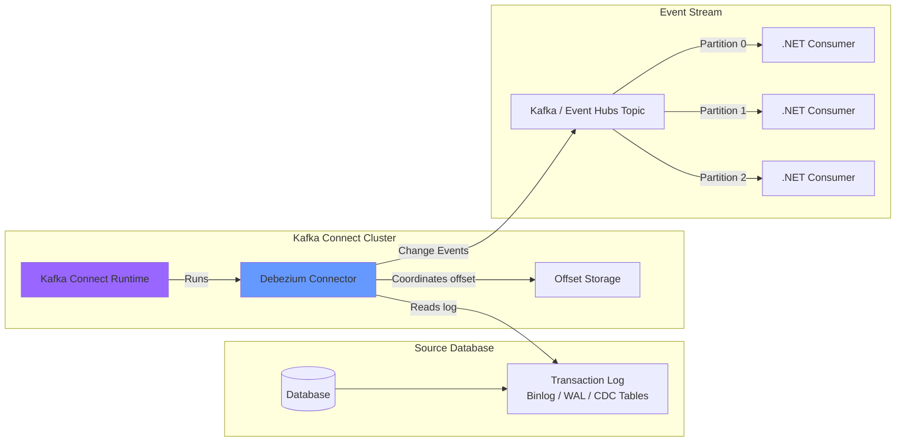
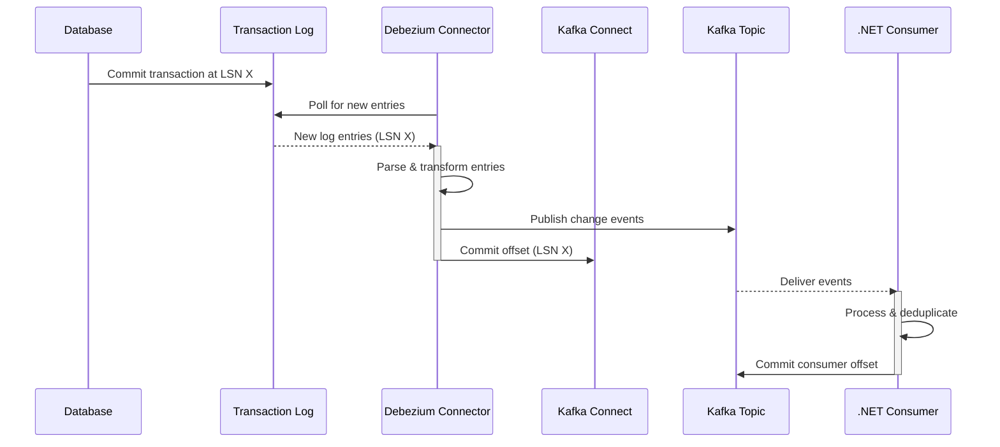
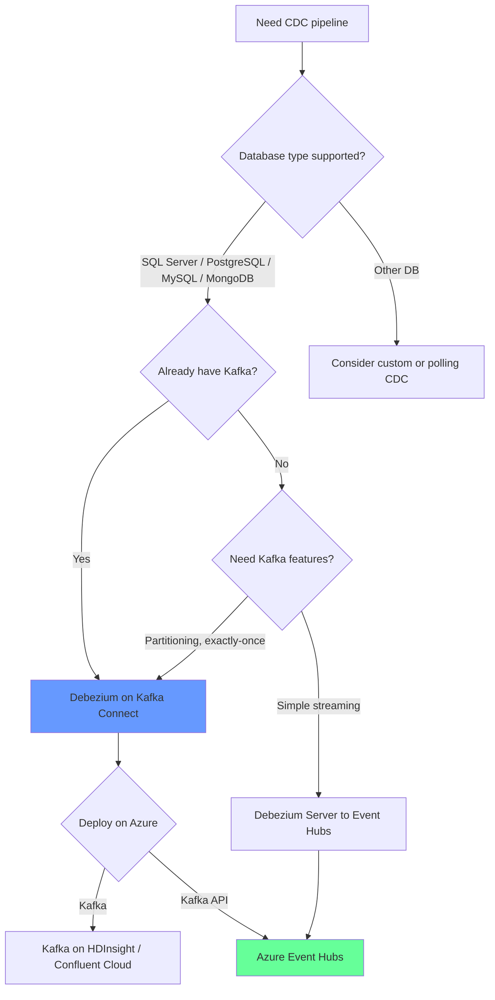
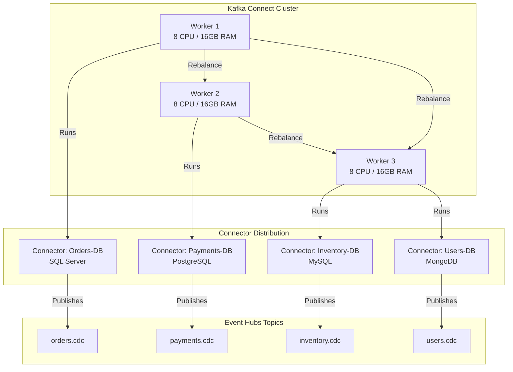
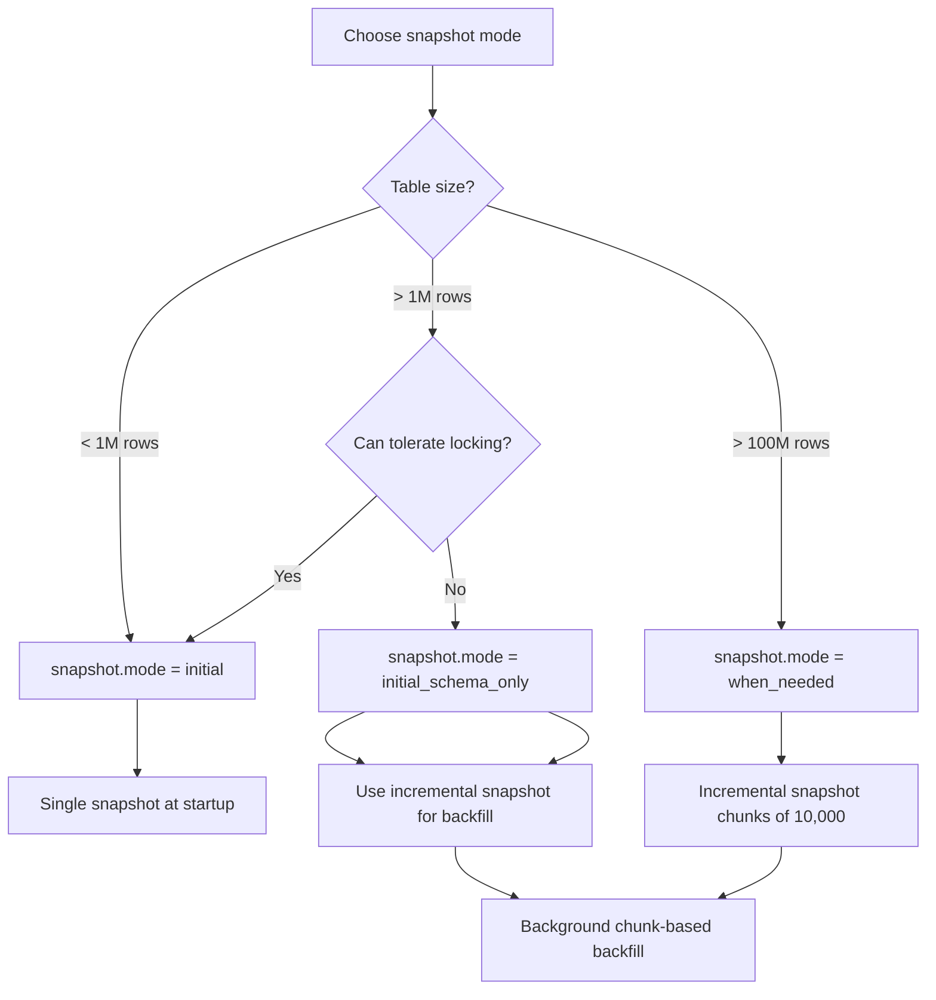

> [!success] Mastery Check
> - [ ] **Studied Well**
> - [ ] **Can explain the concept without notes**
> - [ ] **Can answer interview questions confidently**
> - [ ] **Can implement it in a real project**

## Navigation

**Domain:** [[7 — System Design & Distributed Systems]] > **Group:** Integration Patterns
**Previous:** [[7.135 — Change Data Capture — Concept and Use Cases]] | **Next:** [[7.137 — Change Data Capture — SQL Server CDC]]

### Prerequisites
- [[7.135 — Change Data Capture — Concept and Use Cases]] — required because this note covers the specific implementation of CDC through Debezium
- [[7.137 — Change Data Capture — SQL Server CDC]], [[7.138 — Change Data Capture — PostgreSQL Logical Replication]], [[7.139 — Change Data Capture — MySQL Binlog]] — Debezium has separate connectors for each database

### Where This Fits

Debezium is an open-source distributed CDC platform built on Apache Kafka Connect. It provides connectors for SQL Server, PostgreSQL, MySQL, MongoDB, Oracle, and others, each reading the respective database's transaction log and publishing change events to Kafka. A .NET engineer encounters Debezium when building real-time data pipelines that source from databases, deploying it on Azure Container Instances or AKS with Azure Event Hubs (Kafka API) as the event sink. Debezium is the de facto standard for log-based CDC in the cloud-native ecosystem, used in production at Netflix, LinkedIn, Uber, and Microsoft. Without Debezium, teams would need to build bespoke CDC connectors for each database, which is a significant engineering investment — each connector must handle the database's proprietary log format, manage offset persistence, handle schema evolution, and integrate with a message broker.

## Core Mental Model

Debezium is a Kafka Connect source connector framework that reads database transaction logs and converts them into structured event streams on Apache Kafka. Each Debezium connector is a Kafka Connect `SourceConnector` that connects to a specific database type, reads its proprietary log format, parses log entries into a standardized change event schema (containing before/after images, operation type, source metadata, and LSN), and writes these events to Kafka topics. Single Message Transformations (SMTs) in the Kafka Connect pipeline allow filtering, routing, and transforming events before they reach the topic. The invariant is: each committed database transaction produces a deterministic set of Kafka messages with at-least-once delivery semantics. The cost is operational complexity — Debezium requires a Kafka or Kafka API-compatible broker (like Azure Event Hubs), and the Kafka Connect runtime must be deployed, monitored, and scaled. The recognition trigger is any need to stream database changes to downstream systems with sub-second latency and zero application code changes across multiple database types.





### Classification

Debezium is an infrastructure component in the CDC pipeline. It operates at the Kafka Connect layer — a plugin framework that runs source and sink connectors. It solves the problem of extracting structured change data from heterogeneous database transaction logs. It does not solve downstream data processing (consumers must implement their own business logic), schema management (though it integrates with Confluent Schema Registry), or exactly-once delivery to consumers (Kafka's at-least-once guarantees mean consumers must deduplicate). Debezium is database-format-agnostic at the API level — all connectors produce events in the same structure regardless of the source database type, enabling unified consumer code.

### Key Properties / Guarantees

|Property|Value|Condition|
|---|---|---|
|Delivery guarantee|At-least-once to Kafka|Consumer must deduplicate|
|Ordering|Per-table, per-primary-key commit order|Single partition per topic|
|Latency|Sub-second (log poll interval configurable)|Default 100ms poll interval|
|Schema management|Avro/Protobuf/JSON via Schema Registry|Schema Registry integration built-in|
|Offset management|Kafka topic or file|Connector resumes from committed offset|
|Snapshot mode|Initial snapshot then incremental log|Configurable (`initial`, `always`, `never`, `when_needed`)|
|Connector ecosystem|SQL Server, PostgreSQL, MySQL, MongoDB, Oracle, Db2, Vitess|Community and Confluent-verified connectors|
|Exactly-once sources|Kafka Connect Single Message Transform (SMT) for idempotent writes|Best-effort; at-least-once is the practical guarantee|

## Deep Mechanics

### How It Works

**Step 1 — Connector deployment.** A Debezium connector is deployed as a Kafka Connect plugin. The connector configuration specifies the source database connection, the tables to capture (`table.include.list`), the topic naming convention, and the snapshot mode. The Kafka Connect cluster manages the connector lifecycle (start, stop, rebalance). Configuration is submitted via the Kafka Connect REST API (`POST /connectors/{name}/config`). The cluster distributes connector tasks across workers, providing fault tolerance.

**Step 2 — Snapshot.** On initial start, the connector takes a consistent snapshot of the configured tables. It reads the current table state, records the current log position, and publishes a snapshot event for each row. After the snapshot, it transitions to streaming mode where it reads only new log entries. The snapshot is marked with an operation type "r" (read) to distinguish it from streaming events. For large tables, incremental snapshots (chunked reads of 10,000 rows) minimize the impact on the source database.

**Step 3 — Log streaming.** In streaming mode, the connector reads the transaction log sequentially. For each log entry, it parses the operation (insert/update/delete), applies any configured SMTs, serializes the change event using the configured converter (JSON/Avro/Protobuf), and writes it to the Kafka topic. The connector periodically flushes the offset to Kafka Connect's offset storage, recording the log position. The offset is committed only after the event is acknowledged by Kafka — this ensures at-least-once delivery.

**Step 4 — Schema evolution detection.** Debezium periodically reads the database's table schema. When a schema change is detected, it emits a schema change event to the `schema-changes` topic and updates its internal schema cache. If the schema change is incompatible (e.g., a column is dropped), the connector may fail until the schema cache is manually updated. Schema changes are DDL events — `ALTER TABLE`, `CREATE TABLE`, `DROP TABLE`, etc.

**Step 5 — Consumer processing.** Downstream consumers (written in .NET, Java, Python, etc.) read from the Kafka topics. Each consumer processes change events relevant to its domain. Consumers must handle at-least-once delivery by being idempotent — using upsert operations or deduplication by event key. The consumer commits its offset to Kafka after processing, enabling restart recovery.

**Step 6 — Heartbeat and liveness.** Debezium can be configured to emit heartbeat messages on a separate topic at a configurable interval (e.g., every 5 seconds). This allows monitoring systems to detect that the connector is alive even during periods of no database changes. Heartbeats are useful for detecting stalled connectors that are not processing new log entries.

### Failure Modes

**Connector task failure.** The Debezium connector task crashes due to a bug or transient error. Kafka Connect retries the task. If the task fails repeatedly, Kafka Connect stops the connector and waits for manual intervention.

- **Detection:** Kafka Connect REST API shows connector status = `FAILED`. Log output before failure shows the exception (NullPointerException, database connection timeout, schema parse error).
- **Recovery:** Restart the connector via API (`PUT /connectors/{name}/restart`). Investigate the failure cause in logs. If the failure is due to a schema mismatch, update the schema cache before restarting.
- **Prevention:** Configure Kafka Connect with task restart limits. Monitor connector status with alerts on `FAILED` state. Use circuit breaker patterns in custom SMTs to avoid repeated failures.

**Offset commit lost.** The connector writes the offset to a Kafka topic (`connect-offsets`), but the offset topic is unavailable. The connector cannot record its progress. On restart, it may replay events from an earlier position.

- **Detection:** Connector logs: "Failed to commit offset." Consumer observes duplicate events across restarts.
- **Recovery:** The connector retries offset commits. If the offset topic is down, the connector should pause event processing until the offset can be committed.
- **Prevention:** Ensure the offset topic has sufficient replication factor (3) and is monitored. Use a Kafka cluster with guaranteed availability for offsets. In Azure Event Hubs, the offset topic is automatically replicated.

**Schema change causes deserialization failure.** A column is dropped from the source table. The Debezium connector emits an event with the new schema (without the dropped column). A consumer that was expecting the dropped column fails to deserialize the event.

- **Detection:** Consumer logs: `DeserializationException`. Consumer goes into error state. Consumer lag increases because the consumer cannot process events.
- **Recovery:** Update the consumer to handle the new schema. For forward compatibility, use Avro with Schema Registry and set the consumer's schema compatibility mode to `BACKWARD`.
- **Prevention:** Never drop columns from CDC-tracked tables — deprecate them instead. Use schema evolution best practices: additive changes only for backward compatibility. Set `column.masking.hash` in Debezium to mask sensitive columns during migration.

**Kafka Connect rebalance drops partitions.** A Kafka Connect worker crashes. The cluster rebalances connector tasks across remaining workers. During rebalancing (which can take 30-90 seconds), no CDC events are processed. After rebalance, some topics may be reassigned to different workers.

- **Detection:** CDC latency spikes. The `cdc_lag_seconds` metric increases during rebalancing.
- **Recovery:** Events accumulated in Kafka during the rebalance are processed once workers resume. No data loss, but latency increases.
- **Prevention:** Use at least 3 Kafka Connect workers. Configure `connect.protocol = sessioned` for faster rebalancing (connectors resume without full rebalance). Set `task.shutdown.graceful.timeout.ms = 30000`.

**Database connection loss.** The source database restarts or becomes unreachable. The Debezium connector loses its connection and stops reading the log.

- **Detection:** Connector status = `FAILED`. Logs show `com.mysql.jdbc.exceptions.jdbc4.CommunicationsException` or similar.
- **Recovery:** Kafka Connect retries the connection based on `database.connection.retry.backoff.ms`. If the database is down for an extended period, the connector may need manual restart after the database recovers.
- **Prevention:** Configure the database connection with a connection pool. Use Azure SQL or Azure Database for PostgreSQL with built-in high availability. Set `database.connection.retry.backoff.ms = 1000` and `database.connection.retry.max.attempts = 10`.

### .NET and Azure Integration

- **Azure Event Hubs:** Kafka API-compatible broker — Debezium can publish directly to Event Hubs using the Kafka protocol. No need to run a dedicated Kafka cluster. Event Hubs supports Kafka consumer groups, offset management, and partitioning.
- **Azure Container Instances / AKS:** Deploy Kafka Connect with Debezium connectors as a containerized workload. ACI for simple deployments, AKS for production with scaling and failover.
- **Azure SQL Database:** Debezium SQL Server connector enabled by `sys.sp_cdc_enable_table` — works with Azure SQL's built-in CDC feature
- **Azure Database for PostgreSQL — Flexible Server:** Supports logical replication with `pgoutput` plugin. Debezium PostgreSQL connector uses this.
- **Azure Database for MySQL — Flexible Server:** Supports binlog CDC. Debezium MySQL connector uses this with `binlog_format = ROW`.
- **Azure Schema Registry:** Debezium supports Avro with Schema Registry. The Azure Schema Registry (part of Event Hubs) can serve as the schema registry for Debezium Avro events.
- **.NET Consumer SDK:** `Azure.Messaging.EventHubs` Kafka-compatible client, or `Confluent.Kafka` .NET client for direct Kafka protocol access

```csharp
// Debezium connector configuration (JSON — submitted to Kafka Connect API)
{
  "name": "orders-connector",
  "config": {
    "connector.class": "io.debezium.connector.sqlserver.SqlServerConnector",
    "database.hostname": "orders-sql.database.windows.net",
    "database.port": "1433",
    "database.user": "cdc_user",
    "database.password": "${DB_PASSWORD}",
    "database.dbname": "ecommerce",
    "database.server.name": "orders-server",
    "table.include.list": "dbo.Orders,dbo.OrderItems",
    "database.history.kafka.bootstrap.servers": "eventhub-namespace.servicebus.windows.net:9093",
    "database.history.kafka.topic": "orders-schema-changes",
    "database.history.producer.sasl.jaas.config": "org.apache.kafka.common.security.plain.PlainLoginModule required username=\"$ConnectionString\" password=\"${EVENTHUB_CONNECTION_STRING}\";",
    "database.history.producer.security.protocol": "SASL_SSL",
    "database.history.producer.sasl.mechanism": "PLAIN",
    "key.converter": "org.apache.kafka.connect.json.JsonConverter",
    "value.converter": "org.apache.kafka.connect.json.JsonConverter",
    "value.converter.schemas.enable": "false",
    "snapshot.mode": "initial",
    "tombstones.on.delete": "false",
    "heartbeat.interval.ms": "5000",
    "max.batch.size": "10000",
    "max.queue.size": "50000"
  }
}
```

## Production Patterns and Implementation

### Primary Implementation

Deploying Debezium on Azure Event Hubs with Kafka Connect in AKS and a .NET consumer. This is the most common production pattern for .NET shops using CDC on Azure.

```csharp
// Debezium connector for SQL Server — deployment via Kafka Connect REST API
public sealed class DebeziumDeployer
{
    private readonly HttpClient _httpClient;

    public DebeziumDeployer(HttpClient httpClient)
    {
        _httpClient = httpClient;
    }

    public async Task DeployConnectorAsync(
        DebeziumConnectorConfig config,
        CancellationToken ct)
    {
        var payload = JsonSerializer.SerializeToDocument(new
        {
            name = config.Name,
            config = new Dictionary<string, string>
            {
                ["connector.class"] = config.ConnectorClass,
                ["database.hostname"] = config.Hostname,
                ["database.port"] = config.Port,
                ["database.user"] = config.User,
                ["database.password"] = config.Password,
                ["database.dbname"] = config.DatabaseName,
                ["database.server.name"] = config.ServerName,
                ["table.include.list"] = config.TableIncludeList,
                ["database.history.kafka.bootstrap.servers"] = config.EventHubConnectionString,
                ["database.history.kafka.topic"] = $"{config.ServerName}-schema-changes",
                ["key.converter"] = "org.apache.kafka.connect.json.JsonConverter",
                ["value.converter"] = "org.apache.kafka.connect.json.JsonConverter",
                ["value.converter.schemas.enable"] = "false",
                ["snapshot.mode"] = config.SnapshotMode,
                ["tombstones.on.delete"] = "false",
                ["heartbeat.interval.ms"] = "5000"
            }
        });

        var response = await _httpClient.PutAsync(
            $"{config.KafkaConnectUrl}/connectors/{config.Name}/config",
            new StringContent(
                payload.RootElement.GetRawText(),
                Encoding.UTF8,
                "application/json"),
            ct);

        response.EnsureSuccessStatusCode();

        _logger.LogInformation(
            "Deployed Debezium connector: {Name} to {Cluster}",
            config.Name, config.KafkaConnectUrl);
    }
}

// .NET CDC consumer with deduplication
public sealed class OrderChangeConsumer : BackgroundService
{
    private readonly IConsumer<string, string> _consumer;
    private readonly ISearchIndexClient _searchClient;
    private readonly IDeduplicationStore _dedup;
    private readonly ILogger<OrderChangeConsumer> _logger;

    public OrderChangeConsumer(
        IConsumer<string, string> consumer,
        ISearchIndexClient searchClient,
        IDeduplicationStore dedup,
        ILogger<OrderChangeConsumer> logger)
    {
        _consumer = consumer;
        _searchClient = searchClient;
        _dedup = dedup;
        _logger = logger;
    }

    protected override async Task ExecuteAsync(CancellationToken ct)
    {
        _consumer.Subscribe("orders-server.dbo.Orders");

        while (!ct.IsCancellationRequested)
        {
            try
            {
                var result = _consumer.Consume(ct);

                // Deduplicate by Kafka offset
                var eventKey = $"{result.Topic}:{result.Partition}:{result.Offset}";
                if (await _dedup.AlreadyProcessedAsync(eventKey, ct))
                    continue;

                var changeEvent = JsonSerializer.Deserialize<ChangeEvent>(result.Message.Value);
                await ApplyChangeAsync(changeEvent, ct);

                await _dedup.MarkProcessedAsync(eventKey, ct);
                _consumer.Commit(result);
            }
            catch (ConsumeException ex) when (ex.Error.IsLocalError)
            {
                _logger.LogError(ex, "CDC consume error — local issue");
                await Task.Delay(1000, ct);
            }
            catch (ConsumeException ex) when (ex.Error.IsFatal)
            {
                _logger.LogCritical(ex, "Fatal CDC consume error — shutting down");
                throw;
            }
        }
    }

    private async Task ApplyChangeAsync(ChangeEvent changeEvent, CancellationToken ct)
    {
        if (changeEvent is null) return; // Tombstone handling

        var doc = new SearchDocument
        {
            ["id"] = changeEvent.Key,
            ["status"] = changeEvent.After?.Status,
            ["lastModified"] = changeEvent.Timestamp
        };
        await _searchClient.UpsertDocumentAsync("orders", doc, ct);
    }
}
```

### Configuration and Wiring

```yaml
# Kafka Connect deployment manifest (AKS)
apiVersion: apps/v1
kind: Deployment
metadata:
  name: kafka-connect-debezium
spec:
  replicas: 2
  selector:
    matchLabels:
      app: kafka-connect
  template:
    metadata:
      labels:
        app: kafka-connect
    spec:
      containers:
      - name: kafka-connect
        image: debezium/connect:2.5
        env:
        - name: BOOTSTRAP_SERVERS
          value: "eventhub-namespace.servicebus.windows.net:9093"
        - name: CONFIG_STORAGE_TOPIC
          value: "connect-configs"
        - name: OFFSET_STORAGE_TOPIC
          value: "connect-offsets"
        - name: STATUS_STORAGE_TOPIC
          value: "connect-status"
        - name: KEY_CONVERTER
          value: "org.apache.kafka.connect.json.JsonConverter"
        - name: VALUE_CONVERTER
          value: "org.apache.kafka.connect.json.JsonConverter"
        - name: CONNECT_SASL_JAAS_CONFIG
          value: "org.apache.kafka.common.security.plain.PlainLoginModule required username=\"$ConnectionString\" password=\"${EVENTHUB_CONNECTION_STRING}\";"
        - name: CONNECT_SECURITY_PROTOCOL
          value: "SASL_SSL"
        - name: CONNECT_SASL_MECHANISM
          value: "PLAIN"
        - name: CONNECT_PRODUCER_MAX_REQUEST_SIZE
          value: "10485760"
        - name: CONNECT_CONSUMER_MAX_PARTITION_FETCH_BYTES
          value: "10485760"
---
apiVersion: v1
kind: Service
metadata:
  name: kafka-connect-api
spec:
  selector:
    app: kafka-connect
  ports:
  - port: 8083
    targetPort: 8083
```

```csharp
// Program.cs — .NET consumer registration with Confluent.Kafka
builder.Services.AddSingleton<IConsumer<string, string>>(sp =>
{
    var config = sp.GetRequiredService<IConfiguration>();
    var consumerConfig = new ConsumerConfig
    {
        BootstrapServers = config["EventHubs:ConnectionString"],
        GroupId = "cdc-orders-consumer",
        AutoOffsetReset = AutoOffsetReset.Earliest,
        EnableAutoCommit = false,
        SecurityProtocol = SecurityProtocol.SaslSsl,
        SaslMechanism = SaslMechanism.Plain,
        SaslUsername = "$ConnectionString",
        SaslPassword = config["EventHubs:ConnectionString"]
    };
    return new ConsumerBuilder<string, string>(consumerConfig).Build();
});

builder.Services.AddSingleton<IDeduplicationStore, RedisDeduplicationStore>();
builder.Services.AddHostedService<OrderChangeConsumer>();
```

### Common Variants

**Debezium Server (standalone mode).** For simpler deployments that do not need Kafka Connect's cluster features, Debezium Server runs as a single JAR that reads from the source database and writes directly to a target (Event Hubs, Pulsar, Google Pub/Sub). No Kafka cluster needed. Tradeoff: no scaling, no offset management via Kafka — offset is stored in a file on disk.

```bash
# Debezium Server to Event Hubs
QUARKUS_PROFILE=sqlserver \
  debezium-server \
  -Ddebezium.source.connector.class=io.debezium.connector.sqlserver.SqlServerConnector \
  -Ddebezium.source.database.hostname=orders-sql.database.windows.net \
  -Ddebezium.source.database.dbname=ecommerce \
  -Ddebezium.sink.type=eventhubs \
  -Ddebezium.sink.eventhubs.connection.string=${EVENTHUB_CONNECTION_STRING}
```

**Debezium with outbox table.** Debezium includes a built-in SMT (`io.debezium.transforms.outbox.EventRouter`) that reads from an application's outbox table and routes events to Kafka topics by event type and aggregate ID. This bridges the gap between the outbox pattern and CDC — the application writes structured domain events to an outbox table, and Debezium captures them as CDC records and transforms them into clean domain events. The SMT pipeline typically is: `ExtractNewRecordState` → `EventRouter`.

**Snapshot isolation and incremental snapshots.** The snapshot process reads the entire table. For large tables (millions of rows), the snapshot can take hours and impact source database performance. Use `snapshot.mode = "when_needed"` with incremental snapshots to capture only changed rows after the initial snapshot. Incremental snapshots process chunks of 10,000 rows with configurable chunk size, avoiding long-running table locks.

**Multi-database sharding.** For systems exceeding 50,000 changes/second, partition the source database by logical shard (e.g., by customer region: `us_east`, `us_west`, `eu_west`). Each shard has its own Debezium connector publishing to a separate topic. Downstream consumers read from all shard topics and merge the streams.

### Real-World .NET Ecosystem Example

**Debezium is used by Microsoft internally** for several Azure service data pipelines. The SQL Server connector is the most deployed connector in the Azure ecosystem because of the prevalence of SQL Server in .NET applications. In the open-source .NET community, Debezium is often used alongside MassTransit: Debezium captures database changes to Kafka/Event Hubs, and MassTransit consumes these events using its Kafka transport (`MassTransit.Kafka`), bridging the CDC pipeline into the application's messaging infrastructure.

**GitLab** uses Debezium with PostgreSQL for real-time replication from their primary database to their search index and analytics systems. **Netflix** uses Debezium to stream database changes from their various databases to Apache Kafka for real-time processing. **LinkedIn** uses Debezium for streaming data integration across their Oracle and MySQL databases.

## Gotchas and Production Pitfalls

### 1. Kafka Connect cluster rebalancing causes latency spikes

**Pitfall:** A Kafka Connect worker crashes. The cluster detects the failure and rebalances connector tasks across remaining workers. During rebalancing (which can take 30-60 seconds for large clusters), no CDC events are processed.

**Symptom:** CDC latency spikes. Downstream systems are stale for the duration of the rebalance. If the rebalance happens during peak traffic, the log backlog grows significantly.

**Fix:** Use at least 3 Kafka Connect workers. Configure `connect.protocol` = `sessioned` for faster rebalancing. Set `task.shutdown.graceful.timeout.ms` to allow tasks to finish before rebalancing.

**Cost of not fixing:** Latency spikes that can exceed downstream SLA (e.g., 30-second cache invalidation target). Repeated rebalances cause cascading delays.

### 2. Event Hubs Kafka API compatibility limitations

**Pitfall:** Azure Event Hubs' Kafka API does not support all Kafka features. Debezium's `database.history.kafka.topic` requires the `createTopics` Kafka admin operation, which Event Hubs does not support in all tiers.

**Symptom:** Connector fails to create the schema history topic. Error: "Topic creation not supported."

**Fix:** Pre-create topics in Event Hubs. Event Hubs creates topics when a producer first writes to them, but this depends on auto-creation being enabled. Pre-create the required topics (`connect-configs`, `connect-offsets`, `connect-status`, `schema-changes`) with the correct partition count. Use Azure CLI or ARM templates to create Event Hubs topics before deploying the connector.

**Cost of not fixing:** Connector fails to start. Every new connector instance requires manual topic creation. No automated deployment possible.

### 3. Tombstone events for deletes cause consumer errors

**Pitfall:** Debezium emits tombstone events (null value) for row deletes. Some consumers expect a non-null value and crash when they receive a tombstone.

```csharp
// ❌ Consumer does not handle null values
var changeEvent = JsonSerializer.Deserialize<ChangeEvent>(result.Message.Value);
```

**Symptom:** Consumer crashes on every row deletion. The deletion event is not processed. The target system retains stale data.

**Fix:** Set `tombstones.on.delete = false` in the connector configuration. Or handle null values in the consumer.

```csharp
// ✅ Handle null values (tombstone)
if (result.Message.Value is null)
{
    var key = JsonSerializer.Deserialize<RowKey>(result.Message.Key);
    await _searchClient.DeleteDocumentAsync("orders", key.Id, ct);
    return;
}
```

**Cost of not fixing:** Consumer crashes on every delete. Search index never reflects deleted documents. If the consumer does not crash but silently ignores null, deletes are lost silently.

### 4. Connector configuration changes require restart

**Pitfall:** You add a new table to `table.include.list`. Kafka Connect applies the configuration change, but the connector only starts reading the new table after a restart.

**Symptom:** The new table's changes are not being captured. Engineers wait hours before realizing the connector needs a restart. Schema changes for the new table may also cause issues.

**Fix:** After updating a Debezium connector configuration, always restart the connector via the Kafka Connect REST API: `POST /connectors/{name}/restart`.

**Cost of not fixing:** Delayed data availability. New tables may not be synced for days. Business stakeholders report missing data in downstream systems.

### 5. Large snapshot impacts source database

**Pitfall:** The initial snapshot reads 10 million rows from the Orders table. The query performs a table scan, which locks the table for minutes. Production writes are blocked.

**Symptom:** Database performance degrades. Write latency spikes. Application users experience timeouts. The DBA team receives alerts.

**Fix:** Use `snapshot.mode = "initial_schema_only"` to skip the data snapshot and start streaming from the current log position. Then use an incremental snapshot to backfill existing data without locking. Alternatively, run the snapshot on a replica database.

```json
"snapshot.mode": "initial_schema_only",
"incremental.snapshot.chunk.size": 10000
```

**Cost of not fixing:** Production incident on first deployment. The DBA team blocks all future CDC deployments. The trust deficit between the platform team and DBA team takes months to repair.

### 6. Connector offset lost due to topic compaction

**Pitfall:** The `connect-offsets` Kafka topic has `cleanup.policy = compact,delete` with a short retention. Old offset entries for inactive connectors are removed. When the connector restarts, it cannot find its offset and starts from the earliest available position, replaying all events.

**Symptom:** Consumer observes a flood of duplicate events after connector restart. The connector replays weeks of old changes.

**Fix:** Set the offset topic's retention to a longer period (e.g., 7 days). Or ensure the connector is properly stopped before long downtime — stopping the connector gracefully writes a final offset.

**Cost of not fixing:** Massively duplicate events overwhelm downstream consumers. The broker experiences a traffic spike. The target system must process millions of stale changes.

### 7. Schema history topic corruption

**Pitfall:** The `database.history.kafka.topic` that stores table schema history becomes corrupted or is truncated. The Debezium connector cannot rebuild its schema cache on restart. It fails to decode binlog/WAL events because it does not know the table structure.

**Symptom:** Connector fails on restart: "Cannot find schema for table X." The schema history topic has fewer entries than expected.

**Fix:** Stop the connector, delete the schema history topic, and force a re-snapshot. The connector recreates the schema history from the current schema.

**Cost of not fixing:** Connector is permanently broken. No CDC processing until manual intervention. Recovery requires a full re-snapshot of all tracked tables.

### 8. Timezone and timestamp handling differences

**Pitfall:** The source database stores timestamps without timezone information. Debezium emits the timestamp as a Unix epoch milliseconds value. The .NET consumer interprets it in its local timezone, causing a timezone shift in event timestamps.

**Symptom:** Downstream systems show event timestamps shifted by several hours. Time-based queries return incorrect results.

**Fix:** Configure Debezium to use UTC for all timestamp columns (`database.include.utc.timezone = true`). In the .NET consumer, always convert timestamps to UTC before processing.

```json
"converters": "timestamp",
"timestamp.type": "io.debezium.time.Timestamp",
"timestamp.format": "yyyy-MM-dd'T'HH:mm:ss'Z'"
```

**Cost of not fixing:** Silent data corruption in time-series analysis. Incorrect SLA calculations. Debugging timezone bugs across the pipeline takes days.

## Tradeoffs and Decision Framework

### Tradeoff Matrix

|Dimension|Debezium + Kafka|Debezium Server (standalone)|Custom CDC Connector|Polling CDC (no Debezium)|
|---|---|---|---|---|
|Operational complexity|High (Kafka Connect cluster)|Medium (single JVM)|Very high (build + maintain)|Low (scheduled job)|
|Scalability|High (partitioned, distributed)|Single node|Depends on implementation|Low (single poller)|
|Connector ecosystem|10+ database connectors|Limited (per DB type)|Just your DB|Any DB with SQL access|
|Offset management|Kafka topic (durable)|File or DB|Custom implementation|LSN stored in control table|
|Schema management|Schema Registry + SMTs|Limited|Custom|Column-based adaptation|
|.NET ecosystem fit|Event Hubs + Kafka consumer|Event Hubs sink|Full control|SqlClient / EF Core|
|Recovery after failure|Automatic (offset replay)|Manual (file-based)|Custom|Manual (LSN tracking)|
|Learning curve|Steep (Kafka + Kafka Connect)|Medium|Very steep|Low|

### When to Apply



### When NOT to Apply

- [ ] The source database does not have a Debezium connector — building a custom connector is a major investment (6-12 months for a production-quality connector)
- [ ] The team has no Kafka experience — Debezium's operational complexity is significant and troubleshooting requires understanding Kafka internals
- [ ] Change volume is very low (< 100 changes/hour) — polling CDC with a simple scheduled job is easier and cheaper
- [ ] The latency requirement is > 1 minute — polling CDC is simpler and cheaper, no Kafka infrastructure needed
- [ ] The source application already publishes events via the outbox pattern — Debezium adds unnecessary infrastructure unless raw data changes are also needed
- [ ] The team cannot run JVM processes — Debezium is a Java application; the JVM must be managed, monitored, and tuned
- [ ] The schema of CDC-tracked tables changes frequently (multiple times per week) — each change risks breaking the connector

### Scale Thresholds

- **< 10,000 changes/second:** Single Kafka Connect worker with 1-2 connector tasks. Debezium Server is also viable. JSON serialization is sufficient.
- **10,000-50,000 changes/second:** Kafka Connect cluster with 3-5 workers, sharded connectors per database. Use Avro serialization to reduce payload size and improve throughput.
- **> 50,000 changes/second:** Partition source database by shard, each with its own Debezium connector and Kafka topic partition. Use Avro with Schema Registry to minimize serialization overhead. Consider using multiple Kafka clusters for isolation.

## Interview Arsenal

### Question Bank

1. What is Debezium and how does it fit into the CDC architecture?
2. How does Debezium use Kafka Connect?
3. What happens during the initial snapshot?
4. How does Debezium handle schema changes?
5. Compare Debezium with SQL Server's built-in CDC.
6. What is a Single Message Transformation (SMT) in Debezium?
7. How does Debezium ensure at-least-once delivery?
8. What happens when a Debezium connector fails and restarts?
9. How does Debezium handle large transactions with millions of row changes?
10. What are the operational differences between Debezium on Kafka vs Debezium Server?

### Spoken Answers

**Q: What is Debezium and how does it fit into the CDC architecture?**

> **Great answer:** "Debezium is an open-source CDC platform built on Apache Kafka Connect. It provides connectors that read the transaction log of various databases — SQL Server, PostgreSQL, MySQL, MongoDB, Oracle — and stream change events to Apache Kafka or Kafka API-compatible brokers like Azure Event Hubs. In the CDC architecture, Debezium sits between the source database and the event broker. The connector reads the database's transaction log (the binlog for MySQL, the WAL for PostgreSQL, the CDC tables for SQL Server), parses each log entry into a standardized change event with before/after images and metadata, and publishes the event to a Kafka topic. Kafka Connect handles the operational concerns: offset management (so the connector knows where to resume after a crash), configuration updates, and scaling across workers. Debezium handles the database-specific log parsing and event schema. The combination means you get a reliable, scalable CDC pipeline without writing any custom log-reading code. The key insight is that Debezium abstracts away the database-specific log format — your .NET consumer receives the same event structure regardless of whether the source is SQL Server, PostgreSQL, or MySQL."

> **Average answer:** "Debezium is a tool that reads database logs and sends them to Kafka." (Missing Kafka Connect role, no mention of the standardized event format, no database-specific parsing.)

**Q: How does Debezium handle schema changes?**

> **Great answer:** "Debezium handles schema changes through a schema change topic and periodic schema cache refreshes. When the connector starts, it reads the current schema of the tracked tables and stores it in a schema history topic (a separate Kafka topic). As the database processes DDL statements (ALTER TABLE, CREATE TABLE), Debezium emits schema change events to this topic and updates its internal cache. There are three categories of schema changes. For additive changes — adding a column — the connector can usually continue processing; new columns appear in the change events. For destructive changes — dropping a column — the connector may fail to deserialize log entries that reference the dropped column, because its schema cache still expects it. For data type changes — changing a column from INT to BIGINT — the connector may produce events with the old type until the cache is refreshed. The solution is to use a Schema Registry with Avro. Avro schema evolution supports backward-compatible changes: adding a column with a default value is backward-compatible, but dropping a column is not. For non-additive changes, you need to coordinate: pause the connector, apply the schema migration, update the connector configuration or schema registry, and restart. In practice, the safest approach for CDC-tracked tables is to never drop or rename columns — only add columns with default values, and deprecate old columns in application code before eventually removing them."

**Q: What is a Single Message Transformation (SMT) in Debezium?**

> **Great answer:** "An SMT is a Kafka Connect transformation that modifies individual messages flowing through the connector pipeline. Debezium includes several built-in SMTs and you can write custom ones. The most useful SMTs are: `EventRouter` — reads events from the outbox table and routes them to topic names based on event type and aggregate ID, turning raw CDC events into clean domain events. `ExtractNewDocumentState` — for MongoDB, extracts the updated document fields from the change event payload. `ValueToKey` — extracts a field from the event value and uses it as the Kafka message key, enabling topic compaction and ordering by business key. `InsertField` — adds metadata fields (like the server name or table name) to each event. SMTs are applied in order in the connector configuration. For example, the outbox SMT pipeline might be: `ExtractNewRecordState` (flatten the event) -> `EventRouter` (route by event type). This gives you clean domain events from raw CDC without writing a custom consumer. The power of SMTs is that they run inside Kafka Connect — no separate processing layer needed."

**Q: How does Debezium ensure at-least-once delivery?**

> **Great answer:** "Debezium achieves at-least-once delivery through a two-phase commit between the log read and the offset commit. The connector reads log entries, transforms them, and publishes events to Kafka. Only after Kafka acknowledges the publish (by writing to all in-sync replicas) does the connector commit the offset — recording the LSN of the last successfully published event. If the connector crashes between publishing and offset commit, on restart it resumes from the last committed offset, which is before the last published event. This means events are replayed. Downstream consumers must be idempotent. The guarantee is not exactly-once — that would require transactional coordination between Kafka and the source database, which is not practical for CDC. The tradeoff is that at-least-once is simpler and provides stronger availability: the connector never blocks waiting for a distributed transaction. If you need exactly-once delivery to a specific sink (e.g., exactly-once to Snowflake), you can use Kafka Connect's sink connector with idempotent writes to the target system."

### System Design Interview Trigger

When the interviewer asks "how do you stream database changes to a search index in real time?" and you propose Debezium, they will follow up on operational complexity. The senior answer acknowledges that Debezium requires Kafka Connect infrastructure and that the team must be prepared to operate it. If the team cannot commit to this, the alternative (polling CDC with a scheduled job) should be named, along with its tradeoff of higher latency. The interviewer may also probe on "what happens when the source database schema changes?" — testing schema registry knowledge and the `database.history.kafka.topic` mechanism.

### Comparison Table

| | Debezium + Kafka | SQL Server Built-in CDC | Polling CDC | Custom CDC Connector |
|---|---|---|---|---|
| Latency | Milliseconds | Milliseconds (capture job interval) | Poll interval (seconds to minutes) | Depends on implementation |
| Operational complexity | High (Kafka + Kafka Connect) | Low (SQL Agent jobs) | Low (scheduled job) | Very high (build + maintain) |
| Scalability | High (partitioned Kafka topics) | Medium (single capture instance per DB) | Low (single poller) | Custom |
| Schema management | Schema Registry + SMTs | T-SQL queries on change tables | ADO.NET code | Custom |
| .NET integration | Event Hubs / Kafka consumer | `SqlDataReader` on change tables | EF Core / Dapper | Custom code |
| Database support | 10+ databases | SQL Server only | Any database with change tracking | Just your DB |
| Snapshot capability | Built-in (incremental) | Manual | Manual | Custom |

## Architecture Decision Record

**Status:** Accepted

**Context:** An enterprise has 20 SQL Server databases, each with 50-200 tables. The data warehouse team needs real-time change streams from all tables into Snowflake. The team has 5 platform engineers with Kafka experience. The existing batch ETL (nightly full loads) takes 8 hours and misses the business's new real-time reporting requirement. The desired latency is < 1 minute from commit to availability in Snowflake. The total change volume across all databases is approximately 30,000 changes/second during peak hours.

**Options Considered:**

1. **Debezium on Kafka Connect** — Debezium SQL Server connectors for each DB, Kafka cluster for event streaming, Snowflake Kafka sink connector
2. **Azure Data Factory CDC** — ADF mapping data flows with CDC enabled, Snowflake as sink
3. **Custom .NET CDC service** — Custom service that polls SQL Server CDC tables and writes to Snowflake via ODBC
4. **Debezium Server per database** — Single JVM per database, writing directly to Event Hubs, with a separate Snowflake sink

**Decision:** Debezium on Kafka Connect (option 1), because it provides the lowest latency, handles schema evolution via the registry, and the team's existing Kafka expertise reduces the learning curve. The Kafka-Snowflake sink connector handles the final hop without custom code. The 30,000 changes/second throughput is within a single Kafka Connect cluster's capacity with 5 workers.

**Consequences:**
- ✅ Sub-second latency from DB commit to Snowflake arrival (meets < 1 minute SLA)
- ✅ Schema Registry ensures consumers are not broken by additive schema changes
- ✅ Existing Kafka skills in the team reduce ramp-up time
- ⚠️ Must deploy Kafka Connect cluster (5 nodes) and Kafka brokers (3 nodes) — infrastructure cost
- ⚠️ Each DDL change on source tables requires schema registry coordination — DBA team must add schema registry steps to migration runbooks
- ⚠️ 20 separate Debezium connectors to manage — config management becomes significant; use a config management tool (Ansible, Terraform)
- ❌ If Kafka Connect cluster goes down, all 20 CDC pipelines stop simultaneously

**Review Trigger:** Revisit if the number of source databases grows beyond 50, at which point Debezium connector configuration management becomes a burden and a managed CDC service (e.g., Airbyte, Fivetran) should be evaluated. Also revisit if Snowflake's Kafka connector cannot keep up with peak throughput — at that point, consider using Snowpipe streaming API with a custom .NET consumer instead of the Kafka sink connector.

## Self-Check

### Conceptual Questions

1. What is Debezium and what problem does it solve?
2. How does Debezium integrate with Kafka Connect?
3. What is the initial snapshot and why is it needed?
4. How does Debezium handle schema evolution?
5. Compare Debezium with SQL Server's built-in CDC.
6. What is a Single Message Transformation?
7. How do you deploy Debezium on Azure?
8. What happens when a Debezium connector crashes?
9. What is the `database.history.kafka.topic` used for?
10. Explain in 60 seconds how to set up a Debezium pipeline for SQL Server to Event Hubs.

<details>
<summary>Answers</summary>

1. Debezium is an open-source CDC platform built on Kafka Connect. It reads database transaction logs and streams structured change events to Kafka, enabling real-time data synchronization without application code changes. [[7.135 — Change Data Capture — Concept and Use Cases]] covers the broader CDC pattern.

2. Debezium connectors are Kafka Connect source connectors. Kafka Connect manages the connector lifecycle (deploy, start, stop, restart, scale), stores offsets, and handles distribution across workers. Debezium provides the database-specific log reader and event parser. Kafka Connect provides the runtime and scaling infrastructure.

3. The initial snapshot captures the current state of all tracked tables before starting log streaming. It ensures downstream consumers have the full dataset, not just changes from the connector's start time. After the snapshot, the connector streams only incremental changes. Without the snapshot, consumers would only see changes made after the connector started.

4. Debezium stores table schemas in the `database.history.kafka.topic` and refreshes them periodically. Additive schema changes (new columns) are handled automatically — new columns appear in change events. Destructive changes (column drops, renames) require connector restart or schema registry update. Using Avro with Schema Registry provides better schema evolution support through compatibility modes.

5. SQL Server's built-in CDC uses SQL Agent jobs to read the transaction log and populate change tables queried via T-SQL. Debezium reads either the SQL Server log or the CDC tables, but publishes to Kafka/Event Hubs — enabling integration with non-.NET consumers and providing better scalability through Kafka partitioning. Debezium also provides schema management, offset persistence, and a standardized event format.

6. An SMT is a Kafka Connect transformation applied to each message before it reaches the topic. Debezium's `EventRouter` SMT reads from the outbox table and routes events by type. Other SMTs include `ExtractNewRecordState`, `ValueToKey`, and `InsertField`. SMTs run in the Kafka Connect worker, eliminating the need for a separate processing layer.

7. Deploy the Kafka Connect runtime on AKS (Kubernetes) or Azure Container Instances. Use Azure Event Hubs as the Kafka API-compatible broker. Each database gets a Debezium connector configured via the Kafka Connect REST API. Pre-create all required topics (`connect-configs`, `connect-offsets`, `connect-status`, `schema-changes`).

8. Kafka Connect detects the failure, restarts the task, and resumes from the last committed offset. If the task fails repeatedly, the connector enters FAILED state and requires manual restart. The connector resumes from the last committed log position, potentially duplicating events. Downstream consumers must handle this through idempotent processing.

9. The `database.history.kafka.topic` stores the schema history of the tracked database tables. When the connector restarts, it reads this topic to rebuild its internal schema cache. Without it, the connector would not know the table structure for log entries written before the restart. This topic must be retained even when the connector is stopped.

10. "First, enable CDC on the SQL Server tables: `sys.sp_cdc_enable_table`. Second, deploy a Kafka Connect cluster (3 nodes on AKS) with the Debezium SQL Server connector plugin. Third, pre-create all required topics in Event Hubs. Fourth, configure the connector with the database connection details, table filter, and Event Hubs connection string. Fifth, start the connector via the Kafka Connect REST API. The connector takes an initial snapshot of the existing data, publishes it to Event Hubs, then streams changes in real time. Sixth, write a .NET `BackgroundService` that consumes from Event Hubs using `Azure.Messaging.EventHubs`, deserializes the change events, and applies them to the target system. Key configuration: set `snapshot.mode = initial`, `tombstones.on.delete = false`, and pre-create all required Kafka topics. Monitor connector status via the Kafka Connect REST API."

</details>

---

### Scenario Challenges

**Scenario 1 — Diagnose the problem**

A Debezium connector for SQL Server was working for 3 months. After a recent database migration that added 3 new columns to the Orders table, the connector is failing with errors. The DBA says the migration was a simple ALTER TABLE ADD COLUMN.

<details>
<summary>Diagnosis</summary>

**Root cause:** The Debezium connector's internal schema cache did not reflect the new columns. Although Debezium periodically reads the source table schema, the cache refresh interval may have been longer than expected, or the connector's schema history topic may be corrupted. The `ALTER TABLE ADD COLUMN` may have included a NOT NULL constraint that the CDC capture instance did not handle correctly.

**Evidence:** Connector logs: "Column 'DiscountPercent' not found in schema cache. The table 'dbo.Orders' schema has changed." The schema history topic shows the old schema without the new columns.

**Fix:** Force the connector to reload the schema by restarting it: `POST /connectors/orders-connector/restart`. If that does not work, update the schema history topic by stopping the connector, clearing the schema cache, and restarting. Pre-create the schema history topic with infinite retention to avoid future truncation.

**Prevention:** For schema changes on CDC-tracked tables, always restart the Debezium connector after the migration. Better yet, coordinate schema migrations with the CDC pipeline: pause the connector, apply the migration, restart the connector. Use a schema registry to version the event schema independently of the table schema.

</details>

---

**Scenario 2 — Design decision**

Your CDC pipeline needs to process 100,000 changes/second from a PostgreSQL database. The downstream system requires strict ordering for changes to the same primary key. Should you use multiple Kafka partitions?

<details>
<summary>Decision and Reasoning</summary>

**Choice:** Use a single partition per topic for each table. Kafka preserves order within a partition. If you use multiple partitions, changes to the same primary key may be in different partitions, and ordering is lost.

**Tradeoffs accepted:** A single partition can handle 100,000 messages/second in Kafka if messages are small (Debezium events are typically < 1KB). The throughput limit of a single partition is well above 100,000/sec with modern hardware and proper configuration. The tradeoff is that you can only have one consumer per partition for ordered processing, but the consumer can batch-process events. If throughput exceeds a single partition, shard the source table by primary key range, each shard to its own topic with a single partition.

**Implementation sketch:**
```json
// Single partition per topic
"topic.creation.default.replication.factor": 3,
"topic.creation.default.partitions": 1,
"topic.creation.default.cleanup.policy": "compact,delete"
```

</details>

---

**Scenario 3 — Failure mode** A Kafka Connect worker hosting 5 Debezium connectors crashes. The remaining workers rebalance. During the rebalance (which takes 45 seconds), no CDC events are processed. The primary database's transaction log grows by 500MB during the rebalance. After the rebalance, the connectors resume but the lag takes 20 minutes to clear.

<details> <summary>Investigation and Fix</summary>

**Investigation steps:**
1. Why did the worker crash? Check worker logs for OOM, disk full, or network errors.
2. How long was the rebalance? Check rebalance timing metrics.
3. How much log grew during rebalance? Estimate from the write rate × rebalance time.
4. Is the rebalance time acceptable for the SLA?

**Confirming evidence:** Kafka Connect worker logs show the crash reason. Metrics show `rebalance_time_ms = 45000`. Database log growth correlates with rebalance period.

**Immediate mitigation:**
1. Increase the number of Kafka Connect workers to 5 (from 3) to reduce the impact of a single worker failure.
2. Enable sessioned rebalancing: `connect.protocol = sessioned`.
3. Increase `heartbeat.interval.ms = 3000` and `session.timeout.ms = 10000` for faster failure detection.

**Permanent fix:**
1. Implement worker pod disruption budgets in Kubernetes to prevent simultaneous worker restarts.
2. Add connector-level monitoring — alert if any connector's lag exceeds 5 minutes.
3. Increase `max.poll.interval.ms` so connectors are not unnecessarily rebalanced during long poll cycles.

</details>

---

**Scenario 4 — Scale it** Your system currently uses a single Debezium connector processing 5,000 changes/second from one PostgreSQL database. You need to scale to 50,000 changes/second across 5 PostgreSQL databases. How does Debezium fit into the scaling strategy?

<details> <summary>Scaling Strategy</summary>

**Bottleneck this addresses:** A single Debezium connector is limited by its single-threaded log reader. One connector per database is the minimum. At 50,000 changes/second across 5 databases (10,000 each), each database needs its own connector.

**How it helps:** Each Debezium connector operates independently, reading its own database's log. The bottleneck is per-connector, not global. Scale by adding connectors.

**What it does not solve:** If one database generates 50,000 changes/second alone, that connector is the bottleneck. Shard the database: split the table by primary key hash across 5 databases, each with its own connector.

**Implementation order:**
1. First: Deploy 5 connectors (one per database) with independent configuration.
2. Second: Configure each connector to publish to its own Event Hubs topic with 2-4 partitions.
3. Third: Scale the Kafka Connect cluster to 6 workers (5 active + 1 spare).
4. Fourth: Add consumer capacity — each topic has its own consumer group.

</details>

---

**Scenario 5 — Interview simulation** The interviewer says: "You need to sync changes from a legacy SQL Server database to Elasticsearch. The database has 500 tables, but you only need 10. The application cannot be modified. The database team requires that any CDC solution does not degrade database performance."

<details> <summary>Model Response</summary>

"I would use Debezium's SQL Server connector targeting only the 10 required tables via `table.include.list`. To minimize database impact:

"1. For the initial snapshot, I request a maintenance window and run the snapshot during low-traffic hours. I set `snapshot.mode = initially_blocking` with a lock timeout short enough to avoid long blocks. Better yet, I use `snapshot.mode = initial` with an incremental snapshot that reads 10,000 rows at a time without locking the entire table. The incremental snapshot is key — it avoids the table scan lock that would block production writes.

"2. For ongoing streaming, Debezium reads the SQL Server transaction log. Log reading is sequential and lightweight — it does not query the source tables. The database's CDC capture job (running every 30 seconds) does the heavy lifting of parsing the log into change tables. The Debezium connector reads these change tables with a simple SELECT that uses index seeks on the LSN column.

"3. I ensure the CDC capture job runs on a separate schedule from the backup jobs to avoid I/O contention. I monitor `log_lock_waits` and `cdc_lag_seconds` to ensure the pipeline is not impacting database performance.

"4. Performance baseline: Before CDC deployment, I measure the database's baseline CPU, I/O, and log throughput. After deployment, I compare. If there is any degradation, I adjust the capture job interval or the connector's poll interval. I target < 5% CPU increase from CDC.

"5. Alternative for zero impact: If the database team is still concerned, I run the Debezium connector against a readable secondary replica of the database. SQL Server's CDC feature works on secondaries in SQL Server 2022+. The change tables are replicated, so the connector reads from the replica with zero impact on the primary. This is the strongest architectural answer for the database team's requirement."

</details>

---

## Appendix A — Debezium Production Deployment Guide

### Kafka Connect Cluster Sizing



**Sizing guidelines per connector:**
- **CPU:** 1 CPU core per connector task, 2-4 connector tasks per worker
- **Memory:** 4-8 GB heap per worker, plus 2 GB for OS overhead
- **Disk:** 50 GB for connector logs and offset caching
- **Network:** Expect 10-50 Mbps per connector during peak throughput
- **JVM Heap:** Set `KAFKA_HEAP_OPTS=-Xms4g -Xmx8g` for production workloads

### Debezium Connector Configuration Templates

**SQL Server connector with Avro serialization:**

```json
{
  "name": "orders-connector-avro",
  "config": {
    "connector.class": "io.debezium.connector.sqlserver.SqlServerConnector",
    "key.converter": "io.confluent.connect.avro.AvroConverter",
    "key.converter.schema.registry.url": "https://schema-registry.azure.servicebus.windows.net",
    "value.converter": "io.confluent.connect.avro.AvroConverter",
    "value.converter.schema.registry.url": "https://schema-registry.azure.servicebus.windows.net",
    "key.converter.schema.registry.basic.auth.user.info": "${SCHEMA_REGISTRY_KEY}:${SCHEMA_REGISTRY_SECRET}",
    "value.converter.schema.registry.basic.auth.user.info": "${SCHEMA_REGISTRY_KEY}:${SCHEMA_REGISTRY_SECRET}",
    "database.hostname": "orders-sql.database.windows.net",
    "database.port": "1433",
    "database.user": "cdc_user",
    "database.password": "${DB_PASSWORD}",
    "database.dbname": "ecommerce",
    "database.server.name": "orders-server",
    "table.include.list": "dbo.Orders,dbo.OrderItems",
    "database.history.kafka.bootstrap.servers": "eventhub-ns.servicebus.windows.net:9093",
    "database.history.kafka.topic": "orders-schema-changes",
    "database.history.producer.sasl.jaas.config": "org.apache.kafka.common.security.plain.PlainLoginModule required username=\"$ConnectionString\" password=\"${EVENTHUB_CONNECTION_STRING}\";",
    "database.history.producer.security.protocol": "SASL_SSL",
    "database.history.producer.sasl.mechanism": "PLAIN",
    "snapshot.mode": "initial",
    "tombstones.on.delete": "false",
    "heartbeat.interval.ms": "5000",
    "max.batch.size": "10000",
    "max.queue.size": "50000",
    "snapshot.locking.mode": "none",
    "incremental.snapshot.chunk.size": "10000"
  }
}
```

**PostgreSQL connector with heartbeat and slot management:**

```json
{
  "name": "postgres-orders-connector",
  "config": {
    "connector.class": "io.debezium.connector.postgresql.PostgresConnector",
    "plugin.name": "pgoutput",
    "slot.name": "debezium_orders_slot",
    "slot.drop.on.stop": "false",
    "publication.name": "dbz_publication_orders",
    "publication.autocreate.mode": "filtered",
    "database.hostname": "orders-pg.postgres.database.azure.com",
    "database.port": "5432",
    "database.user": "cdc_user",
    "database.password": "${DB_PASSWORD}",
    "database.dbname": "ecommerce",
    "database.server.name": "pg-orders",
    "table.include.list": "public.orders",
    "key.converter": "org.apache.kafka.connect.json.JsonConverter",
    "value.converter": "org.apache.kafka.connect.json.JsonConverter",
    "value.converter.schemas.enable": "false",
    "snapshot.mode": "initial",
    "heartbeat.interval.ms": "5000",
    "heartbeat.action.query": "UPDATE public.heartbeat SET ts = NOW() WHERE id = 1",
    "tombstones.on.delete": "false",
    "max.batch.size": "10000",
    "max.queue.size": "50000",
    "incremental.snapshot.chunk.size": "10000",
    "toast.placement": "include_all_column_values"
  }
}
```

### Debezium Monitoring Setup

**Prometheus JMX Exporter configuration for Debezium:**

```yaml
# jmx_exporter_config.yaml
startDelaySeconds: 0
ssl: false
rules:
  - pattern: "debezium.<connector-type>.<connector-name>.streaming<type=(.*)><attr=(.*)><>(.*)"
    name: "debezium_streaming_$1_$2_$3"
  - pattern: "debezium.<connector-type>.<connector-name>.snapshot<type=(.*)><attr=(.*)><>(.*)"
    name: "debezium_snapshot_$1_$2_$3"
  - pattern: "debezium.<connector-type>.<connector-name>.schema-history<type=(.*)><attr=(.*)><>(.*)"
    name: "debezium_schema_$1_$2_$3"
  - pattern: "kafka.connect.<type=connector-task-metrics><>(.*):"
    name: "kafka_connect_task_$1"
```

**Key JMX metrics to monitor:**

|Metric|Description|Alert Threshold|
|---|---|---|
|`debezium_metrics_StreamingQueueCurrentSize`|Events in connector queue|> 50,000|
|`debezium_metrics_TotalNumberOfEventsSeen`|Events processed since start|Monitor rate|
|`debezium_metrics_MillisecondsSinceLastEvent`|Time since last change event|> 60,000 ms|
|`kafka_connect_task_Status`|Connector task status|!= "RUNNING"|
|`kafka_connect_task_BatchSizeAvg`|Average batch size|< 100 (inefficient)|

### Debezium Kafka Connect REST API Cheat Sheet

```bash
# List all connectors
curl -s http://localhost:8083/connectors | jq .

# Get connector status
curl -s http://localhost:8083/connectors/orders-connector/status | jq .

# Get connector configuration
curl -s http://localhost:8083/connectors/orders-connector | jq .

# Update connector configuration (pause → reconfigure → resume)
curl -s -X PUT http://localhost:8083/connectors/orders-connector/pause
curl -s -X PUT http://localhost:8083/connectors/orders-connector/config \
  -H "Content-Type: application/json" \
  -d '{"connector.class": "..."}'
curl -s -X PUT http://localhost:8083/connectors/orders-connector/resume

# Restart connector
curl -s -X POST http://localhost:8083/connectors/orders-connector/restart

# Restart specific task
curl -s -X POST http://localhost:8083/connectors/orders-connector/tasks/0/restart

# Delete connector
curl -s -X DELETE http://localhost:8083/connectors/orders-connector

# List connector plugins
curl -s http://localhost:8083/connector-plugins | jq .
```

### Integration with .NET MassTransit

MassTransit, the .NET distributed application framework, can consume Debezium CDC events via its Kafka transport:

```csharp
// MassTransit consumer for Debezium CDC events
public sealed class OrderCdcMessageConsumer : IConsumer<ChangeDataEvent<int, OrderPayload>>
{
    private readonly ISearchIndexClient _searchIndex;

    public async Task Consume(ConsumeContext<ChangeDataEvent<int, OrderPayload>> context)
    {
        var change = context.Message;
        
        switch (change.Operation)
        {
            case "c":
            case "u":
                var doc = new SearchDocument
                {
                    ["id"] = change.After!.Id,
                    ["customer"] = change.After.CustomerName,
                    ["status"] = change.After.Status,
                    ["total"] = change.After.TotalAmount
                };
                await _searchIndex.UpsertDocumentAsync("orders", doc, context.CancellationToken);
                break;

            case "d":
                await _searchIndex.DeleteDocumentAsync(
                    "orders", change.Key.ToString()!, context.CancellationToken);
                break;
        }
    }
}

// MassTransit configuration in Program.cs
builder.Services.AddMassTransit(x =>
{
    x.UsingInMemory((context, cfg) => { });

    x.AddRider(rider =>
    {
        rider.AddConsumer<OrderCdcMessageConsumer>();

        rider.UsingKafka((context, kafka) =>
        {
            kafka.Host(builder.Configuration["EventHubs:ConnectionString"], h =>
            {
                h.UseSasl(sasl =>
                {
                    sasl.Username = "$ConnectionString";
                    sasl.Password = builder.Configuration["EventHubs:ConnectionString"];
                });
            });

            kafka.TopicEndpoint<string, ChangeDataEvent<int, OrderPayload>>(
                topicName: "orders-server.dbo.Orders",
                groupId: "cdc-search-index-consumer",
                configure: topic =>
                {
                    topic.AutoOffsetReset = AutoOffsetReset.Earliest;
                    topic.CreateIfMissing = false;
                    topic.ConfigureConsumer<OrderCdcMessageConsumer>(context);
                });
        });
    });
});
```

### Debezium Connector Performance Tuning

|Parameter|Default|Recommended|Reason|
|---|---|---|---|
|`max.batch.size`|2048|10000|Larger batches improve throughput at the cost of memory|
|`max.queue.size`|8192|50000|Larger queue absorbs bursts without blocking the log reader|
|`poll.interval.ms`|1000|100|Faster polling reduces latency for low-throughput tables|
|`heartbeat.interval.ms`|0|5000|Detect stalled connectors during periods of no changes|
|`snapshot.fetch.size`|2000|10000|Larger snapshot fetch size speeds up initial load|
|`incremental.snapshot.chunk.size`|1024|10000|Larger chunks reduce snapshot time but increase DB impact|
|`connect.timeout.ms`|10000|30000|Increase for Azure SQL connections over the internet|
|`database.history.kafka.recovery.poll.interval.ms`|100|1000|Reduce log spam during schema recovery|

### Common Debezium Error Codes and Solutions

|Error|Cause|Solution|
|---|---|---|
|`TableIdNotFoundException`|Table in config does not exist or has wrong schema|Verify `table.include.list` matches database schema|
|`OffsetOutOfRangeException`|Connector offset is ahead of available log|Reset offset or force re-snapshot|
|`SchemaParseException`|Schema history topic corrupted|Delete schema history topic, restart connector, re-snapshot|
|`ConnectException: Task is being killed`|Task restart limit exceeded|Increase `tasks.max`, fix underlying error|
|`DataException: JsonParseException`|Malformed event data|Check for encoding issues, verify database column types|
|`RetriableException: Timeout`|Database connection timeout|Increase `connect.timeout.ms`, check firewall rules|
|`KafkaException: Topic already exists`|Auto topic creation conflicts|Pre-create topics with correct partition count|
|`SaslAuthenticationException`|Event Hubs SASL config wrong|Verify connection string and SASL mechanism (PLAIN vs SCRAM)|

### Disaster Recovery Strategy for Debezium

**Scenario: Primary region failure**

1. **Before failure:** Deploy Debezium connector in primary region. Event Hubs configured with Geo-Disaster Recovery (auto-failover pairing).
2. **During failure:** Event Hubs auto-failover to paired region. Kafka Connect cluster in DR region starts.
3. **Recovery steps:**
   - Create replication slots on the DR database (if PostgreSQL) or verify CDC is enabled (if SQL Server)
   - Deploy Debezium connector config to DR Kafka Connect cluster
   - Start connector — it reads from the last committed offset in Event Hubs
   - If offset is invalid (database was promoted), trigger re-snapshot
   - Verify CDC events are flowing to downstream consumers in DR region

```json
// DR connector config — note the different database and Event Hubs endpoints
{
  "name": "orders-connector-dr",
  "config": {
    "database.hostname": "orders-sql-dr.database.windows.net",
    "database.history.kafka.bootstrap.servers": "eventhub-ns-dr.servicebus.windows.net:9093",
    // ... same as primary config
    "snapshot.mode": "when_needed"
  }
}
```

**Recovery time objectives:** With pre-created DR infrastructure, RTO is 15-30 minutes (time to deploy connector and verify). RPO depends on replication lag between primary and DR database — typically < 5 minutes with Azure SQL Geo-Replication or PostgreSQL Read Replicas.

---

## Appendix B — Debezium Connector Configuration Reference

### Configuration Parameter Catalog

|Parameter|SQL Server|PostgreSQL|MySQL|MongoDB|Oracle|
|---|---|---|---|---|---|
|`connector.class`|`SqlServerConnector`|`PostgresConnector`|`MySqlConnector`|`MongoDbConnector`|`OracleConnector`|
|`snapshot.mode`|`initial`, `always`, `never`, `when_needed`, `initial_schema_only`|`initial`, `always`, `never`, `when_needed`, `initial_only`, `exported`, `custom`|`initial`, `always`, `never`, `when_needed`, `initial_schema_only`|`initial`, `always`, `never`, `when_needed`|`initial`, `always`, `never`, `when_needed`, `schema_only_recovery`|
|`plugin.name` / `capture.instance`|N/A (uses CDC tables)|`pgoutput`, `wal2json`, `decoderbufs`|N/A (uses binlog)|N/A|`logminer`, `xstream`|
|Heartbeat support|`heartbeat.interval.ms`|`heartbeat.interval.ms`, `heartbeat.action.query`|`heartbeat.interval.ms`|`heartbeat.interval.ms`|`heartbeat.interval.ms`|
|Schema history topic|`database.history.kafka.topic`|N/A (uses slot + publication)|`database.history.kafka.topic`|N/A (uses resume token)|`database.history.kafka.topic`|
|Offset storage|Kafka Connect offsets topic|Kafka Connect offsets topic|Kafka Connect offsets topic|Kafka Connect offsets topic|Kafka Connect offsets topic|

### Snapshot Mode Selection Guide



### Connection String Templates by Database

**SQL Server (Azure SQL Database):**
```
jdbc:sqlserver://orders-sql.database.windows.net:1433;databaseName=ecommerce;user=cdc_user;password=${DB_PASSWORD};encrypt=true;trustServerCertificate=false;hostNameInCertificate=*.database.windows.net;loginTimeout=30;
```

**PostgreSQL (Azure Database for PostgreSQL Flexible Server):**
```
jdbc:postgresql://orders-pg.postgres.database.azure.com:5432/ecommerce?sslmode=require&user=cdc_user&password=${DB_PASSWORD}
```

**MySQL (Azure Database for MySQL Flexible Server):**
```
jdbc:mysql://orders-mysql.mysql.database.azure.com:3306/ecommerce?useSSL=true&requireSSL=true&serverTimezone=UTC&user=cdc_user&password=${DB_PASSWORD}
```

### Database Server ID Requirements

|Database|Server ID Requirement|Notes|
|---|---|---|
|SQL Server|Must be unique among all CDC connectors|Use a static mapping: orders-connector → server-id=1, payments-connector → server-id=2|
|PostgreSQL|Replication slot name must be globally unique on the server|Use `<database>-<purpose>` naming: `orders-production-slot`|
|MySQL|`database.server.id` must be unique among all replicas|Must be an integer, 1-2^32-1, unique across all MySQL replicas and Debezium connectors connecting to the same server|

---

## Appendix C — Debezium Single Message Transformations (SMTs) Deep Dive

### Built-in SMT Reference

|SMT Class|Purpose|Use Case|
|---|---|---|
|`io.debezium.transforms.ExtractNewRecordState`|Flatten Debezium envelope, extract `after` field|Remove before/after/source wrapping, keep only new record state|
|`io.debezium.transforms.outbox.EventRouter`|Read from outbox table, route by event type|CDC-based outbox pattern|
|`io.debezium.transforms.ByLogicalTableRouter`|Route topics based on table name regex|Combine multiple tables into one topic, or split one table into multiple|
|`io.debezium.transforms.Filter`|Filter events by expression language|Exclude specific rows or operations|
|`io.debezium.transforms.ContentBasedRouter`|Route to different topics based on content|Send high-priority orders to urgent topic, rest to normal|
|`io.debezium.transforms.ValueToKey`|Extract field from value as new key|Use business key (order number) instead of primary key|
|`io.debezium.transforms.HeaderToValue`|Move header fields into value body|Include source metadata in event payload|
|`io.debezium.transforms.SchemaCompatibility`|Validate schema compatibility|Fail-fast on incompatible schema changes|

### SMT Pipeline Examples

**Outbox pattern pipeline:**
```json
{
  "transforms": "flatten,route",
  "transforms.flatten.type": "io.debezium.transforms.ExtractNewRecordState",
  "transforms.flatten.drop.tombstones": "false",
  "transforms.route.type": "io.debezium.transforms.outbox.EventRouter",
  "transforms.route.route.topic.replacement": "${routedByValue}.events"
}
```

**Filter sensitive operations:**
```json
{
  "transforms": "mask,filter",
  "transforms.mask.type": "org.apache.kafka.connect.transforms.MaskField$Value",
  "transforms.mask.fields": "credit_card,ssn",
  "transforms.mask.replacement": "****",
  "transforms.filter.type": "io.debezium.transforms.Filter",
  "transforms.filter.language": "jsr223.groovy",
  "transforms.filter.condition": "value.op == 'd' || value.op == 'r'"
}
```

**Custom SMT in .NET (alternative approach):**
```csharp
// If you cannot modify SMTs in Java, apply transformations in the .NET consumer
public sealed class TransformingCdcConsumer
{
    public ChangeDataEvent ApplyTransformations(ChangeDataEvent raw)
    {
        // Flatten: extract after record
        var flattened = new ChangeDataEvent
        {
            Operation = raw.Operation,
            Key = raw.Key,
            After = raw.After,
            Source = raw.Source
        };

        // Filter: skip deletes if not needed
        if (flattened.Operation == "d")
            return null; // Consumer skips this event

        // ValueToKey: use OrderNumber as key instead of PK
        if (flattened.After is OrderPayload order)
            flattened.Key = order.OrderNumber;

        return flattened;
    }
}
```

---

## Appendix D — Debezium Connector Lifecycle Management

### Deployment Automation with Terraform

```hcl
# Terraform module for Debezium connector deployment
resource "kubernetes_deployment" "kafka_connect" {
  metadata {
    name = "kafka-connect-debezium"
  }
  spec {
    replicas = var.connect_replicas
    selector {
      match_labels = {
        app = "kafka-connect"
      }
    }
    template {
      metadata {
        labels = {
          app = "kafka-connect"
        }
      }
      spec {
        container {
          image = "debezium/connect:${var.debezium_version}"
          name  = "kafka-connect"
          
          env {
            name  = "BOOTSTRAP_SERVERS"
            value = var.event_hubs_connection_string
          }
          env {
            name  = "CONFIG_STORAGE_TOPIC"
            value = "connect-configs"
          }
          env {
            name  = "OFFSET_STORAGE_TOPIC"
            value = "connect-offsets"
          }
          env {
            name  = "STATUS_STORAGE_TOPIC"
            value = "connect-status"
          }
          env {
            name  = "KEY_CONVERTER"
            value = "org.apache.kafka.connect.json.JsonConverter"
          }
          env {
            name  = "VALUE_CONVERTER"
            value = "org.apache.kafka.connect.json.JsonConverter"
          }
          
          resources {
            limits = {
              cpu    = "4"
              memory = "8Gi"
            }
            requests = {
              cpu    = "2"
              memory = "4Gi"
            }
          }
        }
      }
    }
  }
}

# Deploy connector via REST API after Kafka Connect is ready
resource "null_resource" "deploy_connector" {
  depends_on = [kubernetes_deployment.kafka_connect]
  
  provisioner "local-exec" {
    command = <<EOT
      curl -X PUT http://${var.kafka_connect_url}/connectors/${var.connector_name}/config \
        -H "Content-Type: application/json" \
        -d '${jsonencode(var.connector_config)}'
    EOT
  }
}
```

### Connector Version Upgrade Strategy

1. **Minor version upgrade** (e.g., 2.4 → 2.5): Can be done in-place. Pause connector, update Kafka Connect image, restart. Verify resumed offsets are correct.
2. **Major version upgrade** (e.g., 1.9 → 2.5): Requires offset compatibility check. Debezium 2.x changed offset storage format. Recommended: snapshot the data before upgrade, upgrade, re-snapshot.
3. **Connector class changes** (e.g., SQL Server connector from old to new version): The offset key format may have changed. Plan for re-snapshot.
4. **Schema Registry upgrade**: Avro schema registry changes should be backward-compatible. Test with a development connector first.

### Kubernetes Pod Disruption Budget

```yaml
apiVersion: policy/v1
kind: PodDisruptionBudget
metadata:
  name: kafka-connect-pdb
spec:
  minAvailable: 2
  selector:
    matchLabels:
      app: kafka-connect
```

Ensures at least 2 Kafka Connect workers are always available during voluntary disruptions (node upgrades, cluster scaling).

---

## Appendix E — Debezium Event Schema Reference

### Envelope Structure

```json
{
  "schema": { /* Schema definition */ },
  "payload": {
    "before": { /* Row state before change, null for insert */ },
    "after": { /* Row state after change, null for delete */ },
    "source": {
      "version": "2.5.0.Final",
      "connector": "sqlserver",
      "name": "orders-server",
      "ts_ms": 1752911400000,
      "snapshot": false,
      "db": "ecommerce",
      "sequence": "[12345678,87654321]",
      "schema": "dbo",
      "table": "Orders",
      "change_lsn": "00001234:00005678:0001",
      "commit_lsn": "00001234:00005678:0003",
      "event_serial_no": "1"
    },
    "op": "u",
    "ts_ms": 1752911401000,
    "transaction": null
  }
}
```

### Operation Codes

|Code|Operation|before|after|
|---|---|---|---|
|`c`|Create (INSERT)|null|New row values|
|`u`|Update (UPDATE)|Old row values|New row values|
|`d`|Delete (DELETE)|Deleted row values|null|
|`r`|Read (snapshot)|null|Snapshot row values|

### Source Block Fields

|Field|SQL Server|PostgreSQL|MySQL|
|---|---|---|---|
|`version`|Debezium version|Debezium version|Debezium version|
|`connector`|`sqlserver`|`postgresql`|`mysql`|
|`name`|Server name from config|Server name from config|Server name from config|
|`ts_ms`|Event timestamp|Event timestamp|Event timestamp|
|`snapshot`|`true` during snapshot|`true` during snapshot|`true` during snapshot|
|`db`|Database name|Database name|Database name|
|`schema`|Schema name (e.g., `dbo`)|Not applicable|Not applicable|
|`table`|Table name|Table name|Table name|
|`change_lsn`|Change LSN|Not applicable|Not applicable|
|`commit_lsn`|Commit LSN|Not applicable|Not applicable|
|`lsn`|Not applicable|WAL position|Binlog position|
|`txId`|Transaction ID|Transaction XID|GTID|
|`server_id`|Not applicable|Not applicable|MySQL server_id|

---

## Appendix F — Debezium Kafka Connect Cluster Monitoring with Azure Monitor

### Sending Kafka Connect Metrics to Azure Monitor

```yaml
# prometheus_config.yml
scrape_configs:
  - job_name: 'kafka-connect'
    static_configs:
      - targets: ['kafka-connect-api:8083']
    metrics_path: '/metrics'
    relabel_configs:
      - source_labels: [__meta_kubernetes_pod_label_app]
        target_label: connector_cluster
```

```csharp
// Custom .NET health check for Debezium connectors
public sealed class DebeziumConnectorHealthCheck : IHealthCheck
{
    private readonly HttpClient _httpClient;
    private readonly string _kafkaConnectUrl;
    private readonly string[] _connectorNames;

    public async Task<HealthCheckResult> CheckHealthAsync(
        HealthCheckContext context,
        CancellationToken ct)
    {
        var failedConnectors = new List<string>();

        foreach (var connectorName in _connectorNames)
        {
            try
            {
                var response = await _httpClient.GetAsync(
                    $"{_kafkaConnectUrl}/connectors/{connectorName}/status",
                    ct);
                response.EnsureSuccessStatusCode();

                var status = await response.Content
                    .ReadFromJsonAsync<ConnectorStatus>(ct);

                if (status?.State != "RUNNING")
                    failedConnectors.Add($"{connectorName}: {status?.State}");
            }
            catch (Exception ex)
            {
                failedConnectors.Add($"{connectorName}: {ex.Message}");
            }
        }

        return failedConnectors.Count == 0
            ? HealthCheckResult.Healthy("All Debezium connectors are RUNNING")
            : HealthCheckResult.Unhealthy(
                $"Connectors failed: {string.Join(", ", failedConnectors)}",
                new Exception(string.Join("; ", failedConnectors)));
    }
}

public sealed record ConnectorStatus
{
    public string State { get; init; }
    public string WorkerId { get; init; }
    public int TasksRunning { get; init; }
    public int TasksFailed { get; init; }
    public int TasksPaused { get; init; }
}
```

### Azure Dashboard Widgets for Debezium

|Widget|Metric Source|Query|
|---|---|---|
|Connector state grid|Kafka Connect REST API|`GET /connectors/{name}/status` — FAILED = red, RUNNING = green, PAUSED = yellow|
|Event throughput rate|Kafka Connect JMX|`debezium_metrics_TotalNumberOfEventsSeen` rate per minute|
|Queue depth per connector|Kafka Connect JMX|`debezium_metrics_StreamingQueueCurrentSize` — alert if > 50,000|
|Max lag across all connectors|Kafka Connect JMX|`MillisecondsSinceLastEvent` — max across all connectors, alert if > 60 seconds|
|Consumer lag per consumer group|Azure Monitor / Event Hubs|`consumer_lag` metric per Event Hubs consumer group|
|Connector restart count|Kubernetes events|Count of pod restarts for kafka-connect deployment over 24h|
|Database log growth|Azure SQL / PostgreSQL metrics|`log_bytes_used` rate of change — correlates with CDC throughput|
