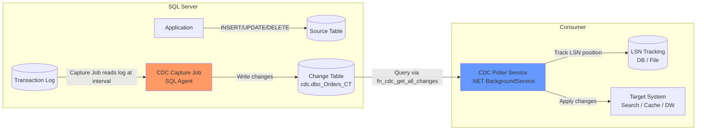
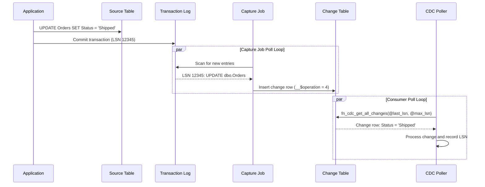
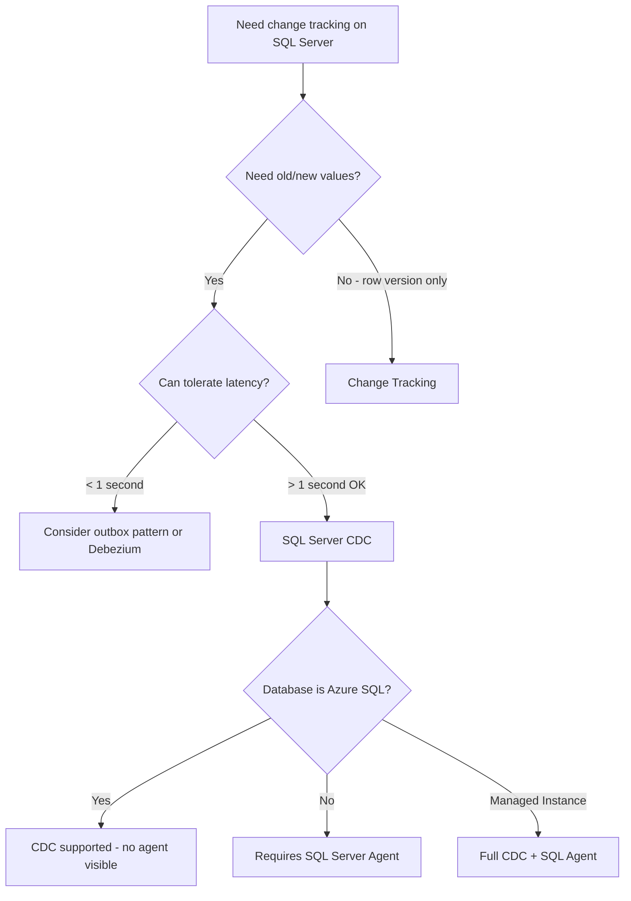

> [!success] Mastery Check
> - [ ] **Studied Well**
> - [ ] **Can explain the concept without notes**
> - [ ] **Can answer interview questions confidently**
> - [ ] **Can implement it in a real project**

## Navigation

**Domain:** [[7 — System Design & Distributed Systems]] > **Group:** Integration Patterns
**Previous:** [[7.136 — Change Data Capture — Debezium Architecture]] | **Next:** [[7.138 — Change Data Capture — PostgreSQL Logical Replication]]

### Prerequisites
- [[7.135 — Change Data Capture — Concept and Use Cases]] — required because SQL Server CDC is one implementation of the broader CDC pattern
- [[7.136 — Change Data Capture — Debezium Architecture]] — needed because Debezium is the common way to consume SQL Server CDC events in a streaming pipeline

### Where This Fits

SQL Server Change Data Capture is a built-in feature (since SQL Server 2008) that records insert, update, and delete activity on tracked tables into separate change tables. The SQL Agent capture job reads the transaction log and populates these change tables. External processes query the change tables to consume the captured changes. A .NET engineer encounters this when they need to track changes on a SQL Server table for auditing, incremental ETL, or real-time data synchronization without modifying the source application. SQL Server CDC is the most common CDC implementation in the .NET ecosystem because SQL Server is the dominant database in enterprise .NET applications. It is available in SQL Server 2008+ (Enterprise, Developer, Standard editions) and Azure SQL Database. The pattern is used extensively in financial services for audit compliance, in e-commerce for search index synchronization, and in data warehousing for incremental loads.

## Core Mental Model

SQL Server CDC is a log-based change tracking mechanism implemented through SQL Agent jobs. When CDC is enabled on a table (`sys.sp_cdc_enable_table`), SQL Server creates a change table in the `cdc` schema that mirrors the source table's columns plus metadata columns (operation type, LSN, transaction ID, etc.). The SQL Agent capture job periodically reads the transaction log, identifies changes to CDC-tracked tables, and inserts records into the change tables. Downstream consumers query the change tables using CDC functions (`cdc.fn_cdc_get_all_changes_...`) and track their position using LSNs. The invariant is: every committed change to a tracked table produces exactly one row in the change table, persisted until the cleanup job removes old entries based on retention configuration. The tradeoff is that CDC adds log read overhead (the capture job runs as a SQL Agent job) and storage for change tables. The recognition trigger is any requirement to track who changed what and when on a SQL Server table for compliance or data sync purposes, especially when the source application cannot be modified to implement the outbox pattern.





### Classification

SQL Server CDC is a built-in database feature at the storage/transaction log layer. It provides the mechanism to capture changes but does not provide the streaming pipeline — the consumer must query the change tables. It solves the problem of reliably tracking data changes without triggers or application code. It does not solve the problem of change event delivery — there is no push mechanism; consumers must poll the change tables. The change tables contain raw column values, not domain events, and schema evolution requires coordinated table alterations. SQL Server CDC is a "polling CDC" approach internally — the capture job polls the log, and external consumers poll the change tables. This double polling is a source of latency.

### Key Properties / Guarantees

|Property|Value|Condition|
|---|---|---|
|Capture mechanism|SQL Agent capture job reads txn log|Database must have SQL Agent running|
|Change table storage|cdc schema, one per tracked table|Storage proportional to change volume × retention|
|Latency|Capture job interval (default 30 seconds)|Configurable `pollinginterval`|
|Ordering|Per-table, commit order|LSN (Log Sequence Number) ordering|
|Retention|Default 3 days|Configurable via `sys.sp_cdc_change_job`|
|Schema tracking|Captures column changes|Schema changes disable CDC on the table|
|Capture granularity|Per-row before/after image|Depends on `@supports_net_changes` and `@capture_instance`|
|Editions supported|Enterprise, Developer, Standard|Not available in Express or Web editions|

## Deep Mechanics

### How It Works

**Step 1 — Enable CDC.** Run `sys.sp_cdc_enable_db` to enable CDC at the database level. This creates the CDC system tables and the capture and cleanup jobs. Then run `sys.sp_cdc_enable_table` for each table to track. This creates the capture instance — a change table named `cdc.dbo_<TableName>_CT` and a SQL Agent capture job. The parameters include `@role_name` (for access control), `@capture_instance` (name of the capture instance), and `@supports_net_changes` (whether to support net change queries).

**Step 2 — Log capture.** The capture job runs on an interval (default 30 seconds). It scans the transaction log for committed transactions that modified tracked tables. For each change, it writes a row to the corresponding change table. The capture job is a single-threaded process — it reads log entries sequentially and inserts rows into change tables. For high-throughput tables, this can become a bottleneck.

**Step 3 — Change table structure.** Each change table has columns: `__$start_lsn` (LSN of the change), `__$operation` (1=delete, 2=insert, 3=update before image, 4=update after image), `__$update_mask` (which columns changed), plus all source table columns. Updates produce two rows in the change table: one with operation 3 (before image) and one with operation 4 (after image), both with the same LSN. This dual-row design means consumers must pair the before/after images.

**Step 4 — Consumer polling.** A polling service queries the change tables using `cdc.fn_cdc_get_all_changes_<capture_instance>(@from_lsn, @to_lsn, @row_filter_option)`. The function returns all changes within an LSN range. The `@row_filter_option` parameter has two values: `'all'` returns all changes within the range (including multiple changes to the same row), while `'all update old'` includes the before-image for updates. The consumer records the last processed LSN and uses it as the starting point for the next poll.

**Step 5 — Cleanup.** A second SQL Agent job (cleanup job) runs on an interval (default 3 days) and deletes change table entries older than the retention period. The cleanup job checks `sys.fn_cdc_get_min_lsn()` and deletes entries with `__$start_lsn` below the minimum retention LSN. If the cleanup job is disabled, change tables grow indefinitely.

### Failure Modes

**Capture job stops running.** The SQL Agent is paused, disabled, or fails. No new changes are captured. Change tables are stale.

- **Detection:** Capture job status shows "Not Running" or "Failed." The `cdc_lag_time` metric shows increasing delay. Query `sys.sp_cdc_help_jobs` to check job status.
- **Recovery:** Start the capture job: `sys.sp_cdc_start_job`. Investigate why it stopped — check SQL Agent logs for deadlocks, log full conditions, or permission errors.
- **Prevention:** Monitor SQL Agent job status. Alert on capture job failures. Set up a health check that queries `sys.dm_cdc_log_scan_sessions` to verify the capture job is actively scanning the log.

**Change table grows unbounded.** The cleanup job is disabled or the retention is set too long. The change table grows to consume all available database space.

- **Detection:** Database disk usage alert. The change table size exceeds expected. Query `sys.dm_db_partition_stats` for the change table's row count.
- **Recovery:** Manually truncate the change table or run the cleanup job. Adjust retention to match consumption capacity.
- **Prevention:** Monitor change table size. Set retention to match consumption capacity. Alert on change table row count exceeding 100 million rows.

**Schema change breaks CDC.** A column is dropped from the source table. The change table still has the old schema. The capture job fails when it encounters a log entry referencing the dropped column.

- **Detection:** Capture job fails with "Invalid column name" error. New changes are not captured.
- **Recovery:** Disable and re-enable CDC on the affected table. The change table is rebuilt with the new schema. Existing change data is lost.
- **Prevention:** Always use ALTER TABLE ADD COLUMN (never DROP or RENAME) on CDC-tracked tables. If you must drop a column, plan for CDC downtime. Use a schema migration script that includes CDC disable/re-enable steps.

**Consumer LSN tracking drifts.** The consumer records an incorrect LSN due to a bug (e.g., off-by-one in the LSN binary comparison). The consumer either skips changes or re-processes changes.

- **Detection:** Missing changes in the target system. Or duplicate processing of the same changes.
- **Recovery:** Reset the consumer's LSN to the last known good position. For missing changes, replay from the missed LSN.
- **Prevention:** Use a dedicated LSN tracking table with atomic updates. Test LSN handling in integration tests. Use binary comparison for LSN values (not string comparison).

**Capture job falls behind under high write load.** The source database processes 10,000 writes/second. The capture job is single-threaded and can only process 5,000 changes/second. The gap between the current log position and the captured log position grows.

- **Detection:** `sys.dm_cdc_log_scan_sessions` shows increasing `scan_lsn` lag. The transaction log grows because the capture job has not processed entries.
- **Recovery:** Reduce the capture job polling interval. Consider partitioning high-volume tables. If the problem persists, use Debezium instead of the built-in capture job.
- **Prevention:** Monitor `sys.dm_cdc_log_scan_sessions` for scan latency. Alert when latency exceeds 5 minutes. For high-throughput tables (> 5,000 changes/second), consider Debezium's direct log reader.

### .NET and Azure Integration

- **System.Data.SqlClient / Microsoft.Data.SqlClient:** Query change tables and CDC management functions
- **SQL Server Agent:** Manages capture and cleanup jobs — requires SQL Agent running
- **Azure SQL Database:** Supports CDC (since 2020) — managed via T-SQL, no SQL Agent visible to users (capture job runs automatically)
- **Azure SQL Managed Instance:** Full CDC support including SQL Agent job management
- **Dapper / EF Core:** Use raw SQL queries with `cdc.fn_cdc_get_all_changes_*` for efficient CDC consumption
- **Azure Elastic Jobs:** For Azure SQL Database, use Elastic Jobs to run the CDC capture job (if the built-in auto management is insufficient)
- **Azure Data Factory:** CDC capability in mapping data flows for incremental data loading from SQL Server to Azure Synapse or Snowflake

```csharp
// Querying SQL Server CDC change table with proper binary LSN handling
public sealed class SqlServerCdcReader
{
    private readonly string _connectionString;

    public SqlServerCdcReader(string connectionString)
    {
        _connectionString = connectionString;
    }

    public async Task<IReadOnlyList<OrderChange>> GetChangesAsync(
        long fromLsn, long toLsn, CancellationToken ct)
    {
        await using var conn = new SqlConnection(_connectionString);
        await conn.OpenAsync(ct);

        // Query the CDC function for the Orders table capture instance
        await using var cmd = new SqlCommand(
            "SELECT * FROM cdc.fn_cdc_get_all_changes_dbo_Orders(" +
            "@from_lsn, @to_lsn, 'all update old')", conn);

        cmd.Parameters.AddWithValue("@from_lsn", fromLsn);
        cmd.Parameters.AddWithValue("@to_lsn", toLsn);

        var changes = new List<OrderChange>();
        await using var reader = await cmd.ExecuteReaderAsync(ct);

        while (await reader.ReadAsync(ct))
        {
            changes.Add(new OrderChange
            {
                Lsn = (long)reader["__$start_lsn"],
                Operation = (int)reader["__$operation"],
                OrderId = (int)reader["OrderId"],
                CustomerName = reader["CustomerName"] as string,
                Status = reader["Status"] as string,
                TotalAmount = (decimal)reader["TotalAmount"],
                UpdateMask = reader["__$update_mask"] as byte[]
            });
        }

        return changes;
    }

    public async Task<long> GetMaxLsnAsync(CancellationToken ct)
    {
        await using var conn = new SqlConnection(_connectionString);
        await using var cmd = new SqlCommand(
            "SELECT sys.fn_cdc_get_max_lsn()", conn);
        await conn.OpenAsync(ct);
        var result = await cmd.ExecuteScalarAsync(ct);
        return result is not DBNull ? (long)result : 0;
    }
}
```

## Production Patterns and Implementation

### Primary Implementation

A .NET CDC poller that reads SQL Server change tables and publishes events to Azure Event Hubs. This pattern is used when the team wants to stream CDC events to multiple downstream consumers without each one querying SQL Server directly.

```csharp
// SQL Server CDC poller — reads change tables, publishes to Event Hubs
public sealed class SqlServerCdcPoller : BackgroundService
{
    private readonly ISqlServerCdcStateStore _stateStore;
    private readonly IPublisher _eventPublisher;
    private readonly string _connectionString;
    private readonly ILogger<SqlServerCdcPoller> _logger;

    public SqlServerCdcPoller(
        ISqlServerCdcStateStore stateStore,
        IPublisher eventPublisher,
        string connectionString,
        ILogger<SqlServerCdcPoller> logger)
    {
        _stateStore = stateStore;
        _eventPublisher = eventPublisher;
        _connectionString = connectionString;
        _logger = logger;
    }

    protected override async Task ExecuteAsync(CancellationToken ct)
    {
        // Resume from last known LSN
        var lastLsn = await _stateStore.GetLastProcessedLsnAsync("Orders", ct);
        if (lastLsn == 0)
        {
            lastLsn = await GetCurrentMaxLsnAsync(ct);
        }

        while (!ct.IsCancellationRequested)
        {
            try
            {
                var currentLsn = await GetCurrentMaxLsnAsync(ct);

                if (currentLsn > lastLsn)
                {
                    // Batch LSN ranges to avoid large result sets
                    var batchSize = GetLsnBatchSize(lastLsn, currentLsn);
                    var batchEnd = Math.Min(lastLsn + batchSize, currentLsn);

                    var changes = await GetChangesAsync(lastLsn, batchEnd, ct);

                    foreach (var change in changes)
                    {
                        var changeEvent = new ChangeDataEvent
                        {
                            Table = "Orders",
                            Operation = MapOperation(change.Operation),
                            Before = change.Operation == 1 || change.Operation == 3
                                ? change.ToDictionary() : null,
                            After = change.Operation == 2 || change.Operation == 4
                                ? change.ToDictionary() : null,
                            Lsn = change.Lsn,
                            Timestamp = DateTime.UtcNow
                        };

                        await _eventPublisher.PublishAsync("cdc-orders", changeEvent, ct);
                    }

                    // Record progress
                    await _stateStore.SaveLastProcessedLsnAsync(
                        "Orders", batchEnd, ct);
                    lastLsn = batchEnd;
                }

                // Poll interval
                await Task.Delay(TimeSpan.FromSeconds(5), ct);
            }
            catch (Exception ex)
            {
                _logger.LogError(ex, "CDC poll failed");
                await Task.Delay(TimeSpan.FromSeconds(30), ct);
            }
        }
    }

    private async Task<long> GetCurrentMaxLsnAsync(CancellationToken ct)
    {
        await using var conn = new SqlConnection(_connectionString);
        await using var cmd = new SqlCommand(
            "SELECT sys.fn_cdc_get_max_lsn()", conn);
        await conn.OpenAsync(ct);
        var result = await cmd.ExecuteScalarAsync(ct);
        return result is not DBNull ? (long)result : 0;
    }
}

// CDC state store (prevents duplicate processing after restart)
public sealed class SqlServerCdcStateStore : ISqlServerCdcStateStore
{
    private readonly AppDbContext _db;

    public async Task<long> GetLastProcessedLsnAsync(
        string tableName, CancellationToken ct)
    {
        var lsn = await _db.ControlEntries
            .Where(c => c.TableName == tableName && c.Key == "CdcLsn")
            .Select(c => c.Value)
            .FirstOrDefaultAsync(ct);

        return long.TryParse(lsn, out var parsed) ? parsed : 0;
    }

    public async Task SaveLastProcessedLsnAsync(
        string tableName, long lsn, CancellationToken ct)
    {
        var entry = await _db.ControlEntries
            .FirstOrDefaultAsync(c => c.TableName == tableName && c.Key == "CdcLsn", ct);

        if (entry is null)
        {
            _db.ControlEntries.Add(new ControlEntry
            {
                TableName = tableName,
                Key = "CdcLsn",
                Value = lsn.ToString()
            });
        }
        else
        {
            entry.Value = lsn.ToString();
        }

        await _db.SaveChangesAsync(ct);
    }
}
```

### Configuration and Wiring

```csharp
// Program.cs
builder.Services.AddSingleton<ISqlServerCdcStateStore, SqlServerCdcStateStore>();
builder.Services.AddSingleton<IPublisher>(sp =>
{
    var config = sp.GetRequiredService<IConfiguration>();
    return new EventHubPublisher(config["EventHubs:ConnectionString"]);
});
builder.Services.AddHostedService<SqlServerCdcPoller>();

// SQL Server connection
builder.Services.AddSingleton(new SqlConnection(
    builder.Configuration.GetConnectionString("OrdersDb")));
```

```sql
-- Enable CDC on the ecommerce database (once)
EXEC sys.sp_cdc_enable_db;
GO

-- Enable CDC on specific tables
EXEC sys.sp_cdc_enable_table
    @source_schema = 'dbo',
    @source_name = 'Orders',
    @capture_instance = 'dbo_Orders',
    @role_name = NULL,
    @supports_net_changes = 1;

EXEC sys.sp_cdc_enable_table
    @source_schema = 'dbo',
    @source_name = 'OrderItems',
    @capture_instance = 'dbo_OrderItems',
    @role_name = NULL;

-- Configure capture job polling interval (5 seconds for lower latency)
EXEC sys.sp_cdc_change_job
    @job_type = 'capture',
    @pollinginterval = 5;
```

### Common Variants

**Change Tracking (lightweight alternative).** SQL Server Change Tracking is a lighter mechanism than CDC — it only tracks that a row changed, not the old/new values. It uses less storage and overhead but provides insufficient detail for many use cases. Change Tracking answers "which rows changed?" but not "what was the old value?"

```sql
-- Enable Change Tracking (lighter than CDC)
ALTER DATABASE ecommerce SET CHANGE_TRACKING = ON
    (CHANGE_RETENTION = 2 DAYS, AUTO_CLEANUP = ON);
ALTER TABLE dbo.Orders ENABLE CHANGE_TRACKING;
```

**Debezium SQL Server connector.** Instead of a custom .NET poller, use Debezium to read SQL Server CDC tables and stream to Kafka/Event Hubs. Debezium handles LSN tracking, schema evolution, and at-least-once delivery. This reduces the custom code to just the consumer. Debezium's SQL Server connector can read either the built-in CDC tables or the transaction log directly.

**Azure Data Factory CDC.** ADF provides built-in CDC support for incremental data loading from SQL Server to Azure Synapse or Snowflake, using SQL Server CDC as the source. This is a no-code option for ETL scenarios but provides less control over transformation and failure handling.

**CDC for audit with user context.** The standard CDC change table does not include the user who made the change. For audit compliance, an application can write the user context to a companion audit table as part of the same transaction, or use `sys.sp_cdc_add_job` to extend the change data with `SUSER_SNAME()`.

### Real-World .NET Ecosystem Example

**SQL Server CDC is the standard for audit compliance in .NET enterprise applications.** Financial services companies use it for regulatory audit trails (SOX, PCI-DSS). The change table provides a reliable, immutable record of every data change with the old and new values. The .NET CDC poller pattern (a `BackgroundService` querying `cdc.fn_cdc_get_all_changes_*`) is used in thousands of enterprise .NET applications for incremental ETL to data warehouses. Microsoft's own Azure SQL Database uses CDC internally for geo-replication and point-in-time restore. In the healthcare industry, SQL Server CDC is used to track changes to patient records for compliance with HIPAA audit requirements.

## Gotchas and Production Pitfalls

### 1. Capture job latency at high throughput

**Pitfall:** The capture job's default polling interval (30 seconds) means changes may not appear in the change table for up to 30 seconds. For a high-throughput table (10,000 writes/second), the capture job may fall behind.

**Symptom:** Change event latency = capture job interval + polling interval. If both are 30 seconds, end-to-end latency is up to 60 seconds. The downstream search index and cache are 60 seconds stale.

**Fix:** Reduce the capture job polling interval.

```sql
-- Reduce capture job polling to 5 seconds
EXEC sys.sp_cdc_change_job
    @job_type = 'capture',
    @pollinginterval = 5;
```

**Cost of not fixing:** Latency exceeding downstream SLA. Cache invalidation takes 60 seconds. Search index is 60 seconds stale. Business stakeholders notice the delay.

### 2. CDC function performance degrades with large LSN ranges

**Pitfall:** The poller was down for 2 hours. When it resumes, it queries `fn_cdc_get_all_changes` with a 2-hour LSN range. The function reads millions of change rows. The query runs for minutes and impacts the source database.

**Symptom:** Query timeout on the CDC function. The poller fails and retries, making the problem worse. The source database's CPU spikes from the expensive query.

**Fix:** Implement LSN range batching. Break the 2-hour range into 5-minute buckets. Process each bucket independently.

```csharp
// Batch by time range
var batchEnd = lastLsn;
while (batchEnd < currentLsn)
{
    var batchTarget = GetLsnForTime(lastTimestamp.AddMinutes(5));
    var batchChanges = await GetChangesAsync(lastLsn, batchTarget, ct);
    // Process batch
    lastLsn = batchTarget;
}
```

**Cost of not fixing:** CDC pipeline outage every time poller is down for extended period. Recovery takes hours instead of minutes.

### 3. Cleanup job deletes changes before consumer processes them

**Pitfall:** The cleanup job runs every 3 days and deletes changes older than 3 days. The poller was down for 4 days. When it restarts, the changes for the first day are gone.

**Symptom:** Missing changes. The target system is missing 1 day of data. Partial data inconsistency.

**Fix:** Increase retention to match the maximum expected consumer downtime. If consumer downtime may be 7 days, set retention to 10 days.

```sql
-- Set retention to 10 days
EXEC sys.sp_cdc_change_job
    @job_type = 'cleanup',
    @retention = 7200; -- minutes (10 days)
```

**Cost of not fixing:** Missing data. Partial resync required, costing additional database resources and time.

### 4. Schema change disables CDC on the table

**Pitfall:** A migration runs `ALTER TABLE dbo.Orders DROP COLUMN DiscountCode`. SQL Server automatically drops and recreates the CDC capture instance. The existing change table data is lost. The poller fails when it tries to read from the old capture instance.

**Symptom:** CDC poller errors: "Invalid object name cdc.dbo_Orders_CT." The change table no longer exists. The poller cannot resume.

**Fix:** Disable CDC before schema changes, re-enable after. The change table is recreated, but existing change data is lost.

```sql
-- Disable CDC before schema change
EXEC sys.sp_cdc_disable_table
    @source_schema = 'dbo',
    @source_name = 'Orders',
    @capture_instance = 'dbo_Orders';
GO

-- Apply schema change
ALTER TABLE dbo.Orders DROP COLUMN DiscountCode;
GO

-- Re-enable CDC
EXEC sys.sp_cdc_enable_table
    @source_schema = 'dbo',
    @source_name = 'Orders',
    @role_name = NULL;
```

**Cost of not fixing:** CDC outage. Downstream systems miss changes applied during the window. Recovery requires a full re-snapshot.

### 5. CDC on large tables increases backup time

**Pitfall:** A 500GB database has CDC enabled on 20 tables. The change tables add 50GB of data. Full backups now take 10% longer and use 10% more storage.

**Symptom:** Backup SLA breached. Storage costs increase. Recovery time objective (RTO) may be affected because the backup size is larger.

**Fix:** Place change tables in a separate filegroup with its own backup schedule. Change tables can be backed up on a different schedule from the primary data.

```sql
-- Place CDC change tables in separate filegroup
ALTER DATABASE ecommerce ADD FILEGROUP CDCData;
ALTER DATABASE ecommerce ADD FILE (
    NAME = CDCData_File,
    FILENAME = 'D:\Data\CDCData.ndf',
    SIZE = 10GB
) TO FILEGROUP CDCData;

-- When enabling CDC, specify the filegroup
EXEC sys.sp_cdc_enable_table
    @source_schema = 'dbo',
    @source_name = 'Orders',
    @capture_instance = 'dbo_Orders',
    @filegroup_name = 'CDCData';
```

**Cost of not fixing:** Increased backup time. Higher storage costs. Slower restore times.

### 6. LSN comparison issues with binary data

**Pitfall:** The poller stores LSN as a `BIGINT` but the CDC functions expect a `BINARY(10)` LSN. The conversion between formats is error-prone. An off-by-one in the binary comparison causes the poller to skip changes or repeatedly process the same changes.

**Symptom:** Intermittent missing changes. Or the poller re-processes the same LSN range multiple times. Debugging is difficult because the LSN binary format is opaque.

**Fix:** Use the CDC helper functions consistently: `sys.fn_cdc_get_max_lsn()` returns the max LSN, `sys.fn_cdc_map_time_to_lsn()` maps timestamps to LSNs, `sys.fn_cdc_map_lsn_to_time()` maps LSNs to timestamps. Store LSN as `BINARY(10)` consistently. Avoid converting to BIGINT unless necessary.

**Cost of not fixing:** Silent data loss or data duplication. Downstream systems have incorrect data that is hard to trace back to the LSN handling bug.

### 7. Capture job and backup job I/O contention

**Pitfall:** The CDC capture job runs every 30 seconds and reads the transaction log. The transaction log backup job runs every 15 minutes. When both run simultaneously, they compete for log read I/O, causing latency spikes for both.

**Symptom:** Capture job latency increases during backup windows. Backups take longer. Log read waits show in `sys.dm_io_virtual_file_stats`.

**Fix:** Schedule the capture job and backup job to avoid overlap. Reduce the capture job interval to spread its I/O more evenly. Or use resource governor to limit I/O for one of the jobs.

**Cost of not fixing:** Latency spikes during backup windows. The CDC pipeline may miss its SLA during these periods.

## Tradeoffs and Decision Framework

### Tradeoff Matrix

|Dimension|SQL Server CDC|SQL Change Tracking|Application-Level Outbox|Debezium SQL Server Connector|
|---|---|---|---|---|
|Capture granularity|Full row history (before/after)|Row version only|Domain event payload|Full row history|
|Storage overhead|High (change tables)|Low (version table)|Medium (outbox table)|None on source DB|
|Latency|30-60 seconds (configurable)|Near-real-time for queries|Same-transaction (real-time)|< 1 second (log-based)|
|Schema change handling|Disables CDC, must re-enable|Survives schema changes|Application code change|Schema Registry|
|Query capability|Rich CDC functions|Simple CHANGETABLE query|Event-specific queries|Standardized events|
|Application change|None|None|Must write to outbox table|None|
|.NET integration|SqlClient CDC functions|SqlClient CHANGETABLE|EF Core event handlers|Event Hubs / Kafka consumer|
|Operational overhead|Medium (SQL Agent jobs)|Low|Low|High (Kafka Connect)|

### When to Apply



### When NOT to Apply

- [ ] The database is an older SQL Server version (< 2008) that does not support CDC
- [ ] The latency requirement is < 1 second — CDC capture job adds at least the poll interval latency; use [[7.136 — Change Data Capture — Debezium Architecture]] for lower latency
- [ ] The DBA team cannot manage SQL Agent jobs — the capture and cleanup jobs require ongoing administration
- [ ] The downstream system needs domain events, not raw data changes — use the [[7.121 — Outbox Pattern — Reliable Event Publishing]] instead
- [ ] The change volume is very low (< 100 changes/hour) — a simple "last modified" timestamp column with a polling query is simpler
- [ ] The database is SQL Server Express — CDC is not supported on Express edition
- [ ] Schema changes are frequent (multiple per week) — the CDC disable/re-enable cycle will cause outages

### Scale Thresholds

- **< 1,000 changes/second:** Default CDC configuration works. Capture job at 30-second interval. Change table growth is manageable.
- **1,000-5,000 changes/second:** Reduce capture job polling interval to 5-10 seconds. Monitor change table growth. Consider partitioning change tables by date.
- **> 5,000 changes/second:** Consider Debezium as the CDC reader (it reads the log directly, bypassing the capture job delay). Or use Change Tracking as a lighter alternative if old/new values are not needed. At 10,000+ changes/second, the capture job becomes a bottleneck.

## Interview Arsenal

### Question Bank

1. How does SQL Server CDC work internally?
2. What is the difference between SQL Server CDC and Change Tracking?
3. What is an LSN and how is it used in CDC?
4. How does the capture job handle schema changes?
5. Compare SQL Server CDC with the Debezium SQL Server connector.
6. How do you monitor SQL Server CDC health?
7. What happens when the cleanup job runs before the consumer processes changes?
8. How do you enable CDC on a table with millions of existing rows?
9. What are the SQL Server editions that support CDC?
10. How do you handle user context (who made the change) in CDC?

### Spoken Answers

**Q: How does SQL Server CDC work internally?**

> **Great answer:** "SQL Server CDC works through two SQL Agent jobs: the capture job and the cleanup job. The capture job runs on an interval (default 30 seconds) and scans the transaction log for committed changes to tracked tables. For each change — insert, update, or delete — it writes a row to a change table in the `cdc` schema. The change table mirrors the source table's columns plus metadata columns: `__$start_lsn` (the Log Sequence Number of the change), `__$operation` (1=delete, 2=insert, 3=update before-image, 4=update after-image), and `__$update_mask` (bitmap of which columns changed). The cleanup job deletes change rows older than the retention period (default 3 days). Consumers query the change tables using CDC functions like `fn_cdc_get_all_changes_dbo_Orders` with an LSN range. The consumer tracks the last processed LSN to resume on restart. The key advantage over alternatives is that it captures both the before and after image of every change without requiring any application code changes — you enable it with a stored procedure and it starts capturing. The key disadvantage is that the double polling (capture job polls the log, consumer polls the change tables) adds latency that cannot be reduced below the capture job interval."

> **Average answer:** "SQL Server CDC uses a job to track changes. You can query the change table to see what changed." (No detail on the two-job architecture, no LSN mechanism, no operation codes.)

**Q: What is the difference between SQL Server CDC and Change Tracking?**

> **Great answer:** "SQL Server CDC captures the full history of every change — the old value, the new value, the operation type, and the transaction metadata. Change Tracking only records that a row changed — it tracks a version number per row but does not provide the actual changed values or operation type. CDC is designed for scenarios where you need the change data: audit trails, incremental ETL to a data warehouse, or syncing to a search index. Change Tracking is designed for lightweight synchronization — answering 'which rows changed since my last check?' without the storage and performance overhead of CDC. The practical difference: CDC creates change tables that can grow large (proportional to change volume), while Change Tracking uses a single internal table with only version data. CDC has higher overhead but richer data. Change Tracking is simpler and cheaper but only gives you row identity, not the changed values. In production, I use CDC for ETL and audit, and Change Tracking for client-side synchronization (e.g., mobile app sync where the client just needs to know which records to fetch)."

**Q: How does the capture job handle schema changes?**

> **Great answer:** "SQL Server CDC does not handle schema changes gracefully. When a DDL statement modifies a CDC-tracked table — adding a column, changing a data type, or dropping a column — the CDC metadata may become out of sync with the source table. If you add a column, CDC continues to work but the new column is not included in the change table until CDC is disabled and re-enabled on the table. If you drop a column, the capture job may fail because the log entry references a column that no longer exists in the source schema. The practical approach is to always disable CDC before schema changes, apply the migration, and re-enable CDC afterward. This loses the CDC history during the window but avoids capture job failures. For additive changes only (adding columns with defaults), CDC can continue running if you update the capture instance schema using `sys.sp_cdc_change_ddl_timeout` or by running `sys.sp_cdc_disable_table` followed by `sys.sp_cdc_enable_table` during a maintenance window. The safest practice is to never drop columns from CDC-tracked tables — deprecate them in application code instead."

### System Design Interview Trigger

When the interviewer asks about tracking changes in a SQL Server database for an audit or sync use case, they want to hear you name both CDC and Change Tracking and articulate the tradeoff. The senior answer includes concrete latency numbers, mentions the capture job interval, the LSN tracking mechanism, and the schema change handling limitation. The interviewer may probe with "what if we need sub-second latency?" — expecting you to recognize that CDC alone is not sufficient and that Debezium (which reads the log directly) or the outbox pattern is needed. Another common probe: "what happens when the database schema changes?" — testing knowledge of the CDC disable/re-enable cycle.

### Comparison Table

| | SQL Server CDC | SQL Change Tracking | Debezium SQL Server Connector | Outbox Pattern |
|---|---|---|---|---|
| Captures old/new values | Yes | No | Yes | Domain event (semantic) |
| Latency | 30s (configurable) | Real-time (query-based) | < 1 second (log-based) | Same-transaction |
| Storage overhead | High (change tables) | Low | None on source DB | Medium |
| Schema change handling | Manual disable/re-enable | Survives | Schema Registry | Application code |
| Application change | None | None | None | Write to outbox table |
| .NET integration | SqlClient CDC functions | SqlClient CHANGETABLE | Event Hubs / Kafka consumer | EF Core + background publisher |
| Edition requirement | Enterprise/Standard/Developer | All editions | Any with log access | Any (application-level) |

## Architecture Decision Record

**Status:** Accepted

**Context:** A healthcare application on SQL Server 2019 requires a full audit trail of all changes to the Patients and Claims tables. The audit must capture before/after values for every column, the user who made the change (via `SUSER_SNAME()`), and the timestamp. The compliance team requires the audit data to be retained for 7 years. The application is a .NET Framework 4.8 monolith with no event publishing infrastructure. The change volume is approximately 100,000 changes/day across both tables. The latency requirement for audit availability is 1 hour (changes must appear in the audit within 1 hour of occurrence).

**Options Considered:**

1. **SQL Server CDC** — Built-in CDC on the two tables, change tables populated by the capture job, a .NET poller reads change tables and writes to the audit archive
2. **Database Triggers** — AFTER UPDATE/DELETE triggers write audit records to a custom Audit table
3. **Application-Level Auditing** — The .NET application writes audit entries via EF Core's `SaveChangesInterceptor`
4. **SQL Server Audit** — Built-in SQL Server Audit feature writes to the audit log

**Decision:** SQL Server CDC (option 1), because it captures changes at the database level — even direct SQL updates, DBA changes, or application bypasses of the ORM are captured. The trigger approach (option 2) adds overhead to every write and can block transactions if the trigger logic is slow. Application-level auditing (option 3) would miss changes made by database scripts or direct T-SQL (used by the operations team for data fixes). SQL Server Audit (option 4) captures the event but does not provide the before/after values in the structured CDC format. The 7-year retention requirement means the CDC cleanup job will be disabled — the change tables will grow indefinitely. This is acceptable because the combined change volume for Patients and Claims is ~100K changes/day, and the storage cost is budgeted at ~250GB over 7 years.

**Consequences:**
- ✅ Every change is captured, regardless of how it was made (app, SQL script, DBA tool) — full compliance coverage
- ✅ No application code changes required — critical for the legacy .NET Framework 4.8 app
- ✅ Before and after images for every column — meets the compliance requirement for full audit details
- ✅ Hourly latency requirement is easily met (capture job runs every 30 seconds, poller runs every 60 seconds)
- ⚠️ Change tables will grow to ~250GB over 7 years — storage cost accounted for in budget
- ⚠️ Schema changes on tracked tables require CDC disable/re-enable — migration scripts updated to include CDC steps
- ⚠️ User context must be captured via a companion tracking table — CDC alone does not capture `SUSER_SNAME()`
- ❌ Changes made by users outside SQL Server are not captured — acceptable because the application uses SQL Server as its sole data store

**Review Trigger:** Revisit if change volume exceeds 500K changes/day, at which point the change table growth rate may exceed storage budget and a change data archival strategy (periodic export to Azure Blob Storage) will be required. Also revisit if the application is modernized and starts publishing domain events — at that point, the outbox pattern may supplement CDC for near-real-time use cases.

## Self-Check

### Conceptual Questions

1. What SQL Agent jobs does SQL Server CDC use?
2. What does each `__$operation` value mean?
3. How does a consumer track its position in the CDC stream?
4. What happens when a schema change is applied to a CDC-tracked table?
5. Compare CDC with Change Tracking.
6. How do you configure CDC retention?
7. What is the minimum SQL Server version that supports CDC?
8. How do you monitor the capture job's health?
9. How does Azure SQL Database CDC differ from SQL Server CDC?
10. Explain in 60 seconds how to set up a CDC pipeline for SQL Server.

<details>
<summary>Answers</summary>

1. The capture job (reads the transaction log, populates change tables) and the cleanup job (deletes expired change table entries). Both are SQL Agent jobs created by `sys.sp_cdc_enable_db`.

2. 1 = delete, 2 = insert, 3 = update (before image), 4 = update (after image). Rows with operation 3 and 4 appear as a pair for each update. Both rows share the same `__$start_lsn`.

3. The consumer records the last processed `__$start_lsn` value and uses it as the `@from_lsn` parameter in the next call to `cdc.fn_cdc_get_all_changes_*`. The LSN is stored in a durable location (database table, file, or distributed cache).

4. CDC does not handle schema changes automatically. The capture instance may become out of sync. Best practice: disable CDC, apply schema change, re-enable CDC. This loses the change history during the window.

5. CDC captures before/after values, operation type, and full metadata. Change Tracking only captures that a row changed (version number). CDC uses more storage and overhead (change tables grow proportionally to change volume).

6. `EXEC sys.sp_cdc_change_job @job_type = 'cleanup', @retention = <minutes>;` The retention is in minutes. Default is 3 days (4320 minutes).

7. SQL Server 2008 Enterprise, Developer, and Standard editions. Express edition does not support CDC. Azure SQL Database supports CDC since 2020. Azure SQL Managed Instance supports CDC with full SQL Agent management.

8. Check SQL Agent job history for the capture job (`sys.sp_cdc_help_jobs`). Monitor `sys.dm_cdc_log_scan_sessions` for scan latency. Query `sys.dm_cdc_errors` for capture job errors. Alert on capture job failure.

9. Azure SQL Database CDC has no visible SQL Agent — the capture and cleanup jobs run automatically. T-SQL configuration is identical. Azure SQL also supports CDC with Managed Instance (which does expose SQL Agent). Azure SQL Database uses a simplified page-versioning-based CDC implementation that differs from the log-scan approach used in SQL Server.

10. "First, enable CDC at the database level: `sys.sp_cdc_enable_db`. This creates the CDC system tables and the capture and cleanup jobs. Second, enable it on each table: `sys.sp_cdc_enable_table @source_schema = 'dbo', @source_name = 'Orders', @role_name = NULL`. This creates the change table (`cdc.dbo_Orders_CT`) and adds the table to the capture job's scope. Third, configure the capture job polling interval: `sys.sp_cdc_change_job @job_type = 'capture', @pollinginterval = 5`. Fourth, build a .NET `BackgroundService` that calls `sys.fn_cdc_get_max_lsn()` to get the current LSN, then calls `cdc.fn_cdc_get_all_changes_dbo_Orders(@from_lsn, @to_lsn, 'all')` to fetch changes. Process the changes and record the last LSN. Run this poll every 5-30 seconds depending on latency needs. Monitor the capture job status and change table growth."

</details>

---

### Scenario Challenges

**Scenario 1 — Diagnose the problem**

A .NET CDC poller reads SQL Server change tables every 10 seconds. At 2:00 PM, the capture job stopped. The poller continues to query the change tables but finds no new changes. Downstream systems are stale. At 2:30 PM, operations notices that reports are showing old data.

<details>
<summary>Diagnosis</summary>

**Root cause:** The SQL Server Agent capture job stopped. The job may have failed due to a log growth issue, a deadlock, or an administrative pause. The poller continues running successfully — it queries the change table and finds nothing new because the capture job is not writing new changes.

**Evidence:** `sys.sp_cdc_help_jobs` shows capture job status = "0" (not running). The SQL Agent job history shows the last run as "Failed" with an error message. The `sys.dm_cdc_log_scan_sessions` view shows no recent scan sessions.

**Fix:** Start the capture job: `sys.sp_cdc_start_job`. Investigate the failure cause in the SQL Agent error log. If the job is corrupted, drop and recreate it: `sys.sp_cdc_drop_job @job_type = 'capture'` followed by `sys.sp_cdc_add_job @job_type = 'capture'`.

**Prevention:** Alert on capture job failures. Monitor `cdc_lag_time` — if the lag exceeds 2x the poll interval, fire an alert. Set up a SQL Agent alert that sends email or webhook when the capture job fails.

</details>

---

**Scenario 2 — Design decision**

You need to sync changes from a SQL Server table with 50 million rows to Elasticsearch. The initial CDC snapshot would scan the entire table, causing performance impact. How do you approach this?

<details>
<summary>Decision and Reasoning</summary>

**Choice:** Use a two-phase approach. Phase 1: enable CDC on the table but do not use the built-in snapshot. Instead, export the existing data to Elasticsearch in batches during off-peak hours (using a separate export job that reads the table with nOLOCK and batches of 10,000 rows). Phase 2: after the export completes, start the CDC poller to capture incremental changes from the LSN recorded at the start of the export.

**Tradeoffs accepted:** During the export, changes to the table may be exported first (initial batch) and then captured as CDC change events. The consumer must handle duplicates — the same row may appear in the initial export and as a CDC event. The consumer uses upsert semantics (`MergeOrUpload` in Azure Cognitive Search) to handle this idempotently.

**Implementation sketch:**
```csharp
// Phase 1: Get the LSN at export start
var exportStartLsn = await GetCurrentMaxLsnAsync(ct);

// Phase 2: Bulk export existing data in batches of 10,000
var offset = 0;
const int batchSize = 10000;
while (!ct.IsCancellationRequested)
{
    var batch = await _db.Orders
        .OrderBy(o => o.Id)
        .Skip(offset)
        .Take(batchSize)
        .ToListAsync(ct);
    if (batch.Count == 0) break;
    
    await BulkExportToElasticsearchAsync(batch, ct);
    offset += batch.Count;
}

// Phase 3: Start CDC poller from exportStartLsn
await _stateStore.SaveLastProcessedLsnAsync("Orders", exportStartLsn, ct);
// Consumer uses upsert — duplicates from overlap are harmless
```

</details>

---

**Scenario 3 — Failure mode** A CDC poller crashes for 6 hours. When it restarts, it queries for changes in a 6-hour LSN range. The `fn_cdc_get_all_changes` function returns millions of rows. The poller runs out of memory and crashes again.

<details> <summary>Investigation and Fix</summary>

**Investigation steps:**
1. Why did the poller crash initially? Fix the root cause before recovery.
2. How many changes accumulated in 6 hours? Query the change table row count for the LSN range.
3. Can the poller process the changes in batches?

**Confirming evidence:** Poller logs: `OutOfMemoryException` when processing CDC batch. The `GetChangesAsync` method loads all changes into memory at once. The change table has millions of rows in the 6-hour range.

**Immediate mitigation:**
1. Increase the poller's memory limit (container/process memory limit) to 2GB.
2. Reduce the batch size by processing 5-minute windows instead of 6-hour range.

**Permanent fix:**
1. Implement cursor-based processing — read changes in pages (e.g., 10,000 rows at a time) using `fn_cdc_get_all_changes` with bounded LSN ranges.
2. Set a maximum LSN range size (e.g., equivalent to 5 minutes of changes).
3. Monitor poller memory usage and alert on spikes. Set memory limit in the container orchestrator.

```csharp
// Batch by 5-minute LSN windows
var windowSize = TimeSpan.FromMinutes(5);
for (var lsn = startLsn; lsn < endLsn; lsn = GetLsnForTime(
    GetTimeForLsn(lsn).Add(windowSize)))
{
    var windowEndLsn = Math.Min(
        GetLsnForTime(GetTimeForLsn(lsn).Add(windowSize)),
        endLsn);
    var batch = await GetChangesAsync(lsn, windowEndLsn, ct);
    await ProcessBatchAsync(batch, ct);
}
```

</details>

---

**Scenario 4 — Scale it** Your system currently uses SQL Server CDC for 5 tables with 1,000 changes/second total. You need to handle 10,000 changes/second across 50 tables. The latency requirement is 10 seconds.

<details> <summary>Scaling Strategy</summary>

**Bottleneck this addresses:** The single-threaded capture job becomes the bottleneck at high change volumes. The poller's single-threaded LSN tracking per table also limits throughput.

**How it helps:**
1. Reduce capture job polling interval to 5 seconds (from 30) to keep up with the write rate.
2. Use multiple poller instances, each responsible for a subset of tables.
3. Increase change table partition count if the database supports it (SQL Server 2019+).

**What it does not solve:**
- The capture job is still single-threaded within a database. At very high volumes (> 10,000 changes/second), consider using Debezium to read the transaction log directly.
- Change table storage grows linearly with change volume. Budget for storage.

**Implementation order:**
1. First: Reduce capture job interval. Tune `maxscans` and `continuous` parameters.
2. Second: Shard pollers — 5 poller instances each handling 10 tables.
3. Third: If the capture job cannot keep up, migrate to Debezium SQL Server connector.
4. Fourth: Monitor `sys.dm_cdc_log_scan_sessions` to verify scan latency is under control.

</details>

---

**Scenario 5 — Interview simulation** The interviewer says: "Your e-commerce platform uses SQL Server for order processing. You need to build a real-time analytics pipeline that streams order changes to a data warehouse. How do you design the CDC pipeline?"

<details> <summary>Model Response</summary>

"I would use SQL Server's built-in CDC for change capture, combined with a .NET poller that publishes to Azure Event Hubs, and a downstream consumer that writes to the data warehouse.

"First, I enable CDC on the database and the Orders and OrderItems tables. The capture job runs on a 5-second interval to keep latency under 10 seconds. The change tables capture before and after images for every change.

"Second, I build a .NET BackgroundService poller that queries `fn_cdc_get_all_changes_dbo_Orders` every 5 seconds. The poller tracks the last processed LSN in a control table. For each batch of changes, it publishes change events to an Azure Event Hubs topic. The Event Hubs topic has 4 partitions to allow parallel processing. Using the primary key as the partition key ensures ordering per row.

"Third, a separate .NET consumer reads from Event Hubs and writes to the data warehouse (Azure Synapse or Snowflake). The consumer uses upsert semantics: if a row exists, update it; if not, insert it. This handles duplicate events from at-least-once delivery.

"For failure handling: if the capture job fails, I have an alert that pages the DBA within 1 minute. If the poller crashes, it resumes from the last stored LSN. If the consumer crashes, Event Hubs checkpointing ensures it resumes from the last processed event. If the warehouse ingestion fails, events accumulate in Event Hubs for up to 7 days (the Event Hubs retention period).

"The latency target is P99 < 15 seconds. The capture job polls every 5 seconds, the poller reads every 5 seconds, processing and publishing takes < 3 seconds, and warehouse ingestion takes < 2 seconds. Total: ~15 seconds at P99.

"The key operational concerns: monitor change table growth (budget for 50GB/year at our change volume), coordinate schema changes with CDC disable/re-enable cycles, and ensure the capture job is not blocked by log backups."

</details>

---

## Appendix A — SQL Server CDC Advanced Configuration

### Capture Job Tuning Parameters

```sql
-- View current capture job configuration
EXEC sys.sp_cdc_help_jobs;

-- Tune capture job for high-throughput scenarios
EXEC sys.sp_cdc_change_job
    @job_type = 'capture',
    @pollinginterval = 5,          -- Seconds between log scans (default 30)
    @maxscans = 100,                -- Max scans before job exits (default 10)
    @continuous = 1,                -- Continuous mode (0 = one scan then exit)
    @maxtrans = 5000;              -- Max transactions per scan (default 500)

-- Tune cleanup job for large retention
EXEC sys.sp_cdc_change_job
    @job_type = 'cleanup',
    @retention = 10080,             -- 7 days in minutes
    @threshold = 5000;             -- Max delete statements per cleanup cycle
```

### Change Table Schema Reference

```
Column Name             Type        Description
─────────────────────────────────────────────────────
__$start_lsn            BINARY(10)  LSN of the change (commit time order)
__$end_lsn              BINARY(10)  Always NULL in current implementation
__$seqval               BINARY(10)  Sequence value for ordering within LSN
__$operation            INT         1=delete, 2=insert, 3=update-before, 4=update-after
__$update_mask          VARBINARY   Bitmask of columns that changed
<source table columns>  <original>  All columns from the tracked source table
```

**Understanding `__$update_mask`:**
- Each bit represents a column (bit 0 = column 1, bit 1 = column 2, etc.)
- For updates with operation 3 or 4, the mask shows which columns changed
- Use `sys.fn_cdc_get_column_ordinal('dbo_Orders', 'Status')` to get a column's ordinal
- Use `sys.fn_cdc_is_bit_set(ordinal, update_mask)` to check if a column changed

### CDC and SQL Server Always On Availability Groups

When the source database is part of an Always On Availability Group:

```sql
-- Enable on primary replica (replicates to secondary)
EXEC sys.sp_cdc_enable_db;
EXEC sys.sp_cdc_enable_table @source_schema = 'dbo', @source_name = 'Orders', @role_name = NULL;

-- On secondary replica: CDC change tables are read-only
-- Consumers can read from secondary to reduce load on primary
-- Note: CDC capture job only runs on the primary replica
-- After failover, CDC must be re-configured on the new primary if the
--   capture job is not automatically redirected (depends on SQL Server version)
```

**Limitations:**
- CDC capture job runs only on the primary replica
- After failover between replicas, the CDC capture job must be started on the new primary (it may not automatically resume)
- Change tables are readable on secondary replicas but not writable
- If the failover is planned, stop the capture job on the old primary before failing over

### Net Change vs. All Changes

CDC supports two query functions:

```sql
-- All Changes: Returns every intermediate change
SELECT * FROM cdc.fn_cdc_get_all_changes_dbo_Orders(@from_lsn, @to_lsn, 'all');

-- Net Changes: Returns only the final state per row
SELECT * FROM cdc.fn_cdc_get_net_changes_dbo_Orders(@from_lsn, @to_lsn, 'all');

-- Difference: Net changes consolidates multiple changes to the same row
-- within the LSN range into a single row. If a row was inserted then updated,
-- all changes returns 2 rows, net changes returns 1 row with the final state.
-- Net changes requires @supports_net_changes = 1 when enabling CDC.
```

### CDC with SQL Server Partitioning

For very large change tables, use table partitioning to improve cleanup performance:

```sql
-- Create partition function and scheme
CREATE PARTITION FUNCTION CdcPartitionFunc (DATETIME2(0))
AS RANGE RIGHT FOR VALUES ('2026-01-01', '2026-02-01', '2026-03-01');

CREATE PARTITION SCHEME CdcPartitionScheme
AS PARTITION CdcPartitionFunc ALL TO ([PRIMARY]);

-- Enable CDC specifying the partition scheme
EXEC sys.sp_cdc_enable_table
    @source_schema = 'dbo',
    @source_name = 'Orders',
    @capture_instance = 'dbo_Orders',
    @filegroup_name = 'PRIMARY';
    
-- After table is created, alter it to use partitioning
ALTER TABLE cdc.dbo_Orders_CT
ADD __$partition_id AS (DATEDIFF(DAY, '2025-12-31', CAST(__$start_lsn AS DATETIME)) / 30) PERSISTED;
```

**Note:** SQL Server does not natively support partitioning CDC change tables. The approach above uses a computed column and manual partition switching. For most production systems, the default heap table storage is sufficient.

### .NET Test Utilities for CDC

```csharp
// Integration test helper for CDC pipelines
public sealed class CdcTestFixture : IAsyncLifetime
{
    private readonly string _connectionString;
    private SqlConnection _connection = null!;

    public CdcTestFixture(string connectionString)
    {
        _connectionString = connectionString;
    }

    public async Task InitializeAsync()
    {
        _connection = new SqlConnection(_connectionString);
        await _connection.OpenAsync();

        // Enable CDC on test database
        await ExecuteAsync("IF NOT EXISTS (SELECT 1 FROM sys.databases WHERE is_cdc_enabled = 1) EXEC sys.sp_cdc_enable_db");
    }

    public async Task EnableCdcOnTableAsync(string schema, string table)
    {
        await ExecuteAsync($$"""
            IF NOT EXISTS (
                SELECT 1 FROM cdc.change_tables 
                WHERE capture_instance = '{{schema}}_{{table}}')
            EXEC sys.sp_cdc_enable_table
                @source_schema = '{{schema}}',
                @source_name = '{{table}}',
                @role_name = NULL
            """);
    }

    public async Task<long> InsertAndCaptureChangeAsync(string table, string insertSql)
    {
        var beforeLsn = await GetMaxLsnAsync();
        await ExecuteAsync(insertSql);
        var afterLsn = await GetMaxLsnAsync();
        return afterLsn;
    }

    public async Task<IReadOnlyList<dynamic>> GetChangesSinceAsync(
        string schema, string table, long fromLsn)
    {
        var maxLsn = await GetMaxLsnAsync();
        var captureInstance = $"{schema}_{table}";
        var changes = new List<dynamic>();

        await using var cmd = new SqlCommand(
            $"SELECT * FROM cdc.fn_cdc_get_all_changes_{capture_instance}(@from, @to, 'all')",
            _connection);
        cmd.Parameters.AddWithValue("@from", fromLsn);
        cmd.Parameters.AddWithValue("@to", maxLsn);

        await using var reader = await cmd.ExecuteReaderAsync();
        while (await reader.ReadAsync())
        {
            var change = new Dictionary<string, object>();
            for (var i = 0; i < reader.FieldCount; i++)
                change[reader.GetName(i)] = reader.GetValue(i);
            changes.Add(change);
        }

        return changes;
    }

    private async Task<long> GetMaxLsnAsync()
    {
        await using var cmd = new SqlCommand("SELECT sys.fn_cdc_get_max_lsn()", _connection);
        var result = await cmd.ExecuteScalarAsync();
        return result is not DBNull ? (long)result : 0;
    }

    private async Task ExecuteAsync(string sql)
    {
        await using var cmd = new SqlCommand(sql, _connection);
        await cmd.ExecuteNonQueryAsync();
    }

    public async Task DisposeAsync()
    {
        await _connection.DisposeAsync();
    }
}
```

### CDC Performance Baseline Script

```sql
-- Run this weekly to baseline CDC performance
SELECT 
    GETDATE() AS collection_time,
    DB_NAME() AS database_name,
    s.session_id,
    s.login_name,
    s.program_name,
    r.command,
    r.wait_type,
    r.wait_time,
    r.cpu_time,
    r.logical_reads,
    r.writes,
    t.text AS query_text
FROM sys.dm_exec_requests r
JOIN sys.dm_exec_sessions s ON r.session_id = s.session_id
CROSS APPLY sys.dm_exec_sql_text(r.sql_handle) t
WHERE s.program_name LIKE '%CDC%'
   OR s.program_name LIKE '%SQLAgent%'
   OR t.text LIKE '%cdc.%';

-- CDC scan performance
SELECT * FROM sys.dm_cdc_log_scan_sessions
WHERE session_id = (SELECT MAX(session_id) FROM sys.dm_cdc_log_scan_sessions);

-- CDC errors
SELECT * FROM sys.dm_cdc_errors
ORDER BY session_id DESC;
```

### Cross-Reference: SQL Server CDC vs Other Databases

|Capability|SQL Server CDC|PostgreSQL Logical Replication|MySQL Binlog CDC|
|---|---|---|---|
|Built-in since|2008|9.4|5.1|
|Native .NET driver|Microsoft.Data.SqlClient|Npgsql|MySqlConnector|
|Capture mechanism|Capture job polls txn log|WAL streaming via pgoutput|Binlog streaming via replication protocol|
|Before/after images|Yes (operations 3/4)|Yes (depends on replica identity)|Yes (requires binlog_row_image=FULL)|
|Storage overhead|High (change tables)|WAL slot retention|Binlog retention|
|Failover handling|Survives (capture instance persists)|Poor (slot lost)|Medium (GTID-based)|
|Multi-table ordering|Per-table LSN|Per-slot commit order|Single server-wide binlog|
|Consumer push/pull|Pull (consumer queries)|Push (WAL streams)|Push (binlog streams)|
|DDL handling|Manual disable/re-enable|Recreate slot + re-snapshot|Schema history topic|

---

## Appendix B — SQL Server CDC Advanced Query Patterns

### Net Changes vs All Changes

```sql
-- All changes — every intermediate state
SELECT * FROM cdc.fn_cdc_get_all_changes_dbo_Orders(
    sys.fn_cdc_map_time_to_lsn('smallest greater than', '2026-06-01'),
    sys.fn_cdc_map_time_to_lsn('largest less than or equal', '2026-06-15'),
    'all update old');

-- Net changes — only the final state per row in the LSN range
SELECT * FROM cdc.fn_cdc_get_net_changes_dbo_Orders(
    sys.fn_cdc_map_time_to_lsn('smallest greater than', '2026-06-01'),
    sys.fn_cdc_map_time_to_lsn('largest less than or equal', '2026-06-15'),
    'all');
```

**When to use each:**
- **All changes:** Required for full audit trails, data warehouse delta loads, and any scenario that needs every intermediate state
- **Net changes:** Sufficient for cache invalidation, search index updates, and any scenario where only the current state matters

### Time-Based LSN Mapping

```sql
-- Map datetime to LSN for querying specific time ranges
DECLARE @from_lsn binary(10) = sys.fn_cdc_map_time_to_lsn(
    'smallest greater than', '2026-06-01 00:00:00.000');
DECLARE @to_lsn binary(10) = sys.fn_cdc_map_time_to_lsn(
    'largest less than or equal', '2026-06-15 23:59:59.997');

-- Map LSN back to datetime for debugging
SELECT sys.fn_cdc_map_lsn_to_time(0x00001234ABCD5678) AS commit_time;
```

**Limitations:**
- Time-to-LSN mapping has a resolution of ~3ms (based on the transaction commit time)
- Multiple transactions can commit at the same LSN timestamp
- The mapping functions work forward (time → LSN) but are less precise for very recent times

### Column-Level Change Detection

```sql
-- Check which specific columns changed in an update
DECLARE @status_ordinal INT = sys.fn_cdc_get_column_ordinal(
    'dbo_Orders', 'Status');
DECLARE @total_ordinal INT = sys.fn_cdc_get_column_ordinal(
    'dbo_Orders', 'TotalAmount');

SELECT
    __$start_lsn,
    __$operation,
    Id,
    Status,
    TotalAmount,
    CASE WHEN sys.fn_cdc_is_bit_set(
        @status_ordinal, __$update_mask) = 1
        THEN 'Status changed' ELSE 'Status unchanged'
    END AS status_change,
    CASE WHEN sys.fn_cdc_is_bit_set(
        @total_ordinal, __$update_mask) = 1
        THEN 'Total changed' ELSE 'Total unchanged'
    END AS total_change
FROM cdc.fn_cdc_get_all_changes_dbo_Orders(
    @from_lsn, @to_lsn, 'all');
```

### Querying CDC with .NET Dapper

```csharp
// Efficient CDC querying using Dapper with binary LSN handling
public sealed class DapperCdcReader
{
    private readonly IDbConnection _connection;

    public async Task<IReadOnlyList<OrderChange>> GetChangesAsync(
        long fromLsn, long toLsn, CancellationToken ct)
    {
        var changes = await _connection.QueryAsync<OrderChange>(
            new CommandDefinition(
                "SELECT * FROM cdc.fn_cdc_get_all_changes_dbo_Orders(" +
                "@from_lsn, @to_lsn, 'all update old')",
                new { from_lsn = fromLsn, to_lsn = toLsn },
                cancellationToken: ct));

        return changes.AsList();
    }

    public async Task<long> GetEarliestValidLsnAsync(CancellationToken ct)
    {
        return await _connection.ExecuteScalarAsync<long>(
            new CommandDefinition(
                "SELECT sys.fn_cdc_get_min_lsn()",
                cancellationToken: ct));
    }
}
```

---

## Appendix C — SQL Server CDC in Availability Groups

### Configuring CDC with Always On

```sql
-- On the primary replica, enable CDC normally
EXEC sys.sp_cdc_enable_db;
EXEC sys.sp_cdc_enable_table
    @source_schema = 'dbo',
    @source_name = 'Orders',
    @role_name = NULL;

-- Verify CDC is enabled and capture instance is created
SELECT name, is_cdc_enabled FROM sys.databases WHERE name = DB_NAME();
SELECT capture_instance, source_schema, source_table
FROM cdc.change_tables;

-- On secondary replicas: CDC change tables are readable
-- But the capture job ONLY runs on the primary replica
```

### CDC Behavior During Failover

```sql
-- Before planned failover:
-- 1. Stop the capture job on the current primary
EXEC sys.sp_cdc_stop_job;

-- 2. Note the current LSN position of all consumers
SELECT capture_instance,
       sys.fn_cdc_get_max_lsn() AS max_lsn
FROM cdc.change_tables;

-- 3. Fail over to the secondary replica
-- 4. On the new primary, verify CDC is enabled
SELECT is_cdc_enabled FROM sys.databases WHERE name = DB_NAME();

-- 5. Start the capture job on the new primary
EXEC sys.sp_cdc_start_job;

-- NOTE: CDC change tables on the old primary (now secondary)
-- become read-only. Consumers should point to the new primary
-- for CDC reads. The LSN space continues — new LSNs are
-- generated on the new primary.
```

**Key limitations with Availability Groups:**
1. After unplanned failover, the capture job may not auto-start on the new primary. It must be started manually.
2. CDC data generated on the old primary is not available on the new primary (change tables are on the old primary).
3. If you fail back, the old primary's CDC data re-appears, but the new LSNs may overlap.
4. The safest approach: on failover, consumers should take a fresh snapshot from the current state on the new primary and resume CDC from that point.

---

## Appendix D — SQL Server CDC and Azure SQL Managed Instance

### Feature Comparison

|Feature|SQL Server On-Prem|Azure SQL Database|Azure SQL Managed Instance|
|---|---|---|---|
|CDC support|Yes (2008+)|Yes (since 2020)|Yes|
|SQL Agent visible|Yes|No (auto-managed)|Yes|
|Capture job management|Full control|Automatic|Full control|
|Cleanup job management|Full control|Automatic|Full control|
|CDC filegroup control|Yes|No|Yes|
|Availability Group support|Yes|Built-in HA|Built-in HA|
|Readable secondary CDC|Yes (2022+)|N/A|N/A|

### Azure SQL Database — Special Considerations

```sql
-- Azure SQL Database: CDC is enabled the same way
EXEC sys.sp_cdc_enable_db;
EXEC sys.sp_cdc_enable_table
    @source_schema = 'dbo',
    @source_name = 'Orders',
    @role_name = NULL;

-- However, there is NO SQL Agent visible to users
-- The capture and cleanup jobs run automatically
-- Polling interval is not directly configurable

-- To change retention, use:
EXEC sys.sp_cdc_change_job
    @job_type = 'cleanup',
    @retention = 14400;  -- 10 days in minutes
```

The Azure SQL Database implementation uses a page-versioning-based CDC approach rather than the log-scan method used in SQL Server. This means:
- Lower capture latency (no polling interval to configure)
- Less impact on transaction log I/O
- Different behavior during schema changes (some DDL is handled automatically)
- However, the consumer experience is identical — you still query `cdc.fn_cdc_get_all_changes_*`

---

## Appendix E — CDC-Based CQRS Read Model Population with EF Core

```csharp
// CQRS read model populatation via SQL Server CDC
public sealed class CqrsReadModelProjector : BackgroundService
{
    private readonly ISqlServerCdcReader _cdcReader;
    private readonly OrderReadDbContext _readDb;
    private readonly ILogger<CqrsReadModelProjector> _logger;

    protected override async Task ExecuteAsync(CancellationToken ct)
    {
        var lastLsn = await LoadLastProcessedLsnAsync(ct);

        while (!ct.IsCancellationRequested)
        {
            try
            {
                var maxLsn = await _cdcReader.GetMaxLsnAsync(ct);

                if (maxLsn > lastLsn)
                {
                    var changes = await _cdcReader.GetChangesAsync(
                        lastLsn, maxLsn, ct);

                    foreach (var change in changes)
                    {
                        switch (change.Operation)
                        {
                            case 2: // Insert
                                var orderReadModel = OrderReadModel.FromCdc(change);
                                _readDb.OrderSummaries.Add(orderReadModel);
                                break;

                            case 3: // Update before-image — skip, handle in after
                                break;

                            case 4: // Update after-image
                                var existing = await _readDb.OrderSummaries
                                    .FindAsync(new object[] { change.OrderId }, ct);
                                if (existing is not null)
                                    OrderReadModel.ApplyCdcUpdate(existing, change);
                                break;

                            case 1: // Delete
                                var toDelete = await _readDb.OrderSummaries
                                    .FindAsync(new object[] { change.OrderId }, ct);
                                if (toDelete is not null)
                                    _readDb.OrderSummaries.Remove(toDelete);
                                break;
                        }
                    }

                    await _readDb.SaveChangesAsync(ct);
                    lastLsn = maxLsn;
                    await SaveLastProcessedLsnAsync(maxLsn, ct);
                }

                await Task.Delay(TimeSpan.FromSeconds(5), ct);
            }
            catch (Exception ex)
            {
                _logger.LogError(ex, "CQRS projection failed");
                await Task.Delay(TimeSpan.FromSeconds(30), ct);
            }
        }
    }
}

// Denormalized read model optimized for queries
public sealed class OrderReadModel
{
    public int Id { get; set; }
    public string CustomerName { get; set; }
    public string Status { get; set; }
    public decimal TotalAmount { get; set; }
    public int ItemCount { get; set; }
    public string LastModifiedBy { get; set; }
    public DateTime LastModifiedAt { get; set; }

    public static OrderReadModel FromCdc(OrderChange change)
    {
        return new OrderReadModel
        {
            Id = change.OrderId,
            CustomerName = change.CustomerName,
            Status = change.Status,
            TotalAmount = change.TotalAmount,
            LastModifiedAt = DateTime.UtcNow
        };
    }

    public static void ApplyCdcUpdate(
        OrderReadModel existing, OrderChange change)
    {
        existing.Status = change.Status;
        existing.TotalAmount = change.TotalAmount;
        existing.LastModifiedAt = DateTime.UtcNow;
    }
}
```

---

## Appendix F — SQL Server CDC Scenario Challenges (Extended)

### Scenario 6 — Backup and Restore with CDC

A production database has CDC enabled on 10 tables. The DBA needs to restore the database from a backup taken 4 hours ago to recover from a logical corruption. What happens to the CDC state?

<details>
<summary>Analysis</summary>

**Problem:** When you restore a SQL Server database from backup, the CDC metadata is restored to the backup point. The capture job resumes from the LSN at the backup time. Any changes between the backup time and the restore time are lost from the CDC capture perspective. Consumers will see a gap in the LSN sequence.

**Implications:**
1. The change tables contain data only up to the backup time
2. LSNs generated after the backup do not exist in the restored database
3. Consumers that have already processed post-backup changes will see duplicate or out-of-order events

**Recommendation:**
1. After restore, query `sys.fn_cdc_get_max_lsn()` to determine the restored LSN
2. Reset all consumers to this LSN position
3. Initiate a full re-snapshot of the CDC-tracked tables to ensure downstream systems converge to the correct state
4. If using Debezium, drop the schema history topic and force re-snapshot: `snapshot.mode = when_needed`

</details>

### Scenario 7 — CDC with Table Partitioning

A table with 500 million rows is CDC-enabled. The nightly partition switch operation moves old data out of the table. The CDC capture job fails after the partition switch.

<details>
<summary>Analysis</summary>

**Root cause:** SQL Server CDC does not natively support table partitioning. When a partition is switched out (ALTER TABLE SWITCH), the metadata for CDC does not track the moved rows. The capture job encounters log entries for rows that no longer exist in the tracked table.

**Fix:** Perform the partition switch operation as follows:
1. Pause the CDC capture job: `EXEC sys.sp_cdc_stop_job`
2. Perform the partition switch: `ALTER TABLE dbo.Orders SWITCH PARTITION 1 TO dbo.Orders_Archive`
3. Resume the capture job: `EXEC sys.sp_cdc_start_job`

**Long-term solution:** If partition switching is frequent, consider using Debezium instead of built-in CDC. Debezium reads the transaction log directly and is not affected by partition operations.

</details>

---

## Appendix G — SQL Server CDC Deployment Checklist for Production

### Pre-Deployment

- [ ] Verify SQL Server edition supports CDC (Enterprise, Developer, or Standard — not Express)
- [ ] Ensure SQL Server Agent is running and configured with appropriate service account
- [ ] Validate sufficient disk space for change tables (estimate: 2x expected daily change volume × retention days)
- [ ] Configure transaction log backup frequency (minimum 15 minutes to avoid log explosion)
- [ ] Create dedicated CDC user with `db_datareader` and `db_ddladmin` roles
- [ ] Test CDC enable/disable cycle on a non-production database first
- [ ] Set up alerts: capture job failure, cleanup job failure, change table size > 10GB
- [ ] Document current LSN position for all consumers before deployment

### Deployment Steps

1. `EXEC sys.sp_cdc_enable_db;` — enables CDC at database level
2. `EXEC sys.sp_cdc_enable_table @source_schema = 'dbo', @source_name = 'Orders', @role_name = NULL, @supports_net_changes = 1;` — enables per table
3. `EXEC sys.sp_cdc_change_job @job_type = 'capture', @pollinginterval = 5;` — tune capture interval
4. `EXEC sys.sp_cdc_change_job @job_type = 'cleanup', @retention = 10080;` — 7-day retention
5. Verify capture job is running: `EXEC sys.sp_cdc_help_jobs;`
6. Deploy CDC consumer pointing to change tables

### Post-Deployment Monitoring

- [ ] Capture job status (hourly check — should be "Running")
- [ ] `cdc_lag_seconds` metric — alert if > 300 seconds
- [ ] Change table growth rate (weekly trend analysis)
- [ ] Transaction log % used — alert if > 75%
- [ ] CDC consumer LSN progress (should be advancing)
- [ ] Schema changes applied to tracked tables (DDL audit)
