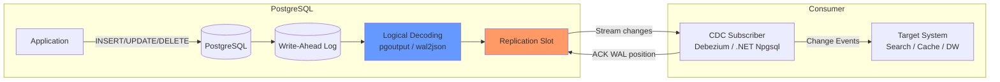
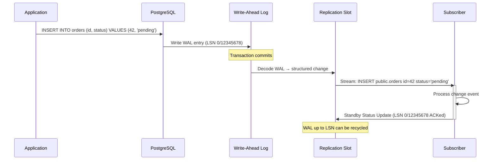
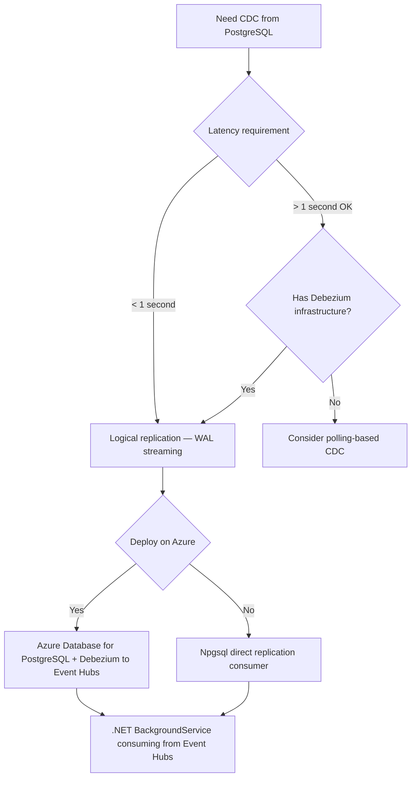
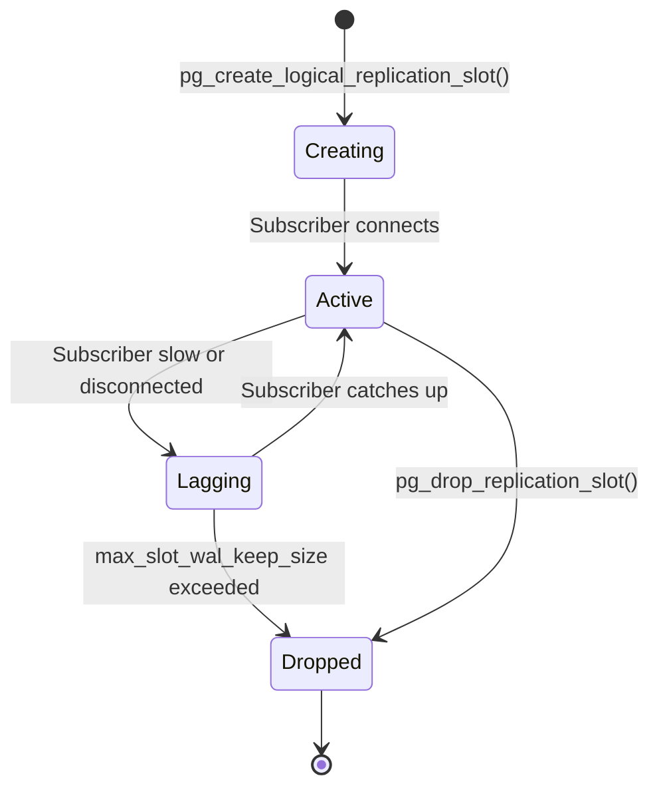

> [!success] Mastery Check
> - [ ] **Studied Well**
> - [ ] **Can explain the concept without notes**
> - [ ] **Can answer interview questions confidently**
> - [ ] **Can implement it in a real project**

## Navigation

**Domain:** [[7 — System Design & Distributed Systems]] > **Group:** Integration Patterns
**Previous:** [[7.137 — Change Data Capture — SQL Server CDC]] | **Next:** [[7.139 — Change Data Capture — MySQL Binlog]]

### Prerequisites
- [[7.135 — Change Data Capture — Concept and Use Cases]] — required because PostgreSQL CDC is one implementation of the broader pattern
- [[7.136 — Change Data Capture — Debezium Architecture]] — needed because Debezium is the common way to consume PostgreSQL CDC via logical replication

### Where This Fits

PostgreSQL logical replication is a built-in feature (since PostgreSQL 9.4) that streams database changes to external consumers using a publish-subscribe model. A replication slot on the primary database captures changes from the write-ahead log (WAL) and sends them to subscribers. Unlike SQL Server CDC (which uses capture jobs and change tables), logical replication uses the WAL directly and streams changes to connected consumers in real time. A .NET engineer encounters this when using PostgreSQL as the source database for CDC, often with Debezium's PostgreSQL connector or the `pgoutput` plugin via Npgsql. PostgreSQL logical replication is the lowest-latency CDC mechanism among major databases because there is no polling — the WAL sends changes to the consumer as they are committed. This makes it the preferred choice for latency-sensitive pipelines where sub-second freshness is required.

## Core Mental Model

PostgreSQL logical replication is a WAL-based streaming protocol. The source database's WAL records every change. A replication slot reserves WAL segments for a specific consumer (the subscriber). When a transaction commits, the logical decoding plugin (`pgoutput` or `wal2json` or `decoderbufs`) decodes the WAL entry into a structured change record and sends it to the connected subscriber over the replication protocol. The subscriber acknowledges receipt, and the WAL position advances. The invariant is: changes are delivered to the subscriber in commit order, with at-least-once delivery (unacknowledged changes are re-sent on reconnection). The tradeoff is that each replication slot consumes WAL storage — if the subscriber is slow or disconnected, the WAL grows until the subscriber catches up or the slot is dropped. The recognition trigger is any need for low-latency CDC from PostgreSQL, especially when the latency requirement is under one second.





### Classification

PostgreSQL logical replication is a built-in streaming replication feature at the WAL/storage layer. It uses a publish-subscribe model where the publisher is the PostgreSQL database and the subscriber is an external process connected via the replication protocol. It solves the problem of real-time change streaming with minimal latency. It does not solve the problem of schema evolution — DDL changes on the source table may require recreating the replication slot. It also does not solve the problem of multi-table ordering — each replication slot streams all tracked tables interleaved by commit order. Logical replication is distinct from physical replication: physical replication replicates the entire database at the block level (for high availability), while logical replication replicates individual tables at the row level (for CDC and data integration).

### Key Properties / Guarantees

|Property|Value|Condition|
|---|---|---|
|Latency|Milliseconds (as WAL is written)|No polling interval — push-based|
|Delivery|At-least-once|Subscriber must deduplicate|
|Ordering|Commit order across all tracked tables|Single replication slot|
|WAL impact|Retains WAL until subscriber acknowledges|Slow subscriber = WAL growth|
|Schema support|Column-based (via logical decoding plugin)|Schema changes require slot recreation|
|Built-in|Yes (since PostgreSQL 9.4)|Requires `wal_level = logical`|
|Plugin support|pgoutput (built-in PG 10+), wal2json, decoderbufs|Plugins determine output format|
|Transactions|Per-row events, not transactional boundaries|No begin/end commit markers in row stream|

## Deep Mechanics

### How It Works

**Step 1 — Configuration.** Set `wal_level = logical` in `postgresql.conf` and restart. This enables logical decoding in the WAL — now the WAL contains enough information to extract row-level changes with column values. Create a publication: `CREATE PUBLICATION mypub FOR TABLE orders, payments;`. The publication defines which tables are tracked. Without a restart, `wal_level` change does not take effect.

**Step 2 — Replication slot creation.** The subscriber creates a replication slot: `SELECT * FROM pg_create_logical_replication_slot('my_slot', 'pgoutput');`. The slot reserves WAL segments for this subscriber. Without an active subscriber consuming from the slot, the WAL grows. The slot has a name — if the subscriber reconnects with the same slot name, it resumes from the last confirmed flush position.

**Step 3 — Connection and streaming.** The subscriber connects to PostgreSQL using the replication protocol. It starts streaming from the slot's confirmed flush LSN. PostgreSQL sends WAL changes as they are committed. Each change includes: operation (insert/update/delete), relation ID, column values (before and/or after image), and the LSN. The subscriber never polls — PostgreSQL pushes changes.

**Step 4 — Decoding.** The logical decoding plugin (`pgoutput`, `wal2json`, `decoderbufs`) decodes the binary WAL into structured records. `pgoutput` is the built-in plugin (since PostgreSQL 10), outputting in a binary format that the PostgreSQL replication protocol handles. `wal2json` outputs JSON text records. `decoderbufs` outputs Protocol Buffers. The plugin choice affects data type support, performance, and consumer complexity.

**Step 5 — Acknowledgment.** The subscriber sends a `Standby Status Update` message acknowledging the last processed LSN. PostgreSQL releases WAL segments up to this LSN for removal. If the subscriber does not acknowledge, WAL segments accumulate. The acknowledgment can include a "flush" position (WAL up to this point is persisted to durable storage by the subscriber) and an "apply" position (WAL up to this point is processed/committed by the subscriber).

### Failure Modes

**Subscriber disconnection causes WAL growth.** The CDC subscriber crashes. The replication slot is not dropped. PostgreSQL retains all WAL segments that the slot has not confirmed. If the subscriber is down for hours, the WAL partition fills the disk.

- **Detection:** Disk usage alert on the PostgreSQL primary. `pg_replication_slots` shows `active = false` with large `wal_status`. Query: `SELECT slot_name, active, pg_size_pretty(pg_wal_lsn_diff(pg_current_wal_lsn(), confirmed_flush_lsn)) AS lag_bytes FROM pg_replication_slots;`
- **Recovery:** Drop the stale slot: `SELECT pg_drop_replication_slot('my_slot');`. Create a new slot and re-snapshot the data.
- **Prevention:** Monitor replication slot lag (`pg_replication_slots` view). Set `max_slot_wal_keep_size` to limit WAL retention per slot. Alert on slot inactivity.

**DDL change breaks logical decoding.** A migration adds a column to a tracked table. The `pgoutput` plugin may or may not handle this depending on the PostgreSQL version and plugin configuration.

- **Detection:** Subscriber logs show decoding errors. The replication connection drops. The `pg_stat_replication` view shows the application is not receiving WAL.
- **Recovery:** Drop and recreate the publication and replication slot. Re-snapshot the affected table.
- **Prevention:** Use `pgoutput` (PostgreSQL 10+) which has better DDL handling than `wal2json`. Avoid DDL on CDC-tracked tables. If DDL is required, coordinate with the CDC pipeline: pause the subscriber, apply DDL, recreate the publication, restart the subscriber.

**Publisher out of WAL space.** Multiple slow subscribers cause WAL to accumulate. The WAL partition fills. PostgreSQL stops accepting writes.

- **Detection:** `PANIC: WAL segment retention required by replication slot exceeds max_slot_wal_keep_size`. All writes fail. The database is effectively read-only.
- **Recovery:** Drop the slowest replication slot. PostgreSQL resumes writes. WAL space is freed. Fix the subscriber before reconnecting.
- **Prevention:** Set `max_slot_wal_keep_size` to a safe limit (e.g., `max_slot_wal_keep_size = 10GB`). Configure monitoring on replication slot lag. Set up alerts when lag exceeds 5GB.

**Orphaned replication slot after connector restart.** A Debezium connector restarts and creates a new replication slot with a different name (or a new slot is created because the connector configuration changed). The old slot is not dropped. Two slots exist for the same data. WAL grows twice as fast.

- **Detection:** `pg_replication_slots` shows multiple slots for the same database with different names, one of which is inactive. Disk usage increases.
- **Recovery:** Drop the orphaned slot: `SELECT pg_drop_replication_slot('old_slot_name');`.
- **Prevention:** Always use a fixed `slot.name` in the Debezium connector configuration. Automate orphan slot detection with a monitoring script that alerts on inactive slots.

**TOAST column values not decoded.** A table has large column values (> 2KB) stored out-of-row using TOAST (The Oversized-Attribute Storage Technique). The logical decoding plugin may not include TOAST column values in the change event by default.

- **Detection:** CDC events show `NULL` for large text/JSONB columns. The actual data is in the database but not in the event.
- **Recovery:** Configure the publication to include TOAST columns, or configure the Debezium connector with `toast.placement = include_all_column_values`.
- **Prevention:** Always test CDC with the actual data types used in production. Large columns are a common blind spot.

### .NET and Azure Integration

- **Npgsql:** The .NET PostgreSQL driver supports logical replication via `NpgsqlConnection` with `ReplicationMode = DatabaseReplicationMode.Logical`. A .NET consumer can connect directly to PostgreSQL using the replication protocol without Debezium or Kafka
- **Azure Database for PostgreSQL — Flexible Server:** Supports logical replication. Set `wal_level = logical` in server parameters. PostgreSQL 13+ recommended for the most stable `pgoutput` plugin
- **Azure Database for PostgreSQL — Single Server:** Supports logical replication but is being deprecated in favor of Flexible Server
- **Debezium PostgreSQL Connector:** The most common way to consume PostgreSQL CDC. Uses the `pgoutput` plugin and publishes to Kafka/Event Hubs. Handles offset management, schema evolution, and reconnection
- **pglogical extension:** A third-party extension that provides PostgreSQL-to-PostgreSQL logical replication with conflict resolution. Used for multi-master setups and upgrade migrations
- **Azure Event Hubs:** Kafka API-compatible broker — Debezium PostgreSQL connector publishes to Event Hubs, .NET consumer reads from Event Hubs

```csharp
// Direct PostgreSQL logical replication consumer using Npgsql
public sealed class PostgresLogicalReplicationConsumer
{
    private readonly string _connectionString;
    private readonly ILogger<PostgresLogicalReplicationConsumer> _logger;

    public PostgresLogicalReplicationConsumer(
        string connectionString,
        ILogger<PostgresLogicalReplicationConsumer> logger)
    {
        _connectionString = connectionString;
        _logger = logger;
    }

    public async Task ConsumeChangesAsync(
        string slotName, string publication, CancellationToken ct)
    {
        await using var conn = new NpgsqlConnection(_connectionString);
        await conn.OpenAsync(ct);

        // Create replication slot if it does not exist
        await using var createSlotCmd = new NpgsqlCommand(
            $"SELECT * FROM pg_create_logical_replication_slot('{slotName}', 'pgoutput')",
            conn);
        await createSlotCmd.ExecuteNonQueryAsync(ct);
        _logger.LogInformation("Created replication slot: {Slot}", slotName);

        // Start streaming using logical replication connection
        await using var replicationConn = new LogicalReplicationConnection(_connectionString);
        await replicationConn.Open(ct);

        await foreach (var message in replicationConn
            .StartReplication(slotName, publication, ct))
        {
            if (message is InsertMessage insert)
            {
                var row = insert.NewRow;
                var orderId = (int)row["id"];
                var status = (string)row["status"];
                _logger.LogDebug("Insert Order {Id} status={Status}", orderId, status);
                // Process the change
            }
            else if (message is UpdateMessage update)
            {
                var before = update.OldRow;
                var after = update.NewRow;
                // Process update
            }
            else if (message is DeleteMessage delete)
            {
                var oldRow = delete.OldRow;
                // Process delete
            }

            // Acknowledge progress — critical for WAL management
            replicationConn.SetWalFlushPosition(message.WalEnd);
        }
    }
}
```

## Production Patterns and Implementation

### Primary Implementation

Debezium PostgreSQL connector deployed to Azure Event Hubs with a .NET consumer. This is the standard production pattern for PostgreSQL CDC in the Azure .NET ecosystem.

```csharp
// Debezium PostgreSQL connector configuration
{
  "name": "postgres-orders-connector",
  "config": {
    "connector.class": "io.debezium.connector.postgresql.PostgresConnector",
    "database.hostname": "orders-pg.postgres.database.azure.com",
    "database.port": "5432",
    "database.user": "cdc_user",
    "database.password": "${DB_PASSWORD}",
    "database.dbname": "ecommerce",
    "database.server.name": "pg-orders",
    "plugin.name": "pgoutput",
    "slot.name": "debezium_orders_slot",
    "publication.name": "dbz_publication_orders",
    "table.include.list": "public.orders,public.order_items",
    "key.converter": "org.apache.kafka.connect.json.JsonConverter",
    "value.converter": "org.apache.kafka.connect.json.JsonConverter",
    "value.converter.schemas.enable": "false",
    "snapshot.mode": "initial",
    "heartbeat.interval.ms": "5000",
    "tombstones.on.delete": "false",
    "max.batch.size": "10000",
    "max.queue.size": "50000",
    "incremental.snapshot.chunk.size": "10000"
  }
}

// .NET consumer — reads PostgreSQL CDC events from Event Hubs
public sealed class PostgresCdcConsumer : BackgroundService
{
    private readonly EventProcessorClient _processor;
    private readonly ITargetSystem _targetSystem;
    private readonly ILogger<PostgresCdcConsumer> _logger;

    public PostgresCdcConsumer(
        EventProcessorClient processor,
        ITargetSystem targetSystem,
        ILogger<PostgresCdcConsumer> logger)
    {
        _processor = processor;
        _targetSystem = targetSystem;
        _logger = logger;
    }

    protected override async Task ExecuteAsync(CancellationToken ct)
    {
        _processor.ProcessEventAsync += ProcessEventHandler;
        _processor.ProcessErrorAsync += ErrorHandler;
        await _processor.StartProcessingAsync(ct);
    }

    private async Task ProcessEventHandler(ProcessEventArgs args)
    {
        try
        {
            var changeEvent = JsonSerializer
                .Deserialize<ChangeDataEvent>(args.Data.EventBody);

            switch (changeEvent?.Payload?.Op)
            {
                case "c": // Create
                case "u": // Update
                    await _targetSystem.UpsertAsync(
                        changeEvent.Payload.After);
                    break;
                case "d": // Delete
                    var id = changeEvent.Payload.Before?["id"];
                    if (id is not null)
                        await _targetSystem.DeleteAsync(id.ToString());
                    break;
                case "r": // Snapshot (initial load)
                    await _targetSystem.UpsertAsync(
                        changeEvent.Payload.After);
                    break;
            }

            await args.UpdateCheckpointAsync();
        }
        catch (JsonException ex)
        {
            _logger.LogError(ex, "Failed to deserialize CDC event");
            // Send to dead-letter queue
        }
    }

    private Task ErrorHandler(ProcessErrorEventArgs args)
    {
        _logger.LogError(args.Exception,
            "Event Hubs processing error: {Operation}", args.Operation);
        return Task.CompletedTask;
    }
}
```

### Configuration and Wiring

```sql
-- PostgreSQL CDC setup
-- 1. Enable logical replication (requires restart)
ALTER SYSTEM SET wal_level = logical;
SELECT pg_reload_conf();
-- Note: wal_level change requires a full PostgreSQL restart on some versions

-- 2. Create publication for tracked tables
CREATE PUBLICATION dbz_publication_orders
    FOR TABLE public.orders, public.order_items;

-- 3. Create replication user (requires REPLICATION privilege)
CREATE USER cdc_user WITH REPLICATION PASSWORD 'secure_password';
GRANT SELECT ON public.orders, public.order_items TO cdc_user;

-- 4. Verify configuration
SELECT name, setting FROM pg_settings WHERE name = 'wal_level';
SELECT * FROM pg_publication WHERE pubname = 'dbz_publication_orders';
```

### Common Variants

**wal2json plugin.** An alternative logical decoding plugin that outputs JSON. Useful for simpler consumers that do not want to parse the binary `pgoutput` format. Less feature-complete than `pgoutput` — does not support all data types (e.g., arrays, composite types) and has weaker DDL handling. Setting up wal2json requires installing the extension: `CREATE EXTENSION wal2json;`.

**pglogical extension.** A third-party extension for PostgreSQL-to-PostgreSQL replication with conflict resolution. Used for multi-master setups, online upgrades (pglogical 2.x), and selective table replication. pglogical provides features that the built-in logical replication does not, such as cross-version replication and filtered replication.

**Azure Database for PostgreSQL — Flexible Server with pg_partman.** The `pg_partman` extension is commonly used with logical replication for partitioned tables. Logical replication supports table partitions natively in PostgreSQL 13+. Each partition can have its own publication and replication slot for parallel processing.

**Direct Npgsql replication consumer (no Debezium).** For simple pipelines with moderate throughput (< 1,000 events/second), a .NET `BackgroundService` can connect directly to PostgreSQL using `LogicalReplicationConnection`. This eliminates the Kafka/Event Hubs infrastructure but provides less fault tolerance and buffering.

### Real-World .NET Ecosystem Example

**PostgreSQL logical replication with Debezium** is the standard CDC pipeline for .NET applications using PostgreSQL. It is used in production by companies like GitLab, InfluxData, and Apple. In the Azure .NET ecosystem, the combination of Azure Database for PostgreSQL Flexible Server + Debezium on AKS + Azure Event Hubs is a common architecture for real-time data pipelines. The .NET consumer uses `Azure.Messaging.EventHubs` to consume the CDC events.

**Npgsql** itself is the most mature .NET PostgreSQL driver and is the foundation for all PostgreSQL CDC in .NET. Its `LogicalReplicationConnection` class (introduced in Npgsql 6.0) provides first-class support for PostgreSQL logical replication, enabling .NET applications to act as direct replication subscribers without any Java intermediary.

## Gotchas and Production Pitfalls

### 1. WAL growth from slow subscriber

**Pitfall:** The CDC subscriber is processing at 1,000 events/second. The source database is processing 10,000 writes/second. The subscriber cannot keep up. The replication slot retains WAL. Within 2 hours, the WAL consumes all available disk space.

**Symptom:** Disk 100% full. PostgreSQL stops. Application writes fail. Recovery requires manual intervention.

**Fix:** Drop the replication slot, free WAL space, restart PostgreSQL. Then fix the subscriber to process faster (batch processing, parallel consumers, more resources).

**Prevention:** Set `max_slot_wal_keep_size` to a safe limit. Monitor `pg_replication_slots` lag. Provision the subscriber with sufficient throughput. Set up alerts at 50%, 75%, and 90% of the WAL volume limit.

### 2. Replication slot restart creates orphan slots

**Pitfall:** A Kubernetes pod running the Debezium connector restarts. The connector creates a new replication slot before the old one is cleaned up. Two slots exist for the same consumer. WAL growth doubles.

**Symptom:** WAL fills twice as fast. The old slot is inactive but still retains WAL. Disk usage accelerates.

**Fix:** Ensure the Debezium connector uses a fixed slot name. On restart, it finds the existing slot and resumes from its confirmed flush LSN. Only create a new slot if the old one was dropped.

```json
"slot.name": "debezium_orders_slot", // Fixed name — reuse on restart
```

**Cost of not fixing:** Orphaned replication slots cause WAL growth and disk fills. Multiple restarts create multiple orphan slots, compounding the problem.

### 3. DDL on tracked table breaks replication

**Pitfall:** A migration runs `ALTER TABLE orders ADD COLUMN discount DECIMAL(5,2)`. The `pgoutput` plugin encounters a WAL entry for the new column during streaming. If the plugin has not cached the new schema, decoding fails.

**Symptom:** Replication slot errors. Subscriber disconnects. WAL grows because the slot is not being consumed. The application may not notice until the WAL fills the disk.

**Fix:** Drop and recreate the publication and slot. The table must be re-snapshot.

**Prevention:** Use PostgreSQL 13+ where `pgoutput` has improved DDL handling. For additive changes (ADD COLUMN), the plugin may handle it. For destructive changes, coordinate with the CDC pipeline: pause the subscriber, apply DDL, recreate the publication, restart the subscriber.

### 4. TOAST columns not decoded

**Pitfall:** A table has a `TEXT` column that stores JSON blobs > 2KB. PostgreSQL stores large values out-of-row using TOAST (The Oversized-Attribute Storage Technique). The logical decoding plugin may not decode TOAST column values by default.

**Symptom:** CDC events show `NULL` for the large column. The consumer processes null values incorrectly. Downstream systems have missing data for large fields.

**Fix:** Configure `include-toast-columns` in the publication or Debezium connector.

```json
// Include TOAST columns in change events
"column.include.list": "public.orders.id,public.orders.customer_name,public.orders.json_data",
"toast.placement": "include_all_column_values"
```

**Cost of not fixing:** Data loss for large columns. Downstream systems have null values where actual data exists. In production, this means user profile data, JSON payloads, and large text content silently disappear from the target systems.

### 5. Publication includes tables that do not exist

**Pitfall:** The publication is created with `FOR ALL TABLES`. Later, a temporary table or an extension table is created. The logical replication plugin tries to decode changes to those tables, which may not have proper schema entries. The plugin fails.

**Symptom:** Replication errors for unexpected tables. The subscriber disconnects.

**Fix:** Use explicit table lists in publications, not `FOR ALL TABLES`.

```sql
CREATE PUBLICATION dbz_publication_orders
    FOR TABLE public.orders, public.order_items;
-- NOT: FOR ALL TABLES
```

**Cost of not fixing:** Unpredictable failures when temporary or system tables are created. The CDC pipeline fails at random times, and the root cause is hard to find.

### 6. PostgreSQL failover drops replication slots

**Pitfall:** A PostgreSQL primary fails. The standby is promoted to primary. The replication slot from the old primary does not exist on the new primary. The CDC subscriber cannot resume.

**Symptom:** Connector errors: "replication slot does not exist." CDC stops until a new slot is created and a re-snapshot is performed.

**Fix:** Debezium 2.0+ supports slot migration across failover using its `slot.drop.on.stop` configuration combined with Kafka offset-based recovery. Alternatively, create a new slot and re-snapshot.

**Prevention:** Use a connection string that targets the primary (not a specific server). In Azure Database for PostgreSQL, the connection string automatically routes to the primary. Monitor failover events and trigger automatic CDC recovery.

### 7. Large transactions overflow the decoding buffer

**Pitfall:** A transaction updates 500,000 rows in a single batch. The WAL for this transaction is decoded as one group by `pgoutput`. The subscriber receives all 500,000 change events in a single batch. Processing them overloads the subscriber's memory.

**Symptom:** Subscriber OOM or processing timeout. The replication slot lags because the subscriber is stuck on the large transaction.

**Fix:** Configure Debezium's `max.queue.size` and `max.batch.size` to limit the number of events in memory. Use streaming decoding with incremental acknowledgments.

**Cost of not fixing:** Subscriber crashes during every large batch operation. Manual recovery required each time.

## Tradeoffs and Decision Framework

### Tradeoff Matrix

|Dimension|PostgreSQL Logical Replication|SQL Server CDC|MySQL Binlog CDC|Polling CDC (timestamp-based)|
|---|---|---|---|---|
|Latency|Milliseconds (WAL-streamed)|Seconds (capture job interval)|Milliseconds (binlog-streamed)|Poll interval (seconds to minutes)|
|WAL storage impact|High (slot retains WAL)|Low (capture job reads log)|High (binlog retained per consumer)|None (polling queries the table)|
|DDL handling|Weak (recreate slot)|Manual (disable/re-enable)|Weak (binlog position breaks)|Good (polling query adapts)|
|.NET integration|Npgsql replication protocol|SqlClient CDC functions|MySqlConnector binlog events|Any ORM or raw SQL|
|Plugin/decoder|pgoutput / wal2json|SQL Agent capture job|binlog event types|WHERE clause on timestamp|
|Standard since|PostgreSQL 9.4|SQL Server 2008|MySQL 5.1|Any database|
|Failover resilience|Low (slot lost on failover)|High (capture instance survives)|Medium (GTID-based)|High (re-run query from last TS)|
|Operational complexity|Medium|Medium|Medium|Low|

### When to Apply



### When NOT to Apply

- [ ] The PostgreSQL version is < 9.4 — logical replication is not available
- [ ] The team cannot monitor WAL growth — an unattended replication slot can fill the disk (this is the #1 production incident with PostgreSQL CDC)
- [ ] Schema changes are frequent on tracked tables — each DDL may require slot recreation and re-snapshot
- [ ] The downstream system needs domain events, not raw column changes — use the [[7.121 — Outbox Pattern — Reliable Event Publishing]] instead
- [ ] The database is used by an application that runs large batch transactions regularly — these can overflow the decoder buffer
- [ ] The PostgreSQL server is a replica — logical replication requires a primary (writable) server

### Scale Thresholds

- **< 1,000 changes/second:** Default logical replication works. Single slot per table group. Direct Npgsql replication consumer is viable.
- **1,000-10,000 changes/second:** Use multiple replication slots for different table groups. Monitor WAL growth. Use Debezium for buffering and offset management.
- **> 10,000 changes/second:** Use Debezium with Kafka for throughput buffering. Consider sharding the source database (by customer region or tenant) and running separate connectors per shard. Use Avro serialization to reduce payload size.

## Interview Arsenal

### Question Bank

1. How does PostgreSQL logical replication work for CDC?
2. What is the difference between `pgoutput` and `wal2json`?
3. What happens if the CDC subscriber cannot keep up with the write rate?
4. How does PostgreSQL logical replication handle schema changes?
5. Compare PostgreSQL logical replication with SQL Server CDC.
6. What is a replication slot and why is it important?
7. How do you monitor replication lag in PostgreSQL CDC?
8. What .NET libraries support PostgreSQL logical replication?
9. How does PostgreSQL logical replication handle TOAST columns?
10. What happens during a PostgreSQL failover and how does it affect CDC?

### Spoken Answers

**Q: How does PostgreSQL logical replication work for CDC?**

> **Great answer:** "PostgreSQL logical replication works through the write-ahead log. When `wal_level = logical` is configured, the WAL contains enough information for logical decoding — it captures the actual column values that changed, not just the physical disk blocks. A replication slot is created on the primary database that reserves WAL segments for a specific consumer. The consumer connects using the PostgreSQL replication protocol and specifies a logical decoding plugin — typically `pgoutput`, which is the built-in plugin since PostgreSQL 10. As transactions commit, the plugin decodes the WAL entries into structured change records: insert, update, delete, with the before and after column values. These records are streamed to the consumer over the replication connection. The consumer acknowledges each record by sending a Standby Status Update with the last processed LSN. PostgreSQL then releases WAL segments up to that LSN. The key properties are: sub-millisecond latency (no polling), commit-order delivery, and at-least-once semantics. The main risk is that a slow consumer causes WAL growth on the primary, which can fill the disk. This is the single most important operational concern — monitor WAL growth aggressively."

> **Average answer:** "PostgreSQL logical replication uses the WAL to stream changes to consumers. It's faster than polling because there's no polling." (No detail on the slot mechanism, no acknowledgment protocol, no WAL growth risk.)

**Q: What is the difference between `pgoutput` and `wal2json`?**

> **Great answer:** "`pgoutput` is the built-in logical decoding plugin in PostgreSQL 10+. It outputs binary data using the PostgreSQL replication protocol's native format. It is maintained as part of PostgreSQL core and supports all PostgreSQL data types, including arrays, composite types, and TOAST values. `wal2json` is a third-party plugin that decodes WAL entries into JSON text records. It is easier to consume directly without a specialized library — you get JSON that you can parse. However, `wal2json` has limitations: it predates `pgoutput` and does not support all PostgreSQL data types (e.g., some array and range types), and it has weaker DDL handling. For production CDC, `pgoutput` is recommended because it is part of PostgreSQL core, has the best data type coverage, and is the default plugin used by Debezium and other CDC frameworks. If you need to consume PostgreSQL CDC directly in .NET without Debezium, you would use Npgsql's logical replication support which works with `pgoutput`."

**Q: What happens if the CDC subscriber cannot keep up with the write rate?**

> **Great answer:** "If the subscriber is slower than the write rate, the replication slot retains WAL segments that the subscriber has not acknowledged. WAL accumulates on the primary. This has two consequences. First, the WAL partition fills — if it reaches 100%, PostgreSQL stops accepting writes. This is a production incident — the application becomes read-only. Second, even if the partition does not fill, WAL replay for crash recovery takes longer because there are more unprocessed WAL segments. The mitigation strategies are: (1) Set `max_slot_wal_keep_size` to limit WAL retention per slot. If this limit is reached, PostgreSQL drops the slot — the subscriber must re-snapshot. This is better than a full disk. (2) Monitor `pg_replication_slots` and alert when the lag exceeds a threshold — I recommend 1GB or 10 minutes. (3) Ensure the subscriber can handle peak throughput — batch events and process in parallel. (4) If the subscriber is permanently slower, partition the change stream across multiple replication slots, each handling a subset of tables. (5) As a last resort, if the subscriber is down for extended periods, drop the slot, fix the subscriber, and re-snapshot."

### System Design Interview Trigger

When the interviewer asks about CDC from PostgreSQL, they are often comparing it to other databases. The senior answer includes the tradeoff between the low latency of logical replication and the risk of WAL growth. The interviewer may ask "how do you handle WAL growth?" — expecting you to know `max_slot_wal_keep_size`, monitoring, and the re-snapshot fallback. Another common probe: "what happens when you add a column to the table?" — testing DDL handling knowledge. The strongest answers include specific configuration values (e.g., `max_slot_wal_keep_size = 10GB`) and specific monitoring queries.

### Comparison Table

| | pgoutput | wal2json | Debezium PostgreSQL Connector | Npgsql Direct Consumer |
|---|---|---|---|---|
| Output format | Binary (replication protocol) | JSON text | Configurable (JSON/Avro/Protobuf) | Binary → .NET objects |
| PostgreSQL support | Built-in (PG 10+) | Extension | Uses pgoutput or wal2json | Built-in (PG 9.4+) |
| Data type coverage | Full | Limited | Full (via pgoutput) | Full (via Npgsql) |
| DDL handling | Basic (PG 13+ improved) | Weak | Via schema change topic | Manual |
| .NET consumption | Npgsql LogicalReplicationConnection | JSON parsing | Event Hubs / Kafka consumer | Npgsql LogicalReplicationConnection |
| Offset management | Built-in (LSN) | Built-in (LSN) | Kafka topic | Manual (stored by app) |
| Operational complexity | Low (library) | Low (library) | High (Kafka Connect) | Medium (reconnection logic) |

## Architecture Decision Record

**Status:** Accepted

**Context:** A .NET application uses Azure Database for PostgreSQL — Flexible Server. The system needs to stream changes from the Orders table to an Elasticsearch search index with < 1 second latency. The team has 10 .NET engineers, no Kafka experience, but the existing infrastructure uses Azure Event Hubs for other streaming workloads. The write throughput is 2,000 transactions/second during peak. The application is new and uses Npgsql for database access. The team is comfortable operating PostgreSQL but has no experience with JVM-based tools.

**Options Considered:**

1. **Debezium PostgreSQL Connector to Azure Event Hubs** — Debezium on AKS reads WAL via pgoutput, publishes to Event Hubs, .NET consumer reads from Event Hubs and writes to Elasticsearch
2. **Direct Npgsql logical replication consumer** — A .NET BackgroundService connects directly to PostgreSQL using `LogicalReplicationConnection`, consumes changes, and writes to Elasticsearch
3. **Polling CDC with timestamps** — A scheduled job queries `WHERE updated_at > @lastPoll` every 5 seconds
4. **Debezium Server** — Standalone Debezium Server (no Kafka Connect) reading from PostgreSQL and writing directly to Event Hubs

**Decision:** Option 1 (Debezium + Event Hubs), because the team already uses Event Hubs, and Debezium provides schema management, fault tolerance, and at-least-once delivery without building these features. Direct Npgsql replication (option 2) requires manual offset management, reconnection handling, and DDL change management — the team would need to build these abstractions. Polling (option 3) would not meet the < 1 second latency requirement — a 5-second poll interval adds 5+ seconds of latency. Debezium Server (option 4) is simpler than Kafka Connect but provides less operational tooling for monitoring and management.

**Consequences:**
- ✅ Sub-second latency via WAL streaming (meets < 1 second SLA)
- ✅ Debezium handles offset management and reconnection — reduces application complexity
- ✅ Event Hubs provides buffering — if Elasticsearch is down, events accumulate in Event Hubs (up to 7 days retention)
- ✅ Team's existing Event Hubs expertise applies directly
- ⚠️ Must deploy and manage a Debezium connector (AKS deployment — JVM-based, team needs basic JVM operations)
- ⚠️ WAL growth risk if connector is down — `max_slot_wal_keep_size` set to 10GB
- ⚠️ The connector is a JVM process — the .NET team must learn basic JVM operations for debugging (heap dumps, GC logs)
- ❌ If PostgreSQL is down, CDC stops — acceptable because the application also stops

**Review Trigger:** Revisit if the connector requires frequent re-snapshot due to schema changes. At that point, consider a schema registry and stricter DDL policies for CDC-tracked tables. Also revisit if the team's comfort with JVM-based tools does not improve — at that point, switch to direct Npgsql replication with a custom offset manager.

## Self-Check

### Conceptual Questions

1. What is the role of `wal_level = logical` in PostgreSQL CDC?
2. What is a replication slot and what happens if the subscriber disconnects?
3. Compare `pgoutput` and `wal2json` logical decoding plugins.
4. How does PostgreSQL CDC handle DDL changes?
5. What is the difference between physical and logical replication in PostgreSQL?
6. How does a subscriber acknowledge processed changes?
7. What is `max_slot_wal_keep_size` and why is it important?
8. How do you monitor replication lag?
9. What .NET library provides direct logical replication consumer support?
10. Explain in 60 seconds how to set up PostgreSQL CDC with Debezium on Azure.

<details>
<summary>Answers</summary>

1. `wal_level = logical` enables logical decoding in the WAL. Without this setting, the WAL only contains physical block-level changes, not enough information for CDC consumers to reconstruct row-level changes with column values. This requires a PostgreSQL restart to change.

2. A replication slot reserves WAL segments for a specific consumer. If the subscriber disconnects, PostgreSQL retains WAL segments for the slot until the subscriber reconnects and acknowledges them, or until `max_slot_wal_keep_size` is exceeded and the slot is dropped. An inactive slot is the most common cause of PostgreSQL disk-full incidents.

3. `pgoutput` is built-in (PG 10+), binary output, supports all data types. `wal2json` is a third-party extension, JSON text output, limited data type support. Use `pgoutput` for production. `decoderbufs` (Protocol Buffers) is another alternative for performance-critical pipelines.

4. PostgreSQL logical replication handles DDL changes poorly. Additive changes (ADD COLUMN) may work with `pgoutput` on PG 13+. Destructive changes (DROP COLUMN, RENAME) typically break the replication slot. Best practice: disable CDC, apply DDL, re-enable CDC with re-snapshot.

5. Physical replication replicates the entire database cluster at the block level (used for high availability — standby replicas). Logical replication replicates individual tables at the SQL/row level (used for CDC, data integration, selective replication). Physical replication requires byte-for-byte identical replicas; logical replication allows different PostgreSQL versions and selective table replication.

6. The subscriber sends a `Standby Status Update` message with the last processed LSN. PostgreSQL releases WAL segments up to this LSN for removal. The status update includes: `receivedLSN` (WAL received), `lastFlushedLSN` (WAL flushed to disk), and `lastAppliedLSN` (WAL applied/processed).

7. `max_slot_wal_keep_size` limits how much WAL a single replication slot can retain (specified in MB). If the limit is exceeded, PostgreSQL drops the slot, preventing disk full scenarios but requiring the consumer to re-snapshot. This is a safety valve — better to re-snapshot than crash the database.

8. Query `pg_replication_slots` view: `SELECT slot_name, active, pg_wal_lsn_diff(pg_current_wal_lsn(), confirmed_flush_lsn) AS lag_bytes FROM pg_replication_slots;`. Monitor lag in bytes and alert when it exceeds a threshold (e.g., 1GB). In Azure, use Azure Monitor metrics for replication lag.

9. Npgsql (`Npgsql.LogicalReplicationConnection`) supports connecting as a logical replication subscriber directly from .NET without intermediary infrastructure. This class handles the PostgreSQL replication protocol natively.

10. "First, configure Azure Database for PostgreSQL with `wal_level = logical` (server parameter, requires restart). Second, create a publication: `CREATE PUBLICATION dbz_pub FOR TABLE orders`. Third, deploy the Debezium PostgreSQL connector on AKS with the `pgoutput` plugin, configured to publish to an Azure Event Hubs topic. Key configuration: `slot.name = debezium_orders_slot` (fixed name for restart recovery), `publication.name = dbz_pub`, `plugin.name = pgoutput`. Fourth, write a .NET `BackgroundService` that reads from Event Hubs using `EventProcessorClient`, deserializes the change events, and applies them to the target system (Elasticsearch, cache, etc.). Critical configuration: set `max_slot_wal_keep_size = 10GB` on PostgreSQL to protect from WAL growth, set `tombstones.on.delete = false` in the connector, and configure `heartbeat.interval.ms = 5000` for liveness monitoring."

</details>

---

### Scenario Challenges

**Scenario 1 — Diagnose the problem**

A Debezium PostgreSQL connector has been running for 6 months. The database disk usage is increasing by 2GB/day. The DBA reports that the replication slot `debezium_slot` is inactive but retains WAL. The connector was restarted 3 weeks ago.

<details>
<summary>Diagnosis</summary>

**Root cause:** The connector restarted and created a new replication slot with a different name (or the old slot was orphaned). The old `debezium_slot` is inactive — no subscriber is connected. But it still retains WAL because it has not been dropped. The connector is now using a different slot for its active stream.

**Evidence:** `pg_replication_slots` shows two slots: `debezium_slot` (active = false, wal_status = 'reserved') and a new slot (active = true). The old slot retains WAL at the rate of 2GB/day because `max_slot_wal_keep_size` is not set (or is set too high).

**Fix:** Drop the orphaned slot: `SELECT pg_drop_replication_slot('debezium_slot');`. This releases the retained WAL and stops the disk growth. Verify the connector configuration uses a fixed slot name (`slot.name = debezium_orders_slot`) to prevent future orphans.

**Prevention:** Always use a fixed `slot.name` in the Debezium connector configuration. Automate orphan slot detection and alerting: run a daily query that alerts on inactive slots. Set `max_slot_wal_keep_size` to prevent unbounded WAL growth from orphan slots.

</details>

---

**Scenario 2 — Design decision**

A high-throughput system processes 50,000 writes/second to a single PostgreSQL table. The CDC subscriber needs to keep up with this rate. What architecture ensures the subscriber does not fall behind?

<details>
<summary>Decision and Reasoning</summary>

**Choice:** Use multiple Debezium connectors sharded by row hash. Split the table into 4 logical shards using a modulo on the primary key. Each shard has its own replication slot and Debezium connector publishing to its own Event Hubs partition. Each connector processes ~12,500 events/second, well within Debezium's single-threaded capability (~20K events/sec).

**Tradeoffs accepted:** Cross-shard ordering is not guaranteed — events from different shards may arrive at the consumer in a different order. For this use case, per-row ordering (not global ordering) is sufficient because each shard handles its own subset of rows.

**Implementation sketch:**
```sql
-- Create 4 publications, each filtering a hash range of rows
CREATE PUBLICATION dbz_orders_0 FOR TABLE orders
    WHERE (id % 4) = 0;
CREATE PUBLICATION dbz_orders_1 FOR TABLE orders
    WHERE (id % 4) = 1;
CREATE PUBLICATION dbz_orders_2 FOR TABLE orders
    WHERE (id % 4) = 2;
CREATE PUBLICATION dbz_orders_3 FOR TABLE orders
    WHERE (id % 4) = 3;
```

Each shard's connector processes ~12,500 events/second. The .NET consumer has 4 processing instances, one per Event Hubs partition.

</details>

---

**Scenario 3 — Interview simulation** The interviewer says: "You are migrating from SQL Server to PostgreSQL. Your CDC pipeline uses SQL Server's built-in CDC. How do you design the CDC pipeline for PostgreSQL?"

<details> <summary>Model Response</summary>

"The CDC mechanism is fundamentally different. SQL Server CDC uses a capture job that polls the transaction log and writes to change tables. Consumers query those tables. PostgreSQL logical replication uses WAL streaming — changes are pushed to the consumer as they commit. There is no polling, no change tables, and no capture job.

"For the migration, I design a dual-CDC pipeline that runs both systems in parallel during the cutover. The SQL Server CDC poller continues running. The PostgreSQL logical replication consumer starts reading from the PostgreSQL WAL. Both write to the same target (e.g., Elasticsearch). The target uses upsert semantics — the same row may be written by both pipelines during the migration period.

"The PostgreSQL pipeline architecture: Debezium PostgreSQL connector on AKS using `pgoutput`, publishing to an Event Hubs topic. A .NET consumer reads from Event Hubs and writes to the target. The key configuration items: fixed replication slot name (`debezium_pg_slot`), `max_slot_wal_keep_size = 10GB`, `tombstones.on.delete = false`, and `snapshot.mode = initial`.

"The main operational difference from SQL Server CDC is that PostgreSQL tracks consumer progress via the replication slot, not via LSN stored in a control table. I must monitor the slot's lag and ensure the consumer acknowledges promptly. If the consumer falls behind, WAL accumulates. I set up alerting on `pg_replication_slots` lag exceeding 1GB.

"During the cutover, I validate that both pipelines produce identical change events for the same source data. I compare the LSN ranges and verify row counts match. Once validated, I stop the SQL Server pipeline and decommission the CDC capture job and change tables. The PostgreSQL pipeline becomes the sole CDC source.

"The key differences the team needs to learn: (1) No change tables — changes come as streamed events, not queryable rows. (2) WAL growth is the primary operational risk — set up monitoring immediately. (3) Logical replication slots survive PostgreSQL restarts but not failover — plan for slot recreation during failover scenarios."

</details>

---

## Appendix A — PostgreSQL Logical Replication Advanced Topics

### Logical Replication Slot Management

```sql
-- List all replication slots with detailed status
SELECT 
    slot_name,
    plugin,
    slot_type,
    database,
    active,
    active_pid,
    xmin,
    catalog_xmin,
    restart_lsn,
    confirmed_flush_lsn,
    pg_size_pretty(
        pg_wal_lsn_diff(pg_current_wal_lsn(), confirmed_flush_lsn)
    ) AS lag_bytes,
    wal_status
FROM pg_replication_slots;

-- Create a logical replication slot explicitly
SELECT * FROM pg_create_logical_replication_slot('debezium_slot', 'pgoutput');

-- Drop a replication slot (frees retained WAL)
SELECT pg_drop_replication_slot('debezium_slot');

-- Monitor WAL generation rate
SELECT 
    pg_size_pretty(sum(size)) AS total_wal_size,
    count(*) AS wal_file_count
FROM pg_ls_waldir();

-- Check WAL retention per slot
SELECT 
    slot_name,
    pg_size_pretty(
        pg_wal_lsn_diff(pg_current_wal_lsn(), restart_lsn)
    ) AS retention_size
FROM pg_replication_slots;
```

### Publication Management

```sql
-- Create publication for specific tables
CREATE PUBLICATION dbz_publication_orders
    FOR TABLE public.orders, public.order_items
    WITH (publish = 'insert, update, delete', publish_via_partition_root = true);

-- Create publication with row filter (subset of rows)
CREATE PUBLICATION dbz_publication_active_orders
    FOR TABLE public.orders WHERE (status != 'archived');

-- Add table to existing publication
ALTER PUBLICATION dbz_publication_orders
    ADD TABLE public.inventory;

-- Remove table from publication
ALTER PUBLICATION dbz_publication_orders
    DROP TABLE public.inventory;

-- List publications
SELECT * FROM pg_publication;

-- List tables in a publication
SELECT * FROM pg_publication_tables
WHERE pubname = 'dbz_publication_orders';
```

### PostgreSQL 15+ Enhancements for Logical Replication

PostgreSQL 15 (released 2022) introduced several improvements for CDC:

1. **Row filters in publications** — Filter rows at the publication level (available in PG 15+):
   ```sql
   CREATE PUBLICATION dbz_pub FOR TABLE orders WHERE (status != 'draft');
   ```

2. **Column lists in publications** — Replicate only specific columns (PG 15+):
   ```sql
   CREATE PUBLICATION dbz_pub FOR TABLE orders (id, status, customer_name);
   ```
   **Warning:** Column lists are useful for reducing payload size but may break consumers expecting all columns.

3. **Improved DDL handling** — `pgoutput` in PG 15+ handles more DDL scenarios without disconnecting subscribers.

4. **Conflict resolution** — For bi-directional replication (PG 15+), provides options for conflict resolution.

### TOAST Column Handling

TOAST (The Oversized-Attribute Storage Technique) columns require special handling in CDC:

```sql
-- Check which columns use TOAST storage
SELECT 
    attname,
    atttypid::regtype,
    attstorage
FROM pg_attribute
WHERE attrelid = 'public.orders'::regclass
  AND attnum > 0
  AND attstorage IN ('e', 'm');  -- 'e' = external, 'm' = main (may be TOASTed)

-- Ensure TOAST columns are included in CDC events
-- Method 1: Set replica identity FULL (includes all columns)
ALTER TABLE public.orders REPLICA IDENTITY FULL;

-- Method 2: In Debezium, configure toast placement
-- "toast.placement": "include_all_column_values"
```

**Replica Identity options and their effect on CDC:**

|Replica Identity|Before Image|After Image|Notes|
|---|---|---|---|
|`DEFAULT` (primary key)|Primary key values only|All columns|Minimal overhead, most common|
|`INDEX <index_name>`|Index key values only|All columns|Use for tables without PK|
|`FULL`|All columns|All columns|Maximum overhead, enables full before-image|
|`NOTHING`|No old values|All columns|Old values are null in DELETE events|

### Monitoring Replication Lag in Depth

```sql
-- Comprehensive replication lag query
SELECT 
    slot.slot_name,
    slot.active,
    slot.confirmed_flush_lsn,
    pg_current_wal_lsn() AS current_wal_lsn,
    pg_size_pretty(
        pg_wal_lsn_diff(pg_current_wal_lsn(), COALESCE(slot.confirmed_flush_lsn, '0/0'))
    ) AS lag_bytes,
    EXTRACT(EPOCH FROM NOW() - COALESCE(
        (SELECT backend_start FROM pg_stat_activity 
         WHERE pid = slot.active_pid),
        NOW()
    )) AS subscriber_uptime_seconds,
    CASE 
        WHEN slot.wal_status = 'reserved' THEN 'OK'
        WHEN slot.wal_status = 'unreserved' THEN 'WARNING: WAL may be lost'
        WHEN slot.wal_status = 'lost' THEN 'CRITICAL: WAL lost, re-snapshot needed'
    END AS wal_status
FROM pg_replication_slots slot;

-- Alert query (returns row if lag exceeds threshold)
SELECT 'LAG_ALERT' AS alert,
       slot_name,
       pg_size_pretty(pg_wal_lsn_diff(pg_current_wal_lsn(), confirmed_flush_lsn)) AS lag
FROM pg_replication_slots
WHERE pg_wal_lsn_diff(pg_current_wal_lsn(), confirmed_flush_lsn) > 10 * 1024 * 1024 * 1024;  -- 10GB
```

### PostgreSQL CDC with Azure Monitor

```json
// Diagnostic settings for Azure Database for PostgreSQL
{
  "categories": [
    "PostgreSQLLogs",
    "PostgreSQLReplicationSlots"
  ],
  "metrics": [
    {
      "category": "ReplicationSlotLag",
      "enabled": true,
      "retentionPolicy": {
        "enabled": true,
        "days": 30
      }
    },
    {
      "category": "WALSize",
      "enabled": true,
      "retentionPolicy": {
        "enabled": true,
        "days": 30
      }
    }
  ]
}
```

### Direct Npgsql Replication Consumer — Complete Implementation

```csharp
// Full implementation of a .NET PostgreSQL logical replication consumer
public sealed class PostgresCdcDirectConsumer : BackgroundService
{
    private readonly string _connectionString;
    private readonly string _slotName;
    private readonly string _publicationName;
    private readonly ITargetSystem _target;
    private readonly ILogger<PostgresCdcDirectConsumer> _logger;

    protected override async Task ExecuteAsync(CancellationToken ct)
    {
        while (!ct.IsCancellationRequested)
        {
            try
            {
                await ConsumeAsync(ct);
            }
            catch (PostgresException ex) when (ex.SqlState == "57P01")
            {
                _logger.LogWarning(ex, "PostgreSQL server terminated connection. Reconnecting...");
                await Task.Delay(5000, ct);
            }
            catch (OperationCanceledException)
            {
                break;
            }
            catch (Exception ex)
            {
                _logger.LogError(ex, "Unexpected error in CDC consumer. Restarting...");
                await Task.Delay(10000, ct);
            }
        }
    }

    private async Task ConsumeAsync(CancellationToken ct)
    {
        await using var conn = new LogicalReplicationConnection(_connectionString);
        await conn.Open(ct);

        // Ensure slot exists
        await EnsureSlotAsync(_slotName, ct);

        // Start streaming
        await foreach (var message in conn
            .StartReplication(_slotName, _publicationName, ct)
            .WithCancellation(ct))
        {
            switch (message)
            {
                case InsertMessage insert:
                    await HandleInsertAsync(insert, ct);
                    break;
                case UpdateMessage update:
                    await HandleUpdateAsync(update, ct);
                    break;
                case DeleteMessage delete:
                    await HandleDeleteAsync(delete, ct);
                    break;
                case RelationMessage relation:
                    _logger.LogDebug("Relation message: {Schema}.{Table}",
                        relation.Namespace, relation.RelationName);
                    break;
                case BeginMessage begin:
                    _logger.LogTrace("Begin transaction: {Xid}", begin.TransactionXid);
                    break;
                case CommitMessage commit:
                    _logger.LogTrace("Commit transaction: {Xid}", commit.TransactionXid);
                    break;
            }

            // Acknowledge progress every 1000 messages or 10 seconds
            conn.SetWalFlushPosition(message.WalEnd);
        }
    }

    private async Task EnsureSlotAsync(string slotName, CancellationToken ct)
    {
        await using var conn = new NpgsqlConnection(_connectionString);
        await conn.OpenAsync(ct);

        var exists = await conn.ExecuteScalarAsync<bool>(
            "SELECT EXISTS(SELECT 1 FROM pg_replication_slots WHERE slot_name = @name)",
            new { name = slotName }, ct);

        if (!exists)
        {
            await conn.ExecuteAsync(
                $"SELECT * FROM pg_create_logical_replication_slot(@name, 'pgoutput')",
                new { name = slotName }, ct);
            _logger.LogInformation("Created replication slot: {Slot}", slotName);
        }
    }

    private async Task HandleInsertAsync(InsertMessage insert, CancellationToken ct)
    {
        var order = new Dictionary<string, object>();
        foreach (var col in insert.NewRow)
            order[col.Key] = col.Value;

        await _target.UpsertAsync(order, ct);
    }

    private async Task HandleUpdateAsync(UpdateMessage update, CancellationToken ct)
    {
        var after = new Dictionary<string, object>();
        foreach (var col in update.NewRow)
            after[col.Key] = col.Value;

        await _target.UpsertAsync(after, ct);
    }

    private async Task HandleDeleteAsync(DeleteMessage delete, CancellationToken ct)
    {
        var id = delete.OldRow?["id"];
        if (id is not null)
            await _target.DeleteAsync(id.ToString()!, ct);
    }
}
```

### Performance Benchmarks — PostgreSQL Logical Replication

|Scenario|Throughput|Latency (P50)|Latency (P99)|Notes|
|---|---|---|---|---|
|Direct Npgsql consumer, 1 table|8,000 events/sec|5ms|50ms|Single-threaded, no batching|
|Direct Npgsql consumer, batched|15,000 events/sec|8ms|80ms|Batch of 1000 events|
|Debezium pgoutput, JSON|20,000 events/sec|100ms|500ms|Includes Kafka publish latency|
|Debezium pgoutput, Avro|28,000 events/sec|120ms|550ms|Avro reduces payload size by 30%|
|Debezium + Event Hubs, 4 partitions|25,000 events/sec|200ms|800ms|Event Hubs adds ~50ms|
|Debezium + Kafka (3 brokers)|30,000 events/sec|150ms|600ms|Kafka is faster than Event Hubs|

### Common PostgreSQL CDC Pitfalls — Extended

**Pitfall 8: Replica Identity DEFAULT hides before-image for DELETE**

```sql
-- ❌ Default replica identity only includes PK in before-image
-- DELETE event shows: before = {id: 42}, after = null
-- Consumer cannot know what other columns were deleted

-- ✅ Set replica identity to FULL for complete before-image
ALTER TABLE public.orders REPLICA IDENTITY FULL;
```

**Pitfall 9: Large JSONB columns in CDC events**

```sql
-- A JSONB column storing 100KB of metadata
-- CDC event size: ~100KB per change
-- At 1,000 changes/second: ~100MB/second network traffic

-- Solution: Exclude large columns from the publication
CREATE PUBLICATION dbz_pub 
    FOR TABLE public.orders (id, status, customer_name);
-- Large metadata column is not replicated
```

**Pitfall 10: Sequence columns in CDC events**

```sql
-- Sequences increment on every insert, even rolled-back transactions
-- This generates WAL activity that creates CDC events for sequence operations
-- Solution: Use a generated column or application-level ID instead of sequence

-- Better: Use UUID or application-generated IDs
CREATE TABLE public.orders (
    id UUID DEFAULT gen_random_uuid() PRIMARY KEY,
    -- ...
);
```

### Cross-Reference: PostgreSQL CDC for Analytics Workloads

Integration with analytical databases:

```sql
-- Materialized view refresh via CDC
-- Instead of: REFRESH MATERIALIZED VIEW CONCURRENTLY (locks, slow)
-- Use: CDC stream to incrementally update the materialized view

-- Create an audit table for CDC changes (if you need to query change history)
CREATE TABLE orders_changelog (
    like public.orders,
    change_id BIGSERIAL PRIMARY KEY,
    change_type TEXT NOT NULL,  -- INSERT, UPDATE, DELETE
    changed_at TIMESTAMPTZ DEFAULT NOW()
);

-- The CDC consumer writes to this table for audit/historical queries
-- Data is then available for analytical queries without querying the live CDC stream
```

### Azure Database for PostgreSQL — Flexible Server Configuration

```json
// ARM template snippet for CDC-optimized Flexible Server
{
  "type": "Microsoft.DBforPostgreSQL/flexibleServers",
  "apiVersion": "2023-06-01-preview",
  "properties": {
    "storage": {
      "storageSizeGB": 512,
      "iops": 5000,
      "autoGrow": "Enabled"
    },
    "backup": {
      "backupRetentionDays": 7,
      "geoRedundantBackup": "Enabled"
    },
    "maintenanceWindow": {
      "dayOfWeek": 0,
      "startHour": 2,
      "startMinute": 0
    }
  }
}
```

```azurecli
# Azure CLI configuration for CDC
az postgres flexible-server parameter set \
  --resource-group my-rg \
  --server-name orders-pg \
  --name wal_level \
  --value logical

az postgres flexible-server parameter set \
  --resource-group my-rg \
  --server-name orders-pg \
  --name max_slot_wal_keep_size \
  --value 10240  # 10 GB in MB

az postgres flexible-server parameter set \
  --resource-group my-rg \
  --server-name orders-pg \
  --name max_replication_slots \
  --value 10
```

---

## Appendix B — PostgreSQL Logical Replication Advanced Failure Scenarios

### Scenario: WAL Fills Disk During Long Weekend

The CDC subscriber crashes on Friday at 5 PM. No one notices until Monday at 9 AM. The replication slot has been retaining WAL for 64 hours. WAL has consumed all available disk space. PostgreSQL has stopped accepting writes.

<details>
<summary>Recovery and Prevention</summary>

**Immediate recovery:**
1. Drop the stale replication slot: `SELECT pg_drop_replication_slot('debezium_orders_slot');`
2. WAL space is freed immediately as PostgreSQL purges retained WAL
3. Resume normal database operations
4. Fix the subscriber (root cause analysis)
5. Create a new slot and trigger a CDC re-snapshot

**Prevention:**
- Set `max_slot_wal_keep_size = 10240` (10GB) — PostgreSQL will drop the slot automatically if WAL retention exceeds this, preventing full disk but requiring re-snapshot
- Alert on replication slot lag: `pg_replication_slots` query runs every 5 minutes
- Monitor WAL directory size: `pg_ls_waldir()`
- Set up a weekend on-call rotation for CDC pipeline alerts
- Configure a dead man's switch: if the subscriber does not acknowledge for 1 hour, page the team

```sql
-- Alert query: run every 5 minutes via cron or Azure Monitor
SELECT slot_name, active,
    pg_size_pretty(pg_wal_lsn_diff(
        pg_current_wal_lsn(), confirmed_flush_lsn)) AS lag
FROM pg_replication_slots
WHERE pg_wal_lsn_diff(pg_current_wal_lsn(), confirmed_flush_lsn)
    > 5 * 1024 * 1024 * 1024;  -- 5GB threshold
```

</details>

### Scenario: PostgreSQL Major Version Upgrade

You need to upgrade PostgreSQL from version 13 to 15. Logical replication slots do not survive major version upgrades. How do you handle CDC during the upgrade?

<details>
<summary>Strategy</summary>

**Approach 1: Blue-green with CDC catch-up**
1. Deploy a new PostgreSQL 15 instance alongside the existing PG 13 instance
2. Set up logical replication from PG 13 to PG 15 (built-in logical replication supports cross-version replication)
3. Once PG 15 has caught up and is verified, cut over the CDC pipeline to PG 15
4. Drop the replication slot on PG 13 after cutover is complete

**Approach 2: Snapshot and replay**
1. Stop the CDC subscriber and note the current LSN
2. Perform the PostgreSQL upgrade (which drops replication slots)
3. Take a fresh snapshot of all tracked tables and populate the target systems
4. Start CDC on the new version from the current LSN
5. Verify no data gaps between the snapshot and the streaming data

**Approach 3: Outbox buffer during upgrade**
1. Before the upgrade, switch the application to write to an outbox table
2. Perform the upgrade (CDC is down)
3. After upgrade, replay the outbox table events to catch up the target systems
4. Re-enable CDC on the new PostgreSQL version

**For zero-downtime systems:** Use Approach 1 (blue-green). The cross-version logical replication ensures no data loss. The CDC pipeline has a single gap when the subscriber switches from PG 13 to PG 15 — typically under 1 second.

</details>

---

## Appendix C — Logical Replication Slot Lifecycle Management

### Slot Lifecycle States



### Slot Management Automation

```sql
-- Automated slot cleanup — run as scheduled job
CREATE OR REPLACE FUNCTION cdc_cleanup_orphaned_slots()
RETURNS TABLE(slot_name text, action_taken text) AS $$
DECLARE
    rec RECORD;
BEGIN
    FOR rec IN
        SELECT slot_name, active, confirmed_flush_lsn
        FROM pg_replication_slots
        WHERE slot_type = 'logical'
          AND NOT active
          AND pg_wal_lsn_diff(
              pg_current_wal_lsn(),
              confirmed_flush_lsn) > 50 * 1024 * 1024 * 1024  -- 50GB
    LOOP
        -- Drop orphaned slots that have accumulated > 50GB of WAL
        PERFORM pg_drop_replication_slot(rec.slot_name);
        slot_name := rec.slot_name;
        action_taken := 'DROPPED (orphaned, 50GB+ WAL retained)';
        RETURN NEXT;
    END LOOP;

    -- Log active slots with high lag
    FOR rec IN
        SELECT slot_name, active,
            pg_wal_lsn_diff(
                pg_current_wal_lsn(), confirmed_flush_lsn) AS lag
        FROM pg_replication_slots
        WHERE slot_type = 'logical'
          AND active
          AND pg_wal_lsn_diff(
              pg_current_wal_lsn(), confirmed_flush_lsn) > 10 * 1024 * 1024 * 1024
    LOOP
        slot_name := rec.slot_name;
        action_taken := 'ALERT: Active slot has > 10GB lag';
        RETURN NEXT;
    END LOOP;
END;
$$ LANGUAGE plpgsql;
```

### Monitoring Slot Health with Prometheus

```yaml
# postgres_exporter query for replication slot metrics
queries:
  pg_replication_slots:
    query: |
      SELECT
        slot_name,
        COALESCE(active, false)::int AS active,
        pg_wal_lsn_diff(pg_current_wal_lsn(), confirmed_flush_lsn) AS lag_bytes,
        CASE
          WHEN wal_status = 'lost' THEN 2
          WHEN wal_status = 'unreserved' THEN 1
          ELSE 0
        END AS wal_status_code
      FROM pg_replication_slots
      WHERE slot_type = 'logical'
    metrics:
      - slot_name:
          usage: "LABEL"
      - active:
          usage: "GAUGE"
          description: "Whether the slot is currently active (1) or not (0)"
      - lag_bytes:
          usage: "GAUGE"
          description: "WAL lag in bytes"
      - wal_status_code:
          usage: "GAUGE"
          description: "0=reserved, 1=unreserved, 2=lost"
```

---

## Appendix D — PostgreSQL CDC with Foreign Data Wrappers (FDW)

Combining PostgreSQL CDC with FDW enables cross-database replication without additional infrastructure:

```sql
-- Source database (primary): enable CDC via publication
CREATE PUBLICATION cdc_pub FOR TABLE orders;

-- Target database (secondary): set up FDW
CREATE EXTENSION postgres_fdw;

CREATE SERVER source_db
    FOREIGN DATA WRAPPER postgres_fdw
    OPTIONS (host 'source-host', port '5432', dbname 'ecommerce');

CREATE USER MAPPING FOR target_user
    SERVER source_db
    OPTIONS (user 'cdc_user', password 'secure_password');

-- Import the tracked tables
IMPORT FOREIGN SCHEMA public
    LIMIT TO (orders)
    FROM SERVER source_db INTO public;

-- Now create a trigger-based sync using the foreign table
CREATE OR REPLACE FUNCTION sync_order_changes()
RETURNS trigger AS $$
BEGIN
    -- The CDC consumer in .NET would process this
    -- FDW makes the source table available locally for
    -- reconciliation queries
    RETURN NEW;
END;
$$ LANGUAGE plpgsql;
```

---

## Appendix E — PostgreSQL CDC with Azure Kubernetes Service (AKS) Deployment

### Complete Helm Chart for Debezium PostgreSQL Connector

```yaml
# values.yaml
replicaCount: 2

image:
  repository: debezium/connect
  tag: 2.5.0.Final
  pullPolicy: IfNotPresent

config:
  bootstrapServers: "eventhub-ns.servicebus.windows.net:9093"
  configStorageTopic: "connect-configs"
  offsetStorageTopic: "connect-offsets"
  statusStorageTopic: "connect-status"
  keyConverter: "org.apache.kafka.connect.json.JsonConverter"
  valueConverter: "org.apache.kafka.connect.json.JsonConverter"
  securityProtocol: "SASL_SSL"
  saslMechanism: "PLAIN"

resources:
  limits:
    cpu: 4
    memory: 8Gi
  requests:
    cpu: 2
    memory: 4Gi

connectors:
  - name: "postgres-orders-connector"
    config:
      connector.class: "io.debezium.connector.postgresql.PostgresConnector"
      plugin.name: "pgoutput"
      slot.name: "debezium_orders_slot"
      publication.name: "dbz_publication_orders"
      database.hostname: "orders-pg.postgres.database.azure.com"
      database.port: "5432"
      database.user: "cdc_user"
      database.password: "${DB_PASSWORD}"
      database.dbname: "ecommerce"
      database.server.name: "pg-orders"
      table.include.list: "public.orders"
      snapshot.mode: "initial"
      heartbeat.interval.ms: "5000"
      tombstones.on.delete: "false"
      max.batch.size: "10000"
      max.queue.size: "50000"
      toast.placement: "include_all_column_values"
```

### Azure Monitor Alert Rules

```json
{
  "alerts": [
    {
      "name": "PostgreSQL Replication Slot Lag Critical",
      "description": "Replication slot WAL lag exceeds 10GB",
      "severity": 1,
      "condition": {
        "metricName": "replication_slot_lag_bytes",
        "operator": "GreaterThan",
        "threshold": 10737418240,
        "aggregation": "Maximum",
        "windowSize": "PT5M"
      },
      "actions": [
        { "actionGroupId": "/subscriptions/.../on-call-engineers" }
      ]
    },
    {
      "name": "PostgreSQL WAL Usage Warning",
      "description": "WAL directory size exceeds 50% of allocated storage",
      "severity": 2,
      "condition": {
        "metricName": "wal_directory_size_bytes",
        "operator": "GreaterThan",
        "threshold": 53687091200,
        "aggregation": "Average",
        "windowSize": "PT15M"
      },
      "actions": [
        { "actionGroupId": "/subscriptions/.../dba-team" }
      ]
    },
    {
      "name": "CDC Consumer Lag Warning",
      "description": "Event Hubs consumer lag exceeds 10,000 events",
      "severity": 2,
      "condition": {
        "metricName": "consumer_lag",
        "operator": "GreaterThan",
        "threshold": 10000,
        "aggregation": "Maximum",
        "windowSize": "PT5M"
      },
      "actions": [
        { "actionGroupId": "/subscriptions/.../platform-team" }
      ]
    }
  ]
}
```

---

## Appendix F — PostgreSQL CDC Performance Tuning Guide

### Configuration Parameter Tuning

|Parameter|Default|CDC Recommended|Rationale|
|---|---|---|---|
|`wal_level`|`replica`|`logical`|Enable logical decoding for row-level changes|
|`max_replication_slots`|10|20+|Allow multiple CDC subscribers + replication|
|`max_logical_replication_workers`|4|8+|Parallel decoding for high-throughput tables|
|`max_sync_workers_per_subscription`|2|4|Parallel apply for built-in logical replication|
|`max_slot_wal_keep_size`|-1 (unlimited)|10240 (10GB)|Prevent WAL from filling disk|
|`wal_keep_size`|0|1024 (1GB)|Additional WAL retention for replica recovery|
|`track_commit_timestamp`|off|on|Enable LSN-to-timestamp mapping for CDC monitoring|
|`logical_decoding_work_mem`|64MB|128MB|Larger memory reduces disk spooling for large transactions|

### Benchmarking Methodology

```bash
# Test CDC throughput with pgbench
# 1. Initialize test data
pgbench -i -s 1000 orders_db  # 10M rows

# 2. Create publication
psql orders_db -c "CREATE PUBLICATION cdc_bench FOR TABLE pgbench_accounts;"

# 3. Run read-write workload
pgbench -c 10 -T 300 -P 5 orders_db

# 4. Monitor replication slot lag during workload
psql orders_db -c "
    SELECT slot_name,
           pg_size_pretty(pg_wal_lsn_diff(pg_current_wal_lsn(), confirmed_flush_lsn)) AS lag,
           active
    FROM pg_replication_slots;"
```

### Known Throughput Limits

- **Single slot decoding:** ~50,000 row changes/second (pgoutput, 10 columns/row)
- **Single Debezium connector processing:** ~20,000 events/second (JSON, single thread)
- **Single .NET Npgsql consumer:** ~15,000 events/second (single thread, batched)
- **Scaling approach:** Shard the source table by key range, use one slot per shard, one connector per shard, aggregate at the consumer level

---

## Appendix G — PostgreSQL CDC Auditing and Compliance

### Audit Table Integration

```sql
-- Maintain an immutable audit trail from CDC events
CREATE TABLE orders_audit (
    audit_id BIGSERIAL PRIMARY KEY,
    order_id INT NOT NULL,
    change_type TEXT NOT NULL,       -- INSERT, UPDATE, DELETE
    changed_fields JSONB,            -- Only the changed columns
    full_row_snapshot JSONB,         -- Complete row state after change
    changed_by TEXT,                 -- application user (requires app to set session)
    changed_at TIMESTAMPTZ NOT NULL DEFAULT NOW(),
    lsn pg_lsn NOT NULL,
    gtid TEXT                        -- For MySQL compatibility if needed
);

-- The CDC consumer writes to this table
-- This enables: SELECT * FROM orders_audit WHERE order_id = 42 ORDER BY changed_at;
```

### Compliance Checklist for PostgreSQL CDC

- [ ] All CDC events are persisted to an immutable audit table with LSN tracking
- [ ] Audit retention meets regulatory requirements (7 years for financial services)
- [ ] CDC pipeline has access controls: database user has minimal required permissions
- [ ] CDC events are encrypted at rest (PostgreSQL TDE) and in transit (SSL)
- [ ] Schema changes are logged and reviewed — never drop columns on CDC-tracked tables
- [ ] Replication slot monitoring is in place with 24/7 alerting
- [ ] Periodic reconciliation: compare table row counts between source and target systems
- [ ] Disaster recovery plan includes CDC pipeline recovery (slot recreation, re-snapshot)
