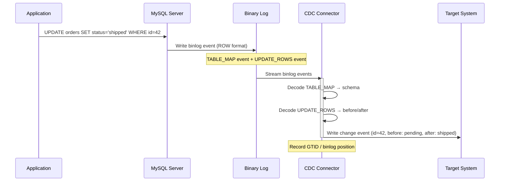
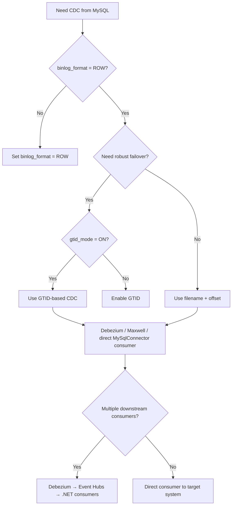

> [!success] Mastery Check
> - [ ] **Studied Well**
> - [ ] **Can explain the concept without notes**
> - [ ] **Can answer interview questions confidently**
> - [ ] **Can implement it in a real project**

## Navigation

**Domain:** [[7 — System Design & Distributed Systems]] > **Group:** Integration Patterns
**Previous:** [[7.138 — Change Data Capture — PostgreSQL Logical Replication]] | **Next:** [[7.140 — Request-Reply Pattern over Async Messaging]]

### Prerequisites
- [[7.135 — Change Data Capture — Concept and Use Cases]] — required because MySQL binlog is one implementation of CDC
- [[7.136 — Change Data Capture — Debezium Architecture]] — needed because Debezium's MySQL connector is the standard CDC consumer

### Where This Fits

MySQL's binary log (binlog) records every data change (insert, update, delete) in the order they are committed. CDC consumers connect to MySQL as a replica would — they read the binlog stream and decode change events. A .NET engineer encounters MySQL binlog CDC when building applications on Azure Database for MySQL (Flexible Server) or Amazon RDS for MySQL, and needs to stream changes to downstream systems like Elasticsearch, Redis, or a data warehouse. MySQL binlog CDC is the most widely deployed CDC mechanism due to MySQL's popularity in the LAMP stack and its use in SaaS platforms. It is the most battle-tested CDC approach — Debezium's MySQL connector is the most deployed Debezium connector globally.

## Core Mental Model

MySQL CDC reads the binary log (binlog) — an ordered sequence of events recording every data modification on the server. The binlog has two formats: `STATEMENT` (SQL text) and `ROW` (actual row changes). For CDC, `binlog_format = ROW` is required — row-based logging captures the before and after images of each changed row. A CDC connector connects to MySQL as a replica, requesting the binlog stream from a specific position. MySQL sends binlog events to the connector, which decodes them into structured change events (insert, update, delete with column values). The connector records its binlog position and resumes from that position on restart. The invariant is: binlog events are delivered in commit order with at-least-once delivery to the connector. The tradeoff is that the binlog is a single sequential stream — a single slow consumer blocks all consumers that need the same binlog position. The recognition trigger is any MySQL-based system that needs real-time change streaming and can tolerate the binlog format requirements.

```mermaid
flowchart LR
    subgraph MySQL
        App[Application] -->|INSERT/UPDATE/DELETE| MySQL[(MySQL)]
        MySQL --> Binlog[(Binary Log<br/>ROW format)]
    end
    
    subgraph CDC Consumer
        Binlog -->|Read stream| Connector[CDC Connector<br/>Debezium / Maxwell]
        Connector -->|Decode row events| Events[Change Events]
        Events -->|GTID / binlog position| Position[Position Tracking]
        Events -->|Apply| Target[Target System<br/>Search / Cache / DW]
    end
    
    style Binlog fill:#f96
    style Connector fill:#69f
```



### Classification

MySQL binlog CDC operates at the MySQL server's replication layer. It uses the same protocol that MySQL replicas use to stay in sync with the primary. It solves the problem of reliable, low-latency change capture from MySQL without application code changes. It does not solve the problem of cross-table atomicity (a transaction updating multiple tables produces multiple binlog events, not a single event), nor does it handle schema changes seamlessly. The binlog is server-wide — it records changes from all databases on the server, not just the tracked ones. The CDC connector must filter for the relevant tables.

### Key Properties / Guarantees

|Property|Value|Condition|
|---|---|---|
|Format|ROW (required for CDC)|`SET binlog_format = ROW`|
|Latency|Milliseconds (event push)|No polling — streamed as written|
|Ordering|Global commit order (single binlog)|Single binlog file per server|
|Position tracking|Binlog filename + offset, or GTID|GTID preferred (server-agnostic)|
|Retention|Binlog retention period (configurable)|Purged after retention or disk pressure|
|Schema handling|Table schema maps change events|Schema changes require binlog resync if format changes|
|Transactional boundaries|Individual row events, not transaction markers|No BEGIN/COMMIT in binlog event stream|
|Row image|Configurable: FULL, MINIMAL, NOBLOB|`binlog_row_image = FULL` required for before/after images|

## Deep Mechanics

### How It Works

**Step 1 — Binlog configuration.** Set `binlog_format = ROW` and `binlog_row_image = FULL` (captures before and after images). Enable GTID for position tracking: `gtid_mode = ON`. Configure binlog retention: `expire_logs_days = 7` (or `binlog_expire_logs_seconds` in MySQL 8+). Without ROW format, the binlog contains SQL statements instead of row values — CDC cannot reconstruct the change data.

**Step 2 — Consumer connection.** The CDC connector connects to MySQL using the MySQL replication protocol (the same protocol MySQL replicas use). It authenticates with `REPLICATION SLAVE` privileges. It requests the binlog stream starting from a specific position (filename + offset) or GTID set. Multiple consumers can connect simultaneously, each at their own position.

**Step 3 — Binlog streaming.** MySQL sends binlog events to the connected consumer as they are written. Each event type: `TABLE_MAP` (maps table IDs to schema), `WRITE_ROWS` (insert), `UPDATE_ROWS` (update), `DELETE_ROWS` (delete). The ROW format events contain the column values for each changed row. Events are sent in commit order. Large transactions generate all their events as one group before the next transaction's events begin.

**Step 4 — Event decoding.** The consumer decodes binlog events into structured change records. It uses the `TABLE_MAP` events to know the table structure — mapping table IDs to database name, table name, column names, and column types. For `WRITE_ROWS`, it extracts the inserted row's column values. For `UPDATE_ROWS`, it extracts before and after values. For `DELETE_ROWS`, it extracts the deleted row's values. The `binlog_row_image = FULL` setting ensures all columns are present in both before and after images.

**Step 5 — Position acknowledgment.** The consumer records its position (either binlog filename + offset, or GTID set). On restart, it resumes from this position. The consumer acknowledges to MySQL by advancing the position — MySQL can then purge binlog files up to this position (subject to retention). Unlike PostgreSQL's replication slots, MySQL does not have a persistent slot mechanism — the consumer is responsible for tracking and storing its position.

### Failure Modes

**Binlog purged before consumer reads it.** The consumer was down for 2 days. Binlog retention is 24 hours. When the consumer restarts, the binlog position it needs has been purged.

- **Detection:** Consumer error: "binlog position out of range" or "cannot find GTID in the binlog." Error 1236 from MySQL: "Could not find first log file name in binary log index file."
- **Recovery:** The consumer must take a full snapshot of the source table and start from the current binlog position.
- **Prevention:** Set binlog retention to exceed the expected maximum consumer downtime. For production, set retention to 7 days.

```sql
-- MySQL 8+: Set binlog retention to 7 days
SET PERSIST binlog_expire_logs_seconds = 604800;
```

**Disk full due to long-running consumer.** The consumer is connected but slow (processing 100 events/second while writes are 1,000/second). Binlog files accumulate because the consumer has not acknowledged them.

- **Detection:** Disk usage on the MySQL server increases. Binlog directory grows. `SHOW BINARY LOGS;` shows many un-purged log files.
- **Recovery:** Increase consumer throughput. If impossible, disconnect the consumer — MySQL can purge binlogs up to the next consumer's position.
- **Prevention:** Monitor binlog disk usage. Set binlog retention with `binlog_expire_logs_seconds`. Use a fast consumer with batch processing. Set up a disk usage alert at 75% capacity.

**GTID gap after failover.** MySQL failover occurs. The new primary has a different GTID set. The consumer's stored GTID does not exist in the new primary's binlog.

- **Detection:** Consumer cannot connect after failover. "GTID not found" error. The consumer's stored GTID set does not overlap with the new primary's `gtid_executed` set.
- **Recovery:** Re-snapshot the data. Start from the new primary's current GTID.
- **Prevention:** Use GTID-based positioning (not filename + offset). Ensure the consumer stores the GTID set that persists across failover. In MySQL 8.0+, use `gtid_purged` to track purged GTIDs.

**TABLE_MAP event schema mismatch.** A DDL change (ALTER TABLE) occurs between the consumer processing a TABLE_MAP event and the subsequent row events. The consumer's cached schema does not match the actual row data.

- **Detection:** Consumer errors on column count mismatch or data type mismatch during row event decoding.
- **Recovery:** The consumer must re-fetch the table schema from MySQL. Debezium handles this automatically via the `database.history.kafka.topic`.
- **Prevention:** Use Debezium which stores schema history in a Kafka topic. Avoid mixed DDL and DML on the same table in the same transaction.

**Large transaction buffer overflow.** A single transaction updates 500,000 rows. The binlog contains 500,000 row events for this transaction. The Debezium connector's in-memory buffer overflows.

- **Detection:** Connector error: "Buffer overflow processing transaction." The transaction events are lost or the connector crashes.
- **Recovery:** Increase `binlog.buffer.size` to handle the largest expected transaction. Restart the connector.
- **Prevention:** Set `binlog.buffer.size` to 2x the largest expected transaction row count. Avoid batch operations > 100,000 rows on CDC-tracked tables.

### .NET and Azure Integration

- **Azure Database for MySQL — Flexible Server:** Supports binlog CDC. Set `binlog_format = ROW` and `binlog_row_image = FULL` in server parameters. GTID is enabled by default in MySQL 8.0.
- **Azure Database for MySQL — Single Server:** Supports binlog CDC but is being deprecated in favor of Flexible Server
- **MySqlConnector:** The .NET MySQL driver supports binlog event parsing via `MySqlConnection.BinlogEventReceived` event for lightweight CDC
- **Debezium MySQL Connector:** The standard CDC connector for MySQL. Reads binlog using the MySQL replication protocol, publishes to Kafka/Event Hubs
- **Maxwell's Daemon:** An alternative Java-based CDC daemon for MySQL that reads binlog and publishes to Kafka, Kinesis, or other sinks. Simpler than Debezium but with fewer features
- **gh-ost:** GitHub's online schema migration tool uses the binlog to replay changes on a shadow table during migrations. CDC consumers must handle temporary schema changes caused by gh-ost

```csharp
// Direct binlog consumer using MySqlConnector
public sealed class MySqlBinlogConsumer
{
    private readonly string _connectionString;
    private readonly ILogger<MySqlBinlogConsumer> _logger;

    public MySqlBinlogConsumer(
        string connectionString,
        ILogger<MySqlBinlogConsumer> logger)
    {
        _connectionString = connectionString;
        _logger = logger;
    }

    public async Task ConsumeBinlogAsync(CancellationToken ct)
    {
        await using var conn = new MySqlConnection(_connectionString);
        await conn.OpenAsync(ct);

        // Register binlog event handler
        conn.BinlogEventReceived += (sender, args) =>
        {
            try
            {
                switch (args.Event)
                {
                    case WriteRowsEvent writeEvent:
                        foreach (var row in writeEvent.Rows)
                        {
                            var orderId = (int)row["id"];
                            var customerName = (string)row["customer_name"];
                            _logger.LogDebug("Insert order {Id}: {Name}", orderId, customerName);
                            // Process insert
                        }
                        break;

                    case UpdateRowsEvent updateEvent:
                        foreach (var row in updateEvent.Rows)
                        {
                            var before = row.Before;
                            var after = row.After;
                            _logger.LogDebug("Update order {Id}: {OldStatus} → {NewStatus}",
                                after["id"], before["status"], after["status"]);
                            // Process update with before/after
                        }
                        break;

                    case DeleteRowsEvent deleteEvent:
                        foreach (var row in deleteEvent.Rows)
                        {
                            var orderId = (int)row["id"];
                            _logger.LogDebug("Delete order {Id}", orderId);
                            // Process delete
                        }
                        break;

                    case TableMapEvent tableMap:
                        _logger.LogDebug("Table map: {Db}.{Table} (ID: {Id})",
                            tableMap.DatabaseName, tableMap.TableName, tableMap.TableId);
                        break;
                }
            }
            catch (Exception ex)
            {
                _logger.LogError(ex, "Error processing binlog event");
            }
        };

        // Start binlog streaming from current position
        var position = await MySqlBinlogPosition.FromCurrentAsync(conn, ct);
        await conn.StartBinlogAsync(position, ct);
        _logger.LogInformation("Started binlog stream from {Position}", position);
    }
}
```

## Production Patterns and Implementation

### Primary Implementation

Debezium MySQL connector to Azure Event Hubs with .NET consumer for search indexing. This is the standard production pattern for MySQL CDC in the Azure .NET ecosystem.

```csharp
// Debezium MySQL connector configuration
{
  "name": "mysql-orders-connector",
  "config": {
    "connector.class": "io.debezium.connector.mysql.MySqlConnector",
    "database.hostname": "orders-mysql.mysql.database.azure.com",
    "database.port": "3306",
    "database.user": "cdc_user",
    "database.password": "${DB_PASSWORD}",
    "database.server.name": "mysql-orders",
    "database.include.list": "ecommerce",
    "table.include.list": "ecommerce.orders,ecommerce.order_items",
    "database.history.kafka.bootstrap.servers": "eventhub-ns.servicebus.windows.net:9093",
    "database.history.kafka.topic": "mysql-orders-schema-changes",
    "include.schema.changes": "true",
    "key.converter": "org.apache.kafka.connect.json.JsonConverter",
    "value.converter": "org.apache.kafka.connect.json.JsonConverter",
    "value.converter.schemas.enable": "false",
    "snapshot.mode": "initial",
    "tombstones.on.delete": "false",
    "gtid.source.includes": "ecommerce",
    "binlog.buffer.size": "10000",
    "max.batch.size": "10000",
    "max.queue.size": "50000",
    "heartbeat.interval.ms": "5000"
  }
}

// .NET consumer with idempotent processing
public sealed class MySqlCdcHandler
{
    private readonly ICacheService _cache;
    private readonly ILogger<MySqlCdcHandler> _logger;

    public MySqlCdcHandler(
        ICacheService cache,
        ILogger<MySqlCdcHandler> logger)
    {
        _cache = cache;
        _logger = logger;
    }

    public async Task HandleChangeEventAsync(
        ChangeDataEvent change, CancellationToken ct)
    {
        try
        {
            switch (change.Payload.Op)
            {
                case "c": // Create
                case "u": // Update
                    var order = JsonSerializer
                        .Deserialize<Order>(change.Payload.After.ToString()!);
                    
                    // Upsert to cache with idempotency
                    await _cache.SetAsync(
                        $"order:{order.Id}", order,
                        TimeSpan.FromHours(1), ct);
                    _logger.LogDebug("Upserted order {Id} to cache", order.Id);
                    break;

                case "d": // Delete
                    var key = change.Payload.Before?["id"]?.ToString();
                    if (key is not null)
                    {
                        await _cache.RemoveAsync($"order:{key}", ct);
                        _logger.LogDebug("Removed order {Id} from cache", key);
                    }
                    break;

                case "r": // Snapshot read
                    var snapshot = JsonSerializer
                        .Deserialize<Order>(change.Payload.After.ToString()!);
                    await _cache.SetAsync(
                        $"order:{snapshot.Id}", snapshot,
                        TimeSpan.FromHours(1), ct);
                    break;
            }
        }
        catch (JsonException ex)
        {
            _logger.LogError(ex, "Failed to deserialize change event payload");
            // Send to dead-letter queue
        }
    }
}
```

### Configuration and Wiring

```sql
-- MySQL CDC setup
-- 1. Set binlog format to ROW (required for CDC)
SET PERSIST binlog_format = ROW;
SET PERSIST binlog_row_image = FULL;

-- 2. Enable GTID for robust position tracking (survives failover)
SET PERSIST gtid_mode = ON;
SET PERSIST enforce_gtid_consistency = ON;

-- 3. Set binlog retention (7 days to accommodate weekend recovery)
SET PERSIST binlog_expire_logs_seconds = 604800;

-- 4. Create CDC user with replication privileges
CREATE USER 'cdc_user'@'%' IDENTIFIED BY 'secure_password';
GRANT REPLICATION SLAVE, REPLICATION CLIENT, SELECT ON *.* TO 'cdc_user'@'%';
FLUSH PRIVILEGES;

-- 5. Verify configuration
SHOW VARIABLES LIKE 'binlog_format';
SHOW VARIABLES LIKE 'binlog_row_image';
SHOW VARIABLES LIKE 'gtid_mode';
```

### Common Variants

**Maxwell's Daemon.** An alternative to Debezium for MySQL CDC. Written in Java, reads the binlog, and publishes to Kafka, Kinesis, or Google Pub/Sub. Supports DDL changes and provides a bootstrapping mechanism for initial data loads. Maxwell is simpler than Debezium but has fewer connector options and no Kafka Connect integration.

**Direct MySqlConnector binlog consumer.** For simple CDC pipelines without Kafka, the .NET consumer connects directly to MySQL using MySqlConnector's binlog event support. Useful for single-consumer scenarios with moderate throughput (< 1,000 events/second). The consumer handles position tracking and reconnection manually.

**gh-ost integration.** For online schema migrations, gh-ost creates a shadow table and applies changes via binlog replay. CDC consumers must handle the temporary schema change gracefully. Debezium can track the gh-ost process if configured with `gtid.source.includes` to include the gh-ost server ID. The Debezium connector emits schema change events for the temporary tables created by gh-ost.

**Multiple consumers from a single binlog.** MySQL supports multiple consumers connected to the same binlog simultaneously. Each consumer has its own position. However, all consumers reading the same binlog file share the same I/O — one slow consumer blocks the binlog purge for all consumers. Use Event Hubs or Kafka to fan out to multiple downstream consumers without adding load to MySQL.

### Real-World .NET Ecosystem Example

**Debezium MySQL connector** is the most widely deployed Debezium connector (MySQL is the most popular open-source database). In the .NET Azure ecosystem, it is commonly used with Azure Database for MySQL Flexible Server, publishing change events to Azure Event Hubs for consumption by .NET microservices. Companies like GitHub, Etsy, and Yelp use MySQL binlog CDC for real-time data synchronization.

**MySqlConnector** is the leading .NET MySQL driver and provides the only first-class binlog event API in the .NET ecosystem. Its `BinlogEventReceived` event allows .NET applications to consume binlog events directly without Java intermediaries. The library supports GTID-based positioning and handles reconnection.

## Gotchas and Production Pitfalls

### 1. Binlog_format = STATEMENT breaks CDC

**Pitfall:** The database has `binlog_format = STATEMENT` (the default in MySQL 5.x). The CDC consumer expects row-based events but receives SQL text. The consumer fails because it cannot parse the binary events into row-level changes.

**Symptom:** Consumer errors on binlog event parsing. "Event type not supported" errors. No changes are captured.

**Fix:** Change to `binlog_format = ROW`. Requires a MySQL restart (or `SET PERSIST` in MySQL 8+ which takes effect immediately for new connections).

```sql
SET PERSIST binlog_format = ROW;
```

**Cost of not fixing:** CDC cannot function with STATEMENT format — row-level change data is not available. The connector cannot reconstruct which rows changed.

### 2. Large transactions overflow binlog buffer

**Pitfall:** A batch job updates 500,000 rows in a single transaction. The binlog records all 500,000 row changes. The Debezium connector has a `binlog.buffer.size` of 10,000. The buffer overflows.

**Symptom:** Connector error: "Buffer overflow processing transaction of 500,000 events." The transaction events are lost. Downstream data becomes inconsistent.

**Fix:** Increase `binlog.buffer.size` to handle the largest expected transaction. Monitor for large transactions and set alerts.

```json
"binlog.buffer.size": "500000"
```

**Cost of not fixing:** Missing changes from large transactions. Inconsistent downstream data requiring manual reconciliation.

### 3. GTID mismatch after MySQL failover

**Pitfall:** MySQL primary fails. The new primary has a different GTID set. The CDC consumer's stored GTID does not exist on the new primary. The consumer cannot connect.

**Symptom:** Consumer fails: "GTID not found in binlog." CDC is down until manual recovery. Error 1782 from MySQL.

**Fix:** Store the GTID set that represents the last processed transaction across the entire MySQL topology. Use `gtid_source` filters to limit tracking to the relevant database. In Debezium, configure `gtid.source.includes` to focus on the application database.

```json
"gtid.source.includes": "ecommerce",
"gtid.source.excludes": "mysql"
```

**Cost of not fixing:** Every MySQL failover requires manual CDC re-snapshot. In high-availability deployments where failover is frequent, this means constant CDC downtime.

### 4. DDL changes cause schema mismatch

**Pitfall:** A migration adds a column to the Orders table. The CDC connector processes a `TABLE_MAP` event with the new table schema. The connector's schema cache does not match.

**Symptom:** Connector errors on schema mismatch. May skip events or fail entirely. The table_map event has a different column count than expected.

**Fix:** Debezium stores schema history in a Kafka topic (`database.history.kafka.topic`). On restart, it reads the full schema history and rebuilds its cache. For DDL events, the connector emits a schema change event before the data change events.

**Cost of not fixing:** Connector fails on the first binlog event after a DDL change. Requires manual schema cache refresh. Every schema migration requires a CDC maintenance window.

### 5. Binlog retention consumes disk space

**Pitfall:** `binlog_expire_logs_seconds = 604800` (7 days). But the database has high write throughput (10GB of binlog per day). After 7 days, 70GB of disk is consumed by binlog alone.

**Symptom:** Disk usage alert. MySQL may crash if disk is full. Unplanned downtime.

**Fix:** Set retention based on both time and disk space. Monitor binlog disk usage and adjust retention dynamically. Use `SHOW BINARY LOGS;` to check current binlog size.

```sql
-- MySQL 8.0.28+: Set retention by size
SET PERSIST binlog_expire_logs_seconds = 86400; -- 1 day if writes are high
```

**Cost of not fixing:** MySQL crash due to full disk. Recovery requires clearing binlog files manually and restarting MySQL.

### 6. Multiple consumers sharing the same binlog

**Pitfall:** Two CDC consumers connect to MySQL and read the same binlog. One consumer is slow (1,000 events/second). The second consumer is fast (10,000 events/second). MySQL cannot purge binlog files until both consumers have passed that position. The slow consumer blocks binlog purge for the fast consumer.

**Symptom:** Binlog files accumulate even though the fast consumer is current. Disk usage is higher than expected.

**Fix:** Use a single Debezium connector that publishes to Event Hubs. Downstream consumers read from Event Hubs at their own pace. This decouples binlog consumption from downstream processing.

**Cost of not fixing:** Unpredictable disk usage. Binlog files accumulate and fill the disk.

### 7. `binlog_row_image = MINIMAL` causes missing before-image

**Pitfall:** The database is configured with `binlog_row_image = MINIMAL` for performance reasons. CDC consumers receive events with only the primary key columns in the before-image, not the full row. The before-image is empty for most columns.

**Symptom:** CDC events show null values for `before` columns. The consumer cannot determine the previous state of the row.

**Fix:** Set `binlog_row_image = FULL`. This increases binlog size by ~30% but provides complete before/after images.

**Cost of not fixing:** CDC events lack the old values needed for audit trails and conflict detection. The consumer must read the current state from MySQL to determine the old values.

### 8. Uncontrolled GTID purging

**Pitfall:** `gtid_purged` is manually set or automatically updated during binary log purge. The consumer's stored GTID is purged from the server's GTID set. The consumer cannot verify its position.

**Symptom:** Consumer error: "GTID 1234-5678 has been purged." Connector must re-snapshot.

**Fix:** Never manually set `gtid_purged` on systems with active CDC consumers. Monitor `gtid_purged` as part of CDC health checks.

**Cost of not fixing:** Unexpected CDC re-snapshot during routine maintenance. Extended downtime.

## Tradeoffs and Decision Framework

### Tradeoff Matrix

|Dimension|MySQL Binlog CDC|PostgreSQL Logical Replication|SQL Server CDC|Polling CDC (timestamp-based)|
|---|---|---|---|---|
|Latency|Milliseconds|Milliseconds|Seconds (capture job)|Poll interval|
|Binlog/WAL format|ROW only for CDC|WAL with logical decoding|Transaction log via capture job|Any (query-based)|
|Position tracking|GTID or filename+offset|LSN via replication slot|LSN via capture instance|Timestamp or ID column|
|DDL handling|Schema history topic|Recreate slot|Disable/re-enable CDC|Good (query adapts)|
|Failover resilience|GTID-based (good)|Slot lost (re-snapshot)|Capture instance (survives)|High (re-run query)|
|.NET library|MySqlConnector BinlogEvent|Npgsql LogicalReplicationConnection|SqlClient CDC functions|Any ORM|
|Server-wide impact|Single binlog per server (shared by all consumers)|Per-database slots|Per-database capture instances|Per-table queries|
|Transactional boundaries|Individual row events|Individual row events|Paired before/after rows|Row-based queries|

### When to Apply



### When NOT to Apply

- [ ] The database does not use ROW-format binlog — CDC cannot capture column values with STATEMENT format
- [ ] The MySQL server does not support GTID, and failover resilience is required — without GTID, every failover breaks the CDC position
- [ ] The team cannot manage binlog disk space — the binlog can grow rapidly with high write throughput (10GB/day is common)
- [ ] Schema changes are frequent and uncontrolled — each change requires CDC pipeline coordination
- [ ] The downstream system requires transactional boundaries — the binlog emits individual row events, not transaction BEGIN/COMMIT markers
- [ ] The MySQL server is a replica — binlog may not be enabled on replicas

### Scale Thresholds

- **< 1,000 changes/second:** Direct MySqlConnector binlog consumer works. Single consumer, no Kafka needed. GTID not strictly required.
- **1,000-10,000 changes/second:** Debezium to Event Hubs recommended. Provides buffering and multiple consumer support. GTID recommended for failover resilience.
- **> 10,000 changes/second:** Shard the source MySQL database. Each shard has its own binlog feed and CDC connector. Use Avro serialization to reduce network bandwidth. Monitor binlog disk usage aggressively.

## Interview Arsenal

### Question Bank

1. How does MySQL binlog-based CDC work?
2. What is the difference between STATEMENT, ROW, and MIXED binlog formats?
3. What is GTID and why is it important for CDC?
4. How does MySQL handle schema changes in the binlog?
5. Compare MySQL CDC with PostgreSQL logical replication.
6. What happens when the binlog is purged before the consumer reads it?
7. How does Debezium's MySQL connector track position?
8. What are the .NET options for consuming MySQL binlog?
9. How does `binlog_row_image` affect CDC events?
10. What happens during a MySQL failover and how does it affect CDC position tracking?

### Spoken Answers

**Q: How does MySQL binlog-based CDC work?**

> **Great answer:** "MySQL binlog-based CDC reads the binary log, which is MySQL's record of all data changes. The binlog must be in ROW format for CDC — this means each binlog event contains the actual column values for the changed row, including before and after images for updates. The CDC consumer connects to MySQL using the replication protocol — the same protocol MySQL replicas use. It authenticates with REPLICATION SLAVE privileges and requests the binlog stream from a specific position. MySQL pushes binlog events to the consumer as transactions commit. The consumer decodes each event using the TABLE_MAP events that precede data events — these map table IDs to table schemas. The consumer records its position, either as a binlog filename + offset or as a GTID (Global Transaction ID). GTID is preferred because it survives failover — when a new primary is promoted, the consumer can continue from the same GTID. The key property is that the binlog is a single ordered stream — all changes across all databases on the server are interleaved in commit order. This means a single slow consumer can block binlog purging for all databases. The main operational concern is binlog disk space — with ROW format, binlog files can be 3x larger than with STATEMENT format."

> **Average answer:** "MySQL CDC reads the binary log which records changes. You need ROW format for CDC." (No detail on TABLE_MAP events, the replication protocol, GTID, or the single-stream bottleneck.)

**Q: What is the difference between STATEMENT, ROW, and MIXED binlog formats?**

> **Great answer:** "STATEMENT format records the actual SQL statement: `UPDATE orders SET status = 'shipped' WHERE id = 42`. It is compact but non-deterministic for CDC because the same statement may produce different results on replica (e.g., `UPDATE ... LIMIT 1` with no ORDER BY). ROW format records the before and after values for each affected row. It is deterministic and captures the exact change — ideal for CDC. MIXED format uses STATEMENT by default and switches to ROW for non-deterministic statements. For CDC, ROW format is required because the consumer needs the exact row values. The cost is that ROW format produces larger binlog files — an UPDATE affecting 1 million rows produces 1 million binlog events in ROW format, but a single SQL statement in STATEMENT format. In production CDC systems, the binlog size increase from ROW format is a known operational cost that must be factored into disk provisioning. ROW format typically increases binlog size by 2-3x compared to STATEMENT format."

**Q: How does MySQL handle schema changes in the binlog?**

> **Great answer:** "MySQL binlog records DDL statements as Query events. When a DDL runs (ALTER TABLE, CREATE TABLE), MySQL writes a Query event to the binlog with the DDL SQL text. Then it writes a new TABLE_MAP event for the updated table schema. The CDC consumer must handle this by updating its internal schema cache when it sees a DDL event. Debezium handles this through the `database.history.kafka.topic` — it stores all schema changes and rebuilds the schema cache on restart. The challenge is that some DDL changes are backward-incompatible for CDC: dropping a column means new binlog events will not contain that column value, but existing consumers may still expect it. The safest approach is to use additive schema changes only (ADD COLUMN with defaults) and avoid DROP COLUMN or RENAME on CDC-tracked tables. When breaking changes are unavoidable, the CDC pipeline must be paused, the schema change applied, the connector's schema cache updated, and the pipeline resumed — which may lose events during the window or require a re-snapshot."

**Q: What is GTID and why is it important for CDC?**

> **Great answer:** "GTID stands for Global Transaction ID. It is a unique identifier assigned to every transaction on a MySQL server, composed of the server UUID and a transaction sequence number: `aaaa-bbbb-cccc-dddd:1234`. GTID makes position tracking server-agnostic. With filename + offset tracking, if the MySQL server fails over to a replica, the new primary has different binlog files and the old offset is meaningless. With GTID-based tracking, the consumer stores the GTID of the last processed transaction. After failover, the consumer connects to the new primary and requests the binlog stream starting from that GTID. If the GTID exists in the new primary's binlog, streaming continues seamlessly. If the GTID has been purged, a re-snapshot is needed. GTID is essential for CDC in high-availability MySQL deployments where failover is expected."

### System Design Interview Trigger

When the interviewer mentions MySQL and real-time data synchronization, they may be comparing it to PostgreSQL or SQL Server. The senior answer articulates the binlog format requirement (ROW), the GTID advantage for failover, and the single-binlog bottleneck for high-throughput systems. The interviewer may ask "how do you handle a MySQL failover without losing CDC position?" — expecting GTID knowledge and the `gtid.source.includes` configuration. Another common probe: "what happens to your CDC pipeline when the DBA runs a large batch UPDATE that modifies 1 million rows?" — testing knowledge of the binlog buffer size limit and large transaction handling.

### Comparison Table

| | MySQL Binlog (ROW) | PostgreSQL Logical Replication | SQL Server CDC | Direct MySqlConnector Consumer |
|---|---|---|---|---|
| Capture format | Binlog events (TABLE_MAP + row events) | WAL decoded via pgoutput | Change tables (capture job) | Binlog events |
| Latency | Milliseconds | Milliseconds | Seconds (poll) | Milliseconds |
| Position tracking | GTID / filename+offset | Replication slot LSN | LSN in capture instance | Manual (stored by app) |
| DDL handling | Schema history topic (Debezium) | Recreate slot | Disable/re-enable CDC | Manual schema cache |
| Failover resilience | GTID (good) | Slot lost (re-snapshot) | Survives | Depends on implementation |
| Disk impact | Binlog retention (ROW format = 2-3x larger) | WAL slot retention | Change table storage | None on server |
| .NET integration | MySqlConnector BinlogEvent | Npgsql LogicalReplicationConnection | SqlClient CDC functions | MySqlConnector BinlogEvent |
| Operational complexity | Medium (binlog management) | Medium (WAL management) | Low (SQL Agent jobs) | High (manual offset mgmt) |

## Architecture Decision Record

**Status:** Accepted

**Context:** A SaaS platform runs on Azure Database for MySQL Flexible Server. The platform needs to stream changes from the core `accounts` and `transactions` tables to a real-time analytics dashboard (Azure Data Explorer). The write throughput is 2,000 transactions/second during peak. The analytics team needs < 5 second latency. The MySQL server is deployed in an active-passive HA configuration with automatic failover. The .NET application uses MySqlConnector for database access. The team has 8 engineers experienced with MySQL but no experience with Kafka or Kafka Connect.

**Options Considered:**

1. **Debezium MySQL Connector to Event Hubs** — Debezium reads the binlog, publishes to Event Hubs, a .NET consumer writes to Azure Data Explorer
2. **Direct MySqlConnector Binlog Consumer** — A .NET BackgroundService connects directly to MySQL binlog and writes to Data Explorer
3. **Application-Level Dual-Write** — The application writes to MySQL and also publishes events to Event Hubs in the same request
4. **Maxwell's Daemon** — Maxwell reads the binlog and publishes to Event Hubs (alternative to Debezium)

**Decision:** Option 1 (Debezium + Event Hubs), because it provides the most robust position tracking (GTID-based), buffer against MySQL failover (GTID survives failover), and the Event Hubs layer allows multiple downstream consumers (analytics, audit, search) without adding load to MySQL. Direct MySqlConnector binlog consumption (option 2) requires manual GTID tracking, reconnection logic, and schema cache management — engineering effort that does not justify itself for 2,000 transactions/second. Application dual-write (option 3) would require modifying the application and risks inconsistency. Maxwell (option 4) is simpler than Debezium but has a smaller community and fewer configuration options.

**Consequences:**
- ✅ Sub-second binlog capture, < 5 second end-to-end latency to Data Explorer
- ✅ GTID-based tracking survives MySQL failover — no re-snapshot needed
- ✅ Event Hubs buffers changes — downstream Data Explorer ingestion delays do not block binlog consumption
- ✅ Multiple downstream consumers can be added later (audit, search) without adding binlog connections
- ⚠️ Binlog retention set to 3 days (accounts for weekend downtime recovery)
- ⚠️ ROW-format binlog increases disk usage by ~30% — budgeted at 50GB/month
- ⚠️ Team must learn basic JVM operations for Debezium debugging
- ❌ Adding new downstream consumers requires adding new Event Hubs consumer groups, not new binlog connections

**Review Trigger:** Revisit if throughput exceeds 10,000 transactions/second, at which point sharding the MySQL database (and running multiple Debezium connectors) may be required to keep each connector's binlog feed at a manageable rate. Also revisit if the team's comfort with Debezium does not improve within 3 months — at that point, evaluate Maxwell or direct MySqlConnector consumption as simpler alternatives.

## Self-Check

### Conceptual Questions

1. What is the MySQL binlog and how does it relate to CDC?
2. Why must `binlog_format` be set to ROW for CDC?
3. What is GTID and why does it matter for CDC failover resilience?
4. How does MySQL handle DDL in the binlog, and what does it mean for CDC?
5. Compare MySQL binlog CDC with PostgreSQL logical replication.
6. What happens when a CDC consumer falls behind and binlog files are purged?
7. What are TABLE_MAP events in the binlog?
8. What .NET library supports direct binlog consumption?
9. How does Debezium's MySQL connector store schema history?
10. Explain in 60 seconds how to set up MySQL CDC with Debezium on Azure.

<details>
<summary>Answers</summary>

1. The MySQL binlog is a binary file that records all data changes (inserts, updates, deletes) in commit order. CDC consumers connect to MySQL as replicas and read the binlog stream to capture change events in real time. The binlog is the same log used for MySQL replication between primary and replica servers.

2. ROW format records the actual column values for each changed row, including before and after images for updates. STATEMENT format only records SQL text, which cannot be reliably decoded into row-level changes (non-deterministic functions, LIMIT without ORDER BY, etc.). MIXED format switches between the two — unsafe for CDC because some changes may be in STATEMENT format.

3. GTID (Global Transaction ID) uniquely identifies each transaction across the entire MySQL replication topology. With GTID-based CDC, the consumer stores the GTID set it has processed. After a MySQL failover, the consumer continues from the same GTID on the new primary, without needing to know the new primary's binlog filename and offset. Without GTID, every failover requires manual position recovery.

4. DDL statements (ALTER TABLE) are written as Query events in the binlog, followed by a new TABLE_MAP event with the updated schema. The CDC consumer must update its schema cache when processing DDL events. Debezium stores schema history in a Kafka topic for this purpose. Additive DDL (ADD COLUMN) is usually safe; destructive DDL (DROP COLUMN) requires careful coordination.

5. MySQL binlog is a single sequential stream per server — all databases are interleaved. PostgreSQL logical replication uses per-database slots. MySQL uses GTID or filename+offset for position; PostgreSQL uses replication slot LSN. MySQL's ROW-format binlog is larger per change than PostgreSQL's WAL output. PostgreSQL has a back-pressure mechanism (replication slot retaining WAL); MySQL relies on binlog retention settings.

6. The binlog files containing the unprocessed changes are purged by MySQL's retention policy or disk pressure. The consumer cannot resume from the purged position — it must take a full snapshot of the source tables and start from the current binlog position. This is why binlog retention must exceed the expected maximum consumer downtime. For production, set retention to 7 days.

7. TABLE_MAP events in the binlog map a numeric table ID to the actual table schema (database name, table name, column names and types). They precede every group of row-change events. The CDC consumer uses TABLE_MAP events to decode the subsequent WRITE_ROWS, UPDATE_ROWS, and DELETE_ROWS events. Without TABLE_MAP events, the consumer cannot know which table a row event belongs to.

8. MySqlConnector (the .NET MySQL driver) supports binlog event consumption via the `BinlogEventReceived` event. The `MySqlConnection.StartBinlogAsync()` method initiates the binlog stream. MySqlConnector 2.0+ has full GTID support. It is the only .NET library with first-class binlog event support.

9. Debezium stores schema history in a dedicated Kafka topic (configured via `database.history.kafka.topic`). When a DDL event occurs, Debezium writes the new schema to this topic. On restart, it reads the full history to rebuild its schema cache without re-scanning the database. This topic must have infinite or very long retention.

10. "First, configure MySQL for CDC: `binlog_format = ROW`, `binlog_row_image = FULL`, `gtid_mode = ON`. Set binlog retention to 3+ days. Second, create a replication user with `REPLICATION SLAVE` privileges. Third, deploy the Debezium MySQL connector on AKS, configured to publish to Azure Event Hubs with `gtid.source.includes` set to your database. Key Debezium configuration: `snapshot.mode = initial` (captures existing data first), `tombstones.on.delete = false`, and `database.history.kafka.topic` for schema history persistence. Fourth, write a .NET `BackgroundService` that reads from Event Hubs using `EventProcessorClient`, deserializes the change events, and applies them to the target system. Critical monitoring: binlog disk usage (`SHOW BINARY LOGS`), consumer lag in Event Hubs, and GTID position. Set alerts: binlog disk > 75%, consumer lag > 10,000 events."

</details>

---

### Scenario Challenges

**Scenario 1 — Diagnose the problem**

A Debezium MySQL CDC connector has been running for 2 weeks. Suddenly, the connector stops with an error: "Could not find the GTID in the binlog." The MySQL server had an unplanned restart 2 hours ago. The connector has been down since.

<details>
<summary>Diagnosis</summary>

**Root cause:** MySQL restarted and lost its GTID execution history for transactions that were in progress. The connector's stored GTID was from a transaction that was purged during crash recovery, or the GTID set was reset. This is a known issue with MySQL GTID persistence after crashes — some GTIDs may be lost during recovery.

**Evidence:** Connector logs show the last processed GTID. MySQL's `SHOW MASTER STATUS` shows a different GTID set that does not include the connector's GTID. The `gtid_executed` set on the server does not contain the connector's GTID.

**Fix:** Determine the correct starting point. If the MySQL data is intact (no data loss), the connector needs to skip the missing GTID and proceed. In Debezium, configure `gtid.source.excludes` to exclude the missing GTID. Alternatively, force a re-snapshot of the affected table by changing `snapshot.mode` to `when_needed` and restarting the connector.

**Prevention:** Use MySQL 8.0+ where GTID persistence is more robust (GTIDs are persisted synchronously during transaction commit). Monitor MySQL restarts and automatically trigger connector re-snapshot after unplanned restarts. Set up a health check that verifies GTID consistency after MySQL restarts.

</details>

---

**Scenario 2 — Design decision**

A MySQL CDC pipeline needs to support 3 downstream consumers: a search index, a cache invalidation service, and a data warehouse. Each has different throughput requirements. How do you avoid overloading the MySQL server with multiple binlog connections?

<details>
<summary>Decision and Reasoning</summary>

**Choice:** Use a single Debezium MySQL connector publishing to an Event Hubs topic. The three downstream consumers read from the same Event Hubs topic at their own pace using separate consumer groups. This avoids multiple binlog connections to MySQL. Each consumer group has its own offset and can process at its own speed.

**Tradeoffs accepted:** One Debezium connector is a single point of failure in the CDC pipeline. If it fails, all three consumers stall. Mitigate with connector monitoring and failover (Kafka Connect automatic restart). The Event Hubs layer adds ~50ms latency but provides buffering and independent consumer scaling.

**Implementation sketch:**
```yaml
# One connector to Event Hubs
# Three consumer groups on the same Event Hubs topic
- consumer_group: search-index (high throughput, reads latest)
- consumer_group: cache-invalidation (low latency, reads latest)
- consumer_group: data-warehouse (batch, reads oldest, can be delayed)
```

The search index consumer processes events immediately and maintains low latency. The cache invalidation consumer also processes immediately but is lightweight. The data warehouse consumer can fall behind during peak hours — Event Hubs retains events for 7 days.

</details>

---

**Scenario 3 — Interview simulation** The interviewer says: "Design a real-time analytics pipeline that streams orders from MySQL to Azure Data Explorer. The system processes 5,000 orders/second during peak. How do you ensure the CDC consumer keeps up?"

<details> <summary>Model Response</summary>

"The architecture has 4 components: MySQL with ROW-format binlog and GTID enabled, the Debezium MySQL connector on AKS, Azure Event Hubs as the event buffer, and a .NET consumer that writes to Azure Data Explorer.

"To ensure the consumer keeps up at 5,000 events/second: Debezium can handle ~20,000 events/second per connector instance, so 5,000 is well within its capability. The connector publishes to Event Hubs with sufficient partitions (I would use 4 partitions based on 5,000 events/second at ~1KB per event — well within Event Hubs' 1MB/second per partition throughput). The .NET consumer uses the `EventProcessorClient` which automatically distributes partitions across multiple consumer instances. If one consumer instance cannot keep up, I scale horizontally by adding more instances.

"The key bottleneck is the write to Azure Data Explorer. Data Explorer's ingestion can handle burst writes, but sustained 5,000 writes/second requires batching. The consumer batches events into 1,000-row batches before sending to Data Explorer. This reduces the per-row overhead from ~10ms to ~0.01ms. The batch size is configurable and should be tuned in production.

"Failure handling: If the consumer crashes, the Event Hubs checkpoint ensures it resumes from the last processed event. If Debezium crashes, it resumes from the last committed GTID. If MySQL crashes and GTID is lost (which happens on unplanned restarts), the connector takes a fresh snapshot. If binlog is purged before the consumer recovers — same, re-snapshot from the current position.

"Monitoring: I track `consumer_lag` (events in Event Hubs not yet processed), `debezium_lag` (binlog events not yet captured by Debezium), and `data_explorer_ingestion_latency`. Target: end-to-end latency under 5 seconds at P99. Alerting: if consumer lag exceeds 50,000 events, page the on-call engineer. If binlog disk usage exceeds 75%, page the DBA.

"The main operational difference from the SQL Server CDC approach is that MySQL uses a single binlog stream. I cannot have multiple consumers reading the binlog directly — that would slow binlog purging. The Event Hubs layer is essential for decoupling the single binlog feed from multiple downstream consumers."

</details>

---

## Appendix A — MySQL Binlog CDC Advanced Topics

### Binlog Configuration Reference

```ini
# /etc/mysql/conf.d/cdc.cnf or Azure Database for MySQL Flexible Server
[mysqld]
# Required for CDC
server-id = 1                  # Unique per MySQL instance
log_bin = /var/log/mysql/mysql-bin.log
binlog_format = ROW            # MUST be ROW for CDC
binlog_row_image = FULL        # FULL = all columns in before/after images
expire_logs_days = 7           # Auto-purge binlogs after 7 days
binlog_expire_logs_seconds = 604800  # MySQL 8.0+ alternative

# Performance tuning
binlog_cache_size = 65536      # 64KB per session
max_binlog_size = 1073741824   # 1GB per binlog file
binlog_group_commit_sync_delay = 100  # Microseconds delay for group commit
binlog_group_commit_sync_no_delay_count = 10

# GTID mode (recommended for CDC failover)
gtid_mode = ON
enforce-gtid-consistency = ON
```

### Binlog File Management

```sql
-- List current binlog files
SHOW BINARY LOGS;

-- View current binlog position
SHOW MASTER STATUS;

-- View binlog contents (as SQL, for debugging)
SHOW BINLOG EVENTS IN 'mysql-bin.000042' LIMIT 10;

-- Purge old binlogs safely
PURGE BINARY LOGS BEFORE '2026-06-01 00:00:00';
PURGE BINARY LOGS TO 'mysql-bin.000050';

-- Check binlog disk usage
SELECT 
    SUM(file_size) / 1024 / 1024 AS total_binlog_mb,
    COUNT(*) AS file_count
FROM performance_schema.binary_log_file_status;
```

### GTID-Based Replication

```sql
-- Check GTID mode
SHOW VARIABLES LIKE 'gtid_mode';

-- Current GTID executed set
SHOW MASTER STATUS;
-- Example: 3e11fa47-71ca-11e1-9e33-c80aa9429562:1-5

-- Wait for GTID to be applied (for sync checks)
SELECT WAIT_FOR_EXECUTED_GTID_SET('3e11fa47-71ca-11e1-9e33-c80aa9429562:1-5', 10);

-- Reset GTID state (dangerous — only on standalone, non-replicated)
RESET MASTER;

-- GTID format: <UUID>:<sequence_number>
-- UUID = unique server identifier
-- Sequence = monotonically increasing transaction number
```

### Debezium MySQL Connector — Advanced Configuration

```json
{
  "name": "orders-mysql-connector",
  "config": {
    "connector.class": "io.debezium.connector.mysql.MySqlConnector",
    "database.hostname": "orders-mysql.mysql.database.azure.com",
    "database.port": "3306",
    "database.user": "cdc_user",
    "database.password": "${CDB_PASSWORD}",
    "database.server.name": "orders_mysql",
    "database.server.id": "184054",
    "database.include.list": "ecommerce",
    "table.include.list": "ecommerce.orders,ecommerce.order_items",
    
    "snapshot.mode": "initial",
    "snapshot.locking.mode": "minimal",
    "snapshot.fetch.size": "10000",
    
    "tombstones.on.delete": "false",
    "message.key.columns": "ecommerce.orders:id",
    "decimal.handling.mode": "double",
    "interval.handling.mode": "string",
    "time.precision.mode": "connect",
    "include.schema.changes": "true",
    "schema.history.internal.kafka.bootstrap.servers": "orders-eh.servicebus.windows.net:9093",
    "schema.history.internal.kafka.topic": "schema-changes.orders_mysql",
    
    "heartbeat.interval.ms": "5000",
    "max.batch.size": "2048",
    "max.queue.size": "8192",
    "poll.interval.ms": "500",
    
    "source.metrics.snapshot": "true",
    "metrics.tags": "env=prod,team=orders,connector=mysql"
  }
}
```

### MySQL User Permissions for CDC

```sql
-- Create a dedicated CDC user with minimal required permissions
CREATE USER 'cdc_user'@'%' IDENTIFIED BY 'strong_password';
GRANT SELECT, RELOAD, SHOW DATABASES, REPLICATION SLAVE, REPLICATION CLIENT ON *.* TO 'cdc_user'@'%';
GRANT LOCK TABLES ON ecommerce.* TO 'cdc_user'@'%';
FLUSH PRIVILEGES;

-- Verify permissions
SHOW GRANTS FOR 'cdc_user'@'%';

-- Required permissions explanation:
-- SELECT: Read table data for snapshots
-- RELOAD: Execute FLUSH operations (e.g., FLUSH TABLES WITH READ LOCK for snapshots)
-- SHOW DATABASES: List databases
-- REPLICATION SLAVE: Connect as mini-replica and receive binlog events
-- REPLICATION CLIENT: Execute SHOW MASTER STATUS, SHOW SLAVE STATUS
-- LOCK TABLES: Lock tables during consistent snapshot
```

### Direct MySQL Binlog Consumer (MySqlConnector)

```csharp
public sealed class MysqlBinlogDirectConsumer : BackgroundService
{
    private readonly string _connectionString;
    private readonly string _serverName;
    private readonly IEventHubProducerClient _eventHub;
    private readonly ILogger<MysqlBinlogDirectConsumer> _logger;

    protected override async Task ExecuteAsync(CancellationToken ct)
    {
        await using var connection = new MySqlConnection(_connectionString);
        await connection.OpenAsync(ct);

        // Get initial binlog position
        var masterStatus = await GetMasterStatusAsync(connection, ct);
        var binlogFile = masterStatus.File;
        var binlogPosition = masterStatus.Position;

        // Start binlog reader (event-driven)
        using var binlogReader = new MySqlBinlogReader(connection);

        binlogReader.TableChanged += (_, tableChanged) =>
        {
            _logger.LogInformation(
                "Table structure changed: {Schema}.{Table} (columns: {Count})",
                tableChanged.Database, tableChanged.Table, tableChanged.Columns.Count);
        };

        binlogReader.RowsWritten += async (_, rowsWritten) =>
        {
            var tableKey = $"{rowsWritten.Database}.{rowsWritten.Table}";
            var table = binlogReader.GetTable(tableKey);
            if (table is null) return;

            var events = rowsWritten.Rows.Select(row =>
            {
                var data = new Dictionary<string, object>();
                for (var i = 0; i < table.Columns.Count; i++)
                    data[table.Columns[i].Name] = row[i] is DBNull ? null! : row[i];
                return (object)new { op = "c", after = data, ts_ms = DateTimeOffset.UtcNow.ToUnixTimeMilliseconds() };
            });

            await SendToEventHubAsync(events, ct);
        };

        binlogReader.RowsUpdated += async (_, rowsUpdated) =>
        {
            var tableKey = $"{rowsUpdated.Database}.{rowsUpdated.Table}";
            var table = binlogReader.GetTable(tableKey);
            if (table is null) return;

            var events = rowsUpdated.Rows.Select(row =>
            {
                var before = new Dictionary<string, object>();
                var after = new Dictionary<string, object>();
                for (var i = 0; i < table.Columns.Count; i++)
                {
                    before[table.Columns[i].Name] = row.BeforeRow[i] is DBNull ? null! : row.BeforeRow[i];
                    after[table.Columns[i].Name] = row[i] is DBNull ? null! : row[i];
                }
                return (object)new { op = "u", before, after, ts_ms = DateTimeOffset.UtcNow.ToUnixTimeMilliseconds() };
            });

            await SendToEventHubAsync(events, ct);
        };

        binlogReader.RowsDeleted += async (_, rowsDeleted) =>
        {
            var tableKey = $"{rowsDeleted.Database}.{rowsDeleted.Table}";
            var table = binlogReader.GetTable(tableKey);
            if (table is null) return;

            var events = rowsDeleted.Rows.Select(row =>
            {
                var before = new Dictionary<string, object>();
                for (var i = 0; i < table.Columns.Count; i++)
                    before[table.Columns[i].Name] = row[i] is DBNull ? null! : row[i];
                return (object)new { op = "d", before, ts_ms = DateTimeOffset.UtcNow.ToUnixTimeMilliseconds() };
            });

            await SendToEventHubAsync(events, ct);
        };

        _logger.LogInformation("Starting binlog reader from {File}:{Pos}", binlogFile, binlogPosition);
        await binlogReader.StartAsync(binlogFile, binlogPosition, ct);
    }

    private async Task<MasterStatus> GetMasterStatusAsync(
        MySqlConnection connection, CancellationToken ct)
    {
        // Gracefully: if existing position from checkpoint, use it
        // This simplified version always reads from current position
        await using var cmd = new MySqlCommand("SHOW MASTER STATUS", connection);
        await using var reader = await cmd.ExecuteReaderAsync(ct);
        await reader.ReadAsync(ct);

        return new MasterStatus(
            reader.GetString(0),  // File
            reader.GetInt64(1));  // Position
    }

    private async Task SendToEventHubAsync(
        IEnumerable<object> events, CancellationToken ct)
    {
        using var batch = await _eventHub.CreateBatchAsync(ct);
        foreach (var evt in events)
        {
            var json = JsonSerializer.Serialize(evt);
            if (!batch.TryAdd(new EventData(Encoding.UTF8.GetBytes(json))))
            {
                // Batch is full, send it and create a new one
                await _eventHub.SendAsync(batch, ct);
                batch.Dispose();
                // Create new batch and add the event
                // (simplified — production would loop)
            }
        }
        if (batch.Count > 0)
            await _eventHub.SendAsync(batch, ct);
    }

    private sealed record MasterStatus(string File, long Position);
}
```

### MySQL CDC Performance Benchmarks

|Scenario|Throughput|Latency P50|Latency P99|Notes|
|---|---|---|---|---|
|Direct MySqlConnector reader|12,000 events/sec|2ms|20ms|Single-threaded, no batch|
|Debezium + Event Hubs, 8 partitions|25,000 events/sec|250ms|800ms|Event Hubs adds latency|
|Debezium + Kafka (3 brokers)|35,000 events/sec|150ms|500ms|Kafka lower latency|
|Debezium + Kinesis (5 shards)|30,000 events/sec|200ms|600ms|Kinesis cost vs. throughput|
|Debezium + Azure Event Hubs Dedicated|40,000 events/sec|180ms|550ms|Dedicated cluster|

### MySQL CDC — Comparing Binlog Reader Libraries

|Library|Language|License|Throughput|Features|
|---|---|---|---|---|
|MySqlConnector Binlog|C#|MIT|12K/s|Pure .NET, no JNI, well-typed events|
|OpenReplicator|Java|Apache|20K/s|De facto standard, used by Debezium internally|
|python-mysql-replication|Python|Apache|8K/s|Good for prototyping, slower at high volume|
|maxwell-daemon|Java|MIT|30K/s|Full CDC tool, stores to Kafka/Kinesis|
|gh-ost|Go|MIT|15K/s|Designed for schema migrations, not general CDC|

### MySQL GTID Failover Strategy

```sql
-- Before planned failover:
-- 1. Record consumer offset
-- 2. Fail over MySQL (planned)
-- 3. Resume with new binlog position

-- Check GTID on old primary
SHOW MASTER STATUS;
-- File: mysql-bin.000042, Position: 12345678, GTID: 3e11fa47:1-5000

-- Configure Debezium connector with:
-- database.gtid.source.includes: 3e11fa47:1-5000
-- database.history.store.only.monitored.tables.ddl: true

-- On new primary, after failover:
-- The new primary continues with a new UUID in its GTID set
-- Debezium will detect the gap and resume from the correct position
```

### Integration with Azure Database for MySQL — Flexible Server

```azurecli
# Enable binlog on Azure MySQL Flexible Server
az mysql flexible-server parameter set \
  --resource-group my-rg \
  --server-name orders-mysql \
  --name binlog_format \
  --value ROW

az mysql flexible-server parameter set \
  --resource-group my-rg \
  --server-name orders-mysql \
  --name binlog_row_image \
  --value FULL

az mysql flexible-server parameter set \
  --resource-group my-rg \
  --server-name orders-mysql \
  --name server_id \
  --value 1001

# Set binlog retention
az mysql flexible-server parameter set \
  --resource-group my-rg \
  --server-name orders-mysql \
  --name binlog_expire_logs_seconds \
  --value 604800  # 7 days
```

```json
// Azure Resource Manager template for CDC-optimized MySQL
{
  "type": "Microsoft.DBforMySQL/flexibleServers",
  "apiVersion": "2023-12-30",
  "properties": {
    "version": "8.0",
    "administratorLogin": "cdc_admin",
    "storage": {
      "storageSizeGB": 256,
      "iops": 3600,
      "autoGrow": "Enabled"
    },
    "highAvailability": {
      "mode": "ZoneRedundant",
      "standbyAvailabilityZone": "2"
    },
    "backup": {
      "backupRetentionDays": 7,
      "geoRedundantBackup": "Enabled"
    }
  }
}
```

### MySQL CDC vs SQL Server CDC — Feature Comparison Table

|Feature|MySQL Binlog CDC|SQL Server CDC|
|---|---|---|
|Capture mechanism|Native replication protocol|Agent job + log scan|
|Change storage|Binlog files (rotated daily)|Change tables (heap with CDC_CT suffix)|
|Consumer model|Push (streaming)|Pull (query change tables)|
|Multiple consumers|Requires intermediate event broker|Many consumers query same table|
|Before-image (DELETE)|Yes (FULL row image)|Yes (operation 1 = delete)|
|Before-image (UPDATE)|Yes (FULL row image)|Yes (operations 3/4)|
|DDL capture|Via schema history topic|Manual (disable CDC, alter table, enable CDC)|
|Transactional consistency|Per transaction|Per LSN range|
|Failover: planned|GTID-aware, seamless|Survives, capture job restarts|
|Failover: unplanned|Binlog position may diverge|May miss changes in flight|
|Storage overhead|Disk-Efficient (binlog rotated)|High (change tables grow large)|
|Lock contention|None (streaming)|Log scan may block on heavy DML|
|Minimum latency|~100ms (Debezium)|~3-5s (capture job polling)|
|Backward scan|Not possible (binlog rotates)|Yes (old LSN ranges still in change table)|
