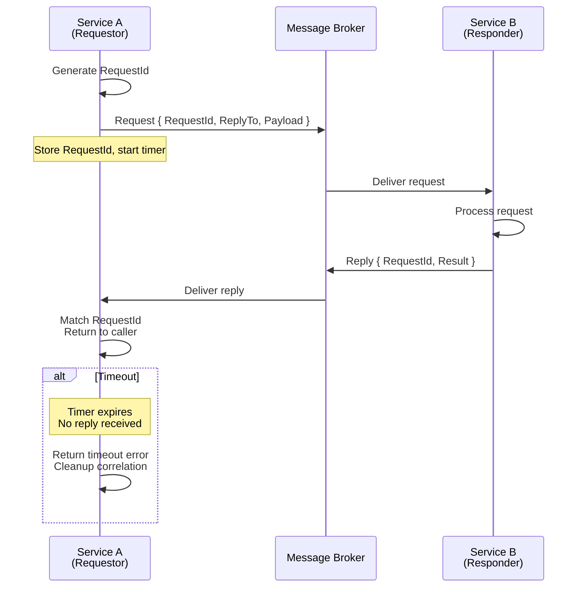
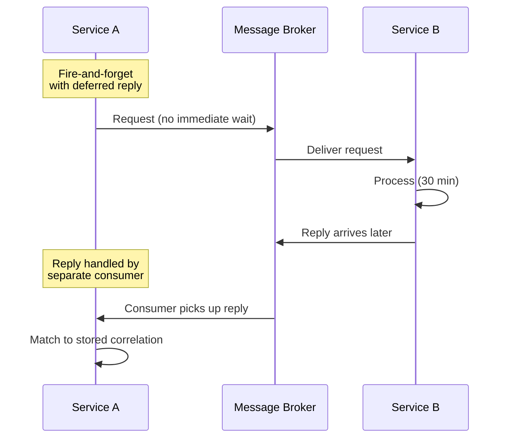
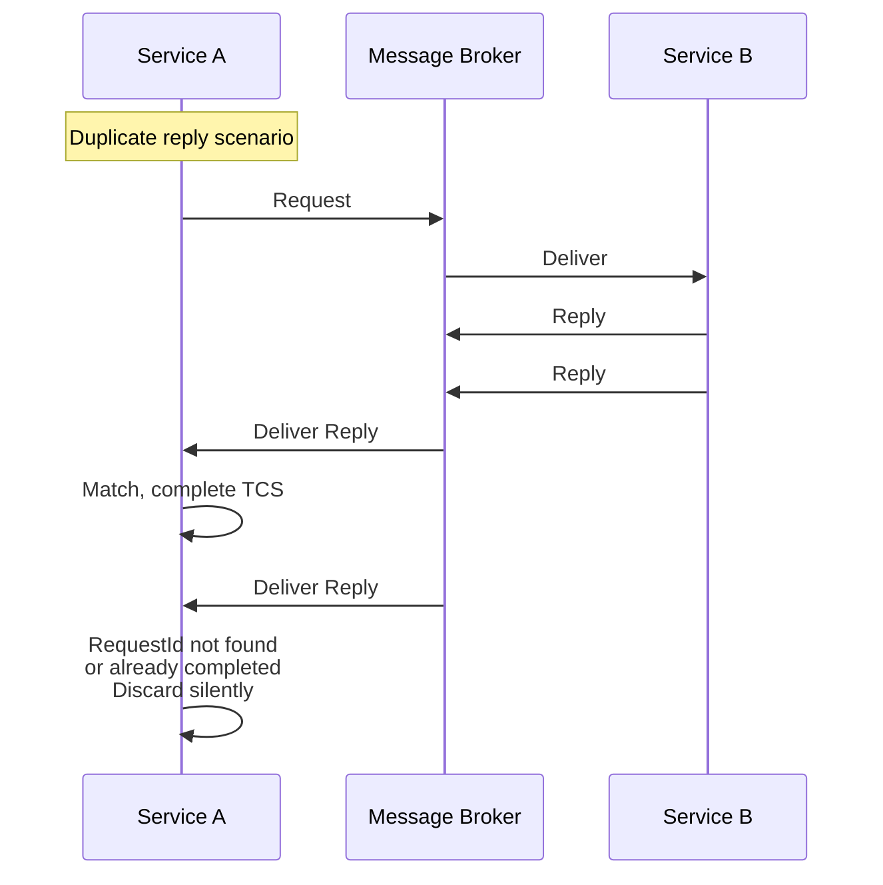
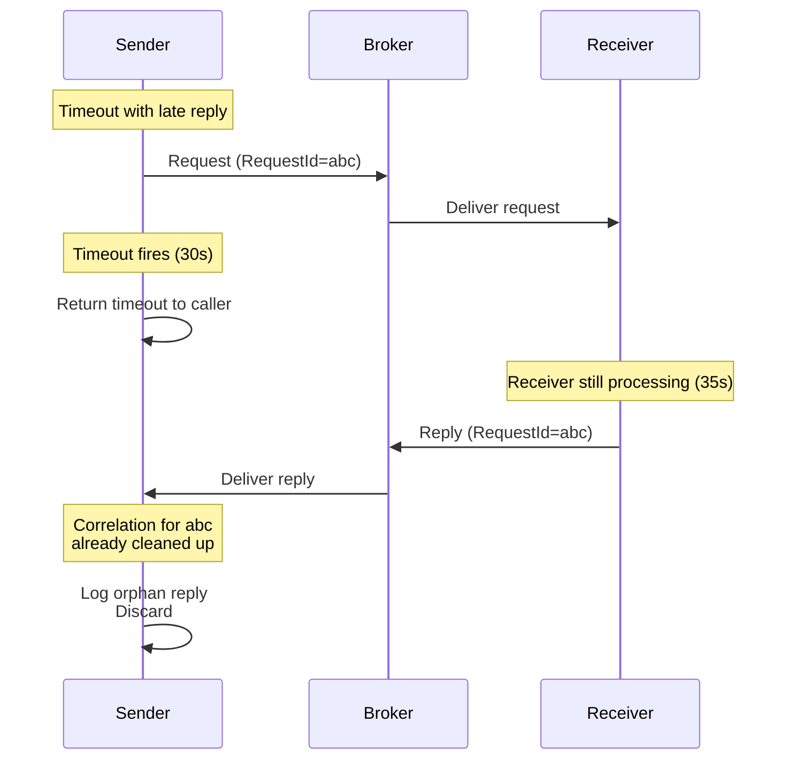
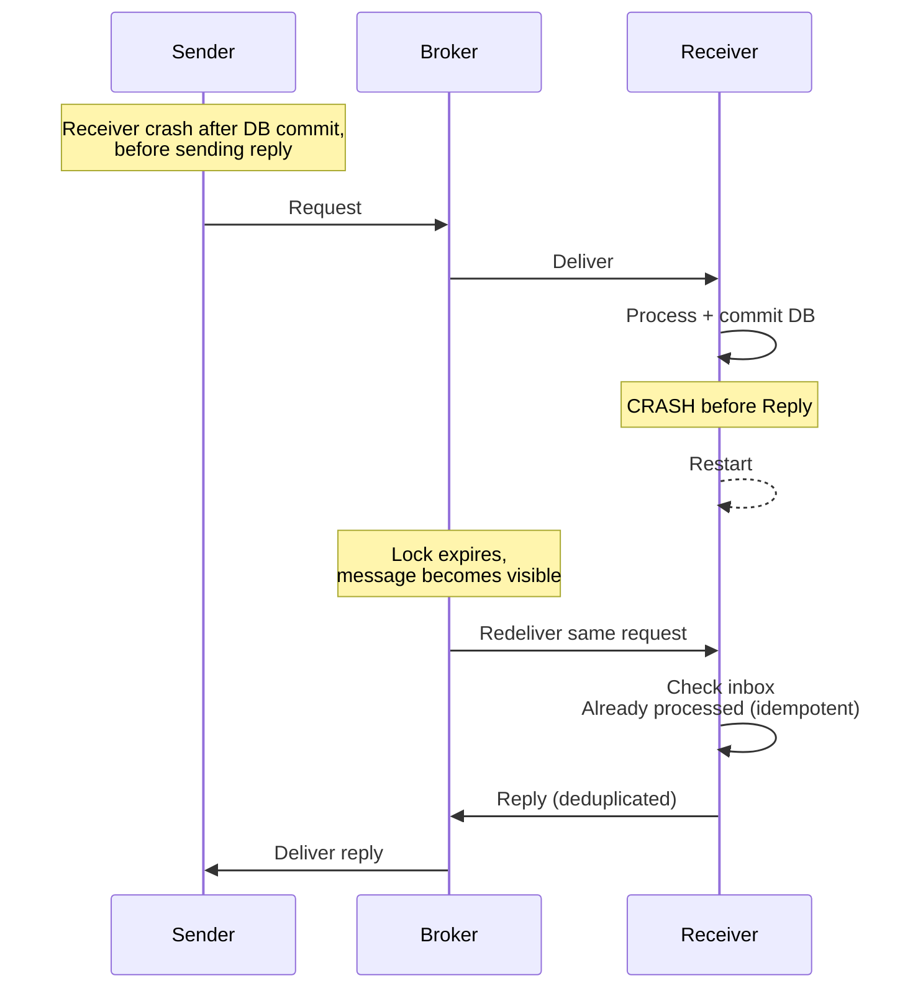
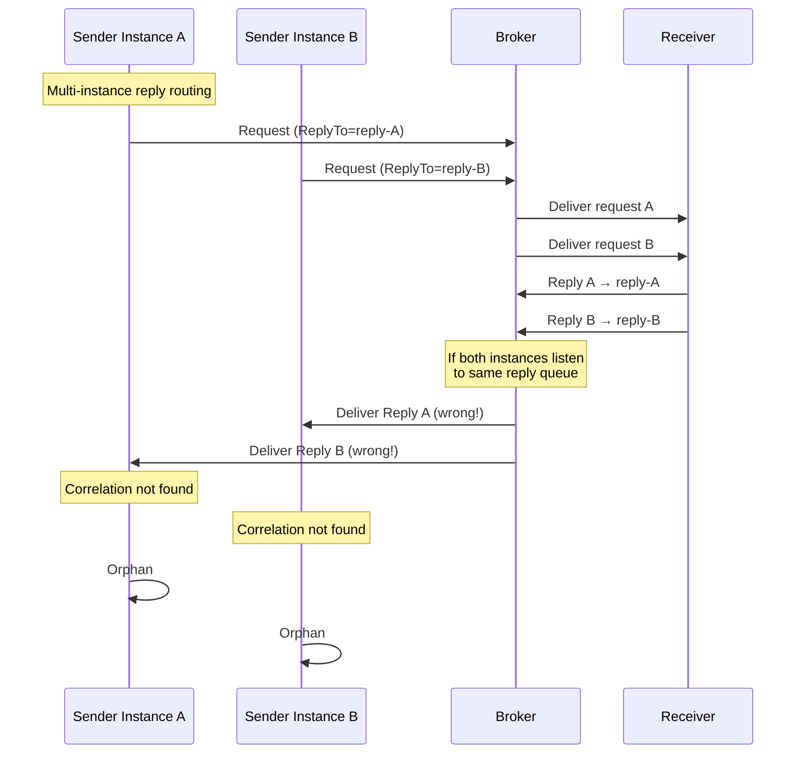
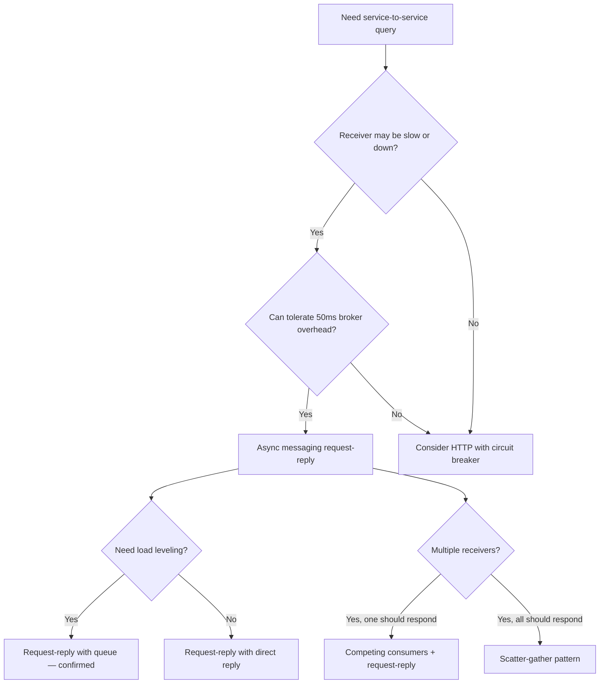
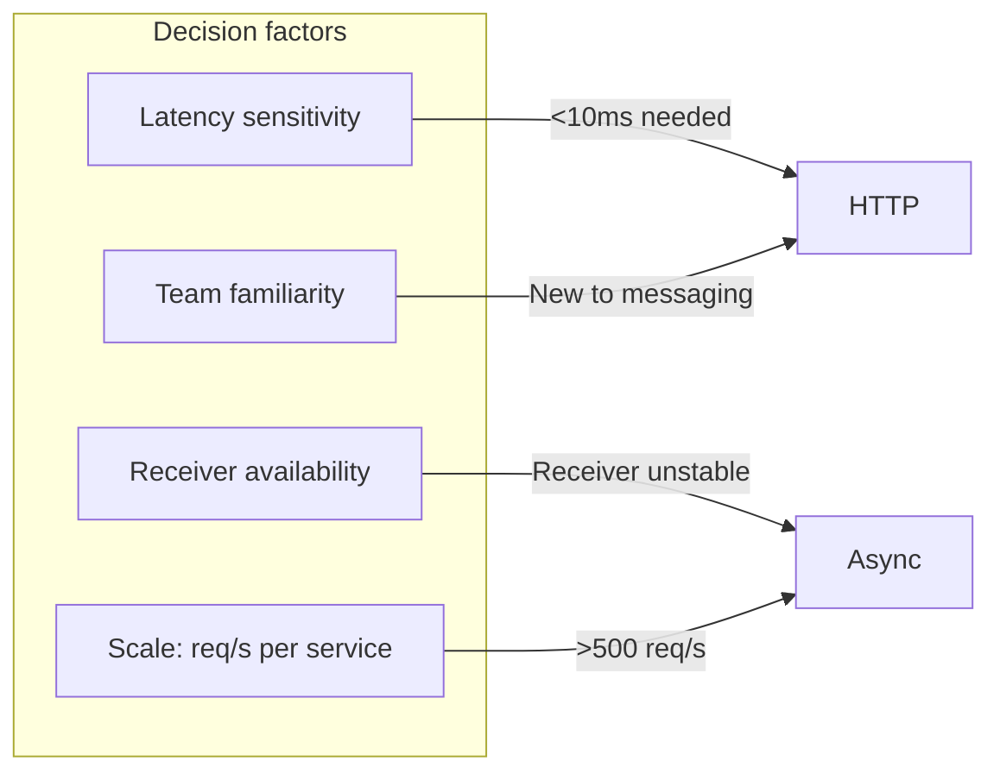

> [!success] Mastery Check
> - [ ] **Studied Well**
> - [ ] **Can explain the concept without notes**
> - [ ] **Can answer interview questions confidently**
> - [ ] **Can implement it in a real project**

## Navigation

**Domain:** [[7 — System Design & Distributed Systems]] > **Group:** Integration Patterns
**Previous:** [[7.139 — Change Data Capture — MySQL Binlog]] | **Next:** [[7.141 — Correlation ID Pattern — Cross-Service Tracing]]

### Prerequisites
- [[7.128 — Transactional Messaging — Guarantees]] — required because request-reply depends on at-least-once delivery guarantees
- [[7.141 — Correlation ID Pattern — Cross-Service Tracing]] — needed because the reply must correlate to the original request

### Where This Fits

The request-reply pattern over async messaging enables synchronous-style request-response communication over an asynchronous message broker. A service sends a request message to a queue and waits for a reply message on a temporary or dedicated reply queue. Unlike HTTP request-response (which is inherently synchronous and blocking), the messaging-based request-reply decouples the sender and receiver in time and space — the sender can wait with a timeout, or process the reply asynchronously when it arrives. A .NET engineer encounters this when a service needs to query another service but cannot make a synchronous HTTP call (timeout risk, circuit breaker concerns, or the receiver is behind a firewall or slow network). Common implementations include MassTransit's `IRequestClient<T>` and Azure Service Bus's request-response pattern with sessions. This pattern is also foundational for saga interactions where an orchestrator sends commands and awaits replies before proceeding to the next step. Without it, every inter-service query becomes either a blocking HTTP call (fragile under load) or requires building a custom correlation infrastructure that inevitably has edge-case bugs.

## Core Mental Model

Request-reply over async messaging creates a temporary correlation between a request message and its reply. The sender publishes a request with a unique `RequestId` and specifies a `ReplyTo` address (queue or topic). The receiver processes the request and publishes a reply message that includes the `RequestId` from the request. The sender, having stored the `RequestId` and the expected destination, correlates the incoming reply to the pending request and delivers it to the caller. The invariant is: each request produces exactly one reply (or a timeout), and the reply contains the correlation information to match it to the waiting caller. The tradeoff is that the sender must manage the lifecycle of the correlation (timeout, cleanup of expired correlations, handling duplicate replies). The recognition trigger is any inter-service communication that looks like a query but where the receiver is behind a message broker rather than an HTTP endpoint — for example, "get the current inventory level for product X" where the inventory service processes requests asynchronously.







### Classification

Request-reply is a messaging interaction pattern, not a broker feature. It exists at the application layer on top of basic one-way messaging. It solves the problem of implementing query-like interactions over an asynchronous channel. It does not solve the problem of strong consistency — the reply may arrive after the sender's timeout has expired, leaving the sender unsure whether the request was processed. It also does not solve ordering — replies may arrive in a different order than requests were sent. It sits in the Integration Patterns group alongside correlation ID, competing consumers, and scatter-gather. In CAP terms, request-reply over async messaging favors availability and partition tolerance: if the broker is partitioned, requests queue up and replies may be delayed, but the sender can continue processing other work rather than blocking.

### Key Properties / Guarantees

|Property|Value|Condition|
|---|---|---|
|Correlation|Via RequestId / CorrelationId|Unique per request|
|Delivery|Request: at-least-once; Reply: at-least-once|Both sides must deduplicate|
|Timeout|Configurable per request|Prevents indefinite wait|
|Latency|Broker round-trip + processing time|Asynchronous — sender is not blocked|
|Ordering|Not guaranteed across requests|Each request-reply pair is independent|
|Duplex|Requires two queues/topics|One for request, one for reply|
|Duplex (session-based)|Single queue with session correlation|Azure Service Bus sessions|
|Idempotency|Sender must handle duplicate replies|Receiver may redeliver|
|Failure isolation|Sender unaffected by receiver crash|Broker buffers request|

## Deep Mechanics

### How It Works

**Step 1 — Request creation.** The sender creates a request message with a unique `RequestId` (typically a `Guid`) and a `ReplyTo` address — a queue name or topic path where the reply should be sent. The sender publishes the request to the receiver's request queue.

**Step 2 — Correlation storage.** The sender stores the `RequestId` in an in-memory dictionary or a durable store, associated with a `TaskCompletionSource<T>` or a callback. A timer is started for the request timeout. If the timer fires before the reply arrives, the correlation is removed and a timeout error is returned. In MassTransit, this is handled internally by `IRequestClient` which creates a temporary endpoint and manages the correlation lifecycle.

**Step 3 — Request processing.** The receiver consumes the request from its queue. It processes the request (query a database, call an external API, compute a result). It creates a reply message containing the original `RequestId` and the result. It publishes the reply to the `ReplyTo` address specified in the request. If the receiver throws an exception, MassTransit automatically publishes a `Fault<T>` message to the reply address, which the sender's `IRequestClient` surfaces as a `RequestFaultException`.

**Step 4 — Reply correlation.** The sender receives the reply from the reply queue. It extracts the `RequestId`, looks up the pending correlation in its store, and delivers the result to the waiting caller. If the correlation is not found (already timed out), the reply is discarded (orphan reply).

**Step 5 — Cleanup.** After the reply is delivered or the timeout fires, the sender removes the correlation entry. If a reply arrives after cleanup, it is ignored (or logged as a late reply). In MassTransit, the temporary endpoint is deleted after the request completes or times out.

**Step 6 — Duplicate reply handling.** If the broker redelivers a reply (at-least-once guarantee), the sender receives the duplicate. The `TaskCompletionSource` is set to only accept the first completion. Subsequent completions are ignored. The sender should also handle the case where the same `RequestId` appears twice — typically by checking if the correlation entry still exists.

### Failure Modes

**Timeout with late reply.** The sender's timeout fires after 30 seconds. The sender returns a timeout to the caller and removes the correlation. The reply arrives 31 seconds later — the correlation is gone, the reply is discarded. The caller already handled the timeout.

- **Detection:** Late reply is logged as "orphan reply." No caller impact (timeout already returned).
- **Recovery:** The caller should have a retry mechanism. The request may need to be retried, which could result in duplicate processing.
- **Prevention:** The timeout should be set based on the P99 processing time of the receiver, not the P50. The correlation cleanup should be slightly longer than the timeout to catch near-late replies.

**Duplicate replies.** The receiver processes the request successfully but the broker redelivers the reply (at-least-once). The sender receives two replies for the same `RequestId`.

- **Detection:** The sender sees the same `RequestId` twice.
- **Recovery:** The sender must handle duplicate replies idempotently — discard the second reply. The `TaskCompletionSource` can be configured to only accept the first completion.
- **Prevention:** Ensure the receiver idempotently processes requests (inbox pattern). If the request is processed twice, both replies will have the same `RequestId` and the sender discards the duplicate.

**Request lost.** The sender publishes the request, but the broker loses it (queue down, network partition). The sender's correlation entry times out.

- **Detection:** Timeout returned. No reply queue entries.
- **Recovery:** The caller should retry the request. The sender's correlation store must be cleaned up even on timeout.
- **Prevention:** Use at-least-once delivery for the request queue. Monitor broker health with Azure Monitor alerts on queue depth and dead-letter counts.

**Receiver fails after processing but before sending reply.** The receiver processes the request successfully (commits database transaction) but crashes before calling `RespondAsync`. No reply is sent. The sender times out.

- **Detection:** Sender timeout. Receiver logs may show the transaction committed but no reply sent. The request message is re-delivered after the lock expires (at-least-once delivery).
- **Recovery:** On redelivery, the receiver must be idempotent — the inbox pattern ensures the request is not processed twice if the first processing already committed.
- **Prevention:** The receiver should send the reply within the same transactional scope as the business operation. However, since messaging is typically asynchronous, this is best handled by making the consumer idempotent and letting redelivery handle the edge case.

**Reply queue permissions misconfiguration.** The sender creates a reply queue but the receiver does not have permission to write to it. The reply is silently dropped by the broker.

- **Detection:** Sender always times out. No errors in either service's logs. The reply queue may show zero incoming messages while the receiver logs show "reply sent."
- **Recovery:** Grant the receiver's managed identity or SAS policy `Send` permission on the reply queue namespace.
- **Prevention:** Integration tests that validate the full round-trip. Run them in a test environment that mirrors production RBAC configuration.

**Correlation store memory leak.** The sender stores correlation entries but never cleans them up on timeout or reply. Over time, memory usage grows unbounded.

- **Detection:** Sender process RSS grows linearly with request rate. Eventually, `OutOfMemoryException` causes pod restart.
- **Recovery:** Restart the sender process. The leak resumes on restart.
- **Prevention:** Always clean up correlation entries in a `finally` block. Use a bounded store with TTL. Monitor the correlation store size with a Prometheus gauge metric.

**Duplex deadlock with synchronous reply handling.** The sender sends a request and synchronously blocks the thread waiting for the reply. If the sender and receiver share the same process (or the same thread pool), the receiver cannot process the request because all threads are blocked waiting for replies.

- **Detection:** The sender's thread pool is exhausted. Queue depth grows. No progress is made.
- **Recovery:** Increase thread pool size (temporary). Restart with proper async handling.
- **Prevention:** Always use `await` or `Task.WaitAsync` with `ConfigureAwait(false)`. Never block with `.Result` or `.Wait()`. Use event-driven reply handling for long-running requests instead of blocking.

### .NET and Azure Integration

- **MassTransit:** `IRequestClient<TRequest, TResponse>` provides a first-class request-reply API. Uses `RequestId` and `ResponseAddress` automatically. Supports timeout, cancellation, and retry
- **Azure Service Bus:** Request-reply pattern with sessions — `ReplyToSessionId` correlates the reply to the sender's session. Classic request-reply with `ReplyTo` on the message
- **NServiceBus:** `IRequestClient<T>` and `ISendOnlyBus.Request<T>()` — built-in request-reply support
- **Polly:** Wrap the request-reply with `ResiliencePipeline` for timeout and retry on the sender side
- **Azure Functions:** Durable Functions can implement request-reply using orchestrations with `CallActivityWithRetryAsync`
- **Kafka (confluent-kafka-dotnet):** Request-reply requires manual correlation — no native support; typically implemented with a reply topic and correlation ID in headers

```csharp
// MassTransit request-reply — sender side
public sealed class OrderQueryService
{
    private readonly IRequestClient<GetOrderStatus> _client;

    public async Task<OrderStatusResult> GetStatusAsync(
        Guid orderId, CancellationToken ct)
    {
        var response = await _client.GetResponse<OrderStatusResult>(
            new GetOrderStatus(orderId),
            ct,
            timeout: TimeSpan.FromSeconds(30));

        return response.Message;
    }
}
```

```csharp
// Manual Azure Service Bus request-reply with session correlation
public sealed class SessionBasedRequestReply
{
    private readonly ServiceBusClient _client;

    public async Task<InventoryResult> QueryInventoryAsync(
        string productId, CancellationToken ct)
    {
        var sessionId = Guid.NewGuid().ToString("N");
        var sender = _client.CreateSender("inventory-requests");
        var receiver = _client.CreateSessionReceiver(
            "inventory-replies",
            new ServiceBusSessionReceiverOptions
            {
                SessionIdleTimeout = TimeSpan.FromSeconds(10)
            },
            ct);

        var request = new ServiceBusMessage(BinaryData.FromObjectAsJson(
            new CheckInventory(productId)))
        {
            MessageId = Guid.NewGuid().ToString(),
            ReplyToSessionId = sessionId,
            SessionId = sessionId
        };
        await sender.SendMessageAsync(request, ct);

        var reply = await receiver.ReceiveMessageAsync(
            maxWaitTime: TimeSpan.FromSeconds(15), ct);
        if (reply is null)
            throw new TimeoutException("No inventory reply received");

        return reply.Body.ToObjectFromJson<InventoryResult>();
    }
}
```

```csharp
// Polly resilience pipeline for request-reply
public sealed class ResilientRequestClient
{
    private readonly IRequestClient<ProcessPayment> _client;
    private readonly ResiliencePipeline _pipeline;

    public async Task<PaymentResult> ProcessPaymentWithRetryAsync(
        ProcessPayment command, CancellationToken ct)
    {
        return await _pipeline.ExecuteAsync(
            async token =>
            {
                var response = await _client.GetResponse<PaymentResult>(
                    command, token, timeout: TimeSpan.FromSeconds(5));
                return response.Message;
            },
            ct);
    }
}
```

```csharp
// Program.cs — configuring MassTransit request-reply endpoints
builder.Services.AddMassTransit(x =>
{
    x.SetEndpointNameFormatter(new KebabCaseEndpointNameFormatter("services", false));

    x.AddRequestClient<GetOrderStatus>(new Uri("queue:order-status-requests"));
    x.AddRequestClient<CheckInventory>(new Uri("queue:inventory-requests"));
    x.AddRequestClient<ProcessPayment>(new Uri("queue:payment-processing"));

    x.UsingAzureServiceBus((context, cfg) =>
    {
        cfg.Host(builder.Configuration["ServiceBus:ConnectionString"]);
        cfg.ConfigureEndpoints(context);
    });
});
```

## Production Patterns and Implementation

### Primary Implementation

Request-reply with MassTransit between two services, using Azure Service Bus transport.

```csharp
// 1. Message contracts
public sealed record GetOrderStatus(Guid OrderId);
public sealed record OrderStatusResult(
    Guid OrderId, string Status, DateTime LastUpdated);
public sealed record OrderNotFound(Guid OrderId);

// 2. MassTransit sender configuration in Program.cs
builder.Services.AddMassTransit(x =>
{
    x.UsingAzureServiceBus((context, cfg) =>
    {
        cfg.Host(builder.Configuration["ServiceBus:ConnectionString"]);
        cfg.ConfigureEndpoints(context);
    });
});

// 3. Requesting service — sends request and awaits reply
public sealed class OrderStatusController
{
    private readonly IRequestClient<GetOrderStatus> _client;

    public async Task<IActionResult> GetOrderStatus(
        Guid orderId, CancellationToken ct)
    {
        try
        {
            var response = await _client.GetResponse<OrderStatusResult>(
                new GetOrderStatus(orderId),
                ct,
                timeout: TimeSpan.FromSeconds(10));

            return Ok(response.Message);
        }
        catch (RequestFaultException ex)
        {
            return StatusCode(500, "Receiver failed processing request");
        }
        catch (TimeoutException)
        {
            return StatusCode(504, "Receiver did not respond in time");
        }
    }
}

// 4. Receiving service — handles request and sends reply
public sealed class GetOrderStatusConsumer :
    IConsumer<GetOrderStatus>
{
    private readonly IOrderRepository _orders;

    public async Task ConsumeAsync(ConsumeContext<GetOrderStatus> context)
    {
        var order = await _orders.GetByIdAsync(
            context.Message.OrderId, context.CancellationToken);

        if (order is null)
        {
            await context.RespondAsync(new OrderNotFound(
                context.Message.OrderId));
            return;
        }

        await context.RespondAsync(new OrderStatusResult(
            order.Id, order.Status, order.UpdatedAt));
    }
}

// 5. Registration of consumer
builder.Services.AddMassTransit(x =>
{
    x.AddConsumer<GetOrderStatusConsumer>();

    x.UsingAzureServiceBus((context, cfg) =>
    {
        cfg.Host(builder.Configuration["ServiceBus:ConnectionString"]);
        cfg.ConfigureEndpoints(context);
    });
});
```

### Configuration and Wiring

```csharp
// Direct Azure Service Bus request-reply (without MassTransit)
public sealed class ServiceBusRequestReply
{
    private readonly ServiceBusClient _client;

    public async Task<OrderStatusResult> RequestStatusAsync(
        Guid orderId, CancellationToken ct)
    {
        // Create unique reply queue name
        var replyQueueName = $"reply-{Guid.NewGuid():N}";

        await using var sender = _client.CreateSender("orders-requests");
        await using var receiver = _client.CreateReceiver(replyQueueName);

        // Create reply queue with auto-delete
        var replyQueue = new CreateQueueOptions(replyQueueName)
        {
            AutoDeleteOnIdle = TimeSpan.FromMinutes(5),
            EnablePartitioning = false
        };
        await _client.CreateQueueAsync(replyQueue, ct);

        try
        {
            // Send request with ReplyTo
            var request = new ServiceBusMessage(BinaryData.FromObjectAsJson(
                new GetOrderStatus(orderId)))
            {
                MessageId = Guid.NewGuid().ToString(),
                ReplyTo = replyQueueName
            };
            await sender.SendMessageAsync(request, ct);

            // Wait for reply with timeout
            var reply = await receiver.ReceiveMessageAsync(
                maxWaitTime: TimeSpan.FromSeconds(30), ct);

            if (reply is null)
                throw new TimeoutException("No reply received");

            return reply.Body.ToObjectFromJson<OrderStatusResult>();
        }
        finally
        {
            // Cleanup reply queue
            await _client.DeleteQueueAsync(replyQueueName, ct);
        }
    }
}
```

```json
// appsettings.json
{
  "ServiceBus": {
    "ConnectionString": "Endpoint=sb://ecom-ns.servicebus.windows.net/;SharedAccessKeyName=RootManageSharedAccessKey;SharedAccessKey=...",
    "RequestQueue": "order-status-requests",
    "ReplyQueuePrefix": "order-reply-",
    "DefaultTimeoutSeconds": 30
  }
}
```

### Common Variants

**Temporary reply queues (auto-delete).** Each sender creates a unique reply queue that is auto-deleted after idle timeout. No two senders share a reply queue, eliminating reply correlation management on the receiver side. Best for low-to-medium throughput (<100 requests/second per instance).

```csharp
// Azure Service Bus — auto-delete reply queue
var replyQueue = new CreateQueueOptions($"reply-{sessionId}")
{
    AutoDeleteOnIdle = TimeSpan.FromMinutes(5),
    EnableSession = true // For session-based correlation
};
```

**Session-based request-reply.** Azure Service Bus sessions can correlate request and reply. The sender sets `ReplyToSessionId` on the request. The receiver sets `SessionId` on the reply to match. The sender uses a session receiver to wait for the reply. This avoids creating temporary queues because all replies go to the same reply queue, differentiated by session ID.

**Fire-and-forget with deferred reply.** For long-running requests (minutes to hours), the sender should not block. Instead, it stores the correlation in a durable store and processes the reply when it arrives asynchronously — typically via a message handler. This is common in document processing pipelines, credit checks, and approval workflows.

```csharp
// Deferred reply pattern — sender publishes request, reply arrives later
public sealed class CreditCheckOrchestrator
{
    private readonly IPublishEndpoint _publisher;
    private readonly IResultStore _results;

    public async Task<Guid> SubmitCreditCheckAsync(
        CreditCheckRequest request, CancellationToken ct)
    {
        var correlationId = Guid.NewGuid();
        await _publisher.Publish(new CreditCheckSubmitted(
            correlationId, request), ct);
        return correlationId; // Return immediately — caller polls for result
    }

    // Called by a separate consumer when the reply arrives
    public async Task OnCreditCheckResult(
        CreditCheckResult result, CancellationToken ct)
    {
        await _results.StoreAsync(result.CorrelationId, result, ct);
    }
}
```

**Scatter-gather with aggregating reply.** The sender sends a request to multiple receivers (via topic or fan-out) and aggregates their replies. This variant is useful for parallel queries — for example, querying all warehouse services for inventory availability.

**Competing consumers with request-reply.** Multiple instances of the receiver process requests from the same queue. The sender's request is picked up by the first available receiver. This provides horizontal scaling for request processing. However, the sender must ensure that exactly one receiver processes each request — topics with multiple subscribers are not suitable because all subscribers would process the request.

### Real-World .NET Ecosystem Example

**MassTransit's `IRequestClient<T>`** is the most widely used request-reply implementation in the .NET ecosystem. It uses MassTransit's internal `RequestId` message header and `ResponseAddress` to route replies back to the requesting endpoint. The `GetResponse<T>()` method creates a temporary consumer endpoint for the reply, starts a timeout timer, and returns the reply as a task. This is used in production at thousands of companies for service-to-service queries over message brokers. Internally, MassTransit creates an `EndpointConvention` mapping for the request type and uses the `ConsumeContext` to correlate the reply. In Azure Service Bus transport, MassTransit creates a temporary subscription on a topic endpoint for the reply, which is auto-deleted when the consumer completes.

**Azure Service Bus `ServiceBusSessionProcessor`** can be used for session-based request-reply without MassTransit. Each request creates a session, and the reply carries the same session ID. The sender creates a session receiver scoped to its session ID and waits for the reply. This is the recommended approach when using pure Azure SDK without a framework.

## Gotchas and Production Pitfalls

### 1. Temporary reply queue growth

**Pitfall:** Each sender creates a unique reply queue per request. Under high throughput (1,000 requests/second), 1,000 temporary queues are created per second. The broker manages thousands of queue entities, consuming memory and management API quota.

**Symptom:** Broker management API throttling. Queue creation latency increases. Eventually, queue creation fails.

**Fix:** Reuse reply queues. Use a single reply queue per service instance with `RequestId` correlation. The receiver sends the reply to the shared reply queue with the `RequestId`. The sender filters replies by `RequestId`.

**Cost of not fixing:** Broker throttling at 5,000+ concurrent queues. Requests fail to send because reply queue creation fails.

### 2. Missing reply correlation store cleanup

**Pitfall:** The sender stores correlation entries in a `ConcurrentDictionary` but never removes them (or removes them too slowly). Over hours, memory usage grows unbounded.

**Symptom:** `OutOfMemoryException` on the sender. Pod restarts. Active request-reply correlations are lost.

**Fix:** Use a bounded correlation store with TTL. Remove entries on reply or timeout. Use a background cleanup job.

```csharp
// ✅ Bounded correlation store with TTL
public sealed class CorrelationStore<T>
{
    private readonly ConcurrentDictionary<Guid, PendingRequest<T>> _store = new();
    private readonly TimeSpan _ttl;

    public async Task<T> WaitForReplyAsync(
        Guid requestId, TimeSpan timeout, CancellationToken ct)
    {
        var pending = new PendingRequest<T>();
        _store[requestId] = pending;

        try
        {
            using var cts = CancellationTokenSource.CreateLinkedTokenSource(ct);
            cts.CancelAfter(timeout);

            return await pending.Task.WaitAsync(cts.Token);
        }
        finally
        {
            _store.TryRemove(requestId, out _);
        }
    }
}
```

**Cost of not fixing:** Memory leak. After 1 hour at 500 requests/second with 30-second timeout, the store holds 15,000 entries. Each entry is ~1KB → 15MB leaked per hour.

### 3. Receiver fails but does not send fault reply

**Pitfall:** The receiver throws an exception while processing the request. The MassTransit consumer does not call `RespondAsync`. No reply is sent. The sender waits until timeout.

**Symptom:** The sender returns timeout instead of a fault. The caller does not know whether the request was processed or not.

**Fix:** Ensure the consumer sends a fault reply on exception. MassTransit's `IConsumer<T>` automatically sends a `Fault<T>` message when the consumer throws. Enable this.

```csharp
// ✅ Receiver sends fault on exception automatically
// MassTransit does this by default — just let exceptions propagate
// Or catch and send custom fault:
catch (DomainException ex)
{
    await context.RespondAsync(new OrderFault(
        context.Message.OrderId, ex.Message));
}
```

**Cost of not fixing:** Caller always gets timeout on receiver failures. Distinguishing "receiver crashed" from "receiver is slow" is impossible. Every timeout requires a manual investigation.

### 4. Reply queue permissions not configured

**Pitfall:** The sender's reply queue is in a different namespace or has different authorization. The receiver cannot write to the reply queue. The reply is silently dropped.

**Symptom:** Sender always times out. No errors in either service logs.

**Fix:** Ensure the receiver has write permissions on the reply queue. For cross-namespace request-reply, use a centralized reply queue namespace with shared access.

**Cost of not fixing:** Silent reply loss. Debugging requires tracing message flow across services and namespaces.

### 5. Request-reply over topic with multiple subscribers

**Pitfall:** The request is published to a topic with 3 subscribers. All 3 receive the request and all 3 reply. The sender receives 3 replies and only processes the first.

**Symptom:** Duplicate processing. Two of three receivers did work that was ignored.

**Fix:** Use point-to-point queues for request-reply, not topics. A request should be processed by exactly one receiver. Topics are for events that multiple services should independently consume.

**Cost of not fixing:** Wasted compute on duplicate processing. Possible data inconsistency if the request is a mutation (not a query).

### 6. Synchronous blocking on reply in ASP.NET Core

**Pitfall:** The sender calls `.Result` or `.Wait()` on the reply task inside an ASP.NET Core request. This blocks the thread pool thread and can cause thread pool starvation under load.

```csharp
// ❌ Blocks thread — causes thread pool starvation
public IActionResult GetStatus(Guid orderId)
{
    var result = _client.GetResponse<OrderStatusResult>(
        new GetOrderStatus(orderId)).Result;
    return Ok(result);
}
```

**Symptom:** Under modest load (200+ concurrent requests), ASP.NET Core stops serving requests. The Kestrel thread pool is exhausted. Queue depth grows on the request queue.

**Fix:** Always await the reply asynchronously. Use `async` actions throughout.

```csharp
// ✅ Async all the way
public async Task<IActionResult> GetStatus(Guid orderId, CancellationToken ct)
{
    var result = await _client.GetResponse<OrderStatusResult>(
        new GetOrderStatus(orderId), ct);
    return Ok(result);
}
```

**Cost of not fixing:** Application becomes unresponsive at moderate load. The entire service needs to be restarted when thread pool is exhausted.

### 7. Timeout set too short relative to receiver P99

**Pitfall:** The sender's timeout is set to 2 seconds, but the receiver's P99 processing time is 5 seconds. Most requests will time out even though the receiver works correctly.

**Symptom:** High timeout rate (30-50% of requests). The metric `request-reply.timeout.count` is elevated. Customer-facing errors.

**Fix:** Measure the receiver's P99 processing time and set the sender timeout to 2x-3x that value. Monitor the timeout rate and adjust.

**Cost of not fixing:** False positives: healthy requests are reported as failures. Retries amplify load on the receiver, making the latency problem worse. Incident responders chase a "receiver failure" that does not exist.

### 8. Missing cancellation token propagation

**Pitfall:** The sender creates a cancellation token but does not propagate it to the request-reply call. When the HTTP request is cancelled (client disconnects), the request-reply continues waiting.

```csharp
// ❌ Cancellation token not passed
public async Task<IActionResult> GetStatus(Guid orderId)
{
    var result = await _client.GetResponse<OrderStatusResult>(
        new GetOrderStatus(orderId));
    return Ok(result);
}
```

**Symptom:** Wasteful processing of requests for disconnected clients. Under high client disconnect rates, the sender accumulates pending correlations that will never be consumed.

**Fix:** Always propagate the cancellation token.

```csharp
// ✅ Cancellation token propagated
public async Task<IActionResult> GetStatus(Guid orderId, CancellationToken ct)
{
    var result = await _client.GetResponse<OrderStatusResult>(
        new GetOrderStatus(orderId), ct,
        timeout: TimeSpan.FromSeconds(10));
    return Ok(result);
}
```

**Cost of not fixing:** Under high load with many disconnected clients, the sender wastes resources on correlations that will time out. At 10,000 req/s with 5% disconnect rate, 500 correlations per second are wasted.

### 9. Receiver processes request but reply is consumed by a different instance

**Pitfall:** Multiple instances of the sender process requests behind a load balancer. Instance A sends a request with a temporary reply queue on Instance A. The receiver replies to the reply queue. But if the reply queue is not pinned to an instance, Instance B may consume the reply instead of Instance A, and Instance A's correlation store does not have the reply.

**Symptom:** Intermittent timeouts even though the receiver processes all requests successfully. The timeout rate is proportional to the number of sender instances (more instances = higher chance of wrong instance consuming the reply).

**Fix:** Use session-based reply queues where each sender instance has a unique reply queue name. Or use Azure Service Bus sessions with `ReplyToSessionId` that routes replies to the correct session receiver on the correct instance.

```csharp
// ✅ Instance-specific reply queue name
var instanceId = Environment.GetEnvironmentVariable("HOSTNAME") ?? "unknown";
var replyQueueName = $"inventory-reply-{instanceId}";
```

**Cost of not fixing:** Intermittent timeouts that are impossible to reproduce in development (single instance). The team blames the network, the broker, or the receiver — but the root cause is the multi-instance reply routing.

## Deep Dive — Sequence Diagrams for Failure Modes







```mermaid
flowchart TD
    subgraph "Reply Routing Strategies"
        A[Temporary Queue Per Request] -->|"Best for <100 req/s"| B[Simple]
        A -->|"Worst for >500 req/s"| C[Management API thrashing]
        
        D[Shared Reply Queue + CorrelationId] -->|"Best for 100-1000 req/s"| B
        D -->|"Requires filtering"| E[Filter on CorrelationId]
        
        F[Session-Based Reply Queue] -->|"Best for ASB Premium"| G[ReplyToSessionId]
        F -->|"Single queue, many sessions"| H[Clean correlation]
        
        I[Instance-Specific Reply Queue] -->|"Best for multi-instance"| J[Reply-{InstanceId}]
        I -->|"N instances = N queues"| K[Manual cleanup needed]
    end
```

## Tradeoffs and Decision Framework

### Tradeoff Matrix

|Dimension|Async Messaging Request-Reply|HTTP Request-Reply (REST)|gRPC Bidirectional Stream|
|---|---|---|---|
|Coupling|Loose (via broker)|Tight (direct connection)|Tight (direct connection)|
|Latency|+ broker round-trip (10-50ms)|Direct (1-10ms)|Direct (1-5ms)|
|Timeout handling|Sender-managed|HTTP client timeout|gRPC deadline|
|Load leveling|Built-in (queue buffers)|Requires queue in front|No|
|Failure isolation|Sender not affected if receiver down|Caller blocks on timeout|Stream breaks on failure|
|Complexity|Higher (broker, queues, correlation)|Lower|Medium|
|Throughput scaling|Independent per service|Receiver handles both|Connection-based limits|
|Tracing|Requires correlation ID|HTTP headers|gRPC metadata|

### When to Apply





### When NOT to Apply

- [ ] The latency requirement is < 10ms end-to-end — the broker round-trip adds 10-50ms
- [ ] The communication is request-only with no reply needed — use fire-and-forget messaging
- [ ] The receiver is always available and fast — HTTP is simpler
- [ ] The request-reply is for real-time streaming (video, audio) — use gRPC or WebSockets
- [ ] The number of request-reply patterns will be > 100 per second per instance — temporary queue creation overhead becomes significant
- [ ] Both services run in the same process — use direct method call or MediatR instead
- [ ] The reply must arrive within 1ms — message broker adds non-trivial latency even at best case

### Scale Thresholds

- **< 100 requests/second per instance:** Direct MassTransit `IRequestClient` with temporary reply endpoints works well
- **100-1,000 requests/second per instance:** Use shared reply queues with `RequestId` correlation. Avoid creating temporary queues per request
- **> 1,000 requests/second per instance:** Consider moving to HTTP for query-like interactions, reserving message queues for command/event patterns where async is architecturally required. Alternatively, use session-based reply queues with Azure Service Bus Premium
- **> 10,000 requests/second per instance:** Re-evaluate the architecture. At this scale, the broker becomes a bottleneck. Consider partitioning requests by region or tenant, or using Kafka with manual correlation

## Interview Arsenal

### Question Bank

1. What is the request-reply pattern over async messaging?
2. How does the sender correlate a reply to the original request?
3. What happens if the sender's timeout fires before the reply arrives?
4. Compare async messaging request-reply with HTTP request-reply.
5. How does MassTransit implement request-reply?
6. What are the risks of temporary reply queues?
7. How do you handle the receiver failing to send a reply?
8. When would you choose async request-reply over HTTP?
9. How does the request-reply pattern handle duplicate replies?
10. What happens in a scatter-gather variant when one of the receivers never responds?

### Spoken Answers

**Q1: What is the request-reply pattern over async messaging?**

> **Great answer:** "The request-reply pattern over async messaging enables synchronous-style request-response communication over an asynchronous message broker. The sender generates a unique RequestId, publishes a request message to the receiver's queue with a ReplyTo address, and stores the RequestId with a callback or TaskCompletionSource. The receiver processes the request and publishes a reply message to the ReplyTo address with the same RequestId. The sender receives the reply, matches it to the pending request using the RequestId, and delivers the result to the caller. The key benefit over HTTP is that the sender is decoupled from the receiver — if the receiver is down, the request is queued until it recovers, and the sender does not block a thread while waiting. The key challenge is managing timeouts, duplicate replies, and correlation cleanup. Frameworks like MassTransit handle most of this automatically through IRequestClient."

**Q3: What happens if the sender's timeout fires before the reply arrives?**

> **Great answer:** "When the sender's timeout fires, it returns a TimeoutException to the caller and removes the correlation entry from its store. The caller receives a timeout and should have a retry strategy. The challenge is that the receiver may still process the request after the timeout. The reply will arrive to the sender, but the correlation is gone — the reply is logged as an orphan and discarded. This means the request may have been processed even though the caller received a timeout. If the caller retries, the receiver may process the same request twice. The solution is idempotency on the receiver side — the receiver uses the inbox pattern to deduplicate requests by their RequestId. So even if the caller retries, the receiver only processes the request once. The second request returns the cached result from the first processing. This ensures exactly-once semantics despite the timeout ambiguity. In practice, I also set the correlation cleanup timeout to be slightly longer than the sender timeout — typically 10-20% longer — so that near-late replies are still matched."

**Q5: How does MassTransit implement request-reply?**

> **Great answer:** "MassTransit implements request-reply through the IRequestClient interface. When the sender calls GetResponse<T>(), MassTransit creates a temporary endpoint for the reply — either a temporary queue (in RabbitMQ) or an auto-delete endpoint (in Azure Service Bus). It generates a unique RequestId and sets the ResponseAddress to the temporary endpoint. The request is published to the configured endpoint. The receiver's consumer calls context.RespondAsync() which publishes the reply to the ResponseAddress. The sender's temporary endpoint receives the reply, MassTransit correlates it to the pending request using the RequestId, and completes the Task returned by GetResponse. MassTransit handles timeout through CancellationToken, fault handling through automatic Fault<T> publication, and correlation cleanup through the temporary endpoint lifecycle. In Azure Service Bus, MassTransit uses the ReplyTo header and creates a temporary subscription or queue per request. The key implementation detail is that MassTransit uses a separate receive endpoint per request for the reply — this is why it works with competing consumers on the request side but still routes the reply to the correct sender instance."

**Q8: When would you choose async request-reply over HTTP?**

> **Great answer:** "I choose async request-reply over HTTP in four specific scenarios. First, when the receiver is slow or has variable latency — for example, a warehouse service that takes 100ms to 10 seconds to check inventory. With HTTP, the caller blocks a thread for the entire duration. With messaging, the request is queued and the caller processes other work. Second, when the receiver may be unavailable — if the inventory service is down for maintenance, the request is queued and processed when it comes back. HTTP would return 503 and the caller must implement retry logic. Third, when load leveling is needed — if the inventory service can handle 100 requests/second but gets bursts of 500, the message queue buffers the excess. HTTP would time out or return 503. Fourth, when the routing is complex — for example, the request needs to go to one of 5 warehouse services based on product availability. With a competing consumer queue, any available warehouse picks up the request. With HTTP, the caller needs to implement load balancing and routing logic. The cost of async request-reply is the broker round-trip latency (10-50ms), so if sub-millisecond response is required, HTTP or gRPC is the better choice."

**Q9: How does the request-reply pattern handle duplicate replies?**

> **Great answer:** "The request-reply pattern handles duplicate replies through the sender-side correlation store. When the sender creates a correlation entry, it uses a `TaskCompletionSource<T>` which can only be completed once. The first reply sets the result. The second reply finds that the correlation is either already completed (the TCS is done) or the correlation entry has been removed (on timeout or after completion). In either case, the duplicate reply is discarded and logged as an orphan.

"However, this is only the sender-side story. The real challenge is preventing the receiver from processing the same request twice. If the sender times out and retries, the receiver receives two identical requests. Without idempotency on the receiver, both requests are processed, producing two replies. The sender discards one reply, but the receiver has already done the work twice — which is a problem if the work has side effects like deducting inventory or charging a payment.

"The solution is the inbox pattern on the receiver side: the receiver deduplicates incoming requests by RequestId before processing. If it has already processed a request with that RequestId, it returns the cached result without reprocessing. This gives exactly-once processing semantics despite at-least-once delivery. MassTransit supports this through the `InMemoryInbox` or `EntityFrameworkInbox` filters that can be added to the consumer configuration."

**Q10: What happens in a scatter-gather variant when one of the receivers never responds?**

> **Great answer:** "In a scatter-gather pattern, the sender publishes a request to multiple receivers and aggregates their replies. If one receiver never responds, the sender must decide what to do. The three strategies are: wait for all (fail if any timeout), wait for quorum (proceed if majority responded), or wait for a minimum set (proceed if specific receivers responded).

"The most practical approach is to set an overall aggregation timeout and collect whatever replies arrive within that window. Then the aggregator decides based on a policy: if all required receivers responded, proceed with the aggregated result. If a non-critical receiver timed out, proceed with partial results. If a critical receiver timed out, fail the entire request.

"For the implementation, each sub-request gets its own timeout in addition to the overall aggregation timeout. The correlation store tracks which sub-requests have completed. When the aggregation timeout fires, the sender checks the completed set against the required set and either returns the aggregated result or fails. This pattern is well-suited for scenarios like querying inventory across multiple warehouses — if 4 out of 5 respond, you can proceed assuming the 5th has stock (or fall back to a default)."

### System Design Interview Trigger

When the interviewer asks "how does Service A query Service B" without implying HTTP, they are testing whether you know that message brokers can support request-response interactions, not just fire-and-forget. The senior answer includes the correlation mechanism, timeout handling, and when to use this pattern over HTTP. If the interviewer adds "what if Service B is sometimes slow or down?", they are probing whether you understand the load-leveling and failure-isolation properties of async request-reply. The strongest answer also addresses the duplicate-reply problem and how idempotency resolves the timeout ambiguity.

### Comparison Table

| | MassTransit Request-Reply | Azure Service Bus (Native) | HTTP REST |
|---|---|---|---|
| Correlation | Automatic (RequestId) | Manual (CorrelationId header) | HTTP request/response pairing |
| Timeout | CancellationToken | Manual (Receive timeout) | HttpClient timeout |
| Fault handling | Automatic Fault<T> | Manual | HTTP status codes |
| Temporary queue | Auto-managed | Manual create/delete | N/A (connection-based) |
| Idempotency | Outbox + inbox needed | Manual | Idempotency key header |
| Best for | Async service queries | Azure-native messaging | Simple, low-latency calls |
| Throughput | Framework-managed | Direct SDK control | Connection pool limited |
| Learning curve | Moderate | Higher (manual correlation) | Low |

## Architecture Decision Record

**Status:** Accepted

**Context:** An order management system needs to query inventory availability across 5 warehouse services. Each warehouse service has variable latency (100ms to 10 seconds depending on load). The query must timeout after 5 seconds. The team already uses MassTransit with Azure Service Bus for event-driven communication. The system handles approximately 200 inventory queries per second during peak hours with spikes to 500 during flash sales. The warehouses are operated by different logistics partners, each with its own API availability SLA ranging from 95% to 99.9%.

**Options Considered:**

1. **MassTransit Request-Reply** — IRequestClient queries each warehouse; responses are correlated automatically
2. **HTTP REST** — Direct HTTP calls to each warehouse service; Polly for timeout and retry
3. **Scatter-Gather over messaging** — Publish a request to a topic; each warehouse replies; the sender aggregates
4. **gRPC Bidirectional Stream** — Maintain persistent streams to each warehouse for low-latency queries

**Decision:** MassTransit Request-Reply (option 1), because the warehouses have variable latency that can exceed HTTP timeout thresholds, and the team already uses MassTransit. The request-reply pattern allows each warehouse to process at its own pace and return results asynchronously. HTTP would require managing thread pool exhaustion when warehouses are slow. Scatter-gather over a topic is overengineered for 5 services. gRPC would require maintaining persistent connections to all 5 warehouses, which increases operational complexity and does not handle warehouse unavailability gracefully (stream breaks on warehouse restart).

**Consequences:**
- ✅ Each warehouse query has independent timeout — one slow warehouse does not block others
- ✅ Reuses existing MassTransit infrastructure
- ✅ Fault handling is automatic — a failed warehouse returns a Fault<T> instead of blocking
- ✅ Warehouses can be added or removed without changing the sender (new queue subscription)
- ⚠️ Each request creates a temporary reply queue — at 200 requests/second, queue management overhead is acceptable but should be monitored
- ⚠️ The aggregator must handle partial results — if 3 of 5 warehouses respond and 2 time out, the system needs a strategy (return partial, wait longer, or fail)
- ❌ End-to-end latency is higher than HTTP (broker round-trip adds ~50ms) — acceptable because warehouse latency dominates

**Review Trigger:** Revisit if the query rate exceeds 500 requests/second, at which point temporary queue creation costs may warrant switching to shared reply queues with CorrelationId filtering. Also revisit if any warehouse consistently responds in <50ms (making the broker overhead proportionally significant), or if a new warehouse integration requires sub-10ms response time.

## Self-Check

### Conceptual Questions

1. What problem does async request-reply solve?
2. How does the sender correlate a reply to the original request?
3. What happens if the receiver fails to send a reply?
4. Compare async request-reply with HTTP request-reply.
5. How does MassTransit implement request-reply under the hood?
6. What is the risk of temporary reply queues?
7. How do you handle duplicate replies?
8. When should you NOT use async request-reply?
9. What is the role of the timeout in request-reply?
10. Explain in 60 seconds how to implement request-reply with MassTransit.

<details>
<summary>Answers</summary>

1. Async request-reply enables query-like interactions over a message broker, decoupling sender and receiver in time and space. It provides load leveling (requests queue if receiver is busy), failure isolation (sender is not blocked), and variable timeout per request.

2. The sender generates a unique RequestId (GUID) and includes it in the request message. The receiver copies the RequestId into the reply message. The sender stores the RequestId with a callback and matches incoming replies by RequestId.

3. If the receiver fails without sending a reply, the sender's timeout fires and the caller receives a TimeoutException. MassTransit automatically sends a Fault<T> if the consumer throws, so the caller receives a fault instead of timing out.

4. HTTP request-reply has lower latency (no broker hop) but couples the sender and receiver directly — if the receiver is down, the call fails. Async messaging request-reply buffers requests when the receiver is down and provides automatic load leveling. HTTP is simpler but less resilient.

5. MassTransit creates a temporary endpoint for the reply (a queue in RabbitMQ, an auto-delete subscription in Azure Service Bus). It sets the RequestId and ResponseAddress headers on the outgoing message. The receiver's RespondAsync() publishes to the ResponseAddress. The temporary endpoint receives the reply, correlates by RequestId, and completes the Task.

6. Each request creates a temporary queue. At high throughput (1,000 req/s), 1,000 queues/second are created. Broker management API throttling and queue creation overhead become bottlenecks. Fix: reuse shared reply queues with RequestId correlation.

7. Use idempotent reply handling. MassTransit's TaskCompletionSource only accepts the first completion. Subsequent replies for the same RequestId are discarded. Ensure the receiver is idempotent (inbox pattern) so duplicate requests do not cause duplicate processing.

8. Don't use async request-reply when: (a) latency must be < 10ms, (b) the communication is a simple query to a fast, reliable service, (c) the request is a fire-and-forget event, (d) throughput exceeds 1,000 req/s per instance without shared reply queues.

9. The timeout prevents the sender from waiting indefinitely for a reply that may never arrive (receiver crashed, message lost). It should be set to 2-3x the receiver's P99 processing time. On timeout, the correlation is cleaned up and the caller receives an error.

10. "In MassTransit, define request and response contracts: `GetOrderStatus` and `OrderStatusResult`. On the sender side, inject `IRequestClient<GetOrderStatus>` and call `GetResponse<OrderStatusResult>(request)`. On the receiver side, implement `IConsumer<GetOrderStatus>` and call `context.RespondAsync(result)`. Register the consumer in MassTransit configuration. MassTransit handles the temporary reply endpoint, correlation, timeout, and fault propagation. The sender can set a timeout via CancellationToken. The receiver can send a fault by throwing an exception or calling RespondAsync with a fault message."
</details>

---

### Scenario Challenges

**Scenario 1 — Diagnose the problem**

A service uses MassTransit request-reply to query inventory. After a deployment, the service starts returning timeouts for all inventory queries. The inventory service logs show all requests were processed successfully. No errors in either service.

<details>
<summary>Diagnosis</summary>

**Root cause:** The deployment changed the reply queue configuration. The inventory service lost permissions to write to the reply queue, or the reply queue endpoint was changed and the sender's temporary endpoint is no longer accessible.

**Evidence:** Check the inventory service logs for "Reply address not accessible" or "Authorization failed for reply queue." Check the message broker's dead-letter queue — the inventory service's replies may be in the DLQ.

**Fix:** Verify the reply queue permissions. Ensure the inventory service has `Send` permission on the reply queue namespace. In MassTransit, ensure both services use the same transport configuration.

**Prevention:** Add integration tests that validate request-reply round trips. Monitor reply queue DLQ depth.
</details>

---

**Scenario 2 — Design decision**

You need to support both synchronous (await reply) and asynchronous (callback on reply) request-reply patterns. The system uses Azure Service Bus. How do you design the API?

<details>
<summary>Decision and Reasoning</summary>

**Choice:** Provide two APIs. The synchronous API uses MassTransit's `GetResponse` with a timeout. The asynchronous API publishes a request with a callback event — the requester implements a consumer for the reply event.

**Tradeoffs accepted:** Two APIs means duplicate code for the calling pattern. But the synchronous API is simpler for callers that need a blocking call, while the asynchronous API is necessary for long-running requests (> 30 seconds) where blocking is inappropriate.

**Implementation sketch:**
```csharp
// Synchronous
public async Task<InventoryResult> QueryInventorySync(Guid productId)
{
    return await _client.GetResponse<InventoryResult>(
        new CheckInventory(productId), timeout: TimeSpan.FromSeconds(10));
}

// Asynchronous — sender subscribes to reply events
public async Task QueryInventoryAsync(Guid productId, Guid correlationId)
{
    await _publisher.Publish(new CheckInventoryRequest(
        correlationId, productId));
}

// Reply handler
public class InventoryReplyConsumer : IConsumer<InventoryResult>
{
    public async Task ConsumeAsync(ConsumeContext<InventoryResult> context)
    {
        // Store result for the application to retrieve
        await _resultStore.StoreAsync(
            context.Message.CorrelationId, context.Message);
    }
}
```
</details>

---

**Scenario 3 — Interview simulation** The interviewer says: "You are designing a credit check system. The frontend sends a request to check a customer's credit. The credit check takes 10-60 seconds. How do you handle this without blocking the frontend?"

<details> <summary>Model Response</summary>

"This is a perfect use case for async request-reply. The frontend sends a credit check request to a message queue with a CorrelationId and a ReplyTo address. The frontend immediately returns a 'pending' response to the user with the CorrelationId. The credit check service consumes the request, processes it (10-60 seconds), and publishes the result to the ReplyTo address. The frontend has a background task that listens for replies on the reply queue, or the user polls a status endpoint with the CorrelationId.

"The key design decisions: (1) The frontend should not block for 10-60 seconds — use the polling pattern. (2) The reply queue should be a long-lived queue shared across all frontend instances, not a temporary queue per request. The CorrelationId in the reply message distinguishes which pending request it belongs to. (3) The timeout should be set to 90 seconds (1.5x the maximum expected processing time). (4) The credit check service should be idempotent — if it crashes mid-processing, on restart it picks up the request from the queue and processes it again.

"For the frontend polling: the frontend calls POST /api/credit-check which publishes the request and returns { correlationId, statusUrl: /api/credit-check/{correlationId}/status }. The frontend polls GET /api/credit-check/{correlationId}/status every 5 seconds. The status endpoint checks the result store — when the reply arrives, the result is stored and the endpoint returns it. This avoids blocking the frontend request thread while the credit check processes.

"A more advanced approach: use SignalR or WebSocket to push the result to the frontend when the reply arrives, eliminating the polling overhead. The correlation ID is the key that links the push notification to the pending request."
</details>

---

**Scenario 4 — Scale it** Your system handles 200 request-reply interactions per second with temporary reply queues. You need to scale to 2,000 req/s. The broker is Azure Service Bus Standard tier.

<details>
<summary>Scaling Strategy</summary>

**Bottleneck this addresses:** At 2,000 req/s with temporary queues, 2,000 queues are created and destroyed per second. Azure Service Bus Standard has a namespace-level limit of ~2,000 messages per second and a management operation throttle.

**How it helps:** Switching from temporary to shared reply queues eliminates queue creation overhead. Session-based correlation avoids the need for unique queues per request.

**Implementation order:** 1) Replace temporary reply queues with a single shared reply queue per sender instance. Use `CorrelationId` header to match replies to pending requests. 2) Implement a session-based reply receiver — each sender opens a session receiver and waits for replies with the matching `SessionId`. 3) Consider upgrading to Azure Service Bus Premium (auto-inflate up to 10,000 msgs/s per namespace). 4) Add a second sender instance with its own reply queue to share the load.

**What it does not solve:** The receiver's capacity to process 2,000 req/s. The receiver queue depth must be monitored, and the receiver autoscaled based on queue depth. The database behind the receiver must also handle 2,000 reads/s.

**Alternative considered:** Moving to HTTP at this scale. HTTP would eliminate the broker bottleneck but reintroduce thread pool management. At 2,000 req/s, HTTP with connection pooling and circuit breakers is viable. The decision depends on whether async decoupling is an architectural requirement or a nice-to-have.
</details>

---

**Scenario 5 — Interview simulation** The interviewer says: "Design a payment processing system where the payment gateway takes between 2 and 30 seconds to respond. Your Order Service needs to know the payment result before proceeding. How do you implement this communication?"

<details>
<summary>Model Response</summary>

"I would use async request-reply over a message broker between the Order Service and the Payment Service. Here's the architecture:

"The Order Service sends a ProcessPayment command to the payment queue with a unique CorrelationId and sets the ReplyTo address to the order-reply queue. The message includes the OrderId, Amount, Currency, and payment details. The Order Service immediately returns to the caller with a 202 Accepted status and the CorrelationId. The frontend polls GET /api/orders/{orderId}/payment-status every 2 seconds.

"The Payment Service consumes the ProcessPayment command from the payment queue. It calls the external payment gateway (2-30 seconds). When the gateway responds, the Payment Service publishes a PaymentCompleted or PaymentFailed event to the reply queue with the original CorrelationId.

"The Order Service has a consumer on the order-reply queue that listens for PaymentCompleted events. When it receives one, it updates the order status in its database. The frontend's next poll returns the updated status.

"Key design decisions: (1) The reply queue is a shared queue, not a temporary queue per request — the CorrelationId in the reply disambiguates which pending payment it belongs to. (2) The Payment Service must be idempotent — if it receives the same ProcessPayment twice (due to broker redelivery after timeout), it should return the cached result from the first processing. (3) The timeout on the sender side is set to 35 seconds (slightly above the maximum gateway response time). (4) We use the outbox pattern on the Order Service side to ensure the ProcessPayment command is not lost if the service crashes before publishing.

"The tradeoff is that the frontend must handle the async flow — showing a 'pending' state and polling for completion. But this is the correct tradeoff for a 2-30 second operation. A synchronous HTTP approach would tie up threads for 30 seconds, which is not sustainable at scale.

"If the payment gateway had a webhook (call us when done), we could use that instead of polling the reply queue. The webhook would call the Order Service API, which would update the order status. But webhooks come with their own challenges — retry handling, payload verification, and the fact that some gateways do not support them."
</details>
