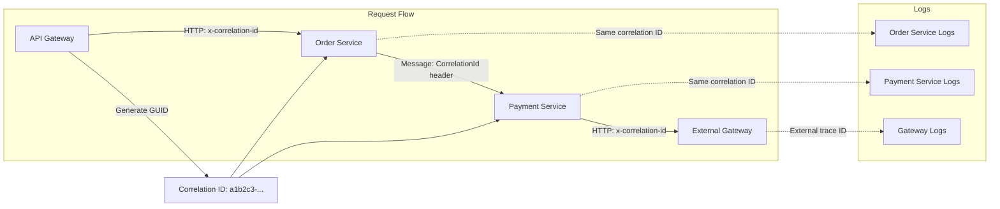
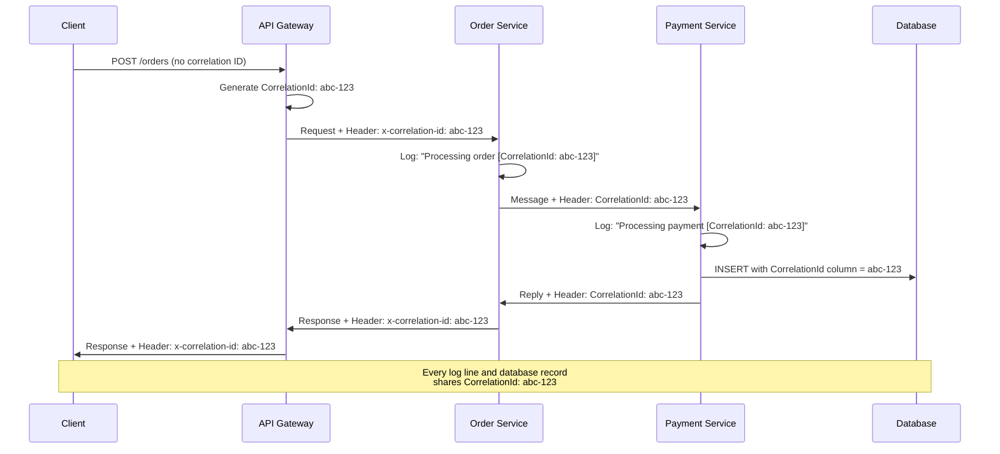
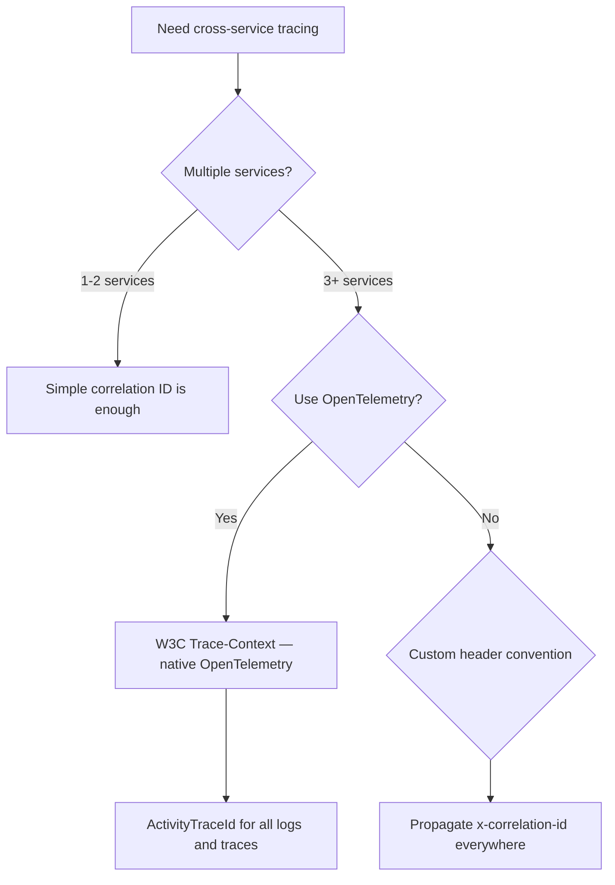
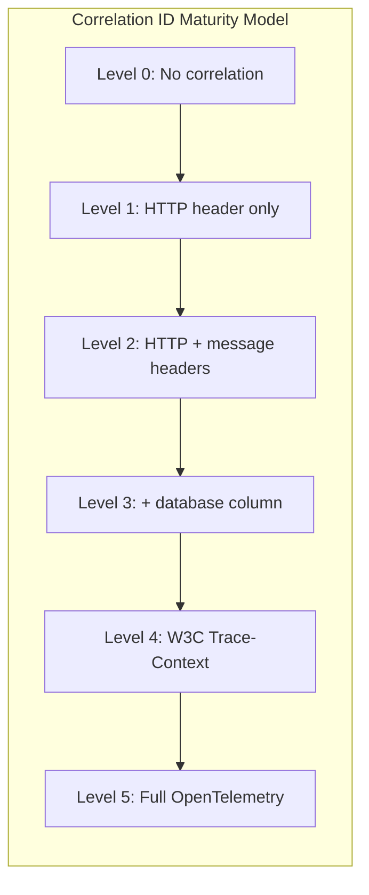
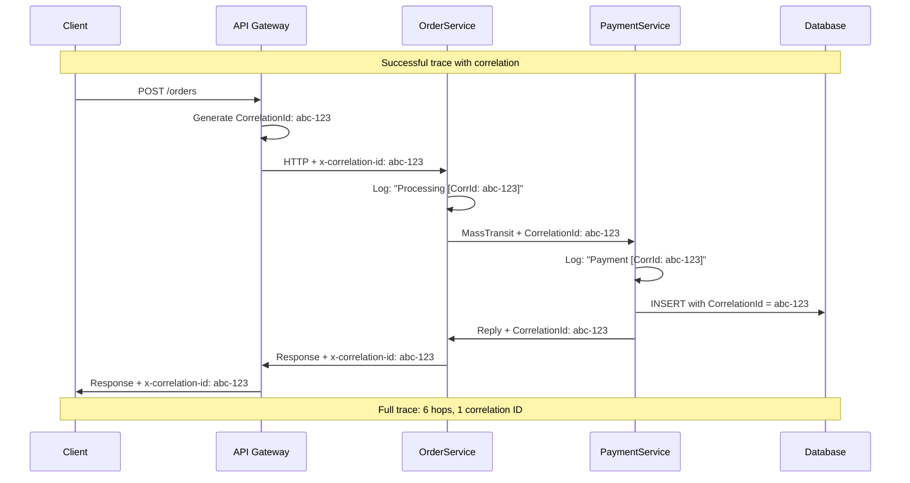
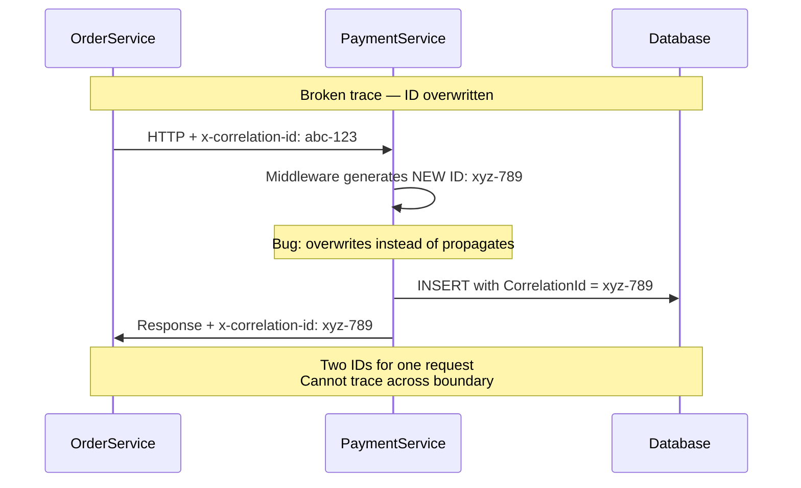
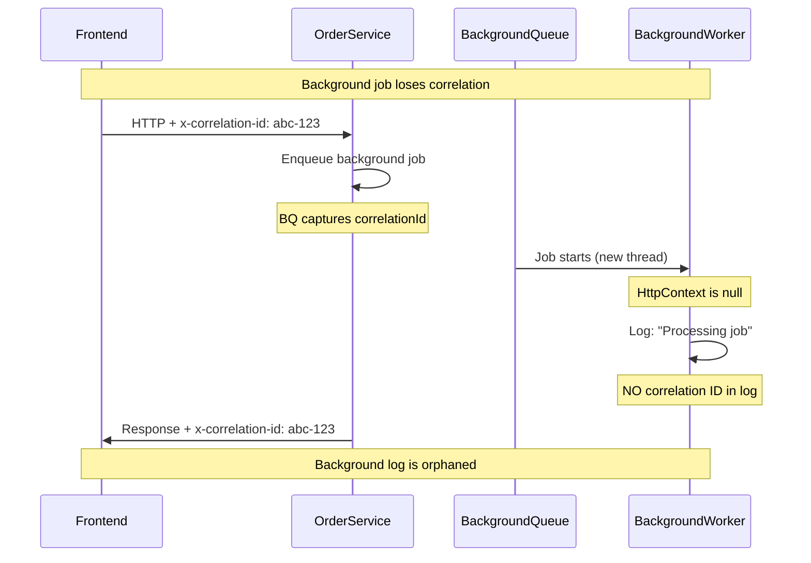
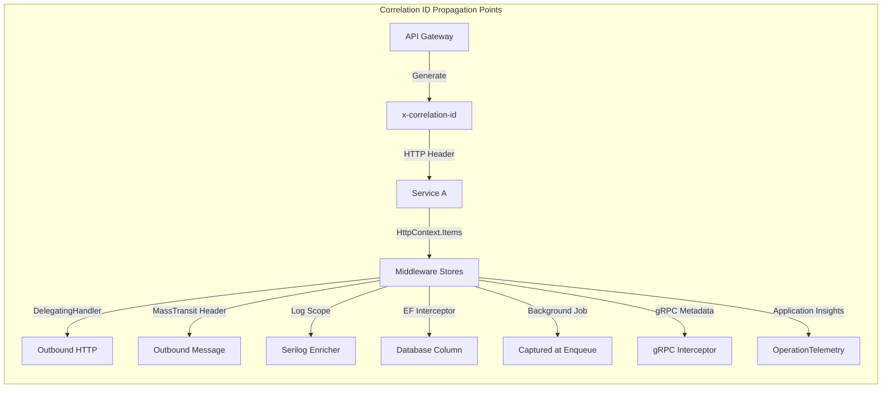
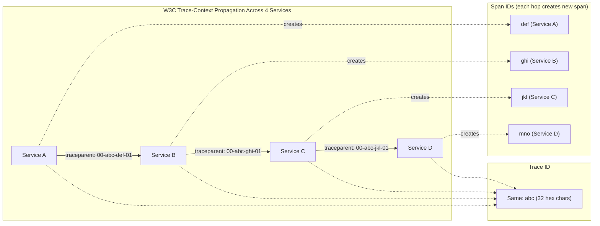

> [!success] Mastery Check
> - [ ] **Studied Well**
> - [ ] **Can explain the concept without notes**
> - [ ] **Can answer interview questions confidently**
> - [ ] **Can implement it in a real project**

## Navigation

**Domain:** [[7 — System Design & Distributed Systems]] > **Group:** Integration Patterns
**Previous:** [[7.140 — Request-Reply Pattern over Async Messaging]] | **Next:** [[7.142 — Event-Driven Architecture — Overview]]

### Prerequisites
- [[7.142 — Event-Driven Architecture — Overview]] — required because correlation IDs are essential for tracing events across services
- [[7.128 — Transactional Messaging — Guarantees]] — needed because correlation works within messaging delivery guarantees

### Where This Fits

The correlation ID pattern propagates a unique identifier across service boundaries so that all logs, events, and operations related to a single business request can be traced from end to end. Every service that participates in processing the request includes the correlation ID in its log entries, outbound messages, and API calls. A .NET engineer encounters this as the `Diagnostic-Id` or `x-correlation-id` header in HTTP, the `CorrelationId` message header in MassTransit, or the `Activity.TraceId` in OpenTelemetry. Without correlation IDs, debugging a request that spans 5 services requires manually correlating timestamps across service logs — a process that takes hours per incident. The pattern is foundational to observability: metrics tell you something is wrong, logs tell you what, and correlation IDs tell you which requests are affected. At organizations with more than 5 microservices, the absence of correlation IDs is the single biggest contributor to mean-time-to-resolution (MTTR) for production incidents.

## Core Mental Model

A correlation ID is a globally unique identifier (typically a `Guid` or `TraceId`) that is assigned when a request enters the system and propagated through every subsequent service call, message, and event. Each service logs the correlation ID with every log entry, so all log entries for a single business transaction share the same ID. The invariant is: every observable effect of a business request — every log line, every database write, every message published — carries the same correlation ID. The cost is that every service must be instrumented to propagate and log the ID, and external systems that do not support correlation IDs break the trace. The recognition trigger is any incident where understanding what happened requires looking at logs from multiple services — which, in a microservices architecture, is every non-trivial incident.





### Classification

The correlation ID pattern is an observability and debugging pattern at the application layer. It sits alongside structured logging, distributed tracing, and metrics as a component of observability. It solves the problem of tracking a request across service boundaries. It does not solve the problem of performance tracing (use OpenTelemetry spans for that) or log aggregation (use a log shipper like Fluentd for that) — it provides the common key for correlating those signals. In the observability triad (logs, metrics, traces), correlation IDs are the linking mechanism between the three pillars. The correlation ID is not a distributed systems concept per se — it is an operational practice that becomes mandatory as soon as you have more than one service.

### Key Properties / Guarantees

|Property|Value|Condition|
|---|---|---|
|Uniqueness|Globally unique (GUID)|Generated once per business request|
|Propagation|HTTP header + message header|Every service must forward it|
|Persistence|Logged with every log entry|Structured logging required|
|Scope|Single business transaction|From ingress to egress across all services|
|Compatibility|W3C Trace-Context standard|Interoperable with OpenTelemetry|
|Performance overhead|Negligible (< 1µs per propagation)|String manipulation only|
|Debuggability|Dramatically reduces MTTR|Requires all services to participate|

## Deep Mechanics

### How It Works

**Step 1 — Correlation ID generation.** The first service that receives the request generates a correlation ID. In practice, this is the API gateway or the first microservice. The ID is a GUID or a W3C TraceId (16-byte hex string). The generation rule should be: if no correlation ID exists in the incoming request, create one; if one exists, propagate it unchanged.

**Step 2 — HTTP propagation.** The correlation ID is set as an HTTP header on outgoing requests. The standard header name is `x-correlation-id` or `x-request-id`. The W3C standard uses `traceparent` for trace context. The receiving middleware extracts the header and stores it in the `HttpContext.Items`. A `DelegatingHandler` in `HttpClient` automatically reads the current correlation ID from the context and adds it to outgoing requests.

**Step 3 — Message propagation.** For messaging, the correlation ID is set as a message header. MassTransit uses the `CorrelationId` header. Azure Service Bus supports application properties. The receiving consumer extracts the correlation ID and uses it for its own processing. MassTransit automatically copies the `CorrelationId` from the consumed message to any messages sent or published from within the consumer.

**Step 4 — Logging.** Each log entry includes the correlation ID as a structured property. In Serilog: `Log.Information("Order {OrderId} created {CorrelationId}", orderId, correlationId)`. In Application Insights: the correlation ID is set as the operation ID. Structured logging is a prerequisite — if the correlation ID is embedded in the message text, it cannot be searched or filtered.

**Step 5 — Outbound propagation.** When a service makes an outbound call (HTTP or messaging), it forwards the correlation ID. The service never generates a new correlation ID — it always propagates the one it received. However, if a service needs to create internal spans for performance tracing, it generates a new span ID but keeps the same trace ID.

**Step 6 — Database persistence.** The correlation ID is written to database tables as a column on key entities. This enables the final link in the trace: linking a database record back to the HTTP request that created it. Without this step, the trace ends at the application layer.

### Failure Modes

**Correlation ID lost on external call.** Service A calls external service B (a third-party API). External service B does not propagate the correlation ID. When B calls back to A (via webhook), the correlation ID is missing.

- **Detection:** The webhook handler creates a new correlation ID, breaking the trace. The callback cannot be linked to the original request.
- **Recovery:** Include the correlation ID in the webhook payload. The external system stores it and returns it in the callback.
- **Prevention:** Design outgoing requests to include a `callback-correlation-id` in the request body (since headers may be lost).

**Correlation ID collision (duplicate GUID).** A GUID collision is astronomically unlikely but *systematic* collisions happen when a service generates a new correlation ID instead of propagating the existing one.

- **Detection:** Two different requests appear to have the same correlation ID in the logs.
- **Recovery:** Add a service prefix to the correlation ID: `orders-{guid}`. This ensures uniqueness even if two services generate the same GUID.
- **Prevention:** Never generate a new correlation ID — always propagate the received one. Generate only when no correlation ID exists.

**Correlation ID too long for downstream system.** Some systems (mainframes, legacy systems) have header size limits. A W3C TraceId (55 characters) may exceed the limit.

- **Detection:** The downstream system truncates or rejects the header.
- **Recovery:** Map to a shorter ID for the downstream call. Store the mapping for traceability.
- **Prevention:** Use a configurable correlation ID format. For legacy systems, use a shorter 32-character hex string.

**Correlation ID not propagated to async background jobs.** An HTTP request creates a correlation ID, enqueues a background job, and returns. The background job executes on a different thread without `HttpContext`, so it does not have the correlation ID.

- **Detection:** Background job logs do not have a correlation ID. Cannot trace the job back to the HTTP request that triggered it.
- **Recovery:** Manually match timestamps between HTTP logs and background job logs (takes hours).
- **Prevention:** Capture the correlation ID at enqueue time and pass it to the background job explicitly.

**Correlation ID overwritten by middleware.** A downstream service's middleware checks for the correlation ID header, finds one, but generates a new one anyway due to incorrect logic.

- **Detection:** The correlation ID changes at a specific service boundary. Traces are split into two segments.
- **Recovery:** Investigate each service's middleware to find the one overwriting the ID.
- **Prevention:** Middleware should only generate a new correlation ID if none exists. Code review gate for correlation ID propagation logic.

**Correlation ID not included in structured log property.** Engineers log the correlation ID as part of the message text: `Log.Information($"Order {id} processed [CorrId: {corrId}]")` instead of as a structured property.

- **Detection:** Log aggregation tool cannot filter by correlation ID. Engineers must search the full-text message, which is slow and error-prone.
- **Recovery:** Add a structured property and reconfigure the log shipper to index it.
- **Prevention:** Code review gates enforcing structured logging. Use Serilog analyzers to detect string interpolation in log methods.

### .NET and Azure Integration

- **ASP.NET Core Middleware:** `CorrelationIdMiddleware` that extracts or generates the correlation ID and stores it in `HttpContext.Items`
- **Serilog:** `Enrich.WithCorrelationId()` — automatically adds correlation ID to all log entries
- **Application Insights:** `TelemetryInitializer` that sets `RequestTelemetry.Id` to the correlation ID, enabling end-to-end transaction search
- **MassTransit:** Automatic `CorrelationId` header propagation — `ConsumeContext.CorrelationId` is available in all consumers
- **Azure Service Bus:** `Message.CorrelationId` property — automatically propagated
- **OpenTelemetry:** `ActivityTraceId` as the W3C TraceId — integrates with any OpenTelemetry-compatible backend
- **Polly:** Correlation ID can be added to Polly `Context` for correlation across retry attempts

```csharp
// ASP.NET Core correlation middleware
public sealed class CorrelationIdMiddleware
{
    private readonly RequestDelegate _next;

    public async Task InvokeAsync(HttpContext context)
    {
        // Extract existing correlation ID or generate new one
        var correlationId = context.Request.Headers["x-correlation-id"]
            .FirstOrDefault() ?? Activity.Current?.TraceId.ToHexString()
            ?? Guid.NewGuid().ToString("N");

        // Store in HttpContext for downstream use
        context.Items["CorrelationId"] = correlationId;
        context.TraceIdentifier = correlationId;

        // Set response header (so caller sees it)
        context.Response.OnStarting(() =>
        {
            context.Response.Headers["x-correlation-id"] = correlationId;
            return Task.CompletedTask;
        });

        // Set for OpenTelemetry / DiagnosticSource
        using var activity = new Activity("Request")
            .SetIdFormat(ActivityIdFormat.W3C);
        if (Activity.Current is null)
            activity.Start();
        activity.SetTag("correlation.id", correlationId);

        await _next(context);
    }
}
```

```csharp
// Application Insights TelemetryInitializer — sets correlation ID on all telemetry
public sealed class CorrelationIdTelemetryInitializer : ITelemetryInitializer
{
    private readonly IHttpContextAccessor _httpContextAccessor;

    public void Initialize(ITelemetry telemetry)
    {
        if (_httpContextAccessor.HttpContext?.Items["CorrelationId"] is string corrId)
        {
            telemetry.Context.Operation.Id = corrId;
            telemetry.Context.GlobalProperties["CorrelationId"] = corrId;
        }
    }
}
```

```csharp
// Polly context with correlation ID propagation
public sealed class CorrelationIdPollyContext
{
    public static readonly string CorrelationIdKey = "CorrelationId";

    public static Context CreateContext(string correlationId)
    {
        return new(ContextKeys.CorrelationId, correlationId);
    }
}

// Usage in resilience pipeline
var pipeline = new ResiliencePipelineBuilder()
    .AddRetry(new RetryStrategyOptions
    {
        OnRetry = args =>
        {
            var corrId = args.Context.Properties.GetValue(
                new ResiliencePropertyKey<string>("CorrelationId"), "");
            logger.LogWarning("Retry attempt {Attempt} for correlation {CorrId}",
                args.AttemptNumber, corrId);
            return default;
        }
    })
    .Build();
```

## Production Patterns and Implementation

### Primary Implementation

End-to-end correlation ID propagation across HTTP and messaging boundaries with structured logging.

```csharp
// 1. Correlation ID enricher for Serilog
public sealed class CorrelationIdEnricher : ILogEventEnricher
{
    private readonly IHttpContextAccessor _httpContextAccessor;

    public void Enrich(LogEvent logEvent, ILogEventPropertyFactory factory)
    {
        var correlationId = _httpContextAccessor.HttpContext
            ?.Items["CorrelationId"] as string;

        if (correlationId is not null)
        {
            logEvent.AddPropertyIfAbsent(factory.CreateProperty(
                "CorrelationId", correlationId));
        }
    }
}

// 2. HttpClient delegating handler — propagates correlation ID
public sealed class CorrelationIdDelegatingHandler : DelegatingHandler
{
    private readonly IHttpContextAccessor _httpContextAccessor;

    protected override async Task<HttpResponseMessage> SendAsync(
        HttpRequestMessage request, CancellationToken ct)
    {
        var correlationId = _httpContextAccessor.HttpContext
            ?.Items["CorrelationId"] as string;

        if (correlationId is not null)
        {
            request.Headers.TryAddWithoutValidation(
                "x-correlation-id", correlationId);
        }

        return await base.SendAsync(request, ct);
    }
}

// 3. MassTransit consumer — uses CorrelationId from message
public sealed class OrderSubmittedConsumer : IConsumer<OrderSubmitted>
{
    private readonly ILogger<OrderSubmittedConsumer> _logger;

    public async Task ConsumeAsync(ConsumeContext<OrderSubmitted> context)
    {
        var correlationId = context.CorrelationId;

        // The logger already includes the correlation ID via enricher
        _logger.LogInformation(
            "Processing order {OrderId} for customer {CustomerId}",
            context.Message.OrderId, context.Message.CustomerId);

        // When sending commands to other services, MassTransit
        // automatically propagates the CorrelationId header
        await context.Send(new ProcessPayment(
            context.Message.OrderId, context.Message.Amount));
    }
}

// 4. Program.cs — full configuration
builder.Services.AddHttpClient<IInventoryClient, InventoryClient>()
    .AddHttpMessageHandler<CorrelationIdDelegatingHandler>();

builder.Host.UseSerilog((ctx, cfg) =>
{
    cfg.Enrich.With<CorrelationIdEnricher>();
    cfg.WriteTo.Console(outputTemplate:
        "[{Timestamp:HH:mm:ss} {Level:u3}] {CorrelationId} {Message:lj}{NewLine}{Exception}");
});

builder.Services.AddCorrelationId(); // Custom extension method
```

### Configuration and Wiring

```csharp
// Extension method for clean middleware registration
public static class CorrelationIdExtensions
{
    public static IServiceCollection AddCorrelationId(this IServiceCollection services)
    {
        services.AddHttpContextAccessor();
        services.AddTransient<CorrelationIdDelegatingHandler>();
        services.AddSingleton<CorrelationIdEnricher>();
        return services;
    }

    public static IApplicationBuilder UseCorrelationId(this IApplicationBuilder app)
    {
        return app.UseMiddleware<CorrelationIdMiddleware>();
    }
}
```

```json
// appsettings.json
{
  "CorrelationId": {
    "HeaderName": "x-correlation-id",
    "IncludeInResponse": true,
    "ResponseHeaderName": "x-correlation-id",
    "StoreInHttpContextItems": true,
    "EnforceW3CFormat": false,
    "GenerateIfMissing": true,
    "ForwardToOutgoingRequests": true
  }
}
```

### Common Variants

**W3C Trace-Context standard.** Instead of a custom `x-correlation-id` header, use the W3C `traceparent` header. This enables interoperability with OpenTelemetry, Istio, and other standards-based systems.

```csharp
// W3C traceparent header
// traceparent: 00-0af7651916cd43dd8448eb211c80319c-b7ad6b7169203331-01
// version-trace_id-parent_span_id-trace_flags
```

**Dual correlation: Business ID + Trace ID.** Use a business correlation ID (e.g., `OrderId`) for domain-level tracing and a technical trace ID (`ActivityTraceId`) for performance tracing. Both are propagated. The business ID is what customer support uses ("order ABC123"), while the trace ID is what engineers use for debugging.

**Multi-tenancy correlation.** For multi-tenant systems, the correlation ID includes the tenant ID: `tenant-guid`. This allows filtering logs by tenant in shared logging infrastructure. Azure Service Bus topics can use SQL filters on the correlation ID to route events to tenant-specific subscriptions.

**Batch correlation.** When processing batch operations, each item in the batch gets its own correlation ID, but all items share a batch ID. This allows tracing individual items while also tracing the batch as a whole. Log entries include both `CorrelationId` and `BatchId`.

**Distributed tracing with OpenTelemetry.** Instead of a single correlation ID, OpenTelemetry uses a trace ID (correlation) plus multiple span IDs (individual operations). Each span has timing information, which enables performance analysis in addition to request tracing. The migration path is: correlation ID → W3C Trace-Context → OpenTelemetry spans.

### Real-World .NET Ecosystem Example

**Application Insights Operation ID** is Microsoft's correlation ID implementation in Azure. When Application Insights is configured in an ASP.NET Core app, every request gets an `OperationId`. This ID is propagated to outgoing dependencies (HTTP, SQL, Service Bus) through the W3C Trace-Context standard. The Azure portal's "end-to-end transaction details" view uses this ID to show the full call graph across all instrumented services. Application Insights correlates logs, metrics, and traces using this ID — searching by operation ID in Log Analytics returns all telemetry for that transaction. The practical impact: an engineer can click on a single failed request in Application Insights and see the full trace across 8 services, identify which service returned the error, and see the exact SQL query that failed — all without manually correlating timestamps.

## Gotchas and Production Pitfalls

### 1. Correlation ID not propagated to async background jobs

**Pitfall:** An HTTP request creates a correlation ID, enqueues a background job (via `IHostedService` or `IBackgroundTaskQueue`), and returns. The background job executes without the correlation ID because it runs on a different thread without `HttpContext`.

```csharp
// ❌ Background job loses correlation ID
_backgroundTaskQueue.QueueBackgroundWorkItem(async ct =>
{
    // HttpContext is null here — no correlation ID
    _logger.LogInformation("Processing background task");
});
```

**Symptom:** Background job logs do not have a correlation ID. Cannot trace the job back to the HTTP request that triggered it.

**Fix:** Capture the correlation ID at enqueue time and pass it to the background job.

```csharp
// ✅ Capture correlation ID at enqueue time
var correlationId = httpContext.Items["CorrelationId"] as string;
_backgroundTaskQueue.QueueBackgroundWorkItem(async ct =>
{
    using var scope = _logger.BeginScope("CorrelationId", correlationId);
    _logger.LogInformation("Processing background task");
});
```

**Cost of not fixing:** Background job failures are untraceable. Every root cause analysis requires matching timestamps between HTTP logs and background job logs.

### 2. Correlation ID header overwritten by downstream service

**Pitfall:** Service A sends a request to Service B with `x-correlation-id: abc`. Service B's middleware checks if the header exists, finds `abc`, and overwrites it with a new GUID instead of propagating.

**Symptom:** The trace breaks at Service B. The correlation ID changes from `abc` to `xyz`. Logs from Services C and D show `xyz`, not `abc`.

**Fix:** The middleware should only generate a new correlation ID if none exists. Never overwrite an existing one.

```csharp
// ✅ Only generate if missing
if (string.IsNullOrEmpty(existingCorrelationId))
{
    correlationId = Guid.NewGuid().ToString("N");
}
```

**Cost of not fixing:** Every service deployment can break the trace chain. Incident debugging becomes guessing.

### 3. Correlation ID missing in log aggregation tool

**Pitfall:** All services log the correlation ID, but the log aggregation tool (e.g., Azure Log Analytics, Datadog) does not have a dedicated field for it. It is embedded in the message text, making it impossible to search or filter by correlation ID.

**Symptom:** Engineers search for "find all logs for correlation ID abc" and get zero results because the ID is in the free-text message, not a structured field.

**Fix:** Ensure the correlation ID is logged as a structured property, not embedded in the message string. Configure the log shipper (Fluentd, Logstash) to extract it into a dedicated field.

```csharp
// ✅ Structured property — searchable
_logger.LogInformation("Order {OrderId} created", orderId);
// ❌ Embedded in text — not searchable
_logger.LogInformation($"Order {orderId} created [CorrelationId: {correlationId}]");
```

**Cost of not fixing:** The most expensive part of the incident — finding all relevant log lines — takes hours.

### 4. Correlation ID in message but not in database

**Pitfall:** A message with `CorrelationId = abc` triggers a database write. The record is written to the Orders table. But the Orders table does not have a `CorrelationId` column. Weeks later, when investigating a data issue, the correlation ID exists in the message logs but not in the database.

**Symptom:** Cannot link a problematic database record to the message trace that created it.

**Fix:** Add a `CorrelationId` column to all domain tables. Set it during creation. This enables end-to-end tracing from database records back to the HTTP request.

```csharp
public class Order
{
    public Guid Id { get; set; }
    public string CorrelationId { get; set; } // Trace back to request
    // ... other columns
}
```

**Cost of not fixing:** Data debugging requires comparing log timestamps with database record timestamps. In high-throughput systems, timestamps at the same second cannot be disambiguated.

### 5. Correlation ID too large for queue messages

**Pitfall:** The correlation ID is a 55-character W3C TraceId. Azure Service Bus Standard tier has a 256KB message size limit. In high-volume scenarios with thousands of messages, the correlation ID contributes to message size.

**Symptom:** Message size limit exceeded (rare, but possible with large payloads + many headers).

**Fix:** Use a shorter correlation ID format (32-character hex string) for high-volume messaging. Map to the W3C TraceId at the edges.

**Cost of not fixing:** (Rare) Message rejected due to size. More common: unnecessary bandwidth and storage overhead.

### 6. Correlation ID not set in database connection context

**Pitfall:** The correlation ID is available in the application layer but is not set on the database connection. When the DBA runs a slow-query log, the correlation ID is absent, making it impossible to link a slow query to the application request that triggered it.

```csharp
// ❌ Correlation ID not set on DB connection
await _dbContext.Orders
    .Where(o => o.Id == orderId)
    .ToListAsync(ct);
// DBA sees: "SELECT * FROM Orders WHERE Id = @p0"
// Cannot tell which request caused this query
```

**Symptom:** Database performance investigations are disconnected from application traces. Slow queries cannot be correlated to specific user actions.

**Fix:** Set the correlation ID as a connection context property. In Azure SQL, use `SET CONTEXT_INFO` or `sp_set_session_context`. In Application Insights, dependency telemetry automatically captures the correlation ID.

```csharp
// ✅ Correlation ID set on DB connection
await _dbContext.Database.ExecuteSqlRawAsync(
    "EXEC sp_set_session_context 'CorrelationId', {0}", correlationId);
await _dbContext.Orders
    .Where(o => o.Id == orderId)
    .ToListAsync(ct);
```

**Cost of not fixing:** The DBA team optimizes queries without knowing which feature or request triggered them. Performance improvements are prioritized by guesswork.

### 7. Correlation ID not included in error responses

**Pitfall:** When an API returns a 500 error, the response body does not include the correlation ID. The client cannot provide the correlation ID to support when reporting the error.

**Symptom:** Support tickets say "I got an error at 2:03 PM" with no correlation ID. Engineers search logs by timestamp.

**Fix:** Include the correlation ID in all error responses. ASP.NET Core exception handling middleware should add it.

```csharp
// ✅ Include correlation ID in error responses
app.UseExceptionHandler(appError =>
{
    appError.Run(async context =>
    {
        var correlationId = context.Items["CorrelationId"] as string;
        var response = new { error = "Internal server error", correlationId };
        context.Response.StatusCode = 500;
        await context.Response.WriteAsJsonAsync(response);
    });
});
```

**Cost of not fixing:** Error reporting is ambiguous. Support-to-engineering handoff takes an extra 15 minutes per incident.

### 8. Correlation ID not propagated in gRPC calls

**Pitfall:** Services use a mix of HTTP and gRPC. The correlation ID is propagated via HTTP headers but not via gRPC metadata. The trace breaks at the gRPC boundary.

**Symptom:** The correlation ID disappears when crossing from an HTTP-based service to a gRPC-based service.

**Fix:** Propagate the correlation ID as gRPC metadata. In the gRPC interceptor, read the correlation ID from the incoming metadata and store it in the `HttpContext` equivalent for the gRPC call.

```csharp
// gRPC client interceptor — propagates correlation ID
public sealed class CorrelationIdGrpcInterceptor : Interceptor
{
    private readonly IHttpContextAccessor _httpContextAccessor;

    public override AsyncUnaryCall<TResponse> AsyncUnaryCall<TRequest, TResponse>(
        TRequest request,
        ClientInterceptorContext<TRequest, TResponse> context,
        AsyncUnaryCallContinuation<TRequest, TResponse> continuation)
    {
        var correlationId = _httpContextAccessor.HttpContext
            ?.Items["CorrelationId"] as string;

        if (correlationId is not null)
        {
            var metadata = new Metadata
            {
                { "x-correlation-id", correlationId }
            };
            context = new ClientInterceptorContext<TRequest, TResponse>(
                context.Method, context.Host,
                context.ChannelCredentials,
                context.ChannelOptions,
                context.Channel,
                context.CallOptions.WithHeaders(metadata));
        }

        return base.AsyncUnaryCall(request, context, continuation);
    }
}
```

**Cost of not fixing:** Multi-protocol traces are broken. Engineers investigating an incident that spans HTTP and gRPC lose the correlation at the protocol boundary.

## Tradeoffs and Decision Framework

### Tradeoff Matrix

|Dimension|Correlation ID (Custom Header)|W3C Trace-Context|OpenTelemetry|
|---|---|---|---|
|Standard|None (team convention)|W3C standard|OpenTelemetry spec|
|Propagation|Manual per service|Automatic via libraries|Automatic via SDK|
|Interoperability|Internal only|Cross-platform, cross-vendor|Cross-vendor, cross-language|
|Richness|Single ID|Trace ID + Span ID + flags|Trace ID + Span ID + attributes + events|
|Complexity|Low|Medium|Higher|
|Tooling support|Log aggregation only|All major observability tools|OpenTelemetry backends|
|Database correlation|Manual column|Manual column|Automatic via SDK + instrumentation|
|Background job support|Manual capture|Manual capture|Automatic via diagnostic source|

### When to Apply





### When NOT to Apply

- [ ] The system is a single service — a correlation ID provides minimal value; request logging alone suffices
- [ ] The organization has not adopted structured logging — a correlation ID without structured logging cannot be searched
- [ ] External services that cannot propagate the ID dominate the trace — the trace breaks at the first external call anyway
- [ ] The team is not willing to add the `CorrelationId` column to domain tables — half the value comes from linking data records to traces
- [ ] The team has no log aggregation tool — a correlation ID in individual service logs is still useful but the cross-service value is diminished

### Scale Thresholds

- **Single service:** Correlation ID adds minimal value. Focus on structured logging and request-level logging.
- **2-5 services:** Simple GUID correlation ID propagated via HTTP headers and message headers. Sufficient for debugging most issues.
- **5-20 services:** W3C Trace-Context recommended. OpenTelemetry for automatic propagation and span-level tracing.
- **20+ services:** Full OpenTelemetry with correlation IDs embedded in every log, trace, and database record. Automated root cause analysis tools become necessary.
- **> 50 services:** Correlation IDs alone are insufficient. Need automated causality tracking (service mesh, distributed tracing platform like Honeycomb or Datadog APM).

## Interview Arsenal

### Question Bank

1. What is the correlation ID pattern and what problem does it solve?
2. How do you propagate a correlation ID across HTTP and messaging boundaries?
3. What happens if a service overwrites the correlation ID?
4. Compare correlation ID with OpenTelemetry tracing.
5. How do you correlate database records with request traces?
6. What should you log with a correlation ID?
7. How do you handle correlation ID in background jobs?
8. How does MassTransit handle correlation IDs?
9. How do you propagate correlation IDs across gRPC boundaries?
10. What is the maturity model for correlation ID adoption?

### Spoken Answers

**Q1: What is the correlation ID pattern and what problem does it solve?**

> **Great answer:** "The correlation ID pattern assigns a globally unique identifier to a business request when it enters the system and propagates it through every subsequent operation — every HTTP call, every message, every database write. Every log entry includes this ID as a structured property. The problem it solves is tracing a single business transaction across multiple services. Without correlation IDs, if a customer reports an error at 2:03 PM, you must manually search each service's logs for entries around 2:03 PM and try to piece together what happened. With correlation IDs, you search by the ID and instantly get every log entry from every service that participated in processing that request. The core invariant is that every observable effect of a business request carries the same ID. The cost is the instrumentation effort — every service must be modified to propagate and log the ID. But this investment pays for itself on the first production incident."

**Q3: What happens if a service overwrites the correlation ID?**

> **Great answer:** "If a service overwrites the correlation ID instead of propagating it, the trace breaks at that point. All logs and operations from downstream services are associated with the new ID, not the original one. When investigating an incident, you search for the original correlation ID and only get logs up to the overwriting service. You then search for the new ID, but you may not know what the new ID is — you have to find it by matching timestamps. This adds 30-60 minutes to every debugging session. The fix is a team standard: the correlation ID middleware must check for an existing value and only generate a new one if none exists. This should be enforced through code review and automated tests. The W3C Trace-Context standard handles this by design — the trace ID is immutable once set, and only the parent span ID changes as the request crosses service boundaries."

**Q7: How do you handle correlation ID in background jobs?**

> **Great answer:** "Background jobs run on different threads than the HTTP request that enqueued them. The `HttpContext` is not available. The solution is to capture the correlation ID at enqueue time and pass it to the background job. When queueing the job, store the correlation ID from the current scope. When the job executes, set the correlation ID in the logging scope before processing. In a `BackgroundService`, this means the enqueue method takes a `CorrelationId` parameter and the job handler begins by setting the logging scope. Some job frameworks (Hangfire, Quartz.NET) support custom job filters that automatically capture and restore the correlation ID across the job boundary. Without this, background job logs are orphaned — they cannot be traced back to the HTTP request that triggered them. In practice, I create a `CorrelationIdScope` that implements `IDisposable` and wraps the job execution in a `using` block that sets the correlation ID in the logger scope for the duration of the job."

**Q4: Compare correlation ID with OpenTelemetry tracing.**

> **Great answer:** "A correlation ID is a single identifier for end-to-end tracing. It tells you which log entries belong to the same request. OpenTelemetry builds on this concept by adding a hierarchical structure. OpenTelemetry has a trace ID (analogous to the correlation ID) and multiple span IDs — each representing a unit of work within the trace. Each span has timing information (start, end, duration), attributes (HTTP method, URL, status code), and events (exceptions, log messages). This enables performance analysis: you can see not just which services were involved, but how long each one took. The correlation ID tells you an order took 5 seconds to process. OpenTelemetry tells you the API gateway took 50ms, the Order Service took 200ms querying the database, the Payment Service took 4.5 seconds waiting for the external gateway, and the Notification Service took 250ms sending the email. The correlation ID is the foundation; OpenTelemetry spans are the rich layer on top. In practice, I start with a simple correlation ID and migrate to OpenTelemetry as the team's observability maturity grows."

### System Design Interview Trigger

When the interviewer asks "how do you debug a production issue that spans multiple services?" correlation IDs are part of the expected answer. The senior answer includes the propagation mechanism (HTTP headers + message headers), the structured logging requirement, and the database column addition. The follow-up will be about how OpenTelemetry builds on this — the correlation ID is the foundation, and spans add performance context. The strongest answer also addresses the maturity model: start simple (HTTP header), add messaging propagation, add database columns, then migrate to W3C Trace-Context and OpenTelemetry.

### Comparison Table

| | Custom Correlation ID | W3C Trace-Context | OpenTelemetry |
|---|---|---|---|
| Standard | None | W3C | CNCF |
| ID format | GUID | 16-byte trace ID + 8-byte span ID | 16-byte trace ID + 8-byte span ID |
| Propagation | Manual middleware | Automatic (HTTP + messaging) | Automatic via SDK |
| Log enrichment | Manual (enricher) | Automatic via Activity | Automatic via Activity |
| Performance data | None | Parent span tracking | Spans, events, metrics |
| .NET support | Custom | System.Diagnostics.Activity | OpenTelemetry .NET SDK |
| Adoption effort | Low | Medium | Medium-High |
| Debugging depth | Request-level | Request + operation-level | Full distributed tracing |

## Architecture Decision Record

**Status:** Accepted

**Context:** A team of 15 engineers across 8 microservices needs to debug production incidents. The current practice is matching log timestamps across services — taking 30-60 minutes per incident. The team uses Serilog for structured logging, MassTransit for messaging, and Application Insights for monitoring. The system processes approximately 500 requests/second during peak hours. The team has recently experienced a 45-minute outage where identifying which service failed took 25 minutes of that time.

**Options Considered:**

1. **Custom x-correlation-id header + Serilog enricher** — Middleware propagates the ID; all logs include it as a structured field
2. **W3C Trace-Context via OpenTelemetry** — Full distributed tracing with Activity; automatic propagation
3. **Application Insights Operation ID only** — Use Application Insights' built-in operation ID without custom middleware
4. **Hybrid: W3C Trace-Context + custom header for backward compatibility** — Gradual migration path

**Decision:** Hybrid — Use W3C Trace-Context as the primary correlation mechanism (via `System.Diagnostics.Activity`), with a custom `x-correlation-id` header for backward compatibility with services that are not yet on OpenTelemetry (option 4). The Serilog enricher reads the Activity TraceId and also checks for the custom header. This ensures all services can correlate, even during the migration to full OpenTelemetry. Additionally, a `CorrelationId` column will be added to the Orders, Payments, and Shipments tables with an EF Core interceptor that automatically populates it.

**Consequences:**
- ✅ Activity TraceId is propagated automatically by `HttpClient` and MassTransit (newer versions)
- ✅ Custom header ensures backward compatibility with older services
- ✅ Serilog enricher picks up either source — logs always have a correlation ID
- ✅ Application Insights automatically correlates telemetry by TraceId
- ✅ Database records can be traced back to HTTP requests via the CorrelationId column
- ⚠️ Dual-propagation (Trace-Context + custom header) adds minimal overhead but requires testing
- ❌ Services must be instrumented to use `HttpClient` for HTTP calls (not `WebClient` or raw `HttpWebRequest`)
- ❌ Three services use gRPC — a gRPC interceptor must be built for correlation ID propagation

**Review Trigger:** Revisit when all services are on OpenTelemetry. At that point, the custom `x-correlation-id` header can be deprecated, simplifying the propagation to pure W3C Trace-Context. Also revisit if a new service uses a non-.NET runtime (Node.js, Python) — W3C Trace-Context ensures cross-runtime compatibility, but the custom header convention must be documented for non-.NET teams.

## Self-Check

### Conceptual Questions

1. What is the correlation ID pattern?
2. How does a correlation ID propagate across HTTP boundaries?
3. How does it propagate across messaging boundaries?
4. What happens if a service overwrites the correlation ID?
5. Compare correlation ID with OpenTelemetry distributed tracing.
6. How do you ensure background jobs have correlation IDs?
7. What is the role of the correlation ID in structured logging?
8. How do you link database records to request traces using correlation IDs?
9. What is the W3C Trace-Context standard?
10. Explain in 60 seconds how to implement correlation ID in a .NET microservices system.

<details>
<summary>Answers</summary>

1. The correlation ID pattern assigns a unique identifier to a business request and propagates it through every service call, message, and log entry. It enables tracing a single request across all services it touches.

2. Via an HTTP header — typically `x-correlation-id` or the W3C `traceparent` header. A `DelegatingHandler` in `HttpClient` reads the current correlation ID and adds it to outgoing requests. The receiving service's middleware extracts it and stores it in `HttpContext.Items`.

3. Via message headers — `CorrelationId` in MassTransit, `Message.CorrelationId` in Azure Service Bus. The messaging framework automatically copies the correlation ID from the received message to any messages sent from the consumer.

4. The trace breaks. Downstream logs are associated with the new ID. Debugging requires manually matching timestamps across the break point. The fix is to only generate a new ID when none exists — never overwrite.

5. A correlation ID is a single identifier for end-to-end tracing. OpenTelemetry uses a trace ID (the correlation ID equivalent) plus span IDs for each operation, with timing and attributes. OpenTelemetry builds on the correlation ID concept by adding performance data and hierarchical span structure.

6. Capture the correlation ID at job enqueue time (from `HttpContext.Items` or `Activity.Current.TraceId`). Pass it to the background job. At job execution time, set the correlation ID in the logging scope before processing.

7. The correlation ID must be a structured property in the log entry, not embedded in the message text. This enables searching and filtering by correlation ID in log aggregation tools.

8. Add a `CorrelationId` column to domain tables. Set it when the record is created. This enables linking any database record to the full request trace.

9. W3C Trace-Context is a standard for propagating distributed tracing context across service boundaries. It defines the `traceparent` header (trace ID, span ID, flags) and `tracestate` header (vendor-specific data). It is the propagation standard used by OpenTelemetry.

10. "First, add correlation middleware to the ASP.NET Core pipeline that extracts the `x-correlation-id` header or the W3C `traceparent` header and stores it in `HttpContext.Items`. Generate a new GUID if none exists. Second, configure Serilog with a CorrelationIdEnricher that reads the correlation ID and adds it to all log entries as a structured property. Third, add a DelegatingHandler for HttpClient that propagates the correlation ID in outgoing requests. Fourth, for messaging, MassTransit automatically propagates the CorrelationId header — configure it in the transport. Fifth, add a `CorrelationId` column to domain tables. Sixth, for background jobs, capture the correlation ID at enqueue time and restore it during job execution."
</details>

---

### Scenario Challenges

**Scenario 1 — Diagnose the problem**

A production incident: a customer reports that their order was charged twice. The logs from the Order service and Payment service each show the `OrderId`. The logs show both services processed the order correctly, but the customer was charged twice. The payment gateway logs show two charge requests for the same order.

<details>
<summary>Diagnosis</summary>

**Root cause:** The Order service sent two `ProcessPayment` messages for the same order. The correlation ID can trace both messages. The first message was sent correctly. The second was sent due to a duplicate `OrderSubmitted` event (the event was delivered twice and the consumer was not idempotent).

**Evidence:** Search logs by `OrderId`. Find two `ProcessPayment` messages with the same correlation ID but different message IDs. The `OrderSubmitted` consumer logs show it was invoked twice for the same `CorrelationId`.

**Fix:** Add idempotency to the `OrderSubmitted` consumer using the inbox pattern (dedup table by `CorrelationId` and event name).

**Prevention:** All saga-triggering consumers must be idempotent. The correlation ID is the correct dedup key.
</details>

---

**Scenario 2 — Design decision**

You are introducing correlation IDs to a system with 20 existing microservices. Each service has its own logging framework. Some use Serilog, some use NLog, some use `Console.WriteLine`. How do you introduce correlation IDs incrementally?

<details>
<summary>Decision and Reasoning</summary>

**Choice:** Start with the correlation middleware in the API gateway. Add the `x-correlation-id` header to all incoming requests. Then incrementally add propagation to each service, starting with the most critical path (the order-to-payment flow).

**Incremental plan:**
1. Add correlation middleware to the API gateway (generates ID for all requests)
2. Add `CorrelationIdDelegatingHandler` to HTTP clients in 2-3 core services
3. Add correlation ID to Serilog enricher in those services
4. Add MassTransit correlation propagation (automatic with update)
5. Add `CorrelationId` column to the Orders table
6. Repeat for remaining services over 3 sprints
7. Deprecate old logging and standardize on structured logging

**Tradeoffs accepted:** During the migration, some services will not propagate the correlation ID. The trace will be incomplete. But even partial tracing is better than none. The investment is justified by the first incident where a partial trace saves 30 minutes of debugging.
</details>

---

**Scenario 3 — Interview simulation** The interviewer says: "You have a bug that only happens when request A is followed by request B to the same service within 100ms. Without correlation IDs, how would you debug this? How would correlation IDs help?"

<details> <summary>Model Response</summary>

"Without correlation IDs, I would: check the timestamps — request A at 10:00:00.000, request B at 10:00:00.095. I would check the service's logs for entries around those timestamps. But if the service has multiple instances, the logs are on different machines. I would check the downstream service's logs — same problem. I would check for shared state (static variables, cache entries) that A and B might interact with. This would take 1-2 hours to identify the symptom, and another 1-2 hours to find the root cause.

"With correlation IDs, the first thing I do is search for request A's correlation ID — I see every log entry from every service that processed A. I search for B's correlation ID — I see every log entry for B. I compare the two traces. If the bug is a shared-state race condition, I will see that A wrote a value (log entry: 'Cache set key=X to value=1') and B read the same key (log entry: 'Cache get key=X returned value=2') — the wrong value. Without correlation IDs, I would not know that A's write and B's read are related. With correlation IDs, the full story is in the logs, already correlated by the two IDs.

"The correlation ID also enables automated tooling. I can write a script that queries: 'find all failed requests where two requests shared the same key within 100ms.' This would surface the bug pattern without manual investigation."
</details>

---

**Scenario 4 — Scale it** Your system handles 5,000 requests/second with correlation IDs propagated via custom HTTP header and MassTransit message headers. The trace is complete end-to-end. You need to introduce OpenTelemetry for performance tracing. How do you migrate without breaking existing traces?

<details>
<summary>Scaling Strategy</summary>

**Bottleneck this addresses:** The custom header correlation ID tells you which request caused which logs, but it does not tell you how long each operation took. You need span-level timing.

**How it helps:** OpenTelemetry adds span IDs, timing, and attributes on top of the existing correlation ID. The trace ID in OpenTelemetry is equivalent to your correlation ID, so existing traces are not broken.

**Implementation order:**
1. Add the OpenTelemetry .NET SDK and configure it to export to your observability backend
2. Configure the sampler to start with a low sampling rate (1-5%) to manage cost and volume
3. Keep the existing correlation ID middleware running — OpenTelemetry's trace ID will be the correlation ID
4. Update the Serilog enricher to use `Activity.Current.TraceId` instead of the custom header (or both)
5. Add manual instrumentation for critical paths (database calls, external API calls)
6. After verifying OpenTelemetry traces are complete, gradually deprecate the custom header

**What it does not solve:** OpenTelemetry adds overhead (serialization, export). The sampling rate must be tuned to balance trace completeness with cost. Also, not all code paths are automatically instrumented — some require manual span creation.

**Alternative:** Use Azure Monitor's built-in distributed tracing (Application Insights SDK) instead of OpenTelemetry. This is simpler for an Azure-native stack but creates vendor lock-in.
</details>

---

**Scenario 5 — Interview simulation** The interviewer says: "You are the new SRE for a 15-service .NET microservices system. The team tells you that debugging production incidents takes 45 minutes on average because they cannot trace requests across services. What do you do?"

<details>
<summary>Model Response</summary>

"The first thing I'd do is check whether there is any correlation mechanism in place. If not, my priority is to introduce a correlation ID pattern — the highest-leverage observability investment for a multi-service system.

"I would take a phased approach. Phase 1 (week 1): Add a `CorrelationIdMiddleware` to the API gateway that generates a GUID for every incoming request and sets it as the `x-correlation-id` response header. This is a 10-line middleware change and immediately gives us the ability to tell customers 'please provide the correlation ID from the error response' — which is a huge improvement over timestamp matching.

"Phase 2 (weeks 2-3): Add a `DelegatingHandler` for `HttpClient` in the 3 core services (Order, Payment, Shipping) that propagates the `x-correlation-id` header on outgoing calls. Add a Serilog enricher that logs the correlation ID as a structured property. Now when a request goes through these 3 services, we can search logs by correlation ID and see the full trace across 3 services.

"Phase 3 (weeks 4-6): Add `CorrelationId` columns to the Orders, Payments, and Shipments tables. Add a `SaveChangesAsync` interceptor in EF Core that automatically populates the correlation ID from the current `HttpContext.Items`. Now database records are traceable.

"Phase 4 (weeks 7-8): Add MassTransit correlation propagation — this is usually a configuration change, not code. Verify that `ConsumeContext.CorrelationId` is being populated correctly. Update the 3 remaining services that use MassTransit.

"Phase 5 (weeks 9-12): Introduce OpenTelemetry for span-level performance tracing. Add the OpenTelemetry SDK, configure exporters to Azure Monitor, and add manual spans for the most critical code paths.

"The key insight is that we do not need to fix all 15 services at once. We start with the core path (Order → Payment → Shipping) which handles 80% of incidents. The remaining 12 services can be instrumented over the next 3 months. Even partial correlation coverage immediately reduces MTTR because the most common failure paths are now fully traceable."

</details>

---

## Deep Dive — Correlation ID Propagation Diagrams









## Correlation ID Anti-Patterns

### Anti-Pattern 1: Correlation ID as a Single String

Using a single GUID for everything. This works for request tracing but provides no hierarchical structure for performance analysis.

**Fix:** Use W3C Trace-Context: separate trace ID (for correlation) and span ID (for individual operations). Each service creates a new span ID but propagates the same trace ID.

### Anti-Pattern 2: Correlation ID Only on Happy Path

Services propagate the correlation ID on successful requests but not on error responses. Error logs lack the correlation ID.

**Fix:** Always include the correlation ID in error responses (both HTTP and message headers). The error response middleware should copy the correlation ID from `HttpContext.Items`.

### Anti-Pattern 3: Correlation ID in Log Message Text

Engineers write `Log.Information($"Processing order {id} [CorrId: {corrId}]")` instead of using structured properties.

**Fix:** Code review gates. Use Serilog analyzers (nuget: `SerilogAnalyzer`) to flag string interpolation in logger calls.

### Anti-Pattern 4: Generating New ID at Every Service

Each service generates its own correlation ID instead of propagating the existing one.

**Fix:** The middleware rule: "generate only if missing, never overwrite." Enforce through the correlation middleware being the single point of generation.

### Anti-Pattern 5: Correlation ID Without Database Column

The trace works at the application layer but breaks at the database — records cannot be linked back to requests.

**Fix:** Add `CorrelationId` column to every domain table. Use an EF Core `SaveChangesInterceptor` to auto-populate it from the current execution context.

```csharp
public sealed class CorrelationIdSaveChangesInterceptor : SaveChangesInterceptor
{
    private readonly IHttpContextAccessor _httpContextAccessor;

    public override InterceptionResult<int> SavingChanges(
        DbContextEventData eventData, InterceptionResult<int> result)
    {
        SetCorrelationId(eventData.Context);
        return base.SavingChanges(eventData, result);
    }

    public override ValueTask<InterceptionResult<int>> SavingChangesAsync(
        DbContextEventData eventData, InterceptionResult<int> result,
        CancellationToken ct = default)
    {
        SetCorrelationId(eventData.Context);
        return base.SavingChangesAsync(eventData, result, ct);
    }

    private void SetCorrelationId(DbContext? context)
    {
        if (context is null) return;
        var correlationId = _httpContextAccessor.HttpContext
            ?.Items["CorrelationId"] as string;
        if (correlationId is null) return;

        foreach (var entry in context.ChangeTracker.Entries()
            .Where(e => e.State == EntityState.Added))
        {
            if (entry.Entity is IHasCorrelationId entity)
            {
                entity.CorrelationId = correlationId;
            }
        }
    }
}

---

## Deep Dive — W3C Trace-Context and Activity API

### W3C Trace-Context Header Structure

The W3C Trace-Context standard defines two headers: `traceparent` and `tracestate`. The `traceparent` header carries the trace ID (16 bytes, hex-encoded as 32 characters), span ID (8 bytes, 16 hex chars), and trace flags (2 hex chars). The `tracestate` header carries vendor-specific data that must be forwarded unchanged.

```
traceparent: 00-0af7651916cd43dd8448eb211c80319c-b7ad6b7169203331-01
              ^^ ^^^^^^^^^^^^^^^^^^^^^^^^^^^^^^^^ ^^^^^^^^^^^^^^^^ ^^
              |  trace_id (32 hex chars)          span_id         flags
              version                              (16 hex chars)  01=sampled
```

The `tracestate` header allows vendors to append their own data:
```
tracestate: congo=t61rcWkgMzE,rojo=00f067aa0ba902b7
```



### Activity API Integration

The .NET `System.Diagnostics.Activity` API provides W3C Trace-Context support built into the runtime. `HttpClient` and ASP.NET Core automatically create and propagate activities when configured.

```csharp
// Creating and starting an activity with W3C format
public sealed class CustomActivityFactory
{
    public Activity StartTrace(string operationName)
    {
        var activity = new Activity(operationName)
            .SetIdFormat(ActivityIdFormat.W3C)
            .AddTag("component", "order-service")
            .AddTag("environment", Environment.GetEnvironmentVariable("ASPNETCORE_ENVIRONMENT") ?? "unknown");

        activity.Start();
        return activity;
    }

    public Activity? CreateChildSpan(string spanName)
    {
        // Automatically uses current trace ID from parent
        var activity = Activity.Current?.Source
            ?.CreateActivity(spanName, ActivityKind.Internal);

        activity?.Start();
        return activity;
    }
}

// Usage in a service method
public sealed class OrderProcessingService
{
    private readonly CustomActivityFactory _activityFactory;

    public async Task<Order> ProcessOrderAsync(CreateOrderCommand command, CancellationToken ct)
    {
        using var activity = _activityFactory.StartTrace("OrderProcessing");
        
        activity?.AddTag("order.id", command.OrderId);
        activity?.AddTag("customer.id", command.CustomerId);

        using var dbSpan = _activityFactory.CreateChildSpan("Database.Save");
        var order = await _repository.SaveAsync(command, ct);
        dbSpan?.Stop();

        using var msgSpan = _activityFactory.CreateChildSpan("Message.Publish");
        await _publisher.Publish(new OrderPlacedEvent(order.Id), ct);
        msgSpan?.Stop();

        activity?.Stop();
        return order;
    }
}
```

### DiagnosticSource Integration

The `DiagnosticSource` infrastructure enables automatic correlation ID propagation across library boundaries. Entity Framework Core, `HttpClient`, and ASP.NET Core all emit diagnostic events that carry the current activity context.

```csharp
// Custom DiagnosticObserver for correlation tracking
public sealed class CorrelationDiagnosticObserver : IObserver<DiagnosticListener>
{
    public void OnNext(DiagnosticListener listener)
    {
        if (listener.Name == "HttpHandlerDiagnosticListener")
        {
            listener.Subscribe(new HttpHandlerObserver());
        }
    }

    public void OnError(Exception error) { }
    public void OnCompleted() { }

    private sealed class HttpHandlerObserver : IObserver<KeyValuePair<string, object?>>
    {
        public void OnNext(KeyValuePair<string, object?> pair)
        {
            if (pair.Key == "System.Net.Http.HttpRequestOut.Start")
            {
                var request = pair.Value?.GetType().GetProperty("Request")?.GetValue(pair.Value) as HttpRequestMessage;
                var correlationId = Activity.Current?.TraceId.ToHexString();
                if (correlationId is not null && request is not null)
                {
                    request.Headers.TryAddWithoutValidation("x-correlation-id", correlationId);
                }
            }
        }

        public void OnError(Exception error) { }
        public void OnCompleted() { }
    }
}

// Registration
DiagnosticListener.AllListeners.Subscribe(new CorrelationDiagnosticObserver());
```

### Correlation ID Provider Abstraction

A clean abstraction for providing correlation IDs across different contexts (HTTP, messaging, background jobs):

```csharp
public interface ICorrelationIdProvider
{
    string GetCorrelationId();
}

public sealed class HttpContextCorrelationIdProvider : ICorrelationIdProvider
{
    private readonly IHttpContextAccessor _httpContextAccessor;

    public string GetCorrelationId()
    {
        var httpContext = _httpContextAccessor.HttpContext;
        if (httpContext?.Items["CorrelationId"] is string correlationId)
            return correlationId;

        // Fall back to Activity.Current if available
        if (Activity.Current?.TraceId is { } traceId)
            return traceId.ToHexString();

        return Guid.NewGuid().ToString("N");
    }
}

public sealed class MessageCorrelationIdProvider : ICorrelationIdProvider
{
    private readonly ConsumeContext _consumeContext;

    public string GetCorrelationId()
    {
        if (_consumeContext.CorrelationId.HasValue)
            return _consumeContext.CorrelationId.Value.ToString("N");

        return Activity.Current?.TraceId.ToHexString() ?? Guid.NewGuid().ToString("N");
    }
}

public sealed class BackgroundJobCorrelationIdProvider : ICorrelationIdProvider
{
    private readonly string _correlationId;

    public BackgroundJobCorrelationIdProvider(string correlationId)
    {
        _correlationId = correlationId;
    }

    public string GetCorrelationId() => _correlationId;
}
```

## Additional Failure Modes

### Failure 7 — ActivityId Leak Across Requests

In IIS or Kestrel with thread pooling, an `Activity` from a previous request may still be attached to the current thread when a new request starts. The new request picks up the old request's TraceId.

- **Detection:** Logs show two different requests with the same TraceId that are chronologically impossible to be the same trace (timestamps overlap or are far apart).
- **Recovery:** Clear `Activity.Current` at the start of each request middleware.
- **Prevention:** ASP.NET Core 6+ automatically resets Activity on each request. For older versions or custom hosting, explicitly set `Activity.Current = null` in middleware before creating the new activity.

```csharp
public sealed class ActivityResetMiddleware
{
    private readonly RequestDelegate _next;

    public async Task InvokeAsync(HttpContext context)
    {
        // Prevents Activity leak from previous request
        Activity.Current = null;

        var activity = new Activity("HttpRequest")
            .SetIdFormat(ActivityIdFormat.W3C)
            .Start();

        context.Items["ActivityStarted"] = true;

        await _next(context);

        activity.Stop();
    }
}
```

### Failure 8 — Correlation ID Stripped by Reverse Proxy

An API gateway, load balancer, or reverse proxy (nginx, Azure Front Door, Cloudflare) strips unknown HTTP headers. The `x-correlation-id` header never reaches the downstream service.

- **Detection:** The correlation ID is present in the gateway logs but absent in the first microservice's logs.
- **Recovery:** Configure the reverse proxy to allow the custom header. In nginx: `underscores_in_headers on;`. In Azure Front Door: add `x-correlation-id` to the forwarded headers list.
- **Prevention:** Use the W3C `traceparent` header instead of custom headers — most reverse proxies pass standard headers through. Azure Front Door preserves `traceparent` without configuration.

```nginx
# nginx configuration to preserve correlation headers
proxy_set_header X-Correlation-ID $http_x_correlation_id;
proxy_pass_header X-Correlation-ID;
```

### Failure 9 — AsyncLocal Correlation ID Lost Across Await Points

If the correlation ID is stored in `AsyncLocal<T>` and the code uses `ConfigureAwait(false)`, the correlation ID may be lost when the continuation runs on a different synchronization context.

- **Detection:** Intermittent loss of correlation ID in async flows. Some log entries within the same request have the correlation ID, others do not.
- **Recovery:** Switch to `IHttpContextAccessor` which uses `AsyncLocal` internally but handles synchronization context correctly.
- **Prevention:** Never use bare `AsyncLocal<T>` for correlation. Always use `IHttpContextAccessor` or `Activity.Current` which are designed for async flow.

```csharp
// ❌ Bare AsyncLocal — lost on ConfigureAwait(false)
public sealed class AsyncLocalCorrelationStore
{
    private static readonly AsyncLocal<string?> _correlationId = new();

    public static string? CorrelationId
    {
        get => _correlationId.Value;
        set => _correlationId.Value = value;
    }
}

// Called in a method with ConfigureAwait(false) — value may be null
await SomeMethodAsync().ConfigureAwait(false);
var id = AsyncLocalCorrelationStore.CorrelationId; // May be null!
```

```csharp
// ✅ Use Activity.Current instead — handles async flow correctly
public sealed class ActivityCorrelationStore
{
    public static string? CorrelationId =>
        Activity.Current?.TraceId.ToHexString();
}

// Works correctly across all await points
await SomeMethodAsync().ConfigureAwait(false);
var id = ActivityCorrelationStore.CorrelationId; // Always correct
```

### Failure 10 — Correlation ID Not Included in Problem Details Responses

ASP.NET Core's `ProblemDetails` standardized error format does not include the correlation ID by default. When the API returns validation errors or 4xx responses, the client cannot provide the correlation ID to support.

- **Detection:** Support tickets from API consumers say "I got a 422 error on endpoint X" with no correlation ID.
- **Recovery:** Customize the `ProblemDetails` factory to include correlation ID.
- **Prevention:** Override the `ProblemDetailsFactory` in ASP.NET Core to add correlation ID to every problem response.

```csharp
// ✅ Custom ProblemDetails factory with correlation ID
public sealed class CorrelationProblemDetailsFactory : ProblemDetailsFactory
{
    private readonly IHttpContextAccessor _httpContextAccessor;
    private readonly ApiBehaviorOptions _options;

    public override ProblemDetails CreateProblemDetails(
        HttpContext context,
        int? statusCode = null,
        string? title = null,
        string? type = null,
        string? detail = null,
        string? instance = null)
    {
        var problemDetails = base.CreateProblemDetails(
            context, statusCode, title, type, detail, instance);

        var correlationId = _httpContextAccessor.HttpContext
            ?.Items["CorrelationId"] as string;

        if (correlationId is not null)
        {
            problemDetails.Extensions["correlationId"] = correlationId;
        }

        return problemDetails;
    }
}
```

## Additional Gotchas with ❌/✅ C# Code

### Gotcha 12 — Correlation ID in gRPC Bidirectional Streaming

In gRPC bidirectional streaming, metadata is sent only on the initial request setup. The correlation ID set in the initial metadata does not apply to subsequent messages in the stream.

```csharp
// ❌ Correlation ID only in initial metadata — lost on subsequent messages
var call = client.SubscribeToOrderUpdates(cancellationToken: ct);
// Metadata sent once at channel creation
var headers = new Metadata { { "x-correlation-id", correlationId } };
// Subsequent RequestStream.WriteAsync calls do not include headers
await call.RequestStream.WriteAsync(new OrderUpdateRequest { OrderId = "123" });
await call.RequestStream.WriteAsync(new OrderUpdateRequest { OrderId = "456" });
```

```csharp
// ✅ Correlation ID in each streaming message body — traceable per message
public sealed record OrderUpdateRequest(
    string CorrelationId,
    string OrderId,
    DateTimeOffset Timestamp);

// Now every message carries its own correlation context
await call.RequestStream.WriteAsync(new OrderUpdateRequest(
    CorrelationId: correlationId,
    OrderId: "123",
    Timestamp: DateTimeOffset.UtcNow));
await call.RequestStream.WriteAsync(new OrderUpdateRequest(
    CorrelationId: correlationId,
    OrderId: "456",
    Timestamp: DateTimeOffset.UtcNow));
```

**Cost of not fixing:** Bidirectional streaming traces are broken. Correlating client requests with server responses in a stream requires manual message ID matching.

### Gotcha 13 — Correlation ID Logged as String Interpolation in High-Performance Logging

High-performance logging code uses `LoggerMessage.Define` (source-generated) or `LogCritical` with string interpolation. The correlation ID ends up in the message text instead of as a structured property.

```csharp
// ❌ High-performance logging with string interpolation — not searchable
[LoggerMessage(EventId = 1001, Level = LogLevel.Information, Message = "Order {OrderId} processed [CorrId: {CorrelationId}]")]
partial void LogOrderProcessed(ILogger logger, string orderId, string correlationId);

// The correlationId is part of the message text, not a structured field
```

```csharp
// ✅ High-performance logging with structured properties — searchable
[LoggerMessage(EventId = 1001, Level = LogLevel.Information, Message = "Order {OrderId} processed")]
partial void LogOrderProcessed(ILogger logger, string orderId, [LogProperties] CorrelationContext ctx);

// CorrelationId is a structured property — filterable in log aggregation tools
public sealed record CorrelationContext(string CorrelationId, string TenantId);
```

**Cost of not fixing:** Even with source-generated logging, if the correlation ID is not a top-level structured property, log aggregation tools cannot filter on it. The engineering hours saved by using `LoggerMessage` are lost in incident response time.

### Gotcha 14 — Correlation ID Not Set on Logging Scope in Middleware Before Downstream Call

The middleware extracts the correlation ID but does not set it on the logging scope until after the downstream middleware runs. Log entries from authentication or routing middleware do not have the correlation ID.

```csharp
// ❌ Correlation scope set after downstream middleware runs
public async Task InvokeAsync(HttpContext context)
{
    var correlationId = Guid.NewGuid().ToString("N");
    context.Items["CorrelationId"] = correlationId;
    
    await _next(context); // Auth middleware runs here — no correlation scope yet
    
    // Scope set too late — auth logs are missing correlation ID
    using var scope = _logger.BeginScope("CorrelationId", correlationId);
}
```

```csharp
// ✅ Correlation scope set before downstream middleware runs
public async Task InvokeAsync(HttpContext context)
{
    var correlationId = Guid.NewGuid().ToString("N");
    context.Items["CorrelationId"] = correlationId;
    
    // Set logging scope immediately — all downstream logs have correlation ID
    using var scope = _logger.BeginScope("CorrelationId", correlationId);
    
    await _next(context);
}
```

**Cost of not fixing:** Authentication failures have no correlation ID. When investigating login issues, the auth logs are orphaned from the rest of the request trace.

### Gotcha 15 — Correlation ID in Elasticsearch Field Mapping Not Indexed

The correlation ID is logged as a structured property, but the Elasticsearch index template does not include it in the field mapping. It is stored as a `text` field instead of a `keyword` field, making exact-match searches slow or impossible.

```csharp
// ❌ Elasticsearch maps CorrelationId as text — exact match is slow
// Index template missing keyword mapping
```

```json
// ✅ Elasticsearch index template with CorrelationId as keyword
{
  "mappings": {
    "properties": {
      "CorrelationId": { "type": "keyword" },
      "@timestamp": { "type": "date" },
      "message": { "type": "text" }
    }
  }
}
```

**Cost of not fixing:** Searching for `CorrelationId: abc-123` in Kibana takes 30+ seconds instead of milliseconds. Engineers stop using correlation ID search and revert to timestamp matching.

### Gotcha 16 — Correlation ID in Serilog Console Output for Local Development

During local development, developers want to see the correlation ID in the console output. But the correlation ID may not be generated until the API gateway processes the request. When developing a single service in isolation, the correlation ID middleware generates one — but the developer may not realize it exists.

```csharp
// ✅ Console output template with correlation ID highlighted
"WriteTo": [
  {
    "Name": "Console",
    "Args": {
      "outputTemplate": "[{Timestamp:HH:mm:ss} {Level:u3}] {CorrelationId,-36} {Message:lj}{NewLine}{Exception}"
    }
  }
]
```

**Cost of not fixing:** Developers cannot see the correlation ID locally. They submit code that does not propagate the correlation ID. The issue surfaces in production during the first incident.

## Additional Interview Q&A

### Q11: How does W3C Trace-Context differ from a simple x-correlation-id header?

> **Great answer:** "W3C Trace-Context is a standard that defines two headers: `traceparent` which carries the trace ID, span ID, and trace flags, and `tracestate` which carries vendor-specific data. A simple `x-correlation-id` is a single GUID with no hierarchy. The key difference is that Trace-Context allows each service to create its own span ID within the same trace. This means you can measure the time spent in each service — not just that request A went through services 1, 2, 3, but exactly how long each one took. The trace flags also support sampling decisions: a flag of `01` means this trace should be sampled and stored, `00` means it can be dropped by the backend to reduce storage costs. In practice, `x-correlation-id` is fine for teams starting out, but any system with more than 5 services should use W3C Trace-Context because the span-level timing is what makes distributed tracing actually useful for performance debugging."

### Q12: How do you implement correlation ID in a system using Azure Functions?

> **Great answer:** "Azure Functions have their own invocation context. For HTTP-triggered functions in the isolated process model (.NET 8), I implement a Functions middleware that extracts the correlation ID from the incoming request. For `HttpTrigger`, I read the `x-correlation-id` or `traceparent` header from `HttpRequestData`. For `ServiceBusTrigger`, I read `Message.CorrelationId` from the message metadata. For `EventHubTrigger`, I check event properties. The challenge is that `IHttpContextAccessor` is not reliably available in the Functions isolated process. My solution is to create a custom `ICorrelationIdProvider` for Functions that reads from the function execution context and stores the ID in `Activity.Current` — this way, Serilog enrichers and downstream logging pick it up automatically. For outbound calls from the function, I use `HttpClient` with a `DelegatingHandler` that reads from `Activity.Current.TraceId`. The key principle: Azure Functions are just another service in the distributed trace — they must propagate the correlation ID like any other service, using the same header conventions."

### Q13: What is the relationship between correlation IDs and idempotency?

> **Great answer:** "The correlation ID identifies the request. The idempotency key identifies the operation. They are related but serve different purposes. The correlation ID traces the end-to-end flow; the idempotency key prevents duplicate processing. In messaging scenarios, the message ID is often used as the idempotency key, while the correlation ID tracks the business transaction across all messages. They should be logged as separate structured properties. However, in the inbox pattern — which guarantees idempotent event processing — the `CorrelationId` from the message header can serve as part of the idempotency check. Specifically, if the same message is delivered twice, it has the same `CorrelationId` and `MessageId`, so the inbox table keyed on `(MessageId, CorrelationId)` prevents duplicate side effects. The correlation ID alone is insufficient for idempotency because two different messages from the same trace have the same correlation ID but must both be processed."

### Q14: How do you handle correlation ID propagation in a message replay scenario?

> **Great answer:** "Message replay occurs when events are re-published from a dead-letter queue or during disaster recovery. The replayed messages carry their original `CorrelationId`. This is correct behavior — you want the replayed messages to be traceable back to the original request. However, viewing all log entries from the original trace plus the replay trace under the same correlation ID can be confusing. My approach: when replaying a message, keep the original `CorrelationId` but add a `ReplayId` (a new unique ID). Log entries from the replay include both `CorrelationId` (linking back to the original) and `ReplayId` (identifying the replay as a separate incident). In Application Insights, I add a custom property `replay=true` so the trace can be filtered to show original or replay events."

### Q15: How do you implement correlation ID across different programming languages?

> **Great answer:** "This is where W3C Trace-Context is essential — it is a language-agnostic standard. Every language ecosystem has an OpenTelemetry SDK that handles trace context propagation automatically: .NET (`Activity`), Node.js (`@opentelemetry/instrumentation-http`), Python (`opentelemetry-instrumentation`), Java (OpenTelemetry agent). The key is to enforce the standard at the infrastructure level: configure all service meshes, API gateways, and reverse proxies to propagate `traceparent` and `tracestate` headers unchanged. For services without OpenTelemetry instrumentation, add a lightweight middleware that reads and forwards `traceparent`. The minimum viable cross-language correlation is: every service reads `traceparent` from the incoming request, stores it as its trace context, and sets it on outgoing requests. A 10-line middleware in each language achieves this."

## Additional Scenario Challenges

### Scenario 9 — Debugging a Distributed Trace with Gaps

A customer reports that their order was charged but never shipped. You search by the order's correlation ID in Application Insights. The trace shows: API Gateway → Order Service → Payment Service. Then the trace stops. The Shipping service logs are not found with this correlation ID.

<details>
<summary>Diagnosis</summary>

**Root cause candidates:** 1) The Order service did not propagate the correlation ID to the Shipping service via messaging. 2) The Shipping service middleware overwrites the correlation ID. 3) The Shipping service uses a different logging framework that does not capture the correlation ID as a structured property.

**Evidence gathering:** 1) Check the Order service's published message headers — does the `OrderPlaced` message have the `CorrelationId` header set? 2) Check the Shipping service's middleware — does it check for an existing `x-correlation-id` before generating one? 3) Check the Shipping service's Serilog configuration — does it include the `CorrelationIdEnricher`?

**Most likely fix:** The Order service published the `OrderPlaced` message without the `CorrelationId` header. MassTransit version 7+ automatically copies `ConsumeContext.CorrelationId` to outbound messages, but the Order service was using an older version that did not. Fix: upgrade MassTransit to v8+ or manually propagate the `CorrelationId` header by overriding the `Send` pipeline: `.UseExecute(context => context.Headers.Set("CorrelationId", correlationId))`.

**Prevention:** Add a smoke test that verifies correlation ID propagation end-to-end on a test message. When a service starts, publish a `CorrelationHealthCheck` event and verify that downstream consumers log it with the same correlation ID. Add a Prometheus metric `correlation_id_propagation_success` that is set to 0 if any gap is detected.

</details>

---

### Scenario 10 — Correlation ID in a Multi-Tenant SaaS Platform

Your SaaS platform hosts 50 tenants. Each tenant's requests flow through the same microservices. You need to debug a tenant-specific performance issue. How do you implement correlation IDs to isolate tenant traces?

<details>
<summary>Decision and Reasoning</summary>

**Choice:** Include the tenant ID in the correlation ID: `{tenantId}-{guid}` (e.g., `acme-corp-a1b2c3d4`). This enables filtering logs by tenant while maintaining the correlation ID's uniqueness across tenants.

**Implementation:**
1. The API gateway reads the tenant ID from the request (subdomain, `X-Tenant-Id` header, or JWT claim).
2. The correlation ID is generated as `{tenantId}-{Guid.NewGuid():N}`.
3. All log entries include both `CorrelationId` (with tenant prefix) and a separate `TenantId` structured property.
4. The log aggregation tool (Azure Log Analytics, Datadog) is configured with a `TenantId` filter for dashboards and alerts.

**Tradeoffs accepted:**
- **Correlation ID length:** Increases from 32 chars to potentially 50+ chars. Some legacy systems may truncate it.
- **GUID format broken:** The `tenant-guid` format is not a pure GUID. Integration points that expect a GUID must strip the prefix.
- **Tenant isolation:** Tenant-specific alerts can be configured to filter by `TenantId`, enabling faster incident response for high-priority tenants.

**Alternative approach:** Keep the correlation ID as a pure GUID. Add a separate `TenantId` indexed field. This is architecturally cleaner but means log queries must use two predicates instead of one — slightly increasing query complexity.

**Chosen approach reasoning:** The prefix approach wins because it enables a single-field search (`CorrelationId LIKE 'acme-%'`) which is the fastest query path in most log stores. The `TenantId` field is added as a secondary index for dashboard-level filtering.

</details>

---

### Scenario 11 — Correlation ID Across a Legacy Mainframe Boundary

A mainframe system processes payment reconciliation. The mainframe does not support custom HTTP headers or structured logging. How do you include it in the distributed trace?

<details>
<summary>Integration Strategy</summary>

**Approach:** Embed the correlation ID in the request payload (XML/JSON body) as a `CorrelationRef` field. The mainframe stores it opaquely and returns it in the response callback.

**Implementation:**
1. In the .NET adapter service that calls the mainframe, inject the W3C `traceparent` trace ID into the request body as `<CorrelationRef>abc123</CorrelationRef>`.
2. The mainframe stores `CorrelationRef` in its database without understanding its purpose — it is just a reference field.
3. When the mainframe completes processing and calls back (via webhook or file drop), it includes the same `CorrelationRef` value in the callback payload.
4. The .NET adapter service reads the `CorrelationRef` from the callback and maps it back to the original trace ID in the OpenTelemetry span context.

**Tradeoffs:**
- **Broken trace:** The trace is split into two segments — before-mainframe (full W3C Trace-Context) and after-mainframe (callback trace with a new trace ID).
- **Manual correlation:** The two segments are linked by the `CorrelationRef` value, but this is not discoverable in the APM tool — it requires a custom Log Analytics query: `traces | where customDimensions.CorrelationRef == "abc123"`.
- **Sidecar pattern:** For a cleaner solution, run an Envoy sidecar proxy next to the mainframe adapter. The sidecar automatically translates `traceparent` headers into `CorrelationRef` fields in the request body and vice versa. This keeps the correlation logic entirely out of the application code.

**Better approach (implemented in Phase 2):** Deploy an Envoy sidecar with a custom HTTP filter that inspects the `traceparent` header, extracts the trace ID, and inserts it as a `CorrelationRef` element in the XML body. On the response path, the filter reads the `CorrelationRef` from the XML body and maps it back to the `traceparent` response header. The .NET service never knows about the correlation translation — it just sends and receives XML.

</details>

---

### Scenario 12 — Correlation ID During Disaster Recovery Failover

Your primary Azure region goes down. You fail over to the secondary region. The failover is successful, but the correlation IDs generated in the secondary region conflict with those from the primary region. How do you handle this?

<details>
<summary>Strategy</summary>

**Problem:** Both regions generate correlation IDs independently. If both regions use GUIDs, a collision is astronomically unlikely — the real problem is that traces from the secondary region cannot be distinguished from primary region traces in the shared log analytics workspace.

**Solution:** Include a region identifier in the correlation ID: `{region}-{guid}` (e.g., `eastus2-a1b2c3d4`, `westeurope-e5f6g7h8`).

**Implementation:**
1. The API gateway reads the deployment region from an environment variable or Azure Instance Metadata Service.
2. The correlation ID format becomes `{region}-{Guid.NewGuid():N}`.
3. All Serilog enrichers and log shippers index the `Region` field as a separate property.
4. Dashboards and alerts include a `Region` filter to distinguish primary vs. secondary traffic.

**Post-failover cleanup:** After failback to the primary region, correlation IDs with the secondary region prefix remain in the log store — this is intentional. The `Region` prefix enables querying "show all traces for the failover period" which is useful for post-mortem analysis.

**Alternative:** Use a configurable GUID namespace per region. This avoids string prefixes but requires careful GUID namespace management. The string prefix approach is simpler and more transparent.

</details>

---

## Expanded Architecture Decision Record

### Additional Options Considered

**Option 5 — Correlation ID via Service Mesh (Istio/Linkerd).** The service mesh sidecar proxy intercepts all inbound and outbound traffic, automatically generating and propagating W3C Trace-Context headers. Applications require zero code changes for trace context propagation. This is ideal for polyglot environments where services are written in multiple languages. However, it adds ~1-3ms latency per hop (proxy overhead), requires Kubernetes and mesh infrastructure, and the correlation ID is not available in application-level logs unless the application explicitly extracts it from the incoming header. The mesh provides trace context for network calls but does not help with structured logging, database correlation, or background jobs.

**Option 6 — Correlation ID via API Gateway (Azure API Management).** The API gateway generates the correlation ID for all external-facing requests and injects it as a header to all backend services. APIM provides built-in policies for header manipulation: `<set-header name="x-correlation-id" exists-action="override">@{context.RequestId}</set-header>`. This centralizes the generation policy and ensures all external requests have a correlation ID. However, internal service-to-service calls (not routed through the gateway) still need middleware. This is a complementary strategy, not a replacement for service-level middleware.

**Option 7 — Correlation ID via Database Sequence.** Use a SQL Server `SEQUENCE` to generate monotonic correlation IDs. This provides chronological ordering — you can sort traces by correlation ID to see the request order. However, it introduces database latency (~5ms per generation), creates a single point of failure, and cannot scale beyond ~200 generations per second. Only viable for low-throughput internal systems.

**Option 8 — Correlation ID via Distributed ID Service (Snowflake-style).** Deploy a dedicated ID generation service that produces unique, monotonically increasing, time-sortable IDs (similar to Twitter Snowflake or Instagram ID generation). Each service calls the ID service to get a correlation ID. This provides ordering across all services without a database bottleneck — you can sort log entries across services by correlation ID. However, it adds network latency (~2ms per call), requires the ID service to be highly available, and introduces a dependency that every service must call.

### Revised Decision with New Options

The original hybrid approach (W3C Trace-Context + custom `x-correlation-id` header) remains the primary strategy for the 8-service .NET system. Additionally:

- **API Gateway injection (Option 6) is adopted as a fallback layer.** The gateway always injects an `x-correlation-id` header for externally-facing requests. This ensures that even if a service's middleware fails to generate a correlation ID (e.g., missing configuration), the header exists in the incoming request. The service middleware still runs — it checks for the existing header before generating.

- **Service Mesh (Option 5) is documented for future evaluation.** Revisit when the team adopts Kubernetes and the polyglot service count exceeds 3. At that point, the mesh handles cross-service trace propagation and the application middleware focuses only on log enrichment and database correlation.

- **Database sequence (Option 7) is rejected.** The 500 req/s system would generate 500 DB calls per second for IDs — unacceptable overhead.

- **Distributed ID service (Option 8) is rejected as premature optimization.** The chronological sorting benefit does not justify the operational complexity of an additional service. If sorting by time is needed, use `DateTimeOffset.UtcNow` as a secondary sort key.

### Updated Consequences

- ✅ API Gateway injects correlation ID for all external requests — provides a fallback if service middleware is misconfigured
- ✅ W3C Trace-Context remains the primary propagation mechanism for internal calls
- ✅ Service mesh option documented in the team's architecture decision log for future evaluation
- ⚠️ API Gateway injection policy adds an APIM artifact that must be maintained alongside service middleware
- ⚠️ Dual sources (gateway + middleware) require consistent header name configuration — both must use `x-correlation-id`
- ❌ Service mesh rejected for now — not all services are in Kubernetes
- ❌ Database sequence and distributed ID service rejected — do not meet the latency and simplicity requirements

### Review Trigger Update

Revisit when all services are on OpenTelemetry (at which point the custom `x-correlation-id` header can be deprecated). Also revisit when Kubernetes adoption exceeds 50% of services — at that point, evaluate Istio for transparent trace context propagation.

## Expanded Tradeoffs

### Tradeoff: Correlation Header Name Standardization

| Header Name | Standard | Interoperability | Notes |
|---|---|---|---|
| `x-correlation-id` | None (custom) | Low — other orgs use different names | Most common custom convention |
| `x-request-id` | None (custom) | Low | Used by AWS, GCP for request tracking |
| `traceparent` | W3C | High — all OpenTelemetry implementations | Required for standard distributed tracing |
| `uber-trace-id` | Jaeger | Medium — Jaeger-specific | Legacy Jaeger format |

**Recommendation:** Use `x-correlation-id` for custom correlation + `traceparent` for W3C Trace-Context. Migrate to `traceparent` only when all services support it.

### Tradeoff: Correlation ID vs. Business ID for Debugging

Correlation IDs are opaque — they cannot tell you which customer or order is affected. Business IDs (OrderId, CustomerId) are meaningful but identifying them at ingress time requires parsing the request body (for POST) or URL (for GET). Use both: log both `CorrelationId` and `OrderId` as structured properties. Customer support reports "order ABC123 failed" — engineers search by `OrderId` to find the `CorrelationId`, then search by `CorrelationId` for the full trace.

### Tradeoff: Synchronous Generation vs. Lazy Generation

Generate the correlation ID immediately when the request arrives (synchronous) vs. generate it on first access (lazy). Synchronous generation ensures every log entry has a correlation ID even if the middleware fails mid-flow. Lazy generation means the first log entry or database write triggers ID creation. **Always prefer synchronous generation** — the cost of generating a GUID is ~0.1µs, and the guarantee that every log entry has a correlation ID from the start of the request is worth the negligible overhead.

### Tradeoff: Correlation ID in Database as String vs. GUID Column

A string column (`nvarchar(36)` or `nvarchar(55)` for W3C) is the most flexible — it can store any format. A GUID column (`uniqueidentifier` in SQL Server) is more compact (16 bytes vs 36+ bytes) and enables faster indexing. However, a GUID column cannot store W3C Trace-Context trace IDs (which are hex strings, not GUIDs). **Recommendation:** Use `nvarchar(36)` for GUID-based correlation IDs and `nvarchar(55)` for W3C Trace-Context. Add a non-clustered index on the column.

### Tradeoff: Centralized vs. Decentralized Correlation ID Generation

| Approach | Single Source of Truth | Performance | Risk |
|---|---|---|---|
| Centralized (gateway only) | High — one ID per request | Low overhead at single point | Gateway failure = no new IDs |
| Decentralized (any service can generate) | Low — multiple IDs per request | No single bottleneck | Risk of ID collision or overwrite |
| Hybrid (gateway generates, services check) | High — with fallback | Minimal overhead | Requires discipline in middleware |

**Recommendation:** Hybrid — the gateway always generates, and every service checks for an existing ID before generating. The cost of checking a header is negligible compared to the debugging cost of a broken trace.

### Maturity Model Revisited

| Level | Capability | MTTR Impact | Investment Required |
|---|---|---|---|
| 0 | No correlation ID | 60+ minutes | None (current state) |
| 1 | Gateway generates + response header | 45 minutes | 2 engineering days |
| 2 | HTTP propagation to 3 core services | 30 minutes | 5 engineering days |
| 3 | Messaging propagation | 25 minutes | 3 engineering days |
| 4 | Database column on all domain tables | 20 minutes | 5 engineering days |
| 5 | W3C Trace-Context | 15 minutes | 10 engineering days |
| 6 | Full OpenTelemetry with spans | 10 minutes | 20 engineering days |

Each level pays for itself within the first 1-3 incidents at that level. The ROI decreases at higher levels (from 25 min saved at Level 1 to 5 min saved at Level 6), but the debugging quality — being able to see exact timings and identify performance regressions — makes Level 5-6 essential for systems above 10 services.
```
