> [!success] Mastery Check
> - [ ] **Studied Well**
> - [ ] **Can explain the concept without notes**
> - [ ] **Can answer interview questions confidently**
> - [ ] **Can implement it in a real project**

## Navigation

**Domain:** [[7 — System Design & Distributed Systems]] > **Group:** Integration Patterns
**Previous:** [[7.141 — Correlation ID Pattern — Cross-Service Tracing]] | **Next:** [[7.143 — Event-Driven Architecture — Event Notification]]

### Prerequisites
- [[7.128 — Transactional Messaging — Guarantees]] — required because event-driven systems depend on delivery guarantees (at-least-once, exactly-once) to maintain consistency across services
- [[6.402 — Observer Pattern]] — the single-process precursor to event-driven architecture; understanding it clarifies what changes when observers span network boundaries

### Where This Fits

Event-driven architecture (EDA) shifts the communication model from "tell me what to do" (request-response) to "announce what happened" (event publication). Services publish events about state changes they own; interested services consume those events asynchronously. This decouples producers from consumers in time, space, and behavior — producers do not know which consumers exist, how many there are, or what they do with the event. EDA becomes necessary above ~5–10 services where point-to-point request-response creates a dependency graph so tangled that a single downstream failure cascades through the chain. A .NET engineer encounters it whenever a business event (OrderPlaced, PaymentReceived, InvoiceGenerated) must trigger action in multiple downstream services without blocking the producer. Without EDA, every cross-service interaction is a synchronous call, and a 200 ms P99 request-to-response turns into a 15-second wall-clock disaster under cascading timeouts. EDA is not a single pattern — it is a family of related patterns including event notification, event-carried state transfer, and event sourcing, each with different tradeoffs.

## Core Mental Model

Event-driven architecture is a software paradigm in which components communicate by emitting and reacting to events — immutable facts about state changes that have already occurred — rather than by issuing imperative commands or waiting for synchronous responses. The invariant this maintains is: the producer's timeline is never blocked by the consumer's availability or speed. Every event published is stored durably (in a broker or event store) and delivered to zero or more interested consumers independently. The tradeoff is that producers lose the ability to know whether or when consumers processed the event — what was a return value in request-response becomes a contract violation to be handled through compensation, dead-letter queues, and observability. The recognition trigger is a system where adding a new downstream dependency requires changing the producer's code, or where a single slow consumer backs pressure into the entire request pipeline.

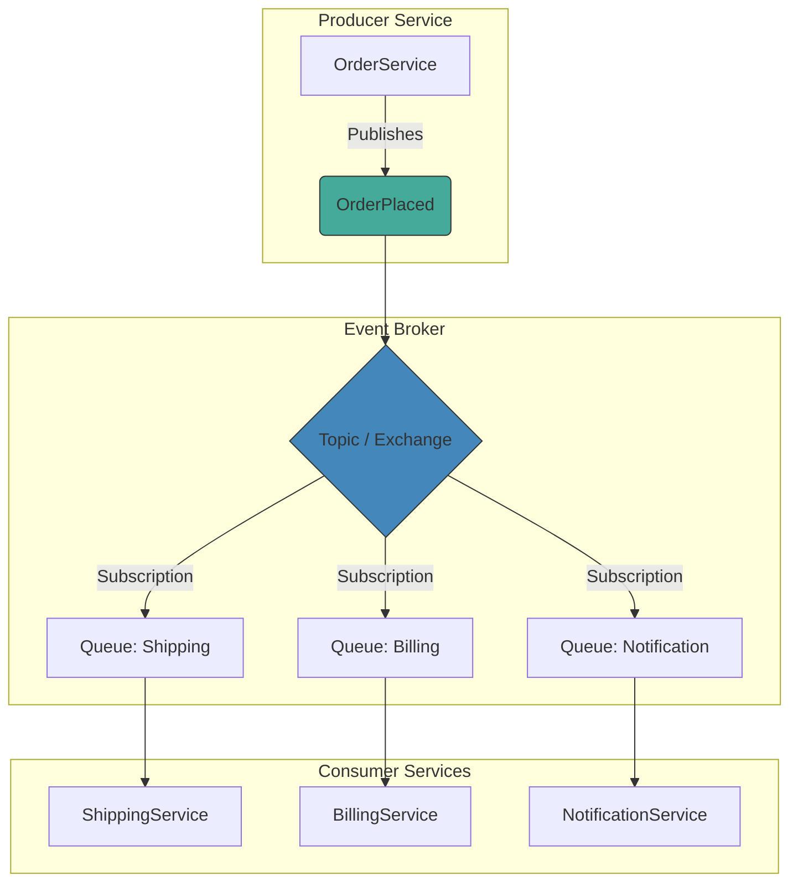

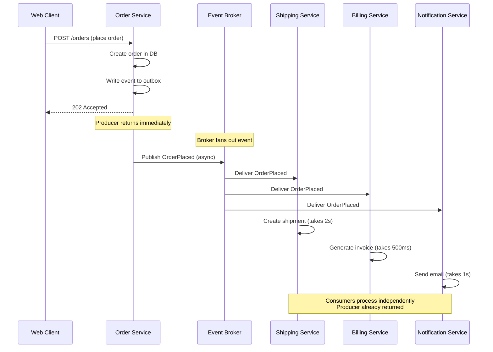

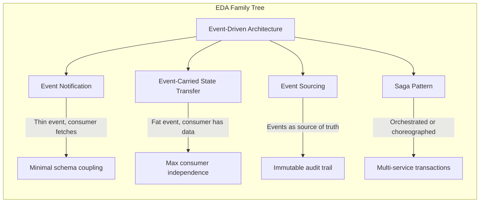

### Classification

EDA is an architectural style — not a specific pattern — that sits at the communication layer of a distributed system. It is scoped to solve temporal and spatial decoupling between components: producers and consumers operate independently and asynchronously. It does not solve data consistency (that requires the outbox or saga patterns), message ordering across partitions (that requires partition-key design), or duplicate detection (that requires the inbox pattern). EDA classifies along the consistency/availability axis as favoring availability and partition tolerance (AP in CAP terms) — if the broker is down, producers buffer locally; if consumers are down, events wait in the queue. In the PACELC framework, EDA systems typically favor Availability and Latency over Consistency during normal operation (PA/EL), accepting eventual consistency in consumer views.

### Key Properties / Guarantees

|Property|Value|Condition|
|---|---|---|
|Producer-consumer coupling|Temporal + spatial decoupling|Event schema contract is maintained|
|Delivery semantics|At-least-once typical; exactly-once with idempotent consumers|Broker and consumer configuration|
|Latency to consumer|Milliseconds to seconds (broker-dependent)|Broker availability and consumer capacity|
|Ordering|Per-partition (Kafka) or per-queue (Service Bus); no global order|Partition key is stable|
|Failure isolation|Consumer failures never affect producer|Broker is available for producer writes|
|Observability burden|High — distributed tracing and DLQ monitoring required|Production deployment|
|Schema evolution|Backward-compatible changes only|Event contract maintained|
|Data consistency|Eventual — consumers converge over time|Idempotency and retry in place|

## Deep Mechanics

### How It Works

**Step 1 — Event creation.** A service performs a business operation (e.g., `OrderService.CreateOrder`), produces a domain event (e.g., `OrderPlaced`), serializes it to a schema (CloudEvents JSON, Avro, Protobuf), and writes it to an outbox table within the same database transaction that persists the business data.

**Step 2 — Event publication.** An outbox publisher or CDC process reads the event from the database and publishes it to a message broker topic or exchange. The broker acknowledges receipt and durably stores the event on disk (or replicates it across a cluster). The outbox pattern ensures that the event is never lost — if the producer crashes between the business transaction and the broker publish, the outbox publisher will pick up the pending event on restart.

**Step 3 — Event routing.** The broker matches the event to subscriptions based on topic name, routing key, or header filters. Each matching subscription places the event into its own consumer queue. This fan-out is crucial — one event can trigger independent work in multiple services without the producer knowing any of them. In Azure Service Bus, this is a topic with multiple subscriptions. In Kafka, this is a topic with multiple consumer groups.

**Step 4 — Event consumption.** Each consumer service reads events from its queue. The consumer deserializes the event, checks idempotency (via inbox pattern or idempotency key), performs its business logic, and acknowledges the message. If the consumer fails mid-processing, the message becomes visible again after the lock expires (at-least-once delivery).

**Step 5 — Error handling.** Events that fail processing beyond retry limits are moved to a dead-letter queue. A separate process reviews DLQ contents, determines root cause, and may replay events after fixing the consumer bug or infrastructure issue.

**Step 6 — Consumer compensation.** If a consumer determines that it cannot process an event (missing data, invalid state), it publishes a compensating event (e.g., `OrderFulfillmentFailed`) that triggers rollback actions in other services. This is the basis of the saga pattern on top of EDA.

### Failure Modes

**Event loss on producer crash before broker publish.** If the producer writes business data but the event never reaches the broker, downstream services never react. **Detection:** missing expected side effects (e.g., no shipping label generated for a confirmed order). **Metric:** outbox queue depth > 0 with no outbox publisher errors. **Prevention:** the outbox pattern — event is stored in the producer database atomically with business data, and a reliable publisher reads it after crash recovery.

**Duplicate event delivery.** Brokers guarantee at-least-once by design. If a consumer acknowledges after processing but the ack is lost, the same event is redelivered. **Detection:** duplicate order charges, duplicate email notifications. **Metric:** consumer-side deduplication hit rate (tracked via inbox table). **Prevention:** idempotent event handlers with an inbox deduplication table keyed on event ID.

**Poison messages.** A single malformed or unprocessable event sits at the head of the queue, blocking all subsequent events in that partition. **Detection:** growing queue depth for a specific partition with consumer-side errors. **Metric:** queue depth per partition, consumer error rate. **Prevention:** implement a poison-message detection loop — move events that fail more than N retries to a separate DLQ. Use Azure Service Bus dead-lettering or Kafka's poison pill handling.

**Event ordering violations.** If two events for the same entity (e.g., `OrderUpdated` then `OrderCancelled`) are processed in the wrong order, the consumer reaches an incorrect state. **Detection:** data inconsistency between services. **Prevention:** use a stable partition key (e.g., `OrderId`) to keep all events for one entity in the same partition. In Kafka, partition order is preserved; in Service Bus, use sessions with the same session ID.

**Consumer crash after processing but before ack.** The consumer processes the event (writes to database) but crashes before acknowledging the message. On restart, the same event is redelivered. The consumer processes it again, causing duplicate side effects. **Detection:** duplicate side effects in the consumer's database (e.g., two invoice records for the same order). **Prevention:** always use the inbox pattern — the consumer checks if the event ID was already processed before processing, and if so, acknowledges and skips.

**Broker throttling under high throughput.** Azure Service Bus Standard tier throttles at ~2,000 messages per second. If the producer exceeds this, it receives HTTP 429 or AMQP link detach errors. **Detection:** producer-side publish failures, broker-side throttling metrics. **Prevention:** use Service Bus Premium with auto-inflate, or switch to Kafka for high-throughput scenarios.

**Schema mismatch between producer and consumer.** The producer adds a new required field to the event schema. Older consumers that do not know about this field throw deserialization exceptions. **Detection:** consumer error rate spikes after producer deployment. **Prevention:** always add fields as optional (nullable) with default values. Use Azure Schema Registry to enforce backward compatibility.

### .NET and Azure Integration

- **Azure Event Grid:** serverless event routing service for reactive programming — best for event notification (fire-and-forget publish-subscribe). Used with Azure Functions event subscriptions.
- **Azure Service Bus:** enterprise message broker with queues, topics, sessions, and dead-lettering — best for workload-oriented messaging with ordering and deduplication requirements.
- **Azure Event Hubs:** high-throughput event ingestion — best for telemetry and event streaming, not for command-style messaging. Compatible with Kafka protocol.
- **Azure Functions:** event-driven compute. Service Bus trigger, Event Grid trigger, Event Hubs trigger. Ideal for serverless EDA consumers.
- **MassTransit:** .NET open-source distributed application framework that abstracts over Azure Service Bus, RabbitMQ, Amazon SQS, and Kafka. Provides consumers, sagas, routing slips, and request-response over events.
- **.NET Generic Host + BackgroundService:** the base class for implementing event consumers as long-running services with graceful shutdown, health checks, and dependency injection.
- **Kafka .NET Client (Confluent):** for high-throughput scenarios where Service Bus is insufficient. Requires manual partition management, offset tracking, and schema registry integration.
- **Polly:** resilience pipeline for consumer-side operations — retry, circuit breaker, timeout for database and API calls within event handlers.

```csharp
// Event schema — CloudEvents-compliant envelope
public sealed record OrderPlacedEvent(
    Guid EventId,
    DateTimeOffset OccurredAt,
    string OrderId,
    string CustomerId,
    decimal TotalAmount,
    string Currency)
{
    public const string EventType = "order.placed.v1";
}

// Producer — using MassTransit with outbox pattern
public sealed class OrderService
{
    private readonly IOrderRepository _repository;
    private readonly IPublishEndpoint _publisher;

    public OrderService(IOrderRepository repository, IPublishEndpoint publisher)
    {
        _repository = repository;
        _publisher = publisher;
    }

    public async Task<Order> CreateOrderAsync(
        CreateOrderCommand command,
        CancellationToken ct)
    {
        var order = Order.Create(command.CustomerId, command.Items);

        await _repository.SaveAsync(order, ct);

        // MassTransit outbox — event is not sent here, it's written to
        // the outbox table in the same transaction as SaveAsync
        await _publisher.Publish(new OrderPlacedEvent(
            EventId: Guid.NewGuid(),
            OccurredAt: DateTimeOffset.UtcNow,
            OrderId: order.Id,
            CustomerId: order.CustomerId,
            TotalAmount: order.TotalAmount,
            Currency: order.Currency), ct);

        return order;
    }
}
```

```csharp
// Azure Function — Service Bus trigger consumer
public sealed class OrderPlacedFunction
{
    private readonly IBillingService _billing;
    private readonly IInvoiceRepository _invoices;

    [FunctionName("OnOrderPlaced")]
    public async Task Run(
        [ServiceBusTrigger("orders", "billing-subscription", 
            Connection = "ServiceBusConnection")]
        OrderPlacedEvent orderPlaced,
        ILogger log)
    {
        using var _ = log.BeginScope(
            "Processing event {EventId} for order {OrderId}",
            orderPlaced.EventId, orderPlaced.OrderId);

        // Idempotency check
        if (await _invoices.ExistsForEventAsync(orderPlaced.EventId))
        {
            log.LogInformation("Event already processed, skipping");
            return;
        }

        var invoice = Invoice.Create(
            orderPlaced.OrderId,
            orderPlaced.CustomerId,
            orderPlaced.TotalAmount,
            orderPlaced.Currency);

        await _invoices.SaveAsync(invoice);
    }
}
```

```csharp
// Program.cs — MassTransit + Azure Service Bus + EF Core Outbox
builder.Services.AddDbContext<OrdersDbContext>(options =>
    options.UseSqlServer(builder.Configuration.GetConnectionString("Orders")));

builder.Services.AddMassTransit(x =>
{
    x.AddEntityFrameworkOutbox<OrdersDbContext>(o =>
    {
        o.QueryDelay = TimeSpan.FromSeconds(1);
        o.UseBusOutbox();
    });

    x.AddConsumer<OrderPlacedConsumer>(typeof(OrderPlacedConsumerDefinition));

    x.UsingAzureServiceBus((context, cfg) =>
    {
        cfg.Host(builder.Configuration["Azure:ServiceBus:ConnectionString"]);
        cfg.ConfigureEndpoints(context);
    });
});
```

```csharp
// Kafka consumer with Confluent .NET client
public sealed class KafkaOrderConsumer : BackgroundService
{
    private readonly IConsumer<string, OrderPlacedEvent> _consumer;
    private readonly IInvoiceRepository _invoices;

    protected override async Task ExecuteAsync(CancellationToken stoppingToken)
    {
        _consumer.Subscribe("orders");

        while (!stoppingToken.IsCancellationRequested)
        {
            try
            {
                var result = _consumer.Consume(stoppingToken);
                var orderPlaced = result.Message.Value;

                if (await _invoices.ExistsForEventAsync(orderPlaced.EventId))
                    continue;

                var invoice = Invoice.Create(orderPlaced.OrderId,
                    orderPlaced.CustomerId, orderPlaced.TotalAmount);
                await _invoices.SaveAsync(invoice);

                _consumer.Commit(result);
            }
            catch (ConsumeException ex)
            {
                _logger.LogError(ex, "Kafka consume error");
            }
        }
    }
}
```

## Production Patterns and Implementation

### Primary Implementation

The canonical .NET EDA implementation uses MassTransit with Azure Service Bus and the transactional outbox. This gives producers at-least-once delivery guarantees, consumer-side retry, dead-letter handling, and distributed tracing integration.

```csharp
// Consumer — receives event, checks idempotency, processes
public sealed class OrderPlacedConsumer :
    IConsumer<OrderPlacedEvent>
{
    private readonly IBillingRepository _billing;
    private readonly ILogger<OrderPlacedConsumer> _logger;

    public OrderPlacedConsumer(
        IBillingRepository billing,
        ILogger<OrderPlacedConsumer> logger)
    {
        _billing = billing;
        _logger = logger;
    }

    public async Task Consume(ConsumeContext<OrderPlacedEvent> context)
    {
        using var _ = _logger.BeginScope(
            "Processing event {EventId} for order {OrderId}",
            context.Message.EventId, context.Message.OrderId);

        // Deduplication check — idempotency key is the EventId
        if (await _billing.HasProcessedEventAsync(context.Message.EventId))
        {
            _logger.LogDebug("Event {EventId} already processed, skipping",
                context.Message.EventId);
            return;
        }

        var invoice = Invoice.Create(
            context.Message.OrderId,
            context.Message.CustomerId,
            context.Message.TotalAmount,
            context.Message.Currency);

        await _billing.SaveInvoiceAsync(invoice, context.CancellationToken);
    }
}

// Consumer definition — retry and error handling
public sealed class OrderPlacedConsumerDefinition :
    ConsumerDefinition<OrderPlacedConsumer>
{
    protected override void ConfigureConsumer(
        IReceiveEndpointConfigurator endpointConfigurator,
        IConsumerConfigurator<OrderPlacedConsumer> consumerConfigurator,
        IRegistrationContext context)
    {
        endpointConfigurator.UseMessageRetry(r =>
        {
            r.Incremental(3, TimeSpan.FromSeconds(10), TimeSpan.FromSeconds(30));
        });

        endpointConfigurator.DiscardFaultedMessages();
    }
}
```

### Configuration and Wiring

```csharp
// appsettings.json — Service Bus connection
{
  "Azure": {
    "ServiceBus": {
      "ConnectionString": "Endpoint=sb://.servicebus.windows.net/;SharedAccessKeyName=...",
      "TopicPrefix": "eda-",
      "MaxConcurrentCalls": 16,
      "PrefetchCount": 32,
      "EnableAutoDeleteOnIdle": false
    }
  },
  "MassTransit": {
    "Outbox": {
      "QueryDelaySeconds": 1,
      "MessageDeliveryLimit": 100
    }
  }
}
```

```csharp
// Health check for EDA components
builder.Services.AddHealthChecks()
    .AddServiceBusTopic(builder.Configuration["Azure:ServiceBus:ConnectionString"],
        topicName: "orders")
    .AddDbContextCheck<OrdersDbContext>()
    .AddCheck<OutboxPublisherHealthCheck>("outbox-publisher");
```

### Common Variants

**Event notification (thin event).** The event carries only an identifier and a reference URL. Consumers fetch the full data through an API call. Lowest coupling, highest latency. Best when consumer needs a fraction of the data or data changes frequently.

```csharp
// Thin event — consumer calls back to producer API
public sealed record OrderPlacedNotification(
    Guid EventId,
    string OrderId,
    Uri OrderDetailsUrl);
```

**Event-carried state transfer (fat event).** The event carries all data the consumer is likely to need. Consumers maintain their own materialized views. Higher coupling (event schema includes more fields), but eliminates synchronous fetch at consumption time. Best when consumer needs the data immediately and the data is relatively stable.

```csharp
// Fat event — consumer has everything it needs
public sealed record OrderPlacedFatEvent(
    Guid EventId,
    DateTimeOffset OccurredAt,
    string OrderId,
    string CustomerId,
    decimal TotalAmount,
    string Currency,
    IReadOnlyCollection<OrderLineItem> Items,
    Address ShippingAddress);
```

**Event sourcing.** Events are the primary source of truth — not derived publications. The event store is the system of record, and current state is derived by replaying events. Differs from basic EDA in that events are never deleted, only appended. Used in audit-trail-intensive domains (finance, compliance).

**Publish-subscribe with competing consumers.** A single event type is consumed by multiple instances of the same consumer type. Each instance picks up a subset of events from the queue. Combined with event notification or ECST, this provides horizontal scaling for event processing.

**Saga orchestration on EDA.** A saga orchestrator publishes commands and listens for events. Each step in the saga is triggered by an event from the previous step. Compensation events undo completed steps if a later step fails. This combines EDA's decoupling with saga's transactional coordination.

### Real-World .NET Ecosystem Example

**MassTransit** is the most widely used .NET EDA framework. It implements the message consumer pattern as its core abstraction (`IConsumer<T>`) and supports out-of-the-box: retry (immediate, incremental, exponential), circuit breaker, rate limiter, concurrency limiting, distributed saga orchestration, and transactional outbox for EF Core. Azure Service Bus integration uses the AMQP protocol and supports sessions (for ordering), duplicate detection (for deduplication on the broker side), and auto-dead-lettering. MassTransit also supports the CloudEvents standard for event envelope metadata. Major .NET shops using MassTransit include JetBlue, PwC, and Eli Lilly.

**NServiceBus** is another major .NET EDA framework with similar capabilities. It pioneered the "saga" pattern in .NET and has strong support for Azure Service Bus. NServiceBus's `IHandleMessages<T>` is functionally equivalent to MassTransit's `IConsumer<T>`.

## Gotchas and Production Pitfalls

### Event Schema Evolution on Shared Contract

**Pitfall:** Adding a Required Field to the event schema without versioning.

```csharp
// ❌ Breaking change — existing consumers have no value for this field
public sealed record OrderShippedEvent(
    Guid EventId,
    string OrderId,
    string Carrier,
    string TrackingNumber, // new required field
    string SignatureRequired); // also new
```

**Symptom:** Older consumers deserialize null or throw `JsonException` on field mismatch. Production incidents spike after deployment of the event producer but before all consumers deploy.

**Fix:** Add fields as optional with default values, or create a new event type version (`OrderShippedV2`) and let consumers migrate independently.

```csharp
// ✅ Backward-compatible — consumers ignore what they don't know
public sealed record OrderShippedEvent(
    Guid EventId,
    string OrderId,
    string Carrier,
    string? TrackingNumber,
    bool SignatureRequired = false);
```

**Cost of not fixing:** Deployment coordination becomes a blocking procedure — every event schema change requires a synchronized rollout across every consuming team, defeating the entire purpose of decoupling.

### Consumer Back-Pressure Ignored

**Pitfall:** Using `BasicFetch` (pull-mode) consumers with no prefetch limit.

```csharp
// ❌ No prefetch limit — consumer pulls all available messages
cfg.ReceiveEndpoint("order-billing", e =>
{
    e.PrefetchCount = 1; // HARDCODED — too low or missing entirely
});
```

**Symptom:** Consumer runs out of memory (OOM kills), message processing latency goes to infinity, and the DLQ fills up with messages that timed out during processing.

**Fix:** Set `PrefetchCount` based on processing time per message and available memory. Use the `UseConcurrencyLimit` filter in MassTransit to bound parallelism.

```csharp
// ✅ Controlled concurrency
cfg.ReceiveEndpoint("order-billing", e =>
{
    e.PrefetchCount = 32;
    e.UseConcurrencyLimit(8);
});
```

**Cost of not fixing:** Repeated pod restarts, unpredictable processing latency, and an incident runbook that says "restart the consumer" without addressing the architectural flaw.

### Missing Idempotency Causing Duplicate Side Effects

**Pitfall:** Event handler writes to a database without checking for duplicate event processing.

```csharp
// ❌ No idempotency check — broker redelivery causes duplicates
public async Task Consume(ConsumeContext<OrderPlacedEvent> context)
{
    await _billing.SaveInvoiceAsync(
        Invoice.Create(context.Message.OrderId), // runs twice on redelivery
        context.CancellationToken);
}
```

**Symptom:** Customer is charged twice, or duplicate invoices are emailed. The finance reconciliation report reveals the problem hours or days later.

**Fix:** Maintain an inbox deduplication table keyed on `EventId`. Check before processing, insert as part of a transaction with the business operation.

```csharp
// ✅ Idempotent consumer
public async Task Consume(ConsumeContext<OrderPlacedEvent> context)
{
    if (await _inbox.HasBeenProcessedAsync(context.Message.EventId))
        return;

    await _billing.SaveInvoiceAsync(Invoice.Create(context.Message.OrderId),
        context.CancellationToken);
    await _inbox.MarkAsProcessedAsync(context.Message.EventId);
}
```

**Cost of not fixing:** Financial loss, customer trust erosion, and an emergency data-rewind operation that requires manual reconciliation across 5 services.

### Transactional Boundary Violation

**Pitfall:** Publishing events to the broker before the database transaction commits.

```csharp
// ❌ Event published before DB commit — consumer sees data that may vanish
public async Task<Order> CreateOrderAsync(CreateOrderCommand command)
{
    var order = Order.Create(command.CustomerId, command.Items);
    await _repository.SaveAsync(order, CancellationToken.None);

    await _publisher.Publish(new OrderPlacedEvent(/* ... */)); // fires even if TX rolls back!

    await _unitOfWork.SaveChangesAsync(); // might fail here
    return order;
}
```

**Symptom:** Consumer receives `OrderPlaced` but when it fetches the order, the order does not exist (rollback happened after publish). Eventually consistent systems handle this poorly — the consumer may cache the error and never retry.

**Fix:** Always apply the outbox pattern — events are written within the same database transaction as business data, and the publisher sends them only after commit.

```csharp
// ✅ Events published after commit via outbox
// MassTransit's EF Core outbox handles this automatically
```

**Cost of not fixing:** Phantom events that reference nonexistent data. Downstream services reach invalid states that require manual compensation. The worst part: it works in dev (no contention) but surfaces at production scale under load.

### Consumer Scaling Without Queue Depth Monitoring

**Pitfall:** The consumer is scaled on CPU/memory metrics instead of queue depth. During a traffic spike, events accumulate in the queue because the consumer is not scaling fast enough.

**Symptom:** Queue depth grows to thousands of messages. End-to-end latency exceeds SLO. Events start timing out and going to the DLQ.

**Fix:** Use queue-depth-based autoscaling. In Azure Container Apps, use KEDA with the `azure-servicebus` scaler. Set the scaling threshold to keep queue depth below a configured maximum (e.g., 100 messages per instance).

**Cost of not fixing:** Latency SLO violations. Event loss when messages expire (Azure Service Bus has a configurable message TTL). Customer-facing delays.

### Event Type Too Granular Causing Notification Storms

**Pitfall:** Publishing an event for every minor state change (e.g., `OrderItemAdded`, `OrderItemRemoved`, `OrderItemQuantityChanged`, `OrderDiscountApplied`). Consumers that need the final state must process 10 events for a single user action.

**Symptom:** Consumer logic becomes complex — it must handle intermediate states and deduplicate. Network and broker overhead is 10x what is necessary.

**Fix:** Publish coarse-grained events that represent meaningful business milestones (`OrderPlaced`, `OrderConfirmed`, `OrderFulfilled`). Use event-carried state transfer so consumers always get the current state.

**Cost of not fixing:** Over-engineered event taxonomy. Consumer code becomes unmaintainable. Engineers start ignoring events and polling the API instead — defeating EDA's purpose.

## Tradeoffs and Decision Framework

### Tradeoff Matrix

| Dimension | Event-Driven | Request-Response | Command-Driven (CQRS Command Bus) |
|---|---|---|---|
| Coupling | Temporal + spatial decoupling | Tight temporal (caller waits) | Temporal decoupling, tight command contract |
| Failure isolation | Consumer failure invisible to producer | Propagates (timeout, circuit break) | Producer fails if command bus is down |
| Latency | Milliseconds to seconds async | Sub-millisecond to milliseconds | Similar to EDA (async) |
| Operational complexity | High — tracing, DLQ, monitoring, schema versioning | Low — request logs suffice | Medium — command handlers + middleware |
| Team expertise required | High — async thinking, eventual consistency | Low — familiar synchronous patterns | Medium — async but single-direction |
| .NET ecosystem fit | Excellent (MassTransit, NServiceBus, Brighter) | Native (ASP.NET Core) | Good (MediatR, Brighter command processor) |
| Debugging difficulty | Higher — distributed traces needed | Lower — single request trace | Medium |
| Testing complexity | Higher — need integration tests with broker | Lower — unit tests suffice for most | Medium |

### When to Apply

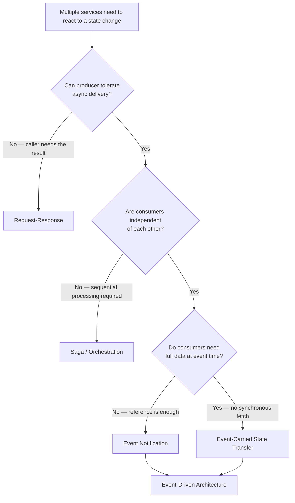

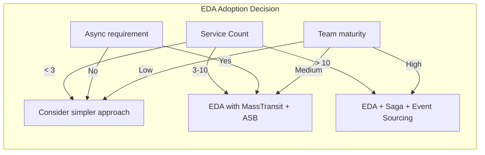

### When NOT to Apply

- [ ] The system has fewer than 3 services; the complexity of brokers, DLQs, and distributed tracing outweighs the benefit
- [ ] The caller needs a synchronous response from the consumer and cannot tolerate async (use request-response or gRPC streaming)
- [ ] The team has no operational experience with message brokers — EDA without operational maturity guarantees a 3 AM incident
- [ ] Events must be processed in strict global order across all partitions — global ordering is not achievable at scale in practical EDA systems
- [ ] The domain has strong consistency requirements where stale reads from consumer-side caches violate business rules
- [ ] The system is a real-time control system requiring sub-millisecond response (industrial controls, gaming engines)
- [ ] The organization cannot commit to the observability investment — EDA without distributed tracing is blind

### Scale Thresholds

- **Worth considering above ~3 services** where synchronous call chains exceed 200 ms P99 with 3+ hops
- **Required when more than 5 services depend on the same data change** — point-to-point notification calls become unmanageable
- **Justified when a downstream service's latency or availability SLA is lower than the producer's SLA** — EDA isolates the producer from consumer unreliability
- **Overkill below ~500 req/s** if the only integration is between 2 services; a direct queue or even a shared database may be simpler
- **Re-evaluate broker choice above ~10,000 events/s** — Azure Service Bus Premium supports ~10,000 msgs/s per namespace; Kafka handles 100,000+ events/s per cluster
- **Re-evaluate at >50 consumer subscriptions per event type** — broker fan-out overhead becomes significant; consider event partitioning by region or tenant

## Interview Arsenal

### Question Bank

1. What is event-driven architecture and what problem does it solve that request-response does not?
2. How does an event broker route events from producers to consumers, and what happens when the broker is unavailable?
3. What do you give up when you switch from request-response to event-driven communication?
4. What happens when an event consumer crashes mid-processing? How does the system recover?
5. Compare event notification vs event-carried state transfer — when does each make sense?
6. Design an e-commerce system where OrderPlaced triggers shipping, billing, and notifications using EDA.
7. How does an event-driven system behave when event volume spikes to 10x the steady-state rate?
8. What is the relationship between event schema versioning and consumer contract testing in an EDA system?
9. How does the outbox pattern prevent event loss in EDA?
10. When would you choose Kafka over Azure Service Bus for an event-driven system?

### Spoken Answers

**Q: What is event-driven architecture and what problem does it solve?**

> **Average answer:** Event-driven architecture is when services communicate through events instead of direct API calls. A service publishes an event and other services consume it. This makes the system loosely coupled.

> **Great answer:** Event-driven architecture is a communication model where services produce immutable facts about state changes that have already occurred — `OrderPlaced`, `PaymentReceived` — and publish them to a broker without knowing which or how many services consume them. It solves the cascading-failure problem of synchronous request-response: in a typical 5-service chain, a 200 ms call to the first service becomes a multi-second wall-clock disaster when each downstream service adds latency, retries, and timeout amplification under load. EDA decouples the producer's timeline from the consumer's — the producer commits its transaction and returns to the caller in milliseconds, while consumers process the event on their own schedule. This shifts the failure model from "everything fails together" to "individual consumers fail independently," which dramatically improves overall system availability. The cost is that you lose the synchronous return value — your producer cannot know if the consumer succeeded — so you must rely on dead-letter queues, retry policies, and observability to detect and recover from consumer-side failures.

**Q: Compare event notification vs event-carried state transfer.**

> **Average answer:** Event notification sends a small event with just an ID, and the consumer fetches the full data. Event-carried state transfer sends all the data in the event itself.

> **Great answer:** The difference is the amount of data in the event and where the consumer gets its state. Event notification sends a thin event — just an entity ID and perhaps a resource URL — meaning the consumer must make a synchronous API call back to the producer to get the full data at consumption time. This preserves maximum autonomy for the producer (the event schema is tiny), but it reintroduces synchronous coupling at exactly the moment you want to process events — the consumer now depends on the producer's API being available. Event-carried state transfer solves this by including all the data the consumer is likely to need directly in the event payload — the full order, the shipping address, the line items. The consumer builds its own materialized view without ever calling back to the producer. This eliminates the synchronous dependency but increases schema coupling: changing a field on the order now means a coordinated event version change. I use notification when the data changes frequently or is rarely accessed, and state transfer when consumers need immediate access without upstream dependency at event-processing time.

**Q: How does an event-driven system behave at 10x the steady-state event volume?**

> **Great answer:** Three things happen. First, the broker absorbs the burst up to its throughput capacity — Azure Service Bus Standard handles ~2,000 messages per second per namespace, Premium handles ~10,000+ with auto-inflate. If the spike exceeds that, the producer sees throttling (HTTP 429 or AMQP link detachment), which is where the outbox pattern saves us — events are safely stored in the database and will be published when the broker recovers. Second, consumers that cannot keep up accumulate messages in their queues. If prefetch is configured poorly, consumers run out of memory; if dead-letter max delivery count is reached, events go to the DLQ instead of being processed. This is where autoscaling based on queue depth is critical — with Azure Container Apps, you scale the consumer replica count on `azure-servicebus.queue.depth` metric. Third, the downstream database takes the increased write load — if the consumer writes invoice records for every event and the DB cannot handle the write throughput, consumer processing times increase, which compounds queue depth, which triggers more scaling. The solution is to batch writes at the consumer, apply circuit breakers to the database, and ensure the database is provisioned for the peak plus headroom. The key insight: brokers buffer well, but downstream systems do not — buffer monitoring and back-pressure management is what keeps an EDA system stable under load.

### System Design Interview Trigger

If an interviewer asks you to design a notification system, an order processing pipeline, or any system where a single action must trigger work in multiple downstream services, and then asks "how do these services communicate?", they are testing whether you default to synchronous request-response (which creates cascading dependency) or propose event-driven architecture. The follow-up probe will be about consistency: "what happens if the shipping service is down when the order is placed?" — testing whether you understand that EDA naturally handles this via broker persistence, and what you lose (no return value, eventual consistency). The strongest candidates also name specific technologies (MassTransit, Azure Service Bus), address schema versioning, and discuss the outbox pattern for reliable publishing.

### Comparison Table

| | Event-Driven | Request-Response (REST/gRPC) |
|---|---|---|
| Core guarantee | Producer never blocked by consumer | Caller gets a response or timeout |
| Trade-off | Lose synchronous result, gain decoupling | Gain result, lose temporal decoupling |
| .NET implementation | MassTransit + Azure Service Bus | ASP.NET Core Web API + HttpClient |
| Failure mode | Silent consumer failure (event goes to DLQ) | Cascading timeout failures |
| When to choose | Multiple consumers per event, async acceptable | Single consumer, response required |
| Testing complexity | Higher (broker dependency) | Lower (mock HTTP) |
| Debugging | Distributed traces needed | Single request trace |

## Architecture Decision Record

**Status:** Accepted

**Context:** A .NET e-commerce platform with 8 microservices (Orders, Payments, Shipping, Billing, Notifications, Inventory, Recommendations, Analytics) is being migrated from a monolithic application. The previous monolith used synchronous method calls within the same process. The team needs a communication strategy that prevents downstream service failures from blocking order placement, supports independent deployment of each service, and allows new consumers (e.g., Analytics) to subscribe without modifying the producer. The team consists of 4 senior and 4 mid-level engineers, all familiar with ASP.NET Core but none with message brokers at production scale.

**Options Considered:**

1. **Event-Driven Architecture (MassTransit + Azure Service Bus)** — services publish events asynchronously to a broker; consumers subscribe independently.
2. **Request-Response REST APIs** — each service calls downstream services synchronously via HTTP/gRPC.
3. **Shared Database** — services read and write to a shared SQL Server database, relying on database-level coordination.
4. **GraphQL Federation** — a single GraphQL gateway that composes data from multiple services.

**Decision:** Event-Driven Architecture with MassTransit and Azure Service Bus (option 1), because it provides temporal decoupling (Order placement completes without waiting for Shipping), allows independent deployment (a new Analytics service subscribes to OrderPlaced with zero producer changes), and supports per-service scaling (Inventory consumes at its own rate regardless of Order throughput). The team will invest in a 2-week training period on MassTransit and Azure Service Bus before production deployment. The outbox pattern will be implemented from day one to prevent event loss.

**Consequences:**
- ✅ Producer availability is independent of consumer availability — broker buffers events when consumers are down
- ✅ New consumers can subscribe without changing producer code — event schema is the only contract
- ✅ Each service scales independently based on its own processing capacity and queue depth
- ✅ The outbox pattern ensures no event loss on producer crash — events are persisted in the producer's database
- ⚠️ Team must learn async debugging — distributed tracing (Azure Monitor, Application Insights) is not optional
- ⚠️ Event schema versioning becomes a coordination artifact — a breaking schema change requires coordinated deployment
- ⚠️ Initial productivity dip as the team learns MassTransit and async patterns
- ❌ The producer cannot know if or when consumers processed the event — compensation via saga or DLQ review needed
- ❌ Shared database (option 3) was rejected because it creates tight coupling and centralized failure — a single DB schema change affects all services

**Review Trigger:** Revisit this decision if the event count exceeds 50,000 events/second per namespace (at which point Kafka or Event Hubs may be a better broker choice), or if a business requirement demands strong consistency across the Order and Billing services (at which point a saga with compensating transactions is required on top of EDA). Also revisit if the team finds that debugging incidents takes > 1 hour due to missing traces — at which point OpenTelemetry investment is mandatory.

## Self-Check

### Conceptual Questions

1. What is event-driven architecture and what is the single invariant it maintains?
2. Derive the tradeoff between event-driven and request-response communication from first principles.
3. Given a system with 2 services that need to communicate synchronously, is EDA appropriate? Why or why not?
4. What metric or log entry reveals that an event consumer is failing silently?
5. Name the .NET framework and Azure service combination that provides out-of-the-box outbox, retry, and dead-lettering.
6. What is the structural distinction between event notification and event-carried state transfer?
7. Below what service count is EDA likely overkill?
8. [[7.121 — Outbox Pattern — Reliable Event Publishing]] — how does the outbox pattern prevent event loss in EDA?
9. What production consequence follows from adding a required field to an event schema without versioning?
10. Explain EDA to a non-technical stakeholder in 60 seconds.

<details>
<summary>Answers</summary>

1. EDA is a communication paradigm where services emit immutable facts about state changes to a broker, and interested services consume those facts asynchronously. The invariant: the producer's timeline is never blocked by the consumer's availability or speed.

2. Request-response gives you a synchronous result at the cost of temporal coupling — the caller blocks until the callee responds. If the callee is slow or down, the caller is also slow or down. EDA removes this coupling by making communication asynchronous, but the cost is that the producer loses the synchronous result — it cannot know if the consumer succeeded. Derivation: this is the fundamental tension between coupling and feedback — you can have one or the other, not both.

3. No — with 2 services that need synchronous communication, a direct REST API or gRPC call is simpler. EDA adds broker infrastructure, dead-letter handling, and async complexity without benefit at that scale. EDA becomes valuable at ~3+ services where fan-out to multiple consumers happens.

4. The dead-letter queue depth metric. A growing DLQ with unconsumed events means consumers are consistently failing to process specific messages. Also, consumer `ErrorCount` or `RetryCount` counters in Application Insights.

5. MassTransit with Azure Service Bus and the Entity Framework Core transactional outbox.

6. Event notification sends only an identifier (consumer fetches full data via API). Event-carried state transfer sends the full data in the event payload. Notification minimizes schema coupling at the cost of synchronous fetch at consumption time; state transfer eliminates the synchronous fetch at the cost of tighter schema coupling.

7. Below ~3 services. At 2 services, direct request-response or a simple queue is simpler.

8. The outbox pattern stores events in the producer's database within the same transaction as business data. A reliable publisher reads from the outbox and sends events to the broker after the database transaction commits, ensuring no event is lost on producer crash.

9. Older consumers throw deserialization exceptions or process null fields, causing production incidents. Deployment coordination becomes required for every schema change, defeating EDA's decoupling purpose.

10. "Event-driven architecture is like a town square with a bulletin board. When something important happens — an order is placed, a payment is received — the service that owns that data posts a notice on the board. Any other service that needs to react — shipping, billing, notifications — reads the board and does its work independently. The service that posted the notice does not wait for the others; it goes back to its own job. If a new service wants to react to that notice, it just starts reading the board — no changes needed to the poster."
</details>

---

### Scenario Challenges

**Scenario 1 — Diagnose the problem**

An e-commerce platform uses MassTransit with Azure Service Bus. The Order service publishes `OrderPlaced` events. The Shipping service consumes them to create shipments. Recently, customers report that some orders are placed successfully but never ship. The Shipping service logs show no errors — it simply did not receive events for those orders. The Order service database shows the orders exist.

<details>
<summary>Diagnosis</summary>

**Root cause:** The Order service published events directly to the broker before the database transaction committed, and a process crash between publish and commit caused the order to save but the event to be lost. Alternatively, if the outbox pattern is in use, the outbox publisher may have crashed before processing the pending events, and upon restart it did not reprocess due to a missing `ProcessedAt` flag reset.

**Evidence:** Application Insights traces show `OrderPlaced` publish calls with no matching `OrderPlaced` delivery in the Shipping service. The outbox table in the Order database contains rows with `ProcessedAt = NULL` for the missing order IDs.

**Fix:** Ensure the outbox publisher reads all unprocessed events on startup (including those left unprocessed from a prior crash). For the immediate data loss, replay the missing events from the outbox table or manually trigger shipments for those orders.

**Prevention:** Add startup recovery logic to the outbox publisher: on service start, query all outbox rows with `ProcessedAt IS NULL` and publish them before processing new events. Monitor outbox queue depth with a Prometheus counter.
</details>

---

**Scenario 2 — Design decision**

You are designing the communication layer for a fraud detection system. The Order service produces events, and three consumers need to react: Fraud Detection (must process in real-time, <500 ms), Reporting (batches hourly), and Customer Notification (within 5 minutes). The system runs on Azure with .NET 8. What event architecture do you choose and why?

<details>
<summary>Decision and Reasoning</summary>

**Choice:** Event-driven architecture with Azure Service Bus topics, using three subscriptions with different filter rules and consumer configurations.

**Tradeoffs accepted:** Fraud Detection gets a dedicated subscription with `PrefetchCount = 1` (no buffering) and `MaxConcurrentCalls = 1` to ensure serial processing. Reporting gets a subscription with large prefetch and batch consumption. Notification gets a standard subscription with retry policy. The producer does not know about any of these — it publishes a single `OrderPlaced` event to the topic, and the broker handles routing.

**Implementation sketch:**

```csharp
// Producer — publishes once, broker fans out
public async Task PublishOrderPlaced(Order order, CancellationToken ct)
{
    await _publisher.Publish(new OrderPlacedEvent(
        EventId: Guid.NewGuid(),
        OccurredAt: DateTimeOffset.UtcNow,
        OrderId: order.Id,
        CustomerId: order.CustomerId,
        Items: order.Items,
        TotalAmount: order.TotalAmount), ct);
}

// Three subscriptions on the same topic:
// - fraud-detection (SQL filter: TotalAmount > 10000)
// - reporting (no filter, batching)
// - customer-notification (no filter, standard retry)
```
</details>

---

**Scenario 3 — Failure mode** Your notification service is exhibiting an increasing queue depth for `OrderPlaced` events. The service is not crashing, not reporting errors, and CPU/memory are within normal range. The on-call engineer suspects an event processing issue. Walk through the investigation and remediation.

<details>
<summary>Investigation and Fix</summary>

**Investigation steps:** 1) Check Application Insights for the consumer's processing duration per message. 2) Check if the consumer is calling a downstream API (email gateway, SMS provider) that is slow or throttling. 3) Examine the consumer's `PrefetchCount` and `MaxConcurrentCalls` settings. 4) Look at dead-letter queue count for the notification subscription.

**Confirming evidence:** A 10-second average processing time per message when the email gateway is slow, combined with `PrefetchCount = 32` and no concurrency limit, causing all 32 prefetched messages to be in-flight and timing out before the broker ack window expires.

**Immediate mitigation:** Reduce `PrefetchCount` to 4 and add a circuit breaker around the email gateway call. This prevents message timeouts while slowing throughput to match downstream capacity.

**Permanent fix:** Add a resilience pipeline (Polly) around the email gateway call with timeout, retry, and circuit breaker. Add autoscaling based on queue depth so that additional consumer replicas are spun up when the queue grows.

**Post-mortem item:** The team was unaware of the prefetch-timeout relationship. Add a runbook entry: "If queue depth increases without errors, check consumer downstream dependencies — the bottleneck is likely external, not internal."
</details>

---

**Scenario 4 — Scale it** Your system currently handles 500 events per second using MassTransit with Azure Service Bus (Standard tier, 1 namespace, 1 consumer replica). You need to handle 10,000 events per second within 3 months. How does EDA fit into the scaling strategy?

<details>
<summary>Scaling Strategy</summary>

**Bottleneck this addresses:** The single Service Bus namespace (Standard tier limited to ~2,000 msgs/s) and single consumer replica are the bottlenecks. Also, the EF Core outbox publisher on a single instance will hit DB connection limits.

**How it helps:** EDA's natural decoupling allows independent scaling of each component. The broker can be scaled by moving to Premium tier (auto-inflate to 10,000+ msgs/s with partitioning). Consumers can be scaled horizontally to 10–20 replicas using Azure Container Apps queue-based autoscaler (`KEDA` with `azure-servicebus` scaler).

**What it does not solve:** The downstream databases (one write per event) will need to scale independently. If each event triggers a DB write in the consumer, 10,000 events/s means 10,000 writes/s — the database IO may require sharding or read replica offloading.

**Implementation order:** 1) Upgrade Service Bus to Premium with 2 messaging units (auto-inflate). 2) Add KEDA autoscaling to consumers based on queue depth. 3) Batch writes at the consumer (accumulate 100 events before flushing to DB). 4) Partition high-volume event types (e.g., `OrderPlaced` vs `OrderUpdated`) into separate topics to isolate throughput. 5) Add a second outbox publisher instance for redundancy. 6) Consider Kafka if throughput exceeds 20,000 events/s.
</details>

---

**Scenario 5 — Interview simulation** The interviewer says: "Design the inter-service communication for an order processing system where placing an order must trigger inventory deduction, payment processing, shipping creation, and customer notification. How do you handle the case where payment fails after inventory was deducted?"

<details>
<summary>Model Response</summary>

"I'd use event-driven architecture with a saga pattern for the orchestration. Let me walk through it.

The Order service publishes an `OrderPlaced` event through MassTransit to Azure Service Bus. Three consumers subscribe: Inventory Deduction, Payment Processing, and Notification — but they should not run independently because they must be coordinated. If payment fails, we need to undo the inventory deduction.

This is where the saga pattern comes in. I'd implement an `OrderFulfillmentSaga` — a state machine in MassTransit that orchestrates the flow. When `OrderPlaced` fires, the saga starts. It first tells Inventory to reserve stock (a command, not just an event). Inventory replies with `StockReserved` or `StockReservationFailed`. On `StockReserved`, the saga sends a command to Payment to charge the card. Payment replies with `PaymentSucceeded` or `PaymentFailed`.

If payment fails, the saga publishes a `CompensateStockReservation` event. Inventory consumes it and releases the reservation. The saga then publishes `OrderFailed` so the customer is notified of the failure.

The key advantage of EDA here is that even within the saga, services are temporally decoupled. Payment can take 30 seconds for 3DS verification without blocking the saga's state machine — MassTransit persists the saga state to a database between messages. And if the Notification service is down, the saga still completes; the notification event sits in the queue until Notification recovers.

What I've described uses orchestration — a central saga that tells services what to do. An alternative is choreography, where each service publishes events and the next service in the chain reacts. I prefer orchestration here because the compensation logic is complex: 'deduct inventory, charge payment, if payment fails release inventory' is fundamentally a workflow with a clear coordinator. Without the saga, we'd be chasing compensating events through 4 independent services and it would be very hard to trace a failure.

Tradeoffs: orchestration adds one more service to deploy and monitor (the saga service), and the saga state database becomes a write bottleneck. At scale beyond ~1,000 orders per second, I'd partition sagas by order ID — which MassTransit supports natively with the `CorrelationId` — so each saga instance is isolated in its own partition."

</details>

---

## Deep Dive — Event Flow and Failure Diagrams

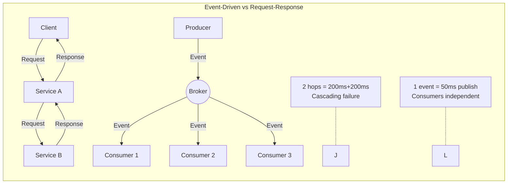

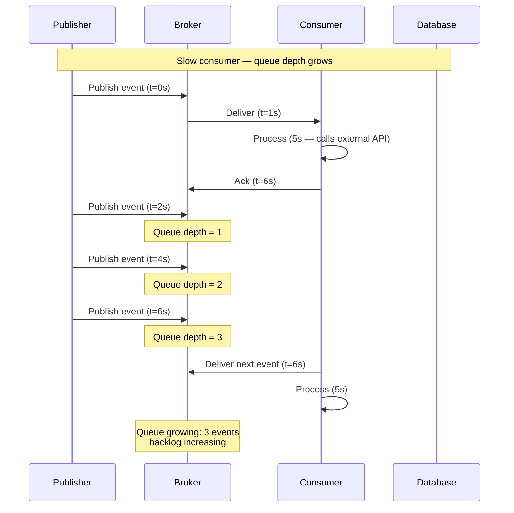

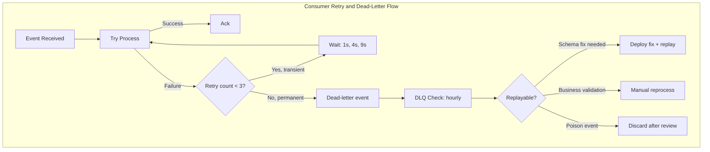

## Additional Gotchas

| # | Gotcha | Symptom | Fix |
|---|--------|---------|-----|
| 9 | Events published before DB transaction commits | Lost events on process crash | Outbox pattern (7.121) |
| 10 | Consumer logs show processing but DB unchanged | Feature flag gated write silently skipped | Log "Wrote X records" assertion |
| 11 | Event payload exceeds broker size limit | Publish fails with 413 | Claim check (7.147) or upgrade tier |
| 12 | PII accidentally published in event body | Compliance violation | Schema review CI gate; PII scanner |
| 13 | Producer/consumer serializer mismatch | Deserialization errors on all events | Schema registry with explicit config |
| 14 | Multiple events published in wrong logical order | Consumer violates business rules | Sessions (ASB) or partition key (Kafka) |
| 15 | DLQ grows without alert | Silent data loss | P1 alert on DLQ depth > 0 |
| 16 | Consumer replica count scales up faster than DB pool | DB connection exhaustion | Max replica limit; connection pooling |

## Interview Arsenal — Expanded Questions

**Q6: Design an e-commerce order processing system using EDA.**

> **Great answer:** "I'd use Azure Service Bus Topics with MassTransit. The Order service publishes `OrderPlaced` events to a topic with multiple subscriptions. Subscription 1 routes to Inventory for stock deduction using SQL filter for high-priority items. Subscription 2 routes to Payment for PSP processing. Subscription 3 routes to Notification for email confirmation. Subscription 4 routes to Analytics for raw event dump.
>
> "For reliable publishing, I use the transactional outbox (7.121): the order and the outbox event commit in the same DB transaction. A background publisher reads the outbox and sends to Service Bus. This guarantees at-least-once delivery without event loss.
>
> "For the saga flow (OrderPlaced → InventoryDeducted → PaymentSucceeded → ShipmentCreated), I implement a MassTransit saga with `CorrelationBy(orderId)`. If payment fails, the saga publishes `CompensateInventory` and marks the order as failed. The tradeoff is eventual consistency — the customer sees the order confirmation instantly but the 'shipped' status arrives ~2 seconds later."

**Q7: How do you handle event schema versioning in EDA?**

> **Great answer:** "Three layers. Layer 1 — Schema registry: every event type has a registered CloudEvents schema. Backward compatibility enforced: new fields must be optional, existing fields cannot be removed or change type. Layer 2 — Consumer-driven contracts: each consumer publishes expected schema as Pact tests. CI runs consumer tests against producer changes — if a consumer breaks, the producer coordinates before the breaking change. Layer 3 — Dual-version topics: for breaking changes, publish both v1 and v2 versions. Consumers migrate at their pace; v1 topic decommissioned after all consumers migrate. In practice, 95% of schema changes are adding optional fields — always backward compatible."

**Q8: What is the relationship between EDA and CQRS?**

> **Great answer:** "EDA and CQRS are complementary but independent. CQRS separates read and write models; EDA communicates state changes between services. They pair well because the natural CQRS implementation is event-driven: command handler changes state → publishes event → read model projection subscribes and updates. But you can use EDA without CQRS (normalized DB writes, events broadcast for others) and CQRS without EDA (shared DB, different query and command schemas). I don't enforce CQRS by default — I apply it when the read/write separation benefit justifies the operational complexity."

## Advanced Scenario — Performance Tuning

**Scenario 6 — Bottleneck diagnosis:** Your EDA system processes 2,000 events/s normally. After a deployment, consumer processing time increased from 50ms to 450ms P50. Queue depth grows by 100 events/minute. Consumers are at 80% CPU. Walk through the diagnosis.

<details>
<summary>Diagnosis</summary>

**Root cause candidates:** 1) Database query plan regression from the deployment. 2) New `HttpClient` call added without timeout configuration. 3) Database locking from a new transaction scope. 4) Serialization bottleneck from a new heavy event field.

**Diagnostic steps:** 1) Check Application Insights for the consumer's dependency breakdown. 2) Look at the slowest operation in the processing pipeline. 3) Check if a new `parallel foreach` was introduced that causes thread pool starvation. 4) Examine connection pool usage.

**Most likely fix:** The deployment added a `Task.Run()` inside the consumer that blocks on `Task.Result` — causing thread pool starvation and ~500ms context switching overhead. Replace with `await` and configure `MaxConcurrentCalls` to match available cores (Environment.ProcessorCount * 2).
</details>

---

## Self-Check Bonus Questions

**Q11: What metrics are most important for EDA health monitoring?**

> Event publish latency (P99 < 100ms), outbox queue depth (near 0), consumer lag in seconds (alert at >60s, page at >300s), DLQ count (alert at >0), consumer processing success rate (target >99.9%), broker throttling rate (alert at >1%).

**Q12: How does EDA handle the dual-write problem?**

> When a service writes to its DB and publishes an event as two separate operations, a crash between them causes inconsistency (saved but not published, or published but not saved). The transactional outbox solves this: the event is written to an outbox table in the same DB transaction as the business data. A reliable publisher reads unprocessed outbox rows and sends them to the broker. This gives atomicity: either the transaction commits (both business data and event saved) or it rolls back (neither saved). The publisher is at-least-once, so the consumer must be idempotent.

**Q13: What is the 'prefetch-timeout death spiral' in EDA?**

> A consumer configures `PrefetchCount=100` and `MaxConcurrentCalls=100`. A downstream API becomes slow — processing time per event increases from 50ms to 2s. The broker sees that 100 messages are in-flight and not yet acknowledged. It doesn't deliver new messages because prefetch is full. Meanwhile, the lock on the in-flight messages expires (Azure SB default: 60s), so the messages become available for redelivery. The consumer receives the same messages again while still processing the original ones. This creates a duplicate processing storm and queue depth explosion. Fix: set `PrefetchCount` conservatively (8-32), use short lock duration (30s), and monitor processing time to catch regressions before they cause broker-level issues.

---

## Deep Dive — Eventing vs Polling vs Streaming Diagrams

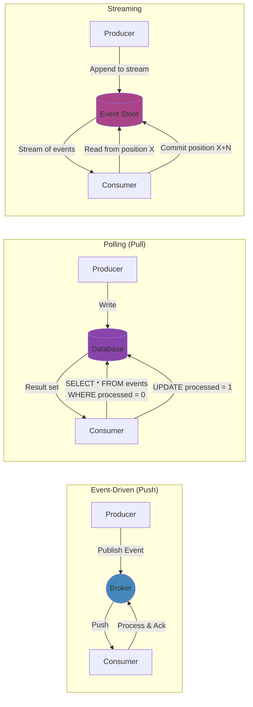

| Aspect | Event-Driven (Push) | Polling (Pull) | Streaming |
|---|---|---|---|
| Latency | Low (ms) | Depends on interval (s-min) | Low (ms) |
| Consumer pressure on producer | None | None | None |
| Broker capacity | Limited (ASB: ~10K/s) | Limited by DB | High (Kafka: 100K+/s) |
| Ordering | Per-partition | Deterministic (chronological) | Per-partition |
| Consumer state | Auto-managed by broker | Last poll timestamp | Offset/position |
| .NET tech | MassTransit + ASB | BackgroundService + EF | Confluent.Kafka |
| Operational cost | Medium | Low (existing DB) | High (cluster) |
| Schema enforcement | Schema Registry | DB schema | Schema Registry |

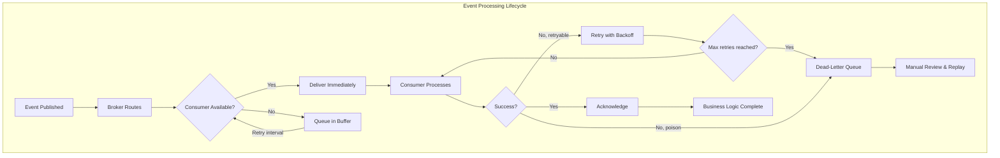

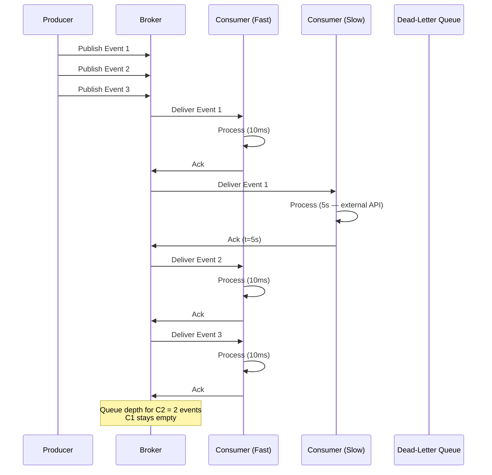

## Additional C# Production Code — Event Publication, Subscription, Routing

### Event Publication with Outbox Pattern

```csharp
// Reliable event publisher with outbox retry
public sealed class OutboxPublisher : BackgroundService
{
    private readonly IServiceScopeFactory _scopeFactory;
    private readonly IPublishEndpoint _publishEndpoint;
    private readonly ILogger<OutboxPublisher> _logger;

    protected override async Task ExecuteAsync(CancellationToken stoppingToken)
    {
        while (!stoppingToken.IsCancellationRequested)
        {
            try
            {
                await PublishPendingEventsAsync(stoppingToken);
                await Task.Delay(TimeSpan.FromSeconds(1), stoppingToken);
            }
            catch (OperationCanceledException)
            {
                break;
            }
            catch (Exception ex)
            {
                _logger.LogError(ex, "Outbox publisher error");
                await Task.Delay(TimeSpan.FromSeconds(5), stoppingToken);
            }
        }
    }

    private async Task PublishPendingEventsAsync(CancellationToken ct)
    {
        using var scope = _scopeFactory.CreateScope();
        var db = scope.ServiceProvider.GetRequiredService<OrdersDbContext>();

        var pendingEvents = await db.OutboxEvents
            .Where(o => o.ProcessedAt == null)
            .OrderBy(o => o.CreatedAt)
            .Take(100)
            .ToListAsync(ct);

        foreach (var outboxEvent in pendingEvents)
        {
            try
            {
                var domainEvent = JsonSerializer.Deserialize<DomainEvent>(
                    outboxEvent.Payload,
                    new JsonSerializerOptions { PropertyNameCaseInsensitive = true });

                if (domainEvent is not null)
                {
                    await _publishEndpoint.Publish(
                        domainEvent, domainEvent.GetType(), ct);
                }

                outboxEvent.ProcessedAt = DateTimeOffset.UtcNow;
                outboxEvent.ProcessingAttempts++;
            }
            catch (Exception ex)
            {
                outboxEvent.Error = ex.Message;
                outboxEvent.ProcessingAttempts++;
                outboxEvent.LastAttemptAt = DateTimeOffset.UtcNow;

                if (outboxEvent.ProcessingAttempts >= 10)
                {
                    outboxEvent.DelayedUntil = DateTimeOffset.UtcNow.AddMinutes(15);
                    _logger.LogWarning(ex,
                        "Outbox event {EventId} exceeded retry limit, delaying 15min",
                        outboxEvent.Id);
                }
            }
        }

        await db.SaveChangesAsync(ct);
    }
}
```

### Event Subscription with Routing Slips

```csharp
// Event routing configuration with filters and routing slips
public sealed class EventRouterConfiguration
{
    public static void ConfigureRouting(IBusRegistrationConfigurator configurator)
    {
        // Route events based on content
        configurator.AddConsumer<HighValueOrderConsumer>()
            .Endpoint(e => e.Name = "high-value-orders");

        configurator.AddConsumer<StandardOrderConsumer>()
            .Endpoint(e => e.Name = "standard-orders");

        configurator.AddConsumer<AnalyticsOrderConsumer>()
            .Endpoint(e => e.Name = "analytics-orders");
    }
}

// SQL filter subscription on Azure Service Bus
// CREATE SUBSCRIPTION [high-value-orders] ON [orders]
// WITH (sqlFilter = N'TotalAmount > 10000')

// Consumer that handles filtered events
public sealed class HighValueOrderConsumer : IConsumer<OrderPlacedEvent>
{
    private readonly IVipCustomerService _vipService;
    private readonly ILogger<HighValueOrderConsumer> _logger;

    public async Task Consume(ConsumeContext<OrderPlacedEvent> context)
    {
        if (context.Message.TotalAmount <= 10000)
        {
            // This consumer should only receive >10000 events
            // But defensive check is still needed for safety
            _logger.LogWarning("Received low-value event in high-value consumer");
            return;
        }

        await _vipService.ProcessVipOrderAsync(
            context.Message.OrderId,
            context.Message.CustomerId,
            context.CancellationToken);
    }
}

// Competing consumer endpoint configuration
public sealed class OrderBillingConsumerDefinition : ConsumerDefinition<OrderBillingConsumer>
{
    protected override void ConfigureConsumer(
        IReceiveEndpointConfigurator endpointConfigurator,
        IConsumerConfigurator<OrderBillingConsumer> consumerConfigurator,
        IRegistrationContext context)
    {
        endpointConfigurator.PrefetchCount = 32;
        endpointConfigurator.ConcurrentMessageLimit = 8;
        endpointConfigurator.UseMessageRetry(r => r.Interval(3, TimeSpan.FromSeconds(5)));

        // Configure dead-lettering
        endpointConfigurator.DeadLetterQueueName = "order-billing-dlq";
        endpointConfigurator.DiscardFaultedMessages();
    }
}
```

### Event Routing with Azure Event Grid

```csharp
// Azure Event Grid event publishing with CloudEvents schema
public sealed class EventGridPublisher
{
    private readonly EventGridPublisherClient _client;

    public EventGridPublisher(string topicEndpoint, string topicKey)
    {
        _client = new EventGridPublisherClient(
            new Uri(topicEndpoint),
            new AzureKeyCredential(topicKey));
    }

    public async Task PublishOrderPlacedAsync(Order order, CancellationToken ct)
    {
        var cloudEvent = new CloudEvent(
            source: "/orders/order-service",
            type: "OrderPlaced",
            jsonSerializableData: new
            {
                OrderId = order.Id,
                CustomerId = order.CustomerId,
                TotalAmount = order.TotalAmount,
                Items = order.Items.Select(i => new { i.ProductId, i.Quantity, i.Price })
            })
        {
            Id = Guid.NewGuid().ToString(),
            Time = DateTimeOffset.UtcNow,
            Subject = $"orders/{order.Id}"
        };

        // Add correlation ID as extension attribute
        cloudEvent.ExtensionAttributes.Add("correlationid", order.CorrelationId);

        await _client.SendEventAsync(cloudEvent, ct);
    }
}

// Azure Function triggered by Event Grid
[FunctionName("OnOrderPlacedEventGrid")]
public static async Task Run(
    [EventGridTrigger] CloudEvent cloudEvent,
    ILogger log)
{
    var orderId = cloudEvent.Subject?.Split('/').LastOrDefault();
    var correlationId = cloudEvent.ExtensionAttributes
        .GetValueOrDefault("correlationid")?.ToString();

    using var _ = log.BeginScope("CorrelationId", correlationId);
    log.LogInformation("Processing OrderPlaced from Event Grid: {OrderId}", orderId);

    // Process event...
}
```

## Additional Failure Modes

### Failure 7 — Event Schema Evolution with Breaking Changes

A producer adds a new required field to `OrderPlacedEvent`. Consumers deployed before the schema change receive the event and fail deserialization because the required field is missing.

- **Detection:** Consumer error rate spikes immediately after the producer deployment. Application Insights shows `JsonSerializationException` or `NullReferenceException` across all consumer instances.
- **Recovery:** Roll back the producer deployment. Coordinate with all consumer teams to deploy updated consumers that understand the new field. Then re-deploy the producer.
- **Prevention:** Never add required fields to existing events. Always add fields as nullable with defaults. Use the "tolerant reader" pattern: consumers ignore unknown properties and treat missing optional properties as null. Enforce backward compatibility at the Schema Registry level.

```csharp
// ❌ Breaking change — new required field
public sealed record OrderShippedEvent(
    Guid EventId,
    string OrderId,
    string TrackingNumber); // New required field — old consumers break

// ✅ Safe change — optional with default
public sealed record OrderShippedEvent(
    Guid EventId,
    string OrderId,
    string? TrackingNumber); // Optional — old consumers use null
```

### Failure 8 — Event Routing Misconfiguration

A producer publishes events to the wrong topic or uses the wrong routing key. Consumers subscribed to the correct topic never receive the events. The producer believes events are being processed; the consumer side shows zero activity.

- **Detection:** Consumer queue depth remains at 0 despite the producer confirming successful publishes. Publish rate metrics on the producer side show events flowing; consumer-side metrics show no activity.
- **Recovery:** Check the producer's topic name configuration. Check the consumer's subscription filter rules. Verify end-to-end with a test message.
- **Prevention:** Use a shared event catalog (documented in a central registry) that maps event types to topics. Automate subscription validation with a health check that verifies each producer-consumer pair is correctly routed. Use infrastructure-as-code (Bicep, Terraform) for Service Bus topic and subscription creation.

```csharp
// ✅ Health check that validates event routing
public sealed class EventRoutingHealthCheck : IHealthCheck
{
    private readonly IPublishEndpoint _publisher;
    private readonly IConsumerHealthValidator _validator;

    public async Task<HealthCheckResult> CheckHealthAsync(
        HealthCheckContext context,
        CancellationToken ct)
    {
        var testId = Guid.NewGuid();

        try
        {
            await _publisher.Publish(new RoutingHealthCheckEvent(testId), ct);
            var received = await _validator.WaitForDeliveryAsync(
                testId, TimeSpan.FromSeconds(5));

            return received
                ? HealthCheckResult.Healthy("Event routing verified")
                : HealthCheckResult.Unhealthy(
                    "Routing health check event was not delivered");
        }
        catch (Exception ex)
        {
            return HealthCheckResult.Unhealthy(
                "Event routing health check failed", ex);
        }
    }
}
```

### Failure 9 — Event Gateway Throttling Under Burst Traffic

Azure API Management or Azure Front Door throttles inbound event publishes during a traffic spike (e.g., Black Friday). Producers receive HTTP 429 responses and drop events that were not successfully published.

- **Detection:** Producer-side publish failure rate spikes. 429 responses in Application Insights. Pending outbox events accumulate.
- **Recovery:** The outbox pattern saves us — events are safely stored in the producer database and will be published when throttling subsides. No event loss, only delayed delivery.
- **Prevention:** Implement client-side throttling with a circuit breaker. Configure the outbox publisher with exponential backoff. Provision the gateway with sufficient capacity for peak traffic + 50% headroom.

### Failure 10 — Idempotency Key Cache Eviction in Distributed Consumers

The inbox pattern uses a distributed cache (Redis) for idempotency keys. A cache eviction policy removes old keys. A duplicate event arrives after the key was evicted, and the consumer processes it as new — causing duplicate side effects.

- **Detection:** Intermittent duplicate processing of events. The dedup check passes (key not found in cache) but the event was already processed days ago.
- **Recovery:** Reconcile downstream state manually. Add a database-backed dedup table as a secondary check.
- **Prevention:** Use a dual-layer dedup: the Redis cache for fast checks (TTL = 7 days), backed by a database table for permanent dedup. The cache hit prevents DB round trips for most events; the DB is the source of truth for dedup.

```csharp
// ✅ Dual-layer idempotency check
public sealed class DualLayerInbox
{
    private readonly IDistributedCache _cache; // Redis
    private readonly OrdersDbContext _db;

    public async Task<bool> HasBeenProcessedAsync(Guid eventId)
    {
        // Fast path — cache check
        var cached = await _cache.GetStringAsync($"dedup:{eventId}");
        if (cached is not null) return true;

        // Slow path — DB check (source of truth)
        var processed = await _db.ProcessedEvents
            .AnyAsync(e => e.EventId == eventId);

        if (processed)
        {
            // Repopulate cache for future fast checks
            await _cache.SetStringAsync($"dedup:{eventId}", "1",
                new DistributedCacheEntryOptions
                {
                    AbsoluteExpirationRelativeToNow = TimeSpan.FromDays(7)
                });
        }

        return processed;
    }
}
```

## Additional Gotchas with ❌/✅ C# Code

### Gotcha 17 — Event Serialization Using System.Text.Json with Polymorphism

Using `System.Text.Json` to serialize events with polymorphic types — the type discriminator is not included, so the consumer cannot determine the concrete event type.

```csharp
// ❌ Polymorphic event without type discriminator
public sealed record DomainEvent(Guid EventId);
public sealed record OrderPlacedEvent(Guid EventId, string OrderId) : DomainEvent(EventId);

var json = JsonSerializer.Serialize<DomainEvent>(new OrderPlacedEvent(Guid.NewGuid(), "ORD-123"));
// Result: { "eventId": "..." } — type information lost!
```

```csharp
// ✅ Polymorphic event with discriminator
[JsonDerivedType(typeof(OrderPlacedEvent), "order.placed")]
[JsonDerivedType(typeof(OrderShippedEvent), "order.shipped")]
[JsonDerivedType(typeof(OrderCancelledEvent), "order.cancelled")]
public sealed record DomainEvent(Guid EventId);

var options = new JsonSerializerOptions
{
    TypeInfoResolver = new DefaultJsonTypeInfoResolver
    {
        Modifiers = { AddDiscriminator }
    }
};

var json = JsonSerializer.Serialize<DomainEvent>(
    new OrderPlacedEvent(Guid.NewGuid(), "ORD-123"), options);
// Result: { "$type": "order.placed", "eventId": "...", "orderId": "ORD-123" }
```

**Cost of not fixing:** Consumers receive events and cannot determine the correct type to deserialize. Every producer publishes `DomainEvent` and every consumer receives `DomainEvent` — the actual event semantics are lost. This leads to a single massive `switch` statement in every consumer.

### Gotcha 18 — Consumer Not Handling Partial Failures in Batch Consumption

A consumer receives events in batches (Service Bus receive-and-delete mode with max message count). Processing the batch partially fails — some events succeed, others fail. The entire batch is acknowledged, and the failed events are lost.

```csharp
// ❌ Batch consumption — partial failures cause event loss
var messages = await receiver.ReceiveMessagesAsync(maxMessages: 10);
foreach (var message in messages)
{
    await ProcessAsync(message); // Fails on message 5
}
await receiver.CompleteMessageAsync(messages.Last()); // All 10 marked as complete!
```

```csharp
// ✅ Individual message completion — only ack successful events
var messages = await receiver.ReceiveMessagesAsync(maxMessages: 10);
var completedMessage = new List<ServiceBusReceivedMessage>();

foreach (var message in messages)
{
    try
    {
        await ProcessAsync(message);
        completedMessage.Add(message);
    }
    catch (Exception ex)
    {
        _logger.LogError(ex, "Failed to process message {MessageId}", message.MessageId);
        // Leave uncompleted — broker re-delivers after lock expires
    }
}

// Only complete successfully processed messages
foreach (var message in completedMessage)
{
    await receiver.CompleteMessageAsync(message);
}
```

**Cost of not fixing:** Silent event loss. Failed events are never retried. Missing downstream side effects cause data inconsistency that is discovered hours or days later.

### Gotcha 19 — Event Handler Writes to Database Without Transaction Scope

An event handler updates the database and publishes a new event in the same handler. The database update succeeds, but the new event publish fails. The handler has made a state change without publishing the corresponding event, breaking the chain.

```csharp
// ❌ DB update without transactional outbox for child events
public async Task Consume(ConsumeContext<OrderPlacedEvent> context)
{
    var invoice = Invoice.Create(context.Message.OrderId);
    await _invoiceRepo.SaveAsync(invoice, context.CancellationToken);

    // If this publish fails, invoice exists without an InvoiceGenerated event
    await context.Publish(new InvoiceGeneratedEvent(invoice.Id), context.CancellationToken);
}
```

```csharp
// ✅ Use outbox for child events too
public async Task Consume(ConsumeContext<OrderPlacedEvent> context)
{
    var invoice = Invoice.Create(context.Message.OrderId);
    await _invoiceRepo.SaveAsync(invoice, context.CancellationToken);

    // MassTransit outbox stores this in the same transaction as the invoice save
    await context.Publish(new InvoiceGeneratedEvent(invoice.Id), context.CancellationToken);
}
// If publish fails, outbox retries — event is never lost
```

**Cost of not fixing:** Cascading event loss. The `OrderPlaced` event was received and processed, but the `InvoiceGenerated` event was never published. Downstream consumers of `InvoiceGenerated` are permanently missing data.

### Gotcha 20 — Azure Service Bus Session ID Not Set for Ordered Processing

Events for the same entity (e.g., `OrderUpdated`, `OrderShipped`) must be processed in order. Azure Service Bus sessions enforce ordering — but only if the `SessionId` is set on every message. If one message lacks a `SessionId`, it is delivered to the non-session-enabled queue and may be processed out of order.

```csharp
// ❌ SessionId missing on some messages — ordering lost
await sender.SendMessageAsync(new ServiceBusMessage(orderUpdated)
{
    // SessionId not set — this message goes to non-session receiver
});

await sender.SendMessageAsync(new ServiceBusMessage(orderShipped)
{
    SessionId = orderId // This uses session receiver
});
```

```csharp
// ✅ Always set SessionId for ordered processing
await sender.SendMessageAsync(new ServiceBusMessage(orderUpdated)
{
    SessionId = orderId.ToString(),
    ContentType = "application/json"
});

await sender.SendMessageAsync(new ServiceBusMessage(orderShipped)
{
    SessionId = orderId.ToString(),
    ContentType = "application/json"
});
```

**Cost of not fixing:** Intermittent ordering violations. `OrderShipped` (sequence 2) is processed before `OrderUpdated` (sequence 1). The consumer reads the shipped status, then the update overwrites it with an older state. Data inconsistency that is extremely hard to reproduce and debug.

## Additional Interview Q&A

### Q14: How do you handle event governance in a large organization with 20+ teams publishing events?

> **Great answer:** "Event governance requires four things. First, an event catalog — a central registry that documents every event type, its schema (CloudEvents format), the producing service, and all consuming services. The catalog serves as the source of truth for event contracts. Second, schema versioning with backward compatibility enforcement — the Schema Registry rejects any new schema version that removes a field, renames a field, changes a field type, or adds a required field. Third, consumer-driven contract testing — each consumer publishes a Pact test that captures the subset of the event schema it uses. CI runs these tests against new producer schema versions; if a consumer breaks, the producer team must coordinate with the consumer team before releasing. Fourth, an event deprecation policy — announce event deprecation 3 months in advance, monitor consumer migration via the event catalog, and archive the event type after all consumers have migrated. In practice, I've seen this reduce integration incidents by 60% and eliminate the 'deploy everything at once' coordination problem."

### Q15: What is the difference between an event and a command in a distributed system?

> **Great answer:** "An event is a fact about something that has already happened — `OrderPlaced`, `PaymentReceived`. The producer publishes events with no expectation of a response, and any number of consumers can react independently. A command is an instruction to do something — `ChargePayment`, `ReserveInventory`. The sender expects the command to be processed, usually by exactly one consumer, and often expects a result. Events use publish-subscribe semantics (fan-out), commands use point-to-point semantics (queue). In MassTransit, events are published via `IPublishEndpoint.Publish<T>()` and commands are sent via `ISendEndpoint.Send<T>()`. The distinction matters for error handling: if an event fails, it goes to the dead-letter queue and the saga compensates; if a command fails, the sender must handle the failure and may retry or escalate."

### Q16: How do you test event-driven systems end-to-end?

> **Great answer:** "Test at four levels. Level 1 — Unit tests: test the event handler's business logic in isolation. Mock the broker and verify the handler calls the correct repository methods with the correct data. Level 2 — Integration tests with a real broker: use Azure Service Bus emulator (Azurite-based) or Testcontainers to spin up a real broker in CI. Publish a test event and verify the consumer processes it and writes the expected data. Level 3 — Consumer contract tests: the consumer publishes a Pact file that describes the event shape it expects. The producer CI runs these tests against the latest schema to detect breaking changes. Level 4 — End-to-end smoke tests in a test environment: publish a business event through the real pipeline (producer → broker → consumer) and verify the downstream effect (e.g., 'order placed → invoice created'). The key insight: Level 2 catches 90% of EDA bugs. Invest heavily in integration tests with a real broker — the mock-based tests miss serialization issues, delivery semantics problems, and ordering violations."

### Q17: How does EDA handle back-pressure when consumers cannot keep up?

> **Great answer:** "EDA naturally handles back-pressure through broker buffering. When consumers fall behind, events accumulate in the queue. The broker does not push more events than the consumer can handle (assuming `PrefetchCount` is configured correctly). The queue depth metric is the back-pressure indicator. The mitigation strategies are: 1) Autoscale consumers based on queue depth (KEDA with `azure-servicebus` scaler). 2) Implement a circuit breaker on downstream dependencies so the consumer fails fast instead of slow (avoiding the prefetch-timeout death spiral). 3) Use competing consumers — multiple consumer instances reading from the same queue. 4) If the consumer is permanently slower than the event rate, the system is over-provisioned upstream or the consumer needs optimization. The critical point: EDA fails gracefully under back-pressure — event processing slows down but no data is lost (assuming outbox pattern on the producer side). This is fundamentally different from synchronous back-pressure where slow consumers block producers and cascade failures."

### Q18: Design an event catalog for an e-commerce platform with 30 event types.

> **Great answer:** "The event catalog is a document (or ideally, an automated registry) with the following sections for each event type:
>
> **Header:** Event name (`OrderPlaced`), version (`v1`), domain (`orders`), producer service (`OrderService`), consumers (`ShippingService`, `BillingService`, `AnalyticsService`).
>
> **Schema:** CloudEvents-compliant envelope with `Id`, `Source`, `SpecVersion`, `Type`, `Time`, `Data`, `Subject`, and `CorrelationId` extension attribute. The `Data` payload uses a JSON Schema definition with required and optional fields.
>
> **Semantics:** When is this event published? What does it mean? What guarantees does the producer make about ordering, duplication, and latency?
>
> **Examples:** Sample event payloads in JSON format for developers to reference.
>
> **Version history:** Changelog of all schema changes with dates, what changed, and migration instructions.
>
> **Deprecation status:** Active, deprecated (no new consumers allowed), or archived (no longer published).
>
> In practice, I use AsyncAPI specification for the catalog — it is to events what OpenAPI is to REST. AsyncAPI provides tooling for contract testing, documentation generation, and code scaffolding. The catalog is published to an internal developer portal (Backstage or similar) so every team can discover and subscribe to events without asking the producer team."

## Additional Scenario Challenges

### Scenario 7 — Event Governance for a 20-Service Platform

Your organization has 20 microservices and 40 event types. There is no event catalog, no schema registry, and no governance. A producer team changes the `OrderPlaced` event schema without notifying consumers. Three consumer teams experience production incidents. How do you introduce event governance without slowing down development?

<details>
<summary>Strategy</summary>

**Immediate actions (week 1):** 1) Fix the immediate schema issue — roll back the producer change. 2) Document all event types in a shared Wiki page (the minimal viable catalog). 3) Add a CI check that rejects any PR that removes or renames a field on a published event type.

**Medium-term actions (month 1-2):** 1) Adopt Azure Schema Registry for event schema storage and validation. 2) Integrate schema validation into the CI pipeline — producer builds register the new schema version, and CI checks backward compatibility against the existing schema. 3) Set up consumer-driven contract tests: each consumer maintains a test that validates the event schema it expects. CI runs all consumer tests against the proposed schema change.

**Long-term actions (month 3-6):** 1) Deploy an AsyncAPI-based event catalog with automated discovery (services register their events on startup). 2) Implement a change notification process: when a producer schema changes, all consumers listed in the catalog receive a Slack notification. 3) Establish an event working group with representatives from each team to review breaking schema changes.

**Key principle:** Governance must not slow down teams that follow the rules. The CI gates catch violations automatically. Human review is only needed for breaking changes, which should be rare (95% of schema changes should be adding optional fields).

</details>

---

### Scenario 8 — Designing an Event Sourcing System for Financial Compliance

A financial trading platform must maintain an immutable audit trail of all trades. The system must support replaying state from the beginning of time. How does event sourcing differ from regular EDA, and how do you implement it?

<details>
<summary>Design and Reasoning</summary>

**Difference from regular EDA:** In regular EDA, events are notifications of state changes — the current state is in the service's database, and events are derived publications. In event sourcing, events ARE the current state — there is no derived database. The current state of an entity is computed by replaying all events for that entity from the beginning.

**Implementation:**
1. **Event store:** Use a database as an append-only event store (Azure Cosmos DB with `id = entityId` and `partitionKey = entityType`, or a dedicated event store like EventStoreDB). Each event is an immutable record with `EventId`, `EntityId`, `EventType`, `Data`, `Timestamp`, and `Version`.
2. **Aggregate:** The `TradeAggregate` loads all events for a trade, replays them to compute current state, applies business rules, and appends a new event. The version field enables optimistic concurrency — if two processes try to append at version 5, one fails.
3. **Projections:** Materialized views (read models) are built by subscribing to the event stream. The `TradeSummaryProjection` consumes `TradeExecuted`, `TradeAmended`, `TradeCancelled` and maintains a summary table for fast queries.
4. **Snapshots:** For aggregates with thousands of events, take periodic snapshots of the current state. Replay starts from the latest snapshot instead of the beginning.

**Tradeoffs:**
- ✅ Complete audit trail — every state change is recorded immutably
- ✅ Temporal queries — "what was the state on June 1st?" is just replaying events up to that date
- ✅ Event replay for debugging — replay events in a test environment to reproduce production bugs
- ❌ Complex querying — querying current state requires replaying events (mitigated by projections)
- ❌ Storage growth — events accumulate forever (mitigated by archiving old snapshots)
- ❌ Learning curve — the team must learn a fundamentally different data model

**Compliance value:** Event sourcing provides a perfect audit trail. Regulators can verify that no data was deleted or altered. The append-only model is natively immutable — no special configuration needed.

</details>

---

### Scenario 9 — Multi-Region Event-Driven Architecture

Your e-commerce platform needs to run in two Azure regions (primary: East US, secondary: West Europe) for disaster recovery. Events published in one region must be available in the other region. How do you design the event topology?

<details>
<summary>Architecture</summary>

**Choice:** Active-passive with geo-replicated event brokers. The primary region handles all traffic. Events are replicated to the secondary region asynchronously. On failover, the secondary region becomes active and consumers resume processing from the replicated event stream.

**Implementation:**
1. **Azure Service Bus Geo-Disaster Recovery:** Azure Service Bus Premium supports alias-based geo-disaster recovery. A single namespace alias points to the primary namespace. When you initiate failover, the alias redirects to the secondary namespace. Event data is replicated with a configurable replication delay (typically 30-60 seconds).
2. **Producer behavior:** Producers publish to the namespace alias. During normal operation, events go to the primary namespace. The Service Bus geo-replication copies events to the secondary namespace. If the primary fails, the alias is updated to point to the secondary, and producers continue publishing seamlessly.
3. **Consumer behavior:** Consumers read from the namespace alias. During failover, consumers automatically connect to the secondary namespace. They process any replicated events that were not yet consumed.
4. **Event loss window:** There is a potential loss window of 30-60 seconds (the replication delay). Events published but not yet replicated when the primary fails are lost. Mitigate by using the outbox pattern on producers — unacknowledged events in the outbox can be re-published when the secondary region becomes active.

**Alternative approach (Kafka MirrorMaker):** For higher throughput, use Kafka with MirrorMaker 2 for cross-region event replication. MirrorMaker provides bidirectional replication with offset translation. Suitable for systems requiring >10,000 events/sec per partition.

**Tradeoffs accepted:**
- ✅ Automated failover with no code changes (alias-based)
- ✅ Events are available in both regions for read-local patterns
- ⚠️ Replication delay creates a small event loss window
- ⚠️ Geo-replication costs double the broker infrastructure
- ❌ Cross-region event ordering is not guaranteed during failover

</details>

---

### Scenario 10 — Event-Driven Architecture for IoT Telemetry

An IoT platform ingests 100,000 messages per second from 1 million devices. Each device sends temperature readings every 10 seconds. The platform must process, store, and alert on these readings. How does EDA fit?

<details>
<summary>Architecture</summary>

**Choice:** Azure Event Hubs for ingestion (supports high-throughput event streaming) with Event Hubs Capture for long-term storage. Downstream processing via Azure Stream Analytics for real-time alerts and Azure Functions for event-driven reactions.

**Why Event Hubs instead of Service Bus:** Service Bus Standard supports ~2,000 msgs/s and Premium supports ~10,000 msgs/s per namespace. Event Hubs supports 1,000,000+ events/s per namespace with auto-inflate. For IoT telemetry, Event Hubs is the correct broker.

**Implementation:**
1. **Ingestion:** Devices publish telemetry to Event Hubs using the AMQP protocol or MQTT via Azure IoT Hub. Each message is a `DeviceTelemetry` event with `DeviceId`, `Timestamp`, `Temperature`, and `CorrelationId`.
2. **Processing:** Azure Stream Analytics reads from Event Hubs, computes moving averages (5-minute window), and writes alerts to Service Bus if temperature exceeds thresholds. The alerts are consumed by Azure Functions that trigger notification actions.
3. **Storage:** Event Hubs Capture writes raw event data to Azure Blob Storage in Avro format. This provides an immutable data lake for historical analysis.
4. **Downstream consumers:** Azure Functions and Databricks read from Event Hubs using consumer groups with independent offset tracking. Consumer Group A handles real-time alerting (low latency, small batch). Consumer Group B handles analytics (batch processing, hourly).

**Tradeoffs:**
- ✅ Event Hubs handles 100,000 events/s with auto-scaling
- ✅ Capture provides free long-term storage in Avro format
- ✅ Consumer groups enable independent processing pipelines
- ❌ Event Hubs does not support dead-letter queues (events that fail processing are lost unless the consumer manages DLQ itself)
- ❌ Event ordering is per-partition, not global — telemetry from the same device must use the same partition key (`DeviceId`)
- ❌ No built-in pub-sub routing (use Azure Functions with Event Hubs trigger for routing)

</details>

---

## Expanded Architecture Decision Record

### Additional Options Considered

**Option 5 — Azure Event Grid as the primary event broker.** Event Grid is a serverless event routing service that supports event-driven compute (Azure Functions, webhooks). It has built-in integration with Azure services (Blob Storage, Resource Groups, ACR). However, Event Grid supports only 10MB per event and 10 events per second per domain (for advanced domains). It is ideal for event notification patterns but not for event-carried state transfer or high-throughput scenarios. Rejected as the primary broker because the system needs >500 events/s and fat events can exceed 10MB.

**Option 6 — Kafka with Confluent Cloud as the event broker.** Kafka provides the highest throughput (100,000+ events/s per cluster), the strongest ordering guarantees (per-partition), and native event replay (consumers control their offsets). Confluent Cloud provides a managed Kafka service with Schema Registry, Connectors, and ksqlDB. However, Kafka has a steeper learning curve, requires partition management, and the .NET client (Confluent.Kafka) is lower-level than MassTransit — there is no built-in consumer retry, dead-letter queue, or saga orchestration. Rejected as the primary choice because the team has no Kafka experience and MassTransit + Service Bus meets the current throughput requirements (500 events/s, scaling to 10,000).

**Option 7 — Hybrid: MassTransit for commands/events + Kafka for high-throughput event streams.** Use MassTransit with Service Bus for business events (OrderPlaced, PaymentReceived) that require complex routing, retry, and saga orchestration. Use Kafka for high-volume event streams (audit logs, clickstream, telemetry) that require high throughput and event replay. This hybrid approach does not increase complexity because the two use cases are clearly separated — business events and data streams.

**Option 8 — Serverless EDA with Azure Functions + Durable Functions.** Use Azure Functions for all event processing with Durable Functions for orchestration (sagas, fan-out/fan-in). This eliminates the need to manage consumer services — each event handler is a function that scales independently. However, Functions have cold start latency (especially in the Consumption Plan), limited execution time (5-10 minutes depending on plan), and state management complexity for sagas. Adopted as an option for specific consumers where auto-scaling is critical and latency tolerance is high.

### Revised Decision

The original choice (MassTransit + Azure Service Bus) remains the primary communication backbone for business events. The following refinements are adopted:

1. **Event Grid for Azure service integration** — use Event Grid for events that need to trigger Azure Functions or react to Azure resource changes (e.g., Blob Uploaded → trigger processing). Not used for business events.
2. **Kafka (Confluent Cloud) reserved for high-throughput data streams** — adopt when event volume exceeds 10,000 events/s per namespace.
3. **Azure Functions for specific consumers** — use Functions for the Notification consumer (spiky traffic) and Analytics consumer (event-driven compute). The Order, Payment, Shipping, and Billing consumers remain as containerized services for control over retry, health checks, and connection pooling.

### Updated Consequences

- ✅ MassTransit + Service Bus handles all business events with retry, outbox, and saga support
- ✅ Event Grid adds reactive Azure integration without additional broker infrastructure
- ✅ Azure Functions provide auto-scaling for spiky consumers (notifications, analytics)
- ✅ Kafka reserved for known future scaling needs — no investment now
- ⚠️ Three brokering technologies (Service Bus, Event Grid, Kafka) increase team learning surface
- ⚠️ Event Grid events must be routed through a Service Bus topic if they need MassTransit processing — adds a bridge component
- ❌ Functions-based consumers lose MassTransit features (retry, outbox, saga) — must implement their own
- ❌ Kafka requires a separate .NET client stack (Confluent.Kafka) and different operational practices

### Review Trigger Update

Revisit the broker decision when: (a) event volume exceeds 10,000 events/s per Service Bus namespace, (b) a business requirement demands event replay beyond what Service Bus dead-letter offers (use Kafka), or (c) the team hires engineers with Kafka experience who prefer it over Service Bus.

## Expanded Tradeoffs

### Tradeoff: Broker Selection by Event Type

| Event Type | Recommended Broker | Rationale |
|---|---|---|
| Business events (OrderPlaced, PaymentReceived) | Azure Service Bus | Complex routing, retry, saga orchestration, DLQ |
| High-throughput telemetry (IoT, metrics) | Azure Event Hubs / Kafka | 100K+ events/s, event replay, long retention |
| Azure resource events (Blob Created, VM Started) | Azure Event Grid | Native Azure integration, serverless |
| Commands (ChargePayment, ReserveInventory) | Azure Service Bus | Point-to-point, exactly-once delivery |
| Audit log events | Kafka / Event Hubs | Immutable append-only log, long retention |
| Integration events (cross-organization) | Azure Service Bus + Agreement | 3rd-party delivery, dead-letter, manual replay |

### Tradeoff: Fat Events vs. Thin Events

| Dimension | Fat Event (ECST) | Thin Event (Notification) |
|---|---|---|
| Payload size | Full entity data (KB-MB) | ID + URL (100 bytes) |
| Consumer dependency on producer | No synchronous fetch | Consumer calls producer API for data |
| Schema coupling | High (many fields in schema) | Low (only ID in schema) |
| Latency at consumption | Zero (data ready) | +API call latency (5-500ms) |
| Data staleness | Immutable snapshot at event time | Always fresh (real-time API call) |
| When to use | Consumer needs data immediately | Consumer needs data infrequently |
| Storage cost | Higher (event store grows faster) | Lower (events are small) |

**Rule of thumb:** Use fat events for the 80% case — consumers that need data at event time. Use thin events for consumers that need only a reference or where data changes too frequently to snapshot.

### Tradeoff: Schema Registry Location

| Registry | Governance | Latency | Integration |
|---|---|---|---|
| Azure Schema Registry | Built-in validation | No extra latency | Tight with Event Hubs + Service Bus |
| Confluent Schema Registry | Avro/Protobuf/JSON | ~5ms per validation | Kafka ecosystem |
| Custom (DB-backed) | Customizable | ~10ms per validation | Any broker |
| File-based (Git + CI) | Git-based | Zero runtime cost | Any (immutable artifact) |

**Recommendation:** Start with file-based schemas in the source repository (simplest, no runtime dependency). Migrate to Azure Schema Registry when the event count exceeds 20 types and cross-team coordination becomes a bottleneck.

### Tradeoff: Event Versioning Strategies

| Strategy | Effort | Consumer Impact | Example |
|---|---|---|---|
| Add optional fields | Low | Zero — consumers ignore unknown | Add `DiscountCode` as nullable |
| New event type version | Medium | Consumers migrate independently | `OrderPlacedV2` with new schema |
| Schema Registry validation | Medium | Breaking changes blocked at CI | Azure Schema Registry |
| Dual-publish (old + new) | High | Consumers choose when to migrate | Publish both `OrderPlaced` and `OrderPlacedV2` simultaneously |

**Recommendation:** Always prefer adding optional fields (95% of changes). For breaking changes (5% of changes), publish a new event version and let consumers migrate at their own pace. Never force a coordinated deployment across all consumers — that defeats EDA's purpose.

### Tradeoff: Eventual Consistency Tolerance by Domain

| Domain | Consistency Requirement | EDA Suitability |
|---|---|---|
| E-commerce order placement | Seconds (customer sees confirmation immediately, full fulfillment within minutes) | ✅ Excellent |
| Financial trading | Milliseconds (price must be current before trade executes) | ⚠️ Requires careful design + sagas |
| Healthcare patient records | Strong (read-your-writes for clinicians) | ❌ Prefer synchronous |
| IoT telemetry | Best-effort (dropped readings are acceptable) | ✅ Excellent |
| Content publishing (CMS) | Minutes (eventual consistency is natural) | ✅ Excellent |
| Inventory management | Seconds (over-selling must be prevented) | ⚠️ Requires optimistic concurrency + saga |

**Recommendation:** Evaluate each bounded context independently. Do not assume EDA is appropriate for all domains in a system. Use a mix of EDA and synchronous communication based on the consistency requirements of each domain.
