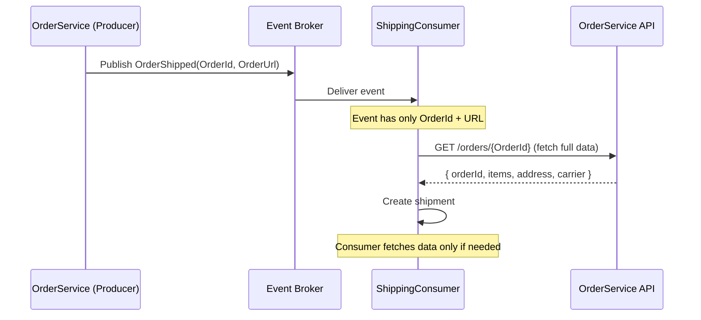
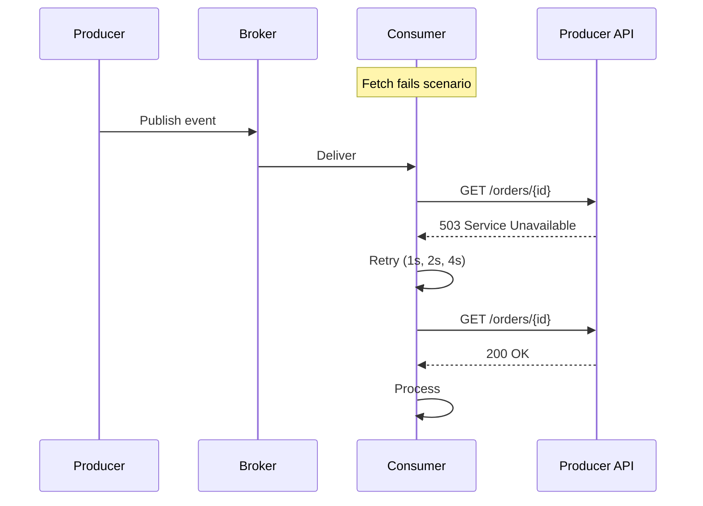
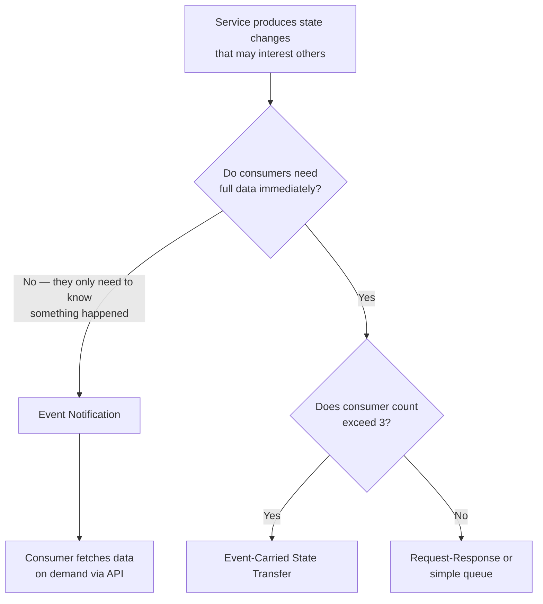
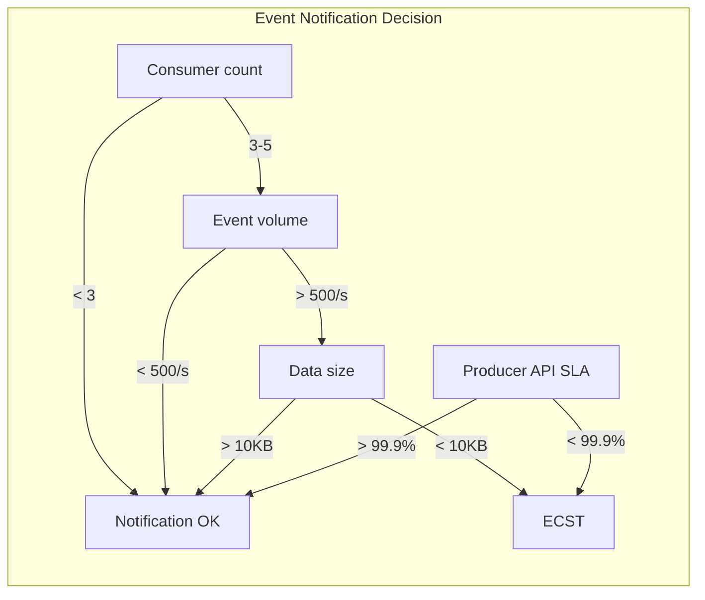
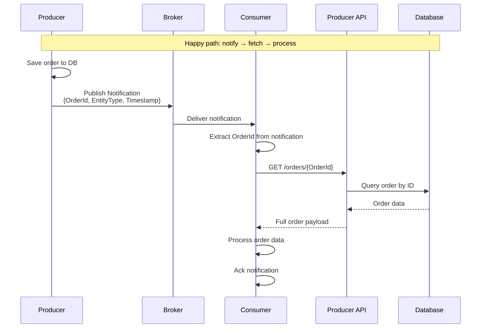
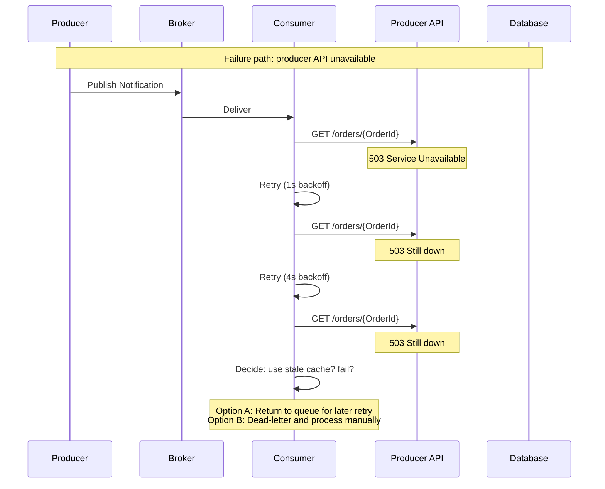
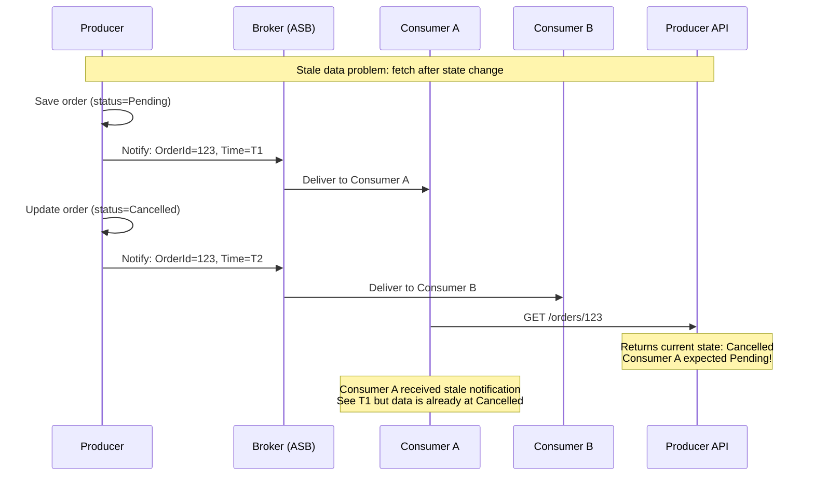
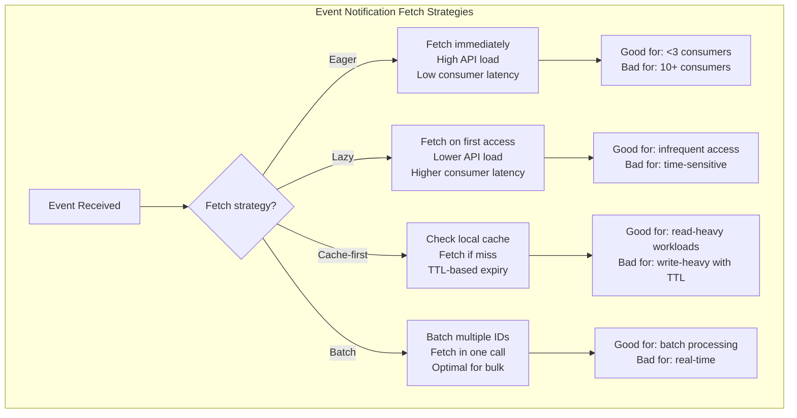

> [!success] Mastery Check
> - [ ] **Studied Well**
> - [ ] **Can explain the concept without notes**
> - [ ] **Can answer interview questions confidently**
> - [ ] **Can implement it in a real project**

## Navigation

**Domain:** [[7 — System Design & Distributed Systems]] > **Group:** Integration Patterns
**Previous:** [[7.142 — Event-Driven Architecture — Overview]] | **Next:** [[7.144 — Event-Driven Architecture — Event-Carried State Transfer]]

### Prerequisites
- [[7.142 — Event-Driven Architecture — Overview]] — required because event notification is a sub-style of EDA; understanding brokers, topics, and consumer patterns is assumed
- [[6.402 — Observer Pattern]] — the single-process precursor; event notification is the distributed version of an observer where the subject notifies observers without knowing their details

### Where This Fits

Event notification is the simplest EDA sub-style: a service publishes a thin event announcing that something happened, carrying only an identifier and optionally a reference URL. Consumers that need more data fetch it via a synchronous API call back to the producer. This pattern fits when the event volume is moderate (<1,000 events/s), when consumers need only a fraction of the available data, or when the full data changes frequently and would be stale by the time a fat event is consumed. A .NET engineer encounters it whenever an Azure Function subscribes to an Event Grid topic and receives a notification with a `subject` and `dataVersion` — the function then calls back to the source API for the full payload. Without event notification, services either poll for changes (wasteful at low frequency) or couple to a shared database (breaking service boundaries). The pattern is the default starting point for EDA because it minimizes the event schema surface area — the producer commits to very little in the event contract.

## Core Mental Model

Event notification is a fire-and-forget broadcast that tells consumers "something happened — fetch the details if you care." The event payload is intentionally minimal: an entity ID, a timestamp, an event type, and sometimes a resource URL. The invariant this maintains is: the producer announces state changes without committing to what data consumers need — consumers opt into the data they want at consumption time. The tradeoff is that each consumer makes a synchronous fetch call at event-processing time, reintroducing the temporal coupling that EDA theoretically removes. The recognition trigger is a system where consumer requirements for data vary widely — one consumer needs the full order, another needs only the order ID to invalidate a cache — and including all possible data in every event would waste bandwidth and memory.



```mermaid
flowchart TD
    subgraph Producer
        P[OrderService] -->|Event: OrderPlaced| B[Broker]
    end
    subgraph Consumers
        B -->|Thin event: {OrderId, URL}| C1[ShippingConsumer]
        B -->|Thin event: {OrderId, URL}| C2[BillingConsumer]
        B -->|Thin event: {OrderId, URL}| C3[CacheInvalidation]
    end
    subgraph Fetch
        C1 -->|GET /orders/{id}| API[OrderService API]
        C2 -->|GET /orders/{id}| API
        C3 -.->|No fetch needed| NONE[Evicts cache key]
    end
    style NONE fill:#4a9
    style API fill:#48b
```



### Classification

Event notification occupies the minimal-coupling / maximal-latency corner of the EDA sub-styles. It provides the strongest producer autonomy (the producer owns its event schema and API; any data evolution happens internally) at the cost of consumer-side synchronous fetch overhead. It is best suited for notification-style flows where the consumer's primary action is triggering a side effect, not updating local state — for example, "send an email" or "invalidate a cache" rather than "build a materialized view." In the EDA family tree, it is the simplest variant and should be the default choice unless specific requirements push toward event-carried state transfer or event sourcing.

### Key Properties / Guarantees

|Property|Value|Condition|
|---|---|---|
|Producer autonomy|Maximum — event schema is tiny and stable|Producer API contract is backward-compatible|
|Consumer latency|Event delivery + synchronous fetch (RTT to producer)|Producer API is available at consumption time|
|Data freshness|Stale if data changes between event publish and consumer fetch|Producer API returns current state at fetch time|
|Network overhead|Low (small events) + variable (N consumers × 1 fetch each)|Depends on number of consumers per event|
|Schema coupling|Minimal — adding a field to the producer's API does not change the event|API evolves independently of event contract|
|Consumer complexity|Medium — fetch logic, retry, circuit breaker, cache|Producer API availability|
|Producer API load|N_consumers × events_per_second fetch requests|Consumer count and event volume|

## Deep Mechanics

### How It Works

**Step 1 — Producer detects a state change.** The producer performs a business operation and determines that an event should be emitted. It constructs a thin notification containing only identifying information — typically the entity ID, event type, version, and a correlation ID for tracing.

**Step 2 — Producer publishes the notification.** The notification is published to a broker topic or exchange. The broker routes it to all active subscriptions. Because the event is tiny (hundreds of bytes), serialization and transfer latency are negligible. The producer uses the outbox pattern to ensure the notification is not lost on crash.

**Step 3 — Consumer receives the notification.** The consumer's event handler is invoked with the thin event. The handler inspects the event type and entity ID. It may decide to skip processing if the event is irrelevant (e.g., the consumer only cares about events for certain customers filtered by a routing header). Broker-side filtering (SQL filters in Service Bus, header matching in Event Grid) can reduce unnecessary deliveries.

**Step 4 — Consumer fetches full data.** If the consumer decides to act, it makes a synchronous API call to the producer's endpoint using the entity ID from the event. This is typically an HTTP GET to a RESTful API or a gRPC call. The producer's API returns the current state of the entity. The fetch call should include retry logic, circuit breaker, and timeout.

**Step 5 — Consumer processes.** With the full data available, the consumer performs its business logic (send email, update local cache, create a downstream record). If the fetch fails (producer API is down or returns 500), the consumer retries based on its retry policy and may eventually dead-letter the event.

**Step 6 — Consumer acknowledges.** After successful processing, the consumer acknowledges the message (completes the Service Bus message, marks the Event Grid event as processed). On ack failure, the message is redelivered and the consumer must handle deduplication.

### Failure Modes

**Fetch failure on consumer side.** The producer's API is unavailable when the consumer tries to fetch the full data. The event-notification pattern's Achilles' heel: the consumer cannot proceed without the data, but the producer's API being down means the consumer is blocked. **Detection:** consumer-side fetch timeout errors, growing queue depth. **Metric:** consumer fetch error rate, producer API availability SLO. **Prevention:** implement fetch retry with exponential backoff; for critical consumers, consider a local cache of recently fetched data or fall back to a stale cached response.

**Data changed between notification and fetch.** The producer publishes `OrderPlaced`, but by the time the consumer fetches the order, the customer has cancelled it. The consumer may create a shipment for a cancelled order. **Detection:** data inconsistency — shipment record for a cancelled order. **Metric:** compensation event rate. **Prevention:** include a timestamp or version in the notification. The consumer checks whether the entity version changed since the notification was created. If the version does not match, the consumer refetches or skips.

**Notification storms.** A single business operation causes a cascade of notifications when multiple entities are updated in a single transaction (e.g., `OrderPlaced`, `InventoryReserved`, `PaymentAuthorized`). Consumers processing all three may make 3× API calls to the producer for the same logical operation. **Detection:** API calls per order transaction > expected baseline. **Metric:** producer API request rate per event type. **Prevention:** batch notifications into a single composite event or use event-carried state transfer for high-volume scenarios.

**Consumers that never fetch.** A consumer subscribes to notifications but never makes fetch calls because it only needs the entity ID (e.g., cache invalidation). While not a failure, this is a missed optimization — if the consumer never fetches, the event could be even thinner or the pattern could be replaced with a simpler signal.

**Fetch multiplier at scale.** With 10 consumers each receiving 1,000 events/s, the producer API handles 10,000 fetch requests/second. This can overwhelm the API, especially if it is also handling user-facing traffic. **Detection:** producer API latency increases, CPU and database load spike. **Metric:** producer API request rate breakdown by source (user traffic vs consumer fetch). **Prevention:** switch to event-carried state transfer for high-volume consumers, or add a shared cache layer.

**Stale local cache after fetch.** The consumer caches fetched data to avoid repeated fetch calls. But the cache may become stale if the entity is updated without a new notification. **Detection:** consumer uses stale data. **Metric:** staleness lag (time since last fetch). **Prevention:** set appropriate cache TTL. Use notification events to invalidate the cache.

### .NET and Azure Integration

- **Azure Event Grid:** the canonical notification broker in Azure. Events carry a `subject`, `eventType`, `dataVersion`, and optional `data` payload. Event Grid subscriptions can trigger Azure Functions, webhooks, or storage event handlers. Schema is CloudEvents 1.0 compliant.
- **Azure Service Bus Topics:** supports SQL filters on message properties, allowing consumers to subscribe only to events matching specific criteria (e.g., `CustomerRegion = 'EU'`).
- **Azure Functions + Event Grid Trigger:** the simplest .NET consumer for event notifications — a function handler receives the thin event and calls out to the producer API.
- **Polly (HttpClient resilience):** used in the consumer's fetch call for retry, timeout, and circuit breaker around the producer API call.
- **Azure Cache for Redis:** stores recently fetched data to reduce fetch call volume. Shared across consumer instances.

```csharp
// Thin notification event
public sealed record OrderPlacedNotification(
    Guid EventId,
    DateTimeOffset OccurredAt,
    string OrderId,
    Uri OrderDetailsUrl)
{
    public const string EventType = "order.placed.notification.v1";
}

// Producer — publishes thin notification
public sealed class OrderService
{
    private readonly IPublishEndpoint _publisher;

    public async Task<Order> PlaceOrderAsync(CreateOrderCommand command, CancellationToken ct)
    {
        var order = Order.Create(command.CustomerId, command.Items);
        await _orderRepository.SaveAsync(order, ct);

        // Thin notification — minimal payload
        await _publisher.Publish(new OrderPlacedNotification(
            EventId: Guid.NewGuid(),
            OccurredAt: DateTimeOffset.UtcNow,
            OrderId: order.Id,
            OrderDetailsUrl: new Uri($"/api/orders/{order.Id}", UriKind.Relative)), ct);

        return order;
    }
}

// Consumer — receives notification, fetches full data
public sealed class ShippingConsumer : IConsumer<OrderPlacedNotification>
{
    private readonly HttpClient _httpClient;
    private readonly IShippingRepository _shipping;

    public ShippingConsumer(
        IHttpClientFactory httpClientFactory,
        IShippingRepository shipping)
    {
        _httpClient = httpClientFactory.CreateClient("OrderService");
        _shipping = shipping;
    }

    public async Task Consume(ConsumeContext<OrderPlacedNotification> context)
    {
        // Fetch full data from producer API
        var response = await _httpClient.GetAsync(
            context.Message.OrderDetailsUrl, context.CancellationToken);

        response.EnsureSuccessStatusCode();

        var orderDetail = await response.Content
            .ReadFromJsonAsync<OrderDetail>(context.CancellationToken);

        var shipment = Shipment.Create(
            orderDetail!.OrderId,
            orderDetail.ShippingAddress,
            orderDetail.Items);

        await _shipping.SaveAsync(shipment, context.CancellationToken);
    }
}
```

```csharp
// Azure Event Grid — custom topic publisher
public sealed class EventGridPublisher
{
    private readonly EventGridPublisherClient _client;

    public async Task PublishOrderPlacedAsync(Order order, CancellationToken ct)
    {
        var eventGridEvent = new EventGridEvent(
            subject: $"orders/{order.Id}",
            eventType: "order.placed",
            dataVersion: "1.0",
            data: new OrderPlacedNotification(
                EventId: Guid.NewGuid(),
                OccurredAt: DateTimeOffset.UtcNow,
                OrderId: order.Id,
                OrderDetailsUrl: new Uri($"/api/orders/{order.Id}", UriKind.Relative)))
        {
            Id = Guid.NewGuid().ToString(),
            Topic = "order-events"
        };

        await _client.SendEventAsync(eventGridEvent, ct);
    }
}
```

```csharp
// Consumer with cache-first strategy
public sealed class CachedShippingConsumer : IConsumer<OrderPlacedNotification>
{
    private readonly IDistributedCache _cache;
    private readonly HttpClient _httpClient;
    private readonly IShippingRepository _shipping;

    public async Task Consume(ConsumeContext<OrderPlacedNotification> context)
    {
        var cacheKey = $"order:{context.Message.OrderId}";

        // Try cache first
        var order = await _cache.GetAsync<OrderDetail>(cacheKey, context.CancellationToken);

        if (order is null)
        {
            // Cache miss — fetch from producer API
            order = await _httpClient.GetFromJsonAsync<OrderDetail>(
                context.Message.OrderDetailsUrl, context.CancellationToken);

            // Cache for 5 minutes
            await _cache.SetAsync(cacheKey, order,
                TimeSpan.FromMinutes(5), context.CancellationToken);
        }

        var shipment = Shipment.Create(order!.OrderId, order.ShippingAddress, order.Items);
        await _shipping.SaveAsync(shipment, context.CancellationToken);
    }
}
```

## Production Patterns and Implementation

### Primary Implementation

The canonical implementation uses Azure Event Grid as the notification broker, Azure Functions as consumers, and HTTP API calls back to the producer. This architecture is common in serverless-reactive systems where the fetch is to an existing REST API.

```csharp
// Azure Function — Event Grid trigger consumer
public sealed class OrderPlacedFunction
{
    private readonly HttpClient _httpClient;

    public OrderPlacedFunction(IHttpClientFactory httpClientFactory)
    {
        _httpClient = httpClientFactory.CreateClient("OrderService");
    }

    [FunctionName("OnOrderPlaced")]
    public async Task Run(
        [EventGridTrigger] EventGridEvent eventGridEvent,
        ILogger log)
    {
        using var _ = log.BeginScope("Processing notification {Id}", eventGridEvent.Id);

        var notification = eventGridEvent.Data.ToObjectFromJson<OrderPlacedNotification>();

        // Resilience pipeline — retry with backoff, circuit breaker
        var response = await _httpClient.GetAsync(
            notification.OrderDetailsUrl);

        if (!response.IsSuccessStatusCode)
        {
            // Non-transient failure? Throw to trigger Event Grid retry/DLQ
            throw new InvalidOperationException(
                $"Failed to fetch order {notification.OrderId}: {response.StatusCode}");
        }

        var order = await response.Content.ReadFromJsonAsync<OrderDetail>();

        // Process order data
        log.LogInformation("Processing shipment for order {OrderId}", order!.OrderId);
    }
}
```

### Configuration and Wiring

```csharp
// Program.cs — consumer as BackgroundService with MassTransit
builder.Services.AddMassTransit(x =>
{
    x.AddConsumer<ShippingConsumer>();

    x.UsingAzureServiceBus((context, cfg) =>
    {
        cfg.Host(builder.Configuration["Azure:ServiceBus:ConnectionString"]);

        cfg.SubscriptionEndpoint<OrderPlacedNotification>(
            "shipping-service",
            e =>
            {
                // SQL filter — only EU orders
                e.Filter = new SqlFilter("CustomerRegion = 'EU'");
                e.ConfigureConsumer<ShippingConsumer>(context);
            });
    });
});

// Configure fetch client with resilience
builder.Services.AddHttpClient("OrderService", client =>
{
    client.BaseAddress = new Uri(builder.Configuration["Services:Order:BaseUrl"]);
    client.Timeout = TimeSpan.FromSeconds(10);
})
.AddTransientHttpErrorPolicy(p => p.WaitAndRetryAsync(3, retryAttempt =>
    TimeSpan.FromMilliseconds(200 * Math.Pow(2, retryAttempt))))
.AddTransientHttpErrorPolicy(p => p.CircuitBreakerAsync(
    handledEventsAllowedBeforeBreaking: 5,
    durationOfBreak: TimeSpan.FromSeconds(30)));
```

```json
// appsettings.json
{
  "Azure": {
    "EventGrid": {
      "TopicEndpoint": "https://ecom-orders.eastus-1.eventgrid.azure.net/api/events",
      "TopicKey": "..."
    },
    "ServiceBus": {
      "ConnectionString": "Endpoint=sb://ecom-ns.servicebus.windows.net/;...",
      "SubscriptionPrefix": "notification-"
    }
  },
  "Services": {
    "Order": {
      "BaseUrl": "https://api.orders.ecom.com",
      "TimeoutSeconds": 10,
      "RetryCount": 3,
      "CircuitBreakerThreshold": 5,
      "CircuitBreakerDurationSeconds": 30
    }
  }
}
```

### Common Variants

**Cache-first notification.** The consumer checks a local cache before calling the producer API. If the data is in cache and not stale, the fetch is skipped. Useful when the same entity is referenced by multiple events in a short window.

**Filtered subscription.** The broker applies a filter before delivering the event. Consumers only receive notifications that match their criteria (e.g., `OrderRegion = 'EU'`), reducing unnecessary fetch calls. Azure Service Bus SQL filters and Event Grid advanced filters support this.

**Batch fetch.** A consumer accumulates multiple notification IDs over a short window (e.g., 1 second) and fetches them in a single batch API call (`GET /orders?ids=id1,id2,id3`). Reduces fetch overhead at the cost of increased consumer complexity.

```csharp
// Batch fetch consumer
public sealed class BatchShippingConsumer : IConsumer<OrderPlacedNotification>
{
    private readonly HttpClient _httpClient;
    private static readonly ConcurrentBag<PendingNotification> _pending = new();
    private static Timer? _timer;

    public async Task Consume(ConsumeContext<OrderPlacedNotification> context)
    {
        _pending.Add(new PendingNotification(
            context.Message.OrderId,
            context.Message.OrderDetailsUrl,
            context.CancellationToken));

        // Start batch timer on first notification
        _timer ??= new Timer(async _ => await FlushAsync(), null,
            TimeSpan.FromSeconds(1), TimeSpan.FromMilliseconds(-1));
    }

    private async Task FlushAsync()
    {
        var batch = Interlocked.Exchange(ref _pending, new ConcurrentBag<PendingNotification>());
        if (batch.IsEmpty) return;

        var ids = batch.Select(p => p.OrderId.ToString());
        var response = await _httpClient.GetAsync(
            $"/api/orders?ids={string.Join(",", ids)}");
        // ... process batch
    }
}
```

**Dead-letter queue monitoring consumer.** A dedicated consumer that monitors the DLQ for events that failed fetch. It analyzes the failure pattern and either replays the events (if the issue is resolved) or alerts the team.

**Hybrid notification with local fallback.** The consumer maintains a local materialized view that is updated via event-carried state transfer for critical data. For less critical data, it uses event notification with fetch. If the fetch fails, it falls back to the local view (even if slightly stale).

### Real-World .NET Ecosystem Example

**Azure Event Grid** is the platform's implementation of event notification. It is used extensively in serverless architectures — for example, when a blob is created in Azure Storage, Event Grid sends a notification to an Azure Function that processes the file. The notification contains the blob URL; the function fetches the blob content using the URL. This is precisely the event-notification pattern: thin event, consumer fetches full data when needed. Event Grid also supports dead-lettering for events that cannot be delivered, retry policies (exponential backoff up to 24 hours), and event schema validation against the CloudEvents 1.0 standard.

**MassTransit's `IConsumer<T>` with thin events** is another common implementation. Many teams start with thin events (event notification) and migrate to fat events (ECST) when the fetch overhead becomes a problem. MassTransit makes this migration straightforward because the consumer interface does not change — only the payload and the processing logic change.

## Gotchas and Production Pitfalls

### Synchronous Fetch Dependency at Scale

**Pitfall:** Treating the fetch call as a simple `HttpClient.GetAsync` without considering that consumer-side fetch recreates the synchronous coupling the event was supposed to eliminate.

```csharp
// ❌ No resilience — single point of synchronous coupling
public async Task Consume(ConsumeContext<OrderPlacedNotification> context)
{
    using var client = new HttpClient();
    var response = await client.GetAsync(context.Message.OrderDetailsUrl);
    // If OrderService is down, this consumer is down
}
```

**Symptom:** When OrderService has a degradation, all consumers that fetch from it also degrade. Queue depth spikes across every consumer that subscribes to OrderPlaced events.

**Fix:** Add a circuit breaker at the consumer level, a local cache of recently fetched data, and a fallback stale-read mechanism if the producer is unavailable.

```csharp
// ✅ Circuit breaker + cache
public async Task Consume(ConsumeContext<OrderPlacedNotification> context)
{
    var order = await _cache.GetOrCreateAsync(
        $"order:{context.Message.OrderId}",
        async entry =>
        {
            entry.AbsoluteExpirationRelativeToNow = TimeSpan.FromMinutes(5);
            return await _httpClient.GetFromJsonAsync<OrderDetail>(
                context.Message.OrderDetailsUrl, context.CancellationToken);
        });

    if (order is null) return; // fallback: skip or use stale data
    // process order
}
```

**Cost of not fixing:** A single upstream service outage cascades into all downstream consumers that use event notification, defeating the isolation that EDA provides.

### Missing Idempotency in the Fetch-Then-Process Flow

**Pitfall:** The consumer fetches data, processes it, and acknowledges the event, but if the ack is lost, the broker redelivers the notification and the consumer processes the same data again — but now the data may have changed.

```csharp
// ❌ No idempotency — same order processed twice with potentially different data
public async Task Consume(ConsumeContext<OrderPlacedNotification> context)
{
    var order = await _httpClient.GetFromJsonAsync<OrderDetail>(
        context.Message.OrderDetailsUrl, context.CancellationToken);

    var shipment = Shipment.Create(order!.OrderId, order.ShippingAddress, order.Items);
    await _shipping.SaveAsync(shipment, context.CancellationToken);
    // Redelivery creates a second shipment for the same order
}
```

**Symptom:** Duplicate shipments for the same order. Customer receives two packages.

**Fix:** Make the consumer idempotent by checking if the event was already processed before fetching or processing.

```csharp
// ✅ Idempotent consumer
public async Task Consume(ConsumeContext<OrderPlacedNotification> context)
{
    if (await _deduplication.HasProcessedAsync(context.Message.EventId))
        return;

    var order = await _httpClient.GetFromJsonAsync<OrderDetail>(
        context.Message.OrderDetailsUrl, context.CancellationToken);

    var shipment = Shipment.Create(order!.OrderId, order.ShippingAddress, order.Items);
    await _shipping.SaveAsync(shipment, context.CancellationToken);
    await _deduplication.MarkAsProcessedAsync(context.Message.EventId);
}
```

**Cost of not fixing:** Business logic executes twice with potentially different source data, leading to data inconsistencies and manual reconciliation.

### Consumer Assumes Notification Data Is Current

**Pitfall:** The consumer fetches data immediately on receiving the notification and assumes it is the authoritative state, ignoring that the entity may have been updated between the notification and the fetch.

```csharp
// ❌ No version check — may use stale or wrong data
public async Task Consume(ConsumeContext<OrderShippedNotification> context)
{
    var order = await _httpClient.GetFromJsonAsync<OrderDetail>(
        $"/api/orders/{context.Message.OrderId}");

    // By the time we fetched, the order may have been cancelled
    await _shipping.CreateShipment(order!.OrderId, order.Items);
}
```

**Symptom:** Shipments created for cancelled orders, invoices generated for refunded orders.

**Fix:** Include a version timestamp from the producer at notification time. The consumer checks whether the fetched data's last-modified timestamp is newer than the notification timestamp. If it is, the consumer decides whether to proceed based on the updated state (e.g., skip if order status is Cancelled).

**Cost of not fixing:** Financial losses from acting on stale state, and compensating actions needed to undo the incorrect processing.

### Over-fetching Under High Volume

**Pitfall:** At high event volume, every consumer makes a fetch call per notification. If 10 consumers each receive 1,000 notifications/s, the producer API handles 10,000 fetch requests/second for data it just published.

```csharp
// ❌ 10 consumers × 5,000 events/s = 50,000 fetch calls/s
// Each fetch returns the same order data the producer already serialized
```

**Symptom:** Producer API CPU and database load spike proportionally to consumer count. The API that was designed for user-facing requests is now handling server-side fetch traffic that is 10x the user traffic.

**Fix:** Switch to event-carried state transfer for high-volume consumers, or add a shared cache (Redis) between the producer and consumers where the producer writes the event data and consumers read from cache instead of calling the API.

**Cost of not fixing:** The producer API needs to be provisioned for fetch scaling, which drives up infrastructure cost and adds latency. At extreme scale, the fetch calls cause database contention that slows user-facing requests.

### Circuit Breaker Threshold Misconfiguration in Fetch Pipeline

**Pitfall:** The circuit breaker on the consumer's fetch call opens after 5 failures. If the producer API has a brief hiccup (30 seconds), the circuit opens and all consumers stop fetching for 30 seconds. When the circuit closes, a thundering herd of consumers all fetch simultaneously.

**Symptom:** After a brief producer API outage, consumer processing latency spikes due to the thundering herd. Some events may time out and go to the DLQ.

**Fix:** Tune the circuit breaker to match the producer API's recovery pattern. Use a half-open state with gradual recovery (allow 1 request, then 2, then 4). Add jitter to the consumer's retry timing.

**Cost of not fixing:** Cascading recovery failures. The producer API recovers, but consumer fetch patterns prevent it from staying healthy.

### Notification Without Dead-Letter Queue

**Pitfall:** The event notification subscription is configured without a dead-letter queue. Events that fail fetch retries are permanently lost.

**Symptom:** Missing side effects. An order is placed but the notification is never processed. No record of the failure exists.

**Fix:** Always configure a dead-letter queue for event notification subscriptions. Monitor DLQ depth and alert on growth.

**Cost of not fixing:** Silent data loss. The producer believes consumers were notified, but they were not. No recovery path exists for unprocessable events.

## Tradeoffs and Decision Framework

### Tradeoff Matrix

| Dimension | Event Notification | Event-Carried State Transfer | Request-Response Polling |
|---|---|---|---|
| Coupling | Minimal — producer only exposes ID | Medium — event schema couples producer data model | Tight — consumer knows producer API surface |
| Consumer latency | Event delivery + fetch RTT | Event delivery only (data is in the event) | Poll interval + fetch RTT |
| Data freshness at consumer | Current as of fetch time | Stale as of event creation time | Current as of poll time |
| Producer load per event | Low (publish thin event) + N fetches | Low (publish fat event, no fetch) | N/A (consumer polls) |
| Event schema stability | High (schema is tiny, stable) | Lower (schema includes data fields) | N/A |
| Consumer complexity | Medium (fetch logic + retry) | Low (data in event, process directly) | Medium |
| Consumer offline capability | No — requires fetch | Yes — data in event | No — requires poll |
| .NET implementation | Event Grid + Function | MassTransit + fat events | HttpClient polling |

### When to Apply





### When NOT to Apply

- [ ] The consumer must process the event without synchronous upstream dependency — event notification creates a fetch dependency at consumption time
- [ ] Event volume exceeds ~1,000 events/s per consumer — the aggregate fetch load on the producer API becomes significant
- [ ] The producer API latency is >100 ms P99 — each consumer's end-to-end processing time is event delivery + fetch latency, which can push beyond consumer timeout budgets
- [ ] The consumer count is large (>10 consumers per event type) — each event triggers N fetches, creating a fetch multiplier on the producer API
- [ ] The data changes frequently — the consumer fetches data that may be stale by the time it is read, but event-carried state transfer would also be stale; in this case, notification is acceptable if the consumer only needs a point-in-time snapshot
- [ ] The producer API has a lower availability SLO than the consumer's processing SLO — the consumer's reliability is capped by the producer API availability

### Scale Thresholds

- **Worth considering at any scale where EDA makes sense** — event notification is the simplest EDA style and is the default starting point
- **Re-evaluate above ~100 events/s per consumer subscription** — at this point, the aggregate fetch load on the producer API may approach the API's normal user traffic
- **Re-evaluate above ~5 consumers per event type** — the fan-out fetch multiplier (5 consumers × N events/s) may exceed the producer API's provisioned capacity
- **Must switch to event-carried state transfer if the producer API availability SLO is lower than the consumer's processing SLO** — the consumer cannot rely on a downstream API that is less reliable than the consumer's own target
- **At >10,000 events/s, avoid event notification entirely** — the fetch load would be unsustainable; use ECST or Kafka with compacted topics

## Interview Arsenal

### Question Bank

1. What is event notification and what distinguishes it from other EDA sub-styles?
2. Walk through the full flow of an event notification — from business operation to consumer processing.
3. What is the cost of the synchronous fetch in event notification — what do you trade for the small event schema?
4. What happens when the producer API is unavailable at the moment the consumer fetches data?
5. Compare event notification with event-carried state transfer — when would you choose each?
6. Design an order processing system where cache invalidation, email notification, and shipping all react to OrderPlaced. Which should use event notification vs state transfer?
7. How does event notification behave at 10,000 events per second with 8 consumers?
8. In what scenario is event notification the wrong choice even though the consumer count is low?
9. How do you handle idempotency in an event notification consumer?
10. What monitoring metrics are essential for an event notification system?

### Spoken Answers

**Q: What is event notification and how does it differ from event-carried state transfer?**

> **Average answer:** Event notification sends a small event with just the ID, and the consumer fetches the rest. Event-carried state transfer sends all the data in the event. Notification is simpler because the event schema is small.

> **Great answer:** Event notification is the thinnest form of event-driven communication — the producer emits a small event containing only an identifier, a timestamp, and often a resource URL. The consumer receives that notification and independently decides whether to fetch the full data via a synchronous API call back to the producer. The crucial tradeoff is that you keep the event schema minimal and stable — it rarely changes because it only carries an ID — but you reintroduce synchronous coupling at consumption time. The consumer is now dependent on the producer's API being available when it processes the notification. Event-carried state transfer solves this by including all the relevant data directly in the event payload, eliminating the synchronous fetch but creating a tighter coupling on the data schema. I use event notification when the consumer may not always need the data, or when the data changes so frequently that including it in the event would be misleading — for example, a cache invalidation notification where the consumer only needs the entity ID to evict the key. I use state transfer when the consumer always needs the data and the fetch latency or availability would be a problem.

**Q: What happens when the producer API is unavailable at the moment the consumer fetches data?**

> **Great answer:** This is the fundamental weakness of event notification — the consumer has reintroduced the synchronous dependency the event was supposed to eliminate. Without mitigation, the consumer either fails (throwing an exception that causes the broker to redeliver) or blocks waiting for the API. The correct approach is a three-layer defense. First, implement a retry policy with exponential backoff on the fetch — if the producer API is experiencing a transient blip, retry 3–5 times with increasing delays. Second, add a circuit breaker: if the API returns 5xx errors for a sustained period, open the circuit and use a fallback strategy — either skip the event (if the processing is non-critical) or use a stale cached response from a local cache. Third, for critical consumers, use a hybrid approach: maintain a local materialized view that is updated asynchronously via event-carried state transfer, and fall back to fetch-on-notification only when the local view is missing data. Without these mitigations, a producer API outage cascades into every consumer that uses event notification, which defeats the isolation purpose of EDA.

**Q: How does event notification behave at 10,000 events per second with 8 consumers?**

> **Great answer:** "This is where event notification breaks down. Each of the 8 consumers makes a fetch call per event, so the producer API receives 80,000 fetch requests per second. That is 80,000 HTTP requests per second hitting the producer's endpoints, each requiring a database query to return the current state. This is almost certainly unsustainable for a typical REST API.

"The first thing that happens is the producer API's CPU and database connections saturate. P99 latency climbs from 50ms to multiple seconds. The consumers' fetch calls start timing out, triggering retries, which adds even more load. Consumers' queue depths grow as fetch calls fail. Events start going to the DLQ after retries exhaust.

"The fix is to switch to event-carried state transfer for high-volume consumers. Include the data in the event payload so no fetch is needed. For consumers that truly cannot use ECST (e.g., they need the absolute latest data), add a shared Redis cache — the producer writes the data to Redis at publish time, and consumers read from Redis instead of calling the API. This reduces the 80,000 fetch requests to 80,000 cache reads, which Redis can handle comfortably.

"If even cache reads are too expensive, consider batching reads from the cache — accumulate 100 event IDs and batch-fetch from Redis in a single MGET call. At scale, event notification must be treated as an optimization problem: minimize fetch calls per event while keeping consumer data current enough for correct processing."

### System Design Interview Trigger

If an interviewer asks you to design a system where multiple services react to a state change, and then asks "how does the consumer get the data it needs?", they are testing whether you default to event notification (simple, but with synchronous fetch coupling) or know when to escalate to event-carried state transfer. The follow-up question will be about the producer API availability — they want to see if you recognize that the fetch call recreates coupling and have mitigation strategies ready. The strongest answer also discusses the fetch multiplier problem at scale and names specific technologies (Azure Event Grid, Azure Functions, Polly for retry).

### Comparison Table

| | Event Notification | Event-Carried State Transfer |
|---|---|---|
| Event payload | Thin (ID + URL) | Fat (full data) |
| Consumer data source | Producer API (synchronous fetch) | Event payload (self-contained) |
| Producer autonomy | High — event schema rarely changes | Lower — event schema reflects producer data |
| Consumer latency | Delivery + fetch RTT | Delivery only |
| Producer API dependency | Yes — consumer needs it at processing time | No — data is in the event |
| Best for | Cache invalidation, triggers, side effects | Materialized views, offline-capable consumers |
| Scale ceiling | ~1,000 events/s per consumer | 10,000+ events/s (no fetch overhead) |

## Architecture Decision Record

**Status:** Accepted

**Context:** A .NET e-commerce notification service needs to react to `OrderPlaced` events to send confirmation emails and SMS messages. The notification service needs the customer's email, phone, and preferred language to compose the message — but this data is already available in the notification service's local database (it syncs customer profiles independently). The full order details are not needed; only the order ID and customer ID are required. The system processes approximately 300 orders per second during peak hours with 3 consumers subscribed to the event.

**Options Considered:**

1. **Event Notification (thin event)** — event carries only `OrderId` and `CustomerId`. Consumer fetches any missing data from its local store, which it already has.
2. **Event-Carried State Transfer (fat event)** — event carries full order and customer data, most of which the consumer does not need.
3. **Direct API call from OrderService to NotificationService** — synchronous call after order creation.

**Decision:** Event Notification, because the consumer already has the customer profile data locally and does not need to fetch from the producer. The thin event (OrderId + CustomerId) is sufficient, and the consumer's processing is entirely local. Including full order data would waste bandwidth and increase schema coupling for no benefit. The consumer will use an inbox deduplication table keyed on EventId to ensure idempotency.

**Consequences:**
- ✅ Event schema is tiny and stable — adding a field to Order does not change the notification event
- ✅ Consumer processing is fast — no synchronous fetch call needed (consumer already has the data)
- ✅ OrderService is decoupled from NotificationService and does not know about email/SMS logic
- ✅ Inbox deduplication prevents duplicate notifications on broker redelivery
- ⚠️ If the notification service loses its local customer data (cache miss or data not yet synced), it must decide: skip notification or fetch from another source
- ❌ Not suitable if the notification service needed order-specific data it does not already possess

**Review Trigger:** Revisit this decision if the notification service adds a feature that requires order-specific data (e.g., "send the invoice as PDF attachment") — at that point, event-carried state transfer or a fetch call may be required. Also revisit if the event volume exceeds 1,000 events/s and the consumer must start fetching additional data from the producer API.

## Self-Check

### Conceptual Questions

1. What distinguishes event notification from other EDA sub-styles?
2. Derive the tradeoff between event notification and event-carried state transfer from first principles — what property does each optimize for?
3. Given a consumer that needs only an entity ID to invalidate a Redis cache, is event notification appropriate?
4. What metric reveals that the synchronous fetch calls in event notification are causing a problem?
5. Name the Azure service that is purpose-built for event notification scenarios.
6. What is the structural distinction between event notification's "fetch on demand" and event-carried state transfer's "data in payload"?
7. Below what event volume is event notification always sufficient?
8. [[7.144 — Event-Driven Architecture — Event-Carried State Transfer]] — when would you migrate from notification to state transfer?
9. What production consequence follows from a consumer that fetches data without checking the entity version?
10. Explain event notification to a product manager in 60 seconds.

<details>
<summary>Answers</summary>

1. Event notification carries only an identifier and optionally a reference URL in the event payload. Consumers fetch the full data synchronously from the producer's API at processing time. This is the minimal-coupling variant of EDA.

2. Event notification optimizes for producer autonomy: the event schema is stable and tiny, so the producer can evolve its data model freely. The cost is consumer-side synchronous fetch, which reintroduces temporal coupling at consumption time. Event-carried state transfer optimizes for consumer independence: the consumer has all the data it needs, but the event schema couples to the producer's data model.

3. Yes — this is the ideal use case. The consumer only needs the entity ID to evict the cache key. No fetch is needed. The event can be as thin as `{ CacheKey: "order:123" }`.

4. Producer API request rate per event type increasing proportionally to consumer count. If the API's request rate during consumer fetch traffic exceeds the user-facing request rate, event notification fetch overhead is significant.

5. Azure Event Grid — designed for event notification with CloudEvents-compatible schema, supports webhook, Azure Function, and storage queue destinations.

6. Notification carries a reference; the consumer fetches the referent. State transfer carries the referent itself; the consumer does not fetch.

7. Below ~100 events/s per consumer, the fetch overhead is negligible and notification is always sufficient. Above that, evaluate whether the aggregate fetch load on the producer API is acceptable.

8. When consumer fetch calls cause the producer API to scale beyond acceptable cost, or when consumer processing latency due to fetch calls exceeds the SLO. Also when consumers cannot tolerate synchronous fetch dependency on the producer.

9. The consumer acts on stale data — for example, creating a shipment after an order was cancelled, because the fetch returned the cancelled order but the consumer already started processing before noticing the cancellation.

10. "Event notification is like a doorbell. When something happens, the producer rings the bell with just your name. You walk to the door (make an API call) to see who it is and get the full details. This keeps the bell ring simple, but means you need to be able to go to the door every time it rings."
</details>

---

### Scenario Challenges

**Scenario 1 — Diagnose the problem**

An inventory management system uses Azure Functions with Event Grid to process `ProductUpdated` notifications. Each function receives the notification and calls the Product Catalog API to fetch the current product data before updating its local cache. Recently, the Product Catalog API team reports that their P99 latency has increased from 50 ms to 2,000 ms during business hours. The inventory team notices that their function's processing time has also increased proportionally.

<details>
<summary>Diagnosis</summary>

**Root cause:** The event notification pattern creates a fetch multiplier: every `ProductUpdated` event causes N function invocations, each making an HTTP call to the Product Catalog API. If 10 consumers subscribe to the same event, each event generates 10 API calls. At high catalog update volume (e.g., during a bulk price update), the aggregate fetch calls overwhelm the API.

**Evidence:** Application Insights shows the Product Catalog API requests per second spiking during bulk updates, with 80% of requests coming from the `AzureFunctions` dependency type. The API's `cpu` and `database-dtu` metrics are near 100%.

**Fix:** For the immediate incident, reduce the Event Grid delivery retry policy and decrease the function concurrency to limit fetch call volume. For the permanent fix, switch to event-carried state transfer for this event: include the product data in the event payload so consumers do not fetch.

**Prevention:** Include a threshold guard in the Event Grid subscription: if more than 5 consumers subscribe to the same event type, switch to state transfer or add a shared cache layer.
</details>

---

**Scenario 2 — Design decision**

You are designing a cache invalidation system. When an order's status changes, the front-end cache must be invalidated. The caching service needs only the cache key to evict the entry. There are 3 front-end cache nodes, each running its own invalidation consumer. What event style do you choose?

<details>
<summary>Decision and Reasoning</summary>

**Choice:** Event notification — the event carries only the cache key (`order:{OrderId}`). Each consumer receives the notification and evicts the local cache entry. No fetch call is needed because the consumer only needs the key.

**Tradeoffs accepted:** The event is self-sufficient for the consumer's purpose. Including full order data in the event would add unnecessary bytes and couple the event schema to the order data model for no benefit.

**Implementation sketch:**

```csharp
public sealed record CacheInvalidationEvent(
    Guid EventId,
    string CacheKey);

// Consumer
public sealed class CacheInvalidationConsumer : IConsumer<CacheInvalidationEvent>
{
    private readonly IDistributedCache _cache;

    public async Task Consume(ConsumeContext<CacheInvalidationEvent> context)
    {
        await _cache.RemoveAsync(context.Message.CacheKey, context.CancellationToken);
        // No fetch needed — event notification is the right choice
    }
}
```
</details>

---

**Scenario 3 — Failure mode** Your recommendation service subscribes to `OrderPlaced` notifications. When an order is placed, the consumer fetches the order details and updates its recommendation model. Recently, the consumer has been processing orders for customers who have since deleted their accounts. The recommendation model is being updated with stale customer data.

<details>
<summary>Investigation and Fix</summary>

**Investigation steps:** 1) Check the time delta between the notification timestamp and the fetch timestamp. 2) Check whether the consumer verifies the entity version or last-modified timestamp. 3) Check if the consumer fetches before or after checking idempotency.

**Confirming evidence:** The consumer fetches order data immediately on receiving the notification. By the time the fetch returns, the customer may have requested account deletion, but the consumer does not check the customer's current status after fetching. The event notification's latency between publish and fetch allows the state to change.

**Immediate mitigation:** Add a version check: include `EntityVersion` or `LastModified` in the notification. The consumer checks the fetched entity's version against the notification version. If they differ, the consumer re-fetches or decides based on current state.

**Permanent fix:** For this use case, switch to event-carried state transfer with a snapshot at the time of the event, or implement a two-phase check: the consumer fetches the data, checks the customer's current status, and only processes if the customer still exists.

**Post-mortem item:** The notification pattern's weakness — data changes between event creation and consumer processing — was not documented. Add a runbook entry: "Always check whether the data you fetch is still valid for the action you're about to take."
</details>

---

**Scenario 4 — Scale it** Your system uses event notification with 1 producer and 4 consumers, each processing 500 events/s. The producer API that consumers fetch from is a single Azure App Service instance. You need to scale to 2,000 events/s with 8 consumers.

<details>
<summary>Scaling Strategy</summary>

**Bottleneck this addresses:** The producer API receives N_consumers × events_per_second = 8 × 2,000 = 16,000 fetch requests per second. The single App Service instance cannot handle this volume.

**How it helps:** Event notification itself does not help — it is the cause of the bottleneck. The strategy is to reduce the fetch load.

**Implementation order:** 1) Add a shared Redis cache between producer and consumers: the producer writes the order data to Redis at publish time; consumers read from Redis instead of calling the API. 2) For consumers that need real-time data, switch to event-carried state transfer: include the data in the event payload, eliminating the fetch entirely. 3) For the remaining consumers (those that truly need a fetch), scale the producer API to 3–4 App Service instances with an autoscaling rule based on request rate.

**What it does not solve:** The database behind the producer API — if consumer fetch calls cause DB contention, further optimization is needed (read replicas, dedicated read API).
</details>

---

**Scenario 5 — Interview simulation** The interviewer says: "Design a notification system that sends an email when an order is shipped. The email service needs the order ID and the customer's email address. The email service has its own local copy of customer data."

<details>
<summary>Model Response</summary>

"I'd use event notification here because the email service already has the customer data it needs. The event payload will be minimal — just the OrderId and CustomerId. The email service receives the notification, looks up the customer's email from its local database, constructs the email body using order information it can fetch or derive, and sends it.

"Let me clarify a key requirement: does the email body require order-specific data like line items or total amount, or is it a standard 'your order has shipped' template? If it's a template with no dynamic order data, then the event notification is trivially sufficient — the consumer needs no fetch at all. If it does need order data, then I need to decide whether the consumer fetches it or it's included in the event.

"For the fetch case, I'd add a layer of defense: the fetch call to the Order API should have a 3-second timeout with 2 retries and a circuit breaker. If the fetch fails, the email is delayed and a retry message is scheduled for later processing.

"The tradeoff I'm accepting here is producer autonomy for the event schema — the notification stays small and stable — at the cost of a potential synchronous dependency at email processing time. If the Order API goes down, emails are delayed. For email, that is usually acceptable because emails are not time-critical in the sub-second sense. If this were a real-time fraud alert, I would switch to event-carried state transfer instead.

"I would also add an inbox deduplication table keyed on EventId to prevent duplicate emails on broker redelivery. The email API is typically not idempotent — sending the same email twice is a poor customer experience. So the deduplication check happens before the email API call."

</details>

---

## Deep Dive — Event Notification Flow Diagrams









```csharp
// Cache-first fetch strategy for event notification
public sealed class CacheFirstNotificationConsumer : IConsumer<OrderNotificationEvent>
{
    private readonly IDistributedCache _cache;
    private readonly IOrderApiClient _orderApi;
    private readonly ILogger<CacheFirstNotificationConsumer> _logger;

    // Primary constructor style
    public CacheFirstNotificationConsumer(
        IDistributedCache cache,
        IOrderApiClient orderApi,
        ILogger<CacheFirstNotificationConsumer> logger)
    {
        _cache = cache;
        _orderApi = orderApi;
        _logger = logger;
    }

    public async Task Consume(ConsumeContext<OrderNotificationEvent> context)
    {
        var orderId = context.Message.OrderId.ToString();
        var cacheKey = $"order:{orderId}";

        var order = await _cache.GetAsync<OrderDto>(cacheKey);

        if (order is null)
        {
            _logger.LogDebug("Cache miss for Order {Id}, fetching from API", orderId);
            order = await _orderApi.GetOrderAsync(orderId, context.CancellationToken);

            if (order is not null)
            {
                await _cache.SetAsync(cacheKey, order, TimeSpan.FromSeconds(30));
            }
        }

        if (order is not null)
        {
            await ProcessOrderAsync(order, context.CancellationToken);
        }
    }

    private Task ProcessOrderAsync(OrderDto order, CancellationToken ct)
    {
        // Business logic — guaranteed to have fresh or cached data
        return Task.CompletedTask;
    }
}
```

## Notification vs ECST — Detailed Comparison

| Aspect | Event Notification | Event-Carried State Transfer |
|--------|:------------------:|:---------------------------:|
| Event payload | `{OrderId, EntityType, Timestamp}` | `{OrderId, Status, Items, Total, Address, ...}` |
| Schema coupling | Minimal — only entity ID | Tight — full domain schema |
| Producer autonomy | High — API schema can change freely | Low — event schema changes require consumer coordination |
| Consumer dependency | Producer API must be available at fetch time | No upstream API dependency |
| Consumer latency | +Network round-trip for fetch (5-50ms) | No fetch — data in payload |
| Cache benefit | High — API results can be cached | Not applicable |
| Data freshness | Always up-to-date (fetches current state) | Stale window from event creation to consumption |
| Event size | < 1 KB | 1-100 KB |
| Broker cost | Low (small messages) | Higher (large messages) |
| Best for | < 3 consumers, moderate data churn | > 3 consumers, high consumer count, or unstable producer API |

## Additional Gotchas

| # | Gotcha | Symptom | Fix |
|---|--------|---------|-----|
| 7 | Consumer fetches data but producer API returns stale due to read replica lag | Consumer processes outdated information | Use read-after-write consistency or primary replica for the fetch |
| 8 | Consumer uses `DateTime.UtcNow` for event ordering instead of producer timestamp | Events processed out of order due to clock skew | Always use producer's timestamp for ordering; consumer clock only for monitoring |
| 9 | Producer publishes notification before DB transaction commits | Event fires but data not yet visible to fetch | Outbox pattern (7.121) — publish after commit, not before |
| 10 | Multiple notifications for same entity arrive in rapid succession | Consumer fetches N times for N notifications instead of once | Debounce: collect notifications for the same entity for 500ms, fetch once |
| 11 | Notification includes sensitive data that leaks via broker logs | PII or PCI data in event body | Never put sensitive data in notification payload — only entity ID |
| 12 | Producer auto-scales and creates many instances — each publishes duplicate notifications | Consumer processes the same event multiple times | Outbox deduplication on producer; inbox deduplication on consumer |

## Interview Arsenal — Additional Questions

**Q9: How does event notification handle the case where the consumer needs to process multiple events together?**

> **Great answer:** "Event notification is fundamentally per-event — each notification represents a single state change. For batch processing, there are three approaches. First, collection events: the producer publishes a `BatchOfOrderIds` event containing multiple IDs. The consumer fetches all of them in one API call. This reduces the fetch overhead but increases event complexity. Second, internal buffering: the consumer receives individual notifications, buffers them for a time window (e.g., 500ms or 100 events), then fetches them in a batch. MassTransit supports this with `BatchConsumer` — events are accumulated and delivered as a batch. Third, the consumer can be a background worker that periodically queries the producer API for changes since its last checkpoint, using notifications only as a wake-up signal. This is the least efficient but most resilient approach — it handles missed notifications and crash recovery naturally through the checkpoint mechanism."

**Q10: When would you intentionally choose event notification over event-carried state transfer?**

> **Great answer:** "I choose event notification over ECST in four specific scenarios. First, when the data is large or expensive to compute. For example, a monthly financial report that takes 30 seconds to generate — you wouldn't include the full report in an event. You send a notification that the report is ready, and the consumer fetches it when needed. Second, when the data changes very frequently (>100 updates/second per entity). Including all data in every event would saturate the broker with large, redundant messages. A notification that an entity changed, combined with a cache fetch, is more efficient. Third, when the consumer population is small (1-2 consumers). The extra fetch overhead is negligible, and you avoid the tight schema coupling of ECST. Fourth, when different consumers need different subsets of the data. Notification allows each consumer to fetch exactly what it needs. ECST would either include everything (wasteful) or require per-consumer event types (maintenance burden)."

## Scenario 6 — Design Decision

A financial trading system processes 50,000 orders/second at peak. Compliance needs to archive every order state change. The reporting team queries order data hourly for risk analysis. The fraud detection team needs real-time alerts on suspicious orders. What event pattern do you choose for each?

<details>
<summary>Decision</summary>

**Compliance (archive every state change):** Event-carried state transfer. Each order event (`OrderCreated`, `OrderAmended`, `OrderCancelled`) includes the full order snapshot. The archive consumer writes events directly to cold storage (Azure Blob/ADLS Gen2) without fetching. At 50K orders/s with 5 state changes per order on average, that is 250K events/s — Kafka is the only feasible broker here (not ASB). The consumer batches writes: accumulate 10,000 events, flush to storage.

**Reporting (hourly queries):** Event notification. The reporting consumer receives a notification every time an order is completed. It batches order IDs and fetches the current state from a read replica optimized for reporting queries at the start of each hour. There is no need for every state change — just the final state at query time.

**Fraud detection (real-time):** Event notification with cache. The fraud detection consumer receives notifications and fetches order details from the Redis cache (not the primary API). The cache is populated by the producer at order ingestion time. This gives sub-millisecond fetch latency without loading the primary database. The notification payload includes risk scores and flags computed by the producer, reducing the need for extensive fetches.
</details>

---

## Scenario 7 — Failure Mode Analysis

The inventory notification system works well for months. Suddenly, the consumer logs show: "Timeout on order fetch after 10s." The producer API is healthy (no 5xx, CPU at 40%). The broker queue depth is growing. What is happening?

<details>
<summary>Diagnosis and Fix</summary>

**Root cause candidate:** A specific order has a very large payload (thousands of line items) that takes >10s to serialize and transmit. The consumer's HTTP client timeout is 10s. Most orders are fine, but a few "super-orders" cause timeouts. Each timeout causes the consumer to retry, but it retries the same super-order, causing all consumers to be blocked by retries.

**Evidence:** Check the order size distribution — the P99.9 fetch latency should be the same as the P99 (both <1s for normal orders), but the P99.99 is 30s+. The offending order has 15,000 line items (500 KB payload).

**Immediate fix:** Increase the timeout on the consumer's HTTP client from 10s to 60s. This is a band-aid but prevents immediate incident.

**Permanent fix:** Add pagination to the order API so line items are fetched separately. Add a `fetch-size-hint` header that limits line item count per request. Add monitoring on API response size to alert when any response exceeds 100 KB — this catches the super-order problem early. Document the API contract: "maximum response size is 100 KB; for orders exceeding this limit, use the paginated endpoint."
</details>
