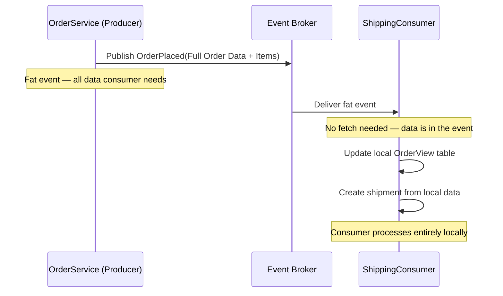
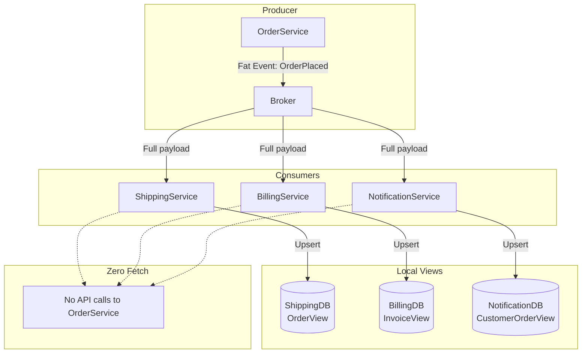
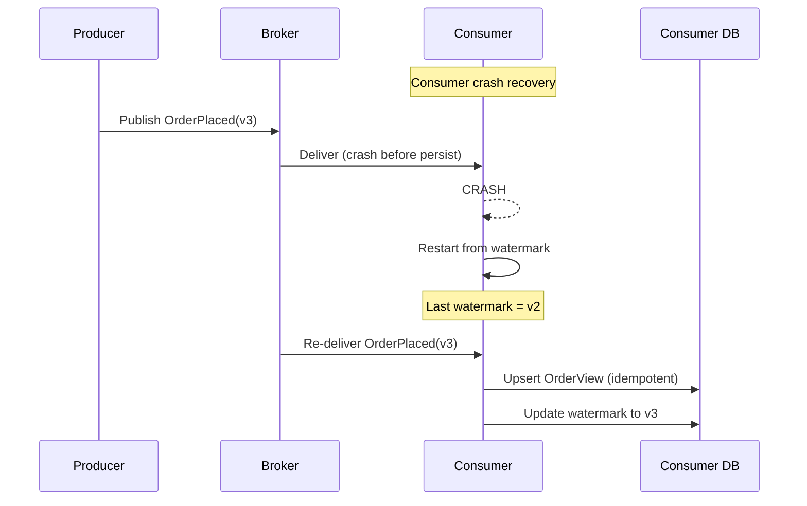
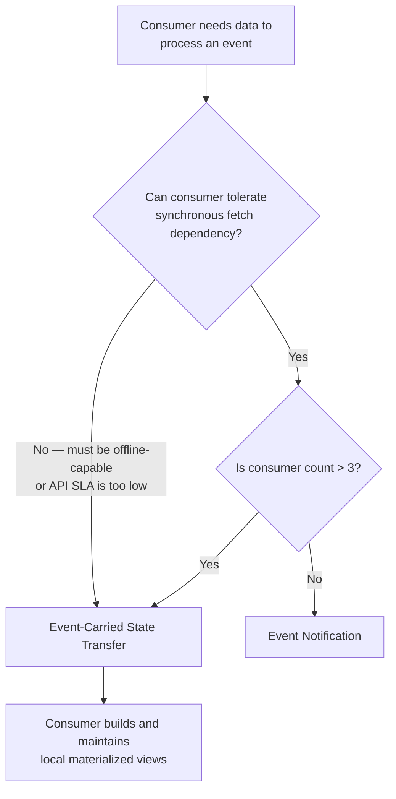
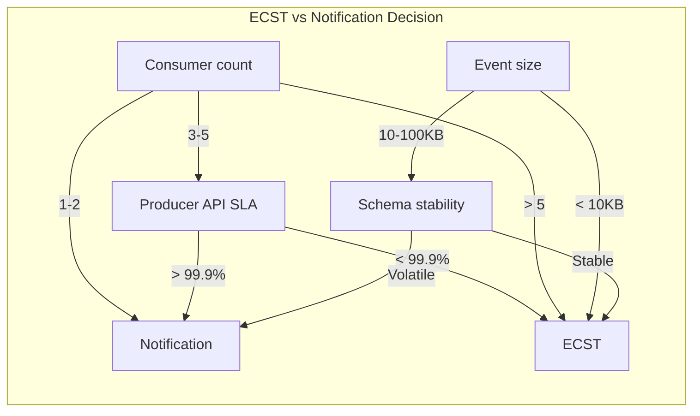
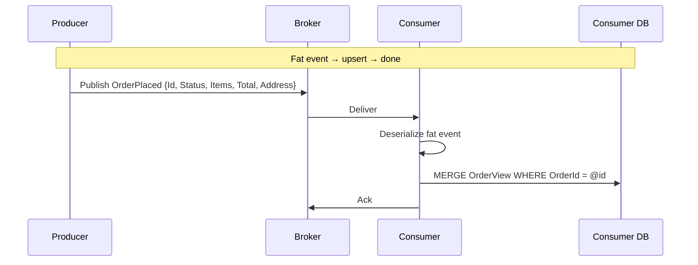
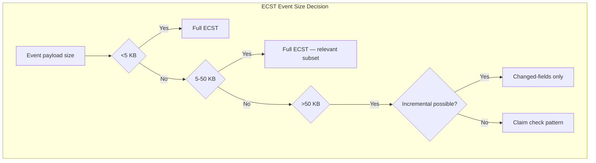
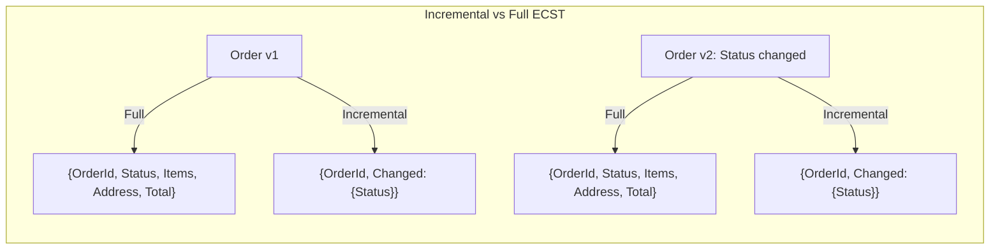

> [!success] Mastery Check
> - [ ] **Studied Well**
> - [ ] **Can explain the concept without notes**
> - [ ] **Can answer interview questions confidently**
> - [ ] **Can implement it in a real project**

## Navigation

**Domain:** [[7 — System Design & Distributed Systems]] > **Group:** Integration Patterns
**Previous:** [[7.143 — Event-Driven Architecture — Event Notification]] | **Next:** [[7.145 — Competing Consumers Pattern]]

### Prerequisites
- [[7.142 — Event-Driven Architecture — Overview]] — required because event-carried state transfer is an EDA sub-style; understanding event brokers, topics, and fan-out is assumed
- [[7.121 — Outbox Pattern — Reliable Event Publishing]] — required because fat events contain business data that must be published atomically with the business operation that produced it

### Where This Fits

Event-carried state transfer (ECST) is the fat-event counterpart to event notification: instead of sending a thin event with just an ID, the producer includes the full data relevant to the event in the payload. Consumers build and maintain their own local materialized views from these fat events, eliminating the need for synchronous fetch calls back to the producer. This pattern becomes necessary when consumers cannot tolerate a synchronous dependency on the producer's API at processing time, when consumer count is high enough that fetch calls would overwhelm the producer, or when consumers operate offline or with intermittent connectivity. A .NET engineer encounters it in microservice architectures where each service maintains its own local copy of data from other services — the Shipping service keeps a local `Order` view that is updated via `OrderPlaced` and `OrderUpdated` fat events. Without ECST, every consumer would need to call the Order API for every event, creating a fetch multiplier that makes the producer API the system's bottleneck.

## Core Mental Model

Event-carried state transfer is the practice of including the full state relevant to an event inside the event payload, so that consumers can process the event without any synchronous back-communication to the producer. The invariant this maintains is: every consumer has a self-contained, eventually-consistent local view of the data it needs — the producer never needs to serve read requests for data it has already published. The tradeoff is that the event schema becomes larger and more tightly coupled to the producer's data model — adding a field to the entity means updating the event schema, which all consumers must handle (or ignore via backward-compatible schema evolution). The recognition trigger is a system where consumer fetch calls to the producer API account for a significant portion of the producer's total request volume, or where a producer API outage causes cascading consumer failures.







### Classification

ECST occupies the consumer-independence / schema-coupling corner of the EDA sub-style spectrum. It is the right choice when consumers need to process events without depending on upstream API availability, at the cost of larger event payloads and tighter schema coupling. ECST is closely related to CQRS materialized views: the producer emits events that represent state changes, and consumers project those events into local read models. In the CAP theorem context, ECST favors availability: the consumer can serve reads from its local view even if the producer is unavailable, at the cost of eventual consistency (the local view may be slightly stale).

### Key Properties / Guarantees

|Property|Value|Condition|
|---|---|---|
|Consumer independence|Complete — no synchronous fetch needed|Event payload contains all required data|
|Event schema coupling|Higher — payload reflects producer's data model|Schema evolution is backward-compatible|
|Consumer latency|Event delivery only (no fetch RTT)|Broker latency + deserialization time|
|Data freshness at consumer|Stale as of event creation time|Producer may have updated entity since|
|Producer API load|Zero fetch load from these consumers|N/A|
|Event size|Larger (KB to tens of KB vs hundreds of bytes)|Included data volume per event type|
|Consumer storage|Additional database for materialized views|Per-consumer storage cost|
|Consistency|Eventual — consumer view converges|Idempotent upsert and ordering|

## Deep Mechanics

### How It Works

**Step 1 — Producer captures state snapshot.** When a business operation commits, the producer captures the current state of the affected entity — typically the aggregate root and all related data a consumer might need. This snapshot is serialized into the event payload. The producer must decide which fields to include: too few and consumers need to fetch, too many and the event becomes bloated.

**Step 2 — Producer publishes fat event.** The event is published to the broker with the full payload. The producer uses the outbox pattern to ensure the event is published atomically with the business transaction. The broker stores the event durably. Azure Service Bus supports up to 256 KB per message in Standard tier, 1 MB in Premium tier — ECST events rarely exceed these limits but should be monitored.

**Step 3 — Consumer receives and deserializes.** The consumer receives the fat event and deserializes the full payload. No additional calls are needed — all data is in memory. Deserialization time depends on payload size: a 10 KB event deserializes in microseconds, a 100 KB event in milliseconds.

**Step 4 — Consumer upserts local view.** The consumer applies the event to its local materialized view: inserting a new row, updating an existing one, or deleting depending on the event type. This is typically an upsert operation keyed on the entity ID. The consumer also tracks the last-applied event ID (watermark) for crash recovery.

**Step 5 — Consumer processes business logic.** With the local view up to date, the consumer performs its business logic using only local data — no remote calls. If the consumer needs additional data not in the event, it reads from its own local store, which was populated by previous events.

**Step 6 — Watermark persistence.** After processing, the consumer persists the event ID as a watermark. On restart, it replays events from the last watermark. Because the upsert is idempotent, replaying already-applied events is safe.

### Failure Modes

**Stale local view on consumer crash.** A consumer crashes after receiving a fat event but before persisting the update to its local materialized view. On restart, the consumer has an outdated view until the next event for that entity arrives. **Detection:** data inconsistency between producer and consumer — the consumer shows an old state. **Metric:** consumer-side staleness lag (compare event timestamp to last-updated timestamp in local view). **Prevention:** persist the event ID as a watermark after each materialized-view update. On restart, replay events from the last watermark. Alternatively, the consumer can request a snapshot from the producer on startup.

**Event payload bloat.** The team includes "everything" in the event payload to avoid future fetch calls, growing the event to hundreds of kilobytes. This increases broker storage costs, serialization/deserialization time, and network transfer time. **Detection:** broker metrics show large average message sizes, P99 consumer processing time increases. **Metric:** average event payload size in KB, deserialization time in consumer traces. **Prevention:** include only the data that consumers actually need — not everything the producer has. Survey consumers regularly to trim unused fields from the event schema.

**Schema drift between producer and consumer.** The producer adds a required field to the event that an older consumer does not know about. The consumer deserializes into a class missing the field, producing a `JsonException` or null reference. **Detection:** consumer error rate spikes after producer deployment. **Metric:** consumer `DeserializationException` count. **Prevention:** always add fields as optional (nullable) with default values. Use schema registries (Azure Schema Registry with Avro) to enforce compatibility rules.

**Idempotent view projection.** A fat event is delivered twice due to broker redelivery. The consumer applies the same event twice to its materialized view. If the upsert is not idempotent, the view may be incorrect. **Detection:** consumer-side deduplication hit rate. **Metric:** duplicate event counter. **Prevention:** make materialized-view updates idempotent — use `EventId` as a uniqueness constraint, or use `last_event_id` watermark per entity to skip events already applied.

**Out-of-order event delivery.** Events for the same entity arrive in the wrong order (e.g., `OrderUpdated` before `OrderPlaced`). The consumer applies `OrderUpdated` to a non-existent view, then `OrderPlaced` creates the view with the initial state, overwriting the update. **Detection:** data inconsistency — the consumer's view shows an incorrect state. **Metric:** out-of-order event counter. **Prevention:** use version-aware consumer logic: include a monotonically increasing version number in each event. The consumer only applies events with a version greater than the current view's version. For ordering guarantee, use Azure Service Bus sessions (with `SessionId = EntityId`) or Kafka partitions.

**Consumer storage growth.** Each consumer maintains its own materialized view, which is a copy of the producer's data. If the producer has 10 GB of order data and there are 5 consumers, the total storage is 50 GB across consumers. **Detection:** consumer database storage usage grows linearly with producer data. **Metric:** consumer DB storage utilization. **Prevention:** configure data retention policies — archive or delete old data that is no longer needed. Use incremental ECST to reduce per-event storage.

**Fat event exceeds broker message size limit.** Azure Service Bus Standard has a 256 KB message size limit. If an event payload (e.g., an order with 500 line items) exceeds this, the event is rejected. **Detection:** producer-side publish failure with `MessageSizeExceededException`. **Metric:** producer publish error rate. **Prevention:** use the claim check pattern: store the large payload in Azure Blob Storage and include the blob URL in the event. For Service Bus Premium (1 MB limit), the threshold is higher but still finite.

### .NET and Azure Integration

- **Azure Schema Registry (Avro):** stores and validates event schemas. Producers publish schema versions; consumers fetch the schema to deserialize. Supports backward-compatibility rules (full, transitive, etc.).
- **MassTransit + Message Data:** MassTransit's `MessageData` feature allows storing large payloads in Azure Blob Storage while sending a reference in the message — a hybrid of ECST and claim check for oversized events.
- **EF Core materialized view projection:** consumers use EF Core to upsert local tables from fat events. The `AddOrUpdate` pattern (Upsert) is common.
- **Polly + retry:** though ECST eliminates fetch calls, consumer-side database operations still need retry for transient DB failures.
- **Azure SQL / Cosmos DB:** consumer local materialized views can use either relational (for structured data) or document (for flexible schema) storage.

```csharp
// Fat event — includes full data consumers need
public sealed record OrderPlacedEvent(
    Guid EventId,
    DateTimeOffset OccurredAt,
    string OrderId,
    string CustomerId,
    string CustomerEmail,
    Address ShippingAddress,
    IReadOnlyCollection<OrderLineItem> Items,
    decimal TotalAmount,
    string Currency,
    string Status)
{
    public const string EventType = "order.placed.v1";
}

// Consumer — builds local materialized view from fat event
public sealed class ShippingViewConsumer : IConsumer<OrderPlacedEvent>
{
    private readonly ShippingDbContext _db;
    private readonly ILogger<ShippingViewConsumer> _logger;

    public ShippingViewConsumer(ShippingDbContext db, ILogger<ShippingViewConsumer> logger)
    {
        _db = db;
        _logger = logger;
    }

    public async Task Consume(ConsumeContext<OrderPlacedEvent> context)
    {
        var e = context.Message;

        // Upsert local order view — idempotent via EventId watermark
        var existing = await _db.OrderViews
            .FindAsync(new object[] { e.OrderId }, context.CancellationToken);

        if (existing is not null && existing.LastEventId == e.EventId)
        {
            _logger.LogDebug("Order {OrderId} already up to date", e.OrderId);
            return;
        }

        var view = existing ?? new OrderView();
        view.OrderId = e.OrderId;
        view.CustomerId = e.CustomerId;
        view.CustomerEmail = e.CustomerEmail;
        view.ShippingAddress = e.ShippingAddress;
        view.Items = e.Items.Select(i => new OrderViewItem
        {
            ProductId = i.ProductId,
            Quantity = i.Quantity,
            Price = i.Price
        }).ToList();
        view.TotalAmount = e.TotalAmount;
        view.Status = e.Status;
        view.LastEventId = e.EventId;
        view.LastUpdatedAt = e.OccurredAt;

        if (existing is null)
            _db.OrderViews.Add(view);

        await _db.SaveChangesAsync(context.CancellationToken);
    }
}
```

```csharp
// Incremental ECST — only changed fields
public sealed record OrderUpdatedEvent(
    Guid EventId,
    DateTimeOffset OccurredAt,
    string OrderId,
    int EntityVersion,
    string? Status,            // null if not changed
    decimal? TotalAmount,      // null if not changed
    Address? ShippingAddress); // null if not changed

// Consumer applies delta
public sealed class OrderDeltaConsumer : IConsumer<OrderUpdatedEvent>
{
    public async Task Consume(ConsumeContext<OrderUpdatedEvent> context)
    {
        var e = context.Message;
        var view = await _db.OrderViews.FindAsync(e.OrderId);

        if (view is null)
        {
            await _deferredEvents.AddAsync(e); // out-of-order, cache for later
            return;
        }

        if (e.EntityVersion <= view.LastVersion)
            return; // stale event

        if (e.Status is not null) view.Status = e.Status;
        if (e.TotalAmount.HasValue) view.TotalAmount = e.TotalAmount.Value;
        if (e.ShippingAddress is not null) view.ShippingAddress = e.ShippingAddress;

        view.LastVersion = e.EntityVersion;
        view.LastUpdatedAt = e.OccurredAt;
        await _db.SaveChangesAsync(context.CancellationToken);
    }
}
```

```csharp
// Claim check variant — large payload in blob storage
public sealed record OrderPlacedWithClaimCheck(
    Guid EventId,
    DateTimeOffset OccurredAt,
    string OrderId,
    Uri PayloadBlobUrl) // Full data stored in Azure Blob
{
    public const string EventType = "order.placed.claimcheck.v1";
}

// Consumer reads from blob
public sealed class ClaimCheckConsumer : IConsumer<OrderPlacedWithClaimCheck>
{
    private readonly BlobContainerClient _blobContainer;

    public async Task Consume(ConsumeContext<OrderPlacedWithClaimCheck> context)
    {
        var blobClient = _blobContainer.GetBlobClient(
            context.Message.PayloadBlobUrl.AbsolutePath.TrimStart('/'));

        var response = await blobClient.DownloadContentAsync(
            context.CancellationToken);

        var fullOrder = response.Value.Content.ToObjectFromJson<OrderDetail>();
        // Process full order data
    }
}
```

## Production Patterns and Implementation

### Primary Implementation

The canonical ECST implementation uses MassTransit with Azure Service Bus, produces fat events via the transactional outbox, and maintains consumer-side materialized views using EF Core upsert.

```csharp
// Producer — publishes fat event via outbox
public sealed class OrderService
{
    private readonly IOrderRepository _repository;
    private readonly IPublishEndpoint _publisher;

    public async Task<Order> CreateOrderAsync(CreateOrderCommand command, CancellationToken ct)
    {
        var order = Order.Create(command.CustomerId, command.Items, command.ShippingAddress);

        await _repository.SaveAsync(order, ct);

        // Fat event — all data consumers need
        await _publisher.Publish(new OrderPlacedEvent(
            EventId: Guid.NewGuid(),
            OccurredAt: DateTimeOffset.UtcNow,
            OrderId: order.Id,
            CustomerId: order.CustomerId,
            CustomerEmail: command.CustomerEmail,
            ShippingAddress: command.ShippingAddress,
            Items: order.Items.Select(i => new OrderLineItem(
                i.ProductId, i.ProductName, i.Quantity, i.Price)).ToList(),
            TotalAmount: order.TotalAmount,
            Currency: order.Currency,
            Status: "Placed"), ct);

        return order;
    }
}

// Consumer Registration — MassTransit + Service Bus
builder.Services.AddMassTransit(x =>
{
    x.AddEntityFrameworkOutbox<ShippingDbContext>(o =>
    {
        o.QueryDelay = TimeSpan.FromSeconds(1);
    });

    x.AddConsumer<ShippingViewConsumer>();

    x.UsingAzureServiceBus((context, cfg) =>
    {
        cfg.Host(builder.Configuration["Azure:ServiceBus:ConnectionString"]);
        cfg.ConfigureEndpoints(context);
    });
});
```

### Configuration and Wiring

```csharp
// appsettings.json — consumer database for materialized view
{
  "ConnectionStrings": {
    "ShippingDb": "Server=.;Database=ShippingView;Trusted_Connection=True;"
  },
  "MassTransit": {
    "Outbox": {
      "QueryDelaySeconds": 1,
      "MessageDeliveryLimit": 100
    }
  },
  "EventSchema": {
    "OrderPlacedVersion": "v1",
    "IncludeLineItems": true,
    "MaxPayloadSizeKB": 50
  }
}

// Shipping DbContext — materialized view tables
public sealed class ShippingDbContext : DbContext
{
    public DbSet<OrderView> OrderViews => Set<OrderView>();
    public DbSet<Shipment> Shipments => Set<Shipment>();

    public ShippingDbContext(DbContextOptions<ShippingDbContext> options)
        : base(options) { }

    protected override void OnModelCreating(ModelBuilder modelBuilder)
    {
        modelBuilder.Entity<OrderView>(entity =>
        {
            entity.HasKey(e => e.OrderId);
            entity.Property(e => e.LastEventId).IsRequired();
            entity.HasIndex(e => e.LastEventId).IsUnique();
        });
    }
}
```

```csharp
// Health check for materialized view staleness
public sealed class MaterializedViewHealthCheck : IHealthCheck
{
    private readonly ShippingDbContext _db;

    public async Task<HealthCheckResult> CheckHealthAsync(
        HealthCheckContext context, CancellationToken ct)
    {
        var maxStaleness = await _db.OrderViews
            .MaxAsync(v => (DateTimeOffset?)v.LastUpdatedAt, ct);

        if (maxStaleness is null)
            return HealthCheckResult.Healthy("No orders in view yet");

        var staleness = DateTimeOffset.UtcNow - maxStaleness.Value;
        if (staleness > TimeSpan.FromMinutes(5))
            return HealthCheckResult.Degraded(
                $"Materialized view is {staleness.TotalMinutes:F1} minutes stale");

        return HealthCheckResult.Healthy(
            $"View staleness: {staleness.TotalSeconds:F1}s");
    }
}
```

### Common Variants

**Incremental ECST.** Instead of sending the full entity state every time, the producer sends only the changed fields. The consumer applies the delta to its local view. Reduces event size at the cost of consumer complexity — the consumer must handle partial updates correctly. Useful when entities are large but changes are small.

```csharp
// Incremental ECST event — only changed fields
public sealed record CustomerProfileUpdated(
    Guid EventId,
    string CustomerId,
    int EntityVersion,
    string? Email,     // null if unchanged
    string? Phone,     // null if unchanged
    Address? Address); // null if unchanged
```

**Snapshot + Incremental.** The producer periodically sends a full snapshot (on a schedule or when entity version reaches a threshold) and sends incremental updates between snapshots. The consumer resets its view on snapshot and applies deltas. Balances event size against consumer recovery time.

**Event-carried reference for large payloads.** For events with large binary payloads (images, documents), the event carries metadata and a blob storage URL, and the consumer fetches the blob asynchronously. This is a hybrid of ECST and the claim check pattern — the "fat" part is stored externally.

**ECST with Kafka compacted topics.** In Kafka, the log compaction feature ensures that the latest message for each key is retained. This allows consumers to rebuild their materialized view by replaying the compacted topic from the beginning. This is the basis of Kafka Streams' state stores and KTables.

**ECST with Cosmos DB change feed.** Cosmos DB's change feed can serve as the event source. Each change to a Cosmos DB document is captured as an event in the change feed. Consumers project these changes into their own materialized views. The change feed guarantees at-least-once delivery and per-partition ordering.

### Real-World .NET Ecosystem Example

**NServiceBus** (Particular Software) popularized ECST in .NET with its "event-driven state transfer" guidance. The framework's `Saga` data storage and `Reply` patterns often rely on fat events to keep saga state consistent across services. In practice, many .NET microservices projects using NServiceBus or MassTransit default to fat events for core domain events (OrderPlaced, PaymentReceived) because the consumer fetch overhead of event notification is unacceptable at the throughput those systems handle.

**MassTransit's saga persistence** uses ECST internally. When a saga orchestrator receives an event, it loads the saga state from its persistence store (EF Core, Redis, MongoDB), processes the event, and saves the updated state. The saga state is the materialized view; the events are the fat events carrying the data the saga needs.

**Azure Functions with Cosmos DB change feed** is a serverless ECST implementation. The change feed delivers fat events (the changed document) to the function. The function updates its own state based on the document content. This is a fully managed ECST pipeline with no explicit broker configuration.

## Gotchas and Production Pitfalls

### Event Payload Bloat from "Just In Case" Fields

**Pitfall:** Including every possible field in the event because "a consumer might need it someday."

```csharp
// ❌ Event includes 40 fields, most unused by any consumer
public sealed record OrderPlacedEvent(
    Guid EventId,
    string OrderId,
    string CustomerId,
    string CustomerEmail,
    string CustomerPhone,
    string CustomerPreferredLanguage,
    string CustomerMarketingOptIn,
    string CustomerTaxId,
    Address BillingAddress,
    Address ShippingAddress,
    Address AlternateShippingAddress,
    // ... 30 more fields
)
```

**Symptom:** Average event size grows to 50+ KB. Broker storage costs increase. Consumer deserialization time rises. Events take longer to serialize and transfer, increasing end-to-end latency.

**Fix:** Survey consumers quarterly to identify unused fields. Remove them. Add fields only when a consumer demonstrates a real need. Consider field-level access statistics in your schema registry.

```csharp
// ✅ Minimal fat event — only fields consumers actually use
public sealed record OrderPlacedEvent(
    Guid EventId,
    string OrderId,
    string CustomerId,
    string CustomerEmail,
    Address ShippingAddress,
    IReadOnlyCollection<OrderLineItem> Items,
    decimal TotalAmount)
```

**Cost of not fixing:** Every millisecond of deserialization time multiplies by the number of events per second. At 1,000 events/s with 10 consumers, a 2 ms deserialization overhead becomes 20,000 ms/s of CPU time. The team eventually blames the broker and adds consumer replicas to fix a problem caused by payload bloat.

### Non-Idempotent View Projection

**Pitfall:** The consumer inserts a row into its materialized view without checking whether it already exists.

```csharp
// ❌ Non-idempotent — duplicate event creates duplicate rows
public async Task Consume(ConsumeContext<OrderPlacedEvent> context)
{
    await _db.OrderViews.AddAsync(new OrderView
    {
        OrderId = context.Message.OrderId,
        CustomerId = context.Message.CustomerId,
        // ...
    });
    await _db.SaveChangesAsync(); // throws on PK violation on redelivery
}
```

**Symptom:** Broker redelivery causes primary key violations, which the consumer catches and logs as transient errors. Events go to the DLQ after retries exhaust. The materialized view misses data because the event was never processed.

**Fix:** Use an upsert pattern: check for existing row, update if present, insert if not. Track the last-applied `EventId` per entity to skip already-applied events.

```csharp
// ✅ Idempotent upsert
public async Task Consume(ConsumeContext<OrderPlacedEvent> context)
{
    var existing = await _db.OrderViews.FindAsync(context.Message.OrderId);
    if (existing?.LastEventId == context.Message.EventId)
        return; // already applied

    var view = existing ?? new OrderView();
    view.OrderId = context.Message.OrderId;
    view.LastEventId = context.Message.EventId;
    // ... set other fields

    if (existing is null)
        _db.OrderViews.Add(view);

    await _db.SaveChangesAsync();
}
```

**Cost of not fixing:** Duplicate events cause DB exceptions, event loss, and materialized-view corruption. The consumer appears healthy (it catches and logs exceptions) but silently loses data.

### Ignoring Event Ordering in View Projection

**Pitfall:** Assuming events for the same entity arrive in creation order across the broker.

```csharp
// ❌ Assumes OrderUpdated arrives after OrderPlaced — wrong if broker reorders
public async Task Consume(ConsumeContext<OrderUpdatedEvent> context)
{
    // Updates view that might not exist yet if OrderPlaced arrives later
    var view = await _db.OrderViews.FindAsync(context.Message.OrderId);
    view.Status = context.Message.NewStatus; // NullReferenceException if null
}
```

**Symptom:** Null reference exceptions when `OrderUpdated` arrives before `OrderPlaced`. Or worse, `OrderPlaced` arrives after `OrderUpdated` and overwrites the updated status with the initial "Placed" status.

**Fix:** Use a version-based ordering mechanism. Include a sequence number or version in each event. The consumer checks if the event version is the next expected version before applying. Or use broker sessions (Azure Service Bus sessions, Kafka partitions) with a stable partition key to guarantee per-entity ordering.

```csharp
// ✅ Version-aware consumer
public async Task Consume(ConsumeContext<OrderUpdatedEvent> context)
{
    var view = await _db.OrderViews.FindAsync(context.Message.OrderId);
    if (view is null)
    {
        // Event out of order — defer or cache
        await _deferredEvents.AddAsync(context.Message);
        return;
    }
    if (context.Message.Version <= view.LastVersion)
        return; // stale event
    view.Status = context.Message.NewStatus;
    view.LastVersion = context.Message.Version;
    await _db.SaveChangesAsync();
}
```

**Cost of not fixing:** Materialized views converge to wrong state. Manual reconciliation required between producer and consumer databases. At scale, the inconsistencies are discovered by customer complaints, not monitoring.

### Coupling Producer Data Model to Event Schema

**Pitfall:** The event schema is an exact mirror of the producer's internal database table.

```csharp
// ❌ Event mirrors DB table — any DB change breaks the contract
public sealed record OrderPlacedEvent(
    // Same columns as dbo.Orders, including internal fields
    int InternalId,          // identity, meaningless to consumers
    string PartitionKey,     // internal sharding key
    byte[] RowVersion,       // EF Core concurrency token
    bool IsDeleted,          // soft delete flag
    // ...
)
```

**Symptom:** Every database migration (rename column, add index, change type) forces an event schema change. Consumers must redeploy even for internal-only producer changes.

**Fix:** Design the event schema as a public contract — separate from the internal data model. Map internal fields to the event schema explicitly. Exclude internal-only fields.

```csharp
// ✅ Event as public contract — decoupled from internal model
public sealed record OrderPlacedEvent(
    Guid EventId,
    string OrderId,
    string CustomerId,
    string CustomerEmail,
    Address ShippingAddress,
    decimal TotalAmount,
    string Currency)
```

**Cost of not fixing:** The event schema becomes a distributed coupling point — a change in any consumer or producer requires coordination across all teams. The event schema loses its value as a decoupling mechanism.

### Watermark Persistence Not Atomic with View Update

**Pitfall:** The consumer updates the materialized view and then persists the watermark in a separate transaction. If the process crashes between the two operations, the watermark is not updated, and on restart the same events are replayed — but the view already reflects them (because the view update completed).

**Symptom:** The view is correct, but events are replayed, causing unnecessary work. Over time, the replay may cause subtle drift if the view update is not perfectly idempotent.

**Fix:** Persist the watermark in the same database transaction as the view update. Use the same `DbContext` for both operations.

```csharp
// ✅ Atomic view update + watermark
using var transaction = await _db.Database.BeginTransactionAsync(ct);
try
{
    // Update materialized view
    _db.OrderViews.Add(view);
    // Persist watermark
    _db.EventWatermarks.Add(new EventWatermark { LastEventId = e.EventId });
    await _db.SaveChangesAsync(ct);
    await transaction.CommitAsync(ct);
}
catch
{
    await transaction.RollbackAsync(ct);
    throw;
}
```

**Cost of not fixing:** Events are reprocessed on every restart. If the upsert is not idempotent, the view incrementally drifts. Week-long drift becomes impossible to reconcile without a full view rebuild.

### Event Schema Evolution Breaking Consumers

**Pitfall:** Adding a required field to the fat event schema.

```csharp
// ❌ New required field — breaks all existing consumers
public sealed record OrderPlacedEvent(
    Guid EventId,
    string OrderId,
    bool RequiresSignatureConfirmation) // new required field
```

**Symptom:** All consumers that have not been updated throw `JsonException` on deserialization. The error rate is 100% until every consumer is redeployed.

**Fix:** Use optional fields (nullable, with defaults). Create a new event version (`OrderPlacedV2`) for breaking changes and let consumers migrate independently.

```csharp
// ✅ Optional field — backward compatible
public sealed record OrderPlacedEvent(
    Guid EventId,
    string OrderId,
    bool? RequiresSignatureConfirmation) // nullable default
```

**Cost of not fixing:** Coordinated deployment across all consumer teams. The deployment becomes a blocking procedure that takes days. The team loses the ability to deploy independently, which was the original benefit of EDA.

## Tradeoffs and Decision Framework

### Tradeoff Matrix

| Dimension | Event-Carried State Transfer | Event Notification | CQRS Materialized Views (separate read model) |
|---|---|---|---|
| Consumer independence | Complete — no fetch dependency | Partial — consumer fetches from producer | Complete — dedicated read model |
| Event schema coupling | Medium (includes data fields) | Low (only ID/URL) | Medium (command/event contracts) |
| Consumer latency | Delivery time only | Delivery + fetch RTT | Delivery + read model sync lag |
| Producer overload risk | Low — no fetch calls | High at scale — fetch multiplier | Low — read model is separate |
| Operational complexity | Medium (view projection code) | Low (fetch + process) | High (separate read model service) |
| Data freshness | Snapshot at event creation time | Current at fetch time | Replica lag |
| Consumer storage cost | Additional DB per consumer | No additional storage | Additional DB per consumer |
| .NET implementation | MassTransit + fat events | Event Grid + Function | CQRS framework + event store |

### When to Apply





### When NOT to Apply

- [ ] The consumer does not need any data from the event payload — a thin notification that "something happened" is sufficient and adding fat wastes bandwidth
- [ ] The data is too large to fit in a message (e.g., >256 KB for Azure Service Bus Standard) — use the claim check pattern instead
- [ ] The data changes with every event and the consumer always needs the latest version — event notification with fetch may be more appropriate because the event data would be stale on arrival
- [ ] The team cannot commit to backward-compatible schema evolution — fat events couple producer and consumer on data shape, and breaking changes require coordination
- [ ] The number of consumer types is unknown and potentially large — a thin notification with a stable schema avoids the coordination overhead of fat event schema changes
- [ ] The consumer already has the data locally (e.g., customer profile) — including it in the event is redundant

### Scale Thresholds

- **Worth considering when consumer count >3** — at 3+ consumers, the aggregate fetch load from event notification becomes significant
- **Required when producer API availability SLO is <99.9%** — consumer fetch dependency would violate the consumer's own SLO
- **Re-evaluate when average event payload exceeds 50 KB** — consider incremental ECST or claim check for large payloads
- **Overkill for 1-2 consumers** unless those consumers must operate offline
- **At 10,000+ events/s, prefer ECST over notification** — the fetch load of notification would be unsustainable
- **At 100+ consumers, consider event sourcing with materialized views** — ECST at this scale requires careful partitioning and storage management

## Interview Arsenal

### Question Bank

1. What is event-carried state transfer and what problem does it solve that event notification does not?
2. Walk through the process of a consumer building a materialized view from fat events.
3. What is the cost of including full data in the event — what do you trade for consumer independence?
4. How does a consumer recover its materialized view after a crash that loses unpersisted events?
5. Compare event-carried state transfer with event notification — what decision rule determines which to use?
6. Design a multi-service e-commerce system where each service maintains local data about orders. How does ECST enable this?
7. How does ECST behave when a single entity is updated 100 times in quick succession?
8. What is the relationship between ECST and the CQRS materialized view pattern?
9. How do you handle the claim check pattern when events exceed broker message size limits?
10. What monitoring metrics are essential for an ECST consumer?

### Spoken Answers

**Q: What is event-carried state transfer and when would you use it over event notification?**

> **Average answer:** Event-carried state transfer sends the full data in the event instead of just an ID. This way the consumer doesn't need to call back to the producer. Use it when you have many consumers to avoid overwhelming the producer API.

> **Great answer:** Event-carried state transfer is an EDA sub-style where the event payload contains all the data a consumer needs to process the event without any synchronous back-communication. Every consumer maintains its own local materialized view — it receives fat events and upserts them into a local database. The consumer never calls the producer's API. The tradeoff is clear: you eliminate the synchronous fetch dependency at the cost of tighter schema coupling. The event payload now includes business data, so adding a field to the entity means you either add it to the event (potentially breaking consumers) or you do not include it (limiting what consumers can do without fetching). I use ECST when the consumer count is high (>3), when consumers must operate offline or with intermittent connectivity, or when the producer API cannot sustain the fetch load. I also reach for it when consumer processing latency must be minimized — the fat event eliminates a network round trip at consumption time. The threshold is typically around 3-5 consumers or when the producer API starts showing load from consumer fetch calls. A concrete example: the Shipping service in an e-commerce platform needs order data for every shipment it creates. With ECST, it receives OrderPlaced with the full order data and writes it to its local OrderView table. When the shipment is ready, it reads from its local table. The Order service never serves a read request from Shipping — it only publishes events.

**Q: How does a consumer recover its materialized view after a crash?**

> **Great answer:** There are three strategies. First, and most common in practice: the consumer tracks a watermark — the EventId of the last successfully applied event. On restart, it tells the broker to replay events from that watermark. MassTransit supports this natively with the outbox and consumer tracking. Second, for ECST with incremental updates only (no full state), the consumer may need a full snapshot from the producer on restart. The producer can expose a snapshot endpoint or periodically publish snapshot events. This is common in Kafka-based systems where compacted topics serve as the source of truth. Third, the consumer can rebuild its entire view by replaying all events from the beginning of the event stream — but this is only practical if the event store retains events indefinitely and the volume is manageable. In practice, most teams use the watermark approach. The consumer persists the last successfully applied EventId in its local database within the same transaction as the materialized view update. On crash recovery, the consumer starts from that watermark. Any events that were processed but not yet watermarked are replayed — which is safe because the upsert is idempotent.

**Q: How does ECST behave when a single entity is updated 100 times in quick succession?**

> **Great answer:** "This is a common scenario in practice — an order's status might change from Placed to Confirmed to Processing to Shipped in rapid succession. With ECST, each update produces a fat event. All 100 events are delivered to the consumer in order (if partitioning is configured correctly). The consumer processes each one sequentially, upserting its materialized view each time.

"The performance consideration is that 100 updates × N consumers means 100 × N upsert operations. Each upsert involves a database query (check if exists) and possibly a write. This can become a write bottleneck on the consumer's database, especially if the consumer has only a single replica.

"Three optimizations: First, batch coalescing — if the consumer can delay processing for a short window (e.g., 500ms), it can coalesce multiple updates to the same entity into a single upsert with the latest state. Second, use a write-optimized database — Cosmos DB or DynamoDB handle high-frequency upserts better than traditional SQL databases. Third, consider incremental ECST for high-frequency updates — send only the changed fields instead of the full entity each time, reducing write volume.

"The ordering guarantee is critical here. Without stable per-entity ordering, the 100 events might be processed in the wrong order, and the consumer's view converges to an incorrect state. Azure Service Bus sessions or Kafka partitions with OrderId as the partition key ensure correct ordering."

### System Design Interview Trigger

If an interviewer asks about a system where multiple microservices need their own copy of data that originates in another service, they are probing ECST. The classic prompt is "design a distributed order management system" where you must decide: does every service call the Order API for every request, or does each service maintain its own local order data? The interviewer wants to hear you reason about the tradeoff between data duplication (ECST) and synchronous fetch (notification). The follow-up will be about data consistency — "how do you handle stale data in the consumer's local view?" The strongest answer also discusses crash recovery (watermark), ordering guarantees (sessions/partitions), and the claim check pattern for oversized payloads.

### Comparison Table

| | Event-Carried State Transfer | Event Notification |
|---|---|---|
| Core mechanism | Fat event with full data | Thin event with ID/URL |
| Consumer data source | Local materialized view | Producer API (fetch) |
| Producer dependency | None at consumption time | Full dependency |
| Schema coupling | Medium | Low |
| Data freshness | Stale as of event creation | Current at fetch time |
| Operational pattern | Write to local DB | HTTP call to producer API |
| Crash recovery | Watermark replay | Retry fetch on restart |
| Scale ceiling | 10,000+ events/s | ~1,000 events/s per consumer |

## Architecture Decision Record

**Status:** Accepted

**Context:** A .NET order management system has 6 downstream services (Shipping, Billing, Notifications, Analytics, Recommendations, Inventory) that all need order data to process their workflows. Each service currently fetches order data from the Order API upon receiving a thin event notification. As order volume grew to 500 events/s, the Order API's P99 latency degraded from 50 ms to 800 ms, and the team discovered that 70% of API requests were from consumer fetch calls. The Order API runs on Azure App Service with 3 instances. The team has 3 .NET squads managing different services. The average event payload would be approximately 5 KB (order metadata + line items).

**Options Considered:**

1. **Event-Carried State Transfer** — fat events containing full order data. Each consumer maintains a local materialized view.
2. **Event Notification (current)** — thin events with consumer-side fetch. Requires the Order API to scale.
3. **Shared Redis Cache** — producer writes order data to Redis; consumers read from Redis instead of calling the API.
4. **GraphQL Federation** — single GraphQL gateway for consumers to fetch exactly the data they need.

**Decision:** Event-Carried State Transfer with fat events (option 1), because it completely eliminates the fetch load on the Order API (solving the immediate performance problem), removes the synchronous fetch dependency for each consumer, and each consumer already has a local database for its own data — adding an order view table is low effort. Redis would add a new infrastructure dependency and still have a synchronous read at consumption time. GraphQL Federation would require significant architectural changes and a new gateway service.

**Consequences:**
- ✅ Order API request volume drops by ~70%, restoring P99 to sub-100 ms
- ✅ Each consumer processes events at its own pace without depending on Order API availability
- ✅ New consumers can subscribe without adding fetch load — they just need a local view table
- ✅ Crash recovery via watermark persistence — each consumer tracks its last-applied EventId
- ⚠️ Event schema now includes order data — schema changes require versioning coordination
- ⚠️ Each consumer database grows by the order view data volume (~500 MB/month at current rate)
- ⚠️ The event schema must be designed as a public contract, separate from the internal Order DB schema
- ❌ Data in consumer views is stale as of the event creation time — a consumer that needs current data must still call the API
- ❌ Initial migration effort: each consumer team adds a view table and upsert logic (~2 weeks per consumer)

**Review Trigger:** Revisit this decision if the average event payload exceeds 50 KB, at which point consider incremental ECST or claim check. Also revisit if a consumer requires sub-second data freshness that ECST cannot provide, or if the number of consumers exceeds 20 and the storage cost of duplicated views becomes significant.

## Self-Check

### Conceptual Questions

1. What distinguishes event-carried state transfer from event notification?
2. Derive the tradeoff between ECST and event notification from first principles — what does each optimize for?
3. Given a system with 2 consumers and a producer API with 99.99% availability, which pattern is appropriate?
4. What metric reveals that a consumer's materialized view has drifted from the producer's current state?
5. Name the MassTransit feature that persists fat events atomically with the business transaction.
6. What is the structural distinction between ECST's local materialized view and a CQRS read model?
7. Below what consumer count is event notification sufficient over ECST?
8. [[7.143 — Event-Driven Architecture — Event Notification]] — what condition would cause you to migrate from notification to ECST?
9. What production consequence follows from a consumer that applies events to its materialized view without deduplication?
10. Explain ECST to a database administrator in 60 seconds.

<details>
<summary>Answers</summary>

1. ECST includes the full data relevant to the event in the payload. Consumers build local materialized views from these fat events and never fetch data from the producer synchronously.

2. ECST optimizes for consumer independence — no synchronous fetch dependency at processing time — at the cost of tighter schema coupling (event payload includes data fields) and larger event sizes. Event notification optimizes for producer autonomy (tiny, stable event schema) at the cost of consumer-side fetch dependency.

3. Event notification is appropriate — 2 consumers placing fetch calls on a 99.99% available API creates negligible load. ECST would add schema coupling without meaningful benefit.

4. Compare the producer's entity last-modified timestamp with the consumer's materialized view last-updated timestamp for the same entity. If the gap exceeds the expected event propagation time, the view is stale.

5. MassTransit's Entity Framework Core transactional outbox — writes events to the outbox table within the same DbContext transaction as the business data, ensuring atomic publication.

6. ECST's materialized view is maintained from events; a CQRS read model is maintained from commands and is designed for query optimization. ECST is about data availability at consumption time; CQRS is about write/read model separation. They overlap but are not identical.

7. Below 3 consumers — the fetch load from 1-2 consumers is unlikely to stress the producer API.

8. When the producer API shows degraded performance due to consumer fetch calls, or when a consumer's SLO requires zero synchronous dependency on the producer.

9. Duplicate events cause upsert collisions, primary key violations, or incorrect view state. The consumer silently drops events to the DLQ after exhausting retries, and the materialized view becomes permanently inconsistent.

10. "Event-carried state transfer is like getting the full updated spreadsheet row in your email notification instead of just a row ID. You copy the row into your local database immediately. You never need to call the original spreadsheet owner to ask for the data — it's already in your copy. The tradeoff is you get the data as it was when the email was sent, not as it is right now."
</details>

---

### Scenario Challenges

**Scenario 1 — Diagnose the problem**

A shipping service maintains a local `OrderView` table populated from `OrderPlaced` and `OrderUpdated` fat events. The team notices that some shipments are created with the wrong shipping address. Investigation reveals that the `OrderView` for those orders shows an address that was corrected in a subsequent `OrderUpdated` event, but the `OrderView` was never updated.

<details>
<summary>Diagnosis</summary>

**Root cause:** The `OrderUpdated` event for those orders was delivered before the `OrderPlaced` event due to broker reordering. The consumer processed `OrderUpdated` first (updating a non-existent view — it was silently dropped or the update missed), then `OrderPlaced` arrived and created the view with the original (incorrect) address, overwriting the corrected address.

**Evidence:** Application Insights traces show `OrderUpdated` events consumed before `OrderPlaced` for the same `OrderId`. The consumer logs show "Updating view for order X" followed later by "Creating view for order X" — the create overwrote the update.

**Fix:** Make the consumer version-aware: each event carries a monotonically increasing version number. The consumer only applies an event if its version is greater than the current view's version. For out-of-order events, the consumer either caches them until the missing predecessor arrives or uses a last-writer-wins strategy with the version check.

**Prevention:** Use Azure Service Bus sessions with `SessionId = OrderId` to guarantee per-entity ordering. Or use Kafka partitions with `OrderId` as the partition key. This ensures events for the same order arrive in order within a partition.
</details>

---

**Scenario 2 — Design decision**

You are designing the integration between OrderService and a new external Recommendations service. The Recommendations service needs order data (items purchased, customer ID, total amount) to update its model. It is an external vendor service that runs on its own infrastructure. What event style do you choose?

<details>
<summary>Decision and Reasoning</summary>

**Choice:** Event-carried state transfer — send fat events with full order data. The Recommendations service is external and may not have reliable access to the Order API. If it used event notification and tried to fetch data, it would depend on network connectivity between the vendor's infrastructure and the Order API, which is a cross-organizational network boundary.

**Tradeoffs accepted:** The fat event schema becomes part of the cross-organizational contract. Schema versioning must be explicit (API version in the event type name). Event payload may be larger but the external consumer cannot fetch.

**Implementation sketch:**

```csharp
// Cross-org event contract — versioned, explicit
public sealed record OrderPlacedExternalEvent(
    Guid EventId,
    string OrderId,
    string CustomerId,
    decimal TotalAmount,
    string Currency,
    IReadOnlyCollection<ProductPurchase> Items)
{
    public const string EventType = "order.placed.external.v1";
}

// Published to a dedicated external-facing topic
// with a separate consumer group for the vendor
```
</details>

---

**Scenario 3 — Failure mode** A billing service uses ECST to maintain a local `InvoiceView` of orders. After a deployment that added 3 new fields to the `OrderPlacedEvent` payload, the billing consumer started throwing deserialization errors. The error rate is 100% — every event fails.

<details>
<summary>Investigation and Fix</summary>

**Investigation steps:** 1) Check the billing consumer's event class for the new fields. 2) Check if the new fields are declared as required or have default values. 3) Compare the event schema version the consumer was compiled with vs the version the producer now publishes.

**Confirming evidence:** The billing consumer's `OrderPlacedEvent` class does not have the 3 new fields. `System.Text.Json` deserialization fails because a non-nullable field has no value in the deserialized object (or because a required property is missing in .NET 8+).

**Immediate mitigation:** Pin the deployed consumer version to before the schema change. Redeploy the producer with the old schema (if possible). This stops the bleeding while the fix is implemented.

**Permanent fix:** Make new fields optional (nullable, with default values). Implement consumer-side schema evolution: add the new fields with null defaults so older consumers ignore them. Use Azure Schema Registry with backward-compatible Avro schemas to enforce that new fields are optional.

**Post-mortem item:** Add a schema evolution policy: "All new event fields must be optional for 2 minor versions before becoming required." Add contract testing that verifies backward compatibility.
</details>

---

**Scenario 4 — Scale it** Your system processes 5,000 events/s with ECST. Each event is ~5 KB. You have 6 consumers, each maintaining its own materialized view. You need to double the event volume to 10,000 events/s.

<details>
<summary>Scaling Strategy</summary>

**Bottleneck this addresses:** The broker throughput (Service Bus Premium at ~10,000 msgs/s per messaging unit) and the consumer databases' write throughput (each consumer writes 5,000 upserts/s to its local view).

**How it helps:** ECST distributes the write load across consumer databases — each consumer writes independently. The producer publishes once; the broker fans out. This scales horizontally: add more consumer replicas to handle the write load.

**Implementation order:** 1) Increase Service Bus Premium messaging units to handle 10,000 msgs/s. 2) Add consumer replicas behind a competing-consumers pattern to distribute the write load across multiple instances. 3) Batch writes at the consumer — accumulate 100 events before flushing to the materialized view DB. 4) Consider trimming event payload fields that no consumer uses to reduce serialization/deserialization overhead. 5) For consumers that can tolerate staleness, use read replicas of the materialized view for queries.

**What it does not solve:** If the producer's database write throughput is the bottleneck, ECST does not help — the producer still writes 10,000 orders/s to its own database. Also, if individual consumer databases cannot handle 10,000 upserts/s, sharding by entity ID may be required.
</details>

---

**Scenario 5 — Interview simulation** The interviewer says: "The shipping service in your e-commerce platform needs order data to create shipments. Currently it calls the Order API to get order details every time it receives a shipping request. As the platform grows, this API call is becoming a bottleneck. How would you redesign this?"

<details>
<summary>Model Response</summary>

"I would switch from event notification to event-carried state transfer. Currently, the flow is: OrderPlaced notification fires, Shipping receives the thin event, calls GET /orders/{id} to fetch the full order, then creates the shipment. This means every shipment creation depends on the Order API being available and fast. At scale, 3-4 consumers all fetching from the Order API multiplies the load on it significantly.

"The redesign: OrderService publishes a fat OrderPlacedEvent containing all the order data the Shipping service needs — OrderId, CustomerId, ShippingAddress, Items, TotalAmount, and any metadata required for shipping. The Shipping service maintains a local OrderView table that it updates via these fat events using an idempotent upsert. When a shipment worker needs order data, it reads from its local OrderView — zero network calls to the Order API.

"The tradeoffs are: the event schema becomes larger (include shipping-relevant fields) and the Shipping database grows by the order data volume. But we eliminate the synchronous fetch dependency entirely — the Shipping service can process shipments even if the Order API is completely down. This is a textbook case for ECST because the consumer cannot tolerate a synchronous dependency on the producer at processing time.

"For recovery after crash, Shipping tracks the last-applied EventId per order in its local database. On restart, it replays events from the last watermark. And because the upsert is idempotent, replaying events that were already applied is safe — the view converges to the correct state.

"One more consideration: if the Order data is very large (e.g., includes product images or descriptions), I would avoid including those in the fat event and instead keep only the shipping-relevant subset. The decision rule is: include what the consumer needs to process without fetching, nothing more.

"My implementation plan: first, add the OrderView table and upsert consumer to the Shipping service while keeping the existing fetch path as a fallback. Run both in parallel for a week to verify consistency. Then, switch the shipment creation logic to read from the local OrderView. Finally, remove the fetch path. This gradual migration reduces risk and allows rollback if issues are found."
</details>

---

## Deep Dive — ECST Flow Diagrams







## Additional Gotchas

| # | Gotcha | Symptom | Fix |
|---|--------|---------|-----|
| 9 | Events applied out of order | View has wrong state | Use session/partition with version check |
| 10 | Consumer stores raw event instead of view fields | Storage grows 10x | Extract needed fields; drop after upsert |
| 11 | Producer updates field not in fat event | Consumer never sees change | Schema alignment review |
| 12 | Consumer uses REPLACE instead of UPSERT | Previous fields lost | Use MERGE or INSERT ON CONFLICT DO UPDATE |
| 13 | Claim check blob expires before consumer processes | 404 on blob fetch | Set blob retention >= max delivery + DLQ window |
| 14 | Multiple event types update same view concurrently | Race conditions | Serialize per-entity via session/lock |
| 15 | Consumer startup replays all events from beginning | Hours-long startup delay | Snapshot events; set max replay window |

## Interview Arsenal — Expanded

**Q9: How do you handle schema evolution in ECST?**

> **Great answer:** "Four strategies. First, backward-compatible fields: new fields must be optional with defaults (nullable in .NET). Second, schema registry enforces backward compatibility — CI blocks removal or required-type changes. Third, consumer-driven contracts: each consumer publishes Pact tests; producer CI runs them. Fourth, dual-publish for breaking changes: both old and new event versions for a transition period; old subscription removed when all consumers migrate."

**Q10: How does ECST interact with the outbox pattern?**

> **Great answer:** "The outbox (7.121) ensures reliable event publication. Without it, a crash between DB commit and broker publish leaves consumers permanently stale. With the outbox, the event is atomically persisted with the business data. The publisher reads unprocessed events after restart. Combined with idempotent consumer upserts, this gives exactly-once processing for ECST."

## Scenario 6 — Performance Analysis

A consumer processes 500 events/s at 15 KB per event. Database Azure SQL 50 DTU. Queue depth grows 50 events/minute. CPU 60%, IOPS 90%. What is the bottleneck?

<details>
<summary>Diagnosis and Fix</summary>

**Root cause:** IOPS bottleneck. 500 events/s × 15 KB = 7.5 MB/s write. 50 DTU limits ~2.5 MB/s sustained. Disk queue >5, high pageiolatch waits.

**Immediate fix:** Scale to 100 DTU (S2).

**Permanent fix:** Batch 50 events before flush. Trim event payload: remove fields no consumer uses. Alternative: Cosmos DB with autoscale for high-throughput writes.
</details>

---

## Scenario 7 — Multi-Tenant ECST

You have 500 tenants, each needing a materialized view of orders. Do you use ECST?

<details>
<summary>Decision</summary>

**Analysis:** 500 views × 15 KB × 1,000 orders/day = 7.5 GB/day storage. Schema changes need backward compatibility for all 500 tenants. High duplication cost.

**Recommendation:** Use event notification with a shared cached read model. Tenants share a read-optimized database with row-level security. This avoids 500× data duplication while keeping consumers decoupled.

**When ECST still works:** Fully isolated databases required (compliance), per-tenant view <1 MB/day, or tenant count <10.
</details>
