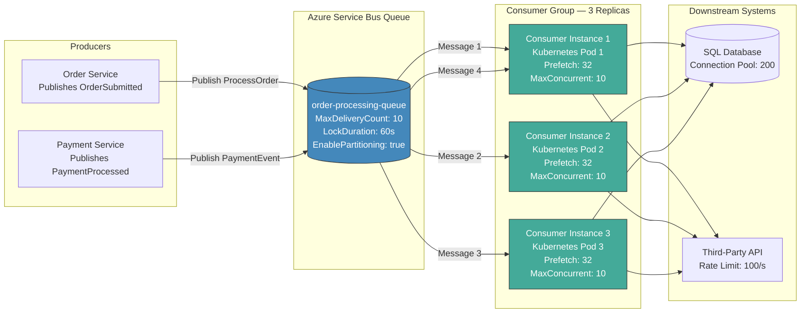
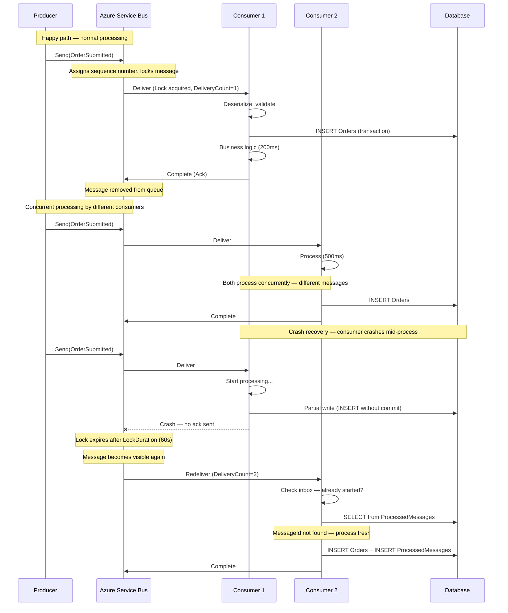
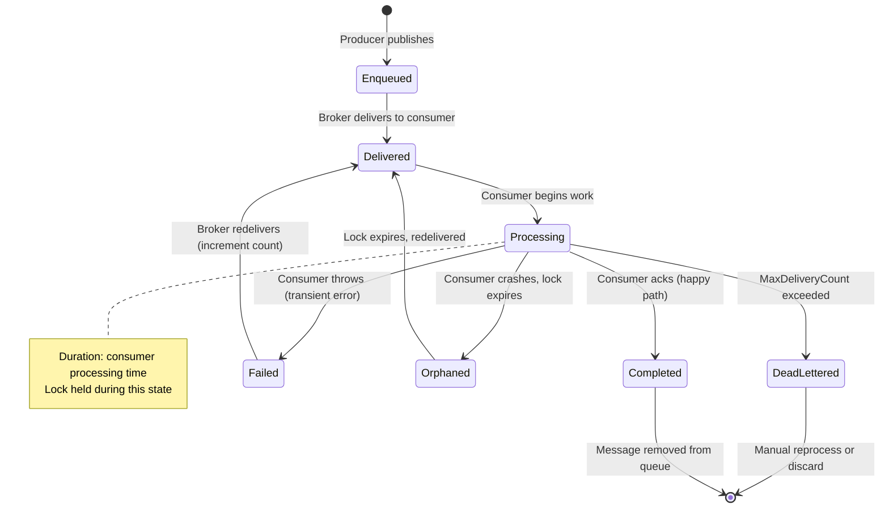
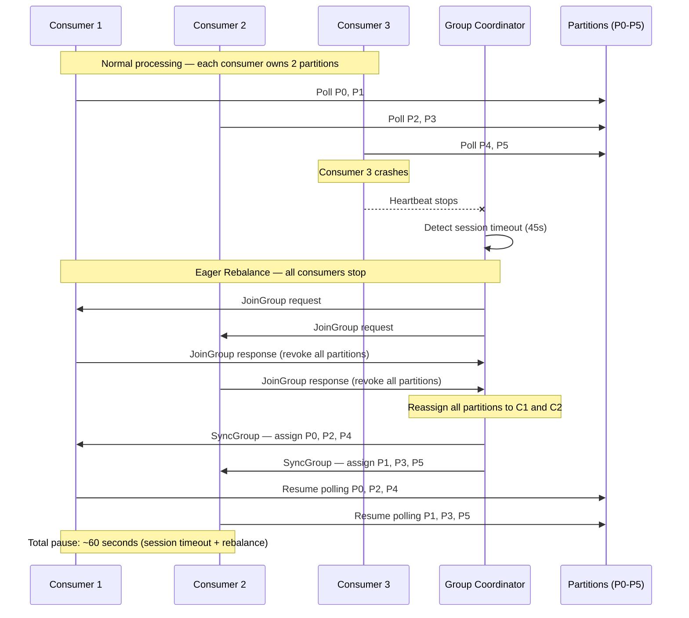
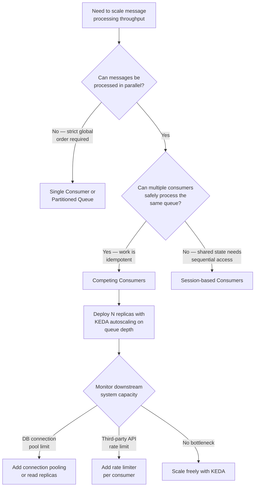

> [!success] Mastery Check
> - [ ] **Studied Well**
> - [ ] **Can explain the concept without notes**
> - [ ] **Can answer interview questions confidently**
> - [ ] **Can implement it in a real project**

## Navigation

**Domain:** [[7 — System Design & Distributed Systems]] > **Group:** Integration Patterns
**Previous:** [[7.144 — Event-Driven Architecture — Event-Carried State Transfer]] | **Next:** [[7.146 — Priority Queue Pattern — Tiered Processing]]

### Prerequisites
- [[7.128 — Transactional Messaging — Guarantees]] — required because competing consumers depend on broker-side message locking, delivery count, and acknowledgment semantics to coordinate access across distributed instances
- [[6.501 — Concurrency Patterns — Thread Pool]] — the single-process analogy: competing consumers are a distributed thread pool where each thread is a separate process running on potentially different machines

### Where This Fits

The competing consumers pattern addresses the problem of scaling message processing horizontally: instead of a single consumer processing messages from a queue one at a time, multiple consumer instances all listen to the same queue, and the broker ensures each message is delivered to exactly one consumer. This enables linear throughput scaling for message processing workloads without changing any code. A .NET engineer encounters it whenever a queue-backed service (Azure Service Bus queue, RabbitMQ queue, Kafka consumer group) runs on multiple instances — each instance is a competing consumer. Without this pattern, scaling message processing requires either a single consumer that becomes a bottleneck or a partitioning scheme in the producer that statically assigns messages to consumers, which cannot handle uneven load distribution. At scale above ~1,000 messages per second, the single-consumer approach fails due to CPU saturation, database connection pool exhaustion, or GC pressure from processing too many large messages sequentially. In production .NET systems, the pattern appears in every horizontally-scaled message processing workload — order fulfillment, payment processing, invoice generation, notification delivery, and analytics ingestion.

## Core Mental Model

Competing consumers is a workload distribution pattern where multiple consumer instances subscribe to the same message queue or subscription, and the broker distributes messages among them, delivering each message to exactly one consumer. The invariant this maintains is: the total processing throughput of a consumer group is proportional to the number of consumer instances, up to the broker's throughput limit, with each message processed exactly once (within at-least-once delivery semantics). The tradeoff is that consumers compete for messages — ordering is only guaranteed within a partition or session, not across the entire queue, and poison messages can block a single consumer while the others remain idle. The recognition trigger is a queue where the consumer's processing time per message exceeds the desired end-to-end latency, and the queue depth grows despite the consumer running at 100% CPU. More specifically: when you see a single consumer at 100% CPU with a queue depth that never shrinks, or when a deployment with multiple replicas does not reduce queue depth proportionally, you have a competing consumers design issue.

### Classification

Competing consumers is a deployment and scaling pattern, not a data or consistency pattern. It operates at the infrastructure layer of message processing, determining how consumer instances coordinate to process messages from a shared queue. It does not solve ordering beyond the partition level, does not guarantee exactly-once delivery (that requires the inbox pattern), and does not address poison messages (that requires poison-message handling). It is the consumer-side counterpart to the producer-side partitioned queue pattern. The pattern is orthogonal to message delivery semantics — it works with at-least-once, at-most-once, and exactly-once delivery, depending on how acknowledgment and idempotency are configured. In the .NET ecosystem, competing consumers is most commonly implemented via MassTransit receive endpoints, the `ServiceBusProcessor` from `Azure.Messaging.ServiceBus`, or Kafka consumer groups via `Confluent.Kafka`.







### Key Properties / Guarantees

|Property|Value|Condition|
|---|---|---|
|Throughput scaling|Linear up to broker throughput limit|Consumers are stateless and processing is parallelizable|
|Message ordering|Per-session/partition only|SessionId or partition key is set by producer|
|Delivery guarantee|At-least-once per consumer|Broker ack from consumer; redelivery on crash|
|Load distribution|Automatic — broker balances|Based on broker algorithm (round-robin, prefetch-based)|
|Idle consumer detection|No — message waits for next available consumer|All consumers must be actively polling|
|Failure isolation|High — one crash does not affect others|Broker redelivers unacked messages to survivors|
|Consumer scaling|Horizontal — add/remove at runtime|Requires graceful shutdown handling|
|Maximum parallelism|Unbounded — limited by broker capacity|Broker throughput ceiling and downstream capacity|

## Deep Mechanics

### Message Ordering Semantics

Understanding ordering guarantees is critical when using competing consumers because the pattern inherently trades global ordering for throughput.

**No ordering guarantee (default):** In a standard queue without sessions, messages are delivered to consumers in the order they become available — not in the order they were published. If Producer A publishes message M1 followed by M2, and Consumer A receives M1 while Consumer B receives M2, the order of processing depends on each consumer's speed and current load. Consumer B may finish processing M2 before Consumer A finishes M1. This means M2's side effects (e.g., updating inventory) may take effect before M1's side effects (e.g., creating an order). For independent messages, this is fine. For messages that have causal dependencies, this breaks the system.

**Session-based ordering:** Azure Service Bus sessions restore ordering within a session scope. All messages with the same `SessionId` are delivered to the same consumer in FIFO order. The consumer processes them sequentially (`MaxConcurrentCallsPerSession = 1`). Sessions guarantee that within a session, message N+1 is not processed until message N is completed. This is how per-customer ordering is achieved. Sessions do NOT guarantee ordering across different sessions — different customers can still be processed concurrently.

**Partition-based ordering (Kafka):** Kafka guarantees ordering within a partition. Messages with the same partition key are written to the same partition in order, and each partition is consumed by exactly one consumer in the group. Ordering is guaranteed at the partition level. The partition count determines the maximum parallelism.

**The ordering-throughput tradeoff:** The more ordering you require, the less parallelism you can achieve. Sessions serialize processing per customer — if customer A has 100 messages in a session, no other consumer can process those 100 messages. This means a single large customer can become a bottleneck. The resolution is to minimize the session scope: only group messages that have strict causal dependencies. Do not use a single session for all messages from a customer if they are independent events (e.g., separate orders) — each order should be its own message without session grouping.

### How It Works — Detailed Walkthrough

**Step 1 — Queue creation and configuration.** The producer team creates a message queue with specific configuration parameters that directly affect competing consumer behavior. In Azure Service Bus, the critical settings are `LockDuration` (how long a message is locked after delivery), `MaxDeliveryCount` (how many times a message can be delivered before dead-lettering), `RequiresDuplicateDetection` (prevents producer-side duplicates), and `EnablePartitioning` (distributes messages across multiple message brokers for higher throughput). The queue acts as a buffer between producers and consumers — its depth is the primary metric for autoscaling decisions.

**Step 2 — Consumer startup and registration.** N instances of the same consumer service start, each creating a receive loop on the same queue or subscription. In Azure Container Apps, this is controlled by a KEDA ScaledObject that specifies `minReplicaCount`, `maxReplicaCount`, and the scaling trigger (queue depth). Each consumer creates a `ServiceBusProcessor` or MassTransit receive endpoint that opens a bi-directional AMQP connection to the broker. The consumer sends a "receive" request, and the broker grants it a set of messages based on `PrefetchCount`. The consumer processes messages from its local buffer.

**Step 3 — Broker-side distribution algorithm.** The broker's distribution algorithm is the core of the pattern. In Azure Service Bus, the broker uses a pull-based model: consumers request messages, and the broker grants them based on availability and lock state. This is fundamentally different from Kafka's push-based partition assignment. In Service Bus, when a consumer completes a message and requests the next one, the broker checks if there are available messages. If all messages are locked by other consumers, the consumer's receive request is pending until a message becomes available or a timeout occurs. This means consumers automatically get work when they have capacity — faster consumers naturally process more messages. The distribution is therefore load-aware, not strictly fair.

**Step 4 — Processing and acknowledgment contract.** The consumer deserializes the message (from JSON, XML, or binary), executes business logic (database writes, API calls, file operations), and then either completes (acknowledges), abandons (releases lock, makes message available for redelivery), or defers (schedules for later processing). The acknowledgment is the critical contract: until the consumer acknowledges, the broker considers the message "in flight" and locked. If the consumer crashes before acknowledging, the lock eventually expires and the message is redelivered. This is the source of at-least-once delivery semantics.

**Step 5 — Lock management and renewal.** Azure Service Bus uses a lock-based concurrency model. When a message is delivered to a consumer, it is locked for that consumer for `LockDuration` seconds (default 60). The consumer must complete, abandon, or defer the message before the lock expires. For long-running processing, the consumer can automatically renew the lock — the Azure SDK's `ServiceBusProcessor` does this automatically by default (`MaxAutoLockRenewalDuration` = 5 minutes by default). If the consumer fails to renew the lock (e.g., due to a network partition), the message becomes available to another consumer. This is the safety mechanism that prevents messages from being stuck forever if a consumer becomes unresponsive.

**Step 6 — Autoscaling based on queue depth.** KEDA (Kubernetes Event-Driven Autoscaling) monitors the queue depth and scales the number of consumer replicas. The `azure-servicebus` scaler queries the Service Bus management API for the current queue depth and message count. When the queue depth exceeds the `queueLength` threshold (e.g., 10), KEDA scales out by adding replicas. When the queue depth drops and stays below the threshold for the `cooldownPeriod` (e.g., 30 seconds), KEDA scales in. Each new replica is a fully functional competing consumer that registers with the broker and begins receiving messages. This creates a feedback loop: more messages → more consumers → faster processing → fewer messages → fewer consumers.

### Consumer Rebalance and Partition Reassignment (Kafka)

Kafka's competing consumer model is partition-based, not lock-based. Each partition in a topic is assigned to exactly one consumer in a consumer group. When a consumer joins or leaves the group, a rebalance is triggered that reassigns partitions among the remaining consumers. Understanding rebalance behavior is critical for production Kafka deployments because rebalances cause temporary processing pauses.

**Eager rebalance (default):** All consumers in the group stop processing, release all partition assignments, and the group coordinator reassigns all partitions from scratch. Consumers are then assigned their new partitions and resume. The entire group is paused during this window — typically seconds to tens of seconds depending on group size and partition count. For a group processing 10,000 messages/s, a 30-second rebalance means 300,000 messages of lag accumulate.

**Cooperative rebalance (CooperativeStickyAssignor):** Consumers only revoke a subset of partitions, not all. The rebalance happens incrementally — consumers continue processing their retained partitions while only the revoked partitions are reassigned. This reduces the processing pause to milliseconds per reassignment cycle. However, cooperative rebalance requires multiple rounds to converge (typically 2-3 rounds), adding complexity to the rebalance protocol.

**Detection of rebalance:** Kafka consumer logs show `ConsumerRebalanceListener` callbacks. Metrics: `kafka.consumer:type=consumer-coordinator-metrics:assigned-partitions` and `kafka.consumer:type=consumer-metrics:rebalance-total`. A spike in `rebalance-total` indicates instability, often caused by consumers that cannot keep up with the `max.poll.interval.ms` setting.

**Prevention of rebalance storms:** Set `max.poll.interval.ms` appropriately (default 300000, 5 minutes). If consumers take longer than this to process a batch, the coordinator removes them from the group, triggering a rebalance. Also set `session.timeout.ms` (default 45000, 45 seconds) and `heartbeat.interval.ms` (default 3000, 3 seconds) so that the coordinator detects crashed consumers quickly without false positives from slow processing. Use static group membership (`group.instance.id`) to prevent rebalances when a consumer restarts — the coordinator knows the consumer is temporarily offline and holds its partition assignment.

### Kafka Consumer Group Rebalance Lifecycle



### Message Lifecycle States

|State|Description|Duration|Who Transitions|
|---|---|---|---|
|Scheduled|Message delayed until a future time|User-specified|Producer or consumer|
|Enqueued|Message waiting in queue for delivery|Variable — from ms to days|Producer|
|Delivered|Message sent to consumer, locked|LockDuration (default 60s)|Broker|
|Processing|Consumer actively working on message|Consumer processing time|Consumer|
|Completed|Consumer successfully processed|N/A|Consumer (ack)|
|Abandoned|Consumer released lock (transient failure)|N/A|Consumer (nack)|
|DeadLettered|MaxDeliveryCount exceeded|N/A|Broker|
|Deferred|Consumer postponed processing|N/A|Consumer|
|Scheduled|Re-queued for future processing|N/A|Consumer|

### Failure Modes — Detailed Catalog

**1. Poison message blocking a single consumer.** A specific message consistently fails processing. The consumer receives it, attempts processing, fails, abandons it, and the broker redelivers it. In round-robin delivery, the poison message rotates among all consumers — each consumer gets it, fails, and passes it on. **Detection:** consumer-side error rate spike that moves between instances, queue depth not decreasing. **Metric:** delivery count on messages in the queue (visible in Service Bus Explorer). **Metric in Azure:** `DeliveryCount` property on the message. **Prevention:** implement a poison-message detection loop — move messages to a dead-letter queue after N failures within a consumer. In Azure Service Bus, set `MaxDeliveryCount` to 10 and enable auto-dead-lettering. In MassTransit, use `UseMessageRetry` for transient errors so they do not increment the delivery count. With 10 competing consumers and `MaxDeliveryCount = 10`, the total wasted processing is up to 100 attempts before dead-lettering (10 consumers × up to 10 deliveries each if the message cycles).

**2. Uneven load distribution with prefetch-based consumers.** One consumer may process fast messages and take more of the load, while another consumer gets stuck on slow messages. This is inherent to prefetch-based distribution — it is load-balanced, not fair. **Detection:** consumer A processes 5,000 messages while consumer B processes 500 in the same period. **Metric:** messages processed per consumer instance over time (track via Application Insights custom metrics). **Prevention:** reduce `PrefetchCount` to minimize imbalance, or use sessions with a dedicated session pool to distribute sessions evenly. For extreme cases, use a single-active-consumer pattern with a distributor.

**3. Consumer crash mid-processing without acknowledgment.** A consumer receives a message, starts processing, writes partial results to the database, and crashes before acknowledging. The message lock expires, and another consumer receives the same message — but the partial results from the first consumer may cause issues if the processing is not idempotent. **Detection:** duplicate side effects (e.g., duplicate email sent, duplicate invoice created). **Metric:** consumer restart events correlated with duplicate side effects in Application Insights. **Prevention:** make consumers idempotent (inbox pattern) and ensure transactional boundaries — either the full processing succeeds and the message is acknowledged, or processing is rolled back and the message is redelivered. Use `TransactionScope` or EF Core transactions to atomically persist business data and the processed message ID.

**4. Consumer scale-down during message processing.** When a consumer instance is stopped (scale-in), in-flight messages may be abandoned, causing unnecessary redeliveries. **Detection:** delivery count on messages increases during scaling events. **Metric:** `DeliveryCount` distribution spike during deployment or scale-in (visible in Azure Service Bus metrics). **Prevention:** implement graceful shutdown — stop the receive loop, wait for in-flight processing to complete (or abandon with a short delay), then close the connection. In MassTransit, this is handled automatically via the hosted service's `StopAsync` method. In Kubernetes, use a `preStop` lifecycle hook that sends a SIGTERM to the application, which triggers graceful shutdown.

**5. Broker partition leader election causing temporary unavailability (Kafka).** For Kafka-based competing consumers, a broker restart triggers partition leader election. During this period, consumers cannot fetch messages from partitions whose leader is unavailable. **Detection:** consumer group lag spikes, consumer logs show `WakeupException` or `NotLeaderForPartitionException`. **Metric:** consumer lag in messages (Kafka consumer group offset). **Prevention:** configure `session.timeout.ms` and `heartbeat.interval.ms` appropriately, and use `rack.awareness` to prefer the closest replica. Set `partition.assignment.strategy` to CooperativeStickyAssignor to minimize disruption during rebalances.

**6. Duplicate detection interference with competing consumers.** Azure Service Bus duplicate detection window (default 30 seconds) may interact poorly with competing consumers if the producer retries within the window. **Detection:** legitimate messages appear to be duplicates and are silently dropped. **Metric:** duplicate detection rejection count (Azure Service Bus metrics). **Prevention:** ensure `DuplicateDetectionHistoryTimeWindow` is longer than the producer's retry window but shorter than the message lock duration. Also ensure the producer's retry policy sends the same `MessageId` retries — if the producer generates a new `MessageId` for each retry, duplicate detection will not catch it.

**7. Message lock expiration due to GC pause.** In .NET, a long GC pause (e.g., Gen-2 collection in Server GC mode) can cause a consumer to hold a message for longer than the lock duration without renewing it. **Detection:** logs show `LockLostException` or `MessageLockLostException` from the Service Bus SDK. **Metric:** frequency of lock-lost exceptions correlated with GC pause events. **Prevention:** use `ServerGarbageCollection` mode with `gcConcurrent` enabled, configure `MaxAutoLockRenewalDuration` to exceed expected GC pause times, and monitor GC pause duration in Application Insights.

**8. Connection pool exhaustion on downstream database.** Competing consumers each open database connections. With 10 replicas × 10 concurrent calls = 100 concurrent connections. If the connection pool is too small, consumers wait for connections, their locks expire, and messages are redelivered — creating a cascading failure. **Detection:** consumer processing time increases, followed by delivery count increases. **Metric:** database connection pool wait time, lock expiration rate. **Prevention:** set database connection pool `MaxPoolSize` to accommodate `N_consumers × MaxConcurrentCalls + headroom`. Monitor connection pool usage and alert when utilization exceeds 80%.

**9. Thundering herd on consumer startup.** When a new deployment rolls out all consumer replicas restart simultaneously, they all connect to the broker and pull messages at the same time. This creates a sudden load spike on the broker, downstream databases, and third-party APIs. **Detection:** broker connections spike during deployment, database CPU spikes at deployment time. **Metric:** `MaxConcurrentCalls` reached on all replicas simultaneously within seconds of deployment. **Prevention:** implement staggered startup with random initial delays (100-5000ms). Use Kubernetes `preStop` and `startupProbe` with initial delay randomization. In MassTransit, configure `StartupTimeout` to stagger the receive endpoint startup. For critical systems, implement a canary deployment strategy where only one replica starts at a time.

**10. Prefetch buffer blind spot causing ordering violation.** Even with sessions enabled, messages within a session are delivered in order ONLY if they are within the prefetch buffer of a single consumer. If the prefetch is too large and the consumer processes messages concurrently (`MaxConcurrentCallsPerSession > 1`), messages within a session can be processed out of order. **Detection:** data inconsistency for entities that require ordered processing. **Metric:** count of out-of-order sequence numbers detected in consumer logs. **Prevention:** set `MaxConcurrentCallsPerSession = 1` when session ordering is required. Never process session messages concurrently even if the SDK allows it.

### .NET and Azure Integration

- **Azure Service Bus:** `ServiceBusProcessor` provides competing consumer behavior out of the box. Multiple `ServiceBusProcessor` instances on the same queue (in the same process or across processes) distribute messages via a lock-based mechanism. Key configuration: `MaxConcurrentCalls`, `PrefetchCount`, `MaxAutoLockRenewalDuration`.
- **MassTransit:** `IBusControl` manages competing consumers across multiple service instances. Each receive endpoint creates a `ServiceBusProcessor` that competes for messages from the same queue. MassTransit adds retry, circuit breaker, rate limiting, and distributed tracing on top of the raw SDK.
- **Kafka .NET Client (Confluent.Kafka):** `IConsumer<TKey, TValue>` in a consumer group competes with other consumers for partition assignments. Key configuration: `GroupId`, `EnableAutoCommit`, `MaxPollIntervalMs`.
- **Azure Container Apps + KEDA:** auto-scales consumer replicas based on queue depth. Each replica is a competing consumer. The `azure-servicebus` KEDA scaler reads queue depth and scales replicas proportionally.
- **Polly:** for transient error handling within the consumer — wraps the processing logic with retry policies that do not increment the broker's delivery count.
- **Application Insights:** for tracking per-instance processing rates, delivery counts, and lock duration metrics via `TelemetryClient`.

```csharp
// Azure.Messaging.ServiceBus — raw competing consumer implementation
// Deployed to 3 replicas in Azure Container Apps
var client = new ServiceBusClient(connectionString);
var processor = client.CreateProcessor("order-processing-queue", new ServiceBusProcessorOptions
{
    PrefetchCount = 32,
    MaxConcurrentCalls = 10,
    MaxAutoLockRenewalDuration = TimeSpan.FromMinutes(5),
    ReceiveMode = ServiceBusReceiveMode.PeekLock
});

processor.ProcessMessageAsync += async args =>
{
    var messageId = args.Message.MessageId;
    var order = JsonSerializer.Deserialize<ProcessOrder>(args.Message.Body.ToArray());

    // Check inbox for idempotency
    var alreadyProcessed = await db.ProcessedMessages
        .AnyAsync(m => m.MessageId == messageId, args.CancellationToken);

    if (alreadyProcessed)
    {
        await args.CompleteMessageAsync(args.Message, args.CancellationToken);
        return;
    }

    // Process with transactional inbox
    using var transaction = await db.Database.BeginTransactionAsync(args.CancellationToken);
    await ProcessOrderAsync(order, args.CancellationToken);
    db.ProcessedMessages.Add(new ProcessedMessage { MessageId = messageId });
    await db.SaveChangesAsync(args.CancellationToken);
    await transaction.CommitAsync(args.CancellationToken);

    await args.CompleteMessageAsync(args.Message, args.CancellationToken);
};

processor.ProcessErrorAsync += async args =>
{
    logger.LogError(args.Exception, "Error processing message from queue");
    await Task.CompletedTask;
};

await processor.StartProcessingAsync(cancellationToken);

// MassTransit — competing consumer with framework support
builder.Services.AddMassTransit(x =>
{
    x.AddConsumer<OrderProcessor>();

    x.UsingAzureServiceBus((context, cfg) =>
    {
        cfg.Host(builder.Configuration["Azure:ServiceBus:ConnectionString"]);

        cfg.ReceiveEndpoint("order-processing-queue", e =>
        {
            e.PrefetchCount = 32;
            e.MaxConcurrentCalls = 10;
            e.LockDuration = TimeSpan.FromMinutes(1);
            e.MaxDeliveryCount = 10;
            e.RequiresDuplicateDetection = true;
            e.DuplicateDetectionHistoryTimeWindow = TimeSpan.FromMinutes(1);

            // Retry transient errors before they increment delivery count
            e.UseMessageRetry(r => r.Exponential(3,
                TimeSpan.FromMilliseconds(200),
                TimeSpan.FromSeconds(5)));

            e.ConfigureConsumer<OrderProcessor>(context);
        });
    });
});

public sealed class OrderProcessor : IConsumer<ProcessOrder>
{
    private readonly ILogger<OrderProcessor> _logger;
    private readonly IOrderRepository _orderRepository;

    public OrderProcessor(
        ILogger<OrderProcessor> logger,
        IOrderRepository orderRepository)
    {
        _logger = logger;
        _orderRepository = orderRepository;
    }

    public async Task Consume(ConsumeContext<ProcessOrder> context)
    {
        _logger.LogInformation("Processing order {OrderId} on instance {Instance}",
            context.Message.OrderId, Environment.MachineName);

        // Check inbox for duplicates
        var alreadyProcessed = await _orderRepository.HasOrderBeenProcessedAsync(
            context.Message.OrderId, context.CancellationToken);

        if (alreadyProcessed)
        {
            _logger.LogWarning("Order {OrderId} already processed — skipping",
                context.Message.OrderId);
            return;
        }

        var order = Order.Create(
            context.Message.OrderId,
            context.Message.CustomerId,
            context.Message.Items);

        await _orderRepository.SaveAsync(order, context.CancellationToken);
        await context.ConsumeCompleted;
    }
}

// Inbox pattern implementation
public interface IOrderRepository
{
    Task<bool> HasOrderBeenProcessedAsync(string orderId, CancellationToken ct);
    Task SaveAsync(Order order, CancellationToken ct);
}
```

## Production Patterns and Implementation

### Primary Implementation

The canonical competing consumers setup uses Azure Service Bus queues with MassTransit, deployed across multiple replicas in Azure Container Apps with KEDA autoscaling based on queue depth. Below is a complete production-grade implementation with all critical configuration points.

```csharp
// Program.cs — production-grade competing consumer setup
var builder = WebApplication.CreateBuilder(args);

// Configure logging and telemetry
builder.Logging.AddApplicationInsights(
    configureTelemetryConfiguration: (config) =>
        config.ConnectionString = builder.Configuration["ApplicationInsights:ConnectionString"],
    configureApplicationInsightsOptions: (options) => { });

builder.Services.AddMassTransit(x =>
{
    x.AddConsumer<OrderProcessor>(typeof(OrderProcessorDefinition));
    x.AddConsumer<PaymentProcessor>(typeof(PaymentProcessorDefinition));

    x.UsingAzureServiceBus((context, cfg) =>
    {
        cfg.Host(builder.Configuration["Azure:ServiceBus:ConnectionString"]);

        // Main order processing endpoint — competing consumers
        cfg.ReceiveEndpoint("order-processing-queue", e =>
        {
            // PrefetchCount: how many messages to pull into local buffer
            // Higher = more throughput, less fair distribution
            // Lower = more even distribution, more broker round-trips
            e.PrefetchCount = 32;

            // LockDuration: must exceed P99 processing time
            // If too short, message is redelivered while still processing
            // If too long, poison messages take longer to dead-letter
            e.LockDuration = TimeSpan.FromMinutes(5);

            // MaxDeliveryCount: how many times before dead-letter
            // Combined with consumer-side retry, this should only
            // increment on persistent failures, not transient ones
            e.MaxDeliveryCount = 5;

            // Enable partitioning for higher throughput
            e.EnablePartitioning = true;

            // Configure consumer
            e.ConfigureConsumer<OrderProcessor>(context);
        });

        // Payment processing endpoint — competing consumers with sessions
        cfg.ReceiveEndpoint("payment-processing-queue", e =>
        {
            e.RequiresSession = true;
            e.MaxConcurrentSessions = 16;
            e.MaxConcurrentCallsPerSession = 1;
            e.SessionIdleTimeout = TimeSpan.FromSeconds(5);
            e.PrefetchCount = 4;
            e.ConfigureConsumer<PaymentProcessor>(context);
        });

        // Global retry and circuit breaker configuration
        cfg.UseMessageRetry(r =>
        {
            r.Exponential(3,
                TimeSpan.FromMilliseconds(200),
                TimeSpan.FromSeconds(5));
            r.Handle<SqlException>(ex => ex.Number == 1205 || ex.Number == 1204);
            r.Handle<TimeoutException>();
        });

        cfg.UseCircuitBreaker(cb =>
        {
            cb.TrackingPeriod = TimeSpan.FromMinutes(1);
            cb.TripThreshold = 15;
            cb.ActiveThreshold = 10;
            cb.ResetInterval = TimeSpan.FromMinutes(5);
        });
    });
});

// Database and repository registration
builder.Services.AddDbContext<OrderDbContext>(options =>
    options.UseSqlServer(builder.Configuration.GetConnectionString("OrdersDb"),
        sqlOptions => sqlOptions.EnableRetryOnFailure(3)));

builder.Services.AddSingleton<IOrderRepository, OrderRepository>();

var app = builder.Build();
app.Run();

// Consumer definition with retry and concurrency configuration
public sealed class OrderProcessorDefinition :
    ConsumerDefinition<OrderProcessor>
{
    protected override void ConfigureConsumer(
        IReceiveEndpointConfigurator endpointConfigurator,
        IConsumerConfigurator<OrderProcessor> consumerConfigurator,
        IRegistrationContext context)
    {
        // Retry transient errors — these do NOT increment DeliveryCount
        endpointConfigurator.UseMessageRetry(r =>
            r.Incremental(3,
                TimeSpan.FromSeconds(1),
                TimeSpan.FromSeconds(10)));

        // Rate limit to protect downstream
        endpointConfigurator.UseRateLimit(100, TimeSpan.FromSeconds(1));

        // Concurrency per consumer instance
        consumerConfigurator.MaxConcurrentCalls = 10;
    }
}

// In-process concurrency within each consumer instance
public sealed class OrderProcessor : IConsumer<ProcessOrder>
{
    private readonly ILogger<OrderProcessor> _logger;
    private readonly IOrderRepository _orderRepository;

    public async Task Consume(ConsumeContext<ProcessOrder> context)
    {
        _logger.LogInformation("Processing order {OrderId} on instance {Instance}",
            context.Message.OrderId, Environment.MachineName);

        // Check inbox for idempotency (duplicate detection across redeliveries)
        var alreadyProcessed = await _orderRepository.HasOrderBeenProcessedAsync(
            context.Message.OrderId, context.CancellationToken);

        if (alreadyProcessed)
        {
            _logger.LogWarning("Order {OrderId} already processed — skipping",
                context.Message.OrderId);
            return;
        }

        // Business logic — this runs on whichever consumer received the message
        var order = Order.Create(
            context.Message.OrderId,
            context.Message.CustomerId,
            context.Message.Items);

        await _orderRepository.SaveAsync(order, context.CancellationToken);

        await context.ConsumeCompleted;
    }
}
```

### Configuration and Wiring

```csharp
// appsettings.json — consumer configuration
{
  "Azure": {
    "ServiceBus": {
      "ConnectionString": "Endpoint=sb://orders-namespace.servicebus.windows.net/;...",
      "OrderQueue": {
        "PrefetchCount": 32,
        "MaxConcurrentCalls": 10,
        "LockDurationMinutes": 5,
        "MaxDeliveryCount": 5,
        "EnablePartitioning": true,
        "DuplicateDetectionHistoryTimeWindowMinutes": 1
      },
      "PaymentQueue": {
        "RequiresSession": true,
        "MaxConcurrentSessions": 16,
        "MaxConcurrentCallsPerSession": 1,
        "SessionIdleTimeoutSeconds": 5,
        "PrefetchCount": 4
      }
    }
  },
  "ApplicationInsights": {
    "ConnectionString": "InstrumentationKey=...;IngestionEndpoint=..."
  },
  "ConnectionStrings": {
    "OrdersDb": "Server=.;Database=OrderProcessing;Trusted_Connection=True;Max Pool Size=200;"
  }
}

// KEDA ScaledObject — autoscale replicas based on queue depth
// azure-servicebus-scaler.yaml
apiVersion: keda.sh/v1alpha1
kind: ScaledObject
metadata:
  name: order-processor-scaler
  namespace: default
spec:
  scaleTargetRef:
    name: order-processor
  minReplicaCount: 2
  maxReplicaCount: 20
  pollingInterval: 15
  cooldownPeriod: 30
  triggers:
    - type: azure-servicebus
      metadata:
        queueName: order-processing-queue
        connectionFromEnv: ServiceBusConnectionString
        queueLength: "10"
        activationQueueLength: "1"
  advanced:
    horizontalPodAutoscalerConfig:
      behavior:
        scaleDown:
          stabilizationWindowSeconds: 60
          policies:
            - type: Percent
              value: 50
              periodSeconds: 60
```

### Common Variants

**Session-based competing consumers.** When message ordering within an entity is required, use Azure Service Bus sessions. Multiple consumers compete, but messages with the same `SessionId` are delivered to the same consumer. This preserves ordering while still allowing parallel processing of different entities. Sessions add overhead because the broker must maintain session state — session locks and session renewal add latency. Session distribution is based on the session ID hash, not on consumer availability.

```csharp
// Session-based queue — per-entity ordering with competing consumers
cfg.ReceiveEndpoint("order-processing-sessions", e =>
{
    e.RequiresSession = true;
    e.MaxConcurrentSessions = 8;          // Process 8 customers in parallel
    e.MaxConcurrentCallsPerSession = 1;   // Serial within a customer
    e.SessionIdleTimeout = TimeSpan.FromSeconds(30);
    e.PrefetchCount = 4;
    e.ConfigureConsumer<OrderProcessor>(context);
});

// Producer sends with SessionId = CustomerId
await context.Publish(new ProcessOrder
{
    OrderId = order.Id,
    CustomerId = order.CustomerId
}, sendContext =>
{
    sendContext.SetSessionId(order.CustomerId.ToString());
}, cancellationToken);
```

**Partitioned competing consumers (Kafka).** In Kafka, each partition is consumed by exactly one consumer in a group. Adding more consumers than partitions results in idle consumers. The partition count determines the maximum parallelism. This is fundamentally different from queue-based competing consumers — there is no lock, no redelivery within the group (but consumers can rebalance). Kafka provides stronger ordering (per-partition) and higher throughput at the cost of partition management.

```csharp
// Kafka consumer group — competing via partition assignment
var config = new ConsumerConfig
{
    GroupId = "order-processor-group",
    BootstrapServers = "kafka-cluster:9092",
    AutoOffsetReset = AutoOffsetReset.Earliest,
    EnableAutoCommit = false,
    MaxPollIntervalMs = 300000,
    SessionTimeoutMs = 45000,
    HeartbeatIntervalMs = 3000,
    PartitionAssignmentStrategy = PartitionAssignmentStrategy.CooperativeSticky
};

using var consumer = new ConsumerBuilder<string, ProcessOrder>(config)
    .SetKeyDeserializer(Deserializers.Utf8)
    .SetValueDeserializer(new JsonDeserializer<ProcessOrder>())
    .Build();

consumer.Subscribe("order-processing-topic");

while (!cancellationToken.IsCancellationRequested)
{
    try
    {
        var result = consumer.Consume(cancellationToken);
        await ProcessOrderAsync(result.Message.Value, cancellationToken);
        consumer.Commit(result);
    }
    catch (ConsumeException ex)
    {
        logger.LogError(ex, "Kafka consume error");
    }
}
```

**Throttled competing consumers.** A consumer rate-limits its own processing to avoid overwhelming downstream systems. Multiple consumer instances apply the same rate limit, effectively scaling throughput linearly while protecting the downstream. Use `System.Threading.RateLimiting` for robust token-bucket or concurrency-limit based throttling:

```csharp
public sealed class ThrottledOrderProcessor : IConsumer<ProcessOrder>
{
    private readonly RateLimiter _rateLimiter;

    public ThrottledOrderProcessor()
    {
        _rateLimiter = new TokenBucketRateLimiter(new TokenBucketRateLimiterOptions
        {
            TokenLimit = 50,
            TokensPerPeriod = 50,
            ReplenishmentPeriod = TimeSpan.FromSeconds(1),
            QueueLimit = 0,
            AutoReplenishment = true
        });
    }

    public async Task Consume(ConsumeContext<ProcessOrder> context)
    {
        using var lease = await _rateLimiter.AcquireAsync(
            permitCount: 1, context.CancellationToken);

        if (!lease.IsAcquired)
        {
            // Release the message back to the queue — retry will handle
            throw new RateLimitExceededException("Rate limit exceeded");
        }

        await ProcessOrderAsync(context.Message, context.CancellationToken);
    }
}
```

**Priority-aware competing consumers.** Combine competing consumers with priority tiers. Each priority level has its own queue with a dedicated competing consumer group. High-priority consumer group has lower scale-out threshold and higher minimum replicas. This pattern is the intersection of [[7.146 — Priority Queue Pattern — Tiered Processing]] and competing consumers.

### Real-World .NET Ecosystem Example

**MassTransit's receive endpoint** is the canonical competing consumer implementation in .NET. When multiple instances of a MassTransit service are deployed with the same receive endpoint name, they automatically compete for messages. MassTransit handles consumer registration, message deserialization, retry, circuit breaker, rate limiting, and dead-lettering. In production, teams typically deploy 3–20 replicas per service with KEDA autoscaling based on queue depth. Companies like Microsoft, Jet, and many financial institutions use MassTransit with competing consumers for high-throughput order processing, payment processing, and notification delivery. The framework's `UseMessageRetry` combined with broker-side `MaxDeliveryCount` provides a two-layer retry strategy: transient errors are retried in-process (no delivery count increment), while persistent errors eventually exceed `MaxDeliveryCount` and land in the DLQ for manual review.

## Gotchas and Production Pitfalls

### 1. PrefetchCount Too High

**Pitfall:** Setting `PrefetchCount` very high (e.g., 1,000) thinking it maximizes throughput.

```csharp
// ❌ PrefetchCount = 1000 — consumer pulls 1000 messages at once
cfg.ReceiveEndpoint("orders", e =>
{
    e.PrefetchCount = 1000;
});
```

**Symptom:** Each consumer instance holds hundreds of messages in memory. If messages are large (50 KB each), memory usage spikes. A single slow message blocks processing of all prefetched messages because they are all in-flight simultaneously and competing for processing time. When a consumer crashes, all 1,000 prefetched messages become visible again simultaneously, causing a flood of redeliveries and a sudden load spike on the broker.

**Fix:** Set `PrefetchCount` proportional to processing time per message and memory per message. A typical range is 8–64 for most workloads. Measure memory per message and multiply by `PrefetchCount` — the result should be a small fraction of available memory.

```csharp
// ✅ PrefetchCount tuned to processing time
// Processing time per message: ~200ms
// Target: ~32 messages in-flight = ~6.4s of work buffered
// Memory per message: ~50KB → 32 * 50KB = 1.6MB per consumer
e.PrefetchCount = 32;
```

**Cost of not fixing:** Random OOM kills during traffic spikes, throttled processing as in-flight messages timeout, and increased broker load from mass redeliveries on scale-in.

### 2. Ignoring Idempotency Under Redelivery

**Pitfall:** Assuming a message is processed exactly once because it is delivered to only one consumer.

```csharp
// ❌ No idempotency — redelivery from another consumer causes duplicate
public async Task Consume(ConsumeContext<ProcessOrder> context)
{
    var invoice = Invoice.Create(context.Message.OrderId, context.Message.Amount);
    await _db.Invoices.AddAsync(invoice);
    await _db.SaveChangesAsync();
}
```

**Symptom:** When a consumer crashes after writing to the database but before acknowledging, the message is redelivered to another consumer. The second consumer tries to create the same invoice, causing a primary key violation or duplicate record.

**Fix:** Make consumers idempotent. Use the inbox pattern with an idempotency key, or design the business operation to be naturally idempotent.

```csharp
// ✅ Idempotent consumer with inbox pattern
public async Task Consume(ConsumeContext<ProcessOrder> context)
{
    var alreadyProcessed = await _db.ProcessedMessages
        .AnyAsync(m => m.MessageId == context.Message.MessageId,
            context.CancellationToken);

    if (alreadyProcessed)
    {
        _logger.LogWarning("Message {MessageId} already processed — skipping",
            context.Message.MessageId);
        return;
    }

    using var transaction = await _db.Database.BeginTransactionAsync(
        context.CancellationToken);

    var invoice = Invoice.Create(context.Message.OrderId, context.Message.Amount);
    await _db.Invoices.AddAsync(invoice, context.CancellationToken);

    _db.ProcessedMessages.Add(new ProcessedMessage
    {
        MessageId = context.Message.MessageId,
        ProcessedAt = DateTimeOffset.UtcNow
    });

    await _db.SaveChangesAsync(context.CancellationToken);
    await transaction.CommitAsync(context.CancellationToken);
}
```

**Cost of not fixing:** Duplicate records, duplicate side effects (double charges, duplicate emails), and manual database cleanup. At scale, this becomes a daily operational burden.

### 3. Uneven Load Distribution with Long-Running Messages

**Pitfall:** A mix of fast (10 ms) and slow (30 s) messages in the same queue, assuming the broker distributes load fairly.

```csharp
// ❌ Fast and slow messages in the same queue
// Consumer A gets 100 fast messages in 1 second
// Consumer B gets 3 slow messages in 90 seconds
```

**Symptom:** Consumer A processes 10,000 messages while Consumer B processes 30. Queue depth is low because Consumer A is fast, but Consumer B's slow messages are not making progress because they are monopolizing Consumer B's lock. The team sees queue depth oscillating — drops quickly then spikes again.

**Fix:** Separate fast and slow processing into different queues with different consumer pools. Or use sessions to ensure slow messages are distributed across consumers by session, not by message. Or implement a work-stealing pattern where idle consumers can steal messages from busy consumers.

**Cost of not fixing:** Uneven processing rates make capacity planning impossible. The team adds more consumer replicas thinking the system is overloaded, but the actual bottleneck is a handful of slow messages being processed by only a few consumers.

### 4. MaxDeliveryCount Too High

**Pitfall:** Setting `MaxDeliveryCount` to a very high value (e.g., 100) to avoid false DLQ from transient failures.

```csharp
// ❌ MaxDeliveryCount = 100 — poison message retried 100 times
e.MaxDeliveryCount = 100;
```

**Symptom:** A poison message is redelivered 100 times to competing consumers before hitting the DLQ. Each redelivery wastes CPU, I/O, and consumer lock time. The message occupies queue capacity for hours. Consumer logs are flooded with retry errors. With 10 consumers, the poison message cycles repeatedly, consuming capacity across the entire fleet.

**Fix:** Use a moderate `MaxDeliveryCount` (5-10) and combine with a retry policy in the consumer for transient failures. The retry policy handles transient errors without abandoning the message (and thus without incrementing delivery count). Only persistent failures should increment the delivery count.

```csharp
// ✅ Moderate MaxDeliveryCount + consumer-side retry
e.MaxDeliveryCount = 5;

// Consumer-side retry for transient failures — does NOT increment DeliveryCount
endpointConfigurator.UseMessageRetry(r =>
{
    r.Handle<TimeoutException>();
    r.Handle<SqlException>(ex => ex.Number == 1205); // deadlock
    r.Interval(3, TimeSpan.FromSeconds(1));
});
```

**Cost of not fixing:** Wasted consumer resources on poison messages, delayed processing of legitimate messages behind the poison message, and frustrated on-call engineers who see the same error repeated 100 times per message.

### 5. Lock Duration Mismatch with Processing Time

**Pitfall:** Setting lock duration to the default (60 seconds) without verifying consumer processing time.

```csharp
// ❌ Default lock duration — 60 seconds
// P99 processing time is 90 seconds for some messages
```

**Symptom:** Messages are redelivered mid-processing because the lock expires. The consumer may be actively processing but the broker thinks it crashed. Both the original and redelivered copies get processed, causing duplicate side effects. Queue depth appears stable even though consumers are working — the system is stuck in a cycle of processing-redelivery-processing.

**Fix:** Set lock duration to at least 2× the P99 processing time. Monitor processing time and alert when it approaches the lock duration.

```csharp
// ✅ Lock duration matched to processing time
e.LockDuration = TimeSpan.FromMinutes(5);
// MaxAutoLockRenewalDuration should also be configured
// This is the SDK-side automatic renewal — default is 5 minutes
```

**Cost of not fixing:** Chronic duplicate processing. The team keeps adding consumer replicas to fix the "backlog" but the real issue is lock expiration. This can be active for months before someone correlates the symptom with the root cause.

### 6. Consumer Startup Race Condition (Thundering Herd)

**Pitfall:** Multiple consumers start simultaneously and all try to process the same initial batch of messages.

```csharp
// ❌ No startup synchronization — all consumers start processing immediately
// On deployment: 10 new pods all connect to Service Bus at the same time
```

**Symptom:** On deployment or scaling event, all new consumer instances connect to the broker at the same time and pull messages. The initial burst causes a thundering herd on downstream databases and APIs. Connection pool exhaustion, API rate limiting, and increased P99 latency.

**Fix:** Implement staggered startup with a random initial delay, or use the broker's prefetch mechanism to limit the initial pull.

```csharp
// ✅ Staggered startup — reduce thundering herd
var randomDelay = Random.Shared.Next(0, 5000);
logger.LogInformation("Starting consumer with {Delay}ms delay", randomDelay);
await Task.Delay(randomDelay, cancellationToken);
```

**Cost of not fixing:** Database connection pool exhaustion, downstream API rate limiting, and increased P99 latency during deployment windows. The symptom appears intermittently and is hard to reproduce locally.

### 7. Unbounded Memory from Large Prefetch + Large Messages

**Pitfall:** High prefetch combined with large messages (e.g., 1 MB payloads, prefetch = 50).

**Symptom:** Each consumer holds 50 MB in the prefetch buffer. With 20 replicas, that is 1 GB of message data in memory across the fleet. If the consumer also holds references to these messages while processing, GC pressure increases, causing longer pauses and more lock expirations.

**Fix:** Measure memory per message. Reduce prefetch count proportionally. For large messages, consider [[7.147 — Claim Check Pattern — Large Message Handling]] to store payloads externally.

```csharp
// ✅ For large messages, reduce prefetch significantly
// Message size: ~500KB
// Memory budget: 50MB per consumer
// Max prefetch = 50MB / 500KB = ~100, but use 20 for safety
e.PrefetchCount = 20;
```

**Cost of not fixing:** Random OOM kills, increased GC latency, and cascading failures as consumers restart.

### 8. Poison Message Cycling Across All Consumers (The "Hot Potato" Problem)

**Pitfall:** With `MaxDeliveryCount` set high and no consumer-side retry, a poison message cycles through every consumer multiple times.

**Symptom:** The poison message is delivered to Consumer A (fails), Consumer B (fails), Consumer C (fails), back to Consumer A (fails again). With 10 consumers and `MaxDeliveryCount = 10`, the message is processed up to 100 times before dead-lettering. Each consumer wastes CPU cycles on a message that will never succeed.

**Fix:** Lower `MaxDeliveryCount` to 5-10. Use consumer-side retry so transient errors do not increment delivery count. Implement a "fast dead-letter" policy: if a message fails on the first delivery with a certain error type (e.g., validation error), immediately dead-letter it instead of retrying.

**Cost of not fixing:** Massive wasted throughput on poison messages, delayed processing of legitimate messages, and unnecessary DLQ traffic when the message finally dead-letters.

## Tradeoffs and Decision Framework

### Tradeoff Matrix

| Dimension | Competing Consumers (Queue) | Static Partition Assignment | Single Consumer |
|---|---|---|---|
| Throughput scaling | Linear — add consumers | Partition-bound — max consumers = partitions | None — single consumer bottleneck |
| Message ordering | Per-session only | Per-partition guaranteed | Global FIFO |
| Load distribution | Automatic — broker manages | Manual — producer chooses partition | N/A |
| Consumer failure impact | Low — other consumers take over | High — partition unprocessed until recovery | Total — queue stops processing |
| Operational complexity | Low — just add replicas | Medium — partition count planning | Low |
| Idle consumer risk | Low — messages distributed | High — partitions idle if keys skewed | N/A |
| Autoscaling compatibility | Excellent — KEDA queue depth | Poor — partition count is static | Not applicable |
| Broker throughput limit | Shared across consumers | Per-partition independent | Single consumer limit |

### When to Apply



### When NOT to Apply

- [ ] Messages must be processed in strict global FIFO order — competing consumers inherently distribute messages across consumers, breaking global order
- [ ] Processing a message requires exclusive access to shared state that cannot tolerate concurrent access — use sessions or a dedicated queue per resource
- [ ] The message volume is below ~10 messages per second — a single consumer can handle it; the complexity of deploying multiple replicas is unnecessary
- [ ] The consumer has side effects that are not idempotent — redelivery between competing consumers will cause duplicates
- [ ] The downstream system cannot handle the aggregate throughput of multiple consumers — adding consumers will overwhelm the database or API
- [ ] The team lacks observability tooling to debug per-instance issues — diagnosing a problem across 20 replicas without distributed tracing is extremely difficult
- [ ] The broker cannot handle the lock management overhead of many concurrent consumers — some brokers have per-queue consumer limits

### Broker Throughput Limits

| Broker | Max Throughput (Standard) | Max Throughput (Premium) | Key Limitation |
|---|---|---|---|
| Azure Service Bus | 1,000 msg/s per namespace | 20,000 msg/s per namespace | Message size (256 KB Standard, 1 MB Premium) |
| RabbitMQ | ~50,000 msg/s per node | N/A | Queue depth management, memory-bound |
| Kafka | 1,000,000+ msg/s per cluster | N/A | Partition count, disk I/O, replication factor |
| Azure Event Hubs | 1 MB/s per throughput unit | 20 MB/s per throughput unit | Throughput units, consumer group limits |

**Practical cap for competing consumers:** The broker throughput limit is the hard ceiling. Adding consumer replicas beyond the broker's capacity does not increase throughput — consumers will sit idle waiting for messages. For Azure Service Bus Standard with 1,000 msg/s throughput, 10 consumers processing 100 msg/s each hit the ceiling at 10 consumers. Adding an 11th consumer provides no benefit. For Premium, the ceiling is 20,000 msg/s — at 100 msg/s per consumer, that is 200 consumer replicas before hitting the ceiling.

**Consumer-side bottlenecks before the broker ceiling:** In practice, the broker ceiling is rarely the first bottleneck. The downstream database, third-party API rate limits, or consumer GC pressure typically constrain throughput before the broker limit is reached. When scaling out competing consumers, monitor all three tiers: broker (queue depth, message count), consumer (CPU, memory, GC, processing time), and downstream (database DTU, connection pool, API rate limits).

### Scale Thresholds

- **Worth considering when processing time per message exceeds the desired end-to-end latency** — e.g., if each message takes 200 ms to process and the desired P99 latency is 100 ms, at least 2 consumers are needed
- **Required when a single consumer reaches ~100% CPU or saturates its database connection pool** — competing consumers distribute the load across instances
- **Re-evaluate when consumer count exceeds partition count (for Kafka)** — additional consumers beyond partitions remain idle
- **Overkill below ~50 messages per second** — a multi-threaded single consumer with concurrency control can handle this volume
- **Consider session-based consumers above ~1,000 messages/s with per-entity ordering** — the session management overhead is worth the ordering guarantee
- **Re-evaluate architecture at >50,000 messages/s** — at this volume, consider Kafka with partitioned consumers instead of queue-based competing consumers
- **Consider moving from Service Bus to Kafka at >100,000 messages/s** — Service Bus Premium supports up to 20,000 messages/s per namespace; Kafka handles millions with proper partitioning

## Interview Arsenal

### Question Bank

1. What is the competing consumers pattern and what problem does it solve?
2. Walk through how a broker distributes messages among competing consumer instances.
3. What is the tradeoff between throughput and ordering when using competing consumers?
4. What happens when a competing consumer crashes mid-processing — how does the system recover?
5. Compare competing consumers with Kafka consumer groups — how does the distribution model differ?
6. Design a message processing system that must handle 10,000 orders per second with strict per-customer ordering.
7. How does the prefetch count setting affect competing consumer behavior?
8. What is the relationship between competing consumers and poison message handling?
9. How do you make a competing consumer idempotent? Show the inbox pattern implementation.
10. How does KEDA autoscaling interact with competing consumers?
11. What is the difference between a competing consumer and a session-based consumer in Azure Service Bus?
12. At what scale does the competing consumers pattern break down, and what do you replace it with?

### Spoken Answers

**Q: What is the competing consumers pattern and how does it scale message processing?**

> **Average answer:** Competing consumers means multiple instances of a consumer service read from the same queue, and each message is processed by one instance. This lets you scale by adding more instances.

> **Great answer:** Competing consumers is a workload distribution pattern that decouples message processing throughput from the capacity of a single machine. Multiple stateless consumer instances — running on separate VMs, containers, or processes — all subscribe to the same queue or subscription. The broker ensures each message is delivered to exactly one consumer, using a lock-based mechanism in Azure Service Bus or a partition-assignment protocol in Kafka. The key insight is that throughput scales roughly linearly with the number of consumer instances, up to the broker's throughput limit, because the processing work is distributed across independent machines. The limitation is ordering: messages are delivered to whichever consumer is available, so ordering is only guaranteed within a partition or session. For Azure Service Bus, this means using sessions with `SessionId`. For Kafka, it means careful partition key design. Competing consumers are most effective when combined with autoscaling: KEDA reads the queue depth and scales the number of consumer replicas up or down, ensuring you pay for only the capacity you need. The failure mode to watch is the poison message — a single failing message redelivered to every consumer in sequence, wasting resources across the entire fleet before landing in the DLQ.

**Q: How does prefetch count affect competing consumer behavior?**

> **Great answer:** Prefetch count determines how many messages each consumer pulls from the broker into its local buffer before processing begins. A high prefetch count — say 1,000 — means each consumer eagerly grabs a large batch of messages. This maximizes throughput because the consumer never waits for the broker: it processes from its local buffer while the next batch is being fetched in the background. The downside is threefold. First, memory: if each message is 50 KB, a prefetch of 1,000 holds 50 MB per consumer, and with 10 consumers that is 500 MB in buffers. Second, uneven distribution: if one consumer's buffer is full of slow messages and another's is full of fast messages, the fast consumer finishes quickly and gets more messages, while the slow consumer falls behind — the broker sees consumers pulling at different rates. Third, crash impact: when a consumer crashes, all prefetched messages become visible again simultaneously, causing a sudden load spike. The right prefetch count depends on processing time per message. As a rule of thumb: set prefetch to `(target_processing_time_per_batch) / (average_processing_time_per_message)`. If processing takes 100 ms per message and you want to buffer about 3 seconds of work, set prefetch to 30. For Azure Service Bus, a count between 8 and 64 covers most production workloads.

**Q: How do you ensure exactly-once processing with competing consumers?**

> **Great answer:** Competing consumers inherently provide at-least-once delivery, not exactly-once. To achieve exactly-once semantics, you must add idempotency at the consumer level. The standard approach is the inbox pattern: before processing any message, check a `ProcessedMessages` table to see if this message ID has already been handled. If it has, skip processing. If it has not, process and record the message ID in the same database transaction as the business side effects. This ensures that even if a consumer crashes after processing but before acknowledging, the redelivered message will be recognized as already processed and safely skipped. In .NET, this is typically implemented with EF Core and a `ProcessedMessage` entity. The key constraint is that the message ID check and the business data write must happen in the same transaction. Without this, a crash between the two operations results in an unprocessed message that the inbox will incorrectly skip. Azure Service Bus does not support exactly-once delivery to consumers — the inbox pattern is the practical solution. Kafka supports exactly-once semantics at the broker level with idempotent producers and transactional consumers, but this is more complex to set up and maintain.

**Q: How does KEDA autoscaling interact with competing consumers?**

> **Great answer:** KEDA (Kubernetes Event-Driven Autoscaling) is the natural complement to competing consumers on Kubernetes. A KEDA ScaledObject monitors the Azure Service Bus queue depth (or Kafka consumer lag) and scales the number of consumer pod replicas accordingly. When queue depth exceeds a threshold, KEDA scales out — each new pod is an additional competing consumer. When queue depth drops, KEDA scales in, and the departing pods should gracefully drain their in-flight messages through a preStop hook. The critical configuration is the `cooldownPeriod` — how long KEDA waits after the last trigger event before scaling down. If this is too short, rapid fluctuations in queue depth cause thrashing. I typically set `cooldownPeriod` to 30-60 seconds. The `pollingInterval` controls how often KEDA checks the queue depth — 15 seconds is usually sufficient. One important consideration: KEDA scales based on queue depth, but does not consider consumer processing capacity. If each consumer can process 10 messages per second and the scale-out threshold is 10, a burst of 100 messages triggers scale-out to ~10 replicas. I set the `activationQueueLength` to 0 or 1 so that the deployment can scale from zero when no messages are in the queue. For production, I also configure `stabilizationWindowSeconds` for scale-down to prevent rapid oscillations.

### System Design Interview Trigger

If an interviewer asks you to design a system that processes a high volume of messages and asks "how do you scale the processing?", they are testing whether you know the competing consumers pattern. The follow-up will be about ordering: "but what if messages for the same customer must be processed in order?" — testing whether you understand the ordering-vs-throughput tradeoff and know about sessions or partition keys. Another common follow-up is about poison messages: "what happens if one message consistently fails?" — testing whether you understand the interaction between competing consumers and dead-letter queues. A senior-level follow-up is about autoscaling: "how do you automatically scale the number of consumers?" — testing whether you understand KEDA and its configuration parameters. The most advanced follow-up is about the limitations: "at what scale does this pattern break?" — testing whether you know the broker throughput limits and when to switch to Kafka.

### Comparison Table

| | Competing Consumers (Queue) | Kafka Consumer Group |
|---|---|---|
| Distribution mechanism | Lock-based (pull + lock) | Partition assignment (rebalance protocol) |
| Max parallelism | Unlimited (broker capacity) | Partition count |
| Ordering | Per-session (SessionId) | Per-partition (partition key) |
| Consumer crash recovery | Message lock expires, redelivered to another consumer | Partition reassigned to another consumer via rebalance |
| Scaling granularity | Per message | Per partition |
| Idle consumer behavior | Idle consumers wait for messages | Idle consumers if partition count < consumer count |
| Load balancing | Pull-based — consumers pull at their own pace | Push-based — partitions statically assigned |
| .NET client | ServiceBusProcessor (Azure.Messaging.ServiceBus) | KafkaConsumer (Confluent.Kafka) |
| Redelivery semantics | At-least-once (lock expiration) | At-least-once (commit offset) |
| Exactly-once support | Requires inbox pattern | Transactional API + idempotent producer |

## Architecture Decision Record

**Status:** Accepted

**Context:** An order processing service receives 500 messages per second from a Service Bus queue. Each message requires ~200 ms of processing (database writes, third-party API calls). A single consumer instance cannot keep up — queue depth grows continuously, reaching 50,000+ messages during peak hours. The service runs on Azure Container Apps with 2 CPU cores and 4 GB RAM per instance. The team needs to handle spikes of up to 2,000 messages per second during flash sales without manual intervention. The downstream database is Azure SQL Database in General Purpose tier (100 DTU). The third-party API used for each order has a rate limit of 500 requests per minute per API key.

**Options Considered:**

1. **Competing Consumers with KEDA autoscaling** — deploy 5-20 replicas, each competing for messages from the same queue. Scale based on queue depth. Autoscaling min 2, max 20 replicas. Each replica uses the inbox pattern for idempotency.
2. **Single consumer with higher concurrency** — increase `MaxConcurrentCalls` on a single instance to 50, relying on multi-threading within one process. Upgrade the instance to 8 CPU cores and 16 GB RAM.
3. **Partitioned queue with dedicated consumers** — create 10 Service Bus partitions with a dedicated consumer per partition. Static partitioning, producer assigns partition key. Requires producer changes and partition management.
4. **Move to Kafka** — replace Azure Service Bus with Azure Event Hubs (Kafka-compatible) with 20 partitions, each consumed by one consumer in the group. Higher throughput ceiling but new infrastructure and operational learning curve.

**Decision:** Competing Consumers with KEDA autoscaling, because it provides linear throughput scaling without partitioning complexity, auto-scales based on actual queue depth (min 2, max 20 replicas), and each replica is a simple stateless process. Option 2 would hit resource limits on a single machine (CPU, DB connection pool, memory) at around 50 concurrent calls and provides no redundancy for crash recovery. Option 3 adds partition management complexity that is unnecessary for a workload that does not require strict global ordering — the business confirmed that orders are independent. Option 4 (Kafka) introduces a new infrastructure platform that the team does not have operational experience with; the evaluation showed that Service Bus Premium tier can handle the required throughput (up to 20,000 messages/s per namespace).

**Consequences:**
- ✅ Throughput scales from 500 to 5,000+ messages/s by adding replicas — the message processing bottleneck is eliminated, even under flash sale spikes of 2,000 msg/s
- ✅ Autoscaling means the team pays for capacity only during peak hours; idle replicas scale to 2 during low traffic (saving ~80% compute cost compared to always-on 20 replicas)
- ✅ Each replica is identical — deployment is a simple horizontal scale-out with zero configuration changes; the CI/CD pipeline deploys the same image to all replicas
- ⚠️ Per-customer ordering is lost without sessions — the business confirmed orders are independent, so this is acceptable; if per-customer ordering is needed later, sessions can be added without architectural change
- ⚠️ Poison messages rotate through all replicas before landing in the DLQ, wasting 10× the processing time; mitigated by setting `MaxDeliveryCount` to 5 and using consumer-side retry for transient errors
- ❌ The prefetch count must be tuned carefully to avoid memory pressure and uneven load distribution; set to 32 based on load testing with 50 KB average message size
- ⚠️ Database connection pool must handle N consumers × concurrent calls — at 10 replicas × 10 concurrent calls = 100 concurrent DB connections; connection pooling configured with `MaxPoolSize=200`
- ⚠️ The third-party API rate limit (500 req/min) requires distributed rate limiting across consumers; implemented using a shared Redis-based rate limiter

**Review Trigger:** Revisit this decision if a business requirement demands strict per-customer ordering (at which point sessions are required) or if the message volume exceeds 20,000 messages/s (at which point Kafka with partitioned consumers may be more cost-effective). Also revisit if the database write throughput becomes the bottleneck (at which point consider read replicas, sharding, or write batching). Revisit if the number of replicas consistently exceeds 15 for normal operation (at which point Service Bus partitioning or Kafka should be evaluated).

### Estimating Consumer Count — Practical Formulas

**Formula 1 — Required consumers based on throughput target:**
```
RequiredConsumers = (TargetMsgPerSecond × AvgProcessingTimeSeconds) / MaxConcurrentCallsPerConsumer
```
Example: Target = 5,000 msg/s, Avg processing = 200 ms (0.2 s), MaxConcurrentCalls = 10
```
RequiredConsumers = (5000 × 0.2) / 10 = 100 consumers
```
This assumes linear scaling and no broker bottleneck. Always add 20-30% headroom for traffic spikes and consumer failures.

**Formula 2 — Maximum useful consumers based on broker throughput:**
```
MaxUsefulConsumers = BrokerThroughputLimit / (MsgSizeBytes / BrokerEfficiency)
```
For Azure Service Bus Premium with 20,000 msg/s throughput limit and 50 KB messages:
```
MaxUsefulConsumers = 20000 / 1 = 20000 consumers (theoretically)
```
In practice, the broker has per-connection limits and the downstream system becomes the bottleneck first.

**Formula 3 — Consumer count based on downstream capacity:**
```
MaxConsumers = Min(DbConnectionPool / ConnectionsPerConsumer, ApiRateLimit / CallsPerConsumer)
```
If the database pool has 200 connections and each consumer needs 10: max 20 consumers.
If the API allows 500 req/min and each consumer makes 1 call per message at 10 msg/s: max ~0.83 consumers (one consumer is already above the limit).

**Rule of thumb for initial deployment:**
- Start with 3-5 consumer replicas
- Set KEDA minReplicaCount = 2 (always have redundancy)
- Set KEDA maxReplicaCount = 20 (limit blast radius)
- Monitor queue depth trends and adjust thresholds
- Scale out before the queue grows beyond 10 seconds of processing work per consumer

### Common Monitoring and Alerting Setup

**Metrics to track per consumer deployment:**
- Queue depth (current and rate of change) — primary scaling signal
- Message delivery count distribution — spikes in delivery count > 1 indicate lock expiration
- Consumer processing time (P50, P99, P999) — compared to lock duration
- Consumer messages processed per second — per instance to detect uneven distribution
- Consumer CPU and memory — detect resource saturation before crash
- Database connection pool utilization — consumer fleet should not exhaust the pool
- Lock lost exception rate — indicates lock duration mismatches or GC pauses
- Dead-letter queue depth — rate of poison messages

**Alert thresholds:**
- P99 processing time > 80% of lock duration: WARNING — lock expiration imminent
- Lock lost exceptions > 1/minute: CRITICAL — consumers wasting cycles
- Queue depth not draining: WARNING — system in equilibrium or consumer bottleneck
- Delivery count spike: WARNING — messages being redelivered
- Database connection pool > 80%: WARNING — approaching exhaustion
- Any consumer processing 0 messages while others process many: WARNING — uneven distribution

**Azure Monitor query for uneven distribution:**
```kusto
CustomMetrics
| where Name == "MessagesProcessedPerSecond"
| summarize AvgRate = avg(Value) by Instance = tostring(CustomDimensions["MachineName"])
| where AvgRate < 0.5 * (avg(AvgRate) over ()) // instances processing <50% of average
```

### Graceful Shutdown and Scale-In Handling

When KEDA scales in or during a rolling deployment, consumer instances must handle shutdown gracefully to minimize message redeliveries.

**Sequence for graceful shutdown:**
1. The orchestrator (Kubernetes, Container Apps) sends a SIGTERM to the consumer process
2. The consumer stops the receive loop — no new messages are accepted from the broker
3. In-flight messages continue processing — the consumer completes each message and acknowledges it
4. After all in-flight messages are processed (or a configurable timeout elapses), the consumer closes the connection to the broker
5. The consumer exits

**Implementation in .NET:**
```csharp
// Hosted service handles graceful shutdown automatically
// The IHostedService.StopAsync method is called on SIGTERM
// MassTransit's receive endpoint stops accepting new messages
// and waits for in-flight processing to complete

// Kubernetes preStop hook — give consumer time to drain
// lifecycle:
//   preStop:
//     exec:
//       command: ["sh", "-c", "sleep 15"]
```

**Critical configuration:** Set `StopTimeout` on the MassTransit receive endpoint to match the maximum expected processing time of a single message. If messages take 5 minutes to process, `StopTimeout` should be at least 5 minutes. If the timeout is too short, in-flight messages are abandoned and redelivered.

## Self-Check

### Conceptual Questions

1. What is the competing consumers pattern and what invariant does it maintain?
2. Derive the tradeoff between competing consumers and a single FIFO consumer.
3. Given a workload where messages must be processed in order per customer, can competing consumers be used?
4. What metric reveals that a competing consumer deployment is suffering from uneven load distribution?
5. Name the Azure Container Apps feature that automatically scales consumer replicas based on queue depth.
6. What is the structural distinction between competing consumers using a queue vs Kafka consumer groups?
7. Below what message rate is a single consumer sufficient?
8. [[7.152 — Poison Message Handling]] — how does a poison message interact with competing consumers?
9. What production consequence follows from setting `PrefetchCount` to 1,000 in a 10-replica deployment?
10. Explain competing consumers to a system administrator in 60 seconds.
11. What happens to in-flight prefetched messages when a competing consumer crashes?
12. How does the `MaxConcurrentCallsPerSession` setting affect ordering guarantees within a session?

<details>
<summary>Answers</summary>

1. Multiple consumer instances process messages from the same queue, with each message delivered to exactly one consumer. The invariant: total processing throughput scales linearly with the number of consumer instances, up to the broker's throughput limit.

2. Competing consumers maximize throughput (N consumers = N× throughput of one consumer) at the cost of global message ordering (messages are distributed across consumers). A single FIFO consumer maintains global order at the cost of single-machine throughput.

3. Yes — use Azure Service Bus sessions with `SessionId = CustomerId`. Messages with the same `SessionId` are delivered to the same consumer, preserving per-customer ordering while allowing different customers to be processed in parallel by different consumers.

4. The variance in messages processed per consumer instance over a time window. If one consumer processes 5,000 messages and another processes 500 in the same 5-minute window, distribution is uneven. Track via Application Insights using the `MachineName` or instance ID as a dimension.

5. KEDA (Kubernetes Event-Driven Autoscaling) with the `azure-servicebus` queue depth trigger. In Azure Container Apps, this is configured via the `scale` section with an `azure-servicebus` trigger. KEDA polls the queue depth and scales replicas proportionally.

6. Queue-based competing consumers use lock-based distribution — any consumer can get any message. Kafka consumer groups use partition-based distribution — each partition is served by exactly one consumer in the group. In the queue model, load is distributed dynamically; in Kafka, load distribution depends on partition key design.

7. Below ~50 messages per second, assuming 200 ms processing time per message, a single multi-threaded consumer can keep up with `MaxConcurrentCalls` of 10-20.

8. A poison message is redelivered to each competing consumer in sequence (round-robin or lock-based). Each consumer attempts processing, fails, and abandons it. The poison message wastes resources across the entire consumer fleet before landing in the DLQ after `MaxDeliveryCount` attempts. With 10 consumers and `MaxDeliveryCount = 10`, the poison message may be processed up to 100 times before being dead-lettered.

9. Each consumer holds 1,000 messages in memory. With 10 consumers, that is 10,000 prefetched messages × average message size = significant memory pressure (e.g., 10,000 × 50 KB = 500 MB). A consumer crash releases all 1,000 messages simultaneously back to the queue, causing a flood of redeliveries. During scale-in, messages are abandoned and redistributed.

10. "Competing consumers is like having multiple checkout lanes at a supermarket. Each customer (message) goes to whichever cashier (consumer) is available. If you add more cashiers, you can serve more customers per hour. The tradeoff is that customers are not guaranteed to be served in the order they arrived — unless they are in a special 'express lane' (session) that keeps the same cashier. If a cashier crashes, the customer goes to another lane — but if the first cashier already scanned some items without completing the transaction, the second cashier must know not to scan them again (idempotency)."

11. All prefetched messages that were in the consumer's local buffer become visible again to other consumers simultaneously. This causes a sudden flood of redeliveries, which can overwhelm the broker and other consumers. The broker marks these messages as available after the lock expires (or immediately if the consumer disconnected abruptly). This is why `PrefetchCount` should be tuned — high prefetch amplifies the impact of consumer crashes.

12. When `MaxConcurrentCallsPerSession` is set to 1 (default for session-enabled queues), messages within a session are processed sequentially, preserving ordering. Setting it higher than 1 allows concurrent processing within a session, which breaks ordering. If ordering within a session is required, `MaxConcurrentCallsPerSession` must be 1.

</details>

---

### Scenario Challenges

**Scenario 1 — Diagnose the problem**

An invoice processing system uses MassTransit with Azure Service Bus and 4 consumer replicas. Queue depth is 10,000 and stable — not growing, not shrinking. Each replica reports ~25% CPU. The team expects the queue to drain, but it stays at 10,000.

<details>
<summary>Diagnosis</summary>

**Root cause:** Messages are being processed at exactly the same rate they are being produced — the system is in equilibrium. However, the consumers may be incorrectly acknowledging messages without processing (e.g., catching all exceptions and completing), or the producer is publishing faster than expected. Alternatively, the message lock duration may be too short: messages are being delivered, processing starts, lock expires, message becomes available again, and another consumer picks it up — causing duplicate processing that wastes throughput.

**Evidence:** Check the message delivery count in Azure Service Bus. If messages have `DeliveryCount > 1`, the lock is expiring before processing completes. Check consumer traces in Application Insights for processing duration — if P99 processing time exceeds the lock duration (default 60 seconds), messages are being re-delivered mid-processing. Also check the producer publishing rate via Azure Service Bus metrics (incoming messages per second).

**Fix:** Increase the lock duration to `TimeSpan.FromMinutes(5)` or match it to the P99 processing time of the consumer. Reduce `PrefetchCount` to prevent messages from sitting in the prefetch buffer while their locks expire.

**Prevention:** Monitor the ratio of `LockDuration` to P99 processing time in the consumer. Set an alert when P99 processing exceeds 80% of lock duration. Monitor the delivery count distribution in Service Bus metrics — a spike in `DeliveryCount > 1` indicates lock expiration issues.

</details>

---

**Scenario 2 — Design decision**

You are designing a payment processing system that must handle payments from multiple customers. Payments for the same customer must be processed in order (first payment first), but payments from different customers can be processed in parallel. The system must handle 1,000 payments per second.

<details>
<summary>Decision and Reasoning</summary>

**Choice:** Competing consumers with sessions. Use Azure Service Bus sessions with `SessionId = CustomerId`. Multiple consumer replicas compete for messages, but messages within a session (same customer) are delivered to the same consumer and processed sequentially.

**Tradeoffs accepted:** Sessions add overhead — the broker must maintain session state, and session distribution can be uneven if some customers have many more payments than others. A customer with 500 payments in a row blocks that session for all other customers assigned to the same consumer. Session rebalancing when a consumer joins or leaves can cause temporary delays. Session state also consumes broker memory. With 10,000 active customers, session management may require careful monitoring.

**Implementation sketch:**

```csharp
// Consumer endpoint with session support
cfg.ReceiveEndpoint("payment-processing", e =>
{
    e.RequiresSession = true;
    e.MaxConcurrentSessions = 16;       // Process 16 customers in parallel
    e.MaxConcurrentCallsPerSession = 1;  // Sequential within a customer
    e.PrefetchCount = 4;                 // Low prefetch for sessions
    e.SessionIdleTimeout = TimeSpan.FromSeconds(5);
    e.ConfigureConsumer<PaymentProcessor>(context);
});

// Producer sets SessionId = CustomerId
await _publisher.Publish(new ProcessPayment
{
    PaymentId = payment.Id,
    CustomerId = payment.CustomerId,
    Amount = payment.Amount
}, context =>
{
    context.SetSessionId(payment.CustomerId.ToString());
}, ct);
```

</details>

---

**Scenario 3 — Failure mode** A notification service uses 5 competing consumer replicas. Users report receiving duplicate email notifications. Investigation shows that the same notification message was processed twice — once by the original consumer and once by another consumer after the lock expired.

<details>
<summary>Investigation and Fix</summary>

**Investigation steps:** 1) Check message delivery count in Service Bus Explorer — messages with `DeliveryCount = 2` confirm redelivery. 2) Check consumer processing duration in Application Insights — compare to lock duration setting. 3) Check consumer logs for `LockLostException` or any unhandled exceptions that may cause the consumer to abandon the message. 4) Check if any consumer is hitting a downstream timeout that extends processing time beyond the lock duration.

**Confirming evidence:** Messages with `DeliveryCount = 2` or higher. P99 processing time = 90 seconds. Lock duration = 60 seconds. The consumer was processing the message when the lock expired; another consumer picked it up and processed it again. Both consumers sent the email. Consumer logs show the original consumer was still processing when the lock expired — no exception was thrown, the processing just took longer than expected due to a downstream API timeout.

**Immediate mitigation:** Increase lock duration to 180 seconds to cover the P99 processing time plus headroom. Also increase `MaxAutoLockRenewalDuration` to 5 minutes.

**Permanent fix:** Make the email sending idempotent — track sent notifications in a database with the message ID as the unique key. If a consumer receives a message it already processed, it skips the email. Also implement the inbox pattern to prevent any duplicate processing.

**Post-mortem item:** The lock duration was set to the default (60 seconds) without considering actual processing time. Add a requirement in the deployment checklist: "Lock duration must be ≥ 2× P99 consumer processing time." Add monitoring: alert when P99 processing time exceeds 80% of lock duration.

</details>

---

**Scenario 4 — Kafka rebalance causing processing lag** A Kafka consumer group with 10 consumers processing 100,000 messages/minute suddenly experiences a 5-minute processing pause. Consumer lag spikes from 0 to 500,000 messages. After 5 minutes, processing resumes at normal rate.

<details>
<summary>Investigation and Fix</summary>

**Investigation steps:** 1) Check Kafka consumer group metrics for rebalance count — a spike in `rebalance-total` indicates a rebalance occurred. 2) Check consumer logs for `ConsumerRebalanceListener` callbacks and `WakeupException`. 3) Check which consumer joined or left the group — look for pod restarts or network interruptions. 4) Check `max.poll.interval.ms` setting — if a consumer took too long to process a batch, the coordinator removed it from the group. 5) Check `session.timeout.ms` — if a consumer's heartbeat was delayed (e.g., GC pause), the coordinator considered it dead.

**Confirming evidence:** Kafka metrics show 1 rebalance event with "eager" protocol. The rebalance lasted 47 seconds for group stabilization plus ~4 minutes for partition reassignment processing. During the rebalance, all consumers stopped processing (eager rebalance). The root cause was a consumer that hit a GC pause of 8 seconds (Gen-2 collection on a 4 GB heap), which exceeded the `session.timeout.ms` of 10 seconds. The coordinator removed the consumer, triggering a full group rebalance.

**Immediate mitigation:** If the rebalance is still ongoing, restart the affected consumer. The fastest fix is to increase `session.timeout.ms` to 45 seconds to tolerate GC pauses. Also consider switching to CooperativeStickyAssignor to reduce the rebalance impact.

**Permanent fix:** 1) Switch to CooperativeStickyAssignor (`partition.assignment.strategy = cooperative-sticky`), which only revokes a subset of partitions during rebalance. 2) Increase `session.timeout.ms` to 45 seconds and set `heartbeat.interval.ms` to 3 seconds. 3) Set `max.poll.interval.ms` to 300 seconds to tolerate longer batch processing. 4) Add GC pause monitoring — alert if GCSettings.LatencyMode indicates sustained pauses > 2 seconds. 5) Configure static group membership (`group.instance.id`) so that a restarting consumer keeps its partition assignment.

**Post-mortem item:** The team did not know the rebalance protocol type (default = eager). The deployment checklist should include: "For Kafka consumer groups with strict latency SLOs, use CooperativeStickyAssignor to minimize rebalance impact." Also add KEDA `kafka` scaler with lag threshold to scale consumers proactively before rebalance issues become critical.

</details>

---

**Scenario 5 — Scale it** Your system processes 200 messages/s with 4 consumer replicas. Within 6 months, volume is expected to grow to 5,000 messages/s. The processing time per message is 100 ms.

<details>
<summary>Scaling Strategy</summary>

**Bottleneck this addresses:** Single-consumer throughput is ~10 messages/s (100 ms per message = 10/s). At 4 replicas, theoretical max is 40/s but actual is lower due to contention. To handle 5,000/s, need ~500 replicas with the current processing time, assuming linear scaling — which is not realistic because the broker and downstream systems also become bottlenecks.

**How it helps:** Competing consumers provide linear scaling of processing throughput, but only if the bottleneck is the consumer CPU. At 5,000 messages/s, the downstream database (each message writes to DB) and the broker throughput also become constraints.

**Implementation order:** 1) Measure the actual bottleneck per message — is it CPU-bound, I/O-bound (DB write), or network-bound (third-party API)? Use Application Insights profiling. 2) If DB-bound, batch writes at the consumer (accumulate 100 messages before flushing). 3) If CPU-bound, increase replicas with KEDA autoscaling up to 50-100 — but verify the broker can handle 5,000 msg/s throughput (Service Bus Premium supports up to 20,000 msg/s). 4) If broker-bound, upgrade to Service Bus Premium with auto-inflate. 5) Consider partitioning the workload: separate high-priority messages (fast processing) into a dedicated queue with fewer consumers, and bulk messages into another queue with many consumers. 6) Evaluate moving from Service Bus to Azure Event Hubs (Kafka API) for higher throughput at lower cost.

**What it does not solve:** If the processing bottleneck is a third-party API call that has its own rate limit, adding consumers will result in 429 throttling errors. If the database cannot handle 5,000 writes/second, no amount of consumers will help — consider sharding, a write-optimized database (e.g., Cosmos DB), or a write-behind cache.

</details>

---

**Scenario 5 — Interview simulation** The interviewer says: "You have a single consumer processing messages from a queue. The queue depth is growing. Each message takes 500 ms to process. You need to increase throughput by 10x. What do you do?"

<details>
<summary>Model Response</summary>

"I need to understand whether messages can be processed in parallel before choosing the approach. If they can — and most workloads can — then the competing consumers pattern is the answer.

Currently, a single consumer processes 2 messages per second (500 ms each). To achieve 20 messages per second, I need at least 10 consumers processing in parallel. I would deploy the consumer service as a containerized application to Azure Container Apps with a KEDA autoscaler watching the queue depth. The scaler would maintain enough replicas to keep the queue draining. With a target of 10 messages per consumer (20 per consumer at 500 ms = 10 seconds of work in the buffer), the autoscaler targets a queue depth of approximately 10 per replica.

Three practical concerns: First, the prefetch count — each consumer should prefetch only enough messages to keep it busy for a few seconds, so prefetch = 10 (10 messages × 500 ms = 5 seconds of work). Second, idempotency — if a consumer crashes mid-processing, the message is redelivered to another consumer. The consumer must handle this without duplicate side effects. I'd implement the inbox pattern: before processing, check a ProcessedMessages table keyed by message ID, and write both the business data and the processed message ID in the same transaction. Third, the downstream database — 10 consumers each writing at 2 writes per second is 20 writes per second total. If the database cannot handle 20 writes per second, neither consumers help.

One more consideration: lock duration. At 500 ms processing time, the default Service Bus lock of 60 seconds is fine. But if any messages take much longer (e.g., a large order that calls a slow third-party API), I need to ensure the lock duration exceeds the P99 processing time to avoid the message being redelivered while still being processed.

For the longer term, I would also look at whether the 500 ms processing time can be reduced. Is there a database query that can be optimized? Can a third-party API call be replaced with a cached response? Competing consumers address throughput, but reducing per-message processing time reduces the number of consumers needed and the operational cost. If volume grows to 5,000+ messages/s, I would evaluate Kafka as an alternative to Service Bus, since Kafka's partition-based model scales more efficiently at high throughput."

</details>
