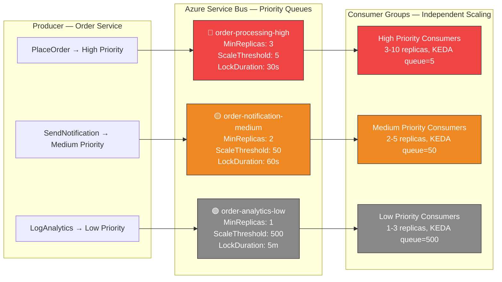
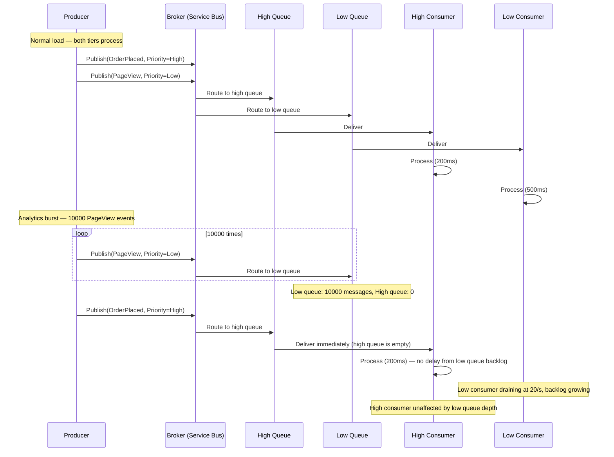
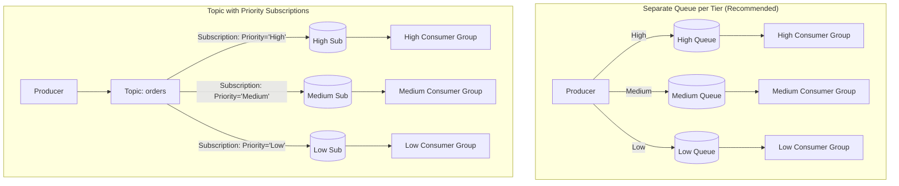
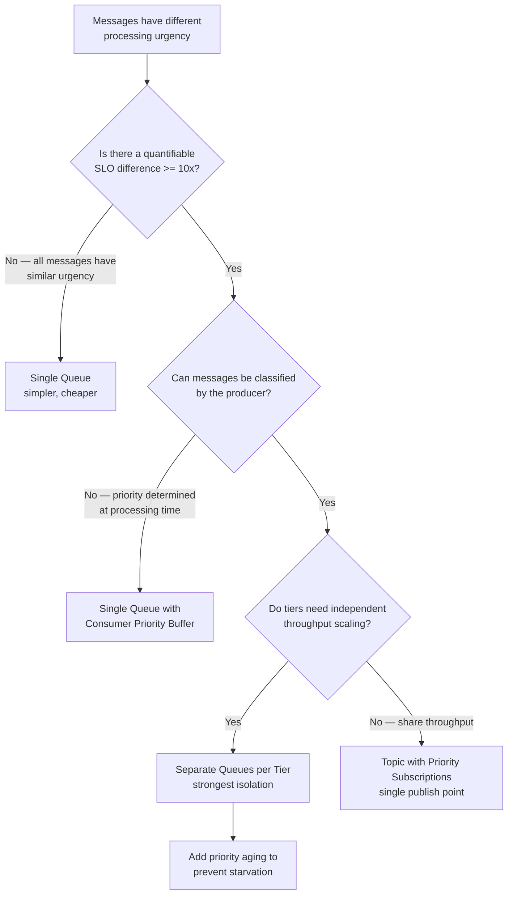
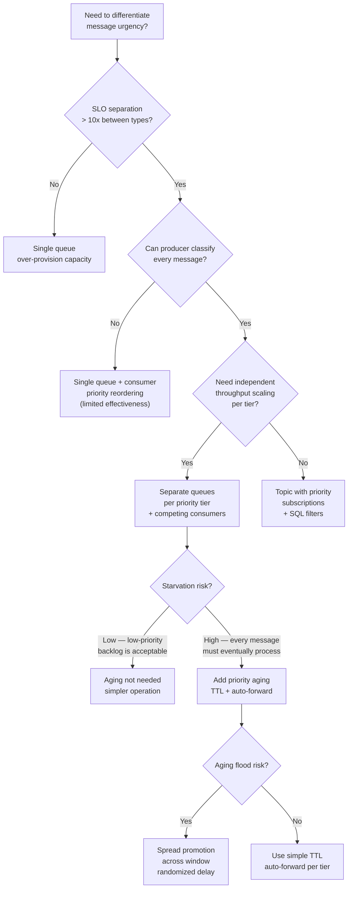

> [!success] Mastery Check
> - [ ] **Studied Well**
> - [ ] **Can explain the concept without notes**
> - [ ] **Can answer interview questions confidently**
> - [ ] **Can implement it in a real project**

## Navigation

**Domain:** [[7 — System Design & Distributed Systems]] > **Group:** Integration Patterns
**Previous:** [[7.145 — Competing Consumers Pattern]] | **Next:** [[7.147 — Claim Check Pattern — Large Message Handling]]

### Prerequisites
- [[7.145 — Competing Consumers Pattern]] — required because priority queues are often implemented as multiple competing consumer groups, one per priority tier
- [[6.302 — Scheduler Pattern — Priority Scheduling]] — the OS-level concept that the priority queue pattern extends to distributed messaging

### Where This Fits

The priority queue pattern ensures that messages with higher business priority are processed before lower-priority messages, even if the lower-priority messages arrived earlier. This is achieved by using separate queues (or broker features) per priority level, with consumer resources allocated proportionally to higher-priority queues. A .NET engineer encounters this in any system where processing latency matters differently per message type — order placement must be processed within seconds, while analytics events can wait minutes. Without priority queues, a burst of low-priority background jobs can delay time-critical order processing because FIFO order treats all messages equally. At scale, the problem becomes acute: a flash sale generates 100× the normal analytics traffic, and without priority isolation, order processing P99 latency degrades from 200 ms to 30 seconds. The priority queue pattern ensures that high-priority traffic sees consistent low latency regardless of low-priority traffic volume.

## Core Mental Model

A priority queue is a messaging topology where messages are classified into priority tiers (typically high, medium, low), each tier is placed into its own queue or partition, and consumer capacity is allocated proportionally — high-priority consumers are always running and process without back-pressure; low-priority consumers only process when high-priority queues are empty. The invariant this maintains is: under any load level, a high-priority message will be processed before any pending low-priority message, regardless of arrival time. The tradeoff is infrastructure complexity (multiple queues, multiple consumer groups) and potential starvation of low-priority messages under sustained high-priority load. The recognition trigger is a production incident where a burst of logging or analytics events delayed customer-facing order processing by several minutes. More specifically: when monitoring shows that P99 latency for order processing spikes during analytics batch jobs, priority queuing is the solution.

### Classification

Priority queueing is a quality-of-service pattern that operates at the messaging infrastructure layer. It does not change message semantics (delivery guarantees, ordering) within a tier — those are determined by the individual queue configuration. It does not solve fairness or prevent starvation without additional mechanisms (aging, priority boosting). It is orthogonal to competing consumers: each priority tier can have its own competing consumer group. The pattern is distinct from scheduling (where messages are delayed to a specific future time) and from throttling (where messages are rate-limited regardless of priority). Priority queueing answers the question: "given a mix of urgent and non-urgent work, how do we ensure urgent work is never delayed by non-urgent work?"





### Key Properties / Guarantees

|Property|Value|Condition|
|---|---|---|
|Priority guarantee|High-priority messages processed before low-priority|Consumers are configured with tiered allocation|
|Starvation risk|Low-priority messages may never process|Sustained high-priority load exceeds total capacity|
|Infrastructure cost|N queues × (broker cost + consumer replicas)|Per priority tier|
|Throughput|Sum of all tier throughputs|Independent per tier, up to broker limits|
|Complexity|Medium — producer classifies, broker routes, consumer allocates|Polymorphic message handling|
|Latency isolation|Strong — high-priority latency independent of low-priority load|Physical queue separation|
|Starvation prevention|Requires explicit aging/promotion mechanism|Not automatic — must be designed|

## Deep Mechanics

### How It Works — Detailed Walkthrough

**Step 1 — Producer classifies the message.** The producer assigns a priority to each message based on business rules. Priority is typically based on SLO requirements: order processing (seconds), email notification (minutes), analytics (hours). The classification must be explicit and intentional — a default priority of "high" defeats the entire purpose. Classification rules are typically stored in a configuration service or database and applied at publish time. The priority can be expressed as a message header value, a queue name target, or a topic subscription filter value.

**Step 2 — Broker routes to the appropriate tier queue.** The message is published to a queue or topic subscription corresponding to its priority level. Each priority level has its own queue (simpler, stronger isolation) or a dedicated topic subscription with a SQL filter (more flexible, shared infrastructure). In the separate-queues approach, the producer directly selects the queue. In the topic-subscription approach, the producer publishes to a single topic, and broker-side SQL filters route messages to the correct subscription based on the priority header.

**Step 3 — Consumers poll selectively from tier queues.** Consumer instances are configured to pull from specific priority queues. High-priority consumer replicas pull only from the high-priority queue. A supervisor process may dynamically allocate consumers between queues based on load. Each tier has its own KEDA ScaledObject with tier-appropriate thresholds. The high-priority scaler has a low threshold (e.g., 5) and high minimum replicas (e.g., 3), ensuring it is always staffed. The low-priority scaler has a high threshold (e.g., 500) and low minimum replicas (e.g., 1), tolerating a backlog.

**Step 4 — Tiered resource allocation under load.** Under normal load, all tiers process concurrently — high-priority consumers handle orders, medium handles notifications, low handles analytics. Under high load, the system ensures high-priority consumers are saturated before allocating resources to lower tiers. In the extreme case, low-priority queues accumulate messages while high-priority queues drain. This is the desired behavior — the system prioritizes critical traffic at the cost of non-critical traffic latency.

**Step 5 — Starvation prevention (optional but recommended).** Without aging, low-priority messages may wait indefinitely under sustained high-priority load. An aging mechanism periodically increases a message's effective priority as it waits. Common implementations include: a scheduled background service that forwards messages from low to medium queues after a time threshold; Azure Service Bus auto-forwarding with TTL; or a priority-boosting header that the consumer checks.

### Queue Architecture Comparison



### Starvation Prevention Algorithms

Several algorithms exist to prevent low-priority starvation, each with different tradeoffs:

**Priority Aging (most common):** Each message has a promotion timestamp. When a low-priority message's age exceeds the configured threshold (e.g., 30 minutes), it is promoted to the medium-priority queue. Medium-priority messages that age beyond a second threshold (e.g., 2 hours) are promoted to high-priority. This guarantees a maximum processing latency for every message, regardless of priority. The promotion can be implemented as a background service (custom code, periodic check) or via auto-forwarding (Azure Service Bus feature). Auto-forwarding is simpler — set `DefaultMessageTimeToLive` on the low queue and `ForwardTo` to the medium queue. After the TTL expires, the broker forwards the message. No custom code required. However, auto-forwarding is a one-shot per message — it cannot be chained indefinitely and does not handle the case where the message is already picked up by a consumer.

**Proportional allocation (weighted fair queuing):** Reserve a minimum percentage of consumer capacity for each tier. For example, ensure that high-priority gets at least 50% of consumer time, medium gets at least 30%, and low gets at least 20%. This prevents starvation even under sustained high-priority load. Implementation: a token-bucket scheduler that manages a shared consumer pool. Each tier has a token bucket that refills at a configured rate. A consumer must acquire a token from the tier's bucket before processing a message from that tier. If a tier's bucket is empty, the consumer cannot process from that tier. This ensures minimum processing rates. The downside: it limits high-priority throughput even when low-priority queues are empty (wasted tokens).

**Priority inheritance (boost):** When a high-priority message depends on data that requires processing a low-priority message (rare), the low-priority message is temporarily boosted to high-priority. This prevents priority inversion — a scenario where a high-priority message waits for a low-priority message to complete. Priority inheritance is complex to implement and is rarely used in message queue systems. It is more common in real-time operating systems and database lock managers.

**Algorithm comparison:**

| Algorithm | Guarantee | Complexity | Best for |
|---|---|---|---|
| Priority Aging | Bounded wait per message | Low (TTL + auto-forward) | Systems with clear SLOs per tier |
| Proportional Allocation | Minimum throughput per tier | Medium (token-bucket) | Systems with mixed workloads, no clear SLOs |
| Priority Inheritance | Prevents priority inversion | High (dependency tracking) | Systems with message dependencies across tiers |
| No prevention | None — starvation possible | None | Systems where low-priority is truly best-effort |

### Failure Modes — Detailed Catalog

**1. Starvation of low-priority messages under sustained load.** High-priority messages arrive continuously at a rate that consumes all consumer capacity. Low-priority messages wait indefinitely, potentially breaching their own (slack) SLOs. **Detection:** low-priority queue age exceeds expected processing time by 2x or more. **Metric:** time-in-queue per priority tier (use Azure Monitor custom metrics). **Prevention:** implement minimum processing time guarantees per tier using a token-bucket or reservation-based scheduler; or implement priority aging where messages are promoted to a higher tier after a configurable wait time. The aging approach is simpler and more commonly used in production.

**2. Misclassification by producer.** A producer marks all messages as high-priority, defeating the tiering. This is the most common failure in practice — developers assume "my messages are important" without understanding the prioritization scheme. **Detection:** high-priority queue depth equals total system throughput. **Metric:** message volume per priority tier — should match expected business distribution (e.g., 10% high, 30% medium, 60% low). **Prevention:** enforce priority classification in the producer via architectural rules, monitoring, and automated alerts when the distribution deviates from expected ratios. Make priority a required field with no default value.

**3. Consumer pool exhaustion on high-priority queue.** Too few consumers on the high-priority queue, causing high-priority messages to back up — defeating the purpose of the pattern. **Detection:** high-priority queue growing despite being the highest tier. **Metric:** high-priority queue depth > 0 for extended periods (more than a few seconds). **Prevention:** set minimum replica counts for high-priority consumers that exceed the expected peak load, and scale proactively. Use KEDA with aggressive scale-out thresholds for high-priority queues (e.g., scale out at queue depth 5).

**4. Cross-tier ordering violation for same entity.** If messages for the same entity (e.g., `OrderUpdated` at medium priority, `OrderCancelled` at high priority) arrive in different tiers, the consumer may process them out of business order. **Detection:** data inconsistency — order cancellation processed before the update it logically follows. **Metric:** count of "out-of-order events" detected in the consumer logs. **Prevention:** do not split same-entity events across priority tiers, or use a saga to maintain ordering across different streams. If cross-tier events are unavoidable, include a sequence number or timestamp in the event and have the consumer reorder them.

**5. Priority aging back-pressure.** The aging mechanism that promotes messages from low to high queues can overwhelm the high-priority queue if many messages age simultaneously. **Detection:** high-priority queue depth spikes at predictable intervals (the aging window). **Metric:** high-priority queue depth correlation with aging cycles. **Prevention:** spread aging across the window instead of promoting all at once. Use a randomized delay before promotion. Limit the number of promotions per cycle.

**6. Idle high-priority consumers during low traffic.** When high-priority traffic is low, high-priority consumers sit idle while low-priority messages accumulate. This is inefficient but by design — the over-provisioning of high-priority capacity is the cost of latency isolation. **Detection:** high-priority consumer CPU < 10% while low-priority queue depth grows. **Metric:** resource utilization per tier vs queue depth. **Prevention:** dynamic consumer allocation — a controller that allocates idle high-priority consumers to low-priority work when the high-priority queue is empty. This adds complexity but improves resource utilization.

**7. Configuration drift between tiers.** Over time, different priority tiers' configurations drift — different `MaxDeliveryCount`, `LockDuration`, or retry policies — causing inconsistent behavior. **Detection:** different processing semantics for the same message type depending on which tier it was in. **Prevention:** use infrastructure-as-code for tier configurations. Store all tier configurations in a single source of truth (ARM template, Terraform) and enforce consistency via policy.

### .NET and Azure Integration

- **Azure Service Bus Topics + SQL Filters:** each priority level is a subscription on the same topic with a SQL filter (`sys.Label = 'High'`). Consumers subscribe to different subscriptions. The topic ensures a single publish point for the producer. This approach provides flexibility but shares topic throughput limits.
- **Azure Service Bus Queues (separate per tier):** simpler topology — one queue per priority level. Producer chooses the queue. Consumer groups pull from specific queues. This provides stronger isolation and independent throughput scaling but requires the producer to know the topology.
- **MassTransit `IMessagePriority`:** MassTransit does not natively support priority queue routing, but it supports receiving from multiple endpoints. The pattern is implemented via separate receive endpoints per priority tier, each with its own consumer and scaling configuration.
- **KEDA autoscaling per queue:** each priority tier has its own `ScaledObject` with different `minReplicaCount` and triggers. The high-priority scaler uses a low queue-length threshold (5), the low-priority scaler uses a high threshold (500).
- **Azure Monitor + Application Insights:** for per-tier monitoring — track queue depth, message age, consumer processing time, and error rate per priority tier.

```csharp
// Producer — classifies and routes by priority
public enum MessagePriority { High, Medium, Low }

public sealed class OrderService
{
    private readonly ITopicProducer<OrderPlaced> _highPriorityProducer;
    private readonly ITopicProducer<OrderPlaced> _mediumPriorityProducer;
    private readonly ITopicProducer<OrderPlaced> _lowPriorityProducer;

    public OrderService(
        ITopicProducer<OrderPlaced> highPriorityProducer,
        ITopicProducer<OrderPlaced> mediumPriorityProducer,
        ITopicProducer<OrderPlaced> lowPriorityProducer)
    {
        _highPriorityProducer = highPriorityProducer;
        _mediumPriorityProducer = mediumPriorityProducer;
        _lowPriorityProducer = lowPriorityProducer;
    }

    public async Task PlaceOrderAsync(CreateOrderCommand command, CancellationToken ct)
    {
        var order = Order.Create(command.CustomerId, command.Items);

        var @event = new OrderPlaced(
            EventId: Guid.NewGuid(),
            OrderId: order.Id,
            CustomerId: order.CustomerId,
            TotalAmount: order.TotalAmount);

        // Route to appropriate priority tier based on business rules
        // Priority is explicit — no default value
        switch (command.Priority)
        {
            case MessagePriority.High:
                await _highPriorityProducer.Produce(@event, ct);
                break;
            case MessagePriority.Medium:
                await _mediumPriorityProducer.Produce(@event, ct);
                break;
            case MessagePriority.Low:
                await _lowPriorityProducer.Produce(@event, ct);
                break;
        }
    }
}

// Consumer — separate handler per priority tier
public sealed class HighPriorityOrderConsumer : IConsumer<OrderPlaced>
{
    private readonly ILogger<HighPriorityOrderConsumer> _logger;
    private readonly IOrderRepository _orderRepository;

    public HighPriorityOrderConsumer(
        ILogger<HighPriorityOrderConsumer> logger,
        IOrderRepository orderRepository)
    {
        _logger = logger;
        _orderRepository = orderRepository;
    }

    public async Task Consume(ConsumeContext<OrderPlaced> context)
    {
        // Always available, low latency expected
        _logger.LogInformation("Processing HIGH priority order {OrderId}",
            context.Message.OrderId);

        // Process immediately — no waiting, no batch accumulation
        var order = Order.Create(
            context.Message.OrderId,
            context.Message.CustomerId,
            context.Message.TotalAmount);

        await _orderRepository.SaveAsync(order, context.CancellationToken);
        await context.ConsumeCompleted;
    }
}

public sealed class LowPriorityAnalyticsConsumer : IConsumer<OrderPlaced>
{
    private readonly ILogger<LowPriorityAnalyticsConsumer> _logger;

    public async Task Consume(ConsumeContext<OrderPlaced> context)
    {
        // May be delayed under load — processing is non-critical
        _logger.LogInformation("Processing LOW priority order {OrderId} (may be delayed)",
            context.Message.OrderId);

        // Analytics processing — acceptable to batch or defer
        await Task.Delay(100, context.CancellationToken); // simulate work
        await context.ConsumeCompleted;
    }
}
```

## Production Patterns and Implementation

### Primary Implementation

The canonical priority queue implementation uses separate Azure Service Bus queues per priority tier, with MassTransit receive endpoints and KEDA autoscaling configured independently per tier. This approach provides the strongest latency isolation — an analytics burst cannot delay order processing because the analytics queue and the order queue are independent at the broker level.

```csharp
// Program.cs — tiered receive endpoints with independent configuration
builder.Services.AddMassTransit(x =>
{
    // Register all consumers
    x.AddConsumer<HighPriorityOrderConsumer>();
    x.AddConsumer<MediumPriorityNotificationConsumer>();
    x.AddConsumer<LowPriorityAnalyticsConsumer>();

    x.UsingAzureServiceBus((context, cfg) =>
    {
        cfg.Host(builder.Configuration["Azure:ServiceBus:ConnectionString"]);

        // High-priority queue — dedicated consumers, low prefetch for low latency
        cfg.ReceiveEndpoint("order-processing-high", e =>
        {
            e.PrefetchCount = 8;           // Low prefetch — minimize latency
            e.LockDuration = TimeSpan.FromMinutes(5);
            e.MaxConcurrentCalls = 10;
            e.MaxDeliveryCount = 5;

            // Aggressive retry — high-priority messages must succeed
            e.UseMessageRetry(r => r.Exponential(5,
                TimeSpan.FromMilliseconds(100),
                TimeSpan.FromSeconds(5)));

            e.ConfigureConsumer<HighPriorityOrderConsumer>(context);
        });

        // Medium-priority queue — moderate resources
        cfg.ReceiveEndpoint("order-notification-medium", e =>
        {
            e.PrefetchCount = 32;
            e.LockDuration = TimeSpan.FromMinutes(5);
            e.MaxConcurrentCalls = 5;
            e.MaxDeliveryCount = 10;

            e.UseMessageRetry(r => r.Interval(3,
                TimeSpan.FromSeconds(1)));

            e.ConfigureConsumer<MediumPriorityNotificationConsumer>(context);
        });

        // Low-priority queue — batch processing, high prefetch
        cfg.ReceiveEndpoint("order-analytics-low", e =>
        {
            e.PrefetchCount = 128;         // High prefetch — maximize throughput
            e.LockDuration = TimeSpan.FromMinutes(10);
            e.MaxConcurrentCalls = 20;
            e.MaxDeliveryCount = 10;

            e.UseMessageRetry(r => r.Incremental(3,
                TimeSpan.FromSeconds(1),
                TimeSpan.FromSeconds(10)));

            e.ConfigureConsumer<LowPriorityAnalyticsConsumer>(context);
        });
    });
});

// Aging service — promotes old low-priority messages to medium priority
// Runs as a background service, checking every 5 minutes
public sealed class PriorityAgingService : BackgroundService
{
    private readonly IServiceBusService _serviceBus;
    private readonly ILogger<PriorityAgingService> _logger;

    public PriorityAgingService(
        IServiceBusService serviceBus,
        ILogger<PriorityAgingService> logger)
    {
        _serviceBus = serviceBus;
        _logger = logger;
    }

    protected override async Task ExecuteAsync(CancellationToken stoppingToken)
    {
        while (!stoppingToken.IsCancellationRequested)
        {
            try
            {
                // Check low-priority queue for messages older than 30 minutes
                var oldMessages = await _serviceBus.PeekMessagesAsync(
                    "order-analytics-low",
                    minAge: TimeSpan.FromMinutes(30),
                    maxMessages: 100,
                    stoppingToken);

                foreach (var message in oldMessages)
                {
                    // Forward to medium-priority queue
                    await _serviceBus.ForwardMessageAsync(
                        message,
                        "order-notification-medium",
                        stoppingToken);

                    // Remove from low-priority queue
                    await _serviceBus.CompleteMessageAsync(
                        message,
                        stoppingToken);

                    _logger.LogInformation("Promoted message {MessageId} from low to medium priority",
                        message.MessageId);
                }
            }
            catch (Exception ex)
            {
                _logger.LogError(ex, "Error in priority aging service");
            }

            await Task.Delay(TimeSpan.FromMinutes(5), stoppingToken);
        }
    }
}
```

### Configuration and Wiring

```yaml
# KEDA — per-tier autoscaling

# high-priority-scaler.yaml
apiVersion: keda.sh/v1alpha1
kind: ScaledObject
metadata:
  name: order-processor-high
spec:
  scaleTargetRef:
    name: order-processor
  minReplicaCount: 3          # always have high-priority capacity
  maxReplicaCount: 10
  pollingInterval: 15
  cooldownPeriod: 60
  triggers:
    - type: azure-servicebus
      metadata:
        queueName: order-processing-high
        queueLength: "5"      # scale out quickly at low threshold
        activationQueueLength: "1"

# medium-priority-scaler.yaml
apiVersion: keda.sh/v1alpha1
kind: ScaledObject
metadata:
  name: order-processor-medium
spec:
  scaleTargetRef:
    name: order-processor
  minReplicaCount: 2
  maxReplicaCount: 8
  pollingInterval: 15
  cooldownPeriod: 60
  triggers:
    - type: azure-servicebus
      metadata:
        queueName: order-notification-medium
        queueLength: "50"     # moderate threshold
        activationQueueLength: "1"

# low-priority-scaler.yaml
apiVersion: keda.sh/v1alpha1
kind: ScaledObject
metadata:
  name: order-processor-low
spec:
  scaleTargetRef:
    name: order-processor
  minReplicaCount: 1          # minimal idle capacity
  maxReplicaCount: 5
  pollingInterval: 30
  cooldownPeriod: 120
  triggers:
    - type: azure-servicebus
      metadata:
        queueName: order-analytics-low
        queueLength: "500"    # tolerate higher backlog
        activationQueueLength: "10"
```

```csharp
// appsettings.json — per-tier configuration
{
  "PriorityQueues": {
    "High": {
      "QueueName": "order-processing-high",
      "PrefetchCount": 8,
      "MaxConcurrentCalls": 10,
      "LockDurationMinutes": 5,
      "MaxDeliveryCount": 5,
      "MinReplicas": 3,
      "ScaleOutThreshold": 5
    },
    "Medium": {
      "QueueName": "order-notification-medium",
      "PrefetchCount": 32,
      "MaxConcurrentCalls": 5,
      "LockDurationMinutes": 5,
      "MaxDeliveryCount": 10,
      "MinReplicas": 2,
      "ScaleOutThreshold": 50
    },
    "Low": {
      "QueueName": "order-analytics-low",
      "PrefetchCount": 128,
      "MaxConcurrentCalls": 20,
      "LockDurationMinutes": 10,
      "MaxDeliveryCount": 10,
      "MinReplicas": 1,
      "ScaleOutThreshold": 500,
      "AgingThresholdMinutes": 30
    }
  },
  "AgingService": {
    "Enabled": true,
    "CheckIntervalMinutes": 5,
    "PromotionTargetQueue": "order-notification-medium",
    "MaxMessagesPerCycle": 100
  }
}
```

### Common Variants

**Single queue with priority header (not recommended at scale).** A single queue where each message has a priority header. Consumers sort messages by priority before processing. Does not work with standard brokers (no native priority sorting at scale) because the broker delivers in FIFO order — the consumer reorders in memory, but the high-priority message still arrived behind the low-priority one in the broker. Only suitable for in-memory queues or very low throughput (<10 msg/s).

```csharp
// ❌ Single queue with priority — does not work at scale
// Consumer must reorder in memory, but broker delivers FIFO
public async Task Consume(ConsumeContext<OrderPlaced> context)
{
    _messageBuffer.Add(context.Message);
    var nextMessage = _messageBuffer.OrderBy(m => m.Priority).First();
    // ...
}
```

**Topic subscription priority.** A single Azure Service Bus topic with multiple subscriptions, each with a SQL filter rule matching a priority level. Each subscription has its own consumer group with dedicated resources. The producer publishes once and broker-side routing handles distribution.

```csharp
// Topic-based priority routing — single publish point
cfg.SubscriptionEndpoint<OrderPlaced>("order-processing-high", e =>
{
    e.Filter = new SqlFilter("sys.Label = 'HighPriority'");
    e.PrefetchCount = 8;
    e.ConfigureConsumer<HighPriorityOrderConsumer>(context);
});

cfg.SubscriptionEndpoint<OrderPlaced>("order-processing-low", e =>
{
    e.Filter = new SqlFilter("sys.Label = 'LowPriority'");
    e.PrefetchCount = 128;
    e.ConfigureConsumer<LowPriorityOrderConsumer>(context);
});

// Producer publishes with label header
await _publisher.Publish(new OrderPlaced(orderId, customerId, total), ctx =>
{
    ctx.SetMessagePriority(priority);  // Sets sys.Label
}, ct);
```

**Priority aging with auto-forwarding.** Azure Service Bus supports auto-forwarding: a low-priority queue can be configured to forward messages to a medium-priority queue after a message TTL expires. This achieves priority aging without a custom service. The chain can be tiered: low → medium after 30 min TTL, medium → high after 2 hour TTL.

```csharp
// Auto-forwarding for priority aging
// Low queue forwards to medium queue after 30 minutes
var lowQueue = new CreateQueueOptions("order-analytics-low")
{
    AutoDeleteOnIdle = TimeSpan.FromDays(1),
    DefaultMessageTimeToLive = TimeSpan.FromMinutes(30),
    ForwardTo = "order-notification-medium",  // auto-forward
    EnableDeadLetteringOnMessageExpiration = true
};
```

**Dynamic consumer allocation.** Instead of static per-tier consumer pools, a controller dynamically allocates available consumer capacity across tiers. When the high-priority queue is empty, consumers are assigned to medium or low queues. When high-priority messages arrive, consumers are reallocated to the high queue. This improves resource utilization but adds complexity.

**Tier rebalancing on demand.** A more sophisticated approach: the controller monitors queue depth across all tiers and allocates consumers proportionally. For example, if the high-priority queue has 10 messages, the medium queue has 100, and the low queue has 1000, the controller might allocate 1 high, 2 medium, 7 low consumers. This is a multi-dimensional optimization problem that can be solved with a proportional-integral (PI) controller or a simple heuristic: allocate consumers in proportion to queue depth weighted by priority.

**Example of tier rebalancing logic:**
```csharp
// Simplified tier rebalancing — allocate consumers proportionally
public int AllocateConsumers(int totalConsumers, 
    int highDepth, int mediumDepth, int lowDepth)
{
    // Weighted depth: high-priority depth counts 10x
    var weightedHigh = highDepth * 10;
    var weightedMedium = mediumDepth * 3;
    var weightedLow = lowDepth * 1;
    
    var total = weightedHigh + weightedMedium + weightedLow;
    if (total == 0) return (totalConsumers / 3, totalConsumers / 3, totalConsumers / 3);
    
    var highAlloc = (int)Math.Round((double)weightedHigh / total * totalConsumers);
    var mediumAlloc = (int)Math.Round((double)weightedMedium / total * totalConsumers);
    var lowAlloc = totalConsumers - highAlloc - mediumAlloc;
    
    return (Math.Max(1, highAlloc), Math.Max(1, mediumAlloc), Math.Max(1, lowAlloc));
}
```

### Real-World .NET Ecosystem Example

**Azure Service Bus with auto-forwarding** supports priority chaining: a low-priority queue forwards messages to a medium-priority queue after a time-to-live, which forwards to high-priority after another TTL. This achieves priority aging without a separate promotion service. In .NET, the MassTransit `DelayedMessageScheduler` can implement promotion by scheduling a republish with higher priority after a delay. Many e-commerce platforms use this exact topology: order placement (high), notification (medium), analytics (low). During Black Friday, the analytics queue grows to millions of messages while order processing remains fast — the priority isolation protects the customer experience.

### Failure Mode: Aging Cascade Amplification

A rarely-discussed failure mode occurs when priority aging is chained across 3+ tiers and each tier's aging threshold fires in sequence, creating a cascade that amplifies load at each level.

**Scenario:** Three-tier system with aging: low → medium (30 min), medium → high (2 hours). The low-priority queue has 100,000 messages. All of them age into medium after 30 minutes. Now the medium queue has its normal traffic plus 100,000 aged messages. After 2 hours, any remaining medium messages (now 120,000 including new arrivals) age into high-priority. The high-priority queue is overwhelmed by the cascade.

**Detection:** The queue depth across all tiers shows a wave pattern — low depth spikes at 0 min, medium at 30 min, high at 150 min. The total processing time for messages that went through the full cascade is `30 min (wait in low) + 2 hours (wait in medium) + processing time`, which is much worse than simply processing them in the low queue.

**Prevention strategies:**
1. Set aging thresholds proportionally to the tier's drain rate. If the low queue drains at 100 msg/s and has 10,000 messages, the aging threshold should be at least 100 seconds — enough time for the consumer to drain the backlog naturally.
2. Use exponential aging: low → medium at 30 min, medium → high at 90 min, not 120 min. Shorter windows in higher tiers reduce the cascade effect.
3. Limit the number of aging levels. Do not use more than 2 aging hops (low → medium → high). The third hop amplifies load too much.
4. Implement admission control: if the medium queue depth exceeds a threshold, temporarily extend the aging TTL for new low-priority messages.

```csharp
// Dynamic aging TTL based on target queue depth
public async Task<TimeSpan> CalculateAgingTtlAsync(CancellationToken ct)
{
    var mediumDepth = await _serviceBus.GetQueueDepthAsync(
        "order-notification-medium", ct);

    // If medium queue is already deep, extend aging to avoid cascade
    if (mediumDepth > 10000)
    {
        return TimeSpan.FromHours(1); // double the normal aging TTL
    }

    return TimeSpan.FromMinutes(30); // normal aging
}
```

## Gotchas and Production Pitfalls

### 1. All Messages Scored as High Priority

**Pitfall:** The producer classifies every message as high priority "just to be safe," or the default priority is high.

```csharp
// ❌ Default priority is High — every message goes to the high queue
public async Task PublishOrderEvent(Order order)
{
    var priority = order.Priority; // never set, defaults to High
    // ...
}
```

**Symptom:** High-priority queue depth matches total system throughput. Low-priority queues are empty. All the infrastructure investment in tiering is wasted — the system behaves as a single queue with the cost of multiple queues. Monitoring shows 100% of traffic in the high tier.

**Fix:** Make priority explicit in the domain. Require explicit assignment (no default). Monitor the distribution and alert if high-priority traffic exceeds expected percentage.

```csharp
// ✅ Priority is explicit — no default, required field
public sealed record PublishOrder(
    string OrderId,
    MessagePriority Priority); // required field, no default
```

**Cost of not fixing:** The organization pays for multiple queues and consumer groups, but the system does not differentiate processing — the priority queue pattern provides no benefit and adds only cost.

### 2. Priority Inversion — High-Priority Message Blocked by Low-Priority Processing

**Pitfall:** A high-priority message processing step depends on a resource held by a low-priority message being processed.

```csharp
// ❌ High-priority order processing needs inventory data
// but the inventory update is a low-priority message
// currently being processed by a low-priority consumer
```

**Symptom:** High-priority order processing waits for a lock held by a low-priority inventory update. The high-priority consumer blocks, its message lock expires, and the message is redelivered to another consumer. That consumer also blocks on the same lock. The high-priority queue depth grows despite having consumers available, because each consumer blocks on a shared resource held by a low-priority process.

**Fix:** Do not introduce shared locks between priority tiers. If order processing (high) and inventory updates (low) share a database table or row, use optimistic concurrency (no locks) or ensure the low-priority processing completes quickly. If the dependency is unavoidable, boost the low-priority message's priority when a high-priority message is blocked (priority inheritance).

```csharp
// ✅ Use optimistic concurrency to avoid blocking
// EF Core concurrency token — no lock held across tiers
public sealed class InventoryItem
{
    public string ProductId { get; set; }
    public int QuantityAvailable { get; set; }
    public byte[] RowVersion { get; set; } // concurrency token
}

// Both high and low consumers use this pattern
// If DbUpdateConcurrencyException occurs, retry
```

**Cost of not fixing:** High-priority latency SLOs are breached not because of insufficient capacity but because of lock contention with low-priority processing. The symptom is indistinguishable from insufficient capacity (queue depth grows, latency increases), leading teams to add more high-priority consumers when the real fix is removing the cross-tier lock dependency.

### 3. Low-Priority Starvation Without Detection

**Pitfall:** Setting up priority queues but not monitoring low-priority queue age.

```csharp
// ❌ Low-priority queue never monitored
// No alert on message age > expected processing time
```

**Symptom:** Low-priority messages wait hours or days while high-priority traffic keeps consumers busy. Business stakeholders eventually complain about missing analytics reports or delayed notifications that were assumed to be "near real-time."

**Fix:** Add monitoring on the time-in-queue metric per priority tier. Set alerts with tier-appropriate thresholds: high-priority > 1 minute (alert), medium > 10 minutes (warning), low > 1 hour (alert).

**Cost of not fixing:** The team is unaware of the starvation. The first indication is a business stakeholder escalation. The system appears broken for low-priority consumers when it is working exactly as designed — but nobody explicitly agreed that low-priority means "may never process."

### 3. Static Resource Allocation Despite Dynamic Load

**Pitfall:** Hardcoding the number of consumer replicas per tier without considering that load ratios shift over time.

```csharp
// ❌ Static allocation — 5 high, 2 medium, 1 low replicas
// But today's load is 80% low-priority and 10% high-priority
```

**Symptom:** High-priority consumers are idle (no messages in their queue) while low-priority queue grows because its single replica cannot keep up. The idle high-priority capacity could be processing low-priority messages, but the static allocation prevents it.

**Fix:** Use dynamic consumer allocation — a controller that allocates available consumer capacity across tiers based on current load. Or use KEDA with per-tier scaling but set `minReplicaCount` for low-priority to accommodate normal load.

**Cost of not fixing:** Wasted compute resources (idle high-priority consumers) and under-processed low-priority messages. The team adds more replicas to compensate when the real solution is dynamic allocation.

### 4. Ignoring Broker Priority Features

**Pitfall:** Implementing priority entirely at the consumer level without leveraging broker-level priority support.

```csharp
// ❌ Single queue, consumer-side priority sorting
// Messages are sorted in memory, but the queue is FIFO at the broker
// A burst of low-priority messages still blocks high-priority delivery
```

**Symptom:** High-priority messages are delivered behind low-priority messages because the broker delivers in FIFO order. The consumer reorders them in memory, but the reordering adds latency and memory pressure.

**Fix:** Use separate queues per priority tier at the broker level. Brokers are not priority schedulers — they are FIFO stores. If you need per-message priority, the broker must be told which queue to deliver from.

**Cost of not fixing:** High-priority messages wait behind low-priority messages in the broker's FIFO queue. The consumer's in-memory reordering fixes ordering but not latency — the high-priority message still arrives late.

### 5. Cross-Tier Ordering Violations

**Pitfall:** Events for the same entity (e.g., order) are split across priority tiers.

```csharp
// ❌ OrderCancelled at high priority, OrderUpdated at medium
// Consumer may process cancel before update
```

**Symptom:** Data inconsistency. The order cancellation is processed before the order update it logically follows. The cancellation logic reads stale data because the update hasn't been processed yet.

**Fix:** Do not split same-entity events across priority tiers. If the `OrderUpdated` event must be low priority for some reason, include a sequence number and have the consumer reorder events based on it.

**Cost of not fixing:** Data corruption that is hard to detect and even harder to fix. The inconsistency may not surface until much later.

### 6. Aging Backlog Flooding

**Pitfall:** Setting a short aging threshold (e.g., 5 minutes) on a large low-priority queue causes a flood of messages to be promoted to the medium queue simultaneously.

**Symptom:** Every 5 minutes, the medium-priority queue depth spikes by 10,000 messages as the aging service promotes them. The medium-priority consumers are overwhelmed, and medium-priority messages (notifications) are delayed.

**Fix:** Spread aging across the window. Instead of promoting all messages older than 5 minutes at once, promote in batches with a delay between batches. Use a sliding window: promote messages aged 5-10 minutes in the first batch, 10-15 in the next.

**Cost of not fixing:** The aging mechanism causes the same problem it was designed to prevent: medium-priority messages are delayed because of aged low-priority traffic.

### 7. Monitoring Blindness Per Tier

**Pitfall:** Monitoring only aggregate queue depth without per-tier breakdown.

```csharp
// ❌ Only monitors total queue depth across all tiers
// "Queue depth: 15000" — no indication of which tier
```

**Symptom:** The total queue depth looks manageable (15,000), but the high-priority queue has 12,000 of those — a critical situation that is invisible in the aggregate metric.

**Fix:** Monitor queue depth, message age, and consumer lag per priority tier. Create a dashboard showing each tier's metrics independently.

**Cost of not fixing:** A high-priority queue backlog goes undetected because it is hidden in the aggregate metric. The first indication is a customer complaint.

### 8. Aging Promotion Flooding Downstream Dependencies

**Pitfall:** Setting the same aging threshold for all low-priority messages without considering the downstream system's capacity to handle the promoted load.

**Symptom:** When the aging threshold fires (e.g., every 30 minutes), thousands of low-priority messages are promoted to the medium-priority queue simultaneously. The medium-priority consumers are suddenly overwhelmed by the combined load of their normal messages plus the promoted backlog. The medium-priority queue depth spikes, causing medium-priority messages to miss their SLOs. The downstream database or API sees a sudden spike in writes as all promoted messages are processed concurrently.

**Fix:** Spread the aging across the promotion window. Instead of promoting all messages that are exactly 30 minutes old, promote in batches with a sliding window. Use a randomized delay: each message is assigned a promotion time of `(baseTTL + random(0, spreadWindow))`. This naturally spreads the promoted traffic.

```csharp
// ✅ Spread promotion with randomized delay
var randomSpread = TimeSpan.FromMinutes(Random.Shared.Next(0, 10));
var promotionTime = DateTimeOffset.UtcNow + baseTTL + randomSpread;

// Store promotion time in message metadata
// Background service checks messages whose promotion time has passed
```

**Cost of not fixing:** The aging mechanism, designed to prevent starvation in the low-priority queue, creates a starvation problem in the medium-priority queue. The team may disable aging, reverting to the original starvation problem. Or they add more medium-priority consumers, increasing cost.

### 9. No Back-Pressure from Low-Priority to High-Priority

**Pitfall:** Assuming that high-priority messages can always be accepted, even when all downstream systems are saturated.

**Symptom:** During a system-wide overload (database slow, API throttling), the high-priority queue continues accepting messages because it is isolated from low-priority back-pressure. High-priority consumers are also affected by the same downstream issues — they cannot process messages faster. The high-priority queue grows, but there is no mechanism to tell producers to slow down. The queue depth reaches the broker limit, and the broker starts rejecting messages.

**Fix:** Implement back-pressure propagation through the entire pipeline. When the high-priority queue exceeds a critical depth threshold, the broker should reject new messages (or the producer should stop publishing). This is contrary to the pattern's goal of isolation — but isolation does not mean infinite buffering. Set a maximum queue depth and configure the broker to reject messages beyond that point. The producer must handle rejection (retry with backoff, circuit breaker). In Azure Service Bus, this is achieved by setting `MaxQueueSize` or implementing producer-side circuit breakers based on queue depth metrics.

**Cost of not fixing:** The broker runs out of memory or disk space storing messages that cannot be processed. Message publishing starts failing with timeout or quota-exceeded errors. The failure mode is hard to diagnose because it appears to be a broker issue, not a capacity issue.

## Tradeoffs and Decision Framework

### Tradeoff Matrix

| Dimension | Separate Queues per Priority | Single Queue with Consumer Priority | Topic with Priority Subscriptions |
|---|---|---|---|
| Implementation complexity | Medium (N queues + N consumers) | Low (1 queue + 1 consumer) | Low-Medium (1 topic + N subscriptions) |
| Priority guarantee | Strong — broker enforces isolation | Weak — consumer must sort post-delivery | Strong — per-subscription consumer groups |
| Starvation prevention | Requires explicit mechanism | Natural FIFO + priority within queue | Requires explicit mechanism |
| Infrastructure cost | N × queue cost | 1 × queue cost | N × subscription cost |
| Flexibility of allocation | High — independent scaling per tier | Low — same consumer for all | Medium — per-subscription scaling |
| Latency isolation | Strong — independent queues | None — all messages share queue | Medium — subscriptions share topic throughput |
| Operational overhead | N queues to monitor | 1 queue | N subscriptions to monitor |

### When to Apply



### Cost-Benefit Analysis for Priority Tiers

Before implementing priority queues, quantify the benefit. The primary benefit is latency isolation for high-priority messages. The cost is the infrastructure overhead of maintaining multiple queues and consumer groups.

**Cost calculation (Azure Service Bus Premium, monthly):**
- Per-queue cost: ~$10/month (minimal, but adds up)
- Per-consumer cost: $0.10/hour × minReplicas × 24 × 30
- Example (3 tiers with min 3/2/1 replicas): 6 consumers × $0.10 × 24 × 30 = $432/month minimum
- Monitoring cost: additional metrics, alerts, dashboard per tier
- Operational cost: N queues to configure, monitor, and debug

**Benefit calculation:**
- Breach cost: what is the cost per minute of high-priority SLO breach?
- For an e-commerce platform: 1 minute of order processing delay at $10,000/min revenue = $10,000
- Benefit of priority queues: 30 minutes of analytics burst would have caused 30 min × $10,000 = $300,000 in order delay losses
- Cost of priority queues: $432/month = $5,184/year
- ROI: $300,000 saved per incident ÷ $5,184 annual cost = 58x return per incident

**When the ROI flips:** For low-revenue systems or systems where all messages have similar business value, the cost of priority queues may exceed the benefit. In those cases, over-provisioning a single queue is more cost-effective.

### When NOT to Apply

- [ ] All messages have similar urgency (SLOs within 2x of each other) — a single queue with sufficient capacity is simpler and cheaper
- [ ] The producer cannot classify messages by priority — if priority is determined by consumer context, not message content, the pattern does not apply
- [ ] Message ordering is required across priority tiers — splitting messages across tiers breaks ordering for the same entity
- [ ] The team lacks operational capacity to monitor and maintain multiple queues — each tier adds monitoring, alerting, and deployment complexity
- [ ] The workload volume is below ~1,000 messages/day — the complexity of multiple queues is not justified
- [ ] The business has not defined SLOs for each priority tier — without SLOs, you cannot tune the tier configurations
- [ ] The infrastructure cost of N queues is prohibitive — each queue has a cost, and the benefit must outweigh it

### Tier Resource Allocation Planning

When deploying a multi-tier priority queue system, resource allocation must account for each tier's expected load and SLO.

**Formula for minimum consumers per tier:**
```
MinConsumers_Tier = (PeakMsgRate_Tier × ProcessingTime_Tier) / MaxConcurrentCalls
```
Example for high-priority tier: Peak 200 msg/s, 250 ms processing time, MaxConcurrentCalls = 10
```
MinConsumers_High = (200 × 0.25) / 10 = 5 consumers
```

**Total resource cost:**
```
TotalCost = Sum over tiers of (MinConsumers_Tier × InstanceCost × 24 × 30)
```
For 3 tiers with 5, 3, 2 min consumers at $0.50/hour each: (5+3+2) × $0.50 × 24 × 30 = $360/month. This is the minimum cost of the priority queue topology, before autoscaling. During low traffic, KEDA scales down to min replicas, so the actual cost is this minimum.

**Capacity planning caveats:**
- High-priority tier must be over-provisioned — min consumers must handle the expected peak WITHOUT scaling delay. KEDA scaling takes 30-60 seconds. If a spike arrives faster, the queue grows during scale-out.
- Medium and low priority tiers can be under-provisioned — they can tolerate scaling delay because their SLOs are longer.
- Always add 30% headroom to high-priority min replica count for unexpected spikes.
- If the total consumer count across all tiers approaches the database connection pool limit, the database becomes the bottleneck regardless of tier configuration.

### Autoscaling Configuration Per Tier

KEDA ScaledObject parameters vary significantly by tier. Below are recommended starting configurations:

**High-priority tier:**
```yaml
# Aggressive scaling — low threshold, fast scale-out
minReplicaCount: 3
maxReplicaCount: 10
triggers:
  - type: azure-servicebus
    metadata:
      queueName: order-processing-high
      queueLength: "5"       # Scale out when only 5 messages queued
      activationQueueLength: "1"
```

**Medium-priority tier:**
```yaml
# Moderate — balance responsiveness and cost
minReplicaCount: 2
maxReplicaCount: 8
triggers:
  - type: azure-servicebus
    metadata:
      queueName: order-notification-medium
      queueLength: "50"      # Tolerate some backlog
      activationQueueLength: "5"
```

**Low-priority tier:**
```yaml
# Conservative — tolerate backlog, slow scale-out
minReplicaCount: 1
maxReplicaCount: 5
triggers:
  - type: azure-servicebus
    metadata:
      queueName: order-analytics-low
      queueLength: "500"     # Tolerate significant backlog
      activationQueueLength: "50"
```

### Scale Thresholds

- **Worth considering when processing urgency varies by >10x across message types** — e.g., order processing SLO = 1 second, analytics SLO = 10 minutes
- **Required when a burst of low-priority messages can delay high-priority processing** — typically when queue depth during peak exceeds the consumer's drain rate by more than the high-priority SLO
- **Overkill below ~10,000 messages/day** — capacity planning for a single queue is simpler
- **Re-evaluate when low-priority messages show signs of starvation** — implement priority aging or dynamic allocation
- **Consider moving from 3 to 4+ tiers when SLO separation exceeds 100x** — e.g., real-time (100ms), near-real-time (5s), batch (5min), archive (1hr)

## Interview Arsenal

### Question Bank

1. What is the priority queue pattern and what problem does it solve?
2. Walk through the implementation of a 3-tier priority queue with Azure Service Bus.
3. What is the cost of using separate queues per priority level — what do you trade for the isolation?
4. How does message starvation occur and how do you prevent it?
5. Compare separate queues per priority vs a single queue with consumer-side prioritization.
6. Design a payment processing system where credit card payments must be processed before ACH payments.
7. How does a priority queue behave when the high-priority queue is empty but the medium queue is full?
8. What is the relationship between priority queuing and back-pressure in distributed systems?
9. What monitoring metrics would you track per priority tier?
10. How does priority aging work and what are its failure modes?

### Spoken Answers

**Q: How would you implement a priority queue in Azure Service Bus with .NET?**

> **Average answer:** Create a topic with multiple subscriptions, each with a filter on priority. Consumers subscribe to different subscriptions.

> **Great answer:** I use separate Azure Service Bus queues per priority tier rather than a single topic with subscriptions. The reason: separate queues give us independent scaling, monitoring, and consumer configuration per tier. The producer publishes to the appropriate queue based on the message priority classification. Each tier has its own MassTransit receive endpoint with tier-specific configuration — low prefetch for high-priority (minimize latency), higher prefetch for low-priority (maximize throughput). Each tier has a KEDA ScaledObject with tier-appropriate thresholds: high-priority scales at queue depth 5, low-priority at queue depth 500. This means high-priority consumers are aggressively scaled to keep latency low, while low-priority consumers tolerate a backlog. The critical implementation detail is starvation prevention — I add a message promotion mechanism: a background service monitors the low-priority queue, and any message that has waited longer than its aging threshold (e.g., 30 minutes) is forwarded to the medium-priority queue. This ensures no message waits indefinitely, even under sustained high-priority load. Without this, the pattern guarantees high-priority processing but provides no bound on low-priority waiting time.

**Q: What is the starvation problem and how do you solve it?**

> **Great answer:** Starvation occurs when high-priority messages arrive continuously, consuming all available consumer capacity, while low-priority messages never get processed. This is the priority queue pattern's fundamental weakness — it optimizes for latency of high-priority messages at the cost of progress for low-priority ones. The first defense is monitoring: track time-in-queue per priority tier and alert when low-priority messages exceed acceptable waiting times. The second defense is priority aging — a mechanism that promotes messages to a higher tier after they have waited a configurable time. In Azure Service Bus, this can be implemented with auto-forwarding: a low-priority queue with a time-to-live set to, say, 30 minutes, with the forwarding endpoint pointing to the medium-priority queue. The third defense is proportional allocation: reserve a minimum percentage of consumer capacity for lower tiers, even under high-priority load. For example, ensure that at least 10% of processing time is allocated to medium-priority and 5% to low-priority, using a token-bucket or weighted fair queuing approach. In practice, most teams use priority aging because it is simple to implement and understand: messages that wait too long become high-priority automatically.

**Q: How do you configure KEDA autoscaling differently for each priority tier?**

> **Great answer:** KEDA uses separate ScaledObject resources for each priority tier, each targeting the same deployment but with different trigger thresholds and scaling bounds. The high-priority ScaledObject has: `minReplicaCount: 3` (always have baseline capacity), `maxReplicaCount: 10`, and a very sensitive trigger — `queueLength: "5"` means it scales out when only 5 messages are in the queue. The scale-down has a long stabilization window (60 seconds) to prevent thrashing. The low-priority ScaledObject has: `minReplicaCount: 1` (minimal idle capacity), `maxReplicaCount: 5`, and a high threshold — `queueLength: "500"`. It also has a longer `cooldownPeriod` (120 seconds) because low-priority work is not time-sensitive. The activation queue length (`activationQueueLength`) is set to 0 or 1 for high-priority so that the deployment can scale from zero if traffic stops completely. For low-priority, it is set higher (10) to prevent scaling from zero for just a few messages. This configuration ensures that during an analytics burst, only the low-priority tier accumulates backlog while high-priority processing remains fast.

### System Design Interview Trigger

If an interviewer asks about a system where different types of work have different latency requirements, such as "design a payment processing pipeline where credit card payments must be processed in seconds but refunds can take hours," they are testing whether you know the priority queue pattern. The follow-up will be about starvation: "what happens if there are so many credit card payments that refunds never process?" — they want to see that you anticipate the starvation problem and have a solution (aging, proportional allocation). Another common follow-up is about classification: "who decides what priority a message gets?" — testing whether you understand that classification must be explicit and governed.

### Cross-Tier Ordering Resolution Strategies

When events for the same entity must cross priority tiers (e.g., `OrderCreated` goes to high-priority, `OrderAnalyticsLogged` goes to low-priority), ordering violations are possible. Below are strategies to resolve them:

**Strategy 1 — Sequence number ordering:**
Each event includes a monotonically increasing sequence number within the entity scope. The consumer maintains a per-entity buffer that reorders events by sequence number before processing. Events with a gap (missing sequence number) are buffered until the missing event arrives (from any tier). This ensures causal ordering across tiers.
```csharp
public sealed record OrderEvent(
    string OrderId,
    int SequenceNumber,  // monotonically increasing per order
    string EventType,    // "Created", "Updated", "AnalyticsLogged"
    MessageData<byte[]>? Payload);
```
Drawback: buffering adds memory pressure and processing delay. If a low-sequence event is stuck in a lower tier, the buffer accumulates waiting for it.

**Strategy 2 — Event sourcing with projection:**
Do not split events across tiers at all. Instead, all events go to a single event store (Event Sourcing). Each tier subscribes to the event store and processes events relevant to its priority. The event store provides global ordering. This is architecturally cleaner but requires an event store infrastructure (e.g., EventStoreDB, Azure Cosmos DB with change feed).
Drawback: the event store becomes a single point of ordering — if it cannot keep up with the write rate, all tiers are affected. This defeats some of the isolation benefit of priority queues.

**Strategy 3 — Saga-based coordination:**
Wrap cross-tier processing in a saga. The saga orchestrates both high-priority and low-priority processing steps, maintaining ordering within the saga instance. If a low-priority step is delayed, the saga keeps the high-priority step's context until both are ready.
Drawback: sagas add complexity and state management overhead. The saga orchestrator becomes a potential bottleneck.

**Strategy 4 — Accept the ordering violation:**
In many systems, cross-tier ordering violations are acceptable. If `OrderAnalyticsLogged` (low-priority) arrives before `OrderCreated` (high-priority), the analytics consumer can simply create a placeholder record and update it when `OrderCreated` arrives. This is the simplest approach and works when eventual consistency is acceptable.

### Comparison Table

| | Priority Queues (Separate Tiers) | Single Queue with Consumer Prioritization |
|---|---|---|
| Mechanism | Multiple queues, dedicated consumers | Single queue, consumer reorders in memory |
| Priority guarantee | Strong — broker enforces | Weak — consumer may reorder after delivery |
| Starvation prevention | Requires explicit aging mechanism | Natural — FIFO within the single queue |
| Resource efficiency | May have idle consumers in empty tiers | Always busy — single consumer pool |
| Operational complexity | Higher — N queues to monitor | Lower — one queue |
| Best for | Clear urgency tiers with SLO separation | Subtle priority differences |
| Latency isolation | Full — independent queue backlogs | None — all messages share same backlog |

## Architecture Decision Record

**Status:** Accepted

**Context:** An e-commerce platform processes three types of messages: order processing (P99 must be <5 seconds), email notifications (P99 <5 minutes), and analytics events (P99 <1 hour). During flash sales, analytics events spike to 100× normal volume (from 100 msg/s to 10,000 msg/s). Without priority tiers, the analytics burst delays order processing, causing checkout failures and revenue loss. During the last flash sale, order processing P99 latency spiked from 200 ms to 45 seconds because the single queue had 500,000 analytics messages ahead of the order messages. The platform runs on Azure Service Bus Premium and Azure Container Apps.

**Options Considered:**

1. **Separate Priority Queues** — three Azure Service Bus queues (high, medium, low), each with dedicated consumer pools and KEDA autoscaling. Priority promotion via message aging. Producer explicitly routes to the correct queue.
2. **Single Queue with Consumer Reordering** — one queue; consumer receives messages and reorders by priority in memory before processing. No infrastructure changes.
3. **Two Queues (High + Everything Else)** — separate high-priority queue for orders; all other messages in a single secondary queue. Simpler than 3 tiers but less granularity.
4. **Topic with Priority Subscriptions** — one topic with three subscriptions, each with a SQL filter. Producer publishes once with priority header.

**Decision:** Separate Priority Queues (3 tiers), because it provides the strongest latency isolation: analytics bursts never affect order processing. The analytics queue can grow to 100,000 messages without delaying a single order. Priority aging via message forwarding prevents starvation of analytics events after the flash sale ends. Option 2 (single queue) would not solve the problem — during a flash sale, order messages would still wait behind analytics messages in the FIFO queue. Option 3 (2 tiers) is simpler but does not provide enough granularity for the three distinct SLOs (seconds, minutes, hours). Option 4 (topic subscriptions) shares topic throughput limits across all subscriptions, reducing isolation.

**Consequences:**
- ✅ Order processing latency is isolated from analytics traffic — P99 stays under 5 seconds even during flash sales with 10,000 msg/s analytics spikes
- ✅ Each tier scales independently — high-priority at queue depth 5, analytics at queue depth 500
- ✅ Aging mechanism ensures analytics events eventually process after the load spike passes (within ~2 hours of peak)
- ⚠️ Three queues to monitor, three consumer groups to configure — operational overhead requires a dashboard per tier
- ⚠️ Cross-tier ordering is not guaranteed — if an order event and its analytics event are in different tiers, the analytics event may arrive at the consumer before the order event (if aging promotes it)
- ❌ Extra cost for three queue namespaces (~$30/month additional at Service Bus Premium pricing)
- ⚠️ Producer must know the routing topology — if a new tier is added, all producers must be updated

**Review Trigger:** Revisit this decision if the number of priority tiers needs to grow beyond 3, or if cross-tier ordering becomes a business requirement that cannot be tolerated. Also revisit if the aging mechanism causes more than 20% of low-priority messages to be promoted (indicating the tier classification is wrong). Revisit if the infrastructure cost of maintaining 3+ queues exceeds the business value of latency isolation — at some point, it may be cheaper to over-provision a single queue than to maintain the multi-tier topology.

### Decision Flow for Choosing Priority Queue Approach



### Per-Tier Monitoring Dashboard Design

A production priority queue system requires per-tier monitoring. Below are the essential metrics and Azure Monitor queries.

**Essential metrics per tier:**
- Queue depth (current + rate of change over 5 min)
- Message age (P50, P90, P99) — compared to the tier's SLO
- Consumer lag (for Kafka) — messages behind the latest offset
- Consumer processing time (P50, P99)
- Consumer error rate — failed messages per minute
- Delivery count > 1 ratio — indicates lock expiration or consumer crashes
- Aging promotion rate — messages moved from lower to higher tier
- Idle consumer time — consumers polling with empty queue

**Azure Monitor alert rules:**
```kusto
// Alert: High-priority queue age exceeding SLO
Metrics
| where metric_name == "MessageAgeInQueue"
| where dimensions["QueueName"] == "order-processing-high"
| where avg > 60 // seconds
| project timestamp, avg
// Trigger action when high-priority message age > 60 seconds
```

**Per-tier dashboard organization:**
Each tier gets a row on the dashboard with: queue depth sparkline, message age heatmap, consumer count gauge, error rate sparkline. A summary row shows the aggregate across all tiers. Color-code by severity: green (within SLO), yellow (approaching SLO), red (breaching SLO). Add a single "starvation" indicator that lights up when a lower tier's message age exceeds its aging threshold.

## Self-Check

### Conceptual Questions

1. What is the priority queue pattern and what invariant does it maintain?
2. Derive the tradeoff between a single queue and separate priority queues.
3. Given a system where all message types have the same SLO (5 seconds), is priority queuing appropriate?
4. What metric reveals that low-priority messages are being starved?
5. Name the Azure Service Bus feature that can implement priority aging without a custom service.
6. What is the structural distinction between separate queues per tier vs a topic with priority subscriptions?
7. Below what message rate is a single queue always simpler?
8. [[7.145 — Competing Consumers Pattern]] — how are competing consumers used within each priority tier?
9. What production consequence follows from setting the default message priority to "High"?
10. Explain priority queuing to a product manager in 60 seconds.
11. What is priority inversion and how does it manifest in a priority queue system?
12. How does priority aging differ from proportional allocation for starvation prevention?
13. What happens to the system if the aging mechanism promotes 100% of low-priority messages before they are processed?

<details>
<summary>Answers</summary>

1. Messages with higher business priority are processed before lower-priority messages, regardless of arrival time. The invariant: under any load, a high-priority message's waiting time is bounded independently of low-priority queue depth.

2. Separate queues give strong latency isolation — analytics bursts never delay order processing — at the cost of infrastructure complexity (N queues, N consumer groups) and potential starvation of low-priority messages. A single queue is simplest but provides no priority differentiation.

3. No — all messages have the same urgency. A single queue with sufficient capacity is simpler and cheaper. Priority queuing adds complexity without benefit when SLOs are uniform.

4. Low-priority queue message age exceeding the expected processing time. If analytics messages wait >1 hour when the SLO is 1 hour, starvation may be occurring. Set an alert on message age per tier.

5. Auto-forwarding with time-to-live: set a TTL on the low-priority queue, with `ForwardTo` pointing to the medium-priority queue. After the TTL expires, messages are automatically moved to the next tier. This achieves aging without a custom background service.

6. Separate queues are independent — each has its own scaling, monitoring, and configuration. Topic subscriptions share the namespace and topic throughput but have independent consumer groups and SQL filters. Separate queues provide stronger isolation but require the producer to know the topology.

7. Below ~10,000 messages/day, the operational complexity of multiple queues exceeds the benefit.

8. Each priority tier queue has its own competing consumer group with independent KEDA autoscaling. High-priority consumers have higher min replicas and lower scale-out thresholds; low-priority consumers have lower min replicas and higher thresholds. The competing consumers pattern scales each tier independently.

9. The priority queuing system collapses into a single effective queue — all messages go to the high-priority queue, wasting the infrastructure investment and providing no differentiation. The organization pays for the pattern's complexity but gets none of its benefits.

10. "Priority queuing is like having separate lanes at the airport. First-class passengers (high-priority orders) go through the dedicated lane and never wait behind the economy line (analytics events). Even if the economy line has 200 people, a first-class passenger walks straight through. The catch: if too many first-class passengers arrive, the economy line never moves — so we add a rule that after 30 minutes, economy passengers get moved to the first-class lane."

11. Priority inversion occurs when a high-priority message's processing depends on a resource held by a low-priority message. For example, the high-priority consumer needs to update inventory (shared database row with optimistic lock), but a low-priority consumer is currently updating the same row. The high-priority consumer's message lock expires while waiting for the low-priority consumer to finish. The symptom is high-priority queue growth despite available consumer capacity, because consumers are blocked waiting for resources held by lower-priority processes.

12. Priority aging guarantees that every message will eventually be processed by promoting messages to higher tiers after a time threshold. Proportional allocation guarantees that each tier gets a minimum share of processing time, preventing complete starvation but not guaranteeing a maximum wait. Aging is simpler (just a TTL) but can cause flooding when many messages age simultaneously. Proportional allocation is more predictable but requires a token-bucket scheduler and limits high-priority throughput even when lower tiers are empty.

13. If the aging threshold is too short relative to normal processing time (e.g., 5-minute aging on a queue with 10-minute expected processing time), every message gets promoted before the low-priority consumers can process it. The low-priority consumers sit idle, and all messages flow through the higher tiers, defeating the purpose of tiering. The system behaves as if there is only a high-priority queue, with the added overhead of message promotion. This wastes infrastructure (the low-priority consumers and queue are unused) and increases latency for every message (due to the promotion delay).

</details>

---

### Scenario Challenges

**Scenario 1 — Diagnose the problem**

A team implemented priority queuing with 3 tiers. During a marketing campaign, analytics events surged to 50× normal. The team noticed that order processing stayed fast, but notification emails were delayed by 4 hours. The notification service is classified as medium priority.

<details>
<summary>Diagnosis</summary>

**Root cause:** The marketing campaign triggered a massive analytics events surge to the low-priority queue. Because low-priority and medium-priority share consumer replicas (or the medium-priority consumers were scaled down during the analytics surge), the medium-priority notification consumer could not keep up. The medium-priority consumer had `minReplicaCount: 1` — one consumer handling the backlog while high-priority and analytics consumers had sufficient capacity.

**Evidence:** Azure Monitor shows medium-priority queue depth at 50,000 and P99 message age at 4 hours. The KEDA scaler for medium-priority consumers was configured with `minReplicaCount: 1` — only one consumer handling 50,000 messages. The low-priority queue had 500,000 messages with 5 consumers. The notification SLO (5 minutes) was being breached because the single medium-priority consumer could only process ~10 msg/s.

**Fix:** Increase the medium-priority `minReplicaCount` to handle normal load plus headroom (at least 3 replicas). Add a KEDA trigger that also scales medium-priority consumers when low-priority depth is high (since there may be cross-tier contention for shared infrastructure).

**Prevention:** Review autoscaling configuration per tier to ensure each tier can handle its expected peak load independently. Do not assume that only high-priority consumers need aggressive scaling. Add per-tier SLO monitoring with alerting.

</details>

---

**Scenario 2 — Design decision**

You are designing a document processing system. Urgent legal documents must be processed within 5 minutes. Standard documents within 1 hour. Archive documents within 24 hours. Volume is 10,000 documents/day with bursts of 5,000 urgent documents during month-end.

<details>
<summary>Decision and Reasoning</summary>

**Choice:** Three-tier priority queue with separate Azure Service Bus queues. Urgent queue with 3 always-on consumers, standard with 2, archive with 1. Priority aging: archive messages promoted to standard after 12 hours, standard to urgent after 20 hours. This ensures no document waits indefinitely.

**Tradeoffs accepted:** The urgent queue may have idle consumers when not in month-end, but that cost is acceptable to guarantee the 5-minute SLO during bursts. Per-type scaling is independent — during month-end, only the urgent tier scales up.

**Implementation sketch:**

```csharp
// Urgent — dedicated capacity for SLO
cfg.ReceiveEndpoint("doc-processing-urgent", e =>
{
    e.PrefetchCount = 4;
    e.MaxConcurrentCalls = 2;
    e.LockDuration = TimeSpan.FromMinutes(5);
    e.ConfigureConsumer<UrgentDocumentConsumer>(context);
});

// Archive with aging — auto-forward after 12 hours
cfg.ReceiveEndpoint("doc-processing-archive", e =>
{
    e.PrefetchCount = 64;
    e.DefaultMessageTimeToLive = TimeSpan.FromHours(12);
    e.ForwardTo = "doc-processing-standard";
    e.ConfigureConsumer<ArchiveDocumentConsumer>(context);
});
```

</details>

---

**Scenario 3 — Failure mode** During a flash sale, the high-priority order queue depth remains at 0, but the medium-priority notification queue is growing rapidly. Investigation shows the producer is sending all messages to the medium queue, including orders.

<details>
<summary>Investigation and Fix</summary>

**Investigation steps:** 1) Check the producer's priority classification logic in the latest deployment. 2) Check the event type being published to the medium queue — are order events being misrouted? 3) Check if a configuration change altered the queue mapping. 4) Check application logs for priority classification errors.

**Confirming evidence:** The producer's priority assignment code was changed in a recent deployment. The `IsPriorityOrder` check now returns `false` for all orders due to a null reference in the priority evaluation. All order events fall through to the default (medium).

**Immediate mitigation:** Roll back the producer deployment to restore correct classification. All current orders in the medium queue need to be moved to the high queue manually or via a reprocessing script.

**Permanent fix:** Add automated testing for priority classification — unit tests that verify correct queue routing for each priority category with various inputs. Add monitoring that alerts if the distribution of messages across queues deviates from the expected ratio by more than 20%.

**Post-mortem item:** The priority classification logic had no tests and no monitoring. Add to the deployment checklist: "Verify message distribution across priority tiers post-deployment." Add a canary check that publishes a test message and verifies it lands in the correct queue.

</details>

---

**Scenario 4 — Diagnose starvation via metrics** The priority queue system has been running for 3 months. Recently, the team noticed that analytics reports (low-priority) are taking 6 hours to generate, up from 30 minutes. The high-priority order processing is still fast (P99 under 1 second). The team suspects starvation.

<details>
<summary>Diagnosis</summary>

**Root cause:** The high-priority message rate has been increasing steadily (from 10 msg/s to 80 msg/s over 3 months). The high-priority consumers have enough capacity (minReplicaCount: 5, actual: 8), but they consume the majority of the shared database connection pool (150 of 200 connections). The low-priority consumers (minReplicaCount: 1) cannot scale up because KEDA does not see the queue depth threshold being exceeded — the queue depth is 100 when the threshold is 500. However, the message age for low-priority messages is 6 hours because the single low-priority consumer cannot drain the queue fast enough (processing time per message increased due to analytics workload growing).

**Evidence:** Azure Monitor shows:
- Low-priority queue depth: 100 (below the 500 scale-out threshold)
- Low-priority message age: 6 hours (P99, breaching the 1-hour SLO)
- Low-priority consumer CPU: 95% (single replica saturated)
- High-priority message rate: 80 msg/s (up from 10 msg/s 3 months ago)
- Database connection pool utilization: 85% (high-priority consumers using most of it)
- The KEDA scaler has `queueLength: 500` for low-priority, but the queue depth never reaches 500 because the single consumer is processing slowly but not fast enough to drain.

**Fix:** Lower the low-priority queue scale-out threshold from 500 to 50. The current threshold was set when the message rate was much lower. Also increase `minReplicaCount` for low-priority from 1 to 2 to handle the higher baseline load. The key insight: queue depth is NOT the only starvation indicator — message age is equally important. The KEDA scaler should monitor message age or the team should add a separate alert on age.

**Prevention:** Add message age monitoring per tier with alerts. Set up a dashboard that shows message age vs SLO per tier. Review KEDA thresholds quarterly and adjust based on traffic growth. Consider using a composite scaling trigger that considers both queue depth and message age.

</details>

---

**Scenario 5 — Scale it** Your single-queue system processes 500 messages/s with a P99 latency of 200 ms. You need to add a new message type (telemetry) that will add 5,000 messages/s but can tolerate 30-minute latency.

<details>
<summary>Scaling Strategy</summary>

**Bottleneck this addresses:** The single queue currently has one throughput profile. Adding 5,000 telemetry messages/s to the same queue would increase P99 latency for existing messages from 200 ms to multiple seconds or minutes because the telemetry traffic would dominate the queue backlog. With 5,000 additional messages/s, the queue depth would grow by 300,000 messages per minute.

**How it helps:** Priority queuing with two tiers. Telemetry goes to a low-priority queue with its own consumer pool. Order messages stay in the high-priority queue. The queues are independent at the broker level — telemetry load does not affect order latency at all.

**Implementation order:** 1) Create a low-priority queue for telemetry with its own consumer pool (1-2 replicas initially). 2) Route telemetry messages to the low-priority queue via producer classification. 3) Add KEDA autoscaling: low-priority scales based on its own queue depth. 4) Monitor and confirm order P99 latency is unaffected. 5) Add priority aging for telemetry (promote after 25 minutes to ensure 30-minute SLO). 6) Consider batch processing at the telemetry consumer — accumulate 500 telemetry events before writing to the database.

**What it does not solve:** If the downstream database cannot handle 5,500 total writes per second, the database becomes the bottleneck regardless of queue topology. At that point, consider sharding the database or using a separate telemetry database.

</details>

---

**Scenario 6 — Interview simulation** The interviewer says: "Design the messaging topology for an e-commerce platform. Order placement must be processed in real-time. Inventory updates can take a few seconds. Analytics events can be batched. How do you ensure order processing is never delayed by analytics traffic?"

<details>
<summary>Model Response</summary>

"I would use a multi-tier priority queue topology with three levels.

Orders go to a high-priority queue — dedicated consumers with aggressive autoscaling (min 3 replicas, scale out when queue depth exceeds 5). This queue has a low prefetch count (8) to minimize per-message latency and a short lock duration matching the expected sub-second processing time. If an order message fails, it gets 3 retries then goes to the DLQ for immediate investigation. The high-priority consumers are configured with `MaxConcurrentCalls = 20` and fast retry (exponential, starting at 100ms).

Inventory updates go to a medium-priority queue — 2 minimum replicas, scale out at queue depth 50. Slightly higher prefetch (32) because these are less latency-sensitive. The retry policy is more lenient (5 retries, 1-second intervals) because inventory updates can tolerate brief delays.

Analytics events go to a low-priority queue — 1 minimum replica, scale out at queue depth 500. High prefetch (128) for throughput. These are batch-processed: the consumer accumulates 500 events before flushing to the analytics database. The retry policy is the most lenient (10 retries, exponential backoff). No DLQ alert for analytics — these are non-critical.

The critical design element is isolation: each queue is independent at the broker level. An analytics burst of 100,000 events creates a backlog in the low-priority queue but does not add a single millisecond to order processing latency. The consumers are independently deployed and scaled via KEDA.

I would also implement priority aging: after 30 minutes, any low-priority message that hasn't been consumed gets forwarded to the medium-priority queue. After 2 hours, it gets forwarded to the high-priority queue. This prevents starvation without requiring a separate aging service — Azure Service Bus auto-forwarding with message TTL handles this.

Two additional considerations. First, I would never split events for the same entity across priority tiers. If an order has both a placement event (high priority) and an analytics event (low priority), the analytics event should not reference order data that may not exist in the consumer's view yet. Second, I would monitor the ratio of high to low priority traffic. If high-priority messages exceed the expected percentage (say >15% of total traffic), something is misclassified and needs investigation. I'd set up an Azure Monitor alert for this.

The tradeoff I accept is that the low-priority analytics queue may have significant backlog during flash sales, and the aging mechanism is essential to prevent indefinite starvation. But this is acceptable because the alternative — analytics delays during a flash sale — is much better than order processing delays."

</details>

---

**Scenario 7 — Cross-tier ordering failure** An order management system uses 3-tier priority queues. A customer places an order (`OrderCreated` → high priority), then immediately requests cancellation (`OrderCancelled` → high priority). The cancellation is processed first because it arrived at the same consumer faster (same queue, same session). However, hours later, an audit event (`OrderAuditLogged` → low priority) from the original order creation finally gets processed and overwrites the order status to "active" — effectively undoing the cancellation.

<details>
<summary>Investigation and Fix</summary>

**Root cause:** The audit event was classified as low priority because it was deemed "non-urgent." However, it has a destructive side effect: it sets the order status based on a snapshot taken at order creation time. The audit event was created from the original order creation data, which showed `Status = Active`. When the audit consumer finally processed this event (hours later, after aging promoted it), it wrote `Status = Active` to the database, overwriting the cancellation that had been processed in the meantime. This is a classic cross-tier ordering violation: a stale event from a lower tier overwrote newer state from a higher tier.

**Evidence:** The order status audit log shows: `Status: Active` (from `OrderAuditLogged` event, processed at 14:30) followed by `Status: Cancelled` (from `OrderCancelled`, processed at 14:32) — then back to `Status: Active` (from the same `OrderAuditLogged` event, processed at 18:45 after aging promotion). The audit consumer wrote the status without checking the current state.

**Fix:** The audit consumer should not overwrite the current status. Instead, it should only append audit records, not modify the entity state. More generally: low-priority events should be append-only or idempotent. They should never set absolute state values that may be stale. Use event-carried state transfer with version checks: if the event's version is older than the current entity version, ignore it.

```csharp
// ✅ Audit consumer — append-only, no state overwrite
public async Task Consume(ConsumeContext<OrderAuditLogged> context)
{
    // Only append audit record — do not touch order status
    _db.AuditRecords.Add(new AuditRecord
    {
        OrderId = context.Message.OrderId,
        EventType = context.Message.EventType,
        Snapshot = context.Message.StatusSnapshot,
        ReceivedAt = DateTimeOffset.UtcNow
    });
    await _db.SaveChangesAsync(context.CancellationToken);
}
```

**Prevention:** Add a design rule: "Low-priority events must be append-only or idempotent. Never modify entity state from a low-priority event." Implement a version check in all consumers: compare the event's version with the current entity version and reject stale events. Add cross-tier integration tests that verify ordering behavior.

**Post-mortem item:** The team had not considered that a stale low-priority event could overwrite recent high-priority state. Add to the design guidelines: "Events across priority tiers for the same entity must be designed for eventual consistency. Each event must carry a version or timestamp, and consumers must reject events that are older than the current state."

</details>
