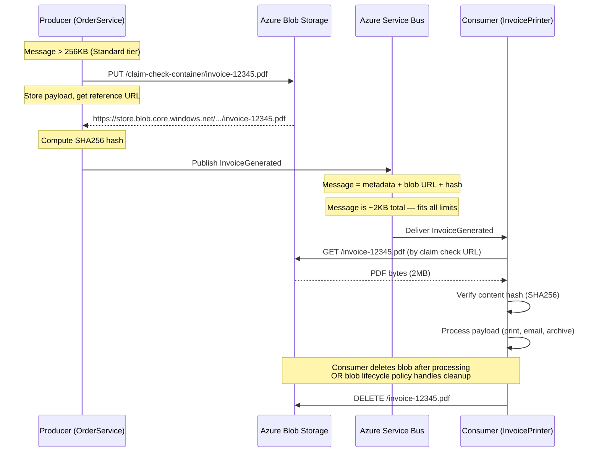
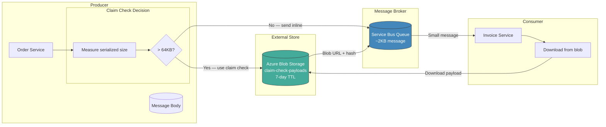
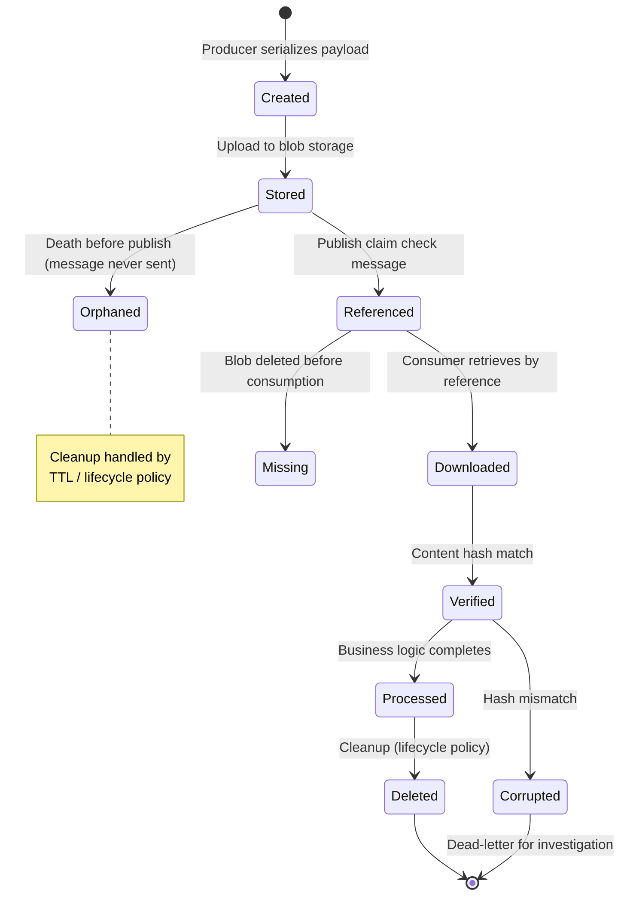
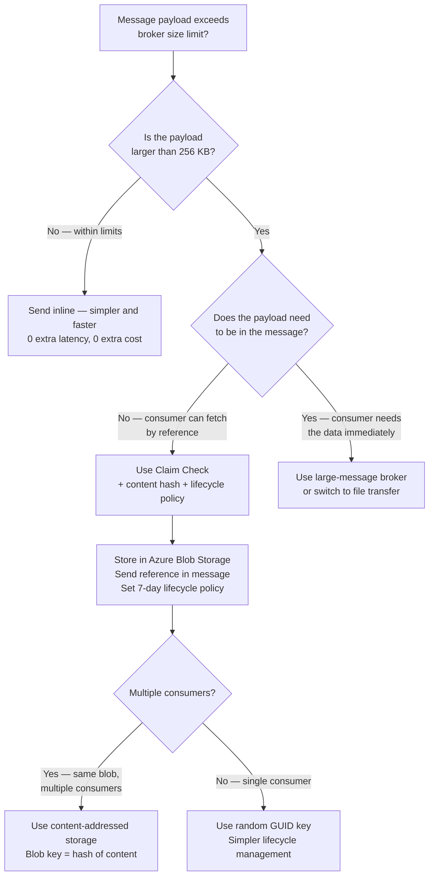

> [!success] Mastery Check
> - [ ] **Studied Well**
> - [ ] **Can explain the concept without notes**
> - [ ] **Can answer interview questions confidently**
> - [ ] **Can implement it in a real project**

## Navigation

**Domain:** [[7 — System Design & Distributed Systems]] > **Group:** Integration Patterns
**Previous:** [[7.146 — Priority Queue Pattern — Tiered Processing]] | **Next:** [[7.148 — Pipes and Filters Pattern]]

### Prerequisites
- [[7.142 — Event-Driven Architecture — Overview]] — required because claim check is a message size optimization within EDA; understanding broker size limits is essential
- [[6.401 — Proxy Pattern]] — the structural design pattern analog: the claim check acts as a surrogate for the large payload

### Where This Fits

The claim check pattern solves the problem of messages that exceed broker size limits (256 KB for Azure Service Bus Standard, 1 MB for Premium, ~1 MB for Kafka default). Instead of sending the full payload in the message, the producer stores the payload in an external store (Azure Blob Storage, S3, a shared filesystem) and sends only a reference — the claim check — in the message. The consumer receives the claim check, retrieves the payload from the external store, and processes it. A .NET engineer encounters this whenever a message contains binary data (images, PDFs), large JSON payloads (batch results, export dumps, large event-carried state transfer payloads), or when event-carried state transfer produces fat events that exceed the broker limit. Without the claim check pattern, the producer must either split large payloads into multiple messages (increasing complexity and making ordering harder) or the broker rejects the message with a `MessageSizeExceededException`. At scale, the pattern is also used proactively — even for messages under the broker limit — to reduce broker network utilization and memory pressure when many consumers process the same large payload.

## Core Mental Model

The claim check pattern separates message metadata (routing info, headers, small fields) from the payload (large data) by storing the payload in an external store and sending only a storage reference in the message. The invariant this maintains is: the message that flows through the broker is always small enough to fit within broker limits, while the full payload is durably stored and accessible to any consumer with the reference. The tradeoff is that consumers now depend on both the broker and the external store — retrieving the payload adds latency, and the external store must be available at processing time. The recognition trigger is a `MessageSizeExceededException` from the broker or the discovery that message payloads routinely exceed 200 KB. More subtly: when you see the broker's network throughput is 10× the message metadata size because payloads are inflating every message, claim check can reduce broker network utilization significantly.

### Classification

Claim check is a message size optimization pattern that operates between the messaging layer and the storage layer. It is not a consistency pattern, a routing pattern, or a processing pattern — it purely addresses the infrastructure constraint of broker message size limits. It is typically used in conjunction with event-carried state transfer (when the fat event would be too large) or with command messages that include large attachments. The pattern is also used proactively to reduce broker load — even messages within limits can benefit from claim check if they are redundantly delivered to many consumers. In the .NET ecosystem, claim check is most commonly implemented via MassTransit's `MessageData<T>` feature, which handles the plumbing of upload on publish and download on consume.





### Key Properties / Guarantees

|Property|Value|Condition|
|---|---|---|
|Message size|Small (KB) — only metadata + reference|Payload stored externally|
|Broker compatibility|Works with any broker|Broker size limit is avoided entirely|
|Consumer dependency|Broker + external store|Blob store must be accessible at consume time|
|Payload retrieval latency|Additional RTT to blob store + transfer time|Network latency + payload size + storage account tier|
|Payload lifecycle|Managed separately from message|Producer or consumer responsible for cleanup|
|Data integrity|Optional — via content hash|Producer computes hash, consumer verifies|
|Payload deduplication|Possible with content-addressed storage|Blob key = hash of content|
|Storage cost|Pay per GB stored × retention period|Blob storage pricing (~$0.02/GB/month for hot tier)|

## Deep Mechanics

### How It Works — Detailed Walkthrough

**Step 1 — Producer measures payload size.** Before publishing, the producer serializes the full message and checks its size. If it exceeds the broker's limit (256 KB for Azure Service Bus Standard, 1 MB for Premium) or a configurable threshold below the limit (e.g., 64 KB), the claim check pattern is triggered. The threshold is a configurable value — setting it lower than the broker limit proactively reduces broker network utilization.

**Step 2 — Producer stores payload externally.** The large payload is serialized and uploaded to Azure Blob Storage (or S3, or a network share). The storage location URL and a content hash (SHA256 for integrity verification) are returned. The upload includes a SAS token for secure access and a blob lease to prevent concurrent modification. The blob is tagged with metadata (message type, correlation ID, expiration) for lifecycle management.

**Step 3 — Producer publishes claim check message.** The message published to the broker contains only metadata: event type, routing headers, correlation ID, and the claim check reference (blob URL + content hash). The message is now small enough to fit within broker limits. In MassTransit, this is handled automatically — the framework intercepts the publish, extracts `MessageData<T>` properties, writes them to the repository, and replaces them with references.

**Step 4 — Consumer receives claim check.** The consumer deserializes the message, extracts the claim check reference, and downloads the payload from the external store. The consumer verifies the content hash to detect corruption or tampering. If the hash does not match, the consumer should not process the payload — it should dead-letter the message or alert an operator.

**Step 5 — Consumer processes payload.** With the payload in memory (or as a stream), the consumer performs its business logic. For very large payloads (>100 MB), the consumer should process the payload as a stream rather than loading it entirely into memory.

**Step 6 — Payload cleanup.** The payload in the external store must be cleaned up to avoid storage cost accumulation. Cleanup can be done by: the consumer after processing (risky — if the consumer crashes, the payload is deleted but the message is not acknowledged); a blob lifecycle policy with TTL (recommended — independent of consumer behavior); or a background cleanup service that scans for orphaned blobs.

### Payload Lifecycle State Diagram



### Storage Backend Comparison

The choice of external storage for claim check payloads affects latency, cost, availability, and operational complexity.

| Storage Backend | Latency (Same Region) | Max Payload Size | Durability | Cost/GB/Month | Best For |
|---|---|---|---|---|---|
| Azure Blob Storage (Hot) | 1-5 ms read, 5-10 ms write | ~5 TB per blob | 99.999999999% (11 9s) | ~$0.018 | Most claim check workloads |
| Azure Blob Storage (Cool) | 5-15 ms read, 10-20 ms write | ~5 TB per blob | 99.999999999% (11 9s) | ~$0.01 | Infrequently accessed payloads (>30 day retention) |
| Azure Blob Storage (Cold) | 15-30 ms read (extra cost for fast read) | ~5 TB per blob | 99.999999999% (11 9s) | ~$0.002 | Archive/regulatory retention |
| Azure Managed Disk (SSD) | <1 ms read/write | ~32 TB per disk | 99.999% (varies) | ~$0.08 | Ultra-low latency requirements, high throughput |
| Azure Redis Cache | <1 ms read/write | 512 MB per value (max 1 GB with clustering) | 99.9% (cache, not durable) | ~$0.05 (P1 tier) | Hot payloads, caching layer, sub-millisecond retrieval |
| S3 (AWS) | 2-10 ms read, 5-15 ms write | ~5 TB per object | 99.999999999% (11 9s) | ~$0.023 | Multi-cloud or AWS-based systems |
| MongoDB GridFS | 2-10 ms read (DB-dependent) | 16 MB per chunk, unlimited chunks | Per DB cluster SLA | Per DB cost | Already using MongoDB; avoids adding a new storage service |

**Recommendation:** Use Azure Blob Storage Hot tier for primary claim check storage. Its latency (1-5 ms same-region) is acceptable for most workloads, and its 11 9s durability exceeds broker durability. Add Azure Redis Cache as a hot cache for payloads that are frequently accessed by multiple consumers (e.g., the same PDF sent to print, email, and archive). The cache reduces blob storage read requests and lowers latency for cached payloads.

### Hybrid Storage Strategy for Multi-Consumer Scenarios

When the same payload must be consumed by multiple consumers (e.g., an invoice PDF sent to print, email, and archive services), a hybrid approach reduces blob storage read costs:

```csharp
// Strategy: First consumer downloads from blob, publishes result to cache
// Subsequent consumers read from cache
public sealed class InvoicePrintConsumer : IConsumer<InvoiceGenerated>
{
    public async Task Consume(ConsumeContext<InvoiceGenerated> context)
    {
        // Try cache first
        var cachedPdf = await _cache.GetAsync<byte[]>(
            context.Message.BlobId, context.CancellationToken);

        byte[] pdfBytes;
        if (cachedPdf.HasValue)
        {
            pdfBytes = cachedPdf.Value;
        }
        else
        {
            // Download from blob storage
            pdfBytes = await DownloadFromBlobAsync(
                context.Message.ClaimCheckUrl, context.CancellationToken);

            // Cache for other consumers (5 min TTL)
            await _cache.SetAsync(context.Message.BlobId, pdfBytes,
                TimeSpan.FromMinutes(5), context.CancellationToken);
        }

        await PrintInvoiceAsync(pdfBytes, context.CancellationToken);
    }
}
```

### Failure Modes — Detailed Catalog

**1. External store unavailable at consumption time.** The blob store is down or the consumer cannot access it (network issue, authentication failure, SAS token expired). The consumer has the claim check but cannot retrieve the payload. **Detection:** consumer-side storage client exceptions — `BlobNotFoundException`, `RequestFailedException` (403 or 404). **Metric:** claim check retrieval error rate. **Prevention:** implement retry with exponential backoff for transient storage failures (Azure Storage SDK has built-in retry); configure geo-redundant storage (RA-GRS) for the blob store; set a reasonable blob-level TTL so that the payload is available for a window that covers retries. For critical payloads, configure a local cache at the consumer.

**2. Payload deleted before consumer retrieves it.** The cleanup process runs before the consumer has processed the message (e.g., consumer is backed up, message is in DLQ, consumer crashed and message was redelivered after a delay). **Detection:** consumer gets a `BlobNotFoundException` when trying to download. **Metric:** claim check retrieval failure count due to missing blob. **Prevention:** set blob TTL to exceed the maximum expected message processing time plus DLQ review time (typical recommendation: 14 days). Decouple cleanup from consumption — use a blob lifecycle policy with a generous deletion window. Never have the consumer delete the blob before acknowledging the message.

**3. Content hash mismatch.** The payload in blob storage was corrupted (storage corruption, tampering, partial upload) or the hash was computed incorrectly. **Detection:** consumer verifies content hash and finds a mismatch. **Metric:** content hash verification failures. **Prevention:** use Azure Blob Storage with MD5 content verification built in (the SDK automatically checks the MD5 hash on download). Use Azure Storage encryption at rest and in transit. Verify the hash immediately after upload (before publishing the message) and before each download. If a mismatch is detected, do not process — dead-letter the message for investigation.

**4. Claim check reference leakage.** The blob URL is accessible to unauthorized parties if the URL is predictable or if the message is intercepted. **Detection:** security audit finding or data breach notification. **Prevention:** use SAS tokens with short expiration tied to the expected processing window (hours, not days); use Azure RBAC on the storage container so that only authorized consumer identities (managed identities) can read blobs; never use public blob containers. For highly sensitive data, use server-side encryption with customer-managed keys (CMK).

**5. Orphaned blobs from producer crash.** The producer uploads the payload to blob storage but crashes before publishing the message. The blob is stored but never referenced — it becomes an orphan. **Detection:** blob creation time vs last access time discrepancy. **Metric:** count of blobs with age > 24 hours but zero download attempts. **Prevention:** implement a cleanup strategy — blob lifecycle policy with TTL (7 days) deletes orphans automatically. For the outbox pattern integration, the upload should happen after the outbox record is committed, not before.

**6. Blob storage account throttling at high throughput.** At high message volumes (>1,000 messages/s), blob storage account request limits may be reached (20,000 requests/s per account for standard tier). **Detection:** storage client receives `HttpStatusCode 503` (Server Busy) or `304` (Rate Limit Exceeded). **Metric:** storage account throttling events. **Prevention:** use premium block blob storage (higher request rates); distribute payloads across multiple storage accounts or containers; implement client-side retry with exponential backoff; consider using Azure CDN or Redis Cache for hot payloads.

**7. Memory pressure from large payloads at the consumer.** The consumer downloads a 50 MB payload and loads it entirely into memory. With 10 concurrent consumers processing 50 MB payloads, memory usage spikes to 500 MB per instance. **Detection:** consumer OOM or high GC pressure. **Metric:** consumer memory usage, GC pause duration. **Prevention:** stream the payload instead of downloading into a byte array. Use `BlobClient.OpenReadAsync` to get a stream and process it incrementally. Set a maximum payload size in the consumer and reject oversized messages at the validation stage.

### .NET and Azure Integration

- **Azure Blob Storage:** the canonical external store for claim check. Blobs can be uploaded with a lease, a TTL (via lifecycle management), and a SAS token for secure access. The `BlobClient`, `BlockBlobClient`, and `BlobContainerClient` classes handle upload/download.
- **MassTransit MessageData:** MassTransit's built-in claim check implementation. When a message property implements `MessageData<T>`, MassTransit automatically stores the payload in the configured repository (Azure Blob Storage, file system, MongoDB) and sends only the reference in the message.
- **Azure Storage SDK:** `BlobContainerClient` for managing the blob lifecycle. `BlobClient.UploadAsync` and `BlobClient.DownloadAsync` for payload transfer.
- **Polly + retry:** for resilient blob download in the consumer — wrap blob operations in a retry policy with exponential backoff.
- **Azure.Identity + ManagedIdentity:** for secure access to blob storage without connection strings — use `DefaultAzureCredential` and RBAC.

```csharp
// Producer — claim check with MassTransit MessageData
public sealed class OrderService
{
    private readonly IPublishEndpoint _publisher;
    private readonly IMessageDataRepository _messageData;

    public OrderService(
        IPublishEndpoint publisher,
        IMessageDataRepository messageData)
    {
        _publisher = publisher;
        _messageData = messageData;
    }

    public async Task PublishInvoiceAsync(Invoice invoice, CancellationToken ct)
    {
        // The invoice PDF is large (> 1MB) — use claim check
        var pdfBytes = await GenerateInvoicePdfAsync(invoice, ct);

        // MessageData<byte[]> tells MassTransit to store the payload externally
        // The framework handles upload to Azure Blob Storage
        var pdfData = await _messageData.PutBytes(pdfBytes, ct);

        // Publish small message with claim check reference
        await _publisher.Publish(new InvoiceGenerated
        {
            InvoiceId = invoice.Id,
            OrderId = invoice.OrderId,
            CustomerId = invoice.CustomerId,
            CreatedAt = DateTimeOffset.UtcNow,
            PdfData = pdfData  // claim check — small reference in message
        }, ct);
    }

    private async Task<byte[]> GenerateInvoicePdfAsync(Invoice invoice, CancellationToken ct)
    {
        // Use a PDF generation library (e.g., QuestPDF, DinkToPdf)
        // ...
        return pdfBytes;
    }
}

// Event with claim check — PdfData is stored externally
public sealed record InvoiceGenerated
{
    public string InvoiceId { get; init; }
    public string OrderId { get; init; }
    public string CustomerId { get; init; }
    public DateTimeOffset CreatedAt { get; init; }
    public MessageData<byte[]> PdfData { get; init; }  // claim check property
}

// Consumer — retrieves payload via claim check
public sealed class InvoicePrintConsumer : IConsumer<InvoiceGenerated>
{
    private readonly ILogger<InvoicePrintConsumer> _logger;
    private readonly IInvoicePrintingService _printingService;

    public InvoicePrintConsumer(
        ILogger<InvoicePrintConsumer> logger,
        IInvoicePrintingService printingService)
    {
        _logger = logger;
        _printingService = printingService;
    }

    public async Task Consume(ConsumeContext<InvoiceGenerated> context)
    {
        var message = context.Message;

        _logger.LogInformation("Processing invoice {InvoiceId} with claim check",
            message.InvoiceId);

        try
        {
            // MassTransit automatically resolves the claim check.
            // PdfData.Value downloads the blob and returns the bytes.
            // This is an async operation that may fail if blob store is down.
            var pdfBytes = await message.PdfData.Value;

            // Verify payload integrity
            // MassTransit's MessageDataRepository can be configured to
            // compute and verify hashes automatically
            _logger.LogInformation("Downloaded {ByteCount} bytes for invoice {InvoiceId}",
                pdfBytes.Length, message.InvoiceId);

            // Process the payload — send to printer
            await _printingService.PrintInvoiceAsync(
                pdfBytes,
                message.InvoiceId,
                context.CancellationToken);

            await context.ConsumeCompleted;
        }
        catch (Exception ex) when (ex is BlobNotFoundException or RequestFailedException)
        {
            _logger.LogError(ex, "Failed to retrieve claim check payload for invoice {InvoiceId}",
                message.InvoiceId);
            throw; // Message will be retried or dead-lettered
        }
    }
}
```

## Production Patterns and Implementation

### Primary Implementation

The canonical claim check implementation uses MassTransit's `MessageData` with Azure Blob Storage. MassTransit automatically handles upload on publish and download on consume. The developer only declares the `MessageData<T>` property type and configures the repository.

```csharp
// Program.cs — configure MassTransit with Azure Blob Storage for message data
var builder = WebApplication.CreateBuilder(args);

// Configure Azure Blob Storage as the message data repository
var blobServiceClient = new BlobServiceClient(
    builder.Configuration["Azure:Storage:ConnectionString"]);

var messageDataRepository = new AzureBlobStorageMessageDataRepository(
    blobServiceClient,
    "claim-check-payloads");  // container name

builder.Services.AddSingleton<IMessageDataRepository>(messageDataRepository);

// Configure MassTransit
builder.Services.AddMassTransit(x =>
{
    x.AddConsumer<InvoicePrintConsumer>();
    x.AddConsumer<InvoiceEmailConsumer>();
    x.AddConsumer<InvoiceArchiveConsumer>();

    x.UsingAzureServiceBus((context, cfg) =>
    {
        cfg.Host(builder.Configuration["Azure:ServiceBus:ConnectionString"]);

        cfg.UseMessageData(messageDataRepository);  // wire up claim check

        cfg.ReceiveEndpoint("invoice-print", e =>
        {
            e.ConfigureConsumer<InvoicePrintConsumer>(context);
        });

        cfg.ReceiveEndpoint("invoice-email", e =>
        {
            e.ConfigureConsumer<InvoiceEmailConsumer>(context);
        });

        cfg.ReceiveEndpoint("invoice-archive", e =>
        {
            e.ConfigureConsumer<InvoiceArchiveConsumer>(context);
        });
    });
});

// Configure MessageData options
builder.Services.Configure<MessageDataOptions>(o =>
{
    // Only use claim check for messages > 64 KB
    // Messages smaller than this are sent inline
    o.MaxMessageSize = 65536;  // 64 KB
});

// Configure retry for blob storage operations
builder.Services.AddHttpClient("BlobRetryClient")
    .AddTransientHttpErrorPolicy(p => p.WaitAndRetryAsync(3,
        retryAttempt => TimeSpan.FromMilliseconds(Math.Pow(2, retryAttempt) * 100)));

var app = builder.Build();
app.Run();

// Manual claim check implementation (without MassTransit)
// For cases where you need more control over the blob storage interaction
public sealed class ManualClaimCheckService
{
    private readonly BlobContainerClient _containerClient;
    private readonly ILogger<ManualClaimCheckService> _logger;

    public ManualClaimCheckService(
        BlobServiceClient blobServiceClient,
        ILogger<ManualClaimCheckService> logger)
    {
        _containerClient = blobServiceClient.GetBlobContainerClient("claim-check-payloads");
        _logger = logger;
    }

    public async Task<ClaimCheckResult> StorePayloadAsync(
        Stream payloadStream,
        string contentType,
        CancellationToken ct)
    {
        var blobId = Guid.NewGuid().ToString();
        var blobClient = _containerClient.GetBlobClient(blobId);

        // Upload with metadata
        var blobHttpHeaders = new BlobHttpHeaders { ContentType = contentType };
        await blobClient.UploadAsync(payloadStream, new BlobUploadOptions
        {
            HttpHeaders = blobHttpHeaders,
            Metadata = new Dictionary<string, string>
            {
                ["CreatedAt"] = DateTimeOffset.UtcNow.ToString("O"),
                ["ContentType"] = contentType
            }
        }, ct);

        // Compute content hash for integrity verification
        payloadStream.Position = 0;
        var hash = await ComputeSha256Async(payloadStream, ct);

        return new ClaimCheckResult(
            BlobUrl: blobClient.Uri.ToString(),
            ContentHash: hash,
            BlobId: blobId);
    }

    public async Task<Stream> RetrievePayloadAsync(
        string blobUrl,
        byte[] expectedHash,
        CancellationToken ct)
    {
        var blobClient = new BlobClient(new Uri(blobUrl));

        var response = await blobClient.DownloadStreamingAsync(cancellationToken: ct);

        // Verify content hash
        var actualHash = await ComputeSha256Async(response.Value.Content, ct);
        if (!actualHash.SequenceEqual(expectedHash))
        {
            throw new InvalidDataException(
                "Claim check payload integrity check failed");
        }

        return response.Value.Content;
    }

    private static async Task<byte[]> ComputeSha256Async(
        Stream stream, CancellationToken ct)
    {
        using var sha256 = System.Security.Cryptography.SHA256.Create();
        return await sha256.ComputeHashAsync(stream, ct);
    }
}

public sealed record ClaimCheckResult(
    string BlobUrl,
    byte[] ContentHash,
    string BlobId);
```

### Configuration and Wiring

```csharp
// appsettings.json
{
  "Azure": {
    "Storage": {
      "ConnectionString": "DefaultEndpointsProtocol=https;AccountName=claimcheckstore;AccountKey=...;EndpointSuffix=core.windows.net",
      "ClaimsCheckContainer": "claim-check-payloads",
      "SasTokenExpiryHours": 24,
      "RetryCount": 3,
      "RetryMode": "Exponential"
    },
    "ServiceBus": {
      "ConnectionString": "Endpoint=sb://orders-namespace.servicebus.windows.net/;..."
    }
  },
  "MassTransit": {
    "MessageData": {
      "MaxMessageSize": 65536,
      "AlwaysStore": false
    }
  }
}

// Blob lifecycle policy — cleanup after 7 days
// deploy-lifecycle-policy.ps1
// az storage account management-policy create --account-name claimcheckstore --resource-group rg-orders --policy @policy.json

// policy.json
{
  "rules": [
    {
      "name": "CleanupClaimCheckPayloads",
      "enabled": true,
      "type": "Lifecycle",
      "definition": {
        "filters": {
          "blobTypes": ["blockBlob"],
          "prefixMatch": ["claim-check-payloads/"]
        },
        "actions": {
          "baseBlob": {
            "tierToCool": {
              "daysAfterModificationGreaterThan": 1
            },
            "delete": {
              "daysAfterModificationGreaterThan": 7
            }
          }
        }
      }
    }
  ]
}
```

### Chunking vs Claim Check — Decision Framework

Before choosing claim check, consider whether splitting the message into chunks is a viable alternative. Both approaches circumvent broker size limits, but with different tradeoffs.

| Dimension | Claim Check | Message Chunking |
|---|---|---|
| Implementation | Medium — blob storage + reference in message | High — splitter at producer, reassembler at consumer |
| Consumer complexity | Low — download single blob | High — collect all chunks, handle out-of-order delivery, reassemble |
| Ordering | N/A — single message | Chunks must be ordered; use sequence numbers, handle gaps |
| Poison handling | Standard — single message goes to DLQ | Complex — partial chunk set in DLQ, manual reassembly |
| Storage dependency | Yes — blob store must be available at consume time | No — all data in broker messages |
| Broker load | Minimal — small reference message | High — N chunks × broker overhead per chunk |
| Retry semantics | Single message retry (standard) | All chunks must be retried together if one fails |
| Maximum size | Blob size limit (~5 TB) | Unlimited (more chunks) |
| .NET implementation | `MessageData<T>` (MassTransit) | Custom splitter/reassembler |

**When to choose claim check:** Most scenarios. The blob storage dependency is acceptable because blob storage SLA (99.9%+) is comparable to broker SLA (99.95%). The implementation is simpler, and the consumer code is straightforward.

**When to choose chunking:** When blob storage is not available (on-premises systems without cloud storage, air-gapped networks). When regulatory compliance requires that data never leaves the broker's jurisdiction. When the extra latency of blob download is unacceptable (sub-millisecond processing SLOs that cannot tolerate even 1-5 ms of blob retrieval).

**When to use both:** Very large payloads > 100 MB where the producer can stream chunks to blob storage AND the consumer can download them in parallel chunks. This is rare — typically only for video processing or large file transfer workloads.

### Common Variants

**Manual claim check without MassTransit.** If the framework does not support claim checks, implement it manually: the producer uploads to blob storage with a unique ID, publishes a message with the blob URL and content hash, the consumer downloads and verifies, and a cleanup job removes orphaned blobs.

```csharp
// Manual claim check — producer
var blobId = Guid.NewGuid().ToString();
var blobClient = _blobContainerClient.GetBlobClient(blobId);
await blobClient.UploadAsync(payloadStream, ct);

var hash = ComputeSha256(payloadBytes);

await _publisher.Publish(new InvoiceGenerated
{
    InvoiceId = invoice.Id,
    ClaimCheckUrl = blobClient.Uri.ToString(),
    ContentHash = hash
}, ct);

// Manual claim check — consumer
var blobClient = new BlobClient(new Uri(context.Message.ClaimCheckUrl));
var response = await blobClient.DownloadAsync(ct);
var payload = await response.Value.Content.ReadAsByteArrayAsync(ct);

// Verify integrity
var actualHash = ComputeSha256(payload);
if (!actualHash.SequenceEqual(context.Message.ContentHash))
{
    throw new InvalidDataException("Payload integrity check failed");
}
```

**Hybrid: metadata in message, large fields in claim check.** Instead of storing the entire message payload externally, only the large fields (e.g., PDF bytes, image data) are stored externally. Message metadata is sent inline. This reduces consumer complexity because most data is in the message; only the large binary is fetched. This is the most common production variant — the event has 20 small fields inline and one `MessageData<byte[]>` for the attachment.

**Claim check with content addressable storage (CAS).** The blob key is a hash of the content (content-addressed), not a random GUID. This enables deduplication — if the same payload is published multiple times, only one copy is stored. The consumer can also verify integrity by comparing the key with the downloaded content hash. This is extremely useful for scenarios where the same payload is sent to multiple consumers (e.g., broadcast of the same invoice PDF to printing, email, and archive services).

```csharp
// Content-addressed claim check
var contentHash = ComputeSha256(payloadBytes);
var blobId = BitConverter.ToString(contentHash).Replace("-", "").ToLowerInvariant();
var blobClient = _containerClient.GetBlobClient(blobId);

// Only upload if not already present
if (!await blobClient.ExistsAsync(ct))
{
    await blobClient.UploadAsync(new BinaryData(payloadBytes), ct);
}

// Publish with content-hash as key
await _publisher.Publish(new InvoiceGenerated
{
    ClaimCheckUrl = blobClient.Uri.ToString(),
    ContentHash = contentHash
}, ct);
```

**Claim check with file reference (for very large files > 100 MB).** Instead of downloading the payload into memory, the consumer processes it as a stream directly from blob storage. The reference includes a SAS token and the consumer uses `BlobClient.OpenReadAsync` to stream the content.

**Claim check with caching.** A consumer-side cache (Azure Redis Cache, local file system) stores recently downloaded payloads. If the same payload is referenced by multiple messages (rare), the consumer can avoid re-downloading. The cache TTL should be shorter than the blob lifecycle TTL.

### Cleanup Strategies Deep Dive

Payload cleanup is one of the most commonly overlooked aspects of claim check in production. Below is a detailed comparison of cleanup strategies:

**Strategy 1 — Blob Lifecycle Policy (Recommended Primary)**
- Mechanism: Azure Blob Storage lifecycle management rule deletes blobs after N days since last modification
- Pros: Zero code, zero consumer involvement, independent of message processing lifecycle
- Cons: Deletes blobs based on age, not on processing status. A blob may be deleted even if the corresponding message was not processed (e.g., message stuck in DLQ)
- Configuration: Set retention to MaxExpectedProcessingTime + MaxDLQReviewTime + SafetyMargin (typically 14 days)
- Monitoring: Alert if oldest blob age approaches the retention window minus 2 days
```
{
  "rules": [{
    "name": "CleanupClaimCheck",
    "enabled": true,
    "type": "Lifecycle",
    "definition": {
      "actions": {
        "baseBlob": {
          "tierToCool": { "daysAfterModificationGreaterThan": 1 },
          "tierToCold": { "daysAfterModificationGreaterThan": 3 },
          "delete": { "daysAfterModificationGreaterThan": 14 }
        }
      },
      "filters": { "blobTypes": ["blockBlob"] }
    }
  }]
}
```

**Strategy 2 — Consumer-Initiated Cleanup (Not Recommended as Sole Strategy)**
- Mechanism: Consumer deletes the blob after successful processing, AFTER acknowledging the message
- Pros: Immediate cleanup, no idle storage period
- Cons: If consumer crashes between ack and delete, blob is orphaned. If message is redelivered, blob is gone. Requires consumer to be trusted with delete permissions
- Safe implementation: delete after ack, in a fire-and-forget with retry
```csharp
// ✅ Safe consumer-initiated cleanup — only after ack
await context.ConsumeCompleted;  // acknowledge first
_ = DeleteBlobAsync(context.Message.ClaimCheckUrl, CancellationToken.None);
```

**Strategy 3 — Background Cleanup Service (Safety Net)**
- Mechanism: A periodic background job scans the blob container, checks if the corresponding message has been processed (by querying the ProcessedMessages table or checking message state in the broker), and deletes orphaned blobs
- Pros: Catches what lifecycle policy misses (blobs whose messages were processed but still exist)
- Cons: Adds operational complexity, must handle the case where message processing status cannot be determined
- Implementation: Run as an Azure Function on a timer (every hour), query blobs with last access time > 24 hours, cross-reference with ProcessedMessages table

**Strategy 4 — Content-Addressed Storage (Self-Cleaning)**
- Mechanism: Blob key is a hash of the content. When a new payload is uploaded with the same hash, it overwrites the existing blob. The blob's last modified timestamp is updated. Lifecycle policy eventually deletes blobs that haven't been modified or accessed
- Pros: Deduplication reduces storage. Frequently accessed payloads stay alive because they are periodically re-uploaded
- Cons: Not suitable for payloads that change. Blob metadata must distinguish "same payload, new message" from "identical payload, different context"
- Best for: Reference data payloads (e.g., product images, legal disclosure PDFs) that are sent to many consumers

### Real-World .NET Ecosystem Example

**MassTransit's `MessageDataRepository`** is the canonical .NET claim check implementation. It supports Azure Blob Storage, MongoDB GridFS, and file system repositories. When a message property is declared as `MessageData<T>`, MassTransit intercepts the publish — it serializes the message, extracts the `MessageData<T>` properties, writes them to the repository, replaces them with references, and publishes the trimmed message. On consumption, it reverses the process: reads the reference, downloads the data from the repository, and populates the `Value` property. The framework handles all the plumbing — the developer only declares the property type. Many production .NET systems use this for invoice processing, document management, and image processing pipelines. The `AzureBlobStorageMessageDataRepository` is the most common implementation in Azure-based deployments.

## Gotchas and Production Pitfalls

### 1. Payload Cleanup Not Implemented

**Pitfall:** Uploading payloads to blob storage but never deleting them.

```csharp
// ❌ Payload uploaded, never cleaned up
await blobClient.UploadAsync(payload, ct);
await _publisher.Publish(new InvoiceGenerated { ClaimCheckUrl = blobClient.Uri }, ct);
// blobClient.DeleteAsync() is never called
```

**Symptom:** Storage costs grow unboundedly. After months of production, the claim check container holds terabytes of orphaned payloads. Audit finds that 90% of blobs are past their useful processing window.

**Fix:** Implement a blob lifecycle management policy that deletes blobs after a configurable retention period (e.g., 7 days). This is the most reliable approach because it does not depend on consumer behavior.

```csharp
// ✅ Blob lifecycle policy (Azure Portal / ARM / Terraform)
// Delete blobs 7 days after last modification
{
  "rules": [{
    "name": "CleanupClaimCheck",
    "enabled": true,
    "type": "Lifecycle",
    "definition": {
      "actions": {
        "baseBlob": {
          "tierToCool": { "daysAfterModificationGreaterThan": 1 },
          "delete": { "daysAfterModificationGreaterThan": 7 }
        }
      },
      "filters": {
        "blobTypes": ["blockBlob"]
      }
    }
  }]
}
```

**Cost of not fixing:** Escalating Azure storage costs (potentially thousands of dollars per month). Eventual need for a one-time cleanup script that scans all blobs and deletes those whose corresponding messages have been processed — a time-consuming and risky operation.

### 2. Payload Deleted Before Consumer Processes

**Pitfall:** Consumer cleanup deletes the blob immediately after processing, but the message may be redelivered (broker redelivery) or the consumer crashes before acknowledging.

```csharp
// ❌ Consumer deletes payload before acknowledging the message
public async Task Consume(ConsumeContext<InvoiceGenerated> context)
{
    var pdfBytes = await DownloadPayloadAsync(context.Message.ClaimCheckUrl);
    await ProcessAsync(pdfBytes);

    await DeletePayloadAsync(context.Message.ClaimCheckUrl); // too early!
    await context.ConsumeCompleted; // ack — if crash before this, payload gone but message not acked
}
```

**Symptom:** Message redelivery after consumer crash finds the payload deleted. The consumer throws `BlobNotFoundException`, the message goes to the DLQ, and manual intervention is required to reprocess.

**Fix:** Do not delete the payload in the consumer. Use blob lifecycle policies with a retention window that exceeds the maximum expected processing time plus DLQ review time (recommended: 14 days). If the consumer must delete the payload, do it in a separate step after the message is acknowledged, or mark the payload as processed (e.g., rename blob) instead of deleting.

**Cost of not fixing:** Data loss for messages that need redelivery or reprocessing. The team spends time rebuilding payloads from source systems to reprocess DLQ messages.

### 3. Claim Check URL Without Integrity Verification

**Pitfall:** The claim check is just a blob URL with no content hash or integrity verification.

```csharp
// ❌ No content hash — consumer cannot detect corruption
public async Task Consume(ConsumeContext<InvoiceGenerated> context)
{
    var blobClient = new BlobClient(new Uri(context.Message.ClaimCheckUrl));
    var pdfBytes = await DownloadAsync(blobClient); // no integrity check!
}
```

**Symptom:** A corrupted payload (bit rot, incomplete upload, tampering) is processed silently. The invoice is printed with corrupted data. The business impact is discovered days later.

**Fix:** Include a content hash (SHA256) in the message. The consumer verifies the hash after downloading. In MassTransit, the `MessageDataRepository` optionally computes and verifies hashes automatically.

```csharp
// ✅ Content hash verification
public async Task Consume(ConsumeContext<InvoiceGenerated> context)
{
    var blobClient = new BlobClient(new Uri(context.Message.ClaimCheckUrl));
    using var blobStream = await blobClient.OpenReadAsync();

    var actualHash = await ComputeSha256Async(blobStream, context.CancellationToken);
    if (!actualHash.SequenceEqual(context.Message.ContentHash))
    {
        throw new InvalidDataException("Claim check payload integrity check failed");
    }

    blobStream.Position = 0;
    await ProcessInvoiceAsync(blobStream, context.CancellationToken);
}
```

**Cost of not fixing:** Silent data corruption goes undetected. In regulated industries (finance, healthcare), this can be a compliance violation. Regulators may require proof of data integrity.

### 4. Large Message in a High-Throughput System

**Pitfall:** Using claim check for every message in a high-throughput system, even when most messages are small.

```csharp
// ❌ Claim check for all messages, even tiny ones
public MessageData<byte[]> Payload { get; init; } // always stored externally
```

**Symptom:** Thousands of tiny blobs created per second. Blob storage operations cost more than the broker throughput. Latency added for every message to upload and download payloads that could fit inline.

**Fix:** Set a size threshold — only use claim check for payloads exceeding the threshold. In MassTransit, configure `MessageDataOptions.MaxMessageSize`.

```csharp
// ✅ Threshold-based — only use claim check above 64 KB
builder.Services.Configure<MessageDataOptions>(o =>
{
    o.MaxMessageSize = 65536; // 64 KB
    // Messages below 64 KB are sent inline
    // Messages above 64 KB are stored via claim check
});
```

**Cost of not fixing:** Increased latency and cost for every message, even small ones. Blob storage API rate limits may be hit, causing upload/download failures. The system becomes slower than if it never used claim check.

### 5. Blob Storage in a Different Region Than Consumers

**Pitfall:** Deploying blob storage in a different Azure region than consumer services.

```csharp
// ❌ Consumer in West Europe, blob storage in Southeast Asia
// Blob download latency: 200-500ms per hop
```

**Symptom:** Claim check download adds 200-500 ms of latency per message due to cross-region network round trips. P99 processing time is dominated by blob download time.

**Fix:** Deploy blob storage in the same region as consumer services. Use geo-redundant storage (RA-GRS) only for disaster recovery, not as the primary storage endpoint. For multi-region deployments, use Azure Front Door or Azure CDN to cache blobs near consumers.

**Cost of not fixing:** Every claim check message incurs cross-region latency, which is significantly higher than same-region latency (1-5 ms vs 100-500 ms). This can double or triple end-to-end processing time.

### 6. SAS Token Expiration During Long Processing

**Pitfall:** Setting SAS token expiry too short (e.g., 1 hour) for processes that may take longer (e.g., DLQ review takes 3 days).

```csharp
// ❌ SAS token expires in 1 hour
var sasBuilder = new BlobSasBuilder
{
    ExpiresOn = DateTimeOffset.UtcNow.AddHours(1)
};
```

**Symptom:** When a message is dead-lettered and reprocessed days later, the SAS token has expired. The consumer cannot download the payload.

**Fix:** Use managed identities and RBAC instead of SAS tokens for cross-service access. Managed identities do not expire. If SAS tokens must be used, set the expiry to cover the maximum expected processing window (e.g., 14 days).

```csharp
// ✅ Use managed identity (preferred) — no expiry
// Configure the consumer with DefaultAzureCredential
// Grant the consumer's managed identity "Storage Blob Data Reader" role

// If SAS is required, set a long expiry
var sasBuilder = new BlobSasBuilder
{
    ExpiresOn = DateTimeOffset.UtcNow.AddDays(14)
};
```

**Cost of not fixing:** Inability to reprocess messages from the DLQ. Manual intervention required to regenerate SAS tokens.

### 7. Not Handling the Claim Check Reference as Stream for Large Payloads

**Pitfall:** Loading the entire payload into memory as a byte array, even for 500 MB payloads.

```csharp
// ❌ Load entire payload into memory
var pdfBytes = await message.PdfData.Value; // byte[] — 500 MB in memory
```

**Symptom:** Consumer OOM kills under load. High GC pressure. With 5 concurrent 500 MB payloads, memory usage is 2.5 GB.

**Fix:** Stream the payload instead of loading into memory. Use `MessageData<Stream>` or `MessageData<byte[]>` with streaming processing.

```csharp
// ✅ Stream the payload — process without loading entirely into memory
await using var blobStream = await blobClient.OpenReadAsync(cancellationToken: ct);
await ProcessInvoiceStreamAsync(blobStream, ct); // process incrementally
```

**Cost of not fixing:** Memory exhaustion under concurrent processing, leading to consumer crashes and message redeliveries.

### 8. Claim Check in Test and Development Environments

**Pitfall:** Using the same blob storage container for all environments (dev, test, staging, production). Or, conversely, disabling claim check in test environments and relying on inline payloads, only to discover in production that the code path breaks with external storage.

```csharp
// ❌ No blob storage available in local dev — code fails
// Developer runs locally without Azure Storage Emulator
var pdfBytes = await message.PdfData.Value; // throws in dev
```

**Symptom:** In development, the code compiles and unit tests pass, but integration tests fail because blob storage is not available. In production, everything works because the managed identity has access. The team has no way to test the claim check code path locally. Alternatively, using a shared blob container across environments causes test data to interfere with production data, and lifecycle policies delete blobs unexpectedly.

**Fix:** Use Azurite (Azure Storage Emulator) for local development. Configure the connection string per environment:

```csharp
// ✅ Environment-aware configuration
var connectionString = builder.Configuration["Azure:Storage:ConnectionString"]
    ?? "UseDevelopmentStorage=true";  // Azurite fallback

var blobServiceClient = new BlobServiceClient(connectionString);

// Use a separate container per environment
var containerName = $"claim-check-{builder.Environment.EnvironmentName.ToLower()}";
```

**Cost of not fixing:** Developers cannot test the claim check integration locally. The first time the claim check code path is exercised is in staging or production, where debugging is harder. Blob storage access issues are discovered late in the deployment pipeline.

### 9. SAS Token in the Message Instead of a Simple Blob URL

**Pitfall:** Including the full SAS token (with account key) in the message body, rather than using managed identities or storing the token metadata separately.

**Symptom:** The SAS token is logged (logging the message body), leaking storage account access. The token is stored in the broker's message store, increasing the blast radius of a broker compromise. The token expires, and messages in the DLQ become unprocessable.

**Fix:** Use managed identities (DefaultAzureCredential) with RBAC roles instead of SAS tokens. If SAS tokens are unavoidable, generate them with the shortest reasonable expiry and include only the token reference, not the account key.

```csharp
// ✅ Use managed identity — no stored credentials
builder.Services.AddSingleton<BlobServiceClient>(sp =>
{
    var uri = new Uri(builder.Configuration["Azure:Storage:AccountUri"]);
    return new BlobServiceClient(uri, new DefaultAzureCredential());
});

// Grant the consumer's managed identity "Storage Blob Data Reader" role
// No SAS tokens, no connection strings, no keys in messages
```

**Cost of not fixing:** Security breach if the message is intercepted or logged. Regulatory compliance violation (e.g., PCI DSS, HIPAA) if storage account keys are transmitted through messages.

## Tradeoffs and Decision Framework

### Tradeoff Matrix

| Dimension | Claim Check | Inline Payload (within broker limit) | Split Message (multiple parts) |
|---|---|---|---|
| Broker limit compliance | Yes — message is always small | No — limited to broker max | Yes — but ordering complexity |
| Consumer complexity | Medium (download + verify) | Low (deserialize directly) | High (reassemble parts, ordering) |
| Latency overhead | + upload + download RTT | None | + latency per part + reassembly |
| Storage dependency | Yes — external blob store | No | No |
| Payload lifecycle management | Required — cleanup policy | N/A (broker handles deletion) | N/A |
| Integrity verification | Optional — content hash | N/A (broker handles) | Requires sequence verification |
| Deduplication | Possible with content-addressed storage | N/A | N/A |
| Best for | Large payloads, multiple consumers | Small payloads, single consumer | Migration path, no blob store |

### When to Apply



### When NOT to Apply

- [ ] The payload is within broker size limits — claim check adds unnecessary latency and storage dependency for small messages
- [ ] The consumer cannot tolerate the extra latency of downloading the payload — each claim check adds at least one RTT to blob storage (1-5 ms same region, 100-500 ms cross-region)
- [ ] The external blob store has a lower availability SLA than the broker — the consumer is now dependent on the blob store for processing (Azure Blob Storage SLA is 99.9% for hot tier, vs 99.95% for Service Bus Premium)
- [ ] The payload is only needed by the producer (no consumers read it) — there is no reason to send it through the broker at all; use a direct storage reference
- [ ] The system has no blob storage available and adding it is not justified by the message volume
- [ ] The payload is less than ~10 KB and there is only one consumer — the overhead of upload + download is greater than the inline delivery cost

### When to Use Claim Check Proactively (Even Under Broker Limit)

While the primary trigger for claim check is exceeding broker size limits, there are scenarios where it is beneficial to use claim check even when the payload fits within limits:

**High consumer fan-out:** If one message is consumed by 10 different consumers (e.g., an invoice published to print, email, archive, and audit services), the broker must transfer the full payload 10 times. With claim check, the broker transfers the small reference 10 times, and each consumer independently downloads the payload from blob storage. This reduces broker network throughput by the payload size × (N_consumers - 1).

**Large payloads approaching the limit:** If your average payload is 200 KB and the broker limit is 256 KB (Service Bus Standard), you have only 56 KB of headroom. Any metadata growth (additional headers, correlation IDs, tracing context) may push the message over the limit. Claim check provides a safety margin.

**Cross-region replication:** If the broker replicates messages across regions (geo-replication), the full payload is transferred across regions for every consumer. With claim check, the small reference is replicated, and the payload is downloaded from a local blob storage endpoint. This reduces cross-region data transfer costs.

**Payload reuse across messages:** If the same payload (e.g., a product image, legal disclosure PDF) is referenced by many messages, content-addressed storage deduplicates it. The broker sends references to the same blob, which is stored once. Without claim check, the payload is included in every message, multiplied by every consumer.

### Scale Thresholds

- **Use when message size exceeds broker limit** (256 KB for Service Bus Standard, 1 MB for Premium, 1 MB for Kafka default)
- **Consider at >100 KB** even if under the limit, if many consumers increase network transfer costs significantly (the broker replicates the message for each consumer)
- **Re-evaluate if claim check volume exceeds 10,000 messages per hour** — blob storage API rate limits may become a bottleneck (standard tier: 20,000 requests/s per account)
- **Required when payload exceeds 10 MB** — no standard broker handles this inline
- **Consider Azure Files or AzCopy for payloads > 1 GB** — blob storage upload/download for multi-GB payloads may exceed HTTP timeouts

## Interview Arsenal

### Question Bank

1. What is the claim check pattern and what problem does it solve?
2. Walk through the flow of a claim check from producer to consumer.
3. What is the tradeoff of claim check — what do you gain and what do you lose?
4. What happens when the blob store is unavailable when a consumer tries to download a claim check payload?
5. Compare claim check with inline message payloads — when would you use each?
6. Design a document processing system where documents can be up to 50 MB and must be processed reliably.
7. How does claim check behave under high throughput (5,000 messages/s with 100 KB average payload)?
8. What is the relationship between claim check and the outbox pattern — do they conflict?
9. How does MassTransit's MessageData feature implement claim check?
10. What cleanup strategies exist for claim check payloads and what are the tradeoffs of each?

### Spoken Answers

**Q: What is the claim check pattern and when would you use it?**

> **Average answer:** The claim check pattern stores large message payloads in a database or blob store and sends only a reference in the message. Use it when messages are too large for the broker.

> **Great answer:** The claim check pattern decouples message metadata from message payload by storing the payload in an external data store — typically Azure Blob Storage — and sending only a storage reference in the message that flows through the broker. It solves the infrastructure constraint of broker message size limits (256 KB for Azure Service Bus Standard, 1 MB for Premium). Rather than fighting the broker or splitting payloads into fragments, the producer stores the full payload once, and any consumer can retrieve it using the reference.

The tradeoff is threefold. First, you gain broker compatibility — your messages are always small enough to fit. Second, you lose the consumer's single-dependency model — the consumer now depends on both the broker and the blob store to process a message. Third, you add latency — each message now requires an upload and a download round trip to blob storage, which can add 50-500 ms depending on payload size and network.

I use the claim check pattern when payloads exceed the broker limit, but also proactively when payloads are large enough that sending them through the broker would be wasteful — for example, if 10 consumers each receive the same 500 KB payload, the broker must transfer 5 MB of data. With claim check, the broker transfers a few KB per consumer, and each consumer independently downloads the payload from blob storage. In MassTransit, this is handled by the `MessageData<T>` property feature — you declare the payload as `MessageData<byte[]>` and the framework handles the rest.

**Q: How does MassTransit's MessageData work?**

> **Great answer:** MassTransit's `MessageData<T>` is a built-in claim check implementation. You configure a `IMessageDataRepository` — typically backed by Azure Blob Storage — and register it in the service container. When you publish a message that contains a `MessageData<T>` property, MassTransit intercepts the serialization. Instead of serializing the payload inline, it writes the payload to the repository (blob storage), replaces the property value with a reference (the blob URI), and publishes the trimmed message. On the consumer side, MassTransit does the reverse — when you access the `Value` property, it downloads the payload from the repository and returns it as `Task<T>`.

The key benefit is transparency: the producer and consumer code use `MessageData<byte[]>` as the property type, but the actual storage and retrieval plumbing is handled by the framework. You do not write upload or download code. The repository can be configured with a time-to-live for automatic cleanup, and the reference can include a SAS token for secure access. The main gotcha is that `Value` is an async property that does I/O — you must await it — and it can fail if the blob store is unavailable, so retry and error handling around the consumer are important.

I also configure `MessageDataOptions.MaxMessageSize` to set a threshold — messages below the threshold are sent inline (no claim check overhead), and only large messages trigger the external storage. This prevents the pattern from being used unnecessarily for small payloads.

**Q: How do you ensure claim check payloads are cleaned up?**

> **Great answer:** Payload cleanup is one of the most overlooked aspects of the claim check pattern. There are three approaches, and I recommend using them in combination.

The primary approach is a blob lifecycle management policy. Azure Blob Storage supports lifecycle rules that automatically delete blobs after a configurable number of days since last modification. I set this to 7-14 days — long enough to cover the maximum expected processing time plus DLQ review time, but short enough to prevent unbounded storage growth. This is the most reliable approach because it does not depend on consumer behavior.

The secondary approach is consumer-side cleanup. The consumer can delete the blob after successful processing, but this must be done after the message is acknowledged, not before. If the consumer deletes the blob and then crashes before acknowledging, the payload is gone but the message will be redelivered. I recommend against consumer-side deletion as the sole strategy.

The third approach is a background cleanup service that scans the blob container for blobs older than the retention period and deletes them. This provides an additional safety net if the lifecycle policy misses some blobs (e.g., due to policy configuration errors).

In practice, the lifecycle policy handles 99% of cleanup, and the background service catches the remaining edge cases. The consumer should never be responsible for cleanup — it introduces too much risk.

### System Design Interview Trigger

If an interviewer describes a system that processes large files or binary payloads through a messaging system and asks "how do you handle messages that are too large for the broker?", they are testing whether you know the claim check pattern. The follow-up will be about the payload lifecycle: "what happens to the stored payloads after the message is processed?" — testing whether you think about cleanup and retention. Another common follow-up is about integrity: "how do you ensure the payload hasn't been corrupted?" — testing whether you understand content hashes and verification. A senior-level follow-up is about scaling: "what happens at 10,000 messages per second?" — testing whether you understand blob storage rate limits and the need for caching or content-addressed storage.

### Comparison Table

| | Claim Check | Inline Payload | Split Message |
|---|---|---|---|
| Broker limit | Circumvented | Respected | Circumvented |
| Consumer complexity | Medium (fetch + verify) | Low (deserialize) | High (reassemble parts) |
| Latency | +Storage RTT (1-500ms) | None | +Reassembly latency |
| Storage dependency | Yes (blob store) | No | No |
| Cleanup required | Yes — lifecycle policy | No | No |
| Integrity check | Optional (content hash) | N/A | Requires sequence numbers |
| Deduplication | Possible (CAS) | N/A | N/A |

## Architecture Decision Record

**Status:** Accepted

**Context:** An invoice processing system generates PDF invoices (average 2 MB, max 15 MB) that must be sent through a MassTransit pipeline for printing, emailing, and archiving. Azure Service Bus Premium has a 1 MB message size limit. Currently, the team is splitting PDFs into 256 KB chunks and reassembling them at each consumer, which causes ordering complexity and frequent errors when chunk delivery order is reversed. The system processes ~1,000 invoices per hour. Three consumers must receive each invoice (print, email, archive). The chunking code has been the source of 8 production incidents in the past quarter.

**Options Considered:**

1. **Claim Check with Azure Blob Storage** — store the PDF in blob storage, send the blob URL in the message. Use MassTransit `MessageData<byte[]>` with `AzureBlobStorageMessageDataRepository`.
2. **Split Message (current)** — divide PDF into 256 KB chunks, publish each chunk as a separate message, reassemble at consumers.
3. **Switch to Kafka** — Kafka supports messages up to 10 MB by default (configurable higher). Avoids the pattern but adds a new broker infrastructure with operational learning curve.
4. **Increase broker limit** — upgrade Service Bus to Premium (1 MB limit). This handles the 2 MB average but not the 15 MB max. Still need claim check for large invoices.

**Decision:** Claim Check with Azure Blob Storage and MassTransit MessageData, because it eliminates chunking complexity, integrates seamlessly with MassTransit's existing pipeline, and keeps the existing Azure Service Bus infrastructure. The blob storage cost is negligible (~$2/month for 1,000 invoices × 2 MB × 7-day retention) compared to the engineering time spent debugging chunk-ordering issues (8 incidents × 4 hours average resolution = 32 hours of on-call time).

**Consequences:**
- ✅ Chunking code removed — no more ordering errors or partial-message handling; the pipeline is now a single message per invoice
- ✅ MassTransit handles upload/download transparently — developer code is unchanged; the only change was declaring `PdfData` as `MessageData<byte[]>`
- ✅ Blob lifecycle policy deletes payloads after 7 days — automatic cleanup with no consumer involvement
- ✅ Content hash ensures data integrity — hash mismatch before processing prevents corrupted invoices from being printed
- ⚠️ Consumers now depend on blob storage availability — must add retry logic for blob downloads (Polly with 3 retries, exponential backoff)
- ⚠️ Each consumer adds 50-200 ms latency per message for blob download — still well within the 5-second processing SLO
- ❌ Not suitable if consumers need to process invoices offline without blob store access — but all consumers are cloud-based and have network access
- ⚠️ Storage costs grow with retention — lifecycle policy mitigates this, but needs monitoring

**Review Trigger:** Revisit this decision if consumer-side blob download latency exceeds the processing SLO (at which point consider pre-fetching the payload into a local cache or increasing the broker limit). Also revisit if the blob storage account reaches 20,000 requests/s (at which point use multiple storage accounts or premium blob storage). Revisit if regulations require immediate deletion of payloads after processing (at which point implement consumer-side deletion after acknowledgment). Also revisit if the payload size distribution changes significantly — if average payload size drops below 64 KB, claim check may no longer be justified.

### MassTransit MessageData Configuration Reference

Below is a comprehensive configuration example showing all relevant MassTransit MessageData options:

```csharp
// Program.cs — complete MassTransit MessageData setup
var builder = WebApplication.CreateBuilder(args);

// Configure Azure Blob Storage
var blobOptions = builder.Configuration
    .GetSection("Azure:Storage:ClaimsCheck")
    .Get<ClaimsCheckOptions>();

var blobServiceClient = new BlobServiceClient(blobOptions.ConnectionString);
var container = blobServiceClient.GetBlobContainerClient(blobOptions.ContainerName);
await container.CreateIfNotExistsAsync();

// Create the MessageData repository
var messageDataRepository = new AzureBlobStorageMessageDataRepository(
    blobServiceClient,
    blobOptions.ContainerName);

builder.Services.AddSingleton<IMessageDataRepository>(messageDataRepository);

// Configure MessageData options
builder.Services.Configure<MessageDataOptions>(options =>
{
    // Messages smaller than this are sent inline (no claim check)
    options.MaxMessageSize = blobOptions.ThresholdBytes;  // default 64 KB
    
    // Always use claim check, regardless of size
    // Set to true when you want ALL messages to use external storage
    options.AlwaysStore = false;
});

// Register MassTransit with claim check support
builder.Services.AddMassTransit(x =>
{
    x.AddConsumer<InvoicePrintConsumer>();
    x.AddConsumer<InvoiceEmailConsumer>();
    x.AddConsumer<InvoiceArchiveConsumer>();

    x.UsingAzureServiceBus((context, cfg) =>
    {
        cfg.Host(builder.Configuration["Azure:ServiceBus:ConnectionString"]);
        
        // Wire up MessageData repository
        cfg.UseMessageData(messageDataRepository);

        cfg.ReceiveEndpoint("invoice-print", e =>
        {
            e.PrefetchCount = 4;  // Low prefetch for large payloads
            e.ConfigureConsumer<InvoicePrintConsumer>(context);
        });
    });
});

// ClaimsCheckOptions POCO
public sealed class ClaimsCheckOptions
{
    public string ConnectionString { get; set; }
    public string ContainerName { get; set; } = "claim-check-payloads";
    public int ThresholdBytes { get; set; } = 65536;  // 64 KB
    public int RetentionDays { get; set; } = 14;
    public bool UseContentAddressableStorage { get; set; } = false;
}
```

### Handling Very Large Payloads (>100 MB)

For payloads exceeding 100 MB, streaming processing is essential. Never load the entire payload into memory. Below is a pattern for streaming claim check processing:

```csharp
// Producer — streams large payload directly to blob storage
public async Task PublishVideoAsync(string videoPath, CancellationToken ct)
{
    await using var fileStream = File.OpenRead(videoPath);
    
    // Stream directly to blob — no in-memory buffer
    var blobId = Guid.NewGuid().ToString();
    var blobClient = _container.GetBlobClient(blobId);
    
    await blobClient.UploadAsync(fileStream, new BlobUploadOptions
    {
        HttpHeaders = new BlobHttpHeaders { ContentType = "video/mp4" },
        TransferOptions = new StorageTransferOptions
        {
            MaximumTransferSize = 4 * 1024 * 1024,  // 4 MB chunks
            MaximumConcurrency = 4
        }
    }, ct);

    // Compute hash from stream
    fileStream.Position = 0;
    var hash = await ComputeSha256Async(fileStream, ct);

    await _publisher.Publish(new VideoUploaded
    {
        VideoId = blobId,
        ClaimCheckUrl = blobClient.Uri.ToString(),
        ContentHash = hash,
        FileSizeBytes = fileStream.Length
    }, ct);
}

// Consumer — streams from blob, processes incrementally
public async Task Consume(ConsumeContext<VideoUploaded> context)
{
    var blobClient = new BlobClient(new Uri(context.Message.ClaimCheckUrl));
    
    // Open streaming read — no in-memory buffer
    await using var blobStream = await blobClient.OpenReadAsync(
        new BlobOpenReadOptions(false)
        {
            BufferSize = 4 * 1024 * 1024,  // 4 MB buffer
            Position = 0
        },
        cancellationToken: context.CancellationToken);

    // Process as stream — the consumer reads chunks,
    // transcodes, or uploads to CDN without holding
    // the entire file in memory
    await ProcessVideoStreamAsync(blobStream, context.Message.VideoId,
        context.CancellationToken);
}
```

## Self-Check

### Conceptual Questions

1. What is the claim check pattern and what invariant does it maintain?
2. Derive the tradeoff between claim check and inline payload delivery.
3. Given a system where all messages are <10 KB, is claim check appropriate?
4. What metric reveals that claim check payload retrieval is causing consumer latency issues?
5. Name the MassTransit feature that implements claim check for message payloads.
6. What is the structural distinction between claim check and event-carried state transfer?
7. Below what payload size is claim check unnecessary?
8. [[7.144 — Event-Driven Architecture — Event-Carried State Transfer]] — how does claim check interact with fat events?
9. What production consequence follows from not implementing payload cleanup for claim check?
10. Explain claim check to a storage administrator in 60 seconds.

<details>
<summary>Answers</summary>

1. The message flowing through the broker is always small enough to fit within broker limits; the full payload is stored externally and retrieved by reference.

2. Claim check gives you broker compatibility (messages stay under size limits) at the cost of consumer dependency on an external store and additional latency for payload retrieval.

3. No — all messages are well within broker limits. Claim check adds unnecessary latency and storage dependency.

4. Consumer processing time breakdown showing a significant percentage spent in `BlobClient.DownloadAsync` or `MessageData<T>.Value`. If P99 processing time is dominated by blob download time, the retrieval is the bottleneck. Monitor the "download time" custom metric in Application Insights.

5. `MessageData<T>` property type combined with `IMessageDataRepository` (backed by Azure Blob Storage, MongoDB GridFS, or file system).

6. Claim check stores the payload externally and sends a reference — the consumer must fetch it. Event-carried state transfer sends the data inline in the event. Claim check is for size optimization; ECST is for consumer independence by including all needed data in the event.

7. Below ~64 KB for typical systems; below the broker limit (256 KB for Standard, 1 MB for Premium) is the hard threshold. However, consider using claim check proactively above 100 KB if multiple consumers will receive the payload.

8. If a fat event's payload exceeds the broker limit, claim check is used to store the large portions externally while keeping the event structure. The event contains metadata inline and `MessageData<T>` references for large binary fields. This preserves the ECST property (consumer has all needed data) while respecting broker limits.

9. Storage costs grow unboundedly, and a manual cleanup script is eventually required — risky and time-consuming. At scale, this can mean terabytes of orphaned blobs and thousands of dollars in monthly storage costs.

10. "Claim check is like checking a large suitcase at the airport. You hand your suitcase to the baggage handler (blob storage) and keep only the claim ticket (reference) with you. The ticket is small and fits in your pocket (message). When you arrive at your destination (consumer), you give the ticket to claim your suitcase (download the payload). Without this, you would be trying to carry the suitcase through the security checkpoint (broker), which has size limits. And just like the airport automatically removes unclaimed luggage after a certain period, we use a lifecycle policy to automatically delete unclaimed payloads after 7 days."

</details>

---

### Scenario Challenges

**Scenario 1 — Diagnose the problem**

An image processing system uses MassTransit with claim check. Images (1-5 MB) are stored in Azure Blob Storage, and messages contain the blob reference. Recently, consumers started throwing `BlobNotFoundException` for messages that were in the DLQ for 3 days awaiting manual review.

<details>
<summary>Diagnosis</summary>

**Root cause:** The blob lifecycle policy deletes blobs after 48 hours. Messages that sit in the DLQ for longer than 48 hours lose their payloads. When an operator moves a message from DLQ back to the main queue for reprocessing, the consumer cannot find the blob.

**Evidence:** Check blob lifecycle policy — `daysAfterModificationGreaterThan: 2`. Check DLQ message enqueue time — messages are 3+ days old. The blob was deleted before the message was reprocessed. The storage account logs confirm blob deletion at 48 hours.

**Fix:** Increase the blob retention period to 14 days to cover the maximum expected DLQ review time (the team's SLO is to review DLQ within 7 days). Add monitoring on blob age to alert when blobs approach the retention limit (e.g., alert when blobs are >12 days old).

**Prevention:** Set blob retention to exceed the sum of: maximum expected processing time + maximum DLQ review time + a safety margin. Document the retention policy so DLQ reviewers know the time window they have. Also add a note to the DLQ message metadata indicating when the payload expires.

</details>

---

**Scenario 2 — Design decision**

You are designing an email attachment processing system. Emails with attachments (up to 25 MB) are ingested, virus-scanned, and archived. The broker is Azure Service Bus Standard (256 KB limit).

<details>
<summary>Decision and Reasoning</summary>

**Choice:** Claim check pattern. Each attachment is uploaded to Azure Blob Storage with a unique ID. The message contains metadata (sender, recipient, subject, timestamp) and the blob reference with content hash. The virus scanner consumer downloads the attachment, scans it, and publishes a result with another claim check reference for the clean attachment.

**Tradeoffs accepted:** Each consumer must download the attachment from blob storage before processing. For a pipeline of 3 consumers (scan, extract, archive), the attachment is downloaded 3 times — acceptable because each consumer is a separate process with independent lifecycle. The alternative (passing the attachment between consumers through the broker) is not possible due to the 256 KB limit.

**Implementation sketch:**

```csharp
public sealed record EmailReceived(
    string EmailId,
    string Sender,
    string Recipient,
    string Subject,
    MessageData<byte[]> AttachmentData,
    string? AttachmentFileName,
    string ContentHash)
```

**Additional considerations:** The virus scanner consumer should only download the attachment once — if the attachment is large (25 MB), downloading it 3 times across 3 consumers is 75 MB of total transfer. To optimize, the virus scanner can write the clean attachment back to blob storage with a new reference, and the archive consumer reads from that reference. This way, the attachment is only downloaded twice (once by virus scanner, once by archive) for the full pipeline.

</details>

---

**Scenario 3 — Failure mode** A consumer processing claim check messages is experiencing P99 latency of 5 seconds for messages that should take 200 ms. Investigation shows the blob storage account is in a different region than the consumer.

<details>
<summary>Investigation and Fix</summary>

**Investigation steps:** 1) Check blob download time in consumer traces — Azure Application Insights shows the `BlobClient.DownloadAsync` duration. 2) Check the network latency between the consumer region and the blob storage region using Azure Network Watcher. 3) Check if the blob storage account has geo-redundant storage enabled (RA-GRS), which routes reads to the secondary region if the primary is far from the consumer.

**Confirming evidence:** Application Insights shows `BlobClient.DownloadAsync` taking 4.5 seconds on P99. The consumer is in West Europe; the blob storage account is in Southeast Asia. Cross-region latency is ~200-300 ms, but the 4.5 seconds suggests the blob is large (>10 MB) and the transfer speed is limited by the cross-region bandwidth.

**Immediate mitigation:** No quick fix — blobs must be moved. For existing messages in the queue, the consumer continues but with high latency. The team can increase the processing timeout to accommodate, but the fundamental issue remains.

**Permanent fix:** Deploy blob storage in the same region as the consumer (West Europe). Use Azure Blob Storage with locally-redundant storage (LRS) to minimize latency. For cross-region deployments, use Azure Front Door or Azure CDN to cache blobs near consumers.

**Post-mortem item:** Add a deployment checklist item: "Blob storage account must be in the same region as consumer services." Add a pre-deployment networking latency test.

</details>

---

**Scenario 4 — Scale it** Your system generates 500 claim check messages per second, each with a 500 KB payload. The blob storage account is reaching its request rate limit (20,000 requests/s per account).

<details>
<summary>Scaling Strategy</summary>

**Bottleneck this addresses:** The single blob storage account cannot handle 500 uploads/s + 500 downloads/s per consumer × N consumers = 1,500+ requests/s. At 500 msg/s with 2 consumers, that is 500 upload + 1000 download = 1500 requests/s — still under the 20,000 limit, but growing.

**How it helps:** Claim check already reduces broker load by keeping messages small. The bottleneck shifts to blob storage throughput, which is easier to scale than broker throughput.

**Implementation order:** 1) Measure current request rate against the storage account limit (20,000 for standard, 50,000+ for premium). 2) If approaching the limit, upgrade to premium block blob storage (higher request rates, lower latency). 3) Use multiple blob containers (or multiple storage accounts) and partition by message type or tenant to distribute the load. 4) Add a read cache (Azure Redis Cache or local file system cache) for frequently accessed payloads — if the same payload is downloaded by multiple consumers, the cache avoids redundant blob downloads. 5) Consider content-addressed storage (blob key = hash) to deduplicate uploads — if the same 500 KB payload appears multiple times, only one copy is stored. 6) Implement client-side throttling — the producer should not upload faster than the storage account can handle.

**What it does not solve:** Each consumer still downloads the payload once. If 3 consumers each download 500 KB × 500 messages/s = 750 MB/s of download traffic — this may saturate the consumer's network bandwidth. Consider streaming processing or reducing payload size at the source.

</details>

---

**Scenario 5 — Interview simulation** The interviewer says: "Your messaging system needs to handle messages up to 10 MB. The broker supports only 1 MB. How do you design the solution?"

<details>
<summary>Model Response</summary>

"I would use the claim check pattern. The producer stores the full 10 MB payload in Azure Blob Storage — a scalable, durable, and relatively cheap store designed for large binary data. The message published to the broker contains only the metadata needed for routing and processing: message type, correlation ID, and a reference to the blob URL plus a content hash for integrity verification.

The consumer receives the small message, extracts the blob reference, downloads the payload, verifies the content hash, and processes it. The download can be done with a retry policy — transient blob storage failures are common at high scale, so I wrap the download in a Polly retry policy with 3 retries and exponential backoff. The blob should have a lifecycle policy that deletes it after a configurable retention period — say 7 days — to ensure cleanup without relying on the consumer.

For a high-throughput scenario with many consumers, I would add a local cache at the consumer — the same blob may be referenced by multiple messages if the payload is reused. The cache avoids redundant downloads. I would also ensure that the blob storage account is in the same Azure region as the consumers to minimize latency — cross-region downloads can add 200-500 ms per message.

For payloads larger than 100 MB, I would stream the content directly from blob storage without loading it into memory. The consumer process reads the stream and processes it in chunks. This avoids memory pressure on the consumer.

If the message volume is very high (thousands per second), I would evaluate whether the 10 MB payload is actually needed in the message, or whether the consumer can fetch a reference to the data from another service instead. Claim check is always a tradeoff between broker compatibility and storage dependency. In some cases, redesigning the message to include only a reference identifier that the consumer uses to look up data from a database can be simpler than moving large binary payloads.

One more thing: I would configure MassTransit's `MessageDataOptions` with a `MaxMessageSize` of 64 KB. Messages smaller than 64 KB are sent inline — no claim check overhead. Messages larger than 64 KB trigger the claim check. This ensures that the pattern is only applied where it provides value."

</details>
