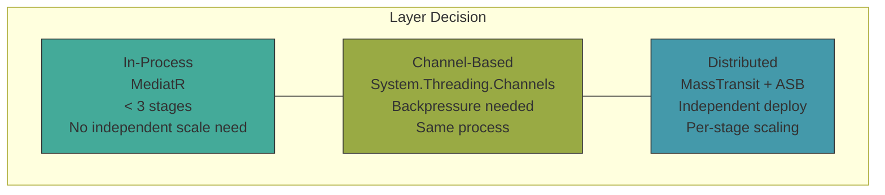
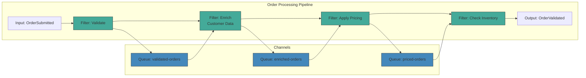
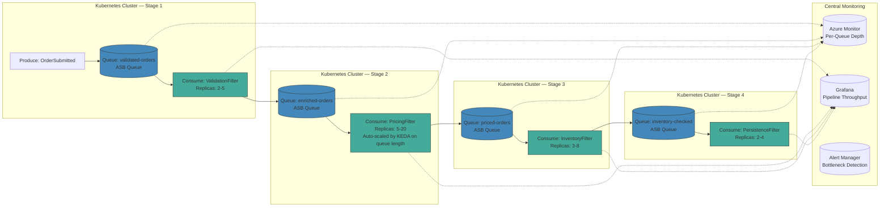
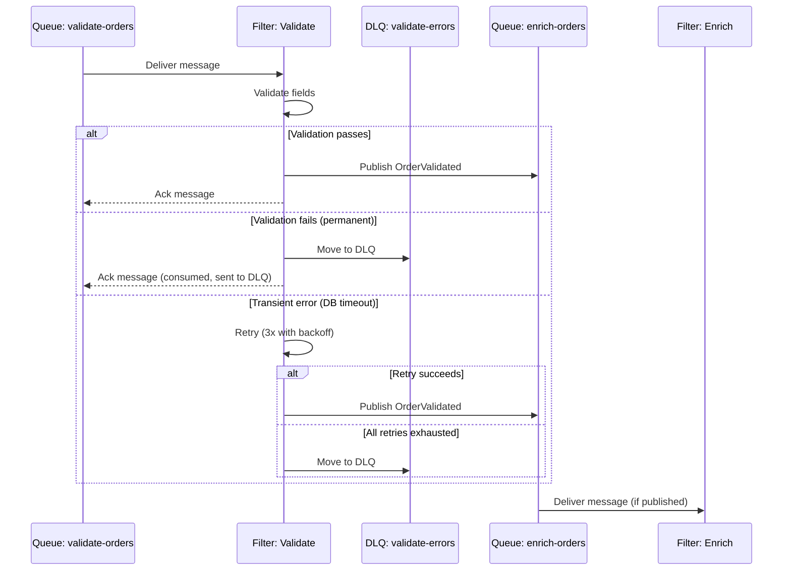

> [!success] Mastery Check
> - [ ] **Studied Well**
> - [ ] **Can explain the concept without notes**
> - [ ] **Can answer interview questions confidently**
> - [ ] **Can implement it in a real project**

## Navigation

**Domain:** [[7 — System Design & Distributed Systems]] > **Group:** Integration Patterns
**Previous:** [[7.147 — Claim Check Pattern — Large Message Handling]] | **Next:** [[7.149 — Scatter-Gather Pattern]]

### Prerequisites
- [[7.142 — Event-Driven Architecture — Overview]] — required because pipes and filters is a message processing topology within EDA
- [[6.406 — Chain of Responsibility Pattern]] — the single-process analog; understanding it clarifies what changes when filters are distributed across processes

### Where This Fits

The pipes and filters pattern decomposes a complex processing task into a sequence of independent, reusable processing steps (filters) connected by channels (pipes). Each filter performs a single transformation or validation, passes the result to the next filter, and can be deployed, scaled, and tested independently. A .NET engineer encounters this in any multi-stage processing pipeline: an order processing pipeline that validates, enriches, applies pricing, checks inventory, and persists the order. Without pipes and filters, each stage is either hardcoded into a monolithic processing method (untestable, unscalable) or orchestrated with complex conditional logic that violates the Single Responsibility Principle. The pattern is distinct from related patterns in the Integration Patterns group: it focuses on sequential processing with ordering guarantees per stage, unlike scatter-gather (parallel branches), claim check (large message handling), or competing consumers (scaling a single processing step). It is the foundational pattern for any message processing workflow that has more than one processing step per message.

## Core Mental Model

Pipes and filters is an architectural pattern where a processing task is broken into discrete, composable steps (filters), each connected by a communication channel (pipe). Each filter receives input, performs a single transformation, and produces output — with no knowledge of neighboring filters. The invariant this maintains is: any filter can be replaced, upgraded, scaled, or removed without affecting any other filter, as long as the input/output contract (the message type) is preserved. The tradeoff is the overhead of serialization and transport between each filter stage — a single in-process pipeline becomes a distributed multi-hop flow with per-hop latency. The recognition trigger is a processing method that exceeds 50 lines and has multiple "steps" that could be independently tested or reused.

Think of it as a factory assembly line: each station (filter) does exactly one job — one inspects the raw material, one assembles, one paints, one packages. Between stations, a conveyor belt (pipe) moves the work-in-progress. If the painting station needs to work faster, you add more painters to just that station; you do not rebuild the entire factory or touch the other stations. This is the fundamental value proposition: independent scalability, independent deployability, and independent testability per processing stage.

### Classification

Pipes and filters is a processing topology pattern that sits at the application architecture layer. It is orthogonal to messaging patterns (competing consumers, priority queues) — filters can use any message delivery mechanism. It is related to Chain of Responsibility but differs in that filters are typically independent processing nodes (often separate services), not linked handler objects in the same process. It does not solve for branching or merging (that requires scatter-gather), nor for stateful multi-step coordination (that requires saga or process manager).

### Architectural Layers

The pipes and filters pattern operates at three possible layers in a .NET system:

| Layer | Implementation | Example | Use Case |
|---|---|---|---|
| In-process (same AppDomain) | MediatR `IPipelineBehavior<T>` | `ValidationBehavior<T>` | Cross-cutting concerns within a single service |
| In-process (async queue) | Channels / `System.Threading.Channels` | Writer → Channel → Reader | Backpressure between producer and consumer in the same process |
| Distributed (message broker) | MassTransit + Azure Service Bus | Separate queues per filter stage | Independent scaling, deployment, and failure isolation per stage |

Choosing the wrong layer is a common pitfall. Teams often start with distributed pipes and filters for a 2-stage pipeline that runs 100 messages/day, adding operational complexity with no benefit. The decision should be driven by the scaling, deployment, and isolation requirements of each stage, not by the desire to use a distributed system.





### Key Properties / Guarantees

|Property|Value|Condition|
|---|---|---|
|Composability|Filters are independently deployable|Contract (message schema) is stable|
|Reusability|Filter can be used in multiple pipelines|Input/output contracts match|
|Scalability|Each filter scales independently|Competing consumers per filter queue|
|Testability|Each filter is independently testable|Message schema is deterministic|
|Latency|Sum of per-filter processing + N serialization hops|Number of filters in the pipeline|
|Failure isolation|A failing filter does not crash other filters|Broker DLQ per filter queue|

### Deployment Topology



### Error Handling Flow



## Deep Mechanics

### How It Works

**Step 1 — Message enters the pipeline.** A message is published to the first filter's input queue. The message type is defined as the contract between the pipeline entry point and the first filter. The broker (Azure Service Bus) persists the message and makes it available to the first filter's competing consumers. The message carries a correlation ID that is preserved across all pipeline stages, enabling end-to-end tracing.

**Step 2 — Filter 1 processes.** The first filter (e.g., Validate) reads the message from its queue, performs its transformation (validate fields, reject invalid messages to DLQ), and publishes the transformed message to the next filter's input queue. The filter acknowledges (completes) the input message only after successfully publishing the output message. If the publish fails, the input message is not acknowledged and will be redelivered. This "at-least-once" delivery guarantee means the filter must be idempotent.

**Step 3 — Subsequent filters repeat.** Each subsequent filter reads from its input queue, processes, and writes to the next output queue. The message format may change between filters — the pipeline can evolve the message schema at each stage by adding or enriching data. Each filter is a separate consumer group with its own scaling, retry, and error handling configuration. There is no shared state between filters except what is carried in the message.

**Step 4 — Final filter produces output.** The last filter in the pipeline publishes the final result to an output queue or topic, where it can be consumed by the final processing step (e.g., persist to database, send notification). At this point, the message has completed its end-to-end journey through the pipeline. The pipeline completion metric increments.

**Step 5 — Error handling per filter.** If a filter encounters an error, it can retry (transient), dead-letter the message (poison), or publish to an error queue for manual review. The error does not propagate backward — previous filters have already completed and acknowledged their messages. Each filter's error handling is independent and configured for that filter's specific failure modes.

### Message Contract Design Between Stages

Each stage transition is a contract between two independently deployable services. These contracts must be designed for evolution:

```csharp
// Contract between Filter 1 (Validate) → Filter 2 (Price)
// Stage 1 output = Stage 2 input
public sealed record OrderValidated(
    Guid EventId,
    Guid OrderId,
    Guid CustomerId,
    IReadOnlyList<OrderItem> Items,
    string ShippingAddress,
    DateTimeOffset ValidatedAt,
    // These fields are required (present since version 1)
    string? CustomerTier = null,  // Added in v2 — nullable for backward compat
    string? CurrencyCode = "USD"  // Added in v2 — default for backward compat
);

// Contract between Filter 2 (Price) → Filter 3 (Inventory)
// Stage 2 extends Stage 1's output with pricing data
public sealed record OrderPriced(
    Guid EventId,
    Guid OrderId,
    Guid CustomerId,
    IReadOnlyList<OrderItem> Items,
    string ShippingAddress,
    DateTimeOffset ValidatedAt,
    string? CustomerTier,
    string CurrencyCode,
    decimal TotalAmount,
    IReadOnlyList<Discount> Discounts,
    decimal ShippingCost
);
```

The contract rules:
- **Never remove a field** — mark it obsolete but keep it for one version cycle
- **New fields are nullable or have defaults** — downstream filters handle missing values gracefully
- **Contract tests** between every adjacent stage pair — Green build requires all pipeline contract tests to pass
- **Schema registry** — each message type version is registered; the broker enforces schema compatibility

### Performance Characteristics by Stage Type

| Stage Type | Characteristics | Bottleneck | Scaling Strategy |
|---|---|---|---|
| **Validation** | CPU-light, no I/O | CPU single-core | Increase prefetch count, moderate scale-out |
| **Enrichment** | I/O-bound (DB/API calls) | Network latency, DB throughput | Scale-out with competing consumers, add caching |
| **Pricing** | CPU-medium, rule evaluation | CPU, rule engine throughput | Scale-out aggressively (pre-compute rules if possible) |
| **Inventory** | I/O-bound (DB queries) | Database query throughput | Read replicas, caching, batch queries |
| **Persistence** | Write-heavy (DB inserts) | Database write throughput | Batch writes, shard database, use write-optimized storage |
| **Notification** | I/O-bound (SMTP/Push API) | External API rate limits | Circuit breaker, queue buffering, bulkhead |

### Failure Modes

**Pipeline stall from a single slow filter.** One filter in the chain runs slower than the others. Its input queue grows while its output queue starves, causing downstream filters to idle. **Detection:** queue depth imbalance across the pipeline — one filter's input queue is growing while downstream queues are empty. **Metric:** queue depth per filter stage. **Prevention:** scale the slow filter independently with more competing consumers; add monitoring per filter stage to detect bottlenecks. **Remediation:** once the bottleneck filter is identified, increase its consumer count or optimize its processing logic; if the bottleneck is an external dependency (database, API), add caching or read replicas.

**Schema evolution breaking downstream filters.** A filter changes its output schema, and the next filter in the chain cannot deserialize the new format. **Detection:** downstream filter's DLQ fills up after a deployment. **Metric:** consumer error rate per filter stage. **Prevention:** implement backward-compatible schema evolution (optional fields, versioned message types). Use contract testing between adjacent filters. Deploy filters in order from last to first so that consumers are ready before producers change. **Remediation:** if a breaking change is unavoidable, deploy all downstream filters simultaneously with the producer change, or create a new queue version and migrate traffic gradually.

**Data loss from incomplete pipeline.** A message is published to the first filter, but one of the subsequent filters is unavailable. The message is processed by early filters and then stuck or lost in the unavailable filter's queue. **Detection:** the final output destination does not have an expected message. **Metric:** pipeline completion rate — count of entries vs exits. **Prevention:** use a broker with guaranteed delivery and persistent queues; monitor the pipeline completion rate and alert on divergence. **Remediation:** configure the broker with infinite retention for pipeline queues so messages are never lost; implement a reconciliation job that compares pipeline entry and exit counts hourly.

**Duplicated processing from redelivery.** A filter completes processing and publishes to the next queue but crashes before acknowledging the input message. The message is redelivered, and the filter processes it again, producing a duplicate output. **Detection:** duplicates in the final output. **Prevention:** make filters idempotent — track processed message IDs in an inbox table, or design the output to be idempotent (upsert, not insert). **Remediation:** add a deduplication window at the filter output or use the broker's built-in deduplication if available.

**Backpressure cascade.** A downstream filter becomes completely unavailable (crash, deployment, network partition). Its input queue fills to max capacity. Once the queue is full, the broker rejects new messages from the upstream filter, causing the upstream filter's publish to fail. The upstream filter's input queue then fills, and the cascade propagates all the way to the pipeline entry point. **Detection:** all pipeline queues are at max depth simultaneously. **Metric:** broker rejection rate — `PublishAsync` returns `TimeoutException` or `MessageSizeExceededException`. **Prevention:** set queue max size large enough to absorb the expected backlog; implement a circuit breaker at each filter's output so the filter stops attempting to publish to a full queue and instead holds the message internally or sends it to a parking lot queue. **Remediation:** once the downstream filter recovers, the backlog drains naturally through the queue buffer.

**Poison message poisoning the entire pipeline.** A malformed message enters the pipeline. Filter 1 processes it successfully (it validates fields that happen to be present), but Filter 2 crashes when it tries to access a field that is missing. Filter 2 dead-letters the message, but the message is still sitting in Filter 3's queue — never to be consumed because Filter 2 never published the output. The pipeline appears stalled with no indication of where or why. **Detection:** the pipeline completion rate drops, but no single filter shows a growing queue. **Metric:** per-filter DLQ count — the poison message may have been dead-lettered at Filter 2, leaving no trace in queue depths. **Prevention:** add per-filter DLQ monitoring and alerting; use structured logging with the original message ID throughout the pipeline for traceability. **Remediation:** replay the message with additional logging to identify the failure point; fix the filter that crashed and replay from its input queue.

### .NET and Azure Integration

- **Azure Service Bus Queues:** each pipeline stage gets its own queue. Filter A reads from queue-A, writes to queue-B. Competing consumers scale each stage independently. Use `EnablePartitioning = true` for high-throughput pipelines to avoid the 1 GB queue size limit and enable parallel processing.
- **Azure Functions + Service Bus Bindings:** each filter is an Azure Function triggered by a Service Bus queue binding, with output binding to the next queue. This works well for simple pipelines but limits control over retry policies and error handling.
- **MassTransit Receive Endpoints:** each filter stage is a separate receive endpoint consuming from its own queue and publishing to the next. The pipeline is wired via endpoint configuration. MassTransit handles correlation, retry, and saga integration.
- **Polly + retry:** per-filter transient error handling. Use `AsyncRetryPolicy` with exponential backoff wrapped around the filter's core processing logic.
- **OpenTelemetry:** instrument each filter stage with `ActivitySource` for distributed tracing. Each pipe hop creates a new span, allowing end-to-end trace visualization across the pipeline.
- **KEDA:** auto-scale each filter's consumer count based on its input queue depth. The pricing filter scales to 20 replicas during flash sales while the validation filter stays at 3.

```csharp
// Filter 1 — Validate
public sealed class OrderValidationFilter : IConsumer<OrderSubmitted>
{
    private readonly IPublishEndpoint _publisher;
    private readonly ILogger<OrderValidationFilter> _logger;

    public async Task Consume(ConsumeContext<OrderSubmitted> context)
    {
        var order = context.Message;
        using var activity = Diagnostics.Source.StartActivity("Filter.Validate");
        activity?.SetTag("order.id", order.OrderId);

        if (!ValidateOrder(order))
        {
            _logger.LogWarning("Order {OrderId} failed validation", order.OrderId);
            activity?.SetStatus(ActivityStatusCode.Error, "Validation failed");
            // Invalid orders go to DLQ automatically on throw
            throw new InvalidOperationException($"Order {OrderId} is invalid");
        }

        // Publish enriched message to next pipeline stage
        await _publisher.Publish(new OrderValidated(
            EventId: Guid.NewGuid(),
            OrderId: order.OrderId,
            CustomerId: order.CustomerId,
            Items: order.Items,
            ShippingAddress: order.ShippingAddress,
            ValidatedAt: DateTimeOffset.UtcNow), context.CancellationToken);

        activity?.SetStatus(ActivityStatusCode.Ok);
    }
}

// Filter 2 — Apply Pricing
public sealed class OrderPricingFilter : IConsumer<OrderValidated>
{
    private readonly IPricingService _pricing;
    private readonly ILogger<OrderPricingFilter> _logger;

    public async Task Consume(ConsumeContext<OrderValidated> context)
    {
        var order = context.Message;
        using var activity = Diagnostics.Source.StartActivity("Filter.Price");
        activity?.SetTag("order.id", order.OrderId);

        try
        {
            var pricingResult = await _pricing.CalculateAsync(order.Items, context.CancellationToken);

            await _publisher.Publish(new OrderPriced(
                EventId: Guid.NewGuid(),
                OrderId: order.OrderId,
                CustomerId: order.CustomerId,
                Items: order.Items,
                TotalAmount: pricingResult.Total,
                Discounts: pricingResult.Discounts,
                ShippingCost: pricingResult.ShippingCost), context.CancellationToken);

            activity?.SetStatus(ActivityStatusCode.Ok);
        }
        catch (Exception ex)
        {
            _logger.LogError(ex, "Pricing failed for order {OrderId}", order.OrderId);
            activity?.SetStatus(ActivityStatusCode.Error, ex.Message);
            throw; // MassTransit retry policy handles this
        }
    }
}
```

### Generic Pipeline Builder Pattern

For teams that manage multiple pipelines, a generic pipeline builder abstracts the queue wiring:

```csharp
public sealed class PipelineBuilder<TInput, TOutput>
{
    private readonly List<Type> _filterTypes = new();
    private readonly List<Action<IRetryConfigurator>> _retryConfigs = new();

    public PipelineBuilder<TInput, TNext> AddFilter<TFilter, TNext>(
        Action<IRetryConfigurator>? configureRetry = null)
        where TFilter : class, IConsumer
    {
        _filterTypes.Add(typeof(TFilter));
        _retryConfigs.Add(configureRetry ?? (r => r.Interval(3, TimeSpan.FromSeconds(1))));
        return new PipelineBuilder<TInput, TNext>(); // covariance for next stage
    }

    public void WireInto(IBusRegistrationConfigurator bus, IConfiguration config)
    {
        for (int i = 0; i < _filterTypes.Count; i++)
        {
            var filterType = _filterTypes[i];
            var retryConfig = _retryConfigs[i];
            var queueName = $"pipeline-{filterType.Name.ToLowerInvariant()}";

            bus.AddConsumer(filterType);

            bus.UsingAzureServiceBus((context, cfg) =>
            {
                cfg.ReceiveEndpoint(queueName, e =>
                {
                    e.PrefetchCount = config.GetValue<int>($"Pipeline:Stages:{filterType.Name}:PrefetchCount");
                    e.UseMessageRetry(retryConfig);
                    e.ConfigureConsumer(context, filterType);
                });
            });
        }
    }
}
```

## Production Patterns and Implementation

### Primary Implementation

The canonical pipes and filters implementation uses MassTransit with separate Azure Service Bus queues per filter stage, each with independent competing consumers and error handling.

```csharp
// Program.cs — pipeline wiring
builder.Services.AddMassTransit(x =>
{
    // Register filters
    x.AddConsumer<OrderValidationFilter>(typeof(FilterDefinition));
    x.AddConsumer<OrderPricingFilter>(typeof(FilterDefinition));
    x.AddConsumer<OrderInventoryFilter>(typeof(FilterDefinition));
    x.AddConsumer<OrderPersistenceFilter>(typeof(FilterDefinition));

    x.UsingAzureServiceBus((context, cfg) =>
    {
        cfg.Host(builder.Configuration["Azure:ServiceBus:ConnectionString"]);

        // Each stage is a separate receive endpoint (queue)
        cfg.ReceiveEndpoint("pipeline-order-validate", e =>
        {
            e.PrefetchCount = 16;
            e.ConfigureConsumer<OrderValidationFilter>(context);
        });

        cfg.ReceiveEndpoint("pipeline-order-price", e =>
        {
            e.PrefetchCount = 16;
            e.ConfigureConsumer<OrderPricingFilter>(context);
        });

        cfg.ReceiveEndpoint("pipeline-order-inventory", e =>
        {
            e.PrefetchCount = 16;
            e.ConfigureConsumer<OrderInventoryFilter>(context);
        });

        cfg.ReceiveEndpoint("pipeline-order-persist", e =>
        {
            e.PrefetchCount = 16;
            e.ConfigureConsumer<OrderPersistenceFilter>(context);
        });
    });
});

// Filter definition — retry and error handling per stage
public sealed class FilterDefinition :
    ConsumerDefinition<OrderValidationFilter>
{
    protected override void ConfigureConsumer(
        IReceiveEndpointConfigurator endpointConfigurator,
        IConsumerConfigurator<OrderValidationFilter> consumerConfigurator,
        IRegistrationContext context)
    {
        endpointConfigurator.UseMessageRetry(r =>
        {
            r.Handle<TransientException>();
            r.Interval(3, TimeSpan.FromSeconds(1));
        });

        // Send failures to dedicated error queue per stage
        endpointConfigurator.DiscardFaultedMessages();
    }
}
```

### Configuration and Wiring

```csharp
// appsettings.json — per-filter configuration
{
  "Pipeline": {
    "Stages": {
      "Validate": { "PrefetchCount": 16, "MaxConcurrentCalls": 8 },
      "Price": { "PrefetchCount": 32, "MaxConcurrentCalls": 16 },
      "Inventory": { "PrefetchCount": 8, "MaxConcurrentCalls": 4 },
      "Persist": { "PrefetchCount": 64, "MaxConcurrentCalls": 32 }
    }
  }
}

// KEDA — independent autoscaling per filter stage
// inventory-filter-scaler.yaml
apiVersion: keda.sh/v1alpha1
kind: ScaledObject
metadata:
  name: inventory-filter
spec:
  scaleTargetRef:
    name: order-pipeline-inventory
  minReplicaCount: 2
  maxReplicaCount: 10
  triggers:
    - type: azure-servicebus
      metadata:
        queueName: pipeline-order-inventory
        queueLength: "10"
```

### KEDA Autoscaling Deep Dive

Each pipeline stage needs its own KEDA `ScaledObject` referencing its specific queue. The key parameters per stage:

```yaml
# pricing-filter-scaler.yaml — aggressive scaling for flash sales
apiVersion: keda.sh/v1alpha1
kind: ScaledObject
metadata:
  name: pricing-filter-scaler
spec:
  scaleTargetRef:
    name: order-pipeline-pricing
  minReplicaCount: 3
  maxReplicaCount: 30
  triggers:
    - type: azure-servicebus
      metadata:
        queueName: pipeline-order-price
        queueLength: "10"      # Scale up when 10+ messages in queue
        activationQueueLength: "5"  # Scale to min when 5+ messages
  advanced:
    horizontalPodAutoscalerConfig:
      behavior:
        scaleDown:
          stabilizationWindowSeconds: 300  # Wait 5 min before scaling down
          policies:
            - type: Percent
              value: 10
              periodSeconds: 60
        scaleUp:
          stabilizationWindowSeconds: 0    # Scale up immediately
          policies:
            - type: Pods
              value: 5                     # Add up to 5 pods per 60s
              periodSeconds: 60

# validation-filter-scaler.yaml — conservative scaling for stable stage
---
apiVersion: keda.sh/v1alpha1
kind: ScaledObject
metadata:
  name: validation-filter-scaler
spec:
  scaleTargetRef:
    name: order-pipeline-validation
  minReplicaCount: 2
  maxReplicaCount: 8
  triggers:
    - type: azure-servicebus
      metadata:
        queueName: pipeline-order-validate
        queueLength: "50"      # Scale up when 50+ messages in queue
```

The pricing filter scales aggressively (max 30 replicas, immediate scale-up) because it handles flash sale spikes. The validation filter scales conservatively (max 8 replicas, higher threshold) because it is CPU-light and stable. This per-stage scaling granularity is the primary operational advantage of the distributed pipeline.

### Common Variants

**In-process pipeline with MediatR.** For pipelines within a single service boundary, MediatR's IPipelineBehavior implements the pipes and filters pattern in-process. Behaviors are registered in order and each can short-circuit the pipeline.

```csharp
// MediatR in-process pipeline
builder.Services.AddTransient<IPipelineBehavior<CreateOrderCommand, OrderResult>,
    ValidationBehavior>();
builder.Services.AddTransient<IPipelineBehavior<CreateOrderCommand, OrderResult>,
    LoggingBehavior>();
builder.Services.AddTransient<IPipelineBehavior<CreateOrderCommand, OrderResult>,
    TransactionBehavior>();
```

**Dynamic pipeline with routing slips.** For pipelines that vary per message (e.g., different processing flows for different order types), use the routing slip pattern — a list of processing steps that travels with the message, and each step invokes the next.

**Conditional branching in a pipeline.** A filter inspects the message and routes it to one of multiple downstream queues based on content (e.g., domestic vs international orders). This creates a pipeline that branches but does not scatter-gather — each message takes one path.

### OpenTelemetry Instrumentation per Filter

Distributed tracing is essential for debugging multi-hop pipelines. Each filter creates a child span tied to the incoming message's trace context:

```csharp
public static class PipelineDiagnostics
{
    private static readonly ActivitySource Source = new("OrderPipeline");

    public static Activity? StartFilterActivity(string filterName, ConsumeContext context)
    {
        var activity = Source.StartActivity($"Filter.{filterName}", ActivityKind.Internal);
        activity?.SetTag("message.id", context.MessageId?.ToString());
        activity?.SetTag("correlation.id", context.CorrelationId?.ToString());
        activity?.SetTag("filter", filterName);
        activity?.SetTag("queue", context.ReceiveContext?.InputAddress?.ToString());
        return activity;
    }
}

// Usage in any filter:
using var activity = PipelineDiagnostics.StartFilterActivity("Validate", context);
```

The resulting trace waterfall shows each filter as a separate span, with queue latency visible as the gap between spans. This makes it trivial to identify which filter is slow and which queue hop has the most latency.

### Kafka Alternative Implementation

While Azure Service Bus is the primary broker for this note, Kafka can also implement pipes and filters:

```csharp
// Kafka-based pipeline: each stage is a consumer group on the same topic
// Stage 1 (Validate) produces to topic "orders-enhanced"
// Stage 2 (Price) consumes "orders-enhanced", produces to "orders-priced"
// etc.

builder.Services.AddMassTransit(x =>
{
    x.UsingInMemory((context, cfg) => { }); // routing slip host
    x.AddRider(rider =>
    {
        rider.AddConsumer<OrderValidationFilter>();
        rider.UsingKafka((context, k) =>
        {
            k.Host("localhost:9092");
            k.TopicEndpoint<OrderSubmitted>("orders-submitted", "validation-group", e =>
            {
                e.ConfigureConsumer<OrderValidationFilter>(context);
            });
        });
    });
});
```

The key difference from Azure Service Bus: Kafka topics are partitioned, and ordering is guaranteed only within a partition. Each filter stage must use the same partition key (e.g., `orderId`) to maintain ordering. Kafka also does not have built-in DLQs or scheduled message delivery — these must be implemented with additional topics and consumer groups.

### Real-World .NET Ecosystem Example

**MediatR behaviors** are the canonical .NET in-process pipes and filters implementation. In a distributed (cross-service) setting, **MassTransit receive endpoints** with individual queues per stage implement the same pattern. Many e-commerce platforms use this topology: OrderSubmitted → Validate → Price → ReserveInventory → AuthorizePayment → Persist. Each stage runs in its own container with its own autoscaling policy, deployed independently, tested independently.

### Pipeline Deployment and Versioning Strategy

Deploying a distributed pipeline requires coordination to avoid message loss and schema errors. The recommended deployment order is reverse-pipeline (last stage first):

```
1. Deploy Persist stage    (Filter 4) — ensures the final output is ready to receive
2. Deploy Inventory stage  (Filter 3) — ensures Filter 3 can process and forward
3. Deploy Pricing stage    (Filter 2) — ensures Filter 2 can process and forward
4. Deploy Validate stage   (Filter 1) — starts processing new messages
```

This ensures that when Filter 1 starts processing, all downstream filters are ready. If a deployment must be rolled forward (can't control order), use a deployment gate: Filter 1's readiness probe checks that Filter 2's queue is accepting messages (not full), and Filter 2 checks Filter 3's queue, etc. Only when the entire pipeline signals readiness does Filter 1 start consuming.

For schema changes, use the "last-three-wins" strategy:
- Version N (current): deployed and running
- Version N+1 (incoming): deployed to a percentage of filter instances
- All filters must accept both old and new message schemas for one deployment cycle
- After all filters are on N+1, old schema support is dropped

```csharp
// Schema version enum carried in message header
public enum SchemaVersion { V1 = 1, V2 = 2 }

public sealed record OrderValidated(
    Guid EventId,
    Guid OrderId,
    Guid CustomerId,
    IReadOnlyList<OrderItem> Items,
    string ShippingAddress,
    DateTimeOffset ValidatedAt,
    SchemaVersion Schema = SchemaVersion.V2 // default to latest
);
```

### Pipeline Performance Tuning Checklist

| Action | When to Apply | Expected Impact |
|---|---|---|
| Increase prefetch count | Filter is CPU-bound and not waiting on I/O | Higher throughput per consumer |
| Add competing consumers (scale out) | Filter queued depth grows linearly | Linear throughput increase until bottleneck shifts |
| Batch writes at persistence filter | Filter writes single rows to DB per message | 5-10x throughput improvement for write-heavy stages |
| Add caching (memory or Redis) | Filter repeatedly calls same API for same data | Reduces P99 latency, reduces dependency load |
| Circuit breaker on external dependency | Filter depends on flaky API with timeouts | Prevents cascading failure when dependency is slow |
| Partition the queue | Throughput exceeds single queue partition limit (1 GB, 20000 msg/s) | Removes queue-level bottleneck |
| Merge two fast filters | Two filters each process in < 10 ms and have the same scaling needs | Reduces latency by 1 queue hop, simplifies operations |
| Use in-process pipeline (MediatR) | End-to-end latency budget < 100 ms | Eliminates all queue hop latency |

### Pipeline Completion Monitoring

The most important pipeline-level metric is the completion rate: the ratio of messages that enter the first stage to messages that exit the last stage. Implement a simple monitoring filter at both ends:

```csharp
// Entry counter — placed at the first filter
public sealed class PipelineEntryMonitor : IConsumer<OrderSubmitted>
{
    private readonly Counter _entryCounter;

    public PipelineEntryMonitor(IMeterFactory meterFactory)
    {
        var meter = meterFactory.Create("OrderPipeline");
        _entryCounter = meter.CreateCounter<long>("pipeline.entries");
    }

    public async Task Consume(ConsumeContext<OrderSubmitted> context)
    {
        _entryCounter.Add(1, new KeyValuePair<string, object?>("order.id", context.Message.OrderId));
        // Forward to the real first filter
        await _nextFilter.Consume(context);
    }
}

// Exit counter — at the last filter
public sealed class PipelineExitMonitor : IConsumer<OrderPersisted>
{
    private readonly Counter _exitCounter;

    public async Task Consume(ConsumeContext<OrderPersisted> context)
    {
        _exitCounter.Add(1);
        // Forward to persistence
        await _nextFilter.Consume(context);
    }
}
```

Alert when `(entries - exits) / entries > 0.001` over a 5-minute window — this indicates messages are being lost in the pipeline. Pair this with per-queue depth monitoring to identify which stage is dropping messages.

## Gotchas and Production Pitfalls

### Coupled Pipeline Stages via Shared Message Type

**Pitfall:** All filters use the same message type, making it impossible to evolve one stage's output without affecting all downstream stages.

```csharp
// ❌ All stages use the same message type — coupling
public sealed class OrderProcessingFilter :
    IConsumer<Order>,  // same type for input and output
    IConsumer<Order>,  // all stages coupled
    IConsumer<Order>
```

**Symptom:** Adding a field to support a new feature in the pricing stage requires updating all downstream filters, even those that do not use the field. Deployment requires coordinated rollout.

**Fix:** Define a distinct message type per stage transition. Each filter has its own input and output types. The output type can extend the input type with additional data.

```csharp
// ✅ Distinct types per stage
OrderSubmitted → OrderValidated (adds validation timestamp)
OrderValidated → OrderPriced (adds pricing data)
OrderPriced → OrderInventoryChecked (adds inventory status)
```

**Cost of not fixing:** The pipeline becomes a monolith in message types — changing anything requires touching everything. The benefits of independent deployment and testing are lost.

### Pipeline Stage Becomes a God Filter

**Pitfall:** A single filter does too much — validation, enrichment, transformation, routing — violating the single-responsibility principle that pipes and filters is supposed to enforce.

```csharp
// ❌ God filter — does everything
public async Task Consume(ConsumeContext<Order> context)
{
    Validate(context.Message);
    EnrichCustomerData(context.Message);
    CalculatePricing(context.Message);
    CheckInventory(context.Message);
    PersistOrder(context.Message);
    SendNotification(context.Message);
    // this filter runs everything — why have a pipeline?
}
```

**Symptom:** The god filter becomes the bottleneck. It cannot scale because it does many types of work. It cannot be tested independently because it depends on many services. The pipeline topology is misleading — it is a single process in disguise.

**Fix:** Split the god filter into individual filters, each connected by a queue. Each filter does one thing.

**Cost of not fixing:** The pipeline provides no benefit over a monolithic processing method. The team claims to use pipes and filters but has all the coupling and none of the independence.

### No Backpressure Handling

**Pitfall:** The filter publishes to the next queue without checking if the queue is full or if the downstream filter is accepting messages. When the downstream queue reaches its max size (e.g., 5 GB for a standard Service Bus queue), the broker rejects the `PublishAsync` call. The filter's exception handler may not distinguish between a transient error and a queue-full rejection.

```csharp
// ❌ No backpressure awareness
await _publisher.Publish(nextMessage, ct);
// If the queue is full, this throws an exception indistinguishable from other errors
```

**Symptom:** Under high load, the pipeline stalls with seemingly random exceptions. The error logs show `MessageSizeExceededException` or `TimeoutException`, but the team thinks these are network issues.

**Fix:** Implement a circuit breaker at each filter's output that trips when the broker rejects messages due to queue capacity. When the circuit is open, the filter holds messages locally (or in a parking lot queue) and retries periodically. Better yet, monitor downstream queue depth and apply backpressure proactively: if the next queue depth exceeds a threshold, slow down processing by reducing the prefetch count or introducing a delay.

```csharp
// ✅ Backpressure-aware publish
public async Task PublishWithBackpressure<T>(
    T message, string downstreamQueue, CancellationToken ct)
{
    var queueDepth = await _queueMetrics.GetQueueDepthAsync(downstreamQueue, ct);
    if (queueDepth > _maxQueueDepthThreshold)
    {
        _logger.LogWarning("Downstream queue {Queue} depth {Depth} exceeds threshold, delaying",
            downstreamQueue, queueDepth);
        await Task.Delay(TimeSpan.FromMilliseconds(100), ct);
    }
    await _publisher.Publish(message, ct);
}
```

**Cost of not fixing:** Under load, the pipeline fails unpredictably at different stages. The team either over-provisions all queues (wasting resources) or accepts random failures.

### Missing Error Handling Per Stage

**Pitfall:** Assuming errors at one stage propagate naturally to the next.

```csharp
// ❌ No error handling — exception causes message to be abandoned and redelivered
public async Task Consume(ConsumeContext<Order> context)
{
    // If this throws, the message is abandoned and redelivered
    // It does NOT go to the DLQ or error queue
    var result = await _service.CallThatMayFail();
    await _publisher.Publish(result);
}
```

**Symptom:** A transient failure in one filter causes the message to be abandoned and redelivered infinitely or until max delivery count. Meanwhile, the pipeline appears stalled from the perspective of downstream filters (no messages arrive).

**Fix:** Implement per-stage error handling: retry for transient failures, dead-letter for poison messages, and log the error with context for monitoring.

```csharp
// ✅ Per-stage error handling
endpointConfigurator.UseMessageRetry(r =>
{
    r.Handle<SqlException>(ex => ex.Number == 1205);
    r.Interval(3, TimeSpan.FromMilliseconds(200));
});
```

**Cost of not fixing:** Silent pipeline stalls. The team discovers the issue only when the final output count is lower than expected hours later.

### Ignoring Pipeline Monitoring

**Pitfall:** No monitoring of per-queue depth, throughput, or error rates across pipeline stages.

```csharp
// ❌ No per-stage monitoring — blind to pipeline health
// Only monitoring: "does the system work?"
```

**Symptom:** A single filter fails, and no one notices until the downstream team asks "why are no orders coming through?" The queue depth graph for that filter tells the story, but no one is watching it.

**Fix:** Instrument each filter stage with queue depth, consumer lag, processing time, and error rate. Create a pipeline health dashboard showing the flow rate through each stage.

**Cost of not fixing:** The pipeline is a black box. Failure detection time is measured in hours (when a stakeholder asks a question) instead of seconds (when an alert fires).

### Pipeline Startup Order and Cold Start

**Pitfall:** All pipeline stages are deployed simultaneously. Filter 1 starts and immediately processes messages, publishing to Filter 2's queue — but Filter 2 is still starting up (container pulling, JIT compiling, connecting to database). Filter 2's queue starts accumulating messages, and by the time Filter 2 is ready, the queue depth is high and consumer lag spikes.

```csharp
// ❌ All stages deployed at once — no startup coordination
// kubectl apply -f pipeline/
// Filter 1 starts before Filter 2 is ready
```

**Symptom:** Initial consumer lag spike on pipeline startup. First messages through the pipeline take 10x normal latency. Monitoring shows "queue depth > 0 before first successful consumption."

**Fix:** Deploy filters in reverse order (last stage first) so the entire pipeline is ready to consume before messages are produced. Use Kubernetes init containers or readiness probes to ensure downstream filters are ready before the upstream filter starts.

```yaml
# ✅ Deploy order: Persist → Inventory → Price → Validate (reverse pipeline order)
# ✅ Readiness probe ensures filter won't consume until it's ready
readinessProbe:
  exec:
    command: ["dotnet", "PersistenceFilter.dll", "--health-check"]
  initialDelaySeconds: 15
  periodSeconds: 10
```

**Cost of not fixing:** First batch of messages after every deployment experiences high latency and potential timeouts. The team attributes it to "warm-up time" without realizing it is a systematic startup-ordering problem.

### Pipeline Becomes a Monolith in Disguise

**Pitfall:** The team creates separate queues per stage but configures all filters with the same message type, the same error handling, and the same scaling policy. The pipeline is "distributed" only in name — each filter does the same thing because they all read the same message type and have the same behavior.

```csharp
// ❌ Pipeline monolith — all filters identical except name
cfg.ReceiveEndpoint("pipeline-validate", e => { e.PrefetchCount = 16; });
cfg.ReceiveEndpoint("pipeline-price", e => { e.PrefetchCount = 16; });      // same config
cfg.ReceiveEndpoint("pipeline-inventory", e => { e.PrefetchCount = 16; });  // same config
cfg.ReceiveEndpoint("pipeline-persist", e => { e.PrefetchCount = 16; });    // same config
```

**Symptom:** The pipeline does not benefit from independent scaling or error isolation because all stages are configured identically. Adding a new stage is as hard as modifying the monolith because the configuration is duplicated.

**Fix:** Each filter stage should have its own:
- Message type (distinct input and output types per stage)
- Scaling policy (prefetch count, max concurrent calls)
- Retry policy (some filters retry transient errors, others dead-letter immediately)
- Error handling (some filters send errors to a dedicated queue, others throw)
- Monitoring dashboard (per-filter throughput, latency, error rate)

**Cost of not fixing:** The pipeline pattern provides no benefit over a monolithic processing service. The team maintains distributed infrastructure without any of the distributed benefits.

### Distributed Debugging Nightmare

**Pitfall:** When a message fails mid-pipeline, the team has no way to trace which filter failed, why it failed, or what the message looked like at that point. Without distributed tracing, debugging a pipeline failure requires checking logs in N different services.

```csharp
// ❌ No tracing — each filter logs independently, no correlation
_logger.LogInformation("Processing order {Id}", orderId);
// Now find this log across 4 different services... good luck
```

**Symptom:** Mean-time-to-resolution (MTTR) for pipeline failures is measured in hours. The team spends most of the time identifying which stage failed and why.

**Fix:** Implement distributed tracing with OpenTelemetry. Each filter creates a child span of the incoming trace, tagged with the filter name, message ID, and processing result. Use a correlation ID that travels with the message through all pipeline stages.

```csharp
// ✅ Distributed tracing per filter
using var activity = Diagnostics.Source.StartActivity("Filter.Validate");
activity?.SetTag("message.id", context.MessageId.ToString());
activity?.SetTag("correlation.id", context.CorrelationId.ToString());
activity?.SetTag("filter", "validate");
```

**Cost of not fixing:** The pipeline is a black box. Debugging is painful, and the team avoids changing filters because "we don't know what will break."

## Tradeoffs and Decision Framework

### Tradeoff Matrix

| Dimension | Pipes and Filters (Distributed) | In-Process Pipeline (MediatR) | Monolithic Processing |
|---|---|---|---|
| Independent deployment | Yes — per-filter | No — single process | No |
| Independent scaling | Yes — per-filter | No — all or nothing | No |
| Latency | Sum of per-hop serialization | No serialization overhead | Single function call |
| Operational complexity | High — N queues to monitor | Low — single deployable | Lowest |
| Testability | High — per-filter contract tests | High — per-behavior unit tests | Low |
| Failure isolation | High — filter failure stops only that stage | Medium — exception propagates | None — everything fails |
| Message ordering | Not guaranteed (scale-out breaks order) | Guaranteed (single process) | Guaranteed |
| Cost (infra + ops) | High (N × queues, deployments, monitors) | Medium (single service) | Low (single deployable) |
| Debugging difficulty | High (distributed traces needed) | Medium (single process logs) | Low (single stack trace) |
| Schema coupling | Per-stage contracts (loose) | Shared types (tight) | Shared types (tightest) |

### When to Apply

```mermaid
flowchart TD
    A[Processing has distinct,<br>reusable stages] --> B{Can stages be<br>independently deployed?}
    B -->|No — single service| C[In-Process Pipeline<br>(MediatR Behaviors)]
    B -->|Yes — separate services| D{Does latency budget<br>tolerate serialization?}
    D -->|Yes — budget allows<br>per-hop overhead| E[Distributed Pipes and Filters]
    D -->|No — sub-millisecond<br>required| C
    E --> F["Each stage: own queue,<br>own consumers, own KEDA scaler"]
```

### When NOT to Apply

- [ ] The processing pipeline has only 2 stages — the overhead of separate queues and deployments is not justified; a single service with an internal pipeline (MediatR) is simpler
- [ ] Sub-millisecond latency is required — each queue hop adds at least 1-10 ms of serialization/transport latency; use in-process pipeline (MediatR behaviors) or direct method calls
- [ ] The stages are tightly coupled by shared mutable state — pipes and filters requires that each stage communicates only via the message; if stages share a database session or cache, they are not independently deployable
- [ ] The team is not committed to independent deployment per stage — without this, the pattern adds complexity without benefit; if every deployment is a coordinated rollout of all stages, you have a monolith with extra overhead
- [ ] The processing logic is stable and rarely changes — a monolithic processing method is simpler and cheaper to operate; the independent deployability benefit has no value if nothing changes
- [ ] Message ordering must be preserved across all stages — if messages must exit the pipeline in the same order they entered (strict FIFO across stages), scale-out at any stage breaks ordering. Use a single consumer or partitioning with the same partition key across all stages
- [ ] The operational team is small (1-2 people) — managing N queues, N DLQs, N KEDA scalers, N monitoring dashboards, and N deployment pipelines requires significant operational maturity; a simpler architecture may be more appropriate

### Provider-Specific Guidance

| Provider | Scatter Mechanism | Gather Mechanism | Notes |
|---|---|---|---|
| **Azure Service Bus** | Topic with N subscriptions | Single response queue with correlation ID | Built-in partitioning, scheduled delivery for timeouts, max 2000 subscriptions per topic |
| **Kafka** | Topic with N consumer groups (same partition key) | Response topic with key-based compaction | Higher throughput (millions msg/s), but no built-in timeout mechanism; requires custom timeout implementation with a separate timeout topic or Kafka Streams windowing |
| **RabbitMQ** | Topic exchange with N queues bound | Response queue with correlation ID | Lower throughput than ASB or Kafka, but simpler setup; requires manual DLQ configuration per queue |
| **Amazon SNS/SQS** | SNS topic with N SQS queue subscriptions | Single SQS queue with message group ID | Fully managed, no partitioning concerns; SQS visibility timeout acts as implicit retry; limited to 12.5 million subscriptions per topic |

### Scale Thresholds

- **Worth considering at any stage count >3** where independent deployment or scaling of individual stages provides value
- **Required when different stages have different throughput requirements** — e.g., validation needs 10 replicas, pricing needs 3
- **Re-evaluate when the pipeline exceeds 8 stages** — the serialization overhead and operational complexity may outweigh the benefits
- **Overkill below ~500 messages/day** — a single process can handle it with simpler architecture

### Connection Pooling and Resource Management per Stage

Each filter stage consumes resources that must be isolated from other stages to prevent resource contention:

```csharp
// Per-filter database connection pool configuration
public static class FilterDatabasePool
{
    public static void ConfigureForFilter(string filterName, DbContextOptionsBuilder options)
    {
        var minPoolSize = filterName switch
        {
            "Validation" => 2,    // Light DB usage
            "Inventory" => 10,    // Heavy DB queries
            "Persistence" => 20,  // Write-heavy
            _ => 5
        };

        options.UseSqlServer(connectionString, sql =>
        {
            sql.MinBatchSize(minPoolSize);
            sql.MaxRetryCount(3);
            sql.CommandTimeout(30);
        });
    }
}
```

Each filter should have its own connection string (or at least its own pool configuration) to the database. If all filters share the same pool, one filter's long-running query can exhaust the pool and starve other filters. In Kubernetes, use resource requests/limits per filter deployment to ensure CPU and memory isolation.

### Cost Implications

Each queue hop incurs cost beyond latency. In Azure Service Bus, each queue operation (send, receive, complete) counts toward the messaging operations quota (Standard tier: $0.05 per million operations). A 4-stage pipeline with 200 msg/s generates:
- Entry: 200 sends + 200 receives + 200 completes = 600 ops/s
- Each of 4 filters: 200 sends + 200 receives + 200 completes = 600 ops/s × 4 = 2,400 ops/s
- Total: ~3,000 ops/s = ~7.8 billion ops/month ≈ $390/month just in messaging operations

This does not include the cost of DLQ messages (additional operations per dead-letter), retries (each attempt = additional receive/abandon/completer operations), or monitoring (Azure Monitor ingestion costs per metric). Evaluate whether the independent scaling benefit justifies the messaging cost premium over a monolithic or in-process approach.

On the infrastructure side, each filter stage in Kubernetes consumes cluster resources: CPU requests, memory limits, pod overhead, and potentially persistent volume claims. A 4-stage pipeline with 5 replicas each = 20 pods minimum. At standard AKS pricing, this can add $500-2000/month in compute costs alone. The tradeoff: a single monolithic pod handling all stages would cost $100-400/month but cannot scale individual stages independently.

## Interview Arsenal

### Question Bank

1. What is the pipes and filters pattern and what problem does it solve in message processing?
2. Walk through the flow of a message through a 4-stage pipeline.
3. What is the tradeoff between a distributed pipeline vs an in-process pipeline?
4. How does a pipeline recover when one filter crashes mid-processing?
5. Compare pipes and filters with the Chain of Responsibility pattern.
6. Design an order processing pipeline with validation, pricing, inventory, and persistence stages.
7. How does a pipes and filters system behave when one filter is 10x slower than the others?
8. What is the relationship between pipes and filters and the pipeline in a CI/CD system?
9. How do you handle schema evolution in a distributed pipeline where each filter has its own message type?
10. What monitoring metrics are essential for a production pipeline with 5+ stages?
11. How would you implement a pipeline where one stage must conditionally skip processing for certain messages?
12. Compare the failure semantics of pipes and filters vs a transactional outbox pattern.
13. What happens to messages already processed by earlier stages when a downstream filter fails and dead-letters a message?
14. How do you calculate the end-to-end latency budget for a 4-stage pipeline when each stage has a known P99 processing time?

### Spoken Answers (Expanded)

**Q: How do you monitor a pipes and filters pipeline in production?**

> I monitor four metrics per filter stage: queue depth (indicates backlog), consumer lag (indicates processing speed relative to arrival rate), processing time P50/P95/P99 (indicates filter health), and error rate (indicates poison messages or bugs). At the pipeline level, I monitor the completion rate — the ratio of messages entering the first queue to messages exiting the last filter's output. If this drops below 99.9%, an alert fires. I also track the per-stage DLQ count; a single filter's DLQ growing while others are empty tells me which stage has a problem.
> 
> The dashboard has a pipeline flow visualization: each stage as a card showing queue depth (green/yellow/red), throughput (msg/s), and P99 latency. If Stage 3's queue turns red while Stage 2's queue is green, I know exactly where the bottleneck is. The alerting rules are: queue depth > 10,000 for 5 minutes (stage is backlogged), completion rate < 99.9% for 1 minute (messages are being lost), and any DLQ receiving messages (a filter is failing).

**Q: How do you test a distributed pipes and filters pipeline?**

> I use three levels of testing. First, unit tests per filter: mock the input queue (the `ConsumeContext`) and the output publisher, assert the filter produces the correct output message for a given input, and assert it throws for invalid input. Second, contract tests between adjacent filters: verify that Filter A's output type matches Filter B's input type (schema compatibility tests). Third, integration tests with a real or emulated broker (Azurite for Azure Service Bus): run the full pipeline end-to-end with a test message and verify it reaches the final output.
> 
> The key insight is that each filter is independently testable because its only coupling is the message schema. I can test Filter 2 (Pricing) without running Filter 1 (Validation) by publishing a test `OrderValidated` message directly to Filter 2's queue. This is the pattern's greatest testing advantage — no other distributed architecture makes individual stages this testable.

**Q: How does pipes and filters differ from event-driven architecture?**

> Pipes and filters is a processing topology within event-driven architecture. In pure EDA, services react to events independently — each consumer decides what to do based on the event it receives. In pipes and filters, the processing flow is explicitly staged: a message must pass through filter A before filter B. The pipeline imposes a processing order that EDA does not have by default.
> 
> Think of it this way: EDA says "when an OrderSubmitted event happens, anyone who cares can react." Pipes and filters says "when an OrderSubmitted event happens, it must first be validated, then priced, then inventory-checked, then persisted — in that order." The pipeline constrains the event flow to ensure processing happens in the right sequence. This is appropriate when the processing stages have ordering dependencies (you cannot price an order before it is validated). It is inappropriate when services can react independently — in that case, event notification or event-carried state transfer is simpler.

**Q: How would you implement conditional branching in a pipes and filters pipeline?**

> There are two approaches. First, a conditional filter: the filter inspects the message and publishes to one of multiple downstream queues based on content. For example, an order router filter sends domestic orders to `queue-domestic-fulfillment` and international orders to `queue-international-fulfillment`. Each downstream queue feeds a different pipeline. This is content-based routing within the pipes and filters pattern.
> 
> Second, conditional processing within a single filter: the filter evaluates a condition and either processes the message (and publishes to the next stage) or skips it (and publishes the unchanged message to the next stage). This is useful when some messages do not need a particular processing step. The skip must be explicit — the filter must publish the message to the next queue even if it does nothing, to avoid silently dropping messages.
> 
> The key rule: every filter must publish exactly one output message per input message unless the message is explicitly dead-lettered. Conditional skip should be a deliberate, logged decision, not an accidental omission.

**Q: Can you use pipes and filters with Azure Functions?**

> Yes. Each filter is an Azure Function triggered by a Service Bus queue binding. The function's output binding publishes to the next queue. This is a simpler deployment model (no Kubernetes, no MassTransit) but has limitations: Azure Functions do not support fine-grained retry policies per filter (only host-level retry), do not support bulkhead isolation, and have limited control over prefetch count and concurrent processing. For simple pipelines with < 10,000 messages/day, Azure Functions is a good fit. For high-throughput or complex pipelines, MassTransit on Kubernetes gives much more control.

### Spoken Answers

**Q: What is the pipes and filters pattern and when should you use it?****

> **Average answer:** Pipes and filters breaks processing into steps connected by queues. Each step does one thing and passes the result to the next step. Use it when you have multiple processing steps that can run independently.

> **Great answer:** Pipes and filters is an architectural pattern that decomposes a complex processing workflow into discrete, composable stages — filters — connected by point-to-point channels — pipes. Each filter is an independent processing unit that reads from its input pipe, performs a single transformation, and writes to its output pipe. The critical design property is that filters have no knowledge of each other — they only know their input and output contracts (message types). This gives us independent deployability, independent scalability, independent testability, and independent failure handling per stage.

I use it when a processing workflow has distinct stages that evolve at different rates or have different scaling requirements. For example, an order processing pipeline: validation (stable, CPU-light), pricing (changes with promotions, needs fast scaling during flash sales), inventory check (depends on database throughput), and persistence (write-heavy, needs batch optimization). Each of these has different failure characteristics and scaling profiles — putting them in separate filters with dedicated queues allows each to scale independently via KEDA.

The tradeoff is latency overhead. Each queue hop adds serialization, network transfer, and deserialization time — typically 1-10 ms per hop. For a 4-stage pipeline, that is 4-40 ms of infrastructure latency on top of processing time. If your end-to-end latency budget is sub-100 ms, the in-process variant (MediatR behaviors) is the better choice. If your budget is seconds, the distributed version provides better isolation and scalability.

**Q: How do you handle errors in a pipes and filters pipeline?**

> **Great answer:** Errors in a pipes and filters pipeline are handled per stage, not globally. Each filter has its own retry policy for transient errors and its own dead-letter queue for poison messages. The key insight is that a failure in filter 3 does not affect filter 1 or filter 2 — they have already completed their work and acknowledged their messages. The pipeline is resilient to partial failure.

In practice, each filter's MassTransit receive endpoint is configured with a stage-appropriate retry policy. Transient database errors in the persistence filter get retried with exponential backoff. Validation errors in the validation filter are not retried — they are immediately dead-lettered because a validation failure will never succeed on retry. Each filter's DLQ feeds into a monitoring dashboard that alerts the owning team.

The failure mode to watch is incomplete pipelines — a message enters filter 1 but never reaches the final output because it got stuck or lost in a middle filter. I monitor the pipeline completion rate: the ratio of messages entering the first filter to messages exiting the last filter. If this drops below 99.9%, an alert fires. I also track per-filter queue depth and processing time to identify which stage is the bottleneck.

### System Design Interview Trigger

If an interviewer asks you to design a multi-stage processing system and then asks "how do you handle different scaling requirements for different stages?", they are probing whether you know the pipes and filters pattern. The follow-up will be about error isolation: "what if one stage crashes?" — testing whether you understand that queue-based pipes isolate failures per stage.

Watch for these specific trigger phrases:
- "Each step has different throughput needs" — pipes and filters with per-stage scaling
- "How do you avoid coupling the processing steps?" — message contracts between filters
- "What if one processing step fails?" — DLQ per stage, pipeline completion monitoring
- "How do you add a new processing step without changing existing code?" — insert a new filter between existing ones by adding a new queue

The strongest signal is the interviewer describing a system where stages must be independently deployable: "The pricing team needs to deploy changes daily, but the validation team deploys monthly." This is the exact use case for distributed pipes and filters over an in-process pipeline or monolith.

### Pipeline Anti-Patterns

**1. Too Many Stages (Over-fragmentation).** Every small operation becomes its own filter. The pipeline has 12 stages, each doing trivial work like "convert currency," "format address," "look up tax rate." The serialization overhead exceeds the processing time. **Fix:** Merge stages that have the same scaling requirements and are always deployed together. A good heuristic: if two stages have never been deployed independently in 6 months, merge them.

**2. Shared Database Between Stages.** Two adjacent filters both read from and write to the same database table. This couples them — a schema change in one affects the other. **Fix:** Each filter should communicate only via the message. If both need the same data, either pass it in the message or have each filter query the data independently (accepting the redundancy).

**3. Pipeline as a Service Bus Anti-Pattern.** Every service-to-service communication goes through the pipeline, even when the call is synchronous request-reply with no processing steps. The pipeline adds latency and complexity where a direct call or simple request-reply would suffice. **Fix:** Use the pipeline only for multi-step processing where each step has independent value. Use request-reply or direct calls for simple interactions.

**4. Implicit State Carried Through Pipeline.** The message carries state that accumulates across stages (e.g., a growing list of "audit trail" entries, accumulating metadata). This increases message size linearly with pipeline length, eventually hitting the Service Bus max message size (256 KB for Standard, 1 MB for Premium). **Fix:** Store accumulated state externally (blob storage, database) and pass only a reference (claim check pattern).

**5. No Exit Strategy for Failed Messages.** When a message fails at Stage 3 and goes to the DLQ, Stages 1 and 2 have already completed their work. The earlier stages' outputs are "orphaned" — they led to a message that will never complete. If Stages 1 and 2 had side effects (reserved inventory, charged payment), those side effects must be compensated. **Fix:** Implement compensating actions for each stage that has side effects. When a downstream stage fails, publish a compensation event that earlier stages can react to.

### Comparison Table

| | Distributed Pipes and Filters | In-Process Pipeline (MediatR) |
|---|---|---|
| Architecture | Separate queues per filter | Single process, behavior chain |
| Latency | 1-10 ms per hop | Sub-millisecond |
| Scaling | Per-filter independently | All behaviors scale together |
| Deployment | Independent per filter | Single deployment |
| Failure isolation | Per-filter (queue buffers) | Exception propagates through chain |
| Best for | Multi-service, different scaling needs | Single service, low-latency required |

## Architecture Decision Record

**Status:** Accepted

**Context:** An order processing system has 5 processing stages: validation, fraud detection, pricing, inventory reservation, and persistence. Each stage has different throughput requirements (pricing needs 10× the capacity of fraud detection during promotions) and different change frequencies (pricing changes weekly, fraud detection quarterly). Currently, all stages run in a single processing method, causing deployment coordination delays and scaling inefficiency. The system runs on Azure Kubernetes Service with 10 total nodes and uses Azure Service Bus for messaging. Average throughput is 200 orders/second, spiking to 2,000 orders/second during flash sales. The end-to-end latency SLO is 5 seconds. The team has 3 squads: Order Management (owns validation and fraud detection), Pricing (owns pricing), and Fulfillment (owns inventory and persistence).

**Options Considered:**

1. **Distributed Pipes and Filters** — each stage as a separate MassTransit consumer with its own Service Bus queue and KEDA autoscaling.
2. **In-Process Pipeline (MediatR)** — all stages in-process with MediatR behaviors. Single deployment, not independently scalable.
3. **Monolithic Processing** — keep the current approach; scale the entire process as a unit.

**Decision:** Distributed Pipes and Filters, because it provides independent scaling per stage (pricing scales to 20 replicas during promotions while fraud detection stays at 2), independent deployment (pricing can be deployed without touching validation), and per-stage error handling with dedicated DLQs.

**Consequences:**
- ✅ Pricing stage scales independently during flash sales — other stages are unaffected
- ✅ Pricing team deploys weekly without coordinating with other stage owners
- ✅ Each stage has its own retry policy, DLQ, and monitoring dashboard
- ⚠️ End-to-end latency increased from 50 ms to ~200 ms due to queue hops — still within the 1-second SLO
- ⚠️ 5 queues to monitor instead of 1 — operational overhead increased
- ❌ Debugging end-to-end issues requires distributed tracing across 5 queues

**Review Trigger:** Revisit this decision if end-to-end latency approaches the 1-second SLO (at which point reduce the number of stages or merge some), or if the number of stages exceeds 8 (at which point operational complexity outweighs the benefits).

## Self-Check

### Conceptual Questions

1. What is the pipes and filters pattern and what invariant does it maintain?
2. Derive the tradeoff between distributed pipes and filters and an in-process pipeline.
3. Given a 2-stage processing pipeline with sub-100 ms latency requirements, which approach is appropriate?
4. What metric reveals that a particular filter stage is the bottleneck in the pipeline?
5. Name the .NET library that implements in-process pipes and filters via behaviors.
6. What is the structural distinction between pipes and filters and Chain of Responsibility?
7. Below what stage count is an in-process pipeline simpler than distributed pipes and filters?
8. [[7.149 — Scatter-Gather Pattern]] — how does scatter-gather extend pipes and filters for branching workflows?
9. What production consequence follows from using the same message type across all pipeline stages?
10. Explain pipes and filters to a DevOps engineer in 60 seconds.
11. How does a distributed pipeline handle the case where Filter 3 is deployed while Filters 1, 2, and 4 are running?
12. What is the difference between a pipeline bottleneck and a pipeline stall, and how do you detect each?

<details>
<summary>Answers</summary>

1. Processing is decomposed into independent, composable stages connected by channels. The invariant: any filter can be replaced, scaled, or deployed independently if the input/output contract is preserved.
2. Distributed pipes and filters gives independent scaling and deployment per stage at the cost of per-hop latency (1-10 ms) and operational complexity. In-process pipeline gives sub-millisecond latency at the cost of monolithic scaling and deployment.
3. In-process pipeline (MediatR behaviors). Distributed pipes and filters adds too much latency overhead for sub-100 ms requirements.
4. Queue depth imbalance: if filter 3's input queue is growing while filter 2's output queue is empty, filter 3 is the bottleneck.
5. MediatR with `IPipelineBehavior<TRequest, TResponse>`.
6. Chain of Responsibility links handlers in the same process — each handler decides whether to pass to the next. Pipes and filters connects independent processing nodes via channels — each filter always passes to the next (no conditional skip).
7. Below 3 stages — the overhead of separate queues, deployments, and monitoring exceeds the benefit of independence.
8. Scatter-gather adds branching: a single message fans out to multiple parallel filters (scatter), and results are aggregated into a single response (gather). Pipes and filters is sequential; scatter-gather is parallel.
9. The pipeline stages are coupled by the shared type — changing one stage's output schema changes all stages. The benefit of independent deployment is lost.
10. "Pipes and filters is like an assembly line in a factory. Each station (filter) does one job: one inspects the part, one paints it, one packages it. Between stations, a conveyor belt (pipe) moves the part. If one station needs to work faster, you add more workers to just that station — you do not need to change the other stations."
11. Filter 3's deployment does not affect Filters 1, 2, or 4. Filter 1 and 2 continue processing and queueing messages for Filter 3. Filter 3's queue accumulates messages during its deployment. When Filter 3 restarts, it drains the backlog. Filter 4 receives messages at the rate Filter 3 processes them — it does not experience a spike. This is the independent deployment benefit of the pattern.
12. A bottleneck is a filter that processes slower than upstream filters, causing its input queue to grow. It is detected by queue depth imbalance (one queue growing, downstream queues empty). A stall is a filter that has stopped processing entirely (crash, deadlock), causing its input queue to grow AND downstream queues to be empty AND upstream queues to potentially fill due to backpressure. Detected by: processing rate = 0 for that filter while queue depth > 0.
13. The earlier stages' work is "orphaned" — they produced output messages that led to a message that will never complete. If those earlier stages had side effects (reserved inventory, charged payment), compensating actions must be triggered. The pipeline should publish a compensation event when a message is dead-lettered at any stage.
14. End-to-end latency = sum(per-hop queue latency) + max(per-stage processing time within each hop). For a 4-stage pipeline: hop 1 (queue transit 2 ms + validate 50 ms) + hop 2 (queue transit 2 ms + price 80 ms) + hop 3 (queue transit 2 ms + inventory 300 ms) + hop 4 (queue transit 2 ms + persist 50 ms) = 8 ms queue + 480 ms processing = 488 ms P99. The budget should be set at least 20% above this calculated value.

</details>

---

### Scenario Challenges

**Scenario 1 — Diagnose the problem**

A 4-stage order pipeline is experiencing increasing end-to-end latency. Stage 1 (Validate) processes 100 msg/s. Stage 2 (Price) processes 100 msg/s. Stage 3 (Inventory) processes 20 msg/s. Stage 4 (Persist) processes 100 msg/s. The overall throughput is 20 msg/s.

<details>
<summary>Diagnosis</summary>

**Root cause:** Stage 3 (Inventory) is the bottleneck — it processes at 20 msg/s while upstream stages produce at 100 msg/s. The inventory check depends on a database query that is slower than expected.

**Evidence:** Queue depth for `pipeline-order-inventory` is growing (100,000+). Queue depths for downstream `pipeline-order-persist` is 0 (starved). Stage 3's P99 processing time is 500 ms vs 50 ms for other stages.

**Fix:** Scale the inventory stage independently. Increase its competing consumer replicas from 2 to 10. Optimize the inventory database query (add index, add caching). If the database cannot scale, add a read replica or batch inventory checks.

**Prevention:** Add per-stage throughput monitoring and alerting. Set an alert when any stage's queue depth exceeds a threshold while downstream queues are empty — this indicates a bottleneck.

</details>

---

**Scenario 2 — Design decision**

You are designing a document processing pipeline that ingests documents, validates them, extracts metadata, converts to PDF, and archives. Expected volume is 10,000 documents/day. Latency SLO is 5 minutes end-to-end.

<details>
<summary>Decision and Reasoning</summary>

**Choice:** Distributed pipes and filters with separate queues per stage. Each stage is an independent Azure Function or MassTransit consumer with its own queue and KEDA scaling. The latency budget (5 minutes) easily tolerates per-hop overhead.

**Tradeoffs accepted:** Each stage adds 1-10 ms of queue hop latency — negligible compared to processing time. The operational complexity of 4 queues is justified by independent scaling and deployment.

**Implementation sketch:**

```csharp
// Stage 1: Ingest → Stage 2: Validate → Stage 3: Extract → Stage 4: Convert → Stage 5: Archive
// Each stage has its own Service Bus queue
// Validation and extraction may need 2 replicas; conversion (CPU-heavy) needs 8
```

</details>

---

**Scenario 3 — Failure mode** An order processing pipeline is losing messages. Orders enter Stage 1 (Validate) but never reach the final output (Persist). No error logs are found in any stage.

<details>
<summary>Investigation and Fix</summary>

**Investigation steps:** 1) Check queue depth for each stage. 2) Check DLQ counts for each stage. 3) Check Stage 2's consumer code for silent exception handling (try-catch without rethrow). 4) Check if Stage 2 has a filter that conditionally drops messages.

**Confirming evidence:** Stage 2's log shows "Debug: skipping order without loyalty number" — the filter silently drops orders that do not have a loyalty number, without publishing to the next stage or logging an error. This is intentional but undocumented behavior.

**Fix:** The filter should either publish a `ValidationFailed` event to an error queue instead of silently dropping, or include a routing header that clearly indicates the message was intentionally skipped.

**Prevention:** Auditing rule: every filter must publish exactly one output message per input message, or publish an explicit skip/failure message. No silent drops.

</details>

---

**Scenario 4 — Pipeline health dashboard** Design a monitoring dashboard for a 5-stage pipeline that enables an on-call engineer to identify a failing stage within 30 seconds.

<details>
<summary>Dashboard Design</summary>

The dashboard should show:
1. **Pipeline flow overview** — 5 cards in sequence, each showing: queue depth (gauge, green < 100, yellow 100-10000, red > 10000), processing rate (msg/s sparkline, last 1 hour), P99 latency (ms, with threshold line), and DLQ count (counter, alert if > 0).
2. **Completion rate** — single big number: `entries / exits` over last 5 minutes. Red if < 99.9%.
3. **Per-stage detail** — click a stage card to see: consumer lag, prefetch utilization, retry count, last 10 errors, and a link to the stage's logs.
4. **Alert rules** — (a) any stage queue depth > 10000 for 5 minutes → PagerDuty. (b) Completion rate < 99.9% for 1 minute → Slack warning. (c) Any DLQ receives a message → Slack critical. (d) Consumer lag > 1000 for any stage → email.

The goal is: the on-call engineer opens the dashboard and immediately sees which queue is red (the bottleneck), whether messages are being lost (completion rate), and which stage has errors (DLQ count). Average time to identify the failing stage: < 10 seconds.

</details>

---

**Scenario 5 — Scale it** Your 5-stage pipeline handles 200 msg/s during normal operation. During flash sales, volume spikes to 2,000 msg/s for 1 hour. Stages 1-3 scale well, but Stage 4 (database persistence) cannot exceed 500 writes/s.

<details>
<summary>Scaling Strategy</summary>

**Bottleneck this addresses:** The database write throughput is the pipeline's bottleneck. Stage 4 cannot keep up, so its queue grows, and eventually the entire pipeline backs up to Stage 1.

**How it helps:** Pipes and filters isolates the bottleneck to Stage 4. Stages 1-3 continue processing and queue their output. When the flash sale ends, Stage 4 drains its backlog.

**Implementation order:** 1) Increase Stage 4's concurrency to max out the database write throughput. 2) Batch writes at Stage 4 — accumulate messages and flush in batches (100 per batch). 3) If database throughput is hard-limited, add a read replica for reads and dedicate the primary to writes. 4) Consider accepting the backlog — since stages 1-3 continue processing, the pipeline is resilient; messages will eventually be persisted.

**What it does not solve:** If Stage 4's input queue exceeds the broker's max queue size or message retention, messages are lost. Ensure the Service Bus queue has sufficient max size and message TTL to cover the expected backlog.

</details>

---

**Scenario 6 — Interview simulation** The interviewer says: "Design a payment processing pipeline. Payments must be validated, checked for fraud, processed through the payment gateway, and recorded. Different stages have different scaling needs."

<details>
<summary>Model Response</summary>

"I would use the pipes and filters pattern with four stages connected by Azure Service Bus queues. Each stage is a MassTransit consumer with its own queue.

Stage 1 — Validation: validates payment details (card number format, amount, currency). This is fast (sub-millisecond) and CPU-light. It scales to 2 replicas and needs minimal retry — validation failures are permanent and go directly to the DLQ.

Stage 2 — Fraud Detection: runs heuristics and ML model scoring. This is compute-intensive and may take 100-500 ms per payment. It needs its own autoscaling pool (min 4 replicas) with a higher prefetch count. If fraud detection is slow, the pipeline isolates it — Stage 1 continues validating new payments regardless.

Stage 3 — Payment Gateway: calls the external payment processor API. This is I/O-bound and has rate limits. I configure it with a rate limiter (max 50 concurrent calls) and a circuit breaker. The queue buffers requests if the gateway is throttling.

Stage 4 — Recording: writes the payment result to the database. This is write-heavy and benefits from batch processing.

The key design decision is using separate queues per stage. During a flash sale, validation and fraud detection scale to 10 replicas each while payment gateway respects its rate limit. After the sale ends, the gateway queue drains. Without the pipeline topology, I would have to either rate-limit at the entry point (losing payments) or let the gateway be overwhelmed.

I add a pipeline completion monitor: the ratio of Stage 1 input to Stage 4 output. If <99.9%, an alert fires. Each stage also has its own DLQ monitored independently.

The tradeoff I accept is ~30 ms of additional latency from four queue hops, which is well within the 5-second payment processing SLO."

</details>

---

**Scenario 7 — Performance tuning**

Your 4-stage pipeline's end-to-end latency has degraded from 200 ms to 2 seconds over the past month. Each stage's P99 processing time is: Validate (50 ms), Price (80 ms), Inventory (1,500 ms), Persist (100 ms). The inventory stage was recently modified to call a new external API for real-time stock checking. During peak hours, the external API has P99 latency of 3 seconds.

<details>
<summary>Diagnosis and Tuning Strategy</summary>

**Root cause:** The inventory stage is the clear bottleneck with 1,500 ms P99 processing time (75% of the total 2-second end-to-end latency). The root cause is the new external inventory API call, which has unpredictable latency.

**Immediate mitigation:** Increase the inventory stage's timeout for the external API call from 2 seconds to 5 seconds (to avoid timeouts adding to retries). Increase the inventory stage's prefetch count from 8 to 32 to parallelize more inventory checks. Add caching with a 30-second TTL for the external API response — many orders check the same popular items.

**Long-term fix:** Replace the synchronous external API call with an async pattern: the inventory filter publishes a `CheckInventory` command, receives the result asynchronously, and the process manager (or saga) waits for the response. This decouples the filter from the external API's latency, allowing the filter to process other messages while waiting.

**Monitoring:** The inventory stage's P99 processing time was 100 ms before the change and is now 1,500 ms. The drop-off happened exactly when the external API integration was deployed. The queue depth for the inventory stage grew from 0 to 50,000 at peak, while downstream persist queue stayed at 0. All of these metrics point to the inventory stage as the bottleneck.

**Prevention:** Before adding a new external API call to any pipeline stage, load-test the API to determine its P50/P95/P99 latency and set appropriate timeouts and circuit breakers. Add a "circuit breaker" per stage that trips if P99 latency exceeds a threshold.

</details>


