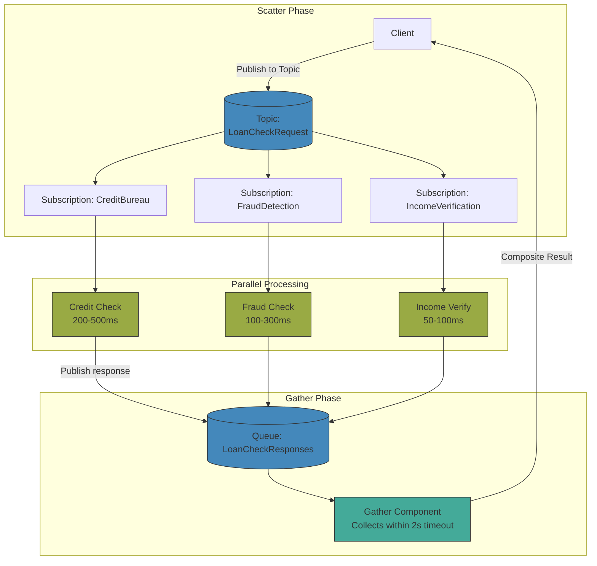
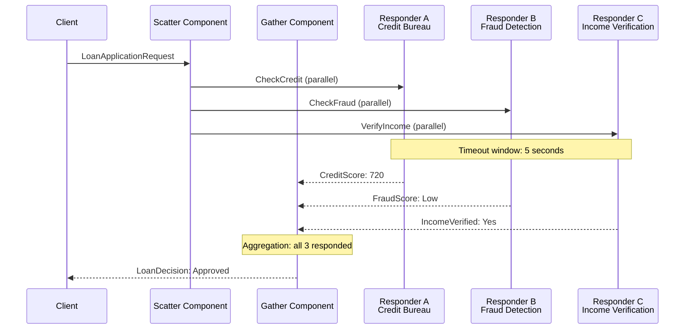
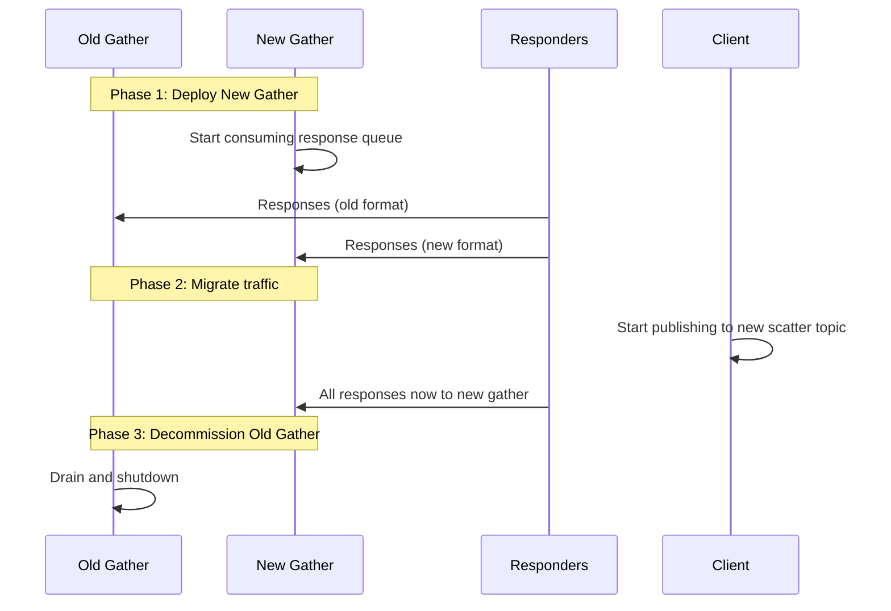
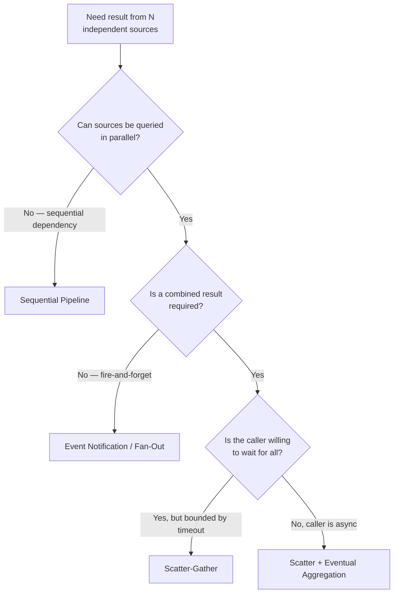

> [!success] Mastery Check
> - [ ] **Studied Well**
> - [ ] **Can explain the concept without notes**
> - [ ] **Can answer interview questions confidently**
> - [ ] **Can implement it in a real project**

## Navigation

**Domain:** [[7 — System Design & Distributed Systems]] > **Group:** Integration Patterns
**Previous:** [[7.148 — Pipes and Filters Pattern]] | **Next:** [[7.150 — Process Manager Pattern]]

### Prerequisites
- [[7.142 — Event-Driven Architecture — Overview]] — required because scatter-gather depends on topic-based fan-out, a core EDA concept
- [[7.140 — Request-Reply Pattern over Async Messaging]] — scatter-gather extends request-reply from 1:1 to 1:N using a topic

### Where This Fits

The scatter-gather pattern sends a single request to multiple independent receivers in parallel (scatter) and aggregates their individual responses into a single composite result (gather). It is used when a decision or result depends on input from multiple independent sources that can be evaluated concurrently — for example, checking a loan application against credit bureaus, fraud detection services, and income verification at the same time. A .NET engineer encounters it in any system that must consult multiple services and combine their results within a time budget. Without scatter-gather, the alternatives are sequential calls (each adds latency) or custom parallel-fan-out code that must handle partial failure, timeouts, and result aggregation manually.

Scatter-gather is distinct from related patterns: it provides parallel fan-out with result aggregation (one-shot, synchronous intent), unlike pipes and filters (sequential stages), saga (coordinated distributed transaction with compensation), or competing consumers (single stage scaled horizontally). It is best understood as a 1-to-N extension of request-reply.

## Core Mental Model

Scatter-gather is a parallel request-reply pattern where a single request is multicast to N recipients, and the responses are collected and aggregated within a time window. The invariant this maintains is: the caller gets a composite result that represents the consensus (or best-effort aggregation) of all N responders, or a partial result with known gaps if some responders timed out or failed. The tradeoff is that the overall response time is bounded by the slowest responder (within the timeout window) rather than the sum of sequential calls — reducing latency at the cost of complexity in aggregation and partial-failure handling. The recognition trigger is a system that calls 3+ independent services in sequence to gather data for a single decision, and the total latency is the sum of all three.

Think of it like a panel of judges scoring a competition. You send the performance to all judges simultaneously (scatter), each judge independently scores it, and you collect all the scores (gather). The final score is an aggregation — maybe the average, maybe the median (dropping highest and lowest). If one judge is late, you decide with the scores you have within a reasonable time. The alternative — asking judges one at a time — would take much longer and add no value because each judge's opinion is independent.



### Classification

Scatter-gather is a routing and aggregation pattern that operates at the messaging layer. It extends the request-reply pattern (1:1) to a 1:N fan-out with result consolidation. It is not a transaction pattern (use saga for that) and not a streaming pattern (use event-carried state transfer for that). Scatter-gather is synchronous in intent (the caller waits for the composite result) but asynchronous in mechanism (each parallel leg executes independently via its own queue).



### Key Properties / Guarantees

|Property|Value|Condition|
|---|---|---|
|Response time|Max(responder latency) within timeout|Slowest responder within the window|
|Completeness|Full or partial aggregation|All responders replied within timeout|
|Failure tolerance|Partial results accepted|Individual responders can fail independently|
|Fan-out scale|N responders — unlimited|Broker topic throughput limit|
|Aggregation semantics|Custom (all-of, any-of, best-n, quorum)|Application-defined aggregation logic|
|Idempotency required|Yes — responders may receive duplicates|Broker at-least-once delivery|
|State durability|Required for gather component|Must survive crashes/restarts|

### Aggregation Strategies

| Strategy | Description | Use Case | Risk |
|---|---|---|---|
| **All-of** | All responders must respond positive | Loan approval, multi-factor authorization | Slowest responder determines latency; one negative fails the whole thing |
| **Any-of** | At least one positive response suffices | Redundant data enrichment, any-source validation | May accept stale or wrong data from the fastest but least reliable source |
| **Quorum** | Majority (N/2 + 1) of responders positive | Consensus-based decisions, fault-tolerant voting | Ties are ambiguous for even N; requires careful threshold choice |
| **Best-N** | Best N of M (drop outliers) | Scoring systems (e.g., drop highest and lowest score) | Requires N+2 responders minimum |
| **Weighted** | Each responder has a weight; aggregation is weighted sum | Credit scoring with different bureau reliability | Weight calibration requires analysis |
| **Default on timeout** | Missing responders get a default value | Non-critical enrichment, optional data | Default may be wrong; must be safe (pessimistic for critical decisions) |

## Deep Mechanics

### How It Works

**Step 1 — Client sends scatter request.** A client sends a request to the scatter component — typically a single message to a topic or a command to a scatter service.

**Step 2 — Scatter to N responders.** The scatter component publishes the request to a topic where N responders have subscriptions. Each responder receives a copy of the request and processes it independently. This step must be fast — it is typically a single broker publish with N fan-out subscriptions.

**Step 3 — Responders process and reply.** Each responder performs its evaluation and sends its response to a gather queue. The response includes a correlation ID linking it to the original scatter request.

**Step 4 — Gather collects within timeout.** The gather component listens on the response queue, collecting responses identified by the correlation ID. It maintains a timeout — if all N responses arrive before the timeout, aggregation completes immediately. If the timeout expires, the gather component aggregates whatever responses have arrived.

**Step 5 — Aggregate and return.** The gather component applies the aggregation function (e.g., all-of: require all positive, any-of: require at least one positive, quorum: require majority) and returns the composite result to the client.

### Failure Modes

**Responder timeout.** One or more responders do not respond within the timeout window. The gather component returns a partial result. **Detection:** gather component logs incomplete aggregation for a correlation ID. **Metric:** scatter-gather completion rate — percentage of scatter requests that received all expected responses. **Prevention:** set timeout based on the responder's P99 SLA plus a buffer; consider reducing timeout for non-critical responders; use a default value for a responder if it does not reply. **Remediation:** for critical missing responders, the gather component should deny/decline (pessimistic default). For non-critical, proceed with partial data.

**Responder crash mid-processing.** A responder receives the request but crashes before sending the reply. The request may be redelivered if the broker tracks acknowledgment. **Detection:** duplicate responses from the same responder (original restarted and reprocessed). **Metric:** deduplication rate in gather component. **Prevention:** make responder processing idempotent and use deduplication in the gather component. **Remediation:** add a processed-request-id cache (Redis with TTL longer than the timeout) to skip duplicates.

**Broken scatter message.** The scatter component publishes an invalid request that all responders reject. **Detection:** all responders send error responses or throw, resulting in a composite error in the gather. **Metric:** scatter-gather error rate — all responders failing the same request. **Prevention:** validate the scatter request before publishing; use a schema registry for the request contract. **Remediation:** the gather component should detect the pattern (N errors, 0 successes) and immediately return a validation error to the caller instead of waiting for timeout.

**Gather component overload.** The gather component receives responses at high volume from many concurrent scatter requests, causing memory pressure from in-flight aggregation state. **Detection:** gather component OOM or slow response processing. **Metric:** gather component memory usage vs in-flight scatter requests. **Prevention:** limit the number of concurrent in-flight scatter requests; use an external store for aggregation state (Redis, database) instead of in-memory. **Remediation:** scale the gather component horizontally with competing consumers on the response queue; each gather instance picks up responses for different correlation IDs.

**Duplicate scatter requests.** A client retries a scatter request because the first attempt timed out or the scatter component did not acknowledge. The scatter component publishes two identical requests to the topic, and responders process both, sending duplicate responses. **Detection:** the gather component receives 2N responses instead of N. **Metric:** duplicate response rate (responses > expected). **Prevention:** make the scatter component idempotent — check if the correlation ID was already published; if so, skip the second publish. Use the broker's deduplication feature (Azure Service Bus supports deduplication windows). **Remediation:** in the gather component, deduplicate on `(correlationId, responderId)` pair — if a response from the same responder for the same correlation ID arrives twice, keep only the first.

**Responder response schema mismatch.** A responder is updated to return a new response schema, but the gather component still expects the old schema. The gather component fails to deserialize the response, treating it as a missing response. **Detection:** gather component logs deserialization errors for specific responder responses. **Metric:** per-responder error rate in gather component. **Prevention:** use backward-compatible response schemas (optional fields, versioned message types). Implement contract testing between each responder and the gather component. **Remediation:** the gather component should accept multiple schema versions and have a schema migration window.

### .NET and Azure Integration

- **Azure Service Bus Topics:** the scatter mechanism. Publish one message to a topic; each responder has a subscription with a filter. The broker handles fan-out. Use `EnablePartitioning = true` and `SupportOrdering = false` for high-throughput scatter scenarios.
- **Azure Service Bus Queues (temporary):** the gather mechanism. Each responder publishes its response to a gather queue with the correlation ID. The gather component consumes all responses. Use `RequiresSession = true` if responses from the same scatter request must be processed by the same gather instance.
- **MassTransit Request-Reply with Multiple Handlers:** MassTransit's `IRequestClient<T>` supports a single reply, but scatter-gather requires custom implementation using `Publish` + `Consumer` with correlation. Use MassTransit's saga feature if the gather component needs durable state.
- **Redis:** for storing aggregation state (responses + timeout tracking) when the gather component must handle many concurrent scatter requests. Use Redis lists with TTL for automatic cleanup.
- **Azure Functions + Durable Functions:** the Durable Functions fan-out/fan-in pattern (`FanOutAsync` / `FanInAsync`) is a managed scatter-gather implementation. The orchestrator fans out work to N activity functions and gathers their results.
- **OpenTelemetry:** instrument the scatter and gather phases as separate spans. Each responder creates a child span, allowing end-to-end trace visualization.

```csharp
// Scatter — publish request to topic
public sealed class LoanScatterer
{
    private readonly ITopicProducer<CheckLoanRequest> _producer;
    private readonly IGatherComponent _gatherer;

    public async Task<LoanDecision> EvaluateLoanAsync(
        LoanApplication application, CancellationToken ct)
    {
        var correlationId = Guid.NewGuid();
        using var activity = Diagnostics.Source.StartActivity("LoanScatter");
        activity?.SetTag("application.id", application.Id);
        activity?.SetTag("correlation.id", correlationId);

        // Scatter: publish to topic — N responders receive a copy each
        await _producer.Produce(new CheckLoanRequest
        {
            CorrelationId = correlationId,
            ApplicationId = application.Id,
            CustomerId = application.CustomerId,
            Amount = application.Amount,
            Timestamp = DateTimeOffset.UtcNow
        }, ct);

        // Gather: wait for responses with the correlation ID
        var result = await _gatherer.WaitForResponsesAsync(
            correlationId,
            expectedResponseCount: 3,
            timeout: TimeSpan.FromSeconds(5),
            ct);

        activity?.SetStatus(result.Approved ? ActivityStatusCode.Ok : ActivityStatusCode.Error);
        return result;
    }
}

// Responder — one of three parallel evaluators
public sealed class CreditBureauResponder : IConsumer<CheckLoanRequest>
{
    private readonly IPublishEndpoint _publisher;
    private readonly ILogger<CreditBureauResponder> _logger;

    public async Task Consume(ConsumeContext<CheckLoanRequest> context)
    {
        using var activity = Diagnostics.Source.StartActivity("CreditBureauResponder");
        activity?.SetTag("correlation.id", context.Message.CorrelationId);

        var score = await _creditBureau.EvaluateAsync(
            context.Message.CustomerId, context.CancellationToken);

        _logger.LogInformation("Credit score for {Customer}: {Score}",
            context.Message.CustomerId, score);

        // Reply to the gather queue
        await _publisher.Publish(new LoanCheckResponse
        {
            CorrelationId = context.Message.CorrelationId,
            ApplicationId = context.Message.ApplicationId,
            Source = "CreditBureau",
            Approved = score > 600,
            Score = score,
            Details = $"Credit score: {score}",
            Timestamp = DateTimeOffset.UtcNow
        }, context.CancellationToken);

        activity?.SetStatus(ActivityStatusCode.Ok);
    }
}
```

### Gather Component with Redis State Store

For production reliability, the gather component's in-flight state must survive restarts:

```csharp
public sealed class RedisGatherer : IGatherComponent
{
    private readonly IConnectionMultiplexer _redis;
    private readonly TimeSpan _defaultTtl;

    public RedisGatherer(IConnectionMultiplexer redis, IConfiguration config)
    {
        _redis = redis;
        _defaultTtl = TimeSpan.FromSeconds(
            config.GetValue<int>("ScatterGather:TimeoutSeconds") + 5);
    }

    public async Task<ScatterResult> WaitForResponsesAsync(
        Guid correlationId, int expectedCount, TimeSpan timeout, CancellationToken ct)
    {
        var db = _redis.GetDatabase();
        var stateKey = $"scatter:{correlationId}";
        var expectedKey = $"scatter:{correlationId}:expected";
        var tcs = new TaskCompletionSource<ScatterResult>();

        // Initialize state
        await db.KeyExpireAsync(stateKey, timeout + _defaultTtl);
        await db.StringSetAsync(expectedKey, expectedCount, timeout + _defaultTtl);

        // Register callback for when all responses arrive
        using var subscriber = _redis.GetSubscriber();
        await subscriber.SubscribeAsync($"scatter:complete:{correlationId}", async (_, _) =>
        {
            var responses = await db.ListRangeAsync(stateKey);
            var result = AggregateResponses(
                responses.Select(r => JsonSerializer.Deserialize<LoanCheckResponse>(r)).ToList(),
                expectedCount);
            tcs.TrySetResult(result);
        });

        // Start timeout task
        _ = Task.Delay(timeout, ct).ContinueWith(_ =>
        {
            if (!tcs.Task.IsCompleted)
            {
                var partialResult = AggregatePartialResultAsync(correlationId, db).Result;
                tcs.TrySetResult(partialResult);
            }
        }, ct);

        return await tcs.Task;
    }

    public async Task RecordResponseAsync(LoanCheckResponse response)
    {
        var db = _redis.GetDatabase();
        var key = $"scatter:{response.CorrelationId}";
        var expected = (int)await db.StringGetAsync($"scatter:{response.CorrelationId}:expected");

        await db.ListRightPushAsync(key,
            JsonSerializer.Serialize(response));

        var count = await db.ListLengthAsync(key);
        if (count >= expected)
        {
            // All responses received — publish completion event
            await db.Multiplexer.GetSubscriber()
                .PublishAsync($"scatter:complete:{response.CorrelationId}", "");
        }
    }
}
```

## Production Patterns and Implementation

### Primary Implementation

The canonical scatter-gather implementation uses an Azure Service Bus topic for scatter, a dedicated response queue for gather, and a gather component that tracks in-flight requests with timeout.

```csharp
// Gather component — collects responses with timeout
public sealed class LoanGatherer
{
    private readonly ConcurrentDictionary<Guid, GatherState> _pending =
        new();

    public async Task<LoanDecision> WaitForResponsesAsync(
        Guid correlationId,
        int expectedResponseCount,
        TimeSpan timeout,
        CancellationToken ct)
    {
        var state = new GatherState
        {
            ExpectedCount = expectedResponseCount,
            CompletionSource = new TaskCompletionSource<LoanDecision>()
        };

        _pending[correlationId] = state;

        // Start timeout task
        _ = Task.Run(async () =>
        {
            await Task.Delay(timeout, ct);
            if (_pending.TryRemove(correlationId, out var timedOutState))
            {
                var partial = AggregateResponses(
                    timedOutState.Responses,
                    timedOutState.ExpectedCount);
                timedOutState.CompletionSource.TrySetResult(partial);
            }
        }, ct);

        return await state.CompletionSource.Task;
    }

    // Called by the response consumer
    public void OnResponseReceived(LoanCheckResponse response)
    {
        if (_pending.TryGetValue(response.CorrelationId, out var state))
        {
            state.Responses.Add(response);
            if (state.Responses.Count >= state.ExpectedCount)
            {
                if (_pending.TryRemove(response.CorrelationId, out var completed))
                {
                    var result = AggregateResponses(
                        completed.Responses, completed.ExpectedCount);
                    completed.CompletionSource.TrySetResult(result);
                }
            }
        }
    }

    private static LoanDecision AggregateResponses(
        List<LoanCheckResponse> responses, int expected)
    {
        return new LoanDecision
        {
            Approved = responses.All(r => r.Approved),
            CompletedResponses = responses.Count,
            ExpectedResponses = expected,
            Details = responses.Select(r => r.Details).ToList()
        };
    }

    private sealed class GatherState
    {
        public int ExpectedCount { get; init; }
        public List<LoanCheckResponse> Responses { get; } = new();
        public TaskCompletionSource<LoanDecision> CompletionSource { get; init; } = new();
    }
}
```

### Configuration and Wiring

```csharp
// Program.cs — scatter-gather wiring
builder.Services.AddMassTransit(x =>
{
    x.AddConsumer<CreditBureauResponder>();
    x.AddConsumer<FraudDetectionResponder>();
    x.AddConsumer<IncomeVerificationResponder>();

    // Gather response consumer
    x.AddConsumer<LoanResponseConsumer>();

    x.UsingAzureServiceBus((context, cfg) =>
    {
        cfg.Host(builder.Configuration["Azure:ServiceBus:ConnectionString"]);

        // Topic for scatter — each responder has a subscription
        cfg.Publish<CheckLoanRequest>(p =>
        {
            p.EnablePartitioning = true;
        });

        // Responder subscriptions — each gets a filtered copy
        cfg.SubscriptionEndpoint<CheckLoanRequest>(
            "credit-bureau", e =>
        {
            e.ConfigureConsumer<CreditBureauResponder>(context);
        });

        cfg.SubscriptionEndpoint<CheckLoanRequest>(
            "fraud-detection", e =>
        {
            e.ConfigureConsumer<FraudDetectionResponder>(context);
        });

        cfg.SubscriptionEndpoint<CheckLoanRequest>(
            "income-verification", e =>
        {
            e.ConfigureConsumer<IncomeVerificationResponder>(context);
        });

        // Gather queue — all responders send responses here
        cfg.ReceiveEndpoint("loan-check-responses", e =>
        {
            e.ConfigureConsumer<LoanResponseConsumer>(context);
        });
    });
});
```

### Testing Scatter-Gather

Testing scatter-gather requires three levels of isolation:

```csharp
// Level 1: Unit test each responder in isolation
[Test]
public async Task CreditBureauResponder_returns_approved_when_score_above_threshold()
{
    var publisher = Substitute.For<IPublishEndpoint>();
    var creditBureau = Substitute.For<ICreditBureauService>();
    creditBureau.EvaluateAsync("cust-1", Arg.Any<CancellationToken>())
        .Returns(720);

    var responder = new CreditBureauResponder(creditBureau, publisher, NullLogger<CreditBureauResponder>.Instance);
    var context = Substitute.For<ConsumeContext<CheckLoanRequest>>();
    context.Message.Returns(new CheckLoanRequest(Guid.NewGuid(), "app-1", "cust-1", 50000, DateTimeOffset.UtcNow));

    await responder.Consume(context);

    await publisher.Received(1).Publish(Arg.Is<LoanCheckResponse>(r =>
        r.Source == "CreditBureau" && r.Approved));
}

// Level 2: Unit test the gather component with in-memory state
[Test]
public async Task Gatherer_returns_aggregated_result_after_all_responses()
{
    var gatherer = new InMemoryGatherer();
    var correlationId = Guid.NewGuid();

    // Simulate scatter
    var task = gatherer.WaitForResponsesAsync(correlationId, 2, TimeSpan.FromSeconds(5));

    // Simulate responses arriving
    gatherer.OnResponseReceived(new LoanCheckResponse(correlationId, "CreditBureau", true, 720, ""));
    gatherer.OnResponseReceived(new LoanCheckResponse(correlationId, "FraudDetection", true, 100, ""));

    var result = await task;
    Assert.That(result.Approved);
    Assert.That(result.CompletedResponses, Is.EqualTo(2));
}

// Level 3: Integration test — service bus emulator
[Test]
public async Task Full_scatter_gather_flow_completes_within_timeout()
{
    await using var bus = CreateTestBus();
    await bus.StartAsync();

    var scatterer = bus.CreateRequestClient<CheckLoanRequest>();
    var correlationId = Guid.NewGuid();

    // Publish scatter request
    await bus.Publish(new CheckLoanRequest(correlationId, "app-1", "cust-1", 50000, DateTimeOffset.UtcNow));

    // Wait for gather result
    var result = await _gatherer.WaitForResponsesAsync(correlationId, 3, TimeSpan.FromSeconds(10));
    Assert.That(result.CompletedResponses, Is.EqualTo(3));
}
```

### Gather Component as Competing Consumer

The gather component itself must handle high throughput. Multiple gather instances can consume from the response queue as competing consumers:

```csharp
// Program.cs — gather component with competing consumers
builder.Services.AddMassTransit(x =>
{
    x.AddConsumer<LoanResponseConsumer>(typeof(LoanResponseConsumerDefinition));

    x.UsingAzureServiceBus((context, cfg) =>
    {
        cfg.ReceiveEndpoint("loan-check-responses", e =>
        {
            e.PrefetchCount = 32;
            e.MaxConcurrentCalls = 16;
            e.ConfigureConsumer<LoanResponseConsumer>(context);
        });
    });
});

// Each gather instance processes different responses
// State must be in Redis to share across instances
public sealed class LoanResponseConsumer : IConsumer<LoanCheckResponse>
{
    private readonly IRedisGatherState _gatherState;

    public async Task Consume(ConsumeContext<LoanCheckResponse> context)
    {
        await _gatherState.RecordResponseAsync(context.Message);
        // If quorum reached, triggers completion via Redis pub/sub
    }
}
```

### Common Variants

**Scatter-gather with quorum aggregation.** Instead of waiting for all responses, the gather component returns as soon as a quorum (e.g., 2 out of 3) is reached. This improves response time at the cost of possible accuracy loss.

**Scatter-gather with best-n aggregation.** The gather component takes the best N of M responses (e.g., ignore the lowest and highest outlier). Used when some responders may be unreliable and the caller prefers consensus of the majority.

**Scatter-gather with default values.** Each expected responder has a default value. If the responder does not reply within the timeout, the gather component uses the default instead of treating it as a missing response. Useful for optional data enrichment where the request must succeed even if one responder is unavailable.

**Scatter-gather with weighted scoring.** Each responder contributes a weighted score to the final result. For example, CreditBureau weight = 0.5, FraudDetection weight = 0.3, IncomeVerification weight = 0.2. The final approval score is the weighted sum. Useful when responders have different reliability or importance levels. The weights must be carefully calibrated and re-evaluated periodically.

**Scatter-gather with adaptive timeouts.** The timeout per responder adapts based on historical response times. If a responder's P99 has been 400 ms for the last hour, the gather component uses a 600 ms timeout for that responder instead of the global 5-second timeout. This reduces the impact of one slow responder on the overall response time without setting a low global timeout that causes incomplete aggregations during normal operation.

### Responder Schema Versioning Strategy

Responders may be updated independently, meaning the response schema they return may change over time. The gather component must handle multiple response schema versions simultaneously:

```csharp
// V1 response schema
public sealed record LoanCheckResponseV1(
    Guid CorrelationId,
    string Source,
    bool Approved,
    int Score,
    string Details
);

// V2 response schema (adds ConfidenceScore, deprecates Score)
public sealed record LoanCheckResponseV2(
    Guid CorrelationId,
    string Source,
    bool Approved,
    int Score,                   // deprecated but still populated
    decimal ConfidenceScore,    // new field
    string Details,
    int SchemaVersion = 2
);

// Gather component handles both versions
public sealed class VersionAwareGatherer
{
    public void OnResponseReceived(string rawJson, string source)
    {
        var doc = JsonDocument.Parse(rawJson);
        var version = doc.RootElement.GetProperty("schemaVersion").GetInt32();

        switch (version)
        {
            case 1:
                var v1 = JsonSerializer.Deserialize<LoanCheckResponseV1>(rawJson);
                ProcessResponse(v1.CorrelationId, source, v1.Approved, score: v1.Score);
                break;
            case 2:
                var v2 = JsonSerializer.Deserialize<LoanCheckResponseV2>(rawJson);
                ProcessResponse(v2.CorrelationId, source, v2.Approved, score: v2.ConfidenceScore);
                break;
            default:
                _logger.LogWarning("Unknown schema version {Version} from {Source}", version, source);
                break;
        }
    }
}
```

Key rules for schema evolution:
1. Responders must include a `SchemaVersion` field in every response
2. Old fields must remain populated for at least 2 version cycles
3. The gather component must support all versions that could be in-flight simultaneously
4. Contract tests between each responder and the gather component must pass before deployment

### Kafka Implementation Alternative

For high-throughput scatter-gather (> 10,000 requests/second), Kafka provides better throughput than Azure Service Bus:

```csharp
// Kafka scatter: publish to input topic with partition key = request ID
// Kafka gather: consumer group reads from response topic

rider.AddProducer<CheckLoanRequest>("loan-check-requests", (context, config) =>
{
    config.SetValueSerializer(new JsonSerializer<CheckLoanRequest>());
});

rider.AddConsumer<CreditBureauResponder>();
rider.AddingConsumer<LoanResponseAggregator>();

rider.UsingKafka((context, k) =>
{
    k.TopicEndpoint<CheckLoanRequest>("loan-check-requests", "credit-bureau-group", e =>
    {
        e.ConfigureConsumer<CreditBureauResponder>(context);
    });

    k.TopicEndpoint<LoanCheckResponse>("loan-check-responses", "gather-group", e =>
    {
        e.ConfigureConsumer<LoanResponseAggregator>(context);
    });
});
```

Kafka advantages: higher throughput (millions of messages/second), lower latency (2-5 ms vs 5-10 ms for ASB), and persistent storage. Kafka disadvantages: no built-in timeouts (must implement custom timeout using Kafka Streams windowing or a separate timeout topic), no built-in DLQ, and more operational complexity.

### Real-World .NET Ecosystem Example

**MassTransit's request-response** supports 1:1 request-reply natively, but scatter-gather is a custom pattern on top. The typical implementation uses `Publish` to a topic for scatter and a dedicated `Consumer` on a response queue for gather. Many .NET financial services platforms use scatter-gather for real-time credit decisions: a single loan application is published to a topic; credit bureau, fraud detection, and income verification services each have a subscription; their responses are gathered within a 5-second window; if any responder returns a negative, the loan is declined.

### Additional Failure Mode: Responder Stampede on Recovery

When a responder service recovers after an outage, it may receive a backlog of scatter requests accumulated during its downtime. If the responder processes these without rate limiting, it can overwhelm downstream dependencies (database, external API). This is particularly dangerous for gather: the gather component suddenly receives a burst of responses from the recovering responder, potentially overloading the response queue and gather component.

**Detection:** gather component response queue depth spikes when a responder recovers. **Prevention:** configure each responder with a rate limiter and circuit breaker. When a responder has been down for more than its typical processing time, it should throttle its catch-up processing to avoid overwhelming dependencies. **Remediation:** use a "slow start" pattern — the responder gradually increases its processing rate after recovery (start at 10% of max, increase by 10% per minute until back to full speed).

### Deployment Considerations

Scatter-gather requires coordinated deployment between the scatter component, all responders, and the gather component:

1. **Gather component first** — deploy the gather component before responders, because responders need the response queue to exist
2. **Responders next** — deploy all responders; they start processing scatter requests and publishing responses
3. **Scatter component last** — deploy the scatter component; only then does the system start accepting scatter requests

For zero-downtime deployments, use blue-green or canary strategies:
- Run two gather component versions simultaneously; route a percentage of response traffic to the new version
- Deploy responders one at a time, verifying each before moving to the next
- The scatter component can switch traffic by updating the topic subscription filters



## Gotchas and Production Pitfalls

### Gather Component State Loss on Crash

**Pitfall:** The gather component stores in-flight scatter-gather state in memory only. When the gather component crashes or restarts, all pending scatter requests lose their aggregation state — the client never gets a response.

```csharp
// ❌ In-memory state lost on restart
private readonly ConcurrentDictionary<Guid, GatherState> _pending = new();
```

**Symptom:** Clients time out waiting for scatter-gather responses during deployments. The client retries, causing duplicate scatter requests.

**Fix:** Persist aggregation state externally (Redis, database). The gather component recovers in-flight state on restart.

```csharp
// ✅ Durable state in Redis
public async Task OnResponseReceived(LoanCheckResponse response)
{
    var key = $"scatter:{response.CorrelationId}";
    await _redis.ListRightPushAsync(key, JsonSerializer.Serialize(response));
    var count = await _redis.ListLengthAsync(key);

    if (count >= _expectedCounts[response.CorrelationId])
    {
        // All responses received — trigger completion
    }
}
```

**Cost of not fixing:** Scatter-gather is unreliable during deployments or process failures. Clients retry, which amplifies load on all responders.

### Timeout Too Tight for Slow Responders

**Pitfall:** Setting the timeout equal to the average response time, causing frequent incomplete aggregations during normal operation.

```csharp
// ❌ Timeout at P50 — 50% of scatter requests are incomplete
var result = await _gatherer.WaitForResponsesAsync(
    correlationId, expectedCount: 3,
    timeout: TimeSpan.FromMilliseconds(500)); // at P50
```

**Symptom:** 50% of scatter requests return incomplete results. Downstream systems receive partial data, causing errors or incorrect decisions.

**Fix:** Set timeout to at least the P99 response time of the slowest expected responder, plus a buffer for network latency.

```csharp
// ✅ Timeout at P99 + buffer
var result = await _gatherer.WaitForResponsesAsync(
    correlationId, expectedCount: 3,
    timeout: TimeSpan.FromSeconds(5)); // P99 is 3s, plus 2s buffer
```

**Cost of not fixing:** Frequent incomplete aggregations degrade the quality of the scatter-gather result. If responses are critical (e.g., fraud check), missing a response could lead to approving a fraudulent request.

### Unbounded Fan-Out

**Pitfall:** Adding more responders to the scatter topic without considering the impact on the gather component and overall latency.

```csharp
// ❌ 15 responders — gather waits for all 15, or timeout expires
// Latency is bounded by the slowest of 15 independent services
```

**Symptom:** The scatter-gather response time is determined by the worst-performing responder. Adding more responders increases the probability that at least one is slow, degrading the P99 response time.

**Fix:** Use quorum aggregation for large fan-outs: wait for a majority or a fixed number (e.g., 5 of 15) instead of all. Or categorize responders into critical (wait for all) and non-critical (wait for quorum or use defaults).

**Cost of not fixing:** Scatter-gather response time degrades as more responders are added, defeating the purpose of parallel evaluation.

### Responder Response Flooding

**Pitfall:** A responder replies multiple times due to a bug or broker redelivery, flooding the gather queue.

```csharp
// ❌ Responder publishes response without deduplication
public async Task Consume(ConsumeContext<CheckLoanRequest> context)
{
    // If this runs twice (broker redelivery), two responses are sent
    await _publisher.Publish(new LoanCheckResponse { /* ... */ });
}
```

**Symptom:** The gather component receives more responses than expected for a correlation ID. If the aggregation is "all positive" and the responder alternates between positive and negative on retries, the result may be incorrect.

**Fix:** Make responder processing idempotent and track whether the response was already sent for this correlation ID.

```csharp
// ✅ Responder with deduplication
public sealed class CreditBureauResponder : IConsumer<CheckLoanRequest>
{
    private readonly IPublishEndpoint _publisher;
    private readonly IProcessedRequestCache _cache;

    public async Task Consume(ConsumeContext<CheckLoanRequest> context)
    {
        var requestId = context.MessageId.ToString();
        
        // Check if already processed
        if (await _cache.WasProcessedAsync(requestId))
        {
            _logger.LogWarning("Duplicate request {RequestId}, skipping", requestId);
            return; // already processed and responded
        }

        var score = await _creditBureau.EvaluateAsync(
            context.Message.CustomerId, context.CancellationToken);

        await _publisher.Publish(new LoanCheckResponse
        {
            CorrelationId = context.Message.CorrelationId,
            Source = "CreditBureau",
            Approved = score > 600,
            Score = score,
        }, context.CancellationToken);

        // Mark as processed — TTL longer than the broker's redelivery window
        await _cache.MarkProcessedAsync(requestId, TimeSpan.FromMinutes(5));
    }
}
```

**Cost of not fixing:** Incorrect aggregation results due to duplicate responses. In a loan decision system, this could lead to incorrect approvals or denials.

### No Monitoring of Per-Responder Health

**Pitfall:** The system monitors scatter-gather completion rate but does not track which specific responder is failing or slow.

```csharp
// ❌ Only monitors "all responses received" vs "some missing"
// No per-responder latency or error tracking
```

**Symptom:** One responder has been failing silently for weeks (e.g., returning error responses that count as "received" but are actually denials). The scatter-gather completion rate remains 100% because all responders reply, but the system is approving loans without a proper fraud check because the fraud detection responder has been returning errors that the gather component treats as "deny" — which happens to be the safe default, but the team does not realize the responder is broken.

**Fix:** Track per-responder metrics: response time P50/P95/P99, error rate, and content validation (e.g., is the response format valid? does it have expected fields?). Alert if any responder's error rate exceeds 1% or response time exceeds 2x its baseline.

```csharp
// ✅ Per-responder monitoring
public sealed class MonitoredGatherer
{
    private readonly Dictionary<string, IMeter> _responderMeters;

    public void OnResponseReceived(LoanCheckResponse response)
    {
        var meter = _responderMeters[response.Source];
        meter.CreateHistogram<double>("responder.latency").Record(
            (DateTimeOffset.UtcNow - response.Timestamp).TotalMilliseconds);
        meter.CreateCounter<long>("responder.errors").Add(
            response.IsError ? 1 : 0);
    }
}
```

**Cost of not fixing:** Silent degradation of a single responder goes undetected. The scatter-gather result quality degrades, and the team is unaware until a business stakeholder notices incorrect decisions.

### Scatter Request Too Large

**Pitfall:** The scatter request message carries a large payload (e.g., a full customer profile with transaction history, uploaded documents, etc.), which is delivered to all N responders even if each responder only needs a subset of the data.

```csharp
// ❌ Scatter message carries everything
public sealed record CheckLoanRequest(
    Guid CorrelationId,
    string CustomerId,
    decimal Amount,
    byte[] DocumentScan,    // 5 MB PDF — sent to all responders
    string FullCreditHistory, // 500 KB — sent to all responders
    string AddressHistory    // 200 KB — even income verification doesn't need this
);
```

**Symptom:** High network bandwidth usage for the topic. Each responder receives the full payload, but most of the data is unused. The message may exceed the broker's max message size (256 KB for Azure Service Bus Standard, 1 MB for Premium).

**Fix:** Use the claim check pattern within scatter-gather: pass a reference URI to the large payload (e.g., blob storage URL) instead of the payload itself. Each responder fetches only the data it needs.

```csharp
// ✅ Claim check pattern — reference instead of payload
public sealed record CheckLoanRequest(
    Guid CorrelationId,
    string CustomerId,
    decimal Amount,
    Uri DataReferenceUri,  // Points to blob with full data
    IReadOnlyList<string> RequiredData  // Each responder specifies what it needs
);
```

**Cost of not fixing:** Message size limits are hit, or network bandwidth is wasted transmitting unused data to all responders.

### Timeout Too Long on the Slowest Responder

**Pitfall:** Setting the timeout to accommodate the slowest possible responder (e.g., 30 seconds for a credit bureau API that occasionally takes 30 seconds) causes the entire scatter-gather to be slow for every request.

```csharp
// ❌ Timeout set for worst case — every request waits 30 seconds
var result = await _gatherer.WaitForResponsesAsync(
    correlationId, expectedCount: 3,
    timeout: TimeSpan.FromSeconds(30)); // P99 is 500ms, but P99.99 is 30s
```

**Symptom:** P99 response time is 30 seconds because 1 in 10,000 requests hits the worst-case credit bureau latency, and the timeout is set to cover it. The other 9,999 requests — which could complete in 500 ms — also wait for the timeout because the all-of aggregation requires all 3 responders.

**Fix:** Use a split strategy: critical responders (must wait) get a longer timeout; non-critical responders get a shorter timeout with a default value if they miss it. Or use quorum aggregation: if 2 of 3 have responded and both are positive, return early even if the third is still waiting.

```csharp
// ✅ Split timeout: critical responders wait 5s, non-critical wait 1.5s with default
var creditResponse = await WaitForResponder("CreditBureau", TimeSpan.FromSeconds(5));
var fraudResponse = await WaitForResponder("FraudDetection", TimeSpan.FromSeconds(5));
var incomeResponse = await WaitForResponder("IncomeVerification",
    TimeSpan.FromSeconds(1.5), defaultValue: new LoanCheckResponse { Approved = true });
```

**Cost of not fixing:** P99 response time is determined by the worst-case latency of the slowest responder, not the typical case. Users perceive the system as slow even though most requests could complete much faster.

## Tradeoffs and Decision Framework

### Tradeoff Matrix

| Dimension | Scatter-Gather | Sequential Service Calls | Event-Driven (No Aggregation) |
|---|---|---|---|
| Response time | Max(N responders) within timeout | Sum(N responders) | N/A (async, no response) |
| Completeness | Partial results possible | Always complete (but slow) | No aggregation |
| Complexity | Medium (scatter + gather state) | Low (simple loop) | Low (fire-and-forget) |
| Failure tolerance | High — individual failures isolated | Low — one failure blocks all | High — consumer failures isolated |
| State management | Required (gather) | None | None |
| Scalability | High — each responder scales independently | Low — single sequential bottleneck | High — independent consumers |
| Debugging | Medium — need per-responder tracing | Easy — single trace | Hard — distributed events |
| Best for | Need combined result from N parallel sources | Need combined result but parallelism not required | No combined result needed |

### Timeout Calculation Guide

| Number of Responders | P99 Latency Spread | Recommended Timeout | Strategy |
|---|---|---|---|
| 2 | Both similar | P99 × 1.5 | All-of (both required) |
| 3 | Low variance (<2x) | Max(P99) × 1.3 | All-of or quorum |
| 3 | High variance (>5x) | Max(P99) × 1.3 or ignore slowest | Quorum (ignore slowest outlier) |
| 5+ | Mixed | Max(P99 of critical subset) × 1.3 | Critical quorum (wait for critical only) |
| 10+ | Wide | P50 × 3 or fixed time budget | Best-N or default on timeout |

### Cost Analysis

Scatter-gather costs scale with the number of responders. For each scatter request with N responders:
- **Scatter publish:** 1 topic publish (1 operation)
- **Fan-out delivery:** N subscription deliveries (N operations, included in the publish in Azure Service Bus)
- **Response publishes:** N response publishes (N operations)
- **Gather receives:** N response receives and completes (2N operations)
- **Total:** ~3N + 1 operations per scatter request

At 100 requests/s with 3 responders: ~900 operations/s = ~2.3 billion ops/month ≈ $115/month (Standard tier). With 10 responders: ~3,000 ops/s = ~7.8 billion ops/month ≈ $390/month.

To optimize costs:
- **Reduce responder count** — consolidate responders that provide overlapping information
- **Use Premium tier for high volume** — Premium charges per message unit rather than per operation, which can be cheaper above ~4,000 ops/s
- **Cache responses** — if a responder's response is valid for a period (e.g., credit score cached for 1 hour), avoid re-querying
- **Use quorum aggregation** — fewer responses to process if quorum reached early

Each responder also incurs its own compute costs (container/function hosting, database operations, external API calls). The cost of scatter-gather is the sum of all responder costs plus the messaging infrastructure — which may be 3-10x the cost of sequential calls, justified by the latency improvement.

### When to Apply



### When NOT to Apply

- [ ] The caller does not need a combined result — use event fan-out and let each consumer act independently
- [ ] The responders have sequential dependencies — scatter-gather assumes independent parallel evaluation
- [ ] The timeout would need to exceed the caller's patience threshold — if the slowest responder takes 30 seconds and the caller expects sub-second response, scatter-gather is the wrong pattern for that responder
- [ ] The aggregation logic is simple enough to be handled by the first consumer that responds — consider competing consumers with a single winner instead
- [ ] The number of responders is 1 — that is just request-reply, no scatter needed
- [ ] The responder set changes frequently — adding or removing responders requires updating the gather component's expected count and aggregation logic
- [ ] The response payloads are very large (> 1 MB each) — N large responses arriving simultaneously can overwhelm the gather component's memory and the response queue

### Resilience Patterns for Scatter-Gather

**Circuit breaker per responder.** If a responder consistently fails or times out, the scatter component should stop sending requests to it for a period. This is particularly important for external APIs that may be unavailable. When a responder is circuit-broken, the gather component uses the default value for that responder.

```csharp
// Circuit breaker per responder
public sealed class ResilientScatterer
{
    private readonly Dictionary<string, AsyncCircuitBreakerPolicy> _breakers = new();

    public ResilientScatterer()
    {
        _breakers["CreditBureau"] = Policy
            .Handle<TimeoutException>()
            .Or<HttpRequestException>()
            .CircuitBreakerAsync(5, TimeSpan.FromMinutes(1));
    }

    public async Task ScatterAsync(CheckLoanRequest request)
    {
        var tasks = _responders.Select(async r =>
        {
            if (_breakers[r.Name].CircuitState == CircuitState.Open)
            {
                _logger.LogWarning("Responder {Name} is circuit-broken, using default", r.Name);
                await _gatherer.RecordResponseAsync(r.GetDefaultResponse(request.CorrelationId));
                return;
            }
            await _breakers[r.Name].ExecuteAsync(() => r.SendAsync(request));
        });

        await Task.WhenAll(tasks);
    }
}
```

**Bulkhead per responder.** Each responder gets its own connection pool and thread pool, preventing one slow responder from exhausting resources needed by other responders.

**Retry with backoff for transient failures.** If a responder fails with a transient error (timeout, HTTP 503), retry with exponential backoff up to a maximum retry count. The retry must not exceed the scatter-gather timeout.

**Graceful degradation on complete failure.** If all responders fail, the scatter-gather should return a clear error response indicating that the result could not be computed. The caller can then decide whether to retry, use cached data, or fail the operation.

**Timeout management with adaptive thresholds.** Rather than a fixed timeout for all responders, implement adaptive per-responder timeouts based on rolling historical data:

```csharp
public sealed class AdaptiveTimeoutTracker
{
    private readonly Dictionary<string, Queue<TimeSpan>> _recentLatencies = new();
    private const int WindowSize = 100;

    public TimeSpan GetTimeoutFor(string responderId)
    {
        if (!_recentLatencies.TryGetValue(responderId, out var latencies) || latencies.Count < 10)
            return TimeSpan.FromSeconds(5); // default

        var sorted = latencies.OrderBy(x => x).ToArray();
        var p99 = sorted[(int)(sorted.Length * 0.99)];
        return p99.Add(TimeSpan.FromMilliseconds(500)); // P99 + 500ms buffer
    }

    public void RecordLatency(string responderId, TimeSpan latency)
    {
        if (!_recentLatencies.ContainsKey(responderId))
            _recentLatencies[responderId] = new Queue<TimeSpan>();
        
        var queue = _recentLatencies[responderId];
        queue.Enqueue(latency);
        if (queue.Count > WindowSize) queue.Dequeue();
    }
}
```

This approach automatically adjusts timeouts when a responder's performance degrades (e.g., due to increased load on its downstream dependencies) without requiring manual reconfiguration.

### Scale Thresholds

- **Worth considering when combining results from 3+ independent services** where sequential calls would exceed the latency budget
- **Required when the latency budget is less than the sum of sequential service calls** — scatter-gather makes response time the max, not the sum
- **Re-evaluate when fan-out exceeds 10 responders** — the probability that at least one responder is slow approaches 100%, degrading P99 response time
- **Consider quorum aggregation above 5 responders** to avoid waiting for the slowest outlier
- **Overkill below 2 responders** — with only 2 responders, the complexity of gather state management and partial failure handling is not justified over simple parallel Task.WhenAll

## Interview Arsenal

### Question Bank

1. What is the scatter-gather pattern and what problem does it solve?
2. Walk through the implementation of scatter-gather with a topic and response queue.
3. What is the tradeoff between scatter-gather and sequential request-reply?
4. How does scatter-gather handle partial failure — what happens if one responder fails?
5. Compare scatter-gather with saga — when does each apply?
6. Design a loan application scoring system that consults credit bureaus, fraud detection, and income verification.
7. How does scatter-gather behave when one responder is consistently 2x slower than the others?
8. What is the relationship between scatter-gather and the timeout window?
9. How do you handle duplicate responses in scatter-gather caused by broker redelivery?
10. What happens to in-flight scatter requests when the gather component crashes?
11. Compare quorum aggregation vs all-of aggregation in terms of latency and correctness.
12. How would you implement scatter-gather with Kafka instead of Azure Service Bus?

### Spoken Answers

**Q: What is the scatter-gather pattern and when would you use it?**

> **Average answer:** Scatter-gather sends a request to multiple services in parallel, collects their responses, and combines them into one result. Use it when you need data from multiple sources.

> **Great answer:** Scatter-gather is a messaging pattern that fans out a single request to N independent responders in parallel and aggregates their individual responses into a composite result within a time window. The scatter phase uses a topic or exchange — one publish, N subscriptions. Each responder processes independently and sends its response to a gather queue with a correlation ID. The gather component collects responses, and when all expected responses arrive or the timeout expires, it applies an aggregation function and returns the result.

The key advantage over sequential calls is latency: instead of adding each responder's latency (L1 + L2 + L3), scatter-gather's response time is determined by the slowest responder (max(L1, L2, L3)). For three 100 ms services, sequential takes 300 ms; scatter-gather takes ~100 ms.

I use scatter-gather whenever a decision requires input from multiple independent evaluators and the latency budget cannot tolerate sequential calls. The classic example is loan application processing: a single application must be checked against credit bureaus, fraud detection systems, and income verification. Each check is independent — they do not need each other's results. Scatter-gather runs all three checks in parallel and aggregates the results within a 5-second window. The aggregation function requires all three to approve for the loan to be approved.

The tradeoff is the timeout. You must decide: what if one responder does not reply in time? The options are to deny (pessimistic) or to proceed with the partial result (optimistic). The choice depends on whether the missing responder is critical or supplementary.

**Q: How do you handle partial failure in scatter-gather?**

> **Great answer:** Partial failure is inherent to scatter-gather — when you fan out to N independent systems, some may fail, time out, or return errors. The approach is threefold.

First, the timeout: set a generous timeout that covers the P99 response time of each responder plus a buffer. If a responder is still running at timeout, it is treated as unavailable. Second, the aggregation strategy: define how partial results are handled. For critical responders, missing their response means the overall result defaults to a safe value — for a loan decision, missing the fraud check means deny. For non-critical responders (like an optional data enrichment), missing the response means the gather proceeds with whatever data it has. Third, idempotency and deduplication: responders must be idempotent, and the gather component must deduplicate responses from the same correlation ID. This prevents duplicates from broker redelivery from skewing the aggregation.

In the implementation, the gather component tracks the set of expected responders (by a responder ID header) and the set of received responses. When the timeout fires, it compares the two sets and applies the aggregation logic with the partial set. The caller receives both the result and a completeness indicator — "3 of 3 responses received" vs "2 of 3 responses received" so they can decide how to act on the partial result.

### System Design Interview Trigger

If an interviewer describes a system where a single request must consult multiple independent services and combine their results — such as "design a credit approval system" or "design a travel aggregator that checks prices from multiple airlines" — they are testing whether you know the scatter-gather pattern. The follow-up will be about partial failure: "what if one airline is down?" — testing whether you think about timeouts and partial aggregation.

### Expanded Spoken Answers

**Q: How do you handle duplicate responses in scatter-gather?**

> I handle duplicates at two levels. First, at the responder: each responder tracks processed request IDs and skips duplicates. This prevents the responder from doing the work twice and sending two responses. Second, at the gather component: even if a responder sends two responses (e.g., due to a bug), the gather component deduplicates on the `(correlationId, responderId)` pair. If a second response arrives for the same correlation ID from the same responder, it is ignored.
> 
> The critical insight is that deduplication at the gather component alone is not enough — without responder-level deduplication, each duplicate request causes duplicate work (API calls, database queries, external service calls). The responder-level deduplication prevents this wasted work and its downstream effects (e.g., duplicate credit bureau pulls, duplicate fraud checks).

**Q: How does scatter-gather differ from a saga?**

> They address different problems. Scatter-gather is for parallel evaluation of independent conditions — you send one request to N independent evaluators and aggregate their opinions. The evaluators do not depend on each other; they all receive the same request simultaneously. The result is a composite of their independent judgments.
> 
> Saga is for coordinating sequential steps that form a distributed transaction — step B depends on step A's result, and if any step fails, compensating actions undo previous steps. The steps are sequential, not parallel, because each step needs the previous step's output.
> 
> In practice: scatter-gather answers "should we approve this loan?" by asking three independent services in parallel. Saga answers "how do we process this order through payment, inventory, and shipping?" where each step needs the previous step's result, and failure in shipping must compensate payment.

### Scatter-Gather Anti-Patterns

**1. Treating Sequential Dependencies as Parallel.** A common mistake is using scatter-gather for services that are not truly independent. If Service B needs Service A's result, they cannot run in parallel. The scatter-gather will produce incorrect results because Service B's evaluation is based on incomplete data. **Fix:** Use a pipeline or saga for sequential dependencies; only use scatter-gather for truly independent evaluators.

**2. Infinite Timeout.** Setting no timeout or an extremely long timeout defeats the purpose of scatter-gather. If the caller waits 30 seconds for a response that could have been obtained in 5 seconds sequentially, the parallel advantage is lost. **Fix:** Set timeout based on business requirements and the slowest responder's P99 + buffer. If the timeout must be long, consider whether parallel execution is still beneficial.

**3. Overly Complex Aggregation.** The aggregation logic grows to handle every edge case — weighted scoring, multiple quorum thresholds, conditional defaults. The gather component becomes a god class that is hard to test and modify. **Fix:** Keep aggregation simple. If the logic is complex, move it to a separate aggregation service that the gather component calls. Consider using a rules engine (e.g., Rules Engine pattern) instead of hardcoded aggregation.

**4. Responder Coupling to Scatter Schema.** Responders receive the full scatter request, including fields they do not need. When the scatter schema changes, all responders must be updated even if they do not use the changed fields. **Fix:** Use per-responder filters on the topic subscription so each responder receives only the fields it needs. Azure Service Bus supports SQL-like filter rules on subscriptions.

### Comparison Table

| | Scatter-Gather | Sequential Calls | Saga |
|---|---|---|---|
| Architecture | Parallel fan-out + gather | Linear chain | Choreographed/orchestrated steps |
| Response time | Max(N) | Sum(N) | Sum(N) (sequential saga) |
| Complexity | Medium (gather state, timeout) | Low | High (compensation, state machine) |
| Failure model | Isolated per responder | Cascading | Compensating transaction |
| Use case | Combine independent results | Ordered sequential processing | Distributed transaction |

## Architecture Decision Record

**Status:** Accepted

**Context:** A loan application system must evaluate three independent factors before approving a loan: credit bureau score (external API, 200-500 ms, P99 = 450 ms), fraud detection (internal ML service, 100-300 ms, P99 = 280 ms), and income verification (internal service, 50-100 ms, P99 = 90 ms). The current implementation calls these sequentially, giving a P99 response time of 1,200 ms (450 + 280 + 90 + network overhead). The business requires P99 < 800 ms. Volume is 50 applications/second during normal operation, spiking to 200/second during promotional periods. The system runs on AKS with 5 nodes and uses Azure Service Bus Premium tier.

**Options Considered:**

1. **Scatter-Gather** — publish loan application to a topic; each evaluator has a subscription; responses gathered with 2-second timeout. Aggregation: all three must approve.
2. **Sequential (current)** — call credit bureau, then fraud, then income verification. Simple but exceeds the latency budget.
3. **Cache credit bureau data** — pre-fetch credit scores nightly and use cached values in the sequential flow. Reduces one API call but adds staleness and batch-processing complexity.

**Decision:** Scatter-Gather with a 2-second timeout and all-approve aggregation, because it reduces P99 response time from 1,200 ms to ~500 ms (the max of the three parallel calls), meeting the business SLO without introducing data staleness or batch infrastructure. Each evaluator processes independently, so failure of one does not block the others.

**Consequences:**
- ✅ P99 response time drops to ~500 ms — well under the 800 ms SLO
- ✅ Each evaluator scales independently — fraud detection can be upgraded without affecting credit bureau integration
- ✅ Adding a 4th evaluator (e.g., employment verification) does not increase response time
- ⚠️ Gather component must handle partial failure — if credit bureau times out, the loan must be denied (safe default)
- ⚠️ In-flight state management adds operational complexity — gather component state must be persisted for reliability
- ❌ The aggregation logic is simple today (all approve), but becoming more complex (e.g., weighted scoring) would require updating the gather component

**Review Trigger:** Revisit this decision if the number of evaluators exceeds 5 (at which point consider quorum aggregation instead of all-approve), or if a new evaluator requires sequential results from another evaluator (at which point a hybrid scatter-sequential pattern may be needed). Also revisit if the P99 response time approaches the 800 ms SLO — at that point, consider reducing the timeout, caching the credit bureau response, or switching to quorum aggregation to improve the P99.

## Self-Check

### Conceptual Questions

1. What is the scatter-gather pattern and what invariant does it maintain?
2. Derive the tradeoff between scatter-gather and sequential service calls.
3. Given a system where 2 services must be called sequentially (Service B needs Service A's result), is scatter-gather appropriate?
4. What metric reveals that the scatter-gather timeout is set too aggressively?
5. Name the Azure Service Bus feature that enables the scatter phase.
6. What is the structural distinction between scatter-gather and saga?
7. Below what number of responders is sequential calling simpler than scatter-gather?
8. [[7.140 — Request-Reply Pattern over Async Messaging]] — how does scatter-gather extend request-reply?
9. What production consequence follows from storing gather state only in memory?
10. Explain scatter-gather to a business analyst in 60 seconds.
11. What metric would you monitor to detect that one responder is consistently slower than others?
12. How do you calculate the optimal timeout for a scatter-gather with 3 responders having P99 latencies of 500ms, 300ms, and 100ms respectively?
13. What is the difference between quorum aggregation and all-of aggregation in terms of response time?
14. How would you implement early completion (return before timeout when quorum is reached) in a scatter-gather?
15. What happens to the client experience when one responder consistently fails and the gather component uses pessimistic defaults?

<details>
<summary>Answers</summary>

1. A single request is fanned out to N independent responders and their responses are aggregated within a time window. The invariant: the response time is bounded by the slowest responder, not the sum of all responders.
2. Scatter-gather gives response time = max(N) at the cost of aggregation complexity and partial-failure handling. Sequential gives response time = sum(N) with simpler code.
3. No — Service B depends on Service A's output. Scatter-gather assumes responders are independent. Use sequential calls or a pipeline with ordered stages.
4. A high rate of incomplete aggregations — the number of scatter requests where the count of received responses is less than the expected count.
5. Topics with multiple subscriptions — one publish fans out to N subscriptions.
6. Scatter-gather sends to independent evaluators in parallel and aggregates results. Saga coordinates sequential steps with compensation logic. Scatter-gather is for gathering parallel opinions; saga is for maintaining data consistency across steps.
7. Below 3 responders — sequential calls are simpler. At 2 responders, the latency difference (max vs sum) is often not critical.
8. Request-reply is 1:1 — one request, one reply. Scatter-gather is 1:N — one request multicast, N replies gathered into one result.
9. On gather component crash or restart, all in-flight scatter-gather requests lose their state. Clients time out and retry, amplifying load on all responders.
10. "Scatter-gather is like asking three experts a question at the same time instead of one after another. You send them the question simultaneously, each writes their answer, and you combine the answers into a final decision. If one expert is late, you decide with whatever answers you have within a reasonable waiting time."
11. Per-responder P50/P95/P99 response time compared to the scatter-gather timeout. If any responder's P99 exceeds 80% of the timeout, that responder is likely to cause incomplete aggregations.
12. Timeout = max(P99 of all responders) + buffer. For P99s of 500ms, 300ms, 100ms: max = 500ms. Add 20-50% buffer for network jitter and clock skew: 500ms × 1.3 = 650ms. The timeout should be ~650ms to cover the slowest responder's P99 with a safety margin. A 1-second timeout would be more practical given typical network variability.
13. All-of aggregation waits for all N responders — response time = max(N). Quorum aggregation (e.g., 2 of 3) can return as soon as the quorum threshold is met — response time = expected value of the K-th fastest responder (where K = quorum size). For 3 responders with similar latency distributions, all-of P50 ≈ P50 of slowest, quorum P50 ≈ P50 of second-fastest. Quorum can be 2-3x faster than all-of in typical cases.
14. The gather component checks after each response whether the quorum threshold has been met. If so, it immediately completes the TaskCompletionSource and returns the aggregated result. The remaining responses are discarded (or logged). This requires that the aggregation function supports incremental evaluation — you cannot wait for all responses and then aggregate if you want early completion.
15. If a responder consistently fails, the gather component uses the pessimistic default (e.g., deny the loan). The system becomes overly conservative — it denies loans that might be approved if the responder were working. The client experiences higher rejection rates. The team must detect the failing responder (via per-responder monitoring) and fix it. In extreme cases, the team might temporarily switch to optimistic defaults (assume positive) for the failing responder while they fix it, accepting the risk of false positives.

</details>

---

### Scenario Challenges

**Scenario 1 — Diagnose the problem**

A scatter-gather loan evaluation system has a P99 response time of 5 seconds, but the timeout is set to 3 seconds. 40% of scatter requests return only 2 of 3 expected responses.

<details>
<summary>Diagnosis</summary>

**Root cause:** The timeout (3 seconds) is shorter than the P99 response time of one responder (4.5 seconds). The credit bureau API is the bottleneck — it consistently takes 4-5 seconds during peak hours.

**Evidence:** Incomplete aggregation rate for the credit bureau responder is 40%. The other two responders (fraud, income) complete within 500 ms. The credit bureau's response time exceeds the 3-second timeout.

**Fix:** Increase the timeout to 6 seconds to cover the credit bureau's P99 response time plus buffer. Alternatively, if the business cannot tolerate 6-second response time, switch the credit bureau to a cached/pre-fetched value or use a faster third-party provider.

**Prevention:** Monitor per-responder response times relative to the scatter-gather timeout. Alert if any responder's P99 approaches or exceeds the timeout.

</details>

---

**Scenario 2 — Design decision**

You are designing a travel aggregator that searches for flights from 4 airlines. Each airline API takes 2-5 seconds. Users expect results within 10 seconds. The result must show all available options sorted by price.

<details>
<summary>Decision and Reasoning</summary>

**Choice:** Scatter-gather with an 8-second timeout. Scatter the search request to 4 airline responder queues. Gather responses and aggregate (merge, deduplicate, sort by price). If an airline does not respond within 8 seconds, proceed without it and show a note: "Results from Airline X are still loading."

**Tradeoffs accepted:** Users may see incomplete results if an airline is slow. The alternative is sequential calls (4 × 5 seconds = 20 seconds, exceeding the 10-second budget). Partial results are better than no results.

**Implementation sketch:**

```csharp
public async Task<FlightSearchResults> SearchFlightsAsync(
    FlightSearchRequest request, CancellationToken ct)
{
    await _scatter.Publish(request, ct);

    var result = await _gatherer.WaitForResponsesAsync(
        request.CorrelationId,
        expectedCount: 4,
        timeout: TimeSpan.FromSeconds(8),
        ct);

    return new FlightSearchResults
    {
        Flights = result.Responses
            .SelectMany(r => r.Flights)
            .OrderBy(f => f.Price)
            .ToList(),
        MissingAirlines = result.MissingResponders
    };
}
```

</details>

---

**Scenario 3 — Failure mode** A scatter-gather component's in-memory aggregation state was lost during a deployment, causing 200 in-flight scatter requests to time out. Clients retried, sending 200 duplicate scatter requests and doubling the load on all responders.

<details>
<summary>Investigation and Fix</summary>

**Investigation steps:** 1) Check deployment logs — was the gather component restarted? 2) Check gather component for state persistence. 3) Monitor responder load spikes correlated with the deployment.

**Confirming evidence:** Gather component pod restart at 14:00 UTC. Responder request volume doubled at 14:00-14:05 UTC. Client-side timeouts correlate exactly with the deployment window.

**Fix:** Make the gather component's aggregation state durable. Use Redis to store in-flight state so it survives restarts.

**Prevention:** Add graceful shutdown to the gather component — on shutdown signal, stop accepting new scatter requests, wait for in-flight requests to complete (up to a timeout), then shut down. During startup, check Redis for any pending in-flight state and resume aggregation.

**Post-mortem item:** The gather component's in-memory state was a known architectural risk that was deferred. Add to the risk register: "Stateless components only — any state must be externalized."

</details>

---

**Scenario 4 — Scale it** Your scatter-gather system handles 50 requests/second with 3 responders each. Volume is expected to grow to 500 requests/second. Each responder sends a response message, and the gather component processes them.

<details>
<summary>Scaling Strategy</summary>

**Bottleneck this addresses:** The gather component's response queue receives 3 × 500 = 1,500 responses/second. The gather component must process these quickly and maintain state for ~500 concurrent in-flight scatter requests.

**How it helps:** Scatter-gather's gather phase can use competing consumers — multiple gather component replicas can consume from the response queue as long as state is in Redis (not in-memory).

**Implementation order:** 1) Move aggregation state from in-memory to Redis with a TTL matching the timeout window. 2) Scale the gather component to 3-5 replicas as competing consumers on the response queue. 3) Ensure the response queue is partitioned to avoid ordering bottlenecks. 4) Each responder may need scaling — at 500 requests/s, each responder must handle 500 requests/s (if all 3 are needed for every scatter). 5) Consider quorum aggregation: wait for only 2 of 3 responders to reduce response queue load and improve response time.

**What it does not solve:** If the timeout window is 5 seconds, there will be ~2,500 in-flight scatter requests at any time. The Redis state store must be sized to handle this volume.

</details>

---

**Scenario 5 — Quorum aggregation** You are designing a medical diagnosis triage system. Three independent diagnostic services run tests on patient data. At least 2 of 3 must agree for a diagnosis to be confirmed. The timeout is 10 seconds.

<details>
<summary>Design and Reasoning</summary>

**Choice:** Scatter-gather with quorum aggregation (at least 2 of 3 responders must agree). The scatter component publishes patient data to a topic with 3 subscriptions: RadiologyDiagnosis, LabDiagnosis, and SymptomDiagnosis. The gather component collects responses within a 10-second timeout.

**Quorum logic:** Track `agreeCount` and `disagreeCount`. If `agreeCount >= 2` at any point, return the agreed diagnosis immediately — no need to wait for the third responder. If `disagreeCount >= 2`, return "inconclusive" — the majority cannot agree. If timeout fires before quorum is reached, return "incomplete — consult manually."

**Optimization:** Early completion — if 2 of 3 agree, return immediately without waiting for the third. This improves P50 response time significantly because the fastest two responders often determine the result before the slowest one finishes.

**Key insight:** Quorum aggregation with early completion changes the response time characteristic from `max(N responders)` to the time when the quorum threshold is met. For 3 responders requiring 2 agreements, the expected response time is the expected value of the second-fastest responder, which is significantly lower than max of 3.

```csharp
public async Task<DiagnosisResult> AggregateWithQuorum(
    CorrelatedMessage<DiagnosisResponse> response,
    GatherState state)
{
    if (response.Data.Diagnosis == Diagnosis.Positive)
        state.PositiveCount++;
    else if (response.Data.Diagnosis == Diagnosis.Negative)
        state.NegativeCount++;

    // Early completion: quorum reached
    if (state.PositiveCount >= 2)
        return new DiagnosisResult(Diagnosis.Positive, Confidence: state.PositiveCount / 3.0);
    if (state.NegativeCount >= 2)
        return new DiagnosisResult(Diagnosis.Inconclusive);

    return null; // keep waiting
}
```

</details>

---

**Scenario 6 — Interview simulation** The interviewer says: "Design a system that evaluates a loan application. Credit score, fraud check, and income verification are independent. The result must be returned within 2 seconds."

<details>
<summary>Model Response</summary>

"I would use the scatter-gather pattern because the three evaluators are independent — the loan application does not need the credit score result to run fraud detection. Running them in parallel means the response time is bounded by the slowest evaluator, not the sum of all three.

The architecture: a LoanScatterer publishes the application to an Azure Service Bus topic. Three subscriptions exist — one each for the Credit Bureau service, Fraud Detection service, and Income Verification service. Each service receives its own copy of the request, processes it, and publishes its response to a shared LoanEvaluationResponses queue with the correlation ID from the original request.

The GatherComponent is a consumer on the response queue. It maintains state in Redis (not in-memory) keyed by correlation ID, tracking how many responses have been received. When all three responses arrive, or when a 1.5-second timeout expires, it applies aggregation logic. For a loan decision, the aggregation is: all three must approve. If any evaluator says deny, the result is deny. If an evaluator times out, the default is deny (pessimistic approach for a financial system).

The timeout is set to 1.5 seconds, leaving a 500 ms buffer before the 2-second SLO for client-side processing. Each evaluator must have a P99 response time under 1.5 seconds. If the credit bureau API is slower than that, I would either negotiate a faster SLA with the vendor or cache credit scores.

The key tradeoff: if one evaluator is down, the default is deny — the loan is rejected because we could not verify a condition. This is the correct choice for lending, where a false positive (approving a bad loan) is much worse than a false negative (rejecting a good one). For a non-critical system, I might use optimistic defaults instead.

For reliability, the gather state in Redis has a TTL of 10 seconds — long enough to cover the timeout and deployment restarts, short enough to auto-cleanup stale state."

</details>
