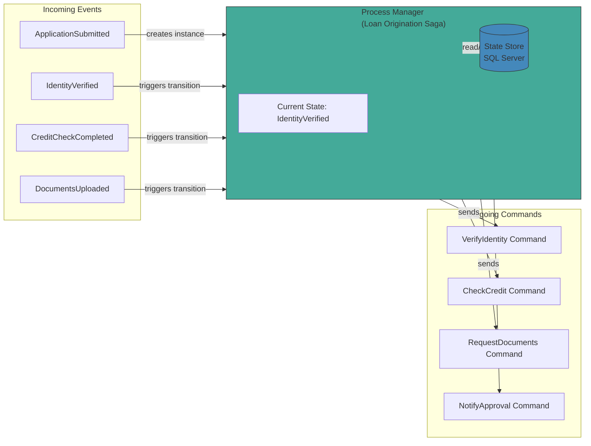
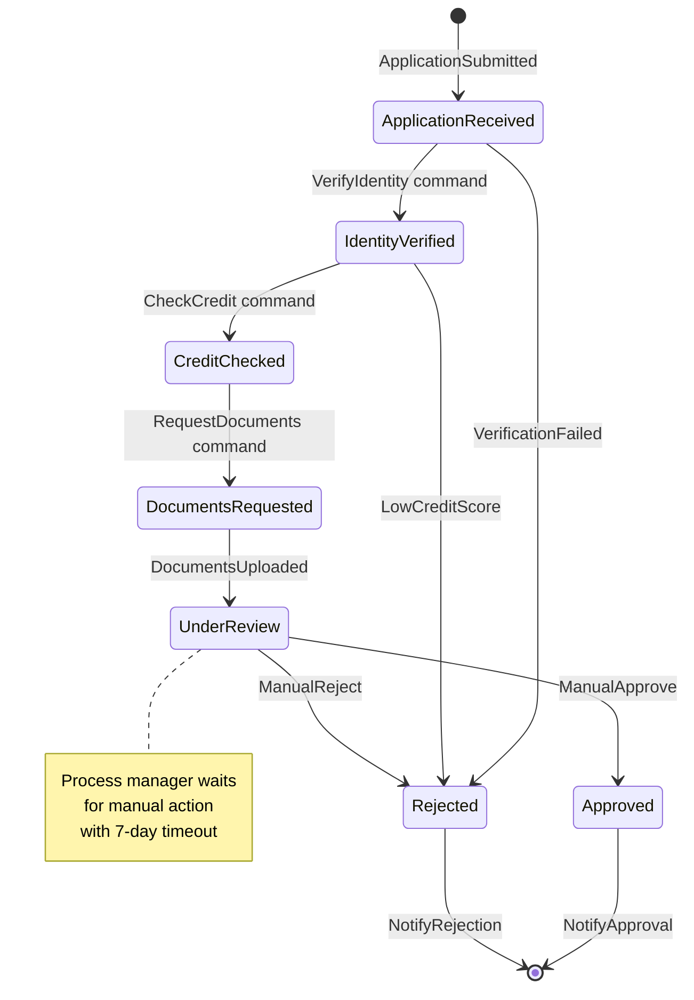

> [!success] Mastery Check
> - [ ] **Studied Well**
> - [ ] **Can explain the concept without notes**
> - [ ] **Can answer interview questions confidently**
> - [ ] **Can implement it in a real project**

## Navigation

**Domain:** [[7 — System Design & Distributed Systems]] > **Group:** Integration Patterns
**Previous:** [[7.149 — Scatter-Gather Pattern]] | **Next:** [[7.151 — Anti-Corruption Layer — Implementation]]

### Prerequisites
- [[7.142 — Event-Driven Architecture — Overview]] — required because the process manager orchestrates event-driven workflows across multiple services
- [[6.407 — State Pattern]] — the process manager is fundamentally a state machine driven by incoming events; understanding state transitions is essential

### Where This Fits

The process manager pattern centralizes the routing and sequencing of a multi-step business process that spans multiple services. Unlike a saga (which focuses on maintaining transactional consistency across steps), a process manager is a general-purpose state machine that receives events, evaluates the current state, decides which step to execute next, and sends commands to the appropriate service. A .NET engineer encounters this in any long-running workflow that involves conditional branching, parallel steps, or time-based triggers — onboarding a new customer (verify identity, create account, provision resources, send welcome kit), processing an insurance claim, or managing a product return across multiple systems. Without a process manager, each service must know the entire workflow to decide what to do next — coupling all services to the process logic.

## Core Mental Model

A process manager is a stateful message-routing component that maintains the state of a business process instance and, based on that state, decides which service to invoke next. The invariant this maintains is: the business process logic lives in exactly one place — the process manager — rather than being distributed across every participating service. The tradeoff is that the process manager becomes a central point of complexity and must handle state persistence, concurrency (multiple instances of the same process type), and failure recovery. The recognition trigger is a workflow where conditional branching or parallel paths cause service-to-service coordination logic to spread across the codebase.

Think of a process manager as a project manager for a business process. The project manager does not do the actual work — they track what has been done, know what should happen next, and tell the right person to do it. If something goes wrong (a step fails, a deadline passes), the project manager decides what to do: retry, escalate, or abort. Without a project manager, each team member would need to know the entire project plan and decide for themselves what to do next — leading to chaos when the plan changes.

A real-world example: an e-commerce order fulfillment process. When a customer places an order, the process manager orchestrates: payment capture → inventory reservation → warehouse pick → ship → notify customer. Each step is handled by a different service. The process manager knows the current state of every order. If payment fails, it cancels the order. If inventory is low, it sends a backorder notification. If shipping takes longer than expected, it escalates. Without a process manager, the payment service would need to know about inventory, the inventory service about shipping, and so on — every service coupled to every other service.



### Classification

The process manager is an orchestration pattern that sits at the application layer, above the messaging infrastructure. It is related to but distinct from: saga (saga is a process manager for distributed transactions with compensating actions), routing slip (the routing slip carries the process definition with the message; the process manager holds it centrally), and workflow engine (a process manager is a simpler, code-driven workflow without a graphical designer or rules engine).

The mental shift from choreography to process manager: in choreography, each service is told "when this event arrives, do your job and emit the next event." The workflow emerges from the event chain. In process manager, each service is told "when this command arrives, do your job and emit the result event." The workflow is encoded in the process manager's state machine. Choreography is easier for simple, linear workflows; process manager is necessary for complex, branching workflows with human steps.

**When to recognize the need for a process manager:** You find yourself writing a shared library or configuration that tells each service what to do next. You see conditional logic spreading across event handlers. A new business requirement adds a step that requires changes in 3+ services. Your operations team cannot answer "what is the status of this application?" without checking 5 different services.



### Key Properties / Guarantees

|Property|Value|Condition|
|---|---|---|
|Process state isolation|Each process instance has independent state|State is persisted with instance ID as key|
|Routing determinism|Given same state + event → same next action|State machine is deterministic|
|Failure recovery|Process resumes from last persisted state|State is persisted before each command|
|Concurrency|Multiple process instances run independently|Instance ID isolates state|
|Scalability|Process managers are stateless; state is external|State store (DB/Redis) scales independently|

## Deep Mechanics

### How It Works

**Step 1 — Process instance created.** An initiating event (e.g., `ApplicationSubmitted`) creates a new process instance with a unique process ID. The process manager stores the initial state (e.g., `CurrentState = "Initial"`, `CreatedAt = now`). The correlation ID is typically the business key (application ID, order ID, customer ID). The process manager also records the `SchemaVersion` for future backward compatibility.

**Step 1a — Validation.** The process manager validates the initiating event before creating the instance. Is the application ID unique? Is the customer in good standing? If validation fails, the process manager sends a rejection response or publishes a failure event immediately without creating an instance.

**Step 2 — Event received and state loaded.** When any event arrives, the process manager loads the process instance state using the correlation ID from the event. The current state determines what the process should do with the event. If no instance is found for the correlation ID, the event may be ignored (if the instance was already completed and cleaned up) or treated as an error (if the instance should exist).

**Step 3 — State transition evaluated.** The process manager evaluates the event against the current state. If the event is expected in this state, the process transitions to the next state. If the event is unexpected (out of order), the process may ignore it, buffer it, or send it to an error queue. The transition logic is defined by the state machine — each (state, event) pair maps to exactly one next state.

**Step 4 — Command sent.** Based on the new state, the process manager sends one or more commands to services. Each command includes the correlation ID so the response can be matched to the process instance. Multiple commands may be sent in parallel if the state requires parallel work (e.g., check credit AND request documents simultaneously).

**Step 5 — State persisted.** After each transition, the process manager persists the new state to a durable store (SQL Server, Cosmos DB, MongoDB). This ensures the process can recover from a crash and resume from the last known state. The persistence is transactional — either the state is saved and the commands are sent, or neither happens. In MassTransit, this is handled by the saga repository. The saga repository wraps the state save and message send in a single database transaction using the outbox pattern: the state update and outgoing messages are written atomically to the database, and a background process delivers the messages after the transaction commits.

**Step 6 — Completion or wait.** If the process reaches a terminal state (success or failure), it is marked as complete and its state may be archived or deleted after a retention period. If the process is waiting for a response or timeout, it remains active. The saga repository tracks active instances for monitoring.

### Parallel Step Processing

A process manager can invoke multiple services in parallel by sending multiple commands in a single transition:

```csharp
// Parallel steps: check credit AND request documents simultaneously
During(IdentityVerified,
    When(IdentityConfirmed)
        .Parallelize(
            send => send.Send(new Uri("queue:check-credit"),
                ctx => new CheckCredit(ctx.Saga.CorrelationId)),
            send => send.Send(new Uri("queue:request-documents"),
                ctx => new RequestDocuments(ctx.Saga.CorrelationId))
        )
        .TransitionTo(WaitingForCreditAndDocuments));

// The saga waits for BOTH responses before moving to the next state
During(WaitingForCreditAndDocuments,
    When(CreditResult)
        .If(ctx => ctx.Saga.DocumentsReceived, // check if both arrived
            then => then.TransitionTo(UnderReview),
            @else => @else.Then(ctx => ctx.Saga.CreditReceived = true)),
    When(DocumentsUploaded)
        .If(ctx => ctx.Saga.CreditReceived, // check if both arrived
            then => then.TransitionTo(UnderReview),
            @else => @else.Then(ctx => ctx.Saga.DocumentsReceived = true)));
```

This is how a process manager achieves scatter-gather-like parallelism within a workflow. The key difference from scatter-gather: the parallel steps are part of a larger sequential workflow, and the process manager coordinates both the parallel fan-out and the subsequent sequential steps.

#### Sequential vs Parallel Workflows

A process manager can handle both sequential and parallel workflows. In a purely sequential workflow, the process manager sends one command at a time and waits for the response before sending the next. In a parallel workflow, the process manager sends multiple commands simultaneously and waits for all responses (or the first failure) before proceeding.

The state machine definition makes the flow explicit. In MassTransit, sequential steps are defined by chaining `TransitionTo()` calls, while parallel steps use `Parallelize()`. The state machine ensures that:
- Sequential steps are executed in order
- Parallel steps are all completed before the next sequential step
- Conditional branches are handled by `If`/`IfElse` in the transition definition
- Timeouts apply to any waiting state, regardless of whether it is sequential or parallel

### State Lifecycle and Retention

Process manager state goes through distinct phases:

1. **Active** — the instance is in a non-terminal state. It is waiting for events, processing transitions, or waiting for timeouts. Active instances are frequently read and written.
2. **Completed** — the instance reached a terminal success state. It is read rarely (for audit or reporting). It should be retained for compliance but can be archived.
3. **Failed/Rejected** — the instance reached a terminal failure state. Same retention requirements as completed.
4. **Stale** — the instance was active but has not received an event for longer than the expected max duration. May indicate a bug (missing timeout) or a real stuck process.

**Retention policy:** Keep completed instances for compliance-purposes only (e.g., 7 years for loan applications). Archive or delete after the retention period. Use a SQL Server partitioned view or time-based Cosmos DB TTL to efficiently purge old instances.

**Architecture decision:** Should the saga state table be append-only (event sourcing) or update-in-place? Update-in-place is simpler and more performant for MassTransit sagas (single-row update per transition). Append-only gives a full audit trail but requires more storage and a separate projection to get the current state. For most systems, update-in-place with a separate audit log (event store) is the right balance.

### Failure Modes

**State loss on process manager crash.** The process manager receives an event, processes it, crashes before persisting the new state. The event is redelivered (at-least-once), and the process manager processes it again from the previous state. **Detection:** duplicate event processing for the same process instance. **Prevention:** make event handling idempotent — the process manager must handle the same event from the same state safely (either skip or reprocess). Persist state in the same transaction as any side effects. **Remediation:** use optimistic concurrency on the state store — the process manager checks that the version of the state it loaded matches the version in the database before saving; if they differ, the event was already processed by another instance.

**Orphaned process instances.** A process manager waits for a response from a service that never responds. The process instance remains stuck in a non-terminal state indefinitely. **Detection:** active process instances older than the expected process duration. **Metric:** process instance age distribution. **Prevention:** implement timeouts for all waiting states. A timeout sends a timeout event to the process manager, which can decide: retry, skip, or fail the process. **Remediation:** run a periodic cleanup job that finds instances stuck in non-terminal states for longer than the max expected duration and moves them to a terminal "stale" state with appropriate notifications.

**Out-of-order events.** A process manager receives events in an order different from the expected sequence (e.g., `DocumentsUploaded` before `IdentityVerified` because the user uploaded documents before identity verification completed). **Detection:** process manager receives unexpected event for current state. **Prevention:** the process manager should handle out-of-order events by buffering them or ignoring them depending on business requirements. A state machine can track "events received" separately from "events processed" to handle reordering. **Remediation:** implement an event buffer per process instance — received events are stored until the state machine is ready to process them. The buffer is persisted alongside the process state.

**Process manager deployment with in-flight instances.** When a new version of the process manager is deployed, in-flight process instances running the old version must be handled. **Detection:** running process instances fail after deployment due to state format changes. **Prevention:** maintain backward compatibility in process state schema, or use a migration strategy for in-flight instances. **Remediation:** use a version field in the process state. On startup, the process manager checks the version of each loaded instance and applies an upgrade function if the instance is on an older version. The upgrade function must be idempotent.

**Duplicate event delivery.** Due to broker at-least-once delivery, the same event may arrive twice for the same process instance. If the process manager processes both, it may send duplicate commands or transition twice. **Detection:** duplicate commands received by downstream services. **Prevention:** make event processing idempotent — the process manager should check if the event was already processed before applying the transition. In MassTransit sagas, this is handled by the saga repository's optimistic concurrency — if a saga instance is updated by two events simultaneously, one fails with a concurrency exception and is retried. **Remediation:** each event carries a unique `EventId`. The process manager stores processed event IDs in the saga state and skips duplicates.

**Timeout race with event arrival.** A timeout fires at the same moment the expected event arrives. Both the timeout handler and the event handler try to transition the process manager simultaneously. One succeeds, the other gets a concurrency exception. **Detection:** concurrency exceptions on saga state updates. **Prevention:** use optimistic concurrency — the second handler fails to save and retries. On retry, it reads the current state and discovers the event already arrived (or timeout already fired) and does nothing. **Remediation:** in the timeout handler, check if the event arrived before the timeout. If the state has already moved past the waiting state, the timeout is a no-op.

### .NET and Azure Integration

- **MassTransit Sagas:** MassTransit's saga implementation is a process manager — a state machine that persists state and routes events. It supports Azure Service Bus, EF Core for persistence, and automatic correlation.
- **Azure Durable Functions:** an orchestration engine that implements the process manager pattern. The orchestrator function defines the workflow, and the runtime handles state persistence, replay, and event correlation.
- **EF Core + State Machine:** for custom process managers, use EF Core for state persistence and a state machine library (Stateless, Workflow Core) for transition logic.

```csharp
// MassTransit saga — process manager for loan application
public sealed class LoanApplicationSaga :
    MassTransitStateMachine<LoanApplicationSagaState>
{
    public State ApplicationReceived { get; private set; }
    public State IdentityVerified { get; private set; }
    public State CreditChecked { get; private set; }
    public State UnderReview { get; private set; }
    public State Approved { get; private set; }
    public State Rejected { get; private set; }

    public Event<ApplicationSubmitted> Submitted { get; private set; }
    public Event<IdentityVerified> IdentityConfirmed { get; private set; }
    public Event<CreditCheckCompleted> CreditResult { get; private set; }
    public Event<DocumentsUploaded> DocumentsReceived { get; private set; }

    public LoanApplicationSaga()
    {
        InstanceState(x => x.CurrentState);

        Initially(
            When(Submitted)
                .Then(ctx => ctx.Saga.CorrelationId = ctx.Message.ApplicationId)
                .Send(new Uri("queue:verify-identity"),
                    ctx => new VerifyIdentity(ctx.Message.ApplicationId))
                .TransitionTo(ApplicationReceived));

        During(ApplicationReceived,
            When(IdentityConfirmed)
                .Send(new Uri("queue:check-credit"),
                    ctx => new CheckCredit(ctx.Message.ApplicationId))
                .TransitionTo(IdentityVerified));

        During(IdentityVerified,
            When(CreditResult)
                .IfElse(ctx => ctx.Message.Score > 600,
                    then => then
                        .TransitionTo(UnderReview)
                        .Send(new Uri("queue:request-documents"),
                            ctx => new RequestDocuments(ctx.Message.ApplicationId)),
                    @else => @else
                        .TransitionTo(Rejected)
                        .Send(new Uri("queue:notify-rejection"),
                            ctx => new NotifyRejection(ctx.Message.ApplicationId))));
    }
}

// Saga state — persisted to database
public sealed class LoanApplicationSagaState : SagaStateMachineInstance
{
    public Guid CorrelationId { get; set; }
    public string CurrentState { get; set; }
    public string CustomerId { get; set; }
    public decimal Amount { get; set; }
    public int CreditScore { get; set; }
    public DateTime CreatedAt { get; set; }
    public DateTime? CompletedAt { get; set; }
}
```

## Production Patterns and Implementation

### Primary Implementation

The canonical process manager implementation in .NET uses MassTransit sagas with EF Core persistence. The saga state machine defines states, events, and transitions declaratively.

```csharp
// Program.cs — saga registration
builder.Services.AddMassTransit(x =>
{
    x.AddSagaStateMachine<LoanApplicationSaga, LoanApplicationSagaState>()
        .EntityFrameworkRepository(r =>
        {
            r.ConcurrencyMode = ConcurrencyMode.Optimistic;
            r.AddDbContext<DbContext, SagaDbContext>();
        });

    x.UsingAzureServiceBus((context, cfg) =>
    {
        cfg.Host(builder.Configuration["Azure:ServiceBus:ConnectionString"]);
        cfg.ConfigureEndpoints(context);
    });
});

// Saga DbContext
public sealed class SagaDbContext : SagaDbContext
{
    public SagaDbContext(DbContextOptions<SagaDbContext> options)
        : base(options) { }

    protected override IEnumerable<ISagaClassMap> Configurations
    {
        get { yield return new LoanApplicationSagaStateMap(); }
    }
}

public sealed class LoanApplicationSagaStateMap :
    SagaClassMap<LoanApplicationSagaState>
{
    protected override void Configure(EntityTypeBuilder<LoanApplicationSagaState> entity)
    {
        entity.Property(x => x.CurrentState).HasMaxLength(64);
        entity.Property(x => x.CustomerId).HasMaxLength(64);
        entity.Property(x => x.Amount).HasColumnType("decimal(18,2)");
        entity.Property(x => x.CreditScore);
        entity.Property(x => x.CreatedAt);
        entity.Property(x => x.CompletedAt);
    }
}
```

### Configuration and Wiring

```csharp
// appsettings.json
{
  "ConnectionStrings": {
    "SagaDb": "Server=.;Database=LoanSagas;Trusted_Connection=True;"
  },
  "MassTransit": {
    "Saga": {
      "ConcurrencyMode": "Optimistic",
      "RetryCount": 3
    }
  }
}

// Saga timeouts — scheduled messages for timeout handling
During(UnderReview,
    When(DocumentsReceived)
        .Then(ctx => /* process documents */)
        .TransitionTo(Approved),
    When(ReviewTimeout)
        .Then(ctx => /* escalate or reject */)
        .TransitionTo(Rejected));
```

### Common Variants

**Azure Durable Functions orchestrator.** The process manager is an orchestrator function that uses `CallActivityAsync` to invoke services and `WaitForExternalEvent` to wait for events. The runtime handles state persistence and replay automatically.

```csharp
[FunctionName("LoanProcessManager")]
public static async Task<LoanResult> RunOrchestrator(
    [OrchestrationTrigger] IDurableOrchestrationContext context)
{
    var application = context.GetInput<LoanApplication>();

    await context.CallActivityAsync("VerifyIdentity", application);
    var creditResult = await context.CallActivityAsync<CreditResult>(
        "CheckCredit", application);

    if (creditResult.Score < 600)
    {
        await context.CallActivityAsync("NotifyRejection", application);
        return LoanResult.Rejected;
    }

    await context.CallActivityAsync("RequestDocuments", application);
    var documents = await context.WaitForExternalEvent<Documents>(
        "DocumentsUploaded", TimeSpan.FromDays(7));

    if (documents is null)
    {
        await context.CallActivityAsync("EscalateTimeout", application);
        return LoanResult.Timeout;
    }

    // ... manual review flow
    return LoanResult.Approved;
}
```

The Durable Functions approach has advantages over MassTransit sagas:
- **Built-in timeouts** via `context.CreateTimer` — no scheduled messages needed
- **Built-in retry** via `context.CallActivityWithRetryAsync` — configurable retry policy per activity
- **Replay-based state** — the orchestrator function can use local variables (e.g., `bool approved = true`) that persist through replay, unlike the saga state machine which requires all state to be in the saga state class
- **Deterministic** — the orchestrator must be deterministic (no random, no DateTime.Now, no HttpClient calls), but the runtime enforces this

Disadvantages of Durable Functions:
- **No compile-time state machine verification** — the saga state machine's `During(State, When(Event).TransitionTo(NextState))` provides compile-time checking that all state-event combinations are handled; Durable Functions relies on runtime flow
- **Limited to Azure Functions** — cannot run outside Azure Functions infrastructure
- **Replay overhead** — orchestrator functions are replayed from history on each execution, which can be slow for long-running orchestrators with many events

**Custom process manager with EF Core + Stateless library.** For workflows that do not fit MassTransit sagas (e.g., complex branching, parallel steps), a custom process manager uses a state machine library with a database for persistence.

```csharp
// Custom process manager using Stateless library
public sealed class LoanProcessManager
{
    private readonly StateMachine<State, Trigger> _machine;
    private readonly LoanState _state;
    private readonly DbContext _db;

    public LoanProcessManager(LoanState state, DbContext db)
    {
        _state = state;
        _db = db;
        _machine = new StateMachine<State, Trigger>(() => state.CurrentState, s => state.CurrentState = s);

        _machine.Configure(State.Initial)
            .Permit(Trigger.Submit, State.IdentityVerifying);

        _machine.Configure(State.IdentityVerifying)
            .OnEntryAsync(() => SendCommand(new VerifyIdentityCommand(state.CorrelationId)))
            .Permit(Trigger.IdentityVerified, State.CreditChecking)
            .Permit(Trigger.IdentityFailed, State.Rejected);

        _machine.Configure(State.CreditChecking)
            .OnEntryAsync(() => SendCommand(new CheckCreditCommand(state.CorrelationId)))
            .Permit(Trigger.CreditPassed, State.DocumentCollecting)
            .Permit(Trigger.CreditFailed, State.Rejected);
    }

    public async Task HandleEventAsync(Trigger trigger)
    {
        if (_machine.CanFire(trigger))
        {
            await _machine.FireAsync(trigger);
            _db.Update(_state);
            await _db.SaveChangesAsync();
        }
    }
}
```

### Process Manager Anti-Patterns

**1. God Process Manager.** A single process manager handles all business processes in the system — loan origination, customer onboarding, order fulfillment, and payment disputes. The state machine has 50+ states and 100+ events. **Fix:** Split into separate process managers per bounded context. Each process manager handles one business process type.

**2. Stateless Process Manager.** The process manager is implemented as a stateless service that re-evaluates the entire workflow from scratch on every event, reading state from a database each time. This works but misses the key benefit of a state machine — the current state limits the valid events and transitions, making the logic predictable and testable. **Fix:** Use a state machine (MassTransit saga or Stateless library) that explicitly tracks the current state and only accepts valid events.

**3. Event-Driven Process Manager with No Timeouts.** The process manager waits indefinitely for events with no timeout mechanism. Operators must manually intervene when a process gets stuck. **Fix:** Every waiting state must have a timeout. In MassTransit sagas, use scheduled messages for timeouts. In Durable Functions, use `context.CreateTimer`.

**4. Process Manager with Side Effects in .Then().** The `.Then()` clause in a MassTransit saga performs database writes, API calls, or other side effects. If the saga save fails after `.Then()` executes, the side effects have already happened. **Fix:** Side effects should be in services invoked via `Send()` or `Publish()`, not in `.Then()`. The `.Then()` clause should only update in-memory saga state that will be persisted atomically.

**5. Ignoring Concurrency.** The process manager uses pessimistic locking or no concurrency control. When two events arrive simultaneously for the same instance, one update overwrites the other. **Fix:** Use optimistic concurrency. MassTransit sagas handle this automatically. For custom process managers, use a version field on the state row and check it before saving.

### Testing Process Managers

Testing a process manager requires testing state transitions, not just individual event handlers:

```csharp
// State machine unit test — verify transitions
[Test]
public async Task Loan_saga_transitions_from_initial_to_identity_verifying_on_submit()
{
    var saga = new LoanApplicationSaga();
    var state = new LoanApplicationSagaState { CorrelationId = Guid.NewGuid() };

    await saga.RaiseEvent(state, saga.Submitted, new ApplicationSubmitted(state.CorrelationId));

    Assert.That(state.CurrentState, Is.EqualTo("IdentityVerifying"));
}

// Integration test — full saga with in-memory transport
[Test]
public async Task Loan_saga_completes_full_workflow()
{
    await using var bus = Bus.Factory.CreateUsingInMemory(cfg =>
    {
        cfg.ConfigureEndpoints(context);
    });
    await bus.StartAsync();

    var correlationId = Guid.NewGuid();
    await bus.Publish(new ApplicationSubmitted(correlationId));

    // Simulate each response
    await bus.Publish(new IdentityVerified(correlationId));
    await bus.Publish(new CreditCheckCompleted(correlationId, Score: 700));
    await bus.Publish(new DocumentsUploaded(correlationId));
    await bus.Publish(new ApprovalDecision(correlationId, Approved: true));

    // Verify saga completed
    var state = await _sagaRepository.Find(correlationId);
    Assert.That(state.CurrentState, Is.EqualTo("Completed"));
}
```

### Real-World .NET Ecosystem Example

**MassTransit Sagas** are the most widely used .NET process manager implementation. They are used in production for order fulfillment, payment processing pipelines, and customer onboarding workflows. The saga state machine is defined declaratively with states, events, and transitions. Persistence is via EF Core (SQL Server, PostgreSQL, MySQL) or MongoDB. The runtime automatically correlates events to saga instances using the `CorrelationId`, persists state after each transition, and handles retry and concurrency.

## Gotchas and Production Pitfalls

### State Schema Changes Mid-Process

**Pitfall:** Deploying a new version of the process manager that adds a required field to the saga state while there are in-flight instances.

```csharp
// ❌ Old version: saga state has 5 fields
// ❌ New version: saga state has 6 fields, one required (non-nullable)
// In-flight instances from old version fail to deserialize
```

**Symptom:** In-flight saga instances fail to load from the database after deployment. The process manager throws deserialization exceptions for all active instances. The error queue fills with `NullReferenceException` from the saga consumer.

**Fix:** Add new fields as nullable with default values. The process manager checks for null and applies a default during loading.

```csharp
// ✅ New field is nullable with default
public string? EscalationLevel { get; set; } = "None";
```

For EF Core saga repositories, ensure the migration adds the column as nullable with a default value in SQL:
```sql
ALTER TABLE LoanApplicationSagaState
ADD EscalationLevel NVARCHAR(64) NULL
CONSTRAINT DF_EscalationLevel DEFAULT 'None';
```

**Cost of not fixing:** All in-flight process instances become inoperable after deployment. The team must either roll back or write a migration script to update all existing instances. During the rollback window, new applications cannot be processed and in-flight applications are stuck.

### Missing Timeout on Waiting States

**Pitfall:** A state that waits indefinitely for an external event (e.g., document upload) without a timeout.

```csharp
// ❌ No timeout — waits forever for DocumentsUploaded
During(UnderReview,
    When(DocumentsReceived)
        .TransitionTo(Approved));
```

**Symptom:** Process instances remain stuck in `UnderReview` forever if the applicant never uploads documents. The state table grows unboundedly with orphaned instances. Monitoring queries count thousands of active instances that should have completed weeks ago.

**Fix:** Add a timeout for every waiting state using a scheduled message.

```csharp
// ✅ Timeout after 7 days
During(UnderReview,
    When(DocumentsReceived)
        .TransitionTo(Approved),
    When(ReviewTimeout)
        .Then(ctx => /* notify escalation */)
        .TransitionTo(Rejected));
```

**Cost of not fixing:** Growing count of orphaned process instances in the database, increasing storage costs and slowing queries. No automatic escalation for stalled processes. Customers whose applications are stuck have no path forward, leading to support tickets and negative reviews.

### Concurrency Conflicts on State Updates

**Pitfall:** Two events arrive simultaneously for the same process instance, causing a concurrency conflict when both try to update the same state row.

```csharp
// ❌ Optimistic concurrency without retry
// Event A and Event B arrive for the same CorrelationId
// Both load state, both evaluate transitions, both try to save
// One succeeds, the other gets DbUpdateConcurrencyException
```

**Symptom:** Intermittent saga update failures under load. Events are retried by the broker, causing duplicate processing.

**Fix:** Use optimistic concurrency with retry. MassTransit handles this automatically when configured with optimistic concurrency.

```csharp
// ✅ Optimistic concurrency with retry
r.ConcurrencyMode = ConcurrencyMode.Optimistic;
// MassTransit retries on concurrency failure automatically
```

**Cost of not fixing:** Events are lost or duplicated due to concurrency failures. The process manager appears unreliable under moderate load. Support team sees sporadic "application stuck" reports that cannot be reproduced. The only fix is to manually update saga state in the database, which is error-prone and requires a production deploy.

### Missing Correlation ID on Commands

**Pitfall:** The process manager sends commands to services without including the correlation ID. When the service responds, the process manager cannot match the response to the process instance.

```csharp
// ❌ Command without correlation ID
Send(new Uri("queue:verify-identity"),
    ctx => new VerifyIdentity(/* missing saga CorrelationId */));
```

**Symptom:** The process manager receives responses that it cannot correlate — `CorrelationId` is null or empty, so the saga repository cannot find the process instance. The response goes to the error queue.

**Fix:** Always include the saga CorrelationId in every command sent by the process manager.

```csharp
// ✅ Command with correlation ID
Send(new Uri("queue:verify-identity"),
    ctx => new VerifyIdentity(ctx.Saga.CorrelationId));
```

**Cost of not fixing:** Commands are sent but their responses are lost. The process manager never receives the expected event, and the process instance stays stuck in the waiting state until the timeout fires (if one exists).

### Inconsistent State on Concurrent Execution

**Pitfall:** Two instances of the same process manager process different events for the same saga instance simultaneously. Both load the state, both evaluate transitions, and both try to save. The second save overwrites the first (lost update), or both fail with concurrency exceptions.

**Symptom:** The saga repository throws `DbUpdateConcurrencyException` under moderate load. The event that failed is retried by the broker, but by the time it retries, the saga state has moved forward and the event is no longer applicable.

**Fix:** Use optimistic concurrency with version tracking. MassTransit sagas handle this automatically — they use a `RowVersion` column in the saga state table. When a concurrency exception occurs, the saga retries the event. On retry, it loads the current state and re-evaluates the transition.

```csharp
// ✅ Saga concurrency configuration
r.ConcurrencyMode = ConcurrencyMode.Optimistic;
// MassTransit automatically adds RowVersion to saga state
```

**Cost of not fixing:** Under moderate load, events are lost or duplicated. The process manager appears unreliable. Transient errors during peak hours cause permanent state inconsistency.

### Process Manager Doing Too Much

**Pitfall:** The process manager handles business logic (calculations, validations, decisions) instead of only routing and sequencing.

```csharp
// ❌ Process manager calculates interest rate
During(CreditChecked,
    When(CreditResult)
        .Then(ctx => {
            // Business logic — should be in a service
            var rate = ctx.Saga.CreditScore switch
            {
                > 750 => 3.5m,
                > 650 => 5.0m,
                _ => 8.0m
            };
            ctx.Saga.InterestRate = rate;
        })
        .TransitionTo(Priced));
```

**Symptom:** Business rules are embedded in the process manager, making them hard to test, hard to change independently, and invisible to the business team.

**Fix:** The process manager should only route and sequence. Business logic should be in domain services that the process manager invokes via commands.

```csharp
// ✅ Process manager sends command to PricingService
During(CreditChecked,
    When(CreditResult)
        .Send(new Uri("queue:calculate-pricing"),
            ctx => new CalculatePricing(
                ctx.Saga.CorrelationId,
                ctx.Saga.CreditScore))
        .TransitionTo(Priced));
```

**Cost of not fixing:** The process manager becomes a god object that violates single responsibility. Business rule changes require deploying the process manager, which may affect other workflows it manages.

### Event Storming the Process Manager State Machine

A common mistake is defining the state machine upfront without understanding all the states, events, and transitions. The result is a state machine that misses edge cases and must be patched repeatedly in production.

**Fix:** Use event storming workshops before implementing the process manager. Gather domain experts, developers, and operations and walk through the business process step by step, identifying:
1. All commands (actions the process manager initiates)
2. All events (responses the process manager receives)
3. All states (what the process is waiting for at each step)
4. All timeouts (what happens if a response does not arrive within a time limit)
5. All error paths (what happens when a command fails, a response is invalid, or a timeout fires)

The output of the event storming session is a complete state machine diagram that can be directly translated into the `MassTransitStateMachine` definition. Missing a state or transition in the workshop means a production incident later.

### Process Manager Without Monitoring

**Pitfall:** The process manager is deployed without monitoring alerts for stuck instances, high retry counts, or state store latency. The first sign of trouble is a customer complaint or a support ticket.

**Symptom:** Stuck process instances accumulate silently. The team discovers them when customers complain weeks later. By then, the instance state is too old to recover without manual intervention.

**Fix:** Add monitoring for process manager health:
- **Stuck instance alert:** `SELECT COUNT(*) FROM SagaState WHERE CompletedAt IS NULL AND CreatedAt < DATEADD(hour, -24, GETUTCDATE())`
- **High retry alert:** Count of `MassTransit.ReceiveTransport.FaultCount` for saga consumer endpoints
- **State store latency:** Track duration of saga repository read/write operations in Application Insights or Prometheus
- **Throughput tracking:** Count new saga instances created per minute and events processed per minute

```csharp
// Application Insights metric tracking for saga operations
public class MonitoredSagaRepository<TSaga> : ISagaRepository<TSaga>
    where TSaga : class, ISaga
{
    private readonly ISagaRepository<TSaga> _inner;
    private readonly TelemetryClient _telemetry;

    public async Task Send<T>(ConsumeContext<T> context, ISagaPolicy<TSaga, T> policy,
        IPipe<SagaConsumeContext<TSaga, T>> next) where T : class
    {
        var sw = Stopwatch.StartNew();
        try
        {
            await _inner.Send(context, policy, next);
        }
        finally
        {
            sw.Stop();
            _telemetry.TrackDependency("SagaRepository", typeof(TSaga).Name,
                "Send", null, sw.Elapsed, sw.Elapsed < TimeSpan.FromMilliseconds(500), null);
        }
    }
}
```

**Cost of not fixing:** Silent failures accumulate. The team loses visibility into process manager health. SLA violations go undetected until customer impact is already significant.

### Saga Repository Performance Tuning

The saga database is often the performance bottleneck. Each event causes a read and write to the saga state table:

```csharp
public sealed record LoanApplicationSagaState : SagaStateMachineInstance
{
    public Guid CorrelationId { get; set; }
    public string CurrentState { get; set; }
    public int SchemaVersion { get; set; } = 1; // track version
    
    // Old fields (version 1)
    public string CustomerId { get; set; }
    
    // New fields (version 2)
    public string? CustomerTier { get; set; } // nullable for backward compat
    public string? RiskCategory { get; set; }
    
    // Upgrade from version 1 to 2
    public void UpgradeToV2()
    {
        if (SchemaVersion >= 2) return;
        CustomerTier = "Standard"; // default for existing instances
        RiskCategory = EvaluateRisk(CreditScore);
        SchemaVersion = 2;
    }
}
```

On startup, the process manager loads all in-flight instances and upgrades them to the latest schema version. The upgrade function must be idempotent — running it twice should produce the same result.

For state machine logic changes (new states, new transitions):
1. The new definition must be backward-compatible with instances in any state
2. Deploy the new process manager code
3. Existing instances continue from their current state using the new definition
4. If a new transition is added from an existing state, existing instances can use it
5. If a state is removed, existing instances in that state must be migrated to a replacement state

### Saga Repository Performance Tuning

The saga database is often the performance bottleneck. Each event causes a read and write to the saga state table:

```csharp
// EF Core saga repository configuration for high throughput
builder.Services.AddMassTransit(x =>
{
    x.AddSagaStateMachine<LoanApplicationSaga, LoanApplicationSagaState>()
        .EntityFrameworkRepository(r =>
        {
            r.ConcurrencyMode = ConcurrencyMode.Optimistic;
            r.DatabaseFactory(() => new SagaDbContext(
                new DbContextOptionsBuilder<SagaDbContext>()
                    .UseSqlServer(connectionString, sql =>
                    {
                        sql.MinBatchSize(1);
                        sql.MaxBatchSize(100);
                        sql.CommandTimeout(30);
                        sql.EnableRetryOnFailure(3);
                    })
                    .Options));
        });
});
```

### Scattered Saga Logic

**Pitfall:** Over time, business logic spreads from the saga state machine into event consumers, message filters, and middleware that all touch the same process. The saga's `.Then()` handlers grow, middleware pre-processes events before they reach the saga, and downstream services embed saga-specific routing knowledge. The centralized workflow is no longer centralized — it has leaked into 5 different places.

**Symptom:** Debugging a process instance requires tracing through a saga definition, a middleware pipeline, three `.Then()` handlers, and a custom `ISagaRepository` override. Adding a new step requires changes in multiple components, and each change risks breaking an existing workflow.

**Fix:** Enforce the rule that the saga state machine is the single source of truth for process routing. All `.Then()` handlers should only update saga state fields (no side effects). All event side effects (sending commands, publishing events) should be in the state machine's `Send`/`Publish`/`Schedule` calls, not in middleware or external handlers.

```csharp
// ❌ Scattered logic — middleware modifies saga behavior
public class PreProcessMiddleware<T> : IFilter<ConsumeContext<T>>
{
    public async Task Send(ConsumeContext<T> context, IPipe<ConsumeContext<T>> next)
    {
        // This logic should be in the saga state machine
        if (context.Message is ApplicationSubmitted submitted)
        {
            var existing = await _db.SagaState.FindAsync(submitted.ApplicationId);
            if (existing is not null) return; // skip duplicate — should be in saga
        }
        await next.Send(context);
    }
}

// ✅ All routing logic in the saga state machine
During(Initial,
    When(Submitted)
        .If(ctx => ctx.Saga is not null, // handled by saga repository concurrency
            then => then.TransitionTo(ApplicationReceived)));
```

**Cost of not fixing:** The saga becomes a complex, untestable mess. Simple workflow changes require coordinated deployments across multiple components. The once-clear centralized workflow becomes distributed spaghetti.

### Performance Tips

- **Index on CorrelationId** — the saga repository queries by CorrelationId (the primary key). Ensure a clustered index on this column.
- **Keep saga state small** — only store fields needed for routing decisions. Large payloads should use the claim check pattern (store reference URI, not the full payload).
- **Use Cosmos DB for high throughput** — Cosmos DB's NoSQL model is better suited for write-heavy saga workloads than SQL Server. MassTransit supports Cosmos DB saga repositories.
- **Partition sagas** — for very high throughput, partition sagas across multiple databases by a business key (e.g., CustomerId % N).
- **Batch saga operations** — if multiple events arrive for the same saga instance, batch the state updates if possible.
- **Row size matters** — saga state tables perform best when rows are under 8 KB. Monitor row size growth and consider vertical splitting (frequently accessed fields vs rarely accessed fields in separate tables) if rows grow large.
- **Event batching** — if the broker delivers events in batches, configure MassTransit to receive batches to reduce database round trips: `cfg.PrefetchCount = 32`. This allows the saga repository to process multiple events from the same consumer context without re-loading the saga instance between each event.

## Tradeoffs and Decision Framework

### Tradeoff Matrix

| Dimension | Process Manager (Orchestration) | Choreography (Event-Driven) | Workflow Engine (Durable Functions) |
|---|---|---|---|
| Process logic location | Centralized in process manager | Distributed across services | Centralized in orchestrator function |
| State persistence | Required (DB/Redis) | Implicit (event store replay) | Managed by runtime (history table) |
| Complexity of branching | Handled natively (state machine) | Complex (correlated event chains) | Handled natively (async/await) |
| Runtime coupling | High — services are invoked by PM | Low — services react independently | Medium — orchestrator calls activities |
| Testing | Medium (state machine unit tests) | Hard (distributed across services) | Medium (deterministic replay) |
| Temporal concerns | Timeouts, scheduled messages | Complex (saga timeouts) | Built-in (Durable Timers) |
| Scalability | Medium (state store is bottleneck) | High (no central coordinator) | Medium (orchestrator is bottleneck) |
| Observability | High (single state table to query) | Low (events distributed across services) | Medium (orchestration history) |

### Decision Flowchart with Service Count

```mermaid
flowchart TD
    A[How many services<br>participate in the process?] -->|2-3 services| B{Does process have<br>conditional branches?}
    A -->|4+ services| C{Are there<br>human steps?}
    B -->|No| D[Simple Pipeline /<br>Routing Slip]
    B -->|Yes| E[Choreography or<br>Process Manager]
    C -->|Yes| F[Durable Functions<br>Orchestrator]
    C -->|No| G{Is compensation<br>required on failure?}
    G -->|Yes| H[Orchestration Saga<br>(MassTransit)]
    G -->|No| I[Process Manager<br>(MassTransit Saga)]
    E -->|"Events can be<br>autonomously handled"| J[Choreography]
    E -->|"Workflow must be<br>audited centrally"| I
```

### Scale Thresholds with Throughput

| Throughput | Recommended Approach | Reasoning |
|---|---|---|
| < 10 process/s | Any approach works | State store is not a bottleneck |
| 10-100 process/s | MassTransit saga with EF Core | Single saga database can handle 100-500 updates/s |
| 100-500 process/s | MassTransit saga with Cosmos DB | Cosmos DB handles higher write throughput than SQL Server |
| 500-1000 process/s | Partitioned sagas across 2-4 databases | Distribute write load across multiple repositories |
| > 1000 process/s | Consider Durable Functions or custom implementation | Write throughput exceeds typical saga repository capacity; consider removing persistence per event and using event sourcing instead |

### When to Apply

```mermaid
flowchart TD
    A[Multi-step process across<br>multiple services] --> B{Does process have<br>conditional branching?}
    B -->|No — fixed sequence| C[Pipeline / Routing Slip]
    B -->|Yes| D{Does process need<br>centralized state?}
    D -->|No — each service can decide<br>based on events| E[Choreography]
    D -->|Yes| F{Is the process long-running<br>with human steps?}
    F -->|Yes| G[Durable Functions Orchestrator]
    F -->|No — automated steps only| H[Process Manager<br>(MassTransit Saga)]
```

### When NOT to Apply

- [ ] The process is a fixed sequence with no branching — a routing slip or pipeline is simpler
- [ ] Each service can decide its next action independently — choreography avoids the central point of failure
- [ ] The process manager would become a god object handling too many different process types — split into separate process managers per bounded context
- [ ] The latency budget cannot tolerate the process manager hop — each step adds at least one queue round trip
- [ ] The team is not committed to maintaining the process manager's state schema over time

### Scale Thresholds

- **Worth considering when a process involves 3+ services and has conditional branching**
- **Required when human-in-the-loop steps with timeouts are part of the workflow** — process manager handles the timeout and escalation naturally
- **Re-evaluate when a single process manager handles 10+ distinct process types** — consider splitting into multiple process managers, one per workflow
- **Overkill for 2-step processes with no branching** — a simple consumer + publisher handles it

## Interview Arsenal

### Question Bank

1. What is the process manager pattern and what problem does it solve?
2. Walk through the lifecycle of a process manager instance from creation to completion.
3. What is the tradeoff between process manager (orchestration) and choreography?
4. How does a process manager recover from a crash mid-workflow?
5. Compare process manager with saga — when does each apply?
6. Design a customer onboarding workflow across 5 services with conditional approval paths.
7. How does a process manager handle out-of-order events?
8. What is the relationship between process manager and the state pattern?
9. How do you handle schema changes to the process state when there are in-flight instances?
10. What happens when two events arrive simultaneously for the same process instance?
11. Compare MassTransit sagas with Azure Durable Functions for implementing process managers.
12. How do you implement timeouts in a process manager for human-in-the-loop steps?

### Spoken Answers

**Q: What is the process manager pattern and when would you use it?**

> **Average answer:** The process manager is a centralized component that routes messages to different services based on the state of a business process. Use it when you need to orchestrate a workflow.

> **Great answer:** The process manager pattern centralizes the routing and sequencing of a multi-step business process into a single stateful component. It maintains process instance state in a durable store and, for each incoming event, evaluates the current state against a state machine definition to decide which command to send next. This is fundamentally different from choreography, where each service decides its next action based on events it receives. The key tradeoff is clarity versus coupling: the process manager makes the workflow explicit in one place (obvious, testable, auditable) at the cost of creating a centralized component that every service must interact with.

I use a process manager when the workflow has conditional branching, timeouts, or human-in-the-loop steps that make choreography impractical. For example, a loan application workflow: verify identity, check credit (branch: if score < 600, reject; otherwise proceed), request documents, wait for upload with 7-day timeout, then manual review, then approve or reject. In choreography, each service would need to know the branching logic and timeouts — that complexity would be distributed across at least 5 services. With a process manager, the branching lives in one place.

The most common .NET implementation is MassTransit sagas — a declarative state machine with EF Core persistence. Each saga instance is correlated by a business key (the application ID), state is persisted after every transition, and the saga handles concurrency, retry, and scheduled messages for timeouts. The alternative is Azure Durable Functions, which uses an async/await orchestration pattern instead of a state machine and is better suited for processes with many human interaction steps.

**Q: How does a process manager recover from a crash?**

> **Great answer:** A process manager recovers from a crash through state persistence and idempotent event processing. Each time the process manager transitions state, it persists the new state to a durable store (SQL Server, Cosmos DB, etc.). When it restarts after a crash, it reloads the state for any process instances that had events waiting in their queues. The key requirement is that state persistence and state transitions must be atomic — either the state is saved and the command is sent, or neither happens. In MassTransit, this is handled by the saga repository: state is saved as part of the message processing transaction, and if the save fails, the message is not acknowledged (it will be redelivered).

When a crash occurs between persisting state and sending the command, the process resumes from the last persisted state, and the missing command is re-evaluated when the next event arrives. This is safe if the command is idempotent — the service that receives the command should handle duplicates gracefully. For time-sensitive commands, the process manager can use a recovery mechanism that replays all active process instances on startup to check if any commands need to be re-sent.

### System Design Interview Trigger

If an interviewer describes a long-running business process with multiple steps, conditional branches, and manual approvals — such as "design a loan application processing system" or "design a customer onboarding workflow" — they are testing whether you know the process manager pattern. The follow-up will be about failure recovery: "what if the process manager crashes during an approval?" — testing whether you understand state persistence and idempotent event processing.

### Spoken Answers Expansion

**Q: How do you implement timeouts in a process manager?**

> In MassTransit sagas, timeouts are implemented using scheduled messages. When the saga transitions to a waiting state (e.g., waiting for document upload), it schedules a timeout message to be delivered after a configured delay. If the expected event arrives before the timeout, the saga cancels the scheduled timeout. If the timeout fires first, the saga receives it as an event and decides what to do — retry, escalate, or reject.
> 
> For Azure Durable Functions, timeouts are built in via `context.CreateTimer` or the `timeout` parameter on `WaitForExternalEvent`. If the timer fires before the event arrives, the orchestrator handles the timeout naturally in the code flow.
> 
> The key implementation detail is that the timeout must be scheduled atomically with the state transition. In MassTransit, this is handled by the saga repository — the state transition and the scheduled message are part of the same transaction. If the save fails, the scheduled message is not sent.

**Q: Compare MassTransit sagas vs Azure Durable Functions for process managers.**

> MassTransit sagas are better for workflows that are purely message-driven, have a clear state machine structure, and are part of a larger MassTransit-based messaging infrastructure. The saga state machine provides compile-time verification that all state/event combinations are handled, which prevents runtime surprises. The saga repository (EF Core, Cosmos DB, etc.) gives control over persistence.
> 
> Azure Durable Functions are better for workflows with human-in-the-loop steps, long timeouts (days/weeks), and complex branching logic that is easier to express as async/await code than as a declarative state machine. The Durable Functions runtime handles persistence, replay, and scaling automatically.
> 
> My rule of thumb: if the workflow has fewer than 10 states and is entirely automated, use MassTransit sagas. If the workflow has human steps, timeouts measured in days, or complex conditional logic, use Durable Functions. For very complex workflows, consider a hybrid: use Durable Functions for the outer orchestration and MassTransit sagas for sub-workflows.

### Comparison Table

| | Process Manager (Orchestration) | Choreography | Saga |
|---|---|---|---|
| Workflow location | Centralized state machine | Distributed across services | Centralized (orchestration) or distributed (choreography) |
| State management | Explicit — persisted state | Implicit — event history | Explicit — saga state persisted |
| Compensation | Manual — process manager handles failure | Automatic — each service emits compensating events | Built-in — compensating transactions |
| Complexity control | High — workflow is visible in one place | Low — simple, but complex workflows are hard to trace | Medium |
| Use case | Multi-step, branching, human-in-loop | Simple event chains, independent steps | Distributed transactions with rollback |

## Architecture Decision Record

**Status:** Accepted

**Context:** A loan origination system processes applications through 6 steps: identity verification, credit check, document collection, manual review, approval, and disbursement. The workflow has conditional branches (credit check may reject immediately), human-in-the-loop steps (manual review with 24-hour timeout), and parallel steps (document collection runs concurrently with credit check). Currently, the workflow logic is distributed across 5 microservices, making it impossible to trace an application's progress or add new steps without touching multiple services. Volume: 50 applications/hour, 24/7 operation. The system must survive deployments without losing in-flight applications. Compliance requires a full audit trail of every application's state transitions. The team uses .NET 8, Azure Service Bus, and SQL Server. They already use MassTransit for other messaging patterns in the system.

**Options Considered:**

1. **Process Manager (MassTransit Saga)** — centralized state machine with EF Core persistence. Commands sent to services; responses correlated by application ID.
2. **Choreography** — each service publishes events that trigger the next service. Workflow logic distributed across all services.
3. **Azure Durable Functions** — orchestrator function with async/await workflow. Runtime manages state and replay.

**Decision:** Process Manager with MassTransit Saga, because it provides a centralized, testable state machine for the complex branching logic, integrates naturally with the existing MassTransit-based messaging infrastructure, and the saga repository (EF Core) provides durable state persistence that survives crashes and deployments.

**Consequences:**
- ✅ Workflow logic is centralized in one state machine — adding a step requires changing one file, not 5 services
- ✅ Each process instance is independently tracked — progress, timing, and current state are visible in the saga database
- ✅ Timeouts for manual review are handled by MassTransit's scheduled message delivery
- ⚠️ State schema must be versioned carefully — in-flight instances survive deployments only if backward compatibility is maintained
- ⚠️ Concurrency conflicts may occur if two events arrive simultaneously for the same application — handled by optimistic concurrency with retry
- ❌ The saga database becomes a write bottleneck for high-throughput scenarios — mitigated by partitioning and efficient indexing

**Review Trigger:** Revisit this decision if the process manager exceeds 15 states (at which point consider splitting into sub-process managers), or if a new process type is entirely different from loan origination (at which point create a separate saga). Also revisit if the throughput exceeds 500 sagas/s — at that point, partition sagas across multiple databases or migrate to a more scalable saga repository (Cosmos DB).

## Self-Check

### Conceptual Questions

1. What is the process manager pattern and what invariant does it maintain?
2. Derive the tradeoff between process manager (orchestration) and choreography.
3. Given a 2-step workflow with no branching, which pattern is simpler?
4. What metric reveals that a process manager has orphaned process instances?
5. Name the .NET library that provides a declarative saga/process manager implementation.
6. What is the structural distinction between a process manager and a saga?
7. Below what number of steps is choreography simpler than a process manager?
8. [[7.131 — Saga Pattern — Orchestration-Based]] — how does a saga differ from a general process manager?
9. What production consequence follows from missing timeouts on waiting states in a process manager?
10. Explain process manager to a product manager in 60 seconds.
11. How do you handle concurrency when two events arrive simultaneously for the same process instance?
12. What is the difference between a process manager and a workflow engine?
13. How do you test a process manager end-to-end without depending on external services?
14. A process manager sends a command and never gets a response — what are the possible causes and how do you diagnose each?
15. Design the saga state table schema for a loan application process manager. What columns, indexes, and constraints do you need?

<details>
<summary>Answers</summary>

1. The process manager centralizes routing and sequencing of a multi-step business process. The invariant: the workflow logic lives in exactly one place (the process manager), not distributed across all participating services.
2. Process manager gives centralized workflow visibility and explicit branching at the cost of a single point of complexity and a central state store. Choreography distributes the workflow, avoiding a central component, but makes complex branching hard to trace and debug.
3. A simple consumer pipeline (pipes and filters) or direct service-to-service call. A process manager adds unnecessary state persistence overhead for a 2-step linear flow.
4. Active process instances with ages exceeding the maximum expected process duration. Query the saga state table for instances where `CompletedAt IS NULL AND CreatedAt < (NOW - expected_duration)`.
5. MassTransit's `MassTransitStateMachine<T>` saga implementation.
6. A saga is a process manager specialized for distributed transactions — it includes compensating actions for rollback. A general process manager handles any multi-step workflow and may not have compensation semantics.
7. Below 3 steps with no branching — choreography or a simple pipeline is simpler. Above 3 steps, especially with branching, the process manager's centralized logic becomes valuable.
8. A saga guarantees transactional consistency with compensating actions; a process manager routes and sequences but may not have compensation logic. All sagas are process managers, but not all process managers are sagas.
9. Orphaned process instances accumulate in the database indefinitely, increasing storage costs and query latency. The operations team eventually finds thousands of stuck instances.
10. "A process manager is like a shipping dispatcher. When a package arrives (event), the dispatcher checks a clipboard (state), decides what to do next (transition), and tells the right person to do it (command). If something goes wrong, the dispatcher knows exactly where each package is in the process and can decide to wait, retry, or escalate."
11. Use optimistic concurrency. When two events arrive simultaneously, both load the same state version. The first to save succeeds; the second gets a concurrency exception and retries. On retry, it re-reads the state (which has moved forward) and realizes the event is no longer applicable (the state has already moved past where this event was relevant). This is handled automatically by MassTransit saga repositories with optimistic concurrency.
12. A process manager is code-driven — you define the state machine in code (MassTransit sagas, custom state machine). A workflow engine provides a visual designer, rule engine, and often a no-code/low-code interface for defining workflows. Workflow engines (e.g., Elsa Workflow, Workflow Core, Camunda) are better for business-user-facing workflows that change frequently. Process managers are better for automated system-to-system workflows where the logic is stable and the team owns the code.
13. Use the MassTransit in-memory transport for integration tests. Configure the saga with an in-memory saga repository. Publish events to the in-memory bus and assert on the final saga state. This tests the saga state machine, event correlation, and state persistence without depending on a real database or broker. Example: create a saga instance via bus, publish events, and verify `state.CurrentState` in the saga repository.
14. (a) The service crashed and never received the command — check the dead-letter queue for undelivered messages. (b) The service received the command but crashed before publishing the response — check the service's logs and the dead-letter queue. (c) The response was published but the correlation ID was wrong — check the response message's `CorrelationId` field. (d) The response was published but the process manager is in the wrong state — check the saga state; the event may have arrived but was ignored because the saga had already transitioned. (e) The response was published but the process manager's consumer threw an exception — check the error queue and saga consumer fault count.
15. The saga state table needs: `CorrelationId` (Guid, PK, clustered index), `CurrentState` (string, indexed — used for queries on active instances), `RowVersion` (byte[], for optimistic concurrency), business fields (CustomerId, Amount, CreditScore), timestamps (CreatedAt, CompletedAt, UpdatedAt), and error tracking (RetryCount, LastError). Add a filtered index `WHERE CurrentState != 'Completed' AND CurrentState != 'Rejected'` to speed up active-instance queries without scanning terminal instances.

</details>

---

### Scenario Challenges

**Scenario 1 — Diagnose the problem**

A loan application saga is stuck for some customers. The saga's database shows instances in the `UnderReview` state for 30+ days. These customers report that their application status shows "under review" on the website, but no decision has been made.

<details>
<summary>Diagnosis</summary>

**Root cause:** The `UnderReview` state has no timeout. It waits indefinitely for either `DocumentsUploaded` or an `ApprovalDecision` event. In these stuck cases, the documents were never uploaded and no manual reviewer acted.

**Evidence:** Saga instances with `CurrentState = UnderReview` and `CreatedAt > 30 days`. No timeout event was defined for the `UnderReview` state.

**Fix:** Add a timeout to the `UnderReview` state. After 7 days of inactivity, automatically reject the application and notify the customer.

```csharp
During(UnderReview,
    When(DocumentsReceived)
        .TransitionTo(DocumentsReviewed),
    When(ReviewTimeout)
        .Then(ctx => /* notify rejection */)
        .TransitionTo(Rejected));
```

**Prevention:** Add a rule to the process manager design checklist: "Every waiting state must have a timeout."

</details>

---

**Scenario 2 — Design decision**

You are designing an order fulfillment process across 4 services: Payment, Inventory, Shipping, and Notification. The process must handle conditional flows (if payment fails, cancel the order). Volume is 1,000 orders/second.

<details>
<summary>Decision and Reasoning</summary>

**Choice:** Process manager (MassTransit saga) for the fulfillment workflow. The conditional branching (payment success → reserve inventory → ship; payment failure → cancel) and the need to track each order's state make a centralized process manager appropriate.

**Tradeoffs accepted:** The saga database receives 1,000 writes/second. Use a high-throughput database (Azure SQL with provisioned capacity or Cosmos DB) and ensure the saga state table is properly indexed on `CorrelationId`. The optimistic concurrency must handle contention for the same order.

**Implementation sketch:**

```csharp
// OrderFulfillmentSaga — simple state machine
Initially(
    When(OrderSubmitted)
        .Send(new Uri("queue:process-payment"),
            ctx => new ProcessPayment(ctx.Message.OrderId, ctx.Message.Amount))
        .TransitionTo(PaymentPending));

During(PaymentPending,
    When(PaymentSucceeded)
        .Send(new Uri("queue:reserve-inventory"),
            ctx => new ReserveInventory(ctx.Message.OrderId))
        .TransitionTo(InventoryReserving),
    When(PaymentFailed)
        .Send(new Uri("queue:notify-failure"),
            ctx => new NotifyPaymentFailure(ctx.Message.OrderId))
        .TransitionTo(Cancelled));
// ...
```

</details>

---

**Scenario 3 — Human-in-the-loop timeout** A loan application saga is waiting for manual review. The manual reviewer has 24 hours to approve or reject. After 24 hours, the application should be escalated to a supervisor. The saga currently has no timeout on the manual review state.

<details>
<summary>Solution</summary>

**Problem:** The `UnderReview` state waits indefinitely for an `ApprovalDecision` event. If the manual reviewer is sick, on vacation, or overloaded, the application stays stuck forever.

**Solution:** Add a 24-hour timeout to the `UnderReview` state using a scheduled message in MassTransit.

```csharp
During(UnderReview,
    When(ApprovalDecision)
        .Then(ctx => /* process decision */)
        .TransitionTo(ApprovalProcessed),
    When(ReviewTimeout) // scheduled for 24 hours after entering UnderReview
        .Then(ctx => {
            _logger.LogWarning("Application {Id} timed out in manual review, escalating",
                ctx.Saga.CorrelationId);
        })
        .Send(new Uri("queue:escalate-review"),
            ctx => new EscalateReview(ctx.Saga.CorrelationId))
        .TransitionTo(Escalated));
```

**How to schedule the timeout:** In the transition that enters `UnderReview`, schedule the `ReviewTimeout` event:

```csharp
During(WaitingForReview,
    When(DocumentsReceived)
        .Schedule(ReviewTimeout, ctx => ctx.Init<ReviewTimeout>(new { }),
            ctx => TimeSpan.FromHours(24))
        .TransitionTo(UnderReview));
```

**Prevention:** Add a design rule: every state that waits for an external event must have a timeout. The only exception is terminal states (Completed, Rejected).

</details>

---

**Scenario 4 — Failure mode** After deploying a new version of the loan application saga, all in-flight saga instances started throwing `NullReferenceException` when processing events.

<details>
<summary>Investigation and Fix</summary>

**Investigation steps:** 1) Check the saga state class for changes that are not backward-compatible. 2) Check if a new required (non-nullable) field was added. 3) Query the saga state table for existing instances and inspect their JSON.

**Confirming evidence:** A new non-nullable property `RiskLevel` was added to the saga state. Existing instances do not have this field. When the saga loads these instances from the database, EF Core sets `RiskLevel` to null, and a subsequent `.ToUpper()` call throws `NullReferenceException`.

**Immediate mitigation:** Roll back the saga deployment. Convert the new field to nullable with a default value.

**Permanent fix:** Add backward compatibility checks to the deployment process. All new saga state fields must be nullable for 2 versions before becoming required.

**Post-mortem item:** The deployment did not include a database migration for existing saga state rows. Add a migration step to backfill default values for existing instances.

</details>

---

**Scenario 4 — Add a step mid-flight**

The product team wants to add a "fraud check" step between identity verification and credit check. There are 1,200 in-flight applications currently in the `IdentityVerified` state. How do you add the step without breaking these in-flight instances?

<details>
<summary>Migration Strategy</summary>

**Challenge:** Adding `FraudCheckPending` as a new state between `IdentityVerified` and `CreditChecking`. If the saga code is deployed while instances are in `IdentityVerified`, they need to know whether to go to the new `FraudCheckPending` state or the existing `CreditChecking` state.

**Solution:** Add a saga schema version field. In-flight instances created before the change (schema version 1) skip the fraud check and go directly to `CreditChecking`. New instances (schema version 2) go through `FraudCheckPending`.

```csharp
During(IdentityVerified,
    When(IdentityConfirmed)
        .If(ctx => ctx.Saga.SchemaVersion >= 2,
            then => then
                .Send(new Uri("queue:fraud-check"),
                    ctx => new RunFraudCheck(ctx.Saga.CorrelationId))
                .TransitionTo(FraudCheckPending),
            @else => @else
                .Send(new Uri("queue:check-credit"),
                    ctx => new CheckCredit(ctx.Saga.CorrelationId))
                .TransitionTo(CreditChecking)));
```

In-flight `IdentityVerified` instances have `SchemaVersion = 1` and skip the fraud check. New instances get `SchemaVersion = 2` and go through the new step. After all version 1 instances have completed, the backward-compatibility branch can be removed.

**Prevention:** Use feature flags or schema versioning for any new states or transitions. Never assume all instances are on the same workflow version.

</details>

---

**Scenario 5 — Duplicate event handling** A customer's onboarding saga was sent two `IdentityVerified` events due to a broker redelivery. The saga processed both, sending two `CreateAccount` commands. The account creation service created two accounts for the same customer.

<details>
<summary>Investigation and Fix</summary>

**Investigation steps:** 1) Check saga state for the customer — how many account creation commands were sent? 2) Check if the saga tracks processed event IDs. 3) Check the downstream account creation service for deduplication.

**Confirming evidence:** The saga state does not track processed event IDs. The `CreateAccount` command was sent twice. The account creation service does not check for duplicate `CustomerId` — it created two accounts for the same customer.

**Fix:** Add processed event ID tracking to the saga state. Before processing any event, check if its `EventId` was already processed. If so, skip it.

```csharp
public sealed record LoanApplicationSagaState : SagaStateMachineInstance
{
    // ... existing fields
    public List<string> ProcessedEventIds { get; init; } = new();
}

// In saga definition
During(IdentityVerifying,
    When(IdentityConfirmed)
        .If(ctx => ctx.Saga.ProcessedEventIds.Contains(ctx.Message.EventId.ToString()),
            then => then.Skip())
        .Else(then => then
            .Then(ctx => ctx.Saga.ProcessedEventIds.Add(ctx.Message.EventId.ToString()))
            .Send(new Uri("queue:create-account"), ctx => ...)
            .TransitionTo(AccountCreating)));
```

**Prevention:** Add idempotency checking to every saga event handler. Each event carries a unique `EventId`. Store processed event IDs in the saga state. This is the saga equivalent of the inbox pattern.

</details>

---

**Scenario 6 — State schema migration** Your loan origination saga has been running for 6 months. There are 50,000 in-flight saga instances. A new regulation requires tracking the customer's risk category. You need to add a `RiskCategory` field to the saga state without breaking in-flight instances.

<details>
<summary>Migration Strategy</summary>

**Challenge:** Adding a non-nullable `RiskCategory` field to the saga state class will cause all existing in-flight instances (which do not have this field) to fail when loaded.

**Solution:** Add the field as nullable with a default value. The saga checks if the field is null during processing and assigns a default or calculates the value lazily.

```csharp
public sealed record LoanApplicationSagaState : SagaStateMachineInstance
{
    // ... existing fields
    
    // New field — nullable for backward compatibility
    public string? RiskCategory { get; set; }
    
    // Helper to get risk category with lazy calculation
    public string GetRiskCategory()
    {
        if (RiskCategory is not null) return RiskCategory;
        
        // Calculate based on available data
        RiskCategory = CreditScore switch
        {
            > 750 => "Low",
            > 600 => "Medium",
            _ => "High"
        };
        
        return RiskCategory;
    }
}
```

**Deployment order:**
1. Deploy the new saga code with the nullable `RiskCategory` field
2. Existing instances load successfully (field is null)
3. The saga's `GetRiskCategory()` helper lazily calculates and caches the value
4. New instances store the risk category from the beginning
5. After one full process lifecycle cycle (all 50,000 instances complete), run a migration to backfill `RiskCategory` for any remaining instances

**Prevention:** All new saga state fields should be nullable or have defaults for at least 2 versions. Remove the nullable annotation only after confirming no in-flight instances exist with the old schema.

</details>

---

**Scenario 7 — Scale it** Your loan origination saga handles 100 new applications per second, with each application going through 5-8 state transitions. The saga database (single SQL Server instance) is showing 50% DTU usage and growing.

<details>
<summary>Scaling Strategy</summary>

**Bottleneck this addresses:** The saga database write throughput (100 apps/s × ~5 transitions = 500 writes/s) is approaching the single-instance limit.

**How it helps:** The process manager persists state per transition. The write per transition is a single-row update on the saga state table — simple and fast.

**Implementation order:** 1) Optimize the saga state table index — ensure a clustered index on `CorrelationId`. 2) Use a higher-performance database tier or provisioned IO. 3) Consider Cosmos DB for write-heavy saga storage (no joins, automatic partitioning). 4) Partition sagas by a business key (e.g., `ApplicationId` mod N) to distribute writes across multiple databases. 5) If N databases are used, use MassTransit's multi-tenancy or separate saga repositories per partition.

**What it does not solve:** If the complexity of the saga logic itself (state machine evaluation) becomes the bottleneck, the process manager service must be scaled horizontally. MassTransit sagas support competing consumers — multiple saga instances process different saga instances in parallel.

</details>

---

**Scenario 8 — Idempotency gap** The customer onboarding saga sends a `CreateAccount` command sends a `CreateAccount` command when it receives an `IdentityVerified` event. Due to broker retry, two `IdentityVerified` events arrive. The saga has no deduplication, so two `CreateAccount` commands are sent. The account service creates two accounts for the same customer.

<details>
<summary>Investigation and Fix</summary>

**Root cause:** The saga does not track which events it has already processed. The saga state has no `ProcessedEventIds` field. When the same event arrives a second time (broker redelivery), the saga treats it as a new event and processes it normally.

**Fix option 1 — Saga-level deduplication:** Add a `ProcessedEventIds` list to the saga state. Before processing any event, check if the event ID has already been processed.

```csharp
public sealed record LoanApplicationSagaState : SagaStateMachineInstance
{
    public Guid CorrelationId { get; set; }
    public string CurrentState { get; set; }
    public List<Guid> ProcessedEventIds { get; set; } = new();
}
```

In each event handler, check and record the event ID:

```csharp
During(ApplicationReceived,
    When(IdentityConfirmed)
        .IfElse(ctx => ctx.Saga.ProcessedEventIds.Contains(ctx.Message.EventId),
            then => then.Then(ctx => _logger.LogWarning("Duplicate event skipped")),
            @else => @else
                .Then(ctx => ctx.Saga.ProcessedEventIds.Add(ctx.Message.EventId))
                .Send(new Uri("queue:create-account"), 
                    ctx => new CreateAccount(ctx.Saga.CorrelationId))
                .TransitionTo(AccountCreating)));
```

**Fix option 2 — Downstream idempotency:** The account creation service checks for duplicate `CustomerId` and returns the existing account if one exists. This shifts the deduplication responsibility to the service, which is acceptable if all commands to that service are idempotent.

**Prevention:** Decide upfront: will deduplication be handled by the saga (internal) or by the service (external)? Internal deduplication keeps the saga self-contained but increases state size. External deduplication requires downstream services to implement idempotency. The safest approach is both — the saga deduplicates at its level, and downstream services are idempotent as a defense-in-depth measure.

</details>

---

**Scenario 9 — Interview simulation** The interviewer says: "Design a customer onboarding system. New customers go through identity verification, credit check, account creation, provisioning, and welcome email. The process has conditional branches and a 30-day timeout for incomplete applications."

<details>
<summary>Model Response</summary>

"I would use a process manager — specifically a MassTransit saga — to orchestrate the onboarding workflow. The saga state machine defines each step as a state, events trigger transitions, and commands are sent to the appropriate service.

The flow: when a `CustomerSignedUp` event is received, a new saga instance is created. The saga sends a `VerifyIdentity` command to the identity service and transitions to the `IdentityVerificationPending` state. On `IdentityVerified`, it sends a `CheckCredit` command and transitions to `CreditCheckPending`. If credit score is below threshold, it transitions directly to `Rejected` and sends a `NotifyRejection` command. Otherwise, it sends `CreateAccount` to the account service. After account creation, it sends `ProvisionResources` and transitions to `ProvisioningPending`. On `ProvisioningComplete`, it sends `SendWelcomeEmail` and transitions to `Completed`.

The key design decisions: first, every waiting state has a timeout. The identity verification step has a 7-day timeout; if the verification service does not respond in 7 days, the saga escalates or cancels. The overall process has a 30-day timeout, after which any incomplete application is automatically cancelled and cleaned up.

Second, state persistence is EF Core with SQL Server. The saga state table stores `CorrelationId` (customer ID), `CurrentState`, `CustomerEmail`, `CreditScore`, and error counts. This gives us a full view of every in-flight onboarding.

Third, the saga handles concurrency via optimistic locking. If two events arrive for the same customer simultaneously — unlikely but possible — the saga retries the state transition.

The tradeoff I accept is that the saga database is a write bottleneck during onboarding surges. At scale, I would partition sagas across multiple databases by customer ID hash.

Compared to choreography: this workflow has enough conditional branching (credit check, provisioning steps) that a choreography approach would require each service to know the next step, creating distributed workflow logic. The saga centralizes it, making it testable and auditable in one place."

</details>
