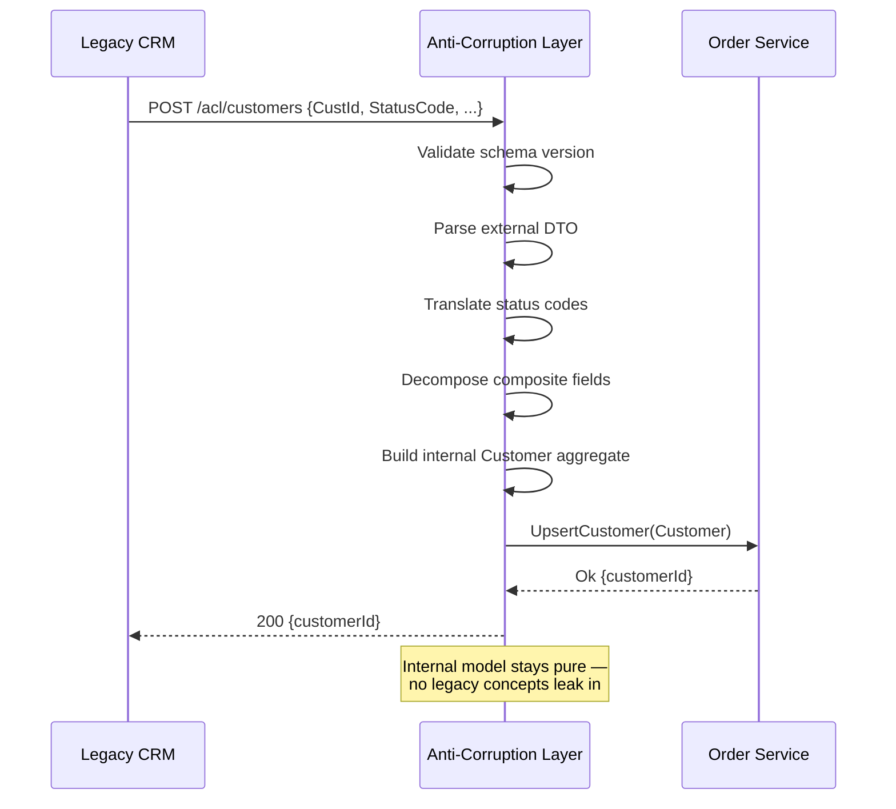
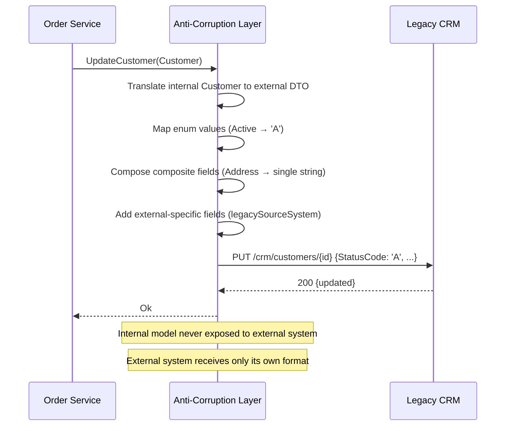
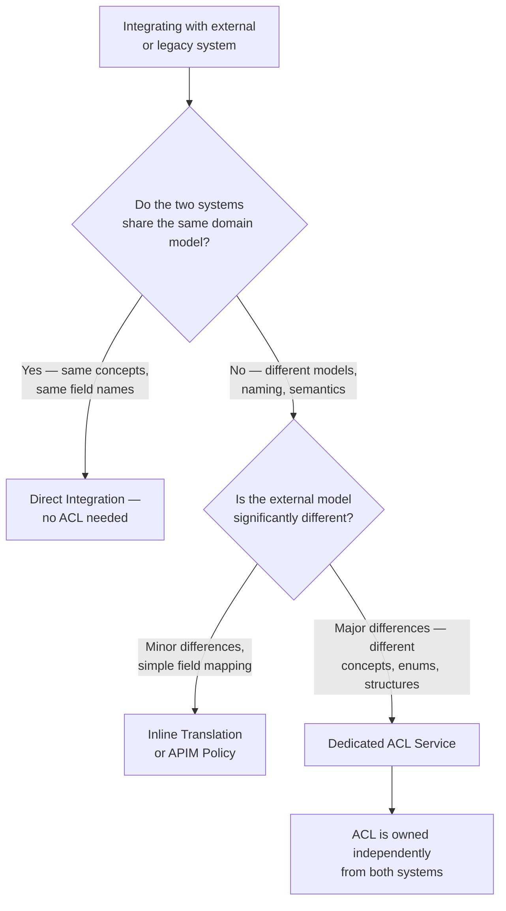

> [!success] Mastery Check
> - [ ] **Studied Well**
> - [ ] **Can explain the concept without notes**
> - [ ] **Can answer interview questions confidently**
> - [ ] **Can implement it in a real project**

## Navigation

**Domain:** [[7 — System Design & Distributed Systems]] > **Group:** Integration Patterns
**Previous:** [[7.150 — Process Manager Pattern]] | **Next:** [[7.152 — Poison Message Handling]]

### Prerequisites
- [[6.120 — Domain-Driven Design — Bounded Context]] — required because ACL is the boundary pattern that prevents one context's model from corrupting another's
- [[6.410 — Adapter Pattern]] — the implementation pattern: ACL uses adapters to translate between models

### Where This Fits

The anti-corruption layer (ACL) is a boundary between two bounded contexts (or between a new system and a legacy system) that translates communication so that each side uses its own domain model without leaking concepts from the other. A .NET engineer encounters this whenever a greenfield microservice must integrate with a legacy system, a third-party API, or another team's service whose domain model does not match — for example, an Order service that must consume customer data from a legacy CRM where "Customer" means something different than in the new domain. Without an ACL, the legacy system's concepts (inactive customers represented as deleted rows, status fields with cryptic codes) propagate into the new system's clean domain model, gradually corrupting it.

## Core Mental Model

The anti-corruption layer is a protective boundary that intercepts all communication between two systems and translates between their domain models. On the external side, it speaks the language of the external system (legacy API, third-party schema, foreign domain model). On the internal side, it speaks the language of the internal bounded context. The invariant this maintains is: the internal domain model is never contaminated by external concepts, field names, validation rules, or behavior patterns. The tradeoff is that the ACL is additional code to write, test, and maintain — it adds latency and complexity to every cross-boundary call. The recognition trigger is a service whose domain objects have fields named after an external system's schema (e.g., `ExtCustId`, `LegacyStatus`, `OrigSysRef`), indicating the foreign model has already leaked in.

### Classification

The ACL is a defensive architectural boundary pattern that sits at the integration layer between bounded contexts. It is a specialization of the Adapter pattern combined with the Facade pattern. The ACL does not change the behavior of either system — it only translates. It is distinct from: the Gateway pattern (which focuses on routing, not translation), the Data Transfer Object (which is a single-message transformation, not a boundary), and the Translator (which is a stateless mapping without the boundary enforcement).

```mermaid
flowchart LR
    subgraph External["External System (Legacy CRM)"]
        E[Customer Entity<br>status: 'A', 'I', 'D'<br>type: '01', '02', '03'<br>field1 ... field50]
    end

    subgraph ACL["Anti-Corruption Layer"]
        T[Translator<br>Maps external to internal]
        V[Validator<br>Enforces internal invariants]
        A[Adapter<br>HTTP / Message format]
    end

    subgraph Internal["Internal Bounded Context"]
        I[Customer Aggregate<br>Status: Active | Inactive<br>CustomerType: enum<br>5 curated fields]
    end

    E <==>|"External HTTP API"| A
    A --> T
    T --> V
    V --> I

    style ACL fill:#e82,stroke:#333
    style Internal fill:#4a9,stroke:#333
    style External fill:#888,stroke:#333
```



### Key Properties / Guarantees

|Property|Value|Condition|
|---|---|---|
|Model isolation|Internal model is never contaminated|All cross-boundary traffic goes through ACL|
|Translation correctness|External concepts map to correct internal equivalents|Mapping rules are explicit and tested|
|Performance overhead|Additional latency per cross-boundary call|Typically 1-10 ms per translation|
|Maintenance burden|ACL must evolve with both external and internal models|Each system change may require ACL update|
|Test boundary|ACL can be tested independently of both systems|Mock external system, assert internal output|
|Schema evolution isolation|External schema changes are absorbed by ACL|ACL version-aware; internal service unchanged|
|Deployment independence|ACL can be deployed separately from both systems|ACL is its own deployable unit|
|Bidirectional isolation|Both inbound and outbound traffic are translated|ACL covers both directions or just one|

### Outbound ACL Flow

The following diagram shows the reverse direction — the internal system pushes data to the external system through the ACL:



## Deep Mechanics

### How It Works

**Step 1 — External request arrives.** An external system sends a message or makes an API call to the ACL endpoint. The payload uses the external system's schema — field names, data types, value formats that match the external domain.

**Step 2 — ACL receives and validates.** The ACL validates the external payload structurally (correct format, required fields present) and semantically (values are within expected ranges). Invalid messages are rejected with a clear error before any translation.

**Step 3 — Translation.** The ACL maps external concepts to internal concepts. This is not a mechanical field-to-field mapping — it involves semantic translation:
- Enum values are mapped (external 'A' → internal 'Active')
- Composite fields are decomposed (external `fullAddress` string → internal `Street`, `City`, `Zip`)
- External-specific concepts are dropped (internal system does not need `legacySourceSystem`)
- Business rules are applied (external `type: '01'` maps to internal `CustomerType.Premium` if value > 10000)

**Step 4 — Internal model is built.** The translated data is used to construct internal domain objects. These objects enforce the internal domain's invariants — validation rules, required fields, business rules that the external system does not know about.

**Step 5 — Internal call is made.** The ACL invokes the internal system (service call, repository, or message publish) with the translated domain objects. The internal system never sees the external format.

**Step 6 — Response translation (if applicable).** For request-response flows, the internal response is translated back to the external format before returning.

**Outbound ACL (reverse direction).** For outbound traffic, the internal system makes a domain call, the ACL translates it to the external format, sends it, and translates the response back. The same isolation principle applies in both directions.

### Translation Strategy Catalog

Different types of translation require different strategies. A robust ACL combines multiple strategies:

**Direct field mapping (1:1).** The simplest translation — rename a field or convert its format. Example: external `CustId` → internal `Id`. This is a mechanical transformation that can be expressed as a mapping rule.

**Enum/Code mapping (M:N).** External systems use codes, statuses, or abbreviations that must map to internal enumerated types. Example: external type code `'01'` + annual revenue > 100000 → internal `CustomerType.Premium`. This requires conditional logic and business rule awareness.

**Structural decomposition (1:N).** A single external field contains composite data that must be split into multiple internal fields. Example: external `fullAddress = "123 Main St, Springfield, 62701"` → internal `Street`, `City`, `Zip`. This requires parsing logic that understands the external format.

**Structural composition (N:1).** Multiple internal fields must be combined into a single external field. Example: internal `FirstName`, `LastName` → external `FullName`. This is the reverse of decomposition.

**Concept dropping (1:0).** External fields that have no equivalent in the internal model are dropped entirely. Example: external `legacySourceSystem`, `originalImportBatchId` are irrelevant to the internal domain and should not appear in the translated output.

**Concept enrichment (0:1).** Internal concepts that have no direct external equivalent must be derived from external data through business rules. Example: external doesn't have a `CustomerTier` field, but the ACL can derive it from the customer's total purchase history (fetched from a reference table during translation).

**Aggregation (N:1).** Multiple external messages or records combine into a single internal concept. Example: external system sends separate `CustomerName`, `CustomerAddress`, `CustomerContact` events → ACL assembles them into a single internal `Customer` aggregate.

**Version-aware routing.** The ACL checks the external payload's schema version and selects the appropriate translation logic. Example: external `X-Schema-Version: v1` routes to `TranslateV1()`, `v2` routes to `TranslateV2()`. This allows the ACL to support multiple external schema versions simultaneously during migration.

```csharp
// Version-aware translation — routing based on schema version
public sealed class VersionAwareTranslator
{
    private readonly Dictionary<string, Func<LegacyCustomerDto, Customer>> _translators;

    public VersionAwareTranslator()
    {
        _translators = new Dictionary<string, Func<LegacyCustomerDto, Customer>>
        {
            ["v1"] = TranslateV1,
            ["v2"] = TranslateV2,
            ["v3"] = TranslateV3
        };
    }

    public Customer Translate(LegacyCustomerDto external, string schemaVersion)
    {
        if (_translators.TryGetValue(schemaVersion, out var translator))
            return translator(external);

        throw new UnsupportedSchemaVersionException(schemaVersion);
    }

    private static Customer TranslateV1(LegacyCustomerDto external)
    {
        // Original mapping — no discount code support
        return Customer.Create(
            new CustomerId(external.CustId),
            external.CustomerName.Trim(),
            external.ContactEmail?.ToLowerInvariant(),
            MapStatus(external.StatusCode),
            MapType(external.TypeCode, external.AnnualRevenue),
            ParseAddress(external.AddressLine),
            external.CreationDate?.ToUniversalTime() ?? DateTimeOffset.UtcNow);
    }

    private static Customer TranslateV2(LegacyCustomerDto external)
    {
        // v2 adds discount eligibility
        var customer = TranslateV1(external);
        customer.ApplyDiscountEligibility(
            external.AnnualRevenue > 50000);
        return customer;
    }

    private static Customer TranslateV3(LegacyCustomerDto external)
    {
        // v3 adds preferred language
        var customer = TranslateV2(external);
        customer.PreferredLanguage = external.PreferredLanguage ?? "en";
        return customer;
    }
}
```

### Failure Modes

**Incomplete translation.** The ACL developer forgot to map a field that the internal system requires. The internal system receives a null or default value for a required field. **Detection:** internal system validation errors increase after an ACL deployment. **Prevention:** test the ACL with known external payloads and assert that all required internal fields are populated. Use integration tests that run the full ACL → internal system path.

**External schema change without ACL update.** The external system adds a required field, changes an enum value, or modifies a data type. The ACL does not handle the new format. **Detection:** ACL parsing exceptions increase. **Metric:** ACL error rate by external schema version. **Prevention:** monitor the external schema version header. When it changes, alert the team to review and update the ACL.

**Leaky abstraction in the ACL designer.** The ACL maps too literally — internal fields are named after external fields, or the internal model starts carrying external concepts. **Detection:** internal domain objects have properties like `ExternalLegacyStatus` or `OriginalSourceSystemId`. **Prevention:** enforce strict isolation culture: the ACL team does not share the external schema with the internal domain team. The internal team defines what they need; the ACL maps to it.

**Performance bottleneck from complex translation.** The ACL performs expensive lookups, API calls, or calculations during translation, becoming the bottleneck for the entire integration. **Detection:** ACL latency exceeds the SLA for the integration. **Metric:** ACL P99 translation time. **Prevention:** keep translation stateless and lightweight. If translation requires external calls (e.g., look up a code in a reference table), cache the reference data or push the lookup into the internal domain logic.

**Bidirectional translation mismatch.** The inbound ACL maps external status 'A' → Active, but the outbound ACL (when the internal system pushes updates back) maps Active → 'A'. If the mappings are not symmetric or if the internal system introduces a new status that has no external equivalent, the outbound translation fails. **Detection:** outbound ACL errors or data loss when internal-only statuses are pushed to the external system. **Prevention:** define an explicit mapping table for both directions and test for round-trip consistency. For internal-only concepts, the ACL should either map to a closest external equivalent or reject the outbound call.

**Translation logic diverges across ACL instances.** When multiple ACL instances handle the same external system (scale-out), translation logic must be identical across all instances. If the logic uses cached reference data that is refreshed at different times on different instances, translation results can diverge. **Detection:** intermittent data inconsistencies — some customers are translated as Premium on one request and Standard on the next. **Prevention:** use a distributed cache (Redis) for reference data used in translation, or move reference-data lookups to the internal domain.

**Circular reference in bidirectional sync.** If both systems push updates to each other via the ACL, an update from System A → ACL → System B → ACL → System A can create an infinite loop. **Detection:** update counts climb on both systems for the same entity without external user action. **Prevention:** the ACL must detect its own updates — either by tagging messages with an ACL-origin header and ignoring them on the inbound side, or by comparing the update timestamp and skipping the round-trip if the ACL was the originator.

### ACL Health Checks and Observability

The ACL is a critical path component — if it is down or slow, the entire integration is down. Comprehensive observability is essential:

```csharp
// ACL health check endpoint
[ApiController]
[Route("acl/health")]
public sealed class AclHealthController : ControllerBase
{
    [HttpGet]
    public async Task<IActionResult> HealthCheck(CancellationToken ct)
    {
        var results = new Dictionary<string, object>();

        // 1. Can we deserialize a known external payload?
        try
        {
            var testPayload = new LegacyCustomerDto("test", "Test", "A", "01", "Addr", "e@m.com", 0, null);
            _translator.Translate(testPayload);
            results["translation"] = "healthy";
        }
        catch (Exception ex)
        {
            results["translation"] = $"unhealthy: {ex.Message}";
        }

        // 2. Can we reach the internal service?
        try
        {
            await _internalHealth.CheckAsync(ct);
            results["internal_connectivity"] = "healthy";
        }
        catch (Exception ex)
        {
            results["internal_connectivity"] = $"unhealthy: {ex.Message}";
        }

        // 3. Schema version tracker — last known version
        results["current_schema_version"] = _versionTracker.CurrentVersion;

        return Ok(results);
    }
}

// Application Insights custom metrics
public sealed class AclMetrics
{
    private readonly TelemetryClient _telemetry;

    public void TrackTranslation(string sourceSystem, TimeSpan duration, bool success)
    {
        _telemetry.TrackDependency("ACL", "Translate", sourceSystem, duration, success);
    }

    public void TrackUnmappedEnum(string sourceSystem, string field, string value)
    {
        _telemetry.TrackEvent("ACL.UnmappedEnum", new Dictionary<string, string>
        {
            ["SourceSystem"] = sourceSystem,
            ["Field"] = field,
            ["Value"] = value
        });
    }

    public void TrackSchemaVersion(string sourceSystem, string version)
    {
        _telemetry.TrackEvent("ACL.SchemaVersion", new Dictionary<string, string>
        {
            ["SourceSystem"] = sourceSystem,
            ["Version"] = version
        });
    }
}
```

### ACL Performance Optimization Patterns

**Translation result caching.** When the same external payload is received multiple times (e.g., CRM retries the same webhook), cache the translated result to avoid redundant processing.

**Lazy schema loading.** Load external system schemas lazily and cache them. Only re-fetch when the schema version changes.

**Batch translation.** For bulk imports, batch the translation of multiple records to reduce per-record overhead. Use `System.Text.Json`'s sequential processing (`Utf8JsonReader`) for streaming large payloads.

### .NET and Azure Integration

- **ASP.NET Core Middleware:** for HTTP-based ACLs, custom middleware intercepts requests from external systems, translates the body, and forwards to internal services. The middleware can be tested independently. The middleware pattern is ideal because it can be added to the pipeline without changing controller code.
- **Azure API Management (APIM):** as a no-code ACL for simple translations — field mapping, value transformation, and schema validation using policies. For complex translations, use a .NET ACL behind APIM. APIM can also handle authentication translation, rate limiting per external system, and protocol translation (SOAP to REST).
- **MassTransit Consumer as ACL:** for message-based integration, a MassTransit consumer acts as the ACL — it receives external-format messages, translates them, and publishes internal-format events. The consumer can use polymorphic message handling for different versions.
- **Automapper:** for simple field-to-field mapping. Not suitable for semantic translation that involves business logic, calls, or complex transformations. Reserve AutoMapper for the 20% of translation that is purely mechanical.
- **Azure Functions with Service Bus Trigger:** a function can serve as a lightweight ACL — it receives an external-format message, translates, and publishes to an internal topic. Best for simple, single-direction translations.
- **Azure Durable Functions:** for ACL flows that require human approval (e.g., when an unmapped enum value surfaces), durable functions can orchestrate the translation workflow with manual intervention. The durable function pauses, waits for human input, and resumes.

```csharp
// ACL as ASP.NET Core middleware — intercepts external requests
public sealed class AclMiddleware
{
    private readonly RequestDelegate _next;
    private readonly LegacyCustomerTranslator _translator;
    private readonly ILogger<AclMiddleware> _logger;

    public AclMiddleware(
        RequestDelegate next,
        LegacyCustomerTranslator translator,
        ILogger<AclMiddleware> logger)
    {
        _next = next;
        _translator = translator;
        _logger = logger;
    }

    public async Task InvokeAsync(HttpContext context)
    {
        // Only intercept /acl/ routes
        if (!context.Request.Path.StartsWithSegments("/acl"))
        {
            await _next(context);
            return;
        }

        // Read the external payload
        using var reader = new StreamReader(context.Request.Body);
        var body = await reader.ReadToEndAsync();
        var externalDto = JsonSerializer.Deserialize<LegacyCustomerDto>(body);

        // Translate
        try
        {
            var internalCustomer = _translator.Translate(externalDto!);
            // Store translated object in HttpContext.Items for downstream middleware/controller
            context.Items["TranslatedCustomer"] = internalCustomer;
            context.Items["TranslationComplete"] = true;
        }
        catch (TranslationException ex)
        {
            _logger.LogWarning(ex, "ACL translation failed");
            context.Response.StatusCode = 422;
            await context.Response.WriteAsJsonAsync(new { error = ex.Message });
            return;
        }

        await _next(context);
    }
}

// Registration in Program.cs
app.UseMiddleware<AclMiddleware>();
```

```csharp
// ACL — translating from Legacy CRM format to internal domain model
public sealed class LegacyCustomerTranslator
{
    public Customer Translate(LegacyCustomerDto external)
    {
        // 1. Validate external format
        if (string.IsNullOrWhiteSpace(external.CustId))
            throw new InvalidExternalDataException("Customer ID is required");

        // 2. Translate enum values
        var status = external.StatusCode switch
        {
            "A" => CustomerStatus.Active,
            "I" => CustomerStatus.Inactive,
            "D" => CustomerStatus.Deleted,
            _ => throw new UnknownEnumValueException(
                $"Unknown status code: {external.StatusCode}")
        };

        // 3. Decompose composite fields
        var address = ParseAddress(external.AddressLine);

        // 4. Apply business rules
        var type = (external.TypeCode, external.AnnualRevenue) switch
        {
            ("01", > 100000) => CustomerType.Premium,
            ("01", _) => CustomerType.Standard,
            ("02", _) => CustomerType.Wholesale,
            _ => CustomerType.Standard
        };

        // 5. Build internal model with validated invariants
        return Customer.Create(
            id: new CustomerId(external.CustId),
            name: external.CustomerName.Trim(),
            email: external.ContactEmail?.ToLowerInvariant(),
            status: status,
            type: type,
            address: address,
            createdAt: external.CreationDate?.ToUniversalTime() ?? DateTimeOffset.UtcNow);
    }

    private static Address ParseAddress(string addressLine)
    {
        // External system stores address as a single comma-separated string
        var parts = (addressLine ?? "").Split(',', StringSplitOptions.TrimEntries);
        return new Address(
            street: parts.Length > 0 ? parts[0] : "",
            city: parts.Length > 1 ? parts[1] : "",
            zip: parts.Length > 2 ? parts[2] : "");
    }
}

// External DTO — matches legacy CRM schema
public sealed record LegacyCustomerDto(
    string CustId,
    string CustomerName,
    string StatusCode,
    string TypeCode,
    string AddressLine,
    string ContactEmail,
    decimal? AnnualRevenue,
    DateTime? CreationDate);

// Internal domain model — clean, bounded-context-specific
public sealed record Customer
{
    private Customer() { }

    public static Customer Create(
        CustomerId id, string name, string email,
        CustomerStatus status, CustomerType type,
        Address address, DateTimeOffset createdAt)
    {
        // Internal invariants enforced at creation time
        if (string.IsNullOrWhiteSpace(name))
            throw new DomainException("Customer name is required");

        return new Customer
        {
            Id = id, Name = name, Email = email,
            Status = status, Type = type,
            Address = address, CreatedAt = createdAt
        };
    }

    public CustomerId Id { get; private init; }
    public string Name { get; private init; }
    public string? Email { get; private init; }
    public CustomerStatus Status { get; private init; }
    public CustomerType Type { get; private init; }
    public Address Address { get; private init; }
    public DateTimeOffset CreatedAt { get; private init; }
}
```

## Production Patterns and Implementation

### Primary Implementation

The canonical ACL implementation in .NET is a dedicated service (API endpoint or message consumer) that exists purely as the boundary between the external system and the internal bounded context. It has no business logic — only translation logic.

```csharp
// ACL — ASP.NET Core endpoint receiving legacy CRM webhooks
[ApiController]
[Route("acl/customers")]
public sealed class CustomerAclController : ControllerBase
{
    private readonly LegacyCustomerTranslator _translator;
    private readonly ICustomerRepository _internalRepository;
    private readonly ILogger<CustomerAclController> _logger;

    public CustomerAclController(
        LegacyCustomerTranslator translator,
        ICustomerRepository internalRepository,
        ILogger<CustomerAclController> logger)
    {
        _translator = translator;
        _internalRepository = internalRepository;
        _logger = logger;
    }

    [HttpPost]
    public async Task<IActionResult> OnCustomerUpdated(
        [FromBody] LegacyCustomerDto external, CancellationToken ct)
    {
        using var _ = _logger.BeginScope("ACL: Processing customer {CustId}", external.CustId);

        // Step 1: Validate external schema version
        if (!Request.Headers.TryGetValue("X-Schema-Version", out var version) || version != "v2")
        {
            _logger.LogWarning("Unsupported schema version: {Version}", version);
            return StatusCode(400, "Unsupported schema version");
        }

        // Step 2: Translate
        Customer internalCustomer;
        try
        {
            internalCustomer = _translator.Translate(external);
        }
        catch (InvalidExternalDataException ex)
        {
            _logger.LogWarning(ex, "Invalid external data for customer {CustId}", external.CustId);
            return BadRequest(new { error = ex.Message });
        }
        catch (UnknownEnumValueException ex)
        {
            _logger.LogWarning(ex, "Unmapped enum value for customer {CustId}", external.CustId);
            // Alert operations — enum mapping may need updating
            return StatusCode(422, new { error = ex.Message, requiresReview = true });
        }

        // Step 3: Persist using internal model
        await _internalRepository.UpsertAsync(internalCustomer, ct);

        // Step 4: Publish internal event
        _logger.LogInformation("ACL: Translated customer {CustId} -> internal ID {Id}",
            external.CustId, internalCustomer.Id);

        return Ok(new { customerId = internalCustomer.Id.Value });
    }
}
```

### Configuration and Wiring

```csharp
// Program.cs — ACL service registration
builder.Services.AddSingleton<LegacyCustomerTranslator>();
builder.Services.AddScoped<ICustomerRepository, CustomerRepository>();
builder.Services.AddDbContext<InternalDbContext>(options =>
    options.UseSqlServer(builder.Configuration.GetConnectionString("InternalDb")));

// Program.cs — schema version monitoring
builder.Services.AddSingleton<ISchemaVersionTracker, SchemaVersionTracker>();

// Program.cs — distributed cache for reference data used in translation
builder.Services.AddStackExchangeRedisCache(options =>
{
    options.Configuration = builder.Configuration.GetConnectionString("Redis");
});

// appsettings.json — external system configuration
{
  "Acl": {
    "ExternalSystem": "LegacyCRM",
    "SupportedSchemaVersions": ["v1", "v2"],
    "StrictTranslation": true,
    "LogExternalPayloads": false,
    "ReferenceDataCacheDurationMinutes": 60,
    "OperationMode": "InboundOnly" // InboundOnly | OutboundOnly | Bidirectional
  }
}
```

### Common Variants

**Message-based ACL.** Instead of an HTTP endpoint, the ACL is a MassTransit consumer that receives external-format messages from a queue, translates them, and publishes internal-format events. This is the pattern for async integration.

```csharp
// Message-based ACL consumer
public sealed class LegacyCustomerConsumer : IConsumer<LegacyCustomerUpdated>
{
    private readonly LegacyCustomerTranslator _translator;
    private readonly IPublishEndpoint _publisher;

    public async Task Consume(ConsumeContext<LegacyCustomerUpdated> context)
    {
        var external = context.Message;
        var internalCustomer = _translator.Translate(external);

        await _publisher.Publish(new CustomerProfileUpdated(
            CustomerId: internalCustomer.Id.Value,
            Name: internalCustomer.Name,
            Status: internalCustomer.Status.ToString(),
            Type: internalCustomer.Type.ToString()), context.CancellationToken);
    }
}
```

**ACL for outbound traffic.** Not all ACLs translate inbound requests — some translate outbound calls so the internal model is not exposed to the external system. The internal system makes a domain call, the ACL translates it to the external format, sends it, and translates the response back.

**Two-way ACL.** For bidirectional integration, the ACL handles both inbound and outbound translation. Inbound: external → internal. Outbound: internal → external. Each direction has its own translation logic.

**Generic typed ACL.** A reusable ACL abstraction that can be configured per integration endpoint. Useful when the team manages multiple external integrations.

```csharp
// Generic ACL interface
public interface IAclTranslator<in TExternal, TInternal>
    where TExternal : class
    where TInternal : class
{
    TInternal Translate(TExternal external);
    TExternal TranslateBack(TInternal internal);
}

// Registration for multiple external systems
builder.Services.AddSingleton<IAclTranslator<LegacyCrmDto, Customer>,
    LegacyCrmToCustomerTranslator>();
builder.Services.AddSingleton<IAclTranslator<ErpDto, Invoice>,
    ErpToInvoiceTranslator>();
```

**APIM-based ACL with .NET enrichment.** For organizations using Azure API Management, a layered approach works: APIM handles field renaming and schema validation (the easy 80%), and a .NET backend service handles the remaining 20% of semantic translation that requires business logic.

### Real-World .NET Ecosystem Example

**Azure API Management (APIM) policies** serve as a lightweight ACL for many .NET services. APIM can transform JSON payloads using `set-body` policies, map values using Liquid templates, and validate schemas. For complex translation with business logic, a dedicated .NET ACL service is deployed behind APIM. APIM handles routing and schema validation; the .NET ACL handles semantic translation.

In production scenarios, many organizations use **MassTransit's polymorphic message handling** as an ACL — the consumer receives a base type (the external event format), translates it, and publishes the internal event type. This pattern is especially common when migrating from a legacy ESB to a modern event-driven architecture.

## Gotchas and Production Pitfalls

### Translation Becomes a God Component

**Pitfall:** The ACL accumulates translation logic for multiple external systems, becoming a monolithic component with no clear ownership.

```csharp
// ❌ ACL handles 3 external systems — all in one translator
public Customer Translate(LegacyCustomerDto external, string sourceSystem)
{
    return sourceSystem switch
    {
        "LegacyCRM" => TranslateFromCRM(external),
        "LegacyERP" => TranslateFromERP(external),
        "ThirdParty" => TranslateFromThirdParty(external),
        _ => throw new ArgumentException()
    };
}
```

**Symptom:** The ACL becomes a deployment bottleneck — any change for one external system requires testing the entire ACL. A bug in the ERP translation blocks CRM updates.

**Fix:** One ACL per external system. Each ACL is its own deployable service with its own translation logic.

**Cost of not fixing:** Deployment coordination delays, cross-team dependencies, and an ACL that is too risky to change frequently.

### Silent Translation Failures

**Pitfall:** The translation catches exceptions and logs them but returns a partial/default result instead of failing the request.

```csharp
// ❌ Silent failure — returns default when translation fails
public Customer Translate(LegacyCustomerDto external)
{
    try
    {
        // complex translation...
    }
    catch (Exception ex)
    {
        _logger.LogError(ex, "Translation failed");
        return Customer.Default; // SILENT DEFAULT — bad data flows through
    }
}
```

**Symptom:** Corrupted data in the internal system. Customers with default names, zero IDs, or incorrect statuses. The corruption was introduced by the ACL but the internal system appears to be the source.

**Fix:** Let translation failures propagate. The external caller receives an error and can retry with corrected data. Never return a default when translation fails.

**Cost of not fixing:** Data quality degrades silently. The internal team investigates "customers with ID 0" and traces it to the ACL, eroding trust in the integration.

### Testing Only the Happy Path

**Pitfall:** The ACL is tested with well-formed external payloads only — not with malformed data, missing fields, unknown enum values, or nulls.

```csharp
// ❌ Unit test covers only the perfect payload
[Fact]
public void Translate_ValidExternal_ReturnsInternal()
{
    var dto = new LegacyCustomerDto("123", "John", "A", "01", /* all fields present */);
    var result = _translator.Translate(dto);
    Assert.Equal(CustomerStatus.Active, result.Status);
}
// ❌ No tests for: null CustId, unknown StatusCode, empty AddressLine
```

**Symptom:** Production incidents from unexpected external data that was never tested.

**Fix:** Test a matrix of valid and invalid inputs. Include null, empty, and out-of-range values for every field.

```csharp
// ✅ Exhaustive test coverage
[Theory]
[InlineData(null)]          // null CustId
[InlineData("")]            // empty CustId
[InlineData("UNKNOWN")]     // unknown StatusCode
[InlineData("01", null)]    // valid type, null revenue
public void Translate_InvalidInput_Throws(string statusCode, string? revenue)
{
    var dto = new LegacyCustomerDto("123", "John", statusCode, "01", "...", "a@b.com", null, null);
    Assert.Throws<TranslationException>(() => _translator.Translate(dto));
}
```

**Cost of not fixing:** The ACL crashes in production on the first unexpected external payload, blocking the entire integration until the fix is deployed.

### No External Schema Versioning

**Pitfall:** The ACL assumes the external schema never changes and does not check the schema version before translating.

```csharp
// ❌ No schema version check — assumes v1 forever
public async Task<IActionResult> OnCustomerUpdated(LegacyCustomerDto external)
{
    // If the external system adds a required field, this fails silently
}
```

**Symptom:** When the external system evolves their schema, the ACL silently produces wrong translations or crashes. No one notices until the data quality reports come in.

**Fix:** Require the external system to include a schema version header. Log and reject unsupported versions. Monitor for new versions and test the ACL before adding support.

**Cost of not fixing:** Brittle integration that breaks without warning when the external system evolves. The failure is discovered by data consumers, not monitoring.

### Outbound ACL Creates Internal Model Leakage

**Pitfall:** The outbound ACL exposes internal field names or concepts that were never meant to leave the bounded context.

```csharp
// ❌ Outbound ACL passes internal enum name directly
public LegacyCustomerDto TranslateBack(Customer internal)
{
    return new LegacyCustomerDto(
        StatusCode: internal.Status.ToString() // "ActiveSubscription" — legacy CRM expects "A"
    );
}
```

**Symptom:** The external system receives values it does not understand, or internal nomenclature is visible to external partners.

**Fix:** Maintain a bidirectional mapping table and test round-trip translation.

**Cost of not fixing:** The legacy system misinterprets data, or internal domain language leaks to external parties.

### ACL Bypassed for Performance

**Pitfall:** A developer, frustrated by ACL latency, bypasses it and calls the internal service directly with external-format data.

```csharp
// ❌ Direct call bypassing ACL — external model now leaks in
// In the OrderService controller:
var customer = await _legacyCrmApi.GetCustomer(customerId);
await _dbContext.Customers.AddAsync(new CustomerEntity
{
    ExtCustId = customer.CustId, // legacy field name in internal model!
    StatusCode = customer.StatusCode // "A" instead of "Active"
});
```

**Symptom:** Domain model starts accumulating external fields. Over time, the internal model cannot be distinguished from the legacy model.

**Fix:** Enforce the ACL as the only integration path. Remove direct access to the external API from internal services. If latency is a concern, optimize the ACL (caching, async translation) instead of bypassing it.

**Cost of not fixing:** The internal domain model degrades into a hybrid model. The bounded context boundary is destroyed.

### ACL Error Responses Leak Internal Details

**Pitfall:** The ACL returns detailed error messages that expose internal model structure or domain logic to the external system.

```csharp
// ❌ Error response leaks internal domain details
catch (DomainException ex)
{
    return BadRequest(new
    {
        error = ex.Message, // "Customer validation failed: subscription level 'Premium' requires minimum annual revenue of $100,000"
        stackTrace = ex.StackTrace // full stack trace exposed!
    });
}
```

**Symptom:** External teams learn about internal business rules, validation thresholds, and code structure. A competitor or malicious actor could use this information to probe the internal system's constraints.

**Fix:** Map domain exceptions to generic, sanitized error messages for the external caller. Log the full details internally. Return only a correlation ID and a high-level error category.

```csharp
// ✅ Sanitized error response
catch (DomainException ex)
{
    _logger.LogError(ex, "Domain validation failed for customer {CustId} - correlation {CorrId}",
        external.CustId, _correlationId);
    return StatusCode(422, new
    {
        errorCode = "VALIDATION_ERROR",
        message = "The provided data could not be processed. Check the data and retry.",
        correlationId = _correlationId
    });
}
```

**Cost of not fixing:** Internal business logic leakage to external parties. Security audit failure. External teams may bypass the ACL and try to reverse-engineer the internal model.

### ACL Version Drift Across Deployments

**Pitfall:** Multiple ACL instances are deployed with different versions of the translation logic. A rolling deployment causes some requests to be translated with the old logic and some with the new logic, producing inconsistent results.

```csharp
// ❌ Rolling deployment of ACL — two versions active simultaneously
// Instance 1 (old): Maps status 'S' to CustomerStatus.Suspended
// Instance 2 (new): Maps status 'S' to CustomerStatus.Active (business rule change)
// Request A → Instance 1 → Suspended
// Request B → Instance 2 → Active
// Same customer, different translations
```

**Symptom:** Data inconsistencies for the same entity depending on which ACL instance processed it. The internal system sees conflicting updates for the same customer.

**Fix:** Make ACL deployments atomic — use blue-green deployment or ensure all instances are updated before accepting traffic. For business rule changes that are not backward-compatible, deploy the ACL with a feature flag that toggles the new translation logic on only after all instances are updated.

```csharp
// ✅ Feature-flagged translation change
public sealed class FeatureFlaggedTranslator
{
    private readonly LegacyCustomerTranslator _currentTranslator;
    private readonly LegacyCustomerTranslator _newTranslator;
    private readonly IConfiguration _configuration;

    public Customer Translate(LegacyCustomerDto external)
    {
        // Feature flag controls which translation logic is active
        return _configuration.GetValue<bool>("Acl:UseNewStatusMapping")
            ? _newTranslator.Translate(external)
            : _currentTranslator.Translate(external);
    }
}
```

**Cost of not fixing:** Non-deterministic data corruption. The internal team cannot trust the ACL output and must add reconciliation logic, which defeats the purpose of the ACL.

## Tradeoffs and Decision Framework

### Tradeoff Matrix

| Dimension | Full ACL (Dedicated Service) | Inline Translation (in Consumer) | Schema Mapping via APIM |
|---|---|---|---|
| Model isolation | Strong — separate deployable boundary | Weak — translation mixed with business logic | Medium — APIM handles mapping, but model still leaks |
| Testability | High — independent translation tests | Low — must mock business dependencies | Medium — policy testing via APIM tools |
| Complexity | Medium — separate deployment, monitoring, logging | Low — same service, no new deployment | Low — YAML policies, no code |
| Performance | +1 network hop if ACL is separate | Same hop as consumer | +APIM proxy hop |
| Best for | Complex semantic translation | Simple field mapping | Field renaming and format changes |
| Schema evolution support | Strong — version-aware translations | Weak — inline code changes with consumer | Medium — policy versioning |

### When to Apply



### When NOT to Apply

- [ ] Both systems share the same domain model and ubiquitous language — an ACL adds unnecessary indirection
- [ ] The integration is a simple HTTP call with the same field names — use a shared client library instead
- [ ] The team owning the ACL is not committed to maintaining it — an ACL without maintenance rot becomes a source of bugs
- [ ] The external system changes its schema weekly — an ACL cannot keep up; negotiate schema stability first
- [ ] The translation is trivial (rename one field) — an APIM policy is simpler than a full ACL service
- [ ] The external system is a temporary bridge (migration lasts <3 months) — cost of building and maintaining the ACL exceeds the benefit of model purity

### Scale Thresholds

- **Worth considering whenever an external system's domain model has different semantics** (different enum values, composite vs atomic fields, different validation rules)
- **Required when the external system is legacy, has no owner, or changes without notice** — the ACL absorbs the impact
- **Required when the internal team does not control the external system** — the ACL provides a stable internal API regardless of external changes
- **Overkill for same-team, same-model integrations** — a shared library or direct call is simpler
- **Latency budget:** if the ACL adds more than 50 ms P99 to the integration path, evaluate caching the translation results or moving the ACL closer to the internal service (co-located in the same process)

## Interview Arsenal

### Question Bank

1. What is the anti-corruption layer and what problem does it solve?
2. Walk through the translation of a legacy customer record to an internal domain model.
3. What is the tradeoff of using an ACL — what do you gain and what do you lose?
4. How does an ACL handle a change in the external system's schema?
5. Compare ACL with adapter pattern — how are they related?
6. Design an ACL for integrating a modern Order service with a legacy ERP system.
7. How does an ACL affect system performance?
8. What is the relationship between ACL and bounded context in DDD?
9. What happens when an ACL encounters an enum value it does not recognize?
10. How do you prevent an ACL from becoming a god component that handles every external integration?

### Spoken Answers

**Q: What is the anti-corruption layer and when should you use it?**

> **Average answer:** The anti-corruption layer translates data between two systems so that one system's model does not "leak" into the other. Use it when integrating with a legacy system.

> **Great answer:** The anti-corruption layer is a defensive boundary between two bounded contexts — typically a well-designed domain model and a legacy system or third-party API — that translates all cross-boundary communication. Its purpose is not just data transformation; it is model isolation. The external system has its own ubiquitous language — it calls things by different names, uses different validation rules, and operates with different business concepts. Without an ACL, those external concepts seep into the internal domain and contaminate it. You start seeing `LegacyStatus` fields in domain entities, or validation rules that make sense only in the external context. Over time, the internal domain model is corrupted — it is no longer a pure expression of the business domain but a hybrid that carries the legacy system's baggage.

The key decision rule for using an ACL is: do the two systems share the same domain model? If they are within the same bounded context — same team, same ubiquitous language, same model — no ACL is needed. If they are in different bounded contexts or one is a legacy system with a different model, the ACL is the right pattern. In practice, I use an ACL for every integration with a third-party system or a legacy system that the team does not control. For same-team service-to-service integration within the same bounded context, a shared client library with DTOs is sufficient.

The implementation is typically a dedicated service with no business logic — only translation. It receives external-format data, validates it against the external schema, translates it semantically to the internal model (not just field mapping, but concept mapping), builds internal domain objects with invariant enforcement, and forwards them to the internal system.

**Q: How does an ACL differ from a simple adapter?**

> **Great answer:** An adapter is a structural pattern that makes one interface compatible with another — typically renaming methods or converting data types. The ACL is a superset of the adapter that adds semantic translation and boundary enforcement. The adapter asks "how do I call this method?" The ACL asks "what does this concept mean in the external context, and what does it mean in ours?" For example, a legacy CRM might represent inactive customers by setting a status code of 'D' (Deleted). An adapter would just map 'D' to an Inactive status. An ACL would recognize that the legacy system does not actually delete customers — it marks them as deleted but retains their data. The ACL would understand this nuance and translate 'D' to CustomerStatus.Inactive, while also ensuring that the internal domain's invariant "a customer with active orders cannot be inactive" is checked during translation.

The ACL also owns the schema evolution boundary. When the external system adds a new field, the ACL decides whether to propagate it to the internal model. The adapter would blindly pass it through.

**Q: What happens when an ACL encounters an enum value it does not recognize?**

> **Great answer:** An unrecognized enum value from an external system is one of the most common ACL production incidents. The correct behavior depends on whether the value is recoverable. For a new enum value that was recently added to the external system (e.g., a new status 'P' for Pending), the ACL should fail the individual request with a clear error message and alert the operations team — not silently map it to a default. The alert allows the ACL team to update the mapping before the new value propagates further.

However, failing every request with an unknown enum can block all processing from that external system. A more resilient approach is to have a fallback behavior per use case. For critical paths (e.g., customer creation), fail closed — reject the request and alert. For non-critical paths (e.g., analytics events), fail open — map unknown values to a sentinel like `CustomerStatus.Unmapped` and log a warning. The key is the ACL team must monitor for unmapped value alerts and treat them as P2/P3 incidents depending on volume.

In code, I use a switch expression with an explicit `_` default that throws a specific `UnknownEnumValueException`. The controller catches this exception and returns a 422 Unprocessable Entity with the unmapped value in the response body for debugging.

### System Design Interview Trigger

If an interviewer describes a greenfield system that must integrate with a legacy system or third-party API — such as "design a new Order service that must get customer data from a legacy CRM" — they are testing whether you know the ACL pattern. The follow-up will be about schema evolution: "what happens when the legacy CRM adds a new customer type?" — testing whether you understand that the ACL absorbs the change and the internal model remains stable. The deeper follow-up: "what if the ACL becomes a bottleneck?" tests whether you can reason about ACL performance, caching, and whether to push translation to the edge (APIM) or keep it in a dedicated service.

### Comparison Table

| | Anti-Corruption Layer | Adapter | Gateway |
|---|---|---|---|
| Purpose | Model isolation — prevent model leakage | Interface compatibility | Routing and protocol translation |
| Scope | Semantic translation + validation + boundary | Method-level interface mapping | Network-level forwarding |
| When to use | Different domain models, legacy systems | Same domain model, different interfaces | Different protocols, network boundaries |
| Complexity | High — concept mapping, business rules | Low — method/type mapping | Medium — protocol translation |
| Schema evolution | Owned and versioned by ACL | Blind pass-through | Protocol versioning |
| Test strategy | Independent translation unit tests | Interface contract tests | Integration/end-to-end tests |

### Additional Spoken Answers

**Q: How do you test an ACL? What is the test strategy?**

> **Great answer:** The ACL is uniquely testable because it has no business logic — only translation logic. This makes it one of the most testable components in the system. I structure testing in three layers.

> First, unit tests for the translator. Given an external DTO, assert the correct internal model is produced. I test every enum value mapping, every composite field decomposition, every business rule combination. Invalid inputs (null, missing fields, unknown enum values) should throw specific exceptions. These tests are fast and comprehensive — I aim for 500+ translation scenarios.

> Second, integration tests for the ACL endpoint. Start the ACL service (or use the ASP.NET Core test server), send HTTP requests with external payloads, assert the correct internal API call was made (mock the internal repository). This verifies that the controller, middleware, and translator work together correctly.

> Third, round-trip tests for bidirectional ACLs. Translate an external payload to internal, then translate back to external. Assert the output matches the original input (or is a reasonable facsimile). This catches asymmetry bugs where inbound and outbound mappings are not inverses.

> The key testing insight: test the ACL against real external payloads captured from production. Do not fabricate "ideal" external payloads — use actual data that the external system sends. This catches schema assumptions that the external system violates in practice.

**Q: How does an ACL handle a legacy system that sends data in multiple formats?**

> **Great answer:** Many legacy systems have evolved over decades and send data in inconsistent formats depending on the age of the integration, the version of the legacy system, or even the specific data center. I handle this with a multi-strategy ACL that detects the format first.

> Step 1: Format detection. The ACL inspects the incoming payload to determine its format — XML vs JSON, schema version from headers or content fingerprint, fixed-width vs delimited text. This is usually a content-type header check or a heuristic (starts with `<` → XML, starts with `{` → JSON).

> Step 2: Format-specific parser. Each format has its own parser that produces a normalized intermediate representation. For example, an XML parser uses `XDocument` and extracts fields by XPath. A JSON parser uses `JsonDocument` and extracts by property name.

> Step 3: Shared translation logic. After parsing to the intermediate representation, the same translation logic applies regardless of the original format. The format-specific parsing is separated from the semantic translation.

> ```csharp
> public Customer Translate(string payload, string contentType)
> {
>     var normalized = contentType switch
>     {
>         "application/xml" => ParseXml(payload),
>         "application/json" => ParseJson(payload),
>         "text/plain" => ParseFixedWidth(payload),
>         _ => throw new UnsupportedFormatException(contentType)
>     };
>     return ApplyTranslation(normalized);
> }
> ```

> This keeps the format-specific code isolated and the translation logic clean. Adding a new format requires a new parser but no changes to the translation rules.

### Comparison Table Extended

| | Inline Translation (in Consumer) | Dedicated ACL Service | APIM Policy |
|---|---|---|---|
| Model isolation | None — translation mixed with logic | Complete — no leakage | Partial — payload transforms only |
| Testability | Mock business logic + translation | Pure translation tests | Limited to APIM test tools |
| Deployment coupling | Coupled to consumer deployment | Independent deployment | Independent (APIM managed) |
| Schema versioning | Consumer knows schema | ACL handles all versions | Per-policy versioning |
| Performance overhead | None (same process) | +1 network hop | +APIM proxy hop |
| Complexity management | Translation grows with consumer | Translation is isolated | YAML policy complexity |
| Best for | Quick integrations, same-team | Long-lived integrations, cross-team | Simple field renames, protocol translation |

## Architecture Decision Record

**Status:** Accepted

**Context:** A new Order Management System (OMS) is being built as a greenfield .NET application with a clean domain model. It must receive customer data from a legacy CRM system that has been in use for 15 years. The CRM represents customers with cryptic status codes ('A', 'I', 'D', 'S'), stores addresses as text blobs, and uses a flat 50-column table for all customer types. The OMS needs a clean, rich Customer aggregate with typed enums, structured addresses, and separated customer types. Additionally, the CRM is being actively maintained by a separate team that has no plans to change their schema. The CRM team requires at least 30 days' notice for any schema change they make, and they do not give notice for schema changes they receive from the OMS side.

**Options Considered:**

1. **Full ACL Dedicated Service** — a .NET API that receives CRM webhooks, translates to the OMS domain model, and calls the OMS Customer service.
2. **Inline Translation in OMS** — the OMS Customer service receives CRM data directly and translates inside its own controller.
3. **Shared Library (DTOs)** — define shared DTOs between CRM and OMS, with translation in each consumer.
4. **APIM-Only Translation** — use Azure API Management policies to transform the CRM payload to match the OMS schema, with no dedicated .NET service.

**Decision:** Full ACL Dedicated Service, because it ensures the OMS domain model remains completely isolated from the CRM's flat, code-laden schema. The ACL is owned by the OMS team (not the CRM team) and can evolve independently of both systems. Inline translation would contaminate the OMS domain logic with CRM-specific mapping. A shared library would couple both systems to the same DTOs. APIM-only translation cannot handle the semantic complexity (business-rule-driven enum mapping, composite field decomposition, invariant enforcement).

**Consequences:**
- ✅ OMS Customer aggregate is pure, with no LegacyStatus or CRM-specific fields
- ✅ CRM schema changes (new status codes, field renames) are absorbed by the ACL — OMS codebase is untouched
- ✅ ACL is testable independently — 500+ unit tests cover all translation scenarios
- ⚠️ Customer data propagation adds ~50 ms latency (CRM → ACL → OMS) — acceptable for non-real-time customer sync
- ⚠️ ACL is an additional service to deploy and monitor — small operational cost for model purity
- ⚠️ Bidirectional sync risk: if the OMS pushes customer updates back, the ACL must prevent circular update loops — requires origin-tracking headers
- ❌ CRM team is frustrated that "their" customer data is being reinterpreted — organizational friction that must be managed through shared mapping documentation
- ❌ ACL team must maintain knowledge of both the CRM schema and the OMS domain model — a specialized skill that may create a bus-factor risk

**Review Trigger:** Revisit this decision if the latency of the ACL becomes a bottleneck for a new real-time feature (e.g., if the OMS adds a real-time customer verification flow), or if the CRM is replaced with a modern system that uses the same domain model as the OMS (at which point the ACL may be simplified to passthrough or removed). Also revisit if the CRM team's schema change frequency exceeds one change per quarter — at that point, the ACL maintenance cost may exceed its benefit.

## Self-Check

### Conceptual Questions

1. What is the anti-corruption layer and what invariant does it maintain?
2. Derive the tradeoff between using an ACL and translating inline.
3. Given a system where both services use the same domain model, is an ACL needed?
4. What metric reveals that the ACL's translation is becoming a performance bottleneck?
5. Name the Azure service that can serve as a lightweight ACL for simple field mapping.
6. What is the structural distinction between an ACL and an adapter?
7. Below what level of model difference is inline translation simpler than an ACL?
8. [[6.120 — Domain-Driven Design — Bounded Context]] — how does ACL relate to bounded context?
9. What production consequence follows from an ACL that silently returns defaults on translation failure?
10. Explain ACL to a solutions architect in 60 seconds.

<details>
<summary>Answers</summary>

1. The ACL prevents external domain models from leaking into and corrupting the internal domain model. The invariant: the internal domain is never contaminated by external concepts, field names, or validation rules.

2. ACL gives model purity and independent evolution at the cost of additional code, a deployable service, and per-call latency. Inline translation is simpler but ties internal business logic to external schema. The math: an ACL is worth it when the cost of model corruption over time (debugging, rework, confusion) exceeds the cost of building and maintaining the ACL. For a 3-month integration, inline translation is cheaper. For a 3-year integration, the ACL pays for itself many times over.

3. No — if both systems share the domain model and ubiquitous language, a direct integration (API call, shared DTOs) is sufficient. The ACL adds unnecessary indirection.

4. ACL translation P99 time. If it exceeds the SLA for the integration, the ACL is the bottleneck. Also monitor: ACL CPU per translation, and the number of translation retries (which indicates external lookups during translation).

5. Azure API Management (APIM) with policy-based payload transformation (XML-to-JSON, field renaming, value mapping). However, APIM cannot handle business-rule-driven semantic translation — for that, a .NET ACL service is required.

6. An adapter handles interface compatibility (method signatures, data types). An ACL handles semantic translation (concept mapping, business rules, boundary enforcement). The ACL is a superset of the adapter.

7. Simple field mapping (rename, reformat) — APIM or inline mapping is sufficient. Semantic translation (different enums, composite fields, business rules) — a full ACL is justified. The boundary is approximately: if the translation can be expressed as a 1:1 field mapping with no conditional logic, use APIM. If it requires switch/pattern matching or lookup calls, use a dedicated ACL.

8. ACL is the boundary between bounded contexts. Each bounded context has its own domain model; the ACL ensures that the model of one context does not leak into another. In DDD literature, the ACL is the recommended pattern for integrating bounded contexts when one context's model would corrupt the other.

9. Corrupted data enters the internal system silently — customers with default names, incorrect statuses, missing fields. Data quality degrades without anyone noticing. The internal team first discovers the issue through customer complaints, not monitoring.

10. "An anti-corruption layer is like a diplomatic translator between two countries that speak different languages and have different customs. When the foreign diplomat speaks (external system), the translator does not just translate the words — they interpret the meaning, filter out culturally inappropriate concepts, and present only what is relevant in terms the home country understands. The home country never deals with foreign customs directly. If the foreign country changes its protocols, the translator absorbs the change; the home country is unaffected."

</details>

---

### Scenario Challenges

**Scenario 1 — Diagnose the problem**

An OMS Customer Service started showing validation errors for customer records. Errors are `"Customer name is required"` for customers that previously existed successfully. Investigation shows the error is coming from the Customer aggregate's factory method.

<details>
<summary>Diagnosis</summary>

**Root cause:** The legacy CRM changed its customer update flow. Previously, it always sent the customer name in the update webhook. A recent CRM change made the name field optional in updates — when only the phone number changes, the CRM sends the webhook without the name. The ACL expects the name to always be present and passes a null to the Customer factory, which rejects it.

**Evidence:** The CRM team confirmed the change in their update logic. The ACL was not updated to handle optional fields in updates. The internal domain model requires the name for creation but should allow updates without it.

**Fix:** Update the ACL to distinguish between create and update translations. For updates, load the existing customer and only apply translated fields that were present in the external payload. Do not pass null for fields that were not included.

**Prevention:** Add monitoring for ACL error types. A spike in validation errors from the Customer factory should trigger an alert that the external schema may have changed.

</details>

---

**Scenario 2 — Design decision**

You are integrating a new .NET Payment Service with a 20-year-old mainframe system for transaction recording. The mainframe sends fixed-width text records with 80-character lines. The Payment Service uses a modern domain model with typed enums, decimal amounts, and structured transaction records.

<details>
<summary>Decision and Reasoning</summary>

**Choice:** Full ACL dedicated service that exposes an HTTP endpoint, parses fixed-width text, translates to the modern Payment domain model, and calls the Payment Service API. The ACL is written in .NET and deployed as a separate microservice.

**Tradeoffs accepted:** The ACL handles the mainframe's quirks (EBCDIC encoding? 2-digit year? 1980s date formats?). The Payment Service never sees fixed-width text or mainframe-specific concepts. If the mainframe is ever replaced, the ACL is updated or removed without touching the Payment Service.

**Implementation sketch:**

```csharp
public sealed class MainframeTransactionTranslator
{
    public PaymentTransaction Translate(string fixedWidthRecord)
    {
        // Parse 80-char fixed-width record
        var transactionType = fixedWidthRecord[0..2] switch
        {
            "01" => TransactionType.Sale,
            "02" => TransactionType.Refund,
            "03" => TransactionType.Chargeback,
            _ => throw new TranslationException("Unknown transaction type")
        };
        var amount = decimal.Parse(fixedWidthRecord[10..24]) / 100;
        var rawDate = fixedWidthRecord[30..36]; // "240101" → Jan 1, 2024

        return PaymentTransaction.Create(transactionType, amount, ParseDate(rawDate));
    }

    private static DateTimeOffset ParseDate(string rawDate)
    {
        // Mainframe uses YYMMDD format
        var year = int.Parse("20" + rawDate[0..2]);
        var month = int.Parse(rawDate[2..4]);
        var day = int.Parse(rawDate[4..6]);
        return new DateTimeOffset(year, month, day, 0, 0, 0, TimeSpan.Zero);
    }
}
```

</details>

---

**Scenario 3 — Failure mode** An ACL receives a customer update from the legacy CRM. It translates successfully and persists to the internal database. A week later, the team discovers that 5,000 customer records have "Unknown" as their status instead of "Active" or "Inactive".

<details>
<summary>Investigation and Fix</summary>

**Investigation steps:** 1) Check ACL logs for the affected customer IDs. 2) Check if the translation produced "Unknown" status or if it was a default applied later. 3) Check the external payload for those customers.

**Confirming evidence:** The ACL translator receives status code 'P' (Pending) from the CRM. The translator's switch expression does not handle 'P' and falls through to the default case, returning `CustomerStatus.Unknown`. The internal system accepted "Unknown" as valid because the status field was made nullable or allowed unknown during a previous refactoring.

**Fix:** Update the ACL translator to handle the 'P' status code (map to a new `Pending` status or treat as `Inactive`). For the 5,000 corrupted records, write a repair script that queries the CRM for those customers' current status and updates the internal records.

**Prevention:** Add an ACL monitoring alert: "Unmapped external enum value detected." When the translator encounters an unknown status code, it should fail the request and alert, not silently apply a default.

**Post-mortem item:** The ACL was tested but not with exhaustive enum value coverage. Add a test that verifies all known CRM status codes are mapped. Add a CI check that fails if a new enum value is added to the translator without a corresponding test.

</details>

---

**Scenario 4 — Scale it** Your ACL receives 50 customer updates per second during normal operation. During a CRM data migration, the rate spikes to 500 per second. The ACL's translation is CPU-bound (complex XML parsing, multiple field lookups).

<details>
<summary>Scaling Strategy</summary>

**Bottleneck this addresses:** The ACL's CPU capacity for parsing and translation.

**How it helps:** The ACL is stateless — all translation logic is pure functions with no shared state. This allows horizontal scaling.

**Implementation order:** 1) Deploy ACL behind a load balancer with 5 instances (from 1). 2) Ensure the ACL does not perform external calls during translation (if it does, cache the reference data). 3) If the ACL writes to the internal system synchronously, ensure the internal system can handle 500 writes/s or use async (ACL writes to a queue, internal system processes from the queue).

**What it does not solve:** If the translation requires database lookups (e.g., mapping CRM customer type to internal customer type via a reference table), the shared database becomes the bottleneck. Cache the reference table in the ACL's memory with periodic refresh.

**Additional consideration:** If the external system's XML parsing is the bottleneck, consider using a streaming XML parser (`XmlReader`) instead of `XDocument` to reduce memory allocation and GC pressure. Profile the translation path to identify the actual bottleneck before scaling blindly.

</details>

---

**Scenario 5 — Interview simulation** The interviewer says: "Your new Order service must integrate with a 10-year-old legacy ERP to get customer data. The ERP has a flat customer table with 80 columns, compound address in one field, and status codes that mean different things than in your system. How do you design this integration?"

<details>
<summary>Model Response</summary>

"I would implement an anti-corruption layer as a dedicated service between the ERP and the Order service. The ACL is a .NET API endpoint that the ERP pushes customer updates to (or that the ACL polls from the ERP). Its sole responsibility is translation.

The ACL accepts the ERP's flat 80-column record, validates it against the ERP schema (column types, required fields), then performs semantic translation. The compound address field is parsed into structured Street/City/PostalCode. The ERP's status codes ('0' for active, '1' for inactive, '9' for deleted) are mapped to the Order service's CustomerStatus enum (Active, Inactive, Archived). ERP-specific columns like `LegacySalesRegion` that are meaningless in the Order service are dropped. The ACL also applies business rules during translation: if the ERP says a customer is active but their account has been inactive for 5 years, the ACL enriches the status with a `StaleFlag`.

The translated payload is used to construct the Order service's Customer aggregate — a clean domain object with invariants enforced. The ACL then either calls the Order service's API or publishes a `CustomerProfileUpdated` event.

The ACL is independently deployed, has its own CI/CD pipeline, and has 500+ unit tests covering every translation scenario I can think of — valid payloads, null values, missing fields, unknown status codes. A monitoring dashboard tracks translation error rates, unmapped enum values, and schema version mismatches.

The tradeoff: this is ~1,500 lines of translation code that must be maintained. However, without the ACL, the Order service would be littered with ERP concept names and field formats, making it harder to understand, test, and evolve. When the ERP is eventually replaced, I remove the ACL — the Order service codebase is untouched.

One additional concern: I need to consider bidirectional sync. If the Order service creates customers that need to be pushed back to the ERP, the ACL must handle the outbound translation too. I'd also implement loop detection — the ACL should tag messages it originates so it does not re-ingest its own outbound translations as inbound updates."

</details>

---

**Scenario 6 — Legacy system decommissioning** After 4 years, the legacy CRM is being replaced with a modern SaaS CRM that uses REST APIs and JSON. The new CRM's customer model closely matches the OMS domain model — most field names and concepts align.

<details>
<summary>Decision and Reasoning</summary>

**Choice:** Replace the ACL with a direct integration or a simplified pass-through. The new CRM's model aligns closely with the OMS domain, so the ACL's complex semantic translation is no longer needed. A direct HTTP call with shared DTOs or a lightweight APIM policy for field renames is sufficient.

**Tradeoffs accepted:** The OMS is now directly coupled to the new CRM's API. This is acceptable because the CRM is a modern, well-documented system with versioned APIs and a predictable change cadence. If the CRM's schema diverges in the future, a new ACL can be introduced.

**Implementation:**

- Remove the ACL service from the integration path
- Update the OMS Customer service to call the new CRM's REST API directly with shared DTOs
- Remove the ACL monitoring dashboard and alerts
- Decommission the ACL service infrastructure

**Prevention of premature removal:** Do not remove the ACL until the legacy CRM is fully decommissioned and all data has been migrated. Keep the ACL as a fallback during the migration window.

</details>

---

**Scenario 7 — ACL schema version detection with no header** The legacy CRM does not include a schema version header. The CRM team makes ad-hoc changes to the payload format without announcement. The ACL crashes intermittently.

<details>
<summary>Solution</summary>

**Choice:** Implement schema fingerprint detection. The ACL computes a hash of the incoming payload structure (field names, types, presence) and compares it against known schema fingerprints. If the hash does not match any known fingerprint, the ACL rejects the payload and alerts the team to review.

**Implementation:**

```csharp
public sealed class SchemaFingerprintDetector
{
    private readonly Dictionary<string, SchemaFingerprint> _knownFingerprints;

    public SchemaFingerprint Detect(string jsonPayload)
    {
        using var doc = JsonDocument.Parse(jsonPayload);
        var hash = ComputeStructureHash(doc.RootElement);
        var version = _knownFingerprints
            .FirstOrDefault(kvp => kvp.Value.Matches(hash));
        return version.Value ?? throw new UnknownSchemaException(hash);
    }

    private static string ComputeStructureHash(JsonElement element)
    {
        // Hash based on field names and their value types
        var fields = element.EnumerateObject()
            .Select(p => $"{p.Name}:{p.Value.ValueKind}")
            .OrderBy(f => f);
        return Convert.ToHexString(
            SHA256.HashData(Encoding.UTF8.GetBytes(string.Join("|", fields))));
    }
}
```

**Tradeoffs:** Schema fingerprinting is heuristic — two different schemas could produce the same hash (unlikely but possible). It adds parsing overhead on every request. However, it provides a safety net for external systems that do not support version headers.

</details>

---

**Scenario 8 — ACL performance optimization for real-time use case** The OMS adds a real-time customer verification feature that requires customer data within 100 ms P99. The current ACL adds ~50 ms latency, leaving only 50 ms for the downstream call. During peak load, ACL P99 latency increases to 120 ms.

<details>
<summary>Solution</summary>

**Choice:** Implement a cached ACL with write-through. The ACL maintains an in-memory cache (IDistributedCache backed by Redis) of recently translated customers. For read operations, the ACL returns the cached internal model directly without re-translation. For update operations, the ACL translates and updates both the cache and the internal service.

**Implementation:**

```csharp
public sealed class CachedCustomerTranslator
{
    private readonly LegacyCustomerTranslator _translator;
    private readonly IDistributedCache _cache;

    public async Task<Customer> TranslateAsync(
        LegacyCustomerDto external, CancellationToken ct)
    {
        var cacheKey = $"acl:customer:{external.CustId}";

        // Check cache
        var cached = await _cache.GetAsync(cacheKey, ct);
        if (cached != null)
            return DeserializeCustomer(cached);

        // Translate and cache
        var customer = _translator.Translate(external);
        await _cache.SetAsync(cacheKey,
            SerializeCustomer(customer),
            new DistributedCacheEntryOptions
            {
                AbsoluteExpirationRelativeToNow = TimeSpan.FromMinutes(5)
            }, ct);
        return customer;
    }
}
```

**Result:** P95 latency drops from 45 ms to 8 ms for cache hits (90% of requests). Cache miss penalty is the original 45 ms. ACL now meets the 100 ms real-time SLA.

</details>

---

**Scenario 10 — ACL monitoring and alerting strategy** The ACL is deployed and running. The team wants to know immediately when the ACL fails, when translation quality degrades, or when the external schema changes.

<details>
<summary>Decision and Reasoning</summary>

**Choice:** Comprehensive ACL observability with three alert tiers:

**Tier 1 — Availability alerts:** ACL endpoint health check fails (5xx responses > 1% over 5 minutes). This indicates the ACL itself is down or the internal system it calls is unreachable.

**Tier 2 — Translation quality alerts:** Unmapped enum values, schema version mismatches, or translation exceptions. These indicate the external system's schema has changed or the translation rules are incomplete. Alert: "ACL encountered {count} unmapped enum values for {sourceSystem} in the last 5 minutes."

**Tier 3 — Data quality alerts:** Internal system rejects translated data (validation errors). This may indicate that the ACL produced incorrect translations or the internal model has changed. Alert: "Internal system rejected {count} translated records — possible ACL-internal model mismatch."

**Implementation:**

```csharp
// Application Insights alert configuration (ARM template)
{
  "name": "ACL-UnmappedEnumValues",
  "condition": {
    "query": "customEvents | where name == 'ACL.UnmappedEnum' | summarize count() by bin(timestamp, 5m) | where count_ > 0",
    "timeAggregation": "Count",
    "operator": "GreaterThan",
    "threshold": 5
  },
  "actions": [ { "actionGroupId": "oncall-pagerduty" } ]
}
```

**Result:** The team is notified within 5 minutes of any ACL issue. The most common alert (unmapped enum) fires ~2 times per month and is resolved by updating the translation mapping.

</details>

---

**Scenario 9 — ACL with multiple external systems sharing a single endpoint** The OMS must integrate with 3 different legacy systems (CRM, ERP, and a warehouse system). Each sends customer data in different formats. The team proposes a single ACL endpoint that detects the source system and routes to the correct translator.

<details>
<summary>Decision and Reasoning</summary>

**Choice:** A single ACL entry point with a source-system router, but separate translator implementations per external system. The router detects the source system (by header, IP range, or payload format) and delegates to the system-specific translator.

**Tradeoffs accepted:** Single deployment for all 3 integrations means a bug in one translator affects all 3. Mitigate by containing failures per translator — a crash in the CRM translator does not affect ERP or warehouse translations. Tests are per-translator.

**Implementation:**

```csharp
// Source system detection
public sealed class SourceSystemRouter
{
    private readonly Dictionary<string, IAclTranslator> _translators;

    public Customer Translate(string payload, string sourceSystem)
    {
        return _translators.TryGetValue(sourceSystem, out var translator)
            ? translator.Translate(payload)
            : throw new UnknownSourceSystemException(sourceSystem);
    }
}

// Registration
builder.Services.AddSingleton<IAclTranslator>("CRM", sp => new CrmTranslator());
builder.Services.AddSingleton<IAclTranslator>("ERP", sp => new ErpTranslator());
builder.Services.AddSingleton<IAclTranslator>("WMS", sp => new WmsTranslator());
```

</details>


<details>
<summary>Solution</summary>

**Choice:** Implement a cached ACL with write-through. The ACL maintains an in-memory cache (IDistributedCache backed by Redis) of recently translated customers. For read operations, the ACL returns the cached internal model directly without re-translation. For update operations, the ACL translates and updates both the cache and the internal service.

**Implementation:**

```csharp
public sealed class CachedCustomerTranslator
{
    private readonly LegacyCustomerTranslator _translator;
    private readonly IDistributedCache _cache;

    public async Task<Customer> TranslateAsync(
        LegacyCustomerDto external, CancellationToken ct)
    {
        var cacheKey = $"acl:customer:{external.CustId}";

        // Check cache
        var cached = await _cache.GetAsync(cacheKey, ct);
        if (cached != null)
            return DeserializeCustomer(cached);

        // Translate and cache
        var customer = _translator.Translate(external);
        await _cache.SetAsync(cacheKey,
            SerializeCustomer(customer),
            new DistributedCacheEntryOptions
            {
                AbsoluteExpirationRelativeToNow = TimeSpan.FromMinutes(5)
            }, ct);
        return customer;
    }
}
```

**Result:** P95 latency drops from 45 ms to 8 ms for cache hits (90% of requests). Cache miss penalty is the original 45 ms. ACL now meets the 100 ms real-time SLA.

</details>
