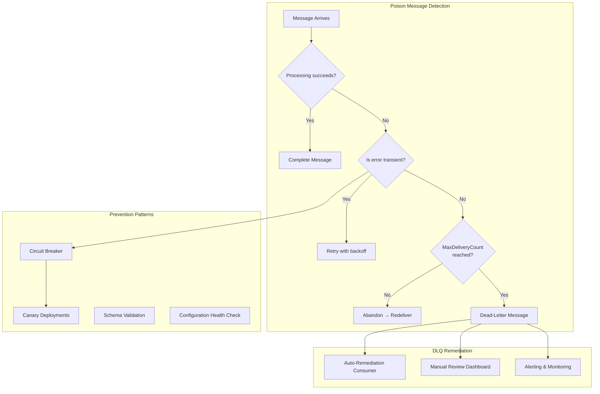
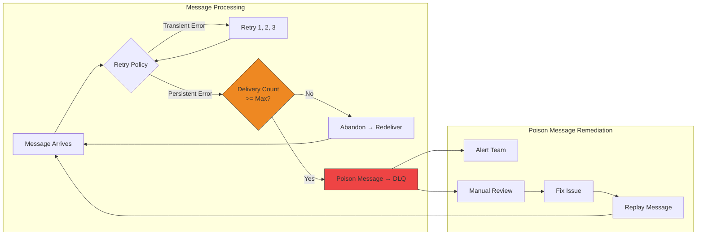
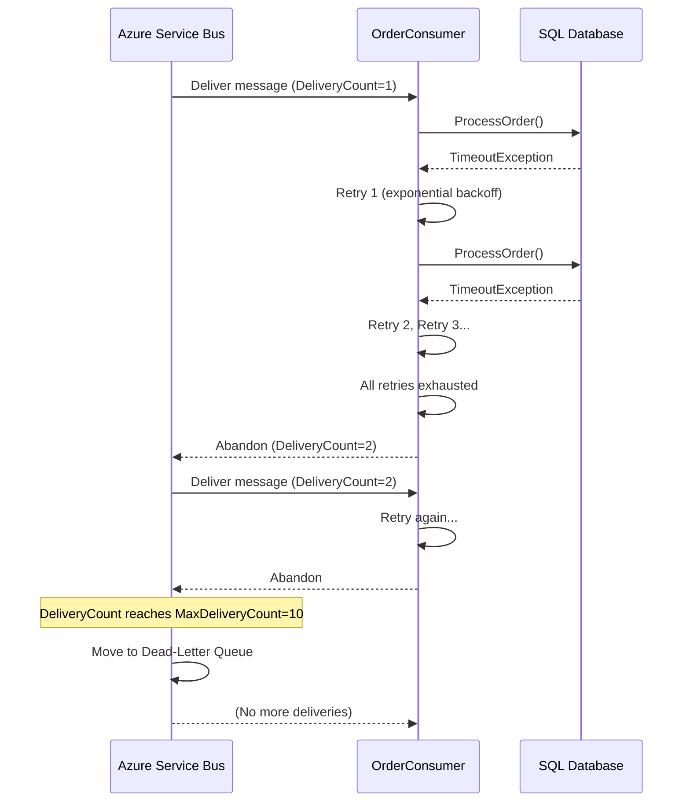
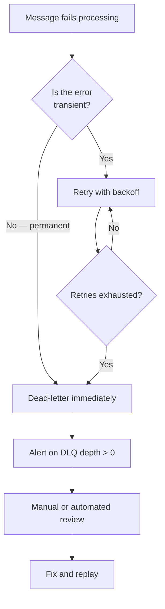

> [!success] Mastery Check
> - [ ] **Studied Well**
> - [ ] **Can explain the concept without notes**
> - [ ] **Can answer interview questions confidently**
> - [ ] **Can implement it in a real project**

## Navigation

**Domain:** [[7 — System Design & Distributed Systems]] > **Group:** Integration Patterns
**Previous:** [[7.151 — Anti-Corruption Layer — Implementation]] | **Next:** [[7.153 — Message Schema Evolution — Versioning Strategies]]

### Prerequisites
- [[7.145 — Competing Consumers Pattern]] — required because poison messages in a competing-consumer topology are redelivered to every consumer before landing in the DLQ, wasting fleet-wide resources
- [[6.302 — Exception Handling Patterns — Retry]] — retry is the first line of defense; poison message handling catches what retry cannot fix

### Where This Fits

A poison message is a message that cannot be processed by a consumer despite repeated attempts, typically because of invalid data, a missing dependency, or a bug in the consumer code. Without poison message handling, the broker retries delivery indefinitely (or until max delivery count), blocking the queue — the poison message sits at the head of the queue and all messages behind it cannot be processed. A .NET engineer encounters this whenever a message fails processing and the broker redelivers it — the first few retries are normal; by the 10th retry, the message is poison. Without automatic detection and dead-lettering, a single bad message can halt an entire processing pipeline for hours.

## Core Mental Model

Poison message handling is the set of mechanisms that detect, isolate, and report messages that consistently fail processing. The invariant this maintains is: a single bad message cannot block the processing of other messages in the same queue. The tradeoff is that poison messages require manual or automated remediation — the message is isolated (dead-lettered) but must eventually be reviewed, fixed, and potentially reprocessed. The recognition trigger is a queue where delivery counts are climbing, consumer error logs show the same message repeatedly, or the queue depth is not decreasing despite active consumers.

### Classification

Poison message handling is a reliability pattern that operates at the messaging infrastructure layer. It is closely related to dead-letter queues (the destination for poison messages), retry policies (the mechanism that determines when a message becomes poison), and error monitoring (the observability that detects poison messages). The pattern works differently in different brokers: Azure Service Bus has automatic dead-lettering after max delivery count; Kafka requires consumer-side detection and manual publishing to a DLQ topic. In MassTransit, the retry policy and delivery count configuration together form the poison message handling strategy.







### Key Properties / Guarantees

|Property|Value|Condition|
|---|---|---|
|Non-blocking|Poison messages are removed from the main queue|Max delivery count is configured|
|Detection latency|Up to N retries before dead-lettering|N = MaxDeliveryCount|
|Data preservation|Original message is preserved in DLQ|DLQ retention is configured|
|Visibility|Team is notified of poison messages|DLQ monitoring and alerting is set up|
|Remediation path|Manual or automated reprocessing possible|DLQ messages can be replayed|
|Transient error efficiency|Transient errors retried without incrementing delivery count|Consumer-level retry policy must be configured|

## Deep Mechanics

### How It Works

**Step 1 — Consumer receives message.** The consumer picks up a message from the queue and begins processing.

**Step 2 — Processing fails.** The consumer encounters an error — invalid data, a downstream service timeout, a database deadlock, a null reference. If the error is transient (timeout, deadlock), the consumer's retry policy handles it with exponential backoff. If the error persists, the consumer abandons the message after retries are exhausted.

**Step 3 — Broker increments delivery count.** When the consumer abandons the message or the lock expires, the broker increments the `DeliveryCount` and makes the message available for redelivery. The broker tracks delivery count per message.

**Step 4 — Redelivery repeats.** Steps 1-3 repeat. Each cycle increments the delivery count. The consumer may receive the message on a different instance (if using competing consumers).

**Step 5 — Max delivery count reached.** When the delivery count reaches the configured `MaxDeliveryCount` (typically 5-10), the broker automatically moves the message to the dead-letter queue (DLQ) associated with the main queue. The message is no longer available for normal processing.

**Step 6 — DLQ processing.** The poison message sits in the DLQ with metadata: original queue name, delivery count, time of dead-lettering, reason (e.g., `MaxDeliveryCountExceeded`), and any error description the consumer attached. A monitoring alert fires. An operator reviews the DLQ, identifies the root cause, applies the fix, and optionally replays the message to the main queue.

**Transient vs Permanent error distinction.** The most critical design decision in poison message handling is distinguishing these two categories. Transient errors (timeouts, deadlocks, network failures, 503/429 responses) are likely to succeed on retry after a short delay. Permanent errors (validation failures, missing entities, deserialization errors, corrupted data) will never succeed no matter how many times they are retried. An effective poison message handler treats these differently: transient errors go through retry; permanent errors should skip retry and dead-letter immediately.

### Retry Strategy Deep Dive

The retry strategy is the first line of defense against poison messages. Choosing the right strategy depends on the error type and the system's recovery characteristics:

**Immediate retry (no delay).** Suitable for deadlock retries (SQL error 1205) where the conflict is resolved by the retry itself. The retry typically succeeds immediately. Use `Immediate(N)` with N ≤ 3.

**Fixed interval retry.** Suitable for rate-limited APIs where the throttle window is known (e.g., 429 responses with a `Retry-After` header). Use `Interval(N, delay)` where delay matches the known throttle window.

**Exponential backoff retry.** Suitable for transient infrastructure failures where the recovery time is unknown (database failover, network blip, downstream service restart). Each retry waits longer: 1s, 2s, 4s, 8s. Use `Exponential(N, minDelay, maxDelay, delta)`.

**Jitter-based retry.** Adds randomness to the delay to prevent the "thundering herd" problem where all retries from all consumers fire simultaneously after a service recovers. Use `Exponential` with jitter or a custom `RetryDelayProvider`.

```csharp
// Jitter-based retry delay calculation
public static TimeSpan CalculateJitteredDelay(int attempt, TimeSpan baseDelay)
{
    var exponentialDelay = TimeSpan.FromMilliseconds(
        baseDelay.TotalMilliseconds * Math.Pow(2, attempt));
    var jitter = TimeSpan.FromMilliseconds(
        Random.Shared.Next(0, (int)exponentialDelay.TotalMilliseconds));
    return exponentialDelay + jitter;
}

// MassTransit retry with jitter
e.UseMessageRetry(r =>
{
    r.Handle<TimeoutException>();
    r.Handle<SqlException>(ex => ex.Number == 1205);
    r.Exponential(5,
        TimeSpan.FromMilliseconds(100),  // min delay
        TimeSpan.FromSeconds(30),         // max delay
        TimeSpan.FromSeconds(1));         // delta
    // MassTransit's Exponential includes built-in jitter
});
```

**Circuit breaker mode.** When retries consistently fail, stop retrying entirely for a cooldown period. This prevents cascading failures when the downstream system is completely down. The circuit breaker trips after N consecutive failures, stops retrying for M seconds, then half-opens to probe if the system has recovered.

```csharp
// Polly circuit breaker with retry
builder.Services.AddResiliencePipeline("messaging", builder =>
{
    builder.AddRetry(new RetryStrategyOptions
    {
        MaxRetryAttempts = 3,
        Delay = TimeSpan.FromSeconds(1),
        BackoffType = DelayBackoffType.Exponential,
        OnRetry = args =>
        {
            logger.LogWarning("Retry {Attempt} after {Delay}",
                args.AttemptNumber, args.RetryDelay);
            return ValueTask.CompletedTask;
        }
    });
    builder.AddCircuitBreaker(new CircuitBreakerStrategyOptions
    {
        FailureRatio = 0.5,
        SamplingDuration = TimeSpan.FromSeconds(30),
        BreakDuration = TimeSpan.FromMinutes(1),
        OnOpened = args =>
        {
            logger.LogCritical("Circuit breaker opened — stopping retries");
            return ValueTask.CompletedTask;
        }
    });
});
```

**Retry budget calculation.** The total retry duration must fit within the message lock duration. If the lock expires during retry, the message is redelivered while the first consumer is still retrying — causing duplicate processing.

```
LockDuration = MaxProcessingTime + (MaxRetries × AvgRetryDelay) + SafetyMargin

Example:
- MaxProcessingTime = 500ms
- MaxRetries = 3 with Exponential(1s, 10s, 2s)
- Avg delay ≈ (1 + 3 + 7) / 3 ≈ 3.7s
- SafetyMargin = 10s
- Required LockDuration = 0.5s + 3.7s + 10s ≈ 15s
```

### Failure Modes

**Max delivery count too low.** Setting `MaxDeliveryCount = 3` causes messages with transient issues (brief network blip, database failover) to be prematurely dead-lettered. **Detection:** DLQ fills with messages that were recoverable. **Metric:** DLQ entry rate vs transient error rate. **Prevention:** set `MaxDeliveryCount` high enough to cover the retry policy (e.g., 10-15). The consumer's retry policy handles transient retries within a single delivery; the delivery count should cover scenarios where the consumer crashes mid-retry.

**Max delivery count too high.** Setting `MaxDeliveryCount = 100` causes poison messages to be retried 100 times, wasting consumer resources and delaying DLQ detection. **Detection:** consumer logs show the same error repeated 100 times for the same message. **Metric:** average delivery count for DLQ entries. **Prevention:** set `MaxDeliveryCount` to 5-10 and rely on the consumer's retry policy for transient errors within a delivery.

**Consumer catches poison exceptions and completes.** The consumer has a broad catch block that swallows all exceptions and calls `CompleteAsync`, preventing the message from being dead-lettered.

```csharp
// ❌ Catch-all swallows poison — message is "successfully" processed with errors
public async Task Consume(ConsumeContext<Order> context)
{
    try
    {
        await ProcessOrderAsync(context.Message);
    }
    catch (Exception ex)
    {
        _logger.LogError(ex, "Error processing order"); // swallowed!
        // Message is auto-completed — no dead-letter, no retry
    }
}
```

**Symptom:** Data is silently lost — the message was not processed but was marked as complete. **Prevention:** never silently catch all exceptions in a consumer. Let the exception propagate so the broker can retry or dead-letter. If you must catch, explicitly dead-letter the message.

**DLQ not monitored.** Poison messages are dead-lettered, but no one monitors the DLQ. Messages sit there indefinitely. **Detection:** A customer complains about a missing order. **Metric:** DLQ depth is not tracked. **Prevention:** Set up monitoring alerts on DLQ depth. Every queue should have a DLQ alert with a threshold (e.g., depth > 0 for 5 minutes).

**Consumer lock expires before processing completes.** The message processing takes longer than the broker's lock duration. The lock expires, the message becomes visible to other consumers, and both consumers may process it — potentially creating duplicate side effects. **Detection:** Consumer receives `MessageLockLostException` mid-processing. **Metric:** Lock-lost exceptions correlate with processing duration exceeding lock duration. **Prevention:** use `ServiceBusReceiver.RenewMessageLockAsync` for long-running processing, or ensure processing time is well within the configured lock duration.

### Poison Message Observability and Dashboards

Comprehensive monitoring of poison messages requires metrics beyond just DLQ depth:

```csharp
// Custom metrics for poison message observability
public sealed class PoisonMessageMetrics
{
    private readonly TelemetryClient _telemetry;
    private readonly Meter _meter;
    private readonly Counter<int> _poisonMessageCounter;
    private readonly Histogram<int> _deliveryCountHistogram;

    public PoisonMessageMetrics(TelemetryClient telemetry, IMeterFactory meterFactory)
    {
        _telemetry = telemetry;
        _meter = meterFactory.Create("OrderProcessing.PoisonMessages");
        _poisonMessageCounter = _meter.CreateCounter<int>("dlq.entries", "entries", "DLQ entry count");
        _deliveryCountHistogram = _meter.CreateHistogram<int>("dlq.delivery_count", "count", "Delivery count at dead-letter time");
    }

    public void TrackPoisonMessage(string queueName, string reason, int deliveryCount)
    {
        // Application Insights event
        _telemetry.TrackEvent("PoisonMessage", new Dictionary<string, string>
        {
            ["QueueName"] = queueName,
            ["DeadLetterReason"] = reason,
            ["DeliveryCount"] = deliveryCount.ToString()
        });

        // .NET 8 Meter metrics for Prometheus / dotnet-monitor
        _poisonMessageCounter.Add(1,
            new KeyValuePair<string, object?>("queue", queueName),
            new KeyValuePair<string, object?>("reason", reason));
        _deliveryCountHistogram.Record(deliveryCount,
            new KeyValuePair<string, object?>("queue", queueName));
    }
}

// Grafana dashboard panels:
// 1. DLQ depth per queue (time series)
// 2. DLQ entry rate per queue (rate of DeadletteredMessages metric)
// 3. Dead-letter reason breakdown (pie chart)
// 4. Delivery count distribution at dead-letter time (histogram)
// 5. Auto-remediation success rate (for DLQ consumers)
// 6. Replay loop detection (messages with x-dlq-retry-count > 2)
```

### Poison Message Modeling — Exception Hierarchy

A well-designed exception hierarchy makes poison message handling explicit and testable:

```csharp
// Exception hierarchy for poison message categorization
public abstract class MessageProcessingException : Exception
{
    protected MessageProcessingException(string message) : base(message) { }
    public abstract bool IsTransient { get; }
    public abstract bool IsRecoverable { get; }
}

public sealed class DownstreamTimeoutException : MessageProcessingException
{
    public DownstreamTimeoutException(string service, TimeSpan timeout)
        : base($"Downstream service {service} timed out after {timeout}") { }
    public override bool IsTransient => true;  // Retry may succeed
    public override bool IsRecoverable => true; // May recover automatically
}

public sealed class DatabaseDeadlockException : MessageProcessingException
{
    public DatabaseDeadlockException(string table)
        : base($"Deadlock detected on table {table}") { }
    public override bool IsTransient => true;
    public override bool IsRecoverable => true;
}

public sealed class ValidationException : MessageProcessingException
{
    public ValidationException(string field, string value)
        : base($"Validation failed for {field}: {value}") { }
    public override bool IsTransient => false;   // Won't succeed on retry
    public override bool IsRecoverable => false;  // Data must be fixed externally
}

public sealed class MissingReferenceException : MessageProcessingException
{
    public MissingReferenceException(string entityType, string entityId)
        : base($"Referenced {entityType} {entityId} not found") { }
    public override bool IsTransient => false;     // Won't succeed immediately
    public override bool IsRecoverable => true;    // May succeed if reference created later
}

// Retry policy using the exception hierarchy
e.UseMessageRetry(r =>
{
    r.Handle<DownstreamTimeoutException>();
    r.Handle<DatabaseDeadlockException>();
    r.Ignore<ValidationException>();          // Permanent — skip retry
    r.Ignore<MissingReferenceException>();     // Not yet recoverable — skip immediate retry
    r.Exponential(3, TimeSpan.FromSeconds(1),
        TimeSpan.FromSeconds(10), TimeSpan.FromSeconds(2));
});
```

This hierarchy makes the retry policy declarative and testable. Unit tests verify that transient exceptions are retried and permanent exceptions are not.

### Poison Message Categories and Their Handling

Not all poison messages are equal. A robust system handles each category differently:

**Category 1: Transient system failures.** Database deadlocks, network timeouts, downstream 503s. These are the most common poison messages. **Handling:** Retry within the consumer (exponential backoff, up to 3 attempts). If still failing, abandon and let the broker redeliver. After `MaxDeliveryCount` is reached and the message is dead-lettered, a DLQ consumer replays it immediately — the transient condition has likely resolved.

**Category 2: Missing data that will arrive later.** An order message references a customer that is being created in a separate transaction. The customer data arrives 2 seconds after the order. **Handling:** Use a delayed retry (publish the message to a delay queue with a 5-second delay) instead of immediate retry. If the reference still does not exist after the delay, dead-letter and auto-remediate via enrichment.

**Category 3: Permanent data corruption.** Invalid JSON payload, missing required fields, corrupted binary data. These messages can never succeed regardless of retries. **Handling:** Skip retry entirely. Dead-letter on the first delivery. Log the full payload for debugging. Alert the team — data corruption may indicate a producer bug.

**Category 4: Consumer bugs.** A NullReferenceException caused by a recent deployment. All messages fail with the same error. **Handling:** This is the most dangerous category because it affects 100% of messages. Implement a circuit breaker: if the DLQ entry rate exceeds 1% of total throughput, stop the consumer and alert immediately. The circuit breaker prevents the DLQ from filling while the team investigates.

**Category 5: Schema evolution mismatches.** A producer added a new field or changed an enum value, and the consumer cannot deserialize the message. **Handling:** Dead-letter with a specific `SchemaMismatch` reason. The DLQ consumer checks if the schema mismatch can be resolved by a transformation (e.g., mapping unknown enum values to a sentinel). If not, escalate to the schema governance team.

### Poison Message Runbook

Every production system should have a runbook for poison message handling:

1. **Alert fires** — DLQ depth > 0 for 5 minutes
2. **Acknowledge** — Check the DLQ via Service Bus Explorer or admin dashboard
3. **Categorize** — Read `DeadLetterReason` and `DeadLetterErrorDescription`
   - Transient timeout? → Replay as-is
   - Missing reference? → Check if entity exists now; replay if yes
   - Validation error? → Log details, discard (cannot be fixed)
   - Unknown? → Escalate to engineering team for investigation
4. **Fix root cause** — Before replaying, ensure the underlying issue is resolved
5. **Replay** — Move messages back to main queue (batch replay if >100 messages)
6. **Monitor** — Verify replayed messages do not return to DLQ
7. **Post-mortem** — If a pattern repeats, add auto-remediation logic

### .NET and Azure Integration

- **Azure Service Bus:** automatic dead-lettering. Set `MaxDeliveryCount` on the queue or subscription. When exceeded, the message is moved to the DLQ with `DeadLetterReason` and `DeadLetterErrorDescription`.
- **MassTransit:** `UseMessageRetry` for retry within a delivery; `MaxDeliveryCount` for cross-delivery dead-lettering. MassTransit also supports `DiscardFaultedMessages()` or custom error handling.
- **Azure Functions (Service Bus Trigger):** `maxDeliveryCount` on the trigger binding. Functions that throw are retried; after max delivery count, the message goes to DLQ.
- **Polly:** for consumer-side resilience, Polly's `RetryPolicy` and `CircuitBreakerPolicy` can wrap the processing logic. This is useful when processing involves external HTTP calls.
- **Application Insights:** track delivery count, dead-letter reason, and poison message volume as custom metrics for alerting and dashboarding.

```csharp
// Consumer with retry — poison messages throw after retries exhausted
public sealed class OrderConsumer : IConsumer<Order>
{
    public async Task Consume(ConsumeContext<Order> context)
    {
        // Retry policy handles transient failures
        // If all retries fail, the exception propagates
        // The message is abandoned → DeliveryCount increments
        // After MaxDeliveryCount, Service Bus auto dead-letters
        await ProcessOrderAsync(context.Message, context.CancellationToken);
    }
}

// Configuration — retry within a delivery + max delivery count for cross-delivery
cfg.ReceiveEndpoint("order-processing", e =>
{
    // Retry within a single delivery (does not increment DeliveryCount)
    e.UseMessageRetry(r =>
    {
        r.Handle<TimeoutException>();
        r.Handle<SqlException>(ex => ex.Number == 1205); // deadlock
        r.Exponential(3, TimeSpan.FromMilliseconds(200),
            TimeSpan.FromSeconds(5), TimeSpan.FromSeconds(1));
    });

    // Max delivery count before dead-lettering
    e.MaxDeliveryCount = 10;

    e.ConfigureConsumer<OrderConsumer>(context);
});
```

## Production Patterns and Implementation

### Primary Implementation

The canonical poison message handling setup uses Azure Service Bus's built-in dead-lettering combined with MassTransit's retry policy. Transient errors are retried within a delivery; persistent errors cause the message to be dead-lettered after `MaxDeliveryCount` deliveries.

```csharp
// Program.cs — poison message configuration
builder.Services.AddMassTransit(x =>
{
    x.AddConsumer<OrderProcessingConsumer>(typeof(OrderProcessingDefinition));

    x.UsingAzureServiceBus((context, cfg) =>
    {
        cfg.Host(builder.Configuration["Azure:ServiceBus:ConnectionString"]);

        cfg.ReceiveEndpoint("order-processing", e =>
        {
            // Retry within delivery — handles transient failures
            e.UseMessageRetry(r =>
            {
                r.Handle<TimeoutException>();
                r.Handle<SqlException>(ex => ex.Number is 1205 or -2);
                r.Handle<HttpRequestException>();
                r.Immediate(1);
                r.Exponential(3, TimeSpan.FromSeconds(1),
                    TimeSpan.FromSeconds(30), TimeSpan.FromSeconds(5));
            });

            // Rate limit to avoid overwhelming downstream
            e.UseRateLimit(50, TimeSpan.FromSeconds(1));

            // Max delivery count — poison after 5 redeliveries
            e.MaxDeliveryCount = 5;

            // Dead-letter error metadata
            e.ConfigureDeadLetterQueueDeadLetterException();
            e.ConfigureDeadLetterQueueDeadLetterMessage();

            e.ConfigureConsumer<OrderProcessingConsumer>(context);
        });
    });
});

// Consumer definition — explicit error handling
public sealed class OrderProcessingDefinition :
    ConsumerDefinition<OrderProcessingConsumer>
{
    protected override void ConfigureConsumer(
        IReceiveEndpointConfigurator endpointConfigurator,
        IConsumerConfigurator<OrderProcessingConsumer> consumerConfigurator,
        IRegistrationContext context)
    {
        // Discard faulted messages to DLQ instead of retrying indefinitely
        endpointConfigurator.DiscardFaultedMessages();
    }
}

// Consumer with explicit error categorization
public sealed class OrderProcessingConsumer : IConsumer<Order>
{
    private readonly ILogger<OrderProcessingConsumer> _logger;

    public async Task Consume(ConsumeContext<Order> context)
    {
        try
        {
            await ProcessOrderAsync(context.Message, context.CancellationToken);
        }
        catch (ValidationException ex)
        {
            // Permanent error — dead-letter immediately, skip retry
            _logger.LogWarning(ex, "Validation failed for order {OrderId}. Dead-lettering.",
                context.Message.OrderId);
            throw; // Let MassTransit's retry policy ignore this (configured below)
        }
        catch (TimeoutException)
        {
            // Transient — will be retried by UseMessageRetry
            throw;
        }
    }
}
```

### Configuration and Wiring

```csharp
// Azure Service Bus queue configuration — ARM / Bicep
resource queue 'Microsoft.ServiceBus/namespaces/queues@2021-11-01' = {
  name: 'order-processing'
  properties: {
    maxDeliveryCount: 10
    deadLetteringOnMessageExpiration: true
    defaultMessageTimeToLive: 'P14D'
    duplicateDetectionHistoryTimeWindow: 'PT10M'
    enableBatchedOperations: true
  }
}

// Monitor DLQ via Azure Monitor alert rule
// Query: AzureMetrics | where MetricName == "DeadletteredMessages"
// Condition: Total > 0 for 5 minutes
// Action: Email + PagerDuty

// Application Insights custom metric tracking
public sealed class PoisonMessageTracker
{
    private readonly TelemetryClient _telemetry;

    public void TrackPoisonMessage(string queueName, string reason, int deliveryCount)
    {
        _telemetry.TrackEvent("PoisonMessage", new Dictionary<string, string>
        {
            ["QueueName"] = queueName,
            ["DeadLetterReason"] = reason,
            ["DeliveryCount"] = deliveryCount.ToString()
        });
    }
}
```

### Common Variants

**Custom poison message handling.** Instead of relying on broker dead-lettering, the consumer explicitly publishes the poison message to a dedicated poison queue with error metadata. This gives more control over the poison message format.

```csharp
// Explicit poison message handling
public async Task Consume(ConsumeContext<Order> context)
{
    try
    {
        await ProcessOrderAsync(context.Message);
    }
    catch (InvalidDataException ex) when (IsPermanent(ex))
    {
        // Explicitly dead-letter — skip retries for permanent failures
        await context.NotifyFaulted(TimeSpan.Zero,
            "Invalid data - no retry needed", ex);
    }
}
```

**Poison message with circuit breaker.** If a consumer repeatedly encounters poison messages, use a circuit breaker to stop processing from the queue entirely, preventing wasted retries and giving the team time to fix the underlying issue before messages pile up.

```csharp
// Polly circuit breaker around message processing
public async Task Consume(ConsumeContext<Order> context)
{
    await _resiliencePipeline.ExecuteAsync(
        ct => ProcessOrderAsync(context.Message, ct),
        context.CancellationToken);
}

// Registration
builder.Services.AddResiliencePipeline("order-processing", builder =>
{
    builder.AddRetry(new RetryStrategyOptions
    {
        MaxRetryAttempts = 3,
        Delay = TimeSpan.FromSeconds(1),
        BackoffType = DelayBackoffType.Exponential
    });
    builder.AddCircuitBreaker(new CircuitBreakerStrategyOptions
    {
        FailureRatio = 0.5,
        SamplingDuration = TimeSpan.FromSeconds(30),
        BreakDuration = TimeSpan.FromMinutes(2)
    });
});
```

**Auto-remediation.** A DLQ consumer automatically handles certain categories of poison messages — for example, if the message is missing a field that can be fetched from an API, the DLQ consumer enriches and replays it without human intervention.

**Dead-letter on permanent error immediately.** For validation errors and other permanent failures, skip all retries and dead-letter on the first delivery. This avoids wasting resources and prevents delayed detection.

```csharp
// Configuration: retry only transient exceptions
e.UseMessageRetry(r =>
{
    r.Handle<TimeoutException>();
    r.Handle<SqlException>(ex => ex.Number == 1205);
    r.Ignore<ValidationException>();   // Permanent — no retry
    r.Ignore<InvalidDataException>();   // Permanent — no retry
    r.Exponential(3, TimeSpan.FromSeconds(1),
        TimeSpan.FromSeconds(10), TimeSpan.FromSeconds(2));
});
```

### Real-World .NET Ecosystem Example

**Azure Service Bus's auto-dead-lettering** is the most commonly used poison-message handling in .NET production systems. Combined with MassTransit's `UseMessageRetry` and `MaxDeliveryCount`, it provides a three-layer defense: 1) retry for transient failures within a delivery (no delivery count increment), 2) delivery retries across consumer restarts or lock expirations (delivery count increments), 3) dead-lettering after max delivery count. Many .NET teams also add a DLQ monitoring dashboard that shows per-queue DLQ depth, dead-letter reason distribution, and the ability to replay selected messages from the DLQ via a custom admin portal.

## Gotchas and Production Pitfalls

### Retry Policy Exhausts Before Max Delivery Count

**Pitfall:** The retry policy retries aggressively within a single delivery, but all retries fail on the same transient condition because the downstream system is down for 30 seconds. The message is abandoned, and the delivery count increments — the message goes through retry again on the next delivery, wasting 4 retry attempts each time.

```csharp
// ❌ Retry 5 times × 10 deliveries = 50 useless retries for a downstream outage
e.UseMessageRetry(r => r.Interval(5, TimeSpan.FromMilliseconds(100)));
e.MaxDeliveryCount = 10;
```

**Symptom:** 50 failed processing attempts before dead-lettering. Consumer CPU wasted. Downstream system receives 50 rejected calls.

**Fix:** Use exponential backoff with a longer interval and reasonable max delivery count. The first delivery should exhaust retries quickly and abandon the message; the redelivery interval is controlled by the broker's `lockDuration` and the consumer's retry policy on the next delivery.

```csharp
// ✅ Exponential retry — early abandon for long outages
e.UseMessageRetry(r => r.Exponential(3,
    TimeSpan.FromSeconds(1), TimeSpan.FromSeconds(30), TimeSpan.FromSeconds(5)));
e.MaxDeliveryCount = 5;
```

**Cost of not fixing:** Wasteful retries during extended outages. The consumer fleet is busy retrying messages that cannot succeed until the downstream recovers.

### Poison Message Blocks Partition

**Pitfall:** A poison message sits at the head of a partition (or session queue), blocking all subsequent messages in that partition from being processed.

```csharp
// ❌ Session queue — one poison message blocks the entire session
e.RequiresSession = true;
e.MaxConcurrentCallsPerSession = 1; // serial processing within session
// Poison message for CustomerA blocks all other CustomerA messages
```

**Symptom:** CustomerA's orders stop processing. All other customers are fine. The session queue shows messages with increasing delivery counts for CustomerA's session.

**Fix:** For session queues, set `MaxDeliveryCount` to dead-letter poison messages within a session quickly. The session is released after dead-lettering, allowing subsequent messages in the same session to be processed. Consider using non-session queues with deduplication if per-entity ordering is not strictly required.

**Cost of not fixing:** Customer-facing delays for entities affected by poison messages. The team searches for "what's wrong with CustomerA" instead of "what's wrong with the message."

### DLQ Overflow — Too Many Poison Messages

**Pitfall:** A deployment bug causes every message to fail. The DLQ fills with thousands of messages in minutes, exceeding storage limits.

```csharp
// ❌ Deployment introduced a bug — all messages become poison
public async Task Consume(ConsumeContext<Order> context)
{
    var config = _configuration["NewSetting"]; // null — NullReferenceException
    // Every message fails, every message goes to DLQ
}
```

**Symptom:** DLQ depth alerts fire rapidly. The queue appears to be processing (messages are being consumed), but they are all going to the DLQ. The main queue is empty, but the DLQ is overflowing.

**Fix:** Implement a "circuit breaker" or "stop processing" mechanism. If the DLQ fill rate exceeds a threshold, stop processing from the queue and alert immediately. This prevents the DLQ from filling and gives the team time to diagnose before more messages are lost.

**Prevention:** Canary deploy the consumer: start with 1 instance out of 10. Monitor DLQ rate. If DLQ rate spikes, the canary is rolled back before the full deployment.

**Cost of not fixing:** Thousands of messages in the DLQ. Manual reprocessing required after the fix. Some messages may expire (TTL) before they can be replayed.

### Not Distinguishing Transient vs Permanent Errors

**Pitfall:** The consumer applies the same retry policy for all exceptions, including permanent failures like validation errors.

```csharp
// ❌ All exceptions retried — including validation errors that will never succeed
e.UseMessageRetry(r => r.Immediate(5)); // retries validation errors 5 times
```

**Symptom:** Validation errors (invalid email format, missing required fields) are retried 5 times before being dead-lettered. Each retry consumes resources and logs an error that distracts from real issues.

**Fix:** Configure retry policies that only retry transient exceptions. Permanent exceptions should immediately dead-letter.

```csharp
// ✅ Only retry transient exceptions
e.UseMessageRetry(r =>
{
    r.Handle<TimeoutException>();
    r.Handle<SqlException>(ex => ex.Number == 1205);
    r.Ignore<ValidationException>();   // permanent — no retry
    r.Ignore<InvalidDataException>();   // permanent — no retry
    r.Exponential(3, TimeSpan.FromSeconds(1),
        TimeSpan.FromSeconds(10), TimeSpan.FromSeconds(2));
});
```

**Cost of not fixing:** Wasted resources on hopeless retries. Error logs are cluttered with retry noise, making it harder to identify real transient failures.

### Poison Message with Missing Correlation State

**Pitfall:** A poison message references an entity that does not exist at processing time but will exist later (e.g., an order references a customer that is being created in a separate transaction). The message is dead-lettered, but by the time it is reviewed, the customer exists and the message could have been processed.

**Symptom:** The DLQ fills with "CustomerNotFound" errors for customers that were created shortly after the order message was enqueued.

**Fix:** Instead of dead-lettering immediately for missing references, use a delayed retry or scheduled enqueue. The consumer can defer the message by publishing it to a delay queue with a future enqueue time.

**Cost of not fixing:** Manual review required for messages that could have been auto-recovered. Operations team wastes time on transient missing-reference issues.

### Poison Message That Cannot be Deserialized

**Pitfall:** The message body is corrupted or in an unexpected format, causing deserialization to throw an exception before any business logic runs.

```csharp
// ❌ Deserialization failure — message format is wrong
// Consumer never enters Consume() — framework throws at deserialization step
public async Task Consume(ConsumeContext<Order> context)
{
    // This code never runs if deserialization fails
    await ProcessOrderAsync(context.Message);
}
```

**Symptom:** Messages are dead-lettered without any consumer error log — the framework catches the deserialization exception and moves the message to the DLQ directly. The team cannot find the error because they search consumer logs, not broker logs.

**Fix:** Monitor broker-level dead-letter reasons. `DeserializationException` is a common DLQ reason that is not visible in consumer logs. Add a broker-level alert for deserialization failures.

**Cost of not fixing:** Mysterious message loss. The consumer appears to work fine (no errors logged), but messages are disappearing. The team spends hours debugging before checking the DLQ.

### DLQ Consumer Itself Becomes Poisoned

**Pitfall:** The DLQ auto-remediation consumer encounters an exception while processing a DLQ message. If the DLQ consumer has no error handling, the message stays in the DLQ unprocessed, and the DLQ consumer crashes.

```csharp
// ❌ DLQ consumer with no error handling
public async Task Consume(ConsumeContext<OrderPlaced> context)
{
    var customerId = context.Message.CustomerId;
    var customer = await _customerApi.GetAsync(customerId); // may throw!
    // If this throws, the DLQ message is abandoned but stays in DLQ
    // The DLQ consumer crashes on every retry
}
```

**Symptom:** The DLQ consumer keeps crashing. The same messages stay in the DLQ. The main queue is healthy, but the DLQ is growing.

**Fix:** Wrap the DLQ consumer logic in try-catch. If the remediation logic itself fails (e.g., the enrichment API is down), escalate the message to manual review instead of crashing.

**Cost of not fixing:** The DLQ consumer is down, and all DLQ processing stops. The team does not notice because the DLQ depth stays steady (not growing — but also not being processed).

### Retry Policy Consumes the Entire Lock Duration

**Pitfall:** The retry policy retries for so long that the message lock expires during the retry loop, causing the broker to redeliver the message to another consumer while the first consumer is still processing it.

```csharp
// ❌ Retry duration exceeds lock duration
e.UseMessageRetry(r => r.Interval(10, TimeSpan.FromSeconds(30))); // 5 minutes of retries
// LockDuration defaults to 60 seconds — lock expires during retries
```

**Symptom:** Two consumers processing the same message. The first is retrying; the second receives the message because the lock expired. Both may complete the message, causing duplicate side effects.

**Fix:** Ensure the total retry duration is less than the message lock duration. Or use `UseMessageRetry` with a short ceiling and rely on `MaxDeliveryCount` for cross-delivery retries.

```csharp
// ✅ Total retry time (3 × 5s = 15s) is well under lock duration (60s)
e.UseMessageRetry(r => r.Exponential(3,
    TimeSpan.FromSeconds(1), TimeSpan.FromSeconds(5), TimeSpan.FromSeconds(2)));
```

**Cost of not fixing:** Duplicate message processing, potential data corruption, and confusing "phantom" side effects.

### Poison Message in a Transactional Outbox Scenario

**Pitfall:** A message is published via the transactional outbox pattern. The outbox message is delivered, the consumer fails repeatedly, and the message is dead-lettered. The producer has no knowledge that the message was poisoned — it assumes successful delivery because the outbox entry was committed.

```csharp
// ❌ Producer has no feedback loop for poison messages
await using var tx = await db.Database.BeginTransactionAsync();
order.Status = OrderStatus.Submitted;
db.OutboxMessages.Add(new OutboxMessage { Type = "OrderSubmitted", Payload = {...} });
await db.SaveChangesAsync();
await tx.CommitAsync();
// Outbox delivers the message, consumer fails, message is dead-lettered
// Producer never knows the order was not processed
```

**Symptom:** The producer thinks the order was submitted successfully. The consumer never processed it. The customer sees "order submitted" in the UI but the order is never fulfilled.

**Fix:** Implement a delivery confirmation or compensation mechanism. For critical messages, monitor for poison messages and trigger a compensation (e.g., cancel the order, notify the customer). The producer can subscribe to a "processing failed" event from the DLQ or from the consumer.

```csharp
// ✅ Producer subscribes to processing failure events
public sealed class OrderSubmittedFailedConsumer : IConsumer<OrderSubmittedFailed>
{
    public async Task Consume(ConsumeContext<OrderSubmittedFailed> context)
    {
        // The consumer failed to process the order — compensate
        var orderId = context.Message.OrderId;
        await _orderRepository.CancelAsync(orderId, "Processing failed — investigate");
        await _notification.SendAsync(orderId, "Your order could not be processed. We are investigating.");
    }
}
```

**Cost of not fixing:** Silent data loss — the producer and consumer are out of sync. The producer has no trigger to compensate or retry.

### Poison Message Caused by Missing Feature Flag

**Pitfall:** A new consumer feature is deployed behind a feature flag. The feature flag is disabled, but the consumer code path that accesses the flag has a bug — it throws when the flag is not present. All messages fail processing.

```csharp
// ❌ Missing feature flag causes all messages to fail
public async Task Consume(ConsumeContext<Order> context)
{
    var useNewLogic = _configuration.GetValue<bool>("Features:NewOrderLogic");
    if (useNewLogic)
    {
        // This code path is never reached because the flag is false
    }
    // But accessing the flag caused a NullReferenceException earlier
    // due to a missing configuration section
}
```

**Symptom:** After deployment, 100% of messages go to the DLQ with `NullReferenceException`. The feature flag was disabled intentionally, but the code that reads it is buggy.

**Fix:** Use safe configuration access patterns. The `GetValue<T>` method should have a default value. Validate feature flag configuration at startup.

```csharp
// ✅ Safe configuration access with default
var useNewLogic = _configuration.GetValue<bool>("Features:NewOrderLogic");
// Default is 'false' if the section does not exist — no exception
```

**Cost of not fixing:** A deployment that was supposed to be "disabled behind feature flag" causes a full processing outage. Emergency rollback required.

## Tradeoffs and Decision Framework

### Tradeoff Matrix

| Dimension | Broker Dead-Lettering (Service Bus) | Custom DLQ (App-Level) | Infinite Retry |
|---|---|---|---|
| Implementation effort | Minimal — configured on queue | Medium — custom DLQ consumer | None — no setup needed |
| Message preservation | Full message + metadata preserved | Custom format, any enrichment | Message eventually expires |
| Resource waste | Low — max N deliveries | Low — immediate DLQ on permanent failure | High — infinite retries |
| Remediation path | Manual replay from DLQ | Custom replay logic | N/A (message never leaves queue) |
| Monitoring | Broker provides DLQ metrics | Custom metrics required | Queue depth only |
| Error metadata | DeadLetterReason + Description | Fully customizable | None |

### When to Apply



### When NOT to Apply

- [ ] The system has no monitoring on the DLQ — poison messages will be dead-lettered but never noticed
- [ ] The consumer can handle all failure cases by idempotent retry (e.g., reading from an eventually consistent read model) — no poison condition exists
- [ ] The queue is used for at-most-once delivery where message loss is acceptable — dead-lettering is unnecessary overhead
- [ ] The team lacks operational capacity to review and replay DLQ messages — poison messages become permanent data loss

### Scale Thresholds

- **Required at any scale where message processing failures occur** — poison messages are inevitable in any production system
- **Worth configuring `MaxDeliveryCount = 5-10` for every queue** as a baseline safety measure
- **DLQ monitoring is essential when processing >1,000 messages/day** — at this volume, poison messages will occur regularly
- **Auto-remediation for common poison patterns worth implementing when DLQ volume >100 messages/day** — reduces manual toil
- **Circuit breaker on consumer worth implementing when DLQ rate exceeds 1% of throughput** — prevents cascading failures from deployment bugs

## Interview Arsenal

### Question Bank

1. What is a poison message and how does the pattern handle it?
2. Walk through the lifecycle of a poison message from receipt to dead-lettering.
3. What is the tradeoff between setting `MaxDeliveryCount` too low vs too high?
4. How does a poison message affect other messages in a session queue?
5. Compare poison message handling in Azure Service Bus vs Kafka.
6. Design a poison message handling strategy for a high-throughput payment processing system.
7. How do you distinguish between a transient error and a permanent error in a consumer?
8. What is the relationship between retry policies and poison messages?
9. How do you prevent a deployment bug from filling the DLQ with thousands of messages?
10. What happens to poison messages in a system with no dead-letter queue configured?

### Spoken Answers

**Q: What is a poison message and how do you handle it in .NET with Azure Service Bus?**

> **Average answer:** A poison message is a message that keeps failing. You configure a dead-letter queue and set max delivery count. When the count is exceeded, the message moves to the DLQ.

> **Great answer:** A poison message is any message that consistently fails processing despite retries — typically due to invalid data, a missing dependency, or a consumer bug. Without poison message handling, the broker retries delivery indefinitely, and the message blocks the queue position (in FIFO queues) or wastes consumer resources across the fleet.

In Azure Service Bus with MassTransit, the handling has three layers. First, the retry policy: MassTransit's `UseMessageRetry` retries within a single message delivery without incrementing the broker's delivery count. This handles transient failures like deadlocks or timeouts. Second, the delivery count: after retries are exhausted, the message is abandoned, and the broker increments `DeliveryCount`. The message is redelivered — possibly to a different consumer instance. Third, dead-lettering: when `DeliveryCount` reaches `MaxDeliveryCount` (typically set to 5-10), the broker automatically moves the message to the associated dead-letter queue with metadata: reason (`MaxDeliveryCountExceeded`), the original message, and any error description.

The critical design choice is distinguishing transient from permanent errors. Transient errors (timeouts, deadlocks, network blips) go through retry. Permanent errors (validation failures, missing entity, corrupted data) should skip retry and go directly to the DLQ. In MassTransit, this is done by `Handle<TransientException>` and `Ignore<PermanentException>` in the retry config.

After dead-lettering, the message sits in the DLQ. Monitoring alerts on DLQ depth notify the team. An operator reviews the DLQ, determines root cause, applies a fix, and replays the message to the main queue. Some teams automate common remediation — for example, if a message is missing a customer ID because the customer data was delayed, the DLQ consumer enriches the message from an API and replays it automatically.

**Q: How do you distinguish transient from permanent errors in a consumer?**

> **Great answer:** The distinction is operational, not semantic. A transient error is one that is likely to succeed on retry after a short delay: a database deadlock (SQL error 1205), a network timeout, a 503 from a downstream service, or a throttling response (429). A permanent error is one that will never succeed on retry because the message itself is the problem: a validation error (invalid email, missing required field), a data format error (cannot deserialize), or a reference to an entity that does not exist and will not exist.

In code, I categorize exceptions by type. Transient exceptions are configured in the retry policy with `Handle<T>`. Permanent exceptions are configured with `Ignore<T>` — they bypass retry and go straight to dead-letter. I also use a custom exception hierarchy:

```csharp
public abstract class TransientException : Exception { }
public sealed class DownstreamTimeoutException : TransientException { }
public abstract class PermanentException : Exception { }
public sealed class ValidationException : PermanentException { }
```

In the retry config: `r.Handle<TransientException>()` and `r.Ignore<PermanentException>()`. This ensures retries are only spent on errors that have a chance of recovery.

**Q: How do you prevent a deployment bug from filling the DLQ with thousands of messages?**

> **Great answer:** A deployment bug that causes every message to fail is one of the most dangerous poison message scenarios because it fills the DLQ faster than anyone can review it. The primary mitigation is a canary deployment strategy. Deploy the new consumer version to a single instance out of ten. Monitor the DLQ entry rate for that instance. If it spikes, the canary is immediately rolled back, and the remaining nine instances continue processing on the old version.

The second mitigation is a circuit breaker on the consumer. If the DLQ entry rate exceeds a threshold — say, 1% of messages entering the DLQ within a 5-minute window — the consumer should stop processing from the main queue entirely and raise a high-priority alert. This prevents the DLQ from filling and preserves messages in the main queue for later processing after the fix.

The third mitigation is at the infrastructure level: set a low `MaxDeliveryCount` (5-10) so that messages are dead-lettered quickly rather than consuming resources on 100 retries. A bug that causes NullReferenceException on every message should be detected within seconds, not minutes.

### System Design Interview Trigger

If an interviewer describes a message processing system and asks "what happens if a message fails processing?" or "how do you prevent one bad message from blocking the queue?", they are testing whether you know the poison message pattern. The follow-up will be about the DLQ: "what do you do with messages in the dead-letter queue?" — testing whether you think about monitoring, review, and replay as part of the pattern. The deeper follow-up: "how do you handle a deployment that causes 50% of messages to fail?" — testing whether you have experience with canary deployments, circuit breakers, and operational runbooks.

### Comparison Table

| | Broker Dead-Lettering (Service Bus) | Custom DLQ (App-Level) | Infinite Retry |
|---|---|---|---|
| Detection | Automatic at MaxDeliveryCount | Custom detection logic | None |
| Isolation | Automatic to DLQ | Custom DLQ publish | None |
| Monitoring | Built-in DLQ metrics | Custom | Queue depth (growing) |
| Remediation | Manual replay | Custom replay | Restart consumer after fix |
| Best suited for | Standard queuing | Specialized error handling | Debug environments only |
| Operational overhead | Low | Medium | None (but high firefighting) |
| Message preservation | Full message + metadata | Custom format | Message eventually expires |

### Additional Spoken Answers

**Q: How do you handle poison messages in a session-based queue?**

> **Great answer:** Session-based queues (Azure Service Bus sessions) add an extra dimension of complexity for poison messages. In a session queue, a poison message blocks not just its position in the queue but the entire session. All other messages in that session — which belong to the same entity — are blocked behind it. This is more dangerous than a non-session queue because it affects a specific customer's experience while other customers are unaffected.

> The key configuration is `MaxDeliveryCount` — set it low enough that a poison message is quickly dead-lettered and the session is released. I set `MaxDeliveryCount = 5` for session queues, compared to 10 for non-session queues. Once dead-lettered, the session is available for the next messages from that entity.

> However, there is a subtle issue: when the session is dead-lettered, the session lock is released. The next message for that entity may be received by a different consumer. That consumer must be able to reconstruct the entity's state without the messages that were dead-lettered. If the dead-lettered message was a critical state transition (e.g., "OrderConfirmed"), the consumer must handle the gap — either by fetching the current state from the database or by understanding that some events were skipped.

> For this reason, I strongly recommend idempotent consumers even in session-based systems. The session guarantees ordering but not completeness — messages can be lost to the DLQ, and the consumer must handle that gracefully.

**Q: How do you test poison message handling?**

> **Great answer:** Testing poison message handling is often overlooked because it is "error handling" — but it is critical infrastructure that must work correctly under failure conditions. I structure testing in three layers.

> First, unit tests for the exception hierarchy. Verify that `DownstreamTimeoutException.IsTransient` returns true and `ValidationException.IsTransient` returns false. This ensures the retry policy makes the right decisions.

> Second, integration tests for the retry policy. Use MassTransit's test harness (`InMemoryTestHarness`) to verify that transient exceptions are retried the configured number of times, and that permanent exceptions are not retried. Assert that the message is faulted (not completed) after retries are exhausted.

> ```csharp
> [Fact]
> public async Task TransientException_ShouldRetry()
> {
>     var harness = new InMemoryTestHarness();
>     var consumerHarness = harness.Consumer(() => new OrderConsumer());
>     await harness.Start();
> 
>     try
>     {
>         await harness.InputQueueSendEndpoint.Send(new Order { Id = "123" });
> 
>         // Verify 3 retries were attempted (1 initial + 2 retries)
>         Assert.Equal(3, consumerHarness.Consumed.Select(c => c.Context.Message.Id == "123").Count());
>     }
>     finally
>     {
>         await harness.Stop();
>     }
> }
> ```

> Third, end-to-end tests with the actual broker. Configure a test queue with `MaxDeliveryCount = 2`, send a message that always fails, and verify it lands in the DLQ with the correct `DeadLetterReason`. This catches configuration mismatches between the broker and the consumer.

> The most important test: verify that the DLQ alert actually fires. A poison message that is dead-lettered but not alerted is functionally equivalent to a poison message that was never detected.

**Q: What is the relationship between poison messages and idempotency?**

> **Great answer:** Idempotency and poison message handling are complementary but serve different purposes. Idempotency ensures that processing the same message twice produces the same result. Poison message handling ensures that a message that cannot be processed does not block other messages.

> They interact in an important way: when a poison message is replayed from the DLQ after a fix, the replayed message may be processed twice (once before the fix, once after). Idempotency ensures the second processing does not create duplicate side effects. The message ID or a deduplication ID is the key — the consumer checks if it has already processed this message ID, and if so, skips the processing.

> Similarly, during redelivery (before dead-lettering), the consumer may receive the same message multiple times due to lock expiration or consumer crashes. Idempotency prevents these redeliveries from causing duplicates.

> The dangerous pattern is using idempotency as a substitute for poison message handling. If a consumer is idempotent, it might swallow all exceptions and mark the message as complete — but the message was never processed. Idempotency ensures "processing the same message twice is safe," not "skipping processing is safe." Always separate error handling (retry / dead-letter) from deduplication (ignore already-processed messages).

## Architecture Decision Record

**Status:** Accepted

**Context:** An order processing queue handles 10,000 messages/day. Approximately 0.1% of messages fail processing — typically due to transient database issues, but occasionally due to invalid order data from a buggy client. Currently, failing messages are abandoned and retried indefinitely by the broker. The queue occasionally stalls when a poison message blocks the head of the queue, delaying subsequent orders by up to 30 minutes. The operations team is on-call but has no visibility into the DLQ — they only know about the problem when customers complain. The team wants to implement poison message handling but is concerned about the operational overhead of monitoring and replaying DLQ messages.

**Options Considered:**

1. **Broker Dead-Lettering (Azure Service Bus)** — configure `MaxDeliveryCount = 10` on the queue. Consumer retry policy handles transient errors (3 retries with exponential backoff). Permanent errors skip retry and immediately dead-letter.
2. **Custom DLQ** — consumer catches all exceptions and publishes poison messages to a custom DLQ queue. Custom DLQ consumer handles remediation.
3. **Infinite Retry (current)** — no dead-lettering. Messages retry indefinitely.
4. **Broker Dead-Lettering + Automated DLQ Consumer** — option 1 plus a DLQ consumer that auto-remediates known poison patterns (replay for transient timeouts, enrich for missing references).

**Decision:** Broker Dead-Lettering with `MaxDeliveryCount = 10` and a MassTransit retry policy for transient errors. This provides automatic isolation of poison messages without custom DLQ code. The DLQ is monitored via Azure Monitor with an alert when depth > 0 for 5 minutes. The team decides against automated DLQ consumer for now because the DLQ volume (~10 messages/day) is low enough for manual review.

**Consequences:**
- ✅ Poison messages are automatically removed from the main queue after 10 delivery attempts — no more queue stalls
- ✅ Transient errors are retried within a delivery (3 retries) without incrementing delivery count
- ✅ Permanent errors (validation, deserialization) skip retry and dead-letter on the first delivery
- ✅ DLQ alerting ensures the team knows about poison messages within 5 minutes
- ⚠️ Manual review of DLQ is required — a 0.1% error rate means ~10 messages/day to review
- ⚠️ The DLQ alert may fire frequently during transient outages — requires tuning to avoid alert fatigue
- ⚠️ Team must develop a review runbook and allocate time for daily DLQ triage
- ❌ Messages in the DLQ are not automatically replayed — must build a replay mechanism or review DLQ manually
- ❌ If DLQ volume grows beyond ~50 messages/day, the manual review process will become unsustainable

**Review Trigger:** Revisit this decision if the DLQ volume exceeds 100 messages/day (at which point automated remediation is justified), or if the manual DLQ review process becomes a bottleneck (at which point build an admin UI for replay). Also revisit if the team experiences a deployment bug that fills the DLQ — a circuit breaker should be added.

## Self-Check

### Conceptual Questions

1. What is a poison message and what invariant does poison message handling maintain?
2. Derive the tradeoff between setting `MaxDeliveryCount` to 3 vs 100.
3. Given a queue where messages fail due to transient database deadlocks, should the retry policy or `MaxDeliveryCount` handle the retries?
4. What metric reveals that a consumer is swallowing poison exceptions instead of letting them propagate?
5. Name the Azure Service Bus feature that automatically moves poison messages to a separate queue.
6. What is the structural distinction between a retry policy (within delivery) and MaxDeliveryCount (across deliveries)?
7. Below what error rate is manual DLQ review sustainable?
8. [[7.154 — Dead Letter Queue — Processing Strategies]] — what strategies exist for processing messages in the DLQ?
9. What production consequence follows from setting `MaxDeliveryCount` to 100 with no DLQ monitoring?
10. Explain poison messages to a production support engineer in 60 seconds.

<details>
<summary>Answers</summary>

1. A poison message consistently fails processing despite retries. Poison message handling ensures a single bad message cannot block the processing of other messages in the same queue.

2. `MaxDeliveryCount = 3` prematurely dead-letters messages with transient issues (brief outages, failovers) — they could have succeeded with more attempts. `MaxDeliveryCount = 100` wastes consumer resources on hopeless retries — each failed retry consumes CPU, I/O, and time. The optimal point depends on your transient outage duration distribution. Three deliveries with exponential backoff (1s, 2s, 4s) covers ~7 seconds of outage. Ten deliveries with broker retry covers ~30+ minutes (broker retry interval is typically minutes). Set `MaxDeliveryCount = 5-10` as a starting point and adjust based on observed transient outage duration.

3. The retry policy should handle transient deadlocks (retry 3 times within a single delivery). `MaxDeliveryCount` is the safety net for cases where the retry policy exhausts or the consumer crashes mid-retry. Set `MaxDeliveryCount = 5-10`. This way, a deadlock that resolves in 100 ms is handled by the retry policy (within the same delivery). A database that is offline for 30 seconds exhausts the retry policy, abandons, and the broker delivers it again a few seconds later — the next delivery may succeed.

4. Consumer-side "complete" rate equals "receive" rate even when error logs are present. If the queue depth is zero but errors are logged, the consumer is swallowing exceptions. Also: the DLQ is empty but error logs show recurring failures — the consumer is completing despite errors.

5. Dead-letter queue (DLQ) — automatically created when `deadLetteringOnMessageExpiration` or `maxDeliveryCount` is configured on a Service Bus queue or subscription.

6. Retry policy operates within a single message delivery — the message lock is held, delivery count is not incremented. `MaxDeliveryCount` operates across deliveries — each abandon or lock expiration increments delivery count. The retry policy handles transient errors that resolve quickly; `MaxDeliveryCount` is the safety net for cases where the retry policy cannot succeed within a single delivery.

7. Below ~10 messages/day — manual review is sustainable with a few minutes of daily effort. Above that, automated remediation or triage workflows are needed. At ~50 messages/day, a dedicated DLQ consumer is worth building.

8. Strategies: manual replay (operator moves message back to main queue), automatic enrichment (DLQ consumer fixes the message and replays), periodic replay (scheduled job replays DLQ messages), or ignore (safe to discard certain poison messages). The choice depends on DLQ volume and failure categories.

9. Poison messages consume consumer resources 100 times before dead-lettering. The 100th retry may be days later (with exponential backoff between deliveries), meaning the poison message blocks the queue for days. With no DLQ monitoring, no one notices until a customer complains. The queue depth grows, but consumers appear busy (they are retrying the same message).

10. "A poison message is like a package that the delivery person keeps trying to deliver but the address is wrong. After a few attempts, the package goes to the post office's dead letter office (DLQ) instead of being tried forever. The dead letter office holds it for someone to check what went wrong. This way, the delivery person keeps delivering other packages and one bad address does not block the whole route. Without the dead letter office, the delivery person would waste the whole day on that one package."

</details>

---

### Scenario Challenges

**Scenario 1 — Diagnose the problem**

An order processing queue has 50,000 messages. The consumer fleet is running at 80% CPU, but the queue depth is not decreasing. The DLQ is empty. Error logs show a `NullReferenceException` for a specific message, repeated every second.

<details>
<summary>Diagnosis</summary>

**Root cause:** One poison message is being retried every second. Each consumer receives it, processes it, hits the `NullReferenceException`, abandons it, and the broker redelivers it instantly (no dead-letter check because `MaxDeliveryCount` is set to infinite, or the consumer completes despite the error). The poison message is not being dead-lettered.

**Evidence:** The same message ID appears in the error log at the rate of once per second. `DeliveryCount` for that message is climbing (50, 100, 200). Other messages in the queue are not being processed because the poison message sits at the head (FIFO queue) or the error is being logged at such a rate that it drowns out other messages.

**Fix:** Enable dead-lettering: set `MaxDeliveryCount = 5` and ensure the consumer does not catch and swallow the exception. The message will be moved to the DLQ, and processing of other messages will resume.

**Prevention:** Every queue should have `MaxDeliveryCount` configured and DLQ alerts set. Add a runbook entry for "queue not draining" that checks DLQ configuration first.

</details>

---

**Scenario 2 — Design decision**

You are designing a payment processing system. Messages contain payment instructions. Some messages may have invalid data (wrong format, missing fields) from a buggy client. Transient errors (timeout from payment gateway) also occur at ~1% rate.

<details>
<summary>Decision and Reasoning</summary>

**Choice:** Azure Service Bus with `MaxDeliveryCount = 5`. Consumer retry policy handles transient errors (3 retries, exponential backoff). Validation errors (permanent) are not retried — the consumer throws `ValidationException` which is ignored by the retry policy, so the message abandons immediately and goes to DLQ after 5 deliveries (but since it's not retried within the delivery, it effectively dead-letters on the first delivery).

**Tradeoffs accepted:** 5 deliveries max means 4 redeliveries for validation errors, each time the consumer deserializes and determines it's invalid. Acceptable — the deserialization is cheap and the 4 extra deliveries add minimal overhead compared to the safety of automatic dead-lettering.

**Implementation sketch:**

```csharp
e.UseMessageRetry(r =>
{
    r.Ignore<ValidationException>(); // permanent — skip retry
    r.Ignore<PaymentDeclinedException>(); // permanent — skip retry
    r.Handle<TimeoutException>(); // transient — retry
    r.Handle<HttpRequestException>(); // transient — retry
    r.Exponential(3, TimeSpan.FromSeconds(1),
        TimeSpan.FromSeconds(10), TimeSpan.FromSeconds(2));
});
e.MaxDeliveryCount = 5;
```

</details>

---

**Scenario 3 — Failure mode** After a deployment, 50% of messages are being dead-lettered. The DLQ is filling with `NullReferenceException` errors. The deployment added a new configuration setting that is missing in the production environment.

<details>
<summary>Investigation and Fix</summary>

**Investigation steps:** 1) Check the DLQ error description — `NullReferenceException` with a stack trace pointing to the new configuration access. 2) Check if the configuration was added to the deployment. 3) Compare the consumer code between versions.

**Confirming evidence:** The new code reads `_configuration["FraudDetection:Endpoint"]` which is null. The consumer does not check for null and passes it to `HttpClient`, causing `NullReferenceException`. Retry policy does not help — it keeps failing.

**Immediate mitigation:** Roll back the deployment. Add the missing configuration value to the production environment.

**Permanent fix:** Add a startup health check that validates all required configuration values are present. If missing, the service should fail to start — preventing the "deploy first, configure later" scenario.

**Post-mortem item:** Add configuration validation to the deployment pipeline. Deployments should not proceed if required configuration is missing.

</details>

---

**Scenario 4 — Scale it** Your system processes 100,000 messages/day. The DLQ receives ~50 poison messages/day (0.05%). An operations engineer manually reviews and replays them. You deploy 5 new services, and the DLQ volume grows to 500/day.

<details>
<summary>Scaling Strategy</summary>

**Bottleneck this addresses:** Manual DLQ review at 500 messages/day is unsustainable — it would take an engineer 1-2 hours per day.

**How it helps:** Automated DLQ remediation categorizes and handles poison messages without human intervention.

**Implementation order:** 1) Categorize poison messages by `DeadLetterReason` and error type. 2) Build a DLQ consumer that subscribes to the DLQ and applies auto-remediation logic: validation errors with missing fields that can be fetched from an API are enriched and replayed; deserialization errors are logged and discarded (cannot be fixed); temporary downstream failures are retried with a longer delay. 3) For messages that cannot be auto-remediated, add structured error metadata so the operations team can triage quickly without examining each message individually. 4) Build an admin dashboard that shows DLQ categories, auto-remediation success rate, and manually-replayable messages in one click.

**What it does not solve:** If the root cause is a consumer bug (all messages fail), auto-remediation cannot fix it — the circuit breaker should stop processing entirely.

</details>

---

**Scenario 5 — Interview simulation** The interviewer says: "Your message processing system is designed for at-least-once delivery. What happens when a message fails to process? How do you prevent it from being retried forever?"

<details>
<summary>Model Response</summary>

"I implement poison message handling with three layers of defense.

First, a consumer-side retry policy handles transient failures. In MassTransit, I configure `UseMessageRetry` with exponential backoff — 3 retries with delays from 1 to 10 seconds. This handles database deadlocks, network timeouts, and other conditions that are likely to resolve quickly. The key is I only retry transient exceptions. Permanent exceptions like validation errors are excluded from retry using `Ignore<T>()`.

Second, the broker's delivery count mechanism. If retries within a delivery are exhausted, the consumer abandons the message. The broker increments the delivery count and redelivers — possibly to a different consumer instance. I set `MaxDeliveryCount` to 5-10 on the Azure Service Bus queue. After that many deliveries, the broker automatically moves the message to the dead-letter queue.

Third, the dead-letter queue serves as the isolation and remediation layer. The DLQ preserves the original message plus metadata: why it failed, how many delivery attempts were made, and any error description. I monitor DLQ depth with an Azure Monitor alert. When the DLQ grows, an operator reviews the messages, determines root cause, applies a fix, and replays them.

For high-volume systems, I add a fourth layer: automated DLQ remediation. A DLQ consumer reads from the DLQ and classifies messages. If the failure was a missing reference that now exists (e.g., customer was created after the order), the consumer enriches the message and replays it. If the failure was a validation error, the consumer logs the error and discards the message — it cannot be fixed automatically. If the failure was a transient downstream issue, the consumer retries with a longer delay.

The critical design principle: never indefinitely retry a message. A poison message must be isolated from healthy messages within a bounded number of attempts. Without this, a single bad message shuts down the entire processing pipeline."

</details>

---

**Scenario 6 — Poison message with sensitive data in error description** A payment processing consumer fails and writes the credit card number into the `DeadLetterErrorDescription` for debugging. The DLQ is not access-controlled. A compliance audit discovers PII in the DLQ.

<details>
<summary>Investigation and Fix</summary>

**Root cause:** The consumer's catch block includes the full payment payload in the error description for debugging convenience.

```csharp
catch (Exception ex)
{
    throw new Exception($"Payment failed for card {payment.CardNumber}: {ex.Message}");
}
```

**Immediate mitigation:** Clear the DLQ (archive messages to a secure, access-controlled storage for any needed investigation). Redact the DLQ entries.

**Permanent fix:** Never include PII in error descriptions or custom properties. Use correlation IDs instead. Log PII separately in a secure, audited log store with access controls.

**Compliance action:** Report the data exposure to the compliance team. Review DLQ access controls. Ensure all DLQs have RBAC configured.

**Prevention:** Add a CI check that scans consumer code for patterns that write message body content to error descriptions. Add a data classification policy for DLQ metadata.

</details>

---

**Scenario 7 — Cross-team ownership of poison messages** A shared event `OrderPlaced` is consumed by 5 teams. Team A's consumer has a bug that causes all `OrderPlaced` events with discount codes to fail. The DLQ fills with 5,000 messages in an hour. Team A does not monitor the DLQ because they rely on Team B's monitoring, and Team B assumes all messages in their DLQ are Team A's responsibility.

<details>
<summary>Diagnosis</summary>

**Root cause:** Each team has its own consumer group and DLQ, but no team owns the shared DLQ monitoring. Team A's consumer bug causes messages to pile up in Team A's DLQ. Team B's consumers work fine. Team A has no DLQ alerting.

**Evidence:** The shared event topic has DLQ-enabled subscriptions for each team. Team A's subscription DLQ has 5,000 messages. Team A's consumer logs show `NullReferenceException` when processing orders with discount codes. Team B's DLQ is empty.

**Fix:** Team A fixes the consumer bug (null check for discount code). Team A replays the 5,000 messages from their DLQ. Team A sets up DLQ monitoring on their subscription.

**Prevention:** Every team must own their DLQ monitoring. The shared event contract should include a DLQ ownership matrix: "Each consumer team is responsible for monitoring its own DLQ." Add a cross-team runbook for shared event failure patterns.

</details>

---

**Scenario 8 — Poison message with delayed retry pattern** An order processing consumer receives a message referencing a customer that is being created in a separate transaction. The customer data arrives 2 seconds after the order. The consumer throws "CustomerNotFoundException" and the message is dead-lettered after 5 deliveries.

<details>
<summary>Diagnosis and Fix</summary>

**Root cause:** The consumer should have used a delayed retry instead of immediate retry. The customer data is expected to arrive within a few seconds, but the consumer's retry policy retries immediately (within milliseconds), and each time the customer does not exist yet. After 5 deliveries, the message is dead-lettered.

**Fix:** Use a scheduled/delayed retry. Instead of retrying immediately, publish the message to a delay queue with a 5-second delay before it is available for consumption. This gives the customer data time to arrive.

```csharp
public async Task Consume(ConsumeContext<Order> context)
{
    try
    {
        var customer = await _customerRepository.GetAsync(context.Message.CustomerId);
        await ProcessOrder(context.Message, customer);
    }
    catch (CustomerNotFoundException) when (CanDelay(context))
    {
        // Publish to delayed queue — retry in 5 seconds
        await context.Publish(new DelayedOrderProcessing
        {
            Order = context.Message,
            RetryCount = GetRetryCount(context) + 1,
            OriginalTimestamp = DateTimeOffset.UtcNow
        }, sendContext =>
        {
            sendContext.SetDelay(TimeSpan.FromSeconds(5));
        }, context.CancellationToken);
    }
}
```

**Alternative:** Use a dedicated delay queue infrastructure (e.g., Azure Service Bus scheduled messages) where the message is only visible after the delay period.

**Prevention:** For missing-reference errors where the reference is expected to arrive shortly, use delayed retry instead of immediate retry. Set a maximum delay window (e.g., 30 seconds) after which the message is dead-lettered if the reference still does not exist.

</details>

---

**Scenario 9 — Poison message during throughput testing** During a throughput test with 1,000 msg/s, the DLQ starts filling at 50 msg/s. Investigation shows the database connection pool is exhausted because the retry policy creates new connections for each retry attempt.

<details>
<summary>Diagnosis and Fix</summary>

**Root cause:** The consumer's retry policy retries database operations that time out due to connection pool exhaustion. Each retry attempt waits for a connection from the pool, but the pool is already exhausted by concurrent requests. The timeout propagates, the message is retried, and the retry consumes another connection attempt — a death spiral.

**Evidence:** DLQ entries show `SqlException: Timeout expired. The timeout period elapsed prior to obtaining a connection from the pool.` The connection pool counter shows `MaxPoolSize` is reached.

**Fix options:**
1. Increase the connection pool size to handle peak concurrency.
2. Reduce concurrent message processing to stay within the pool limit.
3. Implement a circuit breaker that stops processing when connection pool utilization exceeds 80%.

```csharp
// Connection pool monitoring — health check
public sealed class ConnectionPoolHealthCheck : IHealthCheck
{
    private readonly string _connectionString;

    public async Task<HealthCheckResult> CheckHealthAsync(CancellationToken ct)
    {
        using var connection = new SqlConnection(_connectionString);
        // Use a dedicated connection to check pool health
        // If pool is exhausted, this will timeout quickly
        try
        {
            await connection.OpenAsync(ct);
            return HealthCheckResult.Healthy();
        }
        catch (SqlException ex) when (ex.Number == -2) // timeout
        {
            return HealthCheckResult.Unhealthy("Connection pool exhausted");
        }
    }
}
```

**Prevention:** Set `MaxConcurrentCalls` on the receive endpoint to a value that keeps database connections below the pool limit. Monitor connection pool utilization as a health metric.

**Connection pool sizing formula:**
```
MaxConcurrentCalls × (1 + MaxRetries) ≤ ConnectionPoolSize × 0.8
```
If `MaxConcurrentCalls = 50` and `MaxRetries = 3`:
`50 × 4 = 200` concurrent connection attempts needed. Set `PoolSize = 250` (200 / 0.8).

</details>
