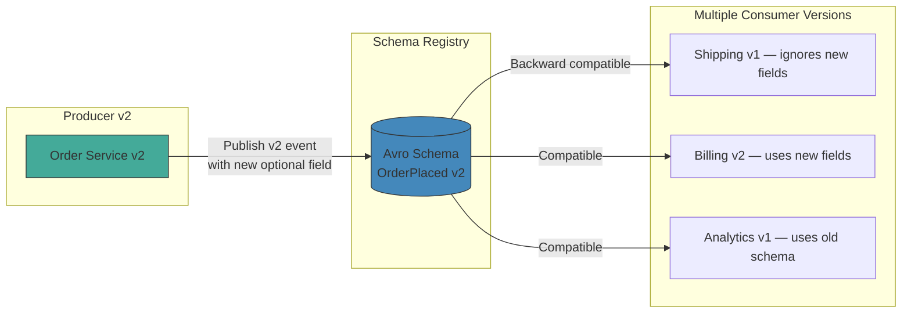
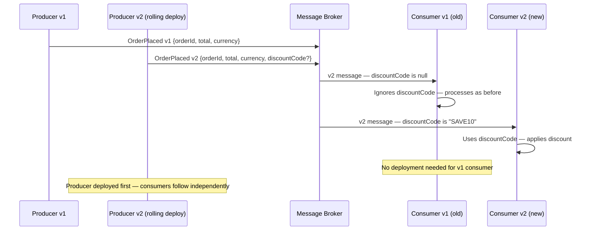
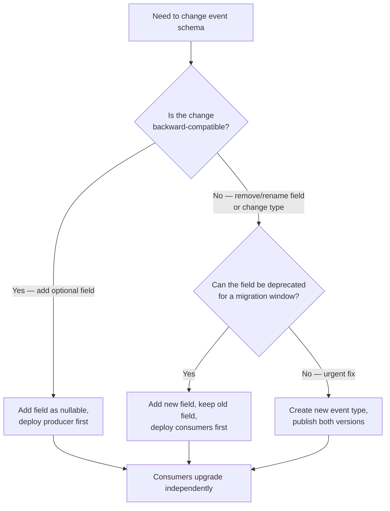

> [!success] Mastery Check
> - [ ] **Studied Well**
> - [ ] **Can explain the concept without notes**
> - [ ] **Can answer interview questions confidently**
> - [ ] **Can implement it in a real project**

## Navigation

**Domain:** [[7 — System Design & Distributed Systems]] > **Group:** Integration Patterns
**Previous:** [[7.152 — Poison Message Handling]] | **Next:** [[7.154 — Dead Letter Queue — Processing Strategies]]

### Prerequisites
- [[7.142 — Event-Driven Architecture — Overview]] — required because schema evolution is a direct consequence of the decoupled producer-consumer relationship in EDA
- [[6.105 — Contract Testing]] — the testing methodology that verifies schema changes are safe before deployment

### Where This Fits

Message schema evolution addresses the problem of changing event or message schemas over time without breaking consumers that may be deployed independently from the producer. In a distributed system with N producers and M consumers, a breaking schema change requires coordinated deployment across all services — the exact coupling that event-driven architecture is supposed to eliminate. A .NET engineer encounters this whenever a new feature requires adding a field to an event, changing an enum value, or restructuring data. Without a schema evolution strategy, every schema change becomes a project with deployment coordination across teams, defeating the decoupling purpose of EDA.

## Core Mental Model

Message schema evolution is the practice of designing message schemas and deployment processes so that producers and consumers can change at different times without breaking each other. The invariant this maintains is: a producer can be deployed before its consumers (or vice versa) without causing processing failures. The tradeoff is that schemas become more permissive (optional fields, versioned types) and the system can carry forward compatibility logic that accumulates over time. The recognition trigger is a deployment where the producer team must coordinate the rollout with every consumer team — a sign that schema evolution is not properly managed.

### Classification

Schema evolution is a contract management pattern that operates at the data interchange layer. It is not a messaging pattern (delivery, routing) nor a processing pattern (transformation, aggregation). It is closely related to API versioning but differs in that message consumers are typically asynchronous and cannot negotiate the schema at call time — they must handle whatever schema the producer sent. The strategies differ by serialization format: JSON with backward-compatible field rules, Avro with Schema Registry enforced compatibility, and Protobuf with field numbering and wire compatibility. The maturity of the strategy ranges from ad-hoc (team discipline only) to enforced (schema registry rejects breaking changes at publish time).





### Key Properties / Guarantees

|Property|Value|Condition|
|---|---|---|
|Producer-consumer decoupling|Schema changes do not require coordinated deployment|Changes are backward-compatible|
|Backward compatibility|New consumers read old messages|Schema additions are optional/defaulted|
|Forward compatibility|Old consumers read new messages|Schema additions are ignored by old consumers|
|Breaking change prevention|Schema registry enforces compatibility rules|Registry is configured with validation|
|Technical debt|Compatibility shims accumulate over time|Long-lived schemas with deprecated fields|
|Independent deployability|Producer and consumers deploy in any order|Full backward + forward compatibility|

## Deep Mechanics

### How It Works

**Step 1 — Schema is defined and shared.** The producer defines the message schema with explicit versioning. The schema is published to a schema registry (Azure Schema Registry, Confluent Schema Registry) or distributed as a shared package (NuGet). Consumers declare which schema version they support.

**Step 2 — Producer evolves schema.** When a new feature requires schema changes, the producer adds new fields as optional (nullable, with defaults) or creates a new event type version. The producer does not remove or rename existing fields — that would be a breaking change.

**Step 3 — Schema compatibility is validated.**
- **Backward compatibility:** new schema can read old data. Achieved by making new fields optional with defaults.
- **Forward compatibility:** old schema can read new data. Achieved by ignoring unknown fields during deserialization.
- **Full compatibility:** both directions. Required for independent deployability.

**Step 4 — Producer deploys first.** The producer deploys with the new schema. Existing consumers continue processing — they ignore unknown fields or use defaults for missing fields.

**Step 5 — Consumers upgrade independently.** Each consumer team deploys an update to use the new fields at their own pace. There is no deployment coordination window.

**Step 6 — Deprecation and cleanup.** When all consumers have migrated away from deprecated fields, the producer creates a new major schema version that removes deprecated fields. This is a breaking change and follows a formal migration process (publish both old and new versions for a transition window).

### Failure Modes

**Breaking change deployed without consumer awareness.** A producer removes a field or changes a required field's type. All consumers that depend on that field crash or produce incorrect results. **Detection:** consumer error rates spike after producer deployment. **Prevention:** enforce backward compatibility rules via a schema registry that rejects breaking changes at publish time. Use consumer-driven contract tests that consumers define and producers must pass.

**Consumer uses a deprecated field that was removed.** A producer deprecates a field, announces it will be removed, and eventually removes it. A consumer that was not updated crashes. **Detection:** consumer deserialization errors after producer cleanup deployment. **Prevention:** follow a deprecation policy: mark field as deprecated in schema (v1), keep it for N months (v1.1), remove it (v2). Log consumer accesses of deprecated fields so the producer knows which consumers need updating.

**Enums that grow (forward compatibility failure).** A producer adds a new enum value. An older consumer receives the value and cannot deserialize it. **Detection:** consumer deserialization errors for enum parsing. **Prevention:** use a string-based enum (not integer) and use a default case in the consumer's switch expression. Alternatively, use a protobuf-style enum with a known sentinel for unknown values.

**Multiple schema versions in the same topic.** When different producer instances are at different versions during a rolling deployment, both old and new schema versions appear in the same topic. Consumers that expect only one version may fail. **Detection:** intermittent consumer errors during producer deployments. **Prevention:** design consumers to handle multiple schema versions simultaneously, or use a schema evolution window where both formats are produced and consumed.

**Schema drift in shared library approach.** Two services reference the same NuGet package with the event schema. Team A updates the package and deploys their producer. Team B has not updated the package — their consumer still references the old version. If the new schema is not backward-compatible, Team B's consumer crashes. **Detection:** Team B's deployment pipeline passes (it uses the old package version), but production crashes. **Prevention:** use a schema registry that enforces compatibility regardless of NuGet package versions. Contract tests between services, not between package versions.

**Default value mismatch.** A producer adds a new optional field with a default (e.g., `IsPriority = false`). An older consumer that knows about the field but uses a different default (e.g., `IsPriority = true` for all messages) produces incorrect behavior. This is a semantic compatibility issue, not a structural one. **Detection:** business logic errors after schema change — the structure deserializes correctly but the meaning is wrong. **Prevention:** document default value semantics explicitly. Use contract tests that verify both structural and semantic compatibility.

### Schema Governance and Automated Enforcement

A schema governance framework ensures that schema evolution does not happen ad-hoc:

**Schema registry compatibility modes:**
- **None:** No compatibility checks. Every schema version is accepted. Maximum flexibility, maximum risk.
- **Backward:** New schema can read data written with the previous schema. New fields must have defaults. Removed fields are not allowed.
- **Forward:** Old schema can read data written with the new schema. Fields can be removed (old readers ignore unknown fields).
- **Full:** Both backward and forward compatibility. Requires both rules simultaneously.
- **Transitive:** Compatibility is checked against all previous schema versions, not just the immediate predecessor.

```csharp
// Registering a schema with backward compatibility in Azure Schema Registry
var schemaGroup = new SchemaGroup("order-service", SchemaType.Avro);
var schemaProps = await registry.CreateOrUpdateSchemaAsync(
    schemaGroup.Name,
    "OrderPlaced",
    new SchemaProperties
    {
        SerializationType = SerializationType.Avro,
        Compatibility = Compatibility.Backward  // Reject breaking changes
    },
    avroSchema,
    cancellationToken);

// CI pipeline check — validate schema compatibility before deployment
// Run as a step in the producer's CI pipeline
public async Task ValidateSchemaCompatibility(string schemaContent)
{
    var compatibility = await registry.GetSchemaCompatibilityAsync(
        "order-service", "OrderPlaced", schemaContent);
    if (compatibility.Status != CompatibilityStatus.Compatible)
        throw new SchemaViolationException(
            $"Schema change is not backward-compatible: {compatibility.Details}");
}
```

**Contract testing in CI/CD pipeline:**
- Producer CI runs consumer-driven contract tests (Pact) for every registered consumer
- If any consumer contract fails, the producer build fails
- The developer must either make the change backward-compatible or negotiate with the consumer team

### Handling Non-Breaking vs Breaking Changes in CI

A robust CI pipeline automatically determines whether a schema change is breaking and enforces the appropriate workflow:

```csharp
// CI pipeline schema validation step
public enum SchemaChangeSeverity { NonBreaking, PotentiallyBreaking, DefinitelyBreaking }

public class SchemaChangeAnalyzer
{
    private readonly ISchemaRegistry _registry;

    public async Task<SchemaChangeSeverity> AnalyzeChange(
        string subject, string newSchema, SerializationType type)
    {
        var compatibility = await _registry.TestCompatibilityAsync(
            subject, newSchema, type);

        if (compatibility.Status == CompatibilityStatus.Compatible)
            return SchemaChangeSeverity.NonBreaking;

        // Check if the incompatibility is forward-compatible (safe for producers)
        var forwardCompatibility = await _registry.TestForwardCompatibilityAsync(
            subject, newSchema, type);

        return forwardCompatibility.Status == CompatibilityStatus.Compatible
            ? SchemaChangeSeverity.PotentiallyBreaking
            : SchemaChangeSeverity.DefinitelyBreaking;
    }

    public async Task EnforceWorkflow(SchemaChangeSeverity severity, string prUrl)
    {
        switch (severity)
        {
            case SchemaChangeSeverity.NonBreaking:
                // Auto-approve: add schema change comment to PR
                await PostPrComment(prUrl, "✅ Schema change is non-breaking. Auto-approved.");
                break;

            case SchemaChangeSeverity.PotentiallyBreaking:
                // Flag for review: consumers may need updates
                await PostPrComment(prUrl,
                    "⚠️ Schema change may break consumers of older topics. " +
                    "Notify all consumer teams before deploying.");
                await NotifyConsumerTeams(subject);
                break;

            case SchemaChangeSeverity.DefinitelyBreaking:
                // Block PR: breaking changes require coordinator approval
                await PostPrComment(prUrl,
                    "❌ Breaking schema change detected. " +
                    "Create an RFC and get approval from the Schema Governance Committee.");
                await SetPrStatus(prUrl, "failure", "Breaking schema change");
                break;
        }
    }
}
```

### Time-To-Live (TTL) for Schema Versions

Schemas versions are not eternal. Old schema versions should have a defined lifecycle:

- **Active (0-30 days after deprecation):** Producers can use the old schema. Consumers must support both old and new. Schema is fully operational.
- **Grace (30-90 days after deprecation):** Producers are encouraged to migrate. Schema is still functional but logs warnings. Alerts fire if adoption does not increase.
- **Sunset (90-180 days after deprecation):** Producers must migrate. Old schema returns 400 errors. Emergency extensions granted via schema governance ticket.
- **Archived (180+ days after deprecation):** Old schema is removed from the registry. Messages with archived schemas are rejected at the producer level.

This TTL policy is configured per topic and can be overridden for sensitive schemas (e.g., financial compliance schemas may never be archived).

### Multi-Language Schema Management

In polyglot microservice architectures, schemas are consumed by services written in different languages. A C# producer publishes events that are consumed by Node.js, Python, and Java services. Schema evolution must work across all languages:

**Approach 1: Shared schema files (JSON Schema).** Define the schema in a language-neutral format (JSON Schema). Each service generates its own types from the schema file. Schema changes are made in the shared schema file, and all services regenerate their types.

```json
{
  "$schema": "https://json-schema.org/draft/2020-12/schema",
  "title": "OrderPlaced",
  "type": "object",
  "properties": {
    "orderId": { "type": "string" },
    "customerId": { "type": "string" },
    "totalAmount": { "type": "number" },
    "discountCode": { "type": "string" }
  },
  "required": ["orderId", "customerId", "totalAmount"]
}
```

**Approach 2: Schema registry with multiple serialization formats.** Azure Schema Registry supports Avro and JSON schemas. Producers and consumers use their language's SDK to serialize/deserialize against the registered schema. This works across .NET, Java, Python, and Node.js.

**Approach 3: Contract testing across languages.** Use Pact, which supports .NET, Java, JavaScript, Python, and Go. Each consumer (regardless of language) publishes its contract. The producer's CI runs all contracts and validates compatibility.

The key principle: schema evolution is a cross-language concern. Do not assume all consumers are .NET just because the producer is.

### Migration Strategies for Complex Changes

Some schema changes cannot be handled by simple optional fields. These require explicit migration strategies:

**Two-phase event publishing.** When introducing a new event type or radically different schema, the producer publishes both the old and new event versions simultaneously for a migration window. Consumers migrate to the new version at their own pace. When all consumers have migrated, the old version is retired.

```csharp
// Two-phase event publishing during migration
public sealed class OrderPlacedPublisher
{
    private readonly IPublishEndpoint _publisher;

    public async Task PublishOrderPlaced(Order order, CancellationToken ct)
    {
        // Phase 1: Publish both versions during migration window
        await _publisher.Publish<Orders.Events.v1.OrderPlaced>(new(
            order.Id, order.CustomerId, order.TotalAmount, order.Currency
        ), ct);

        await _publisher.Publish<Orders.Events.v2.OrderPlaced>(new(
            order.Id, order.CustomerId, order.TotalAmount, order.Currency,
            order.DiscountCode,
            order.Lines?.Select(l => new OrderLine(l.ProductId, l.Quantity)).ToList()
        ), ct);
    }
}
```

**Schema migration by event type splitting.** A single large event is split into multiple smaller, focused events. Each consumer subscribes to the events it needs.

```csharp
// Before: Single fat event
public sealed record OrderPlaced(
    string OrderId, string CustomerId, decimal Total,
    string ShippingAddress, string BillingAddress,
    string PaymentMethod, string PaymentToken,
    IReadOnlyList<OrderLine> Lines,
    string PromotionCode, decimal DiscountAmount);

// After: Split into focused events
public sealed record OrderSubmitted(string OrderId, string CustomerId, decimal Total);
public sealed record OrderPaymentAuthorized(string OrderId, string PaymentMethod, decimal Amount);
public sealed record OrderShippingDetails(string OrderId, string ShippingAddress);
public sealed record OrderPromotions(string OrderId, string? PromotionCode, decimal DiscountAmount);
```

**Schema migration by event enrichment.** An event schema is extended by adding a `Payload` field that contains a flexible JSON object. New fields are added to the `Payload` rather than to the event's top-level schema. This avoids schema registry issues for rapidly changing fields but sacrifices type safety.

```csharp
// Enrichment pattern — flexible payload for rapidly changing fields
public sealed record OrderPlaced(
    string OrderId,
    string CustomerId,
    decimal TotalAmount,
    JsonDocument Extensions);

// Consumer reads extensions
var region = context.Message.Extensions?.RootElement
    .TryGetProperty("processingRegion", out var regionElement) == true
    ? regionElement.GetString()
    : "default";
```

### Schema Evolution Strategy Decision Matrix

| Change Type | Backward Compatible? | Strategy |
|---|---|---|
| Add optional field | Yes | Deploy producer first |
| Add required field | No — use optional instead | Make optional, validate in consumer |
| Remove field | No — deprecate first | Deprecate for N months, then remove |
| Rename field | No — use both | Add new field, deprecate old, keep both |
| Change field type | No — add new field | Add new field with new type, deprecate old |
| Add enum value | No — use Unknown sentinel | Add sentinel, consumers handle Unknown |
| Remove enum value | No — mark as deprecated | Keep value but mark deprecated |
| Split field (e.g., FullName → First + Last) | No — use both | Add new fields, deprecate old, keep both |
| Merge fields (e.g., First + Last → FullName) | No — use both | Add new field, deprecate old, keep both |

### .NET and Azure Integration

- **Azure Schema Registry with Avro:** stores Avro schemas and enforces compatibility rules (backward, forward, full, none). Producers publish messages with schema ID; consumers fetch the schema ID to deserialize.
- **System.Text.Json:** the default .NET serializer. By default, unknown fields are ignored (`JsonSerializerOptions.DefaultIgnoreCondition`). New fields added as nullable or with defaults are backward-compatible.
- **MassTransit + Newtonsoft.Json:** the default serializer. Unknown fields are ignored by default. New fields with default values are backward-compatible.
- **Contract Testing (Pact, MassTransit Contract):** consumer-driven contract tests verify that a producer's schema change does not break any consumer before the producer deploys.
- **Azure Event Hubs with Schema Registry:** similar to Service Bus — events carry schema ID in the application properties. Consumers fetch the schema by ID for deserialization.

```csharp
// Backward-compatible schema evolution — version 1 to version 2

// v1 — original schema
public sealed record OrderPlacedV1(
    string OrderId,
    string CustomerId,
    decimal TotalAmount);

// v2 — new field added as optional (nullable)
public sealed record OrderPlacedV2(
    string OrderId,
    string CustomerId,
    decimal TotalAmount,
    string? DiscountCode,           // new: optional, backward-compatible
    IReadOnlyList<OrderItem>? Items // new: optional, backward-compatible
)
{
    // Default for serialization when field is missing
    public IReadOnlyList<OrderItem> Items { get; init; } = Array.Empty<OrderItem>();
}

// Consumer v1 — ignores new fields, processes as before
public sealed class LegacyConsumer : IConsumer<OrderPlacedV2>
{
    // System.Text.Json ignores unknown fields by default (new in .NET 8)
    // The consumer only uses OrderId, CustomerId, TotalAmount
    // DiscountCode and Items are deserialized but ignored
    public async Task Consume(ConsumeContext<OrderPlacedV2> context)
    {
        var msg = context.Message;
        await ProcessOrderAsync(msg.OrderId, msg.CustomerId, msg.TotalAmount);
    }
}

// Consumer v2 — uses new fields
public sealed class NewConsumer : IConsumer<OrderPlacedV2>
{
    public async Task Consume(ConsumeContext<OrderPlacedV2> context)
    {
        var msg = context.Message;
        var discount = msg.DiscountCode ?? "No discount";
        var itemCount = msg.Items?.Count ?? 0;
        await ProcessOrderWithDiscountAsync(
            msg.OrderId, msg.TotalAmount, discount, itemCount);
    }
}
```

## Production Patterns and Implementation

### Primary Implementation

The canonical schema evolution strategy in .NET uses backward-compatible JSON schemas with optional fields and contract testing.

```csharp
// Event versioning strategy — namespaced event types per version

// Namespace: Events.v1
namespace Orders.Events.v1;

public sealed record OrderPlaced(
    string OrderId,
    string CustomerId,
    decimal TotalAmount,
    string Currency);

// Namespace: Events.v2 — extends v1 with new fields
namespace Orders.Events.v2;

public sealed record OrderPlaced(
    string OrderId,
    string CustomerId,
    decimal TotalAmount,
    string Currency,
    string? DiscountCode,         // new, optional
    IReadOnlyList<OrderLine>? Lines); // new, optional

// Producer — publishes v2 event
public async Task PublishOrderPlaced(Order order, CancellationToken ct)
{
    await _publisher.Publish<Orders.Events.v2.OrderPlaced>(
        new(order.Id, order.CustomerId, order.TotalAmount,
            order.Currency, order.DiscountCode,
            order.Lines.Select(l => new OrderLine(l.ProductId, l.Quantity)).ToList()),
        ct);
}

// Consumer — handles both v1 and v2 via separate consumers
public sealed class OrderConsumer :
    IConsumer<Orders.Events.v1.OrderPlaced>,
    IConsumer<Orders.Events.v2.OrderPlaced>
{
    public async Task Consume(ConsumeContext<Orders.Events.v1.OrderPlaced> context)
    {
        await HandleOrderPlaced(
            context.Message.OrderId,
            context.Message.TotalAmount,
            discountCode: null,
            context.CancellationToken);
    }

    public async Task Consume(ConsumeContext<Orders.Events.v2.OrderPlaced> context)
    {
        await HandleOrderPlaced(
            context.Message.OrderId,
            context.Message.TotalAmount,
            context.Message.DiscountCode,
            context.CancellationToken);
    }
}
```

### Configuration and Wiring

```csharp
// Program.cs — configure JSON to ignore unknown fields
builder.Services.Configure<JsonSerializerOptions>(options =>
{
    options.PropertyNameCaseInsensitive = true;
    options.DefaultIgnoreCondition = JsonIgnoreCondition.WhenWritingNull;
    options.UnmappedMemberHandling = JsonUnmappedMemberHandling.Skip;
});

// Azure Schema Registry registration
builder.Services.AddSingleton(s =>
{
    var registry = new SchemaRegistryClient(
        builder.Configuration["Azure:SchemaRegistry:FullyQualifiedNamespace"],
        new DefaultAzureCredential());
    return registry;
});

// MassTransit — configure serializer for backward compatibility
builder.Services.AddMassTransit(x =>
{
    x.UsingAzureServiceBus((context, cfg) =>
    {
        cfg.UseNewtonsoftJsonSerializer(); // or UseSystemTextJson for .NET 8+
        cfg.ConfigureJsonSerializerOptions(options =>
        {
            options.DefaultIgnoreCondition = JsonIgnoreCondition.WhenWritingNull;
            options.PropertyNamingPolicy = JsonNamingPolicy.CamelCase;
            return options;
        });
    });
});
```

### Common Variants

**Avro with Schema Registry.** Producer registers the schema with Azure Schema Registry, gets a schema ID, and includes the ID in the message. Consumer fetches the schema by ID for deserialization. Compatibility rules (backward, forward, full) are enforced by the registry.

```csharp
// Avro schema registration
var schemaContent = @"{
  ""type"": ""record"",
  ""name"": ""OrderPlaced"",
  ""namespace"": ""Orders.Events"",
  ""fields"": [
    { ""name"": ""OrderId"", ""type"": ""string"" },
    { ""name"": ""CustomerId"", ""type"": ""string"" },
    { ""name"": ""TotalAmount"", ""type"": ""double"" },
    { ""name"": ""DiscountCode"", ""type"": [""null"", ""string""], ""default"": null }
  ]
}";

await registry.RegisterSchemaAsync(
    groupName: "order-service",
    schemaName: "OrderPlaced",
    schemaContent,
    schemaType: SchemaType.Avro,
    cancellationToken);
```

**Protobuf with field numbering.** Protobuf's wire format uses field numbers, not field names. Adding a new field with a new number is wire-compatible. Removing a field reserves its number to prevent reuse. Protobuf is the most forward-compatible format because unknown field numbers are preserved during deserialization.

```protobuf
syntax = "proto3";
message OrderPlaced {
    string order_id = 1;
    string customer_id = 2;
    double total_amount = 3;
    string currency = 4;
    optional string discount_code = 5;  // added later, wire-compatible
    repeated OrderLine lines = 6;       // added later, wire-compatible
}
```

**Versioned event type names.** The event type includes a version suffix: `order.placed.v1`, `order.placed.v2`. The version is part of the routing so that consumers subscribe to specific versions. The producer publishes both versions during a migration window.

```csharp
// Versioned event type names
public const string EventTypeV1 = "order.placed.v1";
public const string EventTypeV2 = "order.placed.v2";

// Producer publishes both during migration
await _publisher.Publish(new OrderPlacedV1(...), ctx =>
{
    ctx.SetEventType(EventTypeV1);
}, ct);

await _publisher.Publish(new OrderPlacedV2(...), ctx =>
{
    ctx.SetEventType(EventTypeV2);
}, ct);
```

**Contract testing pipeline.** Consumer-driven contract tests (Pact) that run in CI on every producer schema change. The test verifies that all registered consumers can still deserialize the new schema.

### Real-World .NET Ecosystem Example

**MassTransit with `UseMessageRetry` and `UseNewtonsoftJson`** handles backward-compatible changes by default — unknown properties in JSON are ignored. The framework also supports `MessageType` versioning where a consumer can implement multiple `IConsumer<T>` interfaces for different versions of the same logical event. Azure Schema Registry integration with Avro provides enforcement of compatibility rules at publish time, preventing accidental breaking changes before they reach production. Many organizations combine both: JSON for human-readable event schemas with contract testing, and Avro/Schema Registry for high-volume critical events where schema governance is required.

## Gotchas and Production Pitfalls

### Non-Nullable New Field (Breaking Change)

**Pitfall:** Adding a new field as non-nullable (required) to an existing schema.

```csharp
// ❌ Breaking change — new required field
public sealed record OrderPlaced(
    string OrderId,
    string CustomerId,
    decimal TotalAmount,
    string DiscountCode); // required! Old consumers crash on deserialization
```

**Symptom:** Old consumers throw `JsonException` or `NullReferenceException` when they receive the new message — the field is missing in their message but declared as non-nullable.

**Fix:** Always add new fields as nullable with a default value.

```csharp
// ✅ Backward-compatible
public sealed record OrderPlaced(
    string OrderId,
    string CustomerId,
    decimal TotalAmount,
    string? DiscountCode); // optional — old consumers use null
```

**Cost of not fixing:** All consumers that have not deployed the new schema crash immediately after the producer deploys. Emergency rollback required.

### Enum Forward Compatibility Ignored

**Pitfall:** Using a closed enum type that cannot handle unknown values.

```csharp
// ❌ Closed enum — adding a new value breaks old consumers
public enum OrderStatus { Placed, Shipped, Delivered }
// Later adding: Cancelled, Refunded, OnHold
```

**Symptom:** An old consumer receives a message with `OrderStatus.Cancelled` and throws `JsonException` or `ArgumentOutOfRangeException` because the enum has no matching value.

**Fix:** Use a string-backed enum with a default/unknown case, or use `JsonStringEnumConverter` with `AllowIntegerValues` for forward compatibility.

```csharp
// ✅ Forward-compatible — unknown values map to a sentinel
[JsonConverter(typeof(JsonStringEnumConverter))]
public enum OrderStatus
{
    Unknown = 0,  // sentinel for unknown values
    Placed = 1,
    Shipped = 2,
    Delivered = 3,
    Cancelled = 4,
    Refunded = 5
}
```

**Cost of not fixing:** Enum deserialization failures cause poison messages. Each new enum value requires a coordinated deployment across all consumers — the same coupling the system was designed to avoid.

### Field Rename Treated as Delete + Add

**Pitfall:** Renaming a field (which is functionally a delete of the old field and add of a new one).

```csharp
// ❌ Rename is a breaking change
// Old: CustomerName → New: CustomerFullName
public sealed record OrderPlaced(
    string CustomerFullName); // old consumers look for "CustomerName"
```

**Symptom:** Old consumers receive a message without `CustomerName` (it was renamed) and with `CustomerFullName` (which they ignore). The `CustomerName` field is null, causing downstream errors.

**Fix:** Do not rename fields. If the name must change, add a new field and deprecate the old one. Keep both during a migration window.

```csharp
// ✅ Deprecation path
public sealed record OrderPlaced(
    [property: Obsolete("Use CustomerFullName instead")]
    string? CustomerName,        // kept for backward compat
    string CustomerFullName);    // new field
```

**Cost of not fixing:** Silent data corruption — old consumers read null as the customer name, and downstream systems create orders for "null" customers.

### No Deprecation Policy or Timeline

**Pitfall:** Removing fields without a deprecation notice.

```csharp
// ❌ Field removed — no deprecation, no notice
// v1 had: string LegacyField
// v2: removed — consumers crash
```

**Symptom:** A consumer that was not updated (because no one told the team) crashes weeks after the producer removed the field.

**Fix:** Establish a deprecation policy: deprecate in v1.1 (keep field, add `[Obsolete]`), remove in v2.0 (after N months). Log consumers that still access the deprecated field. Announce the deprecation timeline to all consumer teams.

**Cost of not fixing:** Consumer teams are blindsided by breaking changes. Trust in the event contract erodes. Teams start requesting synchronous APIs instead of events because "events break without warning."

### JSON Case Sensitivity Mismatch

**Pitfall:** Producer uses `camelCase` JSON property names, but consumer expects `PascalCase` (or vice versa), and the serializer configuration is inconsistent.

```csharp
// ❌ Producer sends: { "orderId": "123" }
// Consumer expects: OrderId
// If PropertyNameCaseInsensitive is not set, the consumer gets null for OrderId
builder.Services.Configure<JsonSerializerOptions>(options =>
{
    // options.PropertyNameCaseInsensitive = false (DEFAULT!)
});
```

**Symptom:** All fields are null on the consumer side even though the producer sends valid JSON.

**Fix:** Always set `PropertyNameCaseInsensitive = true` on both sides, or agree on a naming convention and configure it consistently.

**Cost of not fixing:** Mysterious "all fields null" bugs that are hard to trace because the JSON looks correct in logs.

### Multiple Schema Versions During Rolling Deployment

**Pitfall:** During a rolling deployment, some producer instances are on v1 and some on v2. Consumers receive both schema versions. A consumer that expects only v2 crashes on v1 messages (missing required fields) or v1 messages (extra unknown fields cause issues).

**Symptom:** Intermittent consumer failures during producer deployments. The error rate correlates with the percentage of new producer instances.

**Fix:** Design consumers to handle both schema versions simultaneously. Or use a two-phase deployment: first deploy consumers to handle the new format (without using new fields), then deploy producers with the new format, then deploy consumers to use new fields.

**Cost of not fixing:** Deployment windows become stressful coordination events. Teams avoid schema changes because the deployment is risky.

### Polymorphic Type Serialization Breaks on Version Change

**Pitfall:** The event schema uses polymorphic serialization (e.g., a base `OrderEvent` type with derived `OrderCreated`, `OrderShipped` subtypes). Adding a new derived type causes deserialization failures on older consumers that do not know about the new type.

```csharp
// ❌ New derived type breaks old consumers
[JsonDerivedType(typeof(OrderCreated), typeDiscriminator: "created")]
[JsonDerivedType(typeof(OrderShipped), typeDiscriminator: "shipped")]
// v2 adds: [JsonDerivedType(typeof(OrderCancelled), typeDiscriminator: "cancelled")]
public abstract record OrderEvent;
```

**Symptom:** Old consumers throw `JsonException` or `NotSupportedException` when they encounter the new discriminator value. The message is dead-lettered.

**Fix:** Use a base event type with a string `EventType` property instead of polymorphic serialization. Consumers use a switch expression to handle known event types and ignore unknown ones.

```csharp
// ✅ Non-polymorphic — unknown types are handled gracefully
public sealed record OrderEvent(
    string EventType,     // "created", "shipped", "cancelled", ...
    string OrderId,
    DateTimeOffset Timestamp,
    JsonElement Payload); // typed per event type

// Consumer handles unknown types gracefully
public async Task Consume(ConsumeContext<OrderEvent> context)
{
    switch (context.Message.EventType)
    {
        case "created": await HandleCreated(context); break;
        case "shipped": await HandleShipped(context); break;
        // Unknown types are logged and ignored — not dead-lettered
        default:
            _logger.LogInformation("Unknown event type: {Type}", context.Message.EventType);
            break;
    }
}
```

**Cost of not fixing:** Every new event type requires all consumers to deploy a new version. The polymorphic serialization couples event type definitions across all services.

### Schema Registry Unavailability

**Pitfall:** The schema registry goes down. Producers cannot register new schemas. Consumers cannot fetch schemas for deserialization. Message processing stops entirely.

**Symptom:** Producer publish failures and consumer deserialization failures. All message processing is blocked.

**Fix:** Cache schemas locally on both producers and consumers with a fallback to the cached version if the registry is unavailable. Use a local copy of the schema with a version timestamp, and only contact the registry for new versions.

**Cost of not fixing:** The schema registry becomes a single point of failure for the entire event-driven system.

### Version Metadata Not Propagated to Consumers

**Pitfall:** The producer includes a schema version identifier in the message header, but the consumer does not check it. When a new schema version is published, the consumer blindly deserializes with the old schema and fails.

```csharp
// ❌ Consumer ignores schema version header
public async Task Consume(ConsumeContext<OrderPlaced> context)
{
    // Does not check context.Headers for schema version
    // Assumes the message is always the expected version
    await ProcessOrder(context.Message);
}
```

**Symptom:** Intermittent deserialization errors when the producer's schema version changes. The consumer cannot distinguish between a v1 message and a v2 message because it never checked.

**Fix:** The consumer should check the schema version header and route to the appropriate deserialization logic. Alternatively, the schema version should be embedded in the message type routing (different event types for different versions).

```csharp
// ✅ Consumer checks schema version
public async Task Consume(ConsumeContext<OrderPlaced> context)
{
    var schemaVersion = context.Headers.Get<string>("Schema-Version") ?? "v1";
    switch (schemaVersion)
    {
        case "v1":
            await ProcessOrderV1(context);
            break;
        case "v2":
            await ProcessOrderV2(context);
            break;
        default:
            _logger.LogWarning("Unknown schema version: {Version}", schemaVersion);
            throw new UnsupportedSchemaVersionException(schemaVersion);
    }
}
```

**Cost of not fixing:** The consumer silently processes messages with the wrong schema — field values may be null, misinterpreted, or missing, causing data corruption.

### Event Type Name Collision After Refactoring

**Pitfall:** A producer team refactors their event namespace and renames the event type from `Orders.Events.OrderPlaced` to `OrderProcessing.Events.OrderPlaced`. The broker treats them as different event types. Consumers subscribed to the old event type stop receiving messages.

```csharp
// ❌ Namespace change breaks consumer subscriptions
// Producer publishes to new namespace:
await _publisher.Publish<OrderProcessing.Events.OrderPlaced>(msg, ct);
// Consumer expects: Orders.Events.OrderPlaced — never receives
```

**Symptom:** Consumers show zero message count after the producer deployment. Messages are being published to a different event type name. No errors are logged — subscribers just never fire.

**Fix:** Never change the event type name (including namespace) for the same logical event. If the namespace must change, publish to both old and new event types during a migration window. Use a constant event type string that is independent of the C# namespace.

```csharp
// ✅ Explicit event type name independent of namespace
public const string OrderPlacedEventType = "order.placed";

await _publisher.Publish(new OrderPlacedMessage(...), ctx =>
{
    ctx.SetEventType(OrderPlacedEventType);
}, ct);
```

**Cost of not fixing:** Silent message loss. Consumers appear healthy (they are running, connected to the broker) but never receive messages because they subscribed to a different event type name.

### Schema Version Pin During Deployment

**Pitfall:** During a rolling deployment, some producer instances are on schema v1 and some on v2. Both publish events. Consumers that expect only the version they know about may fail on the other version — but in a specific way: if a consumer was deployed before the producer rollout, it may pin to v1 and fail on v2 messages from already-upgraded producer instances.

**Symptom:** Transient consumer errors during the producer rollout window. The error rate correlates with the percentage of upgraded producer instances.

**Fix:** Use a deployment sequence: (1) Deploy consumers with the ability to handle both v1 and v2 (without using v2 fields), (2) Deploy producers with v2 schema, (3) Deploy consumers to use v2 fields. This is the safe, zero-downtime deployment order.

**Cost of not fixing:** Each deployment window has a "danger zone" where messages from upgraded producers crash not-yet-upgraded consumers. Teams avoid schema changes because deployments are risky.

### Semantic Incompatibility Despite Structural Compatibility

**Pitfall:** A producer adds a new optional field `IsPriority` with a default of `false`. An older consumer that is aware of the field interprets `null` (because it uses an old version of the schema where the field was not present) differently than `false`. For example, the consumer treats `null` as "unknown" and escalates all orders for manual review, causing a processing backlog.

**Symptom:** After the producer deployment, the consumer starts escalating all orders for manual review. The producer's schema change is structurally compatible (field is optional), but the semantic interpretation differs between old and new consumers.

**Fix:** Document default value semantics explicitly in the schema contract. When adding a new field, specify what the default means: "If `IsPriority` is absent or null, treat it as `false` (not priority)." Use contract tests that verify both structural and semantic compatibility.

**Cost of not fixing:** Business logic errors that are hard to trace because the schema deserializes correctly — the error is in the behavior, not in the data format.

## Tradeoffs and Decision Framework

### Tradeoff Matrix

| Dimension | Backward-Compatible JSON | Avro Schema Registry | Protobuf |
|---|---|---|---|
| Compatibility enforcement | Manual — team discipline | Automatic — registry rejects breaks | Automatic — wire format preserves unknown fields |
| Serialization size | Large (field names in JSON) | Compact (no field names) | Most compact |
| .NET integration | Native (System.Text.Json) | Azure Schema Registry SDK | Google.Protobuf NuGet |
| Human readability | Excellent | Poor (binary) | Poor (binary) |
| Schema evolution complexity | Low — optional fields | Medium — registry rules, schema IDs | Low — field numbers |
| Tooling maturity | High — any JSON tool | Medium — registry infrastructure required | High — protoc compiler |
| Infrastructure cost | None | Schema Registry service | None (schema file only) |

### When to Apply



### When NOT to Apply

- [ ] The system has a single consumer and producer — schema evolution coordination is a simple deployment order
- [ ] The schema is private to a single service (not shared across service boundaries) — no decoupling needed
- [ ] The team uses a shared library that both producer and consumer reference and deploy together — versioning is handled by the library NuGet version
- [ ] The event volume is so low that manual coordination is cheaper than the schema evolution infrastructure
- [ ] The system uses synchronous communication (HTTP/gRPC) where consumers can negotiate schema version at call time — API versioning is more appropriate

### Scale Thresholds

- **Worth considering when 2+ consumers depend on the same event type** — schema evolution becomes a coordination problem
- **Required when 5+ consumers depend on the same event type** — coordinating deployment across 5 teams is impractical without backward compatibility guarantees
- **Required when consumers are owned by different teams** — independent deployability is the primary benefit of schema evolution
- **Overkill for internal-only events with a single consumer** — a simple deployment order (consumer first, producer second) is sufficient
- **Schema registry worth considering when event volume exceeds 10,000 msg/s** — at this volume, manual schema governance does not scale

### Organizational Prerequisites for Schema Evolution

Schema evolution is not just a technical pattern — it requires organizational maturity:

**Shared schema ownership.** Multiple teams must have ownership and visibility into the schema. If one team "owns" the schema and makes changes without consulting others, schema evolution fails regardless of technical infrastructure. Set up a schema working group or use CODEOWNERS to require cross-team approval.

**Consumer discovery.** The producer must know who its consumers are. Without consumer discovery, breaking changes are inevitable because the producer does not know who to notify. Use a schema registry that tracks subscriptions, or maintain a consumer registry in the service catalog.

**Deprecation policy.** The organization must agree on deprecation timelines. Without a policy, deprecated fields persist forever (accumulating technical debt) or are removed prematurely (breaking consumers). A typical policy: deprecate with 6 months' notice, remove after 6 months, with a 1-month grace period for emergency extensions.

**Backward compatibility training.** Developers must understand that "add a field" is not always backward-compatible. Train the team on the specific rules: nullable for optional, never remove, never rename, never change type. Add CI checks to enforce these rules automatically.

**Communication channels.** When a breaking change is necessary (it happens — fixing a type error, removing a field that was accidentally added), the producer must have a way to reach all consumer teams. A mailing list, Slack channel, or RFC process ensures that consumer teams have time to update before the change hits production.

Without these organizational prerequisites, even the best technical schema evolution strategy (Avro registry, contract tests, optional fields) will fail because the social coordination breaks down.

## Interview Arsenal

### Question Bank

1. What is message schema evolution and why is it important in event-driven architectures?
2. Walk through the process of adding a new optional field to an event type.
3. What is the tradeoff between backward compatibility and forward compatibility?
4. How do you handle enum evolution in message schemas?
5. Compare backward-compatible JSON evolution vs Avro Schema Registry enforcement.
6. Design a schema evolution strategy for an event used by 10 consumers across 5 teams.
7. How does a schema registry prevent breaking changes?
8. What is the relationship between consumer-driven contract tests and schema evolution?
9. How do you handle a field rename in an event schema?
10. What happens when a producer deploys a new schema version while consumers are still on the old version?

### Spoken Answers

**Q: How do you evolve a message schema without breaking existing consumers?**

> **Average answer:** Add new fields as optional, never remove fields, and version your events. Consumers that do not know about new fields will ignore them.

> **Great answer:** The goal of schema evolution is to allow producers and consumers to deploy independently — a producer adds a field to an event without requiring every consumer to deploy simultaneously. The fundamental rule is: every schema change must be backward-compatible. Backward compatibility means a consumer written for the old schema can process a message with the new schema without errors.

In practice, this means: new fields are always optional — nullable with a default value. Fields are never removed — they are deprecated and kept in the schema, with a documented removal timeline (typically 6 months). Field types are never changed in place — add a new field instead. Enums are string-backed with an "Unknown" sentinel value.

In JSON with System.Text.Json, backward compatibility is the default: `JsonSerializerOptions` ignores unknown properties by default. Adding a `string?` field to a record does not break existing consumers — the field will be null for them, and they ignore it.

For stricter enforcement, I use Azure Schema Registry with Avro. The registry stores the schema, and when a producer tries to register a new version, the registry validates it against the configured compatibility rule. Backward compatibility mode means the new schema must be able to read data written with the previous schema. This catches breaking changes at publish time, not at consumption time.

The deployment order also matters: for backward-compatible changes (adding an optional field), deploy the producer first, then consumers. For changes that are not backward-compatible (rare, but sometimes necessary — fixing a type error), create a new event type version (order.placed.v2) and publish both versions during a migration window. Consumers migrate to the new version at their own pace, and the old version is retired when no consumers use it.

**Q: How do you handle enum evolution?**

> **Great answer:** Enum evolution is the most common schema evolution trap because JSON serialization of enums fails when a value is unknown. The fix is two-part. First, the schema design: use string-based values, not integers, and always include an "Unknown" sentinel as the default. In C#, use `JsonStringEnumConverter` and define a zero-value Unknown member.

```csharp
[JsonConverter(typeof(JsonStringEnumConverter))]
public enum OrderStatus
{
    Unknown = 0,
    Placed = 1,
    Shipped = 2,
    Cancelled = 3
}
```

When a consumer deserializes an `OrderStatus` it does not know about — say a new status "OnHold" — the `JsonStringEnumConverter` can be configured to fall back to `Unknown` instead of throwing. This provides forward compatibility: old consumers gracefully handle new values by treating them as unknown.

Second, the consumer logic: the consumer checks for `Unknown` status and acts accordingly — perhaps by treating it as a safe default (e.g., "pending review") or by logging and skipping.

**Q: How do you handle a field rename in an event schema?**

> **Great answer:** Field renames are not backward-compatible. Renaming a field is functionally equivalent to removing the old field and adding a new one, which breaks consumers that reference the old field name. The proper approach is a multi-phase deprecation strategy.

Phase 1: Add the new field with the new name as optional, and keep the old field. Mark the old field as deprecated. Both fields contain the same value for new messages. This phase requires no deployment coordination — producers deploy first, consumers can migrate at any time.

Phase 2: Monitor which consumers are still reading the deprecated field. Force-migrate consumers that haven't updated after the deprecation window (typically 3-6 months).

Phase 3: Remove the deprecated field. This is a breaking change, so create a new event type version (e.g., v3) and publish both versions during a transition window. Consumers that moved to the new field subscribe to v3. Consumers still on the old field continue receiving v2 (with the deprecated field). When all consumers move off v2, stop publishing it.

The total timeline from rename announcement to old field removal is typically 6-9 months. This seems long, but that is the cost of maintaining independent deployability in a distributed system.

### System Design Interview Trigger

If an interviewer describes an event-driven system with multiple consumers and says "how do you add a new field to an event without breaking existing consumers?", they are testing whether you understand backward compatibility and independent deployability. The follow-up will be about more complex changes: "what if you need to rename a field?" or "what if you need to split one event into two?" — testing whether you know deprecation strategies and event type versioning. The most senior follow-up: "what if a consumer has a bug that produces incorrect results with the new field's default value?" — testing whether you think about semantic compatibility, not just structural compatibility.

### Comparison Table

| | JSON (Optional Fields) | Avro (Schema Registry) | Protobuf (Field Numbers) |
|---|---|---|---|
| Backward compat | Add field as nullable | Add field with default | Add field with new number |
| Forward compat | Ignore unknown properties | Reader schema resolves matches | Preserve unknown fields on wire |
| Enforcement | Manual (team discipline) | Automatic (registry rejects) | Manual (by convention) |
| Breaking change risk | Low with discipline | Lowest | Low with discipline |
| .NET tooling | System.Text.Json | Azure.SchemaRegistry | Google.Protobuf |
| Human readable | Yes | No (binary) | No (binary) |
| Schema storage | C# record definition | Azure Schema Registry | .proto file |
| Deserialization speed | Fast (reflection) | Fast (code-gen) | Fastest (pre-compiled) |
| Wire size | Large (field names) | Medium (no names) | Smallest (varint encoding) |

### Additional Spoken Answers

**Q: How does schema evolution affect event-carried state transfer events?**

> **Great answer:** Event-carried state transfer (ECST) events — "fat events" that carry the full state of an entity — are the most affected by schema evolution. A fat event like `CustomerUpdated` can have 30+ fields. Over time, as the customer domain evolves, these fields grow. The challenge is that ECST events are consumed by many services for different purposes. One service might need the `Email` field, another needs the `Address` fields, and a third needs the `Preferences` section.

> The schema evolution strategy for ECST events must be especially disciplined because the blast radius of a breaking change is enormous — every consumer of that event breaks. I use the following rules for ECST events:
> 1. Every field is optional (nullable). No required fields except the entity ID.
> 2. New fields are added with a `null` default. Consumers that don't need them ignore them.
> 3. Fields are never removed — they are deprecated with `[Obsolete]` and removed only after a migration window (6-12 months).
> 4. For significant domain changes, create a new event type (e.g., `CustomerUpdatedV2`) and publish both versions during migration.
> 5. The event carries a schema version number so consumers can detect which version they received and handle accordingly.

> The tradeoff is that ECST events become very large over time. A `CustomerUpdated` event with 5 years of evolution might have 50+ fields, 30 of which are deprecated. At some point, a major version bump is needed to clean up deprecated fields — but this is a breaking change that requires coordination across all consumers.

**Q: How do you verify that a schema change does not break consumers before deploying to production?**

> **Great answer:** I use consumer-driven contract tests (Pact) as the primary verification mechanism. Each consumer defines a contract that specifies the messages it expects to receive. The producer's CI pipeline runs all registered consumer contracts against the proposed schema change.

> The workflow is:
> 1. Consumer team publishes a contract: "I expect `OrderPlaced` events with these fields and these types."
> 2. Producer makes a schema change and pushes to CI.
> 3. CI runs all consumer contracts against the new schema.
> 4. If any contract fails, the producer build fails with a clear message: "You're about to break Consumer B. Either make the change backward-compatible or coordinate with Consumer B."
> 5. If all contracts pass, the producer can deploy safely.

> For teams that do not use Pact, a lighter-weight approach is to maintain a set of consumer-side deserialization tests. Each consumer publishes a test case: "Given this JSON message, deserialize it successfully." The producer runs these tests in CI. This catches breaking changes without the full Pact infrastructure.

> For Avro Schema Registry, the enforcement is automatic: the registry rejects breaking changes at publish time. The registry's compatibility mode (backward, forward, full) determines what counts as breaking. This is stricter than contract tests but requires registry infrastructure.

> The key principle: the verification must run in the producer's CI pipeline, before the producer deploys. A post-deployment check that finds consumer breakage is too late — the producer has already broken consumers in production.

## Architecture Decision Record

**Status:** Accepted

**Context:** A .NET event-driven system with 8 microservices uses a shared `OrderPlaced` event. Currently, the event schema is defined as a C# record in a shared NuGet package. Every time the schema changes, all 8 services must update the NuGet package and deploy — a coordination-heavy process that takes 2 weeks. The team needs to evolve the schema independently per service. The event volume is ~10,000 msg/s, and there are 12 consumers across 4 teams. Two of those teams are external (outsourced) and have irregular deployment cadences — sometimes going 3 months without deploying.

**Options Considered:**

1. **Backward-Compatible JSON with Optional Fields** — continue with JSON serialization. All new fields are optional (nullable). Consumers ignore unknown fields via `System.Text.Json` default behavior. No central schema enforcement.
2. **Avro with Azure Schema Registry** — migrate to Avro serialization with Azure Schema Registry. Compatibility rules enforced at publish time.
3. **Protobuf with Wire Compatibility** — migrate to Protobuf with field numbering. Wire format naturally supports forward/backward compatibility.
4. **Versioned Event Type Names** — create new event types for breaking changes (e.g., `order.placed.v1`, `order.placed.v2`) and have both published simultaneously.

**Decision:** Backward-Compatible JSON with Optional Fields, because it has zero infrastructure cost (no schema registry to deploy), integrates natively with System.Text.Json, and the team understands JSON evolution rules. The main risk — accidental breaking changes — is mitigated by consumer-driven contract tests (Pact) that run in CI on every schema change. For changes that cannot be backward-compatible (enum changes, field removals), use versioned event type names as the fallback strategy.

**Consequences:**
- ✅ Schema changes are a simple NuGet version bump — no registry infrastructure to manage
- ✅ JSON human-readability aids debugging — engineers can read events directly from the broker
- ✅ Contract tests catch breaking changes before they reach production
- ⚠️ No automatic enforcement — team discipline + contract tests are the only guardrails
- ⚠️ JSON is larger than Avro/Protobuf — at ~10,000 msg/s, the bandwidth difference matters (~2x vs Avro)
- ⚠️ External teams (outsourced) have caused several breaking changes — they do not run contract tests locally
- ❌ Schema evolution is ad-hoc — no central registry to discover available events and their schemas
- ❌ Deprecated fields accumulate — after 2 years, the event has 27 fields, 11 of which are deprecated

**Review Trigger:** Revisit this decision if the event volume exceeds 50,000 msg/s (at which point JSON size may matter) or if a breaking change accident reaches production (at which point automatic enforcement via schema registry is justified). Also revisit if the number of deprecated fields exceeds 50% of total fields — at that point, a major version cleanup is needed. Additionally, revisit if a new consumer team joins that cannot be trusted to follow the optional-field convention — the registry may become necessary for guardrails.

### Schema Evolution Migration Plan Template

For complex schema changes (field removals, type changes, event splits), follow this migration plan template:

```
1. **Announcement** (Month 0): Publish RFC describing the change, timeline, and migration guide.
2. **Dual-publish** (Month 0-6): Producer publishes both old and new event versions. Consumers subscribe to the new version and verify correctness.
3. **Verification** (Month 3-6): Log consumer accesses of deprecated fields. Contact consumers that still access deprecated fields.
4. **Deprecation** (Month 3-6): Mark old fields/events as deprecated. Log warnings for consumer teams that still use them.
5. **Removal** (Month 6): Stop publishing old event version. Remove deprecated fields from the schema.
6. **Post-removal monitoring** (Month 6-7): Monitor for any consumer that still tries to receive the old event version. Escalate to the consumer team.

Each step has an explicit go/no-go decision point. If consumers have not migrated by Month 6, extend the deadline or escalate.
```

## Self-Check

### Conceptual Questions

1. What is message schema evolution and what invariant does it maintain?
2. Derive the tradeoff between backward-compatible JSON and Avro Schema Registry.
3. Given a schema with 2 consumers, is a schema registry necessary?
4. What metric reveals that a schema change broke a consumer?
5. Name the Azure service that provides schema governance for event streams.
6. What is the structural distinction between backward compatibility and forward compatibility?
7. Below what number of consumers is manual coordination acceptable for schema changes?
8. [[7.142 — Event-Driven Architecture — Overview]] — how does schema evolution affect the decoupling that EDA provides?
9. What production consequence follows from adding a non-nullable field to an existing event schema?
10. Explain schema evolution to a product manager in 60 seconds.
11. How do you handle a field that must be renamed in an event schema used by 15 consumers?
12. What is the role of consumer-driven contract tests in schema evolution?
13. How does the choice between JSON, Avro, and Protobuf affect schema evolution strategy?
14. What is the difference between structural compatibility and semantic compatibility in schema evolution?
15. How do you handle the deprecation lifecycle of a shared schema component (e.g., an `Address` type used by 10 events)?

<details>
<summary>Answers</summary>

1. Message schema evolution allows producers and consumers to change their message schemas at different times without breaking each other. The invariant: a producer can be deployed before (or after) its consumers without causing processing failures due to schema mismatch.

2. JSON with optional fields is zero-infrastructure and human-readable but relies on team discipline for compatibility. Avro Schema Registry enforces compatibility automatically at publish time but adds infrastructure (registry servers) and reduces human-readability. The choice depends on team size: for small teams with good discipline, JSON is fine. For large teams or cross-team events, the registry pays for itself by preventing one accidental breaking change.

3. No — with 2 consumers, the team can coordinate deployment order (consumer first, then producer for backward-incompatible changes, or producer first for backward-compatible changes). However, if the two consumers are on different teams with different deployment cadences, a schema registry may still be worth it to avoid coordination friction.

4. Consumer deserialization error rate spike after a producer deployment. Look for `JsonException`, `ProtoException`, `NullReferenceException` in consumer logs correlated with producer deployment time. Also check consumer-side metrics: "messages received" vs "messages successfully processed" — if they diverge after a producer deploy, a schema change broke consumers.

5. Azure Schema Registry (part of Azure Event Hubs). Stores schemas in Avro/JSON, enforces compatibility rules (backward, forward, full, none).

6. Backward compatibility: new schema can read data written with old schema (new consumers can process old events). Forward compatibility: old schema can read data written with new schema (old consumers can process new events). For independent deployability, you need both directions — full compatibility.

7. Below 3 consumers — manual coordination (deploy consumers first, then producer for breaking changes) is simpler than formal schema evolution infrastructure. Above 5 consumers — schema evolution infrastructure (contract tests, optional fields, versioning policy) is required to avoid coordination overhead.

8. Without schema evolution, producers and consumers must deploy in lockstep — coupling their deployment timelines. Schema evolution restores the decoupling: the producer deploys when its feature is ready, consumers deploy when they are ready to use the new fields. Without schema evolution, EDA degenerates into synchronous coupling with async transport.

9. Old consumers crash with `JsonException` or `NullReferenceException` on receiving the new message format. Emergency rollback of the producer is required. If the rollback is not immediate, all consumers on the old schema are broken. This is the most common schema evolution incident in production.

10. "Schema evolution is like adding a new question to a customer survey. If the new question is optional, existing customers can still complete the survey without answering it, and their old survey results are still valid. As long as you never remove old questions and make new ones optional, you can update the survey without breaking the reporting system. A schema registry is like an editor that checks 'will removing this question break any existing reports?' before letting you publish the new version."

11. Field renames are not backward-compatible. The correct approach is a multi-phase deprecation: (1) Add the new field with the new name while keeping the old field, (2) Mark the old field as `[Obsolete]` and maintain both fields with the same value, (3) After all consumers have migrated (verified by monitoring deprecated field access), create a new event type version that removes the old field, and eventually stop publishing the old version. The total timeline should be 6-9 months.

12. Consumer-driven contract tests (Pact) define the producer-consumer contract from the consumer's perspective. Each consumer publishes a contract: "I expect events of type X with these specific fields." The producer's CI runs all contracts against any schema change. If a change breaks any consumer's contract, the producer's build fails. This prevents breaking changes from reaching production and forces the producer to either make the change backward-compatible or coordinate with affected consumers.

13. JSON with optional fields is the most flexible but requires team discipline — no automatic enforcement. Avro with Schema Registry provides automatic enforcement of compatibility rules at publish time — a breaking change is rejected before the producer can deploy. Protobuf is the most wire-efficient and its field numbering makes additions automatically wire-compatible, but it requires a separate compilation step and the `.proto` file management. The choice depends on the team's discipline level: low discipline → Avro registry, high discipline → JSON is simpler.

14. Structural compatibility means the message can be deserialized without errors — the right fields exist with the right types. Semantic compatibility means the deserialized message produces the correct business behavior. A structurally compatible change (adding an optional `IsPriority = false` field) can be semantically incompatible if the consumer interprets a missing field differently than intended. Both types of compatibility must be verified — structural by schema validation, semantic by contract tests and documentation.

15. Shared schema components must be versioned independently of the events that reference them. Change the shared component carefully: add fields as optional, never remove fields, and increment the component's version. All events that reference the component should use the component's version (e.g., `Address:v2`). When the component is updated, verify backward compatibility for all events that use it. Use schema registry's transitive compatibility mode to catch indirect breaks — a change to `Address` that breaks any event that includes `Address` should be rejected.

</details>

---

### Scenario Challenges

**Scenario 1 — Diagnose the problem**

After a producer deployment that added a `PreferredLanguage` field to the `OrderPlaced` event, the Billing consumer started throwing `NullReferenceException` for every message. The field was declared as `string` (not nullable).

<details>
<summary>Diagnosis</summary>

**Root cause:** The new `PreferredLanguage` field was non-nullable. When the Billing consumer received a message published by an older producer instance (during a rolling deployment, some producers were still on v1), the field was missing from the JSON, and System.Text.Json set it to null. The consumer code accessed this field without a null check.

**Evidence:** Rolling deployment was in progress. Some messages had `PreferredLanguage`, some did not. The Billing consumer's error rate correlated with the percentage of v2 producer instances.

**Fix:** Change `PreferredLanguage` to `string?` (nullable). Deploy the producer with the fix. The Billing consumer does not need to change — it will handle null values.

**Prevention:** Make all new fields nullable by default. Use a CI check that rejects records with non-nullable new fields in existing event types.

</details>

---

**Scenario 2 — Design decision**

You are designing the schema evolution strategy for an event used by 12 consumers across 4 teams. The event is a `PaymentProcessed` with 15 fields. Team A needs to add a `processingRegion` field. Team B is in the middle of a migration and cannot deploy for 2 months.

<details>
<summary>Decision and Reasoning</summary>

**Choice:** Add `processingRegion` as an optional `string?` field. Deploy the producer first (it publishes the new field). Consumers that do not know about the field ignore it. Team B deploys the field usage in 2 months when their migration is complete.

**Tradeoffs accepted:** The field will be published but unused for 2 months — minimal data overhead. This is the cost of independent deployability.

**Implementation:**

```csharp
public sealed record PaymentProcessed(
    string PaymentId,
    string OrderId,
    decimal Amount,
    string Currency,
    string Status,
    string? ProcessingRegion); // new — optional, Team B uses it later
```

</details>

---

**Scenario 3 — Failure mode** After removing a deprecated `LegacyCustomerId` field from the `CustomerUpdated` event (it was marked `[Obsolete]` for 8 months), the Analytics consumer started creating duplicate customer records.

<details>
<summary>Investigation and Fix</summary>

**Investigation steps:** 1) Check if the Analytics consumer was still using `LegacyCustomerId`. 2) Check the Analytics consumer's deployment log — when was it last deployed? 3) Check if the Analytics team was notified of the deprecation timeline.

**Confirming evidence:** The Analytics consumer was deployed 10 months ago and has not been updated. It uses `LegacyCustomerId` as the primary key for deduplication. Without this field, it treats every `CustomerUpdated` event as a new customer, creating duplicates.

**Immediate mitigation:** Roll back the producer to include `LegacyCustomerId` again (as nullable). Contact the Analytics team to update their consumer.

**Permanent fix:** Before removing a deprecated field, verify that no consumer still accesses it. This can be done by logging deprecated field access at the producer or by monitoring consumer logs. Establish a policy: "field removal requires confirmation from all consumer teams that they no longer use the field."

**Post-mortem item:** The deprecation was announced, but no follow-up was done to verify consumers had migrated. Add a verification step to the deprecation process.

</details>

---

**Scenario 4 — Scale it** Your event schema has evolved over 3 years and now has 35 fields. 15 of them are deprecated but kept for backward compatibility. The event is ~5 KB. At 10,000 msg/s with 5 consumers, the deprecated fields waste significant bandwidth.

<details>
<summary>Scaling Strategy</summary>

**Bottleneck this addresses:** 15 deprecated fields × 10,000 msg/s × 5 consumers = 750 KB/s of useless data transferred. Over a month, this adds ~2 TB of unnecessary bandwidth and storage.

**How it helps:** A major version bump (v2) that removes deprecated fields. This is a breaking change and follows a formal migration process.

**Implementation order:** 1) Publish a new event type `CustomerUpdatedV2` that removes all deprecated fields. 2) Run both `CustomerUpdatedV1` and `V2` for a migration period. 3) Consumer teams migrate to `V2` at their own pace. 4) When all consumers have migrated, stop publishing `V1`. 5) Monitor for any consumer that still receives `V1` and contact them.

**What it does not solve:** Consumers that take a long time to migrate delay the cost savings. The team must decide whether to enforce a migration deadline.

</details>

---

**Scenario 5 — Interview simulation** The interviewer says: "You have an OrderPlaced event with 10 fields used by 15 consumers. You need to split a `FullName` field into `FirstName` and `LastName`. How do you evolve the schema without breaking consumers?"

<details>
<summary>Model Response</summary>

"This is a breaking change — removing `FullName` and adding `FirstName`/`LastName` is functionally a field removal. I would handle it with a deprecation and migration window.

First, I add `FirstName` and `LastName` as new optional fields while keeping `FullName`. The event now has all three fields. I deprecate `FullName` with an `[Obsolete]` attribute and document that it will be removed in 6 months. Consumers that need the split names immediately can start using the new fields. Consumers that still need `FullName` continue using it.

During the migration window, I monitor which consumers still access `FullName`. I can track this at the producer level by logging when `FullName` is set (it's always set for backward compat) or at the broker level.

After 6 months (or when all consumers confirm migration), I create a new event type `OrderPlacedV2` that has only `FirstName` and `LastName`. I publish both `V1` (with `FullName`) and `V2` (with split names). Consumers that migrated to `V2` subscribe to it. Consumers still on `V1` continue receiving `FullName`.

Finally, when no consumers use `V1`, I stop publishing it. The total timeline: add new fields now, remove old field in 6-9 months.

The key principle is that I never remove a field without a migration window and verification that no consumer depends on it. This preserves the decoupling that EDA provides."

</details>

---

**Scenario 6 — Consumer-driven contract test catches breaking change** Team A (producer) adds a `Currency` field as non-nullable to the `PaymentProcessed` event. The Pact contract test for Team B's consumer catches it: Team B's consumer does not expect the `Currency` field. The CI pipeline fails the producer's build.

<details>
<summary>Resolution</summary>

**Discovery:** The Pact test runs in Team A's CI pipeline. It verifies that Team B's consumer (defined in a Pact contract file) can deserialize the new schema. The test fails because the contract expects the old schema without `Currency`.

**Fix:** Team A changes `Currency` to `string?` (nullable). The contract test passes — Team B's consumer ignores the new field. Team B adds `Currency` to their contract when they are ready to use it.

**Prevention:** Run consumer-driven contract tests in the producer's CI pipeline for every schema change. Do not allow schema changes that would break any registered consumer contract.

</details>

---

**Scenario 7 — Schema governance across regulatory compliance** An event schema contains a `CreditCardNumber` field. A new regulation requires that credit card numbers must be masked after 30 days. Old events in the broker still contain unmasked numbers. New events must have the field masked.

<details>
<summary>Decision and Reasoning</summary>

**Choice:** Create a new event schema version with `CreditCardNumber` replaced by `CreditCardLastFour` (string, last 4 digits only) and `CreditCardBrand` (string, enum-like). Both fields are required (they are always present in new events). The old `CreditCardNumber` field is deprecated and will be removed after 6 months.

**Compliance handling:** Old events in the broker that contain unmasked numbers are a compliance risk. Work with the compliance team to either delete old events (if retention policy allows) or migrate them to a compliant store (archive with access controls).

**Implementation:**

```csharp
public sealed record PaymentProcessedV2(
    string PaymentId,
    string OrderId,
    decimal Amount,
    string Currency,
    string CreditCardLastFour,   // replaces CreditCardNumber
    string CreditCardBrand,      // new — "Visa", "Mastercard", etc.
    string? CreditCardNumber     // deprecated — removed in V3
);
```

**Tradeoffs accepted:** Consumers that need the full credit card number (e.g., refund processing) must use a different secure API instead of reading it from the event. This is a necessary tradeoff for compliance.

</details>

---

**Scenario 8 — Backward-incompatible change deployed by accident** A developer adds a `CurrencyCode` field as `string` (non-nullable) to the `PaymentProcessed` event. The change passes code review because it "adds a field" — no one notices it's non-nullable. The producer deploys. All consumers crash.

<details>
<summary>Diagnosis and Fix</summary>

**Root cause:** The developer assumed that adding a field is always backward-compatible. They did not know that non-nullable reference types in C# records correspond to required JSON properties. The `string CurrencyCode` in a record means "this property is required for deserialization." Old consumers that receive messages without `CurrencyCode` (from old producer instances during rolling deployment) throw `JsonException`.

**Evidence:** Consumer error logs show `JsonException: The required property 'CurrencyCode' was not found in the JSON payload.` Correlates with producer deployment time window.

**Immediate mitigation:** Make `CurrencyCode` nullable (`string?`). Re-deploy the producer. Replay affected DLQ messages.

**Permanent fix:** Add a CI check that scans record definitions in event schemas and flags any new non-nullable reference type fields as potential breaking changes. Train the team that "add a field" ≠ "backward-compatible" when the field is non-nullable.

**Prevention:** Use a ROSLYN analyzer or a custom CI step that checks for newly added non-nullable properties in event record types.

```csharp
// CI check — detect non-nullable new fields in event types
public static bool IsBreakingChange(Type eventType, Type previousVersion)
{
    var newProperties = eventType.GetProperties()
        .Where(p => !previousVersion.GetProperties().Any(pp => pp.Name == p.Name));
    return newProperties.Any(p =>
    {
        var type = p.PropertyType;
        return type.IsValueType && Nullable.GetUnderlyingType(type) == null
            || type == typeof(string);  // string is a reference type but commonly used as required
    });
}
```

</details>

---

**Scenario 9 — Cross-team schema governance failure** Teams A, B, and C all produce events in the same namespace. Team A changes a shared event schema without notifying Teams B and C (who consume it). Team A's change removes a field that Team C's consumer depends on. Team C's consumer crashes 3 days later (after the rolling deployment completes).

<details>
<summary>Diagnosis and Fix</summary>

**Root cause:** No centralized schema governance. Each team independently modifies the shared event schema without cross-team review. Team A's PR was reviewed only by Team A members, who did not know that Team C depended on the removed field.

**Evidence:** Team C's consumer logs show `MissingFieldException` for a field that was in the event schema yesterday. The field is absent from the latest producer version.

**Immediate mitigation:** Team A reverts the schema change. Team C's consumer recovers. A cross-team meeting is scheduled to establish schema governance.

**Permanent fix:** Implement a schema governance board (or automated equivalent). All schema changes to shared events must be approved by at least one consumer team representative. The schema change is tracked in an RFC document with a migration plan.

**Prevention automatable:**
1. Add a CODEOWNERS entry for shared event schema files that requires approval from all consuming teams.
2. Use a schema registry that enforces compatibility rules — the field removal would be rejected by the registry under backward-compatibility mode.
3. Run consumer-driven contract tests in the producer's CI pipeline — Team C's contract would fail the build.

</details>

---

**Scenario 10 — Event schema with JSON $ref and polymorphism** The event schema uses `$ref` to reference shared schema components (e.g., `Address`, `Money`). Team A changes the `Address` schema by adding a `County` field. Team B's consumer crashes because its `Address` type (generated from the schema) does not have `County`.

<details>
<summary>Diagnosis and Fix</summary>

**Root cause:** The `Address` schema is shared across multiple event types. Team A assumed that since they own the event, they own all referenced types. They did not realize that `Address` is also used by Team B's events. Changing a shared schema component affects all events that reference it.

**Evidence:** Team B's consumer receives an `InvoiceGenerated` event that includes an `Address` with a `County` field. Team B's `Address` class (code-generated from the schema) does not have a `County` property — deserialization fails.

**Fix:** Revert the `County` field addition to `Address`. Create a new `ExtendedAddress` type for the events that need `County`. The old `Address` remains unchanged for existing consumers.

**Prevention:** Shared schema components must be treated as their own schema entities with their own versioning and deprecation policies. Before changing a shared component (especially one that cross-references to other event types), identify all events that reference it and verify that the change is backward-compatible for all of them. Use schema registry's transitive compatibility mode to catch indirect breaks.

</details>

---

**Scenario 11 — Schema evolution with backward-incompatible enum growth** The `OrderStatus` enum has values `Placed`, `Confirmed`, `Shipped`. A producer adds `Cancelled`, `Refunded`, `OnHold`. An older consumer receives an `OrderStatus.Cancelled` value and crashes because its version of the enum does not have that member.

<details>
<summary>Diagnosis and Fix</summary>

**Root cause:** The enum was defined as a closed set with JSON integer serialization. Adding a new value breaks deserialization on old consumers because the integer `4` (Cancelled) does not map to any known enum member.

**Evidence:** Old consumer crash logs show `JsonException: Error converting value 4 to type 'OrderStatus'.` Correlation with messages that contain the new status values.

**Fix strategies:**
1. **String-based enum with Unknown sentinel.** Change the enum to string-based serialization and add an `Unknown = 0` sentinel. Old consumers map new string values to `Unknown` instead of crashing.
2. **Dual enum support.** Keep the old integer-based enum for backward compat and add a new string-based enum for new consumers. The producer publishes both formats during migration.
3. **Allow integer values in converter.** Use `JsonStringEnumConverter` with `AllowIntegerValues = true` so that unknown integers are not rejected.

```csharp
// ✅ Forward-compatible enum
[JsonConverter(typeof(JsonStringEnumConverter))]
public enum OrderStatus
{
    Unknown = 0,  // sentinel — all unknown values map here
    Placed = 1,
    Confirmed = 2,
    Shipped = 3,
    Cancelled = 4,
    Refunded = 5,
    OnHold = 6
}

// Old consumer handles unknown values gracefully
public void ApplyStatus(OrderStatus status)
{
    switch (status)
    {
        case OrderStatus.Placed: /* ... */ break;
        case OrderStatus.Confirmed: /* ... */ break;
        case OrderStatus.Shipped: /* ... */ break;
        case OrderStatus.Unknown:
            _logger.LogWarning("Received unknown order status — treating as pending");
            // Default behavior for unknown statuses
            break;
    }
}
```

**Prevention:** Always use string-backed enums with an `Unknown` sentinel as the default (value 0) for event schemas. Never use integer-based enums in shared schemas. Add a CI check that enforces this convention.

</details>
