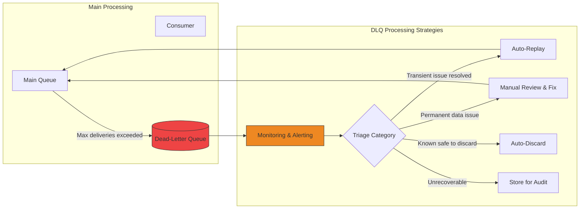
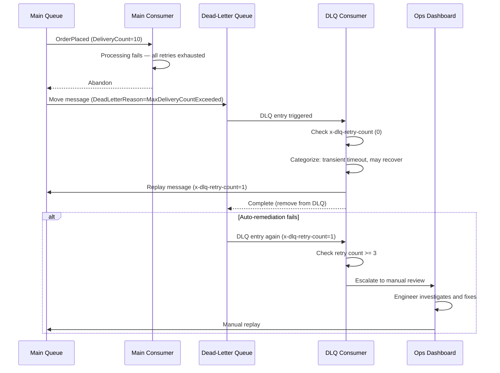
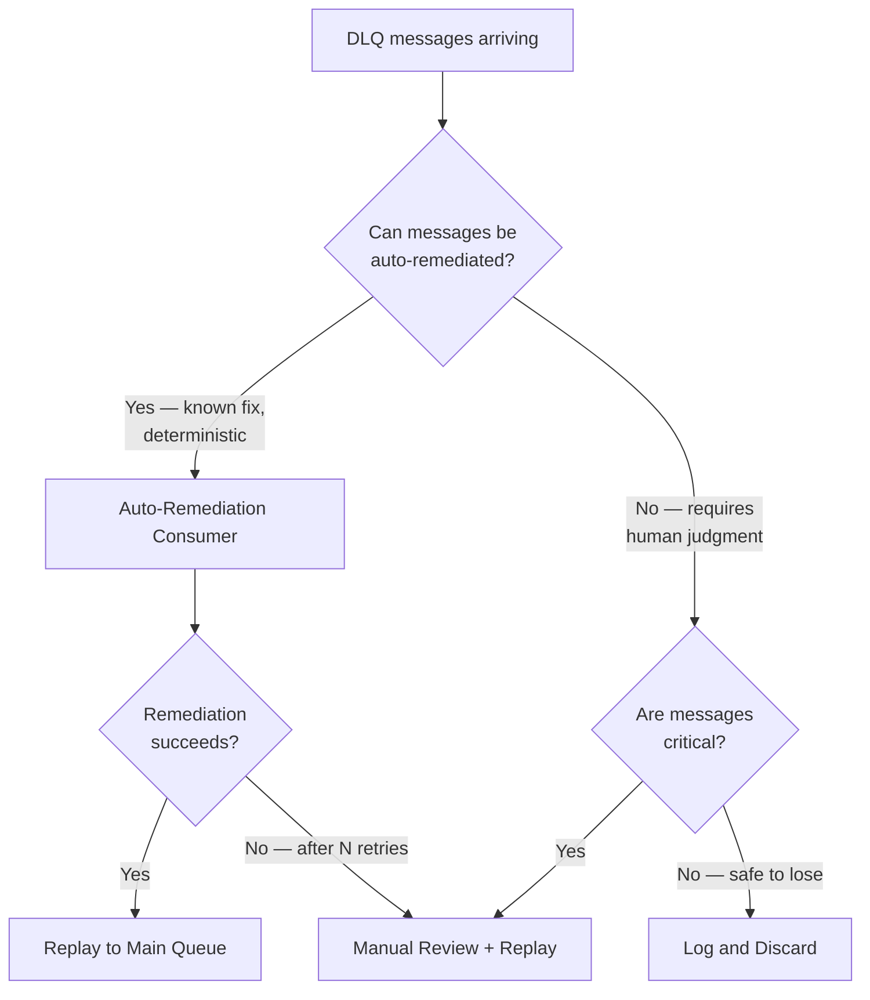

> [!success] Mastery Check
> - [ ] **Studied Well**
> - [ ] **Can explain the concept without notes**
> - [ ] **Can answer interview questions confidently**
> - [ ] **Can implement it in a real project**

## Navigation

**Domain:** [[7 — System Design & Distributed Systems]] > **Group:** Integration Patterns
**Previous:** [[7.153 — Message Schema Evolution — Versioning Strategies]] | **Next:** [[7.155 — Message Ordering Guarantees — Patterns]]

### Prerequisites
- [[7.152 — Poison Message Handling]] — required because the DLQ is where poison messages are isolated; understanding why messages land in the DLQ is essential to processing them
- [[6.301 — Observability Patterns — Centralized Logging]] — DLQ monitoring and alerting are the first step of any processing strategy

### Where This Fits

A dead-letter queue (DLQ) is a sub-queue associated with every Azure Service Bus queue or subscription that holds messages that could not be processed by any consumer after exhausting retry and delivery attempts. The DLQ processing strategy defines what happens after a message lands there: how it is monitored, triaged, repaired, and optionally replayed to the main queue. A .NET engineer encounters a DLQ whenever a consumer exhausts its retries, a message expires before processing, or the broker moves a message due to a system error. Without a defined DLQ processing strategy, the DLQ becomes a "digital landfill" — messages accumulate silently, and the first sign of trouble is a customer complaint that data was lost.

## Core Mental Model

The DLQ is a holding area for messages that the system cannot process. Processing strategies turn the DLQ from a dead-end into a remediation pipeline. The invariant this maintains is: every message that enters the DLQ has a defined path — automatic remediation, manual review, or notified discard — rather than accumulating silently. The tradeoff is that DLQ processing infrastructure (consumers, dashboards, replay tools) is additional code and operational cost. The recognition trigger is a team that has never checked their DLQ depth or has no idea what to do when an alert fires on DLQ growth.

### Classification

DLQ processing is an error recovery and observability pattern. It sits at the operational layer above the messaging infrastructure. It is not a messaging pattern (delivery, routing) nor a processing pattern (transformation). The strategy determines the fate of messages after they leave the main processing path. Common strategies: manual review + replay, automated remediation + replay, auto-discard for known-safe failures, and DLQ consumer as a dead-message-store for auditing. The maturity of the strategy progresses from "check DLQ when something breaks" (reactive) to "automated DLQ consumer with escalation paths" (proactive).

### DLQ Maturity Model

| Level | Name | Characteristics | DLQ Volume Handled |
|---|---|---|---|
| 0 | Ignorant | DLQ enabled but not monitored. Messages accumulate until someone complains. | Any volume — all silently lost |
| 1 | Reactive | Engineer checks DLQ manually when errors are reported. Messages may expire before review. | <10/day |
| 2 | Proactive | DLQ alerting enabled. Engineer reviews DLQ daily as part of standup. Manual replay tool exists. | 10-50/day |
| 3 | Automated | DLQ consumer handles known failure patterns. Manual review only for unknown cases. Auto-remediation success rate > 80%. | 50-500/day |
| 4 | Self-healing | DLQ consumer with ML-based classification. Automatic root cause analysis. Circuit breaker on consumer prevents DLQ floods. | 500-5000/day |
| 5 | Predictive | DLQ patterns feed back into producer validation. Schema validation at producer prevents poison messages before they are published. | Any volume — prevented at source |





### Key Properties / Guarantees

|Property|Value|Condition|
|---|---|---|
|Message preservation|Original message + metadata preserved|DLQ retention is set (default 14 days)|
|Processing latency|Depends on strategy|Auto-remediation: seconds; Manual: hours|
|Data loss prevention|Messages are not discarded without review|At least an alert fires before discard|
|Operational cost|Increases with DLQ complexity|Auto-remediation is cheaper than manual|
|Accuracy|Auto-remediation must not re-poison the queue|Remediation logic must be correct|
|Loop prevention|Bounded retry (max 3) for DLQ auto-remediation|x-dlq-retry-count header tracking|

## Deep Mechanics

### How It Works

**Step 1 — Message arrives in DLQ.** The broker moves a message to the DLQ when `MaxDeliveryCount` is exceeded, the message expires (TTL + dead-letter on expiration), or a system error occurs (e.g., deserialization failure). The DLQ message includes metadata: `DeadLetterReason`, `DeadLetterErrorDescription`, original enqueue time, delivery count, and the original message body.

**Step 2 — Alert fires.** Monitoring detects DLQ depth > 0 (or > a threshold). An alert notifies the operations team or triggers an automated workflow.

**Step 3 — Triage.** The DLQ entry is categorized: transient failure that may now succeed (database was down, now it is up), permanent data error (invalid schema, missing reference), or unknown.

**Step 4 — Remediation.** Depending on the category:
- **Auto-remediate:** A DLQ consumer picks up the message, applies a fix (enrich missing data, retry with longer timeout), and replays it to the main queue.
- **Manual review:** An operator examines the message, identifies root cause, applies a fix (correct data, deploy consumer fix), and replays the message via an admin tool.
- **Auto-discard:** Known-safe failures (e.g., test data in production, messages that were intentionally invalid) are logged and discarded.

**Step 5 — Replay.** The fixed message is sent to the main queue or topic with its original body. The message is processed again, hopefully successfully.

**Step 6 — Monitoring of replay.** The replayed message is tracked to ensure it does not return to the DLQ. If it does, the remediation was incorrect, and the message escalates to manual review.

**DLQ consumer loop prevention.** The DLQ consumer tracks a custom header `x-dlq-retry-count` on every replayed message. If the count exceeds 3, the message is escalated to manual review instead of auto-remediated. This prevents infinite replay loops when the remediation logic itself is buggy.

### Failure Modes

**Auto-remediation replay loops.** The DLQ consumer applies a fix and replays the message, but the fix is incorrect — the message returns to the DLQ, is picked up again, replayed again, ad infinitum. **Detection:** the same message appears in the DLQ multiple times with the same error. **Metric:** DLQ message delivery count is high, with the same `DeadLetterReason` appearing repeatedly. **Prevention:** track the number of times a message has been through the DLQ loop. After N attempts (e.g., 3), stop auto-remediation and escalate to manual review. Use a `x-dlq-retry-count` property on the message.

**DLQ overflow during a major incident.** A consumer bug causes 100% of messages to fail. The DLQ fills at the rate of the main queue's throughput — thousands of messages per second. The DLQ itself may exceed retention limits. **Detection:** DLQ depth grows exponentially. **Prevention:** implement a circuit breaker on the consumer: if the DLQ fill rate exceeds a threshold, stop the consumer from processing the main queue entirely. Fix the consumer bug first, then drain the DLQ.

**Replayed message re-poisones from a different root cause.** The original failure (database down) is fixed, and the message is replayed. But the message now fails with a different error (the message references an entity that was deleted during the outage). **Detection:** replayed messages return to the DLQ with a different `DeadLetterReason`. **Prevention:** after the initial fix, validate the message before replaying — does the referenced entity still exist? Is the data still valid? If not, the message may need a different remediation.

**DLQ monitoring alert fatigue.** DLQ alerts fire for every transient blip, desensitizing the team. Legitimate poison messages are ignored because "the DLQ always has something." **Detection:** DLQ alerts are acknowledged without investigation. **Metric:** mean time to acknowledge DLQ alert increases over time. **Prevention:** classify DLQ entries and only alert on categories that require human action. Transient flurries during deployments should auto-resolve; only persistent DLQ entries trigger alerts.

**DLQ message TTL expires before review.** Messages in the DLQ have a time-to-live (TTL). If the manual review cycle takes longer than the TTL, messages expire and are deleted before they can be reviewed. **Detection:** DLQ depth drops suddenly. **Metric:** DLQ message count decreases without any replay activity. **Prevention:** set DLQ TTL to at least 2× the expected maximum review time. For manual review that can take 30 days, set TTL to 60 days.

**Auto-remediation for wrong category.** The DLQ consumer misclassifies a permanent error as transient and replays it repeatedly, wasting resources. **Detection:** the same messages cycle through the DLQ multiple times with the same error. **Prevention:** use a more specific classification logic. Check the `DeadLetterReason` and `DeadLetterErrorDescription` together to determine the category. A timeout error is transient; a validation error is permanent. Never replay a message with a validation error without enrichment.

### DLQ Consumer in MassTransit — Complete Implementation

A production-grade DLQ consumer in MassTransit with loop prevention, categorization, and metrics:

```csharp
public sealed class DlqConsumer : IConsumer<DlqMessage>
{
    private readonly IPublishEndpoint _publisher;
    private readonly ICustomerRepository _customers;
    private readonly PoisonMessageMetrics _metrics;
    private readonly ILogger<DlqConsumer> _logger;

    public async Task Consume(ConsumeContext<DlqMessage> context)
    {
        var retryCount = context.Headers.Get<int>("x-dlq-retry-count");
        var reason = context.Headers.Get<string>("DeadLetterReason");
        var description = context.Headers.Get<string>("DeadLetterErrorDescription");

        // Track metrics
        _metrics.TrackPoisonMessage(
            context.SourceAddress?.ToString() ?? "unknown",
            reason ?? "unknown",
            retryCount);

        // Loop prevention
        if (retryCount >= 3)
        {
            _logger.LogCritical("DLQ message {MessageId} exceeded max retries. Escalating.",
                context.MessageId);
            await Escalate(context);
            return;
        }

        // Categorize based on reason + description
        var category = Classify(reason, description);

        switch (category)
        {
            case DlqCategory.TransientTimeout:
                _logger.LogInformation("Auto-replaying transient timeout message {Id}", context.MessageId);
                await Replay(context, retryCount + 1);
                break;

            case DlqCategory.MissingReference:
                var exists = await CheckReferenceExists(context);
                if (exists)
                {
                    _logger.LogInformation("Reference now exists — replaying {Id}", context.MessageId);
                    await Replay(context, retryCount + 1);
                }
                else
                {
                    _logger.LogWarning("Reference still missing — escalating {Id}", context.MessageId);
                    await Escalate(context);
                }
                break;

            case DlqCategory.PermanentError:
                _logger.LogWarning("Discarding permanent error message {Id}: {Reason}",
                    context.MessageId, reason);
                await context.ConsumeCompleted(); // discard
                break;

            case DlqCategory.Unknown:
                _logger.LogWarning("Unknown DLQ category — escalating {Id}", context.MessageId);
                await Escalate(context);
                break;
        }
    }

    private static DlqCategory Classify(string? reason, string? description)
    {
        if (reason?.Contains("Timeout") == true) return DlqCategory.TransientTimeout;
        if (description?.Contains("NotFoundException") == true) return DlqCategory.MissingReference;
        if (reason?.Contains("Validation") == true) return DlqCategory.PermanentError;
        return DlqCategory.Unknown;
    }

    private async Task Replay(ConsumeContext<DlqMessage> context, int retryCount)
    {
        await _publisher.Publish(context.Message, ctx =>
        {
            ctx.Headers.Set("x-dlq-retry-count", retryCount);
        }, context.CancellationToken);
    }

    private async Task Escalate(ConsumeContext<DlqMessage> context)
    {
        // Publish to an escalation queue that triggers PagerDuty
        await _publisher.Publish(new DlqEscalation(
            MessageId: context.MessageId.ToString()!,
            Reason: context.Headers.Get<string>("DeadLetterReason"),
            Description: context.Headers.Get<string>("DeadLetterErrorDescription")),
        context.CancellationToken);
    }
}

public enum DlqCategory { TransientTimeout, MissingReference, PermanentError, Unknown }
```

### DLQ Triage Taxonomy

A well-designed DLQ processing strategy categorizes failures into a taxonomy that drives remediation:

| Category | Example | Remediation | Auto or Manual |
|---|---|---|---|
| Transient infrastructure | SQL timeout, network blip, 503 | Replay as-is (may succeed now) | Auto |
| Missing reference | CustomerNotFound, OrderNotFound | Check if reference exists now; enrich and replay | Auto (if exists) / Manual (if not) |
| Validation error | Invalid email, missing required field | Log and discard (cannot be fixed) | Auto-discard with logging |
| Deserialization failure | Invalid JSON, unknown enum | Log and discard (data is corrupted) | Auto-discard with alert |
| Business rule violation | Order total exceeds limit | Escalate for manual review | Manual |
| Consumer bug | NullReferenceException, ArgumentException | Fix consumer, then replay | Manual (after fix) |
| Configuration error | Missing setting, wrong connection string | Fix config, drain DLQ | Manual (after config fix) |
| Security violation | Unauthorized access attempt | Alert immediately, do not replay | Manual (security incident) |

Each category maps to a specific remediation action in the DLQ consumer. The categorization is based on `DeadLetterReason` + `DeadLetterErrorDescription` content.

### DLQ Capacity Planning

The DLQ is not infinite. Plan its capacity based on:

- **Maximum expected DLQ volume:** Estimated DLQ rate × maximum outage duration. For a system processing 10,000 msg/day with 0.1% DLQ rate and maximum outage of 4 hours: 10,000 × 0.001 × (4/24) ≈ 1.7 messages — negligible. But for a deployment bug that causes 100% failure rate: 10,000 × 1.0 × 4 = ~1,667 messages — the DLQ must hold at least this many.
- **DLQ TTL:** Set to at least 2× the maximum expected time to review and remediate. If manual review takes up to 7 days, set TTL to 14 days minimum.
- **Storage limits:** Service Bus Premium has a maximum message size of 1 MB and a namespace-level storage limit. If DLQ volume could exceed storage, implement a DLQ archive job that moves messages to Azure Blob Storage and clears the DLQ.
- **Alert thresholds:** Set an alert on DLQ depth that fires when it exceeds the expected maximum (based on historical data + safety margin). A sudden spike above this threshold triggers a critical incident.

```csharp
// DLQ capacity planning calculation
public class DlqCapacityPlanner
{
    public CapacityPlan CalculatePlan(long messagesPerDay, double dlqRate, TimeSpan maxOutage)
    {
        var normalDlqPerDay = messagesPerDay * dlqRate;
        var outageDlq = messagesPerDay / TimeSpan.FromDays(1).TotalHours * maxOutage.TotalHours;

        return new CapacityPlan(
            ExpectedDailyDlqVolume: (int)normalDlqPerDay,
            MaxOutageVolume: (int)outageDlq,
            RecommendedTtl: TimeSpan.FromDays(14),
            RecommendedAlertThreshold: (int)(normalDlqPerDay * 3) // 3× daily average
        );
    }
}

public sealed record CapacityPlan(
    int ExpectedDailyDlqVolume,
    int MaxOutageVolume,
    TimeSpan RecommendedTtl,
    int RecommendedAlertThreshold);
```

### .NET and Azure Integration

- **Azure Service Bus DLQ:** each queue and subscription has an associated DLQ accessible via `QueueClient` or `ServiceBusReceiver` with `SubQueue = SubQueue.DeadLetter`. Messages in the DLQ can be read, but not received with the normal receive methods.
- **MassTransit `DiscardFaultedMessages()`:** configures the receive endpoint to move faulted messages to the DLQ automatically. The faulted message includes exception details.
- **MassTransit `IConsumeObserver`:** can detect when a message is moved to the DLQ and trigger custom logic (logging, alerting, or auto-remediation).
- **Azure Functions with DLQ binding:** a separate Azure Function can be triggered from the DLQ to process dead-lettered messages.
- **Service Bus Explorer:** built-in Azure portal tool for viewing and replaying DLQ messages manually.
- **Azure Monitor + Application Insights:** custom metrics for DLQ depth, DLQ entry rate, and auto-remediation success rate.

### DLQ Health Check and Monitoring Implementation

A production DLQ monitoring setup should include automated health checks that verify the DLQ is functioning correctly:

```csharp
// DLQ health check endpoint
[ApiController]
[Route("admin/dlq/health")]
public sealed class DlqHealthController : ControllerBase
{
    private readonly IServiceBusAdmin _admin;

    [HttpGet]
    public async Task<IActionResult> HealthCheck(CancellationToken ct)
    {
        var results = new List<object>();

        foreach (var queue in new[] { "order-processing", "payment-processing", "notification" })
        {
            var dlqDepth = await _admin.GetDeadLetterCountAsync(queue, ct);
            var dlqAge = await _admin.GetOldestDeadLetterMessageAgeAsync(queue, ct);

            var health = new
            {
                Queue = queue,
                DlqDepth = dlqDepth,
                OldestMessageAgeMinutes = dlqAge?.TotalMinutes,
                Status = dlqDepth > 100 ? "critical" :
                        dlqDepth > 10 ? "warning" : "healthy",
                NeedsAttention = dlqDepth > 0 && dlqAge > TimeSpan.FromHours(4)
            };

            results.Add(health);
        }

        return Ok(new { Timestamp = DateTimeOffset.UtcNow, Queues = results });
    }
}

// Background service that periodically drains known-safe DLQ entries
public sealed class DlqSweepService : BackgroundService
{
    private readonly IServiceBusAdmin _admin;
    private readonly ILogger<DlqSweepService> _logger;

    protected override async Task ExecuteAsync(CancellationToken stoppingToken)
    {
        while (!stoppingToken.IsCancellationRequested)
        {
            try
            {
                await SweepDlqAsync("order-processing", stoppingToken);
            }
            catch (Exception ex)
            {
                _logger.LogError(ex, "DLQ sweep failed");
            }

            await Task.Delay(TimeSpan.FromMinutes(5), stoppingToken);
        }
    }

    private async Task SweepDlqAsync(string queueName, CancellationToken ct)
    {
        var messages = await _admin.ReceiveDeadLetterMessagesAsync(
            queueName, maxMessages: 100, ct);

        foreach (var message in messages)
        {
            var reason = message.ApplicationProperties["DeadLetterReason"]?.ToString();

            // Auto-remediate known transient patterns
            if (reason?.Contains("Timeout") == true)
            {
                await _admin.ReplayToMainQueueAsync(queueName, message, ct);
                _logger.LogInformation("Auto-replayed timeout DLQ message");
            }
            else if (reason?.Contains("Expired") == true)
            {
                // Message expired — discard, it's too late to process
                await _admin.CompleteDeadLetterMessageAsync(queueName, message, ct);
            }
            // Other patterns remain in DLQ for manual review
        }
    }
}
```

```csharp
// Reading from DLQ with ServiceBusReceiver
await using var client = new ServiceBusClient(connectionString);
var receiver = client.CreateReceiver("order-processing",
    new ServiceBusReceiverOptions
    {
        SubQueue = SubQueue.DeadLetter,
        ReceiveMode = ServiceBusReceiveMode.PeekLock
    });

// Process DLQ messages
await foreach (var message in receiver.ReceiveMessagesAsync(maxMessages: 10))
{
    var reason = message.ApplicationProperties["DeadLetterReason"];
    var description = message.ApplicationProperties["DeadLetterErrorDescription"];
    var body = message.Body.ToString();

    _logger.LogWarning("DLQ message: {Reason} - {Description}", reason, description);

    // Attempt auto-remediation
    if (TryAutoRemediate(message, out var fixedBody))
    {
        // Replay to main queue
        await sender.SendMessageAsync(new ServiceBusMessage(fixedBody));
        await receiver.CompleteMessageAsync(message);
    }
    else
    {
        // Leave in DLQ for manual review — alert already fired
        await receiver.AbandonMessageAsync(message);
    }
}
```

## Production Patterns and Implementation

### Primary Implementation

The canonical DLQ processing strategy uses a dedicated DLQ consumer that triages messages into three paths: auto-remediate, escalate to manual review, or discard.

```csharp
// DLQ Consumer — automated triage and remediation
public sealed class OrderProcessingDlqConsumer : IConsumer<OrderPlaced>
{
    private readonly IPublishEndpoint _publisher;
    private readonly ICustomerRepository _customers;
    private readonly ILogger<OrderProcessingDlqConsumer> _logger;

    public async Task Consume(ConsumeContext<OrderPlaced> context)
    {
        var faultedMessage = context.Message;
        var reason = context.Headers.Get<string>("DeadLetterReason");
        var errorDescription = context.Headers.Get<string>("DeadLetterErrorDescription");

        // Track DLQ retry count to prevent loops
        var dlqRetryCount = context.Headers.Get<int>("x-dlq-retry-count");
        if (dlqRetryCount >= 3)
        {
            _logger.LogCritical(
                "DLQ message {MessageId} exceeded max auto-remediation retries. " +
                "Escalating to manual review.", context.MessageId);
            await EscalateToManualReview(faultedMessage, reason, errorDescription);
            return;
        }

        // Categorize and remediate
        if (reason == "MaxDeliveryCountExceeded" &&
            errorDescription?.Contains("TimeoutException") == true)
        {
            // Transient timeout — retry immediately (may resolve now)
            _logger.LogInformation("Auto-replaying DLQ message {MessageId} " +
                "after timeout", context.MessageId);
            await ReplayWithRetryCount(faultedMessage, dlqRetryCount, context.CancellationToken);
            return;
        }

        if (reason == "MaxDeliveryCountExceeded" &&
            errorDescription?.Contains("CustomerNotFoundException") == true)
        {
            // Missing entity — check if entity exists now and enrich
            var customerId = faultedMessage.CustomerId;
            var customerExists = await _customers.ExistsAsync(customerId);

            if (customerExists)
            {
                // Customer was created after the original processing — retry
                await ReplayWithRetryCount(faultedMessage, dlqRetryCount, context.CancellationToken);
                return;
            }
            else
            {
                // Customer does not exist — cannot auto-remediate
                await EscalateToManualReview(faultedMessage, reason, errorDescription);
                return;
            }
        }

        // Unknown category — escalate
        await EscalateToManualReview(faultedMessage, reason, errorDescription);
    }

    private async Task ReplayWithRetryCount(
        OrderPlaced message, int dlqRetryCount, CancellationToken ct)
    {
        await _publisher.Publish(message, publishContext =>
        {
            publishContext.Headers.Set("x-dlq-retry-count", dlqRetryCount + 1);
        }, ct);
    }

    private async Task EscalateToManualReview(
        OrderPlaced message, string reason, string? description)
    {
        // Publish to a dedicated "needs-review" queue or send to an admin dashboard
        _logger.LogWarning("DLQ message escalated to manual review: {Reason}", reason);

        // Store in a review database for the dashboard
        await _reviewStore.SaveAsync(new DlqReviewEntry
        {
            MessageId = Guid.NewGuid(),
            Reason = reason,
            Description = description,
            EscalatedAt = DateTimeOffset.UtcNow
        }, CancellationToken.None);
    }
}
```

### Configuration and Wiring

```yaml
# Azure Monitor alert rule — DLQ depth > 0 for 5 minutes
# Source: Azure Service Bus namespace
# Condition: "ActiveMessages" for "$DeadLetterQueue" > 0
# Aggregation: Average over 5 minutes
# Action: Email operations team + PagerDuty

# DLQ retention configuration (ARM/Bicep)
resource queue 'Microsoft.ServiceBus/namespaces/queues@2021-11-01' = {
  name: 'order-processing'
  properties: {
    maxDeliveryCount: 10
    deadLetteringOnMessageExpiration: true
    defaultMessageTimeToLive: 'P14D'     # messages expire in 14 days
    // DLQ messages inherit the same TTL — also 14 days
  }
}

# MassTransit DLQ consumer registration
builder.Services.AddMassTransit(x =>
{
    x.AddConsumer<OrderProcessingDlqConsumer>();

    x.UsingAzureServiceBus((context, cfg) =>
    {
        cfg.Host(builder.Configuration["Azure:ServiceBus:ConnectionString"]);

        // Subscribe to the DLQ via the dead-letter queue endpoint
        cfg.ReceiveEndpoint("order-processing-dlq", e =>
        {
            // This endpoint reads from the DLQ of "order-processing"
            e.SubscribeToDeadLetterQueue("order-processing");

            e.ConfigureConsumer<OrderProcessingDlqConsumer>(context);
        });
    });
});
```

### Common Variants

**Manual DLQ dashboard.** An admin UI that displays DLQ messages with search, filter, and replay capabilities. Operators review messages, fix issues (e.g., update a database record), and click "Replay" to send the message back to the main queue.

```csharp
// Admin dashboard API for DLQ replay
[ApiController]
[Route("admin/dlq")]
public sealed class DlqAdminController : ControllerBase
{
    private readonly IServiceBusAdmin _admin;

    [HttpPost("replay")]
    public async Task<IActionResult> ReplayMessage(
        [FromBody] DlqReplayRequest request, CancellationToken ct)
    {
        // Read the message from DLQ
        var dlqMessage = await _admin.PeekDeadLetterMessageAsync(
            request.QueueName, request.MessageId, ct);

        // Apply optional fix (modified body)
        var fixedBody = ApplyFix(dlqMessage.Body, request.Fix);

        // Replay to main queue
        await _admin.SendToMainQueueAsync(
            request.QueueName, fixedBody, ct);

        // Remove from DLQ
        await _admin.CompleteDeadLetterMessageAsync(
            request.QueueName, request.MessageId, ct);

        _logger.LogInformation("DLQ message {MessageId} replayed by {User}",
            request.MessageId, User.Identity?.Name);

        return Ok();
    }
}
```

**Scheduled DLQ sweep.** A daily background job that reads DLQ messages older than N hours, applies aggregate fixes (e.g., re-fetching customer data from an API), and replays them. Useful for patterns where the fix is not immediate but eventual.

**DLQ as audit trail.** All DLQ messages are archived to long-term storage (Azure Blob, Data Lake) with their metadata. The DLQ itself is cleared after archiving. This preserves an audit trail of all processing failures without keeping messages in the broker.

**DLQ consumer with exponential backoff per message.** Instead of replaying DLQ messages immediately, the DLQ consumer applies a delay based on how many times the message has been through the DLQ. First time: 1 minute delay. Second: 5 minutes delay. Third: escalate.

```csharp
// Backoff-based DLQ replay
private async Task ReplayWithBackoff(OrderPlaced message, int retryCount, CancellationToken ct)
{
    var delay = retryCount switch
    {
        0 => TimeSpan.FromSeconds(10),
        1 => TimeSpan.FromMinutes(1),
        2 => TimeSpan.FromMinutes(5),
        _ => throw new InvalidOperationException("Max retries exceeded")
    };

    await Task.Delay(delay, ct);
    await ReplayWithRetryCount(message, retryCount, ct);
}
```

### Real-World .NET Ecosystem Example

**Azure Service Bus Explorer** is the most commonly used manual DLQ processing tool. Engineers navigate to the queue, view the DLQ, inspect message body and properties, and use the "Re-queue" feature to move messages back to the main queue. Many teams build a custom admin portal on top of this using MassTransit's `ISendEndpointProvider` to replay DLQ messages with enhanced metadata (who replayed, when, why).

In high-volume production systems, teams often implement a "DLQ auto-pilot" — a MassTransit consumer that subscribes to the DLQ, uses a machine learning classifier or rule engine to categorize errors, and applies automated remediation. Common categories: "transient timeout" (immediate replay), "missing reference" (enrich from API and replay), "validation error" (log and discard with structured error data), "unknown" (escalate to manual dashboard). The auto-pilot typically handles 80-90% of DLQ entries, leaving only the complex cases for human review.

## Gotchas and Production Pitfalls

### DLQ Not Monitored

**Pitfall:** DLQ is configured on the queue but no alert or dashboard monitors its depth.

```csharp
// ❌ DLQ enabled but no monitoring
// Messages dead-letter silently
```

**Symptom:** The team discovers a week of poison messages when a customer complains about a missing order. The DLQ has 10,000 messages that could have been replayed.

**Fix:** Set up Azure Monitor alert on DLQ depth. Every queue should have an alert: "DLQ depth > 0 for >5 minutes triggers a notification."

**Cost of not fixing:** Silent data loss. The DLQ becomes a black hole that the team never inspects.

### Replaying Without Fixing Root Cause

**Pitfall:** Replaying DLQ messages without understanding or fixing why they failed.

```csharp
// ❌ Replay everything without investigation
// Operator clicks "Re-queue All" in Service Bus Explorer
```

**Symptom:** All replayed messages return to the DLQ within minutes. Consumers are overwhelmed by replayed messages, causing cascading failures.

**Fix:** Before replaying, understand the root cause. Fix the consumer, fix the data, or fix the dependency. Then replay.

**Cost of not fixing:** The replay creates a denial-of-service on the consumer fleet. The team is now dealing with the original failure plus the replay-induced overload.

### DLQ Retention Shorter Than Remediation Time

**Pitfall:** DLQ message TTL is set to 14 days, but the manual review cycle takes 3 weeks.

```csharp
// ❌ defaultMessageTimeToLive = P14D
// DLQ messages expire before they can be reviewed
```

**Symptom:** When an operator finally looks at the DLQ, the oldest messages have expired and been auto-deleted.

**Fix:** Set DLQ message TTL to exceed the maximum expected review time. If manual review can take 30 days, set TTL to 60 days.

```csharp
// ✅ TTL covers the review window
defaultMessageTimeToLive: 'P60D'
```

**Cost of not fixing:** Messages are lost before review. The team never learns about certain failure modes because the evidence disappeared.

### Auto-Remediation Masking Systemic Issues

**Pitfall:** Auto-remediation is so effective that the team never notices a persistent failure pattern.

```csharp
// ❌ Auto-remediation handles 95% of DLQ messages
// The team becomes complacent — "our DLQ is always small"
```

**Symptom:** A recurring issue causes 5,000 messages/day to go through the DLQ → auto-remediate → replay cycle, wasting 10x the normal processing resources. The team is unaware because the DLQ depth stays low.

**Fix:** Monitor DLQ throughput (messages entering DLQ per hour), not just depth. Alert when DLQ entry rate exceeds a threshold, even if messages are auto-remediated quickly.

**Cost of not fixing:** Wasted resources and delayed detection of systemic issues. The auto-remediation code becomes a permanent crutch for a problem that should be fixed at the source.

### DLQ Consumer Without Loop Protection

**Pitfall:** The DLQ consumer replays messages without tracking how many times they have been through the DLQ cycle.

```csharp
// ❌ No loop protection — infinite replay
public async Task Consume(ConsumeContext<OrderPlaced> context)
{
    // Always replays — even if the fix doesn't work
    await _publisher.Publish(context.Message);
}
```

**Symptom:** The same messages cycle between the main queue and DLQ indefinitely. Consumer resources are consumed by the same messages over and over.

**Fix:** Track `x-dlq-retry-count` and enforce a maximum (typically 3). After the max, escalate to manual review.

**Cost of not fixing:** Infinite processing loop that wastes resources and never resolves the messages.

### Forgetting to Complete DLQ Messages After Replay

**Pitfall:** The DLQ consumer reads the message, replays it to the main queue, but forgets to complete the message in the DLQ.

```csharp
// ❌ Message replayed but not removed from DLQ
public async Task Consume(ConsumeContext<OrderPlaced> context)
{
    await _publisher.Publish(context.Message); // replay
    // Missing: await context.ConsumeCompleted();
    // Message stays in DLQ and will be processed again
}
```

**Symptom:** The DLQ consumer processes the same messages over and over. Each cycle replays the message to the main queue, creating duplicate processing.

**Fix:** Always complete the DLQ message after successful replay. If the replay fails, abandon the message so it stays in the DLQ.

**Cost of not fixing:** Duplicate messages in the main queue. The main consumer processes the same message multiple times, potentially creating duplicate side effects.

### Replaying Messages Without Preserving Original Enqueue Time

**Pitfall:** When replaying a DLQ message to the main queue, the message gets a new enqueue time (current time). Consumers that depend on the original enqueue time for ordering, TTL calculations, or SLA tracking now see incorrect timestamps.

```csharp
// ❌ Replay loses original enqueue time
await sender.SendMessageAsync(new ServiceBusMessage(dlqMessage.Body));
// New message has EnqueuedTime = now, not original time
```

**Symptom:** Analytics reports showing processing latency spikes (because the replayed messages appear to have been "just enqueued"). Ordering violations if consumers sort by enqueue time.

**Fix:** Preserve the original enqueue time as a custom property when replaying.

```csharp
// ✅ Preserve original enqueue time
var replayMessage = new ServiceBusMessage(dlqMessage.Body);
replayMessage.ApplicationProperties["OriginalEnqueuedTime"] =
    dlqMessage.EnqueuedTime.ToString("O");
await sender.SendMessageAsync(replayMessage);
```

**Cost of not fixing:** Inaccurate latency metrics, potential SLA violations reported for replayed messages, and confusion in operations dashboards.

### DLQ on a Topic Subscription vs Queue

**Pitfall:** The team configures DLQ on the topic itself, not on the subscription. Each subscription has its own DLQ, but the team checks the wrong one.

**Symptom:** DLQ alerts never fire because the team is monitoring the topic-level DLQ (which does not exist — only subscriptions have DLQs). Messages are being dead-lettered to the subscription DLQ, which is not monitored.

**Fix:** Configure and monitor the DLQ on each subscription, not the topic.

**Cost of not fixing:** Silent data loss on specific subscriptions. One consumer may be failing while others work fine, but no one notices because the topic-level metrics look healthy.

### DLQ Access Control Not Configured

**Pitfall:** The DLQ inherits the same access control as the main queue. Anyone who can read from the main queue can also read from the DLQ. Sensitive data (PII, payment information) in DLQ messages is exposed to unauthorized consumers.

```csharp
// ❌ DLQ has same access policies as main queue
// Main queue: Service Bus Data Owner (full access)
// DLQ: Service Bus Data Owner (full access) — same!
// Anyone who can process messages can also read DLQ messages
```

**Symptom:** A developer reads DLQ messages for debugging and sees credit card numbers, addresses, or other PII. The DLQ is not audited, so the access is not tracked. Compliance violation.

**Fix:** Configure separate access policies for the DLQ with restricted read permissions. Only operations engineers and authorized support personnel should have DLQ read access.

```csharp
// ✅ DLQ-specific access control (ARM/Bicep)
resource dlqAuthRule 'Microsoft.ServiceBus/namespaces/queues/authorizationRules@2021-11-01' = {
  name: 'dlq-readonly'
  properties: {
    rights: ['Listen']  // only listen — no send, no manage
  }
}

// Main queue auth rule — full access for production processing
resource mainQueueAuthRule 'Microsoft.ServiceBus/namespaces/queues/authorizationRules@2021-11-01' = {
  name: 'main-queue-full'
  properties: {
    rights: ['Listen', 'Send', 'Manage']
  }
}
```

**Cost of not fixing:** Compliance violation (GDPR, PCI-DSS, SOC2). PII exposure through DLQ messages. Audit failure.

### DLQ Consumer Without Error Handling on Remediation Logic

**Pitfall:** The DLQ consumer's remediation logic (enrich, replay) itself throws an exception. The DLQ consumer has no error handling, so the exception propagates, the message is abandoned, and the DLQ consumer crashes or enters an infinite retry loop.

```csharp
// ❌ DLQ consumer remediation has no error handling
public async Task Consume(ConsumeContext<OrderPlaced> context)
{
    var customer = await _customerApi.GetAsync(context.Message.CustomerId);
    // If this throws (API down), the DLQ consumer crashes
    // The DLQ message is abandoned and retried — but the
    // underlying issue (API down) is not resolved
}
```

**Symptom:** The DLQ consumer keeps crashing. The same DLQ messages are retried indefinitely. The DLQ depth does not decrease. The main queue is healthy, but the DLQ is not being processed.

**Fix:** Wrap the DLQ consumer logic in try-catch. If the remediation logic fails, log the error and escalate the message to manual review. Do not crash the DLQ consumer — crashing prevents all other DLQ messages from being processed.

```csharp
// ✅ DLQ consumer with error handling on remediation
public async Task Consume(ConsumeContext<OrderPlaced> context)
{
    try
    {
        var customer = await _customerApi.GetAsync(context.Message.CustomerId);
        await ReplayWithEnrichment(context, customer);
    }
    catch (Exception ex) when (IsTransient(ex))
    {
        // Transient failure in remediation — retry with backoff
        _logger.LogWarning(ex, "Transient failure in DLQ remediation, retrying");
        throw; // Will be retried by the DLQ consumer's retry policy
    }
    catch (Exception ex)
    {
        // Permanent failure in remediation — escalate
        _logger.LogError(ex, "Permanent failure in DLQ remediation, escalating");
        await EscalateToManualReview(context, ex);
        // Complete the DLQ message to remove it from the DLQ
        // (it's now in the manual review system)
        await context.ConsumeCompleted();
    }
}
```

**Cost of not fixing:** The DLQ consumer is a single point of failure for the entire DLQ processing pipeline. If it crashes, no messages are processed. The team must manually restart the consumer.

## Tradeoffs and Decision Framework

### Tradeoff Matrix

| Dimension | Manual DLQ Review | Auto-Remediation | DLQ Discard (No Remediation) |
|---|---|---|---|
| Operational cost | High — engineer time | Medium — code to build and maintain | Low — no processing |
| Recovery speed | Hours-days | Seconds | N/A (messages lost) |
| Risk of incorrect fix | Low — human judgment | Medium — bug in remediation code | High — data loss for unrecoverable |
| Data preservation | Full | Full | None |
| Best for | Complex or unknown failures | Known, fixable patterns | Non-critical, idempotent, safe-to-lose |
| Scalability | Poor above ~10 messages/day | Scales to thousands/day | Unlimited |

### When to Apply



### When NOT to Apply

- [ ] The queue is used for at-most-once delivery — no DLQ is configured, and message loss is acceptable
- [ ] The consumers are idempotent and all failures are transient — auto-remediation is unnecessary because the consumer's retry policy handles everything
- [ ] The team has no operational capacity to review DLQ messages — auto-remediation is better than nothing, but fixing root causes is even better
- [ ] The message volume is so low that manual review is always feasible — below ~10 DLQ messages/day, automation is over-engineering
- [ ] The DLQ is only used for compliance/audit purposes (messages are never replayed) — archive to long-term storage instead of building a processing pipeline

### Scale Thresholds

- **DLQ monitoring is essential at any scale** — even 1 undetected poison message can block critical processing
- **Manual review is sustainable below ~10 DLQ messages/day** — above that, auto-remediation pays back the investment
- **Auto-remediation worth building when DLQ volume >50 messages/day** — the engineering time to build remediation logic amortizes quickly
- **Re-evaluate when DLQ entry rate exceeds 1% of total message volume** — indicates a systemic issue that should be fixed at the source
- **DLQ auto-pilot with ML classification worth considering when DLQ volume >500 messages/day** — at this volume, manual categorization is impossible

## Interview Arsenal

### Question Bank

1. What is a dead-letter queue and what purpose does it serve in a messaging system?
2. Walk through the lifecycle of a message from the main queue to the DLQ and back.
3. What is the tradeoff between automatic DLQ remediation and manual review?
4. How do you prevent auto-remediation from creating infinite replay loops?
5. Compare DLQ processing for transient failures vs permanent data errors.
6. Design a DLQ processing strategy for a high-volume payment processing system.
7. How does DLQ monitoring differ from main queue monitoring?
8. What is the relationship between DLQ processing and the poison message pattern?
9. How do you handle a DLQ that fills with thousands of messages in minutes?
10. What happens if a replayed DLQ message fails again with a different error?

### Spoken Answers

**Q: What is a dead-letter queue and how do you process messages in it?**

> **Average answer:** A DLQ is a sub-queue that holds messages that failed processing. You read messages from the DLQ, fix them, and send them back to the main queue.

> **Great answer:** A dead-letter queue is a holding area associated with every Azure Service Bus queue or subscription where the broker automatically places messages that could not be processed after exhausting delivery attempts. The DLQ preserves the original message body plus critical metadata: why it failed (`DeadLetterReason`), the error description, how many delivery attempts were made, and when it was originally enqueued. Without a processing strategy, the DLQ is just a "digital landfill" — messages accumulate silently until someone thinks to check it.

The processing strategy has four tiers. First, monitoring: every DLQ must have an alert on depth > 0. This is non-negotiable. Second, triage: categorize DLQ entries into buckets — transient failures that may now succeed (database was down, now it's up), data errors that can be fixed automatically (missing reference that now exists), data errors requiring human judgment (corrupted payload), and known-safe failures to discard (test data).

Third, remediation: auto-remediation is a DLQ consumer that handles known, deterministic fixes. For transient failures, it replays the message as-is. For missing references, it enriches the message with fetched data and replays. For unknown failures, it escalates to manual review.

Fourth, loop prevention: every auto-remediation attempt increments a counter on the message. After 3 attempts, the message is escalated to manual review. This prevents infinite replay loops from bugs in the remediation logic itself.

For manual review, I build a lightweight admin dashboard that displays DLQ messages, allows the operator to inspect the body and error details, apply a fix (update a database record, edit the JSON), and click "Replay" — which sends the message back to the main queue with the same message ID (for idempotency).

**Q: How do you prevent DLQ auto-remediation from creating infinite loops?**

> **Great answer:** Infinite replay loops are the primary risk of auto-remediation. A message fails, the DLQ consumer replays it, it fails again, back to DLQ, replayed again — forever. The fix is a bounded retry count for the DLQ processing loop itself, separate from the consumer's retry policy.

I add a custom header, `x-dlq-retry-count`, on every message replayed from the DLQ. The DLQ consumer checks this header: if it's ≥ 3, the message is not auto-remediated — it's escalated to manual review. This ensures that if the remediation logic itself is buggy, the message eventually surfaces to a human.

Additionally, I track the correlation between `DeadLetterReason` before and after replay. If a message was dead-lettered for "CustomerNotFound" and returns with "CustomerNotFound" again, the remediation was ineffective — the message immediately escalates. If it returns with a different reason, the remediation partially worked but a new issue surfaced — also escalate.

The DLQ consumer also has its own dead-letter — if the remediation code throws an exception, the message is moved to a tertiary "escalated" queue that fires a PagerDuty alert. This ensures that bugs in the remediation code do not cause silent message loss.

**Q: How do you handle a DLQ that fills with thousands of messages in minutes?**

> **Great answer:** A sudden DLQ flood is a critical incident — it means a deployment bug or infrastructure failure is causing every message to fail. The immediate response is to stop the bleeding, not process the DLQ.

Step 1: Pause the consumer. If the consumer is causing the failures (e.g., a NullReferenceException in new code), stop the consumer from processing more messages. This prevents new messages from entering the DLQ.

Step 2: Roll back the deployment. The most likely cause is a recent change. Roll back to the previous version and verify that the DLQ stops growing.

Step 3: Assess the damage. Count how many messages are in the DLQ. Check if they can be auto-remediated (e.g., if the issue was a transient downstream outage, the messages may succeed now) or if they need to be discarded (e.g., if the messages were corrupted by the bug).

Step 4: Drain the DLQ. For large DLQ floods (10,000+ messages), use a bulk replay script or tool. Do not manually replay each message. If the messages are safe to discard, clear the DLQ with an automated script.

Step 5: Post-mortem. Add a circuit breaker to the consumer so that future DLQ floods automatically pause processing. Add canary deployment to catch bugs before they reach full production.

### System Design Interview Trigger

If an interviewer describes a message processing system and asks "what happens to messages that fail after all retries are exhausted?" or "how do you handle messages that cannot be processed?", they are testing whether you know about DLQs. The follow-up will be about operational process: "who reviews the DLQ and how do messages get back to the main queue?" — testing whether you think about the remediation workflow, not just the technical mechanism. The deeper follow-up: "what if your auto-remediation has a bug and creates an infinite replay loop?" — testing whether you have designed loop prevention.

### Comparison Table

| | Manual DLQ Review | Auto-Remediation Consumer | DLQ-as-Audit-Archive |
|---|---|---|---|
| Recovery time | Hours to days | Seconds to minutes | Never (archived only) |
| Engineering effort | Dashboard + replay tool | Remediation logic + queue | Archive pipeline |
| Error handling | Human judgment | Code logic | No recovery |
| Best for | Complex failures | Known patterns | Compliance/audit |
| Loop risk | None (human in loop) | High without safeguards | N/A |
| Scalability | Poor above ~10/day | Scales to thousands/day | Unlimited |
| Data preservation | Full (human reviews) | Full (auto-remediated) | Full (archived for years) |

### Additional Spoken Answers

**Q: How do you monitor a dead-letter queue in production?**

> **Great answer:** DLQ monitoring has two critical metrics: depth and entry rate. Depth tells you how many messages are stuck — it's the static view. Entry rate tells you how quickly messages are failing — it's the dynamic view that reveals trends and spikes.

> For depth: set an alert on every queue's DLQ depth > 0 with a 5-minute evaluation window. This catches isolated poison messages that need attention. For high-volume systems, use tiered thresholds: warning at >10, critical at >100, and pager at >1000.

> For entry rate: track the rate of messages entering the DLQ per hour. If the rate exceeds 1% of the main queue's throughput, it indicates a systemic issue — not random poison messages. The entry rate is more useful than depth for detecting deployment bugs because it spikes immediately, while depth accumulates over time.

> I also track the distribution of DeadLetterReasons — a sudden change in the reason mix (e.g., from 80% timeouts to 80% validation errors) indicates a different class of problem that needs investigation.

> The monitoring setup in Azure is: Azure Monitor → Service Bus namespace → "Deadlettered Messages" metric. Set alert rules on this metric with thresholds per queue. Export DLQ metrics to Application Insights for correlation with consumer errors.

> One more thing: track the age of the oldest DLQ message. If a message has been in the DLQ for 7 days and your TTL is 14 days, it's at risk of expiring. Alert when the oldest message approaches the TTL to prevent silent data loss.

**Q: How do you design a DLQ processing strategy for a system that cannot lose messages?**

> **Great answer:** For systems with zero data loss requirements (financial transactions, compliance records), the DLQ processing strategy must ensure every message is either successfully processed or explicitly reviewed by a human. Auto-discard is not acceptable — even "validation errors" must be reviewed to ensure they are not false positives.

> The strategy is:
> 1. Auto-remediate only for well-understood transient patterns (timeouts, deadlocks) where the fix is clearly safe — replay as-is.
> 2. For any message that cannot be auto-remediated, escalate to a manual review dashboard. The dashboard must show the full message body, error details, and processing history.
> 3. The manual review process has an SLA: review within 24 hours. If the SLA is missed, escalate to the on-call engineer.
> 4. Never discard a DLQ message without explicit human approval. Every discard must be logged with the operator's identity and reason.
> 5. Archive all DLQ messages to long-term storage (Azure Blob, immutable storage) after processing or discard. The archive is the complete audit trail.

> For financial systems, I also implement a "DLQ guarantee" check: a background job that compares the count of messages enqueued to the main queue against the sum of (successfully processed + DLQ arrivals + DLQ discards). Any discrepancy triggers an immediate investigation — it means a message was lost without a trace.

## Architecture Decision Record

**Status:** Accepted

**Context:** An order processing system using Azure Service Bus has a DLQ for the `order-processing` queue. Currently, there is no automated DLQ processing. An operations engineer manually checks the DLQ once per day and replays messages after investigation. As the system grows from 5,000 to 50,000 messages/day, the DLQ volume has grown from 5 to 50 messages/day, and the daily manual check is becoming unsustainable. The operations team also reports that they sometimes miss the daily check during incidents, and messages have expired (TTL = 14 days) before they could be reviewed. The main failure categories are: transient timeouts (60%), missing customer references (20%), validation errors (10%), and unknown (10%).

**Options Considered:**

1. **Auto-Remediation DLQ Consumer** — a dedicated MassTransit consumer that reads from the DLQ, categorizes failures, applies automated fixes (replay for timeouts, enrich for missing references), and escalates unknown failures to manual review.
2. **Manual Review with Dashboard** — build an admin UI for DLQ browsing and replay. Keep manual review but make it more efficient.
3. **Hybrid** — auto-remediate for known patterns; manual review with dashboard for unknown patterns.
4. **DLQ-as-Audit** — archive all DLQ messages to blob storage and clear the DLQ. No remediation. Accept data loss for failed messages.

**Decision:** Hybrid with auto-remediation DLQ consumer + admin dashboard for manual cases. Auto-remediation handles the 80% of DLQ entries that are transient timeouts (replay immediately) or missing-entity errors (enrich from API). The remaining 20% go to a dashboard for manual review. The DLQ consumer tracks retry count to prevent infinite loops (max 3 attempts before escalating). DLQ TTL is increased from 14 to 60 days to ensure messages are preserved even if the operations team has a delayed review cycle.

**Consequences:**
- ✅ 80% of DLQ messages are auto-remediated within seconds — operations team no longer manually reviews 40/50 daily messages
- ✅ Manual dashboard handles the remaining 10 complex cases/day — sustainable workload
- ✅ Retry limit (3 attempts) prevents infinite replay loops
- ✅ Increased TTL (60 days) eliminates message loss during delayed reviews
- ⚠️ DLQ consumer adds operational complexity — another service to deploy and monitor
- ⚠️ Auto-remediation logic must be maintained as new failure patterns emerge
- ⚠️ The "missing customer reference" remediation requires a downstream API call — if that API is slow or unavailable, the DLQ consumer itself may become a bottleneck
- ❌ If auto-remediation has a bug, messages may be incorrectly fixed or incorrectly escalated — requires monitoring of the remediation path itself

**Review Trigger:** Revisit this decision if the auto-remediation success rate drops below 90% (indicating that failure patterns have changed and the remediation logic is out of date), or if the manual review intake exceeds 20 messages/day (at which point automate more patterns or add headcount). Also revisit if a new failure category emerges that represents >10% of DLQ entries — the remediation logic should be extended to handle it.

## Self-Check

### Conceptual Questions

1. What is a dead-letter queue and what purpose does it serve?
2. Derive the tradeoff between auto-remediation and manual DLQ review.
3. Given a queue where all DLQ entries are transient timeouts, which processing strategy is appropriate?
4. What metric distinguishes a healthy DLQ (occasional poison messages) from a systemic issue?
5. Name the Azure Service Bus sub-queue that holds dead-lettered messages.
6. What is the structural distinction between a DLQ and a poison message queue?
7. Below what DLQ volume is manual review always sufficient?
8. [[7.152 — Poison Message Handling]] — how does poison message handling relate to DLQ processing?
9. What production consequence follows from replaying DLQ messages without fixing the root cause?
10. Explain DLQ processing to a site reliability engineer in 60 seconds.

<details>
<summary>Answers</summary>

1. A DLQ is a holding area for messages that could not be processed after exhausting retries. It preserves the message and failure metadata for remediation. Without DLQ processing, messages accumulate silently and may be lost.

2. Auto-remediation provides fast recovery for known failure patterns at the cost of code complexity and the risk of incorrect fixes. Manual review is slower but more accurate for complex or unknown failures. The decision depends on DLQ volume: below ~10/day, manual review is fine. Above ~50/day, auto-remediation pays back the investment.

3. Auto-remediation with immediate replay. Transient timeouts are likely to succeed on retry after a brief delay. No human review needed. Add a backoff delay (e.g., 10 seconds) to give the downstream system time to recover.

4. DLQ entry rate as a percentage of total throughput. If DLQ entries are <0.1% of total messages and the reasons are varied, it's healthy. If DLQ entries exceed 1% and are dominated by one error type, there is a systemic issue. Also monitor DLQ entry rate trend — a sudden spike indicates a deployment bug or infrastructure failure.

5. `$DeadLetterQueue` — accessed via `ServiceBusReceiver` with `SubQueue.DeadLetter` or via Service Bus Explorer by selecting the "Dead-letter" tab.

6. A DLQ is an infrastructure feature of the broker — it holds all dead-lettered messages for a queue. A poison message queue is an application-level concept — a queue for messages that the application considers poison. The DLQ is the implementation; the poison message pattern is the design.

7. Below ~10 messages/day — an engineer can review these in a few minutes during the daily standup. Above that, automation pays off. At ~50 messages/day, manual review takes 30+ minutes daily and is prone to being skipped.

8. Poison message handling is how messages end up in the DLQ (retry policy + max delivery count). DLQ processing is what happens after — triage, remediation, replay. They are two halves of the same error recovery flow. Without poison message handling, messages never reach the DLQ (they retry forever). Without DLQ processing, messages that reach the DLQ are never recovered.

9. All replayed messages return to the DLQ, potentially overwhelming the consumer fleet and causing cascading failures. The team then has the original problem plus the replay overload. This is called a "replay storm" and is a common incident pattern.

10. "Think of the DLQ as a hospital triage unit. When a message has a heart attack (processing failure), it goes to the DLQ instead of dying silently. The triage nurse (DLQ consumer) checks if it's a simple fainting spell (transient timeout) — send it back to work. If it's a broken leg (missing data), apply a cast and send it back. If it's a mystery illness, send it to the doctor (manual review). Without the triage unit, the message just disappears and no one knows why. The key metric is not just how many messages are in triage (DLQ depth), but how many arrive per hour (DLQ entry rate) — a sudden flood means there's an epidemic, not a few isolated cases."

</details>

---

### Scenario Challenges

**Scenario 1 — Diagnose the problem**

An ops engineer checks the DLQ dashboard and finds 500 messages. All were dead-lettered with `DeadLetterReason = "MaxDeliveryCountExceeded"` and description containing `"SqlException: Timeout expired"`. The messages were enqueued 1-2 hours ago.

<details>
<summary>Diagnosis</summary>

**Root cause:** A database performance issue caused all consumer database operations to time out. The consumer's retry policy exhausted within each delivery, and after `MaxDeliveryCount = 10`, all 500 messages were dead-lettered. The database has since recovered.

**Evidence:** All 500 messages have the same error pattern (SQL timeout) and were enqueued close together. The DLQ entry rate spiked during the outage window and stopped when the database recovered.

**Fix:** Replay all 500 messages to the main queue. They should succeed now that the database is healthy. Use the `Re-queue` function in Service Bus Explorer or a script that sends the messages back with their original message IDs (for idempotency).

**Prevention:** Add a circuit breaker around the database call. If the database is unavailable, fail fast and abandon the message quickly instead of retrying and consuming resources. Also increase the retry interval so the database has time to recover between delivery attempts.

</details>

---

**Scenario 2 — Design decision**

You are designing a DLQ processing strategy for a notification system. Notifications (email, SMS, push) can fail because of invalid phone numbers, spam filters, timeouts from the provider, or rate limits. Expected volume is 100,000 messages/day; expected DLQ rate is 0.5% (500/day).

<details>
<summary>Decision and Reasoning</summary>

**Choice:** Auto-remediation DLQ consumer with classification. Timeouts and rate limits: replay with exponential backoff. Invalid phone numbers: discard (safe to lose — notification fails permanently). Spam filter rejections: escalate to manual review (may need customer contact update).

**Tradeoffs accepted:** Invalid phone numbers are auto-discarded — the notification is permanently undeliverable. This is acceptable because the sender needs to update the contact information anyway. Spam filter escalations are rare but require manual review.

**Implementation sketch:**

```csharp
public async Task Consume(ConsumeContext<NotificationFailed> context)
{
    var reason = context.Headers.Get<string>("DeadLetterReason");

    if (reason.Contains("Timeout") || reason.Contains("RateLimit"))
    {
        // Replay after a delay proportional to retry count
        var delay = TimeSpan.FromSeconds(Math.Pow(2, GetRetryCount(context)));
        await Task.Delay(delay);
        await ReplayMessage(context.Message);
    }
    else if (reason.Contains("InvalidPhoneNumber"))
    {
        // Permanent failure — log and discard
        _logger.LogWarning("Invalid phone number: {Phone}", context.Message.PhoneNumber);
        await context.ConsumeCompleted(); // discard
    }
    else
    {
        // Spam filter, unknown — escalate
        await EscalateToManualReview(context);
    }
}
```

</details>

---

**Scenario 3 — Failure mode** An auto-remediation DLQ consumer is replaying messages from the DLQ, but the same messages keep returning. The DLQ depth stays steady at ~200 messages, and the remediation consumer is processing messages continuously.

<details>
<summary>Investigation and Fix</summary>

**Investigation steps:** 1) Check the `x-dlq-retry-count` header on the messages. 2) Check if the remediation logic is actually applying a fix or just replaying. 3) Check if the root cause (a missing database reference) is still present.

**Confirming evidence:** The auto-remediation consumer replays messages for "CustomerNotFound" errors without actually checking if the customer now exists. The messages fail again with the same error and return to the DLQ. The `x-dlq-retry-count` is incrementing each time.

**Immediate mitigation:** Disable the auto-remediation consumer. Fix the root cause (the customer data sync is broken). Then replay the DLQ messages manually.

**Permanent fix:** Fix the auto-remediation logic to actually resolve the failure before replaying — check if the customer exists, and only replay if it does. Also enforce the 3-retry limit so that ineffective remediation escalates to manual review instead of looping.

**Post-mortem item:** The auto-remediation consumer was deployed without proper testing. The remediation logic was a pass-through (replay without fix). Add integration tests that verify remediation does not create replay loops.

</details>

---

**Scenario 4 — Scale it** Your system processes 1,000,000 messages/day with a DLQ rate of 0.1% (1,000/day). Auto-remediation handles 80% (800/day). Manual review handles 200/day. A deployment bug increases the DLQ rate to 10% (100,000/day) in one hour.

<details>
<summary>Scaling Strategy</summary>

**Bottleneck this addresses:** The manual review process (dashboard) and the auto-remediation consumer are overwhelmed by the 100× increase in DLQ traffic.

**How it helps:** The auto-remediation consumer uses competing consumers — it can scale out to handle the increased load. The main processing should also be stopped (circuit breaker) to prevent more messages from entering the DLQ.

**Implementation order:** 1) Auto-stop the main queue consumer when DLQ fill rate exceeds a threshold (e.g., >1,000 messages/hour). This prevents the DLQ from filling further. 2) Scale the auto-remediation consumer to handle 100,000 messages (it will process them quickly since they all have the same root cause). 3) Fix the deployment bug (rollback). 4) Restart the main queue consumer. 5) The auto-remediation consumer drains the backlog.

**What it does not solve:** The auto-remediation code itself may be overwhelmed. If it cannot keep up, the DLQ grows. In that case, surface the error to the team immediately and fix the root cause — do not try to process your way out of a 100,000-message DLQ without understanding the failure.

**Additional consideration:** At 100,000 messages in the DLQ, the broker may throttle or the DLQ storage may fill. Consider temporarily increasing the Service Bus messaging units (premium tier) to handle the burst.

</details>

---

**Scenario 5 — Interview simulation** The interviewer says: "Your system has a queue with a dead-letter queue. Messages end up in the DLQ when they fail processing. What is your approach to handling messages in the DLQ?"

<details>
<summary>Model Response</summary>

"I structure DLQ handling as a three-tier pipeline.

Tier 1: Auto-remediation. A dedicated DLQ consumer subscribes to the DLQ and triages messages by failure reason. Transient failures like database timeouts or network blips are immediately replayed — the system has likely recovered by now. Missing-reference failures (e.g., customer not found) check if the reference now exists and, if so, enrich and replay. Known permanent failures like validation errors are logged and discarded — no amount of retrying will fix a missing required field. Each auto-remediation attempt increments a retry counter on the message. After 3 attempts, the message escalates to Tier 2.

Tier 2: Manual review. An admin dashboard displays all messages that could not be auto-remediated. An operator examines the message body, error details, and delivery history. They can fix the underlying issue (update a database record, fix a configuration value) and click "Replay" to send the message back to the main queue. The dashboard logs who replayed what and why.

Tier 3: Monitoring and metrics. The DLQ entry rate is tracked as a percentage of total throughput. If it exceeds 1%, an alert fires — there is a systemic issue that should be fixed at the source, not in the DLQ. DLQ depth alerts fire immediately when depth > 0 for more than 5 minutes, ensuring the team is aware of even a single orphaned message.

The key design constraint is the replay loop guard: no message is replayed from the DLQ more than 3 times. After that, the message must be manually reviewed. This prevents the DLQ handler itself from being the source of infinite processing loops."

</details>

---

**Scenario 6 — DLQ consumer causes duplicate main-queue messages** The DLQ consumer replays a message, but the main consumer processes it and completes it. However, the DLQ consumer crashes before completing the DLQ message. On restart, the DLQ consumer processes the same DLQ message again, causing a duplicate in the main queue.

<details>
<summary>Diagnosis and Fix</summary>

**Root cause:** The DLQ consumer's replay and complete operations are not transactional. The message is replayed to the main queue (committed), but the DLQ message is not completed (crashed before the complete call). On restart, the same DLQ message is processed again.

**Evidence:** The main queue has duplicate messages with the same message ID. The DLQ depth is stable, but the main queue throughput is higher than expected.

**Fix options:**
1. **Idempotent main consumer.** The main consumer must handle duplicates — this is the safest approach since DLQ replays are inherently at-least-once.
2. **Transactional replay.** Use a transaction to atomically replay and complete: `await using var tx = scope.CreateTransaction();` — but Service Bus does not support cross-entity transactions for replay scenarios.
3. **Deduplication window.** Enable duplicate detection on the main queue with a time window that covers the expected DLQ consumer restart time.

**Recommended approach:** Make the main consumer idempotent (option 1). DLQ replay is inherently an at-least-once operation, and idempotency is the correct defense.

</details>

---

**Scenario 7 — Compliance requirement for DLQ audit trail** A financial services company requires that all processing failures be logged with full message content for audit purposes. Regulators can request failure records from the past 7 years. The current DLQ TTL is 14 days.

<details>
<summary>Decision and Reasoning</summary>

**Choice:** Implement a DLQ-as-audit-trail pattern. A scheduled job runs daily, reads all messages from the DLQ, archives them to Azure Blob Storage with their metadata (DeadLetterReason, DeadLetterErrorDescription, delivery count, original enqueue time, archive timestamp), and then clears them from the DLQ. The archive is stored in a secure, immutable storage container with access controls.

**Tradeoffs accepted:** DLQ messages are archived, not replayed. The processing team must use a separate tool to request message replay from the archive (manual restore to the main queue). This adds latency for replay but satisfies the compliance requirement.

**Implementation:**

```csharp
public async Task ArchiveDlqAsync(string queueName, CancellationToken ct)
{
    var dlqMessages = await _receiver.ReceiveMessagesAsync(maxMessages: 1000, ct);
    var archiveEntries = dlqMessages.Select(msg => new DlqArchiveEntry
    {
        QueueName = queueName,
        MessageId = msg.MessageId,
        Body = msg.Body.ToString(),
        DeadLetterReason = msg.ApplicationProperties["DeadLetterReason"]?.ToString(),
        DeadLetterErrorDescription = msg.ApplicationProperties["DeadLetterErrorDescription"]?.ToString(),
        DeliveryCount = msg.DeliveryCount,
        EnqueuedTime = msg.EnqueuedTime,
        ArchivedAt = DateTimeOffset.UtcNow
    });

    await _blobContainer.UploadAsync(
        $"dlq-archive/{queueName}/{DateTimeOffset.UtcNow:yyyy/MM/dd/HH-mm-ss}.json",
        BinaryData.FromObjectAsJson(archiveEntries), ct);

    // Complete all messages (remove from DLQ)
    foreach (var msg in dlqMessages)
        await _receiver.CompleteMessageAsync(msg, ct);
}
```

**Consequences:**
- ✅ Meets regulatory audit trail requirements
- ✅ DLQ is kept clean — no accumulation
- ⚠️ Messages cannot be replayed without manual restore from archive
- ❌ If a message needs to be replayed urgently, the restore adds 15-30 minutes of latency

</details>

---

**Scenario 8 — DLQ replay causes duplicate order processing** A DLQ message for `OrderShipped` is replayed. The main consumer processes it and sends the shipment notification email. However, the message was already processed once before it was dead-lettered (the consumer crashed after sending the email but before completing the message). The replayed message sends a duplicate email — the customer receives two "Your order has shipped!" emails.

<details>
<summary>Diagnosis and Fix</summary>

**Root cause:** The consumer was not idempotent. The email was sent before the database transaction was committed. When the consumer crashed, the database rolled back, but the email was already sent. The replayed message triggered the email again.

**Evidence:** Customer support receives complaints about duplicate shipment emails. Logs show two `EmailSent` entries for the same order, one before the crash and one after the DLQ replay.

**Fix:** Make the consumer idempotent. Use the message ID to check if the side effect was already applied before executing it.

```csharp
public async Task Consume(ConsumeContext<OrderShipped> context)
{
    // Idempotency check — has this email already been sent?
    if (await _emailTracker.WasSentAsync(context.MessageId.ToString()))
    {
        _logger.LogInformation("Email already sent for message {MessageId}, skipping", context.MessageId);
        return;
    }

    // Send email (now safe to call)
    await _emailService.SendShipmentNotificationAsync(context.Message.OrderId);

    // Mark as sent
    await _emailTracker.MarkSentAsync(context.MessageId.ToString());
}
```

**Prevention:** Every consumer that sends external notifications (email, SMS, push) or has non-idempotent side effects must be idempotent. The DLQ replay is inherently an at-least-once delivery mechanism — the consumer must handle duplicates.

</details>

---

**Scenario 9 — DLQ processing for expired messages** Azure Service Bus is configured with `deadLetteringOnMessageExpiration = true`. Messages that sit in the queue longer than their TTL are moved to the DLQ. During a prolonged downstream outage, thousands of messages expire and are dead-lettered. When the outage ends, the team replays them — but the messages are hours old and no longer relevant (e.g., time-sensitive price quotes). Processing them would produce incorrect results.

<details>
<summary>Diagnosis and Fix</summary>

**Root cause:** The DLQ received messages that expired because they could not be processed in time. Replaying expired messages without checking their relevance caused incorrect business outcomes.

**Evidence:** After the DLQ replay, customers receive quotes with prices that are hours old and no longer valid. Customer complaints spike.

**Fix:** Before replaying expired messages, check if they are still relevant. For time-sensitive messages, check the original enqueue time against a freshness threshold. If the message is too old, discard it instead of replaying.

```csharp
public async Task Consume(ConsumeContext<OrderPlaced> context)
{
    var originalEnqueueTime = context.Headers.Get<DateTime>("OriginalEnqueueTime");

    // Check freshness — reject messages older than 30 minutes
    if (originalEnqueueTime < DateTime.UtcNow.AddMinutes(-30))
    {
        _logger.LogWarning("Discarding stale message {MessageId} (enqueued at {Time})",
            context.MessageId, originalEnqueueTime);
        // Complete the message without processing — it's too old to be meaningful
        return;
    }

    await ProcessOrderAsync(context.Message);
}
```

**Prevention:** Set appropriate TTL on messages so they expire before they become irrelevant. If messages must be processed within 5 minutes, set TTL to 5 minutes. When replaying from the DLQ, always check the original timestamp against business relevance rules.

</details>

---

**Scenario 10 — DLQ processing for cross-region disaster recovery** The primary Azure region fails. The Service Bus namespace fails over to the secondary region. The secondary region has its own DLQ, but the DLQ monitoring and auto-remediation infrastructure is not deployed in the secondary region. After the failover, DLQ messages accumulate in the secondary region unchecked.

<details>
<summary>Diagnosis and Fix</summary>

**Root cause:** The DLQ processing infrastructure (consumers, monitoring, dashboards) was deployed only in the primary region. During a regional failover, the processing infrastructure did not follow, so DLQ messages in the secondary region were not processed.

**Evidence:** After failback to the primary region, the primary DLQ is empty but 5,000 messages are in the secondary DLQ. The team discovers that DLQ processing has been offline for 4 hours.

**Fix options:**
1. **Active-active DLQ processing.** Deploy the DLQ processing infrastructure in both regions. Each region processes its own DLQ.
2. **Cross-region DLQ monitoring.** Monitor DLQ depth from both regions. If the secondary region's DLQ grows, alert the team to process it (manually or by redirecting the DLQ consumer).
3. **Single-region DLQ with replication.** Route all DLQ entries to a single region for processing, regardless of where the main queue is hosted.

**Recommended approach:** Active-active DLQ processing (option 1). The DLQ consumer is stateless and can run in any region. Deploy it in both regions with the same configuration. Each region's DLQ consumer reads from its local DLQ.

**Prevention:** The disaster recovery plan must include DLQ processing. Test failover scenarios that include DLQ consumer failover. Verify that DLQ alerts work from both regions.

**DR checklist for DLQ processing:**
1. Deploy DLQ consumers in both primary and secondary regions (active-active).
2. Monitor DLQ depth from both regions with separate alert rules per region.
3. Ensure DLQ archive (Blob Storage) is geo-redundant (RA-GRS) so archived messages survive a regional failure.
4. Test failover quarterly: fail the main queue consumer, verify the DLQ consumer also fails over, verify alerts fire from the secondary region.
5. Document the DLQ failover procedure in the incident response runbook.

</details>
