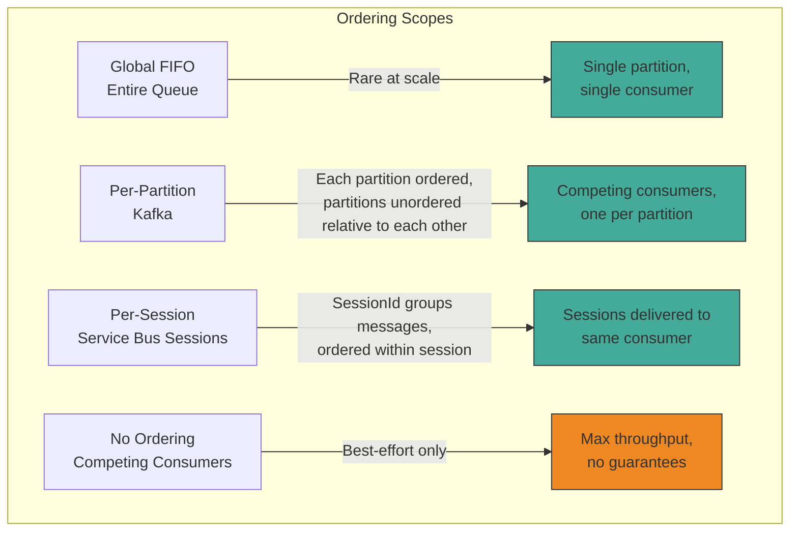
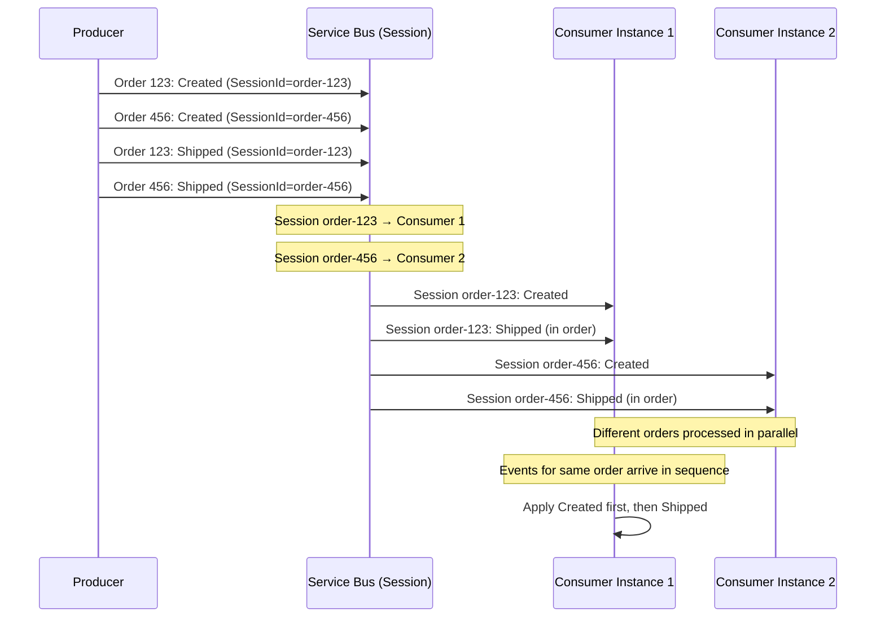

> [!success] Mastery Check
> - [ ] **Studied Well**
> - [ ] **Can explain the concept without notes**
> - [ ] **Can answer interview questions confidently**
> - [ ] **Can implement it in a real project**

## Navigation

**Domain:** [[7 — System Design & Distributed Systems]] > **Group:** Integration Patterns
**Previous:** [[7.154 — Dead Letter Queue — Processing Strategies]] | **Next:** —

### Prerequisites
- [[7.142 — Event-Driven Architecture — Overview]] — required because ordering guarantees are a fundamental property of event delivery; understanding broker topology is essential
- [[6.501 — Concurrency Patterns — Ordered Processing]] — the single-process pattern that messaging ordering extends to distributed systems

### Where This Fits

Message ordering guarantees define whether messages in a queue are delivered to consumers in the order they were sent. Different broker configurations and patterns offer different ordering guarantees — from strict global FIFO to no ordering at all. A .NET engineer encounters ordering decisions whenever a business process requires events for the same entity to be processed in sequence — for example, `OrderCreated` must arrive before `OrderShipped`, and `OrderShipped` must arrive before `OrderDelivered`. Without ordering guarantees, these events may arrive in any order, causing incorrect state transitions (processing `OrderShipped` for an order that was never created). The tension is that strict ordering limits throughput and availability — this note explores the patterns that balance these forces.

## Core Mental Model

Message ordering in distributed systems is the property that messages within a defined scope (a partition, session, or queue) are delivered to consumers in the same order they were published by the producer. The invariant this maintains is: within the ordering scope, a consumer sees a causally consistent sequence of events for the same entity. The tradeoff is that ordering limits throughput (messages must be processed sequentially within the scope) and availability (partition leaders are single points of failure within the scope). The recognition trigger is a data inconsistency where a consumer shows `OrderShipped` without a corresponding `OrderCreated`, or where an entity's state transitions are applied out of sequence.

### Classification

Message ordering is a delivery guarantee, not a consistency model — it guarantees sequence, not atomicity or isolation. It occupies a specific axis in the CAP tradeoff space: strict global ordering trades availability and throughput for consistency within the ordered scope. Ordering is typically scoped to a partition or session — global FIFO across an entire queue is rarely achievable at scale without sacrificing too much throughput or availability. The four levels of ordering guarantee are: global FIFO (strict across all messages), per-partition (strict within a Kafka partition), per-session (strict within an Azure Service Bus session), and no ordering (best-effort only).

### Ordering vs Other Consistency Guarantees

Message ordering is often confused with other consistency guarantees. Here is how they differ:

**Ordering ≠ Exactly-once delivery.** Ordering guarantees that messages arrive in sequence. Exactly-once guarantees that messages are not lost or duplicated. Both are needed for correct processing, but they are orthogonal. A system can have ordering without exactly-once (messages arrive in order but may be duplicated) or exactly-once without ordering (messages are delivered once but in any order).

**Ordering ≠ Atomicity.** Atomicity guarantees that a set of operations either all succeed or all fail. Ordering guarantees the sequence but not the atomicity. A consumer that crashes mid-way through processing an ordered sequence may leave partial state.

**Ordering ≠ Total order.** Total order means every message has a defined position relative to every other message. Per-session ordering provides partial order — messages within a session are ordered, but messages across sessions have no defined order. This is usually sufficient because business entities have causal relationships only within themselves.

**Ordering vs causal ordering.** Causal ordering guarantees that causally related messages (A happens-before B) are delivered in the correct order. Distributed systems with logical clocks (Lamport timestamps, vector clocks) can provide causal ordering without global FIFO. This is lighter-weight than total ordering but requires the producer to propagate causality information.





### Key Properties / Guarantees

|Property|Global FIFO|Per-Partition (Kafka)|Per-Session (Service Bus)|No Ordering|
|---|---|---|---|---|
|Order guarantee|Strict across all messages|Strict within a partition|Strict within a session|None|
|Throughput|Limited to single consumer|Partition count × consumer throughput|Session count × per-session throughput|Max — all consumers parallel|
|Availability|Single point of failure for ordering|Leader failure causes partition rebalance (brief unavailability)|Session lock expiration causes redelivery|High — any consumer can take any message|
|Use case|Audit logs, global sequence|Entity-scoped ordering (per customer)|Entity-scoped ordering with easy setup|Non-critical, high throughput|
|Setup complexity|Low|Medium|Medium|Low|

## Deep Mechanics

### How It Works

**Global FIFO.** A single queue with a single consumer. Messages are received in the order they were enqueued. The broker assigns a sequence number (or relies on the underlying storage ordering). This is the simplest model but limits throughput to what a single consumer can handle and provides no parallel processing.

**Per-partition ordering (Kafka).** A topic is divided into partitions. Within each partition, messages are strictly ordered by offset. Each partition is consumed by exactly one consumer in the consumer group. Ordering is guaranteed within a partition but not across partitions. The producer chooses the partition key (e.g., `customerId`), ensuring all messages for the same customer go to the same partition.

**Per-session ordering (Azure Service Bus).** Messages with the same `SessionId` are guaranteed to be delivered in order. Sessions can be distributed across multiple consumers (via `MaxConcurrentSessions`), but each session is processed by one consumer at a time. If a consumer crashes, the session is released and another consumer picks it up, preserving ordering.

**No ordering.** Multiple consumers process messages from the same queue in any order. This provides maximum throughput and availability but guarantees nothing about processing order.

**Session lock management.** When a consumer receives a session, it holds the session lock for the configured `LockDuration`. During this time, no other consumer can receive messages from this session. If the consumer completes or abandons a message, the lock is renewed. If the consumer crashes, the lock expires after `LockDuration`, and the session is released to another consumer. This mechanism ensures exclusive processing within a session but requires careful lock duration tuning.

### Detailed Ordering Strategy Comparison

Each ordering strategy has different tradeoffs for throughput, availability, and implementation complexity:

**Strategy 1: Global FIFO with single consumer.**
- How it works: One queue, one consumer instance. Messages are received in enqueue order.
- Throughput: Limited to what one consumer can process (~100-500 msg/s for typical .NET processing).
- Availability: If the consumer crashes, processing stops until the consumer is restarted or replaced.
- Use case: Audit logs, sequential job processing, low-volume command queues.
- Implementation: Simplest possible — no sessions, no partitions. Just a queue and a consumer.

**Strategy 2: Per-session ordering (Azure Service Bus sessions).**
- How it works: Messages with the same `SessionId` are delivered to the same consumer in FIFO order. Different sessions can be distributed across consumers.
- Throughput: Per-session limit is ~20-50 msg/s (depends on processing complexity). Total throughput = per-session throughput × concurrent sessions.
- Availability: If a consumer crashes, its sessions are redistributed to other consumers within `LockDuration` (typically 30-60 seconds).
- Use case: Per-entity ordering (orders, customers, transactions). Most common pattern in .NET.

**Strategy 3: Per-partition ordering (Kafka).**
- How it works: Each partition is an ordered, immutable log. The producer chooses the partition key. Consumers in a group are assigned partitions. Ordering is within a partition.
- Throughput: Per-partition limit is very high (~1000+ msg/s for simple processing). Total throughput = partition count × per-partition throughput. Can scale to millions of msg/s.
- Availability: Partition leader handles reads/writes. Leader failure causes a brief unavailability (milliseconds-seconds) while a new leader is elected.
- Use case: High-throughput event streams, event sourcing, systems that need long message retention.

**Strategy 4: Version-based ordering (consumer-side).**
- How it works: Messages carry a version or sequence number. The consumer buffers out-of-order messages and applies them when the missing predecessor arrives.
- Throughput: Limited by the buffer and the ordering window. High overhead per message.
- Availability: High — any consumer can process any message. Ordering is handled by the consumer.
- Use case: Last resort when broker-level ordering is not available (e.g., consuming from a topic with multiple partitions that cannot guarantee per-key ordering).

**Strategy 5: Sub-session partitioning.**
- How it works: The session key is composed of the entity ID + a category. For example, `sessionId = $"{orderId}:{eventCategory}"`. This allows parallel processing of different event categories for the same entity.
- Throughput: Higher than per-session for entities with many events, because different categories are processed in parallel.
- Availability: Same as sessions — each sub-session is independent.
- Use case: High-volume entities where events can be categorized (e.g., `order-123:inventory`, `order-123:shipping`, `order-123:payment`).

```csharp
// Sub-session partitioning
public async Task PublishOrderEvent(OrderEvent @event, string category)
{
    var sessionId = $"{@event.OrderId}:{category}";
    await _publisher.Publish(@event, ctx =>
    {
        ctx.SetSessionId(sessionId);
    }, CancellationToken.None);
}
```

### Failure Modes

**Ordering violation on consumer crash in session mode.** A consumer processing session S crashes after processing message 3 but before acknowledging it. The session is released. Another consumer picks up the session and receives message 3 again (redelivery) — but message 4 and 5 may also be in the session, and the new consumer may process them in the wrong order relative to the redelivered message 3. **Detection:** duplicate or out-of-order side effects. **Prevention:** make consumers idempotent and use version checking within the session — track the last successfully processed message sequence number per session and skip messages already processed.

**Partition imbalance in Kafka.** If partition keys are poorly chosen (e.g., many customers hash to the same partition), some partitions accumulate backlog while others sit idle. **Detection:** consumer lag varies significantly across partitions. **Metric:** max-min partition lag > threshold. **Prevention:** choose a partition key with high cardinality. Monitor partition distribution and rebalance if needed.

**Session starvation in Azure Service Bus.** One session has a very long backlog (millions of messages). Other sessions cannot get consumer time because the backlogged session monopolizes the session lock. **Detection:** some sessions have very high message age while others are processed normally. **Metric:** per-session message age distribution. **Prevention:** limit the number of messages processed per session lock renewal. If a session has too many messages, use a separate consumer pool for high-volume sessions.

**Idempotent but out-of-order writes.** A consumer receives message 3 after message 5 due to broker redelivery. The consumer's idempotency check shows message 3 was already processed — it skips it. But message 5 was processed before message 3, and message 3's side effect (an earlier state) is now lost. **Detection:** the entity's final state is correct but its history is missing the transition from message 3. **Prevention:** within an ordered scope, do not rely on idempotency to fix ordering — fix ordering at the broker level. If messages arrive out of order, the consumer should buffer them and apply in sequence, not skip them.

**Session lock lost during long processing.** A session message takes longer to process than the configured `LockDuration`. The lock expires mid-processing. Another consumer picks up the session and starts processing the same (or next) message. Both consumers are now processing the same session concurrently — ordering is violated. **Detection:** `MessageLockLostException` in consumer logs. **Metric:** session lock loss rate. **Prevention:** either increase `LockDuration` to cover the P99 processing time, or use `RenewMessageLockAsync` to extend the lock during long processing.

**Non-deterministic partition assignment.** In Kafka, after a consumer group rebalance, partitions are reassigned to consumers. A consumer that was processing partition 0 may be assigned partition 1 after the rebalance. If the consumer has local state for partition 0 that is not flushed, messages may be lost or processed incorrectly. **Detection:** data inconsistencies after consumer group rebalances. **Prevention:** use a stateless consumer design, or persist the consumer's offset and state externally (e.g., to a database) keyed by partition ID.

### Ordering with Idempotency — The Relationship

Ordering guarantees and idempotency are complementary, not substitutes. Many engineers mistakenly believe that idempotency eliminates the need for ordering. Here is why they are wrong:

**Idempotency prevents duplicate side effects, not out-of-order side effects.** If `OrderShipped` is processed before `OrderCreated`, the consumer might:
- Skip `OrderCreated` because the order already exists (idempotent check passes)
- But the order state is "Shipped" without ever being "Created"
- The business process has an incorrect sequence — the order history is wrong

**Idempotency without ordering creates history gaps.** Consider an order with events: `Created (v1)`, `Shipped (v2)`, `Delivered (v3)`. If they arrive as `Shipped`, `Created`, `Delivered`:
- Shipped: Consumer creates order with status "Shipped" (idempotency check says "not exists, create")
- Created: Consumer skips because order already exists (idempotency check says "exists, skip")
- Delivered: Consumer updates order to "Delivered" (from "Shipped")
- Final state: Delivered — correct!
- But the order history shows: Shipped, Delivered — missing Created entirely

**The correct approach:** Use ordering for sequence and idempotency for deduplication. Within the ordered scope, idempotency handles redeliveries. Outside the ordered scope, neither ordering nor idempotency can fix the sequence.

```csharp
// ✅ Ordering + Idempotency = Correct Processing
public async Task Consume(ConsumeContext<OrderEvent> context)
{
    // Ordering guarantee: events arrive in sequence (session)
    // Idempotency: handle redelivery of the same event
    var eventId = context.MessageId.ToString();
    if (await _deduplication.AlreadyProcessed(eventId))
    {
        _logger.LogInformation("Skipping already-processed event {EventId}", eventId);
        return;
    }

    // Apply event (guaranteed to be in sequence)
    await _state.ApplyEvent(context.Message);
    await _deduplication.MarkProcessed(eventId);
}
```

### Ordering in Event Sourcing Systems

Event sourcing depends on correct ordering for state reconstruction. When events are stored in an event store, they must be applied in sequence to reconstruct the current state:

- **Event store ordering:** Events for the same aggregate are stored with monotonically increasing version numbers. The event store guarantees that events for the same aggregate are appended in order.
- **Event bus ordering:** When events are published from the event store to a message broker, ordering must be preserved. Use the aggregate ID as the session/partition key.
- **Projection ordering:** Read-side projections that consume events must process them in order. A projection that processes events out of order produces an incorrect read model.

```csharp
// Event sourcing with ordering
public sealed class OrderProjection : IConsumer<OrderEvent>
{
    private readonly IReadModelRepository _readModel;

    public async Task Consume(ConsumeContext<OrderEvent> context)
    {
        var @event = context.Message;
        var aggregateId = @event.AggregateId; // = SessionId

        // The session guarantees events for this aggregate arrive in order
        // Apply event to the read model
        await _readModel.ApplyEventAsync(aggregateId, @event, context.CancellationToken);
    }
}
```

Without ordering guarantees, event sourcing projections would need complex version-checking and reordering logic, defeating the simplicity of the event sourcing pattern.

### Ordering Guarantees and Consistency Models

Understanding the relationship between ordering and consistency is critical for system design:

| Consistency Model | Ordering Required? | Typical Implementation |
|---|---|---|
| **Strong consistency** | Yes — all operations must be applied in order | Single-node database or Paxos/Raft |
| **Causal consistency** | Yes — causally related operations must be ordered | Session-based messaging with causal context |
| **Eventual consistency** | No — operations can be applied in any order | Competing consumers, no ordering |
| **Read-your-writes** | Yes — writes from same source must be ordered | Session per source + per-entity ordering |
| **Monotonic reads** | Yes — a reader must see increasing versions | Version stamps + ordered delivery |
| **Snapshot isolation** | No — reader sees a point-in-time snapshot | Database snapshot, not messaging |

In messaging systems, ordering guarantees provide causal consistency within the ordered scope. If two events are causally related (e.g., `OrderCreated` causes `InventoryReserved`), they must be in the same ordering scope. If they are independent (e.g., `OrderCreated` for two different customers), they can be in different scopes.

### Session vs Partition — Detailed Comparison

| Property | Azure Service Bus Sessions | Kafka Partitions |
|---|---|---|
| Scope | Logical — any string SessionId | Physical — fixed partition ID |
| Creation | Automatic — first message with SessionId creates session | Explicit — partition count set at topic creation |
| Consumer assignment | Dynamic — broker assigns sessions to consumers | Static — consumer group rebalance assigns partitions |
| Rebalance trigger | Session lock expires or consumer goes offline | Consumer joins/leaves group, partition count changes |
| Rebalance cost | Low — single session reassigned | High — stop-the-world (with eager protocol) |
| Order guarantee | FIFO within session by sequence number | FIFO within partition by offset |
| Throughput per scope | ~20 msg/s per session (limited by lock/renew) | ~1000+ msg/s per partition (sequential I/O) |
| Max scopes | Few thousand active sessions | Thousands of partitions (practical limit ~1000) |
| Lock mechanism | Session lock (time-based, exclusive) | Partition lease (consumer group coordinator) |
| .NET SDK maturity | Mature (MassTransit, Azure.Messaging.ServiceBus) | Mature (Confluent.Kafka, MassTransit.Kafka) |

### .NET and Azure Integration

- **Azure Service Bus Sessions:** `RequiresSession = true` on the queue. Producer sets `SessionId` (e.g., `order-123`). Consumer processes messages per session with `SessionReceiver`. Messages within a session are ordered FIFO.
- **MassTransit Sessions:** configure receive endpoint with `RequiresSession = true`. The saga automatically uses `CorrelationId` as the session ID. For non-saga consumers, set `SessionId` on send context.
- **Kafka .NET Client:** `ConsumerConfig.EnablePartitionEof = false`. Partition assignment is managed by the consumer group. The `Partition` offset determines order within the partition.
- **Azure Event Hubs per-partition ordering:** similar to Kafka — each partition is ordered. Use `EventHubProducerClient` with `PartitionId` derived from the partition key.
- **Azure Functions with Service Bus Sessions:** `IsSessionsEnabled = true` in the trigger binding. The runtime manages session handling automatically.

```csharp
// Producer — set SessionId for per-session ordering
await _publisher.Publish(new OrderUpdated
{
    OrderId = order.Id,
    Status = "Shipped",
    UpdatedAt = DateTimeOffset.UtcNow
}, ctx =>
{
    // All messages for the same OrderId go to the same session
    ctx.SetSessionId(order.Id);
}, ct);

// Consumer — session-based ordered processing
public sealed class OrderConsumer : IConsumer<OrderUpdated>
{
    public async Task Consume(ConsumeContext<OrderUpdated> context)
    {
        // Messages with the same SessionId are received in order
        // The framework (MassTransit) handles session management
        await ProcessOrderUpdateAsync(context.Message, context.CancellationToken);
    }
}

// Receive endpoint configuration — session mode
cfg.ReceiveEndpoint("order-events", e =>
{
    e.RequiresSession = true;                    // enable session ordering
    e.MaxConcurrentSessions = 16;                // process 16 sessions in parallel
    e.MaxConcurrentCallsPerSession = 1;          // serial within a session
    e.PrefetchCount = 4;                         // low prefetch for ordered delivery
    e.ConfigureConsumer<OrderConsumer>(context);
});
```

## Production Patterns and Implementation

### Primary Implementation

The canonical ordering pattern in .NET with Azure Service Bus uses sessions for per-entity ordering. This provides ordered delivery with parallel processing across different entities.

```csharp
// Program.cs — session-based ordering
builder.Services.AddMassTransit(x =>
{
    x.AddConsumer<OrderEventConsumer>();

    x.UsingAzureServiceBus((context, cfg) =>
    {
        cfg.Host(builder.Configuration["Azure:ServiceBus:ConnectionString"]);

        cfg.ReceiveEndpoint("order-events", e =>
        {
            e.RequiresSession = true;
            e.MaxConcurrentSessions = 32;
            e.MaxConcurrentCallsPerSession = 1;
            e.PrefetchCount = 4;

            // Lock duration should exceed expected processing time
            e.LockDuration = TimeSpan.FromMinutes(5);

            // Max delivery count for poison messages within the session
            e.MaxDeliveryCount = 10;

            e.ConfigureConsumer<OrderEventConsumer>(context);
        });
    });
});

// Consumer — serial processing within session
public sealed class OrderEventConsumer : IConsumer<OrderUpdated>
{
    private readonly IOrderStateRepository _state;
    private readonly ILogger<OrderEventConsumer> _logger;

    public async Task Consume(ConsumeContext<OrderUpdated> context)
    {
        // The session guarantees messages for this OrderId arrive in order
        // Process sequentially — no concurrent access to this order's state
        var orderId = context.SessionId();

        _logger.LogInformation("Processing event for order {OrderId} in session {SessionId}",
            context.Message.OrderId, orderId);

        // Read current state (no concurrency concerns — this is the only
        // consumer processing this session)
        var state = await _state.GetAsync(orderId, context.CancellationToken);

        // Apply event in order
        state.ApplyEvent(context.Message);

        await _state.SaveAsync(state, context.CancellationToken);
    }
}
```

### Configuration and Wiring

```csharp
// Kafka configuration for per-partition ordering
// appsettings.json
{
  "Kafka": {
    "BootstrapServers": "kafka-host:9092",
    "GroupId": "order-processor",
    "EnableAutoCommit": false,
    "PartitionAssignmentStrategy": "cooperative-sticky"
  }
}

// Azure Service Bus session queue ARM
resource sessionQueue 'Microsoft.ServiceBus/namespaces/queues@2021-11-01' = {
  name: 'order-events'
  properties: {
    requiresSession: true
    maxDeliveryCount: 10
    lockDuration: 'PT5M'
    defaultMessageTimeToLive: 'P14D'
    duplicateDetectionHistoryTimeWindow: 'PT10M'
    requiresDuplicateDetection: true
  }
}

// Azure Functions with sessions
[FunctionName("ProcessOrderEvent")]
public async Task Run(
    [ServiceBusTrigger("order-events", Connection = "ServiceBusConnection",
        IsSessionsEnabled = true)] OrderUpdated message,
    IMessageSession session,
    ILogger log)
{
    log.LogInformation("Processing order {OrderId} in session {SessionId}",
        message.OrderId, session.SessionId);
    await ProcessOrderAsync(message);
}
```

### Common Variants

**Global FIFO with a single consumer.** A queue with a single consumer instance and no parallel processing. Simple but throughput-limited. Use only when global ordering across all messages is a hard requirement and volume is low (<100 msg/s).

**Kafka per-partition ordering.** The producer sets the partition key (e.g., `customerId`). Kafka guarantees ordering within a partition. The consumer group assigns each partition to one consumer. Scaling is limited to the partition count.

```csharp
// Kafka producer with partition key
using var producer = new ProducerBuilder<string, OrderUpdated>(config).Build();
await producer.ProduceAsync("order-events", new Message<string, OrderUpdated>
{
    Key = order.Id,        // partition key — all messages for this order go to same partition
    Value = orderUpdated
});
```

**Version-based ordering (out-of-order handling).** When ordering at the broker level is not guaranteed, each message carries a version or sequence number. The consumer buffers out-of-order messages and applies them in sequence when the missing predecessor arrives.

```csharp
// Version-based ordering — consumer handles out-of-order delivery
public async Task ConsumeOrderEvent(OrderEvent @event)
{
    // Check if this event's version is the next expected
    var expectedVersion = await _state.GetNextExpectedVersion(@event.OrderId);

    if (@event.Version == expectedVersion)
    {
        // Apply immediately
        await ApplyAndAdvance(@event);
    }
    else if (@event.Version > expectedVersion)
    {
        // Future event — buffer for later
        await _buffer.StoreAsync(@event);
    }
    // else: past event — skip (already processed)
}
```

**Sub-session partitioning.** For entities with very high event volume, split the session into sub-sessions based on event category. For example, `sessionId = $"{orderId}:{eventType}"` allows parallel processing of different event types for the same entity, but requires careful design to ensure cross-type ordering is not required.

```csharp
// Sub-session partitioning
var sessionId = $"order-{order.Id}:{eventType}";
// "order-123:inventory" and "order-123:shipping" can be processed in parallel
await _publisher.Publish(orderEvent, ctx => ctx.SetSessionId(sessionId), ct);
```

### Real-World .NET Ecosystem Example

**Azure Service Bus sessions** are the most commonly used ordering mechanism in .NET production systems. They are particularly popular in e-commerce order processing, where each order must have its events processed in sequence. MassTransit's saga support uses sessions internally — each saga instance is correlated by `CorrelationId` (typically the order ID), and the session guarantees that events for the same saga instance are processed in order. This means saga-based order fulfillment automatically has per-order ordering without additional configuration.

A typical production setup: an e-commerce system with 10,000 orders/hour using Service Bus sessions with `MaxConcurrentSessions = 100`. Each order produces 5-10 events (Created, ItemAdded, PaymentConfirmed, Shipped, Delivered). Sessions ensure each order's events are processed in order. Different orders are processed in parallel across the 100 concurrent sessions. Azure Monitor tracks session lock duration, per-session message age, and rebalance events. The system has been running for 3 years with zero ordering-related incidents.

## Gotchas and Production Pitfalls

### Ordering in Competing Consumers Without Sessions

**Pitfall:** Using competing consumers (multiple instances reading from the same queue) without sessions, assuming messages are delivered in order.

```csharp
// ❌ Competing consumers — no ordering guarantee
cfg.ReceiveEndpoint("order-events", e =>
{
    // No RequiresSession — messages go to any available consumer
    // Consumer A gets "OrderCreated", Consumer B gets "OrderShipped" for the same order
    // Processing happens in unpredictable order
});
```

**Symptom:** Intermittent "Order not found" errors when processing `OrderShipped` before `OrderCreated` for the same order.

**Fix:** Enable sessions or ensure messages for the same entity go to the same consumer.

**Cost of not fixing:** Silent data corruption — orders in invalid states, missing events, incorrect status transitions.

### Session Lock Duration Too Short

**Pitfall:** Setting a short lock duration (default 60 seconds) for a session that takes longer to process.

```csharp
// ❌ Lock duration too short
e.LockDuration = TimeSpan.FromMinutes(1); // 1 minute
e.MaxConcurrentCallsPerSession = 1;       // but processing takes 2 minutes
```

**Symptom:** Session lock expires mid-processing. Another consumer picks up the session, receives the same messages, and starts processing them — duplicating work and potentially processing messages out of order relative to the first consumer's partial progress.

**Fix:** Set lock duration to at least 2× the expected P99 processing time per session.

```csharp
// ✅ Lock duration covers processing time
e.LockDuration = TimeSpan.FromMinutes(10);
```

**Cost of not fixing:** Duplicate processing, ordering violations, and the classic "two consumers battling over a session" scenario — each completes a message, the other gets confused, messages are abandoned and redelivered repeatedly.

### Partition Key Skew in Kafka

**Pitfall:** Using a low-cardinality partition key like `region` (3 values) for 50 partitions.

```csharp
// ❌ Low-cardinality partition key — 3 regions for 50 partitions
var partitionKey = order.Region; // "EU", "US", "ASIA"
```

**Symptom:** 3 partitions carry all the traffic; 47 partitions are idle. Consumer lag is high on the 3 active partitions while consumer instances assigned to idle partitions do nothing.

**Fix:** Use a high-cardinality partition key like `orderId` or `customerId`. Or append a salt to the region: `$"{region}:{orderId}"`.

**Cost of not fixing:** Wasted consumer resources, uneven load, and the illusion of parallelism when only a few partitions are actually processing.

### Assuming Global Order on a Partitioned Broker

**Pitfall:** Assuming messages published to different partitions are processed in publish order.

```csharp
// ❌ Assuming global ordering across partitions
// Publish "OrderCreated" to partition 0
// Publish "OrderShipped" to partition 1 (same order, different partition)
// Consumer may process "OrderShipped" first because partition 1 is faster
```

**Symptom:** Intermittent ordering violations that are hard to reproduce — they depend on partition processing speed.

**Fix:** Use the same partition key for all messages of the same entity. This ensures they go to the same partition and are ordered.

**Cost of not fixing:** Non-deterministic ordering violations that are very hard to debug. The system works 99% of the time and fails 1% of the time with no obvious pattern.

### Prefetch Count Too High in Session Mode

**Pitfall:** Setting a high prefetch count in session mode causes the consumer to buffer many messages from the same session locally, but if the consumer crashes, those prefetched messages are lost and must be redelivered — potentially out of order.

```csharp
// ❌ High prefetch in session mode — risk of lost messages on crash
e.PrefetchCount = 100; // buffers 100 messages locally per session
```

**Symptom:** After a consumer crash, the next consumer receives some messages that were already processed (from the prefetch buffer that was lost). The order of redelivery may not match the original order.

**Fix:** Keep prefetch count low (4-8) in session mode. The lower the prefetch, the less risk of lost/in-flight messages on crash.

**Cost of not fixing:** Message loss and potential ordering violations after consumer crashes.

### Session Count Exceeds Max Concurrent Sessions

**Pitfall:** The number of active sessions (distinct entities with pending messages) exceeds `MaxConcurrentSessions`. Some sessions are starved and their messages are delayed indefinitely.

**Symptom:** Some entities experience long processing delays while others are processed immediately. The delay correlates with entity ID — certain entities always wait.

**Fix:** Either increase `MaxConcurrentSessions` (up to Service Bus limits) or ensure the consumer can process sessions quickly enough to avoid backlog.

**Cost of not fixing:** Unequal processing delays across entities. Some customers always experience slow order processing.

### Messages Processed Out of Order in Batch Processing

**Pitfall:** A consumer receives multiple messages from the same session/partition and processes them in parallel within the consumer (e.g., using `Parallel.ForEachAsync` or `Task.WhenAll`), violating the serial processing guarantee.

```csharp
// ❌ Parallel processing within a session breaks ordering
public async Task Consume(ConsumeContext<OrderUpdated> context)
{
    var messages = await _receiver.ReceiveMessagesAsync(10);
    await Parallel.ForEachAsync(messages, async (msg, ct) =>
    {
        await ProcessOrderAsync(msg); // Order not preserved!
    });
}
```

**Symptom:** Intermittent ordering violations. Messages 3 and 4 may be processed before messages 1 and 2 complete. The side effects are applied in non-deterministic order.

**Fix:** Never process messages from the same ordering scope in parallel. Use `MaxConcurrentCallsPerSession = 1` and process messages sequentially within the consumer. If you need parallelism, ensure it is across different ordering scopes, not within the same scope.

```csharp
// ✅ Sequential processing within session
// Messages are processed one at a time — ordering preserved
public async Task Consume(ConsumeContext<OrderUpdated> context)
{
    await ProcessOrderAsync(context.Message, context.CancellationToken);
}
```

**Cost of not fixing:** Non-deterministic state corruption that is very hard to reproduce because it depends on timing.

### Late Arriving Events Cause Out-of-Order Side Effects

**Pitfall:** An event that is published late (e.g., a delayed `OrderCreated` event arrives after `OrderShipped`) is processed immediately and reverts the order to "Created" state, even though the order was already shipped.

```csharp
// ❌ Late event reverts state
// OrderCreated arrives 5 minutes after OrderShipped (network delay, retry, etc.)
// Consumer applies "Created" — order is now in "Created" state, but it was shipped!
```

**Symptom:** Orders mysteriously revert to earlier states. The final state is often wrong — an order might show as "Created" even though it was delivered.

**Fix:** Use event versioning and ignore events that are older than the current state. Track the last applied event version/timestamp per entity.

```csharp
// ✅ Late event detection
public void ApplyEvent(OrderEvent @event)
{
    if (@event.Timestamp <= _lastEventTimestamp)
    {
        _logger.LogWarning("Ignoring late event {EventId} (timestamp {Ts} <= {Last})",
            @event.EventId, @event.Timestamp, _lastEventTimestamp);
        return;
    }
    // Apply the event
    _lastEventTimestamp = @event.Timestamp;
}
```

**Cost of not fixing:** Entities in invalid states. Order shows "Created" after it was delivered. Payment shows "Pending" after it was captured.

### Kafka Rebalance Causes Duplicate Processing

**Pitfall:** During a Kafka consumer group rebalance, partitions are revoked from one consumer and assigned to another. The first consumer may have partially processed messages whose offsets were not committed. The new consumer reprocesses those messages, causing duplicate side effects.

**Symptom:** After a consumer deployment or scaling event, some entities have duplicate side effects (e.g., double-charged orders).

**Fix:** Make consumers idempotent. Use `EnableAutoCommit = false` and commit offsets only after processing is complete and side effects are persisted.

**Cost of not fixing:** Duplicate processing of messages after every consumer group rebalance.

### Assuming Event Hub Partitions Preserve Publish Order Globally

**Pitfall:** The producer publishes two events for the same entity to an Event Hub with 32 partitions. The producer expects them to be assigned to the same partition (because they share a partition key), but the producer code incorrectly omits the partition key, so they are distributed round-robin across partitions.

```csharp
// ❌ No partition key — events go to different partitions
await producer.SendAsync(new EventData(body));
await producer.SendAsync(new EventData(body2));
// body and body2 may go to different partitions — ordering lost
```

**Symptom:** Intermittent ordering violations that are hard to reproduce because the partition assignment depends on the round-robin state at publish time.

**Fix:** Always set the partition key for events that must be ordered.

```csharp
// ✅ Partition key ensures same partition
await producer.SendAsync(new EventData(body), new SendEventOptions
{
    PartitionKey = orderId  // all events for this order go to the same partition
});
```

**Cost of not fixing:** Non-deterministic ordering violations. The system works most of the time but fails unpredictably when events happen to land on different partitions.

### Session Lock Not Renewed During Long Processing

**Pitfall:** The consumer starts processing a session, but the processing takes longer than the lock duration. The consumer does not renew the lock. The lock expires, the session is released to another consumer, and both consumers process the same session concurrently.

```csharp
// ❌ No lock renewal — session expires during long processing
public async Task Consume(ConsumeContext<OrderUpdated> context)
{
    // This takes 10 minutes for large orders
    await ProcessLargeOrderAsync(context.Message);
    // Lock expired 5 minutes ago — session was reassigned
}
```

**Symptom:** `MessageLockLostException` when the consumer tries to complete the message after processing. The session was reassigned to another consumer during processing. Both consumers may have processed different messages from the same session.

**Fix:** Enable automatic lock renewal or manually renew the lock during long processing.

```csharp
// ✅ Automatic lock renewal via ServiceBusProcessorOptions
var processorOptions = new ServiceBusProcessorOptions
{
    MaxAutoLockRenewalDuration = TimeSpan.FromMinutes(15),
    MaxConcurrentCallsPerSession = 1
};

// ✅ Or manual lock renewal for custom scenarios
public async Task ConsumeWithLockRenewal(ProcessSessionMessageEventArgs args)
{
    using var cts = CancellationTokenSource.CreateLinkedTokenSource(args.CancellationToken);
    _ = RenewLockPeriodically(args, TimeSpan.FromMinutes(10), cts.Token);

    await ProcessLargeOrderAsync(args.Message);
    cts.Cancel(); // stop renewal
}

private static async Task RenewLockPeriodically(
    ProcessSessionMessageEventArgs args,
    TimeSpan duration, CancellationToken ct)
{
    while (!ct.IsCancellationRequested)
    {
        await Task.Delay(TimeSpan.FromMinutes(2), ct);
        await args.RenewSessionLockAsync(ct);
    }
}
```

**Cost of not fixing:** Two consumers processing the same session concurrently. Ordering violations, duplicate side effects, and confusing error logs.

### Large Message Batches in Session Mode Cause Blocking

**Pitfall:** A producer sends hundreds of messages for the same entity in a short burst (e.g., 500 line items updated for one order). The session is blocked processing these 500 messages sequentially while other entities wait for the session to be released.

**Symptom:** Orders with many line items experience long processing delays. Other orders are processed quickly, but the large order takes 5 minutes.

**Fix options:**
1. **Sub-session partitioning.** Split the session into multiple sub-sessions per event category.
2. **Batch processing within session.** Process multiple messages from the same session in a single batch instead of one at a time.
3. **Producer-side throttling.** Limit the number of messages the producer sends per entity per time window.

```csharp
// Option 2: Batch processing within session
public async Task ConsumeBatch(ConsumeContext<Batch<OrderUpdated>> context)
{
    // Process all messages in the session batch together
    var orderId = context.SessionId();
    var updates = context.Message.Select(m => m.Message);
    await _orderService.ApplyBatchUpdatesAsync(orderId, updates, context.CancellationToken);
    // Commit once for the entire batch
}
```

**Cost of not fixing:** Uneven processing delays. High-volume entities starve lower-volume entities. Session locks may expire during batch processing.

## Tradeoffs and Decision Framework

### Tradeoff Matrix

| Dimension | Global FIFO | Per-Partition (Kafka) | Per-Session (Service Bus) | No Ordering |
|---|---|---|---|---|
| Throughput | 1 consumer only | Partition count × consumer throughput | Session count × per-session throughput | N consumers × throughput |
| Order scope | Entire queue | Partition | Session | None |
| Consumer failure recovery | Redeliver to same consumer (single point) | Partition reassigned to another consumer | Session released to another consumer | Any consumer picks up |
| Implementation complexity | Low | Medium (partition management) | Medium (session configuration) | Low |
| .NET tooling | Basic queue | Confluent.Kafka / MassTransit Kafka | MassTransit sessions / Service Bus SDK | Any consumer |
| Idempotency needed | Yes (still) | Yes | Yes | Yes |

### When to Apply

```mermaid
flowchart TD
    A[Must messages be processed<br>in order?] -->|No| B[Competing Consumers —<br>max throughput]
    A -->|Yes| C{Is ordering required<br>across all messages?}
    C -->|Yes — global FIFO| D[Single Consumer Queue<br>Low throughput, simple]
    C -->|No — per entity only| E{Is the entity count<br>high?}
    E -->|Yes — thousands of entities| F[Per-Partition (Kafka) or<br>Per-Session (Service Bus)]
    E -->|No — few entities| G[Session with adequate<br>capacity per entity]
    F --> H["Partition key = entity ID<br>SessionId = entity ID"]
```

### When NOT to Apply

- [ ] Messages for the same entity are independent and can be processed in any order — ordering adds unnecessary throughput constraints
- [ ] Throughput requirements exceed what a single partition/session can handle — the ordering scope must be reduced or the entity must be sub-partitioned
- [ ] The consumer is idempotent and can handle out-of-order arrival by version checking — ordering at the broker level may still be simpler but is not strictly required
- [ ] The system can tolerate eventual consistency and the occasional temporary incorrect state — ordering guarantees add complexity that may not be needed
- [ ] The business process is commutative (applying event A then B produces the same result as B then A) — no ordering required

### Scale Thresholds

- **Global FIFO is practical below ~100 messages/second** — single consumer can handle it; above that, per-partition/per-session ordering is necessary
- **Per-session ordering works well up to ~1,000 sessions with moderate volume per session** — each session adds broker overhead; above that, consider Kafka per-partition ordering
- **Kafka per-partition ordering scales to millions of messages/second** with sufficient partitions — partition count must be chosen carefully based on throughput per key
- **No ordering is always the fastest option** — use it when the business logic does not require ordering
- **Session lock duration should be 2× P99 processing time per session** — prevents lock expiration and ordering violations

## Interview Arsenal

### Question Bank

1. What message ordering guarantees exist in distributed messaging systems?
2. Walk through how Azure Service Bus sessions provide ordered delivery.
3. What is the tradeoff between ordering and throughput in a messaging system?
4. How does a session lock expire affect ordering guarantees?
5. Compare per-session ordering (Service Bus) with per-partition ordering (Kafka).
6. Design an order processing system that guarantees events for the same order are processed in order.
7. How does consumer crash recovery differ between ordered and unordered delivery?
8. What is the relationship between ordering and idempotency in message processing?
9. How do you handle a Kafka partition key with low cardinality?
10. What happens when a session lock expires while the consumer is still processing?

### Spoken Answers

**Q: How do you guarantee that messages for the same order are processed in order?**

> **Average answer:** Use Azure Service Bus sessions. Set the SessionId to the order ID. Messages with the same SessionId are delivered to the same consumer in order.

> **Great answer:** I use Azure Service Bus sessions with `RequiresSession = true` and set the `SessionId` to the entity ID — in this case, the order ID. Here is exactly how it works.

The producer sets `SessionId = order.Id` when publishing each event. The broker guarantees that all messages with the same `SessionId` are delivered to the same consumer instance and processed in FIFO order. Within a session, processing is serial — `MaxConcurrentCallsPerSession = 1` — so only one message is processed at a time. Different sessions (different orders) are processed in parallel up to `MaxConcurrentSessions`.

The critical configuration: `LockDuration` must exceed the expected processing time for all messages in a session batch. If the lock expires, the session is released and another consumer picks it up — but this can cause ordering violations because the new consumer may receive messages that the first consumer already processed (and may reprocess them). I set lock duration to 10 minutes for a system where per-message processing is ~100 ms but a session may handle 100 messages during a catalog update.

For the consumer, idempotency is still required even with ordering guarantees. If the consumer crashes after processing message 3 but before acknowledging it, the broker redelivers message 3 to the next consumer that picks up the session. The consumer must handle this redelivery without duplicate side effects.

The throughput limitation: each session is processed serially. If a single order has thousands of events (e.g., a bulk order update), it blocks that session for other processing. For high-volume entities, I consider sub-partitioning — for example, using `$"{orderId}:{entityType}"` as the session key to allow parallel processing of different event types for the same order. But this requires careful design to ensure cross-type ordering is not required.

**Q: How do you choose between Kafka per-partition ordering and Service Bus sessions?**

> **Great answer:** The choice depends on throughput requirements and operational preferences. Kafka per-partition ordering scales to much higher throughput — each partition is an ordered log, and with hundreds of partitions, you can process millions of messages per second with per-key ordering. Service Bus sessions are simpler to set up and manage, and they integrate more naturally with the .NET ecosystem (MassTransit, Azure Functions), but they have lower throughput per session and higher broker overhead per session.

I use Service Bus sessions when the throughput per entity is moderate (<100 msg/s per active session), the number of active sessions at any time is manageable (<10,000), and the team prefers the simpler Azure-native tooling. I use Kafka when throughput requirements exceed what sessions can handle, when message retention matters (Kafka retains messages on disk; Service Bus queues messages), or when the system already uses Kafka for other purposes.

The key design difference: in Kafka, the partition count determines the maximum parallelism. You set it at topic creation and can increase it (with careful handling of key-to-partition mapping changes). In Service Bus, `MaxConcurrentSessions` determines parallelism, and the broker dynamically assigns sessions to consumers — no partition count planning needed.

**Q: How does a session lock expire affect ordering guarantees?**

> **Great answer:** A session lock expiration is one of the most common causes of ordering violations in session-based systems. When a consumer holds a session lock, it has exclusive access to that session. If the lock expires — either because processing takes longer than `LockDuration` or because the consumer crashes — the session is released. The broker makes the session available to any consumer.

Here is the problem: the first consumer may have processed some messages but not acknowledged them (because it crashed before the acknowledgment). Those messages are still in the session. When a new consumer picks up the session, it receives those unacknowledged messages along with any new ones. The new consumer may process a later message (which was in the session before the crash) before the redelivered earlier message, depending on how they are received.

To prevent this: first, set `LockDuration` to at least 2× the expected P99 processing time for all messages in a session. This ensures the lock almost never expires during normal processing. Second, make consumers idempotent and track the last processed sequence number per session. If a message is received with a sequence number that has already been processed, skip it. Third, for long-running session processing, implement lock renewal: the consumer periodically extends the lock before it expires.

The real defense is monitoring. Track session lock expiration events. If they happen at all, it indicates that either the lock duration is too short or the consumer is not renewing the lock. Either way, ordering is at risk.

### System Design Interview Trigger

If an interviewer describes a system where events for the same entity must be processed in sequence — such as "design an order processing system" and they ask "what if the OrderUpdated event arrives before OrderCreated?" — they are testing whether you understand ordering guarantees. The follow-up will be about throughput: "but ordering limits throughput — how do you scale it?" — testing whether you know session-based or partition-based ordering as the solution. The deeper follow-up: "what happens when a consumer crashes while holding a session?" — testing whether you understand session lock management and the need for idempotency.

### Comparison Table

| | Global FIFO | Per-Session (Service Bus) | Per-Partition (Kafka) |
|---|---|---|---|
| Scope | Entire queue | SessionId | Partition |
| Max parallelism | 1 consumer | MaxConcurrentSessions (typically 16-1000) | Partition count (typically 10-1000) |
| Ordering guarantee | Strict FIFO | Strict within session | Strict within partition |
| Consumer crash | Message redelivered (same queue) | Session released to another consumer | Partition reassigned to another consumer |
| Setup complexity | Queue only | RequiresSession + SessionId | Partition key + consumer group |
| Throughput scaling | Not possible | Increase MaxConcurrentSessions | Increase partition count |
| Message retention | Limited (queue TTL) | Limited (queue TTL) | Long (disk-based, configurable) |
| .NET SDK maturity | Basic Service Bus SDK | MassTransit / Service Bus SDK | Confluent.Kafka / MassTransit Kafka |
| Availability impact | Single point of failure | Session redistribution (seconds) | Leader election (milliseconds) |

### Additional Spoken Answers

**Q: How do you handle ordering in a system with multiple producers for the same entity?**

> **Great answer:** Multiple producers writing events for the same entity is one of the hardest ordering scenarios. If two producer instances (e.g., two API servers) publish events for order 123 concurrently, the broker's ordering guarantee applies only to how the broker receives them, not to how they were published. The order in which the broker receives the events depends on network latency, producer processing time, and clock skew — not on the business order.

> The solution is to prevent concurrent writes to the same entity. This can be done in several ways:
> - **Single writer per entity.** Route all requests for the same entity to the same producer instance. For example, use consistent hashing to route all order-123 API requests to the same server.
> - **Database-level ordering.** Write events to a database table with a monotonically increasing sequence number per entity. A separate process reads the table in order and publishes events to the broker. This guarantees publish order regardless of how many producers are writing.
> - **Optimistic concurrency.** Each event carries a version number. The consumer checks that the event version is exactly one more than the last processed version. If it receives events out of order (version 3 before version 2), it buffers version 3 and waits for version 2. This allows multiple producers but adds complexity.

> ```csharp
> // Optimistic concurrency — consumer reorders events by version
> public async Task Consume(ConsumeContext<OrderEvent> context)
> {
>     var expectedVersion = await _state.GetNextExpectedVersion(context.Message.OrderId);
>     if (context.Message.Version == expectedVersion)
>     {
>         await ApplyAndAdvance(context.Message);
>         // Check if we have buffered events that can now be applied
>         await DrainBuffer(context.Message.OrderId);
>     }
>     else if (context.Message.Version > expectedVersion)
>     {
>         // Future event — buffer for later
>         await _buffer.StoreAsync(context.Message);
>     }
> }
> ```

**Q: What is the relationship between ordering and idempotency? Why do you need both?**

> **Great answer:** Ordering and idempotency address different failure modes, and both are required for correct message processing.

> Ordering ensures that events for the same entity arrive in sequence — `OrderCreated` before `OrderShipped`. Without ordering, the consumer would receive `OrderShipped` first, find no order, and either crash (entity not found) or create an order in the "Shipped" state directly — both are incorrect. Ordering gives you causal consistency within the entity scope.

> Idempotency ensures that processing the same event multiple times produces the same result. Even with ordering, messages can be redelivered — the consumer crashes after applying the event but before acknowledging it. The broker redelivers the message, and the consumer must handle it without duplicate side effects.

> The key insight: they handle different failure modes. Ordering handles the "out of sequence" failure. Idempotency handles the "duplicate delivery" failure. You need both because both failure modes can occur together: a message can be delivered out of order (ordering violation) AND delivered multiple times (duplication). The consumer must handle both cases.

> In practice, I configure session-based ordering (Azure Service Bus sessions) for per-entity ordering, and use the message ID for idempotency tracking. The session guarantees sequence, and the deduplication table guarantees at-most-once processing within that sequence.

## Architecture Decision Record

**Status:** Accepted

**Context:** An order processing system must guarantee that events for the same order are processed in sequence. The system uses MassTransit with Azure Service Bus. Current throughput is 500 orders/minute with peaks of 2,000/minute. Each order produces 3-10 events (Created, Updated, Shipped, Delivered, etc.). The consumer is idempotent but cannot tolerate out-of-order processing — processing `OrderShipped` before `OrderCreated` causes a "entity not found" error. The team has experienced ordering violations in the past when using competing consumers without sessions — approximately 0.5% of orders had incorrect status transitions. The team is now evaluating ordering solutions.

**Options Considered:**

1. **Service Bus Sessions** — each event published with `SessionId = orderId`. Consumer configured with `RequiresSession = true`, `MaxConcurrentSessions = 50`, `MaxConcurrentCallsPerSession = 1`.
2. **Kafka per-partition** — migrate to Kafka with partition key = `orderId`. Partition count = 50.
3. **No ordering — version-based consumer handling** — keep competing consumers but add version numbers to events. Consumer buffers out-of-order events and applies them in correct sequence.
4. **Global FIFO** — single consumer, no parallelism. Throughput would be limited to ~50 events/second.

**Decision:** Service Bus Sessions with `SessionId = orderId`, because it provides the ordering guarantee natively without requiring the consumer to implement out-of-order buffering logic. The session implementation is straightforward with MassTransit (set `SessionId` on publish context), and the throughput requirements (2,000 orders/minute × ~5 events/order = ~170 events/second) are well within the capacity of sessions with 50 concurrent sessions.

**Consequences:**
- ✅ Events for the same order are guaranteed to arrive in order — no more "entity not found" errors
- ✅ Different orders are processed in parallel (up to 50 concurrent sessions)
- ✅ Session lock management is handled by the broker — if a consumer crashes, the session is released and another consumer continues
- ✅ Migration from the current competing-consumer setup is minimal — change the endpoint configuration and add `SessionId` to publish calls
- ⚠️ A single order with many events (e.g., 1,000 line items being updated) blocks that session for other processing — timeouts may occur
- ⚠️ Session overhead (broker memory for session state) — at 2,000 active sessions, this is minimal with Service Bus Premium
- ⚠️ Lock duration tuning is critical — set to 5 minutes initially, monitor for expiration events, and adjust
- ❌ If the lock duration is set too short, ordering violations can occur on session release — requires careful lock duration tuning
- ❌ Cannot migrate to Kafka later without changing the consumer code (different SDK, different semantics)

**Review Trigger:** Revisit this decision if the peak throughput exceeds 10,000 events/second (at which point Kafka per-partition ordering may be more cost-effective), or if a single order routinely produces hundreds of events (at which point sub-session partitioning should be considered). Also revisit if session lock expiration events are detected in monitoring — indicates lock duration needs adjustment.

## Self-Check

### Conceptual Questions

1. What ordering guarantees exist in messaging systems and what problem does each solve?
2. Derive the tradeoff between ordering and throughput in a distributed messaging system.
3. Given a system where events for the same order must be ordered but events for different orders are independent, which ordering scope is appropriate?
4. What metric reveals that a session lock duration is too short?
5. Name the Azure Service Bus feature that guarantees per-entity message ordering.
6. What is the structural distinction between per-session ordering (Service Bus) and per-partition ordering (Kafka)?
7. Below what throughput is a single consumer with global FIFO sufficient?
8. [[7.145 — Competing Consumers Pattern]] — why does competing consumers break global ordering?
9. What production consequence follows from using competing consumers without sessions for an order processing system?
10. Explain message ordering to a database administrator in 60 seconds.

<details>
<summary>Answers</summary>

1. Global FIFO (all messages ordered), per-partition (ordered within a partition by partition key), per-session (ordered within a session by SessionId), and no ordering (messages delivered in any order). Each solves a different level of ordering requirement with different throughput characteristics.

2. Ordering requires serial processing within the ordered scope (partition/session). This limits throughput because messages within the scope cannot be processed in parallel. The more narrowly the scope is defined (per-entity rather than global), the more parallelism is possible. The mathematical relationship: total throughput = ordering_scope_throughput × number_of_scopes. Per-entity ordering with 100 entities = 100× the throughput of global FIFO.

3. Per-session (Service Bus) or per-partition (Kafka) with `orderId` as the session/partition key. This ensures ordering within each order while allowing different orders to be processed in parallel.

4. Session release and rebalancing events in the logs — "The session lock was lost" or "Message received in session after lock expiration." Correlate with consumer processing time traces. Also: `MessageLockLostException` in consumer logs.

5. Sessions — `RequiresSession = true` on the queue or subscription. Messages with the same `SessionId` are delivered in order to the same consumer.

6. Sessions are dynamic — the broker assigns sessions to consumers as messages arrive. Partitions are static — the partition count is fixed at topic creation, and consumers are assigned to partitions. Sessions have per-session lock management; partitions have per-partition leader election. Sessions are simpler to set up but have lower throughput per session. Partitions require more upfront planning but scale to higher throughput.

7. Below ~100 messages/second — a single consumer can handle this volume with strict FIFO. Above that, the ordering scope must be narrowed to allow parallelism.

8. Competing consumers distribute messages across instances — message 1 and message 2 for the same entity may go to different consumers. The broker does not track which consumer received which message for the same entity. Without ordering scope enforcement, messages for the same entity are processed in unpredictable order.

9. Intermittent "entity not found" errors, incorrect state transitions, and data inconsistencies that are hard to reproduce and debug. The system works 99.5% of the time but fails on 0.5% of orders — the failures are non-deterministic and depend on timing.

10. "Message ordering is like processing checks at a bank. If you process check #5 before check #3, the account balance will be wrong. Within a single account (session), checks must be processed in order. Different accounts (different sessions) can be processed in parallel by different tellers. Without sessions, multiple tellers might process checks from the same account simultaneously and make mistakes."

</details>

---

### Scenario Challenges

**Scenario 1 — Diagnose the problem**

An order processing system uses Azure Service Bus sessions with `SessionId = orderId`. The operations team notices that some orders have incorrect statuses — an order shows "Shipped" but never "Confirmed," or shows "Delivered" but never "Shipped." The error happens for ~0.5% of orders.

<details>
<summary>Diagnosis</summary>

**Root cause:** The session lock duration (1 minute) is too short. For orders with many events (e.g., 50 line items, each generating an update), the processing time exceeds 1 minute. The lock expires, the session is released, and a different consumer picks it up. The new consumer receives messages that may include events the first consumer already processed (due to broker redelivery), and the order of processing may be incorrect relative to what the first consumer partially processed.

**Evidence:** Session lock expiration events in logs correlate with the affected orders. The affected orders have more than average line items (>20). Consumer P99 processing time for a full session exceeds the 1-minute lock duration.

**Fix:** Increase lock duration to 5 minutes to cover the P99 processing time for sessions with many events. Add monitoring on session lock renewals to alert if sessions are approaching the lock duration limit.

**Prevention:** Set lock duration based on the P99 processing time of the most complex session (order with max expected events). Monitor lock renewal rate as a health indicator.

</details>

---

**Scenario 2 — Design decision**

You are designing a system that processes financial transactions. Each transaction has multiple events (Authorized, Captured, Settled). Events for the same transaction must be processed in order. The system must handle 50,000 transactions per day, with peak of 5,000/hour.

<details>
<summary>Decision and Reasoning</summary>

**Choice:** Azure Service Bus sessions with `SessionId = transactionId`. Throughput is moderate (~5,000 transactions/hour × ~3 events = ~15,000 events/hour = ~4 events/second) — well within session capacity. The MassTransit integration provides simple session configuration.

**Tradeoffs accepted:** Each transaction gets a session. If a transaction has many events (e.g., a recurring settlement generates 100 events), it blocks that session for the duration. Acceptable given the event volume per transaction is typically 3-5.

**Implementation sketch:**

```csharp
cfg.ReceiveEndpoint("transaction-events", e =>
{
    e.RequiresSession = true;
    e.MaxConcurrentSessions = 20;
    e.MaxConcurrentCallsPerSession = 1;
    e.LockDuration = TimeSpan.FromMinutes(5);
    e.ConfigureConsumer<TransactionEventConsumer>(context);
});
```

</details>

---

**Scenario 3 — Failure mode** A Kafka-based system with per-partition ordering has 50 partitions. Partition 12 has a consumer lag of 100,000 messages while all other partitions have lag < 100. Investigation shows that 80% of all messages have the same partition key.

<details>
<summary>Investigation and Fix</summary>

**Investigation steps:** 1) Check the partition key distribution across messages. 2) Check if the partition key is low-cardinality (e.g., "default" or a hardcoded value). 3) Check the producer code for the partition key assignment.

**Confirming evidence:** The producer code sets partition key to `"default"` for all messages when the computed key is null. A bug caused the key to be null for 80% of messages, routing them all to the same partition.

**Immediate mitigation:** Fix the producer to use a high-cardinality partition key (e.g., `transactionId`). For the backlogged partition, create a one-time consumer that processes its messages and distributes them to new partitions with corrected keys.

**Permanent fix:** Add monitoring for partition distribution — alert if any partition's message count deviates from expected by more than 20%. Add validation in the producer that partition key is never null or constant.

**Post-mortem item:** The partition key was computed in a helper method that returned null for an edge case. No tests covered this edge case. Add tests for partition key computation.

</details>

---

**Scenario 4 — Scale it** Your Service Bus session-based ordering system handles 5,000 orders/hour with 100 concurrent sessions. The business plans to grow to 50,000 orders/hour with peak of 200,000/hour during flash sales.

<details>
<summary>Scaling Strategy</summary>

**Bottleneck this addresses:** The session-based ordering limits throughput within a per-entity scope. At 200,000 orders/hour (~55 orders/second), if each order has 5 events, total throughput is ~275 events/second. Each session can handle ~20 events/second (one at a time). With 100 concurrent sessions, total capacity is 2,000 events/second — sufficient for 275 events/second.

**How it helps:** Sessions scale by increasing `MaxConcurrentSessions`. Each session is independent and processed in parallel.

**Implementation order:** 1) Increase `MaxConcurrentSessions` from 100 to 500 to handle peak load. 2) Ensure the consumer service has sufficient replicas (KEDA autoscaling based on session backlog). 3) Increase Service Bus Premium messaging units to handle the throughput. 4) Monitor session lock duration — at higher throughput, processing time per session must stay low to avoid lock contention.

**What it does not solve:** If a single order (session) has thousands of events during a flash sale batch, that session becomes a bottleneck. Consider limiting batch size per order or using sub-sessions.

</details>

---

**Scenario 5 — Interview simulation** The interviewer says: "Your order system receives events for order status changes: Created, Confirmed, Shipped, Delivered. Events for the same order must be processed in order. How do you guarantee this while maintaining high throughput?"

<details>
<summary>Model Response</summary>

"I use Azure Service Bus sessions with the order ID as the session key. This gives me per-order ordering with parallel processing across orders. Here is the architecture:

The producer sets `SessionId = order.Id` on every event it publishes. The broker ensures all messages with the same session ID are delivered to the same consumer in order. On the consumer side, I configure the receive endpoint with `RequiresSession = true`, `MaxConcurrentSessions = 100`, and `MaxConcurrentCallsPerSession = 1`. This means up to 100 different orders are processed in parallel, but events within a single order are processed one at a time — exactly the guarantee we need.

The throughput: with 100 concurrent sessions and each session handling ~100 ms of processing per event, the system can handle up to 1,000 events per second. For our expected peak of 300 events per second, this provides a comfortable margin.

The failure case to watch: if a consumer crashes while processing a session, the session lock expires after the configured `LockDuration` (I set this to 5 minutes), and another consumer picks up the session. This can cause message redelivery — the new consumer may receive events that were already processed by the crashed consumer. To handle this, the consumer is idempotent: it tracks the last successfully processed event version per order and skips any event with a version it has already processed.

For Kafka, the same pattern applies but with partitions instead of sessions. I would choose Kafka if throughput requirements exceeded ~10,000 events per second or if I needed longer message retention. For our current requirements, Service Bus sessions are simpler and integrate well with the rest of our .NET stack.

One more consideration: if a single order generates a very large number of events (say, 10,000 during a batch import), that session is blocked until all events are processed. For this edge case, I would implement sub-session partitioning — for example, `sessionId = $"{orderId}:{eventCategory}"` — to allow parallel processing of different event categories for the same order. But this is only needed if the per-order event volume is consistently high."

</details>

---

**Scenario 6 — Ordering with Azure Functions consumption plan** An Azure Function with `IsSessionsEnabled = true` is deployed on the Consumption plan. During a traffic spike, the function scales out to many instances. Sessions are distributed across instances, but the session lock expires frequently because the Consumption plan throttles CPU for cold-start instances.

<details>
<summary>Diagnosis and Fix</summary>

**Root cause:** The Consumption plan's cold start and scaling behavior cause session processing delays. A new instance takes 3-5 seconds to start, during which the session lock (default 60 seconds) may expire if the processing window is tight. Additionally, Consumption plan instances can be recycled, causing session locks to be lost.

**Evidence:** Session lock expiration events in Application Insights. The error rate correlates with scaling events. Sessions with complex processing (many events) are most affected.

**Fix options:**
1. **Premium plan.** Use the Premium (Elastic Premium) plan for session-based processing. Premium plan has no cold start, dedicated instances, and predictable performance.
2. **Increase lock duration.** Set `LockDuration` to 10-15 minutes to accommodate cold starts and scaling delays.
3. **Dedicated processing.** Use a dedicated App Service or containerized consumer instead of Azure Functions for session processing.

**Recommended approach:** Premium plan (option 1). The cost increase is justified by the reliability requirement for ordered processing. Keep the lock duration at 5 minutes as a safety margin.

</details>

---

**Scenario 7 — Ordering with Kafka compacted topics** A Kafka topic uses log compaction (retains only the latest message per key). Messages for the same order are published with the order ID as the key. A consumer reads the compacted topic expecting to see all events in order, but some events are missing because compaction removed intermediate states.

<details>
<summary>Diagnosis and Fix</summary>

**Root cause:** Log compaction keeps only the latest message per key. If an order has events `Created`, `Shipped`, `Delivered` all with the same key (`orderId = 123`), compaction retains only `Delivered`. The consumer that reads the compacted topic never sees `Created` or `Shipped`.

**Evidence:** Consumers that read from the compacted topic see only a subset of events. The missing events are not in any error log — they were legitimately removed by compaction.

**Fix:** Use a unique key per event instance, not per entity. Each event should have a unique key (e.g., `eventId` or `$"{orderId}:{eventSequenceNumber}"`) to prevent compaction from removing intermediate events. If compaction is needed for the topic (e.g., for a materialized view), use an uncompacted topic for the event history and a compacted topic for the latest state.

**Prevention:** Understand the interaction between compaction and ordering. Compaction preserves the latest value per key, which is useful for state stores but destructive for event histories.

</details>

---

**Scenario 8 — Cross-datacenter ordering with Kafka** Your system runs in two Azure regions (active-active). You use Kafka with per-partition ordering. A producer in Region A publishes a message for order 123 to partition 5. A producer in Region B publishes another message for the same order 123 100 ms later. Due to cross-region replication latency, the message from Region B arrives at the Kafka cluster first and is assigned an earlier offset. The consumer sees message B (from Region B) before message A (from Region A) — ordering is violated.

<details>
<summary>Diagnosis and Fix</summary>

**Root cause:** Cross-region replication introduces variable latency, causing messages to arrive at the Kafka cluster in a different order than they were published. Kafka's per-partition ordering is based on offset within the partition, which is assigned at the leader broker. If the Region B message arrives first, it gets the earlier offset.

**Fix options:**
1. **Single-region producer.** Use a single active region for producing messages for the same entity. Route all order-123 traffic to one region's producer. This avoids cross-region ordering issues.
2. **Timestamp-based ordering.** Add a producer timestamp to each message. The consumer buffers messages and reorders them by timestamp before processing. This adds complexity and delay.
3. **Logical sequence number.** Assign a monotonically increasing sequence number per entity. The consumer processes messages in sequence number order, ignoring offset order. This requires a distributed sequence number generator (e.g., a database sequence per entity).

**Recommended approach:** For the active-active scenario, use option 1 (single-region producer per entity). Route all order-123 events to Region A's producer. Use Azure Traffic Manager or a similar routing mechanism to direct entity traffic to one region. This preserves Kafka's natural ordering without consumer-side reordering complexity.

### Ordering in Orchestration vs Choreography

When designing distributed workflows, the choice between orchestration and choreography affects ordering:

**Orchestration (MassTransit Sagas, Temporal, Azure Durable Functions):**
- The orchestrator manages the sequence of steps
- Ordering is guaranteed by the orchestrator's state machine
- If a step fails, the orchestrator retries or compensates — the sequence is never violated
- The orchestrator controls the timing — it sends the next message only when the previous step completes

**Choreography (event-driven services reacting to domain events):**
- Each service reacts independently to events
- Ordering depends on the broker's guarantees (session/partition)
- If a consumer is slow, events can pile up and be processed out of order
- Compensating events can help, but the complexity grows exponentially with the number of services

```csharp
// Orchestration approach — ordering is built-in
public sealed class OrderSaga :
    MassTransitStateMachine<OrderSagaState>
{
    public Event<OrderSubmitted> OrderSubmitted { get; }
    public Event<PaymentProcessed> PaymentProcessed { get; }
    public Event<InventoryReserved> InventoryReserved { get; }

    public OrderSaga()
    {
        Initially(
            When(OrderSubmitted)
                .Then(ctx => ctx.Saga.CustomerId = ctx.Message.CustomerId)
                .TransitionTo(WaitingForPayment));

        During(WaitingForPayment,
            When(PaymentProcessed)
                .Then(ctx => ctx.Saga.PaymentId = ctx.Message.PaymentId)
                .TransitionTo(WaitingForInventory));

        During(WaitingForInventory,
            When(InventoryReserved)
                .Then(ctx => ctx.Saga.ShipOrder())
                .TransitionTo(Completed));
    }
}
```

In orchestrations, ordering is enforced by the saga state machine. The next event cannot be processed until the current step is complete. This is stronger than any broker-level guarantee alone.

### Partition Rebalancing and Ordering Impact

Kafka consumer group rebalancing and Service Bus session redistribution can temporarily disrupt ordering:

**Kafka rebalancing:**
- Stop-the-world (Eager protocol): All consumers stop, partitions are reassigned, then processing resumes. During the stop, messages are queued on the broker but not consumed. Ordering across the rebalance boundary is preserved because offsets are committed.
- Cooperative rebalancing: Some consumers continue processing while partitions are reassigned. A partition being reassigned is paused first, then resumed on the new consumer. No ordering violation — the partition is never processed by two consumers simultaneously.
- Rebalance frequency: Frequent rebalances increase the odds of a consumer processing a message, losing its session, and reconnecting to process the same message again. This is why idempotency matters even with ordering guarantees.

**Service Bus session lock loss:**
- A consumer holds the session lock while processing. If the consumer takes too long, the lock expires and the session is reassigned.
- The new consumer picks up the next message in the session. The old consumer may still be processing or about to complete.
- Result: two consumers process the same session concurrently, violating ordering.
- Mitigation: Set `MaxAutoLockRenewalDuration` to accommodate the longest message processing time. Use MassTransit's `LockDuration` configuration with a safety margin.

```csharp
// Service Bus session lock configuration — prevent lock loss
var serviceBusConfig = new ServiceBusProcessorOptions
{
    MaxAutoLockRenewalDuration = TimeSpan.FromMinutes(10),
    MaxConcurrentCallsPerSession = 1,
    SessionIdleTimeout = TimeSpan.FromSeconds(30),
    ReceiveMode = ServiceBusReceiveMode.PeekLock
};

### Ordering Anti-Patterns Summary

| Anti-Pattern | Problem | Better Approach |
|---|---|---|
| Global ordering | Single consumer bottleneck | Partition by entity ID |
| Relying on broker timestamp | Clock skew between brokers | Use producer-assigned sequence number |
| Setting partition key = constant | All messages in one partition | Partition by entity instance ID |
| No session timeout handling | Sessions hoarded by dead consumers | Use idle timeout + heartbeat |
| Assuming offset = total order | Offsets are per-partition, not global | Use sequence number per entity |
| Consumer-side reordering | Adds latency and complexity | Fix producer ordering before publish |

</details>
