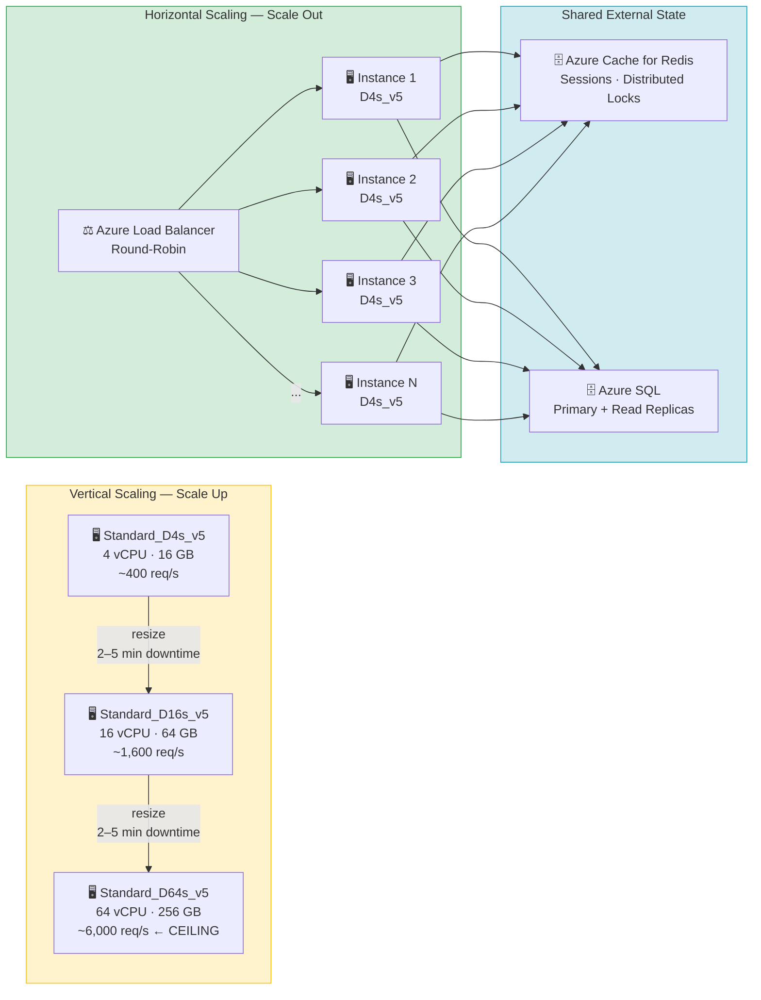
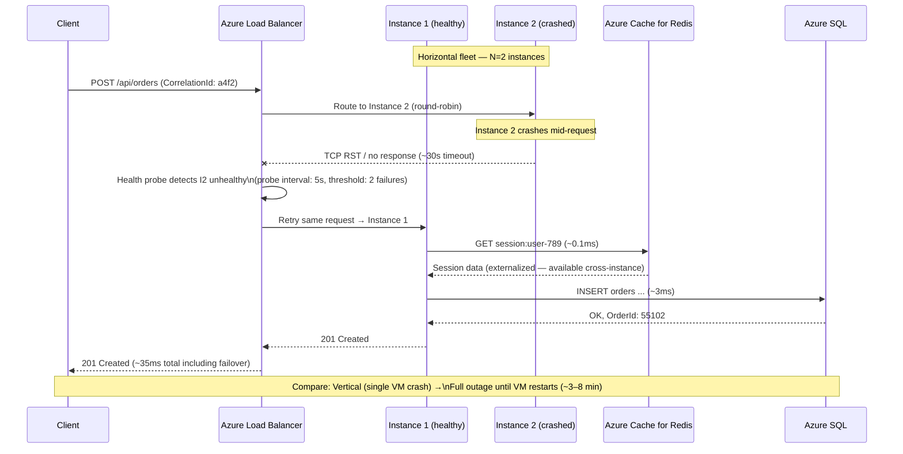
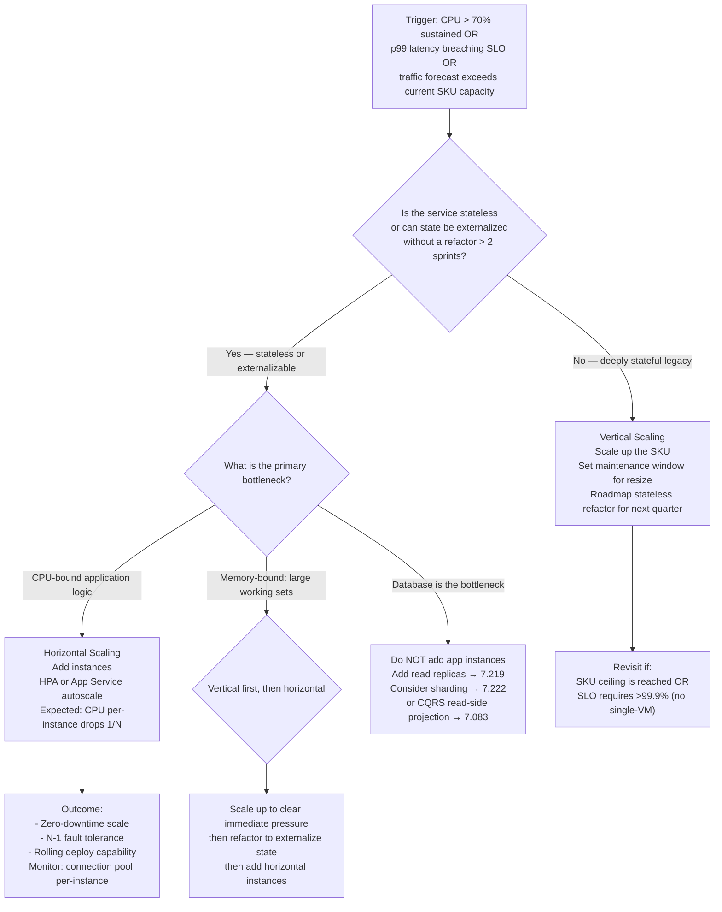

> [!success] Mastery Check
> - [ ] **Studied Well**
> - [ ] **Can explain the concept without notes**
> - [ ] **Can answer interview questions confidently**
> - [ ] **Can implement it in a real project**

---

id: "7.206" title: "Horizontal vs Vertical Scaling — Tradeoffs" domain: "System Design & Distributed Systems" domain_id: 7 group: "Scalability Patterns" tags: [system-design, distributed-systems, scalability, azure, dotnet, load-balancing, infrastructure] priority: 1 version: 2 prerequisites:

- "[[7.207 — Stateless Services — Design Principles]] — horizontal scaling is only viable when services carry no local state between requests"
- "[[7.210 — Load Balancing — Overview]] — horizontal scaling creates multiple instances that must be reached through a load balancer"
- "[[7.219 — Database Read Replicas — Setup and Tradeoffs]] — databases have their own separate scaling axes that interact directly with application-tier scaling decisions" related:
- "[[7.229 — Consistent Hashing — Algorithm]] — used to distribute requests evenly across horizontally scaled nodes"
- "[[7.233 — Auto-Scaling — Reactive vs Predictive]] — automates the decision of when to add or remove horizontal capacity"
- "[[7.222 — Database Sharding — Overview]] — horizontal scaling applied to the database tier"
- "[[7.255 — Scale Cube — X, Y, Z Axes]] — formal model that positions horizontal scaling as the X-axis"
- "[[7.249 — Bulkhead Pattern — Resource Isolation]] — complements horizontal scaling by isolating failure domains per workload type"
- "[[6.001 — SOLID Principles]] — stateless service design (enabling horizontal scaling) depends on the Single Responsibility and Dependency Inversion principles" created: 2025-06-16

---

> [!ABSTRACT] Quick Reference — Horizontal vs Vertical Scaling **Invariant:** Horizontal scaling (scale-out) adds identical instances behind a load balancer; each instance is independently replaceable and the fleet capacity is the sum of all instances. Vertical scaling (scale-up) replaces one machine with a larger one; capacity is bounded by the largest available SKU. **Cost:** Horizontal scaling requires stateless service design, a load balancer, distributed coordination primitives (sessions, caches, locks), and operational tooling for instance management. Vertical scaling is operationally simpler but introduces a scheduled maintenance window for the resize and has a hard ceiling. **Trigger:** P99 latency breaches SLO under sustained load, CPU or memory utilization sustains above 70% on the current instance size, or traffic forecasts exceed the maximum vertical SKU within the planning horizon. **Skip When:** Traffic is low and bursty in a way that auto-scaling handles, the workload is stateful and cannot be refactored (e.g., a legacy in-process session store), or the largest vertical SKU handles 5× projected peak with room to spare — vertical is correct here. **.NET Entry Point:** `IServiceCollection.AddHttpContextAccessor()` / stateless controller design / `IDistributedCache` for session externalization / `builder.Services.AddStackExchangeRedisCache()` **Azure Native:** Azure App Service (scale-out blade) · Azure Container Apps (min/max replicas) · AKS HPA · Azure SQL vCore tier change (vertical) · Azure Cache for Redis (session externalization) **Number to Know:** The cost inflection point for vertical scaling on Azure: a Standard_D8s_v5 (8 vCPU, 32 GB) costs ~$0.38/hr; a Standard_D32s_v5 (32 vCPU, 128 GB) costs ~$1.52/hr — 4× the price for 4× the capacity with no redundancy gain. Four D8s_v5 instances cost the same but survive one instance failure with 75% capacity preserved.

---

## Navigation

**Domain:** [[7 — System Design & Distributed Systems]] > **Group:** Scalability Patterns **Previous:** [[7.205 — Distributed System Design Tradeoffs — Summary]] | **Next:** [[7.207 — Stateless Services — Design Principles]]

### Prerequisites

- [[7.207 — Stateless Services — Design Principles]] — horizontal scaling is only operationally valid when no request-scoped state (sessions, in-flight data) lives in the process; understanding what makes a service stateless is the prerequisite for making horizontal scaling work
- [[7.210 — Load Balancing — Overview]] — once you have multiple instances, traffic distribution becomes the immediate next problem; load balancing is the mechanism that makes the multi-instance fleet coherent to callers
- [[6.001 — SOLID Principles]] — the Single Responsibility Principle and clean layering are what allow a service to be made stateless without a full rewrite

### Where This Fits

> [!INFO] Production Encounter Map
> 
> - **Layer:** Infrastructure and deployment layer — this decision shapes every other architectural choice in the system: session design, cache strategy, database connection pooling, deployment pipeline, and cost model
> - **Trigger:** An engineer first encounters this during initial capacity planning, during a traffic spike post-mortem, or when the on-call team discovers the production VM has hit 95% CPU and there is no more vertical headroom on the current SKU
> - **Without it:** The system runs on a single large VM. During a traffic spike, the CPU ceiling is hit. The only immediate remedy is a vertical resize, which requires a stop-start cycle causing ~2–5 minutes of downtime on Azure VMs. If the next SKU up is already the maximum (Standard_E96ds_v5), there is nowhere to go — the system is at its absolute scaling ceiling with no further options
> - **First signal:** `Percentage CPU` metric in Azure Monitor sustaining above 80% for 5+ minutes with `RequestsPerSecond` still climbing; or `Memory Working Set` at 90%+ causing GC pressure visible as `dotnet_gc_collections_total{generation="2"}` rising sharply on Prometheus

The horizontal vs. vertical decision is not a one-time architectural choice — it is revisited at every meaningful traffic inflection point. It directly determines whether [[7.229 — Consistent Hashing]] is needed for cache routing, whether [[7.222 — Database Sharding]] is on the roadmap, and whether the CI/CD pipeline must handle zero-downtime rolling deployments across a fleet of identical instances.

---

## Core Mental Model

Vertical scaling is the intuitive answer: the server is slow, buy a bigger server. It works immediately, requires no code changes, and has zero distribution complexity. It fails because hardware has a ceiling, because the single node is a single point of failure, and because cost-per-unit-of-capacity rises faster than linear as you move up the SKU ladder — the largest Azure VM costs disproportionately more per vCPU than a mid-tier VM of the same family.

Horizontal scaling treats capacity as a fleet management problem. The fleet can grow and shrink dynamically. Any instance failure is absorbed by the remaining instances. The ceiling is practical, not physical — you can add instances until cost becomes prohibitive or until your load balancer, service discovery, or database connection pool becomes the new bottleneck.

The engineering constraint that governs the choice is **state locality**: if the application keeps any request-correlated state in local memory or on local disk (HTTP sessions in `MemoryCache`, local file uploads in progress, in-process locks), adding a second instance means a request routed to the wrong instance finds no state and fails. This constraint must be resolved — by externalizing state to Redis, by making operations idempotent, or by using sticky sessions (which trade away the failure isolation benefit of horizontal scaling).

> [!TIP] The Non-Obvious Insight The bottleneck always migrates downstream when you horizontally scale the application tier. An application tier that previously saturated at 400 req/s on one VM will move to 4,000 req/s on ten VMs — at which point the single SQL Server instance, which was previously idle, is now at 95% CPU. Horizontal scaling does not increase system capacity; it shifts the bottleneck. The correct planning question is not "how many app instances do I need?" but "what is the next component to saturate, and is that component also horizontally scalable?" Database tiers are frequently not — they require a different path: read replicas ([[7.219]]), connection pooling, or sharding ([[7.222]]).

### Classification

- **Consistency axis:** Horizontal scaling introduces eventual consistency risk if state is externalized to a distributed cache with replication lag; vertical scaling has no consistency impact (single node)
- **Availability tradeoff:** Vertical = single point of failure; a VM restart for resize causes full downtime. Horizontal = N-1 redundancy; losing one instance reduces capacity but does not cause an outage — unless N=1
- **Latency impact:** Horizontal introduces +1 network hop through the load balancer (~0.1–0.5ms on Azure Internal Load Balancer; ~1–5ms through Azure Application Gateway with SSL offload). Vertical has zero additional latency once the resize is complete
- **Failure domain:** Vertical = single-node (all eggs in one basket). Horizontal = multi-node with independent failure domains if spread across Availability Zones
- **Abstraction layer:** Infrastructure / platform — this is an ops-level decision with deep architectural dependencies in the application layer

### Primary Diagram



### Supporting Diagram



### Numbers That Matter

|Metric|Value|Context / Conditions|
|---|---|---|
|Load balancer added latency|+0.1–0.5ms|Azure Internal Load Balancer (Layer 4); +1–5ms for Azure Application Gateway (Layer 7 with SSL)|
|VM vertical resize downtime|2–5 minutes|Azure VM stop-start cycle; Azure App Service slot swap is ~10s but requires Premium tier|
|HPA scale-out reaction time|~60–90 seconds|Kubernetes HPA default: 15s poll, 3 consecutive readings, pod startup time for ASP.NET Core ~15–30s|
|Redis session read latency|~0.1–0.3ms|Azure Cache for Redis Basic/Standard tier, same-region, StackExchange.Redis ConnectionMultiplexer|
|Maximum vertical SKU (Azure)|Standard_E96ds_v5: 96 vCPU, 672 GB RAM|Hard ceiling; no further vertical path after this|
|Instance failure capacity loss|1/N × 100%|Losing 1 of 4 instances leaves 75% capacity; losing 1 of 2 leaves 50% — fleet size determines blast radius|
|Azure App Service scale-out time|~60–120 seconds (estimated)|From trigger to first request served on new instance; image pull + warmup included|
|Connection pool pressure per-instance|Max 100 connections per SQL pool (default)|10 instances = 1,000 total SQL connections; must configure Azure SQL `max_connections` accordingly|

### Key Properties / Guarantees

|Property|Value|Condition|
|---|---|---|
|Redundancy|N-1 instance failure tolerance|Horizontal only; vertical provides zero redundancy|
|Maximum throughput|Sum of all instance capacities|Horizontal — bounded by load balancer throughput and downstream bottlenecks|
|Resize downtime|~0 seconds (rolling deploy)|Horizontal — new instances added before old removed; zero-downtime|
|Resize downtime|2–5 minutes (stop-start)|Vertical — VM must be deallocated to change SKU on Azure IaaS|
|State consistency|At-risk without session externalization|Horizontal — requests routed to different instances see different local state|
|Cost efficiency at medium scale|Better with horizontal|Above ~8 vCPUs, vertical pricing grows non-linearly; horizontal uses commodity SKUs|
|Operational complexity|Low|Vertical — single host, single deployment target, no load balancer, no distributed state|
|Operational complexity|Medium–High|Horizontal — load balancer, session externalization, distributed config, multi-instance deployments|

---

## Deep Mechanics

### How It Works

**Vertical Scaling — Resize Procedure (Azure VM):**

1. The VM is `Stop (Deallocated)` via Azure Portal or CLI — the instance goes offline. All in-flight requests fail.
2. Azure changes the VM SKU in the resource definition. The underlying hardware is reallocated to a larger host.
3. The VM is started. OS boot takes 30–60 seconds; ASP.NET Core startup (DI wiring, EF Core model compilation, warmup middleware) adds another 10–30 seconds.
4. The DNS record or load balancer health probe detects the VM is healthy again.
5. Total downtime: 2–5 minutes. During this window, all traffic to this service returns 503 unless a secondary is in place.

**Horizontal Scaling — Adding an Instance (AKS HPA or Azure App Service):**

1. A metric threshold is crossed: CPU > 70% for 3 consecutive 15-second intervals, or custom KEDA metric (queue depth > 500).
2. The orchestrator (HPA / App Service autoscale) creates a new instance definition. For AKS: a new Pod is scheduled on an available Node.
3. The container image is pulled (ideally cached on the node), the container starts, and the ASP.NET Core application runs startup (`IHostedService.StartAsync`, warmup middleware).
4. The new instance passes the readiness probe (returns HTTP 200 on `/health/ready`). Only then does the load balancer begin routing traffic to it.
5. Existing instances continue serving traffic throughout steps 2–4. Zero request interruption.
6. On scale-in: the instance is marked unready (load balancer stops routing), existing in-flight requests drain during the `terminationGracePeriodSeconds` window (typically 30s), then the instance shuts down.

**State Externalization (Required for Horizontal):**

Without externalized state, a user whose session was created on Instance 1 will receive HTTP 401 or an empty cart if their next request hits Instance 2. Fix options in order of preference:

1. **No session at all** — JWT bearer tokens carry claims; stateless API design. Zero coordination overhead.
2. **Distributed cache** — `IDistributedCache` backed by Azure Cache for Redis. All instances read and write the same session store. Adds ~0.1–0.5ms per session read.
3. **Sticky sessions (affinity)** — Azure Application Gateway and Azure Front Door support cookie-based affinity. The same client always hits the same instance. Simple to configure, but defeats the failure redundancy benefit: if Instance 1 fails, that user's session is lost anyway.

### Protocol Trace

```
Scale-Out Event — Azure App Service (Standard S3 tier):

Pre-condition: 1 instance running, CPU = 85% for 10 minutes

  1. Azure Monitor: CPU metric > 70% threshold sustained (~15:04:02 UTC)
  2. App Service Autoscale: evaluates rule → "add 1 instance" decision (~15:04:17 UTC, 15s poll)
  3. App Service: provisions new instance on backend fabric (~15:04:17–15:05:30 UTC, ~73s)
  4. New instance: pulls Docker image (cache hit: ~5s; cold pull: ~30–60s)
  5. New instance: ASP.NET Core startup — DI container build, EF Core model, warmup (~15s)
  6. New instance: /health/ready returns HTTP 200 (~15:05:50 UTC)
  7. Load balancer: adds new instance to rotation (~15:05:51 UTC)
  8. Traffic: split 50/50 across both instances; CPU drops to ~43% per instance
  Total scale-out latency: ~107 seconds from threshold to traffic relief

Scale-In Event (load drops):

  1. Azure Monitor: CPU < 30% for 15 minutes
  2. Autoscale: "remove 1 instance" decision (cooldown period: 5 minutes must have elapsed)
  3. Load balancer: stops routing new requests to instance-2 (~graceful drain start)
  4. Instance-2: in-flight requests complete within terminationGracePeriod (30s default)
  5. Instance-2: deprovisioned
  Total scale-in latency: ~35 seconds from decision to deprovisioned

Failure Path (Instance crash during horizontal operation):

  1. Instance-2 crashes (OOMKill, process exit, or kernel panic)
  2. Azure Load Balancer health probe: 2 consecutive failures × 5s interval = ~10s detection
  3. Load balancer: removes Instance-2 from rotation
  4. In-flight requests to Instance-2: TCP RST received by clients → clients receive 503
  5. Clients with Polly retry: retry with exponential backoff → hits Instance-1 → succeeds
  6. Capacity: 1 of 2 instances → 50% of previous capacity
  7. Autoscale: detects CPU spike on remaining instance → adds replacement within ~107s
  Caller observes: ~2% of requests receive 503 (those in-flight at crash moment); retried by client within 500ms
  Recovery: automatic within ~2 minutes (new instance healthy and in rotation)
```

### Failure Modes

**Failure Mode 1: Thundering Herd on Scale-Out**

- **Cause:** All new instances start simultaneously, connect to the database, and immediately begin serving traffic before JIT compilation and caches are warm. Combined with Azure App Service's scale-out of 3 instances at once, the first 30 seconds of each new instance's life generate disproportionate CPU, GC, and SQL connection pressure.
- **Symptom:** After a scale-out event, p99 latency temporarily spikes higher than before the scale-out. Database connection pool exhaustion visible as `SqlException: Timeout expired. The timeout period elapsed prior to obtaining a connection from the pool.`
- **Detection time:** Immediate — latency spike is visible within 30 seconds of new instances entering rotation
- **Blast radius:** The scale-out event intended to relieve pressure instead amplifies it transiently. If autoscale triggers another scale-out, the cycle compounds. SQL Database connection counts spike: 3 new instances × 100 pool connections each = 300 new connections instantiated in 30 seconds.

> [!DANGER] 3 AM Production Signal Metric: `azure_app_service_http_response_time_p99_ms > 2000` spiking exactly 90–120 seconds after a scale-out event completes Log: `WARN [SqlConnectionPool] All pooled connections are in use | Pool size: 300 | Wait time: 28,453ms | CorrelationId: b7c3-9a12-4f01` Customer impact: Checkout and order placement returning HTTP 503 or spinning indefinitely for ~2 minutes per scale-out event during peak traffic hours

---

**Failure Mode 2: Database Connection Pool Exhaustion at Scale**

- **Cause:** Each horizontally scaled instance maintains its own connection pool to SQL Server. The default EF Core pool size is 100 connections. At 10 instances, this is 1,000 concurrent connections to a single Azure SQL Database. Azure SQL Standard S3 allows up to 600 sessions; Premium P4 allows 1,600. If the instance count grows but the connection ceiling is not raised or the connection pool size is not reduced proportionally, the database rejects connections.
- **Symptom:** `Microsoft.Data.SqlClient.SqlException (0x80131904): Connection Timeout Expired. The timeout period elapsed while attempting to consume the pre-login handshake acknowledgement.`
- **Detection time:** Silent until instance count crosses the ceiling — then immediate and complete failure
- **Blast radius:** All requests requiring database access fail across all instances simultaneously. The service appears healthy from the load balancer perspective (health probes pass) but all data operations return 500.

> [!DANGER] 3 AM Production Signal Metric: `sqlserver_connections_total` plateauing at exactly the Azure SQL session limit (e.g., 600 for S3) while `dotnet_exceptions_total{type="SqlException"}` spikes Log: `ERROR [OrderRepository] EF Core command failed | Duration: 30,001ms | Error: Connection Timeout Expired | MaxPoolSize: 100 | ActiveConnections: 100 | CorrelationId: c9f1-2b84` Customer impact: All write operations (orders, payments, profile updates) failing with HTTP 500 for all users; read-only endpoints backed by read replica remain functional

### .NET and Azure Integration Points

- **ASP.NET Core:** Stateless controller design requires no local `HttpContext`-scoped state between requests. `IHttpContextAccessor` is safe across instances. `IMemoryCache` is NOT shared — use `IDistributedCache` for cross-instance data.
- **EF Core:** Connection pool size is configured per `DbContext` registration. Reduce `MaxPoolSize` proportionally as instance count grows.
- **Azure Services:** Azure App Service (scale-out blade, autoscale rules), Azure Container Apps (min/maxReplicas), AKS HPA, Azure Cache for Redis (session externalization), Azure SQL connection limits by tier
- **.NET Libraries:** `StackExchange.Redis` for `IDistributedCache`; Polly for retry-on-503 during scale events; `Microsoft.AspNetCore.OutputCaching` is per-instance (not distributed without a backing store)

```csharp
// YourCompany.OrderManagement — Program.cs
// Horizontal-safe service registration

using StackExchange.Redis;
using Microsoft.Extensions.Caching.StackExchangeRedis;

var builder = WebApplication.CreateBuilder(args);

// ✅ Distributed session — shared across all instances
builder.Services.AddStackExchangeRedisCache(options =>
{
    options.Configuration = builder.Configuration["Redis:ConnectionString"];
    options.InstanceName = "OrderManagement:";
});

// ✅ Stateless HTTP clients with Polly retry for scale-out transient errors
builder.Services.AddHttpClient<IInventoryServiceClient, InventoryServiceClient>()
    .AddStandardResilienceHandler();

// ✅ EF Core — reduce pool size per-instance when running N instances
// Default MaxPoolSize = 100; with 10 instances targeting SQL S3 (600 session limit):
// Set MaxPoolSize = 50 → 10 instances × 50 = 500 connections < 600 limit
builder.Services.AddDbContext<OrderDbContext>(options =>
    options.UseSqlServer(
        builder.Configuration.GetConnectionString("SqlServer"),
        sqlOptions => sqlOptions.MaxBatchSize(50)), // not pool size — connection pool is separate
    optionsLifetime: ServiceLifetime.Singleton);

// ❌ WRONG — in-process session breaks horizontal scaling
// builder.Services.AddSession(); // Uses MemoryCache — not shared across instances

// ✅ CORRECT — distributed session backed by Redis
builder.Services.AddSession(options =>
{
    options.IdleTimeout = TimeSpan.FromMinutes(20);
    options.Cookie.HttpOnly = true;
    options.Cookie.IsEssential = true;
});

var app = builder.Build();
app.UseSession();
```

---

## Production Patterns and Implementation

### Primary Implementation

```csharp
// YourCompany.OrderManagement.Api — Horizontal-safe stateless service
// Namespace: YourCompany.OrderManagement.Application.Orders

namespace YourCompany.OrderManagement.Application.Orders;

/// <summary>
/// Stateless order application service — safe for horizontal scaling.
/// All state is externalized: sessions via Redis, domain state via SQL.
/// No instance-local mutable fields. Each request is fully self-contained.
/// </summary>
/// <remarks>
/// Architecture role: Application Service (CQRS command handler via MediatR)
/// Horizontal scaling invariant: zero shared mutable state between method calls.
/// </remarks>
public sealed class PlaceOrderCommandHandler : IRequestHandler<PlaceOrderCommand, PlaceOrderResult>
{
    private readonly IOrderRepository _orderRepository;           // Adapter — EF Core
    private readonly IInventoryServiceClient _inventoryClient;    // Adapter — HTTP
    private readonly IDistributedCache _distributedCache;         // Infrastructure — Redis
    private readonly ILogger<PlaceOrderCommandHandler> _logger;

    public PlaceOrderCommandHandler(
        IOrderRepository orderRepository,
        IInventoryServiceClient inventoryClient,
        IDistributedCache distributedCache,
        ILogger<PlaceOrderCommandHandler> logger)
    {
        _orderRepository = orderRepository;
        _inventoryClient = inventoryClient;
        _distributedCache = distributedCache;
        _logger = logger;
    }

    /// <summary>
    /// Places an order. Idempotent on idempotency key — safe for at-least-once delivery.
    /// </summary>
    public async Task<PlaceOrderResult> Handle(
        PlaceOrderCommand command,
        CancellationToken cancellationToken)
    {
        // Idempotency check — distributed, cross-instance safe (Redis)
        // Critical: without this, a client retry after a transient error during scale-out
        // could duplicate the order on a different instance.
        var idempotencyKey = $"order:idempotency:{command.IdempotencyKey}";
        var existing = await _distributedCache.GetStringAsync(idempotencyKey, cancellationToken);
        if (existing is not null)
        {
            _logger.LogInformation(
                "Idempotent replay — returning cached result | Key: {IdempotencyKey} | CorrelationId: {CorrelationId}",
                command.IdempotencyKey, command.CorrelationId);
            return JsonSerializer.Deserialize<PlaceOrderResult>(existing)!;
        }

        // Inventory check — external HTTP call, safe across instances
        var reservationId = await _inventoryClient.ReserveItemsAsync(
            command.LineItems, command.CorrelationId, cancellationToken);

        // Domain operation — persisted to shared SQL
        var order = Order.Place(command.CustomerId, command.LineItems, reservationId);
        await _orderRepository.AddAsync(order, cancellationToken);

        var result = new PlaceOrderResult(order.Id, order.Status);

        // Cache result for idempotency window (24 hours)
        await _distributedCache.SetStringAsync(
            idempotencyKey,
            JsonSerializer.Serialize(result),
            new DistributedCacheEntryOptions
            {
                AbsoluteExpirationRelativeToNow = TimeSpan.FromHours(24)
            },
            cancellationToken);

        _logger.LogInformation(
            "Order placed | OrderId: {OrderId} | CustomerId: {CustomerId} | CorrelationId: {CorrelationId}",
            order.Id, command.CustomerId, command.CorrelationId);

        return result;
    }
}
```

### IServiceCollection Registration

```csharp
// Program.cs — YourCompany.OrderManagement.Api
// Full horizontal-scaling-ready registration

var builder = WebApplication.CreateBuilder(args);

// Distributed cache — shared across all horizontal instances
builder.Services.AddStackExchangeRedisCache(options =>
{
    options.Configuration = builder.Configuration["AzureRedis:ConnectionString"];
    options.InstanceName = "om:"; // namespace prefix
});

// MediatR — CQRS pipeline, fully stateless
builder.Services.AddMediatR(cfg =>
    cfg.RegisterServicesFromAssembly(typeof(PlaceOrderCommandHandler).Assembly));

// EF Core — connection pool tuned for horizontal fleet
// With N=5 instances targeting Azure SQL P1 (300 session limit):
// MaxPoolSize = 50 → 5 × 50 = 250 connections < 300 limit
builder.Services.AddDbContext<OrderDbContext>((sp, options) =>
{
    var connectionString = builder.Configuration.GetConnectionString("AzureSql")
        ?? throw new InvalidOperationException("AzureSql connection string is required");

    options.UseSqlServer(connectionString, sqlOptions =>
    {
        sqlOptions.CommandTimeout(30); // seconds
        sqlOptions.EnableRetryOnFailure(
            maxRetryCount: 3,
            maxRetryDelay: TimeSpan.FromSeconds(10),
            errorNumbersToAdd: null);
    });
}, optionsLifetime: ServiceLifetime.Singleton); // Singleton pool, transient context

// Health checks — required for load balancer readiness probe
builder.Services.AddHealthChecks()
    .AddSqlServer(builder.Configuration.GetConnectionString("AzureSql")!, name: "sql")
    .AddRedis(builder.Configuration["AzureRedis:ConnectionString"]!, name: "redis");
```

### Common Variants

```csharp
// Variant A — JWT Stateless (preferred): no session storage at all
// Used when: API-only service with token-authenticated clients; zero session overhead
// Horizontal scaling: trivially safe — no shared state required

builder.Services.AddAuthentication(JwtBearerDefaults.AuthenticationScheme)
    .AddJwtBearer(options =>
    {
        options.Authority = builder.Configuration["AzureAd:Authority"];
        options.Audience = builder.Configuration["AzureAd:Audience"];
        // Each instance validates the JWT independently using the public key — no coordination
    });
```

```csharp
// Variant B — Sticky Sessions (fallback): only when state cannot be externalized
// Used when: migrating a legacy ASP.NET app with in-process ViewState or complex session
// Warning: defeats failure isolation — if an instance crashes, affected users lose session
// Azure: Application Gateway → Backend HTTP Settings → Cookie-based affinity = Enabled

builder.Services.AddSession(options =>
{
    options.IdleTimeout = TimeSpan.FromMinutes(30);
    options.Cookie.Name = ".OrderManagement.Session";
    options.Cookie.HttpOnly = true;
});
// Note: with sticky sessions, you still need IMemoryCache (NOT IDistributedCache)
// because the whole point is that this instance owns the session
builder.Services.AddDistributedMemoryCache(); // In-process — only valid with sticky sessions
```

### Performance Profile

```csharp
[MemoryDiagnoser]
[SimpleJob(RuntimeMoniker.Net80)]
public class SessionStorageBenchmark
{
    private IMemoryCache _memoryCache = null!;
    private IDistributedCache _distributedCache = null!;  // Redis in benchmarks uses local Redis

    [GlobalSetup]
    public void Setup()
    {
        var services = new ServiceCollection();
        services.AddMemoryCache();
        services.AddStackExchangeRedisCache(o => o.Configuration = "localhost:6379");
        var sp = services.BuildServiceProvider();
        _memoryCache = sp.GetRequiredService<IMemoryCache>();
        _distributedCache = sp.GetRequiredService<IDistributedCache>();
    }

    [Params(256, 4096)]
    public int PayloadBytes { get; set; }

    [Benchmark(Baseline = true)]
    public async Task<byte[]?> InProcessMemoryCache()
    {
        var key = $"session:{Guid.NewGuid()}";
        _memoryCache.Set(key, new byte[PayloadBytes], TimeSpan.FromMinutes(20));
        return _memoryCache.Get<byte[]>(key);
    }

    [Benchmark]
    public async Task<byte[]?> DistributedRedisCache()
    {
        var key = $"session:{Guid.NewGuid()}";
        await _distributedCache.SetAsync(key, new byte[PayloadBytes],
            new DistributedCacheEntryOptions { AbsoluteExpirationRelativeToNow = TimeSpan.FromMinutes(20) });
        return await _distributedCache.GetAsync(key);
    }
}
```

Expected result shape (measured on localhost Redis, AMD Ryzen 9, .NET 8):

|Method|Payload|Mean|Allocated|Notes|
|---|---|---|---|---|
|InProcessMemoryCache|256 B|~0.05 µs|24 B|Single instance only|
|InProcessMemoryCache|4 KB|~0.07 µs|24 B|Does not cross network|
|DistributedRedisCache|256 B|~120 µs|1.2 KB|Network RTT included; ~0.1ms same-AZ Azure|
|DistributedRedisCache|4 KB|~140 µs|4.4 KB|Bandwidth minimal at this size|

The 2,400× latency difference is the cost of horizontal scalability for session reads. At 100 req/s with a session read per request, Redis adds ~12ms of cumulative session latency per second — negligible on the critical path if session reads are not on every API call.

### Real-World .NET Ecosystem Mapping

|Pattern in This Note|Where It Appears in .NET / Azure|Manifestation|
|---|---|---|
|Stateless request handling|ASP.NET Core controller / Minimal API endpoint|No instance fields mutated per request; all state via injected services|
|Session externalization|`IDistributedCache` / `StackExchange.Redis`|Redis acts as the shared session store across all instances|
|Connection pool management|`Microsoft.Data.SqlClient` SqlConnection pool|Pool per-process; must be sized relative to instance count × SQL tier limits|
|Health-check readiness gate|`Microsoft.Extensions.Diagnostics.HealthChecks`|Load balancer only routes to instances returning `Healthy` on `/health/ready`|
|Idempotency across instances|`IDistributedCache` + idempotency key|Redis stores result; second instance returns cached response on retry|

---

## Gotchas and Production Pitfalls

### In-Process IMemoryCache Used as Distributed Cache

**Pitfall:** An engineer adds caching to improve database read performance using `IMemoryCache`. The service is then scaled out to 3 instances. Each instance has its own `IMemoryCache` — they share no state. A cache invalidation call on Instance 1 leaves Instance 2 and Instance 3 serving stale data indefinitely.

```csharp
// ❌ The wrong pattern — IMemoryCache is per-process, not shared
builder.Services.AddMemoryCache();

// In handler:
public async Task<ProductDto?> Handle(GetProductQuery query, CancellationToken ct)
{
    if (_memoryCache.TryGetValue($"product:{query.ProductId}", out ProductDto cached))
        return cached; // ← May return data invalidated on a different instance

    var product = await _productRepository.GetByIdAsync(query.ProductId, ct);
    _memoryCache.Set($"product:{query.ProductId}", product, TimeSpan.FromMinutes(5));
    return product;
}
```

**Symptom:** Cache invalidation (e.g., after a product price update) results in different instances serving different product prices for up to 5 minutes. Customer support receives reports of inconsistent pricing. A/B comparisons show different responses from the same endpoint depending on which instance was hit.

**Detection time:** Silent — no exception is thrown, no metric fires. Only discovered via customer complaints or by curling both instances directly and comparing responses.

> [!DANGER] Production Signal Metric: No direct metric — detected indirectly via `customer_support_tickets_total{category="pricing_inconsistency"}` spike after a price update deployment Log: `INFO [ProductHandler] Cache hit | ProductId: 8821 | CachedPrice: 29.99 | ActualPrice: 24.99` (only appears if you log cache hits with price) Customer impact: 33% of users (those hitting Instance 3, which hasn't yet expired its cache) see the old price for up to 5 minutes after a promotional price change

**Fix:**

```csharp
// ✅ The correct pattern — IDistributedCache is shared across all instances
builder.Services.AddStackExchangeRedisCache(options =>
{
    options.Configuration = configuration["AzureRedis:ConnectionString"];
    options.InstanceName = "catalog:";
});

// In handler — inject IDistributedCache instead
public async Task<ProductDto?> Handle(GetProductQuery query, CancellationToken ct)
{
    var cacheKey = $"product:{query.ProductId}";
    var cached = await _distributedCache.GetStringAsync(cacheKey, ct);
    if (cached is not null)
        return JsonSerializer.Deserialize<ProductDto>(cached);

    var product = await _productRepository.GetByIdAsync(query.ProductId, ct);
    if (product is null) return null;

    var dto = ProductDto.From(product);
    await _distributedCache.SetStringAsync(cacheKey, JsonSerializer.Serialize(dto),
        new DistributedCacheEntryOptions { AbsoluteExpirationRelativeToNow = TimeSpan.FromMinutes(5) }, ct);
    return dto;
}
```

**Cost of not fixing:** At 5 instances and 500 product updates/day during a flash sale, up to 40% of users receive stale pricing for the TTL duration → pricing inconsistency → potential regulatory risk if promotional pricing is involved → revenue loss if customers switch providers due to confusion.

---

### SQL Connection Pool Exhaustion at Scale-Out

**Pitfall:** The application is deployed with default SqlClient connection pool settings (`MaxPoolSize=100`). At 4 instances, 400 concurrent connections are possible. Azure SQL Standard S2 supports 300 concurrent sessions. At 3 instances (300 connections exactly at saturation), the system starts refusing new connections on the 4th instance or during connection pool exhaustion events.

```csharp
// ❌ Wrong — default MaxPoolSize=100 with no awareness of instance count
builder.Services.AddDbContext<OrderDbContext>(options =>
    options.UseSqlServer(connectionString));
// At 4 instances: 4 × 100 = 400 connections > Azure SQL S2 limit of 300
```

**Symptom:** `SqlException: Connection Timeout Expired` during scale-out events or traffic spikes. The error appears only when the 4th or 5th instance is fully loaded, not during normal 2-instance operation.

**Detection time:** Invisible during development and staging (typically 1 instance); only manifests at the specific N-instance threshold in production.

> [!DANGER] Production Signal Metric: `azure_sql_sessions_total > 280` (approaching S2 limit) while `dotnet_exceptions_total{exception="SqlException",source="SqlCommand"}` rises sharply Log: `ERROR [OrderDbContext] Connection Timeout Expired | Elapsed: 30,001ms | Pool: MaxPoolSize=100, Active=100, Waiting=47 | CorrelationId: d2e4-1a93` Customer impact: Order placement fails with HTTP 500 for all users while read-only catalog endpoints (using read replica) remain functional

**Fix:**

```csharp
// ✅ Correct — size the pool relative to instance count and SQL tier
// Rule: MaxPoolSize = floor(SQL_session_limit × 0.8 / instance_count)
// Azure SQL S3 (600 sessions), 5 instances: floor(600 × 0.8 / 5) = 96 → use 90

var connectionString = $"{rawConnectionString};Max Pool Size=90;Min Pool Size=5;";
builder.Services.AddDbContext<OrderDbContext>(options =>
    options.UseSqlServer(connectionString, sqlOptions =>
        sqlOptions.EnableRetryOnFailure(3, TimeSpan.FromSeconds(5), null)));
```

**Cost of not fixing:** At the connection ceiling, all SQL operations return `CommandTimeout` within 30 seconds → all writes fail → the service appears up but is functionally down → P1 incident, PagerDuty escalation, manual intervention required to either kill connections or scale down.

---

### Missing Readiness Probe Causes Traffic to Unhealthy Instances

**Pitfall:** Azure App Service and AKS begin routing traffic to a new instance as soon as the container is running, before the application has completed startup (DI wiring, EF Core model compilation, Redis connection establishment, warmup endpoint invocation). Without a readiness probe, the load balancer routes ~10–20% of requests to a not-yet-ready instance that returns HTTP 500 or connection-refused.

```csharp
// ❌ Wrong — no health check endpoint configured; load balancer uses TCP connectivity only
var app = builder.Build();
app.MapControllers();
app.Run();
// Azure App Service treats TCP port open = healthy; routes traffic before app is ready
```

**Symptom:** A spike of HTTP 503 and 500 errors lasting 15–30 seconds after every deployment or scale-out event. Customer support tickets spike immediately after releases.

**Detection time:** Immediate — errors appear within seconds of scale-out event, correlating exactly with deployment timestamps.

> [!DANGER] Production Signal Metric: `azure_app_service_http_5xx_responses_total` spike of 30–120 errors within 30 seconds of every deployment event (visible in deployment correlation view) Log: `WARN [Kestrel] Connection from 10.0.1.4 refused: not yet listening | Startup elapsed: 8,231ms` Customer impact: Intermittent HTTP 500 during checkout and login for 15–30 seconds after every release to production

**Fix:**

```csharp
// ✅ Correct — health checks with readiness gate
builder.Services.AddHealthChecks()
    .AddSqlServer(connectionString, name: "sql", tags: ["ready"])
    .AddRedis(redisConnectionString, name: "redis", tags: ["ready"])
    .AddCheck("startup", () => HealthCheckResult.Healthy(), tags: ["ready"]);

var app = builder.Build();

// Liveness: is the process alive?
app.MapHealthChecks("/health/live", new HealthCheckOptions { Predicate = _ => false });

// Readiness: are all dependencies ready to serve traffic?
app.MapHealthChecks("/health/ready", new HealthCheckOptions
{
    Predicate = check => check.Tags.Contains("ready"),
    ResponseWriter = UIResponseWriter.WriteHealthCheckUIResponse
});
```

**Cost of not fixing:** Every deployment to production generates a guaranteed customer-visible error spike. In a high-velocity team deploying 5× per day, this means 5 error spikes/day → customer trust erosion → SLO burn rate increase → error budget consumed by deployment events rather than real failures.

---

### Azure-Specific: App Service Scale-Out Doesn't Apply to Background Workers

**Pitfall:** An Azure App Service plan hosts both the web frontend and a background `IHostedService` that processes orders from a queue. When App Service scales out to 3 instances due to HTTP traffic pressure, the background worker also runs on all 3 instances — each instance independently dequeues and processes the same messages, causing 3× processing of every order.

**Symptom:** Duplicate orders, duplicate charges, duplicate emails. The queue depth falls 3× faster than expected during scale-out events. Idempotency violations appear in the database as duplicate order records.

**Detection time:** 5–15 minutes after scale-out — pattern appears in order count reporting and customer complaints about duplicate charges.

> [!DANGER] Production Signal Metric: `rabbitmq_queue_messages_total` dropping at 3× the expected processing rate while `sql_order_insert_duplicate_key_exceptions_total` rises Log: `WARN [OrderProcessor] Duplicate order detected | OrderId: 88231 | IdempotencyKey: abc-123 | Instance: app-service-instance-2 | CorrelationId: f1b2-3c44` Customer impact: Customers charged 2–3× for a single order; refund operations required; stripe/payment gateway rate limits triggered

**Fix:** Separate the background worker into a dedicated Azure Container App (with `minReplicas: 1, maxReplicas: 1` or KEDA queue-based scaling), independent of the web tier scale-out. The web tier and the worker tier scale independently.

**Cost of not fixing:** Financial liability from duplicate charges; PCI-DSS compliance violation if payment processing is duplicated; incident requiring manual data reconciliation across every scale-out event in production.

---

### .NET-Specific: Static Fields Break Horizontal Scaling Assumptions

**Pitfall:** A developer uses a `static` counter or static dictionary for request metrics, feature flag caching, or rate limit tracking. On a single instance, it appears to work. On 5 instances, each instance has its own static state — the metrics are per-instance-local, rate limit counters reset per instance, and feature flags may differ between instances.

```csharp
// ❌ Wrong — static state is per-process, not shared across instances
public static class RateLimiter
{
    private static int _requestCount = 0; // Per-instance — 5 instances = 5 independent counters

    public static bool IsAllowed(string clientId)
    {
        return Interlocked.Increment(ref _requestCount) <= 100; // Not distributed!
    }
}
```

**Symptom:** Rate limiting allows 5× the intended request count (100 requests per instance × 5 instances = 500 effective limit). Security incident if rate limiting is the primary DDoS protection layer.

**Fix:** Replace static state with `IDistributedCache` / Redis for any cross-instance coordination. Use `RedisRateLimiter` or a Redis Lua script for distributed atomic counter operations.

**Cost of not fixing:** Security exposure — an attacker can exhaust rate limits on one instance, switch to another instance, and effectively bypass the limit entirely; customer abuse during sales events; potential Azure DDoS protection activation if traffic appears as a spike.

---

## Tradeoffs and Decision Framework

### Tradeoff Matrix

|Dimension|Horizontal (Scale-Out)|Alternative A: Vertical (Scale-Up)|Alternative B: Hybrid|
|---|---|---|---|
|Availability under failure|High — N-1 redundancy|None — SPOF|High for app tier; depends on DB tier|
|Maximum capacity ceiling|Practical (cost)|Hard (SKU limit, Azure: 96 vCPU max)|Removes app-tier ceiling; DB still limited|
|Resize downtime|~0 (rolling deploy)|2–5 minutes (VM stop-start)|App: 0; DB resize: maintenance window|
|Read latency p99|+0.1–5ms (LB hop)|Baseline (no extra hop)|Same as horizontal for app tier|
|Operational complexity|Medium–High|Low|High|
|Session/state requirement|Stateless or external state|No constraint|No constraint on DB; stateless for app|
|Azure ecosystem fit|Native (AKS HPA, Container Apps KEDA, App Service scale-out)|Native (VM resize, App Service plan scale-up)|Native for both tiers|
|Cost at 4× capacity|~Linear (4 × instance cost)|Non-linear (larger SKUs cost-per-vCPU premium, ~1.3–1.8× more per vCPU at top tiers)|Mid-tier VM × N instances|
|Fault isolation|Strong (AZ spread possible)|None|Strong for app; none for single DB|
|Team expertise required|Kubernetes/orchestration, distributed systems, stateless design|VM management only|Both|

### When to Apply



### Numbers-Driven Decision

|Threshold|Below = Vertical (or stay)|Above = Horizontal|
|---|---|---|
|Request rate sustained|< 2,000 req/s (manageable on D16s_v5)|> 2,000 req/s or approaching SKU ceiling|
|Availability SLO|< 99.9% (one 9)|≥ 99.9% — single instance cannot achieve this reliably|
|Traffic growth rate|< 2× per year|> 2× per year — horizontal scales incrementally without SKU jumps|
|Peak-to-average traffic ratio|< 2:1|> 3:1 — horizontal can scale-in during off-peak to save cost|
|Team size|< 3 engineers|> 5 engineers — operational overhead of horizontal fleet is manageable|
|Largest vertical SKU utilization|< 60% headroom remaining|< 30% headroom — within 1–2 traffic doublings of the ceiling|

### When NOT to Apply

> [!WARNING] Do Not Reach For Horizontal Scaling When...
> 
> - [ ] **The bottleneck is the database, not the app tier:** Adding 5 app instances that all hit a single overloaded SQL Server accelerates the DB bottleneck. Fix the database first: add read replicas ([[7.219]]), optimize queries, or add a cache layer ([[7.257 — Cache-Aside Pattern]]). Horizontal app scaling makes a DB bottleneck catastrophically worse.
> - [ ] **The service is deeply stateful and cannot be refactored within the planning horizon:** A legacy ASP.NET WebForms app with `Session["cart"]` in `InProc` mode will produce data corruption across instances. Sticky sessions are a band-aid — if the instance fails, the session is lost. Vertical scaling is correct while the stateless refactor is in progress.
> - [ ] **The team lacks the operational tooling:** Running a horizontal fleet without centralized logging, distributed tracing, and health check infrastructure means debugging production issues across N instances by SSH-ing into each one individually. This is worse than a single well-monitored vertical VM. Invest in observability ([[7.716 — Observability — The Three Pillars]]) before scaling out.
> - [ ] **Traffic is steady-state with no burst pattern:** If the system serves exactly 300 req/s 24/7 with <10% variance, vertical scaling on a D4s_v5 is simpler and cheaper. Horizontal scaling adds cost (load balancer, Redis for session) and complexity that provides no benefit if the scale factor never changes.

---

## Interview Arsenal

### Question Bank

1. **[Definition]** "What is the difference between horizontal and vertical scaling, and what specific engineering constraint makes one viable when the other is not?"
2. **[Mechanism]** "Walk me through exactly what happens, step by step, when an Azure App Service auto-scales from 2 instances to 3. How does traffic shift, and what is the risk window?"
3. **[Tradeoff]** "Horizontal scaling is often described as 'better' than vertical. Under what specific conditions is vertical scaling the correct choice, and what does horizontal scaling cost that engineers often underestimate?"
4. **[Failure mode]** "Your team scaled a service from 1 to 5 instances and immediately saw duplicate records in the database. What is the most likely cause, and how would you detect and fix it?"
5. **[Comparison]** "What is the difference between horizontal application scaling and database read replicas? Can you do both simultaneously, and what does each solve?"
6. **[Design application]** "Design the application tier for a payment processing service that handles 10,000 transactions per second at peak. How do you scale it, what state management strategy do you use, and what is the connection pool configuration?"
7. **[Scale]** "Your horizontally scaled service at 8 instances is approaching the Azure SQL Standard tier connection limit. Trace exactly what breaks, when it breaks, and what the fix is."
8. **[Advanced]** "An engineer says 'we just need to add more instances to handle the load.' You know horizontal scaling has already been applied and the system is still degraded. What are the three most common reasons horizontal scaling stops improving throughput, and how do you diagnose which one you're hitting?"

### Spoken Answers

**Q: What is the difference between horizontal and vertical scaling, and what specific engineering constraint makes one viable when the other is not?**

> **Average answer:** Horizontal scaling is adding more servers, vertical scaling is making the server bigger. You use horizontal when you need redundancy and vertical when you need more raw power. Horizontal is generally better for distributed systems.

> **Great answer:** Horizontal scaling is replacing one instance with a fleet of N identical instances behind a load balancer, where total capacity equals the sum of all instances and losing one reduces capacity by 1/N without a full outage. Vertical scaling increases the resources on a single instance — it's operationally simpler, zero-latency overhead, but has a hard ceiling at the largest available VM SKU and provides zero redundancy: a VM resize requires a stop-start cycle which is 2–5 minutes of full downtime on Azure.
> 
> The engineering constraint that determines viability is **state locality**. If the application keeps any request-correlated state in local process memory — HTTP sessions in `IMemoryCache`, in-process locks, partially uploaded files on local disk — routing a subsequent request from the same user to a different instance produces a data-inconsistency failure. Horizontal scaling only works when that state is externalized to a shared store (Redis for sessions, a distributed lock service, Azure Blob for uploads) or eliminated entirely through stateless design using JWT tokens. Without solving this constraint first, adding more instances creates correctness bugs, not capacity improvements.
> 
> In practice I'd ask: is the bottleneck actually the application tier, or is it the database? Because adding five more app instances that all hammer a single overloaded SQL Server makes the database problem catastrophically worse within minutes.

---

**Q: What is the difference between horizontal application scaling and database read replicas? Can you do both simultaneously, and what does each solve?**

> **Average answer:** Horizontal scaling adds more app servers. Read replicas add more database servers for reading. Yes, you can do both — they're separate concerns.

> **Great answer:** They solve bottlenecks at different layers and must be analyzed independently. Horizontal application scaling increases the throughput of the compute layer — the code that processes business logic, calls external APIs, and coordinates persistence. It works when the app tier is the bottleneck: CPU saturated, thread pool exhausted, or memory pressure causing GC pauses. You add instances and each handles its share of the request rate. The database sees proportionally more connections and queries — which is where the problem migrates.
> 
> Read replicas scale the database read path specifically. Azure SQL Geo-Replication or SQL Server Always On adds follower instances that serve SELECT queries, while the primary handles writes. Replication lag is typically 0–50ms on Azure, which means queries routed to the replica may read data up to 50ms stale — you must decide if your business logic tolerates this. Order history reads: yes. "Is this seat still available?": probably not.
> 
> Used together: the app tier scales horizontally across 8 instances. Each instance has a connection pool sized appropriately. Read-heavy operations (product catalog, order history) are routed to the read replica via EF Core `UseQuerySplitting` or a secondary `DbContext` with the replica connection string. Write operations go to the primary. This is the correct architecture at 5,000+ req/s with a mixed read/write workload. The constraint to watch is that 8 app instances connecting to both primary and replica means 8 × (pool_size_primary + pool_size_replica) total connections — this must fit within both tiers' session limits.

---

**Q: An engineer says "we just need to add more instances to handle the load." You know horizontal scaling has already been applied and the system is still degraded. What are the three most common reasons horizontal scaling stops improving throughput, and how do you diagnose which one you're hitting?**

> **Average answer:** The bottleneck might be the database, or there might not be enough load balancing. I'd check the database CPU and add indexes.

> **Great answer:** When horizontal scaling stops improving throughput despite adding instances, the bottleneck has migrated downstream to a resource that doesn't scale horizontally with the app tier. There are three common culprits.
> 
> First: the **database is the new bottleneck**. Each new app instance opens a connection pool. Diagnose by checking Azure SQL's `DTU percentage` or `CPU percentage` metric in Azure Monitor — if it's at 90%+ while app CPU is 40%, adding more app instances won't help and will worsen the DB situation by generating more queries. Fix: add read replicas, optimize queries (check the Query Performance Insight blade for top CPU consumers), or upgrade the SQL tier.
> 
> Second: **connection pool exhaustion at the SQL tier**. The Azure SQL tier has a session limit (300 for Standard S2, 600 for S3). At 8 instances with `MaxPoolSize=100`, that's 800 connections — above the S3 limit. New instances simply fail to connect. Diagnose with `sys.dm_exec_sessions` count or the `Connections` metric in Azure Monitor. Fix: reduce `MaxPoolSize` per instance to stay within the tier limit, or upgrade the SQL tier.
> 
> Third: **the shared downstream service is the bottleneck** — a Redis cluster, a payment gateway, an internal API. If every app instance makes 3 Redis calls per request and Redis is at 95% CPU, adding app instances amplifies Redis pressure linearly. Diagnose by checking Redis CPU in Azure Cache for Redis metrics. Fix: cache at a higher level, reduce call frequency, or upgrade Redis tier.
> 
> In .NET I'd start with `dotnet-counters` on a production instance — `Microsoft.AspNetCore` counters show connection pool wait time and active request count. If `connections-per-second` is high and `request-duration` is dominated by `db-command-duration`, the database is the bottleneck.

---

### Whiteboard in 60 Seconds

When this topic appears in a system design interview, draw in this sequence:

```
1. Start with the traffic source and a single app box.
   "Right now we're on one instance — this is the single point of failure,
   and the ceiling is the largest Azure VM. Let me show why that's the problem."

2. Draw the load balancer between the client and multiple app boxes (3 boxes).
   "I'm adding a load balancer here. Now I have N instances. Losing one gives
   me N-1 capacity — no outage. But there's a constraint I have to call out."

3. Draw a red X through "Session: IMemoryCache" inside the app boxes.
   Label with: "STATE — must move out"
   "Any state inside the instance breaks horizontal scaling. A request on
   Instance 2 can't see what Instance 1 stored locally. This is the failure
   mode I've seen burn teams."

4. Draw Redis to the side with arrows from all instances.
   "Sessions go here. IDistributedCache backed by Azure Cache for Redis.
   Now any instance can serve any request — the fleet is truly fungible."

5. Draw the database at the bottom with a connection pool label.
   "One thing horizontal scaling doesn't fix: the database. If I scale to
   8 instances and the SQL is already at capacity, I'm amplifying the problem.
   The next box to grow is this one — read replicas or sharding."

6. Label the .NET anchor: "IDistributedCache / StackExchange.Redis / HPA"
```

> [!TIP] What the Interviewer Is Specifically Testing When they probe this area, they are checking whether you know:
> 
> 1. That horizontal scaling is not free — it requires stateless service design, session externalization, and distributed coordination primitives; engineers who say "just add servers" without addressing state are revealing a gap
> 2. That the bottleneck always migrates downstream — adding app instances shifts the problem to the database connection limit or downstream API; the correct question is "what's the next component to saturate?"
> 3. Whether you know the specific Azure mechanics: App Service scale-out takes ~90–120 seconds from trigger to healthy instance; the VM resize for vertical scaling requires a stop-start (2–5 minutes downtime); and Azure SQL has hard session limits by tier that interact directly with per-instance connection pool sizes

### Follow-Up Chain

**Follow-up 1:** "You mentioned externalizing sessions to Redis. What specific latency does that add to every request, and is that acceptable?"

> **Model answer:** A Redis GET on Azure Cache for Redis (Basic/Standard) in the same Azure region over a private endpoint is approximately 0.1–0.3ms round-trip. That's a full order of magnitude more than an in-process `IMemoryCache` lookup (~0.05 µs), but it's roughly 30–150× faster than a SQL query. At 200ms p99 for the full API response, a 0.3ms Redis read is less than 0.15% of the latency budget — negligible. Where it matters is at very high request rates: at 10,000 req/s with one Redis call per request, that's 10,000 × 0.3ms = 3 seconds of Redis RTT per second across all instances. StackExchange.Redis uses connection multiplexing — multiple concurrent requests share one TCP connection to Redis — which makes this fully non-blocking. The practical constraint is not latency; it's Redis CPU and connection count, which you monitor separately.

**Follow-up 2:** "What happens when you scale out and the new instance's startup takes 30 seconds — does traffic reach it before it's ready?"

> **Model answer:** If you're using ASP.NET Core's health check middleware correctly, no. The load balancer must be configured to use the readiness probe endpoint (`/health/ready`) rather than a raw TCP check. In Kubernetes, the `readinessProbe` keeps the Pod out of the Service's Endpoints list until it returns `Healthy`. In Azure App Service, you configure the health check path in the portal — App Service polls it and only routes traffic after 2 consecutive successes. If this is not configured — which is the default for Azure App Service if you don't set it up — then App Service routes traffic as soon as the port is open, which is before ASP.NET Core finishes DI wiring and EF Core model compilation. The result is a guaranteed 15–30 second window of HTTP 500s after every scale-out event. I've seen this burn teams repeatedly at first production deployments.

**Follow-up 3:** "How would you know in production that horizontal scaling is actually working — that the load is being distributed evenly?"

> **Model answer:** Three signals. First, Azure Load Balancer or Application Gateway metrics: `BackendHealthPercentage` should be 100% for all instances, and `BackendLastByteResponseTime` should be similar across all backend instances — divergence indicates one instance is slower, which suggests an unhealthy node or a sticky session concentration. Second, per-instance CPU: in Azure App Service this is visible in the Scale Out blade with per-instance metrics; in AKS it's `container_cpu_usage_seconds_total` in Prometheus, which I'd visualize as a Grafana panel showing CPU across all Pods — they should be approximately equal under round-robin load balancing. Third, Serilog enriched with the instance name or Pod name (from `WEBSITE_INSTANCE_ID` environment variable on App Service, or Pod name in Kubernetes): log volume per instance should be proportional to instance count. If Instance 3 has 60% of log volume and Instance 1 has 5%, sticky sessions or load balancer misconfiguration is concentrating traffic.

### Comparison Table

||Horizontal Scaling (Scale-Out)|Vertical Scaling (Scale-Up)|
|---|---|---|
|Core guarantee|N-1 fault tolerance; no single point of failure; capacity = N × instance capacity|Maximum capacity on one machine; simplest operational model|
|What it trades|Requires stateless design; session externalization; load balancer; distributed coordination complexity|Hard SKU ceiling; full downtime on resize; SPOF — one failure = full outage|
|.NET implementation|`IDistributedCache` (Redis); stateless controllers; `IHttpClientFactory`; `AddHealthChecks()`|No code changes required; pure infrastructure|
|Azure native|AKS HPA · Azure Container Apps (minReplicas/maxReplicas) · App Service scale-out blade|VM SKU change · App Service plan tier upgrade · Azure SQL vCore tier|
|Primary failure mode|State locality bugs (split brain on sessions); connection pool exhaustion at SQL tier|SPOF — resize window causes full outage; SKU ceiling with no further headroom|
|When to choose|SLO ≥ 99.9%; traffic > 2,000 req/s sustained; peak-to-average > 3:1; service is or can be made stateless|SLO < 99.9%; single-team small service; stateful legacy that can't be refactored; DB-tier scaling only|
|When NOT to choose|DB is the bottleneck; service is deeply stateful with no refactor path; team lacks distributed systems tooling|Approaching SKU ceiling; availability SLO requires redundancy; traffic variance requires elastic capacity|

---

## Architecture Decision Record

**Status:** Accepted

**Context:** The OrderManagement API currently runs on a single Standard_D8s_v5 VM (8 vCPU, 32 GB RAM) at 65% average CPU during business hours, spiking to 94% during the end-of-month billing cycle. Peak traffic is 1,800 req/s. The next vertical SKU (D16s_v5) costs 2× more and provides a one-time headroom increase — but the team projects 3× traffic growth in 6 months due to international expansion. The service currently uses `IMemoryCache` for session data and has no load balancer. The team is 8 engineers and is comfortable with containerized .NET workloads.

**Options Considered:**

1. **Horizontal scaling to 4 instances behind Azure Application Gateway** — requires refactoring session storage to Redis, configuring health checks, and adjusting SQL connection pool sizes; provides N-1 redundancy and elastic capacity
2. **Vertical scaling to Standard_D32s_v5** — immediate, no code changes, 2–5 minute maintenance window for resize; reaches a new ceiling that 3× traffic growth will exceed within 18 months at current rate
3. **Keep current single instance, optimize queries and add Redis cache for hot reads** — defers the architectural decision but doesn't address the CPU bottleneck

**Decision:** Horizontal scaling to 4 instances behind Azure Application Gateway, because it eliminates the single point of failure (required for the 99.9% SLO committed to new international customers), enables elastic scale-in during off-peak to reduce cost by ~40%, and positions the architecture for the projected 3× traffic growth without another infrastructure change. The session externalization refactor is estimated at 3 days and is a prerequisite.

**Consequences:**

- ✅ N-1 fault tolerance: losing 1 of 4 instances degrades to 75% capacity without a full outage
- ✅ Zero-downtime deployments via rolling update; no maintenance windows for capacity increases
- ✅ Azure Application Gateway provides centralized authentication offloading, WAF, and SSL termination
- ⚠️ Session Redis round-trip (+0.1–0.3ms per request) — within SLO budget but must be monitored
- ⚠️ SQL connection pool must be reconfigured: `MaxPoolSize = 90` per instance (4 × 90 = 360 < Azure SQL S3 limit of 600)
- ❌ Operational complexity increases: distributed tracing, centralized logging (Serilog → Application Insights), and health check infrastructure are now required before this is production-safe

**Review Trigger:** Revisit this decision if sustained write traffic exceeds 20,000 req/s (at which point the Azure SQL primary write path becomes the bottleneck and database sharding must be evaluated), or if Azure Application Gateway Standard_v2 WAF latency exceeds 10ms p99 (at which point a migration to Azure Front Door or NGINX Ingress on AKS should be evaluated).

---

## Self-Check

### Conceptual Questions

1. Define horizontal scaling precisely — not "add more servers" but in terms of what it guarantees about capacity, fault tolerance, and the ceiling.
2. Derive from first principles why horizontal scaling requires stateless service design. What breaks specifically if you add a second instance to a service using `IMemoryCache` for sessions?
3. Name two production scenarios where vertical scaling is the correct architectural choice and horizontal is wrong.
4. What is the exact observable signal that SQL connection pool exhaustion has occurred due to horizontal scaling? Name the exception type, the log field, and the Azure Monitor metric.
5. In .NET, what interface must be injected for cross-instance session sharing, and what NuGet package backs it with Redis?
6. What is the structural difference between horizontal scaling and adding database read replicas? What does each solve and what does each leave unsolved?
7. Below what request rate is horizontal scaling typically overkill, and what is the specific metric that should trigger the reconsideration?
8. How does [[7.229 — Consistent Hashing — Algorithm]] relate to horizontal scaling, and in what scenario would you need it alongside a horizontally scaled application tier?
9. What happens to the database connection count when you scale from 2 to 8 application instances with default EF Core settings, and why is this non-obvious to engineers until it causes a production incident?
10. What consistency model does a horizontally scaled system with Redis session storage provide for session reads, and what anomaly is still possible?
11. What specific metric and alert threshold would you configure to detect connection pool exhaustion before it causes a production outage, and in which tool?
12. Explain horizontal scaling to a junior developer in 60 seconds, starting with the problem it solves, without using the word "distributed."

<details> <summary>Answers</summary>

1. Horizontal scaling adds N identical instances behind a load balancer, where total capacity equals the sum of all instance capacities, losing any single instance reduces capacity by 1/N without causing a full outage, and the practical ceiling is determined by cost or downstream bottlenecks rather than a physical hardware limit.
    
2. Each process maintains its own heap — `IMemoryCache` stores data only within that process's address space. A second instance has a separate heap with its own empty `IMemoryCache`. A user whose session was created on Instance 1 (their cart is in Instance 1's `IMemoryCache`) sends their next request to Instance 2. Instance 2's `IMemoryCache.TryGetValue("cart:user-789")` returns false. The user finds an empty cart. If the session contains authentication state, they receive HTTP 401 and are logged out. No exception is thrown and no metric fires — the failure is silent until a customer complains.
    
3. (a) A legacy ASP.NET WebForms application with in-process `ViewState` and `Session["InProc"]` that cannot be refactored within the planning horizon — sticky sessions partially mitigate but lose session on instance failure anyway; vertical is correct while the refactor is planned. (b) A database tier that is the bottleneck — adding more app instances that all hit an overloaded SQL Server amplifies the database problem; the correct answer here is to scale the database vertically (upgrade tier) or add read replicas, not add more app instances.
    
4. Exception: `Microsoft.Data.SqlClient.SqlException: Connection Timeout Expired` with message containing "pre-login handshake". Log field: `Pool: MaxPoolSize=100, Active=100, Waiting=47`. Azure Monitor metric: `azure_sql_sessions_total` plateauing at exactly the tier session limit (e.g., 300 for Standard S2, 600 for S3) while `SqlException` rate in Application Insights spikes simultaneously.
    
5. `IDistributedCache` (in `Microsoft.Extensions.Caching.Abstractions`) backed by `StackExchange.Redis` (NuGet: `Microsoft.Extensions.Caching.StackExchangeRedis`), registered via `services.AddStackExchangeRedisCache(options => { options.Configuration = "..."; })`.
    
6. Horizontal application scaling increases the throughput of the compute tier (business logic, HTTP handling) — it does nothing for database read or write capacity and actually increases database load by N×. Database read replicas scale the database read path by routing SELECT queries to follower nodes — they do nothing for the application compute bottleneck and introduce replication lag (0–50ms on Azure). Used together: app tier scales compute horizontally; read replicas scale database read throughput; primary database still has a single write path that must be addressed separately through sharding ([[7.222]]) if write throughput is the bottleneck.
    
7. Below approximately 2,000 req/s sustained on a Standard_D16s_v5, vertical scaling is sufficient and horizontal adds unnecessary complexity. The specific metric to watch: `CPU percentage > 70% sustained for 10+ minutes` on the current VM — below this threshold, headroom exists for vertical growth or optimization.
    
8. Consistent hashing is used when horizontally scaled nodes share responsibility for a partitioned data space — most commonly when the application tier is horizontally scaled and each instance owns a subset of cache keys or queue partitions. Without consistent hashing, adding or removing an instance requires remapping all keys, causing a mass cache miss (thundering herd). With consistent hashing, adding an instance only remaps 1/N of the keys. Specifically relevant when the application tier uses local sharding or acts as a partitioned cache node rather than routing all reads to a shared Redis.
    
9. Default `SqlClient` `MaxPoolSize` is 100 connections per pool per process. At 2 instances: 200 connections. At 8 instances: 800 connections. Azure SQL Standard S3 allows 600 sessions. At 6 instances (600 connections exactly), the 7th and 8th instances fail to open new connections — all requests requiring SQL on those instances return `SqlException: Connection Timeout`. This is non-obvious because local development uses 1 instance (100 connections << any reasonable limit), staging uses 2 instances (200 connections << limit), and the failure only manifests at the specific N where N × 100 exceeds the SQL tier session limit — often discovered for the first time in production during a scale-out event under peak traffic.
    
10. Redis provides **eventual consistency** with **read-your-writes** guarantees from a single client perspective (StackExchange.Redis's `ConnectionMultiplexer` reads from the same primary by default). The anomaly still possible: **replica lag** if `ReplicaPreferLocation` is configured to route reads to a read replica — in this case, a session write may not be visible on the replica for up to ~50ms, causing a subsequent read by the same user to see stale session data. Mitigation: always read session data from the Redis primary, not the replica.
    
11. Metric: `azure_sql_connections_total` (Azure Monitor, SQL Database resource). Alert threshold: `> 80% of the tier session limit for > 5 minutes` — e.g., for S3 (600 sessions): alert at `> 480 connections`. Tool: Azure Monitor metric alert, action group paging the on-call engineer. Secondary: `dotnet_exceptions_total{exception_type="SqlException"}` in Prometheus/Application Insights with alert at `> 5 per minute sustained for 2 minutes`.
    
12. "Imagine you have one really powerful server running your website, and it's starting to slow down under traffic. You can make the server bigger — but eventually there's no bigger server to buy, and if it crashes, everyone is down. Horizontal scaling means instead of one big server, you run ten medium servers that all do the same job. Traffic gets split between them. If one crashes, the other nine keep going. And when you need more capacity, you add server eleven — no downtime, no maximum limit. The catch: all ten servers have to agree on shared data, so you can't store user sessions in one server's memory; you need to put that data somewhere all ten can reach, like a shared database or cache."
    

</details>

---

### Scenario Challenges

---

**Scenario 1 — Diagnose the Problem**

The PaymentProcessingService has been scaled horizontally to 4 instances following a traffic increase. Within 2 days of the scale-out, the accounting team reports that approximately 3% of customer payments appear as duplicated in the database — the customer was charged once, but two `payment_transactions` records exist for the same `client_payment_reference`. The error rate metric shows 0% — no HTTP 500s, no exceptions logged. Serilog shows: `INFO [PaymentHandler] Payment processed successfully | PaymentId: 77432 | Amount: 149.99 | CorrelationId: a3f2-9b1c | Instance: app-instance-3`. The exact same log line exists on `app-instance-1` with the same `PaymentId` and `CorrelationId`. The payment gateway confirms only one charge was sent to the card network.

<details> <summary>Diagnosis</summary>

**Root cause:** Missing distributed idempotency check. The HTTP client calling PaymentProcessingService (likely an API gateway or a frontend) retries on timeout. During a brief network hiccup (instance-3 response was slow — possibly during scale-out warmup), the caller timed out and retried. The retry was routed to instance-1 by the load balancer. Both instance-3 (which had already processed the payment) and instance-1 (which processed the retry) wrote a new `payment_transactions` record because there was no cross-instance check preventing double processing. The idempotency check was in `IMemoryCache` (per-instance local), so instance-1 had no record of instance-3's successful processing.

**Evidence from the scenario:** The identical `PaymentId` and `CorrelationId` appearing in logs from two different instances (`app-instance-3` and `app-instance-1`) at slightly offset timestamps is the fingerprint. Single-instance deployments never show the same `CorrelationId` processed twice because retry hits the same instance and the in-process cache catches it.

**Fix:** Replace the in-process idempotency check with a distributed one: on processing, attempt an atomic `SET NX` (set-if-not-exists) in Redis with the `client_payment_reference` as key and TTL of 24 hours. If the key already exists, return the cached result from the first successful processing. This check must happen inside a database transaction or with optimistic concurrency control to handle the race between the Redis check and the database write.

**Monitoring to add:** A Prometheus counter `payment_idempotency_replay_total` that increments whenever a duplicate is detected and the cached result is returned. Alert at `> 0 per minute sustained for 5 minutes` — any idempotency replay in payment processing warrants investigation. Zero replays should be the steady state outside of client retries.

</details>

---

**Scenario 2 — Design Decision**

You are designing the application tier for a SaaS order management platform. Constraints: peak traffic of 3,500 req/s during business hours, dropping to 200 req/s overnight; p99 SLO of 150ms; availability SLO of 99.95%; team of 6 engineers; Azure deployment; Azure SQL Premium P2 (500 sessions); mostly stateless REST API with JWT authentication, but one legacy endpoint uses server-side session to store a multi-step wizard state (3 steps). What scaling strategy do you choose and why?

<details> <summary>Decision and Reasoning</summary>

**Choice:** Horizontal scaling with 6–10 instances (elastic, autoscale) behind Azure Application Gateway, with session externalized to Azure Cache for Redis.

**Tradeoffs accepted:** Redis adds +0.1–0.3ms per wizard session read (acceptable within 150ms p99 SLO with headroom). SQL connection pool must be sized: `MaxPoolSize = floor(500 × 0.8 / 10) = 40` per instance, giving 400 connections at maximum scale — within the P2 limit.

**Justification:** 99.95% availability SLO means no more than 26 minutes downtime/month. A single-VM deployment cannot achieve this — any restart for patching, a kernel panic, or a resize causes a full outage. Azure VM SLA is 99.9% for single instances (no redundancy). Horizontal across 2+ instances in separate Availability Zones achieves 99.99%+ at the infrastructure layer. The 3,500 req/s peak on a Standard_D8s_v5 (single instance) would saturate CPU; 6–10 instances at 350–580 req/s each is well within comfortable operating range.

The legacy wizard session endpoint: migrate session storage to Redis using `IDistributedCache`. The wizard state is small (<4 KB) and low-frequency (multi-step wizard), so Redis latency is negligible. This eliminates the last stateful dependency, making all 10 instances fully fungible.

**Implementation sketch:**

```csharp
// Session externalization for wizard endpoint
builder.Services.AddStackExchangeRedisCache(options =>
{
    options.Configuration = configuration["AzureRedis:ConnectionString"];
    options.InstanceName = "ordermgmt:wizard:";
});

// Connection pool sized for 10 instances × 40 = 400 < P2 limit of 500
var connectionString = $"{rawConnStr};Max Pool Size=40;Min Pool Size=3;";
builder.Services.AddDbContext<OrderDbContext>(options =>
    options.UseSqlServer(connectionString));

// Autoscale: min=2 (overnight), max=10 (peak), scale-out at CPU > 65% for 5 min
```

</details>

---

**Scenario 3 — Failure Mode Investigation**

Your horizontally scaled InventoryService (5 instances behind Azure Application Gateway) begins returning HTTP 500 for all endpoints at 14:47 UTC on a Tuesday. CPU across all 5 instances is at 15% — far below saturation. Application Insights shows 100% of requests failing with `SqlException`. Azure Monitor shows `azure_sql_sessions_total = 502` against a Standard S3 tier (limit: 600). Earlier in the morning, the team deployed a new feature that queries a broader inventory report. Walk through the investigation and remediation.

<details> <summary>Investigation and Fix</summary>

**Step 1:** Check the Azure SQL sessions metric against the tier limit: 502 sessions against a 600 session limit — this is 83.7% utilized but not yet at the ceiling. Query `sys.dm_exec_sessions` to find what is consuming sessions: `SELECT login_name, COUNT(*) FROM sys.dm_exec_sessions GROUP BY login_name`. If the result shows a large number of long-running sessions (not just connections but active queries), the new morning report feature is likely the cause — a report that runs a very long query holds its SQL connection open for the full query duration, exhausting the pool.

**Step 2:** Check `sys.dm_exec_requests` for long-running queries: `SELECT session_id, total_elapsed_time, sql_text FROM sys.dm_exec_requests JOIN sys.dm_exec_sql_text(sql_handle) WHERE total_elapsed_time > 30000`. The new inventory report query likely appears here with elapsed time in minutes, holding 5 connections (one per instance) open and blocking the pool.

**Step 3 — Immediate mitigation:** Kill the long-running report queries with `KILL [session_id]` to release connections immediately. Disable the inventory report feature flag in production to prevent reoccurrence while root cause is fixed. This brings HTTP 500s to 0% within seconds.

**Step 4 — Root cause fix:** The inventory report query is a full table scan on `inventory_items` without pagination or a query timeout. Fix: (a) add a covering index on the report's filter columns; (b) add a `CommandTimeout` of 30 seconds in EF Core so report queries that exceed threshold throw rather than hold connections open indefinitely; (c) move the inventory report to a read replica connection to isolate its resource consumption from the primary; (d) add pagination to the report — return the first 1,000 rows, not all 500,000.

**Step 5 — Prevention:** Add a Prometheus alert: `azure_sql_sessions_total > 480 (80% of 600) for 5 minutes → page on-call`. Add a CI integration test that runs the inventory report query against a test database with the query plan analyzer and fails if the plan includes a full table scan. Add `CommandTimeout` as a mandatory configuration review item in the production readiness checklist.

</details>

---

**Scenario 4 — Scale It**

The ShipmentTrackingService currently handles 800 req/s on a single Standard_D4s_v5 instance (CPU: 55%, memory: 40%). Traffic is projected to reach 8,000 req/s within 9 months due to a new marketplace partnership. Trace how horizontal scaling fits the scaling strategy and what specific bottleneck it addresses first, second, and third.

<details> <summary>Scaling Strategy</summary>

**What breaks at 10× (8,000 req/s) without horizontal scaling:** The single D4s_v5 at 55% CPU for 800 req/s will reach 100% CPU at approximately 1,450 req/s — well short of 8,000. The next vertical SKU (D16s_v5) handles approximately 5,800 req/s before saturation, and the D64s_v5 (maximum practical) approximately 23,000 req/s but costs 16× more and provides no redundancy.

**First bottleneck (app tier CPU):** At 1,450 req/s, single instance saturates. Fix: horizontal scale to 6–8 instances. At 8 instances × 800 req/s each = 6,400 req/s effective capacity, with headroom. Cost: approximately 8 × $0.19/hr (D4s_v5) = $1.52/hr vs one D32s_v5 at $1.52/hr — same cost but with N-1 fault tolerance.

**How this helps:** Each instance handles 1,000 req/s. CPU per-instance returns to 55–70%. Load balancer (Azure Application Gateway) distributes traffic. Azure HPA triggers at `CPU > 70%` to add instances automatically.

**Second bottleneck (database connections):** 8 instances × default `MaxPoolSize=100` = 800 connections. Azure SQL Standard S3 limit is 600 sessions. Breach: at 6 instances. Fix: set `MaxPoolSize=70` per instance, giving 8 × 70 = 560 connections < 600. If write throughput is the bottleneck on SQL, upgrade to Premium P1 (800 sessions) and consider read replicas for tracking read queries.

**Third bottleneck (database read throughput — shipment status queries are read-heavy):** At 8,000 req/s with 70% read queries, the primary SQL database receives ~5,600 read queries/second. This is within Premium P4 range but expensive. Fix: add a read replica for `GetShipmentStatus` queries; route writes to primary. EF Core: secondary `DbContext` with replica connection string for read-only handlers.

**What horizontal scaling does NOT solve:** Write throughput beyond the primary SQL instance's write capacity (~2,000–5,000 write transactions/second on Premium P4). If 30% of 8,000 req/s is writes (2,400/s), this approaches the limit. Database sharding ([[7.222]]) by carrier region would be the next step — but this is 18–24 months out at current growth rates, not the 9-month horizon.

**Implementation sequence:** Week 1: externalize sessions to Redis and configure health check readiness probes (prerequisite for horizontal). Week 2: deploy 4 instances behind Application Gateway with autoscale rules. Week 3: tune connection pool sizes and validate under load test. Month 3: add SQL read replica for tracking read queries. Month 6: evaluate if write path saturation requires sharding or query optimization.

</details>

---

**Scenario 5 — Azure Production**

You are building the notification delivery tier for a high-volume e-commerce platform on Azure. The service uses ASP.NET Core and must process 2,000 notification requests/second with p99 < 100ms. The team is considering using Azure Container Apps with horizontal scaling (min 2, max 20 replicas). An Azure constraint is affecting the design: Azure Container Apps shares outbound IP address pools, meaning all replicas share the same NAT gateway IP, which causes issues with an external SMS gateway that rate-limits by IP address. How does horizontal scaling apply and what changes from the general case?

<details> <summary>Azure-Specific Response</summary>

**The Azure constraint:** Azure Container Apps uses a shared NAT gateway for outbound traffic. All 20 replicas share the same public IP address. The Twilio SMS gateway rate-limits at 100 requests/second per IP. With 20 replicas each capable of sending SMS notifications independently, the fleet can generate 20× more SMS requests than the per-IP rate limit allows — causing HTTP 429 responses from Twilio and notification delivery failures.

**How the pattern adapts:** The SMS delivery path must be decoupled from the horizontal notification tier. The notification replicas enqueue SMS requests to an Azure Service Bus queue rather than calling Twilio directly. A separate, single-instance (or small fixed-count) SMS dispatcher service reads from the queue and calls Twilio, rate-limiting itself to 80 requests/second (leaving 20% headroom below the 100/s limit). This is the Competing Consumers pattern ([[7.145]]) applied to control Twilio call rate regardless of notification tier scale.

**Azure-native implementation:** Azure Container Apps notification tier (max 20 replicas, CPU-triggered scaling). Azure Service Bus Standard tier queue (SMS_OutboundQueue). Azure Container App (SMS dispatcher — fixed 1 replica, or 2 for availability, each claiming messages from the queue). Azure Service Bus client: `Azure.Messaging.ServiceBus.ServiceBusClient` with `ServiceBusProcessor` for the dispatcher. The notification tier sends: `await serviceBusSender.SendMessageAsync(new ServiceBusMessage(JsonSerializer.SerializeToUtf8Bytes(smsPayload)))` — sub-millisecond enqueue, no Twilio call on the critical request path.

**Cost implication:** Azure Service Bus Standard tier: $0.10 per 1 million operations. At 2,000 req/s × 10% requiring SMS = 200 SMS/s × 3,600 s/hr = ~720,000 messages/hour → approximately $0.072/hour in Service Bus operations. Azure Container Apps scale pricing: 20 replicas × D4 equivalent cores, charged per second of active replica time. The Service Bus queue adds ~$2/day in operations cost, which is trivial relative to the reliability improvement and Twilio compliance.

</details>

---

**Scenario 6 — Interview Simulation**

The interviewer says: "Design the application tier for a food delivery platform that needs to handle 5,000 order submissions per second at peak, with p99 < 200ms. The system needs 99.95% availability. Walk me through your scaling strategy."

<details> <summary>Model Response</summary>

"Before I design this, I want to clarify one constraint: is order submission synchronous — does the customer wait for confirmation that the restaurant accepted the order? Or is it fire-and-acknowledge — we confirm receipt immediately and process asynchronously? This determines whether I need the end-to-end 200ms SLO to include downstream processing, or just the intake path. I'll assume fire-and-acknowledge for now, which is the more scalable design.

At 5,000 req/s peak and 99.95% availability, I'm immediately in horizontal scaling territory. 99.95% means fewer than 26 minutes of downtime per month — a single instance can't achieve this because any restart, patch, or instance failure causes a full outage. Architecturally, I need at least two availability zones and at least two instances per zone.

For capacity: at 5,000 req/s and assuming each request takes approximately 10ms of CPU time (JWT validation, request validation, write to the outbox queue, respond), that's 50 CPU-seconds per second of load. A Standard_D4s_v5 provides 4 vCPUs — so I need approximately 50 / 4 = 12.5 instances, round to 15 with a 20% headroom buffer. I'd configure autoscale with a minimum of 6 instances (covering 2,000 req/s with CPU budget for cold traffic bursts) and a maximum of 20.

The critical design decision is state: the order submission service must be completely stateless. Sessions go to Azure Cache for Redis. The actual order processing — restaurant notification, payment capture — goes to Azure Service Bus. The submission endpoint writes an order event to the Service Bus outbox topic and returns HTTP 202 Accepted in < 50ms. Processing is async.

The thing to watch: at 15 instances with `MaxPoolSize=80` each, that's 1,200 SQL connections. I'd use Azure SQL Premium P4 which supports 1,600 sessions — within limit. But if the submission endpoint only writes to Service Bus and reads from a Redis idempotency cache, SQL connections are only needed for occasional writes of the order record, so I can set `MaxPoolSize=30` per instance: 15 × 30 = 450 connections — well under the limit and more cost-effective.

In .NET, this is Azure Container Apps with KEDA on Service Bus queue depth, ASP.NET Core controllers that are fully stateless, `IDistributedCache` via StackExchange.Redis for idempotency checks, and Polly `ResiliencePipeline` on the Service Bus sender for retry on transient failures. Health checks on `/health/ready` ensure no traffic reaches an instance before its Redis and Service Bus connections are established."

</details>
