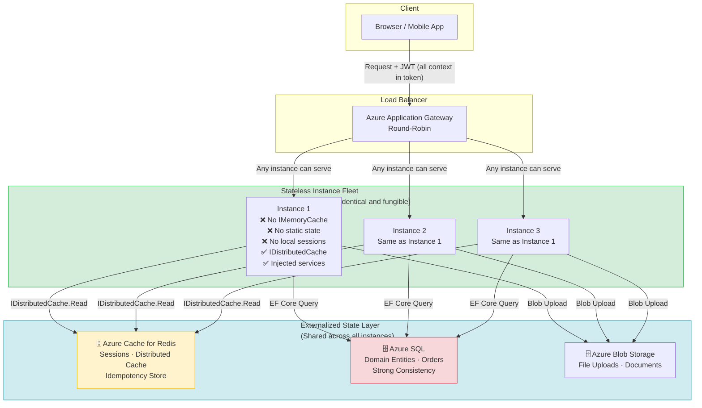
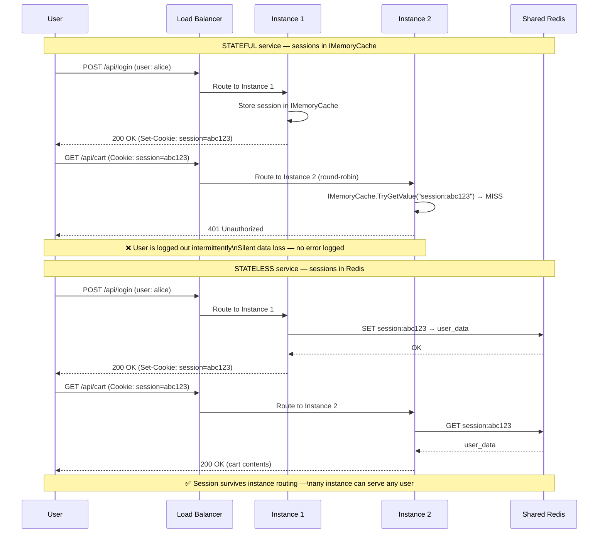

> [!success] Mastery Check
> - [ ] **Studied Well**
> - [ ] **Can explain the concept without notes**
> - [ ] **Can answer interview questions confidently**
> - [ ] **Can implement it in a real project**

---

id: "7.207" title: "Stateless Services — Design Principles" domain: "System Design & Distributed Systems" domain_id: 7 group: "Scalability Patterns" tags: [system-design, distributed-systems, scalability, dotnet, azure, stateless, architecture] priority: 1 version: 2 prerequisites:

- "[[7.206 — Horizontal vs Vertical Scaling — Tradeoffs]] — horizontal scaling is only viable when services are stateless; this note defines what stateless means in practice"
- "[[6.001 — SOLID Principles]] — the Single Responsibility Principle and Dependency Inversion are what allow a service's state concerns to be cleanly factored out to external infrastructure"
- "[[7.210 — Load Balancing — Overview]] — stateless services are the prerequisite for round-robin load balancing; sticky sessions exist exactly because not all services are stateless" related:
- "[[7.208 — Stateless Services — Session Externalization]] — the specific mechanism for moving session state out of the process"
- "[[7.229 — Consistent Hashing — Algorithm]] — an alternative state distribution strategy when state cannot be fully externalized"
- "[[7.249 — Bulkhead Pattern — Resource Isolation]] — complements stateless design by isolating failure domains for externalized state dependencies"
- "[[7.225 — Database Sharding — Hash-Based]] — stateless services can route to any shard; stateful services tie request routing to shard ownership"
- "[[4.012 — ASP.NET Core Middleware Pipeline]] — the middleware pipeline is stateless by design; each middleware executes independently per request"
- "[[3.015 — EF Core DbContext Lifecycle]] — DbContext is scoped per request, making EF Core naturally compatible with stateless service design" created: 2026-06-16

---

> [!ABSTRACT] Quick Reference — Stateless Services Design Principles **Invariant:** A service is stateless when it processes each request independently — no request-affine state (session data, in-flight computation state, locally cached domain data, upload files-in-progress) lives in local memory or on local disk between requests. Every request carries enough context (authentication, authorization, correlation identifiers) to be handled correctly by any instance. **Cost:** State must be externalized to a shared store — Azure Cache for Redis for ephemeral state, Azure SQL or Cosmos DB for durable state — adding +0.1–10ms per request depending on the store. The service's internal complexity shifts from "manage local state lifecycle" to "coordinate external state access with retry, timeout, and consistency handling." **Trigger:** The moment a second instance is deployed behind a load balancer, every local-state assumption breaks — sessions vanish, caches are empty, static counters reset. The recognition trigger is the "first production scale-out" post-mortem where 5% of users were silently logged out because sessions were in `IMemoryCache`. **Skip When:** The service runs on a single instance with no scale-out plan, or the state is a fast ephemeral computation cache where the 2,000× latency penalty of `IDistributedCache` vs `IMemoryCache` would violate a strict p99 SLO and a sticky-session load balancer is acceptable. **.NET Entry Point:** `IHttpContextAccessor` (read-only, safe) vs `IMemoryCache` (dangerous across instances) vs `IDistributedCache` (correct) / `AddStackExchangeRedisCache()` / Stateless controller design / `AddAuthentication().AddJwtBearer()` for self-contained token auth. **Azure Native:** Azure App Service (stateless scale-out) · Azure Container Apps · AKS · Azure Cache for Redis (external state store) · Azure SQL (durable state) **Number to Know:** A Redis `GET` in the same Azure region takes ~0.1–0.3ms — 2,000–6,000× slower than `IMemoryCache` (~0.05 µs). This is the latency tax of stateless design. At 10,000 req/s, it adds 1–3 seconds of cumulative Redis RTT per second across the fleet — manageable with connection multiplexing in StackExchange.Redis.

---

## Navigation

**Domain:** [[7 — System Design & Distributed Systems]] > **Group:** Scalability Patterns
**Previous:** [[7.206 — Horizontal vs Vertical Scaling — Tradeoffs]] | **Next:** [[7.208 — Stateless Services — Session Externalization]]

### Prerequisites

- [[7.206 — Horizontal vs Vertical Scaling — Tradeoffs]] — horizontal scaling is only operationally valid when no request-scoped state lives in the process; stateless service design is the mechanism that makes horizontal scaling work
- [[6.001 — SOLID Principles]] — the Single Responsibility Principle opens the path to externalizing state concerns from business logic; Dependency Inversion lets infrastructure (Redis, SQL) be injected rather than hard-coded as static state
- [[7.210 — Load Balancing — Overview]] — load balancers distribute requests across instances; statelessness guarantees that every instance can serve every request equally, making round-robin and least-connections effective without sticky sessions

### Where This Fits

> [!INFO] Production Encounter Map
> 
> - **Layer:** Application architecture — this principle sits at the boundary between the business logic layer and the infrastructure layer. It is an architectural constraint that shapes every decision about session management, caching, background processing, and dependency injection.
> - **Trigger:** An engineer encounters this principle in three contexts: (a) during the first scale-out decision — "we need 3 instances for the upcoming launch" — and discovering sessions break; (b) during a production incident where instance failure silently logs users out because session state was lost; (c) during a code review where a `static` field or `IMemoryCache` is used for cross-request data that must survive instance rotation.
> - **Without it:** The system scales vertically only. Adding a second instance silently corrupts user experience — users are logged out, shopping carts disappear, multi-step wizards lose progress. The symptom is "intermittent" because it only affects users whose requests are routed to a different instance than the one that created their session. Debugging this is notoriously difficult because no exception is thrown and no metric spikes — the state simply isn't there.
> - **First signal:** During a scale-out test, 5–10% of requests from a single user flow return "session expired" or "unauthorized" in sequence logs, or a production rollout shows customer support tickets about "being logged out" correlating exactly with new instance deployments.

Stateless service design is not optional — it is the enabling condition for horizontal scaling, rolling deployments, instance health-based traffic draining, and virtually every production resilience pattern. A service that cannot be made stateless must accept sticky sessions ([[7.209]]), which trade away the failure-isolation benefit of horizontal scaling entirely.

---

## Core Mental Model

A stateless service treats every incoming request as a completely independent transaction. No information from a previous request — no session variable, no cached computation, no locally stored file handle, no in-progress state machine — is retained in the process's memory or on its local disk between requests. Every piece of data needed to process the request arrives with the request itself (as a JWT token, a correlation ID, or a request body containing all the context), or is fetched from an external shared store (Redis, SQL, Blob Storage) whose lifecycle is independent of any single instance.

The constraint that governs statelessness is **locality of reference**: the moment the second instance starts, any locally stored state becomes invisible to half the fleet. The symptom is never a crash — it is a silent data-inconsistency failure that cannot be detected by monitors watching error rates.

The mental model: imagine each service instance is a stateless function — it takes a `HttpRequest`, does work using only injected dependencies (which are themselves stateless or backed by shared stores), and returns an `HttpResponse`. There is no `this._counter`, no `MemoryCache` hit that persists across calls, no `ConcurrentDictionary` accumulating state. The only exception is infrastructure-level caches whose staleness is explicitly tolerable (e.g., configuration, service discovery endpoints) — and even those must be designed to survive instance churn.

> [!TIP] The Non-Obvious Insight Statelessness does not mean "no cache." It means "the cache is shared across all instances" — `IDistributedCache`, not `IMemoryCache`. The most common production mistake is caching in `IMemoryCache` under the assumption that "it's just a cache, it'll be fast," then scaling out and discovering that Instance 2's cache has stale data because Instance 1 handled the invalidation. The cache is not the problem — the locality of the cache is the problem. If a cache cannot be externalized, it must be treated as a best-effort performance optimization whose staleness is explicitly bounded and whose invalidation is designed for the multi-instance case.

### Classification

- **Consistency axis:** Stateless services are naturally consistent because no state lives in the process — all shared state is in external stores that provide their own consistency guarantees (Redis = eventual, SQL = strong within a transaction). The consistency model is determined by the external store, not the service itself.
- **Availability tradeoff:** Stateless services are fully fungible — any instance can serve any request. Instance failure reduces capacity by 1/N but does not cause data loss or state inconsistency. This is the highest availability class for application-tier components.
- **Latency impact:** Stateless services incur a latency premium for every request that must fetch state from an external store. A Redis GET adds ~0.1–0.3ms; a SQL query adds ~1–10ms. This is the direct cost of the stateless guarantee.
- **Failure domain:** The failure domain shrinks per-instance but expands for the external state store. If Redis goes down, all instances lose session state simultaneously. Stateless design concentrates the failure risk in the shared infrastructure layer.
- **Abstraction layer:** Application architecture — this is a code-level design principle enforced through DI container design, controller patterns, and code review conventions.

### Primary Diagram



### Supporting Diagram — The Stateful Failure Mode



### Numbers That Matter

|Metric|Value|Context / Conditions|
|---|---|---|
|IMemoryCache read latency|~0.05 µs|In-process, no network, no serialization|
|Redis GET latency (same region)|~0.1–0.3ms|Azure Cache for Redis, private endpoint, StackExchange.Redis multiplexed|
|Redis GET latency (cross-region)|~1–5ms|Geo-replicated cache; avoid for session reads if possible|
|SQL Server query latency|~1–10ms|Simple index seek; varies by load and data size|
|Session size (typical)|~256 B – 4 KB|User ID, role claims, cart item IDs, CSRF token|
|JWT token size|~1–2 KB|Stateless alternative — carries all claims; no Redis read needed|
|Instance startup time (ASP.NET Core)|~10–30s|DI build, EF Core model compilation, warmup endpoint|
|Load balancer health probe interval|5–15s (configurable)|How fast a failed instance is removed from rotation|
|Max sessions per Redis Basic 250 MB cache|~250,000–1M|Depends on session size; 1 KB per session → ~250,000 sessions|

### Key Properties / Guarantees

|Property|Value|Condition|
|---|---|---|
|Instance fungibility|Full — any instance serves any request|All state externalized to shared stores|
|Instance failure impact|Capacity loss of 1/N; zero data loss|External state store is available|
|Request latency overhead|+0.1–10ms per external state read|Varies by store (Redis = 0.1ms, SQL = 1–10ms)|
|State consistency model|Determined by the external store (not the service)|Redis = eventual; SQL = strong within txn|
|Deployment safety|No session loss during rolling deploy|Compared to stateful: losing instance loses user session|
|Operational complexity (internal)|Low — no local state lifecycle management|Compared to stateful logic|
|Operational complexity (infrastructure)|Medium — must manage Redis/SQL availability|External state stores become critical dependencies|

---

## Deep Mechanics

### How It Works

**Request Lifecycle in a Stateless Service:**

1. **Request arrives** at the load balancer. The request carries all context: a JWT bearer token (containing user ID, roles, tenant ID), a correlation ID, and the request body. No server-side session cookie is needed — the token is self-contained.

2. **Authentication middleware** validates the JWT using the issuer's public key (retrieved from Azure AD or a JWKS endpoint). This is a pure computation — no local state required. The validated principal is attached to `HttpContext.User`. This step is identical on every instance.

3. **Authorization middleware** checks the principal's claims against the endpoint's policy. Again, pure computation — the claims are in the token.

4. **The handler (controller or Minimal API endpoint)** receives the request. It uses only injected dependencies:
   - `IMediator` or service directly — for command/query dispatch (stateless by design)
   - `IDistributedCache` — for any cached domain data (price list, product catalog)
   - `DbContext` — for domain state (scoped per-request, connection pooled)
   - `IHttpClientFactory` — for outbound HTTP calls (connection pooled, stateless)
   
   No `IMemoryCache` is used for data that spans requests. No `static` fields hold mutable state. No `ConcurrentDictionary` accumulates data across calls.

5. **Response is returned.** The handler writes no local state. The response goes directly to the client. Any state that must persist (session, cart, order) was written to an external store during step 4.

6. **Instance shutdown or scale-in.** The load balancer stops routing new requests. In-flight requests drain during `terminationGracePeriodSeconds` (30s default on AKS, configurable in App Service). Any request that completes within the drain window is processed normally. No state is lost because nothing was stored locally — the external stores retain all state.

**Key difference from stateful:**
- In a stateful service, step 6 is a data-loss event — the instance dying takes its `IMemoryCache` and static fields with it
- In a stateless service, step 6 is a non-event — the external store still has the data, and the next request hits a different instance

### Protocol Trace — Distributed Session Read

```
POST /api/checkout — Session retrieval, stateless design:

Instance-2 receives request (round-robin after login was on Instance-1):

  1. Kestrel receives TCP connection on port 443
  2. ASP.NET Core middleware: HttpsRedirection → StaticFiles → Authentication → Authorization → Endpoint
  3. JWT auth middleware: validates token using Azure AD public key (~2ms)
     → HttpContext.User.Identity is populated
  4. Session middleware: reads session cookie from Request.Cookies
     → calls IDistributedCache.GetAsync("session:{cookie_value}")
     → StackExchange.Redis sends: GET session:abc123 to Redis primary
     → Redis responds: "{UserId: 42, CartId: 8821}" (~0.2ms)
  5. Controller action: reads UserId from session, fetches cart from SQL using EF Core
  6. Response returned. No local state written.
  Total session overhead: ~0.2ms Redis read — negligible within 200ms SLO

Failure path (Redis down during session read):

  1. Session middleware calls IDistributedCache.GetAsync(...)
  2. StackExchange.Redis throws RedisConnectionException (connection lost)
  3. Polly resilience pipeline catches the exception, retries with backoff
  4. After 3 retries (total ~2s), the request fails and returns HTTP 500
  5. All concurrent requests on all instances experience the same failure simultaneously
  → This is the concentrated failure risk: Redis is a shared dependency
  → Mitigation: Azure Cache for Redis with geo-replication, or circuit-breaker to degrade gracefully

Failure path (missing session — session expired or never created):

  1. IDistributedCache.GetAsync returns null (key not found)
  2. Session middleware treats this as a new session — generates new session ID
  3. HttpContext.User.Identity is still populated from JWT (authentication is independent)
  4. The application handles the "no session" case explicitly:
     → If user is authenticated, redirect to login or reinitialize session
     → If user has items in cart cookie (client-side), restore cart from cookie
  → No exception — the service degrades gracefully because the JWT still carries identity
```

### Failure Modes

**Failure Mode 1: Silent State Loss on Stateless-Misidentified Service**

- **Cause:** The service is designed as "stateless" in documentation, but a developer adds a `ConcurrentDictionary<Guid, ProcessingState>` to hold in-flight order processing state across multiple HTTP calls (e.g., a multi-request file upload or a wizard). The dictionary is per-instance. When a second instance processes the second step of the wizard, the state from step 1 (on Instance 1) is invisible — the processing fails with a null reference or incorrect intermediate state.
- **Symptom:** Intermittent "Order processing state not found" errors or null reference exceptions that appear only under load when the load balancer distributes requests across instances. The error rate correlates with load balancer distribution, not with absolute request volume.
- **Detection time:** Silent during single-instance dev. Only manifests in multi-instance staging or production. Typically discovered during load testing or first production scale-out.

> [!DANGER] 3 AM Production Signal Metric: No direct metric exists — `dotnet_exceptions_total` shows `NullReferenceException` at non-deterministic rate. Investigation reveals the exception occurs only for requests with a specific multi-step correlation ID. Log: `WARN [WizardHandler] Processing state not found | CorrelationId: a7f2-9b3c | Step: 2 | Instance: app-instance-2` followed by `ERROR [WizardHandler] NullReferenceException when accessing ProcessingState.PaymentMethod | CorrelationId: a7f2-9b3c` Customer impact: Users see "Session expired" or "An error occurred" when navigating between wizard steps; the conversion funnel loses 5–15% of multi-step flows during scale-out periods.

**Fix:** Externalize the wizard state to `IDistributedCache` with a correlation ID key. Each step reads the accumulated state from Redis, appends the current step's data, and writes it back. This makes the wizard resilient to instance routing changes.

**Cost of not fixing:** Revenue loss from abandoned conversion funnels. User trust erosion — "their site loses my data when it's busy." Debugging effort wasted chasing intermittent null references that don't reproduce on single-instance dev.

---

**Failure Mode 2: Static Field for Feature Flag Evaluation Causing Split-Brain Behavior**

- **Cause:** A `static Lazy<Dictionary<string, bool>>` or `static ConcurrentDictionary` is used to cache feature flag evaluations loaded from Azure App Configuration. On a single instance, this is efficient — flags are loaded once and cached for the process lifetime. On 5 instances, each instance independently evaluates App Configuration's feature flag manager, potentially loading different versions of flags if the rollout percentage is partial (e.g., 20% rollout — some instances get the flag enabled, some disabled).
- **Symptom:** The same user receives different feature-flag-dependent behavior depending on which instance serves their request. A/B test results are contaminated. Partial rollouts behave unpredictably because an instance with the flag enabled serves all its requests with the feature on, regardless of the user's assigned cohort.
- **Detection time:** Only noticed when A/B test metrics show flat results despite a statistically significant rollout, or when customer support receives "why do I see the new checkout sometimes but not always?"

**Fix:** Use Azure App Configuration's `FeatureManager` with its built-in caching (respects `CacheExpirationInterval` and `FeatureFlags` endpoint's `ETag`). Avoid static caches for feature flags entirely. If caching is required for performance (e.g., flags evaluated on every request), use `IDistributedCache` with a deterministic TTL and accept that a flag change propagates within the TTL window.

**Cost of not fixing:** Contaminated experiment results — the team makes product decisions based on unreliable A/B test data. User-facing inconsistency erodes trust in the platform. Debugging time wasted chasing "it works on my machine" / "it doesn't on production" scenarios.

---

**Failure Mode 3: ThreadPool Starvation from Synchronous Blocking on External State**

- **Cause:** A stateless service makes an external state call (Redis GET or SQL query) inside a synchronous method, blocking the ASP.NET Core request thread while waiting for I/O. Stateless services make more external calls than stateful ones (because state is never local), so this pattern is more dangerous. `sync-over-async` patterns like `.Result` or `.Wait()` on `IDistributedCache` or `EF Core` calls cause the thread pool to grow, consuming memory and CPU on context switching.
- **Symptom:** Under moderate load (hundreds of concurrent requests), `dotnet_threadpool_queue_length` spikes. Request latency increases dramatically because threads are blocked waiting for I/O. CPU is low (threads are blocked, not computing) but throughput collapses. The `ThreadPool` grows beyond its limits, and `HttpContext` is disposed before the async operation completes, causing `ObjectDisposedException`.
- **Detection time:** Visible immediately in load testing as non-linear latency growth. In production, it manifests as "service is slow but CPU is low" — a classic thread-pool starvation pattern.

**Fix:** All external state calls must be `async` end-to-end. `IMemoryCache.TryGetValue` is synchronous (acceptable — no I/O), but `IDistributedCache.GetAsync` must be `await`ed. Use analyzers to detect `sync-over-async` — `dotnet_diagnostic.CA2007.Advisories = "warning"` to ensure `.ConfigureAwait(false)` on library code.

**Cost of not fixing:** Service collapses at moderate throughput due to thread pool exhaustion, not CPU saturation. Difficult to diagnose because CPU and memory look fine — the bottleneck is invisible without thread pool metrics. Incident requires a code review of every external state call to find the blocking call.

### .NET and Azure Integration Points

- **ASP.NET Core:** The entire middleware pipeline is designed for stateless operation. `HttpContext` is per-request and disposable — never cache it. `IHttpContextAccessor` provides safe access to the current request context without storing it. `IMemoryCache` is per-instance (not shared). `IDistributedCache` is the cross-instance replacement.
- **EF Core:** `DbContext` is scoped per-request by default. No state leaks between requests. Connection pooling is per-process — ensure pool size is tuned for instance count (see 7.206).
- **Azure Services:** Azure Cache for Redis (session store), Azure SQL / Cosmos DB (durable state), Azure Blob Storage (file uploads), Azure App Configuration / Key Vault (configuration — no local state needed)
- **.NET Libraries:** StackExchange.Redis (`IDistributedCache`), Polly (resilience for external state calls), MediatR (CQRS handlers are naturally stateless), FluentValidation (validation is a pure function), Refit (HTTP client generation — stateless by design)

```csharp
// YourCompany.OrderManagement — Program.cs
// Stateless service registration — all state externalized to shared stores

using StackExchange.Redis;
using Microsoft.Extensions.Caching.StackExchangeRedis;

var builder = WebApplication.CreateBuilder(args);

// ✅ Distributed cache — shared across all instances (stateless-safe)
builder.Services.AddStackExchangeRedisCache(options =>
{
    options.Configuration = builder.Configuration["AzureRedis:ConnectionString"];
    options.InstanceName = "om:"; // namespace prefix for multi-tenant isolation
});

// ✅ Authentication via JWT — self-contained, no server-side session needed
builder.Services.AddAuthentication(JwtBearerDefaults.AuthenticationScheme)
    .AddJwtBearer(options =>
    {
        options.Authority = builder.Configuration["AzureAd:Authority"];
        options.Audience = builder.Configuration["AzureAd:Audience"];
        // Each instance independently validates JWT using public key — no shared state
    });

// ✅ EF Core — scoped per-request, connection pooled
builder.Services.AddDbContext<OrderDbContext>((sp, options) =>
{
    var connString = builder.Configuration.GetConnectionString("AzureSql");
    options.UseSqlServer(connString, sqlOptions =>
    {
        sqlOptions.CommandTimeout(30);
        sqlOptions.EnableRetryOnFailure(3, TimeSpan.FromSeconds(10), null);
    });
});

// ❌ WRONG — in-process session would break statelessness
// builder.Services.AddDistributedMemoryCache(); // Still per-instance!
// builder.Services.AddSession(); // Stores session in IMemoryCache by default

// ✅ CORRECT — distributed session backed by Redis
// Only needed if you must maintain server-side session state
builder.Services.AddSession(options =>
{
    options.IdleTimeout = TimeSpan.FromMinutes(20);
    options.Cookie.HttpOnly = true;
    options.Cookie.IsEssential = true;
});

// ✅ Stateless HTTP clients — no per-instance state
builder.Services.AddHttpClient<IInventoryServiceClient, InventoryServiceClient>()
    .AddStandardResilienceHandler(); // Polly resilience — retry on transient failures

var app = builder.Build();

app.UseAuthentication();
app.UseAuthorization();
app.UseSession(); // Only if needed — prefer JWT-only if possible

app.MapControllers();
app.Run();
```

---

## Production Patterns and Implementation

### Primary Implementation — Stateless Order Processing Service

```csharp
// YourCompany.OrderManagement.Api — Stateless command handler
// Namespace: YourCompany.OrderManagement.Application.Orders

namespace YourCompany.OrderManagement.Application.Orders;

/// <summary>
/// Places an order. Fully stateless — all state is externalized:
/// authentication via JWT (self-contained), sessions via Redis,
/// domain entities via EF Core, idempotency via Redis SET NX.
/// No instance-local mutable fields. Every request is self-contained.
/// </summary>
/// <remarks>
/// Architecture role: Application Service / CQRS Command Handler
/// Stateless invariant: zero shared mutable state between method calls.
/// Safe for any instance in the fleet — instance identity is irrelevant.
/// </remarks>
public sealed class PlaceOrderCommandHandler : IRequestHandler<PlaceOrderCommand, PlaceOrderResult>
{
    private readonly IOrderRepository _orderRepository;        // Adapter — EF Core (scoped per request)
    private readonly IInventoryServiceClient _inventoryClient; // Adapter — HTTP (connection pooled)
    private readonly IDistributedCache _distributedCache;      // Infrastructure — Redis
    private readonly ILogger<PlaceOrderCommandHandler> _logger;

    public PlaceOrderCommandHandler(
        IOrderRepository orderRepository,
        IInventoryServiceClient inventoryClient,
        IDistributedCache distributedCache,
        ILogger<PlaceOrderCommandHandler> logger)
    {
        _orderRepository = orderRepository;
        _inventoryClient = inventoryClient;
        _distributedCache = distributedCache;
        _logger = logger;
    }

    /// <summary>
    /// Handles the place-order command. Idempotent via distributed idempotency key.
    /// No local state is written — all persistence goes to shared stores.
    /// </summary>
    public async Task<PlaceOrderResult> Handle(
        PlaceOrderCommand command,
        CancellationToken cancellationToken)
    {
        // Step 1: Idempotency check — distributed Redis key with SET NX semantics
        // Without this, a client retry during a transient error could create
        // duplicate orders on different instances (classic stateless failure).
        var idempotencyKey = $"order:idempotency:{command.IdempotencyKey}";
        var existing = await _distributedCache.GetStringAsync(idempotencyKey, cancellationToken);
        if (existing is not null)
        {
            _logger.LogInformation(
                "Idempotent replay — returning cached result | Key: {IdempotencyKey} | CorrelationId: {CorrelationId}",
                command.IdempotencyKey, command.CorrelationId);
            return JsonSerializer.Deserialize<PlaceOrderResult>(existing)!;
        }

        // Step 2: Inventory check — external HTTP call (stateless client)
        var reservationId = await _inventoryClient.ReserveItemsAsync(
            command.LineItems, command.CorrelationId, cancellationToken);

        // Step 3: Domain operation — persisted to shared SQL via EF Core
        var order = Order.Place(command.CustomerId, command.LineItems, reservationId);
        await _orderRepository.AddAsync(order, cancellationToken);

        var result = new PlaceOrderResult(order.Id, order.Status);

        // Step 4: Cache result for idempotency window (24 hours)
        // This ensures retries within 24h return the same result
        await _distributedCache.SetStringAsync(
            idempotencyKey,
            JsonSerializer.Serialize(result),
            new DistributedCacheEntryOptions
            {
                AbsoluteExpirationRelativeToNow = TimeSpan.FromHours(24)
            },
            cancellationToken);

        _logger.LogInformation(
            "Order placed | OrderId: {OrderId} | CustomerId: {CustomerId} | CorrelationId: {CorrelationId}",
            order.Id, command.CustomerId, command.CorrelationId);

        return result;
    }
}
```

### IServiceCollection Registration

```csharp
// Program.cs — YourCompany.OrderManagement.Api
// Full stateless-service registration

var builder = WebApplication.CreateBuilder(args);

// 🔐 Authentication — JWT bearer (self-contained, no server-side session)
builder.Services.AddAuthentication(JwtBearerDefaults.AuthenticationScheme)
    .AddJwtBearer(options =>
    {
        options.TokenValidationParameters = new TokenValidationParameters
        {
            ValidateIssuer = true,
            ValidIssuer = builder.Configuration["AzureAd:Issuer"],
            ValidateAudience = true,
            ValidAudience = builder.Configuration["AzureAd:Audience"],
            ValidateLifetime = true,
            ClockSkew = TimeSpan.FromMinutes(1)
        };
    });

// 🗄️ Distributed cache — shared Redis for all instances
builder.Services.AddStackExchangeRedisCache(options =>
{
    options.Configuration = builder.Configuration["AzureRedis:ConnectionString"];
    options.InstanceName = "om:";
});

// 📦 MediatR — CQRS pipeline (naturally stateless)
builder.Services.AddMediatR(cfg =>
    cfg.RegisterServicesFromAssembly(typeof(PlaceOrderCommandHandler).Assembly));

// 🗃️ EF Core — scoped DbContext with connection pooling tuned for fleet size
// With N=5 instances targeting Azure SQL P1 (300 session limit):
// MaxPoolSize = 50 → 5 × 50 = 250 connections < 300 limit
var sqlConnectionString = $"{builder.Configuration.GetConnectionString("AzureSql")};Max Pool Size=50;Min Pool Size=4;";
builder.Services.AddDbContext<OrderDbContext>((sp, options) =>
{
    options.UseSqlServer(sqlConnectionString, sqlOptions =>
    {
        sqlOptions.CommandTimeout(30);
        sqlOptions.EnableRetryOnFailure(3, TimeSpan.FromSeconds(10), null);
    });
}, optionsLifetime: ServiceLifetime.Singleton);

// 🌐 HTTP clients — stateless, connection pooled
builder.Services.AddHttpClient<IInventoryServiceClient, InventoryServiceClient>()
    .AddStandardResilienceHandler(); // Polly retry, circuit breaker

// ❤️ Health checks — readiness probe for load balancer
builder.Services.AddHealthChecks()
    .AddRedis(builder.Configuration["AzureRedis:ConnectionString"]!, name: "redis")
    .AddSqlServer(builder.Configuration.GetConnectionString("AzureSql")!, name: "sql")
    .AddCheck("self", () => HealthCheckResult.Healthy(), tags: ["ready"]);
```

### Common Variants

```csharp
// Variant A — Fully Stateless (JWT Only): no server-side session at all
// Preferred for: API-only services, SPA backends, microservices
// Horizontal scaling: trivially safe — zero shared state
// Every request carries all context in the JWT claims

builder.Services.AddAuthentication(JwtBearerDefaults.AuthenticationScheme)
    .AddJwtBearer();
// No AddSession(), no IDistributedCache registration for session
// All context needed is in the token (user ID, roles, tenant)

// In the handler:
public async Task<OrderResult> Handle(OrderCommand command, CancellationToken ct)
{
    var userId = _httpContextAccessor.HttpContext?.User.FindFirst(ClaimTypes.NameIdentifier)?.Value;
    // userId comes from JWT, not from a server-side session
    // No session read needed — saves 0.1–0.3ms per request
}
```

```csharp
// Variant B — Hybrid: JWT for auth + Redis for soft-state cache
// Used when: JWT carries auth claims, but domain cache (product prices, 
// catalog data) benefits from shared cross-instance caching
// Stateless: yes — cache is externalized to Redis

public sealed class GetProductPriceHandler
{
    private readonly IDistributedCache _cache;
    private readonly IProductRepository _repository;

    public async Task<decimal> Handle(GetProductPriceQuery query, CancellationToken ct)
    {
        var cacheKey = $"price:{query.ProductId}";
        var cached = await _cache.GetStringAsync(cacheKey, ct);
        if (cached is not null) return JsonSerializer.Deserialize<decimal>(cached);

        var price = await _repository.GetPriceAsync(query.ProductId, ct);
        await _cache.SetStringAsync(cacheKey, JsonSerializer.Serialize(price),
            new DistributedCacheEntryOptions { AbsoluteExpirationRelativeToNow = TimeSpan.FromMinutes(5) }, ct);
        return price;
    }
}
```

```csharp
// Variant C — Stateless with Sticky Session Fallback (Migration)
// Used when: migrating a legacy app where removing session state is a multi-sprint effort
// Stateless: partially — sessions are externalized but routing must co-locate state
// Azure: Application Gateway → Backend HTTP Settings → Cookie-based affinity = Enabled
// Warning: defeats failure isolation — instance failure loses session

builder.Services.AddSession(options =>
{
    options.IdleTimeout = TimeSpan.FromMinutes(30);
    options.Cookie.Name = ".OrderMgmt.Session";
    options.Cookie.HttpOnly = true;
});
// Still use IDistributedCache for the session backing store to allow
// eventual migration to fully stateless (just turn off affinity after)
builder.Services.AddStackExchangeRedisCache(options =>
{
    options.Configuration = configuration["AzureRedis:ConnectionString"];
});
// Session middleware reads from shared Redis even with sticky sessions
// This allows removal of affinity later without data migration
```

### Real-World .NET Ecosystem Mapping

|Pattern in This Note|Where It Appears in .NET / Azure|Manifestation|
|---|---|---|
|Stateless request handling|ASP.NET Core controller / Minimal API endpoint|No instance fields mutated per request; all state via injected services|
|JWT-based stateless auth|`AddJwtBearer()` / `Microsoft.Identity.Web`|Token carries all claims; no server-side session lookup|
|Distributed state externalization|`IDistributedCache` / `StackExchange.Redis`|Session, cache, idempotency keys stored in Redis visible to all instances|
|Per-request scoped state|`DbContext` scoped per request|EF Core context is created and disposed per request — no cross-request state leaks|
|Stateless HTTP calls|`IHttpClientFactory` + `AddHttpClient`|Connection pooling; no per-instance socket state|
|Configuration without state|`IConfiguration` / `IOptionsSnapshot<T>`|Configuration is read from source (file, Azure App Config) on request; no process-lifetime config state|
|Health check for stateless readiness|`AddHealthChecks()` / `/health/ready`|Load balancer only routes traffic when instance proves its dependencies (Redis, SQL) are reachable|

---

## Gotchas and Production Pitfalls

### IMemoryCache Used as Cross-Request Cache in a Multi-Instance Service

**Pitfall:** An engineer adds `IMemoryCache` to reduce database read pressure. The service is scaled to 3 instances. Each instance has its own `IMemoryCache` — they share nothing. A cache invalidation on Instance 1 leaves Instances 2 and 3 serving stale data indefinitely.

```csharp
// ❌ The wrong pattern — IMemoryCache is per-process, not shared
builder.Services.AddMemoryCache();

// In handler:
public async Task<ProductDto?> Handle(GetProductQuery query, CancellationToken ct)
{
    if (_memoryCache.TryGetValue($"product:{query.ProductId}", out ProductDto cached))
        return cached; // May return data invalidated on a different instance

    var product = await _productRepository.GetByIdAsync(query.ProductId, ct);
    _memoryCache.Set($"product:{query.ProductId}", product, TimeSpan.FromMinutes(5));
    return product;
}
```

**Symptom:** Cache invalidation (e.g., after a product price update) results in different instances serving different prices for up to 5 minutes. Customer support receives pricing inconsistency reports. A/B comparison shows different responses from the same endpoint.

> [!DANGER] Production Signal Metric: No direct metric — no exception is thrown. Detected via `customer_support_tickets_total{category="pricing_inconsistency"}` spike after price updates. Log: `INFO [ProductHandler] Cache hit | ProductId: 8821 | CachedPrice: 29.99 | ActualPrice: 24.99` (only visible if logging cache hit prices). Customer impact: 67% of users see the new price (hitting the instance that handled the invalidation), 33% see the old price (hitting an instance that hasn't expired its TTL) — direct revenue impact during promotions.

**Fix:**

```csharp
// ✅ The correct pattern — IDistributedCache is shared across all instances
builder.Services.AddStackExchangeRedisCache(options =>
{
    options.Configuration = configuration["AzureRedis:ConnectionString"];
    options.InstanceName = "catalog:";
});

public async Task<ProductDto?> Handle(GetProductQuery query, CancellationToken ct)
{
    var cacheKey = $"product:{query.ProductId}";
    var cached = await _distributedCache.GetStringAsync(cacheKey, ct);
    if (cached is not null)
        return JsonSerializer.Deserialize<ProductDto>(cached);

    var product = await _productRepository.GetByIdAsync(query.ProductId, ct);
    if (product is null) return null;

    var dto = ProductDto.From(product);
    await _distributedCache.SetStringAsync(cacheKey, JsonSerializer.Serialize(dto),
        new DistributedCacheEntryOptions { AbsoluteExpirationRelativeToNow = TimeSpan.FromMinutes(5) }, ct);
    return dto;
}
```

**Cost of not fixing:** Pricing inconsistency during flash sales → customer confusion → support ticket volume spikes → potential regulatory risk if promotional pricing is advertised but not applied → revenue loss from customers abandoning carts due to price uncertainty.

---

### Static Mutable Fields for Cross-Request State

**Pitfall:** A `static ConcurrentDictionary<Guid, ProcessingState>` is used to track multi-step order processing state across requests (e.g., a checkout wizard with separate POST calls for shipping, payment, review). On a single instance, this works. On N instances, only the instance that handled step 1 has the `ProcessingState` for step 2 — any other instance throws `KeyNotFoundException`.

```csharp
// ❌ Wrong — static state is per-process
public static class CheckoutWizardStore
{
    private static readonly ConcurrentDictionary<Guid, WizardState> _state = new();

    // Instance 1 writes this; Instance 2 never sees it
    public static void SaveStep(Guid cartId, WizardState state)
        => _state[cartId] = state;

    // Instance 2 throws if the key was created on Instance 1
    public static WizardState? GetStep(Guid cartId)
        => _state.TryGetValue(cartId, out var state) ? state : null;
}
```

**Symptom:** "Order processing state not found" exceptions on step 2+ of multi-step flows. The error is intermittent — only users whose requests span instances (approximately 1 - 1/N fraction of users) experience it. No reproducible pattern in single-instance development.

**Fix:**

```csharp
// ✅ Correct — externalize wizard state to shared Redis
public sealed class CheckoutWizardService
{
    private readonly IDistributedCache _cache;

    public async Task SaveStepAsync(Guid cartId, int step, WizardStepData data, CancellationToken ct)
    {
        var key = $"checkout:wizard:{cartId}";
        var existingJson = await _cache.GetStringAsync(key, ct);
        var steps = existingJson is not null
            ? JsonSerializer.Deserialize<Dictionary<int, WizardStepData>>(existingJson)!
            : new Dictionary<int, WizardStepData>();

        steps[step] = data;
        await _cache.SetStringAsync(key, JsonSerializer.Serialize(steps),
            new DistributedCacheEntryOptions { AbsoluteExpirationRelativeToNow = TimeSpan.FromHours(1) }, ct);
    }

    public async Task<WizardStepData?> GetStepAsync(Guid cartId, int step, CancellationToken ct)
    {
        var key = $"checkout:wizard:{cartId}";
        var existingJson = await _cache.GetStringAsync(key, ct);
        if (existingJson is null) return null;

        var steps = JsonSerializer.Deserialize<Dictionary<int, WizardStepData>>(existingJson)!;
        return steps.GetValueOrDefault(step);
    }
}
```

**Cost of not fixing:** 5–15% abandonment rate on multi-step checkout flows (the percentage of users whose requests get distributed across instances). Direct revenue loss that scales with instance count — more instances = higher probability of cross-instance routing.

---

### Missing Distributed Idempotency on Write Operations

**Pitfall:** A stateless service writes to an external store (SQL database, message queue) without a distributed idempotency key. When the client retries after a transient error (network timeout, load balancer health probe transient failure), the retry hits a different instance that has no record of the first attempt, so the write is duplicated.

```csharp
// ❌ Wrong — no idempotency check across instances
public async Task<OrderResult> Handle(OrderCommand command, CancellationToken ct)
{
    // No idempotency check — retries always create new orders
    var order = new Order(command.CustomerId, command.LineItems);
    await _orderRepository.AddAsync(order, ct); // Duplicate on retry!
    return new OrderResult(order.Id);
}
```

**Symptom:** Duplicate orders, duplicate payments, duplicate notification emails. The number of duplicates equals the number of retries that timed out. Error rate is 0% — every request returns 200 OK, but the business impact is multiplicative.

**Fix:**

```csharp
// ✅ Correct — distributed idempotency check prevents duplicates across instances
public async Task<OrderResult> Handle(OrderCommand command, CancellationToken ct)
{
    var idempotencyKey = $"order:{command.IdempotencyKey}";

    // Atomic SET NX — only succeeds on first attempt
    var wasSet = await _cache.SetStringAsync(
        idempotencyKey, "processing",
        new DistributedCacheEntryOptions { AbsoluteExpirationRelativeToNow = TimeSpan.FromHours(24) },
        token: ct);

    // If the key already exists, this is a retry — return cached result or deduplicate
    var existingOrderId = await TryGetExistingOrderAsync(command.IdempotencyKey, ct);
    if (existingOrderId.HasValue)
        return new OrderResult(existingOrderId.Value);

    // First attempt — proceed
    var order = new Order(command.CustomerId, command.LineItems);
    await _orderRepository.AddAsync(order, ct);

    // Store the result for future retries
    await _cache.SetStringAsync(
        idempotencyKey, JsonSerializer.Serialize(new OrderResult(order.Id)),
        new DistributedCacheEntryOptions { AbsoluteExpirationRelativeToNow = TimeSpan.FromHours(24) },
        token: ct);

    return new OrderResult(order.Id);
}
```

**Cost of not fixing:** Duplicate payment processing leads to financial liability, PCI-DSS compliance violations, and manual reconciliation overhead. At scale, a 1% retry rate on 10,000 orders/day = 100 duplicate orders/day.

---

### Using In-Process ASP.NET Core Session by Default

**Pitfall:** The default ASP.NET Core session middleware uses `IMemoryCache` as its backing store. When the service is deployed behind a load balancer with multiple instances, sessions stored via `builder.Services.AddSession()` without a distributed cache backing store disappear when the next request hits a different instance.

```csharp
// ❌ Wrong — default session uses IMemoryCache (per-instance)
builder.Services.AddSession(); // Backed by IMemoryCache by default!
// OR worse:
builder.Services.AddDistributedMemoryCache(); // Still in-process, still per-instance!
builder.Services.AddSession();

// In controller:
public IActionResult AddToCart(int productId)
{
    var cart = HttpContext.Session.GetString("cart") ?? "[]";
    var items = JsonSerializer.Deserialize<List<int>>(cart);
    items!.Add(productId);
    HttpContext.Session.SetString("cart", JsonSerializer.Serialize(items));
    return Ok();
}
```

**Symptom:** Users add items to their cart, navigate to checkout or another page, and find an empty cart. The intermittent nature (only when routed to a different instance) makes it look like a race condition or a timing bug.

> [!DANGER] Production Signal Metric: No exception — session returns an empty string for the key, and the application treats this as "no cart items." Metric: `cart_abandonment_rate` doubling after scale-out deployment. Log: `INFO [CartController] Cart retrieved | Items: 0 | SessionId: a7f2-9b3c | Instance: app-instance-2` while the user had 3 items on Instance 1. Customer impact: Users repeatedly add items to cart, navigate away, find empty cart — rage-quit and leave the platform.

**Fix:**

```csharp
// ✅ Correct — distributed session backed by Redis
builder.Services.AddStackExchangeRedisCache(options =>
{
    options.Configuration = configuration["AzureRedis:ConnectionString"];
    options.InstanceName = "session:";
});
builder.Services.AddSession(options =>
{
    options.IdleTimeout = TimeSpan.FromMinutes(20);
    options.Cookie.HttpOnly = true;
    options.Cookie.IsEssential = true;
});

// ✅ Even better — eliminate server-side session entirely with JWT
builder.Services.AddAuthentication(JwtBearerDefaults.AuthenticationScheme)
    .AddJwtBearer();
// Store cart items client-side (localStorage, cookie) or in the database
// No server-side session required
```

**Cost of not fixing:** Cart abandonment rate spikes from ~70% (industry average, additional) to 90%+ during scale-out. Revenue loss proportional to conversion rate × cart value × affected user percentage. Debugging time wasted chasing "intermittent cart data loss" that doesn't reproduce on developer machines.

---

### Static Timer-Based Background Processing Coupled to Instance Lifetime

**Pitfall:** An `IHostedService` with a `Timer` or `PeriodicTimer` accumulates in-memory state across ticks — batching orders, building a report, or processing a queue. When the instance is scaled in (removed from rotation and shut down), all in-memory accumulated state is lost. The next instance starts from zero, losing any partially accumulated batch.

```csharp
// ❌ Wrong — in-memory batching tied to instance lifetime
public sealed class OrderBatchProcessor : BackgroundService
{
    private readonly List<Order> _batch = new(); // Per-instance — LOST on scale-in!

    protected override async Task ExecuteAsync(CancellationToken stoppingToken)
    {
        while (!stoppingToken.IsCancellationRequested)
        {
            await Task.Delay(TimeSpan.FromSeconds(30), stoppingToken);
            if (_batch.Count > 0)
            {
                await _bulkInsertAsync(_batch, stoppingToken);
                _batch.Clear(); // If instance dies here, current batch is lost
            }
        }
    }
}
```

**Symptom:** Order records missing from the database — gaps in order IDs or timestamps. The gaps correlate with scale-in events (detected via AKS pod termination events or Azure App Service scale-in logs). No exception is logged because the timer simply stops and the `_batch` goes out of scope.

**Fix:** Use Azure Service Bus or a database-backed queue for batch processing. The `IHostedService` reads from the queue — no in-memory accumulation. Scale-in safety is provided by the termination grace period (in-flight message processing completes, then the message is re-queued if the instance is killed mid-processing).

**Cost of not fixing:** Data loss on every scale-in event. At a high-traffic service scaling in daily during off-peak hours, this means recurring data gaps. Time-consuming manual reconciliation to find and re-process lost orders.

---

## Tradeoffs and Decision Framework

### Tradeoff Matrix

|Dimension|Stateless (Externalize All State)|Alternative A: Stateful (In-Process State)|Alternative B: Sticky Sessions|
|---|---|---|---|
|Consistency|Strong per external store (Redis: eventual, SQL: strong)|Strong (single process — no distributed state)|Strong per-instance (but different instances may see different state)|
|Availability|N-1 fault tolerance — instance loss = capacity loss only|Single point of failure — instance loss = state loss + capacity loss|Instance loss = that instance's sessions lost; capacity drops|
|Latency|+0.1–10ms per external state call|Baseline — no network hops for state|Baseline (state in local IMemoryCache)|
|Operational complexity|Medium — manage Redis/SQL as critical dependencies|Low — single instance, no external state infrastructure|Low-Medium — load balancer affinity config|
|State durability|High — state survives instance loss|None — state lost on process death|Partial — state lost on sticky instance death|
|Horizontal scalability|Full — any instance serves any request|None — must vertical-scale|Limited — requests pinned to instances|
|Team expertise required|Medium — distributed caching, async patterns, external store tuning|Low — traditional single-server patterns|Low — affinity config|
|.NET ecosystem fit|Native — `IDistributedCache`, `AddJwtBearer()`, `IHttpClientFactory`|Native — `IMemoryCache`, `AddSession()` default|Native — `AddSession()` + `IDistributedCache` backing|

### When to Apply

```mermaid
flowchart TD
    A["Trigger: Service runs behind a load balancer,\nhas multiple instances, or needs\nhorizontal scaling capacity"]
    A --> B{Can the request carry\nall context (JWT, body)\nwithout server-side session?}
    B -->|Yes — API-only or SPA backend| C["Fully Stateless\nNo session needed\nJWT auth only\nZero external state overhead"]
    B -->|No — server-side session required| D{Is session state small\nand latency-tolerant?}
    D -->|Yes (<4 KB, 0.1–0.3ms ok)| E["Stateless + Redis Session\nIDistributedCache backed by Redis\nFull horizontalscaleability"]
    D -->|No — large session or strict latency SLO| F{Can session be redesigned?}
    F -->|Yes — refactor in 1-2 sprints| G["Temporary: Sticky Sessions\nAddRedisCache for session backing\nPlan stateless migration"]
    F -->|No — deeply stateful legacy| H["Stay Stateful\nVertical scale only\nAccept SPOF and scaling ceiling"]
    C --> I["Outcome:\n- Any instance serves any request\n- Zero-downtime rolling deploys\n- Instance failure = capacity loss only\nMonitor: external store latency p99"]
    E --> I
    G --> J["Outcome:\n- Partial horizontal scalability\n- Sticky session binding in LB\n- Instance failure = session loss for affected users\nPlan: refactor to fully stateless"]
    H --> K["Outcome:\n- Single-instance ceiling\n- Full outage on instance failure\n- No rolling deploys\nPlan: evaluate stateless feasibility"]
```

### When NOT to Apply

> [!WARNING] Do Not Reach For Full Statelessness When...
> 
> - [ ] **The external state store is a single point of failure with no degradation strategy:** If Redis or SQL is the state store and it goes down, ALL instances simultaneously lose their external state. A stateless service must have a circuit-breaker or degradation strategy for external store failures — not just "it's a cluster, it won't go down." Design for Redis failover: cached data allows stale reads, session data degrades to "new session" rather than crashing.
> - [ ] **The latency budget cannot absorb even 0.1ms additional per request:** In ultra-low-latency systems (e.g., high-frequency trading, real-time ad bidding with p99 < 1ms), the Redis round-trip (0.1–0.3ms same-region) is a significant fraction of the budget. In these cases, keep state local and use consistent-hashing-affinity routing ([[7.229]]) so that the same instance serves the same user — this is not fully stateless but provides deterministic instance-to-user binding.
> - [ ] **The team lacks the observability tooling for distributed external stores:** Debugging a stateless service requires distributed tracing, Redis slow-log monitoring, and SQL query performance insights — because the state is not in the process where you can attach a debugger. Without `OpenTelemetry`-based tracing (`ActivitySource` in .NET, `Azure Monitor` for Redis), diagnosing "why is my service slow?" becomes significantly harder because the latency is not in the application code — it's in the Redis `GET` or SQL `SELECT`.
> - [ ] **The state is genuinely ephemeral and non-critical, and vertical scaling is acceptable for the next 12 months:** A low-traffic internal tool running on a single VM does not need Redis, externalized sessions, and distributed idempotency. `IMemoryCache` and `AddSession()` are perfectly correct for single-instance deployments — the stateless principle is a cost that must be justified by the scaling requirement.
> - [ ] **The state is a large binary blob that cannot be cheaply serialized/deserialized per request:** Multi-MB session states (e.g., in-memory report caches, image processing results) are expensive to move through Redis or SQL per request. In these cases, consider: (a) storing a reference (blob URL) in the session rather than the blob itself; (b) using Azure Blob Storage with SAS tokens so the client accesses it directly; (c) accepting sticky sessions with the understanding that scaling is limited.

### Scale Thresholds

|Threshold|Below = Stateful (or stay as-is)|Above = Stateless|
|---|---|---|
|Instance count|1 instance — no external state needed|≥ 2 instances — stateless is required for correctness|
|Request rate|< 500 req/s (single D4s_v5 handles this easily)|> 1,000 req/s — horizontal scaling roadmap begins → stateless required|
|Availability SLO|< 99.9% (one 9 — achievable with single instance + good infra)|≥ 99.9% — rolling deployments, instance loss tolerance → stateless required|
|Session size|< 256 B (trivial Redis overhead)|> 4 KB — evaluate if Redis bandwidth per request is acceptable|
|External store latency budget|p99 > 50ms (Redis 0.3ms is negligible fraction)|p99 < 1ms — Redis overhead is 10–30% of budget; consider sticky sessions with consistent hashing|
|Team size|< 3 engineers (little bandwidth for Redis/observability tooling)|> 5 engineers — can invest in shared infrastructure management|

---

## Interview Arsenal

### Question Bank

1. **[Definition]** "What does it mean for a service to be stateless in a distributed systems context, not just 'no database writes'?"
2. **[Mechanism]** "Trace exactly what happens when a stateless service receives a request — where does authentication state come from, where does session state come from, and what guarantees that any instance can serve any request?"
3. **[Tradeoff]** "What is the specific cost of stateless design — what latency does it add, what operational complexity does it introduce, and under what conditions is the cost not worth paying?"
4. **[Failure mode]** "Your service is deployed across 4 instances. Users report intermittent 'session expired' errors. The error rate is 0%. No exception is logged. What is the most likely cause and how do you confirm it?"
5. **[Comparison]** "What is the difference between a stateless service and a stateful service with sticky sessions? When would you accept the latter over the former?"
6. **[Design application]** "Design the order placement API for a food delivery platform that must handle 3,000 req/s with 99.95% availability. Walk through the state management strategy."
7. **[Scale]** "Your stateless service handles 5,000 req/s across 10 instances. A new requirement adds a server-side session that stores 50 KB of data per user. How does this affect your architecture, and what do you do?"
8. **[Advanced]** "A team says their service is 'stateless' because they don't use sessions. But they use a `static ConcurrentDictionary` to cache the product catalog that's refreshed every 5 minutes from Azure Blob Storage. Is this service stateless? What happens when they scale to 5 instances?"

### Spoken Answers

**Q: What does it mean for a service to be stateless in a distributed systems context, not just 'no database writes'?**

> **Average answer:** A stateless service doesn't store any data. Each request is independent and doesn't depend on previous requests. This means it can scale horizontally.

> **Great answer:** Stateless means the service processes each request as an independent transaction with no request-affine state in local memory or local disk between requests. It doesn't mean "no state at all" — it means all state is externalized to a shared store whose lifecycle is independent of any single instance. Authentication state comes from the JWT bearer token — each instance independently validates the token using the issuer's public key, no session lookup needed. Cached domain data comes from Redis through `IDistributedCache` — every instance reads from the same cache. Domain entities come from the database via EF Core — the `DbContext` is scoped per request and connection-pooled. Even background worker state — what batch of messages has been processed — must be externalized to a distributed queue or database offset tracker, not kept in a `static` list.
> 
> The property that makes all this work is **instance fungibility**: any instance in the fleet can serve any request equally. This is what enables round-robin load balancing, rolling deployments (no session loss), instance health-based traffic draining, and horizontal scaling. If you ever find yourself asking "which instance handled this user's first request?" your service is not stateless. The non-obvious implication: statelessness is not a binary property of the code — it's a property of every bit of state the code touches. One `static` field storing user-scoped data, one `IMemoryCache` used for session-like data, and the service is stateful regardless of how every other component is designed.

---

**Q: What is the specific cost of stateless design — what latency does it add, what operational complexity does it introduce, and under what conditions is the cost not worth paying?**

> **Average answer:** Stateless adds latency because you have to go to Redis or the database for every request. It's more complex because you need Redis. But it's worth it for scaling.

> **Great answer:** The costs break into three dimensions — latency, operational complexity, and failure concentration.
> 
> First, **latency**: a `IDistributedCache` GET from Redis in the same Azure region costs ~0.1–0.3ms compared to `IMemoryCache` at ~0.05 µs — that's roughly 2,000–6,000× slower. In absolute terms, 0.3ms on a 200ms p99 API call is negligible (0.15% of the budget), but at very high throughput it adds up: at 10,000 req/s with one Redis call per request, the fleet spends 1–3 seconds of cumulative Redis bandwidth per second. StackExchange.Redis's connection multiplexing makes this non-blocking, but Redis CPU becomes a monitoring concern.
> 
> Second, **operational complexity**: you now manage Redis as a critical infrastructure dependency. Redis failover, connection pooling on the client side (`AbortOnConnectFail=false` in StackExchange.Redis), and circuit-breaker patterns for when Redis is unavailable. Debugging latency issues requires OpenTelemetry distributed tracing — the slow call is happening in a Redis command, not in your application code, so you need `ActivitySource` spans to see it.
> 
> Third, **failure concentration**: in a stateful service, if the instance fails, only that instance's state is lost (100 users, say). In a stateless service, if Redis fails, ALL instances lose their state simultaneously — potentially thousands of users. The stateless design concentrates the failure risk in the shared infrastructure layer. Mitigation: geo-replicated Redis, stale-read degradation mode (serve cached data when Redis is down, accept staleness), and circuit-breaker timings measured in the low milliseconds.
> 
> The cost is not worth paying when: the service is single-instance and will remain single-instance for the planning horizon (12+ months); the latency budget is sub-millisecond p99 (high-frequency trading); the team lacks the operational tooling to monitor Redis, SQL, and distributed traces; or the state is a large binary blob (multi-MB) that cannot be serialized/deserialized per request without unacceptable overhead.

---

**Q: The interviewer says: 'Design a URL shortening service like TinyURL. Walk me through your architecture, specifically addressing how you handle state management at scale.'**

> **Model response:** "Let me start by clarifying what I need from the state: the core mapping is short code to long URL, which is read-heavy — 99% reads, 1% writes. This is naturally stateless: the mapping itself lives in a shared database (Azure SQL with an index on the short code), and a Redis cache in front of it using cache-aside pattern serves the hot codes. Every instance in the fleet reads from the same Redis cache and the same database. No server-side session is needed at all — the request is just GET /{code}, which redirects via HTTP 302. Authentication for the write path (creating short URLs) uses an API key in the header, validated by each instance independently — no session needed.
> 
> The scaling strategy: the service is fully stateless. Any instance serves any request. The database tier is the bottleneck — Redis takes the read load, reducing database queries to ~1% of request volume. At 5,000 req/s, that's ~50 database reads/sec — trivial. Write throughput is also low. The service scales horizontally behind Azure Application Gateway with no state constraints. The only non-obvious concern: the mapping must be durable — if Redis loses a mapping, the database still has it, so we lose cache capacity but not correctness. This is cache-aside, not write-through: on miss, the handler reads from the DB and populates the cache. Fully stateless, fully scalable."

---

### System Design Interview Trigger

When stateless service design appears in a system design interview, it's usually not the main topic — it's the prerequisite assumption that an interviewer tests implicitly. The interviewer will say "design a scalable [system]" and then probe with questions like "how do you handle user sessions?" or "what happens when an instance fails?" or "how do you do rolling deployments?" If your answer assumes sticky sessions or doesn't address state externalization, the interviewer knows the gap. They are testing whether you understand that horizontal scaling is impossible without solving the state locality problem first. The trigger question is often: "You scale to 5 instances and users are being logged out intermittently. What's happening, and how do you fix it?" — the correct answer traces through `IMemoryCache` → per-instance session → load balancer routing → distributed Redis cache.

### Comparison Table

| |Stateless (Externalized State)|Stateful (In-Process State)|
|---|---|---|
|Core guarantee|Any instance serves any request; instance loss = capacity loss only|Requests to the same user must reach the same instance; instance loss = data loss|
|Trade-off|+0.1–10ms external state latency; Redis/SQL become critical infrastructure|No external call overhead per request; bounded by vertical scaling ceiling|
|.NET implementation|`IDistributedCache` (Redis), `AddJwtBearer()`, `IHttpClientFactory`, `AddHealthChecks()`|`IMemoryCache`, `AddSession()`, `static` fields, `ConcurrentDictionary`|
|Failure mode|Redis goes down → all instances lose external state simultaneously|Instance goes down → 100 users' in-process state lost; "intermittent" session loss|
|When to choose|≥ 2 instances; SLO ≥ 99.9%; rolling deployments required; traffic is > 1,000 req/s|Single instance; sub-millisecond p99 required; legacy app with no refactor bandwidth|
|Azure native|Azure Cache for Redis, Azure SQL, Cosmos DB, Azure App Config, Blob Storage|VM-only, App Service with "Always On" (no scale-out benefit)|

---

## Architecture Decision Record

**Status:** Accepted

**Context:** The PaymentProcessingService is being migrated from a single-VM deployment to a containerized fleet behind Azure Application Gateway. Current architecture uses `IMemoryCache` for idempotency deduplication (cache processed payment references to prevent double charges), `AddSession()` for multi-step checkout wizard state, and a `static ConcurrentDictionary<int, RateLimitBucket>` for per-IP rate limiting. The service targets 2,500 req/s at peak with a 99.95% availability SLO. The team is 6 engineers familiar with containerized .NET and Azure Container Apps.

**Options Considered:**

1. **Fully stateless — externalize all state to shared stores** — move idempotency cache to Redis (`IDistributedCache`), wizard session to Redis, rate limiting to Redis Lua scripts; all instances become fully fungible; enables rolling deployments, horizontal autoscale, and N-1 fault tolerance
2. **Sticky sessions with Azure Application Gateway affinity** — keep `IMemoryCache` and `static` rate limiters, configure Application Gateway cookie-based affinity; instance failure loses that instance's wizard sessions and idempotency state; rate limiting works per-instance (3× effective limit across 3 instances)
3. **Hybrid — Redis for critical state (idempotency), sticky sessions for wizard, static for rate limiting** — inconsistent: idempotency is cross-instance safe, but wizard state still suffers from instance-failure risk; rate limiting is effectively 3× over-limit; adds complexity of two state management strategies

**Decision:** Fully stateless (option 1), because:
- 99.95% availability SLO requires rolling deployments and instance-failure tolerance — sticky sessions (option 2) lose session data on any instance failure, making it impossible to achieve the SLO without additional cross-instance session replication
- Idempotency is the most critical correctness property (preventing duplicate charges) and must be cross-instance regardless of which option is chosen — Redis is already needed for it; adding wizard state to the same Redis instance adds negligible overhead (~200 bytes per active wizard session)
- Three independent state mechanisms (option 3) increase cognitive load, testing complexity, and probability of state-related bugs — a single externalization strategy is simpler to operate

**Consequences:**

- ✅ All instances fully fungible — any instance serves any request; zero session loss on instance failure
- ✅ Rolling deployments, horizontal autoscale, and N-1 fault tolerance enabled
- ✅ Rate limiting becomes distributed and accurate — Redis Lua script enforces exactly 100 req/min/IP across all instances
- ⚠️ Redis becomes a critical dependency — must deploy with Premium tier (geo-replication) and configure `AbortOnConnectFail=false` to avoid cascading failure
- ⚠️ Each request adds ~0.3ms for idempotency check + ~0.3ms for wizard state read (where applicable) — total ~0.6ms overhead, within the 200ms p99 SLO with substantial headroom
- ❌ Wizard state serialization requires an extra `JsonSerializer` call per request — acceptable for the <1% of traffic that is actively in the multi-step wizard flow

**Review Trigger:** Revisit this decision if wizard state grows to > 10 KB per session (bandwidth concern on Redis) or if Redis Premium tier costs exceed $500/month (at which point evaluate Azure Cosmos DB for session state with its lower per-GB cost for larger payloads).

---

## Self-Check

### Conceptual Questions

1. Define stateless service design precisely — not "no state" but in terms of the locality constraint and the instance fungibility property it guarantees.
2. Derive from first principles why a service using `IMemoryCache` for user session data becomes incorrect the moment a second instance is deployed behind a load balancer.
3. Name two production scenarios where fully stateless design is NOT the correct choice and a stateful or sticky-session approach should be used instead.
4. What is the exact observable signal that silent session loss is occurring due to a statelessness violation (not a crash, not an exception — the silent case)?
5. In .NET, what interface replaces `IMemoryCache` for cross-instance safe caching, and what NuGet package provides the Redis implementation? What configuration is required in `Program.cs`?
6. What is the structural difference between stateless service design and session externalization? (Hint: one is a principle, the other is a mechanism — reference [[7.208]]).
7. Below what instance count and latency budget is fully stateless design typically overkill?
8. How does [[7.229 — Consistent Hashing — Algorithm]] provide a middle ground between stateless and stateful designs, and in what specific scenario should it be used instead of full statelessness?
9. What happens to static fields and `ConcurrentDictionary` accumulators when a service is deployed behind a load balancer with N instances, and why is this non-obvious to developers who only test on single instances?
10. Explain stateless service design to a junior developer in 60 seconds, starting with the problem it solves, using a real-world analogy.
11. What consistency model does a stateless service provide for session reads when using Redis as the backing store, and what anomaly is still possible during a Redis failover?
12. If a team says "our service is stateless because we use JWT for auth and no sessions," but they use `static Lazy<Dictionary<string, bool>>` to cache feature flags evaluated from Azure App Configuration, is the service actually stateless? Why or why not?

<details>
<summary>Answers</summary>

1. A service is stateless when it processes each request independently, carrying no request-affine state in local memory or local disk between requests. All state required to process a request arrives with the request (JWT token, request body) or is fetched from an external shared store that is independent of any single instance. The guarantee: any instance can serve any request — instances are fully fungible. The implication: instance failure reduces capacity by 1/N but causes zero data loss.

2. Each process has its own heap. `IMemoryCache` stores data only within that process's address space. A second instance has a separate heap with its own empty `IMemoryCache`. A user whose session was created on Instance 1 (cart in Instance 1's `IMemoryCache`) sends their next request to Instance 2. Instance 2's `IMemoryCache.TryGetValue` returns false — the cart is empty. If the session stores authentication state, the user receives 401. No exception is thrown, no metric fires. The failure is silent until the user complains or the cart abandonment metric doubles.

3. (a) An ultra-low-latency trading system with p99 < 1ms — a 0.3ms Redis round-trip is 30% of the latency budget; use consistent hashing to pin users to instances instead. (b) A legacy ASP.NET WebForms app with massive `ViewState` and in-process `Session["InProc"]` where a full stateless refactor would take 6+ months — move to sticky sessions as a stepping stone, with a plan to extract state to Redis for the eventual fully stateless migration.

4. There is no direct metric — no exception, no HTTP 500, no latency spike. The signal is indirect: customer support tickets about "being logged out" or "cart emptied" that correlate with deployment events or scale-out/scale-in events. In Application Insights: look for the same user having requests served by different instances (enrich logs with `WEBSITE_INSTANCE_ID`) within a short time window, combined with session-dependent operations failing. The sequence: `Instance: app-instance-1 handles login → Instance: app-instance-2 handles next request → user sees empty session`.

5. `IDistributedCache` (in `Microsoft.Extensions.Caching.Abstractions`) backed by `StackExchange.Redis` (NuGet: `Microsoft.Extensions.Caching.StackExchangeRedis`). Registration: `builder.Services.AddStackExchangeRedisCache(options => { options.Configuration = "connectionString"; options.InstanceName = "myapp:"; })`.

6. Stateless service design is the principle — the architectural constraint that no request-affine state lives in the process. Session externalization is the specific mechanism used to implement that principle for HTTP session state — moving session data from `IMemoryCache` to `IDistributedCache` (Redis). Session externalization is one application of the stateless principle; the principle also covers caches, static fields, in-memory batch accumulators, and any other local state.

7. Below 2 instances and with a p99 latency budget > 5ms, full stateless design (with Redis for session state) is typically overkill. A single-instance deployment using `IMemoryCache` and `AddSession()` is correct if there are no plans to scale out within 12 months. The threshold is: "would adding a second instance break anything?" If no (single instance forever or sticky sessions sufficient), the cost of externalization may not be justified.

8. Consistent hashing provides deterministic instance-to-user mapping without a centralized session store: given a user ID, consistent hashing always routes the request to the same instance, which can keep that user's state in local memory. This provides the latency benefit of in-process state (0.05 µs vs 0.3ms Redis) while still allowing instance add/remove (consistent hashing minimizes the remapping impact). Use when: the latency budget is sub-millisecond p99 and the overhead of Redis is unacceptable; or when the state is large (multi-MB) and serialization/deserialization per request is expensive. The tradeoff: instance failure loses that instance's users' state (unlike fully stateless where failure = capacity loss only). See [[7.229 — Consistent Hashing]].

9. Static fields and `ConcurrentDictionary` accumulators are per-AppDomain, which means per-process — each instance has its own copy. A `static int _requestCount` on 5 instances means 5 independent counters — rate limiting allows 5× the intended limit. A `static ConcurrentDictionary<Guid, ProcessingState>` means a multi-step wizard started on Instance 1 fails on Instance 2 because the key doesn't exist. This is non-obvious because developers test on a single instance where static state is correctly shared across requests within that process — they don't see the failure until production load balancing scatters requests across instances. The fix: always validate in staging with ≥ 2 instances behind a load balancer before deploying to production.

10. "Think of a stateless service like a hotel front desk. When a guest walks up, the clerk doesn't remember them from yesterday — they ask for the reservation number, look it up in the computer, and handle the request. If that clerk goes home and a new clerk takes over, the new clerk asks for the same reservation number and looks it up in the same computer — nothing is lost. Now think of a stateful service like a doorman who remembers faces. If you walk past the doorman and he nods because he's seen you before, that's state stored in his memory. But if the doorman is replaced halfway through your visit, the new doorman doesn't know you — you become a stranger. In distributed systems, the computer is Redis, the reservation number is the JWT token, and the clerks are your application instances. You want all clerks to look up data in the same computer, not store it in their heads."

11. Redis provides eventual consistency with read-your-writes guarantees from a single client perspective (StackExchange.Redis reads from the primary by default). During a Redis failover (primary → replica promotion), there is a brief window (~milliseconds to seconds) where writes to the old primary may not have been replicated to the new primary. In this window, a session write followed by a read could return the old data or no data. Mitigation: use Redis Sentinel or Azure Cache for Redis Premium with zone redundancy and `WAIT` command acknowledgment in critical paths.

12. No, the service is NOT fully stateless. The `static Lazy<Dictionary<string, bool>>` cache for feature flags is per-instance — each instance independently evaluates the cache. With Azure App Configuration's feature flag percentage rollout (e.g., 20% of users get the new feature), each instance independently evaluates `FeatureManager.IsEnabledAsync("NewCheckout", userContext)` against the 20% threshold. Because the percentage evaluation is based on user context (not instance), the consistency per-user should be correct, but the caching behavior is wrong: if a flag is updated (changed from 20% to 100%), each instance's `static Lazy` cache holds the old value until the process restarts — potentially hours or days later. The correct approach: use `Azure.Identity` + `Azure.Data.AppConfiguration` with `FeatureManager` that respects `CacheExpirationInterval` (default 30 seconds), or use `IDistributedCache` for the flag cache so all instances see the same cached values and expiration policies.

</details>

---

### Scenario Challenges

---

**Scenario 1 — Diagnose the Problem**

The OrderIngestionService was recently scaled from 1 to 3 instances behind Azure Application Gateway to handle a seasonal traffic spike. Within 2 days, customer support reports a spike in tickets: "I added items to my cart, went to checkout, and the cart was empty." The error rate is 0%. Application Insights shows no exceptions. Logs show: `INFO [CartController] Cart retrieved | Items: 0 | SessionId: a7f2-9b3c | Instance: app-instance-2`. No other log entries from that session exist. The user's login was handled by `app-instance-1` 30 seconds earlier (visible in app-insights traces enriched with WEBSITE_INSTANCE_ID).

<details>
<summary>Diagnosis</summary>

**Root cause:** Classic statelessness violation. The service uses ASP.NET Core's default session middleware (`AddSession()`), which is backed by `IMemoryCache` (in-process, per-instance). The user logged in on `app-instance-1` — the session was created and stored in `app-instance-1`'s local memory. The next request (checkout page) was routed by the load balancer to `app-instance-2`, which has no record of the session — it reads an empty session, returns 0 items. No exception is thrown because the session middleware returns an empty state gracefully. The symptom is "intermittent" because only ~67% of logins are routed to a different instance for the subsequent request (with 3 instances and round-robin).

**Evidence:** The user has exactly two log entries: one login on `app-instance-1`, one cart retrieval on `app-instance-2` — no other interactions. The cart Items=0 despite the user having just added items. No error or exception logged.

**Fix:** Replace the in-process session backing store with a distributed one backed by Redis:

```csharp
builder.Services.AddStackExchangeRedisCache(options =>
{
    options.Configuration = configuration["AzureRedis:ConnectionString"];
    options.InstanceName = "session:";
});
// AddSession() will now use IDistributedCache (Redis) instead of IMemoryCache
```

**Prevention:** Add a pre-deployment checklist item: "If the service runs behind a load balancer with > 1 instance, verify session store is externalized (not `IMemoryCache` or `AddDistributedMemoryCache`)." Add a staging environment with 2 instances and a test that logs in on one instance and validates session state on the other.

</details>

---

**Scenario 2 — Design Decision**

You are designing the notification preferences management API for a multi-tenant e-commerce platform. Constraints: 500 req/s peak, p99 < 100ms, 99.9% availability, team of 4 engineers, Azure Container Apps deployment. The API reads a user's notification preferences from Azure SQL and allows them to update email/SMS/push toggles. Authentication is via JWT from Azure AD. The UX requires no server-side session — preferences are fetched on every page load and cached in the browser's local storage. No multi-step wizard, no server-side cart. What state management strategy do you recommend?

<details>
<summary>Decision and Reasoning</summary>

**Choice:** Fully stateless with no server-side session storage. The API is inherently stateless — authentication via JWT (self-contained), domain data via EF Core direct to Azure SQL (preferences table), no session, no wizard, no cross-request state. Every instance is fully fungible by default.

**Tradeoffs accepted:** None meaningful here — there is no state to externalize because the domain state (preferences) is already in SQL, accessed per-request. The JWT carries the user identity. No Redis is needed because there is no ephemeral cross-request state (session, cache, idempotency). This is the ideal stateless service: read/write from SQL per request, JWT for auth, zero instance-local state.

**Implementation:**

```csharp
// Program.cs — minimal stateless service
builder.Services.AddAuthentication(JwtBearerDefaults.AuthenticationScheme)
    .AddJwtBearer(options =>
    {
        options.Authority = configuration["AzureAd:Authority"];
        options.Audience = configuration["AzureAd:Audience"];
    });

builder.Services.AddDbContext<PreferencesDbContext>(options =>
    options.UseSqlServer(configuration.GetConnectionString("AzureSql")));

// No session, no cache, no distributed state needed
// The service is naturally stateless — every request fetches preferences from SQL

var app = builder.Build();
app.UseAuthentication();
app.UseAuthorization();
app.MapControllers();
app.Run();
```

**Autoscale:** min=2 (availability), max=6 (peak). No state constraints on scaling.

</details>

---

**Scenario 3 — Failure Mode Investigation**

The InventoryWriteService (6 instances behind Azure Application Gateway, fully stateless with Redis for idempotency and SQL for domain data) begins returning HTTP 500 for all inventory reservation requests at 09:47 UTC. CPU across all instances is 12%. Error rate is 100%. Application Insights shows all failures are `RedisConnectionException: It was not possible to connect to the redis server(s); unable to connect to redis`. The on-call engineer checks Azure Cache for Redis — the Redis instance shows `Unavailable` status in Azure Portal. Walk through the investigation and remediation.

<details>
<summary>Investigation and Fix</summary>

**Step 1 — Confirm Redis status:** Azure Cache for Redis blade shows `Status: Unavailable`. Check Azure Service Health for a regional incident — no regional outage reported. Check Redis metrics: CPU 4%, memory 55%, connections 850/1000 (Standard C3 limit). The connection count is high but not at the limit. The Redis instance may have hit a transient networking issue or connection limit-based eviction policy.

**Step 2 — Check StackExchange.Redis configuration:** `ConnectionMultiplexer` is created with default settings. The `connectRetry` and `connectTimeout` are default (3 retries, 5000ms timeout). The service has no circuit breaker for Redis — all requests fail immediately when Redis is unavailable. No fallback strategy.

**Step 3 — Immediate mitigation:** The service is fully stateless but depends on Redis for idempotency. The idempotency check is in the critical path for inventory reservation (preventing double-reservation). Without Redis, any retry could double-reserve inventory. Option A (emergency): Redeploy with a feature flag that skips the idempotency check and accepts the risk of double-reservation (reconciled manually). Option B (better): Deploy a read-only fallback — without Redis, accept that duplicate reservations may occur and log them for reconciliation. Choose Option B: the business risk of blocked reservations is higher than the risk of duplicates.

**Step 4 — Redis recovery:** If the Redis instance is in a failed state and Azure auto-recovery does not restore within 10 minutes, initiate a failover to the geo-replicated secondary (if Premium tier) or restore from the latest RDB backup. The RDB backup is automatically taken every 60 minutes on Standard tier. Worst case: Redis is unrecoverable — create a new Redis instance, update the connection string, and redeploy.

**Step 5 — Permanent fix:** Implement a Redis circuit breaker with degradation:

```csharp
// ✅ Circuit breaker for Redis — degrade gracefully when Redis is unavailable
builder.Services.AddStackExchangeRedisCache(options =>
{
    options.Configuration = $"{connectionString},abortConnect=false,connectRetry=3,connectTimeout=5000";
});

// In the handler — fallback strategy when Redis is unavailable
public async Task<ReservationResult> Handle(ReserveInventoryCommand command, CancellationToken ct)
{
    try
    {
        var idempotencyKey = $"reservation:{command.IdempotencyKey}";
        var existing = await _cache.GetStringAsync(idempotencyKey, ct);
        if (existing is not null)
            return JsonSerializer.Deserialize<ReservationResult>(existing)!;
    }
    catch (RedisConnectionException) when (_featureManager.IsEnabledAsync("IdempotencyFallback").Result)
    {
        // Fallback: skip idempotency check, proceed with reservation
        // Log the fallback for auditing and reconciliation
        _logger.LogWarning("Redis unavailable — idempotency check skipped | CorrelationId: {CorrelationId}",
            command.CorrelationId);
    }

    // Proceed with reservation (may create duplicates if Redis is down)
    var reservation = await _inventoryService.ReserveAsync(command.ProductId, command.Quantity, ct);
    return new ReservationResult(reservation.Id, reservation.ExpiresAt);
}
```

**Post-mortem item:** Redis is now a critical dependency. Add: (a) Azure Monitor alert on Redis `Server Load > 80%` and `Connected Clients > 80% of tier limit`; (b) DR plan for "Redis unavailable" — including circuit-breaker fallback and reconciliation script for potential duplicates; (c) migrate to Azure Cache for Redis Premium with active geo-replication for automatic failover.

</details>

---

**Scenario 4 — Scale It**

The ShippingLabelService generates shipping labels for an e-commerce platform. It currently handles 200 req/s on a single Standard_D4s_v5 instance. The state: each request receives an order payload, calls a REST API to a shipping carrier (FedEx/UPS) to generate a label, and returns the label URL. No server-side session. No cache. No idempotency currently (carrier handles deduplication). Traffic is projected to grow to 4,000 req/s over 12 months. A new requirement adds idempotency to prevent duplicate shipping label charges. Walk through the scaling strategy and the state management changes required.

<details>
<summary>Scaling Strategy</summary>

**Current state (200 req/s):** The service is naturally stateless — no session, no local cache, no static mutable fields. Authentication via API key. It already scales to N instances behind a load balancer with zero changes to state management.

**New requirement (idempotency for shipping labels):** Without idempotency, a client retry during a transient timeout would cause the carrier API to generate two shipping labels for the same order — charging the customer twice. The idempotency check must be cross-instance: a retry routed to a different instance must detect that this `OrderId` was already processed.

**Cross-instance idempotency implementation:**

```csharp
// ✅ Add Redis-backed idempotency — keeps the service stateless
builder.Services.AddStackExchangeRedisCache(options =>
{
    options.Configuration = configuration["AzureRedis:ConnectionString"];
    options.InstanceName = "shipping:";
});

public sealed class GenerateLabelHandler
{
    private readonly IDistributedCache _cache;
    private readonly IShippingCarrierClient _carrierClient;

    public async Task<LabelResult> Handle(GenerateLabelCommand command, CancellationToken ct)
    {
        var idempotencyKey = $"label:{command.OrderId}";

        // Try to set — only succeeds if key doesn't exist (first attempt)
        var trackingToken = await _cache.GetStringAsync(idempotencyKey, ct);
        if (trackingToken is not null)
            return new LabelResult(trackingToken); // Return existing label

        // First attempt — call carrier API
        var label = await _carrierClient.GenerateLabelAsync(command.Order, ct);

        // Store result for future retries (TTL: 24 hours)
        await _cache.SetStringAsync(idempotencyKey, label.TrackingNumber,
            new DistributedCacheEntryOptions { AbsoluteExpirationRelativeToNow = TimeSpan.FromHours(24) }, ct);

        return new LabelResult(label.TrackingNumber, label.DownloadUrl);
    }
}
```

**Scale to 4,000 req/s (12-month plan):**

|Phase|Timeline|Action|Stateless implication|
|---|---|---|---|
|Phase 1 (200→1,000)|Now–3 months|Add Redis for idempotency. Scale to 4 instances. Min=2, Max=6.|Redis is external state — service remains stateless.|
|Phase 2 (1,000→2,500)|3–6 months|Add a result cache for carrier API responses (expensive API calls). Cache label URLs by order ID for 24 hours (carrier URL is valid for 7 days). Scale to 8 instances.|Redis serves both idempotency AND cached responses. Still stateless.|
|Phase 3 (2,500→4,000)|6–12 months|Add carrier API response time monitoring. If carrier API latency > 500ms p50, introduce a queue-based architecture: request goes to Azure Service Bus, worker generates label async, callback delivers URL via webhook. Scale to 12–16 instances.|Stateless remains unchanged — queue-based processing decouples the instance from the long-running carrier API call.|

**What did NOT change in this scaling strategy:** The service was already stateless. Adding Redis for idempotency maintained that property — state moved out of the instance but remained externalized. The architectural change was adding a shared store, not refactoring the instance design.

</details>

---

**Scenario 5 — Azure Production**

You are building a real-time bidding (RTB) ad serving engine on Azure. The service must respond to bid requests within 50ms p99. Each request carries a user ID, the ad slot context, and requires looking up the user's profile (demographics, browsing history) to decide whether to bid and at what price. The user profile is ~50 KB (browsing history segments, device graph, purchase intent scores). The service runs on 20 instances behind Azure Application Gateway. The team initially externalized the user profile to Redis (Azure Cache for Redis Premium C3), giving ~0.3ms read latency — but the 50 KB profile size means deserialization adds another 0.5ms, and the total Redis read + deserialize is ~1ms. This is 2% of the 50ms SLO budget — acceptable. However, during a Redis failover event, the service stopped responding entirely for 47 seconds (Redis failover + reconnection). The customer's ad server (Google DV360) dropped the exchange from its rotation. How do you make the service fault-tolerant while maintaining stateless design?

<details>
<summary>Azure-Specific Response</summary>

**The constraint:** 50ms p99 SLO and 50 KB profile sizes make Redis the correct external store, but Redis failover causing a 47-second blackout violates the availability SLO (99.9% = 8.76 hours/year downtime allowed for a 24/7 service — but 47-second complete blackouts cause ad exchange drops, which take hours to recover as the exchange must re-evaluate the bidder).

**The solution is NOT to make the service stateful** — keeping 50 KB profiles in-process memory on 20 instances would require 1 TB of RAM (50 KB × 10M users × 2 instances for redundancy) and would violate the stateless guarantee. Instead, implement a **multi-layer degradation strategy** that preserves the stateless architecture:

**Layer 1 — Redis replica reads with fallback:** StackExchange.Redis is configured to read from the Redis replica by default, with fallback to primary on failure. This spreads read load and provides a fallback path.

**Layer 2 — Client-side stale cache (best-effort):** An in-memory `IMemoryCache` with a 30-second TTL and `SlidingExpiration` caches the deserialized user profile. This is explicitly a **stale-read cache** — the service accepts profile staleness of up to 30 seconds in exchange for Redis failure tolerance. The staleness is acceptable for bidding (a user's demographics don't change in 30 seconds).

```csharp
// ✅ Stale-read local cache with Redis fallback — preserves stateless property
public sealed class UserProfileCache
{
    private readonly IMemoryCache _localCache; // Best-effort, 30s TTL
    private readonly IDistributedCache _redisCache; // Source of truth
    private readonly ILogger<UserProfileCache> _logger;

    public async Task<UserProfile?> GetProfileAsync(string userId, CancellationToken ct)
    {
        var localKey = $"profile:{userId}";
        if (_localCache.TryGetValue(localKey, out UserProfile? cached))
            return cached; // Stale read — up to 30s old, acceptable for RTB

        try
        {
            var redisJson = await _redisCache.GetStringAsync($"profile:{userId}", ct);
            if (redisJson is null) return null;

            var profile = JsonSerializer.Deserialize<UserProfile>(redisJson);
            _localCache.Set(localKey, profile, TimeSpan.FromSeconds(30)); // Populate local cache
            return profile;
        }
        catch (RedisConnectionException ex)
        {
            // Redis unavailable — return null profile
            // The bidding strategy uses a lower bid price when profile is unknown
            _logger.LogWarning(ex, "Redis unavailable — serving null profile | UserId: {UserId}", userId);
            return null; // Graceful degradation: bid conservatively with no profile
        }
    }
}
```

**Layer 3 — Conservative bidding when profile unavailable:** When Redis fails and local cache is empty, the service bids with a conservative default (low CPM). The ad exchange does not receive errors — it receives a bid with a low price. The campaign may not win impressions for 30 seconds, but the service never returns HTTP 500 or 503. Redis failover is transparent to the exchange.

**Layer 4 — Redis Premium with active geo-replication:** Deploy Azure Cache for Redis Premium with active geo-replication across two Azure regions. On failover, StackExchange.Redis automatically discovers the new primary. With `abortConnect=false`, the client reconnects without throwing to the caller.

**The result:** The service remains architecturally stateless (external state is the source of truth), but adds a best-effort local cache with explicit staleness budget. During Redis failover, the service degrades to "null profile, conservative bid" rather than crashing. The ad exchange sees low bids (but valid responses) during the failover window, maintaining the exchange rotation.

</details>

---

**Scenario 6 — Interview Simulation**

The interviewer says: "Design the order processing pipeline for a global e-commerce platform. The system receives 10,000 orders per second at peak. Orders go through a multi-step pipeline: payment capture, inventory reservation, shipping label generation, and notification. Walk me through your architecture, focusing specifically on how you handle state management across the pipeline and what happens when a step fails after a previous step succeeded."

<details>
<summary>Model Response</summary>

"Let me start by characterizing the problem. This is a multi-step saga with strict consistency requirements — if payment succeeds but inventory isn't reserved, the platform has a liability. The key architectural decision is: I'm not using a single synchronous API call with all four steps in one request. At 10,000 req/s, that would tie up instances for seconds waiting for downstream systems, and a failure at step 3 would require a compensating transaction for steps 1 and 2. Instead, I'm using the outbox pattern with a stateful saga orchestrator — but crucially, the saga state is externalized, not stored in the orchestrator instance.
> 
> The architecture:
> 
> **Front-end API (stateless)** — receives the order submission. Validates JWT, publishes an `OrderSubmitted` event to an Azure Service Bus topic, and returns HTTP 202 Accepted. The API service is fully stateless: no session, no cache, no local state. It runs on 20 instances behind Azure Application Gateway.
> 
> **Saga orchestrator (stateless, backed by durable storage)** — reads `OrderSubmitted` events from a Service Bus subscription and coordinates the four steps. The saga state — which steps have completed, what commit/rollback actions are required — is stored in Azure Cosmos DB (or SQL with optimistic concurrency). The orchestrator itself is stateless: any instance can pick up any saga event because the saga state is in Cosmos DB, not in the orchestrator's memory.
> 
> ```csharp
> // Saga state — externalized to Cosmos DB
> public sealed class OrderSagaState
> {
>     public string OrderId { get; init; }
>     public string Status { get; set; } // "Started" | "PaymentCaptured" | "InventoryReserved" | "Completed" | "Failed"
>     public string? PaymentTransactionId { get; set; }
>     public string? InventoryReservationId { get; set; }
>     public string? ShippingLabelId { get; set; }
>     public int Version { get; set; } // For optimistic concurrency
> }
> 
> // Saga step handler — stateless, reads state from Cosmos DB
> public sealed class CapturePaymentHandler : IHandleMessages<PaymentStepCommand>
> {
>     private readonly ICosmosDbContext _cosmos;
>     private readonly IPaymentGateway _gateway;
> 
>     public async Task Handle(PaymentStepCommand command, CancellationToken ct)
>     {
>         var saga = await _cosmos.ReadSagaAsync(command.OrderId, ct);
>         if (saga.Status != "Started") return; // Already past this step
> 
>         var paymentResult = await _gateway.CaptureAsync(command.Amount, ct);
>         saga.PaymentTransactionId = paymentResult.TransactionId;
>         saga.Status = "PaymentCaptured";
>         saga.Version++;
>         await _cosmos.UpdateSagaAsync(saga, ct); // Optimistic concurrency
>     }
> }
> ```
> 
> **Failure handling:** If step 2 (inventory reservation) fails after step 1 (payment) succeeded, the orchestrator reads the saga state from Cosmos DB, sees that step 1 is committed and step 2 failed, and issues a compensating transaction: a refund to the payment gateway. The compensating transaction is itself idempotent (the payment gateway uses idempotency keys). The saga state tracks compensations in Cosmos DB.
> 
> **Stateless guarantee:** The orchestrator instances are fully fungible. If instance 5 crashes mid-step, instance 7 picks up the next event, reads the saga state from Cosmos DB, and continues. No in-memory state is lost because the saga state was externalized before the crash. The orchestrator fleet scales horizontally behind the Service Bus partition count.
> 
> **The non-obvious constraint:** At 10,000 req/s, the Cosmos DB write throughput for saga state is 10,000 writes/s (one saga update per step). Cosmos DB supports this at ~40,000 RU/s with a single partition key (OrderId). The cost: ~$2/hour in RU — negligible. The bottleneck is not the state store; it's the payment gateway throughput and inventory system latency, which are external and must be designed for async processing with retry and backpressure."

</details>

---
