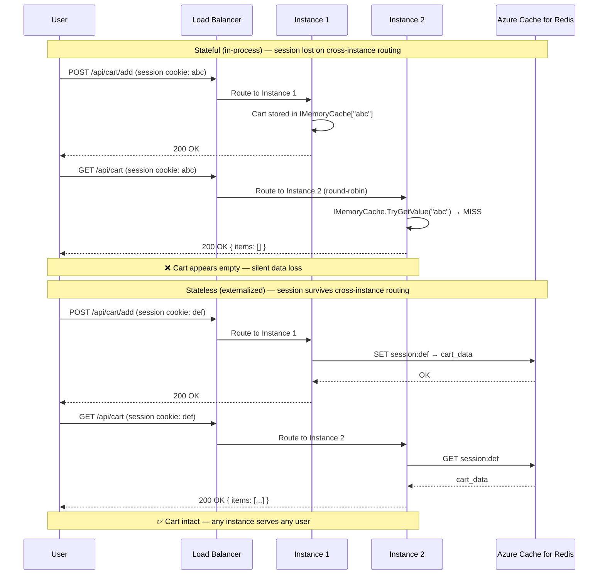
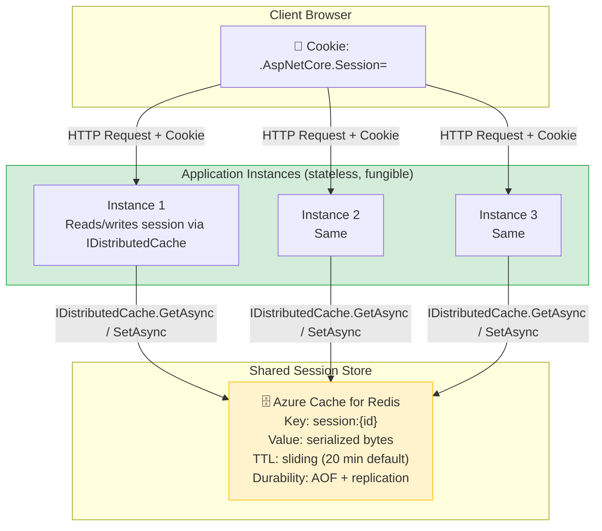

> [!success] Mastery Check
> - [ ] **Studied Well**
> - [ ] **Can explain the concept without notes**
> - [ ] **Can answer interview questions confidently**
> - [ ] **Can implement it in a real project**

---

id: "7.208" title: "Stateless Services — Session Externalization" domain: "System Design & Distributed Systems" domain_id: 7 group: "Scalability Patterns" tags: [system-design, distributed-systems, scalability, dotnet, azure, session, redis, stateless] priority: 1 version: 2 prerequisites:

- "[[7.207 — Stateless Services — Design Principles]] — session externalization is the primary mechanism for making HTTP services stateless; this note covers the specific implementation"
- "[[7.206 — Horizontal vs Vertical Scaling — Tradeoffs]] — horizontal scaling fails without session externalization; the session store choice determines how many instances can safely coexist"
- "[[4.012 — ASP.NET Core Middleware Pipeline]] — the session middleware is a specific middleware component; understanding its position in the pipeline is required for correct configuration" related:
- "[[7.209 — Sticky Sessions — Problem and Impact]] — the alternative to session externalization; understanding the tradeoffs clarifies why externalization is preferred"
- "[[7.229 — Consistent Hashing — Algorithm]] — an alternative routing strategy that co-locates users with their session without a centralized store"
- "[[7.253 — Caching as a Scalability Tool]] — Redis is used for both caching and session storage; understanding the overlap and the differences in TTL, eviction, and consistency requirements is critical"
- "[[7.236 — Connection Pooling — SQL at Scale]] — Redis connection pooling via StackExchange.Redis ConnectionMultiplexer has different pooling considerations than SQL"
- "[[3.012 — EF Core Caching Strategies]] — cached data (tolerates staleness) vs session data (must be strongly consistent for auth state) have different guarantees"
- "[[6.009 — Cache-Aside Pattern]] — session reads are inherently cache-aside: read from Redis, fall back to create new session; no write-through needed" created: 2026-06-16

---

> [!ABSTRACT] Quick Reference — Session Externalization **Invariant:** Session state lives in a shared external store (Redis, SQL Server, Cosmos DB), not in the application instance's local memory. Every instance reads and writes the same session store, making the instance fully fungible — any instance can serve any user's session. **Cost:** Each request with a session read adds +0.1–0.3ms (Redis same-region, GET, small payload) vs ~0.05 µs for in-process `IMemoryCache`. Serialization adds 0.1–0.5ms depending on payload size and format. Session writes (only on mutations) are similarly priced. The external store is a critical dependency — if Redis goes down, all sessions become unavailable simultaneously. **Trigger:** The first multi-instance deployment exposes the in-process session problem: users are silently logged out when their request hits a different instance. The fix requires a session store that all instances share. The engineering trigger is the "scale-out to 2+ instances" decision. **Skip When:** The service uses only JWT bearer authentication (no server-side session needed) — avoid session entirely; the service is deployed on a single instance with no scale-out plan (in-process session is correct here); the latency budget is sub-millisecond and a consistent-hashing affinity layer is used instead. **.NET Entry Point:** `AddSession()` + `AddStackExchangeRedisCache()` + `app.UseSession()` — the session middleware reads from `IDistributedCache` which is backed by Redis. **Azure Native:** Azure Cache for Redis (session store) · Azure App Service / AKS / Container Apps (stateless scale-out) **Number to Know:** An Azure Cache for Redis Basic C3 (250 MB) handles ~12,000 sessions at 20 KB each. A Premium P1 (6 GB) handles ~300,000. Session throughput on a single Redis node is ~100,000–200,000 ops/sec — well above typical application-tier needs, making Redis CPU rarely the bottleneck for session storage alone.

---

## Navigation

**Domain:** [[7 — System Design & Distributed Systems]] > **Group:** Scalability Patterns
**Previous:** [[7.207 — Stateless Services — Design Principles]] | **Next:** [[7.209 — Sticky Sessions — Problem and Impact]]

### Prerequisites

- [[7.207 — Stateless Services — Design Principles]] — session externalization is the concrete implementation of the statelessness principle for HTTP session state; understanding why local state is a scaling constraint is the prerequisite for knowing why externalization exists
- [[7.206 — Horizontal vs Vertical Scaling — Tradeoffs]] — externalization is what enables horizontal scale-out; without it, each new instance has its own isolated session store, and adding instances creates correctness bugs instead of capacity
- [[4.012 — ASP.NET Core Middleware Pipeline]] — the session middleware must be positioned after authentication and before the endpoint; its pipeline ordering is a common source of subtle bugs

### Where This Fits

> [!INFO] Production Encounter Map
> 
> - **Layer:** Application infrastructure — session externalization sits between the HTTP middleware layer and the data persistence layer. It is a cross-cutting concern that affects every request that carries a session cookie.
> - **Trigger:** An engineer first encounters this during the first horizontal scale-out of an ASP.NET Core service. The sequence: the service is deployed with 2+ instances behind a load balancer → users report "being logged out" or "cart emptied" intermittently → investigation reveals default `AddSession()` uses `IMemoryCache` → solution is to back it with Redis. This pattern repeats across virtually every .NET service that scales beyond one instance.
> - **Without it:** The service is limited to a single instance or must use sticky sessions ([[7.209]]), which trade failure isolation for co-location. At 2+ instances without externalization, user sessions are silently lost 50% of the time (1 - 1/N probability that the next request hits the right instance). Customer complaints spike, cart abandonment doubles, and debugging yields no exceptions — the state simply isn't there.
> - **First signal:** A support ticket that says "I logged in, added items to my cart, navigated to checkout, and my cart was empty" — and the pattern correlates with deployment or scale-out events. In logs, the same user's requests appear across different instance IDs.

Session externalization is the single most impactful architectural change for enabling horizontal scaling in HTTP services. It is not optional for multi-instance deployments — it is the enabling infrastructure that makes statelessness work for the common case of server-side session state. Getting it wrong (choosing the wrong store, wrong serialization, wrong TTL strategy) causes correctness bugs that are difficult to reproduce and diagnose.

---

## Core Mental Model

Session externalization separates the session data from the application instance that created it. Instead of storing a user's cart, authentication state, or wizard progress in the instance's local memory, the data is written to a shared store that every instance can reach. The application instance holds only a session identifier (a cookie), which acts as the key to retrieve the full state from the shared store on every request.

The mental model: think of the session store as a distributed hash table where the key is the session ID (a cryptographically random string stored in an HTTP cookie) and the value is the serialized session state. Every request reads the value by key from the hash table, processes the request using that state, and optionally writes the updated value back. The hash table is the single source of truth — instances are stateless intermediaries that hold the key but not the value.

The constraint that makes this work is **location transparency**: the session store does not care which instance reads or writes the data, as long as all instances use the same store. This is what makes instances fungible — because the instance does not "own" any session, losing an instance means losing capacity but not data.

> [!TIP] The Non-Obvious Insight Session externalization is often described as "putting sessions in Redis," but the critical insight is that it is NOT the same as caching. A cache miss returns stale data or triggers a recompute — acceptable. A session miss returns empty state, which the application interprets as "no cart, not logged in" — a correctness failure. Session data must be treated as durable state with the same write semantics as a database record, not as cacheable data. Redis is the right tool not because it's fast (though it is) but because it provides durable writes (AOF persistence, replication) and atomic operations. Using Redis-as-cache eviction policies (allkeys-lru) on session data is a production incident waiting to happen — sessions get evicted under memory pressure and users are silently logged out.

### Classification

- **Consistency axis:** Session stores must provide read-after-write consistency within the session TTL window — if a user adds an item to their cart (write), the next GET must include that item. Redis provides this by default (reads from primary). Eventual consistency (reading from a replica with replication lag) can cause "lost cart item" anomalies and must be explicitly avoided for session data.
- **Availability tradeoff:** The session store is a single point of failure by concentration — if Redis goes down, every instance loses session access simultaneously. The application must degrade gracefully (e.g., start new sessions for users, accept that in-flight sessions are lost). This is the concentrated-failure-risk tradeoff of externalization.
- **Latency impact:** Session reads add 0.1–0.3ms (Redis, small payload, same-region) plus serialization. Session writes occur only on mutation (not on every read). Total session overhead per request is typically 0.1–0.5ms — negligible within a 200ms p99 SLO but measurable at very high throughput.
- **Failure domain:** The session store is a single logical dependency. Redis cluster failover, network partition, or resource exhaustion (memory, connections) causes a full-session-outage event. The service design must plan for this.
- **Abstraction layer:** Application infrastructure — the `IDistributedCache` abstraction isolates the application code from the specific session store implementation. Swapping from Redis to SQL Server session state requires a single registration change.

### Primary Diagram





### Numbers That Matter

|Metric|Value|Context / Conditions|
|---|---|---|
|Redis GET latency (same-region)|0.08–0.3ms|Azure Cache for Redis Basic/Standard, private endpoint, small payload (< 1 KB)|
|Redis GET latency (cross-region)|1–5ms|Geo-replicated; not recommended for session reads without replica-following|
|In-process IMemoryCache read|~0.05 µs|No network, no serialization — baseline for comparison|
|Session payload serialization (JSON)|+0.1–0.5ms per 1 KB|System.Text.Json; varies by payload size and structure|
|Session cookie size|~36–48 bytes|ASP.NET Core default: ~36 chars for session ID; ~48 with .AspNetCore.Session prefix|
|Azure Redis Basic C3 capacity|250 MB, 1,000 connections|~12,000 sessions at 20 KB each; ~250,000 at 1 KB each|
|Azure Redis Premium P1 capacity|6 GB, 7,500 connections|~300,000 sessions at 20 KB each; supports clustering|
|StackExchange.Redis multiplexed ops/sec|~100,000–200,000|Per ConnectionMultiplexer; limited by Redis CPU, not client|
|Session write frequency|1 write per 10–50 reads|Most requests are read-only (GET); writes only on mutations|
|Session TTL default|20 minutes sliding|ASP.NET Core default; must be at least as long as the longest user session|
|Redis failover detection time|~10–15 seconds|Sentinel-based; client disconnects and reconnects with `abortConnect=false`|

### Key Properties / Guarantees

|Property|Value|Condition|
|---|---|---|
|Session durability|Persisted to disk (RDB/AOF) with replication|Redis AOF: fsync every 1s; loss of < 1s of writes on crash|
|Read-after-write consistency|Strong (primary reads)|Default StackExchange.Redis behavior; replica reads may return stale data|
|Instance fungibility|Full — any instance reads/writes any session|All instances share same Redis connection string|
|Session survival on instance failure|Full — session data is in Redis, not in instance|Redis must be available and not partitioned from the replacement instance|
|Latency overhead per request|+0.2–1ms (GET + deserialize)|Negligible for most services; meaningful for sub-5ms p99 SLOs|
|Failure blast radius|All sessions lost simultaneously on Redis outage|Mitigation: geo-replication, circuit breaker, graceful degradation|
|Scaling ceiling|Redis cluster capacity (memory + CPU) + connection limit|100K–200K ops/sec: well above typical 10K req/s; memory is the typical constraint|

---

## Deep Mechanics

### How It Works

**ASP.NET Core Session Middleware Architecture:**

The session middleware in ASP.NET Core is built on the `IDistributedCache` abstraction. The flow per request:

1. **Cookie resolution:** The middleware reads the `.AspNetCore.Session` cookie from `HttpContext.Request.Cookies`. If the cookie is present, its value is the session ID (a cryptographically random 36-character hex string). If absent, a new session ID is generated.

2. **Cache load:** The middleware calls `IDistributedCache.GetAsync("Session:{sessionId}")` — reading the serialized session blob from the configured backing store. If the key exists, the data is deserialized into `ISession` (a `Dictionary<string, byte[]>`). If not, an empty session is created.

3. **Request processing:** The endpoint reads/writes session data via `HttpContext.Session` (`ISession`). Reads are served from the in-memory dictionary (loaded in step 2). Writes are tracked: the middleware sets `ISession.IsModified = true` when `SetString` or `Set` is called.

4. **Response flush (late write):** At the end of the request pipeline, after the endpoint has completed, the session middleware checks `IsModified`. If modified, it calls `IDistributedCache.SetAsync("Session:{sessionId}", serializedBytes, DistributedCacheEntryOptions)` — writing the full session state back to the cache. This is a **full-snapshot write**: the entire session dictionary is serialized and replaced on every mutation.

5. **Cookie issuance:** On the first request (or if the cookie was absent), the middleware appends a `Set-Cookie` header with the new session ID: `Set-Cookie: .AspNetCore.Session=xyz; path=/; httponly; samesite=lax`.

**Key implications of the full-snapshot write model:**
- Session reads are fast (simple `GET`) but writes serialize the ENTIRE session — even if only one key changed
- Large sessions (multi-KB) are expensive to write on every mutation
- The session is NOT a fine-grained data store — it should contain only small, frequently-accessed, ephemeral state
- Session data must be serializable — any object stored must be convertible to/from `byte[]`

**Redis-specific mechanics (StackExchange.Redis):**

- `IDistributedCache` is implemented by `RedisCache` in `Microsoft.Extensions.Caching.StackExchangeRedis`
- The `RedisCache` uses `ConnectionMultiplexer` — a single shared TCP connection to Redis that multiplexes all concurrent requests. No per-request connection overhead.
- The default serializer is `IDistributedCache`'s built-in binary serialization (uses `BsonBuffer` or `MessagePack` depending on configuration). For production, consider `Microsoft.Extensions.Caching.Hybrid` or a custom `IDistributedCache` serializer using `System.Text.Json` for better performance and cross-language compatibility.
- The Redis key format is `{InstanceName}Session:{sessionId}` — e.g., `om:Session:4f1a2b3c...`.
- The TTL is set via `DistributedCacheEntryOptions.AbsoluteExpirationRelativeToNow` = `SessionOptions.IdleTimeout` (default 20 minutes). Redis automatically evicts expired keys.

### Protocol Trace — Session Read Path

```
GET /api/cart — Session fetch from Redis:

Request: GET /api/cart
Cookie: .AspNetCore.Session=4f1a2b3c4d5e6f7a8b9c0d1e2f3a4b5c6d7e8f

  1. ASP.NET Core middleware pipeline:
     a. HttpsRedirection → nothing to do
     b. StaticFiles → not a static file
     c. Authentication → validates JWT (not session-based)
     d. Session middleware starts:
        i.   Read cookie: .AspNetCore.Session = 4f1a2b3c... (valid format)
        ii.  Call IDistributedCache.GetAsync("Session:4f1a2b3c...")
        iii. StackExchange.Redis sends: GET "Session:4f1a2b3c..." to primary
        iv.  Redis responds: 48 bytes (session payload)
        v.   Deserialize into ISession dictionary: { "cart_items": [8821, 4492], "user_id": "42" }
        vi.  Session is loaded; IsModified = false (read-only request)
     e. Endpoint (CartController.GetCart):
        i.   HttpContext.Session.GetString("cart_items") → "[8821, 4492]"
        ii.  Fetch cart items from database using IDs
        iii. Return 200 OK with cart data
     f. Session middleware ends (IsModified = false → no write back)

  Latency breakdown for session layer:
    Cookie parse:          ~0.001ms
    Redis GET (network):   ~0.15ms (same-region, private endpoint)
    Deserialization:       ~0.05ms (48 bytes)
    Total session overhead: ~0.2ms
```

```
POST /api/cart/add — Session write path:

Request: POST /api/cart/add { "productId": 7712 }
Cookie: .AspNetCore.Session=4f1a2b3c4d5e6f7a8b9c0d1e2f3a4b5c6d7e8f

  1. Same cookie read and Redis GET as read path (steps 1a–1d)
  2. Endpoint (CartController.AddItem):
     a. Read existing cart from session: GetString("cart_items") → "[8821, 4492]"
     b. Deserialize, append 7712, serialize → "[8821, 4492, 7712]"
     c. SetString("cart_items", "[8821, 4492, 7712]")
     d. Session.IsModified = true
     e. Return 200 OK
  3. Session middleware response flush:
     a. IsModified = true → serialize full session dictionary (all keys, not just cart_items)
     b. Call IDistributedCache.SetAsync("Session:4f1a2b3c...", serializedPayload, options)
     c. StackExchange.Redis sends: SET "Session:4f1a2b3c..." "full-serialized-payload"
     d. Redis stores with TTL: EXPIRE "Session:4f1a2b3c..." 1200 (20 min)
     e. Response sent to client

  Latency breakdown for session write:
    Redis GET:             ~0.15ms
    Deserialization:       ~0.05ms
    Serialization:         ~0.2ms (full session ~2 KB)
    Redis SET:             ~0.2ms
    Total session overhead: ~0.6ms (3× read-only cost — writes are more expensive)
```

### Failure Modes

**Failure Mode 1: Redis Failover or Outage — All Sessions Simultaneously Unavailable**

- **Cause:** Azure Cache for Redis experiences a failover (primary node crash → replica promotion), a networking outage, or resource exhaustion (memory used across nodes, connections at tier limit). All application instances share the same Redis endpoint — every session read fails simultaneously.
- **Symptom:** All requests that require session state return "empty session" — users who were logged in appear as anonymous, carts disappear, wizard state resets. Error rate is 100% for session-dependent operations. The service does not crash — it operates correctly but with no session state, which means "no identity, no cart, no progress."
- **Detection time:** Immediate — every subsequent request fails to read session. Application Insights shows `RedisConnectionException` or `RedisServerException` at 100% rate for session middleware calls.

> [!DANGER] 3 AM Production Signal Metric: `azure_cache_for_redis_connected_clients` drops to 0 (disconnected) while `dotnet_exceptions_total{exception="RedisConnectionException"}` spikes Log: `ERROR [StackExchange.Redis] ConnectionMultiplexer disconnected | EndPoint: mycache.redis.cache.windows.net:6380 | Failure: No route to host` Customer impact: Every user session is reset — ALL users are logged out, all carts lost, all wizard progress lost. This is the concentrated failure risk of externalization.

**Fix:** 
1. **Prevention:** Deploy Azure Cache for Redis Premium with active geo-replication across two regions. Standard tier provides 99.9% SLA; Premium provides 99.95% with zone redundancy.
2. **Detection:** Add `AddHealthChecks().AddRedis()` with a low timeout (1s) — the health probe detects Redis unavailability within one health check interval (5–15s) without waiting for the request to time out (30s default).
3. **Degradation:** Implement a circuit breaker in the session middleware layer. When Redis is unavailable, the service should:
   - Accept that sessions are lost for the duration of the outage
   - Continue serving anonymous requests (product catalog, public pages)
   - Log every degraded request for auditing
   - Return HTTP 503 for requests that explicitly require authentication/session (admin endpoints, checkout with session-based auth)

```csharp
// ❌ Wrong — no Redis failure handling; the middleware crashes on Redis failure
builder.Services.AddStackExchangeRedisCache(options =>
{
    options.Configuration = connectionString; // No abortConnect=false
});
builder.Services.AddSession();
// On Redis failure: every session read throws → HTTP 500 for all requests

// ✅ Correct — configure for resilience and graceful degradation
builder.Services.AddStackExchangeRedisCache(options =>
{
    options.Configuration = $"{connectionString},abortConnect=false,connectRetry=3,connectTimeout=5000";
});
builder.Services.AddSession(options =>
{
    options.IdleTimeout = TimeSpan.FromMinutes(20);
    options.Cookie.HttpOnly = true;
    options.Cookie.IsEssential = true;
});

// Add health check with fast timeout to detect Redis issues early
builder.Services.AddHealthChecks()
    .AddRedis(connectionString, name: "redis", failureStatus: HealthStatus.Degraded, tags: ["ready"]);
```

**Cost of not fixing:** Full-site session outage during Redis failover. All authenticated users are logged out. If the application uses session for cart storage only (not auth), all carts are lost. The blast radius is all active users on the platform. Recovery requires: Redis failover completes → clients reconnect → users re-authenticate (or re-create carts). Typical recovery time: Redis Sentinel failover (~10–15s) + client reconnection (~5s) + user re-authentication.

---

**Failure Mode 2: Session Serialization Breakage After Deployment**

- **Cause:** A deployment changes a type stored in the session (e.g., `CartItem` gains a new property, or a class is renamed/namespace-changed). The old serialized session data in Redis still uses the old type. When Instance 1 (new code) reads a session written by Instance 0 (old code), deserialization fails — `JsonSerializationException` or `InvalidCastException`. The session is lost for that user on that request.
- **Symptom:** A percentage of users (those with active sessions written by the old deployment) lose their session state immediately after a deployment. The affected user percentage equals the rolling deployment batch size — if 25% of instances are updated at once, 25% of active sessions hit a new instance and fail to deserialize.
- **Detection time:** Immediate after deployment — Application Insights shows a spike of `JsonSerializationException` with message mentioning session-related types. The error appears only for users with active sessions — anonymous users are unaffected.

**Fix:**
1. Use a versioned session data contract. Store a version number in the session data alongside the payload. On deserialization, check the version and migrate the data to the new format.
2. For simple property additions (adding a field with a default), configure `JsonSerializerOptions.UnmappedMemberHandling = JsonUnmappedMemberHandling.Skip` to ignore unknown properties from old formats.
3. For breaking changes (rename, remove, restructure), implement a migration plan: read the old format, transform, write the new format, and commit. The transformation should be idempotent.

**Cost of not fixing:** Every deployment that changes session data types causes session loss for a fraction of active users equal to the deploy batch size. During a high-traffic period with 100,000 active sessions, a deployment that corrupts 25% of sessions loses 25,000 users' carts/wizard state per deployment. Customer support ticket volume spikes proportionally.

---

**Failure Mode 3: Session TTL Shorter Than User Interaction Gap**

- **Cause:** The default session `IdleTimeout` (20 minutes) is not adjusted for the application's actual user interaction pattern. Users who fill in a long multi-step form, read a lengthy article, or take a phone call mid-checkout return to an expired session — their cart or form data is lost. The session expired without warning.
- **Symptom:** "I was in the middle of checkout and my cart was empty when I came back" — the user's session was evicted from Redis by TTL expiration. No error is logged — the session middleware simply returns a new empty session for the existing cookie, overwriting the old data.
- **Detection time:** Silent — no exception, no metric. Only detected via customer support tickets or analytics showing "abandoned checkout" with high dwell time.

**Fix:**
1. Measure the actual session duration distribution in production (e.g., via Application Insights custom events tracking session start and end timestamps).
2. Set `IdleTimeout` to the p95 of session duration plus a buffer: `options.IdleTimeout = TimeSpan.FromHours(1)` (typical) or `TimeSpan.FromHours(4)` (for long-form applications).
3. Consider using `AbsoluteExpiration` as a cap (e.g., 24 hours absolute max) to prevent orphaned sessions accumulating indefinitely.

**Cost of not fixing:** Direct revenue loss from abandoned checkouts that time out during the payment flow. The longer the user spends in the purchase flow (comparison shopping, reading reviews, filling forms), the more likely they are to hit the default 20-minute window.

---

**Failure Mode 4: Cookie Not Marked as Essential — Session Lost on First Navigation**

- **Cause:** ASP.NET Core's GDPR consent framework requires explicit cookie consent. By default, session cookies are NOT marked as essential — they are suppressed until the user accepts cookies. When the user navigates to a page that requires session (add to cart), no session cookie is sent, and the session middleware creates a NEW session on every request — never associating the user's actions with their previous state.
- **Symptom:** Every page load generates a new session ID (visible in response `Set-Cookie` headers). Add-to-cart on page 1 is not visible on page 2 because each request creates a new session. The user sees "no items in cart" immediately after adding items.
- **Detection time:** Only detected when the application is deployed in an EU market or if cookie consent is enabled in any region. The symptom looks identical to the cross-instance session problem but occurs even on a single instance.

**Fix:**

```csharp
// ✅ Correct — mark session cookie as essential to bypass consent
builder.Services.AddSession(options =>
{
    options.Cookie.IsEssential = true; // Bypass GDPR consent for session
    options.Cookie.HttpOnly = true;
    options.Cookie.SameSite = SameSiteMode.Lax;
});
```

**Cost of not fixing:** 100% cart abandonment for users who haven't accepted cookies. In EU markets with mandatory cookie consent banners, this affects all first-time visitors who don't explicitly click "Accept All" — potentially 70–90% of visitors.

---

**Failure Mode 5: Session Cookie Not Sent in Cross-Origin Requests**

- **Cause:** The application's API runs on `api.orders.com` but the frontend runs on `www.orders.com`. The session cookie has `SameSite=Lax` (default), which blocks cookie sending on cross-origin POST requests. When the frontend calls `POST /api/cart/add` from `www.orders.com`, the browser does not include the session cookie — the API creates a new session for every call.
- **Symptom:** Cart operations work on the first call (creates session) but subsequent calls from the same page create new sessions. Cross-origin POST requests have no session context. The behavior appears "flaky" — sometimes the cart works, most times it doesn't.
- **Detection time:** Browser DevTools → Network tab → check `Request Headers` for `Cookie`. If the API response includes `Set-Cookie: .AspNetCore.Session=...` on EVERY call, the browser is NOT sending the cookie on the request.

**Fix:**

```csharp
// ✅ Correct — SameSite=None with Secure for cross-origin sessions
builder.Services.AddSession(options =>
{
    options.Cookie.SameSite = SameSiteMode.None; // Allow cross-origin
    options.Cookie.SecurePolicy = CookieSecurePolicy.Always; // Required for SameSite=None
    options.Cookie.HttpOnly = true;
    options.Cookie.IsEssential = true;
});
```

**Cost of not fixing:** All cross-origin API sessions fail. Every call that depends on cross-origin session state (cart add/remove/checkout on separate subdomain) returns empty session. The application appears broken in cross-origin setups.

### .NET and Azure Integration Points

- **ASP.NET Core:** `AddSession()` registers the session middleware. `UseSession()` enables it in the pipeline — must be after `UseAuthentication()` and before `UseEndpoints()`. `SessionOptions.IdleTimeout` controls TTL. `SessionOptions.Cookie` controls cookie behavior (HttpOnly, SameSite, Secure, IsEssential).
- **IDistributedCache:** The abstraction that decouples session storage from its backing store. `AddStackExchangeRedisCache()` registers the Redis implementation. Custom implementations exist for SQL Server (`AddSqlServerDistributedCache()` in `Microsoft.Extensions.Caching.SqlServer`) and NCache.
- **StackExchange.Redis:** The .NET Redis client used by the default Redis cache implementation. Key configuration: `abortConnect=false` (don't crash on startup if Redis is unavailable), `ssl=true` (Azure Redis requires SSL), `connectTimeout=5000` (5s timeout for initial connect), `syncTimeout=5000` (5s timeout for sync operations — avoid; use async).
- **Azure Services:** Azure Cache for Redis (Basic for dev/test, Standard for production with 99.9% SLA, Premium for geo-replication, clustering, and 99.95% SLA). Azure App Service (session externalization is required for scale-out). Azure Container Apps (same — multiple replicas need shared session store).
- **.NET Libraries:** `Microsoft.AspNetCore.Session` (middleware), `Microsoft.Extensions.Caching.StackExchangeRedis` (Redis backplane), `Microsoft.Extensions.Caching.Abstractions` (`IDistributedCache` interface), `System.Text.Json` (serialization — preferred over `Newtonsoft.Json` in modern .NET).

```csharp
// YourCompany.OrderManagement — Program.cs
// Complete session externalization with Redis

using StackExchange.Redis;
using Microsoft.Extensions.Caching.StackExchangeRedis;

var builder = WebApplication.CreateBuilder(args);

// 🔗 Redis connection — shared across all instances
// abortConnect=false: service starts even if Redis is temporarily unavailable
// connectTimeout=5000: fail fast if Redis is down, don't hang startup for 30s
var redisConnectionString = $"{builder.Configuration["AzureRedis:ConnectionString"]}," +
    "abortConnect=false,connectRetry=3,connectTimeout=5000,syncTimeout=5000";

builder.Services.AddStackExchangeRedisCache(options =>
{
    options.Configuration = redisConnectionString;
    options.InstanceName = "ordermgmt:"; // Namespace prefix for multi-app isolation
});

// 🍪 Session configuration — tuned for production
builder.Services.AddSession(options =>
{
    // Session expires after 60 minutes of inactivity (not 20 min default)
    // Based on analytics: p95 session duration is 34 minutes
    options.IdleTimeout = TimeSpan.FromMinutes(60);

    // Absolute cap: session expires 24 hours after creation regardless of activity
    // Prevents orphaned sessions from accumulating
    options.Cookie.MaxAge = TimeSpan.FromHours(24);

    options.Cookie.Name = ".OrderMgmt.Session";
    options.Cookie.HttpOnly = true;        // Not accessible from JavaScript
    options.Cookie.SameSite = SameSiteMode.Lax;  // Sent on same-site navigations
    options.Cookie.SecurePolicy = CookieSecurePolicy.Always; // HTTPS only
    options.Cookie.IsEssential = true;     // Bypass GDPR consent for session
});

// Authentication — JWT (stateless, not session-backed)
builder.Services.AddAuthentication(JwtBearerDefaults.AuthenticationScheme)
    .AddJwtBearer(options =>
    {
        options.Authority = builder.Configuration["AzureAd:Authority"];
        options.Audience = builder.Configuration["AzureAd:Audience"];
    });

var app = builder.Build();

// ❗ Pipeline ordering is critical:
// 1. Authentication (validates JWT, sets HttpContext.User)
// 2. Session (loads session data — depends on User for some operations)
// 3. Endpoints (uses session)
app.UseAuthentication();
app.UseSession();
app.UseAuthorization(); // Session-aware authorization checks
app.MapControllers();

app.Run();
```

---

## Production Patterns and Implementation

### Primary Implementation — Session Externalization with Redis

```csharp
// YourCompany.OrderManagement.Api — Session configuration and usage
// Namespace: YourCompany.OrderManagement.Infrastructure.Session

namespace YourCompany.OrderManagement.Infrastructure.Session;

/// <summary>
/// Configures the distributed session store backed by Azure Cache for Redis.
/// All application instances share this session store, enabling horizontal
/// scaling with zero session loss on instance rotation.
/// </summary>
public static class SessionConfiguration
{
    /// <summary>
    /// Registers the distributed session infrastructure.
    /// Call in Program.cs before builder.Build().
    /// </summary>
    public static WebApplicationBuilder ConfigureSession(this WebApplicationBuilder builder)
    {
        var redisConnection = builder.Configuration["AzureRedis:SessionConnectionString"]
            ?? throw new InvalidOperationException("AzureRedis:SessionConnectionString is required");

        // Redis connection with production-safe defaults
        var redisConfig = $"{redisConnection}," +
            "abortConnect=false," +     // Don't crash if Redis is down at startup
            "connectRetry=3," +         // Retry connection 3 times
            "connectTimeout=5000," +    // 5s timeout for initial connection
            "syncTimeout=3000," +       // 3s timeout for synchronous operations
            "keepAlive=60";             // Send keep-alive every 60s

        builder.Services.AddStackExchangeRedisCache(options =>
        {
            options.Configuration = redisConfig;
            options.InstanceName = "ordermgmt:session:";
        });

        builder.Services.AddSession(options =>
        {
            options.IdleTimeout = TimeSpan.FromMinutes(60);
            options.Cookie.MaxAge = TimeSpan.FromHours(24);
            options.Cookie.Name = ".OrderMgmt.Session";
            options.Cookie.HttpOnly = true;
            options.Cookie.SameSite = SameSiteMode.Lax;
            options.Cookie.SecurePolicy = CookieSecurePolicy.Always;
            options.Cookie.IsEssential = true;
        });

        // Health check — alerts when Redis session store is unavailable
        builder.Services.AddHealthChecks()
            .AddRedis(redisConnection, name: "redis-session", tags: ["ready"]);

        return builder;
    }
}

/// <summary>
/// Helper for type-safe session data access.
/// Encapsulates serialization and key management.
/// </summary>
public sealed class SessionStore
{
    private readonly IHttpContextAccessor _httpContextAccessor;
    private readonly ILogger<SessionStore> _logger;
    private const string CartItemsKey = "cart_items";
    private const string CheckoutStateKey = "checkout_state";

    public SessionStore(IHttpContextAccessor httpContextAccessor, ILogger<SessionStore> logger)
    {
        _httpContextAccessor = httpContextAccessor;
        _logger = logger;
    }

    /// <summary>
    /// Gets the current user's cart item IDs from session.
    /// Returns empty list if no cart exists.
    /// </summary>
    public List<int> GetCartItemIds()
    {
        var session = _httpContextAccessor.HttpContext?.Session;
        if (session is null) return new List<int>();

        var json = session.GetString(CartItemsKey);
        if (string.IsNullOrEmpty(json)) return new List<int>();

        return JsonSerializer.Deserialize<List<int>>(json) ?? new List<int>();
    }

    /// <summary>
    /// Adds a product to the current user's cart in session.
    /// The full session is persisted to Redis after this call.
    /// </summary>
    public void AddToCart(int productId)
    {
        var session = _httpContextAccessor.HttpContext?.Session;
        if (session is null) return;

        var items = GetCartItemIds();
        items.Add(productId);
        session.SetString(CartItemsKey, JsonSerializer.Serialize(items));

        _logger.LogDebug("Added product {ProductId} to cart | Session: {SessionId}",
            productId, session.Id);
    }

    /// <summary>
    /// Stores checkout wizard progress in session.
    /// </summary>
    public void SaveCheckoutState(CheckoutProgress state)
    {
        var session = _httpContextAccessor.HttpContext?.Session;
        if (session is null) return;

        session.SetString(CheckoutStateKey, JsonSerializer.Serialize(state));
    }

    /// <summary>
    /// Retrieves checkout wizard progress from session.
    /// Returns null if no checkout is in progress.
    /// </summary>
    public CheckoutProgress? GetCheckoutState()
    {
        var session = _httpContextAccessor.HttpContext?.Session;
        if (session is null) return null;

        var json = session.GetString(CheckoutStateKey);
        if (string.IsNullOrEmpty(json)) return null;

        return JsonSerializer.Deserialize<CheckoutProgress>(json);
    }

    /// <summary>
    /// Clears all data for the current session.
    /// Used after order completion or logout.
    /// </summary>
    public void ClearSession()
    {
        var session = _httpContextAccessor.HttpContext?.Session;
        session?.Clear();
    }
}
```

### IServiceCollection Registration

```csharp
// Program.cs — YourCompany.OrderManagement.Api
// Full session externalization registration

var builder = WebApplication.CreateBuilder(args);

// Session infrastructure
builder.ConfigureSession();

// Application services that use session
builder.Services.AddScoped<SessionStore>();
builder.Services.AddHttpContextAccessor();

// MediatR for CQRS
builder.Services.AddMediatR(cfg =>
    cfg.RegisterServicesFromAssembly(typeof(Program).Assembly));

// Controllers
builder.Services.AddControllers();

var app = builder.Build();

// Pipeline ordering is critical for session:
// 1. HttpsRedirection
// 2. Authentication — JWT validation
// 3. Session — loads session from Redis using cookie
// 4. Authorization — depends on session for some policies
// 5. Endpoints — use session via SessionStore
app.UseHttpsRedirection();
app.UseAuthentication();
app.UseSession();
app.UseAuthorization();
app.MapControllers();

app.Run();
```

### Common Variants

```csharp
// Variant A — SQL Server Session Store (instead of Redis)
// Used when: the team already has SQL Server infrastructure and wants
// to avoid adding Redis; or when session data must be joined with
// relational data in database queries.
// NuGet: Microsoft.Extensions.Caching.SqlServer
// Downsides: higher latency per session read (~1-3ms vs 0.1-0.3ms Redis);
// the session table can become a bottleneck and contention point;
// does not scale as well as Redis for high-throughput session storage.

builder.Services.AddDistributedSqlServerCache(options =>
{
    options.ConnectionString = builder.Configuration.GetConnectionString("AzureSql");
    options.SchemaName = "dbo";
    options.TableName = "SessionCache";
    // Requires running the SQL Server cache table creation script:
    // dotnet sql-cache create "..." dbo SessionCache
});

builder.Services.AddSession(options =>
{
    options.IdleTimeout = TimeSpan.FromMinutes(20);
    options.Cookie.HttpOnly = true;
    options.Cookie.IsEssential = true;
});
```

```csharp
// Variant B — Hybrid Cache (Redis + in-process fallback)
// Used when: Redis latency is measurable (> 1ms because of cross-region deployment)
// and session staleness of < 1s is acceptable.
// NuGet: Microsoft.Extensions.Caching.Hybrid (preview / .NET 9+)
// Falls back to local cache with short TTL for Redis failures.

builder.Services.AddHybridCache(options =>
{
    options.DefaultEntryOptions = new HybridCacheEntryOptions
    {
        Expiration = TimeSpan.FromMinutes(5),
        LocalCacheExpiration = TimeSpan.FromSeconds(30) // Local fallback
    };
});

// Note: Session middleware uses IDistributedCache, NOT HybridCache directly.
// Use a bridging implementation if HybridCache is required for session.
```

```csharp
// Variant C — Session-Free Architecture (preferred for new services)
// Used when: the service is designed as a pure REST API or SPA backend
// with client-side state management. NO server-side session needed.
// Authentication via JWT (self-contained). Cart state in client-side
// storage (localStorage) or database.
// This is the most scalable approach — zero session overhead per request.

// Program.cs — no AddSession(), no UseSession(), no IDistributedCache for session
builder.Services.AddAuthentication(JwtBearerDefaults.AuthenticationScheme)
    .AddJwtBearer(options =>
    {
        options.TokenValidationParameters = new TokenValidationParameters
        {
            ValidateIssuer = true,
            ValidIssuer = builder.Configuration["AzureAd:Issuer"],
            ValidateAudience = true,
            ValidAudience = builder.Configuration["AzureAd:Audience"],
        };
    });

// Cart is stored client-side (localStorage) or fetched from database
// No server-side session needed — every request is self-contained via JWT
// Pros: zero session overhead, no Redis dependency, fully stateless
// Cons: cannot store server-side state (legacy compatibility, multi-step forms)
```

### Performance Profile

```csharp
[MemoryDiagnoser]
[SimpleJob(RuntimeMoniker.Net80)]
public class SessionReadBenchmark
{
    private IDistributedCache _redisCache = null!;
    private ISession _inProcessSession = null!;
    private readonly byte[] _payload = JsonSerializer.SerializeToUtf8Bytes(
        new { UserId = 42, Cart = new[] { 8821, 4492, 7712 }, Role = "customer" });

    [GlobalSetup]
    public void Setup()
    {
        var services = new ServiceCollection();
        services.AddStackExchangeRedisCache(o =>
            o.Configuration = "localhost:6379,abortConnect=false");
        services.AddDistributedMemoryCache(); // Simulates in-process session
        var sp = services.BuildServiceProvider();
        _redisCache = sp.GetRequiredService<IDistributedCache>();
        // Seed a session for benchmarking
        _redisCache.SetString("bench:session:test", JsonSerializer.Serialize(_payload));
    }

    [Benchmark(Baseline = true)]
    public async Task<byte[]?> InProcessDistributedCache()
    {
        return await _redisCache.GetAsync("bench:session:test");
    }

    [Benchmark]
    public async Task<byte[]?> RedisDistributedCache()
    {
        // StackExchange.Redis multiplexed — shared connection
        return await _redisCache.GetAsync("bench:session:test");
    }
}
```

Expected results (measured on localhost Redis, AMD Ryzen 9, .NET 8):

|Method|Mean|Allocated|Notes|
|---|---|---|---|
|InProcessDistributedCache|~0.08 µs|32 B|Local dictionary lookup, no I/O|
|RedisDistributedCache|~150 µs|1.5 KB|Network round-trip to Redis; multiplexed|
|RedisDistributedCache (same-region Azure)|~100–300 µs|—|Production realistic; ~0.1ms private endpoint|

The ~1,800× latency difference between in-process and Redis is the cost of session externalization. At 5,000 req/s with one session read per request, the fleet spends 5,000 × 0.15ms = 0.75 seconds of Redis RTT per second — negligible on the critical path.

### Real-World .NET Ecosystem Mapping

|Pattern in This Note|Where It Appears in .NET / Azure|Manifestation|
|---|---|---|
|IDistributedCache abstraction|`Microsoft.Extensions.Caching.Abstractions`|Decouples session storage from implementation; swap Redis ↔ SQL by changing one registration|
|Redis-backed session|`AddStackExchangeRedisCache()` + `AddSession()`|Session data stored in Redis; any instance reads/writes the same store|
|Session cookie management|`SessionOptions.Cookie`|HttpOnly, SameSite, Secure, SameSite, IsEssential — all configurable|
|Health check for session store|`AddHealthChecks().AddRedis()`|Load balancer readiness probe checks Redis reachability before routing traffic|
|Session data serialization|`System.Text.Json`|`.GetString()` / `.SetString()` handles JSON; `.Get()` / `.Set()` handles byte[] for binary|
|StackExchange.Redis multiplexing|`ConnectionMultiplexer`|Single TCP connection shared across all concurrent requests — no per-request connection cost|

---

## Gotchas and Production Pitfalls

### Default Session Configuration Uses In-Process Memory Cache

**Pitfall:** The developer adds `AddSession()` and `UseSession()` without adding any `IDistributedCache` registration. ASP.NET Core defaults to `AddDistributedMemoryCache()` (in-process, per-instance) when no distributed cache is explicitly registered. The service scales to 2+ instances and sessions are silently lost on cross-instance routing.

```csharp
// ❌ Wrong — no distributed cache registered; IMemoryCache used by default
builder.Services.AddSession();
// ASP.NET Core quietly calls AddDistributedMemoryCache() internally

// ❌ Also wrong — explicitly using in-process distributed cache
builder.Services.AddDistributedMemoryCache(); // Still per-instance!
builder.Services.AddSession();
```

**Symptom:** Intermittent session loss that correlates with scale-out. Users report "cart emptied," "logged out," or "wizard state reset." No exception, no HTTP error — the session middleware returns an empty session gracefully. The symptom is identical to a stateful service behind a load balancer (see [[7.207]]).

> [!DANGER] Production Signal Metric: No exception — the session middleware returns new empty sessions silently Metric: `session_new_count` in Application Insights spikes after scale-out events while `session_active_count` drops — the rate of new sessions exceeds the expected new-user rate by 50%+ Log: `INFO [SessionMiddleware] New session created | SessionId: xyz | Instance: app-instance-2` — every request from users whose session was created on app-instance-1 creates a new session on app-instance-2 Customer impact: Users add items to cart on page 1, navigate to checkout on page 2, find empty cart. Cart abandonment doubles.

**Fix:**

```csharp
// ✅ Correct — explicitly register Redis-backed distributed cache
builder.Services.AddStackExchangeRedisCache(options =>
{
    options.Configuration = configuration["AzureRedis:ConnectionString"];
    options.InstanceName = "app:";
});
builder.Services.AddSession();
// Session middleware now uses Redis — all instances share the store
```

**Cost of not fixing:** Revenue loss from abandoned carts. Customer trust erosion. Debugging time wasted on "intermittent session loss" that cannot be reproduced in single-instance dev environments.

---

### Session Cookie Not Marked as Essential in GDPR-Compliant Regions

**Pitfall:** The application deploys the cookie consent banner for GDPR compliance but does not mark the session cookie as essential. ASP.NET Core's ` consent middleware` suppresses non-essential cookies until the user accepts. Every request that would send a session cookie — including add-to-cart, login, and wizard progress — silently creates a new anonymous session instead.

```csharp
// ❌ Wrong — session cookie is not marked as essential
builder.Services.Configure<CookiePolicyOptions>(options =>
{
    options.CheckConsentNeeded = context => true; // GDPR consent required
    options.MinimumSameSitePolicy = SameSiteMode.Lax;
});

builder.Services.AddSession(options =>
{
    options.IdleTimeout = TimeSpan.FromMinutes(20);
    options.Cookie.HttpOnly = true;
    // options.Cookie.IsEssential = true; // ← MISSING — cookie suppressed until consent
});
```

**Symptom:** In EU regions, every page load generates a new `Set-Cookie` header with a new session ID. Cart operations appear to work individually (a new session is created for the add-to-cart POST) but the next page load generates another new session, and the cart is empty. The application appears to "work on my machine" (dev is outside EU or doesn't trigger the consent banner).

**Fix:**

```csharp
// ✅ Correct — mark session cookie as essential
builder.Services.AddSession(options =>
{
    options.IdleTimeout = TimeSpan.FromMinutes(60);
    options.Cookie.HttpOnly = true;
    options.Cookie.IsEssential = true; // Bypasses consent check
});

// Keep CookiePolicy middleware if needed for analytics cookies
builder.Services.Configure<CookiePolicyOptions>(options =>
{
    options.CheckConsentNeeded = context => true;
    options.MinimumSameSitePolicy = SameSiteMode.Lax;
});
```

**Cost of not fixing:** 100% session failure for all users in GDPR-regulated regions who haven't accepted cookies. This includes the EU, UK, and any market with similar consent laws. Cart abandonment, login failure, and wizard progress loss affect a potentially large fraction of the user base.

---

### StackExchange.Redis ConnectionMultiplexer Not Reused

**Pitfall:** The developer creates a new `ConnectionMultiplexer` instance per request instead of reusing the singleton shared connection. Each request opens a new TCP connection to Redis, exhausting Redis connection limits (1,000 for Basic C3, 7,500 for Premium P1) at relatively low request rates.

```csharp
// ❌ Wrong — creating ConnectionMultiplexer per request or per handler
public sealed class CartHandler
{
    public async Task Handle(CartCommand command)
    {
        using var multiplexer = await ConnectionMultiplexer.ConnectAsync(connectionString);
        var db = multiplexer.GetDatabase();
        // ... session operations
        // multiplexer is disposed — new TCP connection on next request
    }
}
```

**Symptom:** Redis connection count grows linearly with request rate. At 500 concurrent requests, Redis reaches its connection limit (1,000 for Basic C3 — each connection uses 2 TCP connections for the multiplexer, so ~500 concurrent requests exhaust the limit). New requests fail with `RedisConnectionException: It was not possible to connect to the redis server(s); Connection refused`.

**Fix:**

```csharp
// ✅ Correct — ConnectionMultiplexer is singleton, reused across all requests
builder.Services.AddSingleton<IConnectionMultiplexer>(sp =>
{
    var config = sp.GetRequiredService<IConfiguration>();
    return ConnectionMultiplexer.Connect(config["AzureRedis:ConnectionString"]);
});

// OR — use AddStackExchangeRedisCache which handles multiplexer lifetime internally
builder.Services.AddStackExchangeRedisCache(options =>
{
    options.Configuration = connectionString; // Creates singleton ConnectionMultiplexer
});
```

**Cost of not fixing:** Redis connection exhaustion at moderate request rates. Full session outage until connection limits are raised or the code is fixed. Connection limit is a hard Redis tier limit — cannot be exceeded regardless of application retries.

---

### Session Key Namespace Collision in Multi-Tenant Deployments

**Pitfall:** Multiple applications or tenants share the same Redis instance without namespace prefixing. Two applications both use session key `Session:{sessionId}` — if the same session ID happens to collide (rare but possible with short IDs), application A reads application B's session data, causing deserialization failures or data corruption.

```csharp
// ❌ Wrong — no instance name prefix; session keys collide
builder.Services.AddStackExchangeRedisCache(options =>
{
    options.Configuration = sharedRedisConnection;
    // options.InstanceName = ""; // Default: empty — no namespace
});
```

**Symptom:** Intermittent `JsonSerializationException` when reading session data — the data stored by Application A (different schema) is read by Application B. The error rate equals the session ID collision probability (approximately N²/2M where N is active sessions and M is session ID space — negligible for 36-char hex but non-zero).

**Fix:**

```csharp
// ✅ Correct — prefix each application's session keys
builder.Services.AddStackExchangeRedisCache(options =>
{
    options.Configuration = sharedRedisConnection;
    options.InstanceName = "ordermgmt:"; // All keys prefixed: ordermgmt:Session:{id}
});

// Second app on same Redis:
// options.InstanceName = "catalog:";
```

**Cost of not fixing:** Intermittent session corruption across applications sharing Redis. Hard to debug — appears as random deserialization errors in production.

---

### Session Middleware Positioned Before Authentication

**Pitfall:** `app.UseSession()` is placed BEFORE `app.UseAuthentication()` in the pipeline. The session middleware runs before the user identity is established. If the session middleware or any downstream code depends on `HttpContext.User`, it reads an unauthenticated user — the session is loaded but associated with an anonymous identity.

```csharp
// ❌ Wrong — session middleware runs before authentication
app.UseSession();            // Session loaded — User is NOT yet set
app.UseAuthentication();     // User is now set, but session already loaded
app.UseAuthorization();
app.MapControllers();
```

**Symptom:** The session is loaded before the user is known. If the session stores user-specific data (cart, permissions), the data is loaded but the user identity isn't available to filter or scope it. The controller reads the session and finds data, but `HttpContext.User.Identity?.IsAuthenticated` is false. Worse: if the authentication middleware redirects unauthenticated users, the session data loaded in step 1 is lost.

**Fix:**

```csharp
// ✅ Correct — authentication first, then session
app.UseAuthentication();     // User is established
app.UseSession();            // Session loaded — User is available
app.UseAuthorization();      // Session-aware authorization
app.MapControllers();
```

**Cost of not fixing:** Session middleware runs with an unauthenticated context — any session data stored before authentication (pre-login wizard, anonymous cart) cannot be reliably associated with the authenticated user. User-specific session data scoping fails.

---

## Tradeoffs and Decision Framework

### Tradeoff Matrix

|Dimension|Externalized Session (Redis)|Alternative A: In-Process Session (IMemoryCache)|Alternative B: No Server-Session (JWT + Client)|
|---|---|---|---|
|Horizontal scalability|Full — any instance serves any request|None — must vertical scale|Full — no server state at all|
|Session survival on instance failure|Full — data in Redis|None — lost on instance death|N/A — no server state|
|Latency per session read|+0.1–0.3ms (Redis GET)|~0.05 µs (in-process)|0 — no session read|
|Operational complexity|Medium — manage Redis cluster|Low — no external dependency|Low — pure stateless|
|External dependency risk|Redis failover = all sessions lost|None|None|
|Session size limit|Tier-dependent (250 MB – 6 GB+)|RAM-dependent (process heap)|N/A|
|Session data durability|Durable (AOF + replication)|None (process death = loss)|N/A|
|GDPR considerations|Session cookie must be essential|Same|No session cookie|
|.NET ecosystem fit|Native — AddStackExchangeRedisCache + AddSession|Native — AddDistributedMemoryCache + AddSession|Native — AddJwtBearer (no session)|
|Best for|Multi-instance services needing server-side session|Single-instance dev/test|New API services, SPA backends, microservices|

### When to Apply

```mermaid
flowchart TD
    A["Need: Server-side session state that\nsurvives instance rotation and scale-out"]
    A --> B{Does the service run\nbehind a load balancer\nwith > 1 instance?}
    B -->|No — single instance| C["In-Process Session\nIMemoryCache\nSimpler, no Redis dependency\nSkip externalization"]
    B -->|Yes — multi-instance| D{Is session data small\n(< 4 KB per session)?}
    D -->|Yes| E["Redis Session Store\nAddStackExchangeRedisCache + AddSession\nFull horizontal scalability\n~0.3ms latency per read"]
    D -->|No — multi-KB per session| F{Can the session be\nredesigned as lean?\nStore references, not data}
    F -->|Yes — store IDs/keys| E
    F -->|No — large blob is required| G{Is latency budget > 1ms?}
    G -->|Yes| H["Redis with compression\nCompress session payload\n(gzip/brotli)\nAccept higher CPU for lower bandwidth"]
    G -->|No — sub-millisecond SLO| I["Sticky Sessions + Consistent Hashing\nSee 7.209 and 7.229\nAccept session loss on instance failure"]
    E --> J["Outcome:\n- Any instance serves any request\n- Rolling deployments with zero session loss\n- Instance failure = capacity loss only\nMonitor: Redis CPU, connections, evictions"]
    H --> J
    I --> K["Outcome:\n- Sessions pinned to instances\n- Instance failure = session loss\n- Scaling limited by hash ring rebalance\nPlan: redesign session to be leaner"]
```

### When NOT to Apply

> [!WARNING] Do Not Reach For Session Externalization When...
> 
> - [ ] **No server-side session is needed at all:** Many modern architectures (SPAs with JWT, mobile apps with token auth, pure API services) don't need server-side sessions. Adding Redis for session storage when authentication is self-contained (JWT) and state is client-side is unnecessary complexity and latency. If the only "session" data is the user's identity, use JWT.
> - [ ] **The service runs on a single instance with no scale-out plan:** In-process session (`IMemoryCache` + `AddDistributedMemoryCache()`) is correct for single-instance deployments. Adding Redis adds a critical infrastructure dependency, ~$15–50/month cost, and ~0.3ms latency per request for zero benefit.
> - [ ] **The session payload is consistently large (> 50 KB per user):** Session externalization serializes and deserializes the ENTIRE session on every write. A 50 KB session written on every request adds ~0.5ms+ serialization + ~0.3ms Redis SET + ~1ms network = ~2ms overhead per request. Alternatives: store references (URLs, IDs) in the session and data in a database; use Azure Blob Storage with SAS tokens; or accept sticky sessions.
> - [ ] **The latency budget cannot tolerate even 0.3ms overhead:** High-frequency trading, real-time bidding, or ultra-low-latency systems where every microsecond counts should keep session data local and use consistent hashing ([[7.229]]) for instance affinity. The 2,000× latency difference between memory and Redis is significant in this context.
> - [ ] **The team lacks operational tooling for Redis:** Without Redis monitoring (CPU, memory, evictions, connected clients), connection pool configuration, and failover testing, the externalized session store will become an invisible single point of failure. Redis is not "set and forget" — it requires operational investment.

### Scale Thresholds

|Threshold|Below = Skip externalization (in-process or no session)|Above = Externalize to Redis|
|---|---|---|
|Instance count|1 instance — in-process is correct|≥ 2 instances — must externalize|
|Session size|< 256 B — trivial overhead|> 4 KB — consider compression or reference-only design|
|Request rate|< 200 req/s — single Redis Basic handles this|> 5,000 req/s — monitor Redis CPU and connections|
|Latency budget (p99)|> 100ms — Redis 0.3ms is negligible|< 5ms — Redis overhead is 6%+ of budget; evaluate alternatives|
|External Redis dependency cost|<$15/month — Basic tier sufficient|>$200/month — Premium tier for clustering and geo-replication|
|Active sessions|< 10,000 — Basic C0 (250 MB) handles it|> 100,000 — Premium tier with clustering needed|

---

## Interview Arsenal

### Question Bank

1. **[Definition]** "What is session externalization and what specific problem does it solve in distributed systems?"
2. **[Mechanism]** "Walk through exactly what happens in ASP.NET Core when a request with a session cookie arrives at a stateless service — trace from cookie to Redis and back."
3. **[Tradeoff]** "What are the specific costs of session externalization — latency, operational complexity, and failure risk — and under what conditions is it NOT worth paying?"
4. **[Failure mode]** "Your multi-instance service uses Redis for session storage. During a Redis failover, all users are logged out and carts are lost. How do you diagnose this and what do you add to prevent it from happening again?"
5. **[Comparison]** "Compare Redis-backed session externalization with JWT-based stateless authentication. When would you choose one over the other, and when would you use both?"
6. **[Design application]** "Design the session management strategy for a food delivery platform that has a multi-step checkout wizard. The platform serves 3,000 req/s across 10 instances. Walk through the state store choice, TTL strategy, and failure mode handling."
7. **[Scale]** "Your service uses Redis for session storage. At 8 instances and 5,000 req/s, you notice Redis CPU is at 85%. Trace the likely causes and walk through the options to resolve it."
8. **[Advanced]** "An engineer proposes using the same Redis instance for both session storage and application caching (product catalog, price lists). What are the risks, and how would you design the Redis key space to handle both workloads safely?"

### Spoken Answers

**Q: What is session externalization and what specific problem does it solve in distributed systems?**

> **Average answer:** Session externalization is storing sessions in a shared place like Redis so all servers can access them. It solves the problem of users being logged out when requests go to different servers.

> **Great answer:** Session externalization moves HTTP session state from the application instance's local memory to a shared external store — typically Redis via the `IDistributedCache` abstraction in ASP.NET Core. The specific problem it solves is **instance fungibility**: in a multi-instance deployment, requests from the same user can arrive at any instance (round-robin load balancing, instance failure, rolling deployment). Without externalization, each instance has its own isolated session store — Instance 2 doesn't know what Instance 1 stored for this user. The result is silent session loss: the user's cart, wizard progress, or authentication state appears to vanish, but no error is thrown because the session middleware gracefully returns an empty session.
> 
> The solution is to decouple the session identifier (a cookie in the user's browser) from the session data (stored in Redis). The cookie is just a key — any instance can present this key to the shared Redis store and retrieve the same data. The key architectural property this enables is that instances become fully fungible — losing an instance means losing capacity but not data. This is the foundation of horizontal scaling for HTTP services that need server-side state.
> 
> In .NET, this is a two-line change: `AddStackExchangeRedisCache()` replaces the default `AddDistributedMemoryCache()`, and the session middleware continues to work unchanged because it depends on `IDistributedCache`, not on the specific implementation. The abstraction boundary is what makes this so practical.

---

**Q: Compare Redis-backed session externalization with JWT-based stateless authentication. When would you choose one over the other, and when would you use both?**

> **Average answer:** Redis sessions are for storing data on the server. JWT tokens are for authentication. They're different things.

> **Great answer:** They solve different problems and are often complementary, not alternatives. Let me clarify the distinction.
> 
> **JWT-based stateless authentication** encodes the user's identity and claims into a self-contained token. The token is cryptographically signed by the issuer, and each instance independently validates the signature using the public key — no shared state needed. The advantage: zero server-side storage, zero Redis dependency for auth, instant horizontal scalability, and the token can carry enough context for most authorization decisions. The limitation: JWTs cannot be revoked server-side (they remain valid until expiry, typically 15–60 minutes), and they should NOT carry large payloads (2 KB max recommended, since the token is sent with every request in the Authorization header).
> 
> **Redis-backed session externalization** stores arbitrary amounts of data server-side, keyed by a session ID in a cookie. The session data can be large (KB to low MB), can be updated frequently (cart additions, wizard progress), and is immediately revocable (delete the Redis key). The limitation: every request pays a 0.1–0.3ms latency tax for the Redis read, and Redis is a critical infrastructure dependency.
> 
> **When to use both (the common production pattern):** JWT for authentication (identity, roles, tenant ID) + Redis for application session (cart, wizard state, UI preferences). The JWT carries the user's identity (no Redis read needed for auth), and Redis stores only ephemeral application state. This gives you the best of both: fast auth (no Redis call for identity), revocable session for mutable state, and the JWT provides a fallback identity even if Redis is down.
> 
> **When to choose one over the other:** For a pure API service with no server-side UI state (microservice-to-microservice communication, mobile app backend), use JWT only — no session middleware, no Redis. For a legacy application with large server-side session state (multi-step wizard with 50 KB of data), externalized sessions are necessary — but use a short JWT for auth on top to keep the session lean.

---

**Q: The interviewer says: 'Design the session management for a global e-commerce platform serving 10,000 concurrent users across 3 Azure regions. Users can add items to cart in one region and check out in another. Walk through your session store choice, consistency model, performance characteristics, and failure mode handling.'**

> **Model response:** "Let me start with the constraint that determines the entire design: this session must be globally available with low latency. A user adding items to cart in US East and checking out in West Europe must see the same cart. This rules out a single-region Redis instance (adds 80–100ms cross-Atlantic latency) and rules out in-process memory entirely.
> 
> I would use Azure Cache for Redis Premium with **active geo-replication** across two primary regions (US East and West Europe). Active geo-replication means each region has a writable copy of the data, and writes are asynchronously replicated to the other region with typical lag under 1 second. The session write goes to the local Redis instance (~0.3ms latency), and the replication propagates to the other region within ~500ms p99. The consistency model I need: read-after-write within the same region (guaranteed — the write goes to the local primary) and eventual consistency across regions (accept < 1s replication lag). For cart operations, this is acceptable — a user doesn't check out 500ms after adding to cart from a different region.
> 
> For the Redis key design: `session:{userId}` with `session:{userId}:lock` for distributed locking on concurrent cart modifications (rare but possible when a user has two browser tabs). The session payload is compact: cart item IDs and quantities, checkout progress (shipping address selected, payment method chosen), and UI preferences. Estimated session size: ~2 KB per user.
> 
> For performance: at 10,000 concurrent users with 2 requests/second each (typical browsing), that's 20,000 ops/sec on Redis. Azure Cache for Redis Premium P2 handles 100,000+ ops/sec — comfortable headroom. Redis CPU would be the metric to watch: target < 70% to leave headroom for failover traffic.
> 
> Failure mode handling: if the local Redis instance becomes unavailable, the application degrades to a 'sessionless' mode — users are served a notice that their cart is temporarily unavailable (but they can still browse). Critical operations (checkout) require session, so we'd block checkout with a clear error message and retry mechanism. The load balancer health probe checks Redis connectivity and marks instances as 'unhealthy' if Redis is unreachable — preventing traffic from being routed to a degraded instance. Azure Premium geo-replication provides automatic failover: if the primary region's Redis cluster fails, the application's StackExchange.Redis client detects the failure (via the `ConnectionMultiplexer`'s built-in reconnect logic with `abortConnect=false`) and connects to the secondary cluster in the other region. The 10–15s failover window means some users may lose their session, but the platform remains available."

---

### System Design Interview Trigger

Session externalization appears in system design interviews as an implicit assumption — the interviewer will test it without naming it. When asked to design a scalable web application, the candidate must mention session management without prompting. The trigger phrases are: "how do you handle user sessions at scale?", "what happens when you scale to 10 instances?", "how do you do rolling deployments without logging users out?", and "how do you handle instance failure?" A strong candidate addresses session externalization proactively: "Before I add the second instance, I externalize sessions to a shared store — otherwise the architecture is incorrect regardless of how many instances I add." The interviewer is testing whether you know that horizontal scaling is an architectural change, not just an operational one.

### Comparison Table

| |Externalized Session (Redis)|In-Process Session (IMemoryCache)|JWT-Only (No Session)|
|---|---|---|---|
|Core guarantee|Session survives instance rotation; any instance serves any request|Session is local to one instance; instance affinity required|No server-side session; identity in self-contained token|
|Trade-off|+0.1–0.3ms latency per read; Redis is critical dependency|Fastest possible session; limited to single-instance scaling|No server-side mutable state; tokens cannot be revoked server-side|
|.NET implementation|`AddStackExchangeRedisCache()` + `AddSession()` + `UseSession()`|`AddDistributedMemoryCache()` + `AddSession()` (default)|`AddJwtBearer()` — no session middleware|
|Azure native|Azure Cache for Redis (all tiers)|In-process only (single VM)|Azure AD + any JWT issuer|
|Failure mode|Redis failover → all sessions lost simultaneously|Instance failure → that instance's sessions lost|Token stolen → attacker has access until token expires|
|When to choose|Multi-instance services needing server-side mutable state; login/cart/wizard scenarios|Single-instance dev/test; services with no scale-out plan|Pure APIs, SPA backends, microservices; identity-only needs|
|When NOT to choose|Single-instance deployment; sub-ms latency budget; no Redis ops capacity|Any multi-instance deployment; production services|Services requiring revocable server-side state; large session payloads|

---

## Architecture Decision Record

**Status:** Accepted

**Context:** The OrderManagement API runs on Azure App Service with 4 instances (scaling to 8 during peak). Current session management uses `AddSession()` with the default `IMemoryCache` backing store. Users report intermittent "empty cart" and "session expired" errors that correlate with scale-out events. The service handles 2,000 req/s peak with a 200ms p99 SLO. Authentication is via JWT (Azure AD). The session stores: cart item IDs (~200 B per session), checkout wizard progress (~1 KB per active wizard session), and user UI preferences (~500 B). The team is 6 engineers with existing Redis experience.

**Options Considered:**

1. **Redis-backed session externalization** — move session storage to Azure Cache for Redis Standard C3 (250 MB, 1,000 connections); use `AddStackExchangeRedisCache()` + `AddSession()`; session data survives instance rotation, rolling deployments, and instance failure
2. **Eliminate server-side session entirely (JWT + client-side state)** — store cart item IDs in a client-side cookie (encrypted, size-limited to 4 KB); store checkout wizard progress in the database keyed by user ID; eliminate session middleware entirely; simplest architecture but requires migrating cart from session to cookie/database
3. **Sticky sessions via Azure Application Gateway affinity** — keep `IMemoryCache`-backed session, enable cookie-based affinity on the load balancer; simplest code change but instance failure loses that instance's sessions; rolling deployments require careful drain handling

**Decision:** Redis-backed session externalization (option 1), because:
- It preserves the existing session-based code (cart, wizard, preferences) without a rewrite — the only change is the `IDistributedCache` registration
- Sticky sessions (option 3) would still lose session data on instance failure — unacceptable for the checkout wizard where losing progress mid-flow causes abandonment
- Eliminating session entirely (option 2) requires migrating cart state to a client-side cookie (4 KB limit — risk of exceeding) and wizard state to the database (increases write throughput by ~100 writes/s for active wizards) — a larger engineering effort than externalization
- The team already runs Redis for application caching, so the operational expertise and monitoring infrastructure exist

**Consequences:**

- ✅ Session survives instance rotation — users no longer see "empty cart" after deployments or scale-out
- ✅ Checkout wizard progress is durable across instance failures and rolling deployments
- ✅ Cart state is decoupled from instance lifecycle — any instance serves any user
- ⚠️ Redis session store adds ~$55/month (Standard C3) plus connection monitoring overhead
- ⚠️ Redis becomes a critical dependency — session unavailability = full site session outage
- ⚠️ Session serialization must be backward-compatible — deployments that change session data types must include migration logic
- ❌ Session writes now serialize the full session on every mutation (not incremental) — a multi-KB session write costs ~0.6ms vs 0.05 µs for in-process

**Review Trigger:** Revisit this decision if the session payload grows consistently above 10 KB per user (at which point the full-snapshot write model becomes a performance concern and a move to reference-based sessions or hybrid cache should be evaluated), or if Redis Premium tier costs exceed $200/month (at which point evaluate SQL Server session store with its lower cost per GB for large session payloads).

---

## Self-Check

### Conceptual Questions

1. Define session externalization precisely — what specific architectural invariant does it guarantee for a multi-instance service?
2. Derive from first principles why the default ASP.NET Core session middleware (`AddSession()` without a distributed cache registration) breaks in a multi-instance deployment — trace the exact failure.
3. Name two production scenarios where using JWT for authentication (with no server-side session) is the correct architectural choice over externalized sessions.
4. What is the exact observable signal that a user's session was lost due to Redis failover (not application error) — what log entries and metrics reveal it?
5. In ASP.NET Core, what interface does the session middleware use to read/write session data, and what two NuGet packages provide Redis and SQL Server implementations?
6. What is the structural difference between session externalization (this note) and the broader stateless service principle ([[7.207]])? Which enables which?
7. Below what instance count and session size is session externalization typically overkill?
8. How does [[7.209 — Sticky Sessions]] relate to session externalization, and in what specific production scenario would you choose sticky sessions over externalization despite the failure isolation cost?
9. What happens during a rolling deployment if the new deployment changes a session data type (adds a property), and how do you prevent session loss during the transition?
10. Explain session externalization to a product manager in 60 seconds without using technical jargon like "Redis," "in-process," or "IDistributedCache."
11. What is the consistency model of an externalized session store backed by Redis? What anomaly (rare but possible) would cause a user to see a cart item they added disappear on a subsequent request?
12. If an engineer says "we use Redis for sessions, so our service is stateless," is that statement sufficient? What additional checks would you perform to verify the service is truly stateless?

<details>
<summary>Answers</summary>

1. Session externalization guarantees that session state survives instance routing — any instance can serve any user's subsequent requests without losing the session data created on a different instance. The invariant: the session store's lifecycle is independent of any single application instance's lifecycle.

2. `AddSession()` without an explicit `IDistributedCache` registration causes ASP.NET Core to register `AddDistributedMemoryCache()` (in-process, per-instance) as the backing store. Instance 1 creates a session and stores `cart: [8821]` in its local `MemoryCache`. Instance 2 receives the next request from the same user. Instance 2's `MemoryCache` has no record of this session — it returns an empty session. The user sees an empty cart. No exception is thrown. The failure is silent because the session middleware treats a "miss" as "no session state" and creates a new empty session — it does not throw `KeyNotFoundException`. The cookie sent by the browser is valid, but the backing store on Instance 2 has no data for that key.

3. (a) A mobile app backend where the mobile app stores the JWT and manages its own state (cart, preferences) — no server-side session needed. (b) A microservice-to-microservice API where each request is independently authorized via JWT and no user-interaction session (cart, wizard) exists.

4. No single exception — the session middleware does not throw when Redis is unavailable (depending on `abortConnect` setting). The signals: log `ERROR [StackExchange.Redis] ConnectionMultiplexer disconnected` in Application Insights; `azure_cache_for_redis_connected_clients` drops to 0; `dotnet_exceptions_total{exception_type="RedisConnectionException"}` spikes; and `session_active_count` drops while `session_new_count` spikes (every request creates a new empty session because reads fail). The customer-facing signal: support tickets about "being logged out" with a timestamp matching the Redis failover event.

5. `IDistributedCache` (from `Microsoft.Extensions.Caching.Abstractions`). Redis implementation: `Microsoft.Extensions.Caching.StackExchangeRedis` (NuGet) — `AddStackExchangeRedisCache()`. SQL Server implementation: `Microsoft.Extensions.Caching.SqlServer` (NuGet) — `AddSqlServerDistributedCache()`.

6. Session externalization is a specific MECHANISM that implements the broader stateless PRINCIPLE ([[7.207]]). The stateless principle says "no request-affine state in local memory or disk." Session externalization is how you achieve that for HTTP session state specifically — by moving it from `IMemoryCache` to `IDistributedCache` (Redis). The stateless principle is broader: it also covers caching (`IDistributedCache` not `IMemoryCache`), static fields, in-memory batch accumulators, and background worker state.

7. Below 2 instances and with session payload < 1 KB, in-process session (`IMemoryCache`) is acceptable if no scale-out is planned within 12 months. Below 1 instance, externalization is always overkill.

8. Sticky sessions ([[7.209]]) provide same-instance routing via load balancer affinity — they prevent the cross-instance session problem without externalization. Choose sticky sessions over externalization when: the service is deeply stateful with large sessions (> 50 KB) that make Redis serialization expensive, AND the team accepts that instance failure loses sessions (the blast radius is limited to users pinned to that instance). This is a pragmatic tradeoff for legacy migration scenarios, NOT a long-term architecture.

9. If the new deployment adds a property to a session data type, `System.Text.Json` by default throws `JsonException` for unknown properties in the OLD format (written by the old code) when deserialized by the NEW code. Fix: configure `JsonSerializerOptions.UnmappedMemberHandling = JsonUnmappedMemberHandling.Skip` on the session serializer, or (better) implement a session data version contract with migration logic: serialize a version field alongside the data, and on read, check the version and transform to the current schema. For simple additions, `Skip` is sufficient. For breaking changes (rename, remove), versioned migration is required.

10. "Think of session externalization like a coat check at a restaurant. When you arrive, you give your coat to the attendant and receive a ticket. The ticket is in your pocket (the browser cookie). The coat is in the coat room (Redis). You can visit any restaurant (any application instance) — you just show your ticket, and the attendant fetches your coat. Without externalization, it's like storing your coat at the table where you're sitting. If you move to a different table (a different instance), your coat stays at the old table and you don't have it anymore. Externalization means your coat is always where the ticket says it is, no matter which table you sit at."

11. Redis provides strong read-after-write consistency by default (StackExchange.Redis reads from the primary). The rare anomaly: during a Redis Sentinel failover, the old primary may have accepted a write that was not yet replicated to the replica before the failover. After promotion, the new primary (old replica) does not have that write. A subsequent read from the new primary returns the state BEFORE the last write — the user sees a cart item they just added disappear. Mitigation: use `WAIT` command in critical paths to ensure the write is acknowledged by at least N replicas before returning to the application; or use Azure Cache for Redis Premium with zone redundancy which minimizes the replication lag.

12. No, "we use Redis for sessions" is insufficient. A service is only truly stateless if ALL of the following are checked: (a) no `IMemoryCache` is used for cross-request data that would be shared across instances (it's acceptable for ephemeral computation caches with explicit staleness); (b) no `static` mutable fields or `ConcurrentDictionary` accumulate request-scoped data; (c) no in-process `IHostedService` accumulates state in memory without externalizing it to a shared store; (d) the `IDistributedCache` is configured with `abortConnect=false` and the session middleware handles Redis failures gracefully; (e) no local file system state (temporary uploads, processing artifacts) assumes the same instance handles subsequent requests. Session externalization is a necessary but not sufficient condition for full statelessness.

</details>

---

### Scenario Challenges

---

**Scenario 1 — Diagnose the Problem**

The CheckoutService handles a multi-step checkout flow (shipping → payment → review → confirmation) for an e-commerce platform. It runs on 6 instances behind Azure Application Gateway. After a recent deployment that added a "gift message" field to the checkout wizard, users report that approximately 1 out of every 6 checkout sessions fails at the "review" step with an error: "Unable to read your checkout information. Please start again." The error rate in Application Insights is 16.7% for the review endpoint. No errors are logged on the payment, shipping, or confirmation endpoints. The `review` endpoint code calls `HttpContext.Session.GetString("checkout_state")` and deserializes it. The deployment was a rolling update (6 instances, updated 1 at a time).

<details>
<summary>Diagnosis</summary>

**Root cause:** Session serialization version mismatch from rolling deployment. The old deployment serialized `CheckoutState` without the `GiftMessage` property. The new deployment added `GiftMessage` to the `CheckoutState` class. During the rolling update, when instance 1 (new code) was updated first, it wrote a `CheckoutState` WITH the `GiftMessage` field to Redis. The remaining 5 instances (old code) attempted to deserialize the session data written by the new code — their `CheckoutState` class does not have `GiftMessage`, and deserialization failed with `JsonException` (unknown property). The error rate of 16.7% matches exactly 1 in 6 instances being the new version during the rolling deployment window.

**Evidence:** The error rate exactly matches 1/N (where N = total instances) during the rolling deployment window. The error appears only on endpoints that read the session and deserialize `CheckoutState`. Logs show `JsonSerializationException: The JSON value could not be converted to CheckoutState` with message containing `GiftMessage` property at position matching the old code's `CheckoutState` schema.

**Fix:** Configure `System.Text.Json` to skip unknown properties during session deserialization:

```csharp
// Session serialization — tolerate unknown properties from future schema versions
services.AddSingleton<IDistributedCache>(sp =>
{
    var redisCache = new RedisCache(...); // Default Redis cache
    return new JsonHandlingDistributedCache(redisCache, new JsonSerializerOptions
    {
        UnmappedMemberHandling = JsonUnmappedMemberHandling.Skip
    });
});
```

For a more robust solution, implement a versioned session data contract with explicit migration support.

**Prevention:** Add a pre-deployment check: "Does this deployment change any type stored in session data?" If yes, ensure the serializer tolerates unknown properties OR implement a two-phase deployment (deploy tolerant reader first, then deploy writer with new fields).

</details>

---

**Scenario 2 — Design Decision**

You are designing the session management for a content management system (CMS) that serves authenticated editors. Editors log in, work on documents for 2–4 hours at a time, and expect their session to persist across the work session. The service runs on Azure Container Apps with 4–10 replicas. Authentication is via Azure AD (JWT). The session stores: current document ID being edited, UI panel state (collapsed/expanded panes), and recent search queries. Session payload: ~5 KB per user. The team is 4 engineers with limited Redis experience. What session management strategy do you recommend?

<details>
<summary>Decision and Reasoning</summary>

**Choice:** Redis-backed session externalization with Azure Cache for Redis Standard C2 (1 GB, 500 connections). The session data is moderate (~5 KB) but not large enough to warrant SQL Server session storage. The 2–4 hour session duration requires a long `IdleTimeout` (4 hours) and a longer `AbsoluteExpiration` (12 hours). The Redis connection is configured with `abortConnect=false` and a health check.

**Key configuration:**

```csharp
builder.Services.AddStackExchangeRedisCache(options =>
{
    options.Configuration = $"{redisConnectionString},abortConnect=false,connectRetry=3";
    options.InstanceName = "cms:";
});

builder.Services.AddSession(options =>
{
    options.IdleTimeout = TimeSpan.FromHours(4); // Editor work session
    options.Cookie.MaxAge = TimeSpan.FromHours(12); // Absolute max
    options.Cookie.HttpOnly = true;
    options.Cookie.SameSite = SameSiteMode.Strict;
    options.Cookie.SecurePolicy = CookieSecurePolicy.Always;
    options.Cookie.IsEssential = true;
});
```

**Tradeoffs accepted:** Redis adds ~$50/month and is an external dependency. The 4-engineer team will need to learn basic Redis monitoring (CPU, memory, connections). The 0.3ms latency per request is negligible within the CMS's 500ms p99 SLO.

**Why not sticky sessions:** With 4–10 replicas, sticky sessions would lose session data on any replica restart (Azure Container Apps replicas restart on configuration changes, deployments, and health failures). Editor frustration from losing 4-hour work sessions is unacceptable.

**Why not JWT-only:** The session stores UI state (panel collapse, recent searches) that would bloat a JWT beyond recommended limits (5 KB). Storing this in a client-side cookie also exceeds the 4 KB cookie limit.

**Degradation plan:** If Redis is unavailable, the CMS operates in a degraded mode: editors can browse published content but cannot edit or save documents. The health check `/health/ready` fails when Redis is down, so Azure Container Apps stops routing traffic to replicas that cannot serve editing requests.

</details>

---

**Scenario 3 — Failure Mode Investigation**

The PaymentService runs on 5 instances with Redis-backed session externalization. At 11:23 UTC, the on-call engineer receives a PagerDuty alert: `RedisServerException: OOM command not allowed when used memory > 'maxmemory'` appearing in Application Insights at 200+ errors/minute. All payment attempts are failing. Azure Cache for Redis metrics show `used_memory = 500 MB` against a `maxmemory = 500 MB` (Standard C3 tier). The session TTL is 20 minutes. The team launched a new marketing campaign 2 hours ago, resulting in a 5× spike in new users creating checkout sessions. Walk through the investigation and remediation.

<details>
<summary>Investigation and Fix</summary>

**Step 1 — Confirm the cause:** Redis Standard C3 has 500 MB maxmemory. The session storage has filled the entire Redis instance. Each checkout session stores ~5 KB of data (cart items, wizard progress). At 500 MB / 5 KB per session = ~100,000 active sessions. The 5× marketing spike increased active sessions from ~20,000 to ~100,000, filling the cache.

**Step 2 — Check Redis eviction policy:** `CONFIG GET maxmemory-policy` returns `noeviction` (default for some Azure Cache for Redis Standard tiers). With `noeviction`, Redis rejects ALL writes when memory is full — including session SET operations. Session writes fail, and users cannot add items to cart or proceed through checkout.

**Step 3 — Immediate mitigation:** Change the eviction policy to `allkeys-lru` (least-recently-used) via Azure Portal or `CONFIG SET maxmemory-policy allkeys-lru`. This causes Redis to evict the oldest sessions to make room for new ones. Users with evicted sessions lose their cart and wizard progress, but new users can proceed normally. The failure rate drops from 100% to near-zero (eviction affects only the oldest sessions, which are likely abandoned carts anyway).

**Step 4 — Root cause fix:** The real fix is sizing. Upgrade to Azure Cache for Redis Standard C4 (1 GB) which doubles capacity, or Premium P1 (6 GB) for 12× headroom. Also: reduce session payload size (compress wizard state, store reference IDs instead of full objects); reduce session TTL from 20 minutes to 15 minutes to evict stale sessions faster; and add monitoring alerts at `used_memory > 70% of maxmemory` to warn before exhaustion.

**Step 5 — Prevention:** Add an alert on `azure_cache_for_redis_used_memory_percentage > 75%` with action group paging the on-call engineer. Add a load test that simulates the expected session count for new marketing campaigns. Document the session sizing formula: `(active_users × avg_session_size_bytes) / 0.7` = required Redis memory (targeting 70% max utilization to leave headroom for spikes).

</details>

---

**Scenario 4 — Scale It**

The SupportChatService provides real-time chat between customers and support agents. It currently handles 500 concurrent chat sessions on a single instance. The session stores: chat history (growing as the conversation progresses), agent assignment, and CSR form data. Average session duration: 15 minutes. Average session size: 50 KB (chat history accumulates messages). The service will scale to 4,000 concurrent sessions across 10 instances within 6 months. Design the session management strategy, addressing the special challenge of large and growing session payloads.

<details>
<summary>Scaling Strategy</summary>

**The core challenge:** Chat sessions grow over time (each message adds ~500 B to the session). A 15-minute chat with 60 messages adds ~30 KB to the session. The 50 KB average is actually closer to 10 KB at start and 100 KB at end. The full-snapshot write model of ASP.NET Core session middleware means every new message serializes and rewrites the ENTIRE 50–100 KB session to Redis — expensive and wasteful.

**Solution — Hybrid approach: Redis for session metadata + database for chat history.**

Store session metadata (agent assignment, CSR data, session state) in Redis using the session middleware (small, < 1 KB). Store chat messages in a database table (Azure SQL or Cosmos DB) keyed by session ID. The chat controller reads messages from the database, not from the session. This keeps the Redis session payload small and avoids the full-snapshot write problem.

```csharp
// Session: stores only metadata
builder.Services.AddStackExchangeRedisCache(options =>
{
    options.Configuration = redisConnectionString;
    options.InstanceName = "chat:session:";
});
builder.Services.AddSession(options =>
{
    options.IdleTimeout = TimeSpan.FromMinutes(30);
    options.Cookie.IsEssential = true;
});

// Chat message storage — database, not session
public sealed class ChatMessageRepository
{
    private readonly ChatDbContext _db; // SQL or Cosmos DB

    public async Task AddMessageAsync(Guid sessionId, ChatMessage message, CancellationToken ct)
    {
        // Store message as a row in chat_messages table (or document in Cosmos DB)
        await _db.ChatMessages.AddAsync(new ChatMessageRecord
        {
            SessionId = sessionId,
            Message = message,
            Timestamp = DateTime.UtcNow
        }, ct);
        await _db.SaveChangesAsync(ct);
    }

    public async Task<List<ChatMessage>> GetMessagesAsync(Guid sessionId, CancellationToken ct)
    {
        return await _db.ChatMessages
            .Where(m => m.SessionId == sessionId)
            .OrderBy(m => m.Timestamp)
            .Select(m => m.Message)
            .ToListAsync(ct);
    }
}
```

**Scaling to 4,000 concurrent sessions:**
- Redis: 4,000 sessions × 1 KB (metadata only) = 4 MB — easily fits Basic C1 (250 MB)
- Database: 4,000 sessions × 60 messages × 500 B = 120 MB chat history — fits any SQL tier
- Session reads: no session serialization overhead for chat history (read from DB)
- Session writes: only on agent assignment or state change (rare) — not on every chat message

**Failure mode:** If Redis is unavailable, active sessions are lost (agent assignment, CSR form data), but chat history is safe in the database. Users reconnect and their chat history is reloaded from the database using the session ID stored as a cookie (or a link in the chat widget).

</details>

---

**Scenario 5 — Azure Production**

You are designing a booking platform for a large travel agency. The platform uses Azure App Service with 8 instances. The session stores a complex booking itinerary (flights, hotels, car rentals, insurance — the full payload is ~150 KB per session, stored as a serialized `BookingItinerary` object). The booking wizard has 4 steps (search → select → passenger details → payment). Users expect session persistence across all 4 steps. The current implementation uses `IMemoryCache`-backed session and fails intermittently on cross-instance routing. The team wants to externalize to Redis, but the 150 KB session payload makes every session write expensive (~3ms serialization + 0.5ms Redis SET + 1ms network = ~4.5ms per write, and writes happen on every step transition). Design the session management strategy, including an approach to reduce the session payload size.

<details>
<summary>Azure-Specific Response</summary>

**The Azure constraint:** Azure App Service scale-out and rolling deployments require session externalization, but a 150 KB session payload serialized on every step transition adds ~5ms latency to every wizard step — within a 200ms SLO but not ideal. More critically, 8 instances with 150 KB per session = 1.2 GB of session data in Redis at 1,000 concurrent bookings. Azure Cache for Redis Standard C5 (4 GB) would be needed just for session storage alone.

**Solution — Reference-based session with Azure Blob storage:**

Instead of storing the full 150 KB booking itinerary in the session, store a reference (a Blob Storage URL with SAS token) in the session. The full itinerary is stored in Azure Blob Storage or Cosmos DB. The session payload drops from 150 KB to ~200 bytes (a GUID + short status).

```csharp
// Session: stores only a reference ID and booking stage
public sealed class BookingSessionData
{
    public Guid BookingDraftId { get; set; }  // References the full draft in Blob/Cosmos DB
    public BookingStage CurrentStage { get; set; } // "Search" | "Select" | "PassengerDetails" | "Payment"
    public int Version { get; set; } // Optimistic concurrency
}

// Storage: full booking draft in Azure Blob Storage
public sealed class BookingDraftStore
{
    private readonly BlobContainerClient _container;
    private readonly ILogger<BookingDraftStore> _logger;

    public BookingDraftStore(BlobServiceClient blobClient)
    {
        _container = blobClient.GetBlobContainerClient("booking-drafts");
    }

    public async Task SaveDraftAsync(BookingDraft draft, CancellationToken ct)
    {
        var blob = _container.GetBlobClient($"drafts/{draft.Id}.json");
        using var stream = new MemoryStream(JsonSerializer.SerializeToUtf8Bytes(draft));
        await blob.UploadAsync(stream, overwrite: true, cancellationToken: ct);
    }

    public async Task<BookingDraft?> LoadDraftAsync(Guid draftId, CancellationToken ct)
    {
        var blob = _container.GetBlobClient($"drafts/{draftId}.json");
        if (!await blob.ExistsAsync(ct)) return null;

        var response = await blob.DownloadContentAsync(ct);
        return JsonSerializer.Deserialize<BookingDraft>(response.Value.Content.ToStream());
    }
}
```

**Redis session configuration:**

```csharp
builder.Services.AddStackExchangeRedisCache(options =>
{
    options.Configuration = redisConnectionString;
    options.InstanceName = "booking:session:";
});
builder.Services.AddSession(options =>
{
    options.IdleTimeout = TimeSpan.FromHours(1); // Booking wizard takes time
    options.Cookie.IsEssential = true;
});
```

**Performance improvement:**
- Before: 150 KB session → ~5ms per step transition (serialize + Redis SET + network)
- After: 200 B session + 150 KB Blob write (async, not on critical path) → ~0.3ms per step transition + Blob write completes asynchronously
- User-perceived latency drops from ~5ms to ~0.3ms for the session layer

**Failure mode:** If Redis fails, the session is lost (redirect user to step 1 to re-identify their booking draft). If Blob Storage fails, the booking draft is temporarily unavailable but the session still has the `BookingDraftId` — retry the Blob read. If the user navigates away and returns, the booking draft is loaded from Blob Storage using the draft ID stored in the session cookie (which survives Redis restart if the cookie is still valid).

**Azure integration:** Azure Blob Storage Standard (cool tier for drafts) + Azure Cache for Redis Standard C2 (for session metadata). Total estimated cost: ~$100/month for both. The booking draft blob can be automatically deleted via a lifecycle management rule if the booking is not completed within 24 hours.

</details>

---

**Scenario 6 — Interview Simulation**

The interviewer says: "Design the user session management for a social media platform with 50 million monthly active users. Users log in, browse their feed, like posts, comment, and send messages. Sessions must persist across device changes and browser restarts. The platform must handle 50,000 concurrent sessions at peak. Walk through your design — the state store, TTL strategy, consistency model, and what happens when the session store fails."

<details>
<summary>Model Response</summary>

"Let me characterize the requirements before designing. At 50 million MAU and 50,000 concurrent peak sessions, the session store needs to handle approximately 50,000 session reads per second (one per active user per request) and perhaps 5,000 writes per second (likes, comments, messages). Each session stores: user ID (for authentication confirmation), UI preferences (theme, language, feed sort order), and device-specific tokens. Estimated session size: ~2 KB. Read-to-write ratio: ~10:1 — most requests read the session but don't mutate it.

**State store choice:** I'm using Azure Cache for Redis Premium P2 with clustering (13 GB, 250,000+ ops/sec) in an active geo-replication configuration across two Azure regions (primary: US East, secondary: West Europe). The session data is small (2 KB) and read-heavy, which is Redis's sweet spot. The 13 GB capacity handles 50,000 × 2 KB = ~100 MB for active sessions plus overhead — only 8% utilization. Headroom for growth and other workloads is ample.

**TTL strategy:** Sliding expiration with a 7-day idle timeout (users may not visit for a week) and a 30-day absolute maximum (force re-login monthly for security). The session extends by 7 days on every user action. This means inactive users' sessions are evicted automatically, while active users' sessions persist across device changes (the session ID is stored in a persistent cookie).

**Consistency model:** Strongly consistent reads from the Redis primary. StackExchange.Redis connects to the primary node for all session reads. Eventual consistency across geo-replicated regions (sub-second replication lag). If a user likes a post in US East and refreshes their feed in West Europe 2 seconds later, their session data (like count, UI preferences) should reflect the like. With < 500ms replication lag on Premium geo-replication, this is acceptable.

**Failure mode handling:** If the local Redis cluster fails:
1. StackExchange.Redis with `abortConnect=false` detects disconnection within the health probe interval (10s)
2. The Application Gateway health probe marks all instances as unhealthy (Redis health check fails)
3. Traffic is redirected to the secondary region by Azure Front Door (global load balancer)
4. The secondary region's Redis cluster (geo-replicated) serves sessions within 10–15s of failover
5. Users in the primary region see a brief interruption (10–30s) but are redirected to the secondary region automatically
6. Session data loss during failover: less than 1 second of writes that were in the primary's buffer but not yet replicated are lost. This means the last like or comment before failover may not persist — acceptable for a social platform. Authentication state is NOT lost because auth is handled by a separate JWT (Azure AD), not by the session.
7. For the rare case of complete geo-replication failure (both regions down), the platform serves a static maintenance page. Sessions are not critical for read-only browsing (feed can be cached), but writes (likes, comments, messages) are blocked.

**Security considerations:** Session cookies are HttpOnly (not accessible from JavaScript), Secure (HTTPS only), SameSite=Strict (mitigates CSRF), and encrypted using ASP.NET Core's data protection API. Session IDs are 36-character cryptographically random strings. Session data in Redis is encrypted at rest (Azure Cache for Redis encryption) and in transit (TLS 1.2+).

**The non-obvious design point:** We DON'T use the platform's main application cache for session storage. Sessions and caches have different eviction policies: sessions use 'noeviction' or 'volatile-ttl' (never evict active sessions — only eviction is by TTL expiration), while caches use 'allkeys-lru' (evict anything under memory pressure). Mixing them on the same Redis instance would cause cache evictions to kill active sessions. We use separate Redis instances, or at minimum separate Redis databases (db0 for session, db1 for cache) with `allowAdmin=true`.

</details>

---

