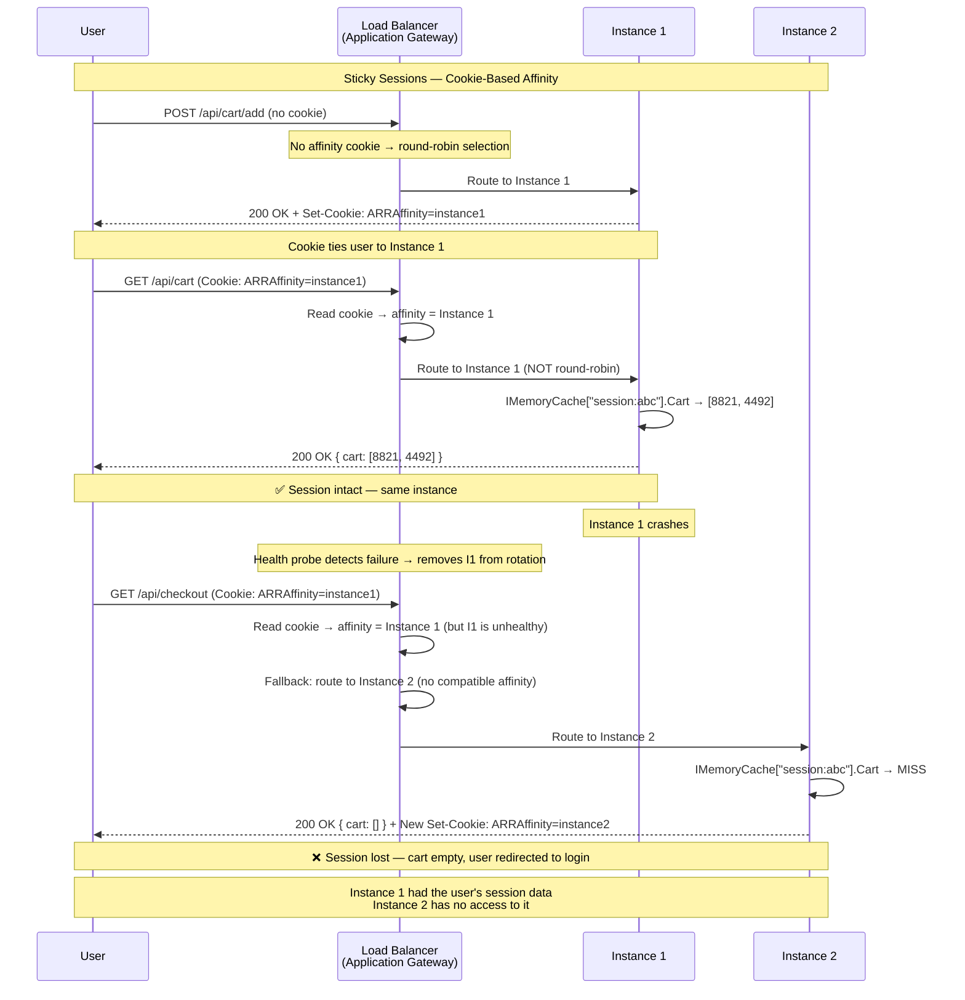
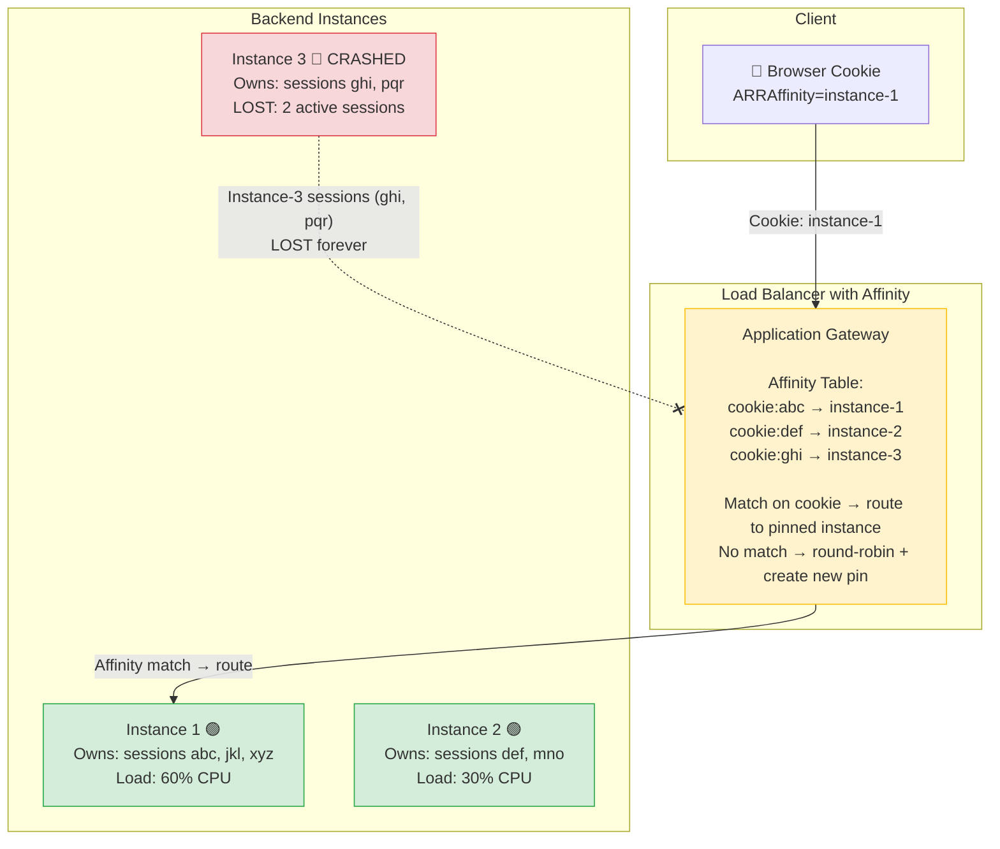

> [!success] Mastery Check
> - [ ] **Studied Well**
> - [ ] **Can explain the concept without notes**
> - [ ] **Can answer interview questions confidently**
> - [ ] **Can implement it in a real project**

---

id: "7.209" title: "Sticky Sessions — Problem and Impact" domain: "System Design & Distributed Systems" domain_id: 7 group: "Scalability Patterns" tags: [system-design, distributed-systems, scalability, dotnet, azure, load-balancing, sticky-sessions, session] priority: 1 version: 2 prerequisites:

- "[[7.207 — Stateless Services — Design Principles]] — sticky sessions are a workaround when the stateless principle cannot be fully applied; understanding what statelessness gives up is required to understand what sticky sessions trade"
- "[[7.208 — Stateless Services — Session Externalization]] — the correct alternative to sticky sessions; the tradeoff between externalization and affinity is the central decision in session management"
- "[[7.210 — Load Balancing — Overview]] — sticky sessions are a load balancer feature; understanding round-robin, least-connections, and other distribution algorithms is required to understand how affinity modifies them" related:
- "[[7.206 — Horizontal vs Vertical Scaling — Tradeoffs]] — sticky sessions enable horizontal scaling for stateful services, but with significant constraints compared to truly stateless horizontal scaling"
- "[[7.229 — Consistent Hashing — Algorithm]] — a more sophisticated affinity mechanism that distributes state-deterministically without a centralized session store; related to sticky sessions but with better scaling properties"
- "[[7.216 — Load Balancing — Health Check Integration]] — sticky sessions interact critically with health checks; unhealthy instances that still hold active sessions present a design dilemma"
- "[[4.012 — ASP.NET Core Middleware Pipeline]] — the session middleware's behavior under sticky sessions differs from externalized sessions; session reliance on instance continuity is the core of the sticky session constraint"
- "[[7.249 — Bulkhead Pattern — Resource Isolation]] — sticky sessions concentrate user traffic on specific instances; resource isolation (bulkhead) is harder to achieve when traffic is not uniformly distributed" created: 2026-06-16

---

> [!ABSTRACT] Quick Reference — Sticky Sessions **Invariant:** The load balancer guarantees that all requests from the same client (identified by a cookie, IP address, or TLS session) are routed to the same backend instance for the duration of the session. The instance "owns" the session — no external store required. **Cost:** Instance failure loses that instance's sessions completely. Rolling deployments must drain traffic instance-by-instance with a session-drain window. Load distribution is uneven (some instances carry more active sessions than others). Autoscaling effectiveness is reduced because new instances start with zero sessions. **Trigger:** Applied when session state cannot be externalized (legacy app, large session payload, no Redis infrastructure) and horizontal scaling is still required. Also used as a temporary migration step while refactoring toward fully stateless design. **Skip When:** The service is already stateless (no sessions, JWT auth); or the session store can be externalized to Redis (preferred); or the service runs on a single instance (no load balancer needed). **.NET Entry Point:** No .NET code change — sticky sessions are configured on the load balancer (Azure Application Gateway cookie-based affinity, AKS NGINX Ingress `nginx.ingress.kubernetes.io/affinity: cookie`, Azure Front Door session affinity). **Azure Native:** Azure Application Gateway (Cookie-based affinity, backend HTTP settings) · Azure Front Door (Session affinity, routing rules) · AKS NGINX Ingress Controller (cookie affinity annotation) · Azure Load Balancer (source IP affinity, 5-tuple hash — less reliable) **Number to Know:** With sticky sessions and N instances, the probability that a session survives a rolling deployment is 100% for correctly drained instances — but if an instance fails unexpectedly, ALL sessions on that instance (roughly 1/N of all active sessions) are lost. At 100,000 active sessions and 10 instances, that's 10,000 users simultaneously logged out on any instance crash.

---

## Navigation

**Domain:** [[7 — System Design & Distributed Systems]] > **Group:** Scalability Patterns
**Previous:** [[7.208 — Stateless Services — Session Externalization]] | **Next:** [[7.210 — Load Balancing — Overview]]

### Prerequisites

- [[7.207 — Stateless Services — Design Principles]] — sticky sessions exist because the stateless principle is violated; understanding why statelessness is the ideal clarifies what sticky sessions sacrifice
- [[7.208 — Stateless Services — Session Externalization]] — the primary alternative; the choice between externalization and sticky sessions is the fundamental tradeoff in session management for multi-instance deployments
- [[7.210 — Load Balancing — Overview]] — sticky sessions modify the load balancer's distribution algorithm; round-robin is no longer uniform when affinity is applied, and this has cascading effects on instance load, autoscaling, and health checking

### Where This Fits

> [!INFO] Production Encounter Map
> 
> - **Layer:** Infrastructure / load balancing — sticky sessions are configured on the load balancer, not in the application code. The application only becomes aware of this configuration when it experiences the consequences: uneven load distribution, session loss on instance failure, and deployment complexity.
> - **Trigger:** An engineer encounters sticky sessions in three contexts: (a) migrating a legacy stateful app to a multi-instance deployment without time to refactor sessions to Redis; (b) post-mortem analysis of a production incident where "uneven load distribution" caused one instance to saturate while others were idle; (c) designing a deployment strategy and discovering that rolling updates require a session-drain mechanism to prevent active session loss.
> - **Without it:** A stateful service cannot be deployed behind a load balancer at all — every cross-instance request loses the session state. Sticky sessions are the bridge that allows stateful services to use load balancing at all, albeit with significant limitations.
> - **First signal:** The first time a rolling deployment is performed, the team discovers that users whose sessions were on the drained instance lose their session state — support tickets about "I was kicked out during the update" arrive within minutes of deployment completion.

Sticky sessions are the pragmatic compromise between "must scale horizontally" and "cannot fully externalize state." They are never the ideal architecture — they are the acceptable short-term solution while a stateless refactor is in progress, or the unavoidable choice when the state payload is too large or complex to externalize efficiently.

---

## Core Mental Model

Sticky sessions (session affinity) instruct the load balancer to remember which backend instance handled a given client's first request, and route all subsequent requests from that client to the same instance. The load balancer maintains an affinity table mapping a client identifier (a cookie value, source IP, or TLS session ID) to a specific backend instance. As long as the mapping is valid (the instance is healthy and the affinity timeout hasn't expired), all traffic from that client goes to the same instance.

The mental model: the load balancer acts as a receptionist who always sends you to the same desk. If the person at that desk goes home (instance failure), you lose anything they were holding for you (session data). The receptionist will then send you to a different desk next time, but you start over — no memory of your previous interaction.

The constraint that governs sticky sessions is **session-to-instance coupling**: the session's lifetime is tied to the instance's lifetime. Every property that makes horizontal scaling valuable — instance fungibility, zero-downtime rolling deployments, instance failure transparency — is compromised by this coupling.

> [!TIP] The Non-Obvious Insight The most dangerous property of sticky sessions is not the session loss on instance failure — it is the **silent load imbalance**. With round-robin, traffic is evenly distributed across N instances. With sticky sessions, traffic distribution is determined by when each user's first request arrived and which instance was in rotation at that moment. A new instance added during autoscale-out receives ZERO traffic initially — no user has an affinity mapping to it. It takes up to `IdleTimeout` (typically 20 minutes) for enough user sessions on existing instances to expire and new users to be routed to the new instance. This means autoscale-out during a traffic spike is significantly delayed in providing relief — the new instance is idle for minutes while existing instances are overloaded. Engineers often miss this because they think of sticky sessions as "just a cookie" rather than as a modification of the load distribution algorithm.

### Classification

- **Consistency axis:** Strong consistency PER INSTANCE — within a session, all reads and writes go to the same instance, so no distributed consistency concerns. Cross-instance consistency is irrelevant because users never see cross-instance state.
- **Availability tradeoff:** Instance failure loses that instance's sessions (1/N of active sessions). No shared state means no concentrated failure risk (unlike Redis failover in externalized design) — but the per-instance failure blast radius is proportional to the number of sessions that instance holds.
- **Latency impact:** Zero additional latency — the session is in-process memory. This is the primary reason sticky sessions are chosen over externalization: they avoid the 0.1–0.3ms Redis read overhead.
- **Failure domain:** Per-instance — each instance's session loss is independent. No single global failure point for sessions, but the probability of SOME session loss increases with the number of instances.
- **Abstraction layer:** Infrastructure (load balancer) with application implications (session lifecycle management, deployment drain handling, uneven load awareness).

### Primary Diagram





### Numbers That Matter

|Metric|Value|Context / Conditions|
|---|---|---|
|Session loss per instance failure|1/N of all active sessions|10 instances, 100K sessions → 10K sessions lost per crash|
|New instance traffic ramp-up|TimeToRamp = IdleTimeout / 2 (approx)|With 20-min IdleTimeout, ~10 min to reach 50% of expected traffic|
|Load imbalance ratio (typical)|1.5–3× between least- and most-loaded instance|Depends on session duration distribution and traffic pattern|
|Azure App Gateway cookie size|~40 bytes (ARRAffinity cookie)|Base64-encoded backend address hash|
|Cookie enforcement latency|0 — cookie is read on every request|No additional network hop|
|Rolling deploy session loss (no drain)|100% of sessions on the instance being replaced|Without session drain, every replaced instance loses its sessions|
|Rolling deploy session loss (with drain)|~0% if drain timeout > max session remaining time|Drain window: traffic stops, existing requests complete, sessions expire or migrate|
|Instance startup session count|0 — empty affinity table|New instance takes minutes to accumulate sessions|
|Affinity timeout|Varies by implementation (App Gateway: session cookie lifetime, Ingress: configurable)|After timeout, cookie is removed and next request may route to different instance|

### Key Properties / Guarantees

|Property|Value|Condition|
|---|---|---|
|Session persistence per instance|Full — all requests from same client reach same instance|Instance must be healthy and in rotation|
|Session survival on instance failure|Zero — all sessions on the failed instance are lost|Instance crash, OOMKill, or network partition|
|Load distribution uniformity|Low — depends on session arrival timing and duration|New instances start empty; imbalance is inherent|
|Latency overhead for session|Zero — in-process memory|No external store call needed|
|Rolling deployment safety|Full only with session drain mechanism|Drain timeout must exceed instance session lifetime|
|Autoscale effectiveness|Delayed — new instances start with zero affinity mappings|Effectiveness proportional to new session arrival rate|
|Failure blast radius|1/N of active sessions per instance failure|Uniform distribution of sessions is assumed (not guaranteed)|
|Operational complexity|Low (no external store) + Medium (drain, monitoring, imbalance correction)|Easier day 1, harder day 30 (uneven load, deployment constraints)|

---

## Deep Mechanics

### How It Works

**Cookie-Based Affinity (Azure Application Gateway):**

1. **First request:** A client sends a request with no affinity cookie. The load balancer applies its normal routing algorithm (round-robin, least-connections) and selects a backend instance. Before forwarding the response, the load balancer injects a `Set-Cookie` header: `ARRAffinity=base64(instance_hash); path=/; HttpOnly; Secure`. The cookie maps the client to that specific backend instance.

2. **Subsequent requests:** The client sends the `ARRAffinity` cookie with every request to the same domain. The load balancer extracts the cookie, decodes the backend instance identifier, and routes the request to that instance — bypassing the normal routing algorithm. This happens at the load balancer layer, before the request reaches any backend code.

3. **Affinity lifetime:** The cookie persists in the browser until it expires (configurable via cookie `Max-Age`). As long as the mapped instance is healthy and in the backend pool, the affinity is maintained. If the cookie expires and the client sends a request without it, a new instance is selected via round-robin and a new cookie is issued.

4. **Instance failure handling:** If the mapped backend instance fails the health probe (returns non-200, times out, or connection refused), the load balancer removes it from the backend pool. The affinity mapping for that instance's cookies is now stale. The load balancer reroutes the request to a healthy instance using round-robin and issues a new affinity cookie for the new instance. The session data on the original instance is lost.

**IP-Based Affinity (Azure Load Balancer):**

Azure Load Balancer uses 5-tuple or 2-tuple hashing (source IP, source port, destination IP, destination port, protocol). All requests from the same source IP to the same service are routed to the same backend instance. This does not require a cookie but is less reliable: users behind a NAT gateway share an IP (all users in an office go to the same instance), and the affinity breaks if the source port changes (some clients use a new port per request).

**NGINX Ingress Cookie Affinity (AKS):**

Configured via annotation: `nginx.ingress.kubernetes.io/affinity: cookie`. NGINX sets a `INGRESSCOOKIE` cookie that maps to the upstream pod IP. Session data lives in the pod's local memory — the pod MUST be stable for the session to survive.

### Protocol Trace — Sticky Session Lifecycle

```
Sticky Session Lifecycle — Azure Application Gateway:

Phase 1 — Session Creation:

  Client → Application Gateway: GET /products (no cookie)
  App Gateway: Round-robin → pick BackendInstance-3
  App Gateway → BackendInstance-3: GET /products
  BackendInstance-3: Creates session, stores cart = []
  BackendInstance-3 → App Gateway: 200 OK
  App Gateway → Client: 200 OK + Set-Cookie: ARRAffinity=hash_of_instance3

Phase 2 — Normal Operation (cookie sent):

  Client → App Gateway: GET /cart (Cookie: ARRAffinity=hash_of_instance3)
  App Gateway: Matches cookie → route to BackendInstance-3
  App Gateway → BackendInstance-3: GET /cart
  BackendInstance-3: Reads cart from IMemoryCache → returns cart
  BackendInstance-3 → App Gateway: 200 OK { cart: ... }
  App Gateway → Client: 200 OK (same instance — session intact)

Phase 3 — Instance Failure:

  BackendInstance-3: Crashes (OOMKill / process exit / hardware failure)
  App Gateway health probe: BackendInstance-3 returns HTTP 503 (port closed)
  App Gateway: Removes BackendInstance-3 from backend pool (after 2 failed probes, ~10s)

  Client → App Gateway: POST /checkout (Cookie: ARRAffinity=hash_of_instance3)
  App Gateway: Cookie maps to BackendInstance-3 — but it's unhealthy
  App Gateway: Fallback — pick healthy instance via round-robin → BackendInstance-1
  App Gateway → BackendInstance-1: POST /checkout
  BackendInstance-1: Reads IMemoryCache for session → MISS → new empty session
  BackendInstance-1 → App Gateway: 400 — no checkout data in session
  App Gateway → Client: 400 Bad Request + Set-Cookie: ARRAffinity=hash_of_instance1
  Client: Checkout fails — cart and progress lost

Phase 4 — Rolling Deployment with Session Drain (correct procedure):

  Pre-deployment: BackendInstance-3 is targeted for update
  App Gateway: Sends drain command to BackendInstance-3 (stops new connections)
  App Gateway: Existing connections continue for drain timeout (configurable, 30s default)
  
  Wait: All in-flight requests on BackendInstance-3 complete (30s max)
  
  Note: Sessions on BackendInstance-3 are still active but no new traffic arrives
  Result: Sessions idle — they will expire naturally (20 min IdleTimeout)
  OR: Session migration service copies active sessions to Redis during drain
  
  App Gateway: Removes BackendInstance-3 fully from rotation
  BackendInstance-3: Updated (new code deployed)
  
  Post-deployment: BackendInstance-3 returns to rotation (passes health probe)
  App Gateway: New clients may be routed to it; old clients' cookies still point to it
  
  Note: Users whose affinity was to other instances never experienced interruption
  Users whose affinity was to BackendInstance-3: their cookie now routes back to it
  → Session data persists on BackendInstance-3 ONLY IF the instance state was preserved
  → In AKS/Azure App Service, instance replacement loses local state
  → So the drain only avoids IN-FLIGHT request loss, not session data loss
```

### Failure Modes

**Failure Mode 1: Instance Crash — All Sessions on That Instance Lost**

- **Cause:** A backend instance crashes (OOMKill, unhandled exception, hardware failure, kernel panic). The load balancer detects the failure via health probes (typically 2 failures × 5s interval = ~10s detection time) and removes the instance from rotation. All affinity mappings pointing to that instance become stale. All sessions stored in that instance's local memory are lost.
- **Symptom:** A spike in support tickets from users who were actively using the service at the time of the crash — they are logged out, their cart is empty, their wizard progress is reset. The error rate on the service does NOT necessarily spike (new requests are routed to healthy instances and succeed) — the session data is simply gone.
- **Detection time:** Detection of the CRASH is immediate (~10s via health probes). Detection of the SESSION LOSS is delayed — only when affected users retry and find empty sessions, then contact support.

> [!DANGER] 3 AM Production Signal Metric: `azure_app_gateway_backend_health_percentage` drops from 100% to (N-1)/N × 100% (e.g., 80% for 5 instances). Simultaneously, `session_active_count` drops by ~1/N while `session_new_count` spikes (affected users create new sessions on healthy instances). Log: `WARN [Gateway] Backend server 'instance-3' is unhealthy | Reason: Timeout | Time: 02:14:33 UTC` followed by `INFO [SessionMiddleware] New session created | SessionId: ...` for users whose session was on instance-3. Customer impact: All users whose affinity was pinned to the crashed instance lose their session state — approximately 20% of active users for a 5-instance fleet.

**Fix:**
1. **Prevention:** Minimize instance failure rate through proper resource limits (memory requests/limits in AKS, memory protection in App Service), health check configuration (accurate readiness probes), and instance size selection (avoid memory pressure).
2. **Mitigation at load balancer level:** Configure Azure Application Gateway with a shorter health probe interval (5s) and lower unhealthy threshold (2 failures) to minimize the window where requests are routed to a failed instance.
3. **Mitigation at application level:** Implement a session persistence mechanism that writes session state to a durable store at critical points (checkout step completion, cart modification) — even under sticky sessions, this provides a recovery path.
4. **Acceptance:** Document that sticky sessions carry this risk. Ensure customer-facing messaging handles "session expired" gracefully with minimal friction.

**Cost of not fixing:** Each instance failure loses 1/N of all active sessions. For a high-traffic e-commerce platform with 100,000 active sessions and 10 instances, each crash loses 10,000 sessions — 10,000 users must re-authenticate, re-build their cart, and re-start any wizard flows. Revenue loss proportional to conversion rate of those affected sessions.

---

**Failure Mode 2: Load Imbalance — Autoscale Cannot Relieve Pressure Quickly**

- **Cause:** During a traffic spike, autoscale adds a new instance. The new instance has zero affinity mappings — no users are pinned to it. Users whose sessions are on existing instances continue to be routed to those instances. New users (who have no affinity cookie yet) are distributed across ALL instances via round-robin, including the new one — but the proportion of new users may be small relative to existing users returning for subsequent requests.
- **Symptom:** After an autoscale-out event from 4 to 6 instances, the existing 4 instances remain at 85% CPU while the 2 new instances sit at 15% CPU. The traffic spike is NOT relieved because the spike is driven by existing users making multiple requests, not by new users. The autoscale decision appears to have made no difference for 10–20 minutes.
- **Detection time:** Visible immediately in per-instance CPU metrics — the new instances show significantly lower CPU than existing instances for the duration of the affinity redistribution period.

> [!DANGER] 3 AM Production Signal Metric: `azure_app_service_cpu_per_instance` shows a clear split: instances 1-4 at 85%, instances 5-6 at 15%. The average CPU across all instances (65%) looks acceptable, masking the fact that 4 instances are still at risk of saturation. Log: `INFO [Autoscale] Scale-out completed | New count: 6 | Time: 14:05:00 UTC` but CPU on instances 1-4 remains at 85% at 14:15:00 UTC — 10 minutes post-scale-out. Customer impact: Users on the overloaded instances experience degraded performance (slow page loads, request queuing) while 33% of the fleet's capacity is idle.

**Analysis of the imbalance:** The time for a new instance to reach equilibrium with existing instances depends on the session arrival rate and the session idle timeout. In a steady state with 100 req/s and 20-min idle timeout, approximately 20 min × 60 s/min × 100 req/s = 120,000 sessions are active per instance. A new instance acquires sessions only through NEW users — at 100 new users/minute with round-robin across 6 instances, the new instance gets ~17 new user sessions per minute. At this rate, it takes roughly 120,000 / 17 = 7,000 minutes (~5 days) for the new instance to reach the same session count! In practice, existing sessions DO expire over time (the 20-min idle timeout), freeing up capacity on existing instances. Users whose sessions expire are re-assigned via round-robin, and a fraction hit the new instance. The real equilibrium time is approximately `IdleTimeout × (new_instances / total_instances)` — with a 20-min IdleTimeout and 2 new instances out of 6, roughly 20 × 2/6 = 6.7 minutes for significant progress.

**Fix:**
1. **Pre-warming during scale-out:** Configure the new instance to receive traffic gradually but earlier. In AKS, the `readinessProbe` can be configured to pass immediately while the pod slowly builds affinity. Not a clean fix — the core issue is the affinity constraint.
2. **Reduce IdleTimeout:** A shorter session IdleTimeout (e.g., 10 minutes instead of 20) causes existing sessions to expire faster, redistributing users more quickly across all instances. Tradeoff: users inactive for >10 min lose their session.
3. **Hybrid approach:** Use sticky sessions with a short IdleTimeout AND periodic session state flush to a shared store. The affinity ensures fast in-memory reads for active sessions; the shared store provides a fallback for session recovery on instance failure.
4. **Accept limitations and over-provision:** With sticky sessions, over-provision by 30–50% during scale-out to account for the imbalance. If 6 instances are needed, scale to 8 so that even with 2 idle instances, the remaining 6 handle the load.

**Cost of not fixing:** Autoscale-out during a traffic spike is significantly less effective than expected. The spike continues degrading user experience on existing instances while new capacity sits idle. This leads to over-scaling (more instances than theoretically needed), increasing cost, or under-scaling (service remains degraded despite scale-out), causing SLO breaches.

---

**Failure Mode 3: Uneven Session Distribution Leading to Instance Cascading Failure**

- **Cause:** A rare but dangerous cascading failure. Instance A holds 40% of active sessions (due to a batch of users who all started sessions during a marketing campaign at a time when Instance A was the round-robin target). Instance A becomes overloaded (CPU/memory pressure) and starts responding slowly. The load balancer observes slow responses but Instance A still passes health probes (returns 200 within 30s timeout). The slowness causes user-facing latency but no automatic removal. Instance A eventually OOMs because its session count is 2× the average. Instance A's crash now loses 40% of active sessions. The surviving instances are now handling the rerouted traffic but were already near capacity — they may also OOM. A second crash loses another large fraction of sessions.
- **Symptom:** Stair-step session loss — each successive instance crash loses a large fraction of remaining sessions. The service may lose 80–90% of active sessions within a few minutes of the first crash.
- **Detection time:** The initial load imbalance is invisible — no alert fires because the average CPU across all instances looks normal. The first crash reveals the imbalance, but by then the cascade is in progress.

**Fix:**
1. **Per-instance monitoring:** Alert on per-instance CPU/memory deviation from the fleet average (not just the average itself). If one instance has > 20% higher CPU than the fleet average for 5+ minutes, investigate — it has accumulated disproportionately many sticky sessions.
2. **Random session reassignment:** On the load balancer, configure a "rebalancing" mechanism: with a small probability (e.g., 1% of requests), ignore the affinity cookie and route the request via round-robin, issuing a new cookie. This gradually redistributes sessions across instances without breaking the affinity for the vast majority of requests.
3. **Instance session limit:** Implement a per-instance session cap. When an instance exceeds its allocated session count (e.g., 50,000 sessions per 2 GB RAM instance), reject new session creation with HTTP 503 (or redirect to a less loaded instance). The load balancer sees the 503, treats the instance as unhealthy, and routes new sessions to other instances — naturally rebalancing.

**Cost of not fixing:** Cascading instance failure leading to near-total session loss during peak traffic. Requires emergency scaling, manual traffic rerouting, and potentially full service recovery time while users re-authenticate.

---

**Failure Mode 4: Rolling Deployment Session Loss Without Proper Drain**

- **Cause:** A rolling deployment updates instances one at a time. Without a session-drain mechanism, when the load balancer removes an instance from rotation (preparing it for update), the instance's active sessions are lost. Each replaced instance loses 1/N of sessions. Over the full rolling deployment of all instances, ALL active sessions have a high probability of being lost.
- **Symptom:** After every rolling deployment, users report being logged out with empty carts. The error rate is 0% (requests succeed on surviving instances) but session-dependent operations (checkout, cart view) show empty state.
- **Detection time:** Immediate after the first instance is replaced — support tickets arrive within minutes.

**Rolling deployment session loss probability:**

```
With N instances and S active sessions:

  Instance replaced: loses S/N sessions (on average)
  After replacing all N instances:
  
  Probability a specific user's session survives:
    P(survive) = (1 - 1/N)^N ≈ 1/e ≈ 37%
  
  So approximately 63% of sessions are lost during a full rolling deployment
  WITHOUT session drain.

With session drain (30s drain timeout + idle timeout):
  P(survive) = P(session expires naturally during drain)
  If drain time (30s) << session idle timeout (20 min), 
  P(survive) ≈ 0% — sessions don't expire during drain
  
  ACTUAL survival requires active session migration: copy session to a shared
  store before the instance is removed. This is a manual or custom process.
```

**Fix:**
1. **Session drain with migration:** Before removing an instance, drain its sessions by:
   a. Stop sending new requests to the instance (load balancer marks it as "draining")
   b. For each active session, serialize its state and write it to a shared store (Redis, SQL)
   c. The next request from the user — now routed to a different instance — reads the session from the shared store
   d. This effectively achieves session externalization for the deployment window only
2. **Blue-green deployment:** Instead of rolling, deploy the new version alongside the old version on a parallel set of instances. Switch traffic all at once. Users' sessions on the old fleet are lost, but the switchover is instantaneous and all users are affected equally (not staggered).
3. **Session timeout acceptance:** Accept that rolling deployments lose sessions. Extend the session idle timeout to provide a longer grace period. Communicate the deployment window to users ("Site will be updated between 2-4 AM — you may be logged out").
4. **Refactor to stateless:** This is the only permanent fix. Externalize session state to Redis. Rolling deployments become zero-impact on sessions.

**Cost of not fixing:** Every deployment is a user-facing event. Teams deploy less frequently to avoid session loss — reducing deployment velocity. Hotfixes are delayed. The deployment process becomes a high-risk operation requiring manual coordination and off-hours scheduling.

### .NET and Azure Integration Points

- **Azure Application Gateway:** Configure cookie-based affinity in the Backend HTTP Settings — "Create app affinity cookie" enabled. The cookie `ARRAffinity` is automatically managed. No application code changes needed.
- **Azure Front Door:** Session affinity enabled on the Front Door route configuration. Uses `AFDDCAFD` cookie prefix. Can be configured per origin group.
- **Azure Load Balancer:** "Session persistence" setting — Source IP (2-tuple) or Source IP + Protocol (5-tuple). No cookie required, but IP-based affinity has limitations (NAT, port changes).
- **AKS NGINX Ingress:** Annotation `nginx.ingress.kubernetes.io/affinity: cookie` with `nginx.ingress.kubernetes.io/session-cookie-name: INGRESSCOOKIE` and `nginx.ingress.kubernetes.io/session-cookie-expires: 172800` (2 days). Session data lives in the pod — pod restarts lose sessions.
- **Azure App Service:** ARRAffinity cookie is automatically used when App Service is behind Application Gateway. App Service's built-in scale-out does NOT use sticky sessions — traffic is distributed via round-robin across instances.

```csharp
// No .NET code changes are needed for sticky sessions — they are entirely
// configured at the load balancer level.

// However, the APPLICATION must be aware of sticky sessions to handle
// their implications:

// 1. Health check endpoint — must include session store health if sessions
//    are in-process (no external store)
app.MapHealthChecks("/health/ready", new HealthCheckOptions
{
    Predicate = _ => true // Only check process health — no external deps
});

// 2. Session configuration — IdleTimeout controls how long a session
//    survives without activity. With sticky sessions, this also controls
//    how quickly load can redistribute after scale-out.
builder.Services.AddSession(options =>
{
    options.IdleTimeout = TimeSpan.FromMinutes(15); // Shorter = faster rebalancing
    options.Cookie.HttpOnly = true;
    options.Cookie.IsEssential = true;
});

// 3. Graceful shutdown — handle SIGTERM for session drain
//    In AKS: preStop hook can trigger a session flush
builder.Services.AddHostedService<SessionDrainHostedService>();

// 4. Monitoring — expose per-instance session count for load monitoring
public sealed class SessionMetricsMiddleware
{
    private readonly ILogger<SessionMetricsMiddleware> _logger;
    private static long _activeSessionCount;

    public async Task InvokeAsync(HttpContext context, RequestDelegate next)
    {
        if (context.Session.IsAvailable)
            Interlocked.Increment(ref _activeSessionCount);

        try { await next(context); }
        finally { Interlocked.Decrement(ref _activeSessionCount); }
    }
}
```

---

## Production Patterns and Implementation

### Primary Implementation — Sticky Sessions on Azure Application Gateway

```csharp
// No application code changes are required for sticky sessions.
// All configuration is at the infrastructure level (Azure Application Gateway).
// The application code is IDENTICAL to the in-process session pattern,
// which is the problem — it works because sticky sessions hide the
// cross-instance routing issue.

// The following code is what the service looks like WITH sticky sessions.
// Note: this is the WRONG long-term architecture — it works only because
// the load balancer routes all requests from the same user to the same instance.

// Program.cs — Stateful service behind sticky sessions (temporary approach)

var builder = WebApplication.CreateBuilder(args);

// Session uses IMemoryCache by default — only works because sticky sessions
// ensure the same instance always serves the same user
builder.Services.AddDistributedMemoryCache(); // Per-instance — required for sticky sessions
builder.Services.AddSession(options =>
{
    options.IdleTimeout = TimeSpan.FromMinutes(20);
    options.Cookie.HttpOnly = true;
    options.Cookie.SameSite = SameSiteMode.Lax;
    options.Cookie.IsEssential = true;
});

builder.Services.AddControllers();
builder.Services.AddHttpContextAccessor();

var app = builder.Build();

app.UseSession();
app.MapControllers();

// ⚠️ This service is NOT horizontally scalable in the true sense:
// - Instance failure loses sessions
// - Rolling deployments lose sessions (without drain)
// - Autoscale is delayed (new instances start empty)
// - Load distribution is uneven
//
// This is acceptable ONLY as a temporary measure while refactoring
// toward externalized session state ([[7.208]]).
```

### Azure Infrastructure Configuration (ARM / Bicep / Terraform)

```bicep
// sticky-sessions.bicep — Azure Application Gateway with cookie-based affinity

resource appGateway 'Microsoft.Network/applicationGateways@2023-11-01' = {
  name: 'orders-appgateway'
  location: resourceGroup().location
  properties: {
    backendAddressPools: [
      {
        name: 'orders-backend'
        properties: {
          backendAddresses: [
            { fqdn: 'orders-app.azurewebsites.net' }
          ]
        }
      }
    ]
    backendHttpSettingsCollection: [
      {
        name: 'orders-http-settings'
        properties: {
          port: 443
          protocol: 'Https'
          cookieBasedAffinity: 'Enabled'  // ← Enables sticky sessions
          affinityCookieName: 'ARRAffinity' // Default cookie name
          pickHostNameFromBackendAddress: true
          requestTimeoutInSeconds: 30
          connectionDraining: {            // ← Session drain for rolling updates
            enabled: true
            drainTimeoutInSec: 30
          }
        }
      }
    ]
    // ... other gateway configuration
  }
}
```

```yaml
# sticky-sessions-aks.yaml — NGINX Ingress with cookie affinity for AKS

apiVersion: networking.k8s.io/v1
kind: Ingress
metadata:
  name: orders-ingress
  annotations:
    nginx.ingress.kubernetes.io/affinity: "cookie"
    nginx.ingress.kubernetes.io/session-cookie-name: "INGRESSCOOKIE"
    nginx.ingress.kubernetes.io/session-cookie-expires: "172800"
    nginx.ingress.kubernetes.io/session-cookie-max-age: "172800"
spec:
  ingressClassName: nginx
  rules:
    - host: orders.contoso.com
      http:
        paths:
          - path: /
            pathType: Prefix
            backend:
              service:
                name: orders-service
                port:
                  number: 80
```

### Common Variants

```yaml
# Variant A — Azure Front Door Session Affinity
# Configured on the Front Door route, not on the backend
# The Front Door sets its own cookie (AFDDCAFD prefix) that maps to the backend origin
# Useful for: global load balancing with stateful backends

# Azure Front Door profile → Route → Session affinity: Enabled
# Cache configuration determines if Front Door caches the response
```

```yaml
# Variant B — Azure Load Balancer Source IP Affinity
# Used when: a cookie-based approach is not desired (e.g., API clients that
# don't handle cookies), or for non-HTTP workloads (TCP, UDP)
# Limitation: users behind a NAT share an IP — all mapped to the same backend

# Azure Load Balancer → Backend pool → Load distribution:
# Session persistence: "Client IP" (2-tuple) or "Client IP + Protocol" (5-tuple)
```

```csharp
// Variant C — Sticky Sessions with Hybrid Session Store (Migration Path)
// Session data is stored in BOTH IMemoryCache (fast reads) and Redis (backup).
// The instance reads from local memory (0.05 µs) but periodically flushes
// session state to Redis (every N seconds, or on critical operations).
// This provides the latency benefit of in-process sessions WITH the
// durability of externalization — at the cost of write amplification.

public sealed class HybridSessionStore
{
    private readonly IMemoryCache _localCache;
    private readonly IDistributedCache _remoteCache;
    private readonly ILogger<HybridSessionStore> _logger;
    private static readonly TimeSpan _localTtl = TimeSpan.FromMinutes(5);
    private static readonly TimeSpan _remoteTtl = TimeSpan.FromHours(1);

    public HybridSessionStore(IMemoryCache localCache, IDistributedCache remoteCache, ILogger<HybridSessionStore> logger)
    {
        _localCache = localCache;
        _remoteCache = remoteCache;
        _logger = logger;
    }

    public async Task<byte[]?> GetAsync(string key, CancellationToken ct)
    {
        // Fast path: local cache (0.05 µs)
        if (_localCache.TryGetValue(key, out byte[]? localData))
            return localData;

        // Slow path: remote cache (0.1-0.3ms)
        var remoteData = await _remoteCache.GetAsync(key, ct);
        if (remoteData is not null)
            _localCache.Set(key, remoteData, _localTtl);

        return remoteData;
    }

    public async Task SetAsync(string key, byte[] data, DistributedCacheEntryOptions options, CancellationToken ct)
    {
        // Write to both stores
        _localCache.Set(key, data, _localTtl);
        await _remoteCache.SetAsync(key, data, options, ct);
    }
}
```

### Real-World .NET Ecosystem Mapping

|Pattern in This Note|Where It Appears in .NET / Azure|Manifestation|
|---|---|---|
|Cookie-based affinity (load balancer)|Azure Application Gateway ARRAffinity cookie|No .NET code change; cookie managed by gateway|
|Cookie-based affinity (ingress)|AKS NGINX Ingress `INGRESSCOOKIE` annotation|No .NET code change; cookie managed by ingress controller|
|In-process session (enabled by stickiness)|`AddDistributedMemoryCache()` + `AddSession()`|Session stored in local memory; only correct with affinity|
|Session drain|`ConnectionDraining` in App Gateway HTTP settings / AKS `terminationGracePeriodSeconds`|No .NET change; infrastructure handles drain timeout|
|Per-instance session metrics|Custom middleware (example above)|Monitor per-instance session count for imbalance detection|
|Hybrid session (IMemoryCache + Redis)|Custom `HybridSessionStore` (example above)|Migration pattern — both fast reads and durability|

---

## Gotchas and Production Pitfalls

### Sticky Sessions Do Not Prevent Session Loss on Instance Failure

**Pitfall:** Engineers believe that sticky sessions "solve" the multi-instance session problem. They do not — they only prevent the INTERMITTENT session loss from cross-instance routing. Instance failure STILL loses sessions. This is often misunderstood because sticky sessions work perfectly during normal operation, and the failure scenario is not discovered until the first instance crash.

```csharp
// ❌ Wrong assumption: "We use sticky sessions, so sessions are safe"
// This code has NO protection against instance failure
builder.Services.AddDistributedMemoryCache();
builder.Services.AddSession();

// On instance crash: ALL sessions on that instance are gone forever
// During rolling deployment (without drain): ALL sessions on replaced instances are gone
// This is not "session management" — it's "session gambling"
```

**Symptom:** After every instance crash or deployment, some users (approximately 1/N) are logged out with empty carts. The team investigates the "intermittent session loss" and eventually correlates it with instance replacement events.

**Detection time:** Only detected when an instance actually fails or is replaced. The first production crash reveals the gap.

**Fix:** Accept that sticky sessions are a temporary measure. Pair them with:
1. Session drain for deployments (connection draining in App Gateway, `preStop` hooks in AKS)
2. A migration plan to externalized sessions ([[7.208]])
3. For deployments in the interim, communicate maintenance windows

**Cost of not fixing:** Every instance failure and deployment loses sessions. The larger the fleet, the higher the probability that SOME instance is always being replaced — "session loss" becomes a chronic, recurring issue.

---

### Autoscale Adds Capacity That Is Immediately Idle

**Pitfall:** During a traffic spike, autoscale adds 2 new instances. The team expects immediate relief. Instead, the new instances sit at 10% CPU while the old instances remain at 85% CPU for 10–20 minutes. The autoscale-out appears to have no effect.

```csharp
// ❌ Wrong assumption: "Adding instances immediately increases capacity"
// With sticky sessions, new instances have NO affinity mappings
// They only receive traffic from NEW users (no cookie yet)
// Existing users continue hitting their pinned instances

// Scenario: 100 req/s, 80% from existing users, 20% from new users
// 6 instances before scale: ~17 req/s per instance
// Scale out to 8 instances:
// - Old 6 instances: still get all existing user traffic (80 req/s / 6 = ~13 req/s each)
//   PLUS new user traffic distributed across all 8 (20 req/s / 8 = 2.5 req/s each)
//   Total per OLD instance: ~15.5 req/s (only dropped from 17 to 15.5!)
// - New 2 instances: only get new user traffic (20 req/s / 8 = 2.5 req/s each)
//   Total per NEW instance: 2.5 req/s (vs expected 12.5)
```

**Symptom:** The fleet's total throughput does not increase proportionally to the added instances. Per-instance CPU shows a bimodal distribution — old instances hot, new instances cold.

**Fix:**
1. **Over-provision:** Add 50% more instances than calculated to account for delayed utilization.
2. **Reduce IdleTimeout:** Shorter sessions expire faster, allowing users to be redistributed.
3. **Pre-warm:** In AKS, use a startup script or `lifecycle` hook that gradually marks the pod as ready only after it has received some traffic (not a clean solution).
4. **Accept & plan:** Document that autoscale with sticky sessions has a ~10–20 minute ramp-up delay. Use predictive autoscale (not reactive) to start scaling before the spike hits.

**Cost of not fixing:** Traffic spikes are not mitigated by autoscale in a timely manner. Old instances remain overloaded; new capacity is wasted. Engineers add more instances than needed, increasing cost. If the spike is severe, old instances may crash from overload before the new instances accumulate enough sessions.

---

### IP-Based Sticky Sessions Break for NAT/Proxy Users

**Pitfall:** Azure Load Balancer source IP affinity routes all traffic from the same source IP to the same backend instance. Users behind a corporate NAT or mobile carrier proxy share an IP address — potentially thousands of users are all pinned to a single backend instance, causing severe overload on that instance while others are idle.

```csharp
// ❌ Wrong — IP-based affinity for consumer-facing applications
// Azure Load Balancer configuration:
// Session persistence: "Client IP" (2-tuple)
// Result: ALL users from a large office or mobile carrier share an instance
```

**Symptom:** One instance spikes to 95% CPU while others sit at 30%. The loaded instance handles traffic for an entire office building or city region. Performance degrades for all users behind that NAT.

**Fix:**
1. Use **cookie-based affinity** (Application Gateway) instead of IP-based affinity for HTTP workloads. Each user gets an individual cookie, not grouped by IP.
2. If only Azure Load Balancer is available (no Application Gateway), use 5-tuple affinity (source IP + port) — this differentiates users behind NAT because each connection has a different source port. However, HTTP keep-alive may keep the same port, requiring the client to rotate ports.
3. For TCP workloads where cookie affinity is not possible, use consistent hashing ([[7.229]]) with user ID or session ID as the hash key — more granular than source IP.

**Cost of not fixing:** Severe load imbalance for corporate/mobile users. A single instance handling 10,000 users behind a NAT crashes from overload, losing all 10,000 sessions simultaneously. Other instances are idle at 20% CPU.

---

### Rolling Deployments Cause Catastrophic Session Loss Without Drain

**Pitfall:** A team configures sticky sessions and deploys a rolling update. Each instance is replaced in sequence. With N=6 instances, each replacement loses 1/6 of active sessions. By the end of the rolling update, MOST active sessions have been lost (probability ~63% for N=6).

```yaml
# ❌ Wrong — AKS rolling update with sticky sessions, no drain protection
apiVersion: apps/v1
kind: Deployment
spec:
  replicas: 6
  strategy:
    type: RollingUpdate
    rollingUpdate:
      maxUnavailable: 1
      maxSurge: 1
  template:
    spec:
      containers:
        - name: orders-api
          terminationGracePeriodSeconds: 30
          # No preStop hook for session drain
          # No external session store
          # Every pod replacement = that pod's sessions are lost
```

**Symptom:** After every rolling deployment, support tickets spike: "I was in the middle of checkout and got logged out," "My cart is empty," "I lost my order progress." The error rate is 0% — requests succeed, but session state is gone.

**Fix:**

```yaml
# ✅ Correct — AKS rolling update with session drain (partial mitigation)
apiVersion: apps/v1
kind: Deployment
spec:
  replicas: 6
  strategy:
    type: RollingUpdate
    rollingUpdate:
      maxUnavailable: 1
      maxSurge: 1
  template:
    spec:
      terminationGracePeriodSeconds: 60
      containers:
        - name: orders-api
          lifecycle:
            preStop:
              exec:
                command:
                  - /bin/sh
                  - -c
                  - |
                    # Signal load balancer to stop new traffic
                    # (Pod still in endpoint list but returning 503)
                    # This gives existing sessions time to complete
                    sleep 10
                    # Optionally: flush active sessions to shared store
                    # curl -X POST localhost:5000/session/drain
          # Session drain in NGINX Ingress:
          # Use annotation: nginx.ingress.kubernetes.io/affinity: cookie
          # With: nginx.ingress.kubernetes.io/session-cookie-expires: "3600"
```

Despite these measures, session data is STILL lost on pod replacement because it's in the pod's local memory. The only real fix is session externalization ([[7.208]]).

**Cost of not fixing:** Deployments are high-risk events. Teams batch changes into fewer, larger deployments to reduce the frequency of session-loss events — reducing deployment velocity and increasing the risk of any single deployment.

---

### Sticky Sessions Mask the Need for Session Externalization Until It's Too Late

**Pitfall:** Sticky sessions work "well enough" during development and initial rollout. The team never builds Redis infrastructure or externalizes sessions. As the service grows, the limitations compound — but each individual limitation (load imbalance, session loss on failure, deployment complexity) is addressed with a workaround rather than the fundamental fix. The team builds up significant technical debt around session management.

**Symptom:** A multi-year-old service with sticky sessions that:
- Cannot perform zero-downtime deployments (rolling updates lose sessions)
- Experiences mysterious load imbalances that are hard to diagnose
- Has complex deployment procedures (drain scripts, maintenance windows, manual traffic shifting)
- Has a JIRA ticket "Migrate sessions to Redis" that has been prioritized "Next Quarter" for 8 quarters

**Fix:** Treat sticky sessions as an explicit technical debt with a known cost. Track:
1. Session loss rate per deployment
2. Session loss rate per instance failure
3. Load imbalance ratio (max/min per-instance CPU)
4. Cost of manual deployment procedures vs automated zero-downtime deploys

When the annualized cost of these issues exceeds the cost of implementing Redis session externalization, the migration is justified. Use the numbers in this note to make the business case.

**Cost of not fixing:** Compounding technical debt. The service becomes increasingly difficult to operate as it grows. New features that require session state are built on a fragile foundation. The migration from sticky sessions to externalized sessions becomes more expensive over time as the codebase and session data complexity grow.

---

## Tradeoffs and Decision Framework

### Tradeoff Matrix

|Dimension|Sticky Sessions|Alternative A: Externalized Session (Redis)|Alternative B: Fully Stateless (JWT + Client State)|
|---|---|---|---|
|Session survival on instance failure|Zero — lost entirely|Full — in external store|N/A — no sessions|
|Rolling deployment session loss|~63% without drain, 0% with migration|0%|0% — no sessions|
|Autoscale effectiveness|Delayed (10–20 min ramp-up)|Instant — all instances share store|Instant|
|Load distribution uniformity|Low — imbalance is inherent|Perfect — round-robin|Perfect|
|Latency overhead per request|0 (in-process)|+0.1–0.3ms (Redis read)|0 — no session read|
|Infrastructure dependencies|None (beyond load balancer)|Redis cluster required|None|
|Session size limit|Instance RAM (GB)|Redis capacity (GB)|4 KB (cookie limit) or N/A|
|Operational complexity|Low (no external deps) + Medium (drain, imbalance)|Medium (Redis ops)|Low|
|.NET code complexity|Low (no change)|Low (+ cache registration)|Low (no session)|
|Migration cost|0 — already in place|Medium (add Redis + registration)|Medium-High (refactor cart/wizard to client)|

### When to Apply

```mermaid
flowchart TD
    A["Need: Multi-instance service with\nserver-side session state"]
    A --> B{Can the session state be\nexternalized to a shared store\nwithin the current planning horizon?}
    B -->|Yes — within 1-2 sprints| C["Externalized Sessions (Redis)\nPreferred architecture\nFull horizontal scalability\nSee 7.208"]
    B -->|No — deeply stateful legacy\nor no bandwidth for refactor| D{Is the session payload\nsmall (< 4 KB) and\ndoes the latency budget allow +0.3ms?}
    D -->|Yes| C
    D -->|No — large payload\nor strict latency SLO| E{"Is this a temporary measure\n(< 6 months)?"}
    E -->|Yes — migration in progress| F["Sticky Sessions (Temporary)\nAccept limitations\nBuild drain mechanism\nPlan stateless refactor"]
    E -->|No — permanent| G{"Is the session loss on\ninstance failure acceptable\nfor the business?"}
    G -->|Yes — low criticality| H["Sticky Sessions (Permanent)\nAccept limitations\nDocument risks\nMonitor imbalance"]
    G -->|No — business-critical| I["Re-architect: Split state\nSmall state → Redis session\nLarge state → DB with reference in session\nor Consistent Hashing → 7.229"]
    C --> J["Outcome:\n- Zero session loss on failure\n- Zero-downtime deployments\n- Instant autoscale\n- Perfect load distribution"]
    F --> K["Outcome:\n- Session loss on failure (1/N)\n- Deployments lose sessions\n- Delayed autoscale\n- Load imbalance\nPlan: migrate before 6 months"]
    H --> K
    I --> L["Outcome:\n- Hybrid architecture\n- Sessions survive failure\n- More complex design\n- Requires dedicated ops investment"]
```

### When NOT to Apply

> [!WARNING] Do Not Reach For Sticky Sessions When...
> 
> - [ ] **The service can be made fully stateless:** If the service uses JWT for authentication and does not need server-side mutable session state, sticky sessions add unnecessary constraint with zero benefit. Pure API services, mobile backends, and microservices that do not maintain user sessions should not use affinity.
> - [ ] **Session externalization (Redis) is feasible now:** Adding Redis for session storage is a one-time engineering cost that eliminates ALL the limitations of sticky sessions. If the team has the bandwidth and the infrastructure budget, externalization is always the better long-term choice. Sticky sessions should be a deliberate deferral, not a default.
> - [ ] **The service requires true horizontal scalability:** If the scaling plan includes frequent autoscale events, rapid instance replacement, or high instance counts (> 10), sticky sessions' limitations (delayed autoscale, uneven distribution, session loss on replacement) become architectural constraints, not minor inconveniences.
> - [ ] **Session loss is unacceptable for the business:** E-commerce checkout flows, multi-step financial applications, and healthcare workflows where losing progress causes user abandonment, financial loss, or compliance risk should NOT use sticky sessions. The session loss rate (1/N per instance failure, ~63% per rolling deployment) is not acceptable.
> - [ ] **The deployment frequency is high (> 1 per week):** Each deployment is a session-loss event without proper drain and migration. A high-velocity deployment cadence means chronic session loss. Stateless services deploy 10× per day with zero user impact — sticky sessions cannot match this.
> - [ ] **The maximum session payload is large (> 50 KB):** If session state is already large and the only reason for sticky sessions is to avoid serialization overhead, consider the hybrid approach (IMemoryCache + Redis flush) or consistent hashing ([[7.229]]). Large payloads on sticky sessions create severe load imbalance when some users have heavier sessions than others.

### Scale Thresholds

|Threshold|Below = Sticky Sessions Acceptable|Above = Must Externalize or Stateless|
|---|---|---|
|Instance count|≤ 3 instances — session loss blast radius is manageable|> 5 instances — probability of at least one instance failure during a session's lifetime is high|
|Deployment frequency|< 1 per week — session loss events are rare|> 2 per week — chronic session loss erodes user trust|
|Session loss tolerance|User re-authenticates and re-builds cart without abandoning|User abandons — direct revenue loss per session loss event|
|Active sessions|< 10,000 — instance crash loses manageable number|< 100,000 — even 1/N session loss is thousands of users affected|
|Idle timeout|> 30 min — slow rebalancing but sessions last long|< 10 min — sessions expire too fast for meaningful user sessions; externalization is better|
|Service criticality|Internal tool, low-traffic admin portal, non-revenue-generating|Revenue-generating (e-commerce, payments, booking) or compliance-relevant|

---

## Interview Arsenal

### Question Bank

1. **[Definition]** "What are sticky sessions and what specific problem do they solve in distributed systems?"
2. **[Mechanism]** "Walk through exactly how cookie-based sticky sessions work — from the first request through affinity establishment, normal operation, instance failure, and re-routing."
3. **[Tradeoff]** "What are the specific costs and limitations of sticky sessions compared to session externalization? Under what conditions is each approach correct?"
4. **[Failure mode]** "Your service uses sticky sessions with 8 instances. During a traffic spike, autoscale adds 2 more instances, but the original 8 remain at 85% CPU and the new 2 sit at 15%. What is happening and how do you fix it?"
5. **[Comparison]** "Compare sticky sessions with session externalization (Redis) and fully stateless (JWT) design. When would you choose each one?"
6. **[Design application]** "You are migrating a legacy ASP.NET WebForms application with large in-process session state to Azure. The session stores 200 KB per user (uploaded documents, complex form state). The application must run on multiple instances for availability. Design the session management strategy."
7. **[Scale]** "Your sticky-session service has 10 instances with 200,000 active sessions. An instance fails. Walk through exactly what happens — which users are affected, how the system recovers, and what the long-term fix should be."
8. **[Advanced]** "An engineer argues that sticky sessions are 'good enough' and Redis session externalization is unnecessary complexity. Construct the counter-argument using specific numbers: session loss probability, deployment impact, and cost of imbalance."

### Spoken Answers

**Q: What are sticky sessions and what specific problem do they solve in distributed systems?**

> **Average answer:** Sticky sessions make sure a user always goes to the same server. They solve the problem of sessions being lost when requests go to different servers.

> **Great answer:** Sticky sessions, also called session affinity or session persistence, is a load balancer feature that routes all requests from the same client to the same backend instance for the duration of the session. The mechanism is typically cookie-based: the load balancer sets a cookie on the first response that encodes which backend instance served it; on subsequent requests, the load balancer reads the cookie and routes directly to that instance, bypassing its normal distribution algorithm.
> 
> The specific problem sticky sessions solve is **session locality in a stateful service**. If a service stores session data in local memory (IMemoryCache, static fields, in-process state) and is deployed behind a load balancer with multiple instances, a request routed to the wrong instance loses the session. Sticky sessions prevent this by ensuring that never happens — the load balancer enforces that the same user always hits the same instance.
> 
> However, sticky sessions do NOT solve the underlying problem — they work around it. The underlying problem is that the service is stateful, and the correct solution is to make it stateless by externalizing state to a shared store (Redis). Sticky sessions preserve the constraint that session data and instance lifetime are coupled. When the instance goes down, the session goes with it. When the instance is replaced during a deployment, the session goes with it. When autoscale adds instances, the new instances are idle because no affinity mappings exist.
> 
> In practice, I treat sticky sessions as a deliberate technical debt — a pragmatic bridge while the team refactors toward stateless design. The key number to know: with N instances behind sticky sessions, each instance crash loses exactly 1/N of active sessions. For a 10-instance fleet with 200,000 active sessions, that's 20,000 users per crash.

---

**Q: Compare sticky sessions with session externalization (Redis) and fully stateless (JWT) design. When would you choose each one?**

> **Average answer:** Sticky sessions are for when you need sessions but don't have Redis. JWT is for APIs. Redis sessions are better than sticky sessions.

> **Great answer:** These three approaches form a spectrum from "most coupled to instance" to "fully decoupled."
> 
> **Sticky sessions** couple session data to a specific instance. The session lives in the instance's local memory, and the load balancer enforces that the user always reaches that instance. This is the simplest to implement at the application layer (no code changes) but the most constrained operationally. It's correct for: legacy applications that cannot be refactored in the short term, services with very large session payloads (> 50 KB) where Redis serialization overhead is significant, and services with a planned migration timeline where sticky sessions are a stepping stone.
> 
> **Session externalization with Redis** decouples session data from any specific instance. The session lives in Redis, and any instance can serve any request. This requires adding `AddStackExchangeRedisCache()` in .NET and managing a Redis cluster. It's correct for: any multi-instance service that needs server-side mutable session state and can tolerate +0.1–0.3ms latency per request. This is the default recommendation for production .NET services.
> 
> **Fully stateless with JWT** eliminates the server-side session entirely. Identity and claims are in a self-contained token. Any mutable state is stored either client-side (localStorage, cookies up to 4 KB) or in a database. This is the most scalable approach — zero session overhead, zero external state dependencies, instant autoscale. It's correct for: pure API services, SPA backends, microservices, and any new service that can be designed without server-side session from the start.
> 
> The decision framework I use: Can the service be made fully stateless? If yes, do that — it's the simplest and most scalable. If no — server-side mutable session is required — can we externalize to Redis? If yes (within latency budget, team can manage Redis), do that. Only if Redis is not feasible right now — legacy app, large payload, no ops bandwidth — use sticky sessions as a temporary measure with a documented migration plan.
> 
> In .NET terms: JWT = `AddJwtBearer()`; Redis = `AddStackExchangeRedisCache()` + `AddSession()`; Sticky Sessions = `AddDistributedMemoryCache()` + `AddSession()` with load balancer affinity config — same code as the broken in-process pattern, but made functional by the load balancer constraint.

---

**Q: The interviewer says: 'You are responsible for a legacy e-commerce checkout service with 200 KB of session data per user (uploaded images, multi-step form state, complex cart). The service must be deployed across 3 availability zones for disaster recovery. You cannot refactor the session to Redis in the next 6 months. Design the session management and deployment strategy.'**

> **Model response:** "With the 200 KB session constraint and the 6-month no-refactor constraint, I'm forced to accept sticky sessions. However, I need to address the three critical failure modes: instance failure session loss, deployment session loss, and cross-zone session migration.
> 
> For **instance failure**: at 3 instances across 3 zones, each crash loses 1/3 of active sessions — 33% of users. To mitigate, I implement a session replication mechanism: each session write is asynchronously replicated to a secondary instance in a different zone. StackExchange.Redis is not an option, but I can use the `ISession` `SetString`/`Set` override to also call a secondary instance's endpoint via HTTP (or use Azure SQL as a backup store for session data). On failure detection, the load balancer routes the user to a new instance, which checks the backup store for the session.
> 
> For **deployments**: I use blue-green deployment with manual session migration. Before the cutover, I run a script that serializes all active sessions from the blue (old) fleet and writes them to a shared Azure Blob Storage container. The green (new) fleet, on startup, pulls these sessions into its local memory. The cutover then happens with zero session loss. This adds ~5 minutes to the deployment window but preserves all active sessions.
> 
> For **cross-zone session migration**: Since each zone has an independent instance, a user whose traffic routes to Zone A today and Zone B tomorrow (due to Azure Front Door routing changes) would lose their session. I set the session IdleTimeout to 4 hours (matching the expected multi-zone routing stability), and use Azure Front Door's session affinity feature (separate from the backend sticky session) to keep users pinned to the same origin. Between Front Door affinity and backend sticky sessions, there are two layers of pinning — the user is locked to the same zone and the same instance within that zone.
> 
> This is a complex, fragile setup — which is exactly why I document it as a 6-month maximum architecture. The session data size (200 KB) is the key constraint: it's too large for efficient Redis serialization, which is the root cause of needing sticky sessions. I would immediately start a workstream to reduce the session payload: move uploaded images to Blob Storage references (reducing payload from 200 KB to 2 KB), split form state into a database table keyed by user ID, and keep only the active wizard step and cart IDs in the session. Once the session is under 4 KB, externalization to Redis becomes viable and the sticky sessions dependency can be eliminated."

---

### System Design Interview Trigger

Sticky sessions appear in system design interviews in two ways. First, as the DEFAULT assumption the candidate makes — when asked "how do you handle user sessions?" many candidates say "use sticky sessions" without explaining the tradeoffs. A strong candidate names the tradeoffs proactively: "I could use sticky sessions here, but they have three problems — instance failure loses sessions, autoscale is delayed, and load distribution is uneven. Let me check if we can avoid them." Second, the interviewer explicitly tests this area by asking: "what happens when an instance fails under sticky sessions?" or "how do you deploy without losing user sessions?" The follow-up tests whether the candidate understands that sticky sessions are not a complete solution — they are a workaround with specific and known failure modes.

### Comparison Table

| |Sticky Sessions|Externalized Session (Redis)|Fully Stateless (JWT)|
|---|---|---|---|
|Core guarantee|User always reaches the same instance; session is in local memory|Session is in shared store; any instance serves any user|No server-side session; identity in self-contained token|
|Trade-off|Session lost on instance failure; delayed autoscale; load imbalance|+0.1–0.3ms latency per read; Redis is critical dependency|No server-side mutable state; tokens cannot be revoked|
|.NET implementation|No code change; load balancer config|`AddStackExchangeRedisCache()` + `AddSession()`|`AddJwtBearer()` — no session middleware|
|Azure native|App Gateway ARRAffinity · Front Door session affinity · Ingress cookie|Azure Cache for Redis|Azure AD + any JWT issuer|
|Failure mode|Instance crash loses 1/N of sessions|Redis outage loses all sessions|Stolen token grants access until expiry|
|Best for|Legacy migration, large session payloads, temporary measure|Production multi-instance with server-side session|New API services, SPA backends|
|Worst for|High deployment frequency, business-critical sessions, large fleets|Sub-ms p99 SLO, teams without Redis ops|Services requiring revocable state or large session|

---

## Architecture Decision Record

**Status:** Accepted (temporary — 6-month target for migration)

**Context:** The OrderCheckoutService is a legacy ASP.NET Core application with 150 KB of session data per active checkout (uploaded prescription images, multi-step form state, insurance verification data). The session is deeply integrated into the controller code — 200+ references to `HttpContext.Session` across 30 controllers. The service currently runs on a single VM and is being migrated to a 3-instance AKS deployment for availability during an upcoming regulatory deadline (6 months). The team cannot refactor the session layer before the deadline. The session data is too large (150 KB) for efficient Redis serialization at the current stage. The team has a 6-month plan to reduce session payload and externalize to Redis, but needs a working multi-instance deployment now.

**Options Considered:**

1. **Sticky sessions with NGINX Ingress cookie affinity** — deploy on AKS with 3 pods behind NGINX Ingress with cookie affinity; accept session loss on pod failure; implement `preStop` hook for session drain during deployments; document the 6-month externalization plan
2. **Force Redis session externalization now** — refactor session to Redis despite the 150 KB payload; accept ~5ms serialization overhead per request; deploy on AKS with shared Redis; no session loss on pod failure
3. **Blue-green deployment with manual session cold-start** — deploy two AKS clusters; before cutover, copy all active sessions from blue to green via serialization; switch traffic via Azure Front Door; sessions survive cutover but still lost on pod failure within each color

**Decision:** Option 1 — sticky sessions as a temporary measure, because:
- Option 2 (Redis externalization) would require refactoring 200+ session references and accepting 5ms+ per-request serialization overhead for 150 KB payloads — this is a significant performance regression and engineering investment for what should be a temporary architecture
- Option 3 (blue-green with session copy) adds significant operational complexity (scripted session migration, two clusters, synchronization timing) for zero long-term benefit — it would need to be rebuilt when the externalization migration happens anyway
- Option 1 requires zero application code changes, is configured entirely at the infrastructure level (NGINX Ingress annotations), and directly supports the 6-month migration plan by making the current limitations explicit and measurable

**Consequences:**

- ✅ Service deploys on 3-instance AKS with availability zone distribution within the regulatory deadline
- ✅ Zero application code changes — no refactoring risk before the deadline
- ✅ Session drain via `preStop` hook and `terminationGracePeriodSeconds` minimizes deployment session loss
- ⚠️ Each pod failure loses ~33% of active sessions — documented and accepted risk; the 150 KB session cannot be quickly recreated
- ⚠️ Autoscale is delayed: new pods accumulate sessions slowly (estimated ~5–10 min to reach equilibrium)
- ⚠️ Load imbalance expected: targeting < 20% variance between pods via manual traffic shaping
- ❌ Rolling deployments still lose some sessions (pods replaced sequentially; session drain saves in-flight requests but not session data)

**Review Trigger:** Revisit this decision immediately if session-related customer complaints exceed 1% of active sessions per week, OR if session payload is reduced below 10 KB (at which point Redis externalization becomes feasible and the migration should be accelerated). The 6-month deadline for full migration to Redis-backed externalized sessions is firm — the ADR status changes to "Superseded" on migration completion.

---

## Self-Check

### Conceptual Questions

1. Define sticky sessions precisely — what does the load balancer guarantee and what does it NOT guarantee?
2. Derive from first principles why a rolling deployment of a sticky-session service without session drain loses approximately 63% of active sessions for N=6 instances.
3. Name two production scenarios where sticky sessions are the correct architectural choice over session externalization.
4. What is the exact observable signal that sticky sessions are causing load imbalance — what metric and what pattern?
5. In Azure, what specific configuration change enables sticky sessions on Application Gateway, and what cookie name does it use?
6. What is the structural difference between sticky sessions (this note) and consistent hashing ([[7.229]])? Which provides better load distribution and why?
7. Below what instance count is session loss on failure from sticky sessions "acceptable" for a non-critical internal tool?
8. How does [[7.208 — Session Externalization]] eliminate all the limitations of sticky sessions, and what new limitation does it introduce?
9. What happens to the CPU distribution across instances when autoscale adds 2 new instances to a 6-instance sticky-session fleet during a traffic spike? Trace the timeline from T+0 to T+30 minutes.
10. Explain sticky sessions to a non-technical stakeholder in 60 seconds — what it does, what risk it carries, and why it's a temporary solution.

<details>
<summary>Answers</summary>

1. Sticky sessions guarantee that all requests from the same client (identified by cookie, IP, or TLS session) are routed to the same backend instance as long as that instance is healthy and in rotation. They do NOT guarantee: session data survives instance failure, load is evenly distributed, new instances are immediately utilized, or rolling deployments are zero-impact on sessions. The only guarantee is co-location of request and session — every other property is compromised.

2. With N=6 instances and S active sessions, each instance holds approximately S/6 sessions. When one instance is replaced during a rolling deployment, its S/6 sessions are lost. After replacing all 6 instances, the probability that a specific session survived is P(survive) = P(not on any replaced instance across all replacements). Since sessions are reassigned probabilistically after each replacement, and assuming each replacement loses exactly 1/N of currently surviving sessions: P(survive) = (1 - 1/6)^6 ≈ 0.335. So approximately 63% of sessions are lost during the deployment.

3. (a) A legacy ASP.NET WebForms application with 200 KB session state per user (large) that cannot be refactored within the next 6 months — accept sticky sessions while reducing payload to enable future externalization. (b) An ultra-low-latency service (p99 < 1ms) where the 0.3ms Redis read overhead is a significant fraction of the latency budget — use sticky sessions or consistent hashing instead.

4. Per-instance CPU shows a clear bimodal distribution: some instances at 70-90% CPU, others at 10-30% CPU. The average CPU across the fleet looks acceptable, masking the fact that some instances are near saturation. In Azure App Service, the per-instance metric chart in the "Scale Out" blade shows individual instance CPU lines diverging. In AKS, `container_cpu_usage_seconds_total` per pod shows the same pattern. The deviation increases over time as random session accumulation creates "hot" and "cold" instances.

5. Azure Application Gateway: In the Backend HTTP Settings, set `cookieBasedAffinity: 'Enabled'`. The cookie name is `ARRAffinity` by default. No application code changes needed.

6. Sticky sessions pin a user to a specific instance using a load balancer cookie — the mapping is arbitrary (whichever instance was selected by round-robin on the first request) and cannot be recomputed after instance failure. Consistent hashing ([[7.229]]) maps users to instances using a hash of the user ID (or session ID) — the mapping is deterministic and can be recomputed by any party. Consistent hashing provides better load distribution because: (a) the hash function distributes users uniformly across instances (no random imbalance); (b) when instances are added/removed, only 1/N of keys are remapped (stable); (c) the client or a proxy can compute the mapping without load balancer state. However, consistent hashing still loses sessions on instance failure (the hashed-to-instance is gone).

7. Below 3 instances and with session loss tolerance (non-critical internal tool, admin panel, read-only dashboard), sticky sessions may be acceptable. At 2 instances, each crash loses 50% of sessions — manageable only if sessions are non-critical (UI preferences, not auth or cart). Below 2 instances, sticky sessions are meaningless — there is only one instance.

8. Session externalization ([[7.208]]) stores session data in a shared Redis store accessible by all instances. This eliminates: session loss on instance failure (data is in Redis), deployment session loss (instances are fungible), autoscale delay (new instances immediately read/write Redis), and load imbalance (round-robin distribution). The one new limitation: Redis is a critical dependency — if Redis goes down, ALL sessions are lost simultaneously, whereas with sticky sessions, only one instance's sessions are lost at a time. Externalization concentrates the failure risk from per-instance to system-wide.

9. Timeline of a 6→8 instance autoscale-out with sticky sessions: T+0: Scale-out triggered. 2 new instances added to backend pool. New instances have 0 affinity mappings, 0 active sessions. Old instances: ~17% of sessions each, CPU at 85%. T+5: New instances receive ~40 req/s (new users only, distributed across all 8 instances). Old instances: still ~85% CPU — existing users continue hitting their pinned instances. T+10: Some existing user sessions expire (IdleTimeout = 20 min). Expired users' next request has no cookie → round-robin across all 8 instances — some hit new instances. Old instances: CPU drops to ~75%. T+20: More sessions expire. Approximately 50% of the original sessions remain. New instances: ~30% of the session distribution. CPU gap narrows but persists. T+30: Near-equilibrium reached. Both old and new instances converge to ~65% CPU. The scale-out was effective, but it took 30 minutes — not the 60 seconds of a stateless autoscale.

10. "Think of sticky sessions like assigned seating at a restaurant. When you arrive, the host seats you at a specific table and writes down your table number. Any food you order goes to that table. If you leave the table (instance failure), the food you ordered is gone — even if you sit at a different table later, your previous order isn't there. The fix is to have a centralized kitchen (Redis) where all orders go regardless of table. That way, if your table disappears, you sit at a new table and your food is still in the kitchen. Sticky sessions are our assigned seating — it works, but if the table is removed, the food is lost. We're moving to the centralized kitchen model over the next 6 months."

</details>

---

### Scenario Challenges

---

**Scenario 1 — Diagnose the Problem**

The OrderIngestionService uses sticky sessions (Azure Application Gateway ARRAffinity) with 6 instances. After a recent traffic spike, the team notices that Instance 3 is at 92% CPU while Instances 1, 2, 4, 5 are at 45-55% and Instance 6 is at 28%. The average CPU across all 6 instances is 54% — within the autoscale-out threshold of 70%. However, Instance 3 is near saturation, and the team is worried about a potential crash. What is the most likely cause and how do you confirm it?

<details>
<summary>Diagnosis</summary>

**Root cause:** Uneven session distribution under sticky sessions. Instance 3 has accumulated a disproportionate share of sticky session affinity mappings — likely because it was the round-robin target during a period of high new session creation (e.g., a marketing campaign sent traffic at a time when the load balancer's round-robin pointer was at Instance 3). Each new user in that campaign was pinned to Instance 3, and their sessions are long-lived (e.g., a multi-step checkout wizard taking 15–30 minutes). Instance 3 now handles a disproportionately high share of active sessions.

**Secondary contributing factor:** No session rebalancing mechanism. The load balancer maintains affinity indefinitely (until the session cookie expires or the instance fails). No random reassignment (e.g., 1% probability of ignoring affinity and re-pinning) is configured.

**Evidence to confirm:**
1. Check per-instance active session count: expose a `/metrics/sessions` endpoint on each instance that returns `IMemoryCache.Count` or a custom session counter. Instance 3 should show significantly more active sessions.
2. Check Azure Application Gateway backend health logs: `BackendLastByteResponseTime` will show Instance 3 with higher latency (due to CPU saturation).
3. Check Application Gateway access logs: filter by `BackendInstance=instance3` and count distinct `client_ip` or `ARRAffinity` cookie values — will be significantly higher than other instances.

**Immediate fix:** Remove Instance 3 from the backend pool temporarily (mark as draining). This forces its sessions to fail over to other instances — users lose their session on Instance 3 but are re-pinned to less-loaded instances. Instance 3's CPU drops to 0% as it drains. Then re-add Instance 3 to the pool. It starts with zero sessions and gradually accumulates a fair share.

**Permanent fix:**
1. Configure the load balancer to use "least-connections" routing for NEW sessions (not round-robin). This distributes new sessions to the least-loaded instance, preventing the imbalance from growing.
2. Implement session rebalancing: on each request, with a small probability (e.g., 2%), ignore the sticky cookie and route via the normal algorithm, issuing a new cookie. This gradually redistributes sessions across all instances.
3. Monitor per-instance session count and set an alert when the most-loaded instance has > 40% more sessions than the fleet average.

</details>

---

**Scenario 2 — Design Decision**

You are designing the session management for a hospital's medical image upload portal. Doctors upload large DICOM images (50-200 MB) through a multi-step wizard. The wizard state (uploaded file references, patient metadata, processing status) is stored in the session. Each session is approximately 5 KB (file references + metadata, not the images themselves). The service runs on Azure Container Apps with 4-8 replicas. The images are stored in Azure Blob Storage. Compliance requirements mandate that session data cannot be lost once an upload completes (the upload completion is a critical audit event). What session management strategy do you recommend?

<details>
<summary>Decision and Reasoning</summary>

**Choice:** Hybrid approach — Redis-backed session externalization for the wizard state, with a session-loss mitigation layer for critical upload completions.

**Rationale:** The 5 KB session payload is well within Redis's sweet spot. Externalization ensures that instance failure does not lose wizard progress — a patient metadata form that took 10 minutes to fill out is not lost if the replica crashes. The images themselves are in Blob Storage, not in the session — the session only stores references.

**Critical requirement — upload completion durability:** Once an upload completes (all images uploaded, metadata validated, audit event generated), the session state must NOT be lost. Redis provides AOF persistence with fsync every 1 second — a failure within the 1-second window could lose the last state change. Mitigation:
1. After each wizard step completion, write the session state to a persistent audit table in Azure SQL (not just Redis). The SQL write is the source of truth for audit; Redis is the operational cache.
2. On each request, the application checks Redis first (fast), then falls back to SQL if Redis is unavailable (durable).

**Implementation:**

```csharp
public sealed class MedicalSessionStore
{
    private readonly IDistributedCache _redisCache;
    private readonly MedicalDbContext _db;
    private readonly ILogger<MedicalSessionStore> _logger;

    // Fast read from Redis, fallback to SQL
    public async Task<WizardState?> GetStateAsync(string sessionId, CancellationToken ct)
    {
        var cached = await _redisCache.GetStringAsync($"wizard:{sessionId}", ct);
        if (cached is not null)
            return JsonSerializer.Deserialize<WizardState>(cached);

        // Fallback to SQL for durability
        var persisted = await _db.WizardStates.FindAsync([sessionId], ct);
        if (persisted is not null)
        {
            // Repopulate Redis for subsequent fast reads
            await _redisCache.SetStringAsync($"wizard:{sessionId}",
                JsonSerializer.Serialize(persisted.StateData), ct);
            return persisted.StateData;
        }

        return null;
    }

    // Write to both Redis AND SQL for audit durability
    public async Task SaveStateAsync(string sessionId, WizardState state, CancellationToken ct)
    {
        // Write to SQL first (source of truth)
        var record = await _db.WizardStates.FindAsync([sessionId], ct);
        if (record is null)
        {
            _db.WizardStates.Add(new WizardStateRecord
            {
                SessionId = sessionId,
                StateData = state,
                UpdatedAt = DateTime.UtcNow
            });
        }
        else
        {
            record.StateData = state;
            record.UpdatedAt = DateTime.UtcNow;
        }
        await _db.SaveChangesAsync(ct);

        // Then write to Redis (fast operational cache)
        await _redisCache.SetStringAsync($"wizard:{sessionId}",
            JsonSerializer.Serialize(state),
            new DistributedCacheEntryOptions
            {
                AbsoluteExpirationRelativeToNow = TimeSpan.FromHours(4)
            }, ct);
    }
}
```

**Why NOT sticky sessions:** A replica failure in Azure Container Apps would lose the wizard state (patient metadata that took 10+ minutes to enter). Compliance requirements explicitly forbid session loss after upload completion. Sticky sessions cannot provide the durability guarantee.

**Azure services:** Azure Cache for Redis Standard (session cache) + Azure SQL Serverless (persistent audit store) + Azure Blob Storage (image storage with lifecycle management).

</details>

---

**Scenario 3 — Failure Mode Investigation**

The PaymentGatewayIntegrationService uses sticky sessions with 4 instances (Azure App Service behind Application Gateway). At 09:15 UTC, the on-call engineer is paged: customer support reports that "about 25% of users are seeing 'Session expired — please log in again' errors." The error rate in Application Insights is 0% (all requests return HTTP 200). Application Gateway backend health shows all 4 instances as healthy. CPU across all instances averages 45%. However, one instance (App-Instance-2) shows 0 request count in Application Gateway metrics for the last 10 minutes. What is happening, and how do you confirm the diagnosis?

<details>
<summary>Investigation and Fix</summary>

**Step 1 — Identify the anomaly:** Application Gateway backend health is green (TCP probe passes — port 443 is open). But Application Gateway request count per backend target shows App-Instance-2 has received ZERO requests for the last 10 minutes. All other instances have consistent request counts. This means the Application Gateway is routing traffic away from App-Instance-2 despite the health check passing.

**Step 2 — Check Application Gateway affinity behavior:** App-Instance-2 is healthy (TCP probe passes) but has zero traffic. In Application Gateway's sticky session implementation, if the backend pool is modified (e.g., a scale-in/scale-out event or a configuration update), the gateway may have lost the affinity mapping for App-Instance-2's cookie hash. Users whose affinity was pinned to App-Instance-2 have lost their routing — their next request goes to a different instance, where the in-process session data does not exist.

**Step 3 — Check recent infrastructure changes:** A configuration update was applied at 09:00 UTC to add a new health probe path. Application Gateway's backend pool was reconfigured. During the reconfiguration, the gateway's affinity table may have been rebuilt, and App-Instance-2's hash was not correctly re-registered.

**Root cause:** Application Gateway configuration update caused a partial loss of the affinity table. Users previously pinned to App-Instance-2 are now routed to other instances. Those users' sessions (stored in App-Instance-2's IMemoryCache) are gone. The 0 request count on App-Instance-2 confirms that NO new traffic is being sent to it — even the usual base traffic from existing affinity mappings is missing.

**Evidence:**
- Application Gateway access logs show `BackendInstance=App-Instance-2` with zero entries after 09:05 UTC
- Application Gateway says `BackendHealth: Healthy` for App-Instance-2 (TCP port open)
- User session ID pattern: the "session expired" reporters have a `Set-Cookie: ARRAffinity` header containing App-Instance-2's hash — the cookie points to a different instance than before (confirming re-pinning)
- The ~25% error rate matches 1 of 4 instances (the one whose affinity mappings were lost)

**Immediate fix:** Remove App-Instance-2 from the backend pool and re-add it. This forces the gateway to re-register the instance and rebuild affinity mappings. Existing users who lost sessions will be re-pinned on their next request — they get new sessions (empty), but the service resumes routing correctly.

**Permanent fix:**
1. Test Application Gateway configuration changes in a staging environment with sticky sessions to verify affinity table integrity.
2. Log Application Gateway configuration changes in change management — sticky session services should only be reconfigured during maintenance windows.
3. Consider session externalization to Redis ([[7.208]]) to eliminate the dependency on per-instance session data entirely.

</details>

---

**Scenario 4 — Scale It**

The InventoryManagementService uses sticky sessions with 5 instances. You are tasked with scaling to support a Black Friday event: traffic is projected at 5× normal, requiring 25 instances. Currently, the service has a 30-minute session IdleTimeout. Management is concerned about session loss on instance failure. Walk through the scaling strategy, including how you handle the sticky session constraints at 25 instances.

<details>
<summary>Scaling Strategy</summary>

**The problem with 25 sticky-session instances:** At 25 instances, each instance failure loses 4% of sessions — better per-instance than 5 instances (20%). BUT: the probability of at least one instance failure during the Black Friday window is significantly higher (more instances, longer event, higher load). Also, autoscale ramp-up time is more critical — adding 10 instances during a spike means a 10-instance idle period.

**Strategy — minimize the sticky session debt while accepting it temporarily:**

**Phase 1 (Pre-event — reduce IdleTimeout):**
Reduce `IdleTimeout` from 30 min to 10 min. This causes sessions to expire faster, which:
- Reduces per-instance session accumulation (faster rebalancing)
- Limits the blast radius of any single instance failure (fewer total sessions per instance)
- Speeds up new instance ramp-up (old sessions expire, freeing users to be re-pinned to new instances)
- Tradeoff: users inactive for >10 min lose their session — acceptable for inventory management (not a shopping cart)

**Phase 2 (Pre-event — enable least-connections routing):**
Configure Application Gateway to use least-connections for initial (non-affinity) routing. New users are distributed to the least-loaded instance, preventing the load imbalance problem from the start.

**Phase 3 (During event — over-provision by 30%):**
If the scale calculator says 25 instances, set max autoscale to 33. The extra capacity compensates for:
- Ramp-up delay (new instances are idle for ~5-10 min)
- Load imbalance (some instances carry more sessions than others)
- Instance failure buffer (lose 1 instance = 4% sessions lost, not 8%+)

**Phase 4 (During event — health probe hardening):**
Reduce health probe interval to 5s (from 15s default). Reduce unhealthy threshold to 2 (from 3). This detects instance failure faster, minimizing the window where traffic is routed to a failing instance. But: this also increases the risk of false positives during GC pauses or brief latency spikes — tune carefully with load testing.

**Session loss mitigation:**
Implement critical session state checkpointing: before each inventory reservation (the most critical operation), serialize the session state to a lightweight Redis instance (dedicated, small capacity). If the instance fails, the reservation can be recovered from Redis. This is NOT full session externalization — it's checkpoint-on-critical-event only.

**Post-event plan:** Schedule the full migration to externalized sessions ([[7.208]]) within 2 weeks of Black Friday. The sticky session debt incurred during the event must be paid down immediately after.

</details>

---

**Scenario 5 — Azure Production**

Your e-commerce platform uses Azure App Service with 10 instances behind Azure Application Gateway with sticky sessions enabled. The service uses session to store cart and checkout wizard state. You need to deploy a critical security patch that requires restarting all instances. The business cannot accept session loss — a user in the middle of checkout must complete their purchase without interruption. Design the deployment strategy that minimizes or eliminates session loss under sticky sessions.

<details>
<summary>Azure-Specific Response</summary>

**The constraint:** Azure App Service with sticky sessions and in-process session state. No Redis externalization is in place (yet). Sticky sessions mean each instance "owns" its sessions. Restarting an instance loses its sessions. Rolling update restarts all 10 instances — at 63% session loss probability (for N=10: P(loss) = 1 - (1 - 1/10)^10 ≈ 65%).

**Solution — Blue-green deployment with session migration:**

1. **Pre-deployment — snapshot session state:**
   - Deploy a temporary HTTPS endpoint on each instance: `POST /admin/session/snapshot`
   - When called, the endpoint serializes ALL active sessions from `IMemoryCache` to Azure Blob Storage (a JSON file per instance: `sessions-instance-3.json`)
   - The snapshot is fast (~1 min for 10K sessions) and non-disruptive (requests continue during snapshot)
   - Run this on all 10 instances before deployment

2. **Deploy blue (new) fleet:**
   - Deploy the security patched version to a NEW App Service deployment slot (staging slot) with 10 instances
   - The new instances start with empty sessions — no user redirects to them yet
   - The new instances expose a restore endpoint: `POST /admin/session/restore`
   - Push the session snapshot files to the new instances (via shared Blob Storage access)
   - Call the restore endpoint on each new instance — sessions are deserialized from Blob Storage into the new instances' `IMemoryCache`
   
3. **Traffic cutover:**
   - When all 10 new instances report "restore complete" with the correct session count, switch Application Gateway backend pool from old (production slot) to new (staging slot)
   - Users' sticky cookies still point to the same instance name (e.g., `instance-3`) — the new instance with the same name now has the restored session data
   - Session loss during cutover: ZERO — session data was migrated, not lost
   
4. **Post-cutover verification:**
   - Verify that the new instances' request counts match the old fleet
   - Verify that cart abandonment rate and checkout completion rate remain stable
   - Keep the old fleet running for 30 minutes (in case rollback is needed)
   
5. **Rollback plan:**
   - If issues are detected, switch the backend pool back to the old fleet
   - Old instances still have their `IMemoryCache` sessions (they were NOT restarted)
   - Users are re-pinned to their original instance — session state is intact

**Why this works:** The session data is migrated to the new instances before traffic is redirected. The sticky cookie makes the user's browser send requests to the same logical "instance-name" — on the new fleet, that instance-name has the restored session data. The user experiences zero interruption.

**Why this is complex:** This is a custom process requiring manual orchestration, snapshot/restore scripts, and a careful cutover window. It's technically feasible but operationally heavy. This underscores why session externalization ([[7.208]]) is the correct long-term solution — with Redis, a deployment is `kubectl rollout restart` or an App Service slot swap with zero session impact and zero migration scripts.

**Azure-specific tools:**
- Azure App Service Deployment Slots (staging/production swap) — for isolating the new fleet from traffic until ready
- Azure Blob Storage — for the session snapshot files (ephemeral, deleted after restore)
- Azure Application Gateway backend pool configuration — for the traffic cutover
- `WEBSITE_INSTANCE_ID` environment variable — to identify which instance is which across deployments

**Documentation for the migration:** This process is complex enough that it must be scripted and tested in a dry run before the actual deployment. Include in the runbook: pre-snapshot validation, snapshot timing, restore verification, cutover steps, and rollback procedure.

</details>

---

**Scenario 6 — Interview Simulation**

The interviewer says: "Design the user session management for a real-time bidding ad server that must respond in under 10ms p99. The session stores user profile segments (age, gender, location, device type, browsing history — approximately 10 KB per user). The platform runs on 20 instances across 3 Azure regions. The user may be served by any region depending on their current location. How do you handle sessions?"

<details>
<summary>Model Response</summary>

"At 10ms p99, I cannot afford a Redis round-trip for session reads per request — that alone is ~1ms cross-region or ~0.3ms same-region, which consumes 3-10% of my budget before any computation. But I also cannot use sticky sessions across regions — a user flying from US East to West Europe would hit a different region with no session. And I cannot lose the 10 KB user profile on instance failure — that's the core bidding data.

The solution is a **three-layer session architecture**:

**Layer 1 — Local cache (sub-microsecond):**
Each instance keeps a local `IMemoryCache` of recently accessed user profiles. The cache has a 5-minute TTL (sliding). For the 10ms p99 budget, the 0.05 µs read time is essentially free. Cache hit rate targets 80%+ based on the observation that users make multiple bid requests within seconds (ad refreshes, multiple page views).

**Layer 2 — Regional Redis (0.3ms same-region):**
Each Azure region has a local Azure Cache for Redis Premium cluster. This stores the full user profile with a 24-hour TTL. When the local cache misses, the instance reads from the regional Redis (~0.3ms). Redis is geo-replicated to other regions asynchronously (sub-second lag) for disaster recovery.

**Layer 3 — Global Azure Cosmos DB (< 10ms):**
As the ultimate fallback, user profiles are durably stored in Azure Cosmos DB (NoSQL API, 10ms read latency at 10,000 RU/s). If both local cache and Redis miss, the instance reads from Cosmos DB. This is the slow path (~2-8ms) but ensures the user profile is always available even if an entire region fails.

**Sticky sessions do NOT apply here** — they would pin a user to one region, which conflicts with the requirement that a user can be served by any region. Instead, I use a **user-ID-based routing** that is NOT sticky at the load balancer level: the ad exchange passes the user ID in the request, and the ad server can compute a consistent hash to prefer a specific instance (for local cache affinity) but falls back to any available instance without session loss because the session data is in the regional Redis.

**The key insight:** This design eliminates session loss on instance failure (Redis has the data), provides sub-100µs reads for the common case (local cache hit), stays within the 10ms budget (0.3ms worst-case for Redis, 8ms worst-case for Cosmos — before computation), and works across regions (geo-replicated Redis, global Cosmos DB). Sticky sessions would be the WRONG choice here because they couple user-to-instance in a context where the user's point of entry (region) changes.

</details>

---

