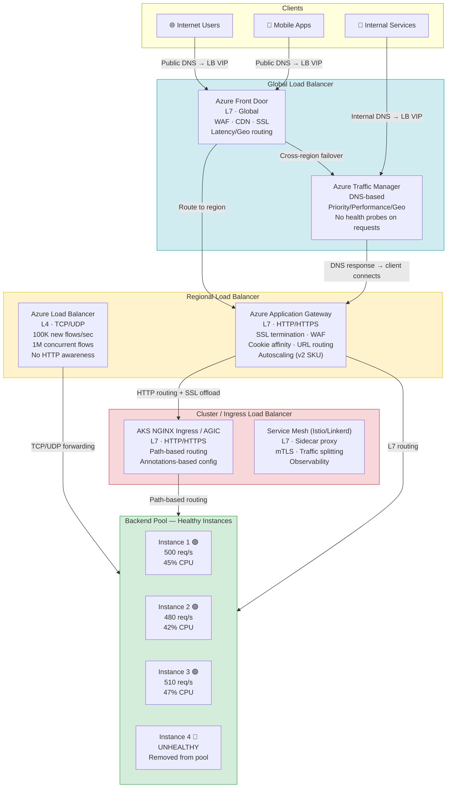

> [!success] Mastery Check
> - [ ] **Studied Well**
> - [ ] **Can explain the concept without notes**
> - [ ] **Can answer interview questions confidently**
> - [ ] **Can implement it in a real project**

---

id: "7.210" title: "Load Balancing — Overview" domain: "System Design & Distributed Systems" domain_id: 7 group: "Scalability Patterns" tags: [system-design, distributed-systems, scalability, dotnet, azure, load-balancing, networking] priority: 1 version: 2 prerequisites:

- "[[7.206 — Horizontal vs Vertical Scaling — Tradeoffs]] — load balancing is the enabling infrastructure for horizontal scaling; understanding why multiple instances exist is the prerequisite for understanding how traffic gets distributed across them"
- "[[7.207 — Stateless Services — Design Principles]] — load balancer routing decisions (round-robin, least-connections) assume instances are fungible; stateless services make this assumption valid"
- "[[7.208 — Stateless Services — Session Externalization]] — without externalization, the load balancer must use sticky sessions, which constrains which algorithms are viable and how health checks work" related:
- "[[7.211 — Load Balancing — Layer 4 vs Layer 7]] — the fundamental classification of load balancers; this note is the taxonomy anchor"
- "[[7.212 — Load Balancing — Round Robin]] — the simplest distribution algorithm; serves as the baseline against which all others are compared"
- "[[7.213 — Load Balancing — Least Connections]] — the algorithm that accounts for variable request durations; rounds out the common alternatives"
- "[[7.216 — Load Balancing — Health Check Integration]] — load balancing is only as good as its failure detection; health checks are what make the algorithm aware of backend state"
- "[[7.217 — Load Balancing — SSL Termination]] — the most common layer-7 load balancer feature; enables certificate management at the edge"
- "[[7.209 — Sticky Sessions — Problem and Impact]] — session affinity modifies how all distribution algorithms behave; this is the constraint that ties load balancing to session management"
- "[[7.229 — Consistent Hashing — Algorithm]] — a third category of load balancing (hash-based) that provides deterministic instance mapping with minimal remapping on topology changes"
- "[[7.255 — Scale Cube — X, Y, Z Axes]] — load balancing the X-axis (horizontal duplication) requires a load balancer; the Y-axis (functional decomposition) changes the load balancing problem"
- "[[4.110 — ASP.NET Core Kestrel — Production Configuration]] — Kestrel sits behind the load balancer; load balancer configuration (forwarded headers, keep-alive, connection limits) directly affects Kestrel behavior" created: 2026-06-16

---

> [!ABSTRACT] Quick Reference — Load Balancing **Invariant:** A load balancer sits between clients and backend servers, distributing incoming requests across a pool of healthy backend instances according to a selection algorithm. It decouples the client from the backend topology — clients address the load balancer, not individual instances. **Cost:** Each request incurs a latency hop through the load balancer (0.1–0.5ms for L4 Azure Load Balancer, 1–5ms for L7 Azure Application Gateway with SSL termination). The load balancer is a potential bottleneck and single point of failure if not deployed with redundancy (Azure LB is zone-redundant by design in supported regions). Configuration complexity rises with feature set: L4 is simple (forwarding rules), L7 adds routing rules, WAF, SSL, and session persistence. **Trigger:** Added when the second instance is deployed (need for traffic distribution), or when the first instance needs redundancy (health probe + failover). In system design, load balancing appears at any scale beyond one server — it is the fundamental building block of horizontal scaling. **Skip When:** A single instance serves all traffic with acceptable availability; or the system uses a client-side load balancing pattern (service mesh, client-side discovery) that distributes traffic at the application layer without a centralized LB. **.NET Entry Point:** `app.UseForwardedHeaders()` — required when the load balancer terminates SSL or rewrites the request URI, so that ASP.NET Core generates correct redirect URIs and `HttpContext.Connection.RemoteIpAddress` reflects the original client IP. **Azure Native:** Azure Load Balancer (L4, internal/external) · Azure Application Gateway (L7, HTTP/S, WAF) · Azure Front Door (global L7, CDN, WAF) · Azure Traffic Manager (DNS-based, global routing) · AKS with NGINX Ingress Controller or Azure Application Gateway Ingress Controller (AGIC) **Number to Know:** A single Azure Load Balancer Standard handles up to ~1,000,000 concurrent flows and 100,000 new flows/second — well above typical single-service needs. Azure Application Gateway Standard_v2 handles up to 40 Tbps with autoscaling. The bottleneck is almost never the load balancer itself; it's the backend instances' capacity to handle the distributed traffic.

---

## Navigation

**Domain:** [[7 — System Design & Distributed Systems]] > **Group:** Scalability Patterns
**Previous:** [[7.209 — Sticky Sessions — Problem and Impact]] | **Next:** [[7.211 — Load Balancing — Layer 4 vs Layer 7]]

### Prerequisites

- [[7.206 — Horizontal vs Vertical Scaling — Tradeoffs]] — load balancing is what makes horizontal scaling coherent; without a load balancer, multiple instances are independent silos that the client must manage individually
- [[7.207 — Stateless Services — Design Principles]] — all standard load balancing algorithms (round-robin, least-connections, random) assume backends are fungible — stateless design makes this true
- [[7.208 — Stateless Services — Session Externalization]] — the alternative to sticky sessions at the load balancer level; externalization eliminates the need for the load balancer to maintain session affinity state

### Where This Fits

> [!INFO] Production Encounter Map
> 
> - **Layer:** Infrastructure / networking — the load balancer operates at the network or application layer, transparent to application code. It is one of the first infrastructure components an engineer encounters when deploying any non-trivial service.
> - **Trigger:** The first production deployment of a multi-instance service must answer: "What sits in front of my instances?" The default answer for most Azure .NET services is Azure Load Balancer (PaaS-managed in App Service, explicit in AKS/VM). The choice of load balancer determines SSL termination strategy, health check design, session management constraints, and routing capabilities for the life of the service.
> - **Without it:** Clients must address individual instances directly — instance failure causes client-visible errors, scaling requires updating client configuration, and there is no uniform entry point for security policies (WAF, rate limiting, IP filtering). A "dumb" DNS round-robin can provide basic distribution but cannot detect instance health or reroute traffic around failures.
> - **First signal:** During the first load test of a multi-instance deployment, the team realizes that requests are failing intermittently because one instance is unhealthy but still receiving traffic (no health probe). Or: during a traffic spike, one instance saturates while another is idle because round-robin doesn't account for variable request processing time.

Load balancing is the most fundamental infrastructure pattern in distributed systems. It makes the fleet look like a single logical unit to the client while providing scale, redundancy, and operational flexibility. Every other scalability pattern — autoscaling, rolling deployments, blue-green deployment, A/B testing, canary releases — depends on a load balancer as the traffic control point.

---

## Core Mental Model

A load balancer is a traffic dispatcher. It maintains a pool of backend instances (the "backend pool"), monitors their health, and selects one to handle each incoming request according to a configurable algorithm. The client addresses the load balancer by a single virtual IP (VIP) or hostname — the load balancer translates this to the selected backend instance's actual IP and port (DNAT).

The mental model: think of a taxi dispatcher at an airport. Passengers (requests) line up at a single taxi stand (the load balancer VIP). The dispatcher sees which taxis (backend instances) are available (healthy), which are occupied (busy serving requests), and which have left the queue (failed health check). The dispatcher assigns the next passenger to the next available taxi — or, if the dispatcher is simple (round-robin), to the next taxi in line regardless of how many passengers are already inside.

The constraint that governs load balancer behavior is **visibility**: the load balancer sees only what it can observe. At layer 4, it sees TCP connections (SYN, established, FIN, RST) and can count them — but it cannot see the HTTP request path, the response status code, or the application-level latency. At layer 7, it sees HTTP requests and responses — it can route by URL path, inspect cookies, read response status codes, and make smarter routing decisions, but it processes more data, adds more latency, and operates at lower throughput.

> [!TIP] The Non-Obvious Insight The load balancer's health probe is more critical than its distribution algorithm. A perfect round-robin distribution across 10 instances is useless if the load balancer still routes traffic to an instance that is returning HTTP 500 because its health probe is too permissive (e.g., TCP port check only, when the application requires database connectivity). Conversely, a rough distribution (even simple round-robin) with excellent health detection (application-level `/health/ready` returning 200 only when the instance is truly ready) provides a reliable system. Engineers over-index on distribution algorithms and under-index on health probe design — this is backwards.

### Classification

- **OSI Layer:** L4 (transport: TCP/UDP) vs L7 (application: HTTP/HTTPS). L4 handles connections, L7 handles requests. L4 is faster but dumber; L7 is slower but smarter.
- **Deployment topology:** External (internet-facing, public VIP) vs Internal (private VIP, VNet-only). External LB handles user traffic; internal LB handles service-to-service traffic.
- **Routing scope:** Regional (Azure LB, Application Gateway) vs Global (Azure Front Door, Traffic Manager). Regional LB distributes within a region; global LB routes across regions based on latency, geography, or availability.
- **Algorithm family:** Round-robin (even distribution regardless of load), Least-connections (distribute to instance with fewest active connections), Hash-based (deterministic mapping of client → instance), Weighted (instances receive proportional traffic based on configured weight).
- **Session affinity:** None (every request independently distributed) vs Cookie-based (Application Gateway ARRAffinity) vs Source IP (Azure LB 5-tuple hash) vs None-needed (stateless services).
- **Health probe type:** TCP probe (checks port is open) vs HTTP probe (checks HTTP response status on a specific path) vs HTTPS probe (same as HTTP with TLS). The choice determines what failures the load balancer detects and how fast.

### Primary Diagram



### Distribution Algorithm Quick Reference

|Algorithm|L4/L7|Distribution Basis|Best For|Worst For|Deep Dive|
|---|---|---|---|---|---|
|Round Robin|Both|Sequential rotation|Equal-capacity instances, uniform request duration|Variable request durations, variable instance capacity|[[7.212]]|
|Least Connections|Both|Active connection count per instance|Variable request durations, long-lived connections|Sporadic connection storms (e.g., connection pooling)|[[7.213]]|
|IP Hash|L4 only|Hash of source IP (5-tuple for TCP)|Session affinity without cookies (non-HTTP)|NAT/proxied clients (many users → one hash bucket)|[[7.214]]|
|Weighted Round Robin|Both|Configured weight per instance|Heterogeneous instance capacity (different VM SKUs)|Static — requires manual weight updates on capacity change|[[7.215]]|
|Health Check Integration|Both|Removes unhealthy instances from rotation|All production deployments|Detecting failure is not enough — graceful drain matters|[[7.216]]|
|SSL Termination|L7 only|L7 proxy decrypts, forwards as HTTP|Offloading CPU-intensive TLS from backends|End-to-end encryption compliance (PCI, HIPAA)|[[7.217]]|
|Power of Two Choices|L7 only|Selects best of two random candidates|High-throughput, variable load, large fleets|Small fleets (N < 10) — insufficient randomization|[[7.218]]|

### Numbers That Matter

|Metric|L4 Azure LB|L7 App Gateway v2|L7 Front Door|AKS NGINX Ingress|
|---|---|---|---|---|
|Max throughput|~10 Gbps per VMSS backend|~40 Tbps (autoscale)|~100 Tbps|Depends on node instance type|
|Max concurrent flows|~1,000,000|~1,000,000|Unlimited (CDN-backed)|Depends on pod resources|
|Added latency|~0.1–0.5ms|~1–5ms|~2–10ms (CDN edge)|~0.5–2ms|
|SSL termination|No|Yes|Yes|Yes|
|WAF integration|No|Yes (SKU-dependent)|Yes (Front Door Premium)|Yes (via managed WAF or 3rd-party)|
|Path-based routing|No|Yes|Yes|Yes (via Ingress rules)|
|Session affinity|5-tuple hash|ARRAffinity cookie|AFDDCAFD cookie|INGRESSCOOKIE|
|Health check type|TCP/HTTP/HTTPS|TCP/HTTP/HTTPS|HTTP/HTTPS|TCP/HTTP (readiness + liveness)|
|Autoscaling|No (manual scale)|Yes (v2 SKU)|Yes (global scale)|Yes (HPA + cluster autoscaler)|
|Cost|~$0.022/hr + data|~$0.25/hr + data per instance|~$0.35/hr + data|Free (OSS) + node cost|

### Key Properties / Guarantees

|Property|L4 Load Balancer|L7 Load Balancer (App Gateway / Front Door / Ingress)|Condition|
|---|---|---|---|
|Throughput|High (10+ Gbps per backend)|High (autoscaling, SKU-dependent)|L4 has less overhead per packet|
|Content awareness|None — TCP/UDP only|Full — HTTP paths, headers, cookies, responses|L7 terminates HTTP, inspects content|
|Latency added|0.1–0.5ms (minimal)|1–10ms (varies by feature complexity)|L7 decryption, header inspection, routing|
|Health check depth|TCP port open (basic)|HTTP 200 on specific path (application-aware)|L7 probes can check app dependencies (DB, Redis)|
|Routing complexity|Simple: forward to pool|Complex: path-based, host-based, multi-site routing|L7 supports multiple backend pools per LB|
|TLS support|Pass-through only (TCP forwarding)|Termination, re-encryption, end-to-end|L7 manages certificates at the edge|
|Session persistence|Source IP hash (implicit)|Cookie-based ARRAffinity (explicit)|L7 affinity is user-granular; L4 is IP-granular|
|Auto scaling|Manual (standard LB)|Automatic (v2 SKU)|L7 v2 scales with traffic; L4 needs manual VMSS scaling|

---

## Deep Mechanics

### How It Works

**Load Balancer Architecture (Azure Load Balancer — L4):**

1. **Frontend IP configuration:** The load balancer is assigned one or more frontend IPs (public or private). Clients send traffic to this IP. The load balancer listens on configured ports (e.g., `*:443` for TCP/TLS).

2. **Backend pool:** A set of backend instances (VMs, VMSS, AKS nodes, App Service instances) registered with the load balancer. The load balancer maintains a mapping from frontend IP:port to backend IP:port (DNAT).

3. **Load balancing rules:** A rule specifies: frontend IP + frontend port + backend pool + backend port + protocol (TCP/UDP) + distribution algorithm. For example: "frontend `1.2.3.4:443` → backend pool `orders-vmss` → backend port `443` → protocol TCP → distribution algorithm `5-tuple hash`."

4. **Health probes:** Each rule has a health probe that monitors backend instances. The probe sends a SYN to the backend port (TCP probe) or makes an HTTP GET to a specified path (HTTP probe). If the probe fails N consecutive times (default: 2 unhealthy → instance marked down), the instance is removed from the pool. If the probe succeeds M consecutive times (default: 2 healthy → instance marked up), the instance is added back.

5. **Traffic flow (per-connection, not per-packet):**
   - Client sends SYN to LB frontend IP:port
   - LB selects a backend instance using the distribution algorithm (e.g., 5-tuple hash: src_ip, src_port, dest_ip, dest_port, protocol)
   - LB translates the destination to backend IP:port (DNAT) and forwards the SYN
   - Backend responds, LB reverse-NATs the response back to the client
   - For TCP, the entire connection flows through the LB — both directions
   - The connection is pinned to the selected backend for its entire duration (this is implicit connection affinity, not session affinity)

**Load Balancer Architecture (Azure Application Gateway — L7):**

1. **Same frontend IP / backend pool / health probe concept as L4, plus:**

2. **HTTP listeners:** Define which hostnames and paths the gateway accepts. A listener is configured with protocol (HTTP/HTTPS), certificate (for HTTPS), and hostname (optional — multiple sites on one gateway).

3. **Routing rules:** A rule connects a listener to a backend pool via routing conditions:
   - Path-based: `/api/*` → backend pool A, `/web/*` → backend pool B
   - Host-based: `orders.contoso.com` → pool A, `catalog.contoso.com` → pool B

4. **SSL termination:** The gateway decrypts HTTPS traffic at the edge, inspects the HTTP request, and forwards plain HTTP to the backend. The backend never sees the TLS connection — it receives the original request with headers `X-Forwarded-Proto`, `X-Forwarded-For`, and `X-Original-Host` so it can generate correct redirects and logs.

5. **Traffic flow (per-request):**
   - Client sends HTTP/HTTPS request to gateway
   - Gateway matches listener (hostname + path)
   - Gateway selects a backend instance via distribution algorithm (round-robin or least-connections)
   - Gateway terminates TLS, builds a new HTTP request to the backend (optionally re-encrypts for end-to-end TLS)
   - Backend processes the request, returns HTTP response
   - Gateway potentially modifies the response (adds ARRAffinity cookie for sticky sessions, injects headers)
   - Gateway returns the response to the client

### Protocol Trace — L4 vs L7 Request Flow

```
L4 — Azure Load Balancer (TCP forward, no HTTP awareness):

Client → LB: SYN to 20.185.0.1:443 (frontend VIP)
  LB: 5-tuple hash = (client_ip, client_port, 20.185.0.1, 443, TCP)
  LB: hash → backend instance: 10.0.1.4:443
  LB: DNAT: 20.185.0.1:443 → 10.0.1.4:443
  LB → Instance 3: SYN to 10.0.1.4:443

Instance 3 → LB: SYN-ACK
LB → Client: SYN-ACK

Client → LB: ACK → [ESTABLISHED]
Client → LB: TLS ClientHello + "GET /products HTTP/1.1..."
  LB: forwards TCP segment to Instance 3 (no HTTP inspection)
Instance 3: terminates TLS, processes request
Instance 3 → LB: HTTP/1.1 200 OK (TLS encrypted)
LB → Client: forwards TCP segment

Total LB added latency: ~0.1ms (per-hop forwarding, no content inspection)
```

```
L7 — Azure Application Gateway (HTTP-aware, SSL termination):

Client → GW: TLS handshake + "GET /api/orders HTTP/1.1..."
  GW: Terminates TLS (decrypts)
  GW: Matches listener: hostname = orders.contoso.com
  GW: Matches rule: /api/* → backend pool "orders-api"
  GW: Distribution algorithm: round-robin
  GW: Selects Instance 2 (10.0.2.5)
  GW: Builds new HTTP request to 10.0.2.5:80
  GW: Adds headers:
      X-Forwarded-For: client_ip
      X-Forwarded-Proto: https
      X-Original-Host: orders.contoso.com
  
  GW → Instance 2: HTTP GET /api/orders (plaintext, no TLS)
Instance 2: processes request (reads X-Forwarded-For for client IP)
Instance 2 → GW: HTTP 200 OK { orders: [...] }

GW: Optionally inspects response, adds ARRAffinity cookie (if enabled)
GW: Encrypts response with TLS
GW → Client: TLS encrypted HTTP 200

Total LB added latency: ~1-5ms (TLS termination + header inspection + routing)
```

### Azure Load Balancer Options — When to Use Each

|Azure LB Service|OSI Layer|Global/Regional|Best for|Cost|Limitations|
|---|---|---|---|---|---|
|Azure Load Balancer|L4 (TCP/UDP)|Regional|Non-HTTP traffic, ultra-low latency, high-throughput TCP/UDP, internal service-to-service|~$22/month (standard)|No HTTP routing, no SSL termination, no WAF, IP-based affinity only|
|Application Gateway v2|L7 (HTTP/HTTPS)|Regional|HTTP APIs, web apps needing SSL termination, WAF, cookie affinity, path-based routing|~$180/month + data|Regional only (no global routing); fixed capacity units|
|Azure Front Door|L7 (HTTP/HTTPS)|Global (anycast)|Global web apps, multi-region active-active, CDN, WAF, latency-based routing|~$315/month + data + bandwidth|No TCP/UDP, no internal IP routing (internet-facing only)|
|Traffic Manager|DNS-based (not a proxy)|Global|DNS-level traffic distribution across regions, failover routing, no health check on request path|~$11/month (1M queries)|DNS caching delays failover (TTL-dependent); no application-layer routing|
|AKS NGINX Ingress|L7 (HTTP/HTTPS)|Cluster (regional)|Kubernetes-native routing, path/host-based, annotations-rich configuration|Free (OSS, inc. in cluster cost)|Limited WAF (3rd-party add-on), no autoscaling (manual replica count)|
|App Gateway Ingress Controller (AGIC)|L7 (HTTP/HTTPS)|Cluster (regional)|AKS + Application Gateway integration, managed WAF, autoscaling gateway|$180/month + AKS cost|Additional Azure resource; configuration via both Ingress YAML and ARM|

### Failure Modes

**Failure Mode 1: Backend Instance Becomes Unhealthy But Health Probe Is Too Permissive**

- **Cause:** The health probe only checks that the TCP port is open (e.g., checks Kestrel is listening on port 80), but the application is in a failed state (database connection lost, Redis unavailable, deadlock). The instance responds to TCP SYN but returns HTTP 500 on every actual request. The load balancer considers the instance healthy and continues routing traffic to it.
- **Symptom:** 1/N of requests fail with HTTP 500 (where N is the number of healthy-looking but actually-broken instances). The error rate is N/M of the fleet (e.g., 20% if 2 out of 10 instances are broken but appear healthy). The failure is partial but persistent — a subset of users always see errors.
- **Detection time:** Only when users report errors or when monitoring catches the elevated HTTP 500 rate. The load balancer itself reports 100% backend health.

**Fix:**

```csharp
// ✅ Correct — application-level health probe that checks dependencies
// The health probe path should return 200 only when the app is truly ready
app.MapHealthChecks("/health/ready", new HealthCheckOptions
{
    Predicate = check => check.Tags.Contains("ready"),
    ResponseWriter = UIResponseWriter.WriteHealthCheckUIResponse
});

// Program.cs — register dependency checks
builder.Services.AddHealthChecks()
    .AddSqlServer(connectionString, name: "sql", tags: ["ready"])
    .AddRedis(redisConnectionString, name: "redis", tags: ["ready"])
    .AddCheck("self", () => HealthCheckResult.Healthy(), tags: ["ready"]);

// Azure Application Gateway health probe configuration:
// Probe path: /health/ready
// Probe protocol: HTTP
// Match response body: Healthy (optional — check for "Healthy" text)
// Unhealthy threshold: 2 consecutive failures
// Interval: 15 seconds (or 5s for faster detection)
```

**Cost of not fixing:** A partially broken instance serves errors to its share of traffic indefinitely. Only manual intervention (checking logs, noticing the 500 rate, removing the instance) stops the bleed. Autoscale cannot compensate because the instance appears healthy.

---

**Failure Mode 2: Load Balancer as a Single Point of Failure (Non-Zone-Redundant SKU)**

- **Cause:** An Azure Load Balancer Basic (non-zone-redundant) or a single-instance Application Gateway is deployed. An Azure hardware failure, maintenance event, or zone outage takes down the load balancer instance. All traffic to ALL backend instances is lost.
- **Symptom:** Complete service outage — zero requests reach any backend instance. The backend instances themselves are healthy but unreachable because the LB frontend IP is gone.
- **Detection time:** Instant — 100% of traffic fails. The load balancer's frontend IP becomes unreachable (ping fails, TCP connections time out).

**Fix:**
1. Use Azure Load Balancer Standard (always zone-redundant in supported regions). Standard LB is deployed across multiple availability zones — a single zone failure does not affect the frontend IP.
2. Deploy Application Gateway v2 with minimum 2 instances (zone-redundant). Gateway v1 was zone-scoped — v2 is zone-redundant by default.
3. For global redundancy, put Azure Front Door in front of regional Application Gateways. If one region's gateway fails, Front Door routes to the other region.

**Cost of not fixing:** Complete service outage during LB failure. Full recovery requires redeploying the LB (if the resource was corrupted) or waiting for Azure to repair the underlying infrastructure — potentially hours.

---

**Failure Mode 3: Connection Draining Without Graceful Shutdown Causes Mid-Request Failures**

- **Cause:** A backend instance is stopped or restarted (deployment update, scale-in, crash). In-flight TCP connections to that instance are terminated immediately. The load balancer removes the instance from the backend pool, but existing connections are severed — the client receives TCP RST or connection timeout.
- **Symptom:** During deployments or scale-in events, a burst of "Connection reset by peer" or "The SSL connection could not be established" errors. The error rate correlates exactly with instance termination events.
- **Detection time:** Visible during deployments and scale-in as a spike in `azure_lb_dropped_flows_total` or `application_gateway_backend_connection_timeouts`.

**Fix:**

```yaml
# ✅ AKS — preStop hook for graceful shutdown
apiVersion: apps/v1
kind: Deployment
spec:
  template:
    spec:
      terminationGracePeriodSeconds: 60
      containers:
        - name: api
          lifecycle:
            preStop:
              exec:
                command:
                  - /bin/sh
                  - -c
                  - |
                    # Signal load balancer to stop new connections
                    # Wait for existing requests to drain
                    sleep 10
                    # Then terminate
```

```bicep
// ✅ Azure Application Gateway — connection draining
resource appGateway 'Microsoft.Network/applicationGateways@2023-11-01' = {
  properties: {
    backendHttpSettingsCollection: [{
      name: 'orders-http-settings'
      properties: {
        connectionDraining: {
          enabled: true
          drainTimeoutInSec: 30 // Wait 30s for in-flight requests to complete
        }
      }
    }]
  }
}
```

```csharp
// ✅ ASP.NET Core — graceful shutdown via IHostApplicationLifetime
// The application waits for in-flight requests to complete before exiting
builder.Services.Configure<HostOptions>(options =>
{
    options.ShutdownTimeout = TimeSpan.FromSeconds(30);
});

// Register a custom IHostedService that signals load balancer on shutdown
public sealed class GracefulShutdownService : IHostedService
{
    private readonly ILogger<GracefulShutdownService> _logger;

    public Task StartAsync(CancellationToken cancellationToken) => Task.CompletedTask;

    public async Task StopAsync(CancellationToken cancellationToken)
    {
        _logger.LogInformation("Shutdown requested — waiting for in-flight requests to complete");

        // Signal the load balancer to stop routing new requests
        // By failing the readiness probe, the LB removes this instance
        // from the backend pool within ~10-15 seconds
        await Task.Delay(5000, cancellationToken); // Brief delay for probe to take effect

        _logger.LogInformation("Shutdown complete — terminating");
    }
}
```

**Cost of not fixing:** Every deployment and scale-in event causes a burst of mid-request failures. For services with long-lived requests (file uploads, streaming, WebSocket), the failure rate is proportionally higher. User-facing errors during deployment erode trust in the deployment process.

---

**Failure Mode 4: Forwarded Headers Not Configured — ASP.NET Core Generates Wrong Redirects**

- **Cause:** The load balancer (Application Gateway, Front Door, or NGINX Ingress) terminates SSL and forwards plain HTTP to the backend. The backend ASP.NET Core application sees the request as HTTP (not HTTPS), from the internal LB IP (not the original client IP). When the application generates redirects (e.g., `return RedirectToPage("/Login")` or `LocalRedirect(returnUrl)`), it uses the wrong scheme (HTTP instead of HTTPS) or wrong hostname, creating redirect loops or sending the client to an HTTP URL.
- **Symptom:** Users see "This page is not secure" warnings, redirect loops (the page redirects to itself because the scheme mismatch causes the request to be treated as unauthenticated), or `URLEmpty` errors. The application logs show client IP as `10.0.1.4` instead of the real client IP — breaking geo-location, rate-limiting by IP, and audit trails.
- **Detection time:** Immediately after the LB is put in front of the application for the first time. The redirect loop is visible on the first login attempt.

**Fix:**

```csharp
// ✅ Correct — Forwarded Headers Middleware
// This must be registered FIRST in the pipeline
using Microsoft.AspNetCore.HttpOverrides;

var builder = WebApplication.CreateBuilder(args);

// Configure Forwarded Headers Options
builder.Services.Configure<ForwardedHeadersOptions>(options =>
{
    options.ForwardedHeaders = ForwardedHeaders.XForwardedFor | ForwardedHeaders.XForwardedProto;
    // Only trust the load balancer's IP (or the known proxy range)
    // In AKS, add the pod's cluster CIDR; in App Service, use the well-known LB IPs
    options.KnownProxies.Clear();
    options.KnownNetworks.Clear();
});

var app = builder.Build();

app.UseForwardedHeaders(); // MUST be before any other middleware
app.UseHttpsRedirection(); // Now works correctly — sees X-Forwarded-Proto = https
app.UseAuthentication();
app.UseAuthorization();
app.MapControllers();

app.Run();
```

**Cost of not fixing:** Security downgrade — the application generates HTTP redirects that can be intercepted. Client IP logging is broken (all traffic appears from the LB IP). Geo-location, IP-based rate limiting, and audit trails are all inaccurate. The application may be non-functional if it depends on `HttpContext.Request.Scheme` for HTTPS enforcement.

### .NET and Azure Integration Points

- **ASP.NET Core:** `UseForwardedHeaders()` is THE critical middleware when behind a load balancer. Without it, `HttpContext.Connection.RemoteIpAddress` returns the LB IP, `HttpContext.Request.Scheme` returns `http` (even if the original request was HTTPS), and redirects may be incorrect. The middleware reads `X-Forwarded-For` (client IP) and `X-Forwarded-Proto` (original scheme) headers set by the LB.
- **Kestrel:** Configure `Kestrel__Endpoints__Http__Url` to listen on the correct port — typically `http://*:80` when behind a load balancer that terminates SSL. The application does not need HTTPS when the LB terminates it.
- **Azure Services:** Azure Load Balancer (L4, no header injection), Azure Application Gateway (L7, injects `X-Forwarded-For`, `X-Forwarded-Proto`, `X-Original-Host`), Azure Front Door (L7, same headers + `X-Azure-ClientIP`, `X-Azure-SocketIP`, `X-Azure-Ref`), Traffic Manager (DNS only, no headers).
- **.NET Libraries:** `Microsoft.AspNetCore.HttpOverrides` (ForwardedHeaders middleware), `Microsoft.Extensions.Diagnostics.HealthChecks` (health check endpoints), `AspNetCore.HealthChecks.SqlServer` / `AspNetCore.HealthChecks.Redis` (dependency health checks).

```csharp
// YourCompany.OrderManagement — Program.cs
// Load-balancer-aware ASP.NET Core configuration

using Microsoft.AspNetCore.HttpOverrides;

var builder = WebApplication.CreateBuilder(args);

// 1. Known networks/proxies — trust the load balancer's forwarded headers
// In production, restrict to the known LB subnet
builder.Services.Configure<ForwardedHeadersOptions>(options =>
{
    options.ForwardedHeaders = ForwardedHeaders.XForwardedFor | ForwardedHeaders.XForwardedProto;

    // Production: restrict to known proxy CIDR ranges
    if (builder.Environment.IsProduction())
    {
        // Azure Application Gateway's well-known backend IP ranges
        // In practice, use the VNet subnet CIDR where the LB resides
        options.KnownNetworks.Add(new Microsoft.AspNetCore.HttpOverrides.NetworkInfo(
            "10.0.0.0", 8));
    }
});

// 2. Kestrel behind LB — no need for direct HTTPS, LB handles TLS
builder.WebHost.ConfigureKestrel(serverOptions =>
{
    serverOptions.ListenAnyIP(80); // HTTP only — LB terminates TLS
});

// 3. Health checks — application-level probes for the LB
builder.Services.AddHealthChecks()
    .AddSqlServer(builder.Configuration.GetConnectionString("AzureSql"),
        name: "sql", tags: ["ready"])
    .AddRedis(builder.Configuration["AzureRedis:ConnectionString"],
        name: "redis", tags: ["ready"])
    .AddUrlGroup(new Uri("https://downstream-api.contoso.com/health"),
        name: "downstream-api", tags: ["ready"]);

// 4. Telemetry — enrich with client IP from X-Forwarded-For
builder.Services.AddApplicationInsightsTelemetry(options =>
{
    options.EnableAdaptiveSampling = false;
});
builder.Services.AddApplicationInsightsKubernetesEnricher();

var app = builder.Build();

// Pipeline: ForwardedHeaders FIRST
app.UseForwardedHeaders();

app.UseHttpsRedirection(); // Now correctly uses X-Forwarded-Proto
app.UseStaticFiles();
app.UseAuthentication();
app.UseAuthorization();

// Health check endpoint for LB probes
app.MapHealthChecks("/health/ready", new HealthCheckOptions
{
    Predicate = check => check.Tags.Contains("ready"),
    ResponseWriter = UIResponseWriter.WriteHealthCheckUIResponse
});
// Liveness — basic process check
app.MapHealthChecks("/health/live", new HealthCheckOptions
{
    Predicate = _ => false
});

app.MapControllers();
app.Run();
```

---

## Production Patterns and Implementation

### Primary Implementation — Load-Balancer-Aware Service

```csharp
// YourCompany.OrderManagement.Api — Production configuration
// Designed to run behind Azure Application Gateway (L7)

namespace YourCompany.OrderManagement.Infrastructure;

/// <summary>
/// Configures the application to run correctly behind a load balancer.
/// Must be called before any other middleware registration.
/// </summary>
public static class LoadBalancerConfiguration
{
    /// <summary>
    /// Adds and configures the Forwarded Headers middleware and health checks.
    /// </summary>
    public static WebApplicationBuilder ConfigureForLoadBalancer(this WebApplicationBuilder builder)
    {
        // --- Forwarded Headers ---
        // Required: the LB terminates TLS and forwards HTTP to the backend.
        // Without this, HttpContext.Request.Scheme == "http" (wrong) and
        // HttpContext.Connection.RemoteIpAddress == LB IP (wrong).
        builder.Services.Configure<ForwardedHeadersOptions>(options =>
        {
            options.ForwardedHeaders =
                ForwardedHeaders.XForwardedFor |     // Original client IP
                ForwardedHeaders.XForwardedProto |    // Original scheme (http/https)
                ForwardedHeaders.XForwardedHost;      // Original host header

            // In production, restrict to known proxy IP ranges
            if (builder.Environment.IsProduction() && !string.IsNullOrEmpty(
                    builder.Configuration["LoadBalancer:TrustedCIDR"]))
            {
                var cidr = builder.Configuration["LoadBalancer:TrustedCIDR"]!;
                var parts = cidr.Split('/');
                var ip = IPAddress.Parse(parts[0]);
                var prefix = int.Parse(parts[1]);
                options.KnownNetworks.Add(new NetworkInfo(
                    ip.ToString(), prefix));
            }
        });

        // --- Health Checks for LB Probes ---
        builder.Services.AddHealthChecks()
            .AddSqlServer(
                builder.Configuration.GetConnectionString("AzureSql")!,
                name: "sql",
                failureStatus: HealthStatus.Unhealthy,
                tags: ["ready"])
            .AddRedis(
                builder.Configuration["AzureRedis:ConnectionString"]!,
                name: "redis",
                failureStatus: HealthStatus.Unhealthy,
                tags: ["ready"])
            .AddCheck("self", () => HealthCheckResult.Healthy(),
                tags: ["ready"]);

        // --- Kestrel (listen on HTTP only — LB terminates TLS) ---
        builder.WebHost.ConfigureKestrel(options =>
        {
            options.Listen(IPAddress.Any, 80);
            // Optionally: listen on a separate port for LB health probes
            // that skip middleware (faster probe response)
            options.Listen(IPAddress.Any, 8000, listenOptions =>
            {
                listenOptions.UseConnectionHandler<HealthProbeHandler>();
            });
        });

        return builder;
    }
}

/// <summary>
/// Configures the middleware pipeline with load-balancer-aware settings.
/// Call this AFTER builder.Build() and BEFORE app.Run().
/// </summary>
public static WebApplication ConfigureLoadBalancerPipeline(this WebApplication app)
{
    // Forwarded Headers MUST be the first middleware in the pipeline
    app.UseForwardedHeaders();

    if (app.Environment.IsDevelopment())
    {
        app.UseDeveloperExceptionPage();
    }

    app.UseHttpsRedirection();
    app.UseAuthentication();
    app.UseAuthorization();

    // Health check endpoints
    app.MapHealthChecks("/health/ready", new HealthCheckOptions
    {
        Predicate = check => check.Tags.Contains("ready"),
        ResponseWriter = UIResponseWriter.WriteHealthCheckUIResponse
    });

    // Liveness probe — no dependencies check, just the process
    app.MapHealthChecks("/health/live", new HealthCheckOptions
    {
        Predicate = _ => false
    });

    return app;
}
```

### IServiceCollection Registration

```csharp
// Program.cs — YourCompany.OrderManagement.Api

var builder = WebApplication.CreateBuilder(args);

// Load balancer configuration (call BEFORE other services)
builder.ConfigureForLoadBalancer();

// Standard application services
builder.Services.AddControllers();
builder.Services.AddAuthentication(JwtBearerDefaults.AuthenticationScheme)
    .AddJwtBearer(options =>
    {
        options.Authority = builder.Configuration["AzureAd:Authority"];
        options.Audience = builder.Configuration["AzureAd:Audience"];
    });
builder.Services.AddApplicationInsightsTelemetry();

var app = builder.Build();

// Load balancer pipeline (call FIRST in the pipeline)
app.ConfigureLoadBalancerPipeline();

app.MapControllers();
app.Run();
```

### Common Variants

```csharp
// Variant A — L4 Load Balancer (Azure Load Balancer, no HTTP awareness)
// No forwarded headers needed (the LB does not modify HTTP headers).
// The application terminates TLS directly (no LB SSL termination).
// Health check: TCP probe on port 443 (Kestrel HTTPS endpoint).

builder.WebHost.ConfigureKestrel(options =>
{
    options.Listen(IPAddress.Any, 443, listenOptions =>
    {
        listenOptions.UseHttps(httpsOptions =>
        {
            // Load certificate from Azure Key Vault or local store
            httpsOptions.ServerCertificate = LoadCertificate();
        });
    });
});

// No UseForwardedHeaders() — the client connects directly to Kestrel
// (with the LB just forwarding TCP packets)
```

```csharp
// Variant B — Azure Front Door (global L7)
// Front Door sets additional headers: X-Azure-ClientIP, X-Azure-SocketIP, X-Azure-Ref
// ForwardedHeaders middleware needs to include these custom headers
// or read from X-Forwarded-For (which FD also sets).

builder.Services.Configure<ForwardedHeadersOptions>(options =>
{
    options.ForwardedHeaders =
        ForwardedHeaders.XForwardedFor |
        ForwardedHeaders.XForwardedProto |
        ForwardedHeaders.XForwardedHost;

    // Azure Front Door has well-known IP ranges published via Azure service tag
    // "AzureFrontDoor.Backend" — restrict to these in KnownProxies
});

// Also: Front Door sends periodic health probes from its edge nodes
// The health check endpoint should not include authentication
// and should respond quickly (< 200ms)
app.MapHealthChecks("/health/ready", new HealthCheckOptions
{
    Predicate = check => check.Tags.Contains("ready"),
    ResponseWriter = UIResponseWriter.WriteHealthCheckUIResponse
    // No auth on this endpoint — Front Door cannot pass auth cookies
});
```

```yaml
# Variant C — AKS NGINX Ingress Controller
# NGINX terminates TLS and forwards HTTP to pods
# Annotations configure load balancing behavior

apiVersion: networking.k8s.io/v1
kind: Ingress
metadata:
  name: orders-ingress
  annotations:
    # Load balancing algorithm
    nginx.ingress.kubernetes.io/load-balance: "round_robin"
    # Session affinity
    # nginx.ingress.kubernetes.io/affinity: "cookie"  # Enable if sticky sessions needed
    # Proxy protocol headers
    nginx.ingress.kubernetes.io/use-forwarded-headers: "true"
    nginx.ingress.kubernetes.io/forwarded-for-header: "X-Forwarded-For"
    # Health check annotation for the upstream
    nginx.ingress.kubernetes.io/server-snippet: |
      location /health/ready {
        access_log off;
        return 200 "healthy";
      }
spec:
  tls:
    - hosts:
        - orders.contoso.com
      secretName: orders-tls
  rules:
    - host: orders.contoso.com
      http:
        paths:
          - path: /api/orders
            pathType: Prefix
            backend:
              service:
                name: orders-api-service
                port:
                  number: 80
```

### Real-World .NET Ecosystem Mapping

|Pattern in This Note|Where It Appears in .NET / Azure|Manifestation|
|---|---|---|
|Forwarded Headers|`UseForwardedHeaders()` middleware|Reads `X-Forwarded-For`, `X-Forwarded-Proto` from LB to restore client IP and scheme|
|Health checks for LB probes|`AddHealthChecks()` + `/health/ready` endpoint|LB probes this endpoint and only routes traffic when it returns 200|
|Graceful shutdown|`IHostApplicationLifetime` + `preStop` hooks|Existing requests complete before process exits; LB removes instance from pool|
|Kestrel behind LB|`ListenAnyIP(80)` — HTTP only|LB terminates TLS; Kestrel serves HTTP internally|
|LB-agnostic configuration|`ForwardedHeadersOptions.KnownProxies` / `KnownNetworks`|Security: restrict which IPs are trusted to set forwarded headers|
|Connection draining|Application Gateway `connectionDraining` or AKS `terminationGracePeriodSeconds`|Prevents mid-request failures during deployments and scale-in|

---

## Gotchas and Production Pitfalls

### Forwarded Headers Not Configured — All Client IPs Appear as the Load Balancer

**Pitfall:** The application is deployed behind Application Gateway but `UseForwardedHeaders()` is not called. `HttpContext.Connection.RemoteIpAddress` returns the Application Gateway's private IP (e.g., `10.0.1.4`) instead of the original client IP. Rate limiting by IP is broken (all traffic appears from one IP). Geo-location middleware fails (everything appears to come from the Azure region). Audit logs record the wrong IP.

```csharp
// ❌ Wrong — no ForwardedHeadersMiddleware
var app = builder.Build();

app.UseHttpsRedirection();
app.UseAuthentication();
app.UseAuthorization();
app.MapControllers();

// HttpContext.Connection.RemoteIpAddress → 10.0.1.4 (LB IP)
// HttpContext.Request.Scheme → "http" (LB forwarded as HTTP)
```

**Symptom:** Rate limiting blocks ALL traffic (from the single "client" IP) or allows all traffic. Geo-location shows all users in the Azure region where the service is deployed. Security audits flag the wrong client IP. Redirect loops on HTTPS enforcement (app sees HTTP and redirects to HTTPS, which the LB already terminated).

**Fix:**

```csharp
// ✅ Correct — ForwardedHeadersMiddleware registered FIRST
builder.Services.Configure<ForwardedHeadersOptions>(options =>
{
    options.ForwardedHeaders =
        ForwardedHeaders.XForwardedFor | ForwardedHeaders.XForwardedProto;
});

var app = builder.Build();
app.UseForwardedHeaders(); // FIRST middleware
app.UseHttpsRedirection(); // Now works correctly
```

**Cost of not fixing:** Broken rate limiting, broken geo-location, broken audit trails, broken HTTPS enforcement. Security-critical features (IP allow/deny lists, rate limiting per client) are completely non-functional.

---

### Health Probe Returning 200 Even When Application Is Broken

**Pitfall:** The health probe checks `/health/ready` but the endpoint always returns 200 regardless of the application's actual health state — no dependency checks, no timeout, no validation. The load balancer considers the instance healthy even when the database is down, Redis is unreachable, or the application is in a crash loop.

```csharp
// ❌ Wrong — health probe always returns 200, even when the app is broken
app.MapGet("/health/ready", () => Results.Ok());
// This returns 200 even if SQL is down, Redis is down, and the app can't serve requests
```

**Symptom:** Load balancer reports 100% backend health while a subset (or all) of requests fail with errors from missing dependencies. The team discovers the problem only when user-facing error rates spike — the health check provided no early warning.

**Fix:**

```csharp
// ✅ Correct — health check verifies critical dependencies
builder.Services.AddHealthChecks()
    .AddSqlServer(connectionString, name: "sql", tags: ["ready"])
    .AddRedis(redisConnectionString, name: "redis", tags: ["ready"])
    .AddCheck("self", () => HealthCheckResult.Healthy(), tags: ["ready"]);

app.MapHealthChecks("/health/ready", new HealthCheckOptions
{
    Predicate = check => check.Tags.Contains("ready"),
    ResponseWriter = UIResponseWriter.WriteHealthCheckUIResponse
});
// Returns 503 (Unhealthy) if SQL or Redis is unreachable
// LB removes instance from rotation when probe returns non-200
```

**Cost of not fixing:** The load balancer maintains the instance in the backend pool despite the application being broken. User traffic continues to be routed to a failing instance — users see errors while the health check dashboard shows green. Autoscale is not triggered because the broken instance "looks healthy."

---

### Health Check Timeout Shorter Than Application Startup Time

**Pitfall:** The load balancer health probe timeout is 5 seconds. During a scale-out event or deployment, a new instance takes 30 seconds to start (DI container build, EF Core model compilation, warmup endpoint, cache preloading). The health probe times out 6 times (30 seconds), marking the instance unhealthy. The instance is eventually healthy but has been removed from the pool by the LB. After it passes the probe, it needs 2 consecutive successes to be marked healthy — the total time-to-rotation is 30s startup + probe interval × healthy_threshold (e.g., 15s × 2 = 30s) = 60s.

```csharp
// ❌ Wrong — startup takes 30s but probe timeout is 5s
// The instance is removed from the backend pool before it finishes starting

// Application startup:
// T+0: Container starts
// T+0 to T+25: ASP.NET Core startup (DI, EF Core compilation, warmup)
// T+25: Kestrel begins listening on port 80
// T+5: First health probe arrives (Kestrel not yet listening → timeout)
// T+10: Second health probe → timeout
// T+15: Third probe → Instance marked unhealthy
// T+30: Kestrel finally listening, returns 200 on health probe
// T+60: Two consecutive healthy probes → Instance back in rotation
// Total time from start to serving traffic: ~60 seconds (vs 30s actual startup)
```

**Symptom:** New instances take 2-3× longer to start serving traffic than expected. Autoscale-out events show slow relief because instances are being rejected by health probes during startup.

**Fix:**
1. Make the startup faster (minimize DI work, use EF Core lazy compilation, avoid blocking startup on external calls).
2. Use a startup health check endpoint that returns 200 only after the instance is truly ready:
   - Listen on a separate port for health probes that starts responding BEFORE the full app startup
   - Or: return 200 from `startup` endpoint early, mark the instance ready for traffic, and let the first user requests do lazy initialization (acceptable for some scenarios)
3. Configure the health probe with appropriate timeout and interval:
   - Timeout: 31s (longer than the 30s startup)
   - Interval: 5s (frequent checks)
   - Unhealthy threshold: 3 (allow 3 failures during startup)
   - This way, after 3 × 5s = 15s, the probe is still timing out, but at T+30 when startup completes, the next probe passes.

**Cost of not fixing:** Autoscale-out effectiveness is significantly reduced — instances take 2-3× longer to become operational. During traffic spikes, the fleet remains under-provisioned because new capacity takes too long to activate.

---

### Health Probe Not Configured — Disabled by Default on Some Services

**Pitfall:** Azure Application Gateway does NOT require a health probe to be configured (it can use default TCP probes if no custom probe is specified). Azure Load Balancer requires a probe for load balancing rules. If the health probe is not configured, the load balancer either does not check health at all (App Gateway defaults to TCP probe on the backend port) or rejects the configuration (Azure LB requires it). Engineers who skip health probe configuration may get the TCP default, which only checks that the port is open, not that the application is healthy.

```bicep
// ❌ Wrong — no custom health probe configured
// App Gateway falls back to TCP probe on port 80
backendHttpSettingsCollection: [{
    name: 'orders-http-settings'
    properties: {
        port: 80
        protocol: 'Http'
        // No probe specified → default TCP probe (port open only)
    }
}]
```

**Symptom:** The load balancer routes traffic to instances that have the TCP port open but are returning HTTP 500 (e.g., during deployment when the old instance still listens but the new app code is unhealthy).

**Fix:**

```bicep
// ✅ Correct — application-level health probe
// First, define the probe:
probes: [{
    name: 'orders-health-probe'
    properties: {
        protocol: 'Http'
        path: '/health/ready'
        host: 'orders.contoso.com'
        intervalInSeconds: 15
        timeoutInSeconds: 10
        unhealthyThreshold: 3
        pickHostNameFromBackendHttpSettings: true
        match: {
            statusCodes: ['200']  // Only healthy if status is 200
        }
    }
}]
// Then reference it in HTTP settings:
backendHttpSettingsCollection: [{
    name: 'orders-http-settings'
    properties: {
        port: 80
        protocol: 'Http'
        probe: { id: appGatewayResourceId('probes/orders-health-probe') }
    }
}]
```

**Cost of not fixing:** The load balancer lacks visibility into application health. Instances that are running but not serving correct responses remain in the backend pool. Degraded instances serve errors until manually removed.

---

### Load Balancer Timeouts vs Application Timeouts

**Pitfall:** The application has a 5-minute `HttpClient.Timeout` for a downstream API call. The load balancer's idle timeout is 4 minutes (Azure LB default). If the downstream API takes 4.5 minutes, the load balancer resets the connection mid-stream. The client receives a TCP RST, the application sees `TaskCanceledException` (from the client's perspective), but the server side may have partially processed the request.

```csharp
// ❌ Mismatch: HttpClient timeout (5 min) > LB idle timeout (4 min)
builder.Services.AddHttpClient<IInventoryClient, InventoryClient>(client =>
{
    client.Timeout = TimeSpan.FromMinutes(5); // Application timeout
});
// Azure Load Balancer idle timeout: 4 minutes (default)
// At 4 min + 1 second: LB sends TCP RST → client sees timeout
```

**Symptom:** Long-running requests (file uploads, reports, batch processing) consistently fail after exactly 4 minutes. The failure occurs at the LB boundary, not at the application — the error message may reference network connectivity, not the downstream service.

**Fix:**

```csharp
// ✅ Option 1: Increase LB idle timeout (Azure Load Balancer — up to 30 min)
// Azure LB: Inbound NAT rules / Load balancing rules → Idle timeout (minutes) = 10

// ✅ Option 2: Use client-side timeout that's shorter than LB idle timeout
builder.Services.AddHttpClient<IInventoryClient, InventoryClient>(client =>
{
    client.Timeout = TimeSpan.FromMinutes(3); // 3 min < 4 min LB idle timeout
});

// ✅ Option 3: For long-running operations, use async pattern (preferred)
// Return 202 Accepted with a status endpoint, process asynchronously
// The client polls for completion rather than holding a long HTTP connection
app.MapPost("/api/reports/generate", async (ReportRequest request) =>
{
    var reportId = Guid.NewGuid();
    // Queue report generation, return immediately
    await _messageBus.PublishAsync(new GenerateReportCommand(reportId, request));
    return Results.Accepted($"/api/reports/status/{reportId}", new { ReportId = reportId });
});
```

**Cost of not fixing:** Mysterious 4-minute timeouts on long-running operations that are difficult to diagnose because the error manifests as a network-level disconnect, not an application-level failure. Users see "Request failed" with no useful error message.

---

## Tradeoffs and Decision Framework

### Tradeoff Matrix

|Dimension|L4 Load Balancer (Azure LB)|L7 Load Balancer (App Gateway)|Global L7 (Front Door)|AKS Ingress (NGINX)|
|---|---|---|---|---|
|Throughput|Highest (~10 Gbps+)|High (autoscale, SKU-dependent)|Very high (CDN-backed)|Node-dependent|
|Latency added|Lowest (~0.1–0.5ms)|Medium (~1–5ms)|Medium (~2–10ms)|Low-Medium (~0.5–2ms)|
|HTTP awareness|None|Full (path, host, cookie, header)|Full|Full|
|SSL termination|Not supported|Yes|Yes|Yes|
|WAF|No|Yes (SKU-dependent)|Yes (premium tier)|3rd-party add-on|
|Session affinity|Source IP hash (imprecise)|ARRAffinity cookie (precise)|AFDDCAFD cookie|INGRESSCOOKIE|
|Path-based routing|No|Yes|Yes|Yes (Ingress rules)|
|Global routing|No|No|Yes (anycast, latency)|No (cluster-scoped)|
|Autoscaling|Manual (VMSS scaling)|Automatic (v2 SKU)|Automatic (global)|HPA + cluster autoscaler|
|Cost|~$22/month|~$180/month + data|~$315/month + data|Free (node cost only)|
|Best for|Non-HTTP, ultra-low-latency, internal traffic, TCP/UDP|HTTP web apps, APIs needing SSL/WAF, regional|Global web apps, multi-region active-active, CDN+waf|Kubernetes-native routing, team controls ingress|
|Operational complexity|Low|Medium|Low (managed service)|Medium (ingress controller config)|

### When to Apply

```mermaid
flowchart TD
    A["Need: Distribute traffic across\nmultiple backend instances"]
    A --> B{What type of traffic\nis being balanced?}
    B -->|"TCP/UDP — databases, message queues,\nnon-HTTP protocols"| C["L4 Load Balancer\nAzure Load Balancer\nLowest latency, highest throughput\nNo content awareness\nSource IP affinity only"]
    B -->|"HTTP/HTTPS — web APIs, web apps"| D{What routing scope\nis needed?}
    D -->|Single region| E{Are advanced features\nneeded? (WAF, SSL, path-routing, cookies)}
    E -->|No — simple HTTP forward| F["Azure Application Gateway (basic)\nor Azure Load Balancer + self-managed TLS"]
    E -->|Yes — WAF, SSL termination,\ncookie affinity, path routing| G["Azure Application Gateway v2\nRegional L7 LB\nAutoscaling · WAF · SSL\nCookie affinity · Path routing"]
    D -->|Multi-region / global| H["Azure Front Door\nGlobal L7 LB\nAnycast + CDN + WAF\nLatency-based routing\nMulti-region failover"]
    D -->|Kubernetes-native| I["AKS Ingress (NGINX/AGIC)\nCluster-scoped L7\nPath/host-based routing\nAnnotations-rich configuration"]
    G --> J["Outcome:\n- Full HTTP awareness\n- WAF protection at edge\n- Cookie-based session affinity\n- SSL termination offload\nMonitor: gateway capacity units"]
    F --> K["Outcome:\nSimple L4 / basic L7\nLower cost\nNo advanced features"]
    H --> L["Outcome:\n- Global routing\n- CDN caching at edge\n- Cross-region failover\n- DDoS protection\nMonitor: origin health, latency"]
    I --> M["Outcome:\n- Native K8s integration\n- Config-as-code (YAML)\n- Low cost (open source)\nMonitor: ingress controller pods"]
    C --> N["Outcome:\n- Lowest latency (0.1ms)\n- Highest throughput\n- No HTTP features\nMonitor: flow counts, SNAT ports"]
```

### When NOT to Apply

> [!WARNING] Do Not Reach For a Load Balancer When...
> 
> - [ ] **A single instance with adequate capacity exists and availability SLO is < 99.9%:** If the service runs on one VM that handles the full traffic, and a few minutes of downtime per month is acceptable, a load balancer adds cost and complexity without benefit. Add the load balancer only when scaling to multiple instances or when the availability SLO requires redundancy.
> - [ ] **Client-side load balancing (service mesh) already handles distribution:** In a service mesh (Istio, Linkerd), the sidecar proxy handles load balancing at the application layer using client-side service discovery. An additional centralized load balancer is redundant for service-to-service traffic. However, an external-facing LB is still needed for ingress traffic from outside the mesh.
> - [ ] **DNS round-robin with health checks is sufficient:** For a small number of instances (2-4) where session persistence is not needed and the DNS TTL can be set low (30s-60s), DNS round-robin combined with synthetic health checks can provide basic load distribution without a dedicated LB. This is acceptable for internal tools and development environments — NOT for production or customer-facing services.
> - [ ] **The application uses a serverless platform (Azure Functions, App Service built-in scale-out):** These platforms have built-in load balancing managed by the platform. Adding an explicit load balancer in front of App Service is redundant for basic distribution (App Service already distributes traffic across instances) though it may be added for advanced features (WAF, custom SSL, path-based routing to multiple apps).
> - [ ] **The overhead of L7 processing exceeds the latency budget:** For ultra-low-latency systems (< 1ms p99), an L7 load balancer's 1-5ms added latency is unacceptable. Use an L4 load balancer instead, with TLS termination and application-level routing handled at the backend itself.

### Scale Thresholds

|Threshold|Below = Simple LB or No LB|Above = Advanced LB Required|
|---|---|---|
|Instance count|1-2 instances (DNS round-robin or basic LB)|> 3 instances — need health probe + distribution algorithm|
|Request rate|< 1,000 req/s (single instance sufficient)|> 5,000 req/s — need load-aware algorithm (least-connections)|
|Availability SLO|< 99.9% (single instance with periodic backup)|≥ 99.9% — need redundant LB + health probes + multi-instance pool|
|SSL requirement|Single certificate, one domain|Multi-domain, wildcard — need L7 for SNI-based SSL termination|
|WAF requirement|No public exposure|Public-facing — need WAF (Application Gateway WAF or Front Door Premium)|
|Multi-region deployment|Single region|Multi-region — need global LB (Front Door or Traffic Manager)|
|Routing complexity|Single backend pool|Multiple services, path-based routing — need L7 (App Gateway or Ingress)|

---

## Interview Arsenal

### Question Bank

1. **[Definition]** "What is a load balancer and what are the two fundamental layers (L4 and L7) at which it operates?"
2. **[Mechanism]** "Walk through the difference between how an L4 load balancer and an L7 load balancer handle a TLS-encrypted HTTPS request — what does each see, and how does routing differ?"
3. **[Tradeoff]** "What are the specific tradeoffs between L4 and L7 load balancing — when would you choose each?"
4. **[Failure mode]** "Your service is deployed behind an L4 load balancer. During a traffic spike, all backend instances are healthy but the load balancer drops new connections. What is the most likely cause?"
5. **[Comparison]** "Compare Azure Load Balancer, Azure Application Gateway, and Azure Front Door. When would you use each, and when would you use them together?"
6. **[Design application]** "Design the load balancing architecture for a global e-commerce platform with users in US, Europe, and Asia. The platform has read-heavy product catalog APIs and write-heavy order processing APIs with different scaling requirements."
7. **[Scale]** "Your 10-instance service behind Azure Application Gateway has a p99 latency spike from 200ms to 2s during peak hours. The gateway CPU is at 40%. Instance CPU averages 60%. What is the bottleneck and how do you diagnose it?"
8. **[Advanced]** "An engineer argues that L4 load balancing is sufficient for HTTP services because 'HTTP runs over TCP, so L4 routing is all you need.' What do they miss, and when does the argument break down?"

### Spoken Answers

**Q: What is a load balancer and what are the two fundamental layers (L4 and L7) at which it operates?**

> **Average answer:** A load balancer distributes traffic across servers. L4 works at the network layer, L7 works at the application layer. L4 is faster, L7 is smarter.

> **Great answer:** A load balancer is a traffic dispatcher that sits between clients and backend servers, accepting incoming requests and distributing them across a pool of healthy backend instances according to a configurable algorithm. It decouples the client from the backend topology — the client addresses the load balancer's virtual IP or hostname, and the load balancer handles the mapping to individual backend instances.
> 
> At **layer 4** (transport layer — TCP/UDP), the load balancer forwards entire connections. It sees TCP SYN packets, established connections, and FIN/RST terminations. It can count active connections but cannot inspect the HTTP request path, headers, or body. Routing decisions are based on connection-level attributes: source IP, source port, destination IP, destination port, and protocol (5-tuple). L4 is fast (0.1-0.5ms added latency) and handles high throughput (~10 Gbps+) but is "dumb" — it cannot distinguish between a request to `/api/products` and a request to `/admin/delete-all-users`.
> 
> At **layer 7** (application layer — HTTP/HTTPS), the load balancer terminates TLS, decrypts the request, inspects the full HTTP payload, and then makes routing decisions based on URL path, hostname, cookies, headers, or even request body content. It terminates the client's TLS connection, examines the plaintext HTTP, then creates a new HTTP connection to the backend (optionally re-encrypting with TLS for end-to-end security). L7 is slower (1-5ms added latency) and requires more processing power but provides rich routing capabilities.
> 
> The practical difference: with an L4 load balancer, all backend instances must handle TLS termination and serve all URL paths equally. With an L7 load balancer, I can route `/api/orders/*` to one backend pool (order processing service), `/api/products/*` to another (catalog service), and `/web/*` to a third (static file server) — all through the same load balancer frontend.

---

**Q: Compare Azure Load Balancer, Azure Application Gateway, and Azure Front Door. When would you use each, and when would you use them together?**

> **Average answer:** Azure LB is L4, App Gateway is L7 regional, Front Door is L7 global. Use LB for non-HTTP, App Gateway for HTTP within a region, Front Door for global traffic.

> **Great answer:** These three Azure services form a layered load balancing architecture, and they are often used TOGETHER, not as alternatives.
> 
> **Azure Load Balancer (L4, regional)** is the most basic and fastest. It forwards TCP/UDP traffic with no HTTP awareness. It has the lowest latency (~0.1-0.5ms), highest throughput, and lowest cost (~$22/month). I use it for: non-HTTP workloads (SQL Server listeners, message brokers, game servers), internal service-to-service traffic within a VNet, and as the underlying LB for AKS node pools. It's also implicitly used as the ingress LB for AKS services of type LoadBalancer.
> 
> **Azure Application Gateway (L7, regional)** provides HTTP-aware routing, SSL termination, cookie-based session affinity, and Web Application Firewall (WAF). It adds ~1-5ms latency and costs ~$180/month + data. I use it for: HTTP APIs and web apps within a single Azure region where I need SSL termination offload, WAF protection against OWASP top-10 attacks, path-based routing to multiple backend pools, and cookie-based session persistence. The v2 SKU autoscales capacity.
> 
> **Azure Front Door (L7, global)** is a global anycast-based load balancer with CDN capabilities, WAF, TLS termination, and latency-based routing across regions. It adds ~2-10ms latency (mostly from processing, not distance — anycast brings the edge close to users) and costs ~$315/month + data + bandwidth. I use it for: multi-region active-active deployments where traffic is routed to the nearest region, global HTTP(S) applications needing DDoS protection, and scenarios requiring a CDN cache layer at the edge.
> 
> **When to use them together — the three-tier architecture:**
> 1. **Azure Front Door (global tier):** Routes users to the nearest regional deployment based on latency. Provides global WAF, DDoS protection, and SSL termination at the edge.
> 2. **Azure Application Gateway (regional tier):** In each region, routes traffic to specific backend pools (API, web, admin) based on URL path. Provides regional WAF and cookie-based session affinity.
> 3. **Azure Load Balancer (infrastructure tier):** In front of each backend pool (e.g., AKS node pool, VMSS), distributing traffic across individual instances within the pool.
> 
> This three-tier architecture provides: global routing + CDN (Front Door), regional routing + WAF (App Gateway), and instance-level distribution (Azure LB). For example, a request from a user in Germany hits Front Door's Frankfurt edge, gets routed to West Europe region, reaches Application Gateway there, which routes `/api/orders` to the order processing VMSS (behind Azure LB), which distributes to a specific VM.

---

**Q: The interviewer says: 'Design the load balancing strategy for a real-time collaborative document editing service similar to Google Docs. Users from around the world collaborate on documents. The service uses WebSocket connections for real-time updates. Write operations must be strongly consistent. Read operations can be eventually consistent. Walk through your load balancing architecture.'**

> **Model response:** "The WebSocket constraint fundamentally changes the load balancing design. WebSocket connections start as HTTP upgrade requests, then become persistent TCP connections that can last hours. L4 and L7 load balancers handle WebSocket differently.
> 
> First, the requirement: WebSocket connections must be persistent. An L4 load balancer handles this naturally — it forwards TCP connections and the WebSocket upgrade flows through like any other TCP stream. But L7 load balancers like Application Gateway have configurable idle timeouts — the default is 20 seconds for HTTP keep-alive, which is NOT suitable for WebSocket connections that may idle for minutes. Application Gateway supports WebSocket but requires setting the idle timeout to 20 minutes or more.
> 
> Here is the architecture I would design:
> 
> **Global layer — Azure Front Door:** Routes users to the nearest Azure region based on latency. For WebSocket connections, Front Door supports WebSocket passthrough but adds latency. Since collaborative editing is latency-sensitive, I would use Front Door only for initial HTTP routing and WebSocket upgrade negotiation, then have the client connect directly to the regional entry point for the persistent WebSocket connection.
> 
> **Regional layer — Azure Application Gateway:** Terminates TLS, routes HTTP requests by path. For the REST API (document list, user profile, metadata), I use normal L7 routing with WAF. For WebSocket connections, I configure a separate listener with a 30-minute idle timeout and pass the WebSocket traffic through to the backend without HTTP inspection after the initial upgrade.
> 
> **Session management criticality:** Collaborative editing must maintain sticky sessions AT THE APPLICATION LEVEL — each document's editors must connect to the same backend instance that holds the document state in memory (the WebSocket handler). I cannot use Redis-based externalization for the real-time editor state because the latency of Redis writes (0.3ms) during every keystroke is too high. Instead, I use Application Gateway's cookie-based affinity to ensure that once a WebSocket connection is established to an instance, the user's subsequent connections (from different tabs or reconnects) are routed to the SAME instance. This provides WebSocket-to-instance pinning.
> 
> **Infrastructure layer — Azure Load Balancer:** Under the AKS cluster or VMSS that hosts the WebSocket handlers, an internal Azure Load Balancer distributes TCP connections across instances. The Application Gateway's backend pool points to this internal LB.
> 
> **The critical design point for scale:** WebSocket connections are long-lived and consume memory on the backend instance. If I have 10,000 concurrent editors and each WebSocket handler uses 50 KB of memory, that's 500 MB per instance — manageable. But the distribution ALGORITHM matters: with round-robin, if new WebSocket connections are established while existing connections are closed, the distribution drifts — some instances end up with 2,000 connections while others have 1,000. I need to use a load-aware algorithm: least-connections routing for new WebSocket connections, not round-robin.
> 
> **Health check design:** WebSocket connections survive brief backend unavailability (the client reconnects). The health probe for WebSocket backends should be a simple HTTP check on the REST API port (not the WebSocket port), because closing a WebSocket connection for a health check would disconnect editors. The WebSocket port is NOT health-checked directly — the instance is removed from rotation via the REST API health check, and active WebSocket connections are drained gracefully (the application sends a "reconnect" message to clients before shutting down)."

---

### System Design Interview Trigger

Load balancing is the second thing an interviewer tests (after "how many instances do you need?"). The candidate is expected to mention "behind a load balancer" when describing any multi-instance architecture. The specific probes: "what type of load balancer?" (L4 vs L7), "how does the load balancer know an instance is healthy?" (health probes), "what happens when an instance fails?" (health probe → remove from pool → traffic redistributed), "how does SSL work?" (termination at LB vs end-to-end), and "how do you handle session state?" (externalization vs sticky sessions). The strongest candidates integrate the load balancer into the architecture naturally — not as an afterthought but as a deliberate design element that shapes SSL strategy, session management, deployment strategy, and security posture.

### Comparison Table

| |L4 Load Balancer (Azure LB)|L7 Load Balancer (App Gateway)|Global L7 (Front Door)|
|---|---|---|---|
|Core mechanism|TCP/UDP DNAT — forwards connections|HTTP reverse proxy — inspects requests|Anycast-based HTTP reverse proxy + CDN|
|What it sees|TCP connections (SYN, established, FIN, RST)|HTTP requests (method, path, headers, body, cookies)|HTTP requests + client geo-location + latency|
|Best Azure choice for|Non-HTTP, ultra-low-latency, internal traffic|HTTP regional — need SSL, WAF, path routing|HTTP global — multi-region, CDN, WAF|
|Failure mode|Connection limits (SNAT port exhaustion) overly permissive health probe|Capacity unit saturation, backend unavailability|Origin response timeout, global config propagation delay|
|.NET configuration|No code changes (TCP transport)|`UseForwardedHeaders()` + health checks|`UseForwardedHeaders()` + Front Door-specific headers|
|Latency added|0.1–0.5ms|1–5ms|2–10ms (anycast edge minimizes geographic latency)|
|When to choose|Internal microservices, non-HTTP protocols|Regional web apps needing WAF/SSL/path routing|Global apps, multi-region active-active, CDN|

---

## Architecture Decision Record

**Status:** Accepted

**Context:** The OrderManagement API is deployed on Azure Kubernetes Service (AKS) with 6 pods, scaling to 20 during peak. The service handles HTTPS traffic from a web frontend (SPA) and mobile apps. Requirements: SSL termination (let the backend pods handle business logic only, not TLS), WAF protection against OWASP top-10 attacks, path-based routing to separate backend pools for orders API and static assets, cookie-based session affinity is NOT needed (sessions are externalized to Redis — see [[7.208]]), and global deployment across US East and West Europe is planned for next quarter.

**Options Considered:**

1. **Azure Application Gateway v2 as the ingress** — deploy AGIC (Application Gateway Ingress Controller) on AKS; the gateway handles SSL termination + WAF + path-based routing; pods receive plain HTTP; WAF rules protect against SQL injection, XSS, and other web attacks; autoscaling App Gateway adjusts capacity with traffic
2. **AKS NGINX Ingress Controller + Azure Front Door** — NGINX Ingress runs in-cluster (terminates TLS, routes by path); Azure Front Door sits in front (global WAF, CDN for static assets, multi-region routing); Front Door is added now to prepare for the global deployment next quarter
3. **Azure Load Balancer (L4) + self-managed TLS** — AKS LoadBalancer service type exposes pods via L4 LB; TLS is terminated at the pod level (Kestrel handles HTTPS directly); no WAF; no path-based routing (would need multiple LB rules or an internal router)

**Decision:** Option 1 — Application Gateway v2 with AGIC, because:
- Option 3 (L4 LB) requires managing TLS certificates on each pod, adds TLS termination overhead to pod CPU, and lacks WAF — unacceptable for a public-facing API handling customer orders and payment data
- Option 2 (NGINX Ingress + Front Door) is a strong alternative but adds operational complexity of managing the NGINX Ingress controller (configuration, scaling, upgrades) and requires Front Door for WAF anyway — App Gateway provides both WAF and ingress in a single managed service
- Option 1 provides SSL termination offload (pods handle only application logic), built-in WAF managed by Azure, path-based routing (orders API + health checks + admin endpoints), autoscaling (v2 SKU), and a straightforward path to adding Front Door in front for the global deployment later

**Consequences:**

- ✅ SSL termination at the gateway — pods receive HTTP only, reducing CPU usage and certificate management complexity
- ✅ WAF protection against OWASP top-10 — critical for payment-related API endpoints
- ✅ Automatic scaling of the gateway — no need to manage Ingress controller replicas
- ✅ Native integration with AKS via AGIC — configuration via Kubernetes Ingress YAML
- ⚠️ App Gateway adds ~$180/month cost + data transfer — higher than NGINX Ingress (free) but offset by WAF licensing
- ⚠️ Gateway adds 1-5ms latency per request — acceptable within the 200ms SLO
- ⚠️ App Gateway v2 has a warm-up period during scale-out (~1-2 minutes to add capacity units) — must account for this in load testing

**Review Trigger:** Revisit this decision when the multi-region deployment is initiated (next quarter) — Front Door should be added in front of the regional App Gateways. Also revisit if App Gateway WAF latency exceeds 10ms p99 (at which point evaluate moving WAF rules to a dedicated WAF policy or simplifying the rule set).

---

## Self-Check

### Conceptual Questions

1. Define load balancing precisely — what does a load balancer guarantee and what does it NOT guarantee about traffic distribution?
2. Derive from first principles the difference between L4 and L7 load balancing — what does each see, and what decisions can each make?
3. Name two production scenarios where an L4 load balancer is correct and an L7 load balancer is wrong.
4. What is the exact observable signal that a health probe is too permissive (i.e., marking an instance healthy when it is not)?
5. In ASP.NET Core, what middleware must be added when the application runs behind an L7 load balancer, and what specific HTTP headers does it read?
6. What is the structural difference between a global load balancer (Front Door) and a regional load balancer (Application Gateway)? When would you put Front Door in front of App Gateway?
7. Below what instance count and request rate is a load balancer unnecessary (DNS round-robin is sufficient)?
8. How does [[7.217 — SSL Termination]] change the architecture of an ASP.NET Core application when deployed behind an L7 load balancer?
9. What happens to the load balancer's distribution when one backend instance has a longer health probe response time than others?
10. Explain load balancing to a non-technical product manager in 60 seconds — what it does, why it's needed for scaling, and the tradeoff between "fast but dumb" and "smart but slow" load balancers.

<details>
<summary>Answers</summary>

1. A load balancer guarantees: incoming traffic is distributed across a pool of healthy backend instances according to a configured algorithm; unhealthy instances (detected via health probes) are removed from the pool; the client addresses a single virtual IP/hostname and does not need to know the individual backend topology. It does NOT guarantee: even load distribution (algorithms differ — round-robin does not account for connection duration), session persistence (stateless LBs do not maintain affinity), sub-second failover (health probe intervals are typically 5-15 seconds), or application-level correctness (health probes check what they are configured to check — a TCP probe cannot detect HTTP 500 responses).

2. L4 load balancer sees TCP connections: SYN → established → FIN/RST. It can count active connections, measure flow duration, and route based on 5-tuple hash (source IP, source port, dest IP, dest port, protocol). It cannot inspect the payload — it treats all bytes equally. L7 load balancer terminates TCP and TLS, then inspects the HTTP request. It can route based on URL path (/api/ vs /web/), hostname (orders.com vs catalog.com), cookies (session_id=abc), headers (Accept-Language, Authorization), and request body content. L4 makes connection-level decisions; L7 makes request-level decisions.

3. (a) A high-throughput gaming server using UDP for real-time state synchronization — UDP has no connections to balance at L7, so L4 is the only option. (b) Internal service-to-service communication within a VNet where both sides handle TLS and no WAF/routing is needed — Azure Load Balancer (L4) is simpler and cheaper.

4. The signal is a mismatch between load balancer health status and actual error rate: the LB reports 100% backend health while the application reports 5% error rate (or more). Per-instance: an instance is in the backend pool (LB considers it healthy) but its HTTP 500 error rate is elevated. Confirmed by checking the instance's health check endpoint directly — it returns 200 (so the LB is correct about its probe), but the application's actual request handling is failing because the health probe doesn't check the failing dependency.

5. `UseForwardedHeaders()` — reads `X-Forwarded-For` (original client IP) and `X-Forwarded-Proto` (original scheme: http vs https). Must be registered as the FIRST middleware in the pipeline. Optionally `X-Forwarded-Host` (original hostname) if `ForwardedHeaders.XForwardedHost` is included.

6. A global load balancer (Front Door, Traffic Manager) routes traffic across Azure regions based on latency, geography, or priority — it is not aware of individual backend instances, only the regional endpoint. A regional load balancer (App Gateway, Azure LB) routes traffic within a single region to individual backend instances. The combination is powerful: Front Door sends a user from Germany to the West Europe region; App Gateway in West Europe routes the request to a specific backend instance within that region. Front Door sits in front of App Gateway when: the application serves users in multiple regions and wants to route them to the nearest region; the application needs a global WAF/CDN layer; or the application needs cross-region failover.

7. Below 3 instances and below approximately 500 req/s, DNS round-robin with a synthetic health check (e.g., a simple external monitor) can provide basic distribution and failover. However, DNS caching (client and recursive resolver TTLs up to 300 seconds) means failover takes minutes, not seconds — so this is only acceptable for internal tools or non-critical services with availability SLO < 99.9%.

8. When an L7 LB terminates SSL, the ASP.NET Core application behind it receives plain HTTP. The application must: (a) configure Kestrel to listen on HTTP (port 80), not HTTPS (port 443); (b) not add `app.UseHttpsRedirection()` — the LB already handled the HTTPS redirect if needed; (c) add `UseForwardedHeaders()` to read `X-Forwarded-Proto` so the app knows the original scheme (for generating correct URLs in responses). See [[7.217]] for full details.

9. If one backend instance has a slower health probe response, the load balancer does NOT redistribute traffic away from it — unless the response exceeds the probe timeout (at which point it's marked unhealthy). A slow but non-failing health probe response means the instance stays in the pool and continues receiving its share of traffic, but users routed to it experience slower responses. This is a "gray failure" — the instance is technically healthy but degraded. Must be detected via per-instance latency monitoring, not health probes.

10. "A load balancer is a traffic cop for your servers. Instead of telling users 'go to server 1, server 2, or server 3,' you tell them 'go to the load balancer,' and it decides which server gets each visitor. This lets you add or remove servers without changing the address users connect to. There are two types: a simple cop (L4) that just points people to any free server — it's fast but doesn't know what kind of request it's forwarding. A smart cop (L7) reads the request — it can send 'show me products' requests to the product team's servers and 'process my payment' requests to the payment team's servers. The smart cop adds a tiny delay (milliseconds) to read the request but provides much better control."

</details>

---

### Scenario Challenges

---

**Scenario 1 — Diagnose the Problem**

Your team deploys an ASP.NET Core API behind Azure Application Gateway. The API uses HTTPS redirect middleware (`app.UseHttpsRedirection()`) to enforce HTTPS. After deployment, users report that every request results in a redirect loop — the browser keeps redirecting between HTTP and HTTPS until it gives up with `ERR_TOO_MANY_REDIRECTS`. Application Gateway is configured with SSL termination (client → App Gateway: HTTPS, App Gateway → backend: HTTP). What is the problem and how do you fix it?

<details>
<summary>Diagnosis</summary>

**Root cause:** Application Gateway terminates TLS and forwards the request to the backend as HTTP. The backend ASP.NET Core application receives an HTTP request (not HTTPS). `UseHttpsRedirection()` checks `HttpContext.Request.Scheme` — it sees `http` (because the internal request from the gateway is HTTP) and redirects the client to an HTTPS version of the URL. The client sends the HTTPS redirect back to Application Gateway, which again terminates TLS and forwards as HTTP. The app again sees HTTP, again redirects to HTTPS — infinite loop.

**Evidence:** Browser dev tools show the request bouncing between HTTP and HTTPS with a 302 redirect on every iteration. Server logs show every request has `Scheme = http` despite the original client request being HTTPS.

**Fix:**

```csharp
// ✅ Correct — ForwardedHeadersMiddleware must be registered FIRST
// It reads X-Forwarded-Proto header (set by App Gateway) to restore the original scheme

builder.Services.Configure<ForwardedHeadersOptions>(options =>
{
    options.ForwardedHeaders = ForwardedHeaders.XForwardedFor | ForwardedHeaders.XForwardedProto;
});

var app = builder.Build();
app.UseForwardedHeaders(); // FIRST — restores Scheme to "https" from X-Forwarded-Proto
app.UseHttpsRedirection(); // Now sees Scheme = "https" → no redirect
```

Alternatively, if the application is ONLY behind the LB and never receives direct HTTP traffic, remove `UseHttpsRedirection()` entirely — the LB handles HTTPS enforcement.

**Prevention:** Add a deployment checklist item: "If deploying behind an L7 LB with SSL termination, verify `UseForwardedHeaders()` is registered before `UseHttpsRedirection()`."

</details>

---

**Scenario 2 — Design Decision**

You are designing the network infrastructure for a financial trading platform that requires sub-millisecond latency for order execution. The platform uses a proprietary TCP-based protocol (not HTTP). It runs on Azure VMs in a single region with strict latency requirements. The platform must scale horizontally across 4 VMs for capacity and provide automatic failover on VM failure. What load balancing strategy do you recommend?

<details>
<summary>Decision and Reasoning</summary>

**Choice:** Azure Load Balancer Standard (L4) with TCP health probes and 5-tuple distribution.

**Rationale:**
- The protocol is TCP-based, not HTTP — no L7 features (SSL termination, path routing, WAF) are needed or applicable
- The sub-millisecond latency requirement rules out L7 load balancers (minimum 1-5ms added latency) — only L4 provides the 0.1-0.5ms added latency that fits within the budget
- 4 VMs behind an internal Azure LB provides N-1 redundancy (3/4 capacity on single-VM failure)
- TCP health probes (default: 15s interval, 2 failure threshold → ~30s detection time) provide fast failover
- 5-tuple distribution ensures that a single TCP connection is always routed to the same backend VM (essential for stateful protocol sessions) while distributing different connections across all VMs

**Configuration:**

```
Azure Load Balancer Standard (internal, zone-redundant)
  Frontend: 10.0.1.10:9000 (private VIP)
  Backend pool: 4 VMs in VMSS (10.0.1.4, 10.0.1.5, 10.0.1.6, 10.0.1.7)
  Rule: TCP 9000 → TCP 9000
  Distribution: 5-tuple hash (source IP, source port, dest IP, dest port, protocol)
  Health probe: TCP port 9000, interval 10s, unhealthy threshold 2
  Idle timeout: 30 minutes (trading sessions are long-lived)
  Floating IP (Direct Server Return): Disabled (LB is on the request path)
```

**Why not other options:**
- Application Gateway: irrelevant — the protocol is not HTTP; App Gateway only handles HTTP/HTTPS
- Front Door: adds 2-10ms latency, global routing is not needed (single region), and the TCP protocol is not supported
- DNS round-robin: too slow for failover (DNS caching adds minutes), cannot detect VM health by itself

**Tradeoffs accepted:**
- The L4 LB adds 0.1-0.5ms latency — must be factored into the total latency budget
- 5-tuple affinity means the trading VMs must handle their own session state (no centralized store) — acceptable for a stateful protocol
- LB is a potential single point of failure if the Standard SKU is not zone-redundant — use Standard (zone-redundant), not Basic

</details>

---

**Scenario 3 — Failure Mode Investigation**

Your API service runs on 8 AKS pods behind Azure Application Gateway. Application Insights shows a recurring pattern: every 15 minutes, approximately 8% of requests (1 in 12) take > 5 seconds (p99 normally ~200ms). The slow requests are distributed across all endpoints. Application Gateway metrics show healthy backends. Pod CPU and memory are stable. What is the most likely cause and how do you confirm it?

<details>
<summary>Investigation and Fix</summary>

**Step 1 — Identify the pattern:** 8% of requests slow — that's approximately 1/12. With 8 pods, this doesn't match a single pod (would be 1/8 = 12.5%). Check if the Application Gateway has 12 capacity units or if there's a different distribution group.

**Step 2 — Check GC pause times:** Run `dotnet-counters monitor --process-id <pid>` on a pod and observe `dotnet_gc_pause_time_percentage`. If GC pauses are occurring every 15 minutes (gen-2 GC collection frequency), the timing matches. Gen-2 GC in .NET runs when gen-1 is full — typically every 5-30 minutes depending on allocation rate. A gen-2 GC can pause the application thread for 100ms-2s, causing requests processed during that pause to experience high latency.

**Step 3 — Check GC mode:** The default ASP.NET Core configuration uses workstation GC (not server GC) on single-CPU containers. If the pod has 1 CPU, gen-2 GC blocks all request processing. The 8% rate (1/12) isn't 1/8 because the GC pause affects only requests that arrive during the pause (not all requests handled by the pod).

**Alternative hypothesis — Health probe timing:** Application Gateway health probes hit `/health/ready` every 15 seconds. If the health check endpoint performs a dependency check (e.g., pings SQL or Redis) that occasionally takes > 5 seconds (e.g., connection pool exhaustion or a slow query), those probe requests would show up as slow in the gateway's metrics. With 8 pods and 15-second intervals, that's approximately 8/15 = 0.53 probes per second — a small fraction of total request volume.

**Confirming diagnosis:**
1. Check if slow requests correlate with health probe timestamps — look at Application Gateway access logs for the health probe user-agent
2. Check per-pod GC metrics: `dotnet_gc_collection_count_total{generation="2"}` — do spikes in gen-2 GC count correlate with the 15-minute pattern?
3. Check if the slow requests have a specific user-agent header matching the health probe

**Fix:**
1. If GC is the cause: enable Server GC for containerized workloads: `<ServerGarbageCollection>true</ServerGarbageCollection>` in `.csproj` — this uses separate heaps per CPU, reducing pause impact. Or increase memory limits so GC runs less frequently.
2. If health probe is the cause: simplify the health check endpoint — use a lightweight check that does not make external calls, or use a separate health check port that bypasses middleware.

</details>

---

**Scenario 4 — Scale It**

Your service currently runs on 2 AKS pods behind an internal Azure Load Balancer (L4), handling 500 req/s. Traffic is projected to grow to 10,000 req/s over the next 12 months. Your team plans to scale to 20 pods. The current L4 LB configuration uses 5-tuple distribution and TCP health probes on the application port. Walk through what needs to change in the load balancing layer to handle 20 pods at 10,000 req/s, including any configuration changes, algorithm changes, and potential bottlenecks.

<details>
<summary>Scaling Strategy</summary>

**Current state (2 pods, 500 req/s):** L4 Azure LB with TCP health probes works fine. The LB distributes connections evenly (5-tuple hash). Health probes check TCP port is open.

**At 10,000 req/s and 20 pods — what needs to change:**

**1. Load balancer SKU and throughput:**
Azure Load Balancer Standard handles ~1,000,000 concurrent flows and 100,000 new flows/second — well above 10,000 req/s. The LB itself is NOT the bottleneck. No upgrade needed.

**2. Health probe — upgrade to HTTP:**
At 2 pods, TCP probes are sufficient. At 20 pods, the probability of a pod being in a "broken but TCP-responsive" state increases (e.g., pod is running but returning 500 due to a connection pool issue). Upgrade to HTTP health probes checking `/health/ready`:

```yaml
# Azure Load Balancer HTTP health probe (replaces TCP probe)
# Note: L4 LB HTTP probe only checks that the endpoint returns 200 —
# it does NOT provide L7 routing features, just application-aware health
probes:
  - name: orders-health
    properties:
      protocol: Http
      port: 80
      requestPath: /health/ready
      intervalInSeconds: 10
      numberOfProbes: 2
```

**3. Distribution algorithm — switch from 5-tuple to least-connections:**
At 2 pods with 500 req/s, 5-tuple hash distributes evenly enough. At 20 pods with 10,000 req/s and variable request durations (short GETs vs long POSTs), 5-tuple hash creates imbalance — pods that handle long-running connections accumulate more active connections over time. Switch to **least-connections** distribution:

```bicep
// Azure LB → loadDistribution: 'Default' uses 5-tuple hash
// Change to 'SourceIP' for IP-based or remove for 5-tuple
// NOTE: Azure LB Standard does NOT support least-connections
// For least-connections, migrate to Application Gateway (L7)
// OR stay with 5-tuple and accept some imbalance
```

**Limitation:** Azure Load Balancer (L4) does NOT support least-connections. The only distribution modes are 5-tuple hash (default), 2-tuple hash (source IP), and session persistence. If load imbalance becomes a problem, either:
- Accept the imbalance (monitor: alert if any pod's CPU > 2× the fleet average)
- Migrate to Application Gateway (L7 with round-robin or least-connections)
- Use a consistent-hashing-based approach at the application layer

**4. Connection pooling at scale:**
At 10,000 req/s through the LB, the LB's SNAT port utilization for outbound connections (LB → backend) must be monitored. Each new connection from the LB to a backend consumes an ephemeral SNAT port. Azure LB Standard has 64,000 SNAT ports per frontend IP. At 10,000 req/s, if connections are short-lived (HTTP keep-alive), the SNAT port reuse rate is high and 64,000 is sufficient. If connections are long-lived (WebSocket), SNAT port exhaustion could become a bottleneck — add more frontend IPs or configure outbound rules.

**5. AKS-specific — consider Application Gateway Ingress Controller (AGIC):**
If the pods are in AKS and 20 pods are expected, consider migrating from internal Azure LB (L4) to Application Gateway with AGIC (L7). The benefits at this scale:
- Path-based routing (if multiple services)
- WAF (if public-facing)
- Least-connections distribution (better than 5-tuple hash)
- Cookie-based session affinity (if needed)
- Health checks at the HTTP level (more accurate)
The cost is the additional latency (1-5ms vs 0.1-0.5ms) and ~$180/month.

**6. Forwarded headers at pod level:**
If migrating to L7, ensure the ASP.NET Core pods have `UseForwardedHeaders()` configured. The L4 LB does not modify HTTP headers — the pods see the real client IP directly. After migrating to App Gateway (L7), the gateway terminates TLS and forwards HTTP, setting `X-Forwarded-For` and `X-Forwarded-Proto`.

**Summary of changes needed:**

|Component|Today (500 req/s, 2 pods)|Target (10,000 req/s, 20 pods)|
|---|---|---|
|LB type|Azure LB L4|Azure LB L4 or App Gateway L7|
|Distribution|5-tuple hash|5-tuple hash (accept imbalance) or least-connections (L7)|
|Health probe|TCP port check|HTTP /health/ready|
|SNAT monitoring|Not needed|Monitor SNAT port usage; add frontend IPs if needed|
|Forwarded headers|Not needed (L4 preserves client IP)|Needed if migrating to L7 (App Gateway)|
|Pod readiness|TCP probe|HTTP readiness probe + startup probe|

</details>

---

**Scenario 5 — Azure Production**

Your company runs a multi-tenant SaaS platform on Azure. Each tenant (customer) has a dedicated subdomain (e.g., `customer1.orders.contoso.com`, `customer2.orders.contoso.com`). The platform has a shared ASP.NET Core API backend that serves all tenants, with tenant isolation at the database level (each tenant has a separate database). You need a load balancing solution that: (a) terminates SSL at the edge, (b) routes all traffic to a single backend pool (the shared API), (c) provides WAF protection, (d) is cost-effective for 50+ tenants with moderate traffic (~200 req/s per tenant), and (e) supports adding new tenants without reconfiguring the load balancer. Design the load balancing architecture.

<details>
<summary>Azure-Specific Response</summary>

**Choice:** Azure Application Gateway v2 with wildcard TLS certificate and single backend pool.

**Rationale:**
- Wildcard certificate `*.orders.contoso.com` covers all tenant subdomains with a single certificate — no per-tenant certificate management
- Single backend pool (the shared API) handles all tenants — no need for per-tenant backend pools or path-based routing
- WAF policies protect all tenants from web attacks
- Adding a new tenant = add a DNS record for `newcustomer.orders.contoso.com` — no load balancer reconfiguration
- At 50 tenants × 200 req/s = 10,000 req/s total, Application Gateway v2 handles this comfortably (autoscaling)

**Alternative considered — Azure Front Door:**
Front Door would provide global routing and CDN — unnecessary for a single-region SaaS platform. Front Door's per-tenant SSL certificate handling (SNI) would add cost and complexity with 50+ certificates. Application Gateway's wildcard certificate approach is simpler and cheaper.

**Alternative considered — per-tenant Application Gateways:**
One App Gateway per tenant offers the best isolation but multiplies cost by 50 — not financially viable. A single shared gateway with tenant isolation at the application layer is correct.

**Implementation:**

```bicep
// Wildcard TLS certificate in Azure Key Vault
resource keyVault 'Microsoft.KeyVault/vaults@2023-07-01' existing = {
  name: 'orders-kv'
}

resource wildcardCert 'Microsoft.KeyVault/vaults/secrets@2023-07-01' = {
  name: 'wildcard-orders-contoso-com'
  parent: keyVault
  properties: {
    value: certificateThumbprint // Reference to the certificate in Key Vault
  }
}

// Application Gateway with wildcard listener
resource appGateway 'Microsoft.Network/applicationGateways@2023-11-01' = {
  name: 'orders-appgateway'
  properties: {
    sku: { name: 'WAF_v2', tier: 'WAF_v2' }
    sslCertificates: [{
      name: 'wildcard-orders'
      properties: {
        keyVaultSecretId: keyVault.getSecret('wildcard-orders-contoso-com')
      }
    }]
    httpListeners: [{
      name: 'https-listener'
      properties: {
        protocol: 'Https'
        sslCertificate: { id: 'wildcard-orders' }
        // Single listener matches ALL tenant subdomains
        // No hostname restriction — wildcard cert covers all
      }
    }]
    // ... backend pool, health probes, routing rules
  }
}
```

**Tenant isolation at the application layer:**
The load balancer routes ALL tenants to the same backend pool. Tenant isolation is handled by the ASP.NET Core application:
- The application reads the tenant subdomain from `Host` header (preserved by the gateway via `X-Original-Host`)
- A tenant resolution middleware determines the tenant ID from the subdomain
- The `DbContext` is scoped per-request and connects to the tenant-specific database

```csharp
// Tenant resolution — no load balancer reconfiguration needed for new tenants
public sealed class TenantResolutionMiddleware
{
    public async Task InvokeAsync(HttpContext context, RequestDelegate next)
    {
        var host = context.Request.Host.Host; // customer1.orders.contoso.com
        var tenantId = host.Split('.')[0];     // "customer1"
        // Look up tenant database connection string from a tenant store
        context.Items["TenantId"] = tenantId;
        await next(context);
    }
}
```

**Cost:**
- Application Gateway WAF_v2: ~$180/month + data ($0.008/GB)
- Wildcard TLS certificate: ~$300/year (or included in Azure App Service certificate)
- Total: ~$200-250/month for up to 10,000 req/s across all tenants

**Failure scenario — one tenant's heavy traffic affects others:**
Since all tenants share the same gateway and backend pool, a traffic spike from one tenant (e.g., Black Friday for customer1) could degrade performance for all tenants. Mitigation: implement per-tenant rate limiting at the application layer ([7.241 — Token Bucket]), or segment heavy tenants to a separate App Gateway and backend pool when needed.

</details>

---

**Scenario 6 — Interview Simulation**

The interviewer says: "Design the load balancing and traffic management architecture for a global video streaming platform like Netflix. The platform serves video content from CDN caches and handles user authentication, recommendations, and playback control through API services. The user base is global. Different regions have different content libraries due to licensing. Users expect sub-second response for API calls and minimal buffering for video streaming."

<details>
<summary>Model Response</summary>

"Let me break this into two distinct traffic patterns with different load balancing requirements: the **control plane** (API calls: auth, recommendations, search, playback control) and the **data plane** (video streaming: large, cacheable, bandwidth-intensive).

**Control Plane (API calls):**

For the API layer, I need global load balancing with low latency and regional affinity. I use **Azure Front Door** (anycast edge network) in front of regional **Application Gateway** instances:

- **Front Door (global):** Routes users to the nearest Azure region based on latency. Each region has a separate Application Gateway. Front Door provides WAF protection (rate limiting, SQL injection protection for search APIs), TLS termination at the edge, and geo-routing to enforce content licensing (a user in the UK is routed to West Europe, a user in Japan to Japan East — this also ensures they access the correct content library).
- **Application Gateway (per region):** In each region, routes API calls to the appropriate backend pool: `/api/auth/*` → auth service, `/api/recommendations/*` → ML inference cluster, `/api/search/*` → search service. This is L7 path-based routing.
- **Internal Azure Load Balancer (per service):** Behind each service (auth, recommendations, search), an internal LB distributes requests across service instances.
- **Session management:** Authentication uses JWT (stateless — no server-side session needed). User profiles are cached in regional Redis (read through, cache-aside). No sticky sessions needed.

**Data Plane (Video Streaming):**

Video streaming is fundamentally different — it's not request-response; it's a long-lived byte-range request for large files. The primary mechanism is **CDN caching**, not load balancing in the traditional sense:

- **Azure CDN (Front Door Premium or Verizon/Akamai):** Video content is cached at CDN edge nodes close to users. The CDN serves 90%+ of video requests without reaching the origin. Cache hit rate is the primary performance metric.
- **Origin shield:** A middle-tier cache (Front Door origin shield) sits between the CDN edges and the origin storage. If a CDN edge misses, it checks the origin shield before going to the origin storage (Azure Blob Storage or Azure Media Services). This reduces origin load by another order of magnitude.
- **Origin storage (Azure Blob Storage):** Video files stored in Azure Blob with a CDN endpoint. The blob storage is the ultimate origin — no application server needed for video delivery. Azure Blob Standard handles unlimited throughput with the appropriate performance tier.

**Traffic routing for content licensing:**

Content licensing requires geo-restriction: a user in Japan cannot access content licensed only for the UK. There are two approaches:
1. **Front Door geo-filtering:** Front Door's WAF policy can filter traffic by country code and return HTTP 403 for restricted regions. This blocks the request before it reaches any backend.
2. **Application-level enforcement:** The API checks the user's geo-location (derived from the request or user profile) and returns appropriate content manifests.

I use both: Front Door geo-filtering as a coarse first line of defense, and application-level enforcement as the precise check.

**Failure scenarios:**

- **CDN edge failure:** Users in a region with a failed CDN edge are routed to the nearest healthy edge (Front Door, Akamai, and Azure CDN have automatic failover between edges).
- **Regional Azure outage:** Front Door detects the region is unhealthy (health probe fails on the regional Application Gateway) and routes users to the next-closest region. Users in West Europe are rerouted to North Europe. Latency increases but service remains available. Content licensing must still be enforced — the user's geo-origin is tracked in the JWT, not inferred from the serving region.
- **Traffic spike (new release):** New content releases cause traffic spikes to the recommendation and search APIs. Front Door's autoscaling handles the edge traffic. The regional Application Gateway autoscales. The backend services use HPA (Kubernetes) or App Service autoscale to add instances. The CDN absorbs the video delivery spike — the origin sees only a fraction of requests (cache misses for new, uncached content).

**The key architectural principle:** load balancing for video is solved by CDN caching + blob storage, not by application-layer load balancers. The API control plane uses the full Front Door + App Gateway + Azure LB stack, but the video data plane is 'just a CDN' — simple, highly scalable, and cheap per GB.

</details>

---

