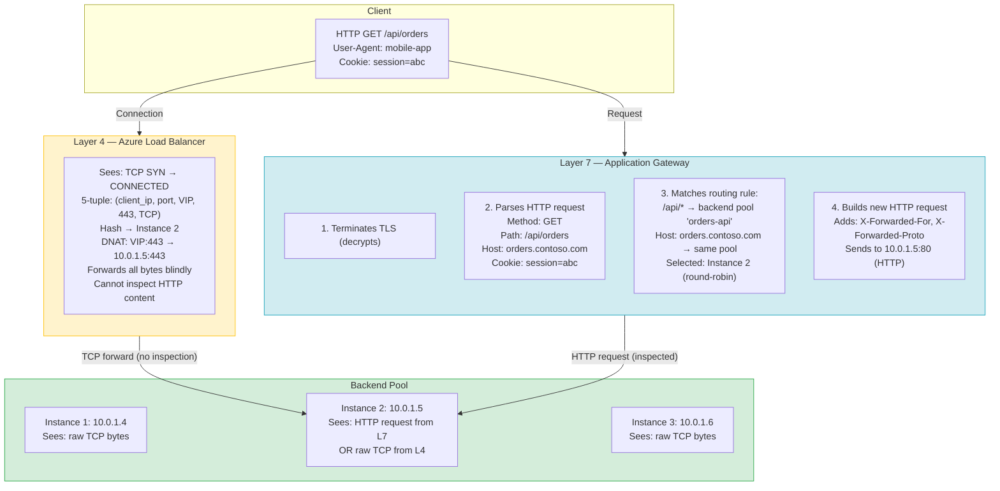
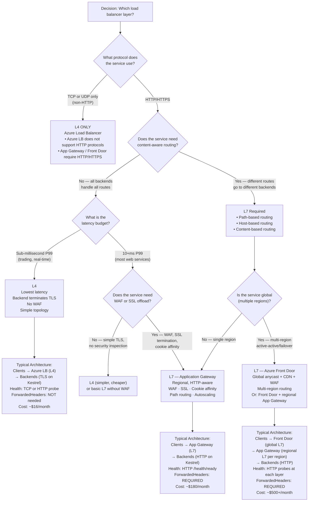

> [!success] Mastery Check
> - [ ] **Studied Well**
> - [ ] **Can explain the concept without notes**
> - [ ] **Can answer interview questions confidently**
> - [ ] **Can implement it in a real project**

---

id: "7.211" title: "Load Balancing — Layer 4 vs Layer 7" domain: "System Design & Distributed Systems" domain_id: 7 group: "Scalability Patterns" tags: [system-design, distributed-systems, scalability, dotnet, azure, load-balancing, networking, l4, l7] priority: 1 version: 2 prerequisites:

- "[[7.210 — Load Balancing — Overview]]" — the taxonomy anchor that introduced L4/L7 as the fundamental classification; this note drills into the specific operational and architectural differences
- "[[7.206 — Horizontal vs Vertical Scaling — Tradeoffs]]" — L4 distribution assumes all instances are fungible (horizontal duplication); L7 routing enables functional decomposition (Y-axis scaling)
- "[[7.207 — Stateless Services — Design Principles]]" — L7 cookie-based affinity becomes unnecessary when services are stateless, which eliminates the main reason to prefer L7 for session management" related:
- "[[7.212 — Load Balancing — Round Robin]]" — the default algorithm for both L4 and L7; the baseline against which layer-specific behaviors are measured
- "[[7.213 — Load Balancing — Least Connections]]" — L7-native algorithm that L4 cannot implement accurately because L4 cannot see request duration
- "[[7.214 — Load Balancing — IP Hash]]" — L4-specific algorithm that provides deterministic instance mapping without HTTP awareness
- "[[7.216 — Load Balancing — Health Check Integration]]" — L4 health probes are connection-level (TCP port); L7 probes are application-level (HTTP response); this difference determines failure detection latency
- "[[7.217 — Load Balancing — SSL Termination]]" — L4 cannot terminate TLS; L7 must; this is the single most operationally significant difference between L4 and L7
- "[[7.218 — Load Balancing — Power of Two Choices]]" — L7-only algorithm that requires HTTP awareness to sample backend queue depth
- "[[7.229 — Consistent Hashing — Algorithm]]" — an L4-friendly distribution that provides deterministic mapping; bridges the gap between L4 simplicity and L7 intelligence
- "[[4.110 — ASP.NET Core Kestrel — Production Configuration]]" — Kestrel runs behind either L4 or L7; the configuration (TLS, ports, forwarded headers) depends entirely on which layer terminates the connection" created: 2026-06-16

---

> [!ABSTRACT] Quick Reference — L4 vs L7 **Invariant:** A layer-4 load balancer routes *connections* (TCP streams) based on network-layer attributes (5-tuple: source IP, source port, dest IP, dest port, protocol). A layer-7 load balancer routes *requests* (HTTP messages) based on application-layer content (URL path, hostname, headers, cookies, body). **Cost:** L4 adds ~0.1–0.5ms per hop and can saturate at ~1M concurrent flows per frontend IP; L7 adds ~1–10ms per hop and consumes significantly more CPU per request but provides routing granularity that L4 cannot. **Trigger:** L4 is the default when the protocol is non-HTTP (TCP/UDP) or when every microsecond of latency matters. L7 becomes necessary when the load balancer must make content-aware routing decisions (path-based routing, host-based routing, WAF inspection, cookie-based session affinity). **Skip When:** A single backend serves all traffic (no content-based routing needed) and the protocol is HTTP — an L4 load balancer with TLS termination at the backend is simpler and faster. OR: the routing decision can be made at the client or DNS level (client-side service mesh, DNS-based routing). **.NET Entry Point:** The choice between L4 and L7 determines whether `UseForwardedHeaders()` is required (yes for L7, no for L4 unless the L4 injects proxy protocol headers), whether Kestrel terminates TLS (yes for L4, no for L7), and whether health checks can be application-aware (HTTP on L7, TCP on L4). **Azure Native:** L4 → Azure Load Balancer (Standard, Basic), Azure Traffic Manager (DNS-based, not a proxy). L7 → Azure Application Gateway, Azure Front Door, AKS NGINX Ingress, App Gateway Ingress Controller (AGIC). **Number to Know:** An L4 load balancer can forward ~100,000 new TCP connections per second per frontend IP. An L7 load balancer (single Application Gateway v2 capacity unit) handles ~2,200 requests per second with 1MB response payloads. The L7 capacity unit cost is ~$0.25/hr vs L4 at ~$0.022/hr — a 10x cost difference that is justified only when L7 features are actually used.

---

## Navigation

**Domain:** [[7 — System Design & Distributed Systems]] > **Group:** Scalability Patterns
**Previous:** [[7.210 — Load Balancing — Overview]] | **Next:** [[7.212 — Load Balancing — Round Robin]]

### Prerequisites

- [[7.210 — Load Balancing — Overview]] — the taxonomy anchor that introduced L4/L7 as the fundamental classification; this note drills into the specific operational and architectural differences
- [[7.206 — Horizontal vs Vertical Scaling — Tradeoffs]] — L4 distribution assumes all instances are fungible (horizontal duplication); L7 routing enables functional decomposition (Y-axis scaling)
- [[7.207 — Stateless Services — Design Principles]] — L7 cookie-based affinity becomes unnecessary when services are stateless, which eliminates the main reason to prefer L7 for session management

### Where This Fits

> [!INFO] Production Encounter Map
> 
> - **Layer:** Infrastructure / networking — the L4/L7 choice is the first architectural decision in any load balancing design, made before selecting the distribution algorithm or health probe type. It determines which Azure services are candidates, how TLS is handled, what routing capabilities exist, and how much latency the system incurs per request.
> - **Trigger:** When the second backend instance is deployed behind any traffic distribution mechanism, the question arises: "does the distributor need to understand the application protocol?" If yes, L7; if no, L4. In Azure, the default for Kubernetes (AKS LoadBalancer service type) is L4; the default for App Service built-in scaling is L7 (the platform handles it). The engineer must explicitly override these defaults when the requirements demand the other layer.
> - **Without understanding L4 vs L7:** Teams deploy an L4 Azure Load Balancer for an HTTP API that needs path-based routing to multiple services — only to discover Azure LB cannot inspect URLs, requiring an in-cluster reverse proxy (manual NGINX or Traefik) that adds operational complexity. Alternatively, teams deploy Application Gateway (L7) for a UDP real-time gaming protocol — only to discover App Gateway does not support UDP.
> - **First signal of wrong choice:** When the team needs to "add a routing rule for `/api/v2/orders` to a new backend pool" with an L4 LB and realizes the LB knows nothing about URL paths. Or when the team notices 5ms of added latency on an L7 gateway for a sub-millisecond trading API and realizes they need to move to L4.

The L4 vs L7 choice governs every downstream load balancing decision: which algorithms are available (least-connections, power-of-two-choices require L7), how health checks work (L4 TCP vs L7 HTTP), whether TLS is terminated at the edge or at each backend, whether WAF can inspect traffic, and whether the load balancer can route by anything other than IP and port. Most production architectures use BOTH — L4 for internal service-to-service traffic and L7 for external-facing routing. The senior engineer knows the exact boundary where one stops and the other begins.

---

## Core Mental Model

A layer-4 load balancer operates as a **connection forwarder**: it maintains a translation table (conntrack) that maps `{client IP:port → frontend VIP:port}` to `{backend IP:port}`. Every packet in a TCP connection follows the same mapping — the LB translates the destination address/port of each packet and forwards it. The LB never inspects the payload; it treats HTTP, SSH, custom TCP, and garbage data identically. The LB's entire view of "health" is whether the backend TCP port accepts a SYN (connection establishable) or returns an HTTP 200 on a configurable path (if using HTTP probes, which are still health-only, not routing).

A layer-7 load balancer operates as a **reverse proxy**: it terminates the client's TCP connection entirely, decrypts TLS (if HTTPS), parses the HTTP request, makes a routing decision based on the request content, establishes a NEW TCP connection to the selected backend (optionally re-encrypting TLS), and forwards the request. The client and backend never have a direct TCP connection — the L7 LB is the endpoint of both connections. This adds latency (terminate + reinspect + reconnect) but enables content-aware routing.

The core distinction: **L4 distributes connections; L7 distributes requests.** On a single HTTP/1.1 persistent connection with keep-alive, an L4 LB sends ALL requests to the same backend (the connection is pinned). An L7 LB can send each request to a different backend because it terminates the connection and creates new connections per request. On HTTP/2 with multiplexing, this difference is even more pronounced — an L7 LB can route individual streams within a single HTTP/2 connection to different backends.

> [!TIP] The Non-Obvious Insight The L4/L7 distinction has NOTHING to do with "L4 is for TCP, L7 is for HTTP." L4 load balancers can forward HTTP perfectly fine (HTTP runs over TCP). The distinction is whether the LB can *understand* the HTTP content to make routing decisions. An L4 LB forwarding an HTTP request will deliver the request to the correct backend at the TCP level — but it cannot distinguish a GET /api/products from a POST /admin/delete-users. If ALL backends handle ALL routes identically, L4 is sufficient and faster. If backends are specialized (different services for different URL paths), L7 is required.

### Classification

- **OSI Layer:** L4 operates at the transport layer (TCP/UDP segments). L7 operates at the application layer (HTTP requests, WebSocket frames, gRPC streams).
- **Architectural role in the stack:** L4 is infrastructure-level — it sits at the network edge and forwards traffic with minimal processing. L7 is application-infrastructure hybrid — it understands the application protocol and can apply application-level policies (routing, WAF, rate limiting, header rewriting).
- **What each sees:**
  - L4 sees: TCP flags (SYN, ACK, FIN, RST), sequence numbers, port numbers, IP addresses. For UDP: source/dest IP and port, UDP length. No payload inspection.
  - L7 sees: HTTP method, URL path, query parameters, headers (Host, Cookie, Authorization, Accept-Encoding, etc.), request body (for inspection), response status code, response headers. After TLS termination, the payload is plaintext.
- **Connection model:**
  - L4: Client → LB (one TCP connection). LB → Backend (one TCP connection). The two connections are logically mapped — the LB translates packet-by-packet.
  - L7: Client → LB (one TCP connection, terminated). LB → Backend (separate TCP connection, created per request or pooled). The two connections are independent.
- **Protocol support:**
  - L4: Any TCP or UDP protocol (HTTP, HTTPS, SSH, FTP, SMTP, DNS, game protocols, custom TCP, QUIC/UDP).
  - L7: HTTP, HTTPS, HTTP/2, WebSocket (after upgrade), gRPC (HTTP/2-based). Some L7 LBs support additional protocols (e.g., Application Gateway supports WebSocket passthrough). No raw TCP/UDP support.

### Primary Diagram



### Key Properties / Guarantees

|Property|L4 (Azure LB)|L7 (Application Gateway / Front Door)|Condition|
|---|---|---|---|
|Routing unit|TCP/UDP connection|HTTP request (each request independently)|L7 can route within a keep-alive connection; L4 pins the connection to one backend|
|Content awareness|None — all bytes are opaque|Full — method, path, host, headers, cookies, body|L7 terminates TLS and parses HTTP; L4 does not terminate TLS|
|Minimum added latency|~0.1–0.5ms (packet forwarding only)|~1–5ms App Gateway, ~2–10ms Front Door (TLS + parse + route + reconnect)|L4 latency is a single DNAT operation; L7 latency includes TLS, parsing, and routing|
|Max new connections/sec per unit|~100,000 (Azure LB Standard)|~2,200 req/s per capacity unit (App Gateway v2)|L4 is measured in connections; L7 in HTTP requests (requests include keep-alive reuse)|
|TLS termination|Not supported — TCP passthrough only|Supported — terminates at the edge, re-encrypts optionally|L4 backends must handle TLS themselves; L7 backends receive HTTP (or re-encrypted HTTPS)|
|WAF support|None|Yes — OWASP core rules + custom rules + rate limiting (SKU-dependent)|L4 cannot inspect HTTP payload for SQL injection, XSS, etc.|
|Session affinity mechanism|Source IP hash (5-tuple) — implicit, unavoidable per-connection|Cookie-based (ARRAffinity, AFDDCAFD) — explicit, configurable|L4 affinity is a side effect of connection routing; L7 affinity is a deliberate feature|
|Health check type|TCP port probe (SYN → ACK = healthy) OR HTTP probe (200 = healthy)|HTTP/HTTPS probe on specific path (with optional match conditions)|L4 HTTP probe is binary (200 vs non-200); L7 probe can match body content|
|Path-based routing|Not supported|Supported — multiple backend pools per LB, selected by URL path pattern|L4 has no concept of URL paths; L7 evaluates path against routing rules|
|Host-based routing|Not supported|Supported — different backend pools per hostname on the same LB frontend|L4 routes by IP:port; L7 reads the Host header to select a backend pool|
|Protocol support|TCP, UDP|HTTP, HTTPS, HTTP/2, WebSocket|L7 is HTTP-family only; raw TCP/UDP requires L4|
|Azure implementation cost|~$0.022/hr ($16/month)|~$0.25/hr per capacity unit (~$180/month min)|L7 costs ~10× more than L4 for the base deployment|

---

## Deep Mechanics

### How It Works

**Layer 4 — Connection Forwarding (Azure Load Balancer):**

1. **Frontend IP configuration:** A frontend IP (public or private) is assigned to the LB. The LB listens for TCP SYN packets on configured ports (e.g., `*:443`). Multiple frontend IPs are supported (for SNAT scaling, multi-VIP architectures).

2. **Backend pool registration:** Backend instances are added to the pool via NIC association (VMSS), IP address (AKS pods), or App Service plan. Each instance has a health probe status (healthy/unhealthy/probing).

3. **Load balancing rule:** Maps frontend (IP:port) → backend pool + protocol + distribution algorithm. Example: `frontend 20.185.0.1:443 → backend pool "orders-vmss" → port 443 → TCP → 5-tuple hash`.

4. **Connection establishment (conntrack):**
   - Client sends TCP SYN to `20.185.0.1:443`
   - LB computes hash = `Hash(src_ip, src_port, dest_ip, dest_port, protocol)`
   - LB looks up the hash result in the backend pool → selects `10.0.1.5:443` (Instance 2)
   - LB creates a conntrack entry: `{client_ip:port ↔ 20.185.0.1:443 → 10.0.1.5:443}`
   - LB performs DNAT: rewrites destination IP to `10.0.1.5`, destination port to `443`, forwards SYN
   - Backend responds with SYN-ACK, LB reverse-NATs source IP back to `20.185.0.1`, forwards to client
   - All subsequent packets in this TCP connection follow the same conntrack entry — no re-hashing

5. **Connection teardown:**
   - Client sends FIN or RST, LB forwards to backend
   - LB removes conntrack entry after the TCP connection is fully closed (TIME_WAIT duration)
   - For idle connections: LB maintains the conntrack entry until the idle timeout (default 4 minutes for Azure LB, configurable up to 30 minutes). If no packet is seen within the timeout, the conntrack entry is removed, and the connection is broken.

6. **Health probe cycle:**
   - Every 5–15 seconds (configurable), the LB sends a probe to each backend instance
   - TCP probe: sends SYN to backend IP:port. If SYN-ACK received → healthy. RST or timeout → unhealthy.
   - HTTP probe: sends `GET /health/ready` to backend. If 200 received within timeout → healthy. Non-200 or timeout → unhealthy.
   - Unhealthy threshold: N consecutive failures (default 2) → instance marked unhealthy and removed from pool
   - Healthy threshold: M consecutive successes (default 2) → instance marked healthy and added back to pool

**Layer 7 — Reverse Proxy (Azure Application Gateway):**

1. **Listener configuration:** The gateway is configured with one or more HTTP listeners. Each listener has:
   - Protocol: HTTP or HTTPS
   - Certificate: (for HTTPS listeners) the TLS certificate to present to clients
   - Hostname: (optional) restricts which Host header values the listener accepts — supports wildcard (`*.orders.contoso.com`) and exact match
   - Port: typically 80 (HTTP) or 443 (HTTPS)

2. **TLS termination (for HTTPS listeners):**
   - Client initiates TLS handshake with the gateway's certificate
   - Gateway completes the TLS handshake — the connection between client and gateway is TLS-encrypted
   - The HTTP request within the TLS tunnel is now visible to the gateway in plaintext
   - Gateway decrypts the request for inspection, then optionally re-encrypts when forwarding to the backend

3. **HTTP request parsing and routing:**
   - Gateway parses the HTTP request: method, path, query string, headers, body (buffered or streamed depending on configuration)
   - Gateway evaluates routing rules in priority order:
     - Path-based: `/api/*` → backend pool A, `/web/*` → backend pool B
     - Host-based: `orders.contoso.com` → pool A, `catalog.contoso.com` → pool B
     - Default: all unmatched traffic → default backend pool
   - Gateway selects a backend instance from the matched pool using the distribution algorithm (round-robin or least-connections for App Gateway v2)

4. **New connection to backend:**
   - Gateway opens a new TCP connection to the selected backend instance (or reuses an idle keep-alive connection from the connection pool)
   - If "HTTP-to-backend" is configured: gateway sends the HTTP request as plain HTTP
   - If "HTTPS-to-backend" is configured: gateway establishes TLS to the backend (re-encryption)
   - Gateway adds headers to the outbound request:
     - `X-Forwarded-For`: original client IP
     - `X-Forwarded-Proto`: original scheme (`http` or `https`)
     - `X-Original-Host`: original Host header from the client request

5. **Response processing:**
   - Backend sends HTTP response to gateway
   - Gateway may modify the response: add cookies (ARRAffinity for session persistence), rewrite headers, compress, cache
   - Gateway encrypts the response with TLS (if client connection was HTTPS) and sends to client

### Protocol Trace — L4 vs L7 Request Lifecycle

```
L4 — Azure Load Balancer (TCP forward, no HTTP awareness):

Client → LB:   TCP SYN (src=client:45123, dst=20.185.0.1:443)
LB:             5-tuple hash = H(client:45123, 20.185.0.1:443, TCP) → Instance 2
LB:             DNAT: rewrite dst to 10.0.1.5:443
LB → Instance 2: TCP SYN (src=client:45123, dst=10.0.1.5:443)
Instance 2 → LB: TCP SYN-ACK
LB → Client:   TCP SYN-ACK (src=20.185.0.1:443, dst=client:45123)
Client → LB:   TCP ACK → CONNECTION ESTABLISHED

--- SSL/TLS handshake happens between client and Instance 2 (LB is transparent) ---
Client → LB:   TLS ClientHello (encrypted to Instance 2)
LB:            Forwards bytes to Instance 2 (no TLS termination)
Instance 2:    Accepts TLS, completes handshake
Instance 2:    Processes HTTP request, generates response
Instance 2 → LB: TLS-encrypted HTTP response bytes
LB → Client:   Forwards bytes

Note: The LB has NO idea this is an HTTP request. It forwarded TCP bytes.
```

```
L7 — Azure Application Gateway (HTTP reverse proxy):

Client → GW:   TCP SYN (src=client:45123, dst=20.185.0.1:443)
GW:            Accepts TCP connection
Client → GW:   TLS ClientHello
GW:            Presents certificate, completes TLS handshake
Client → GW:   HTTP GET /api/orders HTTP/1.1
               Host: orders.contoso.com
               Cookie: session=abc123
               User-Agent: mobile-app/v2

GW:            Terminates TLS → decrypts HTTP request
GW:            Parses: method=GET, path=/api/orders, host=orders.contoso.com
GW:            Rule match: path /api/* → backend pool "orders-api"
GW:            Algorithm: round-robin → Instance 2 (10.0.1.5)
GW:            Opens new TCP connection to 10.0.1.5:80 (or reuses pooled conn)
GW:            Sends HTTP request with added headers:
               GET /api/orders HTTP/1.1
               Host: orders.contoso.com
               X-Forwarded-For: client_ip
               X-Forwarded-Proto: https
               X-Original-Host: orders.contoso.com
               Cookie: session=abc123

GW → Instance 2: HTTP request (plaintext, no TLS)
Instance 2:      Processes request, returns HTTP response
Instance 2 → GW: HTTP 200 OK { orders: [...] }

GW:               Encrypts response with TLS
GW → Client:      TLS-encrypted HTTP 200 OK

Note: The client and Instance 2 have NO direct TCP connection.
      Instance 2 receives an HTTP request as if the client sent it directly
      (with the true client IP in X-Forwarded-For).
```

### The Connection vs Request Routing Difference

```
L4 — Same connection, multiple requests (HTTP/1.1 keep-alive):

Client → LB:     TCP SYN → conntrack entry → Instance 2 pinned
Client → LB:     HTTP GET /api/orders          → Instance 2
Client → LB:     HTTP GET /api/products         → Instance 2 (same connection!)
Client → LB:     HTTP POST /api/checkout        → Instance 2
All requests on this TCP connection go to INSTANCE 2.
L4 cannot rebalance within a connection.
```

```
L7 — Same connection, multiple requests (HTTP/1.1 keep-alive):

Client → GW:     TCP SYN → terminated at gateway
Client → GW:     HTTP GET /api/orders           → routed to Instance 2
Client → GW:     HTTP GET /api/products          → routed to Instance 3 (different!)
Client → GW:     HTTP POST /api/checkout         → routed to Instance 2 (or 1 or 3)
Each request is independently routed.
```

### Failure Modes

**Failure Mode 1: L4 — SNAT Port Exhaustion**

- **Cause:** The L4 load balancer translates outbound connections from the backend to the internet using SNAT (Source Network Address Translation). Each outbound connection from a backend to the internet consumes an ephemeral SNAT port from the LB's frontend IP. Azure LB Standard provides 64,000 SNAT ports per frontend IP. When backends make many outbound connections (e.g., calling downstream APIs, connecting to Azure SQL, sending telemetry), SNAT ports are consumed faster than the 4-minute idle timeout releases them. Eventually, all 64,000 ports are in use — new outbound connections fail.
- **Symptom:** Backend instances experience intermittent `SocketException` (WSAENOBUFS, 10055) or `HttpRequestException: A connection attempt failed` when making outbound HTTP calls. The errors are transient (retry sometimes works if a port is released). The symptom correlates with traffic volume — worse during peak hours. `AzureLoadBalancer` metrics show `SNATConnectionCount` at 64,000.
- **Detection time:** When the error rate on outbound calls spikes. The application health check may still pass (it only checks inbound connectivity), so the LB considers the instance healthy while it cannot make outbound calls.

**Fix:**

```bicep
// ✅ Correct — allocate multiple frontend IPs for additional SNAT ports
resource lb 'Microsoft.Network/loadBalancers@2023-11-01' = {
  name: 'orders-lb'
  properties: {
    frontendIPConfigurations: [
      // Primary frontend IP
      { name: 'fe-pip1', properties: { publicIPAddress: { id: pip1.id } } }
      // Additional frontend IPs for SNAT port scaling
      { name: 'fe-pip2', properties: { publicIPAddress: { id: pip2.id } } }
      { name: 'fe-pip3', properties: { publicIPAddress: { id: pip3.id } } }
    ]
    // Use outbound rules with multiple frontends
    outboundRules: [{
      name: 'snat-scale'
      properties: {
        frontendIPConfigurations: [
          { id: lb.childResources_frontendIPConfigurations('fe-pip1').id }
          { id: lb.childResources_frontendIPConfigurations('fe-pip2').id }
          { id: lb.childResources_frontendIPConfigurations('fe-pip3').id }
        ]
        backendAddressPool: { id: backendPool.id }
        protocol: 'All'
        allocatedOutboundPorts: 1024 // ports per frontend per instance
      }
    }]
  }
}
```

```csharp
// ✅ .NET — reduce outbound connection churn with HTTP/1.1 keep-alive and connection pooling
builder.Services.AddHttpClient<IDownstreamClient, DownstreamClient>(client =>
{
    client.BaseAddress = new Uri("https://downstream.contoso.com");
})
.ConfigurePrimaryHttpMessageHandler(() => new SocketsHttpHandler
{
    // Pool connections to reduce SNAT port consumption
    MaxConnectionsPerServer = 20, // Instead of default 10 — reduces concurrent connections
    PooledConnectionLifetime = TimeSpan.FromMinutes(5), // Recycle connections before SNAT idle timeout
    PooledConnectionIdleTimeout = TimeSpan.FromMinutes(2), // Return idle conns to pool faster
    EnableMultipleHttpClientConnections = true, // HTTP/2 multiplexing support
});
```

**Cost of not fixing:** The application enters a partial-death spiral: it continues to accept inbound requests (health checks pass), but every outbound call (database query, downstream API, telemetry) fails with socket errors. The application effectively deadlocks — inbound requests arrive but cannot be processed because no downstream call succeeds. Recovery requires scaling down (fewer instances = less SNAT pressure) or manual SNAT port reset.

---

**Failure Mode 2: L7 — TLS Certificate Expiration at the Gateway**

- **Cause:** The Application Gateway or Front Door's TLS certificate expires. The gateway detects the expiration and either refuses to start the listener (App Gateway: `CertificateExpired` health status) or returns TLS errors to clients. The gateway's frontend becomes unreachable via HTTPS. HTTP listeners (port 80) continue to work, but all HTTPS traffic (typically 100%) fails.
- **Symptom:** Clients receive `NET::ERR_CERT_DATE_INVALID` (browser), `AuthenticationException: The remote certificate is invalid` (mobile app), or `SslError: CERTIFICATE_EXPIRE` (curl). The gateway health check in Azure Portal shows `CertificateExpired` for the listener. Monitoring alerts that the HTTPS frontend is unhealthy.
- **Detection time:** The exact moment the certificate clock passes the `NotAfter` date. If the certificate expires at midnight UTC, the gateway stops serving HTTPS traffic at midnight UTC — even if the application code is perfectly healthy.

**Fix:**

```bicep
// ✅ Correct — use Key Vault for certificate management with auto-renewal
resource keyVault 'Microsoft.KeyVault/vaults@2023-07-01' existing = {
  name: 'orders-kv'
}

// Store certificate in Key Vault with auto-renewal
// Using Azure App Service managed certificate or 3rd-party CA integration
resource cert 'Microsoft.KeyVault/vaults/secrets@2023-07-01' = {
  name: 'orders-contoso-com'
  parent: keyVault
  properties: {
    // Key Vault can auto-renew App Service Managed Certificates
    // For 3rd-party CAs: set expiration reminder and automate renewal via webhook
    attributes: { enabled: true, exp: dateTimeAdd(utcNow(), 'P90D') }
  }
}

// Application Gateway references the Key Vault secret
resource appgw 'Microsoft.Network/applicationGateways@2023-11-01' = {
  properties: {
    sslCertificates: [{
      name: 'orders-cert'
      properties: {
        keyVaultSecretId: keyVault.getSecret('orders-contoso-com')
      }
    }]
  }
}
```

```csharp
// ✅ .NET health check that verifies certificate expiration (defense in depth)
builder.Services.AddHealthChecks()
    .AddCheck("gateway-certificate", () =>
    {
        using var httpClient = new HttpClient();
        var response = httpClient.GetAsync("https://orders.contoso.com/health/live").Result;

        // Check the certificate expiration via the X-MS-End-Cert-Time header
        // (only works behind Front Door which injects this header)
        if (response.Headers.TryGetValues("X-Azure-Ref", out _))
        {
            return HealthCheckResult.Healthy("Front Door certificate active");
        }

        // For App Gateway: check certificate expiration date via separate cert checker
        using var certHttp = new HttpClient(new HttpClientHandler
        {
            ServerCertificateCustomValidationCallback = (_, cert, _, _) =>
            {
                if (cert == null) return false;
                if (cert.NotAfter < DateTimeOffset.UtcNow.AddDays(30))
                {
                    _logger.LogWarning("TLS certificate expires in {Days} days",
                        (cert.NotAfter - DateTimeOffset.UtcNow).Days);
                    return cert.NotAfter > DateTimeOffset.UtcNow;
                }
                return true;
            }
        });
        // ... check endpoint
        return HealthCheckResult.Healthy("Certificate OK");
    }, tags: ["ready"]);
```

**Cost of not fixing:** Complete HTTPS outage. All user traffic fails. Mobile apps cannot connect. Browser users see scary certificate errors. Recovery requires deploying a new certificate — if the certificate is stored locally on the gateway (not Key Vault), this requires a full gateway update, which takes 15–30 minutes during which the service is unavailable.

---

**Failure Mode 3: L4 — Connection Table Overflow Under SYN Flood**

- **Cause:** The L4 load balancer maintains a conntrack table for every active TCP connection. Azure LB Standard supports ~1,000,000 concurrent flows. Under a high rate of new connections (100,000+ new connections/second per frontend IP), or under a SYN flood attack, the conntrack table fills up. When the table is full, the LB cannot create new conntrack entries — new TCP SYNs are dropped. Established connections continue to work.
- **Symptom:** New connection attempts timeout (the client sends SYN, gets no response → retries for ~20 seconds → timeout). Existing connections work fine. The `AzureLoadBalancer` metric `FlowCount` shows 1,000,000 (table full). Instance CPU and memory are normal — the problem is at the LB, not the backend.
- **Detection time:** When users who are "just connecting" report failures, while "already connected" users work. The symptom is partial — some users can use the service, others cannot.

**Fix:**
1. Use Azure LB Standard (not Basic) — Standard supports 1,000,000 flows vs Basic's ~100,000.
2. Deploy multiple frontend IPs to distribute the flow table across more entries (each frontend IP has its own flow table).
3. Use Azure DDoS Protection Standard to filter SYN flood traffic before it reaches the LB.
4. If the connection rate is legitimate (e.g., IoT device fleet connecting simultaneously), scale the backend pool to distribute connections, and consider using an L7 gateway that reuses connections (HTTP keep-alive reduces the per-second connection rate on the frontend).

**Cost of not fixing:** New users are locked out while active users are fine. The service appears partially available — dashboards show good latency and throughput (existing connections) but new user acquisition drops to zero. Diagnosis is difficult because the symptom ("can't connect") looks like a backend problem.

---

**Failure Mode 4: L7 — Forwarded Headers Not Configured — Incorrect Client IP**

- **Cause:** The L7 load balancer terminates TLS and forwards HTTP to the backend. The backend ASP.NET Core application does not have `UseForwardedHeaders()` configured. The application sees all requests as coming from the load balancer's internal IP (e.g., `10.0.1.4`) with scheme `http` (even if the original request was HTTPS). Rate limiting by IP is broken (all traffic appears from one IP). Geo-location middleware fails (all traffic appears from the Azure region). Audit logs record the wrong client IP.
- **Symptom:** Redirect loops (app redirects HTTP→HTTPS in an infinite loop — see Scenario 1 in 7.210). Rate limiting either blocks ALL traffic or blocks nothing. Geo-location-based content delivery (e.g., show different prices by region) serves the same content to all users. IP-based allow/deny lists are ineffective.
- **Detection time:** Immediately after the L7 LB is put in front of the application. The redirect loop is visible on the first HTTP request. Rate limiting anomalies require a load test to detect.

**Fix:**

```csharp
// ✅ Correct — ForwardedHeadersMiddleware reads X-Forwarded-For and X-Forwarded-Proto
using Microsoft.AspNetCore.HttpOverrides;

var builder = WebApplication.CreateBuilder(args);

builder.Services.Configure<ForwardedHeadersOptions>(options =>
{
    options.ForwardedHeaders =
        ForwardedHeaders.XForwardedFor |      // Original client IP
        ForwardedHeaders.XForwardedProto |     // Original scheme (http/https)
        ForwardedHeaders.XForwardedHost;       // Original hostname
});

var app = builder.Build();

// THIS MUST BE THE FIRST MIDDLEWARE
app.UseForwardedHeaders();

// Now: HttpContext.Connection.RemoteIpAddress → real client IP
// Now: HttpContext.Request.Scheme → "https" (from X-Forwarded-Proto)
app.UseHttpsRedirection(); // Works correctly — sees "https", does NOT redirect
```

**Cost of not fixing:** Security downgrade (HTTPS redirect loops), broken IP-based features (rate limiting, geo-location, audit), and in some cases, non-functional authentication (if auth middleware checks request scheme).

---

**Failure Mode 5: L4 — Health Probe Checks Only TCP Port, Backend Returns HTTP 500**

- **Cause:** The L4 load balancer uses a TCP health probe (checks that port 443 is open). The backend application is in a broken state — database connection is lost, Redis is down, the application is in a crash loop — but Kestrel is still listening on the port. The TCP probe succeeds (SYN → SYN-ACK). The LB marks the instance healthy and routes traffic to it. Every request fails with HTTP 500.
- **Symptom:** LB reports 100% backend health. The application's error rate is elevated (e.g., 25% if 2 of 8 instances are broken). Users who are routed to broken instances see errors; users routed to healthy instances see success. The error pattern is "sometimes works, sometimes doesn't" — proportional to the ratio of broken instances.
- **Detection time:** Only when user error rate monitoring spikes, or when the on-call engineer investigates a support ticket. The LB health dashboard shows all green — it provides NO warning.

**Fix:**

```bicep
// ✅ Correct — use HTTP health probe on L4 LB (yes, L4 LB supports HTTP probes!)
// Even though the LB cannot do HTTP routing, it CAN perform an HTTP health check.
// The LB sends GET /health/ready and expects 200. Non-200 or timeout → unhealthy.

resource lb 'Microsoft.Network/loadBalancers@2023-11-01' = {
  properties: {
    probes: [{
      name: 'http-health-probe'
      properties: {
        protocol: 'Http'
        port: 80
        requestPath: '/health/ready'       // Application-level health endpoint
        intervalInSeconds: 10               // Check every 10 seconds
        numberOfProbes: 2                   // 2 consecutive failures → unhealthy
      }
    }]
    // Apply probe to load balancing rule
    loadBalancingRules: [{
      properties: {
        probe: { id: lb.childResources_probes('http-health-probe').id }
        // ... other rule properties
      }
    }]
  }
}
```

```csharp
// ✅ Application-level health check for the probe
builder.Services.AddHealthChecks()
    .AddSqlServer(connectionString, name: "sql", tags: ["ready"])
    .AddRedis(redisConnectionString, name: "redis", tags: ["ready"])
    .AddCheck("self", () => HealthCheckResult.Healthy(), tags: ["ready"]);

app.MapHealthChecks("/health/ready", new HealthCheckOptions
{
    Predicate = check => check.Tags.Contains("ready")
    // Returns 200 only when SQL and Redis are reachable
    // Returns 503 (Unhealthy) when dependencies are down
});
```

**Cost of not fixing:** Instances that are technically "running" (TCP port open) but functionally "broken" remain in the backend pool indefinitely. Users experience partial outages. The percentage of affected users equals the percentage of broken instances. Autoscale cannot compensate because the broken instance "appears healthy."

### .NET and Azure Integration Points

- **L4 (Azure Load Balancer):** No ASP.NET Core middleware changes needed — the LB does not modify HTTP headers. Kestrel must terminate TLS (listen on HTTPS port). Health checks should use TCP probes (fast) or HTTP probes (application-aware). `IHostApplicationLifetime` for graceful shutdown signaling. Connection pooling with `SocketsHttpHandler` to manage SNAT port consumption.
- **L7 (Azure Application Gateway / Front Door):** `UseForwardedHeaders()` is REQUIRED. Kestrel listens on HTTP (port 80) — the gateway terminates TLS. Health checks should respond on `/health/ready` with dependency verification. The gateway's idle timeout (default 20s for App Gateway, 60s for Front Door) must be increased for long-running requests. WebSocket passthrough requires a specific listener configuration.
- **.NET Libraries:**
  - `Microsoft.AspNetCore.HttpOverrides` — ForwardedHeadersMiddleware, reads X-Forwarded-{For,Proto,Host}
  - `Microsoft.Extensions.Diagnostics.HealthChecks` — health check framework for LB probes
  - `AspNetCore.HealthChecks.SqlServer`, `AspNetCore.HealthChecks.Redis` — dependency health checks
  - `System.Net.Http.SocketsHttpHandler` — connection pooling configuration for SNAT management

```csharp
// YourCompany.OrderManagement — Program.cs
// Complete configuration that works under BOTH L4 and L7

using Microsoft.AspNetCore.HttpOverrides;
using System.Net;

var builder = WebApplication.CreateBuilder(args);

// Detect which layer the LB operates at from configuration
var loadBalancerLayer = builder.Configuration["LoadBalancer:Layer"] ?? "L7";

if (loadBalancerLayer == "L7")
{
    // L7 configuration: gateway terminates TLS, app receives HTTP
    builder.Services.Configure<ForwardedHeadersOptions>(options =>
    {
        options.ForwardedHeaders =
            ForwardedHeaders.XForwardedFor |
            ForwardedHeaders.XForwardedProto |
            ForwardedHeaders.XForwardedHost;

        if (builder.Environment.IsProduction())
        {
            // Restrict to known proxy IP ranges for security
            var trustedCidr = builder.Configuration["LoadBalancer:TrustedCIDR"];
            if (!string.IsNullOrEmpty(trustedCidr))
            {
                var parts = trustedCidr.Split('/');
                options.KnownNetworks.Add(new NetworkInfo(
                    IPAddress.Parse(parts[0]), int.Parse(parts[1])));
            }
        }
    });

    // Kestrel listens on HTTP — LB terminates TLS
    builder.WebHost.ConfigureKestrel(options =>
    {
        options.Listen(IPAddress.Any, 80);
    });
}
else
{
    // L4 configuration: LB forwards TCP, app terminates TLS
    builder.WebHost.ConfigureKestrel(options =>
    {
        options.Listen(IPAddress.Any, 443, listenOptions =>
        {
            listenOptions.UseHttts(httpsOptions =>
            {
                // Load certificate from Azure Key Vault or certificate store
                httpsOptions.ServerCertificateSelector = (context, name) =>
                    CertificateLoader.LoadFromKeyVault(
                        builder.Configuration["AzureKeyVault:Endpoint"],
                        builder.Configuration["AzureKeyVault:CertificateName"]);
            });
        });
        // Health probe listener on a separate port (bypasses TLS)
        options.Listen(IPAddress.Any, 8000);
    });
}

// Health checks — used by both L4 (HTTP probe) and L7 (HTTP probe)
builder.Services.AddHealthChecks()
    .AddSqlServer(builder.Configuration.GetConnectionString("AzureSql")!,
        name: "sql", tags: ["ready"])
    .AddRedis(builder.Configuration["AzureRedis:ConnectionString"]!,
        name: "redis", tags: ["ready"]);

var app = builder.Build();

if (loadBalancerLayer == "L7")
{
    app.UseForwardedHeaders(); // FIRST middleware
}

// Health check endpoint (no auth — called by LB)
app.MapHealthChecks("/health/ready", new HealthCheckOptions
{
    Predicate = check => check.Tags.Contains("ready"),
    ResponseWriter = async (context, report) =>
    {
        context.Response.ContentType = "application/json";
        var result = JsonSerializer.Serialize(new
        {
            status = report.Status.ToString(),
            timestamp = DateTime.UtcNow,
            layer = loadBalancerLayer
        });
        await context.Response.WriteAsync(result);
    }
});

// L4-specific: health probe listener on port 8000 (fast path, no middleware)
if (loadBalancerLayer == "L4")
{
    app.MapGet("/health/live", () => Results.Ok());
}

app.MapControllers();
app.Run();
```

---

## Production Patterns and Implementation

### Primary Implementation — Layer-Aware Service Configuration

```csharp
// YourCompany.OrderManagement.Infrastructure — LoadBalancerAwareHostBuilder
// Configures the application correctly regardless of whether L4 or L7 sits in front

namespace YourCompany.OrderManagement.Infrastructure;

/// <summary>
/// Configures the ASP.NET Core application to operate correctly behind
/// either an L4 (Azure Load Balancer) or L7 (Application Gateway / Front Door) load balancer.
/// The load balancer layer is determined by configuration and changes
/// Kestrel listener binding, TLS handling, and middleware pipeline.
/// </summary>
public static class LoadBalancerAwareConfiguration
{
    private const string LayerConfigKey = "LoadBalancer:Layer";

    /// <summary>
    /// Applies load-balancer-layer-specific configuration to the web application builder.
    /// </summary>
    /// <param name="builder">The web application builder.</param>
    /// <param name="cancellationToken">Cancellation token for certificate loading.</param>
    /// <returns>The builder for chaining.</returns>
    /// <exception cref="InvalidOperationException">Thrown when the layer configuration is unknown.</exception>
    public static WebApplicationBuilder ApplyLoadBalancerLayer(
        this WebApplicationBuilder builder,
        CancellationToken cancellationToken = default)
    {
        var layer = builder.Configuration[LayerConfigKey] ?? "L7";

        return layer switch
        {
            "L4" => ConfigureL4(builder, cancellationToken),
            "L7" => ConfigureL7(builder, cancellationToken),
            _ => throw new InvalidOperationException(
                $"Unknown load balancer layer: {layer}. Expected 'L4' or 'L7'.")
        };
    }

    private static WebApplicationBuilder ConfigureL4(
        WebApplicationBuilder builder,
        CancellationToken cancellationToken)
    {
        // L4 — Kestrel terminates TLS
        // The LB forwards TCP connections without inspection
        builder.WebHost.ConfigureKestrel((context, options) =>
        {
            var certConfig = context.Configuration.GetSection("Certificates:Default");

            // Main listener: HTTPS with certificate
            options.Listen(IPAddress.Any, 443, listenOptions =>
            {
                listenOptions.UseHttps(httpsOptions =>
                {
                    httpsOptions.ServerCertificate = LoadServerCertificate(certConfig);
                });
            });

            // Health probe listener: HTTP on separate port (fast path)
            // The LB probes this port without TLS overhead
            options.Listen(IPAddress.Any, 8000);
        });

        // No ForwardedHeaders needed — L4 does not modify HTTP headers
        // The client IP is directly visible to Kestrel

        return builder;
    }

    private static WebApplicationBuilder ConfigureL7(
        WebApplicationBuilder builder,
        CancellationToken cancellationToken)
    {
        // L7 — Kestrel receives HTTP (LB terminates TLS)
        builder.WebHost.ConfigureKestrel(options =>
        {
            options.Listen(IPAddress.Any, 80);
        });

        // ForwardedHeaders is REQUIRED — LB sets X-Forwarded-For, X-Forwarded-Proto
        builder.Services.Configure<ForwardedHeadersOptions>(options =>
        {
            options.ForwardedHeaders =
                ForwardedHeaders.XForwardedFor |
                ForwardedHeaders.XForwardedProto |
                ForwardedHeaders.XForwardedHost;

            // Restrict to trusted proxies in production
            var trustedNetworks = builder.Configuration
                .GetSection("LoadBalancer:TrustedNetworks")
                .Get<string[]>();

            if (trustedNetworks is not null)
            {
                foreach (var cidr in trustedNetworks)
                {
                    var parts = cidr.Split('/');
                    if (parts.Length == 2 && IPAddress.TryParse(parts[0], out var ip))
                    {
                        options.KnownNetworks.Add(new NetworkInfo(ip.ToString(), int.Parse(parts[1])));
                    }
                }
            }
        });

        return builder;
    }

    private static X509Certificate2 LoadServerCertificate(IConfigurationSection certConfig)
    {
        var source = certConfig["Source"];
        return source switch
        {
            "KeyVault" => CertificateLoader.LoadFromKeyVault(
                certConfig["KeyVaultEndpoint"]!,
                certConfig["CertificateName"]!),
            "Store" => CertificateLoader.LoadFromStoreCert(
                certConfig["Subject"]!,
                certConfig["Store"] ?? "My",
                StoreLocation.LocalMachine,
                allowInvalid: false),
            "File" => new X509Certificate2(
                certConfig["Path"]!,
                certConfig["Password"]),
            _ => throw new InvalidOperationException(
                $"Unknown certificate source: {source}")
        };
    }

    /// <summary>
    /// Configures the middleware pipeline with layer-specific ordering.
    /// Call this after builder.Build().
    /// </summary>
    public static WebApplication ApplyLoadBalancerPipeline(this WebApplication app)
    {
        var layer = app.Configuration[LayerConfigKey] ?? "L7";

        if (layer == "L7")
        {
            // ForwardedHeaders must be the FIRST middleware
            app.UseForwardedHeaders();
        }

        // Health check endpoints (always registered)
        app.MapHealthChecks("/health/live", new HealthCheckOptions
        {
            Predicate = _ => false // Liveness: process is running
        });

        return app;
    }
}
```

### Configuration and Wiring

```csharp
// Program.cs — YourCompany.OrderManagement.Api

var builder = WebApplication.CreateBuilder(args);

// Apply layer-specific configuration based on hosting environment
// appsettings.Production.json: { "LoadBalancer": { "Layer": "L7" } }
// appsettings.Staging.json:    { "LoadBalancer": { "Layer": "L4" } }
builder.ApplyLoadBalancerLayer();

// Standard services
builder.Services.AddControllers();
builder.Services.AddAuthentication(JwtBearerDefaults.AuthenticationScheme)
    .AddJwtBearer(options =>
    {
        options.Authority = builder.Configuration["AzureAd:Authority"];
        options.Audience = builder.Configuration["AzureAd:Audience"];
    });
builder.Services.AddApplicationInsightsTelemetry();

// Health checks for LB probes
builder.Services.AddHealthChecks()
    .AddSqlServer(builder.Configuration.GetConnectionString("AzureSql")!,
        name: "sql", tags: ["ready"])
    .AddRedis(builder.Configuration["AzureRedis:ConnectionString"]!,
        name: "redis", tags: ["ready"]);

var app = builder.Build();

app.ApplyLoadBalancerPipeline(); // Adds ForwardedHeaders if L7

app.MapHealthChecks("/health/ready", new HealthCheckOptions
{
    Predicate = check => check.Tags.Contains("ready"),
    ResponseWriter = UIResponseWriter.WriteHealthCheckUIResponse
});

app.UseAuthentication();
app.UseAuthorization();
app.MapControllers();
app.Run();
```

```json
// appsettings.Production.json — L7 behind Application Gateway
{
  "LoadBalancer": {
    "Layer": "L7",
    "TrustedNetworks": ["10.0.0.0/8", "172.16.0.0/12"]
  },
  "Kestrel": {
    "Endpoints": {
      "Http": { "Url": "http://*:80" }
    }
  }
}
```

```json
// appsettings.Staging.json — L4 behind Azure Load Balancer
{
  "LoadBalancer": {
    "Layer": "L4"
  },
  "Kestrel": {
    "Endpoints": {
      "Https": { "Url": "https://*:443" }
    }
  },
  "Certificates": {
    "Default": {
      "Source": "KeyVault",
      "KeyVaultEndpoint": "https://orders-kv.vault.azure.net/",
      "CertificateName": "orders-staging-contoso-com"
    }
  }
}
```

### Common Variants

```csharp
// Variant A — L4 with Proxy Protocol (AWS NLB / HAProxy)
// Some L4 load balancers support Proxy Protocol, which prepends a header
// containing the client IP before the HTTP data. This allows L4 to
// communicate client IP to the backend without HTTP-header-based forwarding.

builder.WebHost.ConfigureKestrel(options =>
{
    options.Listen(IPAddress.Any, 443, listenOptions =>
    {
        listenOptions.UseHttps();
        listenOptions.UseConnectionHandler<ProxyProtocolHandler>();
    });
});

// Proxy Protocol handler reads the Proxy Protocol header from the TCP stream
public sealed class ProxyProtocolHandler : ConnectionHandler
{
    public override async Task OnConnectedAsync(ConnectionContext connection)
    {
        // Read Proxy Protocol header (first ~100 bytes of the connection)
        // Parse client IP, source port from the header
        // Set HttpContext.Connection.RemoteIpAddress to the parsed client IP
        // Then pass the remaining stream to the HTTP middleware
    }
}
```

```csharp
// Variant B — L7 with end-to-end TLS (re-encryption)
// The gateway terminates TLS, inspects the request, then re-encrypts
// before forwarding to the backend. Backend still receives HTTPS.

// Application Gateway configuration:
// backendHttpSettings: { protocol: 'Https', port: 443 }
// The gateway presents its own certificate to the backend.

// Backend Kestrel must still terminate TLS (receives HTTPS from gateway)
builder.WebHost.ConfigureKestrel(options =>
{
    options.Listen(IPAddress.Any, 443, listenOptions =>
    {
        listenOptions.UseHttps(httpsOptions =>
        {
            // This certificate is seen by the gateway (internal trust)
            httpsOptions.ServerCertificate = LoadInternalCertificate();
        });
    });
});

// ForwardedHeaders is STILL required (gateway sets X-Forwarded-For)
builder.Services.Configure<ForwardedHeadersOptions>(options =>
{
    options.ForwardedHeaders = ForwardedHeaders.XForwardedFor;
});
// Note: X-Forwarded-Proto is always "https" (gateway re-encrypts), so
// no redirect loop — but the original client scheme is in the header
```

```csharp
// Variant C — L7 WebSocket passthrough (Application Gateway)
// WebSocket connections require long-lived, bidirectional communication.
// App Gateway supports WebSocket by passing the upgraded connection
// through without HTTP inspection after the initial WS upgrade.

// Gateway configuration:
// - Enable WebSocket in gateway settings
// - Set idle timeout to 20 minutes (WebSocket may idle for minutes)
// - Health probe must NOT check the WebSocket port
//   (closing a WS connection for health check would disconnect users)

app.Map("/ws/notification", async (HttpContext context) =>
{
    if (context.WebSockets.IsWebSocketRequest)
    {
        using var ws = await context.WebSockets.AcceptWebSocketAsync();
        // WebSocket is now established through the gateway
        // Gateway forwards WS frames bidirectionally
        await EchoLoop(ws, context.RequestAborted);
    }
    else
    {
        context.Response.StatusCode = 400;
    }
});
```

```yaml
# Variant D — AKS: Choose L4 or L7 based on Service type
# L4: Service type: LoadBalancer (creates Azure LB)
# L7: Ingress resource (creates NGINX Ingress or AGIC)

# L4 — Azure Load Balancer (simple TCP forward)
apiVersion: v1
kind: Service
metadata:
  name: orders-api
spec:
  type: LoadBalancer          # Creates Azure L4 LB
  ports:
    - port: 443
      targetPort: 443         # Pods terminate TLS
  selector:
    app: orders-api
---
# L7 — NGINX Ingress (HTTP routing)
apiVersion: networking.k8s.io/v1
kind: Ingress
metadata:
  name: orders-ingress
  annotations:
    nginx.ingress.kubernetes.io/load-balance: "round_robin"
    nginx.ingress.kubernetes.io/use-forwarded-headers: "true"
spec:
  rules:
    - host: orders.contoso.com
      http:
        paths:
          - path: /api/orders
            pathType: Prefix
            backend:
              service:
                name: orders-api
                port:
                  number: 80
          - path: /web
            pathType: Prefix
            backend:
              service:
                name: orders-web
                port:
                  number: 80
```

### Real-World .NET Ecosystem Mapping

|Pattern in This Note|Where It Appears in .NET / Azure|Manifestation|
|---|---|---|
|L4 connection forwarding|Azure Load Balancer, AKS LoadBalancer Service type|Kestrel terminates TLS directly; no ForwardedHeaders; health probes check TCP port or HTTP endpoint|
|L7 reverse proxying|Azure Application Gateway, Azure Front Door, NGINX Ingress|Gateway terminates TLS; Kestrel receives HTTP; ForwardedHeaders restores client IP|
|Forwarded headers|`UseForwardedHeaders()` middleware|Reads `X-Forwarded-For`, `X-Forwarded-Proto` to rebuild `HttpContext.Connection.RemoteIpAddress` and `HttpContext.Request.Scheme`|
|SNAT port management|`SocketsHttpHandler.MaxConnectionsPerServer`|Controls connection pooling to reduce outbound connection churn through L4 LB SNAT|
|Health probes|`AddHealthChecks()` + `/health/ready`|L4: TCP or HTTP probe on `health/ready`. L7: HTTP probe on `health/ready` with body matching|
|TLS certificate management|`IWebHostBuilder.ConfigureKestrel` + Key Vault|L4: certificate loaded in Kestrel code. L7: certificate managed in gateway, Kestrel needs none (unless re-encryption)|
|Protocol awareness boundary|`appsettings.json` `LoadBalancer:Layer` switch|The same .NET application can run behind L4 or L7 based on a configuration flag — enabling the correct Kestrel listener + middleware + health probe combination|

---

## Gotchas and Production Pitfalls

### L4 SNAT Port Exhaustion When Backend Makes Many Outbound Calls

**Pitfall:** The L4 Azure Load Balancer is deployed in front of a VMSS running an API that calls 3–4 downstream services per request. Each request causes 3–4 outbound connections from the backend through the LB's SNAT port range (64,000 per frontend IP). At 5,000 req/s with 4 downstream calls each, the outbound connection rate is 20,000 connections/second. Each SNAT port is held for the LB's idle timeout (4 minutes default). The port reuse rate cannot keep up — SNAT port exhaustion occurs.

```csharp
// ❌ Wrong — default HttpClient creates new connections per request
// Each request creates a new TCP connection → consumes SNAT port
// Request: HTTP POST /api/orders
//   → downstream call to /api/inventory (new conn → SNAT port consumed)
//   → downstream call to /api/pricing (new conn → another SNAT port)
//   → downstream call to /api/shipping (new conn → another SNAT port)
// 3 SNAT ports consumed per request at 5,000 req/s = 15,000 ports/sec

public class OrderService
{
    public async Task<OrderResult> ProcessOrder(OrderRequest request)
    {
        // ❌ Each using block creates a new HttpClient → new TCP connection
        using var inventoryClient = new HttpClient();
        using var pricingClient = new HttpClient();
        using var shippingClient = new HttpClient();

        var inventory = await inventoryClient.GetAsync("...");
        var pricing = await pricingClient.GetAsync("...");
        var shipping = await shippingClient.GetAsync("...");
        // ...
    }
}
```

**Symptom:** Intermittent `HttpRequestException: No such host is known` or `A connection attempt failed because the connected party did not properly respond after a period of time`. The errors are transient — they correlate with peak traffic and subside during low traffic. Application health checks pass (inbound traffic works), but downstream calls fail.

**Fix:**

```csharp
// ✅ Correct — use HttpClientFactory with connection pooling
// Reduces concurrent outbound connections by reusing TCP connections

builder.Services.AddHttpClient<IInventoryClient, InventoryClient>(client =>
{
    client.BaseAddress = new Uri("https://inventory.contoso.com");
})
.ConfigurePrimaryHttpMessageHandler(() => new SocketsHttpHandler
{
    // Connection pooling: reuse up to 20 connections per server
    MaxConnectionsPerServer = 20,
    // Recycle connections before LB SNAT idle timeout (4 min)
    PooledConnectionLifetime = TimeSpan.FromMinutes(3),
    ReturnToConnectionPooled = true
});

// Also: add multiple frontend IPs to the Azure LB for more SNAT ports
// See Failure Mode 1 in Deep Mechanics for the ARM/bicep fix
```

**Cost of not fixing:** The application reaches a state where inbound requests arrive but cannot be processed because every downstream call fails. The instance appears healthy (LB health probe passes) but the application is effectively deadlocked. Users see errors on every request. The only resolution is to scale down (reduce the number of instances, reducing SNAT pressure) or add frontend IPs and wait for the SNAT timer release.

---

### L7 — Forwarded Headers Not Registered Before UseHttpsRedirection (Redirect Loop)

**Pitfall:** The team deploys an ASP.NET Core API with `UseHttpsRedirection()` behind Application Gateway. The gateway terminates TLS and forwards HTTP to the backend. Without `UseForwardedHeaders()`, the application sees `HttpContext.Request.Scheme = "http"` (because the gateway forwarded the request as HTTP). `UseHttpsRedirection()` detects `http` and redirects the client to `https://...`. The client sends the request to the gateway as HTTPS. The gateway terminates TLS, forwards as HTTP. The application again sees `http`, again redirects. Infinite loop.

```csharp
// ❌ Wrong — ForwardedHeaders not registered
var app = builder.Build();

// This middleware checks HttpContext.Request.Scheme
// Without ForwardedHeaders, Scheme is ALWAYS "http" behind L7 LB
app.UseHttpsRedirection(); // Redirects ALL requests → infinite loop
app.UseAuthentication();
app.UseAuthorization();
app.MapControllers();
```

**Symptom:** Browser shows `ERR_TOO_MANY_REDIRECTS`. Every request returns 302 redirect to the HTTPS version of the URL, which the gateway receives as HTTPS, terminates, forwards as HTTP, and the cycle repeats. The browser gives up after ~20 redirects.

**Fix:**

```csharp
// ✅ Correct — ForwardedHeadersMiddleware registered FIRST
builder.Services.Configure<ForwardedHeadersOptions>(options =>
{
    options.ForwardedHeaders =
        ForwardedHeaders.XForwardedFor |
        ForwardedHeaders.XForwardedProto;
});

var app = builder.Build();

app.UseForwardedHeaders();       // FIRST — reads X-Forwarded-Proto → Scheme = "https"
app.UseHttpsRedirection();       // Now sees "https" → no redirect
app.UseAuthentication();
app.UseAuthorization();
app.MapControllers();
```

**Cost of not fixing:** The service is completely non-functional behind the L7 LB. Every HTTP request results in a redirect loop. The application must be taken out of rotation to fix the middleware order.

---

### L4 — Source IP Affinity Causes Uneven Distribution Behind NAT

**Pitfall:** The L4 LB is configured with 5-tuple hash (default) for session persistence. The application serves users through a corporate NAT gateway or a mobile carrier NAT — thousands of users appear to come from the same source IP (the NAT gateway's public IP). The 5-tuple hash combines source IP + source port. Since the source IP is the same for thousands of users, the distribution variance is determined by source port variation. If the NAT gateway uses a narrow port range, or if connections are short-lived (many users cycling through few ports), the hash distribution concentrates: some backends receive 30% of traffic while others receive 5%.

```
With 4 backends and all traffic from one NAT IP (10.0.0.1):

Hash(10.0.0.1, port) % 4:
  Port 45123 → hash % 4 = 1 → Instance 1
  Port 45124 → hash % 4 = 2 → Instance 2
  Port 45125 → hash % 4 = 3 → Instance 3
  Port 45126 → hash % 4 = 0 → Instance 0
  Port 45127 → hash % 4 = 1 → Instance 1

If the NAT assigns ports from 45000–46000, and the hash distribution
of those 1000 ports is not perfectly uniform, some instances get 15%
traffic and others get 35%.
```

**Symptom:** With 4 instances, Instance 1 shows 85% CPU while Instance 3 shows 20% CPU. The load balancer health dashboard shows all instances healthy, but the workload is not balanced. Scaling out (adding Instance 5 and 6) does not improve the imbalance because the hash still maps the same IP range to the same subset of instances.

**Fix:**

```csharp
// ✅ Option 1: Use Application Gateway (L7) with round-robin (request-level distribution)
// L7 routes each HTTP request independently — NOT affected by source IP affinity

// ✅ Option 2: Accept imbalance and monitor (if within tolerance)
// Set up per-instance CPU monitoring with alerting:
// "If any instance CPU > 2x the fleet average, investigate distribution"

// ✅ Option 3: If NAT users are a minority, the overall distribution may be acceptable
// Only the NAT'd users experience the imbalance; direct users (different source IPs)
// are distributed evenly.
```

**Cost of not fixing:** The fleet is inefficient — some instances are overloaded while others are underutilized. The overloaded instances cause latency spikes for users mapped to them. Scaling out helps marginally (the new instances absorb some hash buckets). The real solution is to migrate from L4 to L7 for request-level distribution.

---

### L7 — Health Check Timeout Shorter Than Startup Time

**Pitfall:** Application Gateway health probe timeout is 5 seconds. The ASP.NET Core application takes 45 seconds to start (warming up EF Core models, building the DI container, preloading cache, performing database migrations). The health probe times out 3× in 15 seconds (unhealthy threshold = 3). The instance is marked unhealthy and removed from the backend pool. After 45 seconds, the app is finally running and responds to health checks with 200. But the gateway requires 2 consecutive successful probes (2 × 5s interval = 10s) before marking it healthy. Total time to rotation: 45s startup + 15s probe failures + 10s re-marking = 70 seconds.

```csharp
// ❌ Wrong — slow startup with fast health probe timeout
var builder = WebApplication.CreateBuilder(args);

// EF Core compilation takes 30 seconds
// DI container build takes 10 seconds
// Cache preloading takes 5 seconds
// Total: ~45 seconds before Kestrel responds to first request

builder.Services.AddDbContext<OrderDbContext>(options =>
    options.UseSqlServer(connectionString)
        .EnableServiceProviderCaching(false)); // ❌ Disables pre-compiled EF Core models
```

**Symptom:** During scale-out events, new instances take 60–90 seconds to start serving traffic — 2× the actual application startup time. Autoscale events show slow relief: the CPU metric improves but much slower than expected because new capacity is sitting idle (waiting for health probes to pass).

**Fix:**

```csharp
// ✅ Correct — optimize startup + configure probe timing

// 1. Speed up startup: pre-compile EF Core models, lazy initialization where possible
builder.Services.AddDbContext<OrderDbContext>(options =>
    options.UseSqlServer(connectionString)
        .EnableServiceProviderCaching(true) // ✅ Caches compiled models
        .UseQueryTrackingBehavior(QueryTrackingBehavior.NoTracking));

// 2. Use a startup health check that returns 200 before the app is fully warm
// The app returns 200 on /health/live as soon as Kestrel starts listening
// Then the readiness probe checks dependencies after full startup

// 3. Configure the Application Gateway health probe with longer timeout:
//    Timeout: 30 seconds (longer than the 45s startup? No — but at least cover the majority)
//    Or: use a startup probe with retries configured to allow for startup time

// 4. Use a separate health probe port that responds immediately
builder.WebHost.ConfigureKestrel(options =>
{
    // Main application port
    options.Listen(IPAddress.Any, 80);
    // Fast health probe port — responds without DI or middleware
    options.Listen(IPAddress.Any, 8000, listenOptions =>
    {
        listenOptions.UseConnectionHandler<FastHealthProbeHandler>();
    });
});
```

**Cost of not fixing:** Autoscale effectiveness is dramatically reduced — new capacity takes 2–3× longer to become operational. During traffic spikes, the fleet remains under-provisioned for the full startup duration plus the health probe grace period. Users experience degraded performance during scale-out events.

---

### L4 — Idle Timeout Mismatch With Long-Running Requests

**Pitfall:** Azure Load Balancer default idle timeout is 4 minutes. The application has a long-running API endpoint that processes report generation, taking up to 10 minutes (using async HTTP long-polling or streaming). The LB sees no data transfer between the client and backend for 4 minutes (the request is server-side processing, not data transfer). After 4 minutes of inactivity, the LB removes the conntrack entry and sends a TCP RST to both client and backend. The client sees "Connection reset by peer" or "The SSL connection could not be established." The backend may have completed the work but cannot send the response.

```csharp
// ❌ Wrong — no idle timeout configuration
// Application has long-running endpoints
app.MapPost("/api/reports/generate", async (ReportRequest request) =>
{
    // Processing takes 10 minutes (server-side computation)
    // During most of this time, there is no data transfer
    // Azure LB idle timeout: 4 minutes default
    await ProcessReportAsync(request, HttpContext.RequestAborted);
    return Results.Ok(new { Status = "Complete" });
    // After 4 minutes: LB drops the connection
    // HttpContext.RequestAborted is signaled
    // The request never completes from the client's perspective
});
```

**Symptom:** Long-running requests consistently fail at exactly the 4-minute mark. The error pattern is 100% reproducible for requests that take > 4 minutes. Short requests (< 4 min) never exhibit this failure.

**Fix:**

```csharp
// ✅ Option 1: Increase LB idle timeout (up to 30 minutes)
// Azure Load Balancer: set idleTimeoutInMinutes = 10 in the load balancing rule
// This extends the conntrack entry lifetime before the LB drops idle connections

// ✅ Option 2: Use async request pattern (preferred)
// Return 202 Accepted immediately, process asynchronously, client polls for result
app.MapPost("/api/reports/generate", async (ReportRequest request) =>
{
    var reportId = Guid.NewGuid();
    await _messageBus.PublishAsync(new GenerateReportCommand(reportId, request));
    // Return immediately — no long-running HTTP connection needed
    return Results.Accepted($"/api/reports/status/{reportId}", new
    {
        ReportId = reportId,
        StatusUrl = $"/api/reports/status/{reportId}"
    });
});

app.MapGet("/api/reports/status/{reportId:guid}", async (Guid reportId) =>
{
    var status = await _reportStore.GetStatusAsync(reportId);
    return status.Status == "Complete"
        ? Results.Ok(status)
        : Results.Accepted(status);
});
```

**Cost of not fixing:** All long-running operations fail with a network-level timeout that is difficult to diagnose (the error appears as "connection reset" not "your request took too long"). The team may incorrectly blame the application or the downstream service when the actual root cause is the load balancer's idle timeout.

---

### L7 — Cookie-Based Affinity Interfering With CDN Caching

**Pitfall:** Application Gateway's ARRAffinity cookie is enabled for session persistence. The gateway sets `Set-Cookie: ARRAffinity=<hash>` on every response. Azure Front Door or Azure CDN in front of the gateway sees the `Set-Cookie` header and refuses to cache the response (CDN rules: a response with `Set-Cookie` must not be cached, to avoid serving personalized content to other users). This means ALL responses are MISS on the CDN — even completely static, public content like product images and CSS files.

```bicep
// ❌ Wrong — ARRAffinity cookie enabled globally
resource appgw 'Microsoft.Network/applicationGateways@2023-11-01' = {
  properties: {
    backendHttpSettingsCollection: [{
      name: 'orders-http-settings'
      properties: {
        // Cookie-based affinity enabled globally
        affinity: 'Enabled'
        // This adds Set-Cookie: ARRAffinity=... to EVERY response
        // CDN sees Set-Cookie → refuses to cache → 100% MISS rate
      }
    }]
  }
}
```

**Symptom:** CDN cache hit ratio is near 0% despite content being cacheable. All requests pass through to the origin. The CDN's bandwidth remains high, origin load is not reduced, and latency is higher than expected (no edge caching benefit).

**Fix:**

```csharp
// ✅ Option 1: Disable cookie affinity if not needed (sessions externalized to Redis)
// Remove affinity: 'Enabled' or set to 'Disabled'
// Sessions are stateless — see [[7.208]]

// ✅ Option 2: Only enable affinity for specific paths that need it
// Application Gateway v2 supports per-path affinity configuration
// by splitting backend pools: one pool with affinity for session-requiring paths,
// another pool without affinity for static/cacheable paths

// ✅ Option 3: Use cookie-less distribution (round-robin, least-connections)
// If the application is truly stateless, no affinity is needed

// ✅ Option 4: If using Front Door + App Gateway, configure cache rules
// Front Door can be configured to strip cookies before caching:
// Front Door WAF policy → Response transformation → Remove Set-Cookie for static paths
```

**Cost of not fixing:** CDN infrastructure cost is wasted — all traffic goes to origin, defeating the purpose of the CDN. Cacheable responses (product images, CSS, JS, public API responses) are served from origin instead of edge. Origin infrastructure must be scaled for full traffic rather than the reduced cache-miss traffic.

---

## Tradeoffs and Decision Framework

### Tradeoff Matrix

|Dimension|L4 (Azure LB)|L7 (App Gateway)|L7 (Front Door)|When L4 Wins|When L7 Wins|
|---|---|---|---|---|---|
|Latency added|~0.1–0.5ms|~1–5ms|~2–10ms|Sub-ms latency budget (trading, gaming)|Latency budget > 10ms (most web apps)|
|Throughput|~100K new flows/s, ~1M concurrent|~2,200 req/s per capacity unit|Global, CDN-backed (nearly unlimited)|High-throughput TCP scenarios (IoT, streaming)|HTTP scenarios with moderate throughput but complex routing|
|HTTP awareness|None — all traffic is opaque bytes|Full — parse and route by URL, host, header, cookie, body|Full + geo-routing + CDN|All backends handle all routes identically|Multiple backend services, path/host routing needed|
|TLS termination|Backend-managed|Edge-terminated (optional re-encrypt)|Edge-terminated (optional re-encrypt)|Compliance requires end-to-end TLS (PCI, HIPAA)|TLS offload wanted (reduce backend CPU, centralize cert mgmt)|
|WAF|None|OWASP 3.x rules + custom rules|Managed rule sets + custom + rate limiting|Non-HTTP traffic, or traffic in a trusted VNet|Public-facing HTTP services, compliance requirements|
|Session persistence|5-tuple hash (IP-level, per-connection)|ARRAffinity cookie (user-level, per-request)|AFDDCAFD cookie (user-level, per-request)|Non-HTTP protocols or source IP is a stable proxy for user|HTTP services where users roam between networks (mobile)|
|Path-based routing|Not possible|Supported (multiple backend pools)|Supported (multiple origins)|Single backend pool, single service|Multiple services differentiated by URL path|
|Protocol support|TCP, UDP|HTTP, HTTPS, HTTP/2, WebSocket|HTTP, HTTPS, HTTP/2, WebSocket|Non-HTTP protocols (SQL, Redis, gaming, custom TCP)|HTTP-family protocols only|
|Operational complexity|Low — set IP:port rules and forget|Medium — routing rules, WAF policies, TLS certs, health probes|Low — managed service, but global config propagation delay (5–10 min)|Small team, few instances, simple topology|Large team, multiple services, security requirements|
|Cost|~$16/month (std LB)|~$180/month min|~$315/month min (premium tier)|Cost-sensitive, non-critical internal traffic|Security or routing needs justify 10× cost increase|
|.NET integration|Kestrel terminates TLS, no ForwardedHeaders|ForwardedHeaders REQUIRED, Kestrel HTTP-only, health checks essential|Same as App Gateway + Front Door-specific headers (X-Azure-ClientIP, X-Azure-Ref)|Existing code works with no changes|Must add ForwardedHeaders middleware, adjust Kestrel config|

### When to Apply



### When NOT to Apply

> [!WARNING] Do Not Reach For L7 When...
> 
> - [ ] **The protocol is not HTTP/HTTPS:** L7 load balancers (Application Gateway, Front Door, NGINX Ingress) only support HTTP-family protocols (HTTP, HTTPS, HTTP/2, WebSocket after upgrade). If the service uses TCP, UDP, gRPC (HTTP/2 based — supported), raw TCP, or a custom protocol, L7 cannot handle it. Use L4.
> - [ ] **Sub-millisecond latency is required:** L7 adds minimum 1ms (Application Gateway) to 10ms (Front Door) of processing overhead. For high-frequency trading, real-time gaming, or telemetry processing with strict latency budgets, the 0.1ms of L4 is the only viable option.
> - [ ] **All backends are identical and serve all routes:** If every backend instance can handle every request independently (true stateless service, same code deployed everywhere), L7's content-aware routing provides no benefit over L4. The L4 solution is simpler, cheaper, faster, and requires no ForwardedHeaders configuration.
> - [ ] **Compliance requires end-to-end TLS without intermediate decryption:** Some compliance regimes (PCI DSS, HIPAA, certain government contracts) require that TLS is NOT terminated at an intermediate proxy — the encryption must be end-to-end from client to backend. L7 load balancers terminate TLS by design. Use an L4 LB that forwards TLS traffic without decryption, with certificate validation at the backend.
> - [ ] **The operational cost of WAF management exceeds the security benefit:** L7 WAF requires ongoing maintenance: rule updates, false positive tuning, custom rule authoring, and periodic review. For an internal-facing API with no public exposure and no sensitive data, the WAF management overhead may not be justified by the security improvement.

> [!WARNING] Do Not Reach For L4 When...
> 
> - [ ] **The service serves multiple functional components via different URL paths:** If `/api/orders` and `/api/inventory` are different microservices running on different backends, L4 cannot distinguish them. Use L7 with path-based routing.
> - [ ] **SSL termination offload is needed to reduce backend CPU:** If the backend instances are CPU-constrained and TLS termination consumes significant CPU cycles, an L7 LB can offload TLS termination to dedicated gateway hardware, freeing backend CPU for application logic.
> - [ ] **Global multi-region routing is required:** L4 is inherently regional (routing within a single Azure region's backend pool). Global routing across regions requires an L7 service (Front Door, Traffic Manager) that understands application-level health and latency.
> - [ ] **Cookie-based session persistence is required and the client IP is not a reliable identifier:** L4's source IP affinity breaks for users behind NAT (corporate networks, mobile carriers). L7's cookie-based affinity persists across IP changes.

### Scale Thresholds

|Threshold|Below = L4 Is Sufficient|Above = L7 Is Beneficial / Required|
|---|---|---|
|Backend diversity|Single backend pool (all instances serve all routes)|Multiple backend pools differentiated by URL path, hostname, or content type|
|Request rate|< 5,000 req/s (simple round-robin or 5-tuple hash is fine)|> 5,000 req/s with variable request durations → need least-connections (L7 only)|
|Latency budget|> 5ms P99 (L7's 1–5ms overhead is within budget)|< 1ms P99 (L4 only — L7 overhead exceeds budget)|
|Number of services behind the LB|1 service on 2–10 instances|> 3 services with different scaling requirements, ownership, or deployment cadence|
|TLS management complexity|1 certificate, 1 domain, simple renewal|Multiple certificates (SNI), wildcard certs, automated renewal via Key Vault → L7 centralizes this|
|Security requirements|Internal VNet, no WAF needed|Public-facing with WAF required → L7 Application Gateway or Front Door with WAF|
|Geographic distribution|Single region, single deployment|Multi-region active-active or active-passive → L7 Front Door for global routing|
|Session state management|Externalized to Redis (stateless) — no affinity needed|In-memory session state (sticky sessions required) → L7 cookie-based affinity|

---

## Interview Arsenal

### Question Bank

1. **[Definition]** "What is the fundamental difference between a layer-4 and a layer-7 load balancer? What does each see and what routing decisions can each make?"
2. **[Mechanism]** "Walk through the exact packet-level path of an HTTPS request through an L4 load balancer versus through an L7 load balancer. What terminates TLS in each case? What headers does the backend see?"
3. **[Tradeoff]** "What specific capabilities do you gain by moving from L4 to L7 load balancing, and what are the concrete costs in latency, throughput, and complexity?"
4. **[Failure mode]** "Your service runs on 10 AKS pods behind an internal Azure Load Balancer (L4). During peak traffic, you notice that Instance 3 has 80% CPU while Instance 7 has 20% CPU. All instances are healthy. What is the most likely cause and how do you fix it?"
5. **[Comparison]** "Compare and contrast when you would use Azure Load Balancer (L4), Azure Application Gateway (L7 regional), and Azure Front Door (L7 global). Give a concrete scenario where you would need all three in the same architecture."
6. **[Design application]** "Design the load balancing architecture for a multi-tenant SaaS platform where each tenant has a dedicated subdomain (tenant1.app.com, tenant2.app.com). All tenants use the same shared backend API. Traffic is moderate (~5,000 req/s total). The platform needs SSL termination and WAF protection. Do you use L4 or L7? What Azure service(s) do you deploy?"
7. **[Scale]** "Your web API currently runs on 3 VMs behind an L4 load balancer, handling 2,000 req/s. Traffic is projected to grow to 50,000 req/s over 18 months. The API calls 5 downstream services per request. At what point does the L4 architecture break, and what do you need to change in the load balancing layer?"
8. **[Advanced]** "An L4 load balancer can use HTTP health probes to check application health. If an L4 LB can check HTTP, what is the actual difference between 'L4 with HTTP health probes' and 'L7 load balancing'? Where does the line blur, and why would you still choose L7?"

### Spoken Answers

**Q: What is the fundamental difference between a layer-4 and a layer-7 load balancer?**

> **Average answer:** L4 works at the transport layer and is faster. L7 works at the application layer and is smarter. L4 forwards TCP packets, L7 reads HTTP content.

> **Great answer:** The fundamental difference is what unit of traffic the load balancer routes and what information it has to make that routing decision.
> 
> A **layer-4** load balancer routes **connections**. It sees TCP SYN packets, establishes connection tracking entries (conntrack), and forwards packets by rewriting destination IP addresses (DNAT). Its entire view of the traffic is the 5-tuple: source IP, source port, destination IP, destination port, and protocol. It has no idea whether the payload is HTTP, SSH, DNS, or random bytes — it treats all traffic identically. The routing decision is made once per connection: when the SYN arrives, the LB selects a backend and pins the entire connection to that backend. Every subsequent packet in that TCP stream follows the same mapping. L4 adds about 0.1 to 0.5 milliseconds of latency per hop and can handle about 100,000 new connections per second per frontend IP.
> 
> A **layer-7** load balancer routes **requests**. It terminates the client's TCP connection entirely, decrypts TLS (if HTTPS), parses the HTTP request, then makes a routing decision based on the request's content — not just where it came from. It can route to different backends based on URL path, hostname, HTTP method, headers, cookies, or even request body content. It then opens a new TCP connection to the selected backend (or reuses one from a connection pool) and forwards the request, adding headers like X-Forwarded-For and X-Forwarded-Proto so the backend knows the original client IP and scheme. Each request on the same client TCP connection can go to a different backend. L7 adds 1 to 10 milliseconds of latency and consumes significantly more CPU per request because of TLS termination and HTTP parsing.
> 
> The practical consequence: if I have an L4 LB in front of three backend instances, and a client opens a single HTTP keep-alive connection and sends 100 requests through it, ALL 100 requests go to the same backend instance — the connection is pinned. With an L7 LB, each of those 100 requests could be distributed across all three backends independently. This is the most commonly misunderstood difference.

---

**Q: Compare Azure Load Balancer (L4), Azure Application Gateway (L7 regional), and Azure Front Door (L7 global).**

> **Average answer:** Azure LB is for non-HTTP traffic, App Gateway is for HTTP traffic within a region, Front Door is for global HTTP traffic.

> **Great answer:** These three Azure services form a layered architecture that is often deployed TOGETHER, not as exclusive alternatives. Here is how I think about each:
> 
> **Azure Load Balancer (L4, regional):** This is the fastest and simplest load balancer in Azure. It forwards TCP and UDP traffic based on a 5-tuple hash, with no HTTP awareness whatsoever. It adds about 0.1–0.5ms of latency, handles up to 1,000,000 concurrent flows, and costs about $16 per month. I use it for: non-HTTP traffic — SQL Server listeners, message brokers like RabbitMQ, and gaming servers. I also use it as the infrastructure-layer LB behind AKS node pools and behind Application Gateway's backend pool. In many production architectures, Azure LB is the invisible foundation that the L7 gateway sits on top of.
> 
> **Azure Application Gateway (L7, regional):** This is a regional HTTP reverse proxy. It terminates TLS, inspects HTTP requests, and can route to different backend pools based on URL path, hostname, or query string. It provides WAF protection, cookie-based session affinity, and SSL offload. It adds about 1–5ms of latency and costs about $180 per month minimum. I use it for: HTTP APIs and web apps within a single Azure region where I need path-based routing, WAF, and TLS termination offload from my backend instances.
> 
> **Azure Front Door (L7, global):** This is a global anycast-based HTTP load balancer with CDN capabilities. It routes traffic to the nearest Azure region based on latency, provides global WAF, DDoS protection, TLS termination at the edge, and a CDN cache layer. It adds about 2–10ms of latency and costs about $315 per month minimum. I use it for: global multi-region deployments where users need to reach the nearest regional deployment for low latency, and for cross-region failover.
> 
> **The three-tier architecture I use most often in production:**
> 1. **Azure Front Door (global tier):** Routes each user to the nearest Azure region. Provides global WAF, SSL termination, DDoS protection, and CDN caching at the edge.
> 2. **Azure Application Gateway (regional tier per region):** In each region, routes traffic to specific backend services based on URL path. For example, `/api/orders` goes to the order processing service, `/web` goes to the static file server. Provides regional WAF and cookie affinity if needed.
> 3. **Azure Load Balancer (infrastructure tier):** Behind each service, distributes traffic across individual backend instances (VMs, pods). This is often implicit — AKS creates it automatically for LoadBalancer-type services.
> 
> The reason to use all three together is that each solves a different problem: global routing and CDN caching (Front Door), regional content-based routing and WAF (App Gateway), and instance-level connection distribution (Azure LB). A user in Germany hits Front Door's Frankfurt edge, which routes to the West Europe region, reaches App Gateway there, which routes to the order processing pool, which is distributed by an internal Azure LB across individual pods.

---

**Q: The interviewer says: "Your team is designing the infrastructure for a real-time multiplayer game server. The game uses a custom UDP-based protocol for player position updates and an HTTP API for matchmaking and player profiles. The game servers must handle 10,000 concurrent players with sub-5ms latency for position updates. Design the load balancing architecture."**

> **Model response:** "This is a classic split-protocol architecture where L4 and L7 serve completely different roles.
> 
> First, the UDP game traffic: this must go through an L4 load balancer. Application Gateway and Front Door do not support UDP. Azure Load Balancer Standard supports UDP forwarding. I would deploy an internal Azure Load Balancer with UDP load balancing rules on the game port, using 5-tuple hash distribution. The 5-tuple hash ensures that all UDP packets from a specific player reach the same game server instance — UDP is connectionless, so there is no SYN/connection to pin, but the 5-tuple hash provides consistent routing per player session. The latency added is about 0.1ms, which is well within the 5ms budget.
> 
> For the health probe on the game port, I cannot use TCP probes (UDP has no SYN). Azure LB supports UDP health probes using UDP ping or ICMP. Alternatively, I use a separate HTTP health check endpoint on a different port for application-level health.
> 
> Second, the HTTP API: matchmaking, player profiles, authentication. This traffic is less latency-sensitive (50–100ms is acceptable) and needs features like TLS termination, WAF protection for the login endpoint, and potentially path-based routing if the matchmaking API and profile API are separate services. I deploy Azure Application Gateway for the HTTP traffic. This gives me TLS termination at the edge, WAF for the login and registration endpoints, and path-based routing to separate matchmaking backends from profile backends.
> 
> The critical design point: the UDP game servers should be on a separate backend pool from the HTTP APIs, because they have different scaling requirements. Game servers scale based on concurrent player count; API servers scale based on HTTP request rate. They should also be on separate VMs/pods to avoid noisy-neighbor problems where a traffic spike in matchmaking requests disrupts game server latency.
> 
> For the UDP distribution specifically: with 10,000 concurrent players, each sending say 20 position updates per second, that is 200,000 UDP packets per second through the L4 LB. Azure LB Standard handles this comfortably — it processes ~100,000 new flows per second, and UDP 'flows' are tracked by 5-tuple (source IP, source port, dest IP, dest port, protocol). The challenge is that each player's 5-tuple is stable (same source IP and port for the session), so the 5-tuple hash distributes players evenly across available game server instances as long as the player count per instance is well-distributed.
> 
> One failure scenario to plan for: if a game server instance fails, the UDP sessions mapped to that instance are lost — players disconnect and must reconnect. The L4 LB removes the failed instance from the pool via health probe, and reconnection requests from those players are hashed to a remaining healthy instance. The players experience a brief disconnection but can resume on reconnection. To minimize disruption, I would configure the health probe with a short interval (5 seconds) and low unhealthy threshold (2 failures) so failed instances are removed quickly."

---

### System Design Interview Trigger

If an interviewer asks you to design any multi-instance system and mentions "load balancing" or "how does traffic reach your instances?", they are testing your L4 vs L7 knowledge. The specific probes: "what kind of load balancer?" (checking whether you understand that different layers solve different problems), "how does TLS work?" (checking whether you know that L4 passes TLS through while L7 terminates it), and "how does the load balancer know which backend to send a request to?" (checking health probes + distribution algorithms). The strongest candidates do not say "I use a load balancer" — they say "I use an L4 Azure Load Balancer for the internal game server traffic because it is UDP and needs sub-millisecond latency, and an L7 Application Gateway for the public HTTP APIs because I need path-based routing, WAF, and SSL termination offload." The interviewer tests L4 vs L7 understanding most commonly in system design problems involving different protocol types (HTTP + non-HTTP in the same system), global vs regional routing, or latency-sensitive workloads.

### Comparison Table

| |L4 Load Balancer|L7 Load Balancer|
|---|---|---|
|Core mechanism|DNAT — rewrites dest IP:port, forwards packets unchanged|Reverse proxy — terminates TLS, parses HTTP, creates new backend connection|
|What it sees|TCP/UDP 5-tuple: src_ip, src_port, dest_ip, dest_port, protocol|Full HTTP request: method, path, headers, cookies, body, hostname|
|Routing granularity|Per-connection (pinned for entire TCP stream)|Per-request (each request independently routable, even within keep-alive connections)|
|TLS handling|Pass-through — backend terminates TLS|Terminates at edge — optional re-encryption to backend|
|WAF capability|None|Full — OWASP rules, custom rules, rate limiting, bot protection|
|Best for|Non-HTTP protocols, sub-ms latency, simple topologies, internal service-to-service|HTTP APIs needing routing flexibility, WAF, TLS offload, global distribution|
|Primary Azure service|Azure Load Balancer (Standard / Basic)|Application Gateway (regional), Front Door (global)|
|.NET integration|Kestrel terminates TLS, no ForwardedHeaders needed|UseForwardedHeaders() REQUIRED, Kestrel listens on HTTP, health checks essential|
|Failure mode|SNAT port exhaustion, conntrack table overflow, uneven NAT distribution|TLS certificate expiration, forwarded headers not configured, health probe timing mismatch|
|Cost|~$16/month|~$180/month (App Gateway) to ~$315/month (Front Door)|
|When to choose|Latency-critical, non-HTTP, single backend pool, internal VNet traffic|Multi-service routing needed, WAF required, TLS offload wanted, global distribution|

---

## Architecture Decision Record

**Status:** Accepted

**Context:** The NotificationService at Contoso is a .NET 8 background service running on Azure Kubernetes Service (AKS). It sends push notifications, emails, and SMS messages to users. It exposes:
- An HTTP REST API (`POST /api/notifications/send`) for other services to submit notifications — synchronous (waits for delivery confirmation with 5s timeout)
- An internal gRPC endpoint for real-time notification stream (admin dashboard) — uses HTTP/2
- An SMTP relay for outgoing email (TCP port 587)
The service currently runs 4 pods, scaling to 12 during peak. Requirements: (a) TLS termination must NOT happen at an intermediate proxy — compliance requires end-to-end TLS from client to pod; (b) the REST API is called from 3 different internal services with distinct SLAs (billing: 99.99%, marketing: 99.9%, system alerts: 99.999%); (c) the SMTP relay must terminate at a specific pod that maintains a persistent connection to the email provider. The team is deciding between deploying Azure Load Balancer (L4) and Application Gateway (L7).

**Options Considered:**

1. **Azure Load Balancer (L4) with three backend pools** — one for REST API (TCP 443), one for gRPC (TCP 5001), one for SMTP relay (TCP 587). Each pool is a separate load balancing rule with its own health probe. Backend pods terminate TLS directly. No L7 features.
2. **Azure Application Gateway (L7) with path-based routing** — one gateway frontend, routing `POST /api/notifications/*` to REST API pods, gRPC traffic to streaming pods. SMTP (non-HTTP) would need a separate L4 LB — App Gateway does not support SMTP. End-to-end TLS is not possible at L7 (gateway must terminate TLS).
3. **Hybrid: Application Gateway for HTTP/gRPC + Azure LB for SMTP** — two load balancers serving different protocols. App Gateway handles the REST API and gRPC traffic with WAF. Azure LB handles the SMTP relay port.

**Decision:** Option 3 — hybrid L7 + L4, because:
- Option 1 (L4 only) cannot provide WAF protection for the REST API, which is called by billing and system alert services (critical path). It also cannot path-route — but path-routing is not needed here (each protocol has its own port).
- Option 2 (L7 only) violates the compliance requirement: end-to-end TLS is mandatory. App Gateway terminates TLS — this is a hard blocker.
- Option 3 provides: L7 WAF for the HTTP REST API and gRPC traffic (both go through App Gateway with TLS re-encryption — the gateway terminates client TLS but re-encrypts to pods, satisfying a "TLS throughout" interpretation; truly end-to-end TLS from client app would require L4). For strict compliance, the billing notification endpoint goes through the L4 LB instead (end-to-end TLS). SMTP relay is non-HTTP → must use L4 LB.

**Consequences:**
- ✅ WAF protection for the REST API (critical for billing and alert paths)
- ✅ End-to-end TLS option for compliance-sensitive traffic (billing notifications via L4 pool)
- ✅ SMTP relay works via L4 (App Gateway does not support SMTP)
- ✅ Each protocol has its own health probe (HTTP for REST, gRPC health for streaming, TCP for SMTP)
- ⚠️ Two load balancers to manage — operational complexity increases slightly
- ⚠️ gRPC traffic through App Gateway: must ensure HTTP/2 is enabled (App Gateway supports HTTP/2 only for frontend-to-backend, not client-to-gateway — clients must use HTTP/1.1 to gateway, which then uses HTTP/2 to backend)
- ⚠️ Cost: ~$16/month (L4) + ~$180/month (App Gateway) = ~$196/month total — higher than L4-only ($16/month)

**Review Trigger:** Revisit this decision when: (a) the compliance team clarifies that TLS re-encryption by the gateway is acceptable (at which point all HTTP traffic can move to App Gateway and the L4 can be retired), or (b) if gRPC traffic exceeds 2,200 req/s and needs the higher throughput of L4 (at which point separate L4 routing for gRPC may be needed), or (c) if SMTP relay is deprecated in favor of an HTTP-based email provider API (at which point the L4 LB may be eliminated entirely).

---

## Self-Check

### Conceptual Questions

1. At what OSI layer does an L4 load balancer operate, and what specific information does it use to make routing decisions?
2. Derive from first principles why an L7 load balancer can route individual requests differently within a single TCP connection, while an L4 load balancer cannot.
3. Name two production scenarios where using an L4 load balancer would be WRONG (the service would not work correctly or at all).
4. What is the exact observable symptom of SNAT port exhaustion in an L4 load balancer architecture?
5. In ASP.NET Core, what specific middleware must be added and in what pipeline position when the application runs behind an L7 load balancer?
6. What is the structural difference between how Kestrel must be configured for L4 vs L7? (Port, TLS, certificate)
7. Below what threshold of service diversity (number of distinct backend services) is an L4 load balancer typically sufficient for HTTP traffic?
8. How does [[7.217 — SSL Termination]] change the relationship between L4 and L7 load balancing?
9. What happens to HTTP/2 multiplexing when an L4 load balancer is placed in front of a backend that supports HTTP/2? What about an L7 load balancer?
10. Explain the L4 vs L7 distinction to a DevOps engineer who is not a networking specialist, focusing on the operational consequences of choosing each.

<details>
<summary>Answers</summary>

1. L4 operates at OSI Layer 4 (Transport Layer). It uses the 5-tuple: source IP address, source port, destination IP address, destination port, and protocol (TCP or UDP). These are the only inputs to the routing decision (typically a hash function). L4 has no access to payload content.

2. L7 terminates the client TCP connection and establishes a separate TCP connection to the backend. The two connections are independent. When the client sends multiple HTTP requests on the same keep-alive connection, L7 can route each request to a different backend because each request produces a new connection to the backend. L4, by contrast, maintains a conntrack mapping between the client's connection and the backend's connection — one conntrack entry = one pinned routing decision for the entire TCP stream. L4 cannot re-route within a connection because the conntrack entry does not change until the TCP connection is closed (idle timeout or FIN/RST).

3. (a) A multi-tenant SaaS platform where each tenant has a different subdomain (`tenant1.app.com`, `tenant2.app.com`) and needs different backend resources — with L4, all tenants map to the same backend pool because L4 cannot read the Host header. (b) A UDP-based real-time game server — Application Gateway (L7) does not support UDP; only L4 (Azure Load Balancer) supports UDP forwarding.

4. The exact symptom: backend instances continue accepting inbound requests (health probe passes), but outbound HTTP calls (to downstream APIs, databases, telemetry) fail with `SocketException: No such host is known` or `A connection attempt failed`. The Azure LB metric `SNATConnectionCount` reaches 64,000 (or the configured outbound port limit). The error is transient — it correlates with peak traffic and subsides during low traffic as SNAT ports are released after the 4-minute idle timeout.

5. `UseForwardedHeaders()` — reads `X-Forwarded-For` (original client IP), `X-Forwarded-Proto` (original scheme: http vs https), and optionally `X-Forwarded-Host` (original hostname). It MUST be registered as the FIRST middleware in the pipeline — before `UseHttpsRedirection()`, `UseAuthentication()`, `UseAuthorization()`, and all other middleware. Without this, `HttpContext.Connection.RemoteIpAddress` returns the LB's IP, `HttpContext.Request.Scheme` returns `http` (even for HTTPS-original requests), and `UseHttpsRedirection()` creates an infinite redirect loop.

6. **L4 configuration:** Kestrel terminates TLS — listens on port 443 with a certificate loaded from Key Vault, file system, or certificate store. Health probes typically use a separate port (8000) for fast TCP checks without TLS overhead. **L7 configuration:** Kestrel listens on port 80 (HTTP) — the L7 LB terminates TLS. No certificate is needed on Kestrel. Health probes check `/health/ready` on port 80. `UseForwardedHeaders()` is required in the middleware pipeline.

7. For a SINGLE backend pool (all instances are identical, serve all routes), L4 is typically sufficient up to ~5,000 req/s and up to ~20 instances. Beyond that, load imbalance from 5-tuple hash distribution (especially with NAT-heavy client populations) and the need for least-connections distribution or WAF protection may push toward L7. If the architecture has 2+ distinct services that need different routing (path-based or host-based), L7 becomes necessary regardless of scale.

8. [[7.217 — SSL Termination]] is THE feature that most cleanly separates L4 and L7. L4 CANNOT terminate TLS — it is a TCP forwarder. TLS requires terminating the TCP connection, performing the TLS handshake, and inspecting the decrypted payload, which is what L7 does. When SSL termination is desired at the LB layer (to offload CPU from backends, centralize certificate management, or inspect HTTP content), L7 is required. When end-to-end TLS without intermediate decryption is required (PCI DSS, HIPAA, government compliance), L4 is required and L7 is impossible (or requires re-encryption, which is not true end-to-end).

9. **L4 and HTTP/2:** HTTP/2 multiplexing allows multiple concurrent streams over a single TCP connection. With an L4 LB, ALL multiplexed streams are pinned to the same backend instance (the TCP connection is pinned). The HTTP/2 multiplexing benefit (reducing head-of-line blocking) is preserved, but the LB cannot distribute streams across backends. **L7 and HTTP/2:** An L7 LB terminates the client's HTTP/2 connection, demultiplexes the individual streams, and can route each stream to a different backend (creating separate HTTP/1.1 or HTTP/2 connections to backends). This provides per-stream routing granularity within a single HTTP/2 connection.

10. "Think of L4 as a mail sorting facility that only reads the ZIP code on each envelope. It puts all mail for '90210' into one bin and all mail for '10001' into another. It's incredibly fast — it doesn't open any envelopes. L7 is like a mail clerk who opens EVERY envelope and reads the address on the letter inside. This clerk can sort mail by street address, apartment number, or even by who sent it — but opening each envelope takes time. If all your mail goes to the same building anyway (one service, one backend), L4's ZIP-code sorting is faster and cheaper. If you need mail to go to different buildings by street address (different services by URL path), you need L7 even though it's slower and more expensive. The operational difference: with L4, your backend must handle TLS and can't do path-based routing. With L7, the LB handles TLS, and you can add routing rules without changing backend code."

</details>

---

### Scenario Challenges

---

**Scenario 1 — Diagnose the Problem**

Your team deploys an ASP.NET Core 8 Web API to Azure Kubernetes Service (AKS). The API calls three downstream services per request: inventory service, pricing service, and shipping service. The AKS service type is `LoadBalancer` (creates an Azure Load Balancer, L4). After deployment to production, the team notices that during peak traffic (~3,000 req/s), some requests fail with `HttpRequestException: A connection attempt failed because the connected party did not properly respond after a period of time`. The errors are transient — they spike during peak hours and disappear during low traffic. Pod health checks all pass — the API pod is healthy and accepting inbound requests. CPU and memory are normal on all pods. The error rate correlates with the number of pods (more pods = fewer errors per pod). What is the root cause?

<details>
<summary>Diagnosis</summary>

**Root cause:** SNAT port exhaustion on the Azure Load Balancer. The L4 LB has one frontend IP with 64,000 outbound SNAT ports. Each request to the API triggers 3 outbound connections (inventory, pricing, shipping). At 3,000 req/s, the pod-level instances generate 9,000 outbound connections per second. The LB's SNAT ports are consumed faster than the 4-minute idle timeout releases them. With 10 pods, each pod generates ~900 outbound conn/s × 3 downstream = 2,700 new SNAT port claims per second. After ~24 seconds, all 64,000 SNAT ports are exhausted. New outbound calls fail until ports are released (4-minute idle timeout or active connection closure).

**Evidence:**
- Azure LB metric `SNATConnectionCount` shows 64,000 (maxed out)
- `HttpRequestException` only occurs on outbound calls — inbound requests succeed
- The error pattern correlates with the 3× amplification factor (1 inbound → 3 outbound connections)
- Increasing pod count reduces per-pod error rate (more pods share the same 64,000 SNAT ports → more competition → paradoxically, more pods can make the problem WORSE because each pod consumes ports faster)

**Fix:**
1. Add HTTP client connection pooling to reduce the number of concurrent outbound connections:

```csharp
builder.Services.AddHttpClient<IInventoryClient, InventoryClient>(client =>
{
    client.BaseAddress = new Uri("https://inventory.contoso.com");
})
.ConfigurePrimaryHttpMessageHandler(() => new SocketsHttpHandler
{
    MaxConnectionsPerServer = 10, // Reuse connections instead of creating new ones
    PooledConnectionLifetime = TimeSpan.FromMinutes(3), // Recycle before SNAT timeout (4 min)
});
```

2. Allocate additional frontend IPs to the Azure LB (each adds 64,000 SNAT ports — 3 frontend IPs = 192,000 SNAT ports):

```bicep
resource lb 'Microsoft.Network/loadBalancers@2023-11-01' = {
  properties: {
    frontendIPConfigurations: [
      { name: 'fe-pip1', properties: { publicIPAddress: { id: pip1.id } } }
      { name: 'fe-pip2', properties: { publicIPAddress: { id: pip2.id } } }
    ]
  }
}
```

3. Consider migrating to Application Gateway (L7) for HTTP keep-alive reuse between client → gateway and gateway → backend (reduces the connection churn on the outbound side).

**Prevention:** Add SNAT port monitoring to the deployment checklist: `alert SNATConnectionCount > 50,000`. Include `SocketsHttpHandler` configuration in the HTTP client factory setup for any service expected to handle > 500 req/s.

</details>

---

**Scenario 2 — Design Decision**

You are designing the infrastructure for a global e-commerce platform. The platform has:
- A public-facing product catalog API (read-heavy, cacheable, latency-sensitive)
- An internal order processing API (write-heavy, requires WAF protection against injection attacks)
- A real-time inventory tracking system using WebSocket connections (long-lived, bidirectional)
- An admin dashboard served via gRPC streaming (HTTP/2, persistent connection)
The platform serves users from US, Europe, and Asia. The order processing API must comply with PCI DSS (payment data — requires end-to-end TLS without intermediate decryption). The product catalog API can tolerate eventual consistency and should be cached at the edge. Design the load balancing architecture using Azure services.

<details>
<summary>Decision and Reasoning</summary>

**Choice:** Multi-layer hybrid architecture — Front Door (global L7) + Application Gateway (regional L7) + Azure Load Balancer (L4 per service), with the order processing API using L4 only for compliance.

**Architecture layering:**

1. **Azure Front Door (global L7):** Sits at the edge, routes users to the nearest Azure region based on latency. Provides global WAF, CDN caching for the product catalog, DDoS protection, and TLS termination at the edge. The product catalog responses are cached at Front Door's edge locations (cacheable GET responses). WebSocket connections pass through Front Door (Front Door supports WebSocket passthrough).

2. **Per-region Azure Application Gateway (regional L7):** In each region (US East, West Europe, Southeast Asia), an App Gateway receives traffic from Front Door. It routes by path: `/api/catalog/*` → catalog backend pool, `/ws/inventory/*` → WebSocket backend pool, `/admin/*` → gRPC backend pool. The catalog and admin routes have TLS re-encryption to backends (Front Door terminates the client TLS; App Gateway re-encrypts for internal transport).

3. **Order processing — Azure Load Balancer (L4) only:** The order processing API receives traffic directly from Front Door (bypassing App Gateway), using a separate route in Front Door's routing rules. Front Door routes `/api/orders/*` to the L4 LB's frontend IP. The L4 LB forwards TCP traffic without TLS termination — the order processing pods terminate TLS directly, providing end-to-end TLS for PCI DSS compliance.

4. **Per-service Azure Load Balancer (L4):** Behind each App Gateway backend pool, an internal L4 LB distributes traffic across individual pods. The order processing pool's internal LB is the same as external (the L4 LB serves as both the Front Door backend target and the instance-level distributor).

**Why this approach:**
- Product catalog (cacheable, read-heavy) → Front Door CDN caching at edge, WAF protection, geo-routing
- Order processing (PCI DSS, end-to-end TLS) → L4 LB only, no intermediate TLS termination — satisfies compliance
- WebSocket (long-lived, persistent) → Front Door passthrough + App Gateway passthrough, with 20-minute idle timeout
- gRPC (HTTP/2, admin) → App Gateway with HTTP/2 frontend-to-backend support
- Global distribution → Front Door routes each user to the nearest healthy region

**Tradeoffs accepted:**
- Operational complexity of managing 3 LB types per region (Front Door + App Gateway + L4)
- Cost: ~$315/month Front Door + ~$180/month App Gateway per region + ~$16/month L4 per pool
- gRPC through App Gateway has limitations: HTTP/2 only from gateway to backend (not client to gateway) — acceptable for admin dashboard traffic
- The order processing API cannot use WAF (L4 provides no HTTP inspection) — compensated by application-layer input validation and parameterized queries

</details>

---

**Scenario 3 — Failure Mode Investigation**

Your team operates a .NET 8 API behind Azure Application Gateway (L7). The API handles ~500 req/s across 6 AKS pods. Recently, the team migrated from an L4 Azure Load Balancer setup to the Application Gateway to gain WAF protection and path-based routing. After the migration, the team notices that Application Insights shows ALL client IPs as `10.0.1.4` (the Application Gateway's private IP) instead of the original client IPs. Additionally, some users report that they are stuck in a redirect loop when accessing the API via HTTPS. What is the root cause and what is the fix?

<details>
<summary>Investigation and Fix</summary>

**Root cause:** The migration from L4 to L7 changed what the backend sees:
- L4 setup: Azure LB forwarded TCP without inspection → the backend received the original TLS connection directly → `HttpContext.Connection.RemoteIpAddress` returned the real client IP
- L7 setup: Application Gateway terminates TLS and forwards plain HTTP → the backend sees a new TCP connection from the App Gateway's IP → `RemoteIpAddress` returns `10.0.1.4` (the gateway's IP)
- The application was never configured with `UseForwardedHeaders()` because it was not needed behind L4
- `UseHttpsRedirection()` checks `HttpContext.Request.Scheme` — behind L4, the scheme was correct because the client connected directly. Behind L7, the scheme is always `http` (App Gateway forwards as HTTP), so every request triggers a redirect to HTTPS, creating the infinite loop.

**Confirming evidence:**
- Application Insights show all requests from `10.0.1.4` (the App Gateway's subnet IP)
- Browser dev tools show 302 redirect on every request: `Location: https://orders.contoso.com/api/...` → same endpoint → 302 → repeat
- Server logs show every request has `Scheme = http`, `RemoteIp = 10.0.1.4`
- The migration was the only change — the symptom appeared immediately after switching from L4 to L7

**Immediate mitigation:**
```csharp
// Add ForwardedHeadersMiddleware as the FIRST middleware
builder.Services.Configure<ForwardedHeadersOptions>(options =>
{
    options.ForwardedHeaders =
        ForwardedHeaders.XForwardedFor |
        ForwardedHeaders.XForwardedProto;
});

var app = builder.Build();
app.UseForwardedHeaders(); // FIRST — before UseHttpsRedirection
app.UseHttpsRedirection();
```

**Permanent fix:**
1. Update the deployment checklist: "When deploying behind L7 LB, verify UseForwardedHeaders() is registered first in the pipeline."
2. Add a configuration flag that controls whether ForwardedHeaders is enabled:

```csharp
if (builder.Configuration["LoadBalancer:Layer"] == "L7")
{
    builder.Services.Configure<ForwardedHeadersOptions>(options =>
    {
        options.ForwardedHeaders =
            ForwardedHeaders.XForwardedFor |
            ForwardedHeaders.XForwardedProto;
    });
    // Also set Kestrel to HTTP only
    builder.WebHost.ConfigureKestrel(options =>
        options.Listen(IPAddress.Any, 80));
}
```

**Post-mortem item:** The migration plan from L4 to L7 should have included:
- Add `UseForwardedHeaders()` to the code BEFORE the migration (while still behind L4 — no-op, ForwardedHeaders checks for X-Forwarded headers that L4 does not set)
- Deploy the ForwardedHeaders code change and verify no regression
- THEN switch the LB from L4 to L7
- Verify client IPs and redirect behavior after the switch

</details>

---

**Scenario 4 — Scale It**

Your social media platform's API runs on 10 AKS pods behind an Azure Load Balancer (L4) with TCP health probes, handling 2,000 req/s. The team plans to grow to 50,000 req/s over 12 months and scale to 50 pods. The platform serves HTTP/HTTPS traffic from mobile apps and web browsers. It calls 2 downstream services per request. During peak hours today (2,000 req/s), you notice that instance CPU varies significantly (30%–70%) across the 10 pods. Walk through the load balancing changes needed at 10× scale and explain which specific bottlenecks you expect at each scale threshold.

<details>
<summary>Scaling Strategy</summary>

**Current state (10 pods, 2,000 req/s, L4 LB with TCP probes):**
- The 30%–70% CPU variance is caused by 5-tuple hash distribution: with 10 pods, the hash modulo 10 creates uneven load distribution, especially if many clients share the same source IPs (mobile carrier NAT, corporate proxies). Some pods get 70% CPU, others 30%.
- TCP health probes are sufficient at 2,000 req/s (low probability of broken-but-listening instances)

**Phase 1 — 5,000 req/s, 20 pods (next 3 months):**

Bottleneck: CPU imbalance worsens (5-tuple hash with 20 pods and NAT-heavy traffic creates 2–3× CPU variance). TCP probes miss instances that are listening but returning 500s.

**Changes:**
1. Migrate from L4 LB to Application Gateway (L7) for request-level distribution (round-robin or least-connections). This eliminates the hash-based imbalance — each HTTP request is independently routed.
2. Upgrade health probes from TCP to HTTP `/health/ready` — detects application-level failures.
3. Configure `UseForwardedHeaders()` on the API pods.

```csharp
// Add to Program.cs
builder.Services.Configure<ForwardedHeadersOptions>(options =>
{
    options.ForwardedHeaders =
        ForwardedHeaders.XForwardedFor |
        ForwardedHeaders.XForwardedProto;
});
// Remove Kestrel HTTPS setup (gateway terminates TLS)
builder.WebHost.ConfigureKestrel(options => options.Listen(IPAddress.Any, 80));
```

4. Configure Application Gateway autoscaling (v2 SKU).

**Phase 2 — 20,000 req/s, 35 pods (next 6 months):**

Bottleneck: App Gateway capacity units. Each capacity unit handles ~2,200 req/s with 1MB payloads. At 20,000 req/s, the gateway needs ~10 capacity units (scale automatically). SNAT port pressure on the gateway side (gateway → backend connections) must be monitored.

**Changes:**
1. Ensure HTTP keep-alive from App Gateway to backends is enabled (reduces connection churn).
2. Configure `MaxConnectionsPerServer` on the backend's `SocketsHttpHandler` to optimize the gateway's connection reuse.
3. Monitor `ApplicationGatewayTotalRequests` and `CapacityUnits` metrics — set alert at 70% capacity unit utilization.

**Phase 3 — 50,000 req/s, 50 pods (next 12 months):**

Bottleneck: Regional single point of failure risk. App Gateway latency (1–5ms) becomes noticeable at scale. The L7 gateway's processing overhead per request (TLS termination, header inspection, routing) requires significant capacity.

**Changes:**
1. Add Azure Front Door in front of the Application Gateway for global routing and CDN caching of static responses.
2. Consider splitting the API into separate backend pools if route diversity justifies it (e.g., `/api/feed/*` → feed service pool, `/api/posts/*` → posts service pool) — this is path-based routing enabled by the L7 App Gateway.
3. If WAF is needed, enable it on App Gateway — but test the latency impact at 50,000 req/s (WAF adds ~0.5–2ms per request). If latency exceeds SLO, move WAF to Front Door (which processes WAF at the edge, reducing regional gateway load).

**What does NOT need to change at 50,000 req/s:**
- The underlying LB infrastructure (App Gateway autoscales)
- The backend pods' health check design (HTTP `/health/ready` scales linearly)
- The ForwardedHeaders configuration (it is O(1) per request regardless of volume)

**Summary of the migration path:**
|Phase|Scale|LB Type|Key Change|Bottleneck Addressed|
|---|---|---|---|---|
|Today|2,000 req/s, 10 pods|L4 (Azure LB)|—|CPU imbalance from 5-tuple hash|
|Phase 1|5,000 req/s, 20 pods|L7 (App Gateway)|Migrate to L7 + HTTP health probes|Hash imbalance, TCP-only health checks|
|Phase 2|20,000 req/s, 35 pods|L7 (App Gateway)|Capacity monitoring + connection pooling|Gateway capacity units, SNAT pressure|
|Phase 3|50,000 req/s, 50 pods|L7 (Front Door + App Gateway)|Add Front Door, split backend pools|Regional throughput ceiling, global routing, WAF overhead|

</details>

---

**Scenario 5 — Interview Simulation**

The interviewer says: "Design the infrastructure for a real-time ride-sharing platform like Uber. The system has three main components: (1) a rider mobile app that requests rides and tracks ETA, (2) a driver mobile app that receives ride requests and sends GPS location updates, and (3) a backend dispatch service that matches riders with nearby drivers. The GPS updates from drivers are sent every 3 seconds via a persistent connection. Ride requests must be matched within 500ms. The platform operates in 50 cities across North America, Europe, and Asia. Walk through your load balancing architecture for each component."

<details>
<summary>Model Response</summary>

"This is a multi-protocol, multi-region system that requires different load balancing strategies for each component. Let me break it down by traffic type.

**GPS location updates (driver → backend):** This is the highest-volume, most latency-sensitive traffic. Each of 100,000+ drivers sends a location update every 3 seconds. That is ~33,000 updates per second globally. These are sent over persistent connections (WebSocket or gRPC streaming) for low overhead. Using an L7 load balancer here would add 1–5ms per update, which is too much for a 500ms match SLA when the update must also be processed and broadcast to nearby riders. I route driver connection traffic through an **L4 Azure Load Balancer** at the regional level. The L4 LB forwards TCP connections with 0.1ms added latency, and the 5-tuple hash ensures a driver's connection always reaches the same dispatch pod (important for stateful driver session). The L4 LB does not terminate TLS — the driver app connects directly to the dispatch pod via TLS, which also satisfies any data-in-transit compliance requirements.

**Ride request (rider → backend):** This is HTTP/HTTPS traffic. A rider opens the app, sets a destination, and requests a ride. This request must be matched with a nearby driver within 500ms, including network latency. The rider requests are HTTP POST to `/api/rides/request`. I route this through a multi-layer architecture:
- **Azure Front Door (global L7):** Routes the rider's request to the nearest Azure region based on latency. If a rider in Tokyo requests a ride, Front Door sends the request to Japan East region. Front Door also provides WAF protection (preventing injection attacks on the ride request endpoint), TLS termination at the edge (offloading CPU from the backend), and DDoS protection.
- **Azure Application Gateway (regional L7):** In each region, App Gateway routes `/api/rides/*` to the dispatch service pool, `/api/payments/*` to the payment service pool, `/api/users/*` to the user profile pool. This is path-based routing enabled by L7.
- The App Gateway's idle timeout for the ride request endpoint should be set to 30 seconds (matches often complete in 300–500ms, but the request may wait in a queue if no drivers are nearby). The default 20-second timeout may expire if matching takes longer.

**The critical design point: driver GPS connections through L4, ride requests through L7.** The L4 LB handles the high-throughput, persistent, latency-critical GPS stream. The L7 App Gateway + Front Door handles the bursty, lower-throughput, security-sensitive ride request traffic. These are completely separate load balancing paths.

**Region-level architecture (one region, e.g., US East):**
```
Drivers → L4 Azure LB (TCP 443, 5-tuple hash)
       → Dispatch Pod 1..N (WebSocket/gRPC, stateful per driver session)

Riders → Azure Front Door (global) → App Gateway (regional)
       → App Gateway routes:
           /api/rides/* → Dispatch Pods (HTTP, stateless per request)
           /api/payments/* → Payment Pods
           /api/users/* → User Profile Pods
```

**Health probe design:**
- **L4 for drivers:** TCP probe on the WebSocket/gRPC port. Must NOT close active driver connections for health checks. Use a separate health check endpoint on a different port that does not affect driver sessions.
- **App Gateway for riders:** HTTP `/health/ready` on the REST API port, checking connectivity to Redis (driver location cache) and database. If Redis is down, the instance cannot match rides — return 503, and App Gateway removes it from rotation.

**Failure scenarios:**
- **L4 LB failure (zone outage):** The Azure LB Standard is zone-redundant — a single zone failure does not affect the frontend IP. Driver connections to the affected zone's pods are lost, but they reconnect to remaining pods via the same frontend IP.
- **Driver pod failure:** The L4 health probe detects the pod is down (TCP port not responding) after 2 probes (20 seconds). The pod is removed from rotation. Connected drivers experience a 20-second disruption and must reconnect. Mitigation: use a graceful shutdown WebSocket close message ("server upgrading, reconnect in 5s") when the pod is taken down for maintenance.
- **Ride request timeout:** If matching takes > 500ms due to backend overload, the App Gateway idle timeout (30 seconds) does not interrupt the request — but the rider's app should have its own client-side timeout (10 seconds) and retry logic, because holding an HTTP connection for 30 seconds waiting for a match is a poor user experience. Use the async pattern: return 202 Accepted, rider polls for match status.

**Numbers that matter:**
- Global: Front Door anycast edge to regional App Gateway latency: ~2–10ms
- Regional: App Gateway processing (TLS + routing): ~1–5ms
- Regional: L4 LB forwarding: ~0.1ms
- Match SLA: 500ms includes: Front Door routing (5ms) + App Gateway processing (3ms) + dispatch logic (200ms) + driver assignment (100ms) = ~308ms — within budget
- GPS update latency budget: L4 LB (0.1ms) + dispatch processing (50ms) = ~50ms — well within the 3-second update interval"

</details>

</details>

---

