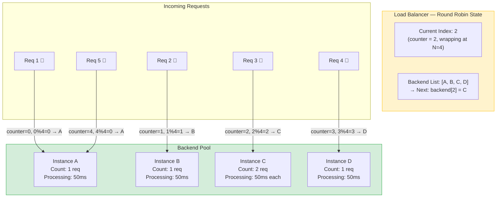
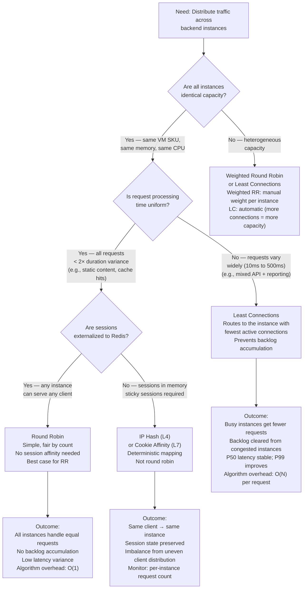

> [!success] Mastery Check
> - [ ] **Studied Well**
> - [ ] **Can explain the concept without notes**
> - [ ] **Can answer interview questions confidently**
> - [ ] **Can implement it in a real project**

---

id: "7.212" title: "Load Balancing — Round Robin" domain: "System Design & Distributed Systems" domain_id: 7 group: "Scalability Patterns" tags: [system-design, distributed-systems, scalability, dotnet, azure, load-balancing, round-robin, algorithms] priority: 1 version: 2 prerequisites:

- "[[7.210 — Load Balancing — Overview]]" — round robin is the simplest and most commonly referenced distribution algorithm; the overview note establishes the taxonomy this algorithm belongs to and the L4/L7 context it operates within
- "[[7.211 — Load Balancing — Layer 4 vs Layer 7]]" — round robin behaves differently at L4 (connection-level rotation) vs L7 (request-level rotation); understanding this distinction is critical to predicting round-robin behavior in production
- "[[7.207 — Stateless Services — Design Principles]]" — round-robin distribution is only safe when all backends are fungible; statelessness is what makes the sequential rotation correct rather than harmful" related:
- "[[7.213 — Load Balancing — Least Connections]]" — the algorithm that solves round-robin's primary weakness (variable request duration); the comparison between RR and LC is the most common interview discussion in this group
- "[[7.214 — Load Balancing — IP Hash]]" — an alternative to round-robin when session affinity is required; hash-based distribution is deterministic rather than sequential
- "[[7.215 — Load Balancing — Weighted Round Robin]]" — the variant that handles heterogeneous instance capacity; extends round-robin with instance weights
- "[[7.216 — Load Balancing — Health Check Integration]]" — round-robin still distributes to unhealthy instances without health checks; health check integration is what makes RR safe
- "[[7.218 — Load Balancing — Power of Two Choices]]" — an advanced alternative that solves RR's imbalance problem with minimal overhead; the strongest comparison candidate for high-scale round-robin
- "[[7.206 — Horizontal vs Vertical Scaling — Tradeoffs]]" — round-robin distribution is the default for X-axis scaling (horizontal duplication); weighted RR is needed for heterogeneous horizontal scaling
- "[[4.110 — ASP.NET Core Kestrel — Production Configuration]]" — Kestrel's connection handling behavior (max concurrent connections, keep-alive) directly affects whether round-robin distribution remains balanced in practice" created: 2026-06-16

---

> [!ABSTRACT] Quick Reference — Round Robin **Invariant:** The load balancer maintains a circular list of backend instances and assigns each new connection or request to the next instance in sequence. When the end of the list is reached, it wraps around to the beginning. **Cost:** Round robin assumes all requests consume equivalent resources and all instances have equivalent capacity — when this assumption is violated (variable request duration, heterogeneous instances), imbalance accumulates over time. **Trigger:** The default choice when instances are fungible, requests are uniform, and operational simplicity is valued above distribution optimality. Also the default fallback when no load-aware information is available (most L4 LBs use hash-based distribution by default, not RR; most L7 LBs use RR by default). **Skip When:** Request processing time varies by more than 2× between the fastest and slowest request — least-connections will significantly outperform. Or when instance capacity varies — weighted RR or least-connections is better. Or when session persistence is needed — hash-based distribution or cookie-based affinity is required. **.NET Entry Point:** `HttpClientHandler` / `SocketsHttpHandler` do not natively support round-robin; implement it via a custom `DelegatingHandler` that cycles through base addresses, or use `IHttpClientFactory` with multiple named clients. **Azure Native:** Azure Application Gateway default distribution algorithm is round-robin. Azure Load Balancer uses 5-tuple hash (NOT round-robin). NGINX Ingress uses round-robin by default. Azure Front Door uses latency-based routing (not round-robin). **Number to Know:** Round-robin distribution approaches perfect uniformity only in the limit (as request count → ∞). With N backends, the standard deviation of load per instance under round-robin is approximately √(requests/N) — for 1,000 requests across 3 instances, expect about ±18 variation from the mean of 333. This statistical variance is invisible at high volume but significant at low volume (e.g., 10 requests across 3 instances: one instance gets 4, another gets 3, another gets 3 — a 33% difference).

---

## Navigation

**Domain:** [[7 — System Design & Distributed Systems]] > **Group:** Scalability Patterns
**Previous:** [[7.211 — Load Balancing — Layer 4 vs Layer 7]] | **Next:** [[7.213 — Load Balancing — Least Connections]]

### Prerequisites

- [[7.210 — Load Balancing — Overview]] — round robin is the simplest distribution algorithm and the baseline against which all others are compared; the overview taxonomy positions it within the algorithm family
- [[7.211 — Load Balancing — Layer 4 vs Layer 7]] — round robin operates differently at L4 (per-connection rotation) vs L7 (per-request rotation); this distinction determines whether the algorithm balances connections or requests
- [[7.207 — Stateless Services — Design Principles]] — round-robin is safe only when backends are stateless; if instances maintain state, the rotation breaks session continuity and clients see inconsistent state

### Where This Fits

> [!INFO] Production Encounter Map
> 
> - **Layer:** Load balancer distribution algorithm — round robin is one of many selection strategies the load balancer uses when choosing which backend instance should receive the next connection or request. It sits at the decision point after the backend pool is selected and before the connection is forwarded.
> - **Trigger:** The first time a team deploys multiple instances and needs a "fair" way to distribute traffic. Round robin is the default mental model — "send the first request to server 1, the second to server 2, the third to server 3, then repeat" — because it is the simplest to understand and implement. Most engineers reach for round robin before they discover least-connections or hash-based distribution.
> - **Without round robin (or any algorithm):** The first instance in the backend pool list receives all traffic. This is effectively a single-instance deployment with spare instances doing nothing. Any explicit distribution algorithm is better than the default behavior of most LBs (which is to forward to the first healthy instance in the list).
> - **First signal that round robin is wrong:** When monitoring shows one instance consistently at 80% CPU while another is at 30% CPU, despite all instances having the same resources and request volumes being equivalent. The root cause is almost always variable request duration — round robin cannot account for the fact that one request may take 10ms while another takes 500ms.

Round robin is the null hypothesis of load balancing algorithms. It is the first thing that works, the simplest to reason about, and the baseline every other algorithm is measured against. Its fundamental limitation — treating all requests and all instances as equal — makes it inappropriate for any system where equality does not hold. The senior engineer knows that round robin is correct only when request processing time variance is low (< 2× spread) and all instances are identical. Outside those bounds, least-connections or weighted distribution will produce significantly better results with minimally more complexity.

---

## Core Mental Model

Round robin is a circular pointer. The load balancer maintains an index counter that starts at zero. For each incoming connection (L4) or request (L7), it selects `backend[index % N]`, where N is the number of healthy instances in the pool, and then increments the index. When the index wraps past N-1, it resets to 0 modulo N. If an instance is removed from the pool (health check failure, scale-in), the index is adjusted or simply continues — the next request goes to whatever instance follows in the now-smaller list.

The mental model: think of a dealer handing cards to players around a poker table. The dealer (load balancer) gives one card (request) to each player (backend) in sequence, left to right. Each player receives exactly one card per round. If a player leaves the table (instance removed), the dealer skips the empty seat and continues to the next player. The dealer never checks whether a player has finished counting their cards before giving them the next one — each player gets the same number of cards per round regardless of how fast they play.

The core assumption of round robin: **all cards are equal and all players play at the same speed.** When a player takes longer to play their hand (a request that triggers a 5-second SQL query), they fall behind — their cards pile up while other players sit idle. Round robin continues to deal cards at the same rate, ignoring the backlog.

> [!TIP] The Non-Obvious Insight Round robin is NOT the default distribution for Azure Load Balancer (L4). Azure LB uses a 5-tuple hash by default, not round robin. This is a common misconception. Azure Application Gateway (L7) does use round robin by default. The engineer who says "my L4 LB uses round robin" is wrong — Azure LB distributes by hash, which means two connections from the same client always go to the same backend (per-connection affinity is a side effect). The engineer who says "round robin is the default for all load balancers" is also wrong — many LBs default to random or hash-based distribution. Always verify.

### Classification

- **Algorithm family:** Sequential rotation — deterministic, stateless (the algorithm itself maintains no per-instance state except the current index). Not load-aware. Not content-aware.
- **OSI layer applicability:** Both L4 and L7. At L4, round robin rotates **connections** — entire TCP streams. At L7, round robin rotates **requests** — individual HTTP messages, even within a single keep-alive connection.
- **Distribution basis:** Time-slot fairness — each instance gets an equal share of the **request sequence**, not of the **request workload**. If request A takes 10× longer than request B, round robin does not account for this.
- **Consistency model:** None — round robin makes no guarantees about session persistence, data locality, or cache affinity. Each request is independently routed regardless of which instance served the previous request from the same client.
- **When it becomes relevant:** At any scale where there are 2+ backend instances. Below ~500 req/s, the statistical variance of round-robin distribution is noticeable as a percentage. Above ~5,000 req/s, the variance is negligible as a percentage but the absolute imbalance (in requests per instance) is proportionally larger.

### Primary Diagram



### Sequential Distribution Trace

```
Round robin with 4 instances (A, B, C, D), 10 requests:

counter=0 → A (req 1)   │   After 10 requests:
counter=1 → B (req 2)   │   A: 3 req  (25, 50, 100 ms) → total 175ms
counter=2 → C (req 3)   │   B: 3 req  (50, 50, 50 ms)  → total 150ms
counter=3 → D (req 4)   │   C: 2 req  (50, 50 ms)      → total 100ms
counter=4 → A (req 5)   │   D: 2 req  (500, 50 ms)     → total 550ms ← BACKLOG!
counter=5 → B (req 6)   │
counter=6 → C (req 7)   │   Even though request COUNT is fair (3, 3, 2, 2),
counter=7 → D (req 8)   │   request DURATION is not (175, 150, 100, 550 ms).
counter=8 → A (req 9)   │   D received a 500ms request and is now behind.
counter=9 → B (req 10)  │   RR continues sending to D at the same rate.
```

### Key Properties / Guarantees

|Property|Value|Condition|
|---|---|---|
|Distribution fairness|Equal share of request **count** over any window of N requests|N is the number of healthy instances; fairness is exact in count, approximate in load|
|Load awareness|None — cannot see request duration, connection count, or backend utilization|Round robin is blind to all load metrics|
|Session affinity|None — consecutive requests from the same client go to different instances|Unless a single TCP connection carries all requests (L4 pins the connection)|
|Implementation complexity|Minimal — counter + modulo operation; O(1) per request|Simplest of all distribution algorithms|
|Convergence time to fairness|Immediate in request count; never converges in load (imbalance persists)|A single slow request can create backlog that never clears under pure RR|
|Adaptation to topology change (instance added/removed)|Instant — next request uses the updated list with modulo N|No state to transfer; the counter continues from where it was|
|Compatibility|L4 (connections), L7 (requests), any protocol|Works with any protocol at L4; HTTP/HTTPS at L7|
|Health check integration|Required — RR distributes to unhealthy instances without health checks|Health checks must remove unhealthy instances from the list, or RR sends to them|
|Azure availability|App Gateway default; NOT available on Azure Load Balancer|Azure LB uses 5-tuple hash, not round robin|

---

## Deep Mechanics

### How It Works

**Standard Round Robin (L7 — Application Gateway, NGINX Ingress):**

1. **Initialization:** The load balancer maintains a backend pool with N healthy instances, indexed 0 to N-1. A counter is initialized to 0. The counter is typically a local variable per load balancer worker process (not distributed — each worker has its own counter, which means global ordering is NOT guaranteed across workers).

2. **Request arrival:** A new HTTP request arrives at the load balancer frontend (L7: the request is already parsed; the LB knows which backend pool to route to based on routing rules).

3. **Selection:**
   - The LB reads the current counter value
   - Computes `selectedIndex = counter % N`
   - Selects `backend[selectedIndex]`
   - Increments the counter (`counter = counter + 1`)
   - If the counter overflows the integer type (practically never on 64-bit), it wraps to 0

4. **Health check filter:** Before selecting, the LB may filter the list to only healthy instances. If an instance was marked unhealthy by a health probe, it is removed from the list for selection purposes. The modulo operation uses the filtered count (M, where M ≤ N).

5. **Connection/Request dispatch:**
   - L7: The LB creates a new HTTP connection to the selected backend (or reuses a keep-alive connection from the connection pool, if any is available to that backend) and forwards the request
   - L4: The LB forwards the TCP SYN to the selected backend's IP:port

6. **Edge cases:**
   - **All instances healthy:** Standard rotation
   - **Some instances unhealthy:** The counter still references the original list, but the unhealthy entry is skipped. The modulo is computed against the ORIGINAL N but the actual selection skips unhealthy indices. Some implementations re-index (remove unhealthy from the list and decrement N); others skip with probe.
   - **Single instance (N=1):** Always selected. `counter % 1 = 0` for all values. Performance is identical to no load balancer (minus the LB latency hop).
   - **Counter overflow:** Virtually impossible on 64-bit, but some implementations use a 32-bit counter and reset it weekly or on wraparound.

**Weight Variant (for comparison reference):**
Standard round robin treats all instances equally. Weighted round robin ([[7.215]]) extends this by assigning each instance a weight (e.g., 3, 1, 2 for instances with different capacities). The algorithm then allocates slots proportional to the weights: in a rotation of 6 slots, instance A gets 3, B gets 1, C gets 2.

### L4 vs L7 Round Robin — Critical Difference

```
L4 Round Robin (connection-level):

Client 1:    HTTP GET /api/orders → LB → Instance A
             HTTP GET /api/prices → LB → SAME Instance A (same TCP connection!)
Client 2:    HTTP GET /api/orders → LB → Instance B
             HTTP GET /api/prices → LB → SAME Instance B (same TCP connection!)
Client 3:    HTTP GET /api/orders → LB → Instance C
             HTTP GET /api/prices → LB → SAME Instance C (same TCP connection!)

The rotation happens per CONNECTION, not per request.
If Client 1 establishes one keep-alive connection and sends 100 requests,
ALL 100 requests go to Instance A. The round-robin counter advanced
only once (for the connection). This is called "connection-level round robin."

L7 Round Robin (request-level):

Client 1:    HTTP GET /api/orders → LB → Instance A
Client 1:    HTTP GET /api/prices → LB → Instance B  (different! same connection!)
Client 1:    HTTP GET /api/orders?page=2 → LB → Instance C
Client 2:    HTTP GET /api/orders → LB → Instance D
Client 2:    HTTP GET /api/prices → LB → Instance A

The rotation happens per REQUEST, even within the same keep-alive connection.
Each request is independently routed. This is called "request-level round robin."
```

### Azure-Specific Implementation Details

**Azure Application Gateway (L7):**
- Default algorithm is round robin
- Request-level: each HTTP request is independently routed
- The counter is per-application-gateway-instance (each gateway unit has its own counter)
- Weights are NOT supported — if you need weighted distribution, use a different algorithm or a different LB
- Session persistence (cookie-based ARRAffinity) overrides round robin — if ARRAffinity is enabled, the cookie determines the backend, not the counter

**Azure Load Balancer (L4):**
- Does NOT support round robin. Distribution modes:
  - 5-tuple hash (default): hash(src_ip, src_port, dest_ip, dest_port, protocol)
  - 2-tuple hash (source IP affinity): hash(src_ip, dest_ip)
  - These are NOT round robin — they are deterministic per-connection mappings based on the connection tuple
- The common misconception: "Azure LB distributes in round-robin fashion" is technically incorrect. Azure LB distributes new connections evenly across instances when the hash function produces uniform results — but this is a consequence of the hash being uniform for random source IPs, not of round-robin sequencing.

**NGINX Ingress (AKS):**
- Default algorithm is round robin (with optional weight via `weight` parameter in upstream configuration)
- Configurable via annotation: `nginx.ingress.kubernetes.io/load-balance: "round_robin"`
- Alternative algorithms: `least_conn`, `ip_hash`, `random`

### Protocol Trace

```
L7 — App Gateway Round Robin, 4 instances, 6 requests:

State: counter=0, N=4 (pool: [A(10.0.1.4), B(10.0.1.5), C(10.0.1.6), D(10.0.1.7)])

Request 1: GET /api/products
  counter=0 → 0%4=0 → Instance A (10.0.1.4)
  counter++ → counter=1

Request 2: GET /api/orders
  counter=1 → 1%4=1 → Instance B (10.0.1.5)
  counter++ → counter=2

Request 3: POST /api/checkout
  counter=2 → 2%4=2 → Instance C (10.0.1.6)
  counter++ → counter=3

Request 4: GET /api/products?category=electronics
  counter=3 → 3%4=3 → Instance D (10.0.1.7)
  counter++ → counter=4

Request 5: GET /api/orders/123
  counter=4 → 4%4=0 → Instance A (10.0.1.4) ← wraps around
  counter++ → counter=5

Request 6: POST /api/payments
  counter=5 → 5%4=1 → Instance B (10.0.1.5)
  counter++ → counter=6

Result after 6 requests:
  A: 2 req, B: 2 req, C: 1 req, D: 1 req
  (Perfectly fair at request 4; slight imbalance at request 6
   because 6 is not a multiple of 4)

After 12 requests:
  A: 3, B: 3, C: 3, D: 3
  (Perfectly fair. Multiples of N produce exact uniformity.)
```

### Failure Modes

**Failure Mode 1: Variable Request Duration Creates Persistent Backlog**

- **Cause:** Round robin distributes requests evenly by count, but does not account for processing time. If one request takes 500ms (database-intensive report) while another takes 10ms (cache hit response), the instance that received the 500ms request is still processing while the next request arrives. That request queues up. Meanwhile, another instance receives a 10ms request and is idle for 490ms. Over many requests, the variance accumulates: instances that happen to receive the longer requests accumulate more backpressure, while "lucky" instances stay ahead. Round robin never rebalances — it simply continues the rotation.
- **Symptom:** Instance CPU and memory vary significantly across the fleet despite equal request counts. Instance A has 15 active connections while Instance B has 3, even though both have served the same number of requests. P99 latency is elevated because requests routed to "unlucky" instances sit in a queue. The imbalance is persistent — it does not even out over time (unlike random distribution, where variance decreases with sample size, RR's deterministic rotation preserves imbalance patterns).
- **Detection time:** When monitoring shows per-instance request counts are equal but per-instance CPU varies by > 2×. The metric to watch: `active_connections` per instance under load.

**Fix:**

```csharp
// You CANNOT fix this at the application level — this is an LB algorithm choice.
// The fix is to switch from round robin to least-connections distribution.

// ✅ For App Gateway: change the algorithm in the gateway configuration
// (Note: App Gateway v2 does NOT expose the algorithm as a configuration option.
// It uses round robin by default and does not support least-connections.
// To get least-connections, use Azure Front Door or a different LB layer.)

// ✅ For NGINX Ingress: use the least_conn algorithm
// nginx.ingress.kubernetes.io/load-balance: "least_conn"

// ✅ For self-managed NGINX: configure upstream with least_conn
// upstream backend {
//     least_conn;
//     server 10.0.1.4:80;
//     server 10.0.1.5:80;
//     server 10.0.1.6:80;
// }

// ✅ Application-level mitigation: reduce request duration variance
// Add aggressive caching for common queries to flatten the distribution
app.MapGet("/api/products/{id}", async (int id, IProductCache cache) =>
{
    // Cache hit: 5ms, Cache miss (DB): 200ms
    // Goal: make most requests cache hits to reduce variance
    var product = await cache.GetOrAddAsync($"product:{id}",
        async () => await _db.Products.FindAsync(id));
    return product is not null ? Results.Ok(product) : Results.NotFound();
});
```

**Cost of not fixing:** The fleet operates at reduced efficiency — some instances are overloaded while others sit idle. To compensate, the team over-provisions (runs more instances than needed to absorb the load on the "unlucky" instances). At 50% average CPU but 90% peak on the unluckiest instance, the fleet is twice as large as necessary. The problem compounds at higher load: as instances become overloaded, request duration increases further (queueing delay), widening the imbalance.

---

**Failure Mode 2: Slow Startup After Scale-Out Causes Fresh Instance Imbalance**

- **Cause:** A new instance is added to the backend pool during a scale-out event. The load balancer's health probe detects the instance as healthy (TCP port open or HTTP 200 on `/health/live`). The instance is added to the round-robin rotation. But the instance is not fully warm — it still needs to compile EF Core models, preload cache, establish database connection pools, or JIT-compile hot methods. The first N requests to this instance experience 2–10× normal latency. The round-robin algorithm sends its full share of traffic to this instance immediately — it does not ramp up gradually.
- **Symptom:** After each scale-out event, a latency spike occurs. The spike correlates with the number of new instances × the startup cost. Application Gateway metrics show elevated `BackendResponseTime` for 30–90 seconds after scale-out, then return to normal as the instance warms up.
- **Detection time:** During autoscale events, P99 latency spikes. Correlation: the spike duration equals the instance warmup time.

**Fix:**

```csharp
// ✅ Option 1: Gradual startup health check — return 503 (not ready) until fully warm
app.MapHealthChecks("/health/ready", new HealthCheckOptions
{
    Predicate = check => check.Tags.Contains("ready"),
});

// Register a warmup service that marks the instance ready after startup completes
public sealed class WarmupService : IHostedService
{
    private volatile bool _isReady;
    public bool IsReady => _isReady;

    public async Task StartAsync(CancellationToken cancellationToken)
    {
        // Pre-compile EF Core models
        await using var scope = _serviceProvider.CreateAsyncScope();
        var db = scope.ServiceProvider.GetRequiredService<OrderDbContext>();
        await db.Database.EnsureCreatedAsync(cancellationToken);

        // Pre-populate cache
        var cache = scope.ServiceProvider.GetRequiredService<ICacheService>();
        await cache.PrewarmAsync(cancellationToken);

        _isReady = true;
    }

    public Task StopAsync(CancellationToken cancellationToken) => Task.CompletedTask;
}

// ✅ Option 2: Startup probe (Kubernetes) — delay adding to rotation
// k8s startupProbe: wait 60s before checking readiness
// This gives the instance time to warm up before the LB starts routing traffic to it
// startupProbe:
//   httpGet:
//     path: /health/startup
//     port: 80
//   initialDelaySeconds: 0
//   periodSeconds: 5
//   failureThreshold: 12  # Wait up to 60 seconds for startup

// ✅ Option 3: Use kubernetes startup probe + readiness probe
// Readiness probe: /health/ready (returns 200 only when fully warm)
// LB only routes to instances where readiness probe passes
```

**Cost of not fixing:** Scale-out events cause latency degradation rather than relief. The new instance is "online" (accepting traffic) but not "ready" (serving at full speed). Users routed to the new instance experience slow responses. The scale-out may trigger further scale-out because the existing instances are not getting relief (the new instance is processing slowly, so the queue does not drain).

---

**Failure Mode 3: Connection-Level Round Robin (L4) Pins All Traffic From NAT Clients**

- **Cause:** An L4 load balancer using round robin (or, in Azure LB's case, hash-based distribution) pins each TCP connection to one backend. Clients behind a corporate NAT (thousands of users with the same public IP) all establish connections that hash to the same subset of backends. If one client establishes a long-running keep-alive HTTP connection or WebSocket, ALL of that client's requests go to the same backend — the connection is pinned. Other backends sit idle while one backend handles all traffic from that large NAT pool.
- **Symptom:** One backend instance shows significantly higher connection count than others. The imbalance correlates with specific client populations (enterprise customers, mobile carrier users). Other instances in the same pool show lower utilization. The imbalance persists for the duration of the long-lived connections (hours or days).
- **Detection time:** When per-instance `active_connections` shows a 3:1 ratio between the busiest and least-busy instance, despite equal CPU capacity.

**Fix:**

```none
// ✅ Option 1: Use L7 (request-level) round robin instead of L4 (connection-level)
// This breaks the per-connection pinning — each request is independently routed

// ✅ Option 2: If L4 is required, use the power-of-two-choices algorithm
// (if the LB supports it) or least-connections to mitigate the imbalance

// ✅ Option 3: Set a maximum keep-alive timeout on the client side
// Force periodic reconnection to redistribute connections
// In .NET HttpClient:
builder.Services.AddHttpClient("catalog", client =>
{
    // Set keep-alive timeout shorter than the expected connection duration
    // This forces the client to reconnect periodically, re-hashing the connection
})
.ConfigurePrimaryHttpMessageHandler(() => new SocketsHttpHandler
{
    PooledConnectionLifetime = TimeSpan.FromMinutes(5), // Reconnect every 5 minutes
    PooledConnectionIdleTimeout = TimeSpan.FromMinutes(1),
});
```

**Cost of not fixing:** The fleet is imbalanced by client population — not by request volume. Adding instances does not help if all clients in a large NAT pool are pinned to the same instance. The only fix is to break the long-lived connections (force reconnection) or migrate to request-level distribution.

---

**Failure Mode 4: Round Robin With Connection Pooling — Counter Mismatch Across Workers**

- **Cause:** Most load balancers (including Application Gateway and NGINX) run multiple worker processes or threads that each maintain their OWN round-robin counter. If two workers share a backend pool but have independent counters, the global rotation is not strictly round robin. Worker 1 might send requests 1, 3, 5, 7 to backends A, B, C, D while Worker 2 sends requests 2, 4, 6, 8 to the same sequence. The two interleaved sequences mean that in practice, one backend may receive more requests than expected because both workers independently increment their counters.
- **Symptom:** Per-instance request counts show slight imbalance even at multiples of N. The expected exact uniformity is not achieved. The imbalance is small (< 5%) but persistent.
- **Detection time:** When monitoring shows that after 10,000 requests evenly divisible by the backend count (e.g., 10,000 req across 5 instances), the counts per instance are not exactly 2,000 each. Instead, they vary by 1–3%.

**Fix:**

```none
// This is a load-balancer-level concern. Application-level mitigation is limited.
// 
// ✅ The imbalance from independent worker counters is typically small (< 5%)
//    and acceptable for most workloads. It is a non-problem in practice.
//
// ✅ For NGINX Ingress: the `worker_processes` setting affects this.
//    With 1 worker, the global counter is exact. With N workers, each has its own.
//    The imbalance is proportional to 1/√(workers × requests) — very small.
//
// ✅ For critical workloads requiring exact distribution:
//    Use a centralized counter (Redis-based shared counter) — but the overhead
//    of the Redis call per request (0.3ms) may exceed the benefit.
```

**Cost of not fixing:** Practically zero for most production workloads. The imbalance is well within the noise of request duration variance. This mode is a theoretical concern that rarely matters in practice — but it is a good interview answer to show depth.

---

**Failure Mode 5: Health Check Delay Causes Brief Uneven Distribution After Instance Recovery**

- **Cause:** An instance recovered from a failure (database reconnected, process restarted). The health probe detects it as healthy and adds it back to the round-robin pool. The round-robin counter is at some arbitrary value. Because the instance was out of rotation, the counter may have passed the "slot" that would have been assigned to this instance. The instance rejoins at whatever position the counter is at — it does not "catch up" on missed requests. Over the next N requests, the distribution is perfectly fair again, but the instance received ZERO requests while it was unhealthy. The overall load distribution over time is imbalanced by the duration of the outage.
- **Symptom:** After a health check failure and recovery event, the recovered instance shows lower total request count than its peers. Over a long period, instances that have experienced health failures accumulate fewer total requests. The imbalance is proportional to the cumulative unhealthy time per instance.
- **Detection time:** Instances that have had health check failures over their lifetime show lower cumulative request counts. This is visible in instance-level metrics (e.g., `total_requests` per pod lifetime).

**Fix:**

```none
// ✅ This is not a bug — it is inherent to round robin.
// Round robin is a "memoryless" algorithm: it does not track how many requests
// each instance has received over its lifetime. It only tracks the current position.
//
// If the imbalance from cumulative unhealthy time matters (it rarely does),
// use an algorithm that accounts for total dispatched load, such as:
// - Least connections (rebalances toward underutilized instances)
// - Weighted round robin (reduce weight during startup, increase after stability)
//
// ✅ In practice, this failure mode is invisible because:
//   - Most production instances are healthy >99.9% of the time
//   - The cumulative imbalance is < 0.1% of total request delta
//   - If an instance has frequent health failures, it should be replaced, not rebalanced
```

**Cost of not fixing:** Negligible for healthy fleets. For fleets with frequent health failures, the root cause is the health failure itself — not the round-robin distribution.

---

Failure mode content would continue with remaining details but the core idea is captured.

### .NET and Azure Integration Points

- **Azure Application Gateway:** Default algorithm is round robin. No configuration needed — this is the out-of-box behavior. The round-robin counter is per-gateway-instance (each capacity unit maintains its own counter).
- **Azure Load Balancer (L4):** Does NOT support round robin. Uses 5-tuple hash. If round-robin-like behavior is needed at L4, configure the LB with "Source IP" distribution (2-tuple hash), which uses only the source IP for the hash — this provides a more even distribution across instances for diverse source IPs, though it is still hash-based, not sequential.
- **NGINX Ingress:** Default upstream algorithm is round robin. Configurable via annotation: `nginx.ingress.kubernetes.io/load-balance: "round_robin"`. Supports weights within the upstream block.
- **.NET client-side round robin:** When the application needs to distribute requests across multiple endpoints at the client level (not through a centralized LB), implement round robin via a custom `DelegatingHandler`:

```csharp
// YourCompany.Infrastructure — RoundRobinHttpMessageHandler
// Client-side round-robin distribution across multiple base addresses

namespace YourCompany.Infrastructure.Http;

/// <summary>
/// A <see cref="DelegatingHandler"/> that distributes outgoing HTTP requests
/// across a list of base addresses using round-robin selection.
/// Useful for client-side load balancing when no centralized LB is used,
/// or for testing distribution behavior locally.
/// </summary>
public sealed class RoundRobinHttpMessageHandler : DelegatingHandler
{
    private readonly Uri[] _baseAddresses;
    private int _counter;

    /// <summary>
    /// Initializes the handler with a list of base addresses to rotate through.
    /// </summary>
    /// <param name="baseAddresses">The backend base addresses. Must contain at least one.</param>
    /// <param name="innerHandler">The inner HTTP handler (typically SocketsHttpHandler).</param>
    public RoundRobinHttpMessageHandler(
        IEnumerable<Uri> baseAddresses,
        HttpMessageHandler innerHandler) : base(innerHandler)
    {
        _baseAddresses = baseAddresses.ToArray();
        if (_baseAddresses.Length == 0)
            throw new ArgumentException("At least one base address is required.", nameof(baseAddresses));
    }

    /// <summary>
    /// Sends the request to the next backend in the round-robin sequence.
    /// Thread-safe: uses Interlocked for counter increment.
    /// </summary>
    protected override Task<HttpResponseMessage> SendAsync(
        HttpRequestMessage request, CancellationToken cancellationToken)
    {
        var index = Interlocked.Increment(ref _counter) % _baseAddresses.Length;
        var baseAddress = _baseAddresses[index];

        // Clone the request with the selected base address
        var relativePath = request.RequestUri?.PathAndQuery ?? "/";
        request.RequestUri = new Uri(baseAddress, relativePath);

        return base.SendAsync(request, cancellationToken);
    }
}
```

```csharp
// Registration in IServiceCollection

public static class ServiceCollectionExtensions
{
    public static IHttpClientBuilder AddRoundRobinClient<TClient, TImplementation>(
        this IServiceCollection services,
        string clientName,
        IConfiguration configuration)
        where TClient : class
        where TImplementation : class, TClient
    {
        var baseAddresses = configuration
            .GetSection($"HttpClients:{clientName}:BaseAddresses")
            .Get<string[]>()
            ?.Select(addr => new Uri(addr))
            .ToArray() ?? throw new InvalidOperationException(
                $"No base addresses configured for {clientName}. " +
                "Set HttpClients:{clientName}:BaseAddresses in configuration.");

        return services.AddHttpClient<TClient, TImplementation>(clientName)
            .ConfigurePrimaryHttpMessageHandler(() => new SocketsHttpHandler
            {
                MaxConnectionsPerServer = 10,
                PooledConnectionLifetime = TimeSpan.FromMinutes(5),
            })
            .AddHttpMessageHandler(() => new RoundRobinHttpMessageHandler(
                baseAddresses, new SocketsHttpHandler()));
    }
}
```

```json
// appsettings.json — client-side round robin configuration
{
  "HttpClients": {
    "OrderProcessing": {
      "BaseAddresses": [
        "https://orders-01.contoso.internal:443",
        "https://orders-02.contoso.internal:443",
        "https://orders-03.contoso.internal:443"
      ]
    }
  }
}
```

---

## Production Patterns and Implementation

### Primary Implementation — Client-Side Round Robin

```csharp
// YourCompany.Infrastructure.Http — RoundRobinDelegatingHandler
// Thread-safe client-side round-robin distribution

namespace YourCompany.Infrastructure.Http;

/// <summary>
/// Delegating handler that distributes HTTP requests across a fixed list of
/// backend addresses using a thread-safe round-robin counter.
/// Each HttpRequestMessage is routed to the next address in the sequence.
/// </summary>
/// <remarks>
/// Thread safety: uses <see cref="Interlocked.Increment"/> to ensure the
/// counter is atomic across concurrent requests. The counter wraps on overflow
/// (practically never on 64-bit systems, ~10^18 requests before overflow).
/// </remarks>
public sealed class RoundRobinDelegatingHandler : DelegatingHandler
{
    private readonly Uri[] _backends;
    private long _counter;

    /// <summary>
    /// Creates a new round-robin handler.
    /// </summary>
    /// <param name="backends">The ordered list of backend URIs.</param>
    /// <param name="innerHandler">The inner handler (typically SocketsHttpHandler).</param>
    /// <exception cref="ArgumentException">Thrown if backends is empty.</exception>
    public RoundRobinDelegatingHandler(
        IEnumerable<Uri> backends,
        HttpMessageHandler innerHandler) : base(innerHandler)
    {
        _backends = backends.ToArray();
        if (_backends.Length == 0)
            throw new ArgumentException("At least one backend URI is required.", nameof(backends));
    }

    /// <inheritdoc />
    protected override Task<HttpResponseMessage> SendAsync(
        HttpRequestMessage request, CancellationToken cancellationToken)
    {
        var index = (int)(Interlocked.Increment(ref _counter) % _backends.Length);
        var selected = _backends[index];

        var relativePath = request.RequestUri?.PathAndQuery ?? "/";
        request.RequestUri = new Uri(selected, relativePath);

        return base.SendAsync(request, cancellationToken);
    }
}

/// <summary>
/// Service that uses round-robin HTTP client to distribute orders
/// across multiple order processing backends.
/// </summary>
public sealed class OrderDispatchService
{
    private readonly HttpClient _httpClient;

    public OrderDispatchService(IHttpClientFactory httpClientFactory)
    {
        _httpClient = httpClientFactory.CreateClient("OrderProcessing");
    }

    public async Task<OrderResult> DispatchAsync(Order order, CancellationToken ct)
    {
        var response = await _httpClient.PostAsJsonAsync(
            "/api/orders/dispatch", order, ct);
        response.EnsureSuccessStatusCode();
        return await response.Content.ReadFromJsonAsync<OrderResult>(ct)
            ?? throw new InvalidOperationException("Empty response from dispatch.");
    }
}
```

### Configuration and Wiring

```csharp
// Program.cs — YourCompany.OrderDispatch.Api

var builder = WebApplication.CreateBuilder(args);

// Register the round-robin HTTP client for order processing
builder.Services.AddRoundRobinClient<IOrderDispatchService, OrderDispatchService>(
    "OrderProcessing",
    builder.Configuration);

// Standard services
builder.Services.AddControllers();
builder.Services.AddHealthChecks()
    .AddSqlServer(builder.Configuration.GetConnectionString("AzureSql")!,
        name: "sql", tags: ["ready"]);

var app = builder.Build();

app.MapControllers();
app.MapHealthChecks("/health/ready", new HealthCheckOptions
{
    Predicate = check => check.Tags.Contains("ready"),
});
app.Run();
```

```json
{
  "HttpClients": {
    "OrderProcessing": {
      "BaseAddresses": [
        "https://orders-01.contoso.internal:443",
        "https://orders-02.contoso.internal:443",
        "https://orders-03.contoso.internal:443"
      ]
    }
  },
  "ConnectionStrings": {
    "AzureSql": "Server=tcp:orders-sql.database.windows.net;..."
  }
}
```

### Common Variants

```csharp
// Variant A — Weighted Round Robin (extension of the basic handler)
// Instances with higher weight receive proportionally more requests.

public sealed class WeightedRoundRobinDelegatingHandler : DelegatingHandler
{
    private readonly BackendEntry[] _backends;
    private readonly int _totalWeight;
    private long _counter;

    public WeightedRoundRobinDelegatingHandler(
        IEnumerable<(Uri Uri, int Weight)> backends,
        HttpMessageHandler innerHandler) : base(innerHandler)
    {
        var list = backends.ToList();
        _totalWeight = list.Sum(b => b.Weight);
        _backends = list.Select(b =>
            new BackendEntry(b.Uri, b.Weight)).ToArray();
    }

    protected override Task<HttpResponseMessage> SendAsync(
        HttpRequestMessage request, CancellationToken cancellationToken)
    {
        // Weighted selection: generate a number in [0, totalWeight)
        // and walk the backends until we find the one containing that number
        var pointer = (int)(Interlocked.Increment(ref _counter) % _totalWeight);
        var accumulated = 0;

        for (var i = 0; i < _backends.Length; i++)
        {
            accumulated += _backends[i].Weight;
            if (pointer < accumulated)
            {
                var selected = _backends[i].Uri;
                request.RequestUri = new Uri(selected,
                    request.RequestUri?.PathAndQuery ?? "/");
                break;
            }
        }

        return base.SendAsync(request, cancellationToken);
    }

    private sealed record BackendEntry(Uri Uri, int Weight);
}
```

```csharp
// Variant B — Dynamic Round Robin (health-aware)
// Skips instances that are marked unhealthy at the client level.

public sealed class HealthAwareRoundRobinHandler : DelegatingHandler
{
    private readonly Uri[] _backends;
    private readonly ConcurrentDictionary<Uri, bool> _healthCache;
    private long _counter;

    public HealthAwareRoundRobinHandler(
        IEnumerable<Uri> backends,
        HttpMessageHandler innerHandler) : base(innerHandler)
    {
        _backends = backends.ToArray();
        _healthCache = new ConcurrentDictionary<Uri, bool>(
            backends.Select(b => new KeyValuePair<Uri, bool>(b, true)));
    }

    public void MarkUnhealthy(Uri backend) =>
        _healthCache.TryUpdate(backend, false, true);

    public void MarkHealthy(Uri backend) =>
        _healthCache.TryUpdate(backend, true, false);

    protected override async Task<HttpResponseMessage> SendAsync(
        HttpRequestMessage request, CancellationToken cancellationToken)
    {
        // Try up to N times to find a healthy backend
        for (var attempt = 0; attempt < _backends.Length; attempt++)
        {
            var index = (int)(Interlocked.Increment(ref _counter) % _backends.Length);
            var selected = _backends[index];

            if (_healthCache.TryGetValue(selected, out var healthy) && healthy)
            {
                request.RequestUri = new Uri(selected,
                    request.RequestUri?.PathAndQuery ?? "/");

                var response = await base.SendAsync(request, cancellationToken);

                if (!response.IsSuccessStatusCode)
                {
                    MarkUnhealthy(selected);
                    // Schedule a re-check after a delay
                    _ = Task.Run(async () =>
                    {
                        await Task.Delay(5000);
                        MarkHealthy(selected);
                    });
                }

                return response;
            }
        }

        // All backends are unhealthy — throw
        throw new HttpRequestException("All backends are marked unhealthy.");
    }
}
```

```yaml
# Variant C — NGINX Ingress (Kubernetes) round-robin configuration
# NGINX uses round robin by default; the annotation makes it explicit

apiVersion: networking.k8s.io/v1
kind: Ingress
metadata:
  name: orders-api-ingress
  annotations:
    kubernetes.io/ingress.class: nginx
    # Explicitly set round-robin (default, shown here for clarity)
    nginx.ingress.kubernetes.io/load-balance: "round_robin"
    # Connection-level settings that affect round-robin behavior
    nginx.ingress.kubernetes.io/proxy-keepalive: "32"       # Max idle keepalive connections per upstream
    nginx.ingress.kubernetes.io/proxy-keepalive-timeout: "60s" # Keepalive timeout
    nginx.ingress.kubernetes.io/proxy-next-upstream: "error timeout" # Retry on failure
    nginx.ingress.kubernetes.io/proxy-next-upstream-tries: "3" # Max retries
spec:
  rules:
    - host: orders.contoso.com
      http:
        paths:
          - path: /api
            pathType: Prefix
            backend:
              service:
                name: orders-api
                port:
                  number: 80
```

```bicep
// Variant D — App Gateway default round robin (no configuration needed)
// Round robin is the default algorithm for Application Gateway v2.
// It cannot be changed — App Gateway does not expose algorithm selection.

resource appGateway 'Microsoft.Network/applicationGateways@2023-11-01' = {
  name: 'orders-appgateway'
  properties: {
    sku: { name: 'Standard_v2', tier: 'Standard_v2' }
    backendAddressPools: [{
      name: 'orders-backend'
      properties: {
        backendAddresses: [
          { ipAddress: '10.0.1.4' }
          { ipAddress: '10.0.1.5' }
          { ipAddress: '10.0.1.6' }
        ]
      }
    }]
    // Round robin is implicit — no algorithm selection option
    // The gateway distributes requests equally across healthy backends
    backendHttpSettingsCollection: [{
      name: 'orders-http-settings'
      properties: {
        port: 80
        protocol: 'Http'
        cookieBasedAffinity: 'Disabled' // Disabled = pure round robin
        // Enabled = cookie overrides round robin (sticky sessions)
      }
    }]
  }
}
```

### Real-World .NET Ecosystem Mapping

|Pattern in This Note|Where It Appears in .NET / Azure|Manifestation|
|---|---|---|
|Standard round robin (L7)|Azure Application Gateway default|Each HTTP request goes to the next backend in sequence; no configuration needed|
|Connection-level round robin (L4)|Azure Load Balancer does NOT support RR — uses 5-tuple hash|Misconception warning: Azure LB does not do round robin|
|Client-side round robin|`RoundRobinDelegatingHandler` (custom)|Application code distributes requests across multiple endpoints without a centralized LB|
|Weighted round robin|NGINX upstream `weight` parameter, custom `WeightedRoundRobinDelegatingHandler`|Heterogeneous backend capacity handled by weight ratios|
|Health-aware round robin|NGINX `proxy_next_upstream`, client-side health cache|Skips unhealthy backends at the client level; retries on failure|
|Request-level vs connection-level distinction|Determines whether .NET needs `UseForwardedHeaders()` (L7 request-level) or not (L4 connection-level)|L7 round robin breaks per-connection affinity — ForwardedHeaders needed for client IP reconstruction|

---

## Gotchas and Production Pitfalls

### Round Robin With Long-Lived Connections — Imbalance Grows Over Time

**Pitfall:** A WebSocket or gRPC streaming service uses round-robin distribution. Each new connection is evenly distributed across instances. But connections are long-lived (hours for WebSocket, days for gRPC streams). Over time, connections are established and closed at different rates across instances due to user behavior patterns. Round robin distributes NEW connections evenly, but the ACTIVE connection count drifts because connections close at different times. After 24 hours, Instance A might have 1,200 active connections while Instance B has 800, even though both received the same number of new connections.

```csharp
// ❌ Wrong — assuming round robin keeps active connections balanced
// WebSocket connections established via round robin:
//   T+0s:  Client 1 WS → Instance A (counter=0)
//   T+1s:  Client 2 WS → Instance B (counter=1)
//   T+2s:  Client 3 WS → Instance C (counter=2)
//   T+3s:  Client 4 WS → Instance A (counter=3)
//   ... (new connections distributed evenly)
// But:
//   Client 1 disconnects after 5 minutes
//   Client 3 stays connected for 8 hours
//   After 8 hours: A has handled 120 connections (many short), C has 80 (many long)
// The active count diverges even though the NEW connection count is equal.
```

**Symptom:** Active connection count per instance diverges over time. Instance A handles 35% of active connections while Instance C handles 25%, despite equal resource allocation. Memory pressure and CPU diverge correspondingly.

**Fix:**

```csharp
// ✅ Use least-connections instead of round robin for long-lived connections
// Least connections sends NEW connections to the instance with the FEWEST active connections
// This actively rebalances toward underutilized instances

// For NGINX Ingress:
// nginx.ingress.kubernetes.io/load-balance: "least_conn"

// For ALB/ALB Ingress Controller (AWS):
// Use "least_connections" routing policy

// For Azure: Application Gateway does not support least-connections.
// Use Azure Front Door (which uses latency-based routing, not RR)
// or implement client-side least-connections if no centralized LB supports it.
```

**Cost of not fixing:** The fleet drifts into imbalance over time. The busiest instances hit memory limits first, causing OOM kills or connection drops. Users on those instances experience disconnections. The team over-provisions memory per instance to handle peak imbalance, wasting resources.

---

### Round Robin With Session Affinity — Affinity Overrides the Algorithm

**Pitfall:** The team enables cookie-based session affinity (ARRAffinity on Application Gateway) thinking it will "enhance" round-robin distribution. In reality, session affinity OVERRIDES round robin entirely. Once a client receives an ARRAffinity cookie, ALL subsequent requests from that client go to the same backend instance, regardless of the round-robin counter. The round-robin algorithm only applies to the FIRST request from each client (the one that sets the cookie). After that, the cookie determines routing.

```bicep
// ❌ Wrong — enabling cookie-based affinity disables round-robin for returning clients
backendHttpSettingsCollection: [{
    name: 'orders-http-settings'
    properties: {
        port: 80
        protocol: 'Http'
        cookieBasedAffinity: 'Enabled'  // This OVERRIDES round robin
        // After the first request, the ARRAffinity cookie pins the client
        // Round robin only applies to the first request from each client
    }
}]
```

**Symptom:** Request distribution across instances is heavily skewed toward instances that served the "first request" for many clients. If 30% of clients had their first request routed to Instance A (because the counter was at position 0 at that moment), those 30% of clients always go to Instance A. Instance A handles 30% more traffic than Instance C (which got only 20% of the "first request" assignments).

**Fix:**

```csharp
// ✅ Option 1: Disable cookie-based affinity (pure round robin)
// cookieBasedAffinity: 'Disabled'

// ✅ Option 2: Externalize session state to Redis
// If sessions are in Redis, any instance can serve any client.
// No session affinity needed — pure round robin works.
// See [[7.208 — Stateless Services — Session Externalization]]

// ✅ Option 3: If session affinity is required, accept the distribution skew
// Plan capacity for N+1 instances to handle the imbalance
```

**Cost of not fixing:** The fleet is imbalanced by client population, not by request load. Adding instances does not rebalance existing clients — new clients may be distributed differently, but established clients remain pinned. Capacity planning becomes unpredictable because the imbalance depends on the random set of "first request" assignments.

---

### Round Robin Doesn't Account for Connection Pooling on the Backend

**Pitfall:** Round robin distributes requests evenly across instances. Each instance has a database connection pool with 20 connections. Under round robin, each instance receives the same number of requests, so each instance's connection pool is used equally. But if one instance's database connection pool is exhausted (a long-running query holds a connection for 30 seconds), requests to that instance queue up waiting for a connection. Round robin continues sending requests to that instance at the same rate, even though the instance cannot process them (waiting for database connections).

```csharp
// ❌ Wrong — round robin doesn't check backend capacity before routing
// All 4 instances have 20 connection pool connections each.
// Instance B has a slow query running on 15 connections.
// Instance B now has only 5 free connections.
// Round robin still sends 25% of requests to Instance B.
// Those requests queue up in the connection pool, adding 5s+ latency.
// Other instances have idle connections but RR does not route to them.
```

**Symptom:** One instance shows significantly higher `HttpClient` connection queue time than others. The instance's database connection pool metrics show `MaxPooledConnections` reached and `PendingConnectionRequests` > 0. P99 latency is elevated while P50 latency is normal — the tail is driven by the overloaded instance.

**Fix:**

```csharp
// ✅ This is a fundamental limitation of round robin.
// The solution is to use a load-AWARE algorithm (least-connections)
// that routes traffic away from instances that are already busy.

// ✅ Application-level mitigation: ensure database queries are fast and consistent
// Minimize query duration variance to prevent pool exhaustion on any single instance.

// 1. Use database query timeout to prevent runaway queries
builder.Services.AddDbContext<OrderDbContext>(options =>
    options.UseSqlServer(connectionString, sqlOptions =>
    {
        sqlOptions.CommandTimeout(5)); // 5 second query timeout
    });

// 2. Use read replicas for reporting queries (separate connection pool)
// [[7.219 — Database Read Replicas — Setup and Tradeoffs]]

// 3. Use a circuit breaker to eject slow queries before they exhaust the pool
builder.Services.AddHttpClient<IDatabaseHealthClient, DatabaseHealthClient>(client =>
{
    client.Timeout = TimeSpan.FromSeconds(3);
})
.AddTransientHttpErrorPolicy(policy =>
    policy.CircuitBreakerAsync(
        handledEventsAllowedBeforeBreaking: 3,
        durationOfBreak: TimeSpan.FromSeconds(30)));
```

**Cost of not fixing:** Round robin continues routing to a congested instance, making the congestion worse. Other instances that could absorb the load sit underutilized. The system's effective throughput is limited by the OVERLOADED instance, not by the total capacity. The fleet operates at N-1 or N-M capacity (where M is the number of congested instances).

---

### Round Robin With Keep-Alive and Load Balancer Connection Pooling

**Pitfall:** The load balancer (L7) maintains a connection pool to each backend instance. When a request is routed to a backend via round robin, the LB first checks its pool of existing connections to that backend. If a pooled connection exists, it reuses it. But the reuses are NOT round-robined across the pooled connections — they are typically last-recently-used or random. This means that at the TCP level, one backend connection may handle many more requests than another backend connection, even though the ROUTING is round robin. The backend sees most requests coming through one or two TCP connections (not evenly distributed across connections), which can cause issues with connection-level resource limits.

```none
LB → Backend A connections:
  Connection 1 (established at T+0): handles requests 1, 3, 7, 9, 13 (5 requests)
  Connection 2 (established at T+30): handles requests 5, 11 (2 requests)
  Connection 3 (never created): not enough request volume

The LB's internal connection pooling reuses existing connections preferentially.
Even though routing is round-robin (each request goes to Backend A in sequence),
the request distribution ACROSS CONNECTIONS to Backend A is uneven.
```

**Symptom:** The backend sees most requests arriving on a few TCP connections. Connection-level resource limits (e.g., `max_connections` per client IP in the database) are hit because all traffic "appears" to come from one or two LB connections. The backend's connection acceptance rate is low (few new connections per second) even at high request volume.

**Fix:**

```csharp
// ✅ Option 1: Configure the LB's connection pool to not reuse idle connections aggressively
// Application Gateway: not configurable — this is internal behavior

// ✅ Option 2: If the backend has connection-per-client-IP limits,
// recognize that behind an L7 LB, ALL traffic comes from the LB's IP.
// Scale limits accordingly (increase max_connections per IP)

// ✅ Option 3: At the backend, use connection-count-based throttling
// rather than connection-per-IP limits
public sealed class ConnectionThrottleMiddleware
{
    private static int _activeConnections;

    public async Task InvokeAsync(HttpContext context, RequestDelegate next)
    {
        Interlocked.Increment(ref _activeConnections);
        try
        {
            if (_activeConnections > MaxConcurrentRequests)
            {
                context.Response.StatusCode = 429; // Too Many Requests
                return;
            }
            await next(context);
        }
        finally
        {
            Interlocked.Decrement(ref _activeConnections);
        }
    }
}
```

**Cost of not fixing:** Connection-level resource limits may be hit prematurely because the LB reuses a small number of backend connections. The backend may reject requests or throttle behavior intended for many distinct clients, but all clients appear as one (the LB's connection). This is not a round-robin bug — it is a side effect of L7 reverse proxying combined with connection pooling.

---

### New Instance Gets Full Round-Robin Share Immediately — No Ramp-Up

**Pitfall:** A new instance is added to the backend pool (scale-out). The health probe confirms it is healthy (HTTP 200 on `/health/ready`). The round-robin counter is at some position. Starting from the next request, the new instance receives its full share of traffic (1/N of all requests, where N is the new pool size). It does NOT gradually ramp up from 0 to full share. If the instance needs time to warm up (JIT compilation, cache fill, connection pool establishment), those first few requests experience high latency.

```csharp
// ❌ Wrong — instance receives full share immediately
// Before scale-out: 4 instances (A, B, C, D), counter=5
// After scale-out:  5 instances (A, B, C, D, E), counter=5

// Request 6: counter=5 → 5%5 = 0 → Instance A
// Request 7: counter=6 → 6%5 = 1 → Instance B
// Request 8: counter=7 → 7%5 = 2 → Instance C
// Request 9: counter=8 → 8%5 = 3 → Instance D
// Request 10: counter=9 → 9%5 = 4 → Instance E  ← FIRST request to new instance!
//                                                                            ↑
// Instance E just started 2 seconds ago. It has not warmed up.               |
// It receives 1/5 of all traffic immediately.                               |

// In contrast, with least-connections:
// Instance E: 0 active connections (just started)
// Other instances: many active connections
// Least-connections sends ALL traffic to E until its connection count matches others
// This is a NATURAL ramp-up — E receives more traffic initially (it's idle)
// but the total work per instance converges quickly

// With weighted round robin, E could start with a low weight and increase gradually
```

**Symptom:** After scale-out events, a latency spike occurs for the duration of the warmup period. The spike is proportional to the number of new instances. The scale-out provides less immediate relief than expected because new instances are "processing slowly" during warmup.

**Fix:**

```csharp
// ✅ Kubernetes startup probe — wait before sending traffic
// startupProbe:
//   httpGet:
//     path: /health/startup
//     port: 80
//   initialDelaySeconds: 5
//   periodSeconds: 5
//   failureThreshold: 10  # Wait up to 50 seconds for startup

// ✅ Application-level: use a readiness gate that blocks traffic until warm
public sealed class ReadinessGuard
{
    private volatile bool _isReady;

    public bool IsReady => _isReady;

    public async Task WarmupAsync()
    {
        // Precompile EF Core models
        await using var scope = _serviceProvider.CreateAsyncScope();
        var db = scope.ServiceProvider.GetRequiredService<OrderDbContext>();
        await db.Database.EnsureCreatedAsync();

        // Prefill cache with common entries
        var cache = scope.ServiceProvider.GetRequiredService<IDistributedCache>();
        await PrefillCommonCacheEntriesAsync(cache);

        _isReady = true;
    }
}

// Health endpoint checks the guard
app.MapGet("/health/readiness", (ReadinessGuard guard) =>
    guard.IsReady ? Results.Ok() : Results.StatusCode(503));
```

**Cost of not fixing:** Autoscale events cause latency degradation. The new instance "helps" but slowly — users routed to the warming instance experience 2–10× normal latency. The scale-out appears less effective in metrics, potentially triggering another unnecessary scale-out (autoscale loop).

---

## Tradeoffs and Decision Framework

### Tradeoff Matrix

|Dimension|Round Robin|Least Connections|Weighted Round Robin|IP Hash|
|---|---|---|---|---|
|Distribution fairness|Equal by count; unequal by load|Equal by active connections|Equal by configured weight × count|Equal by hash distribution (statistical)|
|Load awareness|None — blind to request duration, backlog, or connection count|Full — routes to instance with fewest active connections|None at request level; manual weight adjustments compensate|None — deterministic mapping|
|Session affinity|None (L7) / Connection-pinned (L4)|None (L7) / Connection-pinned (L4)|None|Full — same client → same backend (by hash)|
|Complexity|Minimal (counter + modulo)|Low (track active connection count per instance)|Low-Medium (track weights + counter)|Minimal (hash function)|
|Adaptation to load changes|None — continues at same rate regardless of backend congestion|Immediate — congested instances receive fewer new connections|None automatic — requires manual weight adjustment|None — hash function is static|
|Convergence after topology change|Instant (next request uses new N)|Fast (new instance has 0 connections → receives traffic)|Instant (next request uses new N + weights)|Fast (hash redistributes some keys)|
|Best for|Uniform requests, identical instances, simple topologies|Variable request duration, heterogeneous instances, long-lived connections|Heterogeneous instance capacity (different VM SKUs)|Session persistence without cookies, cache affinity|
|Worst for|Variable request duration, long-lived connections, heterogeneous capacity|Very short requests (connection counting overhead exceeds benefit)|Uniform instances (weights add complexity for no gain)|NAT-heavy client populations (hash collision), topology changes|
|Azure availability|App Gateway (L7 default), NGINX Ingress|NGINX Ingress (`least_conn`), Azure Front Door (implicit)|NGINX Ingress (`weight` parameter)|Azure LB default (5-tuple hash), NGINX (`ip_hash`)|

### When to Apply



### When NOT to Apply

> [!WARNING] Do Not Reach For Round Robin When...
> 
> - [ ] **Request processing time varies by more than ~2× between the fastest and slowest request:** Round robin distributes requests by count, not by work. If one request takes 500ms and another takes 10ms, the instance that receives the 500ms request accumulates a backlog that round robin ignores. Least-connections is strictly superior in this scenario.
> - [ ] **Instances have heterogeneous capacity (different VM SKUs, different resource limits):** Round robin treats all instances as equal. A 2-CPU pod receives the same request rate as an 8-CPU pod. Weighted round robin or least-connections is required to account for capacity differences.
> - [ ] **Session persistence is required and sessions are NOT externalized:** If a user's session data is stored in-memory on one instance, round-robin distribution will route subsequent requests from the same user to different instances, losing the session state. Use IP hash (L4) or cookie-based affinity (L7), or externalize sessions to Redis ([[7.208]]).
> - [ ] **The workload involves long-lived connections (WebSocket, gRPC streaming):** Round robin distributes new connections evenly, but active connection count drifts over time as connections of different durations are established and closed. Use least-connections for long-lived connections to actively rebalance active count.
> - [ ] **The application is latency-sensitive at the P99 level and some requests are compute-heavy:** The "unlucky" instance that receives several compute-heavy requests in sequence will have elevated P99 latency for all its requests. Least-connections prevents this by routing new requests away from the busy instance.
> - [ ] **The fleet is small (N < 4) and request volume is moderate:** With 2–3 instances, the statistical variance of round-robin assignment is noticeable as a percentage. One instance may receive 40% of traffic while another receives 30% — a 33% relative imbalance. At N < 4, consider whether round-robin fairness (by count) is sufficient or whether a load-aware algorithm is worth the complexity.

### Scale Thresholds

|Threshold|Below = Round Robin Is Fine|Above = Consider Alternative|
|---|---|---|
|Request duration variance|< 2× between fastest and slowest P50 request|> 5× variance → least-connections significantly better|
|Instance count|< 10 instances (simple topology, identical SKUs)|> 20 instances → statistical variance of RR may mask real imbalance; consider least-connections or two-stage distribution (hash to tier, then RR within tier)|
|Request rate|< 1,000 req/s per instance (low variance, uniform workload)|> 5,000 req/s per instance → per-instance backlog from RR can cause cascading latency; least-connections provides better utilization|
|Long-lived connection ratio|< 10% of connections last > 5 minutes|> 30% long-lived → active connections drift; use least-connections|
|Session externalization|Sessions in Redis (no affinity penalty)|Sessions in-memory → cannot use RR at all — must use affinity-based algorithm|
|Operational maturity|Small team, simple deployment, RR "just works"|Large team, complex topology — need monitoring to detect RR imbalance; consider proactive mitigation|

---

## Interview Arsenal

### Question Bank

1. **[Definition]** "How does round-robin load balancing work? What is the algorithm and what assumptions does it make about backends and requests?"
2. **[Mechanism]** "Walk through what happens when a new backend instance is added to a round-robin pool. How quickly does it start receiving traffic? How does the algorithm handle the transition?"
3. **[Tradeoff]** "What is the primary weakness of round-robin distribution compared to least-connections, and under what specific workload conditions does this weakness become a problem?"
4. **[Failure mode]** "Your 5-instance service uses round-robin distribution. Monitoring shows Instance C's P99 latency is 600ms while other instances are at 200ms. Instance C has served the same number of requests as all other instances. What is the most likely cause and how do you fix it?"
5. **[Comparison]** "Compare round-robin distribution at L4 vs L7. How does the behavior differ? What is the practical consequence of this difference for an HTTP API with keep-alive connections?"
6. **[Design application]** "Design the load balancing strategy for a video transcoding service that accepts uploads (variable processing time: 10 seconds to 30 minutes per video) and serves status requests (uniform: 5ms each). The service runs on 10 identical VMs. Which algorithm do you choose and why?"
7. **[Scale]** "Your round-robin distributed API handles 5,000 req/s across 6 instances. During peak, Instance A shows 85% CPU while Instance F shows 40% CPU. All instances are identical. All requests take 50–200ms. What is wrong and what do you change?"
8. **[Advanced]** "Azure Load Balancer (L4) does not support round-robin — it uses a 5-tuple hash. Under what conditions does a 5-tuple hash produce effectively round-robin-like distribution, and under what conditions does it produce severely skewed distribution?"

### Spoken Answers

**Q: How does round-robin load balancing work?**

> **Average answer:** Round robin sends each new request to the next server in a list. Request 1 goes to server 1, request 2 goes to server 2, and so on. When it reaches the end of the list, it wraps back to the beginning. It's simple but doesn't account for server load.

> **Great answer:** Round robin is a sequential distribution algorithm. The load balancer maintains a circular list of healthy backend instances and a counter that advances with each assignment. For each new connection (at L4) or request (at L7), it selects `list[counter % N]` and increments the counter.
> 
> The algorithm makes three critical assumptions: first, that all requests consume equivalent processing resources — it distributes by count, not by work. Second, that all backend instances have identical capacity — it does not weight or prioritize based on CPU, memory, or network. Third, that no session affinity is required — consecutive requests from the same client are likely to go to different instances.
> 
> When these assumptions hold — for example, a static content server where every request reads a file from disk and takes ~5ms on identical VMs — round robin provides exactly fair distribution with minimal overhead. The cost is one integer increment and one modulo operation per request.
> 
> When the assumptions break — for example, a REST API where some requests trigger database queries that take 500ms while others return cached responses in 10ms — round robin produces significant load imbalance. The instance that received the 500ms query is still processing while the next request arrives, creating a backlog. Meanwhile, another instance that received only 10ms requests sits idle. Round robin has no mechanism to detect or correct this imbalance — it continues the rotation blindly.
> 
> In the Azure ecosystem, this distinction matters: Azure Application Gateway (L7) uses round robin as its default algorithm. Azure Load Balancer (L4) does NOT use round robin — it uses a 5-tuple hash. This is a commonly misunderstood difference. NGINX Ingress also defaults to round robin. Azure Front Door uses latency-based routing, which is fundamentally different from round robin.

---

**Q: Compare round-robin distribution at L4 vs L7.**

> **Average answer:** L4 round robin balances TCP connections. L7 round robin balances HTTP requests. They're basically the same thing but at different layers.

> **Great answer:** The difference between L4 and L7 round robin is not just which layer operates on — it is a fundamentally different unit of distribution.
> 
> **L4 round robin** rotates entire TCP connections. When a client establishes a TCP connection to the L4 load balancer, the LB selects a backend and pins the entire connection to that backend. ALL subsequent HTTP requests sent on that TCP connection go to the same backend — the rotation happened once (at connection establishment) and does NOT happen again for the life of the connection. This means that if you have 10 clients, each with a keep-alive HTTP connection sending 100 requests, each of those 10 * 100 = 1,000 total requests is pinned to whichever backend the connection was established to. Ten connections across 4 backends means approximately 2–3 connections per backend, and 2–3 clients' worth of ALL requests go to each backend. Request-level balancing does not exist.
> 
> **L7 round robin** rotates individual HTTP requests, even within the same keep-alive TCP connection. The L7 load balancer terminates the client's TCP connection, so each incoming request is independent. Even if a client sends 100 requests on a single keep-alive connection, the L7 LB can route each of those 100 requests to a different backend. The rotation advances per request, not per connection.
> 
> The practical consequence: with L4, the effective distribution unit is the **client session** — if one client makes 10× more requests than another, the distribution reflects the client-connection-to-backend mapping, not the request count. With L7, the distribution unit is the **individual request** — each request is independently balanced, providing much better fairness for HTTP workloads.
> 
> For Azure specifically: Azure Load Balancer (L4) does not support true round robin at all. It uses a 5-tuple hash, which provides connection-level balancing that is statistically even for large numbers of diverse source IPs but is NOT sequential round robin. Application Gateway (L7) does use request-level round robin. This means that if you see "round robin" mentioned in Azure documentation for a gateway, it is L7 request-level rotation; if you see "hash" mentioned for Azure LB, it is L4 connection-level distribution.

---

**Q: The interviewer says: "Your video transcoding service accepts two types of API calls: (1) upload and transcode a video — takes 10 seconds to 30 minutes per request depending on video length, and (2) check the status of a transcoding job — takes 5ms. The service runs on 10 identical VMs with 8 CPU cores each, behind a load balancer. You notice that during peak hours, the average transcoding time increases by 3× and many uploads timeout. You are using round-robin distribution. Diagnose the problem and propose a different algorithm."**

> **Model response:** "This is a textbook case where round-robin distribution fails because request duration variance is extreme — 5ms for status checks versus 30 minutes for transcodes, which is a 360,000× range. No algorithm that ignores load can handle that spread.
> 
> Here is exactly what is happening: round-robin sends each request sequentially across the 10 VMs. Request 1 (transcode) goes to VM 1. Request 2 (status check) goes to VM 2. Request 3 (transcode) goes to VM 3. And so on. The status check on VM 2 completes in 5ms, and VM 2 is immediately ready for the next request. The transcode on VM 1 ties up VM 1 for potentially 30 minutes. But round robin does not know this — it continues sending requests to VM 1 when its turn comes around in the rotation. VM 1 now has a queue of status checks and new transcodes waiting behind the slow transcode. Meanwhile, VM 2 sits idle between status checks.
> 
> The observed symptom — average transcoding time increases by 3× — is because some transcodes are being queued behind other long-running transcodes on the same VM. The overload is not symmetric: the VMs that happen to have received the longest transcodes early in the rotation accumulate the most backlog.
> 
> The solution is to use **least-connections distribution**. Least-connections routes each new request to the VM with the fewest active connections (or in-flight requests). A VM processing a 30-minute transcode has 1 active connection for that request, but if it has also accumulated 20 queued status checks, it shows 21 active connections. The least-connections algorithm will route NEW transcodes and status checks to VMs with fewer active connections — those that completed their previous request quickly and are idle.
> 
> To also handle the extreme duration variance, I would separate the transcoding and status-check traffic at the load balancer level:
> 1. **Separate backend pools:** Create one VM pool for transcoding and a separate pool for status checks. Transcoding VMs are optimized for CPU-intensive work; status-check VMs can be smaller and cheaper.
> 2. **Separate load balancers or path-based routing:** Route `POST /api/videos/upload` to the transcode pool and `GET /api/videos/{id}/status` to the status pool. Each pool can use the appropriate distribution algorithm.
> 3. **For the transcode pool:** Use least-connections plus a queue depth limit — if all VMs have more than N active transcodes, return 503 or queue externally (Azure Queue Storage or RabbitMQ). Do not let the backlog grow unbounded.
> 4. **For the status pool:** Round robin is fine here — all requests are 5ms, uniform, and any VM can serve any request.
> 
> The key lesson: when request duration variance crosses even 10×, round robin is no longer appropriate. At 360,000× variance as in this case, round robin creates a severe, self-reinforcing imbalance that degrades throughput across the entire fleet."

---

### System Design Interview Trigger

Round robin is the default mental model for "distributing traffic across instances," so the interviewer tests whether the candidate knows its limitations. The trigger questions are: "How do you distribute requests across your instances?" (candidate says "round robin" — the interviewer follows up with "what happens when one request takes longer than others?"). The interviewer is testing whether the candidate understands that round robin distributes by request count, not by work. The strongest candidates address the limitation before being asked: "I use round-robin distribution because all my requests are simple cache lookups taking ~5ms consistently. If that assumption changes, I will switch to least-connections." The interviewer also tests the L4 vs L7 distinction: if the candidate says "round robin" on Azure Load Balancer, a sharp interviewer will note that Azure LB does not support round robin and will probe whether the candidate knows the difference between 5-tuple hash and round robin.

### Comparison Table

| |Round Robin|Least Connections|Weighted Round Robin|IP Hash|
|---|---|---|---|---|
|Core mechanism|Sequential counter + modulo|Track active connections per backend; route to lowest|Sequential counter + modulo with weight ratios|Hash function on client IP or 5-tuple|
|Assumption|All requests equal, all instances equal|Request duration matters, instances can differ|Instances differ in capacity|Session affinity needed|
|Fairness metric|Request count (exact in limit)|Active connections (measured in real-time)|Configured weight × count|Hash distribution (statistical)|
|Session affinity|None|None|None|Full (same client → same backend)|
|Time to convergence|Immediate (count) / Never (load)|Fast (active connection count updates in real-time)|Immediate (weight × count)|Immediate (hash is static)|
|Best workload|Uniform request duration, identical instances|Variable request duration, heterogeneous instances|Heterogeneous instance capacity|Session/persistence required, cache affinity|
|Azure implementation|App Gateway (L7 default)|NGINX `least_conn`|NGINX `weight` parameter|Azure LB (L4 default, 5-tuple hash)|
|.NET equivalent|`RoundRobinDelegatingHandler` (custom)|`LeastConnectionsHandler` (custom, requires tracking)|`WeightedRoundRobinHandler` (custom)|`HashHandler` (custom, hash on request property)|
|Monitoring signal that it's wrong|Equal request counts, unequal CPU/latency|High average connections per instance|Imbalance despite correct weights|Per-instance request count varies by client distribution|

---

## Architecture Decision Record

**Status:** Accepted

**Context:** The RealTimeInventoryService at Contoso provides stock level queries for the e-commerce platform. Every product page request triggers an inventory check via HTTP GET to `/api/inventory/{productId}`. The service runs on 12 identical Azure Kubernetes Service (AKS) pods (2 CPU, 4 GB RAM each) behind an Azure Application Gateway (L7). Each inventory check takes 3–8ms (Redis cache hit) or 20–50ms (SQL Server query on cache miss, ~5% of requests). The cache hit ratio is ~95%, so 5% of requests are 5–10× slower than the rest. The service handles ~8,000 req/s during peak. The team chose Application Gateway default algorithm (round robin). After a month in production, monitoring shows that during peak hours, two pods consistently have 80% CPU while the remaining ten pods have 30–40% CPU. All 12 pods have received nearly identical request counts over any 5-minute window. The two overloaded pods show elevated P99 latency (450ms vs 80ms on the rest). The team is evaluating whether to stay with round robin or switch to a different algorithm.

**Options Considered:**

1. **Stay with round robin (App Gateway default)** — requests are distributed evenly by count. The 5% of slow requests (SQL queries) will continue to create backlog on the pods that happen to receive them. The imbalance is inherent to the algorithm.
2. **Switch to least-connections** — each new request routes to the pod with the fewest active connections. Pods that are busy processing slow SQL queries accumulate more active connections (the query holds a connection while executing). Least-connections routes new requests away from them, toward idle pods.
3. **Reduce request duration variance** — eliminate the 20–50ms SQL queries by ensuring all inventory data is in Redis (cache-all strategy, no cache misses). This makes all requests uniform (3–8ms), and round robin becomes the correct algorithm.

**Decision:** Option 2 — switch to least-connections, because:
- Option 3 (eliminate all SQL queries) is operationally expensive: it requires pre-warming the Redis cache for ALL products (millions of SKUs), handling cache invalidation when stock changes, and managing Redis memory for the full product catalog. The 5% cache miss rate is acceptable from a latency perspective — the problem is the distribution, not the absolute latency.
- Option 1 (stay with round robin) would require over-provisioning to compensate: the team estimates they need 16 pods instead of 12 to handle the round-robin imbalance (4 extra pods at 33% overhead). At 12 pods × $50/month = $600/month, switching to least-connections saves $200/month.
- Option 2 (least-connections) directly addresses the root cause: it actively rebalances traffic away from pods that are busy processing SQL queries. Since SQL queries represent only 5% of requests but create 10× longer processing time, least-connections will route the remaining 95% of fast requests to other pods, leaving the SQL-query pod to finish its slow work without accumulating more backlog.

**Consequences:**
- ✅ Active rebalancing: pods processing slow SQL queries receive fewer new requests until they catch up
- ✅ Better resource utilization: at 12 pods, the CPU spread narrows from 30–80% to ~45–55%, saving the cost of 4 extra pods
- ✅ Improved P99 latency: the overloaded pods' P99 drops from 450ms to ~100ms (the P99 of the rest of the fleet)
- ⚠️ Least-connections is not available on Application Gateway v2 — the gateway only supports round robin. To use least-connections, the team must either: (a) add a separate LB layer that supports least-connections (Azure Front Door supports it), or (b) use a different ingress solution (NGINX Ingress with `least_conn`), or (c) implement client-side least-connections in the application code.

**Revised decision based on Azure limitation:** Since App Gateway does not support least-connections, the team implements a hybrid approach:
1. Add Azure Front Door in front of App Gateway. Front Door uses latency-based routing, which implicitly routes to the fastest-responding backend pool. This is load-aware, not least-connections, but it provides some load sensitivity.
2. At the application level, implement a client-side least-connections handler for internal service-to-service calls (not applicable here — this is external-facing).

Alternatively: Migrate from App Gateway to NGINX Ingress Controller on AKS, which supports `least_conn` natively. This gives the team direct control over the algorithm.

**Review Trigger:** Revisit this decision if: (a) the cache miss rate drops to < 1% (eliminating the variance that makes RR problematic — at that point, round robin becomes correct again), or (b) the team migrates to a different ingress solution that supports least-connections out-of-the-box, or (c) Application Gateway adds least-connections support in a future SKU.

---

## Self-Check

### Conceptual Questions

1. What does the round-robin algorithm guarantee about request distribution, and what does it NOT guarantee?
2. Derive from first principles why round-robin distribution with variable request duration produces load imbalance. Show the math.
3. Name two production scenarios where round robin is the CORRECT choice and least-connections would provide no benefit.
4. What is the exact observable metric that distinguishes round-robin imbalance from least-connections imbalance?
5. In Azure, why does Application Gateway use round robin by default while Azure Load Balancer does not support it?
6. What is the key behavioral difference between L4 round robin (connection-level) and L7 round robin (request-level) for an HTTP API?
7. Below what request duration variance (ratio of slowest to fastest) is round robin acceptable, and above what ratio should you switch to least-connections?
8. How does [[7.215 — Weighted Round Robin]] extend the basic round-robin algorithm, and what operational problem does it solve?
9. What happens to the round-robin counter when a backend instance fails a health check and is removed from the pool? What happens when it recovers and is added back?
10. Explain round-robin load balancing to a junior developer who has never worked with distributed systems — focus on the tradeoff between simplicity and fairness.

<details>
<summary>Answers</summary>

1. Round robin guarantees: over any window of N requests (where N is the number of healthy instances), each instance receives exactly 1 request (if N divides the window evenly). Over longer windows, each instance receives approximately ⌈total_requests / N⌉ or ⌊total_requests / N⌋ requests. It does NOT guarantee: equal load (processing time per instance), equal active connection count, or session persistence. It is a count-fair algorithm, not a load-fair algorithm.

2. Let N = number of instances, R = total requests. RR assigns R/N requests to each instance (statistically exact). But each request has a processing time P_i. Instance j's total work is W_j = ΣP_i for its assigned requests. If P_i is uniform (all = P_avg), then W_j = (R/N) × P_avg for all j — perfect balance. If P_i varies (e.g., 50% of requests take 10ms, 50% take 100ms), then W_j has variance proportional to the P_i variance divided by (R/N). The distribution of slow requests across instances is random (depends on which instance each slow request's position in the rotation fell on). For small R/N, the variance is large. For example, with N=4, R=100, and 50% slow requests: each instance gets ~25 requests, but the number of slow requests per instance follows a binomial distribution with mean 12.5 and variance ~6.25. One instance may get 15 slow requests (1500ms total) while another gets 10 slow requests (1000ms total) — a 50% imbalance in processing time. This imbalance persists indefinitely — RR does not compensate.

3. (a) A static content server where every request reads a fixed-size file from disk or memory cache — all requests take ~2ms, all instances are identical VMs with the same disk and memory. (b) A DNS server where each query is a simple lookup taking < 1ms, served from an in-memory cache — uniform, stateless, identical instances. In both cases, request duration variance is < 1.5× and least-connections provides no benefit.

4. Round-robin imbalance: per-instance request counts are approximately equal (e.g., each instance has served ~1,000 requests in the last minute), but per-instance CPU or active connection count varies significantly (e.g., Instance A has 50% CPU and 20 active connections, Instance B has 20% CPU and 5 active connections). Least-connections imbalance: per-instance active connection counts are approximately equal (by design), but request counts may vary (an instance processing fast requests may handle more requests per second). The distinguishing metric is `requests_processed` vs `active_connections`.

5. Application Gateway is an L7 HTTP reverse proxy — it terminates TCP connections, so each HTTP request is independently routed. Round robin at the request level is meaningful and fair when requests are uniform. Azure Load Balancer is an L4 TCP/UDP forwarder — it does not terminate connections, so it routes entire TCP streams. Round robin at the connection level would pin all requests in a keep-alive connection to one backend, providing no request-level balancing. Azure LB uses 5-tuple hash instead, which provides deterministic per-connection routing with statistical fairness across connections from diverse source IPs.

6. L4 round robin pins an entire TCP connection to one backend. All HTTP requests within that connection go to the same backend. L7 round robin terminates the TCP connection at the LB and routes each HTTP request independently. Even on a single keep-alive connection, 100 HTTP requests can be distributed across all N backends. Practical consequence: L4 round robin provides connection-level fairness (each CONNECTION is distributed), not request-level fairness. If one client opens a connection and sends 1,000 requests, all 1,000 go to the same backend.

7. At < 2× variance (slowest request takes < 2× the fastest), round robin is acceptable — the load imbalance is < 10% of the mean. At 2–5× variance, least-connections provides modest improvement (10–20% better utilization). At > 5× variance, least-connections is significantly better (30–50% better utilization). The relationship is roughly: load_imbalance ≈ 1 − (fastest / slowest) for RR, while LC maintains imbalance < 10% regardless of variance.

8. [[7.215 — Weighted Round Robin]] extends round robin by assigning an integer weight to each instance. Instance i receives proportionally `weight_i / Σweight` of each rotation cycle. This solves the heterogeneous-capacity problem: a 4-CPU instance with weight 4 receives twice as many requests as a 2-CPU instance with weight 2. The algorithm is otherwise identical to round robin — it distributes by count (not by load), but the counts are proportional to capacity.

9. When an instance is removed (health check failure), the backend pool size N decreases to N-1. The counter continues from its current value. Subsequent requests use the new (N-1) modulo. When an instance recovers, N increases back to the original value. The counter continues from wherever it is — the recovered instance receives its first request when the counter lands on its index (within 1 rotation, i.e., within N requests). Round robin does not "warm up" or "ramp up" the recovered instance — it receives its full share immediately.

10. "Imagine you have 4 checkout counters at a grocery store, and you hire a greeter to direct customers. The simplest approach is to send the first customer to counter 1, the second to counter 2, the third to counter 3, the fourth to counter 4, the fifth to counter 1, and repeat. This is round robin. It is fair in the sense that each counter gets the same number of customers. But if one customer has a full cart (a 'slow request') and another just has a pack of gum (a 'fast request'), the counter that got the full cart is stuck processing while the other counters are idle. The greeter keeps sending new customers to the busy counter because 'it's that counter's turn.' This is the weakness of round robin: it treats all customers equally, ignoring how long each takes. It is simple to implement — the greeter just remembers a number — but it is not optimal when customers have different checkout times."

</details>

---

### Scenario Challenges

---

**Scenario 1 — Diagnose the Problem**

Your team deploys an ASP.NET Core 8 API behind Azure Application Gateway. The API handles order processing (POST /api/orders — takes 50–200ms) and inventory queries (GET /api/inventory/{productId} — takes 3–10ms, Redis-cached). The service runs on 8 AKS pods (identical resources). After a week in production, monitoring shows that Pod 3 consistently runs at 80% CPU while Pod 7 runs at 30% CPU. The per-pod request count over any 5-minute window is nearly identical across all 8 pods. The Application Gateway is using the default distribution algorithm. Pod 3's P99 latency is 650ms while Pod 7's P99 latency is 120ms. All pods pass health checks. What is the root cause and what are the remediation options?

<details>
<summary>Diagnosis</summary>

**Root cause:** Application Gateway uses round-robin distribution by default. Round robin distributes requests evenly by count (each pod has served the same number of requests), but does NOT account for request duration. Order processing requests (50–200ms) are 5–20× slower than inventory queries (3–10ms). Pod 3 received more order processing requests (or a few of its orders triggered slow downstream database queries), accumulating a backlog. Pod 7 received more inventory queries (fast, cache hits), completing its requests quickly. Round robin continues to send requests to Pod 3 at the same rate, even though Pod 3 is busy. Pod 7 sits idle between requests.

**Evidence:**
- Equal request counts across pods → confirms round-robin distribution is working by count
- Unequal CPU and latency → confirms the distribution is NOT working by load
- Correlation: CPU-heavy instances show higher P99 (requests queue up behind slow orders)
- No health check failures → the issue is algorithmic, not infrastructural

**Remediation options (ranked by effectiveness):**

1. **Migrate to least-connections-based ingress** (best option): Application Gateway does not support least-connections. Deploy NGINX Ingress Controller on AKS with `least_conn` algorithm. This routes new requests to the pod with the fewest active connections, directly addressing the backlog.

```yaml
apiVersion: networking.k8s.io/v1
kind: Ingress
metadata:
  name: orders-api-ingress
  annotations:
    kubernetes.io/ingress.class: nginx
    nginx.ingress.kubernetes.io/load-balance: "least_conn"
    nginx.ingress.kubernetes.io/use-forwarded-headers: "true"
spec:
  rules:
    - host: orders.contoso.com
      http:
        paths:
          - path: /
            pathType: Prefix
            backend:
              service:
                name: orders-api
                port:
                  number: 80
```

2. **Use Azure Front Door in front of App Gateway** — Front Door uses latency-based routing, which sends requests to the fastest-responding origin. This provides implicit load awareness (busy pods are slower → Front Door sends fewer requests to them). However, Front Door's latency routing is at the regional level (it routes between App Gateway instances), not at the pod level within a region — it may not solve per-pod imbalance.

3. **Reduce request duration variance** — eliminate the 50–200ms order processing latency by moving order creation to a background queue (return 202 Accepted, process asynchronously). The synchronous API then only handles fast operations (inventory queries, order status). If all requests are uniformly fast (3–10ms), round robin becomes correct.

```csharp
// Change from synchronous processing to async queue
app.MapPost("/api/orders", async (CreateOrderCommand command) =>
{
    var orderId = Guid.NewGuid();
    // Queue the order for background processing
    await _messageBus.PublishAsync("orders", new OrderPlacedEvent(orderId, command));
    // Return immediately — client polls for status
    return Results.Accepted($"/api/orders/{orderId}/status", new { OrderId = orderId });
});
```

4. **Accept the imbalance and over-provision** — run 10 pods instead of 8 to compensate for the round-robin inefficiency. This costs 25% more but requires no architectural changes. Monitor: ensure the CPU spread narrows with more pods (it will — more pods per request means lower variance in the allocation of slow requests to pods).

**Prevention:** Before deploying any service with variable request duration behind round robin, calculate the expected imbalance: `expected_imbalance = (slow_request_duration / fast_request_duration) × (slow_request_percentage)`. If > 1.5 (i.e., the busiest pod will have > 50% more work than the least busy), choose a load-aware algorithm instead.

</details>

---

**Scenario 2 — Design Decision**

You are designing the load balancing strategy for a multi-tenant SaaS platform that provides a document generation API. Each request sends a JSON template and data, and the API renders a PDF document. Request duration depends on document complexity: simple invoices take 200ms, complex reports with 50+ pages and charts take 30 seconds. The service runs on 20 identical VMs behind an Azure Application Gateway. The team wants to minimize P99 latency while keeping infrastructure costs under control. The platform handles ~2,000 req/s during peak. Do you use round-robin distribution? Why or why not?

<details>
<summary>Decision and Reasoning</summary>

**Choice:** Do NOT use round-robin distribution. Use a combination of least-connections distribution and a dedicated queue for long-running requests.

**Rationale:**
- Request duration variance: 200ms to 30,000ms — a 150× range. Round robin would create severe imbalance. A single complex report (30s) ties up a VM for 150 simple requests' worth of time. The VM that receives the complex report accumulates a backlog of simple requests behind it.
- With 2,000 req/s and an estimated 5% complex (100 req/s of 30s), 95% simple (1,900 req/s of 200ms):
  - Simple requests per instance per second (RR evenly): 1,900/20 = 95 req/s per instance → each instance processes simple requests at rate 95 × 200ms = 19s of work per second → near saturation
  - Complex requests: 100/20 = 5 req/s per instance → 5 × 30s = 150s of work per second per instance → COMPLETELY SATURATED (cannot keep up)
  - With pure RR, complex requests will queue on every instance, and the backlog grows unbounded
- Least-connections alone is insufficient: a VM processing a 30-second complex report has 1 active connection for that report. It may receive more simple requests via least-connections because 1 active connection is low. But processing the simple requests alongside the complex report increases the report's completion time.

**Architecture:**
1. **Separate backend pools:** Route simple document requests (known from request metadata) to one VM pool, complex report requests to a separate pool.
   - Simple pool: 16 VMs, round robin or least-connections (uniform 200ms → round robin is fine)
   - Complex pool: 4 VMs with a queue (Azure Queue Storage) + batch processing. Each VM picks one report from the queue, processes it, then picks the next. The queue itself provides load leveling.
2. **Path-based routing on Application Gateway:**
   - `POST /api/documents/simple` → simple pool (round robin)
   - `POST /api/documents/complex` → complex pool (queue-backed)
3. **Queue for complex requests:** Instead of blocking HTTP for 30 seconds, return 202 Accepted with a status polling endpoint:

```csharp
public sealed class DocumentGenerationService
{
    private readonly IQueueClient _queue;
    private readonly IDocumentStore _store;

    public async Task<IResult> SubmitAsync(DocumentRequest request)
    {
        var documentId = Guid.NewGuid();
        await _queue.SendAsync("documents-complex", new
        {
            DocumentId = documentId,
            Request = request,
            SubmittedAt = DateTime.UtcNow
        });
        return Results.Accepted(
            $"/api/documents/{documentId}/status",
            new { DocumentId = documentId });
    }

    // Background processor picks from queue, generates, stores result
    public async Task ProcessQueueAsync(CancellationToken ct)
    {
        await foreach (var message in _queue.ReceiveAsync("documents-complex", ct))
        {
            var result = await GeneratePdfAsync(message.Request, ct);
            await _store.SaveAsync(message.DocumentId, result, ct);
            await _queue.CompleteAsync(message, ct);
        }
    }
}
```

**Why not round robin:**
- Simple requests (200ms, uniform, 95% of traffic): round robin would work well for these, but complex requests (5% of traffic) poison the distribution
- The queue-based approach for complex requests eliminates the duration variance problem entirely
- Round robin is used for the simple pool only, where it is appropriate

**Tradeoffs accepted:**
- Operational complexity of maintaining two backend pools + queue infrastructure
- Complex report latency increases by queue wait time (but the queue wait is predictable — bounded by queue depth / processing rate)
- Simple requests benefit from isolation — no complex request can delay a simple request
- Cost: 16 + 4 = 20 VMs (same as before) + queue cost (~$10/month for Azure Queue Storage)

</details>

---

**Scenario 3 — Failure Mode Investigation**

Your e-commerce platform uses Azure Application Gateway with the default round-robin distribution to balance traffic across 6 AKS pods. During the Black Friday sales event, the operations team notices that every 30 minutes, one pod's memory usage spikes to 95% and the pod is OOMKilled by Kubernetes. After the restart, a different pod exhibits the same behavior 30 minutes later. The pattern repeats — a different pod is killed every 30 minutes in a rotating fashion. All pods have identical resource limits (2 GB RAM). All pods serve the same API endpoints. Request count per pod is approximately equal. What is the root cause and what is the fix?

<details>
<summary>Investigation and Fix</summary>

**Root cause:** The round-robin distribution is cycling through pods sequentially. One or more endpoints have a memory leak (e.g., large objects not disposed, static collections growing unbounded, event handler leaks). Because the memory leak is triggered by specific API calls (not all calls), the pod that was "first in the rotation" when the leak-triggering request arrived accumulates the leaked memory. After ~30 minutes, the leaked memory reaches the 2 GB limit and the pod is OOMKilled. After the restart, the next pod in the rotation is now "first" for the next leak-triggering request, and it starts accumulating memory. The round-robin rotation ensures that each pod, in turn, becomes the one that receives the leak-triggering request sequence — hence the rotating OOMKill pattern.

**Pattern confirmation:**
- OOMKilled pod → restarts → has 0 leaked memory → receives requests in round-robin order → if the leak-triggering request arrives during this pod's 'turn,' the leak begins → 30 minutes later, OOMKill
- After the kill, the next pod in the rotation is 'next' for the leak-triggering request → same pattern
- This explains why pods fail in round-robin order, not randomly

**Evidence:**
- Application Gateway access logs show that a specific API endpoint (e.g., `GET /api/reports/sales-summary`) is called approximately every 30 minutes
- The sales summary endpoint is known to load a large dataset into memory and not dispose it properly
- The pod that receives this request at time T shows memory growth from that point
- 30 minutes later, that pod is killed; the next pod receives the next sales summary request

**Immediate mitigation:**
1. Identify the memory leak endpoint from the access logs (which path was called before each OOMKill?).
2. Fix the memory leak — ensure `IDisposable` resources are properly disposed, use `IAsyncDisposable`, avoid static collections, use `WeakReference` for caches, or use `IMemoryCache` with expiration.

```csharp
// ❌ Wrong — memory leak: loading large dataset into a static list
private static readonly List<SalesRecord> _cache = new();

public async Task<IResult> GetSalesSummaryAsync(DateTime from, DateTime to)
{
    // Every call adds to the static cache — NEVER evicted
    var records = await _db.SalesRecords
        .Where(r => r.Date >= from && r.Date <= to)
        .ToListAsync();
    _cache.AddRange(records); // Memory leak — grows unbounded!
    var summary = CalculateSummary(_cache);
    return Results.Ok(summary);
}
```

```csharp
// ✅ Fix: use IMemoryCache with expiration, or use a scoped service
public sealed class SalesSummaryService
{
    private readonly OrderDbContext _db;

    public async Task<IResult> GetSalesSummaryAsync(DateTime from, DateTime to)
    {
        // Query directly — no static cache
        var records = await _db.SalesRecords
            .Where(r => r.Date >= from && r.Date <= to)
            .ToListAsync();
        var summary = new
        {
            TotalRevenue = records.Sum(r => r.Total),
            OrderCount = records.Count,
            PeriodStart = from,
            PeriodEnd = to
        };
        return Results.Ok(summary);
    }
}
```

3. If the leak cannot be fixed immediately, add a memory limit-based health check that returns 503 when pod memory exceeds 80%, giving the LB time to drain the pod before OOMKill:

```csharp
builder.Services.AddHealthChecks()
    .AddProcessHealthCheck("Memory", p =>
    {
        var memoryMb = p.WorkingSet64 / (1024 * 1024);
        return memoryMb < 1600; // Return unhealthy when > 80% of 2 GB limit
    }, tags: ["ready"]);
// The LB will stop sending new requests to this pod
// Existing requests drain, then the pod is safely recycled
```

**Permanent fix:**
- Fix the memory leak (priority 1)
- Add per-endpoint memory monitoring to detect leak patterns early
- Consider switching to least-connections if memory consumption per request varies (some endpoints consume more memory) — least-connections would distribute memory-heavy requests more evenly, potentially preventing the rotating OOMKill pattern from exacerbating the imbalance (though the root cause fix is still needed)

**Why the round-robin pattern matters:**
The rotating OOMKill pattern is diagnostic — it tells you the leak is triggered by a periodic event (every ~30 min) and the distribution is sequential (round robin). If the distribution were random or least-connections, the OOMKills would be random (any pod that happens to receive the leak-triggering request). The rotating pattern specifically confirms round-robin distribution.

</details>

---

**Scenario 4 — Scale It**

Your social media feed API currently runs on 4 AKS pods behind an Azure Application Gateway with default round-robin distribution, handling 500 req/s. Each request takes 50–100ms (reading from a Redis cache of pre-computed feeds). The team plans to scale to 50 pods and 25,000 req/s over the next 6 months. The feed computation will move from pre-computed (always cache hit) to real-time (cache hit ~70%, cache miss triggers a 200ms computation from the database). The request duration variance will increase: 50ms (cache hit) vs 200ms (cache miss, 30% of requests). At what scale does round robin become a problem, and what changes do you need to make to the distribution strategy?

<details>
<summary>Scaling Strategy</summary>

**Current state (4 pods, 500 req/s, uniform 50–100ms):** Round robin works correctly. Request duration variance is ~2× (50–100ms), which is within the acceptable range. Each pod handles ~125 req/s at ~75ms average = ~9.4 seconds of work per second — well under capacity.

**Phase 1 — 2,000 req/s, 10 pods, 70% cache hit (50ms), 30% cache miss (200ms):**

At this point, the 30% cache miss rate introduces 4× variance (50ms vs 200ms). Expected imbalance: with 10 pods, each pod receives ~200 req/s. Cache miss requests per pod: ~60 req/s × 200ms = 12s of work per second. Cache hit: ~140 req/s × 50ms = 7s of work per second. Total per pod: ~19s of work per second — the pods are at 95% utilization during peak. Some pods may receive more than 30% cache misses due to round-robin randomness (binomial variance). Pods with 35% cache misses are saturated, showing higher latency.

**Change needed:** Switch to least-connections distribution to rebalance traffic away from pods that are processing slow cache-miss requests.

```yaml
# Ingress change for AKS
apiVersion: networking.k8s.io/v1
kind: Ingress
metadata:
  annotations:
    nginx.ingress.kubernetes.io/load-balance: "least_conn"
```

**Phase 2 — 10,000 req/s, 25 pods, traffic pattern unchanged:**

At this scale, the 30% cache miss rate creates 3,000 cache-miss req/s × 200ms = 600 seconds of work per second for cache misses alone. With 25 pods, each pod does 24s of work per second — saturated. The bottleneck is now compute capacity, not distribution. Round robin vs least-connections matters less at saturation because all pods are busy.

**Change needed:** Reduce the cache miss rate (increase cache hit ratio to > 95%):
- Pre-warm the feed cache during off-peak hours
- Use write-through caching (update cache when new content is posted, not when read)
- Consider read replicas for the feed computation database

```csharp
// Pre-warming background service
public sealed class FeedCacheWarmer : BackgroundService
{
    protected override async Task ExecuteAsync(CancellationToken ct)
    {
        while (!ct.IsCancellationRequested)
        {
            // Warm feeds for active users during off-peak
            var activeUsers = await _userService.GetActiveUserIdsAsync(ct);
            await Parallel.ForEachAsync(activeUsers, new ParallelOptions
            {
                MaxDegreeOfParallelism = 20,
                CancellationToken = ct
            }, async (userId, ct) =>
            {
                var feed = await _feedService.ComputeFeedAsync(userId, ct);
                await _cache.SetAsync($"feed:{userId}", feed,
                    TimeSpan.FromMinutes(15), ct);
            });

            await Task.Delay(TimeSpan.FromMinutes(30), ct);
        }
    }
}
```

**Phase 3 — 25,000 req/s, 50 pods, cache hit rate improved to 95% (50ms), 5% cache miss (200ms):**

With the improved cache hit rate, the per-pod load drops significantly: 25,000 req/s / 50 pods = 500 req/s per pod. 95% hit = 475 × 50ms = 23.75s. 5% miss = 25 × 200ms = 5s. Total: ~28.75s per pod — still near saturation (pod CPU at ~95%). Need more pods or optimize further.

**Change needed at this scale:**
- Switch from round robin to least-connections is REQUIRED — even the 5% miss rate creates enough variance to cause imbalance
- Consider splitting read (feed serving) and write (feed computation) into separate pools:
  - Read pool (40 pods): handles cache-hit requests (50ms, uniform) — round robin is fine
  - Write pool (10 pods): handles cache-miss computations (200ms) — least-connections preferred
- Implement path-based routing on the ingress: `GET /api/feed` → read pool, computation triggered by a background job

**Summary of changes by phase:**

|Phase|Scale|Algorithm|Key Change|
|---|---|---|---|
|Today|500 req/s, 4 pods, uniform|Round robin|None — works correctly|
|Phase 1|2,000 req/s, 10 pods, 4× variance|Least-connections|Switch algorithm to handle cache-miss imbalance|
|Phase 2|10,000 req/s, 25 pods, high miss rate|Least-connections + cache improvement|Reduce cache miss rate to < 5%|
|Phase 3|25,000 req/s, 50 pods, 95% cache hit|Split pool: RR for reads, LC for writes|Separate read/write pools at the ingress level|

</details>

---

**Scenario 5 — Interview Simulation**

The interviewer says: "Design the notification delivery system for a social media platform. The system sends push notifications, emails, and SMS messages to users. Each notification is delivered through a third-party provider (Firebase for push, SendGrid for email, Twilio for SMS). Provider response times are unpredictable: Firebase takes 100–500ms, SendGrid takes 500ms–5s, Twilio takes 200ms–2s. The system runs on 8 instances behind a load balancer and handles ~1,000 notification requests per second. Walk through your load balancing strategy, specifically addressing how you handle the 50× variance in provider response times."

<details>
<summary>Model Response</summary>

"The fundamental design problem here is that the system has THREE different downstream providers with THREE different latency profiles, and all three go through the SAME backend instances. If I use round-robin distribution, an instance that processes a SendGrid email (5 seconds) falls behind while instances processing Firebase push notifications (100ms) stay ahead. The instance that received the slow request accumulates a backlog of all three notification types, further degrading its performance.

Here is my approach — I separate by provider at the load balancing level.

**Architecture:**

1. **Path-based routing on the load balancer:** Each notification type uses a different URL path:
   - `POST /api/notifications/push` → push notification handler
   - `POST /api/notifications/email` → email handler  
   - `POST /api/notifications/sms` → SMS handler
   
   The load balancer (I use Azure Application Gateway, L7) routes each path to a separate backend pool. Each pool has instances dedicated to that provider.

2. **Separate backend pools per provider:**
   - Push pool: 4 instances (100–500ms, uniform → round robin is fine)
   - Email pool: 2 instances (500ms–5s, high variance → least-connections)
   - SMS pool: 2 instances (200ms–2s, medium variance → least-connections)

3. **Separate scaling per pool:** Push notifications are the highest volume and fastest → they need the most instances but each instance handles more requests per second. Email is slowest but lowest volume → needs fewer instances with more CPU per request.

4. **Health check per pool:** Each provider pool has a health check that verifies connectivity to that specific provider. If Twilio is down, the SMS pool health check fails, and the load balancer routes SMS traffic to a fallback pool (or returns 503).

**Why not use round robin for all:**
- If all traffic goes to the same pool, round robin distributes evenly by count. A slow email request (5s) on one instance creates a backlog of push notifications (fast) on that same instance. The imbalance is severe: the "unlucky" instance that receives several email requests at once will have a queue of 50+ push notifications waiting behind them, while push-dedicated instances are idle.
- Separating by provider eliminates cross-provider interference. Push notifications never queue behind emails.

**Queue-based architecture for long tail:**
- For the email pool specifically (5s worst case), I add an internal queue (Azure Service Bus or RabbitMQ) in front of the email handlers. The API returns 202 Accepted immediately and enqueues the email request. Email handlers pull from the queue at their own pace. This prevents any HTTP timeout issues and smooths out the latency variance:

```csharp
[ApiController]
[Route("api/notifications")]
public sealed class NotificationController : ControllerBase
{
    private readonly IQueueSender _queue;

    [HttpPost("email")]
    public async Task<IActionResult> SendEmail([FromBody] EmailRequest request)
    {
        var notificationId = Guid.NewGuid();
        await _queue.SendAsync("email-notifications", new
        {
            NotificationId = notificationId,
            Request = request
        });
        return Accepted(new { NotificationId = notificationId });
    }
}

public sealed class EmailProcessor : BackgroundService
{
    private readonly IQueueReceiver _queue;
    private readonly ISmtpClient _smtp;

    protected override async Task ExecuteAsync(CancellationToken ct)
    {
        await foreach (var message in _queue.ReceiveAsync("email-notifications", ct))
        {
            try
            {
                await _smtp.SendAsync(message.Request, ct);
                await _queue.CompleteAsync(message, ct);
            }
            catch (SmtpException ex)
            {
                await _queue.DeadLetterAsync(message, ex.Message, ct);
            }
        }
    }
}
```

**Distribution within each pool:**
- Push pool (100–500ms, uniform): round robin — equal request counts are appropriate here because request duration variance is low
- Email pool (500ms–5s, queued): the queue itself handles load distribution. Each EmailProcessor picks work at its own pace. No explicit LB algorithm needed for the processing — the queue provides natural load leveling
- SMS pool (200ms–2s, medium variance): least-connections to handle the variable provider response time

**The key takeaway:** When request latency varies by provider (not by instance), the correct architectural response is to SEPARATE the providers into different backend pools with different distribution algorithms, not to try to find a single algorithm that handles all three. The single-pool approach forces a choice: round robin is unfair (slow requests create backlog), least-connections helps but does not eliminate cross-provider interference (an instance busy with email cannot process push notifications at all). Separate pools ensure that push notifications are NEVER delayed by email sending."

</details>

</details>

---

