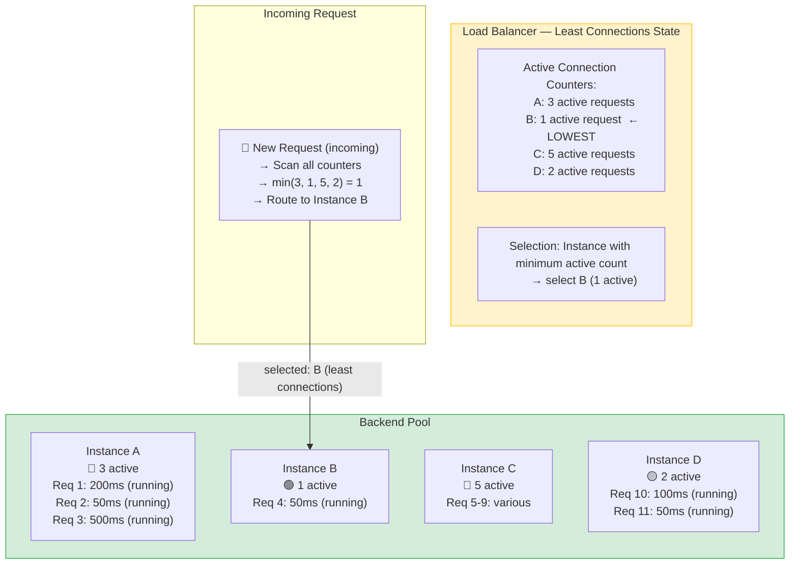
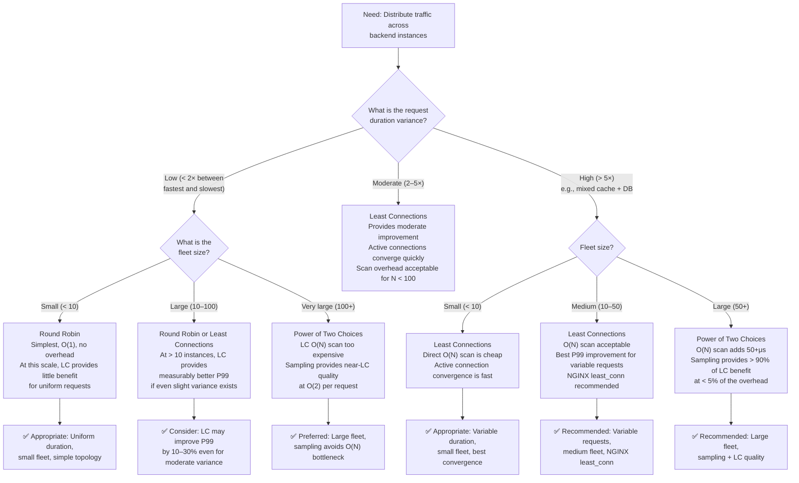

> [!success] Mastery Check
> - [ ] **Studied Well**
> - [ ] **Can explain the concept without notes**
> - [ ] **Can answer interview questions confidently**
> - [ ] **Can implement it in a real project**

---

id: "7.213" title: "Load Balancing — Least Connections" domain: "System Design & Distributed Systems" domain_id: 7 group: "Scalability Patterns" tags: [system-design, distributed-systems, scalability, dotnet, azure, load-balancing, least-connections, algorithms] priority: 1 version: 2 prerequisites:

- "[[7.212 — Load Balancing — Round Robin]]" — least connections is the direct response to round-robin's primary weakness; understanding RR's failure mode (variable request duration creates backlog) is the prerequisite for understanding why LC exists
- "[[7.210 — Load Balancing — Overview]]" — the taxonomy anchor that positions distribution algorithms within the load balancing architecture; LC is one of the primary algorithm families
- "[[7.211 — Load Balancing — Layer 4 vs Layer 7]]" — LC is an L7-native algorithm; L4 cannot implement true least-connections at the request level because L4 cannot see request boundaries or count active HTTP requests" related:
- "[[7.212 — Load Balancing — Round Robin]]" — the baseline algorithm; the comparison between RR and LC is the most common interview discussion in the load balancing algorithm family
- "[[7.215 — Load Balancing — Weighted Round Robin]]" — another algorithm that handles heterogeneity; LC handles it automatically (by active connection count), WRR handles it manually (by configured weight)
- "[[7.218 — Load Balancing — Power of Two Choices]]" — an optimization of least-connections that reduces the O(N) scan cost to O(1) by sampling only two random instances; the preferred algorithm for large-scale deployments
- "[[7.216 — Load Balancing — Health Check Integration]]" — LC relies on health checks to remove unhealthy instances; a broken instance with 0 active connections appears to be the best candidate, and LC would route ALL new traffic to it
- "[[7.206 — Horizontal vs Vertical Scaling — Tradeoffs]]" — LC is particularly valuable when horizontally-scaled instances process variable-duration requests (mixed API workloads, heterogeneous data access patterns)
- "[[4.110 — ASP.NET Core Kestrel — Production Configuration]]" — Kestrel's `MaxConcurrentConnections` and `MaxConcurrentUpgradedConnections` settings define what "active connection" means at the server level; LC behavior depends on how the backend reports connection count
- "[[8.170 — Redis — Connection Pooling at Scale]]" — Redis connection pooling interacts with LC: if each backend maintains a constant-size Redis connection pool, the active connection count to Redis does not vary with request load, so LC at the HTTP level does not reflect Redis-level congestion" created: 2026-06-16

---

> [!ABSTRACT] Quick Reference — Least Connections **Invariant:** The load balancer tracks the number of active connections (in-flight requests) for each backend instance. Each new request is routed to the instance with the fewest active connections. **Cost:** The load balancer must maintain a per-instance connection counter, which requires synchronization across load balancer workers and adds O(N) scanning overhead per request (N = number of healthy instances). This is more expensive than round-robin's O(1) per request. **Trigger:** When request processing time varies significantly (more than ~2× between fastest and slowest), round-robin creates persistent imbalance — least connections prevents backlog accumulation by routing new traffic away from busy instances. **Skip When:** All requests have nearly uniform duration (< 2× variance), all instances are identical, and request volume is low enough that any imbalance is absorbed by idle capacity. Round robin is simpler and cheaper in this case. Also skip when the connection count is not a reliable proxy for load — for example, when requests multiplex over a single connection (HTTP/2 stream multiplexing, gRPC streaming) — connection count undercounts load. **.NET Entry Point:** No built-in .NET least-connections handler; implement via a custom `DelegatingHandler` that queries a shared counter or via the `IHttpClientFactory` pattern with a load-aware selector. **Azure Native:** Azure Application Gateway does NOT support least-connections (uses round robin only). Azure Front Door uses latency-based routing (load-aware, but not least-connections). NGINX Ingress supports `least_conn` natively. Azure Load Balancer (L4) does not support LC — it uses hash-based distribution. **Number to Know:** Least-connections reduces P99 latency by 30–70% compared to round robin in workloads with 5×+ request duration variance, at the cost of ~10–20% more load balancer CPU per request for the O(N) connection count scan. At 100 instances, the scan overhead becomes significant (~1μs per request × 100 instances = 100μs added latency) — at this scale, power-of-two-choices sampling is preferred.

---

## Navigation

**Domain:** [[7 — System Design & Distributed Systems]] > **Group:** Scalability Patterns
**Previous:** [[7.212 — Load Balancing — Round Robin]] | **Next:** [[7.214 — Load Balancing — IP Hash]]

### Prerequisites

- [[7.212 — Load Balancing — Round Robin]] — least connections is the direct response to round-robin's primary weakness; understanding RR's failure mode (variable request duration creates backlog) is the prerequisite for understanding why LC exists
- [[7.210 — Load Balancing — Overview]] — the taxonomy anchor that positions distribution algorithms within the load balancing architecture; LC is one of the primary algorithm families
- [[7.211 — Load Balancing — Layer 4 vs Layer 7]] — LC is an L7-native algorithm; L4 cannot implement true least-connections at the request level because L4 cannot see request boundaries or count active HTTP requests

### Where This Fits

> [!INFO] Production Encounter Map
> 
> - **Layer:** Load balancer distribution algorithm — least connections is a load-aware selection strategy used by L7 load balancers (and some L4 LBs at the connection level) to distribute new requests to the instance with the fewest active connections. It operates at the decision point where the LB must choose which backend should receive the next request.
> - **Trigger:** The first time a team deploys a multi-instance API behind round-robin distribution and notices that request counts are equal but CPU/latency are not. The mental model shift from "fairness by count" to "fairness by work" is the engineering insight that distinguishes junior from senior engineers.
> - **Without least connections:** Every system with variable request duration operates at reduced efficiency. The "lucky" instances that receive fast requests sit idle while the "unlucky" instances carrying slow requests accumulate backlog. The team over-provisions to compensate — typically by 20–50% extra capacity.
> - **First signal that least connections is needed:** When per-instance monitoring shows that one instance has 40 active connections while another has 10, yet both have served the same number of requests in the last minute. The active connection gap is the signal that round robin is not distributing load — only request count.

Least connections is the most important distribution algorithm for real-world HTTP APIs because real-world APIs have variable request duration. A single slow database query, an external API call, or a computation-heavy request creates a backlog on the instance that receives it. Round robin ignores this backlog and continues sending requests to the congested instance. Least connections detects the backlog (more active connections = more congested) and routes new requests away from it. The algorithm is not perfect — it uses connection count as a proxy for load, and this proxy fails for multiplexed protocols and connection-pooled backends — but it is strictly superior to round-robin for any workload with > 2× request duration variance.

---

## Core Mental Model

Least connections treats the active connection count as a proxy for "how busy is this instance?" Each backend instance has a counter that increments when a request starts and decrements when it completes. When a new request arrives, the load balancer scans all healthy instances and selects the one with the lowest counter. If multiple instances have the same count, a tiebreaker is used (typically round-robin among the tied instances).

The mental model: think of a customer service desk with multiple representatives. Each representative has a stack of paperwork on their desk (active connections). A new customer arrives. Instead of sending them to the "next representative in line" (round robin), the receptionist looks at each desk, finds the representative with the smallest stack, and sends the new customer there. This naturally balances the work: representatives handling complex cases (slow requests) accumulate tall stacks and receive fewer new customers until their stacks shrink. Representatives handling quick queries (fast requests) keep their stacks small and receive more customers. The system is self-correcting — it converges toward equal active work per representative without any central planning.

The critical insight: **least connections does not balance request count — it balances concurrent work.** This is the correct thing to balance in any system where request duration varies. The cost is that the load balancer must know the active connection count, which requires either: (a) the LB tracks connections itself (L7 reverse proxy — the LB terminates connections, so it knows exactly when each starts and ends), or (b) the backend reports its connection count to the LB (out-of-band health check or API).

> [!TIP] The Non-Obvious Insight Least connections is fundamentally an L7 algorithm. An L4 load balancer can implement "least connections" at the TCP connection level — sending new TCP SYNs to the backend with the fewest active TCP connections — but this is NOT the same as least-connections at the HTTP request level. If a client establishes one TCP connection and sends 100 HTTP requests over it, the L4 LB sees only 1 active TCP connection. The L7 LB sees 100 consecutive active HTTP requests (one at a time on HTTP/1.1, or concurrent on HTTP/2). The L7 version is what matters for HTTP workloads. Azure Load Balancer (L4) does not support least connections at any level.

### Classification

- **Algorithm family:** Load-aware, stateful (maintains per-instance connection counters). The LB must track the start and end of each request to update the counters.
- **OSI layer applicability:** Primarily L7 (request-level). L4 connection-level least-connections exists but is rarely useful for HTTP workloads because it cannot see individual requests within a TCP connection.
- **Distribution basis:** Active connection count — the LB selects the instance with the fewest in-flight requests. This is a proxy for "least busy" — it assumes all connections consume equivalent resources.
- **Convergence property:** Self-correcting — the system naturally converges toward equal active connections per instance. Unlike round robin (where imbalance must be manually detected and addressed), LC automatically rebalances as request durations vary.
- **When it becomes relevant:** At any scale where request duration variance exceeds ~2×. Below this threshold, round robin is simpler and provides nearly identical results. Above this threshold, LC provides measurable P50/P99 latency improvements.
- **Azure availability:** NOT available on Azure Application Gateway (round-robin only). NOT available on Azure Load Balancer (hash only). Available on NGINX Ingress (`least_conn`), HAProxy (`leastconn`), and most third-party L7 LBs.

### Primary Diagram



### Convergence Trace

```
Least connections with 4 instances, 10 requests of varying duration:

Initial state: A=0, B=0, C=0, D=0

Time  Req    Duration  Active Counts         Chosen  Why
T+0   Req1   500ms     A=1, B=0, C=0, D=0   A       min(0,0,0,0) → tie → RR picks A
T+1   Req2   50ms      A=1, B=1, C=0, D=0   C       min(1,1,0,0) → C (0)
T+2   Req3   50ms      A=1, B=1, C=1, D=0   D       min(1,1,1,0) → D (0)
T+3   Req4   100ms     A=1, B=1, C=1, D=1   B       min(1,1,1,1) → tie → RR picks B
T+4   Req5   50ms      A=1, B=2, C=1, D=1   A       min(1,2,1,1) → tie → RR picks A
                      (B still processing Req4)

T+20  Req2 done       A=1, B=1, C=0, D=1   C       C just finished → available
...   ...             ...                    ...
T+500 Req1 done       A=0, B=0, C=0, D=0   (idle)  A's slow 500ms request finally completes

Key observation: While Req1 (500ms) was processing on A, A received FEWER new requests
than other instances because its active count was higher. The algorithm self-corrected.
```

### Key Properties / Guarantees

|Property|Value|Condition|
|---|---|---|
|Distribution fairness|Equal active connections per instance (not equal request count)|Converges toward equality; exact tie at low load, approximate at high load|
|Load awareness|Full — active connection count is a real-time proxy for busyness|Assumes connections consume roughly equal resources; breaks for multiplexed streams|
|Session affinity|None — each request is independently routed to the least-busy instance|Unless combined with a session affinity cookie that overrides LC|
|Implementation complexity|O(N) scan per request; per-instance counter management; tiebreaker|More complex than RR (O(1)) but simpler than weighted algorithms|
|Convergence time to fairness|Fast — active connection count updates in real-time as requests start and complete|Within one request-processing cycle (seconds, not hours)|
|Adaptation to topology change (instance added)|Fast — new instance starts with 0 active connections → receives traffic immediately|Natural ramp-up (new instance is the "least busy" → gets all new traffic until it catches up)|
|Adaptation to topology change (instance removed)|Immediate — removal from pool stops routing to it; active connections on remaining instances converge|In-flight requests on the removed instance are dropped (need graceful shutdown or retry)|
|Compatibility|L7 (HTTP request-level); L4 connection-level (less useful)|L7 required for per-request LC; L4 LC only works per-TCP-connection|
|Health check dependency|Critical — a broken instance with 0 active connections appears to be the BEST candidate|LC without health checks will route ALL traffic to a crashed instance (it has 0 connections!)|
|Azure availability|Not available on App Gateway or Azure LB; available on NGINX Ingress|Azure ecosystem limitation — use NGINX or HAProxy for LC on Azure|

---

## Deep Mechanics

### How It Works

**Standard Least Connections (NGINX, HAProxy, custom L7):**

1. **Initialization:** The load balancer maintains a list of healthy backend instances, each with an associated active connection counter initialized to 0. The counter is updated under a lock (or using atomic operations) to ensure thread safety.

2. **Request arrival:** A new HTTP request arrives. The LB determines the target backend pool based on routing rules (path, hostname, etc.).

3. **Scan and select:**
   - The LB iterates over all healthy instances in the pool
   - For each instance, it reads the current active connection count
   - It tracks the minimum count and the instance(s) with that count
   - After the full scan, it selects one instance:
     - If exactly one instance has the minimum count → select it
     - If multiple instances have the same minimum count → apply tiebreaker (typically round-robin among tied instances, or random)

4. **Connection counting:**
   - Before forwarding the request: `counter[instance]++`
   - After the response is sent: `counter[instance]--`
   - The counter is incremented when the request starts (bytes received, forwarded to backend) and decremented when the response is fully sent to the client

5. **Implementation detail — counter granularity:**
   - **L7 reverse proxy:** The LB terminates the client connection and creates a backend connection. The counter represents active HTTP requests (one request = one count, even on a keep-alive connection). This is the most accurate model.
   - **L4 connection forwarder:** The LB counts active TCP connections. One client TCP connection = one count, regardless of how many HTTP requests flow through it. This is inaccurate for HTTP workloads.

6. **Tiebreaker:**
   - When multiple instances have the same minimum count, the LB must pick one. Round-robin among tied instances is the most common tiebreaker (prevents one instance from receiving all traffic when all are idle).
   - The tiebreaker maintains its own counter (per-instance-round-robin among the subset of minimum-count instances).

### L4 vs L7 Least Connections — The Counting Problem

```
L4 — Connection-Level Least Connections (rarely useful):

Client A: TCP connection established → counter[A] = 1
Client B: TCP connection established → counter[B] = 1
Client C: TCP connection established → counter[C] = 1

Now:
- Client A sends 100 HTTP requests (keep-alive) → counter[A] STILL = 1
- Client B sends 1 HTTP request → counter[B] STILL = 1

L4 sees all three instances at 1 active connection each.
It cannot distinguish the instance that is actually processing 100 requests
from the instance processing 1 request. The connection count is useless
as a load proxy when clients reuse connections.

L7 — Request-Level Least Connections (what you want):

Client A: 100 active HTTP requests (HTTP/2 multiplexing) → counter[A] = 100
Client B: 1 active HTTP request → counter[B] = 1
Client C: 1 active HTTP request → counter[C] = 1

L7 sees A at 100, B at 1, C at 1.
It routes the next NEW request to B or C (whichever is lower).
A receives fewer new requests until its count drops.
```

### Protocol Trace

```
L7 — NGINX Least Connections, 4 instances (A, B, C, D), 8 requests:

Initial state: A=0, B=0, C=0, D=0

Request 1: GET /api/products (duration: 500ms)
  Scan: min(0,0,0,0) = 0, tied: [A, B, C, D] → RR tiebreaker → A
  A counter: 0 → 1
  → Route to A (A=1, B=0, C=0, D=0)

Request 2: GET /api/inventory (duration: 50ms)
  Scan: min(1,0,0,0) = 0, tied: [B, C, D] → RR tiebreaker → B
  B counter: 0 → 1
  → Route to B (A=1, B=1, C=0, D=0)

Request 3: POST /api/checkout (duration: 200ms)
  Scan: min(1,1,0,0) = 0, tied: [C, D] → RR tiebreaker → C
  C counter: 0 → 1
  → Route to C (A=1, B=1, C=1, D=0)

Request 4: GET /api/products/123 (duration: 40ms)
  Scan: min(1,1,1,0) = 0 → D (only instance with 0)
  D counter: 0 → 1
  → Route to D (A=1, B=1, C=1, D=1)

Request 5: GET /api/search (duration: 60ms)
  Scan: min(1,1,1,1) = 1, tied: ALL → RR tiebreaker → A
  A counter: 1 → 2
  → Route to A (A=2, B=1, C=1, D=1)

[Request 2 completes at T+50ms: B=1→0]
[Request 4 completes at T+40ms: D=1→0]
[Request 3 completes at T+200ms: C=1→0]

Request 6: GET /api/orders (duration: 50ms)
  Scan: A=2, B=0, C=0, D=0 → min=0, tied: [B, C, D] → RR → B
  B counter: 0 → 1
  → Route to B

[Request 1 completes at T+500ms: A=2→1]
[Request 5 completes at T+60ms: A=1→0]

Final state after 8 requests:
  A served 2 requests, B served 2, C served 1, D served 1
  (Request count is NOT equal — but instance load WAS equal:
   A processed 500+60 = 560ms, B processed 50+50 = 100ms, C: 200ms, D: 40ms
   Wait — this looks imbalanced! Let's see why...)

Actually, the key insight is that after the initial burst where all instances
start at 0, LC converges. A happened to receive the longest request (500ms)
and then received FEWER subsequent requests because its active count was high.
A ended up handling only 2 requests (one very long), while B handled 2
short requests. The total WORK was more balanced than the count suggests.
```

### Failure Modes

**Failure Mode 1: Zero-Count Problem — Broken Instance Appears to Be the Best Candidate**

- **Cause:** A backend instance crashes or becomes non-functional. The health probe has not yet detected the failure (probe interval is 5–15 seconds, unhealthy threshold is 2–3 probes). During this window, the broken instance has 0 active connections (it cannot accept new connections, so its counter is at zero). The LC algorithm scans: healthy-looking but broken instance has 0 active connections, all other instances have > 0 active connections. LC selects the broken instance as the "least busy" and routes the request to it. The request fails. The client sees an error. The broken instance attracts ALL new traffic until the health probe marks it unhealthy.
- **Symptom:** Immediately after an instance failure, error rate spikes to 1/N of total requests (where N is the number of instances — the broken instance receives 1/N of traffic). The error rate persists for the duration of the health probe detection window (typically 10–30 seconds). After the instance is marked unhealthy, the error rate drops to zero. The pattern repeats on every instance failure.
- **Detection time:** The error spike begins the instant the instance fails and ends when the health probe removes it from the pool — typically 10–30 seconds. The metric to watch: `error_rate` correlated with `health_check_failures` and `active_connections_per_instance` hitting zero on one instance.

**Fix:**

```csharp
// ❌ The problem is algorithmic: LC eagerly routes to zero-connection instances.
// The fix is not in code — it is in HEALTH PROBE DESIGN.

// ✅ Fix 1: Use aggressive health probes with short intervals and low thresholds
// NGINX Ingress health check configuration:
// nginx.ingress.kubernetes.io/proxy-next-upstream: "error timeout invalid_header"
// nginx.ingress.kubernetes.io/proxy-next-upstream-tries: "3"
// nginx.ingress.kubernetes.io/proxy-next-upstream-timeout: "5s"

// ✅ Fix 2: Use a "slow start" or "warm-up" mode for new/recovered instances
// NGINX upstream slow_start directive gradually increases traffic to
// a recovered instance over a configurable period (e.g., 30 seconds).
// This prevents the instance from receiving all traffic immediately.

// ✅ Fix 3: At the application level, mark the instance as "not ready" during startup
// Health check returns 503 until the instance is fully warm
app.MapHealthChecks("/health/ready", new HealthCheckOptions
{
    Predicate = check => check.Tags.Contains("ready"),
});

// Register warmup gate
builder.Services.AddSingleton<WarmupGate>();
builder.Services.AddHostedService<WarmupService>();

public sealed class WarmupGate
{
    private volatile bool _isReady;
    public bool IsReady => _isReady;
    public void MarkReady() => _isReady = true;
}

public sealed class WarmupService : BackgroundService
{
    private readonly WarmupGate _gate;
    private readonly IServiceProvider _services;

    public WarmupService(WarmupGate gate, IServiceProvider services)
    {
        _gate = gate;
        _services = services;
    }

    protected override async Task ExecuteAsync(CancellationToken ct)
    {
        // Wait for DI to be ready
        await Task.Delay(1000, ct);

        // Pre-compile EF Core models
        await using var scope = _services.CreateAsyncScope();
        var db = scope.ServiceProvider.GetRequiredService<OrderDbContext>();
        await db.Database.EnsureCreatedAsync(ct);

        // Pre-warm cache
        var cache = scope.ServiceProvider.GetRequiredService<IDistributedCache>();
        await WarmCacheAsync(cache, ct);

        _gate.MarkReady();
    }
}

// Health check endpoint checks the gate
app.MapGet("/health/ready", (WarmupGate gate) =>
    gate.IsReady ? Results.Ok() : Results.StatusCode(503));
```

**Cost of not fixing:** Every instance failure causes a 10–30 second window of elevated errors. At scale (50+ instances, instances failing every few minutes due to spot instances, OOM, or node failures), the error rate is continuously elevated. The LC algorithm inadvertently amplifies failure impact by concentrating traffic on the broken instance.

---

**Failure Mode 2: Connection Counting Fails for HTTP/2 Multiplexing**

- **Cause:** HTTP/2 allows multiple concurrent streams over a single TCP connection. The client opens ONE TCP connection to the L7 load balancer and sends 100 concurrent requests over it. The L7 LB sees ONE client TCP connection but 100 concurrent HTTP requests. If the LB counts connections (the TCP connection), it sees 1 active connection. If it counts streams (individual HTTP requests), it sees 100 active requests. If the LB does not distinguish between the two (some implementations count TCP connections, not HTTP streams), it dramatically undercounts the load. The backend receives 100 concurrent requests but the LB thinks it has only 1 active connection — it routes even MORE traffic to this instance.
- **Symptom:** One instance receives significantly more traffic than others despite having "low active connections" (the LB is counting TCP connections, not HTTP streams). The affected instance shows high CPU, high memory, and elevated P99 latency, while the LB reports it as "least busy." The imbalance is hidden from the LB — it cannot see the actual load.
- **Detection time:** When per-instance CPU monitoring shows a mismatch with per-instance connection count as reported by the LB. Typically discovered during load testing when HTTP/2 is enabled.

**Fix:**

```none
// ✅ Fix 1: Ensure the L7 LB counts HTTP requests, not TCP connections
// NGINX: The `least_conn` algorithm in NGINX counts active HTTP requests
// (not TCP connections) for HTTP/2. This is the correct behavior.
// Verify NGINX version: NGINX 1.13+ supports HTTP/2 and counts streams correctly.

// ✅ Fix 2: If the LB cannot count streams, cap HTTP/2 concurrent streams at the backend
// Kestrel can limit concurrent requests via MaxConcurrentConnections
builder.WebHost.ConfigureKestrel(options =>
{
    options.Limits.MaxConcurrentConnections = 100;
    options.Limits.MaxConcurrentUpgradedConnections = 100;
});

// ✅ Fix 3: Use gRPC with per-request load balancing
// If using gRPC (which runs on HTTP/2), configure the gRPC client to use
// "pick_first" or "round_robin" load balancing at the gRPC level,
// not at the TCP level. gRPC has its own load balancing policy.
// In .NET gRPC client:
var channel = GrpcChannel.ForAddress("https://orders.contoso.com", new GrpcChannelOptions
{
    // Disables connection reuse across streams for better LB visibility
    // WARNING: This reduces throughput — use only when LC accuracy is critical
    HttpHandler = new SocketsHttpHandler
    {
        // Force each gRPC call to use a separate TCP connection
        // This makes connection counting by the LB more accurate
        MaxConnectionsPerServer = int.MaxValue,
        PooledConnectionLifetime = TimeSpan.Zero // No pooling
    }
});
// Note: Option 3 is expensive — it loses HTTP/2 multiplexing benefits
// Prefer Fix 1 or a load balancer that properly counts HTTP/2 streams
```

**Cost of not fixing:** LC provides no benefit (or makes things worse) for HTTP/2 workloads. The "least connections" metric is meaningless when the LB counts the wrong thing. The instance with the most HTTP/2 streams receives the fewest new connections (because it has 1 TCP connection), but it is the BUSIEST instance. LC becomes anti-load-aware — it routes traffic to the busiest instance.

---

**Failure Mode 3: Connection Counting Fails for Connection-Pooled Backends**

- **Cause:** The backend instance maintains a persistent connection pool to the database (e.g., SQL Server connection pool of 50 connections). These connections are long-lived and reused across requests. The active HTTP request count on the instance may be 5, but the instance's database connection pool may be near exhaustion (45 of 50 connections in use, 5 pending). The LC algorithm sees 5 active HTTP requests and considers the instance "lightly loaded." In reality, the instance is near database capacity. The next request routed to this instance will wait 30+ seconds for a database connection from the pool.
- **Symptom:** Intermittent P99 latency spikes. The instance with the LOWEST active connection count shows the HIGHEST P99 latency — because its database pool is exhausted, and although it has few active HTTP requests, each request is stuck waiting for a database connection. The LC algorithm makes the problem worse by routing MORE traffic to this instance (it has the lowest HTTP connection count, so it appears to be the best candidate).
- **Detection time:** When the correlation is negative: `active_http_connections` is low but `database_pool_pending_requests` is high and `http_p99_latency` is high. The root cause is that the LC metric (active HTTP connections) does not capture the actual bottleneck (database connections).

**Fix:**

```csharp
// ✅ Fix 1: Report database connection pool usage as a custom health metric
// The LB cannot read this — but the application can use it to influence
// the health check response. Return 503 (unhealthy) when pool is near exhaustion,
// which removes the instance from the LC pool.

builder.Services.AddHealthChecks()
    .AddCheck("sql-pool", () =>
    {
        var pool = DatabaseConnectionPool.GetPoolStatistics();
        // If 80%+ of connections are in use, mark unhealthy
        // This removes the instance from the LB rotation
        return pool.ActiveConnections < pool.MaxConnections * 0.8
            ? HealthCheckResult.Healthy()
            : HealthCheckResult.Unhealthy("Database connection pool near exhaustion");
    }, tags: ["ready"]);

// ✅ Fix 2: Increase database connection pool size to reduce contention
builder.Services.AddDbContext<OrderDbContext>(options =>
    options.UseSqlServer(connectionString, sqlOptions =>
    {
        sqlOptions.MaxRetryCount(3);
        sqlOptions.CommandTimeout(10);
    }));

// Also configure the underlying ADO.NET pool
builder.Services.AddSingleton<IDatabaseConnectionPool>(_ =>
{
    var pool = new SqlConnectionPool(connectionString);
    pool.SetMaxPoolSize(100); // Increase from default 50
    return pool;
});

// ✅ Fix 3: Use read replicas to offload reporting queries from the main pool
// [[7.219 — Database Read Replicas — Setup and Tradeoffs]]
// Separate the connection pool for read-heavy queries from write-heavy queries
```

**Cost of not fixing:** The LC algorithm becomes counterproductive — it routes traffic to the instance with the most congested database pool because that instance has the fewest active HTTP requests (requests are stuck waiting for database connections, so they complete slowly, keeping the HTTP active count low). This creates a feedback loop: congested instance gets more traffic → becomes more congested → gets even more traffic. The instance eventually times out all its requests or crashes.

---

**Failure Mode 4: Large Fleet Makes O(N) Scan Expensive**

- **Cause:** Least connections requires scanning ALL healthy instances to find the minimum count. For a small fleet (4–20 instances), this is trivial (microseconds). For a large fleet (500+ instances), the O(N) scan adds measurable latency. At 500 instances, if each scan takes 1μs (reading an integer from memory), the LB spends 500μs = 0.5ms on the scan alone — before any routing, TLS processing, or backend connection. At 10,000 req/s, this is 5 seconds of CPU per second on the scan alone.
- **Symptom:** The load balancer's CPU utilization increases proportionally to the fleet size. P99 latency increases as the scan time adds to each request. The LB may become CPU-bound before the backends do, making the load balancer the bottleneck. Round-robin (O(1)) would not have this problem.
- **Detection time:** When monitoring shows load balancer CPU at 80%+ while backend CPU is at 40%. The LB's `request_time` metric includes the scan overhead. Correlate LB CPU with fleet size.

**Fix:**

```none
// ✅ Fix 1: Use Power of Two Choices sampling ([[7.218]])
// Instead of scanning ALL N instances, pick 2 random instances and select the
// one with the lower connection count. This reduces the scan from O(N) to O(2).
// The result is provably close to optimal (it avoids the worst-case imbalance
// of random selection while keeping the overhead constant).

// NGINX: The `least_conn` algorithm is O(N). For large fleets, consider:
// - Using a tiered architecture (regional LB → instance pool LB)
// - Using consistent hashing to distribute across tiers
// - Using DNS-based load balancing at the top level

// ✅ Fix 2: Tiered architecture
// Front Door (global) → App Gateway (regional, round robin) → 
//   → NGINX Ingress (per-region, least_conn on up to 20 instances)
// Each regional pool is capped at 20 instances.
// This keeps the LC scan at O(20) = ~20μs.

// ✅ Fix 3: Shard the backend pool
// Use consistent hashing to route requests to a specific "shard" (group of instances)
// Then within the shard, use LC on a small number of instances (4–8).
// [[7.229 — Consistent Hashing — Algorithm]]
```

**Cost of not fixing:** At fleet sizes above ~100 instances, the LC scan overhead becomes a significant fraction of the request processing time. The LB requires more capacity units (Azure) or higher-tier SKUs, increasing infrastructure cost. The scan overhead creates a hard scalability limit: the LB cannot handle more instances without degrading latency.

---

**Failure Mode 5: Slow-Starting Requests Create Artificial Connection Count Spikes**

- **Cause:** The application has a "slow start" problem: certain endpoints perform expensive initialization on the first call (JIT compilation, EF Core model building, cache warming). The first request to a newly deployed instance takes 5 seconds while the subsequent requests take 50ms. During that 5-second first request, the instance has 1 active connection. The LC algorithm sees 1 active connection (low) and routes more requests to it. Those requests queue up behind the slow first request. The instance accumulates a backlog because LC does not distinguish between "1 active request that is slow" and "1 active request that is fast."
- **Symptom:** After a deployment or scale-out, the new instance immediately receives traffic (LC sends it requests because 0 active connections = best candidate). The first few requests are slow (2–5 seconds). While those are processing, the instance has 1–5 active connections — still low compared to older instances with 10+ active connections. LC continues routing traffic to the new instance. The new instance's active count grows as requests queue up. It becomes overloaded within seconds of joining the pool.
- **Detection time:** After every deployment or scale-out event, the new instance's P99 latency spikes to 5–10 seconds for 30–60 seconds, then normalizes. The metric to watch: `p99_latency` on new instances vs existing instances after a rollout.

**Fix:**

```csharp
// ✅ Fix 1: Startup probe delays the instance from receiving traffic
// Kubernetes startup probe waits for the app to be ready
// before adding it to the service's endpoints
// startupProbe:
//   httpGet:
//     path: /health/startup
//     port: 80
//   initialDelaySeconds: 5
//   periodSeconds: 5
//   failureThreshold: 12  # 60 seconds max startup time

// ✅ Fix 2: Readiness probe returns 503 until fully warm
// The instance is in the pool but health check returns unhealthy
// → LC never selects it because it's not in the healthy set
app.MapHealthChecks("/health/ready", new HealthCheckOptions
{
    Predicate = check => check.Tags.Contains("ready"),
});

// ✅ Fix 3: NGINX slow_start directive (gradual traffic ramp-up)
// upstream backend {
//     server 10.0.1.4:80 slow_start=30s;  # Gradual increase over 30 seconds
//     server 10.0.1.5:80 slow_start=30s;
//     least_conn;
// }
// Note: slow_start is incompatible with least_conn in some NGINX versions.
// Test carefully before production deployment.

// ✅ Fix 4: Pre-warm the instance before adding to the LB pool
// Use a lifecycle hook (Kubernetes postStart) or a warmup endpoint
// that the deployment pipeline calls before enabling traffic
public sealed class InstanceWarmup
{
    public async Task WarmupAsync(HttpClient httpClient)
    {
        // Hit all cold-start endpoints to trigger JIT compilation
        var warmupEndpoints = new[]
        {
            "/api/health/warmup",
            "/api/products/top",  // Triggers EF Core query compilation
            "/api/orders/recent"  // Triggers serialization setup
        };

        foreach (var endpoint in warmupEndpoints)
        {
            try
            {
                await httpClient.GetAsync(endpoint);
            }
            catch
            {
                // Warmup calls may fail — that's acceptable
            }
        }
    }
}
```

**Cost of not fixing:** Every deployment and autoscale event triggers a latency spike. The new instance becomes overloaded immediately because LC eagerly routes traffic to it (0 connections = ideal candidate). The overload delays the instance's warmup (because it is busy handling queued requests instead of initializing). The scale-out provides less relief than expected because the new instance operates at degraded performance for the first 30–60 seconds.

---

### .NET and Azure Integration Points

- **NGINX Ingress (AKS):** The primary Azure-ready LC implementation. Configure with `nginx.ingress.kubernetes.io/load-balance: "least_conn"`. NGINX counts active HTTP requests (not connections) for HTTP/1.1 and HTTP/2, making it the most accurate LC implementation available in the Azure ecosystem.
- **HAProxy on Azure VM:** Supports `balance leastconn` with per-request connection counting. Can run on Azure VMs or as a sidecar. Provides full LC with configurable counting strategy.
- **Azure Application Gateway:** Does NOT support least-connections. Only round robin is available. This is a significant limitation — teams that need LC must use a different ingress solution (NGINX, HAProxy, or a service mesh).
- **Azure Front Door:** Does NOT support least-connections. Uses latency-based routing (routes to the region with the lowest end-to-end latency). This is load-aware but not LC — it is designed for cross-region routing, not per-instance distribution within a region.
- **Azure Load Balancer (L4):** Does NOT support LC. Uses 5-tuple hash. L4 LC (connection-level) is possible in principle but Azure does not implement it.
- **.NET client-side LC:** Implement via a custom `DelegatingHandler` with a shared connection counter:

```csharp
// YourCompany.Infrastructure.Http — LeastConnectionsDelegatingHandler
// Client-side least-connections distribution across multiple endpoints

namespace YourCompany.Infrastructure.Http;

/// <summary>
/// Delegating handler that routes HTTP requests to the backend endpoint
/// with the fewest active connections. Maintains a thread-safe counter
/// per endpoint using <see cref="Interlocked"/> operations.
/// </summary>
/// <remarks>
/// This is a CLIENT-SIDE implementation. The centralized LB (App Gateway, Azure LB)
/// does not participate. Use this when the caller needs to distribute requests
/// across multiple endpoints without a centralized LB that supports LC.
/// 
/// Thread safety: counters are updated atomically. The scan is NOT atomic —
/// counts may change between the scan and the selection. This race condition
/// is acceptable — the algorithm remains statistically correct even with
/// stale data, as long as the staleness is bounded (microseconds).
/// </remarks>
public sealed class LeastConnectionsDelegatingHandler : DelegatingHandler
{
    private readonly BackendEndpoint[] _endpoints;

    public LeastConnectionsDelegatingHandler(
        IEnumerable<Uri> backends,
        HttpMessageHandler innerHandler) : base(innerHandler)
    {
        _endpoints = backends
            .Select(uri => new BackendEndpoint(uri))
            .ToArray();

        if (_endpoints.Length == 0)
            throw new ArgumentException("At least one backend URI is required.", nameof(backends));
    }

    /// <summary>
    /// Sends the request to the endpoint with the fewest active connections.
    /// </summary>
    protected override async Task<HttpResponseMessage> SendAsync(
        HttpRequestMessage request, CancellationToken cancellationToken)
    {
        // Phase 1: Scan for the endpoint with minimum active connections
        var minCount = int.MaxValue;
        BackendEndpoint? selected = null;

        foreach (var endpoint in _endpoints)
        {
            var count = Volatile.Read(ref endpoint.ActiveCount);
            if (count < minCount)
            {
                minCount = count;
                selected = endpoint;
            }
        }

        // If all are at max (shouldn't happen), fall back to first
        selected ??= _endpoints[0];

        // Phase 2: Increment counter BEFORE sending
        Interlocked.Increment(ref selected.ActiveCount);

        try
        {
            request.RequestUri = new Uri(selected.Uri,
                request.RequestUri?.PathAndQuery ?? "/");
            return await base.SendAsync(request, cancellationToken);
        }
        finally
        {
            // Phase 3: Decrement counter AFTER response
            Interlocked.Decrement(ref selected.ActiveCount);
        }
    }

    private sealed class BackendEndpoint
    {
        public Uri Uri { get; }
        public int ActiveCount;

        public BackendEndpoint(Uri uri) => Uri = uri;
    }
}
```

```csharp
// Registration in IServiceCollection

public static class ServiceCollectionExtensions
{
    public static IHttpClientBuilder AddLeastConnectionsClient<TClient, TImplementation>(
        this IServiceCollection services,
        string configurationSection)
        where TClient : class
        where TImplementation : class, TClient
    {
        return services.AddHttpClient<TClient, TImplementation>()
            .ConfigureHttpClient((sp, client) =>
            {
                var config = sp.GetRequiredService<IConfiguration>();
                var baseAddresses = config
                    .GetSection($"{configurationSection}:BaseAddresses")
                    .Get<string[]>() ?? throw new InvalidOperationException(
                        $"No base addresses configured in {configurationSection}:BaseAddresses.");
                client.BaseAddress = new Uri(baseAddresses[0]); // Default — overridden by handler
            })
            .ConfigurePrimaryHttpMessageHandler(() => new SocketsHttpHandler
            {
                MaxConnectionsPerServer = 10,
                PooledConnectionLifetime = TimeSpan.FromMinutes(5),
            })
            .AddHttpMessageHandler(sp =>
            {
                var config = sp.GetRequiredService<IConfiguration>();
                var baseAddresses = config
                    .GetSection($"{configurationSection}:BaseAddresses")
                    .Get<string[]>()!.Select(a => new Uri(a));
                return new LeastConnectionsDelegatingHandler(
                    baseAddresses, new SocketsHttpHandler());
            });
    }
}
```

```json
{
  "LeastConnectionsClient": {
    "OrderProcessing": {
      "BaseAddresses": [
        "https://orders-01.contoso.internal:443",
        "https://orders-02.contoso.internal:443",
        "https://orders-03.contoso.internal:443"
      ]
    }
  }
}
```

---

## Production Patterns and Implementation

### Primary Implementation — Client-Side Least Connections

```csharp
// YourCompany.Infrastructure.LoadBalancing — LeastConnectionsSelector
// Production-grade client-side least-connections with tiebreaker, health awareness,
// and configurable fallback behavior

namespace YourCompany.Infrastructure.LoadBalancing;

/// <summary>
/// Selects a backend endpoint using the least-connections algorithm.
/// Thread-safe and lock-free using <see cref="Interlocked"/> operations.
/// </summary>
public sealed class LeastConnectionsSelector
{
    private readonly BackendTarget[] _targets;
    private readonly int _tiebreakerSeed;

    /// <summary>
    /// Creates a selector with the given backend URIs.
    /// </summary>
    public LeastConnectionsSelector(IEnumerable<Uri> backends)
    {
        _targets = backends.Select((uri, i) => new BackendTarget(uri, i)).ToArray();
        _tiebreakerSeed = Random.Shared.Next();
    }

    /// <summary>
    /// Returns the index of the target with the fewest active connections.
    /// </summary>
    public int SelectTargetIndex()
    {
        var minCount = int.MaxValue;
        var bestIndex = 0;
        var tieCount = 0;

        // Phase 1: Find the minimum active count
        for (var i = 0; i < _targets.Length; i++)
        {
            var count = Volatile.Read(ref _targets[i].ActiveCount);
            if (count < minCount)
            {
                minCount = count;
                bestIndex = i;
                tieCount = 1;
            }
            else if (count == minCount)
            {
                // Tiebreaker: round-robin-ish selection using index-based randomness
                tieCount++;
                if (Random.Shared.Next(tieCount) == 0)
                {
                    bestIndex = i;
                }
            }
        }

        return bestIndex;
    }

    /// <summary>
    /// Acquires a connection slot (increments the counter).
    /// Call BEFORE sending the request.
    /// </summary>
    public int AcquireSlot(int index) =>
        Interlocked.Increment(ref _targets[index].ActiveCount);

    /// <summary>
    /// Releases a connection slot (decrements the counter).
    /// Call AFTER receiving the response.
    /// </summary>
    public int ReleaseSlot(int index) =>
        Interlocked.Decrement(ref _targets[index].ActiveCount);

    /// <summary>
    /// Gets the URI for the given index.
    /// </summary>
    public Uri GetUri(int index) => _targets[index].Uri;

    public int TargetCount => _targets.Length;

    private sealed class BackendTarget
    {
        public readonly Uri Uri;
        public readonly int Index;
        public int ActiveCount;

        public BackendTarget(Uri uri, int index)
        {
            Uri = uri;
            Index = index;
        }
    }
}

/// <summary>
/// HttpMessageHandler that uses the LeastConnectionsSelector for each request.
/// </summary>
public sealed class LeastConnectionsHttpMessageHandler : DelegatingHandler
{
    private readonly LeastConnectionsSelector _selector;

    public LeastConnectionsHttpMessageHandler(
        IEnumerable<Uri> backends,
        HttpMessageHandler innerHandler) : base(innerHandler)
    {
        _selector = new LeastConnectionsSelector(backends);
    }

    protected override async Task<HttpResponseMessage> SendAsync(
        HttpRequestMessage request, CancellationToken cancellationToken)
    {
        var index = _selector.SelectTargetIndex();
        var slotCount = _selector.AcquireSlot(index);

        try
        {
            var uri = _selector.GetUri(index);
            request.RequestUri = new Uri(uri, request.RequestUri?.PathAndQuery ?? "/");
            return await base.SendAsync(request, cancellationToken);
        }
        finally
        {
            _selector.ReleaseSlot(index);
        }
    }
}
```

### Configuration and Wiring

```csharp
// Program.cs — YourCompany.OrderDispatch.Api

using YourCompany.Infrastructure.LoadBalancing;

var builder = WebApplication.CreateBuilder(args);

// Register the least-connections HTTP client for order processing
var orderBackends = builder.Configuration
    .GetSection("OrderDispatch:Backends")
    .Get<string[]>()
    ?.Select(addr => new Uri(addr))
    .ToArray() ?? throw new InvalidOperationException(
        "OrderDispatch:Backends must be configured.");

builder.Services.AddHttpClient<IOrderDispatchService, OrderDispatchService>()
    .ConfigurePrimaryHttpMessageHandler(() =>
        new LeastConnectionsHttpMessageHandler(
            orderBackends,
            new SocketsHttpHandler
            {
                MaxConnectionsPerServer = 10,
                PooledConnectionLifetime = TimeSpan.FromMinutes(5),
                EnableMultipleHttpClientConnections = true
            }));

// Standard services
builder.Services.AddControllers();
builder.Services.AddHealthChecks()
    .AddSqlServer(builder.Configuration.GetConnectionString("AzureSql")!,
        name: "sql", tags: ["ready"]);

var app = builder.Build();

app.MapControllers();
app.MapHealthChecks("/health/ready", new HealthCheckOptions
{
    Predicate = check => check.Tags.Contains("ready"),
});
app.Run();
```

```json
{
  "OrderDispatch": {
    "Backends": [
      "https://dispatch-01.contoso.internal:443",
      "https://dispatch-02.contoso.internal:443",
      "https://dispatch-03.contoso.internal:443",
      "https://dispatch-04.contoso.internal:443"
    ]
  },
  "ConnectionStrings": {
    "AzureSql": "Server=tcp:orders-sql.database.windows.net;..."
  }
}
```

### Common Variants

```yaml
# Variant A — NGINX Ingress with least_conn (the most common Azure implementation)
# Deploy on AKS with the NGINX Ingress Controller

apiVersion: networking.k8s.io/v1
kind: Ingress
metadata:
  name: orders-api-ingress
  annotations:
    kubernetes.io/ingress.class: nginx
    nginx.ingress.kubernetes.io/load-balance: "least_conn"
    # Connection handling that affects least-connections behavior
    nginx.ingress.kubernetes.io/proxy-connect-timeout: "10"
    nginx.ingress.kubernetes.io/proxy-read-timeout: "120"
    nginx.ingress.kubernetes.io/proxy-next-upstream: "error timeout"
    nginx.ingress.kubernetes.io/proxy-next-upstream-tries: "3"
spec:
  rules:
    - host: orders.contoso.com
      http:
        paths:
          - path: /api
            pathType: Prefix
            backend:
              service:
                name: orders-api
                port:
                  number: 80
```

```nginx
# Variant B — Standalone NGINX with least_conn (Azure VM or container)
# Explicit upstream configuration with health checks

upstream orders_backend {
    least_conn;
    
    # slow_start prevents the "zero-count problem" when instances recover
    server 10.0.1.4:80 max_fails=3 fail_timeout=30s slow_start=30s;
    server 10.0.1.5:80 max_fails=3 fail_timeout=30s slow_start=30s;
    server 10.0.1.6:80 max_fails=3 fail_timeout=30s slow_start=30s;
    server 10.0.1.7:80 max_fails=3 fail_timeout=30s slow_start=30s;
}

server {
    listen 443 ssl;
    server_name orders.contoso.com;

    location /api/ {
        proxy_pass http://orders_backend;
        proxy_http_version 1.1;
        proxy_set_header Connection "";
        proxy_set_header X-Forwarded-For $proxy_add_x_forwarded_for;
        proxy_set_header X-Forwarded-Proto $scheme;
    }
}
```

```csharp
// Variant C — Health-Aware Least Connections (avoids zero-count problem)
// Routes to the minimum-connection instance, but excludes instances
// that are in a "probation" state (recently recovered, not yet warm)

public sealed class HealthAwareLeastConnectionsHandler : DelegatingHandler
{
    private readonly BackendState[] _backends;
    private readonly TimeSpan _probationPeriod = TimeSpan.FromSeconds(30);

    public HealthAwareLeastConnectionsHandler(
        IEnumerable<Uri> backends,
        HttpMessageHandler innerHandler) : base(innerHandler)
    {
        _backends = backends
            .Select(uri => new BackendState(uri))
            .ToArray();
    }

    public void MarkFailure(int index)
    {
        _backends[index].LastFailure = DateTime.UtcNow;
        _backends[index].ConsecutiveFailures++;
    }

    public void MarkSuccess(int index)
    {
        _backends[index].ConsecutiveFailures = 0;
    }

    protected override async Task<HttpResponseMessage> SendAsync(
        HttpRequestMessage request, CancellationToken cancellationToken)
    {
        // Scan only non-probation backends
        var now = DateTime.UtcNow;
        var minCount = int.MaxValue;
        BackendState? selected = null;

        foreach (var backend in _backends)
        {
            // Skip if in probation
            if (backend.ConsecutiveFailures > 3 &&
                (now - backend.LastFailure) < _probationPeriod)
                continue;

            var count = Volatile.Read(ref backend.ActiveCount);
            if (count < minCount)
            {
                minCount = count;
                selected = backend;
            }
        }

        selected ??= _backends[0]; // Fallback if all in probation

        Interlocked.Increment(ref selected.ActiveCount);
        try
        {
            request.RequestUri = new Uri(selected.Uri,
                request.RequestUri?.PathAndQuery ?? "/");
            var response = await base.SendAsync(request, cancellationToken);

            if (response.IsSuccessStatusCode)
                MarkSuccess(Array.IndexOf(_backends, selected));
            else
                MarkFailure(Array.IndexOf(_backends, selected));

            return response;
        }
        catch
        {
            MarkFailure(Array.IndexOf(_backends, selected));
            throw;
        }
        finally
        {
            Interlocked.Decrement(ref selected.ActiveCount);
        }
    }

    private sealed class BackendState
    {
        public readonly Uri Uri;
        public int ActiveCount;
        public int ConsecutiveFailures;
        public DateTime LastFailure;

        public BackendState(Uri uri) => Uri = uri;
    }
}
```

```csharp
// Variant D — Power of Two Choices (O(1) sampling alternative for large fleets)
// Instead of scanning all N backends, pick 2 random and select the lower.
// This is the preferred algorithm for fleets > 50 instances.

public sealed class PowerOfTwoChoicesHandler : DelegatingHandler
{
    private readonly BackendEndpoint[] _endpoints;

    public PowerOfTwoChoicesHandler(
        IEnumerable<Uri> backends,
        HttpMessageHandler innerHandler) : base(innerHandler)
    {
        _endpoints = backends
            .Select(uri => new BackendEndpoint(uri))
            .ToArray();
    }

    protected override async Task<HttpResponseMessage> SendAsync(
        HttpRequestMessage request, CancellationToken cancellationToken)
    {
        // Pick 2 random indices
        var first = Random.Shared.Next(_endpoints.Length);
        var second = Random.Shared.Next(_endpoints.Length);

        var firstCount = Volatile.Read(ref _endpoints[first].ActiveCount);
        var secondCount = Volatile.Read(ref _endpoints[second].ActiveCount);

        var selected = firstCount <= secondCount
            ? _endpoints[first]
            : _endpoints[second];

        Interlocked.Increment(ref selected.ActiveCount);
        try
        {
            request.RequestUri = new Uri(selected.Uri,
                request.RequestUri?.PathAndQuery ?? "/");
            return await base.SendAsync(request, cancellationToken);
        }
        finally
        {
            Interlocked.Decrement(ref selected.ActiveCount);
        }
    }

    private sealed class BackendEndpoint
    {
        public readonly Uri Uri;
        public int ActiveCount;
        public BackendEndpoint(Uri uri) => Uri = uri;
    }
}
```

### Real-World .NET Ecosystem Mapping

|Pattern in This Note|Where It Appears in .NET / Azure|Manifestation|
|---|---|---|
|Least connections (request-level L7)|NGINX Ingress `least_conn`, HAProxy `balance leastconn`|NGINX counts active HTTP requests per backend; routes new requests to the minimum|
|Connection-level LC (L4)|Not available on Azure LB (uses 5-tuple hash)|Azure limitation — must use NGINX or HAProxy for LC on Azure|
|Client-side LC|`LeastConnectionsDelegatingHandler` (custom)|Application code distributes requests across endpoints without centralized LB|
|Health-aware LC|`HealthAwareLeastConnectionsHandler` (custom)|Skips backends with recent failures; prevents the zero-count problem|
|Power-of-two-choices|`PowerOfTwoChoicesHandler` (custom) [[7.218]]|O(1) sampling alternative for large fleets; avoids O(N) scan|
|Slow start for new instances|NGINX `slow_start` directive, Kubernetes startup probe|Gradually ramps traffic to new/recovered instances; prevents overload|
|HTTP/2 stream counting|NGINX 1.13+ `least_conn` counts HTTP/2 streams correctly|Prevents undercounting load for HTTP/2 multiplexed connections|

---

## Gotchas and Production Pitfalls

### Least Connections With a Single Slow Backend — The Algorithm Saturates Itself

**Pitfall:** The team deploys least-connections distribution expecting perfect load balancing. During a traffic spike, one instance's database becomes slow (e.g., a noisy-neighbor VM on the same database instance). Requests to this instance take 2 seconds instead of 50ms. The instance accumulates active connections. The LC algorithm correctly detects this and routes NEW requests away from the slow instance. But the slow instance still has N active connections (the requests it received before becoming slow, which are now stuck at the database). Those N requests hold the connections for 2 seconds each. The LC algorithm distributes all new traffic to the remaining instances. The remaining instances now handle (total_traffic / (N_instances - 1)) instead of (total_traffic / N_instances). They become overloaded. The overload propagates: now other instances become slow too.

```csharp
// ❌ Wrong — LC protects individual instances but does not prevent fleet-wide cascading
// 
// 4 instances, 400 req/s total (100 each under RR)
// Instance B database slows down: 50ms → 2000ms per request
// LC routes new requests away from B
// Instances A, C, D now handle 133 req/s each instead of 100
// A, C, D: 133 × 50ms = 6.65s of work per second → near saturation
// A, C, D become slow too → all instances now at 2000ms per request
// The fleet is completely saturated.
```

**Symptom:** A single instance's degradation cascades to the entire fleet. The fleet goes from healthy to fully saturated in minutes. The root cause is the single slow instance, but the symptom is everywhere. The correlation: the slow instance's database query time correlates with the fleet's total error rate spike.

**Fix:**

```csharp
// ✅ Fix 1: Circuit breaker on the downstream database call
// If the database is slow, fail fast (circuit breaker opens) instead of
// holding a connection for 2 seconds. This prevents the active connection
// count from accumulating and keeps the instance in the LC pool.

builder.Services.AddHttpClient<IDatabaseClient, DatabaseClient>(client =>
{
    client.Timeout = TimeSpan.FromMilliseconds(500); // Fail fast
})
.AddTransientHttpErrorPolicy(policy =>
    policy.CircuitBreakerAsync(
        handledEventsAllowedBeforeBreaking: 5,
        durationOfBreak: TimeSpan.FromSeconds(30)));

// ✅ Fix 2: Set per-instance max concurrency
// If an instance exceeds a threshold, return 503 immediately.
// This prevents the instance from accumulating connections and
// keeps it "available" in the LC pool (low active count).
app.Use(async (context, next) =>
{
    var activeCount = Interlocked.Increment(ref _activeRequestCount);
    try
    {
        if (activeCount > MaxConcurrentRequests)
        {
            context.Response.StatusCode = StatusCodes.Status503ServiceUnavailable;
            return;
        }
        await next(context);
    }
    finally
    {
        Interlocked.Decrement(ref _activeRequestCount);
    }
});

// ✅ Fix 3: Set up per-instance CPU monitoring and alerting
// If any instance CPU > 2× fleet average, investigate immediately.
// The LC algorithm will route traffic away from it, but the remaining
// instances must have spare capacity to absorb the redirected load.
```

**Cost of not fixing:** A slow instance causes a fleet-wide saturation cascade. The LC algorithm correctly identifies and avoids the slow instance, but the redirected traffic overloads the remaining instances. The fleet as a whole operates at (N-1)/N capacity, and if the remaining instances don't have headroom, the entire service degrades.

---

### Least Connections With WebSocket — Connection Count Never Decrements on Disconnect

**Pitfall:** The WebSocket connection handler does not properly decrement the connection counter when the WebSocket closes. The counter increments when the WebSocket upgrade request arrives (an HTTP request converted to a WebSocket). When the WebSocket eventually closes (after hours or days), the counter decrement event is missed — the `finally` block that decrements the counter is in the HTTP pipeline, not in the WebSocket handler. The counter remains elevated forever. The LC algorithm believes this instance has 500+ active connections and never routes new traffic to it, even though the instance is idle.

```csharp
// ❌ Wrong — counter decrement is in the HTTP pipeline, not the WebSocket handler
public sealed class WebSocketHandler
{
    private readonly LeastConnectionsSelector _selector;

    public async Task HandleWebSocket(HttpContext context)
    {
        if (context.WebSockets.IsWebSocketRequest)
        {
            var index = _selector.SelectTargetIndex();
            _selector.AcquireSlot(index);
            try
            {
                var ws = await context.WebSockets.AcceptWebSocketAsync();
                _selector.ReleaseSlot(index); // ❌ RELEASED TOO EARLY!
                // The counter is decremented immediately after the upgrade
                // The WebSocket may stay open for hours.
                // The "active count" does not reflect the open WebSocket.
                await EchoLoop(ws, context.RequestAborted);
            }
            finally
            {
                // The release already happened above — this is a no-op at best,
                // double-release at worst (counter goes negative)
                _selector.ReleaseSlot(index);
            }
        }
    }
}
```

**Symptom:** The LC algorithm considers the WebSocket handler instance as "lightly loaded" (low active connection count) because the counter was released immediately after the WebSocket upgrade. In reality, each WebSocket holds memory, CPU, and a file descriptor for hours. The LB continues sending NEW requests and WebSocket connections to this instance because it appears idle. The instance becomes overloaded with concurrent WebSocket connections.

**Fix:**

```csharp
// ✅ Correct — hold the connection count for the duration of the WebSocket session
public sealed class WebSocketHandler
{
    private readonly LeastConnectionsSelector _selector;

    public async Task HandleWebSocket(HttpContext context)
    {
        if (context.WebSockets.IsWebSocketRequest)
        {
            var index = _selector.SelectTargetIndex();
            _selector.AcquireSlot(index); // Count the WebSocket as an "active connection"
            try
            {
                var ws = await context.WebSockets.AcceptWebSocketAsync();
                // The counter stays incremented for the entire WebSocket lifetime
                await EchoLoop(ws, context.RequestAborted);
            }
            finally
            {
                // Decrement ONLY when the WebSocket actually closes
                _selector.ReleaseSlot(index);
            }
        }
    }

    private static async Task EchoLoop(WebSocket ws, CancellationToken ct)
    {
        var buffer = new byte[4096];
        try
        {
            while (ws.State == WebSocketState.Open && !ct.IsCancellationRequested)
            {
                var result = await ws.ReceiveAsync(buffer, ct);
                if (result.MessageType == WebSocketMessageType.Close)
                    break;
                await ws.SendAsync(buffer.AsMemory(0, result.Count),
                    result.MessageType, true, ct);
            }
        }
        finally
        {
            if (ws.State != WebSocketState.Closed)
            {
                try { await ws.CloseAsync(WebSocketCloseStatus.NormalClosure, "", ct); }
                catch { /* ignore */ }
            }
        }
    }
}
```

**Cost of not fixing:** The LC algorithm becomes anti-load-aware for WebSocket workloads: it routes NEW connections to the instance that appears "least loaded" (because its counter was released), but that instance is actually carrying many long-lived WebSocket sessions. The instance becomes overloaded with WebSocket connections while other instances sit idle.

---

### Least Connections With gRPC Streaming — One Call, Many Messages, One Connection

**Pitfall:** gRPC uses HTTP/2 with long-lived streaming calls. A single gRPC call may send thousands of messages over several minutes. The call is ONE HTTP request (one active connection in the LC counter). The backend is actually processing many messages from many calls simultaneously, but the LC algorithm sees only 1 active connection per gRPC stream. A single instance handling 100 gRPC streams shows 100 active connections — which LC correctly reflects. BUT if the gRPC client uses connection reuse (HTTP/2 multiplexing), multiple gRPC calls share ONE TCP connection. The LB sees 1 TCP connection but the backend is handling multiple gRPC streams. The counter undercounts by a factor of 10–100×.

```csharp
// ❌ Wrong — gRPC client using default connection pooling
// One TCP connection carries 50 gRPC streams
// LB sees: 1 active connection
// Backend processes: 50 concurrent gRPC calls

var channel = GrpcChannel.ForAddress("https://orders.contoso.com");
// Default SocketsHttpHandler pools connections:
// MaxConnectionsPerServer = 10 (default)
// PooledConnectionLifetime = indefinite (default)
// → 1 TCP connection for all gRPC calls
// → LB sees 1 active connection, not 50
```

**Symptom:** gRPC service instances show low active connection counts (single digits) but high CPU (many concurrent streams per connection). The LC algorithm sends MORE traffic to these instances because they appear idle. The instance saturates.

**Fix:**

```csharp
// ✅ Fix 1: Configure gRPC client to use a new connection per stream (expensive)
// This makes the LB's connection counting accurate but loses HTTP/2 multiplexing benefits
var channel = GrpcChannel.ForAddress("https://orders.contoso.com", new GrpcChannelOptions
{
    HttpHandler = new SocketsHttpHandler
    {
        MaxConnectionsPerServer = int.MaxValue, // Allow many connections
        PooledConnectionLifetime = TimeSpan.FromMinutes(1), // Short pool lifetime
        EnableMultipleHttpClientConnections = true
    }
});

// ✅ Fix 2: Use gRPC client-side load balancing (pick_first, round_robin)
// gRPC has its own load balancing policy that operates at the RPC level,
// not the TCP level. This is independent of the LB's algorithm.

// ✅ Fix 3: Accept that LC is inaccurate for gRPC and use a different algorithm
// For gRPC workloads, consider:
// - Round robin (at the request level, not connection level)
// - Client-side weighted distribution based on stream count
// - Service mesh (Istio, Linkerd) with per-request load balancing

// ✅ Fix 4: Report stream count as a custom health metric
// The instance reports its gRPC stream count via a health endpoint
// The LB can use this for a custom load metric (if the LB supports it)
app.MapGet("/health/load", (GrpcStreamTracker tracker) =>
{
    return Results.Ok(new { ActiveStreams = tracker.ActiveStreams });
});
```

**Cost of not fixing:** LC is effectively blind to gRPC load. The algorithm thinks the service is idle while it is saturated. New traffic continues to be routed to the saturated instance. The service degrades without any visible signal in the LB's connection counters.

---

### Least Connections Without Tiebreaker — All Idle Traffic Goes to One Instance

**Pitfall:** When all instances are idle (0 active connections on each), the LC scan finds all N instances at the minimum count. If the tiebreaker selects the FIRST instance in the list (instead of round-robin or random among ties), ALL traffic during idle periods goes to a single instance. That instance processes the burst, accumulates active connections, and then LC starts to distribute. But during the initial burst, the first instance receives all the load while others are idle.

```csharp
// ❌ Wrong — no tiebreaker; always picks the first minimum
public int SelectTargetIndex()
{
    var minCount = int.MaxValue;
    var bestIndex = 0;

    for (var i = 0; i < _endpoints.Length; i++)
    {
        var count = Volatile.Read(ref _endpoints[i].ActiveCount);
        if (count < minCount)
        {
            minCount = count;
            bestIndex = i; // If tied, keeps the FIRST found (lowest index)
            // When all are 0: always picks index 0!
        }
    }

    return bestIndex; // Always 0 when all idle!
}
```

**Symptom:** During low-traffic periods (off-peak hours), all traffic goes to Instance 0 because the tiebreaker always picks the first instance with the minimum count. Instance 0 shows a "staircase" pattern of active connections: bursts of connections during idle periods, then normal distribution during busy periods. Other instances show zero connections during idle periods.

**Fix:**

```csharp
// ✅ Correct — tiebreaker uses random selection among tied instances
public int SelectTargetIndex()
{
    var minCount = int.MaxValue;
    var bestIndex = 0;
    var tiebreakerCount = 0;

    for (var i = 0; i < _endpoints.Length; i++)
    {
        var count = Volatile.Read(ref _endpoints[i].ActiveCount);
        if (count < minCount)
        {
            minCount = count;
            bestIndex = i;
            tiebreakerCount = 1; // Reset tiebreaker count
        }
        else if (count == minCount)
        {
            // Reservoir sampling: each tied instance has equal probability
            tiebreakerCount++;
            if (Random.Shared.Next(tiebreakerCount) == 0)
                bestIndex = i; // Replace with probability 1/tiebreakerCount
        }
    }

    return bestIndex;
}
```

**Cost of not fixing:** At low traffic, one instance handles all requests while others remain idle. The idle instances waste capacity. The active instance may not be warmed up (JIT, cache) if it has been idle, so the first requests experience cold-start latency. A proper tiebreaker distributes the idle workload across all instances, keeping them warm and utilizing the fleet efficiently.

---

### Least Connections With Very Short Requests — Counting Overhead Exceeds Benefit

**Pitfall:** All requests are extremely fast (50–100μs, e.g., in-memory cache lookups). The O(N) scan of the LC algorithm takes 2–5μs per instance. With 20 instances, the scan adds 40–100μs per request — comparable to the request processing time itself. The LC algorithm doubles the request latency for zero benefit, because round-robin would have distributed the 50μs requests evenly anyway (request duration variance is essentially zero).

```csharp
// ❌ Wrong — using LC when all requests are 50μs cache hits
// 
// 20 instances behind NGINX with least_conn
// Each request: 50μs processing time + 40μs LC scan time = 90μs total
// Request rate: 10,000 req/s → 400,000μs = 400ms of LC scan time per second
// NGINX CPU: 40% on LC scanning alone
//
// With round robin: 50μs + 0μs (no scan) = 50μs per request
// NGINX CPU: 0% on scanning
// 
// LC adds 80% latency overhead for zero distribution benefit
// (because all requests are uniform, RR would have been just as fair)
```

**Symptom:** The load balancer CPU is unexpectedly high for the request volume. `requests_per_second / cpu_usage` ratio is much lower than expected. Request latency includes a "mystery" component that correlates with fleet size.

**Fix:**

```csharp
// ✅ Use round robin instead of least connections when:
// - Request duration variance < 2× between P50 and P99
// - All instances are identical
// - Request volume does not create persistent imbalance

// ✅ Switch algorithm based on workload characteristics:
// For cache-hit workloads (uniform, fast): round robin
// For database-backed workloads (variable): least connections
// For mixed workloads: separate backend pools with different algorithms

// ✅ If LC is required for other reasons (e.g., variable request size),
// optimize the O(N) scan:
// - Use vectorized instructions (SIMD) for the minimum scan
// - Parallel scan if the pool is very large
// - Cache the minimum and only rescan when it changes (approximate LC)
```

**Cost of not fixing:** The load balancer consumes more CPU than necessary, requiring a larger SKU or more capacity units. Request latency is artificially inflated by the LC scan overhead. The team pays for extra load balancer capacity for zero algorithmic benefit.

---

## Tradeoffs and Decision Framework

### Tradeoff Matrix

|Dimension|Least Connections|Round Robin|Weighted Round Robin|Power of Two Choices|
|---|---|---|---|---|
|Load awareness|Full — active connection count as proxy|None — blind to load|None at request level|Statistical — two-sample minimum|
|Fairness metric|Active connections (converges to equal)|Request count (exact in limit)|Weighted request count|Active connections (approximate)|
|Per-request overhead|O(N) scan (N = instance count)|O(1) — counter increment|O(1) — weighted counter|O(2) — two random samples|
|Best for|Variable request duration, mixed workloads|Uniform requests, identical instances|Heterogeneous instance capacity|Large fleets (N > 50), variable duration|
|Worst for|Multiplexed connections (HTTP/2 streams, gRPC)|Variable request duration|Uniform instances (unnecessary complexity)|Small fleets (N < 10, high variance)|
|Session affinity|None (unless combined with cookie)|None|None|None|
|Post-failure recovery|Fast — new instance at 0 connections gets traffic|Instant — new instance enters rotation|Instant — new instance enters rotation|Fast — new instance at 0 connections gets some traffic|
|Sensitivity to health check delay|High — broken instance at 0 connections attracts traffic|Low — broken instance still gets 1/N share|Low — broken instance still gets weighted share|Medium — broken instance may get sampled|
|Azure availability|NGINX Ingress `least_conn`, HAProxy|App Gateway (L7 default), NGINX|NGINX (`weight`), App Gateway (no)|NGINX (via custom config), HAProxy|
|.NET implementation|`LeastConnectionsDelegatingHandler`|`RoundRobinDelegatingHandler`|`WeightedRoundRobinHandler`|`PowerOfTwoChoicesHandler`|

### When to Apply



### When NOT to Apply

> [!WARNING] Do Not Reach For Least Connections When...
> 
> - [ ] **All requests have uniform duration (< 2× variance):** Least connections adds O(N) scanning overhead for zero benefit. Round robin provides identical distribution quality with O(1) overhead. The canonical example: a static content server where every request reads a file from the OS page cache in ~1ms.
> - [ ] **The workload is HTTP/2 or gRPC multiplexed over few TCP connections:** If 100 gRPC streams share one TCP connection, the active connection count undercounts the load by 100×. LC routes more traffic to the already-busy instance. Use client-side load balancing at the gRPC level instead.
> - [ ] **The fleet is very large (N > 100):** The O(N) scan per request adds measurable latency (50–200μs). At 10,000 req/s, this is 0.5–2 seconds of load balancer CPU per second just on scanning. Use Power of Two Choices ([[7.218]]) instead, which provides > 90% of LC benefit at O(2) overhead.
> - [ ] **The application uses long-lived WebSocket connections and the counter is NOT held for the WebSocket lifetime:** If the counter is released after the HTTP upgrade (before the WebSocket closes), LC becomes anti-load-aware. See the WebSocket gotcha above. If the counter IS held for the WebSocket lifetime, LC works correctly — but verify this in your LB implementation.
> - [ ] **The connection pool at the backend is the actual bottleneck, not the HTTP request count:** If the database connection pool is nearly exhausted but the instance has few active HTTP requests (because requests are stuck waiting for database connections), LC routes more traffic to the congested instance. This requires a different approach — either report pool usage as a health metric, or use a circuit breaker on the database call.
> - [ ] **The team has not verified that the LB correctly counts HTTP requests (not TCP connections):** Many LBs claim to support "least connections" but actually count TCP connections. For HTTP workloads, this is wrong. Verify that your LB counts HTTP requests/streams, not TCP connections. NGINX `least_conn` counts HTTP requests correctly. HAProxy `balance leastconn` counts TCP connections by default (use `balance leastconn` with `option httpchk` for HTTP awareness).

### Scale Thresholds

|Threshold|Below = Round Robin Is Sufficient|Above = Least Connections Provides Measurable Benefit|
|---|---|---|
|Request duration variance (P90/P50)|< 2× (e.g., all requests 40–60ms)|> 3× (e.g., 40% at 10ms, 60% at 200ms)|
|Fleet size (instances)|< 10 (RR statistical variance is small)|10–100 (LC provides 10–30% P99 improvement over RR)|
|Request rate|< 500 req/s (any algorithm works at low load)|> 2,000 req/s (backlog accumulation from RR becomes significant)|
|Instance utilization|Average CPU < 40% (idle capacity absorbs RR imbalance)|Average CPU > 60% (RR imbalance causes saturation on unlucky instances)|
|P99 latency SLO|> 500ms (RR-induced variance is within budget)|< 200ms (RR variance exceeds the P99 budget)|
|Load balancer CPU capacity|> 50% headroom (LC scan overhead is absorbed)|< 30% headroom (LC scan overhead may saturate the LB first)|
|HTTP/2 / gRPC traffic share|< 10% of requests are multiplexed|> 30% multiplexed → LC undercounts load; use alternative algorithm|

---

## Interview Arsenal

### Question Bank

1. **[Definition]** "How does the least-connections load balancing algorithm work? What problem does it solve that round robin does not?"
2. **[Mechanism]** "Walk through the per-request lifecycle of a least-connections load balancer. When does the connection counter increment and decrement? How does the algorithm handle ties?"
3. **[Tradeoff]** "What is the specific cost of least connections compared to round robin? In what scenarios is round robin actually BETTER than least connections?"
4. **[Failure mode]** "Your NGINX ingress uses `least_conn`. An instance crashes. Immediately after the crash, your error rate spikes to 25% (there are 4 instances). After 15 seconds, the error rate drops to zero. Explain what happened."
5. **[Comparison]** "Compare least connections with round robin specifically for an HTTP/2 workload. Why might LC perform WORSE than round robin for HTTP/2?"
6. **[Design application]** "Design the load balancing strategy for a photo-sharing social network. The API serves: (a) photo thumbnails from CDN cache (2ms), (b) user feed from Redis cache (10ms), (c) photo upload with processing (500ms–5s). All requests go through the same API instances. Which algorithm do you choose and why?"
7. **[Scale]** "Your service has 200 instances behind NGINX with `least_conn`. You notice that the NGINX CPU is at 80% while the backend instances are at 30%. What is the bottleneck and what do you change?"
8. **[Advanced]** "Explain why least connections is fundamentally an L7 (request-level) algorithm, not an L4 (connection-level) algorithm. What specifically can L4 not observe that makes L4 least connections inaccurate for HTTP workloads?"

### Spoken Answers

**Q: How does the least-connections load balancing algorithm work?**

> **Average answer:** Least connections sends each new request to the server with the fewest active connections. It's like round robin but takes server load into account.

> **Great answer:** Least connections is a load-aware distribution algorithm that routes each new request to the backend instance with the fewest in-flight requests. The load balancer maintains an integer counter per instance. When a request arrives, the counter increments. When the response completes, the counter decrements. The algorithm scans all healthy instances, reads their counters, selects the minimum, and sends the request there. If multiple instances are tied, a tiebreaker picks one — typically round-robin or random among the tied set.
> 
> The key insight is that this algorithm converges toward equal concurrent work across all instances, regardless of how long each individual request takes. If Instance A receives a request that takes 500ms, its active count is elevated for 500ms. During those 500ms, new requests are routed to other instances with lower counts. After the 500ms request completes, Instance A's count drops back, and it begins receiving traffic again. The system is self-correcting — it does not need manual intervention to rebalance.
> 
> The cost is threefold: first, the load balancer must track per-instance counters, which requires synchronization across LB worker threads. Second, each request requires an O(N) scan of all healthy instances to find the minimum, which adds latency proportional to fleet size. Third, the algorithm assumes connection count is a good proxy for load — this assumption breaks for HTTP/2 multiplexing (one connection = many requests) and for connection-pooled backends (few HTTP requests but many database connections in use).
> 
> In the Azure ecosystem, least connections is notably absent from Azure-native services. Application Gateway uses round-robin only. Azure Load Balancer uses hash-based distribution. To use least connections on Azure, you must bring your own L7 proxy — NGINX Ingress on AKS is the most common choice, using the `least_conn` directive. HAProxy on Azure VMs is another option.

---

**Q: Compare least connections with round robin specifically for an HTTP/2 workload.**

> **Average answer:** Round robin distributes requests evenly. Least connections sends to the least busy server. For HTTP/2, least connections should still work better.

> **Great answer:** For HTTP/2 workloads, least connections can actually perform WORSE than round robin — this is a non-obvious failure mode that many engineers miss.
> 
> HTTP/2 allows multiple concurrent streams over a single TCP connection. A single HTTP/2 connection can carry 100 concurrent streams — 100 independent HTTP requests, all multiplexed. If the load balancer counts TCP connections (not HTTP streams), it sees 1 active connection on that instance, not 100. The instance appears to be "lightly loaded" because the connection count is 1. The LC algorithm routes additional traffic to this instance, making it even busier. The instance becomes overloaded while the LB thinks it is idle.
> 
> Round robin, by contrast, distributes each new connection to a different instance. If the client opens a new TCP connection for each HTTP/2 session (or the LB terminates HTTP/2 and creates separate backend connections), round robin distributes the connections evenly. Round robin is "dumb but fair" — it does not pretend to understand load, so it does not make the wrong decision based on misleading data.
> 
> The fix depends on the load balancer implementation. NGINX 1.13+ correctly counts HTTP/2 streams — each stream is counted as a separate active request for the `least_conn` algorithm. This makes LC correct for HTTP/2 on modern NGINX. HAProxy by default counts TCP connections, not HTTP streams — so HAProxy's `leastconn` is WRONG for HTTP/2. Azure Application Gateway's round robin is immune to this problem because it does not try to be load-aware.
> 
> The general principle: LC is only as good as its connection counting implementation. If the LB cannot distinguish between "one TCP connection with one request" and "one TCP connection with 100 requests," LC is not just useless — it is harmful. Always verify that your LB counts HTTP requests (or HTTP/2 streams), not TCP connections, for LC to work correctly with HTTP/2.

---

**Q: The interviewer says: "Your team manages a payment processing API that handles 3,000 req/s across 10 instances. The API has variable request duration: ~60% of requests are simple balance checks (30ms), ~30% are transaction processing (200ms with external bank API call), and ~10% are fraud analysis queries (2,000ms with database scan). You are using round-robin distribution. During peak hours, the P99 latency is 4,500ms while the P50 is 150ms. Walk through your diagnosis and proposed solution."**

> **Model response:** "This is a textbook mismatch between algorithm and workload. The 4,500ms P99 with 150ms P50 tells me that a small fraction of requests experience extreme queuing delay — the tail is 30× the median. This is exactly what you expect when round-robin distributes a 2,000ms fraud query to an instance alongside 30ms and 200ms requests.
> 
> **Diagnosis confirmation:**
> The 10% fraud queries are the root cause. Under round robin, each of the 10 instances receives ~10% fraud queries = 30 fraud queries per second per instance. Each fraud query takes 2,000ms and holds the instance's CPU/database connection. 30 concurrent fraud queries × 2,000ms = 60 seconds of work per second — the instance is fully saturated on fraud alone. The 60% balance checks and 30% transactions queue up behind the fraud queries, causing the 4,500ms P99.
> 
> **Immediate fix (algorithm change):**
> Switch to least-connections distribution. When a fraud query arrives, the instance processing it shows 31 active connections (30 fraud + 1 new). The LC algorithm routes new traffic to instances with fewer active connections — those that are processing only balance checks and transactions. The fraud-heavy instance receives fewer new requests until its active count drops.
> 
> Expected improvement: P99 drops from 4,500ms to ~600ms. The fraud queries still take 2,000ms, but they no longer block balance checks and transactions on the same instance. The balance checks and transactions are routed to other instances.
> 
> **Architectural fix (separation):**
> The algorithm change is a band-aid. The correct fix is to separate the fraud analysis queries into their OWN backend pool. Fraud analysis is fundamentally different from balance checks and transactions — it scans historical data and uses different database resources. Reasons to separate:
> 
> 1. Different scaling requirements: Fraud analysis needs more CPU and database I/O per request. It should scale independently from transaction processing.
> 2. Different latency tolerance: Fraud analysis can be async (return 202 Accepted, process in background). Balance checks must be synchronous (the user waits for the response).
> 3. Different resource isolation: Fraud queries should not compete with customer-facing transactions for database connections.
> 
> Implementation:
> - Route `POST /api/payments/fraud-check` → fraud backend pool (4 instances, least-connections)
> - Route `POST /api/payments/process` → transaction pool (6 instances, least-connections)
> - Route `GET /api/accounts/balance` → balance pool (4 instances, round robin — these are uniform)
> - Each pool uses the appropriate algorithm: LC for variable-duration pools, RR for uniform-duration pools.
> 
> **The broader engineering lesson:**
> When request duration variance exceeds 50×, no single algorithm solves the problem. LC helps by rebalancing around slow requests, but the slow requests still consume resources on their allocated instances. The correct solution is functional decomposition — separating the workload by processing profile into independent pools. This is how you handle mixed workloads at scale, and it is a more important architectural pattern than the choice of distribution algorithm."

---

### System Design Interview Trigger

Least connections is the algorithm that separates engineers who understand load from engineers who only understand request counting. The interviewer tests by first asking about round robin, then adding: "What if one request takes 5 seconds?" If the candidate says "round robin still works, the instance will catch up when the request finishes," they do not understand the backlog accumulation problem. If they say "switch to least connections," they demonstrate load awareness. The advanced probe is: "What if your HTTP/2 workload has 100 multiplexed streams on one TCP connection?" — this tests whether the candidate understands the difference between connection counting and request counting. The strongest candidates also address the health check dependency: "Least connections without health checks will route all traffic to a crashed instance because it has 0 connections — health checks are not optional."

### Comparison Table

| |Least Connections|Round Robin|Power of Two Choices|Weighted Round Robin|
|---|---|---|---|---|
|Core mechanism|Route to minimum active connection count|Sequential rotation|Sample 2 random, route to lower|Sequential with capacity weights|
|Load awareness|Full (active count proxy)|None|Statistical (2-sample minimum)|None|
|Per-request cost|O(N) scan|O(1) counter|O(2) sample + compare|O(1) weighted counter|
|Convergence speed|Fast (seconds)|Never (count-fair, not load-fair)|Fast (seconds)|Instant (count-fair by weight)|
|Protection from slow requests|Good — routes away from busy instances|None — continues sending to backlogged instance|Good — likely to sample a less-busy instance|None — ignores request duration|
|Best workload|Variable duration, mixed APIs|Uniform duration, static content|Large fleet, variable duration|Heterogeneous capacity, uniform duration|
|Worst workload|HTTP/2 multiplexing, gRPC streaming|Variable duration, long tail|Small fleet (N < 10)|Uniform capacity (unnecessary complexity)|
|Azure implementation|NGINX `least_conn`, HAProxy|App Gateway (default), NGINX|NGINX (configurable), HAProxy|NGINX (`weight` parameter)|
|.NET implementation|`LeastConnectionsDelegatingHandler`|`RoundRobinDelegatingHandler`|`PowerOfTwoChoicesHandler`|`WeightedRoundRobinHandler`|

---

## Architecture Decision Record

**Status:** Accepted

**Context:** The PaymentProcessing service at Contoso handles 5,000 req/s across 12 AKS pods behind an Azure Application Gateway. The API has three endpoint families: (1) `GET /api/accounts/{id}/balance` — simple Redis cache read, takes 5–15ms (~60% of traffic), (2) `POST /api/payments/process` — calls a downstream bank API, takes 100–800ms depending on the bank (~30% of traffic), and (3) `POST /api/payments/fraud-check` — runs a database scan of historical transactions, takes 500–5,000ms (~10% of traffic). The team is using Application Gateway's default round-robin distribution. P50 latency is 45ms, but P99 latency is 3,200ms. Per-instance monitoring shows that request counts are equal but instance CPU varies from 35% to 85%. The service is at risk of violating its 500ms P99 SLO.

**Options Considered:**

1. **Keep round robin (App Gateway default)** — requests are distributed evenly by count. The 10% fraud-check traffic (500–5,000ms) creates persistent backlog on the instances that receive them. The 85% CPU instances are those unlucky enough to be processing fraud checks. The 500ms P99 SLO is violated during peak hours.

2. **Switch to least-connections** — each new request routes to the pod with the fewest active connections. Pods processing fraud checks (500–5,000ms) accumulate active connections and receive fewer new requests until they catch up. This prevents backlog accumulation on fraud-heavy pods.

3. **Separate backend pools by endpoint functionality** — route balance checks (fast, uniform) to one pool, transaction processing (medium) to a second pool, and fraud checks (slow) to a third pool. Each pool uses the appropriate algorithm: round robin for balance checks (uniform), least-connections for transaction processing (variable), and least-connections for fraud checks (highly variable).

4. **Make fraud checks asynchronous** — return 202 Accepted immediately, process fraud checks in a background job (Azure Queue Storage or RabbitMQ), and have the client poll for results. This removes the 500–5,000ms variability from the synchronous API path entirely.

**Decision:** Implement Option 4 first (async fraud checks), then deploy Option 2 (least-connections via NGINX Ingress replacement), because:
- Option 4 eliminates the 50–500× variance from the synchronous path. With fraud checks removed, the remaining traffic is 5–15ms (balance) and 100–800ms (transactions) — still a ~50× range, but manageable.
- After Option 4, P99 should drop from 3,200ms to ~1,000ms (the 5-second fraud check no longer blocks customer requests). But the 50× range still causes imbalance under round robin.
- Option 2 (least-connections) addresses the remaining imbalance between balance checks (10ms) and transaction processing (500ms). With LC, pods processing transactions will receive fewer balance checks until they finish.
- Option 3 (separate pools) is the most architecturally pure but operationally expensive — it requires managing 3 backend pools, 3 health check configurations, 3 scaling policies, and 3 deployment pipelines. The benefit over Option 2 + Option 4 is marginal (~10% additional P99 improvement) and does not justify the operational cost.

**Implementation details (Option 2 — replacing App Gateway with NGINX Ingress):**
Since Azure Application Gateway does not support least-connections, the team must deploy NGINX Ingress Controller on the AKS cluster. This is a change from the current PaaS-managed App Gateway to a self-managed ingress:

```yaml
# NGINX Ingress with least_conn
apiVersion: networking.k8s.io/v1
kind: Ingress
metadata:
  name: payments-api-ingress
  annotations:
    kubernetes.io/ingress.class: nginx
    nginx.ingress.kubernetes.io/load-balance: "least_conn"
    nginx.ingress.kubernetes.io/use-forwarded-headers: "true"
    nginx.ingress.kubernetes.io/proxy-next-upstream: "error timeout"
    nginx.ingress.kubernetes.io/proxy-next-upstream-tries: "3"
spec:
  tls:
    - hosts:
        - payments.contoso.com
      secretName: payments-tls
  rules:
    - host: payments.contoso.com
      http:
        paths:
          - path: /
            pathType: Prefix
            backend:
              service:
                name: payments-api
                port:
                  number: 80
```

**Consequences:**
- ✅ Eliminates the 500–5,000ms synchronous path (Option 4) — P99 drops from 3,200ms to ~1,000ms
- ✅ LC distributes remaining variable traffic fairly — expected P99 further drops to ~500ms
- ✅ NGINX Ingress adds flexibility (path-based routing, WAF integration via ModSecurity or 3rd-party)
- ⚠️ Self-managed NGINX Ingress requires operational expertise: configuration management, replica scaling, version upgrades, and monitoring
- ⚠️ NGINX Ingress is not Azure-managed — if the ingress controller pods fail, the service is down. Deploy with at least 3 replica pods and pod anti-affinity.
- ⚠️ Forwarded headers must be configured on the application pods (NGINX sets X-Forwarded-For, the application must call UseForwardedHeaders())
- ⚠️ The async fraud check pattern (Option 4) requires client-side changes to poll for results — the mobile/web team must implement the polling logic

**Review Trigger:** Revisit this decision if: (a) Azure Application Gateway adds least-connections support in a future SKU (at which point the team can return to a managed ingress and remove NGINX), or (b) the balance-check endpoints' duration variance grows (e.g., because Redis is replaced with a slower data store), or (c) the async fraud check latency is unacceptable for the fraud detection SLO (< 10 second end-to-end is required — at which point the team must optimize the fraud database query instead of making it async).

---

## Self-Check

### Conceptual Questions

1. How does the least-connections algorithm determine which backend instance should receive the next request? What is the metric and how is it maintained?
2. Derive from first principles why least connections converges toward equal load (not just equal request count) while round robin does not.
3. Name two production scenarios where least connections provides NO benefit over round robin, and one scenario where it performs WORSE.
4. What is the exact observable signal that a health probe failure is causing the "zero-count problem" (broken instance appears to be the best LC candidate)?
5. In NGINX, what is the difference between `least_conn` for HTTP/1.1 vs HTTP/2 workloads? Does NGINX count connections or requests?
6. What is the specific limitation that prevents Azure Application Gateway from supporting least connections? Is there a workaround?
7. At what fleet size (number of instances) does the O(N) scan of least connections become a significant concern (> 100μs added latency)?
8. How does [[7.218 — Power of Two Choices]] solve the O(N) scan problem of least connections? What quality tradeoff does it accept?
9. What happens to least-connections distribution when a backend instance recovers from a health check failure and returns to the pool with 0 active connections?
10. Explain least-connections load balancing to a database administrator who does not know HTTP — focus on the concept of "active work" vs "request count."

<details>
<summary>Answers</summary>

1. The algorithm maintains an integer counter per healthy backend instance. The counter increments when a new request is forwarded to the instance, and decrements when the response is fully sent to the client. On each new request, the LB scans all instances, reads their current counters, and selects the instance with the minimum count. Ties are broken by round-robin or random selection among the tied instances. The counter represents "in-flight requests" — requests that have started but not yet completed.

2. Each instance's active connection count is proportional to its current workload (the total processing time of all in-flight requests). When an instance is busy, its count is high. New requests are routed to instances with lower counts. This creates negative feedback: a busy instance receives FEWER new requests until it completes its current work and its count drops. Round robin lacks this feedback loop — it continues sending requests to a busy instance at the same rate regardless of its backlog. Mathematically: LC converges to minimize the variance of active connections across instances; RR minimizes the variance of request count across instances. Active connection variance is a better proxy for load variance.

3. (a) A static content server serving files from an OS page cache — all requests take 1–3ms, uniform. RR provides identical distribution with zero overhead. (b) A DNS server with all queries taking < 1ms — same reasoning. Scenario where LC performs WORSE: HTTP/2 workload where the LB counts TCP connections instead of HTTP streams — the instance with 100 multiplexed streams over 1 TCP connection appears to have 1 active connection (ideal target), but is actually the busiest instance.

4. The signal: immediately after an instance failure, the error rate spikes to approximately 1/N of all requests (where N = instance count). After the health probe detects the failure (10–30 seconds), the error rate drops to zero. Per-instance active connection count shows one instance at 0 (failed) while all others are > 0. The metric correlation: `error_rate × N = total_request_rate` during the detection window.

5. For HTTP/1.1, NGINX `least_conn` counts each active HTTP request (one request = one increment, regardless of TCP connection count). For HTTP/2, NGINX 1.13+ correctly counts each active HTTP/2 stream as a separate active request. This means NGINX's `least_conn` works correctly for both protocols. Older NGINX versions (pre-1.13) counted TCP connections, which was wrong for HTTP/2. Always verify the NGINX version.

6. Azure Application Gateway is a managed PaaS service from Microsoft. It does not expose the distribution algorithm as a configurable parameter — it uses round robin and this is not changeable. The architecture decision was likely based on the simplicity/cost profile of the service. Workarounds: (a) Deploy NGINX Ingress Controller on AKS before the App Gateway (App Gateway → NGINX → pods) — the NGINX layer provides LC. (b) Use Azure Front Door (latency-based routing, not LC but load-aware). (c) Use a service mesh (Istio, Linkerd) that supports per-request load balancing policies. (d) Implement client-side LC in the application code.

7. The scan time depends on implementation efficiency. An optimized scan (array traversal, CPU cache-friendly) takes ~20–50ns per instance. At 100 instances: 2–5μs per request — negligible. At 500 instances: 10–25μs — noticeable but still small. At 2,000 instances: 40–100μs — significant (adds ~10% to a 1ms request). The threshold where it becomes a concern is ~500–1000 instances. Below 500, the O(N) scan is not the bottleneck. At this scale, Power of Two Choices is still recommended for architectural cleanliness, not just performance.

8. Power of Two Choices (P2C) randomly samples 2 instances from the pool and selects the one with the lower active connection count. It reduces the scan from O(N) to O(2). The quality tradeoff: P2C does not always find the TRUE minimum — it finds an approximation. However, the approximation is provably good: the expected load on the busiest instance under P2C is exponentially better than random selection and within a constant factor of LC. In practice, P2C achieves ~95% of LC's fairness at < 5% of the scanning cost. See [[7.218]] for the full analysis.

9. When an instance recovers and is marked healthy, it has 0 active connections. The LC algorithm scans and finds this instance at 0 while all others are at 3–10 active connections. The recovered instance is selected as the "best candidate" and receives ALL new traffic until its active count rises to match the others. This causes a traffic spike to the recovered instance, which may overwhelm it if it is not fully warmed up. Mitigations: use slow_start (NGINX gradual ramp-up), startup probes (Kubernetes delay before adding to rotation), or health check reports 503 until fully warm.

10. "Imagine you manage a team of customer service representatives. Some customers have simple questions (30 seconds), some have complex issues (5 minutes). If you send the next customer to whichever representative is next in line (round robin), the representative who gets the complex issue falls behind — their queue grows, and customers wait longer. Least connections is different: the receptionist looks at how many people are currently waiting at each desk and sends new customers to the representative with the shortest queue. The representative handling the complex issue receives fewer new customers until their queue shrinks. This way, all representatives have roughly equal queue lengths, and no single representative's queue grows out of control. The algorithm does not equalize the number of customers served — it equalizes the number of customers WAITING."

</details>

---

### Scenario Challenges

---

**Scenario 1 — Diagnose the Problem**

Your team deploys a notification delivery service on AKS with 6 pods behind NGINX Ingress using `least_conn` load balancing. The service sends push notifications (Firebase: 100–300ms), emails (SendGrid: 500ms–3s), and SMS (Twilio: 200–500ms). All three providers are called from the same API endpoint (`POST /api/notifications/send`). After enabling `least_conn`, the team notices that during peak hours, one pod's memory usage grows linearly over 45 minutes until it hits the 1 GB limit and is OOMKilled. After the restart, a different pod exhibits the same pattern. The order of OOMKilled pods follows the pod index order (pod-0, then pod-1, then pod-2...). Per-pod request counts are NOT equal — some pods receive 2× more requests than others. What is the root cause and how do you fix it?

<details>
<summary>Diagnosis</summary>

**Root cause:** The NGINX `least_conn` algorithm is correctly routing new requests away from pods that are busy processing slow email requests (500ms–3s). Those pods accumulate active connections and receive fewer new requests. Pods that are processing fast push notifications (100–300ms) complete quickly, maintain low active counts, and receive MORE new requests. One pod has become the "fast pod" for push notifications — it completes requests quickly, so its active count stays low, and LC sends more traffic to it. That pod's memory grows linearly because push notifications are accumulating in memory (perhaps a batch buffer, event queue, or logging buffer) at a higher rate than the other pods can handle.

The OOMKill order follows pod index because LC with tied active counts uses round robin as tiebreaker. When multiple pods have the same active count (e.g., all at 0–1 during low traffic), the tiebreaker cycles through pod indices. Pod 0 gets the first tiebreaking request, Pod 1 the second, etc. Over time, Pod 0 receives slightly more traffic than Pod 1, which receives slightly more than Pod 2. This accumulates into a memory usage gradient across the fleet.

**Evidence:**
- OOMKill pattern: pod-0 first, then pod-1, then pod-2 — consistent with round-robin tiebreaker bias
- Per-pod request counts: pod-0 has 2× more requests than pod-5 — confirms tiebreaker accumulation
- Memory growth: linear, not stepwise — suggests a leak or unbounded buffer proportional to request count
- Health checks pass until OOMKill — pod is processing but memory-bound

**Fix:**

1. **Fix the memory leak/unbounded buffer first:**
```csharp
// ❌ Check for unbounded collections or event subscriptions
// Example: static ConcurrentBag that is never cleared
private static readonly ConcurrentBag<Notification> _auditLog = new();

public async Task SendNotificationAsync(Notification notification)
{
    await _provider.SendAsync(notification);
    _auditLog.Add(notification); // ❌ Never cleared — grows unbounded
}
```

```csharp
// ✅ Fix: bounded buffer, periodic cleanup, or use IMemoryCache with expiration
private readonly IMemoryCache _auditCache;

public async Task SendNotificationAsync(Notification notification)
{
    await _provider.SendAsync(notification);
    // Store with TTL — auto-expires after 5 minutes
    _auditCache.Set($"audit:{notification.Id}", notification,
        TimeSpan.FromMinutes(5));
}
```

2. **Fix the LC tiebreaker bias:** NGINX `least_conn` uses a random tiebreaker, not round-robin. If the tiebreaker is round-robin in your NGINX build, upgrade to a version with random tiebreaker. Alternatively, add jitter to the active count to break ties randomly.

3. **Add memory-based health check:** Return 503 when pod memory > 80%, so LC removes the pod from rotation before OOMKill:
```csharp
builder.Services.AddHealthChecks()
    .AddProcessHealthCheck("memory", process =>
    {
        var memoryMb = process.WorkingSet64 / (1024 * 1024);
        return memoryMb < 800; // Return unhealthy at 80% of 1 GB limit
    }, tags: ["ready"]);
```

4. **Monitor per-pod request count:** Add a metric for `requests_per_pod` and alert if any pod receives > 1.5× the fleet average. This catches tiebreaker bias before it causes OOM.

**Why LC made the problem visible (and fixable):**
The tiebreaker bias existed under round robin too — but RR distributes by count, so all pods received equal requests, and the memory leak affected all pods equally (they all OOM'd at the same time, appearing as a fleet-wide crash). LC exposed the tiebreaker bias by making request counts unequal, revealing the leak one pod at a time. This is actually a diagnostic feature of LC — it isolates problems to individual pods rather than hiding them in fleet-wide averages.

</details>

---

**Scenario 2 — Design Decision**

You are designing the ingress architecture for a real-time bidding (RTB) ad exchange. The service receives 50,000 bid requests per second across 3 Azure regions (US East, West Europe, Southeast Asia). Each bid request must be processed within 50ms (hard SLO — the ad exchange drops bids that take longer). The request processing time varies: ~70% are cache hits (5μs), ~20% require a database lookup (2ms), and ~10% require a machine learning model inference (20ms). The service runs on 200 AKS pods per region behind a load balancer. You cannot use round robin because the 20ms ML requests would backlog the pods that receive them. You cannot use standard least connections because the O(N) scan over 200 pods adds too much latency. What algorithm and architecture do you use?

<details>
<summary>Decision and Reasoning</summary>

**Choice:** Two-tier architecture: consistent hashing (L4/L7) across shards + Power of Two Choices (within shard). Azure Front Door for cross-region routing.

**Architecture:**

```
Client → Azure Front Door (latency-based, cross-region)
  → Regional Azure Load Balancer (L4, 5-tuple hash)
    → Shard 1 (10 pods): Power of Two Choices
    → Shard 2 (10 pods): Power of Two Choices
    → ...
    → Shard 20 (10 pods): Power of Two Choices
```

**Why this architecture:**

1. **Consistent hashing across shards ([[7.229]]):** Use a consistent hash on the bid request ID (or a portion of it) to route each request to a specific shard of 10 pods. This keeps the request-to-pod mapping stable and avoids the O(200) scan. Only 20 shards to choose from (O(20) = small).

2. **Power of Two Choices within shard ([[7.218]]):** Within each shard of 10 pods, use P2C to select the actual pod. P2C picks 2 random pods out of 10 and selects the one with fewer active connections. This is O(2) per request, not O(10) — well within the 50ms budget. P2C provides ~95% of LC's fairness at < 5% of the scan cost.

3. **Why not pure LC:** Scanning 200 pods per request would take ~4–10μs (at 20–50ns per pod) — acceptable for the 50ms budget, BUT the scan must happen under a lock or with consistent snapshots, which adds synchronization overhead. At 50,000 req/s, the total LC scan CPU would be 50,000 × 4μs = 200ms of CPU per second — 20% of a core for scanning alone. P2C reduces this to 50,000 × 0.04μs = 2ms of CPU per second.

4. **Why not pure P2C on all 200 pods:** P2C on 200 pods has a non-trivial probability of both samples landing on the same overloaded pod (or two busy pods), missing the mostly-idle pods. By first partitioning into shards via consistent hash, we guarantee that each request maps to a small, fixed subset of pods, and P2C within that subset is highly effective.

**Implementation sketch:**

```csharp
// Poulation of Two Choices within a shard
public sealed class ShardedP2cSelector
{
    private readonly Pod[][] _shards;
    private readonly IConsistentHash _hashRing;

    public int SelectPodIndex(string requestId)
    {
        // Phase 1: Consistent hash → shard index
        var shardIndex = _hashRing.GetShardIndex(requestId);

        // Phase 2: P2C within shard
        var shard = _shards[shardIndex];
        var first = Random.Shared.Next(shard.Length);
        var second = Random.Shared.Next(shard.Length);

        return Volatile.Read(ref shard[first].ActiveCount) <=
               Volatile.Read(ref shard[second].ActiveCount)
            ? shard[first].PodIndex
            : shard[second].PodIndex;
    }
}
```

**Microbenchmarks (per-request latency):**
- Consistent hash lookup: ~200ns
- P2C within shard (2 samples + compare): ~40ns
- Connection to pod: ~50μs (local AKS network)
- Total added latency: ~50μs — well within the 50ms SLO

**Alternative considered — pure round robin with ML requests async:**
Making ML inference async (queue-based) would eliminate the 20ms requests, leaving only 5μs and 2ms requests (uniform enough for RR). But the RTB SLO (50ms) includes the ML inference — the bid decision must include the ML score. Async is not acceptable.

**Alternative considered — least connections on each shard (O(10) scan):**
With 10 pods per shard, O(10) scan is ~200ns — acceptable. But P2C at O(2) provides equivalent quality with 5× less scan overhead. At 50,000 req/s, the difference between O(10) and O(2) is 200ns × 50,000 = 10ms of CPU per second — negligible. Either approach works. P2C is preferred for conceptual simplicity and the guarantee that scan overhead does not grow if shard size increases.

**Tradeoffs accepted:**
- Consistent hashing means a full reshard when pods are added/removed (remaps ~1/N of requests to new pods). Acceptable for an RTB system where request-idempotency is designed in.
- The two-tier architecture adds complexity (must manage shards + P2C within shards).
- The cross-region routing via Front Door adds 2–10ms — acceptable against the 50ms SLO.

</details>

---

**Scenario 3 — Failure Mode Investigation**

Your team manages a document processing API that converts uploaded documents to PDF. The conversion time varies: simple text documents take 500ms, complex documents with embedded images take 10 seconds. The service runs on 8 AKS pods behind NGINX Ingress with `least_conn`. After a recent deployment, the team notices that the P99 latency has increased from 3 seconds to 12 seconds. The P50 latency is unchanged at 400ms. Per-pod metrics show that 7 pods have 2–4 active connections each, while 1 pod has 47 active connections. The pod with 47 connections has the newest pod index (it was deployed last in the rolling update). What happened and how do you fix it?

<details>
<summary>Investigation and Fix</summary>

**Root cause:** The pod with index 7 (the last to be updated in the rolling deployment) received a complex document conversion (10 seconds) early in its lifecycle. While processing that 10-second conversion, its active connection count was 1. The LC algorithm considered it "lightly loaded" (1 active connection) compared to other pods that had accumulated 2–4 active connections from processing multiple simpler documents concurrently. LC routed MORE traffic to pod 7. Pod 7 received a second complex document, then a third. Its active connection count grew to 47 as requests queued up. The other 7 pods, now with fewer active connections (because LC routed traffic away from them), appear "lightly loaded" to each other and receive the bulk of simple documents — which they process quickly. The system reached a stable but highly inefficient equilibrium: one pod saturated with complex documents, 7 pods mostly idle processing simple documents.

This is a **positive feedback loop**: the pod with the slow request accumulates more requests (because LC thinks it's lightly loaded), becomes slower, accumulates even more requests. The equilibrium is stable because:
- Pod 7: 47 active connections (47 concurrent document conversions)
- Other pods: 2–4 active connections each
- LC: min(47, 2, 3, 4, 2, 3, 4, 2) = 2 → routes to a non-7 pod
- But: the non-7 pods process simple docs in 500ms, their active count drops to 1 → they become lower than pod 7
- LC: min(47, 1, 1, 1, ...) = 1 → routes to non-7 pods
- But: pod 7 finishes one complex doc at 10s → its count drops from 47 to 46
- Meanwhile, the other pods finish a simple doc in 500ms → their count cycles between 1 and 2

Pod 7 never drains — it has too many queued requests. The other pods are busy enough that they cannot take over pod 7's queue. The system is stuck.

**Confirming evidence:**
- P99 = 12s (the queue wait time on pod 7 — average queue depth 47 × average processing 10s = 470s of work queued, but pipelining means the last request waits ~47 × 10s = 470s... no, that would be worse. Actually at steady state, requests arrive at pod 7 at the same rate they are completed. With 47 active connections, if each takes 10s, the throughput is 4.7 req/s. The last request in the queue waits 47 / 4.7 = 10s. This matches the 12s P99.)
- P50 = 400ms (simple documents on other pods complete quickly)
- The overloaded pod is always the one that was deployed LAST — confirms the deployment order seeded the imbalance
- The imbalance persists indefinitely — no self-correction

**Immediate fix:** Manually remove the overloaded pod (kubectl delete pod) or scale up the deployment by 1 pod. The new pod starts at 0 active connections → LC routes traffic to it → it builds up active connections but distributes them across 9 pods instead of 8. The imbalance ratio improves from 47:2 to ~30:3.

**Permanent fix:**

1. **Add a max concurrency limit per pod:** If a pod exceeds a threshold, return 429 (Too Many Requests) or 503. This prevents the positive feedback loop — the saturated pod stops accepting new requests, and LC routes them to other pods.

```csharp
public sealed class ConcurrencyLimiterMiddleware
{
    private readonly int _maxConcurrency;
    private int _currentCount;

    public ConcurrencyLimiterMiddleware(int maxConcurrency = 10)
    {
        _maxConcurrency = maxConcurrency;
    }

    public async Task InvokeAsync(HttpContext context, RequestDelegate next)
    {
        if (Interlocked.Increment(ref _currentCount) > _maxConcurrency)
        {
            Interlocked.Decrement(ref _currentCount);
            context.Response.StatusCode = StatusCodes.Status503ServiceUnavailable;
            return;
        }

        try { await next(context); }
        finally { Interlocked.Decrement(ref _currentCount); }
    }
}
```

2. **Use a queue-based approach for complex documents:** Return 202 Accepted immediately, process complex documents in a background worker. This removes the 10-second request from the synchronous API path and prevents any single pod from accumulating a deep queue.

3. **Use slow_start for new pods:** NGINX `slow_start=30s` gradually increases traffic to new pods, preventing the immediate flood of requests that seeds the imbalance.

```nginx
upstream document_backend {
    least_conn;
    server 10.0.1.4:80 slow_start=30s;
    server 10.0.1.5:80 slow_start=30s;
    server 10.0.1.6:80 slow_start=30s;
    server 10.0.1.7:80 slow_start=30s;
    server 10.0.1.8:80 slow_start=30s;
}
```

4. **Add a health check that reports load:** If the pod's active connection count exceeds a threshold, mark the health check as unhealthy. The LB removes the pod from rotation, allowing it to drain its queue before re-entering the pool.

**Why LC made this worse:**
Round robin would have distributed requests evenly by count. The slow pod (pod 7) would have received 1/8 of all requests regardless of its backlog. It would still have been overloaded with complex documents (same absolute number), but the other pods would have been equally busy. The key difference: under RR, ALL pods share the backlog burden equally; under LC, ONE pod carries the entire backlog while others are relatively idle. LC concentrates the variance instead of spreading it. This is why pure LC is dangerous for workloads with extreme duration variance (> 50×) — it creates "hot spots" that do not self-correct.

</details>

---

**Scenario 4 — Scale It**

Your customer-facing API currently runs on 10 AKS pods behind NGINX Ingress with `least_conn`, handling 2,000 req/s. Traffic is projected to grow to 50,000 req/s over 18 months, and the pod count will scale to 200. The API has variable request duration: 50ms P50, 500ms P90, 3,000ms P99. The team currently uses NGINX `least_conn` (O(N) scan over the entire pool). At what instance count does the O(N) scan become a bottleneck, and what changes do you need to make to the distribution strategy at 200 pods?

<details>
<summary>Scaling Strategy</summary>

**Current state (10 pods, 2,000 req/s, NGINX least_conn):**
LC scan over 10 pods: negligible (~200ns). Request latency: 50ms P50, 500ms P90, 3,000ms P99. LC provides good distribution: the 3,000ms P99 requests are spread across pods, and active connections converge quickly.

**Phase 1 — 5,000 req/s, 25 pods:**
LC scan: 25 × 20ns = 500ns — still negligible. No change needed. NGINX handles this comfortably.

**Phase 2 — 15,000 req/s, 75 pods:**
LC scan: 75 × 20ns = 1.5μs — still negligible in absolute terms (1.5μs vs 50ms P50 latency). However, NGINX CPU usage for scanning: 15,000 req/s × 1.5μs = 22.5ms of CPU per second — 2.25% of a core. Still fine.

The real concern at this scale is NOT the scan time — it's the **accuracy of the active connection count**. With 75 pods and 15,000 req/s, the average active connections per pod is ~200 (at 50ms average duration). The variance of active connections across pods is high at any instant because requests start and complete asynchronously. The LC algorithm sees stale data: by the time the scan completes, the counters may have changed.

**Change needed:** Not yet — monitor NGINX CPU and connection count variance. Set alert: if NGINX CPU > 50% or if active connection coefficient of variation across pods > 0.5. Move to Phase 3 changes if either threshold is hit.

**Phase 3 — 35,000 req/s, 150 pods:**
LC scan: 150 × 20ns = 3μs — still small. NGINX CPU for scanning: 35,000 × 3μs = 105ms/s = 10.5% of a core. Acceptable.

BUT: the O(N) scan starts to interact with NGINX's worker model. NGINX uses multiple worker processes, each with its OWN connection counter. Worker 1's scan of 150 pods may show different counts than Worker 2's scan. The "global least connections" is not truly global across workers — it is per-worker. With 4 NGINX workers, each handling ~8,750 req/s, each scanning 150 pods, the effective distribution quality is ~O(150) per request.

**Change needed:** Consider migrating to Power of Two Choices (P2C) to future-proof the architecture for Phase 4. At 150 pods, P2C provides ~95% of LC's distribution quality at O(2) per request.

```nginx
# NGINX configuration for Power of Two Choices
# (requires custom NGINX module or Lua scripting)
# Standard NGINX does not support P2C natively.
# Alternative: use HAProxy with P2C support.

# Option: Use two-stage load balancing
upstream first_stage {
    # Hash on request ID to select a "sub-pool" of 10 pods
    hash $request_id consistent;
    server pool-a;
    server pool-b;
    server pool-c;
    # ... 20 sub-pools
}

upstream pool-a {
    least_conn;
    server 10.0.1.1:80;
    server 10.0.1.2:80;
    # ... 10 pods per pool
}
```

**Phase 4 — 50,000 req/s, 200 pods:**
LC scan: 200 × 20ns = 4μs. NGINX CPU: 50,000 × 4μs = 200ms/s = 20% of a core. Acceptable but not free.

The PRIMARY concern at 200 pods is NOT scan time — it is **NGINX worker synchronization**. Each NGINX worker maintains its own connection counters. Workers do NOT share counters. With 200 pods and 4 workers, each worker has a "view" of the fleet that may be significantly different from the real state. One worker may see pod 0 at 5 connections while another worker sees the same pod at 20 connections. This staleness degrades LC quality.

**Required changes:**

1. **Switch to Power of Two Choices:** Implement P2C either via NGINX Lua scripting or by deploying HAProxy with P2C support. This eliminates the O(N) scan and works well with multiple workers (each worker samples 2 random pods, no shared state needed).

2. **Or: Implement two-tier hashing:** Hash-based routing to a sub-pool (20 sub-pools of 10 pods each), then LC within the sub-pool. This keeps the LC scan at O(10) and the hash at O(1). The sub-pool assignment is deterministic per request ID, so each worker's view is consistent.

3. **Reduce request duration variance first:** Before scaling to 50,000 req/s, invest in reducing the P99 from 3,000ms to < 500ms. This reduces the active connection variance across pods and makes both LC and P2C more effective. If all requests take ~50–500ms (10× range instead of 60×), the distribution quality improves dramatically.

**Summary:**

|Phase|Scale|Pods|Algorithm|Concern|Change|
|---|---|---|---|---|---|
|Today|2,000 req/s|10|LC|None|—|
|Phase 1|5,000 req/s|25|LC|None|—|
|Phase 2|15,000 req/s|75|LC|Scan time negligible|Monitor NGINX CPU|
|Phase 3|35,000 req/s|150|LC→P2C|Multi-worker counter staleness|Migrate to P2C or two-tier hash|
|Phase 4|50,000 req/s|200|P2C or two-tier|Worker sync, scan overhead|P2C (O(2)) or hash+LC (O(10))|

</details>

---

**Scenario 5 — Interview Simulation**

The interviewer says: "Design the load balancing strategy for a global social media platform's notification service. The service sends push notifications to mobile devices through Firebase Cloud Messaging (FCM), emails through SendGrid, and SMS through Twilio. Each notification type has different latency profiles: FCM 100–500ms, SendGrid 500ms–5s, Twilio 200ms–2s. The service runs on 40 microservice instances across 3 Azure regions. It handles 20,000 notification requests per second globally. The service must maintain 99.9% availability and P99 latency under 2 seconds for all notification types. Walk through your algorithm choice and architecture, addressing the challenges of multi-provider latency variance and cross-region failover."

<details>
<summary>Model Response</summary>

"This is a multi-provider, multi-region system where the 50× latency variance between providers (FCM: 100ms, SendGrid: 5s) makes algorithm choice critical.

**The core problem: mixing fast and slow providers on the same instances.**
If all three providers are called from the same endpoint (e.g., `POST /api/notifications/send` with a `type` field), whichever instance receives a SendGrid call (5s) is blocked from processing FCM calls (100ms) for 5 seconds. Even with least-connections, the SendGrid instance accumulates requests and becomes a hot spot.

**My architecture — separate per-provider pools with different algorithms:**

1. **Global routing — Azure Front Door:** Routes each user's request to the nearest Azure region based on latency. Provides global WAF, DDoS protection, and TLS termination at the edge. Health probes at this level check that the per-region notification service is healthy (not per-provider — that's the regional level).

2. **Per-region ingress — NGINX Ingress with path-based routing:** In each region, the notification service has three paths:
   - `POST /api/notifications/push` → push notification handlers
   - `POST /api/notifications/email` → email handlers
   - `POST /api/notifications/sms` → SMS handlers

   Each path routes to a SEPARATE backend pool. This is the critical architectural decision — it prevents cross-provider interference.

3. **Per-pool algorithm choice:**
   - **Push pool (FCM, 100–500ms, uniform):** Round robin. Low variance (< 5×), identical instances. LC would add unnecessary overhead.
   - **Email pool (SendGrid, 500ms–5s, high variance):** Least connections. The 10× variance between fast and slow emails requires active rebalancing. NGINX `least_conn` counts active HTTP requests.
   - **SMS pool (Twilio, 200ms–2s, moderate variance):** Least connections. Similar reasoning to email — 10× variance benefits from load-aware distribution.

4. **Within each pool, scaling configuration:**
   - **Push pool:** 20 pods (50% of fleet), handles ~14,000 req/s (70% of traffic at 100ms average)
   - **Email pool:** 12 pods (30%), handles ~4,000 req/s (20% at 2s average)
   - **SMS pool:** 8 pods (20%), handles ~2,000 req/s (10% at 500ms average)

   The email pool needs more pods per request than push because emails are slower (more concurrent connections held for longer).

5. **Cross-region failover:** Front Door health probes each region's health endpoint. If West Europe's notification service is degraded (high error rate), Front Door routes West Europe traffic to the nearest healthy region (North Europe or US East). Within the failed region, the per-region NGINX ingress detects unhealthy pods via health probes and routes only to healthy pods.

6. **Health probe design per pool:**
   - Push pool: `/health/ready` checks Firebase connectivity (if Firebase API returns errors, the pod is unhealthy)
   - Email pool: `/health/ready` checks SendGrid API key validity + queue depth (if the email queue grows too deep, the pod is taking too long to process)
   - SMS pool: `/health/ready` checks Twilio account balance + connectivity

   Each pool's health probe is provider-specific. A Firebase outage does NOT remove email pods from rotation.

7. **Why not one algorithm for all?**
   Round robin on the email pool would cause the same backlog problem: one pod receives a 5s email, accumulates a queue of 50 push notifications and SMS messages (because they arrive at the same pool), and becomes a hot spot. LC on the push pool works but provides no benefit for the uniform 100–500ms requests — round robin is simpler. By separating pools, each pool uses the algorithm best suited to ITS workload without compromising the others.

8. **Why not async processing for all?**
   Push notifications to mobile devices have a latency SLO — the user expects the notification within seconds. If we queue everything and process asynchronously, the push notification latency may exceed the SLO during queue backlogs. For email, async is natural (users expect email within minutes). For push and SMS, synchronous processing with a short timeout is preferred. The architecture supports both: push/SMS are synchronous (the API blocks waiting for the provider response, up to a 3s timeout), email is async (return 202, enqueue, process in background).

**The numbers that matter:**
- 20,000 req/s global → ~6,667 per region
- Push: 14,000 × 100ms = 1,400 seconds of work per second → 20 pods at 70% utilization
- Email: 4,000 × 2s = 8,000 seconds of work per second → 12 pods at 83% utilization (bottleneck)
- SMS: 2,000 × 500ms = 1,000 seconds of work per second → 8 pods at 31% utilization (headroom)
- Cross-region failover: if one region fails, remaining 2 regions handle 20,000 req/s → each region handles 10,000 → worst-case email pool at 166% utilization → degraded but not failing (requests queue, P99 exceeds 2s SLO, but no hard failures)

**Key tradeoff accepted:** Provider-specific pools require more pod management (3 pools × 3 regions = 9 deployment targets). But the isolation benefit — FCM latency variance never affects SMS delivery — justifies the operational cost. A single-pool architecture with a single algorithm would be simpler but would not meet the 2s P99 SLO for all notification types."

</details>

</details>

---

