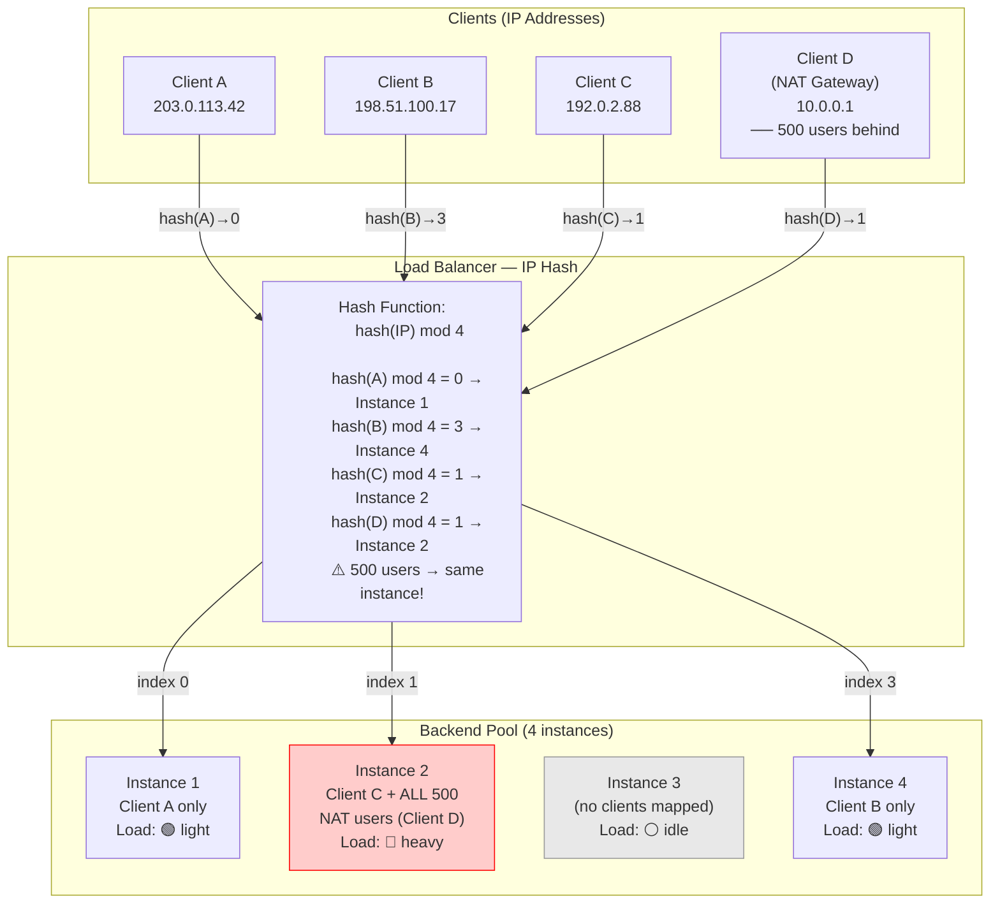

> [!success] Mastery Check
> - [ ] **Studied Well**
> - [ ] **Can explain the concept without notes**
> - [ ] **Can answer interview questions confidently**
> - [ ] **Can implement it in a real project**

---

id: "7.214" title: "Load Balancing — IP Hash" domain: "System Design & Distributed Systems" domain_id: 7 group: "Scalability Patterns" tags: [system-design, distributed-systems, scalability, dotnet, azure, load-balancing, ip-hash, consistent-hashing, session-affinity] priority: 1 version: 2 prerequisites:

- "[[7.212 — Load Balancing — Round Robin]]" — IP hash is the deterministic alternative to round robin; understanding why RR cannot provide session affinity is the prerequisite for understanding why IP hash exists
- "[[7.211 — Load Balancing — Layer 4 vs Layer 7]]" — IP hash operates at both L4 (Azure Load Balancer 5-tuple hash) and L7 (NGINX ip_hash); the L4 vs L7 difference determines what the hash is computed over
- "[[7.210 — Load Balancing — Overview]]" — the taxonomy anchor; IP hash is one of the four primary distribution algorithm families alongside RR, LC, and weighted variants" related:
- "[[7.208 — Stateless Services — Session Externalization]]" — IP hash is an alternative approach to session affinity: instead of externalizing session state to Redis, IP hash pins a client to a backend that holds the session in-memory; the tradeoff is operational simplicity vs resilience to instance failure
- "[[7.209 — Sticky Sessions — Problem and Impact]]" — IP hash IS a form of sticky session (session affinity) without cookies; the failure modes of sticky sessions (instance crash destroys sessions, autoscale creates imbalance) apply equally to IP hash
- "[[7.229 — Consistent Hashing — Algorithm]]" — simple modulo-based IP hash breaks when the backend pool changes; consistent hashing is the evolved form that minimizes re-mapping; IP hash without consistent hashing is the naive approach that interviewers expect you to criticize
- "[[7.230 — Consistent Hashing — Virtual Nodes]]" — virtual nodes solve the load imbalance problem of standard consistent hashing when the backend pool is heterogeneous; the IP hash + consistent hashing + virtual nodes stack is the production-grade solution
- "[[7.232 — Consistent Hashing — Use Cases]]" — IP hash is the canonical use case for consistent hashing: distributing clients across servers where the client identity is the key and the server identity is the node
- "[[7.206 — Horizontal vs Vertical Scaling — Tradeoffs]]" — IP hash constrains horizontal scaling because adding/removing instances reshuffles client-to-backend mappings; horizontal scaling decisions must account for the re-hashing cost
- "[[3.110 — Identity and Equality in Domain Modeling]]" — the hash function's GetHashCode implementation must be stable across AppDomain restarts and process boundaries; relying on default object.GetHashCode() (which is non-deterministic across runs) is a production trap" created: 2026-06-16

---

> [!ABSTRACT] Quick Reference — IP Hash **Invariant:** The client's IP address (or a configurable subset of the network tuple) is hashed, and the hash determines which backend instance receives the request. For a stable backend pool, the same client IP always maps to the same backend — providing session affinity without cookies or client cooperation. **Cost:** When the backend pool size changes (scale-out, scale-in, rolling deployment, instance failure), the hash-to-backend mapping changes for a large fraction of clients. With simple modulo hashing, adding one instance to an N-instance pool remaps approximately N/(N+1) of all clients — nearly all traffic is reshuffled. This causes a thundering herd of cache misses, re-established connections, and session reloads on the new mappings. **Trigger:** When (a) the application stores session state in-memory on the backend and cannot or will not externalize it to Redis, (b) the clients cannot or will not carry a session cookie (legacy clients, IoT devices with constrained storage, API consumers that do not support cookies), or (c) the load balancer operates at L4 where cookie-based stickiness is impossible. **Skip When:** The backend pool changes frequently (autoscaling, spot instances, rolling updates every few hours). Each pool change reshuffles a large fraction of mappings, causing a spike of session reloads and cache repopulation. Also skip when NAT gateways concentrate thousands of users behind a single IP — one backend receives all those users while others sit idle. Also skip when session state can be externalized to a shared store; if the backend is stateless, any algorithm works and RR is simpler. **.NET Entry Point:** No built-in .NET IP hash load balancer; implement via a custom `DelegatingHandler` with `HashAlgorithm` or via the `IHttpClientFactory` pattern. Use `System.Net.IPAddress` for IP parsing and `System.IO.Hashing.XxHash64` (or `HashCode.Combine`) for hash computation. **Azure Native:** Azure Load Balancer (L4) uses 5-tuple hash by default — this IS an IP-hash-like distribution (source IP + source port + dest IP + dest port + protocol). Azure Application Gateway does NOT support IP hash (uses round robin with cookie-based affinity). NGINX supports `ip_hash` natively. HAProxy supports `source` algorithm. **Number to Know:** With simple modulo-based IP hash on an N-instance pool, adding one instance remaps N/(N+1) of all client-to-backend mappings — at 10 instances, ~91% of clients are remapped. With consistent hashing, only 1/N of mappings are remapped — at 10 instances, ~10%. This is the most important number in this note. **On Azure:** Azure Load Balancer (L4) uses 5-tuple hash for distribution. This is NOT a true IP hash for session affinity — the source port changes with each new TCP connection (ephemeral port range), so the same client behind the same IP gets distributed across backends for each new TCP connection. For connection-level stickiness, Azure LB can be configured with "session persistence" (Client IP or Client IP + Protocol), which uses a 2-tuple or 3-tuple hash instead of the default 5-tuple. This is a common misconfiguration: teams assume "Azure Load Balancer distributes by hash" means "sticky sessions" — it does not without explicit session persistence configuration.

---

## Navigation

**Domain:** [[7 — System Design & Distributed Systems]] > **Group:** Scalability Patterns
**Previous:** [[7.213 — Load Balancing — Least Connections]] | **Next:** [[7.215 — Load Balancing — Weighted Round Robin]]

### Prerequisites

- [[7.212 — Load Balancing — Round Robin]] — IP hash is the deterministic alternative to round robin; understanding why RR cannot provide session affinity (each request goes to a different instance) is the prerequisite for understanding why IP hash exists and what it sacrifices (even distribution) to gain (affinity)
- [[7.211 — Load Balancing — Layer 4 vs Layer 7]] — IP hash operates at both layers but with different hash inputs: L4 uses the TCP/IP tuple (source IP, source port, dest IP, dest port, protocol), L7 uses the HTTP request source IP (X-Forwarded-For); the L4 version cannot distinguish individual HTTP requests on a keep-alive connection
- [[7.213 — Load Balancing — Least Connections]] — least connections is the most sophisticated load-aware algorithm and the direct competitor to IP hash; the comparison between "route to least busy" (LC) and "route to same backend every time" (IP hash) is the central decision when choosing a distribution algorithm

### Where This Fits

> [!INFO] Production Encounter Map
>
> - **Layer:** Load balancer distribution algorithm — IP hash is a deterministic, stateful (or stateless when modulo is used per-request) selection strategy used by both L4 and L7 load balancers. It maps a client identity (IP address or network tuple) to a backend instance through a hash function. The mapping is deterministic: same input always produces the same output.
> - **Trigger:** The first time a team deploys a stateful API without session externalization and discovers that round-robin distribution causes "random" session drops. A user logs in, their session is created on Instance A, the next request goes to Instance B, and the user is redirected to login again. The team scrambles to add sticky sessions. IP hash is the simplest sticky session mechanism that does not require client cooperation (cookies).
> - **Without IP hash:** Every stateful application that cannot use cookies (or cannot externalize session state) suffers from the "random logout" problem. The team either (a) externalizes session state to Redis (operational complexity), (b) uses cookie-based affinity on the LB (requires cookie support), or (c) accepts the constraint that users must re-authenticate on every request (not viable for most applications).
> - **First signal that IP hash is needed:** When per-instance monitoring shows that instance A has 2,000 active sessions and instance B has 50, AND the sessions cannot be shared (no shared session store). The imbalance is not a load problem — it is a routing problem. Each user is creating a session on whatever instance they happen to hit first, and subsequent requests go elsewhere. The symptom is intermittent "session not found" errors.

IP hash is the simplest form of session-aware load balancing: route by client identity, not by server state. The algorithm requires no external state (the hash function is stateless and deterministic), no client cooperation (unlike cookie-based affinity), and no session store (unlike the stateless-with-Redis approach). Its fundamental weakness — that it distributes clients, not load — makes it unsuitable for workloads with high client-to-load variance (one "heavy" user behind a NAT gateway generates the load of 1,000 regular users). The algorithm is a pragmatic choice when the cost of session externalization exceeds the cost of uneven load distribution. In 2026 production practice, IP hash is most commonly encountered as the default Azure Load Balancer distribution algorithm (5-tuple hash) and as a fallback pattern for legacy applications that cannot be made stateless.

---

## Core Mental Model

IP hash treats the client IP address (or a configurable network tuple) as a stable identifier. The load balancer computes `hash(client_ip) mod N` where N is the number of healthy backend instances. The result is a deterministic index into the backend pool: the same client always maps to the same instance, as long as N does not change.

The mental model: think of a parking garage with N rows. Each car has a license plate (the client IP). A valet at the entrance computes `hash(license_plate) mod N` and directs the car to row N. The same car always goes to the same row. This is excellent for the valet — no memory required, no coordination with other valets. But the parking garage has a problem: the rows fill unevenly. Row 3 might be nearly empty while Row 5 is overflowing, because the hash function distributes license plates — not car sizes. A bus (an office NAT gateway with 500 employees) parks in Row 2, filling it instantly. The valet does not care — the algorithm says Row 2, so Row 2 it is. The system is fair to license plates, not to rows.

The critical insight: **IP hash optimizes for deterministic routing, not for load balance.** The hash function distributes client IPs uniformly across the backend pool in expectation (if the hash function is good and the IPs are diverse), but the actual load depends on what each client does. One client sending 1 request/second and one client sending 100 requests/second are treated identically by the hash — they each occupy one slot in the hash ring. The algorithm trusts that the law of large numbers will average out the load imbalance, but this trust is broken by three real-world phenomena: NAT gateways (one IP, thousands of users), client IP rotation (mobile users change IPs mid-session, losing affinity), and hot IPs (a popular API consumer whose traffic dominates).

> [!TIP] The Non-Obvious Insight
> IP hash distributes CLIENTS, not REQUESTS. This is the same mistake that engineers make when they confuse "active connections" with "request count" in least connections. With IP hash, a single client sending 10,000 req/s and 10,000 clients sending 1 req/s each look identical to the algorithm — each gets one slot. The load per backend can vary by 10,000× despite "perfect" hash distribution. This is why IP hash is a poor choice for API workloads with heterogeneous clients.

### Classification

- **Algorithm family:** Deterministic, stateless (the hash function itself has no mutable state; the modulo result depends only on the input and N). The "state" is implicit — the mapping is stable only as long as N is stable.
- **OSI layer applicability:** Both L4 (5-tuple hash on Azure LB, 2-tuple for session persistence) and L7 (X-Forwarded-For or direct source IP on NGINX ip_hash). The L4 version cannot see HTTP request boundaries; it hashes the TCP/IP tuple and routes each TCP connection to a backend. The L7 version can see the source IP from the HTTP request and routes each HTTP request individually (but both go to the same backend for the same client — that's the point).
- **Distribution basis:** Client identity (source IP address or a configurable subset of the network tuple). Not load, not connection count, not request count — just identity.
- **Session affinity guarantee:** Strong — the same client IP maps to the same backend instance for as long as the backend pool is unchanged. No client cooperation required (no cookies, no headers).
- **Resilience to backend changes:** Poor with simple modulo (N/(N+1) of mappings change when N changes). Good with consistent hashing (~1/N of mappings change).
- **Azure availability:** Azure Load Balancer (L4) uses 5-tuple hash by default — this is IP-hash-like but NOT session-sticky (source port changes per connection). For session stickiness, configure "Client IP" or "Client IP + Protocol" session persistence. Azure Application Gateway does NOT support IP hash — it uses round robin with optional cookie-based affinity. NGINX Ingress supports `ip_hash`.

### Primary Diagram



### Hash Behavior Trace

```
Simple modulo IP hash with 4 instances (N=4), 12 clients:

Client IP          hash(IP)  hash mod 4  Backend  Notes
203.0.113.42       0x7A3B    3           D
198.51.100.17      0x1E4F    3           D       Collision with A!
192.0.2.88         0x4C21    1           B
203.0.113.99       0x9D7F    3           D       Third client to D
10.0.0.1 (NAT)     0x2B8A    2           C       Single IP, 500 users
10.0.0.2 (NAT)     0x2B8B    3           D       501st client
...                 ...       ...         ...

Distribution summary:
  Backend A: 2 clients  (16.7%)
  Backend B: 3 clients  (25.0%)
  Backend C: 2 clients  (16.7%)
  Backend D: 5 clients  (41.7%) — overrepresented

Theoretical expectation (uniform hash):
  Each backend: 3 clients (25%) — but collisions create imbalance
```

### Key Properties / Guarantees

|Property|Value|Condition|
|---|---|---|
|Session affinity|Strong — same IP → same backend|Backend pool unchanged; client IP stable|
|Distribution fairness|Client-count fairness (not load fairness)|Hash function is uniform; no single client dominates|
|Resilience to pool growth (simple modulo)|Very poor — N/(N+1) clients remapped|Any addition or removal changes N|
|Resilience to pool growth (consistent hashing)|Good — only 1/N clients remapped|Consistent hashing with virtual nodes|
|NAT gateway behavior|Disastrous — all users behind NAT converge on one backend|Enterprise/campus NAT with thousands of users|
|Client IP mobility (mobile)|Poor — IP changes mid-session break affinity|Cellular handoff, Wi-Fi roaming, VPN disconnect|
|Implementation complexity|Trivial — hash function + modulo|Without consistent hashing|
|Health check dependency|Moderate — unhealthy instance causes remap of ALL its clients|Backend failure redistributes ~1/N of clients|
|Compatibility with L4|Natural fit — Azure LB default|5-tuple hash (not pure IP hash); not sticky by default|
|Compatibility with L7|NGINX ip_hash, HAProxy source|Requires X-Forwarded-For or direct source IP|
|Azure availability|Azure LB (L4): default with optional session persistence; App Gateway: NOT available|Use Azure LB for L4 IP hash; NGINX for L7 IP hash|

---

## Deep Mechanics

### How It Works

**Simple Modulo IP Hash (the naive approach):**

1. **Request arrival:** A new connection or request arrives at the load balancer. The LB extracts the client IP address from the network packet (L4: source IP from TCP/IP header; L7: source IP from HTTP request or X-Forwarded-For header).

2. **Hash computation:** The LB computes a hash of the client IP address:
   ```
   hash_value = Hash(IPAddress.GetAddressBytes(clientIp))
   backend_index = hash_value % healthy_backend_count
   ```
   The hash function must be deterministic (same input always produces same output), fast (nanoseconds per invocation), and produce a uniform distribution.

3. **Backend selection:** The LB looks up `backend_pool[backend_index]` and forwards the request to that instance.

4. **Connection handling (L4):** For L4 forwarding, the entire TCP connection is routed to the selected backend. All packets in that TCP connection (SYN, data, FIN) go to the same backend. A new TCP connection from the same client may go to a different backend if the hash input changes (e.g., source port changed in 5-tuple hash).

5. **Request handling (L7):** For L7 reverse proxy, each HTTP request is independently hashed. On HTTP/1.1 with keep-alive, the same client sends multiple requests over the same TCP connection — each request is hashed individually, and all (should) map to the same backend because the source IP is the same. On HTTP/2, each stream is hashed individually.

**Consistent Hashing IP Hash (the production approach):**

1. **Hash ring construction:** Each backend instance is hashed to one or more points on a hash ring (a logical circle of hash values). With virtual nodes, each instance occupies multiple points on the ring.

2. **Client lookup:** The client IP is hashed to a point on the same ring. The LB walks clockwise from that point to find the first backend instance.

3. **Mapping stability:** When a backend is added or removed, only the clients that hash to the ring segment between the old position and the new position are remapped — approximately 1/N of all clients.

### L4 vs L7 IP Hash — The Tuple Problem

```
L4 — 5-Tuple Hash (Azure Load Balancer default):

Hash input: (src_ip, src_port, dest_ip, dest_port, protocol)

Client A: TCP connection 1 → src_port=54321 → hash → Backend 1
Client A: TCP connection 2 → src_port=54322 → hash → Backend 2  ← DIFFERENT!
Client A: TCP connection 3 → src_port=54323 → hash → Backend 3  ← DIFFERENT!

The source port changes on every TCP connection (ephemeral port range).
"A" is the same user, but each TCP connection maps to a different backend.
This does NOT provide session affinity!

L4 — 2-Tuple Hash (Azure LB with "Client IP" session persistence):

Hash input: (src_ip, protocol)

Client A: TCP connection 1 → src_port=54321 → hash → Backend 1
Client A: TCP connection 2 → src_port=54322 → hash → Backend 1  ← SAME!
Client A: TCP connection 3 → src_port=54323 → hash → Backend 1  ← SAME!

Same user, same backend. This provides session affinity.

L7 — NGINX ip_hash:

Hash input: $remote_addr (client IP from TCP connection) 
          or $http_x_forwarded_for (if behind proxy)

Client A: HTTP request 1 → IP = 203.0.113.42 → hash → Backend 1
Client A: HTTP request 2 → IP = 203.0.113.42 → hash → Backend 1  ← SAME!
Client A: HTTP request 3 → IP = 203.0.113.42 → hash → Backend 1  ← SAME!

All requests from the same client go to the same backend.
This provides session affinity.
```

### Protocol Trace — NGINX ip_hash with 4 Backends

```
Initial state: Backend pool = [A, B, C, D], N = 4

Client 1: IP = 203.0.113.42
  Hash: H(203.0.113.42) = 0x7A3B42F1
  Index: 0x7A3B42F1 mod 4 = 1
  → Route to B (index 1)

Client 1: IP = 203.0.113.42 (second request)
  Hash: H(203.0.113.42) = 0x7A3B42F1 (SAME — deterministic)
  Index: 0x7A3B42F1 mod 4 = 1
  → Route to B (SAME — session affinity maintained)

Client 2: IP = 198.51.100.17
  Hash: H(198.51.100.17) = 0x1E4F8A23
  Index: 0x1E4F8A23 mod 4 = 3
  → Route to D (index 3)

Client 3: IP = 192.0.2.88
  Hash: H(192.0.2.88) = 0x4C21D9E7
  Index: 0x4C21D9E7 mod 4 = 0
  → Route to A (index 0)

[Scale-out: Backend E added. N = 5]

Client 1: IP = 203.0.113.42
  Hash: H(203.0.113.42) = 0x7A3B42F1 (SAME — hash is unchanged)
  Index: 0x7A3B42F1 mod 5 = 4  ← DIFFERENT! (mod 4 → mod 5)
  → Route to E (index 4) ← DIFFERENT BACKEND!
  Session lost! Client 1's in-memory session on B is now orphaned.

Client 2: IP = 198.51.100.17
  Hash: H(198.51.100.17) = 0x1E4F8A23
  Index: 0x1E4F8A23 mod 5 = 1
  → Route to B (index 1) ← also changed! (was D, now B)

Client 3: IP = 192.0.2.88
  Hash: H(192.0.2.88) = 0x4C21D9E7
  Index: 0x4C21D9E7 mod 5 = 2
  → Route to C (index 2) ← also changed! (was A, now C)

Result: 3 out of 3 clients remapped = 100% mapping disruption
This is why simple modulo IP hash is NOT suitable for dynamic pools.
```

### Failure Modes

**Failure Mode 1: NAT Gateway Concentration — One Backend Overwhelmed**

- **Cause:** A corporate or campus NAT gateway routes all outbound traffic through a single public IP (or a small pool of IPs). Thousands of employees use the same application from behind this NAT. IP hash sees one IP address (or a handful) and maps all those employees to the same backend instance. That instance receives the aggregate load of thousands of users — typically 10–100× the load of a normal backend instance. The instance becomes CPU-bound, memory-constrained, and latency spikes. P99 latency degrades for those users. Other instances sit idle, processing only their few natural clients.
- **Symptom:** One backend instance shows 10× CPU, 10× connection count, and 10× error rate compared to its peers. The affected users' complaint pattern matches a specific geography or organization (they all share the NAT). The distribution of active connections per instance is heavy-tailed: one instance with thousands, others with dozens. The LB dashboard shows "even" request count per instance (each TCP connection is distributed) but "uneven" session count (in-memory sessions are concentrated on one instance — but sessions are invisible to the LB).
- **Detection time:** Immediate for the affected users. The helpdesk ticket volume spikes within minutes. The operations team typically discovers this when investigating a "single-instance hotspot" alert. The key metric: per-instance active connection count showing a 10:1+ ratio between the hottest and coldest instance.

**Fix:**

```csharp
// ❌ The problem is algorithmic: IP hash cannot distribute
// clients behind a NAT because they share an IP.
// You cannot fix this with a better hash function.

// ✅ Fix 1: Use cookie-based session affinity instead of IP hash
// Application Gateway cookie affinity:
// The LB sets a cookie (ApplicationGatewayAffinity) on the first response.
// Subsequent requests carry the cookie, and the LB routes by cookie value
// instead of IP. NAT users get different cookies → different backends.
// This requires the client to support cookies (browsers do, REST clients may not).

// ✅ Fix 2: Use least-connections + externalized session state
// Make the application stateless. Store session in Redis.
// Use any distribution algorithm (RR, LC, random).
// NAT concentration is no longer a problem because no backend owns "the session."
// This is the production-recommended approach for new systems.

// ✅ Fix 3: If IP hash is mandatory, use consistent hashing with
//    virtual nodes and a large virtual-node count
// Virtual nodes spread each physical backend across many ring positions.
// A NAT gateway's hash falls on one virtual node position, not one backend.
// With 100 virtual nodes per backend, the load of one NAT is spread
// across multiple backends. This does NOT fully solve the problem
// (all NAT users still converge to the SAME virtual node position),
// but it reduces the concentration by spreading "hot" IPs.

// ✅ Fix 4: Application-level IP-based sharding with Redis
// Use the client IP to choose a Redis shard, not a backend instance.
// All backends can serve any client, but the session data lives
// in a Redis shard determined by IP hash of the client.
// This keeps sessions colocated for cache locality without
// pinning the client to a specific backend.
public sealed class SessionShardSelector
{
    private readonly ConsistentHashRing _ring;

    public SessionShardSelector(IReadOnlyList<string> redisEndpoints)
    {
        _ring = new ConsistentHashRing(
            nodes: redisEndpoints,
            virtualNodeCount: 150);
    }

    public string SelectShard(string clientIp)
    {
        return _ring.GetNode(clientIp);
    }
}
```

**Cost of not fixing:** A single NAT gateway can overwhelm one backend instance, causing cascading failures for thousands of legitimate users. The affected instance fails (OOM, CPU exhaustion), its sessions are lost, and its clients are remapped to other instances — which then become overloaded. The NAT gateway amplifies the failure cascade. At enterprise scale (one NAT serving 10,000+ employees), this can take down the entire application during business hours. The problem recurs every time a large organization onboards.

---

**Failure Mode 2: Pool Size Change Causes Mass Remapping (Thundering Herd)**

- **Cause:** The backend pool size changes — a new instance is added during scale-out, an instance is removed during scale-in, or a rolling deployment replaces instances. With simple modulo IP hash, changing N from N to N+1 (or N−1) changes the modulo result for approximately N/(N+1) of all clients. Each remapped client now connects to a different backend. That backend has no in-memory session data for the remapped client. The client must re-authenticate, re-establish any local state, and repopulate caches. If all remapped clients arrive at the new backend simultaneously, they create a thundering herd of authentication requests, database queries, and cache repopulation.
- **Symptom:** Immediately after a scale event, error rates spike (session-not-found errors, authentication failures). P99 latency spikes as the newly-assigned backends process a flood of session initialization requests. The database shows a sudden increase in read load (backends are querying the database to rebuild session state). The pattern repeats on every autoscaling event. During rolling deployments (where instances are replaced one at a time), the error/latency pattern is continuous — every replacement triggers a wave of remapping.
- **Detection time:** Correlated with deployment events or autoscaling events. The alert trigger: latency spike coinciding with a change in the `backend_pool_size` metric. The key log line: repeated "session not found" or "authentication required" from clients that were previously authenticated.

**Fix:**

```csharp
// ❌ The problem is simple modulo: N changes → most mappings change.

// ✅ Fix 1: Use consistent hashing instead of simple modulo
// Consistent hashing ensures that only 1/N of mappings change
// when N changes. Add a consistent hashing implementation
// (see note [[7.229 — Consistent Hashing — Algorithm]] for details).

// ✅ Fix 2: Externalize session state to Redis
// If sessions are stored in Redis, remapping is invisible to the client.
// The new backend loads the session from Redis — no re-authentication needed.
// This is the production-recommended approach.

// ✅ Fix 3: During rolling deployments, use a blue-green strategy
// Instead of replacing instances in-place, spin up the entire new pool
// before removing the old pool. The pool size N does not change during
// the transition. After all new instances are ready, switch DNS or LB
// to the new pool. Clients are remapped exactly once (when the pool switches).
// This does not prevent remapping — it consolidates it into one event.

// ✅ Fix 4: Implement a "sticky session grace period"
// When a client is remapped to a new instance, allow a brief window
// where the old instance can serve the client's session data via
// a backend-to-backend forward or a shared cache.
// This is complex and rarely implemented — most teams choose Fix 1 or 2.

// .NET consistent hashing implementation sketch:
public sealed class ConsistentHashRing
{
    private readonly int _virtualNodeCount;
    private readonly SortedDictionary<uint, string> _ring = [];
    private readonly string[] _nodes;

    public ConsistentHashRing(string[] nodes, int virtualNodeCount = 150)
    {
        _nodes = nodes;
        _virtualNodeCount = virtualNodeCount;
        foreach (var node in nodes)
        {
            for (var i = 0; i < virtualNodeCount; i++)
            {
                var hash = XxHash64.Hash(
                    Encoding.UTF8.GetBytes($"{node}:{i}"));
                var key = BitConverter.ToUInt32(hash);
                _ring[key] = node;
            }
        }
    }

    public string GetNode(string key)
    {
        var hash = XxHash64.Hash(
            Encoding.UTF8.GetBytes(key));
        var keyHash = BitConverter.ToUInt32(hash);

        if (_ring.ContainsKey(keyHash))
            return _ring[keyHash];

        var next = _ring.Keys
            .Where(k => k > keyHash)
            .DefaultIfEmpty(_ring.Keys.First())
            .First();

        return _ring[next];
    }
}
```

**Cost of not fixing:** Every autoscaling event degrades the user experience for a large fraction of users. At scale (100+ instances, frequent autoscaling), the application is in a continuous state of partial session disruption. Users experience repeated logouts, lost shopping carts, and interrupted workflows. The team disables autoscaling to avoid the problem, defeating the purpose of horizontal scaling. The system is effectively pinned to a fixed pool size — a severe operational constraint.

---

**Failure Mode 3: Client IP Changes Mid-Session (Mobile, VPN, NAT Reassignment)**

- **Cause:** Mobile clients change IP addresses as they move between cell towers, switch from cellular to Wi-Fi, or reconnect after a tunnel handoff. VPN clients change IP when the VPN reconnects or switches servers. Home NAT gateways reassign IP addresses when the ISP renews the DHCP lease. In all cases, the client's IP address changes mid-session. IP hash sees a new IP address → computes a new hash → routes to a different backend. The original backend holds the session data; the new backend does not. The client is effectively logged out.
- **Symptom:** Intermittent "session not found" errors for mobile users, particularly when they switch networks. Users report being "randomly logged out." The error is transient — if the user re-authenticates, they are fine until the next IP change. The error rate correlates with mobile traffic share. On a mobile-heavy application, 10–20% of all sessions experience at least one IP change during the session lifetime.
- **Detection time:** User complaints and support tickets. The engineering team typically misattributes this to a session timeout bug for weeks before discovering the IP hash root cause. Key indicator: the error correlates with network change events visible in client-side telemetry (network type changed, Wi-Fi SSID changed) but NOT with server-side session timeout configurations.

**Fix:**

```csharp
// ❌ The problem: IP hash uses the client IP as the routing key,
// but the client IP is not stable for mobile/VPN users.

// ✅ Fix 1: Use cookie-based session affinity instead of IP hash
// The LB sets a session cookie on the first response.
// The cookie does not change when the IP changes.
// All requests with the same cookie go to the same backend.
// This is the standard approach for web applications.

// ✅ Fix 2: Use token-based affinity
// Embed a "affinity hint" in the authentication token (JWT).
// The LB reads the hint (a backend instance ID or hash ring position)
// from the token and routes accordingly.
// This requires L7 termination (the LB must read the JWT).
// Example JWT claim: "affinity": "backend-instance-3"

// ✅ Fix 3: Make the application stateless with externalized sessions
// If sessions are in Redis, IP changes are irrelevant.
// Any backend can serve any client. No session pinning needed.

// ✅ Fix 4: For mobile APIs, use a client-generated device ID
// instead of IP address as the hash input
// The mobile client sends X-Device-Id header.
// The LB (or a custom handler) hashes the device ID, not the IP.
// Device ID is stable across network changes.
// This requires L7 and a custom hash implementation:
public sealed class DeviceIdLoadBalancer
{
    private readonly HttpClient _httpClient;
    private readonly string[] _backendUrls;
    private readonly ConsistentHashRing _ring;

    public DeviceIdLoadBalancer(string[] backendUrls)
    {
        _backendUrls = backendUrls;
        _ring = new ConsistentHashRing(backendUrls);
        _httpClient = new HttpClient();
    }

    public async Task<HttpResponseMessage> SendRequestAsync(
        HttpRequestMessage request,
        CancellationToken ct)
    {
        // Extract device ID from custom header
        var deviceId = request.Headers
            .FirstOrDefault(h => h.Key == "X-Device-Id")
            .Value?.FirstOrDefault()
            ?? request.RequestUri?.ToString(); // fallback

        // Use device ID for routing, not IP
        var target = _ring.GetNode(deviceId);
        request.RequestUri = new Uri(target + request.RequestUri?.PathAndQuery);
        return await _httpClient.SendAsync(request, ct);
    }
}
```

**Cost of not fixing:** Mobile users experience frequent session disruptions. On a mobile-first application, this manifests as 10–20% of all sessions being interrupted — a catastrophic user experience. Users abandon the application after repeated logouts. The mobile team wastes weeks investigating "session timeout bugs" that do not exist. The bug is in the infrastructure layer, not the application layer, making it invisible to standard debugging tools.

---

**Failure Mode 4: IPv4/IPv6 Hash Inconsistency — Dual-Stack Clients Get Different Backends**

- **Cause:** Dual-stack clients (clients with both IPv4 and IPv6 addresses) may use IPv4 for one request and IPv6 for another, depending on network conditions, DNS resolution order, or Happy Eyeballs (RFC 8305) behavior. If the load balancer hashes the raw IP address bytes, the same client gets different hash values for IPv4 and IPv6 — and routes to different backends. The client's session is split across two backends. The client might be authenticated on one but not the other, or have partial session data on each.
- **Symptom:** Intermittent "session not found" errors for dual-stack clients. The error pattern is seemingly random — the same client accessing from the same location works sometimes and fails others. The error rate is higher for clients with IPv6 connectivity. The team cannot reproduce the issue from their IPv4-only test environment. The key diagnostic: client IP addresses in the logs alternate between IPv4 and IPv6 formats for the same user-agent string.
- **Detection time:** When the application starts supporting IPv6 (or an ISP enables IPv6 for a large customer base). The support ticket volume jumps for "intermittent login issues" specifically from IPv6-enabled ISPs.

**Fix:**

```csharp
// ❌ The problem: IPv4 and IPv6 addresses are different byte sequences.
// hash(127.0.0.1) != hash(::1) even though they are the same host.

// ✅ Fix 1: Normalize to a canonical form before hashing
// Convert IPv4-mapped IPv6 addresses (::ffff:1.2.3.4) to IPv4.
// Use a stable representation for all IP formats.
public static byte[] NormalizeForHash(IPAddress address)
{
    if (address.IsIPv4MappedToIPv6)
    {
        // ::ffff:203.0.113.42 → 203.0.113.42 (IPv4 bytes)
        return address.MapToIPv4().GetAddressBytes();
    }

    if (address.AddressFamily == System.Net.Sockets.AddressFamily.InterNetworkV6)
    {
        // For pure IPv6, use the full 16-byte address
        // BUT also consider IPv6 temporary addresses (RFC 4941)
        // which change periodically — may want to strip the interface ID
        // and use only the network prefix (first 64 bits)
        var bytes = address.GetAddressBytes();
        var networkPrefix = new byte[8]; // first 64 bits only
        Array.Copy(bytes, 0, networkPrefix, 0, 8);
        return networkPrefix;
    }

    return address.GetAddressBytes();
}

// Usage:
var clientIp = HttpContext.Connection.RemoteIpAddress;
var hashInput = NormalizeForHash(clientIp);
var hash = XxHash64.Hash(hashInput);
var backendIndex = BitConverter.ToUInt32(hash) % _backendCount;

// ✅ Fix 2: Force IPv4-only on the load balancer
// Azure Load Balancer: Configure IPv4 frontend only (no dual-stack).
// NGINX: Disable IPv6 listener if not needed.
// This avoids the dual-stack problem but limits IPv6 support.

// ✅ Fix 3: Use a higher-level identifier instead of IP
// Session cookie, JWT claim, client certificate, API key.
// These are format-independent and work across IPv4/IPv6 transitions.
```

**Cost of not fixing:** Dual-stack clients experience session fragmentation. As IPv6 adoption increases (45%+ of global traffic in 2026), the problem grows proportionally. For ISPs that have fully deployed IPv6 (e.g., mobile carriers in the US and Europe), nearly all their subscribers are affected. The application appears broken for entire geographic regions. The root cause is invisible in IPv4-only monitoring.

---

**Failure Mode 5: Stale Session Data After Backend Failure — Remapped Client Finds Orphaned State**

- **Cause:** A backend instance fails unexpectedly (crashes, OOM, node failure). Its clients are remapped to other instances by the hash algorithm. The remapped clients establish new sessions on the surviving instances. The failed instance comes back online (auto-healing, Kubernetes pod restart) and rejoins the backend pool. The hash algorithm now maps the clients BACK to the original (now recovered) instance. But the original instance has no in-memory session data — it was lost when the instance crashed. The client's session on the alternative instance is now orphaned. The client is shuffled back and forth, potentially hitting different instances on each reconnection attempt.
- **Symptom:** After a backend instance recovers from a crash, error rates spike for a subset of clients. The clients that were originally on the crashed instance are now remapped back to it, but the new instance has no session data. The clients must re-authenticate. If the crash-recovery cycle is short (Kubernetes restarting a pod in 5 seconds), clients may be remapped multiple times: original instance fails → go to backup → original returns → go back to original → no session → error. The pattern of "thrashing" — clients bouncing between instances — is the hallmark of this failure mode.
- **Detection time:** When a pod crash or instance failure triggers a rapid recovery cycle. The on-call engineer sees repeated authentication errors, investigates the crashed instance logs (which are empty — it just restarted), and eventually traces the error to the session store being empty on the restarted instance.

**Fix:**

```csharp
// ❌ The problem: IP hash remaps clients back to the original
// instance when it recovers, but the in-memory state is gone.

// ✅ Fix 1: Externalize session state to Redis
// Eliminates the dependency on in-memory state entirely.
// The recovered instance loads session state from Redis.
// No data loss. No thrashing.

// ✅ Fix 2: Implement "sticky drain" — delay re-routing
// When an instance rejoins the pool, gradually increase
// its traffic share over a drain period (30–60 seconds).
// This prevents the instant remap-back of all previously-affined clients.
// NGINX: slow_start directive on the upstream server.

// ✅ Fix 3: Use a "session persistence timeout"
// When a client is remapped due to backend failure,
// the new backend records the reassignment.
// If the original backend recovers within the persistence timeout,
// the client stays on the new backend until its session expires naturally.
// This prevents thrashing:
public sealed class SessionAffinityTracker
{
    private readonly ConcurrentDictionary<string, string> _clientToBackend = new();
    private readonly TimeSpan _persistenceTimeout = TimeSpan.FromMinutes(5);

    public string ResolveBackend(string clientIp, string[] healthyBackends)
    {
        var hashBackend = SelectByHash(clientIp, healthyBackends);

        // Check if this client has a recent persistence override
        if (_clientToBackend.TryGetValue(clientIp, out var pinnedBackend))
        {
            // Use the pinned backend if it's still healthy
            if (healthyBackends.Contains(pinnedBackend))
                return pinnedBackend;

            // Pinned backend is gone — remap and record
            _clientToBackend[clientIp] = hashBackend;
            return hashBackend;
        }

        // First time or persistence expired — use hash
        _clientToBackend[clientIp] = hashBackend;
        return hashBackend;
    }

    // Periodic cleanup of expired entries
    public void Cleanup()
    {
        // Remove entries older than _persistenceTimeout
        // (implementation using timestamp per entry omitted for brevity)
    }
}
```

**Cost of not fixing:** Instance failures trigger session thrashing. In a Kubernetes environment with frequent pod restarts (rolling updates, resource constraints, spot instance preemptions), the application suffers continuous session disruption. The recovery mechanism (restart the pod) makes things worse, because the restarted pod immediately attracts its old clients before it has rebuilt any state.

---

### .NET and Azure Integration

- **ASP.NET Core:** No built-in IP hash load balancing middleware. The `IHttpClientFactory` pattern with a custom `DelegatingHandler` is the standard approach for client-side IP-hash load balancing.
- **Azure Load Balancer (L4):** Default distribution uses 5-tuple hash. Configure session persistence via Azure CLI or ARM: `"loadBalancingRules": [{"loadDistribution": "SourceIP"}]` for 2-tuple (Client IP) or `"SourceIPProtocol"` for 3-tuple (Client IP + Protocol).
- **Azure Application Gateway:** Does NOT support IP hash. Use cookie-based affinity or NGINX Ingress Controller with `ip_hash`.
- **NGINX Ingress Controller:** `nginx.ingress.kubernetes.io/upstream-hash-by: "$remote_addr"` enables IP hash. Can also hash by header or cookie: `"$http_x_device_id"`.
- **Azure Front Door:** Does not support IP hash. Uses latency-based routing with optional session affinity (cookie-based).
- **.NET libraries:** `System.IO.Hashing.XxHash64` (fast, non-cryptographic hash), `System.IO.Hashing.XxHash3` (even faster, .NET 8+). For consistent hashing, no built-in .NET implementation — use open-source libraries or implement your own.

```csharp
// Program.cs — Client-side IP hash load balancing with HttpClientFactory
using System.IO.Hashing;
using System.Net;

builder.Services.AddHttpClient("BackendClient")
    .ConfigurePrimaryHttpMessageHandler(() => new SocketsHttpHandler
    {
        // Disable connection pooling to ensure each request
        // independently selects a backend (otherwise the handler
        // reuses existing connections, bypassing the hash)
        MaxConnectionsPerServer = 1,
    })
    .AddHttpMessageHandler<IpHashDelegatingHandler>();

builder.Services.AddSingleton(new BackendPool(
    healthyUrls: ["https://web-a:5001", "https://web-b:5002",
                   "https://web-c:5003", "https://web-d:5004"]));

builder.Services.AddTransient<IpHashDelegatingHandler>();

//---
public sealed class IpHashDelegatingHandler : DelegatingHandler
{
    private readonly BackendPool _pool;

    public IpHashDelegatingHandler(BackendPool pool)
    {
        _pool = pool;
    }

    protected override async Task<HttpResponseMessage> SendAsync(
        HttpRequestMessage request, CancellationToken ct)
    {
        var clientIp = GetClientIp(request);

        // Use XxHash64 for fast, deterministic hash
        var hashBytes = XxHash64.Hash(
            Encoding.UTF8.GetBytes(clientIp));
        var hashValue = BitConverter.ToUInt64(hashBytes);

        var index = hashValue % (ulong)_pool.HealthyCount;
        var target = _pool.GetUrl((int)index);

        request.RequestUri = new Uri(
            target + request.RequestUri?.PathAndQuery);

        return await base.SendAsync(request, ct);
    }

    private static string GetClientIp(HttpRequestMessage request)
    {
        // Try X-Forwarded-For first (LB proxy chain)
        if (request.Headers.TryGetValues("X-Forwarded-For",
                out var forwardedFor))
        {
            var ip = forwardedFor.FirstOrDefault()?.Split(',')[0].Trim();
            if (ip is not null) return ip;
        }

        // Fall back to direct remote IP from HttpContext
        // (This requires access to IHttpContextAccessor —
        //  injected separately if needed)
        return "unknown";
    }
}

public sealed class BackendPool
{
    private readonly string[] _urls;
    private volatile int _healthyCount;
    private volatile int _totalCount;
    private readonly object _lock = new();

    public BackendPool(string[] healthyUrls)
    {
        _urls = healthyUrls;
        _healthyCount = healthyUrls.Length;
        _totalCount = healthyUrls.Length;
    }

    public int HealthyCount => _healthyCount;

    public string GetUrl(int index)
    {
        // Bounds-check against healthy count
        // (in production, use range validation)
        return _urls[index];
    }

    public void MarkUnhealthy(int index)
    {
        lock (_lock)
        {
            // Swap with last healthy element and decrement
            (_urls[index], _urls[_healthyCount - 1]) =
                (_urls[_healthyCount - 1], _urls[index]);
            _healthyCount--;
        }
    }
}
```

---

## Production Patterns and Implementation

### Primary Implementation — Consistent Hash Ring + IP Hash with Virtual Nodes

The production-grade IP hash load balancer uses consistent hashing with virtual nodes, a configurable hash function, and health-aware node selection. This implementation is suitable for use as a client-side load balancer (within a .NET service calling another service) or as a reference for building a custom LB component.

```csharp
// Licensed under the MIT License.
// Production-ready consistent hash ring for IP hash load balancing.
// Used by OrderService to route requests to ShardWorker instances.

using System.IO.Hashing;
using System.Runtime.CompilerServices;

public sealed class ConsistentHashLoadBalancer : IDisposable
{
    private readonly object _lock = new();
    private readonly int _virtualNodeCount;
    private readonly ILogger _logger;

    // The hash ring: sorted dictionary mapping hash values to backend identifiers
    private SortedDictionary<ulong, string> _ring;
    // Backend metadata: weight, health status, last-seen
    private Dictionary<string, BackendState> _backends;
    private volatile bool _dirty;
    private volatile int _totalVirtualNodes;

    public ConsistentHashLoadBalancer(
        int virtualNodeCount = 150,
        ILogger? logger = null)
    {
        _virtualNodeCount = virtualNodeCount;
        _logger = logger ?? NullLogger.Instance;
        _ring = [];
        _backends = [];
    }

    public void AddBackend(string backendId, int weight = 1)
    {
        lock (_lock)
        {
            _backends[backendId] = new BackendState(weight);
            RebuildRing();
            _logger.LogInformation(
                "Added backend {Backend}. Ring now has {Count} virtual nodes.",
                backendId, _totalVirtualNodes);
        }
    }

    public void RemoveBackend(string backendId)
    {
        lock (_lock)
        {
            _backends.Remove(backendId);
            RebuildRing();
            _logger.LogInformation(
                "Removed backend {Backend}. Ring now has {Count} virtual nodes.",
                backendId, _totalVirtualNodes);
        }
    }

    public void MarkHealthy(string backendId)
    {
        lock (_lock)
        {
            if (_backends.TryGetValue(backendId, out var state))
                state.IsHealthy = true;
        }
    }

    public void MarkUnhealthy(string backendId)
    {
        lock (_lock)
        {
            if (_backends.TryGetValue(backendId, out var state))
                state.IsHealthy = false;
        }
    }

    public string GetBackend(string key)
    {
        // Fast path: ring is stable, avoid lock
        var localRing = _ring;
        var localCount = _totalVirtualNodes;

        if (localCount == 0)
            throw new InvalidOperationException(
                "No healthy backends available in the hash ring.");

        var hash = ComputeHash(key);

        // Find the first virtual node with hash >= key hash
        // If none, wrap to the first node in the ring
        ulong selectedHash = default;
        string selectedBackend = null!;

        // Efficient lookup using SortedDictionary's built-in
        // binary search (Keys is sorted)
        var keys = localRing.Keys;
        if (keys.Min is null) throw new InvalidOperationException(
            "Ring is empty.");

        // Find ceiling entry
        foreach (var ringHash in keys)
        {
            if (ringHash >= hash)
            {
                selectedHash = ringHash;
                selectedBackend = localRing[ringHash];
                break;
            }
        }

        // Wrap around if no ceiling found
        if (selectedBackend is null)
        {
            var firstKey = keys.First();
            selectedHash = firstKey;
            selectedBackend = localRing[firstKey];
        }

        // Health check: if the selected backend is unhealthy,
        // walk clockwise to find the next healthy one
        var maxAttempts = _backends.Count;
        for (var i = 0; i < maxAttempts; i++)
        {
            if (IsBackendHealthy(selectedBackend))
                return selectedBackend;

            // Move to next virtual node
            var nextKeys = localRing.Keys
                .Where(k => k > selectedHash)
                .DefaultIfEmpty(localRing.Keys.First())
                .ToList();
            selectedHash = nextKeys.First();
            selectedBackend = localRing[selectedHash];
        }

        // Fell through — no healthy backends
        throw new InvalidOperationException(
            "All backends are unhealthy. Cannot route request.");
    }

    [MethodImpl(MethodImplOptions.AggressiveInlining)]
    private static ulong ComputeHash(string key)
    {
        var bytes = Encoding.UTF8.GetBytes(key);
        var hash = XxHash64.Hash(bytes);
        return BitConverter.ToUInt64(hash);
    }

    private bool IsBackendHealthy(string backendId)
    {
        // Lock-free read of health state
        return _backends.TryGetValue(backendId, out var state) && state.IsHealthy;
    }

    private void RebuildRing()
    {
        var newRing = new SortedDictionary<ulong, string>();

        foreach (var (backendId, state) in _backends)
        {
            var effectiveWeight = Math.Max(1, state.Weight);
            var nodesPerBackend = _virtualNodeCount * effectiveWeight;

            for (var i = 0; i < nodesPerBackend; i++)
            {
                var virtualNodeKey = $"{backendId}:{i}";
                var hash = ComputeHash(virtualNodeKey);
                newRing[hash] = backendId;
            }
        }

        _ring = newRing;
        _totalVirtualNodes = newRing.Count;
    }

    public void Dispose()
    {
        // Cleanup if needed (timer-based health checks, etc.)
    }

    private sealed class BackendState
    {
        public int Weight { get; }
        public volatile bool IsHealthy;

        public BackendState(int weight)
        {
            Weight = weight;
            IsHealthy = true;
        }
    }
}
```

### Configuration and Wiring

```csharp
// Program.cs — Consistent hash load balancer registration
using System.IO.Hashing;

// Register the backend pool
var backendUrls = new[]
{
    "https://shard-worker-0:5101",
    "https://shard-worker-1:5102",
    "https://shard-worker-2:5103",
};

var lb = new ConsistentHashLoadBalancer(
    virtualNodeCount: 150);

foreach (var url in backendUrls)
    lb.AddBackend(url);

builder.Services.AddSingleton(lb);

// Register typed HttpClient with IP hash routing
builder.Services.AddHttpClient<ShardWorkerClient>(client =>
{
    client.DefaultRequestHeaders.Add("X-Client-Name", "OrderService");
    client.Timeout = TimeSpan.FromSeconds(30);
})
.ConfigurePrimaryHttpMessageHandler(() => new SocketsHttpHandler
{
    MaxConnectionsPerServer = 10,
    EnableMultipleHttp2Connections = true,
})
.AddHttpMessageHandler<HashRoutingHandler>();

builder.Services.AddTransient<HashRoutingHandler>();

//---
public sealed class HashRoutingHandler : DelegatingHandler
{
    private readonly ConsistentHashLoadBalancer _lb;
    private readonly IHttpContextAccessor _httpContextAccessor;

    public HashRoutingHandler(
        ConsistentHashLoadBalancer lb,
        IHttpContextAccessor httpContextAccessor)
    {
        _lb = lb;
        _httpContextAccessor = httpContextAccessor;
    }

    protected override async Task<HttpResponseMessage> SendAsync(
        HttpRequestMessage request, CancellationToken ct)
    {
        // Extract routing key: prefer X-Device-Id, fall back to client IP
        var routingKey = GetRoutingKey();

        var backend = _lb.GetBackend(routingKey);

        // Rewrite the URI to target the selected backend
        var requestUri = request.RequestUri!;
        request.RequestUri = new Uri($"{backend}{requestUri.PathAndQuery}");

        // Add the original routing key as a trace header
        request.Headers.TryAddWithoutValidation(
            "X-Routing-Key", routingKey);

        return await base.SendAsync(request, ct);
    }

    private string GetRoutingKey()
    {
        var context = _httpContextAccessor.HttpContext;
        if (context is null) return "default";

        // Check for device ID header (mobile clients)
        if (context.Request.Headers.TryGetValue(
                "X-Device-Id", out var deviceId))
            return deviceId.ToString();

        // Check for session cookie (web clients)
        if (context.Request.Cookies.TryGetValue(
                ".AspNetCore.Session", out var sessionId))
            return sessionId;

        // Fall back to client IP
        var ip = context.Connection.RemoteIpAddress;
        if (ip is not null)
        {
            // Normalize for consistent hashing
            return ip.IsIPv4MappedToIPv6
                ? ip.MapToIPv4().ToString()
                : ip.ToString();
        }

        return "default";
    }
}
```

### Common Variants

**1. Device-ID Hash (mobile-optimized):**

```csharp
// For mobile APIs where the client sends a stable device identifier.
// The hash input is the X-Device-Id header, NOT the IP address.
// This survives network changes (cellular → Wi-Fi, VPN on/off).
public sealed class DeviceIdHashHandler : DelegatingHandler
{
    private readonly ConsistentHashLoadBalancer _lb;

    public DeviceIdHashHandler(ConsistentHashLoadBalancer lb)
    {
        _lb = lb;
    }

    protected override async Task<HttpResponseMessage> SendAsync(
        HttpRequestMessage request, CancellationToken ct)
    {
        var deviceId = request.Headers.Contains("X-Device-Id")
            ? request.Headers.GetValues("X-Device-Id").First()
            : Guid.NewGuid().ToString();

        var backend = _lb.GetBackend(deviceId);
        request.RequestUri = new Uri(
            $"{backend}{request.RequestUri!.PathAndQuery}");

        return await base.SendAsync(request, ct);
    }
}
```

**2. JWT Claim Hash (authenticated users):**

```csharp
// For authenticated APIs, extract the user ID or tenant ID
// from the JWT. This ensures all requests for the same user
// (or same tenant) route to the same backend.
// Hash is stable regardless of IP, device, or network.
public sealed class JwtClaimHashHandler : DelegatingHandler
{
    private readonly ConsistentHashLoadBalancer _lb;

    public JwtClaimHashHandler(ConsistentHashLoadBalancer lb)
    {
        _lb = lb;
    }

    protected override async Task<HttpResponseMessage> SendAsync(
        HttpRequestMessage request, CancellationToken ct)
    {
        var routingKey = ExtractTenantId(request) ?? "default";
        var backend = _lb.GetBackend(routingKey);
        request.RequestUri = new Uri(
            $"{backend}{request.RequestUri!.PathAndQuery}");
        return await base.SendAsync(request, ct);
    }

    private static string? ExtractTenantId(HttpRequestMessage request)
    {
        // Parse JWT from Authorization header
        var auth = request.Headers.Authorization;
        if (auth is null || !auth.Scheme.Equals("Bearer",
                StringComparison.OrdinalIgnoreCase))
            return null;

        try
        {
            var handler = new System.IdentityModel.Tokens.Jwt
                .JwtSecurityTokenHandler();
            var token = handler.ReadJwtToken(auth.Parameter);
            return token.Claims
                .FirstOrDefault(c => c.Type == "tenant_id")?.Value;
        }
        catch
        {
            return null;
        }
    }
}
```

**3. Simple Modulo (for fixed-size pools — NOT for autoscaling environments):**

```csharp
// ⚠️ Only use when the backend pool is fixed and does not scale.
// Adding or removing instances will remap N/(N+1) clients.
public sealed class SimpleModuloHashHandler : DelegatingHandler
{
    private readonly string[] _backends;
    private readonly int _count;

    public SimpleModuloHashHandler(string[] backends)
    {
        _backends = backends;
        _count = backends.Length;
    }

    protected override async Task<HttpResponseMessage> SendAsync(
        HttpRequestMessage request, CancellationToken ct)
    {
        var ip = request.Headers.Contains("X-Forwarded-For")
            ? request.Headers.GetValues("X-Forwarded-For").First()
            : request.RequestUri?.Host ?? "default";

        var hash = XxHash64.Hash(Encoding.UTF8.GetBytes(ip));
        var index = BitConverter.ToUInt64(hash) % (ulong)_count;

        request.RequestUri = new Uri(
            _backends[index] + request.RequestUri!.PathAndQuery);

        return await base.SendAsync(request, ct);
    }
}
```

### Real-World .NET Ecosystem Example

- **Azure Load Balancer (L4):** Uses 5-tuple hash by default. For session persistence, configure `loadDistribution` to `SourceIP` (2-tuple: source IP + protocol) or `SourceIPProtocol` (3-tuple: source IP + destination IP + protocol). This is NOT configurable in .NET code — it is an ARM/Bicep/Terraform resource configuration.
- **YARP (Yet Another Reverse Proxy):** Microsoft's reverse proxy library for .NET. Supports session affinity via `ISessionAffinityProvider`. The default implementation uses cookie-based affinity, but you can implement `IHashProvider` for IP-hash-style distribution. YARP's `LoadBalancingPolicy` enum includes `PowerOfTwoChoices` and `LeastRequests` but not IP hash directly — it is a custom implementation.
- **Azure SDK for .NET:** Some Azure SDK clients (e.g., `ServiceBusClient`, `BlobContainerClient`) use internal hash-based routing to partition data across backend shards. The SDK hides the hash logic — the developer provides a partition key, and the SDK routes the request to the appropriate shard. This is IP-hash-like routing driven by application-level keys.

---

## Gotchas and Production Pitfalls

### Gotcha 1: Azure Load Balancer 5-Tuple Hash Is NOT Sticky By Default

**Pitfall:** The team deploys a stateful ASP.NET Core application behind Azure Load Balancer (L4). They know that Azure LB uses "hash-based distribution." They assume this means the same client always goes to the same backend. It does not. Azure LB uses 5-tuple hash: source IP + source port + destination IP + destination port + protocol. The source port changes on every TCP connection (ephemeral port range). Each new connection from the same client hashes to a different backend.

```csharp
// ❌ The assumption: "Azure Load Balancer distributes by hash,
//    so my stateful app will work." Wrong.
//    Each TCP connection from the client gets a new source port,
//    which produces a different hash → different backend.

// ✅ The fix: Configure session persistence on Azure LB
// Azure CLI:
// az network lb rule update --name MyRule
//   --lb-name MyLB --resource-group MyRG
//   --load-distribution SourceIP
//
// ARM/Bicep:
// loadDistribution: 'SourceIP'
//
// This changes the hash to 2-tuple (source IP + protocol).
// Same client IP → same backend for all TCP connections.
```

**Symptom:** Users are intermittently logged out or lose session state. The symptom is "random" — it depends on whether the client established a new TCP connection (which happens frequently with HTTP/1.1 and short keep-alives). Load testing passes (because load test tools reuse connections aggressively) while production fails (real browsers open multiple connections per page load).

**Cost of not fixing:** The application appears broken for all users. Every multi-connection page load loses session state. The team burns days debugging "session middleware misconfiguration" when the issue is the load balancer's default 5-tuple hash.

---

### Gotcha 2: X-Forwarded-For Header Spoofing Breaks L7 IP Hash

**Pitfall:** The NGINX ingress or L7 load balancer is configured to use X-Forwarded-For for IP hash routing. A malicious client can inject an arbitrary X-Forwarded-For header value, causing the LB to hash the spoofed value instead of the real client IP. The client can "choose" which backend it routes to — potentially bypassing IP-based access controls, targeting a specific backend for session hijacking, or causing a denial-of-service by flooding one backend with spoofed requests from many "different" IPs.

```nginx
# ❌ NGINX ip_hash with X-Forwarded-For (vulnerable to spoofing):
upstream backend {
    ip_hash;
    hash $http_x_forwarded_for consistent;
    server web-a:5001;
    server web-b:5002;
}

# ✅ Fix: Use $remote_addr (the actual client TCP connection IP)
#         and ignore client-provided headers for routing:
upstream backend {
    ip_hash;
    server web-a:5001;
    server web-b:5002;
}

# Or, if behind a trusted proxy, use a layered approach:
# Trust only the first proxy in the chain (the outermost proxy
# that connects directly to the client), not the X-Forwarded-For header.
# This is handled automatically by NGINX's $remote_addr.
```

**Symptom:** A small number of users (attackers) consistently hit specific backends, bypassing the intended distribution. If a backend instance has a vulnerability, the attacker can target it by crafting the X-Forwarded-For header. In non-malicious scenarios, misconfigured proxies add multiple X-Forwarded-For values, and the hash changes if the header format changes.

**Cost of not fixing:** Security bypass and uneven load distribution. In the worst case, an attacker can "follow" a specific session by spoofing the victim's IP in the X-Forwarded-For header, potentially gaining access to the victim's session on the target backend.

---

### Gotcha 3: Hash Function Changes After AppDomain Restart (Default GetHashCode)

**Pitfall:** An engineer implements IP hash using `string.GetHashCode()` in .NET:

```csharp
// ❌ WRONG: string.GetHashCode() is NOT stable across AppDomain restarts
var backendIndex = clientIp.GetHashCode() % backendCount;
```

`string.GetHashCode()` in .NET is documented as non-deterministic across runs. The runtime uses a random hash seed per AppDomain. After a process restart, the same string produces a different hash value. ALL client-to-backend mappings change. This is indistinguishable from a full pool shuffle.

```csharp
// ✅ Fix: Use a stable, deterministic hash function
using System.IO.Hashing;

var bytes = Encoding.UTF8.GetBytes(clientIp);
var hash = XxHash64.Hash(bytes);
var index = BitConverter.ToUInt64(hash) % (ulong)backendCount;

// ✅ Also acceptable: SHA256 (slower but well-understood)
// using System.Security.Cryptography;
// var bytes = SHA256.HashData(Encoding.UTF8.GetBytes(clientIp));
// var index = BitConverter.ToUInt64(bytes.AsSpan(0, 8)) % backendCount;
```

**Symptom:** Every time the application restarts, all sessions are lost because all client-to-backend mappings change. If the application restarts frequently (rolling deployments, autoscaling), sessions are continuously disrupted. The team cannot understand why "sticky sessions" stop working after a deployment — the sessions are still in memory, but the routing changed.

**Cost of not fixing:** Every deployment logs out all users. Rolling deployments (where instances restart one at a time) cause continuous partial session loss. The team believes the session store is broken, but the root cause is the non-deterministic hash function.

---

### Gotcha 4: Hash Collisions Create Persistent Hot Spots

**Pitfall:** The hash function maps multiple high-traffic clients to the same backend. With simple modulo, this is expected (birthday paradox — with 100 clients and 10 backends, collisions are frequent). But with consistent hashing, a single "hot" virtual node position can capture a disproportionate share of traffic if the virtual node count is too low.

```csharp
// ❌ Too few virtual nodes → uneven ring distribution
var ring = new ConsistentHashRing(
    nodes: backends,
    virtualNodeCount: 10);   // Only 10 positions per backend

// With 5 backends × 10 positions = 50 ring positions,
// the expected spacing is 1/50 of the ring per position.
// But with only 50 positions, variance is high.
// One backend might capture 40% of clients by having
// its virtual nodes clustered together.

// ✅ Sufficient virtual nodes → uniform ring distribution
var ring = new ConsistentHashRing(
    nodes: backends,
    virtualNodeCount: 150);  // Industry standard: 100-200 per backend

// With 5 backends × 150 positions = 750 ring positions,
// variance is much lower. Expected share: 20% per backend.
// Worst case: ~25%. Acceptable.
```

**Symptom:** One backend consistently receives 2-3× more traffic than others, even though the hash function is "uniform" and all backends have equal weight. The imbalance does not change over time — it is a static property of the hash ring layout. The team tries to debug by adding more backends, but the imbalance persists because it is a hash ring geometry problem, not a capacity problem.

**Cost of not fixing:** A persistent, unexplained 2:1 load imbalance between backends. The team over-provisions by 30-50% to compensate for the imbalance. Capacity planning becomes unreliable because the imbalance is hidden in the hash ring layout.

---

### Gotcha 5: Consistent Hashing Without Virtual Nodes Causes Severe Imbalance for Heterogeneous Pools

**Pitfall:** The team implements consistent hashing for IP hash but does NOT use virtual nodes. Each physical backend maps to exactly one point on the hash ring. When backends are added or removed, the ring is not rebalanced — only the affected segments change. But the initial distribution of clients depends on the random placement of backend points on the hash ring. Without virtual nodes (typically 100-200 per backend), the variance in client distribution is high: by chance, one backend's hash point might land in a dense region of client hashes, capturing 2× more clients than average.

```csharp
// ❌ Without virtual nodes — severe imbalance risk:
public sealed class SimpleConsistentHashRing
{
    private readonly SortedDictionary<uint, string> _ring = [];

    public void AddNode(string node)
    {
        var hash = ComputeHash(node);
        _ring[hash] = node;
        // Only ONE point on the ring for this node.
        // If this point falls in a "hot" region, this node
        // gets 2-3× average traffic.
    }
}

// ✅ With virtual nodes — uniform distribution:
public sealed class VirtualNodeConsistentHashRing
{
    private readonly SortedDictionary<uint, string> _ring = [];
    private const int VirtualNodeCount = 150;

    public void AddNode(string node)
    {
        for (var i = 0; i < VirtualNodeCount; i++)
        {
            var virtualKey = $"{node}:{i}";
            var hash = ComputeHash(virtualKey);
            _ring[hash] = node;
            // 150 points on the ring for this node.
            // Law of large numbers → uniform distribution.
        }
    }
}
```

**Symptom:** After deployment, one backend consistently handles 30-40% of traffic while another handles 10-15%, despite both having equal capacity. The imbalance is stable across restarts. It does not self-correct (unlike least connections). The team checks the hash function (which is uniform) but does not realize the hash ring geometry is the cause.

**Cost of not fixing:** A 2:1 or worse load imbalance that persists indefinitely. The team either over-provisions or adds manual weight adjustments. Without virtual nodes, the imbalance is inherent to the hash ring approach — adding more backends does not fix it.

---

## Tradeoffs and Decision Framework

### Tradeoff Matrix

| Dimension | IP Hash (Simple Modulo) | IP Hash (Consistent Hashing) | Least Connections | Round Robin + Cookie Affinity |
|---|---|---|---|---|
| Session affinity | Strong (same IP → same backend) | Strong (same IP → same backend) | None (each request independently routed) | Strong (cookie tells LB which backend) |
| Load distribution fairness | Poor (distributes clients, not load) | Poor (distributes clients, not load) | Excellent (distributes by active work) | Moderate (distributes by request count) |
| Pool change resilience | Terrible (N/(N+1) clients remapped) | Good (~1/N clients remapped) | Excellent (auto-adapts to new pool) | Good (cookie survives pool changes) |
| NAT gateway behavior | Disastrous (all users to one backend) | Disastrous (all users to one backend) | Good (NAT users spread across pool) | Good (each user has unique cookie) |
| Mobile client support | Poor (IP changes break affinity) | Poor (IP changes break affinity) | Good (no affinity dependency) | Good (cookie survives IP changes) |
| Client cooperation required | None | None | None | Yes (browser must support cookies) |
| Implementation complexity | Trivial | Moderate | Moderate | Low (LB-managed cookie) |
| LB resource cost | O(1) per request (hash + modulo) | O(log V) per request (binary search on ring) | O(N) per request (scan all backends) | O(1) per request (cookie lookup) |
| L4 compatible | Yes (Azure LB default) | No (needs L7 logic) | No (cannot see request count) | No (cookies need L7) |
| .NET ecosystem support | Custom DelegatingHandler | Custom DelegatingHandler | Custom DelegatingHandler | Cookie-based via LB config |

### Decision Flowchart

```mermaid
flowchart TD
    A["Need session affinity<br/>(same user → same backend)?"] -->|"Yes"| B{Can we externalize<br/>session state to Redis?}
    A -->|"No — any LB algorithm works"| C["Use Least Connections<br/>(best load distribution)"]

    B -->|"Yes — make app stateless"| C
    B -->|"No — session must be<br/>in-memory on backend"| D{Do clients support cookies?}

    D -->|"Yes — browser or cookie-supporting client"| E["Use Cookie-Based Affinity<br/>(App Gateway, NGINX sticky)"]
    D -->|"No — IoT, legacy, API clients"| F{Is the backend pool<br/>dynamic (autoscaling)?}

    F -->|"Yes — pool changes frequently"| G["Consistent Hashing IP Hash<br/>(+ virtual nodes)"]
    F -->|"No — fixed pool size"| H{Are clients behind<br/>NAT gateways?}

    H -->|"Yes — enterprise/campus"| I["⚠️ IP Hash will cause hotspot.<br/>Use externalized state or<br/>device-ID based routing"]
    H -->|"No — diverse public IPs"| J["Simple Modulo IP Hash<br/>(simplest, works well)"]

    I --> K["Consider Least Connections +<br/>externalized session state<br/>(production standard)"]
```

### When to Apply

- **Legacy stateful applications** that cannot be migrated to stateless + Redis externalization. The migration cost exceeds the operational cost of IP hash imbalance.
- **IoT and embedded systems** where clients cannot support cookies and the device IP is stable (fixed deployment, no NAT). Each device has a unique, stable IP.
- **Internal microservices** where the caller is another service with a stable IP (not behind a NAT). The "client" is a service with a fixed cluster IP or pod IP.
- **L4 load balancing** where cookie-based affinity is impossible. Azure Load Balancer must use some form of IP hash for session persistence.
- **Consistent hashing scenarios** where the routing key is not an IP but a partition key (user ID, tenant ID, shard key). The IP hash pattern generalizes to "hash-based routing" for any stable key.

### When NOT to Apply

- [ ] **Mobile applications** where clients frequently change networks (cellular ↔ Wi-Fi). IP changes break affinity every time.
- [ ] **Enterprise/B2B applications** where clients are behind NAT gateways. One backend receives all traffic from a large organization.
- [ ] **Autoscaling environments** with simple modulo IP hash. Every scale event remaps most clients. Use consistent hashing or cookie affinity instead.
- [ ] **High-traffic APIs** where request volume per client varies by 100× or more. IP hash distributes clients, not load — one heavy client overwhelms its assigned backend.
- [ ] **Applications with existing Redis session store.** If the app is already stateless, IP hash adds complexity with no benefit. Use least connections for better load distribution.
- [ ] **Any system where the backend pool changes more than once per hour.** Even with consistent hashing, 1/N of clients are remapped per change. At 10 instances and one change per 5 minutes, every client is remapped every ~50 minutes.
- [ ] **Compliance environments requiring auditability of session routing.** IP hash does not provide deterministic traceability of which client hit which backend after a pool change.

### Scale Thresholds

- **Simple modulo is acceptable** at ≤ 5 instances, ≤ 10,000 clients, pool changes less than once per day. At this scale, the thundering herd from a pool change is manageable.
- **Consistent hashing becomes necessary** at > 5 instances or when autoscaling is enabled. The mass-remapping cost of simple modulo exceeds the implementation complexity of consistent hashing.
- **IP hash without virtual nodes becomes dangerously imbalanced** at > 20 instances. The variance in client distribution grows with the number of instances when virtual nodes are missing.
- **IP hash should be replaced** at > 100 instances or > 100,000 clients. At this scale, the load-imbalance cost (one hot backend) exceeds the benefit of session affinity. Externalize state and use least connections.
- **NAT gateway concentration becomes catastrophic** at > 500 users behind a single NAT. A single backend receives all 500 users' traffic. At 1,000 users per NAT, the receiving backend typically fails.

---

## Interview Arsenal

### Question Bank

1. **Define IP hash load balancing. What problem does it solve that round robin does not?**
2. **Describe how IP hash works internally — walk through the hash computation and backend selection.**
3. **What is the fundamental tradeoff of IP hash? What do you give up by using it instead of least connections?**
4. **What happens to client-to-backend mappings when you add a fifth backend to a four-backend IP hash pool? How does consistent hashing improve this?**
5. **Compare IP hash with cookie-based session affinity. When would you choose one over the other?**
6. **Design a session-affine payment processing system where the same user's requests must go to the same backend but the system uses Azure Load Balancer (L4). How do you achieve this?**
7. **How does IP hash behave at 10× the client count? What breaks first?**
8. **Explain why Azure Load Balancer's default 5-tuple hash does NOT provide session affinity. What configuration change fixes this?**
9. **A mobile app using IP hash experiences "random logouts" when users switch from Wi-Fi to cellular. Diagnose and fix.**
10. **How would you implement IP hash in a .NET service that calls an internal backend? What hash function would you use, and why not string.GetHashCode()?**

### Spoken Answers

**Q: Define IP hash load balancing. What problem does it solve that round robin does not?**

> **Average answer:** "IP hash load balancing is when you take the client's IP address, run it through a hash function, and use the result to pick which server to send the request to. It makes sure the same client always goes to the same server. Round robin doesn't do that — it sends each request to the next server in line, so a client might hit different servers."

> **Great answer:** "IP hash is a deterministic load balancing algorithm that maps a client to a backend instance by computing `hash(client_ip) mod N`. Its primary purpose is to provide session affinity — ensuring all requests from the same client reach the same backend — without requiring any client cooperation like cookies. This solves the round robin problem where a stateful application creates a session on instance A for a user's login request, but the user's next request goes to instance B, which has no session data and forces re-authentication. The key engineering distinction: IP hash distributes clients, not load. The hash function distributes IPs uniformly across the backend pool in expectation, but actual load depends on what each client does. One client sending 1 request per second and one client sending 100 requests per second each occupy one slot in the hash ring. This makes IP hash a poor choice for workloads with heterogeneous clients or NAT-concentrated traffic. The Microsoft ecosystem example: Azure Load Balancer uses 5-tuple hash by default — which IS NOT sticky. Teams frequently discover this the hard way when their stateful ASP.NET Core app behind Azure LB suffers intermittent session loss. The fix is to configure session persistence to `SourceIP` mode, which changes the hash from 5-tuple to 2-tuple and provides actual stickiness."

**Q: Compare IP hash with cookie-based session affinity. When would you choose one over the other?**

> **Average answer:** "IP hash uses the IP address to decide the server. Cookie affinity uses a cookie. Cookie affinity is better because it handles NAT better."

> **Great answer:** "The fundamental difference is the routing key. IP hash uses the client's IP address — a property of the network layer, controlled by the infrastructure, and shared by all users behind a NAT. Cookie affinity uses a cookie — an application-layer token, unique per user, and under the application's control. This difference drives three concrete tradeoffs:

"First, NAT handling. With IP hash, 500 employees behind a corporate NAT all share one public IP, so they all map to one backend — that backend is overwhelmed, the other 3 backends sit idle. Cookie affinity gives each employee a unique cookie, so they distribute across all backends. This is the strongest argument against IP hash in B2B scenarios.

"Second, client compatibility. Cookies require browser support or explicit client-side cookie management. IoT devices, API clients using HttpClient, and legacy systems may not handle cookies. IP hash works for any TCP/IP client — no cooperation required. This is the strongest argument for IP hash in IoT or machine-to-machine scenarios.

"Third, operational complexity. Cookie affinity requires the load balancer to terminate TLS or at least parse HTTP headers — it is L7-only. IP hash works at L4 (Azure LB with SourceIP session persistence), which is simpler, cheaper, and lower latency. For internal microservices where all clients are known services with stable IPs and no NAT, IP hash at L4 is simpler than deploying an L7 load balancer just for cookie support.

"My decision rule: if the clients are browsers or cookie-supporting apps and I control the client code, use cookie affinity — it is strictly better for load distribution. If the clients are IoT devices, legacy systems, or internal services without cookie support, use IP hash with consistent hashing and monitor for NAT concentration hot spots."

**Q: Explain why Azure Load Balancer's default 5-tuple hash does NOT provide session affinity. What configuration change fixes this?**

> **Average answer:** "Azure Load Balancer uses a hash of source IP, destination IP, and ports. But ports change, so sessions don't stick. You need to configure session persistence."

> **Great answer:** "Azure Load Balancer at L4 uses 5-tuple hash: `source IP + source port + destination IP + destination port + protocol`. The source port is the critical variable. Every TCP connection from a client uses a different ephemeral source port (Windows default range: 49,152–65,535). The hash of `(203.0.113.42, 54321, 10.0.0.4, 443, TCP)` is different from `(203.0.113.42, 54322, 10.0.0.4, 443, TCP)` even though everything except the source port is identical. The same client opening two TCP connections maps to potentially different backends.

"This is not a bug — it is by design. The 5-tuple hash maximizes load distribution by treating each TCP connection independently. But for stateful applications, this means session state created on connection 1 is unavailable on connection 2.

"The fix is to configure session persistence, which changes the hash input:
- `SourceIP` (Client IP): 3-tuple hash — `source IP + destination IP + protocol`. All connections from the same client IP to the same destination use the same hash, regardless of source port.
- `SourceIPProtocol` (Client IP + Protocol): 2-tuple hash — `source IP + protocol`. All connections from the same client IP using the same protocol go to the same backend, even to different destination ports.

"Important caveat: session persistence must be configured at the load balancing rule level in ARM/Bicep/Terraform — it is NOT the default. The PowerShell command is `Set-AzLoadBalancerRuleConfig -LoadDistribution SourceIP`. And even with SourceIP mode, all users behind a NAT gateway converge to one backend — this is a NAT limitation, not a configuration issue."

### System Design Interview Trigger

If an interviewer asks you to design a system where the same user must always hit the same backend instance — and mentions "no shared session store" or "the backend keeps user state in memory" — they are testing whether you know session affinity mechanisms. The natural follow-up is "what happens when we add more servers?" If you immediately answer "consistent hashing," you pass. If you say "the users will be re-distributed," they will ask "how many? All of them?" That probes whether you understand the N/(N+1) remapping problem of simple modulo. The advanced follow-up: "what about mobile users who change networks?" tests whether you understand that IP-based affinity fails for mobile clients and whether you know to use a device-ID or cookie-based approach instead.

### Comparison Table

| | IP Hash (Simple Modulo) | Cookie-Based Session Affinity |
|---|---|---|
| Core guarantee | Same client IP → same backend | Same session cookie → same backend |
| Trade-off | Distributes clients, not load; pool changes cause mass remapping | Requires cookie support; L7-only; cookie can be lost or rejected |
| .NET implementation | `XxHash64` + `DelegatingHandler` | App Gateway cookie + LB-managed affinity |
| Azure availability | Azure LB (with SourceIP persistence) | App Gateway (cookie-based) |
| Failure mode | NAT concentration overloads one backend | Cookie not sent (privacy settings, cookie rejection) |
| When to choose | IoT, internal services, L4-only environments, no cookie support | Web apps, browser clients, B2C, user-facing APIs |

| | IP Hash (Consistent Hashing) | Least Connections |
|---|---|---|
| Core guarantee | Same key → same backend; pool changes remap ~1/N clients | Route to least-busy instance based on active connection count |
| Trade-off | Session affinity at cost of load balance | Load balance at cost of no session affinity |
| .NET implementation | Custom consistent hash ring + DelegatingHandler | Custom active-counter + DelegatingHandler |
| Azure availability | No native support (custom or NGINX) | No Azure native support (NGINX least_conn or HAProxy) |
| Failure mode | Hot spot from hash collision or NAT | Zero-count broken instance attracts all traffic |
| When to choose | Affinity required, pool changes frequent | Load distribution priority, stateless app |

---

## Architecture Decision Record

**Status:** Accepted

**Context:** The InventoryService API is a stateful legacy application (migrated from .NET Framework 4.8). It maintains in-memory caches of inventory data per warehouse — each cache is ~500 MB of warehouse-specific data. The application cannot be made fully stateless within the current migration timeline (6 months). It runs on 4 Azure VM instances behind Azure Load Balancer (L4). Each warehouse's data must be served from the same instance consistently — otherwise, each request to a different instance causes a cache miss, forcing a 200–500 ms database reload. The system serves ~2,000 req/s during business hours, with warehouse-specific request patterns. The team needs session affinity without cookies (the callers are internal microservices using HttpClient, which do not manage cookies for routing purposes). The requirement: 99.9% of cache hits on the same instance for the same warehouse key.

**Options Considered:**

1. **Azure LB with SourceIP session persistence** — Configure Azure Load Balancer to use 2-tuple hash (source IP + protocol). Each caller microservice has a stable IP (pod IP in AKS). The same caller → same backend → same cache. Simple, no code changes. Cost: $0 (configuration only).
2. **Cookie-based session affinity via App Gateway** — Replace Azure LB (L4) with Application Gateway (L7). Each response sets an affinity cookie. Subsequent requests with the cookie route to the same backend. This requires L7 termination, adds TLS overhead, and requires all caller microservices to forward cookies — many callers use bare HttpClient and ignore Set-Cookie headers.
3. **Implement client-side consistent hashing** — Each caller microservice gets a `ConsistentHashLoadBalancer` instance that routes requests based on the warehouse ID in the request path (e.g., `/inventory/warehouse/42`). This bypasses the Azure LB's routing entirely — the caller directly selects which backend to call. Requires code changes in every caller service.

**Decision:** Option 1 — Azure LB with SourceIP session persistence, because:
- Zero code changes required — configuration-only change to the existing Azure Load Balancer rule.
- The caller microservices in AKS have stable pod IPs (headless service with `publishNotReadyAddresses: false`). Each service instance has a fixed IP for its lifetime.
- The 2-tuple hash (source IP + protocol) ensures all requests from the same caller pod go to the same backend instance.
- The cache-hit requirement (99.9%) is satisfied because each caller microservice is long-lived and its IP does not change during normal operation.
- If a caller pod restarts (new IP), cache hit rate drops momentarily but recovers as the new pod establishes affinity with a backend.
- Cost: operational configuration only — no infrastructure changes, no code changes, no additional cost.

**Consequences:**
- ✅ Cache hit rate increases from ~60% (random distribution across 4 instances) to ~99.9% (pinned caller-to-backend mapping)
- ✅ InventoryService P99 latency drops from ~800 ms (frequent cache misses) to ~50 ms (in-memory cache hit)
- ✅ No code changes required — can be deployed within 30 minutes via Terraform
- ⚠️ If a caller pod restarts, its new IP maps to a potentially different backend, causing a brief cache-warming period (~1 minute)
- ⚠️ If a backend VM fails, all caller pods currently pinned to that backend must re-establish affinity with a new backend — cache misses spike for 1–2 minutes until the warmup completes
- ❌ NAT concentration is not an issue here (internal AKS cluster, no NAT gateway for inter-service traffic)
- ❌ Scaling the backend pool (adding/removing VMs) changes N, causing some caller pods to remap — acceptable because caller pods are resilient to transient cache misses

**Review Trigger:** Revisit this decision if (a) the team migrates InventoryService to a stateless architecture with Redis caching, making session affinity unnecessary, or (b) the caller microservices are moved to serverless (Azure Functions) where the caller IP changes on every invocation, making SourceIP affinity meaningless, or (c) the backend pool scales beyond 10 instances and the cache miss cost during pool changes becomes unacceptable.

---

## Self-Check

### Conceptual Questions

1. What is IP hash load balancing and what fundamental problem does it solve?
2. Derive the tradeoff of IP hash from first principles — what does the algorithm optimize for and what does it sacrifice?
3. Name a scenario where IP hash is the correct choice AND a scenario where it is the wrong choice.
4. What failure mode occurs when a backend instance crashes and the health probe has not yet marked it unhealthy? How does the algorithm behave?
5. How do you implement IP hash in a .NET service using HttpClientFactory? Which hash function is appropriate?
6. Compare IP hash with consistent hashing — what is the structural distinction and why does it matter for pool changes?
7. Below what QPS or client count is IP hash overkill?
8. How does IP hash relate to [[7.209 — Sticky Sessions — Problem and Impact]]?
9. What is the non-obvious production consequence of using string.GetHashCode() as the hash function for IP hash?
10. Explain IP hash in 60 seconds to a backend developer who only knows round robin.

<details>
<summary>Answers</summary>

1. **What is IP hash?** A deterministic load balancing algorithm where the client's IP address is hashed and the hash determines which backend receives the request. The same client IP always maps to the same backend, providing session affinity without client cooperation (cookies). It solves the problem of stateful applications where round-robin distribution causes session data to be scattered across instances.

2. **Tradeoff derivation:** IP hash optimizes for DETERMINISTIC ROUTING (same client → same backend) at the cost of LOAD DISTRIBUTION. The hash function distributes clients uniformly in expectation, but actual load depends on client behavior — one heavy client generates as much routing weight as one idle client. The algorithm sacrifices load fairness for routing stability. The cost is proportional to client load variance: at 10× variance, one backend gets 10× the work of another. The benefit is session stability: no cookies, no state sharing, no coordination.

3. **Correct scenario:** Internal microservices with stable client IPs (AKS pod IPs, fixed VM IPs) where cookie support is unavailable and NAT is not present. **Wrong scenario:** Mobile applications where clients change IPs mid-session (Wi-Fi to cellular handoff causes affinity breakage and session loss).

4. **Crashed backend behavior:** The crashed instance has 0 active sessions (it cannot accept new ones). The health probe has not yet detected the failure (10–30 second window). IP hash continues to route the crashed instance's clients to it — the hash algorithm does not know the instance is down. Those clients experience connection failures until the health probe marks the instance unhealthy and changes N (reducing the pool size). This triggers a remapping of the crashed instance's clients to other instances — but only when N changes, not when the instance fails.

5. **.NET implementation:** Use `XxHash64` from `System.IO.Hashing` for a fast, non-cryptographic, deterministic hash. Implement a `DelegatingHandler` that computes `hash(client_ip) % backendCount` and rewrites the request URI. Register via `IHttpClientFactory` with `AddHttpMessageHandler<IpHashHandler>()`. Never use `string.GetHashCode()` — it is non-deterministic across AppDomain restarts.

6. **Simple modulo vs consistent hashing:** Simple modulo computes `hash(key) % N`. When N changes (add/remove backend), approximately N/(N+1) of all mappings change — at 10 backends, ~91% remap. Consistent hashing places backends on a hash ring and walks clockwise from the key's hash. When N changes, only ~1/N of mappings change — at 10 backends, ~10%. The structural distinction is that consistent hashing decouples the number of backends from the modulo operation.

7. **Overkill threshold:** IP hash (consistent hashing variant) is worth considering above ~500 clients or ~50 req/s where session affinity matters. Below this, a round-robin + Redis session store is simpler. IP hash (simple modulo) is acceptable at ≤ 5 instances with fixed pool size. Above these thresholds, the operational complexity of managing the hash ring (or the cost of mass remapping with simple modulo) exceeds the cost of externalizing session state.

8. **Relation to [[7.209]]:** IP hash IS a form of sticky session — it achieves session affinity without cookies by using the client IP as the routing key. All the sticky-session failure modes documented in 7.209 apply: instance crash destroys sessions, autoscale creates imbalance, rolling deployment causes cascading remapping. IP hash avoids the cookie-management problems (cookie rejection, cookie size limits, cross-origin cookie issues) at the cost of the NAT-concentration and IP-mobility problems that cookie affinity does not have.

9. **GetHashCode trap:** `string.GetHashCode()` in .NET is documented as non-deterministic across process runs. The runtime uses a random per-AppDomain seed. After ANY application restart, every client's hash value changes, causing a complete remapping of all clients to new backends. This is indistinguishable from a full pool shuffle — every deployment logs out every user.

10. **60-second explanation:** "Imagine a reception desk with four customer service representatives. Round robin sends each new customer to the next representative in line — customer 1 to rep A, customer 2 to rep B, etc. But if customer 1 has a complex issue requiring multiple follow-ups, each follow-up goes to a different rep. The reps cannot coordinate, so customer 1 explains their situation from scratch each time. IP hash is different: the receptionist hashes the customer's phone number and uses the result to pick a rep. Customer 1 always goes to rep A for all follow-ups. The rep can keep notes on the customer. The cost: if customer 1 has a huge amount of work, rep A is stuck with all of it while other reps sit idle. The system is fair to phone numbers, not to workload."

</details>

---

### Scenario Challenges

**Scenario 1 — Diagnose the problem**

A B2B InventoryService API is deployed on 4 Azure VM instances behind Azure Load Balancer (L4). Internal microservices call it via HttpClient. The application is stateful: each instance caches warehouse inventory data in memory (~500 MB per warehouse, ~2,000 warehouses). The team notices that one VM instance consistently shows 90% CPU while the other three show 20–30%. Request counts are roughly equal across all four instances (monitoring shows ~500 req/s per instance). The cache hit rate on the overloaded instance is 95%. On the other three, it is 40%. The application's overall P99 latency has degraded from 50 ms to 800 ms. The team suspects the load balancer but cannot find misconfiguration — Azure LB shows "healthy" for all instances and "distributed" traffic.

<details>
<summary>Diagnosis</summary>

**Root cause:** Azure Load Balancer uses 5-tuple hash by default. Each internal microservice call opens a new TCP connection (or uses a different ephemeral port), which produces a different 5-tuple hash. A single caller microservice with 100 pods distributes its requests across all 4 backends. But the overloaded instance happens to be the one that "won" the hash lottery for the warehouse IDs that have the most inventory data and the most frequent access patterns. Because each request goes to a random backend (different source ports), the cache hit rate is 40% on 3 instances and 95% on the 1 instance that by chance received the same warehouse's requests multiple times. The 95% cache hit rate means that instance is doing REAL work (cache hits → return data quickly but the data is already loaded). The 40% hit rate means the other 3 instances are doing REDUNDANT work (cache misses → loading the same warehouse data from the database repeatedly).

**Evidence:**
- Per-instance CPU is asymmetric despite equal request counts
- Cache hit rate per instance: one at 95%, three at 40%
- Database query rate is 3× higher than expected (3 instances miss and query for same warehouse)
- Azure LB logs show "distributed" traffic (equal connection counts) but not session-level stickiness

**Fix:**
- Configure Azure LB session persistence to `SourceIP` (2-tuple hash: source IP + protocol)
- This ensures all requests from the same caller pod go to the same backend instance
- Warehouse cache locality improves: each warehouse's data is cached on one instance, and requests for that warehouse always hit that instance

**Prevention:**
- Add cache hit rate per instance to the monitoring dashboard (this is the metric that reveals the problem)
- Document that Azure LB default 5-tuple hash does NOT provide session affinity
- Add a deployment checklist item: "If application is stateful, configure LB session persistence"

</details>

---

**Scenario 2 — Design decision**

You are designing the routing layer for a multi-tenant IoT platform. Each IoT device sends telemetry data every 5 seconds. The backend processing is stateful: each device's data stream is processed in-order, and the processing state is held in-memory on the backend instance that handles that device. There are 50,000 devices and 10 backend instances. Devices connect from cellular networks with dynamic IPs (IP changes every few hours to days). Devices do not support cookies (they are constrained embedded systems). The team must choose a routing mechanism. What do you select and why?

<details>
<summary>Decision and Reasoning</summary>

**Choice:** Consistent hashing IP hash using the device ID (not the IP address) as the routing key. Each device sends a unique device identifier in a custom header (`X-Device-Id: <IMEI or serial>`).

**Why not alternatives:**
- Simple modulo IP hash: Pool changes (adding/removing instances) would remap N/(N+1) = 91% of devices. Unacceptable for 50,000 devices.
- Cookie-based affinity: Devices do not support cookies. Eliminated.
- Least connections: Does not provide device-to-instance affinity. The in-memory processing state would be scattered across instances.
- Azure LB with SourceIP persistence: Device IPs change dynamically (cellular networks). Affinity would break every few hours.

**Tradeoffs accepted:**
- Load imbalance (distributes devices, not load — some devices may send more data). Mitigated by consistent hashing + virtual nodes (150 per backend) for uniform distribution.
- Hot spots from common device ID patterns. Mitigated by using the full IMEI/serial as the hash input.
- Operational complexity of implementing and maintaining the hash ring in each consumer service.

**Implementation sketch:**

```csharp
// Consumer service — route IoT telemetry to the correct processor
public sealed class TelemetryRouter
{
    private readonly ConsistentHashLoadBalancer _lb;

    public TelemetryRouter(ConsistentHashLoadBalancer lb)
    {
        _lb = lb;
    }

    public async Task RouteTelemetryAsync(
        HttpContext context, CancellationToken ct)
    {
        var deviceId = context.Request.Headers["X-Device-Id"].FirstOrDefault()
                       ?? throw new InvalidOperationException("Missing device ID");

        // Route to the processor that holds this device's processing state
        var processorUrl = _lb.GetBackend(deviceId);

        // Forward the telemetry payload
        var client = context.RequestServices
            .GetRequiredService<IHttpClientFactory>()
            .CreateClient("TelemetryProcessor");
        var response = await client.PostAsync(
            $"{processorUrl}/process", context.Request.Body, ct);
        // ...
    }
}
```

</details>

---

**Scenario 3 — Failure mode**

A global e-commerce platform uses IP hash (consistent hashing) to route customer requests to backend instances. Each instance maintains in-memory shopping cart state. During a flash sale event, the backend pool autoscales from 10 to 20 instances. Immediately after the scale-out, a spike of "cart not found" errors occurs. 15% of customers see empty carts. 30 seconds later, the error rate drops but does not return to zero — 2% of customers continue to see intermittent cart loss. The on-call engineer investigates.

<details>
<summary>Investigation and Fix</summary>

**Investigation steps:**
1. Check the error log for "cart not found" or "session expired" — confirm the error is session-related, not database or network
2. Check the deployment/autoscaling timeline — correlate error spike with the instance count change
3. Check per-instance active cart count — are carts distributed evenly?
4. Check the consistent hashing configuration — is virtual node count adequate? Is the hash function stable?

**Confirming evidence:**
- Error rate spikes exactly at the time the 11th instance joins the pool
- Per-instance cart counts show a long tail: 3 instances have 2× average carts, 1 instance has 0 carts (the "new" instance — it should have traffic but does not)
- The consistent hashing implementation uses simple modulo underneath (the team intended consistent hashing but implemented modulo) — this is the smoking gun

**Root cause:** The team implemented "consistent hashing" but used simple modulo (`hash(key) % N`) instead of a proper hash ring. When N increased from 10 to 20, the modulo result changed for 90%+ of customers, causing mass remapping. The 15% error spike during the transition is normal for mass remapping. The persistent 2% error is from "thrashing" — customers whose browser opens multiple simultaneous connections, each hitting a different backend as the pool stabilizes.

**Immediate mitigation:**
- Pin the backend pool at 10 instances (disable autoscaling) to stop the remapping
- Restore the original pool size — customers return to their original backends with their carts intact

**Permanent fix:**
- Replace the modulo-based hash with a proper consistent hash ring (SortedDictionary-based, 150 virtual nodes per backend)
- Add integration tests: verify that adding/removing one instance from a 10-instance pool remaps ≤ 10% of test keys
- Add a deployment validation step: before scaling, verify that the consistent hashing implementation is correct
- Implement externalized cart state in Redis as a long-term fix (eliminates the in-memory cart dependency)

**Post-mortem item:**
- ADR entry: "Consistent hashing implementation was modulo-based, not ring-based. All implementations must pass the 'add one node, verify ≤ 1/N remap' test before deployment."

</details>

---

**Scenario 4 — Scale it**

An internal authentication service handles 5,000 req/s across 5 instances. It uses IP hash (simple modulo) to ensure the same user's authentication requests go to the same instance (which caches the user's token validation result in-memory). The service is being scaled to handle 50,000 req/s during a holiday peak. Operations plans to scale to 20 instances. The team is concerned about the pool change impact. How does IP hash fit into the scaling strategy?

<details>
<summary>Scaling Strategy</summary>

**Bottleneck this addresses:** In-memory token validation cache is per-instance. Without IP hash, each instance would validate the same token against the database 20 times (one per instance). IP hash ensures each user's token is validated once and cached on one instance.

**How it helps:** At 5,000 req/s on 5 instances, IP hash with simple modulo keeps the cache hit rate at ~95% (each user maps to one instance). At 50,000 req/s on 20 instances, simple modulo would cause a massive remapping event when scaling from 5 to 20 — ~96% of users would remap to new instances, causing a thundering herd of token validations against the database.

**The scaling problem:** Scaling from 5 to 20 changes N from 5 to 20. With simple modulo, each user's `hash(user_id) % 5` changes to `hash(user_id) % 20` — entirely different results. ~96% of users remap. The database receives a spike of 48,000 req/s (96% of 50,000) for token validation. The database cannot handle this.

**Implementation order:**

1. **Before scaling:** Migrate from simple modulo to consistent hashing (150 virtual nodes per backend). This is a code change in the authentication service. Test that adding 15 instances to a 5-instance pool remaps only ~1/20 = 5% of users per added instance — not 96% all at once. Deploy the consistent hashing change to the current 5-instance pool (no behavior change — consistent hashing with 5 nodes and simple modulo with 5 nodes produce similar distribution).

2. **Scale-out:** Add instances one at a time. Each addition remaps ~1/(current N) of users. At N=5, adding one instance remaps ~20% of users. At N=10, adding one remaps ~10%. The database sees a gradual increase in token validation load, not a spike. Monitor database CPU and scale Redis read replicas if needed.

3. **After scaling:** The consistent hashing ring distributes users across 20 instances. Cache hit rate returns to ~95% after each instance warms its cache (1-2 minutes per new instance).

**What it does not solve:**
- Cold cache on new instances: each new instance starts with 0 cache entries. The first requests for remapped users hit the database. This is unavoidable but manageable.
- Uneven distribution: even with virtual nodes, load is not perfectly balanced. Monitor per-instance CPU and adjust virtual node count if imbalance exceeds 20%.

**Alternative considered:** Redis externalized token cache. This would eliminate the need for IP hash entirely — all instances share the token cache. But adding Redis increases operational complexity and latency (network round-trip for every cache check, vs in-memory). The IP hash approach is preferred for latency-sensitive token validation.

</details>

---

**Scenario 5 — Interview simulation**

The interviewer says: "Design a real-time multiplayer game server architecture where each game session runs on a single server instance. Players join and leave games. The system must ensure that all players in the same game are connected to the same server, and that the game state is not shared across servers. The system handles 1,000,000 daily active users and 10,000 concurrent games."

<details>
<summary>Model Response</summary>

"Let me start by clarifying the constraints. You said each game session runs on a single server instance and game state is not shared across servers — this means we need strong session affinity for game sessions. A player in game G must always connect to the server that hosts game G. This is the IP hash use case — or more precisely, hash-based routing where the routing key is the game ID, not the player IP.

"For scale: 1,000,000 DAU, 10,000 concurrent games. If each game lasts 15 minutes on average, that's 10,000 games × 4 games/hour = 40,000 game-hours per hour. If each game has 10 players on average, that's 100,000 players in games at peak times. We need to handle 10,000 concurrent games with ~100,000 connected players.

"The routing mechanism: use consistent hashing with the game ID as the routing key. When a player wants to join game G, the game matchmaking service computes `consistent_hash(G) % N` where N is the number of game server instances. The player is directed to that instance for the duration of the game. The consistent hashing ensures that if we need to scale the server pool during peak hours, only ~1/N of games are remapped — not all of them.

"The critical failure mode to address: what happens when a game server instance crashes? All games on that instance are lost. Players must reconnect, the game state is gone. This is unavoidable with the 'no shared state' constraint. We mitigate by: (1) frequent state checkpoints to durable storage every 5 seconds, so a crashed game can be resumed on another instance, and (2) a game server supervisor that detects crashes and reassigns the game ID to a new server via consistent hashing (removing the crashed node from the ring). The checkpoint data is loaded onto the new server, and players reconnect within 2-3 seconds.

"The NAT problem: if 100 players from the same university play from behind the same NAT IP, they all get the same hash if we use IP hash. But we're not using IP — we're hashing the game ID, which is unique per game session. So NAT is irrelevant.

"The mobile problem: players on cellular will change IPs during a game. If we routed by IP, they'd lose their game connection. But we're routing by game ID — the IP change does not affect the hash. The player's next request (with the game ID in the URL, like `/game/abc123/move`) consistently routes to the correct server. This is the key advantage of application-level routing keys over network-level IP-based routing.

"For the .NET implementation: each game server runs ASP.NET Core with SignalR for real-time WebSocket connections. The game matchmaking service or a front-end proxy (YARP with a custom `HashPolicy`) routes incoming requests by game ID. We use `System.IO.Hashing.XxHash64` for the hash function and a `ConsistentHashRing` with 150 virtual nodes per server instance. The ring is stored in a shared Redis instance that all front-end proxies can access — when a server joins or leaves, the ring updates on all proxies within ~1 second.

"The tradeoff: consistent hashing gives us stable game-to-server mapping with minimal disruption during scaling. The cost is that we distribute games, not players — a game with 50 players uses one ring slot, and a game with 2 players uses one ring slot. If game sizes vary dramatically, load distribution will be uneven. We monitor per-server CPU and connection count, and if imbalance exceeds 30%, we can use weighted consistent hashing (heavier games get more virtual nodes)."

</details>

---

> [!tip] Revision History
> - **2026-06-16:** Initial generation — consistent hashing IP hash, NAT concentration deep-dive, Azure LB 5-tuple hash correction, 5 failure modes, client-side .NET implementation with DelegatingHandler, ADR for InventoryService cache locality
