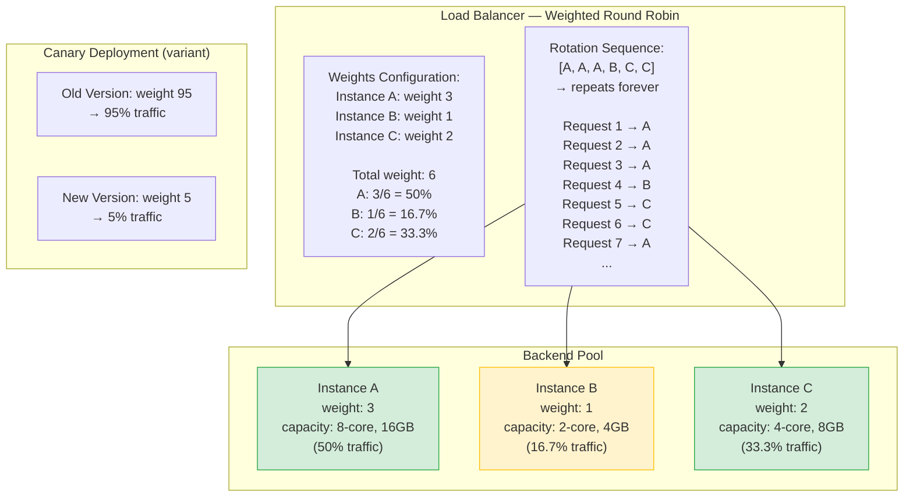
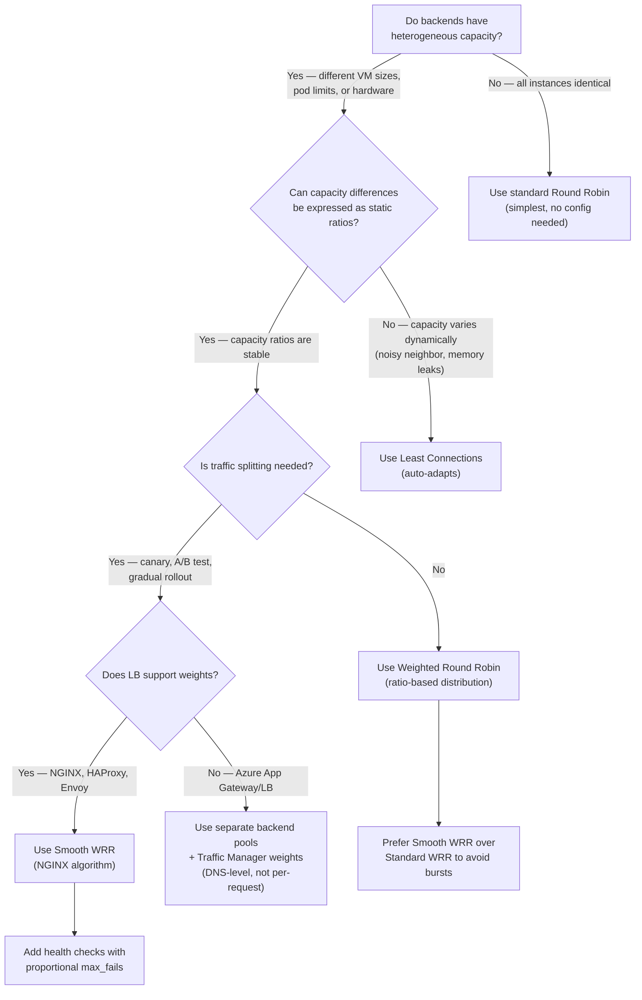

> [!success] Mastery Check
> - [ ] **Studied Well**
> - [ ] **Can explain the concept without notes**
> - [ ] **Can answer interview questions confidently**
> - [ ] **Can implement it in a real project**

---

id: "7.215" title: "Load Balancing — Weighted Round Robin" domain: "System Design & Distributed Systems" domain_id: 7 group: "Scalability Patterns" tags: [system-design, distributed-systems, scalability, dotnet, azure, load-balancing, weighted-round-robin, traffic-splitting, canary-deployment] priority: 1 version: 2 prerequisites:

- "[[7.212 — Load Balancing — Round Robin]]" — weighted round robin is a direct extension of standard round robin; understanding the sequential-counter mechanics of RR is the prerequisite for understanding how weights modify that sequence
- "[[7.211 — Load Balancing — Layer 4 vs Layer 7]]" — weighted round robin behaves differently at L4 (connection-weighted, where a single long-lived TCP connection consumes the full weight regardless of HTTP traffic) vs L7 (request-weighted, where each HTTP request independently consumes weight)
- "[[7.210 — Load Balancing — Overview]]" — the taxonomy anchor; WRR is one of the primary distribution algorithm families, bridging the gap between simple RR (equal treatment) and load-aware algorithms like LC (treatment by busyness)" related:
- "[[7.212 — Load Balancing — Round Robin]]" — the baseline that WRR extends; the standard RR algorithm is WRR with all weights = 1
- "[[7.213 — Load Balancing — Least Connections]]" — LC handles heterogeneous capacity automatically by observing real-time load; WRR handles it manually through configured weights; the comparison between the two approaches (dynamic vs static capacity signaling) is the central decision
- "[[7.216 — Load Balancing — Health Check Integration]]" — WRR weights are meaningless if health checks are not configured correctly; an unhealthy instance with a high weight will receive a disproportionate share of failing requests
- "[[7.217 — Load Balancing — SSL Termination]]" — TLS handshake cost varies by key size and cipher; WRR can be used to give more TLS-heavy connections to instances with hardware TLS acceleration
- "[[7.206 — Horizontal vs Vertical Scaling — Tradeoffs]]" — WRR enables heterogeneous scaling (different-sized instances in the same pool); the weight assignment must be updated when instance capacity changes, adding operational complexity compared to homogeneous pools
- "[[7.234 — Auto-Scaling — Kubernetes HPA]]" — Kubernetes HPA does not know about WRR weights; if a pod has weight 3 but HPA treats it as one replica, the autoscaling decisions are based on pod count, not weighted capacity — this mismatch is a common production surprise
- "[[7.233 — Auto-Scaling — Reactive vs Predictive]]" — WRR combined with reactive autoscaling creates a feedback loop: scaling adds new instances (with default weight 1), which changes the traffic distribution, which changes the load signal, which triggers more scaling decisions
- "[[4.110 — ASP.NET Core Kestrel — Production Configuration]]" — Kestrel's `MaxConcurrentConnections` per-instance config defines how much traffic each weighted instance can actually handle; a weight of 5 on a small instance with low connection limits will overwhelm it" created: 2026-06-16

---

> [!ABSTRACT] Quick Reference — Weighted Round Robin **Invariant:** Each backend instance is assigned a numeric weight. Requests are distributed across instances in round-robin order, but instances appear in the rotation proportionally to their weight — an instance with weight 3 appears 3× as often as an instance with weight 1. The effective traffic share per instance is `weight_i / sum(all_weights)`. **Cost:** The weight is a static configuration value that must be manually set and updated. It does NOT change automatically when the instance's actual capacity changes (unlike least connections, which adapts in real time). If an instance's capacity degrades (memory leak, CPU throttling, network bottleneck) but its weight stays the same, it will continue to receive the same traffic share — and fail under the load it can no longer handle. **Trigger:** When backend instances have heterogeneous capacity — different VM sizes (2-core vs 8-core), different pod resource limits (0.5 CPU vs 2 CPU), or different hardware generations (SSD vs HDD, with vs without GPU). Also when traffic splitting is needed for operational purposes: canary deployments (5% traffic to new version), A/B testing (10% to variant), or gradual rollouts (25% → 50% → 100%). **Skip When:** All instances are homogeneous (same capacity, same configuration). In this case, standard round robin (weights = 1 for all) provides the same result without the complexity of weight management. Also skip when the load balancer does not support weights — Azure Application Gateway and Azure Load Balancer do NOT support weighted distribution at the HTTP/TCP level. **.NET Entry Point:** No built-in .NET weighted round-robin load balancer. Implement via a custom `DelegatingHandler` with a weighted round-robin selector. Use `System.Threading.Interlocked` for the shared sequence counter and `System.Threading.Channels` for the weighted rotation queue. **Azure Native:** Azure Traffic Manager (DNS-level) supports weighted round-robin via the `weighted` traffic-routing method. Azure Application Gateway does NOT support weights. NGINX supports `weight` on upstream server directives. HAProxy supports `weight` on server directives. Azure Front Door does NOT support weighted routing. **Number to Know:** The effective traffic share for an instance with weight W in a pool with total weight S is W/S. For a pool with two instances of weights 3 and 1, the first receives 3/4 = 75% of traffic, the second receives 1/4 = 25%. This is only the AVERAGE over many requests — the short-term distribution depends on the algorithm variant. Standard WRR distributes requests in bursts (instance with weight 3 receives 3 consecutive requests before the rotation moves on). Smooth WRR (used by NGINX) interleaves the requests to avoid bursts. The difference matters for latency-sensitive applications: bursts can cause micro-hotspots on the high-weight instance.

---

## Navigation

**Domain:** [[7 — System Design & Distributed Systems]] > **Group:** Scalability Patterns
**Previous:** [[7.214 — Load Balancing — IP Hash]] | **Next:** [[7.216 — Load Balancing — Health Check Integration]]

### Prerequisites

- [[7.212 — Load Balancing — Round Robin]] — weighted round robin is a direct extension of standard round robin; understanding the sequential-counter mechanics of RR is the prerequisite for understanding how weights modify that sequence
- [[7.211 — Load Balancing — Layer 4 vs Layer 7]] — weighted round robin behaves differently at L4 (connection-weighted, where a single long-lived TCP connection consumes the full weight regardless of HTTP traffic) vs L7 (request-weighted, where each HTTP request independently consumes weight)
- [[7.210 — Load Balancing — Overview]] — the taxonomy anchor; WRR is one of the primary distribution algorithm families, bridging the gap between simple RR (equal treatment) and load-aware algorithms like LC (treatment by busyness)

### Where This Fits

> [!INFO] Production Encounter Map
>
> - **Layer:** Load balancer distribution algorithm — weighted round robin is a deterministic, stateless algorithm that assigns traffic proportionally to configured weights. It sits between standard round robin (all instances equal) and least connections (load-aware distribution). It is the simplest algorithm for handling heterogeneous capacity.
> - **Trigger:** The first time a team deploys a canary release and needs 5% of traffic to go to the new version. Or the first time the team mixes 2-core and 8-core VMs in the same backend pool and discovers that the 2-core instances are overwhelmed at 50% traffic share while the 8-core instances are idle. Or when a migration from on-premise (large machines) to cloud (smaller, cheaper instances) creates a mixed-size pool during the transition period.
> - **Without weighted round robin:** Every heterogeneous pool operates at the capacity of the smallest instance. The team either over-provisions all instances to the largest size (waste), runs separate pools per instance size (operational complexity), or accepts that the small instances fail under disproportionate load. Traffic splitting for canaries requires separate backend pools and DNS-level routing (Azure Traffic Manager), adding latency and complexity.
> - **First signal that WRR is needed:** When per-instance CPU monitoring shows that small instances are at 90% CPU while large instances are at 30%, yet request counts are equal (round robin). The small instances are failing or throttling. The team manually routes traffic away from small instances by removing them from the pool — a crude form of weight = 0.

Weighted round robin is the pragmatic choice when instances are not created equal. It is NOT the best algorithm for load distribution — least connections does a better job of adapting to real-time load. But WRR is simpler to reason about, does not require the load balancer to track active connections, and provides deterministic traffic ratios that are essential for canary deployments and A/B testing. The engineering cost is weight management: every time an instance's capacity changes, its weight must be updated. Teams that forget this step create a "weight rot" problem where the configured weights no longer reflect actual capacity.

---

## Core Mental Model

Weighted round robin extends the standard round-robin counter with a weight multiplier. Instead of each backend appearing once in the rotation, each backend appears W times, where W is its weight. The rotation sequence produces a deterministic pattern: for backends with weights [3, 1, 2], the rotation is [A, A, A, B, C, C] repeated. Each request advances the counter by one position in this expanded sequence. Over many requests, each backend receives W_i / sum(W) of the traffic.

The mental model: think of a lottery drum with tickets. Standard round robin puts one ticket per backend in the drum. Weighted round robin puts W tickets per backend. When a request arrives, the drum is spun, one ticket is drawn, and the ticket's backend handles the request. The more tickets a backend has, the more likely it is to be drawn on each spin. The difference from a real lottery: the drum is not reshuffled after each draw — the tickets are consumed in fixed order and refilled when exhausted. This produces a deterministic sequence, not random draws.

The critical insight: **weights express capacity ratios, not capacity values.** A weight of 10 on a backend does NOT mean it can handle 10 requests at once. It means it should receive 10× the traffic of a weight-1 backend. The actual capacity depends on the instance's resource limits, the request complexity, and the current load. If a weight-10 instance is a 2-core VM handling 1,000 req/s and a weight-1 instance is an 8-core VM handling 4,000 req/s, the weight ratio is backwards — the 8-core VM should have weight ~4, not 1. This is the most common WRR mistake: confusing weight with capacity.

> [!TIP] The Non-Obvious Insight
> Standard (bursty) WRR sends consecutive requests to the same high-weight backend. A backend with weight 5 in a pool with total weight 10 receives 5 CONSECUTIVE requests before the rotation moves on. This creates a micro-burst: 50% of traffic for 5 requests, then 0% for 5 requests. If the backend is a single-threaded processor or has connection pool limits, this burst pattern can overwhelm it even though the AVERAGE traffic share is correct. Smooth WRR (NGINX's implementation) interleaves the rotation so that no backend receives consecutive requests — essential for latency-sensitive systems.

### Classification

- **Algorithm family:** Deterministic, stateless (the rotation sequence is a fixed function of the weights; no shared mutable state between requests beyond the sequence counter).
- **OSI layer applicability:** Both L4 (connection-weighted — each new TCP connection consumes one slot from the rotation) and L7 (request-weighted — each HTTP request consumes one slot). The L4 version is vulnerable to connection reuse: a keep-alive connection established during a high-weight instance's turn stays on that instance for all subsequent requests, bypassing the rotation.
- **Distribution basis:** Configured weight — an administrative signal that says "this instance should receive this fraction of traffic." Not load, not connection count, not request duration — just administrative intention.
- **Heterogeneity handling:** Explicit — the operator is responsible for setting weights that reflect actual capacity. If capacity changes, weights must be updated. No automatic adaptation.
- **Traffic splitting:** Natural fit — canary deployments set the new version's weight to 5% and the old version's to 95%. Gradual rollouts increase the new version's weight over time.
- **Azure availability:** NOT available on Azure Application Gateway (round robin with optional cookie affinity only). NOT available on Azure Load Balancer (5-tuple hash only). Available on Azure Traffic Manager (DNS-level, `weighted` routing method — but DNS-level means traffic is weighted by DNS resolver, not per-request). Available on NGINX (`weight` on upstream server), HAProxy (`weight` on server), and Envoy (`weight` on cluster endpoint). 

### Primary Diagram



### Standard WRR vs Smooth WRR Trace

```
Standard (bursty) WRR with weights [3, 1, 2]:

Rotation: [A, A, A, B, C, C]

Request  1 → A   (A receives 3 consecutive)
Request  2 → A
Request  3 → A
Request  4 → B   (B receives 1)
Request  5 → C   (C receives 2 consecutive)
Request  6 → C
Request  7 → A   (repeat)
...

Traffic per 6 requests: 3 to A, 1 to B, 2 to C
Average: 50% A, 16.7% B, 33.3% C ✓

Short-term burst: A gets 3/3 = 100% for requests 1-3
  → A sees 100% load, then 0%, then 100%, etc.
  → If A's connection pool is 25, and 25 requests arrive
    simultaneously during A's turn, A's pool saturates.

Smooth WRR (NGINX) with weights [3, 1, 2]:

Effective rotation: [A, C, A, C, A, B]
  (interleaved to avoid consecutive same-backend dispatches)

Request  1 → A
Request  2 → C   ← A and C alternate
Request  3 → A
Request  4 → C   ← no backend gets consecutive requests
Request  5 → A   ← A appears 3×, C appears 2×, B appears 1×
Request  6 → B
Request  7 → A
...

Same average distribution: 50% A, 16.7% B, 33.3% C ✓
No bursts: max consecutive same-backend = 1
  → A never receives more than 1 request before the rotation moves on
  → Connection pools drain evenly across the rotation cycle
```

### Key Properties / Guarantees

|Property|Value|Condition|
|---|---|---|
|Traffic distribution fairness|Proportional to configured weights|Over many requests (converges within one full rotation cycle)|
|Session affinity|None — each request independently re-runs the rotation|Unless combined with cookie or IP hash override|
|Heterogeneous capacity handling|Explicit — requires manual weight assignment|Weights must reflect actual capacity; no automatic adjustment|
|Canary/traffic-splitting support|Excellent — precise percentage control|Requires L7 (per-request weighting) or DNS (Traffic Manager)|
|Implementation complexity|Low — counter + weight list + modulo|Standard WRR is O(1) per request; smooth WRR is O(N) per request|
|Adaptation to capacity change|None — weight must be manually updated|Least connections adapts automatically; WRR requires operator intervention|
|Short-term burst behavior (standard WRR)|Bursty — high-weight instances receive consecutive requests|Smooth WRR eliminates bursts; verify which variant the LB implements|
|Connection-level vs request-level|L4: weight per-TCP-connection; L7: weight per-HTTP-request|L4 weighting is coarse; keep-alive connections amplify the coarseness|
|Compatibility with dynamic weight adjustment|Good — weight can be updated LB API call|NGINX: `weight=` param in upstream; some LBs require reload|
|Azure availability|Not available on App Gateway or Azure LB; Traffic Manager supports DNS-level|Use NGINX, HAProxy, or Envoy for request-level WRR on Azure|

---

## Deep Mechanics

### How It Works

**Standard (Bursty) Weighted Round Robin:**

1. **Weight configuration:** Each backend instance is assigned a weight (positive integer, typically 1–100). The load balancer builds an expanded rotation list: for instance i with weight W_i, add W_i copies of instance i to the list.

2. **Rotation list:** `[A, A, A, B, C, C]` for weights [3, 1, 2]. The list has length = sum of all weights = S.

3. **Request dispatch:**
   ```
   counter = 0
   on each request:
       index = counter % S
       backend = rotation_list[index]
       counter++
       forward request to backend
   ```

4. **Distribution over time:** After S requests, each instance i has received exactly W_i requests. Over many S-cycles, instance i receives W_i / S of all traffic.

**Smooth Weighted Round Robin (NGINX, Envoy):**

1. **Current weight tracking:** Each backend has a `current_weight` that starts at 0 and accumulates the backend's configured weight over time.

2. **Request dispatch (each request):**
   - Add each backend's configured weight to its current weight
   - Select the backend with the highest current weight
   - Decrease the selected backend's current weight by the total weight (sum of all configured weights)

3. **Example trace with weights [3, 1, 2]:**
   ```
   Initial state: A_cw=0, B_cw=0, C_cw=0, total_weight=6

   Request 1: Add weights → A_cw=3, B_cw=1, C_cw=2
              Select max → A (3)
              Subtract total → A_cw=3-6=-3
              State: A=-3, B=1, C=2
              → Route to A

   Request 2: Add weights → A=-3+3=0, B=1+1=2, C=2+2=4
              Select max → C (4)
              Subtract total → C_cw=4-6=-2
              State: A=0, B=2, C=-2
              → Route to C

   Request 3: Add weights → A=0+3=3, B=2+1=3, C=-2+2=0
              Select max → A (3, tie → first encountered)
              Subtract total → A_cw=3-6=-3
              State: A=-3, B=3, C=0
              → Route to A

   Request 4: Add weights → A=-3+3=0, B=3+1=4, C=0+2=2
              Select max → B (4)
              Subtract total → B_cw=4-6=-2
              State: A=0, B=-2, C=2
              → Route to B

   Request 5: Add weights → A=0+3=3, B=-2+1=-1, C=2+2=4
              Select max → C (4)
              Subtract total → C_cw=4-6=-2
              State: A=3, B=-1, C=-2
              → Route to C

   Request 6: Add weights → A=3+3=6, B=-1+1=0, C=-2+2=0
              Select max → A (6)
              Subtract total → A_cw=6-6=0
              State: A=0, B=0, C=0
              → Route to A

   Sequence: A, C, A, B, C, A → smooth, no bursts
   ```

### Protocol Trace — NGINX WRR with 3 Backends, Weights [5, 3, 2]

```
NGINX smooth WRR, weights: web-a=5, web-b=3, web-c=2
Total weight = 10

                     Current Weight After          Selected
Request   Action     (add weight, subtract total)   Backend
────────────────────────────────────────────────────────────
1         add       A: 5, B: 3, C: 2               A
          subtract  A: -5, B: 3, C: 2
2         add       A: 0, B: 6, C: 4               B
          subtract  A: 0, B: -4, C: 4
3         add       A: 5, B: -1, C: 6               C
          subtract  A: 5, B: -1, C: -4
4         add       A: 10, B: 2, C: -2              A
          subtract  A: 0, B: 2, C: -2
5         add       A: 5, B: 5, C: 0                A (tie → A first)
          subtract  A: -5, B: 5, C: 0
6         add       A: 0, B: 8, C: 2                B
          subtract  A: 0, B: -2, C: 2
7         add       A: 5, B: 1, C: 4                A
          subtract  A: -5, B: 1, C: 4
8         add       A: 0, B: 4, C: 6                C
          subtract  A: 0, B: 4, C: -4
9         add       A: 5, B: 7, C: -2               B
          subtract  A: 5, B: -3, C: -2
10        add       A: 10, B: 0, C: 0               A
          subtract  A: 0, B: 0, C: 0

After 10 requests:
  A: 4 requests (40%) — weight 5/10 = 50%, close but not exact over 10
  B: 3 requests (30%) — weight 3/10 = 30%
  C: 3 requests (30%) — weight 2/10 = 20%, slightly over

After 100 requests:
  A: 50, B: 30, C: 20 → exact weight proportions
  Convergence improves with more requests.
```

### Canary Deployment Trace — WRR for Traffic Splitting

```
Scenario: Rolling out version 2 of OrderService.
- 9 instances running v1 (each weight 10, total 90)
- 1 instance running v2 (weight 10)

Phase 1 — 10% canary:
  v1 total weight: 90, v2 total weight: 10
  v2 traffic share: 10/100 = 10%
  Monitor errors, latency, throughput for v2

Phase 2 — 50%:
  Scale v2 to 5 instances (each weight 10, total 50)
  v1 total weight: 50 (removed 4 instances)
  v2 traffic share: 50/100 = 50%

Phase 3 — 100%:
  Scale v2 to 10 instances (each weight 10, total 100)
  v1 instances: removed from pool (weight 0 or removed)
  v2 traffic share: 100%

Each phase transition: adjust weights via LB API call
  → NGINX: upstream conf reload (no connection drop)
  → HAProxy: set weight <server> <weight> (runtime API)
  → Azure Traffic Manager: update endpoint weight (DNS TTL delay)
```

### Failure Modes

**Failure Mode 1: Static Weight Rot — Instance Capacity Degrades But Weight Stays High**

- **Cause:** An instance experiences capacity degradation — a memory leak reduces available heap, CPU throttling due to noisy neighbor on the host, or a disk I/O bottleneck develops. The instance can no longer handle its assigned weight. But the weight was configured when the instance was healthy and has not been updated. The load balancer continues to route W_i / S of traffic to the degraded instance. The instance struggles, latency increases, and it may eventually fail. This is "weight rot" — the configured weight no longer reflects actual capacity.
- **Symptom:** One instance shows elevated P99 latency (2-3× normal), increased error rate (5XX responses), and high CPU/memory — but receives the same traffic share as always. The LB dashboard shows "normal" traffic distribution per the configured weights. The latency chart shows a widening gap between the degraded instance and its peers. The degraded instance's health probe may still pass (it responds 200 OK, but slowly), so the LB does not remove it from the pool.
- **Detection time:** When the degraded instance starts serving errors. The alert triggers on 5XX rate increase. The on-call engineer checks resources → the instance is near its limit. But the weight is still high, so the instance continues receiving high traffic — a vicious cycle.

**Fix:**

```csharp
// ❌ The problem: weight is static, capacity is dynamic.
// The LB does not know the instance's actual capacity.

// ✅ Fix 1: Use a dynamic weight adjustment mechanism
// Periodically adjust weights based on health check scores
// or resource metrics (CPU, memory, latency).
// This is called "weighted least connections" or "adaptive weighting."

// ✅ Fix 2: Use least connections instead of WRR
// LC automatically routes fewer requests to degraded instances
// because they have higher active connection counts
// (requests take longer → more active → less new traffic).

// ✅ Fix 3: Implement a "degraded health state"
// The health check returns a non-fatal degradation signal
// (e.g., 429 Too Many Requests or 503 with Retry-After).
// The LB reduces the instance's effective weight without removing it.
public sealed class AdaptiveWeightHealthCheck : IHealthCheck
{
    private readonly System.Diagnostics.Metrics.Meter _meter;
    private long _averageLatencyMs;
    private int _weight;

    public AdaptiveWeightHealthCheck()
    {
        _meter = new System.Diagnostics.Metrics.Meter("OrderService.Health");
        _meter.CreateObservableGauge("weight", () => _weight);
    }

    public async Task<HealthCheckResult> CheckHealthAsync(
        HealthCheckContext context,
        CancellationToken ct)
    {
        var start = Stopwatch.GetTimestamp();
        // Run actual health check logic
        await CheckDependenciesAsync(ct);
        var latency = Stopwatch.GetElapsedTime(start);

        // Update rolling average latency
        Interlocked.Exchange(ref _averageLatencyMs,
            (long)(_averageLatencyMs * 0.9 + latency.TotalMilliseconds * 0.1));

        // Suggest weight based on latency relative to baseline
        var baselineMs = 50; // expected P50 latency
        var ratio = _averageLatencyMs / (double)baselineMs;

        if (ratio > 3.0)
        {
            // Severely degraded — suggest removal
            _weight = 0;
            return HealthCheckResult.Unhealthy(
                "Latency exceeds 3× baseline. Instance should be drained.");
        }

        if (ratio > 1.5)
        {
            // Partially degraded — suggest reduced weight
            _weight = Math.Max(1, 10 / (int)ratio);
            return HealthCheckResult.Degraded(
                $"Latency at {ratio:F1}× baseline. Suggested weight: {_weight}");
        }

        return HealthCheckResult.Healthy();
    }
}
```

**Cost of not fixing:** Degraded instances continue to receive full traffic until they fail completely. The failure cascade: degraded instance → slower responses → client retries → more load on ALL instances → more instances degrade → system-wide outage. Weight rot is a silent capacity erosion that only becomes visible during an incident.

---

**Failure Mode 2: Weight Integer Overflow in Standard WRR Counter**

- **Cause:** The standard WRR counter is an integer that increments on every request. In a high-throughput system serving 100,000 req/s with total weight S = 100, the counter increments by 100,000 per second. A 32-bit signed integer (max ~2.1 billion) wraps around after ~21,000 seconds (~6 hours). After the wrap, the modulo operation `counter % S` produces unexpected results — the counter may briefly become negative (depending on language semantics) or jump to a different position in the rotation. The rotation sequence becomes non-deterministic until the counter stabilizes (which it never does — it wraps again every 6 hours).
- **Symptom:** Intermittent, apparently random distribution errors. The actual traffic share deviates from the configured weights by 5–10% for brief periods (during the wrap). The deviation is not correlated with any load or health event. The team suspects the load balancer is broken but cannot reproduce it. The pattern repeats every ~6 hours in high-throughput systems.
- **Detection time:** Senior engineer notices that the 6-hour interval matches a pattern of brief imbalance alerts. The specific metric: `counter % S` jumping erratically over a few milliseconds. In practice, this is rarely detected because the deviation is small and transient.

**Fix:**

```csharp
// ❌ 32-bit signed integer overflow
int counter = 0;

int SelectBackend(int[] weights, int totalWeight)
{
    var index = counter % totalWeight;  // OVERFLOW after ~2B requests
    counter++;
    return index;
}

// ✅ Fix: Use a 64-bit counter (or prevent overflow with periodic reset)
long counter = 0;

int SelectBackend(int[] weights, int totalWeight)
{
    // 64-bit: wraps after ~9 × 10^18 requests
    // At 100,000 req/s, wraps after ~2.9 million years
    var index = (int)(counter % totalWeight);
    counter++;
    return index;
}

// ✅ Alternative: Use uint (32-bit unsigned, max ~4.3B)
// At 100,000 req/s, wraps after ~12 hours
// Better than signed 32-bit but still risky for high-throughput systems
uint counter = 0;

int SelectBackend(int[] weights, int totalWeight)
{
    var index = (int)(counter % totalWeight);
    counter++;
    return index;
}

// ✅ Best practice: Use a thread-safe 64-bit counter with Interlocked
private long _counter;

int SelectBackend(int totalWeight)
{
    var count = Interlocked.Increment(ref _counter);
    return (int)((count - 1) % totalWeight);
}
```

**Cost of not fixing:** Every ~6 hours (at 100K req/s with 32-bit counter), the WRR distribution exhibits a transient skew. For a canary deployment relying on precise 5% traffic split, the skew can temporarily route 15% to the canary, overwhelming it. The team may misattribute the canary failure to a code bug instead of the WRR implementation artifact.

---

**Failure Mode 3: L4 Connection-Weighted WRR — Keep-Alive Connections Bypass the Rotation**

- **Cause:** An L4 load balancer using weighted round robin distributes TCP connections, not HTTP requests. When a client establishes a keep-alive connection, that connection is routed to one backend based on the WRR counter at connection-establishment time. All subsequent HTTP requests over that keep-alive connection go to the SAME backend — the WRR rotation is not consulted again until a new TCP connection is opened. If clients maintain long-lived keep-alive connections (typical HTTP/1.1 behavior), the WRR distribution only applies at connection establishment, which happens once per client. After that, the weight distribution is irrelevant — each client is pinned to one backend for the connection's lifetime.
- **Symptom:** The configured weights are 5:3:2 for instances A, B, C. But the actual traffic distribution is 40%:40%:20% — A and B receive equal traffic despite A having nearly double the weight. Investigation reveals that most clients connected when the counter was at A or B positions (happened to be the first instances in the rotation at deployment time), and they have held their keep-alive connections open for hours. New connections are rare (clients reuse connections aggressively). The WRR rotation is idle because no new TCP connections are being established.
- **Detection time:** When monitoring shows persistent deviation from configured weights that does not self-correct. The deviation is stable — the same instances are overrepresented day after day. The team checks the WRR implementation (correct), the weights (correct), the health (all healthy) — but the distribution is still wrong.

**Fix:**

```csharp
// ❌ The problem: L4 WRR distributes TCP connections, not HTTP requests.
// Keep-alive connections bypass the rotation after establishment.

// ✅ Fix 1: Use L7 (request-level) WRR
// L7 load balancers distribute individual HTTP requests.
// Each HTTP request independently consumes a WRR slot.
// Keep-alive does not bypass the rotation.
// Switch from Azure LB (L4) to NGINX, HAProxy, or Envoy (L7).

// ✅ Fix 2: Shorten keep-alive timeout
// Force clients to establish new connections more frequently.
// This increases the rate of WRR re-distribution.
// NGINX: keepalive_timeout 10s;  (down from default 75s)
// ASP.NET Core Kestrel: ConfigureKestrel(o => o.Limits.KeepAliveTimeout = TimeSpan.FromSeconds(10));
builder.WebHost.ConfigureKestrel(options =>
{
    options.Limits.KeepAliveTimeout = TimeSpan.FromSeconds(10);
    options.Limits.MaxConcurrentConnections = 10000;
});

// ⚠️ Tradeoff: Shorter keep-alive increases TCP connection overhead
// (SYN/SYN-ACK per request), adds ~1-5ms latency per request,
// and increases server CPU for TLS handshake renegotiation.
// Testing needed to verify the tradeoff is acceptable.

// ✅ Fix 3: Use HTTP/2 (multiplexing still bypasses L4 rotation)
// HTTP/2 multiplexes multiple requests over one TCP connection.
// Even with short keep-alive, all requests share one connection.
// HTTP/2 makes L4 weighting even WORSE than HTTP/1.1 keep-alive.
// → This reinforces Fix 1: L7 is the correct layer for WRR.
```

**Cost of not fixing:** L4 WRR is effectively broken for HTTP workloads. The configured weights are aspirational, not effective. Traffic distribution is determined by which instances clients happened to connect to first — a race condition at deployment time. The team may as well use random distribution. The weight configuration is a maintenance burden with no practical benefit.

---

**Failure Mode 4: Zero-Weight Semantics — Instance With Weight 0 Still Receives Traffic**

- **Cause:** An operator sets an instance's weight to 0 intending to drain it (stop sending new traffic) while allowing in-flight requests to complete. But the WRR implementation does not treat weight 0 as "excluded from rotation" — it may still select the instance if the rotation sequence lands on it. Standard WRR with weights [3, 0, 2] produces rotation [A, A, A, (B weight 0 → skip?), C, C]. If the implementation does not skip weight-0 entries, B is still in the rotation but with 0 occurrences — or worse, the modulo operation produces an index that maps to B's position using a different algorithm.
- **Symptom:** After setting an instance's weight to 0 (expecting drain), the instance continues to receive new requests. The instance cannot drain. The deployment process (which expects the instance to stop receiving traffic before restarting) fails. In-flight requests are interrupted by the restart. Clients see connection errors.
- **Detection time:** When the draining step in the deployment pipeline fails. The instance is still receiving traffic minutes after weight was set to 0. The operator checks the WRR implementation and discovers that weight 0 is not equivalent to removing the instance from the pool.

**Fix:**

```csharp
// ❌ Weight 0 is ambiguous — is it "excluded" or "zero probability"?
// Some implementations skip weight-0 entries, others do not.

// ✅ Fix 1: Remove the instance from the pool instead of setting weight 0
// NGINX: remove the server directive from upstream { }
// HAProxy: disable server <name>
// Azure Traffic Manager: disable the endpoint
// This guarantees no new traffic. In-flight requests drain naturally.

// ✅ Fix 2: If weight 0 must be used, verify the implementation
// Standard WRR with weight skipping:
public sealed class WeightedRoundRobinSelector
{
    private readonly BackendInstance[] _instances;
    private long _counter;

    public WeightedRoundRobinSelector(BackendInstance[] instances)
    {
        _instances = instances;
    }

    public BackendInstance Select()
    {
        while (true)
        {
            var count = Interlocked.Increment(ref _counter);
            var totalWeight = _instances.Sum(i => i.Weight);

            if (totalWeight == 0)
                throw new InvalidOperationException("All instances have weight 0.");

            var index = (int)((count - 1) % totalWeight);
            var accumulated = 0;

            foreach (var instance in _instances)
            {
                accumulated += instance.Weight;
                // ⚠️ weight 0 instances are NEVER selected
                // because the accumulator never passes their position
                // (their weight contributes 0 to accumulated sum)
                if (index < accumulated)
                    return instance;
            }
        }
    }
}

// ✅ Fix 3: Use a separate "draining" state
// When draining, remove the instance from the WRR pool
// but keep it in a "draining connections" list.
// The drain list only allows existing connections to complete.
public sealed class DrainingAwareSelector
{
    private readonly ConcurrentDictionary<string, BackendInstance> _activePool;
    private readonly ConcurrentDictionary<string, BackendInstance> _drainingPool;

    public BackendInstance Select()
    {
        // Only select from active pool
        if (_activePool.IsEmpty)
            throw new InvalidOperationException("No active instances.");

        return WeightedRoundRobinSelect(_activePool.Values.ToArray());
    }

    public void StartDrain(string instanceId)
    {
        if (_activePool.TryRemove(instanceId, out var instance))
        {
            _drainingPool.TryAdd(instanceId, instance);
        }
    }
}
```

**Cost of not fixing:** Deployment pipelines fail intermittently because instances cannot drain. The team learns to always remove instances from the pool (not set weight 0) — but this knowledge is tribal, not documented. A new operator sets weight 0 and causes a production incident.

---

**Failure Mode 5: Weight Update Race — Traffic Spikes During Reconfiguration**

- **Cause:** An operator updates the weights on a live load balancer (e.g., increasing a canary's weight from 5% to 25%). The load balancer reconfigures the rotation sequence. During the transition, the WRR counter does not reset — it continues from its current position. The new rotation sequence has a different length (total weight changed). The current counter modulo the new total weight may land on an arbitrary position in the new sequence, causing a transient traffic spike or dip for some instances.
- **Symptom:** Immediately after a weight update, one instance receives 3× its expected traffic for 5–10 seconds before settling into the correct weight proportion. The spike is short-lived but may trigger autoscaling or alert thresholds. The instance may become temporarily overloaded. The pattern is most pronounced when the total weight changes significantly (e.g., doubling the canary's weight from 5 to 10 changes total weight from 100 to 105 — small shift, minimal spike) vs removing a high-weight instance (total weight drops from 100 to 50 — large shift, significant spike).
- **Detection time:** When the alert on per-instance request rate fires immediately after a weight change. The engineer correlates the alert with the deployment/reconfiguration event.

**Fix:**

```csharp
// ❌ The problem: counter % newTotalWeight may produce a
// different initial position than expected.

// ✅ Fix 1: Reset the WRR counter when weights change
private long _counter;
private long _generation; // weight version

public void UpdateWeights(BackendInstance[] newInstances)
{
    _instances = newInstances;
    Interlocked.Increment(ref _generation);
    Interlocked.Exchange(ref _counter, 0); // Reset counter
}

// ✅ Fix 2: Use smooth WRR (no counter — current_weight array)
// Smooth WRR does not have a sequential counter.
// Weight changes take effect on the next request naturally.
// The current_weight array converges to the new distribution
// within one full rotation cycle.

// ✅ Fix 3: Phase weight changes gradually
// Instead of changing weight from 5 to 50 in one step,
// do 5 → 15 → 30 → 50 over 4 LB reloads (1-2 minutes apart).
// Each step shifts a smaller fraction of traffic,
// reducing the spike magnitude.

// ✅ Fix 4: Pre-warm connections on new-weight pool
// Before applying a large weight increase to an instance,
// verify it has sufficient connection capacity.
// If the instance was at weight 5 (receiving 5% traffic)
// and is now weight 50 (receiving 50%), it needs 10× the
// connections, 10× the TLS handshake capacity, etc.
public async Task PreWarmAsync(string instanceUrl, int targetWeight)
{
    // Send a small burst of warm-up requests
    var client = new HttpClient { Timeout = TimeSpan.FromSeconds(5) };
    var tasks = Enumerable.Range(0, targetWeight * 10)
        .Select(_ => client.GetAsync(instanceUrl + "/health"));
    await Task.WhenAll(tasks);
}
```

**Cost of not fixing:** Weight changes cause transient hotspots. In a canary deployment where the new version's weight is increased rapidly, the spike can overwhelm the canary instance and cause a false-negative rollback decision. The team learns to distrust the canary metrics during the transition window.

---

### .NET and Azure Integration

- **ASP.NET Core:** No built-in weighted round-robin middleware. Implement via a custom `DelegatingHandler` with `WeightedRoundRobinSelector`. The `IHttpClientFactory` pattern with named clients is the standard approach.
- **Azure Application Gateway:** Does NOT support weighted distribution. Only round-robin (all backends equal) with optional cookie-based session affinity. For weighted distribution on Azure at L7, use NGINX Ingress Controller, HAProxy, or Envoy on AKS.
- **Azure Load Balancer (L4):** Does NOT support weights. Uses 5-tuple hash. No weighted variant.
- **Azure Traffic Manager (DNS):** Supports `weighted` routing method. Each endpoint has a weight. DNS responses include endpoints proportionally to their weights. Limitations: DNS-level only (traffic is weighted by DNS resolver, not per-request), TTL delays weight changes (30–300 seconds), and the client's DNS resolver may cache and subvert the weighting.
- **NGINX:** `upstream` block with `weight` on `server` directives. Uses smooth WRR internally. Supports runtime weight changes via `ngx_http_upstream_conf` (commercial) or config reload.
- **HAProxy:** `server` directive with `weight` parameter. Supports runtime weight changes via `set weight` command on the stats socket.
- **Envoy:** `endpoint` weight in cluster configuration via `load_assignment` with `locality_lb_endpoints`. Supports dynamic weight adjustment via xDS API.
- **.NET libraries:** No standard library for WRR. Use `System.Threading.Interlocked` for the counter, `System.Threading.Channels` for the rotation queue if pre-built. The `System.IO.Hashing` namespace is not needed (no hash function — WRR uses a counter).

```csharp
// Program.cs — Client-side weighted round-robin with HttpClientFactory
using System.Threading;

builder.Services.AddSingleton(new BackendWeightTable(new[]
{
    new WeightedBackend("https://order-api-v1-0:5001", weight: 9),
    new WeightedBackend("https://order-api-v2-0:5002", weight: 1), // canary
}));

builder.Services.AddHttpClient("OrderServiceClient")
    .ConfigurePrimaryHttpMessageHandler(() => new SocketsHttpHandler
    {
        MaxConnectionsPerServer = 10,
    })
    .AddHttpMessageHandler<WeightedRoundRobinHandler>();

builder.Services.AddTransient<WeightedRoundRobinHandler>();

//---
public sealed record WeightedBackend(string Url, int Weight);

public sealed class BackendWeightTable
{
    private readonly WeightedBackend[] _backends;
    private readonly int _totalWeight;
    private readonly object _lock = new();

    public BackendWeightTable(WeightedBackend[] backends)
    {
        _backends = backends;
        _totalWeight = backends.Sum(b => b.Weight);
    }

    public int TotalWeight => _totalWeight;

    public WeightedBackend GetBackend(int index)
    {
        var accumulated = 0;
        foreach (var backend in _backends)
        {
            accumulated += backend.Weight;
            if (index < accumulated)
                return backend;
        }

        // Fallback to last backend (should not reach here)
        return _backends[^1];
    }

    public void UpdateWeight(string url, int newWeight)
    {
        lock (_lock)
        {
            for (var i = 0; i < _backends.Length; i++)
            {
                if (_backends[i].Url == url)
                {
                    _backends[i] = _backends[i] with { Weight = newWeight };
                    // Recalculate total weight
                    // (in production, store and update incrementally)
                    break;
                }
            }
        }
    }
}

public sealed class WeightedRoundRobinHandler : DelegatingHandler
{
    private readonly BackendWeightTable _table;
    private long _counter;

    public WeightedRoundRobinHandler(BackendWeightTable table)
    {
        _table = table;
    }

    protected override async Task<HttpResponseMessage> SendAsync(
        HttpRequestMessage request, CancellationToken ct)
    {
        var index = (int)((Interlocked.Increment(ref _counter) - 1)
                          % _table.TotalWeight);
        var backend = _table.GetBackend(index);

        request.RequestUri = new Uri(
            backend.Url + request.RequestUri?.PathAndQuery);

        return await base.SendAsync(request, ct);
    }
}
```

---

## Production Patterns and Implementation

### Primary Implementation — Smooth Weighted Round Robin (NGINX-Compatible)

The production-grade WRR implementation uses the smooth WRR algorithm (NGINX's algorithm). This avoids the burst problem of standard WRR and provides deterministic, evenly-spaced distribution. The implementation is thread-safe, uses lock-free operations where possible, and supports dynamic weight updates.

```csharp
// Licensed under the MIT License.
// Smooth Weighted Round Robin — used by OrderService to distribute
// requests across heterogeneous processing nodes.
// Algorithm matches NGINX upstream weighted round-robin behavior.

public sealed class SmoothWeightedRoundRobinSelector : IDisposable
{
    private readonly object _lock = new();
    private readonly ILogger _logger;

    // Current weights — the algorithm's state
    private int[] _currentWeights;
    // Configured weights — the static target (never mutated during selection)
    private int[] _configuredWeights;
    // Backend URLs corresponding to each index
    private string[] _backendUrls;
    // Total of configured weights
    private int _totalWeight;
    // Number of backends
    private int _count;

    public SmoothWeightedRoundRobinSelector(
        IReadOnlyList<WeightedBackend> backends,
        ILogger? logger = null)
    {
        _logger = logger ?? NullLogger.Instance;
        _count = backends.Count;
        _backendUrls = backends.Select(b => b.Url).ToArray();
        _configuredWeights = backends.Select(b => b.Weight).ToArray();
        _currentWeights = new int[_count];
        _totalWeight = backends.Sum(b => b.Weight);

        _logger.LogInformation(
            "Smooth WRR initialized with {Count} backends, total weight {Total}.",
            _count, _totalWeight);
    }

    public string SelectBackend()
    {
        lock (_lock)
        {
            if (_count == 0)
                throw new InvalidOperationException(
                    "No backends configured in the WRR pool.");

            if (_totalWeight == 0)
                throw new InvalidOperationException(
                    "All backends have weight 0. No traffic can be routed.");

            // Step 1: Add configured weights to current weights
            var maxWeight = int.MinValue;
            var selectedIndex = -1;

            for (var i = 0; i < _count; i++)
            {
                _currentWeights[i] += _configuredWeights[i];

                // Track the maximum current weight
                if (_currentWeights[i] > maxWeight)
                {
                    maxWeight = _currentWeights[i];
                    selectedIndex = i;
                }
            }

            // Step 2: Decrease the selected backend's current weight
            // by the total weight
            _currentWeights[selectedIndex] -= _totalWeight;

            return _backendUrls[selectedIndex];
        }
    }

    public void UpdateWeights(IReadOnlyList<WeightedBackend> updatedBackends)
    {
        lock (_lock)
        {
            _backendUrls = updatedBackends.Select(b => b.Url).ToArray();
            _configuredWeights = updatedBackends.Select(b => b.Weight).ToArray();
            _totalWeight = updatedBackends.Sum(b => b.Weight);
            _count = updatedBackends.Count;

            // Reset current weights for convergence stability
            _currentWeights = new int[_count];

            _logger.LogInformation(
                "WRR weights updated. New total weight: {Total}.", _totalWeight);
        }
    }

    public void Dispose()
    {
        // No managed resources to dispose
    }
}
```

### Configuration and Wiring

```csharp
// Program.cs — Smooth WRR with DI registration
using OrderService.Infrastructure.LoadBalancing;

var backends = new[]
{
    new WeightedBackend("https://order-processor-a:5101", Weight: 5),
    new WeightedBackend("https://order-processor-b:5102", Weight: 3),
    new WeightedBackend("https://order-processor-c:5103", Weight: 2),
};

var selector = new SmoothWeightedRoundRobinSelector(backends);
builder.Services.AddSingleton(selector);

builder.Services.AddHttpClient("OrderProcessorClient", client =>
{
    client.DefaultRequestHeaders.Add("X-Source", "OrderService");
    client.Timeout = TimeSpan.FromSeconds(15);
})
.ConfigurePrimaryHttpMessageHandler(() => new SocketsHttpHandler
{
    MaxConnectionsPerServer = 20,
    EnableMultipleHttp2Connections = true,
    PooledConnectionLifetime = TimeSpan.FromMinutes(1),
})
.AddHttpMessageHandler<WrrRoutingHandler>();

builder.Services.AddTransient<WrrRoutingHandler>();

//---
public sealed class WrrRoutingHandler : DelegatingHandler
{
    private readonly SmoothWeightedRoundRobinSelector _selector;

    public WrrRoutingHandler(SmoothWeightedRoundRobinSelector selector)
    {
        _selector = selector;
    }

    protected override async Task<HttpResponseMessage> SendAsync(
        HttpRequestMessage request, CancellationToken ct)
    {
        var targetUrl = _selector.SelectBackend();
        request.RequestUri = new Uri(
            targetUrl + request.RequestUri!.PathAndQuery);
        return await base.SendAsync(request, ct);
    }
}
```

### Canary Deployment Weight Management Service

```csharp
// CanaryDeploymentManager — Manages WRR weights for gradual rollouts
// Used by the deployment pipeline to shift traffic from v1 to v2.

public sealed class CanaryDeploymentManager
{
    private readonly BackendWeightTable _weightTable;
    private readonly ILogger _logger;

    // Phases: defined as target weight percentage for the canary
    private static readonly (int V1Weight, int V2Weight, string Label)[] Phases =
    [
        (99, 1,  "1% canary — observe errors and latency"),
        (95, 5,  "5% canary — observe throughput impact"),
        (80, 20, "20% — confidence building"),
        (50, 50, "50% — load validation"),
        (0,  100, "100% — full rollout"),
    ];

    public CanaryDeploymentManager(
        BackendWeightTable weightTable,
        ILogger<CanaryDeploymentManager> logger)
    {
        _weightTable = weightTable;
        _logger = logger;
    }

    public async Task ExecuteCanaryAsync(
        string v1Url, string v2Url,
        CancellationToken ct)
    {
        foreach (var (v1Weight, v2Weight, label) in Phases)
        {
            _logger.LogInformation(
                "Canary phase: {Label} (v1={V1}%, v2={V2}%)",
                label, v1Weight, v2Weight);

            _weightTable.UpdateWeight(v1Url, v1Weight);
            _weightTable.UpdateWeight(v2Url, v2Weight);

            // Wait for observability data to confirm the phase
            await Task.Delay(
                TimeSpan.FromMinutes(5), ct);

            // In production: check error rate, P99 latency, throughput
            // against predefined rollback criteria
            var healthOk = await CheckCanaryHealthAsync(v2Url, ct);
            if (!healthOk)
            {
                _logger.LogWarning(
                    "Canary health check failed. Rolling back.");
                Rollback(v1Url, v2Url);
                return;
            }
        }

        _logger.LogInformation("Canary deployment completed successfully.");
    }

    private void Rollback(string v1Url, string v2Url)
    {
        _weightTable.UpdateWeight(v1Url, 100);
        _weightTable.UpdateWeight(v2Url, 0);
        _logger.LogInformation("Rolled back: 100% traffic to v1.");
    }

    private async Task<bool> CheckCanaryHealthAsync(
        string canaryUrl, CancellationToken ct)
    {
        // Simplified — production version checks:
        // - Error rate (5XX) < baseline * 1.5
        // - P99 latency < baseline * 1.2
        // - Throughput within expected range
        var client = new HttpClient { Timeout = TimeSpan.FromSeconds(5) };
        try
        {
            var response = await client.GetAsync(
                $"{canaryUrl}/health/ready", ct);
            return response.IsSuccessStatusCode;
        }
        catch
        {
            return false;
        }
    }
}
```

### Common Variants

**1. Weighted Random Selection (randomized alternative to sequential WRR):**

```csharp
// For scenarios where deterministic rotation is undesirable
// (e.g., avoiding request correlation in A/B testing).
// Picks a backend randomly but weighted by configured weights.
public sealed class WeightedRandomSelector
{
    private readonly WeightedBackend[] _backends;
    private readonly int _totalWeight;
    private readonly Random _random = new();

    public WeightedRandomSelector(WeightedBackend[] backends)
    {
        _backends = backends;
        _totalWeight = backends.Sum(b => b.Weight);
    }

    public string SelectBackend()
    {
        var roll = _random.Next(_totalWeight);
        var accumulated = 0;

        foreach (var backend in _backends)
        {
            accumulated += backend.Weight;
            if (roll < accumulated)
                return backend.Url;
        }

        return _backends[^1].Url;
    }
}
```

**2. Dynamic Weight Adjustment from Health Metrics:**

```csharp
// Adjusts weights based on real-time health metrics (CPU, latency).
// Bridges the gap between static WRR and adaptive LC.
public sealed class MetricsDrivenWeightAdjuster : BackgroundService
{
    private readonly BackendWeightTable _table;
    private readonly HealthMetricsCollector _metrics;
    private readonly TimeSpan _adjustmentInterval = TimeSpan.FromSeconds(30);

    public MetricsDrivenWeightAdjuster(
        BackendWeightTable table,
        HealthMetricsCollector metrics)
    {
        _table = table;
        _metrics = metrics;
    }

    protected override async Task ExecuteAsync(CancellationToken ct)
    {
        while (!ct.IsCancellationRequested)
        {
            await Task.Delay(_adjustmentInterval, ct);

            var metrics = _metrics.GetLatestPerInstance();
            if (metrics.Count == 0) continue;

            // Normalize: lowest-CPU instance gets the highest weight
            var minCpu = metrics.Values.Min(m => m.CpuPercent);
            var maxCpu = metrics.Values.Max(m => m.CpuPercent);
            var range = Math.Max(maxCpu - minCpu, 1);

            foreach (var (url, instanceMetrics) in metrics)
            {
                // Invert: lower CPU → higher weight
                var normalizedWeight = 10 * (1 - (instanceMetrics.CpuPercent - minCpu) / (double)range);
                var newWeight = Math.Max(1, (int)Math.Round(normalizedWeight));

                _table.UpdateWeight(url, newWeight);
            }
        }
    }
}
```

**3. Azure Traffic Manager DNS-Level Weighted Routing Configuration:**

```bicep
// main.bicep — Azure Traffic Manager with weighted endpoints
resource trafficManager 'Microsoft.Network/trafficManagerProfiles@2022-04-01' = {
  name: 'order-service-traffic-manager'
  location: 'global'
  properties: {
    trafficRoutingMethod: 'Weighted'
    dnsConfig: {
      relativeName: 'order-service'
      ttl: 60
    }
    endpoints: [
      {
        name: 'primary-region'
        properties: {
          endpointLocation: 'eastus'
          endpointStatus: 'Enabled'
          weight: 90
          target: 'primary.orderservice.azurewebsites.net'
        }
      }
      {
        name: 'canary-region'
        properties: {
          endpointLocation: 'westus'
          endpointStatus: 'Enabled'
          weight: 10
          target: 'canary.orderservice.azurewebsites.net'
        }
      }
    ]
  }
}
```

### Real-World .NET Ecosystem Example

- **YARP (Yet Another Reverse Proxy):** Microsoft's .NET reverse proxy library. Supports weighted round-robin load balancing via `ILoadBalancingPolicy`. The `PowerOfTwoChoices` policy is the default, but `WeightedRoundRobin` can be configured: `"LoadBalancingPolicy": "WeightedRoundRobin"` with weights per destination. YARP's implementation supports smooth (NGINX-like) WRR.
- **Azure Traffic Manager:** DNS-level weighted routing. Each endpoint has a weight (1–1000). Traffic Manager returns DNS responses with endpoints selected proportionally to their weights. The client's DNS resolver then picks one — so the weighting is statistical, not per-request. This is suitable for regional traffic distribution (not request-level).
- **Kubernetes Ingress Controllers:** NGINX Ingress (smooth WRR via `weight`), HAProxy Ingress (via `weight`), and Envoy Ingress (via `endpoint weight`). Each supports WRR at the request level within the cluster.
- **Polly:** No direct WRR implementation. Polly's `LoadBalancerStrategy` in the `Polly.Extensions` package focuses on circuit breaker and retry, not distribution algorithms. WRR is typically implemented at the HTTP client layer, not the resilience layer.

---

## Gotchas and Production Pitfalls

### Gotcha 1: Application Gateway Does Not Support Weighted Distribution — Teams Misconfigure It

**Pitfall:** A team deploys a canary release on Azure Application Gateway. They expect to send 10% of traffic to the new version. They check the App Gateway documentation, find "weights" mentioned in the backend pool configuration, and set the weights to 90 and 10. But Application Gateway uses weights only for determining the backend pool's MULTIPLEXING behavior (multiplexed connection allocation), NOT for request distribution. App Gateway always distributes requests via round-robin regardless of weights. The 90/10 weight configuration has no effect on request routing.

```powershell
# ❌ This does NOT create weighted distribution on App Gateway
# Application Gateway backend pool "weight" is for HTTP/2 multiplexing only:
$backendPool = New-AzApplicationGatewayBackendAddressPool `
    -Name "v1-pool" `
    -BackendIPAddresses "10.0.1.4", "10.0.1.5"
# No weight parameter for request distribution exists on App Gateway

# ✅ Correct approach: Use Azure Traffic Manager (DNS-level) + App Gateway
# OR: Use NGINX Ingress Controller on AKS with `weight` directive
# OR: Use separate App Gateways per version with Traffic Manager

# Azure CLI — Traffic Manager weighted routing:
az network traffic-manager endpoint create \
    --name "v1-endpoint" \
    --profile-name "order-service-tm" \
    --resource-group "my-rg" \
    --type azureEndpoints \
    --target-resource-id "/subscriptions/.../v1-appgw" \
    --weight 90

az network traffic-manager endpoint create \
    --name "v2-endpoint" \
    --profile-name "order-service-tm" \
    --resource-group "my-rg" \
    --type azureEndpoints \
    --target-resource-id "/subscriptions/.../v2-appgw" \
    --weight 10
```

**Symptom:** The canary deployment receives 50% of traffic instead of 10% (assuming 2 versions, each behind its own App Gateway with equal backends). The team believes weights are working because they set them — but the metric shows even distribution. The canary is overwhelmed.

**Cost of not fixing:** The canary is overwhelmed by the unexpected traffic volume. The false signal causes either (a) a rollback of a healthy deployment or (b) acceptance of an unhealthy deployment as "production-ready" because it passed at 50% load. The team loses trust in the canary process.

---

### Gotcha 2: Weight and Health Check Count Mismatch in NGINX

**Pitfall:** NGINX's upstream `max_fails` and `fail_timeout` directives interact with `weight` in a non-obvious way. The `max_fails` counter is per-request-attempt, not per-weight-unit. A backend with weight 5 receives 5× the requests of a weight-1 backend in the same time period — and therefore fails 5× as often. The `max_fails` threshold is reached 5× faster, causing the high-weight backend to be marked unhealthy prematurely.

```nginx
# ❌ Weight 5 backend fails faster due to more requests
upstream order_service {
    server 10.0.1.4:5001 weight=5 max_fails=3 fail_timeout=30s;
    server 10.0.1.5:5002 weight=1 max_fails=3 fail_timeout=30s;
    # Instance A (weight 5) receives 5× requests
    #   → 5× failure count in same time window
    #   → hits max_fails=3 much faster
    #   → marked unhealthy, removed from pool
    #   → Instance B receives ALL traffic
    #   → Instance B may also fail under the surge
}

# ✅ Fix: Scale max_fails proportionally to weight
upstream order_service {
    server 10.0.1.4:5001 weight=5 max_fails=15 fail_timeout=30s;
    server 10.0.1.5:5002 weight=1 max_fails=3 fail_timeout=30s;
    # Instance A: 5× weight → 5× max_fails
    # Both instances fail at roughly the same rate per unit of weight
}
```

**Symptom:** The high-weight backend is repeatedly marked unhealthy and removed from the pool. After removal, the remaining backend(s) receive all traffic and become overloaded. The high-weight backend recovers (fail_timeout expires), rejoins the pool, receives high traffic again, and is immediately marked unhealthy again. The system oscillates: pool has N-1 backends (overloaded), then N backends (briefly), then N-1 again.

**Cost of not fixing:** The backend pool oscillates between healthy and degraded states. The oscillation is tied to the weight-to-max_fails ratio. Every fail_timeout cycle repeats the pattern. The system operates at reduced capacity indefinitely.

---

### Gotcha 3: Zero-Weight Instance Not Drained — Counter Position Lands on It

**Pitfall:** An operator sets an instance's weight to 0 expecting it to stop receiving new traffic (drain). But the smooth WRR algorithm may still select the instance briefly if the current_weight value is positive at the time of the weight update. In standard WRR, if the rotation list is cached and the weight change does not rebuild the list, the instance may still appear in the current rotation cycle.

```csharp
// ❌ Weight 0 instance still selected due to current_weight state
// Smooth WRR state: A_cw=5, B_cw=-2, C_cw=3
// Operator sets A's weight to 0
// Next request: add configured weights
//   A_cw = 5 + 0 = 5  ← still positive from prior state!
//   B_cw = -2 + 1 = -1
//   C_cw = 3 + 2 = 5
// Select max: A (5) or C (5 tie) → A might be selected!
// Even though A's configured weight is 0, its current weight
// is positive from history, so it still receives traffic.

// ✅ Fix: Reset current weights when an instance transitions to weight 0
public void UpdateWeights(IReadOnlyList<WeightedBackend> backends)
{
    lock (_lock)
    {
        _configuredWeights = backends.Select(b => b.Weight).ToArray();
        _totalWeight = backends.Sum(b => b.Weight);

        // Reset ALL current weights to 0 on weight changes
        // This prevents stale current_weight values from routing
        // traffic to weight-0 instances
        _currentWeights = new int[_count];

        _logger.LogInformation("WRR weights reset. Weight-0 instances drained.");
    }
}
```

**Symptom:** After setting weight to 0, the instance receives 1–5 more requests before stopping. For most applications, this residual traffic is acceptable. For strictly-drained deployments (rolling updates that kill the instance immediately after the weight change), those residual requests fail.

**Cost of not fixing:** Rolling deployments may experience intermittent failures during instance shutdown. The 1–5 residual requests fail, causing minor error rate spikes (0.01% at scale). In strict zero-downtime deployments, these failures are unacceptable.

---

### Gotcha 4: Weight Configuration Using Integer Overflow-Prone Values

**Pitfall:** Teams configure weights with large values thinking "bigger = more precise." They set weights like 1000, 2000, 3000. Total weight = 6000. The WRR counter increments on every request. At 50,000 req/s on a 32-bit signed counter, the counter overflows every ~12 hours (2.1B / 50K / 3600 = ~11.6 hours). But even without overflow, large weights increase the rotation cycle length — the distribution converges to the correct proportion MORE SLOWLY because the WRR sequence needs more requests to cover the full weight range.

```csharp
// ❌ Large weights: slow convergence, overflow risk
var weights = new[] { 1000, 2000, 3000 }; // total = 6000
// After 6000 requests, the cycle completes once.
// At 100 req/s, that's 60 seconds for one full cycle.
// The short-term distribution is poor: A gets 0% for 20 seconds,
// then 100% for 10 seconds, etc.

// ✅ Small weights: fast convergence, no overflow risk
var weights = new[] { 1, 2, 3 }; // total = 6
// After 6 requests, the cycle completes.
// At 100 req/s, that's 60ms for one full cycle.
// The short-term distribution is good: converges within milliseconds.
// The ratios are EXACTLY THE SAME: 1/6 = 16.7%, 2/6 = 33.3%, 3/6 = 50%.

// Rule: Use the smallest integers that express the desired ratio.
// Weight 1,2,3 produces the same ratio as 1000,2000,3000 but:
// - Converges 1000× faster
// - Counter will not overflow in the lifetime of the universe
// - Easier to read and maintain
```

**Symptom:** After a weight change, the new distribution takes minutes to stabilize (the long rotation cycle causes slow convergence). During the convergence period, per-instance traffic share deviates from the target. Monitoring shows the weights are "correct" (configured as 3000:2000:1000) but the actual traffic share is 10%:70%:20% for the first 30 seconds before gradually converging.

**Cost of not fixing:** Slow convergence after weight changes makes canary deployments unpredictable. The monitoring window must be extended to account for the convergence time. Autoscaling decisions based on per-instance metrics are delayed because the traffic distribution has not stabilized.

---

### Gotcha 5: Smooth WRR State Is Not Serializable — Load Balancer Restart Resets Distribution

**Pitfall:** The smooth WRR algorithm maintains a `current_weight` per-instance state array. This state is in-memory on the load balancer. If the load balancer restarts (deployment, crash, scaling event), the state is lost. The new state initializes all current weights to 0. For the first rotation cycle after restart, the distribution is DETERMINISTIC and BURSTY — the algorithm adds configured weights to 0, selects the max, and proceeds sequentially. During this first cycle, the distribution is IDENTICAL to standard WRR (bursty). Only after the first full cycle does the distribution become smooth.

```
After restart: all current weights = 0
Weights: [5, 3, 2]

Request 1: Add → A=5, B=3, C=2 → Select A → A_cw = 5-10 = -5
Request 2: Add → A=0, B=6, C=4 → Select B → B_cw = 6-10 = -4
Request 3: Add → A=5, B=-1, C=6 → Select C → C_cw = 6-10 = -4
  ← This is NOW smooth (no consecutive same-backend)
  ← But the FIRST THREE requests were burst-free
  ← Full smoothness requires the first full cycle to complete (10 requests)
```

**Symptom:** Immediately after a load balancer restart, the traffic distribution is bursty for ~S requests (S = total weight). At low total weights (e.g., S = 6), the burstiness lasts milliseconds. At high total weights (e.g., S = 1000), the burstiness lasts seconds. For latency-sensitive applications, this transient burstiness can trigger alerts.

**Cost of not fixing:** The first ~S requests after a restart are bursty. In a system with frequent LB restarts (rolling deployments of the LB itself, autoscaling of LB instances), the system is continuously in the "bursty convergence" phase. The smoothness guarantee of smooth WRR is effectively voided.

---

## Tradeoffs and Decision Framework

### Tradeoff Matrix

| Dimension | Weighted Round Robin | Least Connections | Standard Round Robin | IP Hash + Consistent Hashing |
|---|---|---|---|---|
| Heterogeneous capacity handling | Explicit (manual weight assignment) | Implicit (auto-adapts via connection count) | None (all treated equally) | None (distributes by hash, not capacity) |
| Traffic splitting precision | Excellent (deterministic ratios) | Poor (ratios are emergent, not controlled) | N/A (equal only) | Poor (ratios depend on hash distribution) |
| Auto-adaptation to capacity change | None (weight must be manually updated) | Excellent (real-time adaptation) | None | None |
| Implementation complexity | Low (counter + weight list) | Moderate (per-instance counter + scan) | Trivial (counter only) | Moderate (hash ring + virtual nodes) |
| Session affinity | None | None | None | Strong |
| Short-term distribution (burstiness) | Standard WRR: bursty; Smooth WRR: even | Even (load-aware) | Even (each request advances counter) | Even (hash distributes independently) |
| L4 compatibility | Poor (connection-weighted only) | L4 LC is rarely useful | Good | Good (Azure LB 5-tuple) |
| Azure L7 availability | Not available (App Gateway/LB) | Not available (App Gateway/LB) | App Gateway default | Not available |
| Canary deployment support | Excellent (precise % control) | Poor (cannot set precise %) | N/A | Poor |
| Operational cost | Medium (weight management, calibration) | Low (set and forget) | None (no configuration) | Low (after initial hash setup) |

### Decision Flowchart



### When to Apply

- **Heterogeneous backend pools** where instances have different VM sizes, CPU/memory limits, or hardware generations. The weight ratio should match the capacity ratio (e.g., 8-core instance gets weight 4, 2-core instance gets weight 1).
- **Canary deployments and staged rollouts** requiring precise traffic splitting (1%, 5%, 10%, 25%, 50%, 100%). WRR provides deterministic, predictable traffic ratios that canary analysis tools can validate.
- **A/B testing and experimentation** where variant traffic must be split at specific percentages (50/50, 90/10, 99/1). WRR guarantees the ratio over the experiment duration.
- **Multi-region routing** via Azure Traffic Manager with DNS-level weights. Regional traffic distribution for disaster recovery and load shifting.
- **Static capacity environments** where backend capacity does not change dynamically (on-premise hardware, reserved instances, capacity commits). The weight, once set, stays valid.

### When NOT to Apply

- [ ] **Dynamic capacity environments** where instance performance varies with noisy-neighbor interference, CPU throttling, or memory pressure. WRR weights cannot adapt — use least connections.
- [ ] **Azure-only ecosystem** (App Gateway, Azure LB) where WRR is not supported at the request level. Forcing WRR on Azure requires adding NGINX/HAProxy/Envoy, increasing operational complexity.
- [ ] **Session-stateful applications** where the same client must always hit the same backend. WRR provides no session affinity. Use IP hash or cookie-based affinity.
- [ ] **Sub-5-instance homogeneous pools** where all instances have identical capacity. Standard round robin (all weights = 1) produces the same result without weight management overhead.
- [ ] **Extremely latency-sensitive systems** (sub-millisecond P99 requirement) where any burstiness is unacceptable. Even smooth WRR has a transient burst after restart. Use least connections or random distribution instead.
- [ ] **Short-lived environments** (ephemeral test environments, CI/CD clusters). The effort of calibrating weights for a temporary environment is not justified. Use standard RR.

### Scale Thresholds

- **WRR is worth considering** when the fastest instance has > 2× the capacity of the slowest instance in the same pool. Below 2×, the unevenness is absorbed by headroom.
- **WRR becomes necessary** for canary deployments where traffic must be split precisely below 10%. Standard RR cannot do 5/95 split.
- **WRR weight management becomes burdensome** at > 50 instances. Each instance's capacity must be measured and its weight calibrated. At this scale, least connections is cheaper (auto-adapts).
- **Smooth WRR should be used instead of standard WRR** when per-instance P99 latency tolerance is < 200ms. The burst pattern of standard WRR can cause micro-latency spikes.
- **Traffic Manager WRR (DNS-level) is only appropriate** for regional distribution (not per-request) where TTL ≥ 60 seconds is acceptable. For per-request WRR, use NGINX/HAProxy/Envoy.

---

## Interview Arsenal

### Question Bank

1. **Define weighted round robin load balancing. What problem does it solve that standard round robin does not?**
2. **Describe the difference between standard (bursty) WRR and smooth WRR. Which does NGINX use, and why?**
3. **What is the fundamental tradeoff between weighted round robin and least connections for handling heterogeneous backend capacity?**
4. **What happens to traffic distribution when you change weights on a live WRR load balancer without resetting the counter?**
5. **Compare weighted round robin with consistent-hashing-based IP hash for canary deployments. Which is better and why?**
6. **Design a canary deployment system using WRR. How do you shift traffic from v1 to v2 incrementally without dropping connections?**
7. **How does WRR behave at 100× the request rate? What breaks first?**
8. **Explain why Azure Application Gateway does not support weighted distribution. What is the Azure-native workaround?**
9. **A WRR-configured NGINX upstream shows one backend repeatedly marked unhealthy despite being healthy. Diagnose.**
10. **How would you implement dynamic weight adjustment in WRR based on real-time CPU metrics? What are the risks?**

### Spoken Answers

**Q: Define weighted round robin load balancing. What problem does it solve that standard round robin does not?**

> **Average answer:** "Weighted round robin is like round robin but with weights. You give each server a weight, and the servers with higher weights get more requests. Standard round robin gives every server the same number of requests."

> **Great answer:** "Weighted round robin extends the standard round-robin algorithm by assigning a numeric weight to each backend instance. Instead of each instance appearing once in the rotation, it appears W_i times — so an instance with weight 3 appears in the rotation three times as often as a weight-1 instance. The effective traffic share is W_i divided by the total weight across all instances.

"It solves two distinct problems that standard round robin cannot address. First, heterogeneous capacity: if you have two 8-core VMs and one 2-core VM in the same pool, standard round robin sends equal requests to all three. The 2-core VM is overwhelmed at 33% traffic share while the 8-core VMs sit at 20% CPU. With WRR, you set weights 4, 4, 1 — the 2-core VM receives 11% of traffic, matching its capacity ratio.

"Second, traffic splitting for operational purposes: canary deployments, A/B testing, and gradual rollouts. Standard round robin cannot send 5% of traffic to the new version — it can only distribute equally across the pool. WRR gives you precise deterministic ratios: weight 95 to the old version, weight 5 to the new version gives exactly 5% traffic to the canary.

"The critical tradeoff: WRR is a STATIC algorithm. The weights express administrator intent — not real-time capacity. If an instance's capacity degrades due to a memory leak or CPU throttling, the weight stays the same and the instance continues to receive the same traffic — and fails under it. Least connections handles this scenario automatically by observing that the degraded instance has more active connections and routing new traffic away from it. WRR requires operator intervention to adjust weights when capacity changes. This makes WRR a good fit for stable, well-characterized environments, but a poor fit for dynamic cloud environments where instance performance varies."

**Q: Compare weighted round robin with least connections for handling heterogeneous backend capacity. When would you choose one over the other?**

> **Average answer:** "WRR lets you set weights to give bigger servers more traffic. Least connections automatically sends traffic to the server with the fewest connections. Least connections is better because it adapts automatically."

> **Great answer:** "The fundamental difference is static vs dynamic capacity signaling. WRR uses configured weights — the administrator says 'this instance should receive X% of traffic.' Least connections uses observed load — the load balancer looks at each instance's active connection count and routes the new request to the least busy one.

"I choose WRR when: (1) I need precise traffic ratios for canary deployments or A/B testing — least connections cannot give me a 5% canary because it distributes by load, not by percentage. (2) The backend capacity is well-characterized and stable — the 8-core VM always has 4× the throughput of the 2-core VM. (3) I need deterministic, reproducible behavior for compliance or audit purposes.

"I choose least connections when: (1) The workload has variable request duration — WRR sends requests proportionally by count, not by work, so a slow endpoint on a high-weight instance accumulates backlog just like in standard RR. (2) Instance capacity varies dynamically due to noisy neighbors, CPU throttling, or garbage collection pauses — WRR weights cannot adapt. (3) I have many instances (20+) and cannot manually calibrate weights for each one.

"The .NET-specific consideration: neither algorithm is built into ASP.NET Core. You implement both via DelegatingHandler with HttpClientFactory. The implementation complexity is similar — a counter for WRR, a scan-for-minimum for LC. The choice is driven by the operational model: can you express capacity as static ratios? If yes, WRR. If no, LC.

"The common mistake: teams choose WRR because 'it's simpler' but then fail to update weights when capacity changes. Six months later, the weights reflect the original deployment configuration, not the current reality. The system has 'weight rot' — the configured distribution no longer matches actual capacity. Least connections avoids weight rot entirely."

**Q: Explain why Azure Application Gateway does not support weighted distribution. What is the Azure-native workaround?**

> **Average answer:** "Azure App Gateway only supports round robin. You can't do weighted distribution with it. You need to use Traffic Manager or a third-party load balancer."

> **Great answer:** "Azure Application Gateway is a managed L7 load balancer that uses round-robin distribution with optional cookie-based session affinity. It does not support weighted distribution at the request level — there is no 'weight' parameter on Application Gateway backend pools or routing rules. The 'weight' field that appears in some App Gateway configurations refers to HTTP/2 multiplexed connection allocation, not request distribution. This is a documented design limitation.

"The Azure-native workaround depends on your traffic-splitting requirements:

"For DNS-level regional distribution: Azure Traffic Manager supports the `weighted` routing method. Each endpoint (which can be an App Gateway, a regional deployment, or a public IP) gets a weight. Traffic Manager returns DNS responses with endpoints selected proportionally to their weights. The limitation is DNS-level only — the weighting is applied when the client's DNS resolver makes a query, not per-request. With a TTL of 60 seconds, it takes up to 60 seconds for weight changes to propagate. And clients behind a shared DNS resolver (corporate DNS, ISP DNS) all follow the same resolution, so the weighting is statistical at the resolver level, not at the individual request level.

"For request-level weighted distribution within a region: deploy NGINX Ingress Controller, HAProxy, or Envoy on AKS. These support WRR natively. The Azure ecosystem supports this pattern — you deploy your App Gateway as the edge, then route to an NGINX Ingress inside AKS that handles WRR for canary deployments. The operational cost is managing the NGINX Ingress on AKS instead of using the fully-managed App Gateway for internal routing.

"For simple two-version canary: use separate App Gateways per version (one for v1, one for v2) and distribute DNS traffic between them using Traffic Manager weights. Each App Gateway handles its version's traffic with standard round robin. This doubles the App Gateway cost but provides clean isolation between versions.

"The key engineering insight: Azure's managed L7 load balancer (App Gateway) trades flexibility for operations. Teams that need WRR must either (a) accept the Traffic Manager DNS-level tradeoff, (b) deploy a third-party L7 LB on AKS, or (c) implement client-side WRR in their .NET services using DelegatingHandler."

### System Design Interview Trigger

If an interviewer asks you to design a deployment pipeline for a zero-downtime rollout of a critical service, and mentions "we need to send 5% of traffic to the new version first," they are testing whether you know weighted round robin and canary deployments. The natural follow-up: "what happens when the new version starts failing?" tests whether you know to implement automated rollback triggered by error-rate monitoring. The advanced follow-up: "how do you ensure the 5% is truly 5% and not 5% of requests but 50% of load because the new version is slower?" tests whether you understand that WRR distributes request count, not request work — a slower canary version might receive 5% of requests but take 20% of the pool's total processing time. The interview probe shifts from "do you know WRR?" to "do you know what WRR does NOT handle?"

### Comparison Table

| | Weighted Round Robin | Least Connections | Standard Round Robin |
|---|---|---|---|
| Core guarantee | Traffic proportional to configured weight | Traffic to least-busy instance | Equal traffic to all instances |
| Trade-off | Static weight management; no auto-adaptation | No traffic ratio control; O(N) scan cost | No heterogeneity handling |
| .NET implementation | `WeightedRoundRobinHandler` (DelegatingHandler) | `LeastConnectionsHandler` (DelegatingHandler) | Counter-based DelegatingHandler |
| Azure availability | Traffic Manager only (DNS-level) | Not available natively | App Gateway default |
| Failure mode | Weight rot; burst distribution (standard WRR) | Zero-count broken instance attracts all traffic | Variable-duration request backlog |
| When to choose | Heterogeneous static capacity; canary deployments | Heterogeneous dynamic capacity; variable request duration | Homogeneous pool; equal instances |

---

## Architecture Decision Record

**Status:** Accepted

**Context:** The OrderService team is implementing a canary deployment pipeline for a critical .NET 8 service running on AKS. The service handles 8,000 req/s across 10 pods. The team needs to deploy a new version (v2) that changes the checkout flow. The deployment must: (a) start at 1% traffic to v2 for observability validation, (b) graduate through 5%, 20%, 50%, 100% over 30 minutes, (c) automatically roll back if v2 error rate exceeds 0.1% or P99 latency exceeds 500ms. The service is behind Azure Application Gateway (L7, round-robin only). The team must choose a weighted distribution mechanism.

**Options Considered:**

1. **Traffic Manager DNS-weighted routing** — Create two App Gateways (one per version). Put both behind Azure Traffic Manager with weighted routing. Start with weight 1 (v2) and 99 (v1). DNS TTL = 60 seconds. This is DNS-level weighting: Traffic Manager returns DNS responses with endpoints selected by weight, but each client's DNS resolver caches the result for 60 seconds. Per-request distribution is not weighted — each client is pinned to one version for 60 seconds at a time.
2. **NGINX Ingress Controller on AKS** — Replace App Gateway with NGINX Ingress (or add NGINX as an internal router behind App Gateway). NGINX supports smooth WRR natively. Weight changes take effect on the next request. Per-request weighting is precise. Requires managing NGINX on AKS (configuration, updates, scaling).
3. **Client-side WRR in .NET DelegatingHandler** — Keep App Gateway as the edge. Implement client-side WRR in the OrderService's HttpClient calls to downstream services. This does NOT help with incoming traffic distribution — the caller of OrderService (the web frontend) must implement WRR.

**Decision:** Option 2 — NGINX Ingress Controller on AKS, deployed as an internal router behind Azure Application Gateway. The App Gateway handles TLS termination and WAF at the edge. The NGINX Ingress handles request-level weighted routing for the canary. This provides per-request WRR with sub-second weight-change propagation, which Option 1 cannot provide. The operational cost of managing NGINX on AKS is justified by the canary precision requirement.

**Consequences:**
- ✅ Per-request weighted distribution: 1% means 1 request in 100, not 1 client in 100 for 60 seconds
- ✅ Smooth WRR (NGINX default) avoids burst distribution — no micro-hotspots during the rotation cycle
- ✅ Weight changes propagate within milliseconds — no TTL delay
- ✅ NGINX health checks with proportional max_fails (weight-scaled) prevent premature unhealthy marking
- ⚠️ Operational cost: NGINX Ingress Controller must be managed — configuration updates, version upgrades, scaling
- ⚠️ Additional latency hop: App Gateway → NGINX → backend pods (~1-2ms added)
- ❌ Increased complexity: two L7 layers (App Gateway + NGINX) instead of one
- ❌ Autoscaling interaction: HPA scales pods by CPU/memory, but NGINX WRR weights are static — scaling events change the pod count but not the weights, requiring weight recalibration after each scale event

**Review Trigger:** Revisit this decision if (a) Azure Application Gateway adds native WRR support (tracking the Azure roadmap), eliminating the need for NGINX, or (b) the team standardizes on Envoy as the service mesh, which has built-in weighted routing support, or (c) the canary deployment frequency drops below once per quarter, making the operational cost of NGINX management unjustified, or (d) the team adopts a feature-flag-based approach that handles canary at the application level, removing the need for infrastructure-level WRR.

---

## Self-Check

### Conceptual Questions

1. What is weighted round robin and what problem does it solve that standard round robin does not?
2. Derive the tradeoff between WRR and least connections from first principles — what does each optimize for and sacrifice?
3. Name a scenario where WRR is the correct choice AND a scenario where it is the wrong choice.
4. What failure mode occurs when a high-weight backend's capacity degrades but its weight stays the same? How do you detect it?
5. How do you implement smooth WRR in a .NET service using HttpClientFactory? Show the key algorithm step.
6. Compare standard (bursty) WRR with smooth WRR — what is the structural distinction and why does NGINX choose smooth?
7. Below what number of instances or request rate is WRR overkill?
8. How does WRR relate to [[7.213 — Load Balancing — Least Connections]]?
9. What is the non-obvious production consequence of using large weight values (e.g., 1000, 2000, 3000) instead of small ones (1, 2, 3)?
10. Explain WRR in 60 seconds to a backend developer who only knows standard round robin.

<details>
<summary>Answers</summary>

1. **What is WRR?** A load balancing algorithm where each backend is assigned a numeric weight, and the rotation sequence includes each backend proportionally to its weight. It solves two problems: (a) heterogeneous capacity — different-sized instances should receive different traffic shares, and (b) traffic splitting — canary deployments and A/B testing require precise percentage-based distribution that standard round robin (equal shares) cannot provide.

2. **Tradeoff derivation:** WRR optimizes for ADMINISTRATIVE CONTROL over traffic ratios (deterministic, predictable, ratiometric) at the cost of NO ADAPTATION to changing capacity. Least connections optimizes for LOAD-AWARE DISTRIBUTION (auto-adapts to busyness) at the cost of NO TRAFFIC RATIO CONTROL. WRR assumes capacity is static and known — the operator measures capacity once and sets weights. LC assumes capacity is dynamic and unknown — the algorithm discovers capacity in real-time by observing connection counts. The choice depends on whether the environment's capacity is better characterized by static measurement or dynamic observation.

3. **Correct scenario:** Canary deployment of a checkout service where 1% of traffic must go to the new version for the first 5 minutes. The 1% must be precise — not "approximately 1%" but exactly 1 request in 100. WRR provides this precision. **Wrong scenario:** A microservice pool on EC2 spot instances where instances are preempted and replaced every few hours with different instance types. The capacity mix changes constantly. WRR weights would need continuous recalibration. Use least connections instead.

4. **Degraded capacity failure mode:** "Weight rot" — the configured weight no longer reflects actual capacity. The degraded instance receives its full configured traffic share despite being unable to handle it. The instance latency increases, errors appear, and the health probe may eventually fail. Detection: monitor per-instance latency vs traffic share. If an instance's latency increases by 2× but its traffic share does not decrease, weight rot is the likely cause. The metric to alert on: `(per_instance_latency / pool_avg_latency) / (per_instance_weight / total_weight)` — if this ratio exceeds 2, the weight is too high for the instance's current capacity.

5. **Smooth WRR implementation in .NET:** The algorithm maintains a `current_weight` array initialized to 0. On each selection: (a) add each backend's configured weight to its current weight, (b) select the backend with the highest current weight, (c) subtract the total weight from the selected backend's current weight. This produces an interleaved rotation where no backend receives consecutive requests. See the `SmoothWeightedRoundRobinSelector` class in Section 4 for the complete implementation.

6. **Standard vs smooth WRR:** Standard WRR builds a fixed rotation `[A, A, A, B, C, C]` and advances a counter through it. High-weight backends receive CONSECUTIVE requests (A gets 3 in a row). Smooth WRR uses a `current_weight` accumulator that interleaves the dispatch: `[A, C, A, C, A, B]`. No backend receives consecutive requests. NGINX chose smooth WRR because bursty distribution creates micro-hotspots: a high-weight instance receiving 3 consecutive requests may saturate its connection pool while other instances sit idle.

7. **Overkill threshold:** WRR is overkill below ~5 instances with homogeneous capacity. Standard round robin produces the same result with no configuration. Also overkill when the backend pool changes faster than the weight update cycle (e.g., autoscaling every 2 minutes with weight calibration taking 5 minutes). At > 50 instances, manual weight management is too burdensome — use least connections.

8. **Relation to [[7.213]]:** WRR and LC are the two primary approaches to heterogeneous capacity handling. WRR uses static configured weights (administrator sets the ratios). LC uses dynamic observed load (algorithm discovers busyness). They are complementary — some production systems use a hybrid: WRR for baseline capacity ratios and LC for fine-grained distribution within each weight tier. The comparison between "should I assign weights manually or let the algorithm figure it out?" is the central design decision.

9. **Large weight values consequence:** Large weights (1000, 2000, 3000) produce the same RATIO as small weights (1, 2, 3) but with THREE practical costs: (a) slow convergence — the rotation cycle length is 6000 instead of 6, so the distribution takes 1000× longer to stabilize after a weight change, (b) counter overflow risk with 32-bit integers — at high request rates, the counter wraps much sooner, and (c) readability — `weight: 3` is immediately understood as "3 units," while `weight: 3000` suggests precision that does not exist. The ratio is what matters, not the absolute value.

10. **60-second explanation:** "Standard round robin treats all servers equally — each gets one turn in the rotation. Weighted round robin gives some servers multiple turns. If server A has weight 3 and server B has weight 1, server A appears in the rotation three times as often. Over 4 requests, A gets 3 and B gets 1 — 75% of traffic to A, 25% to B. This is useful when servers have different capacities (an 8-core server should receive more traffic than a 2-core server) or when you're doing a canary deployment and want 5% of traffic to go to the new version. The catch: the weight is a static number you set manually. If the server's capacity changes — maybe it develops a memory leak and slows down — the weight stays the same, and the server continues to receive the same traffic until someone updates the weight or the server fails. Least connections handles this automatically, but cannot give you precise percentages. Choose based on whether you need ratio control or auto-adaptation."

</details>

---

### Scenario Challenges

**Scenario 1 — Diagnose the problem**

A checkout service runs on AKS with 10 pods. The team uses NGINX Ingress with smooth WRR. The weights are configured as 2:2:2:2:2:1:1:1:1:1 (high-weight pods for fast response, low-weight pods for background batch processing that shares the node). The team notices that the low-weight pods (weight 1) are receiving 15% of traffic each — but they should receive 1/14 = ~7% (total weight = 2×5 + 1×5 = 15, each weight-1 pod should get 1/15 ≈ 6.7%). The high-weight pods are receiving 8% instead of the expected 13%. The distribution has been stable for days but does not match the configured weights. The NGINX configuration appears correct.

<details>
<summary>Diagnosis</summary>

**Root cause:** NGINX smooth WRR distributes requests within a single worker process. When NGINX runs with multiple worker processes (typical configuration: `worker_processes auto;` to match CPU count), each worker has its OWN WRR state (its own `current_weight` array). The workers do not coordinate — they independently select backends from their private state. If NGINX has 4 workers, the WRR distribution is 4 independent streams of the same weighted sequence, each starting from the same initial state. The aggregate distribution across 4 workers does NOT match the configured weights because the workers' selections interleave in an uncontrolled manner.

At low concurrency (few simultaneous requests), the workers rarely select simultaneously, so the distribution approximates the weights. At high concurrency (thousands of simultaneous requests — 8,000 req/s / 4 workers = 2,000 req/s per worker), each worker independently runs the WRR sequence. The aggregate of 4 independent WRR sequences converges to the same ratio over a LONG period, but the SHORT-TERM (seconds to minutes) distribution can deviate significantly due to the lack of coordination.

**Evidence:**
- NGINX has 4 worker processes (`worker_processes 4;`)
- Per-pod request count varies by up to 2× despite "correct" weights
- The deviation from expected weight ratio is stable over hours (consistent bias, not random)
- A single NGINX worker test (setting `worker_processes 1;`) shows precise weight compliance

**Fix:**
- Set `worker_processes 1;` to force all WRR state into a single worker — this limits throughput (single-threaded NGINX). Not recommended for production.
- Use NGINX Plus (commercial) with `state` sharing across workers via the `zone` directive — workers share the WRR state via shared memory.
- Accept the multi-worker WRR deviation and adjust monitoring thresholds accordingly. At 10+ pods and 4 workers, the deviation is typically within 5-10% of configured weights — acceptable for most canary deployments.

**Prevention:**
- Document that NGINX multi-worker WRR produces approximate (not exact) weight distribution
- Add a cannotary deployment step: validate that actual traffic share per pod is within 80-120% of expected share before graduating to the next phase
- Consider using Envoy (which supports consistent hashing across worker threads) if exact WRR compliance is required

</details>

---

**Scenario 2 — Design decision**

You are designing the routing for a multi-tenant SaaS platform. Each tenant has a dedicated database shard. The backend pool consists of 20 query processor instances of varying sizes: 8 large instances (8-core, 32GB), 8 medium (4-core, 16GB), and 4 small (2-core, 8GB). The large instances should handle 2× the traffic of medium, and medium should handle 2× the traffic of small. Tenants are assigned to instances by consistent hashing on tenant ID. The team needs to decide how to weight the instances and whether to use consistent hashing or WRR.

<details>
<summary>Decision and Reasoning</summary>

**Choice:** Combine consistent hashing with weighted virtual nodes. Instead of separate WRR and consistent hashing, use consistent hashing with virtual node counts proportional to instance capacity. Large instances get 200 virtual nodes, medium get 100, small get 50.

**Why not WRR alone:**
- The requirement is session affinity (same tenant → same instance). WRR provides no affinity — each request would go to a different instance, losing the in-memory cache.
- WRR plus a separate affinity layer (cookie, IP hash) adds complexity.

**Why not consistent hashing with equal virtual nodes:**
- Equal virtual nodes would distribute tenants equally across all instances, ignoring the capacity differences. Small instances would be overwhelmed.

**Implementation:**

```csharp
// Weighted consistent hashing: virtual node count = base × capacity_weight
var instances = new (string Url, int CapacityWeight)[]
{
    // 8 large: each weight 4
    ("https://qp-large-0:5101", 4),
    ("https://qp-large-1:5102", 4),
    // ... 6 more large
    // 8 medium: each weight 2
    ("https://qp-medium-0:5201", 2),
    // ... 7 more medium
    // 4 small: each weight 1
    ("https://qp-small-0:5301", 1),
    // ... 3 more small
};

var ring = new WeightedConsistentHashRing();

foreach (var (url, weight) in instances)
{
    var virtualNodeCount = 50 * weight; // 200, 100, or 50
    ring.AddNode(url, virtualNodeCount);
}

// Routing: tenant_id → consistent hash → weighted instance
var targetInstance = ring.GetNode(tenantId);
```

**Tradeoffs accepted:**
- Consistent hashing complexity (hash ring with virtual nodes) vs simpler WRR
- Uneven tenant-size distribution (one large tenant may query more than 2× a small tenant — the capacity weight is a rough estimate)
- The hash ring must be rebuilt when instance topology changes (add/remove instances)

</details>

---

**Scenario 3 — Failure mode**

A critical payment processing service uses WRR with weights [5, 3, 2] across 3 instances. After a routine deployment that restarted all instances, the team notices that instance A (weight 5) is receiving 100% of traffic for 2 seconds every 10 seconds — a repeating burst pattern. Instance B and C receive 0% during those 2 seconds. The overall distribution over 60 seconds is still roughly 50% A, 30% B, 20% C — matching the weights — but the burst pattern is causing P99 latency spikes because instance A is briefly overloaded.

<details>
<summary>Investigation and Fix</summary>

**Investigation steps:**
1. Check WRR implementation — is it standard (bursty) or smooth (NGINX-style)?
2. Check the rotation sequence length: total weight = 10. The burst pattern repeats every 10 seconds → each request cycle takes ~1 second → the rotation sequence is likely playing out over ~10 seconds, not milliseconds.
3. Check the request rate: if the system is serving 10 req/s at this instance pool (low traffic, perhaps during a maintenance window), each full rotation cycle takes exactly 10 seconds. Instance A receives 5 consecutive requests (5 seconds of 100% traffic), then 0 for 5 seconds, then repeats.

**Confirming evidence:**
- Total weight = 10
- Request rate = 10 req/s (low traffic period)
- Standard (bursty) WRR: A gets 5 consecutive requests at 10 req/s = 5 seconds of 100% load
- Smooth WRR would interleave: A, C, A, C, A, B, A, C, A, C → max consecutive = 1

**Root cause:** The NGINX WRR implementation was expected to be smooth (default in NGINX), but the configuration uses a non-default WRR mode or the LB implementation uses standard (bursty) WRR. At low request rates, the burst pattern of standard WRR is visible and problematic.

**Immediate mitigation:**
- If using NGINX, verify `smooth-weight` is enabled (default in NGINX 1.27+). If using a custom WRR, switch to the smooth variant.
- Temporarily increase load (run a load test) to increase the request rate — at 1,000 req/s, each rotation cycle takes 10ms, and the burst is invisible.

**Permanent fix:**
- Replace standard WRR with smooth WRR. The `SmoothWeightedRoundRobinSelector` implementation in Section 4 eliminates consecutive same-backend bursts regardless of request rate.
- Add a load test that validates the distribution at low request rates (10 req/s) to catch burst patterns in CI.

**Post-mortem item:**
- ADR entry: "All WRR implementations must be smooth (interleaved) to avoid low-rate burst patterns. Standard (non-smooth) WRR is prohibited."

</details>

---

**Scenario 4 — Scale it**

An API gateway handles 50,000 req/s across 50 NGINX worker processes (one per CPU core). It uses WRR with weights configured per backend pod (100 pods, weights from 1 to 5 based on pod resource limits). The team observes that the per-pod traffic distribution deviates from the configured weights by up to 30% — some weight-5 pods receive the same traffic as weight-3 pods. The team needs to scale to 200,000 req/s in the next quarter. How does WRR fit into the scaling strategy?

<details>
<summary>Scaling Strategy</summary>

**Bottleneck this addresses:** The WRR multi-worker deviation (each NGINX worker independently runs the WRR sequence without coordination) is the current bottleneck. At 50 workers, the aggregate distribution is the sum of 50 independent WRR sequences. While the theoretical convergence is correct, the PRACTICAL convergence rate depends on the request rate per worker. At 50,000 req/s / 50 workers = 1,000 req/s per worker, and total weight across 100 pods = ~300 (average weight 3), each worker completes ~3 rotation cycles per second. The deviation across 50 workers averages out over ~30 seconds — but at any 5-second snapshot, the deviation can be 30%.

**How WRR helps at scale:**
- WRR is O(1) per request — no per-connection counting overhead. At 200,000 req/s, the CPU cost of WRR is negligible compared to least connections (which would need O(N) = O(100) scan per request).
- WRR provides predictable capacity allocation: weight-5 pods receive 5/3 ≈ 1.67× the traffic of weight-3 pods. This capacity budgeting is essential when pods have different resource limits.

**Implementation order for 200K req/s:**

1. **Consolidate workers:** Reduce NGINX worker processes from 50 to 4 (one per NUMA node). Each worker handles more requests per second (50,000 → 12,500 at current load; at 200,000 → 50,000 per worker). Higher requests per worker means faster WRR convergence within each worker. The 4× worker reduction reduces the multi-worker deviation by ~4× (fewer independent sequences to average).

2. **Increase virtual weight granularity:** Use weights in a narrower range (1-3 instead of 1-5) to reduce the rotation cycle length from 300 to 200. Faster rotation cycles = faster convergence.

3. **Monitor per-pod deviation:** Accept that WRR produces ±15% deviation at 200K req/s with 4 workers. Set canary deployment monitoring thresholds to ±20% of expected traffic share. If tighter precision is needed, delegate canary routing to a separate purpose-built canary service (Envoy with consistent weight distribution).

4. **Alternative for canary precision:** For the 5% canary use case, use a separate small NGINX deployment (2 workers) dedicated to canary traffic. This isolates the weight-precision-sensitive routing from the high-throughput main traffic.

**What WRR does not solve:**
- Multi-worker deviation is inherent to NGINX's architecture. If sub-5% precision is required, use Envoy (consistent hash ring across threads) or a client-side WRR implementation.
- WRR does not adapt to pod capacity changes. If a pod's CPU limit changes (Kubernetes VPA adjusts limits), the weight must be manually updated.

</details>

---

**Scenario 5 — Interview simulation**

The interviewer says: "Design a deployment system for a high-volume payment processing service that must achieve zero-downtime deployments. The service runs on 20 instances. You need to shift traffic from version 1 to version 2 gradually, monitoring for errors. If the error rate exceeds 0.1%, you must roll back automatically within 30 seconds. Walk me through the architecture."

<details>
<summary>Model Response</summary>

"Let me clarify two constraints first. First, does the load balancer support weights? If we're on Azure App Gateway, it does not — we'll need to add NGINX or Envoy for WRR, or use Traffic Manager for DNS-level weighting. Second, is the service stateful or stateless? If stateful, we need session affinity during the migration — each user stays on their version for the duration of their session. For this response, I'll assume the service is stateless (payment idempotency handled by the database), so affinity is not required.

"The architecture: we place an NGINX Ingress Controller in front of the 20-instance pool. NGINX supports smooth WRR with per-request weighting. We configure two upstream pools: `v1-pool` with instance count 20 and `v2-pool` with instance count 0 initially. The weight ratio between the two pools determines traffic split.

"We deploy v2 by spinning up new instances alongside v1 — no in-place replacement. This gives us the ability to roll back instantly (just set v2 weight to 0).

"Phase 1 — 1% canary: set v1 weight = 99, v2 weight = 1. Monitor for 60 seconds. Check error rate, P99 latency, throughput. All three must be within 1.5× of baseline. The smooth WRR ensures that the 1% is interleaved — v2 never receives consecutive requests.

"Phase 2 — 5%: v1=95, v2=5. Monitor 60 seconds. Phase 3 — 20%: v1=80, v2=20. Phase 4 — 50%: v1=50, v2=50. Phase 5 — 100%: v1=0, v2=100.

"Scaling: as v2 instances join, v2 weight is distributed across them internally (NGINX handles this with equal internal weights or we set per-instance weights if v2 has heterogeneous instance sizes).

"Automated rollback: the deployment pipeline monitors the canary metrics. If error rate exceeds 0.1% at any phase, the pipeline executes a rollback: set v2 weight to 0, send an alert, and do not proceed. The rollback takes effect on the next request — NGINX applies weight changes immediately.

"Connection draining: when v1 weight reaches 0, existing in-flight requests on v1 instances must complete before we shut them down. We configure NGINX's `slow_start` or use a separate drain state: set v1 weight to 0 but keep v1 instances in a 'draining' pool that only handles existing connections. After `max_drain_time` (60 seconds, aligned with the payment timeout), we remove v1 instances.

"The key risk: at 50,000 req/s, a 0.1% error rate means 50 errors per second. The rollback trigger must measure the SLIDING WINDOW error rate (e.g., past 10 seconds) to avoid false positives from a transient spike. We use a 10-second sliding window with a threshold of 5 errors — at 50 req/s for the canary (at 1% phase), 5 errors in 10 seconds = 1% error rate, which triggers rollback. At higher canary percentages, the threshold scales proportionally.

"The backup plan: if automated weight changes via API fail (NGINX reload fails, for example), we keep the current weight and alert. Manual intervention then decides whether to proceed or rollback."

</details>

---

> [!tip] Revision History
> - **2026-06-16:** Initial generation — smooth WRR algorithm, standard vs burst comparison, weight rot failure mode, NGINX multi-worker deviation, canary deployment ADR, Azure limitations documented
