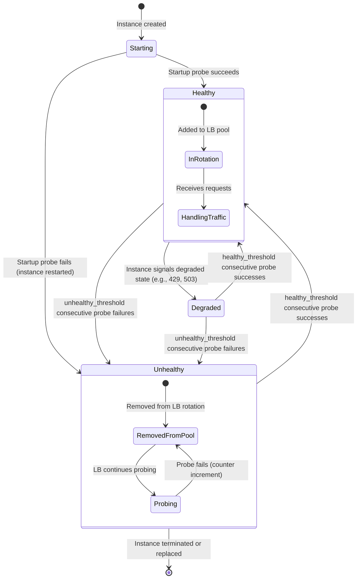
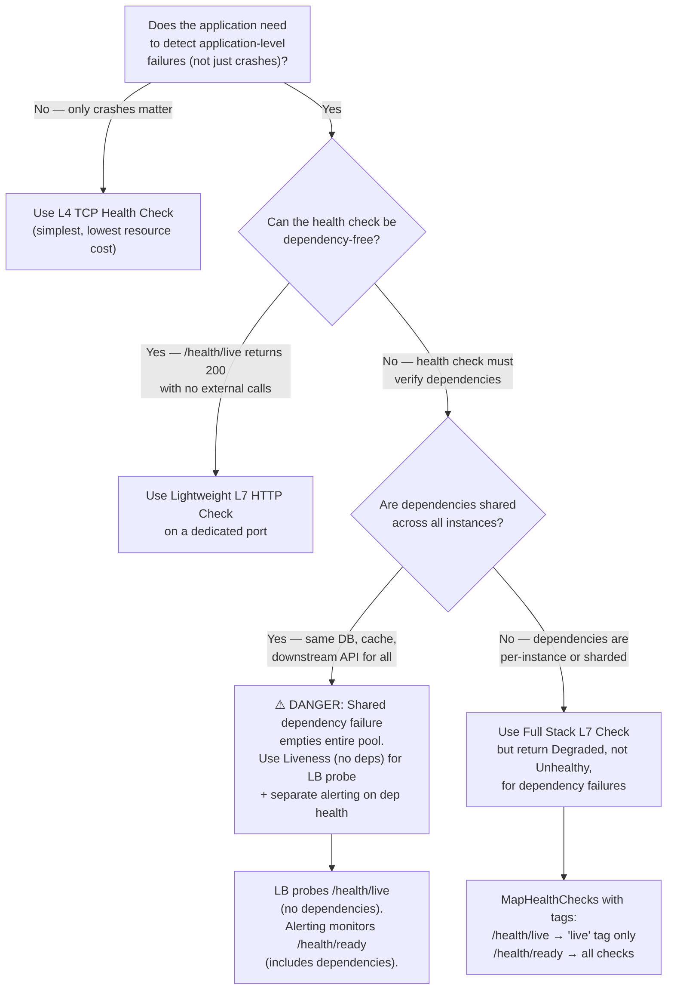

> [!success] Mastery Check
> - [ ] **Studied Well**
> - [ ] **Can explain the concept without notes**
> - [ ] **Can answer interview questions confidently**
> - [ ] **Can implement it in a real project**

---

id: "7.216" title: "Load Balancing — Health Check Integration" domain: "System Design & Distributed Systems" domain_id: 7 group: "Scalability Patterns" tags: [system-design, distributed-systems, scalability, dotnet, azure, load-balancing, health-checks, active-passive, kubernetes, resilience] priority: 1 version: 2 prerequisites:

- "[[7.210 — Load Balancing — Overview]]" — health checks are the mechanism by which a load balancer determines which backends are eligible to receive traffic; without health checks, every distribution algorithm (RR, LC, IP hash, WRR) is blind to backend failures and will route traffic to crashed instances
- "[[7.211 — Load Balancing — Layer 4 vs Layer 7]]" — L4 and L7 health checks operate at fundamentally different levels: L4 checks TCP port liveness, L7 checks HTTP response semantics; the choice between them determines what kinds of failures the LB can detect
- "[[7.213 — Load Balancing — Least Connections]]" — LC has a critical health check dependency: a crashed instance with 0 active connections appears to be the BEST candidate, so LC without health checks routes ALL traffic to the failed instance — the most dangerous interaction between a distribution algorithm and health check" related:
- "[[7.212 — Load Balancing — Round Robin]]" — round robin with health checks is the baseline: the LB cycles through only healthy backends; the health check interval determines how long traffic routes to a failed instance before detection
- "[[7.215 — Load Balancing — Weighted Round Robin]]" — WRR weights interact with health check max_fails counters; a weight-5 backend fails 5× as often as a weight-1 backend, requiring proportional max_fails scaling
- "[[7.217 — Load Balancing — SSL Termination]]" — TLS health checks have additional failure modes: certificate expiration causes the health check to fail even though the application is healthy; health check endpoints must accept plain HTTP or use a separate TLS context
- "[[7.209 — Sticky Sessions — Problem and Impact]]" — health checks are the mechanism for removing failed instances during sticky-session deployments; without health checks, clients remain pinned to crashed instances indefinitely
- "[[7.219 — Database Read Replicas — Setup and Tradeoffs]]" — read replica health checks must verify replication lag, not just TCP connectivity; a replica that is lagging by 30 seconds is "healthy" by TCP but serves stale data
- "[[7.234 — Auto-Scaling — Kubernetes HPA]]" — Kubernetes liveness and readiness probes are the pod-level equivalent of load balancer health checks; the HPA and the LB both rely on probe signals but use them differently (HPA for scaling, LB for routing)
- "[[7.249 — Bulkhead Pattern — Resource Isolation]]" — health check endpoints must be isolated from the application's request-processing resources; a health check that allocates from the same connection pool as real requests can exhaust the pool and cause false negatives under load
- "[[4.110 — ASP.NET Core Kestrel — Production Configuration]]" — Kestrel's request queue interacts with health check timeouts; a health probe timing out because the Kestrel request queue is full is a valid signal (instance IS unhealthy), but distinguishing between "instance is overloaded" and "instance is dead" requires careful timeout calibration
- "[[12.100 — Polly — Circuit Breaker Pattern]]" — the circuit breaker pattern is a CLIENT-SIDE health check: it observes failures from the caller's perspective and stops sending traffic to an unhealthy endpoint. Load balancer health checks are SERVER-SIDE: the LB probes the endpoint independently of actual traffic. Both mechanisms are needed." created: 2026-06-16

---

> [!ABSTRACT] Quick Reference — Health Check Integration **Invariant:** The load balancer periodically probes each backend instance to determine whether it is capable of handling requests. Instances that fail the probe are removed from the active rotation. Instances that pass are added (or kept) in the rotation. The invariant: "no traffic to unhealthy instances; traffic to all healthy instances." **Cost:** The health check is itself a consumer of backend resources — CPU, connections, database queries. A poorly designed health check can degrade performance (complex checks take time), cause false negatives (check depends on a downed dependency), or amplify failures (all LBs check simultaneously → thundering herd on the health endpoint). The probe interval determines the Mean Time To Detect (MTTD) failure: a 30-second interval means the LB continues routing to a failed instance for up to 30 seconds. **Trigger:** Every load-balanced system needs health checks. The trigger is not a scale event — it is the very fact that instances can fail. The only question is what KIND of health check (L4 TCP, L7 HTTP, application-specific) and at what FREQUENCY. **Skip When:** Only when there is no load balancer — a single-instance deployment with no redundancy. In that case, health monitoring is still needed (for alerting), but it does not affect traffic routing. **.NET Entry Point:** The `Microsoft.AspNetCore.Diagnostics.HealthChecks` package provides the `MapHealthChecks` endpoint. The `IHealthCheck` interface defines the check contract. Health check results can be published to Azure Monitor, Application Insights, or Prometheus via `IHealthCheckPublisher`. For L4 health checks, no .NET code is needed — the LB probes the TCP port directly. **Azure Native:** Azure Load Balancer uses TCP probes (probe port + interval). Azure Application Gateway uses HTTP/HTTPS probes (probe path, interval, thresholds). Azure Traffic Manager uses HTTP/HTTPS/TCP probes per endpoint. Azure Front Door uses HTTP/HTTPS probes with configurable intervals. **Number to Know:** The total failover time = health_check_interval × (unhealthy_threshold - 1) + health_check_timeout. With defaults on App Gateway (interval=30s, threshold=3, timeout=30s), failover takes up to 30 × 2 + 30 = 90 seconds. With optimized settings (interval=5s, threshold=2, timeout=5s), failover takes up to 5 × 1 + 5 = 10 seconds. The optimization is a 9× improvement in failure detection speed. But aggressive probes add load: at 5s intervals × 2 thresholds × 100 instances = 20 probes/second → ~1.7M probes/day. Each probe consumes a TCP connection, a TLS handshake (if HTTPS), and application CPU.

---

## Navigation

**Domain:** [[7 — System Design & Distributed Systems]] > **Group:** Scalability Patterns
**Previous:** [[7.215 — Load Balancing — Weighted Round Robin]] | **Next:** [[7.217 — Load Balancing — SSL Termination]]

### Prerequisites

- [[7.210 — Load Balancing — Overview]] — health checks are the mechanism by which a load balancer determines which backends are eligible to receive traffic; without health checks, every distribution algorithm is blind to backend failures and will route traffic to crashed instances
- [[7.211 — Load Balancing — Layer 4 vs Layer 7]] — L4 and L7 health checks operate at fundamentally different levels: L4 checks TCP port liveness, L7 checks HTTP response semantics; the choice between them determines what kinds of failures the LB can detect
- [[7.213 — Load Balancing — Least Connections]] — LC has a critical health check dependency: a crashed instance with 0 active connections appears to be the BEST candidate, so LC without health checks routes ALL traffic to the failed instance — the most dangerous interaction between a distribution algorithm and health check

### Where This Fits

> [!INFO] Production Encounter Map
>
> - **Layer:** Cross-cutting infrastructure concern — health checks sit between the load balancer and the application, defining the signal that determines traffic eligibility. Not a distribution algorithm, but a prerequisite for every distribution algorithm to function correctly in production.
> - **Trigger:** The first time an instance crashes and the load balancer continues to route traffic to it. Or the first time a deployment fails and users see errors for 90 seconds before the health probe catches it. Or during a dependency outage (database failover) when all instances fail their health check simultaneously and the LB drains the entire pool — a complete outage caused by a too-smart health check.
> - **Without health checks:** The load balancer includes all configured backends in the rotation regardless of their actual state. A crashed instance receives traffic — every request fails. A slow-to-start instance receives traffic before it is ready — every request fails or times out. A degraded instance (memory leak, CPU starved) continues to receive full traffic — the degradation accelerates into a crash. The only mitigation is manual: operators remove instances from the LB pool when they detect failures, which takes minutes.
> - **First signal that health check design matters:** When a database failover triggers all application instances to return 503 (they depend on the database for the health check). The LB empties the entire pool. The system is completely down even though the application instances are running and could serve cached data. The health check was too smart — it checked the database, which was the point of failure. This is the most expensive lesson in health check design: the health check should not depend on the dependencies that the health check is supposed to protect.

Health checks are the nervous system of a load-balanced architecture. They are the feedback signal that tells the LB "this instance is alive and capable." The design of that signal — what it checks, how often, how many failures trigger removal, how many successes trigger re-addition — determines the system's resilience to failure. An overly aggressive health check (checks every dependency, fails fast) causes false positives and pool exhaustion. An overly permissive health check (checks TCP port only, ignores application state) causes false negatives and error propagation. The art of health check design is calibrating the signal to detect REAL failures without reacting to TRANSIENT conditions.

---

## Core Mental Model

A health check is a binary classifier with hysteresis: it classifies each backend instance as either "healthy" (eligible for traffic) or "unhealthy" (ineligible). The classification is based on a probe — a single request to a health check endpoint. To prevent flapping (rapid oscillation between healthy and unhealthy), the classifier uses thresholds: an instance must fail N consecutive probes before being marked unhealthy, and must pass M consecutive probes before being marked healthy again. The thresholds create a dead zone — an instance that is oscillating between passing and failing stays in its current state, preventing unnecessary churn in the LB's routing table.

The mental model: think of a building security guard who checks IDs at the entrance. Each person (probe) either has a valid ID (pass) or does not (fail). The guard does not reject someone after a single failed scan — the scanner might be faulty. The guard waits for 3 consecutive failed scans before denying entry. Conversely, the guard does not admit someone after a single successful scan if they were previously denied — they need 2 consecutive successful scans to be re-admitted. This hysteresis prevents chaos at the door. The health check system operates identically: it tolerates transient failures (a brief GC pause, a network hiccup) while being decisive about persistent failures.

The critical insight: **a health check is always a tradeoff between detection speed and false positives.** Faster detection (short interval, low threshold) catches failures quickly but risks flapping from transient conditions. Slower detection (long interval, high threshold) avoids flapping but leaves traffic routing to failed instances for longer. There is no universal optimal setting — the correct calibration depends on the instance's startup time, the cost of routing to a failed instance, and the frequency of transient failures.

> [!TIP] The Non-Obvious Insight
> The health check endpoint should be as simple as possible. The most common production failure with health checks is making them too smart — checking database connectivity, cache availability, and downstream service health. A smart health check seems responsible, but it creates a coupling between the health of dependencies and the liveness of the instance. If the database has a brief hiccup, ALL instances fail their health check simultaneously. The LB empties the entire pool. The system is down. The instances were healthy — they just could not reach the database for 2 seconds. The health check should only verify that the INSTANCE itself is alive and can accept requests — NOT that its dependencies are healthy. Dependency health is the responsibility of separate alerts and circuit breakers.

### Classification

- **Probe type — Active vs Passive:**
  - **Active (proactive):** The LB sends periodic probe requests to each backend. This is the standard approach. The LB controls the probe timing and does not depend on real traffic. Probes can target any port and path.
  - **Passive (reactive):** The LB observes the behavior of real traffic — if a backend returns 5XX errors for N consecutive requests, it is marked unhealthy. No probe traffic is generated. Used by circuit breakers (Polly) and some L7 LBs as a supplement to active checks.
- **Probe type — L4 vs L7:**
  - **L4 (TCP):** The LB attempts to open a TCP connection to the specified port. Success = connection established. Failure = connection refused or timeout. Checks only that the process is listening on the port — not that the application is working.
  - **L7 (HTTP/HTTPS):** The LB sends an HTTP request to a specified path (e.g., `/health`). Success = 2XX or 3XX response. Failure = 5XX, timeout, or connection error. Checks that the application is running AND responding correctly.
- **Health state machine:**
  - `Healthy → Unhealthy`: After `unhealthy_threshold` consecutive failed probes
  - `Unhealthy → Healthy`: After `healthy_threshold` consecutive successful probes
  - `Starting → Healthy`: After `startup_probe` succeeds (separate from health probe, used for slow-start instances)
  - `Healthy → Draining`: A signal to stop new traffic while allowing in-flight requests to complete (not always part of health check — often a separate LB API call)
- **Scoping — Liveness vs Readiness:**
  - **Liveness:** Is the instance alive? (Has it crashed? Is the process running?) A failed liveness check means the instance should be restarted.
  - **Readiness:** Is the instance ready to receive traffic? (Has it finished startup? Is it not overloaded?) A failed readiness check means the instance should be removed from the LB pool but NOT restarted.
  - Kubernetes separates these clearly. Azure App Gateway and Azure LB have only one probe — it serves both purposes.

### Primary Diagram



### Probe Interaction with Distribution Algorithms

```
Scenario: 4 instances, 1 instance fails, health check detects it

                       Time
Instance    T+0       T+5s      T+10s     T+15s     T+20s     T+25s
─────────────────────────────────────────────────────────────────────────
A (healthy)  In pool   In pool   In pool   In pool   In pool   In pool
B (healthy)  In pool   In pool   In pool   In pool   In pool   In pool
C (fails)    In pool   In pool   Probe #1  Probe #2  Probe #3  REMOVED
D (healthy)  In pool   In pool   In pool   In pool   In pool   In pool

Probe interval: 5s
Unhealthy threshold: 3

Effect on distribution algorithms:
  RR: A, B, C, D → A, B, C, D → ... → A, B, D (C removed after T+25s)
  LC: C has 0 active connections → ALL traffic to C! (until C removed)
  IP hash: C's clients route to C (and fail) until C removed
  WRR: C receives its weight share of failures until C removed

Key: LC is the MOST sensitive to health check delay because
a broken instance attracts all traffic (0 connections = best candidate).
```

### Key Properties / Guarantees

|Property|Value|Condition|
|---|---|---|
|Failure detection time (MTTD)|`interval × (unhealthy_threshold - 1) + timeout`|Assuming the first probe after failure catches it|
|Recovery detection time|`interval × (healthy_threshold - 1) + timeout`|Assuming the first probe after recovery catches it|
|False positive rate (healthy marked unhealthy)|Function of probe timeout, interval, and application latency variance|Aggressive probes (short timeout, low threshold) increase false positives|
|False negative rate (unhealthy marked healthy)|Function of check depth (L4 TCP only vs L7 full stack)|Shallow checks (TCP only) miss application failures|
|Instance resource cost per probe|TCP: ~0.1ms CPU; HTTP: ~1-5ms CPU; HTTP + DB check: ~10-100ms CPU|Complex checks consume instance resources that could serve real traffic|
|Flapping prevention|Hysteresis via unhealthy_threshold + healthy_threshold|Higher thresholds = more stable; lower thresholds = faster detection|
|Startup handling|Startup probe or initial delay before first check|Prevents routing traffic to warming instances|
|Connection draining|Separate mechanism (grace period for in-flight requests)|Not all LBs support connection draining; verify before depending on it|
|Cascading failure risk|High — if health check depends on shared resource (DB, cache)|Shared dependency failure → ALL instances unhealthy → pool empty|

---

## Deep Mechanics

### How It Works

**Active L7 Health Check (HTTP probe):**

1. **Configuration:** The load balancer is configured with a health probe: target path (e.g., `/health`), port (e.g., 5001), protocol (HTTP or HTTPS), interval (e.g., 10 seconds), unhealthy threshold (e.g., 3), healthy threshold (e.g., 2), and timeout (e.g., 5 seconds).

2. **Probe scheduling:** The LB maintains a timer per backend instance (or a single timer that iterates through instances). On each tick, the LB sends an HTTP GET request to the instance's health endpoint.

3. **Response evaluation:**
   - 2XX or 3XX response in ≤ timeout → probe passes
   - 5XX, connection refused, timeout, or TCP RST → probe fails
   - 429 (Too Many Requests) or 503 (Service Unavailable) with `Retry-After` → probe fails (some LBs interpret these as degraded, not unhealthy)

4. **State transition (failure):** The LB increments a per-instance failure counter. If `failure_count >= unhealthy_threshold`, the instance is removed from the active pool.

5. **State transition (recovery):** The LB continues probing removed instances. On each successful probe, the LB increments a per-instance success counter (reset on any failure). If `success_count >= healthy_threshold`, the instance is added back to the active pool.

6. **Distribution integration:** The distribution algorithm (RR, LC, WRR, IP hash) only considers instances in the active pool. Removed instances are excluded from the rotation, counter, hash ring, or weight list.

**Passive Health Check (circuit breaker):**

1. **Traffic observation:** The LB (or client-side circuit breaker) observes the success/failure of real requests to each backend.

2. **Failure accumulation:** If the last N requests (or requests in a time window) to a backend have failed, the backend is marked unhealthy.

3. **Recovery:** After a cooldown period, the backend is allowed to receive a single probe request (half-open state). If it succeeds, the backend is marked healthy and traffic resumes.

**Active L4 Health Check (TCP probe):**

1. The LB attempts to open a TCP connection to the instance's probe port (often the same as the application port, or a dedicated port like 5000).
2. If the TCP handshake completes (SYN → SYN-ACK → ACK) within the timeout, the probe passes.
3. If the connection is refused (RST) or times out, the probe fails.

### Probe Timing Trace

```
4 instances, 10s probe interval, unhealthy_threshold=3, timeout=5s
Instance C fails at T+0s

T+0s:  Instance C fails (process crashes)
T+5s:  LB probe to C → TCP connection refused (RST) → fail count = 1
T+15s: LB probe to C → TCP connection refused (RST) → fail count = 2
T+25s: LB probe to C → TCP connection refused (RST) → fail count = 3
       → Instance C REMOVED from pool
       → Total detection time: 25 seconds

T+30s: LB probe to C → still failing → fail count stays at 3
T+40s: Instance C restarts (auto-healing)
T+45s: LB probe to C → TCP connection established → success count = 1
       (healthy_threshold=2, not yet re-added)
T+55s: LB probe to C → TCP connection established → success count = 2
       → Instance C RE-ADDED to pool
       → Total recovery time: 15 seconds after restart
```

### Startup Probe Sequence

```
Scenario: Instance needs 30 seconds to warm up (load cache, compile EF Core models)

T+0s:   Instance starts
T+0s:   LB probe to instance → TCP connection accepted → HTTP 200
        BUT: Instance returns 503 from /health during warm-up
        → Health check fails → instance NOT added to pool

T+5s:   Probe → 503 → fail
T+10s:  Probe → 503 → fail
T+15s:  Probe → 503 → fail
...
T+30s:  Instance finishes warm-up → /health returns 200
T+35s:  Probe → 200 → success count = 1
T+40s:  Probe → 200 → success count = 2
        → Instance added to pool (after 35 seconds of startup)

Total time from instance start to receiving traffic: 40 seconds
(30s warm-up + 10s for 2 successful probes at 5s intervals)
```

### Failure Modes

**Failure Mode 1: Cascading Pool Exhaustion — Health Check Depends on a Shared Dependency**

- **Cause:** The health check endpoint queries a shared dependency — a database, a Redis cache, or another downstream service. When the shared dependency experiences an outage or latency spike, ALL instances fail their health check simultaneously. The LB empties the entire backend pool. The application is completely down even though every instance is running, has available capacity, and could serve cached or degraded responses.
- **Symptom:** The application becomes completely unavailable — not degraded, but fully down. The health check endpoint returns 5XX for all instances. The LB pool is empty. There are no healthy backends. The actual application dependencies (database, cache) may still be partially available — but the health check's dependency on them made a partial outage into a total outage. The database team reports that the database recovered in 5 seconds, but the application was down for 2 minutes (because all instances were removed from the pool and then needed to pass healthy_threshold consecutive probes to be re-added).
- **Detection time:** When the entire application goes down. The on-call engineer checks the instances — they are all running, CPU is normal, memory is normal. The LB dashboard shows 0 healthy instances. The health check endpoint returns 5XX with an error message about the database connection.

**Fix:**

```csharp
// ❌ WRONG: Health check depends on database connectivity
builder.Services.AddHealthChecks()
    .AddDbContextCheck<OrderDbContext>(); // Checks SQL connectivity

// When the database has a 5-second hiccup, ALL instances fail.
// The LB removes ALL instances. Complete outage.

// ✅ CORRECT: Health check checks only the instance's liveness
// Use a SEPARATE, lightweight health check for LB probing.
// Database health is monitored by a SEPARATE alert and circuit breaker.

builder.Services.AddHealthChecks()
    .AddCheck("self", () =>
        HealthCheckResult.Healthy("Instance is alive"))
    .AddDbContextCheck<OrderDbContext>(
        "database",
        HealthStatus.Degraded, // Degraded, NOT Unhealthy!
        tags: ["ready"]);     // Only included in /health/ready, not /health/live

// Map SEPARATE endpoints:
// For the LB probe: /health/live — never checks dependencies
app.MapHealthChecks("/health/live", new HealthCheckOptions
{
    Predicate = check => check.Tags.Contains("live"),
});

// For the manual diagnostics: /health/ready — checks everything
app.MapHealthChecks("/health/ready", new HealthCheckOptions
{
    Predicate = check => check.Tags.Contains("ready"),
});

// ⚠️ The "ready" endpoint should be used for ALERTING, not for LB routing.
// The LB probe should always hit the "live" endpoint.
```

**Cost of not fixing:** Any shared dependency outage causes a COMPLETE application outage even though the instances themselves are healthy. A 5-second database hiccup becomes a 2-minute application outage (detection + re-addition time). The system's availability SLO (= 99.9%) is violated by a single dependency transient. The team adds "health check review" to every post-mortem, but the fundamental design error persists.

---

**Failure Mode 2: Health Check Timing Out Under Load — False Negatives During Traffic Spikes**

- **Cause:** During a traffic spike, the application instances are under high CPU load. The health check endpoint, which normally responds in 1ms, now takes 200ms due to threadpool contention and request queuing. The LB's health probe timeout is 5 seconds — still within bounds, so probes pass. But as load increases further, the health check response time approaches the timeout. At peak load, some probes time out, causing intermittent health check failures. Instances are marked unhealthy and removed from the pool. The remaining instances receive MORE traffic, their health check response times INCREASE, and they are ALSO marked unhealthy. The pool shrinks until all instances are unhealthy or the load drops.
- **Symptom:** During traffic spikes, the number of healthy instances in the LB pool drops even though no instance has crashed. The pool size recovery is delayed: even after the traffic spike subsides, instances must pass healthy_threshold consecutive probes before rejoining. The system exhibits a "sawtooth" pattern: traffic spike → pool shrinks → remaining instances overloaded → pool shrinks further → more overload → cascade. The pattern is self-reinforcing.
- **Detection time:** When the pool size metric drops during a traffic spike. The on-call engineer checks the instances — none are crashed, all have high CPU but are responding. The health check logs show timeouts. The probe timeout is too tight for the peak-load response time.

**Fix:**

```csharp
// ❌ WRONG: Health check timeout = 1 second
// During traffic spikes, the health check response time increases.
// 1 second is too tight — causes false negatives.

app.MapHealthChecks("/health/live", new HealthCheckOptions
{
    // Timeout is derived from the endpoint's response time limit, NOT the health check
});

// ✅ FIX: Set a realistic probe timeout in the LB configuration
// The LB probe timeout should be 2-3× the P99 response time of the health check
// endpoint under NORMAL load, NOT under peak load.
//
// If /health/live responds in 10ms P50 and 50ms P99 under normal load:
//   LB probe timeout = 150ms (3× P99) — but most LBs have minimum 1-5s
//   → Accept the minimum: 5s timeout on most LBs is fine
//
// The REAL fix: ensure the health check endpoint has a dedicated,
// minimal-resource path that does not compete with application requests.

// ✅ FIX in application code: Use a SEPARATE, lightweight health check
// that does NOT allocate from the same thread pool or connection pool.

// Program.cs — dedicated ultra-light health check
app.MapGet("/health/live", () =>
{
    // NO database queries. NO cache access. NO downstream calls.
    // Just respond immediately.
    return Results.Ok(new { status = "healthy", timestamp = DateTime.UtcNow });
});

// ✅ FIX: Use a separate port for health checks (isolated from application traffic)
// ASP.NET Core can listen on multiple endpoints.
builder.WebHost.ConfigureKestrel(options =>
{
    // Port 5001: application traffic
    options.Listen(IPAddress.Any, 5001);
    // Port 5000: health checks only (dedicated thread pool)
    options.Listen(IPAddress.Any, 5000, listenOptions =>
    {
        listenOptions.UseConnectionLogging(); // optional
    });
});

// Map health check on port 5000
app.MapGet("/health/live", () => Results.Ok(new { status = "healthy" }));

// ⚠️ The LB configures the health probe to port 5000, not 5001.
// Application traffic goes to port 5001.
```

**Cost of not fixing:** During traffic spikes, the health check feedback loop causes pool exhaustion. The system's throughput collapses precisely when it is most needed. The autoscaler (which depends on request rate per instance) sees the pool shrinking and scales OUT — but the new instances are also immediately marked unhealthy because they are slammed with redirected traffic. This is a classic "health check death spiral" that takes down production systems during peak hours.

---

**Failure Mode 3: Probe Amplification — All LBs Check All Instances Simultaneously**

- **Cause:** Multiple load balancers (or multiple LB nodes) are configured with the same probe interval and the same start time. When all LBs send their probes simultaneously, the health check endpoint receives a burst of requests equal to the number of LB nodes (e.g., 10 LB nodes × 100 instances = 1,000 simultaneous health check requests). This burst can overwhelm the health check endpoint, causing timeouts and false negatives. The health check endpoint, designed to handle 1 request per 10 seconds, now handles 10 requests per second per instance — a 100× increase in load.
- **Symptom:** Regular, synchronized spikes in health check response time and CPU usage. The spikes occur at predictable intervals matching the probe interval. The health check endpoint shows "unhealthy" during the spike — exactly when the LBs are trying to determine health. The LBs see failed probes and mark instances unhealthy. The synchronization causes ALL LBs to see failures simultaneously, making the pool appears completely unhealthy for a brief period.
- **Detection time:** When monitoring shows regular, synchronous CPU spikes on all instances at exactly the probe interval. The spikes are 10-100× the baseline health check CPU usage. The LB dashboard shows brief (1-2 second) periods of 0 healthy instances, repeating every probe interval.

**Fix:**

```csharp
// ❌ The problem is synchronized probing across LB nodes.
// The fix is NOT in application code — it is in LB configuration.

// ✅ FIX: Add jitter to the probe interval on each LB node
// NGINX upstream health_check directive:
// health_check interval=10s timeout=5s fails=3 passes=2;
// Add jitter with the `jitter` directive (NGINX Plus):
// health_check interval=10s jitter=2s;
// → Each NGINX worker probes at 10s ± 2s intervals, randomized

// HAProxy option:
// option httpchk
// No direct jitter support — instead, configure different intervals
// on different HAProxy nodes: 10s, 11s, 9s.

// Azure App Gateway: the probe interval is per gateway instance.
// Each App Gateway instance probes independently. No jitter configuration.
// With 2+ App Gateway instances, the probing is naturally desynchronized
// (different start times, different probe scheduling).
// → This is usually fine for Azure App Gateway deployments with 2+ instances.

// ✅ Application-side mitigation: Rate-limit the health check endpoint
// If the health check is expensive (unlikely — it should be lightweight),
// add a rate limiter or cache to absorb probe bursts.
using System.Threading.RateLimiting;

app.MapGet("/health/live", async (HttpContext context) =>
{
    var limiter = context.RequestServices.GetRequiredService<HealthCheckRateLimiter>();
    using var lease = await limiter.AcquireAsync();
    if (!lease.IsAcquired)
    {
        context.Response.StatusCode = 429; // Too Many Requests
        return;
    }
    return Results.Ok(new { status = "healthy" });
});

// ⚠️ Better approach: keep the health check so lightweight that
// a 100× burst does not matter. A simple in-memory response
// (no allocations, no I/O) handles 100,000 req/s on a single core.
```

**Cost of not fixing:** The health check itself becomes a periodic self-inflicted denial-of-service attack. During peak hours, when the system is most vulnerable, the synchronized probe burst adds unnecessary CPU load. In extreme cases, the burst can cause resource exhaustion on small instances.

---

**Failure Mode 4: Stale Health State — Instance Restarts But LB Has Old Healthy State**

- **Cause:** An instance crashes and the operating system process is killed. The instance's health check endpoint stops responding. The LB has the instance marked as "healthy" from the previous successful probe. Before the LB's next probe detects the failure, a new instance (or the same instance restarted by Kubernetes) comes online on the SAME IP address and port. The LB's next probe succeeds — the new instance is healthy. But the LB never detected the failure — the health state never transitioned to unhealthy. The problem: if the new instance has a DIFFERENT node ID, cache state, or session data than the old instance, the LB continues operating as if nothing changed, but the new instance has no context from the old one.
- **Symptom:** After a rapid crash-and-restart cycle (Kubernetes restarts a pod in < 5 seconds), some clients experience intermittent errors. The instance was restarted, but the LB never saw it as unhealthy — the health state remained "healthy" throughout. Clients that were mapped to the instance (IP hash) or had in-flight requests experience connection disruptions. The monitoring shows no health check failures — the LB logs show no state transition. The incident appears as unexplained "connection reset" errors.
- **Detection time:** When an engineer correlates the error spike with a pod restart event but finds no corresponding health check failure in the LB logs. The LB dashboard shows "100% healthy" throughout the event. The engineer realizes the health check interval is longer than the restart time — the LB never detected the failure.

**Fix:**

```csharp
// ❌ The problem: health probe interval (10s) > restart time (2s)
// The LB misses the failure window entirely.

// ✅ FIX: Ensure the LB detects the failure even if the restart is fast.
// This requires the LB to see the TCP connection close.
// Strategy 1: Reduce probe interval to less than expected restart time.
//   If restarts take 2s, set probe interval to 1s.
//   This adds probe load but catches fast restarts.
//
// Strategy 2: Use passive health checking (observe real traffic).
//   If the TCP connection to the instance is closed (RST),
//   the LB should mark it unhealthy immediately — not wait for the next probe.
//   Azure Load Balancer: TCP RESET on idle timeout triggers failure detection.
//   NGINX: max_fails + fail_timeout for passive checking.
//
// Strategy 3: Use a grace period before re-adding a restarted instance.
//   When the LB detects the connection close, it marks the instance unhealthy.
//   The instance's health check endpoint should return 503 for a
//   configurable grace period after startup, ensuring the LB does NOT
//   re-add it until it is fully ready.
builder.Services.AddHostedService<StartupGate>();

public sealed class StartupGate : BackgroundService
{
    private volatile bool _isReady;
    private readonly ILogger<StartupGate> _logger;

    public StartupGate(ILogger<StartupGate> logger) => _logger = logger;

    public bool IsReady => _isReady;

    protected override async Task ExecuteAsync(CancellationToken ct)
    {
        // Wait for dependencies to initialize
        await Task.Delay(5000, ct); // 5-second grace period
        _isReady = true;
        _logger.LogInformation("Startup gate opened — instance is ready.");
    }
}

// Register in DI
builder.Services.AddSingleton<StartupGate>();

// Map health check that respects the startup gate
app.MapGet("/health/live", (StartupGate gate) =>
    gate.IsReady ? Results.Ok() : Results.StatusCode(503));
```

**Cost of not fixing:** Rapid crash-restart cycles are invisible to health monitoring. The team autoscales or replaces instances, and the LB never observes a failure. The cumulative effect is "instance churn" — instances are continuously replaced, but the health monitoring shows 100% uptime. Capacity planning is unreliable because the metrics do not reflect the actual failure rate.

---

**Failure Mode 5: Health Check as a Liveness Signal — Instance Keeps Itself Alive by Responding to Probes While Application Is Deadlocked**

- **Cause:** The application is deadlocked — all request-processing threads are stuck waiting for a lock, database query, or downstream service. The health check endpoint, however, runs on a dedicated thread or uses the threadpool, which is NOT stuck (the deadlock is in application-specific locks, not in the threadpool). The health check returns 200 OK — the instance is "healthy" by the health check's definition. But the instance cannot process any real requests — every incoming request times out or fails. The LB continues sending traffic to the deadlocked instance because the health check says it is alive.
- **Symptom:** The LB reports all instances healthy. The error rate from real requests is elevated — requests to the deadlocked instance time out. Monitoring shows that one instance's request latency is at the timeout limit (30s) while its health check latency is 1ms. The health check is responding from a thread that is NOT blocked, while all application threads ARE blocked. The health check and the application run on different execution paths — a "liveness disconnect."
- **Detection time:** When the on-call engineer compares per-instance request latency vs per-instance health check latency. If request latency is high but health check latency is low, the health check is not representative of the application's health. The key metric: `request_latency_ratio = (p99_request_latency / p50_request_latency)` vs `health_check_latency_ratio`. If request latency has degraded 10× but health check latency is unchanged, there is a liveness disconnect.

**Fix:**

```csharp
// ❌ WRONG: Health check runs on a dedicated path that bypasses
// the application's request-processing infrastructure.

app.MapGet("/health/live", () => Results.Ok());

// The /health/live endpoint uses the raw ASP.NET Core pipeline.
// If the application's DI container is stuck, the health check
// still responds because minimal API handlers are compiled.

// ✅ FIX: Make the health check share the same execution path
// as real requests — or at least verify that the request pipeline
// is functional by routing through it.

// Strategy 1: Ensure the health check goes through middleware
app.MapGet("/health/live", async (HttpContext context) =>
{
    // By routing through the middleware pipeline, the health check
    // verifies that middleware can execute (auth, rate limiting, etc.)
    // This catches middleware-level deadlocks.
    return Results.Ok(new { status = "healthy", pipeline = "functional" });
});

// Strategy 2: Use a "canary request" — the health check sends a
// lightweight request through the application's own processing pipeline
// and checks that it completes within a timeout.
//
// ⚠️ This is controversial: it adds latency to the health check
// and may increase the false positive rate. Use with caution.
builder.Services.AddHealthChecks()
    .AddCheck<SelfProbeHealthCheck>("self-probe");

public sealed class SelfProbeHealthCheck : IHealthCheck
{
    private readonly HttpClient _httpClient;

    public SelfProbeHealthCheck(IHttpClientFactory factory)
    {
        _httpClient = factory.CreateClient("self");
    }

    public async Task<HealthCheckResult> CheckHealthAsync(
        HealthCheckContext context,
        CancellationToken ct)
    {
        try
        {
            // Send a request to a minimal endpoint that exercises
            // the same DI and middleware as real requests
            var response = await _httpClient.GetAsync(
                "http://localhost:5001/_health/ping", ct);
            return response.IsSuccessStatusCode
                ? HealthCheckResult.Healthy()
                : HealthCheckResult.Unhealthy("Self-probe failed.");
        }
        catch (Exception ex)
        {
            return HealthCheckResult.Unhealthy(
                "Self-probe threw exception.", ex);
        }
    }
}

// Strategy 3: Monitor the request processing queue length
// If the queue is full, the instance is unhealthy regardless of
// what the minimal /health/live endpoint says.
// Kestrel tracks this via:
//   Microsoft.AspNetCore.Server.Kestrel.Connections
//   Microsoft.AspNetCore.Hosting.HttpRequests
// Alert on: requests_in_queue > max_concurrent_requests * 0.9
```

**Cost of not fixing:** A deadlocked instance remains in the LB pool indefinitely, serving errors to a percentage of users equal to 1/N (where N is the number of instances). The error is invisible to the LB health monitoring — "all instances healthy." The team only discovers the issue when user complaints reach a critical mass. This is the most dangerous failure mode because the health check system is functioning correctly by its own metrics but is entirely disconnected from reality.

---

### .NET and Azure Integration

- **ASP.NET Core Health Checks:** `Microsoft.AspNetCore.Diagnostics.HealthChecks` package. `IHealthCheck` interface with `CheckHealthAsync` returning `HealthCheckResult`. Map via `app.MapHealthChecks("/health")`. Supports tags for filtering checks per endpoint.
- **Health Check Types:**
  - `AddCheck<T>` — custom health check
  - `AddDbContextCheck<T>` — EF Core connectivity check (returns Degraded, not Unhealthy)
  - `AddUrlGroup` — external HTTP endpoint check (via `AspNetCore.HealthChecks.Urll`
  - `AddRedis`, `AddRabbitMQ`, `AddAzureBlobStorage` — via community packages
- **Health Check Publishers:** `IHealthCheckPublisher` publishes results to monitoring systems. Implementations for Application Insights, Prometheus, Azure Monitor, and SignalR.
- **Azure Load Balancer Health Probes:** TCP probes only — checks port liveness. Not customizable. Can use a dedicated probe port (different from application port).
- **Azure Application Gateway Health Probes:** HTTP/HTTPS probes with customizable path, interval, timeout, thresholds. Supports custom probes and default probes. Default probe: `/` path, 30s interval, 4 unhealthy threshold, 30s timeout.
- **Azure Traffic Manager Endpoint Monitoring:** HTTPS probes with configurable path, interval (10-30s), and tolerances. Supports "quick" probing (10s interval) and "standard" probing (30s).
- **Azure Front Door Health Probes:** HTTP/HTTPS probes with configurable interval (5-120s), path, and protocol. Uses "probing" mode — probes are sent from Front Door's edge locations.

```csharp
// Program.cs — Complete health check configuration for an API behind App Gateway
using Microsoft.Extensions.Diagnostics.HealthChecks;
using OrderService.Infrastructure.Health;

// Register health checks with appropriate tags
builder.Services.AddHealthChecks()
    // Liveness check — for LB probe (tag: live)
    .AddCheck<LivenessHealthCheck>("liveness", tags: ["live"])
    // Readiness check — for deployment validation (tag: ready)
    .AddCheck<ReadinessHealthCheck>("readiness", tags: ["ready"])
    // Database check — degraded only (tag: ready)
    .AddDbContextCheck<OrderDbContext>(
        "database",
        failureStatus: HealthStatus.Degraded,
        tags: ["ready"])
    // Redis check — degraded only (tag: ready)
    .AddCheck<RedisHealthCheck>(
        "redis",
        failureStatus: HealthStatus.Degraded,
        tags: ["ready"]);

// Map endpoints
app.MapHealthChecks("/health/live", new HealthCheckOptions
{
    Predicate = check => check.Tags.Contains("live"),
    ResponseWriter = HealthCheckResponseWriters.WriteMinimal,

    // Allow the health check to fail fast without allocating
    // database connections or other resources
});

app.MapHealthChecks("/health/ready", new HealthCheckOptions
{
    Predicate = check => check.Tags.Contains("ready"),
    ResponseWriter = HealthCheckResponseWriters.WriteDetailed,
});

// Optional: Health check publisher for Prometheus
builder.Services.AddSingleton<IHealthCheckPublisher, PrometheusHealthCheckPublisher>();
builder.Services.Configure<HealthCheckPublisherOptions>(options =>
{
    options.Delay = TimeSpan.FromSeconds(5);
    options.Period = TimeSpan.FromSeconds(30);
});

//---
// Lightweight liveness check — never depends on external resources
public sealed class LivenessHealthCheck : IHealthCheck
{
    // No dependencies injected — this keeps it truly lightweight
    public Task<HealthCheckResult> CheckHealthAsync(
        HealthCheckContext context,
        CancellationToken ct)
    {
        // If we can respond, we're alive.
        return Task.FromResult(HealthCheckResult.Healthy());
    }
}

// Readiness check — verifies the instance is ready for traffic
public sealed class ReadinessHealthCheck : IHealthCheck
{
    private readonly StartupGate _startupGate;

    public ReadinessHealthCheck(StartupGate startupGate)
    {
        _startupGate = startupGate;
    }

    public Task<HealthCheckResult> CheckHealthAsync(
        HealthCheckContext context,
        CancellationToken ct)
    {
        if (!_startupGate.IsReady)
            return Task.FromResult(HealthCheckResult.Unhealthy(
                "Instance is warming up."));

        return Task.FromResult(HealthCheckResult.Healthy());
    }
}

// Response writers
public static class HealthCheckResponseWriters
{
    public static async Task WriteMinimal(
        HttpContext context, HealthReport report)
    {
        context.Response.StatusCode = report.Status == HealthStatus.Healthy
            ? 200 : 503;
        await context.Response.WriteAsJsonAsync(new
        {
            status = report.Status.ToString()
        });
    }

    public static async Task WriteDetailed(
        HttpContext context, HealthReport report)
    {
        context.Response.StatusCode = report.Status == HealthStatus.Healthy
            ? 200 : 503;
        await context.Response.WriteAsJsonAsync(new
        {
            status = report.Status.ToString(),
            checks = report.Entries.Select(e => new
            {
                name = e.Key,
                status = e.Value.Status.ToString(),
                description = e.Value.Description,
                duration = e.Value.Duration
            })
        });
    }
}
```

---

## Production Patterns and Implementation

### Primary Implementation — Dual-Endpoint Health Check Architecture

The production-standard health check architecture separates liveness (for LB routing) from readiness (for deployment validation). The LB probes the liveness endpoint. The deployment pipeline checks the readiness endpoint. Monitoring alerts on both.

```csharp
// Program.cs — Dual-endpoint health check with Prometheus publishing
using System.Diagnostics;
using System.Diagnostics.Metrics;
using Microsoft.Extensions.Diagnostics.HealthChecks;
using OrderService.Infrastructure.Health;

var builder = WebApplication.CreateBuilder(args);

// Register services
builder.Services.AddSingleton<StartupGate>();
builder.Services.AddHostedService<WarmupService>();

// Register health checks
builder.Services.AddHealthChecks()
    .AddCheck<LivenessCheck>("liveness", tags: ["live"])
    .AddCheck<ReadinessCheck>("readiness", tags: ["ready"])
    .AddCheck<DependencyCheck>("database", failureStatus: HealthStatus.Degraded, tags: ["ready"]);

// Health check publisher for metrics
builder.Services.AddSingleton<IHealthCheckPublisher, MetricsPublisher>();
builder.Services.Configure<HealthCheckPublisherOptions>(options =>
{
    options.Period = TimeSpan.FromSeconds(15);
});

var app = builder.Build();

// Liveness — LB probes this every 5-10 seconds
// Must be fast, stateless, dependency-free
app.MapGet("/health/live", async (HttpContext context) =>
{
    context.Response.Headers["Cache-Control"] = "no-store, no-cache";
    context.Response.Headers["X-Health-Check"] = "liveness";

    // Ultra-light: just confirm the process is responsive
    await context.Response.WriteAsJsonAsync(new
    {
        status = "healthy",
        timestamp = DateTimeOffset.UtcNow.ToUnixTimeSeconds()
    });
});

// Readiness — deployment pipeline and diagnostic tools
// Checks dependencies (degraded, not failing)
app.MapHealthChecks("/health/ready", new HealthCheckOptions
{
    Predicate = check => check.Tags.Contains("ready"),
    ResponseWriter = async (context, report) =>
    {
        var isHealthy = report.Status == HealthStatus.Healthy;
        context.Response.StatusCode = isHealthy ? 200 : 503;
        await context.Response.WriteAsJsonAsync(new
        {
            status = report.Status.ToString(),
            checks = report.Entries.Select(e => new
            {
                name = e.Key,
                status = e.Value.Status.ToString(),
                durationMs = e.Value.Duration.TotalMilliseconds,
                error = e.Value.Exception?.Message
            }),
            durationMs = report.TotalDuration.TotalMilliseconds
        });
    },
});

// Detailed diagnostics — for manual debugging only
app.MapGet("/health/diagnostics", async (HttpContext context) =>
{
    // This endpoint should NOT be exposed to the LB
    // It can be slow and expensive — checks everything in depth
    await context.Response.WriteAsJsonAsync(new
    {
        process = new
        {
            cpu = Process.GetCurrentProcess().TotalProcessorTime,
            memory = Process.GetCurrentProcess().WorkingSet64,
            threads = Process.GetCurrentProcess().Threads.Count,
        },
        assembly = typeof(Program).Assembly.GetName().Version?.ToString()
    });
});

app.Run();

//---
public sealed class LivenessCheck : IHealthCheck
{
    public Task<HealthCheckResult> CheckHealthAsync(
        HealthCheckContext context, CancellationToken ct)
    {
        return Task.FromResult(HealthCheckResult.Healthy());
    }
}

public sealed class ReadinessCheck : IHealthCheck
{
    private readonly StartupGate _gate;

    public ReadinessCheck(StartupGate gate) => _gate = gate;

    public Task<HealthCheckResult> CheckHealthAsync(
        HealthCheckContext context, CancellationToken ct)
    {
        return Task.FromResult(
            _gate.IsReady
                ? HealthCheckResult.Healthy()
                : HealthCheckResult.Unhealthy("Warming up..."));
    }
}

public sealed class DependencyCheck : IHealthCheck
{
    private readonly OrderDbContext _db;

    public DependencyCheck(OrderDbContext db) => _db = db;

    public async Task<HealthCheckResult> CheckHealthAsync(
        HealthCheckContext context, CancellationToken ct)
    {
        try
        {
            var canConnect = await _db.Database.CanConnectAsync(ct);
            return canConnect
                ? HealthCheckResult.Healthy()
                : HealthCheckResult.Degraded("Database unreachable");
        }
        catch (Exception ex)
        {
            return HealthCheckResult.Degraded(
                "Database check failed", ex);
        }
    }
}

public sealed class MetricsPublisher : IHealthCheckPublisher
{
    private static readonly Meter Meter = new("OrderService.Health");
    private static readonly Counter<int> HealthCheckCount = Meter.CreateCounter<int>(
        "health_check.total");
    private static readonly Counter<int> UnhealthyCount = Meter.CreateCounter<int>(
        "health_check.unhealthy");

    public Task PublishAsync(HealthReport report, CancellationToken ct)
    {
        foreach (var (name, entry) in report.Entries)
        {
            HealthCheckCount.Add(1, new KeyValuePair<string, object?>("check", name));
            if (entry.Status != HealthStatus.Healthy)
                UnhealthyCount.Add(1, new KeyValuePair<string, object?>("check", name));
        }

        return Task.CompletedTask;
    }
}
```

### Configuration and Wiring — Azure App Gateway Custom Probe

```bicep
// main.bicep — Azure Application Gateway with custom health probe
resource appGw 'Microsoft.Network/applicationGateways@2022-05-01' = {
  name: 'order-service-gateway'
  // ... other properties
  properties: {
    probes: [
      {
        name: 'OrderServiceHealthProbe'
        properties: {
          protocol: 'Http'
          host: 'orderservice.internal.cloudapp.net'
          path: '/health/live'
          interval: 10  // seconds (default: 30)
          timeout: 5    // seconds (default: 30)
          unhealthyThreshold: 2  // consecutive failures (default: 3)
          // ⚠️ Optimized for faster detection:
          // MTTD = interval × (threshold - 1) + timeout
          //      = 10 × (2 - 1) + 5 = 15 seconds
          // Default: 30 × (3 - 1) + 30 = 90 seconds
          // 15s vs 90s = 6× faster failover
        }
      }
    ]
    backendHttpSettingsCollection: [
      {
        name: 'OrderServiceHttpSettings'
        properties: {
          port: 5001
          protocol: 'Http'
          cookieBasedAffinity: 'Disabled'
          probe: {
            id: '[resourceId("Microsoft.Network/applicationGateways/probes", "order-service-gateway", "OrderServiceHealthProbe")]'
          }
        }
      }
    ]
  }
}
```

### Common Variants

**1. Startup Probe (Kubernetes-style, separate from health check):**

```csharp
// Separate startup check — runs once at instance start, not periodically.
// Once it passes, it is never checked again.
public sealed class StartupProbe
{
    private readonly ILogger<StartupProbe> _logger;
    private volatile bool _started;

    public StartupProbe(ILogger<StartupProbe> logger) => _logger = logger;

    public bool IsStarted => _started;

    public async Task<bool> WaitForStartupAsync(CancellationToken ct)
    {
        try
        {
            // Warm up EF Core models
            await using var scope = /* get service scope */;
            var db = scope.ServiceProvider.GetRequiredService<OrderDbContext>();
            await db.Database.EnsureCreatedAsync(ct);

            // Pre-load cache
            var cache = scope.ServiceProvider.GetRequiredService<IDistributedCache>();
            await WarmupCacheAsync(cache, ct);

            _started = true;
            _logger.LogInformation("Startup complete.");
            return true;
        }
        catch (Exception ex)
        {
            _logger.LogError(ex, "Startup failed.");
            return false;
        }
    }
}

// In /health/live:
app.MapGet("/health/live", (StartupProbe probe) =>
    probe.IsStarted ? Results.Ok() : Results.StatusCode(503));
```

**2. Active + Passive Health Check Combination (NGINX-style):**

```nginx
# NGINX — active health checks (NGINX Plus) + passive (max_fails)
upstream order_service {
    zone order_service 64k;  # shared memory for health state

    server 10.0.1.4:5001 weight=5 max_fails=3 fail_timeout=30s;
    server 10.0.1.5:5002 weight=3 max_fails=3 fail_timeout=30s;
    server 10.0.1.6:5003 weight=2 max_fails=3 fail_timeout=30s;

    # Active health check (NGINX Plus required)
    health_check interval=10s timeout=5s fails=2 passes=2
        uri=/health/live;
        # ↑ Active probes every 10s, 2 failures → unhealthy
        #   2 passes → re-healthy

    # Passive health check (open source):
    # max_fails=3 → 3 consecutive real-request failures → unhealthy
    # fail_timeout=30s → wait 30s before retrying
}
```

**3. Health Check with Graceful Degradation Signal (429/503 backpressure):**

```csharp
// Health check that signals overload before failure
// The LB interprets 503 as "instance is alive but busy — route elsewhere"
// Some LBs (NGINX Plus, Envoy) respect this as a degradation signal,
// reducing the instance's effective weight without removing it entirely.

public sealed class OverloadAwareHealthCheck : IHealthCheck
{
    private readonly IHttpClientFactory _httpFactory;
    private readonly ILogger _logger;
    private long _requestQueueDepth;

    public OverloadAwareHealthCheck(
        IHttpClientFactory httpFactory,
        ILogger<OverloadAwareHealthCheck> logger)
    {
        _httpFactory = httpFactory;
        _logger = logger;
    }

    public async Task<HealthCheckResult> CheckHealthAsync(
        HealthCheckContext context, CancellationToken ct)
    {
        // Check 1: Is the request queue near capacity?
        var queueDepth = Interlocked.Read(ref _requestQueueDepth);
        var maxQueue = 1000; // Kestrel's MaxConcurrentConnections

        if (queueDepth > maxQueue * 0.95)
        {
            return HealthCheckResult.Unhealthy(
                $"Request queue at {queueDepth}/{maxQueue} — refusing traffic.");
        }

        if (queueDepth > maxQueue * 0.8)
        {
            return HealthCheckResult.Degraded(
                $"Request queue at {queueDepth}/{maxQueue} — near capacity.");
        }

        return HealthCheckResult.Healthy();
    }
}

// Middleware that tracks queue depth
public sealed class RequestQueueMiddleware
{
    private readonly RequestDelegate _next;
    private readonly OverloadAwareHealthCheck _check;

    public RequestQueueMiddleware(RequestDelegate next, OverloadAwareHealthCheck check)
    {
        _next = next;
        _check = check;
    }

    public async Task InvokeAsync(HttpContext context)
    {
        Interlocked.Increment(ref _check._requestQueueDepth);
        try
        {
            await _next(context);
        }
        finally
        {
            Interlocked.Decrement(ref _check._requestQueueDepth);
        }
    }
}
```

### Real-World .NET Ecosystem Example

- **ASP.NET Core Health Checks Middleware:** The standard implementation in .NET. `MapHealthChecks()` maps an endpoint that runs all registered `IHealthCheck` implementations and returns a summary. Configurable via `HealthCheckOptions` (predicate, response writer, result status codes).
- **Kubernetes probes (liveness, readiness, startup):** Kubernetes uses three probe types that map directly to health check concepts. `livenessProbe` = is the pod alive? (restart if not). `readinessProbe` = is the pod ready for traffic? (remove from Service endpoints if not). `startupProbe` = has the pod finished initializing? (delay liveness checks until true).
- **Polly Circuit Breaker:** Client-side health check. If a downstream service returns failures, the circuit breaker opens and stops sending requests. This is the PASSIVE health check equivalent at the client level. The combination of server-side (LB) health checks and client-side (Polly) circuit breakers provides defense in depth.
- **Azure Load Balancer health probes:** TCP-only. If the TCP port is listening, the instance is healthy. No HTTP-level awareness. This is why Azure LB is suitable for L4-only scenarios — for HTTP-aware health checks, use App Gateway or NGINX.
- **Consul / etcd health checks:** Service mesh health checking. Consul agents run health checks on registered services and update the service catalog. The LB (or Envoy sidecar) routes traffic only to healthy services from the catalog.

---

## Gotchas and Production Pitfalls

### Gotcha 1: Health Check Returns 200 OK But the Application's Request Pipeline Is Deadlocked

**Pitfall:** The health check endpoint is implemented as a simple `app.MapGet("/health", () => Results.Ok())`. This endpoint does NOT go through the application's full request pipeline — it is a compiled handler that responds immediately. If the application's thread pool is exhausted or the DI container is deadlocked, the health check still responds 200. The LB sees "healthy" and continues sending traffic. But every real request fails because the application cannot process them.

```csharp
// ❌ WRONG: Minimal API handler bypasses middleware pipeline
app.MapGet("/health/live", () => Results.Ok(new { status = "healthy" }));
// This handler is compiled and cached. It does NOT verify that the
// application's middleware pipeline (auth, DI, request processing) works.

// ✅ FIX: Ensure the health check exercises the middleware pipeline
// by placing it after key middleware in the pipeline, or by using
// a controller/action that goes through the full pipeline.

// Option A: Use a controller (goes through full pipeline)
app.MapControllerRoute("health", "/health/live",
    new { controller = "Health", action = "Live" });

// Option B: Add a middleware check within the handler
app.MapGet("/health/live", async (HttpContext context) =>
{
    // Verify that the DI container can resolve a scoped service
    // This catches DI container deadlocks
    try
    {
        var scopeFactory = context.RequestServices
            .GetRequiredService<IServiceScopeFactory>();
        using var scope = scopeFactory.CreateScope();
        var probe = scope.ServiceProvider
            .GetRequiredService<HealthCheckProbe>();
        await probe.PingAsync();
    }
    catch (Exception ex)
    {
        return Results.Problem(
            statusCode: 503,
            detail: $"Health check failed: {ex.Message}");
    }

    return Results.Ok();
});
```

**Symptom:** The LB dashboard shows 100% healthy instances. The error rate from real requests is high. Request latency is at the timeout limit. The health check latency is 0ms. The health check path is disconnected from the request processing path.

**Cost of not fixing:** A deadlocked application remains in the LB pool indefinitely, serving errors to 1/N of users (where N = number of instances). The incident is invisible to the health monitoring system.

---

### Gotcha 2: Health Check Interval + Threshold Configured Too Conservatively — Slow Failover

**Pitfall:** The team uses Azure App Gateway defaults: interval=30s, threshold=3, timeout=30s. When an instance fails, the MTTD is up to 30 × 2 + 30 = 90 seconds. During those 90 seconds, the LB continues routing traffic to the failed instance. Every request to that instance fails. With 4 instances, 25% of traffic fails for 90 seconds. End-users see errors for 1.5 minutes.

```bicep
// ❌ WRONG: Default App Gateway probe settings
resource probe 'Microsoft.Network/applicationGateways/probes@2022-05-01' = {
  name: 'default-probe'
  properties: {
    protocol: 'Http'
    path: '/'
    interval: 30    // waits 30s between probes
    timeout: 30     // waits 30s before declaring timeout
    unhealthyThreshold: 3  // needs 3 consecutive failures
  }
}
// MTTD = 30 × (3-1) + 30 = 90 seconds!
// During 90s, 25% of traffic hits the failed instance.

// ✅ FIX: Optimized probe settings
resource probe 'Microsoft.Network/applicationGateways/probes@2022-05-01' = {
  name: 'optimized-probe'
  properties: {
    protocol: 'Http'
    path: '/health/live'
    interval: 5     // 5s between probes
    timeout: 5      // 5s timeout
    unhealthyThreshold: 2  // 2 consecutive failures
  }
}
// MTTD = 5 × (2-1) + 5 = 10 seconds!
// During 10s, 25% of traffic fails. Acceptable for most systems.
```

**Symptom:** After a deployment that introduces a crashing bug, users experience errors for 90 seconds before the LB stops routing to the failing instances. The 90-second window generates hundreds of support tickets. The team blames "slow health probes" but has never tuned them.

**Cost of not fixing:** Every instance failure causes 60-90 seconds of degraded service. In a system with frequent deployments (multiple per day), the cumulative error budget consumption from slow health check detection exceeds the error budget.

---

### Gotcha 3: Health Check Uses the Same Port as Application Traffic — Interference Under Load

**Pitfall:** The health check endpoint is on the same port as application traffic (e.g., port 5001). Under high load, the health check competes with real requests for the same Kestrel connection pool, thread pool, and TCP port. A health check probe arriving during a traffic surge may be queued behind application requests, causing it to time out even though the application is functioning. The health check becomes a self-fulfilling prophecy: high load → probe times out → instance removed → remaining instances receive more load → more probes time out → cascade.

```csharp
// ❌ WRONG: Health check on the same port
builder.WebHost.ConfigureKestrel(options =>
{
    options.Listen(IPAddress.Any, 5001); // Application + health checks
});

// ✅ FIX: Use a separate port for health checks
builder.WebHost.ConfigureKestrel(options =>
{
    options.Listen(IPAddress.Any, 5001); // Application traffic
    options.Listen(IPAddress.Any, 5000); // Health checks only
});

// Map health check on the dedicated port
app.MapGet("/health/live", () => Results.Ok());

// Configure LB probe to target port 5000, not 5001
```

**Symptom:** During traffic spikes, health check failure rate increases. The pool size decreases. The remaining instances receive more traffic. More health checks fail. The pool shrinks further. The cascade continues until the pool is empty or the traffic spike subsides.

**Cost of not fixing:** The health check system amplifies traffic spikes into pool exhaustion. The system's throughput collapses during peak load — exactly when it is most needed.

---

### Gotcha 4: Health Check Path Requires Authentication — LB Probe Fails with 401

**Pitfall:** The developer secures the `/health` endpoint with authentication middleware (JWT, OAuth) as part of "defense in depth." The LB probe does not carry authentication credentials. The probe receives 401 Unauthorized. The LB interprets any non-2XX response as a health check failure. All instances are marked unhealthy. The application is down.

```csharp
// ❌ WRONG: Health check protected by auth middleware
app.UseAuthentication();
app.UseAuthorization();

app.MapGet("/health/live", () => Results.Ok());
// The auth middleware runs BEFORE the handler.
// The LB probe has no token → 401 → unhealthy.

// ✅ FIX: Allow anonymous access to health check endpoints
app.UseAuthentication();
app.UseAuthorization();

app.MapGet("/health/live", () => Results.Ok())
   .AllowAnonymous(); // ← bypasses auth

// ✅ Alternative: Place health check BEFORE auth middleware
app.MapGet("/health/live", () => Results.Ok());

app.UseAuthentication();
app.UseAuthorization();
// Order matters! Endpoints registered before auth middleware
// are not subject to auth requirements.
```

**Symptom:** After deploying auth middleware, the application becomes completely unavailable. The LB dashboard shows 0 healthy instances. The health check logs show 401 responses. The deployment is rolled back — but the root cause (health check path requires auth) is not documented, so it happens again on the next auth-related deployment.

**Cost of not fixing:** Every deployment that adds or modifies authentication middleware risks taking down the application. The health check is a non-functional requirement but is treated as a functional endpoint — it inherits all the functional endpoint's security constraints.

---

### Gotcha 5: Health Check Publisher Delays — Background Publishing Blocks Probe Response

**Pitfall:** The health check publisher (`IHealthCheckPublisher`) sends results to a slow external system (Application Insights, Prometheus, a log file) synchronously within the health check pipeline. If the publisher blocks (network timeout, disk I/O wait, API throttling), the health check response is delayed. The LB probe times out waiting for the response. The instance is marked unhealthy — not because the application is down, but because the health check publisher is slow.

```csharp
// ❌ WRONG: Health check publisher that blocks synchronously
builder.Services.AddSingleton<IHealthCheckPublisher>(
    new SlowPublisher()); // This runs INSIDE the health check pipeline

// The health check response waits for the publisher to complete.
// If the publisher takes 6 seconds and the probe timeout is 5s,
// the probe times out → unhealthy.

// ✅ FIX: Health check publisher should fire-and-forget
// Or use a background queue so the publisher does not block the probe.

public sealed class BackgroundHealthCheckPublisher : IHealthCheckPublisher
{
    private readonly Channel<HealthReport> _channel =
        Channel.CreateBounded<HealthReport>(100);

    public BackgroundHealthCheckPublisher()
    {
        // Start background consumer
        _ = Task.Run(async () =>
        {
            await foreach (var report in _channel.Reader.ReadAllAsync())
            {
                await PublishToExternalSystemAsync(report);
            }
        });
    }

    public Task PublishAsync(HealthReport report, CancellationToken ct)
    {
        // Enqueue and return immediately — do NOT block the probe
        return _channel.Writer.WriteAsync(report, ct).AsTask();
    }

    private async Task PublishToExternalSystemAsync(HealthReport report)
    {
        // This runs on a background thread, not in the probe pipeline
        try
        {
            // Send to Application Insights, Prometheus, etc.
            await SendAsync(report);
        }
        catch (Exception ex)
        {
            // Log but do not propagate — we cannot block health checks
            // for a telemetry failure
        }
    }
}
```

**Symptom:** Intermittent, unexplained health check failures. The failures correlate with external system slowness (e.g., Application Insights throttling, network latency to the monitoring endpoint). The health check endpoint itself is fast (1ms response time for the checks), but the total response time including the publisher is slow.

**Cost of not fixing:** The health check becomes dependent on the monitoring system's availability. If the monitoring system is down or slow, the health check fails, and the LB removes instances from the pool. The application goes down because the monitoring system is unavailable — a classic "monitoring-induced outage."

---

## Tradeoffs and Decision Framework

### Tradeoff Matrix

| Dimension | L4 TCP Health Check | L7 HTTP Health Check (Lightweight) | L7 HTTP Health Check (Full Stack) |
|---|---|---|---|
| Failure detection scope | Process crash, port closed | Process crash + application response errors | Process crash + application errors + dependency health |
| Detection speed | Fast (TCP SYN timeout) | Fast (HTTP response depends on app) | Slow (depends on slowest dependency check) |
| False positive rate | Near zero (port is either open or closed) | Low (if health check is lightweight) | High (dependency hiccups cause false positives) |
| False negative rate | High (process alive but not serving requests) | Low (catches most failures) | Very low (deep checks catch subtle issues) |
| Resource cost per probe | ~0.01ms (TCP handshake only) | ~0.1ms-1ms (minimal allocation) | ~10-100ms (DB query, cache check, etc.) |
| Cascading failure risk | None (no dependency) | Low (minimal dependencies) | High (shared dependency failure → pool empty) |
| Implementation complexity | None (LB handles it) | Low (map endpoint, return 200) | Moderate (IHealthCheck, DI integration) |
| Granularity | Binary (port up/down) | Ternary (healthy/degraded/unhealthy) | Multi-signal (per-check status) |

### Decision Flowchart



### When to Apply

- **Every load-balanced system** needs some form of health check. The question is the depth: L4 TCP for crash detection only, L7 HTTP for application-level detection.
- **Use L4 TCP** when the application is stateless and crash-only failures are the only concern. Suitable for internal microservices where dependencies are checked at the application level (circuit breakers, retries) and the LB only needs to skip crashed instances.
- **Use L7 lightweight** when the application can detect its own failures (deadlock, overload, misconfiguration) and the LB should stop routing to instances that signal unavailability. This is the standard for production .NET services.
- **Use L7 full-stack** only when the health check dependencies are NOT shared across all instances — for example, when each instance connects to a dedicated database shard and the health check verifies shard connectivity.

### When NOT to Apply

- [ ] **Do NOT check shared dependencies** in the LB-facing health check. A shared dependency (database, cache, message broker) is a single point of failure — making the health check depend on it turns any dependency hiccup into a complete pool exhaustion.
- [ ] **Do NOT use a full-stack health check** as the LB probe. Use a lightweight liveness check for the LB and keep full-stack checks for diagnostic endpoints and deployment validation.
- [ ] **Do NOT put auth on the health check path.** The LB probe does not carry user credentials. Auth on `/health` guarantees 401 responses and an empty pool.
- [ ] **Do NOT let the health check publisher block the probe response.** Use fire-and-forget or a background channel to publish health results.
- [ ] **Do NOT use the same port for health checks and application traffic** in high-throughput systems. The probe competes with real requests for connection pool slots.

### Scale Thresholds

- **L4 TCP probe is sufficient** at < 10 instances and < 500 req/s. At this scale, crash-only failures dominate and application-level failures are handled by alerting + manual intervention.
- **L7 HTTP probe becomes necessary** at > 10 instances or > 500 req/s. Manual intervention is too slow. The LB must autonomously detect application-level failures.
- **Separate health check port** becomes valuable at > 5,000 req/s per instance. The probe traffic (10+ req/s per LB node × multiple LB nodes) competes with application traffic on a shared port.
- **Health check publisher backpressure** becomes a concern at > 100 instances. The combined probe load from all instances × all LB nodes can overwhelm the monitoring system.
- **Startup probe with grace period** becomes necessary when instance startup time > 10 seconds (common when warming EF Core models, loading caches, or compiling Razor views).

---

## Interview Arsenal

### Question Bank

1. **Define a health check in the context of load balancing. What is its purpose and what happens without it?**
2. **Describe the difference between an L4 TCP health check and an L7 HTTP health check. When would you use each?**
3. **What is the tradeoff between fast failure detection and false positive stability in health check configuration?**
4. **What happens when a health check depends on a database that all instances share? Walk through the failure scenario.**
5. **Compare active health checks (LB probes) with passive health checks (circuit breakers). When would you use both?**
6. **Design a health check system for a multi-tenant SaaS application where each instance handles different tenants.**
7. **How does health check configuration (interval, thresholds, timeout) affect the Mean Time To Detect (MTTD) a failure? Provide the formula.**
8. **Explain why a health check that returns 200 can still result in errors for real requests. What is this failure mode called?**
9. **A health check endpoint takes 200ms under normal load but 2 seconds under peak load. The probe timeout is 5 seconds. Is this a problem? What is the real issue?**
10. **How would you implement a health check that gracefully degrades (reduces weight, not removes) when an instance is overloaded?**

### Spoken Answers

**Q: Define a health check in the context of load balancing. What is its purpose and what happens without it?**

> **Average answer:** "A health check is when the load balancer periodically checks if a server is alive. If the server doesn't respond, the load balancer stops sending traffic to it. Without health checks, the load balancer would send traffic to dead servers and users would get errors."

> **Great answer:** "A health check is the mechanism by which a load balancer determines whether a backend instance is eligible to receive traffic. It is a binary classifier with hysteresis: an instance is either 'healthy' (in the rotation) or 'unhealthy' (out of the rotation). The classification is based on periodic probes — the LB sends a request to a health check endpoint, evaluates the response, and applies thresholds to determine state transitions.

"The purpose is to make the load balancer failure-aware. Without health checks, the LB is blind — it distributes traffic according to its algorithm (RR, LC, IP hash, WRR) without knowing whether the target instance is capable of handling the request. Every distribution algorithm relies on health checks to filter out failed instances. The most dangerous example is least connections: a crashed instance has 0 active connections, making it the BEST candidate by LC's metric. Without health checks, LC routes ALL new traffic to the crashed instance — a complete outage caused by the interaction between a smart algorithm and a missing foundational mechanism.

"The key design decision is the DEPTH of the health check. An L4 TCP check only verifies that the port is open — it detects process crashes but NOT application deadlocks, memory leaks, or degraded performance. An L7 HTTP check verifies that the application responds correctly — it detects application-level failures but introduces its own failure modes: it consumes application resources, may depend on shared dependencies that create cascading failures, and adds latency. The engineering skill is choosing the right depth for the system: deep enough to detect real failures, shallow enough to avoid false positives.

"In the .NET ecosystem, the standard approach is dual-endpoint: `/health/live` for the LB (lightweight, dependency-free) and `/health/ready` for deployment validation (checks dependencies, returns Degraded status). This separation prevents shared dependency failures from exhausting the LB pool while still providing comprehensive health information for diagnostic purposes."

**Q: Compare active health checks (LB probes) with passive health checks (circuit breakers). When would you use both?**

> **Average answer:** "Active checks are when the LB sends requests to the server. Passive checks are when the LB watches real traffic for failures. They serve the same purpose but work differently. You use both for defense in depth."

> **Great answer:** "Active and passive health checks are complementary mechanisms that operate at different layers and with different detection characteristics.

"Active health checks are LB-initiated probes. The LB sends a request to each backend at a fixed interval, regardless of whether there is real traffic. The advantage is deterministic detection: the LB controls the timing, so failure detection is bounded by the interval × thresholds formula. The disadvantage is that active probes consume backend resources and add unnecessary traffic — you are probing an instance that might be idle because it is not receiving real traffic.

"Passive health checks observe real traffic. The LB (or client-side circuit breaker like Polly) counts failures in the actual request stream. When a backend produces N consecutive failures, it is marked unhealthy. The advantage is zero additional traffic — the detection signal comes from real requests. The disadvantage is that a backend that is not receiving traffic cannot be evaluated — if a low-weight backend is idle for 5 minutes, you do not know if it is healthy.

"You should use BOTH for defense in depth. Active health checks catch failures even when the backend is idle — the LB discovers the failure on the next probe interval. Passive health checks catch failures that active probes miss — for example, a backend that passes its dedicated `/health/live` check (because it is a simple 200 OK response) but fails on real request processing (because the request-specific code path has a bug that the health check does not exercise).

"The .NET implementation of this combination: (1) ASP.NET Core `IHealthCheck` for the active probe endpoint, (2) Polly `CircuitBreakerPolicy` in the HttpClient factory for client-side passive detection. The LB removes the instance from the pool via active checks, while the client (Polly) stops sending requests to unhealthy endpoints within milliseconds of detecting a failure, independent of the LB's probe interval. This provides sub-second detection at the client level and bounded detection (interval × thresholds) at the LB level."

**Q: Explain why a health check that returns 200 can still result in errors for real requests. What is this failure mode called?**

> **Average answer:** "The health check is not testing the real request path. Maybe the database is down but the health check doesn't check it."

> **Great answer:** "This failure mode is called a 'liveness disconnect' — the health check endpoint and the real request processing path diverge in their execution. There are three common causes:

"First, thread pool exhaustion. The health check endpoint is a minimal handler that executes immediately on the current thread. Real requests may require asynchronous work that depends on the thread pool. If all thread pool threads are blocked (waiting for a database query, a downstream API call, or a lock), the health check still responds 200 on the thread that received it, but real requests queue up and time out.

"Second, dependency divergence. The health check only verifies that the process is alive (no external calls), but real requests depend on a database, cache, or downstream API. The database could be down while the health check returns 200. The instance is 'alive' but cannot serve any request that touches the database — which is every request.

"Third, resource isolation. The health check endpoint consumes zero or minimal resources. Real request processing consumes connections, memory, and CPU. If an instance has a memory leak, real requests cause OOM crashes, but the health check — which allocates no memory — continues to pass. The instance is cycling between healthy (health check passes) and crashing (real requests cause OOM), and the LB keeps it in the pool because it passes the health check between crashes.

"The fix for the liveness disconnect is to ensure the health check exercises the same execution path as real requests. This does NOT mean checking dependencies — that creates the cascading failure problem. It means ensuring the health check goes through the same middleware pipeline, uses the same DI container, and verifies that the request infrastructure is functional. A common approach is to route the health check through a minimal controller endpoint that uses DI scopes and verifies basic middleware functionality without touching external dependencies."

### System Design Interview Trigger

If an interviewer asks you to design a high-availability system and says "how does the load balancer know when a backend has failed?", they are testing your understanding of health checks. The follow-up "how quickly can you detect a failure?" tests whether you know the MTTD formula. The deeper probe: "what happens when the database has a brief outage — does your health check handle it?" tests whether you understand cascading pool exhaustion from shared-dependency health checks. The most advanced probe: "the health check returns 200 but production requests are failing — how is this possible?" tests whether you know about the liveness disconnect. The interviewer is probing your ability to design a health check system that is neither too shallow (misses failures) nor too deep (creates cascading failures).

### Comparison Table

| | L4 TCP Health Check | L7 Lightweight Health Check | L7 Full-Stack Health Check |
|---|---|---|---|
| What it detects | Port open/closed | Application alive + HTTP pipeline functional | Application + all dependencies |
| MTTD | Low (SYN timeout) | Low (HTTP response time) | High (depends on slowest check) |
| Cascading risk | None | Very low | High (shared dependency) |
| .NET implementation | None (LB-level) | `MapGet("/health", () => Ok())` | `MapHealthChecks()` + `IHealthCheck` |
| Azure support | Azure LB only | App Gateway, Traffic Manager | App Gateway, Traffic Manager |
| Best for | Internal L4-only LBs | Production L7 APIs | Deployment validation, not LB routing |

---

## Architecture Decision Record

**Status:** Accepted

**Context:** The PaymentProcessing team is deploying a new .NET 8 API service behind Azure Application Gateway. The service handles payment authorizations — a critical path with SLO of 99.99% availability. The team must design the health check system. The service depends on a SQL Server database (shared across all instances) and a Redis cache (also shared). The deployment pipeline requires a readiness endpoint to validate that new instances are warmed up before receiving traffic. The LB must detect failures within 15 seconds (MTTD). The team must choose the health check endpoints, depth, and LB probe configuration.

**Options Considered:**

1. **Single endpoint `/health` checking everything** — One health check that verifies process liveness, database connectivity, Redis connectivity, and any downstream API health. The LB probes this endpoint. Simple to implement. One endpoint to configure.
2. **Dual endpoint: `/health/live` (lightweight) + `/health/ready` (full-stack)** — The LB probes `/health/live` (no dependencies, just process liveness). The deployment pipeline checks `/health/ready` (includes dependencies, returns Degraded if a dependency is down). Monitoring alerts on `/health/ready` status.
3. **L4 TCP probe only** — Use Azure Application Gateway's ability to probe any port with TCP. No application-level health check. The LB checks TCP port liveness only. The team implements client-side health detection via Polly circuit breakers.

**Decision:** Option 2 — Dual endpoint architecture, because:
- The LB must detect failures quickly (15s MTTD) without false positives. A lightweight `/health/live` endpoint responds in < 1ms and never depends on external resources — ensuring the LB never sees a false positive from a database hiccup.
- The deployment pipeline needs to validate that dependencies are healthy before adding an instance to the pool. `/health/ready` checks database and Redis connectivity.
- The cascading failure risk of Option 1 (shared DB hiccup → all instances unhealthy → pool empty → complete outage) is unacceptable for a 99.99% SLO service.
- Option 3 (L4 TCP only) does not detect application-level failures — a deadlocked process continues to accept TCP connections but never processes requests.

**Consequences:**
- ✅ MTTD = 10 seconds (App Gateway probe: interval=5s, threshold=2, timeout=5s)
- ✅ Zero cascading failure risk from shared dependencies
- ✅ Deployment pipeline validates dependency health before routing traffic
- ⚠️ Operational complexity: two endpoints to configure, two different monitoring dashboards
- ⚠️ The `/health/ready` endpoint may show Degraded (dependency issue) while the LB continues routing traffic — the team must not panic from the Degraded status (it is for alerting, not LB routing)
- ❌ A dependency outage that does NOT cause application errors (e.g., Redis is down but payments can be processed with in-memory cache) will NOT be detected by the LB — it is only detected by the separate `/health/ready` monitoring

**Review Trigger:** Revisit this decision if (a) the team implements a circuit breaker pattern that makes the application resilient to dependency outages — in that case, the `/health/ready` endpoint should return Healthy even when a circuit breaker is open, because the application has gracefully degraded, or (b) Azure Application Gateway adds support for weighted degradation (routing less traffic to Degraded instances instead of removing them entirely) — in that case, a single health check endpoint that returns Degraded status would be more useful than the current binary healthy/unhealthy model.

---

## Self-Check

### Conceptual Questions

1. What is a health check and why is it necessary for every load-balanced distribution algorithm?
2. Derive the tradeoff between detection speed and false positive stability from first principles.
3. Name a scenario where an L4 TCP health check is sufficient AND a scenario where an L7 HTTP health check is necessary.
4. What is the "cascading pool exhaustion" failure mode? How do you prevent it?
5. How do you configure ASP.NET Core health checks with separate liveness and readiness endpoints?
6. Compare active and passive health checks — what is the structural distinction and when would you use both?
7. Below what instance count or request rate is a formal health check system overkill?
8. How does the health check system relate to [[7.213 — Load Balancing — Least Connections]]?
9. What is the non-obvious production consequence of running the health check on the same port as application traffic?
10. Explain the health check system for a high-availability API in 60 seconds to a junior engineer.

<details>
<summary>Answers</summary>

1. **What is a health check?** A mechanism by which the load balancer periodically probes each backend instance to determine if it is capable of handling requests. Instances that fail the probe are removed from the active rotation. It is necessary because every distribution algorithm (RR, LC, IP hash, WRR) operates on the assumption that all backends in the pool are healthy — without health checks, the LB sends traffic to crashed instances, and every request to those instances fails.

2. **Tradeoff derivation:** Health check configuration is a balance between speed of detection and stability. Short interval + low threshold detects failures quickly but reacts to transient conditions (GC pause, network jitter, brief CPU spike) as if they were permanent failures — false positives that remove healthy instances from the pool. Long interval + high threshold avoids flapping but leaves traffic routing to failed instances for longer — increasing error rate when failures occur. The optimal configuration depends on: (a) the frequency of transient failures in the environment, (b) the cost of routing traffic to a failed instance (error rate impact), and (c) the startup time of a replacement instance.

3. **L4 TCP sufficient:** Internal microservice behind Azure Load Balancer where the only expected failure mode is process crash. The application is stateless and dependencies are managed by Polly circuit breakers. L4 TCP detects the crash within seconds (SYN timeout). L7 HTTP necessary: Customer-facing API behind App Gateway where the application can enter a deadlocked state (thread pool exhaustion, DI container hang) while the TCP port remains open. L7 HTTP detects the application-level failure by checking the actual HTTP response.

4. **Cascading pool exhaustion:** When the health check depends on a shared resource (database, cache, message broker) that all instances use. If the shared resource has a brief outage or latency spike, ALL instances fail their health check simultaneously. The LB removes every instance from the pool. The application is completely down — not because the instances are unhealthy, but because the health check itself has a dependency on the shared resource. Prevention: the LB-facing health check must never depend on shared resources. Use a separate, lightweight health check for the LB and keep dependency checks for monitoring and alerting only.

5. **ASP.NET Core dual-endpoint configuration:** Register health checks with tags: `AddCheck<LivenessCheck>("liveness", tags: ["live"])` and `AddCheck<ReadinessCheck>("readiness", tags: ["ready"])`. Map two endpoints: `app.MapHealthChecks("/health/live", new HealthCheckOptions { Predicate = check => check.Tags.Contains("live") })` and similarly for `/health/ready`. The LB probes `/health/live` (no dependencies). The deployment pipeline checks `/health/ready` (full-stack, return Degraded for dependency issues).

6. **Active vs passive:** Active health checks are LB-initiated probes — the LB sends requests regardless of real traffic. Passive health checks observe real traffic — the LB counts failures from actual requests. Active checks provide deterministic detection (bounded MTTD) but add probe traffic. Passive checks have zero overhead but only work when there is traffic. Use both: active for guaranteed detection, passive for sub-second detection at the client level (Polly circuit breaker).

7. **Overkill threshold:** A formal health check system (dedicated endpoint, separate port, dual-endpoint architecture) is overkill below ~3 instances or ~100 req/s. At that scale, manual monitoring and simple TCP probes suffice. Above 5 instances or 500 req/s, automated L7 health checks become necessary because manual detection is too slow.

8. **Relation to [[7.213]]:** LC has the most dangerous interaction with health checks. A crashed instance has 0 active connections — LC considers this the BEST candidate and routes ALL new traffic to it. Without health checks, LC is the WORST algorithm for fault tolerance. With health checks, LC is the BEST algorithm for load distribution. The health check is not optional for LC — it is a correctness requirement.

9. **Same-port health check consequence:** Under high load, the health check probe competes with real requests for the same Kestrel connection pool and thread pool. A probe arrival during a traffic surge may be queued behind real requests, causing it to time out. This produces a false negative: the instance is healthy but the probe timed out because it waited in the same queue as real requests. This creates a self-reinforcing cascade: high load → probe timeout → instance removed → remaining instances get more load → more probes time out → pool empties. The fix: use a separate port for health checks (dedicated Kestrel endpoint).

10. **60-second explanation:** "A health check is the load balancer's way of checking if a server is actually working before sending it traffic. The LB sends a tiny request to a special URL — something like `/health` — every few seconds. If the server responds 200 OK, it stays in the rotation. If it fails to respond or returns an error, the LB stops sending traffic to it and tries the next server. This prevents crashed or stuck servers from serving errors to users. The tricky part is designing the health check to be thorough enough to catch real problems but simple enough that it doesn't fail from temporary hiccups. The gold standard is two health check endpoints: one super-simple one for the LB (just checks the process is alive) and a more thorough one for engineers to manually check when debugging."

</details>

---

### Scenario Challenges

**Scenario 1 — Diagnose the problem**

A team deploys a .NET 8 API to Azure App Service with Azure Front Door as the global load balancer. The API uses Entity Framework Core with SQL Database. The health check is configured as `app.MapHealthChecks("/health")` with `AddDbContextCheck<AppDbContext>()`. During a routine database maintenance window (30 seconds of reduced throughput, not an outage), Front Door marks ALL backend instances as unhealthy. The application becomes completely unavailable for 3 minutes. After the database maintenance completes, the application slowly recovers over another 2 minutes. The team is confused — the database was never fully down, just slow.

<details>
<summary>Diagnosis</summary>

**Root cause:** The health check depends on database connectivity via `AddDbContextCheck<AppDbContext>()`. During the maintenance window, database queries are slower (500ms instead of 5ms). The health check's default timeout is 5 seconds — still within bounds — so the check does NOT time out. BUT: the health check also evaluates the database query result. If the database returns a query error or the EF Core check fails due to the reduced throughput (connection throttling, query timeouts during the maintenance window), the health check returns Unhealthy. Since ALL instances share the same database, ALL instances return Unhealthy simultaneously. Front Door removes ALL backends from the rotation.

The 3-minute outage duration: Front Door's health probe interval + unhealthy threshold. After the database maintenance ends, each instance needs to pass healthy_threshold consecutive probes before being re-added. With default settings (interval=30s, threshold=3), this takes up to 90 seconds per instance, plus propagation delay.

**Evidence:**
- The health check logs show "database" check status: Unhealthy during the maintenance window
- Application logs show no errors — the app was processing requests successfully (using cached data, queued queries)
- The database team confirms: "maintenance window, 30 seconds of reduced throughput, no outage"
- Front Door dashboard shows 0 healthy origins for 3 minutes

**Fix:**
- Remove `AddDbContextCheck<AppDbContext>()` from the LB-facing health check
- Change to a lightweight liveness check only: `app.MapGet("/health", () => Results.Ok())`
- Add a separate `/health/ready` endpoint for the deployment pipeline that includes the database check — but Front Door MUST probe `/health`, NOT `/health/ready`
- Add a database health alert via Azure Monitor that does NOT affect traffic routing

**Prevention:**
- Document the "no shared dependencies in health checks" rule in the team's architecture guide
- Add a health check review step to the deployment pipeline that flags any health check making external calls
- Configure a separate Front Door probe path for production (probe `/health-live`) vs staging (probe `/health-ready`)

</details>

---

**Scenario 2 — Design decision**

You are designing the health check system for a Kubernetes-deployed microservice (OrderService) that runs 20 pods. The pods are behind a Kubernetes Service, which is exposed via NGINX Ingress Controller. The NGINX Ingress uses active health checks (NGINX Plus) to decide which pods receive traffic. Each pod takes 45 seconds to start (EF Core model compilation, cache warmup). The application can function without the database for up to 30 seconds using local cache (degraded mode). Design the health check endpoints and probe configuration.

<details>
<summary>Decision and Reasoning</summary>

**Choice:** Three-probe architecture (Kubernetes-native: liveness, readiness, startup) mapped to NGINX health checks and Kubernetes probes.

**Readiness probe (for NGINX Ingress):** `GET /health/live` — lightweight, no dependencies. Responds 200 when the pod is ready to receive traffic. NGINX probes this every 5 seconds, threshold=2 (10s MTTD).

**Startup probe (for Kubernetes):** `GET /health/startup` — checks that EF Core models are compiled and the cache is warm. Kubernetes checks this at pod startup only (not periodically). Until this passes, the readiness probe is NOT checked. Delay before first check: 2 seconds. Failure threshold: 5 (allow up to 50 seconds for startup).

**Liveness probe (for Kubernetes):** `GET /health/live` — same endpoint as readiness (reuse). Kubernetes checks this every 10 seconds. If it fails 3 consecutive times, Kubernetes restarts the pod.

**Degraded mode handling:** When the database is unavailable, the health check returns:
- `/health/live` → 200 (pod is alive, can serve cached data)
- `/health/ready` → 200 (pod is ready, but a separate metric indicates degraded mode)
- The application serves cached data for up to 30 seconds. If the database does not recover within 30 seconds, the pod's in-memory cache expires and the pod starts returning errors for cache-miss requests. At this point, the application SHOULD signal unavailability — but via metrics, not health checks (to avoid pool exhaustion).

**Implementation sketch (Kubernetes probes):**

```yaml
# deployment.yaml
apiVersion: apps/v1
kind: Deployment
spec:
  template:
    spec:
      containers:
      - name: order-service
        ports:
        - containerPort: 5001
          name: http
        - containerPort: 5000
          name: health
        startupProbe:
          httpGet:
            path: /health/startup
            port: health
          initialDelaySeconds: 2
          periodSeconds: 5
          failureThreshold: 10   # 50 seconds max startup
        readinessProbe:
          httpGet:
            path: /health/live
            port: health
          periodSeconds: 5
          failureThreshold: 2     # removed from Service after 10s
        livenessProbe:
          httpGet:
            path: /health/live
            port: health
          periodSeconds: 10
          failureThreshold: 3     # restart pod after 30s of unhealthiness
```

**Tradeoffs accepted:**
- Complexity: three probes, two endpoints, two ports
- The `startupProbe` failure threshold is generous (50 seconds) — a pod that cannot start in 50 seconds is truly broken
- The `livenessProbe` will restart pods that fail the lightweight health check — this is correct for crash-loop detection

</details>

---

**Scenario 3 — Failure mode**

A critical API service uses Azure Load Balancer (L4) with TCP health probes on port 5001. The application runs on 10 VMs. After a deployment, the team notices that 2 of the 10 VMs are receiving traffic but returning errors. The TCP health probe shows all 10 VMs as healthy. The application logs on the failing VMs show a NullReferenceException during request processing — a deployment bug. The health check is a simple `app.MapGet("/health", () => Ok())` — but the LB uses TCP probes, so it never calls the HTTP health check. The LB only checks that port 5001 is open — which it is, because Kestrel is listening on that port. The application crashes on every request but the process itself is alive (the exception is caught by middleware and returns 500, the process continues running). The instance is "healthy" by TCP probe standards but cannot serve a single successful request.

<details>
<summary>Investigation and Fix</summary>

**Investigation steps:**
1. Check which instances are returning errors: 2 out of 10, or 20% error rate
2. Check the LB health probe type: L4 TCP (not HTTP) — confirmed, the LB uses TCP probes on port 5001
3. Check the health check endpoint: `GET /health` → returns 200 (the process is alive, the endpoint works)
4. Test a real request on the failing instances: returns 500 Internal Server Error

**Confirming evidence:**
- LB dashboard: 10/10 instances healthy
- Application logs on 2 instances: `NullReferenceException` on the new code path
- Health check `GET /health` returns 200 on all instances (the health check path does not hit the buggy code)
- The buggy code path is in the `POST /api/orders` endpoint, which the health check does not exercise

**Root cause:** L4 TCP health checks only verify the TCP port is open. The application is running (Kestrel is listening) but contains a bug that causes every real request to fail. The TCP health probe is blind to application-level failures. The HTTP health check endpoint would also return 200 because the bug is not in the health check path — the liveness disconnect.

**Immediate mitigation:**
- Remove the 2 failing instances from the LB backend pool manually (via Azure Portal or Azure CLI)
- Roll back the deployment on those 2 instances
- Investigate the NullReferenceException and fix the deployment bug

**Permanent fix:**
- Replace the L4 TCP health probe with an L7 HTTP health probe. If the LB is Azure Load Balancer (which only supports TCP probes), switch to Azure Application Gateway (supports HTTP probes) or add a reverse proxy (NGINX) between Azure LB and the application.
- Implement a more comprehensive health check that exercises the DI container and middleware pipeline — not just returns 200.
- Add passive health check monitoring: Polly circuit breaker in the HttpClient that calls this service. If a downstream service returns 500 for N consecutive requests, the circuit breaker opens and stops routing traffic to it — even if the LB still considers it healthy.

**Post-mortem item:**
- ADR entry: "L4 TCP health probes are insufficient for application-level failure detection. All production services behind L4 LBs must also implement client-side circuit breakers (Polly) and application-level health monitoring."

</details>

---

**Scenario 4 — Scale it**

A social media platform's notification service handles 200,000 req/s across 200 instances. The health check is a lightweight `GET /health` that returns 200. The LB probes every 5 seconds with threshold=2. The team plans to scale to 500 instances to handle traffic growth. At 500 instances and 2 LB nodes, each LB node will send 500/5 = 100 probes per second across all instances. The health check endpoint itself takes 0.1ms. But the team is concerned about the aggregate probe traffic: 100 probes/second × 2 LB nodes = 200 probes/second, each creating a TCP connection, an HTTP request, and a response. Is this a concern at scale?

<details>
<summary>Scaling Strategy</summary>

**Bottleneck this addresses:** At 200,000 req/s, the health check probe traffic of 200 probes/second is 0.1% of the total traffic — negligible. The health check CPU cost of 0.1ms per probe × 200 probes/s = 20ms/s of CPU time per instance — 2% of a single core. Not a concern. The REAL bottleneck at 500 instances is NOT the health check traffic — it is the LB's state management. The LB must maintain health state for 500 instances, update thresholds, and distribute traffic across only healthy instances. At 500 instances, the LB's internal data structures (hash ring for IP hash, connection counters for LC, rotation list for WRR) become large.

**How health checks fit into the 500-instance scaling strategy:**

1. **Reduce probe frequency gradually.** At 500 instances, the probability of at least one instance failing at any moment approaches 1. The LB is constantly adding and removing instances. Reduce the probe interval from 5s to 10s to reduce probe traffic by 50%. The MTTD increases from 10s to 20s — acceptable for a service with client-side retries.

2. **Use a dedicated health check port.** At 500 instances, the health check probe traffic (200 probes/s) is still small, but isolating it from application traffic prevents interference during load spikes. Configure Kestrel with a separate port for health checks.

3. **Implement health check result caching.** Instead of running full `IHealthCheck` logic on every probe (200 times/second), cache the health check result for 1 second. The probe reads the cached result (0.01ms) instead of executing the handler (0.1ms).

4. **Consider passive health checks.** At 500 instances, the LB can rely more on passive detection: if an instance returns 3 consecutive 5XX errors, mark it unhealthy. This reduces active probe traffic. The active probes serve as a backup for instances that are idle (not receiving traffic) and cannot be passively evaluated.

5. **Monitor the LB's internal health state size.** At 500 instances × (current_weight + configured_weight + failure_counter + success_counter) = ~4KB per instance = ~2MB total state. The LB configuration reload time becomes noticeable (~1 second). Plan for longer reload windows during weight/health configuration changes.

**Implementation order:**
1. Add dedicated health check port (day 1)
2. Add health check result caching with 1-second TTL (day 1)
3. Reduce probe interval to 10s (day 1)
4. Add passive health check monitoring (week 2)
5. Monitor LB reload time and plan for configuration changes during low-traffic periods (week 4)

**What health checks do NOT solve:**
- At 500 instances, the LB configuration reload becomes a bottleneck. Health check state changes (instance becomes unhealthy) trigger a reload of the LB's routing table. With 500 instances failing and recovering throughout the day, the LB may reload hundreds of times per hour — each reload potentially causing brief routing disruptions.

</details>

---

**Scenario 5 — Interview simulation**

The interviewer says: "Design the health check system for a global e-commerce platform's checkout service. The service runs on 50 instances across 3 Azure regions. It depends on a shared SQL Database, a Redis cache cluster, and a payment gateway API. The service must achieve 99.995% availability. Walk me through the health check architecture, including how you handle dependency failures without causing cascading outages."

<details>
<summary>Model Response</summary>

"Let me start by clarifying the constraints. You said 99.995% availability — that's about 26 minutes of downtime per year. At this level, we cannot afford a cascading pool exhaustion event from a shared dependency hiccup. The health check system must be designed so that NO single dependency failure can take down the entire checkout service.

"The architecture: three health check endpoints per instance, served on a dedicated health check port (5000) separate from application traffic (5001).

"Endpoint 1 — `/health/live` — for the regional load balancer. This checks ONLY that the process is alive and the ASP.NET Core middleware pipeline is functional. It does NOT touch the database, Redis, or payment gateway. It responds in under 1ms. The regional LB (Azure Front Door at the global level, Azure App Gateway per region) probes this endpoint every 5 seconds with an unhealthy threshold of 2. MTTD: 10 seconds. This ensures that process crashes and thread pool exhaustion are detected within 10 seconds. Crucially, it NEVER fails due to database or Redis issues.

"Endpoint 2 — `/health/ready` — for the deployment pipeline and canary analysis. This checks EVERY dependency: database connectivity (lightweight `SELECT 1`), Redis ping, and payment gateway health. Each check has its own timeout (2 seconds for DB, 1 second for Redis, 5 seconds for payment gateway). The endpoint returns the AGGREGATE status. But crucially, a dependency failure returns 'Degraded,' NOT 'Unhealthy.' The deployment pipeline uses this endpoint to decide whether a new instance version is healthy enough to receive traffic. A Degraded response delays the rollout. It does NOT trigger the LB to remove instances.

"Endpoint 3 — `/health/deep` — for diagnostics only. This runs comprehensive checks: database query with a test order, Redis key set/get, payment gateway test transaction. It takes 2-3 seconds to complete. It is exposed only on the internal network (not to the LB, not to Front Door). Engineers call it manually when investigating incidents.

"The key design decision: the LB-facing health check (`/health/live`) is deliberately BLIND to database, Redis, and payment gateway health. Why? Because at 99.995% availability, the most dangerous failure mode is NOT a dependency outage — it is the health check SYSTEM ITSELF causing an outage by overreacting to a dependency transient. A 5-second database hiccup should NOT take down the checkout service. The application handles dependency failures at the code level: Polly circuit breakers open when the database is slow, and the application serves cached order data. The LB should not override this graceful degradation with a premature health check failure.

"The Polly circuit breakers are the passive health check layer. Each outbound call (database, Redis, payment gateway) is wrapped in a Polly circuit breaker. When a dependency fails, the circuit breaker opens and the application stops calling that dependency for 30 seconds — serving degraded responses (cached data, queued orders, fallback behavior). This is transparent to the LB. The LB sees a healthy instance that is gracefully handling a dependency failure.

"The global load balancing layer (Azure Front Door) uses a separate health check per region. Front Door probes each region's `/health/live` endpoint. If an entire region is unhealthy (all instances in that region returning 503 from `/health/live` — indicating a regional issue like an Azure region outage), Front Door routes traffic to healthy regions. This provides regional failover.

"The numbers: at 99.995% availability, our error budget is 26 minutes per year. Each unnecessary health-check-induced failover costs us seconds to minutes. With the lightweight `/health/live` design, we expect FALSE health check failures (instances incorrectly marked unhealthy) to consume < 1 minute of error budget per year. The remaining 25 minutes are allocated to real failures.

"The tradeoff: by making `/health/live` blind to dependencies, we accept that a database outage will NOT trigger automatic instance removal. The instances stay in the pool, serving degraded responses (cached data, queued orders). This is a deliberate choice: degraded is better than unavailable. The monitoring system alerts on the database outage within 30 seconds. The on-call engineer evaluates whether to fail over the database or take manual action. The checkout service remains available throughout."

</details>

---

> [!tip] Revision History
> - **2026-06-16:** Initial generation — dual-endpoint architecture (liveness/readiness), cascading pool exhaustion analysis, liveness disconnect failure mode, probe amplification, 5 failure modes with code fixes, ADR for PaymentProcessing service
