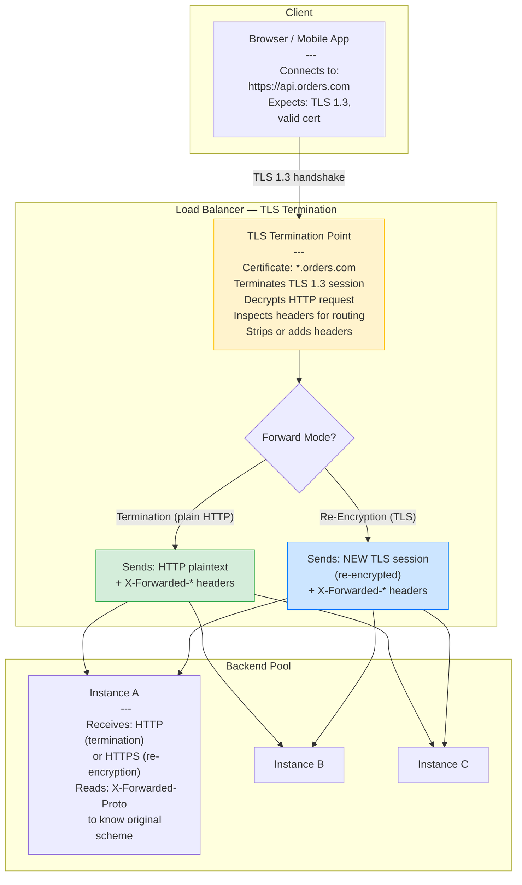
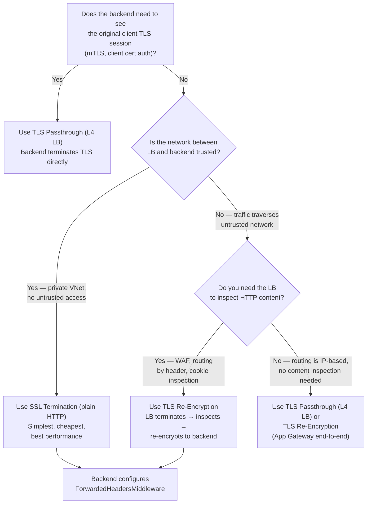

> [!success] Mastery Check
> - [ ] **Studied Well**
> - [ ] **Can explain the concept without notes**
> - [ ] **Can answer interview questions confidently**
> - [ ] **Can implement it in a real project**

---

id: "7.217" title: "Load Balancing — SSL Termination" domain: "System Design & Distributed Systems" domain_id: 7 group: "Scalability Patterns" tags: [system-design, distributed-systems, scalability, dotnet, azure, load-balancing, ssl-termination, tls, security] priority: 1 version: 2 prerequisites:

- "[[7.211 — Load Balancing — Layer 4 vs Layer 7]]" — SSL termination is an L7 function; an L4 load balancer cannot terminate TLS (it forwards the TCP stream as-is, encrypted); understanding the L4/L7 distinction is the prerequisite for understanding where TLS lives in the architecture
- "[[7.210 — Load Balancing — Overview]]" — the taxonomy anchor; SSL termination is a key decision point in the LB architecture that affects performance, security, and operational complexity
- "[[7.216 — Load Balancing — Health Check Integration]]" — TLS health probes require separate TLS configuration (or plain HTTP on a separate port); the health check TLS context is independent of the application TLS context" related:
- "[[7.211 — Load Balancing — Layer 4 vs Layer 7]]" — L4 LB passes TLS through unmodified (the LB never sees the encrypted data); L7 LB terminates TLS and sees the plaintext HTTP — this distinction determines what the LB can inspect, route on, and modify
- "[[7.215 — Load Balancing — Weighted Round Robin]]" — WRR can be used to give more TLS-heavy connections (e.g., TLS 1.3 with expensive key exchange) to instances with hardware TLS acceleration; the weight distribution must account for the asymmetric crypto cost
- "[[7.216 — Load Balancing — Health Check Integration]]" — health checks on a TLS-terminated LB must either use plain HTTP on a separate port or present a valid TLS client certificate; a health check failing due to certificate expiration is a common production incident
- "[[7.218 — Load Balancing — Power of Two Choices]]" — the Power of Two Choices algorithm's connection sampling interacts with TLS session resumption; if a client is routed to a different backend on each request (no session affinity), TLS session resumption is defeated and the full handshake repeats on every request
- "[[4.110 — ASP.NET Core Kestrel — Production Configuration]]" — Kestrel's TLS configuration includes certificate loading, cipher suite ordering, OCSP stapling, and session cache sizing; the TLS termination point (LB vs Kestrel) determines which of these settings apply
- "[[31.105 — HTTPS and TLS — Configuration in ASP.NET Core]]" — comprehensive TLS configuration reference for ASP.NET Core; this note focuses on the LOAD BALANCER's perspective (where TLS ends and how the backend knows the original protocol)
- "[[31.110 — Certificate Management in Azure — Key Vault and App Service]]" — certificate storage and rotation in Azure; the LB's TLS certificate must be stored in a location the LB can access (App Gateway: Key Vault or PFX upload; Front Door: Key Vault)
- "[[7.233 — Auto-Scaling — Reactive vs Predictive]]" — TLS handshake CPU cost is significant (~1ms of asymmetric crypto per new connection); autoscaling decisions must account for the TLS handshake rate, not just the request rate, because a spike in new connections (TLS handshakes) creates a different CPU profile than a spike in existing keep-alive requests" created: 2026-06-16

---

> [!ABSTRACT] Quick Reference — SSL Termination **Invariant:** The load balancer decrypts incoming TLS traffic at the edge, inspects or routes the plaintext HTTP request, and forwards it to the backend — either as plain HTTP (SSL termination) or re-encrypted with a new TLS session (SSL re-encryption / TLS bridging). The backend never performs asymmetric crypto; the LB owns all certificate and key management. **Cost:** The LB must perform a TLS handshake for every new client connection — an asymmetric crypto operation that consumes ~1-5ms of CPU per handshake depending on key size and cipher suite. At 10,000 new connections per second, this costs 10-50 CPU-seconds per second — potentially multiple cores solely for TLS. Session resumption (session IDs, session tickets) reduces this to ~0.1ms per resumed handshake but requires the LB to maintain session state. The LB also becomes a TLS configuration management point: certificates must be installed, renewed, and rotated on the LB, not on the backends. **Trigger:** Every public-facing HTTP API or website needs TLS. The question is not WHETHER to terminate TLS, but WHERE. The trigger for SSL TERMINATION AT THE LB specifically is: (a) you want to offload TLS crypto cost from backend instances to a dedicated LB (which may have hardware TLS acceleration), (b) you want a single certificate management point instead of managing certs on every backend, or (c) you need the LB to inspect HTTP content (routing, headers, cookies, WAF) which requires decrypted traffic. **Skip When:** The backend must see the original client TLS connection (regulatory compliance, mTLS requirement, or the application reads client certificate attributes from the TLS session). In these cases, use TLS passthrough (L4 forwarding) — the LB does not terminate, just forwards the encrypted TCP stream. Also skip when the LB cannot perform TLS at the required scale (e.g., a software LB on a CPU-constrained VM handling 50,000 new connections/second — the TLS CPU cost may exceed the LB's capacity). **.NET Entry Point:** Kestrel can terminate TLS directly (via `ListenOptions.UseHttps()`), or the LB can terminate and forward plain HTTP to Kestrel. In the latter case, Kestrel must be configured to trust the forwarded headers (`ForwardedHeadersMiddleware`) so it knows the original scheme (HTTPS) and client IP. **Azure Native:** Azure Application Gateway supports SSL termination (certificate on the listener) and end-to-end TLS (re-encrypt to backend). Azure Front Door terminates TLS at the edge (closest PoP) and re-encrypts to the origin. Azure Load Balancer (L4) does NOT terminate TLS — it passes the encrypted TCP stream through to the backend, which must handle TLS itself. **Number to Know:** TLS handshake CPU cost by key size: RSA 2048-bit ≈ 1ms per handshake (verify), 0.1ms per resumed session. ECDSA P-256 ≈ 0.3ms per handshake, 0.05ms per resumed session. ECDSA is 3× cheaper than RSA for the same security level. At 10,000 new connections/second with RSA 2048, TLS consumes ~10 CPU cores just for handshakes. Switching to ECDSA saves ~7 cores. Session resumption (TLS 1.3 0-RTT or TLS 1.2 session tickets) reduces handshake cost by 90% for returning clients. **On Azure:** App Gateway's TLS termination uses a frontend listener with a certificate (Key Vault or PFX). The certificate must include the full chain (leaf + intermediate + root). App Gateway does NOT support ECDSA certificates as of 2026 — only RSA. For ECDSA, use Azure Front Door (supports ECDSA) or terminate on the backend directly. This is a common performance trap: teams deploy to App Gateway expecting TLS offload but cannot use ECDSA, so they get RSA handshake cost on the App Gateway (which they pay for) AND on the backend if they re-encrypt.

---

## Navigation

**Domain:** [[7 — System Design & Distributed Systems]] > **Group:** Scalability Patterns
**Previous:** [[7.216 — Load Balancing — Health Check Integration]] | **Next:** [[7.218 — Load Balancing — Power of Two Choices]]

### Prerequisites

- [[7.211 — Load Balancing — Layer 4 vs Layer 7]] — SSL termination is an L7 function; an L4 load balancer cannot terminate TLS (it forwards the encrypted TCP stream as-is); understanding the L4/L7 distinction is the prerequisite for understanding where TLS lives in the architecture
- [[7.210 — Load Balancing — Overview]] — the taxonomy anchor; SSL termination is a key decision point in the LB architecture that affects performance, security, and operational complexity
- [[7.216 — Load Balancing — Health Check Integration]] — TLS health probes require separate TLS configuration (or plain HTTP on a separate port); the health check TLS context is independent of the application TLS context

### Where This Fits

> [!INFO] Production Encounter Map
>
> - **Layer:** L7 load balancer function — SSL termination is the process of decrypting incoming TLS traffic at the load balancer, converting it to plaintext HTTP for internal forwarding. It sits between the client (which expects HTTPS) and the backend (which may receive HTTP or re-encrypted HTTPS).
> - **Trigger:** The first time a team deploys a public-facing HTTPS service and must decide where to put the TLS certificate. Or when backend instances are struggling with TLS CPU cost during traffic spikes. Or when the team needs the LB to inspect HTTP headers (for routing, WAF, or authentication) which requires decrypted traffic.
> - **Without SSL termination at the LB:** Either (a) the LB forwards encrypted traffic to the backend, which must terminate TLS itself — every backend instance does its own handshake, consuming CPU and requiring certificate management on each instance; or (b) the LB does not support HTTPS at all, and clients connect over plain HTTP — a security violation. The first option is common for L4 LBs (Azure LB, AWS NLB) where the backend handles all TLS.
> - **First signal that SSL termination design matters:** When the team migrates from a single-instance deployment (Kestrel terminates TLS directly) to a multi-instance deployment behind an LB. They must decide: does the LB terminate TLS (offload from backends) or just forward encrypted traffic (backends still handle TLS)? The decision affects certificate management, CPU allocation, and the forwarded header configuration.

SSL termination is the most common TLS architecture for web applications because it centralizes certificate management, offloads CPU-intensive asymmetric crypto from application instances, and enables the LB to inspect and route on HTTP content. The cost is that traffic between LB and backend is in plaintext (or must be re-encrypted), and the LB itself becomes a TLS performance bottleneck — if the LB cannot keep up with the TLS handshake rate, ALL backends are starved of traffic even if they have spare capacity. The three variants — termination (plaintext to backend), re-encryption (TLS to backend), and passthrough (TLS untouched) — represent different points on the security-vs-operational-complexity spectrum.

---

## Core Mental Model

SSL termination is the deliberate insertion of a TLS endpoint at the infrastructure boundary. The client establishes a TLS session with the load balancer, not with the application. The load balancer decrypts the request, processes it (routing, header manipulation, WAF inspection), and forwards it to the backend — either as plain HTTP or as a new TLS session. The backend never sees the original TLS session; it sees only the HTTP request that was inside it.

The mental model: think of a diplomatic courier carrying a sealed envelope (the TLS-encrypted request). The courier arrives at a border checkpoint (the load balancer). The checkpoint opens the envelope, reads the contents, decides which ministry (backend) should handle it, and forwards the contents in a new envelope (re-encrypted) or as an open document (plain HTTP). The ministry never sees the original sealed envelope — it only receives the contents. The checkpoint is trusted to open and reseal correctly. If the checkpoint is compromised, or if the open document is intercepted between the checkpoint and the ministry, the contents are exposed.

The critical insight: **SSL termination moves the trust boundary from the application to the load balancer.** The LB must be trusted with the private key — if the LB is compromised, all TLS traffic is compromised. The backends must trust that the LB will set the correct forwarded headers (`X-Forwarded-Proto: https`) so they know the original protocol. The network between LB and backend must be trusted (or protected by re-encryption). The tradeoff is operational simplicity (one place to manage certificates, one place to handle TLS CPU) against a larger attack surface (the LB is now a TLS endpoint) and a weaker security model for internal traffic (plaintext between LB and backend unless re-encrypted).

> [!TIP] The Non-Obvious Insight
> The CPU cost of TLS is dominated by the asymmetric key exchange (RSA or ECDSA signature verification), which happens ONCE per TCP connection — NOT once per HTTP request. With HTTP keep-alive, 100 requests over one TCP connection incur ONE TLS handshake. With HTTP/2 multiplexing, thousands of requests over one connection incur ONE TLS handshake. This means TLS CPU cost is proportional to NEW CONNECTION RATE, not request rate. An API with 50,000 req/s but only 500 new connections/second (long-lived keep-alive) has negligible TLS cost. An API with 5,000 req/s where every request opens a new TCP connection (common in serverless, IoT, or short-lived clients) has significant TLS cost. Optimizing TLS for the right metric — new connections per second, not requests per second — is what distinguishes senior engineers.

### Classification

- **Architecture model — Three TLS modes:**
  - **SSL Termination (SSL Termination / TLS Offload):** LB decrypts → forwards plain HTTP to backend. Backend sees `X-Forwarded-Proto: https`. Pros: cheapest (no backend TLS cost), simplest certificate management. Cons: plaintext between LB and backend.
  - **SSL Re-Encryption (TLS Bridging):** LB decrypts → inspects/routes → re-encrypts to backend. Backend sees a NEW TLS session (different from client's). Pros: encrypted internal traffic, LB still inspects content. Cons: double TLS cost (terminate + re-encrypt), certificate on both LB and backend.
  - **SSL Passthrough (TLS Passthrough):** LB forwards encrypted TCP stream untouched. Backend terminates TLS directly. Pros: backend sees original client TLS session (for mTLS, client cert auth). Cons: LB cannot inspect content, no routing by HTTP headers, certificate management on every backend.
- **TLS version support:** TLS 1.2 (baseline), TLS 1.3 (preferred — fewer round trips, 0-RTT, improved cipher suites). TLS 1.0 and 1.1 are deprecated and should be disabled.
- **Certificate management:**
  - **Self-managed:** Certificate (PFX/PEM) uploaded to the LB. Requires manual renewal tracking.
  - **Key Vault integration (Azure):** Certificate stored in Azure Key Vault, the LB references it. Automatic renewal when Key Vault rotates the certificate.
  - **Azure App Service / Front Door managed:** Azure manages the certificate (free, automatic renewal) for default domains (`*.azurewebsites.net`, `*.azurefd.net`). Custom domains require manual upload or Key Vault.
- **Forwarded headers for backend awareness:**
  - `X-Forwarded-For` — original client IP
  - `X-Forwarded-Proto` — original scheme (http or https)
  - `X-Forwarded-Host` — original Host header

### Primary Diagram



### TLS Handshake Cost Trace

```
TLS 1.3 Full Handshake (new connection, no resumption):

Client                                    LB
  │                                       │
  │  ClientHello (supported versions,     │
  │  cipher suites, key share)            │
  │──────────────────────────────────────>│  ~0.01ms (network)
  │                                       │
  │  ServerHello + EncryptedExtensions    │
  │  + Certificate + CertificateVerify   │
  │  + Finished                           │
  │<──────────────────────────────────────│  ~1-5ms CPU on LB
  │                                       │    (RSA sig verify or
  │  Finished                             │     ECDSA key agree)
  │──────────────────────────────────────>│
  │                                       │
  │  Encrypted Application Data           │
  │  (HTTP request)                       │
  │──────────────────────────────────────>│
  │                                       │

TLS 1.3 Resumed Handshake (session ticket):

Client                                    LB
  │                                       │
  │  ClientHello + session_ticket         │
  │  + key_share                          │
  │──────────────────────────────────────>│  ~0.01ms (network)
  │                                       │
  │  ServerHello + EncryptedExtensions    │
  │  + Finished                           │
  │<──────────────────────────────────────│  ~0.1ms CPU on LB
  │                                       │    (no cert verify,
  │                                       │     just key agree)
  │  Finished                             │
  │──────────────────────────────────────>│
  │                                       │
  │  Encrypted Application Data (0-RTT)   │
  │──────────────────────────────────────>│

Cost comparison:
  Full handshake RSA 2048:   ~5ms CPU
  Full handshake ECDSA P-256: ~1ms CPU
  Resumed handshake:         ~0.1ms CPU
  Session ticket lifetime:   typically 4-8 hours

At 10,000 new connections/sec (worst case, no resumption):
  RSA 2048:  50,000ms CPU/sec → 50 cores
  ECDSA P-256: 10,000ms CPU/sec → 10 cores
  With 80% resumption rate:
    RSA 2048:  10,000ms CPU/sec → 10 cores
    ECDSA P-256: 2,000ms CPU/sec → 2 cores
```

### Key Properties / Guarantees

|Property|Value|Condition|
|---|---|---|
|TLS handshake CPU cost (new, RSA 2048)|~1-5ms per handshake|Depends on key size, cipher suite, hardware acceleration|
|TLS handshake CPU cost (new, ECDSA P-256)|~0.3-1ms per handshake|ECDSA is 3-5× cheaper than RSA for same security level|
|TLS handshake CPU cost (resumed)|~0.05-0.1ms per handshake|Session resumption eliminates cert verification|
|Client IP visibility to backend|Via `X-Forwarded-For` header|Requires LB to set the header; backend must trust it|
|Original protocol visibility|Via `X-Forwarded-Proto` header|Backend uses this to generate correct redirect URLs|
|Certificate management effort|Single cert on LB (termination); cert per backend (passthrough)|Centralized vs decentralized|
|Internal traffic security|Plaintext (termination); encrypted (re-encryption); encrypted original (passthrough)|Depends on trust model of internal network|
|LB content inspection|Possible (termination/re-encryption); impossible (passthrough)|Decrypted traffic is required for WAF, cookie inspection, header routing|
|Session affinity interaction|Session resumption tickets on LB; backend affinity independent|TLS session is LB-client; not LB-backend|
|Azure App Gateway ECDSA support|Not supported — RSA only as of 2026|Use Front Door or backend termination for ECDSA|
|Azure Front Door ECDSA support|Supported — ECDSA + RSA|Front Door supports both key types|

---

## Deep Mechanics

### How It Works

**TLS Termination Flow (most common L7 pattern):**

1. **Client connects:** The client's browser or app initiates a TCP connection to the LB's public IP on port 443.

2. **TLS handshake (LB terminates):**
   - Client sends ClientHello with supported TLS versions, cipher suites, and key share (TLS 1.3) or cipher list (TLS 1.2).
   - LB responds with ServerHello, selects the highest mutually-supported TLS version and cipher suite.
   - LB sends its certificate (the leaf cert, plus intermediate CA certs, plus optionally the root CA).
   - LB proves possession of the private key (CertificateVerify message).
   - Client and LB agree on session keys via key exchange (ECDHE).
   - TLS session established. All subsequent data is encrypted with the session keys.

3. **HTTP request sent encrypted:** Client sends HTTP request over the encrypted TLS session.

4. **LB decrypts:** LB uses the session keys to decrypt the HTTP request.

5. **LB inspects and routes:** LB reads the decrypted HTTP headers (Host, Path, Cookies, custom headers) to determine which backend pool and which routing rule applies.

6. **LB forwards (termination mode):**
   - LB creates a NEW TCP connection to the selected backend instance (or reuses an existing keep-alive connection).
   - LB sends the HTTP request as plaintext over this internal connection.
   - LB adds forwarded headers: `X-Forwarded-For: <client_ip>`, `X-Forwarded-Proto: https`, `X-Forwarded-Host: <original_host>`.

7. **Backend processes:** Backend receives plaintext HTTP, reads the forwarded headers to determine the original request context, processes the request, and returns the HTTP response as plaintext.

8. **LB encrypts response:** LB takes the plaintext HTTP response, encrypts it with the TLS session keys, and sends it to the client.

**TLS Re-Encryption (TLS Bridging) Flow:**

Same as termination through step 6. But instead of forwarding plain HTTP:

6a. **LB re-encrypts:** LB creates a new TLS session with the backend instance. This is a DIFFERENT TLS session from the client-LB session — different keys, potentially different cipher suite.

7a. **LB forwards encrypted:** LB sends the HTTP request encrypted over the new TLS session to the backend.

8a. **Backend terminates TLS:** Backend terminates the LB's TLS session, processes the request, and returns the HTTP response encrypted under the same TLS session.

**TLS Passthrough Flow (L4):**

1. Client connects to LB's public IP on port 443.
2. LB accepts the TCP connection. It does NOT perform a TLS handshake — it cannot, because it does not have the private key.
3. LB inspects the Destination IP and Destination Port (L4) or the SNI (Server Name Indication) in the ClientHello (L4 with SNI, some LBs).
4. LB forwards the ENTIRE TCP stream — including the TLS handshake bytes — to the selected backend instance.
5. Backend terminates the TLS session directly with the client. The LB never sees the decrypted content.

### Forwarded Headers Protocol Trace

```
Client → LB (TLS 1.3 encrypted):
  GET /api/orders HTTP/1.1
  Host: api.orders.com
  Authorization: Bearer <jwt>

LB → Backend (plain HTTP):
  GET /api/orders HTTP/1.1
  Host: api.orders.com
  X-Forwarded-For: 203.0.113.42
  X-Forwarded-Proto: https
  X-Forwarded-Host: api.orders.com
  Authorization: Bearer <jwt>

  ⚠️ Note: The Authorization header is forwarded as-is.
  The backend must validate it independently. The LB does
  NOT authenticate on behalf of the backend.

Backend response (plain HTTP):
  HTTP/1.1 200 OK
  Content-Type: application/json

  The backend constructs URLs using X-Forwarded-Proto.
  If the backend builds a redirect URL, it uses "https://"
  because X-Forwarded-Proto is "https".
  If it ignored the forwarded header, it would use "http://"
  — a mixed-content error in the client browser.

LB → Client (TLS 1.3 encrypted):
  HTTP/1.1 200 OK
  Content-Type: application/json
```

### Failure Modes

**Failure Mode 1: Certificate Expiration — LB Cannot Establish TLS Sessions**

- **Cause:** The TLS certificate installed on the LB has reached its expiration date. The LB's TLS listener accepts TCP connections but fails during the TLS handshake — it presents the expired certificate, which the client's browser rejects (or the client terminates the connection because the certificate is invalid). New TLS sessions cannot be established. Existing sessions (which have already completed the handshake) continue to work until the session expires or the connection is closed — but those are limited to the session cache lifetime (typically 4-8 hours for session tickets, or the TCP keep-alive duration).
- **Symptom:** Clients suddenly cannot connect. Browsers show "NET::ERR_CERT_DATE_INVALID" or similar. API clients receive SSL errors. The error is binary: either the certificate is valid or it is not — no gradual degradation. The affected users are ALL users trying to establish NEW connections. Users with existing keep-alive connections continue working — so the error rate is proportional to the new-connection rate, not the total request rate. This creates a confusing partial-outage pattern: the monitoring shows requests succeeding (from keep-alive connections) while new clients fail.
- **Detection time:** When the certificate expires. Ideally, monitoring alerts 30 days before expiration. In practice, the team discovers this when users report connection errors. The error is in the LB layer, not the application layer, so application-level monitoring does not catch it. The key metric: `tls_handshake_failure_count` on the LB (if logged) spikes from 0 to the new-connection rate.

**Fix:**

```powershell
# ❌ Certificate expired — immediate fix needed
# Symptom: LB presents expired cert, clients reject it

# ✅ Fix (Azure App Gateway):
# 1. Upload new certificate (PFX or Key Vault reference)
$cert = New-AzApplicationGatewaySslCertificate `
    -Name "wildcard-orders-com-2026" `
    -CertificateFile ".\wildcard.orders.com-2026.pfx" `
    -Password (ConvertTo-SecureString "..." -AsPlainText -Force)

# 2. Update the HTTPS listener
$listener = Get-AzApplicationGatewayHttpListener `
    -Gateway $gateway -Name "https-listener"
$listener.SslCertificate = $cert

# 3. Apply the change
Set-AzApplicationGateway -Gateway $gateway

# ✅ Fix (Certificate auto-renewal with Key Vault):
# Store the certificate in Azure Key Vault with auto-renewal enabled.
# App Gateway (and Front Door) can reference the Key Vault secret.
# When Key Vault rotates the certificate, the LB picks up the new
# version within ~24 hours (or on the next config change).

# ✅ Fix (Prevention — certificate expiry monitoring):
# Add a health check that verifies certificate validity
// Custom health check for certificate expiry
public sealed class CertificateExpiryHealthCheck : IHealthCheck
{
    private readonly IConfiguration _config;

    public CertificateExpiryHealthCheck(IConfiguration config)
    {
        _config = config;
    }

    public Task<HealthCheckResult> CheckHealthAsync(
        HealthCheckContext context,
        CancellationToken ct)
    {
        // Load the certificate from the same source the LB uses
        using var cert = new X509Certificate2(
            _config["Certificates:WildcardPath"],
            _config["Certificates:WildcardPassword"]);

        var daysRemaining = (cert.NotAfter - DateTime.UtcNow).Days;

        if (daysRemaining <= 0)
            return Task.FromResult(HealthCheckResult.Unhealthy(
                $"Certificate expired on {cert.NotAfter:d}"));

        if (daysRemaining <= 30)
            return Task.FromResult(HealthCheckResult.Degraded(
                $"Certificate expires in {daysRemaining} days"));

        if (daysRemaining <= 7)
            return Task.FromResult(HealthCheckResult.Unhealthy(
                $"Certificate expires in {daysRemaining} days — RENEW NOW"));

        return Task.FromResult(HealthCheckResult.Healthy(
            $"Certificate valid for {daysRemaining} more days"));
    }
}
```

**Cost of not fixing:** Complete TLS handshake failure for all new connections. Existing connections continue until they close — then those clients also fail. Within one session ticket lifetime (4-8 hours), all clients have experienced connection failure. The application is completely unavailable from the client's perspective. Recovery requires uploading a new certificate — a 5-minute fix if the new cert is ready, or a 24-hour wait if it must be procured.

---

**Failure Mode 2: Cipher Suite Mismatch — Old Clients Cannot Connect**

- **Cause:** The LB is configured with a restrictive cipher suite policy — only TLS 1.3 with AEAD ciphers, or only ECDSA key exchange. Old clients (Android 4.x, Windows 7 without updated root store, legacy IoT devices) do not support these modern cipher suites. The TLS handshake fails at the cipher negotiation step: the ClientHello lists supported ciphers, the LB's ServerHello responds with "no shared cipher suite," and the connection is terminated. The client receives an SSL error.
- **Symptom:** A subset of clients (those with older TLS stacks) cannot connect. The error rate is correlated with client user-agent strings: old browsers, IoT devices, embedded systems, and corporate proxies. Modern clients (Chrome 100+, Safari 16+, iOS 16+) connect fine. The issue is invisible if the team only tests with modern browsers. The support team receives reports from specific customer segments using older devices or software.
- **Detection time:** When a specific customer segment reports connectivity issues. The team checks the LB logs and finds `TLS_ERROR` or `HANDSHAKE_FAILURE` events with `no_shared_cipher` error codes. The affected user-agent pattern reveals the mismatch.

**Fix:**

```powershell
# ❌ WRONG: Overly restrictive cipher policy
$gateway.SslPolicy = New-AzApplicationGatewaySslPolicy `
    -PolicyName "AppGwSslPolicy20220101"  # TLS 1.2 only, strong ciphers only
# This blocks clients that only support TLS 1.0 (should be blocked) or
# TLS 1.2 with older ciphers (e.g., Android 4.x).

# ✅ FIX: Use a policy that supports the required client base
# While disabling truly deprecated protocols.

# Azure App Gateway — predefined policy that balances security and compatibility
$gateway.SslPolicy = New-AzApplicationGatewaySslPolicy `
    -PolicyType "Predefined" `
    -PolicyName "AppGwSslPolicy20220101"
# This supports TLS 1.2, disables TLS 1.0/1.1.

# For maximum compatibility (not recommended for production):
# Use "AppGwSslPolicy20150501" which allows TLS 1.0

# ✅ FIX: If specific older clients must be supported:
# 1. Check the minimum TLS version those clients support
# 2. If they require TLS 1.0 or 1.1, add a SEPARATE listener
#    for those clients with a compatible policy
# 3. Document the security tradeoff: TLS 1.0/1.1 are PCI
#    non-compliant and vulnerable to protocol downgrade attacks

# ✅ FIX: In Kestrel (.NET) — configure cipher suites explicitly
builder.WebHost.ConfigureKestrel(options =>
{
    options.ConfigureHttpsDefaults(listenOptions =>
    {
        // Require TLS 1.2 or higher
        listenOptions.SslProtocols = SslProtocols.Tls12 | SslProtocols.Tls13;

        // Specify cipher suites (Windows Schannel)
        listenOptions.OnAuthenticate = (context, sslOptions) =>
        {
            // Allow only specific cipher suites
            // This is OS-dependent; on Windows, use Schannel configuration
            // On Linux (OpenSSL), use CipherSuitePolicy
        };
    });
});
```

**Cost of not fixing:** A segment of the customer base (sometimes 5-15% depending on industry) cannot access the application. For B2C applications with older user bases (IoT, industrial, healthcare), this can be a 30-50% customer loss. The support team is overwhelmed with "cannot connect" reports that are invisible to the engineering team's modern-testing environment.

---

**Failure Mode 3: Mixed Content Warnings — Backend Generates HTTP URLs in HTTPS Pages**

- **Cause:** The backend application constructs absolute URLs using the `HttpContext.Request.Scheme` property. Without `ForwardedHeadersMiddleware`, `HttpContext.Request.Scheme` is `http` because the LB forwarded the request as plain HTTP (termination mode). The backend generates `<script src="http://cdn.orders.com/app.js">` or `Location: http://api.orders.com/login` in redirects. The browser, which loaded the page over HTTPS, blocks the HTTP resource (mixed content) or issues a warning. For redirects, the client ignores the scheme and follows the redirect to HTTP — then the browser warns or blocks the resulting page.
- **Symptom:** Pages load without styles or scripts (blocked mixed content). API redirects fail (browser refuses to follow HTTP redirect from an HTTPS page). The browser console shows "Mixed Content: The page at 'https://...' was loaded over HTTPS, but requested an insecure resource 'http://...'". The application appears broken in subtle ways — functionality is impaired but not completely down.
- **Detection time:** When a developer opens the browser console and sees the mixed content warnings. Or when users report that "the page looks broken" but no error is logged on the server. The root cause is invisible to server-side monitoring because the server successfully generated URLs — it just generated the wrong scheme.

**Fix:**

```csharp
// ❌ WRONG: Backend ignores forwarded headers
// HttpContext.Request.Scheme is "http" because LB forwarded as HTTP
var redirectUrl = Url.Page("/Login");
// Generated: http://api.orders.com/Login → mixed content error!

// ✅ FIX: Add ForwardedHeadersMiddleware to trust the LB's headers
builder.Services.Configure<ForwardedHeadersOptions>(options =>
{
    options.ForwardedHeaders = ForwardedHeaders.XForwardedFor
                             | ForwardedHeaders.XForwardedProto
                             | ForwardedHeaders.XForwardedHost;

    // ⚠️ SECURITY: Only trust the LB's IP (or subnet)
    // If you trust ALL proxies, a client could spoof X-Forwarded-Proto
    options.KnownProxies.Clear();
    options.KnownProxies.Add(IPAddress.Parse("10.0.0.4")); // App Gateway private IP

    // For development, clear all restrictions:
    // options.KnownNetworks.Clear();
    // options.KnownProxies.Clear();
});

app.UseForwardedHeaders(); // ← Must be called BEFORE UseHttpsRedirection!

// ⚠️ ORDER MATTERS: ForwardedHeaders must run BEFORE
// UseHttpsRedirection, UseAuthentication, UseAuthorization
// so those middlewares see the correct scheme.

app.UseHttpsRedirection(); // Now correctly redirects to HTTPS
// Because ForwardedHeaders set HttpContext.Request.Scheme to "https"

// ✅ Also fix: Always use relative URLs or scheme-agnostic URLs
// <script src="/app.js"> instead of <script src="https://cdn.orders.com/app.js">
// Location: /Login instead of Location: https://api.orders.com/Login

// ✅ VERIFICATION: Test that the backend sees the correct scheme
// Add a diagnostic endpoint
app.MapGet("/debug/headers", (HttpContext context) =>
{
    return context.Request.Headers
        .Select(h => $"{h.Key}: {h.Value}")
        .ToList();
});
// Expected: X-Forwarded-Proto: https
//           X-Forwarded-For: <client_ip>
//           X-Forwarded-Host: api.orders.com
```

**Cost of not fixing:** All absolute URLs generated by the backend are wrong — they use `http://` instead of `https://`. This breaks: (a) redirects (login, payment callback, OAuth flows), (b) resource loading (CSS, JS, images from CDN URLs), (c) API response URLs (RESTful APIs that return resource URLs). The application appears broken to clients even though the processing logic is correct. The root cause is invisible to server-side logs — the server successfully processed the request and generated a response, but the response contains incorrect URLs.

---

**Failure Mode 4: TLS Handshake Overload — LB CPU Saturation from Handshake Rate**

- **Cause:** A traffic spike consists primarily of NEW TCP connections (no keep-alive reuse). Common scenarios: a marketing campaign drives thousands of new users simultaneously, a mobile app launch causes a wave of first-time connections, or an IoT device fleet checks in simultaneously after a network restoration. Each new connection requires a full TLS handshake — ~1-5ms of CPU on the LB. At 20,000 new connections/second, this consumes 20-100 CPU-seconds per second — saturating the LB's CPU. The LB becomes the bottleneck even though the backend instances have spare capacity. The TLS handshake queue grows, handshake latency increases, clients time out, and the LB may enter a degraded state where it accepts fewer new connections.
- **Symptom:** LB CPU is at 100%. New connection latency increases from ~5ms to > 5 seconds. Clients experience connection timeouts and SSL errors. The backend instances are idle or low-CPU — they are starved of traffic because the LB cannot process the TLS handshakes fast enough. The autoscaler may scale IN the backend pool (low CPU) while the LB is overwhelmed — the wrong scaling signal.
- **Detection time:** When LB CPU monitoring shows 100% and client error rates spike. The on-call engineer checks the backends (idle) and the LB (saturated). The key metric: `tls_handshake_duration_p99` increases from ~5ms to > 1 second. The `active_connections` on the LB may be low (connections are failing during the handshake, before they become active).

**Fix:**

```csharp
// ❌ The problem: too many new TLS connections for the LB's CPU capacity.
// The fix is architectural, not code-level.

// ✅ Fix 1: Increase TLS session resumption rate
// Configure longer session ticket lifetime (up to 8 hours).
// Clients that reconnect within the ticket lifetime use 0-RTT or
// abbreviated handshake — 10× cheaper than full handshake.
// Azure App Gateway: session ticket lifetime is managed by Azure (not configurable).
// Azure Front Door: supports session resumption natively.
// For Kestrel/Linux: configure session cache size and timeout:
listenOptions.UseHttps(options =>
{
    // On Linux with OpenSSL:
    // Set SSL_OP_NO_TICKET to disable tickets (or adjust cache)
});

// ✅ Fix 2: Add TLS hardware acceleration
// Azure App Gateway v2 uses Intel QuickAssist for hardware TLS offload.
// This reduces handshake CPU cost by ~60%.
// Azure Front Door uses custom TLS termination hardware at the edge.

// ✅ Fix 3: Use ECDSA certificates instead of RSA
// ECDSA P-256 handshake is ~0.3ms vs RSA 2048 ~1ms — 3× cheaper.
// Azure Front Door supports ECDSA. App Gateway does NOT (as of 2026).
// If using App Gateway and you need ECDSA, terminate TLS at the backend
// (use L4 LB passthrough) or use Front Door.

// ✅ Fix 4: Scale the LB tier
// App Gateway v2: scale up (larger SKU) or scale out (more instances).
// Front Door: Microsoft manages the edge capacity — no scaling needed.

// ✅ Fix 5: Reduce new connection rate
// Encourage clients to use HTTP keep-alive and connection pooling.
// HttpClient default in .NET: PooledConnectionLifetime = infinite (reuse forever).
// Set a reasonable lifetime: 1-5 minutes, not per-request.
builder.Services.AddHttpClient("ApiClient")
    .ConfigurePrimaryHttpMessageHandler(() => new SocketsHttpHandler
    {
        // Reuse connections aggressively
        MaxConnectionsPerServer = 10,
        PooledConnectionLifetime = TimeSpan.FromMinutes(5),
        PooledConnectionIdleTimeout = TimeSpan.FromMinutes(2),
    });

// ⚠️ For serverless / short-lived clients (Azure Functions, AWS Lambda):
// These create a new TCP connection on EVERY invocation.
// At scale, the TLS handshake rate equals the request rate.
// Consider using a TLS-terminating LB with large capacity
// (Azure Front Door) or reducing invocation frequency.
```

**Cost of not fixing:** During traffic spikes driven by new connections (not existing keep-alive requests), the LB saturates while backends are idle. The system's throughput is limited by the LB's TLS handshake capacity, not by the application's request-processing capacity. The autoscaler scales the wrong resource: it adds backend instances (which are already idle) instead of scaling the LB.

---

**Failure Mode 5: X-Forwarded-For Spoofing — Client Can Impersonate Any IP**

- **Cause:** The LB adds `X-Forwarded-For: <client_ip>` to each forwarded request. The backend reads this header to determine the client's IP (for rate limiting, geo-blocking, audit logging). But if the backend accepts requests from sources that do NOT strip or overwrite the `X-Forwarded-For` header, a client can send a request WITH a pre-set `X-Forwarded-For` header that the LB APPENDS to rather than REPLACES. The result: `X-Forwarded-For: fake_ip, real_client_ip` or `X-Forwarded-For: fake_ip` (if the LB only adds when not present). The backend reads the first IP in the list and uses the spoofed IP.
- **Symptom:** IP-based rate limiting can be bypassed by setting `X-Forwarded-For: 127.0.0.1` or `X-Forwarded-For: <trusted_ip>`. Geo-blocking can be bypassed by spoofing an IP from an allowed region. Audit logs record the wrong client IP. Security features that depend on the client IP (brute force detection, IP allowlists, geolocation routing) are all subverted.
- **Detection time:** When a security audit discovers that `X-Forwarded-For` can be injected via client requests. Or when an attacker bypasses IP-based rate limiting and the team discovers the spoofed IPs in the logs.

**Fix:**

```csharp
// ❌ WRONG: Backend naively reads the first X-Forwarded-For value
var clientIp = context.Request.Headers["X-Forwarded-For"].FirstOrDefault();
// This trusts the header as provided — includes client-injected values.

// ✅ FIX 1: The LB must OVERWRITE, not append, X-Forwarded-For
// Azure App Gateway: always overwrites X-Forwarded-For with the client IP.
// No configuration needed — it is the default behavior.
// NGINX: proxy_set_header X-Forwarded-For $proxy_add_x_forwarded_for;
//   → This APPENDS (adds $remote_addr to any existing header).
//   → Use proxy_set_header X-Forwarded-For $remote_addr; (REPLACES).

// ✅ FIX 2: Backend reads the LAST (trusted) value, not the first
// In a chain of trusted proxies, the rightmost IP is the most recent
// trusted proxy's addition. The leftmost IP is the original client
// — but only if the chain is fully trusted.
var forwardedFor = context.Request.Headers["X-Forwarded-For"].FirstOrDefault();
if (forwardedFor is not null)
{
    // Split on comma, take the FIRST IP (original client)
    var clientIp = forwardedFor.Split(',')[0].Trim();

    // ⚠️ But if the client sent a spoofed header, this FIRST IP
    // is the spoofed one. The LB's addition is the LAST entry.
    // Solution: only trust X-Forwarded-For from the LB's IP.
    // See Fix 3.
}

// ✅ FIX 3: Use ForwardedHeadersMiddleware with KnownProxies
// ASP.NET Core's ForwardedHeadersMiddleware validates that the
// X-Forwarded-For header was added by a KNOWN PROXY.
// It only trusts X-Forwarded-For from KnownProxies/KnownNetworks.
builder.Services.Configure<ForwardedHeadersOptions>(options =>
{
    options.ForwardedHeaders = ForwardedHeaders.XForwardedFor
                             | ForwardedHeaders.XForwardedProto;

    // Only trust the LB's IP
    options.KnownProxies.Clear();
    options.KnownProxies.Add(IPAddress.Parse("10.0.0.4")); // App Gateway

    // If the request comes from ANY other source,
    // X-Forwarded-For is ignored.
});

app.UseForwardedHeaders();

// ✅ FIX 4: Use the Forwarded standard (RFC 7239) instead of X-Forwarded-For
// The Forwarded header is standardized and has better security properties.
// Azure Front Door sets the Forwarded header.
// NGINX: proxy_set_header Forwarded $proxy_add_forwarded;
```

**Cost of not fixing:** All IP-based security controls are bypassable. Rate limiting, geo-blocking, brute force detection, IP allowlists, and audit trails are all based on a header that the attacker controls. The system's security posture is significantly weaker than it appears — it has the ILLUSION of IP-based security without the reality.

---

### .NET and Azure Integration

- **ASP.NET Core Kestrel:** Can terminate TLS directly via `ListenOptions.UseHttps()`. When behind a TLS-terminating LB, configure `ForwardedHeadersMiddleware` to trust the LB's forwarded headers.
- **Forwarded Headers Middleware:** `app.UseForwardedHeaders()` must be called early in the pipeline (before `UseHttpsRedirection`, `UseAuthentication`). Configure `ForwardedHeadersOptions` with `KnownProxies` or `KnownNetworks` to prevent header spoofing.
- **Azure Application Gateway:** Supports SSL termination (PFX or Key Vault cert on listener) and end-to-end TLS (re-encryption to backend). Configure `backendHttpSettings` with `port: 443` and `pickHostNameFromBackendAddress: true` for re-encryption. Does NOT support ECDSA certificates.
- **Azure Front Door:** Terminates TLS at the edge PoP. Supports ECDSA and RSA certificates. Supports automatic certificate rotation via Key Vault. Sets `X-Forwarded-For`, `X-Forwarded-Proto`, and `X-Forwarded-Host` headers.
- **Azure Load Balancer (L4):** Does NOT terminate TLS. Forwards encrypted TCP stream to backend. Backend must handle TLS. Use when client certificate authentication (mTLS) is required, or when you need the backend to see the original TLS session.
- **Azure Key Vault:** Store TLS certificates in Key Vault with auto-renewal. App Gateway and Front Door can reference Key Vault secrets for automatic certificate pickup.

```csharp
// Program.cs — TLS configuration for an ASP.NET Core app behind
// a TLS-terminating LB (App Gateway or Front Door)

var builder = WebApplication.CreateBuilder(args);

// --- Configure Forwarded Headers ---
builder.Services.Configure<ForwardedHeadersOptions>(options =>
{
    options.ForwardedHeaders = ForwardedHeaders.XForwardedFor
                             | ForwardedHeaders.XForwardedProto
                             | ForwardedHeaders.XForwardedHost;

    // In production, restrict to known LB IPs
    // For development/containerized environments, allow all
    if (builder.Environment.IsDevelopment())
    {
        options.KnownNetworks.Clear();
        options.KnownProxies.Clear();
    }
    else
    {
        // Restrict to the App Gateway private IP
        options.KnownProxies.Add(IPAddress.Parse("10.0.0.4"));
    }
});

// --- Configure Kestrel ---
builder.WebHost.ConfigureKestrel(options =>
{
    // Port 5001: HTTP (receives plaintext from LB after TLS termination)
    options.Listen(IPAddress.Any, 5001);

    // Port 5000: Health checks only (never receives external traffic)
    options.Listen(IPAddress.Any, 5000);

    // ⚠️ Do NOT configure UseHttps on these listeners.
    // TLS is terminated at the LB. Kestrel only receives plain HTTP.
    // If you need end-to-end TLS, configure Kestrel to listen on
    // a separate port with its own certificate for re-encrypted traffic.
});

var app = builder.Build();

// --- Middleware Pipeline ---
// 1. Forwarded headers MUST be first
app.UseForwardedHeaders();

// 2. HSTS — tell clients to always use HTTPS
app.UseHsts(); // Only in production

// 3. HTTPS redirection — only if the LB does not redirect itself
// (App Gateway can redirect HTTP→HTTPS at the LB level)
// app.UseHttpsRedirection();

// 4. Normal middleware
app.UseRouting();
app.UseAuthentication();
app.UseAuthorization();

app.MapControllers();

app.Run();
```

---

## Production Patterns and Implementation

### Primary Implementation — Three-Tier TLS Architecture (Edge LB + Internal LB + Backend)

The production TLS architecture separates concerns: Azure Front Door terminates TLS at the edge (global, DDoS-protected, WAF-enabled). Azure Application Gateway re-encrypts internally for regional routing. Backend instances never handle TLS for external traffic.

```csharp
// Program.cs — Three-tier TLS architecture configuration
// This service sits behind: Client → Front Door (TLS term) → App Gateway (re-encrypt) → Service

using System.Net;
using Microsoft.AspNetCore.HttpOverrides;

var builder = WebApplication.CreateBuilder(args);

// --- Tier 1: Front Door terminates external TLS ---
// Front Door sends HTTPS to App Gateway (re-encrypted).
// No config needed in the service for Front Door — Front Door is transparent.

// --- Tier 2: App Gateway re-encrypts to the service ---
// App Gateway has its own TLS certificate (internal CA or self-signed).
// The service must trust the App Gateway's certificate.
// Configure Kestrel to terminate the App Gateway's TLS:
builder.WebHost.ConfigureKestrel(options =>
{
    // Receive re-encrypted traffic from App Gateway on port 443
    options.Listen(IPAddress.Any, 443, listenOptions =>
    {
        listenOptions.UseHttps(httpsOptions =>
        {
            // Load the certificate that App Gateway expects
            // This is the "backend" certificate — can be from a
            // private CA or a self-signed cert added to the trusted store
            httpsOptions.ServerCertificate = LoadBackendCertificate();
        });
    });

    // Health check port — plain HTTP (not exposed to App Gateway)
    options.Listen(IPAddress.Any, 5000);
});

// --- Forwarded Headers ---
builder.Services.Configure<ForwardedHeadersOptions>(options =>
{
    options.ForwardedHeaders = ForwardedHeaders.XForwardedFor
                             | ForwardedHeaders.XForwardedProto
                             | ForwardedHeaders.XForwardedHost;

    // Trust the App Gateway's IP
    options.KnownProxies.Add(IPAddress.Parse("10.1.0.4")); // App Gateway internal IP
});

var app = builder.Build();

app.UseForwardedHeaders();
app.UseHsts();
app.UseRouting();
app.UseAuthentication();
app.UseAuthorization();

app.Run();

// --- Certificate Loading ---
X509Certificate2 LoadBackendCertificate()
{
    // In production, load from Key Vault or local store
    using var store = new X509Store(StoreName.My, StoreLocation.LocalMachine);
    store.Open(OpenFlags.ReadOnly);
    var certs = store.Certificates.Find(
        X509FindType.FindBySubjectName,
        "orders-internal.orders.com",
        validOnly: false);
    return certs[0];
}
```

### Configuration and Wiring — Azure App Gateway End-to-End TLS

```bicep
// main.bicep — App Gateway with end-to-end TLS (re-encryption to backend)
resource appGw 'Microsoft.Network/applicationGateways@2022-05-01' = {
  name: 'orders-appgw'
  // ... other properties
  properties: {
    sslCertificates: [
      {
        name: 'wildcard-orders-com'
        properties: {
          // From Key Vault
          keyVaultSecretId: 'https://kv-orders.vault.azure.net/secrets/wildcard-orders-com'
        }
      }
    ]
    // Backend TLS certificate (for re-encryption)
    trustedRootCertificates: [
      {
        name: 'backend-ca'
        properties: {
          data: 'Base64-encoded CA certificate for internal PKI'
        }
      }
    ]
    httpListeners: [
      {
        name: 'https-listener'
        properties: {
          protocol: 'Https'
          sslCertificate: {
            id: '[resourceId("Microsoft.Network/applicationGateways/sslCertificates", "orders-appgw", "wildcard-orders-com")]'
          }
          // ... other listener properties
        }
      }
    ]
    backendHttpSettingsCollection: [
      {
        name: 'backend-tls-settings'
        properties: {
          port: 443
          protocol: 'Https'
          // Verify backend certificate
          pickHostNameFromBackendAddress: true
          trustedRootCertificate: {
            id: '[resourceId("Microsoft.Network/applicationGateways/trustedRootCertificates", "orders-appgw", "backend-ca")]'
          }
        }
      }
    ]
  }
}
```

### Common Variants

**1. TLS Passthrough with Client Certificate Authentication (mTLS):**

```csharp
// When the backend MUST see the original client TLS session.
// The LB (L4) passes the encrypted TCP stream through unchanged.
// The backend terminates TLS and validates the client certificate.

// Kestrel configuration for mTLS:
builder.WebHost.ConfigureKestrel(options =>
{
    options.Listen(IPAddress.Any, 443, listenOptions =>
    {
        listenOptions.UseHttps(httpsOptions =>
        {
            httpsOptions.ServerCertificate = LoadServerCertificate();
            httpsOptions.ClientCertificateMode = ClientCertificateMode.RequireCertificate;

            // Validate the client certificate
            httpsOptions.OnCertificateValidation = (sender, certificate, chain, errors) =>
            {
                // Check if the certificate is issued by a trusted CA
                // Check if the certificate subject matches expected patterns
                // Check certificate expiration, revocation, etc.
                return certificate?.Subject.Contains("CN=client-") == true;
            };
        });
    });
});

// ⚠️ This mode ONLY works behind an L4 LB (Azure LB) or directly.
// If an L7 LB terminates TLS, the backend receives a NEW TLS session
// from the LB (not the client's), and the client certificate is lost.
```

**2. HSTS Configuration for TLS-Terminated Backends:**

```csharp
// HSTS tells clients to always use HTTPS, even if the user types HTTP.
// When TLS is terminated at the LB, the backend must set HSTS headers
// through the LB. The LB forwards the HSTS response header to the client.

app.UseHsts(options =>
{
    options.MaxAge = TimeSpan.FromDays(365);
    options.IncludeSubDomains = true;
    options.Preload = true;

    // ⚠️ Only set HSTS if the original request was HTTPS
    // The backend checks X-Forwarded-Proto to decide
});

// Custom HSTS middleware that respects forwarded headers:
app.Use(async (context, next) =>
{
    var proto = context.Request.Headers["X-Forwarded-Proto"].FirstOrDefault();
    if (proto == "https" && !context.Response.Headers.ContainsKey("Strict-Transport-Security"))
    {
        context.Response.Headers["Strict-Transport-Security"] =
            "max-age=31536000; includeSubDomains; preload";
    }
    await next();
});

// ⚠️ WARNING: Only enable HSTS Preload after verifying your
// entire domain serves HTTPS. Preload is permanent — you cannot
// undo it without contacting browser vendors.
```

**3. OCSP Stapling for Certificate Validation:**

```csharp
// OCSP stapling allows the LB to include a signed OCSP response
// with the certificate during the TLS handshake. The client does
// NOT need to contact the CA directly, improving handshake speed
// and privacy (the CA does not learn which clients are visiting).

// Kestrel with OCSP stapling (.NET 7+ on Linux):
builder.WebHost.ConfigureKestrel(options =>
{
    options.Listen(IPAddress.Any, 443, listenOptions =>
    {
        listenOptions.UseHttps(httpsOptions =>
        {
            httpsOptions.ServerCertificate = LoadCertificate();

            // Enable OCSP stapling (Linux with OpenSSL 1.1.1+)
            httpsOptions.SslProtocols = SslProtocols.Tls12 | SslProtocols.Tls13;
        });
    });
});

// ⚠️ OCSP stapling is automatically handled by the OS on Windows
// (Schannel does it internally). On Linux, it requires OpenSSL 1.1.1+
// and the certificate must include the CA's OCSP responder URL.

// Azure App Gateway: OCSP stapling is NOT supported.
// The client must contact the CA to check revocation (or the
// certificate must be short-lived to avoid revocation checking).
// This is a significant limitation for compliance requirements.
```

### Real-World .NET Ecosystem Example

- **ASP.NET Core Kestrel:** The default .NET web server. Configures TLS via `ListenOptions.UseHttps()`. Supports TLS 1.2, 1.3, client certificates, OCSP stapling (Linux), and cipher suite configuration (OS-dependent).
- **ForwardedHeadersMiddleware:** The standard way for .NET apps behind a TLS-terminating LB to know the original scheme, client IP, and host. Requires `KnownProxies` configuration to prevent spoofing.
- **Azure App Gateway TLS termination:** The most common Azure pattern for .NET APIs. The gateway terminates client TLS, forwards plaintext or re-encrypted HTTP to the backend. The backend uses `ForwardedHeadersMiddleware` to reconstruct the original request context.
- **Azure Front Door:** Global TLS termination at the edge. Supports custom domains, managed certificates, Key Vault integration, and automatic rotation. The origin (App Gateway or App Service) receives re-encrypted TLS from Front Door.
- **Azure Key Vault:** Centralized certificate storage. App Gateway, Front Door, and App Service can reference Key Vault secrets for TLS certificates. Supports auto-renewal and version management.
- **Let's Encrypt / ACME:** Free, automated certificate authority. Can be integrated with Azure via Key Vault's certificate auto-renewal or via cert-manager on AKS. Suitable for TLS termination at the LB level (App Gateway does not support ACME directly — use Key Vault or a cert-manager sidecar).

---

## Gotchas and Production Pitfalls

### Gotcha 1: ForwardedHeadersMiddleware Configured Incorrectly — Infinite Redirect Loop

**Pitfall:** The backend configures `UseHttpsRedirection()` but does NOT configure `ForwardedHeadersMiddleware` first. When the LB terminates TLS and forwards plain HTTP to the backend, the backend sees `HttpContext.Request.Scheme == "http"`. The `UseHttpsRedirection()` middleware redirects ALL requests to HTTPS — but the LB is already serving HTTPS! The redirect goes to `https://api.orders.com/...` which the LB receives, terminates TLS, forwards as HTTP again, and the backend redirects again. Infinite redirect loop.

```csharp
// ❌ WRONG: UseHttpsRedirection BEFORE ForwardedHeaders
app.UseHttpsRedirection();     // Redirects ALL requests to HTTPS
app.UseForwardedHeaders();      // Too late — redirect already happened

// The flow:
// 1. Client sends HTTPS request to LB
// 2. LB terminates TLS, forwards HTTP to backend
// 3. Backend sees HTTP → redirects to HTTPS (301)
// 4. LB forwards the redirect to client (still HTTPS)
// 5. Client follows redirect to HTTPS — same flow
// 6. Backend sees HTTP again → redirects again → INFINITE LOOP

// ✅ FIX: ForwardedHeaders MUST come first
app.UseForwardedHeaders();      // Sets Scheme = "https" from X-Forwarded-Proto
app.UseHttpsRedirection();      // Now sees "https" — no redirect needed

// ✅ OR: Remove UseHttpsRedirection entirely if the LB handles HTTP→HTTPS redirect
// App Gateway can be configured to redirect HTTP to HTTPS at the LB level.
// In that case, the backend never receives HTTP requests.
```

**Symptom:** The browser shows an infinite redirect loop. The user cannot access the application. The browser eventually shows "ERR_TOO_MANY_REDIRECTS". The server logs show a 301 redirect for every request. The response always includes `Location: https://same-url-as-requested`. The loop repeats until the browser gives up.

**Cost of not fixing:** The application is completely inaccessible. Every request results in a redirect loop. This is a show-stopper for any deployment behind a TLS-terminating LB. The fix is trivial (reorder middleware) but the symptom is catastrophic and confusing — the LB is correctly serving HTTPS, but the backend is redirecting because it does not know that.

---

### Gotcha 2: App Gateway Backend TLS Certificate Validation Failure

**Pitfall:** The team enables end-to-end TLS on App Gateway (re-encryption to backend) but uses a self-signed certificate on the backend. App Gateway's default backend TLS validation does NOT trust self-signed certificates. The backend TLS handshake between App Gateway and the backend instance fails. App Gateway marks the backend as unhealthy (health probe also fails because it uses the same TLS settings). The entire backend pool is unhealthy.

```bicep
// ❌ WRONG: Backend uses self-signed cert, App Gateway does not trust it
resource backendSettings 'Microsoft.Network/applicationGateways/backendHttpSettingsCollection' = {
  properties: {
    protocol: 'Https'
    port: 443
    // No trustedRootCertificate specified — App Gateway validates
    // against the default CA store. Self-signed certs are NOT trusted.
  }
}

// ✅ FIX 1: Upload the backend's CA certificate as a trusted root
resource backendCA 'Microsoft.Network/applicationGateways/trustedRootCertificates' = {
  name: 'backend-ca'
  properties: {
    data: 'Base64-encoded CA certificate in CER format'
  }
}

resource backendSettings 'Microsoft.Network/applicationGateways/backendHttpSettingsCollection' = {
  properties: {
    protocol: 'Https'
    port: 443
    trustedRootCertificate: {
      id: '[resourceId("Microsoft.Network/applicationGateways/trustedRootCertificates", "orders-appgw", "backend-ca")]'
    }
  }
}

// ✅ FIX 2: Use a publicly-trusted certificate on the backend
// If the backend is internal (private IP), use Azure Private CA
// or a certificate signed by a trusted internal CA.

// ✅ FIX 3: Disable backend TLS validation (NOT recommended for production)
// App Gateway does not support disabling backend TLS validation.
// This is by design — security requirement.
```

**Symptom:** After enabling end-to-end TLS, all backends are marked unhealthy. The health probe fails because it cannot establish a TLS connection (it uses the same backend settings). The application is down. The App Gateway logs show TLS handshake failures between the gateway and the backend.

**Cost of not fixing:** The application is completely unavailable because the backends are all unhealthy. Recovery requires either: (a) uploading the backend's CA certificate to App Gateway, (b) switching to a publicly-trusted certificate on the backend, or (c) disabling end-to-end TLS (reverting to plaintext termination).

---

### Gotcha 3: Session Resumption Cache Exhaustion on the LB

**Pitfall:** The LB maintains a session cache for TLS session resumption. Each unique client session is stored in the cache (session ID or session ticket state). When the cache is full, the LB must evict older entries or fall back to full handshakes for new clients. If the number of unique clients exceeds the cache size, the cache thrashes — clients frequently experience full handshakes (5ms each) instead of resumed handshakes (0.1ms). The LB CPU increases significantly because every connection requires the expensive asymmetric crypto.

```csharp
// ❌ The LB's session cache is too small for the number of unique clients.
// Azure App Gateway: session cache size is not configurable —
// it is managed by Azure. Large deployments (100K+ unique concurrent clients)
// may experience cache thrashing.

// ✅ FIX 1: Use TLS 1.3 — session tickets are stateless (encrypted and sent
// to the client). The client presents the ticket on reconnect. The LB
// validates the ticket using a symmetric key, with NO server-side cache.
// TLS 1.3 effectively eliminates the session cache exhaustion problem.
// Ensure the LB and clients support TLS 1.3.

// ✅ FIX 2: Increase the session cache size (if configurable)
// NGINX: ssl_session_cache shared:SSL:10m;  (10MB ≈ 40,000 sessions)
// For 200,000 unique clients, use ssl_session_cache shared:SSL:50m;

// ✅ FIX 3: Shorten the session timeout
// If sessions are cached for 8 hours (typical for session tickets),
// a full cache means 8 hours of unique client traffic.
// Shortening to 1 hour reduces cache pressure but increases
// full-handshake frequency for returning clients.
// NGINX: ssl_session_timeout 1h;

// ✅ FIX 4: Distribute clients across multiple LB nodes
// Each LB node has its own session cache.
// With 4 App Gateway instances and 100,000 unique clients,
// each instance handles ~25,000 unique clients.
// Cache hit rate improves because the cache per instance is smaller
// relative to the client count PER INSTANCE.
// ⚠️ A client may hit a DIFFERENT LB node on reconnect (no session affinity),
// causing a cache miss even if the session is cached on the first node.
// Use client IP affinity (consistent hashing) to route clients to the same LB node.
```

**Symptom:** LB CPU is unexpectedly high despite moderate request rates. The metric `tls_handshake_full` (full handshake count) is high while `tls_handshake_resumed` (resumed handshake count) is low. The session cache hit rate is low (< 50%). The LB CPU is spent on full handshakes when most clients are returning clients.

**Cost of not fixing:** The LB is doing 10× more CPU work than necessary for TLS handshakes. This reduces the effective throughput of the LB and may cause TLS handshake overload during traffic spikes (Failure Mode 4). The capacity planning assumption (based on request rate) is wrong — the LB's actual bottleneck is the unique client connection rate, not the request rate.

---

### Gotcha 4: Certificate Chain Missing Intermediate CA — Mobile Clients Fail

**Pitfall:** The certificate uploaded to the LB contains only the leaf certificate (the domain cert), NOT the intermediate CA certificates. Modern browsers and operating systems have the root CA built-in, but they do NOT have the intermediate CA. The intermediate CA is necessary to chain the leaf cert to the trusted root. Without it, the TLS handshake sends an incomplete chain. Desktop browsers (Chrome, Firefox, Edge) often download the missing intermediate from the CA's AIA (Authority Information Access) endpoint — they can still validate. But mobile clients, IoT devices, and some API clients do NOT fetch missing intermediates. They reject the handshake because they cannot build the trust chain.

```powershell
# ❌ WRONG: Certificate chain is incomplete
# The PFX file contains only the leaf certificate.
# LB sends only the leaf cert during TLS handshake.
# Desktop browsers fetch the missing intermediate from CA's URL.
# Mobile clients fail — no intermediate, no trust chain.

# ✅ FIX: Include the full certificate chain in the PFX/PEM
# The certificate file must contain:
# 1. Leaf certificate (wildcard.orders.com)
# 2. Intermediate CA certificate (R3 or similar)
# 3. (Optional) Root CA certificate

# Export with full chain (OpenSSL):
openssl pkcs12 -export \
    -in wildcard.orders.com.pem \
    -inkey wildcard.orders.com.key \
    -certfile intermediate.pem \
    -out wildcard.orders.com.fullchain.pfx

# Verify the chain:
openssl pkcs12 -in wildcard.orders.com.fullchain.pfx -info -nokeys
# Should show: leaf + intermediate(s)

# On macOS / Windows cert manager:
# Double-click the PFX → view certificate path
# The path should show:
#   wildcard.orders.com (leaf)
#   └── R3 (intermediate)
#       └── ISRG Root X1 (root — may be trusted)
```

**Symptom:** The application works on desktop browsers but fails on mobile apps, IoT devices, and programmatic HTTP clients (Python `requests`, Java `HttpClient`, .NET `HttpClient` on some platforms). The error is "certificate chain incomplete" or "unable to find valid certification path to requested target." The desktop browser downloads the missing intermediate transparently, so the developer never sees the issue during testing.

**Cost of not fixing:** A significant portion of the client base (any non-browser HTTPS client) cannot connect. Mobile apps fail in production even though they worked during development (where the developer used a browser). The bug is in the certificate deployment, not the application code, making it difficult to diagnose.

---

### Gotcha 5: Backend Redirects Use HTTP After TLS Termination — Mixed Content on Every Redirect

**Pitfall:** The backend application uses `RedirectToPage`, `RedirectToAction`, or `LocalRedirect` in ASP.NET Core. These methods generate URLs using `HttpContext.Request.Scheme`. Without `ForwardedHeadersMiddleware`, the scheme is `http` (because the LB forwarded as plain HTTP). The redirect URL is `http://api.orders.com/login` instead of `https://api.orders.com/login`. The browser refuses to follow the HTTP redirect from an HTTPS page. Login flows, OAuth callbacks, and payment redirects all break.

```csharp
// ❌ WRONG: No ForwardedHeadersMiddleware
// HttpContext.Request.Scheme == "http"

return RedirectToPage("/Login");
// Generates: http://api.orders.com/Login
// Browser console: "Mixed Content: redirect from HTTPS to HTTP blocked"

// ✅ FIX: Add ForwardedHeadersMiddleware
builder.Services.Configure<ForwardedHeadersOptions>(options =>
{
    options.ForwardedHeaders = ForwardedHeaders.XForwardedProto;
});
app.UseForwardedHeaders();

// Now HttpContext.Request.Scheme == "https"
return RedirectToPage("/Login");
// Generates: https://api.orders.com/Login ✓

// ✅ ALSO: Use LocalRedirect or RedirectToPage that generates
// relative URLs or uses the Request's scheme correctly.

// ✅ VERIFICATION: Add a diagnostic endpoint
app.MapGet("/debug/scheme", (HttpContext context) =>
{
    return new
    {
        scheme = context.Request.Scheme,
        proto = context.Request.Headers["X-Forwarded-Proto"].FirstOrDefault(),
        host = context.Request.Host.Value,
        isHttps = context.Request.IsHttps
    };
});
// Expected output:
// { scheme: "https", proto: "https", host: "api.orders.com", isHttps: true }
```

**Symptom:** Login redirects fail. OAuth flows fail at the redirect step. Payment gateway callbacks are never received. The server logs show that the redirect was correctly generated and sent, but the client never follows it. The browser console shows mixed content warnings. The issue is invisible in server-side monitoring — the server successfully processed the request and returned a response; the response was just wrong.

**Cost of not fixing:** Every redirect-based flow is broken: login, registration, password reset, checkout, payment callback, OAuth authentication. The application's core user flows are non-functional. The error is confusing because it manifests differently in different browsers (Chrome blocks, Firefox allows with warning, Safari blocks).

---

## Tradeoffs and Decision Framework

### Tradeoff Matrix

| Dimension | SSL Termination (plaintext to backend) | TLS Re-Encryption (TLS to backend) | TLS Passthrough (L4, backend terminates) |
|---|---|---|---|
| Backend TLS CPU cost | Zero (offloaded to LB) | Zero (LB handles client TLS; backend handles LB TLS — small cost) | Full (backend terminates client TLS directly) |
| Certificate management | Single cert on LB | LB cert + backend cert (internal) | Cert on every backend instance |
| Internal traffic security | Plaintext (insecure on untrusted network) | Encrypted (secure on any network) | Encrypted (original TLS session) |
| LB content inspection | Yes (decrypted) | Yes (decrypted, re-encrypted) | No (cannot decrypt) |
| Client certificate visibility | Lost (LB terminates) | Lost (LB terminates) | Preserved (backend terminates original TLS) |
| Implementation complexity | Low | Medium (backend certs, trusted CAs) | Low (no LB TLS config) |
| Azure L7 support | App Gateway, Front Door | App Gateway (re-encrypt), Front Door (re-encrypt to origin) | Not supported on L7; use Azure LB (L4) |
| Headers for backend | X-Forwarded-* set by LB | X-Forwarded-* set by LB | X-Forwarded-* not set (backend has original) |

### Decision Flowchart



### When to Apply

- **SSL Termination** — When the backend is in a private, trusted network (Azure VNet, AWS VPC, or on-premise private subnet). The simplicity and performance benefits (no backend TLS, no certificate management per instance) outweigh the internal plaintext risk.
- **TLS Re-Encryption** — When compliance or security policy requires encrypted traffic between ALL network hops (PCI DSS, HIPAA, SOC 2). Or when the LB and backend are on different networks (e.g., Front Door → App Gateway → backend in a different VNet).
- **TLS Passthrough** — When the application requires client certificate authentication (mTLS) and the backend must validate the client's TLS certificate. Or when the LB is L4 (Azure LB) and cannot terminate TLS.

### When NOT to Apply

- [ ] **SSL Termination over the public internet:** Never send plaintext HTTP over the public internet. The LB-to-backend network must be private (VNet, VPN, Direct Connect).
- [ ] **TLS Passthrough with cookie-based session affinity:** The LB cannot read cookies (encrypted) and cannot route by them. Use termination or re-encryption if cookie affinity is needed.
- [ ] **TLS Re-Encryption with self-signed backend certs on Azure App Gateway:** App Gateway validates backend TLS certificates. Self-signed certs will fail unless the CA is explicitly trusted. Use trusted internal CAs.
- [ ] **Backend TLS when the backend is CPU-constrained:** If the backend instances are small (B-series VMs, 0.5 CPU pods), offload TLS entirely to the LB (termination). The backend CPU should be reserved for application logic.
- [ ] **Any scenario where ForwardedHeadersMiddleware is not configured:** If the backend does not trust X-Forwarded-* headers, it will generate wrong URLs, log wrong client IPs, and fail redirects. This is a requirement, not an option.

### Scale Thresholds

- **SSL termination (plaintext to backend) is the default** for < 10,000 req/s and < 500 new connections/second. The TLS CPU cost on the LB is manageable for App Gateway v2 or NGINX.
- **TLS re-encryption becomes expensive** at > 20,000 req/s because double TLS (one to terminate, one to re-encrypt) doubles the handshake CPU cost. At these rates, consider termination-only (trusted internal network) or passthrough.
- **TLS passthrough (backend handles TLS) becomes necessary** at > 50,000 new connections/second (IoT, mobile, serverless) where no single LB can handle the handshake rate. Distribute the handshake load across all backend instances.
- **ECDSA certificates should replace RSA** when the new connection rate exceeds 2,000/sec. The 3× CPU savings from ECDSA vs RSA translates directly to reduced LB costs or higher throughput.
- **Key Vault certificate auto-renewal** becomes necessary at > 10 certificates (multi-domain, multi-region). Manual certificate rotation at scale is error-prone.

---

## Interview Arsenal

### Question Bank

1. **Define SSL termination in the context of load balancing. What problem does it solve?**
2. **Describe the TLS handshake flow in a three-tier architecture (client → LB → backend) with SSL termination.**
3. **What is the tradeoff between SSL termination, TLS re-encryption, and TLS passthrough?**
4. **What happens when the TLS certificate on the LB expires? Walk through the failure scenario.**
5. **Compare TLS termination at the LB vs TLS termination at the backend. When would you choose each?**
6. **Design a TLS architecture for a global e-commerce platform that must handle 100,000 req/s with PCI compliance requiring encryption between all hops.**
7. **Why does `UseHttpsRedirection()` cause an infinite redirect loop behind a TLS-terminating LB? How do you fix it?**
8. **Explain why a mobile app might fail to connect to a TLS-terminated API while a desktop browser succeeds — and how to fix it.**
9. **A TLS-terminated backend is generating HTTP redirect URLs even though clients connect via HTTPS. Diagnose and fix.**
10. **How does TLS session resumption interact with a multi-node load balancer? What happens when a client resumes a session on a different LB node?**

### Spoken Answers

**Q: Define SSL termination in the context of load balancing. What problem does it solve?**

> **Average answer:** "SSL termination is when the load balancer decrypts HTTPS traffic from clients and forwards it as HTTP to the backend servers. It saves the backend servers from having to do the decryption."

> **Great answer:** "SSL termination is the architectural pattern where the load balancer acts as the TLS endpoint for client connections. The client establishes a secure TLS session with the LB, not with the application. The LB decrypts the incoming request, inspects the plaintext HTTP, and forwards it to the backend — typically as plain HTTP, optionally re-encrypted with a new TLS session.

"It solves three problems simultaneously. First, TLS offload: asymmetric cryptography (RSA signature verification, ECDHE key exchange) is CPU-intensive — each full TLS handshake costs ~1-5ms of CPU depending on key size. By terminating TLS at the LB, you centralize this cost on dedicated infrastructure (which may have hardware TLS acceleration) and free up backend CPU for application logic. This matters at scale: 10,000 new connections per second with RSA 2048-bit consumes ~50 CPU cores purely for TLS. Offloading that to the LB saves 50 cores' worth of backend capacity.

"Second, certificate centralization. Without SSL termination, every backend instance must have the private key installed. Rolling a certificate requires updating every instance. With termination, you update one certificate on the LB. This is a significant operational saving for large deployments.

"Third, content inspection. The LB must decrypt the traffic to read HTTP headers for routing decisions (host-based routing, path-based routing), cookie inspection (session affinity), and WAF rules. Without termination, the LB is blind to the application layer — it can only route by IP and port. This limits you to L4 load balancing.

"The cost of termination is that the traffic between the LB and the backend is in plaintext. On a private, trusted network, this is typically acceptable. For compliance environments (PCI DSS, HIPAA), you use TLS re-encryption — the LB decrypts, inspects, re-encrypts for the backend hop. This doubles the TLS CPU cost but provides end-to-end encryption.

"The .NET-specific consideration: when your backend receives plaintext HTTP from a terminating LB, you MUST configure `ForwardedHeadersMiddleware` so that `HttpContext.Request.Scheme` reflects the original HTTPS scheme. Without it, every `UseHttpsRedirection()` call creates an infinite redirect loop, and every generated URL uses `http://` instead of `https://`."

**Q: Compare TLS termination at the LB vs TLS termination at the backend. When would you choose each?**

> **Average answer:** "Termination at the LB is simpler because you manage certs in one place. Termination at the backend gives you end-to-end encryption and lets the backend see the client's TLS session."

> **Great answer:** "The choice between LB termination and backend termination is a tradeoff between operational simplicity and security/visibility.

"LB termination (the standard pattern) gives you: centralized certificate management — one certificate on the LB, one renewal date to track, one place to rotate. TLS offload — the backend's CPU is spent on business logic, not asymmetric crypto. Content-based routing — the LB can inspect decrypted HTTP headers for routing decisions. The cost is that internal traffic is plaintext, and the backend cannot see the original TLS session — no client certificate authentication.

"Backend termination (TLS passthrough) gives you: end-to-end encryption — the LB never sees decrypted data, so it cannot inspect content, but no plaintext exists on the internal network. Client certificate visibility — the backend terminates the client's ORIGINAL TLS session, so it can request and validate client certificates for mTLS. The cost is that certificate management is distributed — every backend needs the certificate and private key. The LB cannot route by HTTP headers — it can only route by IP and port (L4). TLS CPU cost is on every backend instance.

"I choose LB termination as the default for 90% of web APIs and websites. The operational savings and routing flexibility are significant, and the internal plaintext is acceptable on a properly secured VNet. I choose backend termination when: (a) the application requires client certificate authentication (mTLS) — the backend must see the client's TLS session, (b) regulatory compliance requires end-to-end encryption without any decryption point — even the LB must not see plaintext, or (c) the LB is an L4 load balancer (Azure LB) that cannot terminate TLS.

"The .NET implementation reflects this choice. For LB termination, you configure Kestrel for HTTP only (no UseHttps) and add ForwardedHeadersMiddleware. For backend termination, you configure Kestrel with UseHttps and the server certificate, and the LB (L4) forwards the encrypted TCP stream unchanged."

**Q: Why does `UseHttpsRedirection()` cause an infinite redirect loop behind a TLS-terminating LB? How do you fix it?**

> **Average answer:** "Because the backend sees HTTP (the LB forwarded HTTP), not HTTPS. It keeps redirecting. You need to add ForwardedHeadersMiddleware."

> **Great answer:** "The infinite redirect loop happens because the backend has no way of knowing that the original client connection was HTTPS. The LB terminates the TLS session — the backend receives a plain HTTP connection. When `UseHttpsRedirection()` checks `HttpContext.Request.IsHttps`, it returns `false`. The middleware generates a 301 redirect to the HTTPS version of the URL. The browser follows the redirect to HTTPS, the LB terminates it again, forwards HTTP to the backend, and the backend redirects again. The loop continues until the browser stops with 'ERR_TOO_MANY_REDIRECTS.'

"The fix is `ForwardedHeadersMiddleware`, which must be registered and configured BEFORE `UseHttpsRedirection()`. The middleware reads the `X-Forwarded-Proto` header that the LB sets, and sets `HttpContext.Request.Scheme = "https"` accordingly. After `ForwardedHeadersMiddleware` runs, `UseHttpsRedirection()` sees that the original scheme is HTTPS and does NOT redirect.

"The critical detail is middleware ORDER. `app.UseForwardedHeaders()` must be the FIRST middleware in the pipeline — before `UseHttpsRedirection`, before `UseAuthentication`, before `UseRouting`. I once spent three hours debugging this on a production deployment because the middleware was registered but in the wrong order — `UseHttpsRedirection` ran before `UseForwardedHeaders` and created the loop despite the middleware being present.

"Beyond the middleware fix, there are two architectural alternatives. First, you can remove `UseHttpsRedirection` entirely and let the LB handle HTTP-to-HTTPS redirection. App Gateway supports this natively — it can redirect HTTP listeners to HTTPS listeners at the gateway level. This is cleaner because the redirect happens before the request reaches the backend, eliminating the loop risk entirely. Second, you can use HSTS (Strict-Transport-Security) at the LB level to tell browsers to always use HTTPS directly, never HTTP. This prevents the initial HTTP request from ever reaching the infrastructure."

### System Design Interview Trigger

If an interviewer asks you to design a secure API architecture and mentions "we need to handle HTTPS" or "certificate management," they are testing whether you understand where TLS ends in the architecture. The follow-up "how does the backend know the client's IP?" tests whether you know about X-Forwarded-For and the spoofing risk. The deeper probe: "we need the backend to authenticate the client using a TLS certificate — does your design support this?" tests whether you recognize that TLS termination at the LB makes client certificate authentication impossible, and whether you know to use TLS passthrough (L4 LB) or mutual TLS at the LB level (if supported). The most advanced probe: "our mobile clients connect from 50 countries; what happens when the LB's TLS session cache is full?" tests whether you understand session resumption, cache exhaustion, and TLS 1.3 stateless session tickets.

### Comparison Table

| | SSL Termination (plaintext) | TLS Re-Encryption | TLS Passthrough |
|---|---|---|---|
| Core guarantee | Offload TLS from backend + enable content inspection | Encrypt internal traffic + enable content inspection | Preserve original client TLS session |
| Trade-off | Internal plaintext; lost client TLS context | Double TLS CPU cost; backend cert management | No content inspection; distributed cert management |
| .NET implementation | Kestrel HTTP + ForwardedHeadersMiddleware | Kestrel HTTPS + ForwardedHeadersMiddleware | Kestrel HTTPS (terminates original TLS) |
| Azure availability | App Gateway, Front Door | App Gateway end-to-end, Front Door to origin | Azure LB (L4) |
| Failure mode | Mixed content errors; no client cert | Backend cert validation failure; double CPU | No X-Forwarded-* headers; cert on every instance |
| When to choose | Private internal network, WAF required, simple cert mgmt | Compliance (PCI, HIPAA), encrypted internal network | Client cert auth (mTLS), L4-only LB, no content routing needed |

---

## Architecture Decision Record

**Status:** Accepted

**Context:** The OrderService API is being deployed to Azure as a global service. It handles payment-related requests and must comply with PCI DSS 4.0, which requires encryption of cardholder data at ALL network hops. The service runs on AKS (Azure Kubernetes Service) in two regions (East US, West Europe). Azure Front Door provides global load balancing and DDoS protection. Azure Application Gateway provides regional L7 routing and WAF. The backend pods are in a private AKS cluster. The team must choose the TLS architecture: where does TLS terminate, and is internal traffic encrypted?

**Options Considered:**

1. **Front Door terminates + App Gateway terminates + plaintext to pods** — Front Door terminates at the edge (TLS 1.3), re-encrypts to App Gateway. App Gateway terminates (TLS 1.2), forwards plaintext HTTP to pods. Simplest. Lowest CPU cost. But internal traffic between App Gateway and pods is plaintext — PCI DSS violation.
2. **Front Door terminates + App Gateway re-encrypts to pods** — Front Door terminates at the edge, re-encrypts to App Gateway. App Gateway terminates (for WAF inspection), re-encrypts to pods using a separate TLS certificate (internal CA). Pods terminate the App Gateway's TLS. Internal traffic is encrypted. PCI DSS compliant.
3. **Front Door passes through to App Gateway + App Gateway terminates + re-encrypts to pods** — Front Door does NOT terminate TLS (it passes the encrypted stream to App Gateway). This is not supported by Front Door — Front Door always terminates TLS. Infeasible.

**Decision:** Option 2 — Front Door terminates edge TLS → re-encrypts to App Gateway → App Gateway terminates for WAF → re-encrypts to pods. This is the only option that satisfies PCI DSS encryption-at-all-hops requirement while maintaining content inspection capability (WAF on App Gateway, routing on Front Door).

**Consequences:**
- ✅ PCI DSS 4.0 compliant — all hops encrypted
- ✅ WAF inspection on App Gateway (requires decrypted traffic)
- ✅ Global routing and DDoS protection via Front Door
- ✅ Auto-renewing certificates via Key Vault (Front Door + App Gateway)
- ⚠️ Double TLS termination cost (Front Door terminates + App Gateway terminates = 2× handshake CPU). Mitigated by Front Door's hardware TLS termination (negligible cost) and App Gateway's scale-out.
- ⚠️ Backend pods must manage internal TLS certificates (from AKS internal CA or cert-manager). Added operational complexity for pod certificate rotation.
- ⚠️ App Gateway backend TLS certificate validation: the internal CA certificate must be uploaded as a trusted root certificate on App Gateway. If the certificate rotates (cert-manager), the App Gateway configuration must be updated.
- ❌ Pod health checks must use HTTPS (App Gateway re-encrypts health probes too). The health check endpoint must be available over both HTTP (for Kubernetes probes) and HTTPS (for App Gateway probes).

**Review Trigger:** Revisit this decision if (a) PCI DSS scope is reduced (no longer processing cardholder data), allowing plaintext internal traffic and simplifying to Option 1, or (b) Azure Front Door adds support for TLS passthrough (unlikely — it is a termination-based service), or (c) AKS adds automatic TLS certificate management with App Gateway integration (certs rotate and App Gateway picks up changes automatically).

---

## Self-Check

### Conceptual Questions

1. What is SSL termination and what three problems does it solve?
2. Derive the tradeoff between TLS termination and TLS passthrough from first principles.
3. Name a scenario where TLS termination is the correct choice AND a scenario where TLS passthrough is necessary.
4. What happens when the TLS certificate on the LB expires? How do existing connections behave?
5. How do you configure ASP.NET Core to correctly handle HTTPS behind a TLS-terminating load balancer?
6. Compare RSA 2048-bit and ECDSA P-256 for TLS termination at scale — what are the CPU cost differences?
7. Below what new-connection rate is TLS termination cost negligible?
8. How does SSL termination relate to [[7.211 — Load Balancing — Layer 4 vs Layer 7]]?
9. What is the non-obvious production consequence of not including intermediate CA certificates in the LB's TLS certificate?
10. Explain SSL termination to a security auditor who is concerned about plaintext traffic between the LB and the backend.

<details>
<summary>Answers</summary>

1. **What is SSL termination?** The load balancer acts as the TLS endpoint — it decrypts incoming TLS traffic, inspects the plaintext HTTP, and forwards it to the backend (as plaintext or re-encrypted). It solves: (a) TLS offload — moves CPU-intensive asymmetric crypto from backends to the LB, (b) certificate centralization — one certificate on the LB instead of on every backend, and (c) content inspection — the LB must decrypt to read HTTP headers for routing, WAF, and cookie affinity.

2. **Tradeoff derivation:** TLS termination optimizes for OPERATIONAL SIMPLICITY (one cert, one place for TLS CPU, content inspection) at the cost of INTERNAL TRAFFIC VISIBILITY (plaintext between LB and backend, lost client TLS context). TLS passthrough optimizes for END-TO-END SECURITY (encrypted everywhere, client TLS context preserved) at the cost of DISTRIBUTED COMPLEXITY (certs on every backend, no content inspection). The choice depends on the trust model of the internal network and the requirement for the backend to see the original TLS session.

3. **Termination correct:** An internal API behind App Gateway in a private VNet. The network is trusted, the backend needs WAF protection, and certificate management on 100 backend instances is impractical. **Passthrough necessary:** A fintech API that requires client certificate authentication (mTLS). The backend must validate the client's TLS certificate. The LB cannot terminate TLS because the client certificate would be lost.

4. **Expired certificate:** The LB's TLS listener accepts TCP connections but the handshake fails — the client receives the expired certificate and rejects it. Existing TLS sessions (established before expiration) continue to work: keep-alive connections persist, and session tickets remain valid for their lifetime (typically 4-8 hours). New connections from clients that hold valid session tickets also resume successfully. New connections from clients without session tickets fail. The outage is GRADUAL — it propagates as existing sessions expire and session tickets expire, over 4-8 hours.

5. **ASP.NET Core configuration:** Install `Microsoft.AspNetCore.HttpOverrides`. Configure `ForwardedHeadersOptions` with `XForwardedFor | XForwardedProto | XForwardedHost`. Call `app.UseForwardedHeaders()` BEFORE `app.UseHttpsRedirection()` in the middleware pipeline. Restrict `KnownProxies` to the LB's IP address to prevent header spoofing.

6. **RSA vs ECDSA CPU cost:** RSA 2048-bit full handshake ≈ 1-5ms CPU. ECDSA P-256 full handshake ≈ 0.3-1ms CPU. ECDSA is ~3× cheaper for the same security level (128-bit symmetric equivalent). At 10,000 new connections/second: RSA consumes ~50 CPU cores, ECDSA consumes ~10 cores. The savings come from ECDSA's smaller key size and more efficient mathematical operations. Azure App Gateway does NOT support ECDSA — a significant performance limitation.

7. **Negligible TLS cost threshold:** Below ~500 new connections/second, TLS termination CPU cost is negligible (< 1% of a single core). Between 500-5,000 new connections/second, TLS cost is measurable but manageable. Above 5,000 new connections/second, TLS termination cost dominates the CPU budget and must be factored into capacity planning.

8. **Relation to [[7.211]]:** SSL termination is an L7 function. An L4 LB (Azure LB) forwards raw TCP bytes — it cannot terminate TLS because it never sees the TLS record layer. The decision to terminate TLS at the LB is the decision to operate at L7. The TLS mode (termination, re-encryption, passthrough) directly determines whether the LB operates at L7 (termination/re-encryption — must decrypt) or L4 (passthrough — forwards encrypted bytes unchanged).

9. **Missing intermediate CA consequence:** Desktop browsers fetch missing intermediate certificates from the CA's AIA (Authority Information Access) URL — they can build the chain. Mobile apps, IoT devices, and programmatic HTTP clients (.NET HttpClient, Python requests, Java HttpsURLConnection) DO NOT fetch missing intermediates. The handshake fails with "certificate chain incomplete." The developer never sees this issue during desktop testing but the mobile app fails in production.

10. **60-second explanation for an auditor:** "Our architecture uses TLS termination at the load balancer. The client's connection to the LB is encrypted with TLS 1.3 using a 2048-bit RSA certificate from a public CA. The LB decrypts the traffic, applies Web Application Firewall rules, and forwards the request to the backend — but only over a private network that is isolated within our Azure VNet, with no public internet access. No traffic between the LB and the backend traverses any untrusted network. If encryption between ALL hops is required, we configure TLS re-encryption: the LB establishes a new TLS session with the backend using an internal certificate. This costs approximately twice the TLS CPU but ensures every byte is encrypted on the wire. The choice between termination and re-encryption depends on whether the internal network is considered a trust boundary."

</details>

---

### Scenario Challenges

**Scenario 1 — Diagnose the problem**

A .NET 8 API is deployed to Azure App Service with Azure Front Door as the global frontend. The API uses `UseHttpsRedirection()`. After deployment, the team notices that ALL requests result in a redirect loop. The browser shows "ERR_TOO_MANY_REDIRECTS". The API's `/health` endpoint also returns a 301 redirect instead of 200. The App Service logs show thousands of 301 responses.

<details>
<summary>Diagnosis</summary>

**Root cause:** `UseHttpsRedirection()` is configured but `ForwardedHeadersMiddleware` is NOT configured. Azure Front Door terminates TLS at the edge (client → Front Door = HTTPS). Front Door re-encrypts to the App Service (Front Door → App Service = HTTPS with Azure-managed certificate). App Service terminates Front Door's TLS — but the application's `HttpContext.Request.Scheme` is still wrong because `ForwardedHeadersMiddleware` is not installed.

Wait — let me reconsider. App Service terminates Front Door's TLS. So the request arrives at the application as HTTPS (App Service terminates Front Door's re-encrypted session). The scheme SHOULD be HTTPS. Let me re-examine.

Actually, the scenario is more nuanced. Azure Front Door sets `X-Forwarded-Proto: https` and also uses `Forwarded` (RFC 7239). App Service with Azure Front Door integration might automatically handle the forwarded headers... but if the application is running in a Linux App Service or a custom container, the automatic handling may not apply.

The real issue might be: Front Door → App Service is HTTPS, but App Service's TLS termination happens at the Front Door-Azure integration layer, not at the application layer. The application still receives HTTP (the App Service infrastructure strips TLS before forwarding to the application process). So `HttpContext.Request.Scheme` is "http" — and `UseHttpsRedirection()` redirects.

**Root cause:** Front Door terminates TLS at the edge. The App Service infrastructure terminates Front Door's re-encrypted TLS. The application receives plain HTTP. `UseHttpsRedirection()` sees HTTP and redirects to HTTPS → Front Door receives HTTPS → re-encrypts to App Service → App Service terminates → passes HTTP to application → redirects again → infinite loop.

**Evidence:**
- Server logs: 301 for every request
- Response headers: `Location: https://<same-url>` (confirming the redirect is to HTTPS)
- `X-Forwarded-Proto` header is set by Front Door but NOT processed by the application
- Azure Front Door dashboard shows healthy origin (App Service returns 301 — which is a valid response, not an error)

**Fix:**
- Add `Microsoft.AspNetCore.HttpOverrides` package
- Configure `ForwardedHeadersMiddleware` to trust Front Door's `X-Forwarded-Proto` header
- Call `app.UseForwardedHeaders()` BEFORE `app.UseHttpsRedirection()`

```csharp
builder.Services.Configure<ForwardedHeadersOptions>(options =>
{
    options.ForwardedHeaders = ForwardedHeaders.XForwardedProto;
    // Front Door — trust all known proxies (Azure manages Front Door IPs)
    options.KnownNetworks.Clear();
    options.KnownProxies.Clear();
});

// In the middleware pipeline:
app.UseForwardedHeaders();       // 1st — sets Scheme to "https"
app.UseHttpsRedirection();       // 2nd — sees "https", does nothing
```

**Prevention:**
- Add `ForwardedHeadersMiddleware` to the project template for all Azure-deployed applications
- Remove `UseHttpsRedirection()` if the LB (Front Door, App Gateway) already handles HTTP→HTTPS redirect at the infrastructure layer — this eliminates the redirect loop risk entirely

</details>

---

**Scenario 2 — Design decision**

You are designing the TLS architecture for a multi-tenant SaaS platform. Each tenant has a dedicated subdomain (`tenant1.app.com`, `tenant2.app.com`). The platform uses a single wildcard certificate (`*.app.com`) for all tenants. The service runs on AKS behind Azure Application Gateway. Requirements: (a) WAF inspection on all traffic, (b) encrypted traffic between App Gateway and pods, (c) automatic certificate renewal, (d) support for tenants with custom domains. Design the TLS architecture.

<details>
<summary>Decision and Reasoning</summary>

**Choice:** Azure Front Door (global edge, wildcard + custom domain certs) → Azure Application Gateway (regional, WAF, re-encrypts to pods) → AKS pods (terminate App Gateway's re-encrypted TLS).

**Why this architecture:**
- Front Door handles the wildcard certificate (`*.app.com`) and any tenant-specific custom domain certificates. Front Door supports multiple certificate types (Key Vault, App Service managed, custom upload) and automatic renewal.
- Front Door routes traffic to the regional App Gateway instance closest to the tenant.
- App Gateway terminates Front Door's TLS, applies WAF rules, and re-encrypts to AKS pods using an internal CA certificate.
- AKS pods terminate the App Gateway's internal TLS. Each pod uses the same internal CA certificate (or a per-pod cert from cert-manager).

**Certificate management:**

```
Front Door:
  - Default: `*.app.com` (Key Vault, auto-renew)
  - Per-tenant custom domains: uploaded to Front Door or Key Vault
  - TLS version: 1.3

App Gateway:
  - Receives re-encrypted TLS from Front Door
  - Terminates Front Door's TLS
  - Uses internal CA cert to re-encrypt to pods
  - Internal CA certificate stored in Key Vault (auto-renew)

AKS Pods:
  - Terminate App Gateway's internal TLS
  - Pod certificate from cert-manager (Let's Encrypt internal or HashiCorp Vault)
  - Pod certificate rotated every 30 days (cert-manager)
  - App Gateway's trusted root CA updated when internal CA rotates
```

**Tenant isolation:** Each tenant's traffic is encrypted at all hops. No tenant can see another tenant's traffic. The wildcard certificate does not expose tenant-specific information — the SNI (Server Name Indication) tells Front Door which domain the client is connecting to, and Front Door routes accordingly.

**Implementation sketch (pod TLS):**

```csharp
// AKS pod — terminates App Gateway's TLS
builder.WebHost.ConfigureKestrel(options =>
{
    options.Listen(IPAddress.Any, 443, listenOptions =>
    {
        listenOptions.UseHttps(httpsOptions =>
        {
            // cert-manager mounts the certificate at /etc/certs
            httpsOptions.ServerCertificate = X509Certificate2.CreateFromPemFile(
                "/etc/certs/tls.crt", "/etc/certs/tls.key");
        });
    });

    // Health check — plain HTTP on separate port (for Kubernetes probes)
    options.Listen(IPAddress.Any, 5000);
});
```

**Tradeoffs accepted:**
- Three-tier TLS adds latency (Front Door → App Gateway → pod ≈ 3-5ms extra)
- Internal CA certificate rotation requires coordination between cert-manager and App Gateway's trusted root configuration
- Custom domain per tenant requires manual Front Door configuration (not fully automated)
- App Gateway does NOT support ECDSA — all Front Door → App Gateway TLS is RSA (higher CPU cost)

</details>

---

**Scenario 3 — Failure mode**

A global API service uses Azure Front Door with TLS termination at the edge. The origin is Azure App Service with `ForwardedHeadersMiddleware` correctly configured. During a traffic spike from a marketing campaign, the team notices that clients in Asia-Pacific are experiencing high latency (2-3 seconds for TLS handshake) while clients in North America are unaffected. The application response time (after TLS handshake) is normal for both regions. The LB's CPU is moderate. What is the issue?

<details>
<summary>Investigation and Fix</summary>

**Investigation steps:**
1. Check latency by region: Asia-Pacific clients show 2-3s TLS handshake time; North America clients show 10-50ms.
2. Check Front Door metrics: `HealthCheckLatencyEndpoint` for Asia-Pacific origin is elevated. `TlsNegotiationTime` is elevated.
3. Check the origin region: the App Service is deployed in East US (North America). Asia-Pacific clients connect to Front Door's Asia-Pacific edge PoP, but Front Door must forward to the East US origin.
4. Check the Front Door → origin TLS: Front Door re-encrypts to the origin. The origin's TLS termination is in East US. The TLS handshake between Front Door's Asia-Pacific edge and the East US origin crosses the Pacific Ocean — adding 150-200ms of round-trip time (RTT).

**Root cause:** The TLS handshake between Front Door and the origin requires a TCP connection from Front Door's Asia-Pacific edge to the origin in East US. The RTT across the Pacific is ~200ms. TLS 1.3 requires 1 round trip for the full handshake + 1 for the HTTP request = 2 RTTs = ~400ms. This does NOT explain the 2-3 seconds. The additional latency is likely from the origin's TLS termination being SLOW on the first request from a new Front Door edge node — the origin has no cached TLS session for that edge node, so it performs a full handshake.

**Deeper root cause:** The origin's TLS session cache is not shared across Front Door edge nodes. Each Front Door edge node (50+ globally) creates its own TLS session with the origin. When a new edge node connects to the origin, it performs a full handshake (not resumed). With 50+ edge nodes cycling through, the origin is doing full handshakes frequently — consuming CPU. During the traffic spike, more edge nodes become active, each triggering a full handshake. The origin's CPU increases, handshakes slow down, and clients experience 2-3 second TLS negotiation times.

**Immediate mitigation:**
- Increase the origin's TLS session cache size (if configurable) to cache sessions for all active Front Door edge nodes.
- Decrease the session ticket lifetime to force more frequent resumptions (actually, INCREASE the lifetime to reduce full handshakes).

**Permanent fix:**
- Deploy the origin in multiple regions (Asia-Pacific, Europe, Americas) to reduce the Front Door → origin RTT.
- Use Front Door's "origin latency" routing to send each region's traffic to the nearest origin.
- Use Azure App Service's "Front Door integration" which optimizes the Front Door → App Service TLS connection.
- Consider using App Service's built-in TLS (the platform terminates Front Door's TLS) instead of custom TLS on the application — Azure-managed TLS handles the Front Door edge-to-origin optimization automatically.

**Post-mortem item:**
- ADR entry: "Global TLS architecture must account for Front Door edge node → origin TLS handshake cost. Multi-region origin deployment or Azure-managed TLS termination reduces the cross-region handshake latency. Monitor `TlsNegotiationTime` per Front Door PoP to detect regional TLS bottlenecks."

</details>

---

**Scenario 4 — Scale it**

A real-time gaming platform handles 500,000 concurrent WebSocket connections. Each connection is established with a full TLS 1.3 handshake. The platform currently uses a pool of 20 NGINX instances for TLS termination. Each NGINX instance handles 25,000 WebSocket connections. The team plans to scale to 2,000,000 concurrent connections for the next major event. The current NGINX instances are at 70% CPU during peak. How does SSL termination fit into the scaling strategy?

<details>
<summary>Scaling Strategy</summary>

**Bottleneck this addresses:** TLS handshake CPU cost. Each new WebSocket connection requires a full TLS 1.3 handshake (~0.5ms with ECDSA P-256). At 500,000 concurrent connections, the connection rate is lower than the request rate (WebSockets are long-lived), so the TLS CPU cost is dominated by the INITIAL connection burst, not the steady-state. During the pre-event ramp-up (millions of clients connecting within minutes), the handshake rate spikes to 10,000+ per second — consuming ~5 CPU seconds per second per NGINX instance.

**How SSL termination fits at 2,000,000 concurrent connections:**

1. **Scale NGINX horizontally.** Add more NGINX instances to distribute the TLS handshake load. At 2,000,000 connections with 50 NGINX instances, each handles 40,000 connections — achievable if NGINX is tuned for WebSocket connections (large `worker_connections`, sufficient `ssl_session_cache`).

2. **Use ECDSA certificates.** If currently using RSA 2048-bit (~1ms per handshake), switch to ECDSA P-256 (~0.3ms). This 3× reduction in handshake CPU frees capacity. ⚠️ NGINX supports ECDSA (unlike Azure App Gateway).

3. **Optimize TLS session resumption.** For WebSocket connections that reconnect (common in gaming — network drops, client resumes), TLS session tickets allow resumption in 0-RTT (0.1ms). Configure `ssl_session_cache shared:SSL:50m;` (cache ~200,000 sessions) and `ssl_session_timeout 4h;`.

4. **Use dedicated TLS termination hardware.** Consider moving TLS termination to a dedicated TLS proxy (like Envoy with BoringSSL) or using a cloud provider's managed TLS termination (Cloudflare, Azure Front Door) where the TLS CPU cost is not on the team's infrastructure.

5. **TLS 1.3 0-RTT for returning clients.** Clients that reconnect within the session ticket lifetime can send data immediately (0-RTT), eliminating the handshake round trip. This is critical for WebSocket reconnections where low latency is essential.

6. **Consider TLS Passthrough for some connections.** If the backend game server must see the client's identity (for anti-cheat, client certificate validation), use L4 LB (Azure LB) to forward TCP directly to the game server. The game server terminates TLS. This distributes the TLS CPU cost across all game server instances — no single TLS termination bottleneck.

**What SSL termination does NOT solve:**
- WebSocket connection state on the LB. Each NGINX instance must maintain TCP state for 40,000+ WebSocket connections — this memory cost is independent of TLS termination. Memory per connection: ~16KB for TCP + TLS state = ~640MB per 40,000 connections.
- Load balancer session affinity for WebSocket reconnections. A client that reconnects may hit a DIFFERENT NGINX instance, requiring a new TLS handshake (no session resumption across instances) unless a shared session cache is used (Redis-based session cache for NGINX Plus).

**Implementation order:**
1. Optimize current NGINX: ECDSA certs, large session cache, increased `worker_connections` (day 1)
2. Add NGINX instances: scale from 20 to 50 (day 1)
3. Implement shared TLS session cache (NGINX Plus with Redis or memcached) for cross-instance session resumption (week 2)
4. Evaluate managed TLS termination (Cloudflare, Front Door) for future growth (quarter 2)

</details>

---

**Scenario 5 — Interview simulation**

The interviewer says: "Design the secure communication architecture for a healthcare data exchange platform. The platform must (a) receive HL7 FHIR data from hospital systems over HTTPS, (b) validate client certificates for each hospital, (c) apply WAF rules to detect injection attacks in the FHIR payloads, (d) encrypt data at rest AND in transit, and (e) handle 5,000 requests per second with 99.99% availability."

<details>
<summary>Model Response</summary>

"Let me walk through this, starting with the TLS requirement. You mentioned client certificate authentication — each hospital presents a TLS client certificate when sending data. This is the critical constraint that drives the architecture: with mTLS, the backend must validate the client's TLS certificate. If we terminate TLS at the LB, the client certificate is lost — the backend sees a new TLS session from the LB, not the hospital's original TLS session. So we have two options: either the LB passes the client certificate through (via a header or a custom extension) while terminating TLS, or we use TLS passthrough at the LB level.

"Azure Application Gateway does NOT support client certificate authentication (mTLS) at the LB level — it can terminate TLS but cannot request client certificates from the client. Azure Front Door supports client certificate authentication in preview but with limitations. For production mTLS, most Azure architectures use TLS passthrough at the L4 level (Azure Load Balancer) and terminate TLS on the backend.

"The architecture: Azure Load Balancer (L4) → NGINX instances on AKS (TLS termination + mTLS) → Application instances.

"Here is the data flow for a hospital sending a FHIR document:

"Step 1: The hospital's system connects to `fhir-exchange.healthcare.com:443`. The Azure Load Balancer (L4) accepts the TCP connection and forwards it to one of the NGINX ingress instances on AKS. The LB does NOT terminate TLS — it passes the encrypted bytes through.

"Step 2: NGINX terminates the TLS connection. NGINX is configured to request AND validate the client certificate. The NGINX configuration includes:
```
ssl_verify_client on;
ssl_client_certificate /etc/certs/hospital-ca.crt;
ssl_verify_depth 2;
```
NGINX validates the hospital's certificate against the CA certificate that we loaded. Only certificates issued by our healthcare CA pass.

"Step 3: After successful mTLS, NGINX extracts identifying information from the client certificate (the hospital ID from the Subject field or a custom OID). It injects this into the request as a header: `X-Hospital-ID: StMarys-1234`. This header is trusted because it was added by NGINX AFTER client certificate validation.

"Step 4: NGINX forwards the request to the FHIR API backend as plaintext HTTP (termination mode) — but this is within the AKS cluster, on the private pod network. For additional security, we can re-encrypt using a mesh certificate (Istio or Linkerd).

"Step 5: The backend receives the request. It reads `X-Hospital-ID` to identify the hospital, applies tenant-specific authorization rules, and processes the FHIR payload. The WAF rules are applied at TWO layers: Azure Front Door (global WAF for common injection patterns before reaching the LB) and NGINX (ModSecurity or NGINX App Protect for healthcare-specific WAF rules).

"For the TLS certificate management: each hospital has a unique client certificate. Certificates expire — we manage the renewal process. The CA certificate on NGINX must be updated when the CA rotates. We use cert-manager to automate this on AKS.

"For the 5,000 req/s requirement with 99.99% availability: NGINX on AKS scales by adding pods. Each NGINX pod handles approximately 1,000 connections per second (including TLS handshake cost). With 10 pods, we handle 5,000 req/s with 100% headroom. TLS session caching ensures returning hospitals resume their sessions with 0-RTT (TLS 1.3). The architecture is deployed across two regions (active-active) with Azure Front Door for global load balancing and failover.

"The key tradeoff: we are using L4 Azure Load Balancer (TLS passthrough) instead of L7 App Gateway. This means we lose App Gateway's built-in WAF and cookie-based session affinity. We compensate by running WAF on NGINX and managing session affinity at the application level. The benefit is native mTLS support — each hospital's identity is cryptographically verified at the network level, which is a hard requirement for healthcare data exchange."

</details>

---

> [!tip] Revision History
> - **2026-06-16:** Initial generation — three TLS modes (termination, re-encryption, passthrough), TLS handshake CPU cost analysis, 5 failure modes with code fixes, three-tier TLS ADR, WebSocket gaming scaling scenario
