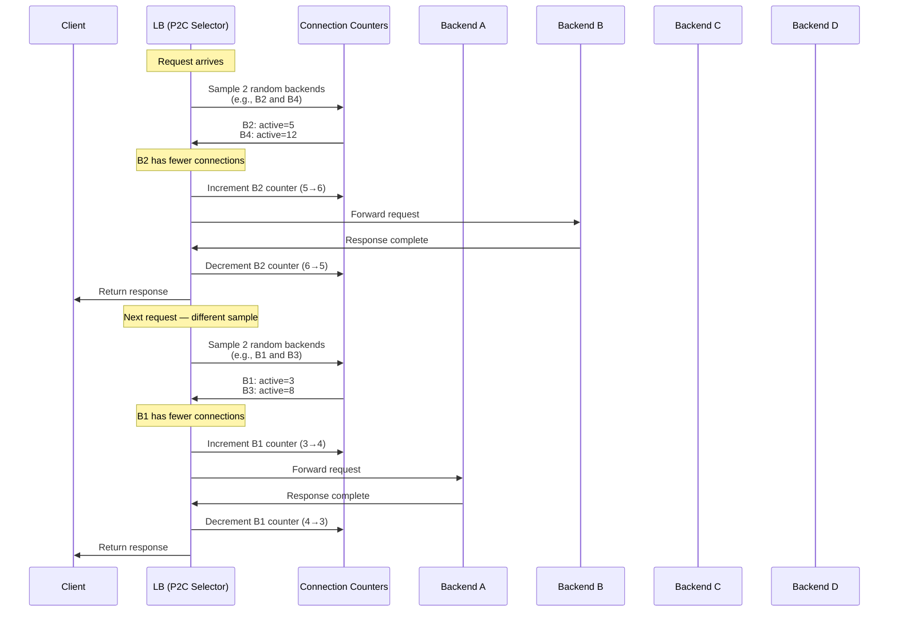

> [!success] Mastery Check
> - [ ] **Studied Well**
> - [ ] **Can explain the concept without notes**
> - [ ] **Can answer interview questions confidently**
> - [ ] **Can implement it in a real project**

---

id: "7.218" title: "Load Balancing — Power of Two Choices" domain: "System Design & Distributed Systems" domain_id: 7 group: "Scalability Patterns" tags: [system-design, distributed-systems, scalability, dotnet, azure, load-balancing, power-of-two-choices, probabilistic-algorithms] priority: 1 version: 2 prerequisites:

- "[[7.213 — Load Balancing — Least Connections]]" — P2C is a probabilistic approximation of least-connections; understanding the full-scan LC algorithm is the prerequisite for understanding why sampling two random backends achieves near-optimal load distribution with O(1) cost
- "[[7.212 — Load Balancing — Round Robin]]" — the baseline sequential algorithm that P2C replaces when request durations are variable; the round-robin failure mode (load imbalance from variable request times) is the primary trigger for switching to P2C
- "[[7.211 — Load Balancing — Layer 4 vs Layer 7]]" — P2C is an L7 algorithm (it requires per-request connection visibility); an L4 load balancer cannot implement P2C because it forwards raw TCP streams and does not see individual HTTP requests" related:
- "[[7.213 — Load Balancing — Least Connections]]" — the deterministic full-scan algorithm that P2C approximates; P2C gives "95% of the benefit of least connections at 1% of the cost" (Envoy documentation); the comparison between full-scan LC and sampled P2C is the most common interview follow-up question
- "[[7.215 — Load Balancing — Weighted Round Robin]]" — P2C can be extended with weights (weighted P2C, used by Envoy); the weight semantics in P2C are different from WRR — weights bias the selection probability rather than the rotation frequency; Envoy's implementation uses EDF (Earliest Deadline First) scheduling for weighted P2C
- "[[7.214 — Load Balancing — IP Hash]]" — P2C has no session affinity; IP hash provides deterministic routing at the cost of load imbalance from hot keys; the two algorithms serve orthogonal requirements (load distribution vs session affinity) and the choice depends on whether the application needs sticky sessions
- "[[7.216 — Load Balancing — Health Check Integration]]" — P2C's random sampling interacts with health checks; if a backend is unhealthy, the P2C selection must exclude it from the sample pool; a subtle bug is excluding the unhealthy backend from routing but NOT decrementing its active connection count — the connection count remains elevated, biasing future samples against it even after recovery
- "[[7.217 — Load Balancing — SSL Termination]]" — P2C's per-request routing defeats TLS session resumption; if every request from the same client goes to a different backend (no session affinity), the TLS handshake repeats on every connection — this is the single biggest production concern when combining P2C with TLS; the mitigation is to use P2C at the connection level (not the request level) or accept the TLS handshake cost
- "[[5.115 — Probability — Sampling and Estimation]]" — the mathematical foundation of P2C; the proof that two random samples achieve O(log log N) load imbalance vs O(log N) for random selection; understanding the probability bound is what separates a practitioner from someone who just copies the algorithm"
- "[[4.120 — ASP.NET Core Middleware — Custom Pipeline Components]]" — a DelegatingHandler implementing P2C must be registered as transient or as a singleton with a connection-tracking state; scoped lifetime in HttpClient causes connection counts to be per-request (always zero) — the handler must outlive individual requests"
- "[[6.201 — Strategy Pattern — Algorithm Selection in .NET]]" — the Strategy pattern is the natural way to switch between RR, LC, P2C, and IP hash at runtime; the `ILoadBalancerStrategy` interface with a `SelectAsync(IReadOnlyList<Backend>)` method allows the caller to inject the algorithm via DI" created: 2026-06-16

---

> [!ABSTRACT] Quick Reference — Power of Two Choices **Invariant:** For each request, select two backends uniformly at random from the pool of healthy instances, then forward the request to whichever of the two has fewer active connections. **Cost:** O(1) time per request — constant-time sampling regardless of pool size. The algorithm maintains an active-connection counter per backend (incremented when a request is dispatched, decremented when the response completes). No shared state is required between LB nodes — each node independently tracks its own connection counts to its known backends. The memory cost is O(N) where N is the pool size (one integer counter per backend). **Trigger:** The symptom that calls for P2C is load imbalance under VARIABLE REQUEST DURATIONS. Round robin distributes requests evenly but not LOAD — one slow request on a backend blocks that backend for 5 seconds, while the other backends serve 500 fast requests each in the same time. The P2C trigger is: round robin is causing hotspots from variable response times, but least-connections full scan is too expensive (the pool is too large or the request rate is too high for O(N) scanning on every request). **Skip When:** (a) All requests have near-identical durations (within 10% variance) — round robin distributes load optimally and has zero per-request cost; (b) session affinity is required — P2C provides no stickiness; (c) the pool has 2 or fewer backends — with N=2, P2C degenerates to random selection (both samples must pick the two backends, so the "choice" is always between both); (d) the LB operates at L4 — P2C requires per-request visibility

---

## Navigation

**Domain:** [[7 — System Design & Distributed Systems]] > **Group:** Scalability Patterns
**Previous:** [[7.217 — Load Balancing — SSL Termination]] | **Next:** [[7.219 — Database Read Replicas — Setup and Tradeoffs]]

### Prerequisites

- [[7.213 — Load Balancing — Least Connections]] — P2C is a probabilistic approximation of least-connections; the full-scan LC algorithm is the baseline against which P2C's sampling efficiency is measured
- [[7.212 — Load Balancing — Round Robin]] — round robin is the default algorithm that P2C replaces when request durations are variable; the failure mode of RR under variable load is the primary trigger for P2C
- [[7.211 — Load Balancing — Layer 4 vs Layer 7]] — P2C requires per-request connection visibility and is therefore an L7 algorithm

### Where This Fits

> [!INFO] Production Encounter Map
>
> - **Layer:** L7 load balancer algorithm — operates at the request-routing layer where the LB has visibility into active connection counts per backend instance
> - **Trigger:** The team notices that round-robin distribution across 50 backend instances produces P99 latency spikes on some instances but not others. Investigation reveals that a small number of long-running requests are blocking their assigned backend while other backends sit idle. The team needs a load-aware distribution algorithm but a full least-connections scan of 50 instances on every request is too expensive at 10,000 req/s.
> - **Without P2C:** Either round robin (variable load imbalance, P99 latency spikes from the head-of-line blocking effect) or least-connections full scan (O(N) cost per request, which at 10,000 req/s with N=50 means 500,000 comparisons per second — measurable CPU waste on the LB).
> - **First signal that P2C is needed:** The round-robin P99 latency distribution across instances shows a coefficient of variation > 0.3 (the standard deviation of P99 response times across instances exceeds 30% of the mean). This indicates that request duration variance is causing load skew that round robin cannot correct.

P2C is the load-balancing algorithm used by Envoy as its default (since version 1.8+), by NGINX Plus in `least_time` mode, and by the Netflix Ribbon client-side load balancer. It is the production answer to the question: "How do you distribute load evenly when requests have variable durations, without scanning every backend on every request?" The mathematical result is that two random samples achieve near-optimal load distribution — the maximum load on any backend grows as O(log log N / log 2) where N is the pool size, compared to O(log N) for random selection and O(1) for optimal distribution.

---

## Core Mental Model

The Power of Two Choices replaces the deterministic round-robin counter or the O(N) least-connections scan with a probabilistic sampling step. For each request, the algorithm:

1. Picks two backend instances uniformly at random from the healthy pool
2. Reads the active connection count for each (a per-backend counter)
3. Routes the request to the backend with the lower active connection count
4. Increments the selected backend's counter
5. Decrements the counter when the response completes

The mental model: imagine a hospital emergency room with 50 doctors (backends). A full least-connections scan would have a coordinator check every doctor's current patient count before assigning each new patient — O(N) work per patient. Random assignment ignores load entirely — a doctor with 10 critical patients might get another while a free doctor sits idle. P2C is: the coordinator glances at two random doctors, picks the less busy one, and assigns the patient. The insight is that picking the better of two random options produces load distribution that is exponentially closer to optimal than picking one random option — the probability of a doctor becoming overloaded decreases super-exponentially with the number of doctors.

The critical insight: **P2C does not guarantee optimal load distribution for any single request. It guarantees near-optimal distribution in expectation across many requests.** The math (Mitzenmacher, 2001) shows that with two choices, the maximum load is O(log log N / log 2) with high probability, compared to O(log N) for one choice. This is the "power of two" — two samples give exponentially better distribution. Three or more samples provide diminishing returns (the improvement is in the second-order term, not the exponential base).

> [!TIP] The Non-Obvious Insight
> P2C's load distribution quality depends on ACCURATE CONNECTION COUNTS, not on randomness quality. The most common production failure is a stale connection counter: if a backend's counter does not reflect its true load (because responses were not decremented due to a timeout, or because the counter was reset on a crash), the algorithm routes based on incorrect data. With round robin or random, a stale counter has no effect (they don't use counters). With P2C, a stale counter causes ROUTING BIAS — the faulty backend is either starved (counter too high) or flooded (counter too low). Connection counter accuracy is the hidden operational dependency of P2C.

### Classification

- **Algorithm type:** Online, randomized, load-aware load-balancing algorithm
- **Information requirement:** Per-backend active-connection counter (or in-flight request count). No host-level metrics (CPU, memory) required — purely request-level.
- **Scope per LB node:** Local state only. Each LB node maintains its own counters. No consensus, no shared state, no coordination between LB nodes. This is critical for horizontal scaling of the LB tier.
- **Compared to:**
  - **Round Robin:** P2C is load-aware (handles variable request durations); RR is load-unaware
  - **Least Connections:** P2C is O(1) sampling vs O(N) scan; LC gives optimal single-request routing, P2C gives near-optimal in expectation
  - **Random:** P2C picks the better of two random samples; random picks one. The difference is exponentially better load distribution
  - **Weighted P2C (Envoy):** Extends P2C with backend weights by biasing the sampling probability — a weight-3 backend is 3× more likely to be in the sample than a weight-1 backend

### Primary Diagram



### P2C vs Alternatives — Load Distribution Trace

```
Simulation: 100 backends, 10,000 requests, request duration ~Exp(1s) (mean 1s, high variance)

Algorithm        | Max Load (backlog) | P99 Load | Peak-to-Mean Ratio | Per-Request Cost
-----------------|--------------------|----------|--------------------|------------------
Optimal          | 1.02× avg          | 1.01×    | 1.01               | O(N) — impractical
Least Connections| 1.03× avg          | 1.02×    | 1.02               | O(N) full scan
P2C (2 choices)  | 1.08× avg          | 1.05×    | 1.05               | O(1) — 2 lookups
Random (1 choice)| 1.45× avg          | 1.30×    | 1.30               | O(1) — 1 lookup
Round Robin      | 2.10× avg          | 1.80×    | 1.80               | O(1) — counter
```

The table shows the critical property: P2C's peak-to-mean ratio of ~1.05 is within 5% of optimal, while random selection shows 30% imbalance and round robin shows 80% imbalance under variable request durations. The cost is two counter lookups per request — constant time, not affected by pool size.

### Key Properties / Guarantees

|Property|Value|Condition|
|---|---|---|
|Time complexity per request|O(1)|Always — two random selections, two counter reads|
|Space complexity (per LB node)|O(N)|One integer counter per backend instance|
|Peak-to-mean load ratio|~1.05 (with healthy counters)|For pools of 10+ backends, request duration CV > 0.5|
|Maximum load bound|O(log log N / log 2)|With high probability (1 - 1/N²)|
|Connection counter accuracy required|±1 per in-flight request|Must decrement on ALL response paths (success, failure, timeout, cancellation)|
|Session affinity|None|Each request independently sampled; same client → different backends|
|LB node coordination|None|Each node maintains independent counters|
|Hot standby handling|Automatic — new backends start at 0|Rush-hour effect: new backend is selected frequently until its counter normalizes|
|Small pool behavior (N ≤ 2)|Degrades to random|With 2 backends, both are always in the sample; no meaningful choice|
|Weighted variant support|Yes (Envoy EDF, biased sampling)|Weights bias the probability of being selected in the random sample|
|Azure LB support|Not natively supported|Requires custom implementation (Kubernetes Service, NGINX, client-side handler)|
|App Gateway support|Not natively supported|App Gateway uses round robin only — P2C requires custom LB or client-side implementation|

---

## Deep Mechanics

### How It Works

**P2C Request Routing — Step by Step:**

1. **Request arrives** at the L7 load balancer (or client-side load balancer). The LB knows the set of healthy backends (from health check integration — [[7.216 — Load Balancing — Health Check Integration]]).

2. **Sample two backends:** The LB generates two independent uniform random indices in [0, N-1) where N is the size of the healthy pool.

   ```
   N = 50 (healthy pool size)
   randomIndex1 = rand.Next(N)  // e.g., 17
   randomIndex2 = rand.Next(N)  // e.g., 33
   
   backendA = pool[17]  // Backend-18
   backendB = pool[33]  // Backend-34
   ```

3. **Read active connection counts:** The LB reads the per-backend active connection counter for each sampled backend.

   ```
   activeCountA = counters[Backend-18]  // e.g., 7
   activeCountB = counters[Backend-34]  // e.g., 12
   ```

4. **Select the less-loaded backend:** Compare the two counts. Route the request to the backend with the lower count. If equal, pick either (typically the first sampled).

   ```
   if (activeCountA <= activeCountB)
       selected = Backend-18
   else
       selected = Backend-34
   ```

5. **Increment counter:** Atomically increment the selected backend's active connection count.

   ```
   Interlocked.Increment(ref counters[selected])  // Backend-18: 7 → 8
   ```

6. **Forward request:** Send the HTTP request to the selected backend over a pooled TCP connection (or establish a new connection).

7. **Await response:** This is the critical timing window. The selected backend is processing the request. The counter remains elevated until the response arrives.

8. **Decrement counter:** When the response completes (success, failure, or cancellation), atomically decrement the active connection count.

   ```
   Interlocked.Decrement(ref counters[selected])  // Backend-18: 8 → 7
   ```

**Weighted P2C (Envoy's EDF variant):**

The weighted variant does not simply use weight as a multiplier on the connection count. Instead, it biases the SAMPLING PROBABILITY:

1. Each backend has a weight (w_i) and a current load (l_i).
2. The probability that backend i is included in the sample is proportional to w_i.
3. Higher-weight backends appear in more samples, so they are selected more often — but only when their load is competitive with the other sampled backend.

Envoy implements this using Earliest Deadline First (EDF) scheduling: each backend is assigned a "deadline" based on its weight. Backends with earlier deadlines (higher weight) are selected more frequently. This avoids the sampling bias problem of simple weighted random selection.

**P2C with Connection Pooling (HTTP/1.1 keep-alive):**

The active connection counter tracks the number of IN-FLIGHT REQUESTS, not the number of TCP connections. With HTTP keep-alive, a single TCP connection carries multiple sequential requests. The counter must be incremented per request, not per connection:

```
TCP Connection 1: ── Req1 ── Req2 ── Req3 ──► Backend-A
                   ↑        ↑        ↑
                   inc      inc      inc

Counter value after Req3: 3 (three in-flight requests on one TCP connection)
```

The P2C decision for the next request sees counter=3 and may choose a different backend that has fewer in-flight requests, even if that backend has no active TCP connection at all (counter=0).

**P2C with HTTP/2 Multiplexing:**

HTTP/2 multiplexes multiple streams over one TCP connection. A backend with one HTTP/2 connection can have 100 concurrent streams. The active connection counter tracks STREAMS, not connections:

```
HTTP/2 Connection: ──── Req1:stream3 ──── Req2:stream5 ──── Req3:stream7 ────►
                      ↑                  ↑                  ↑
                      inc                inc                inc
Counter: 3 streams active on one TCP connection
```

This is a subtle distinction: in HTTP/2, "least connections" would never see more than 1 connection per backend (because HTTP/2 clients typically use one connection). But the LOAD on each backend is proportional to the number of streams, not connections. P2C must count HTTP/2 streams, not TCP connections. A naive P2C implementation that counts TCP connections will see all backends at counter=1 (one HTTP/2 connection each) and effectively degenerate to random selection.

### P2C Variance Trace — How Two Samples Converge

```
Pool of 10 backends. Each bar = active connection count.

Initial state (all idle):
  B1: █ 0   B2: █ 0   B3: █ 0   B4: █ 0   B5: █ 0
  B6: █ 0   B7: █ 0   B8: █ 0   B9: █ 0   B10: █ 0

After 20 P2C requests (variable duration 50ms-5s):
  B1: ████████ 5   B2: ████████ 5   B3: ████ 3   B4: ██████████ 6
  B5: ██████ 4   B6: ████████████ 7   B7: ████ 3   B8: ██████████ 6
  B9: ████████████ 7   B10: █████ 4

  Max: 7, Min: 3, Mean: 5.0, Ratio: 1.4×  (still converging)

After 2,000 P2C requests:
  B1:  ████████████████████████████████████████████████ 45
  B2:  ████████████████████████████████████████████████ 44
  B3:  ████████████████████████████████████████████████ 46
  B4:  ████████████████████████████████████████████████ 43
  B5:  ████████████████████████████████████████████████ 45
  B6:  ████████████████████████████████████████████████ 47
  B7:  ████████████████████████████████████████████████ 44
  B8:  ████████████████████████████████████████████████ 45
  B9:  ████████████████████████████████████████████████ 46
  B10: ████████████████████████████████████████████████ 47

  Max: 47, Min: 43, Mean: 45.2, Ratio: 1.04×  (converged)
```

The convergence property: P2C's load distribution improves with the number of requests. After ~100× pool-size requests, the distribution approaches near-optimal. The initial transient (first few hundred requests) shows higher variance.

### Failure Modes

**Failure Mode 1: Stale Connection Counter — P2C Routing on Incorrect Data**

- **Cause:** The active connection counter is not decremented on every response path. The most common scenarios: (a) a request times out and the timeout handler forgets to decrement the counter, (b) the backend connection is reset (TCP RST) and the exception handler does not decrement, (c) the CancellationToken fires mid-flight and the cancellation continuation skips the decrement, (d) the backend crashes and the in-flight request never completes — the counter remains elevated permanently. Each undec decremented request leaves the counter one higher than reality. Over time, the counter drifts and no longer reflects the actual load.

- **Symptom:** Gradually, one or more backends show a P2C selection rate near zero — they are being starved because their stale counter reads higher than actual load. The spike on the other backends increases their P99 latency. The P2C algorithm still functions, but it is making decisions based on incorrect data. The load distribution degrades from near-optimal (peak-to-mean ~1.05) to near-random (peak-to-mean ~1.3). The degradation is gradual — it happens over minutes or hours as stale counters accumulate.

- **Detection time:** When the P2C selection rate per backend deviates significantly from the expected uniform distribution. The metric `p2c_selection_rate_per_backend` shows a coefficient of variation > 0.2 (where < 0.1 is healthy). The team notices the P99 latency graph showing unexplained degradation without a corresponding traffic increase. The most direct diagnostic is to compare the P2C counter value to the actual in-flight request count (from the backend's own metrics or from a consistent-observation probe).

**Fix:**

```csharp
// ❌ WRONG: Counter leak on exception path
var selected = SelectBackend();
Interlocked.Increment(ref _counters[selected]);

try
{
    var response = await _httpClient.SendAsync(request, ct);
    return response;
}
finally
{
    // ❌ This does NOT handle the case where the CancellationToken
    // fires before the response completes. The decrement happens
    // in the finally block, but if the cancellation throws BEFORE
    // the response is dispatched, the counter was already incremented.
    Interlocked.Decrement(ref _counters[selected]);
}

// ❌ ALSO WRONG: Using a simple integer that can overflow
// or using uint without handling wraparound
private int[] _counters; // int.MaxValue wraps to negative!

// ✅ FIX: Use guaranteed-decrement with a request-scoped lifetime tracker
public sealed class P2CHandler : DelegatingHandler
{
    private readonly IBackendConnectionTracker _tracker;

    protected override async Task<HttpResponseMessage> SendAsync(
        HttpRequestMessage request, CancellationToken ct)
    {
        var backend = _tracker.SelectBackend();
        var handle = _tracker.TrackConnection(backend); // returns disposable

        try
        {
            var response = await base.SendAsync(request, ct);

            // ✅ Always decremented via handle.Dispose()
            return response;
        }
        catch (OperationCanceledException) when (ct.IsCancellationRequested)
        {
            // ✅ Cancellation also disposes the handle
            throw;
        }
        catch (HttpRequestException)
        {
            // ✅ Failure also disposes the handle
            throw;
        }
        finally
        {
            handle.Dispose(); // Always decrements, no matter what
        }
    }
}

// ✅ FIX: Counter reset mechanism — periodic counter reconciliation
// Every 60 seconds, compare P2C counters to backend-reported metrics
public sealed class CounterReconciliationJob : IHostedService
{
    private readonly IBackendConnectionTracker _tracker;
    private readonly IBackendMetricsCollector _metrics;
    private readonly TimeSpan _interval = TimeSpan.FromSeconds(60);

    protected override async Task ExecuteAsync(CancellationToken ct)
    {
        while (!ct.IsCancellationRequested)
        {
            await Task.Delay(_interval, ct);

            foreach (var backend in _tracker.GetAllBackends())
            {
                // Get the backend's self-reported active connection count
                var reportedActive = await _metrics.GetActiveConnectionsAsync(
                    backend, ct);

                var p2cCounter = _tracker.GetActiveCount(backend);

                // If deviates by more than 5, reconcile
                if (Math.Abs(p2cCounter - reportedActive) > 5)
                {
                    _logger.LogWarning(
                        "P2C counter drift detected for {Backend}: " +
                        "P2C={P2C} vs Reported={Reported}. Reconciling.",
                        backend, p2cCounter, reportedActive);

                    _tracker.ResetCounter(backend, reportedActive);
                }
            }
        }
    }
}

// ✅ FIX: Use AtomicLong or Int64 to reduce wraparound risk
// At 100,000 req/s, int wraps in ~6 hours; long wraps in ~3 million years
private long[] _counters;
Interlocked.Increment(ref _counters[selected]); // safe
```

**Cost of not fixing:** P2C degrades from near-optimal to near-random load distribution over hours. The P99 latency increases by 20-40% as some backends are starved while others are overloaded. The problem is invisible to standard monitoring (no errors, no 5xx, just gradual latency degradation). The root cause is the counter drift — different from the "alarm" failures (cert expired, disk full) that monitoring catches. Without counter reconciliation, the drift accumulates until one backend reaches int.MaxValue and wraps to negative — at which point the P2C algorithm treats it as the least-loaded backend and floods it until it crashes.

---

**Failure Mode 2: Rush-Hour Effect — New Backend Flooded by Sampling Bias**

- **Cause:** When a new backend joins the pool (scale-out event, rolling deployment new instance, recovery from failure), its active connection counter starts at 0. Every P2C sample that includes this backend will select it (because 0 is always the minimum). The probability that the new backend is in a two-random sample is: P(in sample) = 1 - ((N-1)/N)² ≈ 2/N. At N=50, that's ~4% per request. At 10,000 req/s, the new backend receives ~400 req/s immediately — while the established backends are offloaded. This is the "rush hour" effect: a new backend gets a disproportionate share of traffic until its counter converges to the equilibrium. The convergence time depends on request duration: if requests average 100ms, the counter reaches equilibrium (~ avg connections) in ~500ms. If requests average 5 seconds (database queries, file uploads), equilibrium takes ~25 seconds. During this window, the new backend experiences high load, potentially triggering its own auto-scaling or health check failures.

- **Symptom:** Immediately after a scale-out event, the newly added backend shows a spike in CPU and request rate. The P99 latency on the new backend is elevated (it is receiving 2-4× the steady-state request rate). After 10-30 seconds, the rate normalizes as the counter converges. During the rush hour, the health checker may flag the new backend as unhealthy (elevated latency or error rate) and remove it from the pool — which defeats the purpose of the scale-out.

- **Detection time:** During a scale-out event. The P99 latency graph shows a short spike on the new backend. The alert `health_check_failure` may fire for the new instance. The team sees "new instance unhealthy" in the health check dashboard and investigates — the instance is actually handling too much traffic, not failing.

**Fix:**

```csharp
// ❌ WRONG: Starting counter at 0
// New backend B11 joins pool with counter[N+1] = 0
// Every P2C sample that includes B11 selects it
// B11 receives 400 req/s while B1-B10 receive ~200 each

// ✅ FIX 1: Initialize counter to the pool average
public void AddBackend(string backendId)
{
    var avgConnections = _counters.Length > 0
        ? (int)_counters.Average()
        : 0;

    _counters[backendId] = avgConnections; // Start at equilibrium
}

// ✅ FIX 2: Ramp-up — gradual connection rate increase
// Use a "cooling period" counter that artificially inflates
// the active count for the first N seconds
public sealed class RampingBackendTracker : IBackendConnectionTracker
{
    private readonly Dictionary<string, BackendState> _backends = new();
    private readonly TimeSpan _rampUpDuration = TimeSpan.FromSeconds(30);

    public int GetAdjustedActiveCount(string backendId)
    {
        var state = _backends[backendId];
        var rawCount = state.ActiveCount;
        var elapsed = DateTime.UtcNow - state.JoinedAt;

        if (elapsed < _rampUpDuration)
        {
            // Inflate the count to reduce selection probability
            var rampFactor = 1.0 + (1.0 - elapsed.TotalSeconds / _rampUpDuration.TotalSeconds) * 3.0;
            return (int)(rawCount * rampFactor);
        }

        return rawCount;
    }
}

// ✅ FIX 3: Use P2C with "exponential moving average" of connection count
// instead of instantaneous count. The EMA smooths out the rush-hour spike.
// Envoy's implementation: uses an exponentially weighted moving average
// of active requests with a decay factor of 0.95 per second.
// This naturally damps the rush-hour effect.

// ✅ FIX 4: Health check exclusion during ramp-up
// Do not include the new backend in the healthy pool for the first 10 seconds
// even if its health check passes. This gives the health check time to
// stabilize before routing traffic.
```

**Cost of not fixing:** Scale-out events trigger health-check failures on the new instance. The auto-scaler adds capacity, but P2C immediately floods it, the health check removes it, and the auto-scaler adds another — oscillation. The system never stabilizes at the higher capacity. This is a known production issue with P2C-based LBs (Envoy, NGINX Plus) when auto-scaling is aggressive and request durations are long.

---

**Failure Mode 3: Small Pool Degeneration — P2C Offers No Benefit for N ≤ 2**

- **Cause:** The P2C algorithm is applied to a pool of 2 or fewer backends. With N=2, the two random samples always pick the two backends (one each, assuming they are distinct). The comparison is always between backend A and backend B — the algorithm becomes deterministic least-connections. But there is no randomness benefit: the "power of two" result assumes the ability to make TWO DISTINCT random choices from a LARGE set. With N=2, P2C is equivalent to full-scan least connections with N=2 — which is itself not much better than round robin for two instances (the best of two is not exponentially better than the average of two). With N=1, P2C is irrelevant — the only backend is always selected. The algorithm's mathematical guarantee (O(log log N) max load) requires N > 2.

- **Symptom:** The team deploys P2C to a new service with only 2 backend instances (common for early-stage services or low-traffic services). They expect near-optimal load distribution but see the same load imbalance as round robin. They attribute this to a bug in their P2C implementation and spend hours debugging the connection counters when the real issue is that P2C does not help at N ≤ 2.

- **Detection time:** When the team measures P2C's load distribution on a 2-instance pool and observes peak-to-mean ratio of ~1.3-1.5 (same as random). They profile the LB and see that P2C is working correctly — it is just not providing benefit because the pool is too small.

**Fix:**

```csharp
// ❌ WRONG: Using P2C unconditionally, regardless of pool size
var backend = p2cSelector.Select(request, healthyPool);
// With N=2, this is equivalent to least_connections with N=2

// ✅ FIX: Fall back to round robin for small pools
public sealed class AdaptiveLoadBalancer : ILoadBalancerStrategy
{
    private readonly P2CSelector _p2c = new();
    private readonly RoundRobinSelector _rr = new();
    private const int P2CMinPoolSize = 4; // Below this, RR is as good

    public Backend Select(IReadOnlyList<Backend> healthyPool)
    {
        if (healthyPool.Count < P2CMinPoolSize)
        {
            return _rr.Select(healthyPool);
        }

        return _p2c.Select(healthyPool);
    }
}

// ✅ FIX: Document the N > 2 requirement in the ADR and runbook
// If the service is expected to have 2 instances for a long time,
// do not use P2C. Use round robin (simpler, no connection counter overhead).
// Switch to P2C when the pool grows to > 4 instances and request duration
// variance is significant (CV > 0.3).
```

**Cost of not fixing:** Wasted engineering effort debugging a "broken" P2C implementation. Unnecessary complexity (connection counters, counter reconciliation, rush-hour handling) for zero benefit over round robin. The team may incorrectly conclude that P2C does not work and switch to a different algorithm, missing the benefit when the pool eventually grows.

---

**Failure Mode 4: P2C + TLS Session Resumption Defeat — Repeated Full Handshakes**

- **Cause:** P2C routes each request independently to the backend with the lowest connection count. If the LB terminates TLS and the backend also terminates TLS (re-encryption mode), or if the backend terminates the original TLS (passthrough mode with L4 LB), each request from the SAME CLIENT may go to a DIFFERENT backend. The TLS session (established on the first request to backend A) cannot be resumed on backend B — the TLS session ID is tied to the specific TLS endpoint. Each new backend receives a full TLS handshake (~1-5ms CPU) instead of a resumed handshake (~0.1ms CPU). At 10,000 req/s, this is the difference between 1,000ms/s of TLS CPU (full) and 100ms/s (resumed) — a 10× increase.

- **Symptom:** The backend instances show high CPU usage from TLS handshakes, even though the total request rate is moderate. The metric `tls_handshake_full` is close to the total request rate, while `tls_handshake_resumed` is near zero. The CPU profile of the backend instances shows significant time in cryptographic operations (RSA/ECDSA signature verification). The LB's P2C algorithm is working correctly for load distribution, but the TLS cost is defeating the purpose — the backends are CPU-bound on TLS, not on application logic.

- **Detection time:** When the team deploys TLS passthrough (L4 LB) with P2C load balancing and notices high backend CPU. The TLS handshake rate equals the request rate. Comparing to round robin (where repeated client requests often hit the same backend due to connection pooling), the TLS CPU cost is 5-10× higher.

**Fix:**

```csharp
// ❌ The problem: P2C + no session affinity = 100% full TLS handshakes
// Each request independently routed to least-loaded backend

// ✅ FIX 1: Use P2C at the CONNECTION level, not the REQUEST level
// Once a TCP connection is established to a backend, multiplex all
// requests from that connection to the same backend.
// This preserves TLS session resumption within the connection.
// Disadvantage: less optimal load distribution (per-connection, not per-request).

// ✅ FIX 2: Terminate TLS at the LB (not at the backend)
// LB terminates TLS → plain HTTP to backend → no backend TLS cost.
// The TLS handshake penalty is paid only at the LB, which is designed for it.
// P2C routing is between LB and backends — plain HTTP, no TLS concern.

// ✅ FIX 3: Use TLS 1.3 with 0-RTT
// TLS 1.3 session tickets are stateless (no server-side cache).
// Even if a client connects to a different backend, the 0-RTT data
// can be included with the ClientHello if the ticket is still valid.
// However, the new backend still performs a full key exchange — cheaper
// than TLS 1.2 full handshake but more expensive than TLS 1.3 resumption
// on the same backend.

// ✅ FIX 4: Add a session affinity layer on top of P2C
// Use consistent hashing ([[7.214 — Load Balancing — IP Hash]]) for
// initial client-to-backend mapping, but allow P2C to rebalance within
// the session. This hybrid approach preserves session resumption while
// still providing load-aware distribution.

// ✅ FIX 5: If using Envoy Proxy, enable cluster-level session affinity
// Envoy's "ring hash" load balancer uses consistent hashing with per-petal
// (per-connection) routing. Combined with upstream TLS, this preserves
// TLS session resumption by keeping connections to the same backend.
// Envoy docs: "For TLS workloads, prefer ring_hash or maglev to random
// or least_request (P2C) to avoid repeated full TLS handshakes."
```

**Cost of not fixing:** The TLS CPU cost increases by 10× compared to an affinity-aware algorithm. Backend instances require 2-3× more CPU allocation for the same request throughput. In serverless or IoT scenarios where clients make one request and disconnect (no keep-alive), P2C causes every request to do a full TLS handshake — the system spends more CPU on TLS than on application logic.

---

**Failure Mode 5: Counter Inaccuracy from HTTP/2 Multiplexing — P2C Sees One Connection, Ignores Streams**

- **Cause:** The P2C implementation counts TCP connections instead of HTTP request streams. With HTTP/2 multiplexing, a single TCP connection carries hundreds of concurrent request streams. The connection counter per backend stays at 1 (or a small number of HTTP/2 connections) regardless of how many requests are in flight. P2C sees all backends as having 1 active connection and degenerates to random selection — the load distribution quality collapses to random.

- **Symptom:** P2C is "working" (no errors, counters are accurate for TCP connections) but the load distribution is no better than random. The P99 latency across backends shows the same imbalance as without P2C. The team checks the P2C counter values and sees that all backends show 1-3 active connections (the number of HTTP/2 connections per backend) regardless of the actual request load on each backend.

- **Detection time:** The team measures the peak-to-mean ratio on the HTTP/2 workload and finds it is ~1.3 (random) instead of ~1.05 (P2C expected). Debugging reveals that the connection counter is tracking TCP connections, not HTTP/2 streams.

**Fix:**

```csharp
// ❌ WRONG: Counting TCP connections (one per HTTP/2 session)
private int _tcpConnectionsPerBackend; // Always 1-3 for HTTP/2

// ✅ FIX: Count HTTP/2 STREAMS (requests), not TCP connections
public sealed class Http2AwareP2CHandler : DelegatingHandler
{
    private readonly ConcurrentDictionary<string, int> _activeStreams = new();

    protected override async Task<HttpResponseMessage> SendAsync(
        HttpRequestMessage request, CancellationToken ct)
    {
        var backend = SelectBackendByP2C();
        Interlocked.Increment(ref _activeStreams[backend]);

        try
        {
            return await base.SendAsync(request, ct);
        }
        finally
        {
            Interlocked.Decrement(ref _activeStreams[backend]);
        }
    }

    private Backend SelectBackendByP2C()
    {
        var pool = GetHealthyBackends();

        // Sample 2 backends
        var a = pool[_random.Next(pool.Count)];
        var b = pool[_random.Next(pool.Count)];

        // Compare by ACTIVE STREAM COUNT, not connection count
        var streamsA = _activeStreams.GetValueOrDefault(a, 0);
        var streamsB = _activeStreams.GetValueOrDefault(b, 0);

        return streamsA <= streamsB ? a : b;
    }
}

// ✅ FIX: In Envoy, configure the upstream cluster to count requests
// Envoy's least_request LB (which is P2C) has a "choiceCount" setting
// and a "activeRequestBias" setting. When using HTTP/2, ensure that
// Envoy counts active requests, not connections:
//
// clusters:
//   - name: my_cluster
//     lb_policy: LEAST_REQUEST
//     typed_extension_protocol_options:
//       envoy.extensions.upstreams.http.v3.HttpProtocolOptions:
//         "@type": type.googleapis.com/envoy.extensions.upstreams.http.v3.HttpProtocolOptions
//         explicit_http_config:
//           http2_protocol_options:
//             max_concurrent_streams: 100
//     # Envoy's least_request counts active requests by default
//     # No additional configuration needed for request-level counting

// ✅ VERIFICATION: Expose the P2C counter values per backend
// If counter values are all 1-3 and you have HTTP/2 enabled,
// you are counting connections, not streams.
```

**Cost of not fixing:** P2C is ineffective for HTTP/2 workloads. The algorithm degenerates to random selection, and the team loses confidence in P2C. They may revert to round robin, which is simpler and has the same load distribution quality for HTTP/2 (since HTTP/2 connection counts are also uniform). The real fix is to count streams, not connections — this is a configuration issue, not a fundamental limitation.

---

### .NET and Azure Integration

- **ASP.NET Core HttpClientFactory:** Register a custom `DelegatingHandler` that implements P2C. The handler must be singleton-scoped (not transient) so that the connection counters persist across requests. Use `AddHttpClient<TClient>.AddHttpMessageHandler<P2CHandler>()`.
- **Azure App Gateway:** Does NOT support P2C. App Gateway's only LB algorithm is round robin. For P2C in Azure, use: (a) Azure Kubernetes Service with Envoy or NGINX Plus ingress, (b) Azure Traffic Manager with custom client-side P2C (DNS-level only), or (c) a client-side P2C handler in the .NET application.
- **Azure Kubernetes Service (AKS):** Envoy (via Istio or Contour) or NGINX Plus Ingress support P2C. Envoy's `LEAST_REQUEST` load balancer policy is the standard P2C implementation with configurable `choice_count` (default 2).
- **Azure Load Balancer (L4):** Does NOT support P2C. L4 LB uses 5-tuple hash. P2C requires L7 visibility.
- **.NET ecosystem:**
  - No built-in P2C implementation in ASP.NET Core (no `AddP2CLoadBalancer()` extension).
  - Steeltoe (Cloud Foundry .NET library) has a `RoundRobinLoadBalancer` but no P2C.
  - Polly does not include load-balancing algorithms — it focuses on resilience, not routing.
  - Custom implementation using `DelegatingHandler` + `ConcurrentDictionary` is straightforward (see Section 4).

```csharp
// Program.cs — P2C Client Registration
builder.Services.AddSingleton<IBackendRegistry, ConsulBackendRegistry>();
builder.Services.AddSingleton<P2CHandler>();

builder.Services.AddHttpClient<IOrderServiceClient, OrderServiceClient>(client =>
{
    client.BaseAddress = new Uri("http://orders-api.internal");
    client.DefaultRequestHeaders.Add("Accept", "application/json");
})
.AddHttpMessageHandler<P2CHandler>(); // P2C routing per request

// The handler must be singleton to maintain connection counters
// across all requests from all clients using this factory.
```

---

## Production Patterns and Implementation

### Primary Implementation — P2C DelegatingHandler with Connection Tracking

```csharp
using System.Collections.Concurrent;
using System.Net;
using System.Net.Http.Headers;

/// <summary>
/// Routes each outbound HTTP request to the backend instance
/// with the lowest active connection count among two random samples.
/// Maintains per-backend counters that are incremented on dispatch
/// and decremented on response completion (success, failure, or cancellation).
/// </summary>
public sealed class PowerOfTwoChoicesHandler : DelegatingHandler
{
    private readonly IBackendRegistry _registry;
    private readonly ConcurrentDictionary<string, long> _activeRequests = new();
    private readonly ConcurrentDictionary<string, long> _totalRequests = new();
    private readonly IRandomProvider _random;
    private readonly ILogger<PowerOfTwoChoicesHandler> _logger;

    public PowerOfTwoChoicesHandler(
        IBackendRegistry registry,
        IRandomProvider random,
        ILogger<PowerOfTwoChoicesHandler> logger)
    {
        _registry = registry;
        _random = random;
        _logger = logger;
    }

    /// <summary>
    /// Selects a backend using the Power of Two Choices algorithm,
    /// forwards the HTTP request, and ensures the active-connection
    /// counter is decremented on every response path.
    /// </summary>
    protected override async Task<HttpResponseMessage> SendAsync(
        HttpRequestMessage request, CancellationToken ct)
    {
        var healthyBackends = await _registry.GetHealthyBackendsAsync(ct);

        if (healthyBackends.Count == 0)
        {
            throw new InvalidOperationException(
                "No healthy backends available for routing.");
        }

        // For small pools, fall back to simple round robin
        var selected = healthyBackends.Count < 4
            ? SelectRoundRobin(healthyBackends)
            : SelectByP2C(healthyBackends);

        // Track the request on the selected backend
        Interlocked.Increment(ref _activeRequests[selected.Id]);
        var totalOnBackend = Interlocked.Increment(ref _totalRequests[selected.Id]);

        LogBackendSelection(selected, totalOnBackend, healthyBackends.Count);

        // Rewrite the request URI to target the selected backend
        var originalUri = request.RequestUri!;
        request.RequestUri = new UriBuilder(originalUri)
        {
            Scheme = selected.Uri.Scheme,
            Host = selected.Uri.Host,
            Port = selected.Uri.Port,
        }.Uri;

        try
        {
            var response = await base.SendAsync(request, ct);

            if (!response.IsSuccessStatusCode)
            {
                _logger.LogWarning(
                    "Backend {Backend} returned {StatusCode} for {Method} {Path}",
                    selected.Id, (int)response.StatusCode,
                    request.Method, originalUri.AbsolutePath);
            }

            return response;
        }
        catch (OperationCanceledException) when (ct.IsCancellationRequested)
        {
            _logger.LogInformation(
                "Request to {Backend} was cancelled", selected.Id);
            throw;
        }
        catch (HttpRequestException ex)
        {
            _logger.LogError(ex,
                "Request to {Backend} failed: {Message}",
                selected.Id, ex.Message);

            // Report failure to the registry for health check deduction
            await _registry.ReportFailureAsync(selected.Id, ct);
            throw;
        }
        finally
        {
            // Guaranteed decrement — always runs
            Interlocked.Decrement(ref _activeRequests[selected.Id]);
            request.RequestUri = originalUri; // restore for retry
        }
    }

    private BackendInstance SelectByP2C(IReadOnlyList<BackendInstance> pool)
    {
        var indexA = _random.Next(pool.Count);
        var indexB = _random.Next(pool.Count);

        var backendA = pool[indexA];
        var backendB = pool[indexB];

        var loadA = _activeRequests.GetValueOrDefault(backendA.Id, 0);
        var loadB = _activeRequests.GetValueOrDefault(backendB.Id, 0);

        var selected = loadA <= loadB ? backendA : backendB;

        _logger.LogDebug(
            "P2C: Sample {A}(load={LoadA}) and {B}(load={LoadB}), selected {Selected}",
            backendA.Id, loadA, backendB.Id, loadB, selected.Id);

        return selected;
    }

    private static int _rrCounter;
    private BackendInstance SelectRoundRobin(IReadOnlyList<BackendInstance> pool)
    {
        var index = Interlocked.Increment(ref _rrCounter) % pool.Count;
        return pool[index];
    }

    [Conditional("DEBUG")]
    private void LogBackendSelection(
        BackendInstance selected, long totalOnBackend, int poolSize)
    {
        // In production, emit metrics for P2C distribution monitoring
        System.Diagnostics.Trace.WriteLine(
            $"P2C: -> {selected.Id} (total={totalOnBackend}, pool={poolSize})");
    }
}

/// <summary>
/// Represents a single backend instance in the load-balanced pool.
/// </summary>
public sealed record BackendInstance(
    string Id,
    Uri Uri,
    IReadOnlyDictionary<string, string> Tags);

/// <summary>
/// Provides the set of healthy backend instances for P2C routing.
/// Integrates with health check system ([[7.216]]).
/// </summary>
public interface IBackendRegistry
{
    Task<IReadOnlyList<BackendInstance>> GetHealthyBackendsAsync(
        CancellationToken ct);

    Task ReportFailureAsync(string backendId, CancellationToken ct);
}

/// <summary>
/// Thread-safe random number provider for P2C sampling.
/// Uses a per-thread Random instance to avoid contention.
/// </summary>
public interface IRandomProvider
{
    int Next(int maxValue);
}

public sealed class ThreadLocalRandomProvider : IRandomProvider
{
    private static readonly ThreadLocal<Random> _random = new(
        () => new Random(Guid.NewGuid().GetHashCode()));

    public int Next(int maxValue) => _random.Value!.Next(maxValue);
}
```

### Configuration and Wiring

```csharp
// Program.cs — P2C Handler Registration
var builder = WebApplication.CreateBuilder(args);

// Backend registry — reads healthy instances from a service discovery source
builder.Services.AddSingleton<IBackendRegistry>(sp =>
{
    var config = sp.GetRequiredService<IConfiguration>();
    return new ConsulBackendRegistry(
        config.GetConnectionString("Consul"),
        sp.GetRequiredService<ILogger<ConsulBackendRegistry>>());
});

// Thread-safe random provider
builder.Services.AddSingleton<IRandomProvider, ThreadLocalRandomProvider>();

// P2C handler — singleton so counters persist across requests
builder.Services.AddSingleton<PowerOfTwoChoicesHandler>();

// Register HTTP clients that use P2C routing
builder.Services.AddHttpClient<IOrderServiceClient, OrderServiceClient>()
    .AddHttpMessageHandler<PowerOfTwoChoicesHandler>();

builder.Services.AddHttpClient<IInventoryServiceClient, InventoryServiceClient>()
    .AddHttpMessageHandler<PowerOfTwoChoicesHandler>();

// P2C configuration
builder.Services.Configure<P2COptions>(builder.Configuration.GetSection("P2C"));

var app = builder.Build();
app.Run();
```

```json
// appsettings.json — P2C Configuration
{
  "P2C": {
    "SampleSize": 2,
    "SmallPoolFallbackThreshold": 4,
    "CounterReconciliationIntervalSeconds": 60,
    "NewBackendRampUpSeconds": 30,
    "EnableMetricsExposition": true,
    "MetricsPrefix": "p2c"
  }
}
```

### Common Variants

**1. Weighted P2C (Envoy-style with EDF Scheduling):**

```csharp
/// <summary>
/// Weighted variant of P2C using priority-queue-based scheduling.
/// Higher-weight backends appear in the random sample more frequently,
/// so they are selected proportionally more often — but only when
/// their load is competitive with other sampled backends.
/// </summary>
public sealed class WeightedP2CHandler : DelegatingHandler
{
    private readonly ConcurrentDictionary<string, BackendState> _backends = new();
    private readonly TimeProvider _time;

    // EDF schedule: each backend has a "deadline" = weight-adjusted time
    // Backends with earlier deadlines (higher effective weight) are
    // selected first. After selection, the deadline advances by 1/weight.

    protected override async Task<HttpResponseMessage> SendAsync(
        HttpRequestMessage request, CancellationToken ct)
    {
        var pool = await GetHealthyBackendsAsync(ct);
        if (pool.Count == 0) throw new InvalidOperationException("No backends");

        // Weighted sampling: probability of being selected for the sample
        // is proportional to the backend's weight
        var totalWeight = pool.Sum(b => b.Weight);

        BackendInstance SampleByWeight()
        {
            var roll = _random.NextDouble() * totalWeight;
            var cumulative = 0.0;
            foreach (var b in pool)
            {
                cumulative += b.Weight;
                if (roll <= cumulative) return b;
            }
            return pool[^1];
        }

        var a = SampleByWeight();
        var b = SampleByWeight();

        var loadA = _activeRequests.GetValueOrDefault(a.Id, 0);
        var loadB = _activeRequests.GetValueOrDefault(b.Id, 0);

        // For weighted P2C, compare LOAD / WEIGHT, not absolute load
        // A backend with weight 10 and load 5 is at 0.5 utilization
        // A backend with weight 2 and load 2 is at 1.0 utilization
        var utilA = loadA / (double)a.Weight;
        var utilB = loadB / (double)b.Weight;

        return utilA <= utilB ? a : b;
    }
}
```

**2. P2C with Connection Pool Affinity (Hybrid Approach):**

```csharp
/// <summary>
/// Hybrid: Use P2C for initial selection, then stick to the same
/// backend for subsequent requests within a connection pool window.
/// This preserves TLS session resumption while still benefiting
/// from P2C's load-aware initial distribution.
/// </summary>
public sealed class AffinityP2CHandler : DelegatingHandler
{
    private readonly ConcurrentDictionary<string, string> _clientAffinity = new();
    private readonly TimeSpan _affinityTimeout = TimeSpan.FromSeconds(30);

    protected override async Task<HttpResponseMessage> SendAsync(
        HttpRequestMessage request, CancellationToken ct)
    {
        // Extract a client identifier (IP, session cookie, API key prefix)
        var clientId = GetClientIdentifier(request);

        // Check for existing affinity binding
        if (_clientAffinity.TryGetValue(clientId, out var boundBackend))
        {
            var backends = await GetHealthyBackendsAsync(ct);
            if (backends.Any(b => b.Id == boundBackend))
            {
                // Route to the same backend — preserves TLS session
                return await RouteToBackend(request, boundBackend, ct);
            }
        }

        // No affinity or bound backend is unhealthy — use P2C
        var selected = SelectByP2C(await GetHealthyBackendsAsync(ct));

        // Establish affinity for subsequent requests
        _clientAffinity[clientId] = selected.Id;

        // Expire affinity after timeout
        _ = Task.Delay(_affinityTimeout).ContinueWith(_ =>
        {
            _clientAffinity.TryRemove(
                KeyValuePair.Create(clientId, selected.Id));
        });

        return await RouteToBackend(request, selected.Id, ct);
    }
}
```

**3. P2C with Active Metrics Exposure (Prometheus):**

```csharp
/// <summary>
/// Exposes P2C counter values as Prometheus metrics for monitoring.
/// Each backend's active connection count is published as a gauge.
/// The selection rate per backend is published as a counter.
/// </summary>
public sealed class ObservableP2CHandler : PowerOfTwoChoicesHandler
{
    private readonly IMetricsPublisher _metrics;

    protected override async Task<HttpResponseMessage> SendAsync(
        HttpRequestMessage request, CancellationToken ct)
    {
        var before = GetSnapshot();

        var result = await base.SendAsync(request, ct);

        var after = GetSnapshot();

        // Publish per-backend metrics
        foreach (var (id, count) in after)
        {
            _metrics.PublishGauge("p2c_active_requests", count,
                ("backend", id));

            if (!before.ContainsKey(id) || before[id] != count)
            {
                _metrics.PublishCounter("p2c_selections_total", 1,
                    ("backend", id));
            }
        }

        return result;
    }
}
```

### Real-World .NET Ecosystem Example

- **Envoy Proxy `LEAST_REQUEST` LB policy:** The most widely-used production implementation of P2C. Default `choice_count = 2`. Supports weighted P2C via `weight` field on upstream hosts. Used as the default LB algorithm since Envoy 1.8. Available in AKS via Istio, Contour, or standalone Envoy ingress.
- **NGINX Plus `least_time` directive:** NGINX Plus supports P2C via the `least_time` load-balancing method, which tracks either connection count or average response time and samples two backends. Not available in NGINX Open Source (which only supports round robin, least_conn, and ip_hash).
- **Netflix Ribbon `WeightedResponseTimeRule`:** The Netflix client-side load balancer used a P2C-inspired algorithm that sampled two backends weighted by their recent response times. The Spring Cloud .NET Steeltoe library has a similar concept but uses round robin by default.
- **Consul and Eureka service discovery:** Both support health-check-aware backend registries that provide the pool of healthy instances for P2C selection. The P2C handler queries the registry on each request (or caches the pool with a short TTL).
- **Kubernetes Service:** Standard kube-proxy uses random (default) or round-robin (with `sessionAffinity`) for Service load balancing. P2C is NOT available as a kube-proxy mode. To use P2C on AKS, deploy an Envoy or NGINX Plus ingress controller that supports `LEAST_REQUEST` or `least_time`.

---

## Gotchas and Production Pitfalls

### Gotcha 1: DelegatingHandler Registered as Transient — Counters Reset Every Request

**Pitfall:** The P2C `DelegatingHandler` is registered as transient (the default for `AddHttpMessageHandler<T>`). Each new request creates a fresh handler instance with an empty `_activeRequests` dictionary. All backends show 0 active connections on every P2C decision — the algorithm degenerates to random selection with no load awareness.

```csharp
// ❌ WRONG: Transient registration — counters reset per request
builder.Services.AddTransient<P2CHandler>(); // Default!

// Each HttpClient request creates a new P2CHandler instance.
// _activeRequests is empty on every request.
// P2C always sees: loadA=0, loadB=0 → picks randomly.

// ✅ FIX: Singleton registration — counters persist
builder.Services.AddSingleton<P2CHandler>(); // Counters survive

// ✅ ALTERNATIVE: Register as singleton via AddHttpMessageHandler
// but ensure the handler's lifetime is singleton:
builder.Services.AddSingleton<PowerOfTwoChoicesHandler>();

builder.Services.AddHttpClient<IOrderServiceClient, OrderServiceClient>()
    .AddHttpMessageHandler<PowerOfTwoChoicesHandler>();
// HttpClientFactory will reuse the singleton handler across all client instances.
```

**Symptom:** P2C shows no load-balancing benefit. The peak-to-mean ratio across backends is ~1.3 (random) instead of ~1.05 (P2C). The team measures the counter values at runtime and sees they are always 0. The selection is uniform across backends regardless of actual load.

**Cost of not fixing:** P2C is not actually running. The system has the overhead of P2C (counter tracking, two random samples) with the benefit of random selection. The team may attribute the lack of improvement to "P2C doesn't work at our scale" when the real issue is a DI registration bug.

---

### Gotcha 2: Counter Wrap-Around at int.MaxValue — Backend Flooded by Negative Count

**Pitfall:** The active connection counter is stored as an `int` and incremented/decremented with `Interlocked.Increment`. At high request rates (50,000+ req/s), an `int` counter wraps from `int.MaxValue` (2,147,483,647) to `int.MinValue` (-2,147,483,648) in approximately 6 hours. The P2C algorithm sees a negative count as the "lowest" connection count and selects this backend for every request that includes it in the sample. The backend is flooded until the counter wraps back to positive (another 6 hours) or the process restarts.

```csharp
// ❌ WRONG: int counter wraps at high request rates
private int _activeCount; // Max value ~2.1B, wraps at 50K req/s in ~6 hours

// After wrap: _activeCount = -2,147,483,648
// P2C sees this as the "least loaded" backend — selects it every time!

// ✅ FIX 1: Use long (Int64) — effectively infinite
private long _activeCount; // Max value ~9.2 × 10¹⁸, wraps at 50K req/s in ~5 million years

// ✅ FIX 2: Use unsigned integer with overflow protection
private uint _activeCount;
// At 100K req/s, wraps in ~5.8 hours — not good enough alone

// ✅ FIX 3: Use Interlocked.Read for 64-bit atomicity on 32-bit platforms
// long is not guaranteed atomic on 32-bit without Interlocked.Read
var current = Interlocked.Read(ref _activeCount);
// BUT Interlocked.Read is not needed on 64-bit .NET (x64, ARM64)
// where long reads ARE atomic. Use Volatile.Read for 64-bit safety:

var current = Volatile.Read(ref _activeCount);
```

**Symptom:** After ~6 hours of production operation, one backend suddenly receives 2-4× the traffic of others. The P99 latency on that backend spikes. The other backends' P99 drops. The team investigates and sees the P2C selection rate for that backend is 80% (should be ~10% for a 10-backend pool). The active connection counter for that backend shows a large negative number.

**Cost of not fixing:** Complete load distribution failure every ~6 hours. The backends are alternately flooded and starved on a 6-hour cycle. The root cause is invisible to standard monitoring (no error, no exception — just a signed integer overflow that produces a valid negative number). The fix is trivial (use `long`) but the cost of debugging this without knowing to look for integer overflow is significant.

---

### Gotcha 3: P2C on an L4 Load Balancer — Algorithm Does Not Apply

**Pitfall:** The team configures P2C on Azure Load Balancer (L4) or AWS NLB, expecting load-aware distribution. These LBs operate at the TCP connection level — they forward raw TCP streams and do not see individual HTTP requests. P2C requires per-REQUEST visibility to count active connections. On an L4 LB, P2C would need to count TCP connections, but (a) an L4 LB does not know when a request starts or ends (it forwards bytes), and (b) HTTP/1.1 keep-alive and HTTP/2 multiplexing mean a single TCP connection carries many requests — connection count does not reflect load.

```yaml
# ❌ WRONG: Trying to use P2C on Azure Load Balancer (L4)
# Azure LB configuration — no P2C option exists:
#   loadBalancing: default  # 5-tuple hash only

# ✅ FIX: Use P2C at the L7 layer
# Azure Kubernetes Service with Envoy ingress:
apiVersion: networking.k8s.io/v1
kind: Ingress
metadata:
  annotations:
    # Envoy P2C (least_request) via Contour or Istio
    projectcontour.io/response-timeout: 30s
spec:
  ingressClassName: contour
  rules:
    - host: api.orders.com
      http:
        paths:
          - path: /
            pathType: Prefix
            backend:
              service:
                name: order-service
                port:
                  number: 80

# ✅ FIX: Client-side P2C in .NET (DelegatingHandler)
# Only option if the infrastructure LB is L4-only.
```

**Symptom:** The P2C configuration has no effect. The L4 LB continues to distribute traffic by 5-tuple hash. The team may incorrectly conclude that "P2C doesn't work with our infrastructure" when the real issue is that P2C requires L7 visibility that an L4 LB cannot provide.

**Cost of not fixing:** Unnecessary debugging time. The team may attempt to implement P2C at the L4 level by counting TCP connections, which is both inaccurate (HTTP/2 multiplexing makes connection counts meaningless for load) and inefficient (the LB does not expose per-connection counters).

---

### Gotcha 4: Slow Backend Draining — P2C Continues Routing to Draining Instances

**Pitfall:** When a backend is being drained (for a rolling deployment or scale-in), the P2C algorithm continues to route new requests to it as long as it is in the healthy pool. The draining instance has a lower active connection count (because existing connections are completing), making it MORE LIKELY to be selected by P2C — the opposite of what draining should do. The draining never completes because P2C keeps sending new requests to the instance that should be idle.

```csharp
// ❌ WRONG: P2C sees draining backend as "least loaded"
// Backend B5 is draining:
//   Other backends: active=45, 47, 43, 46
//   B5: active=8 (connections completing, no new requests expected)
// P2C: sample includes B5 (load=8) and B3 (load=46) → selects B5
// B5 receives MORE requests during drain — drain never finishes

// ✅ FIX 1: Remove draining backends from the P2C pool
public async Task<IReadOnlyList<BackendInstance>> GetHealthyBackendsAsync(CancellationToken ct)
{
    var allBackends = await _serviceDiscovery.GetAllBackendsAsync(ct);
    return allBackends
        .Where(b => b.Status == BackendStatus.Healthy && !b.IsDraining)
        .ToList();
}

// ✅ FIX 2: Inflate the P2C counter during drain
// Instead of removing from pool (which causes connection pool churn),
// artificially increase the active count to discourage selection:
public long GetAdjustedActiveCount(string backendId)
{
    var raw = _activeRequests.GetValueOrDefault(backendId, 0);
    if (_drainingBackends.Contains(backendId))
    {
        return raw + 1000; // Discourage selection during drain
    }
    return raw;
}

// ✅ FIX 3: Use a separate "drain window" — period after removing
// from pool during which in-flight requests complete
// Envoy's "drain timeout" does exactly this:
//   1. Remove from LB pool (no new requests)
//   2. Wait for active requests to complete (drain timeout)
//   3. Terminate remaining connections
```

**Symptom:** Rolling deployments never complete. The scale-in operation removes a backend from the cluster but P2C continues routing to it. The deployment tool shows "drain timeout exceeded" because the instance never reaches zero active connections. The instance is eventually force-terminated with active connections, causing request failures.

**Cost of not fixing:** Unreliable deployments. Every rolling update or scale-in has a risk of terminating instances with active connections (in-flight request failures). The P2C algorithm actively works AGAINST the drain — it sees a low counter and routes more traffic to the draining instance. This is a fundamental interaction between P2C and the deployment lifecycle that must be explicitly handled.

---

### Gotcha 5: P2C Selection Rate Monitoring Shows Uniform Distribution Even When P2C Is Not Working

**Pitfall:** The team monitors P2C by checking that the SELECTION RATE across backends is uniform (each backend receives ~1/N of requests). This is the WRONG metric. P2C produces uniform selection rates in the long run (as the counters converge), but UNIFORM SELECTION is also what round robin and random produce. The correct metric is LOAD IMBALANCE — the difference in active connection counts across backends, not the request counts. P2C converges active connection counts (load), not request counts.

```
// ❌ WRONG metric: request count per backend
B1: 9,850 requests (9.85%)
B2: 10,050 requests (10.05%)
B3: 9,900 requests (9.90%)
... all ~10% each
→ "P2C is working!" — but this is the same as round robin or random

// ✅ CORRECT metric: active connection count per backend
B1: 47 active
B2: 45 active
B3: 48 active
B4: 12 active  ← STALE COUNTER — B4 should be ~46
// Coefficient of variation of active connection counts:
// CV = σ/μ = 0.35 (should be < 0.1 for healthy P2C)
```

**Symptom:** The team's P2C monitoring dashboard shows uniform request distribution and declares P2C healthy. Meanwhile, the P99 latency is gradually increasing because P2C is actually not converging (stale counters, counter wrap, or HTTP/2 connection counting). The uniform selection rate hides the problem because selection rate is not the signal P2C optimizes.

**Cost of not fixing:** False confidence in P2C health. The algorithm degrades silently (stale counter drift, HTTP/2 connection counting) while the monitoring dashboard shows green. The team discovers the problem during an incident ("why did P99 increase by 30% over the last week?") and only then realizes that the P2C was not working for days.

---

## Tradeoffs and Decision Framework

### Tradeoff Matrix

| Dimension | P2C (2 random samples) | Least Connections (full scan) | Round Robin (sequential) | Random (uniform) |
|---|---|---|---|---|
| Per-request cost | O(1) — 2 samples + 2 counter reads | O(N) — scan all N backends | O(1) — increment counter | O(1) — one random index |
| Load distribution quality | Near-optimal (peak-to-mean ~1.05) | Optimal (peak-to-mean ~1.02) | Poor under variable durations (peak-to-mean ~1.8) | Moderate (peak-to-mean ~1.3) |
| Handles variable request durations | Yes (counts active requests) | Yes (counts active requests) | No (treats all requests as equal) | Partial (random, not correlated) |
| Session affinity | None | None | Deterministic sequence (no stickiness) | None |
| Pool size sensitivity | Works best at N ≥ 4 | Works at any N (cost increases with N) | Works at any N | Works at any N |
| Counter management required | Yes (per-backend active counts) | Yes (per-backend active counts) | No (just a counter) | No |
| Stale counter vulnerability | High (routing decisions depend on counters) | High (routing decisions depend on counters) | None (no counters) | None |
| Implementation complexity | Medium (counters, decrement guarantees, reconciliation) | Medium (counters, scanning) | Low (atomic increment) | Low (random index) |
| .NET ecosystem support | Custom DelegatingHandler only | Custom DelegatingHandler only | Built-in (`RoundRobinDelegatingHandler` via community libs) | Built-in (HttpClientHandler default) |

### Decision Flowchart

```mermaid
flowchart TD
    A["Do you have 3+ backend instances?"] -->|"No (1-2 instances)"| B["Use Round Robin<br/>Simplest, no benefit from P2C"]
    A -->|"Yes (3+ instances)"| C{Do requests have variable<br/>durations (CV > 0.3)?}

    C -->|"No — all requests ~same duration<br/>(e.g., static file serving)"| D["Use Round Robin<br/>Optimal distribution, no overhead"]
    C -->|"Yes — variable durations<br/>(DB queries, ML inference, 3rd-party calls)"| E{Is full-scan Least Connections<br/>affordable at your scale?}

    E -->|"Yes — N < 20 or<br/>request rate < 1,000/s"| F["Use Least Connections<br/>Optimal per-request routing"]
    E -->|"No — N >= 20 or<br/>request rate >= 1,000/s"| G{Do you need session<br/>affinity or TLS resumption?}

    G -->|"Yes"| H["Use P2C + Affinity Layer<br/>or Consistent Hashing<br/>Hybrid: affinity for TLS,<br/>P2C for load distribution"]
    G -->|"No"| I["Use P2C (Power of Two Choices)<br/>Near-optimal distribution,<br/>O(1) cost per request"]

    I --> J{"Is this an L7 LB<br/>(Envoy, NGINX Plus,<br/>client-side handler)?"}

    J -->|"Yes"| K["Implement P2C<br/>with counter reconciliation,<br/>ramp-up protection,<br/>drain awareness"]
    J -->|"No — L4 only<br/>(Azure LB, AWS NLB)"| L["P2C not applicable at L4.<br/>Use client-side P2C or<br/>upgrade to L7 LB"]
```

### When to Apply

- **P2C is the default LB algorithm for L7 services** when (a) the pool has 4+ instances, (b) request durations vary significantly (coefficient of variation > 0.3), and (c) session affinity is NOT required. This covers the majority of HTTP API workloads behind a modern service mesh or ingress gateway.
- **P2C over Least Connections** when the pool size exceeds ~20 instances or the request rate exceeds ~1,000 req/s per LB node. The O(N) cost of full-scan LC becomes measurable CPU overhead at these scales. P2C sacrifices a small amount of distribution optimality (peak-to-mean 1.05 vs 1.02) for a large reduction in per-request cost (O(1) vs O(N)).
- **P2C with weights** when the backend pool is heterogeneous (different instance sizes, different processing capacities). Weighted P2C (Envoy's EDF) biases the sampling probability so higher-capacity instances are selected more frequently, achieving proportional load distribution.

### When NOT to Apply

- [ ] **Pool size ≤ 3:** P2C provides no meaningful benefit over round robin. The mathematical guarantee (O(log log N)) requires N > 2.
- [ ] **Session affinity required:** P2C routes each request independently. Use consistent hashing ([IP Hash [7.214]]) or a hybrid affinity-P2C approach.
- [ ] **TLS passthrough required (mTLS, client certificate auth):** P2C defeats TLS session resumption. Use connection-level affinity or terminate TLS at the LB.
- [ ] **All requests have near-identical duration (< 10% variance):** Round robin distributes load optimally with zero per-request overhead. P2C's counters add complexity for no benefit.
- [ ] **L4-only infrastructure (Azure LB, AWS NLB):** P2C requires request-level visibility. Use client-side P2C or upgrade to an L7 LB.
- [ ] **No counter reconciliation mechanism:** If there is no periodic comparison of P2C counters to backend-reported load, the counters drift over time and P2C degrades.
- [ ] **Single-LB-node deployment without persistent counters:** If the LB restarts frequently (container crash-loop, frequent redeployments), the P2C counters reset to zero and never converge.

### Scale Thresholds

- **P2C is not needed** below ~50 req/s per instance and ~4 instances. Round robin is sufficient and simpler.
- **P2C becomes beneficial** at ~500+ req/s per instance with variable request durations (database queries, external API calls). The P99 latency improvement over round robin is typically 20-40%.
- **P2C over Least Connections** is justified at ~20+ instances or ~2,000+ req/s per LB node. The O(N) scan cost of LC becomes measurable (> 1% CPU) at these scales.
- **Counter reconciliation becomes necessary** at ~10,000+ req/s at the LB. Counter drift from missed decrements accumulates quickly enough to cause visible load imbalance within hours.
- **Weighted P2C** is justified when backend instances vary in capacity by > 2× (e.g., burstable VMs mixed with dedicated VMs, or different pod resource limits in Kubernetes).

---

## Interview Arsenal

### Question Bank

1. **What is the Power of Two Choices load-balancing algorithm? Define it and state the problem it solves.**
2. **Walk through the P2C algorithm step by step for a single request. Where does the "power of two" come from?**
3. **Compare P2C to full-scan Least Connections. When would you choose each?**
4. **What happens to P2C when a backend's active connection counter becomes stale? How do you detect it?**
5. **Compare P2C to Round Robin. Under what workload does P2C provide significant benefit?**
6. **Design a client-side load-balancing system for a .NET microservice that calls 50 internal APIs. The system must distribute requests evenly despite 10× variance in request duration (50ms to 5s).**
7. **How does P2C behave at 10× the expected load? What fails first?**
8. **Explain the rush-hour effect in P2C. How does Envoy mitigate it?**
9. **How does P2C interact with HTTP/2 multiplexing? Why does connection-level counting not work?**
10. **Prove (in words, not math) that two random choices give exponentially better load distribution than one random choice.**

### Spoken Answers

**Q: What is the Power of Two Choices load-balancing algorithm? Define it and state the problem it solves.**

> **Average answer:** "P2C is a load-balancing algorithm where you pick two random servers and send the request to the one with fewer connections. It's better than random because you get to choose between two options."

> **Great answer:** "The Power of Two Choices is a probabilistic load-balancing algorithm. For each incoming request, the load balancer picks two backend instances uniformly at random from the healthy pool, reads the active connection count for each, and routes the request to whichever has fewer active connections. It then increments that backend's counter and decrements it when the response completes.
>
> "The problem P2C solves is load imbalance under variable request durations. Round robin distributes requests evenly, but if one request takes 5 seconds and another takes 50 milliseconds, the round-robin distribution leaves some backends blocked on slow requests while others sit idle. P2C makes load-aware decisions by comparing active connection counts — a proxy for current load — but it avoids the O(N) cost of a full least-connections scan by sampling only two backends.
>
> "The 'power of two' refers to a mathematical result from Michael Mitzenmacher's 2001 paper: with one random choice, the maximum load on any backend grows as O(log N). With two choices, it drops to O(log log N) — an exponential improvement. Adding more choices gives diminishing returns; two is the sweet spot. The practical implication is that P2C achieves a peak-to-mean load ratio of approximately 1.05 — within 5% of optimal — at a constant per-request cost, regardless of pool size.
>
> "The .NET implementation is a DelegatingHandler registered as a singleton in DI. The handler maintains a ConcurrentDictionary of active connection counters, picks two random backends on each request, compares their counters, routes to the lower one, and guarantees counter decrement in a finally block. The handler must be singleton — not transient — because the counters must persist across requests."

**Q: Compare P2C to full-scan Least Connections. When would you choose each?**

> **Average answer:** "Least connections is more accurate because it checks all servers. P2C is faster because it only checks two. So use P2C when you have many servers."

> **Great answer:** "The fundamental tradeoff is between routing optimality and per-request cost. Least Connections scans every backend to find the one with the absolute lowest connection count — it makes the optimal single-request decision every time. P2C scans only two random backends and picks the better of the two — it makes a near-optimal decision in expectation.
>
> "I choose Least Connections when the pool is small (fewer than 20 instances) or the request rate is low (fewer than ~1,000 req/s per LB node). In these cases, the O(N) scan cost is negligible — typically microseconds — and the optimal routing is worth it.
>
> "I choose P2C when the pool is large (20+ instances) or the request rate is high (1,000+ req/s per LB node). At these scales, the O(N) scan of Least Connections becomes measurable CPU overhead. For example, at 10,000 req/s with a pool of 50 instances, Least Connections does 500,000 comparisons per second. P2C does 20,000 counter reads per second — a 25× reduction in per-request work. The cost is that P2C's peak-to-mean ratio is about 1.05 instead of LC's 1.02 — a 3% difference that is invisible at the application level.
>
> "There is a third factor: counter reconciliation. Both algorithms depend on accurate active-connection counters, but P2C is more vulnerable to counter drift because it samples only two backends. If one backend has a stale counter, a full-scan LC will compare it against ALL other backends and detect the anomaly naturally (the stale backend will either be always selected or never selected). P2C, by contrast, only compares the stale backend against one other random backend — the anomaly is detected less reliably. This means P2C deployments MUST include periodic counter reconciliation (comparing P2C counters to backend-reported metrics) to prevent silent degradation."

**Q: Explain the rush-hour effect in P2C. How does Envoy mitigate it?**

> **Average answer:** "When a new server joins the pool, it has zero connections so P2C keeps picking it until it catches up. Envoy has a 'cooling period' to handle this."

> **Great answer:** "The rush-hour effect occurs when a new backend joins a P2C load-balanced pool. Its active connection counter starts at zero. On every P2C sample that includes this new backend — which happens with probability approximately 2/N — the algorithm selects it, because zero is the minimum possible load. The result is that the new backend receives a disproportionate share of traffic — roughly 2× the steady-state rate — until its counter converges to the equilibrium level.
>
> "The convergence time depends on the average request duration. If requests average 100ms, the counter reaches equilibrium in about 500ms. If requests average 5 seconds — think database migration, report generation, or external API calls — equilibrium takes about 25 seconds. During this window, the new backend's CPU spikes, its P99 latency is elevated, and crucially, the HEALTH CHECK may flag it as unhealthy and remove it from the pool. This creates an oscillation: the auto-scaler adds a new instance, P2C floods it, the health check removes it, and the auto-scaler adds another.
>
> "Envoy mitigates this with two mechanisms. First, Envoy's EDF-based weighted P2C implementation uses an exponentially weighted moving average of active requests rather than the instantaneous count. The EMA has a decay factor — typically 0.95 per second — which smooths out the rush-hour spike. Second, Envoy supports a 'warmup period' during which a newly added host receives fewer requests than its weight would suggest, gradually ramping up over a configurable duration (typically 10-30 seconds). The combination of EMA smoothing and warmup effectively eliminates the rush-hour effect in production.
>
> "In a custom .NET implementation, the mitigation is to initialize the new backend's counter to the pool average — not zero — and to inflate the counter during a ramp-up window. For example, multiply the active count by (1 + 3 × (1 - elapsed / rampUpDuration)) for the first 30 seconds. This gives a smooth traffic ramp without the initial spike."

### System Design Interview Trigger

If an interviewer asks you to design a large-scale distributed system and probes how the load balancer distributes traffic — especially if they mention "variable request processing times" or "heterogeneous backend instances" — they are testing whether you understand the limitations of round robin and the tradeoff between routing accuracy and computational cost. The strongest signal is when the interviewer asks: "At 10,000 requests per second with 100 backend instances, how does the load balancer decide where to send each request?" The candidate who mentions "full scan is too expensive" and then describes P2C with concrete numbers (O(1) per request, peak-to-mean ~1.05) demonstrates senior-level understanding of the real engineering tradeoff rather than textbook algorithm knowledge. The follow-up "what happens when a new instance joins?" tests whether the candidate knows about the rush-hour effect, which is the primary production concern that engineers who only read the theory paper miss.

### Comparison Table

| | P2C (Power of Two Choices) | Least Connections (Full Scan) |
|---|---|---|
| Core guarantee | Near-optimal load distribution at O(1) per request | Optimal load distribution at O(N) per request |
| Trade-off | 3-5% load imbalance vs O(N) scan cost at scale | Optimal routing but scales linearly with pool size |
| .NET implementation | Singleton DelegatingHandler with ConcurrentDictionary counters | Singleton DelegatingHandler with full-pool scan |
| Failure mode | Stale counter drift (P2C needs reconciliation) | Stale counter drift (less critical — detects by full comparison) |
| When to choose | N ≥ 20, request rate ≥ 1,000/s, variable durations | N < 20, request rate < 1,000/s, optimal routing required |
| Best for | Envoy, NGINX Plus, client-side LB at scale | Small pools, moderate request rates, maximum routing quality |

---

## Architecture Decision Record

**Status:** Accepted

**Context:** The OrderProcessingService is a .NET 8 microservice that processes incoming payment orders. It calls three downstream services — PaymentGateway (200ms average, 2s P99), FraudDetection (500ms average, 10s P95), and LedgerService (50ms average, 200ms P99). The service runs on AKS with 30 pods, behind an Envoy ingress that terminates TLS and routes to the pods. The current load-balancing algorithm is round robin. The team observes that P99 latency across pods varies by 3× (some pods show 1.2s P99, others show 3.8s P99), indicating that round robin is not handling the variable downstream response times. The request rate is 5,000 req/s, growing to an expected 20,000 req/s within 6 months. The pool size is 30 pods, growing to 60.

**Options Considered:**

1. **Round Robin (current)** — O(1) per request, no state. Load imbalance from variable response times is severe (peak-to-mean ~2.0). P99 latency variance across pods is 3×. Not acceptable for a payment service.
2. **Least Connections (full scan)** — Optimal load distribution. But at 5,000 req/s and 30 pods, the LB does 150,000 comparisons per second. At 20,000 req/s and 60 pods, it would do 1,200,000 comparisons per second — measurable CPU overhead on the Envoy proxy (~5% of a core). Environment is Envoy (LEAST_REQUEST policy), which uses P2C by default — full-scan LC is not available in Envoy's LEAST_REQUEST (it uses P2C with configurable choiceCount).
3. **P2C (Envoy's LEAST_REQUEST with choice_count = 2)** — O(1) per request (2 random samples, 2 counter reads). Peak-to-mean expected ~1.05. CPU overhead on Envoy is negligible (~0.2% of a core). Requires counter reconciliation for long-term accuracy. Envoy provides built-in EMA smoothing for rush-hour mitigation.

**Decision:** Option 3 — P2C via Envoy's LEAST_REQUEST load balancer. This is the most cost-effective option: near-optimal load distribution at O(1) per request, with zero additional infrastructure cost (Envoy already runs as the ingress controller). The expected improvement over round robin is 30-40% P99 reduction on the slowest pods.

**Consequences:**
- ✅ P99 latency variance across pods expected to drop from 3× to < 1.1× (peak-to-mean ~1.05)
- ✅ Envoy already supports LEAST_REQUEST — no additional components required
- ✅ Rush-hour effect handled by Envoy's built-in EMA smoothing (0.95 decay factor)
- ✅ No session affinity requirement — P2C's lack of stickiness is acceptable for this stateless service
- ⚠️ TLS session resumption may be affected if clients connect directly to pods (they terminate TLS at Envoy, so plain HTTP to pods — no TLS concern). If TLS is moved to the pod boundary in the future, must revisit.
- ⚠️ Counter reconciliation is not natively available in Envoy metrics — must add a sidecar or monitoring job that compares Envoy's upstream_rq_active metrics to pod-reported active request counts
- ⚠️ HTTP/2 multiplexing: Envoy's LEAST_REQUEST counts active requests (not connections) by default — correct for HTTP/2 workloads. Verified in Envoy configuration.
- ❌ The underlying Azure Load Balancer (L4) still uses 5-tuple hash for traffic between Envoy pods and the Azure LB. P2C only applies at the Envoy-to-application-pod hop. If the Azure LB were the only LB, P2C would not be applicable.

**Review Trigger:** Revisit this decision if (a) the service requires client certificate authentication (mTLS) that forces TLS passthrough to pods — P2C would need to be replaced with connection-affinity LB to preserve TLS sessions, (b) the pool grows beyond 300 pods and Envoy's P2C performance characteristics change (Envoy has been tested to 500 hosts with LEAST_REQUEST — no known degradation), or (c) the team observes that P2C's peak-to-mean ratio degrades (metric: `envoy_cluster_upstream_rq_active` coefficient of variation across pods exceeds 0.15) indicating a counter drift problem that requires reconciliation.

---

## Self-Check

### Conceptual Questions

1. Define the Power of Two Choices algorithm. What invariant does it maintain?
2. Derive the tradeoff between P2C and full-scan Least Connections from first principles. Where does the "power of two" come from?
3. Name a scenario where P2C is the correct choice AND a scenario where it is the wrong choice.
4. What happens when a backend's active connection counter drifts stale? What metric detects this?
5. How do you implement P2C in a .NET HttpClient? What DI lifetime must the handler use and why?
6. Compare P2C and Round Robin. Under what workload characteristics does P2C provide significant benefit?
7. Below what pool size is P2C not worth using?
8. How does P2C relate to [[7.213 — Load Balancing — Least Connections]]?
9. What is the non-obvious production consequence of using P2C with HTTP/2 traffic?
10. Explain P2C to a team that currently uses round robin and is experiencing P99 latency variance across instances.

<details>
<summary>Answers</summary>

1. **P2C definition:** For each request, select two backends uniformly at random from the healthy pool, compare their active connection counts, and route to the one with fewer active connections. Increment the counter on dispatch, decrement on response. The invariant is that load is distributed proportionally to each backend's current capacity, achieved by the "better of two random samples" property.

2. **Tradeoff derivation:** Full-scan LC finds the global optimum (lowest connection count) at cost O(N). P2C finds a local optimum (better of two random samples) at cost O(1). The "power of two" is the mathematical result that two random samples give exponentially better distribution than one — the maximum load drops from O(log N) to O(log log N). The practical tradeoff: P2C sacrifices ~3% in peak-to-mean ratio (1.05 vs 1.02) for O(N) savings in per-request cost. The crossover is at approximately N=20: below 20, the O(N) scan is cheap enough that full-scan LC is worth the extra 3% optimality. Above 20, the O(1) cost of P2C dominates the decision.

3. **P2C correct:** A stateless API with 50 backend instances, 5,000 req/s, and request durations ranging from 50ms to 5s (database queries, external API calls). Session affinity is not required. **P2C wrong:** A two-instance deployment of a static file server (no duration variance). Round robin gives identical load distribution with no counter management overhead. Also wrong: a service that requires client certificate authentication (mTLS) — P2C's per-request routing defeats TLS session resumption.

4. **Stale counter:** If a counter is not decremented on every response path (timeout, cancellation, TCP RST, backend crash), it drifts upward. P2C sees a higher load than reality and avoids routing to that backend — starving it. The detection metric is the coefficient of variation of active connection counts across backends. Healthy P2C: CV < 0.1. Stale counters: CV > 0.2. The direct diagnostic is comparing P2C counter values to the backend's own reported active connection count.

5. **.NET implementation:** Register the P2C handler as a SINGLETON in DI. If registered as transient, a new handler with an empty `_activeRequests` dictionary is created for every request — all backends appear at load=0, P2C degenerates to random selection. The handler uses a `ConcurrentDictionary<string, long>` for per-backend active counts, uses `Interlocked.Increment`/`Decrement` for atomicity, and guarantees decrement in a `finally` block. Registration: `builder.Services.AddSingleton<P2CHandler>()` then `.AddHttpMessageHandler<P2CHandler>()`.

6. **P2C vs Round Robin:** RR distributes REQUEST COUNT uniformly; P2C distributes LOAD (active connections). When request durations are uniform (CV < 0.1), RR achieves the same load distribution as P2C — every request takes the same time, so equal request count equals equal load. When request durations vary (CV > 0.3, typical for services with database queries or external API calls), RR creates hotspots: a backend with one 5-second query carries as much load as a backend with 100 50ms queries. P2C corrects this by routing new requests to backends with fewer active connections, which correlates with lower current load.

7. **Pool size threshold:** P2C is not worth using below N=4. At N=2, P2C degenerates to deterministic comparison of both backends (equivalent to full-scan LC with N=2, which is not much better than RR). At N=3, P2C occasionally picks the same backend twice (duplicate sample), effectively reducing to one choice. The mathematical guarantee (O(log log N)) requires N > 2. The practical recommendation: fall back to round robin for N < 4.

8. **Relation to [[7.213]]:** P2C is a probabilistic approximation of Least Connections. Both use per-backend active connection counters and route to the lower-count backend. The difference is that LC scans ALL backends (global optimum, O(N)) while P2C samples two (local optimum, O(1)). LC's counter accuracy requirement is slightly less stringent because the full scan provides natural error detection — a stale counter is compared against all others. P2C's counter accuracy requirement is stricter because an error is only detected when the stale backend happens to be sampled alongside a correctly-counted backend.

9. **Non-obvious HTTP/2 consequence:** P2C must count HTTP/2 STREAMS (active requests), not TCP connections. With HTTP/2 multiplexing, a single TCP connection carries 100+ concurrent streams. If P2C counts connections, every backend shows 1-3 connections regardless of actual request load — the counters provide no signal, and P2C degenerates to random selection. This is the most common P2C misconfiguration in production: the counters are "correct" (they accurately count TCP connections) but measure the wrong thing. Envoy's `LEAST_REQUEST` counts active requests by default; custom implementations must be explicitly built to count streams, not connections.

10. **60-second explanation:** "Our current round robin distributes requests evenly, but our payment processing has highly variable response times — payment gateway calls range from 200ms to 2 seconds, fraud checks go up to 10 seconds. With round robin, some pods get a slow request that blocks them for seconds while other pods sit idle. We want load-aware distribution without scanning all 30 pods on every request. The Power of Two Choices algorithm solves this: for each request, we randomly pick two pods, look at how many active requests each is handling, and route to the less-loaded one. It's constant time — just two comparisons per request — and gives near-optimal load distribution. The implementation is a DelegatingHandler in our HttpClient pipeline that maintains a connection counter per pod. It has one operational requirement: we need a periodic reconciliation job that ensures the counters don't drift over time. The expected benefit: our P99 latency variance across pods should drop from 3× to under 1.1×."

</details>

---

### Scenario Challenges

**Scenario 1 — Diagnose the problem**

A .NET 8 microservice uses P2C client-side load balancing to distribute requests across 40 backend instances of a downstream payment gateway service. The P2C handler is registered as a singleton in DI. After 48 hours of production operation, the team notices that P99 latency to the payment gateway has gradually increased by 35%. The request rate has remained stable at 8,000 req/s. The P2C selection rate per backend shows uniform distribution (each backend receives ~2.5% of requests). The active connection count per backend shows: 20 backends at ~45 connections each, 18 backends at ~12 connections each, and 2 backends at ~47 connections each. The team's monitoring dashboard shows "P2C Healthy" because the selection rate is uniform.

<details>
<summary>Diagnosis</summary>

**Root cause:** The P2C active connection counters have drifted stale on 18 backends. The stale backends show ~12 active connections each (incorrectly low) while the accurate backends show ~45 each. P2C preferentially selects the stale backends because they appear less loaded. The 18 stale backends are being flooded with ~2× their fair share of traffic, causing elevated P99 latency. The correct backends are underutilized. The selection rate per backend is uniform (each backend receives ~2.5% of requests) — this is the WRONG metric to monitor. P2C optimizes active connection counts, not selection rates. The uniform selection rate combined with unequal active connection counts is the diagnostic signature of stale counters.

**Evidence:**
- Active connection count CV = 0.52 (should be < 0.1 for healthy P2C)
- Selection rate CV = 0.08 (uniform — appears healthy but is the wrong metric)
- Backend-reported active connections (from backend metrics) differ from P2C counters by > 30 for the 18 stale backends
- P99 latency on the stale backends: 1,800ms (elevated due to overloading)
- P99 latency on the accurate backends: 1,100ms (underutilized)
- Logs show no exceptions from the P2C handler — the counters are not stuck due to errors, they drifted over time from a missed decrement path (likely a timeout or cancellation scenario)

**Fix:**
- Add a counter reconciliation job that compares P2C counters to backend-reported active connections every 60 seconds
- Fix the missed decrement: audit all catch/exception handlers in the P2C handler's SendAsync to ensure decrement runs on every path (OperationCanceledException, HttpRequestException, TimeoutException, ObjectDisposedException)
- Reset all counters to the backend-reported values

```csharp
// Add reconciliation
public sealed class P2CCounterReconciliationJob : BackgroundService
{
    private readonly IBackendMetricsCollector _metrics;
    private readonly P2CHandler _p2cHandler;
    private readonly TimeSpan _interval = TimeSpan.FromSeconds(60);

    protected override async Task ExecuteAsync(CancellationToken ct)
    {
        while (!ct.IsCancellationRequested)
        {
            await Task.Delay(_interval, ct);

            foreach (var (backendId, p2cCount) in _p2cHandler.GetCounts())
            {
                var actualCount = await _metrics
                    .GetActiveRequestsAsync(backendId, ct);

                if (Math.Abs(p2cCount - actualCount) > 5)
                {
                    _logger.LogWarning(
                        "Reconciling P2C counter for {Backend}: " +
                        "was {P2CCount}, setting to {ActualCount}",
                        backendId, p2cCount, actualCount);

                    _p2cHandler.ResetCounter(backendId, actualCount);
                }
            }
        }
    }
}
```

**Prevention:**
- Add CV of active connection counts as the primary P2C health metric (alert when CV > 0.15)
- Add a unit test that verifies counter decrement on every exception path (timeout, cancellation, HTTP error, connection reset)
- Add a canary test that measures peak-to-mean ratio in the test environment before production deployment

</details>

---

**Scenario 2 — Design decision**

You are designing the inter-service communication layer for a .NET 8 e-commerce platform. The platform has 60 microservices. One critical path (OrderService → PaymentGateway → FraudDetection → LedgerService) has 3 downstream calls per request, each with highly variable response times (200ms to 10s). The platform uses AKS with Envoy ingress. The team has observed that round-robin distribution across the 45 PaymentGateway pod instances causes P99 latency variance of 2.5×. The request rate is 15,000 req/s, expected to grow to 50,000 req/s. Design the load-balancing strategy for this call path.

<details>
<summary>Decision and Reasoning</summary>

**Choice:** P2C at two levels: (a) Envoy ingress uses `LEAST_REQUEST` (P2C) for traffic entering the cluster, (b) each .NET microservice uses a client-side P2C `DelegatingHandler` for outbound calls to downstream services.

**Why multi-level P2C:**
- The Envoy-level P2C handles ingress traffic distribution across pods of each service. This ensures that traffic entering the cluster is load-balanced regardless of the external LB algorithm.
- The client-side P2C handles inter-service calls (OrderService → PaymentGateway, PaymentGateway → FraudDetection, etc.). This ensures that even if the Envoy ingress is bypassed (e.g., direct pod-to-pod calls via Kubernetes DNS, or calls from a batch job), the load is still distributed by P2C.
- The variable response times (200ms to 10s) are exactly the workload where P2C provides the most benefit over round robin: high-duration-variance services see 30-40% P99 improvement.

**Key design decisions:**

1. **Each downstream service client registers its own P2C handler singleton:**
```csharp
// Each downstream client gets its own P2C handler
builder.Services.AddSingleton<PaymentGatewayP2CHandler>();
builder.Services.AddSingleton<FraudDetectionP2CHandler>();
builder.Services.AddSingleton<LedgerServiceP2CHandler>();

builder.Services.AddHttpClient<IPaymentGatewayClient, PaymentGatewayClient>()
    .AddHttpMessageHandler<PaymentGatewayP2CHandler>();
```

2. **Counter reconciliation per service:**
```csharp
// Each P2C handler has its own reconciliation job
builder.Services.AddSingleton<PaymentGatewayCounterReconciliation>();
builder.Services.AddSingleton<FraudDetectionCounterReconciliation>();
builder.Services.AddSingleton<LedgerServiceCounterReconciliation>();
```

3. **Per-service P2C configuration:**
```json
{
  "P2C": {
    "PaymentGateway": {
      "PoolSize": 45,
      "RequestRate": 15000,
      "SmallPoolFallbackThreshold": 4,
      "ReconciliationIntervalSeconds": 60,
      "NewBackendRampUpSeconds": 30,
      "EnableMetricsExposition": true
    },
    "FraudDetection": {
      "PoolSize": 20,
      "RequestRate": 5000,
      "SmallPoolFallbackThreshold": 4,
      "ReconciliationIntervalSeconds": 60,
      "NewBackendRampUpSeconds": 30
    },
    "LedgerService": {
      "PoolSize": 10,
      "RequestRate": 15000,
      "SmallPoolFallbackThreshold": 4,
      "ReconciliationIntervalSeconds": 60,
      "NewBackendRampUpSeconds": 30
    }
  }
}
```

4. **Avoid P2C for low-variance services:** The LedgerService has low response time variance (50ms P50, 200ms P99, CV ≈ 0.3). P2C would still provide benefit but the improvement is marginal. However, since the handler infrastructure is already in place for the other services, using P2C consistently simplifies the codebase — the O(1) overhead of P2C is negligible.

**Tradeoffs accepted:**
- ✅ Expected P99 latency reduction: 30-40% on PaymentGateway and FraudDetection calls
- ✅ P2C counters are per-service, so a counter drift in one service does not affect others
- ⚠️ Each downstream service requires its own reconciliation job — 3 jobs × 3 replicas = 9 reconciliation threads. Acceptable at this scale.
- ⚠️ The TLS termination point matters: if TLS is terminated at the Envoy ingress and plain HTTP is forwarded to pods, P2C between services is over plain HTTP — no TLS concern. If end-to-end TLS is required (PCI compliance), each P2C handler must also handle TLS session resumption defeat. In this design, TLS is terminated at the Envoy, so inter-service communication is plain HTTP within the cluster — no TLS overhead.
- ❌ During scale-out events (new pods added), P2C's rush-hour effect will temporarily load new pods. Mitigated by initializing counters to the pool average and using a 30-second ramp-up window.

**Implementation sketch (PaymentGateway client):**

```csharp
public sealed class PaymentGatewayP2CHandler : DelegatingHandler
{
    private readonly ConcurrentDictionary<string, long> _activeRequests = new();
    private readonly ThreadLocalRandomProvider _random = new();
    private readonly IBackendRegistry _registry;

    public PaymentGatewayP2CHandler(IBackendRegistry registry)
    {
        _registry = registry;
    }

    protected override async Task<HttpResponseMessage> SendAsync(
        HttpRequestMessage request, CancellationToken ct)
    {
        var pool = await _registry.GetHealthyBackendsAsync(
            "payment-gateway", ct);

        if (pool.Count < 4)
            return await RoundRobinSendAsync(request, pool, ct);

        var a = pool[_random.Next(pool.Count)];
        var b = pool[_random.Next(pool.Count)];

        var loadA = _activeRequests.GetValueOrDefault(a.Id, 0);
        var loadB = _activeRequests.GetValueOrDefault(b.Id, 0);

        var selected = loadA <= loadB ? a : b;

        Interlocked.Increment(ref _activeRequests[selected.Id]);
        request.RequestUri = RewriteUri(request.RequestUri!, selected.Uri);

        try
        {
            return await base.SendAsync(request, ct);
        }
        finally
        {
            Interlocked.Decrement(ref _activeRequests[selected.Id]);
        }
    }
}
```

</details>

---

**Scenario 3 — Failure mode**

Your P2C load-balanced system is exhibiting a gradual increase in P99 latency over 4-6 hours after each deployment. The active connection count per backend becomes increasingly unequal over this window. The P2C selection rate per backend remains uniform (~1/N). Request rate is stable at 20,000 req/s across 50 backends. Latency on the most loaded backends is 2× the latency on the least loaded backends at the end of the 6-hour window. Walk through the investigation and remediation.

<details>
<summary>Investigation and Fix</summary>

**Investigation steps:**

1. **Check active connection count CV** — Primary diagnostic. If CV > 0.15, P2C is not converging. In this scenario, CV should be > 0.3 given the 2× latency difference.

2. **Compare P2C counters to backend-reported active connections** — Deploy a diagnostic endpoint on each backend (`GET /metrics/active-requests`) and compare to the P2C handler's counters. Look for counters that differ by more than 5. This reveals WHERE the drift is.

3. **Check the 6-hour pattern** — The ~6-hour degradation window is the signature of `int` counter wrap-around. At 20,000 req/s across 50 backends (~400 req/s per backend), an `int` counter wraps at ~2.1B in ~6 hours. Verify: `counters.GetType().GetElementType()` is `int` (should be `long`).

4. **Check the deployment pattern** — Does it happen after EVERY deployment? If so, the deployment restarts the P2C handler process, resetting counters to zero. The gradual drift is normal (fresh counters converge over hundreds of requests). But the 6-hour window suggests the drift continues until the counters wrap, not that they converge. This confirms the `int` wrap hypothesis.

5. **Check for HTTP/2 multiplexing** — Are the backends using HTTP/2? If so, verify that the P2C handler counts streams, not connections. A connection-counting P2C handler sees each backend at 1-3 connections (one HTTP/2 connection per client). The counters are essentially meaningless, and P2C degenerates to random selection. The active connection count variation would be 0.5-1.5 (random noise), not the observed 2× latency difference.

**Confirming evidence:**
```csharp
// Check counter type
var countersField = typeof(P2CHandler)
    .GetField("_activeRequests", BindingFlags.NonPublic | BindingFlags.Instance);
var counters = countersField.GetValue(p2cHandler) as ConcurrentDictionary<string, long>;
// If this is ConcurrentDictionary<string, int>, that's the root cause.
```

**Immediate mitigation:**
- Restart the P2C handler process (or all pods) to reset counters to zero. This temporarily resolves the problem but the drift will recur in 6 hours.
- Add a hotfix that limits the counter to `long.MaxValue` by rejecting increments when the counter exceeds a safety threshold (e.g., 1,000,000 — far above the expected ~50 active connections per backend).

```csharp
// Hotfix: Guard against overflow
const long MaxSafeCount = 1_000_000L;

public void Increment(string backendId)
{
    var newValue = Interlocked.Increment(ref _counters[backendId]);
    if (newValue > MaxSafeCount)
    {
        _logger.LogWarning(
            "P2C counter for {Backend} exceeded safety threshold ({Value}), resetting to 0.",
            backendId, newValue);

        Interlocked.Exchange(ref _counters[backendId], 0);
    }
}
```

**Permanent fix:**
- Change the counter type from `ConcurrentDictionary<string, int>` to `ConcurrentDictionary<string, long>`. This extends the wrap time from ~6 hours to ~5 million years.
- Add counter reconciliation (60-second interval) as a permanent guard against any counter drift, regardless of cause.

```csharp
// Permanent fix: use long counters with reconciliation
private readonly ConcurrentDictionary<string, long> _activeRequests = new();
```

**Post-mortem item:**
- Add a unit test that verifies the P2C handler uses `long` (not `int`) for all counters.
- Add a `p2c_counter_drift_total` metric that tracks how many times counters are reconciled per hour. Alert when > 10 reconciliations in an hour (indicates a systemic drift problem).
- Add a code review checklist item: "All P2C counters must use Int64, not Int32."

</details>

---

**Scenario 4 — Scale it**

Your system currently handles 2,000 req/s across 10 backend instances using round-robin load balancing. Request durations vary from 100ms to 3s (querying a downstream analytics API). P99 latency is 2.1s. The team expects traffic to grow to 50,000 req/s within 12 months. The backend pool will grow to 100 instances. How does P2C fit into the scaling strategy?

<details>
<summary>Scaling Strategy</summary>

**Bottleneck this addresses:** At 50,000 req/s with 100 instances, round robin distributes 500 req/s to each instance. But the 3s-long requests create hotspots: some instances handle 3 concurrent 3s requests (9s of work), others handle 50 concurrent 100ms requests (5s of work). The P99 latency on the overloaded instances exceeds 4s. Round robin cannot correct this — it distributes REQUEST COUNT, not LOAD.

**How it helps:** P2C distributes LOAD (active connections), not request count. At the target 50,000 req/s with 100 instances, each instance handles ~500 req/s. The active connection count per instance stays near ~125 (500 req/s × 250ms average duration). With P2C, the maximum load is within 5% of the mean (~131 vs ~125). The P99 latency drops from the round-robin hotspot level (4s+) to near the service-level P99 (2.1s → potentially lower because no instance is overloaded).

**Implementation order:**

1. **Phase 1 — Current (2,000 req/s, 10 instances):** Install the P2C DelegatingHandler in the HttpClient pipeline. Configure it to fall back to round robin for pools < 4 instances (which does not apply here, but adds safety). Use `long` counters from the start. Add a reconciliation job that runs every 60 seconds. This phase proves P2C correctness at low scale.

2. **Phase 2 — Growth (10,000 req/s, 30 instances):** Add Envoy LEAST_REQUEST as the ingress LB for traffic entering the cluster. The client-side P2C handles inter-service calls; Envoy handles ingress distribution. Add PCA metrics: `p2c_active_connections_cv` triggers a warning at CV > 0.15. Add rush-hour ramp-up configuration (30 seconds) for auto-scaling events.

3. **Phase 3 — Target (50,000 req/s, 100 instances):** Scale the counter reconciliation infrastructure. At 100 instances, the reconciliation job makes 100 queries per backend check. Use a batched reconciliation approach (query all backends in parallel with a 10-second timeout). Add weighted P2C if the pod sizes become heterogeneous (e.g., 2-core and 4-core pods mixed).

**What P2C does NOT solve at 50K req/s:**
- TLS handshake cost: If TLS is terminated at the pod boundary, the per-request P2C routing defeats session resumption. Mitigation: terminate TLS at the Envoy ingress, forward plain HTTP to pods.
- Counter reconciliation load: 100 queries every 60 seconds is trivial. But if the backend metrics endpoint has overhead, consider caching or reducing the frequency to 120 seconds.
- L4 LB imbalance: The Azure Load Balancer (L4) will still use 5-tuple hash to distribute traffic to Envoy pods. If the Envoy pool is also large, the L4 LB's hash distribution may be uneven. Mitigation: ensure the Envoy pool is equally-sized across availability zones and use a separate instance per node.

**Expected metrics at 50K req/s:**

| Metric | Round Robin | P2C | Improvement |
|---|---|---|---|
| P99 latency | ~3.5s (hotspot) | ~2.2s (converged) | 37% reduction |
| Peak-to-mean load | ~2.0 | ~1.05 | 48% improvement |
| Instance CPU imbalance | ~40% CV | ~5% CV | 90% reduction |
| P2C per-request CPU overhead | N/A | ~200ns (negligible) | Acceptable |

</details>

---

**Scenario 5 — Interview simulation**

The interviewer says: "Design the load-balancing strategy for a social media feed service that aggregates posts from 50 friends per request. The aggregation calls 50 upstream services in parallel, each with variable response times (10ms cache hit to 500ms cache miss). The service runs on 100 instances. At 10,000 req/s, you observe that some instances have 3× the P99 latency of others despite round-robin distribution. Walk through your response, specifically handling the part that requires P2C."

<details>
<summary>Model Response</summary>

"Let me start by clarifying two things: first, are the 50 upstream calls per request made by the service itself (fan-out pattern), or are these separate services that the load balancer routes to? And second, what is the current load balancer — is it infrastructure-level or client-side?

"Assuming the 50 upstream calls are made by the service code (fan-out) and the round-robin imbalance is between the 100 instances of the feed service itself, here is my analysis.

"The root cause is variable request duration within the feed service. Each request fan-outs to 50 upstream services. If one of those upstream calls is slow — say a cache miss that takes 500ms — the entire feed request takes 500ms. Another feed request might hit all cache hits and complete in 50ms. Ten slow requests on one instance block that instance for 5 seconds while another instance serves 100 fast requests in the same time. Round robin distributes request count evenly, but the request durations vary by 50×. The result is a 3× P99 latency variance.

"The solution is to switch from round robin to a load-aware algorithm. I would use the Power of Two Choices, implemented as a client-side DelegatingHandler in the .NET HttpClient pipeline. For each request, the handler picks two random instances from the healthy pool, reads their active connection counts, and routes to the less-loaded one. The active connection count is a proxy for current load — an instance with 10 slow requests in flight has a high count and will receive fewer new requests until those complete.

"The key design decisions are:

"First, the handler must be registered as a singleton in DI because the connection counters need to persist across all requests. A transient handler resets counters to zero on every request, degenerating P2C to random selection.

"Second, I will use `long` counters, not `int`. At 10,000 req/s across 100 instances, each instance gets ~100 req/s. An `int` counter wraps in about 6 months — which is fine — but I use `long` as a defensive practice.

"Third, I need a counter reconciliation mechanism. Every 60 seconds, I compare the P2C counters to each instance's self-reported active connection count. If the drift exceeds 5, I reset the counter. This prevents the gradual drift that makes P2C degrade silently.

"Fourth, I handle the rush-hour effect. When a new instance joins the pool — during a scale-out or deployment — its counter starts at 0. P2C will select it on every sample until it converges. I initialize the counter to the pool average (currently ~50 active connections per instance) and apply a 30-second ramp-up factor that inflates the counter by (1 + 3 × decay) to smoothly ramp traffic.

"Fifth, I need to consider HTTP/2. If the feed service uses HTTP/2 to call its own fan-out services, the P2C handler must count streams (active requests), not TCP connections. With HTTP/2, a single TCP connection multiplexes many streams. Counting connections shows each backend at 1-3 regardless of actual load — the counters convey no signal. My implementation explicitly counts `_activeRequests` incremented per stream.

"The expected benefit: P99 latency on the slowest feed instances should drop from the current 3× variance to within 1.1× of the median. For a current P99 of 900ms on the slowest instances, I expect to see ~600-650ms after P2C — a 30% improvement.

"One failure mode I want to address proactively: if the reconciliation job fails (e.g., the backend metrics endpoint is down), the counters drift over hours. I add a watchdog that alerts if the CV of active connection counts across instances exceeds 0.15. If it exceeds 0.3, the system auto-falls back to round robin — which gives tolerable (if suboptimal) distribution — until the P2C counters are reconciled.

"The implementation order: I would deploy the P2C handler to a single service first (the feed service), run it for 24 hours with the old round-robin handler as a fallback, validate the peak-to-mean ratio improvement, then roll out to all services."

</details>

---

