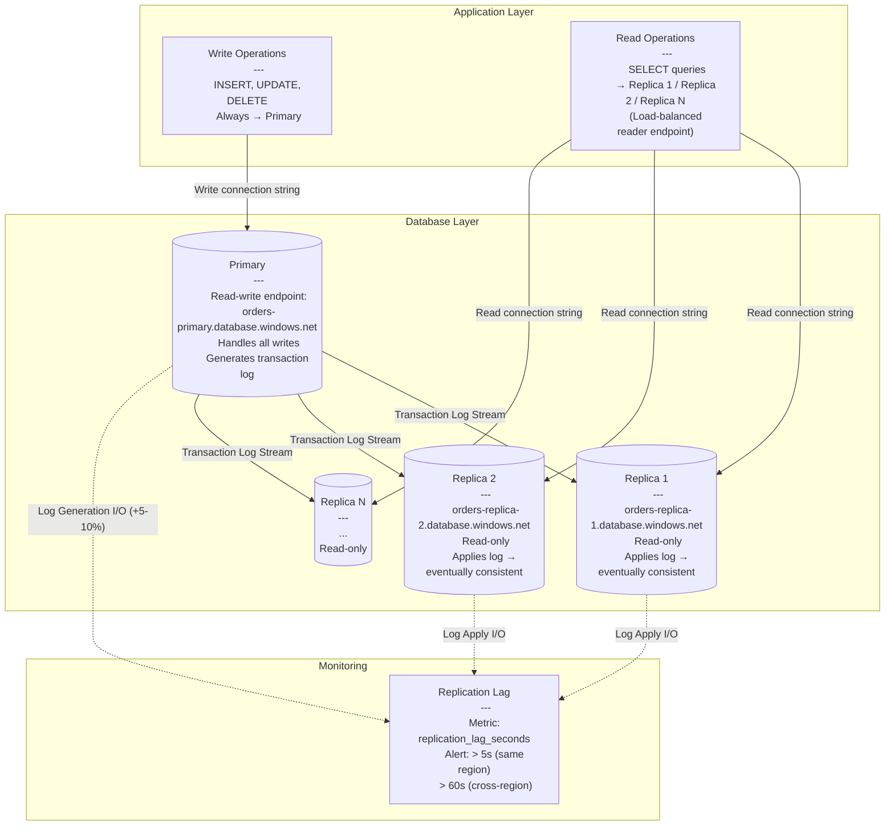

> [!success] Mastery Check
> - [ ] **Studied Well**
> - [ ] **Can explain the concept without notes**
> - [ ] **Can answer interview questions confidently**
> - [ ] **Can implement it in a real project**

---

id: "7.219" title: "Database Read Replicas — Setup and Tradeoffs" domain: "System Design & Distributed Systems" domain_id: 7 group: "Scalability Patterns" tags: [system-design, distributed-systems, scalability, dotnet, azure, databases, read-replicas, replication] priority: 1 version: 2 prerequisites:

- "[[7.206 — Horizontal vs Vertical Scaling — Tradeoffs]]" — read replicas are a form of horizontal scaling applied specifically to the database tier; the general horizontal-vs-vertical framework (scaling out vs scaling up, cost curves, operational complexity) applies directly to the decision to add read replicas
- "[[7.210 — Load Balancing — Overview]]" — distributing read traffic across replicas requires load balancing at the data access layer; the reader endpoint (connection string or DNS) must be load-balanced across the replica pool, while the writer endpoint always points to the primary
- "[[8.101 — SQL Database Indexing and Query Performance]]" — read replicas do not fix slow queries; if a query is slow on the primary, it is equally slow on the replica; read replicas solve read CAPACITY (concurrent read throughput), not read PERFORMANCE (single-query latency)" related:
- "[[7.220 — Database Read Replicas — Replication Lag]]" — the companion note on the mechanics of replication lag; 7.219 covers when and why to use replicas, 7.220 covers how lag behaves, how to measure it, and how to set bounded-staleness guarantees
- "[[7.221 — Database Read Replicas — Read-Your-Writes Problem]]" — the most common consistency problem introduced by read replicas: a client writes to the primary, then reads from a replica that has not yet received the write; the solution patterns (read-after-write consistency, query hints, causal consistency) are built on the architecture established in this note
- "[[7.222 — Database Sharding — Overview]]" — read replicas and sharding are complementary scaling strategies; replicas scale read throughput, sharding scales write throughput; a high-scale system often uses both — each shard has its own primary and one or more read replicas
- "[[8.100 — Transactions and Concurrency in SQL Server]]" — read replicas in Azure SQL Database use snapshot isolation for query consistency; understanding transaction isolation levels is required to know what guarantees a replica query provides
- "[[8.105 — Entity Framework Core — Query Performance]]" — EF Core's DbContext must be configured to route queries to the correct endpoint (read vs write); the interception pattern (`IDbConnectionInterceptor`, `IDbCommandInterceptor`) is the standard way to implement read/write splitting in .NET
- "[[7.233 — Auto-Scaling — Reactive vs Predictive]]" — read replica pools can be auto-scaled based on replica lag or read throughput; reactive auto-scaling (add replica when lag exceeds threshold) is common; predictive auto-scaling is rarely used for databases because replica provisioning takes 5-30 minutes
- "[[7.211 — Load Balancing — Layer 4 vs Layer 7]]" — the difference between DNS-level round robin (Azure SQL Database read-scale) and connection-level routing (PgBouncer, ProxySQL) affects how read replicas are discovered and connected to; the L4/L7 distinction applies to the replica connection layer" created: 2026-06-16

---

> [!ABSTRACT] Quick Reference — Database Read Replicas **Invariant:** One designated primary database instance handles all write operations (INSERT, UPDATE, DELETE, DDL). One or more read-only replica instances asynchronously replicate data from the primary and handle read queries (SELECT). The replication stream is unidirectional — from primary to replicas only. Writes never touch a replica. **Cost:** Replication lag — the time between a write committing on the primary and appearing on the replica. In Azure SQL Database, typical lag is 10-500ms within the same region, 1-60s across regions. The replication process consumes I/O and CPU on the primary (log generation and transport), and on the replica (log apply). Storage costs are multiplied by (1 + number of replicas). **Trigger:** The primary database CPU consistently exceeds 80% OR the primary's transaction log throughput is saturated by SELECT queries competing with write transactions. The symptom is read query latency spikes during write-heavy periods — a sign that the primary cannot serve both read and write I/O within the latency SLO. **Skip When:** (a) The bottleneck is write throughput, not read throughput — read replicas only help read scaling, they do not increase write capacity (use sharding for write scaling); (b) the application cannot tolerate any staleness — every read must reflect the most recent write from the same session (read-your-writes consistency) without explicit session management; (c) the primary's CPU is below 50% — the read workload is not yet competing with writes; (d) the application runs a single complex query that takes 30 seconds — read replicas do not fix slow queries, they distribute many queries across more hardware

---

## Navigation

**Domain:** [[7 — System Design & Distributed Systems]] > **Group:** Scalability Patterns
**Previous:** [[7.218 — Load Balancing — Power of Two Choices]] | **Next:** [[7.220 — Database Read Replicas — Replication Lag]]

### Prerequisites

- [[7.206 — Horizontal vs Vertical Scaling — Tradeoffs]] — read replicas are horizontal scaling applied to the database tier; the up-vs-out decision framework applies directly
- [[7.210 — Load Balancing — Overview]] — read traffic must be load-balanced across replicas; the writer endpoint is a fixed point, the reader endpoint is a load-balanced pool
- [[8.101 — SQL Database Indexing and Query Performance]] — read replicas do not fix slow queries; they distribute read capacity across more hardware

### Where This Fits

> [!INFO] Production Encounter Map
>
> - **Layer:** Database architecture pattern — sits at the persistence layer. Read replicas add horizontal read capacity to a relational database without changing the application's data model.
> - **Trigger:** The monitoring dashboard shows the primary database CPU at 85% during peak hours. 60% of that CPU is from SELECT queries — reporting, dashboards, and read-heavy API endpoints competing with transactional writes. The team needs to separate read capacity from write capacity.
> - **Without read replicas:** The primary database handles both reads and writes. As read traffic grows, SELECT queries consume CPU and I/O that should be reserved for write transactions. Write latency increases. The team's only option is vertical scaling (larger database SKU), which is expensive and has a ceiling.
> - **First signal that read replicas are needed:** CPU on the primary is high, but the ratio of read operations to write operations is > 5:1. The primary's transaction log throughput is limited by read I/O competing with write I/O. Adding a replica allows SELECT traffic to be offloaded to dedicated hardware, preserving the primary's capacity for writes.

Read replicas are the most cost-effective way to scale read throughput for a relational database. The pattern is well-established in every cloud database platform (Azure SQL Database geo-replicas, Azure Database for PostgreSQL read replicas, Amazon RDS read replicas, Google Cloud SQL read replicas). The tradeoff is eventual consistency — replicas lag behind the primary by milliseconds to seconds depending on network distance and write volume. The core engineering decision is whether the application can tolerate stale reads and, if not, how to route critical reads back to the primary.

---

## Core Mental Model

A read replica is a separate database instance that maintains a copy of the primary's data by continuously applying the primary's transaction log. The primary logs every data change to its transaction log. The replica reads the log (or the log shipping stream) and replays each change locally. The replica is a fully-functional read-only database — it can serve SELECT queries, run reporting workloads, and even maintain its own indexes (non-clustered indexes specific to read patterns). But it cannot accept writes — any attempt to INSERT, UPDATE, DELETE, or execute DDL on the replica fails.

The mental model: think of a primary database as a journalist writing a story. Each edit is saved to a revision history (the transaction log). A read replica is a copy editor reading the revision history and updating their own copy of the story. The journalist can keep writing while the copy editor catches up. The reader (the customer) reads the copy editor's version — which may be a few seconds behind the journalist's latest edit. If a reader needs the absolutely latest version, they must ask the journalist directly. The journalist can support only a limited number of direct readers before it interferes with their writing.

The critical insight: **Read replicas decouple read capacity from write capacity.** Without replicas, the primary's resources (CPU, memory, I/O, connections) are shared between reads and writes. A read-heavy reporting query can consume I/O that a critical write transaction needs — increasing write latency and risking transaction log growth. With replicas, the primary dedicates its resources to writes, and each replica provides independent read capacity. The cost is that the primary must now also spend resources on log generation and transport for replication — typically 5-10% additional I/O on the primary. The tradeoff is overwhelmingly positive when the read-to-write ratio exceeds 5:1.

> [!TIP] The Non-Obvious Insight
> Read replicas do NOT reduce the load on the primary by the number of replicas. The primary still processes every write — including writes generated by read replicas? No — replicas do not generate writes. But the primary generates the transaction log that replicas consume. The primary's I/O for log generation increases with the number of replicas (each replica reads the log stream). The primary's I/O for READ queries decreases by the amount offloaded to replicas. The net effect: read replicas free primary resources proportional to the OFFLOADED READ I/O, not proportional to the replica count. If your workload is 90% reads and you add one replica, you offload ~45% of total I/O from the primary (half the read traffic goes to the replica). The remaining 45% of read I/O stays on the primary unless you explicitly route it away. A common mistake is adding a replica without changing the application's read routing — all queries still hit the primary, and the replica sits idle.

### Classification

- **Architecture model:** Primary-replica (leader-follower) replication. Single writer, multiple readers. Variants: single-primary with single replica (HA), single-primary with multiple replicas (read scaling), cascading replicas (replica feeds replica), multi-primary (not covered here — that is active-active / multi-master).
- **Replication mode:** Asynchronous by default in Azure SQL Database, Azure Database for PostgreSQL, Amazon RDS, and most managed database services. Synchronous (semi-sync or full sync) is available but adds write latency — confirmed commits must wait for at least one replica to acknowledge.
- **Consistency model:** Eventual consistency. Replicas are guaranteed to converge to the primary's state but may lag. The lag is bounded by replication delay (network + apply), not by a consensus protocol. There is no built-in read-your-writes or monotonic read guarantee — these must be implemented at the application layer.
- **Azure ecosystem:**
  - **Azure SQL Database:** Active geo-replication (up to 4 readable secondaries per primary, cross-region supported). Failover groups provide automated failover with separate reader/writer listener endpoints.
  - **Azure SQL Managed Instance:** Auto-failover groups (up to 1 readable secondary per primary). Readable secondary can serve read-only queries with `ApplicationIntent=ReadOnly` in the connection string.
  - **Azure Database for PostgreSQL Flexible Server:** Up to 10 read replicas per primary. Replication via PostgreSQL streaming replication (similar to logical replication). Cross-region supported.
  - **Azure Database for MySQL Flexible Server:** Up to 10 read replicas per primary. Replication via MySQL binlog.
  - **Azure Cosmos DB:** Multi-region writes (not read replicas in the traditional sense — all regions accept writes, conflict resolution is built-in).

### Primary Diagram



### Replication Protocol Trace (Azure SQL Database)

```
Primary Transaction Log:
  LSN 1024: BEGIN TRANSACTION OrderCreate
  LSN 1025: INSERT INTO Orders (Id, CustomerId, Total) VALUES (5001, 42, 299.99)
  LSN 1026: UPDATE Inventory SET Quantity = Quantity - 1 WHERE ProductId = 7
  LSN 1027: COMMIT TRANSACTION OrderCreate

Timeline (same-region, asynchronous replication):

Primary                Replica 1               Replica 2
  │                       │                       │
  │-- LSN 1027 commits -->│                       │
  │  (write acknowledged  │-- Starts applying LSN 1024-1027 locally
  │   to application)     │                       │
  │  T=0ms                │  T=15ms               │
  │                       │                       │
  │                       │-- LSN 1024-1027       │
  │                       │   applied             │
  │                       │  T=45ms               │
  │                       │                       │
  │                       │                       │-- Starts applying
  │                       │                       │   LSN 1024-1027
  │                       │                       │  T=30ms
  │                       │                       │
  │                       │                       │-- LSN 1024-1027
  │                       │                       │   applied
  │                       │                       │  T=60ms
  │                       │                       │

Timeline (cross-region, US East → West Europe):

Primary (US East)      Replica (West Europe)
  │                       │
  │-- LSN 1027 commits -->│
  │  (write acknowledged) │  T=0ms
  │                       │-- Network: US East → West Europe (~80ms latency)
  │                       │   Transaction log bytes in transit
  │                       │  T=80ms
  │                       │
  │                       │-- Starts applying LSN 1024-1027
  │                       │  T=85ms
  │                       │
  │                       │-- LSN 1024-1027 applied
  │                       │  T=110ms
  │                       │
  │                       │-- Lag: 110ms (write to read visibility)
```

### Key Properties / Guarantees

|Property|Value|Condition|
|---|---|---|
|Write throughput capacity|Same as primary alone|Replicas add no write capacity — writes all go to primary|
|Read throughput capacity|Primary + Replica_Count × Replica_Capacity|Each replica provides independent read capacity|
|Typical replication lag (same region)|10-500ms (Azure SQL), 50-1000ms (PostgreSQL)|Depends on write volume, replica count, instance size|
|Typical replication lag (cross-region)|1-60s|Depends on network latency (typically 50-200ms RTT) + log apply|
|Replica read consistency|Transactional (within a single query) but not cross-query|Each query on a replica sees a consistent snapshot as of when the query starts|
|Consistency model|Eventual|Replicas converge to primary state without ordering guarantees (monotonic reads not guaranteed across replicas)|
|Primary resource overhead for replication|5-10% additional I/O per replica|Transaction log generation and transport — scales with write volume, not replica count|
|Read replica count limit|5 (Azure SQL DB), 10 (PostgreSQL Flexible Server), 15 (Amazon RDS MySQL)|Platform-imposed; higher counts increase primary log generation overhead and lag|
|Failover capability|Replica can be promoted to primary (manual or automated)|Failover group in Azure SQL; pg_promote() in PostgreSQL|
|Connection string routing|`ApplicationIntent=ReadOnly` (Azure SQL); separate DNS endpoints (PostgreSQL)|Application must explicitly route reads to replica endpoint|

---

## Deep Mechanics

### How It Works

**Read Replica Setup — Step by Step (Azure SQL Database):**

1. **Create the primary database:** Standard Azure SQL Database (single database or elastic pool). Configure the service tier (DTU/vCore, storage). Enable geo-replication or create a failover group.

2. **Add a replica:** Using the Azure portal, CLI, or ARM/Bicep template. The replica is created from a snapshot of the primary. The initial seeding copies the full database (data files + log files) to the replica — this takes minutes to hours depending on database size (100 GB database ≈ 30-60 minutes for initial seed in the same region).

3. **Replication begins:** After initial seed, the replica starts applying transaction log changes from the primary continuously. The primary streams log records to the replica asynchronously. The replica acknowledges receipt but does not wait for apply.

4. **Configure connection routing:**
   - **Azure SQL Database:** Use `ApplicationIntent=ReadOnly` in the connection string. Azure SQL's gateway automatically routes read-intent connections to an available replica. Write-intent connections (INSERT, UPDATE, DELETE) go to the primary even if `ReadOnly` is specified — they fail with an error.
   - **Azure Database for PostgreSQL:** Separate DNS endpoint for the primary vs reader endpoint (e.g., `orders-pg.postgres.database.azure.com` for primary, `orders-pg-replica.postgres.database.azure.com` for the replica pool). The reader endpoint uses DNS round robin across all replicas.

5. **Monitor replication lag:** Query `sys.dm_geo_replication_link_status` (Azure SQL) or `pg_stat_replication` (PostgreSQL) to get the current lag in seconds.

**Application-Side Read/Write Splitting:**

```csharp
// Application code must route reads and writes to different endpoints.
// Pattern: intercept DbContext connection creation and set the
// connection string based on the operation type (read vs write).

public enum DatabaseIntent
{
    ReadWrite, // Primary
    ReadOnly   // Any replica
}

public class ReadWriteSplitConnectionStringProvider
{
    private readonly string _primaryConnectionString;
    private readonly string _readerConnectionString;

    public ReadWriteSplitConnectionStringProvider(
        string primaryConnectionString,
        string readerConnectionString)
    {
        _primaryConnectionString = primaryConnectionString
            + ";ApplicationIntent=ReadWrite";
        _readerConnectionString = readerConnectionString
            + ";ApplicationIntent=ReadOnly";
    }

    public string GetConnectionString(DatabaseIntent intent)
    {
        return intent switch
        {
            DatabaseIntent.ReadWrite => _primaryConnectionString,
            DatabaseIntent.ReadOnly => _readerConnectionString,
            _ => throw new ArgumentOutOfRangeException(nameof(intent))
        };
    }
}
```

### Failure Modes

**Failure Mode 1: Replication Lag Spike During Write Burst — Stale Reads During Peak Hours**

- **Cause:** The primary experiences a sudden burst of write activity (e.g., Black Friday checkout surge, end-of-quarter billing run, bulk data import). The transaction log grows rapidly. The replica applies the log sequentially — it cannot parallelize DDL changes or certain DML operations (e.g., index rebuilds logged as single-threaded operations). The log apply rate falls behind the log generation rate. Replication lag spikes from the usual 10-50ms to 30-120 seconds.

- **Symptom:** Read queries on replicas return data that is 30-120 seconds stale. Dashboards show "as of 2 minutes ago" data. Reporting queries that run at the same time as the write burst produce reports with missing or incomplete data. The application's read-after-write consistency is violated for users who place an order and immediately view their order history — the order is not visible on the replica for up to 2 minutes.

- **Detection time:** The monitoring alert `replication_lag_seconds > threshold` fires. In Azure SQL, query `sys.dm_geo_replication_link_status` for `last_commit` timestamp differences. In PostgreSQL, query `pg_stat_replication` for `write_lag`, `flush_lag`, and `replay_lag`.

**Fix:**

```sql
-- ❌ WRONG: Ignoring lag — application reads from replica without awareness
SELECT * FROM Orders WHERE CustomerId = 42
-- May return stale data if the replica is lagging

-- ✅ FIX 1: Monitor replication lag and route reads to primary when lag is excessive
-- Application-side lag check before reading from replica
public sealed class LagAwareReadRouter
{
    private readonly string _primaryConnectionString;
    private readonly string _replicaConnectionString;
    private readonly int _maxAcceptableLagSeconds = 5;

    public IDbConnection GetReadConnection()
    {
        var lag = GetCurrentReplicaLag();
        var target = lag > _maxAcceptableLagSeconds
            ? _primaryConnectionString
            : _replicaConnectionString;

        return new SqlConnection(target);
    }

    private int GetCurrentReplicaLag()
    {
        using var conn = new SqlConnection(_primaryConnectionString);
        conn.Open();
        using var cmd = new SqlCommand(@"
            SELECT DATEDIFF(SECOND,
                last_commit,
                replica_last_commit)
            FROM sys.dm_geo_replication_link_status
            WHERE partner_database_id = DB_ID();", conn);
        var result = cmd.ExecuteScalar();
        return result is int lag ? lag : 0;
    }
}

-- ✅ FIX 2: Increase replica compute size during predictable write bursts
-- Pre-scale the replica before Black Friday / billing run
-- Azure CLI: az sql db replica create --resource-group orders-rg
--   --server orders-primary --database orders-db
--   --partner-server orders-replica --partner-database orders-db
--   --sku GP_Gen5_8  (scale up from Gen5_4)

-- ✅ FIX 3: Use read-only intent routing with replica priority
-- Azure SQL Database failover group allows specifying:
--   AllowReadOnlyFailoverToPrimary: when NO replica is available,
--   route read requests to the primary (with a lag warning)

-- ✅ FIX 4: Application-level read-your-writes consistency
-- For critical reads (order confirmation, payment status),
-- always route to the primary regardless of lag.
```

**Cost of not fixing:** During peak write periods, all replica reads return stale data. Users see missing orders, incorrect account balances, or stale inventory counts. The application's data freshness SLO is violated. For financial or e-commerce applications, stale data during peak sales periods directly impacts revenue (users cannot see their purchases) and trust (incorrect balance displays).

---

**Failure Mode 2: Read Replica Not Used — Application Still Reads from Primary**

- **Cause:** The team creates read replicas in Azure SQL Database but the application's connection string still points to the primary. No `ApplicationIntent=ReadOnly` is set. The read replicas sit idle while the primary continues to serve all read traffic. The CPU on the primary remains high. The team concludes "read replicas don't help" and adds more replicas — which also sit idle.

- **Symptom:** Primary CPU is unchanged after adding replicas. Replica CPU is near zero. The replication lag metric shows the replicas are fully caught up (lag < 100ms) but they are not being queried. The application's read throughput is unchanged. The team pays for replica compute without any benefit.

- **Detection time:** Check replica CPU metrics in Azure Monitor. If replica CPU is < 5% while primary CPU is > 80%, the replicas are not being used. Check the application's connection string — it should contain `ApplicationIntent=ReadOnly` for read queries or use a separate reader endpoint.

**Fix:**

```csharp
// ❌ WRONG: Connection string does not use replicas
// Default connection string — all traffic goes to primary
//
// "Server=orders-primary.database.windows.net;Database=OrdersDb;..."

// ✅ FIX: Use ApplicationIntent for read/write splitting

// In appsettings.json:
{
  "ConnectionStrings": {
    "DefaultConnection": "Server=orders-primary.database.windows.net;Database=OrdersDb;User Id=...;Password=...;ApplicationIntent=ReadWrite;",
    "ReadOnlyConnection": "Server=orders-primary.database.windows.net;Database=OrdersDb;User Id=...;Password=...;ApplicationIntent=ReadOnly;"
  }
}

// In DbContext configuration:
public class OrdersDbContext : DbContext
{
    private readonly string _connectionString;
    private readonly DatabaseIntent _intent;

    public OrdersDbContext(string connectionString, DatabaseIntent intent)
    {
        _connectionString = connectionString;
        _intent = intent;
    }

    protected override void OnConfiguring(DbContextOptionsBuilder optionsBuilder)
    {
        // ApplicationIntent=ReadOnly in connection string tells
        // Azure SQL Gateway to route to a readable secondary
        var csb = new SqlConnectionStringBuilder(_connectionString)
        {
            ApplicationIntent = _intent switch
            {
                DatabaseIntent.ReadOnly => ApplicationIntent.ReadOnly,
                DatabaseIntent.ReadWrite => ApplicationIntent.ReadWrite,
                _ => ApplicationIntent.ReadWrite
            }
        };

        optionsBuilder.UseSqlServer(csb.ConnectionString);
    }
}

// ✅ VERIFICATION: Query the replica endpoint directly
// Execute on the replica:
SELECT @@SERVERNAME AS ReplicaName;
SELECT DATABASEPROPERTYEX(DB_NAME(), 'Updateability') AS ReadOnly;
-- Should show 'READ_ONLY' if connected to a replica

// ✅ VERIFICATION: Check active queries on primary vs replica
// Primary should show mostly writes + some reads (critical reads)
// Replica should show mostly reads (offloaded reads)
```

**Cost of not fixing:** The team pays for replica compute (potentially thousands of dollars per month) with zero benefit. The primary remains overloaded. The incident that motivated adding replicas (primary CPU saturation) is not resolved. The team may blame "read replicas don't work for our workload" when the real issue is the application never sends traffic to them.

---

**Failure Mode 3: Replica Out of Disk — Replication Stops, Replica Becomes Stale**

- **Cause:** The replica's storage is smaller than the primary's data size + transaction log backlog. During a write burst, the primary's transaction log grows. The replica applies the log but may fall behind. If the replica runs out of storage, replication stops. The replica becomes permanently stale — it cannot apply new log records because there is no disk space. The replica must be dropped and recreated to catch up (a full re-seed from the primary).

- **Symptom:** Replication lag grows without bound. The replica's `replication_lag_seconds` metric keeps increasing and never recovers. Azure SQL Database shows `ReplicationState = SUSPENDED` or `SEEDING` (if it auto-restarted). PostgreSQL shows `pg_stat_replication.state = 'catchup'` with increasing `replay_lag`. The replica cannot be read from because its data is progressively more stale — after hours of suspended replication, it may be hours behind.

- **Detection time:** The alert `replication_lag_seconds > threshold` fires and does not self-resolve. The Azure SQL DMV `sys.dm_geo_replication_link_status` shows `replication_state_desc = 'SUSPENDED'`. The replica's storage metrics show 100% utilization.

**Fix:**

```sql
-- ❌ WRONG: Replica storage is too small for the primary's workload
-- Replica created with the same storage size as the initial primary
-- But primary data + log grew beyond the replica's capacity

-- ✅ FIX 1: Ensure replica storage >= primary storage + 20% buffer
-- Azure SQL Database: storage is automatically managed (max size setting)
-- PostgreSQL Flexible Server: storage is auto-grow when enabled

-- ✅ FIX 2: Monitor replica storage utilization with alert at 80%
-- Azure Monitor alert rule:
--   Signal: Storage percent (replica)
--   Threshold: > 80
--   Action: Scale up replica storage OR reduce lag

-- ✅ FIX 3: Add more replicas to distribute log apply load
-- Multiple replicas share the log apply burden.
-- If one replica fails (out of disk), others continue serving reads.

-- ✅ FIX 4: Reduce primary log generation rate if possible
-- Batched writes, larger transactions (fewer log records per row),
-- or indexing changes to reduce log volume.
```

**Cost of not fixing:** A replica that is out of disk cannot serve reads — it is effectively dead. If this is the only replica, read capacity is lost entirely. Recreating the replica requires a full database copy (seeding), which takes minutes to hours depending on size. During the reseed, there is zero replica read capacity.

---

**Failure Mode 4: Read-Your-Writes Violation — User Sees Missing Data After Write**

- **Cause:** A user performs a write operation (e.g., place an order) that goes to the primary. Immediately after, the application reads the order status from a replica that has not yet received the write. The replica returns "no order found" because the transaction log has not been applied yet. The user sees a blank order confirmation page or an error message. The application may retry, hit another replica, and get different results — confusing the user further.

- **Symptom:** Users report "my order disappeared" or "I placed an order but it's not showing up." The issue is intermittent — it happens only when the application reads from a lagging replica immediately after a write. It is more common during write bursts (higher lag) and for users in regions served by a cross-region replica (higher network latency). The support team sees a pattern: reports spike during peak hours and correlate with high replication lag.

- **Detection time:** User reports. The application logs show the write commit succeeding (primary) and the subsequent read returning empty results (replica). The timing between the write and the read is < 500ms — well within the typical replication lag window.

**Fix:**

```csharp
// ❌ WRONG: Reading from replica immediately after writing to primary
// Controller action:
[HttpPost]
public async Task<IActionResult> PlaceOrder(OrderRequest request)
{
    // 1. Write to primary
    var order = await _orderService.CreateOrderAsync(request);

    // 2. Redirect to confirmation page
    //    → Browser GET /orders/{order.Id}
    //    → Action reads from replica (session read connection)
    //    → Replica has not applied the write yet
    //    → Returns 404 or empty view
    return RedirectToAction("Confirmation", new { id = order.Id });
}

// ✅ FIX 1: Route critical reads (after write) to the primary
public async Task<IActionResult> Confirmation(int id)
{
    // Use intent=ReadWrite for reads that MUST see recent writes
    var order = await _orderService.GetOrderAsync(
        id, intent: DatabaseIntent.ReadWrite);

    if (order is null)
        return NotFound();

    return View(order);
}

// ✅ FIX 2: Enforce session-level read-your-writes with a cookie
// After a write, set a cookie tracking the last-write timestamp
// On subsequent reads, check if the replica has caught up
// If not, route to primary
public sealed class ReadYourWritesMiddleware
{
    public async Task InvokeAsync(HttpContext context)
    {
        if (context.Request.Cookies.TryGetValue("last_write_ticks", out var ticksStr)
            && long.TryParse(ticksStr, out var lastWriteTicks))
        {
            var lag = GetCurrentReplicaLag();
            var elapsed = DateTime.UtcNow - new DateTime(lastWriteTicks, DateTimeKind.Utc);

            // If the write happened within the last 2× lag, route to primary
            if (elapsed.TotalSeconds < lag.TotalSeconds * 2)
            {
                context.Items["DbIntent"] = DatabaseIntent.ReadWrite;
            }
        }

        // Set cookie on response if this request was a write
        if (context.Request.Method == "POST" && context.Response.StatusCode < 400)
        {
            context.Response.Cookies.Append("last_write_ticks",
                DateTime.UtcNow.Ticks.ToString(),
                new CookieOptions { HttpOnly = true, SameSite = SameSiteMode.Lax });
        }

        await next(context);
    }
}

// ✅ FIX 3: Use Azure SQL Database failover group reader endpoint
// The reader endpoint provides a consistent read view by tracking
// the primary's log sequence number (LSN). If the replica has not
// applied the primary's latest LSN, the reader endpoint waits
// (up to a configurable timeout) for the replica to catch up.
// Connection string:
// "Server=orders-fg.database.windows.net;Database=OrdersDb;ApplicationIntent=ReadOnly;"
// The failover group reader endpoint provides stronger consistency
// guarantees than a raw geo-replica.

// ✅ FIX 4: For the highest consistency, use a synchronous replica
// Azure SQL Database Premium/Business Critical tiers use
// synchronous always-on availability groups.
// Replicas in this tier have ZERO lag for committed transactions.
// Cost: write latency increases (commit waits for replica ack).
```

**Cost of not fixing:** User-facing data loss perception. Users complete an action (order placed, profile updated, payment made) and immediately see "no data" results. This erodes trust and generates support tickets. The issue is hard to reproduce in development (no replication lag) and intermittent in production (lag varies). The engineering team may spend weeks debugging an "intermittent data loss bug" that is actually a read-your-writes correctness issue.

---

**Failure Mode 5: Replica Churn from Auto-Scaling — Lag Spikes During Scale Operations**

- **Cause:** The read replica pool is configured with auto-scaling (add replica when lag > threshold, remove replica when lag < threshold). When a new replica is added, it must be seeded from the primary — a full database copy that reads the primary's data files and streams them to the new replica. During seeding, the primary experiences additional I/O (reading data files for the seed) AND the existing replicas' replication may be throttled. The seeding process itself increases replication lag on existing replicas. When the seeding completes, the new replica initially lags behind (it must apply all log records accumulated during seeding). The auto-scaler sees the lag is still high and adds another replica — triggering another seed cycle. Oscillation.

- **Symptom:** Replication lag spikes during auto-scaling events. The auto-scaler adds a replica, lag increases further (from seeding I/O overhead), the auto-scaler adds another replica, and lag continues to increase. The system never stabilizes. The primary's I/O is dominated by replica seeding, not by application writes.

- **Detection time:** The auto-scaler log shows repeated "add replica" events with no "remove replica" events. The replication lag metric shows a sawtooth pattern — lag increases during seeding, drops briefly after the seed completes, then increases again as the next seed starts. The primary's I/O metrics show "Replica Seeding" as the top I/O consumer.

**Fix:**

```csharp
// ❌ WRONG: Auto-scaling based on lag alone
// Adding a replica increases lag temporarily (from seed I/O)
// → triggers another add → oscillation

// ✅ FIX 1: Add cooldown period after each scaling action
// Minimum 30 minutes between replica add/remove operations
// Azure Auto-Scale: cooldown = 30 minutes

// ✅ FIX 2: Use predictive scaling for predictable load patterns
// Instead of reactive scaling (lag threshold), pre-schedule replica count
// based on historical traffic patterns
public class ReplicaScheduler
{
    public int GetTargetReplicaCount(DateTime timeOfDay)
    {
        // Pre-scale for known peak hours
        return timeOfDay.Hour switch
        {
            >= 9 and < 11 => 4,  // Morning peak
            >= 14 and < 16 => 3, // Afternoon peak
            >= 19 and < 22 => 5, // Evening peak (Black Friday)
            _ => 2                // Baseline
        };
    }
}

// ✅ FIX 3: Use multiple small replicas instead of fewer large ones
// Adding a small replica has less impact on primary I/O during seeding
// than adding a large replica. Prefer 4× Gen5_2 replicas over 2× Gen5_4.

// ✅ FIX 4: Pre-seed replicas before expected load
// Create replicas 1-2 hours BEFORE the expected peak
// This ensures seeding completes before the lag-sensitive workload begins
// Azure CLI:
az sql db replica create --resource-group orders-rg \
    --server orders-primary --database orders-db \
    --partner-server orders-replica-1 \
    --sku GP_Gen5_4
# Run this at 7 AM for the 9 AM peak — 2 hours of seeding buffer
```

**Cost of not fixing:** Auto-scaling based on replication lag creates a positive feedback loop that destabilizes the replica pool. The system oscillates between too few replicas (high lag) and too many replicas (high seeding I/O causing even higher lag). The primary's I/O capacity is consumed by replica seeding rather than serving writes. The solution is to pre-scale based on time-of-day patterns rather than reacting to lag in real time.

---

### .NET and Azure Integration

- **Azure SQL Database geo-replication:** Create readable secondaries via `az sql db replica create` or Azure portal. Up to 4 replicas per primary. Replicas are billed at standard compute rates — they are fully provisioned databases, not idle standbys.
- **Azure SQL Database failover groups:** Provide a reader endpoint (`your-server.database.windows.net` with `ApplicationIntent=ReadOnly`) that load-balances across all available replicas. Supports automatic failover with configurable grace period. The reader endpoint provides a slightly stronger consistency guarantee than direct geo-replica connections (it waits for replicas to apply log up to the primary's current LSN).
- **Azure Database for PostgreSQL Flexible Server:** Up to 10 replicas per primary. Replicas are created via `az postgres flexible-server replica create`. Reader endpoint is load-balanced via DNS round robin.
- **.NET EF Core read/write splitting:** No built-in support for read/write splitting in EF Core. Implemented via:
  - `IDbConnectionInterceptor` — intercept connection creation to inject `ApplicationIntent=ReadOnly` for read queries
  - Separate `DbContext` types — `OrdersDbContext` (read-write) and `OrdersReadOnlyDbContext` (read-only with different connection string)
  - Command interception — override `DbCommand` execution to route SELECT vs INSERT/UPDATE/DELETE to different connections
- **Entity Framework Core 8+:** The `UseQueryTrackingBehavior(QueryTrackingBehavior.NoTracking)` for read-only queries, combined with a separate connection string for the replica, is the most common pattern.

```csharp
// Program.cs — Read/Write Splitting with EF Core
var builder = WebApplication.CreateBuilder(args);

// Register two connection string providers
var primaryCs = builder.Configuration.GetConnectionString("DefaultConnection");
var readerCs = builder.Configuration.GetConnectionString("ReaderConnection");

builder.Services.AddSingleton(new ReadWriteSplitConnectionStringProvider(
    primaryCs, readerCs));

// Register read-write DbContext (writes and critical reads)
builder.Services.AddDbContext<OrdersDbContext>(options =>
    options.UseSqlServer(primaryCs, sqlOptions =>
    {
        sqlOptions.EnableRetryOnFailure(3);
    }));

// Register read-only DbContext (tolerant reads — replica)
builder.Services.AddDbContext<OrdersReadOnlyDbContext>(options =>
    options.UseSqlServer(readerCs, sqlOptions =>
    {
        sqlOptions.EnableRetryOnFailure(3);
        sqlOptions.UseQueryTrackingBehavior(QueryTrackingBehavior.NoTracking);
    }));

// Register services with explicit intent
builder.Services.AddScoped<IOrderReadService, OrderReadService>();
builder.Services.AddScoped<IOrderWriteService, OrderWriteService>();
```

---

## Production Patterns and Implementation

### Primary Implementation — Read/Write Split Repository with Lag Awareness

```csharp
using System.Data;
using Microsoft.Data.SqlClient;

/// <summary>
/// Provides database connections with explicit read/write intent.
/// Read connections route to replicas (via ApplicationIntent=ReadOnly).
/// Write connections route to the primary (via ApplicationIntent=ReadWrite).
/// Replication lag is checked before returning a read connection;
/// if lag exceeds the threshold, the read falls back to the primary.
/// </summary>
public sealed class ReadWriteDatabaseRouter : IDisposable
{
    private readonly string _primaryConnectionString;
    private readonly string _readerConnectionString;
    private readonly int _maxLagSeconds;
    private readonly ILogger<ReadWriteDatabaseRouter> _logger;
    private SqlConnection? _primaryConnection;
    private SqlConnection? _readerConnection;

    public ReadWriteDatabaseRouter(
        string primaryConnectionString,
        string readerConnectionString,
        int maxLagSeconds,
        ILogger<ReadWriteDatabaseRouter> logger)
    {
        _primaryConnectionString = primaryConnectionString;
        _readerConnectionString = readerConnectionString;
        _maxLagSeconds = maxLagSeconds;
        _logger = logger;
    }

    /// <summary>
    /// Returns a connection for write operations. Always points to the primary.
    /// </summary>
    public async Task<SqlConnection> GetWriteConnectionAsync(CancellationToken ct)
    {
        _primaryConnection ??= new SqlConnection(_primaryConnectionString);
        if (_primaryConnection.State != ConnectionState.Open)
            await _primaryConnection.OpenAsync(ct);
        return _primaryConnection;
    }

    /// <summary>
    /// Returns a connection for read operations. Routes to a replica if
    /// replication lag is within the acceptable threshold, otherwise
    /// falls back to the primary.
    /// </summary>
    public async Task<SqlConnection> GetReadConnectionAsync(CancellationToken ct)
    {
        var lag = await GetCurrentReplicaLagAsync(ct);

        if (lag.TotalSeconds <= _maxLagSeconds)
        {
            _readerConnection ??= new SqlConnection(_readerConnectionString);
            if (_readerConnection.State != ConnectionState.Open)
                await _readerConnection.OpenAsync(ct);
            return _readerConnection;
        }

        _logger.LogWarning(
            "Replication lag is {LagSeconds}s (threshold {MaxLag}s). " +
            "Falling back to primary for read.",
            lag.TotalSeconds, _maxLagSeconds);

        return await GetWriteConnectionAsync(ct);
    }

    /// <summary>
    /// Measures replication lag by comparing the primary's last commit
    /// time to the replica's last applied commit time.
    /// </summary>
    private async Task<TimeSpan> GetCurrentReplicaLagAsync(CancellationToken ct)
    {
        try
        {
            using var conn = new SqlConnection(_primaryConnectionString);
            await conn.OpenAsync(ct);

            using var cmd = new SqlCommand(@"
                SELECT DATEDIFF(SECOND,
                    (SELECT MAX(last_commit_time)
                     FROM sys.dm_db_log_stats WITH (NOLOCK)),
                    (SELECT MIN(last_commit_time)
                     FROM sys.dm_geo_replication_link_status WITH (NOLOCK)
                     WHERE partner_database_id = DB_ID())
                );", conn);

            cmd.CommandTimeout = 5;
            var result = await cmd.ExecuteScalarAsync(ct);
            var seconds = result is int s ? s : 0;
            return TimeSpan.FromSeconds(seconds);
        }
        catch (Exception ex)
        {
            _logger.LogWarning(ex,
                "Failed to query replication lag. Assuming safe fallback.");
            return TimeSpan.MaxValue; // Fall back to primary
        }
    }

    public void Dispose()
    {
        _primaryConnection?.Dispose();
        _readerConnection?.Dispose();
    }
}

/// <summary>
/// Repository that uses the read/write router to split traffic.
/// Write operations always use the primary.
/// Read operations use replicas with lag-aware fallback.
/// </summary>
public sealed class OrderRepository
{
    private readonly ReadWriteDatabaseRouter _router;
    private readonly ILogger<OrderRepository> _logger;

    public OrderRepository(
        ReadWriteDatabaseRouter router,
        ILogger<OrderRepository> logger)
    {
        _router = router;
        _logger = logger;
    }

    public async Task<Order?> GetOrderAsync(
        int orderId, bool requireCurrent, CancellationToken ct)
    {
        // requireCurrent=true → always read from primary (read-your-writes)
        // requireCurrent=false → read from replica (tolerant of staleness)
        var intent = requireCurrent
            ? DatabaseIntent.ReadWrite
            : DatabaseIntent.ReadOnly;

        var conn = intent switch
        {
            DatabaseIntent.ReadWrite => await _router.GetWriteConnectionAsync(ct),
            DatabaseIntent.ReadOnly => await _router.GetReadConnectionAsync(ct),
            _ => await _router.GetWriteConnectionAsync(ct)
        };

        using var cmd = new SqlCommand(@"
            SELECT Id, CustomerId, OrderDate, Total, Status
            FROM Orders WITH (NOLOCK)
            WHERE Id = @Id", conn);

        cmd.Parameters.AddWithValue("@Id", orderId);

        using var reader = await cmd.ExecuteReaderAsync(ct);
        if (await reader.ReadAsync(ct))
        {
            return new Order
            {
                Id = reader.GetInt32(0),
                CustomerId = reader.GetInt32(1),
                OrderDate = reader.GetDateTime(2),
                Total = reader.GetDecimal(3),
                Status = reader.GetString(4)
            };
        }

        return null;
    }

    /// <summary>
    /// Creates a new order on the primary. The caller should immediately
    /// read with requireCurrent=true to ensure read-your-writes consistency.
    /// </summary>
    public async Task<Order> CreateOrderAsync(
        CreateOrderRequest request, CancellationToken ct)
    {
        var conn = await _router.GetWriteConnectionAsync(ct);

        using var cmd = new SqlCommand(@"
            INSERT INTO Orders (CustomerId, OrderDate, Total, Status)
            OUTPUT INSERTED.Id, INSERTED.CustomerId, INSERTED.OrderDate,
                   INSERTED.Total, INSERTED.Status
            VALUES (@CustomerId, @OrderDate, @Total, @Status);", conn);

        cmd.Parameters.AddWithValue("@CustomerId", request.CustomerId);
        cmd.Parameters.AddWithValue("@OrderDate", DateTime.UtcNow);
        cmd.Parameters.AddWithValue("@Total", request.Total);
        cmd.Parameters.AddWithValue("@Status", "Pending");

        using var reader = await cmd.ExecuteReaderAsync(ct);
        await reader.ReadAsync(ct);

        return new Order
        {
            Id = reader.GetInt32(0),
            CustomerId = reader.GetInt32(1),
            OrderDate = reader.GetDateTime(2),
            Total = reader.GetDecimal(3),
            Status = reader.GetString(4)
        };
    }
}
```

### Configuration and Wiring

```csharp
// Program.cs — Database Router Registration
var builder = WebApplication.CreateBuilder(args);

var primaryCs = builder.Configuration.GetConnectionString("DefaultConnection")
    ?? throw new InvalidOperationException("DefaultConnection is required");
var readerCs = builder.Configuration.GetConnectionString("ReaderConnection")
    ?? throw new InvalidOperationException("ReaderConnection is required");

var maxLagSeconds = builder.Configuration.GetValue<int>(
    "Database:MaxReplicaLagSeconds", 5);

builder.Services.AddSingleton<ReadWriteDatabaseRouter>(sp =>
    new ReadWriteDatabaseRouter(
        primaryCs,
        readerCs,
        maxLagSeconds,
        sp.GetRequiredService<ILogger<ReadWriteDatabaseRouter>>()));

builder.Services.AddScoped<OrderRepository>();
builder.Services.AddScoped<IOrderReadService, OrderReadService>();
builder.Services.AddScoped<IOrderWriteService, OrderWriteService>();

var app = builder.Build();
app.Run();
```

```json
// appsettings.json
{
  "ConnectionStrings": {
    "DefaultConnection": "Server=orders-primary.database.windows.net;Database=OrdersDb;User Id=app_user;Password=...;ApplicationIntent=ReadWrite;",
    "ReaderConnection": "Server=orders-fg.database.windows.net;Database=OrdersDb;User Id=app_user;Password=...;ApplicationIntent=ReadOnly;"
  },
  "Database": {
    "MaxReplicaLagSeconds": 5,
    "EnableLagAwareRouting": true,
    "QueryTimeoutSeconds": 30,
    "ReplicaCount": 2
  }
}
```

```bicep
// main.bicep — Azure SQL Database with failover group and read replica
resource sqlServer 'Microsoft.Sql/servers@2021-11-01' = {
  name: 'orders-primary'
  location: resourceGroup().location
  properties: {}
}

resource sqlDb 'Microsoft.Sql/servers/databases@2021-11-01' = {
  name: 'orders-db'
  parent: sqlServer
  location: resourceGroup().location
  sku: {
    name: 'GP_Gen5_4'
    tier: 'GeneralPurpose'
  }
}

// Failover group with readable secondary
resource failoverGroup 'Microsoft.Sql/servers/failoverGroups@2021-11-01' = {
  name: 'orders-fg'
  parent: sqlServer
  properties: {
    readWriteEndpoint: {
      failoverPolicy: 'Automatic'
      failoverWithDataLossGracePeriodMinutes: 60
    }
    readOnlyEndpoint: {
      failoverPolicy: 'Enabled'
    }
    partnerServers: [
      {
        id: partnerServer.id
      }
    ]
    databases: [
      sqlDb.id
    ]
  }
}
```

### Common Variants

**1. EF Core Command Interception for Automatic Read/Write Splitting:**

```csharp
/// <summary>
/// Automatically routes SELECT queries to the replica connection
/// and INSERT/UPDATE/DELETE to the primary connection.
/// </summary>
public sealed class ReadWriteCommandInterceptor : IDbCommandInterceptor
{
    private readonly ReadWriteDatabaseRouter _router;

    public ReadWriteCommandInterceptor(ReadWriteDatabaseRouter router)
    {
        _router = router;
    }

    public async ValueTask<InterceptionResult<DbCommand>> CommandCreatingAsync(
        CommandCreationEventData eventData,
        InterceptionResult<DbCommand> result,
        CancellationToken ct = default)
    {
        var commandText = eventData.Command.CommandText;
        var isRead = commandText.StartsWith("SELECT", StringComparison.OrdinalIgnoreCase)
                  || commandText.StartsWith("WITH", StringComparison.OrdinalIgnoreCase);

        var connection = isRead
            ? await _router.GetReadConnectionAsync(ct)
            : await _router.GetWriteConnectionAsync(ct);

        eventData.Command.Connection = connection;
        eventData.Command.Transaction = null; // Cannot share transaction across connections

        return result;
    }
}
```

**2. Read-Only DbContext for Reporting Workloads:**

```csharp
/// <summary>
/// Dedicated DbContext for reporting and dashboard queries.
/// Always connects to a replica. No tracking — reads only.
/// Cannot save changes — SaveChanges throws if called.
/// </summary>
public sealed class ReportingDbContext : DbContext
{
    private readonly string _readerConnectionString;

    public ReportingDbContext(string readerConnectionString)
    {
        _readerConnectionString = readerConnectionString;
    }

    public DbSet<OrderSummary> OrderSummaries => Set<OrderSummary>();
    public DbSet<RevenueReport> RevenueReports => Set<RevenueReport>();

    protected override void OnConfiguring(DbContextOptionsBuilder optionsBuilder)
    {
        optionsBuilder.UseSqlServer(
            _readerConnectionString,
            sqlOptions =>
            {
                sqlOptions.UseQueryTrackingBehavior(QueryTrackingBehavior.NoTracking);
                sqlOptions.CommandTimeout(120); // Reports may be slow
            });
    }

    // Prevent accidental writes
    public override int SaveChanges() =>
        throw new InvalidOperationException("Reporting context is read-only.");
    public override int SaveChanges(bool acceptAllChangesOnSuccess) =>
        throw new InvalidOperationException("Reporting context is read-only.");
}
```

**3. PostgreSQL Read Replica Connection Pooling with PgBouncer:**

```ini
# pgbouncer.ini — Connection pool for PostgreSQL read replicas
[databases]
orders = host=orders-primary.postgres.database.azure.com port=5432 dbname=orders
orders_ro = host=orders-pg-replica.postgres.database.azure.com port=5432 dbname=orders

[pgbouncer]
listen_addr = 0.0.0.0
listen_port = 6432
auth_type = scram-sha-256
pool_mode = transaction  # Transaction-level pooling — connections can change on each transaction
max_client_conn = 1000
default_pool_size = 50

# Application connects to pgbouncer:
# Read-write: "Server=pgbouncer:6432;Database=orders;..."
# Read-only:  "Server=pgbouncer:6432;Database=orders_ro;..."
```

### Real-World .NET Ecosystem Example

- **Azure SQL Database geo-replication:** The most common read replica implementation for .NET applications on Azure. Up to 4 readable secondaries. Used by Azure App Service, AKS, and Azure Functions workloads.
- **EF Core `UseSqlServer()`:** The standard data access library. No built-in read/write splitting — must use interceptors or separate DbContext instances. The `ApplicationIntent=ReadOnly` connection string property is the standard way to signal replica routing.
- **Dapper:** The lightweight micro-ORM. Read/write splitting is done at the connection level — pass a read connection string for queries, a write connection string for commands. No interceptors needed (Dapper works directly on `IDbConnection`).
- **NHibernate:** Supports `SessionFactory` per database with multi-tenancy features that enable read/write splitting. Less common in modern .NET.
- **StackExchange.Redis (for PostgreSQL replication):** Not directly related, but the same read/write splitting pattern applies to Redis replicas — `ConfigurationOptions` has `CommandMap` to redirect read commands to replicas.

---

## Gotchas and Production Pitfalls

### Gotcha 1: ApplicationIntent=ReadOnly Ignored by Older SQL Drivers

**Pitfall:** The application sets `ApplicationIntent=ReadOnly` in the connection string but the installed SQL Server client library (System.Data.SqlClient or Microsoft.Data.SqlClient) version does not support the `ApplicationIntent` property. The connection string is parsed, the unknown property is ignored, and the connection defaults to ReadWrite — all traffic still goes to the primary. This happens when using an older .NET Framework application with System.Data.SqlClient v4.6 or when the driver does not recognize the property.

```csharp
// ❌ WRONG: ApplicationIntent may be ignored by old drivers
var csb = new SqlConnectionStringBuilder(
    "Server=orders-primary.database.windows.net;Database=OrdersDb;ApplicationIntent=ReadOnly;");
// On Microsoft.Data.SqlClient < 2.0, ApplicationIntent is silently ignored.
// Connection opens as ReadWrite → replica not used.

// ✅ FIX 1: Verify the driver version and ApplicationIntent support
// Microsoft.Data.SqlClient 2.0+ supports ApplicationIntent.
// System.Data.SqlClient (deprecated, but still in .NET Framework):
//   .NET Framework 4.7.2+ with latest System.Data.SqlClient supports it.

// ✅ FIX 2: Verify at runtime by checking the connection's actual database role
using var conn = new SqlConnection(connectionString);
await conn.OpenAsync();
using var cmd = new SqlCommand(
    "SELECT DATABASEPROPERTYEX(DB_NAME(), 'Updateability')", conn);
var role = await cmd.ExecuteScalarAsync();
// 'READ_ONLY' → connected to replica
// 'READ_WRITE' → connected to primary (even though ApplicationIntent=ReadOnly)

// ✅ FIX 3: Use the Azure SQL failover group reader endpoint instead
// The reader endpoint (e.g., orders-fg.database.windows.net) routes
// to replicas at the gateway level — it does not depend on ApplicationIntent.
// Use this connection string:
// "Server=orders-fg.database.windows.net;Database=OrdersDb;ApplicationIntent=ReadOnly;"
// Even if the driver ignores ApplicationIntent, the gateway redirects
// based on the DNS name.
```

**Symptom:** After adding `ApplicationIntent=ReadOnly` to all connection strings, primary CPU does not decrease. Replica CPU remains near zero. The team verifies the connection string is correct in appsettings.json but does not verify the SQL driver version. The replica is not being used despite the configuration.

**Cost of not fixing:** All replica capacity is wasted. The primary remains overloaded. The team may conclude "read replicas don't work with our stack" and revert to vertical scaling, paying significantly more for a larger primary SKU.

---

### Gotcha 2: Cross-Transaction Read/Write Splitting — Distributed Transaction Required

**Pitfall:** The application starts a transaction, performs a write (INSERT) on the primary, then performs a read (SELECT) within the same transaction. If the read is routed to a replica, the SELECT runs outside the transaction — it cannot see the uncommitted INSERT. Even worse, if the application uses `TransactionScope` or `SqlTransaction`, the replica cannot enlist in the transaction at all (it is read-only). The SELECT either returns stale data (pre-write) or causes a distributed transaction error.

```csharp
// ❌ WRONG: Mixing write and read in the same transaction
using var tx = await connection.BeginTransactionAsync();
try
{
    // Write to primary
    await connection.ExecuteAsync(
        "INSERT INTO Orders ...", transaction: tx);

    // Read from replica (different connection, different transaction!)
    // This SELECT does NOT see the uncommitted INSERT
    var order = await readerConnection.QueryAsync(
        "SELECT * FROM Orders WHERE ...");

    await tx.CommitAsync();
}
```

**Symptom:** Within a transaction, the read returns data that does not include the just-inserted row. The application logic that depends on seeing the inserted data (e.g., "insert order, then read the total to calculate tax") produces incorrect results. The issue is intermittent — it only happens when the replica is used for the read path within the transaction scope.

**Fix:**

```csharp
// ✅ FIX 1: All operations within a transaction must use the SAME connection
// (the primary connection). Do not split reads to replica during a transaction.
using var tx = await primaryConnection.BeginTransactionAsync();
try
{
    await primaryConnection.ExecuteAsync(
        "INSERT INTO Orders ...", transaction: tx);

    // Read from the SAME primary connection — sees uncommitted data
    var total = await primaryConnection.QuerySingleAsync<decimal>(
        "SELECT Total FROM Orders WHERE Id = @Id",
        new { Id = orderId },
        transaction: tx);

    await tx.CommitAsync();
}

// ✅ FIX 2: If the read must go to a replica, COMMIT the write first,
// then read from the replica (accepting eventual consistency)

// ✅ FIX 3: Use snapshot isolation on the replica to ensure
// read-committed snapshot consistency within a single query.
// The replica query sees a consistent snapshot — but still does NOT
// see uncommitted data from the primary.
```

**Cost of not fixing:** Transaction-scoped reads return incorrect (stale) data. The application logic that depends on read-after-write within a transaction produces subtle bugs that are hard to reproduce because they depend on transaction timing and replica lag. The root cause is a misunderstanding of how transactions span connections — they do not.

---

### Gotcha 3: Read Replica Does Not Have the Same Indexes — Queries Run Slower

**Pitfall:** The read replica is created as an exact copy of the primary at the time of seeding. But over time, the development team adds indexes on the primary to support write performance (covering indexes for UPDATE WHERE clauses, filtered indexes for unique constraints). These indexes are NOT automatically replicated to the replica — indexes are part of the database schema. Wait — in Azure SQL Database and PostgreSQL, indexes ARE replicated because the DDL (CREATE INDEX) is written to the transaction log and applied on the replica. Actually, this depends on the replication mode:

- **Azure SQL Database geo-replication:** Full DDL replication — indexes created on the primary are replicated to the replica. The replica has the same indexes as the primary.
- **PostgreSQL streaming replication:** Full DDL replication — indexes are replicated.
- **PostgreSQL logical replication:** Only DML is replicated. DDL (including CREATE INDEX) is NOT replicated by default. The replica may have different indexes.

But even when DDL IS replicated, the common pitfall is: the team adds indexes on the REPLICA for read-specific queries (e.g., a covering index for a reporting query that does not exist on the primary because it would slow down writes). These replica-only indexes are not automatically created on the primary. When failover occurs (replica promoted to primary), the new primary (former replica) has indexes that the old primary did not — and the old primary (now replica) lacks indexes it had before. This asymmetry causes confusion.

```sql
-- ❌ WRONG: Creating indexes on the replica for read-optimized queries
-- Replica:
CREATE NONCLUSTERED INDEX IX_Orders_Reporting
    ON Orders (OrderDate, Status)
    INCLUDE (Total, CustomerId);
-- This index exists on this replica. It is NOT on the primary.
-- If failover happens, this replica becomes the primary (good - has the index).
-- But the old primary (now replica) does NOT have this index.
-- Reporting queries on the new replica run slower.

-- ✅ FIX 1: Create read-optimized indexes on the PRIMARY
-- They replicate to replicas automatically (for Azure SQL/streaming replication).
CREATE NONCLUSTERED INDEX IX_Orders_Reporting
    ON Orders (OrderDate, Status)
    INCLUDE (Total, CustomerId)
    WITH (ONLINE = ON);

-- ✅ FIX 2: Document replica-only indexes in the failover runbook
-- If failover occurs, add the missing indexes to the new replica immediately:
-- CREATE NONCLUSTERED INDEX ... ON Orders ...

-- ✅ FIX 3: For PostgreSQL logical replication, use the same index
-- management script for both primary and replica.
-- Do not rely on DDL replication — apply DDL changes to both.
```

**Symptom:** Reporting queries that ran in 200ms on the replica suddenly take 5 seconds after a failover. The team discovers that the index the reporting query was using was created manually on the replica (or existed only on the old primary) and is not present on the new primary/replica.

**Cost of not fixing:** Query performance degradation during failover. The replica was optimized for reads with custom indexes. After failover, those indexes are either missing (if they were replica-only) or were not needed on the primary (write overhead). The reporting SLO is violated until the indexes are recreated.

---

### Gotcha 4: Read Replica Serves Stale Data for IDENTITY/BigInt Columns

**Pitfall:** A common read pattern on the replica is to read the latest N rows ordered by a monotonically increasing column (e.g., `SELECT TOP 100 * FROM Orders ORDER BY Id DESC`). But due to replication lag, the replica's latest ID may be 5000 while the primary's latest ID is 5042. The query returns rows up to ID 5000, missing the 42 most recent orders. The application shows "42 orders not yet visible." This is expected behavior for eventual consistency — but it surprises developers who expect the replica to be "almost up to date."

```sql
-- ❌ WRONG: Reading "latest" rows from a replica
SELECT TOP 100 Id, CustomerId, Total, Status
FROM Orders
ORDER BY Id DESC;
-- Returns orders up to Id=5000. Orders 5001-5042 are in the primary's
-- transaction log but not yet applied to the replica.

-- ✅ FIX 1: Accept staleness — use a time offset for "latest" queries
-- Read from replica but accept up to N seconds of staleness:
SELECT Id, CustomerId, Total, Status
FROM Orders
WHERE OrderDate >= DATEADD(SECOND, -30, GETUTCDATE())
ORDER BY Id DESC;
-- Returns orders from the last 30 seconds — but may miss orders placed
-- in the last 1-5 seconds (replication lag window).

-- ✅ FIX 2: For "latest" queries that must be current, read from primary
SELECT TOP 100 Id, CustomerId, Total, Status
FROM Orders WITH (NOLOCK)
ORDER BY Id DESC;
-- Primary has the latest data. NOLOCK avoids blocking on write transactions.

-- ✅ FIX 3: Use a watermark — track the last-seen ID in the application
-- and read from primary if the expected data is newer than the watermark.
```

**Symptom:** Dashboards and APIs that show "latest orders" are always N seconds behind. The delay is variable (depends on lag). Users report "I placed an order 10 seconds ago and it's not showing in the list." The support team confirms the order exists in the primary but is not yet visible on the replica.

**Cost of not fixing:** The application's "latest" queries produce results that are consistently stale. Users lose trust in the data freshness. The team adds replicas to scale read throughput but introduces a data freshness problem that did not exist before (the primary always showed current data).

---

### Gotcha 5: Read Replica Count Exceeds Connection Pool Capacity

**Pitfall:** Each read replica maintains its own connection pool in the .NET application. If the application has 4 replicas and the default `Max Pool Size` of 100 per connection string, the application can create up to 400 connections (100 per replica × 4 replicas). But the database server's `max_connections` setting may be 200 (Azure SQL Database default for S2: 100, for S3: 200, for GP_Gen5_4: 480). If the application opens connections to all replicas simultaneously, it can exhaust the server's connection limit — even though no single replica is near its pool limit.

```csharp
// ❌ WRONG: Connection pool per connection string
// Application connects to:
//   - orders-primary.database.windows.net (max pool: 100)
//   - orders-replica-1.database.windows.net (max pool: 100)
//   - orders-replica-2.database.windows.net (max pool: 100)
//   - orders-replica-3.database.windows.net (max pool: 100)
// Total potential connections: 400
// Server max_connections: 200 → connection errors on the 201st attempt

// ✅ FIX 1: Use a SINGLE reader endpoint (failover group or proxy)
// instead of individual replica DNS names.
// Azure SQL Database failover group reader endpoint:
// "Server=orders-fg.database.windows.net;Database=OrdersDb;ApplicationIntent=ReadOnly;"
// The gateway load-balances across replicas — the application sees ONE database.
// Connection pool: max pool = 100 (shared across all replicas via gateway).

// ✅ FIX 2: Reduce Max Pool Size per connection string
"Server=orders-replica-1.database.windows.net;...;Max Pool Size=25;"
"Server=orders-replica-2.database.windows.net;...;Max Pool Size=25;"
"Server=orders-replica-3.database.windows.net;...;Max Pool Size=25;"
// Total: 75 → under the server's max_connections

// ✅ FIX 3: Use PgBouncer (PostgreSQL) or SQL Azure Gateway (Azure SQL)
// as a connection pooler between the application and replicas.
```

**Symptom:** After adding the third read replica, the application starts seeing `SqlException: Cannot open server 'orders-primary' requested by the login. The login already has the maximum number of connections.'` The errors are intermittent — they happen when multiple application instances all open connections to different replicas simultaneously. The error rate increases as more replicas are added, even though each replica is below its individual connection limit.

**Cost of not fixing:** Connection failures under load. The application cannot open new database connections because the server's connection limit is hit — even though the database's primary is not fully utilized. The fix requires redesigning the connection pooling strategy or using a gateway that presents a single endpoint.

---

## Tradeoffs and Decision Framework

### Tradeoff Matrix

| Dimension | Read Replicas (asynchronous) | Single Primary (no replicas) | Synchronous Replicas (Always On AG) |
|---|---|---|---|
| Read throughput | Scales linearly with replica count (each replica adds independent capacity) | Limited by primary's resources | Scales with replica count (synchronous replicas also serve reads) |
| Write throughput | Unchanged (primary alone) | Same as baseline | Reduced by write latency (commit waits for replica ACK) |
| Read staleness | 10-500ms (same region), 1-60s (cross-region) | Zero | Zero (synchronous commit) |
| Write latency | Unchanged | Baseline | +1-10ms (network round trip to replica) |
| Cost | (1 + N) × compute cost | 1 × compute cost | (1 + N) × compute cost (same as async) |
| Failover complexity | Manual or automatic (failover group) | Single point of failure | Automatic (AG handles failover) |
| Application changes required | Read/write splitting, lag awareness | None | None (listener handles routing) |
| Best for | Read-heavy workloads (read:write > 5:1), reporting, dashboards | Low-scale, read-write balanced, cannot tolerate staleness | HA-critical workloads that need both read scaling AND zero data loss |

### Decision Flowchart

```mermaid
flowchart TD
    A["Is the primary database<br/>CPU > 80% during peak?"] -->|"No"| B["Read replicas not needed yet.<br/>Optimize queries, add indexes,<br/>consider vertical scaling first."]
    A -->|"Yes"| C{Is the bottleneck<br/>READ throughput or<br/>WRITE throughput?}

    C -->|"Write throughput"| D["Read replicas won't help.<br/>Shard the database,<br/>optimize write patterns,<br/>consider CQRS."]
    C -->|"Read throughput"| E{Can the application<br/>tolerate stale reads<br/>(seconds of lag)?}

    E -->|"No — every read<br/>must be current"| F{Is synchronous replication<br/>acceptable? (higher write latency)}

    F -->|"Yes"| G["Use synchronous replica<br/>(Azure SQL Business Critical,<br/>Always On AG).
    Zero lag, zero data loss.<br/>Write latency increases by ~1-5ms."]
    F -->|"No — write latency<br/>must stay low"| H["Route ALL reads to primary.<br/>Use caching (Redis) to<br/>reduce read load instead.<br/>See [[7.253 — Caching as a Scalability Tool]]."]

    E -->|"Yes — tolerant of<br/>seconds of staleness"| I{"What is the<br/>read:write ratio?"}

    I -->|"< 5:1"| J["Start with 1 replica.<br/>Route reporting/dashboard<br/>queries to replica.<br/>Keep transactional reads<br/>on primary."]
    I -->|"5:1 to 20:1"| K["Add 2-3 replicas.<br/>Use failover group reader endpoint<br/>for automatic distribution.<br/>Implement read-your-writes<br/>for critical paths."]
    I -->|"> 20:1 or<br/>cross-region readers"| L["Add 3-5 replicas across regions.<br/>Use geo-replication.<br/>Implement lag-aware routing.<br/>Pre-schedule replica count<br/>for predictable read peaks."]

    J --> M["Monitor: replication_lag_seconds,<br/>primary CPU, replica CPU."]
    K --> M
    L --> M
```

### When to Apply

- **Read replicas are the default scaling strategy** when the primary database CPU exceeds 70% and the read-to-write ratio is > 5:1. The pattern provides the best cost-to-benefit ratio for read scaling within a single region (10-100ms lag) — significantly cheaper than vertical scaling above 8 vCores.
- **Read replicas with failover groups** are the standard HA+read-scaling pattern for Azure SQL Database. The failover group provides a reader endpoint that load-balances across replicas AND a writer endpoint for automatic failover.
- **Cross-region read replicas** are the default pattern for global applications that need local read performance. A replica in each region provides sub-50ms read latency for local users, with 1-60s lag from the primary region.

### When NOT to Apply

- [ ] **Write throughput is the bottleneck:** Read replicas do not increase write capacity. If the primary cannot keep up with write volume, read replicas only make the problem worse (primary spends I/O on log generation for replicas). Use sharding ([Sharding Overview [7.222]]) or CQRS ([CQRS for Scalability [7.251]]).
- [ ] **The application cannot tolerate ANY staleness:** Every read must reflect the most recent write. Without synchronous replication (which adds write latency), read replicas introduce eventual consistency. If the application is a financial ledger or inventory system where stale reads cause business logic errors, keep all reads on the primary.
- [ ] **Read queries are slow (not throughput-bound):** Read replicas do not make individual queries faster. They distribute many queries across more hardware. A query that takes 30 seconds on the primary takes 30 seconds on the replica. Fix the query first (indexing, query optimization, caching).
- [ ] **Primary CPU is below 50%:** The database tier is not yet constrained. Optimizing queries, adding indexes, or caching query results is cheaper and simpler than managing read replicas.
- [ ] **Team lacks operational maturity for replication monitoring:** Read replicas require monitoring replication lag, managing replica storage, handling replica failures, and managing connection routing. Without these capabilities, the replicas become a liability rather than an asset.

### Scale Thresholds

- **Read replicas are worth considering** at ~500 req/s read throughput on a primary that handles > 100 writes/second. Below this, vertical scaling (larger SKU) is simpler and cost-effective.
- **One replica is typically sufficient** for read:write ratios of 5:1 to 10:1. The replica offloads ~50% of read traffic, halving the primary's read I/O.
- **Multiple replicas (2-3) become beneficial** at read:write ratios > 10:1 or when read traffic exceeds the primary's I/O capacity even after offloading 50% to one replica.
- **Cross-region replicas** are justified when the application serves users in regions > 500ms network latency from the primary region. A local replica provides sub-50ms read latency.
- **Monitoring becomes critical** when replica count > 2. Each additional replica increases the primary's log generation I/O by ~5-10% and adds failover complexity.

---

## Interview Arsenal

### Question Bank

1. **What are database read replicas? What problem do they solve?**
2. **Describe the replication mechanics — how does data flow from primary to replica in Azure SQL Database?**
3. **What is the tradeoff between asynchronous and synchronous read replicas?**
4. **What happens to replication lag during a write burst? How do you detect it and mitigate it?**
5. **Compare read replicas to database caching (Redis, Memcached). When would you choose each?**
6. **Design the data access layer for an e-commerce platform that has 10:1 read-to-write ratio, requires read-your-writes consistency for order confirmation, and serves users in US and Europe.**
7. **How does read replica behavior change at 100× the initial scale (from 100 writes/sec to 10,000 writes/sec)?**
8. **Explain why adding a read replica might NOT reduce primary CPU — and how to verify it is being used.**
9. **How do read replicas interact with transactions in .NET? Why can't you split reads and writes across connections within the same transaction?**
10. **What happens to a read replica when the primary fails? How does Azure SQL Database handle this?**

### Spoken Answers

**Q: What are database read replicas? What problem do they solve?**

> **Average answer:** "Read replicas are copies of the database that handle read queries. They solve the problem of too many reads overwhelming the main database."

> **Great answer:** "Read replicas are separate database instances that maintain a continuously-updated copy of the primary database's data by applying the primary's transaction log in near real-time. They serve read queries only — any write attempt to a replica fails.
>
> "The problem they solve is read-write resource contention on the primary database. In a typical web application, 80-90% of database operations are reads — SELECT queries for listing orders, loading user profiles, rendering dashboards. These read queries consume CPU, memory, and I/O on the primary that should be reserved for write transactions. When read traffic grows, it competes with writes for the same resources, increasing write latency. At a certain point — typically when primary CPU exceeds 70-80% — write latency violates the SLO even though the write volume itself has not increased.
>
> "Read replicas decouple read capacity from write capacity. Each replica adds independent read throughput without affecting the primary's write throughput. The primary's resources are freed to handle writes, while replicas absorb read traffic.
>
> "The key tradeoff is eventual consistency. Replicas asynchronously apply the primary's transaction log, so they lag behind by milliseconds to seconds depending on network distance and write volume. The application must either tolerate stale reads or explicitly route critical reads back to the primary.
>
> "In the .NET ecosystem, the implementation uses `ApplicationIntent=ReadOnly` in the SQL connection string for Azure SQL Database, or separate connection strings for the primary and reader endpoint. The application's data access layer must be aware of the distinction — either through command interception (automatically routing SELECTs to replicas) or through explicit repository methods that specify read intent. EF Core does not have built-in read/write splitting; the standard pattern is a separate `ReadOnlyDbContext` with a different connection string and `NoTracking` query behavior."

**Q: Compare read replicas to database caching (Redis, Memcached). When would you choose each?**

> **Average answer:** "Read replicas are for when you need full query capability on stale data. Caching is for when you need fast access to frequently-read data. Read replicas handle complex queries, caching handles key-value lookups."

> **Great answer:** "The choice between read replicas and caching depends on three factors: query complexity, data freshness requirements, and operational cost.
>
> "Read replicas are the right choice when: (a) the read workload involves complex queries — JOINs, aggregations, window functions, full-text search — that cannot be served from a key-value cache; (b) the queries are ad-hoc and unpredictable — reporting dashboards, analytics queries, admin panels — where pre-computing cache entries is impractical; (c) the application needs the full relational model including referential integrity, transactions, and consistent snapshots.
>
> "Caching (Redis, Memcached) is the right choice when: (a) the read workload is primarily key-value lookups — user sessions, product details, configuration data — where the access pattern is 'get by ID'; (b) the data changes infrequently and can tolerate cache TTL-based staleness (seconds to minutes); (c) the read throughput requirement exceeds what a reasonable number of replicas can provide — Redis can handle 100,000+ reads per second on a single instance, which would require 10+ database replicas at significantly higher cost.
>
> "The two are complementary, not mutually exclusive. A typical high-scale architecture uses BOTH: the database has 2-3 read replicas for complex queries and reporting, while Redis caches the hot data (product catalog, user profiles, session data) for high-throughput key-value reads. The read path is: check Redis (cache hit → return), fall back to replica (cache miss → query database → populate cache).
>
> "At scale, read replicas and caching solve different parts of the read capacity problem. Replicas handle the 'long tail' of complex and unpredictable queries. Caching handles the 'hot head' of repeated key-value lookups. Both are needed at > 10,000 reads/second with a varied query pattern."

**Q: Explain why adding a read replica might NOT reduce primary CPU — and how to verify it is being used.**

> **Average answer:** "The application might still be reading from the primary. Check that you're using the right connection string."

> **Great answer:** "There are four reasons adding a read replica might not reduce primary CPU. The first — and most common — is that the application is not actually using the replica. The connection string still points to the primary. The `ApplicationIntent=ReadOnly` property is either not set, not supported by the SQL driver version, or the application does not distinguish between read and write operations. To verify: check the replica's CPU in Azure Monitor — if it is near zero while the primary is high, the replica is idle. Execute `SELECT DATABASEPROPERTYEX(DB_NAME(), 'Updateability')` from the application's read path — if it returns 'READ_WRITE', the application is still connecting to the primary despite the `ReadOnly` intent.
>
> "The second reason is that the replica is handling reads but the primary's bottleneck is I/O, not CPU. If the primary was CPU-bound, offloading reads reduces CPU. But if the primary was I/O-bound (log write throughput, data file I/O), the replica offloads read I/O but the primary's WRITE I/O is unchanged — and the primary may still be I/O-bound. The fix in this case is to look at the I/O metrics (log write bytes/sec, data IOPS) rather than CPU.
>
> "The third reason is that the read traffic is a small fraction of the primary's load. If the primary is at 80% CPU and only 10% of that is from read queries, offloading 50% of read traffic (adding one replica) reduces CPU from 80% to 75% — noticeable but not transformative. The remaining high CPU is from write processing, query compilation, or background maintenance.
>
> "The fourth reason is that the replication process itself adds CPU overhead on the primary. Generating and transporting the transaction log for each replica consumes ~5-10% additional CPU. If the read traffic offloaded is only 10-15% of the primary's CPU, the net benefit is 5-10% — barely measurable.
>
> "The verification process: measure primary CPU BEFORE adding the replica (baseline), then measure again 24 hours after. If CPU dropped by less than the proportion of read traffic, investigate whether the reads are actually being routed to the replica. Check `sys.dm_exec_requests` on the primary and replica during peak hours to confirm which queries are running where."

### System Design Interview Trigger

If an interviewer asks you to design a read-heavy system (social media feed, e-commerce product catalog, analytics dashboard) and mentions "the database is the bottleneck," they are testing whether you know the difference between read scaling (replicas, caching) and write scaling (sharding). The follow-up question — "a user reports that their order does not appear right after they place it" — tests whether you understand read-your-writes consistency and how to route critical reads to the primary. The deeper probe — "how do you handle a global user base where replicas in different regions have different lag" — tests whether you know cross-region replication characteristics (50-200ms baseline network latency) and whether you design for region-local eventual consistency with session-level read-your-writes. The most advanced probe — "you have 20 read replicas but the primary is still at 90% CPU" — tests whether you understand that read replicas offload read I/O but not write I/O, and that at some point the primary's write throughput capacity is the bottleneck regardless of how many replicas serve reads.

### Comparison Table

| | Read Replicas (async) | Database Caching (Redis) | Synchronous Replicas (AG) |
|---|---|---|---|
| Core guarantee | Horizontal read capacity with eventual consistency | Ultra-low-latency (sub-millisecond) key-value reads | Zero data loss, zero staleness, automatic failover |
| Trade-off | Stale reads, no write scaling | Limited query capability (key-value), cache invalidation complexity | Higher write latency (+1-10ms), no cross-region |
| .NET implementation | ApplicationIntent=ReadOnly, separate DbContext | StackExchange.Redis, IDistributedCache | Always On Availability Group listener |
| Azure availability | Azure SQL geo-replication, PostgreSQL read replicas | Azure Cache for Redis, Redis Enterprise | Azure SQL Business Critical tier |
| Failure mode | Replication lag spike, replica idle, read-your-writes violation | Cache miss storm, stale cache, cache thundering herd | Write latency increase from network delay |
| When to choose | Complex read queries, ad-hoc reporting, full relational data | High-throughput key-value reads, session state, API response cache | HA-critical workloads, zero data loss required, automatic failover |

---

## Architecture Decision Record

**Status:** Accepted

**Context:** The OrderManagement API currently runs on a single Azure SQL Database (GP_Gen5_4 — General Purpose, 4 vCores). The database handles both read and write operations for order processing, customer management, inventory, and reporting. At 3,000 req/s, the primary database CPU is at 85%. The workload profile is 85% reads, 15% writes. The reporting workload (dashboard queries, order history, revenue reports) accounts for 40% of the total read traffic and includes complex JOINs and aggregations that consume significant CPU. The team needs to scale read throughput to support 10,000 req/s within 12 months. Write throughput is expected to grow only 2× (to 6,000 writes/min). The application uses EF Core with SQL Server provider.

**Options Considered:**

1. **Vertical scaling** — Upgrade to GP_Gen5_16 (16 vCores, ~4× cost increase). Simplest — no application changes. But still has read-write contention. At 10,000 req/s, even 16 vCores will approach saturation. Ceiling: GP_Gen5_80 (80 vCores, extremely expensive).

2. **Read replicas (asynchronous)** — Create 2 readable secondaries via geo-replication (same region). Route reporting and dashboard queries to replicas. Keep transactional reads (order details, customer data) on primary with `ReadWrite` intent. Requires read/write splitting in the application. Reporting queries get eventual consistency with ~50ms typical lag.

3. **Read replicas + Redis cache** — Same as option 2, plus Redis cache for hot data (product catalog, customer profiles). Reduces replica read load by 30-40%. Adds cache invalidation complexity.

4. **CQRS with separate read database** — Split into two databases: write-optimized (normalized, for transactions) and read-optimized (denormalized, for queries). The read database is populated by event-driven materialized views. Most complex — requires event sourcing or change data capture. Provides the best query performance for complex reporting.

**Decision:** Option 2 — Read replicas (asynchronous) with read/write splitting. This provides the best balance of complexity reduction, cost, and performance for the current and near-future scale. Reporting traffic (40% of reads) goes to replicas, reducing primary CPU by an estimated 34% (40% × 85% read proportion). The replica infrastructure (2× GP_Gen5_2) costs ~50% of the primary but provides dedicated read capacity for reporting.

**Consequences:**
- ✅ Primary CPU expected to drop from 85% to ~55% (reporting offloaded to replicas)
- ✅ Replicas handle complex reporting queries without impacting transactional write performance
- ✅ Read capacity headroom for 2× traffic growth (each replica adds independent capacity)
- ✅ Failover group provides automatic failover with reader endpoint routing
- ⚠️ Read-your-writes consistency required for order confirmation flow — critical reads (POST → redirect → GET) must route to primary with `ReadWrite` intent
- ⚠️ Reporting queries on replicas may return data 10-500ms stale — acceptable for dashboards (typical dashboard displays "as of 30 seconds ago")
- ⚠️ Connection pool management — using failover group reader endpoint (single DNS) instead of individual replica DNS to avoid connection limit exhaustion
- ❌ No benefit for write throughput — primary's write capacity is unchanged. If write volume grows faster than expected, sharding will be needed.

**Review Trigger:** Revisit this decision if (a) primary write throughput becomes the bottleneck (write CPU > 80% even after read offload) — indicates need for sharding; (b) reporting queries require sub-50ms latency regardless of data freshness — may indicate need for Redis caching or CQRS materialized views; (c) replica replication lag consistently exceeds 5 seconds during peak — indicates need for larger replica SKUs or more replicas; (d) the read-to-write ratio drops below 5:1 — the cost of managing replicas may outweigh the benefit.

---

## Self-Check

### Conceptual Questions

1. What are database read replicas and what architectural problem do they solve?
2. Derive the tradeoff between asynchronous and synchronous read replicas from first principles.
3. Name a scenario where read replicas are the correct choice AND a scenario where they should not be used.
4. What happens to replication lag during a write burst? What metric detects this?
5. How do you implement read/write splitting in a .NET application using EF Core?
6. Compare read replicas to database caching (Redis) — when would you choose each?
7. Below what read-to-write ratio are read replicas likely not worth the operational overhead?
8. How do read replicas relate to [[7.222 — Database Sharding — Overview]]?
9. What is the non-obvious production consequence of adding a read replica without changing connection strings?
10. Explain read replicas to a product manager who wants to "make the database faster" without changing the application.

<details>
<summary>Answers</summary>

1. **Read replicas** are separate database instances that asynchronously replicate the primary's data via transaction log shipping and serve read-only queries. They solve read-write resource contention on the primary — SELECT queries compete with INSERT/UPDATE/DELETE for CPU, memory, and I/O. By offloading reads to replicas, the primary dedicates its resources to writes.

2. **Tradeoff derivation:** Asynchronous replication optimizes for WRITE LATENCY (the primary commits without waiting for the replica, so write latency is unaffected) at the cost of READ STALENESS (the replica may lag by milliseconds to seconds). Synchronous replication optimizes for DATA FRESHNESS (the replica always has the latest committed data — zero lag) at the cost of WRITE LATENCY (the primary must wait for at least one replica to acknowledge the commit, adding network round-trip time). The decision depends on whether the application is write-latency-sensitive (user-facing writes, high-throughput ingestion) or read-freshness-critical (financial transactions, inventory allocation).

3. **Read replicas correct:** A reporting dashboard that queries order history with complex aggregations. The dashboard can tolerate 5-second staleness. The primary database is CPU-bound at 80% from serving both transactional writes and reporting queries. Adding a replica offloads the reporting queries, reducing primary CPU to 50%. **Read replicas wrong:** A financial trading system where every read must reflect the latest committed state (positions, balances). The system cannot tolerate any staleness. Synchronous replicas would add unacceptable write latency. Use a single primary with optimized query patterns and caching.

4. **During a write burst:** The primary generates transaction log faster than the replica can apply it. The replication lag metric (in Azure SQL: `sys.dm_geo_replication_link_status.last_commit` timestamp difference; in PostgreSQL: `pg_stat_replication.replay_lag`) increases from baseline (10-50ms) to potentially 30-120 seconds. Detection: the `replication_lag_seconds` metric exceeds the configured threshold. Mitigation: (a) add more replicas to distribute log apply load, (b) scale up replica compute, (c) throttle write volume or batch writes, (d) fall back to primary for reads during extreme lag.

5. **EF Core implementation:** (a) Create a separate `ReadOnlyDbContext` with `UseSqlServer(readerConnectionString)` and `UseQueryTrackingBehavior(NoTracking)`. (b) Register both `OrdersDbContext` (read-write) and `OrdersReadOnlyDbContext` (read-only) in DI. (c) Inject the appropriate context based on the operation type — reports and listing pages use the read-only context, transactional operations (create order, update payment) use the read-write context. (d) Use `ApplicationIntent=ReadOnly` in the reader connection string to tell Azure SQL Gateway to route to a replica. (e) For critical read-after-write scenarios, use the read-write context to ensure the primary is queried.

6. **Read replicas vs caching:** Read replicas handle COMPLEX queries (JOINs, aggregations, window functions, ad-hoc reporting) at the cost of higher latency (1-10ms per query) and eventual consistency. Caching handles SIMPLE key-value lookups at sub-millisecond latency but cannot serve complex queries or ad-hoc access patterns. Choose read replicas when the workload is unpredictable (reporting, dashboards, admin panels) and queries are complex. Choose caching when the access pattern is predictable (get-by-ID, session state, product catalog) and throughput requirements exceed what replicas can cost-effectively provide. The optimal architecture uses both: cache for hot key-value reads, replicas for complex queries.

7. **Scale threshold:** Read replicas are typically not worth the operational overhead below a read-to-write ratio of 5:1. Below this ratio, the primary's CPU is dominated by write processing, and offloading reads provides minimal benefit. Vertical scaling (larger primary SKU) is simpler and cost-effective at this ratio.

8. **Relation to [[7.222]]:** Read replicas and sharding address DIFFERENT bottlenecks. Read replicas scale READ throughput by adding more copies of the full dataset. Sharding scales WRITE throughput by partitioning the data across multiple primaries. They are complementary: in a sharded architecture, each shard typically has its own primary (for writes to that shard's data) and one or more read replicas (for reads from that shard). The two patterns are often combined for systems that need both high write throughput (sharding) and high read throughput (replicas per shard).

9. **Non-obvious consequence:** Adding a read replica without changing the application's connection strings means the application still reads from the primary. The replica sits idle. The team pays for replica compute and storage with zero read throughput benefit. The primary remains overloaded. The monitoring shows "replica healthy" (replication lag is low) but "replica not used" (CPU near zero). The fix requires either `ApplicationIntent=ReadOnly` in the connection string or an explicit reader endpoint in the application code.

10. **60-second explanation for a PM:** "Our database is the cashier at a busy store. Every customer who wants to buy something (a write) must go through the main cashier. But most customers are just looking at prices or checking their receipts (reads) — they don't need the main cashier. A read replica is like a self-service kiosk that has a copy of the price list that updates every few seconds. Customers who just want to look can use the kiosk instead of waiting for the main cashier. The main cashier serves buyers faster, and the kiosk handles the lookers. The tradeoff is that the kiosk's price list might be a few seconds behind — if you just bought something and immediately check your receipt, you should go back to the main cashier where the data is fresh."

</details>

---

### Scenario Challenges

**Scenario 1 — Diagnose the problem**

The team added a read replica to the production database a week ago. Primary CPU has not decreased — it remains at 82% during peak hours. The replica CPU is at 2%. The application's connection string is: `Server=orders-primary.database.windows.net;Database=OrdersDb;User Id=...;Password=...;ApplicationIntent=ReadOnly;`. The team is puzzled — "we set ApplicationIntent=ReadOnly, why isn't traffic going to the replica?"

<details>
<summary>Diagnosis</summary>

**Root cause:** The application connects to the PRIMARY server's DNS name (`orders-primary.database.windows.net`) with `ApplicationIntent=ReadOnly`. This configuration tells Azure SQL Gateway to route the connection to a readable secondary IF one exists. The team created a readable secondary via geo-replication. However, the `ApplicationIntent=ReadOnly` routing requires the readable secondary to be part of a FAILOVER GROUP, not just a standalone geo-replica.

**Explanation:** Azure SQL Database geo-replication makes a database readable but does NOT automatically register it with the server-level gateway for `ApplicationIntent` routing. The gateway only routes `ReadOnly` connections to replicas that are part of a failover group. If the replica was created via `az sql db replica create` (standalone geo-replica), the gateway does not know about it — it treats all connections (ReadOnly or ReadWrite) as primary connections.

**Evidence:**
- Replica CPU: 2% (confirmed idle)
- Primary CPU: 82% (unchanged)
- Query on the read connection: `SELECT DATABASEPROPERTYEX(DB_NAME(), 'Updateability')` returns `READ_WRITE` — confirming the connection is to the primary despite ReadOnly intent
- Replica is a standalone geo-replica, not part of a failover group

**Fix:**
- Create a failover group containing the primary and the replica
- Use the failover group reader endpoint as the read connection string:
  - `Server=orders-fg.database.windows.net;Database=OrdersDb;ApplicationIntent=ReadOnly;`
- The failover group gateway routes ReadOnly connections to replicas

```bicep
// Create failover group with reader endpoint routing
resource failoverGroup 'Microsoft.Sql/servers/failoverGroups@2021-11-01' = {
  name: 'orders-fg'
  parent: sqlServer
  properties: {
    readWriteEndpoint: {
      failoverPolicy: 'Automatic'
      failoverWithDataLossGracePeriodMinutes: 60
    }
    readOnlyEndpoint: {
      failoverPolicy: 'Enabled'  // ← Enables reader endpoint routing
    }
    partnerServers: [{
      id: replicaServer.id
    }]
    databases: [sqlDb.id]
  }
}
```

**Prevention:**
- In the deployment runbook, add the step: "Verify replica is part of a failover group before updating application connection strings"
- Add a validation query in the application startup that reads `DATABASEPROPERTYEX('Updateability')` and logs a warning if it returns 'READ_WRITE' when ReadOnly intent was expected

</details>

---

**Scenario 2 — Design decision**

You are designing the data access layer for a global e-commerce platform. The platform serves users in North America (primary region, US East) and Europe (secondary region, West Europe). The database workload is 90% reads (product catalog, order history, recommendations) and 10% writes (order placement, inventory updates). Write volume is 500 orders/minute during peak. Users expect sub-100ms read latency. The order confirmation page (read after write) must show the just-placed order within 2 seconds. Design the read scaling strategy.

<details>
<summary>Decision and Reasoning</summary>

**Choice:** Multi-region read replicas (asynchronous) with session-level read-your-writes routing.

**Architecture:**

1. **Primary database** in US East (Azure SQL Database GP_Gen5_8). Handles all writes for North America and replicates to Europe.

2. **Read replica in Europe** (West Europe, Azure SQL Database GP_Gen5_4). Serves read traffic for European users. Expected lag: 50-150ms (network latency US East → West Europe ≈ 80ms + log apply).

3. **Read replica in US East** (same region, GP_Gen5_4). Serves read traffic for North American users. Expected lag: 10-50ms.

4. **Failover group** with reader endpoint in each region. The US East failover group includes both replicas; the West Europe failover group includes the Europe replica.

**Session-level read-your-writes:**

```csharp
public class RegionAwareOrderService
{
    private readonly ReadWriteDatabaseRouter _primaryRouter;  // US East primary
    private readonly ReadWriteDatabaseRouter _replicaRouter;  // Regional replica

    public async Task<Order> PlaceOrderAsync(OrderRequest request)
    {
        // Write to primary
        var order = await CreateOrderOnPrimaryAsync(request);

        // Mark the session as "recently wrote" — redirect to confirmation
        // will check this marker to route to the primary if needed
        return order;
    }

    public async Task<Order?> GetOrderAsync(
        int orderId, bool hasRecentWrite, CancellationToken ct)
    {
        if (hasRecentWrite)
        {
            // Bypass replica — read from primary
            var conn = await _primaryRouter.GetWriteConnectionAsync(ct);
            return await QueryOrderAsync(conn, orderId, ct);
        }

        // Read from regional replica
        var replicaConn = await _replicaRouter.GetReadConnectionAsync(ct);
        return await QueryOrderAsync(replicaConn, orderId, ct);
    }
}
```

**User-perceived latency:**
- North American users: Reads → local replica (< 10ms network), Writes → primary (< 10ms)
- European users: Reads → local replica (< 10ms network), Writes → primary in US East (~80ms network latency for the write)

**Order confirmation flow:**
- User places order (POST) → write to primary in US East ← 80ms (Europe) or < 5ms (NA)
- Redirect to confirmation page (GET) → application checks "recent write" marker (e.g., cookie or claim set during POST) → routes to PRIMARY for this read ← ensures the order is visible
- Subsequent reads (order history, "my orders" list) → replicas ← eventual consistency is acceptable

**Why not synchronous replication?**
- Synchronous replication across regions would add ~80ms to EVERY write (wait for Europe replica to ACK)
- This is unacceptable for a checkout flow where write latency directly impacts conversion rate
- Asynchronous replication with session-level read-your-writes is the standard pattern for global e-commerce

**Monitoring and alerts:**
- `replication_lag_seconds` alert at > 5s for same-region replica, > 60s for cross-region replica
- `primary_cpu_percent` alert at > 70% (indicates need for larger primary or more replicas)
- `read_your_writes_violation` — custom metric tracking how often a read-after-write returns stale data (from application logging)

</details>

---

**Scenario 3 — Failure mode**

Your production system has 3 read replicas serving a reporting dashboard. The dashboard queries a large fact table (50 million rows) with complex aggregations. Over the past week, the dashboard has become progressively slower — queries that took 2 seconds now take 15 seconds. The replica CPU is at 95%. The primary CPU is at 45%. All 3 replicas show similar CPU. Replication lag is stable at 200ms. What is happening?

<details>
<summary>Investigation and Fix</summary>

**Root cause:** The reporting queries are consuming replica CPU to the point of saturation. The replica's query processing capacity is overwhelmed by the complexity and volume of reporting queries. All 3 replicas are affected equally because the reader endpoint (failover group or DNS round robin) distributes queries across all replicas — but they are all the same size and all saturated.

**Evidence:**
- Replica CPU: 95% (compute-bound)
- Primary CPU: 45% (healthy — writes are not affected)
- Replication lag: 200ms (stable — replication is not the bottleneck)
- Query execution plan on replica: shows full table scans or large hash joins consuming significant CPU
- Dashboard queries per second: has grown 3× over the past week (new users onboarded to the dashboard)

**Differential diagnosis:** This is NOT a replication problem (lag is stable) and NOT a read-replica-not-used problem (CPU is high). This is a QUERY PERFORMANCE problem on the replicas. The replicas cannot process the queries fast enough — they are compute-bound, not I/O-bound.

**Immediate mitigation:**
1. **Identify the most expensive queries** on the replicas:
```sql
SELECT TOP 10
    qs.total_worker_time / qs.execution_count AS avg_cpu_ms,
    qs.execution_count,
    SUBSTRING(st.text, (qs.statement_start_offset/2)+1,
        ((CASE qs.statement_end_offset WHEN -1 THEN DATALENGTH(st.text)
            ELSE qs.statement_end_offset END - qs.statement_start_offset)/2) + 1) AS query_text
FROM sys.dm_exec_query_stats qs
CROSS APPLY sys.dm_exec_sql_text(qs.sql_handle) st
ORDER BY qs.total_worker_time DESC;
```

2. **Add missing indexes** for the reporting queries — the replica has the same indexes as the primary, but the primary's indexes are optimized for writes (narrow, B-tree for point lookups). The reporting queries need covering indexes for aggregations.

3. **Reduce query frequency** — implement client-side caching of dashboard data (e.g., cache each dashboard query result for 30 seconds). This reduces the query rate on the replicas by ~80% (3 users × 10 refreshes each → 30 queries, cached → 1 query every 30 seconds).

**Permanent fix:**
- **Scale up replicas** — create new replicas with larger SKU (GP_Gen5_8 instead of GP_Gen5_4). Double the vCores, halve the query response time.
- **Add dedicated reporting replica** — designate one replica as the "reporting replica" with a larger SKU specifically for the dashboard queries. The other replicas remain at the standard SKU for general read traffic.
- **Create replica-specific indexes** — add covering indexes on the reporting replica that are not on the primary (since DDL is replicated, add them on the primary too but with ONLINE = ON to avoid write blocking).
- **Implement query result caching** — use Redis to cache dashboard query results with a 30-60 second TTL. This reduces replica query load by 80-90% for the dashboard workload.

**Post-mortem item:**
- Add replica CPU monitoring alert at 80% (currently alerts at 95% — too late)
- Add a dashboard query performance test that runs before every deployment to catch regressions
- Document the query patterns that should NOT run on replicas during peak hours

</details>

---

**Scenario 4 — Scale it**

Your system currently uses a single Azure SQL Database (GP_Gen5_4) serving 2,000 req/s with a 7:1 read-to-write ratio. Primary CPU is 75%. You expect traffic to grow to 20,000 req/s within 18 months. How does read replicas fit into the scaling strategy?

<details>
<summary>Scaling Strategy</summary>

**Bottleneck this addresses:** At 20,000 req/s with a 7:1 read-to-write ratio, the read workload is 17,500 reads/second. A single GP_Gen5_4 (~500 IOPS, 4 vCores) cannot handle this volume. Even with vertical scaling to GP_Gen5_80 (80 vCores, ~8,000 IOPS), the primary would be I/O-bound from combined read and write traffic. Read replicas distribute the read I/O across multiple instances.

**Phase 1 — Current (2,000 req/s, 1 database, CPU 75%):**
- Add 1 read replica (GP_Gen5_2) — offload reporting and dashboard queries
- Implement read/write routing in the application (ApplicationIntent=ReadOnly)
- This frees ~20% of primary CPU → primary drops to ~55%

**Phase 2 — Growth to 5,000 req/s (6 months):**
- Add 2 more replicas (GP_Gen5_4 each) — total 3 replicas
- Use failover group reader endpoint for automatic distribution
- Add Redis cache for hot data (product catalog, customer profiles at ~5,000 reads/second)
- Primary: scale to GP_Gen5_8 (8 vCores) for write capacity

**Phase 3 — Growth to 12,000 req/s (12 months):**
- Consider CQRS split: reporting reads go to a separate read-optimized database with materialized views
- Replicas: scale to 4× GP_Gen5_8 (larger replicas for more read capacity)
- Redis: scale to Premium tier with clustering
- Primary: GP_Gen5_16 (16 vCores) — write throughput is the constraint now, not read

**Phase 4 — Target 20,000 req/s (18 months):**
- Read replicas: 5× GP_Gen5_8 or GP_Gen5_16 (depending on read query complexity)
- If primary write throughput is the bottleneck (primary CPU > 80% even after read offload), implement sharding ([7.222 — Database Sharding — Overview])
- Consider moving to Azure SQL Database Hyperscale tier for unlimited storage and log throughput

**What read replicas do NOT solve at 20K req/s:**
- Write throughput saturation: At 20,000 req/s with 7:1 ratio, writes are 2,500/sec. A single GP_Gen5_16 can handle ~3,000 writes/sec for simple OLTP. If write volume exceeds this, sharding is required regardless of replica count.
- Single-row read latency: Replicas do not make individual queries faster. If queries take 200ms, they take 200ms on the replica. Indexing and query optimization are still required.
- Cache-thundering-herd: When Redis cache expires, thousands of read requests hit the replicas simultaneously. Solution: cache-aside with staggered TTLs and rate-limited repopulation.

**Key metrics at each phase:**

| Phase | Req/s | Replicas | Redis | Primary SKU | Primary CPU | Read P99 |
|---|---|---|---|---|---|---|
| 1 (current) | 2K | 1× GP_Gen5_2 | No | GP_Gen5_4 | 55% | 20ms |
| 2 (6mo) | 5K | 3× GP_Gen5_4 | Yes (P1) | GP_Gen5_8 | 60% | 15ms |
| 3 (12mo) | 12K | 4× GP_Gen5_8 | Yes (P2) | GP_Gen5_16 | 65% | 12ms |
| 4 (18mo) | 20K | 5× GP_Gen5_16 | Yes (P5) | GP_Gen5_40 | 70% | 10ms |

</details>

---

**Scenario 5 — Interview simulation**

The interviewer says: "Design the database layer for a social media analytics platform. The platform ingests 1,000 events/second (likes, shares, comments) and provides real-time dashboards showing engagement metrics aggregated over various time windows (last hour, last 24 hours, last 7 days). Dashboard queries aggregate millions of events per query and must return within 5 seconds. The dashboard is read by 500 concurrent users. Walk through your response, specifically handling the part that requires read replicas."

<details>
<summary>Model Response</summary>

"Let me clarify two things before I dive into the design: first, what is the current database technology — are we using a relational database or something else? And second, what is the acceptable staleness for the dashboard data — does it have to be real-time (sub-second lag from the event timestamp) or is 5-10 second staleness acceptable?

"Assuming we are using Azure SQL Database as the primary store and the dashboard can tolerate 5-10 seconds of staleness — which is typical for analytics dashboards — here is the design.

"The write path handles 1,000 events per second. Each event is a simple INSERT into an events table. The primary database handles this comfortably on a GP_Gen5_8 (8 vCores) — about 1,000 inserts/second is well within its capacity. The primary also performs periodic aggregation: every 5 minutes, a background job runs T-SQL aggregations to update pre-computed summary tables (hourly_engagement, daily_engagement).

"The read path serves 500 concurrent dashboard users. Each user query aggregates millions of events — `SELECT COUNT(*), AVG(engagement_score) FROM events WHERE timestamp > DATEADD(HOUR, -1, GETUTCDATE()) GROUP BY event_type`. These queries are CPU and I/O intensive. Running them on the primary would compete with event ingestion, causing write latency spikes.

"The read replica strategy:

"1. Create 3 read replicas (GP_Gen5_4 each) in the same region as the primary. Three replicas provide sufficient read capacity for 500 concurrent dashboard users — each replica handles ~170 concurrent dashboard sessions.

"2. Route ALL dashboard queries to a failover group reader endpoint. The connection string uses `ApplicationIntent=ReadOnly`. This load-balances dashboard queries across the 3 replicas.

"3. The primary maintains pre-computed summary tables (materialized via T-SQL jobs every 5 minutes). The replicas automatically get these summary tables via replication (the DDL and DML for the summary tables replicate through the transaction log). Dashboard queries hit the summary tables, not the raw events table — reducing query complexity from a full-table scan of millions of rows to a range scan of a few thousand aggregated rows.

"4. Replication lag is typically 10-50ms. The summary tables are updated every 5 minutes anyway, so the dashboard already has 5-minute staleness tolerance. The sub-second replication lag from the log stream does not affect the dashboard's data freshness contract.

"5. Read-your-writes is not a concern here — the analytics dashboard is read-only. Users do not write data to the dashboard itself. The events are written by the ingestion pipeline, not by the dashboard users.

"Alternative considered: Redis cache for dashboard results. I would layer Redis on top of the replicas for the most popular dashboard views (e.g., 'last hour by event type' which is the same for all users). But I would not replace replicas with cache — the ad-hoc query capability of SQL (filtering by custom date ranges, event types, user segments) requires the full query engine that only the database provides.

"Monitoring: I would set alerts on:
- Replica CPU > 70% (indicates need for more or larger replicas)
- Replication lag > 30 seconds (indicates the replicas are falling behind)
- Dashboard query P99 latency > 5 seconds (indicates the replicas or queries need optimization)

"The key insight the interviewer is looking for: separating the heavy aggregation queries from the event ingestion path. Read replicas are the mechanism, but the real architectural decision is understanding that dashboard queries and event ingestion have different performance profiles and must not share the same database resources. The pre-computed summary tables are equally important — without them, the replicas would still do full-table scans of millions of rows, and 3 replicas would be insufficient for 500 concurrent users."

</details>

---

