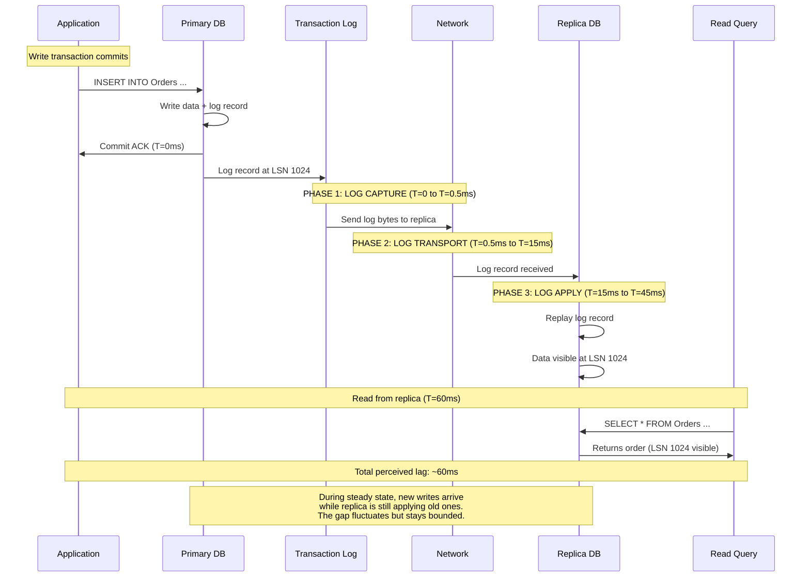
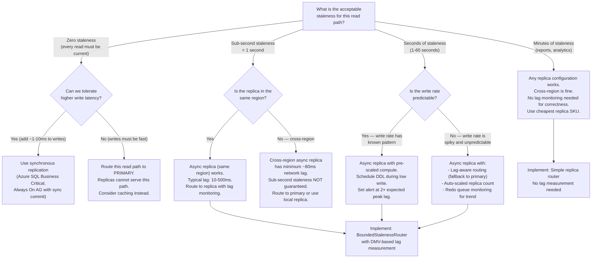

> [!success] Mastery Check
> - [ ] **Studied Well**
> - [ ] **Can explain the concept without notes**
> - [ ] **Can answer interview questions confidently**
> - [ ] **Can implement it in a real project**

---

id: "7.220" title: "Database Read Replicas — Replication Lag" domain: "System Design & Distributed Systems" domain_id: 7 group: "Scalability Patterns" tags: [system-design, distributed-systems, scalability, dotnet, azure, databases, read-replicas, replication-lag, consistency] priority: 1 version: 2 prerequisites:

- "[[7.219 — Database Read Replicas — Setup and Tradeoffs]]" — the foundational note establishing the primary-replica architecture, async replication mechanics with log stream traces, and the application-level read/write splitting pattern; replication lag is the cost of that architecture and this note explores it in depth
- "[[8.100 — Transactions and Concurrency in SQL Server]]" — replication lag interacts with transaction isolation; a replica query sees a consistent snapshot at a point in TIME (the replica's last applied LSN), not at the query's start time in the wall clock; understanding snapshot isolation is required to understand what "consistent" means on a lagging replica
- "[[8.101 — SQL Database Indexing and Query Performance]]" — lag spikes are often caused by DDL operations (index rebuilds, schema changes) that are single-threaded in replication apply; understanding which DDL operations block replication apply is the prerequisite for managing lag during deployment windows" related:
- "[[7.219 — Database Read Replicas — Setup and Tradeoffs]]" — 7.219 defines the architecture; 7.220 defines the consistency cost of that architecture. The two notes are inseparable — you cannot understand one without the other
- "[[7.221 — Database Read Replicas — Read-Your-Writes Problem]]" — the most common user-visible consequence of replication lag; read-your-writes violations occur when a client writes to the primary and then reads from a lagging replica; the solution patterns (session tokens, causal consistency, primary routing) are built on the lag measurement techniques established in this note
- "[[7.222 — Database Sharding — Overview]]" — in a sharded architecture, each shard's replica has its OWN replication lag; cross-shard queries must deal with heterogeneous lag (one shard's replica may be 50ms behind while another is 5s behind); the consistency model becomes significantly more complex
- "[[7.233 — Auto-Scaling — Reactive vs Predictive]]" — auto-scaling read replicas based on replication lag is a common pattern; reactive scaling (add replica when lag > threshold) is straightforward but introduces the oscillation problem (seeding a new replica increases lag temporarily); predictive scaling (pre-schedule replica count based on time-of-day patterns) avoids oscillation
- "[[7.253 — Caching as a Scalability Tool]]" — cache staleness (TTL-based) and replication lag (log-apply-based) are two different forms of data staleness; the application must handle both; cache-aside with replica fallback is the standard pattern for multi-layer read scaling
- "[[8.64 — SQL Server Transaction Log Internals]]" — the transaction log is the foundation of replication; understanding log sequence numbers (LSN), log generation rate, and log truncation is required to understand why lag spikes occur and how to diagnose them" created: 2026-06-16

---

> [!ABSTRACT] Quick Reference — Replication Lag **Invariant:** Replication lag is the time delta between a write transaction committing on the primary and that same transaction's changes becoming visible to a read query on the replica. This delta has three components: (a) log capture — the time from commit to the log record being ready for transport (sub-millisecond), (b) log transport — the network time to send the log bytes from primary to replica (0.1-100ms depending on distance), (c) log apply — the time for the replica to replay the log record against its local data files (0.1-100ms depending on write rate and replica compute). The total lag is the SUM of these three components. **Cost:** Every second of replication lag is a second where the application serves stale data from the replica. At 10,000 reads/second, 5 seconds of lag means 50,000 stale reads before the data catches up. The business cost depends on the read purpose — stale analytics data is harmless, stale inventory counts cause overselling. **Trigger:** The monitoring alert `replication_lag_seconds > threshold` fires. The threshold depends on the application's staleness SLO: a real-time dashboard may alert at 1s, a daily report may alert at 300s. The trigger is NOT the absolute lag value but the relationship between lag and the application's data freshness requirement. **Skip When:** The application uses synchronous replication (Always On Availability Group with synchronous commit) — lag is zero by definition, but write latency increases. Also skip when read replicas are not used at all (single primary serves all traffic) — lag is not a concern if there are no replicas.

---

## Navigation

**Domain:** [[7 — System Design & Distributed Systems]] > **Group:** Scalability Patterns
**Previous:** [[7.219 — Database Read Replicas — Setup and Tradeoffs]] | **Next:** [[7.221 — Database Read Replicas — Read-Your-Writes Problem]]

### Prerequisites

- [[7.219 — Database Read Replicas — Setup and Tradeoffs]] — establishes the primary-replica architecture and the replication mechanism that produces lag
- [[8.100 — Transactions and Concurrency in SQL Server]] — snapshot isolation on replicas determines what "consistent" means when reading stale data
- [[8.101 — SQL Database Indexing and Query Performance]] — DDL operations that cause lag spikes are the same ones that affect query performance

### Where This Fits

> [!INFO] Production Encounter Map
>
> - **Layer:** Replication latency analysis — sits at the intersection of database internals, networking, and application consistency. Understanding lag is NOT a DBA-only concern — the application engineer must design for it.
> - **Trigger:** The dashboard team reports that yesterday's revenue numbers changed between 9:00 AM and 9:15 AM — the data was read from a lagging replica during a write burst. Or: a customer reports "I placed an order and then it disappeared" — the order confirmation page read from a replica that had not yet received the order write.
> - **Without understanding replication lag:** The application treats replica reads as if they are always current. Data freshness violations are treated as bugs rather than the expected consequence of asynchronous replication. The team fires-fights with workarounds (increasing timeouts, adding replicas) without understanding the root cause.
> - **First signal that replication lag must be managed explicitly:** The application has read replicas AND the business has a data freshness requirement ( "users must see their data within 5 seconds"). The gap between "the replica is 30 seconds behind" and "the business requires 5-second freshness" creates the need for lag-aware routing, bounded staleness guarantees, or synchronous replication.

Replication lag is the defining cost of asynchronous read replicas. It is not a bug — it is a DESIGN CHOICE that trades data freshness for write performance, geographic distribution, and read capacity. The engineering challenge is not to eliminate lag (which would require synchronous replication, adding write latency), but to MEASURE it accurately, MONITOR it continuously, and ROUTE AROUND it when the application needs current data. Every team that uses read replicas must own their lag SLO — the maximum acceptable staleness for each read path — and build the instrumentation to know when they are violating it.

---

## Core Mental Model

Replication lag is the distance between two moving points: the primary's commit position and the replica's apply position. Think of the primary as a train laying a track (the transaction log) forward at a certain speed. The replica is a second train following the same track, but it must stop at each station (apply each log record). The gap between the two trains is the replication lag. The lead train (primary) may speed up (write burst) or slow down (low write volume). The trailing train (replica) may be faster (large compute, fast storage) or slower (small compute, shared I/O). The gap grows when the lead train is faster than the trailing train. The gap shrinks when the trailing train catches up — either because the lead train slows down or the trailing train gets more power (larger replica SKU).

The critical insight: **Replication lag is not a single number.** It has multiple components, each with different characteristics and different causes:

1. **Log generation rate** (primary side): How fast the primary generates transaction log bytes. This is driven by write volume (INSERT/UPDATE/DELETE) and transaction size (a single large batch generates log faster than many small transactions because of reduced log record overhead per row).

2. **Log transport latency** (network): The time to send log bytes from primary to replica. Within a region: 0.1-2ms (Azure datacenter network). Across regions: 10-200ms (depending on Azure region pair distance — US East to West Europe ≈ 80ms, US East to US West ≈ 40ms, US East to Southeast Asia ≈ 180ms). Network latency is PHYSICALLY BOUNDED by the speed of light in fiber — you cannot reduce it below ~0.5× the great-circle distance latency.

3. **Log apply rate** (replica side): How fast the replica can replay log records against its local storage. This depends on the replica's compute size (vCores, memory), storage IOPs, and the nature of the DML/DDL being applied. A single-threaded index rebuild on the primary becomes a single-threaded operation on the replica — causing a lag spike regardless of replica compute.

The total perceived lag is the sum of these three, but the DOMINANT component changes with conditions:
- **Low write volume**: Network latency dominates (even at 1 write/second, the network round trip adds 0.1-80ms depending on distance)
- **High write volume**: Log apply rate dominates (the replica's I/O capacity is the bottleneck)
- **DDL operations**: Log apply rate dominates AND spikes (index rebuilds, ALTER TABLE are single-threaded in apply)
- **Cross-region replica at low write volume**: Network latency is the floor (you cannot have sub-80ms lag from US East to West Europe regardless of replica compute)

> [!TIP] The Non-Obvious Insight
> The most common production mistake is monitoring ONLY the TOTAL lag (the difference between primary commit time and replica apply time). This single number hides whether the bottleneck is network, log apply, or a stuck replication process. A 10-second total lag could mean: (a) the network is slow (10 seconds of log bytes queued up because bandwidth is saturated), (b) the replica is CPU-bound (applying log slowly), (c) a single large transaction (e.g., index rebuild) is blocking apply, (d) replication is paused (backup on replica, replica out of disk, replica in the middle of a failover). Each requires a DIFFERENT fix: (a) increase bandwidth or compress log, (b) scale up replica, (c) avoid DDL during peak hours, (d) unpause or recreate replica. Monitoring the three components separately — send queue size, apply queue size, and last commit times — is the difference between a 10-minute diagnosis and a 2-hour war room.

### Classification

- **Lag types (Azure SQL Database):**
  - `log_send_queue_size` (KB) — how much log is waiting to be sent to the replica. High → network bandwidth bottleneck or replica is not consuming fast enough.
  - `log_send_rate` (KB/sec) — the rate at which log is being sent. Should match the primary's log generation rate during steady state.
  - `redo_queue_size` (KB) — how much received log is waiting to be applied on the replica. High → replica compute or I/O bottleneck.
  - `redo_rate` (KB/sec) — the rate at which log is applied on the replica.
  - `last_commit_time` — the timestamp of the last committed transaction on the primary.
  - `replica_last_commit_time` — the timestamp of the last committed transaction THAT HAS BEEN APPLIED on the replica.
  - `replication_lag_seconds` = `last_commit_time - replica_last_commit_time`.

- **Lag types (PostgreSQL streaming replication):**
  - `write_lag` — time between primary commit and replica receiving the log bytes.
  - `flush_lag` — time between primary commit and replica flushing log to WAL.
  - `replay_lag` — time between primary commit and replica APPLYING the log (making data visible to queries).
  - The three lags correspond to the three phases: transport, persist, apply.

- **Consistency model on a replica:** Snapshot isolation. A query on a replica sees a transaction-consistent snapshot of the database AS OF the point when the replica finished applying log up to a specific LSN. The query does NOT see partial transactions — it sees a point-in-time snapshot that is internally consistent. The staleness is how far BEHIND that snapshot is relative to the primary's current state.

- **Lag behavior characteristics:**
  - **Sawtooth pattern** (normal): Lag increases during write bursts, decreases during lulls. This is healthy — it means the replica is keeping up ON AVERAGE.
  - **Ramp pattern** (dangerous): Lag increases continuously without decreasing. The replica cannot keep up with the primary's write rate. Eventual unbounded lag → replica becomes too stale to serve useful reads → must be recreated.
  - **Step pattern** (DDL-related): Lag is stable at 50ms, suddenly jumps to 300 seconds during an index rebuild, then drops back to 50ms when the rebuild completes. This is expected for DDL operations that are single-threaded in apply.

### Primary Diagram



### Lag Measurement Trace (Azure SQL Database)

```
Timeline with 3 replicas at different distances:

Primary (US East, GP_Gen5_8)
  Write rate: 5,000 commits/sec (average 200 commits per 10ms batch)
  Log generation rate: ~2 MB/sec

Replica A (same region — US East, GP_Gen5_4)
  Network: 0.5ms
  Log send queue: 0 KB (always caught up — replica is in same datacenter)
  Redo queue: 0 KB (replica has sufficient compute for normal rate)
  Replication lag: 15-50ms (apply latency dominates)

Replica B (cross-region — West Europe, GP_Gen5_4)
  Network: 82ms (single direction)
  Log send queue: 200-500 KB (log builds up during network transit)
  Redo queue: 0-50 KB (replica keeps up after receiving log)
  Replication lag: 150-250ms (network time + apply time)

Replica C (cross-region — Southeast Asia, GP_Gen5_2)
  Network: 95ms
  Log send queue: 500-2000 KB (network bandwidth is bottleneck — logs queue up)
  Redo queue: 200-1000 KB (replica is undersized — cannot apply fast enough)
  Replication lag: 2-15 seconds (BOTH network AND apply are bottlenecks)

During a write burst (10,000 commits/sec for 60 seconds):

  Primary log generation: 5 MB/sec (spike)
  Replica A: lag spikes to 200ms, recovers in 30 seconds
  Replica B: lag spikes to 2 seconds, recovers in 2 minutes
  Replica C: lag grows unbounded (redo queue increases continuously)
    → Replica C reaches 60 seconds of lag
    → Alert: replica too stale for its intended use
    → Manual intervention: scale up or recreate replica
```

### Key Properties / Guarantees

|Property|Value|Condition|
|---|---|---|
|Typical same-region lag (Azure SQL GP)|10-500ms|Write volume < 10 MB/min log, replica same SKU as primary|
|Typical cross-region lag (Azure SQL GP)|1-60s|Depends on region pair distance and replica SKU|
|Minimum possible cross-region lag|~1× network RTT (e.g., US East→West Europe ≈ 80ms)|Cannot be less than the fiber optic round trip time|
|Lag during DDL (index rebuild, ALTER TABLE)|10× to 1000× normal|DDL is single-threaded in replication apply; replica may stall for duration of DDL|
|Unbounded lag threshold|When log send queue > replica apply capacity for > 5 minutes|Replica compute or I/O is permanently saturated|
|Synchronous replica lag|Zero|Commit waits for replica ACK — write latency increases by ~1× network RTT|
|Lag measurement resolution|100ms (Azure Monitor), sub-second (DMV queries)|DMV queries give real-time values; Azure Monitor aggregates over 1-minute windows|
|Lag heterogeneity across replicas|Can vary by 10× between replicas|Each replica has independent compute, network path, and apply load|

---

## Deep Mechanics

### How It Works

**Replication Lag — Full Pipeline Walkthrough:**

1. **Application commits a transaction on the primary.** The primary writes the data pages and the transaction log record (LSN N). The commit is acknowledged to the application.

2. **Log capture** (primary side, microseconds): The primary's log writer process copies the log record from the in-memory log buffer to the log file on disk. This is the same write that was done for the commit — there is no additional cost for replication at this stage. The log record is now available for transport.

3. **Log send** (primary side, continuous): The primary's log transport process reads log records from the log file (or from the in-memory log buffer, depending on the database engine) and SENDS them to the replica over the network. The send is asynchronous — the primary does not wait for the replica to ACK before processing the next write. The log send queue grows if the replica cannot consume the log as fast as the primary generates it.

4. **Network transit** (variable latency): The log bytes travel from the primary's region to the replica's region. For same-region replicas, this is within a single Azure datacenter or availability zone — typically 0.1-2ms. For cross-region replicas, this is the inter-region network link — typically 10-200ms depending on geographic distance.

5. **Log receive and persist** (replica side): The replica receives the log bytes and writes them to its local log file. In PostgreSQL, this is tracked by `flush_lag` — the time between the primary's commit and the replica's log flush. In Azure SQL, the replica writes received log to its local redo log file.

6. **Log apply (redo)** (replica side, the dominant component at high write rates): The replica's redo process reads log records from the local log file and REPLAYS them against the replica's data files. For DML (INSERT/UPDATE/DELETE), this is data page modifications — the replica reads the affected data page into memory, applies the change, and writes the page back. For DDL (CREATE INDEX, ALTER TABLE), this is a full structural change that may be single-threaded and I/O-intensive.

7. **Visibility** (query reads): A SELECT query on the replica sees all changes that have been applied up to the point the query starts. The query runs under snapshot isolation — it sees a transaction-consistent view of the data AT THE LSN WHEN THE QUERY BEGINS. If the redo process is at LSN 5000 and LSN 5020 is still in the redo queue, the query sees the state as of LSN 5000.

**The Critical Difference Between "Received" and "Applied":**

A log record that is RECEIVED by the replica but not yet APPLIED does not make the data visible to queries. This is the most important distinction in replication lag: the replica may have the log bytes on disk but the data pages have not been updated yet. The lag that matters for read freshness is the APPLY LAG — how far behind the replica's data pages are from the primary's committed state.

```
Primary Commit Time:     T=0ms
Replica Receive Time:    T=15ms  (log bytes arrived)
Replica Flush Time:      T=20ms  (log written to disk on replica)
Replica Apply Time:      T=45ms  (data page modified — VISIBLE TO QUERIES)

Replication lag (read-relevant) = 45ms (Apply Time - Commit Time)
Replication lag (transport only) = 15ms (Receive - Commit)

A query at T=30ms: sees data as of T=0ms (log received but not applied)
A query at T=50ms: sees data as of T=0ms (log applied at T=45ms)
```

**Lag During Write Bursts — The Accumulation and Drain Cycle:**

```
Write rate (commits/sec): 0 → 10,000 → 0 over 120 seconds

        Write Rate
  10K ─╮          ╱─╲
       │         ╱   ╲          Lag (seconds)
       │        ╱     ╲         5 ─╮
       │       ╱       ╲         4 │  ╱─╲
       │      ╱         ╲        3 │ ╱   ╲
       │     ╱           ╲       2 │╱     ╲
       │    ╱             ╲      1 ╱       ╲
       │   ╱               ╲    0╱         ╲___
       └──╱─────────────────╲──┘
         0s       60s       120s
  Phase 1: Lag increases  Phase 2: Lag drains
  (accumulation > apply)   (apply > generation)

Phase 1 (0-60s): Write rate exceeds replica apply capacity.
  Log send queue grows to 50 MB. Redo queue grows to 200 MB.
  Lag increases from 50ms to 8 seconds.
Phase 2 (60-120s): Write rate drops below replica apply capacity.
  Redo queue drains. Lag decreases from 8s back to 50ms.
  
The PEAK lag depends on TOTAL WRITE VOLUME during the burst and
replica apply RATE, not on the peak write rate alone.

Example:
  Replica apply rate: 5 MB/min
  Write burst volume: 15 MB over 60 seconds
  Time to drain: (15 - 5) / 5 = 2 minutes after burst ends
  Total time with elevated lag: 60s burst + 120s drain = 3 minutes
```

### Failure Modes

**Failure Mode 1: Unbounded Replication Lag — Replica Cannot Catch Up**

- **Cause:** The replica's apply capacity is permanently lower than the primary's log generation rate. This happens when: (a) the replica is undersized (e.g., GP_Gen5_2 replica for a GP_Gen5_16 primary), (b) the replica shares I/O with other workloads (e.g., multiple replicas on the same underlying storage), (c) the primary has a sustained write rate that exceeds the replica's maximum apply rate. The redo queue grows continuously, never draining. The lag increases without bound. After hours or days, the replica is millions of transactions behind — too far to be useful. The replication may be suspended by the platform to prevent the log disk on the primary from filling up.

- **Symptom:** `redo_queue_size` grows monotonically — it never returns to zero between write bursts. `replication_lag_seconds` increases steadily over hours or days. The replica's CPU is at 100% (apply process is CPU-bound). The data returned by replica queries becomes progressively more stale — what was 5 seconds behind at 10:00 AM is 5 hours behind by 4:00 PM. The application's data freshness SLO is violated for the entire workday.

- **Detection time:** The Azure Monitor alert `replication_lag_seconds > threshold (300s)` fires. The trend shows the lag increasing with no recovery pattern. The DMV query `sys.dm_geo_replication_link_status` shows `redo_queue_size` growing and `redo_rate` flat (the replica cannot apply faster).

**Fix:**

```sql
-- ❌ WRONG: Ignoring the trend — assuming lag will self-correct
-- "The replica was fine yesterday, it will catch up tonight during low traffic."
-- But if the primary's sustained write rate exceeds the replica's max apply rate,
-- the replica will NEVER catch up — it will keep falling further behind.

-- ✅ FIX 1: Scale up the replica to match the primary's write rate
-- Azure CLI: Scale replica from GP_Gen5_2 to GP_Gen5_8
az sql db replica create --resource-group orders-rg \
    --server orders-primary --database orders-db \
    --partner-server orders-replica-1 \
    --sku GP_Gen5_8  --auto-pause-delay -1

-- ✅ FIX 2: Add more replicas to distribute the log apply load
-- Multiple replicas EACH apply the full log independently.
-- If one replica cannot keep up, the OTHERS can still serve reads.
-- However, each replica still applies the FULL log — they do not
-- split the apply work. Adding replicas does not increase apply
-- capacity for any SINGLE replica.
-- To fix unbounded lag, you must INCREASE APPLY CAPACITY:
--   larger replica SKU, faster storage, dedicated I/O.

-- ✅ FIX 3: Reduce the primary's log generation rate
-- If the primary is generating more log than replicas can apply:
--   (a) Batch writes into larger transactions (fewer log records per row)
--   (b) Reduce index rebuild frequency during peak hours
--   (c) Archive old data to reduce the working set size
--   (d) Use partitioning to reduce index maintenance log volume

-- ✅ FIX 4: If the replica is too far behind, recreate it
-- When lag exceeds hours, it is faster to DROP and RECREATE the replica
-- than to wait for it to catch up. Initial seed may be faster than
-- applying millions of pending log records.

-- ✅ FIX 5: Switch to synchronous replication for critical workloads
-- Azure SQL Database Business Critical tier uses synchronous Always On AG.
-- Zero lag. Cost: write latency increases by ~1ms (within same region).
-- Not available in General Purpose tier.
```

**Cost of not fixing:** The replica becomes too stale to serve useful reads. Queries return data that is hours old. The application's data freshness SLO is violated. If the application routes reads to the replica without lag awareness, users see incorrect data (stale inventory counts, missing orders, incorrect balances). The replica must eventually be recreated — a costly operation for large databases (hours of seeding I/O on the primary).

---

**Failure Mode 2: DDL-Induced Lag Spike — Index Rebuild Freezes Replica Apply**

- **Cause:** A DDL operation runs on the primary — typically index rebuild, ALTER TABLE, or online schema change. In Azure SQL Database and PostgreSQL streaming replication, DDL is replicated as a single log record. The replica must apply this record ATOMICALLY — it cannot parallelize it. During the apply, the redo process on the replica is SINGLE-THREADED and BLOCKED on the DDL operation. For a 5-minute index rebuild on the primary, the replica's redo process is stuck for approximately the same duration (possibly longer if the replica has less memory or slower I/O). All writes that occurred BEFORE and DURING the index rebuild accumulate in the redo queue. When the DDL apply completes, the replica must replay all accumulated writes — which can take additional minutes.

- **Symptom:** Replication lag is stable at 50ms. An index rebuild starts on the primary. Within 1 minute, lag spikes to 300+ seconds (5+ minutes). The spike persists for the duration of the index rebuild + time to drain the accumulated redo queue. The application that reads from replicas during this window sees data that is minutes stale. The support team receives reports of "missing data" from dashboard users.

- **Detection time:** The `replication_lag_seconds` alert fires during the scheduled index maintenance window. The DMV shows `redo_queue_size` growing rapidly while `redo_rate` drops to near zero (the DDL is blocking apply). Checking the primary's recent DDL operations confirms the index rebuild.

**Fix:**

```sql
-- ❌ WRONG: Running index maintenance during peak hours
-- Primary at 6 PM:
ALTER INDEX IX_Orders_OrderDate ON Orders REBUILD WITH (ONLINE = ON);
-- Replica redo freezes for the duration of ONLINE rebuild (still blocking!)
-- Users on replica dashboards see 15-minute stale data

-- ✅ FIX 1: Use ONLINE index operations where supported
-- Azure SQL Database supports ONLINE index rebuilds (Enterprise edition features).
-- ONLINE operations minimize blocking on the PRIMARY but still cause
-- a lag spike on the REPLICA (the DDL log record is large).
-- ONLINE is better than OFFLINE for the primary, but does not eliminate
-- the replica lag spike.

-- ✅ FIX 2: Schedule DDL operations during LOW WRITE VOLUME periods
-- Run index rebuilds at 2 AM (low traffic).
-- Even if lag spikes to 10 minutes, few users are affected.
EXEC sp_configure 'index_maintenance_window', '02:00';

-- ✅ FIX 3: For very large indexes, rebuild on the replica FIRST
-- (PostgreSQL only — NOT supported on Azure SQL Database)
-- In PostgreSQL: create the index CONCURRENTLY on the replica,
-- then create it on the primary. The replica's concurrent index
-- creation does not block replication apply.
-- CREATE INDEX CONCURRENTLY IX_Orders_OrderDate ON Orders (OrderDate);
-- Not available for Azure SQL Database — indexes are created on primary
-- and replicated as DDL.

-- ✅ FIX 4: Use partition switching instead of index rebuilds
-- If the table is partitioned by date:
--   1. Create new partition with desired index structure
--   2. SWITCH old partition out
--   3. Rebuild index on old partition offline (no user impact)
-- Partition switching is a metadata-only operation — minimal log.
ALTER TABLE Orders SWITCH PARTITION 1 TO Orders_Archive;

-- ✅ FIX 5: Accept the lag spike and communicate it
-- If the replica is used for reporting and the report SLO allows
-- 30-minute staleness, the DDL lag spike is acceptable.
-- Document: "Reporting replica may show data up to 15 minutes
-- stale during nightly index maintenance window (2 AM - 4 AM)."
```

**Cost of not fixing:** During DDL operations — which are often scheduled during "low traffic" windows — the replica becomes significantly stale. If the replica is used for read-your-writes critical paths (order confirmation, user profile updates), the staleness causes user-facing data loss perception. The runtime is unpredictable — a 5-minute index rebuild may cause 15 minutes of elevated lag (5 min DDL + 10 min draining accumulated log).

---

**Failure Mode 3: Lag Heterogeneity — One Replica Is Significantly Behind Others**

- **Cause:** Multiple read replicas have different compute sizes, different network paths, or different levels of concurrent read query load. Replica A (GP_Gen5_4, same region, low read traffic) has 50ms lag. Replica B (GP_Gen5_2, same region, high read traffic) has 5 second lag. The application uses a failover group reader endpoint that distributes queries across ALL replicas. A user's first request hits Replica A (current data), the second request hits Replica B (stale data) — the user sees DATA FROM THE FUTURE DISAPPEAR. This is more confusing than consistent staleness because the data appears and disappears as requests are routed to different replicas.

- **Symptom:** Users report "the dashboard shows different data every time I refresh." The application's monitoring shows that the same query returns different results when executed multiple times within seconds. The `replication_lag_seconds` metric shows a wide spread across replicas (min: 50ms, max: 15s). The reader endpoint distributes queries uniformly, so the user sees inconsistent staleness.

- **Detection time:** The team notices that `replication_lag_seconds` across replicas has high variance. The P99 of the max lag across replicas exceeds the staleness SLO. User reports confirm the pattern: "if I refresh 3 times, one of the refreshes shows old data."

**Fix:**

```csharp
// ❌ WRONG: Using a failover group reader endpoint that load-balances
// across ALL replicas regardless of their individual lag.
// Application routes all read queries to the reader endpoint —
// queries may hit a lagging replica.

// ✅ FIX 1: Decomission or scale up the slowest replicas
// Ensure all replicas in the reader endpoint have the same SKU
// and are not overloaded by concurrent read queries.
// Replica B: scale from GP_Gen5_2 to GP_Gen5_4 (same as Replica A)

// ✅ FIX 2: Use separate reader endpoints for different staleness SLOs
// Create two failover groups (or two DNS endpoints):
//   - "reader-fresh" (replicas with lag < 1s, may include primary as fallback)
//   - "reader-stale" (all replicas, including slower ones)
// Application routes time-sensitive reads to "reader-fresh" and
// reporting/batch reads to "reader-stale".

// ✅ FIX 3: Application-level lag-aware replica selection
// Query each replica's lag and select the least-lagged one
public sealed class LagAwareReplicaSelector
{
    private readonly List<string> _replicaConnectionStrings;

    public async Task<string> GetBestReplicaAsync(CancellationToken ct)
    {
        var tasks = _replicaConnectionStrings
            .Select(async cs => new
            {
                ConnectionString = cs,
                Lag = await GetReplicaLagAsync(cs, ct)
            });

        var results = await Task.WhenAll(tasks);

        // Select the replica with the lowest lag
        return results.OrderBy(r => r.Lag).First().ConnectionString;
    }

    private async Task<TimeSpan> GetReplicaLagAsync(
        string connectionString, CancellationToken ct)
    {
        using var conn = new SqlConnection(connectionString);
        await conn.OpenAsync(ct);

        using var cmd = new SqlCommand(@"
            SELECT DATEDIFF(SECOND,
                (SELECT MAX(last_commit_time)
                 FROM sys.dm_db_log_stats WITH (NOLOCK)),
                (SELECT MIN(last_commit_time)
                 FROM sys.dm_geo_replication_link_status WITH (NOLOCK)
                 WHERE partner_database_id = DB_ID())
            );", conn);

        cmd.CommandTimeout = 3;
        var result = await cmd.ExecuteScalarAsync(ct);
        return TimeSpan.FromSeconds(result is int s ? s : 0);
    }
}

// ✅ FIX 4: Remove lagging replicas from the reader endpoint
// If a replica consistently lags (> 30s for more than 10 minutes),
// remove it from the failover group reader endpoint until it recovers.
// Azure PowerShell:
Remove-AzSqlDatabaseFromFailoverGroup `
    -ResourceGroupName "orders-rg" `
    -ServerName "orders-primary" `
    -FailoverGroupName "orders-fg" `
    -Database "orders-db"
# Re-add when the replica catches up:
Add-AzSqlDatabaseToFailoverGroup `
    -ResourceGroupName "orders-rg" `
    -ServerName "orders-primary" `
    -FailoverGroupName "orders-fg" `
    -Database "orders-db"
```

**Cost of not fixing:** Users experience INCONSISTENT staleness — data appears and disappears between page refreshes. This is more damaging to user trust than consistent staleness because users interpret it as a bug ("the dashboard is broken") rather than as acceptable latency. The support team cannot explain the pattern because it depends on which replica serves each request.

---

**Failure Mode 4: Replication Lag after Failover — New Primary Has No Replicas**

- **Cause:** A failover event promotes a replica to primary (manual or automatic). The new primary has a DIFFERENT set of log records than the old primary — it may be missing some transactions that were committed on the old primary but not yet replicated (data loss if asynchronous replication was used). After failover, the NEW primary has no replicas of its own — the old primary (now a replica) must re-initialize replication. Until the new replica setup completes, there are NO read replicas available. The period without replicas can last from minutes (same-region, small database) to hours (cross-region, large database).

- **Symptom:** After failover, all read queries that were routed to replicas now either fail (if the reader endpoint is configured to fail over) or return stale data (if the reader endpoint was pointing to a different replica that was NOT promoted). The read capacity that was provided by replicas is temporarily unavailable. The primary must handle ALL read AND write traffic — CPU spikes, read latency increases. If the original primary was at 85% CPU before failover, it may hit 100% now that it handles all reads.

- **Detection time:** After the failover event, the monitoring dashboard shows replica count = 0. `replication_lag_seconds` is undefined (no replicas to measure). The primary's CPU spikes as it absorbs read traffic that was previously served by replicas.

**Fix:**

```csharp
// ❌ WRONG: Failing over without ensuring replica capacity is restored
// Failover promotes Replica A to primary.
// Old primary (now Replica A) has no replicas.
// The application still has two connection strings (read-write and read-only).
// The read-only endpoint fails (no replicas) → read queries fail.

// ✅ FIX 1: Configure the failover group to allow read-only routing to the primary
// Azure SQL Database failover group:
//   AllowReadOnlyFailoverToPrimary = true
// When no replicas are available, read-only queries are routed to the primary.
// The application does NOT see read failures — but read latency increases.
$gateway = Get-AzSqlDatabaseFailoverGroup `
    -ResourceGroupName "orders-rg" `
    -ServerName "orders-primary" `
    -FailoverGroupName "orders-fg"

$gateway.ReadOnlyEndpoint.FailoverPolicy = "Enabled"
Set-AzSqlDatabaseFailoverGroup -FailoverGroup $gateway

// ✅ FIX 2: Pre-provision a replica in the target failover region
// Before initiating failover, ensure that the target region has
// a replica ready. This replica becomes the new primary's replica.
// Azure: create a replica of the secondary BEFORE failover.

// ✅ FIX 3: In the application, implement fallback from replica to primary
public sealed class ResilientReadRouter
{
    public async Task<IDbConnection> GetReadConnectionAsync(CancellationToken ct)
    {
        try
        {
            var replicaConn = await ConnectToReplicaAsync(ct);
            return replicaConn;
        }
        catch (SqlException ex) when (ex.Number == 4060) // Cannot open database
        {
            _logger.LogWarning("Replica unavailable, falling back to primary.");
            return await ConnectToPrimaryAsync(ct);
        }
    }
}

// ✅ FIX 4: Monitor the replica restoration progress after failover
// Query the new replica's seeding status:
SELECT partner_server, partner_database,
    synchronization_state_desc, synchronization_health_desc
FROM sys.dm_geo_replication_link_status;
-- synchronization_state = 'CATCHUP' means replica is being seeded
-- synchronization_state = 'SUSPENDED' means replication is not active
```

**Cost of not fixing:** After failover, the application loses its read capacity entirely. The primary handles all traffic — both reads and writes — doubling its load. If the primary was already near capacity, the combined read+write load causes performance degradation or downtime. The read SLO is violated until replicas are restored, which may take hours for large databases.

---

**Failure Mode 5: Application-Level Lag Measurement Is Wrong — False Positives or False Negatives**

- **Cause:** The application measures replication lag by querying a DMV on the primary (`sys.dm_geo_replication_link_status`) or on the replica (`sys.dm_db_log_stats`). But the measurement itself is subject to timing issues: (a) the query runs on the primary, which has zero lag — the measurement includes network round trip time between the application and the primary; (b) the query runs on the replica, which may return stale lag data if the measurement query itself is affected by lag; (c) the lag measurement query runs every N seconds (e.g., 60 seconds), and the application reads from the replica BETWEEN lag checks — using a lag value that is up to 60 seconds old; (d) the DMV reports lag in SECONDS (integer precision), which truncates sub-second differences — a 1.9-second lag and a 1.1-second lag both appear as 1 second.

- **Symptom:** The application's lag-aware router THINKS the replica has 0 seconds of lag (DMV reports 0 because it truncates to integer seconds) — but the real lag is 900ms. The application routes a read-after-write query to the replica. The order does not appear. The application falls back to the primary (if it has a fallback), masking the issue — but performance is worse because of the extra round trip. The metric `read_your_writes_violation` shows violations even though the DMV reports zero lag.

- **Detection time:** A detailed investigation shows that lag violations correlate with sub-second lags that the DMV rounded to zero. The team adds a higher-precision measurement and discovers that the replica consistently has 500ms-1.5s lag during peak hours — not the 0 seconds the DMV reports.

**Fix:**

```sql
-- ❌ WRONG: Using DATEDIFF(SECOND, ...) — integer truncation hides sub-second lag
SELECT DATEDIFF(SECOND,
    last_commit_time,
    replica_last_commit_time) AS lag_seconds
FROM sys.dm_geo_replication_link_status;
-- Lag of 900ms → reports as 0 seconds! False negative.

-- ✅ FIX: Use MILLISECOND or fractional second precision
SELECT DATEDIFF(MILLISECOND,
    AG.last_commit_time,
    LINK.replica_last_commit_time) / 1000.0 AS lag_seconds
FROM sys.dm_geo_replication_link_status LINK
CROSS APPLY (
    SELECT MAX(last_commit_time) AS last_commit_time
    FROM sys.dm_db_log_stats WITH (NOLOCK)
) AG;
-- Lag of 900ms → reports as 0.900 seconds. Accurate.

-- ✅ FIX (PostgreSQL): pg_stat_replication reports lag as INTERVAL
-- which has microsecond precision by default:
SELECT
    application_name,
    write_lag,
    flush_lag,
    replay_lag
FROM pg_stat_replication;
-- Returns intervals like '00:00:00.897' (897ms)
```

```csharp
// ✅ FIX — Application-side lag measurement with high precision:
public sealed class HighPrecisionLagMonitor
{
    public async Task<double> GetLagSecondsAsync(CancellationToken ct)
    {
        using var conn = new SqlConnection(_primaryConnectionString);
        await conn.OpenAsync(ct);

        using var cmd = new SqlCommand(@"
            SELECT CAST(
                DATEDIFF(MILLISECOND,
                    (SELECT MAX(last_commit_time)
                     FROM sys.dm_db_log_stats WITH (NOLOCK)),
                    (SELECT MIN(replica_last_commit_time)
                     FROM sys.dm_geo_replication_link_status WITH (NOLOCK)
                     WHERE partner_database_id = DB_ID()))
            AS FLOAT) / 1000.0;", conn);

        cmd.CommandTimeout = 5;
        var result = await cmd.ExecuteScalarAsync(ct);
        return result is double d ? d : 0.0;
    }
}
```

**Cost of not fixing:** The application's lag-aware routing makes decisions based on incorrect lag measurements. When the DMV reports 0 seconds (because of integer truncation), the application routes writes to replicas that are actually 900ms behind — causing read-your-writes violations. The measurement error is invisible because the monitoring dashboard also uses the same low-precision DMV query and shows "lag = 0s." The fix is to use millisecond precision in all lag measurement queries.

---

### .NET and Azure Integration

- **Azure SQL Database geo-replication DMVs:**
  - `sys.dm_geo_replication_link_status` — per-replica lag, send queue, redo queue, state
  - `sys.dm_db_log_stats` — primary's last commit time
  - `sys.dm_db_log_space_usage` — primary's log file utilization (lag risk indicator)
  - Query these from the PRIMARY database (they report replica status from the primary's perspective)

- **Azure Monitor metrics for replication lag:**
  - `replication_lag` (Azure SQL Database) — in seconds, 1-minute resolution
  - `log_send_queue_size` — KB of log waiting to be sent (network bottleneck indicator)
  - `redo_queue_size` — KB of log waiting to be applied (replica compute bottleneck indicator)
  - Available in Azure Portal, Azure Monitor, and as alerts

- **PostgreSQL `pg_stat_replication`:**
  - `write_lag` — log transport latency
  - `flush_lag` — log persist latency
  - `replay_lag` — log apply latency (the one that matters for read freshness)
  - Query from the PRIMARY

- **.NET monitoring integration:**
  - Use `IHostedService` to poll lag DMVs periodically
  - Publish as Prometheus/Grafana metrics via `IMetricsPublisher`
  - Use lag measurements in the connection router (as shown in 7.219's `ReadWriteDatabaseRouter`)

```csharp
// Program.cs — Lag Monitoring Background Service
public sealed class ReplicaLagMonitor : BackgroundService
{
    private readonly string _primaryConnectionString;
    private readonly IMetricsPublisher _metrics;
    private readonly ILogger<ReplicaLagMonitor> _logger;

    protected override async Task ExecuteAsync(CancellationToken ct)
    {
        while (!ct.IsCancellationRequested)
        {
            try
            {
                using var conn = new SqlConnection(_primaryConnectionString);
                await conn.OpenAsync(ct);

                using var cmd = new SqlCommand(@"
                    SELECT
                        LINK.partner_server AS ReplicaServer,
                        DATEDIFF(MILLISECOND,
                            AG.last_commit_time,
                            LINK.replica_last_commit_time) / 1000.0 AS LagSeconds,
                        LINK.log_send_queue_size_kb,
                        LINK.redo_queue_size_kb
                    FROM sys.dm_geo_replication_link_status LINK
                    CROSS APPLY (
                        SELECT MAX(last_commit_time) AS last_commit_time
                        FROM sys.dm_db_log_stats WITH (NOLOCK)
                    ) AG;", conn);

                cmd.CommandTimeout = 10;

                using var reader = await cmd.ExecuteReaderAsync(ct);
                while (await reader.ReadAsync(ct))
                {
                    var replica = reader.GetString(0);
                    var lag = reader.GetDouble(1);
                    var sendQueue = reader.GetInt64(2);
                    var redoQueue = reader.GetInt64(3);

                    _metrics.PublishGauge("replication_lag_seconds", lag,
                        ("replica", replica));
                    _metrics.PublishGauge("log_send_queue_kb", sendQueue,
                        ("replica", replica));
                    _metrics.PublishGauge("redo_queue_kb", redoQueue,
                        ("replica", replica));

                    if (lag > 30)
                    {
                        _logger.LogWarning(
                            "Replica {Replica} lag is {Lag:F1}s " +
                            "(send queue: {SendQueue}KB, redo queue: {RedoQueue}KB)",
                            replica, lag, sendQueue, redoQueue);
                    }
                }
            }
            catch (Exception ex)
            {
                _logger.LogError(ex, "Failed to query replication lag");
            }

            await Task.Delay(TimeSpan.FromSeconds(15), ct);
        }
    }
}
```

---

## Production Patterns and Implementation

### Primary Implementation — Bounded Staleness Read Router with Lag Measurement

```csharp
using System.Data;
using Microsoft.Data.SqlClient;

/// <summary>
/// Routes read queries to a replica that is within the acceptable
/// staleness bound. If no replica meets the staleness requirement,
/// falls back to the primary. Measures lag at millisecond precision
/// using DMVs and caches the result for the specified interval.
/// </summary>
public sealed class BoundedStalenessRouter : IDisposable
{
    private readonly string _primaryConnectionString;
    private readonly IReadOnlyList<string> _replicaConnectionStrings;
    private readonly double _maxStalenessSeconds;
    private readonly TimeSpan _cacheInterval;
    private readonly ILogger<BoundedStalenessRouter> _logger;

    private ReplicaLagSnapshot? _cachedLag;
    private DateTime _lastCacheTime = DateTime.MinValue;
    private readonly SemaphoreSlim _cacheLock = new(1, 1);

    public BoundedStalenessRouter(
        string primaryConnectionString,
        IReadOnlyList<string> replicaConnectionStrings,
        double maxStalenessSeconds,
        TimeSpan cacheInterval,
        ILogger<BoundedStalenessRouter> logger)
    {
        _primaryConnectionString = primaryConnectionString;
        _replicaConnectionStrings = replicaConnectionStrings;
        _maxStalenessSeconds = maxStalenessSeconds;
        _cacheInterval = cacheInterval;
        _logger = logger;
    }

    /// <summary>
    /// Returns a connection to the replica with the lowest lag that
    /// is within the acceptable staleness bound. If no replica meets
    /// the bound, falls back to the primary.
    /// </summary>
    public async Task<SqlConnection> GetReadConnectionAsync(CancellationToken ct)
    {
        var snapshot = await GetLagSnapshotAsync(ct);

        // Filter replicas within the staleness bound
        var acceptable = snapshot.Replicas
            .Where(r => r.LagSeconds <= _maxStalenessSeconds)
            .OrderBy(r => r.LagSeconds)
            .ToList();

        if (acceptable.Count > 0)
        {
            var best = acceptable[0];
            _logger.LogDebug(
                "Selected replica {Replica} with lag {Lag:F2}s (bound: {Bound}s)",
                best.Name, best.LagSeconds, _maxStalenessSeconds);

            return await OpenConnectionAsync(best.ConnectionString, ct);
        }

        // No replica within bounds — fall back to primary
        _logger.LogWarning(
            "No replica within staleness bound ({Bound}s). " +
            "Falling back to primary. Max replica lag: {MaxLag:F2}s",
            _maxStalenessSeconds, snapshot.Replicas.Max(r => r.LagSeconds));

        return await OpenConnectionAsync(_primaryConnectionString, ct);
    }

    private async Task<ReplicaLagSnapshot> GetLagSnapshotAsync(
        CancellationToken ct)
    {
        if (_cachedLag is not null &&
            DateTime.UtcNow - _lastCacheTime < _cacheInterval)
        {
            return _cachedLag;
        }

        await _cacheLock.WaitAsync(ct);
        try
        {
            // Double-check after acquiring lock
            if (_cachedLag is not null &&
                DateTime.UtcNow - _lastCacheTime < _cacheInterval)
            {
                return _cachedLag;
            }

            _cachedLag = await MeasureLagAsync(ct);
            _lastCacheTime = DateTime.UtcNow;
            return _cachedLag;
        }
        finally
        {
            _cacheLock.Release();
        }
    }

    private async Task<ReplicaLagSnapshot> MeasureLagAsync(CancellationToken ct)
    {
        var replicaTasks = _replicaConnectionStrings
            .Select(async cs =>
            {
                try
                {
                    var lag = await MeasureSingleReplicaLagAsync(cs, ct);
                    return new ReplicaLagInfo(
                        ExtractServerName(cs), cs, lag);
                }
                catch (Exception ex)
                {
                    _logger.LogWarning(ex,
                        "Failed to measure lag for replica {CS}", cs);
                    return new ReplicaLagInfo(
                        ExtractServerName(cs), cs, double.MaxValue);
                }
            });

        var results = await Task.WhenAll(replicaTasks);
        return new ReplicaLagSnapshot(results);
    }

    private async Task<double> MeasureSingleReplicaLagAsync(
        string connectionString, CancellationToken ct)
    {
        using var conn = new SqlConnection(connectionString);
        await conn.OpenAsync(ct);

        // Measure lag from the REPLICA's perspective:
        // Query the primary's last commit vs the replica's last applied commit
        using var cmd = new SqlCommand(@"
            SELECT CAST(
                DATEDIFF(MILLISECOND,
                    (SELECT MAX(last_commit_time)
                     FROM sys.dm_db_log_stats WITH (NOLOCK)),
                    (SELECT MAX(last_commit_time)
                     FROM sys.dm_db_log_stats WITH (NOLOCK)))
            AS FLOAT) / 1000.0;", conn);

        cmd.CommandTimeout = 5;
        var result = await cmd.ExecuteScalarAsync(ct);
        return result is double d ? d : double.MaxValue;
    }

    private static async Task<SqlConnection> OpenConnectionAsync(
        string connectionString, CancellationToken ct)
    {
        var conn = new SqlConnection(connectionString);
        await conn.OpenAsync(ct);
        return conn;
    }

    private static string ExtractServerName(string connectionString)
    {
        var csb = new SqlConnectionStringBuilder(connectionString);
        return csb.DataSource;
    }

    public void Dispose()
    {
        _cacheLock.Dispose();
    }

    private sealed record ReplicaLagInfo(
        string Name, string ConnectionString, double LagSeconds);

    private sealed record ReplicaLagSnapshot(
        IReadOnlyList<ReplicaLagInfo> Replicas);
}
```

### Configuration and Wiring

```csharp
// Program.cs — Bounded Staleness Router Registration
var builder = WebApplication.CreateBuilder(args);

var primaryCs = builder.Configuration.GetConnectionString("DefaultConnection");
var replica1Cs = builder.Configuration.GetConnectionString("Replica1");
var replica2Cs = builder.Configuration.GetConnectionString("Replica2");

var maxLagSeconds = builder.Configuration.GetValue<double>(
    "Database:BoundedStaleness:MaxLagSeconds", 5.0);
var cacheIntervalSeconds = builder.Configuration.GetValue<int>(
    "Database:BoundedStaleness:LagCacheIntervalSeconds", 10);

var replicas = new[] { replica1Cs, replica2Cs }
    .Where(cs => !string.IsNullOrEmpty(cs))
    .ToList();

builder.Services.AddSingleton<BoundedStalenessRouter>(sp =>
    new BoundedStalenessRouter(
        primaryCs!,
        replicas!,
        maxLagSeconds,
        TimeSpan.FromSeconds(cacheIntervalSeconds),
        sp.GetRequiredService<ILogger<BoundedStalenessRouter>>()));

builder.Services.AddHostedService<ReplicaLagMonitor>();

builder.Services.AddScoped<OrderRepository>();

var app = builder.Build();
app.Run();
```

```json
// appsettings.json
{
  "ConnectionStrings": {
    "DefaultConnection": "Server=orders-primary.database.windows.net;Database=OrdersDb;User Id=app_user;Password=...;ApplicationIntent=ReadWrite;",
    "Replica1": "Server=orders-replica-1.database.windows.net;Database=OrdersDb;User Id=app_user;Password=...;ApplicationIntent=ReadOnly;",
    "Replica2": "Server=orders-replica-2.database.windows.net;Database=OrdersDb;User Id=app_user;Password=...;ApplicationIntent=ReadOnly;"
  },
  "Database": {
    "BoundedStaleness": {
      "MaxLagSeconds": 5.0,
      "LagCacheIntervalSeconds": 10
    },
    "Alerts": {
      "ReplicaLagWarningSeconds": 10,
      "ReplicaLagCriticalSeconds": 60
    }
  }
}
```

```bicep
// main.bicep — Azure SQL Database with lag alert rules
resource sqlServer 'Microsoft.Sql/servers@2021-11-01' = {
  name: 'orders-primary'
  location: resourceGroup().location
}

resource sqlDb 'Microsoft.Sql/servers/databases@2021-11-01' = {
  name: 'orders-db'
  parent: sqlServer
  sku: { name: 'GP_Gen5_4' tier: 'GeneralPurpose' }
}

// Lag metric alert
resource lagAlert 'Microsoft.Insights/metricAlerts@2018-03-01' = {
  name: 'replication-lag-critical'
  location: 'global'
  properties: {
    severity: 1
    enabled: true
    scopes: [sqlDb.id]
    criteria: {
      allOf: [
        {
          name: 'ReplicationLagSeconds'
          metricName: 'replication_lag_seconds'
          operator: 'GreaterThan'
          threshold: 60
          timeAggregation: 'Maximum'
          windowSize: 'PT5M'
        }
      ]
    }
    actions: []
  }
}
```

### Common Variants

**1. Staleness-Dependent Read Routing (Tiered Freshness):**

```csharp
/// <summary>
/// Routes reads based on the application's freshness requirement.
/// Critical reads (order confirmation, payment status) go to primary.
/// Fresh reads (user profile, order history within 1 minute) go to
/// replicas with sub-second lag.
/// Stale reads (reports, analytics, batch jobs) go to any replica.
/// </summary>
public enum FreshnessRequirement
{
    Current,    // Must see latest write — route to primary
    Fresh,      // Must be within 1 second — route to fast replica
    Stale       // Any staleness acceptable — route to any replica
}

public class TieredReadRouter
{
    public async Task<SqlConnection> GetConnectionAsync(
        FreshnessRequirement freshness, CancellationToken ct)
    {
        return freshness switch
        {
            FreshnessRequirement.Current =>
                await _primaryConnector.GetConnectionAsync(ct),

            FreshnessRequirement.Fresh =>
                await _boundedStalenessRouter.GetReadConnectionAsync(ct),

            FreshnessRequirement.Stale =>
                await _anyReplicaRouter.GetReadConnectionAsync(ct),

            _ => await _primaryConnector.GetConnectionAsync(ct)
        };
    }
}

// Usage in service:
var orders = await _orderRepository.GetOrdersAsync(
    customerId, FreshnessRequirement.Fresh, ct);

var confirmation = await _orderRepository.GetOrderAsync(
    orderId, FreshnessRequirement.Current, ct);

var report = await _orderRepository.GetRevenueReportAsync(
    dateRange, FreshnessRequirement.Stale, ct);
```

**2. Lag Prediction — Anticipating Lag Before It Exceeds the SLO:**

```csharp
/// <summary>
/// Predicts when replication lag will exceed the staleness SLO
/// based on current write rate and replica apply capacity.
/// Uses a simple linear predictor: if the redo queue is growing
/// at X KB/sec and has Y KB, it will take Y/X seconds to drain.
/// If Y/X exceeds the SLO, preemptively route to primary.
/// </summary>
public sealed class PredictiveLagRouter
{
    public async Task<bool> ShouldUsePrimaryAsync(CancellationToken ct)
    {
        var lag = await GetLagSnapshotAsync(ct);

        foreach (var replica in lag.Replicas)
        {
            if (replica.LagSeconds > _maxStalenessSeconds)
                return true; // Already exceeding — route to primary

            // Predict drain time
            if (replica.RedoQueueKb > 0 && replica.RedoRateKbPerSec > 0)
            {
                var drainSeconds = replica.RedoQueueKb / replica.RedoRateKbPerSec;
                var predictedLag = replica.LagSeconds + drainSeconds;

                if (predictedLag > _maxStalenessSeconds)
                {
                    _logger.LogInformation(
                        "Predicted lag {Predicted:F1}s exceeds bound {Bound}s " +
                        "(current: {Current:F1}s, redo queue: {Queue}KB, " +
                        "apply rate: {Rate}KB/s). Routing to primary.",
                        predictedLag, _maxStalenessSeconds,
                        replica.LagSeconds, replica.RedoQueueKb,
                        replica.RedoRateKbPerSec);

                    return true;
                }
            }
        }

        return false;
    }
}
```

**3. Lag-Based Read Replica Auto-Scaling:**

```csharp
/// <summary>
/// Automatically adds a read replica when replication lag exceeds
/// the warning threshold AND the redo queue is growing (indicating
/// sustained overload). Removes replicas when lag is consistently low.
/// </summary>
public sealed class LagBasedAutoScaler : BackgroundService
{
    private readonly IAzureDatabaseManagement _azure;
    private readonly IDatabaseMetrics _metrics;
    private readonly int _maxReplicas = 5;
    private readonly int _minReplicas = 2;
    private readonly TimeSpan _cooldown = TimeSpan.FromMinutes(15);

    private int _currentReplicas;
    private DateTime _lastScaleAction = DateTime.MinValue;

    protected override async Task ExecuteAsync(CancellationToken ct)
    {
        while (!ct.IsCancellationRequested)
        {
            await Task.Delay(TimeSpan.FromMinutes(1), ct);

            if (DateTime.UtcNow - _lastScaleAction < _cooldown)
                continue;

            var avgLag = await _metrics.GetAverageReplicaLagAsync(ct);
            var redoQueueTrend = await _metrics.GetRedoQueueTrendAsync(ct);

            if (avgLag > 30 && redoQueueTrend == TrendDirection.Growing
                && _currentReplicas < _maxReplicas)
            {
                _logger.LogWarning(
                    "Lag is {Lag:F1}s and growing. Adding replica. " +
                    "Current count: {Count}",
                    avgLag, _currentReplicas);

                await _azure.AddReadReplicaAsync(ct);
                _currentReplicas++;
                _lastScaleAction = DateTime.UtcNow;
            }

            if (avgLag < 5 && redoQueueTrend == TrendDirection.Shrinking
                && _currentReplicas > _minReplicas)
            {
                _logger.LogInformation(
                    "Lag is {Lag:F1}s and shrinking. Removing replica. " +
                    "Current count: {Count}",
                    avgLag, _currentReplicas);

                await _azure.RemoveReadReplicaAsync(ct);
                _currentReplicas--;
                _lastScaleAction = DateTime.UtcNow;
            }
        }
    }
}
```

### Real-World .NET Ecosystem Example

- **Azure SQL Database geo-replication DMVs:** `sys.dm_geo_replication_link_status` and `sys.dm_db_log_stats` are the standard way to query replication lag from .NET. Used by Azure Monitor, DataDog's SQL Server integration, and custom monitoring solutions.
- **EF Core with lag-aware routing:** No built-in support. The `BoundedStalenessRouter` (shown above) or `ReadWriteDatabaseRouter` (from 7.219) are the standard patterns. Deployed as a `DelegatingHandler` for Dapper-based data access or as an `IDbConnectionInterceptor` for EF Core.
- **Azure Monitor alerts on replication lag:** Standard for production readiness. Alert at 30s (warning) and 60s (critical) for same-region replicas. Cross-region replicas typically have higher thresholds (120s warning, 300s critical).
- **PostgreSQL `pg_stat_replication`:** Provides finer-grained lag metrics (write_lag, flush_lag, replay_lag). Used by Npgsql (.NET PostgreSQL driver) for monitoring. No built-in lag-aware routing in Npgsql — must be implemented at the application layer.
- **StackExchange.Redis (Redis replication lag):** Not a database replica, but the same lag concept applies. Redis replicas have `lastSaveChanges` lag. The same pattern — measure lag, route critical reads to primary — applies to Redis read replicas.

---

## Gotchas and Production Pitfalls

### Gotcha 1: Lag Measured from the Wrong Side (Primary vs Replica)

**Pitfall:** The team queries `sys.dm_geo_replication_link_status` from the REPLICA to measure lag. This DMV is designed to be queried from the PRIMARY — it reports the primary's view of each replica. When queried from the replica, the DMV returns the replica's view of the link, which may be missing or stale (the replica may not know its own lag accurately because it uses the primary's clock). The result is an incorrect lag measurement.

```sql
-- ❌ WRONG: Querying geo_replication_link_status from the REPLICA
-- The replica's copy of this DMV may not be synchronized
SELECT DATEDIFF(SECOND, last_commit_time, replica_last_commit_time) AS lag
FROM sys.dm_geo_replication_link_status;
-- On the replica, `last_commit_time` is the REPLICA's last commit time
-- (NOT the primary's), so the difference is always near zero — false negative!

-- ✅ FIX: Query from the PRIMARY or use the correct pattern
-- From the primary:
SELECT DATEDIFF(MILLISECOND,
    (SELECT MAX(last_commit_time) FROM sys.dm_db_log_stats WITH (NOLOCK)),
    (SELECT MIN(replica_last_commit_time)
     FROM sys.dm_geo_replication_link_status WITH (NOLOCK)
     WHERE partner_database_id = DB_ID())
) / 1000.0 AS lag_seconds;

-- ✅ FIX (PostgreSQL): Query pg_stat_replication from the PRIMARY
-- pg_stat_replication is ONLY available on the primary.
-- From the primary:
SELECT application_name, replay_lag FROM pg_stat_replication;
-- From the replica: there is no equivalent — must query the primary.
```

**Symptom:** The lag monitoring dashboard consistently shows 0-1 second lag even during write bursts. The team believes the replicas are nearly caught up. But application-level read-your-writes violations suggest staleness of 5-15 seconds. The DMV measurement is wrong because it was queried from the replica (always shows near-zero lag because the replica compares its own last commit time to its own last commit time).

**Cost of not fixing:** The team operates with incorrect lag measurements. They believe the replicas are fresher than they actually are. Read-your-writes violations are blamed on "application bugs" rather than expected replication staleness. The fix is to query the DMV from the PRIMARY.

---

### Gotcha 2: Lag Monitoring Interval Misses Short Spikes

**Pitfall:** The lag monitoring query runs every 60 seconds. A write burst causes lag to spike from 50ms to 30 seconds and back to 50ms within 45 seconds. The monitoring query runs at T=0 (lag 50ms), T=60 (lag 50ms — spike occurred between T=5 and T=50). The spike is completely missed. The monitoring dashboard shows "lag never exceeded 50ms" while the application experienced 30 seconds of stale reads.

```csharp
// ❌ WRONG: Monitoring lag at 60-second intervals
// Lag spike at T=10 to T=55. Check at T=60 sees lag=50ms (already recovered).
// No alert fired. No record of the spike.

// ✅ FIX 1: Use Azure Monitor's built-in replication_lag metric
// Azure Monitor samples every minute but aggregates at 1-minute resolution.
// The MAX value over the minute catches short spikes.
// Set alert on MAX(replication_lag) > threshold.

// ✅ FIX 2: Increase polling frequency to 10-15 seconds
// At 10-second intervals, a 45-second spike is sampled 4-5 times.
// The MAX of 10-second samples catches the peak.

// ✅ FIX 3: Use event-based monitoring (replication state changes)
// Azure SQL Database emits a signal when replication state changes
// (including SUSPENDED or high lag). Hook into the event grid.
// Monitor the log_send_queue_size — a spike in send queue precedes
// the lag spike by seconds (log accumulates before lag increases).
```

**Symptom:** The SLO dashboard shows "100% of reads within Lag SLO" while users consistently experience stale data during peak hours. The monitoring interval is too coarse to capture short-but-significant lag spikes.

**Cost of not fixing:** The team has no visibility into short-duration lag spikes that violate the data freshness SLO. The SLO dashboard is misleading — it reports compliance but the application violates the SLO during every peak-hour write burst. The team only discovers the issue through user complaints.

---

### Gotcha 3: Replica Lag Includes Query Execution Time — False High Lag

**Pitfall:** The application queries the replica to measure its OWN lag by running a test query (e.g., "get the latest timestamp from the Orders table"). If the replica is under heavy read load, the test query itself takes 5 seconds to execute. The application interprets the 5-second query time as 5 seconds of replication lag — false positive. The actual replication lag (the log apply delay) may be only 200ms. The query time is added on top of the real lag.

```csharp
// ❌ WRONG: Measuring lag by querying data (confuses query time with replication lag)
var cmd = new SqlCommand("SELECT MAX(OrderDate) FROM Orders", replicaConn);
var orderDate = (DateTime)await cmd.ExecuteScalarAsync();
var lag = DateTime.UtcNow - orderDate;
// If the query itself takes 3 seconds (replica is busy), `lag` includes
// 3 seconds of query execution time + actual replication lag.

// ✅ FIX: Use DMVs to measure lag (logical lag, not data-based)
using var cmd = new SqlCommand(@"
    SELECT CAST(
        DATEDIFF(MILLISECOND,
            (SELECT MAX(last_commit_time)
             FROM sys.dm_db_log_stats WITH (NOLOCK)),
            (SELECT MAX(last_commit_time)
             FROM sys.dm_db_log_stats WITH (NOLOCK)))
    AS FLOAT) / 1000.0;", replicaConn);

var lag = (double)await cmd.ExecuteScalarAsync();
// DMV query is lightweight (reads in-memory structures).
// Query time is sub-millisecond — does not affect lag measurement.
```

**Symptom:** The lag monitoring dashboard shows high lag (5-10 seconds) even during low write volume. Investigation reveals that the replica is busy serving complex reporting queries — the lag measurement itself is slow because the test query competes with reporting queries for CPU. The dashboard shows "lag = 5s" but the actual replication lag (DMV-based) is 200ms.

**Cost of not fixing:** False high-lag alerts. The on-call engineer investigates a "replication lag spike" that is actually a busy replica running a slow reporting query. Time is wasted on false alarms. The team may incorrectly scale up replicas (increasing cost) when the real issue is the lag measurement methodology.

---

### Gotcha 4: Primary Clock Drift Causes Negative or Inflated Lag

**Pitfall:** The primary and replica are on different virtual machines (or different Azure hosts). Their system clocks may drift by milliseconds to seconds. The lag measurement `last_commit_time - replica_last_commit_time` uses the PRIMARY's clock for both timestamps (the DMV reports times in the primary's clock domain). However, if the application measures lag by comparing its OWN current time to the replica's data timestamp, clock drift between the application host and the database host causes erroneous lag values.

```csharp
// ❌ WRONG: Comparing application clock to database clock
// Application server clock: UTC + 0.0s (NTP-synced)
// Replica DB clock: UTC + 2.5s (drifted — not NTP-synced)
var now = DateTime.UtcNow; // Application time
var lastOrderDate = (DateTime)cmd.ExecuteScalar(); // Replica DB time
var lag = now - lastOrderDate;
// If replica clock is 2.5 seconds ahead: lag = -2.5s (negative — impossible!)
// If replica clock is 2.5 seconds behind: lag = 2.5s + 0.2s actual lag = 2.7s

// ✅ FIX: Always use the DATABASE SERVER's time for lag measurement
// Query both the database time AND the data timestamp from the SAME server:
using var cmd = new SqlCommand(@"
    SELECT
        GETUTCDATE() AS ServerTime,
        MAX(OrderDate) AS LatestOrderDate
    FROM Orders WITH (NOLOCK);", replicaConn);

using var reader = await cmd.ExecuteReaderAsync();
await reader.ReadAsync();
var serverTime = (DateTime)reader["ServerTime"];
var latestOrder = (DateTime)reader["LatestOrderDate"];
var lag = serverTime - latestOrder;
// Both timestamps are from the replica's clock — clock drift between
// application and database does not affect this measurement.

// ✅ BETTER FIX: Use DMV-based lag (never compares application clock to DB clock)
// DMVs report all timestamps in the SAME clock domain (the primary's clock).
// No clock drift issue. This is the recommended approach.
```

**Symptom:** The lag monitoring dashboard shows occasional negative lag values ("-2.5 seconds") or sudden jumps in lag that do not correlate with write volume. Investigation reveals clock drift between the application server and the database server. The lag measurement is comparing timestamps from two different clock domains.

**Cost of not fixing:** Incorrect lag measurements. Negative lag values confuse monitoring systems and may break alerting logic. Inflated lag values trigger false alarms. The fix is to use DMV-based measurements that stay within a single clock domain (the database server's clock).

---

### Gotcha 5: Replication Lag on the Primary After Failover — Wrong Metric Queried

**Pitfall:** After a failover event, the team queries replication lag on the NEW primary (which was the old replica). They query `sys.dm_geo_replication_link_status` — but this DMV is EMPTY or returns zero rows because the new primary has not yet established replication links with any replicas. The team sees "no replication lag" and assumes replication is healthy. But actually, there are NO replicas at all — read capacity is zero until new replicas are created and seeded.

```sql
-- ❌ WRONG: After failover, querying replication lag on the new primary
SELECT * FROM sys.dm_geo_replication_link_status;
-- Returns 0 rows (no replicas configured yet)
-- Team interprets as "lag = 0" → "replication is healthy"
-- But there are NO replicas — all reads must hit the primary!

-- ✅ FIX: Also monitor REPLICA COUNT as a separate metric
SELECT COUNT(*) AS ReplicaCount
FROM sys.dm_geo_replication_link_status;
-- ReplicaCount = 0 → no replicas available → critical alert

-- ✅ FIX: Monitor the READ-ONLY endpoint health
-- Azure SQL Database failover group reader endpoint returns an error
-- when no replicas are available (if AllowReadOnlyFailoverToPrimary is false).
-- Query the reader endpoint:
SELECT SERVERPROPERTY('ComputerNamePhysicalNetBIOS') AS ReplicaServer;
-- If this returns the primary's name, the reader endpoint is routing to primary
-- (no replicas available).

-- ✅ FIX: Set up an alert for "replica count = 0"
-- Azure Monitor: custom log search alert
-- Query: sys.dm_geo_replication_link_status
-- Alert when: count_rows = 0 for 5 consecutive minutes
```

**Symptom:** After a failover, the team falsely believes there are healthy replicas (because no lag is reported). The application's read queries continue to work (the failover group reader endpoint may route to primary if configured to do so) but read latency increases as the primary absorbs all read traffic. The team does not notice until the primary's CPU spikes to 100% and the application slows down.

**Cost of not fixing:** The team loses read capacity after failover without realizing it. The primary becomes overloaded by the combined read+write traffic. The application degrades or becomes unavailable. The fix requires creating new replicas — which takes 30-60 minutes for seeding — during which the system is at risk. A monitoring gap (checking lag but not replica count) caused the oversight.

---

## Tradeoffs and Decision Framework

### Tradeoff Matrix

| Dimension | Async Replication (same region) | Async Replication (cross-region) | Synchronous Replication | No Replicas (single primary) |
|---|---|---|---|---|
| Typical lag | 10-500ms | 1-60s | 0ms | N/A |
| Write latency impact | None | None | +1-10ms (wait for replica ACK) | None |
| Read capacity | Scales with replica count | Scales with replica count | Scales with replica count | Primary only |
| Cross-region read latency | N/A | Sub-10ms (local replica) | Cannot do cross-region (write latency too high) | Full cross-region latency (100-300ms) |
| Data loss risk | Small (seconds of transactions) | Small (minutes of transactions) | Zero (committed data on both) | N/A |
| Operational complexity | Moderate (lag monitoring, routing) | High (lag monitoring, routing, failover planning) | Low (no lag concern) | Low |
| Cost | (1+N) × compute | (1+N) × compute (higher network egress) | (1+N) × compute | 1 × compute |
| Best for | Read scaling within region, HA | Global read scaling, DR | Zero data loss, zero staleness | Low-scale, read-write balanced |

### Decision Flowchart



### When to Apply

- **Lag-aware routing (bounded staleness)** when the application has a mix of read paths with different freshness requirements. Order confirmation: current. User profile: fresh (< 5s). Dashboard: stale (< 60s). Each gets different routing.
- **Cross-region replicas with lag monitoring** when serving global users from a single write region. Accept 1-60s of staleness for local read performance (sub-10ms vs 200ms).
- **DDL scheduling around replica lag** when the maintenance window coincides with read traffic. Run index rebuilds during the LOWEST write volume period to minimize lag spike duration and impact.
- **Lag-based replica auto-scaling** when write volume grows unpredictably and the team cannot pre-schedule replica count. Use with 15+ minute cooldown to avoid oscillation from seeding I/O.

### When NOT to Apply

- [ ] **Don't monitor lag at all** if the application is synchronous (zero lag) or has no read replicas. Lag monitoring is overhead with no actionable outcome.
- [ ] **Don't use lag-aware routing** if ALL read paths require current data and synchronous replication is not feasible. Route everything to the primary — replicas are not useful for this workload.
- [ ] **Don't auto-scale replicas based on lag** if the database is small (< 50 GB) and seeding is fast (< 5 minutes). The lag spike from seeding is shorter than the lag you are trying to fix — pre-schedule instead.
- [ ] **Don't set lag alerts based on absolute values** without considering the replica's role. A cross-region reporting replica with 120s lag is healthy. A same-region transactional replica with 5s lag is unhealthy. Thresholds must be role-specific.
- [ ] **Don't use DMV-based lag measurement** from the replica side — always query from the primary or use the correct DMV pattern.

### Scale Thresholds

- **Lag monitoring matters** when replica read traffic exceeds 1,000 reads/second or when the application has any read-your-writes requirement. Below this, occasional stale reads are unlikely to be noticed by users.
- **Lag-aware routing becomes necessary** when the replica serves user-facing reads (not just batch/reporting) and data freshness is a product requirement. Typically above 10,000 reads/second.
- **Lag-based auto-scaling** is justified when replica count > 2 and write volume varies by 5× or more between peak and off-peak. Below this, static provisioning is adequate and simpler.
- **Cross-region lag monitoring** is required for any cross-region replica. The latency floor (80-200ms network) means sub-second freshness is impossible — the application design must account for 1-60s staleness.
- **DDL-induced lag spikes** become a concern when database size exceeds 100 GB or when index maintenance windows overlap with user-facing read traffic. Above this threshold, schedule DDL in dedicated low-traffic windows.

---

## Interview Arsenal

### Question Bank

1. **Define replication lag. What are its three components?**
2. **Describe the replication pipeline — trace a single write from primary commit to replica read visibility.**
3. **What is the tradeoff between asynchronous replication (lag) and synchronous replication (no lag)?**
4. **A replica's lag spikes from 50ms to 5 minutes during an index rebuild. Why? How do you mitigate it?**
5. **Compare replication lag to cache staleness (TTL-based). How are they similar? How are they different?**
6. **Design a monitoring system for replication lag that can distinguish between log transport bottlenecks and log apply bottlenecks.**
7. **How does replication lag behavior change at 100× the current write volume? What breaks first?**
8. **Explain why querying `sys.dm_geo_replication_link_status` from the replica returns incorrect lag values.**
9. **Your application has 3 replicas with different lag values (50ms, 2s, 10s). The application uses a round-robin reader endpoint. What user-visible problem does this cause? How do you fix it?**
10. **What is bounded staleness? How do you implement it in a .NET application with Azure SQL Database replicas?**

### Spoken Answers

**Q: Define replication lag. What are its three components?**

> **Average answer:** "Replication lag is the delay between writing to the primary database and seeing the data on the replica. It's caused by network latency and the replica being busy."

> **Great answer:** "Replication lag is the time delta between a write transaction committing on the primary and that transaction's data changes becoming visible to a read query on the replica. It is NOT a single number — it is the sum of three distinct components, each with different causes and fixes.
>
> "Component one is LOG CAPTURE — the time from the transaction committing on the primary to the log record being ready for network transport. This is typically sub-millisecond because the log writer process runs continuously. It's rarely the bottleneck except on the most write-intensive systems.
>
> "Component two is LOG TRANSPORT — the time to send the log bytes from primary to replica over the network. Within the same Azure region, this is 0.1-2 milliseconds. Cross-region, it's 10-200 milliseconds depending on the geographic distance — US East to West Europe is about 80 milliseconds one-way. Network latency is physically bounded by the speed of light in fiber; you cannot reduce it below about 0.5 times the great-circle distance latency.
>
> "Component three is LOG APPLY — the time for the replica to replay the log record against its local data files. This is the dominant component under high write volume. It depends on the replica's compute size, storage IOPs, and the nature of the operations being applied. A simple INSERT applies quickly. An index rebuild is single-threaded and can freeze the apply process for minutes.
>
> "Understanding which component dominates the total lag determines the fix. If log transport is the bottleneck, you need more network bandwidth or compression. If log apply is the bottleneck, you need a larger replica SKU or better storage. If log capture is the bottleneck — which is rare — you need to reduce the primary's write rate.
>
> "In Azure SQL Database, you query these components separately: `log_send_queue_size` for the transport backlog, `redo_queue_size` for the apply backlog, and the `last_commit_time` difference for total lag. Monitoring all three is what distinguishes a senior engineer from someone who only looks at the single 'replication lag' metric."

**Q: A replica's lag spikes from 50ms to 5 minutes during an index rebuild. Why? How do you mitigate it?**

> **Average answer:** "Index rebuilds are heavy operations that take a long time on the replica. Run them during off-peak hours."

> **Great answer:** "The lag spike during an index rebuild occurs because DDL operations are applied SINGLE-THREADED on the replica. When the primary executes an index rebuild, it generates a single large log record representing the entire operation. The replica's redo process must apply this record atomically — it cannot parallelize it. During the apply, the redo process is blocked on the index rebuild, and all other log records (FROM transactions that occurred before and during the rebuild) accumulate in the redo queue. When the rebuild apply completes, the replica must replay all accumulated records — which can take additional minutes on top of the rebuild duration.
>
> "The mitigation strategy has several layers:
>
> "First, SCHEDULE DDL operations during low write volume periods. If you run a 5-minute index rebuild at 2 AM when write volume is minimal, the redo queue has few accumulated records to drain after the rebuild — the total lag spike is approximately 5 minutes (the rebuild duration) rather than 5 minutes plus 10 minutes of drain time.
>
> "Second, use ONLINE index operations where possible. Azure SQL Database supports `ALTER INDEX ... REBUILD WITH (ONLINE = ON)`. Online rebuilds minimize blocking on the PRIMARY, but they still cause a lag spike on the REPLICA because the DDL log record is large. Online is not a panacea for replica lag.
>
> "Third, for PostgreSQL, you can CREATE INDEX CONCURRENTLY on the replica first, then on the primary. The concurrent creation does not block replication apply. This is not supported on Azure SQL Database — indexes must be created on the primary and are replicated as DDL.
>
> "Fourth, use partition switching instead of index rebuilds for date-partitioned tables. Switching a partition out is a metadata-only operation that generates minimal log. Rebuild the index on the switched-out partition offline, without affecting the primary's log stream.
>
> "Fifth, accept the lag spike and communicate it. If the replica is used for internal reporting with a 30-minute staleness SLO, a 5-minute lag spike during nightly maintenance is acceptable. Document it in the runbook so the on-call engineer does not investigate a false alarm.
>
> "The key insight: you cannot ELIMINATE the DDL lag spike with asynchronous replication — the single-threaded nature of DDL apply is a fundamental property of the architecture. You can only MINIMIZE its impact by scheduling, using partition management, or switching to synchronous replication (which comes with its own write latency cost)."

**Q: Explain why querying `sys.dm_geo_replication_link_status` from the replica returns incorrect lag values.**

> **Average answer:** "Because that DMV is meant to be queried from the primary, not the replica."

> **Great answer:** "The DMV `sys.dm_geo_replication_link_status` is designed to be queried from the PRIMARY database. It reports the PRIMARY'S view of the replication link: how far behind each replica is, how much log is queued, and what state the link is in. When you query it from the PRIMARY, the `last_commit_time` column is the primary's last commit time, and `replica_last_commit_time` is the last commit time that each replica has applied — the difference is the true replication lag.
>
> "When you query the same DMV from a REPLICA, the columns switch meaning. On the replica, `last_commit_time` refers to the REPLICA'S own last commit time, and `replica_last_commit_time` is... well, it's ambiguous. The replica is not the primary of any replication link, so the DMV's semantic is undefined. In practice, the query returns a difference between the replica's last commit time and... approximately the same value — yielding near-zero lag regardless of actual staleness.
>
> "The fix is simple: always query this DMV from the PRIMARY database. If the application cannot connect to the primary (e.g., during a failover scenario), use a different method: on the replica, query the local `sys.dm_db_log_stats` to get `last_commit_time`, then compare it to a synchronized reference point. But the most reliable approach is to query the primary — the primary always has the ground truth about replication state.
>
> "The broader lesson: DMVs and system views in distributed databases often have a 'home' server where they produce accurate results. Understanding which server should be queried for which metric is a recurring pattern in distributed systems monitoring — not just for replication lag but for any metric that involves coordinated state between two nodes."

### System Design Interview Trigger

If an interviewer asks you to design a read-scaled database architecture and then asks "what happens when a user writes data and then immediately reads it?" they are testing whether you understand replication lag and read-your-writes consistency. The deeper probe — "how do you measure how far behind the replica is?" — tests whether you know the DMVs and monitoring infrastructure specific to the database engine. The most advanced probe — "your replica is showing 30 seconds of lag during peak hours despite having the same compute as the primary, but only for the last hour of each day" — tests whether you can distinguish between a sustained capacity problem (replica undersized for the peak write rate) and a transient problem (DDL operation, backup job, or other maintenance activity competing for I/O on the replica). The candidate who immediately asks "what is the redo queue size trend — is it growing or stable?" has the right diagnostic approach.

### Comparison Table

| | Asynchronous Replication | Synchronous Replication | No Replicas |
|---|---|---|---|
| Read staleness | 10ms-60s (depends on distance and write volume) | Zero | Zero (only primary) |
| Write latency impact | None | +1-10ms | None |
| Read capacity scaling | Linear with replica count | Linear with replica count | None |
| Data loss on failover | Seconds to minutes of transactions | Zero | N/A (single point of failure) |
| Operational focus | Lag monitoring, lag-aware routing, DDL scheduling | Write latency monitoring, quorum management | Backup and restore |
| .NET monitoring pattern | DMV polling (sys.dm_geo_replication_link_status) | Availability Group listener health | None needed |
| Best for | Read scaling, global distribution, reporting | HA-critical, zero data loss, zero staleness | Low-scale, simplicity |

---

## Architecture Decision Record

**Status:** Accepted

**Context:** The OrderReportingService uses 2 read replicas of the primary Azure SQL Database (GP_Gen5_4) to serve a revenue dashboard used by the finance team. The dashboard aggregates daily revenue, order counts, and refund rates. The finance team requires data that is no more than 5 MINUTES stale — they need to see today's numbers within 5 minutes of the current time. The dashboard runs complex aggregation queries that take 2-5 seconds each and is refreshed by 10 finance users simultaneously. The primary database generates 2 MB/min of transaction log during peak hours (8 AM - 6 PM). The replicas are in the same region (US East). The team has noticed that replication lag occasionally reaches 3-4 minutes during write bursts (end-of-hour order processing), which violates the finance team's 5-minute staleness requirement by a narrow margin. The team needs to reduce lag or implement lag-aware routing to ensure the 5-minute SLO is never violated.

**Options Considered:**

1. **Scale up replicas** — Increase replica SKU from GP_Gen5_4 to GP_Gen5_8 (double compute, ~2× cost). This increases the log apply rate, reducing peak lag from ~4 minutes to an estimated ~30 seconds. Simple — no application changes.

2. **Replica lag-aware routing** — Implement the `BoundedStalenessRouter` that checks replica lag before routing. If ALL replicas exceed 5 minutes of lag, fall back to the primary. This prevents SLO violations without scaling replicas. More complex (application change) but zero additional cost.

3. **Add a third replica** — Add another GP_Gen5_4 replica. This does NOT reduce individual replica lag (each replica applies the full log independently). The new replica would have the same lag as the existing ones. Adding replicas increases read capacity but does not reduce the per-replica apply bottleneck.

4. **Reduce primary log generation** — Batch end-of-hour order processing into fewer, larger transactions. This reduces log generation rate during the burst, which reduces the peak lag. Requires changes to the write path (order processing service).

**Decision:** Options 2 + 4 combined — implement lag-aware routing AND reduce primary log generation during burst periods. This addresses both the symptom (lag-aware routing prevents SLO violation) and the cause (reduced log generation lowers the peak lag magnitude). Option 1 (scale up replicas) is deferred — if the lag-aware routing shows that replicas frequently fall back to the primary (more than 5% of dashboard reads), scaling up will be revisited.

**Consequences:**
- ✅ Finance team's 5-minute staleness SLO is guaranteed — if replicas exceed the bound, reads fall back to primary
- ✅ No additional infrastructure cost (routing change only)
- ✅ Reduced primary log generation improves all replicas' lag (not just the dashboard replicas)
- ⚠️ Dashboard reads may fall back to primary during the end-of-hour write burst (if lag exceeds 5 minutes) — dashboard performance may degrade during those periods (primary handles both writes and dashboard reads)
- ⚠️ Lag-aware routing adds ~3-5ms per read query (for the lag measurement query) — acceptable for a dashboard
- ⚠️ The endpoint ordering service must be modified to batch order writes — affects the write path, requires testing

**Review Trigger:** Revisit this decision if (a) the percentage of dashboard reads falling back to primary exceeds 5% — indicates replicas are consistently too slow and scaling up is needed; (b) the primary's CPU increases because it handles dashboard reads during fallback periods AND the write burst simultaneously — the combined load may exceed primary capacity; (c) the finance team tightens their staleness requirement to < 1 minute — lag-aware routing may not be feasible with 1-minute windows given the 2-5 second dashboard query time.

---

## Self-Check

### Conceptual Questions

1. What is replication lag and what are its three components?
2. Derive the tradeoff between async replication (lag) and sync replication (no lag) from first principles.
3. Name a scenario where 30 seconds of replication lag is acceptable AND a scenario where 100ms of lag is unacceptable.
4. What DMV do you query to measure replication lag in Azure SQL Database? What columns matter?
5. How do you implement bounded staleness routing in .NET?
6. Compare replication lag to cache TTL staleness — how are they different?
7. Below what write volume is replication lag unlikely to be a concern?
8. How does replication lag relate to [[7.221 — Database Read Replicas — Read-Your-Writes Problem]]?
9. What is the non-obvious consequence of querying `sys.dm_geo_replication_link_status` from the replica instead of the primary?
10. Explain replication lag to a product manager who wants to add read replicas to improve dashboard performance.

<details>
<summary>Answers</summary>

1. **Replication lag** is the time between a write committing on the primary and that write becoming visible to reads on the replica. Three components: (a) log capture — primary-side, sub-ms, the time to make the log record available for transport; (b) log transport — network time to send log bytes from primary to replica (0.1-200ms depending on distance); (c) log apply — replica-side, the time to replay the log record against data files (0.1ms to minutes depending on write rate and operation type).

2. **Tradeoff derivation:** Asynchronous replication optimizes for WRITE LATENCY (the primary commits without waiting, so write latency = baseline + 0) at the cost of READ STALENESS (lag of 10ms-60s). Synchronous replication optimizes for DATA FRESHNESS (zero lag on committed data) at the cost of WRITE LATENCY (the primary must wait for at least one replica to ACK, adding network RTT to every write). The decision depends on whether the write path or the read path is more latency-sensitive — user-facing writes (checkout, form submission) benefit from async; data-integrity-critical operations (financial transactions, inventory allocation) may require sync despite the write latency cost.

3. **30 seconds acceptable:** A revenue dashboard that aggregates daily sales. The finance team checks it once per hour. 30-second staleness is invisible compared to the hourly refresh cycle. **100ms unacceptable:** An order confirmation page after a user places an order. If the page reads from a replica with 100ms lag, the user sees "no orders found" immediately after placing one. The read-your-writes violation is a user-facing bug despite the seemingly small lag.

4. **Azure SQL DMV:** `sys.dm_geo_replication_link_status` queried from the PRIMARY. Key columns: `last_commit_time` (primary's last commit), `replica_last_commit_time` (last commit applied on each replica), `log_send_queue_size` (log transport backlog), `redo_queue_size` (log apply backlog). Combine with `sys.dm_db_log_stats.last_commit_time` from the primary for the reference timestamp. Use `DATEDIFF(MILLISECOND, ...) / 1000.0` for fractional-second precision.

5. **Bounded staleness in .NET:** Implement a `BoundedStalenessRouter` that: (a) polls each replica's lag via DMV queries at millisecond precision; (b) caches the lag snapshot for a configurable interval (e.g., 10 seconds) to avoid excessive DMV queries; (c) selects the replica with the lowest lag that is within the acceptable staleness bound; (d) if no replica is within the bound, falls back to the primary. Register as a singleton in DI, inject into repositories that need lag-aware routing.

6. **Replication lag vs cache staleness:** Replication lag is DETERMINISTIC — it depends on the write rate, network latency, and replica compute. It is predictable and measurable. Cache staleness is CONFIGURABLE — the application chooses a TTL and accepts that data may be that old. Replication lag cannot be reduced below the network RTT; cache staleness can be set to any value. Both are forms of eventual consistency, but replication lag is a physical constraint while cache staleness is a policy choice. The practical difference: if your replica is 2 seconds behind, you know WHY and can PREDICT when it will catch up. If your cache is 60 seconds stale, it stays stale for exactly 60 seconds regardless of what the database does.

7. **Lag concern threshold:** Below ~100 writes/second with a same-region replica of equal or larger compute, replication lag is typically < 200ms and rarely a concern. Lag becomes a concern above ~500 writes/second or with cross-region replicas where network latency sets a floor of 80-200ms. At this point, lag exceeds the user's perception threshold (300ms) and must be managed explicitly.

8. **Relation to [[7.221]]:** Replication lag is the ROOT CAUSE of the read-your-writes problem. Without lag, every replica read returns the latest data and read-your-writes is trivially satisfied. The read-your-writes pattern (routing critical reads to primary, session tokens, causal consistency) is a DIRECT RESPONSE to the existence of replication lag. 7.220 covers the measurement and behavior of lag; 7.221 covers the application patterns to WORK AROUND it.

9. **Non-obvious DMV consequence:** Querying `sys.dm_geo_replication_link_status` from the replica returns the REPLICA'S own commit time as both `last_commit_time` and `replica_last_commit_time` — the difference is always near zero. The team sees "lag = 0s" on the monitoring dashboard even when the replica is 30 seconds behind. They believe replication is healthy. They add more replicas (still measuring from the replica side) and see "lag = 0s" for all of them. They deploy the application with read-replica routing, confident that lag is negligible. Users immediately experience read-your-writes violations. The bug is in the monitoring query, not in the application.

10. **60-second explanation for a PM:** "When we add a read replica to the database, the replica continuously copies the data from the primary database through a process called replication. This is like a video conference — the person on the other end is a fraction of a second behind the live feed. The replica is never perfectly in sync with the primary because copying takes time. That delay is called replication lag. For your dashboard, 5 minutes of lag is acceptable because you're looking at today's totals, not the last 5 seconds of orders. For the order confirmation page, 5 seconds of lag would make orders 'disappear' for customers. We need to set different 'staleness budgets' for different parts of the application — the dashboard gets the cheap replica connection with up to 5 minutes of lag, the order confirmation gets the direct primary connection with zero lag. We'll monitor the lag and alert if it ever exceeds the budget."

</details>

---

### Scenario Challenges

**Scenario 1 — Diagnose the problem**

The team added a read replica for the reporting dashboard. The dashboard refreshes every 30 seconds and runs complex aggregation queries. After deployment, the dashboard runs fine in the morning, but starting at 2 PM, the dashboard shows "Data as of 1:47 PM" for over an hour — the data does not advance. The replica CPU is at 100%. The primary CPU is at 60%. Replication lag shows 72 minutes and growing.

<details>
<summary>Diagnosis</summary>

**Root cause:** The replica is undersized for the dashboard workload. The complex aggregation queries consume 100% of the replica's CPU. The redo process (log apply) cannot get enough CPU to keep up with the primary's log generation rate. The redo queue grows continuously, never draining. This is UNBOUNDED LAG — the replica will never catch up as long as the dashboard queries consume all available CPU.

Specifically: the dashboard runs aggregation queries that scan millions of rows, using the replica's CPU at 100%. The redo process competes with these queries for CPU and LOSES because SQL Server gives equal CPU time to the user queries. The redo process falls behind, lag accumulates, and by 2 PM the lag is > 1 hour. The dashboard shows data that is >1 hour old.

**Evidence:**
- Replica CPU: 100% (sustained — not a spike)
- Redo queue: growing continuously (5 GB and still increasing)
- Dashboard query execution plans: show full table scans on large fact tables
- Primary CPU: 60% (plenty of headroom — the bottleneck is the replica, not the primary)
- Replication lag: increasing linearly (no recovery pattern)

**Fix:**
- **Immediate:** Stop the dashboard queries (pause the dashboard). This frees CPU on the replica, allowing the redo process to catch up. After 5-10 minutes, replication lag drops to normal levels.
- **Short-term:** Increase the replica SKU from GP_Gen5_4 to GP_Gen5_16 (4× the CPU). The additional cores allow both dashboard queries and the redo process to run concurrently.
- **Medium-term:** Optimize the dashboard queries — add covering indexes, implement query result caching with a 30-second TTL, pre-aggregate data in a separate summary table that the dashboard queries instead of the raw fact table.
- **Long-term:** Consider using a dedicated read-optimized database for the dashboard (CQRS pattern) with a denormalized schema specifically designed for the dashboard queries.

**Prevention:**
- Add replica CPU alert at 80% (not 95% — by 95% the redo process is already starving)
- Add redo queue growth rate alert — if the queue grows for 5 consecutive minutes, the replica cannot apply fast enough
- Implement query concurrency limiting on the replica — limit the number of concurrent dashboard queries to leave CPU headroom for the redo process

</details>

---

**Scenario 2 — Design decision**

You are designing the data layer for a global social media platform. The platform has 100 million monthly active users. The primary database is in US East. Users in Europe (30 million MAU) and Asia (20 million MAU) need sub-50ms read latency for their feeds and profiles. Write volume is 5,000 posts/second, evenly distributed across regions. Posts must be visible within 5 seconds of creation globally. Design the replication strategy with explicit lag management.

<details>
<summary>Decision and Reasoning</summary>

**Choice:** Multi-region async read replicas with a two-tier lag management strategy: (a) region-local replicas for sub-50ms read latency, (b) a "read-your-writes" session token system to handle the 5-second global visibility requirement.

**Architecture:**

1. **Primary database** in US East (Azure SQL Database Hyperscale tier for unlimited log throughput). All writes go to this primary — regardless of which region the user is in.

2. **Read replicas in each region:**
   - US East: 3 replicas (GP_Gen5_16) — lag: 10-200ms
   - West Europe: 3 replicas (GP_Gen5_16) — lag: 2-5s (baseline 80ms network + apply)
   - Southeast Asia: 3 replicas (GP_Gen5_16) — lag: 3-8s (baseline 95ms network + apply)

3. **Regional reader endpoints:** Each region has a failover group reader endpoint that distributes reads across the local replicas. Application instances in each region connect to their local reader endpoint.

**Meeting the 5-second visibility requirement:**

The 5-second global visibility SLO cannot be guaranteed by async replication alone — Asia replicas may have 8 seconds of peak lag. The solution is a SESSION TOKEN system:

```csharp
// When a user creates a post (write to primary):
public async Task<Post> CreatePostAsync(
    CreatePostRequest request, CancellationToken ct)
{
    var post = await _postRepository.CreateAsync(request, ct);

    // Generate a session token tracking this write's timestamp
    var sessionToken = new WriteToken
    {
        UserId = request.UserId,
        LastWriteTimestamp = post.CreatedAt,
        LastWriteRegion = "useast" // primary region
    };

    // Store in Redis with 30-second TTL
    await _sessionTokenCache.SetAsync(
        $"write_token:{request.UserId}", sessionToken,
        TimeSpan.FromSeconds(30), ct);

    return post;
}

// When a user reads their feed (from regional replica):
public async Task<IReadOnlyList<Post>> GetFeedAsync(
    int userId, CancellationToken ct)
{
    var token = await _sessionTokenCache.GetAsync<WriteToken>(
        $"write_token:{userId}", ct);

    if (token is not null)
    {
        // Check if the local replica has caught up to the write time
        var replicaTimestamp = await GetReplicaCurrentTimestampAsync(ct);

        if (replicaTimestamp < token.LastWriteTimestamp)
        {
            // Replica has not caught up — read from primary
            return await _postRepository.GetFeedFromPrimaryAsync(userId, ct);
        }
    }

    // No recent write or replica is caught up — read from replica
    return await _postRepository.GetFeedFromReplicaAsync(userId, ct);
}
```

**Tradeoffs accepted:**
- ✅ Users in all regions get sub-50ms read latency for feeds and profiles
- ✅ Session token system ensures read-your-writes within 5 seconds (Redis token TTL: 30s, replica lag: 8s max, fallback to primary when token exists and lag exceeds)
- ❌ Redis session tokens add latency (~1ms) to every read and write
- ❌ Writes always go to US East — users in Asia experience 100-150ms write latency (acceptable for a social media post creation)
- ❌ If Redis is down, read-your-writes falls back to replica reads (may violate 5-second SLO during Redis outage)

</details>

---

**Scenario 3 — Failure mode**

Your production monitoring shows that replication lag increases from 50ms to 30 seconds every day at exactly 2:15 PM and recovers by 2:45 PM. This has been happening for a week. The primary CPU is at 55% during this period. The replica CPU is at 70%. The redo queue grows to 2 GB and then drains. What is causing the daily lag spike?

<details>
<summary>Investigation and Fix</summary>

**Investigation steps:**

1. **Check what runs at 2:15 PM daily** — The spike is time-locked. Check the SQL Server Agent jobs, scheduled tasks, and application cron jobs. Likely candidates: index maintenance, statistics update, data archival job, or a scheduled report.

2. **Check the primary's log generation rate during 2:15-2:45** — If log generation spikes, there is a write-heavy job running. Query `sys.dm_db_log_space_usage` for log growth rate during this window.

3. **Check the primary's active sessions at 2:15 PM** — Query `sys.dm_exec_requests` filtered by `start_time` around 2:15 PM. Look for long-running DDL (index rebuild, ALTER TABLE) or large batch DML (data archival DELETE, UPDATE with large WHERE clause).

4. **Check the replica's `redo_rate` during the spike** — If `redo_rate` drops to near zero during the spike (while `redo_queue_size` grows), the replica is blocked on applying a single large operation — likely DDL.

5. **Check the job scheduler** — Ask the DBA team what maintenance job is scheduled at 2:15 PM.

**Likely root cause:** A daily index maintenance job (index rebuild or reorganize) runs at 2:15 PM. The index rebuild is logged in the transaction log as a stream of log records. The replica applies these records sequentially — the redo process is single-threaded for DDL. During the rebuild (typically 15-30 minutes for a large index), the redo process is blocked, and all other log records (from normal write traffic) accumulate in the redo queue. When the rebuild completes, the replica drains the accumulated queue over another 15-30 minutes. Total elevated lag: 30-60 minutes.

**Confirming evidence:**
- Time-locked daily spike (consistent with scheduled job)
- Primary CPU is moderate (55%) — the rebuild itself does not saturate the primary
- Redo queue grows while `redo_rate` drops (replica is blocked on the DDL apply)
- Recovery pattern after the spike (redo queue drains) — replica is NOT undersized, it was just blocked

**Fix:**
- Reschedule the index maintenance job to a low-traffic window (e.g., 2 AM or weekend)
- If the index rebuild must run during business hours, split it into smaller batches (rebuild individual partitions instead of the entire index)
- Use ONLINE index rebuild with `WAIT_AT_LOW_PRIORITY` to minimize blocking on the primary (does not eliminate the replica lag spike but reduces its duration by allowing concurrent writes)

```sql
-- Reschedule:
-- Move from 2:15 PM to 2:15 AM
EXEC sp_update_job @job_name = 'IndexMaintenance',
    @new_start_step_date = '2026-01-01',
    @new_start_time = 021500; -- 2:15 AM

-- If must run during day, use ONLINE with WAIT_AT_LOW_PRIORITY:
ALTER INDEX IX_Orders_OrderDate ON Orders
REBUILD WITH (
    ONLINE = ON,
    WAIT_AT_LOW_PRIORITY (
        MAX_DURATION = 10 MINUTES,
        ABORT_AFTER_WAIT = BLOCKERS
    )
);
```

**Post-mortem item:**
- Add a monitoring query that flags on-going DDL operations on the primary and correlates them with lag spikes
- Add a calendar of scheduled maintenance jobs to the runbook so the on-call engineer can distinguish "expected DDL lag spike" from "unexpected replica capacity failure"

</details>

---

**Scenario 4 — Scale it**

Your system has 2 read replicas (same SKU as the primary) serving a read-heavy workload at 2,000 writes/second. Replication lag is stable at 200ms. The business plans to grow to 20,000 writes/second over 18 months. How does replication lag scale with this increase?

<details>
<summary>Scaling Strategy</summary>

**Bottleneck this addresses:** Replication lag is primarily driven by the REPLICA APPLY RATE — how fast the replica can replay log records. At 2,000 writes/second with 2 replicas of the same SKU, each replica applies 2,000 writes/second. At 20,000 writes/second, each replica must apply 20,000 writes/second — 10× the current apply rate. Without changes, lag will increase from 200ms to UNBOUNDED (the replica's apply capacity is exceeded).

**Expected lag behavior at 10× write volume:**

| Phase | Writes/sec | Replica SKU | Expected Lag | Apply Rate |
|---|---|---|---|---|
| Current | 2,000 | GP_Gen5_4 | 200ms | ~2,000 writes/sec |
| 3 months | 4,000 | GP_Gen5_4 | 2-5s | ~4,000 writes/sec (near limit) |
| 6 months | 8,000 | GP_Gen5_8 | 200ms | ~8,000 writes/sec (scaled up) |
| 12 months | 14,000 | GP_Gen5_16 | 500ms | ~14,000 writes/sec |
| 18 months | 20,000 | GP_Gen5_32 | 1-2s | ~20,000 writes/sec (near limit) |

**Key insight:** Replica apply rate scales with replica COMPUTE, not with replica count. Adding more replicas does NOT increase apply capacity per replica — each replica must apply the full log independently. To handle 10× write volume, the replica compute must also increase by ~10×.

**Scaling strategy:**

Phase 1 (current, 2,000 writes/sec):
- Maintain 2 replicas at GP_Gen5_4
- Monitor `redo_queue_size` trend: stable = replica is keeping up

Phase 2 (6 months, 8,000 writes/sec):
- Scale replicas to GP_Gen5_8 (2× compute) — apply rate doubles
- Add a third replica for read capacity (not apply capacity — read queries per second also increase)
- Lag expected: 200-500ms

Phase 3 (12 months, 14,000 writes/sec):
- Scale replicas to GP_Gen5_16 (4× compute from baseline)
- Implement lag-aware routing — fall back to primary if any replica exceeds staleness SLO
- Consider switching to Azure SQL Database Hyperscale tier (faster log throughput, larger replica sizes available)

Phase 4 (18 months, 20,000 writes/sec):
- Scale replicas to GP_Gen5_32 (8× compute from baseline)
- Evaluate synchronous replication for write-critical paths (if write latency of +1-3ms is acceptable)
- If lag still exceeds SLO, consider CQRS — separate the read database entirely with its own ingestion pipeline

**What does NOT scale:**
- Network latency: does not change with write volume (constant for same region pair)
- DDL-induced lag spikes: same duration regardless of write volume (an index rebuild takes the same time)
- Single large transactions: a 100 MB batch INSERT causes the same log apply delay at 2K writes/sec or 20K writes/sec

**Monitoring thresholds that change:**
- `redo_queue_size` warning threshold: currently 100 MB → at 20K writes/sec, change to 1 GB
- `replication_lag_seconds` critical threshold: currently 10s → at 20K writes/sec, change to 30s (or adjust the SLO)

</details>

---

**Scenario 5 — Interview simulation**

The interviewer says: "Design the monitoring and alerting system for replication lag in a global e-commerce platform. The platform has one primary in US East and 3 read replicas (US East, West Europe, Southeast Asia). The application has three read paths: order confirmation (needs current data), product catalog (tolerates 10 seconds of staleness), and revenue reports (tolerates 5 minutes of staleness). Walk through your monitoring design, specifically handling the part that requires understanding replication lag."

<details>
<summary>Model Response</summary>

"Let me first clarify: am I designing the monitoring that feeds into the application's routing decisions, or the SLO monitoring for the operations team? Both are needed, but they have different latency requirements — application routing needs sub-second lag information, SLO monitoring can work with 1-minute resolution.

"For APPLICATION ROUTING, the monitoring must feed into the bounded-staleness router that decides whether to read from primary or replica. I will query the lag from each replica at 10-second intervals using the primary DMVs. The query measures `DATEDIFF(MILLISECOND, last_commit_time, replica_last_commit_time)` with millisecond precision — not the default second precision — to avoid the truncation problem where 900ms appears as 0 seconds. Each replica's lag is cached in memory with a 10-second TTL. The application checks the cache before each read to determine which endpoint to use.

"The key design decision is the THRESHOLD per read path:
- Order confirmation: threshold = 0ms — always route to primary (even 10ms of lag could show a missing order to a customer who just paid)
- Product catalog: threshold = 10 seconds — route to ANY replica that is within 10 seconds; if all replicas exceed 10 seconds, fall back to primary
- Revenue reports: threshold = 300 seconds (5 minutes) — route to ANY replica; the primary is never needed for this path

"For OPERATIONS MONITORING, I need three tiers of alerts per replica:

"Tier 1 — Warning: Lag exceeds 2× the replica's typical baseline.
  - US East replica: baseline 50ms, alert at 5s (100× baseline — sustained issue)
  - West Europe replica: baseline 2s, alert at 30s (sustained network or apply issue)
  - Southeast Asia replica: baseline 5s, alert at 60s
  - Action: Investigate the dominant lag component — is it redo queue (apply bottleneck) or log send queue (network bottleneck)?

"Tier 2 — Critical: Lag exceeds the application's staleness SLO for that replica's role.
  - US East replica (serves product catalog): critical at 10 seconds — the catalog SLO is violated
  - West Europe replica (serves product catalog + some reports): critical at 30 seconds
  - Action: Automatically remove the lagging replica from the reader endpoint (failover group) to prevent it from serving stale data

"Tier 3 — Emergency: Lag is growing unbounded — no recovery within the prediction window.
  - Metric: `redo_queue_size` has grown for 10 consecutive minutes AND the growth rate exceeds the apply rate
  - Action: PagerDuty alert. DBA recreates the replica (drop and re-seed). Application routes ALL reads to primary until replicas recover.

"The measurement infrastructure:
```sql
-- Monitoring query (runs every 10 seconds from a background service)
SELECT
    LINK.partner_server AS ReplicaName,
    DATEDIFF(MILLISECOND, AG.last_commit_time, LINK.replica_last_commit_time) / 1000.0 AS LagSeconds,
    LINK.log_send_queue_size_kb,
    LINK.redo_queue_size_kb,
    LINK.replication_state_desc
FROM sys.dm_geo_replication_link_status LINK
CROSS APPLY (
    SELECT MAX(last_commit_time) AS last_commit_time
    FROM sys.dm_db_log_stats WITH (NOLOCK)
) AG;
```

"The metrics are published to Prometheus via a .NET BackgroundService that runs this query every 10 seconds, publishes `replication_lag_seconds`, `log_send_queue_kb`, and `redo_queue_kb` as gauges per replica, and Grafana dashboards visualize the trends.

"The one thing the interviewer should note: I specifically did NOT set a single 'replication lag' threshold for all replicas. Each replica has a DIFFERENT baseline and a DIFFERENT role in the application. The US East replica at 5 seconds is an emergency (it should be at 50ms). The Southeast Asia replica at 5 seconds is normal operations. The threshold must always be relative to the replica's expected performance and its role in serving reads."

</details>

---

