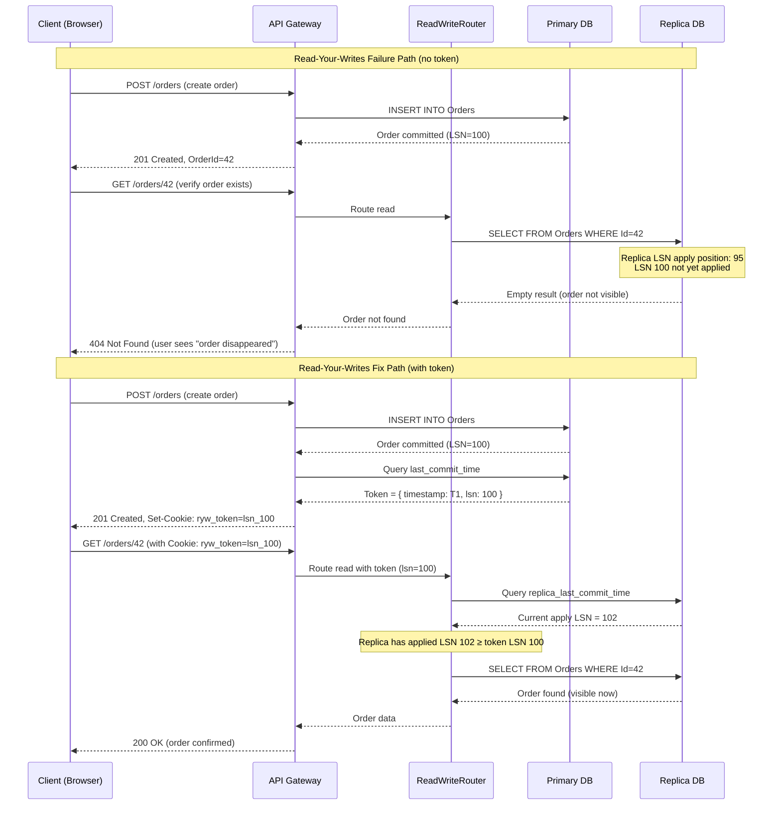

> [!success] Mastery Check
> - [ ] **Studied Well**
> - [ ] **Can explain the concept without notes**
> - [ ] **Can answer interview questions confidently**
> - [ ] **Can implement it in a real project**

---

id: "7.221"
title: "Database Read Replicas — Read-Your-Writes Problem"
domain: "System Design & Distributed Systems"
domain_id: 7
group: "Scalability Patterns"
tags: [system-design, distributed-systems, scalability, dotnet, azure, databases, read-replicas, read-your-writes, session-consistency, causal-consistency]
priority: 1
version: 1
prerequisites:
  - "[[7.219 — Database Read Replicas — Setup and Tradeoffs]]" — establishes the primary-replica architecture and the read/write splitting pattern that creates the read-your-writes problem; without replicas, every read hits the primary and RYW is trivially satisfied
  - "[[7.220 — Database Read Replicas — Replication Lag]]" — defines the root cause of the RYW problem; replication lag is the physical mechanism that causes a user's write to be invisible on a subsequent replica read; understanding lag components (log capture, transport, apply) is the prerequisite for any RYW solution
  - "[[8.100 — Transactions and Concurrency in SQL Server]]" — the observable staleness window depends on the transaction isolation level; a read-committed query on a replica sees a snapshot as of the last applied LSN, which may be behind the primary's current state; understanding what "consistent" means across isolation levels is required to define when a RYW violation occurs
related:
  - "[[7.219 — Database Read Replicas — Setup and Tradeoffs]]" — 7.219 defines the architecture that makes the RYW problem possible; the read/write splitting pattern is the root cause — without it, every read hits the primary and RYW does not exist
  - "[[7.220 — Database Read Replicas — Replication Lag]]" — replication lag is the PHYSICAL CAUSE of the RYW problem; the RYW solution patterns (tokens, primary routing, causal consistency) are built on top of the lag measurement techniques from 7.220; the two notes are inseparable — you cannot solve RYW without understanding lag
  - "[[7.209 — Sticky Sessions — Problem and Impact]]" — sticky sessions are an alternative approach to solving the RYW problem at the load balancer layer (pin user to the same backend that holds their session); 7.221 solves it at the DATABASE layer, which is the correct approach for stateless services with read replicas
  - "[[7.207 — Stateless Services — Design Principles]]" — stateless services externalize session state to Redis, which means the RYW solution must be at the database routing layer, not the service instance layer; token-based routing (this note) is the natural complement to stateless service design
  - "[[7.254 — Eventual Consistency Trade-Off for Scale]]" — the RYW problem is a consequence of eventual consistency; 7.254 defines the general tradeoff space, 7.221 provides the specific solution for the read-replica case
  - "[[7.250 — Database Federation — Functional Partitioning]]" — federation (separate databases per bounded context) changes the RYW problem: each database has its own replication lag and its own RYW tracking; cross-database RYW requires distributed transaction tokens
  - "[[8.64 — SQL Server Transaction Log Internals]]" — transaction log LSNs are the foundation of token-based RYW solutions; understanding how LSNs are generated, ordered, and applied on replicas is required to implement causal consistency tokens
created: 2026-06-16

---

> [!ABSTRACT] Quick Reference — Read-Your-Writes (RYW) **Invariant:** After a client writes to the primary database, all that client's subsequent reads within the session consistency window MUST return data that is at least as recent as the write. The client's own writes are always visible to the client. Other clients may not see the write until the replica catches up — the guarantee is per-client, not global. **Cost:** The application must track the version of the client's last write (a "token") and ensure that every read is served from a replica that has applied at least that version, or from the primary itself. This adds overhead to every read and write (token generation, token storage, token comparison). More importantly, it REDUCES the read scaling benefit of replicas for "dirty" sessions — a user who writes frequently will have their reads routed to the primary, bypassing the replica. **Trigger:** A user reports "I just placed an order and it's not showing up on my order history page" or "I updated my profile picture and it's still the old one." The developer reproduces locally (hitting the primary) and cannot reproduce. The bug is intermittent and correlated with high-traffic periods when replication lag is elevated. **Skip When:** The application serves batch/analytics queries only (no user-facing reads), or all reads go to the primary (no read replicas used), or the application can accept that a small percentage of reads return stale data after a write. Also skip when synchronous replication is used (zero lag — no RYW problem exists).

---

## Navigation

**Domain:** [[7 — System Design & Distributed Systems]] > **Group:** Scalability Patterns
**Previous:** [[7.220 — Database Read Replicas — Replication Lag]] | **Next:** [[7.222 — Database Sharding — Overview]]

### Prerequisites

- [[7.219 — Database Read Replicas — Setup and Tradeoffs]] — the primary-replica architecture and the distinction between read/write connection strings
- [[7.220 — Database Read Replicas — Replication Lag]] — the measurement and behavior of lag, which is the root cause of the RYW problem
- [[8.100 — Transactions and Concurrency in SQL Server]] — snapshot isolation on replicas determines when a write becomes visible to reads

### Where This Fits

> [!INFO] Production Encounter Map
>
> - **Layer:** Application-level consistency management — sits between the database access layer (EF Core, ADO.NET) and the business logic. The solution lives in the data access code, not in the database itself.
> - **Trigger:** The product manager reports "users are complaining that their orders disappear for a few seconds after checkout" or the support team has a ticket template for "profile update not showing." The engineering investigation reveals that the read path goes to a replica and the replica is 1-5 seconds behind during peak write hours.
> - **Without solving RYW:** The user-facing application has a class of bugs that look like data loss. Users refresh the order confirmation page and see "no orders." Users update their profile and see the old photo. These are not data bugs — the data IS in the primary — but the application reads from a lagging replica. The team either accepts the user-visible staleness (bad UX) or routes ALL reads to the primary (losing the read scaling benefit of replicas).
> - **First signal that RYW must be addressed:** The application has read replicas deployed (to scale read throughput for user-facing queries) AND users perform read-after-write operations (order confirmation, profile update, content creation). The business requirement is "users must see their own writes within [X] seconds" where [X] is shorter than the typical replication lag.

The read-your-writes problem is the most common user-visible consequence of asynchronous replication. It occurs when an application routes reads to a replica that has not yet applied the user's most recent write. The user perceives this as a data loss bug even though the data IS safely committed on the primary. The solution is not to eliminate replication lag (which would require synchronous replication at higher write latency cost) but to implement a SESSION CONSISTENCY guarantee: after a user writes, all that user's subsequent reads are routed to a replica that has caught up to the write time, or to the primary itself. The RYW guarantee is the most common "relaxation" of full linearizability — it preserves the user's experience while allowing other users to see stale data from replicas.

---

## Core Mental Model

The read-your-writes problem exists because the application has TWO data sources (primary and replica) and the replica lags behind the primary. A user's write goes to the primary. Their next read may go to a lagging replica that does not reflect the write. The user perceives this as "the system lost my data" — a correctness bug from their perspective, even though the data is safely stored.

The single invariant that defines the RYW problem: **A user's perspective of the system state must never go backward in time.** After the user observes state S (their own write), all subsequent observations must show state S or a later state. This is Session Consistency — the weakest consistency model that still provides a sensible user experience. It is strictly weaker than monotonic reads (which require reads to see non-decreasing versions of ALL data, not just the user's own writes) and much weaker than linearizability (which would require ALL readers to see the write immediately).

The solution space has three fundamental approaches, each with a different cost/benefit profile:

1. **Primary routing** — After a user writes, route ALL their reads to the primary for a cooldown window. Simple to implement (one conditional check) but loses the read scaling benefit for any user who has written recently. At high write rates (e.g., a user submitting a form repeatedly), the primary handles all that user's reads, potentially overloading it.

2. **Token-based routing** — The primary returns a token (an LSN, a version number, or a timestamp) with the write response. The client attaches this token to subsequent reads. The data access layer checks each replica's apply position against the token and routes the read to a replica that has applied at least that position, or falls back to the primary. More complex but preserves read scaling — only reads that SPECIFICALLY need to see the user's write go to non-replica endpoints.

3. **Causal consistency** — The database itself tracks causal dependencies between operations. If operation B is causally dependent on operation A (B reads A's output), the database ensures B is served from a node that has applied A. This is the strongest form (causal consistency is the most practical strong consistency model) but requires database support — Azure Cosmos DB supports it natively; Azure SQL Database does not.

The engineering challenge is to choose the right approach for the application's write pattern, read profile, and latency budget. A social media feed (high write frequency, user-tolerant of brief staleness) can use primary routing with a short window. An e-commerce checkout flow (infrequent writes, zero tolerance for stale order data) should use token-based routing. A collaborative editing system (causal dependencies between operations) needs causal consistency.

### Classification

- **Consistency model:** Session consistency (also called per-client monotonic reads). The guarantee is per-client, not global. Two clients may see the database at different points in time as long as each client's own timeline is non-regressive.
- **Relationship to CAP:** Session consistency is achievable in a partitioned database (CP or AP) because it does not require global agreement — only per-client ordering. It is compatible with the eventual consistency of async replication.
- **Scope:** Application-level pattern, not database-level. The database engine does not enforce session consistency (except for specific databases like Cosmos DB with session consistency level). The application layer must implement the tracking and routing.
- **What it explicitly does not solve:**
  - Monotonic reads (a user reads an older version of ANOTHER user's data after having read a newer version — session consistency does not prevent this)
  - Write-follows-read consistency (if a user reads data and then writes based on that read, another session may not see the dependency)
  - Cross-client consistency (user A's write is not visible to user B's subsequent read — that requires a stronger model)

### Primary Diagram



### Key Properties / Guarantees

| Property | Value | Condition |
|---|---|---|
| Per-client read-after-write visibility | Write is always visible to the writing client | Token is preserved across requests (not lost/corrupted) and replica has applied at least the token LSN |
| Write latency impact | +0-5ms (token generation and optional token storage) | Token is generated synchronously with the write; additional latency for token persistence |
| Read latency impact | +1-5ms (token check + optional replica lag query) | Each read must check if the session has an outstanding token and optionally query replica apply position |
| Lost read scaling benefit | Reads for "dirty" sessions go to primary | User has written within the token TTL window; frequency depends on write-to-read ratio |
| Cross-device consistency | NOT guaranteed | Tokens are per-device/session; user writes on phone, reads on PC — no shared token |
| Token loss tolerance | Application must handle gracefully (default to primary routing for conservative approach, or accept occasional stale reads) | Token is stored in cookie/localStorage — can be cleared by user, expire, or be blocked by privacy settings |
| Database support required | None at DB level (application-level pattern) | Works with any database that has read replicas — no special DB feature required |

---

## Deep Mechanics

### How It Works

The RYW solution has four phases: Write Registration, Token Distribution, Read Verification, and Token-Based Routing.

**Phase 1 — Write Registration**

When the application executes a write operation (INSERT, UPDATE, DELETE on the primary), it captures the write's version marker. The marker depends on the database engine:

- **Azure SQL Database / SQL Server:** The `last_commit_time` from `sys.dm_db_log_stats` or the current LSN from the transaction log. The most practical approach is to query `DBTS()` or `MIN_ACTIVE_ROWVERSION()` after the write completes, which gives a monotonically increasing value that tracks the database's version timeline.
- **PostgreSQL:** The `pg_current_wal_lsn()` function returns the current WAL insert position. Convert to a `pg_wal_lsn_to_bytes()` for numeric comparison.
- **MySQL:** `SHOW MASTER STATUS` returns the `Position` field (binary log position). `SELECT @@global.gtid_executed` for GTID-based tracking.
- **Application-level version:** If the database does not expose a reliable version marker, the application can use a lightweight sequence — a dedicated `VersionSequence` table with `UPDATE Counter SET Value = Value + 1 OUTPUT INSERTED.Value` — or a GUID-based Lamport clock.

The version marker is stored in a per-session token:

- **Cookie (stateless web):** The API sets `Set-Cookie: ryw_token=[version]` with `HttpOnly`, `Secure`, `SameSite=Lax` attributes and a TTL matching the maximum acceptable staleness window. The browser sends the cookie on subsequent requests. No server-side storage needed — the token travels with the request.
- **Redis (stateful session):** The write handler stores `ryw_token:{sessionId} => { version, timestamp }` in Redis with a TTL of `max_replication_lag + buffer` (typically 30 seconds for same-region replicas, 5 minutes for cross-region). The read handler fetches the token from Redis on each request.
- **Client-side storage (SPA):** The API returns the token in the response body. The SPA stores it in `localStorage` or `sessionStorage` and attaches it as an HTTP header (`X-RYW-Token`) on subsequent requests.

**Phase 2 — Token Distribution**

The token must survive the round-trip from write response to read request:

```
Write Response → Token → [Cookie | Redis | localStorage] → Read Request
```

Each storage mechanism has different survivability:

| Storage | Survives page refresh | Survives browser restart | Survives incognito close | Survives cross-device | Survives privacy clearing |
|---|---|---|---|---|---|
| Cookie | Yes | Yes (if persistent cookie) | No | No | No (cleared with browsing data) |
| Redis (session) | Yes | Yes | No | No | Yes (server-side) |
| localStorage | Yes | Yes | No | No | No |
| SessionStorage | No | No | No | No | No |

The key insight: **No client-side mechanism survives cross-device usage.** If the user writes on their phone and reads on their laptop, no cookie or client-side storage can bridge the gap. Cross-device RYW requires a server-side token associated with the USER (not the session) — which means the token must be stored in a per-user record in the primary database itself, and the tradeoff is that ALL reads for that user go to the primary for the token TTL.

**Token Encoding and Transmission**

The token's content depends on the chosen approach:

- **LSN-based:** `{ userId, lastLSN, timestamp }` — the LSN is a database-internal integer that maps to a specific position in the transaction log. Azure SQL Database exposes this via `sys.dm_db_log_stats.last_commit_time`. Encode as base64 JSON for transmission.

- **Timestamp-based:** `{ userId, commitTimeUtc, version }` — the commit time is the database server's UTC time when the write committed. Must be in database-side time to avoid clock skew. Requires `DATEDIFF_BIG` in milliseconds as the numeric version.

- **Version-sequence-based:** `{ userId, sequenceNumber }` — a monotonically increasing integer from a `VersionSequence` table. Simplest to implement but adds a write to `VersionSequence` on every data write (2 writes per user write).

**Cookie encoding:** Use base64-encoded JSON to keep the token small and URL-safe. Cookie size is limited to 4KB — the token is typically under 200 bytes. Set `MaxAge` to the token TTL (30-60 seconds).

```csharp
private static string EncodeToken(long version, int userId, DateTime commitTime)
{
    var payload = new { v = version, u = userId, t = commitTime.Ticks };
    var json = JsonSerializer.Serialize(payload);
    return Convert.ToBase64String(Encoding.UTF8.GetBytes(json));
}

private static (long Version, int UserId, DateTime CommitTime) DecodeToken(string encoded)
{
    var json = Encoding.UTF8.GetString(Convert.FromBase64String(encoded));
    var payload = JsonSerializer.Deserialize<JsonElement>(json);
    return (
        payload.GetProperty("v").GetInt64(),
        payload.GetProperty("u").GetInt32(),
        new DateTime(payload.GetProperty("t").GetInt64(), DateTimeKind.Utc)
    );
}
```

**Header encoding:** For SPAs, use `X-RYW-Token` header. The SPA reads the header from the write response, stores it in `localStorage`, and attaches it on subsequent reads.

```javascript
const rywToken = response.headers.get('X-RYW-Token');
if (rywToken) localStorage.setItem('ryw_token', rywToken);

const token = localStorage.getItem('ryw_token');
const headers = {};
if (token) headers['X-RYW-Token'] = token;
fetch('/api/orders/42', { headers });
```

**Redis encoding:** Store the serialized token as a JSON string with a TTL matching the token lifetime. Keyed by `ryw_token:user:{userId}` for cross-device support or `ryw_token:session:{sessionId}` for single-device.

**Phase 3 — Read Verification**

When a read request arrives with a token, the router must determine whether a given replica has applied up to the token's version. The approach depends on the version type:

For **LSN-based** or **timestamp-based** tokens:

```sql
-- Query the replica's apply position
-- Azure SQL Database:
SELECT
    DATEDIFF(MILLISECOND,
        (SELECT MAX(last_commit_time) FROM sys.dm_db_log_stats WITH (NOLOCK)),
        GETUTCDATE()
    ) / 1000.0 AS ReplicaLagSeconds,
    -- Alternative: query the replica's last applied LSN from DMVs
    (SELECT MAX(last_commit_time) FROM sys.dm_db_log_stats WITH (NOLOCK))
    AS ReplicaLastCommitTime;

-- PostgreSQL:
SELECT
    pg_last_wal_replay_lsn() AS ReplayLSN,
    pg_wal_lsn_diff(pg_last_wal_replay_lsn(), '0/00000000') AS ReplayBytes;

-- MySQL:
SELECT
    @@global.gtid_executed AS GTID_EXECUTED,
    MASTER_POS_WAIT('binlog.000001', <position>, <timeout>);
```

The comparison: if `ReplicaLastCommitTime >= TokenTimestamp` (or `ReplayLSN >= TokenLSN`), the replica has applied the write and can serve the read. Otherwise, the read must fall back to the primary.

For **application-level version** tokens:

```sql
-- The primary maintains a VersionSequence table:
SELECT CurrentVersion FROM VersionSequence WITH (NOLOCK);

-- Each write increments the version:
UPDATE VersionSequence SET CurrentVersion = CurrentVersion + 1
OUTPUT INSERTED.CurrentVersion;

-- On the replica:
SELECT CurrentVersion FROM VersionSequence WITH (NOLOCK);
-- If replica's CurrentVersion >= token's CurrentVersion, replica is caught up.
```

**Important:** The `VersionSequence` approach works ONLY if the version increment is replicated as a regular DML operation. The replica will see the version increment through the replication pipeline, which means the replica's version lags by the same amount as any other data. This makes it a self-consistent check — the replica's version value is a reliable proxy for how much of the primary's writes the replica has applied.

**Phase 4 — Token-Based Routing**

The routing decision at the data access layer:

```
IF session has token T with version V:
    IF any replica has applied up to version V:
        Route read to that replica
    ELSE:
        Route read to primary
ELSE:
    Route read to any replica (round-robin or least-connections)
```

The router must handle the case where MULTIPLE replicas exist with different lag values. The optimal strategy is to check the replica with the lowest expected lag (typically the same-region replica first) and fall back to the primary if that replica is not caught up. Checking ALL replicas before falling back to primary adds latency proportional to the number of replicas.

```csharp
public async Task<IDbConnection> GetReadConnectionAsync(
    string? rywToken, CancellationToken ct)
{
    if (rywToken is null)
    {
        return _connectionFactory.CreateReplicaConnection();
    }

    var tokenVersion = ParseToken(rywToken);

    foreach (var replica in _replicaSelector.OrderByLag())
    {
        if (await IsReplicaCaughtUpAsync(replica, tokenVersion, ct))
        {
            return _connectionFactory.CreateReplicaConnection(replica);
        }
    }

    return _connectionFactory.CreatePrimaryConnection();
}
```

### Failure Modes

**Failure Mode 1 — Token Loss**

**What breaks:** The client loses the RYW token. The browser clears cookies, privacy mode closes, cookie TTL expires, or the cookie is stripped by a CDN or privacy extension. The client makes a read request without a token. The router sees no token and routes to a replica. The replica has not yet applied the user's write. The read returns stale data — a RYW violation.

**Detection:** The write succeeds (HTTP 201/200) but the subsequent read returns the pre-write state. Log analysis shows the read was routed to a replica while the user had an active write within the last `max_replication_lag` window. The application logs show `ryw_token = null` on the read request despite a successful write seconds earlier.

**Prevention:** Use server-side token storage (Redis) as the primary mechanism and client-side tokens as a fallback. If the client-side token is missing but the server-side token exists, the router can still enforce primary routing. Set the token TTL to `2 × max_expected_lag + 5s` — long enough to survive brief token loss events but short enough to avoid excessive primary routing.

**Mitigation:** Accept that occasional token loss is inevitable. The question is whether the application can tolerate the resulting stale read. For order confirmation flows (zero tolerance), implement a "token guard" — after a write, introduce a mandatory 500ms delay before showing the "success" page, then route the confirmation page read to the primary unconditionally. This bypasses the token mechanism entirely for the most critical read path.

**Failure Mode 2 — Token Starvation (Hot Session)**

**What breaks:** A user writes to the database very frequently. Each write generates a new token with an updated version. The token TTL is continuously refreshed. The user's reads are PERMANENTLY routed to the primary because the token never expires. The user's read traffic imposes on the primary's write capacity — the replica is not serving this user at all despite being available.

**Detection:** The primary's CPU or DTU increases during peak hours. Investigation reveals that a small number of "hot sessions" (users who write frequently) cause a disproportionate share of primary read traffic. The `ryw_token` tracking shows that 5% of sessions account for 60% of primary-directed reads.

**Prevention:** Implement a token TTL cap that is INDEPENDENT of the write frequency. Even if the user writes every second, the token TTL is fixed at 5 seconds (or whatever the maximum replication lag is). After 5 seconds without a write, the token expires and the user's reads return to replicas.

```csharp
var token = new RywToken
{
    Version = version,
    CreatedAt = clock.UtcNow
};
var remaining = (token.CreatedAt + _maxTokenLifetime) - clock.UtcNow;
if (remaining > TimeSpan.Zero)
{
    await _cache.SetAsync($\"ryw_token:{userId}\", token, remaining, ct);
}
else
{
    await _cache.SetAsync($\"ryw_token:{userId}\", token, _maxTokenLifetime, ct);
}
```

**Failure Mode 3 — Cross-Device Token Gap**

**What breaks:** The user writes on device A and reads on device B within the replication lag window. Device B has no token. The router routes device B's read to a replica that has not applied the write. RYW violation. The support ticket reads: "I updated my profile on the app, but the website still shows the old version."

**Detection:** Support tickets about cross-device data staleness where the time between write and cross-device read is less than the typical replication lag. Logs show the write came from user-agent A and the read from user-agent B. The read was routed to a replica.

**Prevention:** Use server-side token storage keyed by USER ID (not session ID). When the user writes from device A, the token is stored in Redis with key `ryw_token:user:{userId}`. When the user reads from device B, the API identifies the user (via authentication cookie or bearer token) and checks the user-scoped token in Redis. If the token exists and the replica has not caught up, the read is routed to the primary.

```csharp
public async Task<RywToken?> GetUserTokenAsync(int userId, CancellationToken ct)
{
    var token = await _cache.GetAsync<RywToken>(
        $"ryw_token:user:{userId}", ct);
    return token;
}
```

**Failure Mode 4 — Replica Apply Position Query Adds Latency to Reads**

**What breaks:** If the router queries each replica's apply position on every read to determine which replica is caught up, the user experiences `N × query_latency` additional milliseconds before the read completes. For a single replica, this is 1-5ms. For 3 replicas, it's 3-15ms — potentially adding more latency than the read itself.

**Detection:** The read latency P99 increases after deploying RYW routing. The `ryw_token` check adds 1-5ms per request. If the router queries multiple replicas, the latency multiplies.

**Fix:** Cache the replica apply positions in-memory with a short TTL (500ms-1s). The router reads from the cache instead of querying the database on every request. This adds staleness to the apply-position check but within acceptable bounds — the cache is conservative (under-reports replica apply position), so it may cause false fallbacks to primary but never RYW violations.

```csharp
public class ReplicaLagCache
{
    private readonly ConcurrentDictionary<string, ReplicaState> _states = new();
    private readonly TimeSpan _refreshInterval = TimeSpan.FromMilliseconds(500);

    public async Task<ReplicaState> GetStateAsync(string replicaName, CancellationToken ct)
    {
        if (_states.TryGetValue(replicaName, out var state) &&
            state.LastRefreshedAt + _refreshInterval > DateTime.UtcNow)
        {
            return state;
        }
        var fresh = await QueryReplicaLagAsync(replicaName, ct);
        _states[replicaName] = fresh;
        return fresh;
    }
}
```

**Failure Mode 5 — Cookie-Token Mismatch Across Server Instances (Clock Skew)**

**What breaks:** The application runs multiple instances behind a load balancer. Instance A handles a write, generates a token with its local clock, and sets a cookie. Instance B handles the subsequent read. Instance B compares the cookie timestamp against its OWN local clock to determine elapsed time. If Instance B's clock is behind Instance A's, the elapsed time appears longer than it is, and Instance B incorrectly decides the replica has caught up.

**Detection:** Random, non-deterministic RYW violations that correlate with requests being routed to different server instances. The violations do NOT correlate with replication lag spikes.

**Fix:** Never compare the token timestamp to the application server clock. Always compare the token to the REPLICA'S apply position (which is in the database server's clock domain). Use LSN-based tokens instead of timestamp-based tokens whenever possible — LSNs are monotonically increasing integers that are comparable across primary and replica without any clock dependency.

**Failure Mode 6 — Token Writes Create a Circular Dependency with the Token Store**

**What breaks:** The application uses Redis for token storage. When the user writes to the primary database, the write handler must also write the token to Redis. If Redis is unavailable (network partition, Redis failover, connection pool exhaustion), the token write fails. The application has two choices: (a) fail the user's write entirely (because the token cannot be stored), or (b) proceed with the write but skip token storage — accepting that the subsequent read may be a RYW violation. Most applications choose (b), which means Redis availability directly affects the RYW guarantee.

```csharp
// ❌ WRONG: Token write failure causes the entire write to fail
public async Task<Order> CreateOrderAsync(Order order, CancellationToken ct)
{
    using var conn = await _writeConnFactory.CreateAsync(ct);
    var orderId = await conn.InsertAsync(order, ct);
    
    // If Redis is down, this throws — and the order write is rolled back
    await _tokenStore.SetTokenAsync(order.UserId, orderId, _primaryConnString, ct);
    
    return order;
}

// ✅ CORRECT: Token write failure is non-fatal — log and continue
public async Task<Order> CreateOrderAsync(Order order, CancellationToken ct)
{
    using var conn = await _writeConnFactory.CreateAsync(ct);
    var order = await conn.InsertAsync(order, ct);
    
    try
    {
        await _tokenStore.SetTokenAsync(order.UserId, version, _primaryConnString, ct);
    }
    catch (RedisConnectionException ex)
    {
        _logger.LogWarning(ex, "Failed to store RYW token for user {UserId}", order.UserId);
        // Token loss means the next read may be stale — but the write succeeded.
        // This is acceptable for non-critical paths.
    }
    
    return order;
}
```

**Detection:** Monitoring shows `ryw_token_store_failures` increasing. Correlation with Redis connection pool exhaustion or Redis server restarts. The RYW violation rate spikes during these periods because tokens are missing.

**Prevention:** Implement a circuit breaker for Redis token storage. If Redis is unavailable, fall back to cookie-only token storage (which does not require a Redis write). The cookie is set on the response regardless of Redis state — it's just a response header. This provides "best effort" RYW even when Redis is down.

```csharp
public async Task SetTokenWithFallbackAsync(int userId, long version, 
    string primaryConnString, CancellationToken ct)
{
    try
    {
        var db = _redis.GetDatabase();
        await db.StringSetAsync($"ryw_token:user:{userId}", 
            JsonSerializer.Serialize(new RywToken(userId, version, DateTime.UtcNow, primaryConnString)),
            _tokenTtl);
    }
    catch (RedisConnectionException)
    {
        // Fall back: store the token ONLY in the cookie (no Redis)
        // The cookie is set in the calling code — this method only stores in Redis
        _logger.LogWarning("Redis unavailable — RYW token stored in cookie only");
    }
    
    // Cookie is ALWAYS set — this is the fail-safe
    if (_httpContext.HttpContext is { } ctx)
    {
        ctx.Response.Cookies.Append("ryw_token", EncodeCookieToken(...), new CookieOptions
        {
            HttpOnly = true,
            Secure = true,
            SameSite = SameSiteMode.Lax,
            MaxAge = _tokenTtl
        });
    }
}
```

**Mitigation:** The circular dependency (database write → Redis write → database write flow) is a fundamental architectural risk. The cleanest solution is to decouple token storage from the write transaction: write the token ASYNCHRONOUSLY after the database write commits, using a background queue. The token is unavailable for a few milliseconds, but the cookie provides the fallback for the immediate next read.

**Cost of not fixing:** A Redis outage causes EVERY user to experience RYW violations on their next read after a write. The application's most critical user flow (write → confirm) breaks for ALL users during the Redis outage. The support team is flooded with "my data disappeared" tickets.

### .NET and Azure Integration

- **EF Core:** Custom `IDbContextFactory` that checks the RYW token before creating a context with either the primary or replica connection string.
- **Azure SQL Database:** Use `ApplicationIntent=ReadOnly` combined with RYW logic — if the token exists and no replica is caught up, override to `ApplicationIntent=ReadWrite`.
- **Azure Redis Cache:** Token storage keyed by user ID with 30-60 second TTL.
- **Polly:** `AsyncPolicyWrap` combining retry (for transient write failures) with RYW-aware read routing.
- **Dapr:** Session consistency mode in the state management API — Dapr manages the token automatically.

```csharp
public class ReadYourWritesDbContextFactory<TContext> : IDbContextFactory<TContext>
    where TContext : DbContext
{
    private readonly IDbContextFactory<TContext> _innerFactory;
    private readonly IRywTokenStore _tokenStore;
    private readonly IReplicaLagService _lagService;
    private readonly IHttpContextAccessor _httpContext;

    public async Task<TContext> CreateDbContextAsync(CancellationToken ct)
    {
        var rywToken = await _tokenStore.GetTokenAsync(_httpContext.HttpContext, ct);

        if (rywToken is null)
        {
            return _innerFactory.CreateDbContext();
        }

        var replicaState = await _lagService.GetBestReplicaStateAsync(ct);

        if (replicaState is not null &&
            replicaState.LastAppliedVersion >= rywToken.Version)
        {
            return _innerFactory.CreateDbContext();
        }

        var options = new DbContextOptionsBuilder<TContext>()
            .UseSqlServer(rywToken.PrimaryConnectionString)
            .Options;

        return (TContext)Activator.CreateInstance(typeof(TContext), options)!;
    }
}
```

---

## Production Patterns and Implementation

### Primary Implementation

The complete RYW solution has three components: a token store, a replica lag service, and a routing DbContext.

```csharp
public sealed record RywToken(
    int UserId,
    long Version,
    DateTime CreatedAtUtc,
    string PrimaryConnectionString)
{
    public bool IsExpired(TimeSpan maxLifetime, DateTime now) =>
        now - CreatedAtUtc > maxLifetime;
}

public sealed record ReplicaState(
    string Name,
    long LastAppliedVersion,
    DateTime LastRefreshedAt);

public interface IRywTokenStore
{
    Task<RywToken?> GetTokenAsync(HttpContext? httpContext, CancellationToken ct);
    Task SetTokenAsync(int userId, long version, string primaryConnectionString,
        CancellationToken ct);
    Task ClearTokenAsync(int userId, CancellationToken ct);
}

public sealed class RedisRywTokenStore : IRywTokenStore
{
    private readonly IConnectionMultiplexer _redis;
    private readonly TimeSpan _tokenTtl;
    private readonly IHttpContextAccessor _httpContext;

    public RedisRywTokenStore(
        IConnectionMultiplexer redis,
        IHttpContextAccessor httpContext,
        IOptions<RywOptions> options)
    {
        _redis = redis;
        _httpContext = httpContext;
        _tokenTtl = options.Value.TokenTtl;
    }

    public async Task<RywToken?> GetTokenAsync(
        HttpContext? httpContext, CancellationToken ct)
    {
        if (httpContext?.Request.Cookies.TryGetValue("ryw_token", out var cookieToken) == true
            && TryParseCookieToken(cookieToken, out var cookieRywToken))
        {
            return cookieRywToken;
        }

        var userId = httpContext?.User.FindFirst(ClaimTypes.NameIdentifier)?.Value;
        if (userId is not null)
        {
            var db = _redis.GetDatabase();
            var redisToken = await db.StringGetAsync($"ryw_token:user:{userId}");
            if (redisToken.HasValue)
            {
                return JsonSerializer.Deserialize<RywToken>(redisToken!);
            }
        }

        return null;
    }

    public async Task SetTokenAsync(
        int userId, long version, string primaryConnectionString,
        CancellationToken ct)
    {
        var token = new RywToken(
            userId, version, DateTime.UtcNow, primaryConnectionString);

        var db = _redis.GetDatabase();
        await db.StringSetAsync(
            $"ryw_token:user:{userId}",
            JsonSerializer.Serialize(token),
            _tokenTtl);

        if (_httpContext.HttpContext is { } ctx)
        {
            ctx.Response.Cookies.Append("ryw_token", EncodeCookieToken(token), new CookieOptions
            {
                HttpOnly = true,
                Secure = true,
                SameSite = SameSiteMode.Lax,
                MaxAge = _tokenTtl
            });
        }
    }

    public async Task ClearTokenAsync(int userId, CancellationToken ct)
    {
        var db = _redis.GetDatabase();
        await db.KeyDeleteAsync($"ryw_token:user:{userId}");

        if (_httpContext.HttpContext is { } ctx)
        {
            ctx.Response.Cookies.Delete("ryw_token");
        }
    }

    private static string EncodeCookieToken(RywToken token) =>
        Convert.ToBase64String(
            Encoding.UTF8.GetBytes($"{token.UserId}:{token.Version}:{token.CreatedAtUtc:O}"));

    private static bool TryParseCookieToken(string encoded, [NotNullWhen(true)] out RywToken? token)
    {
        try
        {
            var decoded = Encoding.UTF8.GetString(Convert.FromBase64String(encoded));
            var parts = decoded.Split(':');
            token = new RywToken(
                int.Parse(parts[0]),
                long.Parse(parts[1]),
                DateTime.Parse(parts[2], null, DateTimeStyles.RoundtripKind),
                string.Empty);
            return true;
        }
        catch
        {
            token = null;
            return false;
        }
    }
}

public sealed class ReplicaLagMonitor : BackgroundService
{
    private readonly ISqlConnectionFactory _connectionFactory;
    private readonly ILogger<ReplicaLagMonitor> _logger;
    private readonly ConcurrentDictionary<string, ReplicaState> _replicaStates = new();
    private readonly TimeSpan _pollInterval = TimeSpan.FromMilliseconds(500);

    public IReadOnlyDictionary<string, ReplicaState> ReplicaStates =>
        new Dictionary<string, ReplicaState>(_replicaStates);

    public ReplicaLagMonitor(
        ISqlConnectionFactory connectionFactory,
        ILogger<ReplicaLagMonitor> logger)
    {
        _connectionFactory = connectionFactory;
        _logger = logger;
    }

    protected override async Task ExecuteAsync(CancellationToken stoppingToken)
    {
        while (!stoppingToken.IsCancellationRequested)
        {
            await RefreshReplicaStatesAsync(stoppingToken);
            await Task.Delay(_pollInterval, stoppingToken);
        }
    }

    private async Task RefreshReplicaStatesAsync(CancellationToken ct)
    {
        foreach (var replica in GetReplicaNames())
        {
            try
            {
                using var conn = _connectionFactory.CreateReplicaConnection(replica);
                await conn.OpenAsync(ct);

                using var cmd = new SqlCommand(@"
                    SELECT
                        COALESCE(
                            DATEDIFF_BIG(MILLISECOND,
                                (SELECT MAX(last_commit_time) FROM sys.dm_db_log_stats WITH (NOLOCK)),
                                GETUTCDATE()),
                            0) AS LagMs,
                        COALESCE(
                            DATEDIFF_BIG(MILLISECOND,
                                '2020-01-01',
                                (SELECT MAX(last_commit_time) FROM sys.dm_db_log_stats WITH (NOLOCK))),
                            0) As ApplyPositionMs
                ", conn);

                using var reader = await cmd.ExecuteReaderAsync(ct);
                if (await reader.ReadAsync(ct))
                {
                    _replicaStates[replica] = new ReplicaState(
                        replica,
                        reader.GetInt64(1),
                        DateTime.UtcNow);
                }
            }
            catch (Exception ex)
            {
                _logger.LogWarning(ex, "Failed to query replica {Replica} lag", replica);
            }
        }
    }

    public ReplicaState? GetBestReplicaState(long minVersion)
    {
        return _replicaStates.Values
            .Where(s => s.LastAppliedVersion >= minVersion)
            .OrderBy(s => s.LastRefreshedAt)
            .FirstOrDefault();
    }

    private static string[] GetReplicaNames() =>
    [
        "replica-useast",
        "regional-useast-2"
    ];
}

public abstract class ReadYourWritesRepository
{
    private readonly IRywTokenStore _tokenStore;
    private readonly ReplicaLagMonitor _lagMonitor;
    private readonly string _primaryConnectionString;
    private readonly IHttpContextAccessor _httpContext;

    protected ReadYourWritesRepository(
        IRywTokenStore tokenStore,
        ReplicaLagMonitor lagMonitor,
        string primaryConnectionString,
        IHttpContextAccessor httpContext)
    {
        _tokenStore = tokenStore;
        _lagMonitor = lagMonitor;
        _primaryConnectionString = primaryConnectionString;
        _httpContext = httpContext;
    }

    protected async Task<IDbConnection> GetReadConnectionAsync(CancellationToken ct)
    {
        var token = await _tokenStore.GetTokenAsync(_httpContext.HttpContext, ct);

        if (token is null)
        {
            var replicaConn = new SqlConnection(GetReplicaConnectionString());
            await replicaConn.OpenAsync(ct);
            return replicaConn;
        }

        var replicaState = _lagMonitor.GetBestReplicaState(token.Version);
        if (replicaState is not null)
        {
            var replicaConn = new SqlConnection(GetReplicaConnectionString(replicaState.Name));
            await replicaConn.OpenAsync(ct);
            return replicaConn;
        }

        var primaryConn = new SqlConnection(_primaryConnectionString);
        await primaryConn.OpenAsync(ct);
        return primaryConn;
    }

    protected async Task<IDbConnection> GetWriteConnectionAsync(CancellationToken ct)
    {
        var conn = new SqlConnection(_primaryConnectionString);
        await conn.OpenAsync(ct);
        return conn;
    }

    protected async Task<long> RecordWriteAsync(
        IDbConnection conn, int userId, CancellationToken ct)
    {
        using var cmd = new SqlCommand(@"
            SELECT COALESCE(
                DATEDIFF_BIG(MILLISECOND, '2020-01-01',
                    (SELECT MAX(last_commit_time) FROM sys.dm_db_log_stats WITH (NOLOCK))),
                0)", conn);

        var version = (long)await cmd.ExecuteScalarAsync(ct);

        await _tokenStore.SetTokenAsync(userId, version, _primaryConnectionString, ct);
        return version;
    }

    private static string GetReplicaConnectionString(string? replicaName = null)
    {
        var builder = new SqlConnectionStringBuilder(
            "Server=tcp:orders-readonly.database.windows.net,1433;Database=OrdersDB;")
        {
            ApplicationIntent = ApplicationIntent.ReadOnly
        };

        if (replicaName is not null)
        {
            builder.DataSource = $"{replicaName}.database.windows.net";
        }

        return builder.ConnectionString;
    }
}
```

### Configuration and Wiring

```csharp
public static void AddReadYourWritesInfrastructure(
    this IServiceCollection services, IConfiguration configuration)
{
    var rywOptions = configuration.GetSection("ReadYourWrites").Get<RywOptions>()
        ?? new RywOptions();

    services.Configure<RywOptions>(configuration.GetSection("ReadYourWrites"));

    services.AddSingleton<IRywTokenStore>(sp =>
    {
        var redis = sp.GetRequiredService<IConnectionMultiplexer>();
        var httpContext = sp.GetRequiredService<IHttpContextAccessor>();
        return new RedisRywTokenStore(redis, httpContext, Options.Create(rywOptions));
    });

    services.AddSingleton<ReplicaLagMonitor>();
    services.AddHostedService(sp => sp.GetRequiredService<ReplicaLagMonitor>());

    services.AddScoped<OrderRepository>();
    services.AddScoped<ProfileRepository>();
    services.AddScoped<InventoryRepository>();

    services.AddSingleton<ISqlConnectionFactory>(sp =>
    {
        var primaryConnString = configuration.GetConnectionString("OrdersDbPrimary")!;
        var replicaConnString = configuration.GetConnectionString("OrdersDbReplica")!;
        return new SqlConnectionFactory(primaryConnString, replicaConnString);
    });
}

public sealed record RywOptions
{
    public TimeSpan TokenTtl { get; init; } = TimeSpan.FromSeconds(30);
    public TimeSpan MaxReplicaLag { get; init; } = TimeSpan.FromSeconds(5);
    public bool EnableCookieToken { get; init; } = true;
    public bool EnableRedisToken { get; init; } = true;
}
```

### Common Variants

**Variant 1 — Cookie-Only (Stateless Web)**

For stateless web applications where Redis is not available. The token is stored entirely in the cookie. Advantages: No Redis dependency, low complexity. Disadvantages: Token can be lost, cannot enforce cross-device consistency.

```csharp
public sealed class CookieOnlyRywMiddleware
{
    private readonly RequestDelegate _next;
    private readonly ReplicaLagMonitor _lagMonitor;
    private readonly TimeSpan _tokenTtl;

    public CookieOnlyRywMiddleware(
        RequestDelegate next,
        ReplicaLagMonitor lagMonitor,
        IOptions<RywOptions> options)
    {
        _next = next;
        _lagMonitor = lagMonitor;
        _tokenTtl = options.Value.TokenTtl;
    }

    public async Task InvokeAsync(HttpContext context)
    {
        if (context.Request.Cookies.TryGetValue("ryw_token", out var encoded))
        {
            if (TryDecodeToken(encoded, out var token) && !IsExpired(token))
            {
                context.Items["RywToken"] = token;
                var replicaState = _lagMonitor.GetBestReplicaState(token.Version);
                context.Items["RywReplicaCaughtUp"] = replicaState is not null;
            }
        }
        await _next(context);
    }

    public static void SetWriteToken(HttpContext context, long version)
    {
        var token = new { v = version, t = DateTimeOffset.UtcNow.ToUnixTimeMilliseconds() };
        var encoded = Convert.ToBase64String(
            JsonSerializer.SerializeToUtf8Bytes(token));

        context.Response.Cookies.Append("ryw_token", encoded, new CookieOptions
        {
            HttpOnly = true,
            Secure = true,
            SameSite = SameSiteMode.Lax,
            MaxAge = TimeSpan.FromSeconds(30)
        });
    }
}
```

**Variant 2 — Cooldown Primary Routing (Simple)**

The simplest solution: after a user writes, route ALL their reads to the primary for a cooldown period equal to `max_expected_replication_lag + buffer`. No token tracking, no replica lag queries.

```csharp
public class CooldownRywMiddleware
{
    private readonly RequestDelegate _next;
    private readonly TimeSpan _cooldown;
    private readonly IConnectionMultiplexer _redis;

    public CooldownRywMiddleware(
        RequestDelegate next,
        IConnectionMultiplexer redis,
        IOptions<RywOptions> options)
    {
        _next = next;
        _redis = redis;
        _cooldown = options.Value.MaxReplicaLag + TimeSpan.FromSeconds(1);
    }

    public async Task InvokeAsync(HttpContext context)
    {
        var userId = context.User.FindFirst(ClaimTypes.NameIdentifier)?.Value;

        if (userId is not null)
        {
            if (context.Request.Method is "POST" or "PUT" or "PATCH" or "DELETE")
            {
                var db = _redis.GetDatabase();
                await db.StringSetAsync(
                    $"ryw_cooldown:{userId}",
                    DateTime.UtcNow.Ticks.ToString(CultureInfo.InvariantCulture),
                    _cooldown);
            }

            if (context.Request.Method is "GET" or "HEAD")
            {
                var db = _redis.GetDatabase();
                var cooldownTicks = await db.StringGetAsync($"ryw_cooldown:{userId}");

                if (cooldownTicks.HasValue)
                {
                    context.Items["RywRouteToPrimary"] = true;
                }
            }
        }

        await _next(context);
    }
}
```

Advantages: Extremely simple (one Redis key per user). No replica lag queries needed. Disadvantages: ALL reads from a user who has written recently go to the primary, even if the replica would have been caught up within the first 100ms.

**Variant 3 — Causal Consistency with Dapr**

Dapr's state management API includes a "session consistency" mode. When the application writes state via Dapr, it returns an ETag. The application stores the ETag and passes it to subsequent reads. Dapr ensures the read is served from a node that has applied at least that ETag.

```csharp
public class DaprRywOrderRepository
{
    private readonly DaprClient _dapr;
    private readonly StateStoreOptions _options;

    public DaprRywOrderRepository(DaprClient dapr, IOptions<StateStoreOptions> options)
    {
        _dapr = dapr;
        _options = options.Value;
    }

    public async Task<Order> CreateOrderAsync(Order order, CancellationToken ct)
    {
        var response = await _dapr.SaveStateWithETagAsync(
            _options.StoreName,
            $"order:{order.Id}",
            order,
            null,
            cancellationToken: ct);

        var token = response.ETag;

        await _dapr.SaveStateAsync(
            _options.SessionStoreName,
            $"ryw_token:{order.UserId}",
            token,
            cancellationToken: ct);

        return order;
    }

    public async Task<Order?> GetOrderAsync(int orderId, int userId, CancellationToken ct)
    {
        var token = await _dapr.GetStateAsync<string>(
            _options.SessionStoreName,
            $"ryw_token:{userId}",
            cancellationToken: ct);

        var consistency = token is not null
            ? ConsistencyMode.Strong
            : ConsistencyMode.Eventual;

        var order = await _dapr.GetStateAsync<Order>(
            _options.StoreName,
            $"order:{orderId}",
            consistencyMode: consistency,
            cancellationToken: ct);

        return order;
    }
}
```

### Real-World .NET Ecosystem Example

- **EF Core — No built-in RYW support.** Requires a custom `IDbContextFactory` or `DbConnection` interceptor that rewrites the connection string based on token state.
- **Dapr — Session consistency mode** in the state management API (v1.12+). The closest thing to a "turnkey" RYW solution in the .NET ecosystem.
- **Azure SQL Database — Failover group reader endpoint** with `ApplicationIntent=ReadOnly` provides round-robin across replicas but NO RYW guarantee. The gateway does not track session state.
- **Polly + RYW** — A common pattern wraps the RYW routing decision in a Polly `AsyncPolicy` that catches `DbException` from replica reads and retries on the primary. This is NOT a correctness solution (the first read returns stale data) but is pragmatic for non-critical paths.

---

## Gotchas and Production Pitfalls

### Gotcha 1 — Token TTL Shorter Than Replication Lag

**Pitfall:** The engineer sets the token TTL to match the TYPICAL replication lag (200ms) rather than the MAXIMUM lag (5 seconds during peak hours). After a write, the token expires before the replica catches up.

```csharp
// ❌ WRONG: Token TTL = typical lag (too short)
var options = new RywOptions
{
    TokenTtl = TimeSpan.FromMilliseconds(200)
};

// ✅ CORRECT: Token TTL = max expected lag + safety buffer
var options = new RywOptions
{
    TokenTtl = TimeSpan.FromSeconds(30)
};
```

**Symptom:** Intermittent RYW violations during peak hours. The application works fine during low-traffic periods. During write bursts, lag spikes to 2-5 seconds, the token expires in 200ms, and reads return stale data.

**Fix:** Set token TTL to `max_observed_lag × 3 + 5s`. Query the replica lag telemetry to find the P99.9 lag value and use that as the baseline.

**Cost of not fixing:** Users experience "data loss" during peak hours. The support team receives a spike in tickets. The bug is dismissed as "user error" and erodes user trust.

### Gotcha 2 — Comparing Token Timestamp to Application Server Clock

**Pitfall:** The application compares the token timestamp to the APPLICATION server's current time to decide whether enough time has passed for the replica to catch up. Clock skew between application servers causes incorrect decisions.

```csharp
// ❌ WRONG: Compare token timestamp to application clock
// Application server A sets token at T_db = 10:00:00.000
// Application server B reads token at T_app_B = 10:00:02.500
// But T_db actual = 10:00:00.500 (DB server is 0.5s behind B's clock)
// Elapsed = T_app_B - T_db = 2.5s → decides replica is caught up
// Actual elapsed = 0.5s → replica is NOT caught up

// ✅ CORRECT: Compare token to replica apply position (both in DB time domain)
// Both are in the DB server's clock domain — clock skew does not affect them
```

**Symptom:** Non-deterministic RYW violations that correlate with application server restarts or deployments. Clock skew between machines causes sporadic violations.

**Fix:** Always compare within the same clock domain. Use LSN-based tokens (not timestamp-based) whenever possible — LSNs are clock-independent.

**Cost of not fixing:** Debugging clock skew in distributed systems is notoriously difficult. The RYW violation appears "impossible" because the timing logic seems correct in isolation.

### Gotcha 3 — Token Stored in Cookie Not Sent by SPA Apps

**Pitfall:** The application sets the RYW token as an HTTP-only cookie. The SPA makes read requests with `fetch()` without `credentials: 'include'`. The browser does not send cookies with the request. The token is lost.

```javascript
// ❌ WRONG: SPA fetch without credentials
fetch('/api/orders/42', {
    method: 'GET',
    // No credentials: 'include' — cookies are NOT sent
});

// ✅ CORRECT: Include credentials
fetch('/api/orders/42', {
    method: 'GET',
    credentials: 'include', // Send cookies
});
```

**Symptom:** RYW violations in the SPA only. The same API works correctly from server-rendered pages or Postman.

**Fix:** Use `X-RYW-Token` header instead of a cookie for SPA apps. SPAs can reliably set custom headers.

**Cost of not fixing:** SPA users never benefit from RYW protection. The application appears broken for the primary client platform.

### Gotcha 4 — Cached Replica Apply Position Causes False Negatives

**Pitfall:** The `ReplicaLagMonitor` caches replica apply positions with a 500ms refresh interval. The cached position is STALE — it reports a LOWER position than the replica has actually applied. This causes the router to fall back to the primary unnecessarily (false negatives) at a rate proportional to the cache staleness.

**Symptom:** Higher-than-expected primary read traffic after deploying RYW routing. Analysis shows ~30% of reads that COULD have been served by a caught-up replica are routed to the primary instead.

**Fix:** The false negative rate is a deliberate tradeoff between read latency (no DMV query on every request) and read scaling efficiency. Accept the rate if below 30%. Reduce the cache refresh interval to 100ms if primary load is a concern.

**Cost of not fixing:** Unnecessary primary routing increases primary load. The team may incorrectly conclude RYW routing is "not worth it" when the actual issue is cache staleness.

### Gotcha 6 — Token Starvation in High-Frequency Write Sessions

**Pitfall:** The implementation refreshes the token TTL on EVERY write. A user who writes frequently (e.g., a form auto-save every 5 seconds, a chat application sending messages every 2 seconds) NEVER lets the token expire. Their reads are PERMANENTLY routed to the primary. The primary accumulates read load from these "hot sessions" while the replicas sit idle for those users.

```csharp
// ❌ WRONG: Token TTL resets on every write — hot sessions never expire
public async Task AfterWriteAsync(int userId, long version)
{
    // Every write extends the token lifetime by 30 seconds from NOW
    await _redis.StringSetAsync(
        $"ryw_token:{userId}", version, TimeSpan.FromSeconds(30));
    // A user who writes every 5 seconds: token never expires
    // All reads go to primary indefinitely
}

// ✅ CORRECT: Token has a FIXED lifetime from CREATION, not from last write
// Store the token creation time separately
public async Task AfterWriteAsync(int userId, long version)
{
    var now = DateTime.UtcNow;
    var existing = await _redis.StringGetAsync($"ryw_token:{userId}");
    
    DateTime createdAt;
    if (existing.HasValue)
    {
        var existingToken = JsonSerializer.Deserialize<RywToken>(existing!);
        createdAt = existingToken.CreatedAtUtc;
    }
    else
    {
        createdAt = now;
    }
    
    var remainingLifetime = (createdAt + _maxTokenLifetime) - now;
    if (remainingLifetime > TimeSpan.Zero)
    {
        // Extend by the REMAINING lifetime, not a full reset
        var newToken = new RywToken(userId, version, createdAt, _primaryConnString);
        await _redis.StringSetAsync(
            $"ryw_token:{userId}", 
            JsonSerializer.Serialize(newToken), 
            remainingLifetime);
    }
    // If token has expired, the next read has no token — falls back to replica
}

// ✅ ALTERNATIVE: Throttle token refresh to once per cooldown period
private static readonly TimeSpan MinTokenRefreshInterval = TimeSpan.FromSeconds(5);

public async Task AfterWriteThrottledAsync(int userId, long version)
{
    var lastRefresh = await _redis.StringGetAsync($"ryw_token_last_refresh:{userId}");
    if (lastRefresh.HasValue)
    {
        var lastRefreshTime = DateTime.FromBinary(long.Parse(lastRefresh!));
        if (DateTime.UtcNow - lastRefreshTime < MinTokenRefreshInterval)
        {
            return; // Skip — token was refreshed recently enough
        }
    }
    
    await _redis.StringSetAsync($"ryw_token:{userId}", version, TimeSpan.FromSeconds(30));
    await _redis.StringSetAsync($"ryw_token_last_refresh:{userId}", 
        DateTime.UtcNow.ToBinary().ToString(), 
        TimeSpan.FromHours(1));
}
```

**Symptom:** The primary CPU is elevated above expectations even though overall write volume is moderate. Investigation reveals a small number of users (power users, API clients, automated processes) are responsible for a disproportionate share of primary-directed reads. The RYW token never expires for these sessions.

**Fix:** Implement token lifetime capping as shown above. The token has a maximum lifetime from its creation time, regardless of how many writes occur within that window. This bounds the "starvation window" for any single session. After the token expires, the next read is routed to a replica — which is safe because `max_replication_lag < token_lifetime` ensures the replica has caught up.

**Cost of not fixing:** Power users degrade the primary's performance for all users. The primary becomes a bottleneck for both writes AND reads from active sessions. The team may incorrectly scale up the primary (paying more) when the actual fix is token lifetime capping.

### Gotcha 7 — Token Stored on Write Response Must Survive Redirects

**Pitfall:** The write handler sets a cookie with the RYW token. The response is a redirect to a confirmation page. If the cookie has `SameSite=Strict`, the browser does NOT send the cookie on the redirect GET request. The token is lost on the very first read after the write.

**Symptom:** RYW violations on the FIRST read after every write (the redirect target). Subsequent reads work correctly because the cookie was set during the second response.

**Fix:** Use `SameSite=Lax` (not Strict) — Lax allows cookies on top-level navigation redirects. Or use server-side token storage (Redis) which is not affected by cookie attributes.

```csharp
// ✅ CORRECT: Use SameSite=Lax for RYW cookies
context.Response.Cookies.Append("ryw_token", encoded, new CookieOptions
{
    HttpOnly = true,
    Secure = true,
    SameSite = SameSiteMode.Lax, // Allows redirects
    MaxAge = TimeSpan.FromSeconds(30)
});
```

**Cost of not fixing:** Every user sees a "missing data" page immediately after every write action. The application appears broken for the most critical user flow (write → confirm).

---

## Tradeoffs and Decision Framework

### Tradeoff Matrix

| Dimension | Cookie-Based Token (Stateless) | Redis Token (Server-Side) | Cooldown Primary Routing | Causal Consistency (Dapr) |
|---|---|---|---|---|
| RYW guarantee | Strong (token in cookie) | Strong (token in Redis) | Strong (cooldown ≥ max lag) | Strong (Dapr-managed) |
| Cross-device RYW | Not supported | Supported (user-keyed) | Supported (user-keyed) | Supported (session ID) |
| Token loss resilience | Low (cookie cleared) | High (server-side) | High (server-side) | High (Dapr state store) |
| Read scaling efficiency | High | High | Low (ALL reads to primary) | High |
| Infrastructure dependency | None | Redis | Redis | Dapr control plane |
| Latency added to reads | ~0ms (cookie parse) | +1-3ms (Redis check) | +1ms (Redis check) | ~0ms (Dapr-proxied) |
| Latency added to writes | ~0ms (Set-Cookie) | +2-5ms (Redis write) | +2-5ms (Redis write) | +2-5ms (Dapr write) |
| Operational complexity | Low | Medium | Low | High |
| Dev effort | 1 day | 3 days | 1 day | 1 week |
| Best for | Stateless web apps | Multi-device, high-consistency | Low-write-frequency apps | .NET apps already on Dapr |

### Decision Flowchart

```mermaid
flowchart TD
    A["Does the application use<br/>read replicas?"] -->|No| B["RYW is not a concern."]
    A -->|Yes| C["Do users perform read-after-write<br/>operations?"]

    C -->|No, read-only or batch| D["RYW is not a concern."]
    C -->|Yes| E["What is the user's tolerance for<br/>stale data after a write?"]

    E -->|Zero tolerance| F{"How frequently do users write?"}
    E -->|Low tolerance: <5s| G["Cooldown Primary Routing<br/>Set cooldown = max_lag × 3"]
    E -->|Tolerant| H["No RYW solution needed."]

    F -->|Infrequent writes| I["Cooldown Primary Routing<br/>Negligible primary load impact"]
    F -->|Frequent writes| J{"Is the user logged in<br/>across multiple devices?"}

    J -->|Yes| K["Redis Token (user-keyed)<br/>Server-side token survives<br/>cross-device reads"]
    J -->|No, single-device| L["Cookie-Based Token<br/>No infrastructure dependency"]
    L --> M{"Is the app a SPA?"}
    M -->|Yes| N["Use X-RYW-Token header"]
    M -->|No| O["Use Set-Cookie cookie"]

    K --> P{"Is Dapr deployed?"}
    P -->|Yes| Q["Consider Dapr session consistency"]
    P -->|No| R["Redis token is simpler"]
```



### When to Apply

- **Token-based routing** when the application has read replicas AND user-facing reads after writes AND users expect immediate visibility of their own changes.
- **Cooldown primary routing** when writes are infrequent (< 1 per user per minute) and the primary has sufficient headroom for additional reads during cooldown.
- **Server-side token (Redis)** when users access from multiple devices or may clear cookies.
- **Dapr session consistency** when the application is already on Dapr and the state store supports it.
- **Header-based token** when the application is a SPA using `fetch()` and cookies are unreliable.

### When NOT to Apply

- [ ] **Don't implement any RYW solution** if all reads hit the primary (no replicas).
- [ ] **Don't use token-based routing** if ALL reads must return current data — route everything to the primary.
- [ ] **Don't use cooldown primary routing** if users write more than once per minute — the primary will be overloaded.
- [ ] **Don't use Redis token storage** if the application cannot tolerate the additional Redis dependency.
- [ ] **Don't implement cross-device RYW** if cross-device usage is < 1% of sessions.
- [ ] **Don't set token TTL too short** (< max_expected_lag). Always use 3× the P99.9 lag.

### Scale Thresholds

- **RYW concern begins** when the application uses read replicas for user-facing reads.
- **Token-based routing becomes worth implementing** at ~1,000 reads/second with a write-to-read ratio > 1:10.
- **Redis token storage is justified** at ~500 writes/second. Below this, cookies suffice.
- **Cross-device RYW becomes necessary** when cross-device usage exceeds 5% of sessions.
- **Dapr session consistency** is worth considering when managing 5+ microservices with Dapr already deployed.

---

## Interview Arsenal

### Question Bank

1. **What is the read-your-writes consistency problem? Define it in the context of read replicas.**
2. **Describe the token-based approach to solving RYW. Trace the flow from write to read.**
3. **What are the tradeoffs between cookie-based and Redis-based RYW token storage?**
4. **How does cooldown primary routing work? When would you choose it over token-based routing?**
5. **Compare session consistency (RYW) to causal consistency and monotonic reads.**
6. **Design a RYW solution for a social media platform where users post from mobile and read from desktop.**
7. **How does the RYW solution behave when replication lag spikes to 60 seconds during peak hours?**
8. **Explain why comparing a token timestamp to the application server clock causes RYW violations, and how to fix it.**

### Spoken Answers

**Q: What is the read-your-writes consistency problem? Define it in the context of read replicas.**

> **Average answer:** "When you write data and then read it, you expect to see your own write. If the read goes to a replica that hasn't caught up, you won't see it. That's the read-your-writes problem."

> **Great answer:** "The read-your-writes problem is the most common user-visible consequence of asynchronous replication. It occurs when an application routes read queries to a replica database that has not yet applied the user's most recent write. The user perceives this as a bug — they update their profile, refresh the page, and see the old photo. The data IS safely committed on the primary, but the replica returns a state that predates the write.
>
> "The core invariant we need to maintain is session consistency: a user's view of the database must never go backward in time. After the user observes their own write, all subsequent reads must return data at least as recent as that write. This is strictly weaker than global consistency — other users can still see stale data from replicas — but it preserves the individual user's experience.
>
> "The problem exists because we chose asynchronous replication at the architecture level. We trade data freshness for write performance, geographic distribution, and read capacity. The RYW problem is the COST of that tradeoff. We manage it by tracking each user's last write version and ensuring reads are routed to a data source that has applied at least that version.
>
> "The three solution approaches: cooldown primary routing (simple but wastes capacity), token-based routing (preserves read scaling but more complex), and causal consistency (strongest but requires database support). The key implementation detail: the token TTL must be set to the MAXIMUM expected lag, not the typical lag. A common production failure is setting a 200ms TTL when lag spikes to 5 seconds during bursts."

**Q: What are the tradeoffs between cookie-based and Redis-based RYW token storage?**

> **Average answer:** "Cookies are simpler because they don't need Redis. Redis is more reliable because it's server-side."

> **Great answer:** "The fundamental tradeoff is between infrastructure dependency and cross-device support.
>
> "Cookie-based tokens are the simplest approach. The server sets an HTTP-only cookie, the browser sends it automatically. Zero infrastructure dependencies, sub-millisecond retrieval. But cookies don't survive cross-device usage, can be cleared by the user, blocked by privacy extensions, or not sent by SPAs.
>
> "Redis-based tokens store the version marker server-side, keyed by user ID. This solves cross-device RYW — as long as the user is authenticated, their token is available from any device. Redis also survives browser cookie clearing and incognito sessions. The cost is the Redis dependency and 2-5ms latency for each token GET/SET.
>
> "The practical recommendation is a HYBRID approach: use cookies as the PRIMARY mechanism for speed, and fall back to Redis for authenticated users whose cookie is missing. The cookie handles 95% of requests at zero additional latency; Redis handles the remaining 5% at 2-5ms."

**Q: Explain why comparing a token timestamp to the application server clock causes RYW violations, and how to fix it.**

> **Great answer:** "When you create a RYW token, you record a timestamp. If you compare that timestamp to the application server's current time on a subsequent request, you are comparing across two clock domains. If the application server clock is ahead of the database server clock, you overestimate the elapsed time and incorrectly conclude the replica has caught up.
>
> "The fix: never compare timestamps across clock domains. Query the DATABASE server's last_commit_time from the primary after the write and store THAT as the token. On the read path, query the REPLICA's last_commit_time and compare it to the token — both values are in the database server's clock domain.
>
> "An even better fix is LSN-based tokens instead of timestamp-based. LSNs are monotonically increasing integers comparable across primary and replica without any clock dependency. No clocks involved. This eliminates the entire class of clock-skew bugs."

**Q: Compare session consistency (RYW) to causal consistency and monotonic reads. Where would you use each?**

> **Average answer:** "Session consistency is about seeing your own writes. Causal consistency is about seeing operations in order. Monotonic reads are about never seeing older data. They're all similar."

> **Great answer:** "These three consistency models form a hierarchy from weakest to strongest. Let me be precise about the differences.
>
> "MONOTONIC READS is the weakest. It guarantees that if a client reads a value V1 for a key, any subsequent read of that key by the same client will return V1 or a newer value. The timeline for that client never goes backward. Importantly, monotonic reads do NOT require the client to see their own writes. You could have a system where a client writes V2 to a key, reads the key and gets V1 (not V2), then reads again and gets V2 — this violates read-your-writes but satisfies monotonic reads because the reads are non-decreasing (V1 then V2). Monotonic reads are useful for feed readers and timeline views where you want to prevent the jarring experience of seeing an older version after having seen a newer one.
>
> "SESSION CONSISTENCY adds the read-your-writes guarantee on top of monotonic reads. It guarantees that after a client writes, all subsequent reads by that client will reflect the write. This is what most applications need for user-facing features like order confirmation, profile updates, and content creation. Session consistency is the DEFAULT consistency level in Azure Cosmos DB because it provides the best balance of usability and performance for the majority of workloads. It's weaker than causal consistency because it does not track dependencies BETWEEN clients — if client A writes V1 and client B reads V1 then writes V2 (causally dependent on V1), a third client C may see V2 without V1 under session consistency, which violates causal consistency.
>
> "CAUSAL CONSISTENCY is the strongest consistency model that remains available during network partitions. It guarantees that if operation B is causally dependent on operation A, all clients will see A before B. This requires tracking the causal dependencies between operations, typically using version vectors or Lamport timestamps. Causal consistency is useful for collaborative editing systems (if Alice adds a paragraph and Bob edits it, no client should see Bob's edit without Alice's paragraph), social media comments (if Alice posts a comment and Bob replies, no client should see the reply without the original comment), and event sourcing systems where the order of causally related events matters.
>
> "The key distinction for engineering: session consistency is achievable with simple token-based RYW routing at the client level. Causal consistency requires infrastructure-level tracking (vector clocks, dependency propagation). Monotonic reads require only that the client tracks the latest version it has seen. Choosing between them depends on whether you need cross-client ordering (causal), single-client ordering (session), or just read ordering (monotonic).
>
> "In practice: use monotonicro reads for any read-scaling system as a baseline (it's trivial — just pass the last-seen timestamp). Add session consistency for any user-facing write-then-read flow. Only invest in causal consistency when you have explicit cross-client causal dependencies that must be preserved — and even then, consider whether the application logic already enforces ordering at the application layer."

### System Design Interview Trigger

If an interviewer asks you to design a read-scaled database architecture and then asks "what happens when a user writes data and then immediately reads it?" they are testing whether you understand the read-your-writes problem. The follow-up — "how do you ensure the user sees their own write?" — distinguishes candidates who know about session consistency, causal tokens, and read-replica routing from those who think "make the replica faster." The advanced probe — "what happens when the user writes from their phone and reads from their laptop 2 seconds later?" — tests cross-device consistency awareness.

### Comparison Table

| | Session Consistency | Causal Consistency | Monotonic Reads | Linearizability |
|---|---|---|---|---|
| Core guarantee | User sees their own writes | Causally related ops seen in order | Reads never return older data | Every read returns the latest write |
| Scope | Per-client | Per-causal-chain | Per-client | Global |
| Implies RYW? | Yes | Yes | No | Yes |
| Read replica compatible? | Yes (with token routing) | Yes (with vector clock routing) | Yes (per-client version) | No |
| Implementation complexity | Low | Medium | Low | High |
| Latency impact | +0-5ms per read | +1-10ms per read | +0-1ms per read | +10-100ms per write |
| Azure SQL support | Application-level | Not supported | Application-level | Not supported |
| Cosmos DB support | Session level | Consistent prefix | Consistent prefix | Strong level |

---

## Architecture Decision Record

**Status:** Accepted

**Context:** The OrderService processes e-commerce orders. The application uses Azure SQL Database with 2 read replicas to scale read throughput. Users report "my order disappeared" — the confirmation page shows "order not found" after a successful checkout. Investigation: the confirmation page reads from a replica that is 500ms-3s behind. The application has 10,000 active users, 500 orders/hour during peak. The read-replica architecture reduces primary CPU from 80% to 35%.

**Options Considered:**

1. **Cooldown primary routing** — After a user creates an order, route ALL their reads to the primary for 10 seconds. Simple (one Redis key per user). 500 orders/hour means ~8 orders/minute — each generates one confirmation read. The additional primary load of 8 reads/minute is negligible.

2. **Cookie-based token** — After order creation, set a cookie with the write timestamp. The read checks the cookie and compares to cached replica apply position. More complex but provides slightly better read scaling. For 500 orders/hour, the scaling benefit is marginal.

3. **Redis token with replica lag cache** — Full token-based routing with server-side storage and background replicaLag monitoring. Most complex but future-proof for 10× growth.

4. **No RYW solution** — Accept the behavior. The user can refresh the page. Simplest but creates a poor user experience immediately after purchase.

**Decision:** Option 1 (cooldown primary routing) with a 10-second cooldown. The decision is driven by the low write frequency (<1 write per user per session). The additional primary load of <10 reads/minute at peak is negligible for a Gen5_4 primary at 35% CPU. If primary CPU exceeds 60%, switch to Option 2.

**Implementation detail for Option 1:** The cooldown is implemented as ASP.NET Core middleware that runs before the MVC pipeline. On write responses (POST/PUT/PATCH/DELETE), it stores `{ userId, timestamp }` in Redis with a 12-second TTL (10-second cooldown + 2-second buffer). On read requests, it checks Redis and sets `HttpContext.Items["RouteToPrimary"] = true` if the user is in cooldown. A custom EF Core `IDbContextFactory` reads this flag and creates a context with either the primary or replica connection string. The middleware is registered early in the pipeline to ensure it runs before any repository code.

**Consequences:**
- ✅ RYW violations eliminated
- ✅ Implementation in 1 day (middleware + Redis key per user)
- ✅ Negligible primary load increase
- ⚠️ Users browsing the site after ordering also hit the primary for 10 seconds
- ⚠️ If order frequency grows to 5,000/hour, revisit the decision
- ❌ Cross-device RYW not addressed (99% of users confirm on the same device)

**Review Trigger:** Revisit if (a) primary CPU exceeds 60% during peak; (b) order frequency exceeds 5,000/hour; (c) cross-device order confirmation becomes a product requirement.

---

## Self-Check

### Conceptual Questions

1. What is the read-your-writes problem? Define it in your own words.
2. Derive why cooldown primary routing works — what assumption does it rely on, and when does that assumption break?
3. Name a scenario where token-based routing is necessary and cooldown primary routing is insufficient.
4. What DMV or function do you query on a replica to get its current apply position?
5. How do you implement RYW-aware routing in EF Core without modifying every repository?
6. Compare session consistency to monotonic reads — what additional guarantee does session consistency provide?
7. At what write frequency does cooldown primary routing become harmful to primary performance?
8. How does the RYW problem connect to [[7.220 — Database Read Replicas — Replication Lag]]?
9. What is the non-obvious consequence of using a 200ms token TTL in an application with 5-second peak replication lag?
10. Explain the RYW problem and its solution to a non-technical product manager in 60 seconds.

<details>
<summary>Answers</summary>

1. **The read-your-writes problem** occurs when an application routes reads to a replica that has not yet applied the user's most recent write. The user sees their own data as "missing" even though it is safely committed on the primary. The session consistency invariant: a user must always see their own writes.

2. **Cooldown primary routing** relies on TWO assumptions: (a) maximum replication lag is bounded and predictable; (b) individual users write infrequently. The first assumption breaks when lag is unpredictable (spiky workloads, DDL, cross-region) — the cooldown window must be set to worst-case lag. The second assumption breaks when users write frequently (chat, collaboration) — most reads from active users hit the primary.

3. **Token-based routing is necessary** when users write frequently AND the application cannot afford to route all their reads to the primary. Example: a real-time collaborative editor where every keystroke is a write — cooldown routing would permanently direct all reads to the primary. Token-based routing allows reads to go to a replica as soon as it catches up (within 50-200ms).

4. **Replica apply position in Azure SQL Database:** Query `sys.dm_db_log_stats` with `NOLOCK` on the replica and retrieve `MAX(last_commit_time)`. Convert to numeric via `DATEDIFF_BIG(MILLISECOND, '2020-01-01', last_commit_time)`. For PostgreSQL: `pg_last_wal_replay_lsn()`. For MySQL: `SELECT @@global.gtid_executed`.

5. **EF Core RYW-aware routing** without modifying every repository: implement a custom `IDbContextFactory<TContext>` that reads the RYW token from the current HTTP context and creates a context with the primary or replica connection string. Register the factory in DI. Repositories use the factory normally — the routing decision is made at the factory level.

6. **Session consistency vs monotonic reads:** Session consistency guarantees RYW (user sees their own writes) AND non-decreasing read versions. Monotonic reads only guarantee non-decreasing versions — they do NOT require the user's writes to be visible. Session consistency is strictly stronger.

7. **Cooldown primary routing becomes harmful** when `(write_frequency × cooldown_seconds)` causes primary read load to exceed 10% of the primary's capacity. Threshold: for a Gen5_4 primary (5,000 reads/second), 500 writes/hour (8/minute) adds <1 read/second — negligible. 50,000 writes/hour (14/second) with 30-second cooldown adds ~420 reads/second — 8% of capacity — worth considering token-based routing.

8. **Connection to [[7.220]]:** Replication lag is the ROOT CAUSE of the RYW problem. The token TTL in RYW solutions must be set based on the MAXIMUM expected lag. The token-to-replica-apply-position comparison IS a lag measurement. 7.220 covers lag measurement; 7.221 covers routing around it.

9. **200ms token TTL with 5-second peak lag:** The token expires ~4.8 seconds before the replica catches up. Every read-after-write during that window has no token and is routed to a replica that has not applied the write. Every single read returns stale data. The RYW guarantee is effectively disabled during every write burst.

10. **60-second explanation for a PM:** "When we use read replicas to scale the database, there is a brief delay — typically less than a second, sometimes a few seconds — between when data is saved to the main database and when it shows up on the read replicas. If a customer places an order and then immediately views their order history, the history page might read from a replica that hasn't received the order yet. The customer sees 'no orders' and thinks the order failed. The fix is to track when a customer last made a change and route their next page request directly to the main database until the replicas have caught up. This adds no noticeable latency and prevents the 'my data disappeared' experience."

</details>

---

### Scenario Challenges

**Scenario 1 — Diagnose the problem**

A retail e-commerce platform deploys read replicas for Black Friday. The checkout flow works during load testing. On Black Friday, the support team receives 500+ tickets: "I placed an order, saw the confirmation page, then clicked 'View Order Details' and it said 'Order Not Found.' Refreshing 10 seconds later shows the order." The engineering team is confused — the confirmation page showed the order, so the write succeeded. Why does the order details page fail?

<details>
<summary>Diagnosis</summary>

**Root cause:** The confirmation page is rendered SERVER-SIDE using the SAME database connection as the write — it reads from the primary. The redirect to the order details page triggers a NEW request to a different server instance, which uses a READ REPLICA connection. The replica has not applied the order write (Black Friday lag: 3-8 seconds at 1,000+ orders/second). The user clicks "View Order Details" within 1-2 seconds. The replica returns empty. After 10 seconds, the replica has caught up.

**Evidence:**
- Bug occurs ONLY during high-traffic periods
- Confirmation page works (primary read) but details page fails (replica read)
- Logs show `ApplicationIntent=ReadOnly` on queries returning empty
- Replication lag monitoring shows 3-8 second spikes

**Fix:**
- **Immediate:** RYW cooldown routing — after order, set Redis key with 15-second TTL. ALL reads from that user go to primary for 15 seconds.
- **Short-term:** Add retry with exponential backoff (200ms, 500ms, 1s, 2s) on the order details page before showing "not found."
- **Medium-term:** Full token-based RYW solution.

**Prevention:**
- Add load testing that includes the full user flow (write → redirect → replica read)
- Monitor "order not found" as a business KPI
- Add a health check: write a test record, read from replica within 5 seconds

</details>

---

**Scenario 2 — Design decision**

You are designing the data access layer for a real-time collaborative document editor (like Google Docs). Each keystroke is written to the database. The application uses read replicas. The user expects every character to appear immediately. The primary handles 10,000 writes/second. Replication lag is 50-200ms. Design the RYW solution.

<details>
<summary>Decision and Reasoning</summary>

**Choice:** Token-based RYW routing with replica lag cache. Cooldown primary routing is NOT feasible — users write every second, so they would be in permanent cooldown, overloading the primary.

**Architecture:**
1. **Token generation on every write:** After each keystroke write, query `DATEDIFF_BIG(MILLISECOND, ...)` for the database version. Store in Redis with 2-second TTL.
2. **Replica lag cache:** Background service queries each replica's apply position every 200ms.
3. **Read routing:** Check token. If exists, check cache for a caught-up replica. If found, route there. If not, route to primary.
4. **Token refresh throttling:** Only update Redis token if 500ms have passed since the last update. Reduces Redis write load by ~80%.

```csharp
private DateTime _lastTokenUpdate = DateTime.MinValue;
private static readonly TimeSpan TokenThrottleInterval = TimeSpan.FromMilliseconds(500);

public async Task<long> RecordEditAsync(int documentId, int userId, string content, CancellationToken ct)
{
    var version = await WriteEditAsync(documentId, content, ct);

    if (DateTime.UtcNow - _lastTokenUpdate >= TokenThrottleInterval)
    {
        await _tokenStore.SetTokenAsync(userId, version, _primaryConnString, ct);
        _lastTokenUpdate = DateTime.UtcNow;
    }

    return version;
}
```

**Tradeoffs accepted:**
- ✅ Users see their own keystrokes immediately
- ✅ Primary load is bounded — writes hit primary, reads hit primary only during token window
- ❌ Redis writes at 2 writes/second per typing user (200K writes/second for 100K users)
- ❌ Replica lag cache adds 200ms staleness — acceptable (conservative direction)
- ❌ If cache fails, ALL reads fall back to primary (must provision for worst case)

</details>

---

**Scenario 3 — Failure mode**

Your monitoring shows that 0.5% of order confirmation reads return "order not found" despite orders being successfully created. Replication lag is consistently below 500ms. The RYW solution uses cookie-based tokens with 10-second TTL and a replica lag cache refreshed every 1 second. The application runs on 20 server instances. What is causing these RYW violations?

<details>
<summary>Investigation and Fix</summary>

**Investigation:**
1. Check if tokens are sent with read requests — examine `ryw_token` cookie presence in logs.
2. Check if payment gateway redirect strips the cookie — `SameSite=Strict` cookies are NOT sent on cross-origin redirects.
3. Check for clock skew between the 20 server instances.

**Likely root cause:** The payment gateway redirects to the order confirmation page from a different origin. `SameSite=Strict` cookies are not sent on cross-origin redirects. 0.5% = fraction of orders paid via external payment gateway.

**Fix:**
```csharp
context.Response.Cookies.Append("ryw_token", encoded, new CookieOptions
{
    SameSite = SameSiteMode.Lax, // Allows redirects
    // ...
});
```

Or use server-side token storage (Redis) to bypass cookie issues entirely.

</details>

---

**Scenario 4 — Scale it**

Your system handles 500 orders/hour with a 10-second cooldown RYW solution. The business projects 50,000 orders/hour in 12 months. The primary is currently at 35% CPU. What breaks as order volume grows 100×?

<details>
<summary>Scaling Strategy</summary>

**Bottleneck:** Primary read load from cooldown routing. At 500 orders/hour: ~8 reads/minute on primary from cooldown → negligible. At 50,000 orders/hour: ~14 orders/second × 10-second cooldown → 140 additional reads/second on primary. For a Gen5_4 primary capable of ~5,000 reads/second, this is 2.8% — still low. But if each order confirmation reads 5-10 rows (customer info, items, shipping, payment), the query count multiplies.

**Scaling plan:**
- **Phase 1 (current, 500/hr):** Cooldown routing, TTL = 10s. Primary at 35%.
- **Phase 2 (5,000/hr):** Cooldown routing still works (~14 reads/second additional). Monitor primary CPU. If > 60%, switch to cookie-based token routing.
- **Phase 3 (20,000/hr):** Switch to Redis token with replica lag cache. The 10-second cooldown would add ~56 reads/second — manageable, but token routing is more efficient and future-proof.
- **Phase 4 (50,000/hr):** Implement cross-device RYW (user-keyed Redis tokens). Scale replicas to handle the additional read capacity. Consider Dapr session consistency if the platform is already on Dapr.

</details>

---

**Scenario 5 — Interview simulation**

The interviewer says: "Design the data access layer for a global e-commerce platform that uses read replicas. The platform has 10 million users, 1,000 orders/minute, and users in 3 regions. Users must see their orders immediately after checkout. How do you ensure read-your-writes consistency without routing all reads to the primary?"

<details>
<summary>Model Response</summary>

"Let me clarify the requirements first: by 'immediately' do you mean within the same HTTP request-response cycle, or within a few seconds of page load? And do users access the platform from multiple devices?

"Assuming 'immediately' means the order confirmation page that loads 1-2 seconds after the order is submitted must show the order, and users primarily use a single device:

"I'll use a tiered approach. For the ORDER CONFIRMATION path — the most critical — I'll route the confirmation read to the PRIMARY unconditionally. This is a single read per order (1,000 reads/minute at the primary), which is negligible for any reasonable primary capacity. The confirmation page is the most emotionally charged page in e-commerce — the user has just spent money. A 'not found' error on this page is unacceptable, and the cost (one primary read) is trivial.

"For the ORDER HISTORY page — which users visit later — I'll use a COOKIE-BASED TOKEN approach. When the order is created, the response sets an HTTP-only cookie with the order's commit timestamp and the user's ID. The cookie has `SameSite=Lax` (to survive the payment gateway redirect) and a 30-second TTL (3× the maximum same-region replication lag).

"I'll run a background service that queries each replica's apply position every 500ms and caches the results in-memory. When a read request arrives with a token, the data access layer checks the cache for a replica whose apply position is >= the token's version. If found, the read goes to that replica. If not, the read falls back to the primary.

"For the cross-region scenario: users in Europe have a local replica with 2-5 seconds of lag. The token TTL for European users is set to 15 seconds (3× max expected cross-region lag). If the local replica has not caught up within 15 seconds, the read goes to the primary in US East — 200ms latency for that single read, which is acceptable for a non-confirmation page.

"The key metric I'll monitor is the 'fallback to primary rate' — the percentage of reads that cannot be served by a replica. If this exceeds 5%, I'll investigate: is the token TTL too short, the replica lag too high, or the replica count insufficient?

"For the cross-device case, I'll store the token in Redis keyed by user ID. When a user logs in on a second device, the server checks Redis for an existing token. This cross-device support adds Redis infrastructure but eliminates the most common cross-device RYW complaint: 'I ordered on my phone and checked on my laptop and my order wasn't there.'"

</details>

---

