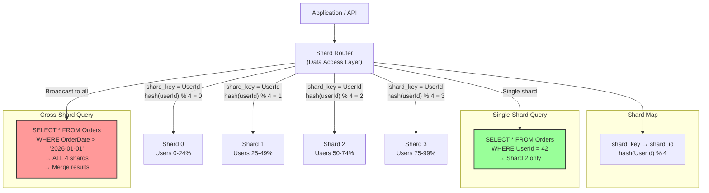
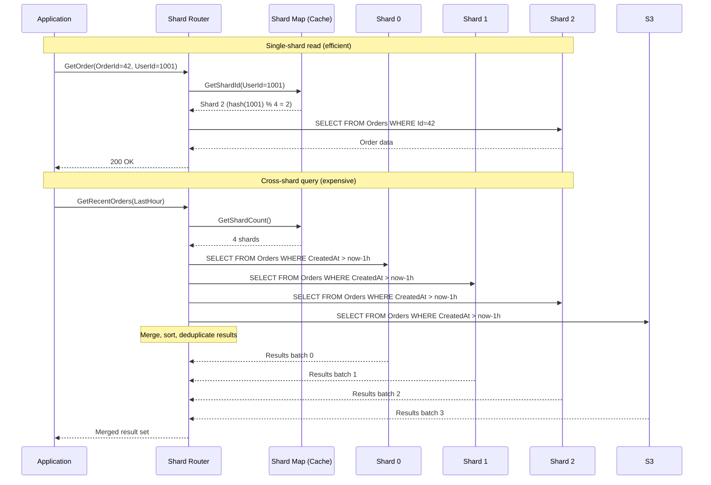

> [!success] Mastery Check
> - [ ] **Studied Well**
> - [ ] **Can explain the concept without notes**
> - [ ] **Can answer interview questions confidently**
> - [ ] **Can implement it in a real project**

---

id: "7.222"
title: "Database Sharding — Overview"
domain: "System Design & Distributed Systems"
domain_id: 7
group: "Scalability Patterns"
tags: [system-design, distributed-systems, scalability, dotnet, azure, databases, sharding, partitioning, horizontal-scaling]
priority: 1
version: 1
prerequisites:
  - "[[7.206 — Horizontal vs Vertical Scaling — Tradeoffs]]" — sharding is a form of horizontal scaling applied to the database tier; the tradeoffs between vertical scaling (larger machines) and horizontal scaling (more machines) are the foundation for understanding when sharding becomes necessary
  - "[[7.219 — Database Read Replicas — Setup and Tradeoffs]]" — read replicas scale READ throughput but do NOT scale WRITE throughput; sharding is the next step when writes exceed a single node's capacity; understanding the limits of read replicas establishes the trigger for sharding
  - "[[7.220 — Database Read Replicas — Replication Lag]]" — in a sharded architecture, each shard may have its own replicas with independent replication lag; cross-shard queries must deal with heterogeneous lag across shards
  - "[[8.64 — SQL Server Transaction Log Internals]]" — transaction log LSNs and log sequence numbers are the foundation for consistent snapshots across shards; understanding LSN ordering is required for distributed queries that read from multiple shards at a consistent point in time
related:
  - "[[7.223 — Database Sharding — Partition Key Selection]]" — the shard key is the single most important design decision in a sharded system; 7.222 defines what sharding is, 7.223 defines how to choose the key that makes it work
  - "[[7.224 — Database Sharding — Range-Based]]" — range-based sharding assigns rows to shards based on ranges of the partition key; simple but susceptible to hotspotting on monotonically increasing keys
  - "[[7.225 — Database Sharding — Hash-Based]]" — hash-based sharding distributes rows uniformly across shards; eliminates hot spots but makes range queries impossible without broadcasting
  - "[[7.226 — Database Sharding — Directory-Based]]" — directory-based sharding uses a lookup service to map keys to shards; most flexible but adds a lookup latency and a single point of failure
  - "[[7.227 — Database Sharding — Cross-Shard Queries]]" — the defining cost of sharding: any query that needs data from multiple shards must scatter-gather; 7.227 explores the patterns for handling this
  - "[[7.228 — Database Sharding — Resharding and Migration]]" — as data grows, the initial shard count becomes insufficient; resharding is the most complex operational challenge in sharded systems
  - "[[7.229 — Consistent Hashing — Algorithm]]" — consistent hashing is the enabling algorithm for hash-based sharding that minimizes data movement during resharding; the math that makes resharding practical
  - "[[7.232 — Consistent Hashing — Use Cases]]" — consistent hashing is used in Cassandra, Redis Cluster, and Azure Cosmos DB; understanding its real-world applications provides context for why sharding is implemented this way
  - "[[7.250 — Database Federation — Functional Partitioning]]" — federation (separate databases per bounded context) is an alternative to sharding; the two approaches can be combined — federate by domain, then shard within each domain
  - "[[7.254 — Eventual Consistency Trade-Off for Scale]]" — distributed transactions across shards require coordination; eventual consistency is often the pragmatic choice for cross-shard operations
  - "[[7.236 — Connection Pooling — SQL at Scale]]" — in a sharded architecture with many shards, connection pooling must be shard-aware; each shard needs its own pool, and pool limits multiply by shard count
  - "[[8.100 — Transactions and Concurrency in SQL Server]]" — distributed transactions across shards use two-phase commit (DTC); the performance and availability implications of distributed transactions are a key tradeoff in sharded designs
created: 2026-06-16

---

> [!ABSTRACT] Quick Reference — Database Sharding **Invariant:** Sharding partitions a single logical database into multiple physical databases (shards), each holding a subset of the data. The complete data set is the UNION of all shards. Each shard is an independent database with its own compute, storage, and I/O. The application or middleware routes each query to the shard(s) that contain the relevant data. **Cost:** You trade the simplicity of a single-node database for the ability to scale write throughput and data size beyond what a single node can handle. The costs are severe: cross-shard queries require scatter-gather (slow and complex), distributed transactions across shards are expensive (two-phase commit or eventual consistency), schema changes must be applied to every shard, and resharding (changing the number of shards) is a high-risk operational procedure. **Trigger:** The single database reaches its write throughput limit — CPU is consistently above 80%, transaction log throughput is saturated, or the data size exceeds the practical limit for backup/restore windows (> 4 TB for a single Azure SQL Database). Read replicas no longer help because the bottleneck is WRITE capacity, not read capacity. The next bottleneck is the primary node's write throughput. **Skip When:** The database fits comfortably on a single node (< 500 GB, < 5,000 writes/second). Read replicas or caching can handle the read load. The application uses complex joins or cross-row transactions that would be difficult to express across shards. The team lacks operational experience with distributed systems. Also skip when the data is naturally partitionable by tenant (multi-tenant SaaS) — in that case, database federation (one database per tenant) is simpler than sharding.

---

## Navigation

**Domain:** [[7 — System Design & Distributed Systems]] > **Group:** Scalability Patterns
**Previous:** [[7.221 — Database Read Replicas — Read-Your-Writes Problem]] | **Next:** [[7.223 — Database Sharding — Partition Key Selection]]

### Prerequisites

- [[7.206 — Horizontal vs Vertical Scaling — Tradeoffs]] — sharding IS horizontal scaling for databases; the general tradeoffs (complexity vs capacity, operational overhead vs elasticity) apply directly
- [[7.219 — Database Read Replicas — Setup and Tradeoffs]] — read replicas are the first line of defense for database scaling; sharding is the next step when writes are the bottleneck
- [[8.64 — SQL Server Transaction Log Internals]] — understanding log throughput limits is required to identify when a single node's write capacity is saturated

### Where This Fits

> [!INFO] Production Encounter Map
>
> - **Layer:** Database architecture — sharding lives at the data access layer and the database deployment layer. The decision to shard affects every query, every transaction, every schema migration, and every deployment.
> - **Trigger:** The primary database CPU is at 95% during peak hours. The team has already added read replicas (which helped reads but not writes). The write volume continues to grow at 30% YoY. The business projects 3× growth in the next 18 months. The database is 2 TB and the nightly backup takes 6 hours — dangerously close to the recovery SLA window. The team must increase write capacity and data size capacity beyond what a single node can provide.
> - **Without sharding:** The single database becomes the bottleneck for the entire application. The team vertically scales (larger SKU) until the largest available SKU is reached. After that, the only option is to reduce write volume — feature gating writes, throttling user actions, degrading the product experience. The engineering team spends more time firefighting database performance than building features. Every query competes for the same I/O and CPU — a slow analytics query can block customer-facing writes.
> - **First signal that sharding must be considered:** (1) The database consistently exceeds 80% CPU during peak with no remaining headroom. (2) The primary node's transaction log throughput is saturated — log generation rate exceeds the disk's write capacity. (3) The database size exceeds 1 TB and growing — backup/restore times threaten the recovery SLA. (4) Vertical scaling has been exhausted (max SKU in use) or becomes cost-prohibitive (the cost of a single large node exceeds the cost of multiple smaller nodes by more than 2×).

Sharding is the most impactful scalability pattern for database write throughput. It is also the most operationally complex. Unlike read replicas (which scale reads with moderate operational cost) or caching (which reduces read load), sharding partitions both reads AND writes across independent nodes. The fundamental tradeoff: you gain write scalability at the cost of query complexity, transactional integrity, and operational overhead. A well-designed sharded system can scale to petabytes and millions of writes per second. A poorly designed one (wrong shard key, inadequate resharding plan, over-reliance on cross-shard queries) becomes an operational nightmare that is extremely difficult to recover from.

---

## Core Mental Model

Sharding is horizontal partitioning applied to the database tier. Think of it as splitting a single filing cabinet into multiple cabinets, each holding a non-overlapping subset of the files. To find a file, you must know which cabinet it is in. To update files across multiple cabinets, you must coordinate. To add a cabinet, you must redistribute files across the new set.

The single invariant: **Every row belongs to exactly one shard, determined by its shard key value.** The shard key is a column (or set of columns) chosen to distribute data uniformly across shards while keeping related data together. The routing layer computes `shard_id = f(shard_key)` to determine which shard contains the row. The function `f` defines the sharding strategy:

- **Range-based:** `shard_id = shard_key_value BETWEEN range_start AND range_end`
- **Hash-based:** `shard_id = hash(shard_key_value) MOD number_of_shards`
- **Directory-based:** `shard_id = lookup(shard_key_value)` — a map service returns the shard

The fundamental cost of sharding is that operations spanning multiple shards lose the simplicity of a single-node ACID guarantee. A query that needs data from shards 1, 3, and 7 must send three parallel queries and merge the results (scatter-gather). A transaction that updates rows in shards 2 and 5 must coordinate via two-phase commit (distributed transaction) or accept eventual consistency. A schema migration must be applied to every shard — 64 ALTER TABLE statements instead of one.

Sharding is distinct from federation (separate databases per bounded context, each with its own schema). In federation, each database is dedicated to a domain (Orders, Inventory, Users) and has a different schema. In sharding, all shards have the identical schema, each holding a subset of the same type of data. The two patterns can be combined: federate by domain, then shard within each domain.

### Classification

- **Scalability pattern:** Horizontal scaling for databases. Scales write throughput linearly with shard count (under ideal conditions and uniform shard key distribution).
- **Where it fits in the scaling hierarchy:**
  1. Vertical scaling (larger single node) — first line, simple, hits hardware limits
  2. Read replicas — scales reads, does not scale writes
  3. Caching — scales reads, reduces load for hot data
  4. **Sharding — scales both reads AND writes, increases operational complexity**
  5. Federation — separates by domain, reduces cross-domain contention
- **What it explicitly does not solve:**
  - Query latency for individual queries (single-shard queries are as fast as single-node queries; cross-shard queries are SLOWER)
  - Distributed transactions (two-phase commit adds latency and reduces availability)
  - Complex joins (joins across shards require application-level merge)
  - Atomic schema changes (schema must be applied to every shard independently)
  - Operational simplicity (backup/restore, monitoring, deployments all multiply by the shard count)

### Primary Diagram





### Key Properties / Guarantees

| Property | Value | Condition |
|---|---|---|
| Write throughput scaling | Linear with shard count | Uniform shard key distribution; no hot spots |
| Data size capacity | Linear with shard count | Each shard independently manages its storage |
| Single-row read latency | Same as single-node database (1-5ms) | Query hits exactly one shard (known shard key) |
| Cross-shard query latency | Max(shard_latency) × N(returns) | Each shard executes independently; slowest shard determines total latency |
| Distributed transaction throughput | Degrades significantly | Two-phase commit requires coordinator; 2PC throughput is limited by the coordinator |
| Operational complexity | Multiplies by shard count | Backups, monitoring, schema migrations, deployments × N shards |
| Consistency across shards | NOT guaranteed (unless 2PC) | Each shard is independent; no global transaction log |
| Data distribution uniformity | Depends on shard key quality | Poor key → hot shards → bottlenecks |
| Resharding cost | High (requires data migration) | Existing data must be redistributed when shard count changes |

---

## Deep Mechanics

### How It Works

A sharded database system has four layers: the shard key, the shard mapping function, the routing layer, and the shard instances themselves.

**Layer 1 — Shard Key Selection**

The shard key is a column (or composite of columns) that determines which shard each row belongs to. The key must satisfy three conflicting requirements:

1. **High cardinality** — The key should have many distinct values to distribute data uniformly. A boolean column (true/false) is a terrible shard key because it produces at most 2 shards' worth of distribution. A UserId column with millions of distinct values is excellent.

2. **Uniform distribution** — Each key value should represent roughly the same amount of data. If UserId 1 has 1 order and UserId 999,999 has 1 million orders, the shard containing UserId 999,999 is a hot spot. If the shard key is the first letter of the customer's last name, letters A and S are disproportionately large (many more names start with A and S than X and Z).

3. **Query affinity** — The most common queries should include the shard key so they can be routed to a single shard. If the application's most common query is "get orders for a user," UserId is a good shard key. If the most common query is "get all orders in a date range" without a UserId, every query requires a broadcast to all shards.

The tension between these three requirements is the central design challenge of sharding. A key that distributes uniformly may not be present in the most common queries. A key present in the most common queries may distribute poorly. The compromise often involves using a composite key: `(UserId, OrderDate)` where the primary routing uses UserId for single-shard access but OrderDate allows range-based filtering within the shard.

**Layer 2 — Shard Mapping Function**

The mapping function `f(key) → shard_id` determines the strategy:

**Range-based:** Predefined ranges map to shards. Shard 0: UserId 1-1,000,000. Shard 1: UserId 1,000,001-2,000,000. Ranges can be uneven — allocate more range to shards with more capacity. Range-based sharding preserves ORDER within a shard (range scans work) and allows range-based resharding (split a range into two). The critical weakness: monotonically increasing keys (auto-increment IDs, timestamps) create hot spots because ALL new writes go to the LAST shard.

```sql
-- Range-based shard map (stored in configuration)
CREATE TABLE ShardMap (
    ShardId INT PRIMARY KEY,
    RangeStart INT NOT NULL,
    RangeEnd INT NOT NULL,
    ConnectionString NVARCHAR(500) NOT NULL
);

INSERT INTO ShardMap VALUES
    (0, 1, 1000000, 'Server=shard0.database.windows.net;Database=OrdersDB'),
    (1, 1000001, 2000000, 'Server=shard1.database.windows.net;Database=OrdersDB'),
    (2, 2000001, 3000000, 'Server=shard2.database.windows.net;Database=OrdersDB');
```

**Hash-based:** The shard key is hashed, and the hash value modulo the shard count determines the shard. Hash-based distribution ensures uniform data distribution (good hash functions produce uniformly distributed outputs) regardless of the shard key's natural distribution. The weakness: resharding (changing N) requires rehashing EVERY key, moving most data. This is solved by consistent hashing (7.229), which minimizes the number of keys that need to be remapped when N changes. Another weakness: range queries on the shard key cannot be routed to a single shard because the hash breaks order.

```csharp
// Hash-based shard routing
public int GetShardId(int userId, int shardCount)
{
    // Use a hash with good uniformity (not GetHashCode which is not stable across runs)
    using var hash = System.IO.Hashing.XxHash64.Create();
    var bytes = BitConverter.GetBytes(userId);
    hash.Write(bytes);
    var hashValue = (int)(hash.GetCurrentHashAsUInt64() % int.MaxValue);
    return Math.Abs(hashValue) % shardCount;
}
```

**Directory-based:** A lookup service (database table, Redis, or dedicated metadata store) maps each shard key value to a shard ID. The application queries the directory to find the shard. This is the most flexible approach — shards can be reassigned without changing the mapping function. The weaknesses: the directory lookup adds latency (1-5ms), the directory can become a bottleneck or single point of failure, and the directory must be kept consistent with the actual data placement.

```csharp
// Directory-based shard routing (with Redis cache)
public async Task<int> GetShardIdAsync(int userId, CancellationToken ct)
{
    var cached = await _cache.GetAsync($"shard_dir:{userId}", ct);
    if (cached.HasValue) return (int)cached;
    
    using var conn = new SqlConnection(_shardDirectoryConnectionString);
    var cmd = new SqlCommand(
        "SELECT ShardId FROM ShardDirectory WHERE UserId = @userId", conn);
    cmd.Parameters.AddWithValue("@userId", userId);
    var shardId = (int)await cmd.ExecuteScalarAsync(ct);
    
    await _cache.SetAsync($"shard_dir:{userId}", shardId, TimeSpan.FromHours(1), ct);
    return shardId;
}
```

**Layer 3 — Routing Layer**

The routing layer intercepts database queries and directs them to the correct shard(s). The routing decision happens at one of three levels:

1. **Application-level routing:** The application code explicitly chooses the connection string based on the shard key. This is the simplest to implement (the developer writes `if shardId == 0 { connect to shard0 }`), but every query that misses the shard key must broadcast to all shards. The routing logic is scattered across repositories and services.

2. **Middleware-level routing:** A custom middleware or data access layer (DAL) intercepts all database calls and routes them. The application is shard-unaware — it calls `db.Orders.Find(orderId)` and the DAL adds the shard key routing transparently. This is cleaner but requires a DAL that can inspect queries and extract the shard key.

3. **Database-level routing (shard map):** Azure SQL Database Elastic Scale and similar tools provide a built-in shard map manager. The application registers each shard with the shard map manager, and the SQL client library automatically routes queries based on the shard key. This is the most transparent approach but limits the database engine options to those that support it.

**.NET implementation of the routing layer:**

```csharp
// Shard router — application-level routing
public sealed class ShardRouter
{
    private readonly IReadOnlyList<string> _shardConnectionStrings;
    private readonly IShardMap _shardMap;
    private readonly ILogger<ShardRouter> _logger;

    public ShardRouter(
        IReadOnlyList<string> shardConnectionStrings,
        IShardMap shardMap,
        ILogger<ShardRouter> logger)
    {
        _shardConnectionStrings = shardConnectionStrings;
        _shardMap = shardMap;
        _logger = logger;
    }

    public int GetShardId(int shardKey) =>
        _shardMap.GetShardId(shardKey);

    public SqlConnection CreateShardConnection(int shardId)
    {
        var conn = new SqlConnection(_shardConnectionStrings[shardId]);
        conn.Open();
        return conn;
    }

    public SqlConnection CreateConnectionForKey(int shardKey)
    {
        var shardId = GetShardId(shardKey);
        return CreateShardConnection(shardId);
    }

    public async Task<IReadOnlyList<TResult>> ScatterGatherAsync<TResult>(
        Func<SqlConnection, int, Task<IReadOnlyList<TResult>>> queryFunc,
        CancellationToken ct)
    {
        var tasks = _shardConnectionStrings.Select(async (connString, shardId) =>
        {
            using var conn = new SqlConnection(connString);
            await conn.OpenAsync(ct);
            return await queryFunc(conn, shardId);
        });

        var results = await Task.WhenAll(tasks);
        return results.SelectMany(r => r).ToList();
    }
}
```

**Layer 4 — Shard Instances**

Each shard is a fully independent database instance running on its own compute and storage. The shards may be on the same server (for small-scale sharding) or distributed across servers, regions, or even cloud providers. Key operational considerations:

- **Uniform configuration:** All shards should have the same SKU and configuration to avoid one shard becoming a bottleneck due to insufficient resources. If one shard has 4 vCores and another has 16 vCores, the smaller shard limits the system's throughput even if the data is uniformly distributed.

- **Independent backups:** Each shard must be backed up independently. A 64-shard system requires coordinating 64 backup schedules. Restoring the full database requires restoring all 64 shards to the same point in time — which is practically impossible unless all shards use the same backup schedule and the application can tolerate shard-level inconsistency during recovery.

- **Independent monitoring:** Each shard emits its own metrics (CPU, DTU, storage, IOPS, deadlocks). Aggregate monitoring must combine metrics across all shards. A single hot shard may not show up in the average CPU across 64 shards — the average may be 30% while one shard is at 100%. Per-shard percentile monitoring (P99 CPU across shards) is required.

### Failure Modes

**Failure Mode 1 — Hot Shard from Skewed Key Distribution**

**What breaks:** The shard key distribution is skewed — one shard receives significantly more traffic than others. This happens when the shard key has low cardinality (sharding by TenantId where one tenant has 10× more data than others), when the shard key correlates with time (sharding by auto-increment ID causes all new writes to go to the last shard), or when the shard key is not uniformly distributed (sharding by CustomerName's first letter where S and A are overrepresented).

**Detection:** The per-shard CPU monitoring shows one shard consistently at 90-100% while others are at 20-30%. The hot shard's query latency is 10× the shard average. The application's P99 latency increases because the slowest shard determines the overall response time. The hot shard's storage may also fill faster than the others, triggering early capacity alerts.

**Prevention:** Choose the shard key carefully (high cardinality, uniform distribution). Use hash-based sharding instead of range-based for keys that are not uniformly distributed. Monitor per-shard statistics (row count, query count, CPU) continuously — the first sign of skew is visible within hours of deployment, not months.

**Fix:** 
- **Short-term:** Increase the hot shard's compute (vertical scaling of a single shard) to compensate for the uneven load. This masks the problem but does not fix it.
- **Medium-term:** Rebalance data from the hot shard to less-loaded shards. For range-based sharding, split the hot range. For hash-based, add a virtual shard mapping (remap a subset of the hot shard's hash values to a new shard).
- **Long-term:** Change the shard key (requires full resharding) or add a secondary shard key that distributes more uniformly.

**Failure Mode 2 — Cross-Shard Query Latency Amplification**

**What breaks:** A query that does NOT include the shard key must be broadcast to ALL shards. The total query latency is determined by the SLOWEST shard's response time. If one shard is under load (e.g., running a heavy reporting query), its response time increases to 10 seconds, while all other shards respond in 100ms. The broadcast query takes 10 seconds — 100× the expected latency — because of a single slow shard.

**Detection:** The application's P99 query latency spikes during periods when any shard is under heavy load. The latency spike correlates with reporting or batch jobs on any single shard. The application logs show that cross-shard queries (those missing the shard key) have latency proportional to `max(shard_latencies)` while single-shard queries have normal latency.

**Prevention:** Minimize cross-shard queries by design. Every query should include the shard key in the WHERE clause. For queries that MUST be cross-shard (administrative reports, global searches), implement a timeout per shard and accept partial results. Use a dedicated read-only replica per shard for cross-shard queries to avoid competing with production traffic.

```csharp
// Cross-shard query with per-shard timeout and partial results
public async Task<IReadOnlyList<Order>> SearchOrdersAsync(
    DateTime startDate, DateTime endDate, CancellationToken ct)
{
    var perShardTimeout = TimeSpan.FromSeconds(5);
    var results = new ConcurrentBag<Order>();
    var failedShards = new ConcurrentBag<int>();

    var tasks = _shardConnectionStrings.Select(async (connString, shardId) =>
    {
        try
        {
            using var cts = CancellationTokenSource.CreateLinkedTokenSource(ct);
            cts.CancelAfter(perShardTimeout);
            
            using var conn = new SqlConnection(connString);
            await conn.OpenAsync(cts.Token);
            
            using var cmd = new SqlCommand(@"
                SELECT Id, UserId, Total, CreatedAt
                FROM Orders
                WHERE CreatedAt BETWEEN @start AND @end", conn);
            cmd.Parameters.AddWithValue("@start", startDate);
            cmd.Parameters.AddWithValue("@end", endDate);
            
            using var reader = await cmd.ExecuteReaderAsync(cts.Token);
            while (await reader.ReadAsync(cts.Token))
            {
                results.Add(new Order(
                    reader.GetInt32(0), reader.GetInt32(1),
                    reader.GetDecimal(2), reader.GetDateTime(3)));
            }
        }
        catch (OperationCanceledException)
        {
            failedShards.Add(shardId);
            _logger.LogWarning("Shard {ShardId} timed out during cross-shard query", shardId);
        }
    });

    await Task.WhenAll(tasks);
    
    if (failedShards.Any())
    {
        _logger.LogWarning(
            "Cross-shard query returned partial results. {FailedCount} of {TotalCount} shards failed.",
            failedShards.Count, _shardConnectionStrings.Count);
    }
    
    return results.OrderByDescending(o => o.CreatedAt).ToList();
}
```

**Fix:** 
- Add the shard key to the query WHERE clause wherever possible.
- For queries that cannot include the shard key, consider denormalizing the shard key into the query context (e.g., if searching orders, include the UserId shard key by restructuring the search to be per-user).
- If cross-shard queries are unavoidable, implement a dedicated search index (Elasticsearch, Azure Cognitive Search) that is populated asynchronously from all shards.

**Failure Mode 3 — Distributed Transaction Deadlock and Availability**

**What breaks:** A transaction updates data in two shards. The application uses a distributed transaction coordinator (DTC) to coordinate the commit. Shard 1 prepares (pre-commits) successfully. Shard 2 fails to prepare (deadlock, constraint violation, timeout). The coordinator tells Shard 1 to roll back. But Shard 1 has already started the rollback when the network connection drops. Shard 1 is now in an IN-DOUBT state — it has been told to prepare but cannot confirm the rollback. The row in Shard 1 is locked by the prepared transaction until the coordinator recovers. Other transactions on Shard 1 that need that row are blocked. Availability degrades for Shard 1 until the DTC resolves the in-doubt transaction.

**Detection:** The distributed transaction coordinator logs show a spike in "in-doubt" transactions. The application reports timeouts on Shard 1 that are not correlated with CPU or I/O — the rows are locked by the prepared transaction. The DTC's `sys.dm_tran_active_transactions` on Shard 1 shows transactions with `transaction_state = 2` (prepared but not committed) lasting longer than the typical commit duration.

**Prevention:** Avoid distributed transactions entirely. Design the application so that a single business operation touches only one shard. This is the most important design rule in a sharded system: **if two pieces of data must be updated atomically, they must be in the same shard.** This means the shard key must be chosen to colocate related data. All of a user's data (user profile, orders, payments) should be in the same shard if they must be transactionally consistent.

**Fix:**
- **Immediate:** Use the DTC management tools to manually resolve in-doubt transactions (`ROLLBACK PREPARED` or `COMMIT PREPARED` after confirming the transaction's outcome).
- **Medium-term:** Refactor the transaction to avoid cross-shard dependencies. Use a saga pattern (compensating transactions) instead of distributed transactions: execute the operation on Shard 1, then execute on Shard 2, and if Shard 2 fails, execute a compensating operation on Shard 1 to undo the change.
- **Long-term:** Redesign the shard key to colocate data that requires transactional consistency.

**Failure Mode 4 — Schema Migration Applied to Wrong Number of Shards**

**What breaks:** A migration adds a column to the Orders table. The migration is applied to 63 of 64 shards. The 64th shard (which was offline for maintenance) misses the migration. When queries hit the 64th shard, they fail with "Invalid column name 'DiscountApplied'." The application's error rate increases by 1/64 of total traffic — the exact fraction of traffic hitting the missed shard. The error is silent for the other 63 shards.

**Detection:** The error rate increases by approximately `1/N` (where N is the shard count) after a schema deployment. The errors are all "Invalid column name" on the newly added column. The error correlates with a specific set of shard IDs — exactly the shards that missed the migration.

**Prevention:** Use an idempotent migration script that checks whether the column exists before adding it. Automate shard migrations — never apply migrations manually. Use a migration tracker table in each shard that records which migrations have been applied. Query all shards for their migration state after a deployment to verify completeness.

```sql
-- Idempotent shard migration
IF NOT EXISTS (
    SELECT 1 FROM sys.columns 
    WHERE object_id = OBJECT_ID('Orders') AND name = 'DiscountApplied')
BEGIN
    ALTER TABLE Orders ADD DiscountApplied DECIMAL(5,2) NULL;
END

-- Migration tracker
IF NOT EXISTS (SELECT 1 FROM __Migrations WHERE MigrationId = 'AddDiscountApplied')
BEGIN
    ALTER TABLE Orders ADD DiscountApplied DECIMAL(5,2) NULL;
    INSERT INTO __Migrations (MigrationId, AppliedAt) 
    VALUES ('AddDiscountApplied', GETUTCDATE());
END
```

**Fix:**
- **Immediate:** Apply the missing migration to the affected shard(s).
- **Short-term:** Add a post-deployment verification step that queries each shard for the migration state and alerts if any shard is out of sync.

**Failure Mode 5 — Resharding Migration Causes Read Staleness or Data Loss**

**What breaks:** The system needs to increase from 4 shards to 8 shards. The resharding process reads data from the old shards and writes it to the new shards. While the resharding is in progress (which may take hours for terabytes of data), writes continue to the old shards. These writes must be captured and replayed on the new shards. If the change tracking is not perfectly implemented, a write that occurred during resharding is missed, and the new shard is missing a row or has stale data. The application reads from the new shards after the cutover and returns incorrect results.

**Detection:** Post-resharding reconciliation shows that the new shards are missing rows or have different column values compared to the old shards. The discrepancy is in rows that were created or updated during the resharding window. The number of missing rows matches the write rate × the resharding duration — e.g., 500 writes/second × 2 hours = 3.6 million missed rows.

**Prevention:** Use one of three resharding strategies:
- **Read-only mode during resharding:** Stop writes during the resharding window. Simplest but requires downtime. Acceptable for systems with maintenance windows.
- **Dual-write during resharding:** Write to both old and new shards during the migration. Requires the application to know about the migration and write to two places. Complex but zero downtime.
- **Change tracking + replay:** Use the database's change tracking feature to capture all changes during resharding. After the initial data copy, replay the captured changes on the new shards. Then stop writes briefly to catch up, and switch over. This is the standard approach for zero-downtime resharding.

```csharp
// Change-tracking-based resharding (conceptual)
public async Task ReshardAsync(
    IReadOnlyList<int> oldShardIds, 
    IReadOnlyList<(int ShardId, int RangeStart, int RangeEnd)> newShardRanges,
    CancellationToken ct)
{
    // Phase 1: Enable change tracking on all old shards
    foreach (var shardId in oldShardIds)
    {
        await EnableChangeTrackingAsync(shardId, ct);
    }
    
    // Phase 2: Copy existing data to new shards
    foreach (var (rangeStart, rangeEnd) in GetOldRanges())
    {
        var data = await ReadRangeAsync(rangeStart, rangeEnd, ct);
        await WriteToNewShardsAsync(data, newShardRanges, ct);
    }
    
    // Phase 3: Capture and replay changes that occurred during copy
    foreach (var shardId in oldShardIds)
    {
        var changes = await GetChangesSinceAsync(shardId, _copyStartTime, ct);
        await ReplayChangesOnNewShardsAsync(changes, newShardRanges, ct);
    }
    
    // Phase 4: Brief pause for final catch-up and cutover
    using (var pauseToken = await PauseWritesBrieflyAsync(TimeSpan.FromSeconds(30), ct))
    {
        var finalChanges = await CaptureFinalChangesAsync(oldShardIds, ct);
        await ReplayChangesOnNewShardsAsync(finalChanges, newShardRanges, ct);
        await UpdateShardMapAsync(newShardRanges, ct);
    }
}
```

### .NET and Azure Integration

- **Azure SQL Database Elastic Scale:** A library and toolset for sharding with SQL Database. Provides a shard map manager, data-dependent routing (the key feature — routes queries to the correct shard based on the shard key), and multi-shard query execution. The shard map is stored in a dedicated database (the shard map manager database) and cached by the client library. **Note:** Elastic Scale is in maintenance mode — Microsoft recommends Azure Cosmos DB for new sharded workloads.

- **EF Core:** No built-in support for sharding. The application must implement shard routing manually using a custom `IDbContextFactory` that inspects the shard key and creates a DbContext for the correct shard. The `ShardRouter` class above shows the pattern.

- **Azure Cosmos DB:** Native sharding (partitioning) is built into the database engine. The partition key is specified at container creation time. Cosmos DB automatically distributes data across physical partitions. No application-level routing code needed. This is the simplest sharding experience in Azure — but it requires using Cosmos DB instead of SQL Database, which involves a different data model (JSON documents, SQL query dialect differences, no joins, no foreign keys).

```csharp
// EF Core shard-aware DbContext factory
public sealed class ShardedDbContextFactory<TContext>
    where TContext : DbContext
{
    private readonly ShardRouter _router;
    private readonly IEnumerable<DbContextOptions<TContext>> _shardOptions;
    private readonly IHttpContextAccessor _httpContext;

    public ShardedDbContextFactory(
        ShardRouter router,
        IEnumerable<DbContextOptions<TContext>> shardOptions,
        IHttpContextAccessor httpContext)
    {
        _router = router;
        _shardOptions = shardOptions;
        _httpContext = httpContext;
    }

    public TContext CreateDbContextForShardKey(int shardKey)
    {
        var shardId = _router.GetShardId(shardKey);
        var options = _shardOptions.ElementAt(shardId);

        return (TContext)Activator.CreateInstance(typeof(TContext), options)!;
    }

    public TContext CreateDbContextForCurrentUser()
    {
        var userId = _httpContext.HttpContext?.User.FindFirst(ClaimTypes.NameIdentifier)?.Value;
        if (userId is null)
        {
            throw new InvalidOperationException("Cannot determine shard: user not authenticated");
        }

        return CreateDbContextForShardKey(int.Parse(userId));
    }
}
```

- **Polly:** Provides retry policies that are shard-aware. A transient failure on Shard 3 should NOT affect queries on Shard 1. Implement per-shard `AsyncPolicy` instances that handle failures independently.

```csharp
// Per-shard Polly policies
public sealed class ShardedResiliencePolicies
{
    private readonly IReadOnlyList<AsyncPolicy> _perShardPolicies;

    public ShardedResiliencePolicies(int shardCount)
    {
        _perShardPolicies = Enumerable.Range(0, shardCount)
            .Select(_ => Policy
                .Handle<SqlException>(ex => ex.Number == -2 || ex.Number == 1205)
                .WaitAndRetryAsync(3, attempt => TimeSpan.FromMilliseconds(100 * Math.Pow(2, attempt - 1)))
            )
            .ToList();
    }

    public AsyncPolicy GetPolicy(int shardId) => _perShardPolicies[shardId];
}
```

- **Azure Redis Cache:** Can be used to cache the shard map for directory-based sharding. The shard map is stored in Redis with a TTL — reducing lookup latency from 1-5ms (database query) to <1ms (Redis GET). The shard map is invalidated when shards are added or removed.

---

## Production Patterns and Implementation

### Primary Implementation

The complete sharding implementation has three components: the shard map (routing configuration), the shard router (routing logic), and a shard-aware EF Core `DbContext` factory.

```csharp
// 1. Shard map configuration
public sealed record ShardConfiguration
{
    public int TotalShards { get; init; }
    public ShardingStrategy Strategy { get; init; } = ShardingStrategy.Hash;
    public IReadOnlyList<string> ConnectionStrings { get; init; } = Array.Empty<string>();
}

public enum ShardingStrategy
{
    Hash,
    Range,
    Directory
}

// 2. Shard map — defines how keys map to shards
public interface IShardMap
{
    int GetShardId(int shardKey);
    int ShardCount { get; }
}

public sealed class HashShardMap : IShardMap
{
    private readonly int _shardCount;

    public HashShardMap(int shardCount) => _shardCount = shardCount;
    public int ShardCount => _shardCount;

    public int GetShardId(int shardKey)
    {
        // Jenkins one-at-a-time hash for uniform distribution
        unchecked
        {
            var hash = (uint)shardKey;
            hash += (hash << 10);
            hash ^= (hash >> 6);
            hash += (hash << 3);
            hash ^= (hash >> 11);
            hash += (hash << 15);
            return (int)(hash % (uint)_shardCount);
        }
    }
}

public sealed class RangeShardMap : IShardMap
{
    private readonly IReadOnlyList<int> _rangeBoundaries;

    public RangeShardMap(IReadOnlyList<int> rangeBoundaries)
    {
        _rangeBoundaries = rangeBoundaries;
    }

    public int ShardCount => _rangeBoundaries.Count;

    public int GetShardId(int shardKey)
    {
        for (int i = 0; i < _rangeBoundaries.Count; i++)
        {
            if (shardKey <= _rangeBoundaries[i])
                return i;
        }
        return _rangeBoundaries.Count - 1;
    }
}

// 3. Shard router — connection management
public sealed class ShardRouter : IDisposable
{
    private readonly IShardMap _shardMap;
    private readonly IReadOnlyList<string> _connectionStrings;
    private readonly ConcurrentDictionary<int, SqlConnection> _connections = new();

    public ShardRouter(IShardMap shardMap, IReadOnlyList<string> connectionStrings)
    {
        _shardMap = shardMap;
        _connectionStrings = connectionStrings;
    }

    public int ShardCount => _shardMap.ShardCount;

    public int GetShardId(int shardKey) => _shardMap.GetShardId(shardKey);

    public SqlConnection GetConnection(int shardId)
    {
        return _connections.GetOrAdd(shardId, id =>
        {
            var conn = new SqlConnection(_connectionStrings[id]);
            conn.Open();
            return conn;
        });
    }

    public SqlConnection GetConnectionForKey(int shardKey)
    {
        var shardId = GetShardId(shardKey);
        return GetConnection(shardId);
    }

    public async Task<TResult> ExecuteOnShardAsync<TResult>(
        int shardKey,
        Func<SqlConnection, Task<TResult>> queryFunc)
    {
        var shardId = GetShardId(shardKey);
        using var conn = new SqlConnection(_connectionStrings[shardId]);
        await conn.OpenAsync();
        return await queryFunc(conn);
    }

    public async Task<IReadOnlyList<TResult>> ExecuteOnAllShardsAsync<TResult>(
        Func<SqlConnection, int, Task<IReadOnlyList<TResult>>> queryFunc,
        CancellationToken ct)
    {
        var tasks = _connectionStrings.Select(async (connString, shardId) =>
        {
            try
            {
                using var conn = new SqlConnection(connString);
                await conn.OpenAsync(ct);
                return await queryFunc(conn, shardId);
            }
            catch (Exception ex)
            {
                _logger.LogError(ex, "Shard {ShardId} query failed", shardId);
                return Array.Empty<TResult>();
            }
        });

        var results = await Task.WhenAll(tasks);
        return results.SelectMany(r => r).ToList();
    }

    public void Dispose()
    {
        foreach (var conn in _connections.Values)
        {
            conn.Dispose();
        }
        _connections.Clear();
    }
}

// 4. Shard-aware EF Core DbContext
public class OrdersDbContext : DbContext
{
    public DbSet<Order> Orders => Set<Order>();
    public DbSet<OrderItem> OrderItems => Set<OrderItem>();

    public OrdersDbContext(DbContextOptions<OrdersDbContext> options)
        : base(options) { }

    protected override void OnModelCreating(ModelBuilder modelBuilder)
    {
        modelBuilder.Entity<Order>(entity =>
        {
            entity.ToTable("Orders");
            entity.HasKey(e => e.Id);
            entity.Property(e => e.UserId).IsRequired();
            entity.HasIndex(e => e.UserId); // Critical: shard key index
        });

        modelBuilder.Entity<OrderItem>(entity =>
        {
            entity.ToTable("OrderItems");
            entity.HasKey(e => e.Id);
            entity.HasOne<Order>()
                  .WithMany(o => o.Items)
                  .HasForeignKey(e => e.OrderId);
        });
    }
}

// 5. Shard-aware repository
public class OrderRepository
{
    private readonly ShardRouter _router;
    private readonly ILogger<OrderRepository> _logger;

    public OrderRepository(ShardRouter router, ILogger<OrderRepository> logger)
    {
        _router = router;
        _logger = logger;
    }

    public async Task<Order?> GetByIdAsync(int orderId, int userId, CancellationToken ct)
    {
        // userId is the shard key
        return await _router.ExecuteOnShardAsync(userId, async conn =>
        {
            using var cmd = new SqlCommand(@"
                SELECT Id, UserId, Total, Status, CreatedAt
                FROM Orders WITH (NOLOCK)
                WHERE Id = @orderId AND UserId = @userId", conn);
            cmd.Parameters.AddWithValue("@orderId", orderId);
            cmd.Parameters.AddWithValue("@userId", userId);

            using var reader = await cmd.ExecuteReaderAsync(ct);
            if (await reader.ReadAsync(ct))
            {
                return new Order(
                    reader.GetInt32(0),
                    reader.GetInt32(1),
                    reader.GetDecimal(2),
                    reader.GetString(3),
                    reader.GetDateTime(4));
            }
            return null;
        });
    }

    public async Task<IReadOnlyList<Order>> GetByUserAsync(
        int userId, DateTime? since, CancellationToken ct)
    {
        // Single-shard query — efficient
        return await _router.ExecuteOnShardAsync(userId, async conn =>
        {
            using var cmd = new SqlCommand(@"
                SELECT Id, UserId, Total, Status, CreatedAt
                FROM Orders WITH (NOLOCK)
                WHERE UserId = @userId
                AND (@since IS NULL OR CreatedAt >= @since)
                ORDER BY CreatedAt DESC", conn);
            cmd.Parameters.AddWithValue("@userId", userId);
            cmd.Parameters.AddWithValue("@since", (object?)since ?? DBNull.Value);

            var orders = new List<Order>();
            using var reader = await cmd.ExecuteReaderAsync(ct);
            while (await reader.ReadAsync(ct))
            {
                orders.Add(new Order(
                    reader.GetInt32(0), reader.GetInt32(1),
                    reader.GetDecimal(2), reader.GetString(3),
                    reader.GetDateTime(4)));
            }
            return orders;
        });
    }

    public async Task<IReadOnlyList<Order>> SearchGlobalAsync(
        string status, DateTime? since, CancellationToken ct)
    {
        // Cross-shard query — broadcast to all shards
        return await _router.ExecuteOnAllShardsAsync(async (conn, shardId) =>
        {
            using var cmd = new SqlCommand(@"
                SELECT Id, UserId, Total, Status, CreatedAt
                FROM Orders WITH (NOLOCK)
                WHERE Status = @status
                AND (@since IS NULL OR CreatedAt >= @since)", conn);
            cmd.Parameters.AddWithValue("@status", status);
            cmd.Parameters.AddWithValue("@since", (object?)since ?? DBNull.Value);

            var orders = new List<Order>();
            using var reader = await cmd.ExecuteReaderAsync(ct);
            while (await reader.ReadAsync(ct))
            {
                orders.Add(new Order(
                    reader.GetInt32(0), reader.GetInt32(1),
                    reader.GetDecimal(2), reader.GetString(3),
                    reader.GetDateTime(4)));
            }
            return orders;
        }, ct);
    }

    public async Task<int> CreateAsync(Order order, CancellationToken ct)
    {
        return await _router.ExecuteOnShardAsync(order.UserId, async conn =>
        {
            using var cmd = new SqlCommand(@"
                INSERT INTO Orders (UserId, Total, Status, CreatedAt)
                OUTPUT INSERTED.Id
                VALUES (@userId, @total, @status, @createdAt)", conn);
            cmd.Parameters.AddWithValue("@userId", order.UserId);
            cmd.Parameters.AddWithValue("@total", order.Total);
            cmd.Parameters.AddWithValue("@status", order.Status);
            cmd.Parameters.AddWithValue("@createdAt", DateTime.UtcNow);

            return (int)await cmd.ExecuteScalarAsync(ct);
        });
    }
}
```

### Configuration and Wiring

```csharp
// Program.cs — sharding service registration
public static void AddShardingInfrastructure(
    this IServiceCollection services, IConfiguration configuration)
{
    var shardConfig = configuration.GetSection("Sharding").Get<ShardConfiguration>()
        ?? throw new InvalidOperationException("Sharding configuration is required");

    // Shard map
    IShardMap shardMap = shardConfig.Strategy switch
    {
        ShardingStrategy.Hash => new HashShardMap(shardConfig.TotalShards),
        ShardingStrategy.Range => new RangeShardMap(shardConfig.RangeBoundaries),
        _ => throw new ArgumentOutOfRangeException(nameof(shardConfig.Strategy))
    };

    // Public static void AddShardingInfrastructure(...)
    services.AddSingleton<IShardMap>(shardMap);
    services.AddSingleton(sp => new ShardRouter(shardMap, shardConfig.ConnectionStrings));

    // Shard-aware repositories
    services.AddScoped<OrderRepository>();
    services.AddScoped<UserRepository>();
    services.AddScoped<PaymentRepository>();

    // Shard-aware EF Core factories (one per shard)
    foreach (var (connString, shardId) in shardConfig.ConnectionStrings.Select((c, i) => (c, i)))
    {
        services.AddDbContext<OrdersDbContext>($"Shard{shardId}", options =>
            options.UseSqlServer(connString));
    }
}
```

```json
// appsettings.json example for 4 shards
{
  "Sharding": {
    "TotalShards": 4,
    "Strategy": "Hash",
    "ConnectionStrings": [
      "Server=tcp:orders-shard0.database.windows.net,1433;Database=OrdersDB;",
      "Server=tcp:orders-shard1.database.windows.net,1433;Database=OrdersDB;",
      "Server=tcp:orders-shard2.database.windows.net,1433;Database=OrdersDB;",
      "Server=tcp:orders-shard3.database.windows.net,1433;Database=OrdersDB;"
    ]
  }
}
```

### Common Variants

**Variant 1 — Multi-Tenant with Per-Tenant Database (Federation + Sharding)**

For SaaS applications where each tenant has its own database. This is federation (functional partitioning by tenant), not sharding. But large tenants (those with > 100 GB of data or > 10,000 writes/second) may need their database SHARDED — one tenant's data spans multiple shards. The routing layer first determines which tenant, then looks up the shard map for that tenant's data.

```csharp
// Federation + sharding combined
public sealed class TenantAwareShardRouter
{
    private readonly ITenantStore _tenantStore;
    private readonly ShardRouter _shardRouter;
    private readonly IReadOnlyDictionary<int, IShardMap> _tenantShardMaps;

    public async Task<SqlConnection> GetConnectionAsync(
        int tenantId, int shardKey, CancellationToken ct)
    {
        var tenant = await _tenantStore.GetTenantAsync(tenantId, ct);

        if (tenant.ShardCount == 1)
        {
            // Small tenant: single database, no sharding needed
            return _shardRouter.GetConnection(tenant.BaseShardId);
        }

        // Large tenant: use the tenant's shard map
        var shardMap = _tenantShardMaps[tenantId];
        var shardId = shardMap.GetShardId(shardKey);
        return _shardRouter.GetConnection(tenant.BaseShardId + shardId);
    }
}
```

**Variant 2 — Azure Cosmos DB Native Partitioning**

For new applications that do not require SQL Server features (joins, stored procedures, triggers, foreign keys), Cosmos DB provides native sharding. The partition key is specified when the container is created. Cosmos DB automatically distributes data across physical partitions (each physical partition handles up to 10,000 RU/s and 50 GB of storage). The application does NOT need a shard map or routing layer — the Cosmos DB client library handles partition routing transparently.

```csharp
// Cosmos DB native partitioning — no application-level shard routing needed
public class CosmosOrderRepository
{
    private readonly Container _container;

    public CosmosOrderRepository(CosmosClient client)
    {
        // Partition key = /userId — data is automatically distributed
        _container = client.GetContainer("OrdersDB", "Orders");
    }

    public async Task<Order> CreateAsync(Order order, CancellationToken ct)
    {
        // Cosmos DB automatically routes to the correct physical partition
        // based on order.UserId (the partition key)
        var response = await _container.CreateItemAsync(order,
            new PartitionKey(order.UserId.ToString()),
            cancellationToken: ct);
        return response.Resource;
    }

    public async Task<Order?> GetAsync(int orderId, int userId, CancellationToken ct)
    {
        try
        {
            // Point read by partition key + id — fastest Cosmos DB operation
            var response = await _container.ReadItemAsync<Order>(
                orderId.ToString(),
                new PartitionKey(userId.ToString()),
                cancellationToken: ct);
            return response.Resource;
        }
        catch (CosmosException ex) when (ex.StatusCode == HttpStatusCode.NotFound)
        {
            return null;
        }
    }

    public async Task<IReadOnlyList<Order>> GetByUserAsync(
        int userId, CancellationToken ct)
    {
        // Single-partition query — efficient (uses partition key)
        var iterator = _container.GetItemQueryIterator<Order>(
            new QueryDefinition("SELECT * FROM Orders o WHERE o.UserId = @userId")
                .WithParameter("@userId", userId),
            requestOptions: new QueryRequestOptions
            {
                PartitionKey = new PartitionKey(userId.ToString())
            });

        var orders = new List<Order>();
        while (iterator.HasMoreResults)
        {
            var response = await iterator.ReadNextAsync(ct);
            orders.AddRange(response);
        }
        return orders;
    }

    public async Task<IReadOnlyList<Order>> SearchGlobalAsync(
        DateTime since, CancellationToken ct)
    {
        // Cross-partition query — expensive (must scan ALL physical partitions)
        var iterator = _container.GetItemQueryIterator<Order>(
            new QueryDefinition(
                "SELECT * FROM Orders o WHERE o.CreatedAt >= @since")
                .WithParameter("@since", since));

        var orders = new List<Order>();
        while (iterator.HasMoreResults)
        {
            var response = await iterator.ReadNextAsync(ct);
            orders.AddRange(response);
        }
        return orders;
    }
}
```

**Variant 3 — Shard-Aware Connection Pooling**

In a sharded system with many shards (e.g., 64 shards), each shard has its own ADO.NET connection pool. With default settings, each pool manages up to 100 connections per shard — 64 × 100 = 6,400 potential connections system-wide. The connection pooling configuration must be shard-aware to avoid exhausting the total connection limit.

```csharp
// Shard-aware connection string builder (per-shard pool limits)
public static string BuildShardConnectionString(
    string baseConnString, int shardId, int maxPoolSize)
{
    var builder = new SqlConnectionStringBuilder(baseConnString)
    {
        // Each shard gets its own pool (Application Name includes shard ID)
        ApplicationName = $"OrderService_Shard{shardId}",
        // Per-shard pool limit prevents one shard from consuming all connections
        MaxPoolSize = maxPoolSize,
        // Enlist=false to avoid automatic DTC enlistment for cross-shard queries
        Enlist = false
    };
    return builder.ConnectionString;
}

// Registration:
var shardConnStrings = Enumerable.Range(0, 64)
    .Select(i => BuildShardConnectionString(baseConnString, i, 50))
    .ToList();
```

### Real-World .NET Ecosystem Example

- **Azure SQL Database Elastic Scale:** Microsoft's sharding library for SQL Database. Provides `ShardMapManager`, `Shard`, `PointMapping` (range-based), `ListMapping` (key-based), and `RangeShardMap`/`ListShardMap` classes. The `OpenConnectionForKey` method routes a query to the correct shard automatically. **Limitation:** Requires a dedicated shard map manager database, uses a specific SQL client library (not standard ADO.NET), and is in maintenance mode.

- **Azure Cosmos DB:** The most widely used sharded database on Azure. Partitioning is automatic and transparent. The application specifies a partition key (equivalent to shard key) and Cosmos DB manages data distribution, physical partition splitting, and cross-partition query routing. The tradeoff: Cosmos DB's SQL query dialect is not full T-SQL — no joins across partitions, no foreign keys, no stored procedures that span partitions.

- **EF Core:** No built-in sharding support. The recommended pattern is a custom `IDbContextFactory` that creates a shard-specific DbContext. The `ShardedDbContextFactory` pattern shown above is the standard approach.

- **MassTransit (for cross-shard messaging):** When a business operation spans multiple shards and distributed transactions are not feasible, MassTransit sagas (state machines) can orchestrate the operation across shards using messaging. Each saga instance runs on a single shard. Cross-shard operations are handled by sending messages between saga instances. This implements the saga pattern for sharded systems.

---

## Gotchas and Production Pitfalls

### Gotcha 1 — Auto-Increment or Sequence-Based Primary Key Causes Hot Last Shard

**Pitfall:** The application uses an auto-increment integer (`IDENTITY(1,1)`) as the primary key AND the shard key. In range-based sharding, all new rows go to the LAST shard (the range containing the highest IDs). The last shard handles 100% of write traffic while the earlier shards are idle for writes. In hash-based sharding, the auto-increment ID distributes well IF hashed — but the ID alone is not enough for query routing because most queries use natural keys (UserId, OrderId) not the surrogate key.

```sql
-- ❌ WRONG: Auto-increment primary key as shard key
CREATE TABLE Orders (
    Id INT IDENTITY(1,1) PRIMARY KEY,  -- Monotonically increasing
    UserId INT NOT NULL,
    -- ...
);
-- Range shard key = Id. Shard 0: 1-1M. Shard 1: 1M-2M.
-- All new orders go to Shard 1 (until it fills). Shard 0 is never written to.

-- ✅ FIX: Use a natural key (UserId) as the shard key
CREATE TABLE Orders (
    Id INT IDENTITY(1,1) PRIMARY KEY,
    UserId INT NOT NULL,  -- Shard key — distributes writes uniformly
    -- ...
);
-- Hash(UserId) distributes writes across all shards uniformly.
```

**Symptom:** Write throughput is limited to the capacity of a single shard, not the total capacity of all shards. Monitoring shows one shard at 100% write capacity while others are at 10%. The application's write throughput does not increase when new shards are added — the old last shard is still the bottleneck because new writes must pass through it first before they can be redistributed.

**Fix:** Never use a monotonically increasing value as the shard key. Use a natural key with high cardinality and uniform distribution. If the application does not have a natural key (time-series data, logging), use hash-based sharding with a random or UUID-based shard key. For range-based sharding, use a non-temporal key.

**Cost of not fixing:** The 64-shard system performs no better than a single-node system for writes. The team has added the operational complexity of sharding (backups, monitoring, schema migrations × 64) without any write throughput benefit. The bottleneck moves from "single node capacity" to "last shard capacity" — the symptom changes but the constraint does not.

### Gotcha 2 — Cross-Shard Query Without Shard Key Degrades to Full Scan of All Shards

**Pitfall:** The application's most frequent query does NOT include the shard key. Every execution broadcasts to ALL shards. The total query latency is the MAX of all shard latencies. As shard count grows, the probability that at least one shard is slow increases — the P99 latency of a cross-shard query approaches `max_shard_latency` which grows with shard count.

```csharp
// ❌ WRONG: Most common query does not include the shard key
public async Task<Order?> GetOrderAsync(int orderId, CancellationToken ct)
{
    // orderId is NOT the shard key (UserId is). This broadcasts to all shards.
    return await _router.ExecuteOnAllShardsAsync(async (conn, _) =>
    {
        using var cmd = new SqlCommand("SELECT ... FROM Orders WHERE Id = @id", conn);
        // Returns 1 result from 1 shard, null from N-1 shards
    }, ct);
}

// ✅ FIX: Include the shard key in the query
public async Task<Order?> GetOrderAsync(int orderId, int userId, CancellationToken ct)
{
    // userId is the shard key — single-shard query
    return await _router.ExecuteOnShardAsync(userId, async conn =>
    {
        using var cmd = new SqlCommand("SELECT ... FROM Orders WHERE Id = @id AND UserId = @userId", conn);
    });
}
```

**Symptom:** Query latency increases as shards are added, instead of remaining constant. The P99 latency of the most common query doubles when the shard count doubles. The application's scalability is NEGATIVE with respect to shard count for the most frequent operation.

**Fix:** Ensure every query method requires the shard key as a parameter. If the API does not have the shard key in the request, add it (e.g., include UserId in every authenticated request). For queries where the shard key is genuinely unknown (administrative search, global reports), accept the cross-shard latency and use per-shard timeouts to limit the damage.

**Cost of not fixing:** Adding shards makes performance WORSE for the most common queries. The team reverts to fewer, larger shards (defeating the purpose of sharding) or adds infrastructure to support the increasing cross-shard query load (more network bandwidth, more CPU for merging results).

### Gotcha 3 — Distributed Transaction Across Shards Becomes Unavailable During Network Partition

**Pitfall:** The application uses distributed transactions (System.Transactions, DTC) to update two shards atomically. During a network partition between the DTC coordinator and one of the shards, the transaction cannot complete. The coordinator holds locks on both shards until the timeout (typically 60 seconds). During those 60 seconds, ALL transactions on those shards that touch the locked rows are blocked. The system's throughput drops to near zero until the DTC resolves the in-doubt transaction.

```csharp
// ❌ WRONG: Distributed transaction across shards
using var scope = new TransactionScope(TransactionScopeAsyncFlowOption.Enabled);
{
    using var conn1 = _router.GetConnectionForKey(userId1);
    using var conn2 = _router.GetConnectionForKey(userId2);
    // Both connections are NOW enlisted in a distributed transaction
    // If the DTC coordinator is partitioned from either shard, both locks are held
    // for up to 60 seconds (default DTC timeout)
    await DeductFundsAsync(conn1, userId1, amount);
    await AddFundsAsync(conn2, userId2, amount);
    scope.Complete();
}

// ✅ FIX: Use saga pattern — compensate on failure
public async Task TransferFundsAsync(
    int fromUserId, int toUserId, decimal amount, CancellationToken ct)
{
    // Step 1: Execute on source shard
    try
    {
        await _router.ExecuteOnShardAsync(fromUserId, conn =>
            DeductFundsAsync(conn, fromUserId, amount));
    }
    catch
    {
        throw; // Nothing to undo
    }

    // Step 2: Execute on destination shard
    try
    {
        await _router.ExecuteOnShardAsync(toUserId, conn =>
            AddFundsAsync(conn, toUserId, amount));
    }
    catch
    {
        // Compensate: refund the source
        await _router.ExecuteOnShardAsync(fromUserId, conn =>
            AddFundsAsync(conn, fromUserId, amount));
        throw new InvalidOperationException("Transfer failed. Rolled back source deduction.");
    }
}
```

**Symptom:** During the recovery of a network partition, the system's throughput drops by orders of magnitude. The DTC coordinator logs show a spike in "in-doubt" transactions. Applications report "transaction aborted" errors with inner exceptions mentioning "MS DTC."

**Fix:** Design the application to avoid distributed transactions. Colocate data that must be transactionally consistent within the same shard. If cross-shard atomicity is required, use the saga pattern (a sequence of local transactions with compensating actions) or eventual consistency (accept temporary inconsistency, reconcile later). If ACID is truly required across shards, the system is fundamentally not suitable for sharding — consider a different architecture (single-node, federation, or a distributed database like CockroachDB that handles distributed transactions natively).

**Cost of not fixing:** The system is unavailable for the duration of the network partition recovery (which can be minutes to hours). Every deployment that involves schema changes on multiple shards risks DTC complications. The team avoids cross-shard operations entirely, limiting the types of queries and transactions the application can support.

### Gotcha 4 — Data Distribution Is Not Monitored, Skew Goes Undetected Until Outage

**Pitfall:** The team chooses the shard key carefully at design time but does not monitor per-shard data distribution in production. Over months, data distribution skews due to uneven user activity (some users place more orders than others, some tenants grow faster than others). One shard reaches its storage limit (10 GB for a GP_Gen5_4 Azure SQL Database) while others have 2 GB free. The hot shard starts rejecting writes. The application becomes partially unavailable — users on the hot shard cannot place orders while users on other shards work normally.

```csharp
// ✅ Monitor per-shard data distribution
public async Task<IReadOnlyList<ShardStats>> GetShardDistributionAsync(CancellationToken ct)
{
    var stats = new List<ShardStats>();
    
    foreach (var (connString, shardId) in _connectionStrings.Select((c, i) => (c, i)))
    {
        using var conn = new SqlConnection(connString);
        await conn.OpenAsync(ct);
        
        using var cmd = new SqlCommand(@"
            SELECT
                COUNT(*) AS RowCount,
                COUNT(DISTINCT UserId) AS DistinctUsers,
                SUM(Total) AS TotalRevenue,
                (SELECT SUM(size * 8 / 1024.0) FROM sys.database_files WHERE type = 0) AS DataSizeMB
            FROM Orders WITH (NOLOCK)", conn);
        
        using var reader = await cmd.ExecuteReaderAsync(ct);
        if (await reader.ReadAsync(ct))
        {
            stats.Add(new ShardStats(
                shardId,
                reader.GetInt64(0),
                reader.GetInt64(1),
                reader.GetDecimal(2),
                reader.GetDouble(3)));
        }
    }
    
    return stats;
}

// Alert if any shard has > 20% more rows than the average
var distribution = await GetShardDistributionAsync(ct);
var avgRows = distribution.Average(s => s.RowCount);
var maxDeviation = distribution.Max(s => Math.Abs(s.RowCount - avgRows) / avgRows);
if (maxDeviation > 0.2)
{
    _logger.LogWarning("Shard distribution skew detected: {Deviation:P2} deviation from average", maxDeviation);
}
```

**Symptom:** The application works fine for most users, but a specific subset of users (those on the hot shard) experience errors, timeouts, or slow performance. Support tickets from users on the hot shard increase disproportionately. The team initially treats these as random issues until someone correlates the affected users' user IDs and discovers they all hash to the same shard.

**Fix:** 
- **Preventive:** Monitor per-shard CPU, storage, and row count continuously. Alert when the coefficient of variation (standard deviation / mean) exceeds 0.2 across shards.
- **Reactive:** If skew is detected early, rebalance by moving data from the hot shard to cooler shards. For hash-based sharding with virtual nodes, adjust the virtual node assignment. For range-based sharding, split the hot range.

**Cost of not fixing:** The hot shard fails (runs out of storage or saturates CPU), causing partial system unavailability. The team cannot simply add more shards — the hot data must be redistributed. The recovery operation (resharding) takes hours or days for large datasets.

### Gotcha 5 — Connection Pool Exhaustion from Cross-Shard Queries

**Pitfall:** Each cross-shard query opens a connection to EVERY shard. If the application handles 100 concurrent requests, and each request executes 2 cross-shard queries, the system opens 100 × 2 × N shards connections simultaneously. For N = 64 shards, that's 12,800 simultaneous connections. Each shard has a default max pool size of 100. With 64 shards, 12,800 connections ÷ 64 = 200 connections per shard — exceeding the default pool limit. Connections queue, queries time out, and the application degrades.

**Symptom:** The error rate spikes during peak traffic. The errors are "timeout expired. The timeout period elapsed prior to obtaining a connection from the pool." The error rate correlates with the number of concurrent requests multiplied by the number of shards. Adding more application instances makes the problem WORSE (more connections per shard).

**Fix:** 
- Increase `MaxPoolSize` per shard to accommodate cross-shard query connection demand.
- Use connection multiplexing — share a smaller number of persistent connections per shard across requests.
- Reduce cross-shard queries (restructure queries to include the shard key).
- Implement a semaphore per shard to limit concurrent queries to that shard.

```csharp
// Per-shard semaphore to limit concurrent connections
public sealed class ShardConcurrencyLimiter
{
    private readonly SemaphoreSlim[] _perShardSemaphores;

    public ShardConcurrencyLimiter(int shardCount, int maxConcurrentPerShard)
    {
        _perShardSemaphores = Enumerable.Range(0, shardCount)
            .Select(_ => new SemaphoreSlim(maxConcurrentPerShard))
            .ToArray();
    }

    public async Task<TResult> ExecuteAsync<TResult>(
        int shardId, Func<Task<TResult>> operation, CancellationToken ct)
    {
        await _perShardSemaphores[shardId].WaitAsync(ct);
        try
        {
            return await operation();
        }
        finally
        {
            _perShardSemaphores[shardId].Release();
        }
    }
}
```

**Cost of not fixing:** The application cannot scale beyond a small number of concurrent requests regardless of the number of shards. The system is connection-bound, not compute-bound. The team adds more application instances to solve the problem but makes it worse as each instance opens more connections.

### Gotcha 6 — Backup and Restore Complexity Is Underestimated

**Pitfall:** The team shards the database without updating the backup and disaster recovery plan. The existing backup process (a single backup job for a single database) is not adapted for N shards. When a disaster occurs, the team discovers they must:
1. Restore each of the 64 shards from its own backup
2. Restore each to the same point in time (practically impossible — backups complete at different times)
3. Deal with the fact that transactions that committed across shards after the last backup are lost or partially applied
4. Verify that the restored shards are consistent with each other

**Symptom:** The backup window exceeds the SLA (6 hours for 2 TB → 12+ hours for 16 × 500 GB shards that must be backed up sequentially because the backup tool doesn't support parallel shard backups). Recovery time is hours instead of minutes because each shard must be restored individually. Transactional consistency between shards is lost if they are restored to slightly different points in time.

**Fix:** Implement shard-aware backup and recovery:
- Use parallel backup jobs (one per shard) to reduce the backup window.
- Use Azure SQL Database automated backups (they are per-database and run independently) — no need for a custom backup scheduler.
- Define the recovery consistency model: "each shard is recovered independently, and the application handles cross-shard inconsistency during recovery" (acceptable if the application uses eventual consistency) OR "all shards must be recovered to the same point in time, requiring a coordinated recovery" (requires custom tooling).
- Document the recovery procedure: which shard is restored first, how to verify consistency, how the application behaves during partial recovery.

```powershell
# PowerShell: Parallel shard backup using Azure SQL Database export
$shards = @("shard0", "shard1", "shard2", "shard3")
$storageAccount = "ordersbackup"
$container = "shard-backups"
$timestamp = Get-Date -Format "yyyyMMddHHmm"

$jobs = foreach ($shard in $shards) {
    Start-Job -ScriptBlock {
        param($shard, $storageAccount, $container, $timestamp)
        # Use New-AzSqlDatabaseExport for each shard in parallel
        New-AzSqlDatabaseExport -ResourceGroupName "OrdersProd" `
            -ServerName $shard `
            -DatabaseName "OrdersDB" `
            -StorageKeyType "StorageAccessKey" `
            -StorageKey (Get-AzStorageAccountKey ...) `
            -StorageUri "https://$storageAccount.blob.core.windows.net/$container/$shard-$timestamp.bacpac" `
            -AdministratorLogin "admin" `
            -AdministratorLoginPassword (ConvertTo-SecureString "...")
    } -ArgumentList $shard, $storageAccount, $container, $timestamp
}

$jobs | Wait-Job | Receive-Job
```

**Cost of not fixing:** During a disaster, the recovery time is measured in days instead of hours. The recovered database has cross-shard consistency violations. The application produces incorrect results until the inconsistencies are manually reconciled. The RTO and RPO SLAs are violated.

---

## Tradeoffs and Decision Framework

### Tradeoff Matrix

| Dimension | No Sharding (Single Node) | Range-Based Sharding | Hash-Based Sharding | Directory-Based Sharding | Cosmos DB (Native) |
|---|---|---|---|---|---|
| Write throughput scaling | Single node limit | Near-linear (if key is not monotonically increasing) | Linear (best distribution) | Near-linear (directory lookup overhead) | Linear (automatic) |
| Range queries on shard key | Yes | Yes (efficient) | No (hash breaks order) | Yes (if directory persists order) | No (cross-partition query) |
| Cross-shard query complexity | N/A (single node) | High (broadcast to many) | High (broadcast to all) | High (broadcast to all) | High (cross-partition query) |
| Resharding difficulty | N/A | Medium (split ranges) | High (rehash all keys) | Medium (update directory) | Automatic (Cosmos DB manages) |
| Operational complexity | Low | High (manage ranges) | High (manage hash ring) | Highest (manage directory) | Low (managed service) |
| .NET implementation effort | None | Medium | Medium | High | Low (Cosmos SDK) |
| Consistency model | Full ACID | Per-shard ACID | Per-shard ACID | Per-shard ACID | Tunable (strong to eventual) |
| Best for | < 500 GB, < 5K writes/sec | Time-series, ordered data | Even distribution required | Flexible key mapping | New apps, no SQL Server dependency |

### Decision Flowchart

```mermaid
flowchart TD
    A["Does the database exceed<br/>single-node write capacity?<br/>(>5K writes/sec, >80% CPU)"] -->|No| B["Do NOT shard.<br/>Use vertical scaling + replicas + caching."]
    A -->|Yes| C{"Can data be<br/>naturally partitioned<br/>by tenant? (SaaS)"}

    C -->|Yes| D["Use database federation<br/>(one database per tenant).<br/>Shard individual large tenants separately."]
    C -->|No| E{"Is the most common query<br/>routable to a single shard<br/>(includes shard key)?"}

    E -->|No| F["Sharding will cause constant<br/>cross-shard queries.<br/>AVOID sharding.<br/>Consider Cosmos DB or single node."]
    E -->|Yes| G{"Is an ordered shard key<br/>important for queries?"}

    G -->|Yes, range queries on<br/>shard key are common| H{"Is the shard key<br/>monotonically increasing?"}
    G -->|No, uniform distribution<br/>is the priority| I["Hash-Based Sharding<br/>Best distribution.<br/>No range queries on shard key."]

    H -->|Yes (auto-increment, timestamp)| J["Hash-Based Sharding<br/>Range-based with monotonic key<br/>creates hot last shard.<br/>Use hash to distribute."]
    H -->|No (natural key with<br/>uniform distribution)| K["Range-Based Sharding<br/>Efficient range queries.<br/>Split ranges for resharding."]

    I --> L{"Is resharding expected<br/>(data will grow > initial<br/>shard count)?"}
    K --> L

    L -->|Yes| M["Use Consistent Hashing (7.229)<br/>to minimize data movement<br/>during resharding."]
    L -->|No, data size is predictable| N["Simple hash MOD N.<br/>Simpler to implement.<br/>Accept full rehash on reshard."]

    D --> O{"Is the platform already<br/>using Cosmos DB?"}
    M --> O
    N --> O

    O -->|Yes| P["Cosmos DB native partitioning.<br/>No application routing code needed.<br/>Automatic resharding."]
    O -->|No, using SQL Server| Q["Azure SQL Database +<br/>custom shard router.<br/>Full T-SQL support.<br/>Manual resharding."]
```

### When to Apply

- **Sharding becomes necessary** when the database write throughput exceeds the capacity of a single node AND read replicas and caching are already exhausted. This typically happens at > 5,000 writes/second or > 1 TB of data.
- **Hash-based sharding** when uniform data distribution is the primary goal and the application does not need range queries on the shard key. Best for transactional systems (order processing, payment processing, user account management).
- **Range-based sharding** when the application needs efficient range queries on the shard key (time-series data, logs, event sourcing). Accept the resharding complexity and the risk of hot last shard when using monotonically increasing keys.
- **Directory-based sharding** when the mapping between keys and shards is complex or changes frequently (multi-tenant with tenant migrations between shards, data sovereignty requirements).
- **Azure Cosmos DB native partitioning** when starting a new application that does not require SQL Server features. The operational simplicity of automatic partitioning is a significant advantage over manual sharding.

### When NOT to Apply

- [ ] **Don't shard** if the database can handle the workload on a single node with vertical scaling, read replicas, and caching. Sharding adds complexity that is not justified until the single node is the bottleneck.
- [ ] **Don't shard** if the most common queries cannot include the shard key. Every query that misses the shard key becomes a cross-shard broadcast, and the system's performance degrades with more shards.
- [ ] **Don't shard** if the application requires ACID transactions that span multiple rows with different shard keys. Distributed transactions (DTC) are unreliable and slow. Design the data model so that transactionally related data is colocated in the same shard.
- [ ] **Don't shard** if the team lacks operational experience with distributed systems. Sharding requires expertise in monitoring N shards, deploying schema migrations to N shards, backing up and restoring N shards, and diagnosing issues that affect only a subset of shards.
- [ ] **Don't use range-based sharding** if the shard key is monotonically increasing (auto-increment ID, timestamp). The last shard becomes a hot spot for all writes.
- [ ] **Don't use hash-based sharding** with simple `MOD N` if resharding is expected. The `MOD N` approach requires rehashing EVERY key when N changes. Use consistent hashing instead.
- [ ] **Don't shard at the application level** if the team can use a database that handles partitioning natively (Cosmos DB, CockroachDB, YugabyteDB, Citus). Managed partitioning eliminates the operational burden of custom shard routing.

### Scale Thresholds

- **Sharding worth considering** above ~5,000 writes/second sustained, or when data exceeds 1 TB, or when backup/restore windows exceed the RTO SLA.
- **Range-based sharding** becomes difficult to manage above ~32 shards (range management overhead becomes significant).
- **Hash-based sharding with consistent hashing** can scale to hundreds of shards (Cassandra and Cosmos DB use this approach with thousands of virtual nodes per physical node).
- **Directory-based sharding** becomes a bottleneck above ~10,000 lookups/second per directory node (the directory is a single-node data structure unless it is also sharded — circular dependency).
- **Cross-shard queries** become impractical for user-facing queries above ~16 shards. The P99 latency of a broadcast query is `max(shard_latencies)`, and with 16 shards the probability that at least one is slow is high.
- **Operational complexity** increases non-linearly with shard count. A 4-shard system is about 2× more complex than a single-node system. A 64-shard system is about 10× more complex — not 16× — because much of the operational tooling (monitoring, deployment, CI/CD) can be parallelized.

---

## Interview Arsenal

### Question Bank

1. **Define database sharding. How is it different from partitioning and federation?**
2. **Compare the three sharding strategies: range-based, hash-based, and directory-based. When would you choose each?**
3. **What is the shard key? What properties make a good shard key?**
4. **How do you handle cross-shard queries? What patterns minimize their cost?**
5. **What is the resharding problem? How does consistent hashing help?**
6. **How do distributed transactions work in a sharded database? Why are they problematic?**
7. **Design a sharded order management system. Walk through the shard key choice, the routing layer, and the cross-shard query strategy.**
8. **Compare sharding on Azure SQL Database (custom shard router) vs Azure Cosmos DB (native partitioning).**
9. **Your system has 16 shards and the query "get all orders for a user" takes 5ms. The query "get all orders in the last hour" takes 2 seconds. Why? How do you fix it?**
10. **How do you deploy a schema migration to a 64-shard system without downtime?**

### Spoken Answers

**Q: Define database sharding. How is it different from partitioning and federation?**

> **Average answer:** "Sharding is splitting a database across multiple servers. Partitioning is splitting a table within a single database. Federation is having separate databases for different parts of the application."

> **Great answer:** "Sharding is horizontal partitioning applied across independent database nodes. Each shard is a fully independent database with the same schema, holding a subset of the data. The complete dataset is the UNION of all shards. The shard key determines which shard each row belongs to.
>
> "There are three distinct concepts that are often confused. First, PARTITIONING (or table partitioning) splits a single table into multiple physical storage units within the same database instance. The application does not know about partitions — the database engine routes queries to the correct partition transparently. Partitioning solves storage management and partition pruning for range scans, but does NOT scale write throughput because all partitions share the same database node.
>
> "Second, FEDERATION splits the application's data by business domain. The Orders database is separate from the Inventory database, which is separate from the Users database. Each has its own schema and is independently scalable. Federation is the database equivalent of microservices — each bounded context owns its data. This is the first step in scaling databases: separate by domain before sharding within a domain.
>
> "Third, SHARDING splits a SINGLE logical database (e.g., Orders) across multiple physical nodes. All shards have the identical schema. The application or middleware routes each query to the correct shard. Sharding scales write throughput because each shard handles its own writes independently.
>
> "The practical sequence is: first, federate by domain. Then, if a single domain (e.g., Orders) exceeds write capacity, shard that domain. The combination of federation and sharding is the standard pattern for large-scale systems."

**Q: Compare range-based, hash-based, and directory-based sharding. When would you choose each?**

> **Great answer:** "The three strategies differ in how they map the shard key to a shard ID, and each has distinct tradeoffs.
>
> "RANGE-BASED SHARDING assigns contiguous ranges of the shard key to each shard. Shard 0 holds keys 1-1M, Shard 1 holds 1M-2M, and so on. The advantage is that range scans on the shard key are efficient — a query for 'all orders in January' can be routed to a single shard if the date range falls within that shard's range. Resharding is straightforward: split a large range into two. The critical weakness is that monotonically increasing keys (auto-increment IDs, timestamps) create a HOT LAST SHARD — all new writes go to the shard holding the highest range. Range-based sharding is best for time-series data where range queries are common and the write pattern is append-only, and for systems where resharding must be simple.
>
> "HASH-BASED SHARDING applies a hash function to the shard key and uses `hash(key) MOD N` to determine the shard. The hash function distributes keys uniformly regardless of the key's natural distribution — no hot spots. This is the best strategy for write throughput scaling. The weakness: range queries on the shard key require broadcasting to all shards because the hash breaks the natural order. Also, resharding with `MOD N` requires rehashing EVERY key — consistent hashing solves this by minimizing the number of keys that move. Hash-based sharding is best for transactional systems where point lookups and small-range queries are the norm, and uniform distribution is critical.
>
> "DIRECTORY-BASED SHARDING uses a lookup service that maps each key to a shard. The directory is a database table or Redis instance that stores `{ key → shard_id }` mappings. This is the most flexible approach — you can move data between shards by updating the directory, handle custom key-to-shard mappings that don't follow a formula, and support multi-tenancy with per-tenant shard assignments. The weaknesses are significant: the directory lookup adds 1-5ms to every query, the directory is a single point of failure and a potential bottleneck, and keeping the directory consistent with the actual data placement is operationally complex. Directory-based sharding is best when the mapping is complex or changes frequently, or when data sovereignty requires specific keys to be in specific regions."

**Q: How do you deploy a schema migration to a 64-shard system without downtime?**

> **Great answer:** "Schema migration in a sharded system is one of the most operationally challenging tasks. The key principle: apply changes gradually, not atomically. A migration that adds a column must work even when only 60 of 64 shards have been updated.
>
> "The strategy has three phases. Phase One — PREPARE: Make the schema change BACKWARD-COMPATIBLE. If you are adding a column, make it NULLABLE or provide a default value. If you are renaming a column, add the new column alongside the old one and implement dual-write in the application. If you are removing a column, stop writing to it first, then deploy the removal. The application must work correctly with both the old schema and the new schema simultaneously.
>
> "Phase Two — ROLLING MIGRATION: Apply the migration to shards one at a time (or in small batches) using an automated script. For 64 shards, I would apply to 4 shards at a time with a 5-minute observation window between batches. If migration errors exceed a threshold on one batch, stop immediately — only 4 shards are affected, not all 64. Roll back those 4 shards while investigating. The migration script must be IDEMPOTENT — running it twice should not cause errors.
>
> "Phase Three — CLEANUP: Once all shards are migrated, remove any backward-compatibility code and temporary columns. Deploy the application update that assumes the new schema.
>
> "The tooling: use a migration tracker table (`__ShardMigrations`) in each shard that records which migrations have been applied. After the migration, run a verification query against all shards: `SELECT COUNT(*) as MissingCount FROM (SELECT DISTINCT ShardId FROM __ShardMigrations WHERE MigrationId = 'AddDiscountApplied')` — if this count is less than the total shard count, some shards missed the migration.
>
> "The critical monitoring metric: after each batch of shards is migrated, query the error rate for the affected shards. If the error rate on migrated shards is higher than non-migrated shards, the migration has a bug. Stop and investigate before proceeding to the next batch."

### System Design Interview Trigger

If an interviewer asks you to design a system that handles millions of writes per second or petabytes of data, they expect you to bring up sharding. The key test is not whether you know the term "sharding" but whether you can articulate the shard key choice, the routing mechanism, the cross-shard query handling, and the resharding strategy. The most common mistake candidates make is proposing sharding too early (when vertical scaling or read replicas would suffice) or too late (after designing a system that requires cross-shard ACID transactions). The interviewer probes depth by asking: "how do you choose the shard key?" (tests understanding of query patterns and distribution), "what happens when you add a shard?" (tests resharding awareness), and "how do you handle a query without the shard key?" (tests cross-shard query strategy).

### Comparison Table

| | Single Node (No Sharding) | Range-Based Sharding | Hash-Based Sharding | Directory-Based Sharding | Cosmos DB (Native) |
|---|---|---|---|---|---|
| Write throughput | Single node limit | Near-linear scaling | Linear scaling | Near-linear (directory overhead) | Linear (automatic) |
| Shard key flexibility | N/A | Monotonic keys create hot spots | Any key distributes uniformly | Any key, custom mapping | Any partition key |
| Range queries on key | Yes | Yes (efficient) | No (broadcast) | Yes (if directory preserves order) | No (cross-partition) |
| Cross-shard query pattern | None (single node) | Broadcast to overlapping ranges | Broadcast to all shards | Broadcast to all shards | Cross-partition query |
| Resharding method | N/A | Split/merge ranges | Rehash all keys (or consistent hashing) | Update directory entries | Automatic (physical partition split) |
| .NET implementation | Standard EF Core | Custom ShardRouter + range map | Custom ShardRouter + hash | Custom ShardRouter + directory lookup | Cosmos SDK (native routing) |
| Operational complexity | Low | High | High | Very high | Low (managed) |
| Consistency model | Full ACID | Per-shard ACID | Per-shard ACID | Per-shard ACID | Tunable |
| Best for | < 1 TB, < 5K writes/sec | Time-series, logs | Transactional systems, uniform distribution | Multi-tenant, complex mappings | New apps, no SQL dependency |

---

## Architecture Decision Record

**Status:** Accepted

**Context:** The OrderService handles 8,000 orders/second during peak hours and stores 2 TB of order data. The database is a single Azure SQL Database Business Critical Gen5_32 (32 vCores, 4 TB max storage). The database CPU is consistently at 85-95% during peak. Write throughput is limited by the transaction log I/O — the log generation rate of 50 MB/second saturates the disk's write capacity. The team has added 2 read replicas (reduces primary read CPU but does not help write throughput) and implemented caching for product catalog data (does not help order creation). The business projects 30% annual growth — in 2 years the system will need 10,000+ write IOPS and 3+ TB of storage. The team has decided to shard the Orders database by UserId (the most common query pattern is "get orders for a user"). The shard key is UserId because: (a) it appears in 95% of queries, (b) it has high cardinality (10 million users), (c) it distributes writes uniformly (each user creates orders at roughly the same rate).

**Options Considered:**

1. **Hash-based sharding with MOD N (4 shards → project 16 shards in 2 years)** — Uniform distribution. Simple routing (`hash(UserId) % N`). However, resharding from 4 to 16 requires rehashing ALL keys — every row must be moved during resharding, which is expensive for 2 TB of data. Consistent hashing would reduce the moved data, but the team has no experience with it.

2. **Range-based sharding by UserId** — Each shard holds a range of UserIds. Range queries like "get all users who joined in January" would be efficient. However, UserId is an auto-incrementing integer — range-based sharding on UserId creates a hot LAST shard because all new user registrations go to the highest UserId range. New users also create orders, so the last shard handles a disproportionate share of writes.

3. **Directory-based sharding** — A lookup table maps each UserId to a shard. Maximum flexibility: users can be moved between shards, hot shards can be rebalanced. However, the directory adds 2-5ms of latency to every query and becomes a bottleneck at 8,000 orders/second. The directory would need to be sharded itself to handle the lookup load — circular dependency.

4. **Hash-based sharding with consistent hashing (4 shards initially, grow to 16)** — Similar to Option 1 but uses consistent hashing to minimize data movement during resharding. When going from 4 to 16 shards, only ~25% of keys need to move (instead of 100% with MOD N). Requires implementing a consistent hash ring with virtual nodes. Slightly more complex initial implementation but dramatically simpler resharding.

**Decision:** Option 4 (hash-based with consistent hashing), starting with 4 shards of Gen5_16 each (512 GB, 16 vCores). The consistent hash ring uses 1,024 virtual nodes distributed across the 4 physical shards. When adding the 5th shard (projected in 6 months), only ~256 virtual nodes (25% of data) must be moved. The routing logic uses a `SortedDictionary<uint, int>` (virtual node hash → shard ID) that can be updated atomically during resharding. The shard map is cached in Redis with a 5-second TTL to avoid querying the directory on every request.

**Consequences:**
- ✅ Write throughput scales linearly — 4 shards each handle ~2,000 writes/second, well below their Gen5_16 capacity of ~5,000 writes/second each
- ✅ Consistent hashing allows adding shards without a full data rehash — only 25% of data moves per shard addition
- ✅ UserId is present in 95%+ of queries — the routing layer serves most requests as single-shard operations
- ✅ After 2 years, the system can grow to 16 shards without a disruptive full rehash
- ⚠️ Cross-shard queries (e.g., "all orders in the last hour" without a UserId) must broadcast to all shards — the application must implement these as scatter-gather with per-shard timeouts
- ⚠️ Schema migrations must be applied to all 4 shards (future 16 shards) — the deployment pipeline must support parallel shard migrations with idempotent scripts
- ⚠️ The team needs to implement and maintain a custom consistent hash ring — not a trivial piece of infrastructure
- ❌ Cross-shard ACID transactions are not supported — the application must use the saga pattern for operations that span multiple users' data

**Review Trigger:** Revisit this decision if (a) the consistent hash ring becomes a bottleneck (unlikely at < 10,000 lookups/second); (b) the percentage of cross-shard queries exceeds 20% of total queries — indicates the shard key is not present in enough queries; (c) a shard's write throughput exceeds 80% of its Gen5_16 capacity — triggers the addition of a new shard; (d) the team considers Cosmos DB for a new service — would provide native partitioning without custom sharding infrastructure.

---

## Self-Check

### Conceptual Questions

1. What is database sharding and how is it different from federation and table partitioning?
2. Derive why a monotonically increasing shard key is problematic for range-based sharding.
3. Name a scenario where hash-based sharding is the right choice and range-based sharding is wrong.
4. What is the shard key? What three properties must a good shard key satisfy?
5. How do you implement shard routing in a .NET application without modifying every query?
6. Compare sharding to read replicas — which scales writes and which scales reads?
7. At what write throughput does sharding become worth considering?
8. How does sharding relate to [[7.227 — Database Sharding — Cross-Shard Queries]]?
9. What is the non-obvious consequence of using `hash(key) MOD N` for sharding when the system needs to grow from 4 to 8 shards?
10. Explain sharding to a product manager who says "just split the database into smaller pieces" as a solution for performance.

<details>
<summary>Answers</summary>

1. **Sharding** splits a single logical database across multiple independent physical databases, each with the same schema. **Federation** separates databases by business domain (each has a different schema). **Table partitioning** splits a table within a single database instance (transparent to the application). Sharding scales write throughput; partitioning does not; federation simplifies domain isolation but does not shard within a domain.

2. **Monotonically increasing shard key + range-based sharding:** All new writes go to the shard that holds the highest range (the "last shard"). The earlier shards become read-only for new data. The last shard's write throughput saturates while other shards are idle. The system's total write throughput is limited to a single shard's capacity — the other shards provide no write benefit. The fix is hash-based sharding (which distributes uniformly regardless of key order) or using a non-temporal shard key.

3. **Hash-based sharding is right when:** The primary goal is even data distribution and the application does not need range queries on the shard key. Example: an e-commerce order system where the most common query is "get my orders" (by UserId) and the shard key is UserId. Hash distributes orders uniformly. **Range-based sharding is wrong here** because: (a) UserId might not distribute uniformly across ranges (older users have more orders), and (b) a monotonically increasing UserId would create a hot last shard for new user writes.

4. **A good shard key** satisfies three often-conflicting properties: (a) **high cardinality** — many distinct values for fine-grained distribution; (b) **uniform distribution** — each value represents roughly the same data volume and access frequency; (c) **query affinity** — the key appears in the most common queries so they can be routed to a single shard. The tension between these properties is the central sharding design challenge.

5. **Shard routing in .NET:** Implement a custom `IDbContextFactory<TContext>` that reads the shard key from the current request (typically the authenticated user's ID), computes the shard ID using the shard map, and creates a DbContext with the correct shard's connection string. Register this factory as the dependency for all repositories. Repositories call `CreateDbContextForCurrentUser()` without knowing about sharding.

6. **Read replicas** scale READ throughput by distributing read queries across multiple copies of the same data. They do NOT scale WRITE throughput — all writes still go to the single primary. **Sharding** scales BOTH reads and writes by partitioning data across independent nodes. Read replicas are simpler (no data redistribution, no cross-shard queries) but address only read bottlenecks. Sharding is the solution when writes are the bottleneck.

7. **Sharding worth considering** above ~5,000 writes/second sustained, or when data exceeds 1 TB with continued growth, or when backup/restore windows exceed the RTO SLA. Below these thresholds, vertical scaling, read replicas, and caching are simpler and more cost-effective.

8. **Connection to [[7.227]]:** Cross-shard queries are the DEFINING COST of sharding. 7.222 defines what sharding IS and when to apply it. 7.227 covers the patterns for handling queries that MUST span multiple shards — scatter-gather, per-shard timeouts, partial result handling, and the decision framework for when to implement each pattern. The two notes together form the complete sharding design guide.

9. **`hash(key) MOD N` resharding problem:** When N changes from 4 to 8, `hash(key) MOD 4` produces different results than `hash(key) MOD 8` for the same key. EVERY key must be rehashed and moved. For 2 TB of data across 4 shards, this means moving ~2 TB of data (every shard sends half its data to new shards and receives data from other shards). The data transfer saturates network bandwidth for hours. Consistent hashing reduces this to ~25% of data moved per shard addition.

10. **Sharding for a PM:** "Imagine we have a single filing cabinet with 10 million customer folders. It takes longer to find and update files because too many people are trying to use the same cabinet at the same time. Sharding is like splitting those folders across 10 cabinets in different rooms. It's faster because people can work in different rooms simultaneously. But now, when someone needs to find all files related to one customer, they know exactly which room to go to — no problem. When someone needs to find all files from all customers created yesterday, they have to send someone to every room and combine the results — that's slower than before. And if we need to add an 11th cabinet, we have to reorganize some files across all cabinets. Sharding makes the common operation faster at the cost of making uncommon operations slower and adding complexity to system maintenance."

</details>

---

### Scenario Challenges

**Scenario 1 — Diagnose the problem**

Your e-commerce platform was sharded 6 months ago with 4 shards using hash-based sharding (UserId MOD 4). The system handled 5,000 orders/second at launch with 200ms P99 latency. Now, at 8,000 orders/second, one shard is at 95% CPU while the other three are at 40-50%. Orders for users on the hot shard take 2 seconds to complete. Users on other shards experience normal latency. The shard key is UserId, which was expected to distribute uniformly.

<details>
<summary>Diagnosis</summary>

**Root cause:** The assumption that "each user generates orders at the same rate" was wrong. A small number of power users (wholesale customers, API clients) generate orders at 100× the rate of regular users. These power users happen to hash to the same shard (Shard 2). The distribution of UserId values themselves is uniform (each shard has ~2.5 million users), but the distribution of WRITE FREQUENCY is skewed — Shard 2 has the power users.

**Evidence:**
- Per-shard CPU: Shard 2 = 95%, others = 40-50%
- Per-shard order count: Shard 2 processes 4,000 orders/second (50% of total), others process 1,333 each
- Per-shard user count: all shards have ~2.5 million users (even)
- Query Shard 2: "SELECT UserId, COUNT(*) FROM Orders GROUP BY UserId ORDER BY COUNT(*) DESC" — top 10 users account for 40% of orders on this shard

**Fix:**
- **Immediate:** Vertically scale Shard 2 (increase to Gen5_32) to compensate for the overload. This buys time.
- **Short-term:** Identify power users and assign them to a dedicated shard or distribute them using a different shard key mapping. If power users are known and stable (wholesale customer accounts), use directory-based sharding for those specific UserIds.
- **Medium-term:** Switch from simple `hash(UserId) MOD 4` to consistent hashing with virtual nodes. The virtual nodes allow reassigning a subset of UserIds (those belonging to power users) to other shards without changing the hash function for all users.
- **Long-term:** Add a second-level shard key — shard by `(UserId % 100, UserId)` where the first level distributes writes across 100 buckets and the second level maps buckets to physical shards. Power user buckets can be assigned to larger shards.

**Prevention:**
- Monitor per-shard write distribution, not just per-shard user count. Even user distribution does not guarantee even write distribution.
- Include a "power user" detection system that alerts when any single UserId accounts for > 1% of a shard's write volume.
- Consider using a composite shard key that includes a user type or tier indicator.

</details>

---

**Scenario 2 — Design decision**

You are designing the data layer for a global IoT platform that ingests 1 million sensor readings per second from 10 million devices. Each reading is a small record (deviceId, timestamp, value). The most common query is "get all readings for device X in the last hour" (range scan on timestamp for a specific device). The second most common query is "get the latest reading for all devices" (a cross-device query). The data grows by 500 GB per day. You need to support 5 years of data retention with fast access to the last 30 days. Design the sharding strategy.

<details>
<summary>Decision and Reasoning</summary>

**Choice:** Two-tier sharding: range-based by time for data lifecycle management, and hash-based by deviceId for query routing within each time range. This is a common pattern for time-series data.

**Architecture:**
1. **Time-based sharding (first tier):** Shard by month. Month 1 (January 2026) data goes to ShardGroup_Jan2026. Month 2 data goes to ShardGroup_Feb2026. This enables data lifecycle management — after 30 days, data is moved to cheaper storage or archived. Queries for "last hour" hit only the current month's shard group.

2. **Device-based sharding (second tier):** Within each month's shard group, shard by `hash(deviceId) MOD N`. The most common query — "all readings for device X in the last hour" — routes to a single device shard within the current month's group. Efficient (single-shard query with a range scan on timestamp within the shard).

3. **Latest reading query:** Maintain a separate "latest readings" cache/table in Cosmos DB or Redis keyed by deviceId. The cross-device "latest reading for all devices" query reads from this cache instead of scanning all shards. The cache is updated asynchronously by a streaming processor (Azure Stream Analytics, Kafka) that reads from all shards.

```csharp
// Two-tier shard routing for IoT platform
public sealed class IoTShardRouter
{
    private readonly IReadOnlyDictionary<int, IShardMap> _monthlyShardMaps;
    private readonly IShardMap _currentMonthShardMap;

    public IoTShardRouter()
    {
        // Initialize shard maps per month
        // Current month: high-resource shards (fast storage, more compute)
        // Older months: lower-resource shards (or archived)
    }

    public async Task<SqlConnection> GetConnectionForDeviceAsync(
        string deviceId, DateTime timestamp, CancellationToken ct)
    {
        var monthKey = GetMonthKey(timestamp);
        var monthShardMap = _monthlyShardMaps[monthKey];
        var deviceShardId = monthShardMap.GetShardId(deviceId.GetHashCode());
        var connString = GetConnectionString(monthKey, deviceShardId);

        var conn = new SqlConnection(connString);
        await conn.OpenAsync(ct);
        return conn;
    }

    private static int GetMonthKey(DateTime timestamp) =>
        timestamp.Year * 12 + timestamp.Month; // e.g., 2026*12+1 = 24313 for Jan 2026
}
```

**Resource allocation:**
- Current month: 16 shards of GP_Gen5_16 (fast storage NVMe, 16 vCores each) — handles the 1M writes/second hot path
- Previous 2 months: 8 shards of GP_Gen5_8 (slower, fewer vCores) — handles the "last 3 months" query pattern
- Older data: Archived to Azure Blob Storage, accessible via a read-only archive service

**Tradeoffs accepted:**
- ✅ Most common query (device readings in last hour) is a single-shard range scan — efficient
- ✅ Data lifecycle management is clean (archive old months by moving the entire shard group)
- ❌ The "all devices latest reading" query requires a separately maintained cache — adds complexity
- ❌ Device data is spread across month-based shards — querying "device X's data across all time" requires querying multiple month groups
- ❌ Adding a new month requires provisioning new shards — must be scheduled ahead of time

</details>

---

**Scenario 3 — Failure mode**

After deploying a schema migration (add a `DiscountApplied` column) to a 16-shard system, the application error rate increases by exactly 1/16. Errors are "Invalid column name 'DiscountApplied'" on Shard 12 only. The migration script was applied to all shards using an automated deployment pipeline. What happened?

<details>
<summary>Investigation and Fix</summary>

**Investigation steps:**
1. Check the deployment pipeline logs for Shard 12 — did the migration script execute successfully? Look for any errors, timeouts, or skipped steps.
2. Check if Shard 12 was online during the deployment — if it was in a failover or geo-replication state, the pipeline may have skipped it.
3. Check the migration tracker table (`__ShardMigrations`) on Shard 12 — is the migration recorded?
4. Check the deployment pipeline's shard list — was Shard 12 included in the list? A configuration error may have omitted it.

**Likely root cause:** The deployment pipeline uses a configuration file listing all 16 shard connection strings. Shard 12's connection string was misconfigured (typo, wrong server name, wrong database name) or Shard 12 was not included in the list. The pipeline reported "16 of 16 shards migrated successfully" but actually skipped Shard 12 silently because the connection string pointed to a non-existent server and the pipeline did not validate the connection before executing.

**Confirming evidence:**
- `__ShardMigrations` on Shard 12 does not have the migration record
- Other shards (0-11, 13-15) have the migration recorded
- The deployment pipeline log shows 16 "success" messages, but one of them was for a database that does not match Shard 12's server name

**Fix:**
- **Immediate:** Apply the missing migration to Shard 12 manually or via a targeted pipeline run for only Shard 12.
- **Short-term:** Add a PRE-DEPLOYMENT VALIDATION step: the pipeline connects to each shard, verifies the database name and server name, and verifies it can write to `__ShardMigrations`. If any shard fails validation, abort the deployment.
- **Long-term:** Add a POST-DEPLOYMENT VERIFICATION step: the pipeline queries `__ShardMigrations` on each shard and reports "16/16 shards have migration M001" or fails if the count is less than expected.

```csharp
// Post-deployment verification (run in the CI/CD pipeline)
public async Task VerifyMigrationAsync(
    IReadOnlyList<string> shardConnStrings,
    string migrationId,
    CancellationToken ct)
{
    var results = new ConcurrentBag<(int ShardId, bool HasMigration)>();

    await Parallel.ForEachAsync(
        shardConnStrings.Select((conn, i) => (conn, i)),
        new ParallelOptions { MaxDegreeOfParallelism = 16, CancellationToken = ct },
        async (shard, ct) =>
        {
            using var conn = new SqlConnection(shard.conn);
            await conn.OpenAsync(ct);
            using var cmd = new SqlCommand(
                "SELECT COUNT(1) FROM __ShardMigrations WHERE MigrationId = @id", conn);
            cmd.Parameters.AddWithValue("@id", migrationId);
            var count = (int)await cmd.ExecuteScalarAsync(ct);
            results.Add((shard.i, count > 0));
        });

    var missing = results.Where(r => !r.HasMigration).Select(r => r.ShardId).ToList();
    if (missing.Any())
    {
        throw new InvalidOperationException(
            $"Migration {migrationId} missing on shards: {string.Join(", ", missing)}");
    }
}
```

</details>

---

**Scenario 4 — Scale it**

Your system has 4 shards serving 4 TB of data and 5,000 writes/second. The business projects 8× growth in 3 years (40 TB, 40,000 writes/second). The current sharding uses `hash(UserId) MOD 4`. Design the scaling plan.

<details>
<summary>Scaling Strategy</summary>

**Bottleneck this addresses:** Write throughput per shard. At 40,000 writes/second across 4 shards, each shard handles 10,000 writes/second — exceeding a Gen5_16's capacity of ~5,000 writes/second. Also, storage per shard: from 1 TB to 10 TB per shard — exceeding practical limits for backup/restore and query performance.

**Scaling plan — Phase 1 (0-6 months): Consistent Hashing Migration**
- Migrate from `hash(UserId) MOD 4` to consistent hashing with 1,024 virtual nodes distributed across 4 physical shards.
- This is a pre-requisite for adding shards without full rehash.
- During migration: dual-write to both old and new routing for the transition period.
- Expected: 2 weeks of development, 1 weekend of migration.

**Scaling plan — Phase 2 (6-18 months): Add Shards Incrementally**
- Add shard 5: reassign ~205 virtual nodes (20% of data) from existing shards to shard 5. Move only the data for those virtual nodes.
- Add shard 6: similarly, move ~170 more virtual nodes (17% of data).
- Each shard addition: reduces per-shard write throughput by 15-20%.
- Monitoring trigger: add a new shard when any shard exceeds 70% CPU during peak.

**Scaling plan — Phase 3 (18-36 months): Hierarchical Sharding**
At 40,000 writes/second, a single shard map with 1,024 virtual nodes becomes unwieldy. Switch to two-level sharding:
- **Level 1 (Region):** Shard by geographic region (US, EU, APAC) — each region has its own shard set. Reduces cross-region latency and provides fault isolation.
- **Level 2 (Hash within Region):** Within each region, consistent hashing with 512 virtual nodes across N physical shards.

```csharp
// Two-level hierarchical sharding for large scale
public sealed class HierarchicalShardRouter
{
    private readonly IReadOnlyDictionary<string, ConsistentHashShardMap> _regionMaps;

    public int GetShardId(string region, int userId)
    {
        var regionMap = _regionMaps[region];
        return regionMap.GetShardId(userId);
    }

    public string GetConnectionString(string region, int shardId)
    {
        return _connectionStrings[region][shardId];
    }
}
```

**What does NOT scale:**
- Cross-region queries (broadcasting across ALL regions) — must be avoided entirely. Cross-region queries use a separate analytics pipeline.
- Cross-shard distributed transactions — still not supported. Must use saga pattern or eventual consistency.
- The shard map configuration — with 4 shards → 64 shards, the shard map must be managed programmatically, not in a configuration file.

**Key metrics:**
- Per-shard CPU: alert at 70% (preventive scaling trigger)
- Per-shard storage: alert at 80% (add shard or archive data)
- Cross-shard query ratio: alert at > 20% of total queries (indicates poor shard key coverage)
- Resharding duration: monitor the time to move data when adding a shard — if > 24 hours, increase network bandwidth or parallelize data movement

</details>

---

**Scenario 5 — Interview simulation**

The interviewer says: "Design the database architecture for a global social media platform with 100 million daily active users. Each user creates 10 posts per day. Users view their feed (100 posts) and their friends' feeds. The system must support low-latency read (P99 < 100ms) and high write throughput (10,000 posts/second peak). How do you shard the data?"

<details>
<summary>Model Response</summary>

"Let me clarify a few things before I design this. First, what is the read-to-write ratio for the feed queries? Specifically, is the feed pre-computed or computed on read? Second, are posts the only write-heavy entity, or are there also likes, comments, and shares? And third, what is the consistency requirement — does a user need to see their own post immediately after creating it?

"For the purpose of this design, I'll assume: feeds are pre-computed (fanout-on-write), likes and comments are also write-heavy, and users expect immediate visibility of their own posts (read-your-writes consistency).

"The key design decision is the SHARD KEY. The most common queries are: (1) get my feed — `SELECT posts WHERE userId = @me ORDER BY createdAt DESC`, (2) get a friend's feed — `SELECT posts WHERE userId = @friend ORDER BY createdAt DESC`. Both queries are by UserId. UserId is the ideal shard key — it's present in essentially every feed query, it has high cardinality (100M users), and it distributes writes uniformly if we assume each user creates roughly the same number of posts.

"I would use CONSISTENT HASHING with UserId as the shard key. The consistent hash ring has 4,096 virtual nodes distributed across an initial 32 physical shards. Each shard is an Azure SQL Database Hyperscale Gen5_16 (16 vCores, unlimited storage). With 100M users across 32 shards, each shard manages ~3 million users. Each user creates 10 posts/day = 30 million posts/day per shard = ~350 posts/second per shard — well within the capacity of a single node.

"For the READ PATH: When a user opens their feed, the application reads `WHERE userId = @me AND createdAt > @24hAgo` from the user's shard. This is a single-shard range scan with a covering index on (UserId, CreatedAt DESC). P99 should be under 10ms on a single shard.

"For the WRITE PATH: The fanout-on-write pattern means when a user creates a post, the application writes the post to the user's shard, then writes a feed entry to each follower's shard. This is the expensive part — a user with 1,000 followers triggers 1,000 cross-shard writes. These cross-shard writes are asynchronous (the user gets a response immediately, the fanout happens in the background via a queue). Each background worker reads from the queue and writes to the target follower's shard — single-shard writes from the worker's perspective.

"For the CROSS-SHARD QUERY: 'get a friend's feed' is a single-shard query by the friend's UserId. The application knows the friend's UserId (it's in the social graph), so it routes directly to the friend's shard. No cross-shard query needed.

"FOR THE READ-YOUR-WRITES PROBLEM: After a user creates a post, their next feed read must include the post. Since the post is written to the user's own shard and the feed is also read from the user's shard, the RYW guarantee is automatically satisfied — same shard for write and read. The potential issue is the fanout: the user follows themselves, so their own feed should include their post. The fanout worker writes to the user's feed shard. If the user reads their feed before the fanout completes, they won't see the post. The fix: when the user creates a post, immediately insert a feed entry into their feed as part of the write transaction (no fanout needed for the author). The fanout handles followers.

"For SCALING: starting with 32 shards gives room for growth. As user count grows, add shards in the consistent hash ring. Each addition moves ~3% of virtual nodes. At 500M users, the system would need ~160 shards — still manageable with consistent hashing and a two-level routing hierarchy."

</details>

---

