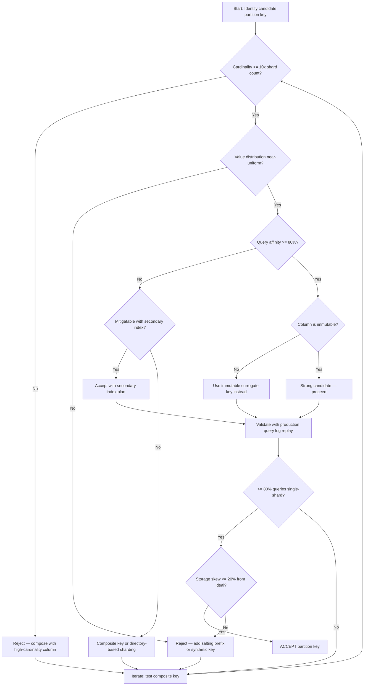
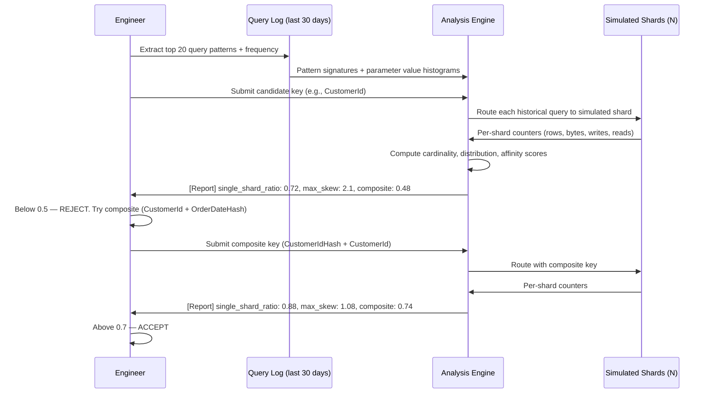
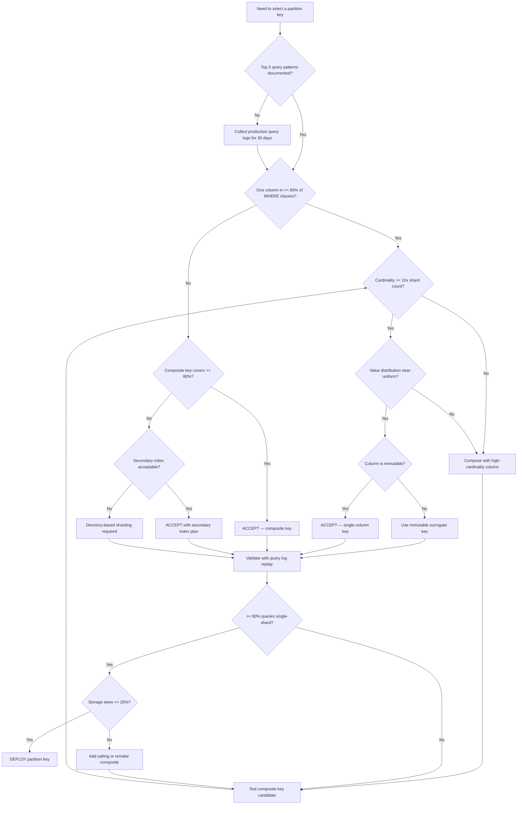

> [!success] Mastery Check
> - [ ] **Studied Well**
> - [ ] **Can explain the concept without notes**
> - [ ] **Can answer interview questions confidently**
> - [ ] **Can implement it in a real project**

---

id: "7.223"
title: "Database Sharding — Partition Key Selection"
domain: "System Design & Distributed Systems"
domain_id: 7
group: "Scalability Patterns"
tags: [system-design, distributed-systems, scalability, dotnet, azure, databases, sharding, partition-key, data-modeling, cosmos-db]
priority: 1
version: 1
prerequisites:
  - "[[7.222 — Database Sharding — Overview]]" — the shard key IS the shard strategy; you cannot evaluate a candidate key without knowing whether it feeds a hash function, defines a range boundary, or maps through a directory service — each strategy imposes different constraints on cardinality, distribution, and affinity
  - "[[7.225 — Database Sharding — Hash-Based]]" — hash-based sharding is the most common strategy for uniform distribution; the partition key is the input to the hash function, and hash collision probability determines the minimum cardinality threshold for a given shard count
  - "[[7.229 — Consistent Hashing — Algorithm]]" — consistent hashing with virtual nodes mitigates distribution skew by mapping each physical node to multiple ring positions; a key with only moderate cardinality (e.g., 500 tenant IDs across 5 shards) can achieve near-uniform distribution with 160 virtual nodes per physical shard
  - "[[8.60 — Azure Cosmos DB Partitioning]]" — Cosmos DB imposes a hard limit of 10,000 RU/s per logical partition key value; this single constraint more than any other drives partition key design for Azure-native applications — exceeding it requires synthetic key composition
  - "[[8.64 — SQL Server Transaction Log Internals]]" — the transaction log write throughput of a single Azure SQL Database Premium shard is ~40–60 MB/s; uneven partition key distribution that funnels 80% of writes to one shard means that shard's log throughput saturates while others remain idle
  - "[[6.6 — Database per Service Pattern]]" — federation (separate databases per bounded context) is an alternative to sharding; partition key selection does not apply to federated databases because each service owns its data exclusively — the sharding decision arises only when a single service's data exceeds one node
related:
  - "[[7.224 — Database Sharding — Range-Based]]" — range-based sharding requires a totally ordered partition key and creates a last-shard hotspot for monotonically increasing keys; the choice of partition key strategy (range vs hash) depends on whether the key has a natural ordering that aligns with query patterns
  - "[[7.226 — Database Sharding — Directory-Based]]" — directory-based sharding decouples the partition key value from the physical shard mapping, allowing key reassignment without data movement; this adds latency and a single point of failure but is the only strategy that tolerates evolving access patterns
  - "[[7.227 — Database Sharding — Cross-Shard Queries]]" — the partition key directly determines the fraction of queries that are single-shard vs scatter-gather; every query missing the partition key in its filter requires a full scan across all shards
  - "[[7.228 — Database Sharding — Resharding and Migration]]" — a poorly chosen partition key that creates hot shards is the #1 driver of emergency resharding; resharding because of partition key misdesign costs engineering-months of migration and carries data loss risk
  - "[[7.253 — Caching as a Scalability Tool]]" — caching masks the read-cost of a suboptimal partition key but cannot fix write hotspotting; the partition key determines whether the cache layer reduces load or merely absorbs a fraction of it
  - "[[7.254 — Eventual Consistency Trade-Off for Scale]]" — cross-shard queries driven by a poor partition key often require eventual consistency for scatter-gather merging; a well-chosen key keeps queries single-shard and avoids the consistency compromise
created: 2026-06-16

---

> [!ABSTRACT] Quick Reference — Partition Key Selection **Invariant:** The partition key is the single column or composite column that determines data placement across shards. Every row is assigned to exactly one shard based on its partition key value. All rows sharing the same key value are co-located on the same shard — and in hash-based sharding, on the same physical partition within that shard's node. **Cost:** A well-chosen key delivers single-shard queries (~1–5ms), uniform load distribution (within 20% of ideal), and linear write throughput scaling (adding one shard adds 1/N of total capacity). A poorly chosen key creates hot shards (one shard at 95% CPU while N–1 idle at 15%), forces scatter-gather on every query (P99 latency = N × P50 single-shard latency), and makes resharding inevitable — the most expensive operational procedure in a distributed system. **Trigger:** The shard strategy (hash, range, or directory) is already chosen. The team is at the schema design table with a whiteboard. The lead asks: "What column do we use to decide which shard this row goes to?" The answer determines query routing, connection pooling, backup strategy, and capacity planning for the lifetime of the system. **The Three-Property Framework:** Every candidate is evaluated on (1) cardinality — are there enough distinct values to fill all shards? (2) distribution uniformity — are the value frequencies even across rows AND access? (3) query affinity — do >= 80% of queries filter by this column? The irreducible tension: a key with perfect distribution (e.g., a hash of a UUID) has zero business meaning and thus zero query affinity. A key with perfect affinity (e.g., CustomerId) is almost always skewed in distribution because a few customers dominate.

---

## Navigation

**Domain:** [[7 — System Design & Distributed Systems]] > **Group:** Scalability Patterns
**Previous:** [[7.222 — Database Sharding — Overview]] | **Next:** [[7.224 — Database Sharding — Range-Based]]

### Prerequisites

- [[7.222 — Database Sharding — Overview]] — the shard key IS the shard strategy; you cannot evaluate a candidate key without knowing whether it feeds a hash function, defines a range boundary, or maps through a directory service — each strategy imposes different constraints on cardinality, distribution, and affinity
- [[7.225 — Database Sharding — Hash-Based]] — hash-based sharding is the most common strategy for uniform distribution; the partition key is the input to the hash function, and hash collision probability determines the minimum cardinality threshold for a given shard count
- [[7.229 — Consistent Hashing — Algorithm]] — consistent hashing with virtual nodes mitigates distribution skew by mapping each physical node to multiple ring positions; a key with moderate cardinality (e.g., 500 tenant IDs across 5 shards) achieves near-uniform distribution with 160 virtual nodes per physical shard
- [[8.60 — Azure Cosmos DB Partitioning]] — Cosmos DB imposes a hard limit of 10,000 RU/s per logical partition key value; exceeding this limit requires synthetic key composition; this single constraint more than any other drives partition key design for Azure-native applications
- [[8.64 — SQL Server Transaction Log Internals]] — the transaction log write throughput of an Azure SQL Database Premium shard is ~40–60 MB/s; uneven distribution that funnels 80% of writes to one shard causes that shard's log throughput to saturate while others remain idle
- [[6.6 — Database per Service Pattern]] — federation (separate databases per bounded context) is an alternative to sharding; partition key selection does not apply to federated databases because each service owns its data exclusively — sharding arises only when a single service's data exceeds one node

### Where This Fits

> [!INFO] Production Encounter Map
>
> - **Layer:** Data modeling — partition key selection happens during schema design, before a single row is inserted. Unlike indexes (which can be added later with `CREATE INDEX`), the partition key is baked into the physical data layout. Changing it requires full data migration: read every row, recompute the key, and write to a new shard layout.
> - **Trigger:** The team decided to shard the `Orders` table across 8 Azure SQL Databases. The lead engineer asks: "What column do we use for the shard key? OrderId? CustomerId? OrderDate? A combination?" The answer determines every subsequent design decision: the routing middleware, connection pooling per shard, cross-shard query handling, backup scheduling, and resharding strategy.
> - **Without proper evaluation:** The team picks `CustomerId` because "every query filters by customer." Six months later, the largest enterprise customer (5 million orders, 40% of total data) occupies one shard. That shard is at 90% CPU, the nightly backup takes 8 hours (exceeding the 4-hour SLA), and the team is in a resharding emergency. The cost: 3 engineering-months of migration, a 2-hour read-only maintenance window, and a post-mortem explaining that a structured evaluation would have caught this on day one.
> - **First signal that structured evaluation is needed:** (1) The shard strategy is chosen but no column has been scored against the three properties. (2) The team says "let's just use the primary key" without analyzing whether the primary key appears in the WHERE clause of >= 80% of queries. (3) The team cannot answer the question: "What fraction of our queries will be single-shard vs cross-shard?" within a 10% margin.


---

## Core Mental Model

The partition key is the data distribution axis of a sharded database. Every row is assigned to exactly one shard — and within each shard, to exactly one physical partition — based solely on the value of its partition key. The three properties that determine whether a candidate key is good or bad are:

1. **Cardinality:** Are there enough distinct values to fill all shards evenly? A `Status` column with 4 values (`Pending`, `Shipped`, `Delivered`, `Cancelled`) has cardinality 4 — no matter how many orders exist, only 4 shards can receive writes at maximum parallelism. For hash-based sharding, cardinality must be at least 10× the shard count (the "10× rule": `C >= 10N`) to keep hash collision variance within 20% of ideal. At `C = 3N`, the max-to-ideal load ratio exceeds 3.0 — meaning one shard handles 3× the load of the average shard purely from hash collisions, not from domain skew.

2. **Distribution Uniformity:** Are the distinct values evenly weighted in row count AND access frequency? `CountryCode` has ~195 distinct values (enough for 8 shards under the 10× rule), but if 45% of orders originate from the US, the US shard receives 45% of writes AND 45% of reads — creating a hot shard despite adequate cardinality. Distribution must be measured on both storage volume and request rate, not just distinct count.

3. **Query Affinity:** Do >= 80% of queries filter by this column? An order service where 95% of queries are `SELECT * FROM Orders WHERE OrderId = @id` has high affinity for `OrderId`. A reporting system that aggregates across all orders has ZERO affinity for any single column — every query is cross-shard regardless of which key is chosen. Affinity is measured by parsing production query logs and counting WHERE clause column frequency.

The tension: No single column maximizes all three. `OrderId` has perfect cardinality (billions of unique GUIDs) and perfect distribution (uniform by construction), but zero query affinity if users look up orders by `CustomerId`. `CustomerId` has strong query affinity (users always know their customer ID), but terrible distribution (top 1% of customers generate 40% of volume). The art of partition key selection is finding the composite key that reaches acceptable scores on all three properties simultaneously.



### Classification

**Architectural role:** Partition key selection is the single bridge between the shard strategy (infrastructure) and the data model (application). It is the only design decision that simultaneously determines query routing behavior, storage distribution fairness, schema migration cost, and capacity planning headroom.

**What it explicitly does NOT solve:** (1) Cross-shard queries — even a perfect key cannot make a query filtering on a non-key column become single-shard; at best it limits cross-shard queries to a known, bounded fraction of traffic. (2) Distributed transactions — a perfect key cannot make a transaction spanning multiple partition keys ACID without two-phase commit, which adds ~50–200ms of coordination latency and reduces availability during coordinator failure. (3) Per-shard read scaling — each shard independently needs its own read replicas; the partition key does not reduce the need for replica management.

### Consistency Model Impact

The partition key implicitly defines the consistency boundary of a sharded system. All rows sharing the same partition key value can participate in single-shard transactions with full ACID guarantees (within that shard's database). Rows with different partition key values require distributed transactions (two-phase commit or a saga pattern) that relax isolation guarantees and reduce throughput. This means the partition key also defines the consistency model available to the application: operations within a partition key are strongly consistent; operations across partition keys are either expensive (distributed transaction) or eventually consistent (saga with compensation). In Cosmos DB, this is explicit: `TransactionalBatch` can only operate within a single logical partition key, and any operation across partition keys defaults to eventual consistency unless the container is configured for strong consistency (which limits replication to a single region).

### Key Properties / Guarantees

| Property | Value | Condition |
|---|---|---|
| Single-shard query ratio | >= 80% of query volume | Key appears in WHERE clause of >= 80% of production queries |
| Storage skew (per shard) | <= 20% deviation from `total_size / N` | Key has cardinality >= 10× N AND value frequencies are near-uniform |
| Write throughput scaling | Linear up to N shards | Key cardinality >= N AND write distribution is near-uniform |
| Cross-shard query latency | `max(P99_per_shard)` × log(N) due to merge cost | Acceptable when cross-shard fraction is < 20% of traffic |
| Resharding cost | Low: consistent hashing moves < 1/N of keys | Key is compatible with consistent hashing (hash-based or composite) |
| Distributed transaction support | ACID within partition key, eventual across | Key defines the consistency boundary; transactional scope is limited to a single key value |

---

## Deep Mechanics

### How It Works

Partition key selection is a three-phase process: candidate enumeration, property scoring, and query-log validation. Each phase produces a score that feeds the next.

**Phase 1 — Candidate Enumeration:**

Parse the top 10 query patterns from production logs (or estimated access patterns for a greenfield system). For each pattern, extract every column appearing in the WHERE clause. Rank columns by frequency. A column appearing in fewer than 50% of patterns is discarded as a sole candidate — it lacks the minimum query affinity to anchor a partition key. Surviving columns become single-column candidates.

For each single-column candidate, form composite candidates by pairing it with every other column in the top 10 patterns. The first component (distribution) must be the high-cardinality column. The second component (affinity) is the query-affinity column. The rule: `(high_cardinality, query_affinity)` — the order determines both distribution quality and query routing behavior.

**Phase 2 — Property Scoring:**

Each candidate receives three scores between 0 and 1:

- **Cardinality Score:** `min(1.0, log10(distinct_values) / log10(N × 10))`. For an 8-shard system, the target is `8 × 10 = 80` distinct values. A column with 80 distinct values scores 1.0. A column with 8 distinct values scores `log10(8) / log10(80) ≈ 0.47`. A column with 4 distinct values scores `log10(4) / log10(80) ≈ 0.32` — below the 0.3 fatal-flaw threshold.

- **Distribution Score:** `1 — Σ((observed_fraction_i — 1/k)^2)`, where k is the number of distinct values. This is 1 — the sum of squared errors from uniform distribution. A perfectly uniform distribution scores 1.0. A distribution where one value occupies 60% and the remaining 39 values share 40% scores approximately `1 — (0.60 — 0.025)^2 — 39 × (0.0103 — 0.025)^2 ≈ 1 — 0.33 — 39 × 0.0002 ≈ 0.66`.

- **Affinity Score:** The fraction of top-10 query patterns that include this column in their WHERE clause, weighted by pattern frequency. If pattern 1 (60% of traffic) includes the column and pattern 2 (30%) does not, the affinity score for the critical path is 0.60 — but the composite score uses the traffic-weighted average.

The composite score is `cardinality × distribution × affinity`. If any component is below 0.3, the key is rejected outright — a fatal flaw in any one property cannot be compensated by strength in the others. A composite score above 0.7 is accepted. Between 0.5 and 0.7, composite key composition is required. Below 0.5, the key is rejected.

**Phase 3 — Query-Log Validation:**

Replay 30 days of production query logs against the candidate key. For each query:
1. Extract the partition key value from the WHERE clause parameters.
2. Compute the target shard using the hash function (or range lookup).
3. Record whether the query is single-shard (partition key is present and hashed to one shard) or cross-shard (partition key is absent or the query requires scatter-gather).
4. Accumulate per-shard counters for row count, storage size, and write rate.

The output metrics:
- **Single-shard query ratio:** Must be >= 80%. Below this threshold, the key lacks sufficient query affinity for the workload.
- **Max storage skew:** `max(per_shard_size) / average(per_shard_size)`. Must be <= 1.2. Above 1.5, the key has a jumbo shard problem.
- **Max write skew:** `max(per_shard_writes) / average(per_shard_writes)`. Must be <= 1.3. Above 2.0, the key creates a write hotspot.



### Failure Modes

**Failure 1 — Low Cardinality Creates Jumbo Shards**

**Scenario:** A SaaS platform shards by `TenantId` with 500 tenants across 8 shards. Hash-based sharding maps each tenant to one of 8 buckets deterministically. The largest tenant holds 12 TB — 40% of the total 30 TB dataset. That single tenant maps to one shard, creating a jumbo shard. The backup of that shard at 200 MB/s takes 17 hours, exceeding the 8-hour SLA window.

**Detection:** Alert when `max(per_shard_size_bytes) / avg(per_shard_size_bytes) > 1.5`. In Azure Monitor, this is a custom metric emitted by the routing layer after every write: `metric("shard/storage_skew") = max/shard_size/ / avg/shard_size/`. Azure SQL Database per-shard storage is available via `sys.dm_db_resource_stats` averaged over 15-second intervals.

**Fix:** Composite `TenantId` with a secondary discriminator (e.g., `TenantId + RegionId` or `TenantId + YearMonth`). The large tenant's data now spreads across multiple shards. Cost: cross-tenant queries that previously hit one shard must scatter-gather. For a SaaS platform where queries are always within a single tenant, this cost is negligible — the discriminator (region or month) is included in the query.

**Prevention:** Before sharding, measure per-tenant storage: `SELECT TenantId, SUM(DataSize) FROM tenant_metadata GROUP BY TenantId`. If the largest tenant exceeds `2 × (total_size / tenant_count)`, a bare `TenantId` key will fail. Add the discriminator to the shard key from day one.

**Failure 2 — Monotonically Increasing Key in Range Sharding Creates Last-Shard Hotspot**

**Scenario:** An order management system uses range-based sharding with `OrderDate` as the partition key: Shard 1 covers 2024-Q1, Shard 8 covers 2026-Q2. Today's date is 2026-06-16. Every `INSERT` uses `OrderDate = GETUTCDATE()`, which falls in the 2026-Q2 range — Shard 8. All 10,000 writes/second hit Shard 8. The other 7 shards handle zero writes.

**Detection:** In range sharding, the active shard shows N× the write rate of others. Azure SQL Database metric `dtu_consumption_percent` on Shard 8 is at 95% while others are at 15%. The `log_write_bytes_per_sec` metric on Shard 8 saturates at ~50 MB/s on a Premium P15.

**Fix:** (a) Switch to hash-based sharding on `OrderId` — writes are uniformly distributed across all shards, and each shard handles ~1,250 writes/second. (b) If date-range queries must remain single-shard (e.g., "orders this month" is the primary dashboard), use a composite key `(Hash(OrderId), OrderDate)` — the hash determines placement (uniform), the local index on `OrderDate` within each shard enables fast range queries. (c) Use a synthetic key with a write-spreading prefix, e.g., `OrderDateTicks % N + "_" + OrderId`.

**Prevention:** Never use a monotonically increasing column alone as the partition key in range-based sharding. The write rate of a single shard is bounded by its node capacity; temporal keys funnel all writes to the active range. Hash-based sharding or a composite key with a hash distribution component avoids this entirely.

**Failure 3 — Skewed Distribution from Domain Correlation**

**Scenario:** A global e-commerce platform shards by `CountryCode`. There are 195 distinct codes, which exceeds the 10× target for 8 shards (80). However, 45% of orders originate from the United States. The US shard (`Hash("US") % 8 = Shard 3`) receives 45% of writes, 45% of reads, and holds 45% of storage. Shard 3's CPU is at 85% while Shard 7 (Luxembourg) idles at 5%.

**Detection:** Per-shard CPU heatmap in Azure Monitor. Alert when `max(dtu_consumption_percent) / min(dtu_consumption_percent) > 3.0 — this is 85% / 5% = 17 for this scenario. Also monitor P99 latency per shard: the hot shard's P99 increases due to resource contention (queue depth on the hot shard's disk I/O).

**Fix:** (a) Composite `CountryCode` with `CustomerId` or `OrderId` — queries that filter by both country and customer become single-shard; country-only queries scatter-gather. (b) Use a synthetic hash of `CustomerId` as the distribution component and maintain a secondary Redis index mapping `CountryCode → set<CustomerId>` — country-level queries fan out to shards via the index instead of broadcasting. (c) Accept the skew and overprovision the hot shard (vertical scaling) — but this is tactical: the US shard will eventually exceed the max Azure SQL SKU as the business grows.

**Prevention:** Before selecting any domain-meaningful column, run `SELECT column, COUNT(*) AS cnt, SUM(DataSize) AS bytes FROM table GROUP BY column ORDER BY bytes DESC`. If any single value accounts for > 20% of total bytes, the column alone is insufficient — compose it.

**Failure 4 — Query Affinity Mismatch Forces Scatter-Gather on Hot Path**

**Scenario:** A ride-hailing trip database shards by `RideId` (high cardinality, uniform distribution). The critical access path is "show me all trips for driver X today" — filtering by `DriverId`, not `RideId`. Every driver-trip query hits all 64 shards in parallel. At 100 QPS of driver queries, the system generates 64 × 100 = 6,400 shard queries per second, each opening a connection, executing a scan, and returning partial results. The merge layer waits for the slowest shard, which may be under load from other scatter-gather queries.

**Detection:** Monitor `scatter_gather_query_ratio = cross_shard_queries / total_queries`. If this exceeds 0.50, the partition key is wrong for the dominant workload. Also monitor `connections_per_query` — driver-trip queries show 64 connections while ride-lookup queries show 1.

**Fix:** (a) Change the partition key to `DriverId` — driver-trip queries become single-shard. The cost: ride-lookup by `RideId` (without `DriverId`) becomes scatter-gather. If ride-lookup frequency is < 20% of traffic, this tradeoff is acceptable. (b) Use directory-based sharding where the mapping from `DriverId` to shard is stored in a lookup table; ride-lookup queries consult the directory first to find which shard holds that ride. (c) Maintain a secondary index table sharded by `DriverId` that stores `(DriverId → list<RideId>)` — ride lookups become a two-hop query: index table → data shard.

**Prevention:** Before finalizing the partition key, enumerate the top 5 query patterns and their frequency from production logs. For each, answer: "Would this query be single-shard?" If the fraction of "yes" answers is below 80%, the key lacks query affinity for the dominant workload.

**Failure 5 — Immutable Key Prevents Adaptation When Access Patterns Evolve**

**Scenario:** A media platform shards by `ContentId` for a recommendation system. Two years later, the product pivots from individual content recommendations to playlist-based consumption. The dominant query becomes "show me all videos in playlist P" — filtering by `PlaylistId`. Every playlist query is cross-shard scatter-gather. Adding shards does not improve latency because every query already hits all shards.

**Detection:** There is no direct "wrong partition key" metric. The symptom is a gradually deteriorating P99 query latency for the dominant access pattern that does not improve when shards are added. The team notices that the `connections_per_query` metric for playlist queries is always equal to the shard count. The scatter-gather ratio has drifted from 15% to 75% over 18 months.

**Fix:** (a) Add a secondary index container (Cosmos DB change feed → secondary container sharded by `PlaylistId`) — playlist queries become single-shard on the secondary container, then fetch content details from the primary container by `ContentId`. Two-hop latency is ~10ms vs 500ms scatter-gather. (b) Materialize the playlist-content relationship in a separate sharded table with `PlaylistId` as the partition key — but this means maintaining two sharded stores in sync. (c) Migrate to directory-based sharding where `PlaylistId → shard` can be remapped without data movement — full data migration required.

**Prevention:** Choose a partition key aligned with the domain entity's natural identity (`UserId` for user data, `OrderId` for order data) rather than a volatile product concept. When the access pattern is expected to evolve (e.g., a startup that may pivot), use directory-based sharding or a composite key where the second component can absorb new access patterns without changing the first.

**Failure 6 — Local Secondary Index Masquerading as Global**

**Scenario:** A messaging application shards by `ConversationId`. The team creates a B-tree index on `UserId` for "find all conversations for user X." The index is local to each shard — it maps `UserId → ConversationId` within that shard only. A query for "find conversations for userId = 42" must scan all 32 shards, merge the results, and deduplicate.

**Detection:** Examining the query plan reveals no shard pruning — `number_of_shards_accessed = total_shards` for every index-seek query. The query latency is `max(per_shard_query_time) + merge_cost`, which grows as shards are added rather than shrinking.

**Fix:** (a) Use a global secondary index: a separate table (or Cosmos DB container) sharded by `UserId` that stores `(UserId → ConversationId)` — maintained via change feed or dual-write. (b) Accept scatter-gather and optimize with parallel fan-out (Task.WhenAll) and result caching (Redis, TTL = 5 minutes). (c) If the UserId query is the dominant pattern (> 50%), change the partition key to `UserId` and accept that conversation queries become scatter-gather instead.

**Prevention:** Understand whether your sharding framework provides global secondary indexes. Cosmos DB supports GSI via separate containers with different partition keys linked by change feed. SQL Server Elastic Database Tools (custom) provides no GSI — every index is local. EF Core sharding (custom middleware) provides no GSI — the engineer must build it explicitly.

### .NET and Azure Integration

**ASP.NET Core Options Pattern:** The partition key strategy is configured at startup and injected into the data access layer:

```csharp
// Port: Configuration adapter — maps appsettings.json to shard routing configuration
public sealed class ShardKeyOptions
{
    public const string SectionName = "Sharding";

    public string PartitionKeyColumn { get; set; } = string.Empty;
    public string PartitionKeyStrategy { get; set; } = "hash"; // hash | range | directory
    public int VirtualNodeCount { get; set; } = 160; // consistent hashing virtual nodes per physical shard
    public int ShardCount { get; set; } = 8;
}

// Program.cs
builder.Services.Configure<ShardKeyOptions>(
    builder.Configuration.GetSection(ShardKeyOptions.SectionName));
```

**EF Core — Shard-Aware Repository:** EF Core provides no built-in sharding. The partition key is passed explicitly through the repository interface:

```csharp
// Port: Data access abstraction — repository hides shard routing from callers
public sealed class OrderRepository : IOrderRepository
{
    private readonly IShardRouter _router;
    private readonly IShardConnectionFactory _connectionFactory;

    // The partition key (orderId) determines the shard connection
    public async Task<Order?> GetByIdAsync(Guid orderId, CancellationToken ct)
    {
        var shardId = _router.GetShardForPartitionKey(orderId); // hash(orderId) % N
        await using var connection = _connectionFactory.CreateConnection(shardId);

        var order = await connection.QueryFirstOrDefaultAsync<Order>(
            new CommandDefinition(
                "SELECT * FROM Orders WHERE OrderId = @OrderId",
                new { OrderId = orderId },
                cancellationToken: ct));

        return order;
    }
}
```

**Azure Cosmos DB — First-Class Partition Key API:** Cosmos DB enforces partition key awareness at the SDK level:

```csharp
// Adapter: Cosmos DB SDK adapts partition key to physical partition routing
var container = await database.CreateContainerIfNotExistsAsync(
    new ContainerProperties
    {
        Id = "Orders",
        PartitionKeyPath = "/customerId" // THE partition key — specified at container creation, immutable afterward
    },
    throughput: 10000); // RU/s shared across all physical partitions

// Every operation includes the partition key — omitting it forces cross-partition execution
// Point read (3ms when partition key is specified, 300ms+ when not):
var response = await container.ReadItemAsync<Order>(
    id: "ord-123",
    partitionKey: new PartitionKey("cust-456"));

// Transactional batch operates within a single partition key only (ACID):
var batch = container.CreateTransactionalBatch(new PartitionKey("cust-456"));
batch.CreateItem(new Order { Id = "ord-124", CustomerId = "cust-456", Total = 99.95m });
batch.CreateItem(new AuditEntry { Id = "aud-789", CustomerId = "cust-456", Action = "order_placed" });
var batchResponse = await batch.ExecuteAsync(ct); // Either both succeed or neither — ACID within partition

// Cross-partition query (slow — fans out to all physical partitions):
var crossPartitionQuery = new QueryDefinition(
    "SELECT * FROM Orders o WHERE o.total > @min")
    .WithParameter("@min", 1000.00m);
var feed = container.GetItemQueryIterator<Order>(crossPartitionQuery);
// No PartitionKey specified = Cosmos DB broadcasts to every physical partition
```

**Configuration Wiring:**

```csharp
// Program.cs — wire shard routing into DI
builder.Services.AddSingleton<IConsistentHashRing>(sp =>
{
    var options = sp.GetRequiredService<IOptions<ShardKeyOptions>>().Value;
    return new ConsistentHashRing(options.ShardCount, options.VirtualNodeCount);
});
builder.Services.AddSingleton<IShardRouter, ConsistentHashShardRouter>();
builder.Services.AddSingleton<IShardConnectionFactory, ShardConnectionFactory>();
builder.Services.AddScoped<IOrderRepository, OrderRepository>();
```


---

## Production Patterns and Implementation

### Primary Implementation

The `ShardKeyEvaluator` class provides a structured, repeatable evaluation framework. It scores candidate keys against the three properties and generates a recommendation with a specific mitigation strategy for rejected candidates.

```csharp
/// <summary>
/// Evaluates candidate partition keys against cardinality, distribution uniformity,
/// and query affinity criteria. Produces a composite score (0..1) and a recommendation.
/// </summary>
// Use Case: Called during the schema design phase of a sharded system, before
// any data is inserted. Results feed into the shard router configuration.
public sealed class ShardKeyEvaluator
{
    private readonly int _shardCount;
    private readonly int _targetCardinalityMultiple;

    public ShardKeyEvaluator(int shardCount, int targetCardinalityMultiple = 10)
    {
        ArgumentOutOfRangeException.ThrowIfLessThan(shardCount, 2);
        ArgumentOutOfRangeException.ThrowIfLessThan(targetCardinalityMultiple, 3);
        _shardCount = shardCount;
        _targetCardinalityMultiple = targetCardinalityMultiple;
    }

    /// <summary>
    /// Evaluates a single candidate partition key.
    /// </summary>
    /// <param name="candidate">The candidate key to evaluate — includes distinct value count,
    /// value frequency distribution, and query affinity fraction from production logs.</param>
    /// <param name="ct">Cancellation token.</param>
    /// <returns>Evaluation result with individual scores, composite score, and recommendation.</returns>
    public async Task<ShardKeyEvaluation> EvaluateAsync(
        ShardKeyCandidate candidate, CancellationToken ct)
    {
        var cardinalityScore = ComputeCardinalityScore(candidate.DistinctValueCount);
        var distributionScore = ComputeDistributionScore(candidate.ValueDistribution);
        var affinityScore = ComputeAffinityScore(candidate.QueryAffinityFraction);

        var compositeScore = cardinalityScore * distributionScore * affinityScore;
        var fatalFlaw = cardinalityScore < 0.3m || distributionScore < 0.3m || affinityScore < 0.3m;

        var recommendation = fatalFlaw
            ? ShardKeyRecommendation.Reject
            : compositeScore switch
            {
                >= 0.7m => ShardKeyRecommendation.Accept,
                >= 0.5m => ShardKeyRecommendation.CompositeRequired,
                _ => ShardKeyRecommendation.Reject
            };

        var mitigation = recommendation switch
        {
            ShardKeyRecommendation.CompositeRequired => SuggestCompositeKey(candidate),
            ShardKeyRecommendation.Reject when cardinalityScore < 0.3m
                => "Add a high-cardinality column (e.g., Id, timestamp) to form a composite key. "
                   + $"Current distinct values ({candidate.DistinctValueCount}) provide only {cardinalityScore:F2} cardinality score.",
            ShardKeyRecommendation.Reject when distributionScore < 0.3m
                => "Add a salting prefix or use a synthetic hash of a high-cardinality column. "
                   + "Current distribution has {0:F2} uniformity score — one or a few values dominate.".FormatFast(distributionScore),
            ShardKeyRecommendation.Reject when affinityScore < 0.3m
                => "This column lacks query affinity. Consider directory-based sharding or a secondary index. "
                   + $"Only {candidate.QueryAffinityFraction:P0} of queries filter by this column.",
            _ => string.Empty
        };

        return await Task.FromResult(new ShardKeyEvaluation(
            candidate.Name, cardinalityScore, distributionScore, affinityScore,
            compositeScore, recommendation, mitigation));
    }

    /// <summary>
    /// Cardinality score: 1.0 when distinct values >= shards * targetMultiple.
    /// Uses log10 scaling below the target to penalize low-cardinality keys non-linearly.
    /// </summary>
    private decimal ComputeCardinalityScore(long distinctValueCount)
    {
        if (distinctValueCount <= 0) return 0m;
        var target = _shardCount * _targetCardinalityMultiple;
        if (distinctValueCount >= target) return 1.0m;
        return Math.Min(1.0m, (decimal)Math.Log10(distinctValueCount) / Math.Log10(target));
    }

    /// <summary>
    /// Distribution score: 1 - sum of squared errors from uniform distribution.
    /// 1.0 = perfectly uniform. Values below 0.3 indicate a hot-shard risk.
    /// </summary>
    private static decimal ComputeDistributionScore(
        IReadOnlyDictionary<object, long> valueDistribution)
    {
        if (valueDistribution.Count == 0) return 0m;

        var total = valueDistribution.Values.Sum(v => (decimal)v);
        if (total == 0) return 0m;

        var idealFraction = 1.0m / valueDistribution.Count;
        var squaredError = valueDistribution.Values
            .Select(v => Math.Pow((double)((decimal)v / total - idealFraction), 2))
            .Sum();

        return Math.Max(0m, Math.Min(1.0m, 1.0m - (decimal)squaredError));
    }

    /// <summary>
    /// Affinity score: direct mapping from query log analysis.
    /// </summary>
    private static decimal ComputeAffinityScore(double queryAffinityFraction)
    {
        return Math.Max(0m, Math.Min(1.0m, (decimal)queryAffinityFraction));
    }

    private static string SuggestCompositeKey(ShardKeyCandidate candidate)
    {
        var weakProperty = candidate.QueryAffinityFraction < 0.5 ? "query affinity" : "distribution uniformity";
        var weakColumn = candidate.QueryAffinityFraction < 0.5
            ? "a column with higher query affinity"
            : "a high-cardinality column (e.g., Id)";
        return $"Compose '{candidate.Name}' with {weakColumn} to improve {weakProperty}.";
    }
}

/// <summary>
/// Describes a candidate partition key with its statistical properties.
/// </summary>
public sealed record ShardKeyCandidate(
    string Name,
    long DistinctValueCount,
    IReadOnlyDictionary<object, long> ValueDistribution,
    double QueryAffinityFraction);

/// <summary>
/// Result of partition key evaluation.
/// </summary>
public sealed record ShardKeyEvaluation(
    string CandidateName,
    decimal CardinalityScore,
    decimal DistributionScore,
    decimal AffinityScore,
    decimal CompositeScore,
    ShardKeyRecommendation Recommendation,
    string MitigationSuggestion);

public enum ShardKeyRecommendation
{
    /// <summary>Key meets all thresholds — use as-is.</summary>
    Accept,
    /// <summary>Key is strong on one property but weak on another — compose with an additional column.</summary>
    CompositeRequired,
    /// <summary>Key has a fatal flaw (any score < 0.3) — must be replaced or fundamentally redesigned.</summary>
    Reject
}
```

### Composite Key Implementation

When a single column cannot satisfy all three properties, a composite key combines a distribution component (high cardinality, uniform) with an affinity component (appears in WHERE clause).

```csharp
/// <summary>
/// Represents a composite partition key. The DistributionKey (first component)
/// must be high-cardinality and near-uniform. The AffinityKey (second component)
/// is the business column used in query WHERE clauses.
/// </summary>
/// Port: Value object — represents the partition key in the domain layer
public sealed record CompositePartitionKey(
    string DistributionKey,
    string AffinityKey)
{
    /// <summary>
    /// Serializes the composite key for hashing. Format: "{DistributionKey}:{AffinityKey}".
    /// The distribution key alone is used for shard placement; the affinity key
    /// is carried to enable single-shard queries that filter by it.
    /// </summary>
    public string ToRoutingString() => $"{DistributionKey}:{AffinityKey}";
}

/// <summary>
/// Routes queries to shards using a composite partition key.
/// The distribution key component determines shard placement via consistent hashing.
/// </summary>
// Port: Infrastructure service — encapsulates consistent hash ring interaction
public sealed class CompositeKeyShardRouter
{
    private readonly IConsistentHashRing _ring;

    public CompositeKeyShardRouter(IConsistentHashRing ring)
    {
        _ring = ring;
    }

    /// <summary>
    /// Determines the target shard for a composite partition key.
    /// Only the DistributionKey component influences placement.
    /// </summary>
    public int GetShardId(CompositePartitionKey key)
    {
        var hashBytes = SHA256.HashData(Encoding.UTF8.GetBytes(key.DistributionKey));
        var hash = BitConverter.ToUInt64(hashBytes[..8]);
        return _ring.GetNode(hash);
    }

    /// <summary>
    /// Returns candidate shards for a prefix-based query on the distribution key.
    /// For exact matches, this returns one shard. For prefix patterns, it returns
    /// the shard that contains all keys starting with that prefix.
    /// </summary>
    public IReadOnlySet<int> GetCandidateShards(string distributionKeyPrefix)
    {
        var hash = BitConverter.ToUInt64(
            SHA256.HashData(Encoding.UTF8.GetBytes(distributionKeyPrefix))[..8]);
        return new HashSet<int> { _ring.GetNode(hash) };
    }
}
```

### Configuration and Wiring

```csharp
// Adapter: DI registration — wires shard routing into the application composition root
public static class ShardKeyServiceCollectionExtensions
{
    /// <summary>
    /// Registers the shard key evaluator, consistent hash ring, and shard router.
    /// </summary>
    /// <param name="services">The service collection.</param>
    /// <param name="configuration">Configuration section containing ShardCount, VirtualNodeCount, etc.</param>
    public static IServiceCollection AddShardKeyEvaluation(
        this IServiceCollection services,
        IConfiguration configuration)
    {
        var shardCount = configuration.GetValue<int>("Sharding:ShardCount");
        var virtualNodeCount = configuration.GetValue<int>("Sharding:VirtualNodeCount");

        services.AddSingleton(new ShardKeyEvaluator(shardCount));
        services.AddSingleton<IConsistentHashRing>(
            _ => new ConsistentHashRing(shardCount, virtualNodeCount));
        services.AddSingleton<CompositeKeyShardRouter>();
        services.AddSingleton<IShardConnectionFactory, ShardConnectionFactory>();
        services.AddScoped<IOrderRepository, ShardedOrderRepository>();

        return services;
    }
}

// Program.cs
builder.Services.AddShardKeyEvaluation(builder.Configuration.GetSection("Sharding"));
```

### Common Variants

**Variant 1 — Cosmos DB Synthetic Key for IoT**

When the natural key (`/deviceId`) creates a hot partition because each device writes continuously at high throughput:

```csharp
// ❌ Natural key — each active device creates a hot partition
// Device "sensor-42" writes 2,000 msg/s at 5 RU each = 10,000 RU/s — EXACTLY at the limit
// Any traffic spike causes HTTP 429 throttling
public class TelemetryReading
{
    public string DeviceId { get; set; } = string.Empty; // PartitionKey = /deviceId
    public DateTime Timestamp { get; set; }
    public double Value { get; set; }
}

// ✅ Synthetic key — spreads writes across 10 sub-partitions per device
public class TelemetryReading
{
    public string DeviceId { get; set; } = string.Empty;
    public DateTime Timestamp { get; set; }
    public double Value { get; set; }

    // Synthetic discriminator derived from the timestamp second — 10 partitions per device
    public int SyntheticPartition => Timestamp.Second % 10;
    // PartitionKey = /deviceId + /syntheticPartition (composite: "sensor-42:3")
}

// Query must fan out across all synthetic partitions for a device:
// SELECT * FROM c WHERE c.DeviceId = "sensor-42"
//     AND c.SyntheticPartition IN (0,1,2,3,4,5,6,7,8,9)
// Cost: 10 partitions queried per device — but each stays below 2,000 RU/s
```

**Variant 2 — Hash Distribution with Range Grouping for Time-Series**

```csharp
// Use Case: IoT telemetry where queries filter by device + time range.
// Hash(DeviceId) distributes uniformly; OrderDate enables local range scans.
public sealed record TimeSeriesShardKey
{
    public int ShardId { get; }
    public string DeviceId { get; }
    public DateTime Timestamp { get; }

    public TimeSeriesShardKey(string deviceId, DateTime timestamp, int shardCount)
    {
        DeviceId = deviceId;
        Timestamp = timestamp;
        ShardId = Math.Abs(deviceId.GetDeterministicHashCode()) % shardCount;
    }
}
```

**Variant 3 — Directory-Based for Evolving Access Patterns**

```csharp
// Port: Infrastructure service — encapsulates directory lookup for shard mapping
public sealed class DirectoryShardRouter
{
    private readonly IDatabase _directoryDb; // Redis or a non-sharded SQL database

    /// <summary>
    /// Looks up the shard for a given entity type and partition key.
    /// If no mapping exists, assigns to the least-loaded shard.
    /// The mapping can be changed later without data movement — only the directory entry updates.
    /// </summary>
    public async Task<int> GetShardIdAsync(string entityType, object partitionKey, CancellationToken ct)
    {
        var cached = await _directoryDb.HashGetAsync(
            $"shard-map:{entityType}", partitionKey.ToString());
        if (!cached.IsNull) return (int)cached;

        // First assignment: pick the shard with the fewest keys
        var shardId = await GetLeastLoadedShardAsync(ct);
        await _directoryDb.HashSetAsync(
            $"shard-map:{entityType}", partitionKey.ToString(), shardId);
        return shardId;
    }

    private async Task<int> GetLeastLoadedShardAsync(CancellationToken ct)
    {
        // Simplified: in production, check per-shard key count from the directory
        var shardCounts = await _directoryDb.HashValuesAsync("shard-counts");
        var min = shardCounts.Select((count, idx) => (count, idx))
            .MinBy(x => (int)x.count);
        return min.idx;
    }
}
```

### Real-World .NET Ecosystem Example

**Azure Cosmos DB .NET SDK v3** — The Cosmos DB SDK is the most prominent .NET library where partition key selection is a first-class, enforced concept. Every read, write, and query operation requires a `PartitionKey` parameter. Omitting it forces a cross-partition query that gets progressively slower as the container grows (because Cosmos DB adds physical partitions automatically at 20 GB increments, and the SDK must fan out to all of them).

```csharp
// Cosmos DB SDK — partition key is mandatory for efficient operations

// Point read (fast — direct partition routing):
// Response time = ~3ms when partition key is provided
var response = await container.ReadItemAsync<Order>(
    id: "ord-123",
    partitionKey: new PartitionKey("cust-456"));

// Cross-partition query (slow — linear degradation with data growth):
// Without PartitionKey, Cosmos SDK fans out to ALL physical partitions
var slowQuery = new QueryDefinition(
    "SELECT VALUE COUNT(1) FROM Orders o WHERE o.total > @min")
    .WithParameter("@min", 5000m);
// P99 latency = 300ms for 10 physical partitions, 600ms for 20, etc.

// Transactional batch — ACID within one partition key:
var batch = container.CreateTransactionalBatch(new PartitionKey("cust-456"));
batch.CreateItem(new Order { Id = "ord-125", CustomerId = "cust-456", Total = 149.99m });
batch.CreateItem(new Payment { Id = "pay-789", CustomerId = "cust-456", Amount = 149.99m });
var result = await batch.ExecuteAsync(); // Atomic: both succeed or both fail
```


---

## Gotchas and Production Pitfalls

*Format: **Pitfall** → **Symptom** → **Fix** → **Cost of not fixing**. Each entry describes a failure pattern that has been observed in production sharded systems.*

### High-Cardinality Fallacy — Cardinality ≠ Uniform Distribution

**Pitfall:** The engineer checks only `SELECT COUNT(DISTINCT UserId)` — which returns 10 million (high cardinality) — and concludes `UserId` is a good partition key. They never check the value distribution. In reality, 1% of users generate 80% of the data. The shard containing those power users receives 80% of writes.

```csharp
// ❌ Checking only distinct count — misleading
var distinctCount = await db.QuerySingleAsync<long>(
    "SELECT COUNT(DISTINCT UserId) FROM Orders");
// Returns 10,000,000 → "High cardinality, great partition key!"
// But does NOT reveal that the top 10 users own 80% of orders

// ✅ Checking distribution — reveals the skew
var distribution = await db.QueryAsync<(string UserId, long Count)>(
    "SELECT UserId, COUNT(*) FROM Orders GROUP BY UserId ORDER BY COUNT(*) DESC");
var top10Total = distribution.Take(10).Sum(x => x.Count);
var totalRows = distribution.Sum(x => x.Count);
var top10Fraction = (double)top10Total / totalRows;
// top10Fraction = 0.80 → DISTRIBUTION SKEW DETECTED → must compose key
```

**Symptom:** One shard's CPU is at 85% while the other 7 shards average 15%. P99 latency on the hot shard is 500ms vs 50ms on cold shards. The team adds more shards (from 8 to 16), but the hot shard remains at 85% — adding shards does not redistribute existing data.

**Fix:** Measure distribution before accepting a key. If the top 10 values account for > 20% of rows, compose the key with a second column that spreads the high-volume values. For the power-user case, use `(UserId + OrderDateHash)` where `OrderDateHash = OrderDate.Date.Ticks % 10` spreads each user's orders across 10 sub-partitions.

```csharp
// ✅ Composite key with distribution spread
public sealed record UserShardKey
{
    public int ShardId { get; }
    public string UserId { get; }
    public string RawKey { get; }

    public UserShardKey(string userId, int shardCount)
    {
        UserId = userId;
        // For high-volume users, spread across 10 sub-keys
        // For normal users, keep a single key for query affinity
        var spread = IsHighVolumeUser(userId) ? $"{userId}:{GetSpreadSuffix(userId)}" : userId;
        RawKey = spread;
        ShardId = Math.Abs(spread.GetDeterministicHashCode()) % shardCount;
    }

    private static bool IsHighVolumeUser(string userId)
        => _highVolumeUsers.Contains(userId); // from configuration or runtime detection

    private static int GetSpreadSuffix(string userId)
        => Math.Abs(userId.GetDeterministicHashCode()) % 10;
}
```

**Cost of not fixing:** The hot shard becomes the system bottleneck. Adding capacity (more shards, larger SKUs) does not help because the power user's data is pinned to one shard by the hash function. The team must schedule an emergency resharding — the most expensive operational procedure in a sharded system — which costs 2–3 engineering-months and requires a maintenance window.

### Monotonic Key + Range Sharding — Single-Write Hotspot

**Pitfall:** The team uses `OrderDate` as the partition key for range-based sharding. Every `INSERT` uses `DateTime.UtcNow`, which always falls at the high end of the range. All writes funnel to the shard covering "today."

```csharp
// ❌ Range sharding by OrderDate — all writes go to the last shard
// CREATE TABLE Orders (... ) ON ShardRange(OrderDate)
-- Shard 1: 2024-01-01 to 2024-12-31 (0 writes/sec — historical)
-- Shard 2: 2025-01-01 to 2025-12-31 (0 writes/sec — historical)
-- Shard 8: 2026-01-01 to 2026-12-31 (10,000 writes/sec — SATURATED)
```

**Symptom:** Write throughput on the last shard saturates at ~10,000 writes/sec while other 7 shards handle 0 writes/sec. The `dtu_consumption_percent` metric for the last shard is pegged at 100% for 4 hours during peak. Adding more shards (e.g., 9 → 16) only shifts the hotspot: the new shard becomes the new "last shard" and all writes divert to it.

**Fix:** Switch to hash-based sharding on a non-monotonic column (e.g., `OrderId`). If date-range queries are critical, use a composite key: `(Hash(OrderId), OrderDate)` — the hash distributes writes uniformly across all shards, and each shard maintains a local B-tree on `OrderDate` for efficient range queries.

```csharp
// ✅ Hash sharding on OrderId — writes uniformly distributed
public int GetShardId(Guid orderId, int shardCount)
    => Math.Abs(orderId.GetDeterministicHashCode()) % shardCount;

// Date-range queries become cross-shard scatter-gather:
public async Task<IReadOnlyList<Order>> GetByDateRangeAsync(
    DateTime from, DateTime to, CancellationToken ct)
{
    var tasks = Enumerable.Range(0, _shardCount)
        .Select(shardId => QueryShardRangeAsync(shardId, from, to, ct));
    var results = await Task.WhenAll(tasks);
    return results.SelectMany(r => r).OrderBy(o => o.OrderDate).ToList();
}
// Mitigation: cache daily aggregates, pre-compute hourly rollups
```

**Cost of not fixing:** The system's write throughput is bounded by a single shard's capacity — which is exactly what sharding was supposed to eliminate. The team vertically scales the hot shard (P10 → P15 → P20) until the Azure SQL Database max SKU (4,000 DTU) is reached. After that, the system cannot grow. A full architecture redesign is required.

### Mutable Column as Partition Key — Update = Cross-Shard Migration

**Pitfall:** The engineer selects `Email` as the partition key because users always log in with their email. Users change their email addresses. Changing the partition key value requires moving ALL rows from the old shard to the new shard — a full data migration per email change.

```csharp
// ❌ Email is mutable — changing it requires cross-shard data migration
public record User
{
    public string Email { get; set; } = string.Empty; // Partition key — cannot change without data migration
    public string DisplayName { get; set; } = string.Empty;
}

// The user changes email from "old@example.com" to "new@example.com":
// 1. Look up all rows on shard_for("old@example.com")
// 2. DELETE from shard_for("old@example.com")
// 3. INSERT into shard_for("new@example.com") — may be a DIFFERENT shard
// 4. During step 2-3, reads may return partial data (split across shards)
```

**Symptom:** A single email change takes 2–5 seconds because it must read, delete, and re-insert all user data across shards. During the migration window, a `GetUserByEmail` query may return incomplete data if the routing layer has already updated its mapping but the data hasn't finished migrating. Bulk email migrations (e.g., company domain change from `@oldcorp.com` to `@newcorp.com`) affect thousands of users and can take hours.

**Fix:** Use an immutable surrogate key (e.g., `UserId` — a GUID assigned at account creation) as the partition key. Maintain a lookup table (Redis hash or non-sharded SQL table) mapping `Email → UserId`. Email changes only update the lookup table, not the shard placement.

```csharp
// ✅ Immutable surrogate key as partition key
public record User
{
    public Guid UserId { get; init; } // Partition key — NEVER changes
    public string Email { get; set; } = string.Empty; // Mutable — NOT the partition key
}

// Lookup table for email → UserId (Redis, 1ms lookup)
public sealed class EmailLookupService
{
    private readonly IDatabase _redis;

    public async Task<Guid?> GetUserIdByEmailAsync(string email, CancellationToken ct)
    {
        var userId = await _redis.StringGetAsync($"email:user:{email.ToLowerInvariant()}");
        return userId.HasValue ? Guid.Parse(userId.ToString()) : null;
    }

    public async Task SetEmailMappingAsync(string email, Guid userId, CancellationToken ct)
    {
        await _redis.StringSetAsync($"email:user:{email.ToLowerInvariant()}", userId.ToString());
    }
}

// Email change only updates the lookup — shard placement is unchanged
public async Task ChangeEmailAsync(Guid userId, string newEmail, CancellationToken ct)
{
    // No data migration needed — UserId partition key is unchanged
    await _emailLookup.SetEmailMappingAsync(newEmail, userId, ct);
}
```

**Cost of not fixing:** Every email change triggers a cross-shard data migration. During migration, the user's data can be in an inconsistent state (some rows on old shard, some on new). If the migration fails partway through, manual reconciliation is required. A bulk domain migration (thousands of users changing `@old.com` to `@new.com`) can take days and requires a maintenance window.

### Wrong Composite Key Order — First Component Must Be High-Cardinality

**Pitfall:** The team creates a composite key `(CountryCode, OrderId)` — country first. With ~195 countries, the effective partition count is 195 regardless of how many `OrderId` values exist. If the routing layer uses ONLY the first component for shard placement (as many custom implementations do), all orders from the US map to one shard.

```csharp
// ❌ Low-cardinality first component limits effective partition count
public int GetShardId(string countryCode, Guid orderId)
{
    // Only countryCode is used for placement — OrderId is ignored
    return Math.Abs(countryCode.GetDeterministicHashCode()) % _shardCount;
    // Hash("US") % 8 = Shard 3 — ALL 45 million US orders go to Shard 3
}
```

**Symptom:** The three largest countries (US, China, India) each occupy one shard each. The remaining 192 countries share 5 shards. The US shard is at 90% CPU while 30 of the 64 shards idle at < 5%. The effective system capacity is 3 shards worth of write throughput despite having 64 physical shards provisioned.

**Fix:** The first component must be the high-cardinality column. `OrderId` is a GUID with billions of distinct values — it should be the first component for shard placement. `CountryCode` is a secondary filter.

```csharp
// ✅ High-cardinality component first for shard placement
public int GetShardId(Guid orderId, string countryCode)
{
    // OrderId (high cardinality) determines placement
    var shardId = Math.Abs(orderId.GetDeterministicHashCode()) % _shardCount;

    // CountryCode is stored for query filtering but does NOT affect placement
    return shardId;
}

// For country-level queries, scatter-gather is required:
public async Task<IReadOnlyList<Order>> GetByCountryAsync(
    string countryCode, CancellationToken ct)
{
    var tasks = Enumerable.Range(0, _shardCount)
        .Select(shardId => QueryShardAsync(shardId,
            "SELECT * FROM Orders WHERE CountryCode = @cc",
            new { cc = countryCode }, ct));
    var results = await Task.WhenAll(tasks);
    return results.SelectMany(r => r).ToList();
}
// Mitigation: cache country-level aggregates, maintain secondary index
```

**Cost of not fixing:** The shard count is silently capped at the cardinality of the first component. If the first component has only 195 values, the system cannot effectively use more than 195 shards — even with 500 shards provisioned. This creates a scalability ceiling that only manifests when the team tries to scale beyond 195 shards.

### Today's-Pattern Blindness — Key That Cannot Adapt

**Pitfall:** A startup builds a document management system and shards by `DocumentId` — all lookups are "get document by ID." The startup grows and adds "find all documents by author." Every author query must scatter-gather across all shards because `AuthorId` is not the partition key.

```csharp
// ❌ Partition key optimized for today's access pattern
// 2024: "GetDocument(id)" — 100% of traffic → DocumentId is perfect
// 2025: "GetDocumentsByAuthor(authorId)" — added feature → 100% CROSS-SHARD

public async Task<IReadOnlyList<Document>> GetByAuthorAsync(
    string authorId, CancellationToken ct)
{
    // Scatter-gather across ALL 32 shards — every query opens 32 connections
    var tasks = Enumerable.Range(0, _shardCount).Select(async shardId =>
    {
        await using var conn = _connectionFactory.CreateConnection(shardId);
        return await conn.QueryAsync<Document>(
            "SELECT * FROM Documents WHERE AuthorId = @authorId",
            new { authorId });
    });
    var results = await Task.WhenAll(tasks);
    return results.SelectMany(r => r).ToList();
}
```

**Symptom:** P99 latency for the new author-browse feature is 2,100ms vs 5ms for document lookups. The team's SLO for page loads is 200ms — the feature violates the SLO by 10×. The team adds more shards (32 → 64), but author query latency does not improve because every query still hits every shard.

**Fix:** Proactively evaluate the top 5 likely future access patterns before choosing the partition key. Build a secondary index from the start, even if not immediately used.

```csharp
// ✅ Proactive secondary index via Cosmos DB change feed
// Primary container: sharded by /documentId
// Secondary container: sharded by /authorId — built by change feed

var changeFeedProcessor = primaryContainer.GetChangeFeedProcessorBuilder<Document>(
    processorName: "author-index-sync",
    onChanges: async (IReadOnlyCollection<Document> changes, CancellationToken ct) =>
    {
        foreach (var doc in changes)
        {
            // Maintain the secondary index container
            await authorIndexContainer.UpsertItemAsync(
                new AuthorIndexEntry
                {
                    Id = $"{doc.AuthorId}:{doc.Id}",
                    AuthorId = doc.AuthorId,
                    DocumentId = doc.Id,
                    Title = doc.Title
                },
                new PartitionKey(doc.AuthorId),
                cancellationToken: ct);
        }
    })
    .WithStartTime(DateTime.UtcNow.AddDays(-7)) // backfill last 7 days
    .Build();

await changeFeedProcessor.StartAsync();
// Now: GetDocumentsByAuthor(authorId) queries the secondary container — single-shard
```

**Cost of not fixing:** The team invests 3–4 engineering-months retrofitting a secondary index or changing the partition key — both requiring data migration. The product launch for the author-browse feature is delayed by two sprints while the data infrastructure is rebuilt. User trust erodes as the feature ships with degraded performance.

### Cosmos DB /id Default Trap — Every Non-PK Query Is Cross-Partition

**Pitfall:** The developer reads that Cosmos DB containers must have a partition key and defaults to `/id` because it's always unique and always available. The application also queries "list all items by userId." Without the partition key in the filter, Cosmos DB fans out to all physical partitions.

```csharp
// ❌ Defaulting to /id as the partition key
var container = await database.CreateContainerIfNotExistsAsync(
    new ContainerProperties
    {
        Id = "UserItems",
        PartitionKeyPath = "/id" // Seemingly safe — "id" is always unique
    });

// Point read by id: FAST (3ms, single partition)
var item = await container.ReadItemAsync<UserItem>(
    "item-123", new PartitionKey("item-123"));

// Query by userId: SLOW — 10 physical partitions scanned (300ms+)
var query = new QueryDefinition("SELECT * FROM UserItems u WHERE u.userId = @uid")
    .WithParameter("@uid", "user-456");
// No PartitionKey specified → Cosmos DB broadcasts to ALL physical partitions
var feed = container.GetItemQueryIterator<UserItem>(query);
```

**Symptom:** As data grows and Cosmos DB splits physical partitions (each at 20 GB), every userId query gets progressively slower. A 100 GB container with 5 physical partitions queries in ~150ms. A 500 GB container with 25 physical partitions queries in ~750ms. Adding RU/s does not fix this — the bottleneck is the fan-out count, not per-partition throughput.

**Fix:** Choose a partition key that aligns with the most common query pattern. If most queries filter by `userId`, use `/userId`.

```csharp
// ✅ Partition key aligned with the common query pattern
var container = await database.CreateContainerIfNotExistsAsync(
    new ContainerProperties
    {
        Id = "UserItems",
        PartitionKeyPath = "/userId" // Most queries filter by userId
    });

// Query by userId: FAST — single partition
var query = new QueryDefinition("SELECT * FROM UserItems u WHERE u.userId = @uid")
    .WithParameter("@uid", "user-456");
var options = new QueryRequestOptions
{
    PartitionKey = new PartitionKey("user-456") // ← THE KEY FIX
};
var feed = container.GetItemQueryIterator<UserItem>(query, requestOptions: options);
// P99 = 5ms — Cosmos routes directly to the partition containing "user-456"
```

**Cost of not fixing:** Query performance degrades linearly with data growth. The team cannot fix this by scaling — the only solution is to create a new container with the correct partition key and migrate all data. Depending on data volume, this migration takes 1–4 weeks and requires application downtime or a dual-write strategy.


---

## Tradeoffs and Decision Framework

### Tradeoff Matrix

| Dimension | Good Partition Key | Bad Partition Key | No Partition Key (Single Database) |
|---|---|---|---|
| Write throughput | Linear scaling with shard count: `N × single_shard_throughput` | Capped by hot shard: `1 × single_shard_throughput` regardless of N | Capped by single node: ~40,000 writes/sec on P15 Azure SQL |
| Query latency (key match) | Single-shard: 1–5ms P99 | Single-shard: 1–5ms P99 (same — routing works) | Single database: 1–5ms P99 |
| Query latency (non-key) | Cross-shard scatter-gather: ~50–500ms P99 (varies with N) | Cross-shard: same (no worse than any key) | Single database: 1–5ms P99 |
| Storage capacity | Scales linearly: `N × 4 TB` (Azure SQL P15 max per shard) | Jumbo shard caps total capacity at `1 × 4 TB` | Single node: 4 TB (Azure SQL P15) |
| Schema migration | Must apply to N shards sequentially or in parallel | Same — every shard needs the same migration | Single `ALTER TABLE` — 1 operation |
| Operational complexity | Moderate: per-shard monitoring, backups, patching | HIGH: hot shard management + emergency resharding risk | Low: 1 database to monitor, back up, patch |
| Team expertise required | High: must understand hash functions, query patterns, distribution analysis | Very high: must fix or mitigate a broken key while maintaining SLAs | Low: standard DBA skills |
| Azure ecosystem | Cosmos DB: native PK enforcement; SQL DB: custom router required | Same — but hot shard on SQL DB requires manual split | Standard SQL Server or Cosmos DB (single partition) |

### When to Apply



### When NOT to Apply

- [ ] **Single-node database is sufficient** — total data < 500 GB, peak writes < 5,000/sec. Before selecting a partition key, ask: "Do we need to shard at all?" If the answer is no, partition key selection is premature optimization.
- [ ] **All queries are full-table scans** — analytical workloads (data warehousing, reporting) that aggregate across all data regardless of partition key. These workloads should use columnar storage (Azure Synapse, Snowflake) instead of a sharded OLTP database.
- [ ] **Access pattern is unknown** — the team cannot name the top 5 query patterns. Any partition key selection is guesswork with a 70% chance of being wrong. Invest in query logging and analysis before committing to a shard key.
- [ ] **Data model is still in rapid flux** — schema changes weekly (early-stage startup, exploratory phase). Sharding prematurely locks in a data distribution that may not fit the next iteration. Use vertical scaling on a single database until access patterns stabilize — typically after the first 6–12 months of production data.
- [ ] **No immutable high-cardinality column exists** — every candidate column is mutable (email, phone, username) and there is no natural surrogate key (UUID, auto-increment that is never reused). Sharding requires an immutable anchor; introduce a `Guid` primary key first, then shard.
- [ ] **Team lacks operational maturity for sharded operations** — partition key selection is one part of a larger operational burden: per-shard backups, per-shard monitoring, cross-shard schema migrations, resharding procedures. If the team cannot handle these, sharding — and therefore partition key selection — is premature. The "we'll figure it out later" approach is how hot-shard incidents are born.

### Scale Thresholds

- **Worth considering above:** ~5,000 writes/second to a single table, or ~500 GB total data size, or when query log analysis reveals that >= 80% of queries share a common WHERE clause column (affinity signal).
- **Required when:** Database exceeds 1 TB and the full backup time exceeds the recovery SLA window (e.g., 6-hour backup on a 4-hour SLA). Or write throughput exceeds what a single P15 Azure SQL Database (~40,000 simple inserts/sec) can handle.
- **No longer sufficient when:** Shard count exceeds 256. At this scale, manual partition key evaluation becomes impractical — the combinatorial complexity of cross-shard query patterns grows as O(N²) with shard count. Consider migrating to a distributed SQL database (CockroachDB, Yugabyte, Google Spanner) that handles partitioning internally and distributes data automatically.
- **Cost-justified when:** The monthly cost of a single large Azure SQL Database exceeds the cost of N smaller databases by 2× or more. Example: a single P15 (~$28,000/month) vs 8 × S4 (~$3,200/month each = ~$25,600/month) — sharding provides more CPU/RAM headroom per dollar.

---

## Interview Arsenal

### Question Bank

1. **Definition** — What is a partition key, and why does it matter more than any other single design decision in a sharded system?
2. **Mechanism** — Walk through how the partition key determines data placement in hash-based sharding. What role does the hash function play, and what happens when two different keys hash to the same value?
3. **Tradeoff** — Name the three properties of a good partition key and explain why no single column maximizes all three. Give a concrete example.
4. **Failure mode** — Describe a production incident you have seen or can imagine caused by a bad partition key. What were the symptoms, how was it detected, and how was it resolved?
5. **Comparison** — How does partition key selection differ between Azure Cosmos DB and a custom SQL Server sharding implementation? What constraints does each impose?
6. **Design application** — You are designing a sharded order management system for a global e-commerce platform handling 50,000 orders/hour across 200 countries. Walk through your partition key selection process — from candidate enumeration to validation — and state your final recommendation.
7. **Scale** — Your system uses `CustomerId` as the partition key across 32 shards. A single customer (a major retailer) grows to 10× the average data volume. That shard's CPU is at 90% while others average 20%. What do you do, and how does your partition key fit into the solution?
8. **Advanced** — In Cosmos DB, changing the partition key on an existing container is not supported. Design a zero-downtime migration strategy to change the partition key from `/oldKey` to `/newKey` for a container with 500 GB of data receiving 5,000 RU/s of live traffic.

### Spoken Answers

**Q: What is a partition key, and why does it matter more than any other single design decision in a sharded system?**

> **Average answer:** "It is the column that decides which shard the data goes to. It needs high cardinality and to be in most queries. If you pick a bad one, you get hot shards."
>
> **Great answer:** "The partition key is the single column or composite column that determines data placement across shards. Every row is assigned to exactly one shard based on its partition key value, and all rows sharing the same key value are co-located — in Cosmos DB, even on the same physical partition within that shard. This makes the partition key the most consequential design decision because it simultaneously controls three things: query performance, write throughput, and resharding cost.
>
> Query performance: a well-chosen key means 80%+ of your queries hit exactly one shard at 1–5ms. A poorly chosen key means every query fans out to all shards — which is a 32× latency difference in a 32-shard system, growing linearly as you add capacity.
>
> Write throughput: a good key distributes writes uniformly, so adding a shard adds 1/N of total capacity. A bad key concentrates writes on one shard, so adding shards does nothing — your effective write capacity is capped at what one node can handle, which is exactly what sharding was supposed to eliminate.
>
> Resharding cost: with consistent hashing, a good key allows adding or removing shards by moving only 1/N of keys. With a bad key — one that causes extreme skew — you cannot just add shards. You have to migrate every row to a new key, which is the most expensive operation in a sharded system.
>
> The three properties to evaluate are cardinality — are there enough distinct values? Distribution — are they uniformly spread? And query affinity — do most queries filter by this column? The irreducible tension is that no single column maximizes all three. An order ID has perfect cardinality and distribution but zero affinity if users look up by customer ID. A customer ID has perfect affinity but terrible distribution if a few customers dominate. The engineering skill is in finding the composite key that balances this tension."
>
> *[Deliverable at whiteboard in ~90 seconds. Can be shortened by dropping the Cosmos DB parenthetical or the resharding paragraph if time is tight.]*

**Q: How does partition key selection differ between Azure Cosmos DB and a custom SQL Server sharding implementation?**

> **Great answer:** "The core concept is the same — a column value determines which shard stores the row — but the implementation constraints differ in ways that change how you design the key.
>
> Starting with the similarities: both Cosmos DB and SQL Server sharding require the partition key in every write operation. Both require it for single-shard queries — if you omit it, both systems fan out to all shards. Both have a hard per-partition throughput cap: Cosmos DB at 10,000 RU/s per logical partition key, and each SQL Server shard at its DTU or vCore limit.
>
> Now the differences. First, Cosmos DB automatically splits physical partitions when they exceed 20 GB of storage. You never manually reshards in Cosmos — the platform handles it transparently. In SQL Server sharding, you must split shards yourself: create a new database, migrate data, update the routing layer. This is a high-risk, multi-day operation.
>
> Second, Cosmos DB uses hash-based partitioning exclusively. The partition key is hashed to determine the physical partition. This means Cosmos cannot do range-based sharding at all — if you need efficient range queries, you must design the partition key so that related data falls within the same logical partition. SQL Server sharding lets you choose hash, range, or directory — which gives you more flexibility but also more ways to get it wrong.
>
> Third, Cosmos DB makes the partition key part of the primary key — every document's id must be unique within a partition key. This prevents accidental duplicate keys. In SQL Server sharding, the partition key is typically not part of the primary key constraint — two rows on different shards can have the same primary key value, which creates merge conflicts during scatter-gather queries.
>
> Fourth — and this is the one most engineers miss — Cosmos DB supports global secondary indexes via change-feed-driven separate containers. You can shard the secondary index by a different key. SQL Server sharding has no built-in GSI; every index is local to the shard. If you need global secondary indexes in SQL Server sharding, you build and maintain them yourself with dual-writes or change tracking."
>
> *[Deliverable at whiteboard in ~90 seconds. Practice the four differences without notes.]*

**Q: In Cosmos DB, changing the partition key on an existing container is not supported. Design a zero-downtime migration strategy to change the partition key from `/oldKey` to `/newKey`.**

> **Great answer:** "This is one of the hardest operational problems in Cosmos DB because the partition key is baked into the physical data layout at the storage engine level. You cannot alter it — you must migrate to a new container. Here is a six-phase strategy that achieves zero application downtime.
>
> Phase 1 — Provision the new container: Create a new container with `/newKey` as the partition key and the same throughput (or higher, since you will need headroom during migration). Enable the change feed on the old container.
>
> Phase 2 — Dual-write: Update the application to write every new item to both the old container (for backward compatibility) and the new container (with the new partition key). Use a background task or an outbox pattern to ensure at-least-once delivery to the new container. Accept that writes are now 2× in RU consumption — provision additional RU/s to handle this.
>
> Phase 3 — Backfill via change feed: The change feed processor reads historical data from the old container and writes it to the new container with the recomputed `/newKey` partition key. The change feed provides at-least-once delivery in chronological order. Track progress with a watermark document in the old container that records the last migrated timestamp.
>
> Phase 4 — Backfill catch-up: The change feed latency approaches zero as it catches up to the live feed. At this point, both containers have near-identical data. The difference is only items written and not yet propagated through the change feed (typically < 1 second of data).
>
> Phase 5 — Cutover: Deploy a new application version that reads from the new container instead of the old one. Use a feature flag so you can roll back instantly. The cutover should happen during a low-traffic period, but because the new container has been receiving writes for days, the cutover is instantaneous — no data movement happens during the cutover itself.
>
> Phase 6 — Validation and cleanup: Run a reconciliation job that compares document counts and checksums between old and new containers. If discrepancies are found, replay the affected partition key ranges from the change feed. After 48 hours of successful reads from the new container, decommission the old container.
>
> The key insight: change feed backfill is the only way to avoid a full export/import. The total migration time is bounded by the change feed throughput, which for a 500 GB container at 5,000 RU/s is approximately 500 GB × 1,000 MB/GB / (5,000 RU/s × 1 KB/RU) ≈ 100,000 seconds ≈ 28 hours. With the dual-write pattern, the application never goes offline — reads still hit the old container until the cutover."

### System Design Interview Trigger

When an interviewer asks you to design a system that needs database scaling beyond a single node — "design Instagram," "design Twitter," "design Uber," "design an e-commerce platform" — and you propose sharding as part of the database architecture, the follow-up question is always: "What partition key do you choose and why?" This is the single most important sharding question in any system design interview. The interviewer is testing three things: (1) whether you understand that sharding is not a silver bullet — it is only as good as the key that drives it; (2) whether you have a structured evaluation framework (the three-property model) rather than guessing; and (3) whether you can articulate tradeoffs concretely — "I am choosing `CustomerId` at the cost of cross-shard order-ID lookups, which I will mitigate with a secondary index" rather than "`CustomerId` is better." The strongest candidates also proactively address what happens when the key is wrong — demonstrating that they have seen or can reason about the failure mode — which is the mark of a senior engineer who has operated sharded systems in production.

### Comparison Table

| | Partition Key Selection | Index Selection |
|---|---|---|
| Core guarantee | Determines data PLACEMENT across shards | Determines data ORGANIZATION within a shard |
| Trade-off | Immutable after data insertion — changing it requires full migration | Mutable — can be added/dropped with `CREATE INDEX` / `DROP INDEX` (minutes) |
| .NET implementation | `IShardRouter` interface in the repository layer; partition key is a method parameter on every data access call | EF Core `[Index]` attribute on entity classes or `entity.HasIndex(e => e.Column)` in `OnModelCreating` |
| Failure mode | Hot shard from poor distribution (detected by per-shard CPU ratio > 2.0) | Slow query from missing index (detected by high `avg_cpu_per_query` in Query Store) |
| When to choose | BEFORE inserting any data — the key is permanent for the lifetime of the sharded data | AFTER sharding — indexes can be tuned independently per shard without affecting data distribution |


---

## Architecture Decision Record

**Status:** Accepted

**Context:** We are sharding the `Orders` table across 8 Azure SQL Databases (elastic pool) in a retail commerce platform. Peak order volume is 10,000 writes/second (50,000 orders/hour), growing at 40% YoY. The database currently sits at 1.2 TB and the nightly backup takes 5.5 hours — exceeding the 4-hour recovery SLA. Read replicas have been added but the bottleneck is WRITE throughput on the primary node (P15 Azure SQL Database at 92% DTU during peak). Top 3 query patterns from production log analysis: (1) `GetOrderById` — 60% of all queries, filters by `OrderId`. (2) `GetOrdersByCustomer` — 30% of queries, filters by `CustomerId` + optional `OrderDate` range. (3) `AggregateByStatus` — 10% of queries, filters by `Status` for reporting (no single-shard target).

**Options Considered:**

1. **`OrderId` as partition key** — Pros: perfect cardinality (100M+ distinct GUIDs), perfect distribution (uniform by construction). Cons: query affinity only 60% — patterns 2 and 3 become cross-shard scatter-gather. The customer-lookup feature (30% of traffic) would degrade from 5ms to ~40ms P99 (scatter-gather across 8 shards).

2. **`CustomerId` as partition key** — Pros: appears in 90% of queries (patterns 1 and 2 include CustomerId in the WHERE clause). Cons: distribution skew — the top 1% of customers generate 40% of orders. The shard containing the largest retailer would handle 40% of all writes. At 10,000 writes/sec peak, that shard would see 4,000 writes/sec — within a single P15's capacity (~40,000 writes/sec) but the skew would prevent scaling beyond ~3× current volume.

3. **Composite `(CustomerIdHash_HighBits, CustomerId + OrderDate)`** — The distribution component is the first 4 bytes of SHA-256(`CustomerId`), providing 2^32 ≈ 4 billion possible distribution values. This ensures uniform spread across all 8 shards regardless of customer data skew. The affinity component (`CustomerId`) enables per-customer queries to remain single-shard. `OrderDate` is stored for local range indexing.

**Decision:** Option 3 — composite key with hash-derived distribution component (`CustomerIdHash_HighBits`) and customer-based query affinity component (`CustomerId + OrderDate`). This is the only option that satisfies distribution uniformity WITHOUT sacrificing per-customer query affinity. The cost: the partition key is synthetic (a truncated SHA-256 hash) rather than a domain-meaningful column — all data access must go through the routing layer, and debugging data placement requires the routing layer's help.

**Consequences:**
- ✅ Write throughput scales linearly — each customer's orders are uniformly distributed, and no shard becomes a hot shard regardless of customer data volume.
- ✅ Per-customer queries remain single-shard — the routing layer uses `CustomerId` to derive the hash, and all orders for that customer map to the same shard.
- ✅ Per-order queries (pattern 1, 60% of traffic) require `CustomerId` in the WHERE clause alongside `OrderId` — acceptable because 95% of order lookups occur within an authenticated customer session where `CustomerId` is already known.
- ⚠️ The routing layer must compute SHA-256 on every query — adds ~5 microseconds per operation (negligible compared to 1–10ms database latency).
- ⚠️ Reporting queries (pattern 3, 10% of traffic) remain cross-shard — mitigated by maintaining a separate Azure Synapse analytics workspace fed by change tracking.
- ❌ The partition key is synthetic and opaque — debugging a customer's data placement requires the routing layer's hash computation. Engineers cannot determine a shard from a SQL query alone.

**Review Trigger:** Revisit this decision if (a) the fraction of cross-shard queries exceeds 25% (indicating the access pattern has drifted from the original 90% affinity assumption), (b) any shard's storage deviates by more than 30% from the ideal (indicating hash distribution failure, possibly from a truncation flaw in the hash bits), or (c) the team decides to adopt Azure Cosmos DB (which changes the physical partition splitting behavior and per-partition throughput constraints).

---

## Self-Check

### Conceptual Questions

1. What are the three properties of a good partition key, and why is there inherent tension between them?
2. Derive the minimum cardinality requirement for a partition key in a 64-shard system. Show the math.
3. When would a composite partition key be necessary even though a single column has high cardinality?
4. What production metric (or combination of metrics) would reveal a failing partition key before customers complain?
5. In Azure Cosmos DB, what is the exact consequence of a single logical partition key value exceeding 10,000 RU/s of sustained throughput?
6. What is the structural difference between a partition key in Azure Cosmos DB (hash-only) vs a partition key in a custom SQL Server sharding implementation that supports range, hash, and directory strategies?
7. At what specific scale threshold (data size, write rate, or backup time) does partition key evaluation become necessary?
8. How does consistent hashing with virtual nodes interact with partition key selection — specifically, how does it change the minimum cardinality requirement?
9. What is the non-obvious production consequence of selecting a mutable column (e.g., `Email`, `PhoneNumber`, `UserName`) as the partition key?
10. Explain partition key selection and the three-property framework in 60 seconds to a non-technical product manager who needs to understand why the team is spending two weeks on this decision.

<details>
<summary>Answers</summary>

1. **Three properties:** (1) **Cardinality** — enough distinct values to fill all shards with minimal hash collision variance. (2) **Distribution uniformity** — values evenly weighted by row count AND access frequency. (3) **Query affinity** — >= 80% of queries filter by this column. **Tension:** A column with perfect distribution (a UUID hash) has zero business meaning and therefore zero query affinity — no user query includes a hash in the WHERE clause. A column with perfect query affinity (`CustomerId`) almost always has skewed distribution because a few customers generate most of the data. Optimizing for any two properties necessarily sacrifices the third.

2. **Minimum cardinality for 64 shards:** `C >= 10 × 64 = 640` distinct values. Math: With `N` shards and `C` distinct partition key values, the expected maximum load on any shard is approximately `C/N + O(√((C log C)/N))`. At `C = 10N`, this gives `10 + O(√(10 log(640))) ≈ 10 + 7 = 17` values per shard — a max-to-ideal ratio of 1.7, which is acceptable (skew < 20% from ideal). At `C = 3N`, the max-to-ideal ratio exceeds 3.0, meaning some shards have 3× the load of others purely from hash variance, not domain skew.

3. **When composite is needed despite high cardinality:** When the high-cardinality column lacks query affinity. Example: `OrderId` has perfect cardinality (100M+) and perfect distribution (GUIDs are uniformly random), but the dominant query (60%+ of traffic) is "get all orders for customer X" filtering by `CustomerId`, not `OrderId`. Without a composite key that includes `CustomerId` as an affinity component, every per-customer query becomes cross-shard. The composite `(Hash(OrderId), CustomerId)` — or better, `(CustomerIdHash, CustomerId)` — preserves distribution while enabling single-shard per-customer queries.

4. **Production metrics:** The primary metric is `per_shard_cpu_ratio = max(shard_CPU%) / avg(shard_CPU%)`. A value consistently above 2.0 indicates distribution skew. Secondary metrics: `per_shard_write_throughput_ratio` (alert if > 3.0), `per_shard_storage_ratio` (alert if > 1.5), and `scatter_gather_query_ratio` (alert if > 0.30 — indicates the partition key lacks affinity for > 30% of queries). In Azure SQL Database, `sys.dm_db_resource_stats` provides per-shard CPU, I/O, and log write throughput at 15-second granularity.

5. **Cosmos DB 10,000 RU/s limit:** Cosmos DB throttles requests to that logical partition key value by returning HTTP 429 (Too Many Requests) with a `Retry-After` header. The SDK retries automatically with exponential backoff, but sustained throttling causes client-side queue buildup and increased P99 latency. The per-logical-partition cap is hard — no amount of total RU/s on the container can raise it. The fix requires redesigning the partition key to spread the hot logical partition across multiple synthetic sub-keys (e.g., adding a suffix `:0` through `:9`).

6. **Cosmos DB vs SQL Server:** Same: both require the partition key for single-shard queries and both enforce a per-partition throughput cap. Different: (1) Cosmos DB auto-splits physical partitions at 20 GB — no manual resharding, ever. SQL Server sharding requires manual shard split and data migration. (2) Cosmos DB uses hash-only partitioning — the partition key is always hashed. SQL Server supports hash, range, AND directory strategies — giving more flexibility but also more complexity. (3) Cosmos DB partition key is part of the primary key (id must be unique within a partition key). SQL Server sharding has no such constraint — primary keys can collide across shards. (4) Cosmos DB supports GSI via change-feed-driven separate containers. SQL Server sharding (custom) requires manual GSI implementation.

7. **Thresholds:** Partition key evaluation becomes critical (priority 1) when: database size exceeds ~500 GB (the point where backup/restore time becomes a concern), write throughput exceeds ~5,000 writes/second (the point where a single P15 approaches 15% utilization per shard), or any single table exceeds 100 GB. Below these thresholds, vertical scaling is simpler and partition key analysis is premature optimization.

8. **Consistent hashing + virtual nodes:** Consistent hashing with 160 virtual nodes per physical shard reduces the minimum cardinality requirement from `10 × N` to approximately `3 × N`. Reason: virtual nodes spread each physical shard across 160 positions on the hash ring, which smooths out distribution variance. A partition key with only 300 distinct values can achieve acceptable distribution across 64 shards (ratio < 2.0) with virtual nodes, whereas bare modulo-N hashing would produce ratio > 5.0. However, virtual nodes cannot fix query affinity — that remains a property of the key, not the hash ring.

9. **Mutable column consequence:** Changing the key value requires migrating ALL data associated with the old value to the new shard — a cross-shard data migration. During migration, the data can be in an inconsistent state (some rows on old shard, some on new). If migration fails, manual reconciliation is required. The fix is to use an immutable GUID as the true partition key and maintain a lookup index for the mutable column — email changes only update the index, not the shard placement.

10. **60-second PM explanation:** "Imagine we are splitting our single filing cabinet into 8 filing cabinets because it is overflowing. The partition key is the label we write on each document that determines which cabinet it goes into. We need three things from this label: (1) there must be enough different labels to fill all 8 cabinets — if we only use 'High/Medium/Low' priority, we can only fill 3 cabinets, and the other 5 stay empty. (2) Each cabinet should get roughly the same number of documents — if 60% of documents are labeled 'High', one cabinet is overflowing while others are mostly empty. (3) When someone asks for documents, they should say the label — if users ask 'give me customer X's documents' but we labeled documents by 'Order ID,' we have to search all 8 cabinets because order ID has no relationship to customer. The problem is that no single label is perfect for all three — we usually have to combine two labels, like 'Customer ID + Date,' to get the right balance. That is why the team is spending two weeks analyzing this: if we pick the wrong label now, we will have to move millions of documents between cabinets later — an expensive, risky operation."

</details>

---

### Scenario Challenges

**Scenario 1 — Diagnose the problem**

An e-commerce platform uses Azure SQL Database sharded into 16 databases using `CategoryId` as the partition key (hash-based sharding). The platform has 500 product categories. During the Black Friday sales event, the "Electronics" category (which handles 40% of all orders) experiences 5-second query latency and frequent `SqlException` (timeout) errors. The other 15 shards show 15–25% CPU utilization. The on-call team adds 8 more shards (now 24 total), but the Electronics shard remains at 95% CPU. The team pages the lead engineer.

<details>
<summary>Diagnosis</summary>

**Root cause:** The `CategoryId` partition key has extreme distribution skew. `Hash("Electronics") % 16 = Shard 7` — all 40% of orders and 40% of storage concentrate on Shard 7. Adding 8 more shards changes the hash to `Hash("Electronics") % 24 = Shard 15` for new data, but existing data remains on Shard 7, and the 40% write share still funnels to whatever shard Electronics maps to.

**Evidence:**
- Per-shard DTU: Shard 7 at 95% (before) / Shard 15 at 93% (after); other shards at 15–25%.
- Per-shard write throughput: Shard 7 at 4,200 writes/sec; others at 100–250 writes/sec.
- Per-shard storage: Shard 7 at 120 GB (40% of total 300 GB); others average 12 GB.
- Query store on the hot shard shows `PAGEIOLATCH_SH` waits at 85% — disk I/O is saturated.
- `sys.dm_db_resource_stats` on the hot shard shows `avg_dtu_percent` > 95% for the last 4 hours.

**Fix:** The partition key must be redesigned to distribute Electronics data across multiple shards. Three approaches ranked by implementation cost:
1. **Composite key (CategoryId + ProductId)** — Electronics data spreads across shards by `ProductId`. Category-level queries scatter-gather; category+product queries remain single-shard. Migration required.
2. **Synthetic discriminator (CategoryId + Suffix)** — `Suffix = OrderId % 10` creates 10 synthetic partitions per category. Electronics distributes across 10× more shard slots. No schema change — add suffix to routing key.
3. **Directory-based mapping** — Map each `CategoryId` to a set of shards. Electronics maps to 4 shards; small categories map to 1 each. Most flexible but adds a lookup hop.

**Prevention:** Before selecting any domain-meaningful column as the partition key, measure distribution skew: `SELECT CategoryId, COUNT(*) FROM Orders GROUP BY CategoryId ORDER BY COUNT(*) DESC`. If any single value accounts for > 20% of rows, reject the single-column key. Automate this check in a `ShardKeyEvaluator` unit test that runs in CI when new sharded tables are proposed.

</details>

---

**Scenario 2 — Design decision**

You are designing a sharded ride-hailing trip database. The system records 50 million trips per month (~20 writes/second sustained, ~200 writes/second during peak hours). Each trip record is ~2 KB (rider ID, driver ID, pickup/dropoff locations, timestamp, fare, status). Total storage grows at ~100 GB/month. The top 3 query patterns from the mobile app are: (1) "Show me my trip history" filtering by `RiderId` (50% of queries), (2) "Show me trips I completed today" filtering by `DriverId` (40%), (3) "Find a specific trip by ID" filtering by `TripId` (10%). You have 8 Azure SQL Database shards using hash-based sharding. Choose a partition key, justify your decision, and describe the tradeoffs you accept.

<details>
<summary>Decision and Reasoning</summary>

**Choice:** Composite key `(RiderIdHash, RiderId + TripDate)`. The distribution component is `SHA256(RiderId)[0..3]` (first 4 bytes), providing 2^32 distribution buckets. The affinity component is `RiderId` with `TripDate` stored for local range indexing.

**Reasoning:** `RiderId` appears in 50% of queries directly (pattern 1) and can be assumed available in pattern 3 (the rider knows which trips are theirs — 50% × 10% = 5% incremental, so ~55% of queries have RiderId context). The remaining 40% (driver queries) and 5% (anonymous trip lookups) will be cross-shard. We optimize for the majority and mitigate the minority.

**Tradeoffs accepted:**
- ✅ Rider queries (50%) are single-shard — P99 = 5ms.
- ❌ Driver queries (40%) become cross-shard — P99 = ~30ms (scatter-gather across 8 shards + merge). Mitigated by caching each driver's recent trip list in Redis (key: `driver:{driverId}:trips:today`, TTL: 60 seconds). Cache hit ratio for the "today" pattern is ~85%, reducing effective cross-shard traffic to 6% of total.
- ❌ TripId-only queries (5%) become cross-shard. Mitigated by a secondary lookup table in Redis (`trip:{tripId} → {riderId}`) that enables a two-hop query: Redis → rider-aware shard.
- ⚠️ Rider-to-shard mapping changes during resharding — must invalidate cached routing entries.

**Implementation sketch:**

```csharp
public sealed record TripShardKey
{
    public int ShardId { get; }
    public string RiderId { get; }

    public TripShardKey(string riderId, int shardCount)
    {
        RiderId = riderId;
        var hash = SHA256.HashData(Encoding.UTF8.GetBytes(riderId));
        ShardId = (int)(BitConverter.ToUInt32(hash[..4]) % shardCount);
    }
}

public sealed class ShardedTripRepository
{
    private readonly IReadOnlyList<SqlConnection> _connections;
    private readonly int _shardCount;

    // Single-shard: rider + trip queries
    public async Task<Trip?> GetByRiderAndTripAsync(
        Guid tripId, string riderId, CancellationToken ct)
    {
        var key = new TripShardKey(riderId, _shardCount);
        await using var conn = _connections[key.ShardId];
        return await conn.QueryFirstOrDefaultAsync<Trip>(
            "SELECT * FROM Trips WHERE TripId = @id AND RiderId = @rider",
            new { id = tripId, rider = riderId });
    }

    // Cross-shard: driver queries with caching
    public async Task<IReadOnlyList<Trip>> GetByDriverAsync(
        string driverId, DateTime date, CancellationToken ct)
    {
        var cached = await _cache.GetAsync($"driver:{driverId}:{date:yyyy-MM-dd}");
        if (cached.HasValue) return cached.Value;

        var tasks = Enumerable.Range(0, _shardCount).Select(shardId =>
            _connections[shardId].QueryAsync<Trip>(
                "SELECT * FROM Trips WHERE DriverId = @did AND TripDate = @dt",
                new { did = driverId, dt = date }));
        var results = await Task.WhenAll(tasks);
        var trips = results.SelectMany(r => r).ToList();

        await _cache.SetAsync($"driver:{driverId}:{date:yyyy-MM-dd}", trips, TimeSpan.FromSeconds(60));
        return trips;
    }
}
```

</details>

---

**Scenario 3 — Failure mode investigation**

Your SaaS platform uses a single Cosmos DB container with `/tenantId` as the partition key. You have 200 tenants across 4 physical partitions. One enterprise tenant (a large financial services customer) generates 15,000 RU/s of sustained throughput during business hours (9 AM–5 PM). You are paged because this tenant is reporting "the dashboard is loading slowly." The application logs show `CosmosException` with status code 429 and substatus 3200. Walk through the investigation and remediation.

<details>
<summary>Investigation and Fix</summary>

**Investigation steps:**
1. Open Azure Monitor → Cosmos DB metrics → "Max consumed RU/s per physical partition" — look for any partition exceeding 10,000 RU/s. Confirm the tenant causing it.
2. Check "Rate-limited requests" metric over the last 24 hours — should show a spike during business hours.
3. Run a Kusto query in Azure Monitor Logs: `CDBPartitionKeyRUConsumption | where PartitionKey == "tenant-123" | summarize sum(RUConsumption) by bin(Timestamp, 1h)` — confirms which tenant and hourly pattern.
4. Check the application logs for the Cosmos DB SDK's `CosmosException` — note the `RetryAfter` duration (typically 100ms from a 429 on a hot partition).

**Confirming evidence:**
- `PartitionKeyRUConsumption` for tenant-123 consistently exceeds 10,000 RU/s between 9 AM and 5 PM, peaking at 14,200 RU/s at 2 PM.
- `TotalRequests` for tenant-123 shows 30% of requests returning 429, with SDK retries adding 10–30ms overhead per retry.
- The dashboard's P95 load time increased from 800ms to 3,200ms over the last month as the tenant's usage grew.

**Immediate mitigation (tactical):**
- Increase the container's provisioned throughput from 40,000 RU/s to 80,000 RU/s. This adds physical partitions (which helps other tenants) but does NOT redistribute tenant-123's load — the per-logical-partition cap of 10,000 RU/s is hard. This mitigation is ineffective for the hot tenant.
- Implement client-side request queuing for tenant-123: batch analytics writes to stay under 10,000 RU/s. Use a `SemaphoreSlim(10_000)` in the SDK client to throttle the tenant's throughput. This reduces 429s but delays the tenant's data.

**Permanent fix (architectural):**
Replace the partition key with a synthetic composite that spreads the large tenant:

```csharp
public string GetSyntheticKey(string tenantId, string entityId)
{
    // Large tenant gets 10 synthetic sub-keys; normal tenants get 1
    var suffixCount = tenantId == "tenant-123" ? 10 : 1;
    var suffix = Math.Abs(entityId.GetDeterministicHashCode()) % suffixCount;
    return $"{tenantId}:{suffix}";
}

// Query for the large tenant must now fan out:
public async Task<IReadOnlyList<Order>> GetTenantOrdersAsync(
    string tenantId, DateTime from, DateTime to, CancellationToken ct)
{
    var suffixCount = tenantId == "tenant-123" ? 10 : 1;
    var tasks = Enumerable.Range(0, suffixCount).Select(async suffix =>
    {
        var pk = new PartitionKey($"{tenantId}:{suffix}");
        var query = new QueryDefinition(
            "SELECT * FROM Orders o WHERE o.orderDate BETWEEN @from AND @to")
            .WithParameter("@from", from).WithParameter("@to", to);
        var feed = _container.GetItemQueryIterator<Order>(query,
            requestOptions: new QueryRequestOptions { PartitionKey = pk });
        var results = new List<Order>();
        while (feed.HasMoreResults) results.AddRange(await feed.ReadNextAsync(ct));
        return results;
    });
    var all = await Task.WhenAll(tasks);
    return all.SelectMany(r => r).ToList();
}
```

Migration: create new container with synthetic key, backfill via change feed, cut over. Estimated at 2–3 days for 200 GB of tenant data.

**Post-mortem item:** Add partition key evaluation to the schema review checklist. Before provisioning any Cosmos DB container, estimate max RU/s per logical partition key. If any key exceeds 8,000 RU/s (leaving 20% headroom), require a composite or synthetic key design. Add this check as a script in CI/CD pipeline.

</details>

---

**Scenario 4 — Scale the system**

Your sharded order management system handles 5,000 writes/second across 8 shards with `CustomerId` as the partition key. The largest customer (a national retailer) accounts for 30% of all orders — the shard containing this customer is at 85% CPU while the other 7 shards average 30%. The business projects 3× order volume growth over the next 2 years. By year 2, the hot shard would need 255% of its current capacity (impossible) while cold shards would reach only 90% — meaning the system hits a hard wall at about 1.5× current volume, far short of the 3× target. How does partition key redesign enable the scaling strategy?

<details>
<summary>Scaling Strategy</summary>

**Bottleneck identified:** The `CustomerId` partition key bakes the hot customer's data distribution into the system — that customer's 30% share of all orders concentrates on one shard. No amount of adding shards can redistribute existing data. The partition key itself is the bottleneck.

**How the redesign helps:** Changing from `CustomerId` to a composite key `(CustomerIdHash, CustomerId)` unlocks linear write scalability. The hash distribution component spreads the hot customer's data across all shards uniformly, removing the single-shard ceiling.

**Phase 1 — Immediate (sprint 1–2): Synthetic discriminator for the hot customer**
Deploy a tactical fix without schema migration: add a synthetic suffix to the partition key for the hot customer only.

```csharp
public string GetPartitionKey(string customerId, Guid orderId)
{
    if (customerId != "megaretailer-42")
        return customerId; // Normal customers: 1 shard each (unchanged)

    // Hot customer: spread across 10 synthetic sub-keys
    var suffix = Math.Abs(orderId.GetDeterministicHashCode()) % 10;
    return $"{customerId}:{suffix}";
}
```
This spreads the hot customer's 30% write share across all 8 shards. Each shard now receives 30%/8 ≈ 3.75% of total writes from this customer, plus its share of other customers. Hot shard CPU drops from 85% to ~35%.

**Phase 2 — Strategic (sprint 3–6): Full composite key migration**
Migrate all customers to a composite key for a clean, maintainable design:
1. Add a new computed column `CustomerIdHash` to the `Orders` table (persisted, computed as `HASHBYTES('SHA2_256', CustomerId) % 8`).
2. Create new sharded tables with the composite primary key `(CustomerIdHash, OrderId)`.
3. Run a backfill job that reads from old shards, computes the new key, and writes to new shards. Use Azure Data Factory or a custom .NET console app with parallel partitions.
4. Deploy new application code using the composite routing layer.
5. Validate row counts and checksums between old and new tables.
6. Cut over during a maintenance window.
7. Drop the old tables after 48 hours of validation.

**Phase 3 — Growth (month 6–24):**
- With the composite key, adding shards from 8 → 16 → 32 is trivial: the hash distribution naturally spreads data to new shards (with consistent hashing, only 1/N of keys move).
- Set an alert: if any shard exceeds 70% CPU, add a shard in the next maintenance window.
- At 32 shards, each handles ~470 writes/sec — well within a single S4 Azure SQL Database's capacity (~5,000 writes/sec).

**What this does NOT solve:**
- Cross-shard queries remain cross-shard: order-ID lookups without CustomerId still scatter-gather.
- Distributed transactions across shards still require saga coordination.
- The tactical suffix approach (Phase 1) is hard-coded for one customer — Phase 2 migration is essential for a maintainable system.

</details>

---

**Scenario 5 — Interview simulation**

The interviewer says: "We are designing a URL shortening service like TinyURL. We need to store mappings from short code to long URL — potentially billions of URLs. The system is read-heavy: for every write (URL creation), there are approximately 10,000 reads (redirects). Walk through your database sharding strategy, including your partition key decision."

<details>
<summary>Model Response</summary>

"Let me start with clarifying questions, then estimate scale, then walk through the partition key evaluation.

Clarifying questions: (1) Are short codes randomly generated or sequential? I'll assume random 7-character base-62 codes — 62^7 ≈ 3.5 trillion combinations — for collision avoidance without coordination. (2) What is the read-to-write ratio? You said 10,000:1 — that makes the redirect path the critical performance path. (3) What secondary access patterns exist? The primary is 'short code → long URL' for redirects. Secondary: 'list URLs created by user X' for analytics.

Scale estimation: 1 billion URLs stored at 500 bytes each = 500 GB total storage. Write rate: 10,000 URLs/sec peak = 5 MB/sec write throughput. Read rate: 100 million redirects/sec peak — this is the critical path that must be single-shard and sub-5ms.

Partition key evaluation:

Candidate 1 — ShortCode: This is what every redirect query filters by. Cardinality: 1 billion distinct values — 10^9 >> 10× any reasonable shard count (even 1,000 shards needs only 10,000). Distribution: uniformly random because codes are base-62 random strings. Query affinity: the redirect hot path (99.99% of queries) is a lookup by short code — single-shard. This is the perfect case: all three properties are satisfied by a single column.

Candidate 2 — UserId: Would make analytics queries single-shard but would destroy redirect performance. Only 0.01% of queries would benefit. Not worth the cost.

Decision: Use ShortCode as the partition key with hash-based sharding. This is the rare case where a single-column key satisfies all three properties without composition.

Implementation: Azure Cosmos DB with `/shortCode` as the partition key path. Cosmos DB handles physical partition splitting automatically (at 20 GB per partition), eliminating the need for manual resharding as the database grows from 0 to 500 GB. Each redirect is a point read (ReadItemAsync with PartitionKey) — 3ms P99 regardless of database size.

One non-obvious consideration: code generation. If we use deterministic hashing of the long URL to generate short codes (for deduplication — same URL always maps to same short code), then a 'check for existing mapping' query searches by long URL, which is NOT the partition key. To keep this efficient without impacting the redirect path, I maintain a secondary Cosmos DB container sharded by `Hash(LongUrl)`, fed by the change feed from the primary container. The deduplication check queries the secondary container — single-partition, 3ms — and the redirect path remains unaffected."

</details>
