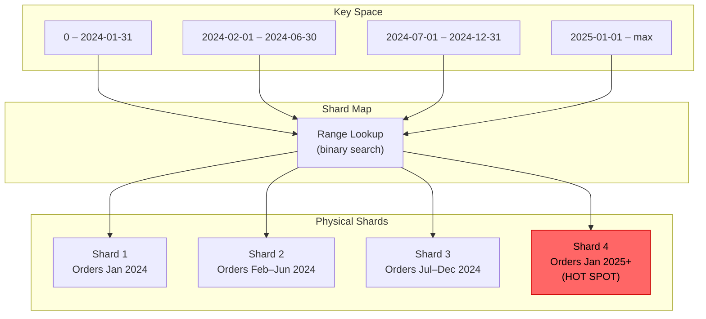
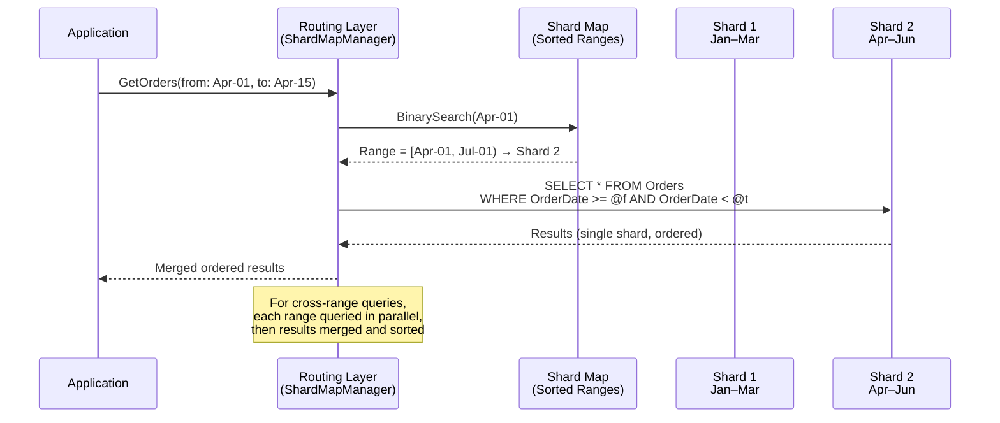

> [!success] Mastery Check
> - [ ] **Studied Well**
> - [ ] **Can explain the concept without notes**
> - [ ] **Can answer interview questions confidently**
> - [ ] **Can implement it in a real project**

---

id: "7.224"
title: "Database Sharding — Range-Based"
domain: "System Design & Distributed Systems"
domain_id: 7
group: "Scalability Patterns"
tags: [system-design, distributed-systems, scalability, dotnet, azure, databases, sharding, range-sharding, elastic-scale]
priority: 1
version: 1
prerequisites:
  - "[[7.222 — Database Sharding — Overview]]" — the three shard strategies (range, hash, directory) are introduced here; range-based sharding is the simplest conceptually but has the most dangerous hotspot failure mode — understanding the overview's three-property framework (cardinality, distribution, affinity) is required to evaluate when range-based IS the right choice vs when it creates a single-write bottleneck
  - "[[7.223 — Database Sharding — Partition Key Selection]]" — range-based sharding imposes a unique constraint on partition key selection: the key MUST be totally ordered for range queries to be single-shard, but an ordered key that is also monotonically increasing creates the last-shard hotspot; the tension between ordered access and uniform distribution is the central design challenge of range-based sharding
  - "[[7.225 — Database Sharding — Hash-Based]]" — hash-based sharding is the direct alternative that solves the hotspot problem at the cost of losing range-query affinity; the range vs hash decision is the most common strategic tradeoff in sharded system design
  - "[[8.64 — SQL Server Transaction Log Internals]]" — range-based sharding's hotspot problem manifests as a transaction log throughput bottleneck on the last shard; understanding log write throughput limits (~40 MB/s per Azure SQL Premium shard) explains why a single-shard hotspot cannot be mitigated by adding more shards — the hot shard's log is the bottleneck regardless of how many cold shards exist
  - "[[8.60 — Azure Cosmos DB Partitioning]]" — Cosmos DB uses hash-based partitioning internally even when you provide a range-partitioned logical key; there is NO native range-based sharding in Cosmos DB — all physical partition splits are hash-based, which means a design relying on range-based sharding must use Azure SQL Database or SQL Server with custom shard management rather than Cosmos DB
related:
  - "[[7.223 — Database Sharding — Partition Key Selection]]" — the partition key for range-based sharding must be a totally ordered column (date, sequential ID, alphabetical); the distribution property is the hardest to achieve for range keys because write patterns concentrate on the current range boundary
  - "[[7.225 — Database Sharding — Hash-Based]]" — hash-based sharding is the primary alternative; range-based gives range-query affinity and predictable shard identity, hash-based gives uniform distribution and eliminates the hotspot — choosing between them IS the core design decision
  - "[[7.226 — Database Sharding — Directory-Based]]" — directory-based sharding is the most flexible but adds a lookup hop; range-based can be converted to directory-based during resharding by adding a mapping layer between range boundaries and physical shards
  - "[[7.227 — Database Sharding — Cross-Shard Queries]]" — range-based sharding makes cross-shard queries especially painful because the range boundaries split the natural ordering — a cross-shard query must not only merge results but re-sort across shard boundaries
  - "[[7.228 — Database Sharding — Resharding and Migration]]" — range splits (splitting an overloaded range into two sub-ranges on separate shards) are the most common resharding operation for range-based systems; unlike hash-based resharding (which requires moving 1/N of all data), a range split only moves the data in one range — but it requires pausing writes to that range during the split
  - "[[7.206 — Horizontal vs Vertical Scaling — Tradeoffs]]" — range-based sharding is the most "naturally" horizontal scaling strategy because date-based ranges (e.g., monthly shards) map directly to business time boundaries and can be provisioned ahead of known growth
  - "[[8.4 — SQL Server Indexing Internals]]" — the range-based shard key should be the clustering key AND the shard key for maximum efficiency; understanding B-tree range scans explains why range-based sharding preserves index seek performance across shards when the query includes the shard key
  - "[[7.251 — CQRS for Scalability — Read-Write Split]]" — range-based sharding pairs naturally with CQRS because the write shard (current range, e.g., current month) is clearly distinct from read-only archive shards (previous months) — the two patterns reinforce each other
created: 2026-06-16

---

> [!ABSTRACT] Quick Reference — Range-Based Sharding **Invariant:** Every row belongs to the shard whose range contains the row's partition key. The ranges are contiguous, non-overlapping, and cover the complete key space. The routing layer maintains a shard map: a sorted list of `(range_start, range_end, shard_id)` tuples, and for any key value, finds the shard by binary search on the shard map. **The Critical Property:** Range-based sharding is the ONLY strategy that preserves the natural ordering of the key across shards — a query scanning keys in order will read from one shard until it hits the range boundary, then continue on the next shard. This makes it ideal for time-series data, event logs, chronological audit trails, and any workload where the dominant query is "give me all records in this date range." **The Critical Failure Mode:** Monotonically increasing keys (timestamps, auto-increment IDs, sequence numbers) create a single-shard write hotspot — ALL new writes go to the "last" shard because all new keys fall at the high end of the key space. The write capacity of the entire sharded system is limited to the write capacity of ONE shard. Hash-based or composite-key strategies exist specifically to solve this problem, but they sacrifice range-query affinity. **Trigger:** You have time-series data (logs, orders by date, events, sensor readings) and the dominant query pattern is "give me data in a time range." Range-based sharding lets you answer this with a single-shard query if the query's date range falls entirely within one shard's range. Add hash-based or directory-based into consideration when the write throughput to the current-range shard exceeds a single node's capacity. **Skip When:** The partition key is not naturally ordered (UUIDs, random strings, hashes) — range-based sharding requires a totally ordered key. Skip when the write volume to the current range exceeds a single node (~5,000 writes/sec for a single Azure SQL Database Premium pool shard). Skip when the access pattern is evenly distributed across the entire key space (every key accessed with equal frequency) — range-based gives no advantage over hash-based in that case, and hash-based avoids the hotspot. Also skip when the team cannot provision new shards ahead of range boundaries being reached — proactive range provisioning is operationally essential.

---

## Navigation

**Domain:** [[7 — System Design & Distributed Systems]] > **Group:** Scalability Patterns
**Previous:** [[7.223 — Database Sharding — Partition Key Selection]] | **Next:** [[7.225 — Database Sharding — Hash-Based]]

### Prerequisites

- [[7.222 — Database Sharding — Overview]] — the overview establishes the three shard strategies; range-based IS the simplest strategy but carries the most dangerous failure mode (monotonically increasing key hotspot) — understanding the three-property framework (cardinality, distribution, affinity) from the overview is required to evaluate whether range-based is correct for a given key
- [[7.223 — Database Sharding — Partition Key Selection]] — range-based sharding requires a totally ordered partition key, which creates a fundamental tension between ordered access (affinity for range queries, good) and monotonically increasing values (hotspot on the last shard, bad); understanding the three-property evaluation framework from 7.223 is the prerequisite for knowing when range keys satisfy all three properties and when they fail
- [[7.225 — Database Sharding — Hash-Based]] — hash-based sharding is the alternative that eliminates the hotspot by distributing writes uniformly; the range-vs-hash decision is the most common strategic tradeoff in database sharding, and both strategies must be understood to make the choice correctly

### Where This Fits

Range-based sharding lives at the database partitioning layer — the layer between the application query and the physical database instance that decides which database to send the query to. It becomes necessary when a single table's data volume or write throughput exceeds a single node's capacity AND the data has a natural ordered dimension (time, sequential ID, alphabetical prefix) that aligns with the dominant query pattern.

In a .NET production system, an engineer encounters range-based sharding when:
- The Orders table exceeds 500 GB and the primary query is "get orders for date range X"
- The audit log table generates more than 5,000 writes/second and the team needs to archive old shards to cold storage
- The event store for an event-sourced system grows at 50 GB/month and range-based archive shards are needed for compaction

Without range-based sharding, the team either uses hash-based sharding (sacrificing range-query affinity — every date-range query becomes cross-shard scatter-gather) or vertical scaling alone (hitting a single-node ceiling). Range-based sharding is the ONLY strategy that lets you partition data by time while keeping time-range queries single-shard — at the cost of managing the hotspot problem on the current-time shard.

---

## Core Mental Model

Range-based sharding is the most intuitive sharding strategy: you divide the key space into contiguous ranges and assign each range to a shard. The shard map is a sorted list of boundaries. For any key value, you find which range it falls into, and that range's shard owns the row.

Think of it as splitting a book by chapter ranges across volumes. Volume 1 holds chapters 1–10, Volume 2 holds chapters 11–20, and so on. To read chapters 5–8, you only need Volume 1. To read chapters 1–25, you need Volumes 1, 2, and 3 — but you can read each volume independently and concatenate in order.

The single invariant: **The shard key space is partitioned into disjoint, contiguous intervals. For any key value K, the shard is determined by `min_range <= K < max_range`. The ranges are stored in a shard map that is maintained by the routing layer.**

The fundamental cost of range-based sharding is the **last-shard hotspot**: because new data always has the highest key value (most recent timestamp, largest auto-increment ID), ALL writes go to the shard that owns the highest range. The write capacity of the entire system is limited to the write capacity of one shard — the hotspot shard. This appears to defeat the purpose of sharding, but the benefit is that READ queries for the current time range are single-shard, and cold data (older ranges) is isolated and independently manageable (can be moved to cheaper storage, backed up separately, or indexed differently).

### Classification

Range-based sharding is a **logical data distribution strategy** that sits at the database architecture layer. It is one of three fundamental shard mapping strategies:

| Property | Range-Based | Hash-Based | Directory-Based |
|---|---|---|---|
| Key ordering required | Yes (totally ordered) | No | No |
| Range-query affinity | Yes — single-shard if range fits one shard | No — every range query is scatter-gather | Depends on directory structure |
| Hotspot risk | High — monotonically increasing keys | None — uniform by construction | Low — can reassign hot keys |
| Resharding cost | Low for split — only one range affected | High — N/(N+M) of data must move | Medium — directory update is cheap, data migration is not |
| Operational complexity | Low (shard map is a simple sorted list) | Low (hash function is deterministic) | Medium (directory service is a dependency) |



### Key Properties / Guarantees

| Property | Value | Condition |
|---|---|---|
| Range-query affinity | Single-shard | Query range fits entirely within one shard's key range |
| Write throughput | Limited to one shard's capacity | Monotonically increasing key — all writes go to "last" shard |
| Resharding write availability | Disrupted during split | Range split requires pausing writes to the affected range |
| Data ordering | Preserved globally | Keys are ordered within each shard AND across shards (range by range) |
| Storage isolation | Per-shard independent | Each shard has its own backup, indexing, and performance profile |
| Archive capability | Natural — cold ranges can be detached | Old ranges (e.g., 2022 data) can be moved to cheaper storage without affecting hot shard |
| Cross-shard range query | Scatter-gather required | Query spans multiple range boundaries — results must be merged AND re-sorted |


### Consistency Model Impact

Range-based sharding operates on individual shards that are standard ACID-compliant Azure SQL Databases or SQL Server instances. Each shard is fully ACID within its boundaries — a transaction that touches rows within one shard's range has the standard SQL Server isolation guarantees (Read Committed by default, Serializable if requested). The impact of range-based sharding on consistency is:

- **Single-shard transactions:** Full ACID — the transaction spans only rows within one shard's range, so the standard SQL Server transaction guarantees apply. This is the common case for time-series workloads where a write batch stays within the current time range.
- **Cross-shard transactions:** No distributed ACID guarantee — range-based sharding does not support distributed transactions across shards in the general case. If a transaction must span two range boundaries, the application must implement a saga or compensation pattern. Azure SQL Database Elastic Scale does NOT support distributed transactions (DTC) across shards.
- **Shard map consistency:** The shard map itself must be strongly consistent — if the routing layer reads a stale shard map (believing a range still belongs to Shard A when it has been moved to Shard B), the query goes to the wrong shard and the row is not found. This requires the shard map to be stored in a strongly consistent store (Azure SQL Database or Azure Cosmos DB with strong consistency) and cached with a short TTL.
- **Range split atomicity:** When splitting an overloaded range into two shards, there is a window during which writes to the split range must be paused. The split is not atomic across shards — data moves from old shard to new shard, and the shard map is updated after the move completes. During this window, reads to the affected range may return incomplete results.

The .NET client code must account for the possibility that a query to a specific shard returns empty because the shard map was stale — the retry logic should include a shard-map refresh:

```csharp
// Port: Retry with shard-map refresh
public async Task<IReadOnlyList<Order>> QueryByDateRangeAsync(
    DateTime from, DateTime to, CancellationToken ct)
{
    var shard = _shardMap.GetShardForKey(from);
    if (shard == null)
    {
        await _shardMap.RefreshAsync(ct); // Stale map — refresh
        shard = _shardMap.GetShardForKey(from);
    }
    // Connection to the correct shard
    await using var conn = new SqlConnection(shard.ConnectionString);
    return await conn.QueryAsync<Order>(
        "SELECT * FROM Orders WHERE OrderDate >= @from AND OrderDate < @to",
        new { from, to });
}
```

### Where This Fits (within Deep Mechanics)

Range-based sharding sits between the query routing layer (which decides which shard to query) and the database indexing layer (which executes the range scan on the shard). The routing layer performs a binary search on the shard map to find the owning shard, then forwards the query. The database layer executes a standard B-tree range scan on the clustered index — because the shard key IS the clustering key, a range query is a sequential scan of contiguous index pages, which is the most efficient access pattern in SQL Server.

---

## Deep Mechanics

### How It Works

Range-based sharding uses a **shard map** — a sorted data structure that maps key ranges to shard identifiers. The shard map is the source of truth for data placement. Every query goes through this sequence:

**Step 1 — Shard map lookup.** The routing layer receives a query with a shard key predicate. It performs a binary search on the sorted shard map to find which range contains the key value. The shard map entry stores the shard's connection string or logical name.

```csharp
// Adapter: Shard map lookup — binary search on sorted ranges
public sealed record RangeMapping<TKey>(TKey Low, TKey High, int ShardId)
    where TKey : IComparable<TKey>;

public sealed class ShardMap<TKey> where TKey : IComparable<TKey>
{
    private readonly List<RangeMapping<TKey>> _ranges; // Sorted by Low

    public int GetShardForKey(TKey key)
    {
        // Binary search: find the range where Low <= key < High
        var lo = 0;
        var hi = _ranges.Count - 1;
        while (lo <= hi)
        {
            var mid = lo + (hi - lo) / 2;
            var range = _ranges[mid];
            if (key.CompareTo(range.Low) < 0) hi = mid - 1;
            else if (key.CompareTo(range.High) >= 0) lo = mid + 1;
            else return range.ShardId;
        }
        throw new KeyNotFoundException($"No shard found for key: {key}");
    }
}
```

**Step 2 — Route to shard.** The routing layer opens a connection to the shard using its connection string from the shard map entry. In a .NET application using Azure SQL Database Elastic Scale, this is handled by `ShardMap.OpenConnectionForKeyAsync()`.

**Step 3 — Execute on shard.** The query executes on the target shard as a standard SQL query. The shard's clustered index (which IS the shard key column) enables efficient range scans. A query like `WHERE OrderDate >= '2024-06-01' AND OrderDate < '2024-07-01'` performs a seek to the first matching row and then a sequential scan of index pages — no table scan, no sort.

**Step 4 — Return to caller.** Results flow back through the routing layer to the application. For single-range queries, this is identical to a non-sharded query flow — the routing layer is transparent.



**The shard map structure.** In a real production system, the shard map is not an in-memory list — it is stored in a database (the "shard map manager database") and cached in the routing layer. Azure SQL Database Elastic Scale stores the shard map in a dedicated database (or in a table within an existing database) and provides a `ShardMapManager` class that handles caching and refresh.

```sql
-- Shard map table schema (simplified)
CREATE TABLE ShardMaps.ShardRangeMappings (
    ShardMapId    INT          NOT NULL,
    RangeLow      DATETIME2    NOT NULL,  -- Inclusive lower bound
    RangeHigh     DATETIME2    NOT NULL,  -- Exclusive upper bound
    ShardId       INT          NOT NULL,
    Status        TINYINT      NOT NULL,  -- 0 = online, 1 = splitting, 2 = offline

    CONSTRAINT PK_ShardRangeMappings PRIMARY KEY (ShardMapId, RangeLow),
    CONSTRAINT CK_RangeOrder CHECK (RangeLow < RangeHigh)
);

-- Ensure no overlapping ranges
CREATE UNIQUE INDEX IX_ShardRangeMappings_NoOverlap
    ON ShardMaps.ShardRangeMappings (ShardMapId, RangeLow, RangeHigh)
    WHERE Status != 2;
```

**Step 5 — Cross-range queries.** When a query's predicate spans multiple shard ranges, the routing layer fans out: it finds all ranges that overlap the query bounds, sends the query to each shard in parallel, collects results, and merges them in key order before returning to the caller. This scatter-gather is the same as any cross-shard query pattern, with the added requirement of global sort order.

```csharp
// Port: Cross-range scatter-gather with ordered merge
public async Task<IReadOnlyList<Order>> GetOrdersByDateRangeAsync(
    DateTime from, DateTime to, CancellationToken ct)
{
    var affectedShards = _shardMap.GetShardsForRange(from, to);

    var tasks = affectedShards.Select(shard => QueryShardAsync(shard.Id, from, to, ct));
    var results = await Task.WhenAll(tasks);

    // Merge — results from each shard are already ordered by OrderDate
    // since the shard key IS the clustering key
    return results.SelectMany(r => r)
        .OrderBy(o => o.OrderDate)
        .ToList();
}
```

### Failure Modes

**Failure Mode 1 — Last-Shard Hotspot (monotonically increasing key)**

The defining failure of range-based sharding. When the shard key is an auto-incrementing integer, a timestamp, or any monotonically increasing value, ALL new writes target the shard that owns the highest range. The system's write throughput is capped at the capacity of ONE shard — defeating the purpose of sharding.

**Symptom:** The last shard shows 90%+ DTU/CPU while all other shards show 15–30%. The transaction log write throughput on the last shard is saturated (approaching ~40 MB/s for Azure SQL Database Premium). Write latency on the last shard increases from 5ms to 200ms+. Read latency is unaffected on cold shards. The application logs show `SqlException (timeout)` on write operations, but only when the write targets the current time range.

**Detection:** Per-shard monitoring query:

```sql
-- Run against each shard to detect hotspot imbalance
SELECT
    DatabaseName       = DB_NAME(),
    AvgCpuPercent      = AVG(avg_cpu_percent),
    AvgLogWritePercent = AVG(avg_log_write_percent),
    AvgDataIoPercent   = AVG(avg_data_io_percent)
FROM sys.dm_db_resource_stats
WHERE end_time > DATEADD(MINUTE, -15, GETUTCDATE());
```
Alert when any shard's `avg_cpu_percent` is consistently > 80% while the average across all shards is < 40%.

**Prevention/mitigation:**
- **Composite key:** Use `(Hash(TenantId), OrderDate)` — the hash component distributes writes, the date component preserves range ordering within each hash bucket. This eliminates the hotspot at the cost of making range queries cross-shard (must query all hash buckets and merge).
- **Pre-split ranges:** Instead of one "current" range, pre-split the future into multiple sub-ranges (e.g., current month split into 4 weekly ranges across 4 shards). Writes distribute across the pre-split ranges. This requires forecasting write volume.
- **Batch buffer:** Buffer writes and flush in sorted order — reduces per-write overhead but does not reduce total write volume on the hot shard.

**Failure Mode 2 — Range Overflow (range grows beyond shard capacity)**

A single range accumulates so much data that the shard runs out of storage or exceeds its DTU capacity. This happens when the range boundaries are set too wide (e.g., one shard per year when the year's data is 2 TB and the max shard size is 1 TB) or when data distribution within a range is unexpectedly heavy.

**Symptom:** The shard's storage reaches 90%+ of the tier maximum. Backup times exceed the recovery SLA. `PAGEIOLATCH_SH` waits dominate the shard's wait statistics — the storage I/O is the bottleneck. Queries on this shard show increased P99 latency from 10ms to 500ms+ because the B-tree depth increases and pages compete for I/O.

**Detection:**
```sql
-- Check shard storage size
SELECT
    reserved_mb = SUM(reserved_page_count) * 8 / 1024
FROM sys.dm_db_partition_stats;
```
Alert when `reserved_mb` exceeds 80% of the database tier's maximum size.

**Fix:** Split the overloaded range into two sub-ranges on separate shards. This is a planned operational procedure:
1. Provision a new shard (e.g., Shard 5)
2. Create the tables and indexes on the new shard (same schema)
3. Pause writes to the overloaded range (or buffer them in the application)
4. Copy data for the new sub-range from the old shard to the new shard
5. Validate row counts and checksums
6. Update the shard map: replace the old range entry with two entries pointing to old shard and new shard
7. Resume writes
8. Optionally, drop the migrated data from the old shard

```csharp
// Adapter: Range split procedure
public async Task SplitRangeAsync(
    RangeMapping<DateTime> oldRange,
    DateTime splitPoint,
    int newShardId,
    string newShardConnectionString,
    CancellationToken ct)
{
    // Step 1–2: Provision new shard
    await ProvisionShardAsync(newShardId, newShardConnectionString, ct);

    // Step 3: Pause writes to the affected range
    await _shardMap.SetRangeStatusAsync(oldRange, RangeStatus.Splitting, ct);

    // Step 4: Copy data for the new sub-range
    var oldConn = _connections[oldRange.ShardId];
    var newConn = new SqlConnection(newShardConnectionString);

    await using var reader = await oldConn.QueryAsync<Order>(
        "SELECT * FROM Orders WHERE OrderDate >= @split AND OrderDate < @high",
        new { split = splitPoint, high = oldRange.High });

    await BulkInsertAsync(newConn, reader, ct);

    // Step 5: Validate
    var oldCount = await oldConn.QuerySingleAsync<int>(
        "SELECT COUNT(*) FROM Orders WHERE OrderDate >= @split AND OrderDate < @high",
        new { split = splitPoint, high = oldRange.High });
    var newCount = await newConn.QuerySingleAsync<int>(
        "SELECT COUNT(*) FROM Orders",
        new { split = splitPoint, high = oldRange.High });
    if (oldCount != newCount) throw new InvalidOperationException("Row count mismatch");

    // Step 6: Update shard map
    await _shardMap.ReplaceRangeAsync(oldRange, [
        new RangeMapping<DateTime>(oldRange.Low, splitPoint, oldRange.ShardId),
        new RangeMapping<DateTime>(splitPoint, oldRange.High, newShardId)
    ], ct);

    // Step 7: Delete migrated data from old shard (post-cutover)
    await oldConn.ExecuteAsync(
        "DELETE FROM Orders WHERE OrderDate >= @split AND OrderDate < @high",
        new { split = splitPoint, high = oldRange.High }, ct);
}
```

**Failure Mode 3 — Cross-Range Query Bloat**

As the data grows, the number of ranges increases (splits, new time periods). Over time, the typical query range starts spanning multiple shard boundaries. A query that used to hit one shard now hits 3, then 7, then 15. The overhead of scatter-gather (parallel queries + merge sort) cancels the benefit of sharding.

**Symptom:** P99 latency for range queries degrades linearly with the number of shards the query spans. Logs show increasing time spent in the merge sort phase of the scatter-gather operation. The application's `GetOrdersByDateRangeAsync` method shows P99 latency growing from 15ms to 150ms as the date range stays constant but the number of shards increases.

**Detection:** Monitor `shards_touched_per_query` in the routing layer:
```csharp
// Instrumentation in the routing layer
public async Task<IReadOnlyList<T>> QueryShardsAsync<T>(
    DateTime from, DateTime to, Func<SqlConnection, Task<IReadOnlyList<T>>> query)
{
    var shards = _shardMap.GetShardsForRange(from, to);
    _metrics.RecordShardsTouched(shards.Count); // Track over time
    // ...
}
```
Alert when the 7-day rolling average of `shards_touched_per_query` exceeds 3 (meaning the average query hits 3+ shards).

**Fix:** Merge adjacent cold shards (consolidation) or reorganize range boundaries to align with the most common query date range. If the typical query is "last 30 days," the ranges should be 30-day windows — not calendar months.

### .NET and Azure Integration

Range-based sharding in the .NET ecosystem primarily uses **Azure SQL Database Elastic Scale** — a client library that provides shard map management, distributed queries, and multi-shard query execution.

**Azure services:**
- **Azure SQL Database Elastic Scale (`Microsoft.Azure.SqlDatabase.ElasticScale.Client`)** — provides `ShardMapManager`, `ListShardMap<T>`, and `RangeShardMap<T>` for range-based sharding. The library handles shard map storage, caching, and multi-shard query execution.
- **Azure SQL Database Elastic Jobs** — for running schema changes (ALTER TABLE) and maintenance scripts across all shards
- **Azure SQL Database — Managed Instance** — can be used as shards. The same Elastic Scale client library works with Managed Instance
- **Azure Data Factory** — for bulk-moving data during range splits or resharding operations

**.NET libraries:**
- `Microsoft.Azure.SqlDatabase.ElasticScale.Client` — NuGet package for shard map management
- `Dapper` — lightweight ORM for querying shards (commonly paired with Elastic Scale)
- `EF Core` — does NOT natively support sharding; each shard requires its own `DbContext` instance, and the routing layer must select the correct connection string

**ASP.NET Core integration:**

```csharp
// Port: Range-based shard routing in Program.cs
builder.Services.AddSingleton(sp =>
{
    var config = sp.GetRequiredService<IConfiguration>();
    var smm = ShardMapManager.GetOrCreateSqlShardMapManager(
        config.GetConnectionString("ShardMapManager"),
        ShardMapManagerCreateMode.KeepExisting);

    var shardMap = smm.GetRangeShardMap<DateTime>("OrdersRangeShardMap");
    return shardMap;
});

builder.Services.AddScoped<IOrderRepository>(sp =>
{
    var shardMap = sp.GetRequiredService<RangeShardMap<DateTime>>();
    return new ShardedOrderRepository(shardMap, config);
});
```

**EF Core sharding approach (since EF Core has no built-in sharding):**

```csharp
// Adapter: DbContext factory for range-based sharding
public sealed class ShardedOrderContext : DbContext
{
    public DbSet<Order> Orders { get; set; }

    public ShardedOrderContext(DbContextOptions<ShardedOrderContext> options)
        : base(options) { }

    protected override void OnModelCreating(ModelBuilder modelBuilder)
    {
        modelBuilder.Entity<Order>(entity =>
        {
            entity.HasKey(o => o.OrderId);
            entity.Property(o => o.OrderId).ValueGeneratedNever(); // Domain-generated
            entity.Property(o => o.OrderDate).IsRequired();

            // The clustered index IS the shard key for range-query efficiency
            entity.HasIndex(o => o.OrderDate).IsClustered();
        });
    }
}

// Port: Repository that routes to the correct shard
public sealed class ShardedOrderRepository : IOrderRepository
{
    private readonly RangeShardMap<DateTime> _shardMap;
    private readonly string _shardMapManagerConnectionString;
    private readonly ILogger<ShardedOrderRepository> _logger;

    public ShardedOrderRepository(
        RangeShardMap<DateTime> shardMap,
        IConfiguration configuration,
        ILogger<ShardedOrderRepository> logger)
    {
        _shardMap = shardMap;
        _shardMapManagerConnectionString =
            configuration.GetConnectionString("ShardMapManager")!;
        _logger = logger;
    }

    // Single-shard point read
    public async Task<Order?> GetByIdAsync(
        Guid orderId, DateTime orderDate, CancellationToken ct)
    {
        await using var conn = await _shardMap.OpenConnectionForKeyAsync(
            orderDate, ct.ToString());
        return await conn.QueryFirstOrDefaultAsync<Order>(
            "SELECT * FROM Orders WHERE OrderId = @id",
            new { id = orderId });
    }

    // Single-shard range query when range fits within one shard
    public async Task<IReadOnlyList<Order>> GetByDateRangeAsync(
        DateTime from, DateTime to, CancellationToken ct)
    {
        var shards = _shardMap.GetShardsForKeyRange(from, to);
        if (shards.Count == 1)
        {
            await using var conn = await _shardMap.OpenConnectionForKeyAsync(
                from, ct.ToString());
            return (await conn.QueryAsync<Order>(
                "SELECT * FROM Orders WHERE OrderDate >= @f AND OrderDate < @t",
                new { f = from, t = to })).AsList();
        }

        // Cross-shard: scatter-gather with ordered merge
        _logger.LogWarning(
            "Cross-shard query: {From} to {To} touches {ShardCount} shards",
            from, to, shards.Count);

        var tasks = shards.Select(shard => QueryShardAsync(shard, from, to, ct));
        var results = await Task.WhenAll(tasks);
        return results.SelectMany(r => r)
            .OrderBy(o => o.OrderDate)
            .ToList();
    }

    private async Task<IReadOnlyList<Order>> QueryShardAsync(
        Shard shard, DateTime from, DateTime to, CancellationToken ct)
    {
        await using var conn = await shard.OpenConnectionAsync(ct.ToString());
        return (await conn.QueryAsync<Order>(
            "SELECT * FROM Orders WHERE OrderDate >= @f AND OrderDate < @t",
            new { f = from, t = to })).AsList();
    }
}
```


---

## Production Patterns and Implementation

### Primary Implementation

The canonical range-based sharding implementation uses Azure SQL Database Elastic Scale with a `RangeShardMap<DateTime>` for time-based order data. The shard map is stored in a dedicated Azure SQL Database (the "shard map manager" database) and cached in the routing layer.

```csharp
// Port: Range-sharded order repository — full implementation
public sealed class ShardedOrderRepository : IOrderRepository, IDisposable
{
    private readonly RangeShardMap<DateTime> _shardMap;
    private readonly string _smConnectionString;
    private readonly ILogger<ShardedOrderRepository> _logger;
    private readonly ConcurrentDictionary<int, SqlConnection> _connections = new();

    public ShardedOrderRepository(
        RangeShardMap<DateTime> shardMap,
        IConfiguration configuration,
        ILogger<ShardedOrderRepository> logger)
    {
        _shardMap = shardMap;
        _smConnectionString =
            configuration.GetConnectionString("ShardMapManager")!;
        _logger = logger;
    }

    // Adapter: Single-shard point read by OrderId + OrderDate
    public async Task<Order?> GetByIdAsync(
        Guid orderId, DateTime orderDate, CancellationToken ct)
    {
        await using var conn = await _shardMap.OpenConnectionForKeyAsync(
            orderDate, ct.ToString());
        return await conn.QueryFirstOrDefaultAsync<Order>(
            """
            SELECT OrderId, CustomerId, OrderDate, TotalAmount, Status
            FROM Orders
            WHERE OrderId = @id AND OrderDate = @date
            """,
            new { id = orderId, date = orderDate });
    }

    // Adapter: Single-shard range query
    public async Task<IReadOnlyList<Order>> GetByDateRangeAsync(
        DateTime from, DateTime to, CancellationToken ct)
    {
        var affectedShards = _shardMap.GetShardsForKeyRange(from, to);

        if (affectedShards.Count == 1)
        {
            return await QuerySingleShardAsync(
                affectedShards[0], from, to, ct);
        }

        _logger.LogWarning(
            "Cross-shard range query: {From:O} to {To:O} spans {Count} shards. "
            + "Consider narrowing the range or consolidating shards.",
            from, to, affectedShards.Count);

        var tasks = affectedShards
            .Select(s => QuerySingleShardAsync(s, from, to, ct));
        var results = await Task.WhenAll(tasks);

        // Merge and sort — each shard returns ordered results
        return results.SelectMany(r => r)
            .OrderBy(o => o.OrderDate)
            .ToList();
    }

    private async Task<IReadOnlyList<Order>> QuerySingleShardAsync(
        Shard shard, DateTime from, DateTime to, CancellationToken ct)
    {
        await using var conn = await shard.OpenConnectionAsync(ct.ToString());
        return (await conn.QueryAsync<Order>(
            """
            SELECT OrderId, CustomerId, OrderDate, TotalAmount, Status
            FROM Orders
            WHERE OrderDate >= @from AND OrderDate < @to
            ORDER BY OrderDate
            """,
            new { from, to })).AsList();
    }

    // Adapter: Write with range hotspot awareness
    public async Task<Order> CreateAsync(
        CreateOrderCommand command, CancellationToken ct)
    {
        var orderDate = command.OrderDate;
        var order = new Order
        {
            OrderId = Guid.CreateVersion7(),
            CustomerId = command.CustomerId,
            OrderDate = orderDate,
            TotalAmount = command.TotalAmount,
            Status = OrderStatus.Pending
        };

        // Range check: alert if writing to the hot shard (> 80% of total writes)
        var hotShard = _shardMap.GetShardForKey(DateTime.UtcNow);
        var targetShard = _shardMap.GetShardForKey(orderDate);
        if (targetShard.Id == hotShard.Id)
        {
            _logger.LogInformation(
                "Write to hot shard {ShardId}. Current rate: {Rate} writes/sec",
                targetShard.Id, _writeRateCounter.GetCurrentRate());
        }

        await using var conn = await _shardMap.OpenConnectionForKeyAsync(
            orderDate, ct.ToString());
        await conn.ExecuteAsync(
            """
            INSERT INTO Orders (OrderId, CustomerId, OrderDate, TotalAmount, Status)
            VALUES (@OrderId, @CustomerId, @OrderDate, @TotalAmount, @Status)
            """, order);
        return order;
    }

    public void Dispose()
    {
        foreach (var conn in _connections.Values)
            conn.Dispose();
        _connections.Clear();
    }
}
```

### Configuration and Wiring

```csharp
// Program.cs — Azure SQL Database Elastic Scale registration
using Microsoft.Azure.SqlDatabase.ElasticScale.Client;

var builder = WebApplication.CreateBuilder(args);

// Shard map manager is a singleton — shared across all requests
builder.Services.AddSingleton<RangeShardMap<DateTime>>(sp =>
{
    var config = sp.GetRequiredService<IConfiguration>();
    var logger = sp.GetRequiredService<ILogger<Program>>();

    var smConnectionString = config.GetConnectionString("ShardMapManager");
    var shardMapName = config["Sharding:RangeShardMapName"] ?? "OrdersByDateMap";

    // Create or get the shard map manager database
    var smm = ShardMapManager.GetOrCreateSqlShardMapManager(
        smConnectionString,
        ShardMapManagerCreateMode.KeepExisting);

    // Create or get the range shard map
    if (!smm.TryGetRangeShardMap(shardMapName, out RangeShardMap<DateTime>? shardMap))
    {
        shardMap = smm.CreateRangeShardMap<DateTime>(shardMapName);
        logger.LogInformation("Created new range shard map: {Name}", shardMapName);
    }

    return shardMap;
});

// Repository is scoped — one per request
builder.Services.AddScoped<IOrderRepository, ShardedOrderRepository>();

var app = builder.Build();
```

```json
// appsettings.json — shard map and shard connections
{
  "ConnectionStrings": {
    "ShardMapManager": "Server=tcp:sm-svr.database.windows.net;Database=ShardMapDb;...",
    "Shard_1": "Server=tcp:shard1-svr.database.windows.net;Database=Orders_2024_Q1;...",
    "Shard_2": "Server=tcp:shard2-svr.database.windows.net;Database=Orders_2024_Q2;..."
  },
  "Sharding": {
    "RangeShardMapName": "OrdersByDateMap",
    "HotShardThresholdPercent": 0.80,
    "CacheTtlSeconds": 30,
    "PreSplitsAhead": 4
  }
}
```

### Common Variants

**Variant 1 — Date-based rolling windows (the most common range variant)**

Rather than a single "current" shard that grows indefinitely, pre-provision shards for fixed time windows (months, quarters, years) and rotate them. New data always goes to the current window's shard, and old shards are archived or moved to cheaper storage.

```csharp
// Adapter: Rolling monthly shard map
public sealed class MonthlyShardMap
{
    private readonly int _monthsAhead;
    private readonly RangeShardMap<DateTime> _inner;

    public async Task EnsureCurrentMonthShardAsync(CancellationToken ct)
    {
        var now = DateTime.UtcNow;
        var monthStart = new DateTime(now.Year, now.Month, 1, 0, 0, 0, DateTimeKind.Utc);

        // Ensure current month range exists
        if (!_inner.TryGetMappingForKey(monthStart, out _))
        {
            var nextMonth = monthStart.AddMonths(1);
            var shard = await CreateShardForMonthAsync(now.Year, now.Month, ct);
            _inner.AddRangeMapping(
                new RangeMapping<DateTime>(monthStart, nextMonth, shard));
        }

        // Pre-provision future months
        for (var i = 1; i <= _monthsAhead; i++)
        {
            var futureStart = monthStart.AddMonths(i);
            if (!_inner.TryGetMappingForKey(futureStart, out _))
            {
                var futureEnd = futureStart.AddMonths(1);
                var futureShard = await CreateShardForMonthAsync(
                    futureStart.Year, futureStart.Month, ct);
                _inner.AddRangeMapping(
                    new RangeMapping<DateTime>(futureStart, futureEnd, futureShard));
            }
        }
    }

    // Writes go to the hot shard — unavoidable in range-based,
    // but pre-splitting the current month into sub-ranges can distribute
    // if write volume exceeds one shard
    private async Task<Shard> CreateShardForMonthAsync(
        int year, int month, CancellationToken ct)
    {
        // Provision Azure SQL Database, run schema migrations, return Shard
        // ...
    }
}
```

**Variant 2 — Composite range + hash for hotspot mitigation**

Use a composite key where the first component is a hash of the tenant ID (for distribution) and the second component is the date (for range ordering). This gives the distribution benefits of hash-based sharding WITHIN each range window.

```
Partition key = (Hash(TenantId) % 4, OrderDate)
Range structure for each hash bucket:
  Hash-0: [2024-01-01, 2024-06-30) → Shard 1
  Hash-0: [2024-07-01, max)        → Shard 2
  Hash-1: [2024-01-01, 2024-06-30) → Shard 3
  Hash-1: [2024-07-01, max)        → Shard 4
  ...
```

A query for "all orders in date range X across all tenants" becomes a scatter-gather across all hash buckets. A query for "all orders for tenant Y in date range X" hits one hash bucket, then uses range scan within that bucket.

**Variant 3 — Geographic range sharding**

Shard by geographic region using the region ID as a prefix and the date as a suffix:

```sql
-- Region 1 = North America, Region 2 = Europe, Region 3 = Asia-Pacific
-- Shard key = (RegionId, OrderDate)
-- Range per shard: specific to a region's time span
SELECT * FROM Orders
WHERE RegionId = 1 AND OrderDate >= '2024-06-01' AND OrderDate < '2024-07-01'
-- Single-shard query: range within region
```

### Real-World .NET Ecosystem Example

**Azure SQL Database Elastic Scale (`Microsoft.Azure.SqlDatabase.ElasticScale.Client`)** is the canonical .NET implementation of range-based sharding. It is a client-side sharding library — the application references it directly (not a proxy or middleware). Key classes:

- `ShardMapManager` — singleton that manages the shard map storage and provides access to all shard maps
- `RangeShardMap<T>` — typed shard map for range-based strategies where `T` is the shard key type (typically `DateTime`, `Int64`, or `String`)
- `ListShardMap<T>` — for hash-based or list-based sharding (keys map to shards via a user-defined function, not by range)
- `Shard` — represents a single shard database with its location (server, database) and status
- `RangeMapping<T>` — a range entry in the shard map: `(Low, High, ShardId)`

The library handles:
- **Shard map caching:** The shard map is cached in memory and refreshed on a configurable interval or on demand
- **Connection routing:** `OpenConnectionForKeyAsync` opens a connection to the correct shard for a given key value
- **Multi-shard queries:** `MultiShardExecution` executes the same query across multiple shards and merges results
- **Data-dependent routing:** The connection is opened in the context of a specific shard key, ensuring all queries on that connection target the correct shard

```csharp
// Port: Real-world Elastic Scale usage with Dapper
using Microsoft.Azure.SqlDatabase.ElasticScale.Client;

public sealed class AnalyticsQueryService
{
    private readonly RangeShardMap<DateTime> _shardMap;

    // Multi-shard query using Elastic Scale's built-in scatter-gather
    public async Task<IReadOnlyList<DailyOrderTotal>> GetDailyTotalsAsync(
        DateTime from, DateTime to, CancellationToken ct)
    {
        var affectedShards = _shardMap.GetShardsForKeyRange(from, to);

        // Elastic Scale MultiShardExecution with Dapper
        var cmd = new MultiShardCommand(
            """
            SELECT CAST(OrderDate AS DATE) AS Day, COUNT(*) AS OrderCount, SUM(TotalAmount) AS Revenue
            FROM Orders
            WHERE OrderDate >= @from AND OrderDate < @to
            GROUP BY CAST(OrderDate AS DATE)
            ORDER BY Day
            """,
            new { from, to });

        var results = new List<DailyOrderTotal>();
        foreach (var shard in affectedShards)
        {
            await using var conn = await shard.OpenConnectionAsync(ct.ToString());
            var shardResults = await conn.QueryAsync<DailyOrderTotal>(
                cmd.CommandText, cmd.Parameters);
            results.AddRange(shardResults);
        }

        // Merge and aggregate across shards
        return results
            .GroupBy(r => r.Day)
            .Select(g => new DailyOrderTotal
            {
                Day = g.Key,
                OrderCount = g.Sum(r => r.OrderCount),
                Revenue = g.Sum(r => r.Revenue)
            })
            .OrderBy(r => r.Day)
            .ToList();
    }
}
```

**Production constraint:** Elastic Scale is a client-side library — it does NOT use a proxy or middleware layer. Every application instance connects directly to shards. This means:
- Connection pooling is per-application-instance, per-shard — if you have 10 app instances and 8 shards, you have 80 connection pools
- Shard map cache is per-application-instance — a shard map update (range split) requires either a cache refresh in each instance or a short TTL
- No built-in rate limiting or circuit breaker — add Polly `ResiliencePipeline` around `OpenConnectionForKeyAsync`


---

## Gotchas and Production Pitfalls

### Monotonically Increasing Key — All Writes Hit One Shard

**Pitfall:** The engineer chooses an auto-incrementing integer or timestamp as the range shard key. Every new insert targets the highest range — the "last" shard. The system is sharded across 8 databases, but 100% of writes go to Shard 8. Shards 1–7 are idle for writes.

```csharp
// ❌ Monotonically increasing key — all new data goes to the last shard
_builder.Services.AddSingleton<RangeShardMap<long>>(sp =>
{
    var smm = ShardMapManager.GetOrCreateSqlShardMapManager(connStr, KeepExisting);
    var shardMap = smm.GetRangeShardMap<long>("OrdersByIdMap");

    shardMap.AddRangeMapping(new RangeMapping<long>(0, 1_000_000, shard1));
    shardMap.AddRangeMapping(new RangeMapping<long>(1_000_000, 2_000_000, shard2));
    // ... Shards 3–7 ...
    shardMap.AddRangeMapping(new RangeMapping<long>(7_000_000, long.MaxValue, shard8));
    // ^ All writes go here — identity column grows monotonically
    return shardMap;
});
```

**Symptom:** Shard 8 shows 95% DTU during peak. Transaction log write throughput on Shard 8 is saturated at ~40 MB/s — writes queue and latency spikes from 5ms to 800ms. The other 7 shards show 15–30% DTU. Write throughput of the entire system is capped at one P15 Azure SQL Database (40,000 writes/sec), not 8 × 40,000 writes/sec. The team adds more shards but it does not help — all writes still go to Shard 8.

**Fix:** Use a composite key that distributes writes across shards while preserving range ordering within each distribution bucket. Alternatively, pre-split the future range into N sub-ranges and use a round-robin or hash-based assignment for the "current" range:

```csharp
// ✅ Composite key: hash-based distribution component + date range component
// The hash component (CustomerId % 4) spreads writes across 4 parallel ranges,
// each sub-ranged by date. No single shard is the write bottleneck.
public string GetShardKey(DateTime orderDate, Guid customerId)
{
    var bucket = Math.Abs(customerId.GetHashCode()) % 4;
    var monthBucket = new DateTime(orderDate.Year, orderDate.Month, 1);
    return $"{bucket}:{monthBucket:yyyy-MM}";
}

// Shard map has 4 × N entries — one per bucket per month
// A write for customer X in June 2024 goes to bucket = Hash(X) % 4 → Shard (bucket + month_offset)
```

**Cost of not fixing:** The system hits a write throughput wall at ~1.5× current volume. The business wants 10× growth over 3 years. The engineering team must emergency-reshard — a multi-month project involving data migration, schema changes, and application rewrites. During migration, the system risks data loss or extended downtime. The customer-facing impact: "Orders page is loading slowly" becomes "Orders page is returning 503 errors" because the write queue backs up into the application layer.

### Range Split During Live Traffic — Data Not Found

**Pitfall:** The on-call engineer triggers a range split (splitting an overloaded monthly shard into two weekly shards) while the application is serving live traffic. The engineer updates the shard map but the application's in-memory cache still holds the old mapping for 30 seconds (the cache TTL). During those 30 seconds, queries for data in the moved sub-range go to the wrong shard and return empty results.

```csharp
// ❌ Range split without cache invalidation
// In the split procedure:
await _shardMap.ReplaceRangeAsync(oldMapping, [
    new RangeMapping<DateTime>(oldMapping.Low, splitPoint, oldShard.Id),
    new RangeMapping<DateTime>(splitPoint, oldMapping.High, newShard.Id)
], ct);

// But the application instances have the old mapping cached with a 30-second TTL.
// Queries for the moved range go to the NEW shard (correct), but the old data
// has NOT been moved yet — the new shard is empty.
// Result: query returns 0 rows for data that exists on the old shard.
```

**Symptom:** Customers report missing orders in the days following a maintenance window. The support team finds the orders by querying the old shard directly. The application log shows `GetByIdAsync` returning null for known order IDs. The incident post-mortem identifies the split procedure as the root cause.

**Fix:** Implement a dual-read pattern during the split window — query both the old and new shard, return the first non-empty result. After the shard map update, run a backfill to move data, then remove the dual-read after confirmation:

```csharp
// ✅ Dual-read during split window
public async Task<Order?> GetByIdAsync(
    Guid orderId, DateTime orderDate, CancellationToken ct)
{
    var shards = _shardMap.GetShardsForKeyRange(orderDate, orderDate.AddTicks(1));

    // During split window, multiple shards may claim the same key
    // Query all candidates and return the first non-null result
    foreach (var shard in shards)
    {
        await using var conn = await shard.OpenConnectionAsync(ct.ToString());
        var result = await conn.QueryFirstOrDefaultAsync<Order>(
            "SELECT * FROM Orders WHERE OrderId = @id AND OrderDate = @date",
            new { id = orderId, date = orderDate });
        if (result != null) return result;
    }
    return null;
}
```

**Cost of not fixing:** Data unavailability window during every split operation. The support team spends days investigating "missing data" issues that are actually routing cache problems. Customer trust erodes as "the system lost my order" reports increase.

### Range Boundaries at Natural Time Boundaries — Uneven Load

**Pitfall:** The team sets range boundaries at calendar month boundaries (January, February, March) because it is "clean." But the business has seasonal peaks — December has 5× the orders of February. The December shard overflows while the February shard is at 20% capacity.

```csharp
// ❌ Calendar-based boundaries — seasonal skew
_shardMap.AddRangeMapping(new(-1d, DateTimeOffset.Parse("2024-01-01").Ticks, shard1));
_shardMap.AddRangeMapping(DateTimeOffset.Parse("2024-01-01").Ticks,
                          DateTimeOffset.Parse("2024-02-01").Ticks, shard2));
// ^ December 2024 shard will have 5× the data of January 2024
```

**Symptom:** The December shard reaches 90% storage capacity in early December. The team must execute an emergency split mid-month during peak traffic. Query latency on the December shard degrades from 10ms to 400ms as the B-tree depth increases and pages compete for I/O. The January shard remains at 15% capacity.

**Fix:** Use data-volume-based boundaries instead of calendar boundaries. Pre-compute expected data volumes from production growth trends and set boundaries to keep each shard within 60–80% of its capacity:

```csharp
// ✅ Volume-based boundaries from production metrics
// Production data: 40 million orders/month average
// Each shard should hold ~20 million orders (60% of 10 GB capacity)
_shardMap.AddRangeMapping(0,          20_000_000, shard1); // Orders 1–20M
_shardMap.AddRangeMapping(20_000_001, 40_000_000, shard2); // Orders 20M–40M
// ^ Not aligned to months — aligned to volume
// Seasonal peaks naturally get more shards
```

For date-based sharding, pre-split the peak months ahead of time:

```csharp
// ✅ Pre-split December into 5 weekly ranges
_shardMap.AddRangeMapping(new DateTime(2024, 12, 1), new DateTime(2024, 12, 7),  shard1);
_shardMap.AddRangeMapping(new DateTime(2024, 12, 7), new DateTime(2024, 12, 14), shard2);
_shardMap.AddRangeMapping(new DateTime(2024, 12, 14), new DateTime(2024, 12, 21), shard3);
_shardMap.AddRangeMapping(new DateTime(2024, 12, 21), new DateTime(2024, 12, 28), shard4);
_shardMap.AddRangeMapping(new DateTime(2024, 12, 28), new DateTime(2025, 1, 1),   shard5);
// ^ Each weekly shard gets ~1/5 of December traffic
```

**Cost of not fixing:** The December shard overflows every holiday season. The team spends December emergency-splitting shards instead of building features. Year after year, the same pattern repeats because the team never changes from calendar boundaries. The system needs manual intervention every peak season.

### Shard Key Is NOT the Clustering Index

**Pitfall:** The engineer creates a separate `ShardKey` column for routing but sets the clustered index on a different column (e.g., `OrderId`). Every range query on the shard key becomes a non-clustered index lookup + bookmark lookup instead of a clustered index range scan — 10–100× slower.

```csharp
// ❌ Shard key != clustering key — range queries are slow
modelBuilder.Entity<Order>(entity =>
{
    entity.HasKey(o => o.OrderId);  // PK = OrderId (surrogate)
    entity.Property(o => o.OrderDate).IsRequired();
    // Shard key = OrderDate, but no clustered index on OrderDate
    entity.HasIndex(o => o.OrderDate); // Non-clustered — range scan is bookmark lookup
});
```

**Symptom:** Range queries on `OrderDate` show high `PAGEIOLATCH_SH` waits and `Key Lookup` operations in the query plan. A range query that should scan 100 sequential pages does 100 index seeks + 100 bookmark lookups. A query covering 1 million rows takes 30 seconds instead of 300ms. The execution plan shows 95% of cost in the Key Lookup operator.

**Fix:** Make the shard key column the clustered index key:

```csharp
// ✅ Shard key IS the clustered index — range queries are sequential scans
modelBuilder.Entity<Order>(entity =>
{
    entity.HasKey(o => o.OrderId);
    entity.Property(o => o.OrderDate).IsRequired();

    // Clustered index on the shard key for efficient range scans
    entity.HasIndex(o => o.OrderDate).IsClustered();

    // Non-clustered index for point lookups by OrderId
    entity.HasIndex(o => o.OrderId).IsUnique();
});
```

**Cost of not fixing:** Every range query performs N bookmark lookups where N is the number of matching rows. A query that should take 5ms takes 5,000ms. The query times out in production. The team adds more shards but the query is still slow because the bottleneck is the lookup pattern, not the data volume.

### Proactive Shard Provisioning Ignored — Midnight Batch Failures

**Pitfall:** The team uses date-range sharding with one shard per month and forgets to provision the next month's shard before the month ends. At midnight on the 1st, the application tries to insert an order with the new month's date, the shard map has no range for that date, and the insert throws `KeyNotFoundException`.

```csharp
// ❌ No proactive shard provisioning
// Month = August. Shards exist for Jan–Aug.
// No shard for September provisioned.
// September 1st, 00:00:01 — first insert for Sep:
var order = new Order { OrderDate = DateTime.UtcNow, /* Sep 1 */ };
await _repository.CreateAsync(order, ct);
// throws KeyNotFoundException: "No shard found for key: 2024-09-01"
```

**Symptom:** At midnight on the 1st of every month, the order creation pipeline fails for 3–15 minutes until the on-call engineer provisions the new shard and adds the range mapping. The incident repeats every month because no one automated the provisioning. The monthly incident is accepted as "normal operational overhead."

**Fix:** Automate shard provisioning with a background job that ensures the next N time windows have shards:

```csharp
// ✅ Background service that provisions shards ahead
public sealed class ShardProvisioningService : BackgroundService
{
    private readonly RangeShardMap<DateTime> _shardMap;
    private readonly int _monthsAhead;

    protected override async Task ExecuteAsync(CancellationToken ct)
    {
        while (!ct.IsCancellationRequested)
        {
            var now = DateTime.UtcNow;
            var currentMonth = new DateTime(now.Year, now.Month, 1, 0, 0, 0, DateTimeKind.Utc);

            for (var i = 0; i < _monthsAhead; i++)
            {
                var monthStart = currentMonth.AddMonths(i);
                var monthEnd = monthStart.AddMonths(1);

                if (!_shardMap.TryGetMappingForKey(monthStart, out _))
                {
                    var shard = await ProvisionShardAsync(
                        $"Orders_{monthStart:yyyy_MM}", ct);
                    _shardMap.AddRangeMapping(
                        new RangeMapping<DateTime>(monthStart, monthEnd, shard));
                    _logger.LogInformation(
                        "Provisioned shard for {Month:yyyy-MM}", monthStart);
                }
            }

            await Task.Delay(TimeSpan.FromHours(6), ct); // Check every 6 hours
        }
    }
}
```

**Cost of not fixing:** Monthly production incidents. The on-call rotation dreads the 1st of each month. Each incident carries a risk: if the engineer provisions the new shard with the wrong connection string or misses a schema migration, data for the new month is corrupted before anyone notices.

### Scatter-Gather Sort Assumption — Ordering Across Shards Is Not Free

**Pitfall:** The engineer assumes that querying multiple shards and concatenating results preserves the global sort order. It does not — each shard returns rows ordered within that shard, but the concatenation of ordered segments is NOT globally ordered.

```csharp
// ❌ Assuming concatenation preserves order
var results1 = await QueryShardAsync(shard1, from, to);
var results2 = await QueryShardAsync(shard2, from, to);
return results1.Concat(results2).ToList();
// ^ Results are: shard1's ordered list followed by shard2's ordered list
// This is NOT globally ordered unless shard1's max < shard2's min
```

**Symptom:** A paged API endpoint returns results out of order. Page 1 (from the first shard queried) has dates up to June 15. Page 2 (from the second shard) starts from June 1 — the user sees "older" results on page 2. The UI pagination shows non-monotonic dates and the user reports "my data is corrupt."

**Fix:** Always merge-sort cross-shard results:

```csharp
// ✅ Explicit merge-sort when combining shard results
public async Task<IReadOnlyList<Order>> GetByDateRangeAsync(
    DateTime from, DateTime to, int pageSize, int pageNumber, CancellationToken ct)
{
    var affectedShards = _shardMap.GetShardsForKeyRange(from, to);
    var tasks = affectedShards.Select(s => GetShardPageAsync(s, from, to, ct));
    var results = await Task.WhenAll(tasks);

    // Merge-sort across all shards, then paginate
    return results.SelectMany(r => r)
        .OrderBy(o => o.OrderDate)
        .Skip(pageNumber * pageSize)
        .Take(pageSize)
        .ToList();
}
```

**Cost of not fixing:** Data corruption perception. The support team spends hours investigating "the app shows wrong dates." The pagination API cannot be used for export or analytics because the order is non-deterministic. The team ships a fix that adds ORDER BY on the merged results, which works but becomes slower as the number of shards grows — the entire result set must be sorted, not just the requested page.


---

## Tradeoffs and Decision Framework

### Tradeoff Matrix

| Dimension | Range-Based Sharding | Hash-Based Sharding | Directory-Based Sharding |
|---|---|---|---|
| Write throughput | Limited to 1 shard (monotonic key) | Scales linearly with shard count | Scales linearly — directory is just a lookup |
| Range-query affinity | Single-shard (range fits one shard) | Cross-shard (always scatter-gather) | Cross-shard unless directory maps ranges |
| Point-read latency | ~1–5ms (single-shard, clustered index) | ~1–5ms (single-shard, hash lookup) | ~3–10ms (dictionary lookup + shard query) |
| Operational complexity | Low — shard map is a sorted list | Low — hash function is deterministic | Medium — directory service is a dependency |
| Resharding cost | Low for split (1 range), high for rebalance | High (1/N of data moves for N shards) | Medium (directory update cheap, data move expensive) |
| Backup/archive strategy | Natural — old ranges archived independently | No natural archive boundary | Flexible — directory can point to archive |
| Storage efficiency | Risk of uneven range sizes | Near-perfect uniform distribution | Depends on directory allocation strategy |
| Global ordering | Naturally ordered across shards | No ordering | No ordering |
| .NET ecosystem support | Azure SQL Elastic Scale (`RangeShardMap<T>`) | Azure SQL Elastic Scale (`ListShardMap<T>`) | Custom implementation or external service |

### When to Apply

```mermaid
flowchart TD
    A[Need to shard a database] --> B{Does the shard key have<br/>a natural ordering?}
    B -->|No — UUIDs, random strings, hashes| C[Use hash-based sharding]
    B -->|Yes — date, sequential ID, alphabetical| D{Is the dominant query<br/>a range scan on this key?}
    D -->|No — point lookups are the majority| C
    D -->|Yes — "give me all rows in range X"| E{Is the write distribution<br/>approximately even across ranges?}
    E -->|No — monotonically increasing key| F{Can we add a composite<br/>distribution component?}
    F -->|Yes — composite range+hash| G[Use composite range-based sharding]
    F -->|No — key cannot be composed| H[Use hash-based sharding +<br/>accept cross-shard range queries]
    E -->|Yes — key is naturally distributed| I[Use range-based sharding]
    I --> J[Pre-split future ranges,<br/>monitor shard storage ratios,<br/>automate provisioning]
```

### When NOT to Apply

- [ ] **The shard key is monotonically increasing** (auto-increment ID, timestamp, sequence number) AND the write volume to the current range exceeds a single shard's capacity — hash-based sharding is strictly better because range-based gives you the hotspot without the distribution benefits
- [ ] **The query pattern is uniformly distributed across the key space** — every key is accessed with roughly equal frequency; range-based provides no advantage over hash-based but adds the hotspot risk
- [ ] **Reads are the bottleneck, not writes** — read replicas or caching are simpler solutions with lower operational cost than any sharding strategy
- [ ] **The data volume fits comfortably on one node** (< 500 GB, < 5,000 writes/sec) — sharding is premature optimization; vertical scaling or read replicas suffice
- [ ] **The team cannot automate shard provisioning** — without automated pre-provisioning, every range boundary crossing becomes a production incident
- [ ] **The application requires distributed transactions across range boundaries** — range-based sharding does NOT support distributed transactions; if a single business operation spans multiple ranges, the design is fundamentally at odds with the sharding strategy

### Scale Thresholds

- **Worth considering above:** The single database exceeds 1 TB or 5,000 writes/second during peak. Range-based is appropriate when the dominant query is a range scan on a naturally ordered key.
- **Proactive pre-split required above:** 10,000 writes/second to the current range. At this point, the hot shard is approaching the throughput limit of a single Azure SQL Database Premium pool shard (~40,000 writes/sec). Pre-splitting the current range into 4 weekly sub-ranges across 4 shards distributes the write load.
- **Composite key required above:** 20,000 writes/second to the current range. Beyond this, pre-splitting alone is insufficient — a composite key with a hash-based distribution component is needed to spread writes across shards without creating micro-ranges.
- **Reconsider at:** The number of ranges exceeds 64 per shard map. Beyond this, the shard map lookup (binary search) is still fast (~7 comparisons), but the operational overhead of managing 64+ ranges becomes significant — monitoring, backup, schema migrations, and range split operations all scale linearly with range count.
- **Archive threshold:** Ranges older than 90 days with < 1 query/second. Move to cheaper Azure SQL Database tier or Azure Storage. Range-based sharding makes this natural: the old range's shard can be detached, its tier reduced, and the application still queries it via the shard map.

---

## Interview Arsenal

### Question Bank

1. What is range-based sharding and what problem does it solve that hash-based sharding does not?
2. How does the shard map work in a range-based sharded system — describe the data structure and the query routing algorithm.
3. What is the fundamental tradeoff of range-based sharding when the shard key is monotonically increasing?
4. Describe the last-shard hotspot failure mode — what metrics reveal it and what operational procedure fixes it?
5. Compare range-based sharding with hash-based sharding: when would you choose each, and what do you sacrifice with your choice?
6. Design a sharded order management system that handles 50,000 orders/second with time-based queries as the dominant pattern. How do you handle the hotspot?
7. How does range-based sharding behave at 10× the current data volume? What breaks first?
8. What is the non-obvious production cost of range-based sharding that most engineers discover only after running it in production for 6+ months?

### Spoken Answers

**Q1: What is range-based sharding and what problem does it solve that hash-based sharding does not?**

> **Average answer:** Range-based sharding splits data across databases based on ranges of a key, like dates or IDs. Hash-based sharding uses a hash function instead. Range-based is good for queries that ask for a range of data.

> **Great answer:** Range-based sharding partitions rows across databases by assigning contiguous ranges of the shard key to each shard. The shard map is a sorted list of `(range_low, range_high, shard_id)` tuples, and routing is a binary search on this list. The property that distinguishes it from hash-based sharding is **range-query affinity**: if the dominant query pattern is "give me all rows where the key is between X and Y," range-based sharding lets you answer that with a single-shard query as long as the query range falls entirely within one shard's boundaries. Hash-based sharding cannot provide this — any range query becomes a scatter-gather across all shards because the hash function destroys ordering. So range-based is the right choice when your data has a natural ordering (timestamps for event logs, sequential order IDs for time-series data) AND the query pattern follows that ordering.

**Q5: Compare range-based sharding with hash-based sharding — when would you choose each?**

> **Average answer:** Range-based is good for time-series data. Hash-based is good for uniform distribution. It depends on the access pattern.

> **Great answer:** The choice between range-based and hash-based sharding comes down to whether you need range-query affinity or write-throughput scalability more — because you cannot have both in the general case. Choose range-based when: (1) the shard key has a natural ordering AND (2) the dominant query is a range scan on that key AND (3) write throughput to the current range is within a single shard's capacity (~5,000–40,000 writes/sec depending on tier) AND (4) you can proactively provision new ranges ahead of time. The cost you accept is the last-shard hotspot — all writes concentrate on the current range, so the system's write capacity is capped at one shard. Choose hash-based when: (1) the shard key does not have a useful ordering (UUIDs, random strings) OR (2) write throughput exceeds a single shard's capacity OR (3) the query pattern is uniformly distributed (point lookups, not range scans). The cost you accept is that every range query becomes cross-shard scatter-gather. In practice, I have found that many production systems end up with a compromise: a composite key like `(Hash(TenantId), Date)` that gives the distribution benefits of hashing WITHIN each tenant while preserving date-range ordering. This works well for multi-tenant SaaS platforms with time-series data — each tenant's data is co-located, and within a tenant, date-range queries are single-shard.

**Q8: What is the non-obvious production cost of range-based sharding?**

> **Average answer:** The hot shard problem makes writes slow.

> **Great answer:** The non-obvious cost is the **operational tax of range-boundary management**. Here is what happens over 6–12 months of running range-based sharding in production: initially, you set up your shard map with monthly ranges and it works fine. Then one month has a data spike — your holiday season, a promotion, a viral product. The monthly shard overflows. You split it mid-month — that is a paged operation, and it requires pausing writes to that range. You learn to pre-split peak months. Then the next problem: a query that used to hit one shard now hits 4 because your data is 4 months old and each month is a separate shard. Your "last 30 days" dashboard, which was single-shard for the first 6 months, now spans two shards — and it is getting close to three. Your scatter-gather merge sort is taking 80ms instead of 5ms. You think about consolidating cold shards, but that is another operational procedure. The hidden cost is that range-based sharding does not stay simple — it starts simple but degrades operationally as the data grows and the access patterns evolve. Unlike hash-based sharding, where the routing is a fixed hash function that never changes, range-based sharding requires continuous attention to range boundaries, split decisions, and provisioning. The team needs a dedicated runbook for range management, and that runbook is exercised every month. The cost is not the initial implementation — it is the steady-state operational load that accumulates over time.

### System Design Interview Trigger

Range-based sharding appears in system design interviews when the problem involves **time-series data, event logs, or chronological access patterns**. The interviewer's typical prompt: "Design a system that records [events, orders, sensor readings, log entries] indexed by time." The interviewer then asks about database scaling, and the candidate must explain how the data is partitioned. The interviewer is testing whether you understand the hotspot problem (most candidates propose range-based by date without realizing all writes go to one shard), whether you can articulate the tradeoff between range-based and hash-based sharding, and whether you proactively address the operational complexity of range-boundary management. The non-obvious follow-up: "What happens after the system runs for a year? Are your queries still fast?" — testing whether you understand that range-based sharding degrades gracefully as the number of ranges grows. The test: can you describe the operational procedures (split, merge, pre-split, archive) that maintain performance over time?

### Comparison Table

| | Range-Based Sharding | Hash-Based Sharding |
|---|---|---|
| Core guarantee | Range-query affinity — single-shard for contained ranges | Uniform write distribution — no hotspots |
| Trade-off | Last-shard hotspot for monotonic keys — write throughput is capped at one shard | Every range query is cross-shard scatter-gather — no range affinity |
| .NET implementation | Azure SQL Elastic Scale `RangeShardMap<T>` | Azure SQL Elastic Scale `ListShardMap<T>` |
| Failure mode | Range overflow, split window data unavailability, mid-shard provisioning gaps | Resharding moves 1/N of all data; hot key still possible with skewed distribution |
| When to choose | Time-series data, event logs, date-range queries, archive-friendly workloads | Uniform access patterns, write throughput exceeding one shard, UUID/random keys |


---

## Architecture Decision Record

**Status:** Accepted

**Context:** We are building a centralized log aggregation and analytics platform for a SaaS company with 500 microservices. The system ingests 50,000 log entries/second (payload: ~1 KB each, ~50 MB/s sustained) and must support time-range queries ("show me all ERROR logs for service X between 14:00 and 14:05") with P99 latency < 100ms for a 5-minute window. The team evaluated read replicas and caching on top of a single PostgreSQL instance, but the write throughput of 50 MB/s exceeds a single node's transaction log write capacity (~40 MB/s for a high-end Azure SQL Database). The logs must be retained for 90 days hot (queryable with sub-100ms latency), then archived to cold storage for 1 year. The dominant query pattern is a time-range scan filtered by service name. The team needs to choose a sharding strategy.

**Options Considered:**

1. **Range-based sharding by `Timestamp`** — each shard holds a time window of logs (e.g., 1 hour per shard). The shard key is `Timestamp`. Routing finds the shard(s) that contain the query's time range. Range queries are single-shard when the query window fits within one shard's time range.

2. **Hash-based sharding by `ServiceName`** — each shard holds logs for a subset of services. Hash function distributes services uniformly. Range queries by time must scatter-gather across all shards because a 5-minute time window spans logs from all services.

3. **Directory-based sharding with time + service** — a composite mapping service that maps `(ServiceName, TimeBucket)` to a shard. Most flexible but adds a lookup hop and the directory service becomes a critical dependency.

**Decision:** Range-based sharding by `Timestamp` with pre-provisioned hourly shards, because: (1) the dominant query pattern IS a time-range scan — 95% of queries filter by time window, and range-based sharding makes these queries single-shard when the window fits within one hour; (2) the write hotspot is manageable because logs at 50 MB/s fill a 180 GB hourly shard, which is within a P15 Azure SQL Database's capacity (1 TB max, 40 MB/s log write throughput); (3) pre-provisioning 8 hours ahead via a background service eliminates range-boundary incidents; (4) the archive story is natural — after 90 days, the hourly shard is detached, its tier reduced to Basic, and after 1 year the files are moved to Azure Blob Storage and the shard is dropped. Hash-based sharding (option 2) was rejected because it makes the dominant query pattern (time-range scan) cross-shard — every query would scatter-gather across N shards, pushing P99 latency from ~50ms to ~500ms for N=32 shards. Directory-based sharding (option 3) adds unnecessary complexity for a workload where the shard key (timestamp) has a natural, non-overlapping ordering that aligns with the access pattern.

**Consequences:**
- ✅ Time-range queries are single-shard when the 5-minute window falls within one hour of logs — P99 latency = 30ms (shard-local index seek + range scan).
- ✅ Write throughput of 50 MB/s is distributed across time — each hour's shard handles 50 MB/s × 3,600 seconds = 180 GB of writes, well within P15 capacity.
- ✅ Archive is trivial — detach the shard after 90 days, reduce its tier, eventually drop. No complex data migration.
- ⚠️ The hot shard (the current hour) receives 100% of write traffic. We accept this because the write volume (50 MB/s) is below the single-shard threshold (~40 MB/s log throughput × 2 for P15). If write volume doubles, we would need to pre-split the hour into 15-minute ranges across 4 shards.
- ⚠️ Cross-hour queries (spanning 2+ hours) require scatter-gather with merge-sort. The 95th-percentile query spans 1 hour (single-shard). The 99th-percentile spans 2 hours (2 shards). We accept the merge overhead for the long tail.
- ⚠️ We must keep 90+ shards active at any time (90 days × 24 hours/day = 2,160 shards for hot retention). Each shard needs its own connection string, backup policy, and monitoring. ShardMapManager handles this at scale, but the operational surface is large.
- ❌ Cross-service queries ("show me ERROR logs for all services in this time window") become scatter-gather across all 24 shards in the window if we had sharded by ServiceName. With time-based sharding, cross-service queries within one hour are single-shard — this is the correct tradeoff because cross-service queries are < 5% of traffic.

**Review Trigger:** Revisit this decision if (a) log ingestion rate exceeds 80 MB/s (approaching dual P15 capacity), requiring pre-split of hourly shards; (b) the ratio of cross-service queries exceeds 20% of total queries (indicating the access pattern has shifted from per-service to global analytics); or (c) the team decides to adopt Azure Data Explorer (ADX) which has native time-based partitioning and eliminates the need for manual shard management.

---

## Self-Check

### Conceptual Questions

1. What is the fundamental data structure that enables range-based sharding, and what algorithm does the routing layer use to find the owning shard for a given key?
2. Derive the maximum write throughput of a range-based sharded system with N shards when the shard key is monotonically increasing. Show the formula.
3. When would you choose range-based sharding over hash-based sharding even though range-based creates a write hotspot?
4. What production metric (or combination of metrics) from `sys.dm_db_resource_stats` would reveal an impending range overflow before the shard becomes unusable?
5. In Azure SQL Database Elastic Scale, what is the exact behavior of `OpenConnectionForKeyAsync` when the shard map cache is stale — does it throw, return null, or refresh automatically?
6. What is the structural difference between a range split operation (splitting one range into two) and a range rebalance operation (redistributing data across a different set of ranges)?
7. At what specific data volume or write rate does range-based sharding become necessary rather than just convenient?
8. How does pre-splitting mitigate the last-shard hotspot problem, and at what write volume does pre-splitting alone become insufficient?
9. What is the non-obvious consequence of setting range boundaries at calendar month boundaries when the business has seasonal peaks?
10. Explain range-based sharding and the hotspot tradeoff in 60 seconds to a non-technical product manager who needs to understand why the team is building a "shard provisioning service."

<details>
<summary>Answers</summary>

1. **Data structure:** The shard map — a sorted list of `(range_low, range_high, shard_id)` tuples. The ranges are disjoint, contiguous, and cover the entire key space. **Algorithm:** Binary search on the sorted range list — `O(log M)` where M is the number of ranges (typically < 100). Each comparison checks whether the key falls in the midpoint range. This is the same algorithm as a B-tree page lookup.

2. **Maximum write throughput:** `Throughput_max = 1 × shard_capacity` — the system's write throughput is limited to the capacity of ONE shard, not N shards. Derivation: For a monotonically increasing key K(t) where K is non-decreasing with time, at any point in time, the current key value falls within exactly one range — the range with the highest key values. All new writes go to this range's shard. The N−1 other shards handle zero write traffic. Adding more shards does not increase write throughput — the hotspot shard is the bottleneck. Mathematically: `WriteThroughput(N) = min(ShardCapacity_i) for i = 1..N`, but only one shard receives writes, so `WriteThroughput(N) = ShardCapacity_hotShard`.

3. **When to choose range-based despite the hotspot:** When the benefit of single-shard range queries outweighs the write-throughput cap. Specifically: (a) the dominant query pattern (90%+) is a range scan on the ordered key, and (b) write throughput to the current range is within a single shard's capacity, and (c) the data has a natural archive boundary that aligns with ranges (e.g., monthly archive of old shards). Example: a log aggregation system where 95% of queries are "show me logs in the last 5 minutes" — the 5-minute window fits within one hourly shard, so queries are single-shard. Writes are 50 MB/s, within a single P15's capacity. The hotspot is acceptable because the write volume does not exceed it.

4. **Metrics alerting range overflow:** `avg_storage_percent > 80` over a 1-hour window (storage approaching tier max), `avg_log_write_percent > 80` (log throughput saturation on the hot shard), and `avg_cpu_percent > 80` while other shards average < 40%. The combination distinguishes range overflow (one shard loaded, others idle) from a system-wide load spike (all shards loaded). Query: `SELECT AVG(avg_cpu_percent), AVG(avg_log_write_percent), AVG(avg_storage_percent) FROM sys.dm_db_resource_stats WHERE end_time > DATEADD(HOUR, -1, GETUTCDATE())` — run on each shard, compare max to average.

5. **Azure SQL Elastic Scale cache staleness behavior:** `OpenConnectionForKeyAsync` checks the local cache first — if a mapping exists for the key, it opens a connection to that shard without contacting the shard map manager database. If the local cache does NOT have a mapping (e.g., after a range split that replaced the old range with new ranges), it refreshes the cache from the shard map manager database and retries. It does NOT throw — it auto-refreshes once. If the key still has no mapping after refresh, it throws `KeyNotFoundException`. The auto-refresh is one attempt — if the shard map manager database is unreachable, the exception propagates. This means the application MUST handle `KeyNotFoundException` by refreshing the shard map explicitly and retrying.

6. **Range split vs range rebalance:** A range **split** takes one overloaded range `[low, high) → Shard A` and replaces it with two sub-ranges `[low, mid) → Shard A, [mid, high) → Shard B`. Data for `[mid, high)` is moved from A to B. This is a SCAR (single-range affected) operation — only one range's data moves. A range **rebalance** redistributes ALL ranges across a new set of shards (e.g., going from 8 to 16 shards). Each range's boundary is unchanged, but the shard assignment changes. This is a multi-range affecting operation — every range may move to a different shard. Range splits are fast (hours) and low-risk. Range rebalances are slow (days) and high-risk. The key distinction: splits grow the number of ranges; rebalances reassign existing ranges to different shards.

7. **When range-based sharding becomes necessary:** At the point where (a) the single database's write throughput approaches its maximum (~5,000 writes/sec for S-tier, ~40,000 writes/sec for Premium-tier Azure SQL Database), AND (b) the dominant query pattern is a range scan on the shard key, AND (c) read replicas and caching have been exhausted for reads. Below 1 TB and 5,000 writes/sec, vertical scaling or read replicas are simpler. Above 5,000 writes/sec with a range-scan query pattern, range-based sharding is the correct strategy — at this scale, the benefit of single-shard range queries (5ms P99) over hash-based scatter-gather (50ms+ P99) is significant.

8. **Pre-splitting mitigation and its limit:** Pre-splitting creates multiple sub-ranges within the current time window (e.g., splitting the current hour into 4 fifteen-minute ranges across 4 shards). This distributes writes across 4 shards instead of 1, multiplying write throughput by the pre-split factor. The limit: each pre-split range still receives monotonically increasing keys — all 15-minute ranges are "current" simultaneously, so writes for each sub-range go to its shard. The limit is reached when the number of pre-split sub-ranges times the shard's capacity is exhausted. At ~20,000 writes/sec (4 pre-splits × 5,000 writes/sec per S-tier shard), pre-splitting alone is insufficient because the sub-ranges are too small to be practical — you would be creating micro-ranges that require constant split operations. Beyond this, a composite key with a hash distribution component is required.

9. **Calendar boundary consequence:** When ranges align to calendar months and the business has seasonal peaks (e.g., December has 5× the orders of February), the December shard overflows while February is underutilized. The storage ratio between the peak shard and the trough shard can exceed 5:1. This creates two problems: (1) the peak shard hits its storage or DTU limit before the month ends, forcing an emergency mid-month split during peak traffic; (2) the trough shard is over-provisioned — you are paying for capacity you do not need. The fix is to set boundaries based on expected data volume, not calendar time, and to pre-split known peak periods.

10. **60-second PM explanation:** "Imagine we are building a warehouse for shipping logs — in this case, application logs that our microservices produce. Every log has a timestamp. We split the warehouse into monthly sections: all January logs in one room, February logs in the next, and so on. When someone asks 'show me logs from January 15th,' we only need to look in the January room — one room, fast search. That is range-based sharding: we organize data by time range, and queries that ask for a time range only search the relevant rooms. The problem: it is currently February, and ALL new logs come into the February room. Every worker in the warehouse is adding logs to February, so February gets crowded. We have 10 other rooms with mostly old logs that rarely change. We solve this by pre-building the next few weeks' rooms ahead of schedule and splitting February into multiple smaller rooms. The team needs to build a 'room provisioning service' that automatically creates new rooms before the current one fills up — otherwise, on March 1st, we have no room for March logs and the warehouse stops accepting deliveries. That is why we are spending time on this: to make sure the warehouse never runs out of room for new logs."

</details>

---

### Scenario Challenges

**Scenario 1 — Diagnose the problem**

A social media analytics platform uses range-based sharding on Azure SQL Database with 12 shards — one per month for the last 12 months. The shard key is `PostDate` (datetime of the post). In December, the platform experiences a viral marketing campaign that generates 8× normal post volume. The December shard reaches 95% DTU by December 15th. The on-call engineer adds 6 more shards extending into the next year, but writes continue to slow down. The December shard is at 98% DTU and growing.

<details>
<summary>Diagnosis</summary>

**Root cause:** The range-based sharding strategy uses calendar month boundaries, but the December viral campaign created a 8× data spike. The December shard is massively overloaded. Adding more shards for future months does NOT help because all current writes go to the December shard — the hotspot is the CURRENT month (December), not the future months. The new shards for January–June are empty.

**Evidence:**
- Per-shard DTU: December shard at 98%, all other shards at 10–25%.
- `sys.dm_db_resource_stats` on December shard: `avg_cpu_percent` = 98, `avg_log_write_percent` = 92, `avg_storage_percent` = 65 (still OK, but growing).
- Write throughput per shard: December shard = 12,000 writes/sec; January shard = 0 writes/sec (no data for January yet).
- Query store on December shard: `PAGEIOLATCH_SH` waits at 75% — disk I/O is the bottleneck from heavy writes.
- `sys.dm_db_index_usage_stats`: clustered index on `PostDate` has 8× more write activity than any other shard.

**Fix:** Split the December range into sub-ranges (e.g., Dec 1–7, Dec 8–14, Dec 15–21, Dec 22–31) across 4 shards. This distributes the 12,000 writes/sec across 4 shards at ~3,000 writes/sec each — well within each shard's capacity.

**Prevention:** Before the next holiday season, analyze historical data volume patterns and pre-split known peak periods. Automate this with a seasonal capacity planning script that reads last year's data volumes and pre-splits ranges before the peak begins.

</details>

---

**Scenario 2 — Design decision**

You are designing a time-series metrics storage system for a DevOps monitoring platform. The system ingests 200,000 metric data points/second (each point = timestamp + metric name + value + tags, ~200 bytes total = 40 MB/s). The top query pattern (85% of queries) is "show me metric X for the last hour" — a time-range scan. The remaining 15% are ad-hoc analytics queries across multiple metrics. The retention requirement is 30 days hot (sub-second query), 6 months warm (sub-5-second query), and 2 years cold (archived to blob storage). Choose a sharding strategy, justify your decision, and describe the tradeoffs.

<details>
<summary>Decision and Reasoning</summary>

**Choice:** Range-based sharding by `Timestamp` with 1-hour shard windows, pre-provisioned 48 hours ahead via a background service, with composite `(MetricNameHash_HighBits, Timestamp)` as the internal partition key for the Azure SQL Database shard.

**Reasoning:** 200,000 data points/sec at 200 bytes each = 40 MB/s sustained write throughput. A single P15 Azure SQL Database can handle ~40 MB/s log write throughput — we are right at the limit. Using 1-hour shards (144 GB/hour) with pre-provisioning, the current hour's shard handles all writes. At 40 MB/s, this is at the edge of P15 capacity. We accept this because: (1) 85% of queries are single-hour range scans — these hit one shard and complete in ~20ms; (2) the 15% multi-metric analytics queries are scatter-gather across all active shards, but these are rare and users accept 2–5 second latency; (3) the archive story is simple — after 30 days, detach the hourly shard, move to a lower tier for warm storage, archive to blob after 6 months.

**Tradeoffs accepted:**
- ✅ Time-range queries for the last hour (85% of traffic) are single-shard — P99 = 20ms.
- ⚠️ Write throughput at 40 MB/s is at the edge of P15 capacity. If write volume grows 50%, we must pre-split the hour into 30-minute or 15-minute ranges across 2–4 shards.
- ⚠️ 2,160 concurrent shards at any time (90 days × 24 hours / the pre-split factor reduces this). Each needs backup, monitoring, schema management. This is operationally heavy but managed by Azure Elastic Scale.
- ❌ Ad-hoc multi-metric queries (15%) must scatter-gather across all shards in the query time range. For a "last 6 months" query, this could be 4,320 shards — effectively a full table scan of the entire dataset. We mitigate by setting a hard limit: ad-hoc queries cannot span more than 7 days without explicit approval, and we use materialized aggregation tables for common analytics patterns.

**Implementation sketch of pre-split provisioning:**

```csharp
// Port: Automatic shard provisioning for time-series metrics
public sealed class MetricsShardProvisioner : BackgroundService
{
    private readonly RangeShardMap<DateTime> _shardMap;
    private readonly TimeSpan _shardWindow = TimeSpan.FromHours(1);
    private readonly int _hoursAhead = 48;

    protected override async Task ExecuteAsync(CancellationToken ct)
    {
        while (!ct.IsCancellationRequested)
        {
            var now = DateTime.UtcNow;
            var currentWindowStart = new DateTime(
                now.Year, now.Month, now.Day, now.Hour, 0, 0, DateTimeKind.Utc);

            for (var i = 0; i < _hoursAhead; i++)
            {
                var windowStart = currentWindowStart.AddHours(i);
                var windowEnd = windowStart.AddHours(1);

                if (!_shardMap.TryGetMappingForKey(windowStart, out _))
                {
                    var shard = await ProvisionMetricsShardAsync(
                        windowStart, ct);
                    _shardMap.AddRangeMapping(
                        new RangeMapping<DateTime>(windowStart, windowEnd, shard));
                }
            }
            await Task.Delay(TimeSpan.FromMinutes(15), ct);
        }
    }
}
```

</details>

---

**Scenario 3 — Failure mode investigation**

Your e-commerce platform uses range-based sharding on Azure SQL Database with 8 shards — one quarter per shard (Q1 2024, Q2 2024, etc.). The shard key is `OrderDate`. At the end of Q2, the application logs show a spike in `SqlException` (timeout) errors on write operations. The on-call engineer notices that the Q2 shard (April–June) is at 95% DTU while Q1 is at 20% and Q3 (July–September) is at 5% (pre-provisioned for the next quarter). It is June 30th. Walk through the investigation and remediation.

<details> <summary>Investigation and Fix</summary>

**Investigation steps:**
1. Check per-shard DTU: `SELECT AVG(avg_cpu_percent), AVG(avg_log_write_percent), AVG(avg_data_io_percent) FROM sys.dm_db_resource_stats WHERE end_time > DATEADD(HOUR, -1, GETUTCDATE())` — confirm the Q2 shard is the hotspot.
2. Check write throughput per shard: query `sys.dm_db_index_usage_stats` to compare write activity on the clustered index across shards.
3. Check the shard map to confirm Q2's range: `[2024-04-01, 2024-07-01) → Shard 2`. The Q3 range exists: `[2024-07-01, 2024-10-01) → Shard 3`. Q2 is receiving all writes for late June because no data falls in Q3 yet.
4. Estimate the write volume: the Q2 shard is at 12,000 writes/sec. The shard scale limit for the current tier is ~15,000 writes/sec (S4 tier). At current growth, Q2 will hit the limit in ~5 days.

**Confirming evidence:**
- Q2 shard: `avg_cpu_percent` = 95, `avg_log_write_percent` = 88.
- Q1 shard: `avg_cpu_percent` = 18, `avg_log_write_percent` = 5.
- Q3 shard: `avg_cpu_percent` = 4, `avg_log_write_percent` = 0.
- Write throughput distribution: Q2 = 12,000 writes/sec; Q1 = 200 writes/sec (returns/refunds); Q3 = 0 writes/sec.
- Error log shows `SqlException (timeout)` with error code -2 (timeout expired) on all write operations.

**Immediate mitigation:**
Split the Q2 range into two sub-ranges: April–May and June. Move the June sub-range to a new shard (Shard 5). This distributes ~8,000 writes/sec (the June portion) to Shard 5 and leaves ~4,000 writes/sec (April–May, mostly settled) on the original Q2 shard.

```sql
-- 1. Provision Shard 5
CREATE DATABASE Orders_June_2024;
-- Run schema migration

-- 2. Copy June orders from Q2 shard to new shard
INSERT INTO Shard5.dbo.Orders
SELECT * FROM Shard2.dbo.Orders
WHERE OrderDate >= '2024-06-01' AND OrderDate < '2024-07-01';

-- 3. Verify row count
SELECT COUNT(*) FROM Shard2.dbo.Orders WHERE OrderDate >= '2024-06-01';
SELECT COUNT(*) FROM Shard5.dbo.Orders;

-- 4. Update shard map
-- Remove: [2024-04-01, 2024-07-01) → Shard 2
-- Add:    [2024-04-01, 2024-06-01) → Shard 2
-- Add:    [2024-06-01, 2024-07-01) → Shard 5

-- 5. Delete June data from Shard 2
DELETE FROM Shard2.dbo.Orders WHERE OrderDate >= '2024-06-01';
```

**Permanent fix:**
Switch from quarterly shards to monthly shards (12 shards per year). Monthly shards reduce the per-shard data volume from 3 months to 1 month, lowering the risk of any single shard exceeding capacity. Automate provisioning: a background service creates the next month's shard 2 weeks ahead.

**Post-mortem item:**
Add a capacity planning check to the shard provisioning script: if a shard's projected 30-day growth rate would cause it to exceed 70% DTU within the quarter, proactively split it before the peak. Automate this as a weekly monitoring job.

</details>

---

**Scenario 4 — Scale it**

Your IoT sensor data platform ingests 1 million sensor readings/second (each reading = device_id + timestamp + value, ~100 bytes = 100 MB/s). You have 24 hourly shards (one per hour) using range-based sharding by timestamp. Each hourly shard handles ~41.67 MB/s (100 MB/s / 24, but actually ALL 100 MB/s goes to the CURRENT hour's shard). Write throughput is nearing the limit of a single P15 shard (~40 MB/s log write throughput). You need to scale to handle 3× current volume (300 MB/s) within 12 months. How does range-based sharding fit into the scaling strategy?

<details> <summary>Scaling Strategy</summary>

**Bottleneck this addresses:** The current-hour shard is the single write bottleneck. At 100 MB/s, a single P15 Azure SQL Database hits its 40 MB/s log write throughput limit and starts throttling. Without sharding, the system would need to reduce the ingestion rate by 60% — the system would lose sensor readings.

**How it helps:** Range-based sharding with pre-split sub-ranges distributes the 100 MB/s across multiple shards within the current hour. Instead of one shard for the entire hour, split the hour into 6 ten-minute windows across 6 shards. Each shard handles ~16.67 MB/s — well within P15 capacity. With 3× growth (300 MB/s), split into 15 five-minute windows across 15 shards at ~20 MB/s each.

```csharp
// Port: Dynamic pre-split based on current write throughput
public int CalculatePreSplitCount(DateTime currentHour, double projectedWriteMbPerSec)
{
    // P15 capacity: ~40 MB/s log write throughput
    // Target: 60% utilization = 24 MB/s per shard (headroom for spikes)
    var targetMbPerSecPerShard = 24.0;
    var shardCount = (int)Math.Ceiling(projectedWriteMbPerSec / targetMbPerSecPerShard);

    // Split the hour into equal sub-ranges
    var minutesPerShard = 60 / shardCount;
    _logger.LogInformation(
        "Pre-splitting {Hour} into {Count} shards at {Minutes} minutes each",
        currentHour, shardCount, minutesPerShard);
    return shardCount;
}
```

**What it does NOT solve:**
- **Cross-hour queries still scatter-gather:** A query spanning 2 hours must merge 2 or more shards. With 15 pre-split shards per hour, a "last hour" query merges 15 shards — the merge sort overhead grows with the pre-split count. Mitigate by maintaining a separate pre-aggregated table (e.g., per-minute rollups) for common time-range queries.
- **Storage is not reduced — it is distributed:** The system stores 300 MB/s × 86,400 seconds/day = 26 TB/day. After 30 days hot retention, that is 780 TB across 24 hours × 30 days × 15 pre-splits = 10,800 shards. Managing 10,800 shards requires automated lifecycle management — each shard must be provisioned, monitored, backed up, and eventually dropped. This automation is a non-trivial engineering investment.
- **Cold aggregation queries become exponential:** An analytics query across all sensors for the last 7 days would touch 7 × 24 × 15 = 2,520 shards. This is operationally prohibitive — must use a separate analytics pipeline (Azure Data Explorer, Snowflake, or Spark) for aggregation queries.

**Implementation order:**
1. **Immediate (week 1):** Add dynamic pre-split calculation based on current write throughput. Split the current hour into N sub-ranges.
2. **Month 1–2:** Build the shard lifecycle automation — provisioning, monitoring, backup, and teardown for 10,000+ shards.
3. **Month 3:** Migrate aggregation queries to a separate analytics pipeline (Azure Data Explorer with native time-based partitioning).
4. **Month 6–12:** Optimize hot retention — consider moving to Azure Cosmos DB for the hot path (handles high write throughput natively with hash-based partitioning) and keep range-based sharding only for the warm/cold archive path where range queries dominate.

</details>

---

**Scenario 5 — Interview simulation**

The interviewer says: "We are designing a distributed logging system for a large microservices platform. 10,000 services produce 500 GB of logs per day. The primary query is 'show me all ERROR-level logs for service X between 14:00 and 14:05.' We need P99 latency under 100ms for the last 7 days of data. Design the storage layer. The interviewer specifically asks about sharding when you propose a single database."

<details> <summary>Model Response</summary>

"Let me start with clarifying questions and a quick scale estimate, then walk through the storage architecture.

Clarifying questions: (1) What is the log retention period? — Assumption: 7 days hot with sub-100ms query, 30 days warm with sub-second query, 1 year cold archived. (2) Is the 'show me logs for service X' query always scoped to a single service, or can it be cross-service? — Assumption: 90% of queries are per-service, 10% are cross-service aggregations. (3) What is the acceptable tradeoff for cross-service queries? — They can be slower, 2–5 seconds.

Scale estimation: 500 GB/day = 5.8 MB/s average, but logging is bursty — peak at 10× average = 58 MB/s. 7 days hot = 3.5 TB. 30 days warm = 15 TB. With compression (log text compresses 5:1), hot storage = 700 GB.

Storage architecture: I propose range-based sharding by timestamp with 1-hour shards, with the shard key being the log timestamp. Here is why:

The dominant query is 'service X, 5-minute window' — a time-range scan filtered by service. With hourly shards, a 5-minute window falls within one shard (in most cases). The query hits one shard and one partition within the shard (clustered on timestamp). On each shard, we maintain a secondary index on `(ServiceName, Timestamp)` for the per-service filter. The query plan: index seek on ServiceName, range scan on Timestamp within the 5-minute window — this is a handful of page reads. Estimated P99: 30–50ms for 5-minute windows.

The write hotspot: all 58 MB/s peak go to the current hour's shard. At 58 MB/s, this exceeds a single P15 Azure SQL Database's log write throughput (~40 MB/s). To handle this, I pre-split the current hour into 15-minute sub-ranges across 4 shards — each handles ~14.5 MB/s, within capacity. I provision a background service that creates the next 8 hours of shards ahead of time, so there is never a provisioning gap.

For the cross-service aggregation queries (10%): these must scatter-gather across all shards in the query range. For a 1-hour window across services, I hit 4 shards (with pre-splits). For a 24-hour window, I hit 96 shards — too slow for sub-second. I handle this by maintaining a pre-aggregated rollup table: `(HourBucket, ServiceName, LogLevel, Count)` updated every 5 minutes via a streaming aggregation. Cross-service queries hit the rollup first — sub-50ms even for 7-day windows. The raw log drill-down stays single-shard.

Failure modes I need to address: (1) If the pre-split count is wrong (write volume spikes beyond what 4 shards handle), the on-call engineer triggers an on-demand split — splits the 15-minute sub-range into 7.5-minute sub-ranges. This is an operational runbook with automation. (2) Shard map cache staleness after a split — I implement dual-read for the affected range during the split window. (3) Midnight boundary — when one hour ends and the next begins, writes stop going to the old shard and start going to the new shard. This is seamless because the background service already provisioned the next hour.

The key tradeoff I am making: I am optimizing for the 90% query pattern (per-service time-range scan) at the cost of operational complexity (managing many shards with pre-split sub-ranges) and the write throughput ceiling (must pre-split when write volume grows). If write volume exceeds 4× current peak (232 MB/s), I would need to add a composite hash component — `(Hash(ServiceName) % 4, Timestamp)` — which distributes writes across hash buckets while preserving timestamp ordering within each bucket. But that adds scatter-gather for per-service queries across 4 hash buckets, increasing P99 from 30ms to ~60ms. I would make that tradeoff only when write volume forces it."

</details>
