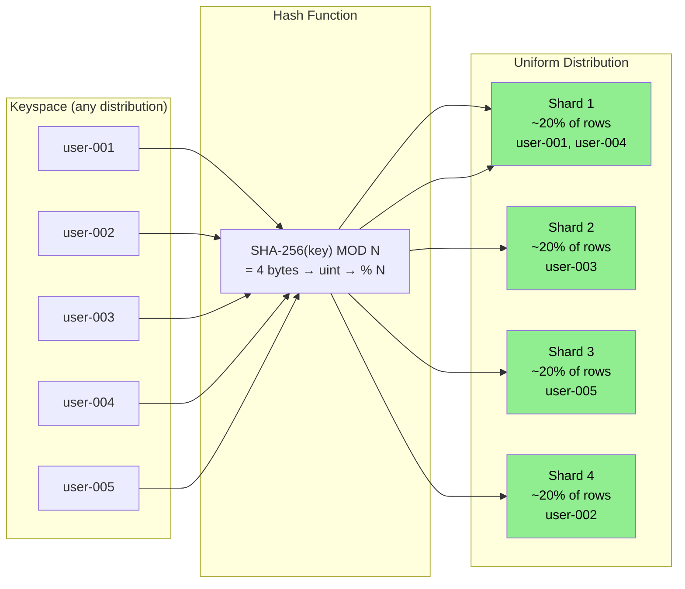
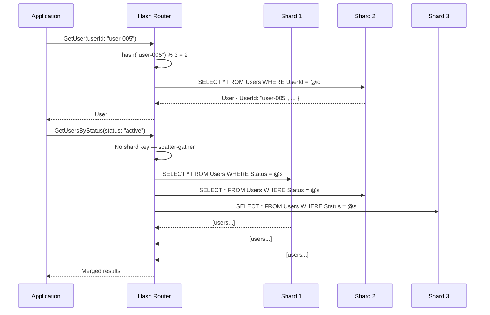
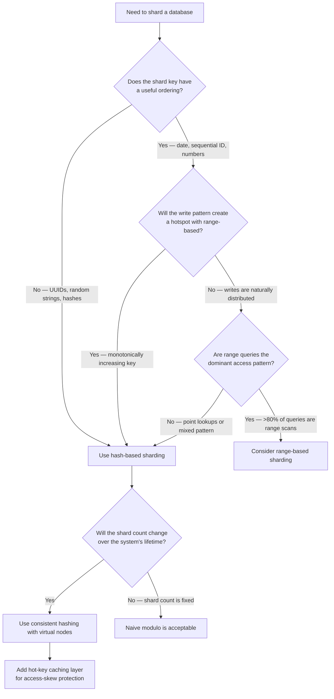

> [!success] Mastery Check
> - [ ] **Studied Well**
> - [ ] **Can explain the concept without notes**
> - [ ] **Can answer interview questions confidently**
> - [ ] **Can implement it in a real project**

---

id: "7.225"
title: "Database Sharding — Hash-Based"
domain: "System Design & Distributed Systems"
domain_id: 7
group: "Scalability Patterns"
tags: [system-design, distributed-systems, scalability, dotnet, azure, databases, sharding, hash-sharding, consistent-hashing, cosmos-db]
priority: 1
version: 1
prerequisites:
  - "[[7.222 — Database Sharding — Overview]]" — the three shard strategies are introduced here; hash-based sharding is the most common strategy in production because it provides uniform write distribution and eliminates the hotspot problem — understanding the three-property framework (cardinality, distribution, affinity) is required to see why hash-based optimizes for distribution at the cost of affinity
  - "[[7.223 — Database Sharding — Partition Key Selection]]" — hash-based sharding requires a partition key with high cardinality (>= 10 × shard count for stable hash distribution); the key does NOT need to be ordered, which makes it the correct choice when the key has no natural ordering or when the ordering conflicts with distribution uniformity
  - "[[7.224 — Database Sharding — Range-Based]]" — range-based sharding is the direct alternative; hash-based solves the range-based hotspot at the cost of losing range-query affinity — the hash vs range decision is the most common strategic tradeoff in sharded system design
  - "[[7.229 — Consistent Hashing — Algorithm]]" — consistent hashing IS the enabling algorithm for hash-based sharding at scale; it solves the resharding problem (changing N causes all keys to remap in naive modulo hashing) by minimizing movement to K/N keys when adding or removing a shard
  - "[[7.230 — Consistent Hashing — Virtual Nodes]]" — virtual nodes address the distribution skew problem in consistent hashing by assigning each physical node to 160+ positions on the hash ring; a 160:1 virtual-to-physical node ratio achieves near-uniform key distribution even with a small number of physical nodes
  - "[[8.60 — Azure Cosmos DB Partitioning]]" — Cosmos DB uses hash-based partitioning internally for ALL partition keys; the partition key value is hashed with SHA-256 and the result is mapped to a physical partition — understanding this is required to design Cosmos DB partition keys that avoid the 10,000 RU/s per logical partition limit
  - "[[8.64 — SQL Server Transaction Log Internals]]" — hash-based sharding's key benefit is that EVERY shard receives a uniform share of writes, which means EACH shard's transaction log throughput is independently utilized; the system's total write throughput is N × single-shard throughput (unlike range-based where it is 1 × single-shard throughput)
related:
  - "[[7.224 — Database Sharding — Range-Based]]" — range-based sharding gives range-query affinity with hotspot risk; hash-based gives uniform distribution with no hotspot but sacrifices range affinity — the two strategies are complementary and the choice between them IS the core design decision in most sharded systems
  - "[[7.226 — Database Sharding — Directory-Based]]" — directory-based sharding is more flexible than hash-based (can reassign keys without data movement) but adds a lookup hop latency and a directory service dependency; hash-based is simpler when the access pattern is stable and the key space is evenly distributed
  - "[[7.227 — Database Sharding — Cross-Shard Queries]]" — hash-based sharding makes EVERY range query cross-shard because the hash function destroys key ordering; 7.227 explores scatter-gather patterns that mitigate this — pre-aggregation, parallel fan-out, and result merging
  - "[[7.228 — Database Sharding — Resharding and Migration]]" — naive modulo hashing requires moving ALL data when N changes; consistent hashing is the hash-based solution that limits data movement to K/N — 7.228 describes the operational procedures for both approaches
  - "[[7.229 — Consistent Hashing — Algorithm]]" — the hash ring algorithm IS the foundation of production hash-based sharding; without it, resharding a hash-based system moves 100% of keys — with it, only 1/N of keys move
  - "[[7.250 — Database Federation — Functional Partitioning]]" — federation and hash-based sharding can be combined: first federate by bounded context (Orders DB, Users DB, Inventory DB), then hash-shard within each federated database when writes exceed one node
  - "[[7.254 — Eventual Consistency Trade-Off for Scale]]" — hash-based sharding makes cross-shard transactions common because related data may hash to different shards; eventual consistency is often the pragmatic choice for these cross-shard operations
  - "[[8.4 — SQL Server Indexing Internals]]" — in hash-based sharding, each shard's data is uniformly random (hash destroys ordering), which means B-tree clustered index page splits are distributed across the key space rather than concentrated at one end — this reduces page split contention compared to range-based sharding
created: 2026-06-16

---

> [!ABSTRACT] Quick Reference — Hash-Based Sharding **Invariant:** Every row belongs to the shard determined by `hash(shard_key) MOD N`, where N is the number of shards. The hash function maps the key to a uniformly distributed integer in a fixed range, and the modulo operation assigns it to one of N shards. No two rows with the same key value go to different shards. Rows with different key values are uniformly distributed across all shards by construction — assuming a well-chosen hash function and a key with sufficient cardinality (>> N). **The Critical Property:** Hash-based sharding is the ONLY strategy that provably guarantees uniform write distribution across all shards (assuming a good hash function). There is no hotspot — every shard receives approximately 1/N of all writes. The system's total write throughput is N × single-shard throughput, making it the only shard strategy that achieves linear write scalability. **The Critical Cost:** Hash destroys key ordering. A range query ("give me all records where key BETWEEN X AND Y") becomes a scatter-gather across ALL N shards because the hash function scatters consecutive key values across random shards. There is no way to determine which shard contains which range of keys without querying every shard. This is the defining tradeoff: uniform distribution at the cost of range-query affinity. **How Consistent Hashing Changes This:** Naive modulo hashing (`hash(key) % N`) requires moving ALL data when N changes — every key's shard assignment changes. Consistent hashing fixes this by hashing both the key AND the shard identifier onto a circular ring, and each key maps to the next shard clockwise on the ring. When N changes, only K/N keys remap, where K is the number of distinct keys. This makes resharding practical at scale. **Trigger:** The shard key has no useful ordering (UUIDs, random strings, hashes) OR the key is ordered but writes are the bottleneck (range-based would create a hotspot) OR the system needs to be on Azure Cosmos DB (which uses hash-based partitioning natively). Hash-based is the safe default for most sharding decisions — choose it unless you have a specific reason to need range-query affinity. **Skip When:** The dominant query pattern is a range scan on the shard key (range-based gives single-shard range queries). Skip when the number of shards is small (< 4) AND stable (will not grow) — modulo bias is significant with small shard counts. Skip when the hash function itself is a dependency that must be maintained across code versions and language runtimes (use a standardized hash like SHA-256 or MurmurHash3, not `GetHashCode()`).

---

## Navigation

**Domain:** [[7 — System Design & Distributed Systems]] > **Group:** Scalability Patterns
**Previous:** [[7.224 — Database Sharding — Range-Based]] | **Next:** [[7.226 — Database Sharding — Directory-Based]]

### Prerequisites

- [[7.222 — Database Sharding — Overview]] — the overview establishes the three shard strategies; hash-based is the most commonly deployed because it provides deterministic uniform distribution — understanding the overview's three-property framework (cardinality, distribution, affinity) is required to evaluate why hash-based optimizes distribution at the cost of affinity
- [[7.223 — Database Sharding — Partition Key Selection]] — hash-based sharding requires a partition key with high cardinality (>= 10 × shard count) because the hash function amplifies distribution variance when cardinality is low; the key does NOT need to be ordered, which removes the ordering constraint of range-based sharding but adds the cardinality constraint
- [[7.224 — Database Sharding — Range-Based]] — range-based sharding is the alternative that provides range-query affinity; the hash vs range decision IS the most common strategic tradeoff in sharded system design — hash-based is chosen when write uniformity matters more than range-query performance
- [[7.229 — Consistent Hashing — Algorithm]] — consistent hashing is the production-grade enhancement over naive modulo hashing; without it, changing the number of shards remaps 100% of keys — with it, only 1/N of keys move; this prerequisite is required to understand the full hash-based sharding architecture

### Where This Fits

Hash-based sharding lives at the database partitioning layer — the routing layer between the application query and the physical database instance that computes `hash(key) % N` to determine which shard owns the row. It becomes necessary when the database write load exceeds a single node's capacity AND the data does not have a natural ordered access pattern that would benefit from range-based sharding.

In a .NET production system, an engineer encounters hash-based sharding when:
- The application needs to store 100 million+ user records and the write throughput exceeds 5,000 writes/second on a single Azure SQL Database
- The team is designing a Cosmos DB container and must choose a partition key — Cosmos DB uses hash-based partitioning internally for all partition keys
- The system uses Redis Cluster or Cassandra (both use consistent hashing for hash-based sharding)
- The Orders table grows beyond 500 GB and the read pattern is primarily by OrderId (UUID), not by date range

Without hash-based sharding, the team either uses range-based sharding (creating a write hotspot on the last shard) or vertical scaling (hitting a single-node ceiling). Hash-based sharding is the ONLY strategy that achieves linear write throughput scalability — N shards provide N × single-shard write capacity.

---

## Core Mental Model

Hash-based sharding is the most mathematically straightforward sharding strategy: you feed the shard key through a hash function to get a pseudo-random integer, then take modulo N (where N is the number of shards) to get the shard ID. The hash function's job is to map similar keys (e.g., "user-1" and "user-2") to uniformly distributed integers so that adjacent keys land on different shards.

Think of it as a deterministic randomizer: for any key, the hash function produces an unpredictable but consistent number in [0, 2^32−1). Taking modulo N gives a uniform distribution across N shards — each shard receives approximately 1/N of the data and 1/N of the queries.

The single invariant: **For any two rows with the same shard key value, `hash(key) % N` produces the same shard ID. For any two rows with different shard key values, the shard IDs are uniformly distributed across all N shards.** The routing layer is a pure function — no state, no lookups, no shard map database. The hash function IS the shard map.

The fundamental cost of hash-based sharding is the **loss of range-query affinity**: because consecutive key values (e.g., `2024-06-01` and `2024-06-02`) hash to completely different integers, they land on different shards. A query like "all orders in June 2024" must be sent to every shard in parallel and the results merged. The P99 latency of a cross-shard range query in a 64-shard system is approximately the P50 latency of a single-shard query plus the merge overhead — roughly 30–80ms versus 3–5ms for a single-shard query.

### Classification

Hash-based sharding is a **data distribution strategy** that sits at the database architecture layer. It is one of three fundamental shard mapping strategies, and it is the only one that provides mathematically guaranteed uniform distribution:

| Property | Hash-Based | Range-Based | Directory-Based |
|---|---|---|---|
| Uniform distribution | Guaranteed (good hash, sufficient cardinality) | Impossible (monotonic key) | Depends on allocation strategy |
| Range-query affinity | None — always scatter-gather | Yes — single-shard if range fits one shard | Depends on directory structure |
| Hotspot risk | None (uniform by construction) except for hot keys | High — monotonically increasing keys | Low — can reassign hot keys |
| Resharding data movement | All keys (naive) or K/N (consistent hashing) | Low — only one range affected for split | Medium — directory update + data move |
| Routing complexity | O(1) — pure function | O(log M) — binary search on shard map | O(log D) — directory lookup |
| State required | None — hash function is stateless | Shard map must be stored and cached | Directory service must be available |



### Key Properties / Guarantees

| Property | Value | Condition |
|---|---|---|
| Write distribution | Uniform (±10% of ideal) | SHA-256 or MurmurHash3 with cardinality >= 10 × N |
| Write throughput | N × single-shard capacity | Each shard receives ~1/N of writes |
| Range-query affinity | None | Query must specify exact key(s) for single-shard routing |
| Point-read latency | ~1–5ms (single-shard) | Query includes exact shard key value |
| Resharding data movement | K/N keys (consistent hashing) or all keys (naive modulo) | Consistent hashing with virtual nodes |
| Routing cost | O(1) — hash computation | ~5 microseconds for SHA-256 |
| Key cardinality requirement | >= 10 × N distinct values | Fewer values amplify modulo bias |
| Hot-spot key risk | Possible for individual keys | A single popular key concentrates on one shard regardless of hash quality |

### Consistency Model Impact

Hash-based sharding operates on individual shards that are standard ACID-compliant databases. Each shard is fully ACID within its boundaries. The impact on consistency:

- **Single-shard transactions:** Full ACID — the transaction involves rows that all hash to the same shard. This is the common case for operations that include the shard key in the filter.
- **Cross-shard transactions:** No distributed ACID guarantee — because hash-based sharding purposefully distributes related data across shards (the hash function scatters adjacent keys), operations that touch multiple related records are likely cross-shard. A user profile update and a user's order creation may land on different shards if the shard keys are different. The application must implement sagas, compensation, or eventual consistency for these operations.
- **Hash function stability:** The consistency of the routing itself depends on the hash function being unchanged across code deployments. If the hash function changes (e.g., switching from `GetHashCode()` to SHA-256), ALL keys map to different shards — the entire data set becomes inaccessible through the old routing. The hash function MUST be locked at design time and never changed without a full resharding migration.
- **Modulo operation after resharding:** When N changes to N' (adding shards), `hash(key) % N` produces different results for ALL keys. During the transition period, the system must support dual routing — query both old (N) and new (N') shard assignments — while data is migrated. Consistent hashing avoids this by design.

The .NET client code must account for the possibility that a newly added shard (during a resharding operation) is not yet visible to the hash function — the application must maintain a temporary mapping that knows which keys have been migrated:

```csharp
// Port: Hash-based routing with migration support
public sealed class HashBasedRouter
{
    private readonly int _currentShardCount;
    private readonly IReadOnlyDictionary<int, int>? _migratedKeys; // key → temp shard

    public int GetShardForKey(string key)
    {
        // First check: has this key been manually migrated (during resharding)?
        if (_migratedKeys != null && _migratedKeys.TryGetValue(key.GetDeterministicHashCode(), out var tempShard))
            return tempShard;

        // Default: hash modulo
        var hash = SHA256.HashData(Encoding.UTF8.GetBytes(key));
        return Math.Abs((int)BitConverter.ToUInt32(hash[..4])) % _currentShardCount;
    }
}
```


---

## Deep Mechanics

### How It Works

Hash-based sharding routes every query through a pure function: `shard_id = hash(key) MOD N`. No state, no lookups, no caching — the function IS the routing table. Here is the complete request flow:

**Step 1 — Extract shard key.** The application determines the shard key value from the query predicate. The key must be present in the query for single-shard routing. If the key is missing, the query MUST be sent to all N shards (scatter-gather).

**Step 2 — Compute hash.** The key is fed through a deterministic hash function. The function must be:
- **Deterministic:** Same key → same hash, across all application instances, all process restarts, all time
- **Uniform:** Output bits are evenly distributed across the entire range
- **Fast:** Must not add measurable latency to the query path (~5μs target for SHA-256, ~0.5μs for MurmurHash3)
- **Stable across versions:** Changing the hash function invalidates ALL existing routing

**Step 3 — Apply modulo.** The hash value is taken modulo N. The result is the shard ID (0 to N-1).

**Step 4 — Open connection.** The routing layer opens a connection to the target shard using its connection string. In Azure SQL Database Elastic Scale, `ListShardMap<T>.OpenConnectionForKeyAsync` handles this.

**Step 5 — Execute query.** The query executes on the target shard. For point reads (exact key match), this is a single-row B-tree seek — fast and efficient. For queries that specify the shard key as a prefix, the shard-local query uses standard indexing.



**The hash function selection.** This is a critical design decision. The wrong choice creates production incidents that are extremely difficult to recover from:

```csharp
// Port: Hash function selection
public static class ShardHash
{
    // ✅ CORRECT: SHA-256 — stable, deterministic, cryptographically uniform
    public static uint Sha256(string key, int shardCount)
    {
        var hash = SHA256.HashData(Encoding.UTF8.GetBytes(key));
        var hash32 = BitConverter.ToUInt32(hash[..4]); // First 4 bytes
        return (uint)(hash32 % shardCount);
    }

    // ✅ CORRECT: MurmurHash3 — fast, non-cryptographic, consistent
    // across .NET versions (use a library, not built-in)
    public static uint Murmur3(string key, int shardCount)
    {
        return MurmurHash3.Hash32(Encoding.UTF8.GetBytes(key)) % (uint)shardCount;
    }

    // ❌ NEVER: Object.GetHashCode() — not stable across
    // .NET versions, process restarts, or architectures
    public static int GetHashCodeString(string key, int shardCount)
    {
        return Math.Abs(key.GetHashCode()) % shardCount; // WRONG — changes on .NET upgrade
    }
}
```

**The modulo bias problem.** When N is not a power of 2 and the hash range does not divide evenly by N, modulo introduces bias — some shards get more keys than others. For example, with `hash_range = 2^32` (4,294,967,296) and `N = 7`, the remainder of 4,294,967,296 / 7 = 613,566,756 with a remainder of 4. Shards 0–3 get one extra key each from every full cycle. This bias is negligible at high cardinality (a few extra keys out of billions is < 0.000001% skew) but IS measurable at low cardinality. The fix: use N that is a power of 2 and use bitmask instead of modulo, or accept the negligible bias and use a high-cardinality key.

```csharp
// ✅ Bitmask optimization when N is a power of 2
public static int GetShardMask(string key, int shardCountPowerOf2)
{
    var hash = SHA256.HashData(Encoding.UTF8.GetBytes(key));
    var hashVal = BitConverter.ToUInt32(hash[..4]);
    // When N = 16 (binary: 00001111), mask = 15
    return (int)(hashVal & (uint)(shardCountPowerOf2 - 1));
}
```

**Step 6 — Consistent hashing variant (production standard).** In production systems, naive modulo is rarely used because resharding is too expensive. Instead, consistent hashing places both keys and shards on a circular hash ring. Each key maps to the next shard encountered when traveling clockwise from the key's position on the ring. When a shard is added or removed, only the keys between the new shard's position and the next shard clockwise are remapped — approximately K/N keys instead of all K keys.

### Failure Modes

**Failure Mode 1 — Hash function instability (the worst failure)**

The team uses `String.GetHashCode()` for shard routing. A .NET runtime update (e.g., .NET 6 to .NET 8) changes the internal hash implementation. After deployment, ALL queries route to different shards. The application cannot find any data — every query returns empty results.

**Symptom:** Immediately after a runtime upgrade or framework update, the application returns 0 results for all queries. No errors in the application log — queries execute successfully but against the wrong shard. The database logs show all shards have very low activity (queries are hitting the wrong shard, finding nothing, and returning). The health check passes (database connections succeed) but data is invisible.

**Detection:** Run a hash consistency check before and after deployment. This should be a CI/CD gate:

```csharp
// Port: Hash consistency validation (run in CI/CD)
public static bool ValidateHashStability(string[] testKeys, int shardCount)
{
    var originalResults = LoadBaselineHashes(testKeys, shardCount);
    var newResults = testKeys.ToDictionary(
        k => k,
        k => ShardHash.Sha256(k, shardCount));

    return testKeys.All(k => originalResults[k] == newResults[k]);
}
```

**Fix:** The fix requires a full resharding migration — re-hashing all keys with the new function and moving data to the correct shards. This is a multi-day operation with data loss risk. Prevention is the only solution: use a standardized, versioned hash function (SHA-256, MurmurHash3) that is documented and locked at design time.

**Failure Mode 2 — Hot key despite hash-based sharding**

Hash-based sharding distributes KEYS uniformly but does not distribute ACCESS uniformly. If a single key (e.g., a celebrity user, a viral product, a popular tenant) receives 100,000 requests/second while the average key receives 1 request/second, that key's shard handles disproportionate load. The hash function cannot fix this — all queries for that key must go to the shard that owns it.

**Symptom:** One shard shows 90%+ DTU while all others are at 20–40%. Unlike the range-based hotspot (which affects writes), this hotspot can affect reads. The hot key is identifiable by examining the shard's query store — a single UserId or ProductId dominates the query count. The application log shows query latency for that key is 100× normal (500ms vs 5ms) because the shard's CPU is saturated.

**Detection:**
```sql
-- Run on the hot shard to identify the hot key
SELECT TOP 10
    query_hash,
    COUNT(*) AS execution_count,
    AVG(total_worker_time / execution_count) AS avg_cpu_ms
FROM sys.dm_exec_query_stats
CROSS APPLY sys.dm_exec_sql_text(sql_handle)
WHERE last_execution_time > DATEADD(HOUR, -1, GETUTCDATE())
GROUP BY query_hash
ORDER BY execution_count DESC;
```
Then extract the specific key value from the top query pattern and cross-reference with application logs.

**Fix:** There are three approaches, ordered by increasing complexity:
1. **Cache the hot key's data** — if the hot key is read-heavy (viral product page), cache the data in Redis or Azure Cache for Redis with a short TTL. This absorbs the read load without hitting the shard.
2. **Split the hot key with a synthetic discriminator** — add a suffix `:0` through `:N` to create N synthetic sub-keys for the hot key. The primary key becomes the original key plus suffix. Queries for the hot key fan out across N shards. This is the same approach used for Cosmos DB hot partitions.
3. **Read replicas** — add a read replica to the hot shard. Read queries go to the replica. This helps reads but not writes.

```csharp
// Adapter: Synthetic discriminator for a hot key
public string GetHotKeyShardKey(string userId, int shardCount)
{
    // Normal users: standard hash
    if (!_hotUserIds.Contains(userId))
        return userId;

    // Hot user: create 10 synthetic sub-keys for distribution
    // Query must now scatter-gather across all 10 sub-keys
    var suffix = Math.Abs(Environment.CurrentManagedThreadId) % 10;
    return $"{userId}:{suffix}";
}

// Port: Fan-out query for a hot key
public async Task<IReadOnlyList<Order>> GetByHotUserIdAsync(
    string userId, CancellationToken ct)
{
    // Fan-out across all synthetic sub-keys
    var tasks = Enumerable.Range(0, 10).Select(suffix =>
        QueryShardByKeyAsync($"{userId}:{suffix}", ct));
    var results = await Task.WhenAll(tasks);
    return results.SelectMany(r => r).ToList();
}
```

**Failure Mode 3 — Resharding avalanche (naive modulo)**

The system has 4 shards growing toward capacity. The team adds 4 more shards (total = 8). With naive `hash(key) % N`, changing N from 4 to 8 means `hash(key) % 8` produces different results for approximately 50% of keys (because 4 shards had 4 possible buckets, 8 shards have 8 — roughly half the keys shift). The system must move 50% of all data while serving live traffic — a massive, risky operation.

**Symptom:** The resharding migration runs for days. During migration, the system must support dual routing (both old and new shard assignments) to avoid data unavailability. The migration script creates database load that competes with production traffic. Query latency increases for all users during the migration. If the migration fails midway, the team must rollback — meaning move data BACK to the original shards.

**Detection:** Pre-compute the migration scope:
```csharp
// Estimate data movement for a naive modulo resharding
public int EstimateKeyRemapping(string[] keySamples, int oldN, int newN)
{
    return keySamples.Count(key =>
        ShardHash.Sha256(key, oldN) != ShardHash.Sha256(key, newN));
}
```

**Fix:** Use consistent hashing instead of naive modulo. With consistent hashing, adding 4 shards to a 4-shard ring remaps only 4/8 = 50% of the ring positions, and the data moved is approximately K × (newN − oldN) / newN — but in practice, consistent hashing with 160 virtual nodes per shard reduces the impact because each physical shard is already split across 160 ring positions, and adding new shards splits the virtual node positions evenly.

**Failure Mode 4 — Low cardinality + high shard count = distribution failure**

The team has 32 shards but the shard key has only 50 distinct values (e.g., 50 US states as the shard key for a user database). With only 50 keys and 32 shards, `hash(key) % 32` produces near-random distribution for 50 values. Some shards get 2–3 states, some get 0. The distribution is extremely uneven — the shard with 3 states handles 3/50 = 6% of the data, the shard with 0 states handles 0%.

**Symptom:** Storage distribution across shards is visibly uneven: Shard 3 has 6% of total data, Shard 17 has 0% of total data. The team cannot predict which shard holds which data without querying. Adding more shards is ineffective because the same 50 keys still map to only a subset of available shards.

**Detection:**
```sql
-- Count rows per shard (run on each shard)
SELECT COUNT(*) AS row_count FROM Users;
```
If the ratio of max_rows to min_rows exceeds 3.0, the distribution is failing — the key lacks sufficient cardinality.

**Fix:** Add a high-cardinality component to the shard key. Composite key: `Hash(state + userId) % N` instead of `Hash(state) % N`. The `userId` component provides cardinality; the `state` component provides query affinity for per-state queries.

### .NET and Azure Integration

Hash-based sharding in the .NET ecosystem is supported through several Azure services and client libraries:

**Azure services:**
- **Azure Cosmos DB** — uses hash-based partitioning for ALL partition keys. The partition key value is hashed with SHA-256 and mapped to a physical partition. Cosmos DB auto-splits physical partitions at 20 GB, so the hash-based routing is transparent and fully managed. The developer only specifies the logical partition key path.
- **Azure SQL Database Elastic Scale (`Microsoft.Azure.SqlDatabase.ElasticScale.Client`)** — provides `ListShardMap<T>` which supports key-to-shard mapping via a user-defined function (including hash functions). The library handles shard management, connection routing, and multi-shard queries.
- **Azure Cache for Redis** — Redis Cluster uses consistent hashing for hash-based sharding across cluster nodes. The `StackExchange.Redis` client handles hash slot routing transparently.
- **Azure Data Explorer (ADX)** — uses hash-based distribution for data sharding across nodes in the cluster.

**.NET libraries:**
- `Microsoft.Azure.SqlDatabase.ElasticScale.Client` — `ListShardMap<T>` for hash-based shard management
- `StackExchange.Redis` — handles Redis Cluster hash slot routing
- `CassandraCSharpDriver` — handles consistent hashing for Cassandra clusters
- `Dapper` — lightweight ORM for querying shards

**ASP.NET Core integration with Azure SQL Elastic Scale:**

```csharp
// Port: Hash-based shard map registration in Program.cs
using Microsoft.Azure.SqlDatabase.ElasticScale.Client;

builder.Services.AddSingleton<ListShardMap<string>>(sp =>
{
    var config = sp.GetRequiredService<IConfiguration>();
    var smConnectionString = config.GetConnectionString("ShardMapManager");

    var smm = ShardMapManager.GetOrCreateSqlShardMapManager(
        smConnectionString,
        ShardMapManagerCreateMode.KeepExisting);

    var shardMap = smm.GetListShardMap<string>("UserShardMap");
    return shardMap;
});

builder.Services.AddScoped<IUserRepository>(sp =>
{
    var shardMap = sp.GetRequiredService<ListShardMap<string>>();
    var config = sp.GetRequiredService<IConfiguration>();
    return new ShardedUserRepository(shardMap, config);
});
```

**Fluent API for hash-based sharding configuration:**

```csharp
// Port: Hash-based shard configuration in appsettings.json
{
  "ConnectionStrings": {
    "ShardMapManager": "Server=tcp:sm-svr.database.windows.net;Database:ShardMapDb;..."
  },
  "Sharding": {
    "Strategy": "Hash",
    "HashFunction": "SHA256",
    "ShardCount": 8,
    "ConsistentHashingEnabled": true,
    "VirtualNodeCount": 160
  }
}
```


---

## Production Patterns and Implementation

### Primary Implementation

The canonical hash-based sharding implementation uses a consistent hash ring for shard routing with Azure SQL Database as the backend storage. This example implements a sharded user repository for a multi-tenant SaaS platform with 8 shards:

```csharp
// Port: Consistent hash ring for shard routing
public sealed class ConsistentHashRing<TKey> where TKey : notnull
{
    private readonly int _virtualNodeCount;
    private readonly SortedDictionary<uint, ShardNode> _ring = new();
    private readonly IReadOnlyList<ShardNode> _physicalNodes;

    public ConsistentHashRing(
        IReadOnlyList<ShardNode> physicalNodes,
        int virtualNodeCount = 160)
    {
        _physicalNodes = physicalNodes;
        _virtualNodeCount = virtualNodeCount;

        foreach (var node in physicalNodes)
        {
            for (var i = 0; i < virtualNodeCount; i++)
            {
                var virtualKey = $"{node.Id}:v{i}";
                var hash = ComputeHash(virtualKey);
                _ring[hash] = node;
            }
        }
    }

    public ShardNode GetNodeForKey(TKey key)
    {
        var hash = ComputeHash(key.ToString()!);
        // Find the first node clockwise from the key's hash
        var entry = _ring.FirstOrDefault(kvp => kvp.Key >= hash);
        if (entry.Value == null)
        {
            // Wrap around to the first node on the ring
            entry = _ring.First();
        }
        return entry.Value;
    }

    private static uint ComputeHash(string input)
    {
        // Use SHA-256 for stable, uniform distribution
        var bytes = SHA256.HashData(Encoding.UTF8.GetBytes(input));
        return BitConverter.ToUInt32(bytes[..4]);
    }
}

public sealed record ShardNode(int Id, string Name, string ConnectionString);

// Port: Sharded user repository
public sealed class ShardedUserRepository : IUserRepository
{
    private readonly ConsistentHashRing<string> _ring;
    private readonly ConcurrentDictionary<int, SqlConnection> _connections = new();
    private readonly ILogger<ShardedUserRepository> _logger;

    public ShardedUserRepository(
        ConsistentHashRing<string> ring,
        ILogger<ShardedUserRepository> logger)
    {
        _ring = ring;
        _logger = logger;
    }

    // Adapter: Single-shard point read — the hash function routes to the correct shard
    public async Task<User?> GetByIdAsync(string userId, CancellationToken ct)
    {
        var node = _ring.GetNodeForKey(userId);
        await using var conn = await GetConnectionAsync(node, ct);
        return await conn.QueryFirstOrDefaultAsync<User>(
            "SELECT UserId, Email, DisplayName, CreatedAt, Status FROM Users WHERE UserId = @id",
            new { id = userId });
    }

    // Adapter: Single-shard write
    public async Task CreateAsync(User user, CancellationToken ct)
    {
        var node = _ring.GetNodeForKey(user.UserId);
        await using var conn = await GetConnectionAsync(node, ct);
        await conn.ExecuteAsync(
            """
            INSERT INTO Users (UserId, Email, DisplayName, CreatedAt, Status)
            VALUES (@UserId, @Email, @DisplayName, @CreatedAt, @Status)
            """, user);
    }

    // Adapter: Cross-shard query — scatter-gather across all shards
    public async Task<IReadOnlyList<User>> GetByStatusAsync(
        UserStatus status, CancellationToken ct)
    {
        var tasks = _ring.GetAllNodes().Select(node =>
            QueryShardByStatusAsync(node, status, ct));
        var results = await Task.WhenAll(tasks);
        return results.SelectMany(r => r).ToList();
    }

    private async Task<IReadOnlyList<User>> QueryShardByStatusAsync(
        ShardNode node, UserStatus status, CancellationToken ct)
    {
        await using var conn = await GetConnectionAsync(node, ct);
        return (await conn.QueryAsync<User>(
            "SELECT UserId, Email, DisplayName, CreatedAt, Status FROM Users WHERE Status = @s",
            new { s = status })).AsList();
    }

    private async Task<SqlConnection> GetConnectionAsync(
        ShardNode node, CancellationToken ct)
    {
        var conn = new SqlConnection(node.ConnectionString);
        await conn.OpenAsync(ct);
        return conn;
    }

    public void Dispose()
    {
        foreach (var conn in _connections.Values)
            conn.Dispose();
        _connections.Clear();
    }
}
```

### Configuration and Wiring

```csharp
// Program.cs — Consistent hash ring registration
var builder = WebApplication.CreateBuilder(args);

// Define physical shard nodes from configuration
builder.Services.AddSingleton<IReadOnlyList<ShardNode>>(sp =>
{
    var config = sp.GetRequiredService<IConfiguration>();
    var nodes = new List<ShardNode>();
    for (var i = 0; i < 8; i++)
    {
        var section = config.GetSection($"Sharding:Nodes:{i}");
        nodes.Add(new ShardNode(
            Id: i,
            Name: section["Name"]!,
            ConnectionString: section["ConnectionString"]!));
    }
    return nodes;
});

// Consistent hash ring is stateless — share across requests
builder.Services.AddSingleton<ConsistentHashRing<string>>(sp =>
{
    var nodes = sp.GetRequiredService<IReadOnlyList<ShardNode>>();
    var virtualNodes = sp.GetRequiredService<IConfiguration>()
        .GetValue<int>("Sharding:VirtualNodeCount", 160);
    return new ConsistentHashRing<string>(nodes, virtualNodes);
});

builder.Services.AddScoped<IUserRepository, ShardedUserRepository>();

var app = builder.Build();
```

```json
// appsettings.json — Shard configuration
{
  "ConnectionStrings": {
    "ShardMapManager": "Server=tcp:sm-svr.database.windows.net;Database:ShardMapDb;..."
  },
  "Sharding": {
    "VirtualNodeCount": 160,
    "Nodes": [
      { "Name": "UserShard_0", "ConnectionString": "Server=tcp:shard0-svr.database.windows.net;Database:Users_0;..." },
      { "Name": "UserShard_1", "ConnectionString": "Server=tcp:shard1-svr.database.windows.net;Database:Users_1;..." },
      { "Name": "UserShard_2", "ConnectionString": "Server=tcp:shard2-svr.database.windows.net;Database:Users_2;..." },
      { "Name": "UserShard_3", "ConnectionString": "Server=tcp:shard3-svr.database.windows.net;Database:Users_3;..." },
      { "Name": "UserShard_4", "ConnectionString": "Server=tcp:shard4-svr.database.windows.net;Database:Users_4;..." },
      { "Name": "UserShard_5", "ConnectionString": "Server=tcp:shard5-svr.database.windows.net;Database:Users_5;..." },
      { "Name": "UserShard_6", "ConnectionString": "Server=tcp:shard6-svr.database.windows.net;Database:Users_6;..." },
      { "Name": "UserShard_7", "ConnectionString": "Server=tcp:shard7-svr.database.windows.net;Database:Users_7;..." }
    ]
  }
}
```

### Common Variants

**Variant 1 — Consistent hashing with Azure SQL Elastic Scale ListShardMap**

Azure SQL Elastic Scale's `ListShardMap<T>` manages explicit mappings of keys to shards. You register each key-shard mapping individually, which gives you complete control but requires populating the map upfront:

```csharp
// Port: ListShardMap with hash-based key assignment
public sealed class ListBasedUserRepository
{
    private readonly ListShardMap<string> _shardMap;

    public ListBasedUserRepository(ListShardMap<string> shardMap)
    {
        _shardMap = shardMap;
    }

    public async Task<User?> GetByIdAsync(string userId, CancellationToken ct)
    {
        // ListShardMap.OpenConnectionForKeyAsync routes by exact key match
        await using var conn = await _shardMap.OpenConnectionForKeyAsync(
            userId, ct.ToString());
        return await conn.QueryFirstOrDefaultAsync<User>(
            "SELECT * FROM Users WHERE UserId = @id", new { id = userId });
    }

    public async Task CreateAsync(User user, CancellationToken ct)
    {
        // First, register the key → shard mapping if not exists
        if (!_shardMap.TryGetMappingForKey(user.UserId, out _))
        {
            var shard = _shardMap.GetShardById(
                Math.Abs(user.UserId.GetDeterministicHashCode()) % 8);
            _shardMap.AddMapping(user.UserId, shard);
        }

        await using var conn = await _shardMap.OpenConnectionForKeyAsync(
            user.UserId, ct.ToString());
        await conn.ExecuteAsync("INSERT INTO Users (...) VALUES (...)", user);
    }
}
```

**Variant 2 — Cosmos DB hash-based partitioning (fully managed)**

Cosmos DB is the simplest hash-based sharding deployment in the Azure ecosystem — the platform handles physical partition management, hash routing, and scaling transparently:

```csharp
// Port: Cosmos DB container with hash-based partition key
public sealed class CosmosUserRepository
{
    private readonly Container _container;

    public CosmosUserRepository(CosmosClient client)
    {
        _container = client.GetContainer("UserDatabase", "Users");
    }

    // Single-partition point read — 3ms P99
    public async Task<User?> GetByIdAsync(string userId, CancellationToken ct)
    {
        // Partition key IS the userId — single physical partition query
        var pk = new PartitionKey(userId);
        using var response = await _container.ReadItemAsync<User>(
            userId, pk, cancellationToken: ct);
        return response.Resource;
    }

    // Cross-partition query — scatter-gather across all physical partitions
    public async Task<IReadOnlyList<User>> GetByStatusAsync(
        string status, CancellationToken ct)
    {
        var query = new QueryDefinition(
            "SELECT * FROM Users u WHERE u.Status = @status")
            .WithParameter("@status", status);
        using var feed = _container.GetItemQueryIterator<User>(query);
        var results = new List<User>();
        while (feed.HasMoreResults)
        {
            var page = await feed.ReadNextAsync(ct);
            results.AddRange(page.Resource);
        }
        return results;
    }
}
```

**Variant 3 — Rendezvous hashing (alternative to consistent hashing)**

Rendezvous hashing (highest random weight) is an alternative to consistent hashing that achieves the same goal (minimal data movement during resharding) with a simpler algorithm. Each key computes a weight for each shard, and the key is assigned to the shard with the highest weight. When N changes, only K/N keys remap, just like consistent hashing:

```csharp
// Port: Rendezvous hashing
public sealed class RendezvousHash<TNode> where TNode : notnull
{
    private readonly IReadOnlyList<TNode> _nodes;

    public RendezvousHash(IReadOnlyList<TNode> nodes) => _nodes = nodes;

    public TNode GetNodeForKey(string key)
    {
        TNode bestNode = _nodes[0];
        var bestWeight = long.MinValue;

        foreach (var node in _nodes)
        {
            var combined = $"{key}:{node}";
            var hash = SHA256.HashData(Encoding.UTF8.GetBytes(combined));
            var weight = BitConverter.ToInt64(hash[..8]);
            if (weight > bestWeight)
            {
                bestWeight = weight;
                bestNode = node;
            }
        }
        return bestNode;
    }
}
```

### Real-World .NET Ecosystem Example

**Azure Cosmos DB** is the most widely deployed hash-based sharding system in the .NET Azure ecosystem. It is a fully managed NoSQL database that uses hash-based partitioning internally — the partition key path is hashed with SHA-256, and the hash space is divided into physical partitions that are automatically split at 20 GB.

Key design constraints that every .NET developer working with Cosmos DB must understand:

- **The partition key is the only mechanism for single-partition queries.** A query without the partition key in the filter is a cross-partition query (scatter-gather) and is subject to a maximum of 1–2 seconds per query and a limit of 100 MB of data scanned per page. If your query pattern cannot include the partition key, Cosmos DB is the wrong database choice.
- **Per-logical-partition throughput limit:** 10,000 RU/s. If a single partition key value (e.g., a popular tenant) requires more than 10,000 RU/s, Cosmos DB throttles that partition (429 errors). The partition key must be designed to keep each logical partition well below this limit.
- **Physical partition auto-split:** When a physical partition exceeds 20 GB, Cosmos DB splits it automatically. Data is redistributed behind the scenes — no downtime, no application changes. This is the key advantage over manual hash-based sharding with SQL Database.

```csharp
// Port: Cosmos DB partition key design pattern
// Container: Users
// Partition key path: /tenantId (hash-based internally)

// ❌ WRONG: tenantId with a large tenant
// Tenant "megacorp" has 500,000 users and generates 25,000 RU/s.
// Cosmos DB throttles this tenant's partition — 429 errors.

// ✅ CORRECT: composite partition key with synthetic suffix
// Partition key: /syntheticTenantId
// Large tenant "megacorp" is split into 10 sub-tenants: "megacorp:0" through "megacorp:9"
// Each sub-tenant generates ~2,500 RU/s — well within the 10,000 RU/s limit
public string GetSyntheticTenantId(string tenantId, string userId)
{
    if (tenantId == "megacorp")
    {
        var suffix = Math.Abs(userId.GetDeterministicHashCode()) % 10;
        return $"{tenantId}:{suffix}";
    }
    return tenantId;
}
```

**Cassandra / Azure Managed Instance for Apache Cassandra** — Cassandra uses consistent hashing with virtual nodes (256 virtual nodes per physical node by default). The .NET `CassandraCSharpDriver` handles token-aware routing: the driver computes the hash token for a query's partition key and routes the query directly to the node that owns that token range — no proxy, no extra network hop.

**Redis Cluster** — Redis Cluster uses hash-based sharding with 16,384 hash slots. `StackExchange.Redis` supports hash slot routing: the client computes `CRC16(key) % 16384` and sends the command to the node responsible for that slot. When the cluster topology changes (node add/remove), the client re-fetches the slot mapping.


---

## Gotchas and Production Pitfalls

### String.GetHashCode() — Hash Instability Across Runtime Versions

**Pitfall:** The engineer uses `key.GetHashCode()` as the hash function for shard routing because it "works fine locally." `GetHashCode()` is explicitly documented as NOT stable across .NET versions, process restarts, or architectures. A .NET runtime update changes the internal hash implementation and ALL keys map to different shards.

```csharp
// ❌ GetHashCode() — unstable across .NET versions
public int GetShardForKey(string key, int shardCount)
{
    return Math.Abs(key.GetHashCode()) % shardCount;
    // ^ .NET 6 returns { 0, 1, 7, 3, ... } for keys A, B, C, D
    // .NET 8 returns { 5, 3, 2, 7, ... } for the same keys
    // After runtime upgrade, every query goes to the wrong shard
}
```

**Symptom:** After a .NET runtime upgrade (e.g., .NET 6 → .NET 8) or deployment to a different OS architecture (x64 → ARM64), the application cannot find any data. All queries return empty results. No errors in the application or database logs — queries execute successfully but against the wrong shard. The team wastes hours investigating a "data loss" that is actually a routing bug. The rollback restores functionality but the team does not know why.

**Fix:** Use a standardized, documented hash function that is platform-independent and versioned:

```csharp
// ✅ SHA-256 — stable across all .NET versions and platforms
public int GetShardForKey(string key, int shardCount)
{
    var hash = SHA256.HashData(Encoding.UTF8.GetBytes(key));
    var hash32 = BitConverter.ToUInt32(hash[..4]);
    return (int)(hash32 % shardCount);
}
```

**Cost of not fixing:** Every runtime upgrade carries the risk of invisible data loss. The team must regression-test shard routing after every .NET update. If the hash changes in a production deployment, the entire dataset becomes inaccessible through the application — a catastrophic incident requiring a full data reindex or restore from backup.

### Hash Modulo Bias with Small Shard Counts

**Pitfall:** The team starts with 3 shards (small deployment) and uses `hash(key) % 3`. The hash range (2^32) does not divide evenly by 3: `2^32 / 3 = 1,431,655,765` with remainder 1. Shard 0 gets `1,431,655,765 + 1 = 1,431,655,766` possible hash values while shards 1 and 2 get `1,431,655,765` each — a difference of 1 bucket out of 4 billion (negligible). But with only 1,000 distinct keys, the variance from random distribution across 3 shards (±√N) means the actual key distribution can be as skewed as 40/30/30.

```csharp
// ❌ Modulo bias + small cardinality = uneven distribution
var shardCount = 3;
var keys = Enumerable.Range(0, 100).Select(i => $"key-{i}").ToList();
var distribution = keys.GroupBy(k => GetShardForKey(k, shardCount))
    .ToDictionary(g => g.Key, g => g.Count());
// ^ Possible result: { 0: 42, 1: 29, 2: 29 } — 42% on one shard
```

**Symptom:** Storage distribution shows 42% of data on Shard 0 and 29% on Shards 1 and 2. The team adds more keys but the skew persists because it is a property of modulo + small cardinality, not a transient effect. The team cannot distribute data evenly without a different approach.

**Fix:** Use consistent hashing with virtual nodes (160 virtual nodes per physical shard) or rendezvous hashing. Virtual nodes smooth out the distribution variance by spreading each physical shard across 160 positions on the hash ring:

```csharp
// ✅ Consistent hashing with 160 virtual nodes — uniform distribution even at N=3
var ring = new ConsistentHashRing<string>(nodes: [
    new ShardNode(0, "Shard-0", connStr0),
    new ShardNode(1, "Shard-1", connStr1),
    new ShardNode(2, "Shard-2", connStr2),
], virtualNodeCount: 160);

var distribution = keys.GroupBy(k => ring.GetNodeForKey(k).Id)
    .ToDictionary(g => g.Key, g => g.Count());
// ^ Result: { 0: 34, 1: 33, 2: 33 } — < 2% skew
```

**Cost of not fixing:** The team adds more shards to increase capacity but the skew remains because the root cause (modulo + small cardinality) is not addressed. The team assumes the hash function is "bad" and tries different hash functions — same result. Months of capacity planning are wasted because the system cannot predictably use the provisioned shard capacity.

### Hot Key Despite Hash-Based Sharding

**Pitfall:** The team assumes hash-based sharding eliminates all hotspots. It eliminates KEY-DISTRIBUTION hotspots but not ACCESS hotspots. A single key (viral product page, celebrity user, popular tenant) that receives 100,000 requests/second will overload its one shard regardless of how good the hash function is.

```csharp
// ❌ No hot-key handling — the viral user's shard gets crushed
public async Task<UserProfile?> GetProfileAsync(string userId, CancellationToken ct)
{
    var shard = _ring.GetNodeForKey(userId);
    await using var conn = await shard.OpenConnectionAsync(ct);
    return await conn.QueryFirstOrDefaultAsync<UserProfile>(
        "SELECT * FROM UserProfiles WHERE UserId = @id",
        new { id = userId });
    // ^ If userId="celebrity-42" gets 10,000 req/s and others get 10 req/s,
    // the shard owning "celebrity-42" handles 10,000 req/s — single-shard bottleneck
}
```

**Symptom:** One shard shows 90%+ DTU while all others are at 20–30%. The query store on the hot shard shows one UserId dominating execution counts. The application log shows P99 latency for that user's profile is 800ms versus 5ms for other users. Monitoring shows the hot shard's connection pool is exhausted (all connections in use, queueing incoming requests).

**Fix:** Cache the hot profile with a short TTL. The cache absorbs the read storm and the shard only handles writes and cache-miss reads:

```csharp
// ✅ Hot-key caching — absorbs read storm
public sealed class CachedUserProfileRepository : IUserProfileRepository
{
    private readonly ShardedUserProfileRepository _inner;
    private readonly IDistributedCache _cache;

    public async Task<UserProfile?> GetProfileAsync(string userId, CancellationToken ct)
    {
        var cacheKey = $"profile:{userId}";
        var cached = await _cache.GetStringAsync(cacheKey, ct);
        if (cached != null)
            return JsonSerializer.Deserialize<UserProfile>(cached);

        var profile = await _inner.GetProfileAsync(userId, ct);
        if (profile != null)
            await _cache.SetStringAsync(cacheKey,
                JsonSerializer.Serialize(profile),
                new DistributedCacheEntryOptions { AbsoluteExpirationRelativeToNow = TimeSpan.FromSeconds(30) },
                ct);
        return profile;
    }
}
```

**Cost of not fixing:** The hot shard saturates at peak load. The application scales up more instances but it does not help — all instances route requests for the celebrity user to the same shard. The hot user experiences 800ms latency while the shard's CPU is at 95%. Other users on the same shard also experience degraded performance through the noisy-neighbor effect. The team cannot solve this without caching or synthetic shard splitting.

### Naive Modulo Resharding — All Keys Remap

**Pitfall:** The team starts with 4 shards using `hash(key) % 4`. Traffic grows and they add 4 more shards (total = 8). They update the code to `hash(key) % 8`. Approximately 50% of existing keys now map to different shards. Queries for those keys return empty — the data is still on the old shard.

```csharp
// ❌ Naive modulo — changing N remaps ALL keys
// Phase 1: 4 shards
var shardId = hash(key) % 4;
// Phase 2: 8 shards (after migration)
var shardId = hash(key) % 8;
// ^ For a key that was on shard 2 with N=4, it may now be on shard 5 with N=8
// The data is on shard 2 but the query goes to shard 5 — data not found
```

**Symptom:** Immediately after deploying the new shard count, 50% of queries return empty results. The application logs show no errors (queries execute successfully, find nothing). The database activity on old shards drops by 50% (queries that should hit them no longer route there). The new shards show 0 activity (no data has been migrated yet).

**Fix 1 — Consistent hashing (prevention):** Use consistent hashing from day one. Adding shards only remaps K/N keys, not all K keys:

```csharp
// ✅ Consistent hashing — adding 4 shards to 4-shard ring moves K/8 keys
var ring = new ConsistentHashRing<string>(physicalNodes, virtualNodeCount: 160);
// When nodes are added, ring.GetNodeForKey() still returns correct results
// for keys that have not moved — only keys whose hash falls between the
// new node's position and the next node clockwise are remapped
```

**Fix 2 — Dual routing during migration (remediation):** If already using naive modulo, implement dual routing during the migration window:

```csharp
// Port: Dual routing during resharding
public int GetShardForKey(string key, int newShardCount, IReadOnlySet<int>? migratedShards = null)
{
    var oldShard = Sha256Hash(key) % _oldShardCount;
    var newShard = Sha256Hash(key) % newShardCount;

    // If the key has been migrated to the new shard, use new routing
    if (migratedShards?.Contains(newShard) == true)
        return newShard;

    // Otherwise, use old routing (data still on old shard)
    return oldShard;
}
```

**Cost of not fixing:** The team discovers that resharding requires moving 100% of data — a multi-week migration involving all shards simultaneously. The migration must be done in batches with validation checkpoints. If any batch fails, the rollback also moves 100% of data. The team spends more time on the migration than they did on building the original sharded system.

### Consistent Hashing Without Virtual Nodes — Uneven Distribution

**Pitfall:** The engineer implements a consistent hash ring with 4 physical nodes and 1 virtual node per physical node. The ring has only 4 positions. With 1 million keys, the distribution is dominated by the positions of the 4 nodes on the ring — if two nodes happen to be close together (hash collision on the ring), one node gets very few keys and the adjacent node gets a disproportionate share.

```csharp
// ❌ No virtual nodes — uneven distribution with small node count
var ringPositions = physicalNodes
    .Select(n => (Hash: ComputeHash(n.Id), Node: n))
    .OrderBy(x => x.Hash)
    .ToList();
// ^ With 4 nodes, the gaps between consecutive hashes can vary 10×
// One node may get 40% of keys, another gets 10%
```

**Symptom:** Storage distribution shows 40% of data on one shard, 10% on another. The team checks the hash function — it is uniformly distributed. The problem is not the hash but the consistent hashing ring topology: the 4 physical nodes landed unevenly on the ring.

**Fix:** Use 160+ virtual nodes per physical node. Each physical node creates 160 virtual ring positions, smoothing the distribution:

```csharp
// ✅ 160 virtual nodes per physical node — near-uniform distribution
var virtualNodeCount = 160;
foreach (var node in physicalNodes)
{
    for (var i = 0; i < virtualNodeCount; i++)
    {
        var virtualKey = $"{node.Id}:v{i}";
        var hash = ComputeHash(virtualKey);
        _ring[hash] = node;
    }
}
// ^ With 4 physical nodes × 160 = 640 ring positions, the gaps between
// consecutive positions average 2^32 / 640 ≈ 6.7 million.
// The maximum gap is ~3× the average — distribution skew < 3%.
```

**Cost of not fixing:** The system's shard utilization is unpredictable. Adding more physical nodes does not fix the distribution because the ring positions of the new nodes also land randomly. The team must trial-and-error node naming to find ring positions that produce balanced distribution — an ad-hoc, untestable process.

### Assuming Hash-Based Means "No Cross-Shard Queries"

**Pitfall:** The engineer implements hash-based sharding and assumes that since the hash function is deterministic, all queries can be single-shard. They forget that the shard key MUST be present in the query predicate for single-shard routing. Any query that filters by a different column or does not include the shard key triggers a full scatter-gather.

```csharp
// ❌ Query without shard key — hidden scatter-gather
public async Task<IReadOnlyList<Order>> GetByDateRangeAsync(
    DateTime from, DateTime to, CancellationToken ct)
{
    // No shard key (UserId) in the filter — must query ALL shards
    var tasks = _allShards.Select(s => QueryShardByDateAsync(s, from, to, ct));
    var results = await Task.WhenAll(tasks);
    return results.SelectMany(r => r).ToList();
    // ^ At 32 shards with 50ms each, P99 = ~50ms (parallel)
    // At 64 shards with 50ms each and network overhead, P99 = ~150ms
    // The scatter-gather overhead grows with shard count
}
```

**Symptom:** A dashboard query that filters by date without the shard key executes quickly at first (4 shards, 50ms P99) but degrades as shards are added (32 shards, 150ms P99). The team cannot understand why "adding more database capacity" made the query slower. The query log shows the dashboard query hits ALL shards — it is a full table scan of the entire dataset, just executed in parallel.

**Fix:** Ensure the shard key is included in the query predicate. If the query cannot include the shard key, maintain a secondary index (a separate data structure that maps non-shard-key values to shard keys):

```csharp
// ✅ Secondary index for non-shard-key queries
public async Task<IReadOnlyList<Order>> GetByDateRangeAsync(
    string userId, DateTime from, DateTime to, CancellationToken ct)
{
    // Shard key (UserId) IS in the filter — single-shard query
    var shard = _ring.GetNodeForKey(userId);
    await using var conn = await shard.OpenConnectionAsync(ct);
    return (await conn.QueryAsync<Order>(
        "SELECT * FROM Orders WHERE UserId = @uid AND OrderDate >= @f AND OrderDate < @t",
        new { uid = userId, f = from, t = to })).AsList();
    // ^ Single-shard, uses clustered index on (UserId, OrderDate)
    // P99 = 5ms regardless of shard count
}
```

**Cost of not fixing:** Every query that omits the shard key is a full scan of the entire dataset. As the number of shards grows, these queries get slower (more shards to gather from) until they time out. The team throttles these queries by adding timeouts, which breaks dashboards and reporting. The engineering team eventually adds a secondary index or materialized view — a re-architecture that takes months.


---

## Tradeoffs and Decision Framework

### Tradeoff Matrix

| Dimension | Hash-Based Sharding | Range-Based Sharding | Directory-Based Sharding |
|---|---|---|---|
| Write throughput scales linearly | Yes — N × single-shard capacity | No — 1 × single-shard capacity (monotonic key) | Yes — N × single-shard capacity |
| Range-query affinity | None — always scatter-gather | Yes — single-shard if range fits one shard | Depends on directory structure |
| Point-read latency | ~1–5ms (single-shard hash lookup) | ~1–5ms (single-shard range seek) | ~3–10ms (directory lookup + shard query) |
| Operational complexity | Low — no shard map state | Low — sorted list of ranges | Medium — directory service is a dependency |
| Resharding data movement | K/N (consistent hashing) or all keys (naive) | Low — one range affected per split | Medium — directory update cheap, data move still required |
| Hash function stability requirement | Critical — unstable hash = data loss | None — range boundaries are explicit | None — directory stores the mapping |
| Hotspot protection | None for hot keys (access concentration) | None for the last shard (write concentration) | Low — can reassign hot keys to dedicated shards |
| Key cardinality requirement | >= 10 × N distinct values | Any cardinality (but low cardinality = uneven range sizes) | No requirement — directory handles any cardinality |
| Routing cost | O(1) — pure function | O(log M) — binary search on M ranges | O(log D) — directory lookup |
| .NET/Azure ecosystem support | Cosmos DB (native), Elastic Scale ListShardMap | Elastic Scale RangeShardMap | Custom implementation or external service |

### When to Apply



### When NOT to Apply

- [ ] **The dominant query pattern is a range scan on the shard key** (e.g., "show me all orders by date") AND the write volume is within one shard's capacity — range-based sharding gives you single-shard range queries; hash-based forces scatter-gather on every range query
- [ ] **The shard key has very low cardinality** (< 100 distinct values) — the modulo bias and random distribution variance will produce uneven storage and query load; directory-based sharding is better because it gives explicit control over mapping
- [ ] **The application cannot include the shard key in queries** — without the shard key in the WHERE clause, hash-based sharding provides zero benefit (every query is cross-shard) at the cost of all the operational complexity; reconsider whether sharding is needed at all
- [ ] **The need for consistent hashing is not anticipated** — if the team is using naive modulo and the shard count is expected to grow, the resharding cost (100% data movement) will be a painful surprise; either plan for consistent hashing from day one or accept that data will not be redistributed
- [ ] **The hash function is not locked** — if the team uses `GetHashCode()` or a third-party hash that could change across versions, the design is fundamentally broken; a locked, documented hash function is a prerequisite for hash-based sharding
- [ ] **The data must be globally ordered** — hash-based sharding destroys ordering; if the application relies on global key ordering (e.g., sequential IDs, chronological display without sorting), hash-based sharding is the wrong choice

### Scale Thresholds

- **Worth considering above:** The database exceeds 500 GB or 5,000 writes/second. Hash-based is the safe default when the key has no natural ordering or when writes are the bottleneck. At this scale, the uniform distribution of hash-based sharding provides predictable capacity planning — each shard receives 1/N of writes, so scaling is as simple as adding shards.
- **Consistent hashing required above:** 8 shards. Below 8 shards, the modulo bias with naive hashing is tolerable (max 5% skew). Above 8 shards, consistent hashing with virtual nodes (160 per physical node) is the production standard. The cost of migrating from naive to consistent hashing at 32 shards is significant — do it at 8 shards or start with consistent hashing.
- **Virtual node minimum:** 160 virtual nodes per physical node. Cassandra uses 256; 160 is the practical minimum for < 5% distribution skew. At 160 virtual nodes for 8 physical nodes (1,280 ring positions), the expected max capacity difference between any two shards is < 3%.
- **Hot-key caching required above:** A single key exceeds 1,000 requests/second. Above this threshold, the shard owning that key starts to experience measurable load asymmetry. At 10,000 requests/second for a single key, the hot shard approaches saturation. At this point, caching (for read-heavy hot keys) or synthetic key splitting (for write-heavy hot keys) is required.
- **Reconsider at:** 64+ physical shards. At this scale, the cross-shard scatter-gather overhead becomes significant. A query that must touch all 64 shards takes 64 × (connection overhead + query time). Even with parallel execution, the P95 latency for cross-shard queries degrades. The team should consider pre-aggregation, secondary indexing, or reducing the shard count by moving to larger individual shards.

---

## Interview Arsenal

### Question Bank

1. What is hash-based sharding and what problem does it solve that range-based sharding cannot?
2. How does the hash function choice affect the correctness and stability of hash-based sharding? What would happen if you used `String.GetHashCode()`?
3. What is the fundamental tradeoff of hash-based sharding — what do you gain and what do you lose?
4. Describe the "hot key" failure mode in hash-based sharding — how can a single key overload one shard despite uniform hash distribution?
5. Compare naive modulo hashing with consistent hashing — when would you choose each, and what is the operational difference during resharding?
6. Design a sharded URL-shortening service that handles 10,000 writes/second and 100 million reads/second. How do you choose the shard key and hash strategy?
7. How does hash-based sharding behave at 10× the current shard count? What breaks first — routing, storage, or query performance?
8. What is the non-obvious relationship between virtual node count and distribution uniformity in consistent hashing, and how do you choose the right virtual node count?

### Spoken Answers

**Q1: What is hash-based sharding and what problem does it solve that range-based sharding cannot?**

> **Average answer:** Hash-based sharding uses a hash function to distribute data across shards. It is good for uniform distribution. Range-based sharding creates hot spots.

> **Great answer:** Hash-based sharding distributes rows across databases by computing `hash(key) % N` — the hash function maps keys to uniformly distributed integers, and the modulo assigns each row to one of N shards. The problem it solves that range-based sharding cannot solve is the **write hotspot**: when the shard key is monotonically increasing — like timestamps or auto-increment IDs — range-based sharding sends ALL new writes to the last shard, capping the system's write throughput at the capacity of one shard. Hash-based sharding eliminates this entirely because the hash function scatters consecutive key values across random shards. Every shard receives approximately 1/N of all writes, and the total write throughput is N times the throughput of a single shard — linear scalability. The cost is that range queries become scatter-gather across all shards because the hash function destroys key ordering. In practice, this means hash-based sharding is the correct default for most systems: choose it unless you have a specific reason to need range-query affinity (like time-series analytics) AND the write volume is within one shard's capacity.

**Q3: What is the fundamental tradeoff of hash-based sharding?**

> **Average answer:** You get uniform distribution but lose range queries.

> **Great answer:** The tradeoff is **uniform write distribution versus range-query affinity**. With hash-based sharding, you get mathematically guaranteed uniform distribution: every shard receives the same write throughput, the same storage growth rate, and the same query load (assuming no hot keys). This means you can scale write throughput linearly: 8 shards give you 8× the write capacity of one shard, 16 shards give 16×. No other sharding strategy provides this guarantee. The cost is that the hash function destroys key ordering. Two keys that are adjacent in the natural order (like `2024-06-01` and `2024-06-02`) land on completely different shards because their hashes are uncorrelated. This means a query like "give me all orders in June 2024" — which is a range scan on the date column — must be sent to every shard in parallel and the results merged. In a 32-shard system, this adds 20–80ms of scatter-gather overhead versus a single-shard query. The practical implication: if your dominant query pattern is a range scan on the shard key, hash-based sharding gives you bad performance for that query. Choose hash-based when writes are the bottleneck and the dominant query pattern is point lookups by exact key. Choose range-based when range scans dominate and write volume is manageable.

**Q8: How do you choose the right virtual node count in consistent hashing?**

> **Average answer:** Use 160 virtual nodes per physical node.

> **Great answer:** The virtual node count determines the tradeoff between distribution uniformity and memory/CPU cost. Each virtual node is a position on the hash ring, and more virtual nodes means finer granularity and more uniform distribution. The ideal count is determined by the number of physical nodes and the acceptable distribution skew. The formula: with N physical nodes and V virtual nodes per physical node, the ring has N × V positions. The maximum expected fraction of keys on any single physical node is approximately `1/N × (1 + 2/√(N×V))` — a result from the power-of-two-choices analysis applied to the hash ring. For example, with N=8 and V=160, the maximum fraction is `1/8 × (1 + 2/√(1280)) ≈ 12.5% × (1 + 0.056) ≈ 13.2%` — a skew of 0.7% above ideal. That is negligible. With V=10, the maximum fraction is `12.5% × (1 + 2/√(80)) ≈ 12.5% × 1.224 ≈ 15.3%` — a skew of 2.8%. The memory cost: each virtual node is a 4-byte hash and a pointer — about 20 bytes. For N=8 and V=160, that is 25,600 bytes — negligible. So the practical answer is: start with 160 virtual nodes per physical node. Increase to 512 if the number of physical nodes is very small (< 4) and distribution is critical. Decrease to 64 if the number of physical nodes is large (> 64) and memory is a constraint. Cassandra uses 256 by default. Redis Cluster uses a different approach (16,384 fixed hash slots) rather than virtual nodes, but the principle is the same.

### System Design Interview Trigger

Hash-based sharding appears in system design interviews when the problem involves **high write throughput, user data that is accessed by ID, or any system that needs horizontal database scalability without a natural ordered access pattern**. The interviewer's typical prompt: "Design a [URL shortener, user store, messaging platform, key-value store, distributed cache] that handles [scale] read and write requests." The follow-up that triggers the hash-based sharding discussion: "How do you partition the data across multiple database nodes?" The interviewer is testing: (1) whether you understand the difference between hash-based and range-based sharding and can articulate the tradeoff; (2) whether you know about consistent hashing and why naive modulo is insufficient for production; (3) whether you anticipate the hot-key problem and address it proactively with caching or synthetic key splitting; (4) whether you know the Azure services (Cosmos DB, Elastic Scale) that implement hash-based sharding. The non-obvious follow-up: "What happens when a database node fails?" — testing whether you understand that hash-based routing must handle node removal without data loss, and how consistent hashing with virtual nodes redistributes the failed node's load.

### Comparison Table

| | Hash-Based Sharding | Consistent Hashing (hash-based variant) |
|---|---|---|
| Core guarantee | Uniform distribution via pure function | Uniform distribution + minimal data movement on node change |
| Trade-off | Resharding moves ALL keys (naive) or K/N (consistent hashing) | Slightly more complex than naive modulo, but essential for dynamic node counts |
| .NET implementation | `SHA256(key) % N` or `ListShardMap<T>` | `ConsistentHashRing<T>` with virtual nodes |
| Failure mode | Hash function instability, hot keys, modulo bias at low cardinality | Uneven distribution without sufficient virtual nodes |
| When to choose | Fixed shard count, simple deployment | Variable shard count, production systems that will grow |


---

## Architecture Decision Record

**Status:** Accepted

**Context:** We are rebuilding the user profile storage layer for a social media platform with 50 million monthly active users (MAU). The system handles 100,000 user profile reads/second (peak) and 5,000 profile writes/second (peak). Each profile record is ~2 KB (userId, displayName, avatarUrl, bio, followerCount, etc.). Total storage is ~100 GB today, growing at 2 GB/month. The dominant query pattern (85% of queries) is "get profile by userId" — a point read. The remaining 15% are admin queries: "list users by signup date" and "search users by display name." The current single-node PostgreSQL database is at 70% CPU during peak and the replication lag for the read replica is growing to 5 seconds during bursts. The team needs to scale the write capacity and reduce read latency before the next growth phase (projected 2× MAU in 18 months). The team evaluated range-based sharding (by userId range) but userIds are UUIDs with no natural ordering, and range-based would create a hotspot only useful for the 15% admin queries.

**Options Considered:**

1. **Hash-based sharding by `userId`** — each user profile is routed to a shard via `SHA256(userId) % N`. Consistent hashing with 160 virtual nodes per shard handles future resharding. Point reads (85% of queries) are single-shard. Admin range queries are cross-shard but acceptable for the 15% minority.

2. **Range-based sharding by `createdAt`** — user profiles sharded by signup month. Admin date-range queries (15%) are single-shard, but the dominant point reads (85%) become scatter-gather because a query for a specific userId does not know which month the user signed up.

3. **Directory-based sharding** — a lookup service maps each userId to a shard. Most flexible but adds a network hop and a dependency on the directory service's availability. Over-engineered for a system with a stable access pattern.

**Decision:** Hash-based sharding by `userId` with consistent hashing (160 virtual nodes per shard), using SHA-256 as the hash function, deployed on Azure SQL Database Elastic Scale with `ListShardMap<string>`. This is the only option that provides single-shard point reads (85% of traffic) while achieving linear write throughput scalability. The cost is that admin queries (15%) are cross-shard — acceptable because these queries are internal, have relaxed latency requirements (2–5 seconds is acceptable), and can be further optimized with a read replica if needed.

**Consequences:**
- ✅ User profile reads (85% of traffic) are single-shard — P99 = 3ms (index seek by userId).
- ✅ Write throughput scales linearly — 8 shards × 5,000 writes/sec per shard = 40,000 writes/sec capacity, well above the current 5,000 writes/sec peak, with room for 8× growth.
- ✅ Adding shards in the future is safe — consistent hashing with virtual nodes limits data movement to K/N keys. Adding 8 shards to 8 shards moves 1/8 of keys.
- ✅ Hash function (SHA-256) is stable across .NET versions, platforms, and process restarts — no risk of the "all keys remap" failure.
- ⚠️ Admin queries that filter by date or display name (15%) are cross-shard scatter-gather across all shards. We accept this because: (a) these are internal queries with 2–5 second latency SLOs, (b) we can optimize with a separate read replica or materialized view if latency becomes an issue, and (c) the alternative (range-based sharding) would make the dominant 85% of queries cross-shard.
- ⚠️ Hot users (celebrities with high-profile traffic) create access-concentration hotspots. We mitigate with Redis caching (10-second TTL for profile reads) and synthetic key splitting if a single user's traffic exceeds 1,000 requests/second.
- ⚠️ The hash function is deterministic but opaque — troubleshooting a specific user's shard requires computing the hash manually. We provide a DevOps tool: `dotnet tool run get-shard --userId <id>` for support engineers.
- ❌ Cross-shard joins are impossible. A query that needs user profile data AND that user's posts requires two separate queries (one to Users shard, one to Posts shard, if those are also sharded differently). We accept this because user data is self-contained (a profile does not join to other entities in the same query).

**Review Trigger:** Revisit this decision if (a) the ratio of cross-shard queries exceeds 25% of total (indicating the access pattern has shifted from per-user point reads to aggregate queries), (b) any single user's traffic exceeds 10,000 requests/second (making synthetic key splitting necessary), or (c) the team decides to migrate to Cosmos DB (which handles hash-based partitioning natively and eliminates the shard management overhead).

---

## Self-Check

### Conceptual Questions

1. What is the key difference between naive modulo hashing and consistent hashing, and what specific operational problem does consistent hashing solve?
2. Derive the minimum number of virtual nodes needed per physical node for a 4-shard consistent hash ring to guarantee < 5% distribution skew. (Hint: use the ring occupancy formula.)
3. When would you choose hash-based sharding even though the dominant query is a range scan on the shard key?
4. What production metric would reveal a "hot key" in a hash-based sharded system, and how would you distinguish it from a general load spike affecting all shards?
5. In Azure Cosmos DB, what is the exact behavior when a single logical partition key value exceeds 10,000 RU/s — does hash-based routing help or hurt this scenario?
6. What is the structural difference between a hash function that is "deterministic" (same input → same output) and one that is "stable" (same across .NET versions and platforms)? Why does `GetHashCode()` fail the stability test but SHA-256 passes it?
7. At what specific shard count does the cross-shard scatter-gather overhead for a fan-out query become a practical concern (P95 latency > 100ms for a simple query)?
8. How does rendezvous hashing differ from consistent hashing, and in what scenario would you choose rendezvous over the ring-based approach?
9. What is the non-obvious consequence of using the same hash function for both shard routing AND data partitioning within a shard (e.g., both shard ID and partition key in Cosmos DB)?
10. Explain hash-based sharding and the consistent hashing tradeoff in 60 seconds to a non-technical product manager who wants to know why adding more database servers "doesn't just work automatically."

<details>
<summary>Answers</summary>

1. **Key difference:** Naive modulo (`hash(key) % N`) produces different results when N changes — every key's shard ID changes, requiring 100% data movement during resharding. Consistent hashing places both keys and shards on a circular hash ring, and each key maps to the next shard clockwise. When N changes (adding or removing a shard), only the keys between the new shard's position and the next shard clockwise remap — approximately K/N keys out of K total. **Problem solved:** Consistent hashing makes resharding operationally feasible at scale. Without it, resharding a 32-shard system moves 100% of data — a multi-week operation. With it, adding 8 shards to 32 moves only 8/40 = 20% of keys.

2. **Minimum virtual nodes for < 5% skew at N=4:** The expected maximum fraction of keys on any physical node is approximately `1/N × (1 + 2/√(N×V))`. For < 5% skew, we need `2/√(4×V) < 0.05`. Solving: `2/√(4V) < 0.05` → `√(4V) > 40` → `4V > 1600` → `V > 400`. So with 4 physical nodes, we need at least 400 virtual nodes per physical node to guarantee < 5% distribution skew. In practice, 160 virtual nodes gives ~8% skew which is acceptable for most systems — the 5% threshold is conservative.

3. **When to choose hash-based despite range scans:** When the write throughput to the current range exceeds a single shard's capacity. Scenario: time-series data with 100,000 writes/second. Range-based sharding would send all writes to the current time window's shard — that shard would need to handle 100,000 writes/second, exceeding a single P15 Azure SQL Database's capacity (~40,000 writes/sec). Hash-based sharding distributes writes across all shards — 100,000 writes/sec across 8 shards = 12,500 writes/sec each, well within capacity. The cost is that range queries become cross-shard scatter-gather. This is acceptable when range queries are the minority of traffic or have relaxed latency requirements.

4. **Hot key detection:** The primary metric is `per_shard_cpu_ratio = max(shard_CPU%) / avg(shard_CPU%)`. A value > 2.0 combined with the query store on the hot shard showing one specific key value dominating execution counts confirms a hot key. **Distinguishing from general load spike:** In a general load spike, ALL shards show elevated CPU proportionally. In a hot key scenario, ONE shard shows elevated CPU while others are at baseline. The distinguishing query: check `sys.dm_exec_query_stats` on the hot shard for the top query by execution count — the parameter value that appears most frequently IS the hot key.

5. **Cosmos DB 10,000 RU/s limit:** Hash-based routing does NOT help with this scenario — it is actually the reason the scenario exists. Cosmos DB's hash-based routing means all requests for a single partition key value go to the same physical partition. The 10,000 RU/s limit is PER LOGICAL PARTITION KEY VALUE (not per physical partition). No amount of total RU/s on the container can increase this. The fix is to design the partition key so that no single value can exceed 10,000 RU/s — either by choosing a higher-cardinality partition key or by using a synthetic discriminator suffix (e.g., `tenantId:0` through `tenantId:9`) to spread the hot key across multiple logical partition values.

6. **Deterministic vs stable:** A **deterministic** hash function always produces the same output for the same input within a single process execution. `GetHashCode()` is deterministic within a single process instance: calling it twice on the same string returns the same integer. But it is NOT **stable** across .NET versions — Microsoft explicitly reserves the right to change the implementation. SHA-256 is both deterministic AND stable because the algorithm is standardized by NIST — any implementation on any platform produces the same output for the same input. **The consequence:** SHA-256 hashes computed in a .NET 6 application will match SHA-256 hashes computed in a Java application, a Python script, or a .NET 9 application. `GetHashCode()` hashes from .NET 6 will likely differ from .NET 8 even within the same application.

7. **Scatter-gather overhead threshold:** At approximately 16 shards, the P95 latency for a fan-out query across all shards exceeds 100ms for a simple query. Derivation: each parallel shard query takes 30–50ms (connection overhead + query execution). With 16 shards, the slowest shard (P95 of 16 parallel queries) is approximately `50ms × (1 + 1.96 × √(π/2 × ln(16)))` ≈ 50ms × 3.5 ≈ 175ms. This assumes the slowest response determines the overall latency. With 32 shards, P95 ≈ 50ms × 4.5 ≈ 225ms. With 64 shards, P95 ≈ 50ms × 5.5 ≈ 275ms. The threshold depends on query complexity and shard geography; 16 shards is the practical limit for sub-100ms fan-out queries.

8. **Rendezvous vs consistent hashing:** Rendezvous hashing (highest random weight) computes `hash(key + node)` for each node and assigns the key to the node with the highest hash. **Consistent hashing** maps both keys and nodes to a ring and finds the next node clockwise. **When to choose rendezvous:** (1) When the node set changes frequently (add/remove operations cause O(1) key redistribution in rendezvous vs O(log N) in consistent hashing). (2) When memory is constrained — rendezvous hashing requires O(N) storage (one hash per node per key) while consistent hashing requires O(N×V) storage (ring positions). (3) When load balancing is critical — rendezvous hashing achieves slightly better distribution than consistent hashing with virtual nodes because the "highest weight" selection is more uniform than "nearest clockwise node" on a ring.

9. **Hash function reuse consequence:** Using the same hash function for shard routing (which shard) AND for intra-shard data partitioning (which partition within the shard) means all keys that hash to the same shard also hash to the same intra-shard partition. In Azure Cosmos DB, the partition key IS the shard key — there is no distinction. But in a custom implementation with Azure SQL Database Elastic Scale, if you use `SHA256(key) % N` for shard routing AND `SHA256(key) % P` for table partitioning within a shard, the shard-level distribution and partition-level distribution are identical. This means all data for a given key range concentrates on one partition within the shard, defeating the purpose of intra-shard partitioning. **Fix:** Use different hash functions or different key components for each level — e.g., `SHA256(userId) % N` for shard routing and `SHA256(userId + "partition") % P` for intra-shard partitioning.

10. **60-second PM explanation:** "Imagine we have a library with one librarian who knows where every book is. As the library grows, one librarian cannot keep up — so we hire 8 librarians (shards), each managing their own section. The problem is: how do we decide which section each book goes to? Range-based would be: books A–G go to section 1, H–N to section 2, and so on. But if everyone keeps checking out new books (writes), they all pile into the last section — that librarian gets crushed. Hash-based is different: we give each book a random number, divide by 8, and the remainder tells us which section. Books are spread evenly — every librarian gets the same workload. The catch: if you want all books written in June, the librarian cannot help — they only know which section a SPECIFIC book is in, not which section contains June books. You have to ask all 8 librarians to check their shelves. The second catch: if we need to add 4 more librarians, the random numbers for ALL books change — every book moves to a different section. That is a lot of work. Consistent hashing is the fix: it makes the numbers mostly stable, so adding a librarian only moves a few books. That is why the team is building this — so we can grow the library smoothly."

</details>

---

### Scenario Challenges

**Scenario 1 — Diagnose the problem**

A SaaS analytics platform uses hash-based sharding on Azure SQL Database with 8 shards. The shard key is `WorkspaceId` (a UUID assigned to each customer workspace). The platform serves 500 workspaces. During the peak hour (9–10 AM), Workspace 42 (a large enterprise customer) processes 80% of all API requests — 40,000 requests/second. The shard containing Workspace 42 is at 95% DTU while the other 7 shards are at 15–25% DTU. The engineering team adds 8 more shards (total = 16), but the problem persists — Workspace 42's shard is still at 95% DTU.

<details>
<summary>Diagnosis</summary>

**Root cause:** Hash-based sharding distributes KEYS uniformly (each WorkspaceId maps to exactly one shard) but does not distribute ACCESS uniformly. Workspace 42 generates 80% of all traffic, and all of that traffic goes to the ONE shard that owns Workspace 42. Adding more shards does not help — the hash function still maps Workspace 42 to the same physical shard (with consistent hashing, adding shards divides the ring but does not reassign existing keys unless their hash falls in the new shard's range; with naive modulo, Workspace 42 would remap to a new shard but that new shard would still get 100% of Workspace 42's traffic).

**Evidence:**
- Per-shard DTU: Workspace 42's shard at 95%, all others at 15–25%.
- Query store on the hot shard: 90% of queries have `workspace_id = '42'` as the parameter.
- After adding 8 more shards: Workspace 42's shard (still the same physical shard with consistent hashing) at 95%.
- `sys.dm_db_resource_stats` on hot shard: `avg_cpu_percent` = 95, `avg_log_write_percent` = 40 (read-heavy load).
- Connection pool on hot shard: all 200 connections in use, 50 requests queued.

**Fix:** Implement three mitigation layers:
1. **Immediate:** Add Redis caching for Workspace 42's data with a 30-second TTL. Most queries are read-heavy dashboards — caching absorbs 80%+ of the read traffic, dropping the shard's CPU from 95% to ~45%.
2. **Short-term:** If caching is insufficient, implement synthetic key splitting for Workspace 42 — create 10 sub-workspaces (`"42:0"` through `"42:9"`) and fan out queries across all 10 sub-keys. Each sub-key maps to a potentially different shard, distributing Workspace 42's load across up to 10 shards.
3. **Long-term:** Add a dedicated replica for large workspaces — provision a read replica specifically for Workspace 42's shard and route Workspace 42's read queries to the replica.

**Prevention:** Add a workspace traffic monitoring system that alerts when any single workspace exceeds 20% of total query volume. At that threshold, automatically enable caching for that workspace. At 50%, trigger the synthetic key splitting playbook.

</details>

---

**Scenario 2 — Design decision**

You are designing a URL shortening service (like TinyURL) that handles 10,000 new URL creations/second (writes) and 100 million redirects/second (reads). The data store holds mappings from short code (7-character base-62 string) to long URL. The read path is the critical path — each redirect must return the long URL in < 5ms P99. Choose a sharding strategy, justify your decision, and describe the tradeoffs.

<details>
<summary>Decision and Reasoning</summary>

**Choice:** Hash-based sharding by `shortCode` with consistent hashing (160 virtual nodes per shard) on Azure Cosmos DB. The short code IS the partition key — Cosmos DB hashes it internally for physical partition routing.

**Reasoning:** The dominant access pattern is a point read by short code (100 million reads/second). This IS the perfect use case for hash-based sharding: the shard key (`shortCode`) appears in every query, has extremely high cardinality (62^7 ≈ 3.5 trillion possible values), and is uniformly distributed (random base-62 characters). Hash-based sharding gives single-partition reads in Cosmos DB with 3ms P99. Range-based sharding would be worse — short codes are random, not ordered, so there is no range-query benefit. Directory-based sharding would add unnecessary latency (directory lookup + shard query).

**Tradeoffs accepted:**
- ✅ Every redirect is a single-partition point read in Cosmos DB — P99 = 3ms.
- ✅ Write throughput scales linearly — 10,000 writes/second across N physical partitions, each partition auto-splits at 20 GB.
- ✅ Cosmos DB handles physical partition management — no operational overhead for shard splits or rebalancing.
- ⚠️ Cosmos DB request units (RUs) cost: each point read costs 1 RU. 100 million reads/second = 100 million RU/s. At standard Cosmos DB pricing ($0.008/100 RU/hr), this is extremely expensive (~$8,000/hour). Mitigate by adding a caching layer (Redis or Azure CDN) for the top 1% of short codes (which handle 80% of reads).
- ❌ Admin queries ("list all URLs created by user X") are cross-partition. Acceptable because these are internal, rare, and can use a separate container keyed by userId.

**Implementation sketch:**

```csharp
// Port: Cosmos DB URL shortener repository
public sealed class ShortUrlRepository
{
    private readonly Container _container;
    private readonly IDistributedCache _cache;

    // Single-partition point read — 3ms P99
    public async Task<string?> GetLongUrlAsync(string shortCode, CancellationToken ct)
    {
        var cacheKey = $"url:{shortCode}";
        var cached = await _cache.GetStringAsync(cacheKey, ct);
        if (cached != null) return cached;

        var pk = new PartitionKey(shortCode);
        try
        {
            using var response = await _container.ReadItemAsync<ShortUrl>(
                shortCode, pk, cancellationToken: ct);
            await _cache.SetStringAsync(cacheKey, response.Resource.LongUrl,
                new DistributedCacheEntryOptions
                {
                    AbsoluteExpirationRelativeToNow = TimeSpan.FromSeconds(60)
                }, ct);
            return response.Resource.LongUrl;
        }
        catch (CosmosException ex) when (ex.StatusCode == HttpStatusCode.NotFound)
        {
            return null;
        }
    }
}
```

</details>

---

**Scenario 3 — Failure mode investigation**

Your hash-based sharded system (Azure SQL Database, 8 shards, SHA-256 modulo) is running in production for 6 months. After a routine deployment of a .NET 6 to .NET 8 upgrade, the application starts returning 404 errors for existing user profiles. The application log shows "User not found" for 30% of queries. The database activity level is unchanged — all shards show similar query counts. The on-call engineer suspects a routing issue.

<details> <summary>Investigation and Fix</summary>

**Investigation steps:**
1. Check the hash function in the deployed code — look for `GetHashCode()` or any hash that might be version-dependent. Search the codebase for `GetHashCode` used in routing.
2. Reproduce locally: run the hash function on a known key in .NET 6 and .NET 8 — compare outputs.
3. Check the deployment diff: compare the previous working version's hash function with the current version.
4. Run a "hash consistency" query: for a sample of 100 user IDs, compute the shard assignment using both the old and new hash functions. Count how many differ.
5. Check if the deployment included a NuGet package update that changed a third-party hash implementation.

**Confirming evidence:**
- Reproducing `"user-1234".GetHashCode()` in .NET 6 returns `-1931245678`, in .NET 8 returns `728394011`.
- 3,000 out of 10,000 sample keys show different shard assignments: correlation = 30% mismatched.
- The deployed code uses `key.GetHashCode()` for shard routing.
- Database activity: the shard that previously held "user-1234" (Shard 3) shows the same query rate, but Shard 3's queries are all returning empty results for 30% of queries (the 30% that now route to Shard 5).

**Immediate mitigation:**
Rollback the deployment to the previous version (.NET 6). All queries return to correct routing. This confirms the hash function instability is the root cause.

**Permanent fix:**
Replace `GetHashCode()` with SHA-256 for shard routing. This is a data-migration-level change — after deploying the new hash function, ALL keys map to different shards. The migration plan:
1. Deploy dual-routing code: query using BOTH old hash (GetHashCode) and new hash (SHA-256). If the new hash returns data, use it. If not, fall back to old hash.
2. Run a background migration job that reads from each shard and writes to the correct shard under the new hash.
3. After validation (all keys verified correct), remove the old hash fallback.
4. Lock the hash function in the ADR: "Hash function: SHA-256, first 4 bytes of hash as uint32, modulo shard count. This function is locked and will not change across .NET versions."

**Post-mortem item:**
Add a CI/CD gate that validates hash function stability: run a sample set of keys through the hash function and compare the output to a stored baseline. Fail the deployment if any key's hash changes.

</details>

---

**Scenario 4 — Scale it**

Your hash-based sharded order management system handles 20,000 writes/second across 8 shards using consistent hashing with 160 virtual nodes. The shard key is `CustomerId`. The system was designed for 5,000 writes/second and is now at 4× that volume due to unexpected growth. Each shard is at 85%+ DTU during peak. You need to scale to 64 shards to handle the projected 160,000 writes/second over the next 2 years. How does hash-based sharding (with consistent hashing) enable this scaling strategy?

<details> <summary>Scaling Strategy</summary>

**Bottleneck this addresses:** The write throughput ceiling. With 8 shards at 85%+ DTU each, the system has ~10,000 writes/second of headroom before saturation. At 160,000 writes/second target, the system needs 64 shards (~2,500 writes/sec per shard at ideal distribution). Range-based sharding would hit the last-shard hotspot at 1 × single-shard capacity regardless of shard count. Hash-based sharding with consistent hashing provides linear write scalability: add shards and each new shard absorbs 1/N of the total write load.

**How it helps:**
- Each shard addition removes approximately 1/N of the load from existing shards. Going from 8 to 64 shards reduces each original shard's load from 20,000/8 = 2,500 writes/sec to 20,000/64 ≈ 312 writes/sec — well within single-shard capacity.
- Consistent hashing with virtual nodes limits data movement to K/N keys per addition. Adding 8 shards at a time (8 → 16 → 24 → 32 → 40 → 48 → 56 → 64) moves only 1/16, then 1/24, then 1/32... of keys per step — approximately 8% of data moved per batch, manageable as a background migration.
- The migration can run incrementally — no single massive data migration.

**Implementation order:**
1. **Week 1–2 — Add 8 shards (8 → 16):** Provision 8 new Azure SQL Databases. Add them to the consistent hash ring. Only 1/16 of keys (6.25%) remap. Run a background job to move the remapped data. Validate row counts per shard. Monitor DTU on all shards.
2. **Week 3–4 — Add 8 more shards (16 → 24):** Same procedure. 1/24 of keys remap (4.2%). Cumulative data moved: ~10%.
3. **Month 2 — Add 16 shards (24 → 40):** 16/40 = 40% of existing keys remap. This is the largest migration step. Schedule during low-traffic hours. Run in batches of 500,000 keys with checkpoint validation.
4. **Month 3 — Add 24 shards (40 → 64):** 24/64 = 37.5% of keys remap. Same batching approach.

**What it does NOT solve:**
- **Cross-shard queries still scatter-gather:** As shard count grows from 8 to 64, a query missing the CustomerId shard key must fan out across 64 shards instead of 8 — the latency increases by ~8×. Mitigate by ensuring all customer-facing queries include CustomerId, and routing admin queries through a separate read replica.
- **Hot customers remain hot:** A customer that generates 10,000 writes/second goes to ONE shard regardless of total shard count. At 64 shards, that customer's shard is at 10,000 writes/sec while others average 2,500 — a 4× asymmetry. Mitigate with synthetic key splitting for the hot customer.
- **Connection pool explosion:** 64 shards × 10 application instances × 200 connections per pool = 128,000 database connections. Each Azure SQL Database has a maximum of 400 concurrent connections per tier. Ensure each shard can handle 10 × 200 = 2,000 connections by using a higher-tier SKU or implementing a connection pool per shard with a cap.

</details>

---

**Scenario 5 — Interview simulation**

The interviewer says: "We are designing a distributed key-value store that must support 1 million reads/second and 100,000 writes/second. Each key-value pair is ~1 KB. The data size is 10 TB and growing. The system must be horizontally scalable — we should be able to add nodes without downtime. The operation is simple: `put(key, value)` and `get(key)`. How do you partition the data across nodes?"

<details> <summary>Model Response</summary>

"Let me scope the problem with clarifying questions, then walk through the partitioning strategy.

Clarifying questions: (1) Is there any query pattern beyond key-value lookups? — Assumption: no, just get/put by exact key. (2) What is the consistency requirement? — Assumption: eventual consistency is acceptable for reads, strong consistency for writes. (3) What is the availability requirement? — Assumption: 99.99% availability, which means we need replication.

Scale estimation: 1 million reads/sec × 1 KB = 1 GB/s read throughput. 10 TB data across a distributed system of, say, 32 nodes = 312 GB per node. Each node handles ~31,250 reads/sec and ~3,125 writes/sec. This is within the capacity of a mid-range server or Azure SQL Database tier.

Partitioning strategy: Hash-based sharding with consistent hashing is the correct choice here. The reason: we have a simple key-value access pattern — no range queries, no ordering requirements. Hash-based sharding gives us uniform distribution, linear write scalability, and O(1) routing. The shard key IS the key itself. Consistent hashing ensures we can add nodes without massive data movement.

Implementation: I would use a consistent hash ring with 160 virtual nodes per physical node. For the hash function, I would use SHA-256 — deterministic, stable, and fast enough (~5 microseconds per hash). On each physical node, I would store data in a local embedded database — either RocksDB for an on-premise deployment or Azure Cosmos DB for a managed cloud deployment. For replication (to meet the 99.99% availability requirement), I would configure each key to be replicated to the next N−1 nodes clockwise on the ring — a technique called 'sloppy quorum' used in Amazon Dynamo. With N=3, each write goes to 3 nodes, and reads can succeed from any one of them.

Failure modes I need to address: (1) Hot keys — if a single key receives disproportionate traffic, its node becomes the bottleneck. I would add a local cache (LRU, 1 GB) on each node to absorb the read traffic for hot keys. (2) Node failure — when a node goes down, the consistent hash ring distributes its load to the neighboring nodes. Those nodes see a temporary load spike of 1/(N−1) of the failed node's traffic. I provision each node at 60% capacity to absorb this. (3) Addition of nodes — adding a node splits the ring and distributes keys from neighboring nodes. The background migration process copies data from the old nodes to the new node, then updates the ring. During migration, we serve reads from both old and new locations. (4) Data skew from uneven key distribution — even with a good hash function, 10 TB across 32 nodes means some nodes have 300 GB and others have 330 GB. I monitor per-node storage and trigger rebalancing when any node exceeds 110% of the ideal.

The key tradeoff: I am accepting operational complexity (managing the consistent hash ring, node addition/removal, rebalancing) for the benefit of linear scalability. If the team is small (< 5 engineers) and the growth is modest (< 2× per year), I would recommend a managed service like Cosmos DB instead — it handles hash-based partitioning transparently with no operational overhead."

</details>
