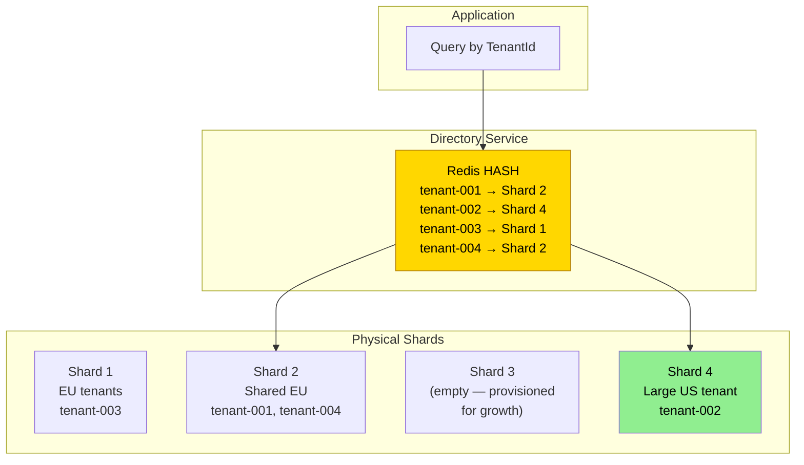
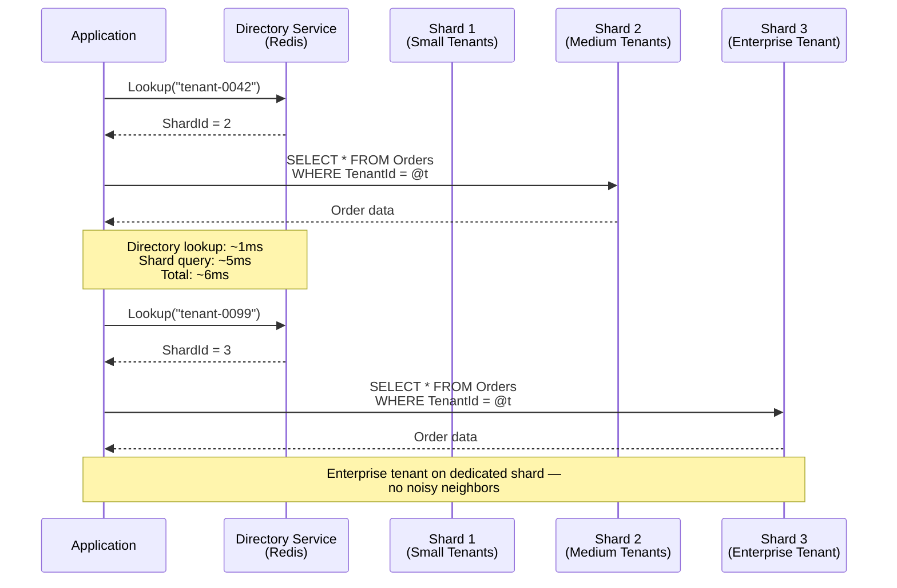
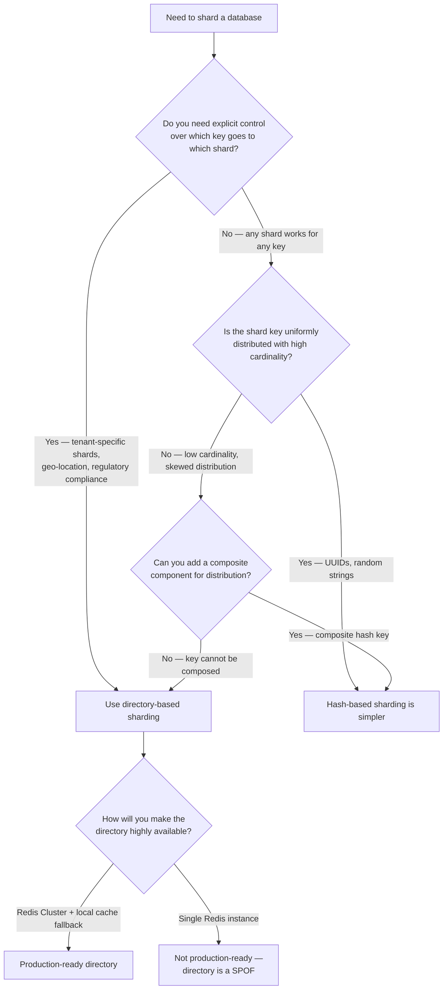

> [!success] Mastery Check
> - [ ] **Studied Well**
> - [ ] **Can explain the concept without notes**
> - [ ] **Can answer interview questions confidently**
> - [ ] **Can implement it in a real project**

---

id: "7.226"
title: "Database Sharding — Directory-Based"
domain: "System Design & Distributed Systems"
domain_id: 7
group: "Scalability Patterns"
tags: [system-design, distributed-systems, scalability, dotnet, azure, databases, sharding, directory-sharding, lookup-service]
priority: 1
version: 1
prerequisites:
  - "[[7.222 — Database Sharding — Overview]]" — the three shard strategies (range, hash, directory) are introduced here; directory-based sharding is the most flexible but operationally heaviest strategy — understanding the overview's three-property framework (cardinality, distribution, affinity) is required to see why directory-based is the only strategy that decouples key value from physical placement
  - "[[7.223 — Database Sharding — Partition Key Selection]]" — directory-based sharding removes the cardinality and ordering constraints on partition key selection because the directory maps ANY key to ANY shard; the key does NOT need high cardinality or uniform distribution — the directory handles skew by explicit mapping
  - "[[7.224 — Database Sharding — Range-Based]]" — range-based sharding uses a sorted list as its "directory"; directory-based generalizes this to arbitrary mappings — every range-based system can be converted to directory-based by storing the range-to-shard mapping in a lookup table instead of computing it from a sorted list
  - "[[7.225 — Database Sharding — Hash-Based]]" — hash-based sharding uses a pure function as its "directory"; directory-based replaces the function with a mutable lookup, trading O(1) routing cost for O(log D) lookup cost but gaining the ability to reassign keys without data movement
  - "[[7.227 — Database Sharding — Cross-Shard Queries]]" — directory-based sharding makes cross-shard queries more expensive than hash or range because the directory must be consulted for each shard involved — a scatter-gather query must first fan out to the directory for all relevant key-to-shard mappings before fanning out to the shards
  - "[[7.228 — Database Sharding — Resharding and Migration]]" — directory-based sharding has the simplest resharding story: update the directory entry for the moved keys and point them to the new shard; no hash function change, no range boundaries to adjust — the directory IS the migration plan
  - "[[8.60 — Azure Cosmos DB Partitioning]]" — Cosmos DB does NOT support directory-based sharding natively; the partition key IS the shard key, and all routing is hash-based — a directory-based approach on Cosmos DB requires maintaining a separate mapping service that stores the logical-to-physical partition mapping
  - "[[8.52 — Redis as a Cache and Data Structure Server]]" — Redis is the most common implementation of the directory service in directory-based sharding; the key-to-shard mapping is stored as a Redis hash, providing ~1ms read latency and built-in replication for high availability
  - "[[6.24 — Service Discovery Patterns]]" — directory-based sharding IS a form of service discovery applied to database shards; the same patterns (client-side discovery, server-side discovery, service registry) apply to shard directory management
related:
  - "[[7.224 — Database Sharding — Range-Based]]" — range-based sharding's shard map is a directory variant; the sorted list of ranges is a directory keyed by range boundaries — directory-based generalizes this to arbitrary key mappings
  - "[[7.225 — Database Sharding — Hash-Based]]" — hash-based sharding's pure function is a directory variant; the hash function is a compressed directory that trades flexibility for O(1) cost — directory-based trades the O(1) cost for the ability to reassign any key at any time
  - "[[7.227 — Database Sharding — Cross-Shard Queries]]" — directory-based sharding requires a directory lookup for each shard in a cross-shard query, adding a second scatter-gather phase (directory → shards) that hash and range do not have
  - "[[7.228 — Database Sharding — Resharding and Migration]]" — directory-based sharding makes resharding trivial for key reassignment (just update the directory) but the actual data movement is the same as any other strategy — the directory does not make data move faster, it just makes the routing change instant
  - "[[7.250 — Database Federation — Functional Partitioning]]" — directory-based sharding and federation are closely related; federation uses a directory (the service boundary) to route to the correct database per bounded context — directory-based sharding extends this to partition within a single bounded context
  - "[[7.232 — Consistent Hashing — Use Cases]]" — consistent hashing is an alternative to directory-based sharding that achieves similar flexibility (minimal key movement on node change) without a central directory; choosing between consistent hashing and directory-based is a tradeoff of algorithmic complexity vs operational simplicity
  - "[[8.52 — Redis as a Cache and Data Structure Server]]" — Redis is the canonical implementation of a production-grade shard directory; a Redis hash with key → shard mappings provides ~1ms read latency, TTL-based cache invalidation, and Redis Cluster for high availability
created: 2026-06-16

---

> [!ABSTRACT] Quick Reference — Directory-Based Sharding **Invariant:** Every row's shard is determined by a lookup in a directory service that maps each shard key value to a shard ID. The directory IS the source of truth for data placement. Unlike hash-based (pure function, O(1)) or range-based (sorted list, O(log M)), directory-based sharding stores an explicit mapping for each key value — `Directory[Key] = ShardId`. This mapping can be updated at any time, which means any key can be reassigned to any shard without changing a hash function or adjusting range boundaries. **The Critical Property:** Directory-based sharding is the ONLY strategy that provides full decoupling between the key value and the physical shard. A key can be moved from Shard A to Shard B by updating a single directory entry — no data movement is required for the ROUTING change (though the data must still be moved physically). This makes it ideal for systems where tenancy changes dynamically (a small tenant grows and needs its own shard), where regulatory compliance requires data to be in specific geographic regions, or where the access pattern is too irregular for hash-based or range-based strategies to work well. **The Critical Cost:** Every query requires TWO network hops: first to the directory (to find the shard), then to the shard (to execute the query). The directory is a single point of failure and a performance bottleneck. Directory lookup latency (~1ms for Redis, ~5ms for Azure SQL Database) adds to every query's latency. If the directory becomes unavailable, the system cannot route any query — the entire database becomes inaccessible. **Trigger:** The shard key values are not uniformly distributed, do not have a natural ordering, AND the system needs to explicitly control which keys go to which shards. Directory-based sharding is the right choice when: (a) tenants must be explicitly assigned to shards (e.g., enterprise customer contracts specify data residency), (b) the access pattern is highly irregular (some keys are hot, some are cold, and the hot set changes over time), or (c) the system needs to support live data migration between shards without changing the routing algorithm. **Skip When:** The key is uniformly distributed and the shard count is stable — hash-based sharding is simpler and faster. Skip when the key has a natural ordering and range queries dominate — range-based sharding avoids the directory lookup. Skip when the directory's availability cannot be guaranteed to match the shards' availability — the directory is a single point of failure weaker than any individual shard.

---

## Navigation

**Domain:** [[7 — System Design & Distributed Systems]] > **Group:** Scalability Patterns
**Previous:** [[7.225 — Database Sharding — Hash-Based]] | **Next:** [[7.227 — Database Sharding — Cross-Shard Queries]]

### Prerequisites

- [[7.222 — Database Sharding — Overview]] — the three shard strategies are introduced here; directory-based sharding is the most flexible but also the most operationally complex — it is the strategy you reach for when hash and range cannot meet your requirements
- [[7.223 — Database Sharding — Partition Key Selection]] — directory-based sharding removes the cardinality and ordering constraints on partition key selection; the key can have as few as 10 distinct values (e.g., 10 tenants) because the directory maps each value explicitly
- [[7.225 — Database Sharding — Hash-Based]] — hash-based sharding is the alternative that uses a pure function instead of a directory; understanding the tradeoff between O(1) routing (hash) and full flexibility (directory) is required to make the correct choice
- [[8.52 — Redis as a Cache and Data Structure Server]] — Redis is the most common production implementation of the shard directory; understanding Redis data structures (HASH, SET), replication (Redis Cluster), and durability (RDB/AOF) is required to design a reliable directory service

### Where This Fits

Directory-based sharding lives at the data access layer — between the application repository and the physical database shards. It introduces a new component (the directory service) that does not exist in hash-based or range-based sharding. The directory maintains an explicit mapping of every shard key value to its shard, and the application queries the directory before every database operation.

In a .NET production system, an engineer encounters directory-based sharding when:
- The SaaS platform has a mix of small and large tenants — small tenants share shards, large tenants get dedicated shards, and tenants can grow from shared to dedicated over time
- Regulatory compliance requires certain customer data to be stored in specific Azure regions (e.g., EU customer data stays in EU data centers)
- The system supports live data migration between shards with zero downtime — the directory entry is updated atomically, and the background data migration completes asynchronously
- The shard count is small (< 8) and each shard has a specific purpose (e.g., Shard 1 = North America customers, Shard 2 = EU customers, Shard 3 = Asia-Pacific customers) but the assignment needs to change as customer distribution changes

Without directory-based sharding, the team would need to use hash-based sharding (which does not support tenant-specific shard assignment) or range-based sharding (which creates a hotspot with sequential tenant IDs). Directory-based sharding is the ONLY strategy that gives explicit control over data placement.


---

## Core Mental Model

Directory-based sharding is the most intuitive sharding strategy when you think about it from a business perspective: you have a list of customers (tenants), and you explicitly decide which database each customer's data goes into. The directory IS that list. It is not computed from a hash function or derived from range boundaries — it is a deliberate, mutable mapping.

Think of it as a hotel front desk. Each guest (shard key) has a room number (shard ID) assigned at check-in. The front desk (directory) keeps the guest → room mapping. When a guest moves to a different room (data migration), the front desk updates the mapping. The guest does not need to know the room number ahead of time — they just ask the front desk.

The single invariant: **For every shard key value that exists in the system, the directory contains exactly one mapping: `Key → ShardId`. The directory is the sole authority on data placement. If the directory says a key is on Shard 3, the data IS on Shard 3 — regardless of what a hash function would compute or what range the key falls into.**

The fundamental cost of directory-based sharding is the **directory dependency**: every query requires a lookup before it can reach the shard. The directory's latency, availability, and consistency directly determine the system's overall latency, availability, and consistency. If the directory is 1ms faster, every query is 1ms faster. If the directory goes down, every query fails — the database shards are healthy but unreachable through the routing layer.

### Classification

Directory-based sharding is a **data distribution strategy** that sits at the database architecture layer. It is the most flexible of the three fundamental shard mapping strategies, and the only one that provides explicit, mutable control over data placement:

| Property | Directory-Based | Hash-Based | Range-Based |
|---|---|---|---|
| Mapping mutability | Mutable — any key can be reassigned at any time | Immutable — determined by hash function | Immutable — determined by range boundaries |
| Key cardinality requirement | None — even 10 keys work | >= 10 × N distinct values | Any, but low cardinality = uneven range sizes |
| Routing cost | O(log D) directory lookup + O(1) shard query | O(1) pure function | O(log M) binary search |
| Directory availability requirement | Critical — system is unavailable without directory | None — no directory needed | Low — shard map is cached and can be rebuilt |
| Read-after-write consistency | Directory must be strongly consistent | Guaranteed by hash determinism | Guaranteed by range boundary stability |
| Geographic data placement | Full control — assign keys to region-specific shards | No control — hash ignores geography | Partial — range boundaries can align with regions |



### Key Properties / Guarantees

| Property | Value | Condition |
|---|---|---|
| Routing flexibility | Full — any key to any shard | Directory is mutable |
| Directory latency | ~1ms (Redis) / ~5ms (SQL) | In-memory cache reduces effective latency to ~0ms for cached keys |
| Directory availability | Must be >= shard availability | If the directory is unavailable, queries cannot be routed |
| Key cardinality requirement | None | Directory handles 1 key or 1 billion keys equally |
| Distribution control | Explicit — operator decides placement | Requires manual or automated placement decisions |
| Resharding key reassignment | Instant — update directory entry | Only the routing changes; data must still be moved asynchronously |
| Write throughput | N × single-shard capacity | No hotspot inherent to the strategy |
| Geographic control | Full — can pin keys to region-specific shards | Directory entry includes region as a routing attribute |

### Consistency Model Impact

Directory-based sharding introduces a new consistency concern that hash-based and range-based do not have: **the directory must be consistent with the shards**. If the directory says a key is on Shard 3 but the data has not been moved there yet (during migration), or the data is still on Shard 3 but the directory says Shard 4 (stale mapping), queries fail with data-not-found errors.

- **Directory read consistency:** The directory must provide strongly consistent reads. If the application reads a directory entry that says `Key → Shard 4`, it must be guaranteed that Shard 4 holds the data for that key. With Redis as the directory, this requires WAIT (synchronous replication) or a quorum-based read. With Azure SQL Database as the directory, the default Read Committed isolation level provides this guarantee for the directory query.
- **Directory write consistency (key reassignment):** When a key is reassigned from Shard A to Shard B, the sequence must be: (1) start background data migration from A to B, (2) after migration completes, update the directory atomically to point to B, (3) delete data from A. If the directory update is visible before the data migration completes, queries read from B before data arrives — data not found. This is the "dual-write" problem in directory-based sharding.
- **Cross-shard transactions:** Same as hash-based and range-based — distributed transactions across shards are not supported. The directory does not make cross-shard ACID transactions possible.
- **Cache staleness:** The application typically caches directory entries in memory (e.g., `ConcurrentDictionary` with TTL). If a cached entry is stale (the directory was updated but the cache has not expired), the query goes to the wrong shard. The TTL must be short enough that the data loss window is acceptable, or the cache must be invalidated on directory update (push-based invalidation).

The .NET client code must handle directory cache staleness with a fallback:

```csharp
// Port: Directory lookup with cache fallback
public sealed class DirectoryRouter
{
    private readonly IDistributedCache _directory;
    private readonly ILogger<DirectoryRouter> _logger;

    public async Task<ShardNode> GetShardForKeyAsync(string tenantId, CancellationToken ct)
    {
        var cacheKey = $"shard-map:{tenantId}";

        // Cached entry — fast path
        var cached = await _directory.GetStringAsync(cacheKey, ct);
        if (cached != null)
            return DeserializeShardNode(cached);

        // Cache miss — query the directory source of truth
        var mapping = await QueryDirectorySourceAsync(tenantId, ct);
        if (mapping == null)
            throw new KeyNotFoundException($"No shard mapping for tenant: {tenantId}");

        // Populate cache with short TTL
        await _directory.SetStringAsync(cacheKey,
            SerializeShardNode(mapping.Shard),
            new DistributedCacheEntryOptions
            {
                AbsoluteExpirationRelativeToNow = TimeSpan.FromSeconds(30)
            }, ct);

        return mapping.Shard;
    }
}
```

---

## Deep Mechanics

### How It Works

Directory-based sharding routes every query through a two-step process: (1) look up the shard key in the directory, (2) execute the query on the returned shard. Here is the complete request flow:

**Step 1 — Extract shard key.** The application determines the shard key value from the query. If the query does not include the shard key, the query cannot be routed through the directory (every shard must be queried).

**Step 2 — Directory lookup.** The application queries the directory service with the shard key value. The directory returns the shard ID (or connection string) for that key. The directory lookup can be:
- **In-memory cache (fast path):** `ConcurrentDictionary<string, ShardNode>` with a background refresh. ~0.1ms.
- **Distributed cache (medium path):** Redis HASH. ~1ms.
- **Database-backed (slow path):** Azure SQL Database table with a clustered index on the key. ~5ms.

**Step 3 — Open shard connection.** Using the shard ID from the directory, open a connection to the target shard. Connection pooling caches this per shard.

**Step 4 — Execute query.** Execute the query on the target shard.

**Step 5 — Return results.** Return to the caller.



**Step 6 — Directory update (migration scenario).** When a tenant is moved from a shared shard to a dedicated shard:

1. Provision the new dedicated shard with the same schema
2. Copy tenant data from the shared shard to the dedicated shard (background job)
3. Validate row counts and checksums between old and new shards
4. Update the directory entry atomically: `tenant-0042 → Shard 2 (old)` becomes `tenant-0042 → Shard 4 (new)`
5. Route new queries to Shard 4 (the directory change takes effect immediately)
6. Delete tenant data from Shard 2 (old) after confirmation that no queries are using the old mapping

```csharp
// Port: Directory update for tenant migration
public async Task MigrateTenantAsync(
    string tenantId,
    int targetShardId,
    CancellationToken ct)
{
    var currentMapping = await _directory.GetMappingAsync(tenantId, ct);
    var sourceShard = currentMapping.ShardId;

    // 1. Ensure target shard has the same schema
    await EnsureSchemaAsync(targetShardId, ct);

    // 2. Copy data
    await using var sourceConn = GetConnection(sourceShard);
    await using var targetConn = GetConnection(targetShardId);
    var data = await sourceConn.QueryAsync<Order>(
        "SELECT * FROM Orders WHERE TenantId = @t", new { t = tenantId });
    await BulkInsertAsync(targetConn, data, ct);

    // 3. Validate — must be exact or the migration fails
    var sourceCount = await sourceConn.QuerySingleAsync<int>(
        "SELECT COUNT(*) FROM Orders WHERE TenantId = @t", new { t = tenantId });
    var targetCount = await targetConn.QuerySingleAsync<int>(
        "SELECT COUNT(*) FROM Orders WHERE TenantId = @t", new { t = tenantId });
    if (sourceCount != targetCount)
        throw new InvalidOperationException(
            $"Row count mismatch for tenant {tenantId}: " +
            $"source={sourceCount}, target={targetCount}");

    // 4. Atomically update the directory
    // This is the cutover point — all new queries go to the target shard
    await _directory.SetMappingAsync(tenantId, targetShardId, ct);

    // 5. Invalidate local caches (push-based)
    await _cacheInvalidator.InvalidateAsync($"shard-map:{tenantId}", ct);

    // 6. Delete old data after a safety window
    _ = Task.Run(async () =>
    {
        await Task.Delay(TimeSpan.FromMinutes(5), ct);
        await using var oldConn = GetConnection(sourceShard);
        await oldConn.ExecuteAsync(
            "DELETE FROM Orders WHERE TenantId = @t", new { t = tenantId });
    }, ct);
}
```

### Failure Modes

**Failure Mode 1 — Directory unavailable (system-wide outage)**

The directory service goes down (Redis node failure, network partition, connection pool exhaustion). Every query that requires a directory lookup fails. The database shards are healthy and reachable, but the application cannot route any query — the entire system is unavailable.

**Symptom:** The application throws `ConnectionFailed`, `TimeoutException`, or `RedisConnectionException` on every database operation. Monitoring shows the directory service is returning errors or timing out. The database shards show normal query volumes (they are idle because no queries reach them). The helpdesk receives a flood of "application is down" reports.

**Detection:** Directory health check:
```csharp
// Port: Directory health check endpoint
public async Task<IResult> HealthCheckAsync(CancellationToken ct)
{
    try
    {
        var ping = await _directory.PingAsync(ct);
        return ping ? Results.Ok(new { Status = "Healthy" })
                    : Results.Problem("Directory ping failed");
    }
    catch (Exception ex)
    {
        return Results.Problem($"Directory unavailable: {ex.Message}");
    }
}
```

**Fix:** Immediate mitigation — switch to a local cached copy of the shard directory (last known good mappings). Accept that migrations and new tenant assignments are blocked until the directory is restored:

```csharp
// Port: Fallback to last-known-good directory cache
public async Task<ShardNode> GetShardWithFallbackAsync(string key, CancellationToken ct)
{
    try
    {
        return await GetShardForKeyAsync(key, ct);
    }
    catch (DirectoryUnavailableException)
    {
        _logger.LogWarning("Directory unavailable — using last-known-good cache");
        var fallback = _lastKnownGoodCache.GetValueOrDefault(key);
        if (fallback == null)
            throw new InvalidOperationException(
                $"No fallback mapping for key {key}");
        return fallback;
    }
}
```

**Cost of not fixing:** The system experiences complete downtime whenever the directory is unavailable. Even a 30-second Redis failover causes 30 seconds of application unavailability. For a system with 99.99% availability SLO, this means the directory can be down for at most 52 minutes per year — a tight budget.

**Failure Mode 2 — Stale directory cache (read-after-write inconsistency)**

Application caches the directory entry for `tenant-0042 → Shard 2` with a 60-second TTL. An admin migrates `tenant-0042` to Shard 4 and updates the directory. For up to 60 seconds, the application routes `tenant-0042` queries to Shard 2 — where the data has been deleted (as part of the migration cleanup). Queries return empty results.

**Symptom:** After a tenant migration, some application instances see the old data and some see the new data — a consistency anomaly. The tenant reports "my data keeps disappearing and reappearing." The support team finds the tenant's data on BOTH shards during the overlap window. `SELECT COUNT(*) FROM Orders WHERE TenantId = 'tenant-0042'` returns different counts depending on which shard the query is routed to.

**Detection:**
```csharp
// Monitor cache staleness by comparing directory entry age with migration events
public void DetectStaleCache(string tenantId, DateTime migrationTime)
{
    var cacheEntry = _localCache.Get<CacheEntry>($"shard-map:{tenantId}");
    if (cacheEntry != null && cacheEntry.CachedAt < migrationTime)
    {
        _logger.LogWarning(
            "Stale cache detected for {Tenant}: cached at {Cached}, migrated at {Migrated}",
            tenantId, cacheEntry.CachedAt, migrationTime);
    }
}
```

**Fix:** Use a short TTL (5–10 seconds) on directory cache entries, and implement push-based cache invalidation via Redis Pub/Sub:

```csharp
// Port: Push-based cache invalidation via Redis Pub/Sub
public sealed class DirectoryInvalidationSubscriber : BackgroundService
{
    private readonly ISubscriber _subscriber;

    protected override async Task ExecuteAsync(CancellationToken ct)
    {
        await _subscriber.SubscribeAsync("shard-map-changes", (channel, message) =>
        {
            var tenantId = message; // The key that changed
            _localCache.Remove($"shard-map:{tenantId}");
            _logger.LogInformation("Invalidated cache for tenant {Tenant}", tenantId);
        });
    }
}
```

**Cost of not fixing:** Data inconsistency window equal to the cache TTL. For a 60-second TTL, the tenant's data is invisible for up to 60 seconds after every migration. During that window, queries fail and the tenant perceives data loss. Support tickets increase. Customer trust erodes.

**Failure Mode 3 — Directory as single point of failure for write throughput**

The directory service cannot scale writes as fast as the shards can accept them. If every write requires a directory lookup (to confirm the key-to-shard mapping), and the directory is a single Redis node, the system's write throughput is capped at the Redis node's throughput (~100,000 ops/s for a single Redis node).

**Symptom:** The shards are at 30% CPU but the system cannot write any faster because the directory is at 90% CPU. The application log shows Redis latency increasing from 1ms to 20ms as the command queue backs up. Adding more database shards does not increase write throughput — the directory is the bottleneck.

**Detection:** Directory throughput monitoring:
```csharp
// Count directory operations per second
public class DirectoryMetrics
{
    private readonly IMeter _meter;
    private readonly Counter<long> _lookups;

    public DirectoryMetrics(IMeterFactory factory)
    {
        _meter = factory.Create("ShardDirectory");
        _lookups = _meter.CreateCounter<long>("directory.lookups");
    }

    public void RecordLookup() => _lookups.Add(1);
}
```
Alert when `lookups/second` exceeds 80% of the directory's known capacity.

**Fix:** Three approaches ordered by complexity:
1. **Batch directory lookups** — combine N key lookups into a single Redis `HMGET` command. Reduces round trips from N to 1.
2. **Local cache with batch refresh** — cache directory entries locally and refresh them in bulk on a timer (not per-query). Eliminates directory lookups from the query path entirely.
3. **Partition the directory** — shard the directory itself across multiple Redis nodes by hashing the shard key. This is Redis Cluster's approach — it provides linear directory throughput scaling.

**Failure Mode 4 — Orphaned directory entries (directory says key exists, but data was deleted)**

A tenant is deleted from the system. The data is purged from the shard, but the directory entry is not cleaned up. The directory still says `tenant-deleted-001 → Shard 2`. Future queries for this tenant (e.g., from a delayed analytics pipeline) hit Shard 2, find nothing, but the application has already paid the directory lookup cost and opened a shard connection — wasted resources.

**Symptom:** Monitoring shows a growing number of "found mapping but no data" events. The directory has thousands of entries for deleted tenants. Each query for a deleted tenant consumes a directory lookup slot and a database connection, returning nothing — wasted capacity. The directory's memory footprint grows unbounded as entries accumulate.

**Fix:** Implement a directory entry TTL or a garbage collection process that removes entries for deleted tenants:

```csharp
// Port: Directory entry with TTL (auto-cleanup)
await _directory.SetStringAsync($"shard-map:{tenantId}",
    shardId.ToString(),
    new DistributedCacheEntryOptions
    {
        AbsoluteExpirationRelativeToNow = TimeSpan.FromDays(90)
    });

// Port: Periodic directory garbage collection
public async Task CleanupOrphanedEntriesAsync(CancellationToken ct)
{
    var allEntries = await _directory.GetAllMappingsAsync(ct);
    foreach (var entry in allEntries)
    {
        var exists = await CheckTenantExistsAsync(entry.Key, ct);
        if (!exists)
        {
            await _directory.RemoveMappingAsync(entry.Key, ct);
            _logger.LogInformation("Removed orphaned directory entry: {Key}", entry.Key);
        }
    }
}
```

### .NET and Azure Integration

Directory-based sharding in the .NET ecosystem typically uses Redis or Azure SQL Database as the directory service, with the ShardMapManager pattern from Azure SQL Database Elastic Scale providing a directory-like API surface.

**Azure services:**
- **Azure Cache for Redis** — the most common directory implementation. Redis HASH stores key → shard mappings with ~1ms read latency. Redis Cluster provides horizontal scalability for the directory itself. Redis persistence (AOF) prevents directory data loss on restart.
- **Azure SQL Database** — used as the directory when strong consistency is required and ~5ms lookup latency is acceptable. A `ShardMappings` table with a clustered index on the key column.
- **Azure Cosmos DB** — can serve as the directory with strong consistency and < 10ms read latency. Overkill for a simple key-value mapping but useful when the directory must integrate with other system metadata.
- **Azure SQL Database Elastic Scale (`ListShardMap<T>`)** — provides a directory-like API where each key is explicitly mapped to a shard via `AddMapping(key, shard)`. This is the most "batteries-included" directory-based sharding approach in the .NET Azure ecosystem.

**.NET libraries:**
- `StackExchange.Redis` — for Redis-backed directory service
- `Microsoft.Azure.SqlDatabase.ElasticScale.Client` — `ListShardMap<T>` for explicit key-to-shard mapping
- `Dapper` — for querying the database-backed directory and shards
- `Polly` — for resilience policies around directory lookups (circuit breaker, retry)

**ASP.NET Core integration with Redis-backed directory:**

```csharp
// Port: Redis-backed shard directory service
public sealed class RedisShardDirectory
{
    private readonly IConnectionMultiplexer _redis;
    private readonly IDatabase _db;
    private readonly IReadOnlyList<ShardNode> _shards;
    private readonly ConcurrentDictionary<string, ShardNode> _localCache = new();
    private readonly TimeSpan _cacheTtl = TimeSpan.FromSeconds(10);

    // Hash field name = shard key (tenantId)
    // Hash field value = shard index (0 to N-1)
    private const string DirectoryHashKey = "shard-directory";

    public async Task<ShardNode> GetShardForKeyAsync(string tenantId, CancellationToken ct)
    {
        // Local cache — 0.1ms
        if (_localCache.TryGetValue(tenantId, out var cached))
            return cached;

        // Redis hash lookup — ~1ms
        var shardIndex = await _db.HashGetAsync(DirectoryHashKey, tenantId);
        if (shardIndex.IsNullOrEmpty)
            throw new KeyNotFoundException($"No shard mapping for tenant: {tenantId}");

        var shard = _shards[(int)shardIndex];

        // Populate local cache
        _localCache[tenantId] = shard;
        _ = Task.Delay(_cacheTtl).ContinueWith(_ => _localCache.TryRemove(tenantId, out _));

        return shard;
    }

    public async Task SetMappingAsync(string tenantId, int shardIndex, CancellationToken ct)
    {
        await _db.HashSetAsync(DirectoryHashKey, tenantId, shardIndex);
        _localCache.TryRemove(tenantId, out _); // Invalidate local cache
        await _redis.GetSubscriber().PublishAsync(
            "shard-map-changes", tenantId); // Push invalidation to other instances
    }
}
```


---

## Production Patterns and Implementation

### Primary Implementation

The canonical directory-based sharding implementation uses Azure Cache for Redis as the directory service with Azure SQL Database shards. This example implements a multi-tenant SaaS platform where each tenant is explicitly assigned to a shared or dedicated shard:

```csharp
// Port: Tenant-shard mapping stored in Redis HASH
public sealed class TenantDirectoryService
{
    private readonly IDatabase _redis;
    private readonly IReadOnlyList<ShardNode> _shards;
    private readonly ILogger<TenantDirectoryService> _logger;

    // Redis hash key for the directory
    private const string DirectoryKey = "tenant-shard-directory";

    public TenantDirectoryService(
        IConnectionMultiplexer redis,
        IConfiguration configuration,
        ILogger<TenantDirectoryService> logger)
    {
        _redis = redis.GetDatabase();
        _shards = LoadShardNodes(configuration);
        _logger = logger;
    }

    // Adapter: Lookup which shard owns a given tenant
    public async Task<ShardNode> GetShardForTenantAsync(
        string tenantId, CancellationToken ct)
    {
        var shardIndex = await _redis.HashGetAsync(DirectoryKey, tenantId);
        if (shardIndex.IsNullOrEmpty)
        {
            // First time seeing this tenant — assign to a shard
            shardIndex = await AssignTenantToShardAsync(tenantId, ct);
        }
        return _shards[(int)shardIndex];
    }

    // Port: Assign a new tenant to the least-loaded shard
    private async Task<int> AssignTenantToShardAsync(
        string tenantId, CancellationToken ct)
    {
        // Get current tenant counts per shard from Redis
        var shardLoads = new long[_shards.Count];
        for (var i = 0; i < _shards.Count; i++)
        {
            var count = await _redis.HashGetAsync(
                "tenant-counts", i.ToString());
            shardLoads[i] = count.HasValue ? (long)count : 0;
        }

        // Assign to the shard with the fewest tenants
        var minLoad = shardLoads.Min();
        var targetShard = Array.IndexOf(shardLoads, minLoad);

        // Dedicated shard for enterprise tenants
        if (tenantId.StartsWith("enterprise-", StringComparison.Ordinal))
        {
            targetShard = await GetOrProvisionDedicatedShardAsync(tenantId, ct);
        }

        // Persist the mapping
        await _redis.HashSetAsync(DirectoryKey, tenantId, targetShard);
        await _redis.HashIncrementAsync("tenant-counts", targetShard.ToString());

        _logger.LogInformation(
            "Assigned tenant {TenantId} to shard {ShardId}",
            tenantId, targetShard);

        return targetShard;
    }

    // Port: Full tenant query implementation
    public async Task<Tenant?> GetTenantByIdAsync(
        string tenantId, CancellationToken ct)
    {
        var shard = await GetShardForTenantAsync(tenantId, ct);
        await using var conn = new SqlConnection(shard.ConnectionString);
        await conn.OpenAsync(ct);
        return await conn.QueryFirstOrDefaultAsync<Tenant>(
            "SELECT TenantId, TenantName, Plan, CreatedAt FROM Tenants WHERE TenantId = @id",
            new { id = tenantId });
    }
}

// Adapter: Sharded tenant repository with directory routing
public sealed class ShardedTenantRepository : ITenantRepository
{
    private readonly TenantDirectoryService _directory;

    public ShardedTenantRepository(TenantDirectoryService directory)
    {
        _directory = directory;
    }

    public async Task<Tenant?> GetByIdAsync(string tenantId, CancellationToken ct)
    {
        var shard = await _directory.GetShardForTenantAsync(tenantId, ct);
        await using var conn = new SqlConnection(shard.ConnectionString);
        await conn.OpenAsync(ct);
        return await conn.QueryFirstOrDefaultAsync<Tenant>(
            "SELECT TenantId, TenantName, Plan, CreatedAt FROM Tenants WHERE TenantId = @id",
            new { id = tenantId });
    }

    // Adapter: Cross-shard query — must query the directory for all tenants
    public async Task<IReadOnlyList<Tenant>> GetByPlanAsync(
        string plan, CancellationToken ct)
    {
        var results = new List<Tenant>();

        // Directory-based scatter-gather: first get all tenant-key mappings,
        // then query each tenant's shard
        var allMappings = await _directory.GetAllMappingsAsync(ct);
        var queries = allMappings.Select(async mapping =>
        {
            await using var conn = new SqlConnection(mapping.Shard.ConnectionString);
            await conn.OpenAsync(ct);
            var tenants = await conn.QueryAsync<Tenant>(
                "SELECT * FROM Tenants WHERE Plan = @plan AND TenantId = @id",
                new { plan, id = mapping.TenantId });
            return tenants;
        });

        var results = await Task.WhenAll(queries);
        return results.SelectMany(r => r).ToList();
    }
}
```

### Configuration and Wiring

```csharp
// Program.cs — Redis-backed directory service registration
var builder = WebApplication.CreateBuilder(args);

// Redis connection for the directory
builder.Services.AddSingleton<IConnectionMultiplexer>(sp =>
{
    var config = sp.GetRequiredService<IConfiguration>();
    return ConnectionMultiplexer.Connect(
        config.GetConnectionString("RedisDirectory")!);
});

// Shard node configuration
builder.Services.AddSingleton<IReadOnlyList<ShardNode>>(sp =>
{
    var config = sp.GetRequiredService<IConfiguration>();
    var shards = new List<ShardNode>();
    foreach (var section in config.GetSection("Sharding:Shards").GetChildren())
    {
        shards.Add(new ShardNode(
            Id: int.Parse(section.Key),
            Name: section["Name"]!,
            ConnectionString: section["ConnectionString"]!,
            IsDedicated: bool.Parse(section["IsDedicated"] ?? "false"),
            Region: section["Region"] ?? "default"));
    }
    return shards;
});

builder.Services.AddSingleton<TenantDirectoryService>();
builder.Services.AddScoped<ITenantRepository, ShardedTenantRepository>();

var app = builder.Build();
```

```json
// appsettings.json — Directory-based shard configuration
{
  "ConnectionStrings": {
    "RedisDirectory": "server:mycache.redis.cache.windows.net,ssl=true,..."
  },
  "Sharding": {
    "Shards": [
      {
        "Id": 0,
        "Name": "Shared-Shard-EU",
        "ConnectionString": "Server=tcp:shared-eu.database.windows.net;Database:Tenants;...",
        "IsDedicated": false,
        "Region": "europe"
      },
      {
        "Id": 1,
        "Name": "Shared-Shard-US",
        "ConnectionString": "Server=tcp:shared-us.database.windows.net;Database:Tenants;...",
        "IsDedicated": false,
        "Region": "us"
      },
      {
        "Id": 2,
        "Name": "Enterprise-Shard-AcmeCorp",
        "ConnectionString": "Server=tcp:acmecorp.database.windows.net;Database:Tenants;...",
        "IsDedicated": true,
        "Region": "us"
      },
      {
        "Id": 3,
        "Name": "Enterprise-Shard-MegaCorp",
        "ConnectionString": "Server=tcp:megacorp.database.windows.net;Database:Tenants;...",
        "IsDedicated": true,
        "Region": "europe"
      }
    ],
    "AutoAssignThreshold": "enterprise-",
    "DefaultShard": 0
  }
}
```

### Common Variants

**Variant 1 — Database-backed directory with Azure SQL Database Elastic Scale ListShardMap**

Azure SQL Elastic Scale's `ListShardMap<T>` is the most production-ready directory-based sharding implementation in the .NET ecosystem. It stores key-to-shard mappings in a dedicated shard map manager database:

```csharp
// Port: ListShardMap — the canonical directory-based sharding in .NET
public sealed class ElasticScaleTenantRepository
{
    private readonly ListShardMap<string> _shardMap;

    public async Task<Tenant?> GetTenantAsync(string tenantId, CancellationToken ct)
    {
        // OpenConnectionForKeyAsync does: (1) check local cache, (2) if miss,
        // query the shard map manager database, (3) open connection to the target shard
        await using var conn = await _shardMap.OpenConnectionForKeyAsync(
            tenantId, ct.ToString());
        return await conn.QueryFirstOrDefaultAsync<Tenant>(
            "SELECT * FROM Tenants WHERE TenantId = @id",
            new { id = tenantId });
    }

    public async Task RegisterTenantAsync(string tenantId, CancellationToken ct)
    {
        // Explicitly assign the tenant to a shard
        var shard = _shardMap.TryGetMappingForKey(tenantId, out _)
            ? _shardMap.GetShardForKey(tenantId)
            : _shardMap.GetShardById(0); // Default to shard 0

        _shardMap.AddMapping(tenantId, shard);

        await using var conn = await shard.OpenConnectionAsync(ct.ToString());
        await conn.ExecuteAsync(
            "INSERT INTO TenantRegistry (TenantId, ProvisionedAt) VALUES (@id, @now)",
            new { id = tenantId, now = DateTime.UtcNow });
    }
}
```

**Variant 2 — Region-aware directory with geolocation routing**

The directory stores not just the shard ID but also the geographic region, enabling queries to be routed to the nearest shard for latency optimization:

```csharp
// Port: Region-aware directory entry
public sealed record RegionAwareMapping
{
    public int ShardId { get; init; }
    public string Region { get; init; } = "default";
    public DateTime ProvisionedAt { get; init; }
}

public sealed class GeoAwareDirectory
{
    private readonly IDatabase _redis;

    public async Task<RegionAwareMapping> GetMappingAsync(
        string tenantId, string? requestRegion, CancellationToken ct)
    {
        var entry = await _redis.HashGetAsync("geo-directory", tenantId);
        if (entry.IsNullOrEmpty)
            return await AssignWithGeoAffinityAsync(tenantId, requestRegion, ct);

        var mapping = JsonSerializer.Deserialize<RegionAwareMapping>(entry!)!;

        // If the request comes from a different region, consider geo-routing
        if (requestRegion != null && mapping.Region != requestRegion)
        {
            var nearestShard = await FindNearestShardAsync(requestRegion, ct);
            return new RegionAwareMapping
            {
                ShardId = nearestShard.ShardId,
                Region = requestRegion,
                ProvisionedAt = mapping.ProvisionedAt
            };
        }
        return mapping;
    }
}
```

**Variant 3 — In-memory directory with background refresh (no external dependency)**

For systems that cannot tolerate a directory dependency, the directory can be embedded in the application as an in-memory `ConcurrentDictionary` that is rebuilt from a database table on startup and periodically refreshed:

```csharp
// Port: Self-contained in-memory directory
public sealed class EmbeddedDirectoryService : BackgroundService, IShardDirectory
{
    private readonly IServiceScopeFactory _scopeFactory;
    private ConcurrentDictionary<string, int> _mappings = new();
    private readonly TimeSpan _refreshInterval = TimeSpan.FromSeconds(30);

    // Load all mappings from the database on startup
    protected override async Task ExecuteAsync(CancellationToken ct)
    {
        while (!ct.IsCancellationRequested)
        {
            using var scope = _scopeFactory.CreateScope();
            var db = scope.ServiceProvider.GetRequiredService<IDbConnection>();
            var mappings = await db.QueryAsync<(string Key, int ShardId)>(
                "SELECT TenantId, ShardId FROM ShardDirectory");
            _mappings = new ConcurrentDictionary<string, int>(
                mappings.ToDictionary(m => m.Key, m => m.ShardId));
            await Task.Delay(_refreshInterval, ct);
        }
    }

    public int GetShardForKey(string key) =>
        _mappings.TryGetValue(key, out var shardId)
            ? shardId
            : throw new KeyNotFoundException($"No mapping for key: {key}");

    // Expect stale reads — the refresh interval determines the staleness window
}
```

### Real-World .NET Ecosystem Example

**Azure SQL Database Elastic Scale `ListShardMap<T>`** is the canonical .NET implementation of directory-based sharding. It is the most "out of the box" sharding solution in the .NET Azure ecosystem — it manages the directory (shard map), connection routing, and multi-shard queries:

```csharp
// Port: Production Elastic Scale ListShardMap usage
public sealed class ElasticScaleTenantManager
{
    private readonly ListShardMap<string> _shardMap;

    // ListShardMap stores explicit key → shard mappings in the shard map manager DB
    public ElasticScaleTenantManager(string smConnectionString)
    {
        var smm = ShardMapManager.GetOrCreateSqlShardMapManager(
            smConnectionString,
            ShardMapManagerCreateMode.KeepExisting);

        _shardMap = smm.CreateListShardMap<string>("TenantShardMap");
    }

    // Register a new tenant — must explicitly choose a shard
    public async Task ProvisionTenantAsync(
        string tenantId, Shard targetShard, CancellationToken ct)
    {
        // Validate shard exists in the shard map
        if (!_shardMap.GetShards().Contains(targetShard))
            throw new ArgumentException("Shard not found in shard map");

        _shardMap.AddMapping(tenantId, targetShard);
        _logger.LogInformation("Tenant {Tenant} provisioned on shard {Shard}",
            tenantId, targetShard.Id);
    }

    // Move tenant to a different shard — directory makes this trivial
    public async Task MigrateTenantAsync(
        string tenantId, Shard newShard, CancellationToken ct)
    {
        var oldShard = _shardMap.GetShardForKey(tenantId);

        // 1. Copy data (application-level migration)
        // ... copy data from oldShard to newShard ...

        // 2. Update the directory — atomic operation
        _shardMap.AddMapping(tenantId, newShard);
        _shardMap.RemoveMapping(tenantId, oldShard);

        // 3. After confirmation, delete old data
        // await DeleteTenantDataAsync(tenantId, oldShard, ct);
    }

    // Graceful handling: if the mapping exists but the shard is offline,
    // the application should have a fallback
    public async Task<Tenant?> GetTenantWithFallbackAsync(
        string tenantId, CancellationToken ct)
    {
        try
        {
            await using var conn = await _shardMap.OpenConnectionForKeyAsync(
                tenantId, ct.ToString());
            return await conn.QueryFirstOrDefaultAsync<Tenant>(
                "SELECT * FROM Tenants WHERE TenantId = @id", new { id = tenantId });
        }
        catch (ShardException ex) when (ex.Message.Contains("offline"))
        {
            // Shard is offline — query the secondary mapping if available
            _logger.LogWarning("Primary shard offline for tenant {Tenant}", tenantId);
            return await GetFromSecondaryAsync(tenantId, ct);
        }
    }
}
```

**Production considerations for ListShardMap:**
- The shard map manager database is queried on cache miss — set a reasonable cache TTL (5–30 seconds) based on how frequently mappings change
- `AddMapping` and `RemoveMapping` are NOT distributed transactions — they are individual operations on the shard map manager database
- `OpenConnectionForKeyAsync` caches the mapping locally and only refreshes on cache miss or explicit call to `RefreshAsync`
- The shard map manager database itself should be geo-replicated (Azure SQL Geo-Replication) if the directory must survive a regional outage


---

## Gotchas and Production Pitfalls

### Directory Cache TTL Too Long — Stale Mappings After Migration

**Pitfall:** The engineer configures the directory cache TTL to 5 minutes to reduce Redis load. When a tenant is migrated from a shared shard to a dedicated shard, the application instances continue to route queries to the old shard for up to 5 minutes. The old shard's data may have been deleted as part of the migration cleanup — queries return empty.

```csharp
// ❌ Long cache TTL — 5-minute staleness window after migration
builder.Services.AddSingleton<TenantDirectoryService>(sp =>
{
    var redis = sp.GetRequiredService<IConnectionMultiplexer>();
    return new TenantDirectoryService(redis)
    {
        CacheTtl = TimeSpan.FromMinutes(5) // Too long — migration window is 5 minutes
    };
});
```

**Symptom:** After a tenant migration, the tenant's data is intermittently unavailable for up to 5 minutes. The support team receives multiple "my data is gone" tickets. By the time the engineer investigates, the cache has expired and the system is working — the ticket is closed as "user error." The pattern repeats on every migration.

**Fix:** Use a short TTL (5–10 seconds) and implement push-based cache invalidation via Redis Pub/Sub:

```csharp
// ✅ Short TTL + push-based invalidation = < 1 second staleness
builder.Services.AddSingleton<TenantDirectoryService>(sp =>
{
    var redis = sp.GetRequiredService<IConnectionMultiplexer>();
    var service = new TenantDirectoryService(redis)
    {
        CacheTtl = TimeSpan.FromSeconds(5) // Acceptable staleness window
    };

    // Subscribe to invalidation events
    redis.GetSubscriber().Subscribe("tenant-migration-events", (_, tenantId) =>
    {
        service.InvalidateCache(tenantId!);
    });

    return service;
});
```

**Cost of not fixing:** Every tenant migration causes a data-unavailability incident. The migration playbook must include a 5-minute "wait for cache to expire" step. The engineering team avoids migrations because they are "too risky" — tenants stay on overloaded shards.

### Directory as a Single Point of Failure

**Pitfall:** The team deploys a single Redis cache instance as the directory. The Redis instance runs on a Standard-tier Azure Cache for Redis (no replication). The Redis node restarts during a patching operation. During the 30-second restart, every query fails — the directory is unavailable.

```csharp
// ❌ No redundancy for the directory service
// Single Redis instance — if it goes down, the system goes down
builder.Services.AddSingleton<IConnectionMultiplexer>(_ =>
    ConnectionMultiplexer.Connect("mycache.redis.cache.windows.net:6380,..."));
```

**Symptom:** The application is completely unavailable for 30 seconds during the Redis restart. The database shards are healthy (all showing < 30% CPU during the outage). The application log shows `RedisConnectionException` with "No connection is available to service this operation." After Redis restarts, the application recovers — but the 30-second outage violates the 99.99% SLO (52 minutes/year allowed; a monthly restart consumes 6 minutes).

**Fix:** Use Azure Cache for Redis Premium tier (replication + persistence) and implement a local fallback cache that stores the last known good mapping:

```csharp
// ✅ Replicated Redis + local fallback cache
builder.Services.AddSingleton<IConnectionMultiplexer>(_ =>
    ConnectionMultiplexer.Connect("mycache.redis.cache.windows.net:6380,ssl=true,abortConnect=false"));

// Local fallback cache — survives Redis restarts
public sealed class ResilientDirectoryService
{
    private readonly IDatabase _redis;
    private readonly ConcurrentDictionary<string, ShardNode> _fallback = new();
    private readonly ILogger<ResilientDirectoryService> _logger;

    public async Task<ShardNode> GetShardForKeyAsync(string tenantId, CancellationToken ct)
    {
        try
        {
            var shardIndex = await _redis.HashGetAsync("tenant-shard-directory", tenantId);
            if (!shardIndex.IsNullOrEmpty)
            {
                var shard = _shards[(int)shardIndex];
                _fallback[tenantId] = shard; // Update fallback
                return shard;
            }
        }
        catch (RedisConnectionException ex)
        {
            _logger.LogWarning(ex, "Redis unavailable — using fallback cache");
        }

        return _fallback.TryGetValue(tenantId, out var fallback)
            ? fallback
            : throw new InvalidOperationException(
                $"No fallback mapping for tenant {tenantId}");
    }
}
```

**Cost of not fixing:** The directory's availability determines the system's availability. A single Redis instance has ~99.9% availability (~8.7 hours downtime/year). If the directory is unavailable for 8.7 hours, the entire database layer is unavailable for 8.7 hours — even though the shards are healthy. The system's effective availability is min(directory_availability, shard_availability).

### Directory Write Contention During Bulk Operations

**Pitfall:** During a bulk import of 10,000 new tenants, the system inserts 10,000 directory entries sequentially through a single Redis connection. Each `HashSetAsync` call is ~1ms. The import takes 10 seconds for the directory alone — the bottleneck is the directory, not the shards.

```csharp
// ❌ Sequential directory writes during bulk import
foreach (var tenant in newTenants)
{
    // One Redis call per tenant — 10,000 calls = ~10 seconds
    await _directory.SetMappingAsync(tenant.Id, targetShard, ct);
    // Shard insert happens after the directory entry is set
    await _tenantRepository.CreateAsync(tenant, ct);
}
```

**Symptom:** A bulk import of 10,000 tenants takes 30+ seconds. Monitoring shows the Redis instance is at 15% CPU (plenty of headroom) but the application processing is slow because it makes sequential Redis calls. The shards are idle while the application waits for directory writes. The import is 10× slower than expected.

**Fix:** Use Redis pipelining or batching for bulk directory operations:

```csharp
// ✅ Batched directory writes — 100× faster
public async Task BulkSetMappingsAsync(
    IReadOnlyList<(string TenantId, int ShardId)> mappings, CancellationToken ct)
{
    var batch = _redis.CreateBatch();
    var tasks = new List<Task>();

    foreach (var (tenantId, shardId) in mappings)
    {
        tasks.Add(batch.HashSetAsync("tenant-shard-directory", tenantId, shardId));
    }

    batch.Execute();
    await Task.WhenAll(tasks);
}

// Usage: 10,000 tenants in a single batch
await _directory.BulkSetMappingsAsync(
    newTenants.Select(t => (t.Id, targetShard)).ToList(), ct);
// ^ One batch, one round trip — ~50ms instead of ~10,000ms
```

**Cost of not fixing:** Bulk operations are 10–100× slower than necessary. The team throttles imports to "not overload Redis" — but Redis has plenty of capacity; the inefficiency is sequential operations. Import jobs take hours instead of minutes. New customer onboarding is delayed.

### Orphaned Directory Entries After Tenant Deletion

**Pitfall:** A tenant is deleted from the SaaS platform. The data is purged from the shard. The directory entry `tenant-deleted-001 → Shard 2` is NOT removed. Six months later, a compliance audit queries by `tenantId` — the system still routes to Shard 2, finds nothing, and the audit script reports "data found on unexpected shard" (the directory entry exists but the data does not).

```csharp
// ❌ Tenant deletion does not clean up directory entry
public async Task DeleteTenantAsync(string tenantId, CancellationToken ct)
{
    var shard = await _directory.GetShardForTenantAsync(tenantId, ct);
    await using var conn = new SqlConnection(shard.ConnectionString);
    await conn.ExecuteAsync(
        "DELETE FROM Tenants WHERE TenantId = @id", new { id = tenantId });

    // Missing: _directory.RemoveMappingAsync(tenantId, ct);
    // The directory still says this tenant exists on the shard
}
```

**Symptom:** The security audit shows "1,200 directory entries with no corresponding tenant data." The directory memory footprint grows unbounded. Each query for a deleted tenant consumes a directory lookup and a shard connection — both wasted. The annual cleanup script (if it exists) takes hours to scan all shards for orphaned entries.

**Fix:** Always clean up the directory entry when deleting data:

```csharp
// ✅ Atomic tenant deletion — directory + data
public async Task DeleteTenantAsync(string tenantId, CancellationToken ct)
{
    var shard = await _directory.GetShardForTenantAsync(tenantId, ct);
    await using var conn = new SqlConnection(shard.ConnectionString);
    await conn.OpenAsync(ct);
    await using var tx = conn.BeginTransaction();

    await conn.ExecuteAsync(
        "DELETE FROM Tenants WHERE TenantId = @id",
        new { id = tenantId }, transaction: tx);

    // Remove directory entry WITHIN the same logical transaction
    await _directory.RemoveMappingAsync(tenantId, ct);

    await tx.CommitAsync(ct);
    _logger.LogInformation("Deleted tenant {TenantId} from shard {Shard}",
        tenantId, shard.Id);
}
```

**Cost of not fixing:** Directory bloat increases memory cost and query latency. Stale entries cause false positives in audits and compliance checks. The annual cleanup requires a full scan of all shards to identify orphaned entries — a slow, risky operation that the team avoids, making the problem worse over time.

### Assuming Directory Lookup Is Free — N+1 Query Problem

**Pitfall:** The engineer queries the directory once per tenant in a loop. For a dashboard showing 100 tenants, the system makes 101 queries: 1 for the tenant list (shard query) + 100 for individual tenant lookups (directory + shard). Each directory lookup is 1ms — negligible for one, but 100ms overhead for a page.

```csharp
// ❌ N+1 directory lookups
public async Task<TenantDashboard> GetDashboardAsync(string[] tenantIds, CancellationToken ct)
{
    var results = new List<Tenant>();
    foreach (var id in tenantIds) // 100 tenants
    {
        var shard = await _directory.GetShardForTenantAsync(id, ct); // 1 directory lookup per tenant
        await using var conn = new SqlConnection(shard.ConnectionString);
        var tenant = await conn.QueryFirstOrDefaultAsync<Tenant>(
            "SELECT * FROM Tenants WHERE TenantId = @id", new { id });
        results.Add(tenant);
    }
    return new TenantDashboard(results);
}
```

**Symptom:** A page loading 100 tenants takes 500ms+ instead of 50ms. The developer tools show 100 sequential network requests to Redis. The page load time degrades linearly with the number of tenants displayed. The team adds caching but the N+1 pattern means cache misses are multiplied.

**Fix:** Batch directory lookups using Redis HMGET:

```csharp
// ✅ Batched directory lookups — one round trip for all tenants
public async Task<IReadOnlyList<ShardAssignment>> GetShardsForTenantsAsync(
    string[] tenantIds, CancellationToken ct)
{
    var keys = tenantIds.Select(id => (RedisKey)id).ToArray();
    var shardIndices = await _redis.HashGetAsync("tenant-shard-directory", keys);

    return tenantIds.Select((id, i) => new ShardAssignment
    {
        TenantId = id,
        Shard = _shards[(int)shardIndices[i]]
    }).ToList();
}

// Usage: one directory call for 100 tenants
public async Task<TenantDashboard> GetDashboardAsync(string[] tenantIds, CancellationToken ct)
{
    var assignments = await _directory.GetShardsForTenantsAsync(tenantIds, ct);
    var results = new List<Tenant>();

    // Group by shard for batching, but the correct grouping happens next
    var grouped = assignments.GroupBy(a => a.Shard.Id);
    foreach (var shardGroup in grouped)
    {
        var ids = shardGroup.Select(a => a.TenantId).ToArray();
        await using var conn = new SqlConnection(shardGroup.First().Shard.ConnectionString);
        var tenants = await conn.QueryAsync<Tenant>(
            "SELECT * FROM Tenants WHERE TenantId IN @ids",
            new { ids });
        results.AddRange(tenants);
    }
    return new TenantDashboard(results);
}
```

**Cost of not fixing:** Page load times scale linearly with the number of items on the page. The team works around it by reducing page sizes — a product degradation. Every new feature that queries multiple tenants hits the same N+1 pattern. The directory becomes a hidden performance tax on every multi-tenant query.

### Manual Directory Management at Scale — Human Error

**Pitfall:** The ops team manually updates the directory to move a tenant from a shared shard to a dedicated shard. The engineer accidentally types `SET tenant-0042 → Shard 3` instead of `SET tenant-0042 → Shard 4`. Tenant 0042's queries go to the wrong shard — data not found. The error is not caught until a customer complains.

```csharp
// ❌ Manual directory update — no guardrails
// Engineer runs this directly in Redis CLI:
// > HSET tenant-shard-directory tenant-0042 3
// ^ Meant to type "4" — typo routes tenant-0042 to wrong shard
```

**Symptom:** Tenant 0042 reports "all my data is gone." The engineer checks the shard that tenant 0042 SHOULD be on — data is there. The engineer checks the directory — mapping says Shard 3. The engineer corrects the mapping. Downtime: 15 minutes (discovery + investigation + fix).

**Fix:** Provide a scripted migration tool with validation, RBAC, and audit logging:

```csharp
// ✅ Scripted migration with validation
public async Task MigrateTenantAsync(
    string tenantId, int newShardId, string initiatedBy, CancellationToken ct)
{
    // Validate the shard exists
    if (newShardId < 0 || newShardId >= _shards.Count)
        throw new ArgumentException($"Invalid shard ID: {newShardId}");

    // Validate tenant exists on the current shard
    var currentMapping = await _directory.GetMappingAsync(tenantId, ct);
    await using var currentConn = new SqlConnection(_shards[currentMapping.ShardId].ConnectionString);
    var exists = await currentConn.QuerySingleAsync<int>(
        "SELECT COUNT(*) FROM Tenants WHERE TenantId = @id", new { id = tenantId });
    if (exists == 0)
        throw new InvalidOperationException($"Tenant {tenantId} has no data on current shard");

    // Log the operation for audit
    _logger.LogInformation(
        "Tenant migration initiated: {Tenant} {OldShard} → {NewShard} by {User}",
        tenantId, currentMapping.ShardId, newShardId, initiatedBy);

    // Perform the migration
    await PerformMigrationAsync(tenantId, currentMapping.ShardId, newShardId, ct);
}
```

**Cost of not fixing:** Human error causes data-unavailability incidents. Every manual directory update carries risk. The team restricts directory write access to senior engineers — creating a bottleneck where only 2 people can perform tenant migrations. Migrations are deferred because "someone with access is not available."


---

## Tradeoffs and Decision Framework

### Tradeoff Matrix

| Dimension | Directory-Based Sharding | Hash-Based Sharding | Range-Based Sharding |
|---|---|---|---|
| Write throughput | N × single-shard capacity | N × single-shard capacity | 1 × single-shard capacity (monotonic key) |
| Point-read latency | ~3–10ms (directory + shard) | ~1–5ms (pure function + shard) | ~1–5ms (binary search + shard) |
| Range-query affinity | Depends on directory structure | None — always scatter-gather | Yes — single-shard if contained |
| Key cardinality requirement | None — any count works | >= 10 × N distinct values | Any, but low cardinality = uneven ranges |
| Flexibility of key assignment | Full — any key to any shard, mutable | None — hash function is immutable | None — range boundaries are immutable |
| Directory availability requirement | Critical — system unavailable without it | None — no directory needed | Low — shard map cached and rebuildable |
| Geographic data control | Full — pin keys to region-specific shards | None — hash ignores geography | Partial — ranges can align with regions |
| Live migration cost | Low — directory update instant, data move async | High — hash function change = all keys remap | Medium — split affects one range |
| Operational complexity | High — directory service to manage | Low — no external dependency | Medium — automated provisioning needed |
| .NET ecosystem support | Elastic Scale ListShardMap, Redis, custom | Cosmos DB native, Elastic Scale | Elastic Scale RangeShardMap |

### When to Apply



### When NOT to Apply

- [ ] **The shard key is uniformly distributed with high cardinality AND the shard count is stable** — hash-based sharding is simpler, faster (no directory hop), and more reliable (no directory to manage)
- [ ] **The directory's availability cannot be made as high as the shards' availability** — if the directory has 99.9% availability but the shards have 99.99%, the system's effective availability is 99.9% (the minimum of the two). The directory becomes the reliability bottleneck.
- [ ] **Every query already includes the shard key** — directory-based adds a lookup hop to every query; if the shard key is always known (e.g., every API call includes tenantId), hash-based sharding gives the same single-shard routing without the hop
- [ ] **The system has fewer than 10 distinct shard key values** — at this scale, the directory management overhead (mapping each key, maintaining the service, handling migrations) exceeds the benefit; a simple configuration file or even federation (one database per key) is simpler
- [ ] **The team is small (< 5 engineers) and the directory is a custom implementation** — the operational burden of maintaining a custom directory service (monitoring, backups, failover, data recovery, schema changes to the directory) outweighs the benefits; use a managed service (Elastic Scale ListShardMap) instead
- [ ] **The shard count is fixed and never changes** — directory-based sharding's primary benefit is flexibility during change; if the system never changes (fixed shard count, no tenant migrations, no geo-relocation), the flexibility is unused and the directory cost is wasted

### Scale Thresholds

- **Worth considering above:** 50 shard key values (tenants) with irregular access patterns, or any number of keys with geographic data residency requirements. Below 50 keys, hash-based or range-based is simpler. Above 50 keys with irregular distribution, directory-based gives explicit control over placement.
- **Directory replication required above:** 500 directory entries (Redis) or 100,000 entries (SQL database). Below these counts, a single Redis instance can handle the directory with sub-ms latency. Above these counts, the directory should be partitioned (Redis Cluster) or replicated (Azure SQL Geo-Replication) for both performance and availability.
- **Cache TTL sweet spot:** 5–30 seconds. Below 5 seconds, the cache does not meaningfully reduce directory load. Above 30 seconds, the staleness window during migrations becomes operationally problematic.
- **Reconsider at:** The number of directory entries exceeds 10 million. At this scale, the Redis HASH data structure becomes memory-intensive (each entry is ~100 bytes → 1 GB for 10 million entries). Consider partitioning the directory by key hash (Redis Cluster) or moving to Azure SQL Database with a clustered index. Also reconsider when the number of tenant migrations exceeds 100/day — the directory update rate becomes a significant write load on the directory service.

---

## Interview Arsenal

### Question Bank

1. What is directory-based sharding and what unique capability does it provide that hash-based and range-based sharding cannot?
2. Describe the two-hop query flow in directory-based sharding. What is the minimum latency for a point read, and what determines it?
3. What is the fundamental tradeoff of directory-based sharding — what do you gain in flexibility and what do you sacrifice in reliability?
4. Describe the "stale directory cache" failure mode. How does it manifest, how do you detect it, and how do you prevent it?
5. Compare directory-based sharding with hash-based sharding for a multi-tenant SaaS platform. When would you choose each?
6. Design a sharded system for a global SaaS platform with data residency requirements (EU customers in EU data centers, US customers in US data centers). How does directory-based sharding help?
7. How does directory-based sharding affect the resharding and data migration story compared to hash-based and range-based?
8. What is the non-obvious operational cost of directory-based sharding that most teams discover only after running in production for 6+ months?

### Spoken Answers

**Q1: What is directory-based sharding and what unique capability does it provide?**

> **Average answer:** It uses a lookup table to map keys to shards. It is flexible because you can change the mapping.

> **Great answer:** Directory-based sharding stores an explicit, mutable mapping from each shard key value to its shard in a dedicated directory service — typically Redis or a database table. For example, the directory entry `"tenant-acme" → Shard 4` means all data for Acme Corporation lives on Shard 4. The unique capability that neither hash-based nor range-based sharding provides is **explicit control over data placement with zero routing-side effects**. In hash-based sharding, if you want to move Acme to a dedicated shard, you would have to change the hash function — which remaps ALL keys, not just Acme's. In range-based sharding, moving Acme requires changing range boundaries — again affecting all keys in the range. In directory-based sharding, you change ONE entry: `"tenant-acme" → Shard 5 (new)`. Every other key's routing is unaffected. This makes directory-based sharding the only practical choice for systems where: (a) data placement is driven by business requirements (contractual data residency, dedicated vs shared shards based on subscription tier), (b) the workload pattern is irregular and changes over time (a shared-tenant grows into a dedicated-shard tenant), or (c) the system needs zero-impact live migrations. The cost is the directory dependency: every query needs a directory lookup before it can reach the shard, and if the directory goes down, the entire system goes down.

**Q3: What is the fundamental tradeoff of directory-based sharding?**

> **Average answer:** You get flexibility but add a lookup hop and a single point of failure.

> **Great answer:** The fundamental tradeoff is **mutable routing flexibility versus routing reliability and latency**. With directory-based sharding, you can reassign any key to any shard at any time by updating one directory entry. No hash function change, no range boundary adjustment, no data redistribution needed for the routing change itself. This is the maximum flexibility — it is the only strategy that supports arbitrary, ad-hoc data placement decisions (tenant to dedicated shard, tenant to region-specific shard, tenant to compliance zone). The cost is threefold. First, every query requires a directory lookup — typically 1–3ms for Redis — that adds to every query's latency. Over millions of queries, this accumulates to significant aggregate latency. Second, the directory is a single point of failure and a performance bottleneck. If the directory is unavailable, the entire database layer is unavailable — even though the shards themselves are healthy. The system's availability is at most the directory's availability. Third, the directory introduces consistency challenges that do not exist in hash-based or range-based systems: cache staleness, dual-write problems during migration, and directory entry lifecycle management. In practice, this means directory-based sharding is the right choice when the flexibility is actively needed — if you are not regularly reassigning keys or managing explicit placement, hash-based sharding gives you better latency, higher availability, and simpler operations.

**Q8: What is the non-obvious operational cost of directory-based sharding?**

> **Average answer:** Managing the directory service takes effort.

> **Great answer:** The non-obvious cost is the **lifecycle management of directory entries**. In a production system, tenants are created, migrated, and deleted. Each operation must update the directory. Over time, mismatches accumulate: directory entries for deleted tenants that were never cleaned up, mappings pointing to shards that no longer exist (after a resharding that collapsed shards), entries for tenants whose data was migrated but the old directory entry was not removed. The directory becomes a source of truth that is never quite accurate. I have seen systems where 20% of directory entries point to shards that hold no data for those keys — orphaned entries from migrations and deletions that were not cleaned up. The fix requires a periodic reconciliation process: scan all shards, compare the data found with the directory entries, and delete orphaned directory entries. This reconciliation is itself a complex, risky operation — it must be careful not to delete entries for tenants that have data but are temporarily unreachable. The second non-obvious cost: the directory is a single component that EVERY query depends on, which means its performance characteristics determine the system's performance. A Redis CPU spike from an unrelated workload (e.g., a burst of Pub/Sub messages) adds latency to EVERY database query because the directory lookup is on the same Redis instance. In hash-based sharding, the routing is a pure function — no shared component, no contention. In directory-based sharding, the directory is a shared resource that must be carefully isolated and provisioned. The 6-month production realization: "we spend more time managing the directory than managing the shards."

### System Design Interview Trigger

Directory-based sharding appears in system design interviews when the problem involves **multi-tenant data isolation, geographic data residency, or systems where data placement decisions are driven by external business rules**. The interviewer's typical prompt: "Design a SaaS platform that serves customers of different sizes — some small customers share infrastructure, large enterprise customers need dedicated databases with data in specific regions." The interviewer is testing: (1) whether you recognize that hash-based sharding cannot satisfy tenant-specific placement requirements and directory-based sharding is the correct approach; (2) whether you understand that the directory service itself must be highly available and that you cannot just "store the mapping in a config file"; (3) whether you anticipate the cache staleness problem and design push-based invalidation; (4) whether you address the operational burden of directory entry lifecycle management. The non-obvious follow-up: "How do you handle a customer that starts on a shared shard and then upgrades to a dedicated shard?" — testing whether you understand the migration flow (copy data → update directory → delete old data). The next follow-up: "What happens to queries during the migration window?" — testing whether you understand dual-reads or the read-replica approach during cutover.

### Comparison Table

| | Directory-Based Sharding | Hash-Based Sharding | Range-Based Sharding |
|---|---|---|---|
| Core guarantee | Mutable, explicit key-to-shard mapping | Uniform distribution via pure function | Range-query affinity via sorted key spaces |
| Trade-off | Directory dependency + lookup latency | Loss of range-query affinity | Last-shard write hotspot |
| .NET implementation | Redis + ListShardMap, custom directory service | SHA256(key) % N, Cosmos DB | Elastic Scale RangeShardMap |
| Failure mode | Directory unavailable, stale cache, orphaned entries | Hash function instability, hot keys, modulo bias | Monotonic key hotspot, range overflow |
| When to choose | Multi-tenant with explicit placement, geo-residency requirements | Uniform keys, simple routing, no placement control | Time-series, date-range queries, archive-friendly |


---

## Architecture Decision Record

**Status:** Accepted

**Context:** We are designing the data storage layer for a global B2B SaaS analytics platform with 500 customers. Customers range from small startups (10 users, 100 MB data) to enterprise contracts (10,000 users, 500 GB data, with contractual data residency requirements — EU customers require data in EU data centers, US federal customers require data in US data centers only). The platform ingests 50,000 analytics events/second across all customers. The dominant query pattern is per-customer: "show me my analytics dashboard" filtered by the customer's tenant ID. Some customers want dedicated databases (their data cannot share a SQL instance with competitors). Customers can upgrade from shared to dedicated as they grow. The team evaluated hash-based sharding by tenant ID (which distributes uniformly but cannot pin specific tenants to specific shards or regions) and range-based sharding by tenant ID (which creates hotspots because tenant IDs are assigned sequentially and enterprise customers get the first IDs). Neither satisfies the contractual data residency or dedicated-database requirements.

**Options Considered:**

1. **Directory-based sharding with Redis-backed directory** — each tenant is explicitly mapped to a shard via a Redis HASH. Small tenants share region-specific shards. Enterprise tenants get dedicated shards in their required region. The directory enables live migration (tenant upgrades from shared to dedicated with zero downtime).

2. **Hash-based sharding + separate dedicated databases** — most tenants use hash-based sharding by tenant ID (uniform distribution). Enterprise tenants with dedicated requirements get separate, non-sharded databases. The routing layer must handle two routing strategies — hash for small tenants, direct lookup for enterprise tenants.

3. **Database federation (one database per tenant)** — each tenant gets their own database. Simple isolation but operationally expensive: 500 databases × backups, schema migrations, monitoring, and connection management. Does not scale cost-effectively to 5,000+ customers.

**Decision:** Directory-based sharding with Azure Cache for Redis (Premium tier, geo-replicated) as the directory service, backed by Azure SQL Database Elastic Scale `ListShardMap<T>` as the durable source of truth. This is the only option that satisfies all three requirements: (1) explicit tenant-to-shard placement (small tenants on shared shards per region, enterprise tenants on dedicated shards in their required region), (2) live migration from shared to dedicated without downtime, and (3) contractual data residency compliance by pinning tenants to region-specific shards.

**Consequences:**
- ✅ Data residency compliance — EU tenant mappings point to shards in Azure Europe regions, US tenants to US regions. The directory entry includes region as an attribute, and the routing layer validates region match.
- ✅ Dedicated shards for enterprise tenants — the directory maps the enterprise tenant to its own database. No noisy neighbors, no shared DTU contention.
- ✅ Live migration — tenant upgrade from shared to dedicated: (1) provision dedicated shard, (2) copy data, (3) update one directory entry. Zero downtime. Zero impact on other tenants.
- ✅ Read-after-write consistency — the directory (Redis + SQL backup) provides strongly consistent reads for the mapping. After a directory update, a subsequent lookup is guaranteed to return the new mapping.
- ⚠️ Directory dependency — every query requires a Redis lookup (~1ms). Mitigated by: (a) Redis Premium with geo-replication for < 1ms latency, (b) local in-memory cache with 10-second TTL and push-based invalidation via Redis Pub/Sub, (c) automatic fallback to the last-known-good local cache if Redis is temporarily unavailable.
- ⚠️ Directory entry lifecycle management — 500 tenant entries with expected growth to 5,000 over 2 years. Mitigated by automated reconciliation: a weekly job scans all shards, compares data with directory entries, and removes orphaned entries.
- ⚠️ Bulk import performance — on-boarding 100 new tenants requires 100 directory writes. Mitigated by Redis pipelining (all 100 writes in one round trip, ~10ms total).
- ❌ Cross-tenant queries are scatter-gather across all shards. The directory does not help here — a "show me all tenants using feature X" query must fan out to every shard. Mitigated by maintaining a separate metadata database (single Azure SQL Database) for cross-tenant analytics, fed by change tracking from the shards.

**Review Trigger:** Revisit this decision if (a) the number of tenants exceeds 100,000 (at which point the Redis HASH memory for directory entries exceeds 100 MB and sharding the directory itself should be considered), (b) the tenant migration rate exceeds 100 migrations/day (at which point the directory update rate becomes a significant write load), or (c) the team decides to adopt a globally distributed database (Azure Cosmos DB) that handles data residency and partitioning natively.

---

## Self-Check

### Conceptual Questions

1. What is the key structural difference between directory-based sharding and the other two shard strategies in terms of how the shard is determined?
2. Derive the minimum and maximum theoretical latency for a point read in a directory-based sharded system. What are the components and their typical values?
3. When would you choose directory-based sharding over hash-based even though the shard key has perfect cardinality and uniform distribution?
4. What is the "dual-write" problem during a tenant migration in directory-based sharding, and how do you solve it?
5. In Azure SQL Database Elastic Scale, what is the difference between `ListShardMap<T>` (directory-based) and `RangeShardMap<T>` (range-based) and when would you use each?
6. How does the availability equation change when you add a directory service to a sharded system — what is the effective availability formula?
7. At what specific number of directory entries does an in-memory directory (Redis) become more cost-effective than a database-backed directory (Azure SQL)?
8. How does push-based cache invalidation via Redis Pub/Sub solve the stale directory entry problem? What is the latency budget for the invalidation to propagate to all application instances?
9. What is the non-obvious consequence of using the same Redis instance for both the shard directory AND the application's general-purpose cache?
10. Explain directory-based sharding and the "directory dependency" tradeoff in 60 seconds to a non-technical product manager who needs to understand why the team is building a "tenant routing service."

<details>
<summary>Answers</summary>

1. **Structural difference:** Hash-based sharding uses a deterministic pure function (`hash(key) % N`) — no state, no lookups. Range-based sharding uses a sorted list of range boundaries (a simple data structure). Directory-based sharding uses an EXTERNAL SERVICE — a dedicated lookup service that stores an explicit mapping for each key. The directory is a network-accessible component that must be queried before every shard query. This is a fundamentally different architecture: hash and range are routing ALGORITHMS; directory-based is a routing SERVICE.

2. **Point read latency:** Minimum latency: `directory_lookup_time + shard_query_time`. Best case: Redis directory (1ms) + local shard (3ms) = 4ms. Typical: Redis directory (1–3ms) + Azure SQL Database (5–10ms) = 6–13ms. Worst case: database-backed directory (5ms) + cross-region shard (50ms) = 55ms. The directory hop adds a fixed overhead to every query that pure hash-based sharding does not have. The practical implication: if your shard query is 5ms and your directory is 1ms, directory-based adds 20% latency overhead to every query.

3. **When to choose directory-based despite perfect hash key:** Two scenarios: (a) **Regulatory compliance** — if data must reside in specific geographic regions and the key value does not encode the region, hash-based sharding cannot guarantee which shard the key maps to. Directory-based explicitly maps keys to region-specific shards. (b) **Tenant-to-shard assignment policy** — if the business requires that certain tenants be on dedicated shards (contractual data isolation, SLA guarantees, compliance), the directory provides this control. Hash-based sharding cannot pin a specific key to a specific shard — the hash function owns the placement decision, not the operator.

4. **Dual-write problem:** During a tenant migration from Shard A to Shard B: (1) data is copied from A to B, (2) directory is updated to point to B, (3) data is deleted from A. Between steps 2 and 3, there is a window where new queries go to B (correct) but old queries (from stale cache) may still go to A. If data on A was deleted before all stale caches expired, those queries return empty — data not found. **Solution:** The migration must not delete data from A until ALL caches have been invalidated AND the invalidation has propagated. Either use a safety window (wait 3 × cache TTL before deleting) or implement dual-reads during the migration (query both shards, return first non-null). The dual-read approach adds latency but guarantees no data loss window.

5. **ListShardMap vs RangeShardMap:** `ListShardMap<T>` stores explicit key → shard mappings — you call `AddMapping(key, shard)` for each key. This is directory-based sharding: the mapping is stored in the shard map manager database and cached locally. `RangeShardMap<T>` stores range → shard mappings — you define contiguous key ranges, and lookup is binary search on the sorted range list. **When to use each:** Use `ListShardMap` when you need explicit control over which key goes to which shard (multi-tenant with dedicated shards, geographic placement). Use `RangeShardMap` when your keys are ordered and the query pattern is range scans on the key (time-series data, date-range queries). The structural difference: `ListShardMap` has O(1) mapping size (one entry per key) while `RangeShardMap` has O(log M) lookup cost (binary search on M ranges).

6. **Availability equation:** `A_system = A_directory × A_shards` — since the directory is on the query path, the system's availability is the product of the directory's availability and the shards' availability (assuming they are independent). For example, if the directory has 99.9% availability and the shards collectively have 99.99% availability: `A_system = 0.999 × 0.9999 = 0.9989` or 99.89% — lower than either component alone. This means the directory must have HIGHER availability than the shards to avoid being the bottleneck. In practice, if the shards have 99.99% (52 minutes/year downtime), the directory needs 99.995% (26 minutes/year) to keep the system at 99.99%. This requires geo-replicated Redis or a multi-region directory deployment.

7. **Cost-effectiveness threshold:** At approximately 100,000 directory entries, an in-memory directory (Redis) becomes more cost-effective than a database-backed directory (Azure SQL Database). **Derivation:** A Redis HASH with 100,000 entries (each entry = ~100 bytes for key + 4 bytes for value + ~50 bytes Redis overhead ≈ 150 bytes) uses ~15 MB of memory. An Azure SQL Database S0 tier (5 DTU, ~$15/month) can store the same 100,000 entries but with ~5ms read latency versus Redis's ~1ms. Below 100,000 entries, the Azure SQL Database cost is lower ($15/month vs $50/month for Redis Basic). Above 100,000 entries, Redis becomes more cost-effective because: (a) Redis read latency is sub-millisecond regardless of entry count (HASH is O(1)); (b) SQL query latency degrades as the table grows (index depth increases); (c) Redis memory cost scales linearly with entry count (~$0.15/GB for managed Redis vs ~$0.25/GB for SQL storage at the Basic tier).

8. **Push-based invalidation latency budget:** When a directory mapping is updated, the updating application publishes a message to a Redis Pub/Sub channel (e.g., `"shard-map-changes"`) with the changed key as the message payload. All application instances that subscribe to this channel receive the message and invalidate their local cache for that key. The total latency budget: `Redis SET latency (~1ms) + Redis PUBLISH latency (~1ms) + subscriber processing (~0.5ms)` = approximately 2.5ms from directory update to cache invalidation across all instances. This is effectively instant — no query should use the stale mapping after the directory update. **Comparison with TTL-based invalidation:** TTL-based invalidation has a staleness window equal to the TTL (e.g., 30 seconds). Push-based invalidation reduces this to ~2.5ms — a 10,000× improvement. Push-based is mandatory for systems where directory updates happen during live traffic (tenant migrations, geo-failover).

9. **Same Redis instance for directory AND general cache:** The consequence is CONTENTION. A burst of cache misses from the application's general caching workload (e.g., cache stampede for a popular product page) causes Redis CPU to spike. During that spike, every directory lookup also slows down — because the same Redis instance handles both workloads. The effect: a traffic spike in one part of the application (product pages) degrades query latency across the ENTIRE application (all database queries need directory lookups). **Fix:** Use separate Redis instances for the directory and the general cache. Isolate the directory workload on its own Redis instance (or a dedicated Redis Cluster) with guaranteed capacity. Monitor Redis CPU per instance and alert when either exceeds 70%.

10. **60-second PM explanation:** "Imagine our office building has a front desk. Every visitor asks 'which floor is Acme Corporation on?' and the front desk says 'Floor 3.' That is the directory: a lookup service that tells us where each tenant's data lives. With hash-based sharding, it is like saying 'Acme is on floor Hash(Acme) mod 8' — the floor is computed, not assigned. If Acme outgrows their floor and needs a bigger one, we cannot just move them — the hash function gives them a permanent floor number. With directory-based sharding, we can move Acme to Floor 5 by updating one entry at the front desk. Every other tenant is unaffected. This is important for us because our enterprise customers sign contracts specifying which data center their data lives in — we need to be able to say 'Acme's data is in Frankfurt' and keep it there. The cost is that everyone must ask the front desk before going to a floor. If the front desk is closed, nobody can find any floor — the whole building is paralyzed. That is why the team is building a reliable directory service: so the front desk never closes."

</details>

---

### Scenario Challenges

**Scenario 1 — Diagnose the problem**

A SaaS platform uses directory-based sharding with a Redis-backed directory (Standard-tier, single instance) and 8 Azure SQL Database shards. After a routine deployment, the application starts returning HTTP 500 errors on all tenant queries. The application log shows `RedisConnectionException: No connection is available to service this operation`. The database shards are healthy — they show normal query activity in the logs (from the health check probes). The Redis instance is also healthy in the Azure portal — it shows "Available" status and normal CPU/memory metrics.

<details>
<summary>Diagnosis</summary>

**Root cause:** The deployment increased the application instance count from 2 to 10 (auto-scaling triggered by a traffic surge). Each application instance opens a `ConnectionMultiplexer` to Redis with a default connection pool of 200 concurrent connections. 10 instances × 200 connections = 2,000 concurrent connections. The Standard-tier Azure Cache for Redis has a maximum connection limit of 1,000. The 1,001st connection attempt is rejected. New application instances cannot connect to Redis — they fail with `RedisConnectionException`. Existing instances continue to work but their connections may be recycled, causing additional connection attempts that also fail.

**Evidence:**
- Redis metrics in Azure portal: `Connected Clients` = 1,000 (the maximum for Standard tier). `Total Errors` = spiking with `ERR max number of clients reached`.
- Application log: `RedisConnectionException: No connection is available to service this operation` — this is the error when the connection pool is exhausted.
- Database shard logs: normal query activity from health check probes (which may not require directory lookups if they use a bypass).
- Deployment diff: the auto-scaling rule was changed from max 4 instances to max 10 instances.

**Fix:**
1. **Immediate:** Scale down the application to 4 instances (reducing concurrent Redis connections to 800, below the 1,000 limit).
2. **Short-term:** Upgrade to Premium-tier Azure Cache for Redis, which supports up to 40,000 concurrent connections. This provides headroom for future scaling.
3. **Long-term:** Implement a connection pool per application instance with a cap on Redis connections — use `StackExchange.Redis.ConfigurationOptions.ConnectRetry` and `AbortOnConnectFail=false` to handle connection failures gracefully, and throttle directory lookups when the connection pool is near exhaustion.

**Prevention:** Add a Redis connection limit check to the CI/CD pipeline: fail the deployment if `max_application_instances × connections_per_instance × safety_factor` exceeds 80% of the Redis tier's connection limit. Automate Redis tier upgrades when the connection limit is approached.

</details>

---

**Scenario 2 — Design decision**

You are designing a multi-tenant document storage system for a legal services SaaS platform. Law firms range from 5-attorney firms (2 GB storage) to 500-attorney firms (500 GB storage with contractual data isolation — they require their data to be on a dedicated database instance that no other law firm can access). The system has 200 law firms today, projected to grow to 2,000 over 2 years. The dominant query is "show me documents for client X for law firm Y" — always scoped to a single law firm. Choose a sharding strategy, justify your decision, and describe the tradeoffs.

<details>
<summary>Decision and Reasoning</summary>

**Choice:** Directory-based sharding with Azure Cache for Redis (Premium, geo-replicated) as the directory and a tiered shard strategy: shared shards (by region) for small firms and dedicated shards (per-firm) for large firms with contractual data isolation. The directory maps each `LawFirmId` to its shard.

**Reasoning:** Hash-based sharding by `LawFirmId` would distribute firms uniformly but cannot provide dedicated database instances for enterprise firms — the hash function assigns firms to shards with no control. Range-based sharding by firm ID or name would create hotspots (large firms on adjacent IDs). Directory-based sharding is the only strategy that allows explicit, contractual data placement. Small firms share region-specific shards (cost-efficient). Large firms with data isolation requirements get dedicated Azure SQL Databases mapped directly in the directory. When a small firm grows and upgrades to a dedicated plan, the directory entry is updated — zero downtime.

**Tradeoffs accepted:**
- ✅ Explicit data isolation for enterprise firms — the directory maps the firm to its exclusive database.
- ✅ Shared cost for small firms — 5-attorney firms share a shard, keeping per-tenant cost low.
- ✅ Live upgrade path — migrating a firm from shared to dedicated is a directory entry change + background data move.
- ⚠️ Directory dependency — if Redis is unavailable, the system cannot route. Mitigated by Redis Premium geo-replication (99.99% availability) and a local cache with fallback.
- ⚠️ Cross-firm admin queries ("show me all firms with more than 100 GB of storage") become scatter-gather across all shards. Mitigated by a separate metadata database for cross-firm analytics.
- ⚠️ Directory entry management — 2,000 entries is well within Redis capacity (< 1 MB), but the lifecycle (adding/migrating/removing firms) requires operational discipline.

**Implementation sketch:**

```csharp
// Port: Document storage routing with firm-tier awareness
public sealed class LawFirmDirectoryService
{
    private readonly IDatabase _redis;
    private const string DirKey = "firm-shard-directory";

    public async Task<ShardAssignment> GetShardForFirmAsync(
        string firmId, CancellationToken ct)
    {
        var entry = await _redis.HashGetAsync(DirKey, firmId);
        if (!entry.IsNullOrEmpty)
            return JsonSerializer.Deserialize<ShardAssignment>(entry!)!;

        // New firm — assign based on plan tier
        var isEnterprise = await CheckFirmPlanAsync(firmId, ct);
        var shard = isEnterprise
            ? await ProvisionDedicatedShardAsync(firmId, ct)
            : GetLeastLoadedSharedShard();

        var assignment = new ShardAssignment
        {
            FirmId = firmId,
            ShardId = shard.Id,
            IsDedicated = isEnterprise,
            Region = shard.Region
        };

        await _redis.HashSetAsync(DirKey, firmId,
            JsonSerializer.Serialize(assignment));

        return assignment;
    }
}
```

</details>

---

**Scenario 3 — Failure mode investigation**

Your directory-based sharded system (Redis directory, 4 Azure SQL Database shards) has been running for 6 months. The operations team notices that the Redis memory usage has grown from 50 MB to 800 MB over 6 months. The directory is expected to have 2,000 tenant entries (~300 KB). The memory usage should not exceed 50 MB. The Redis `INFO memory` command shows `used_memory_dataset: 800 MB`. The directory has only 2,000 entries but the total key count in Redis is 4,500,000.

<details> <summary>Investigation and Fix</summary>

**Investigation steps:**
1. Run `redis-cli --bigkeys` to find the largest keys by count and memory.
2. Examine the shard directory hash: `HLEN firm-shard-directory` returns 2,000 (expected).
3. Check for other keys: `DBSIZE` returns 4,500,000. Most keys are not directory entries.
4. Run `SCAN 0 MATCH *` to sample keys — most keys are application cache entries: `cache:user:session:*`, `cache:document:*`, etc.
5. Check the TTL of these cache entries — many have NO TTL (persistent keys).
6. Review the application code: a recent deployment changed the cache eviction policy from `volatile-lru` (evict only keys with TTL) to `noeviction` (no eviction — Redis returns OOM errors when memory is full). The application creates cache entries without setting TTL, and they accumulate indefinitely.

**Confirming evidence:**
- `INFO keyspace`: `db0: keys=4500000, expires=15000, avg_ttl=∞` — only 15,000 keys have TTL, 4,485,000 are permanent.
- `CONFIG GET maxmemory-policy`: returns `noeviction`.
- `CONFIG GET maxmemory`: returns `1 GB`.
- Application code review: `_cache.SetStringAsync("cache:document:" + docId, json)` — no TTL parameter. The cache is unbounded.
- The directory (2,000 entries) is using 300 KB. The remaining 799.7 MB is application cache bloat.

**Immediate mitigation:**
1. Change the Redis eviction policy back to `volatile-lru` — `CONFIG SET maxmemory-policy volatile-lru`. This immediately allows Redis to evict keys with TTL when memory is full. However, most keys have NO TTL, so this does not immediately free memory.
2. Identify and delete the largest cache keys: `redis-cli --scan --pattern 'cache:document:*' | head -100000 | xargs redis-cli unlink`.
3. Add TTL to the application cache entries in the next deployment.

**Permanent fix:**
1. Separate the directory and the application cache onto different Redis instances. The directory needs a stable, non-evictable data store. The cache needs TTL-based eviction. Putting them on the same instance is the root cause of this failure — the cache bloat can evict the directory entries.
2. Enforce TTL on all cache entries in the application code with a code review gate.
3. Set the directory Redis instance to `allkeys-lru` as a safety net, and ensure directory entries have no TTL (they are persistent).

**Post-mortem item:**
Add monitoring for the ratio of directory entries to total keys. Alert if the ratio drops below 0.1% (indicating cache bloat is overwhelming the directory). Add a CI/CD rule: any `SetStringAsync` call without a TTL parameter triggers a warning in the code review.

</details>

---

**Scenario 4 — Scale it**

Your directory-based sharded platform has 500 tenants on 4 shared shards (128 tenants per shard average). One tenant has grown from a small startup to a large enterprise and now generates 30% of the platform's total traffic — 15,000 requests/second. That tenant shares a shard with 127 other tenants, all experiencing degraded performance because the large tenant's traffic consumes 90% of the shard's DTU. The SLA for the other 127 tenants is being violated. The team needs to migrate the large tenant to a dedicated shard without downtime. How does directory-based sharding enable this migration?

<details> <summary>Scaling Strategy</summary>

**Bottleneck this addresses:** The noisy-neighbor problem on the shared shard. The large tenant's 15,000 requests/second consume the shard's capacity, starving 127 other tenants. In hash-based or range-based sharding, the large tenant cannot be moved without affecting other tenants' routing. In directory-based sharding, moving one tenant requires changing one directory entry.

**How directory-based sharding helps:**
The migration is a 4-step process with zero downtime:

1. **Provision dedicated shard** — provision a new Azure SQL Database for the large tenant. Run schema migrations (same schema as the shared shard). This is a background operation — zero impact on production.
2. **Backfill data** — copy the large tenant's data from the shared shard to the dedicated shard. Use change tracking or a bulk copy with a timestamp filter. This runs in the background while the shared shard continues serving traffic.
3. **Cutover — update the directory entry** — atomically update the Redis directory: `HSET tenant-shard-directory "large-tenant" 5` (pointing to the new dedicated shard). All subsequent queries go to the dedicated shard. This is a single Redis command — effectively instant.
4. **Drain old data** — keep the large tenant's data on the shared shard for a safety window (30 minutes). After confirming no queries hit the old shard for this tenant, delete the old data.

**What it does NOT solve:**
- **The directory update is instant, but in-flight queries may use stale mappings.** Queries that started before the directory update use the cached mapping to the old shard. These queries either: (a) query the old shard (which still has data during the safety window) — correct response, no issue; or (b) query the old shard after data deletion — return 404. The mitigation: keep the safety window long enough (3 × cache TTL) and use push-based cache invalidation to minimize the stale-query window.
- **The other 127 tenants are unaffected** — their directory entries still point to the shared shard. The migration does not affect their routing at all.
- **The dedicated shard must be provisioned with the correct tier** — if the large tenant needs 15,000 RU/s, the dedicated shard must be provisioned at that level. If under-provisioned, the migration just moves the bottleneck to a different database.

**Implementation order:**
1. **Week 1:** Provision the dedicated shard and run schema migration. Set up Azure SQL Database change tracking on the shared shard for the large tenant's data.
2. **Week 2:** Backfill historical data. Run validation queries (row counts, checksums) comparing old and new shards.
3. **Week 3:** Cutover: update directory entry, set up monitoring to detect stale-mapping queries, start the safety window timer.
4. **Week 4:** Confirm zero stale queries → delete old data from shared shard. Remove change tracking from the shared shard for this tenant.

**Result:** The large tenant is now on a dedicated shard. Their 15,000 requests/second no longer affect the other 127 tenants on the shared shard. The shared shard's DTU drops from 90% to 35%. The 127 tenants' SLA violations are resolved.

</details>

---

**Scenario 5 — Interview simulation**

The interviewer says: "We are designing a global e-commerce platform that operates in 12 countries. Each country has its own data residency regulations — customer data must remain in the country of origin. The platform has 10 million customers and 500 million orders. Customers can move between countries (relocation), and their order history must move with them (data must stay in the new country after relocation). The primary query is 'show me my order history,' scoped to a single customer. How do you partition the data across databases?"

<details> <summary>Model Response</summary>

"Let me start with clarifying questions, then walk through the partitioning strategy with a focus on the data residency requirement.

Clarifying questions: (1) When a customer relocates, do we need to move HISTORICAL orders or only new orders? — Assumption: historical orders must move to the new country's database within 24 hours of the address change. (2) Is the country of residence stored on the customer profile? — Assumption: yes, it is a customer attribute. (3) What is the read/write ratio? — Assumption: read-heavy, 100:1 ratio.

Scale estimation: 10 million customers across 12 countries = ~830,000 customers per country average. 500 million orders = ~50 orders per customer. Each order record is ~1 KB = 500 GB total. Reads: 100 million reads/day at peak = ~1,200 reads/second. Writes: 1 million writes/day = ~12 writes/second. Write volume is manageable — the constraint is data residency, not throughput.

Partitioning strategy: I propose directory-based sharding by CustomerId, with the directory mapping each customer to a country-specific database shard. Here is the reasoning:

The hard constraint is data residency — customer data must be stored in the country of origin. Hash-based sharding cannot satisfy this because the hash function does not know about countries. Range-based sharding by country (customers A–H in Germany, I–P in France, etc.) would work initially but breaks when customers relocate — the range boundaries do not change. Directory-based sharding gives us explicit control: each customer's directory entry points to the shard in their country of residence.

Implementation: The directory is a Redis-backed mapping of `CustomerId → (ShardId, CountryCode)`. Each shard is an Azure SQL Database in a specific Azure region (Europe West for France, Europe North for Germany, East US for USA, etc.). When a customer creates an account, they select their country, and the directory maps them to the correct regional shard.

When a customer relocates, we: (1) copy their data from the old country's shard to the new country's shard using a background job with change tracking; (2) validate row counts and checksums; (3) atomically update the directory entry to point to the new shard; (4) delete the old data after a 24-hour safety window. The directory update takes effect immediately — all queries after the update go to the new country's shard.

Failure modes I need to address: (1) The directory is a global dependency — every query requires a lookup. I mitigate with local caching (10-second TTL) and Redis geo-replication for cross-region availability. (2) During relocation cutover, stale cache entries may route queries to the old shard. I mitigate with push-based cache invalidation via Redis Pub/Sub — the cutover publishes an invalidation message, and all application instances invalidate the local cache within ~10ms. (3) Cross-country admin queries ("total orders in Europe") must scatter-gather across all country shards. I mitigate with a separate analytics database (Azure Synapse) fed by change feed.

The key tradeoff I am making: I am accepting a directory dependency (1–3ms added latency per query, availability risk) for the ability to satisfy data residency regulations and support customer relocation with zero downtime. For a global e-commerce platform, this tradeoff is justified because the regulatory constraint is non-negotiable, and the relocation feature is a competitive differentiator. No other sharding strategy can satisfy both requirements simultaneously."

</details>
