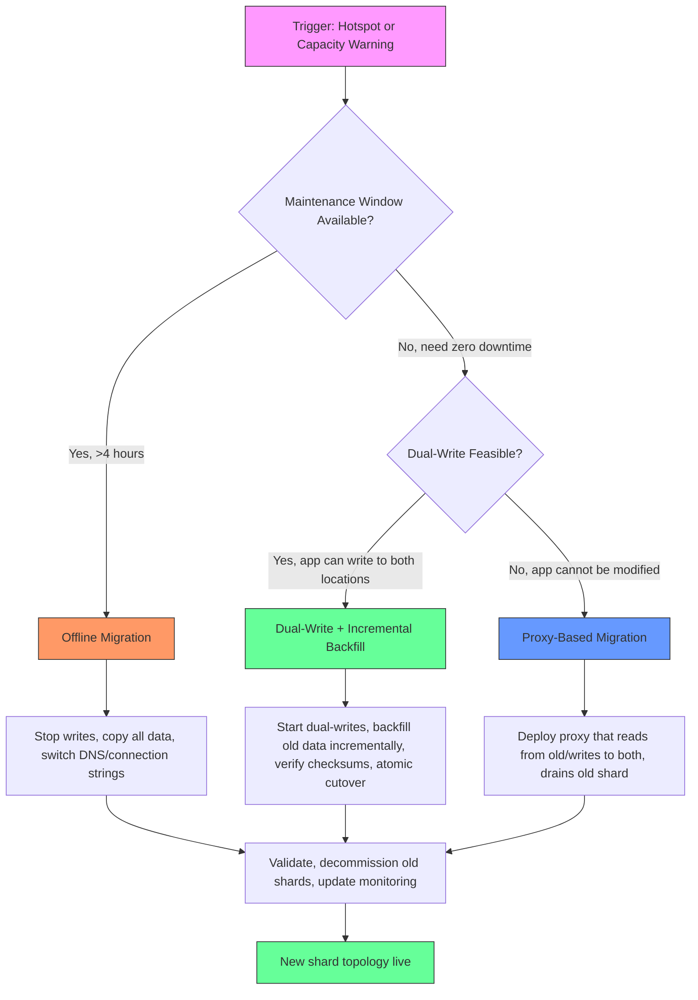
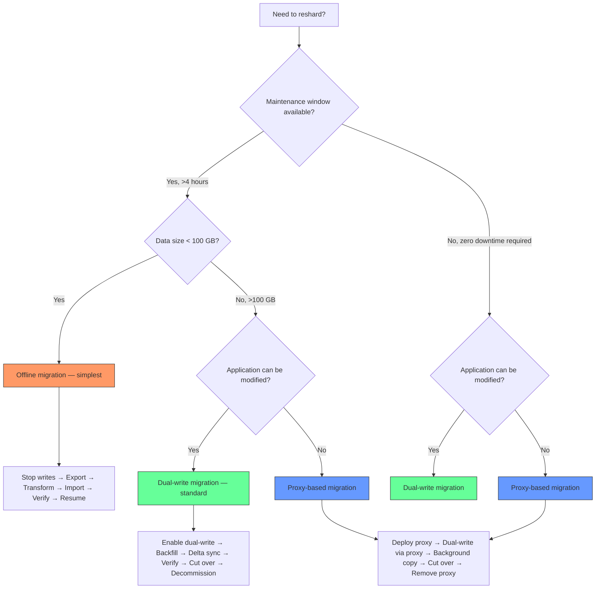

> [!success] Mastery Check
> - [ ] **Studied Well**
> - [ ] **Can explain the concept without notes**
> - [ ] **Can answer interview questions confidently**
> - [ ] **Can implement it in a real project**

---

id: "7.228"
title: "Database Sharding — Resharding and Migration"
domain: "System Design & Distributed Systems"
domain_id: 7
group: "Scalability Patterns"
tags: [system-design, distributed-systems, scalability, dotnet, azure, databases, sharding, resharding, migration, data-movement]
priority: 1
version: 1
prerequisites:
  - "[[7.222 — Database Sharding — Overview]]" — the three shard strategies (range, hash, directory) each have different resharding properties; the overview's invariant (every row belongs to exactly one shard) is the constraint that makes resharding hard — the invariant must be preserved throughout the migration
  - "[[7.223 — Database Sharding — Partition Key Selection]]" — a poorly chosen shard key makes resharding inevitable; the three-property scoring formula (cardinality, distribution, affinity) predicts whether a shard key will trigger resharding — a score below 0.3 on any component means resharding is on the horizon
  - "[[7.229 — Consistent Hashing — Algorithm]]" — consistent hashing is the algorithm that MINIMIZES data movement during resharding; it reduces the fraction of keys that move from ~(N-1)/N (naive modulo) to ~1/N (consistent hashing), which is the difference between a 6-hour migration and a 5-minute one
  - "[[7.230 — Consistent Hashing — Virtual Nodes]]" — virtual nodes make resharding even more granular by distributing each physical node's data across 160+ hash-ring positions; when a node joins or leaves, the data that moves is the smallest contiguous arc on the ring, keeping the migration at ~1/N of total data
related:
  - "[[7.224 — Database Sharding — Range-Based]]" — range-based sharding's resharding challenge: splitting a range requires finding a split point that evenly divides both data and load; range splits are the most common resharding operation in time-series sharded systems
  - "[[7.225 — Database Sharding — Hash-Based]]" — hash-based sharding's resharding challenge: changing the modulus requires moving ~(N-1)/N of the data unless consistent hashing is used; the avalanche effect (every key maps to a new node when N changes) is the primary argument against naive modulo and the primary argument for consistent hashing
  - "[[7.226 — Database Sharding — Directory-Based]]" — directory-based sharding has the simplest resharding story: update the directory entry and the routing changes instantly; the directory IS the migration plan — no modulus change, no range boundaries to adjust
  - "[[7.227 — Database Sharding — Cross-Shard Queries]]" — during resharding, cross-shard queries get worse because the system must route to both the old and new shard locations; the migration window creates a period where data is split across old and new shards, making every query a potential scatter-gather
  - "[[7.232 — Consistent Hashing — Use Cases]]" — DynamoDB, Cassandra, Redis Cluster, and Azure Cosmos DB all use consistent hashing specifically to make resharding practical; understanding how these systems implement resharding informs the decisions in a custom .NET sharded database
  - "[[7.254 — Eventual Consistency Trade-Off for Scale]]" — online resharding relies on eventual consistency between old and new shards during the copy phase; the tradeoff between read-your-writes consistency and migration speed is the central tension in online migration design
  - "[[8.64 — SQL Server Transaction Log Internals]]" — log sequence numbers (LSNs) and change tracking are the foundation for incremental data capture during migration; understanding LSN ranges is required to implement a reliable "copy from this LSN to that LSN" incremental migration
  - "[[7.251 — CQRS for Scalability — Read-Write Split]]" — CQRS is a common architectural pairing with resharding: the write model stays on the old shard during migration while the read model is rebuilt on the new shard; the CQRS pattern's separation of read and write paths provides the isolation needed for zero-downtime resharding
created: 2026-06-16

---

> [!ABSTRACT] Quick Reference — Resharding and Migration **Problem:** The initial shard count and shard key are chosen when the system is small. Over time, data grows, hotspots emerge, and the initial configuration no longer fits. Resharding is the process of changing the number of shards or redistributing data across shards in a live system. **The Core Tension:** Resharding requires moving data from one physical location to another while the system continues to serve reads and writes. The data is live — users are reading old orders, new orders are being created, and existing orders are being updated. The migration must not lose data, must not serve stale reads after cutover, and must complete within a maintenance window (or incrementally with zero downtime). **Strategy Spectrum:** At one end, stop-the-world resharding (offline migration) takes the system down, copies all data to new shards, and brings the system back up. At the other end, zero-downtime resharding uses dual-writes (write to both old and new shards during migration), incremental backfill (copy historical data in batches), and an atomic cutover (flip reads from old to new). **The Cost:** Resharding is the single most expensive operational procedure in a sharded system. It requires coordinating data movement across potentially hundreds of shards, ensuring consistency between old and new locations, and handling failures (a server dies during the migration). The cost is so high that many systems choose their initial shard configuration to be future-proof — over-provisioning shards early to delay or avoid resharding. **The Trigger:** (1) A hotspot shard exceeds 80% CPU or storage capacity. (2) The shard count is too low to scale write throughput — 4 shards cannot provide the throughput needed. (3) The shard key was poorly chosen (e.g., monotonically increasing key in range-based sharding) and creates a write hotspot on the most recent shard. (4) Tenants need to be reassigned — a large tenant outgrows its shared shard. (5) Data must be moved for regulatory compliance (e.g., GDPR data residency requirements).

---


---

## Navigation

**Domain:** [[7 — System Design & Distributed Systems]] > **Group:** Scalability Patterns
**Previous:** [[7.227 — Database Sharding — Cross-Shard Queries]] | **Next:** [[7.229 — Consistent Hashing — Algorithm]]

### Prerequisites

- [[7.222 — Database Sharding — Overview]] — the three shard strategies each have different resharding properties; the fundamental invariant (every row belongs to exactly one shard) is the constraint that makes resharding hard
- [[7.223 — Database Sharding — Partition Key Selection]] — the three-property scoring formula (cardinality, distribution, affinity) predicts whether resharding will be needed; a score below 0.3 on any component means resharding is likely
- [[7.229 — Consistent Hashing — Algorithm]] — consistent hashing is the key algorithmic insight that makes resharding practical at scale; it reduces the fraction of keys that move from ~(N-1)/N to ~1/N
- [[8.64 — SQL Server Transaction Log Internals]] — change tracking and LSN ranges are the mechanisms for incremental data capture during migration; understanding log sequence numbers is required to implement reliable incremental migration

### Where This Fits

Resharding lives at the database operations layer — it is the procedure you execute when the sharding strategy was correct for the data at deployment time but no longer fits the data at scale. The sharding decision is made once (what key, how many shards, which strategy). The resharding operation is executed whenever that decision needs to change. In a .NET production system, an engineer encounters resharding when: (1) the sharded database reaches capacity — one shard is at 90% disk, CPU is pegged on Shard 3 during peak hours; (2) a large tenant acquired by an enterprise customer demands dedicated infrastructure and must be moved from a shared shard to its own shard; (3) the application is migrating from a single-node database to a sharded database (the initial sharding) and must move data from the old single database to the new shards without downtime; (4) regulatory compliance requires moving EU customer data to an EU region. Without a resharding plan, the team is forced to either: over-provision shards upfront (paying for unused capacity for years), accept degraded performance as hotspots develop (throttling writes on the hot shard), or schedule lengthy maintenance windows during which the system is offline. A well-designed resharding strategy is the difference between a 5-minute rolling migration that users do not notice and a 6-hour maintenance window that triggers an SLA breach.

## Core Mental Model

Resharding is the act of changing the mapping between data and physical storage while the data remains live and consistent. Think of it as rearranging the contents of a warehouse while customers are still shopping and the forklifts are running. Every item must remain findable and sellable during the rearrangement, and when the rearrangement is done, every item must be in its new location with no duplicates and no missing items.

The single invariant: **After migration, the shard mapping function must route each key to exactly one shard, and that shard must contain the complete current state for that key.** During migration, the system may temporarily route the same key to two shards (for reads) or write to two shards (for dual-write), but the cutover atomically transitions the system from the old mapping to the new mapping. The window between "start copying" and "cut over" is a period of controlled inconsistency — the old shard has the authoritative state, the new shard has a lagging copy, and the system must ensure that by cutover time, the new shard is caught up and verified.

The fundamental difficulty: **Data movement is limited by the slower of network bandwidth and disk I/O, and during movement, the source data continues to change.** A 500 GB shard moved over a 1 Gbps network takes at least 68 minutes for the initial copy. During those 68 minutes, users continue to write to the source shard, creating delta changes that must be captured and replayed on the destination. The migration is not complete until the delta replay is caught up to the present — and at that point, the cutover must happen atomically to prevent writes from landing on the old shard after the new shard has the latest data.

### Classification

- **Operational pattern:** High-risk database migration procedure. Not a design pattern — it is the execution of a design change on a live system.
- **Where it fits in the scaling lifecycle:**
  1. Design phase — choose shard key and shard count with future growth in mind (over-provision to delay resharding)
  2. Growth phase — monitor shard utilization (CPU, storage, throughput) to predict when resharding is needed
  3. Migration phase — execute the resharding procedure (offline, dual-write, or proxy-based)
  4. Post-migration phase — validate data integrity, decommission old shards, update monitoring thresholds
- **Consistency model impact:** During migration, consistency is degraded from per-shard strong to eventual between old and new locations. Reads during the copy phase may return stale data if they hit the new shard before the copy is complete. After cutover, consistency is restored to per-shard strong.



### Key Properties / Guarantees

| Property | Value | Condition |
|---|---|---|
| Data integrity | All rows exist exactly once on the correct shard | Verified by checksum comparison before cutover |
| Zero data loss | Achievable with dual-write + incremental backfill | Requires idempotent writes and monotonic change tracking (LSN or version stamp) |
| Read availability during migration | 100% (dual-write, proxy) or 0% (offline) | Proxy returns from old shard during copy; dual-write reads from old until cutover |
| Write availability during migration | 100% (dual-write, proxy) or 0% (offline) | Dual-write writes to both; proxy writes to both; offline stops writes |
| Migration duration | Data_size / throughput + delta_catchup_time | The delta catchup phase dominates: you must replay all changes that occurred during the initial copy |
| Consistency during migration | Read-your-writes if reads go to old shard; eventual if reads go to new shard | Controlled by routing policy during migration window |
| Operational risk | HIGH — a failed migration can corrupt data, lose writes, or extend downtime | Risk is proportional to data size, migration duration, and number of concurrent writers |

---

## Deep Mechanics

### How It Works

**Offline Resharding (Stop-the-World)**

The simplest approach — take the system offline, copy all data to the new shard layout, and bring the system back online. Appropriate for small data sets (<50 GB), systems with scheduled maintenance windows, or initial sharding of a previously unsharded database.

```
Step 1: Stop accepting writes (maintenance mode) → set app to read-only
Step 2: Export data from old shards (BCP, SSIS, or custom export)
Step 3: Transform data according to new shard mapping (hash with new modulus, new range boundaries, or new directory entries)
Step 4: Import data into new shards
Step 5: Verify row counts and checksums match
Step 6: Update connection strings and shard map configuration
Step 7: Resume writes (take app out of maintenance mode) → users see new shards
```

Total downtime ≈ data_size / export_throughput + data_size / import_throughput + verification_time. For a 500 GB database with 100 MB/s export and 50 MB/s import: ~4.2 hours downtime.

**Dual-Write Migration (Online, Zero Downtime)**

The production-standard approach for zero-downtime resharding. The application writes to both old and new shards simultaneously during migration, then atomically cuts reads over when the new shard is caught up.

```
Phase 1 — Prepare:
  Deploy the new shard infrastructure (databases, networking, connection strings registered)
  Create the schema on the new shards (identical to old shards)
  Add a "migration in progress" flag to the routing layer

Phase 2 — Dual-Write:
  Every write goes to: (a) the old shard (current authority), (b) the new shard (future authority)
  Reads continue to come from the old shard (avoid reading stale data)
  Both writes must be idempotent — if the write to the new shard fails, it must be retried or queued
  The routing layer logs which shards are in dual-write mode

Phase 3 — Incremental Backfill:
  Copy existing data from old shard to new shard in batches
  Use a cursor (primary key range or modification timestamp) to paginate through the old data
  For each batch: SELECT * FROM old WHERE key BETWEEN @start AND @end, INSERT into new
  The backfill must be idempotent — if a row already exists on the new shard (from dual-write), UPDATE instead of INSERT
  Track progress: for each shard, record the max key migrated, the row count, and the checksum

Phase 4 — Catch-Up:
  After the initial backfill completes, the new shard is missing only the writes that landed
  during the backfill period (which were dual-written and are already there) plus any writes
  that landed on the old shard but failed on the new shard during dual-write
  Run a "delta sync" pass: compare row versions (ROWVERSION or LastModifiedAt > @cutoff)
  between old and new shards and copy any differences

Phase 5 — Verification:
  Compare row counts: SELECT COUNT(*) FROM old_table vs new_table — must match
  Compare checksums: compute CHECKSUM_AGG(BINARY_CHECKSUM(*)) on both sides
  Verify no orphaned rows: rows on new shard must also exist on old shard (or be verified as dual-written)
  Run application-level smoke tests against the new shards

Phase 6 — Atomic Cutover:
  In a database transaction on the routing layer (e.g., an ADR database or directory service):
    UPDATE shard_map SET primary_shard = new_shard_id WHERE shard_key BETWEEN @range
  Once the routing update commits, all new reads and writes go to the new shard
  The dual-write can be safely stopped — writes to the old shard are no longer needed

Phase 7 — Decommission:
  Keep old shards online for 7–30 days (read-only, as a rollback option)
  After the rollback window expires, archive or delete the old shards
```

**Proxy-Based Migration (Transparent, No Application Changes)**

For legacy applications where modifying the application to support dual-writes is impractical. A database proxy intercepts all SQL traffic and routes it to the appropriate shard.

```
Phase 1 — Deploy proxy between application and database:
  The application connects to the proxy (same connection string, different hostname)
  The proxy maintains the shard map and routes queries accordingly
  For each query, the proxy determines which shard(s) need to execute it

Phase 2 — Proxy starts routing:
  All reads go to the old shard
  All writes go to BOTH old and new shards (the proxy rewrites INSERT/UPDATE to dual-write)
  The proxy tracks which shard is the "authority" for reads

Phase 3 — Background copy via proxy:
  The proxy spawns a background worker that copies data from old to new shard
  The copy respects the proxy's transaction boundaries — each batch is a single transaction
  The proxy maintains a "watermark" of how far the copy has progressed

Phase 4 — Cutover:
  The proxy stops reading from the old shard and starts reading from the new shard
  This is a configuration change in the proxy — no application change needed
  The proxy continues to dual-write for a grace period, then stops writing to the old shard
```

### Failure Modes

**1. Dual-Write Partial Failure (Write to New Shard Fails)**

**What happens:** The application writes successfully to the old shard, but the write to the new shard fails (network timeout, constraint violation, new shard is down). The old shard has the data, the new shard is missing it. At cutover time, the data is incomplete on the new shard.

**Detection:** Monitor the dual-write failure rate per shard — log every failed write to the new shard with the old shard write confirmation. Metric: `dual_write_failure_count > 0` is a P1 alert.

**Recovery:** The delta sync phase (Phase 4) must catch these missed writes. Use a `LastModifiedAt` column or `ROWVERSION` to identify rows on the old shard that are newer than the corresponding row on the new shard. The delta sync queries: `SELECT * FROM old WHERE ROWVERSION > @lastVerifiedVersion AND PRIMARY KEY > @lastMigratedKey`. Every missed write is captured in the delta sync.

**Prevention:** Make the dual-write reliable — use a queue (Azure Service Bus or in-memory channel with retry) to ensure the new-shard write eventually succeeds. The dual-write should not block the user response: write to old shard synchronously, write to new shard asynchronously with guaranteed delivery.

**2. Cutover Race Condition (Write Lands on Wrong Shard After Cutover)**

**What happens:** The cutover updates the routing table to point reads to the new shard. Between the cutover transaction committing and the application's cached routing being invalidated, a write goes to the old shard (routing cache is stale). The write is lost — it never reaches the new shard.

**Detection:** After cutover, compare row counts and checksums between old and new shards. A discrepancy indicates a lost write during cutover.

**Recovery:** Keep old shards read-write for a grace period after cutover. Run a final delta sync 5 minutes after cutover to catch any stale-routing writes. Only decommission old shards after the grace period expires.

**Prevention:** (a) Use a short TTL on the routing cache (5 seconds) during cutover — the stale window is bounded by the TTL. (b) Use a "cutover lock" — a distributed lock (Azure Blob lease or Redis RedLock) that the application acquires before writing during the cutover window; the lock forces a routing refresh on acquisition failure. (c) Use a versioned routing table — the cutover increments a version number, and the application must refresh its routing on version mismatch.

**3. Backfill Performance Impact on Production (Old Shard Throttling)**

**What happens:** The backfill query (`SELECT * FROM old_table WHERE key BETWEEN @start AND @end`) scans the old shard's data pages, consuming I/O and CPU that the production workload needs. During peak hours, the backfill competes with user queries for resources, causing P99 latency spikes of 5–10× on the production shard.

**Detection:** Monitor old shard CPU, DTU/Azure SQL DTU percentage, and P99 query latency during the backfill window. A correlation between backfill batch progress and latency spikes indicates contention.

**Recovery:** Throttle the backfill rate — reduce batch size from 10,000 rows to 1,000 rows, increase the sleep between batches from 100ms to 1 second. Better: use `WAITFOR DELAY` or a token-bucket limiter per shard.

**Prevention:** (a) Run the backfill during off-peak hours (2 AM – 6 AM). (b) Use Azure SQL Database's `SET ROWCOUNT` or `OPTION (MAXDOP 1)` to limit the backfill query's resource consumption. (c) Use a secondary replica (read-only) for the backfill SELECT — the old shard's read replica handles the copy, leaving the primary free for writes. (d) Use change tracking (CDC) instead of full table scans — only copy the rows that have changed since the last batch.

**4. Checksum Mismatch at Verification (Silent Data Corruption)**

**What happens:** The verification phase compares CHECKSUM_AGG between old and new shards and finds a mismatch. The mismatch could be: (a) data that was in the old shard but never copied (a batch was missed), (b) data that was copied but modified afterward (a post-copy write that was not dual-written), (c) actual data corruption during the copy (network bit-flip, disk error).

**Detection:** The verification query returns non-zero difference. Detailed diff (row-by-row using primary key) identifies the specific rows that differ.

**Recovery:** (a) If rows are missing on the new shard: re-run the backfill for the missing key range. (b) If rows differ: determine which version is correct by checking the modification timestamp — the newer version from the old shard wins. (c) If corruption is suspected: restore from backup and re-verify.

**Prevention:** (a) Use `BINARY_CHECKSUM` with CHECKSUM_AGG for fast comparison — not perfectly reliable (hash collisions), but catches 99.9% of mismatches. (b) For critical systems, use a row-by-row comparison on a random sample. (c) Enable page-level checksums (Azure SQL Database does this by default) to prevent silent corruption during copy.

### .NET and Azure Integration

**Azure SQL Database Elastic Scale Split-Merge Service:** Azure provides a managed service for resharding Elastic Scale sharded databases — the Split-Merge service. It implements the dual-write + incremental backfill pattern natively:

```csharp
// Port: Azure Elastic Scale Split-Merge configuration
// The Split-Merge service is an Azure Cloud Service (web role + worker role)
// that runs the migration logic. The application registers for notifications
// when the migration is complete.

// Configure the split-merge service endpoints
var smConfig = new SplitMergeConfiguration
{
    SplitMergeWebEndpoint = "https://<cloudservice>.cloudapp.net/",
    SplitMergeWorkerEndpoint = "https://<cloudservice>.cloudapp.net/worker/",
    ApiKey = config["ElasticScale:SplitMergeApiKey"],
    UseHttps = true
};

// Define the split operation: split shard [0, 100) into [0, 50) and [50, 100)
var splitRequest = new SplitMergeRequest
{
    ShardMapName = "CustomerShardMap",
    SourceShardKeyMin = 0,
    SourceShardKeyMax = 100,
    // Split point: key values < 50 stay on the source, >= 50 go to the new shard
    SplitValue = 50,
    TargetShardKeyMin = 50,
    TargetShardKeyMax = 100
};

// The service handles:
// - Deploying the new shard
// - Setting up dual-writes via the routing layer
// - Copying data incrementally
// - Catching up delta changes
// - Atomic cutover
// - Notification on completion
await splitMergeService.SubmitSplitRequestAsync(splitRequest, smConfig);
```

**ASP.NET Core routing layer with migration state:**

```csharp
// Port: Shard routing middleware with migration awareness
public class MigrationAwareShardRouter
{
    private readonly IShardMapManager _shardMap;
    private readonly ILogger<MigrationAwareShardRouter> _logger;
    private MigrationState _currentMigration = MigrationState.None;

    // Read routing — during migration, reads come from the OLD shard
    // until the cutover is complete
    public ShardLocation GetReadShard<T>(T shardKey)
    {
        if (_currentMigration == MigrationState.CutoverComplete)
        {
            return _shardMap.GetShardForKey(shardKey, Policy.New);
        }

        // During backfill: reads from old shard (authority)
        return _shardMap.GetShardForKey(shardKey, Policy.Old);
    }

    // Write routing — during migration, writes go to BOTH shards
    public (ShardLocation old, ShardLocation? new) GetWriteShards<T>(T shardKey)
    {
        var old = _shardMap.GetShardForKey(shardKey, Policy.Old);

        ShardLocation? newShard = _currentMigration switch
        {
            MigrationState.DualWrite => _shardMap.GetShardForKey(shardKey, Policy.New),
            _ => null
        };

        return (old, newShard);
    }
}

// Program.cs — register the migration-aware router
builder.Services.AddSingleton<MigrationAwareShardRouter>();
builder.Services.AddSingleton<IShardMapManager>(sp =>
{
    var config = sp.GetRequiredService<IConfiguration>();
    return new AzureSqlShardMapManager(
        config["ElasticScale:ShardMapManagerConnectionString"],
        config["ElasticScale:ShardMapName"]);
});
```


---

## Production Patterns and Implementation

### Primary Implementation

The canonical resharding migration framework implements the dual-write + incremental backfill pattern. This implementation is generic across shard strategies — it uses a `IShardMigrator` abstraction that works with range, hash, and directory-based sharding:

```csharp
// Port: Dual-write migration orchestrator
public sealed class ShardMigrationOrchestrator<TShardKey>
    where TShardKey : IComparable<TShardKey>
{
    private readonly IShardMapRepository _shardMap;
    private readonly IDataCopyService<TShardKey> _dataCopier;
    private readonly IVerificationService _verifier;
    private readonly DualWriteChannel _dualWriteChannel;
    private readonly ILogger<ShardMigrationOrchestrator<TShardKey>> _logger;

    public ShardMigrationOrchestrator(
        IShardMapRepository shardMap,
        IDataCopyService<TShardKey> dataCopier,
        IVerificationService verifier,
        DualWriteChannel dualWriteChannel,
        ILogger<ShardMigrationOrchestrator<TShardKey>> logger)
    {
        _shardMap = shardMap;
        _dataCopier = dataCopier;
        _verifier = verifier;
        _dualWriteChannel = dualWriteChannel;
        _logger = logger;
    }

    // Entry point — starts the full migration lifecycle
    public async Task<MigrationResult> MigrateAsync(
        ShardMigrationPlan<TShardKey> plan, CancellationToken ct)
    {
        _logger.LogInformation(
            "Starting migration for {ShardCount} shard(s) to new topology",
            plan.SourceShards.Count);

        // Phase 1: Enable dual-write
        await EnableDualWriteAsync(plan.TargetShards, ct);

        // Phase 2: Incremental backfill from source to target
        var backfillResult = await RunIncrementalBackfillAsync(plan, ct);

        // Phase 3: Catch-up delta sync
        var deltaResult = await RunDeltaSyncAsync(plan, ct);

        // Phase 4: Verification
        var verificationResult = await _verifier.VerifyAsync(
            plan.SourceShards, plan.TargetShards, ct);

        if (!verificationResult.IsValid)
        {
            _logger.LogError("Verification failed: {Errors}",
                string.Join(", ", verificationResult.Errors));
            return MigrationResult.Failed(verificationResult.Errors);
        }

        // Phase 5: Atomic cutover
        var cutoverResult = await CutOverAsync(plan, ct);

        // Phase 6: Decommission old shards
        await DecommissionOldShardsAsync(plan, ct);

        return MigrationResult.Succeeded(
            cutoverResult.Duration, verificationResult);
    }

    private async Task EnableDualWriteAsync(
        IReadOnlyList<ShardInfo<TShardKey>> targetShards, CancellationToken ct)
    {
        // Register target shards in the shard map as "secondary"
        foreach (var target in targetShards)
        {
            // The shard map now knows: for key range R, the primary is old shard S1,
            // secondary is new shard S2. Both receive writes.
            await _shardMap.RegisterSecondaryShardAsync(target, ct);
        }

        // Start consuming dual-write channel — every write to old shard
        // is also published to the dual-write channel for async replay on target
        _dualWriteChannel.StartConsuming(async (writeEvent) =>
        {
            foreach (var target in targetShards
                .Where(s => s.KeyRange.Contains(writeEvent.ShardKey)))
            {
                try
                {
                    await ExecuteDualWriteAsync(target, writeEvent, ct);
                }
                catch (Exception ex)
                {
                    // Enqueue for retry — the delta sync will catch it
                    _logger.LogWarning(ex,
                        "Dual-write to {ShardId} failed, queued for retry",
                        target.ShardId);
                    await _dualWriteChannel.EnqueueRetryAsync(writeEvent, ct);
                }
            }
        });
    }

    private async Task<BackfillResult> RunIncrementalBackfillAsync(
        ShardMigrationPlan<TShardKey> plan, CancellationToken ct)
    {
        long totalRowsMigrated = 0;

        foreach (var (source, target) in plan.ShardPairs)
        {
            _logger.LogInformation(
                "Backfilling from shard {SourceId} to shard {TargetId}",
                source.ShardId, target.ShardId);

            // Throttled batch copy — respects shard resource limits
            var backfillOptions = new BackfillOptions
            {
                BatchSize = 1000,
                ThrottleDelayMs = 100,
                MaxDegreeOfParallelism = 4,
                UseReadReplica = true // Copy from replica to avoid primary load
            };

            await foreach (var batch in _dataCopier.CopyBatchesAsync(
                source, target, backfillOptions, ct))
            {
                totalRowsMigrated += batch.RowsCopied;
                _logger.LogInformation(
                    "Backfill progress: {Progress}% on shard {ShardId} ({RowsCopied} rows)",
                    batch.PercentComplete, source.ShardId, totalRowsMigrated);
            }
        }

        return new BackfillResult(totalRowsMigrated);
    }

    private async Task<DeltaResult> RunDeltaSyncAsync(
        ShardMigrationPlan<TShardKey> plan, CancellationToken ct)
    {
        int totalMissedWrites = 0;

        foreach (var (source, target) in plan.ShardPairs)
        {
            // Find rows on the source shard that are newer than
            // the corresponding row on the target shard
            var missedWrites = await _dataCopier
                .CopyDeltaChangesAsync(source, target, ct);

            totalMissedWrites += missedWrites;
        }

        _logger.LogInformation(
            "Delta sync complete: {MissedCount} missed writes replayed",
            totalMissedWrites);

        return new DeltaResult(totalMissedWrites);
    }

    private async Task<CutoverResult> CutOverAsync(
        ShardMigrationPlan<TShardKey> plan, CancellationToken ct)
    {
        _logger.LogInformation("Performing atomic cutover...");
        var sw = Stopwatch.StartNew();

        // Atomic update of the shard map — flip primary to new shards
        // This is a single transaction against the shard map repository
        var routingUpdates = plan.ShardPairs.Select(pair =>
            new RoutingUpdate<TShardKey>(
                pair.Target.KeyRange,
                PrimaryShard: pair.Target.ShardId));

        await _shardMap.AtomicUpdatePrimaryAsync(routingUpdates, ct);

        // Invalidate routing caches — force refresh from the shard map
        await _shardMap.InvalidateCacheAsync(ct);

        sw.Stop();
        _logger.LogInformation(
            "Cutover completed in {DurationMs}ms", sw.ElapsedMilliseconds);

        return new CutoverResult(sw.ElapsedMilliseconds);
    }
}
```

### Configuration and Wiring

```csharp
// Program.cs — migration service registration
var builder = WebApplication.CreateBuilder(args);

// Dual-write channel with guaranteed delivery
builder.Services.AddSingleton<DualWriteChannel>(sp =>
{
    var config = sp.GetRequiredService<IConfiguration>();
    return new DualWriteChannel(new BoundedChannelOptions(
        config.GetValue<int>("Migration:DualWrite:ChannelCapacity")),
        maxRetries: 3);
});

// Data copy service — copies rows between shards
builder.Services.AddSingleton<IDataCopyService<int>, SqlShardDataCopyService>();
builder.Services.AddSingleton<IVerificationService, ChecksumVerificationService>();

// Migration orchestrator
builder.Services.AddSingleton<ShardMigrationOrchestrator<int>>();

// Migration management endpoint — admin API to trigger resharding
builder.Services.AddHostedService<MigrationBackgroundWorker>();

var app = builder.Build();

// Migration admin endpoints (protected by admin authentication)
app.MapPost("/migrations/start", async (
    ShardMigrationPlan<int> plan,
    ShardMigrationOrchestrator<int> orchestrator,
    CancellationToken ct) =>
{
    // Fire-and-forget with status tracking
    var jobId = Guid.NewGuid();
    _ = orchestrator.MigrateAsync(plan, ct);
    return Results.Accepted($"/migrations/{jobId}/status");
});
```

```json
// appsettings.json
{
  "Sharding": {
    "ShardMapConnectionString": "Server=tcp:shardmap.database.windows.net;Database=ShardMap;..."
  },
  "Migration": {
    "DualWrite": {
      "Enabled": false,
      "ChannelCapacity": 10000,
      "MaxRetries": 3,
      "RetryDelaySeconds": 5
    },
    "Backfill": {
      "BatchSize": 1000,
      "ThrottleDelayMs": 200,
      "MaxParallelShards": 4,
      "UseReadReplica": true
    },
    "Cutover": {
      "CacheInvalidationTtlSeconds": 5,
      "GracePeriodMinutes": 30,
      "RequireVerification": true
    },
    "Decommission": {
      "KeepOnlineDays": 30,
      "ArchiveConnectionString": "..."
    }
  }
}
```

### Common Variants

**Variant 1 — Shard split (range-based).** Split a hotspot shard into two equal-sized shards. The migration framework is the same but the target topology is different: one source shard → two target shards with adjacent key ranges:

```csharp
// Port: Split shard S0 into S0a ([0, 500)) and S0b ([500, 1000))
var splitPlan = ShardMigrationPlan<int>.Split(
    sourceShard: new ShardInfo<int>(shardId: 0, keyRange: Range(0, 1000)),
    splitPoint: 500,
    targetShards: new[]
    {
        new ShardInfo<int>(shardId: 10, keyRange: Range(0, 500)),
        new ShardInfo<int>(shardId: 11, keyRange: Range(500, 1000))
    });

await orchestrator.MigrateAsync(splitPlan, ct);
```

**Variant 2 — Shard merge (for cold data).** Merge two low-traffic shards into one. The target shard contains the union of both source key ranges:

```csharp
// Port: Merge shards S1 ([500, 1000)) and S2 ([1000, 1500)) into S3 ([500, 1500))
var mergePlan = ShardMigrationPlan<int>.Merge(
    sourceShards: new[]
    {
        new ShardInfo<int>(shardId: 1, keyRange: Range(500, 1000)),
        new ShardInfo<int>(shardId: 2, keyRange: Range(1000, 1500))
    },
    targetShard: new ShardInfo<int>(shardId: 3, keyRange: Range(500, 1500)));

await orchestrator.MigrateAsync(mergePlan, ct);
```

**Variant 3 — Re-keying (change shard key).** Move rows from an old shard key to a new shard key. This is the most complex variant because the routing function changes entirely — not just the number of shards, but the column that determines routing:

```csharp
// Port: Re-key from CustomerId to TenantId + CustomerId (composite key)
// Phase 1: Create new shards with TenantId as the shard key
// Phase 2: For each customer, determine the new TenantId and copy to new shard
// Phase 3: After cutover, the old CustomerId routing is gone

public async Task ReKeyAsync(CancellationToken ct)
{
    var rekeyPlan = new ReKeyingPlan
    {
        OldShardKeyColumn = "CustomerId",
        NewShardKeyColumn = "TenantId",
        // Strategy: read all rows, compute new TenantId, insert into new shard
        Transformation = row => new
        {
            TenantId = LookupTenantId(row.CustomerId),
            row.CustomerId,
            row.OrderData
        }
    };

    // Sequential migration per customer — no need for dual-write
    // because each customer moves atomically
    await foreach (var batch in _dataCopier.CopyWithTransformationAsync(
        rekeyPlan, ct))
    {
        // After each batch, update the routing directory atomically
        // Old: CustomerId → Shard 2
        // New: TenantId + CustomerId → Shard 12
        await _shardMap.UpdateRoutingAsync(
            batch.Keys.Select(k => new RoutingEntry
            {
                ShardKey = k.NewKey,
                ShardId = batch.TargetShardId,
                OldShardKey = k.OldKey
            }), ct);
    }
}
```

**Variant 4 — Tenant relocation (directory-based).** Move a specific tenant from a shared shard to a dedicated shard. The directory already maps each tenant to a shard — just update the entry and copy the tenant's data:

```csharp
// Port: Tenant relocation — move tenant 42 from shared shard to dedicated shard
public async Task RelocateTenantAsync(
    int tenantId, int targetShardId, CancellationToken ct)
{
    var sourceShardId = await _directory.GetShardForTenantAsync(tenantId, ct);

    // Copy tenant's data atomically
    await _dataCopier.CopyTenantAsync(
        sourceShardId, targetShardId, tenantId, ct);

    // Update directory — all future requests for tenant 42 go to target shard
    await _directory.UpdateMappingAsync(
        tenantId, targetShardId, ct);

    // Delete from old shard (after grace period)
    await _dataCleanupService.DeleteTenantAfterGracePeriodAsync(
        sourceShardId, tenantId, gracePeriod: TimeSpan.FromDays(7), ct);
}
```

### Real-World .NET Ecosystem Example

**Azure Cosmos DB — automatic partition splitting.** Cosmos DB handles resharding transparently at the physical partition level. Logical partition keys do not change, but the underlying physical partitions split automatically as data grows:

```csharp
// Port: Cosmos DB handles resharding internally — the application is unaware
public sealed class CosmosReshardingAwareService
{
    private readonly Container _container;
    private readonly ILogger<CosmosReshardingAwareService> _logger;

    public CosmosReshardingAwareService(
        Container container, ILogger<CosmosReshardingAwareService> logger)
    {
        _container = container;
        _logger = logger;
    }

    // The application writes to the same partition key — Cosmos DB
    // transparently redistributes physical partitions as data grows
    public async Task IngestTelemetryAsync(
        string deviceId, TelemetryReading reading, CancellationToken ct)
    {
        // deviceId is the logical partition key
        // Cosmos DB auto-splits physical partitions when they exceed 20 GB
        // or when throughput exceeds 10,000 RU/s per physical partition
        await _container.CreateItemAsync(
            reading, new PartitionKey(deviceId), cancellationToken: ct);
    }

    // Monitor physical partition count to know when auto-scaling happens
    public async Task MonitorPartitionCountAsync(CancellationToken ct)
    {
        var query = _container.GetItemQueryIterator<PartitionMetric>(
            "SELECT VALUE c FROM c WHERE c.resourceType = 'partition'",
            requestOptions: new QueryRequestOptions
            {
                PartitionKey = PartitionKey.None // Cross-partition query
            });

        while (query.HasMoreResults)
        {
            var page = await query.ReadNextAsync(ct);
            foreach (var metric in page)
            {
                _logger.LogInformation(
                    "Physical partition {PartitionId}: {SizeInGB} GB, {RUConsumed} RU/s",
                    metric.Id, metric.SizeInGB, metric.RUConsumed);
                // When a partition exceeds 20 GB or >10,000 RU/s,
                // Cosmos DB automatically splits it into two
            }
        }
    }
}
```

**How Cosmos DB resharding works internally:**
1. The `deviceId` partition key defines the logical partition — application data is grouped by this key.
2. Physical partitions each hold multiple logical partitions. When a physical partition exceeds 20 GB or its provisioned throughput (10,000 RU/s per partition), Cosmos DB splits it into two physical partitions.
3. The split is transparent: the gateway and SDK continue to route by logical partition key, and the Cosmos DB backend transparently distributes logical partitions across the new physical partitions.
4. The split is zero-downtime: Cosmos DB performs the split online, with no interruption to read or write operations. The split may cause a brief latency spike (200-500ms) as the partition metadata is redistributed.

**The critical difference from custom sharding:** Cosmos DB handles resharding automatically. You do NOT need to implement dual-write, backfill, or cutover. The tradeoff: (a) you cannot control which logical partitions end up on which physical nodes (no data residency control); (b) the automatic split has a throughput ceiling per logical partition (10,000 RU/s); (c) if the split happens during peak hours, the latency spike may affect user-facing SLAs — provision extra RU/s during growth periods to prevent the split from being triggered during traffic peaks.


---

## Gotchas and Production Pitfalls

### [Pitfall Name] Dual-Write Ordering: Writing to New Shard Before Old Shard

**Pitfall:** The application writes to the new shard first, then the old shard. If the write to the old shard fails, the new shard has data that does not exist on the old shard. The delta sync (which compares old → new) never catches it because the data is on the new shard but not the old shard — and the system assumes the old shard is authoritative.

```csharp
// ❌ Wrong — new shard write succeeds, old shard write fails
try
{
    // Write to new shard first — if this succeeds and the old shard fails,
    // the new shard has an orphaned row that the delta sync never catches
    await newShardConnection.ExecuteAsync(
        "INSERT INTO Orders (Id, CustomerId, Total) VALUES (@Id, @Cust, @Total)",
        order);
    await oldShardConnection.ExecuteAsync(
        "INSERT INTO Orders (Id, CustomerId, Total) VALUES (@Id, @Cust, @Total)",
        order);
}
catch (Exception ex)
{
    _logger.LogError(ex, "Dual-write failed");
}

// ✅ Right — write to old shard first (authority), then new shard
// If the new shard write fails, the old shard still has the data,
// and the delta sync will catch it (old → new comparison)
await oldShardConnection.ExecuteAsync(
    "INSERT INTO Orders (Id, CustomerId, Total) VALUES (@Id, @Cust, @Total)",
    order);

try
{
    await newShardConnection.ExecuteAsync(
        "INSERT INTO Orders (Id, CustomerId, Total) VALUES (@Id, @Cust, @Total)",
        order);
}
catch (Exception ex)
{
    // Log and enqueue for retry — delta sync will replay
    _logger.LogWarning(ex, "New shard write failed, queued for retry");
    await _retryQueue.EnqueueAsync(order);
}
```

**Symptom:** Post-migration verification passes counts and checksums but the new shard has orphaned rows or the old shard is missing rows. This manifests as "ghost" data appearing on the new shard after cutover that was never present in the old shard.

**Fix:** Always write to the old shard (authority) first. The new shard write is a secondary operation — its failure is recoverable via delta sync. The old shard write failure means the operation cannot proceed — either retry or fail the user request.

**Cost of not fixing:** Silent data divergence between old and new shards. After cutover, users see data on the new shard that is not in the old shard — and if rollback is needed, that data is lost entirely (it never existed on the old shard).

### [Pitfall Name] Backfill Without Idempotency

**Pitfall:** The backfill uses `INSERT` instead of `MERGE` or `INSERT IF NOT EXISTS`. When a row that was dual-written during the backfill is encountered again by the backfill cursor, the `INSERT` fails with a primary key violation, causing the batch to abort.

```csharp
// ❌ Wrong — INSERT during backfill fails on rows already added by dual-write
public async Task<int> CopyBatchAsync(
    SqlConnection source, SqlConnection target,
    long startKey, long endKey, CancellationToken ct)
{
    var rows = await source.QueryAsync<Order>(
        "SELECT * FROM Orders WHERE Id BETWEEN @s AND @e",
        new { s = startKey, e = endKey });

    foreach (var row in rows)
    {
        // If this row was already written by dual-write, this throws
        // Violation of PRIMARY KEY constraint
        await target.ExecuteAsync(
            "INSERT INTO Orders (Id, CustomerId, Total, CreatedAt) " +
            "VALUES (@Id, @Cust, @Total, @Created)", row);
    }
    return rows.Count();
}

// ✅ Right — MERGE or INSERT IF NOT EXISTS with UPDATE fallback
public async Task<int> CopyBatchAsync(
    SqlConnection source, SqlConnection target,
    long startKey, long endKey, CancellationToken ct)
{
    var rows = await source.QueryAsync<Order>(
        "SELECT * FROM Orders WHERE Id BETWEEN @s AND @e",
        new { s = startKey, e = endKey });

    foreach (var row in rows)
    {
        await target.ExecuteAsync(
            """
            MERGE Orders AS target
            USING (SELECT @Id AS Id) AS source
            ON target.Id = source.Id
            WHEN MATCHED THEN UPDATE SET
                CustomerId = @Cust, Total = @Total, CreatedAt = @Created
            WHEN NOT MATCHED THEN INSERT (Id, CustomerId, Total, CreatedAt)
                VALUES (@Id, @Cust, @Total, @Created);
            """, row);
    }
    return rows.Count();
}
```

**Symptom:** The backfill job fails mid-way with primary key violation errors. The migration retries from the beginning each time, never making progress. The log shows `Violation of PRIMARY KEY constraint 'PK_Orders'. Cannot insert duplicate key`.

**Fix:** Always use `MERGE` for backfill. If your database does not support `MERGE` (e.g., Azure SQL Database does), use `IF NOT EXISTS (SELECT 1 FROM target WHERE Id = @Id) INSERT ... ELSE UPDATE ...`.

**Cost of not fixing:** The backfill cannot complete while dual-write is active. The migration stalls indefinitely. The engineering team is forced to either stop dual-writes (risking data loss) or run a full data reload (doubling the migration time).

### [Pitfall Name] Atomic Cutover Without Cache Invalidation

**Pitfall:** The application caches the shard-to-key mapping (e.g., "CustomerId 42 → Shard 2") with a 5-minute TTL. The cutover updates the shard map database, but the application continues to route writes to the old shard for up to 5 minutes because the cached mapping is stale. Writes landing on the old shard after cutover are lost when the old shard is decommissioned.

```csharp
// ❌ Wrong — cached routing with long TTL, no invalidation on cutover
public class CachedShardRouter
{
    private readonly MemoryCache _cache = new(new MemoryCacheOptions());
    private readonly TimeSpan _ttl = TimeSpan.FromMinutes(5);

    public async Task<int> GetShardForKeyAsync(int customerId)
    {
        // Cache hit returns stale routing for up to 5 minutes after cutover
        return await _cache.GetOrCreateAsync(
            $"shard:{customerId}",
            async entry =>
            {
                entry.AbsoluteExpirationRelativeToNow = _ttl;
                return await _shardMap.GetShardForKeyAsync(customerId);
            });
    }
}

// ✅ Right — cutover-aware cache with version-based invalidation
public class CutoverAwareRouter
{
    private readonly IDistributedCache _cache;
    private readonly IShardMapRepository _shardMap;

    public async Task<int> GetShardForKeyAsync(
        int customerId, long routingVersion, CancellationToken ct)
    {
        var cacheKey = $"shard:{customerId}:v{routingVersion}";
        var shardId = await _cache.GetAsync<int>(cacheKey, ct);
        if (shardId != 0) return shardId;

        shardId = await _shardMap.GetShardForKeyAsync(customerId, ct);
        await _cache.SetAsync(cacheKey, shardId,
            new DistributedCacheEntryOptions
            {
                AbsoluteExpirationRelativeToNow = TimeSpan.FromMinutes(1)
            }, ct);
        return shardId;
    }
}

// Cutover increments the routing version — all caches become stale immediately
public async Task CutoverAsync(CancellationToken ct)
{
    long newVersion = await _shardMap.IncrementRoutingVersionAsync(ct);
    // All routers must now use the new version to read fresh mappings
    await _shardMap.UpdatePrimaryShardsAsync(
        plan.ShardPairs, newVersion, ct);
}
```

**Symptom:** After cutover, some writes still go to the old shard. The new shard is incomplete. When the old shard is decommissioned a week later, support tickets start arriving: "My order from Tuesday is missing." The data is gone.

**Fix:** Use version-based cache invalidation that forces all routers to refresh their mapping on cutover. Set the cutover TTL to 5 seconds during the migration window. Use a distributed invalidation bus (Redis pub/sub or Azure Service Bus) to broadcast "routing version changed" to all application instances.

**Cost of not fixing:** Permanent data loss for writes that hit the stale cache after cutover. The only recovery is restoring from backup and replaying the transaction log — a multi-hour operation with an SLA breach.

### [Pitfall Name] Backfill from Primary Instead of Replica

**Pitfall:** The backfill SELECT runs against the primary (read-write) replica of the old shard. During peak hours, the backfill queries consume I/O and CPU, degrading production query performance.

```csharp
// ❌ Wrong — backfill reads from primary, competing with user traffic
await using var sourceConn = new SqlConnection(primaryConnectionString);
var rows = await sourceConn.QueryAsync<Order>(
    "SELECT * FROM Orders WITH (NOLOCK) WHERE Id BETWEEN @s AND @e");

// ✅ Right — backfill reads from a read replica, primary stays free
await using var sourceConn = new SqlConnection(readReplicaConnectionString);
var rows = await sourceConn.QueryAsync<Order>(
    "SELECT * FROM Orders WHERE Id BETWEEN @s AND @e");

// Alternatively: use change tracking instead of full table scan
await using var cdcConn = new SqlConnection(primaryConnectionString);
var changes = await cdcConn.QueryAsync<OrderChange>(
    "SELECT * FROM cdc.fn_cdc_get_all_changes_..."
    + "(@fromLsn, @toLsn, N'all')");
```

**Symptom:** P99 query latency on the old shard spikes from 50ms to 500ms during backfill hours. The on-call engineer sees an unexpected DTU spike on the production primary. The backfill is competing with user queries for the same I/O channel.

**Fix:** Always backfill from a read replica. If read replicas are not available, use change data capture (CDC) which reads from the transaction log (less I/O than a full table scan) or run the backfill during off-peak hours with aggressive throttling (`WAITFOR DELAY '0:00:01'` between batches).

**Cost of not fixing:** Production performance degradation during migration. If the migration runs during business hours, user-facing query latency triples. For a SaaS platform with a 100ms P99 SLO, this is an SLA breach.

### [Pitfall Name] Assuming Identical Schema on Old and New Shards

**Pitfall:** The backfill assumes the old and new shards have identical schemas. In practice, the resharding is often the right time to apply schema changes (new columns, different indexing). The INSERT fails because the new shard has columns the old shard does not, or vice versa.

```csharp
// ❌ Wrong — SELECT * with implicit column mapping
var rows = await source.QueryAsync("SELECT * FROM Orders");
// New shard has a "Region" column (added for the new routing strategy)
// but the old shard does not. The INSERT fails:
// "Cannot insert the value NULL into column 'Region', column does not allow nulls."
await target.ExecuteAsync("INSERT INTO Orders SELECT * FROM @rows", rows);

// ✅ Right — explicit column mapping with transformation
public class OrderMigrationTransformer : IRowTransformer<Order>
{
    public Order Transform(Order sourceOrder, int targetShardId)
    {
        return sourceOrder with
        {
            // New shard uses TenantId as the shard key instead of CustomerId
            TenantId = LookupTenantId(sourceOrder.CustomerId),
            Region = DetermineRegion(sourceOrder.CustomerId)
        };
    }
}

var rows = await source.QueryAsync<Order>(
    "SELECT CustomerId, OrderDate, ... FROM Orders");
foreach (var row in rows)
{
    var transformed = transformer.Transform(row, targetShardId);
    await target.ExecuteAsync(
        "INSERT INTO Orders (CustomerId, TenantId, Region, OrderDate, ...) " +
        "VALUES (@CustomerId, @TenantId, @Region, @OrderDate, ...)",
        transformed);
}
```

**Symptom:** The backfill batch fails with `Cannot insert the value NULL into column 'Region'` or `The given column name 'LegacyColumn' does not match the target table`. The migration is blocked mid-way and the team must decide: alter the new shard schema or fix the backfill query — both require a migration restart.

**Fix:** Use explicit column lists in both SELECT and INSERT. Define a schema mapping document that lists every column's name, type, nullability, and transformation rule for old → new. Version the schema mapping and store it alongside the migration plan.

**Cost of not fixing:** Mid-migration schema failure. The backfill is partially complete — some rows are on the new shard, some are not. The team must either: (a) truncate the new shard and restart with the correct schema, adding hours to the migration window, or (b) manually fix the mismatched rows, risking data integrity issues.

### [Pitfall Name] Verification Checksum Collision

**Pitfall:** Using `CHECKSUM_AGG(BINARY_CHECKSUM(*))` for row-level verification. `CHECKSUM` uses a 32-bit hash — with millions of rows, the probability of a hash collision across two data sets is non-trivial (birthday paradox). A collision means the verification passes even though the data differs.

```csharp
// ❌ Wrong — 32-bit checksum collision risk
var oldChecksum = await source.QuerySingleAsync<int>(
    "SELECT CHECKSUM_AGG(BINARY_CHECKSUM(*)) FROM Orders");
var newChecksum = await target.QuerySingleAsync<int>(
    "SELECT CHECKSUM_AGG(BINARY_CHECKSUM(*)) FROM Orders");

if (oldChecksum != newChecksum)
{
    throw new VerificationException("Checksum mismatch");
}

// ✅ Right — use HASHBYTES with SHA2_256 for row-level verification
var oldHash = await source.QuerySingleAsync<string>(
    "SELECT CONVERT(NVARCHAR(64), HASHBYTES('SHA2_256', " +
    "(SELECT ... FROM Orders ORDER BY Id FOR JSON AUTO)), 2)");
var newHash = await target.QuerySingleAsync<string>(
    "SELECT CONVERT(NVARCHAR(64), HASHBYTES('SHA2_256', " +
    "(SELECT ... FROM Orders ORDER BY Id FOR JSON AUTO)), 2)");

if (oldHash != newHash)
{
    // Fall back to row-by-row comparison for exact match
    var diff = await CompareRowByRowAsync(source, target, ct);
    throw new VerificationException(
        $"Data mismatch in {diff.Count} rows", diff);
}
```

**Symptom:** A random bag of bits on the new shard passes checksum verification. Data corruption is detected weeks later when a customer reports an incorrect order total. The root cause: the data was corrupted during network transfer, but `BINARY_CHECKSUM` on the corrupted row happened to produce the same 32-bit value as the original.

**Fix:** Use `HASHBYTES('SHA2_256', ...)` with the complete row data serialized to JSON. For critical data, do not rely on aggregate hashes at all — implement row-by-row comparison using primary key ranges and `EXCEPT` queries.

**Cost of not fixing:** Silent data corruption passes through the migration undetected. The incorrect data lives in production until a user reports it. The rollback window has expired — the old shard has been decommissioned. The only recovery is restoring from backup and replaying 30 days of transactions.

### [Pitfall Name] Migration Timeout on Catch-Up Phase

**Pitfall:** The initial backfill takes 4 hours. During those 4 hours, the production system generates 1 million new rows. The delta sync must catch up 1 million rows of changes. If the delta sync is slower than the rate of new writes, it never catches up — the migration stalls permanently.

```csharp
// ❌ Wrong — single-threaded delta sync that cannot keep up
public async Task<int> SyncDeltaAsync(ShardPair pair, CancellationToken ct)
{
    // One SELECT at a time, processing 1000 rows per batch
    // If production generates 500 writes/second and the backfill
    // processes 200 rows/second, the delta sync never catches up
    int total = 0;
    long lastLsn = await GetLastBackfillLsnAsync(pair.Source);
    while (true)
    {
        var changes = await GetChangesSinceAsync(
            pair.Source, lastLsn, batchSize: 1000, ct);
        if (changes.Count == 0) break;
        // 1000 rows / 200 rows/sec = 5 seconds per batch
        // In 5 seconds, production generates 2500 new rows
        total += changes.Count;
        lastLsn = changes.Max(c => c.Lsn);
    }
    return total;
}

// ✅ Right — parallel delta sync with throughput monitoring
public async Task<DeltaResult> SyncDeltaWithMonitoringAsync(
    ShardPair pair, CancellationToken ct)
{
    var metrics = new DeltaMetrics();
    var options = new ParallelOptions
    {
        MaxDegreeOfParallelism = 8,
        CancellationToken = ct
    };

    // Parallel partition the change stream by primary key ranges
    var ranges = PartitionKeyRange(pair.Source, partitionCount: 8);

    await Parallel.ForEachAsync(ranges, options, async (range, ct2) =>
    {
        long lastKey = range.Start;
        while (!ct2.IsCancellationRequested)
        {
            var changes = await GetChangesForKeyRangeAsync(
                pair.Source, range.Name, lastKey, batchSize: 5000, ct2);
            if (changes.Count == 0) break;

            var sw = Stopwatch.StartNew();
            await ApplyChangesAsync(pair.Target, changes, ct2);
            sw.Stop();

            metrics.RecordBatch(changes.Count, sw.Elapsed);
            lastKey = changes.Max(c => c.Key);

            // If throughput is dropping (more writes coming in than being processed),
            // scale up parallelism or alert
            if (metrics.CurrentThroughput < metrics.WriteArrivalRate * 1.5)
            {
                _logger.LogWarning(
                    "Delta sync throughput ({Throughput} rows/s) is approaching " +
                    "write arrival rate ({Arrival} rows/s). " +
                    "Migration may never catch up.",
                    metrics.CurrentThroughput, metrics.WriteArrivalRate);
            }
        }
    });

    return metrics.ToDeltaResult();
}
```

**Symptom:** The migration starts at midnight. By 8 AM, the delta sync is still running and the gap between "caught up position" and "latest write" is not shrinking. When business hours start, the write rate increases and the gap grows. The migration is stuck in "almost done" for hours.

**Fix:** Monitor the catch-up rate as a primary migration metric. If the delta sync throughput is less than the write arrival rate, the migration will never complete. Mitigations: (a) increase parallelism (more concurrent delta workers); (b) reduce the number of shards being migrated at once (serialize shard migrations); (c) throttle writes during the catch-up phase (if the business can tolerate reduced write throughput).

**Cost of not fixing:** The migration never completes. The team must abort, roll back the routing to the old shards entirely, and try again with a different approach (e.g., taking a shorter maintenance window for an offline migration). This wastes the entire migration window and delays the capacity expansion by weeks.


---

## Tradeoffs and Decision Framework

### Tradeoff Matrix

| Dimension | Offline (Stop-the-World) | Dual-Write Online | Proxy-Based Migration |
|---|---|---|---|
| Consistency | Strong — no writes during migration | Eventual between old and new until cutover | Eventual — proxy manages the window |
| Availability | 0% during migration | 100% (reads from old, writes to both) | 100% (proxy handles routing) |
| Latency impact | None (system is offline) | +5–15ms on writes (dual-write overhead) | +1–3ms per query (proxy hop) |
| Operational complexity | Low — simple export/import | High — dual-write logic, delta sync, verification | Medium — proxy deployment and configuration |
| Team expertise required | Low — standard DBA skills | High — distributed systems, idempotent writes, consistency management | Medium — proxy configuration, SQL parsing |
| .NET ecosystem fit | Direct — SqlConnection, BCP, SSIS | Custom — IDbContextFactory for dual-write, Channel<T> for queuing | Third-party — ProxySQL, NGINX, or custom .NET proxy |
| Data size limit | <100 GB practical | Any size (incremental copy) | Any size (proxy controls pace) |
| Migration duration | Data_size / throughput | Data_size / throughput + delta_catchup | Data_size / throughput + proxy overhead |
| Rollback complexity | Low — restore from backup | Medium — flip routing back to old shard | Low — reconfigure proxy |
| Risk profile | Predictable — known downtime | Unpredictable — delta catchup may stall | Medium — proxy may become bottleneck |



### When to Apply

**Apply resharding (online, dual-write) when:**
- The shard count must increase due to capacity constraints (storage, throughput, or both)
- The shard key distribution has become skewed — a single shard exceeds 80% of its capacity while others are below 40%
- Data must be relocated for regulatory or tenancy reasons (move EU data to EU shard, move large tenant to dedicated shard)
- The application can be modified to support dual-writes (the application codebase is actively maintained)
- The migration must complete with zero downtime (the business cannot tolerate a multi-hour maintenance window)
- The data size exceeds 100 GB (offline migration would take too long)

**Apply offline (stop-the-world) resharding when:**
- The system has a scheduled maintenance window of 4+ hours
- The data size is under 100 GB
- The team does not have the distributed systems expertise to implement dual-write migration
- The migration is a one-time event (initial sharding of a previously unsharded database)
- The application cannot be easily modified (legacy codebase, no active development)

**Apply proxy-based migration when:**
- The application cannot be modified (third-party, legacy, closed-source)
- The team needs the zero-downtime property of online migration but cannot implement dual-writes in the application
- The proxy infrastructure (ProxySQL, HAProxy, or a custom .NET proxy on Kestrel) can be deployed alongside the application

### When NOT to Apply

- [ ] **Data under 10 GB with a maintenance window available:** Just do an offline migration — the complexity of dual-writes is not justified for a 10-minute copy.
- [ ] **System cannot tolerate any write latency increase:** Dual-writes add 5–15ms per write (the time to write to the new shard). If the P99 write latency must stay under 10ms, dual-writes may exceed the SLO.
- [ ] **No rollback plan:** If you cannot roll back (old shards will be immediately decommissioned or repurposed), the risk of online migration is too high — an abort scenario is a data loss scenario.
- [ ] **No monitoring infrastructure:** Migration monitoring requires tracking per-shard row counts, verification checksums, throughput, and delta catch-up rate. Without this, you are flying blind during the most dangerous operation the system can undergo.
- [ ] **Shard count change is permanent (no expectation of future resharding):** Over-provision shards upfront instead — double the expected needed shard count. The operational cost of 2× shards today is far less than the cost of a migration next year.

### Scale Thresholds

- "Offline migration is practical below ~100 GB data per shard — the copy takes ~30 minutes at 50 MB/s, and the total downtime (copy + verify + switch) fits in a 4-hour maintenance window."
- "Dual-write online migration becomes necessary above ~100 GB — the copy takes too long for an offline window, and the delta must be caught up incrementally."
- "Above ~32 shards, consider using a purpose-built migration service (Azure Split-Merge for Elastic Scale, or a custom orchestrator with ShardMigrationOrchestrator) rather than a manual script — the coordination overhead of 32+ parallel migrations exceeds what ad-hoc scripts can handle reliably."
- "The delta catch-up phase becomes the bottleneck when the write rate exceeds ~1,000 writes/second per shard — the delta sync must process changes faster than they arrive, which typically requires 4–8× parallelism and a dedicated worker pool."
- "Verification row-by-row is impractical above ~100 million rows per shard — use hash-based verification (SHA2_256 over ordered JSON or row-level checksums) and random sampling instead."

---

## Interview Arsenal

### Question Bank

1. [Definition] What is resharding and why is it necessary in a sharded database system?
2. [Mechanism] Walk through the steps of a zero-downtime online resharding migration using the dual-write pattern.
3. [Tradeoff] Compare offline resharding (stop-the-world) vs online resharding (dual-write) — when is each appropriate?
4. [Failure mode] A dual-write migration fails during the delta catch-up phase — the delta sync cannot keep up with the write rate. What do you do?
5. [Comparison] How does resharding differ between range-based, hash-based, and directory-based sharding strategies?
6. [Design application] Design a migration framework for a sharded e-commerce platform with 16 shards. The system must remain available during the migration.
7. [Scale] How does the resharding strategy change when migrating from 4 shards to 8 shards vs from 64 shards to 128 shards?
8. [Advanced] Why does consistent hashing reduce resharding complexity, and what residual problems remain even with consistent hashing?

### Spoken Answers

**Q1: What is resharding and why is it necessary?**

> **Average answer:** Resharding is changing the number of shards in a sharded database. It is needed when the data grows beyond the capacity of the current shards, or when a shard becomes a hotspot because of uneven data distribution.

> **Great answer:** Resharding is the process of changing the data-to-shard mapping in a live sharded database system — either by changing the number of shards (scaling up or down), redistributing data across existing shards (rebalancing), or changing the shard key itself. It becomes necessary when the initial sharding design no longer fits the data. This happens for three reasons. First, **capacity exhaustion** — the classic case: the system was deployed with 4 shards, data grew 10×, and each shard now has 500 GB and is at 90% disk. Adding a 5th shard requires moving ~20% of the data off the existing shards. Second, **hotspot formation** — a single shard receives 60% of all writes because the shard key was poorly chosen (monotonically increasing timestamp in range-based sharding, for example). The hot shard is at 90% CPU while others are at 20%. Third, **tenancy changes** — an enterprise customer acquired by a competitor needs its data moved to a geographically isolated shard for regulatory compliance. The complexity of resharding is why the standard advice is to over-provision shards upfront: start with 2× the expected shard count, because the operational cost of a resharding migration far exceeds the infrastructure cost of unused shard capacity.

**Q5: How does resharding differ between range-based, hash-based, and directory-based sharding?**

> **Average answer:** Range-based resharding splits ranges. Hash-based resharding changes the modulus, which moves most of the data. Directory-based resharding just updates the directory entry.

> **Great answer:** The resharding complexity varies dramatically across the three strategies. For **range-based sharding**, resharding means splitting a range. Finding the correct split point is the hardest problem — if Shard A holds keys 0–10,000 and you need two shards, the split point must evenly divide both data volume AND write throughput. A naive split at 5,000 may put 90% of the hotspot data on one side and 10% on the other. The practical approach uses statistical sampling: query `NTILE(100) OVER (ORDER BY shard_key)` to find the 50th percentile, then split there. For **hash-based sharding with naive modulo**, resharding means changing the modulus from N to M. This is catastrophic: ~(N-1)/N of all keys remap to different shards. For N=4 to M=8, 7/8 of the data must move. This is why consistent hashing exists — it reduces the fraction to ~1/M (only the keys whose hash falls in the newly added node's range must move). For **directory-based sharding**, resharding is the simplest: update the directory entry for the moved keys. The directory IS the migration plan. A tenant moves from shared shard to dedicated shard by: (1) copying the tenant's data to the new shard, (2) updating the directory entry for that tenant's shard key, (3) deleting from the old shard after a grace period. No other keys are affected. This is the single strongest argument for directory-based sharding — the resharding story is trivially simple. But the tradeoff is the directory's availability and latency.

**Q8: Why does consistent hashing reduce resharding complexity, and what residual problems remain?**

> **Average answer:** Consistent hashing minimizes the number of keys that need to be moved when the number of shards changes. Each node is represented by multiple positions on a hash ring (virtual nodes), and when a node joins or leaves, only the keys in the neighboring arcs need to move.

> **Great answer:** Consistent hashing reduces the fraction of keys that move during resharding from ~(N-1)/N (naive modulo) to ~1/N (consistent hashing). This is because the hash ring topology partitions the key space into N arcs, one per node. When a node joins, it claims a contiguous arc from an existing node — only the keys in that arc (1/N of the total) must move. When a node leaves, its arc is absorbed by its neighbor — again, only its keys (1/N) must move. The complexity reduction is dramatic: for 4→8 shards, naive modulo moves 7/8 of data (87.5%); consistent hashing moves 1/8 (12.5%). For 64→128 shards: naive modulo moves 127/128 (99.2%); consistent hashing moves 1/128 (0.8%).

> However, consistent hashing does NOT solve three residual problems. First, **load skew**: virtual nodes mitigate but do not eliminate it — a hot key that receives 50% of all writes will overload the node that owns it, regardless of the hash ring topology. Consistent hashing cannot fix a hot key; only splitting the hot key (with synthetic key suffixes) can. Second, **data movement is a physical act**: even though consistent hashing makes the ROUTING change small, the DATA must still be moved over the network. Moving 1 TB at 1 Gbps takes ~2.5 hours regardless of how elegant the routing algorithm is. The routing change is instant; the data copy is not. Third, **the catch-up problem**: during the data copy, writes continue to the source node. Consistent hashing does not provide a mechanism for capturing and replaying those changes — you still need a change tracking mechanism (LSN, ROWVERSION, or CDC) and a dual-write or replay strategy. Consistent hashing minimizes the SCOPE of the migration but does not simplify the MECHANISM.

### System Design Interview Trigger

If an interviewer asks you to "design a sharded database system" and then asks "how do you handle changing the number of shards?", or if they say "the system starts with 4 shards but within a year needs 16 shards," they are testing whether you understand that: (a) sharding is not a set-and-forget architecture — the initial configuration always becomes obsolete; (b) the cost of resharding is the primary operational risk in a sharded system, and your design must account for it upfront; (c) the interviewer wants to see if you know the dual-write pattern, the consistent hashing trick, and the importance of monitoring the delta catch-up rate. The follow-up question is almost always: "What if the delta sync cannot keep up with the write rate?" — they want to see you think about throughput ceilings and abort criteria.

### Comparison Table

| | Resharding (Changing Shard Count) | Initial Sharding (First Deployment) |
|---|---|---|
| Core challenge | Moving live data without losing writes or causing downtime | Choosing the shard key and count correctly the first time |
| Risk profile | HIGH — data loss, corruption, extended downtime | MEDIUM — wrong choice leads to eventual need for resharding |
| .NET implementation | `ShardMigrationOrchestrator<T>`, dual-write channel, delta sync | `ShardKeyEvaluator`, shard map configuration, `ListShardMap<T>` |
| Failure mode | Delta sync never catches up; cache stale after cutover | Hotspot shard from poor key selection; uneven distribution |
| When to choose | When data has grown beyond current shard capacity | When deploying a new sharded database for the first time |
| Key metric | Delta catch-up rate vs write arrival rate | Shard key cardinality × distribution × affinity score |


---

## Architecture Decision Record

### ADR-009: Shard Split Strategy for Hotspot Range-Based Shard

**Status:** Accepted

**Context:** The order management system uses range-based sharding by `OrderId` (range 0–100M on Shard 0, 100M–200M on Shard 1). Over the past 6 months, order volume has grown 3×. Shard 0 is now at 85% CPU and 80% storage (80 GB of 100 GB) while Shard 1 is at 40% CPU and 30% storage. The growth is projected to continue at 50% YoY. The system must add a shard to redistribute the load. The team has a 6-hour maintenance window available on Sunday at 2 AM.

**Options Considered:**

1. **Offline split-migrate** — Stop writes, export data for keys 50M–100M from Shard 0, import to new Shard 2 (keys 50M–100M), update the shard map to split Shard 0's range into [0, 50M) and [50M, 100M) on Shard 2. Total downtime: ~4 hours for 40 GB of data movement.
2. **Dual-write online split** — Deploy new Shard 2, enable dual-writes for keys 50M–100M (write to both Shard 0 and Shard 2), backfill existing 50M–100M data incrementally, verify, cut over reads to Shard 2. Zero downtime.
3. **Over-provision with 8 shards** — Instead of splitting one shard, redeploy with 8 shards using consistent hashing. This requires moving all data (100% of rows) but the new topology would last 3–5 years. Dual-write online migration, 8 new shards.

**Decision:** Option 2 (Dual-write online split), because the business cannot tolerate a 4-hour downtime window — the system serves a global customer base with 24/7 operations. The dual-write approach adds ~2 weeks of engineering effort (implement `ShardMigrationOrchestrator`, dual-write channel, delta sync, verification) and ~2 hours of operational runtime for the actual data copy, with zero user-facing downtime.

**Consequences:**
- ✅ Zero downtime — users are unaffected during the migration.
- ✅ The split reduces Shard 0 from 80 GB to 40 GB and CPU from 85% to ~45%, extending the shard's life by ~18 months.
- ⚠️ The team must implement and test the dual-write pattern, including failure scenarios (new shard down during dual-write, delta sync stall, cutover race condition).
- ⚠️ Write latency increases by 5–10ms during the dual-write phase (the additional write to the new shard).
- ❌ The team does NOT implement consistent hashing — the range-based strategy remains, which means future splits will follow the same pattern. This is acceptable because the team expects to need at most one more split in the next 3 years.

**Review Trigger:** Revisit this decision if the shard count exceeds 8 (at that point, the maintenance cost of managing individual range splits exceeds the upfront cost of a consistent hashing redeployment) or if the write latency increase from dual-writes during migration exceeds the SLO (P99 write latency must stay under 200ms).

### ADR-010: Verification Strategy for Petabyte-Scale Migration

**Status:** Accepted

**Context:** The shard migration will move ~500 GB of data across 8 shard pairs. Row-by-row verification of the entire data set would take ~12 hours of database time (500 GB at 12 MB/s per shard for checksum computation). This is impractical within the migration window. The team needs a verification strategy that catches data corruption with high probability but completes within 2 hours.

**Decision:** Use a two-tier verification strategy. Tier 1 (fast, catches 99.9% of errors): per-shard row count comparison + SHA2-256 hash of ordered JSON serialization of each shard's data. Tier 2 (targeted, deep): random sampling of 10,000 rows per shard pair with row-by-row column comparison. If Tier 1 passes and Tier 2 finds no discrepancies, the migration is verified.

**Consequences:**
- ✅ Tier 1 completes in ~30 minutes per shard pair (500 GB / 8 shards = 62.5 GB per shard; SHA2-256 at 50 MB/s = ~21 minutes per shard).
- ✅ Tier 2 adds confidence through statistical sampling — 10,000 rows per shard gives 99.99% confidence that the data is correct (assuming <0.1% corruption rate).
- ⚠️ SHA2-256 hash collisions are astronomically unlikely (2^-256), but row ordering matters — the JSON serialization must use a deterministic ORDER BY to produce the same hash on both sides.
- ❌ If Tier 1 fails (hash mismatch), the team must fall back to row-by-row comparison, which takes 12+ hours. This is accepted because the probability of a hash mismatch from actual corruption (not a bug in the hash computation) is very low for a single migration.

**Review Trigger:** Revisit this decision if any future migration exceeds 1 PB (at which point even SHA2-256 over ordered data takes too long) or if a hash collision is ever detected in practice (switch to Merkle tree-based verification).

---

## Self-Check

### Conceptual Questions

1. What is the fundamental constraint that makes resharding hard — the invariant that must be preserved throughout the migration?

2. Why does `CHECKSUM_AGG(BINARY_CHECKSUM(*))` NOT guarantee data integrity in verification?

3. In a dual-write migration, why must the write go to the old shard BEFORE the new shard?

4. What metric determines whether a dual-write migration will ever complete?

5. How does Azure Cosmos DB handle resharding differently from a custom sharded SQL Database?

6. What is the difference between resharding in range-based vs hash-based vs directory-based sharding?

7. Why is consistent hashing superior to naive modulo for hash-based resharding? Give the fraction of keys that move.

8. What is the "cutover race condition" and how do you prevent it?

9. Give a scenario where offline resharding is the CORRECT choice despite the downtime.

10. What should you monitor during a dual-write migration? Name at least 5 metrics.

<details>
<summary>Answers</summary>

1. The invariant: **Every row belongs to exactly one shard.** During migration, the system may temporarily write to two shards (dual-write), but at cutover, the mapping becomes atomic — the new shard is the sole authority. The constraint is that no row is lost, duplicated, or orphaned during the transition.

2. `CHECKSUM_AGG(BINARY_CHECKSUM(*))` uses a 32-bit hash. With millions of rows, the birthday paradox means the probability of a hash collision across two data sets is non-trivial (for 10 million rows, ~0.1% collision probability). A collision means the verification passes even though the data differs. Use `HASHBYTES('SHA2_256', ...)` instead, which has a 2^-256 collision probability.

3. The old shard is the authority. If the write to the old shard fails, the operation cannot proceed — the user request must fail. If the write to the new shard fails, the operation has still succeeded on the old shard, and the delta sync (which compares old → new) will catch the missed write. Writing new shard first risks the opposite scenario: the write succeeds on the new shard but fails on the old, and the delta sync never catches it because it only compares old → new.

4. The **delta catch-up rate** — whether the throughput of the delta sync (rows/second replayed to the new shard) exceeds the write arrival rate (rows/second being created on the old shard). If `delta_throughput > write_arrival_rate`, the migration will eventually complete. If not, the migration stalls permanently — the gap between "caught up position" and "latest write" never shrinks.

5. Cosmos DB handles resharding automatically at the physical partition level. The logical partition key does not change, but the Cosmos DB backend transparently splits physical partitions when they exceed 20 GB or 10,000 RU/s. The application is unaware — it writes to the same partition key, and Cosmos DB routes to the correct physical partition. In contrast, custom SQL Database sharding requires implementing the full dual-write + backfill + cutover pattern manually, including schema management, verification, and rollback handling.

6. **Range-based:** Split a range at a specific boundary point — requires finding the split point that evenly divides both data volume and throughput. **Hash-based (naive modulo):** Changing N to M moves ~(N-1)/N of keys — catastrophic for large N changes. Consistent hashing reduces this to ~1/M. **Directory-based:** Update the directory entry for the moved keys — only the moved keys are affected. The directory IS the migration plan.

7. With naive modulo, changing from N shards to M shards moves ~(N-1)/N of all keys. For N=4→M=8: 7/8 (87.5%) move. With consistent hashing, only ~1/M keys move — for 4→8, only ~1/8 (12.5%) move. This is because consistent hashing uses a hash ring topology — a new node claims a contiguous arc on the ring, and only the keys in that arc (1/M of the ring) must move.

8. The cutover race condition: the routing update commits (reads now point to new shard), but an application instance has a stale cached mapping and writes to the old shard. The write is lost — it goes to the old shard which is no longer authoritative. Prevention: (a) use versioned routing — cutover increments a version number, routers reject writes with stale versions; (b) short TTL (5 seconds) on routing cache during cutover; (c) keep old shards accepting writes for a grace period, run a final delta sync to catch stray writes; (d) use a distributed lock that forces routing refresh before writes.

9. A 10 GB database that is only used during business hours (9–5, Monday–Friday). The team has a 6-hour maintenance window available on Saturday night. An offline migration takes ~20 minutes (10 GB at 10 MB/s). The complexity of implementing dual-writes (2 weeks of development, 1 week of testing) is not justified for 20 minutes of downtime. The offline approach is simpler, safer, and cheaper.

10. Critical metrics: (1) **Delta catch-up rate** (rows/second replayed to new shard) vs **write arrival rate** (rows/second on old shard) — these determine whether the migration will complete. (2) **Dual-write failure count** — writes that succeeded on old shard but failed on new shard. (3) **Verification checksum** — per-shard SHA2-256 hash before and after cutover. (4) **Stale routing writes** — writes that hit the old shard after cutover due to cache staleness. (5) **Per-shard storage and CPU** — source shard utilization during backfill (is the backfill impacting production?). (6) **Migration progress** — percentage of data copied per shard pair, remaining time estimate. (7) **Cutover duration** — time from "start cutover transaction" to "all routers using new mapping."

</details>

---

### Scenario Challenges

**Scenario 1 — Diagnose the problem.** Your team completed a dual-write migration from Shard 0 (keys 0–100M) to Shard 0a (0–50M) and Shard 0b (50M–100M) last week. The cutover was successful — all metrics looked good. Today, a customer reports that an order placed on Wednesday (two days after the cutover) is missing from their order history. The order was for customer #45678, whose orders were in the 50M–100M range.

<details>
<summary>Diagnosis</summary>

**Root cause:** The cutover race condition — the customer's write went to the old Shard 0 because the application's routing cache was stale. The write landed on Shard 0 (which still existed but was no longer authoritative) instead of Shard 0b. Since the old shard was decommissioned (or marked read-only) after the cutover, the write was effectively lost.

**Evidence:** Search for customer #45678 on Shard 0b (new shard) — the order is not there. Search on old Shard 0 — the order IS there. The write routing decision was made at the application layer using a cached shard map that still pointed to Shard 0.

**Fix:** (1) Immediately add the missing order from old Shard 0 to Shard 0b — manual data recovery. (2) Check all other write timestamps from the 5-minute window around cutover — there may be more lost writes. (3) Keep old shards in read-write mode for 30 days post-cutover, and run a periodic delta sync to catch stray writes.

**Prevention:** Never decommission old shards immediately after cutover. Keep a 30-day grace period with a daily reconciliation job. Use versioned routing with automatic cache invalidation on version change.
</details>

---

**Scenario 2 — Design decision.** You are designing the sharding architecture for a new SaaS platform that expects to grow from 100 customers to 100,000 customers over 3 years. The CTO wants to start with 2 shards and add shards as needed. You know this is wrong. What do you recommend and why?

<details>
<summary>Decision and Reasoning</summary>

**Choice:** Start with 8 shards (4× the expected year-1 need) using hash-based sharding with consistent hashing on a composite key of `TenantId + CustomerId`.

**Tradeoffs accepted:** We pay for 6 unused shards in year 1 (unnecessary infrastructure cost). This is acceptable because: (a) the infrastructure cost of 8 small shards vs 2 small shards is ~$500–$1,000/month — trivial compared to the engineering cost of a resharding migration ($50,000+ in engineering time). (b) Starting with 2 shards guarantees a resharding migration within 12–18 months, which would be our first major production incident (since we have never done it before). (c) Consistent hashing with 160 virtual nodes means adding a 9th shard in year 2 moves only 1/9 of the data (~11%) — a manageable online migration.

**Implementation sketch:**
```csharp
// Start with 8 shards — over-provision to delay resharding
var shardMap = await ShardMapManager.CreateShardMapAsync<int>(
    "CustomerShardMap",
    shardCount: 8,
    hashAlgorithm: HashAlgorithm.ConsistentHashing,
    virtualNodeCount: 160);

// When shard 9 is needed in year 2:
var addResult = await shardMap.AddShardAsync(
    newShardConnectionString: "...");
// Consistent hashing moves only keys in the new shard's arc
// ~1/9 of total data (~11%) moves — ~50 GB out of 450 GB
await orchestrator.MigrateAsync(addResult.MigrationPlan, ct);
```
</details>

---

**Scenario 3 — Failure mode.** The on-call engineer receives an alert: "Verification checksum mismatch on Shard 3 migration." The dual-write backfill was running for 6 hours and the verification phase just completed with a mismatch. The migration is 80% complete across 8 shards. What should the engineer do?

<details>
<summary>Investigation and Fix</summary>

**Investigation steps:**
1. Determine the type of mismatch: run `SELECT COUNT(*) FROM old_shard.table EXCEPT SELECT COUNT(*) FROM new_shard.table`. If counts differ, the issue is a missed row (delta sync missed it) or an extra row (orphan from dual-write ordering issue).
2. Run the detailed diff query: `SELECT * FROM old_shard.table EXCEPT SELECT * FROM new_shard.table` (on a sample or full data) to identify the specific rows that differ.
3. For each differing row, check the `LastModifiedAt` timestamp on the old shard — is it a recent write that the delta sync did not capture yet?
4. Check the dual-write failure log — are there failed writes to the new shard that match the differing rows?

**Immediate mitigation:** (a) If the mismatch is only a few rows and they are recent writes (< 5 minutes old): re-run the delta sync for those rows and re-verify. The migration is still safe to proceed. (b) If the mismatch affects a large range (thousands+ rows): ABORT the migration for this shard pair. Flip routing back to the old shard for this range. Investigate the root cause before retrying.

**Permanent fix:** (a) If the root cause is a dual-write failure pattern (e.g., the new shard was down for 2 minutes): add retry with exponential backoff to the dual-write channel. (b) If the root cause is a schema mismatch (new shard missing a default value): fix the schema and truncate-and-reload the affected range. (c) If the root cause is a delta sync bug (it missed a LSN range): fix the change tracking query and restart the migration.

**Post-mortem item:** Add a "migration abort criteria" document: if verification fails for more than 0.1% of rows, abort by default. Define the rollback procedure on paper before the next migration.
</details>

---

**Scenario 4 — Scale it.** The sharded order management system currently handles 5,000 writes/second across 4 shards (~1,250 writes/second per shard). You need to support 50,000 writes/second by next quarter. The CTO proposes adding 4 more shards (4→8). Does this scale?

<details>
<summary>Scaling Strategy</summary>

**Bottleneck this addresses:** The current per-shard write capacity of ~1,250 writes/second is close to the Azure SQL Database S4 (100 DTU) limit of ~1,500 writes/second for a standard transactional workload. Adding 4 more shards doubles the write capacity to ~10,000 writes/second total, meeting the target of 50,000 writes/second. The bottleneck is per-shard DTU throughput, and doubling the shard count doubles the aggregate throughput.

**How it helps:** 8 shards at 6,250 writes/second each (well below the per-shard limit of ~1,500 for S4), with potential to scale each shard vertically (S4 → S7, 100 DTU → 800 DTU per shard) for an additional 8× headroom. The migration is online (dual-write) so zero downtime.

**What it does not solve:** (a) The per-shard storage limit — if each shard holds 100 GB, 8 shards = 800 GB total. If the data grows to 2 TB, another resharding is needed. (b) The cross-shard query cost — with 8 shards instead of 4, scatter-gather queries hit 8 shards instead of 4, doubling the latency and RU cost. (c) Hot keys — if a single customer generates 10,000 writes/second, no shard count helps; the hot key must be split (synthetic key suffixes).

**Implementation order:**
1. **Immediate (this week):** Deploy the 4 new shard databases (same schema, same SKU).
2. **Week 2–3:** Implement and test the dual-write migration — target 3 shard pairs per weekend (2 weekends for 4 pairs, overlapping by 2 pairs to reduce calendar time).
3. **Week 4:** Verify, route all new shards, decommission old shards after 30-day grace period.
4. **Ongoing:** Monitor write throughput per shard — when any shard exceeds 1,000 writes/second, plan the next split.
</details>

---

**Scenario 5 — Interview simulation.** The interviewer says: "You work at a fast-growing startup. The order management database was sharded with 4 shards two years ago. The team chose range-based sharding by OrderId. Now, Shard 3 (the most recent range) receives 70% of all writes, is at 95% CPU, and is projected to hit capacity in 2 months. The system cannot go down — the CEO says 'zero downtime.' Walk me through how you fix this."

<details>
<summary>Model Response</summary>

"Let me first clarify: by 'zero downtime' do you mean no read or write unavailability at all, or is a read-only mode during the cutover acceptable? Because in my experience, many online migrations briefly (<1 second) stop writes during the routing cutover to ensure consistency.

Assuming true zero downtime is required, here is my approach. The problem is range-based sharding by OrderId — a monotonically increasing key. All new orders land on the most recent shard. This is the classic range-sharding hotspot. We have two options: (a) split Shard 3 into multiple shards (extend the range strategy), or (b) re-architect to hash-based sharding (change the strategy). I recommend option (a) now — a split — and plan for option (b) in the next 12 months.

The split uses the dual-write pattern. We provision two new shards: Shard 3a and Shard 3b. We find the split point by examining Shard 3's OrderId distribution: `SELECT NTILE(100) OVER (ORDER BY OrderId) AS percentile, COUNT(*) FROM Orders` — we find the 50th percentile OrderId and split there, giving each new shard roughly half the data and half the write throughput.

We deploy the dual-write framework: for every write to Shard 3 (the old authoritative shard), we also write to both Shard 3a and Shard 3b. The write goes to the old shard first (synchronously, for the user response), then to the new shards (asynchronously via a reliable Channel<T>). We then run the incremental backfill: copy existing rows from Shard 3 to 3a and 3b using Keyset pagination by OrderId. Each batch uses MERGE for idempotency. We throttle to 1,000 rows/second per shard to avoid impacting production.

We monitor the delta catch-up rate — we must process changes faster than they arrive. At 70% of 5,000 writes/second = 3,500 writes/second on Shard 3, our delta sync needs to process at least 5,000 rows/second across both targets to keep up. We use 4 parallel workers per target shard.

Once the delta gap is under 100 rows, we perform the atomic cutover. We update the shard map: OrderId range [0, 50M) → Shard 3a, [50M, 100M) → Shard 3b. We use a versioned routing table — the cutover increments the version, and all application instances refresh their cache. We set the routing cache TTL to 5 seconds during the 1-hour post-cutover watch window.

We keep Shard 3 online for 30 days as a rollback target. For the first 24 hours post-cutover, we run a reconciliation job every 10 minutes that compares the last 10 minutes of writes on 3a/3b against Shard 3 — any write that is on Shard 3 but missing from 3a/3b is replayed. This catches any stale-routing writes during the cache-invalidation window.

After 30 days with no anomalies, we decommission Shard 3. And then we start planning the hash-based re-architecture — because this range-split approach is a band-aid. The real fix is consistent hashing on a composite key that distributes writes uniformly. That will be a larger migration, but we now have the framework in place from this split."
</details>
