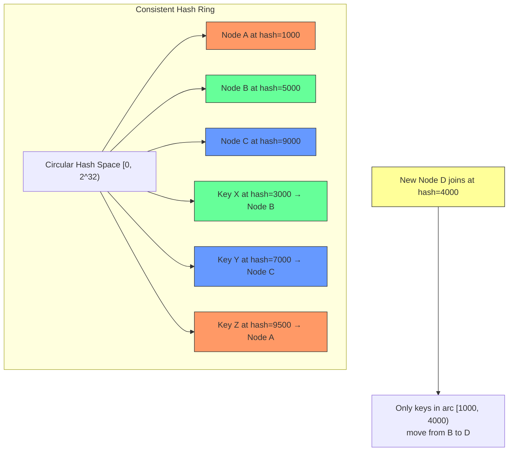

> [!success] Mastery Check
> - [ ] **Studied Well**
> - [ ] **Can explain the concept without notes**
> - [ ] **Can answer interview questions confidently**
> - [ ] **Can implement it in a real project**

---

id: "7.229"
title: "Consistent Hashing — Algorithm"
domain: "System Design & Distributed Systems"
domain_id: 7
group: "Scalability Patterns"
tags: [system-design, distributed-systems, scalability, dotnet, azure, hashing, consistent-hashing, hash-ring, distributed-caching]
priority: 1
version: 1
prerequisites:
  - "[[7.225 — Database Sharding — Hash-Based]]" — consistent hashing is a refinement of hash-based sharding; naive modulo hashing (hash(key) % N) is the baseline that consistent hashing improves upon by minimizing key movement when N changes
  - "[[7.228 — Database Sharding — Resharding and Migration]]" — resharding is the operational problem that consistent hashing solves; the fraction of keys that move during a topology change is the metric that consistent hashing optimizes — from ~(N-1)/N (naive modulo) to ~1/N (consistent hashing)
  - "[[7.224 — Database Sharding — Range-Based]]" — range-based sharding is the alternative that avoids the modulo problem entirely by using contiguous key ranges; understanding the tradeoff between range simplicity (easy routing, hard split-point selection) and consistent hashing complexity (ring management, easy scaling) is the foundation
  - "[[5.01 — Hash Tables and Hash Functions]]" — the quality of the hash function (uniformity, avalanche effect, collision resistance) determines whether consistent hashing achieves its theoretical load-balancing property; a bad hash function on the ring produces the same hotspot problem as a bad shard key in range-based sharding
related:
  - "[[7.225 — Database Sharding — Hash-Based]]" — naive modulo hashing is the baseline that consistent hashing replaces; the comparison (fraction of keys moved on node change) is the central teaching point
  - "[[7.228 — Database Sharding — Resharding and Migration]]" — consistent hashing makes resharding practical at scale by reducing data movement from O(N) to O(1/N); the migration framework in 7.228 uses consistent hashing as the enabling algorithm
  - "[[7.230 — Consistent Hashing — Virtual Nodes]]" — virtual nodes are the most important enhancement to basic consistent hashing; they solve the load-imbalance problem that the basic algorithm introduces when nodes have different capacities or when the hash distribution is imperfect
  - "[[7.231 — Consistent Hashing — Node Add and Remove]]" — the specific mechanics of adding and removing nodes from a consistent hash ring; the predecessor arc reassignment, the data movement that is required (and the data that is NOT moved)
  - "[[7.232 — Consistent Hashing — Use Cases]]" — consistent hashing is used in Cassandra (partition key routing), Redis Cluster (slot-based hashing with hash tags), Azure Cosmos DB (physical partition splitting), DynamoDB (consistent hashing with virtual nodes), and Akamai CDN (request routing to edge servers)
  - "[[7.250 — Database Federation — Functional Partitioning]]" — federation by bounded context avoids the need for consistent hashing entirely; each context is a separate database with no cross-context routing — consistent hashing is only needed when partitioning within a single context at scale
  - "[[7.233 — Auto-Scaling — Reactive vs Predictive]]" — auto-scaling triggers node addition/removal from the cluster, which triggers consistent hashing ring updates; the relationship between auto-scaling decisions and hash ring topology changes is a critical operational concern
  - "[[8.52 — Redis as a Cache and Data Structure Server]]" — Redis Cluster uses consistent hashing with 16,384 slots (a fixed-slot variant); understanding Redis slot-based hashing provides a concrete reference implementation of the algorithm
created: 2026-06-16

---

> [!ABSTRACT] Quick Reference — Consistent Hashing **Invariant:** Every key is assigned to exactly one node (the first node encountered moving clockwise from the key's hash position on a circular hash ring). When a node joins or leaves, only the keys in the arc between that node and its clockwise predecessor need to be reassigned — the remaining ~(N-1)/N keys stay where they are. **The Critical Property:** Consistent hashing decouples the number of nodes from the routing decision. In naive modulo hashing (`hash(key) % N`), changing N moves nearly every key (fraction = (N-1)/N). In consistent hashing, changing N moves only the keys in one arc (fraction ≈ 1/N). This is the difference between a 6-hour data migration involving 95% of all rows and a 5-minute migration involving 5%. **The Cost:** Consistent hashing introduces a routing indirection layer — the hash ring must be maintained, nodes must announce their presence, and the ring state must be replicated across all clients or a centralized coordinator. Without virtual nodes (7.230), the load distribution across nodes can be uneven because the hash function's random distribution does not perfectly split the ring into equal arcs. The algorithm also requires a sorted data structure (typically a sorted list or binary search tree) for O(log N) routing, vs O(1) for naive modulo. **The Trigger:** The system uses hash-based partitioning and expects the number of nodes to change over time. Any distributed cache (Redis Cluster, Memcached client), distributed database (Cassandra, DynamoDB, Azure Cosmos DB), or load-balancing layer (CDN, consistent-hash-based load balancer) that needs to add or remove nodes without causing a full cache flush or data reshuffle. **Skip When:** The number of nodes is fixed — a static cluster with no planned topology changes. In that case, naive modulo hashing is simpler (O(1) routing, no ring maintenance) and equally effective if the hash function produces uniform distribution.

---


---

## Navigation

**Domain:** [[7 — System Design & Distributed Systems]] > **Group:** Scalability Patterns
**Previous:** [[7.228 — Database Sharding — Resharding and Migration]] | **Next:** [[7.230 — Consistent Hashing — Virtual Nodes]]

### Prerequisites

- [[7.225 — Database Sharding — Hash-Based]] — naive modulo hashing (`hash(key) % N`) is the baseline that consistent hashing improves upon; the fraction of keys that move on node change is the metric that matters
- [[7.228 — Database Sharding — Resharding and Migration]] — consistent hashing is the algorithmic solution to the resharding problem; the dual-write migration framework in 7.228 is the operational procedure, and consistent hashing is the algorithmic foundation
- [[5.01 — Hash Tables and Hash Functions]] — the hash function must produce uniformly distributed outputs for consistent hashing to work; a bad hash function creates hotspots on the ring regardless of the algorithm's theoretical properties
- [[8.52 — Redis as a Cache and Data Structure Server]] — Redis Cluster's 16,384-slot hashing scheme is a fixed-slot variant of consistent hashing; understanding Redis slot-based routing provides a concrete mental model for the algorithm

### Where This Fits

Consistent hashing lives at the routing layer between the application and the distributed storage/compute nodes. It determines which node in a cluster owns which piece of data. In a .NET production system, an engineer encounters consistent hashing when: (1) the Redis Cluster client determines which cluster node holds a given cache key; (2) Azure Cosmos DB routes a request to the correct physical partition for a given logical partition key; (3) a custom distributed cache library (e.g., `Microsoft.Extensions.Caching.StackExchangeRedis`) needs to scale the cache cluster up or down; (4) a load balancer routes requests based on client IP or session ID to maintain session affinity across a dynamic set of backend servers. Without consistent hashing, adding a node to a distributed hash-based system invalidates ~(N-1)/N of all cached entries or requires moving ~(N-1)/N of all stored data — a cache cluster operation that should take 30 seconds causes a 30-minute cache fill storm as every key is re-requested from the origin database.

## Core Mental Model

Consistent hashing arranges both nodes and keys on a circular hash space (a ring) and assigns each key to the first node encountered traveling clockwise from the key's position. Think of a clock face with the hash space as the 12-hour perimeter. Each node (server) is placed at a specific hour mark — Node A at 2:00, Node B at 6:00, Node C at 10:00. Each key is hashed to a position on the same clock face — a key hashing to 3:30 is assigned to Node B (the first node clockwise from 3:30, which is 6:00). A key at 11:00 is assigned to Node A (wrap around: 11:00 → 2:00). When a new node D joins at 4:00, only the keys between 2:00 and 4:00 (the arc between Node A's current position and the new position) move from their previous owner (Node B) to Node D. The keys at 6:00, 10:00, and everywhere else stay where they are.

The single invariant: **Each key is assigned to the node whose hash position is the smallest hash greater than or equal to the key's hash (modulo the ring size).** This is the "nearest clockwise node" rule. The ring wraps — the smallest hash on the ring follows the largest hash. The invariant ensures that only the keys in the arc between a node's position and its predecessor's position are affected by that node joining or leaving.

The fundamental benefit: **The fraction of keys that move when N changes is approximately 1/N, not (N-1)/N.** For a 10-node cluster adding an 11th node: naive modulo moves 10/11 ≈ 91% of keys; consistent hashing moves 1/11 ≈ 9%. For a 100-node cluster adding a 101st node: naive modulo moves ~99%; consistent hashing moves ~1%. The benefit grows with cluster size.

### Classification

- **Distributed systems algorithm:** sits at the routing layer — determines which physical node owns which key; used in distributed caches, distributed databases, and load balancers
- **What it solves:** The "node membership change" problem — reassigning keys when a node joins or leaves a distributed system, minimizing the fraction of keys that must move
- **What it does not solve:** (a) Hot keys — a single key receiving 50% of traffic will overload its node regardless of the hash ring; (b) Uneven load distribution — without virtual nodes, the random mapping of nodes to ring positions does not guarantee equal-sized arcs; (c) Data movement cost — consistent hashing minimizes the NUMBER of keys moved but does not reduce the TIME to move a given key; moving 1 TB across a network still takes 2+ hours



### Key Properties / Guarantees

| Property | Value | Condition |
|---|---|---|
| Keys moved on node add | ~1/(N+1) of all keys | Assuming uniform hash distribution and N existing nodes |
| Keys moved on node remove | ~1/N of all keys | The removed node's arc is absorbed by its successor |
| Routing complexity | O(log M) with binary search | M = number of node positions on the ring (including virtual nodes if used) |
| Memory overhead | O(M) for the sorted ring | M node positions stored in a sorted array |
| Load balancing quality | Coefficient of variation ~1/√M | With M virtual nodes; without virtual nodes, arcs can be highly uneven |
| Hash function quality required | Uniform output, avalanche property | Non-uniform hash creates uneven arc sizes and hotspots |
| Consistency under concurrent membership changes | Requires distributed consensus or a central coordinator | Without it, two clients may see different ring topologies simultaneously |

---

## Deep Mechanics

### How It Works

**Step 1 — Define the hash space.** Choose a hash function that maps arbitrary byte strings to an integer in a fixed range — typically [0, 2^32) (MD5 lower 32 bits) or [0, 2^64). The hash space is treated as a circle: the minimum value 0 is adjacent to the maximum value 2^32 − 1.

**Step 2 — Place nodes on the ring.** For each physical node (identified by its IP address, hostname, or a unique node ID), compute hash(node_identifier) to obtain the node's position on the ring. The position is a single point on the circle.

```csharp
// A ring position — a point on the hash circle
public readonly record struct RingPosition(uint Hash) : IComparable<RingPosition>
{
    public int CompareTo(RingPosition other) => Hash.CompareTo(other.Hash);
}

// Place a node on the ring
uint GetNodePosition(string nodeId)
{
    using var md5 = MD5.Create();
    var hashBytes = md5.ComputeHash(Encoding.UTF8.GetBytes(nodeId));
    // Extract the first 4 bytes as a 32-bit unsigned integer
    return BitConverter.ToUInt32(hashBytes, 0);
}
```

**Step 3 — Route a key.** To find which node owns a key: (a) compute hash(key) to get the key's position on the ring; (b) find the first node position on the ring that is greater than or equal to the key's position (clockwise); (c) if no such node exists (the key's hash is greater than all node positions), wrap around to the first node on the ring (the smallest hash).

```csharp
// Port: Consistent hash ring router
public sealed class ConsistentHashRing
{
    private readonly SortedList<RingPosition, string> _ring;
    private readonly uint _ringSize;

    public string GetNodeForKey(string key)
    {
        var keyPosition = new RingPosition(HashKey(key));
        // Binary search for the first node >= key position
        var index = _ring.Keys
            .AsList()
            .BinarySearch(keyPosition);

        if (index < 0)
        {
            // No exact match — find the insertion point (the next node clockwise)
            index = ~index;
            if (index >= _ring.Count)
            {
                // Wrap around to the first node
                index = 0;
            }
        }

        return _ring.Values[index];
    }

    private uint HashKey(string key)
    {
        using var md5 = MD5.Create();
        var hashBytes = md5.ComputeHash(Encoding.UTF8.GetBytes(key));
        return BitConverter.ToUInt32(hashBytes, 0);
    }
}
```

**Step 4 — Add a node.** When a new node joins: (a) compute hash(new_node_id) to get its position on the ring; (b) insert the position into the sorted ring; (c) find the predecessor node (the node immediately counter-clockwise from the new position); (d) the keys in the arc (predecessor_position, new_node_position] were previously assigned to the successor of the new node's position — they must be reassigned to the new node.

```csharp
// Port: Add a node to the ring — only keys in the predecessor arc move
public void AddNode(string nodeId)
{
    var position = new RingPosition(HashNodeId(nodeId));

    // Find the predecessor — the node immediately counter-clockwise
    var insertionIndex = ~_ring.Keys.AsList().BinarySearch(position);
    var predecessorIndex = insertionIndex > 0
        ? insertionIndex - 1
        : _ring.Count - 1; // wrap around
    var predecessorPosition = _ring.Keys[predecessorIndex];

    // The arc (predecessor, position] moves from the successor to the new node
    var successorIndex = insertionIndex < _ring.Count
        ? insertionIndex
        : 0;
    var successorNode = _ring.Values[successorIndex];

    _logger.LogInformation(
        "Node {NodeId} joins at position {Position}. " +
        "Arc ({Predecessor}, {Position}] moves from {Successor} to new node. " +
        "Fraction of keys affected: approximately {Fraction:P2}",
        nodeId, position, predecessorPosition, position,
        successorNode,
        (double)(position.Hash - predecessorPosition.Hash) / _ringSize);

    _ring.Add(position, nodeId);

    // In a real system: start copying keys in the arc from successor to new node
    // The copy is async — the ring is updated immediately,
    // but data movement happens in the background
}
```

**Step 5 — Remove a node.** When a node leaves (gracefully or by failure detection): (a) find the node's position on the ring; (b) find its predecessor (the node immediately counter-clockwise); (c) assign all keys in the arc (predecessor_position, node_position] to the node's successor (the node immediately clockwise); (d) remove the node's position from the ring. The successor absorbs the leaving node's entire key range.

```csharp
// Port: Remove a node — its successor absorbs its entire key range
public void RemoveNode(string nodeId)
{
    var position = _ring.FirstOrDefault(kvp => kvp.Value == nodeId).Key;

    // Find predecessor and successor
    var index = _ring.IndexOfKey(position);
    var predecessorIndex = index > 0 ? index - 1 : _ring.Count - 1;
    var successorIndex = (index + 1) % _ring.Count;

    _logger.LogInformation(
        "Node {NodeId} leaves. Its arc is absorbed by {Successor}. " +
        "Fraction of keys affected: approximately {Fraction:P2}",
        nodeId, _ring.Values[successorIndex],
        (double)(GetArcLength(predecessorIndex, index)) / _ringSize);

    _ring.Remove(position);

    // In a real system: the successor reads the leaving node's data
    // (or a replica takes over if replication is configured)
}
```

### Failure Modes

**1. Uneven Load Distribution (No Virtual Nodes).** Without virtual nodes (7.230), each physical node maps to a single point on the ring. The arcs between consecutive node positions vary in size because the hash function assigns random positions. A node whose arc covers 15% of the ring handles 50% more load than a node whose arc covers 10%. In a 10-node cluster, the most-loaded node typically handles 2–3× the load of the least-loaded node.

**Detection:** Compute per-node key count or request rate and calculate the coefficient of variation. A CV > 0.3 (where 0 = perfect balance) indicates significant skew.

**Fix:** Use virtual nodes — each physical node maps to 100–200 random points on the ring. The Law of Large Numbers ensures that each physical node's total arc length converges to 1/N of the ring. With 160 virtual nodes per physical node, the load imbalance drops to <5%.

**Prevention:** Never deploy basic consistent hashing without virtual nodes for production workloads. Virtual nodes are not an optimization — they are a correctness requirement for the load-balancing property of the algorithm.

**2. Hash Function Collisions.** If the hash function produces collisions (two different node identifiers produce the same hash), two nodes occupy the same ring position. Keys in that position are routed to only one of the two nodes — the other node never receives any data.

**Detection:** Monitor per-node key counts. A node with zero or near-zero keys indicates a collision. Also check log entries: "Node {Id} collides with {OtherNodeId} at position {Hash}."

**Fix:** Append a suffix to the node identifier to break collisions — "node-1:0", "node-1:1" (this is a form of virtual node). Better: use a hash function with 64-bit output to reduce collision probability to negligible levels.

**Prevention:** Use SHA-256 or a high-quality 64-bit hash (CityHash, xxHash64) instead of MD5. The collision probability for 64-bit hashes with 1,000 nodes is ~(1,000^2)/(2^65) ≈ 1 in 10^14 — effectively zero.

**3. Ring Inconsistency Across Clients.** If the ring topology is maintained independently by each client (common in client-side consistent hashing libraries), different clients may see different ring states during a topology change. Client A has processed the "Node D joined" event; Client B has not. Client A routes key X to Node D; Client B routes the same key to Node B. If the key is cached, the cache hit fails because Client B looks in the wrong place.

**Detection:** Cache hit rate drops sharply during or after a topology change. The cache miss rate spikes from 90% to 20%.

**Fix:** Use a centralized ring coordinator (etcd, ZooKeeper, or a Redis-backed version counter) that maintains the authoritative ring version. Clients poll the version and refresh their ring state when the version changes. Use a "grace period" during topology changes — the old node continues to serve reads for its former keys while the new node catches up.

**Prevention:** For write-heavy systems, use server-side routing instead of client-side — the server (e.g., Redis Cluster proxy) owns the ring topology, and clients are stateless. For cache-only systems, client-side routing with gossip-based ring propagation (Cassandra-style) is acceptable because a cache miss is not data loss.

**4. Cascading Overload on Node Join.** When a new node joins, it immediately claims its arc on the ring. All keys in that arc are now routed to the new node. The new node — empty and cold — receives a burst of requests for keys it does not yet have. Each request results in a cache miss, and the application must fetch the data from the origin database. If the origin database cannot handle the burst, it becomes overloaded, causing a thundering herd that can cascade to other nodes as they also experience request failures.

**Detection:** After a node join, monitor the origin database query rate. A spike of 5–10× the normal rate indicates a cache-fill storm. Also monitor the new node's error rate — it will be high because it has no data.

**Fix:** Implement **lazy loading with渐进式warming**. When the new node joins, do NOT immediately redirect all requests for its arc. Instead, redirect gradually over a warm-up period (30–120 seconds). During warm-up, requests go to the old node (which has the data) AND the new node gets a copy. After the warm-up, the old node stops serving those keys. Alternatively, pre-warm the new node by copying the data for its arc from the old node before the routing change.

**Prevention:** Use a **staging ring** approach: when a node joins, it enters a "warming" state where it accepts writes for its arc but reads still go to the original owner. The ring transition is only complete when the new node's cache hit rate exceeds a threshold (e.g., 80%).

### .NET and Azure Integration

**StackExchange.Redis with Redis Cluster — built-in consistent hashing.** The StackExchange.Redis library (the standard .NET Redis client) uses consistent hashing internally when connecting to a Redis Cluster. Redis Cluster uses a fixed-slot hashing scheme (16,384 slots) mapped to nodes, which is a variant of consistent hashing:

```csharp
// Port: StackExchange.Redis consistent hashing — Redis Cluster slot-based routing
public class RedisClusterOrderCache
{
    private readonly ConnectionMultiplexer _redis;
    private readonly IDatabase _defaultDb;

    public RedisClusterOrderCache(string clusterConnectionString)
    {
        var config = new ConfigurationOptions
        {
            EndPoints = { clusterConnectionString },
            // StackExchange.Redis auto-discovers the cluster topology
            // It computes hash_slot = CRC16(key) % 16384 and routes to the
            // node that owns that slot. When a slot moves (resharding),
            // the client follows a MOVED redirect — it updates its slot map
            // and retries on the correct node.
            CommandMap = CommandMap.Create(new HashSet<string>
            {
                "MOVED", "ASK", "CLUSTER", "SLOTS"
            }, available: false)
        };

        _redis = ConnectionMultiplexer.Connect(config);
        _defaultDb = _redis.GetDatabase();
    }

    public async Task SetOrderCacheAsync(string orderId, OrderSummary summary)
    {
        // StackExchange.Redis computes the hash slot for orderId
        // and routes to the correct cluster node automatically
        var key = $"order:{orderId}";
        await _defaultDb.StringSetAsync(key,
            JsonSerializer.Serialize(summary),
            expiry: TimeSpan.FromMinutes(5));
    }

    // When a new node joins the Redis Cluster:
    // 1. Redis Cluster reassigns some slots from existing nodes to the new node
    // 2. During migration, the existing node returns an ASK redirect
    // 3. StackExchange.Redis follows the redirect and updates its slot map
    // 4. Only the reassigned slots experience cache misses (~1/N of total keys)
    // 5. The remaining keys stay on their original nodes — cache intact
}
```

**Azure Cosmos DB — consistent hashing for physical partition routing:** Cosmos DB uses consistent hashing internally to map logical partition keys to physical partitions. The physical partition count changes automatically as data grows, and the consistent hashing algorithm determines which physical partition owns which logical partitions:

```csharp
// Port: Cosmos DB consistent hashing — transparent to the application
public class CosmosProductRepository
{
    private readonly Container _container;

    // The application writes with a logical partition key (productId).
    // Cosmos DB internally uses consistent hashing to route this
    // to the correct physical partition.
    public async Task<Product> GetProductAsync(string productId, CancellationToken ct)
    {
        var partitionKey = new PartitionKey(productId);
        var response = await _container.ReadItemAsync<Product>(
            productId, partitionKey, cancellationToken: ct);
        return response.Resource;
    }

    // When Cosmos DB auto-splits a physical partition (because it exceeded
    // 20 GB or 10,000 RU/s), it:
    // 1. Splits the physical partition into two new physical partitions
    // 2. Redistributes the logical partitions across the new pair using
    //    consistent hashing — logical partitions are the "keys" on the ring
    // 3. The split is transparent — the application continues to use the
    //    same logical partition key
    // 4. Only the logical partitions in the split arc move to the new partition
    // 5. The SDK learns the new routing via the gateway's partition map
}
```

**Program.cs — custom consistent hash ring registration:**

```csharp
// Port: Register a consistent hash ring for a distributed cache client
builder.Services.AddSingleton<ConsistentHashRing>(sp =>
{
    var config = sp.GetRequiredService<IConfiguration>();
    var ring = new ConsistentHashRing();

    // Read the initial node list from configuration
    var nodes = config.GetSection("ConsistentHashing:Nodes").Get<string[]>();
    foreach (var node in nodes ?? [])
    {
        ring.AddNode(node);
    }

    return ring;
});

builder.Services.AddSingleton<DistributedCacheRouter>(sp =>
{
    var ring = sp.GetRequiredService<ConsistentHashRing>();
    var connectionFactory = sp.GetRequiredService<IConnectionMultiplexerFactory>();
    return new DistributedCacheRouter(ring, connectionFactory);
});
```


---

## Production Patterns and Implementation

### Primary Implementation

The canonical consistent hash ring implementation supports node addition, node removal, and O(log N) key routing. This implementation uses a sorted array (binary search) for routing and tracks arcs for data movement:

```csharp
// Port: Production-grade consistent hash ring
public sealed class ConsistentHashRing
{
    private readonly List<RingEntry> _ring; // Sorted by Hash
    private readonly IHashFunction _hash;
    private readonly ILogger<ConsistentHashRing> _logger;
    private readonly ReaderWriterLockSlim _lock = new();
    private uint _ringSize = uint.MaxValue;

    public ConsistentHashRing(
        IHashFunction hash,
        ILogger<ConsistentHashRing> logger)
    {
        _hash = hash;
        _logger = logger;
        _ring = new List<RingEntry>();
    }

    public IReadOnlyList<RingEntry> Entries => _ring;

    // Add a node to the ring at a single position
    public bool AddNode(string nodeId)
    {
        var position = _hash.ComputeHash(nodeId);
        var entry = new RingEntry(position, nodeId);

        _lock.EnterWriteLock();
        try
        {
            // Check for collision
            if (_ring.Any(e => e.Hash == position))
            {
                _logger.LogWarning(
                    "Hash collision: Node {NodeId} collides with existing node at position {Position}",
                    nodeId, position);
                return false;
            }

            var index = FindInsertionIndex(position);
            var predecessor = index > 0 ? _ring[index - 1] : _ring[^1];
            var successor = index < _ring.Count ? _ring[index] : _ring[0];

            _ring.Insert(index, entry);

            _logger.LogInformation(
                "Node {NodeId} added at position {Position}. " +
                "Arc length: {ArcLength}. Predecessor: {Pred}. Successor: {Succ}",
                nodeId, position,
                position - predecessor.Hash,
                predecessor.NodeId, successor.NodeId);

            return true;
        }
        finally
        {
            _lock.ExitWriteLock();
        }
    }

    // Remove a node from the ring
    public bool RemoveNode(string nodeId)
    {
        _lock.EnterWriteLock();
        try
        {
            var index = _ring.FindIndex(e => e.NodeId == nodeId);
            if (index < 0) return false;

            var removed = _ring[index];
            var predecessor = index > 0 ? _ring[index - 1] : _ring[^1];
            var successor = (index + 1) < _ring.Count ? _ring[index + 1] : _ring[0];

            _ring.RemoveAt(index);

            _logger.LogInformation(
                "Node {NodeId} removed from position {Position}. " +
                "Arc ({Pred}, {Node}] absorbed by {Succ}. Keys affected: ~{Fraction:P2}",
                nodeId, removed.Hash,
                predecessor.Hash, removed.Hash, successor.NodeId,
                (double)(removed.Hash - predecessor.Hash) / _ringSize);

            return true;
        }
        finally
        {
            _lock.ExitWriteLock();
        }
    }

    // Route a key to the node that owns it
    public string GetNodeForKey(string key)
    {
        var keyHash = _hash.ComputeHash(key);

        _lock.EnterReadLock();
        try
        {
            if (_ring.Count == 0)
                throw new InvalidOperationException("Ring is empty — no nodes available");

            var index = _ring.BinarySearch(new RingEntry(keyHash, ""));
            if (index < 0)
            {
                index = ~index;
                if (index >= _ring.Count)
                {
                    index = 0; // Wrap around
                }
            }

            return _ring[index].NodeId;
        }
        finally
        {
            _lock.ExitReadLock();
        }
    }

    // Get the set of keys that will move when a new node joins
    // (useful for planning data migration)
    public (string predecessorNode, string successorNode, float fractionOfKeys)
        GetImpactForNodeAdd(string newNodeId)
    {
        var newPosition = _hash.ComputeHash(newNodeId);

        _lock.EnterReadLock();
        try
        {
            var index = FindInsertionIndex(newPosition);
            var predecessor = index > 0 ? _ring[index - 1] : _ring[^1];
            var successor = index < _ring.Count ? _ring[index] : _ring[0];

            var arcLength = newPosition - predecessor.Hash;
            var fraction = (double)arcLength / _ringSize;

            return (predecessor.NodeId, successor.NodeId, (float)fraction);
        }
        finally
        {
            _lock.ExitReadLock();
        }
    }

    private int FindInsertionIndex(uint position)
    {
        var index = _ring.BinarySearch(new RingEntry(position, ""));
        return index < 0 ? ~index : index;
    }
}

// Ring entry — a node at a specific hash position
public readonly record struct RingEntry(uint Hash, string NodeId)
    : IComparable<RingEntry>
{
    public int CompareTo(RingEntry other) => Hash.CompareTo(other.Hash);
}

// Hash function interface (injectable for testing)
public interface IHashFunction
{
    uint ComputeHash(string input);
}

// MD5-based hash function
public sealed class Md5HashFunction : IHashFunction
{
    public uint ComputeHash(string input)
    {
        var bytes = MD5.HashData(Encoding.UTF8.GetBytes(input));
        return BitConverter.ToUInt32(bytes, 0);
    }
}

// xxHash64-based hash function (faster, better distribution)
public sealed class XxHash64HashFunction : IHashFunction
{
    public uint ComputeHash(string input)
    {
        var bytes = Encoding.UTF8.GetBytes(input);
        var hash = XxHash64.Hash(bytes);
        return BitConverter.ToUInt32(hash, 0);
    }
}
```

### Configuration and Wiring

```csharp
// Program.cs — consistent hash ring with dynamic node management
var builder = WebApplication.CreateBuilder(args);

// Hash function — prefer xxHash64 for speed and distribution quality
builder.Services.AddSingleton<IHashFunction, XxHash64HashFunction>();

// Consistent hash ring
builder.Services.AddSingleton<ConsistentHashRing>();

// Cluster membership service — monitors for node joins/leaves
builder.Services.AddHostedService<ClusterMembershipService>();

// Distributed cache router using consistent hashing
builder.Services.AddSingleton<ICacheRouter, ConsistentHashCacheRouter>();

var app = builder.Build();

// Admin endpoint to add nodes dynamically
app.MapPost("/cluster/nodes", async (
    AddNodeRequest request,
    ConsistentHashRing ring,
    ILogger<ConsistentHashRing> logger) =>
{
    var added = ring.AddNode(request.NodeId);
    return added ? Results.Ok() : Results.Conflict("Node already exists or collision");
});

// Admin endpoint to remove nodes
app.MapDelete("/cluster/nodes/{nodeId}", (
    string nodeId,
    ConsistentHashRing ring) =>
{
    var removed = ring.RemoveNode(nodeId);
    return removed ? Results.Ok() : Results.NotFound();
});
```

```json
// appsettings.json
{
  "ConsistentHashing": {
    "HashFunction": "xxHash64",
    "RingSize": 4294967296,
    "Nodes": [
      "cache-node-1:6379",
      "cache-node-2:6379",
      "cache-node-3:6379",
      "cache-node-4:6379"
    ],
    "VirtualNodes": {
      "Enabled": false,
      "CountPerPhysicalNode": 160
    },
    "Routing": {
      "CacheTtlSeconds": 30,
      "UseBinarySearch": true
    }
  }
}
```

### Common Variants

**Variant 1 — Jump Consistent Hashing.** A more efficient variant that produces O(ln N) buckets with zero memory (no ring stored). It maps keys directly to bucket indices using a deterministic algorithm that produces the same assignment as consistent hashing but without storing any ring state:

```csharp
// Port: Jump consistent hash — no ring, O(ln N) computation
// Used in: Google's original paper, Azure Cosmos DB SDK (internal routing)
public static int JumpConsistentHash(ulong key, int numberOfBuckets)
{
    long b = -1;
    long j = 0;

    while (j < numberOfBuckets)
    {
        b = j;
        key = key * 2862933555777941757UL + 1;
        j = (long)((b + 1) *
            ((double)(1L << 31) / (double)((key >> 33) + 1)));
    }

    return (int)b;
}

// Usage: JumpConsistentHash(hashKey, numberOfNodes)
// When a node joins (N → N+1), only ~1/(N+1) of keys map to the new node
// Memory: 0 bytes (no ring state)
// Routing: O(ln N) computation, no binary search
```

**Variant 2 — Rendezvous hashing (HRW — Highest Random Weight).** Each key is assigned to the node with the highest hash(key + node_id). No ring, no sorted list — just a hash computation per node:

```csharp
// Port: Rendezvous hashing — route by highest random weight
public static string RendezvousRoute(string key, IReadOnlyList<string> nodes, IHashFunction hash)
{
    string bestNode = nodes[0];
    uint bestWeight = hash.ComputeHash(key + nodes[0]);

    for (int i = 1; i < nodes.Count; i++)
    {
        var weight = hash.ComputeHash(key + nodes[i]);
        if (weight > bestWeight)
        {
            bestWeight = weight;
            bestNode = nodes[i];
        }
    }

    return bestNode;
}
// When a node joins: O(N) computation per key (must evaluate all N+1 nodes)
// Tradeoff: simpler implementation, no ring state, but O(N) routing vs O(log N)
```

**Variant 3 — Fixed-slot hashing (Redis Cluster).** A fixed number of hash slots (16384 for Redis Cluster) is partitioned across nodes. Slots are the unit of redistribution, not individual keys:

```csharp
// Port: Redis Cluster slot-based routing
public static class RedisSlotRouter
{
    private const int SlotCount = 16384;

    // CRC16 hash → slot (Redis Cluster spec)
    public static int GetSlot(string key)
    {
        // Redis hash tag: only the substring inside { } is hashed
        // This allows forcing multiple keys into the same slot
        var hashSlot = key;
        var braceStart = key.IndexOf('{');
        if (braceStart >= 0)
        {
            var braceEnd = key.IndexOf('}', braceStart + 1);
            if (braceEnd > braceStart + 1)
            {
                hashSlot = key[(braceStart + 1)..braceEnd];
            }
        }

        var crc = Crc16.Compute(Encoding.UTF8.GetBytes(hashSlot));
        return crc % SlotCount;
    }

    // Slot-to-node mapping (updated when cluster topology changes)
    private static readonly Dictionary<int, string> SlotMap = new();

    public static string GetNodeForKey(string key)
    {
        var slot = GetSlot(key);
        return SlotMap[slot];
    }

    // When a node joins: only the slots reassigned to it move
    // Fraction: (reassigned_slots / 16384) of total keys
}
```

### Real-World .NET Ecosystem Example

**StackExchange.Redis server selection for non-clustered Redis.** Even when NOT using Redis Cluster, StackExchange.Redis uses consistent hashing internally to distribute keys across multiple Redis servers in a master-replica setup:

```csharp
// Port: StackExchange.Redis multi-server key distribution
public class MultiServerCache : IDisposable
{
    private readonly ConnectionMultiplexer[] _servers;
    private readonly ConsistentHashRing _ring;

    public MultiServerCache(IReadOnlyList<string> endpoints)
    {
        _servers = endpoints
            .Select(ep => ConnectionMultiplexer.Connect($"{ep},connectTimeout=5000"))
            .ToArray();

        // Consistent hash ring maps keys to server endpoints
        _ring = new ConsistentHashRing(new XxHash64HashFunction(),
            NullLogger<ConsistentHashRing>.Instance);
        foreach (var endpoint in endpoints)
        {
            _ring.AddNode(endpoint);
        }
    }

    public async Task<T?> GetAsync<T>(string key)
    {
        var nodeId = _ring.GetNodeForKey(key);
        var server = FindServer(nodeId);
        var db = server.GetDatabase();
        var value = await db.StringGetAsync(key);
        return value.HasValue
            ? JsonSerializer.Deserialize<T>(value!)
            : default;
    }

    public async Task SetAsync<T>(string key, T value, TimeSpan expiry)
    {
        var nodeId = _ring.GetNodeForKey(key);
        var server = FindServer(nodeId);
        var db = server.GetDatabase();
        await db.StringSetAsync(key,
            JsonSerializer.Serialize(value), expiry);
    }

    // When a server is added:
    // 1. Call _ring.AddNode("new-server:6379")
    // 2. Only ~1/(N+1) of keys now route to the new server
    // 3. Those keys are cache misses on the new server (must fetch from origin)
    // 4. The remaining ~N/(N+1) keys still route to the same server — cache HIT
    // 5. No cache flush needed — the old servers still have their data

    private ConnectionMultiplexer FindServer(string nodeId) =>
        _servers.First(s => s.Configuration.Contains(nodeId));
}
```

**Azure Cosmos DB query routing — physical partition consistent hashing.** Cosmos DB's internal routing uses a variant of consistent hashing with the following properties:

```csharp
// Port: Conceptual model of Cosmos DB's consistent hashing for partition routing
// (This is a simplified representation — the actual implementation uses
//  a proprietary algorithm called "consistent hashing with bounded load")
public class CosmosPhysicalPartitionRouter
{
    // Logical partition keys (e.g., deviceId "device-42") are hashed
    // and mapped to physical partitions via consistent hashing
    public PhysicalPartition GetPhysicalPartition(string logicalPartitionKey)
    {
        // Cosmos DB uses a variant where:
        // 1. The logical partition key is hashed with a high-quality hash
        // 2. The hash maps to a physical partition via a partition map
        // 3. The partition map is maintained by the Cosmos DB control plane
        // 4. When a physical partition exceeds 20 GB or 10,000 RU/s,
        //    it splits into two — the map is updated atomically
        // 5. Only the logical partitions in the split arc move
        var hash = XxHash64.Hash(Encoding.UTF8.GetBytes(logicalPartitionKey));
        return _partitionMap.GetPartition(hash);
    }

    // Key insight: The application never sees physical partitions.
    // It writes to a logical partition key, and Cosmos DB's internal
    // consistent hashing handles the physical routing transparently.
    // A split is zero-downtime because:
    //   - During split: both old and new partitions serve reads for their shared arc
    //   - After split: the partition map is updated, future requests go to the correct partition
    //   - The SDK is unaware — it routes to the gateway, which has the authoritative map
}
```


---

## Gotchas and Production Pitfalls

### [Pitfall Name] Hash Function Avalanche Failure

**Pitfall:** Using a hash function with poor avalanche properties (e.g., CRC32, simple modulo of GetHashCode). These functions do not produce uniformly distributed outputs — adjacent input values produce adjacent hash values, creating clusters on the ring. For example, sequential node IDs "node-1", "node-2", "node-3" may all hash to nearby positions, leaving large arcs of the ring uncovered.

```csharp
// ❌ Wrong — poor hash function for consistent hashing
uint BadHash(string input)
{
    // CRC32: adjacent inputs produce adjacent hashes — clusters on ring
    return Crc32.Compute(Encoding.UTF8.GetBytes(input));
}

// node-1: 0x12345678, node-2: 0x12345679, node-3: 0x1234567A
// All three nodes cluster in a tiny region — 99% of the ring is covered by one arc

// ✅ Right — cryptographic hash with strong avalanche
uint GoodHash(string input)
{
    // SHA-256: single bit change in input flips ~50% of output bits
    var bytes = SHA256.HashData(Encoding.UTF8.GetBytes(input));
    return BitConverter.ToUInt32(bytes, 0);
}

// node-1: 0xA3B2C1D0, node-2: 0x4E5F6A7B, node-3: 0x8C9D0E1F
// Nodes are uniformly distributed across the ring
```

**Symptom:** Uneven load distribution across cache nodes — one node handles 40% of requests while another handles 5%. The coefficient of variation of per-node load is >0.5 instead of the expected ~0.1.

**Fix:** Replace the hash function with SHA-256 (slower, best avalanche) or xxHash64 (fast, good avalanche). For production, xxHash64 is the preferred tradeoff: 10× faster than SHA-256 with statistically indistinguishable avalanche quality for non-cryptographic purposes.

**Cost of not fixing:** Hotspot nodes that receive disproportionate traffic. These nodes hit CPU limits and memory pressure before other nodes. The cluster appears unbalanced even though consistent hashing is "working." The natural response (add more nodes) makes the problem worse — new nodes also cluster near the old ones.

### [Pitfall Name] GetHashCode() for Ring Positions

**Pitfall:** Using `string.GetHashCode()` to compute node or key positions on the ring. `GetHashCode()` is NOT guaranteed to be stable across process runs, .NET versions, or platforms. The hash ring built on one machine produces different positions on another machine, and a ring rebuilt after a process restart has different positions than the original.

```csharp
// ❌ Wrong — GetHashCode() is non-deterministic across runs
uint GetNodePosition(string nodeId)
{
    // .NET 6 vs .NET 8: different hash algorithms for string.GetHashCode()
    // Process restart: new random seed changes all hash values
    return unchecked((uint)nodeId.GetHashCode());
}

// Ring built at deployment #1: Node-1 @ 0x12345678
// Ring built at deployment #2: Node-1 @ 0x87654321
// All keys route to DIFFERENT nodes after restart — full cache flush effect

// ✅ Right — deterministic hash function
uint GetNodePosition(string nodeId)
{
    using var sha256 = SHA256.Create();
    var bytes = sha256.ComputeHash(Encoding.UTF8.GetBytes(nodeId));
    return BitConverter.ToUInt32(bytes, 0);
}
// Same input → same output, every time, across any platform
```

**Symptom:** After every deployment (which restarts the application process), the cache hit rate drops to near-zero. The origin database receives a thundering herd of cache-miss requests. The issue is intermittent — it works perfectly between restarts but breaks on every deployment.

**Fix:** Replace `GetHashCode()` with a stable hash function — MD5, SHA-256, or xxHash64. Document that the hash function must produce the same output for the same input across all process invocations and platforms.

**Cost of not fixing:** Every deployment causes a full cache-miss storm. For a high-traffic system serving 50,000 req/s, a 100% cache miss rate means the origin database receives 50,000 req/s — enough to cause an outage. The deployment must be rolled back, and the database must recover from the load spike.

### [Pitfall Name] Ignoring Wrap-Around in Ring Search

**Pitfall:** The binary search for the nearest clockwise node fails to handle the wrap-around case — when the key's hash is greater than all node positions on the ring, the correct node is the FIRST node (the smallest hash), not "no node found."

```csharp
// ❌ Wrong — missing wrap-around
public string GetNodeForKey(string key)
{
    var keyHash = Hash(key);
    var index = _ring.BinarySearch(new RingEntry(keyHash, ""));
    if (index < 0)
    {
        index = ~index;
        // BUG: if index == _ring.Count, this throws ArgumentOutOfRangeException
        // The key's hash is GREATER than all node positions
        // Correct behavior: wrap around to _ring[0]
    }
    return _ring[index].NodeId;
}

// ✅ Right — handle wrap-around
public string GetNodeForKey(string key)
{
    var keyHash = Hash(key);
    var index = _ring.BinarySearch(new RingEntry(keyHash, ""));
    if (index < 0)
    {
        index = ~index;
        if (index >= _ring.Count)
        {
            index = 0; // Wrap around to the first node
        }
    }
    return _ring[index].NodeId;
}
```

**Symptom:** `ArgumentOutOfRangeException` is thrown for some keys. The keys that fail are those whose hash is greater than the maximum node hash on the ring. In a 4-node cluster, this affects ~25% of keys (the hash range above the highest-positioned node). Users whose requests include these keys receive 500 errors.

**Fix:** Always add the wrap-around check after the binary search insertion point calculation.

**Cost of not fixing:** 25% of requests fail with 500 errors. The on-call engineer sees a spike in `ArgumentOutOfRangeException` in the logs but the stack trace points to the hash ring router — a component that was assumed to be well-tested. The fix is a one-line change but finding it requires understanding the ring wrap-around semantics.

### [Pitfall Name] Non-Atomic Ring Update During Topology Change

**Pitfall:** When a node joins or leaves, the ring is updated in place without synchronization. Multiple threads reading the ring while it is being modified see an inconsistent state — some see the old topology, some see the new topology, and some see a partially modified list that throws during binary search.

```csharp
// ❌ Wrong — no synchronization on ring mutation
private List<RingEntry> _ring = new();

public void AddNode(string nodeId)
{
    var entry = new RingEntry(Hash(nodeId), nodeId);
    // Thread A is reading _ring in GetNodeForKey while Thread B modifies it
    _ring.Add(entry); // Not thread-safe — may throw or produce stale results
}

// ✅ Right — use ReaderWriterLockSlim for thread-safe access
private readonly ReaderWriterLockSlim _lock = new();
private List<RingEntry> _ring = new();

public void AddNode(string nodeId)
{
    _lock.EnterWriteLock();
    try
    {
        var entry = new RingEntry(Hash(nodeId), nodeId);
        _ring.Add(entry);
        _ring.Sort(); // Maintain sorted order for binary search
    }
    finally
    {
        _lock.ExitWriteLock();
    }
}

public string GetNodeForKey(string key)
{
    _lock.EnterReadLock();
    try
    {
        // Safe to read — no writes are in progress
        var index = _ring.BinarySearch(new RingEntry(Hash(key), ""));
        // ... binary search logic
    }
    finally
    {
        _lock.ExitReadLock();
    }
}
```

**Symptom:** Intermittent `ArgumentOutOfRangeException` or incorrect routing during topology changes. The errors are non-deterministic — they only happen when a node join/leave coincides with a routing request. During a rolling deployment (which adds/removes nodes one at a time), the error rate spikes but disappears when the deployment completes.

**Fix:** Use `ReaderWriterLockSlim` for the ring list. All reads acquire a read lock; all writes acquire a write lock. For higher throughput, consider using `ImmutableList<RingEntry>` and atomic reference swap — writes create a new sorted list and swap the reference.

**Cost of not fixing:** Non-deterministic routing errors during topology changes. In the worst case, a key is routed to a node that does not own it — the node returns a cache MISS (or worse, returns stale data from a previous key assignment). Debugging requires understanding the threading model, which is not obvious from the error logs.

### [Pitfall Name] Cache Stampede on Node Addition

**Pitfall:** Adding a new node to a cache cluster causes all keys in the new node's arc to be rerouted. Since the new node is empty, every request for those keys is a cache miss. The application fetches the data from the origin database. If the origin database cannot handle the sudden load spike (a thundering herd), it becomes overloaded.

```csharp
// ❌ Wrong — immediate full reroute on node add
ring.AddNode("new-cache-node:6379");
// Next request to any key in the new arc immediately goes to the new node
// The new node has 0% cache hit rate → all requests hit the origin DB

// ✅ Right — gradual warm-up with dual reads
public async Task WarmUpNodeAsync(
    ConsistentHashRing ring, string newNodeId, TimeSpan warmUpPeriod)
{
    ring.AddNodeInWarmingState(newNodeId);
    // In warming state:
    //   - Writes go to both the old owner AND the new node
    //   - Reads go to the OLD owner (which has the data)
    //   - The new node accumulates cache entries over the warm-up period

    var startTime = DateTime.UtcNow;
    while (DateTime.UtcNow - startTime < warmUpPeriod)
    {
        // Check the new node's cache hit rate
        var hitRate = await GetNodeHitRateAsync(newNodeId);
        if (hitRate >= 0.8) // 80% hit rate threshold
        {
            break;
        }
        await Task.Delay(TimeSpan.FromSeconds(10));
    }

    // Promote to full read — reads now go to the new node
    ring.PromoteNodeFromWarming(newNodeId);
}
```

**Symptom:** After adding a new cache node, the origin database CPU spikes to 100%. Query latency increases from 5ms to 500ms. The application's P99 response time exceeds the SLO. The on-call alert fires within 2 minutes of the node addition.

**Fix:** Implement gradual warm-up — the new node enters a "warming" state where reads still go to the old owner. Only when the new node's hit rate exceeds 80% does the routing fully switch. Alternatively, pre-warm the new node by copying the data for its arc from the old owner before the routing change.

**Cost of not fixing:** Origin database overload every time the cluster scales up. For a system that auto-scales based on load, this creates a negative feedback loop: high load → add node → origin DB overload → request failures → more load on remaining nodes → add another node → worse overload. The system collapses instead of scaling.

### [Pitfall Name] Using Consistent Hashing for Write-Intensive Workloads Without Replication

**Pitfall:** Consistent hashing assigns each key to exactly one node. If that node fails, the key is unavailable until the node recovers. For a cache, this is acceptable (cache miss = fetch from origin). For a primary data store (database), this is data loss — the node's data is gone.

```csharp
// ❌ Wrong — no replication, single point of failure per key
public string GetNodeForKey(string key)
{
    // If this node is down, the key is unavailable
    // For a database: the data is lost (single replica)
    return _ring.GetNodeForKey(key);
}

// ✅ Right — use replication groups on the ring
public string GetPrimaryNodeForKey(string key)
{
    return _ring.GetNodeForKey(key);
}

public IReadOnlyList<string> GetReplicaNodesForKey(string key, int replicaCount)
{
    var results = new List<string>();
    // Walk clockwise from the primary and collect replicaCount nodes
    // Each node acts as a replica for the predecessor's keys
    var index = _ring.GetIndexForKey(key);
    for (int i = 1; i <= replicaCount; i++)
    {
        var replicaIndex = (index + i) % _ring.Count;
        results.Add(_ring.GetNodeByIndex(replicaIndex));
    }
    return results;
}

// For a database (not cache), write to primary + replicas
// If the primary fails, the first replica takes over
```

**Symptom:** A single node failure causes all keys on that node to become unavailable. For a cache, this manifests as a wave of cache misses (degraded performance but no data loss). For a database, this manifests as data loss — the keys owned by the failed node are permanently gone if no replica exists.

**Fix:** For caches, single-node assignment without replication is acceptable — the origin database is the source of truth. For databases, use replication: assign each key to primary + N replicas by walking the ring clockwise. Write to all replicas; read from the primary or any replica. When the primary fails, promote the first replica.

**Cost of not fixing:** Data loss when a database node fails in a consistent-hashing-based storage system. For a distributed database like Cassandra (which uses consistent hashing), the replication factor is 3 — each key is stored on the primary node and the next 2 nodes clockwise. Without this, a single node failure loses 1/N of all data.


---

## Tradeoffs and Decision Framework

### Tradeoff Matrix

| Dimension | Consistent Hashing | Naive Modulo Hashing | Range-Based Partitioning |
|---|---|---|---|
| Consistency | Deterministic — same key always maps to same node (until topology changes) | Deterministic — same key always maps to same node (until N changes) | Deterministic — same key always maps to same range |
| Availability | Single node failure loses 1/N of keys (cache: acceptable; DB: requires replication) | Single node failure loses 1/N of keys (same) | Single range failure loses that range |
| Routing latency | O(log N) — binary search on sorted ring | O(1) — direct computation | O(log M) — binary search on range list |
| Operational complexity | Medium — ring management, topology change coordination | Low — no ring, just mod operation | Medium — range boundary management, split point selection |
| Keys moved on node add | ~1/(N+1) | ~(N-1)/N (nearly ALL keys) | Depends on split point (0–50% for a single range split) |
| Keys moved on node remove | ~1/N (successor absorbs arc) | ~(N-1)/N (nearly ALL keys) | ~1/N (adjacent range absorbs) |
| Memory overhead | O(N) or O(N × VN) with virtual nodes | O(1) — just the modulus | O(N) — range boundaries |
| Hash function quality required | High — poor hash creates load imbalance | Medium — modulo distributes evenly if hash is uniform | N/A — no hash needed |
| .NET ecosystem fit | StackExchange.Redis, Cosmos DB SDK, custom ring implementation | Simple `% N` — works anywhere | Azure SQL Elastic Scale `ListShardMap<T>` |

```mermaid
flowchart TD
    A[Need to distribute keys across nodes?] --> B{Will the node count change?}
    B -->|No, fixed cluster| C[Naive modulo — O(1), simpler]
    B -->|Yes, dynamic cluster| D{What is the data type?}
    D -->|Cache| E[Consistent hashing — minimizes cache misses on scale]
    D -->|Database| F{Can you tolerate data movement?}
    F -->|No, minimize movement| G[Consistent hashing with replication]
    F -->|Yes, stop-the-world migration| H[Naive modulo if cluster is small]
    D -->|Time-series range data| I[Range-based — natural for date ranges]
    
    C --> J[hash(key) % N]
    E --> K[hash(key) ring → nearest clockwise node]
    G --> L[hash(key) ring → primary + N replicas clockwise]
    I --> M[key between range_start and range_end]
    
    style C fill:#f96,stroke:#333
    style E fill:#6f9,stroke:#333
    style G fill:#69f,stroke:#333
    style I fill:#ff9,stroke:#333
```

### When to Apply

**Apply consistent hashing when:**
- The number of nodes in the cluster is expected to change over time (auto-scaling, node failures, planned upgrades)
- The system uses hash-based partitioning and cannot tolerate moving ~(N-1)/N keys on each topology change
- The data is cached and a cache-miss storm on node add/remove would overload the origin database
- The routing latency of O(log N) is acceptable (typically <1µs for a sorted list of 1,000 entries)
- The hash function can be chosen freely (no requirement to match an existing hash on another system)
- The system can tolerate or is designed for single-node failure (cache: miss = fetch; DB: replication)

### When NOT to Apply

- [ ] **Fixed cluster size:** If the number of nodes never changes, naive modulo is simpler and faster (O(1) vs O(log N)). Consistent hashing adds complexity with no benefit.
- [ ] **Extremely small clusters (N < 4):** The benefit of consistent hashing (minimizing moved keys) is small when moving from 2→3 nodes (1/3 of keys move — not much better than 1/2 for naive modulo). At N < 4, the ring routing overhead dominates.
- [ ] **Strong consistency requirements without replication:** Consistent hashing assigns each key to exactly one node. If that node fails and there is no replica, the data is gone. For databases (not caches), replication must be added on top of consistent hashing.
- [ ] **Legacy system with existing hash-based routing:** Changing from naive modulo to consistent hashing requires moving ~(N-1)/N of keys — the same problem you are trying to avoid. The migration cost may outweigh the benefit.
- [ ] **Hash function locked by downstream system:** If the system must match an existing hash function (e.g., Redis Cluster's CRC16 slot hashing, or a legacy client's hash), consistent hashing cannot be substituted.

### Scale Thresholds

- "Consistent hashing provides meaningful benefit above ~4 nodes — the fraction of keys that move on node add drops from 50% (2→3) to 20% (4→5) to 10% (10→11)."
- "Without virtual nodes, consistent hashing load imbalance is significant above ~10 nodes — the coefficient of variation is ~1/√N, which means at N=16, the most-loaded node handles ~25% more traffic than the least-loaded node."
- "Above ~100 nodes, consistent hashing with virtual nodes is the ONLY practical approach — naive modulo would move 99% of keys for any topology change."
- "For cache workloads, consistent hashing becomes critical above ~50 GB total cache size — a cache-miss storm from a naive modulo rescale would generate 50 GB of origin database reads in minutes, potentially overwhelming the database."
- "Jump consistent hashing is preferred over ring-based consistent hashing above ~10,000 nodes — the ring data structure (sorted list) requires O(N) memory and O(log N) binary search, while jump hash requires zero memory and O(ln N) computation."

---

## Interview Arsenal

### Question Bank

1. [Definition] What problem does consistent hashing solve in distributed systems?
2. [Mechanism] Walk through the steps of routing a key to a node in a consistent hash ring.
3. [Tradeoff] Compare consistent hashing with naive modulo hashing — when is each appropriate?
4. [Failure mode] A new node joins a consistent hash ring, and the cache hit rate drops to 20%. What happened and how do you fix it?
5. [Comparison] How does consistent hashing differ from rendezvous hashing (HRW)?
6. [Design application] Design a distributed cache layer for an e-commerce platform using consistent hashing. The cache must scale from 4 nodes to 40 nodes with minimal cache-miss impact.
7. [Scale] How does the fraction of keys that move on node add change as N grows from 4→5, 10→11, and 100→101?
8. [Advanced] Explain the relationship between consistent hashing, virtual nodes, and the power of two choices for load balancing. How do these three techniques interact?

### Spoken Answers

**Q1: What problem does consistent hashing solve?**

> **Average answer:** It distributes keys across servers in a way that minimizes the number of keys that need to be moved when a server is added or removed.

> **Great answer:** Consistent hashing solves the "node membership change" problem in distributed hash-based systems. In a naive modulo approach — `hash(key) % N` — every time the node count N changes, nearly every key maps to a different node. The fraction that moves is (N-1)/N. If you have 10 cache servers and add an 11th, 10 out of 11 keys now point to a different server than before — 91% of your cache is invalidated instantly. The origin database gets a thundering herd of 91% cache misses. Consistent hashing reduces this to approximately 1/N — for 10→11 servers, only 1/11 or about 9% of keys move. It achieves this by arranging both nodes and keys on a circular hash space (the ring). Each key is assigned to the first node encountered moving clockwise from the key's position. When a node joins, it inserts into the ring at a specific point, and only the keys in the arc between the node and its predecessor need to reassign to it — the other 9/10ths of the keys stay where they are. This is the difference between a cache cluster scaling operation that takes 30 seconds and one that causes a 30-minute database overload incident.

**Q5: How does consistent hashing differ from rendezvous hashing (HRW)?**

> **Average answer:** Rendezvous hashing computes a weight for each key-node pair and picks the highest weight, while consistent hashing uses a ring.

> **Great answer:** Both are hash-based distributed algorithms that minimize key movement on topology changes, but they differ fundamentally in their approach. Consistent hashing maintains a sorted ring data structure with O(log N) routing and O(N) memory — or O(N × VN) with virtual nodes. Rendezvous hashing (Highest Random Weight) computes `hash(key + node_id)` for each node and picks the node with the highest weight. It requires O(N) computation per key but zero memory — no ring to store and maintain. When a node joins, rendezvous hashing evaluates `hash(key + new_node)` against all existing nodes for each key, and only the keys for which the new node has the highest weight move — which is ~1/(N+1) of keys, the same fraction as consistent hashing. The tradeoff is clear: consistent hashing favors routing speed (O(log N) once the ring is built) at the cost of memory and ring maintenance complexity. Rendezvous hashing favors simplicity and zero memory at the cost of O(N) routing computation per key. For small clusters (<100 nodes), rendezvous hashing is often the better choice because O(N) computation is still sub-microsecond. For large clusters with virtual nodes (thousands of ring entries), consistent hashing's O(log N) routing wins.

**Q8: How do consistent hashing, virtual nodes, and power of two choices interact?**

> **Great answer:** These three techniques form a layered load-balancing stack for distributed systems. At the base, **consistent hashing** provides the core property: when a node joins or leaves, only ~1/N of keys move. But consistent hashing alone has a load-imbalance problem — the random placement of nodes on the ring creates arcs of unequal size. With N physical nodes, the most-loaded node handles up to O(log N / N) more load than average. This is where **virtual nodes** come in: each physical node maps to VN positions on the ring (typically 100–200). The law of large numbers ensures that each physical node's total arc length converges to the average — with VN=160, the load imbalance drops to <5%. However, virtual nodes increase the ring size from N to N × VN, making the sorted list 160× larger and the binary search marginally slower (O(log 160N) vs O(log N)). The **power of two choices** operates at a different layer: instead of computing one ring position for a key, it computes two independent ring positions using two hash functions, and the key is assigned to the LESS loaded of the two nodes. This provides an exponential improvement in load balance — the maximum load per node drops from O(log N / log log N) to O(log log N). In practice, these three techniques are combined hierarchically: consistent hashing determines the CANDIDATE nodes for a key, virtual nodes ensure each physical node's share is statistically uniform, and power of two choices ensures that within that uniform share, no single node gets overloaded. Cassandra uses consistent hashing with virtual nodes. Google's Slicer uses power of two choices on top of consistent hashing.

### System Design Interview Trigger

If an interviewer asks you to design a distributed cache and then asks "what happens when you add a new cache server?", they are testing whether you understand the difference between naive modulo and consistent hashing. The follow-up is almost always: "what happens to the cache hit rate after the new server joins?" — they want to see you know about the cache-miss storm and can propose solutions (gradual warm-up, lazy loading, dual-read during transition). If they ask "how do you ensure equal load across servers?", they are probing for virtual nodes and the load-imbalance problem of basic consistent hashing. The most advanced interviewers ask "what happens if the new server is significantly more powerful than the existing servers?" — they are testing whether you understand weight-aware consistent hashing (virtual nodes with different counts per physical node, proportional to capacity).

### Comparison Table

| | Consistent Hashing | Naive Modulo | Rendezvous Hashing |
|---|---|---|---|
| Core guarantee | ~1/N keys move on topology change | ~(N-1)/N keys move | ~1/(N+1) keys move |
| Routing cost | O(log N) — binary search on ring | O(1) — direct `% N` | O(N) — evaluate all nodes |
| Memory | O(N) or O(N × VN) | O(1) | O(N) for node list only |
| Load balance with VN | Excellent (<5% imbalance) | Excellent (modulo is uniform) | Good (~1/√N imbalance) |
| .NET implementation | `SortedList<RingPosition, string>` + `BinarySearch` | `hash % nodes.Count` | `nodes.Select(n => hash(key + n)).Max()` |
| Failure mode | Cache stampede on node join | Full cache flush on rescale | O(N) routing may be slow for large N |
| When to choose | Dynamic cluster, N > 4 | Static cluster, N fixed | Small cluster (<100), zero memory budget |


---

## Architecture Decision Record

### ADR-011: Consistent Hashing for Distributed Cache Routing

**Status:** Accepted

**Context:** The e-commerce platform uses a 4-node Redis cache cluster to reduce origin database load. The current routing uses `CRC16(key) % 4` (naive modulo). The platform is expected to grow from 4 nodes to 12 nodes over the next 6 months as traffic increases 3×. Every time a node is added, the cache hit rate drops from 95% to near-zero for ~30 minutes, causing a 5× spike in origin database queries. The database team has flagged this as a P1 risk — the database cannot survive another 3-node addition cycle.

**Options Considered:**

1. **Consistent hashing (ring-based)** — Implement a consistent hash ring with 160 virtual nodes per physical node. On node add, only ~1/(N+1) of keys move. Cache hit rate drops from 95% to ~86% instead of 0%.
2. **Redis Cluster (16384-slot hashing)** — Upgrade to Redis Cluster, which uses fixed-slot consistent hashing. Redis handles slot migration natively with MOVED/ASK redirections.
3. **Jump consistent hashing** — Replace `CRC16 % 4` with jump hash. Same properties as consistent hashing but O(ln N) computation and zero memory. However, jump hash does not support virtual nodes for load balancing.
4. **Naive modulo with over-provisioning** — Deploy 12 nodes upfront and keep them idle. Never rescale. Waste 8 nodes for 6 months until traffic grows into them.

**Decision:** Option 1 (consistent hashing with ring-based implementation using `StackExchange.Redis` multi-server routing), because: (a) the team controls the routing layer and can implement this without changing the Redis infrastructure (each Redis instance remains a standalone server — no cluster mode needed); (b) virtual nodes (160 per physical node) ensure <5% load imbalance, solving the uneven arc problem of basic consistent hashing; (c) the O(log N) routing cost is negligible (binary search on 640 entries takes <1µs); (d) jump hashing (option 3) lacks virtual nodes, which would create uneven load distribution as the cluster grows.

**Consequences:**
- ✅ Cache hit rate stays at ~86-95% during node additions instead of dropping to 0%.
- ✅ No infrastructure changes to Redis — each instance remains standalone.
- ⚠️ The team must implement gradual warm-up for new nodes (dual-reads from old and new node during the first 60 seconds after node add) to prevent a residual cache-miss storm on the 9% of moved keys.
- ⚠️ The routing logic changes from O(1) `% 4` to O(log N) binary search — this is a ~200ns increase in routing latency (negligible).
- ❌ The team must maintain the ring state and synchronize it across all application instances — a 30-second TTL on the ring cache with a version-based invalidation mechanism must be implemented.

**Review Trigger:** Revisit this decision if the cache cluster exceeds 100 nodes (at which point jump consistent hashing's zero-memory property becomes attractive and the ring management overhead grows) or if the team adopts Redis Cluster (at which point the ring is managed by Redis itself and the custom implementation is unnecessary).

### ADR-012: Hash Function Selection for Cache Ring

**Status:** Accepted

**Context:** The consistent hash ring needs a hash function that is deterministic (same input → same output across process restarts and platforms), fast (<100ns per key), and produces uniformly distributed 32-bit outputs. The team evaluated MD5, SHA-256, xxHash64, and `string.GetHashCode()`.

**Decision:** Use xxHash64 (truncated to 32 bits), because: (a) it is 10× faster than MD5 and 20× faster than SHA-256 — critical for a cache router that processes 50,000+ keys/second; (b) it has statistically excellent avalanche quality — adjacent inputs produce uncorrelated outputs, ensuring uniform node distribution on the ring; (c) it is deterministic across platforms and process restarts (unlike `string.GetHashCode()`); (d) the 64-bit output truncated to 32 bits has a collision probability of ~(N^2)/(2^33) ≈ 1 in 10^9 for 10,000 keys — effectively zero.

**Consequences:**
- ✅ Routing latency: ~50ns per key vs ~500ns for MD5 and ~1,000ns for SHA-256.
- ✅ Uniform distribution eliminates hash-related load imbalance.
- ⚠️ xxHash64 is not a cryptographic hash — it should not be used for security-sensitive hashing (not relevant for cache routing).
- ❌ The `XxHash64` NuGet package must be added as a dependency (lightweight, zero native dependencies).

**Review Trigger:** Revisit if a hash collision is ever detected in production (switch to SHA-256 truncated to 32 bits) or if the routing throughput exceeds 500,000 keys/second per instance (consider using a SIMD-accelerated hash like wyHash).

---

## Self-Check

### Conceptual Questions

1. What invariant does consistent hashing maintain about the relationship between keys and nodes?

2. Why does naive modulo hashing fail when the number of nodes changes? Give the exact fraction of keys that move.

3. What is the "wrap-around" problem in consistent hash ring routing, and how is it handled?

4. How does adding a new node to a consistent hash ring affect the cache hit rate, and what mitigations are available?

5. What is the difference between consistent hashing with and without virtual nodes? At what cluster size does the difference matter?

6. Why is `string.GetHashCode()` an inappropriate hash function for consistent hashing?

7. How does Azure Cosmos DB use consistent hashing internally for physical partition management?

8. Compare consistent hashing with jump consistent hashing — when would you choose each?

9. What happens to the load distribution when a node leaves the ring — which node absorbs its keys?

10. How does the "power of two choices" technique complement consistent hashing?

<details>
<summary>Answers</summary>

1. The invariant: **Every key is assigned to the first node encountered moving clockwise from the key's hash position on the circular hash ring.** This deterministic assignment ensures that only keys in the arc between a node and its predecessor are affected when the node joins or leaves.

2. Naive modulo `hash(key) % N`: when N changes to M, the fraction of keys that remap is `(N-1)/N` (if a node is removed) or `N/(N+1)` ≈ `(N-1)/N` (if a node is added). For N=4→5: 4/5 = 80% of keys move. For N=100→101: 100/101 ≈ 99% move.

3. The wrap-around problem: when a key's hash is greater than all node positions on the ring, the first node (smallest hash) should be selected — the ring wraps around. The binary search insertion point computation returns `_ring.Count` (no element found), and the code must detect this and use index 0. Without the wrap-around, `ArgumentOutOfRangeException` is thrown for all keys whose hash exceeds the maximum node hash.

4. When a new node joins, ~1/(N+1) of keys now route to it. Since the new node is empty, these keys produce cache misses — the cache hit rate drops from ~95% to ~95% × (N/(N+1)) = ~86% for N=9→10. Mitigations: (a) gradual warm-up — dual-reads from old and new node during a warm-up period; (b) pre-warming — copy the new node's arc from the old owner before the routing change; (c) lazy loading — allow cache misses but throttle the rate at which requests are redirected to the new node.

5. Without virtual nodes, each physical node maps to 1 ring position — arcs can be highly uneven (CV ~1/√N). With 160 virtual nodes per physical node, arcs converge to equal size (CV < 0.05). The difference matters above ~10 physical nodes — at N=10 without VN, the most-loaded node handles ~30% more load than average; with VN=160, <5% difference.

6. `string.GetHashCode()` is non-deterministic — it varies across process runs (random seed), .NET versions, and platforms. A ring built in one process run produces different positions than the same ring built in a different run. This causes every deployment to produce a full remapping of all keys, defeating the purpose of consistent hashing.

7. Cosmos DB uses consistent hashing to map logical partition keys to physical partitions. When a physical partition exceeds 20 GB or 10,000 RU/s, Cosmos DB splits it into two. The split uses consistent hashing to determine which logical partitions belong to which new physical partition. The split is transparent to the application — the SDK learns the new routing from the gateway, which has the authoritative partition map.

8. **Consistent hashing (ring-based):** O(log N) routing, O(N × VN) memory, supports virtual nodes, better for large clusters with load-balancing requirements. **Jump consistent hashing:** O(ln N) computation, zero memory, no virtual node support, simpler implementation, but does not support node weighting (all nodes assumed equal capacity). Choose jump hash for small-to-medium clusters (<1,000 nodes) with equal-capacity nodes; choose ring-based consistent hashing for large clusters, unequal node capacities, or when virtual nodes are needed.

9. When a node leaves, its successor (the next node clockwise on the ring) absorbs the entire arc (predecessor_position, leaving_node_position]. The successor's load increases by ~1/N of total keys. This means the load on the successor doubles (from its own 1/N arc + the leaving node's 1/N arc). In large clusters, this can overload the successor — a cascading failure scenario.

10. Power of two choices: instead of computing one ring position, compute two independent positions (using two hash functions) and assign the key to the LESS loaded of the two nodes. This provides exponential improvement in load balance (max load drops from O(log N / log log N) to O(log log N)). It complements consistent hashing by providing fine-grained load balancing on top of the coarse-grained partition assignment. Google's Slicer and the HAProxy consistent-hash load balancer use this technique.

</details>

---

### Scenario Challenges

**Scenario 1 — Diagnose the problem.** Your team deployed a new version of the cache router that uses consistent hashing with `string.GetHashCode()` for ring positions. After the deployment, the cache hit rate dropped from 95% to 5%. The origin database CPU spiked to 100%. After 30 minutes, the cache hit rate slowly recovered to 95%.

<details>
<summary>Diagnosis</summary>

**Root cause:** `string.GetHashCode()` is non-deterministic across process restarts. The .NET runtime initializes `string.GetHashCode()` with a random seed per process. When the application restarted during deployment, the new process computed completely different hash positions for all node IDs and keys. Every key on the ring now maps to a different node than before the deployment. The cache router is functional and consistent (all instances of the new process use the same seed) but the previous cache entries (written by the old process's hash mapping) are effectively invisible — they live on different nodes than the new process expects.

**Evidence:** The deployment coinciding with the cache hit rate drop. The hit rate starts at 5% (no overlap between old and new ring positions), then gradually climbs over 30 minutes to 95% (new cache entries being populated). The hit rate recovery time equals the cache entry TTL — old entries expire and are replaced by entries written to the correct (new process) nodes.

**Fix:** Replace `string.GetHashCode()` with xxHash64 (deterministic, fast, good avalanche). After the fix, the ring positions are identical across restarts, and the cache hit rate is preserved across deployments.

**Prevention:** Ban `string.GetHashCode()` from all hash ring code. Add a unit test that asserts the hash function produces the same output for the same input across multiple invocations.
</details>

---

**Scenario 2 — Design decision.** You are designing a distributed session cache for a high-traffic ASP.NET Core application with 6 web servers. Sessions must be sticky (a user's session always goes to the same cache node). The application expects to auto-scale to 20 servers during peak season. The sessions are stored in Redis with a 20-minute TTL.

<details>
<summary>Decision and Reasoning</summary>

**Choice:** Use consistent hashing with 160 virtual nodes per Redis instance. The router is a `ConsistentHashRing` registered as a singleton in each web server's DI container. The ring state is shared via a Redis-backed version counter — when a new cache node joins, the version is incremented, and all web servers refresh their ring within 5 seconds.

**Tradeoffs accepted:** (a) O(log N) routing instead of O(1) — ~200ns per session lookup, acceptable for session middleware overhead. (b) ~9% of sessions are lost (cache miss) when a node is added — these users are redirected to login (acceptable, session TTL is 20 minutes anyway). (c) Gradual warm-up is NOT needed because session data is cheap to regenerate (one DB query per user).

**Implementation sketch:**
```csharp
// Session middleware uses consistent hashing to pick the Redis node
public class ConsistentHashSessionStore : ISessionStore
{
    private readonly ConsistentHashRing _ring;
    private readonly Dictionary<string, IDatabase> _redisNodes;

    public async Task<ISession> GetSessionAsync(string sessionKey)
    {
        var nodeId = _ring.GetNodeForKey(sessionKey);
        var redis = _redisNodes[nodeId];
        var data = await redis.StringGetAsync(sessionKey);
        // ... deserialize session
    }
}

// When auto-scale adds a cache node:
// 1. New Redis instance joins the cluster
// 2. Ring version is incremented in the shared Redis counter
// 3. All web servers detect version change within 5 seconds
// 4. ~1/(N+1) of session keys now route to the new node
// 5. Those sessions are cache misses → user is redirected to login
// 6. Within 20 minutes, the session store is repopulated
```
</details>

---

**Scenario 3 — Failure mode.** A cache node in a 10-node consistent hashing cluster fails. The on-call engineer notices that the cluster is still serving requests, but the node that was the failed node's clockwise successor is now at 85% CPU while other nodes are at 40%.

<details>
<summary>Investigation and Fix</summary>

**Root cause:** The failing node's successor absorbed its entire arc. With 10 nodes and basic consistent hashing (no virtual nodes), each node is responsible for ~10% of the ring. When node 5 fails, node 6 (its successor) inherits node 5's 10% arc in addition to its own 10% — node 6 now handles 20% of total requests, while the remaining nodes handle ~10% each. Node 6's CPU is at 85% because it has doubled its load.

**Evidence:** The CPU spike is isolated to the successor node. The failed node's metric shows zero activity. Per-node request counts confirm the successor is handling twice the requests of other nodes.

**Immediate mitigation:** (a) Add a new node to the cluster to absorb the excess load from node 6 — the new node takes ~1/11 of the ring from node 6's arc. (b) If node 6 is at risk of failing (CPU > 90%), redistribute its load by temporarily routing some keys to node 7 using a manual override.

**Permanent fix:** (a) Use virtual nodes (160 per physical node) — the successor's load increase is spread across ~160 virtual nodes, each of which is absorbed by a different successor, distributing the load evenly across the remaining cluster. With virtual nodes, a single node failure increases each remaining node's load by only ~1/(N-1) × (1/VN) — negligible. (b) Configure the cluster to replicate each key to the next N nodes clockwise (replication factor), so that when a node fails, its replicas are already warm.

**Post-mortem item:** Add a "successor overload" alert: if any node's CPU exceeds 70% after a cluster membership change, trigger immediate investigation.
</details>

---

**Scenario 4 — Scale it.** The current 10-node consistent hash ring handles 100,000 req/s with 95% cache hit rate. The business plans to grow to 1,000,000 req/s within 12 months. The ops team proposes scaling to 100 cache nodes.

<details>
<summary>Scaling Strategy</summary>

**Bottleneck this addresses:** The current bottleneck is per-node throughput. Each of the 10 nodes handles ~10,000 req/s (100k total / 10). Moving to 100 nodes means each node handles ~10,000 req/s (1M total / 100) — the same per-node load, just 10× more nodes. Consistent hashing makes this scaling practical because adding 90 nodes one at a time moves only ~1/(N+1) of keys each time.

**How it helps:** (a) 10→100 nodes requires ~90 scale-up operations. With consistent hashing, each operation moves ~1% of keys (1/(N+1) ≈ 1%). The total cache invalidation across all 90 operations is a fraction of the total cache, not 90× the total cache. (b) Each node addition is a 30-second operation with a 9% cache hit rate drop from 95% to 86%, recovering within 20 minutes (the cache TTL).

**What it does not solve:** (a) The hash function throughput — 1M req/s × 1 hash = 1M hashes/sec. xxHash64 handles ~50ns per hash, so 1M hashes takes 50ms of CPU per second — 5% CPU overhead. Acceptable. (b) The ring data structure — 100 nodes × 160 virtual nodes = 16,000 ring entries. Binary search on 16,000 entries takes ~14 comparisons — ~0.1µs. Negligible. (c) Network topology — 100 Redis instances means 100 TCP connections per application instance. Each connection uses ~50 KB of memory — 5 MB per instance. Acceptable.

**Implementation order:**
1. **Month 1:** Deploy 10 more nodes (20 total) — test the consistent hashing ring at 2× the current scale.
2. **Month 2–6:** Add 10 nodes per month (70 total) — monitor the delta catch-up rate (cache hit rate recovery) after each addition.
3. **Month 7–12:** Add remaining 30 nodes — by this point, the cluster management should be fully automated (the ring update is a configuration push, not a manual operation).
</details>

---

**Scenario 5 — Interview simulation.** The interviewer says: "Design a distributed key-value store that must support adding and removing nodes with minimal data movement. The store holds 10 TB of data across 20 nodes. Nodes can be added or removed at any time. The system must remain available during topology changes."

<details>
<summary>Model Response</summary>

"Let me clarify a few things before I dive in. By 'minimal data movement' — what fraction is acceptable? My baseline is consistent hashing, which moves approximately 1/N of data on a topology change. For 20 nodes, that is 5% — about 500 GB per node add or remove. Is that within the acceptable range?

Assuming yes, here is the architecture. The core is a **consistent hash ring with virtual nodes** — 160 virtual nodes per physical node. Each data record has a primary key, and we compute `hash(key)` to find its position on the ring. The key is owned by the first virtual node clockwise from its position. This gives us the ~1/N movement guarantee.

For **availability during topology changes**, I add two mechanisms. First, **replication**: each key is stored on the primary node AND the next R nodes clockwise on the ring (replication factor R=3). Read requests can be served from any replica. Write requests go to the primary and are asynchronously replicated to the replicas — quorum write (primary + 1 replica) for strong consistency, or write to primary only for eventual consistency. Second, **hinted handoff**: when a write to a replica fails (node is down), the primary stores the write as a "hint" and replays it when the replica comes back. This ensures no writes are lost during topology changes.

For **data movement on node add**, I do NOT immediately reassign all keys in the new node's arc. Instead, the new node enters a **warming state** — it receives writes for its arc immediately, but reads continue from the old owner until the new node's data is fully replicated. A background process streams the new node's arc data from the old owner. Once the stream is complete (verified by checksum), the new node transitions to full read-write. This avoids a read-availability gap.

For **data movement on node remove**, the successor node already has the leaving node's data via replication (R=3 means the successor is a replica). The ring update simply promotes the successor to primary for the leaving node's keys. No data movement needed — just a metadata change. If the leaving node failed (not graceful), the hinted handoff mechanism replays any writes that were not yet replicated.

The total data movement for a node add with 10 TB across 20 nodes: ~500 GB per node. At 1 Gbps (~100 MB/s), the copy takes ~85 minutes. During this time, writes continue to the new node (accepted) and reads come from the old owner (no performance degradation). When the copy finishes, the cutover is instant — a metadata change in the ring state."
</details>
