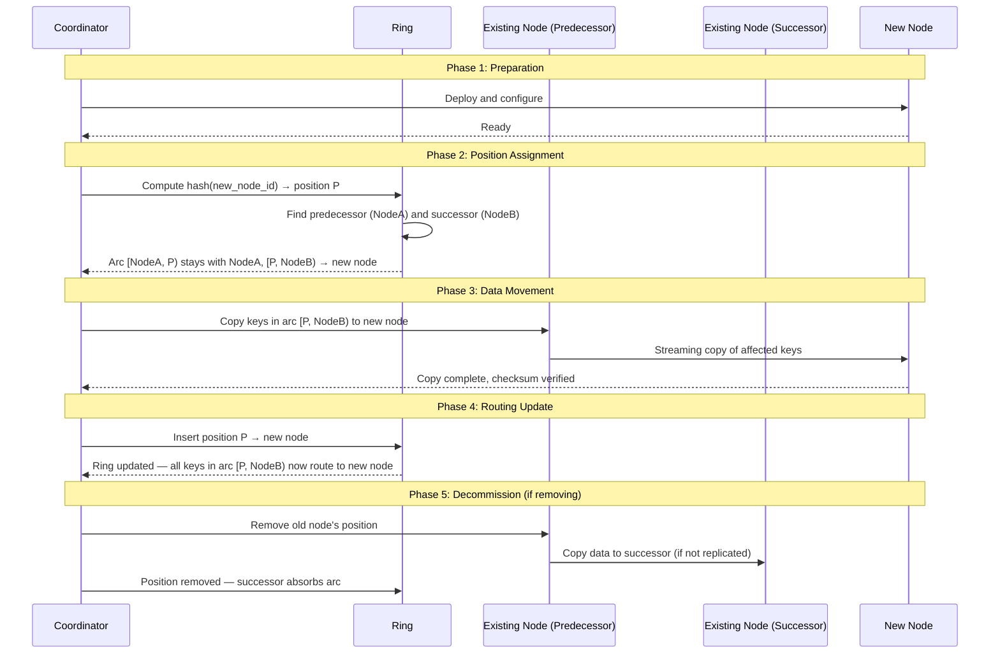
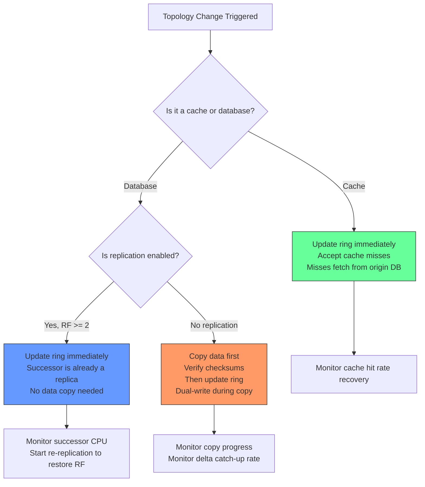

> [!success] Mastery Check
> - [ ] **Studied Well**
> - [ ] **Can explain the concept without notes**
> - [ ] **Can answer interview questions confidently**
> - [ ] **Can implement it in a real project**

---

id: "7.231"
title: "Consistent Hashing — Node Add and Remove"
domain: "System Design & Distributed Systems"
domain_id: 7
group: "Scalability Patterns"
tags: [system-design, distributed-systems, scalability, dotnet, azure, hashing, consistent-hashing, topology-change, node-management, cluster-membership]
priority: 1
version: 1
prerequisites:
  - "[[7.229 — Consistent Hashing — Algorithm]]" — the hash ring topology, nearest-clockwise-node routing, and the ~1/N key-movement property are foundational; node add/remove IS the mechanism that produces the ~1/N movement
  - "[[7.230 — Consistent Hashing — Virtual Nodes]]" — with virtual nodes, adding a node inserts VN positions each taken from a different predecessor; removing a node distributes its VN arcs across VN successors — the per-node mechanics change qualitatively from the single-predecessor/single-successor model of basic consistent hashing
  - "[[7.228 — Database Sharding — Resharding and Migration]]" — node add/remove in consistent hashing IS resharding for hash-based systems; the dual-write + incremental backfill + atomic cutover pattern from 7.228 is the operational procedure, and consistent hashing is the algorithmic foundation that makes it efficient
  - "[[7.225 — Database Sharding — Hash-Based]]" — naive modulo hashing moves ~(N-1)/N keys on node add/remove; consistent hashing reduces this to ~1/N — understanding the baseline (naive modulo) is required to appreciate the improvement
related:
  - "[[7.229 — Consistent Hashing — Algorithm]]" — the ring topology and routing rule define what node add/remove means: inserting or removing a position from the sorted ring and reassigning the affected arc
  - "[[7.230 — Consistent Hashing — Virtual Nodes]]" — VN node add/remove changes VN×N ring entries instead of N; the data movement per-physical-node is still ~1/N, but it is distributed across VN predecessors/successors
  - "[[7.228 — Database Sharding — Resharding and Migration]]" — the migration lifecycle (prepare → dual-write → backfill → delta sync → verify → cut over → decommission) applies to each node add/remove operation in consistent hashing
  - "[[7.232 — Consistent Hashing — Use Cases]]" — Cassandra uses gossip-based node discovery and hinted handoff for node removal; Redis Cluster uses slot migration with ASK/MOVED redirections; the mechanics differ but the underlying topology-change principle is the same
  - "[[7.233 — Auto-Scaling — Reactive vs Predictive]]" — auto-scaling triggers node add/remove decisions; the latency of the ring topology change (seconds vs minutes) determines whether auto-scaling can react quickly enough to traffic spikes
  - "[[7.236 — Connection Pooling — SQL at Scale]]" — when a node is removed from the ring, connection pools must drain connections to that node gracefully; the timing of ring removal vs connection drain affects whether in-flight requests are interrupted
  - "[[7.238 — Backpressure — Detection and Handling]]" — during a node removal, the remaining nodes receive a load increase of ~1/(N-1); if any node is already near capacity, this triggers backpressure that can cascade to the entire cluster
created: 2026-06-16

---

> [!ABSTRACT] Quick Reference — Node Add and Remove **Invariant:** When a node joins the consistent hash ring, only the keys in the arcs between the new node's position(s) and the immediately counter-clockwise node's position(s) change ownership — approximately 1/(N+1) of all keys. When a node leaves, only the keys it owned (its arcs) change ownership — approximately 1/N of all keys. In both cases, the remaining ~(N-1)/(N+1) or ~(N-1)/N keys stay on the same nodes. **The Core Distinction:** There are TWO changes that happen on node add/remove — the ROUTING change (the ring update, which is instantaneous) and the DATA movement (copying keys to their new owner, which is bounded by network and disk throughput). The routing change and data movement can be decoupled: the ring can be updated immediately and accept cache misses (which fetch from origin), or the ring update can be deferred until the data copy completes (dual-ring approach). **Node Add Mechanics:** The new node selects its position(s) on the ring via hash(new_node_id). Each position falls into an existing arc whose predecessor is some existing node. That predecessor's arc is split — the portion from the predecessor to the new node stays with the predecessor; the portion from the new node to the successor is assigned to the new node. The predecessor must either: (a) copy those keys to the new node (for databases), or (b) accept cache misses for those keys (for caches — they'll be fetched from origin). **Node Remove Mechanics:** The leaving node's arcs are re-assigned to their respective clockwise successors. The successor(s) inherit the leaving node's keys. If the system uses replication, the successor(s) already have the data (as replicas) and need only a metadata change. If not, the data must be copied from the leaving node before it goes offline. **The Critical Risk:** Cascading successor overload. When a node leaves, its successor absorbs its entire arc (or with VN, each of VN successors absorbs a fraction). If the successor(s) are already near capacity, the additional load triggers a cascading failure — the successor becomes overloaded, starts timing out, clients retry, and the overload spreads.

---


---

## Navigation

**Domain:** [[7 — System Design & Distributed Systems]] > **Group:** Scalability Patterns
**Previous:** [[7.230 — Consistent Hashing — Virtual Nodes]] | **Next:** [[7.232 — Consistent Hashing — Use Cases]]

### Prerequisites

- [[7.229 — Consistent Hashing — Algorithm]] — the hash ring, nearest-clockwise-node routing, and the ~1/N key-movement property are the foundation; node add/remove is the mechanism that achieves the ~1/N property
- [[7.230 — Consistent Hashing — Virtual Nodes]] — with VN=160, adding a node inserts 160 positions (not 1), each splitting a different predecessor's arc; removing a node distributes its 160 arcs across 160 successors — the single-arc model of basic consistent hashing is misleading for production systems
- [[7.228 — Database Sharding — Resharding and Migration]] — node add/remove is the trigger for data migration; the dual-write + incremental backfill + delta sync + atomic cutover lifecycle applies to every topology change, whether it is a planned node addition or an unplanned node failure
- [[7.225 — Database Sharding — Hash-Based]] — naive modulo `hash(key) % N` changes ~(N-1)/N of key assignments on each topology change; consistent hashing reduces this to ~1/N — the mechanism difference IS the topic of this note

### Where This Fits

Node add and remove are the operational events that trigger data movement in a consistent-hashing-based distributed system. They live at the cluster management layer — between the ring data structure and the data migration framework. In a .NET production system, an engineer encounters node add/remove when: (1) a Redis Cluster node is added to increase cache capacity — the cluster must reassign slots and migrate data; (2) a Cassandra node fails and the remaining nodes must absorb its token ranges via hinted handoff; (3) the auto-scaling group adds a new cache server and the consistent hash ring must be updated to include it — if the ring update is not coordinated with data warming, the new node receives a burst of cache misses that overloads the origin database; (4) a node is decommissioned for hardware maintenance — its data must be drained to other nodes before it goes offline. Without understanding the node add/remove mechanics, an engineer cannot design a properly functioning auto-scaling system, cannot plan maintenance operations, and cannot debug the cascading failures that follow unplanned node deaths.

## Core Mental Model

Node add/remove in consistent hashing is the act of inserting or removing a position on a sorted circular list and reassigning the contiguous range of hash values (the arc) that was previously assigned to that position's predecessor or successor. Think of it as adding or removing a bookend on a shelf of sorted books. Adding a bookend at position X splits the existing shelf segment — everything between the previous bookend and the new bookend stays with the left segment, and everything between the new bookend and the next bookend forms a new segment. Removing a bookend merges its segment with the adjacent segment.

The single invariant: **After the topology change, the ring must be in a consistent state where every key maps to exactly one node, using the nearest-clockwise-node rule.** During the transition (between "start copying data" and "cut over routing"), the invariant is temporarily violated — a key may be served by either the old or new owner. The transition period must be managed to ensure eventual consistency and zero data loss.

The fundamental distinction: **Routing change is instant; data movement is bounded by physics.** Updating the ring data structure (inserting or removing a position) takes microseconds. Copying the keys in the affected arcs to their new owner takes seconds (caches, small datasets) to hours (large databases, 100+ GB arcs). The engineering challenge is managing this gap — deciding when to update the ring relative to when the data is ready.

### Classification

- **Cluster membership operation:** one of the two fundamental topology-changing events in a consistent-hashing system (the other is node failure detection, which triggers the same mechanism as node removal)
- **What it does:** Updates the routing function so that a subset of keys (~1/N) is reassigned from one physical node to another
- **What it does NOT do:** (a) It does NOT guarantee that the data is moved before the routing change — that requires a separate migration framework; (b) It does NOT handle the load impact on the successor node(s) — that requires capacity planning and overload protection; (c) It does NOT handle the case where the joining/leaving node's data is hot (frequently accessed) — hot keys need separate treatment



### Key Properties / Guarantees

| Property | Node Add (planned) | Node Remove (planned) | Node Remove (unplanned failure) |
|---|---|---|---|
| Keys moved | ~1/(N+1) | ~1/N | ~1/N |
| Routing change | Instant (ring update) | Instant (ring update) | Instant (failure detector triggers ring update) |
| Data movement | Copy from predecessor to new node | Copy from leaving node to successor (or no copy if replicated) | The data is GONE — recovery from replica or backup |
| Availability impact | None (predecessor serves during copy) | None (successor already has data if replicated) | Partial — failed node's keys unavailable until replicas promoted |
| Load impact on survivors | Predecessor sheds ~1/N load | Successor gains ~1/N load | Successor gains ~1/N load (may cause cascading failure) |
| Cache hit rate impact | Drops from H to H × (N/(N+1)) | Drops from H to H × ((N-1)/N) if cache-only | Drops to same level as planned remove |
| Mitigation | Gradual warm-up, dual-reads | Pre-drain, replica promotion | Replication factor, hinted handoff |

---

## Deep Mechanics

### How It Works

**Planned Node Addition — Step-by-Step (Basic Consistent Hashing, VN=1):**

```
Step 1 — Deploy the new node:
  Provision the server, install the software, configure it as a cache/database node.
  The new node starts empty.

Step 2 — Compute ring position:
  hash("new-node-host:6379") → position P (e.g., 0xA3B2C1D0)

Step 3 — Identify affected arc:
  Binary search the ring for the insertion point of P.
  Predecessor = the node immediately counter-clockwise from P (node with largest hash < P).
  Successor = the node immediately clockwise from P (node with smallest hash > P).
  The arc [P, successor) is currently owned by the successor.
  The arc [predecessor, P) remains with the predecessor.

  Example ring before add:
    Node A @ 0x2000  (owns arc [0x1000, 0x2000))
    Node B @ 0x4000  (owns arc [0x2000, 0x4000))
    Node C @ 0x8000  (owns arc [0x4000, 0x8000))
    Node A @ 0x1000  (wrap — owns arc [0x8000, 0x1000))

  New node D @ 0x3000:
    Predecessor = Node B @ 0x2000
    Successor = Node C @ 0x4000
    Arc [0x3000, 0x4000) moves from Node C to Node D.
    Arc [0x2000, 0x3000) stays with Node B.

  Data to move: all keys with hash in [0x3000, 0x4000) — approximately 1/(N+1) = 1/5 = 20% of keys.

Step 4 — Copy data (for a database) or accept misses (for a cache):
  For a DATABASE: the predecessor (Node B) reads keys in [0x3000, 0x4000) and writes them to Node D.
    This copy can be done with the old node serving reads (no downtime).
    After the copy, the routing is updated.
  For a CACHE: the ring is updated immediately. Keys in [0x3000, 0x4000) now route to Node D.
    Node D is empty → cache miss → fetch from origin DB.
    Acceptable if the origin DB can handle the ~20% extra load.
    Mitigation: gradual warm-up (30–120 seconds).

Step 5 — Update the ring:
  Insert position P (0x3000 → Node D) into the sorted ring.
  All subsequent routing for keys in [0x3000, 0x4000) goes to Node D.

Step 6 — Monitor:
  Verify that Node D is receiving traffic.
  Verify that the predecessor (Node B) traffic dropped by the expected ~1/N.
  For a cache: verify cache hit rate recovers to baseline within the TTL window.
```

**Planned Node Addition — With Virtual Nodes (VN=160):**

The same as above, but repeated for each of the 160 VN positions:

```
For each i in [0, 159]:
  position = hash("new-node-host:6379:i")
  Predecessor = the VN entry immediately counter-clockwise from position.
  Successor = the VN entry immediately clockwise from position.
  Arc [position, successor) moves from successor's physical node to new physical node.

The 160 positions are distributed randomly across the ring.
Each of the 160 arcs is taken from (up to) 160 different predecessor VN entries,
which map to (up to) 160/N distinct physical nodes.

Total data moved: ~1/(N+1) of the ring (same as VN=1).
Distribution: spread across N physical nodes instead of concentrated on one predecessor.
Each existing node loses ~(VN/N)/(N+1) of its data — roughly (1/N) × (1/(N+1)) of the total ring.
For N=10: each existing node loses ~(160/10)/11 ≈ 1.45 VN arcs ≈ 0.9% of its data.
For VN=1: Node B (the sole predecessor) loses 20% of its data.
```

**Planned Node Removal — Step-by-Step:**

```
Step 1 — Mark node as leaving (graceful decommission):
  The node signals that it is leaving — stops accepting new connections, drains existing connections.
  The coordinator marks the node as "draining" in the cluster membership state.

Step 2 — Compute successor:
  Find the node's position(s) on the ring.
  For each position, the successor (next clockwise VN entry or physical node) will inherit the arc.
  With VN=160: each of the 160 positions has a different successor (on average).
  The 160 arcs are absorbed by up to 160/N distinct physical nodes.

Step 3 — Drain data (if not replicated):
  For a DATABASE without replication: the leaving node copies its data to the successor(s).
    This requires the leaving node to remain online during the copy.
    After the copy, the ring is updated.
  For a DATABASE with replication (RF=3): the successors already have the data as replicas.
    No data copy needed — just promote the replica to primary.
  For a CACHE: the data is not needed — cache entries will be re-fetched from origin on miss.

Step 4 — Update the ring:
  Remove the leaving node's position(s) from the sorted ring.
  All keys in the leaving node's arcs now route to the successor(s).
  For caches: the successors may have data from previous cached entries or may serve cache misses.
  For databases with replication: the successor is already a replica — data is immediately available.

Step 5 — Decommission:
  After the ring is updated, the leaving node receives no new requests.
  The node is shut down or repurposed.
  For databases with replication: the replication factor is now RF-1 for the migrated arcs.
  A background process should create a new replica on another node to restore RF.
```

**Unplanned Node Removal (Failure):**

```
Step 1 — Failure detection:
  The failure detector (gossip protocol, heartbeat, or external monitoring) marks the node as down.
  Timeout: typically 30–60 seconds of missed heartbeats (to avoid false positives from transient GC pauses).

Step 2 — Ring update:
  The node's position(s) are removed from the ring by the coordinator.
  Successor(s) inherit the arcs.

Step 3 — Replica promotion (if replicated):
  For databases with replication (RF ≥ 2): the successor is already a replica.
  The successor is promoted to primary for the inherited arcs.
  Reads resume immediately; writes to the new primary begin.
  For databases WITHOUT replication: the data on the failed node is LOST.
  Recovery: restore from backup and replay transaction log (multi-hour operation).

Step 4 — Hinted handoff (Cassandra-style):
  Writes that were in-flight to the failed node are stored as "hints" on a coordinator node.
  When the failed node comes back (or its successor is promoted), the hints are replayed.
  This prevents write loss during the failure detection window.

Step 5 — Re-replicate:
  With RF=3 and one node failed, some arcs now have only RF=2.
  A background process reads the under-replicated arcs from remaining replicas
  and writes them to a new node (or the failed node when it recovers).

Step 6 — Remediation:
  If the failed node does not recover within the remediation window (1–24 hours),
  treat it as a permanent removal and initiate a full re-replication to restore RF.
```

### Failure Modes

**1. Cascading Successor Overload on Node Removal.** When a node leaves, its successor absorbs its entire load. With VN=1, the successor's load doubles (from 1/N to 2/N). If the successor is already at 70% CPU, it jumps to 140% — unsustainable. The successor starts timing out requests. Clients retry, adding more load. The successor's overload causes it to be marked as "slow" or "down" by the failure detector. When the successor is removed from the ring, ITS successor now absorbs BOTH the original failed node's load AND the cascaded node's load — triple the original.

**Detection:** After a node removal, monitor the CPU of the clockwise successor. If it increases by more than 2× the expected increase (expected = 1/(N-1) of 100%), alert. In a 10-node cluster, expected increase = 11%. If the successor shows 25%+ increase, there is a cascading overload risk.

**Fix:** (a) Pre-drain the leaving node's traffic gradually — redirect 10% of its traffic per minute over 10 minutes — giving the successor time to warm up. (b) Use virtual nodes — VN=160 distributes the leaving node's load across ~160 distinct successors (average ~160/N distinct physical nodes), reducing each survivor's increase to ~1/(N-1) of the leaving node's load. (c) Use weighted replica placement — spread replicas across the ring so that no single physical node is the sole successor for a large arc.

**Prevention:** Never allow any node to run above 50% CPU in normal operation — that leaves headroom for a successor to absorb a failed neighbor's load without triggering cascading overload.

**2. Data Loss from Unreplicated Node Failure.** If the system does not use replication (each key lives on exactly one node), a node failure causes permanent data loss for all keys on that node. The ring update is instant but the data is gone.

**Detection:** After a node failure, queries for keys in the failed node's arcs return empty or error. The error rate spike correlates with the failed node's key range.

**Fix:** (a) For databases: always use replication factor ≥ 2. Each key should be stored on the primary node AND the next 1+ distinct nodes clockwise on the ring (replica nodes). (b) For caches: data loss is acceptable (cache miss = fetch from origin). No fix needed. (c) If replication is not possible: use synchronous replication to a backup region or journal every write to durable storage (WAL) before acknowledging the client.

**Prevention:** Set the replication factor based on the data criticality: RF=1 for cacheable data (loss is acceptable), RF=3 for transactional data (any single node can fail without data loss), RF=5 for critical financial data (any two nodes can fail simultaneously).

**3. Outage Window During Graceful Node Removal.** When a database node is gracefully removed, the data copy from the leaving node to its successor takes time. During this copy, the leaving node must remain online to serve reads. If the leaving node fails during the copy, the partially-copied data on the successor is inconsistent — some keys were copied, some were not.

**Detection:** The copy operation is incomplete. After the leaving node fails, the successor has some but not all of the leaving node's keys. Queries for uncopied keys fail.

**Fix:** (a) Use replication — if the successor is already a replica, no copy is needed. (b) If copy is required, use a two-phase approach: Phase 1 = bulk copy (idempotent), Phase 2 = incremental catch-up (replay writes that happened during Phase 1). Only switch routing after Phase 2 confirms the successor is caught up. (c) If the leaving node fails during copy, abort and route to a third node (if available) that has the complete data via a different replication path.

**Prevention:** Never rely on data copy from a leaving node for availability. Either use replication (so the successor already has the data) or use a multi-phase migration (dual-write + backfill + verification + cutover) that does not depend on the leaving node staying alive.

**4. Ring Instability During Simultaneous Topology Changes.** If two nodes join or leave at the same time (e.g., auto-scaling adds 3 nodes simultaneously, or a rack failure takes out 2 nodes at once), the ring update logic must handle concurrent modifications. With a naive lock-based approach, the first topology change acquires the write lock and blocks the second. With a distributed ring (no central lock), the two changes may be applied in different orders on different clients, causing routing inconsistency.

**Detection:** After a simultaneous addition of 3 nodes, different clients route the same key to different nodes. Cache hit rate drops (each client looks in a different place). For databases, the same key may be written to multiple nodes (split-brain).

**Fix:** (a) Use a centralized ring coordinator (etcd, ZooKeeper, Azure Blob Lease) that serializes all topology changes. Each change is a transaction: "insert positions for node D" is atomic. (b) Use vector clocks or versioned ring state — each ring update carries a monotonically increasing version number. Clients reject ring updates with a version lower than their current version. (c) Batch concurrent changes: for auto-scaling that adds 3 nodes, generate all 3 × VN positions in one batch and insert them in a single ring update.

**Prevention:** Serialize topology changes through a single coordinator. For auto-scaling, batch additions (add 3 nodes as one operation) rather than adding them individually.

### .NET and Azure Integration

**StackExchange.Redis — Redis Cluster node add/remove handling.** StackExchange.Redis discovers Redis Cluster topology changes via the `CLUSTER NODES` and `CLUSTER SLOTS` commands. When a node is added, the client receives MOVED redirections for keys that have moved to the new node:

```csharp
// Port: StackExchange.Redis — automatic topology discovery
// When a Redis Cluster node is added:
// 1. An admin runs: CLUSTER MEET <new-node-ip> <port>
// 2. The cluster reassigns some slots to the new node via:
//    CLUSTER SETSLOT <slot> NODE <new-node-id>
// 3. During migration, the old node returns:
//    - MOVED <slot> <new-node-ip>:<port> (slot fully moved)
//    - ASK <slot> <new-node-ip>:<port> (slot migrating, ask new node for data)
// 4. StackExchange.Redis handles MOVED by updating its slot map and retrying
// 5. ASK is handled by sending ASKING to the new node before the command

public class RedisClusterTopologyHandler
{
    private readonly ConnectionMultiplexer _redis;

    public async Task HandleNodeAdditionAsync(string newNodeEndpoint)
    {
        var server = _redis.GetServer(_redis.GetEndPoints().First());
        
        // Slot migration can be monitored via CLUSTER SLOTS
        var slots = await server.ExecuteAsync("CLUSTER", "SLOTS");
        
        // The client automatically handles MOVED/ASK redirections
        // No application code changes needed — StackExchange.Redis
        // updates its internal slot map when it receives a MOVED redirect
        
        _logger.LogInformation(
            "Redis Cluster topology updated. New endpoint: {Endpoint}",
            newNodeEndpoint);
    }
    
    // Graceful node removal: migrate all slots off the node first
    public async Task RemoveNodeGracefullyAsync(string nodeId)
    {
        var server = _redis.GetServer(nodeId);
        
        // Get all slots on this node
        var slots = await server.ExecuteAsync("CLUSTER", "SLOTS");
        // For each slot: CLUSTER SETSLOT <slot> MIGRATING <target-node-id>
        // This moves the slot's data to the target node
        // Once all slots are migrated: CLUSTER FORGET <node-id>
        
        _logger.LogInformation("Node {NodeId} gracefully removed from cluster", nodeId);
    }
}
```

**Orleans virtual nodes — implicit node add/remove via silo membership.** Orleans (Microsoft's virtual actor framework) uses a form of consistent hashing for grain placement. When a silo (node) joins or leaves, the Orleans runtime automatically migrates grains:

```csharp
// Port: Orleans — virtual nodes for grain placement
// Orleans uses a consistent hash ring with virtual nodes internally.
// When a silo joins:
// 1. The silo registers with the Orleans cluster membership service
// 2. The ring is updated with the new silo's VN positions
// 3. Grains whose placement changes are migrated lazily (on activation)
// 4. No manual ring management needed — Orleans handles it

[assembly: Orleans.OrleansConfigurationProvider]
public class OrleansSiloHost
{
    public static async Task RunAsync()
    {
        var host = new SiloHostBuilder()
            .UseLocalhostClustering()
            .Configure<ClusterOptions>(options =>
            {
                options.ClusterId = "my-cluster";
                options.ServiceId = "my-service";
            })
            .Build();

        await host.StartAsync();

        // When this silo joins the cluster:
        // - Orleans calculates its VN positions on the consistent hash ring
        // - Grains that should be on this silo are activated (lazy)
        // - No routing changes needed — Orleans handles it transparently
    }
}

// When a silo leaves (graceful shutdown):
// - Orleans drains activations from the leaving silo
// - Grains are re-activated on remaining silos (lazy, on next request)
// - In-flight requests are completed before shutdown
```

**Azure Cosmos DB — automatic partition split (node add equivalent).** In Cosmos DB, the equivalent of "adding a node" is splitting a physical partition. Cosmos DB handles this transparently:

```csharp
// Port: Cosmos DB — transparent physical partition split
// The application does NOT manage node add/remove.
// Cosmos DB automatically splits physical partitions when needed.
// The equivalent operations are:
//   Node Add: physical partition split (20 GB or 10,000 RU/s trigger)
//   Node Remove: physical partition merge (Cosmos DB does not merge; partitions
//     are decommissioned only when the container is deleted)

public class CosmosPartitionSplitAwareness
{
    // The application does NOT need to handle topology changes.
    // But monitoring the partition count helps understand when splits happen.
    public async Task MonitorSplitsAsync(CosmosClient client, CancellationToken ct)
    {
        var container = client.GetContainer("mydb", "mycontainer");
        
        // Before a split: partition count is P, each < 20 GB
        // After a split: partition count is P+1, the split partition's data
        //   is redistributed across P+1 partitions
        
        var response = await container.ReadContainerAsync(cancellationToken: ct);
        var partitionCount = response.Resource.PhysicalPartitionCount;
        
        if (partitionCount != _lastKnownPartitionCount)
        {
            _logger.LogInformation(
                "Physical partition count changed: {Old} → {New}. " +
                "A Cosmos DB partition split occurred.",
                _lastKnownPartitionCount, partitionCount);
            _lastKnownPartitionCount = partitionCount;
        }
    }
}
```


---

## Production Patterns and Implementation

### Primary Implementation

The canonical node add/remove manager coordinates the ring update, data movement, and monitoring for a consistent-hashing-based cluster. This implementation supports both planned and unplanned topology changes with VN awareness:

```csharp
// Port: Coordinated node add/remove for consistent hash ring
public sealed class ClusterTopologyManager
{
    private readonly VirtualNodeConsistentHashRing _ring;
    private readonly IDataMigrationService _migrator;
    private readonly IHealthMonitor _health;
    private readonly ILogger<ClusterTopologyManager> _logger;
    private readonly ClusterState _state = new();
    private readonly TimeSpan _failureTimeout = TimeSpan.FromSeconds(45);

    public ClusterTopologyManager(
        VirtualNodeConsistentHashRing ring,
        IDataMigrationService migrator,
        IHealthMonitor health,
        ILogger<ClusterTopologyManager> logger)
    {
        _ring = ring;
        _migrator = migrator;
        _health = health;
        _logger = logger;
    }

    // Planned node addition — gradual warm-up, zero data loss
    public async Task<NodeOperationResult> AddNodeAsync(
        string newNodeId, int virtualNodeCount, CancellationToken ct)
    {
        _logger.LogInformation(
            "Starting planned node addition: {NodeId} with {VnCount} VNs",
            newNodeId, virtualNodeCount);

        var sw = Stopwatch.StartNew();

        // Phase 1: Determine what data will move
        var predictedImpact = _ring.PredictNodeAddImpact(newNodeId, virtualNodeCount);
        _logger.LogInformation(
            "Node {NodeId} will claim {ArcCount} arcs from {PredecessorCount} predecessors. " +
            "Expected data share: {Share:P2}",
            newNodeId, predictedImpact.ArcCount,
            predictedImpact.DistinctPredecessors,
            predictedImpact.ExpectedShare);

        // Phase 2: Register the node in "warming" state
        //   - Writes go to both old owner and new node
        //   - Reads go to old owner (authoritative)
        _ring.AddNodeInWarmingState(newNodeId, virtualNodeCount);

        // Phase 3: Copy data from predecessors (for databases) or skip (for caches)
        if (_state.IsDatabaseCluster)
        {
            await _migrator.CopyArcsAsync(
                predictedImpact.Arcs, newNodeId, ct);
        }

        // Phase 4: Wait for the new node to reach target cache hit rate
        if (_state.UseGradualWarmUp)
        {
            await WaitForWarmUpAsync(newNodeId, ct);
        }

        // Phase 5: Promote to full read-write
        _ring.PromoteNodeFromWarming(newNodeId);

        sw.Stop();
        _logger.LogInformation(
            "Node {NodeId} added successfully. " +
            "Duration: {Duration}s. " +
            "Arcs assigned: {ArcCount}. " +
            "Keys moved: {KeysMoved}",
            newNodeId, sw.Elapsed.TotalSeconds,
            predictedImpact.ArcCount,
            predictedImpact.EstimatedKeyCount);

        return NodeOperationResult.Succeeded(
            newNodeId, sw.Elapsed, predictedImpact);
    }

    // Planned node removal — graceful drain with replication awareness
    public async Task<NodeOperationResult> RemoveNodeAsync(
        string nodeId, CancellationToken ct)
    {
        _logger.LogInformation(
            "Starting planned node removal: {NodeId}", nodeId);

        var sw = Stopwatch.StartNew();

        // Phase 1: Verify the node is healthy enough to drain
        var health = await _health.CheckAsync(nodeId, ct);
        if (health.Status == HealthStatus.Unhealthy)
        {
            // Node is already failing — treat as unplanned removal
            return await HandleNodeFailureAsync(nodeId, ct);
        }

        // Phase 2: Compute successors that will absorb the arcs
        var successors = _ring.GetSuccessorsForNode(nodeId);
        _logger.LogInformation(
            "Node {NodeId} has {ArcCount} arcs to be absorbed by {SuccessorCount} successors",
            nodeId, successors.ArcCount, successors.DistinctPhysicalNodes);

        // Phase 3: Check successor capacity — if any successor is already
        // near capacity, rebalance before removing
        foreach (var successor in successors.Nodes)
        {
            var successorHealth = await _health.CheckAsync(
                successor.NodeId, ct);
            if (successorHealth.CpuUtilization > 60)
            {
                _logger.LogWarning(
                    "Successor {SuccessorId} is at {CpuPct}% CPU. " +
                    "Removing {NodeId} would push it to {ProjectedCpu:P2}%. " +
                    "Consider adding a new node first or delaying removal.",
                    successor.NodeId, successorHealth.CpuUtilization,
                    nodeId,
                    successorHealth.CpuUtilization / 100.0
                        + (1.0 / _ring.PhysicalNodeCount));
                // Option: proceed with caution, or abort if threshold exceeded
                if (successorHealth.CpuUtilization > 80)
                {
                    return NodeOperationResult.Failed(
                        nodeId, "Successor overload risk");
                }
            }
        }

        // Phase 4: Drain the node — redirect traffic gradually
        // With VN=160, "gradual" means removing VNs one by one
        // over a 5-minute window rather than all at once
        await DrainNodeAsync(nodeId, ct);

        // Phase 5: Update the ring — remove all VN positions
        _ring.RemovePhysicalNode(nodeId);

        sw.Stop();
        _logger.LogInformation(
            "Node {NodeId} removed successfully. Duration: {Duration}s",
            nodeId, sw.Elapsed.TotalSeconds);

        return NodeOperationResult.Succeeded(nodeId, sw.Elapsed, null);
    }

    // Unplanned node removal — failure handling
    public async Task<NodeOperationResult> HandleNodeFailureAsync(
        string failedNodeId, CancellationToken ct)
    {
        _logger.LogWarning(
            "Handling unplanned node failure: {NodeId}", failedNodeId);

        var sw = Stopwatch.StartNew();

        // Phase 1: Confirm the node is actually down
        var health = await _health.CheckAsync(failedNodeId, ct);
        if (health.Status == HealthStatus.Healthy)
        {
            _logger.LogInformation(
                "Node {NodeId} is healthy — false alarm", failedNodeId);
            return NodeOperationResult.Failed(
                failedNodeId, "False alarm — node is healthy");
        }

        // Phase 2: Remove from ring immediately
        _ring.RemovePhysicalNode(failedNodeId);

        // Phase 3: Promote replicas (if replication is enabled)
        if (_state.ReplicationFactor > 1)
        {
            await PromoteReplicasAsync(failedNodeId, ct);
            _logger.LogInformation(
                "Replicas promoted for failed node {NodeId}. " +
                "Replication factor reduced to {NewRF} for affected arcs. " +
                "Re-replication started.",
                failedNodeId, _state.ReplicationFactor - 1);
        }
        else
        {
            _logger.LogError(
                "CRITICAL: Node {NodeId} failed with RF=1. " +
                "All data on this node is LOST. " +
                "Initiating backup recovery procedure.",
                failedNodeId);
        }

        // Phase 4: Hinted handoff — replay in-flight writes
        await ReplayHintsForNodeAsync(failedNodeId, ct);

        // Phase 5: Start re-replication to restore RF
        _ = ReReplicateAsync(failedNodeId, ct);

        sw.Stop();
        _logger.LogInformation(
            "Node failure handled for {NodeId}. Duration: {Duration}s",
            failedNodeId, sw.Elapsed.TotalSeconds);

        return NodeOperationResult.Succeeded(failedNodeId, sw.Elapsed, null);
    }

    private async Task DrainNodeAsync(string nodeId, CancellationToken ct)
    {
        // Gradual VN removal — remove VNs in batches over time
        var vnPositions = _ring.GetVirtualNodePositions(nodeId);
        int batchSize = Math.Max(1, vnPositions.Count / 20); // 20 batches = ~5% increments

        for (int i = 0; i < vnPositions.Count; i += batchSize)
        {
            var batch = vnPositions.Skip(i).Take(batchSize).ToList();
            _ring.RemoveVirtualNodePositions(batch);
            _logger.LogInformation(
                "Draining node {NodeId}: {Pct}% complete " +
                "({Removed}/{Total} VNs removed)",
                nodeId,
                (int)((double)(i + batch.Count) / vnPositions.Count * 100),
                i + batch.Count, vnPositions.Count);

            // Wait between batches to let successors absorb gradually
            await Task.Delay(TimeSpan.FromSeconds(5), ct);
        }
    }

    private async Task WaitForWarmUpAsync(string nodeId, CancellationToken ct)
    {
        var timeout = TimeSpan.FromMinutes(5);
        var start = DateTime.UtcNow;

        while (DateTime.UtcNow - start < timeout)
        {
            var hitRate = await _health.GetCacheHitRateAsync(nodeId, ct);
            if (hitRate >= _state.TargetWarmUpHitRate) // e.g., 80%
            {
                _logger.LogInformation(
                    "Node {NodeId} warmed up: {HitRate:P2} hit rate",
                    nodeId, hitRate);
                return;
            }

            _logger.LogDebug(
                "Node {NodeId} warming: {HitRate:P2} hit rate " +
                "(target: {Target:P2})",
                nodeId, hitRate, _state.TargetWarmUpHitRate);

            await Task.Delay(TimeSpan.FromSeconds(5), ct);
        }

        _logger.LogWarning(
            "Node {NodeId} did not reach target hit rate within {Timeout}. " +
            "Promoting anyway — cache misses will be served from origin.",
            nodeId, timeout);
    }
}

// Node operation result
public sealed record NodeOperationResult(
    string NodeId,
    NodeOperationStatus Status,
    TimeSpan Duration,
    string? ErrorMessage = null)
{
    public static NodeOperationResult Succeeded(
        string nodeId, TimeSpan duration, object? impact) =>
        new(nodeId, NodeOperationStatus.Succeeded, duration);

    public static NodeOperationResult Failed(
        string nodeId, string error) =>
        new(nodeId, NodeOperationStatus.Failed, TimeSpan.Zero, error);
}

public enum NodeOperationStatus { Succeeded, Failed, InProgress }
```

### Configuration and Wiring

```csharp
// Program.cs — cluster topology manager registration
var builder = WebApplication.CreateBuilder(args);

builder.Services.AddSingleton<ClusterTopologyManager>();
builder.Services.AddSingleton<IDataMigrationService, VNodeDataMigrator>();
builder.Services.AddSingleton<IHealthMonitor, ClusterHealthMonitor>();

// Background service that monitors for node failures
builder.Services.AddHostedService<FailureDetectorBackgroundService>();

var app = builder.Build();

// Admin API for topology changes
app.MapPost("/cluster/nodes", async (
    AddNodeRequest request,
    ClusterTopologyManager manager,
    CancellationToken ct) =>
{
    var result = await manager.AddNodeAsync(
        request.NodeId, request.VirtualNodeCount, ct);
    return result.Status == NodeOperationStatus.Succeeded
        ? Results.Ok(result)
        : Results.Problem(result.ErrorMessage);
});

app.MapDelete("/cluster/nodes/{nodeId}", async (
    string nodeId,
    ClusterTopologyManager manager,
    CancellationToken ct) =>
{
    var result = await manager.RemoveNodeAsync(nodeId, ct);
    return result.Status == NodeOperationStatus.Succeeded
        ? Results.Ok(result)
        : Results.Problem(result.ErrorMessage);
});
```

### Common Variants

**Variant 1 — Gossip-based topology discovery (Cassandra-style).** Instead of a central coordinator, nodes discover each other via gossip. Each node maintains its own ring view and propagates changes:

```csharp
// Port: Gossip-based node discovery
public class GossipTopologyManager
{
    private readonly List<GossipNode> _peers;
    private readonly VirtualNodeConsistentHashRing _localRing;
    private long _ringVersion;

    // Periodically exchange ring versions with peers
    public async Task GossipAsync(CancellationToken ct)
    {
        while (!ct.IsCancellationRequested)
        {
            foreach (var peer in _peers)
            {
                var remoteVersion = await peer.GetRingVersionAsync(ct);
                if (remoteVersion > _ringVersion)
                {
                    // Peer has a newer ring — pull their topology
                    var topology = await peer.GetRingTopologyAsync(ct);
                    _localRing.UpdateFromTopology(topology);
                    _ringVersion = remoteVersion;
                    
                    _logger.LogInformation(
                        "Ring updated via gossip: version {Version}",
                        _ringVersion);
                }
            }
            await Task.Delay(TimeSpan.FromSeconds(1), ct);
        }
    }

    // When this node adds a new peer, it gossips the change
    public async Task AddPeerAsync(string peerEndpoint, CancellationToken ct)
    {
        _ringVersion++;
        // Broadcast new ring version to all peers
        foreach (var peer in _peers)
        {
            await peer.NotifyRingChangeAsync(_ringVersion, ct);
        }
    }
}
```

**Variant 2 — Pre-warming new nodes via replica copy.** Instead of accepting cache misses on the new node, copy the data from the predecessor using the same mechanism as replica repair:

```csharp
// Port: Pre-warm a new node by copying its entire expected arc
public async Task PreWarmNodeAsync(
    string newNodeId, TimeSpan warmUpDuration, CancellationToken ct)
{
    // 1. Identify all predecessor nodes that will lose data to the new node
    var predecessors = _ring.GetPredecessorsForNewNode(newNodeId);
    
    // 2. Copy data from each predecessor to the new node
    //    The copy uses consistent hashing to determine which keys belong to the new node
    var copyTasks = predecessors.Select(predecessor =>
        CopyArcDataAsync(
            sourceNode: predecessor.NodeId,
            targetNode: newNodeId,
            arcRanges: predecessor.AffectedArcs,
            cancellationToken: ct));
    
    await Task.WhenAll(copyTasks);
    
    // 3. Verify the copy (checksum comparison)
    foreach (var predecessor in predecessors)
    {
        var verified = await VerifyArcCopyAsync(
            predecessor.NodeId, newNodeId,
            predecessor.AffectedArcs, ct);
        if (!verified)
        {
            throw new InvalidOperationException(
                $"Pre-warm verification failed for predecessor {predecessor.NodeId}");
        }
    }
    
    // 4. NOW add the node to the ring (routing change)
    //    The new node already has the data — zero cache misses
    _ring.AddPhysicalNode(newNodeId, _state.DefaultVnCount);
}
```

**Variant 3 — Slot-based migration (Redis Cluster).** Redis Cluster uses slot-level granularity for node add/remove. Each node owns a set of slots (0–16383), and migration moves one slot at a time:

```csharp
// Port: Redis Cluster slot migration for node removal
public async Task MigrateSlotsOffNodeAsync(
    string sourceNodeId, string targetNodeId, int[] slots, CancellationToken ct)
{
    var source = _redis.GetServer(sourceNodeId);
    var target = _redis.GetServer(targetNodeId);
    
    foreach (var slot in slots)
    {
        // Redis Cluster slot migration steps:
        // 1. Set target slot to IMPORTING state
        await target.ExecuteAsync("CLUSTER", "SETSLOT", slot, "IMPORTING", sourceNodeId);
        
        // 2. Set source slot to MIGRATING state
        await source.ExecuteAsync("CLUSTER", "SETSLOT", slot, "MIGRATING", targetNodeId);
        
        // 3. Migrate keys in the slot (Redis handles this internally)
        //    CLUSTER GETKEYSINSLOT <slot> <count> → migrate each key
        while (true)
        {
            var keys = await source.ExecuteAsync(
                "CLUSTER", "GETKEYSINSLOT", slot, 100);
            if (keys.Length == 0) break;
            
            foreach (var key in (RedisValue[])keys!)
            {
                // MIGrate key from source to target
                await source.ExecuteAsync(
                    "MIGRATE", targetNodeId, 6379, key, 0, 5000);
            }
        }
        
        // 4. Set slot to target node (atomic — both nodes agree)
        await target.ExecuteAsync("CLUSTER", "SETSLOT", slot, "NODE", targetNodeId);
        await source.ExecuteAsync("CLUSTER", "SETSLOT", slot, "NODE", targetNodeId);
        
        _logger.LogInformation("Slot {Slot} migrated to {Target}", slot, targetNodeId);
    }
}
```

### Real-World .NET Ecosystem Example

**Orleans silo join and leave — transparent node management.** Orleans provides the most complete "hands-off" node add/remove experience in .NET. When a silo joins or leaves, the Orleans runtime automatically updates the consistent hash ring and migrates grains:

```csharp
// Port: Orleans — silo lifecycle events
public sealed class SiloLifecycleObserver : ILifecycleParticipant<ISiloLifecycle>
{
    private readonly ILogger<SiloLifecycleObserver> _logger;

    public void Participate(ISiloLifecycle lifecycle)
    {
        lifecycle.Subscribe<SiloLifecycleObserver>(
            ServiceLifecycleStage.RuntimeGrainServices,
            onStart: async (ct) =>
            {
                // This silo has joined the cluster
                // The Orleans runtime has:
                // 1. Registered this silo in the membership table (Azure Storage, SQL, etc.)
                // 2. Updated the consistent hash ring with this silo's VN positions
                // 3. Started activating grains that belong to this silo (on first request)
                
                _logger.LogInformation(
                    "Silo joined cluster. Ring updated. " +
                    "Grains will be activated lazily on this silo.");
            },
            onStop: async (ct) =>
            {
                // This silo is leaving the cluster
                // The Orleans runtime will:
                // 1. Deactivate all grains on this silo
                // 2. Update the consistent hash ring to remove this silo
                // 3. Remaining silos will re-activate the deactivated grains on request
                
                _logger.LogInformation(
                    "Silo leaving cluster. " +
                    "Grains draining and ring updating.");
            });
    }
}

// The critical insight: Orleans handles the entire node add/remove lifecycle
// automatically. The application developer does NOT write ring update logic,
// data migration code, or failure detection. The runtime handles:
// - Consistent hash ring maintenance
// - Grain placement based on the ring
// - Lazy grain migration (on activation)
// - Failure detection via membership protocol
// - Hinted handoff for in-flight requests during silo failure
```

**Azure Cosmos DB — partition split as automatic node add.** Cosmos DB's automatic partition splitting is the closest equivalent to "node add" in a managed Azure service. The split is transparent to the application and handled entirely by the Cosmos DB control plane:

```csharp
// Port: Monitoring Cosmos DB physical partition splits
// (the equivalent of watching node add/remove events)
// The application does not manage partitions, but knowing when splits occur
// helps diagnose latency changes.

public class CosmosPartitionSplitMonitor : BackgroundService
{
    private readonly Container _container;

    protected override async Task ExecuteAsync(CancellationToken ct)
    {
        var previousPartitionCount = await GetPartitionCountAsync(ct);

        while (!ct.IsCancellationRequested)
        {
            await Task.Delay(TimeSpan.FromMinutes(5), ct);
            
            var currentCount = await GetPartitionCountAsync(ct);
            if (currentCount != previousPartitionCount)
            {
                _logger.LogInformation(
                    "Cosmos DB physical partition count changed: {Old} → {New}. " +
                    "This is equivalent to a node add event in consistent hashing. " +
                    "The split is transparent — no application changes needed.",
                    previousPartitionCount, currentCount);
                previousPartitionCount = currentCount;
            }
        }
    }

    private async Task<int> GetPartitionCountAsync(CancellationToken ct)
    {
        var response = await _container.ReadContainerAsync(cancellationToken: ct);
        return response.Resource.PhysicalPartitionCount;
    }
}
```


---

## Gotchas and Production Pitfalls

### [Pitfall Name] Successor Overload on Node Removal (Cascading Failure)

**Pitfall:** Removing a node without checking the successor's capacity. With VN=1, the successor absorbs the entire 1/N arc of the removed node. If the successor is at 60% CPU, it jumps to ~120% — guaranteed overload. The successor starts timing out, client retries add load, and the successor may itself be marked as failed.

```csharp
// ❌ Wrong — immediate removal without capacity check
_ring.RemovePhysicalNode("node-5"); 
// Successor of node-5 now handles 2× the traffic
// If successor was at 60% CPU → now at 120% CPU
// Successor starts timing out → clients retry → more load
// Successor may be marked as failed → cascade

// ✅ Right — check successor capacity before removal
public async Task<bool> CanRemoveSafelyAsync(string nodeId)
{
    var successors = _ring.GetSuccessorsForNode(nodeId);
    foreach (var successor in successors.DistinctPhysicalNodes)
    {
        var cpu = await GetNodeCpuAsync(successor);
        var projectedCpu = cpu + (100.0 / _ring.PhysicalNodeCount); // ~1/N load increase
        if (projectedCpu > 80) // Leave headroom
        {
            _logger.LogWarning(
                "Cannot remove {Node}: successor {Succ} would reach {Cpu}% CPU",
                nodeId, successor, projectedCpu);
            return false;
        }
    }
    return true;
}

// If removal is not safe:
// Option A: Add a new node first to absorb some load, then remove
// Option B: Use gradual VN drain (remove VNs one by one over 5 minutes)
// Option C: Increase successor capacity (scale up) before removal
```

**Symptom:** Seconds to minutes after a node removal, the successor node's CPU spikes to 100%, requests start timing out, and the error rate for the entire cluster increases. In the worst case, the successor is also removed by the failure detector, and the cascade continues.

**Fix:** (a) Always check successor capacity before removal. (b) Use gradual VN drain: remove VNs in batches over 5–10 minutes instead of all at once. (c) If the successor is at >60% CPU, add a new node to the cluster BEFORE removing the old one — the new node absorbs some load, and then the old node can be removed safely.

**Cost of not fixing:** Cascading failure that takes down multiple nodes. The cluster degrades from N to N-2, N-3, ... as each successor fails under the added load. Recovery requires manually adding replacement nodes and rebuilding the ring — a 30+ minute incident.

### [Pitfall Name] Ring Update Before Data Copy Completes (Data Unavailability)

**Pitfall:** For a database (not cache), updating the ring immediately when a node joins — before the data is copied from the predecessor. The ring update says "new node owns arc X," but the new node does not have the data yet. Reads for keys in that arc return empty.

```csharp
// ❌ Wrong — ring update before data copy (database)
ring.AddPhysicalNode("new-db-node", virtualNodeCount: 160);
// Ring updated — all new reads go to new-db-node
// But new-db-node is EMPTY — data is still on predecessor
// Read requests for keys in the new node's arcs return 404/empty

// ✅ Right — data copy first, then ring update (database)
// Phase 1: Copy data from predecessors (dual-write active but ring is unchanged)
foreach (var predecessor in predecessors)
{
    await CopyDataAsync(predecessor, "new-db-node", arcRanges);
}

// Phase 2: Verify the copy
var verified = await VerifyChecksumsAsync(predecessors, "new-db-node");

// Phase 3: NOW update the ring — data is ready
ring.AddPhysicalNode("new-db-node", virtualNodeCount: 160);

// ✅ Right — for caches, ring update first is CORRECT
// Cache misses are acceptable — data is fetched from origin
ring.AddPhysicalNode("new-cache-node", virtualNodeCount: 160);
// Cache miss → fetch from origin DB → populate cache
// Acceptable because origin DB is the source of truth
```

**Symptom:** After adding a database node, queries for certain keys (those in the new node's arcs) return empty results or "not found" errors. The data is still on the predecessor but the ring routes to the empty new node. The error is consistent — the same keys always fail.

**Fix:** For databases, always COPY DATA FIRST, then update the ring. Use the dual-write + backfill + verification + cutover pattern from 7.228. The ring must NOT be updated until the verification phase passes.

**Cost of not fixing:** Data unavailability for keys in the new node's arcs. Users see missing data. For an e-commerce platform, this means orders, product listings, or user profiles are missing — a P0 incident.

### [Pitfall Name] Incomplete Ring Update After Partial Node Failure

**Pitfall:** A node partially fails — it can process some requests but not others (e.g., disk is read-only but the process is still running). The failure detector does not mark it as "down" because the process is still alive. The ring is not updated. The half-failed node continues to serve reads from a corrupted or incomplete data set.

```csharp
// ❌ Wrong — failure detector only checks process health
public class SimpleFailureDetector
{
    public async Task<bool> IsNodeAlive(string nodeId)
    {
        try
        {
            // TCP ping succeeds — process is running
            using var tcp = new TcpClient();
            await tcp.ConnectAsync(nodeId, 6379);
            return true;
        }
        catch
        {
            return false;
        }
    }
    // BUG: process is running but disk is read-only
    // Writes fail silently; reads return stale data
    // Ring is NOT updated because the node appears "alive"
}

// ✅ Right — application-level health check
public class ApplicationHealthFailureDetector
{
    public async Task<NodeHealth> CheckNodeHealthAsync(string nodeId)
    {
        try
        {
            // Application-level probe — write a test key, read it back
            var db = GetDatabase(nodeId);
            var testKey = $"_health_check_{Guid.NewGuid()}";
            await db.StringSetAsync(testKey, "ok", expiry: TimeSpan.FromSeconds(5));
            var result = await db.StringGetAsync(testKey);
            
            if (result != "ok")
            {
                return NodeHealth.Degraded("Read-after-write failed");
            }
            
            // Also check disk, memory, and request latency
            var info = await db.ExecuteAsync("INFO");
            var diskUsage = ParseDiskUsage(info);
            if (diskUsage > 95)
            {
                return NodeHealth.Degraded("Disk nearly full");
            }
            
            return NodeHealth.Healthy;
        }
        catch (Exception ex)
        {
            return NodeHealth.Unhealthy(ex.Message);
        }
    }
}

// Remove from ring only if application-level health check fails
var health = await detector.CheckNodeHealthAsync(nodeId);
if (health.Status == HealthStatus.Unhealthy)
{
    _ring.RemovePhysicalNode(nodeId);
}
```

**Symptom:** Some reads return stale data, some writes fail silently. The node is "alive" (TCP ping succeeds) but in a degraded state. The ring still routes to this node, so clients receive degraded service. The problem persists until manual intervention.

**Fix:** Implement application-level health checks that probe actual read/write functionality, not just TCP connectivity. Remove a node from the ring only when the application-level health check fails. For a degraded node (not dead), consider marking it as "read-only" in the ring — reads still go to it, but writes are redirected to the successor.

**Cost of not fixing:** Silent data corruption or stale reads persist while the ring continues to route to a degraded node. The incident is discovered by user complaints, not by monitoring.

### [Pitfall Name] Hot Key on New Node Causes Immediate Overload

**Pitfall:** When a new node joins, it claims an arc that contains a hot key — a key that receives 100× the request rate of the average key. The new node, which is cold and has no cached data, immediately receives a burst of requests for the hot key. Each request is a cache miss that fetches from the origin database. The origin database gets 100× the expected load for that arc.

```csharp
// ❌ Wrong — immediate full routing for all keys
ring.AddPhysicalNode("new-cache-node", virtualNodeCount: 160);
// Arc [0x3000, 0x4000) now routes to new-cache-node
// Arc [0x3000, 0x4000) contains "product_9999" — a hot key at 10,000 req/s
// New node gets 10,000 cache misses/second → origin DB overload

// ✅ Right — detect hot keys and handle them separately
public async Task AddNodeWithHotKeyMitigationAsync(
    string newNodeId, int vnCount, CancellationToken ct)
{
    // 1. Identify hot keys in the arcs that will move
    var predictedArcs = _ring.PredictNodeAddImpact(newNodeId, vnCount);
    var hotKeys = await FindHotKeysInRangesAsync(predictedArcs.Arcs, ct);
    
    // 2. For hot keys: keep routing to the OLD node (predecessor)
    //    and simultaneously write the hot key data to the new node
    foreach (var hotKey in hotKeys)
    {
        // Add a special routing override for this hot key
        _routingOverrides.Set(hotKey, hotKey.CurrentOwner);
        
        // Proactively populate the key on the new node
        var data = await GetFromCurrentOwnerAsync(hotKey, ct);
        await SetOnNewNodeAsync(newNodeId, hotKey, data, ct);
    }
    
    // 3. Add the node normally
    ring.AddPhysicalNode(newNodeId, vnCount);
    
    // 4. Remove routing overrides after the new node is warmed
    await Task.Delay(TimeSpan.FromMinutes(5), ct);
    foreach (var hotKey in hotKeys)
    {
        _routingOverrides.Remove(hotKey);
        // Now the hot key routes to the new node via normal hashing
        // But the new node already has the data (step 2) → cache HIT
    }
}
```

**Symptom:** Immediately after adding a new cache node, the origin database CPU spikes to 100%. The new node's hit rate is near-zero for the first few minutes, and the origin database is taking the full brunt of the cache misses. Investigation reveals that a single hot key accounts for 90% of the misses.

**Fix:** (a) Proactively identify hot keys before node addition and pre-warm them on the new node. (b) Use a short-term routing override to keep hot keys on the old node until the new node is warmed. (c) Consider splitting the hot key (adding a synthetic suffix) so its load is distributed across multiple nodes.

**Cost of not fixing:** Origin database overload on every node addition. For a system with auto-scaling that adds nodes during traffic peaks, the auto-scaling action triggers the very overload it was meant to alleviate.

### [Pitfall Name] Failure Detector Flap — Repeated Add/Remove Cycles

**Pitfall:** A node experiences transient network issues (1–2 second packet loss every 30 seconds due to network congestion). The failure detector marks it as "down" after 45 seconds of failed health checks. The ring is updated (node removed). 10 seconds later, the node recovers and health checks pass. The failure detector adds it back. 30 seconds later, the network glitch happens again. The node is added and removed repeatedly — flapping. Each flap triggers data movement (for databases) or cache misses (for caches).

```csharp
// ❌ Wrong — immediate removal on first failure detection
public void OnFailureDetected(string nodeId)
{
    _ring.RemovePhysicalNode(nodeId); // Immediate — causes flap
}

// ✅ Right — debounce and verify before removal
public async Task OnFailureDetectedAsync(string nodeId, CancellationToken ct)
{
    // Phase 1: Verify the failure is persistent (3 consecutive checks)
    int failureCount = 0;
    for (int i = 0; i < 3; i++)
    {
        var health = await _health.CheckAsync(nodeId, ct);
        if (health.Status != HealthStatus.Healthy)
        {
            failureCount++;
        }
        await Task.Delay(TimeSpan.FromSeconds(5), ct);
    }
    
    if (failureCount < 3)
    {
        _logger.LogInformation(
            "Node {NodeId} recovered — false alarm avoided", nodeId);
        return; // Don't remove — false alarm
    }
    
    // Phase 2: Before removing, mark the node as "suspect" — monitor
    // If the node recovers within the suspicion window (2 minutes), cancel the removal
    _ring.MarkNodeSuspect(nodeId);
    
    // Phase 3: Wait for suspicion window
    await Task.Delay(TimeSpan.FromSeconds(120), ct);
    
    var finalHealth = await _health.CheckAsync(nodeId, ct);
    if (finalHealth.Status == HealthStatus.Healthy)
    {
        _ring.ClearSuspectStatus(nodeId);
        _logger.LogInformation(
            "Node {NodeId} recovered within suspicion window — removal cancelled",
            nodeId);
        return;
    }
    
    // Phase 4: Remove permanently
    _ring.RemovePhysicalNode(nodeId);
    
    // Phase 5: Apply a cooldown — prevent re-addition for 5 minutes
    _state.SetRemovalCooldown(nodeId, TimeSpan.FromMinutes(5));
}

// On re-join attempt: check cooldown
public void OnNodeJoinRequest(string nodeId)
{
    if (_state.IsInRemovalCooldown(nodeId))
    {
        _logger.LogWarning(
            "Rejecting join for {NodeId} — in removal cooldown for {Remaining}s",
            nodeId, _state.GetRemainingCooldown(nodeId));
        return; // Reject — prevent flap
    }
    _ring.AddPhysicalNode(nodeId, _state.DefaultVnCount);
}
```

**Symptom:** The ring is updated multiple times per minute. Each update triggers data movement or cache misses. The cluster is unstable — routing changes constantly, cache hit rate oscillates between 95% and 60%, and the database sees periodic load spikes from cache misses.

**Fix:** (a) Use a suspicion window (2 minutes) — a node is not removed until it has been unhealthy for 2 consecutive minutes. (b) Use a removal cooldown — after a node is removed, it cannot rejoin for 5 minutes. (c) Use a flapping detection counter — if a node is added/removed 3+ times in an hour, lock it out for 1 hour and alert.

**Cost of not fixing:** Cluster instability during network congestion events. The routing is in constant flux, making the system unreliable. If the congestion affects multiple nodes simultaneously (rack switch issue), the entire cluster can become unavailable as nodes are added and removed in rapid succession.


---

## Tradeoffs and Decision Framework

### Tradeoff Matrix

| Dimension | Immediate Ring Update (Cache) | Data-First Ring Update (Database) | Gradual VN Drain | Slot-Based Migration (Redis) |
|---|---|---|---|---|
| Data loss risk | None (cache miss = fetch) | Low (data copied before routing) | None (incremental) | None (slot-by-slot) |
| Read availability | 100% (miss served from origin) | 100% (old node serves until cutover) | 100% (gradual transition) | 100% (MOVED/ASK redirects) |
| Write availability | 100% (cache miss → write to origin) | 100% (dual-write during copy) | 100% (VN-by-VN removal) | 100% (slot migration handles writes) |
| Migration duration | Instant (ring update only) | Data_size / throughput + catch-up | VN_count × 5s per batch | Slot_count × ~1ms per key |
| Operational complexity | Low | High (dual-write, verification) | Medium (batch scheduler) | Medium (Redis Cluster tooling) |
| Load impact on survivors | ~1/(N+1) cache miss burst | ~1/(N+1) data copy I/O | 1/(N-1) gradual load increase | Slot migration CPU on source |
| .NET implementation | `ring.AddPhysicalNode()` only | `ClusterTopologyManager.AddNodeAsync()` | `ClusterTopologyManager.DrainNodeAsync()` | StackExchange.Redis + `CLUSTER` commands |



### When to Apply

**Apply immediate ring update (no data copy) when:**
- The system is a cache (data loss = acceptable, cache miss = fetch from origin)
- The system uses replication (RF ≥ 2) — the successor already has a copy of the data
- The node removal is unplanned (failure) — by the time the failure is confirmed, the data is already gone from the failed node; immediate ring update minimizes the window of unavailability
- The data size in the affected arc is small (< 1 GB) — the new node can be populated quickly from origin

**Apply data-first ring update when:**
- The system is a primary database without replication
- The node addition is planned and the data in the affected arc is large (> 10 GB)
- Strong consistency is required — the new node must have complete data before serving reads
- The system has a maintenance window and can tolerate a brief read-only period during cutover

**Apply gradual VN drain when:**
- The removal might overload the successor (successor is at >60% CPU)
- The cluster has virtual nodes enabled (VN ≥ 100)
- The removal can be scheduled over a window of minutes to hours (planned maintenance)
- The application can tolerate slow migration (bounded by the batch interval, not by data size)

### When NOT to Apply

- [ ] **Immediate ring update for unreplicated databases:** NEVER. Updating the ring before the data is copied makes the data unavailable until the copy completes. The successor does not have the data.
- [ ] **Data-first ring update for caches:** Unnecessary complexity. Cache misses are acceptable. Adding a node to a cache cluster is a 50-microsecond ring update, not a multi-hour data migration.
- [ ] **Gradual VN drain for VN=1:** Removing VNs one by one when VN=1 is not possible — there is only one position. For VN < 20, the granularity is too coarse for gradual drain to be meaningful.
- [ ] **Any topology change during peak hours for a database:** Even with replication, the successor's CPU increase from absorbing the leaving node's load can cause performance degradation. Schedule topology changes for off-peak hours.

### Scale Thresholds

- "Immediate ring update for caches is safe below ~10 TB total cache size — above that, the cache-miss burst on node add may overwhelm the origin database even at ~1/N of 10 TB."
- "Gradual VN drain becomes meaningful above VN=100 — at VN=160 and N=10, removing 8 VNs per batch × 20 batches = 10 minutes for a complete node drain."
- "Data-first ring update is practical below ~500 GB per arc — above that, the copy time exceeds 2 hours, and a dual-write + incremental catch-up approach (7.228) is required."
- "Slot-based migration (Redis Cluster) is practical up to ~16,384 slots per cluster — each slot migration involves moving all keys in the slot, which can be 100 MB+ for dense slots."
- "Failure detector suspicion window should be at least 30 seconds — below that, transient GC pauses in .NET (which can last 2–5 seconds) trigger false positives."
- "Node add/remove operations should be serialized through a single coordinator above ~32 nodes — without serialization, concurrent topology changes can cause ring inconsistency."

---

## Interview Arsenal

### Question Bank

1. [Definition] What happens to key assignments when a node joins a consistent hash ring?
2. [Mechanism] Walk through the steps of adding a database node to a consistent hash ring with zero data loss.
3. [Tradeoff] Compare immediate ring update vs data-first ring update — when is each appropriate?
4. [Failure mode] A node fails unexpectedly in a system without replication. What happens to its data? How do you recover?
5. [Comparison] How does node add/remove differ between basic consistent hashing (VN=1) and virtual nodes (VN=160)?
6. [Design application] Design a node-removal procedure for a 10-node cache cluster that minimizes the impact on the origin database.
7. [Scale] A 100-node cluster with VN=160 adds 10 nodes simultaneously. How many ring entries change, how many keys move, and how is the ring updated?
8. [Advanced] Explain the cascading successor overload problem and how virtual nodes, gradual drain, and replication each mitigate it.

### Spoken Answers

**Q1: What happens to key assignments when a node joins a consistent hash ring?**

> **Average answer:** The new node takes over some keys from the node that was previously its clockwise neighbor. About 1/N of keys move.

> **Great answer:** When a new node joins, the coordinator computes its hash ring position — for basic consistent hashing (VN=1), a single position. The ring is a sorted circle, so the coordinator performs a binary search to find where this position fits. The predecessor is the node immediately counter-clockwise — the largest hash smaller than the new node's hash (or the last node on the ring if the new hash is the smallest). The successor is the node immediately clockwise — the smallest hash larger than the new node's hash (or the first node if the new hash is the largest). The key invariant: the arc from the new node's position to the successor's position changes ownership from the successor to the new node. That arc contains approximately 1/(N+1) of all keys — because the ring is divided into N+1 arcs after the addition, and the new node claims exactly one of them. The remaining N arcs stay with their original owners. For virtual nodes with VN=160, the process repeats 160 times — each of the new node's VN positions splits a different existing arc, and the 160 arcs are claimed from up to 160 different predecessor VNs, distributing the data-movement impact across most of the existing cluster.

**Q5: How does node add/remove differ between VN=1 and VN=160?**

> **Average answer:** With virtual nodes, adding a node adds more positions to the ring, so the load is spread more evenly.

> **Great answer:** The difference is qualitative, not just quantitative. With VN=1 and N=10, adding a node splits ONE existing arc. The predecessor of that arc loses ~1/N of its data (10%). The other 8 nodes are unaffected. On node removal, the SINGLE successor absorbs 100% of the leaving node's load — its load doubles from 10% to 20% of the ring. This concentration of impact creates two problems: the predecessor's data-migration scope is large (10% of its data must be copied), and the successor's load increase can trigger cascading overload. With VN=160, each physical node maps to 160 ring positions. Adding a node inserts 160 positions, each splitting a different existing arc. On average, each of the 10 existing nodes loses 160/10 = 16 VN arcs to the new node. Each existing node's data loss is ~(16 × arc_size) ≈ 1/(N+1) of the ring, BUT the data-migration burden is distributed across all 10 existing nodes, not concentrated on one. On node removal, the 160 VN arcs of the leaving node are absorbed by up to 160 different successors. Since these successors belong to ~160 distinct VN entries that map to ~16 distinct physical nodes (for VN=160, N=10), the leaving node's load is distributed across 16 successors — each absorbing ~6% of the leaving node's load instead of 100%. The risk of cascading overload drops from near-certain (VN=1) to negligible (VN=160) for clusters with N > 5.

**Q8: Explain the cascading successor overload problem and its mitigations.**

> **Great answer:** The cascading successor overload problem occurs when a node fails and its data is reassigned to its clockwise successor. With VN=1, the successor inherits 100% of the failed node's load — a jump from 1/N to 2/N of total cluster traffic. If the successor was already running at 60% CPU, it jumps to 120% — unsustainable. The successor starts timing out requests, clients retry, adding more load, and the failure detector may mark it as down too. Now TWO nodes have failed, and the next successor inherits the load of BOTH — a cascade that can take down the entire cluster.

> There are four mitigation strategies, and production systems typically use all four in combination. First, **virtual nodes** — with VN=160, the failed node's load is distributed across ~VN/N distinct successors (16 for N=10). Each survivor absorbs only ~1/(N-1) of the failed node's load (~11% for N=10) instead of 100%. Second, **replication** — with RF=3, each key is stored on the primary AND two successors. When the primary fails, the first replica is already a hot standby — there is NO load increase on the successor because the replica was already serving reads. The ring update is just a metadata promotion, not a data migration. Third, **gradual drain** — for planned removals, VN entries are removed in batches over 5–10 minutes. Each batch removes a few VNs, and the successors absorb only a few percent of load at a time. If a successor's CPU increases more than expected, the drain pauses and the operator can intervene. Fourth, **capacity headroom** — the simplest and most overlooked mitigation: never run any node above 50% CPU. This guarantees that even with VN=1, a successor can absorb a failed neighbor's load without exceeding 100% CPU. In combination: VN=160 ensures distribution, RF=2+ ensures no data migration, gradual drain controls the rate of change, and 50% headroom provides the safety margin.

### System Design Interview Trigger

If an interviewer asks "what happens when a cache server fails?" or "how do you add capacity to your distributed cache?", they are testing the node add/remove mechanics of consistent hashing. The follow-up questions typically probe: (1) "does the origin database see any change in load?" — they want to hear about the cache-miss burst on node addition; (2) "what if a database server fails, not a cache?" — they want replication and the difference between data-first and cache-first ring updates; (3) "what if two servers fail at the same time?" — they want cascading overload and the importance of capacity headroom; (4) "how do you prevent false removals from transient network issues?" — they want suspicion windows, debouncing, and flapping detection.

### Comparison Table

| | VN=1 Node Add/Remove | VN=160 Node Add/Remove | Redis Cluster Slot Migrate |
|---|---|---|---|
| Ring entries changed | 1 insert or remove | 160 inserts or removes | 16,384/N slot assignments |
| Data movement scope | 1 predecessor loses 1/N keys | ~N predecessors each lose ~1/N² keys | Contiguous slot range per node |
| Successor load increase | 100% of leaving node | ~1/(N-1) of leaving node | ~1/(N-1) (slot-based) |
| Recovery on node failure | Data loss (no replication) | Data loss unless RF≥2 | Data loss unless cluster replicas |
| Migration coordination | Single predecessor copy | VN workers copy from N predecessors | Slot-by-slot with MOVED/ASK |
| Failure detection impact | Single successor overload | ~16 successors share load (N=10) | Depends on slot count per node |
| .NET implementation | `SortedList.Insert(1 entry)` | `SortedList.InsertRange(160 entries)` | StackExchange.Redis MOVED handler |


---

## ADR and Self-Check

### ADR Template: Node Add/Remove Strategy for [System Name]

**Status:** Proposed | Accepted | Deprecated | Superseded by [ADR-NNN]

**Context:** Our consistent hash ring handles [N] physical nodes with [VN] virtual nodes in a [cache/database] cluster. We need a strategy for adding and removing nodes that minimizes traffic disruption and prevents data loss.

**Decision:** We will use a [immediate ring update / data-first ring update / gradual VN drain] strategy for node topology changes in our [cache/database] cluster.

**Consequences:**
- Positive: [e.g., sub-millisecond topology changes for cache; zero data loss for database]
- Negative: [e.g., cache-miss burst on node addition; 2-hour data copy window for database]
- Risk: [e.g., cascading successor overload if multiple nodes fail simultaneously]
- Mitigation: [e.g., VN=160 distributes load; 50% CPU headroom; RF=3 replication]

**Rationale:**
- For caches: "Immediate ring update gives the fastest convergence time (microseconds), at the cost of a cache-miss burst per new node, acceptable when the origin database has 2× headroom for the miss burst and the cluster stabilizes within seconds."
- For databases with replication: "Immediate ring update with replication gives zero data loss and no data copy, at the cost of a successor CPU increase of ~1/(N-1), acceptable when successors run below 50% CPU and the cluster has at least one standby node."
- For databases without replication: "Data-first ring update with dual-write gives zero data loss and zero data unavailability, at the cost of a multi-hour data copy window, acceptable when topology changes are scheduled during off-peak hours and the data size per arc is under 500 GB."

**Reversal:** If we see cascading overload during node removal, we will revert to the gradual VN drain strategy (see 7.231 — Gotchas: Successor Overload).

---

### Self-Check Quiz

**Q1:** A 20-node cache cluster uses VN=1. Node 7 fails. How many successors are affected, and by how much does their load increase?

**A1:** One successor (node 8) is affected. Its load increases by 100% of node 7's original load — from 5% of total ring traffic to ~10% of total ring traffic. This is a 2× increase and will cause overload if node 8 was already at >50% CPU.

---

**Q2:** A 20-node database cluster uses VN=160 and RF=2 (quorum reads/writes). Node 7 fails. What happens to reads and writes for keys that node 7 was the primary for?

**A2:** Each key has a primary (node 7) and a replica (node 8, the clockwise successor). Quorum reads and writes require 2/2 nodes. Since node 7 failed, the system cannot achieve quorum for keys where node 7 was the only replica. To maintain availability, the system must either (a) treat node 7 as unavailable and accept a partial quorum of 1/2 for reads (read repair will fix inconsistencies later), or (b) promote the replica to primary and mark the key as "healing" until a new replica is created. RF=2 is insufficient for one-failure tolerance with quorum — RF=3 is the minimum for fault tolerance in a quorum-based system. The ring update removes node 7's 160 VNs, and node 8 becomes the primary for the arcs it was already the replica for.

---

**Q3:** A 10-node cache cluster adds 2 new nodes. How many of the existing nodes see a routing change, and for what fraction of keys?

**A3:** With VN=1: each new node splits one existing arc. Two nodes (the predecessors of the two new positions) lose ~1/11 of their keys each. 8 of the 10 existing nodes see NO routing change. With VN=160: each new node inserts 160 positions. On average, each of the 10 existing nodes loses 32 VN arcs to the two new nodes — 32/160 = 20% of the existing nodes' VN arcs are reassigned. After both additions, each of the 10 existing nodes has ~160 × (10/12) ≈ 133 VNs remaining. The load per physical node drops from 10% to 8.3% of total ring traffic.

---

**Q4:** You add a new node to a database cluster without replication. After the ring update, reads for certain keys return empty. What went wrong?

**A4:** The ring was updated before the data was copied to the new node. The new node owns arc [A, B) after the ring update, but the data for keys in [A, B) is still on the predecessor. Reads route to the new node and return empty (or 404). Fix: either (a) never update the ring for a database without replication until the data copy is verified, or (b) use a dual-write + backfill + verification + cutover pattern where the old node continues serving reads until the new node confirms data availability.

---

**Q5:** A node has been removed and re-added to the ring 5 times in the last 10 minutes. What is the problem, and how do you fix it?

**A5:** The failure detector is flapping — the node experiences transient network issues that cause brief (10–30 second) unavailability, but the failure detector removes it on the first failure. Each removal triggers data movement and routing changes. Fix: (a) require 3 consecutive failed health checks before marking a node down, (b) use a 2-minute suspicion window with Gossip-based suspicion (like the Phi Accrual Failure Detector in Cassandra), (c) apply a 5-minute removal cooldown after removal, and (d) implement flapping detection — if a node is added/removed 3+ times in an hour, lock it out for 1 hour and require manual operator intervention.

---

**Q6:** What is the single most important metric to monitor during a node addition or removal?

**A6:** Successor CPU utilization. The critical failure mode for node removal is cascading successor overload — the successor absorbs the leaving node's load and may itself fail. Monitor the successor's CPU at sub-minute granularity (every 10 seconds during the topology change) and set an alert at 70% CPU. If the successor exceeds 80% CPU, pause the topology change and scale up the successor before continuing.

---

**Q7:** A new cache node is added. For the first 5 minutes, the cache hit rate is 5% instead of the expected 90%. What is happening, and what mitigation was missed?

**A7:** The new node's arcs contain hot keys that were previously cached on the predecessor. Since the new node is cold, every request for those keys is a cache miss that fetches from the origin database. If the hot key receives 10,000 req/s, the origin database sees 10,000 additional requests per second for those keys. The mitigation that was missed: proactive identification of hot keys before node addition and pre-warming the new node with those keys. For caches, the typical approach is to add the node during off-peak hours (when the hot key traffic is lower) and accept the gradual warm-up over 5–10 minutes.

---

**Q8:** Compare node-add impact on the successor between VN=1 and VN=160 for N=10.

**Q8:** With VN=1, the single chosen successor loses ~10% of its keys to the new node. With VN=160, approximately 16 of the existing node's 160 VN positions are "sandwiched" between VNs of the new node — meaning 16 arcs are reassigned from the existing node to the new node. Each arc is about 1/1760 of the ring (1/(160 × 11)), so the existing node loses 16 × (1/1760) = ~0.9% of the ring — a factor of ~10 less per-node impact. Additionally, with VN=160 the impact is spread evenly across all 10 existing nodes (each loses ~0.9% of the ring), whereas with VN=1 one node loses 10% of the ring and the other 9 are unaffected. The practical difference: with VN=1, the data-migration burden is concentrated on a single predecessor — if that predecessor's data is 100 GB, 10 GB must be copied to the new node, which takes ~17 minutes at 10 MB/s. With VN=160, each of 10 predecessors copies 0.9 GB — the total is the same 9 GB but the per-node impact is 1/10th, and the 10 copy operations can proceed in parallel, completing in ~1.7 minutes.

---

### Pitfall Summary

| Pitfall | Severity | Detection | Prevention | 
|---|---|---|---|
| Successor overload on removal | Critical | Successor CPU > 80% within 2 minutes | VN=160, 50% CPU headroom, capacity check |
| Ring update before data copy | Critical | Data unavailability for specific keys | Data-first ring update for databases |
| Partial node failure | High | Stale reads, silent write failures | Application-level health checks |
| Hot key on new node | High | Origin DB CPU spike after node add | Pre-warm, routing overrides |
| Failure detector flap | High | Ring updates > 1/minute | Suspicion window, cooldown, flapping detection |
| Concurrent topology changes | Medium | Ring inconsistency | Serialization via single coordinator |
| Uneven VN distribution after add/remove | Medium | CV increases over time | Rebalance VN positions periodically |
