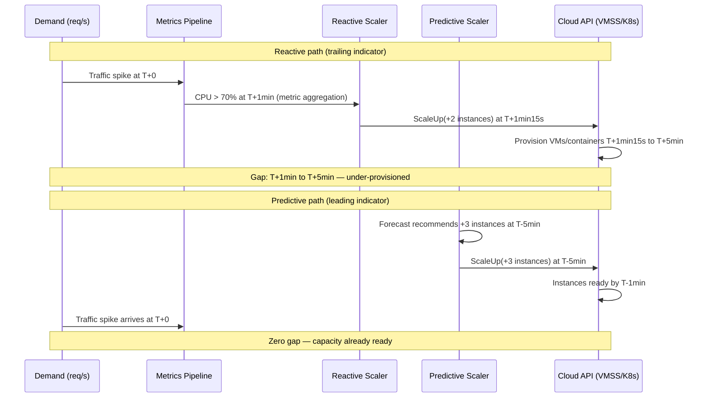
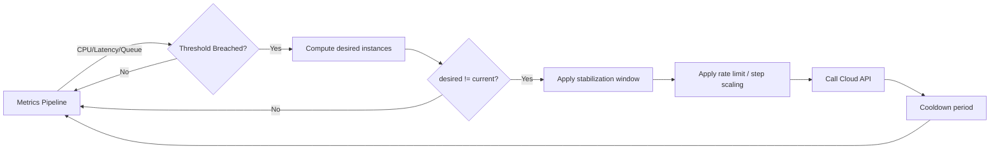

> [!success] Mastery Check
> - [ ] **Studied Well**
> - [ ] **Can explain the concept without notes**
> - [ ] **Can answer interview questions confidently**
> - [ ] **Can implement it in a real project**

---

id: "7.233" title: "Auto-Scaling — Reactive vs Predictive" domain: "System Design & Distributed Systems" domain_id: 7 group: "Scalability Patterns" tags: [system-design, distributed-systems, scalability, dotnet, azure, auto-scaling, reactive-scaling, predictive-scaling, kubernetes, hpa, keda, cluster-autoscaler] priority: 2 version: 2 prerequisites:

- "[[7.210 — Load Balancing — Overview]] — auto-scaling assumes a load balancer distributes traffic across the scaled instances; without one, adding or removing instances has no effect on request distribution"
- "[[7.206 — Horizontal vs Vertical Scaling — Tradeoffs]] — auto-scaling automates horizontal scaling decisions; understanding when horizontal scaling is viable (stateless service design) is prerequisite to automating it"
- "[[7.238 — Backpressure — Detection and Handling]] — reactive auto-scaling responds to backpressure signals (queue depth, latency), but backpressure is the last-resort protection when auto-scaling is too slow"

related:
- "[[7.234 — Auto-Scaling — Kubernetes HPA]] — the Kubernetes implementation of reactive auto-scaling with metrics-server-based CPU/memory triggers"
- "[[7.235 — Auto-Scaling — Cooldown Periods]] — cooldown mechanics are the primary tuning parameter for preventing thrashing in both reactive and predictive approaches"
- "[[7.239 — Queue-Based Load Leveling]] — queue depth is the fastest leading indicator for reactive auto-scaling; queue-based systems pair naturally with auto-scaling"
- "[[6.003 — Strategy Pattern]] — the auto-scaler's decision algorithm (threshold, schedule, ML forecast) is a Strategy that can be swapped without changing the scaling executor"

created: 2025-06-16

---

> [!ABSTRACT] Quick Reference — Reactive vs Predictive Auto-Scaling
> **Invariant:** Reactive auto-scaling adjusts capacity based on current observed metrics (CPU, latency, queue depth); predictive auto-scaling adjusts capacity based on forecasted demand derived from historical patterns or scheduled events. Both aim to match supply to demand — the difference is whether the adjustment follows or anticipates the demand change.
> **Cost:** Reactive pays a reaction gap (2–15 minutes between demand increase and capacity readiness) during which the system is under-provisioned. Predictive pays an infrastructure cost (ML model training, monitoring, schedule maintenance) and risks forecast error when traffic deviates from historical patterns.
> **Trigger:** Reactive is triggered when a metric breaches a threshold (CPU > 70%, queue depth > 100, P99 latency > 200ms). Predictive is triggered by a time-of-day schedule or an ML forecast exceeding a capacity margin.
> **Skip When:** Traffic is flat and predictable below the maximum scale of a single instance (vertical scaling is simpler). Traffic is so bursty that neither reactive nor predictive can react fast enough (consider always-on buffer capacity).
> **.NET Entry Point:** `Azure.ResourceManager.Compute` for VMSS scaling · `KubernetesClient` for pod scaling · `Polly` for circuit-breaker fallback when scaling is too slow · Application Insights `MetricClient` for custom metric queries
> **Azure Native:** Azure Autoscale (App Service, VMSS) · AKS HPA + Cluster Autoscaler · KEDA (event-driven) · Azure Monitor autoscale predictive mode (preview) · Azure Front Door (origin health-based scaling trigger)
> **Number to Know:** A typical reactive auto-scaler reaction gap is ~5 minutes: 1 minute for metric aggregation, 15 seconds for evaluation, 4 minutes for VM/container provisioning and health checks. Predictive auto-scaling eliminates this gap for predictable traffic but adds ~2 hours/week of model maintenance overhead.

---

## Navigation

**Domain:** [[7 — System Design & Distributed Systems]] > **Group:** Scalability Patterns
**Previous:** [[7.232 — Consistent Hashing — Use Cases]] | **Next:** [[7.234 — Auto-Scaling — Kubernetes HPA]]

### Prerequisites

- [[7.210 — Load Balancing — Overview]] — auto-scaling assumes a load balancer distributes traffic across the scaled instances; without one, adding or removing instances has no effect on request distribution
- [[7.206 — Horizontal vs Vertical Scaling — Tradeoffs]] — auto-scaling automates horizontal scaling decisions; understanding when horizontal scaling is viable (stateless service design) is prerequisite to automating it
- [[7.238 — Backpressure — Detection and Handling]] — reactive auto-scaling responds to backpressure signals (queue depth, latency), but backpressure is the last-resort protection when auto-scaling is too slow

### Where This Fits

> [!INFO] Production Encounter Map
> 
> - **Layer:** Infrastructure and deployment automation — this concept lives in the operational layer that manages compute capacity in response to application-layer load signals
> - **Trigger:** An engineer first encounters this during a traffic spike incident (PagerDuty at 3 AM because CPU hit 100%), during capacity planning for a known event (Black Friday), or when the cloud bill shows idle instances running 24/7
> - **Without it:** The system runs at a fixed instance count sized for peak load — paying for 100% of peak capacity during 10% utilization troughs. Or the system runs at a fixed count sized for average load — failing during every traffic spike
> - **First signal:** `Percentage CPU` in Azure Monitor sustaining above 80% while `HttpResponseTime` P99 exceeds SLO; or the monthly Azure cost analysis showing 40%+ of compute spend during off-peak hours

Auto-scaling is the mechanism that converts cloud elasticity from a theoretical property into a working cost-saving, availability-preserving operational practice. It is the single highest-leverage configuration decision for cloud cost optimization — an auto-scaled fleet typically uses 30–50% fewer instance-hours per month than a fixed-peak-sized fleet.

---

## Core Mental Model

Auto-scaling adjusts compute capacity to match demand. The core challenge is the **reaction gap** — the interval between when demand increases and when new capacity is ready to serve traffic. Reactive auto-scaling closes this gap after the fact; predictive auto-scaling closes it before the fact. The fundamental tradeoff is certainty (reactive knows the actual load) vs timeliness (predictive acts before the load arrives).



### Classification

**For infrastructure and operations:** Auto-scaling operates at the compute-capacity abstraction layer. It hides the manual instance-count management from the operator, replacing it with policy-driven automation. It explicitly does NOT handle application-level scaling concerns — connection pool resizing, cache warm-up, database connection limits — which must be managed separately.

**For system design interviews:** Auto-scaling is the mechanism that addresses the "handle traffic spikes" and "cost optimization" non-functional requirements. It occupies the elasticity axis of the scalability cube (X-axis: horizontal scaling automated over time).

### Key Properties / Guarantees

| Property | Value | Condition |
|---|---|---|
| Capacity alignment | Reactive: matches demand within 2–15 min | Metrics pipeline + provisioning pipeline function correctly |
| Capacity alignment | Predictive: matches demand within seconds | Forecast error < 20% (depends on traffic pattern stability) |
| Cost efficiency | Reactive: idle capacity buffer of 20–50% | Scale-down thresholds set correctly |
| Cost efficiency | Predictive: idle capacity buffer of 5–15% | Forecast model is accurate |
| Availability protection | Prevents overload-caused outages | Scaling reaction gap < system's overload tolerance window |
| Thrashing risk | Oscillation when thresholds overlap | Cooldown/stabilization windows configured |


## Deep Mechanics

### How It Works

Reactive auto-scaling follows a four-phase control loop: **Observe → Decide → Act → Cool down**. Each phase has a configurable duration that determines the total reaction gap.

**Phase 1 — Observe (metric aggregation):** The metrics pipeline collects per-instance metrics and computes an aggregate (average, p50, p95) over a window. Typical windows:
- CPU/memory: 1–5 minute average (Azure Monitor default: 10 minutes)
- Request rate: 1-minute sum (Application Insights)
- Queue depth: near-real-time (KEDA polling interval: 10 seconds)

**Phase 2 — Decide (threshold evaluation):** The scaler evaluates the aggregated metric against the threshold:

```
desiredInstances = ceil(currentInstances × observedMetric / targetMetric)

Example: CPU target = 50%, current CPU = 80%, current instances = 10
desiredInstances = ceil(10 × 80 / 50) = ceil(16) = 16 instances

Scale-up: add 6 instances. Scale-down: when CPU < target for stabilization window.
```

**Phase 3 — Act (cloud API call):** The scaler calls the cloud provisioning API. This is the slowest phase:
- Azure App Service scale-out: 30–90 seconds (new instance warm-up)
- Azure VMSS: 2–5 minutes (VM provisioning + extension scripts)
- AKS HPA: 15–60 seconds (Pod creation + image pull + readiness probe)

**Phase 4 — Cool down:** After a scale action, the scaler waits for the cooldown period before evaluating again. This prevents reacting to transient metric noise caused by the scaling action itself.



Predictive auto-scaling replaces Phase 1–2 with a **forecast**: instead of observing current metrics, the predictive model (time-series, ML, or schedule-based) produces a forecasted metric value for the next N minutes. The desired instance count is computed from the forecast and applied preemptively.

### Failure Modes

**Thrashing (oscillation):** The most common auto-scaling failure. Scale-up and scale-down thresholds are too close, the system adds and removes instances repeatedly, and each cycle wastes money and risks request failures.

```
Scenario: scale-up at 70% CPU, scale-down at 50% CPU, steady-state 60% CPU
2:00 PM — CPU at 72% → scale up (add 2 instances)
2:01 PM — CPU drops to 48% → scale down (remove 1 instance)
2:02 PM — CPU rises to 71% → scale up (add 2)
2:03 PM — CPU drops to 49% → scale down...
```

Detection: Azure Monitor shows scale actions every cooldown period. Kubernetes `kubectl describe hpa` shows replica count oscillating between two values every 2–3 evaluation cycles.

Fix: (a) Widen the gap between scale-up and scale-down thresholds to at least 20 percentage points for CPU, (b) use a stabilization window of 5+ minutes for scale-down, (c) use asymmetric cooldowns (short for scale-up, long for scale-down).

**Scale-up delayed by cold start:** New instances take 3–5 minutes to become ready (container image pull + startup + health check). For bursty traffic that ramps up in under 1 minute, the new instances arrive after the spike has already caused errors.

Fix: (a) Pre-warm instances via predictive scaling, (b) keep a small buffer of always-on hot instances (typically 2–5), (c) pre-pull container images on cluster nodes, (d) use .NET ReadyToRun images to reduce JIT warm-up time.

**Scale-down terminates instances with in-flight requests:** The scaler removes instances from the load balancer and terminates them immediately. Any requests being processed by those instances are dropped — users see 502/503 errors.

Fix: (a) Remove instance from load balancer first (connection draining), (b) wait for drain timeout (30–300s depending on max request duration), (c) send SIGTERM to allow graceful completion, (d) only then terminate. In Kubernetes: set `terminationGracePeriodSeconds` to match max request duration.

**Forecast error in predictive scaling:** The ML model predicts 5,000 req/s at 3 PM but actual traffic is 15,000 req/s (flash sale, viral post). The system is under-provisioned because the predictive component was too conservative.

Fix: (a) Always pair predictive with a reactive fallback that can scale above the predictive baseline, (b) monitor forecast error (predicted vs actual) and alert if MAPE > 30%, (c) use the upper bound of the prediction interval (p95) rather than the point forecast.

### .NET and Azure Integration

- **ASP.NET Core:** No built-in auto-scaling middleware. Application metrics are exported via `AppMetrics` or `OpenTelemetry` and consumed by Azure Monitor or Prometheus, which feed the auto-scaler.
- **Azure Autoscale:** Native to Azure App Service, VMSS, and Azure Spring Apps. Configured via ARM/Bicep or Azure Portal. Supports metric-based (CPU, memory, HTTP queue) and schedule-based profiles.
- **Azure Monitor autoscale predictive mode (preview):** ML-based forecasting that adjusts the autoscale baseline based on historical patterns. Configured via `predictiveAutoscalePolicy` in the autoscale settings resource.
- **KEDA:** Event-driven autoscaler for Kubernetes. Scales on queue depth (Azure Service Bus, RabbitMQ, Kafka), request rate, or custom metrics. Scales to zero. Installed via Helm.
- **Polly:** Not an auto-scaler, but provides circuit-breaker fallback when the system is under-provisioned and auto-scaling is too slow. `CircuitBreakerPolicy` can return cached responses or throttle requests during scale-up lag.
- **Application Insights:** `MetricClient` provides `GetMetricAsync` for custom metric queries. Can be used to build a custom auto-scaler that evaluates business-level metrics (checkout rate, payment success rate) rather than infrastructure metrics.

```csharp
// .NET integration: Custom metric for auto-scaling
// Azure Monitor custom metric — feeds into Azure Autoscale rules

public class AutoScaleMetricExporter
{
    private readonly MetricClient _metrics;
    
    public AutoScaleMetricExporter(MetricClient metrics)
    {
        _metrics = metrics;
    }
    
    public async Task ExportCheckoutRateAsync(
        HttpContext context, RequestDelegate next, CancellationToken ct)
    {
        var stopwatch = Stopwatch.StartNew();
        await next(context);
        stopwatch.Stop();
        
        await _metrics.TrackMetricAsync(
            "checkout_requests_per_second",
            1.0 / stopwatch.Elapsed.TotalSeconds,
            ct);
            
        // This metric becomes an Azure Monitor custom metric
        // Azure Autoscale can use it as a scale trigger:
        // scale-out when checkout_requests_per_second > 500
    }
}
```


## Production Patterns and Implementation

### Primary Implementation — Hybrid Auto-Scaler for VMSS

The production pattern for most cloud-native .NET services is a hybrid scaler: predictive handles the base load (pre-warming), reactive handles the residual. The following implementation shows both components working together for Azure VMSS.

```csharp
// Port: Hybrid auto-scaler combining predictive schedule + reactive metric triggers

/// <summary>
/// Evaluates scaling decisions using both predictive (schedule-based) and 
/// reactive (metric-threshold-based) signals, applying the maximum of both.
/// </summary>
public sealed class HybridAutoScaler
{
    private readonly ArmClient _armClient;
    private readonly MetricsQueryClient _metrics;
    private readonly ILogger<HybridAutoScaler> _logger;
    private readonly AutoScalerOptions _options;
    private DateTime _lastScaleAction;
    
    public HybridAutoScaler(
        ArmClient armClient,
        MetricsQueryClient metrics,
        ILogger<HybridAutoScaler> logger,
        IOptions<AutoScalerOptions> options)
    {
        _armClient = armClient;
        _metrics = metrics;
        _logger = logger;
        _options = options.Value;
    }
    
    /// <summary>
    /// Evaluates the current scaling state and applies a scaling decision
    /// if the cooldown period has elapsed and a threshold is breached.
    /// </summary>
    public async Task<ScaleResult> EvaluateAsync(
        string vmssId, CancellationToken ct)
    {
        if (DateTime.UtcNow - _lastScaleAction < _options.CooldownPeriod)
            return ScaleResult.Skipped("Cooldown active");
        
        var currentCapacity = await GetCurrentCapacityAsync(vmssId, ct);
        var reactiveTarget = await ComputeReactiveTargetAsync(vmssId, currentCapacity, ct);
        var predictiveBaseline = ComputePredictiveBaseline();
        
        var desired = Math.Max(reactiveTarget, predictiveBaseline);
        desired = Math.Clamp(desired, _options.MinCapacity, _options.MaxCapacity);
        desired = ApplyStepLimit(currentCapacity, desired);
        
        if (desired == currentCapacity)
            return ScaleResult.NoChange(currentCapacity);
        
        await ScaleVmssAsync(vmssId, desired, ct);
        _lastScaleAction = DateTime.UtcNow;
        return ScaleResult.Scaled(currentCapacity, desired);
    }
    
    private async Task<int> ComputeReactiveTargetAsync(
        string vmssId, int currentCapacity, CancellationToken ct)
    {
        var cpuResult = await _metrics.QueryAsync(
            new MetricsQueryOptions
            {
                MetricNames = { "Percentage CPU" },
                TimeRange = new QueryTimeRange(
                    TimeSpan.FromMinutes(5)),
                Granularity = TimeSpan.FromMinutes(1),
                Aggregations = { MetricAggregationType.Average }
            },
            vmssId,
            ct);
        
        var avgCpu = cpuResult.Value
            .First()
            .TimeSeries[0]
            .Data
            .Average(d => d.Average ?? 0);
        
        if (avgCpu > _options.ScaleUpCpuThreshold)
        {
            return (int)Math.Ceiling(
                currentCapacity * avgCpu / _options.TargetCpu);
        }
        
        if (avgCpu < _options.ScaleDownCpuThreshold 
            && await IsCpuSustainedLowAsync(vmssId, ct))
        {
            return (int)Math.Floor(
                currentCapacity * avgCpu / _options.TargetCpu);
        }
        
        return currentCapacity;
    }
    
    private int ComputePredictiveBaseline()
    {
        var now = DateTime.UtcNow;
        return (now.Hour, now.DayOfWeek) switch
        {
            (>= 8 and < 12, DayOfWeek.Monday to DayOfWeek.Friday) 
                => _options.PeakBaseline,
            (>= 13 and < 17, DayOfWeek.Monday to DayOfWeek.Friday) 
                => _options.MidBaseline,
            (>= 22, _) or (< 6, _) 
                => _options.OffPeakBaseline,
            _ => _options.DefaultBaseline
        };
    }
    
    private int ApplyStepLimit(int current, int desired)
    {
        var maxStep = desired > current 
            ? _options.MaxScaleUpStep 
            : _options.MaxScaleDownStep;
        var delta = Math.Clamp(
            desired - current, -maxStep, maxStep);
        return current + delta;
    }
}
```

### Configuration and Wiring

```csharp
// Program.cs — Register the hybrid auto-scaler as a background service

public sealed class AutoScalerOptions
{
    public TimeSpan CooldownPeriod { get; set; } = TimeSpan.FromMinutes(1);
    public int MinCapacity { get; set; } = 3;
    public int MaxCapacity { get; set; } = 50;
    public int PeakBaseline { get; set; } = 15;
    public int MidBaseline { get; set; } = 10;
    public int OffPeakBaseline { get; set; } = 3;
    public int DefaultBaseline { get; set; } = 5;
    public double TargetCpu { get; set; } = 50;
    public double ScaleUpCpuThreshold { get; set; } = 70;
    public double ScaleDownCpuThreshold { get; set; } = 30;
    public int MaxScaleUpStep { get; set; } = 5;
    public int MaxScaleDownStep { get; set; } = 2;
}

builder.Services.Configure<AutoScalerOptions>(
    builder.Configuration.GetSection("AutoScaler"));

builder.Services.AddSingleton<ArmClient>(sp =>
    new ArmClient(new DefaultAzureCredential()));

builder.Services.AddSingleton<MetricsQueryClient>();

builder.Services.AddHostedService<AutoScalerBackgroundService>();

public sealed class AutoScalerBackgroundService : BackgroundService
{
    private readonly HybridAutoScaler _scaler;
    private readonly string _vmssId;
    
    public AutoScalerBackgroundService(
        HybridAutoScaler scaler,
        IConfiguration config)
    {
        _scaler = scaler;
        _vmssId = config["AutoScaler:VmssId"]!;
    }
    
    protected override async Task ExecuteAsync(CancellationToken ct)
    {
        while (!ct.IsCancellationRequested)
        {
            var result = await _scaler.EvaluateAsync(_vmssId, ct);
            if (result.Action != ScaleAction.None)
            {
                LogScaleAction(result);
            }
            await Task.Delay(
                TimeSpan.FromSeconds(15), ct); // HPA-like evaluation period
        }
    }
}
```

### Common Variants

**KEDA event-driven scaling** (queue depth trigger, no predictive): For background workers where demand is tied to queue depth, not CPU.

```yaml
# Variant: Pure event-driven with KEDA
apiVersion: keda.sh/v1alpha1
kind: ScaledObject
metadata:
  name: order-processor-scaler
spec:
  scaleTargetRef:
    name: order-processor
  minReplicaCount: 0
  maxReplicaCount: 50
  triggers:
    - type: azure-servicebus
      metadata:
        queueName: orders
        messageCount: "10"
  advanced:
    horizontalPodAutoscalerConfig:
      behavior:
        scaleUp:
          policies:
            - type: Pods
              value: 5
              periodSeconds: 10
        scaleDown:
          stabilizationWindowSeconds: 300
```

**Schedule-only predictive** (no reactive, no ML): For known-event capacity planning where traffic is 100% predictable (batch processing windows, ETL jobs).

```csharp
// Variant: Pure schedule-based predictive (starts instances before batch window)
hostBuilder.ConfigureFunctionsWorkerDefaults();

// Azure Function runs at 6:55 AM every weekday
// Pre-warms 20 instances before the 7 AM batch processing window
[Function("PreWarmBatchProcessing")]
public async Task PreWarmAsync(
    [TimerTrigger("55 6 * * 1-5")] TimerInfo timer)
{
    await _vmss.UpdateAsync(WaitUntil.Completed,
        new VirtualMachineScaleSetPatch { Sku = new Sku { Capacity = 20 } });
}
```

### Real-World .NET Ecosystem Example

**KEDA + .NET background service on AKS** is the de-facto pattern for event-driven .NET microservices. A `ScaledObject` references the Deployment, and KEDA scales the Pod count based on the Azure Service Bus queue depth. The .NET `ServiceBusProcessor` processes messages; when the queue grows (more messages than the current Pods can process), KEDA adds Pods. When the queue drains, KEDA scales down to zero. This pattern is used by Wipro, Siemens, and multiple Microsoft internal services (per the KEDA adoption list).

---

## Gotchas and Production Pitfalls

### [Pitfall Name] Scale-Down Kills Instances With In-Flight Requests

**Pitfall:** The auto-scaler decides to scale down and terminates instances immediately. Any requests being processed by those instances are dropped — the client sees a connection reset.

```csharp
// ❌ Wrong — immediate termination without connection draining
await _vmss.UpdateAsync(WaitUntil.Completed,
    new VirtualMachineScaleSetPatch
    {
        Sku = new Sku { Capacity = newCapacity }
    });
// Instances removed from the fleet immediately
// In-flight request processing is aborted → 502 Bad Gateway

// ✅ Right — connection draining before termination
// Phase 1: Set instance to "draining" state (no new requests)
await _loadBalancer.SetInstanceDrainingAsync(instanceId, true);
// Phase 2: Wait for drain timeout (max expected request duration)
await Task.Delay(TimeSpan.FromSeconds(
    _options.ConnectionDrainTimeoutSeconds));
// Phase 3: Check active request count
var activeRequests = await GetActiveRequestsAsync(instanceId);
if (activeRequests > 0)
{
    await Task.Delay(TimeSpan.FromSeconds(30));
}
// Phase 4: Send SIGTERM for graceful shutdown
await _compute.TerminateAsync(instanceId, 
    force: false, // graceful shutdown
    cancellationToken: ct);
```

**Symptom:** After every scale-down event, a burst of 502 errors appears in the load balancer logs. The error rate correlates exactly with scale-down actions (visible in Azure Monitor as simultaneous spike in `Http5xx` and dip in `InstanceCount`).

**Fix:** Implement a multi-phase scale-down: (1) remove instance from load balancer, (2) wait for connection drain timeout, (3) send graceful shutdown signal, (4) terminate only when idle. In Kubernetes, set `terminationGracePeriodSeconds` to at least the 99th percentile of request duration.

**Cost of not fixing:** Each scale-down event causes a burst of request failures. For a service that auto-scales frequently, this means constant 5xx errors during off-peak hours — exactly when the service should be most reliable.

### [Pitfall Name] Cooldown Blocks Scale-Up After Scale-Down

**Pitfall:** A single cooldown period (Azure Autoscale default) applies to both scale-up and scale-down. After a scale-down, the cooldown prevents the next scale-up — even if traffic immediately spikes.

```csharp
// ❌ Wrong — single cooldown in Azure Autoscale
{
    scaleAction: {
        direction: 'Increase',
        cooldown: 'PT5M'  // Same cooldown for decrease rules
    }
}
// At 2:00 PM: scale down (CPU was 20% for 10 min)
// At 2:01 PM: CPU spikes to 90% → scale-up wanted
// At 2:01–2:05 PM: BLOCKED by cooldown → system is under-provisioned

// ✅ Right — use separate scale-up and scale-down stabilization windows
// In Kubernetes HPA:
behavior:
  scaleUp:
    stabilizationWindowSeconds: 0    # Scale up immediately
    policies:
      - type: Percent
        value: 100                    # Can double pods
        periodSeconds: 60
  scaleDown:
    stabilizationWindowSeconds: 300   # Wait 5 min before scale-down
    policies:
      - type: Percent
        value: 10
        periodSeconds: 60
```

**Symptom:** After a traffic dip and subsequent scale-down, the system is briefly under-provisioned when traffic returns. Azure Monitor shows `InstanceCount` dropping and then `Http5xx` spiking 1–2 minutes later.

**Fix:** Use separate stabilization windows for scale-up (0–60 seconds) and scale-down (5–15 minutes). If using Azure Autoscale (which forces a single cooldown), work around it with a low cooldown and rely on the scale-down threshold being far below the scale-up threshold to prevent thrashing.

**Cost of not fixing:** The system under-provisions during traffic recovery after every dip. For cyclical traffic patterns (lunch dip, end-of-day dip), this causes daily 5xx bursts.

### [Pitfall Name] Predictive Scaling Using CPU as Input Feature

**Pitfall:** The ML-based predictive auto-scaler is trained on CPU utilization. CPU is a lagging indicator — it rises after the request rate increases. The model predicts CPU from past CPU, which cannot capture sudden request-rate changes.

```csharp
// ❌ Wrong — forecasting CPU from CPU history
var cpuHistory = await GetCpuHistoryAsync(days: 30);
var forecast = _prophetModel.Predict(cpuHistory, horizon: 15);
// Forecast says CPU will be 45% in 15 minutes
// At T+5 minutes, request rate triples (flash sale)
// At T+10 minutes, CPU is at 95% — model did not see this coming
// Model error: trained on lagging indicator

// ✅ Right — forecast request rate, not CPU; use CPU only for reactive
var requestRateHistory = await GetRequestRateHistoryAsync(days: 30);
var requestForecast = _prophetModel.Predict(
    requestRateHistory, horizon: 15);

var forecastedInstances = Math.Ceiling(
    requestForecast.GetUpperBound(0.95) / _options.RequestsPerInstance);

// Reactive layer still uses CPU as a safety net
var cpuTarget = await ComputeReactiveTargetAsync(
    vmssId, currentCapacity, ct);
var final = Math.Max(forecastedInstances, cpuTarget);
```

**Symptom:** The predictive model has high forecast error (MAPE > 40%) during unexpected traffic events. The model predicts low CPU (based on historical lows) while actual traffic is spiking. The reactive fallback eventually catches it, but with a 3–5 minute delay.

**Fix:** Use leading indicators as predictive features: request rate from Application Insights, inbound connection count from the load balancer, marketing campaign calendar events. CPU and memory are suitable for the reactive fallback, not for forecasting.

**Cost of not fixing:** The predictive layer provides negative value — it makes the system LESS responsive than pure reactive by instilling false confidence. The system under-provisions during every non-routine event.

### [Pitfall Name] Autoscaler Colocated With the Workload It Scales

**Pitfall:** The autoscaler process runs on the same VMs or in the same Kubernetes cluster as the workload it manages. When the workload is under high load, the autoscaler cannot make scaling decisions because its own metrics queries time out.

```csharp
// ❌ Wrong — autoscaler runs as a pod in the same deployment
apiVersion: apps/v1
kind: Deployment
metadata:
  name: order-processor
spec:
  template:
    spec:
      containers:
        - name: app
          image: order-processor:latest
        - name: autoscaler  # BAD: colocated scaler
          image: custom-autoscaler:latest
// When order-processor is at 95% CPU, autoscaler cannot call
// Kubernetes API — it's throttled too
// Scale-up never happens — cascade to failure

// ✅ Right — autoscaler runs on the control plane
// Kubernetes HPA runs in kube-controller-manager (control plane)
// Azure Autoscale runs on Azure infrastructure (separate from VMs)
// KEDA operator runs on its own Deployment with resource guarantees
// Never colocate the scaling decision-maker with the scaled workload
```

**Symptom:** During high load, the service should scale up — but doesn't. The autoscaler logs show timeouts when querying metrics or calling the cloud API. The service eventually runs out of capacity and returns 503s.

**Fix:** Always run the auto-scaler on separate infrastructure. Kubernetes HPA runs on control plane nodes. Azure Autoscale runs on the cloud provider's control plane. Custom auto-scalers should have dedicated compute with priority scheduling and resource guarantees.

**Cost of not fixing:** The autoscaler fails exactly when needed most — during traffic spikes. The system becomes unavailable because the scaling loop is broken.

### [Pitfall Name] Scale-Down Evaluation Window Shorter Than Cool-Down Period

**Pitfall:** The scale-down stabilization window is shorter than the time it takes for the metric to stabilize after a scale-down. The system scales down, observes low metrics (transient), and scales down again — cascading to too few instances.

```yaml
# ❌ Wrong — scale-down faster than metric stabilization
behavior:
  scaleDown:
    stabilizationWindowSeconds: 60   # Only 1 minute
    policies:
      - type: Percent
        value: 25
        periodSeconds: 60
# After scale-down from 10 to 8 instances:
# CPU drops (remaining instances have less load temporarily)
# 60 seconds later: "CPU is below threshold, scale down again"
# 8 → 6 → 4 → 2 in 4 minutes — cascade to under-provisioned

# ✅ Right — stabilization window at least 5 minutes
behavior:
  scaleDown:
    stabilizationWindowSeconds: 300  # Look at max desired in 5 min
    policies:
      - type: Percent
        value: 10                     # Max 10% removed per minute
        periodSeconds: 60
```

**Symptom:** The replica count drops in a cascade over 3–5 minutes during off-peak hours. The system ends up at `minReplicas` even though average load would support 2× that. A small traffic increase then causes overload because there is no headroom.

**Fix:** Set scale-down stabilization window to at least 5 minutes. Set scale-down rate limit to 10% per minute or 1 Pod per minute (whichever is lower). This ensures the system cannot shed capacity faster than it can confirm the load is truly reduced.

**Cost of not fixing:** Overnight scale-down cascades leave the system at minimum capacity. The morning traffic ramp-up catches it under-provisioned, causing a daily 5xx spike at 8–9 AM.

---

## Tradeoffs and Decision Framework

### Tradeoff Matrix

| Dimension | Reactive (Metric-Triggered) | Predictive (Schedule) | Predictive (ML Forecast) | Hybrid |
|---|---|---|---|---|
| Reaction gap | 2–15 min | None (pre-warmed) | None (pre-warmed) | None for predictable, 2–15 min for surprises |
| Cost efficiency | 20–50% idle buffer | 10–20% idle buffer | 5–15% idle buffer | 10–20% idle buffer |
| Operational complexity | Low (threshold config) | Low (cron schedule) | High (model training, monitoring) | Medium (two systems to tune) |
| Traffic pattern fit | All patterns | Recurring only | Recurring with seasonal patterns | All patterns (best for mixed) |
| Historical data needed | None | Traffic timing knowledge | 4+ weeks of request-rate history | 4+ weeks for ML component |
| Risk of under-provision | Low (reacts to actual) | Medium (wrong schedule) | High (forecast error) | Low (reactive catches errors) |
| .NET/Azure tooling | Azure Autoscale, HPA, KEDA | Azure Autoscale profiles | Azure Monitor predictive mode (preview) | Custom implementation |

### When to Apply

```mermaid
flowchart TD
    A[Need to scale compute to match demand] --> B{Traffic pattern predictable?}
    B -->|Strong daily/weekly pattern| C{Have 4+ weeks of request-rate history?}
    C -->|Yes, stable pattern| D[Predictive ML + reactive fallback]
    C -->|No historical data| E[Schedule-based predictive + reactive fallback]
    B -->|Unpredictable, bursty| F{Can you tolerate 2-5 min reaction gap?}
    F -->|Yes| G[Pure reactive with aggressive scale-up]
    F -->|No, sub-minute bursts| H[Reactive + always-on hot buffer (20% headroom)]
    B -->|Flat, no scaling needed| I[Fixed instance count — no auto-scaler]
    D --> J[Hybrid: predictive baseline + reactive overlays]
    E --> J
    G --> K[Monitor: if reaction gap exceeds SLO, add hot buffer]
    H --> K
    J --> L[Scale-down: 10 min stabilization, 10% per minute max]
    K --> L
```

### When NOT to Apply

- [ ] **Traffic is flat at < 30% of maximum single-instance capacity** — fixed instance count is simpler and cheaper; auto-scaling adds complexity with no cost benefit.
- [ ] **Instance startup time exceeds the traffic spike duration** — if a new instance takes 10 minutes to become ready but traffic spikes last 3 minutes, auto-scaling cannot keep up. Always-on buffer capacity is required.
- [ ] **The service is stateful and cannot be horizontally scaled** — auto-scaling assumes new instances are identical and interchangeable. If each instance holds unique state, adding or removing instances violates data integrity.
- [ ] **The team cannot maintain the predictive model** — ML-based predictive scaling requires weekly model retraining, forecast error monitoring, and incident response for model drift. Without this investment, predictive scaling adds risk without reward.
- [ ] **Cost of idle capacity is negligible** — if the cloud bill for always-on peak-sized instances is within budget (e.g., a small service on a $50/month VM), auto-scaling is over-engineering.

### Scale Thresholds

- **Reactive CPU-based scaling works up to ~500 req/s per instance** — beyond that, CPU becomes too noisy (GC spikes, JIT compilation) and request-rate-based or queue-depth-based triggers are more reliable.
- **Reactive queue-depth scaling is needed above ~1,000 req/s per instance** — the request queue grows faster than CPU can react; queue depth is a leading indicator while CPU is lagging.
- **Predictive scaling becomes cost-effective above ~20 instances** — the idle-cost savings from pre-warming (eliminating the 20–50% reactive buffer) offset the ML infrastructure and maintenance overhead.
- **Schedule-based predictive is sufficient up to ~50 instances** — beyond that, manual schedule maintenance becomes impractical (too many schedule rules, too many edge cases).
- **Hybrid scaling is the default above ~100 instances** — manual tuning of any single approach is impractical at this scale.
- **Metrics evaluation period should be ≤ 15 seconds for sub-minute burst tolerance** — default Azure Monitor aggregation windows (5–10 minutes) are too coarse for bursty workloads.

---

## Interview Arsenal

### Question Bank

1. [Definition] What is the difference between reactive and predictive auto-scaling?
2. [Mechanism] Walk through the four-phase control loop of a reactive auto-scaler.
3. [Tradeoff] When would you choose reactive over predictive auto-scaling?
4. [Failure mode] What is auto-scaling thrashing and how do you prevent it?
5. [Comparison] Compare Azure Autoscale with Kubernetes HPA — when would you use each?
6. [Design application] Design an auto-scaling strategy for an e-commerce site that sees 10× traffic on Black Friday.
7. [Scale] A social media app has unpredictable traffic spikes from viral content. How do you auto-scale for sub-minute burst response?
8. [Advanced] Explain how a hybrid predictive + reactive auto-scaler handles the conflict between pre-warmed capacity and CPU-based scaling triggers.

### Spoken Answers

**Q1: What is the difference between reactive and predictive auto-scaling?**

> **Average answer:** Reactive scales based on current metrics like CPU. Predictive scales based on forecasts of future traffic.

> **Great answer:** The fundamental difference is whether the scaling action happens before or after the demand change. Reactive auto-scaling observes current metrics — CPU utilization, request latency, queue depth — and triggers a scaling action when a threshold is breached. The problem is the reaction gap: by the time CPU reaches 70%, the traffic spike has already arrived, and new VMs or containers typically take 2 to 15 minutes to provision and pass health checks. During those minutes, the system is under-provisioned and users experience degraded performance. Predictive auto-scaling closes that gap by forecasting demand minutes to hours ahead. The forecast can be a simple time-of-day schedule — scale to 20 instances at 8:30 AM every weekday — or an ML model trained on 4+ weeks of request-rate history with seasonal decomposition. The instances are ready BEFORE the traffic arrives. The tradeoff is that reactive is simple, requires no historical data, and works for any traffic pattern, while predictive only works for recurring patterns and requires ongoing model maintenance. Production systems use a hybrid: predictive handles the base load, and reactive catches unexpected spikes as a safety net.

**Q5: Compare Azure Autoscale with Kubernetes HPA.**

> **Great answer:** Azure Autoscale and Kubernetes HPA are both reactive auto-scalers, but they differ in granularity, configurability, and the abstraction layer they operate at. Azure Autoscale operates at the PaaS and IaaS layer — it scales Azure App Service plans and VMSS instances. It uses a single cooldown period for both scale-up and scale-down (default 5 minutes), which means you cannot independently tune how fast the system scales up versus how cautiously it scales down. It supports schedule profiles for predictive scaling, and it integrates with Azure Monitor metrics out of the box. Kubernetes HPA operates at the Pod level within a Kubernetes cluster. It supports separate stabilization windows for scale-up and scale-down, rate-limiting policies (add max N Pods per minute), and custom metrics via the `custom.metrics.k8s.io` API. HPA does NOT support schedule-based predictive scaling natively — that requires KEDA or a custom solution. The practical difference: you use Azure Autoscale when your application runs on Azure App Service or VMSS and you want a simple configuration with minimal overhead. You use Kubernetes HPA when your application runs on AKS and you need fine-grained control over scaling behavior — stabilization windows, rate limits, and custom metrics. Many production .NET systems use both: HPA for Pod-level scaling on AKS, and Cluster Autoscaler for node-level scaling (adding VMs to the AKS cluster when Pods cannot schedule).

**Q8: Explain how hybrid predictive + reactive handles the pre-warmed capacity conflict.**

> **Great answer:** In a hybrid auto-scaler, the predictive component pre-warms instances based on a schedule or forecast. This pre-warmed capacity means the average CPU utilization across the fleet is lower than it would be without predictive scaling — because the fleet is already sized for predicted demand, not current demand. The problem arises when the reactive component uses CPU as its trigger: CPU is low because the predictive layer already added capacity, so the reactive layer sees no need to scale up further — even if actual traffic is exceeding the forecast. The fix is to ensure the reactive layer uses different metrics than the predictive layer influences. Specifically, reactive should use request rate, queue depth, or error rate — not CPU — because these metrics are not lowered by pre-warming. The hybrid decision is: `desired = max(predictiveBaseline, reactiveDemand)`. The predictive baseline sets the floor; the reactive demand, measured by request rate or queue depth, determines whether we need to go above that floor. This way, the predictive component handles the predictable traffic, and the reactive component ONLY handles the residual — the unexpected excess beyond the forecast. The two components operate on orthogonal metrics and never conflict.

### System Design Interview Trigger

If an interviewer asks you to design a system and says "how does it handle traffic spikes?" or "what happens when a flash sale doubles traffic in 30 seconds?", they are testing your understanding of auto-scaling as a mechanism and specifically your awareness of the reaction gap. The follow-up probes: "but new instances take 3 minutes to start — what happens in those 3 minutes?" tests whether you understand the gap and have a mitigation plan (hot buffer, queue-based load leveling, graceful degradation). "How do you avoid paying for idle instances during low traffic?" tests scale-down mechanics and cooldown periods. "What if the traffic spike is caused by a DDoS attack?" tests the distinction between scaling and security response.

### Comparison Table

| | Reactive | Predictive | KEDA Event-Driven |
|---|---|---|---|
| Core guarantee | Matches capacity after load changes | Matches capacity before load changes | Matches capacity to event backlog |
| Trade-off | Reaction gap of 2–15 min | Complex setup; fails on unexpected patterns | Requires queue-based architecture |
| .NET implementation | Azure Autoscale rules | Custom schedule or ML model | KEDA ScaledObject + .NET ServiceBusProcessor |
| Failure mode | Thrashing, cold start lag | Forecast error, model drift | Queue poller not scaling fast enough |
| When to choose | Unpredictable traffic, simple setup | Predictable traffic, cost optimization | Event-driven workloads, background processing |

---

## Architecture Decision Record

**Status:** Accepted under condition of traffic pattern review

**Context:** Our order-processing API runs on Azure VMSS with 10 instances during peak hours and 3 during off-peak. Traffic has a strong daily pattern (2× at 9 AM, 1.5× at 2 PM, flat evenings) but also sees occasional flash sales from email marketing campaigns (2–5× spikes with 5-minute ramp-up). Instance startup time is 3 minutes (VM provisioning + application startup + health check). We need to reduce the 40% idle-instance cost without increasing the P99 latency above 500ms during unexpected spikes.

**Options Considered:**

1. **Reactive-only (CPU threshold at 70%)** — simple, proven, but the 3-minute startup lag combined with 1-minute metric aggregation means a 4-minute reaction gap. During a 5-minute flash sale ramp-up, the system is under-provisioned for most of the event.
2. **Schedule-based predictive + reactive fallback** — schedule pre-warms to 15 instances at 8:30 AM and 13 at 1:30 PM. Reactive handles flash sales above the pre-warmed baseline. Reduces reaction gap for predictable peaks to zero; flash sales still see a 4-minute gap.
3. **ML-based predictive + reactive fallback** — Prophet model trained on 8 weeks of request-rate history with hourly and weekly seasonality. Pre-warmer than schedule (adjusts for day-of-week variation). Requires weekly retraining and MAPE monitoring.

**Decision:** Option 2 — schedule-based predictive with reactive fallback, because we have a known traffic schedule but not enough engineering bandwidth to maintain an ML model week over week. The schedule handles our known peaks; the reactive catch handles flash sale spikes (which are rare enough that a 4-minute reaction gap is acceptable, as the flash sale ramp-up is typically 5+ minutes).

**Consequences:**
- ✅ Pre-warmed capacity handles 90% of daily peak traffic with zero reaction gap
- ✅ Reactive layer catches flash sales with 4-minute gap — acceptable given 5+ minute ramp-up
- ⚠️ Manual schedule maintenance: requires quarterly review as traffic patterns change
- ❌ Flash sales with < 4-minute ramp-up will experience degraded P99 latency

**Review Trigger:** Revisit this decision if (a) flash sale frequency exceeds 1 per month (schedule updates too frequent), (b) flash sale ramp-up time drops below 3 minutes (reaction gap exceeds ramp-up), or (c) request volume grows by 3× from current levels (schedule-based baseline no longer accurate).

---

## Self-Check

### Conceptual Questions

<details>
<summary>1. What is the reaction gap in auto-scaling?</summary>

The time between when demand increases and when new capacity is ready to serve traffic. It includes: metric detection delay (1–5 minutes for metric aggregation), evaluation delay (15–60 seconds for threshold check), provisioning delay (30 seconds to 5 minutes for VM/container startup), and readiness delay (health check + warm-up time). Total: 2–15 minutes typical. Predictive auto-scaling eliminates this gap for predictable traffic by scaling before the demand arrives.
</details>

<details>
<summary>2. Why is scale-up cooldown shorter than scale-down cooldown?</summary>

Scale-up is urgent — the system is under-provisioned and users are experiencing degradation — so you act fast (0–60 seconds). Scale-down is cautious — the load drop might be temporary — so you wait to confirm the trend (5–15 minutes). The asymmetry reflects the asymmetric cost of being wrong: an extra instance costs money temporarily; a missing instance costs availability.
</details>

<details>
<summary>3. When would you choose reactive over predictive auto-scaling?</summary>

When traffic is unpredictable (viral content, flash sales, DDoS), when no historical data is available (new service), or when the engineering team lacks the bandwidth to maintain a forecasting model. Reactive is always the right starting point — predictive is an optimization layer on top of a working reactive system.
</details>

<details>
<summary>4. What metric in Azure Monitor reveals auto-scaling thrashing?</summary>

The `ScaleActionsInitiated` metric in the Azure Monitor autoscale report shows scale actions per hour. If this metric shows more than 4–6 actions per hour, thrashing is likely. Cross-reference with `InstanceCount` oscillation and `Http5xx` spikes. In Kubernetes, `kubectl describe hpa` shows the replica count history — oscillations between two values every 2–3 evaluation periods confirm thrashing.
</details>

<details>
<summary>5. What is the difference between HPA stabilization window and a classic cooldown?</summary>

A classic cooldown blocks ALL scaling actions for a fixed duration. A stabilization window softens the decision by looking at history: for scale-down, it takes the MAXIMUM desired replica count within the last N minutes, preventing scale-down unless the metric has been below threshold for the entire window. Stabilization windows are superior because they allow scale-up during the window (a cooldown would block it) and provide smoother replica count transitions.
</details>

<details>
<summary>6. Compare Azure Autoscale single cooldown vs Kubernetes HPA behavior policies.</summary>

Azure Autoscale forces a single cooldown value for both scale-up and scale-down (default 5 minutes). This is a limitation — you cannot optimize the two directions independently. Kubernetes HPA provides separate `behavior.scaleUp` and `behavior.scaleDown` sections, each with its own `stabilizationWindowSeconds` and rate-limiting `policies`. HPA also supports percentage-based rate limits ("remove max 10% of pods per minute") while Azure Autoscale only supports fixed-count steps ("add 2 instances").
</details>

<details>
<summary>7. Below what scale is auto-scaling over-engineering?</summary>

Below 3 instances and below 1,000 req/s. At this scale, the cost of idle capacity (3 instances = ~$0.50/hour on Azure) is negligible compared to the operational overhead of tuning auto-scaling thresholds, monitoring thrashing, and debugging scale-down failures. A fixed instance count with manual scaling is simpler and equally cost-effective.
</details>

<details>
<summary>8. How does auto-scaling relate to [[7.239 — Queue-Based Load Leveling]]?</summary>

Queue-based load leveling decouples request arrival from request processing via a queue. Auto-scaling adjusts the number of processing instances based on queue depth. The two patterns are complementary: the queue absorbs spikes until auto-scaling adds capacity, and auto-scaling removes capacity as the queue drains. Combined, they form an elastic event-driven processing pipeline.
</details>

<details>
<summary>9. What is the non-obvious consequence of setting HPA target CPU to 30%?</summary>

The system is hypersensitive — any minor traffic increase pushes CPU above 30%, triggering scale-up. The system is never below its target, so it scales continuously. Each scale action triggers cooldown, but the constant oscillation means the replica count drifts upward over time until it hits `maxReplicas`, and stays there. The system effectively runs at max capacity all the time — the opposite of the cost-saving goal.
</details>

<details>
<summary>10. Explain auto-scaling's role in system design, 60 seconds, whiteboard.</summary>

"Auto-scaling is the mechanism that turns cloud elasticity from a billing concept into a working operational practice. It adjusts compute capacity to match demand — horizontally, by adding or removing identical instances behind a load balancer. The core challenge is the reaction gap: the 2 to 15 minutes between when demand increases and when new capacity serves traffic. Reactive auto-scaling closes this gap after the fact by monitoring CPU, latency, or queue depth and triggering scale actions at predefined thresholds. Predictive auto-scaling closes it before the fact by forecasting demand from schedules or ML models trained on historical data. Production systems use hybrid: predictive pre-warms for known peaks, reactive catches surprises. The key tuning parameters are the stabilization window — 5 minutes for scale-down to prevent thrashing — and the rate limit — 100% of pods per minute for scale-up, 10% per minute for scale-down. Without auto-scaling, you either pay for peak capacity 24/7 or fail during every traffic spike."
</details>

### Scenario Challenges

**Scenario 1 — Diagnose the problem**

Your team deploys an order-processing API on AKS with HPA set to target 50% CPU. After a traffic spike, the HPA scales from 10 to 30 Pods. The scale-up completes in 3 minutes. However, during those 3 minutes, 15% of requests return 502 errors. The on-call engineer checks `kubectl describe hpa` and sees no errors. What is happening?

<details>
<summary>Diagnosis</summary>

**Root cause:** The HPA scale-up added Pods, but the new Pods' readiness probes did not pass for 3 minutes (slow startup: image pull + JIT warm-up + DB connection pool init). During those 3 minutes, the Deployment's Service routed requests to the new Pods (they were part of the EndpointSlice), but the Pods returned errors because they were not ready.

**Evidence:** `kubectl get events --watch` shows Pods entering `Running` but taking 3 minutes to reach `Ready`. The `kubectl get endpoints` shows the new Pod IPs in the EndpointSlice before they pass readiness probes.

**Fix:** Set `minReadySeconds` on the Deployment (wait N seconds before considering a Pod ready). Ensure health check endpoints return `503` until the application is warm. Use startup probes to delay liveness/readiness checks during slow startup.

**Prevention:** Add a `startupProbe` with a longer initial delay (60 seconds) and more failure threshold (5). Pre-pull container images on cluster nodes to reduce image pull time. Use .NET ReadyToRun images to reduce JIT warm-up.
</details>

**Scenario 2 — Design decision**

You are designing a background order-processing service that processes Azure Service Bus messages. The message volume varies: 100 msg/s during normal hours, 10,000 msg/s during flash sales. Message processing takes 50ms on average. Instance startup time is 30 seconds. Choose a scaling strategy.

<details>
<summary>Decision and Reasoning</summary>

**Choice:** KEDA event-driven scaling with Azure Service Bus trigger, minReplicaCount=0, maxReplicaCount=100, pollingInterval=10s, cooldownPeriod=300s.

**Tradeoffs accepted:** Zero instances during idle (cost-optimal). Scale-up lag of ~40 seconds (10s polling + 30s startup) — during those seconds, messages queue in Service Bus. Acceptable because Service Bus has a 80 GB queue limit and messages are processed within minutes.

**Implementation sketch:**
```yaml
apiVersion: keda.sh/v1alpha1
kind: ScaledObject
metadata:
  name: order-processor
spec:
  scaleTargetRef:
    name: order-processor
  minReplicaCount: 0
  maxReplicaCount: 100
  triggers:
    - type: azure-servicebus
      metadata:
        queueName: orders
        messageCount: "10"
  advanced:
    horizontalPodAutoscalerConfig:
      behavior:
        scaleUp:
          stabilizationWindowSeconds: 0
          policies:
            - type: Pods
              value: 10
              periodSeconds: 10
        scaleDown:
          stabilizationWindowSeconds: 300
          policies:
            - type: Percent
              value: 10
              periodSeconds: 60
```
</details>

**Scenario 3 — Failure mode**

Your team's Azure App Service autoscale is configured with CPU threshold at 70% for scale-up, 30% for scale-down, cooldown 5 minutes. On-call reports that after a lunch-hour traffic dip (CPU drops to 25% for 15 minutes), the app scales down from 10 to 6 instances. Traffic returns at 2 PM, CPU spikes to 90%, but the app stays at 6 instances for 5 minutes, returning 503 errors. What happened?

<details>
<summary>Investigation and Fix</summary>

**Investigation steps:** (1) Check Azure Monitor autoscale run history — confirm the scale-down to 6 instances happened at ~1:30 PM. (2) Check `ScaleActionsInitiated` — the scale-down action was at 1:30 PM, triggering the 5-minute cooldown. (3) Check CPU metric at 2:00 PM — confirmed 90% CPU, but no scale-up action occurred until 2:05 PM.

**Confirming evidence:** Azure Autoscale run history shows "Scale down to 6" at 1:30 PM, "Cooldown active" from 1:30 to 2:05 PM, "Scale up to 14" at 2:05 PM.

**Immediate mitigation:** Manually increase the instance count in the Azure Portal to 14 — bypasses the autoscale cooldown.

**Permanent fix:** Switch to Kubernetes HPA with separate scale-up stabilization (0 seconds) and scale-down stabilization (300 seconds) — this prevents scale-down from blocking scale-up. If staying on Azure Autoscale, reduce the single cooldown to 2 minutes and rely on the 30% → 70% threshold gap to prevent thrashing.

**Post-mortem item:** Add an Azure Monitor alert for when HTTP 5xx rate exceeds 1% with instance count below threshold — this would have paged engineering immediately instead of waiting for user complaints.
</details>

**Scenario 4 — Scale it**

Your API currently handles 2,000 req/s on 10 instances (200 req/s each). You need to handle 20,000 req/s within the next quarter. Instance startup time is 2 minutes on VMSS, 30 seconds on AKS. How does auto-scaling fit into the scaling strategy?

<details>
<summary>Scaling Strategy</summary>

**Bottleneck this addresses:** At 20,000 req/s, the 10-instance fleet would need to handle 2,000 req/s each — 10× the current per-instance capacity, which is unlikely. The fleet must grow to ~100 instances (at 200 req/s each). Auto-scaling automates this 10× expansion and ensures instances are not running 24/7.

**How it helps:** (a) Predictive auto-scaling pre-warms 80 instances during known peak hours. (b) Reactive auto-scaling adds the remaining 20 when actual traffic exceeds the forecast. (c) Scale-down to 10 instances during off-peak saves ~80% compute cost vs. running 100 instances 24/7.

**What it does not solve:** (a) Database connection limit — 100 instances × 10 connections each = 1,000 connections; the database must be scaled independently. (b) Cache hit rate — 100 instances × smaller cache per instance = more cache misses; consider a centralized cache layer. (c) Deployment complexity — deploying to 100 instances requires a rollout strategy (blue-green, canary) and zero-downtime deployment.

**Implementation order:** First, migrate to AKS for 30-second startup (vs 2-minute VMSS). Second, move the database to Azure SQL with connection pooling (100-instance connection management). Third, implement HPA with target 50% CPU and request-rate-based metrics. Fourth, add predictive scaling via scheduled HPA min/max adjustments. Fifth, monitor and tune — adjust thresholds based on real traffic patterns over 2 weeks.
</details>

**Scenario 5 — Interview simulation**

The interviewer says: "Design a video transcoding service that accepts uploads from users and converts them to multiple formats. Users upload short clips (30 seconds to 10 minutes) at any time of day. Transcoding is CPU-intensive and takes 2× the video duration. How does the system handle variable upload volume?"

<details>
<summary>Model Response</summary>

"Let me clarify the constraints first. Are videos uploaded at a predictable rate or do they arrive in bursts? What is the target maximum time from upload to transcoded output availability? Is cost optimization a priority? Assuming a 30-minute SLA and bursty uploads throughout the day, here is the auto-scaling strategy.

The system has three tiers: an upload API that receives video files and writes them to Azure Blob Storage; a Service Bus queue that holds transcoding job messages; and a pool of worker VMs that pull jobs from the queue, download the source video, transcode using FFmpeg, and upload the results. The queue decouples upload bursts from processing capacity.

For scaling, we use KEDA with Azure Service Bus queue depth as the trigger. When videos are uploaded rapidly, the queue depth grows. KEDA polls the queue every 10 seconds, and when message count exceeds a threshold — say 5 messages per worker — it scales up the worker pool. Each worker can transcode approximately 6 short videos per hour (10-minute video × 2× transcoding time = 20 minutes per video). So at 100 uploads per hour, we need ~17 workers.

The key tuning consideration is the cooldown period. Transcoding jobs take 2× video duration — up to 20 minutes. We set the scale-down stabilization window to 30 minutes — 1.5× the max job duration — to ensure we don't scale down a worker that is mid-transcoding. Workers should handle SIGTERM gracefully by checkpointing their current job and releasing it back to the queue with a visibility timeout, so no work is lost during scale-down.

For cost optimization, we set minReplicaCount to 0 — no workers run when the queue is empty. During a burst, KEDA scales from 0 to 20+ workers within 2 minutes. The tradeoff is that the first upload after a quiet period waits 40 seconds for worker startup — that is within our 30-minute SLA, so it is acceptable."
</details>
