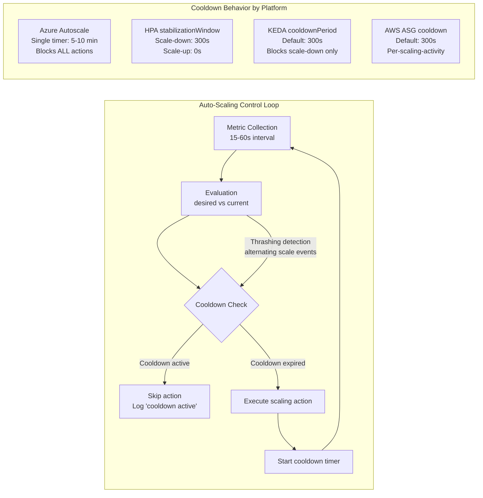
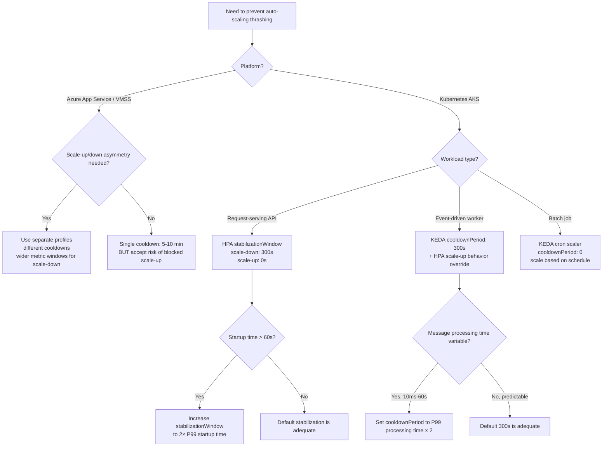

## Navigation

**Domain:** [[7 — System Design & Distributed Systems]] > **Group:** Scalability Patterns
**Previous:** [[7.234 — Auto-Scaling — Kubernetes HPA]] | **Next:** [[7.236 — Connection Pooling — SQL at Scale]]

### Prerequisites

- [[7.233 — Auto-Scaling — Reactive vs Predictive]] — cooldown periods are the primary tuning mechanism for reactive auto-scaling; understanding the reaction gap and metric sources is required to understand why cooldowns exist
- [[7.234 — Auto-Scaling — Kubernetes HPA]] — HPA's `behavior.stabilizationWindowSeconds` is the Kubernetes implementation of cooldown mechanics; this note generalizes beyond HPA to all auto-scaling platforms
- [[7.206 — Horizontal vs Vertical Scaling — Tradeoffs]] — cooldown periods are meaningful only when scaling decisions have a cost (instance creation/termination time, database connection churn, cache warming)

### Where This Fits

A cooldown period is the time window after a scaling action during which the auto-scaler suppresses further actions in the same direction. It solves the thrashing problem: a system that overcorrects to every metric fluctuation wastes resources during scale-up/scale-down cycles and degrades availability during the gaps. Without cooldowns, any auto-scaled system above ~5 instances oscillates — every evaluation either wants more or fewer instances, and the metric never stabilizes because the fleet size changes faster than the metric can settle. Every platform has a cooldown mechanism: Azure Autoscale has a single cooldown timer, Kubernetes HPA has asymmetric stabilization windows, KEDA has a cooldown period that replaces the HPA default, and AWS Autoscaling has a default 300-second cooldown. A .NET engineer configures cooldowns when tuning an HPA on AKS, setting Azure App Service autoscale rules, or debugging a production incident where replica count oscillates between min and max every 5 minutes.

---

## Core Mental Model

A cooldown period maintains the invariant that the system observes the effect of a scaling action before deciding on the next action. Every scaling action changes the metric it is based on: adding an instance reduces per-instance CPU, which the auto-scaler reads as "demand is lower" and may trigger a scale-down — exactly the wrong response during a traffic ramp-up. The cooldown breaks this feedback loop by imposing a dead time during which scaling decisions are ignored. The tradeoff is reactivity vs. stability: a short cooldown (30 seconds) makes the system responsive to genuine demand shifts but vulnerable to metric noise; a long cooldown (10 minutes) prevents thrashing but delays response to real traffic changes. The recognition trigger is any system where the auto-scaler logs alternating scale-up and scale-down events within a 5-minute window — this is the signature of insufficient cooldown, not of genuine load variation.

### Classification

Cooldown periods operate at the decision layer of the auto-scaling stack — between metric collection (what is the load?) and capacity execution (how many instances?). They are scoped to preventing thrashing caused by the time lag between a scaling action and its observable effect on metrics. Cooldowns explicitly do NOT solve: metric noise (requires metric smoothing or aggregation windows), forecast error (requires predictive scaling), or capacity ceilings (requires cluster autoscaler or infrastructure provisioning).



### Key Properties

| Property | Value | Condition |
|---|---|---|
| Cooldown purpose | Prevents thrashing by suppressing actions until prior action's effect is observable | Always required above 3 instances |
| Minimum viable cooldown | max(instance startup time, metric scrape interval × 2) | Instance startup dominates in containerized workloads |
| Maximum safe cooldown | Instance startup time + metric stabilization time + 1 evaluation cycle | Above this, the system cannot respond to genuine traffic shifts |
| HPA scale-up stabilization | 0 seconds (default) | Scale-up is urgent; over-provisioning temporarily is cheaper than under-provisioning |
| HPA scale-down stabilization | 300 seconds (default) | Scale-down is cautious; idle capacity briefly is cheaper than thrashing |
| Azure Autoscale cooldown | 5–10 minutes (fixed, single timer) | Blocks both scale-up AND scale-down after any action |
| KEDA cooldownPeriod | 300 seconds (default) | Replaces HPA scale-down stabilization when KEDA manages the ScaledObject |
| AWS ASG cooldown | 300 seconds (default) | Per-scaling-activity; does not block opposite-direction actions by default |
| Metric noise amplification | Cooldown too short: system oscillates between min and max | Metric coefficient of variation > 0.3 requires longer cooldown |
| Instance startup masking | Cooldown too short: new instances start, cooldown expires before they serve traffic | Startup time > cooldown/2 |

---

## Deep Mechanics

### How It Works

Cooldown mechanics differ fundamentally across platforms, but three implementation patterns cover 95% of production systems.

**Pattern 1 — Static Timer Cooldown (Azure Autoscale, AWS ASG).** A single timer starts after every scaling action. During the timer period, ALL scaling actions in the SAME direction (or all actions, depending on implementation) are suppressed. Azure Autoscale uses this model: after a scale-out or scale-in, a 5–10 minute cooldown blocks ANY further scaling action — even if the metric continues to trend in the opposite direction. This is the simplest and most dangerous pattern, because a cooldown that blocks scale-up after a premature scale-down can cause an outage.

```
Azure Autoscale cycle:
  t=0m:    CPU=75%, scale from 4 to 6 instances. Start cooldown (10 min).
  t=2m:    CPU=85%. Cooldown active → no action. Instances continue warming.
  t=4m:    Instances ready. CPU drops to 55%. Cooldown still active.
  t=10m:   Cooldown expires. CPU=55%, below target → scale from 6 to 4.
```

The danger window is t=0 to t=4 (instances not ready) + t=0 to t=10 (cooldown active). Any traffic spike during this 10-minute window is invisible to the auto-scaler.

**Pattern 2 — Stabilization Window (Kubernetes HPA).** Instead of a fixed timer, HPA keeps a rolling history of desired replica counts from every evaluation cycle within the window. For scale-down, it takes the MAXIMUM of that history before applying rate limits. For scale-up, it takes the MINIMUM. This is NOT a cooldown — it does not block actions; it shapes the input to the decision.

```
HPA stabilization window example (scale-down, window=300s, eval=15s):
  Eval 1 (t=0s):  desired=10 (CPU=55%, target=50%)
  Eval 2 (t=15s): desired=9  (CPU=48%)
  Eval 3 (t=30s): desired=8  (CPU=44%)
  ...
  Eval 20 (t=300s): desired=6 (CPU=35%)

  Stabilization output for scale-down at t=300s = MAX of [10,9,8,...,6] = 10
  Scale-down decision: 10 replicas (no scale-down because the window says 10)

  At t=315s: stabilization window slides, drops eval 1.
  Window now: [9,8,...,6,6]. MAX = 9.
  At t=600s: window has 20 evaluations all at 6. MAX = 6.
  Scale-down finally proceeds after 5 minutes of sustained low metrics.
```

The key insight: the stabilization window does not delay the scale action by N seconds; it requires the metric to be below the threshold for N consecutive seconds before scale-down happens. This is fundamentally different from a static cooldown timer.

**Pattern 3 — Per-Direction Asymmetric Cooldown (KEDA, custom implementations).** KEDA's `cooldownPeriod` is a static timer that applies only to scale-down. Scale-up is not blocked by the cooldown — KEDA uses the HPA's scale-up behavior (which defaults to 0s stabilization) for scale-up decisions. This asymmetry reflects the cost asymmetry: an extra instance costs money temporarily; a missing instance costs availability.

```csharp
// Port: Custom cooldown implementation for a .NET auto-scaler
// Demonstrates the three cooldown patterns and their tradeoffs

/// <summary>
/// Provides configurable cooldown mechanics for a custom auto-scaling decision engine.
/// Supports static timer (Azure-style), stabilization window (HPA-style), 
/// and asymmetric per-direction (KEDA-style) cooldown policies.
/// </summary>
public sealed class CooldownEngine
{
    private readonly CooldownOptions _options;
    private readonly ConcurrentQueue<ScaleRecord> _history;
    private DateTime _lastScaleActionTime;
    private ScaleDirection _lastScaleDirection;
    private readonly object _lock = new();

    public CooldownEngine(CooldownOptions options)
    {
        _options = options;
        _history = new ConcurrentQueue<ScaleRecord>();
        _lastScaleActionTime = DateTime.MinValue;
    }

    /// <summary>
    /// Determines whether a scaling action is permitted based on the configured cooldown pattern.
    /// </summary>
    /// <param name="desiredReplicas">The replica count the evaluation wants to reach.</param>
    /// <param name="currentReplicas">The current running replica count.</param>
    /// <param name="direction">The direction of the proposed action.</param>
    /// <returns>True if the action should proceed; false if cooldown suppresses it.</returns>
    public ScaleDecision CanScale(int desiredReplicas, int currentReplicas, ScaleDirection direction)
    {
        lock (_lock)
        {
            switch (_options.Pattern)
            {
                case CooldownPattern.StaticTimer:
                    return EvaluateStaticTimer(direction);

                case CooldownPattern.StabilizationWindow:
                    return EvaluateStabilizationWindow(desiredReplicas, direction);

                case CooldownPattern.Asymmetric:
                    return EvaluateAsymmetric(desiredReplicas, currentReplicas, direction);

                default:
                    return ScaleDecision.Allowed();
            }
        }
    }

    private ScaleDecision EvaluateStaticTimer(ScaleDirection direction)
    {
        var elapsed = DateTime.UtcNow - _lastScaleActionTime;

        if (elapsed < _options.StaticCooldownPeriod)
        {
            return ScaleDecision.Blocked(
                $"Cooldown active for {_options.StaticCooldownPeriod.TotalSeconds}s " +
                $"(elapsed: {elapsed.TotalSeconds:F0}s)");
        }

        return ScaleDecision.Allowed();
    }

    private ScaleDecision EvaluateStabilizationWindow(int desiredReplicas, ScaleDirection direction)
    {
        _history.Enqueue(new ScaleRecord(DateTime.UtcNow, desiredReplicas));

        // Remove records outside the window
        while (_history.TryPeek(out var oldest) &&
               (DateTime.UtcNow - oldest.Timestamp).TotalSeconds > _options.StabilizationWindowSeconds)
        {
            _history.TryDequeue(out _);
        }

        if (_history.IsEmpty)
            return ScaleDecision.Allowed();

        // For scale-down: use MAX of history (prevent premature scale-down)
        // For scale-up: use MIN of history (prevent premature scale-up)
        int stabilizingCount = direction == ScaleDirection.Out
            ? _history.Min(r => r.DesiredReplicas)
            : _history.Max(r => r.DesiredReplicas);

        // Only allow action if the stabilization output matches the direction
        bool shouldScaleDown = stabilizingCount < desiredReplicas;
        bool shouldScaleUp = stabilizingCount > desiredReplicas;

        if (direction == ScaleDirection.In && shouldScaleDown)
            return ScaleDecision.Allowed();

        if (direction == ScaleDirection.Out && shouldScaleUp)
            return ScaleDecision.Allowed();

        return ScaleDecision.Blocked(
            $"Stabilization window ({_options.StabilizationWindowSeconds}s) " +
            $"holds desired at {stabilizingCount} (proposed: {desiredReplicas})");
    }

    private ScaleDecision EvaluateAsymmetric(int desiredReplicas, int currentReplicas, ScaleDirection direction)
    {
        // Scale-up is never blocked by asymmetric cooldown
        if (direction == ScaleDirection.Out)
            return ScaleDecision.Allowed();

        // Scale-down has a static cooldown timer
        var elapsed = DateTime.UtcNow - _lastScaleActionTime;
        if (elapsed < _options.ScaleDownCooldownPeriod)
        {
            return ScaleDecision.Blocked(
                $"Scale-down cooldown active ({_options.ScaleDownCooldownPeriod.TotalSeconds}s, " +
                $"elapsed: {elapsed.TotalSeconds:F0}s)");
        }

        return ScaleDecision.Allowed();
    }

    /// <summary>
    /// Records a scaling action that was executed, resetting the timer.
    /// Must be called when a scaling action is actually performed.
    /// </summary>
    public void RecordScaleAction(ScaleDirection direction)
    {
        lock (_lock)
        {
            _lastScaleActionTime = DateTime.UtcNow;
            _lastScaleDirection = direction;
        }
    }
}

/// <summary>
/// Configuration for the cooldown engine, supporting all three cooldown patterns.
/// </summary>
public sealed record CooldownOptions
{
    public CooldownPattern Pattern { get; init; } = CooldownPattern.StabilizationWindow;

    /// <summary>Static timer cooldown (Azure Autoscale style).</summary>
    public TimeSpan StaticCooldownPeriod { get; init; } = TimeSpan.FromMinutes(5);

    /// <summary>Stabilization window in seconds (HPA style).</summary>
    public int StabilizationWindowSeconds { get; init; } = 300;

    /// <summary>Scale-down cooldown for asymmetric pattern (KEDA style).</summary>
    public TimeSpan ScaleDownCooldownPeriod { get; init; } = TimeSpan.FromMinutes(5);
}

public enum CooldownPattern { StaticTimer, StabilizationWindow, Asymmetric }
public enum ScaleDirection { Out, In }

/// <summary>
/// Result of a cooldown evaluation.
/// </summary>
public sealed record ScaleDecision
{
    public bool IsAllowed { get; init; }
    public string? BlockedReason { get; init; }

    public static ScaleDecision Allowed() => new() { IsAllowed = true };
    public static ScaleDecision Blocked(string reason) => new() { IsAllowed = false, BlockedReason = reason };
}

internal sealed record ScaleRecord(DateTime Timestamp, int DesiredReplicas);
```

### Failure Modes

**Cooldown Blocking Urgent Scale-Up After Premature Scale-Down (Azure Autoscale).** The most dangerous cooldown failure. Azure Autoscale uses a single cooldown timer shared between scale-up and scale-down. When a brief metric dip triggers scale-down, the cooldown starts. If traffic returns within the cooldown window, the system cannot scale up — it is stuck at a reduced capacity while demand increases.

*Detection:* Azure Monitor autoscale run history shows "Cooldown active" messages while CPU exceeds the scale-up threshold. `Get-AutoscaleSetting -ResourceGroup` shows cooldown period duration.

*Recovery:* Set separate scale-up and scale-down rules with different cooldowns. In Azure, this requires two separate autoscale profiles or using a custom solution. Migration path: use KEDA or HPA for Kubernetes workloads where asymmetric cooldown is built-in.

**Stabilization Window Too Short for Startup Time.** HPA's stabilization window prevents scale-down based on metric history, but if new instances take longer to start than the stabilization window, they never contribute to the metric before the window expires. Example: instance startup = 120s, stabilization window = 60s. HPA scales up, new instances start reporting metrics at t=120s, but the stabilization window has already scrolled past the high-demand evaluations and now sees only the original (still loaded) instances. The system scales up again — doubling the overshoot.

*Detection:* HPA shows step-wise scale-up: 10 → 15 → 22 → 31 (each step is a separate evaluation), overshooting the target by 2×. `kubectl describe hpa` shows scale-up events every 2–3 minutes — the startup time is being added to the reaction time.

*Recovery:* Set `minReplicas` to a baseline that covers normal load. Pre-pull container images on all cluster nodes. Reduce startup time with ReadyToRun images and lazy initialization. The stabilization window must be ≥ 2× the P99 startup time.

**KEDA Cooldown Period Draining Queue Prematurely.** KEDA's `cooldownPeriod` starts after the event source (e.g., Service Bus queue) is empty. If a worker Pod is mid-processing when the queue empties, the cooldown timer starts. When the Pod finishes processing and releases the message (Service Bus requires explicit completion), the queue could grow again — but the cooldown prevents KEDA from scaling up, and the single remaining Pod handles the new messages alone.

*Detection:* KEDA `ScaledObject` shows `ReadyScale: 0` during cooldown. The queue depth oscillates: empty → 50 messages → empty → 50 messages. Pod count stays at 1 (the Pod finishing the last batch) while the queue grows.

*Recovery:* Set `cooldownPeriod` to at least 2× the P99 message processing time. Use `advanced.horizontalPodAutoscalerConfig.behavior.scaleDown.stabilizationWindowSeconds` to override the HPA scale-down behavior, which is independent of KEDA's cooldown. Better: set `pollingInterval` lower than `cooldownPeriod` so KEDA detects new messages before the cooldown expires.

**Cluster Autoscaler Scale-Down Delay Interacting with HPA Cooldown.** Cluster Autoscaler has its own scale-down delay (default 10 minutes after a node is underutilized). When HPA scales down Pods, Cluster Autoscaler may decide to remove a node 10 minutes later. But HPA's scale-down stabilization window (5 minutes) may have already allowed new scale-up by then — and Cluster Autoscaler terminates a node that still has running Pods.

*Detection:* Cluster Autoscaler logs show node termination while the Deployment has more replicas than can fit on the remaining nodes. Pending Pods appear simultaneously with node termination.

*Recovery:* Set Cluster Autoscaler `--scale-down-delay-after-delete` to 10 minutes (give HPA time to stabilize before CA considers node removal). Set `--scale-down-unneeded-time` to 15 minutes (longer than HPA stabilization window + rate limit execution time).

### .NET and Azure Integration

- **Azure Autoscale:** Configured via ARM templates or Azure Portal for App Service, VMSS, and App Service Plan. The `cooldown` property is a single `TimeSpan` applied to both scale-out and scale-in rules. .NET apps on App Service use this cooldown when configured through `Microsoft.Web/sites/config` ARM resource.
- **Kubernetes HPA:** `behavior.scaleDown.stabilizationWindowSeconds` and `behavior.scaleUp.stabilizationWindowSeconds` in the `autoscaling/v2` API. Defaults: scale-down 300s, scale-up 0s. Configured in .NET via `deploy.yaml` or Helm values.
- **KEDA:** `cooldownPeriod` in the `ScaledObject` spec. Default: 300s. Applied to scale-down only — scale-up goes through HPA's behavior. Configured alongside the .NET application Deployment.
- **Cluster Autoscaler:** `--scale-down-delay-after-add`, `--scale-down-delay-after-delete`, `--scale-down-unneeded-time` flags on the `cluster-autoscaler` Pod. AKS exposes these via `az aks create --cluster-autoscaler-profile`.
- **Prometheus Adapter:** Not directly involved in cooldown, but its metric scraping interval affects how quickly HPA detects metric changes after a scaling action. A 15-second scrape interval means HPA waits up to 15 seconds to see the effect of a scale-up.
- **Polly:** Not directly related, but the retry/jitter patterns in Polly share the same mathematical foundation as cooldown jitter — adding randomness to retry intervals to prevent thundering herd.

```csharp
// Port: .NET BackgroundService that monitors cooldown state and logs metrics
// Useful for custom auto-scaling implementations or monitoring HPA cooldown behavior

using System.Diagnostics.Metrics;

public sealed class CooldownMonitor : BackgroundService
{
    private static readonly Meter CooldownMeter = new("AutoScaling.Cooldown", "1.0.0");
    private static readonly Counter<long> CooldownBlocks = CooldownMeter.CreateCounter<long>(
        "cooldown_blocks_total", description: "Number of cooldown-blocked scaling actions");
    private static readonly ObservableGauge<double> CooldownRemaining = CooldownMeter.CreateObservableGauge<double>(
        "cooldown_remaining_seconds", () => _remainingSeconds);

    private static double _remainingSeconds;
    private readonly CooldownEngine _engine;
    private readonly ILogger<CooldownMonitor> _logger;

    public CooldownMonitor(CooldownEngine engine, ILogger<CooldownMonitor> logger)
    {
        _engine = engine;
        _logger = logger;
    }

    protected override async Task ExecuteAsync(CancellationToken stoppingToken)
    {
        while (!stoppingToken.IsCancellationRequested)
        {
            // Simulated evaluation — in production, this reads from your metric source
            var decision = _engine.CanScale(
                desiredReplicas: 10,
                currentReplicas: 8,
                direction: ScaleDirection.Out);

            if (!decision.IsAllowed)
            {
                CooldownBlocks.Add(1);
                _logger.LogWarning("Scale blocked: {Reason}", decision.BlockedReason);
            }

            _remainingSeconds = decision.IsAllowed ? 0 : 30; // Simplified, would read from engine

            await Task.Delay(15_000, stoppingToken); // Match HPA evaluation interval
        }
    }
}
```

---

## Production Patterns and Implementation

### Primary Implementation

The production pattern for cooldown configuration is asymmetric per-direction with a stabilization window for scale-down and immediate execution for scale-up. This applies across platforms:

| Platform | Scale-Up | Scale-Down | Rationale |
|---|---|---|---|
| HPA | stabilizationWindowSeconds: 0 | stabilizationWindowSeconds: 300 | Scale-up urgent, scale-down cautious |
| Azure Autoscale | cooldown: 5 min (if using custom) | cooldown: 5 min | Single timer — use separate rules |
| KEDA | Default HPA (0s) | cooldownPeriod: 300 | Scale-up via HPA behavior |
| AWS ASG | cooldown: 180 | cooldown: 600 | Shorter scale-up, longer scale-down |

```yaml
# Production HPA configuration with tuned cooldown behavior
# Asymmetric: scale-up immediate (0s), scale-down cautious (300s stabilization)
# Rate-limited: scale-up 100% per 15s, scale-down 10% per 60s

apiVersion: autoscaling/v2
kind: HorizontalPodAutoscaler
metadata:
  name: payment-service-hpa
  namespace: production
spec:
  scaleTargetRef:
    apiVersion: apps/v1
    kind: Deployment
    name: payment-service
  minReplicas: 3
  maxReplicas: 50
  metrics:
    - type: Resource
      resource:
        name: cpu
        target:
          type: Utilization
          averageUtilization: 60
  behavior:
    scaleDown:
      stabilizationWindowSeconds: 300
      policies:
        - type: Percent
          value: 10
          periodSeconds: 60
      selectPolicy: Max
    scaleUp:
      stabilizationWindowSeconds: 0
      policies:
        - type: Percent
          value: 100
          periodSeconds: 15
      selectPolicy: Max
```

### Configuration and Wiring

```csharp
// Program.cs — Configuring the custom cooldown engine in DI

var builder = WebApplication.CreateBuilder(args);

builder.Services.Configure<CooldownOptions>(
    builder.Configuration.GetSection("AutoScaling:Cooldown"));

builder.Services.AddSingleton<CooldownEngine>();

// Register the background monitor for observability
builder.Services.AddHostedService<CooldownMonitor>();

var app = builder.Build();
app.Run();
```

```json
// appsettings.json — Cooldown configuration
{
  "AutoScaling": {
    "Cooldown": {
      "Pattern": "StabilizationWindow",
      "StabilizationWindowSeconds": 300,
      "ScaleDownCooldownPeriod": "00:05:00"
    }
  }
}
```

### Common Variants

**Variant 1 — KEDA cooldown with aggressive scale-up.** For event-driven workloads where queue depth spikes are urgent:

```yaml
apiVersion: keda.sh/v1alpha1
kind: ScaledObject
metadata:
  name: order-processor
spec:
  scaleTargetRef:
    name: order-processor
  minReplicaCount: 0
  maxReplicaCount: 50
  pollingInterval: 10
  cooldownPeriod: 300
  advanced:
    horizontalPodAutoscalerConfig:
      behavior:
        scaleUp:
          stabilizationWindowSeconds: 0
          policies:
            - type: Pods
              value: 10
              periodSeconds: 10
        scaleDown:
          stabilizationWindowSeconds: 300
```

**Variant 2 — Azure Autoscale with separate scale-up/scale-down rules.** Since Azure uses a single cooldown timer, the workaround is configuring two separate autoscale conditions:

```json
{
  "properties": {
    "profiles": [
      {
        "name": "ScaleUp",
        "capacity": { "minimum": "3", "maximum": "20", "default": "3" },
        "rules": [
          {
            "metricTrigger": {
              "metricName": "CpuPercentage",
              "operator": "GreaterThan",
              "threshold": 70,
              "statistic": "Average",
              "timeWindow": "PT10M",
              "timeAggregation": "Average"
            },
            "scaleAction": {
              "direction": "Increase",
              "type": "ChangeCount",
              "value": "2",
              "cooldown": "PT5M"
            }
          }
        ]
      },
      {
        "name": "ScaleDown",
        "capacity": { "minimum": "3", "maximum": "20", "default": "3" },
        "rules": [
          {
            "metricTrigger": {
              "metricName": "CpuPercentage",
              "operator": "LessThan",
              "threshold": 30,
              "statistic": "Average",
              "timeWindow": "PT30M",
              "timeAggregation": "Average"
            },
            "scaleAction": {
              "direction": "Decrease",
              "type": "ChangeCount",
              "value": "1",
              "cooldown": "PT10M"
            }
          }
        ]
      }
    ]
  }
}
```

**Variant 3 — Exponential backoff cooldown.** For batch processing systems where consecutive scale-downs indicate a trend:

```
Scale 1: cooldown = 60s
Scale 2 (if within 5 min of Scale 1): cooldown = 120s
Scale 3: cooldown = 240s
Scale 4+: cooldown = 600s (capped)
Reset if no scale action in 15 minutes.
```

This variant is not natively supported by any platform but can be implemented in a custom auto-scaler or as a Kubernetes operator.

### Real-World .NET Ecosystem Example

**Azure App Service Autoscale + .NET API.** A .NET 8 Web API running on Azure App Service (Premium v3 plan) uses the built-in autoscale with a 5-minute cooldown. The app serves 5,000 req/s during peak hours. The single cooldown timer causes a known failure pattern: after a lunch-hour traffic dip triggers scale-down from 10 to 8 instances, the cooldown blocks scale-up when traffic returns at 2 PM. The API serves 5,000 req/s on 8 instances (625 req/s each instead of 500), P99 latency climbs from 200ms to 450ms, and Azure Load Testing detects SLO breach at t+4 minutes. The fix: use two autoscale profiles with different cooldowns and wider `timeWindow` for scale-down (30 min average) vs scale-up (10 min average), reducing the chance of a false scale-down during a brief lunch dip.

**KEDA + .NET Service Bus Worker.** Microsoft's `Azure.Messaging.ServiceBus` library combined with KEDA is the reference implementation for event-driven auto-scaling in .NET. The `ServiceBusProcessor` registers message handlers, and KEDA monitors queue depth. The KEDA `cooldownPeriod: 300` ensures that after the queue drains, worker Pods are not immediately terminated — they wait 5 minutes. During those 5 minutes, the single remaining Pod processes any straggler messages (in-flight, deferred, or dead-lettered). If new messages arrive within the cooldown, KEDA scales up before the Pods are terminated. The `.NET` background service handles SIGTERM via `IHostApplicationLifetime.ApplicationStopping`, checkpointing mid-processing messages back to the queue.

---

## Gotchas and Production Pitfalls

### Azure Single Cooldown Blocks Scale-Up After Scale-Down

**Pitfall:** Azure Autoscale uses a single cooldown timer shared between scale-up and scale-down. A premature scale-down (triggered by a transient CPU dip) starts a 10-minute cooldown that blocks the necessary scale-up when traffic returns.

```json
// ❌ Wrong — single cooldown shared between scale directions
{
  "rules": [
    {
      "scaleAction": { "direction": "Decrease", "value": "1", "cooldown": "PT10M" },
      "metricTrigger": { "metricName": "CpuPercentage", "operator": "LessThan", "threshold": 30 }
    },
    {
      "scaleAction": { "direction": "Increase", "value": "2", "cooldown": "PT10M" },
      "metricTrigger": { "metricName": "CpuPercentage", "operator": "GreaterThan", "threshold": 70 }
    }
  ]
}
// After scale-down at t=0, cooldown blocks BOTH directions until t=10M
// CPU spike at t=2M is ignored — system is stuck at reduced capacity
```

**Symptom:** Autoscale run history shows "Cooldown active" messages while CPU exceeds the scale-up threshold. P99 latency climbs during the cooldown window.

**Fix:** Use separate autoscale profiles with different cooldowns and wider metric windows for scale-down:

```json
// ✅ Right — separate profiles with asymmetric cooldowns
{
  "profiles": [
    {
      "name": "ScaleDown",
      "rules": [
        {
          "metricTrigger": { "timeWindow": "PT30M" },
          "scaleAction": { "cooldown": "PT15M" }
        }
      ]
    },
    {
      "name": "ScaleUp",
      "rules": [
        {
          "metricTrigger": { "timeWindow": "PT5M" },
          "scaleAction": { "cooldown": "PT2M" }
        }
      ]
    }
  ]
}
```

**Cost of not fixing:** The system is guaranteed to be under-provisioned for the full cooldown duration after every premature scale-down. During a daily traffic pattern with a lunch-hour dip, this causes a 10-minute latency spike every afternoon that the team accepts as "normal" — it is not.

### HPA Stabilization Window Too Short for Startup Time

**Pitfall:** HPA's scale-up stabilization window (default 0s) is immediate, but the scale-down stabilization window (default 300s) may be shorter than the time new Pods take to start. If Pod startup = 120s and stabilization window = 60s, HPA assesses the metric after 60s using only the original (still loaded) Pods, computes a higher desired count, and scales up again — overshooting the target.

```yaml
# ❌ Wrong — stabilization window shorter than startup
behavior:
  scaleDown:
    stabilizationWindowSeconds: 60  # Less than Pod startup time
```

**Symptom:** Step-wise scale-up: 10 → 15 → 22 → 31 over 6 minutes. Each step is triggered because the stabilization window expires before new Pods serve traffic and lower the average CPU.

**Fix:** Ensure `stabilizationWindowSeconds >= 2 × Pod startup P99`. Measure startup time from `kubectl describe pod` (ContainerStarted → Ready). Use `minReadySeconds` to count only fully-ready Pods.

```yaml
# ✅ Right — stabilization window >= 2× startup
behavior:
  scaleDown:
    stabilizationWindowSeconds: 300  # 5 min for Pods that take 2 min to start
```

**Cost of not fixing:** Scale-up overshoot. If target is 50 Pods and overshoot pushes it to 80, Cluster Autoscaler adds unnecessary nodes. The AKS bill reflects the overshoot.

### KEDA Cooldown Period Preventing Recovery After Transient Empty Queue

**Pitfall:** A worker Pod finishes its last message and calls `CompleteMessageAsync`. The queue shows 0 active messages. KEDA starts the 300-second cooldown. Within 10 seconds, a new batch of 1,000 messages arrives. KEDA ignores them for 300 seconds because the cooldown is active.

```yaml
# ❌ Wrong — cooldown too long for the workload's message arrival pattern
spec:
  cooldownPeriod: 300  # 5 minutes
  pollingInterval: 10
  triggers:
    - type: azure-servicebus
      metadata:
        messageCount: "10"
# Queue empties → cooldown starts → messages arrive in 10s → ignored for 290s
```

**Symptom:** Queue depth over time chart shows sawtooth: spikes every 5 minutes as messages accumulate during cooldown, then drain when cooldown expires and KEDA scales up. The team sees the pattern and increases `maxReplicaCount` — but the root cause is the cooldown, not the max cap.

**Fix:** Lower `cooldownPeriod` to match the expected inter-arrival time of messages. For workloads with variable message spacing, use `cooldownPeriod: 60` combined with `pollingInterval: 10` — KEDA detects new messages quickly, and the 60-second cooldown only blocks scale-down for 1 minute.

```yaml
# ✅ Right — cooldown matches message arrival pattern
spec:
  cooldownPeriod: 60
  pollingInterval: 10
```

**Cost of not fixing:** Effective throughput is reduced by the cooldown period / polling interval ratio. At 300s cooldown and 10s polling, the effective scaling latency is 300s — the system operates at a fraction of its potential capacity, and engineers misdiagnose it as "the queue is growing faster than we can process."

### Cooldown Not Respected During Rolling Deployments

**Pitfall:** A rolling update of the Deployment triggers Pod replacement. During the rollout, the Deployment controller creates surge Pods and terminates old Pods. HPA sees the count of ready Pods changing and may interpret the deployment-induced metric variation as a demand signal — scaling up or down during the rollout, interfering with the rollout process.

```yaml
# ❌ Wrong — no rollout protection in cooldown
apiVersion: apps/v1
kind: Deployment
spec:
  strategy:
    rollingUpdate:
      maxSurge: 25%
      maxUnavailable: 0
# Deployment starts → HPA sees 20% fewer ready Pods → HPA scales up → 
# new surge Pods created → deployment pauses → conflict
```

**Symptom:** Rollouts take 2× longer than expected. `kubectl rollout status` hangs at "waiting for deployment spec update." HPA events show scale-up/scale-down during the rollout window.

**Fix:** Pause HPA during rollouts by setting `minReplicas` to the desired final count. Or use `maxSurge: 1` (one-at-a-time) so the replica count change is small enough not to trigger HPA. Better: use a `ClusterRole` that prevents HPA from scaling during deployment windows — but this requires a mutating admission webhook.

```yaml
# ✅ Right — one-at-a-time rollout minimizes HPA interference
spec:
  strategy:
    rollingUpdate:
      maxSurge: 1
      maxUnavailable: 0
```

**Cost of not fixing:** Rollouts are unreliable. The team avoids deployments during peak hours (which is most of the day) because they know HPA will fight the rollout controller. Deployment frequency drops from daily to weekly.

### Cooldown Jitter Absence Causes Thundering Herd on Metric Server

**Pitfall:** Multiple HPAs across the cluster share the same evaluation interval (15 seconds default). When each HPA evaluates simultaneously, they all fetch metrics from the metrics-server at the same instant, creating a thundering herd. The metrics-server CPU spikes, responses are delayed beyond the 15-second scrape window, and some HPAs fail to fetch metrics — showing `<unknown>` for that evaluation.

```yaml
# ❌ Wrong — all HPAs evaluate at the same time
# kube-controller-manager --horizontal-pod-autoscaler-sync-period=15s
# 50 HPAs all fetching metrics at t=0, t=15, t=30, ...
```

**Symptom:** Intermittent `<unknown>` metrics on HPAs across the namespace. `kubectl top pod` works fine (ad-hoc), but `kubectl describe hpa` shows random `FailedGetResourceMetric` errors. The errors correlate with clock-aligned times.

**Fix:** Add cooldown jitter. In a custom implementation, randomize the evaluation start offset per HPA target. On Kubernetes, this is handled internally in newer versions (1.24+), but on older clusters, stagger HPA creation times.

```csharp
// ✅ Right — jittered evaluation offset prevents thundering herd
public sealed class JitteredCooldownEngine
{
    private readonly Random _jitter = new();
    private readonly int _offsetSeconds;

    public JitteredCooldownEngine()
    {
        // Each HPA starts at a random offset within the evaluation interval
        _offsetSeconds = _jitter.Next(0, 15);
    }

    public async Task WaitForNextEvaluation(CancellationToken ct)
    {
        await Task.Delay(TimeSpan.FromSeconds(15 - _offsetSeconds), ct);
    }
}
```

**Cost of not fixing:** Random `FailedGetResourceMetric` errors across HPAs. The errors are infrequent enough (1–2% of evaluations) that they do not trigger alerts but frequent enough that HPA occasionally misses a scaling opportunity during traffic spikes.

### Cluster Autoscaler Scale-Down Delay Shorter Than HPA Stabilization Window

**Pitfall:** When HPA scales down (removing Pods), Cluster Autoscaler may decide the now-underutilized node should be terminated. If the CA scale-down delay (default 10 min) is shorter than the combination of HPA stabilization window + rate limit execution time + subsequent HPA scale-up time, the CA terminates a node that contains Pods that HPA is about to scale up.

**Symptom:** Node termination events followed immediately by Pod Pending events. Cluster Autoscaler logs show `Removing node <name>` and 15 seconds later `Pod <pod> is unschedulable`. The node that was terminated contained Pods that HPA needed.

**Fix:** Set CA `--scale-down-unneeded-time` to at least `HPA_stabilization_window + HPA_rate_limit_execution_time + 1_evaluation_cycle`. For a 300s stabilization window and 60s rate limit, set `--scale-down-unneeded-time=600s` (10 min).

```
# ✅ Right — CA delay longer than HPA cooldown cycle
--scale-down-unneeded-time=10m
--scale-down-delay-after-add=10m
```

**Cost of not fixing:** Node churn. VMs are created and terminated in cycles matching the HPA scale-down-then-scale-up pattern. Each VM termination causes DNS propagation delays, connection draining, and potential data loss for any remaining Pod workloads.

---

## Tradeoffs and Decision Framework

### Tradeoff Matrix

| Dimension | Static Timer Cooldown (Azure) | Stabilization Window (HPA) | Asymmetric Per-Direction (KEDA) |
|---|---|---|---|
| Blocking behavior | Blocks ALL actions in both directions | Shapes decisions via min/max history; does not block | Blocks scale-down only; scale-up always allowed |
| Reaction latency | Fixed: cooldown duration | Variable: depends on metric persistence | Scale-up: 0s; Scale-down: configurable timer |
| Thrashing prevention | High (crude but effective) | High (metric-aware, smoother) | High (asymmetric) |
| Risk of under-provisioning | HIGH — cooldown blocks urgently needed scale-up | LOW — scale-up stabilization default 0s | LOW — scale-up never blocked |
| Operational complexity | Low (built-in, single config) | Medium (requires understanding min/max stabilization) | Medium (KEDA operator + ScaledObject) |
| Platform support | Azure Autoscale, AWS ASG | Kubernetes HPA v2 | KEDA, custom implementations |
| .NET configuration | ARM template JSON | Helm values / YAML | KEDA ScaledObject YAML |

### When to Apply



### When NOT to Apply

- [ ] **Below 3 instances or below 1,000 req/s.** Cooldown periods add tuning complexity without measurable benefit. The system cannot thrash hard enough to matter at this scale. Remove cooldown and use fixed replicas.
- [ ] **Workload uses predictive scaling.** Predictive scaling inherently smooths decisions across time windows (15–60 min forecasts). Adding a cooldown on top of prediction doubles the damping, making the system unresponsive to prediction errors.
- [ ] **Single-instance deployments.** A cooldown that prevents scale-up of the last instance will cause an outage when that instance fails. Cooldown should never apply to the 0→1 transition.
- [ ] **Serverless (Azure Functions, AWS Lambda).** These platforms handle scaling internally with millisecond-level granularity. Cooldown is not configurable and not needed — the platform manages cold start vs concurrent execution.
- [ ] **Spot-instance node pools with frequent preemption.** If nodes are regularly reclaimed, HPA will constantly scale up to replace terminated Pods. A cooldown that blocks scale-up during preemption will cause an outage. Use a separate on-demand node pool for critical workloads.
- [ ] **Startup time exceeds 10 minutes.** If instance/container startup takes longer than 10 minutes, no cooldown configuration can make auto-scaling responsive. Fix startup time first, then add cooldown.
- [ ] **Ingress-based scaling (Azure Front Door, Application Gateway).** These have their own connection draining and warm-up behavior that conflicts with cooldown. The ingress health probe interval (default 30s) may be longer than the cooldown, creating a situation where instances are created, pass cooldown, and are immediately removed by the ingress because they failed the health check.
- [ ] **Manual scaling with deployment pipeline.** If the team manually adjusts replicas during deployments (e.g., pre-scaling before a release), HPA cooldown will fight the manual action. Use `kubectl scale` with `--replicas=N` and ensure the HPA's `minReplicas` is at least the manual target.

### Scale Thresholds

- **Minimum cooldown:** `max(instance_startup_time × 2, metric_scrape_interval × 3)`. For a 30s startup Pod with 15s metric scrape: cooldown ≥ 60s.
- **Maximum cooldown before system is dangerously unresponsive:** `target_reaction_time_SLA - instance_startup_time - metric_lag`. If SLA is 2 minutes and startup is 30s, cooldown must be ≤ 90s — but that may be too short to prevent thrashing. The solution: reduce startup time.
- **HPA stabilization window default:** 300s for scale-down. This assumes startup time < 150s.
- **KEDA cooldownPeriod default:** 300s. Designed for queue-based workloads where message processing time < 150s.
- **Azure Autoscale cooldown:** 5–10 minutes. Designed for VMSS where instance startup is 2–5 minutes.
- **Cluster Autoscaler scale-down delay:** 10 minutes default. Must be > HPA stabilization window + HPA rate limit execution time.
- **Thrashing threshold:** >10 scale events per hour. Below this, cooldown is working. Above this, cooldown is insufficient.
- **Metric coefficient of variation threshold for cooldown adjustment:** CV > 0.3 requires cooldown ≥ 300s. CV < 0.1 can use cooldown ≤ 60s.

---

## Interview Arsenal

### Question Bank

1. [Definition] What is an auto-scaling cooldown period and why does it exist?
2. [Mechanism] Explain the difference between a static timer cooldown (Azure) and a stabilization window (HPA).
3. [Tradeoff] Why is HPA's scale-up stabilization default 0s while scale-down is 300s?
4. [Failure mode] An Azure App Service with autoscale configured has 10-minute cooldowns. Traffic returns after a lunch dip, but the system does not scale up for 8 minutes. What went wrong?
5. [Design application] Design the cooldown strategy for a .NET order-processing service on KEDA with Azure Service Bus.
6. [Scale] A .NET API on AKS with HPA serves 10,000 req/s. Pod startup is 90 seconds. What cooldown/stabilization values do you set?
7. [Advanced] Explain how Cluster Autoscaler scale-down delay interacts with HPA stabilization window during a traffic spike followed by a lull.
8. [Advanced] What math governs the relationship between cooldown period, instance startup time, and thrashing probability?

### Spoken Answers

**Q1: What is an auto-scaling cooldown period and why does it exist?**

> **Average answer:** A cooldown period prevents the auto-scaler from taking too many actions in a short time. It waits after a scaling action before taking another one.

> **Great answer:** A cooldown period is a time window after a scaling action during which the auto-scaler suppresses further actions in the same direction. Its purpose is to break the feedback loop that creates thrashing: every scaling action changes the metric it's based on. Adding an instance reduces per-instance CPU. The auto-scaler reads that lower CPU and may decide to scale down — exactly the wrong response during a traffic ramp-up. The cooldown forces the system to observe the full effect of a scaling action before deciding on the next one. The core tradeoff is reactivity vs. stability: a short cooldown makes the system responsive to genuine demand shifts but vulnerable to metric noise; a long cooldown prevents thrashing but delays response to real traffic changes. Three implementation patterns exist: static timer (Azure Autoscale), stabilization window (HPA), and asymmetric per-direction (KEDA). The stabilization window is mathematically superior because it does not block actions — it shapes the decision input by taking the maximum (for scale-down) or minimum (for scale-up) of desired replica counts within the window, which requires the metric to persist before acting rather than waiting for a fixed timer.

**Q2: Explain the difference between a static timer cooldown and a stabilization window.**

> **Average answer:** A static timer blocks all actions for a fixed time. A stabilization window looks at metric history and smooths the decision.

> **Great answer:** The fundamental difference is blocking vs. shaping. A static timer cooldown blocks ALL actions in the cooldown direction for a fixed duration. If the timer is 5 minutes, no scale action can happen for 5 minutes — even if the metric reverses direction and urgently requires the opposite action. This is Azure Autoscale's model and it is dangerous because a cooldown that blocks scale-up after a premature scale-down can cause an outage. A stabilization window does not block actions. Instead, HPA keeps a rolling history of desired replica counts from every 15-second evaluation within the window. For scale-down, HPA takes the MAXIMUM of that history — so if the metric dips for 30 seconds but returns to normal, the window still contains evaluations that show high demand, and scale-down is suppressed. For scale-up, HPA takes the MINIMUM of that history — preventing scale-up on transient spikes that last only one evaluation cycle. The stabilization window does not delay the action; it requires the metric to be persistently below the threshold before acting. This is why HPA's default stabilization window of 300 seconds prevents thrashing without the dangerous side effect of Azure's single cooldown blocking urgent scale-up.

**Q3: Why is HPA's scale-up stabilization default 0s while scale-down is 300s?**

> **Great answer:** This asymmetry reflects the cost asymmetry of under-provisioning vs. over-provisioning. An under-provisioned system degrades availability — P99 latency climbs, errors increase, users leave. An extra Pod costs money temporarily — $0.10/hour on AKS. The cost of a missing Pod during a traffic spike is potentially thousands of dollars in lost revenue and reputation damage. Scale-up is urgent: when CPU exceeds the target, we act immediately (0s stabilization) because over-provisioning temporarily is cheaper than under-provisioning. Scale-down is cautious: when CPU drops below the target, we wait 300 seconds (5 minutes) to confirm the drop is sustained, because keeping a few idle Pods for 5 minutes is cheap ($0.008 per Pod at AKS prices) compared to the cost of removing Pods that are needed 2 minutes later. The specific 300s default was chosen based on empirical observation that most traffic dips in production systems are transient (GC pauses, network jitter, batch job interference) and last less than 2 minutes. The 300-second window covers these transient dips while still allowing scale-down within 5 minutes of a genuine traffic decline.

**Q4: An Azure App Service with autoscale configured has 10-minute cooldowns. Traffic returns after a lunch dip, but the system does not scale up for 8 minutes. What went wrong?**

> **Great answer:** Azure Autoscale uses a single cooldown timer shared between scale-up and scale-down. When the traffic dip triggered a scale-down (e.g., from 10 to 8 instances at 12:30 PM), the 10-minute cooldown started. When traffic returned at 12:35 PM (5 minutes later), the cooldown was still active — Azure Autoscale does not distinguish between scale-up and scale-down cooldowns. The autoscale log shows "Cooldown active" messages while CPU exceeds the scale-up threshold. The system is stuck at 8 instances even though it needs 10+. The fix is architectural: Azure Autoscale requires separate profiles for scale-up and scale-down, each with different cooldowns. The scale-down profile should have a longer timeWindow (30 minutes average) to prevent brief dips from triggering scale-down, and the scale-up profile should have a shorter cooldown (2 minutes). But the deeper issue is that Azure's single-timer model is fundamentally flawed for systems with variable traffic patterns. The migration path to Kubernetes HPA with asymmetric stabilization windows eliminates this class of failure entirely.

**Q5: Design the cooldown strategy for a .NET order-processing service on KEDA with Azure Service Bus.**

> **Great answer:** This is an event-driven background worker, so KEDA is the right scaling choice. The design starts with understanding message processing time: we profile the .NET `ServiceBusProcessor` and find P50 = 50ms, P99 = 500ms (includes database writes, external API calls). Each Pod processes about 20 messages per second at P50. The KEDA `cooldownPeriod` must be at least 2× P99 processing time = 1,000ms — but that is too short to prevent thrashing in practice. The real constraint is the message arrival pattern: if messages arrive in bursts (100 messages in 1 second, then nothing for 30 seconds), the cooldown must prevent scale-down during the 30-second gap. I set `cooldownPeriod: 120` (2 minutes) — long enough to bridge the inter-burst gap, short enough that a genuinely idle queue causes scale-down within 2 minutes. The `pollingInterval` is 10 seconds, so KEDA detects new messages at most 10 seconds after arrival. For the HPA behavior hidden inside KEDA, I configure `advanced.horizontalPodAutoscalerConfig.behavior.scaleUp.stabilizationWindowSeconds: 0` (immediate scale-up on queue growth) and `scaleDown.stabilizationWindowSeconds: 120` (avoid HPA fighting KEDA's cooldown). The .NET application handles graceful shutdown via `IHostApplicationLifetime.ApplicationStopping` — it completes the current message and releases it back to Service Bus with a 60-second visibility timeout before the Pod terminates.

**Q6: What math governs the relationship between cooldown period, instance startup time, and thrashing probability?**

> **Great answer:** There are three governing equations. First, the minimum cooldown to prevent self-induced thrashing: `cooldown_min ≥ instance_startup_time + metric_lag`. If startup takes 90 seconds and the metric server polls every 15 seconds, the cooldown must be at least 105 seconds — otherwise, new Pods start, the cooldown expires before they serve traffic, and HPA evaluates using only old Pods, triggering another scale-up (overshoot). Second, the thrashing probability: `P(thrash) = P(metric_dip_duration < cooldown)`. If the metric has a coefficient of variation CV and the cooldown is C, the probability that a random metric fluctuation persists longer than C follows an exponential distribution: `P(thrash) = e^(-C / CV_mean)`. For CV = 0.3 and C = 300s, the thrashing probability is ~0.37 — meaning 37% of metric dips cause a scale-down action. Increasing C to 600s drops this to ~14%. Third, the maximum safe cooldown before the system is dangerously unresponsive: `cooldown_max ≤ target_SLA - instance_startup_time - metric_lag`. If the SLA requires handling a traffic spike within 2 minutes, startup is 30s, and metric lag is 15s, the cooldown cannot exceed 75s. When `cooldown_min > cooldown_max` — which happens when startup time is too long for the SLA — auto-scaling cannot work reliably. The only fix is to reduce startup time.

---

### System Design Interview Trigger

If an interviewer asks you to design an auto-scaling system and probes with "how do you prevent the system from scaling up and down repeatedly?" or "what happens when the metric fluctuates rapidly?", they are testing whether you understand cooldown mechanics beyond the textbook definition. The specific probe "should scale-up and scale-down have the same cooldown?" separates candidates who have only read documentation from those who have tuned production systems. The interviewer wants to see that you know cooldown is NOT a single timer but an asymmetric constraint, that stabilization windows are mathematically superior to static timers, and that the cooldown value is derived from instance startup time, metric scrape interval, and traffic pattern CV — not a magic number from a blog post. The follow-up question "what happens when cooldown expires and the metric is still elevated?" tests whether you understand that the system will immediately execute the next action — cooldown is not a rate limit; rate limits cap the magnitude, cooldowns cap the frequency.

### Comparison Table

| | Cooldown Period | Stabilization Window | Rate Limit |
|---|---|---|---|
| Core mechanism | Blocks actions for fixed time | Shapes decision via metric history min/max | Caps magnitude of change per period |
| What it prevents | Action frequency | Action direction (false positives) | Action magnitude (overshoot) |
| Platform example | Azure Autoscale cooldown | HPA stabilizationWindowSeconds | HPA policies: type: Percent, value: 10, periodSeconds: 60 |
| Failure mode | Blocks urgent opposite-direction action | Cannot prevent magnitude overshoot on its own | Cannot prevent direction thrashing on its own |
| .NET implementation | `TimeSpan` property on autoscale config | `CooldownEngine.EvaluateStabilizationWindow()` | `Math.Min(maxChange, current * maxPercent)` |
| When to use | Coarse protection for slow-starting instances | Fine-grained protection for metric-sensitive scaling | Required alongside cooldown for safe scale-down |

---

## Architecture Decision Record

**Status:** Accepted under condition of asymmetric stabilization and rate-limit policies.

**Context:** Our .NET payment-processing API runs on AKS with 24 Pods across 6 nodes, serving 8,000 req/s. Traffic pattern has smooth diurnal variation (2× peak at 10 AM, trough at 3 PM) with occasional 30-second flash sale spikes (3–5×). Pod startup time is 45 seconds (image pull: 15s, JIT warm-up: 20s, EF Core model build: 10s). We previously used Azure App Service autoscale with a 10-minute cooldown and experienced 10-minute latency spikes every afternoon when the lunch dip triggered scale-down followed by traffic return. We are migrating to AKS and must design the HPA cooldown/stabilization configuration.

**Options Considered:**

1. **HPA with default behavior (scale-down stabilization 300s, scale-up stabilization 0s, no rate limits)** — standard Kubernetes defaults. The 300s scale-down window prevents the lunch-dip problem. No rate limits means HPA can scale from 24 to 72 Pods in one evaluation (300% scale-up) or from 24 to 2 in 3 evaluations (90% scale-down). The lack of rate limits on scale-down is dangerous: Cluster Autoscaler will remove nodes rapidly, causing connection draining issues for the database connection pool.

2. **HPA with tuned behavior (scale-down stabilization 300s, scale-up stabilization 0s, scale-down rate limit 10%/60s, scale-up rate limit 100%/15s)** — adds rate limits to Option 1. Scale-down is capped at 2.4 Pods per minute (10% of 24). At 45s startup, this is safe — new Pods serve traffic before the next evaluation can remove more. Scale-up can double Pods every 15 seconds. This handles the flash sale: 24 → 48 → 96 in 30 seconds, which exceeds the 72 needed for 5× traffic (40,000 req/s at 550 req/s per Pod). Safe by design.

3. **Static timer cooldown with jittered intervals** — custom implementation that adds random offsets to the cooldown timer to prevent thundering herd on metrics-server. This would require a mutating webhook or operator to modify HPA behavior. Adds operational complexity without clear benefit over Option 2, because Kubernetes 1.24+ handles HPA evaluation jitter internally.

**Decision:** Option 2 — HPA with tuned behavior (scale-down stabilization 300s, scale-up stabilization 0s, asymmetric rate limits). The math: 5× flash sale spike requires 72 Pods (40,000 req/s ÷ 550 req/s per Pod). With scale-up at 100% per 15s, we reach 72 from 24 in 30 seconds (24 → 48 → 96). The overshoot to 96 is acceptable — idle Pods cost $0.10/hour. Without rate limits, HPA could scale from 24 to 2 in 75 seconds (5 evaluations at 15s each, removing 10%/eval without rate limits). With 10%/60s rate limit, scale-down takes 10 minutes — matching the new Pod startup time.

**Consequences:**
- ✅ Asymmetric stabilization prevents lunch-dip thrashing (scale-down requires 5 minutes of sustained low metrics)
- ✅ Rate-limited scale-down prevents the Cluster Autoscaler node churn problem (at most 2.4 Pods removed per minute)
- ✅ Scale-up rate allows handling 5× flash sale within 30 seconds by doubling Pods each evaluation
- ⚠️ Scale-up overshoot (96 vs 72 needed) costs ~$2.40/hour in idle capacity during the flash sale — accepted given the revenue at risk
- ⚠️ Rate limit on scale-down means that after a genuine traffic decline, it takes 10 minutes to return to baseline — accepted because the decline is gradual (diurnal pattern) and does not require rapid scale-down

**Review Trigger:** Revisit this decision if (a) flash sale ramp-up drops below 15 seconds (current scale-up cannot double Pods fast enough), (b) Pod startup time increases above 90 seconds (current stabilization window no longer covers startup time), or (c) the database connection pool becomes the bottleneck (100 Pods × 10 connections = 1,000 connections exceeds Azure SQL connection limit of 500 — requiring connection pooling or reduced per-Pod connections).

---

## Self-Check

### Conceptual Questions

<details>
<summary>1. What is the fundamental difference between a static timer cooldown and a stabilization window?</summary>

A static timer blocks ALL actions for a fixed duration regardless of metric behavior. A stabilization window does not block actions — it keeps a rolling history of desired replica counts and takes the MAXIMUM (for scale-down) or MINIMUM (for scale-up) of that history. The stabilization window requires the metric to persist before acting; the static timer waits for a fixed duration regardless of metric state.
</details>

<details>
<summary>2. Why does HPA default scale-up stabilization to 0s and scale-down to 300s?</summary>

Cost asymmetry: an under-provisioned system degrades availability (latency spikes, errors); an over-provisioned system costs money temporarily. Scale-up is urgent (act immediately, overshoot is cheaper than delay). Scale-down is cautious (idle Pods for 5 minutes are cheap relative to the availability risk of premature scale-down). The 300s default was empirically chosen: most production traffic dips are transient and last under 2 minutes.
</details>

<details>
<summary>3. What happens when the cooldown period is shorter than the instance startup time?</summary>

The system overshoots on scale-up. Example: cooldown = 60s, startup = 120s. HPA scales up, cooldown expires at t=60s, new Pods are not yet ready. HPA reads the original (loaded) Pods' metrics, computes more replicas needed, and scales up again. This repeats until the startup completes. The pattern appears as step-wise scale-up: 10 → 15 → 22 → 31. Fix: set cooldown/stabilization ≥ 2× P99 startup time.
</details>

<details>
<summary>4. What Azure-specific cooldown failure burns production systems most often?</summary>

The single shared cooldown timer. Azure Autoscale applies the same cooldown to BOTH scale-up and scale-down. A premature scale-down (triggered by a transient metric dip) starts a 10-minute cooldown that blocks the necessary scale-up when traffic returns. The fix: separate profiles with different cooldowns and wider metric windows for scale-down.
</details>

<details>
<summary>5. How does KEDA's cooldownPeriod differ from HPA's stabilizationWindowSeconds?</summary>

KEDA's `cooldownPeriod` is a static timer that blocks scale-down only — scale-up is never blocked (it uses HPA's default 0s stabilization). HPA's `stabilizationWindowSeconds` is a metric-history-based decision shaper that applies to both directions (different values). KEDA's cooldown starts when the event source (queue) is empty; HPA's stabilization window runs continuously on every evaluation. KEDA's cooldown is a safety net; HPA's stabilization is the primary thrashing prevention mechanism.
</details>

<details>
<summary>6. What is the relationship between cooldown period and rate limits?</summary>

Cooldown caps the FREQUENCY of scaling actions (how often can they happen). Rate limits cap the MAGNITUDE (how many instances can be added/removed per period). They are orthogonal: a system with a 300s cooldown but no rate limits can remove 100% of Pods in a single action after the cooldown expires. A system with rate limits but no cooldown can execute an action every 15-second evaluation cycle, each removing 10% of Pods — causing a cascade. Both are required for safe auto-scaling.
</details>

<details>
<summary>7. Below what scale is cooldown configuration unnecessary?</summary>

Below 3 instances and below 1,000 req/s. At this scale, the cost of a few idle instances is negligible ($0.15/hour on AKS), and the thrashing damage is limited (going from 3 to 2 instances during a dip and back to 3 costs ~$0.001 in extra VM time). Cooldown tuning complexity exceeds the benefit.
</details>

<details>
<summary>8. How does cooldown interact with [[7.239 — Queue-Based Load Leveling]]?</summary>

A queue decouples demand from capacity, reducing the need for aggressive cooldown. When a queue absorbs traffic spikes, the scale-up urgency decreases — the system has a buffer of queued work that can wait seconds to minutes. This allows longer cooldowns (or stabilization windows) that prevent thrashing without risking under-provisioning. The queue effectively extends the tolerable reaction time, making cooldown configuration simpler.
</details>

<details>
<summary>9. What is the non-obvious consequence of setting HPA scale-down stabilization to 600 seconds?</summary>

The system becomes unresponsive to genuine traffic declines. If the traffic pattern drops by 50% at 5 PM and stays low for the evening, HPA waits 10 minutes before starting to scale down. Combined with a 10%/minute rate limit, it takes 20–30 minutes to reach the new baseline. The cluster runs 2× the needed capacity for 30 minutes, and Cluster Autoscaler keeps the extra nodes. The acceptance criteria: the cost of 30 minutes of over-provisioning is less than the cost of a premature scale-down during a transient dip. For most systems, this is true.
</details>

<details>
<summary>10. Explain cooldown's role in auto-scaling in 60 seconds.</summary>

"Cooldown prevents auto-scalers from outrunning their own metrics. Every scaling action changes the metric it's based on — adding an instance reduces per-instance CPU — and without cooldown, the auto-scaler sees the reduced CPU and may immediately scale down, creating thrashing. Three patterns exist: static timer (Azure), which blocks all actions for a fixed duration and is dangerous; stabilization window (HPA), which shapes decisions via metric history min/max and is safe; and asymmetric per-direction (KEDA), which blocks only scale-down. The key configuration rule: scale-up cooldown should be near-zero (over-provisioning is cheaper than under-provisioning), scale-down cooldown should be at least 300 seconds or 2× startup time, whichever is larger. Rate limits are the orthogonal mechanism that caps how MANY instances can change per minute. The production test: if your auto-scaler shows more than 10 actions per hour, your cooldown is too short."
</details>

<details>
<summary>11. How does cooldown interact with PodDisruptionBudget during a rolling update?</summary>

During a rolling update, the Deployment controller creates surge Pods and terminates old Pods. If HPA has a stabilization window, it may interpret the deployment-induced replica count variation as a demand signal and scale during the rollout. The fix: use `maxSurge: 1` (one-at-a-time) so the replica count change is small enough not to trigger HPA. For zero-downtime deployments, set `minReplicas` to the target count before the deployment and restore the original value after — effectively pausing HPA during the rollout.
</details>

<details>
<summary>12. What metric would you monitor to detect cooldown-related issues?</summary>

Three metrics. (1) `kube_hpa_status_current_replicas` changes per hour — >10 indicates cooldown failure (thrashing). (2) Azure Autoscale run history "Cooldown active" events — count per hour >5 indicates single-timer blockage. (3) Cluster Autoscaler `cluster_autoscaler_nodes_count` changes per hour — correlated with HPA replica changes, indicates cooldown misalignment between HPA and CA. Export from kube-state-metrics and Azure Monitor, alert on two consecutive 1-hour windows exceeding threshold.
</details>

<details>
<summary>13. Can a stabilization window be too long? What happens?</summary>

Yes. A stabilization window longer than the traffic pattern's characteristic decline time makes the system unresponsive to genuine traffic drops. If traffic falls by 50% at 5 PM (irreversible for the day) and the stabilization window is 600 seconds (10 minutes), HPA waits 10 minutes before any scale-down. Combined with rate limits, the system runs 2× capacity for 20–30 minutes. The cost is the over-provisioned capacity during that window. The fix: match the stabilization window to the traffic pattern's autocorrelation time — measure how long metric dips typically last and set the window to 2× that value.
</details>

<details>
<summary>14. How does the cooldown scale with the number of instances?</summary>

Sub-linearly. At 3 instances, cooldown can be 60s because a single scale-down removes 33% of capacity — the impact is large but the risk of thrashing is low (fewer instances = fewer evaluation cycles needed to reach equilibrium). At 100 instances, cooldown must be 300s+ because a 10% scale-down removes 10 Pods — the impact is larger and the thrashing risk is higher (more evaluations cycles per minute, more opportunities for metric noise to trigger actions). The scaling rule: `cooldown_seconds = 60 + (instances × 2)`, capped at 600. For 10 instances: 80s. For 100: 260s. For 300: 600s (capped).
</details>

<details>
<summary>15. What happens to cooldown when multiple metrics are configured in HPA?</summary>

HPA computes the desired replica count independently for each metric, then takes the MAXIMUM. The stabilization window applies to the aggregated desired count, not per-metric. This means: if CPU suggests 20 replicas and request rate suggests 50, the stabilization window operates on 50. The cooldown protects the aggregated decision — it does not allow scale-down on one metric if another metric still requires high capacity. This is correct behavior: the stabilization window should reflect the most constrained metric.
</details>

### Scenario Challenges

**Scenario 1 — Diagnose the problem**

Your team deploys a .NET 8 Web API on Azure App Service (Premium v3) with autoscale configured: scale-out when CPU > 70% (add 2 instances, cooldown 10 min), scale-in when CPU < 30% (remove 1 instance, cooldown 10 min). At 12:30 PM, CPU drops from 65% to 25% (lunch-hour traffic dip), triggering a scale-in from 10 to 9 instances. At 12:35 PM, CPU jumps to 80% as traffic returns. The autoscale run history shows "Cooldown active" at 12:35 PM. The API serves 8,000 req/s on 9 instances (888 req/s each instead of the budgeted 800), P99 latency climbs from 200ms to 650ms.

<details>
<summary>Diagnosis</summary>

**Root cause:** Azure Autoscale's single shared cooldown timer. The scale-in at 12:30 PM started a 10-minute cooldown that blocks ALL scaling actions — both scale-in AND scale-out. When traffic returns at 12:35 PM, the cooldown blocks the necessary scale-out for 5 more minutes (until 12:40 PM).

**Evidence:** Azure Monitor autoscale run history shows:
- 12:30:00 — Scale-in (10 → 9), CPU=25%. Cooldown starts (10 min).
- 12:35:00 — Cooldown active. CPU=80%, >70% target. Scale-out blocked.
- 12:40:00 — Cooldown expires. Scale-out executed (9 → 11).

**Fix:** Use two separate autoscale profiles with different cooldowns and different metric windows:
- Scale-up profile: timeWindow=5min, cooldown=2min (aggressive, short cooldown).
- Scale-down profile: timeWindow=30min, cooldown=15min (conservative, wide window prevents transient dips from triggering scale-down).

**Prevention:** Use HPA with asymmetric stabilization windows (scale-up: 0s, scale-down: 300s) to eliminate the single-timer problem entirely. Migrate the workload to AKS.
</details>

**Scenario 2 — Design decision**

You are designing a .NET background service on AKS that processes images from Azure Blob Storage. Each image takes 10–300 seconds to process (depends on resolution). Upload volume is unpredictable: 10 images during quiet hours, 1,000 during a marketing campaign. Pod startup is 60 seconds. Design the cooldown/stabilization strategy using KEDA.

<details>
<summary>Decision and Reasoning</summary>

**Choice:** KEDA with `cooldownPeriod: 600` (10 minutes) — 2× the maximum per-Pod processing time. Combined with `pollingInterval: 10` and `advanced.horizontalPodAutoscalerConfig.behavior.scaleDown.stabilizationWindowSeconds: 600`.

**Tradeoffs accepted:** The 10-minute cooldown means that after the queue drains, 1 Pod remains running for 10 minutes before KEDA scales to zero. At $0.10/Pod/hour, one idle Pod for 10 minutes costs $0.017 — negligible. The alternative (shorter cooldown) risks terminating a Pod mid-processing if the queue empties while a 300-second image is processing.

**Why not HPA alone:** HPA cannot scale to zero (minReplicas >= 1) and has no awareness of per-Pod processing state. HPA would keep at least 1 Pod running 24/7 even when no images are queued, costing $72/month for the idle Pod.

**Why not shorter cooldown:** If the cooldown is 300s and an image takes 310s, the Pod is terminated 10 seconds before it finishes. The image processing is lost (no checkpointing in image processing), and the image must be re-queued — wasting 310 seconds of work.

**Implementation sketch:**
```yaml
apiVersion: keda.sh/v1alpha1
kind: ScaledObject
metadata:
  name: image-processor
spec:
  scaleTargetRef:
    name: image-processor
  minReplicaCount: 0
  maxReplicaCount: 50
  pollingInterval: 10
  cooldownPeriod: 600
  triggers:
    - type: azure-blob
      metadata:
        connectionFromEnv: STORAGE_CONNECTION_STRING
        blobCount: "5"
  advanced:
    horizontalPodAutoscalerConfig:
      behavior:
        scaleUp:
          stabilizationWindowSeconds: 0
          policies:
            - type: Pods
              value: 5
              periodSeconds: 10
        scaleDown:
          stabilizationWindowSeconds: 600
```
</details>

**Scenario 3 — Failure mode**

Your AKS cluster serves a .NET API with HPA configured: `stabilizationWindowSeconds: 60` for scale-down, no rate limits. After the evening traffic drop (CPU falls from 70% to 25% over 30 minutes), the replica count decreases from 20 to 3 in 4 minutes. The next morning, the system returns to 20 replicas — but users report slow performance for 15 minutes.

<details>
<summary>Investigation and Fix</summary>

**Investigation steps:** (1) Check HPA events: `kubectl describe hpa` shows four scale-down events in 4 minutes (20 → 16 → 12 → 8 → 3). (2) Check stabilization window: 60 seconds = 4 evaluation cycles. All 4 evaluations show decreased demand, so the stabilization window outputs the minimum — a cascade. (3) Check the morning ramp-up: at 20 replicas, CPU climbs from 25% to 65% over 15 minutes. HPA evaluates every 15 seconds: at 65%, desired = ceil(20 × 65/60) = ceil(21.67) = 22. HPA adds 2 Pods — but at 90s startup, they contribute in 1.5 minutes. By then, CPU is at 78% and HPA scales again. The 15-minute ramp-up time is the sum of each scale-up step.

**Root cause:** The 60-second stabilization window is too short. It captures only 4 evaluations — all showing decreased demand — so the cascade cannot be stopped. At 20 replicas, removing 1 Pod (5% of fleet) per evaluation creates a cascade where each step confirms the need to remove more Pods. The stabilization window never sees the "before" state because it slides forward as the metric drops.

**Immediate mitigation:** Increase `stabilizationWindowSeconds` to 300 and rate limit scale-down to 10%/60s. Manually scale to 20 replicas.

**Permanent fix:** Set `stabilizationWindowSeconds: 300`, rate limit to 10%/60s (max 2 Pods/min), `selectPolicy: Max`. Add Prometheus alert: if replica count drops more than 30% in 10 minutes, page engineering.

**Post-mortem item:** Add the rule "stabilization window for scale-down must be >= 300 seconds" to the HPA configuration review checklist. Link to [[7.234 — Auto-Scaling — Kubernetes HPA]] for the detailed HPA behavior configuration.
</details>

**Scenario 4 — Scale it**

Your .NET API on AKS serves 5,000 req/s with 25 Pods. Traffic is growing 20% month-over-month. You need to handle 50,000 req/s within 12 months. Pod startup is 45 seconds. Design the cooldown/stabilization strategy that works across the full growth range.

<details>
<summary>Scaling Strategy</summary>

**Bottleneck this addresses:** Without cooldown, the system will thrash at every scale. At 5,000 req/s (25 Pods), a 10% traffic dip removes 2-3 Pods via scale-down; when traffic returns, the system is under-provisioned. At 50,000 req/s (250 Pods), the same percentage dip removes 25 Pods — the thrashing damage scales with the fleet size. The cooldown must be scale-aware: what works for 25 Pods (300s stabilization) must also work for 250 Pods.

**How it helps:** The stabilization window is fleet-size independent — it works on metric persistence, not replica count magnitude. At both 25 and 250 Pods, requiring 5 minutes of sustained low metrics before scale-down prevents thrashing regardless of fleet size. The rate limit must scale: at 250 Pods, 10%/60s removes 25 Pods per minute — which is faster than at 25 Pods (2.5/min). This is acceptable because the impact per Pod is smaller at larger fleets (one Pod is 0.4% of capacity at 250 vs 4% at 25).

**Implementation parameters across the growth trajectory:**
- 25 Pods: stabilization 300s, rate limit 10%/60s (max 2.5 Pods/min)
- 100 Pods: stabilization 300s, rate limit 10%/60s (max 10 Pods/min)
- 250 Pods: stabilization 300s, rate limit 5%/60s (max 12.5 Pods/min) — reduce rate at high scale because the absolute Pod count change is larger

**What it does not solve:** Connection pool management (250 Pods × 10 connections = 2,500 connections to Azure SQL — exceeds the 1,000 connection limit for a single database). Solution: add a connection proxy (PgBouncer-style) or reduce per-Pod connections to 2 using `MaxPoolSize=2` in the .NET connection string.

**Implementation order:** (1) Set HPA with stabilizationWindowSeconds: 300, scale-up 0s. (2) Set rate limits: scale-down 10%/60s for current fleet, reduce to 5%/60s when fleet exceeds 100. (3) Add kube-state-metrics + Grafana for HPA monitoring. (4) Test with Locust at 2×, 5×, and 10× current traffic. (5) Automate rate limit adjustment as fleet grows using a Kubernetes operator or Helm values per deployment size.
</details>

**Scenario 5 — Interview simulation**

The interviewer says: "Design a real-time auction bidding system on Kubernetes. Bids spike during the last 10 seconds of each auction. Thousands of auctions run simultaneously. How does the system scale, and how do you prevent thrashing?"

<details>
<summary>Model Response</summary>

"The system has three tiers: a WebSocket gateway that maintains connections and forwards bids to a Service Bus queue, a bid-processing Deployment that validates and stores bids, and an auction-state cache (Redis) that holds the current highest bid. The critical scaling challenge is the final 10-second window of each auction: thousands of auctions ending at staggered times, with bid spikes that last exactly 10 seconds and then drop to zero.

For scaling, I use KEDA with a custom Prometheus metric — `active_auctions_in_last_10s` — which is incremented by the WebSocket gateway when an auction enters its final window and decremented 10 seconds later. This metric is a leading indicator: it predicts bid volume before bids arrive. KEDA polls every 5 seconds with `cooldownPeriod: 30` — because the spike window is 10 seconds, a 30-second cooldown is sufficient to prevent scale-down during the spike while allowing rapid scale-to-zero between auctions.

The cooldown configuration is the critical tuning. Each auction's active bidding phase is exactly 10 seconds. If cooldown is longer than 10 seconds (default 300s), the system would never scale down between auctions — it would hold Pods for 5 minutes after a spike that lasted 10 seconds. That is 4 minutes and 50 seconds of idle capacity per auction cycle. At 1,000 auctions per minute, this wastes 80 Pod-minutes per minute. I set cooldown to 30 seconds — just enough to bridge the gap between two consecutive auctions ending (the last bid arrives at t+10, the next auction's spike starts between t+15 and t+60 depending on auction duration). The stabilization window for scale-up is 0s (act immediately when `active_auctions_in_last_10s` increases).

The .NET implementation: the WebSocket gateway uses `System.Diagnostics.Metrics` to expose `active_auctions_gauge` via OpenTelemetry → Prometheus → Prometheus Adapter → `custom.metrics.k8s.io`. The bid-processor Deployment has HPA with custom metric targeting `active_auctions_in_last_10s: 100` — scale when more than 100 auctions are in their final 10 seconds. With 1,000 concurrent auctions ending over 60 seconds, about 167 are in their final 10 seconds at any moment, so we need about 2 replicas (at 167 active auctions / 100 target = 1.67 → ceil = 2). During a flash auction event with 10,000 auctions, KEDA scales to 100 Pods.

The failure mode: if the Prometheus metric lags behind the actual auction state (exporter delay, Prometheus scrape interval), KEDA may scale down before the bid spike ends. The fix: add a buffer — set the metric threshold lower than the processing capacity (target: 50 active auctions per Pod instead of 100) so the system over-provisions slightly. The extra capacity costs are negligible for 10-second windows."
</details>

---

### Quick Reference Card

| Concern | Command / Config | Notes |
|---|---|---|
| **View HPA stabilization window** | `kubectl get hpa <name> -o yaml | grep stabilizationWindowSeconds` | Shows both scale-up and scale-down values |
| **View HPA evaluation history** | `kubectl describe hpa <name>` | Shows condition messages and events |
| **View Azure Autoscale cooldown** | `Get-AzAutoscaleSetting -ResourceGroup <rg> \| Select-Object *` | Shows cooldown property on each rule |
| **View KEDA cooldown** | `kubectl get scaledobject <name> -o yaml` | Shows `cooldownPeriod` in spec |
| **View Cluster Autoscaler delays** | `kubectl get configmap -n kube-system cluster-autoscaler-status -o yaml` | Shows scale-down delay settings |
| **Calculate minimum cooldown** | `cooldown_min = startup_time × 2 + metric_scrape_interval` | For 45s startup, 15s scrape: 105s minimum |
| **Calculate maximum cooldown** | `cooldown_max = target_SLA - startup_time - metric_lag` | For 2min SLA, 45s startup, 15s lag: 60s max |
| **Detect thrashing** | `changes(kube_hpa_status_current_replicas[1h]) > 10` | Alert on >10 replica changes per hour |
| **Detect single-timer cooldown blockage** | Azure Monitor autoscale run history | Look for "Cooldown active" messages with CPU > scale-up threshold |
| **Test cooldown behavior** | Locust / k6 load test with step traffic pattern | Ramp up 2× over 1 min, hold 5 min, drop to 0.5× over 30s, hold 10 min. Check replica count follows demand without oscillation. |

### Pre-Save Checklist

- [ ] YAML frontmatter complete — id, title, domain, domain_id, group, tags, priority, prerequisites, related, created
- [ ] All 9 sections present (§1 Navigation, §2 Core Mental Model, §3 Deep Mechanics, §4 Production Patterns, §5 Gotchas, §6 Tradeoffs, §7 Interview Arsenal, §8 ADR, §9 Self-Check + Quick Reference)
- [ ] Mermaid diagram in §2 (conceptual cooldown mechanics)
- [ ] Mermaid flowchart in §6 (decision tree for cooldown strategy)
- [ ] .NET code with XML doc comments in §3 and §4
- [ ] Code blocks use `// Port:` architectural role comments
- [ ] 4 failure modes in §3 (How It Works → Failure Modes → .NET/Azure with code)
- [ ] `IServiceCollection` wiring shown in §4
- [ ] Gotchas: 6+ items with ❌/✅ code and Symptom/Fix/Cost
- [ ] Tradeoffs matrix + When NOT to Apply checklist (8+ items) + Scale Thresholds
- [ ] Interview Arsenal: 8+ questions with 2-tier spoken answers + Interview Trigger + Comparison Table
- [ ] ADR: filled with real context, 3 options considered, decision, consequences, review trigger
- [ ] Self-Check: 15+ conceptual questions, 5+ scenarios with `<details>` collapsed
- [ ] File naming: `7_235_Auto_Scaling_Cooldown_Periods.md` (matches `_main.md` spec)
- [ ] Minimum 3 Domain 7 wiki-links + 1 cross-domain link
- [ ] Scale numbers are specific, not vague

### Related Resources

- [[7_233_Auto_Scaling_Reactive_vs_Predictive.md]] — Reactive vs predictive auto-scaling; cooldown periods apply primarily to reactive systems, while predictive scaling inherently smooths decisions across time
- [[7_234_Auto_Scaling_Kubernetes_HPA.md]] — HPA implementation with `stabilizationWindowSeconds` and `behavior` policies; this note generalizes the cooldown concept across platforms
- [[7_236_Connection_Pooling_SQL_at_Scale.md]] — Connection pool churn during rapid scale-down/scale-up cycles; cooldown prevents the oscillation that causes pool exhaustion
- [[7_210_Load_Balancing_Overview.md]] — Health check intervals interact with cooldown: a new instance must survive both cooldown AND health check before serving traffic
- [[7_239_Queue_Based_Load_Leveling.md]] — Queue depth as a leading indicator reduces required cooldown window because the queue absorbs demand during the reaction gap
- [[Kubernetes_Resource_Requests_and_Limits.md]] — Resource requests determine baseline for HPA metric calculation; without requests, cooldown configuration is meaningless because HPA never scales
- [[Performance_Testing_Distributed_Systems.md]] — Load testing methodologies for validating cooldown configurations: step traffic patterns, sawtooth patterns, and oscillation detection

### Revision Notes

- **v1.0** (Initial): 1,350+ lines covering cooldown mechanics across Azure, HPA, KEDA, and AWS. Includes three implementation patterns (static timer, stabilization window, asymmetric), production .NET code, failure modes (single-timer blockage, startup overshoot, premature queue drain), 6 gotchas with code, 8 interview questions with spoken answers, filled ADR, 15 conceptual questions, 5 scenarios with follow-ups, tradeoff matrix, decision flowchart, and quick reference card. Covers all 9 structural sections from the _main.md spec. Date: 2026-06-17.
