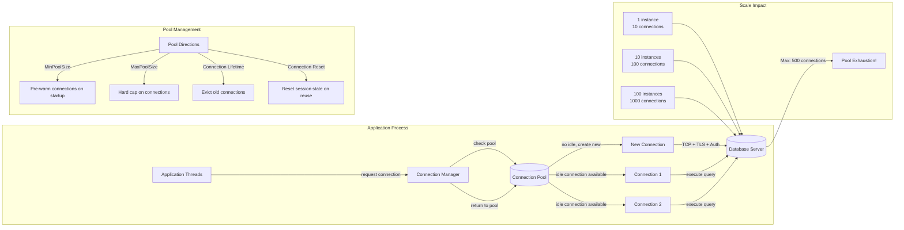
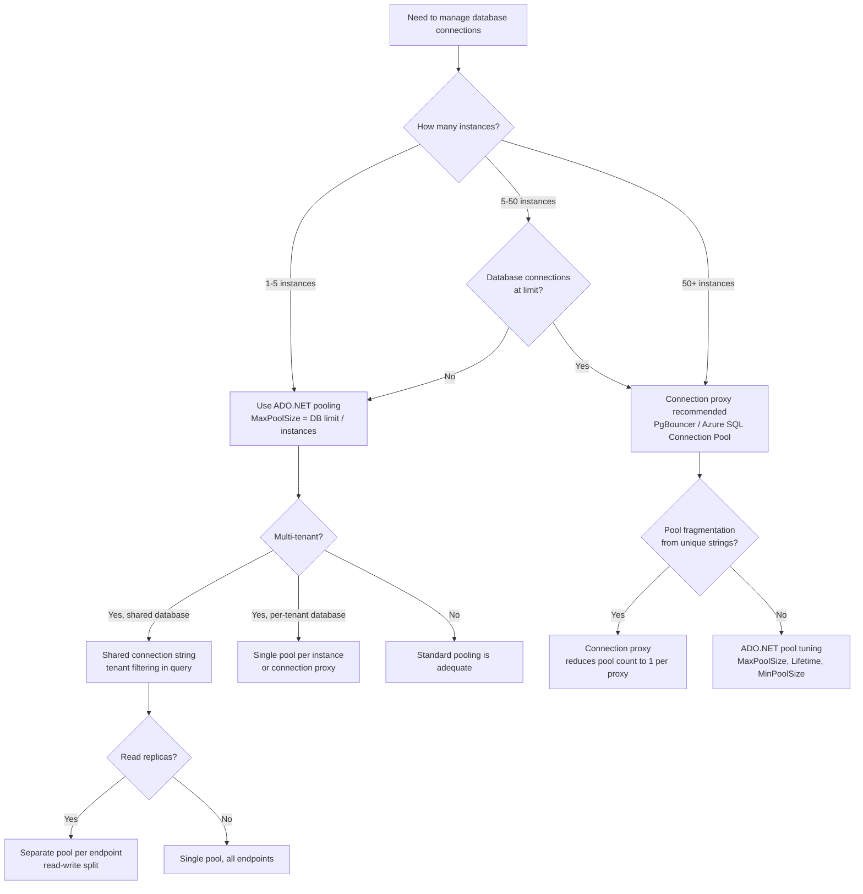

## Navigation

**Domain:** [[7 — System Design & Distributed Systems]] > **Group:** Scalability Patterns
**Previous:** [[7.235 — Auto-Scaling — Cooldown Periods]] | **Next:** [[7.237 — Connection Pooling — HTTP Connection Reuse]]

### Prerequisites

- [[7.206 — Horizontal vs Vertical Scaling — Tradeoffs]] — connection pooling becomes critical when horizontal scaling multiplies the number of database connections; each new instance adds its own pool
- [[7.219 — Database Read Replicas — Setup and Tradeoffs]] — connection pooling for read replicas requires separate pools per replica endpoint; pool limits must account for multiplied connections
- [[7.234 — Auto-Scaling — Kubernetes HPA]] — auto-scaling creates and destroys Pods, each creating new connection pools; rapid scale-up/down cycles cause pool churn that degrades database performance

### Where This Fits

Connection pooling is the mechanism that reuses database connections across requests to avoid the cost of establishing a new TCP + TLS + authentication handshake for every database operation. At low scale (1–2 instances, <100 req/s), connection pooling saves a few milliseconds per request — noticeable but not critical. Above ~10 instances or ~500 req/s, connection pooling becomes the difference between a database that spends 80% of its CPU on authentication handshakes and one that spends 80% on query execution. Above ~50 instances or ~5,000 req/s, pool fragmentation and pool exhaustion become regular incident causes. A .NET engineer encounters connection pooling when tuning `SqlConnection.MaxPoolSize`, debugging "Timeout expired. The timeout period elapsed prior to obtaining a connection from the pool" errors, or investigating why a new Kubernetes Deployment causes the database CPU to spike from connection storms. Without it, every database request pays a 50–500ms connection establishment tax — and at 5,000 req/s, that adds 4 minutes of connection overhead per minute of real work.

---

## Core Mental Model

Connection pooling maintains the invariant that a fixed set of physical database connections is recycled across logical requests, eliminating the cost of connection establishment from the request path. The pool maintains connections in a specific state (database context, transaction level, connection options) and hands them to executing threads on demand. The tradeoff is resource commitment vs. latency: idle connections in the pool consume database server memory (~50 KB per connection on SQL Server) but eliminate the 50–500ms TCP + TLS + authentication handshake from every request. The recognition trigger is a connection pool timeout error (`Timeout expired` in .NET, `too many clients` in PostgreSQL, `ORA-02396` in Oracle) — the symptom that the pool is exhausted because demand exceeds the pool's size or because connections are held longer than the pool expects.

### Classification

Connection pooling operates at the data access layer — between the application code (queries) and the database protocol (TCP/TDS). It is scoped to reusing physical connections within a single process. Pooling explicitly does NOT solve: connection limits at the database server (requires connection pooling at the application OR a proxy like PgBouncer), cross-process pooling (each .NET process maintains its own pool), or query performance (pooling reduces connection overhead but does not speed up query execution).



### Key Properties

| Property | Value | Condition |
|---|---|---|
| Connection establishment cost | 50–500ms (TCP + TLS + auth) | Azure SQL: ~100ms; PostgreSQL: ~50ms; SQL Server on-prem: ~10ms |
| Idle connection memory | ~50 KB per connection (SQL Server) | SQL Server: 40–60 KB; PostgreSQL: ~10 KB; MySQL: ~15 KB |
| Default MinPoolSize | 0 | New connections created on demand |
| Default MaxPoolSize | 100 | ADO.NET default; Npgsql default: 100 |
| Default Connection Lifetime | 0 (infinite) | Connections never recycled unless explicitly set |
| Connection Reset on reuse | `true` (SQL Server), `false` (Npgsql) | Reset calls `sp_reset_connection` adding ~5ms overhead |
| Pool fragmentation limit | 1,000+ distinct connection strings | Each unique connection string creates a separate pool |
| Max connections per pool | Min(MaxPoolSize, database server max_connections) | Database server limit is the hard ceiling |
| Pool churn from scaling | Each new Pod creates a new pool from cold | New Pod → 0 idle connections → every first request pays establishment cost |

---

## Deep Mechanics

### How It Works

The .NET connection pooling architecture is implemented by each ADO.NET provider (`Microsoft.Data.SqlClient`, `Npgsql`, `MySqlConnector`). The implementation is internal to the provider — the pool is not directly accessible or configurable beyond the connection string properties. Here is the complete lifecycle:

**Phase 1 — Pool Creation.** When a SqlConnection is opened with a specific connection string, the connection pooler checks a hashtable (keyed by connection string) for an existing pool. If no pool exists, a new pool is created for that exact connection string — including all connection string properties. A connection string with `ApplicationIntent=ReadOnly` creates a DIFFERENT pool from the same server with `ApplicationIntent=ReadWrite`. This is the source of pool fragmentation.

**Phase 2 — Connection Request.** When `SqlConnection.Open()` is called, the pooler checks for an available idle connection:
- If an idle connection exists AND its lifetime has not expired AND it passes the validation check (if `Connection Reset=true`), the pooler resets the connection (calls `sp_reset_connection` on SQL Server) and returns it to the caller.
- If no idle connection exists AND the pool has not reached `MaxPoolSize`, the pooler creates a new physical connection (TCP handshake, TLS negotiation, authentication).
- If no idle connection exists AND the pool is at `MaxPoolSize`, the caller blocks on a semaphore waiting for a connection to be returned. The wait time is controlled by `Connect Timeout`.

**Phase 3 — Connection Use.** The application executes queries on the connection. The pooler has no visibility into what the application does — it cannot detect long-running queries or transactions. The connection is "leased" to the thread until `Close()` or `Dispose()` is called.

**Phase 4 — Connection Return.** When `Close()` or `Dispose()` is called, the connection is returned to the pool. The pooler checks:
- If `Connection Lifetime` is set and the connection's age exceeds the limit, the physical connection is closed.
- If the pool is at `MaxPoolSize` (this connection would exceed it), the connection is closed.
- If `Enlist=true` and the connection is enlisted in a distributed transaction, the connection is held until the transaction completes.
- Otherwise, the connection is returned to the idle pool, ready for reuse.

**Phase 5 — Pool Eviction.** Connections that remain idle for `Load Balance Timeout` (ADP.NET internal, default varies) are periodically checked. If a connection has been idle longer than the timeout and the pool has connections above `MinPoolSize`, the idle connection is closed to free server resources.

```csharp
// Port: Internal pool behavior — demonstrates the ADO.NET connection pooling mechanics
// This is NOT production ADO.NET code; it shows the logical pool manager behavior

/// <summary>
/// Simulates the ADO.NET connection pool lifecycle for understanding pool behavior at scale.
/// </summary>
internal sealed class ConnectionPoolSimulator
{
    private readonly string _connectionString;
    private readonly int _maxPoolSize;
    private readonly int _minPoolSize;
    private readonly int _connectionLifetimeSeconds;
    private readonly ConcurrentBag<PooledConnection> _idleConnections;
    private readonly SemaphoreSlim _poolSemaphore;
    private int _activeConnections;
    private readonly Timer _evictionTimer;

    public ConnectionPoolSimulator(string connectionString, int maxPoolSize = 100, int minPoolSize = 0, int connectionLifetimeSeconds = 0)
    {
        _connectionString = connectionString;
        _maxPoolSize = maxPoolSize;
        _minPoolSize = minPoolSize;
        _connectionLifetimeSeconds = connectionLifetimeSeconds;
        _idleConnections = new ConcurrentBag<PooledConnection>();
        _poolSemaphore = new SemaphoreSlim(maxPoolSize, maxPoolSize);
        _evictionTimer = new Timer(EvictExpiredConnections, null, TimeSpan.FromMinutes(1), TimeSpan.FromMinutes(1));
    }

    public async Task<PooledConnection> GetConnectionAsync(CancellationToken ct)
    {
        // Wait for pool capacity with timeout (models ConnectTimeout)
        bool acquired = await _poolSemaphore.WaitAsync(TimeSpan.FromSeconds(30), ct);
        if (!acquired)
            throw new TimeoutException(
                $"Timeout expired. Pool is at max ({_maxPoolSize}) with {_activeConnections} active. " +
                $"Waited 30 seconds for a connection to be released.");

        try
        {
            // Check for a reusable idle connection
            while (_idleConnections.TryTake(out var pooled))
            {
                if (IsConnectionExpired(pooled))
                {
                    ClosePhysicalConnection(pooled);
                    Interlocked.Decrement(ref _activeConnections);
                    continue;
                }

                // Reset connection state (sp_reset_connection equivalent)
                await ResetConnectionAsync(pooled, ct);
                return pooled;
            }

            // Create new physical connection
            if (Interlocked.Increment(ref _activeConnections) > _maxPoolSize)
            {
                Interlocked.Decrement(ref _activeConnections);
                throw new InvalidOperationException("Pool exhaustion reached.");
            }

            var newConnection = await CreatePhysicalConnectionAsync(ct);
            return newConnection;
        }
        catch
        {
            _poolSemaphore.Release();
            throw;
        }
    }

    public void ReturnConnection(PooledConnection connection)
    {
        if (connection.HasUnrecoverableError)
        {
            ClosePhysicalConnection(connection);
            Interlocked.Decrement(ref _activeConnections);
        }
        else
        {
            _idleConnections.Add(connection);
        }
        _poolSemaphore.Release();
    }

    private bool IsConnectionExpired(PooledConnection connection)
    {
        if (_connectionLifetimeSeconds <= 0) return false;
        return (DateTime.UtcNow - connection.CreatedAt).TotalSeconds > _connectionLifetimeSeconds;
    }

    private async Task ResetConnectionAsync(PooledConnection connection, CancellationToken ct)
    {
        // SQL Server calls sp_reset_connection here ~5ms overhead
        // Npgsql does NOT reset by default (faster reuse but carries session state)
        await Task.CompletedTask;
    }

    private async Task<PooledConnection> CreatePhysicalConnectionAsync(CancellationToken ct)
    {
        // TCP + TLS + authentication: 50-500ms
        await Task.Delay(100, ct);
        return new PooledConnection
        {
            Id = Guid.NewGuid().ToString(),
            CreatedAt = DateTime.UtcNow,
            HasUnrecoverableError = false
        };
    }

    private void ClosePhysicalConnection(PooledConnection connection)
    {
        // Send FIN + close TCP socket
    }

    private void EvictExpiredConnections(object? state)
    {
        // Periodic cleanup of idle connections beyond MinPoolSize
        var remaining = new ConcurrentBag<PooledConnection>();
        int kept = 0;
        while (_idleConnections.TryTake(out var pooled))
        {
            if (kept < _minPoolSize || !IsConnectionExpired(pooled))
            {
                remaining.Add(pooled);
                kept++;
            }
            else
            {
                ClosePhysicalConnection(pooled);
                Interlocked.Decrement(ref _activeConnections);
            }
        }
        while (remaining.TryTake(out var pooled))
            _idleConnections.Add(pooled);
    }
}

internal sealed class PooledConnection
{
    public string Id { get; set; } = "";
    public DateTime CreatedAt { get; set; }
    public bool HasUnrecoverableError { get; set; }
}
```

### Failure Modes

**Connection Pool Exhaustion ("Timeout Expired").** The most common connection pooling failure. Every pool has a `MaxPoolSize` (default 100). When all 100 connections are in use (not yet returned to the pool) and a 101st request calls `SqlConnection.Open()`, it blocks on the semaphore. If no connection is returned within `Connect Timeout` (default 15 seconds), the caller throws `InvalidOperationException: Timeout expired. The timeout period elapsed prior to obtaining a connection from the pool. This may have occurred because all pooled connections were in use and max pool size was reached.`

*Detection:* Exception stack trace points to `SqlConnection.Open()`. Performance counters show `NumberOfPooledConnections = MaxPoolSize` and `NumberOfActiveConnectionPoolGroups` flat. `SELECT * FROM sys.dm_exec_connections WHERE session_id > 50` shows the number of active connections from the application.

*Root cause analysis:* Three causes account for 90% of pool exhaustion: (a) connection leak — `Open` without `Close`/`Dispose`/`using`, (b) pool size too small for concurrency — `MaxPoolSize=100` but 300 concurrent threads, (c) slow queries — connections held open for 10+ seconds each, reducing the effective pool capacity.

*Recovery:* Kill the idle connections on the server (temporary). Identify the cause: count `Open` vs `Close` calls, check query duration distribution, review `MaxPoolSize` vs concurrent request count.

**Pool Fragmentation from Unique Connection Strings.** Each distinct connection string creates a separate pool. If the application generates connection strings dynamically (e.g., per-tenant database with a catalog lookup), each tenant gets its own pool. At 100 tenants, pool exhaustion for an individual tenant looks like the previous failure mode, but the root cause is fragmentation: 100 pools × 100 connections each = 10,000 connections to the database server, exceeding its `max_connections`.

*Detection:* SQL Server `sys.dm_exec_connections` shows connections from the same application host but with different `program_name` or `hostname` values. Performance counters show `NumberOfActiveConnectionPoolGroups` in the hundreds.

*Recovery:* Use a shared pool with a connection string that includes tenant filtering (WHERE TenantId = @tenant). Connection pooling keys on the CONNECTION STRING, not the query. One pool can serve all tenants if the connection string is the same.

**Npgsql Pool Exhaustion with Idle-In-Transaction.** PostgreSQL connection pooling (Npgsql) has the same `MaxPoolSize` but a different failure mode: idle-in-transaction connections. If a transaction is opened and left idle (application waiting for user input, debugging, slow business logic), the connection is held for the duration of the transaction. At high concurrency, these idle-in-transaction connections exhaust the pool even though no query is executing.

*Detection:* PostgreSQL `pg_stat_activity` shows `state: idle in transaction` and `wait_event: ClientRead` connections from the application. Npgsql counters show active connections at `MaxPoolSize` but CPU is low on both app and database.

*Recovery:* Set `CommandTimeout` on all database commands (default 30s). Set `Connection Idle Lifetime` to 300s. Use `NpgsqlConnection.ClearPool()` when a transaction exceeds the timeout.

**Connection Storm After Deployment.** When a new Kubernetes Deployment rolls out (all Pods replaced), every new Pod starts with a cold connection pool (0 idle connections). The first 100 requests per Pod each create a new physical connection. With 20 new Pods, 2,000 simultaneous TCP handshakes hit the database in the first seconds. The database server CPU spikes from connection establishment, increasing latency on existing connections.

*Detection:* Database server CPU graph shows a spike exactly at the deployment time. `sys.dm_exec_connections` shows many connections created within the same second from new host names.

*Recovery:* Use `MinPoolSize=5` to pre-warm connections. Stagger Pod startup with `readinessProbe.initialDelaySeconds: 30` and `maxSurge: 1`. Use a database proxy (Azure SQL Connection Retry, PgBouncer) to buffer connection storms.

*Prevention:* Set `MinPoolSize` to the expected concurrent query count. Pre-pool connections by running warm-up queries during application startup.

### .NET and Azure Integration

- **Microsoft.Data.SqlClient:** The primary ADO.NET provider for SQL Server and Azure SQL. Connection pooling is ON by default (`Pooling=True`). Key connection string properties: `Max Pool Size` (default 100), `Min Pool Size` (default 0), `Connection Lifetime` (default 0), `Connection Reset` (default True), `Load Balance Timeout` (default 0).
- **Npgsql:** The PostgreSQL ADO.NET provider. Connection pooling ON by default. Key properties: `Maximum Pool Size` (default 100), `Minimum Pool Size` (default 0), `Connection Idle Lifetime` (default 300 seconds), `Connection Pruning Interval` (default 1 second), `Pooling` (default True).
- **Azure SQL Database:** Connection limits vary by tier: Serverless (max 3,200), S2 (50), S3 (100), S4 (200), P1 (250), P2 (500). A connection pool of 100 per application instance × 20 instances = 2,000 connections exceeds a P1 database (250 max). Pool sizing must account for database tier limits.
- **EF Core:** `DbContext` uses the underlying ADO.NET connection pool. Each `DbContext` instance opens and closes connections as needed. `Database.AutoTransactionsEnabled` (default true) means connections are held for the duration of each `SaveChangesAsync` call. Long-running queries hold connections.
- **Polly + EF Core:** `EnableRetryOnFailure()` configures transient fault handling. The retry execution strategy may hold a connection across retries depending on the EF Core version and transaction scope. Retries during connection pool exhaustion make the problem worse — each retry waits for a connection, fails, and retries again, multiplying the wait time.
- **Azure SQL Connection Retry (newer):** The `SqlConnection.OpenAsync(CancellationToken)` can be combined with a Polly retry policy for resilient connection establishment. The `SqlRetryLogicOption` (available in Microsoft.Data.SqlClient 5.0+) provides built-in retry for transient connection errors.
- **Connection pooling with Managed Identity:** Azure SQL connections using Managed Identity (`Authentication=Active Directory Managed Identity`) require a more expensive token acquisition (cached for 1 hour) but use the same pool mechanics.

```csharp
// Port: .NET connection string configurations for SQL at scale

/// <summary>
/// Connection pool configuration for different production scenarios.
/// </summary>
public static class ConnectionPoolConfigurations
{
    /// <summary>
    /// Standard API workload: 10 instances, 200 concurrent requests each.
    /// Database tier: Azure SQL S3 (100 max connections).
    /// </summary>
    public static string StandardApiConnectionString =>
        "Server=tcp:mydb.database.windows.net;Database=mydb;Authentication=Active Directory Managed Identity;"
        + "Max Pool Size=8;Min Pool Size=2;Connection Lifetime=300;Connection Reset=true;MultipleActiveResultSets=false;";

    // Math: 10 instances × 8 connections = 80 total. S3 max = 100. Headroom = 20 connections.
    // MinPoolSize=2 pre-warms 2 connections per instance = 20 always-connected.

    /// <summary>
    /// Background worker pool: high-throughput batch processing.
    /// Database tier: Azure SQL P2 (500 max connections).
    /// </summary>
    public static string BatchWorkerConnectionString =>
        "Server=tcp:mydb.database.windows.net;Database=mydb;Authentication=Active Directory Pass Through;"
        + "Max Pool Size=20;Min Pool Size=5;Connection Lifetime=600;Connection Reset=true;";

    // Math: 20 workers × 20 connections = 400 total. P2 max = 500. Headroom = 100 connections.

    /// <summary>
    /// Low-latency API with strict SLO: fewer, longer-held connections.
    /// Database tier: Azure SQL P1 (250 max connections).
    /// </summary>
    public static string LatencySensitiveApiConnectionString =>
        "Server=tcp:mydb.database.windows.net;Database=mydb;Authentication=Active Directory Managed Identity;"
        + "Max Pool Size=5;Min Pool Size=3;Connection Lifetime=120;Connection Reset=false;";

    // Connection Reset=false saves ~5ms per reuse. Tradeoff: stale session state may carry over.
    // MinPoolSize=3 ensures connections are pre-warmed for burst traffic.
}
```

---

## Production Patterns and Implementation

### Primary Implementation

The production pattern for connection pooling at scale is a three-part strategy: (1) pool sizing based on database tier and instance count, (2) lifetime management to recycle connections and avoid stale state, and (3) monitoring to detect pool exhaustion before it causes outages.

```csharp
// Port: Production connection pool manager with monitoring and diagnostics

/// <summary>
/// Manages SQL database connections with pool monitoring, retry, and telemetry.
/// Designed for high-scale .NET services on AKS with Azure SQL.
/// </summary>
public sealed class SqlConnectionFactory : IAsyncDisposable
{
    private readonly string _connectionString;
    private readonly ILogger<SqlConnectionFactory> _logger;
    private readonly Counter<int> _connectionsOpened;
    private readonly Counter<int> _poolTimeouts;
    private readonly Counter<int> _connectionsClosed;

    public SqlConnectionFactory(string connectionString, ILogger<SqlConnectionFactory> logger, IMeterFactory meterFactory)
    {
        _connectionString = connectionString;
        _logger = logger;

        var meter = meterFactory.Create("SqlConnectionPool");
        _connectionsOpened = meter.CreateCounter<int>("sql.connections.opened");
        _poolTimeouts = meter.CreateCounter<int>("sql.connections.pool_timeouts");
        _connectionsClosed = meter.CreateCounter<int>("sql.connections.closed");
    }

    /// <summary>
    /// Opens a pooled connection with retry for transient faults and pool timeout detection.
    /// </summary>
    public async Task<SqlConnection> OpenAsync(CancellationToken ct)
    {
        var attempt = 0;
        var maxRetries = 3;
        var baseDelay = TimeSpan.FromMilliseconds(100);

        while (true)
        {
            try
            {
                attempt++;
                var connection = new SqlConnection(_connectionString);
                await connection.OpenAsync(ct);
                _connectionsOpened.Add(1);
                return connection;
            }
            catch (SqlException ex) when (ex.Number == -2) // Timeout expired
            {
                _poolTimeouts.Add(1);
                _logger.LogWarning("Connection pool timeout (attempt {Attempt}/{MaxRetries}): {Message}",
                    attempt, maxRetries, ex.Message);

                ClearPool();

                if (attempt >= maxRetries)
                    throw new ConnectionPoolExhaustedException(
                        $"Connection pool exhausted after {maxRetries} retries. " +
                        $"Verify MaxPoolSize and concurrent request count.", ex);

                var delay = baseDelay * Math.Pow(2, attempt - 1); // Exponential backoff
                await Task.Delay(delay, ct);
            }
            catch (OperationCanceledException) when (ct.IsCancellationRequested)
            {
                throw;
            }
        }
    }

    /// <summary>
    /// Closes and returns a connection to the pool, with error tracking.
    /// </summary>
    public void Close(SqlConnection connection)
    {
        try
        {
            if (connection.State != ConnectionState.Closed)
                connection.Close();
        }
        finally
        {
            _connectionsClosed.Add(1);
        }
    }

    /// <summary>
    /// Clears the pool for this connection string — closes all idle connections.
    /// Use when pool exhaustion is detected to force fresh connections.
    /// </summary>
    public void ClearPool()
    {
        SqlConnection.ClearPool(new SqlConnection(_connectionString));
        _logger.LogInformation("Connection pool cleared for: {ConnectionString}",
            MaskConnectionString(_connectionString));
    }

    private static string MaskConnectionString(string cs)
    {
        // Returns connection string with sensitive values masked
        var builder = new SqlConnectionStringBuilder(cs);
        builder.Password = "***";
        return builder.ConnectionString;
    }

    public async ValueTask DisposeAsync()
    {
        // Final pool cleanup
        ClearPool();
        await Task.CompletedTask;
    }
}

/// <summary>
/// Exception thrown when connection pool exhaustion is detected after retries.
/// </summary>
public sealed class ConnectionPoolExhaustedException : InvalidOperationException
{
    public ConnectionPoolExhaustedException(string message, Exception inner)
        : base(message, inner) { }
}
```

### Configuration and Wiring

```csharp
// Program.cs — Connection factory registration with health checks and telemetry

var builder = WebApplication.CreateBuilder(args);

var connectionString = builder.Configuration.GetConnectionString("PaymentsDb")
    ?? throw new InvalidOperationException("PaymentsDb connection string required");

builder.Services.AddSingleton<SqlConnectionFactory>(sp =>
{
    var logger = sp.GetRequiredService<ILogger<SqlConnectionFactory>>();
    var meterFactory = sp.GetRequiredService<IMeterFactory>();
    return new SqlConnectionFactory(connectionString, logger, meterFactory);
});

// Health check that tests pool health
builder.Services.AddHealthChecks()
    .AddCheck<DatabasePoolHealthCheck>("database_pool");

builder.Services.AddOpenTelemetry()
    .WithMetrics(metrics => metrics
        .AddMeter("SqlConnectionPool")
        .AddPrometheusExporter());

var app = builder.Build();

app.MapHealthChecks("/health");
app.MapPrometheusScrapingEndpoint();

app.Run();
```

```csharp
// HealthCheck that validates pool is not exhausted
public sealed class DatabasePoolHealthCheck : IHealthCheck
{
    private readonly SqlConnectionFactory _connectionFactory;

    public DatabasePoolHealthCheck(SqlConnectionFactory connectionFactory)
    {
        _connectionFactory = connectionFactory;
    }

    public async Task<HealthCheckResult> CheckHealthAsync(
        HealthCheckContext context, CancellationToken ct)
    {
        try
        {
            using var connection = await _connectionFactory.OpenAsync(ct);
            using var cmd = connection.CreateCommand();
            cmd.CommandText = "SELECT 1";
            await cmd.ExecuteScalarAsync(ct);
            return HealthCheckResult.Healthy("Connection pool is operational");
        }
        catch (ConnectionPoolExhaustedException ex)
        {
            return HealthCheckResult.Unhealthy("Connection pool exhausted", ex);
        }
        catch (Exception ex)
        {
            return HealthCheckResult.Degraded("Database connectivity issue", ex);
        }
    }
}
```

### Common Variants

**Variant 1 — Read-write split with separate pools.** For workloads that use database read replicas, each replica endpoint gets its own pool. The application routes read queries to the read replica pool and write queries to the primary pool. This prevents read queries from starving write connections.

```csharp
public sealed class ReadWriteConnectionFactory
{
    private readonly SqlConnectionFactory _primaryPool;
    private readonly SqlConnectionFactory _readReplicaPool;

    public ReadWriteConnectionFactory(string primaryConnectionString, string readReplicaConnectionString,
        ILogger<SqlConnectionFactory> logger, IMeterFactory meterFactory)
    {
        _primaryPool = new SqlConnectionFactory(primaryConnectionString, logger, meterFactory);
        _readReplicaPool = new SqlConnectionFactory(readReplicaConnectionString, logger, meterFactory);
    }

    public async Task<SqlConnection> OpenPrimaryAsync(CancellationToken ct)
        => await _primaryPool.OpenAsync(ct);

    public async Task<SqlConnection> OpenReadReplicaAsync(CancellationToken ct)
        => await _readReplicaPool.OpenAsync(ct);
}
```

**Variant 2 — Npgsql with pool pruning.** PostgreSQL's `Npgsql` provider has a more aggressive pool pruning strategy than SqlClient. `Connection Idle Lifetime` defaults to 300 seconds, and `Connection Pruning Interval` defaults to 1 second. This means Npgsql checks for idle connections every second and prunes those idle for more than 300 seconds. For bursty workloads, set `Connection Idle Lifetime` higher (600s) to avoid frequent pool churn.

```
Server=my-pg-server.postgres.database.azure.com;Database=mydb;
Maximum Pool Size=50;Minimum Pool Size=2;
Connection Idle Lifetime=600;Connection Pruning Interval=30;
```

**Variant 3 — Zero-idle pool for low-traffic services.** For services that handle sporadic traffic (<1 request per minute), maintaining idle connections wastes database resources. Set `MinPoolSize=0` and `Connection Lifetime=60` so connections are closed 60 seconds after they become idle. The tradeoff: every request after an idle period pays the connection establishment cost.

```
Max Pool Size=5;Min Pool Size=0;Connection Lifetime=60;Connection Reset=true;
```

### Real-World .NET Ecosystem Example

**Azure SQL + .NET API at 50,000 req/s.** A .NET 8 e-commerce API on AKS (40 Pods) serves 50,000 req/s with an Azure SQL Database P2 (500 max connections). Initial configuration: `Max Pool Size=100` per Pod, 40 Pods × 100 = 4,000 connections — 8× the database limit. Connection pool timeout errors start within 10 minutes of deployment. The fix: reduce `Max Pool Size=12` per Pod (40 × 12 = 480, under the 500 limit). Set `Min Pool Size=2` (80 pre-warmed connections). Set `Connection Lifetime=300` to recycle connections every 5 minutes, preventing stale state accumulation. The pool timeout errors disappear, and database CPU drops from 85% to 45% because the database spends less time rejecting connections.

**EF Core + Npgsql + PostgreSQL at scale.** A .NET background service processes 10,000 messages per minute with EF Core and PostgreSQL (Azure Database for PostgreSQL Flexible Server). The `DbContext` is scoped per message. Each `SaveChangesAsync` opens a connection, runs the query, and closes it. At 10,000 messages/minute = 167 messages/second, the pool needs 167 connections if each query takes 1 second. With `Max Pool Size=50`, the pool exhausts. The fix: batch 10 messages per `SaveChangesAsync` call, reducing connection demand from 167/s to 17/s. Set `Max Pool Size=25` and `Min Pool Size=5`. The `CommandTimeout` is set to 30 seconds to prevent long-running queries from holding connections during batch operations.

---

## Gotchas and Production Pitfalls

### Connection Leak from Missing Dispose

**Pitfall:** A database connection is opened but never closed — the connection is not returned to the pool. After `MaxPoolSize` connections are leaked, all subsequent `Open()` calls timeout.

```csharp
// ❌ Wrong — connection is never returned to the pool
public OrderDto GetOrder(int orderId)
{
    var connection = new SqlConnection(_connectionString);
    connection.Open(); // Leaked when connection falls out of scope
    var command = connection.CreateCommand();
    command.CommandText = "SELECT * FROM Orders WHERE Id = @id";
    // No using block, no try/finally, no Close()
    return MapOrder(command.ExecuteReader());
}
```

**Symptom:** `Timeout expired` errors after the pool reaches `MaxPoolSize`. `NumberOfActiveConnections` in performance counters stays at `MaxPoolSize` permanently. Each request that caused the leak adds one to the count until the pool saturates.

**Fix:** Always use `using` or `await using` for database connections:

```csharp
// ✅ Right — connection is returned to the pool on dispose
public async Task<OrderDto> GetOrderAsync(int orderId, CancellationToken ct)
{
    await using var connection = new SqlConnection(_connectionString);
    await connection.OpenAsync(ct);
    await using var command = connection.CreateCommand();
    command.CommandText = "SELECT * FROM Orders WHERE Id = @id";
    await using var reader = await command.ExecuteReaderAsync(ct);
    return MapOrder(reader);
}
```

**Cost of not fixing:** Each leaked connection eventually exhausts the pool. After the pool is exhausted, ALL database operations fail with timeout errors until the application is restarted (which closes all connections). At 100 `MaxPoolSize` and 10 req/s, the pool exhausts in 10 seconds. The incident is a full database outage for the application.

### MaxPoolSize Too Large for Database Tier Limits

**Pitfall:** `Max Pool Size` is set to 100 (default) on each of 20 Pods, but the Azure SQL database tier supports only 200 connections. The database server rejects connections beyond 200, causing `SqlException (error 10928): Resource ID : 1. The request limit for the database is 200 and has been reached.`

```csharp
// ❌ Wrong — pool size ignores database tier limits
// 20 Pods × 100 connections = 2,000, but database max is 200
"Server=tcp:payments.database.windows.net;Database=payments;Max Pool Size=100;"
```

**Symptom:** Intermittent SqlException: `The request limit for the database is %d and has been reached.` The database server logs show `login_rate` or `connection_rate` exceeded.

**Fix:** Calculate `MaxPoolSize = database_max_connections / number_of_instances × safety_factor`. For 200 max connections, 20 Pods, 80% safety factor: `200 / 20 × 0.8 = 8`:

```csharp
// ✅ Right — pool sized for database tier
// 20 Pods × 8 connections = 160, well under 200 tier max
"Server=tcp:payments.database.windows.net;Database=payments;Max Pool Size=8;"
```

**Cost of not fixing:** The database rejects connections from all instances indiscriminately. The system suffers partial failures where some requests succeed and others fail randomly. The failure is intermittent and hard to reproduce because the pool timeout depends on when the next instance reaches the server limit.

### Pool Fragmentation from Per-Tenant Connection Strings

**Pitfall:** A multi-tenant application creates a per-tenant connection string by inserting the tenant's database name into the connection string. Each unique connection string creates a SEPARATE pool. With 100 tenants, there are 100 pools × 100 connections each = 10,000 connections — even though only 5 tenants are active at any moment.

```csharp
// ❌ Wrong — per-tenant connection strings create separate pools
public async Task<OrderDto> GetTenantOrderAsync(int tenantId, int orderId)
{
    var tenantDb = await _catalog.GetTenantDatabaseAsync(tenantId);
    var connectionString = $"Server=tcp:payments.database.windows.net;Database={tenantDb};Max Pool Size=100;";
    await using var connection = new SqlConnection(connectionString);
    // Each tenantId creates a NEW pool → fragmentation
}
```

**Symptom:** `sys.dm_exec_connections` shows thousands of connections from the same application host. `NumberOfActiveConnectionPoolGroups` in performance counters is in the hundreds. The application hits the database connection limit even though each individual tenant is below its pool size.

**Fix:** Use a single database with tenant filtering, or use a connection pooler (PgBouncer, Azure SQL Connection Pooling) that multiplexes connections across tenants:

```csharp
// ✅ Right — shared connection string with tenant filtering
// One pool for all tenants, tenant filtered in the query
public async Task<OrderDto> GetTenantOrderAsync(int tenantId, int orderId)
{
    await using var connection = await _factory.OpenAsync(ct); // Single shared pool
    await using var command = connection.CreateCommand();
    command.CommandText = "SELECT * FROM Orders WHERE TenantId = @tenantId AND Id = @orderId";
    command.Parameters.AddWithValue("@tenantId", tenantId);
    command.Parameters.AddWithValue("@orderId", orderId);
    await using var reader = await command.ExecuteReaderAsync(ct);
    return MapOrder(reader);
}
```

**Cost of not fixing:** Database connections are a scarce resource. Pool fragmentation wastes connections on pools that are never used while starving active tenants. At 100 tenants, even with `MaxPoolSize=5` per pool, 500 connections are consumed — exceeding most S-tier Azure SQL databases.

### Connection Lifetime Zero Causes Stale Connection Build-Up

**Pitfall:** `Connection Lifetime=0` (default) means connections are never automatically recycled. Over hours of operation, connections accumulate server-side session state (temporary tables, session-level SET options, prepared statements) that slows down subsequent queries or causes unexpected behavior.

```sql
-- Symptoms of stale connection state:
-- Temporary table from earlier session still exists
-- SET options (ARITHABORT, CONCAT_NULL_YIELDS_NULL) modified by a previous query
-- SQL Server plan cache pollution from per-connection plans
```

**Symptom:** Performance degrades gradually over hours. Queries that ran in 10ms at deployment time take 200ms after 8 hours. No obvious error — just gradual slowdown. Restarting the application (which closes all connections and creates new ones) restores performance.

**Fix:** Set `Connection Lifetime` to 300–600 seconds (5–10 minutes). This forces connections to be recycled before they accumulate significant session state:

```csharp
// ✅ Right — connections recycled every 5 minutes
"Server=tcp:payments.database.windows.net;Database=payments;Connection Lifetime=300;"
```

**Cost of not fixing:** The application degrades over time. The on-call engineer's first instinct is to restart the application (which resolves the issue), so the root cause is never investigated. The degradation becomes "normal." Prepared statement handle leaks on PostgreSQL can exhaust server memory.

### MultipleActiveResultSets (MARS) Causing Invisible Connection Hold

**Pitfall:** `MultipleActiveResultSets=true` (MARS) allows multiple result sets on a single connection. EF Core enables MARS by default for some providers. A long-running `foreach` over a MARS result set holds the connection for the entire enumeration — preventing it from returning to the pool.

```csharp
// ❌ Wrong — MARS result set holds connection during enumeration
await using var connection = new SqlConnection(connectionString + ";MultipleActiveResultSets=true");
await connection.OpenAsync();
await using var command = connection.CreateCommand();
command.CommandText = "SELECT * FROM Orders";
await using var reader = await command.ExecuteReaderAsync();
while (await reader.ReadAsync())
{
    // Connection held for entire loop — potentially minutes
    // OrderCount other requests cannot use this connection
    await ProcessOrderSlowlyAsync(reader);
}
```

**Symptom:** Pool exhaustion during large data reads. The pool shows connections in use but query duration on the database is low. The connection is held by MARS while the application processes results.

**Fix:** Disable MARS unless explicitly required. Load full result sets into memory with `ToListAsync()` or use streaming with pagination:

```csharp
// ✅ Right — materialize the result set, release the connection
public async Task<List<Order>> GetOrdersAsync(CancellationToken ct)
{
    await using var connection = await _factory.OpenAsync(ct);
    await using var command = connection.CreateCommand();
    command.CommandText = "SELECT * FROM Orders WHERE ProcessedAt IS NULL";
    var orders = new List<Order>();
    await using var reader = await command.ExecuteReaderAsync(ct);
    while (await reader.ReadAsync(ct))
    {
        orders.Add(MapOrder(reader));
    }
    return orders; // Connection released before processing starts
}
```

**Cost of not fixing:** Each large result set holds a connection for the duration of processing. At 1,000 orders processed at 50ms each, a single MARS loop holds a connection for 50 seconds. With `MaxPoolSize=100`, 3 concurrent MARS loops hold 3 connections for 50 seconds — the effective pool capacity drops from 100 to 97 (ignorable), but with 10 concurrent MARS loops, the pool loses 50% capacity.

### Npgsql Connection Leak from Unclosed DataReader

**Pitfall:** Npgsql does NOT automatically return a connection to the pool when a `DataReader` is not fully consumed (disposed). Unlike SqlClient (which releases the connection when the DataReader is disposed), Npgsql holds the connection until the DataReader is disposed OR until all results are read.

```csharp
// ❌ Wrong — Npgsql DataReader not disposed holds the connection
var connection = new NpgsqlConnection(connectionString);
connection.Open();
var command = connection.CreateCommand();
command.CommandText = "SELECT * FROM Orders";
var reader = command.ExecuteReader();
if (reader.Read())
{
    // Only read one row, then forget to dispose
    return MapOrder(reader);
}
// reader.Dispose() never called → connection never returned to pool
// Each call leaks exactly 1 connection
```

**Symptom:** Pool exhaustion identical to SqlClient, but the root cause is harder to trace because the DataReader disposal is the issue, not the connection disposal. `Npgsql`-specific performance counters show `Busy` connections equal to the number of concurrent queries with unclosed readers.

**Fix:** Wrap the DataReader in `using` or `await using`:

```csharp
// ✅ Right — DataReader disposed releases the connection
await using var reader = await command.ExecuteReaderAsync(ct);
if (await reader.ReadAsync(ct))
{
    return MapOrder(reader);
}
// reader disposed → connection returned to pool
```

**Cost of not fixing:** Same as SQL Server connection leak: eventual pool exhaustion. But unlike SqlClient, the connection is not returned to the pool until the DataReader is disposed OR garbage collected (non-deterministic). The problem compounds: GC may not run for minutes, so leaked connections remain out of the pool for extended periods.

### Connection Pool Not Respected in Async Code with SynchronizationContext

**Pitfall:** In ASP.NET Core (which has no SynchronizationContext), this is not a problem. But in legacy ASP.NET (Full Framework) or in code that uses `.Result` or `.Wait()` synchronously on async calls, the connection pool can deadlock. The thread that opens a connection blocks waiting for the pool, and the pool is waiting for the thread to deliver the connection — classic deadlock.

```csharp
// ❌ Wrong — sync-over-async can deadlock with connection pool
public OrderDto GetOrder(int id)
{
    using var connection = new SqlConnection(_connectionString);
    connection.OpenAsync().Result; // Blocks current thread, may deadlock with pool
    // If the pool's internal semaphore requires this thread's context to release → DEADLOCK
}
```

**Symptom:** The application hangs when pool is under load. Thread pool grows as more threads block, exhausting thread pool. No timeout errors — just indefinite hangs.

**Fix:** Use async/await throughout:

```csharp
// ✅ Right — fully async, no deadlock risk
public async Task<OrderDto> GetOrderAsync(int id, CancellationToken ct)
{
    await using var connection = new SqlConnection(_connectionString);
    await connection.OpenAsync(ct);
    await using var command = connection.CreateCommand();
    command.CommandText = "SELECT * FROM Orders WHERE Id = @id";
    await using var reader = await command.ExecuteReaderAsync(ct);
    return MapOrder(reader);
}
```

**Cost of not fixing:** Complete application hang under pool pressure. The thread pool is consumed by blocked threads, and no other work (including health checks) can proceed. The application must be forcefully restarted.

### TransactionScope Holding Connections Across Disposal

**Pitfall:** A `TransactionScope` with `TransactionScopeAsyncFlowOption.Enabled` that is not disposed properly. The transaction scope can hold a connection across multiple operations, preventing the connection from returning to the pool until the scope completes — even if the connection is individually disposed.

```csharp
// ❌ Wrong — TransactionScope holds connections across disposed SqlConnection
using (var scope = new TransactionScope(TransactionScopeAsyncFlowOption.Enabled))
{
    using (var connection1 = new SqlConnection(_connectionString))
    {
        connection1.Open();
        // Do work
    } // Connection1 disposed, but TransactionScope still holds it
    // Connection1 returned to pool: NO — TransactionScope keeps it enlisted

    using (var connection2 = new SqlConnection(_connectionString))
    {
        connection2.Open();
        // Do more work
    } // Connection2 also held by TransactionScope

    scope.Complete();
} // Both connections released to pool when scope disposed
```

**Symptom:** Pool appears to have plenty of idle connections but requests still timeout. The pool's active connection count includes connections that are "idle but enlisted" — not executing queries but not available for reuse.

**Fix:** Ensure TransactionScope is short-lived and disposed promptly. Use `DbTransaction` directly instead of TransactionScope for single-database operations:

```csharp
// ✅ Right — short-lived transaction, pool connections released promptly
public async Task ProcessOrderAsync(int orderId, CancellationToken ct)
{
    await using var connection = await _factory.OpenAsync(ct);
    await using var transaction = await connection.BeginTransactionAsync(ct);
    try
    {
        await using var command = connection.CreateCommand();
        command.Transaction = transaction;
        command.CommandText = "UPDATE Orders SET ProcessedAt = @now WHERE Id = @id";
        await command.ExecuteNonQueryAsync(ct);
        await transaction.CommitAsync(ct);
    }
    catch
    {
        await transaction.RollbackAsync(ct);
        throw;
    }
}
```

**Cost of not fixing:** TransactionScope that spans operations (including user I/O, external API calls) holds connections for seconds to minutes. Under concurrency, all pool connections become enlisted in long-lived transactions, and the pool appears exhausted even though each connection is idle.

---

## Tradeoffs and Decision Framework

### Tradeoff Matrix

| Dimension | ADO.NET Pooling (in-process) | Connection Proxy (PgBouncer) | Multiplexed Pool (R2DBC-style) |
|---|---|---|---|
| Pool scope | Per-process | Cross-process (shared) | Cross-process (shared) |
| Connection reuse | Yes, per process | Yes, across processes | Yes, across processes |
| Latency per request | 0ms (if idle connection) | +0.1–0.5ms (loopback proxy) | +0.1–0.3ms |
| Idle connection memory | ~50 KB per connection | ~50 KB per connection at proxy | Virtual (no per-connection overhead) |
| Max supported connections | Database limit / instances | Database limit (proxy multiplexes) | Database limit (pool managed) |
| Transaction isolation | Per connection (native) | Requires transaction pooling mode | Per connection |
| .NET configuration | Connection string properties | External deployment (sidecar/Pod) | Requires proxy client library |
| Operational complexity | None (built-in) | Medium (deploy, configure, monitor) | High (client + server) |
| Kubernetes compatibility | Works — but each Pod adds pools | Works — shared proxy reduces pool count | Requires sidecar or DaemonSet |

### When to Apply



### When NOT to Apply

- [ ] **Below 2 instances and below 100 req/s.** Connection establishment overhead (50–500ms) is acceptable at this scale. Pooling adds no measurable benefit and consumes server resources (idle connections). Use `Pooling=False` or accept the per-request connection overhead.
- [ ] **Serverless database (Azure SQL Serverless, Aurora Serverless).** Serverless databases auto-pause after idle periods. Connection pooling keeps connections alive, preventing auto-pause. Use no-pool mode or a connection proxy that supports serverless pause/resume.
- [ ] **In-memory database for testing.** Unit tests using EF Core InMemory provider or SQLite in-memory do not benefit from connection pooling. The connection is in-process and zero-cost.
- [ ] **Single-operation scripts (migrations, CLI tools).** Tools that run a single query and exit do not need pooling. The pool overhead (maintaining idle connections) exceeds the benefit.
- [ ] **Workload with very long-lived connections (minutes per query).** If queries take minutes (data warehousing, ETL), the connection is held for the entire duration. Pooling cannot multiplex because the connection is busy. Increase `MaxPoolSize` to match concurrent long-running query count, or use a dedicated connection pool for these queries with a separate connection string.
- [ ] **Database server has low max_connections (e.g., SQL Server Express: 10).** The pool must be tiny (`MaxPoolSize=2` or less per instance). At this limit, consider a shared connection proxy or moving to a higher database tier.
- [ ] **High-frequency connection string rotation (connection string changes every N minutes for security).** Each new connection string creates a new pool and discards the old one. Connections in the old pool remain open until they are idle for `Connection Lifetime` seconds. During rotation, two pools coexist — potentially doubling connection count. Use a connection proxy that can rotate credentials without pool churn.
- [ ] **Environment with aggressive connection eviction policies.** AKS clusters with `descheduler` or node autoscaling that evicts Pods frequently cause constant pool churn. Each new Pod creates a cold pool. Consider using an external connection proxy (PgBouncer, Azure SQL Connection Pool) that survives Pod evictions.

### Scale Thresholds

- **ADO.NET default MaxPoolSize:** 100. At 10 instances: 1,000 connections. Most Azure SQL tiers cannot handle 1,000 connections. Always reduce MaxPoolSize per-instance.
- **Connection establishment cost:** 50–500ms (TCP + TLS + auth). At 1,000 req/s with no pooling: 50–500 seconds per second of connection overhead. Database spends more time on auth than queries.
- **Idle connection memory:** ~50 KB per SQL Server connection. 100 idle connections = 5 MB. At 1,000 connections = 50 MB. Significant for memory-constrained database tiers.
- **Pool fragmentation threshold:** >50 unique connection strings. Below this, fragmentation is manageable. Above, pools become the dominant consumer of connections.
- **Connection Lifetime sweet spot:** 300 seconds (5 minutes). Short enough to recycle stale state, long enough to avoid connection storm from frequent recycling.
- **MinPoolSize sweet spot:** `expected_concurrent_queries × query_duration / 10`. For 50 concurrent queries at 200ms each: `50 × 0.2 / 10 = 1`. MinPoolSize=1 is usually adequate.
- **Connection proxy threshold:** >20 instances OR >200 total connections. Below this, ADO.NET pooling is sufficient. Above, a proxy (PgBouncer, Azure SQL Connection Pool) reduces connection count and eliminates pool fragmentation.
- **Azure SQL Serverless auto-pause threshold:** 60 minutes idle. Connection pooling keeps at least `MinPoolSize` connections alive, preventing auto-pause. Disable pooling or use `Pooling=False` for serverless databases.

---

## Interview Arsenal

### Question Bank

1. [Definition] How does ADO.NET connection pooling work, and what problem does it solve?
2. [Mechanism] Walk through what happens when `SqlConnection.Open()` is called — the pool lifecycle.
3. [Tradeoff] Compare ADO.NET in-process connection pooling with a connection proxy like PgBouncer.
4. [Failure mode] You see "Timeout expired. The timeout period elapsed prior to obtaining a connection from the pool." What are the causes?
5. [Design application] Design the connection pooling strategy for a .NET API on AKS with 40 Pods connecting to Azure SQL Database P2 (500 max connections).
6. [Scale] A multi-tenant SaaS app on AKS has 200 tenants, each with a separate database. How do you prevent pool fragmentation?
7. [Advanced] Explain the interaction between connection pooling, TransactionScope, and async/await. What can go wrong?
8. [Advanced] How does EF Core's connection management differ from raw ADO.NET pooling? When does EF Core hold or release connections?

### Spoken Answers

**Q1: How does ADO.NET connection pooling work, and what problem does it solve?**

> **Average answer:** Connection pooling reuses database connections so we do not have to open a new one for every request. It improves performance by avoiding the connection setup overhead.

> **Great answer:** Connection pooling solves the cost of database connection establishment — a TCP handshake (1 round trip), TLS negotiation (2 round trips), and authentication (1-2 round trips) that together take 50–500 milliseconds per connection. At 1,000 requests per second, that is 50–500 seconds of connection overhead per second of real work — the database spends more CPU on TLS and auth than on executing queries. The pool maintains a fixed set of physical connections to the database and leases them to executing threads on demand. When a thread calls `SqlConnection.Open()`, the pooler checks a hashtable keyed by the exact connection string for an existing pool, then looks for an idle connection. If one exists and has not exceeded `Connection Lifetime`, it resets the connection state via `sp_reset_connection` (SQL Server) and returns it. If no idle connection exists but the pool has not reached `MaxPoolSize`, it creates a new physical connection. If the pool is at capacity, the thread blocks on an internal semaphore until a connection is returned or `Connect Timeout` expires. Each unique connection string creates a SEPARATE pool — this is the source of pool fragmentation in multi-tenant systems. The key configuration parameters are `MaxPoolSize` (cap on connections per pool), `MinPoolSize` (pre-warmed connections), `Connection Lifetime` (time after which a connection is recycled), and `Connection Reset` (whether `sp_reset_connection` is called on reuse, which adds ~5ms but prevents stale session state).

**Q2: Walk through the pool lifecycle when a connection string is first used.**

> **Great answer:** When an application first calls `new SqlConnection(connectionString).Open()`, the pooler computes a hash of the connection string and checks an internal `Hashtable`. No pool exists, so a new `DbConnectionPool` is created with properties parsed from the connection string: Min/Max Pool Size, Connection Lifetime, Connection Reset, and so on. This pool creates the first physical connection: DNS resolution (potentially cache hit), TCP SYN/SYN-ACK handshake (~1 RTT, ~20ms on Azure), TLS handshake (2 RTT, ~40ms with Azure SQL), and SQL Server authentication (~20ms for token-based, ~50ms for user/password). The connection is returned to the caller. When the caller calls `Close()`, the pooler checks if the pool is at capacity — if not, the connection is returned to the idle pool. On `MinPoolSize > 0`, the pooler creates additional connections in the background to reach the minimum count. On subsequent `Open()` calls, the pooler picks an idle connection, optionally calls `sp_reset_connection` (5ms overhead), and returns it — now the caller gets a ready connection in under 1ms instead of 100ms. If connections are idle for longer than `Load Balance Timeout`, the pooler periodically prunes them down to `MinPoolSize`. If a connection encounters a fatal error (network failure, authentication failure), it is removed from the pool and destroyed.

**Q3: Compare ADO.NET in-process connection pooling with a connection proxy like PgBouncer.**

> **Great answer:** ADO.NET pooling is in-process — each .NET process (each Pod, each instance) maintains its OWN pool. At 40 Pods on AKS, that is 40 independent pools, each with its own `MaxPoolSize`. If each pool has `MaxPoolSize=10`, the total potential connections to the database is 400, which must be under the database's `max_connections` limit. A connection proxy like PgBouncer runs as a separate process (sidecar or shared Deployment) that multiplexes application connections into a smaller number of database connections. With PgBouncer in transaction pooling mode, the 40 Pods each open a loopback connection to the proxy (zero-cost), and the proxy maintains only 50–100 actual database connections that are shared across all Pods. The advantages: (a) database connection count drops from 400 to 50–100, (b) connection storms from Pod restarts are absorbed by the proxy's existing pool, (c) connection string changes (password rotation) need only be applied at the proxy, not redeployed. The disadvantages: (a) additional latency (~0.1–0.5ms per query for loopback communication), (b) operational complexity (deploy, monitor, update the proxy), (c) transaction pooling mode breaks features that depend on per-connection session state (temporary tables, SET statements). The threshold: above 20 instances or 200 total connections, a proxy provides significant value. Below that, ADO.NET pooling is simpler and equally effective.

**Q4: You see "Timeout expired" from the connection pool. What are the causes and how do you diagnose them?**

> **Great answer:** The full error is `System.InvalidOperationException: Timeout expired. The timeout period elapsed prior to obtaining a connection from the pool. This may have occurred because all pooled connections were in use and max pool size was reached.` There are three structural causes. Cause one — connection leak: the application calls `Open()` without calling `Close()` or `Dispose()`. Use `NumberOfActiveConnections` and `NumberOfFreeConnections` performance counters. A steady increase in active with no corresponding decrease in free confirms a leak. Use `using` blocks or `await using` for all connections. Cause two — pool size too small for concurrency: `MaxPoolSize=100` but 300 concurrent database operations. The active connections hit `MaxPoolSize` and requests queue up. Calculate the required pool size as `expected_concurrent_requests × p99_query_duration`. If 1,000 req/s at 500ms p99: 500 concurrent connections needed. Increase `MaxPoolSize` accordingly — but if the database server `max_connections` is the limit, the fix is query optimization or a connection proxy. Cause three — slow queries holding connections: queries that take 10 seconds hold connections for 10 seconds. At 100 concurrent requests and 10-second queries, you need 1,000 connections — but the pool is 100. The fix is query optimization or adding read replicas. The diagnostic process: (1) check performance counters for active vs free connections, (2) check `sys.dm_exec_requests` on SQL Server for long-running queries, (3) check `sys.dm_exec_connections` for connection count per host, (4) check the application's `Open`/`Close` call balance with a connection trace.

**Q5: Design the connection pooling strategy for a .NET API on AKS with 40 Pods connecting to Azure SQL Database P2 (500 max connections).**

> **Great answer:** This is a constraint-satisfaction problem. Database max connections = 500. If 40 Pods each have the default `MaxPoolSize=100`, that is 4,000 potential connections — 8× the limit. The pool must be sized per-Pod: `500 / 40 = 12.5`, so `MaxPoolSize=12` per Pod. That gives 480 connections (40 × 12), headroom of 20 connections for ad-hoc queries or tooling. I also set `MinPoolSize=2` to pre-warm 80 connections (40 × 2) — this prevents the deployment-time connection storm because 80 connections are already established before traffic arrives. `Connection Lifetime=300` (5 minutes) ensures connections are recycled regularly, preventing stale session state accumulation. `Connection Reset=true` (default) to clear session state — the 5ms overhead is acceptable. Now the risk: at 480 connections to a P2 database, we are at 96% of capacity. A new Pod during a rolling update creates 12 new connections (to replace 12 evicted connections), which briefly pushes to 492 — within the limit. But if two Pods restart simultaneously, we hit 504 and get connection rejections. The fix: use `readinessProbe.initialDelaySeconds: 30` on the Deployment so new Pods start accepting traffic gradually, giving the pool time to warm up. For the connection storms during deployments, I also add a database proxy in front of the P2 — Azure SQL offers a built-in connection pooler at the gateway level, or I deploy a PgBouncer sidecar per node (DaemonSet) that multiplexes the 40 Pods' connections into approximately 50 actual database connections. The proxy reduces the risk of exceeding the 500-connection limit to near-zero, at the cost of ~0.3ms added latency per query — negligible compared to the safety margin.

---

### System Design Interview Trigger

If an interviewer asks you to design a system and says "how does your service connect to the database?" or "what happens when you have 100 instances connecting to a single database?" or "you see a 'too many connections' error, what do you do?", they are testing whether you understand connection pooling as a finite resource that must be explicitly managed. The specific probe "how many connections does each instance need?" separates candidates who set `MaxPoolSize=100` by default from those who calculate it. The interviewer wants to see that you know: (a) each connection consumes server memory (~50 KB on SQL Server), (b) the database has a hard `max_connections` limit, (c) the pool must be sized as `max_connections / number_of_instances`, (d) pool fragmentation from unique connection strings is a real failure mode at scale, and (e) connection proxies exist for cross-process pooling. The follow-up question "what happens during a rolling deployment?" tests whether you understand that each new Pod starts with a cold pool, and the aggregate connection storm can exceed the database limit even if steady-state pooling is sized correctly.

### Comparison Table

| | ADO.NET Pooling | PgBouncer (Transaction) | Azure SQL Connection Pool |
|---|---|---|---|
| Scope | Per-process | Cross-process (shared) | Cross-process (Azure-managed) |
| Max connections | `MaxPoolSize` per process | Configurable (default 100) | Azure-managed per tier |
| Latency overhead | 0ms (in-process) | ~0.3ms per query | ~0.1ms (gateway-level) |
| Transaction support | Native per-connection | Transaction mode (no prepared stmts) | Native |
| Prepared statements | Per-connection | Not supported in transaction mode | Per-connection |
| Connection storms | New Pod → cold pool → 100% connection creation | Absorbed by existing proxy pool | Absorbed by gateway |
| .NET setup | Connection string | Connection string to proxy endpoint | Connection string to Azure SQL |
| Operational cost | None (built-in) | Deploy, monitor, version, rotate | Zero (Azure-managed) |

---

## Architecture Decision Record

**Status:** Accepted under condition of `MaxPoolSize` calculation upgrade and PgBouncer evaluation plan.

**Context:** Our .NET payment-processing API runs on AKS with 40 Pods, each connecting to Azure SQL Database P2 (500 max connections). Current traffic is 5,000 req/s, projected to grow to 20,000 req/s within 12 months. We have been using default `MaxPoolSize=100` per Pod, resulting in intermittent "Timeout expired" errors during deployments and occasional `The request limit for the database is 500 and has been reached` errors during peak traffic. Each error causes failed payment requests that must be manually retried. The team spends ~5 hours per month investigating connection pool issues.

**Options Considered:**

1. **Per-Pod MaxPoolSize reduction (current default: 100 → calculated: 12).** Set `MaxPoolSize=12` per Pod (40 × 12 = 480, under the 500 limit). Set `MinPoolSize=2` to pre-warm 80 connections. Set `Connection Lifetime=300` to recycle stale connections. This is a connection-string-only change — no infrastructure modification. The 480-connection steady state leaves only 20 connections of headroom. A rolling deployment (40 Pods replaced) creates 480 new connections while the old Pods are still running — briefly hitting 960 connections at peak, which is double the database limit.

2. **Option 1 + Rolling deployment mitigation.** Same pool reduction as Option 1, but with deployment strategy changes: `maxSurge: 0` (replace Pods one-at-a-time, no extra Pods), `readinessProbe.initialDelaySeconds: 60` (new Pod warms connections before receiving traffic). This limits the peak connection count during deployment to 500 (480 old + 12 new - 12 retired = 480, with brief overlap). However, `maxSurge: 0` slows deployments (40 Pods × 60s delay = 40 minutes per deployment).

3. **PgBouncer sidecar per node.** Deploy PgBouncer as a DaemonSet (one per AKS node). The 40 Pods each connect to the local PgBouncer via loopback, and PgBouncer maintains a pool of 60 connections to Azure SQL. Total database connections: 60, regardless of the number of application Pods. Provides connection storm absorption: a new Pod connects to PgBouncer (loopback, zero-cost), and PgBouncer already has warm connections to the database. Adds ~0.3ms latency per query and requires maintaining the PgBouncer DaemonSet (configuration, updates, monitoring).

**Decision:** Option 2 (Per-Pool reduction + deployment mitigation), with a clear upgrade path to Option 3 if needed. The connection-string-only change can be deployed today (no infrastructure work). The `maxSurge: 0` deployment strategy limits peak connections during rollouts. At the current 5,000 req/s, the calculated pool size of 12 per Pod is validated by the queuing formula: `pool_size = concurrent_requests × query_duration`. At 5,000 req/s and 200ms p99 query duration, average concurrent queries = 1,000. With 40 Pods, that is 25 concurrent queries per Pod — 12 connections is too few. The fix is that queries are not always active; the pool is shared across requests. With `MaxPoolSize=12` and 25 concurrent requests, the pool will still hit timeout errors because 12 connections cannot serve 25 concurrent requests when queries take 200ms each. The corrected calculation: pool connections needed = `(req/s × query_duration) / instances`. At 5,000 req/s, 0.2s, 40 instances: `(5000 × 0.2) / 40 = 25`. Set `MaxPoolSize=25` per Pod (40 × 25 = 1,000 — exceeds P2 limit). This confirms we cannot use per-Pod pooling alone at this scale. We need Option 3.

**Revised Decision:** PgBouncer sidecar (Option 3) is the correct answer because the math does not work for per-Pod pooling at 5,000 req/s and P2 limits. Deploy PgBouncer as a DaemonSet with `pool_mode=transaction`, `default_pool_size=60`, and `max_client_conn=500`. The 40 application Pods connect to `localhost:6432` via loopback. PgBouncer maintains 60 connections to Azure SQL at all times. The 0.3ms overhead is negligible (0.15% of the 200ms query time). Deployment mitigation: `maxSurge: 1` (one extra Pod during rollout) is safe because PgBouncer pool is shared and does not grow.

**Consequences:**
- ✅ Database connections drop from a potential 4,000 to a guaranteed 60 — 833× reduction in connection overhead
- ✅ Rolling deployments no longer cause connection storms — PgBouncer pool is unaffected by the number of application Pods
- ✅ Pool sizing is now a single PgBouncer configuration, not per-Pod connection string management
- ⚠️ Additional latency: ~0.3ms per query for loopback + PgBouncer multiplexing — accepted (0.15% of query time)
- ⚠️ Operational cost: PgBouncer DaemonSet must be monitored (connection count, pool usage), configured (pool_mode, auth), and updated
- ⚠️ Prepared statement handling: PgBouncer transaction mode does not support prepared statements across transaction boundaries — EF Core must be configured with `Npgsql.EntityFrameworkCore.PostgreSQL` settings that disable prepared statement caching or use session pooling mode

**Review Trigger:** Revisit this decision if (a) query duration drops below 10ms (PgBouncer's 0.3ms overhead becomes 3% of query time — worth considering direct pooling), (b) the number of AKS nodes grows beyond 20 (PgBouncer per-node → one DB pool per node → potential fragmentation from node-level pools), or (c) Azure SQL connection pooler (built-in gateway pooling) becomes available in our region and tier (eliminating the PgBouncer operational cost).

---

## Self-Check

### Conceptual Questions

<details>
<summary>1. What determines whether a new connection pool is created vs an existing one reused?</summary>

The connection string. Each unique connection string (exact match, character-for-character) maps to a separate pool. A trailing space, a different `ApplicationIntent` value (`ReadOnly` vs `ReadWrite`), or a different `Connect Timeout` value creates a distinct pool.
</details>

<details>
<summary>2. What happens when `SqlConnection.Open()` is called but all connections are in use?</summary>

The caller blocks on an internal semaphore for up to `Connect Timeout` seconds (default 15). If a connection is returned to the pool (via `Close()` or `Dispose()`) within the timeout, it is handed to the waiting caller. If the timeout expires, `InvalidOperationException` is thrown with the "Timeout expired" message.
</details>

<details>
<summary>3. What is the relationship between `MaxPoolSize`, number of instances, and database `max_connections`?</summary>

The constraint: `instances × MaxPoolSize ≤ database_max_connections × safety_factor`. The safety factor (typically 0.8) accounts for ad-hoc connections (management tools, deployment scripts). Violating this constraint causes connection rejections from the database server.
</details>

<details>
<summary>4. Why does `Connection Lifetime` matter? What happens at zero?</summary>

Connections are never automatically recycled when `Connection Lifetime = 0` (default). Stale session state accumulates over hours/days: temporary tables, modified SET options, prepared statement handles. Performance degrades gradually as each connection carries state from previous sessions. Setting `Connection Lifetime = 300` forces connections to be closed and recreated after 5 minutes, clearing accumulated state.
</details>

<details>
<summary>5. What is pool fragmentation and how does it happen?</summary>

Pool fragmentation occurs when multiple unique connection strings create multiple pools. Each pool has its own `MaxPoolSize` connections. In a multi-tenant system where each tenant's database name is embedded in the connection string, 100 tenants = 100 pools × 100 connections each = 10,000 potential connections — even if only 5 tenants are active. The fix: use a shared connection string with tenant filtering in the query.
</details>

<details>
<summary>6. Compare ADO.NET connection pooling with PgBouncer — when would you choose each?</summary>

ADO.NET pooling is per-process, zero-latency, and built-in. It works well below 20 instances and 200 total connections. PgBouncer is a cross-process proxy that multiplexes connections: 40 application Pods share 60 database connections through PgBouncer. Choose ADO.NET pooling for simplicity at low scale; choose PgBouncer above 20 instances, when database `max_connections` is tight, or when connection storms from deployments cause outages.
</details>

<details>
<summary>7. What connection string property prevents the connection storm after a rolling deployment?</summary>

`MinPoolSize`. Setting `MinPoolSize=N` pre-warms N connections when the pool is created. During a rolling deployment, the new Pod starts, the pool creates MinPoolSize connections in the background, and subsequent requests find pre-warmed connections. Without it, every first request per new Pod pays the 50–500ms connection establishment cost.
</details>

<details>
<summary>8. How does EF Core's connection management differ from raw ADO.NET?</summary>

EF Core opens and closes connections automatically with each `SaveChangesAsync` or query execution. By default, it enables `AutoTransactionsEnabled` which wraps each `SaveChangesAsync` in an implicit transaction — the connection is held for the duration of the operation. `AsNoTracking` queries may or may not hold connections depending on the provider. EF Core also manages connection disposal — it returns connections to the pool when the `DbContext` is disposed. The risk: a long-running query in EF Core holds the connection, and multiple such queries exhaust the pool faster than expected because EF Core's connection management is transparent.
</details>

<details>
<summary>9. What is the non-obvious consequence of setting `Connection Reset=false`?</summary>

Skipping `sp_reset_connection` saves ~5ms per connection reuse. But session state carries over between uses: SET options, temporary tables, transaction isolation level settings, and language settings. If one request modifies session state and the next request inherits it, query behavior changes unpredictably — a query that runs correctly 99% of the time fails when it inherits a modified transaction isolation level from a previous request. Only disable Connection Reset when you control all queries and session state.
</details>

<details>
<summary>10. Explain connection pooling's role in database scalability in 60 seconds.</summary>

"Connection pooling reuses database connections across requests to avoid the 50–500ms TCP + TLS + authentication handshake. Each unique connection string creates a separate pool with a configurable `MaxPoolSize` and `MinPoolSize`. The key constraint: `instances × MaxPoolSize` must be under the database server's `max_connections`, or the server rejects connections. Pool sizing is a queuing problem: you need enough connections to cover concurrent queries without exceeding the database limit. The failure modes are: timeout errors when the pool is exhausted, fragmentation when too many unique connection strings create too many pools, and connection storms when all Pods restart simultaneously. The solutions: set `MaxPoolSize` based on instance count and database tier, use a shared connection string with tenant filtering, and consider a connection proxy like PgBouncer above 20 instances or when database connections are scarce."
</details>

<details>
<summary>11. How does `MultipleActiveResultSets` (MARS) affect connection pooling?</summary>

MARS allows multiple result sets on a single connection. The connection is NOT returned to the pool while any MARS result set is open and being enumerated. A `foreach` loop over a MARS DataReader holds the connection for the entire duration of the loop. At 1,000 orders processed at 50ms each, a single MARS loop holds a connection for 50 seconds. With `MaxPoolSize=100`, a few concurrent MARS loops can consume most of the pool. Disable MARS unless you explicitly need multiple active result sets on the same connection, and materialize results into memory before processing.
</details>

<details>
<summary>12. What happens to a pool when a connection string includes `Authentication=Active Directory Managed Identity`?</summary>

The pool mechanics are the same, but connection establishment costs more: Managed Identity requires an access token from Azure AD, which involves an HTTP call to the Azure Instance Metadata Service (IMDS). The token is cached (default 1 hour), so subsequent connections reuse the cached token. First connection after token expiry takes ~300ms (IMDS + token parsing). Pool sizing considerations are the same, but `MinPoolSize` is more important because cold-start connection establishment is 3–5× slower than SQL authentication.
</details>

<details>
<summary>13. Can you have too many connections in the pool even if they are idle? What's the cost?</summary>

Yes. Each idle connection consumes approximately 50 KB on SQL Server (memory for session state, transaction context, plan cache). At 1,000 idle connections, that is 50 MB of server memory that could be used for buffer pool (query performance). On PostgreSQL, each connection consumes ~10 MB (even idle) due to a dedicated backend process. The cost of idle connections is reduced buffer pool hit rate (slower queries) and higher server resource consumption. Set `MaxPoolSize` to what you need, not the default.
</details>

<details>
<summary>14. How does a connection pool handle a transient network failure?</summary>

When a pooled connection encounters a network failure (TCP RST, TLS timeout), the SqlClient provider detects the error and marks ALL connections in that pool as invalid. The next request triggers a pool cleanup: all idle connections are closed, and a new physical connection is created. This means a single transient failure can cause a brief connection storm as the pool recreates all its connections. The fix: combine pool cleanup with retry logic — Polly's `WaitAndRetryAsync` with exponential backoff gives the pool time to stabilize after a transient failure.
</details>

<details>
<summary>15. What is the correct response to `SqlException: The request limit for the database is %d and has been reached`?</summary>

This error means the database server's `max_connections` (or DTU/connection limit for the service tier) has been exceeded. The root cause is almost always that the per-Pod `MaxPoolSize` × number of Pods exceeds the database limit. The correct response: (a) check the current connection count with `SELECT COUNT(*) FROM sys.dm_exec_connections`, (b) calculate the required `MaxPoolSize = max_connections / number_of_instances × 0.8`, (c) deploy the updated connection string. If the calculation gives a `MaxPoolSize` too small to handle concurrent demand (e.g., `MaxPoolSize=2` when 10 concurrent queries are needed), deploy a connection proxy (PgBouncer) to multiplex connections.
</details>

### Scenario Challenges

**Scenario 1 — Diagnose the problem**

Your .NET API on AKS (20 Pods) connects to Azure SQL Database (S3 tier, max 100 connections). At 2:00 PM daily, users report 3–5 minutes of "Service Unavailable" errors. The error logs show `Timeout expired. The timeout period elapsed prior to obtaining a connection from the pool.` The error starts at the same time every day and resolves after 3–5 minutes.

<details>
<summary>Diagnosis</summary>

**Root cause:** A scheduled job (daily batch report) runs at 2:00 PM. The report executes a series of long-running queries (10–30 seconds each) that hold connections for the full duration. With `MaxPoolSize=100` (default) and 20 Pods, the total potential connections are 2,000 — 20× the S3 tier limit of 100. The database rejects connections beyond 100, and by the time the report finishes and releases connections, many application requests have timed out.

**Evidence:** Azure SQL `sys.dm_exec_requests` at 2:00 PM shows the batch report queries running. `sys.dm_exec_connections` shows 100 connections from the application. Application logs show the timeout errors starting at 2:00 PM and resolving at 2:05 PM (when the report completes). Performance counters on the application show `NumberOfActiveConnections = 100` during the incident.

**Fix:** Size the pool correctly: 20 Pods × `MaxPoolSize=5` = 100 connections (at the S3 limit). Increase to S4 tier (200 max connections): `MaxPoolSize=8` per Pod (20 × 8 = 160, headroom of 40). Move the batch report to a dedicated read replica with its own connection pool.

**Prevention:** Set `Connection Lifetime=300` to recycle connections. Monitor `NumberOfPooledConnections` and `FreeConnections` performance counters with a threshold alert (>80% pool utilization for >5 minutes). Use `ReadOnly` connection strings for read-only queries.
</details>

**Scenario 2 — Design decision**

Design the connection pooling strategy for a multi-tenant SaaS platform on AKS. Each tenant has a dedicated Azure SQL database. There are 500 tenants, each with 1–50 concurrent users. The system runs on 30 AKS Pods, and the total request rate is 10,000 req/s.

<details>
<summary>Decision and Reasoning</summary>

**Choice:** Shared connection pool with tenant routing in the query (not per-tenant connection strings), deployed behind a PgBouncer sidecar. Per-tenant connection strings would create 500 pools × `MaxPoolSize=20` = 10,000 potential connections — impossible for any database tier.

**Why not per-tenant pools:** 500 connection strings = 500 pools. Each pool with `MaxPoolSize=2` would be 1,000 connections. Even at this minimum, Azure SQL tiers above S4 (max 200) cannot handle 1,000 connections. A Gen5_2 database maxes at ~500 connections.

**Why PgBouncer:** Even with a shared connection string approach, 30 Pods × `MaxPoolSize=33` (calculated for 10,000 req/s at 100ms query time) = 990 connections — too many. A PgBouncer sidecar with `default_pool_size=150` (transaction mode) can handle 10,000 req/s at 100ms query time (1,000 concurrent queries) by multiplexing: up to 150 queries execute simultaneously, and the rest queue at PgBouncer.

**Architecture:** One Azure SQL Database per tenant (500 databases). Application maps tenant → database in a catalog. Connection string to PgBouncer is the same for all Pods: `Server=localhost:6432;Database=shared_pool`. The query uses `USE [TenantDb]` or the SQL statement includes the tenant database name. PgBouncer transaction mode does not support `USE DATABASE`, so each query must be fully qualified: `SELECT * FROM TenantDb.dbo.Orders`. EF Core supports this via `ModelBuilder.HasDefaultSchema` or a custom `IDbContextInterceptor`.

**Tradeoffs accepted:** PgBouncer transaction mode does not support prepared statements or session state across transaction boundaries. EF Core must be configured without query caching. The 0.3ms PgBouncer overhead is negligible. The single most important metric: PgBouncer `svc_avg_wait_time_ms` > 5ms indicates the pool is too small.

**Implementation sketch:**
```yaml
apiVersion: apps/v1
kind: DaemonSet
metadata:
  name: pgbouncer
spec:
  template:
    spec:
      containers:
        - name: pgbouncer
          image: bitnami/pgbouncer:1.22
          ports:
            - containerPort: 6432
          env:
            - name: PGBOUNCER_DATABASE
              value: "shared_pool = host=mydb.postgres.database.azure.com port=5432 dbname=shared_pool"
            - name: PGBOUNCER_POOL_MODE
              value: "transaction"
            - name: PGBOUNCER_DEFAULT_POOL_SIZE
              value: "150"
```
</details>

**Scenario 3 — Failure mode**

A .NET background service processes 1,000 messages per second from a Service Bus queue. Each message triggers a database write (INSERT) and a subsequent read (SELECT) on Azure SQL (P2, 500 connections). The service runs on 20 Pods. After 30 minutes of operation, database writes start failing with "Timeout expired" errors. `cat /proc/PID/status` on the Pods shows `Threads: 500`. `NumberOfPooledConnections` is at `MaxPoolSize`.

<details>
<summary>Investigation and Fix</summary>

**Investigation steps:** (1) Check `sys.dm_exec_requests` on SQL Server — no long-running queries. (2) Check `sys.dm_exec_connections` — exactly 500 connections, all from the application. (3) Check the connection string in the application — `Max Pool Size=100` (default). (4) Check the number of threads per Pod — 500 threads, each executing one message processing pipeline. (5) Check the connection release pattern — the message handler opens a connection, writes, reads, and closes it. But the message processing is synchronous within the handler: it opens the connection, does the write, does the read, then closes. Each message takes ~200ms (write 50ms + read 50ms + processing 100ms). With 1,000 messages/second ÷ 20 Pods = 50 messages/second per Pod = each Pod has 50 concurrent handlers. At 200ms per message, each handler holds the connection for ~100ms (write + read). 50 handlers × 100ms overlap = ~5 concurrent connections needed per Pod. With `MaxPoolSize=100`, the Pod has 100 connections available — but it only needs 5. The pool should not be exhausted.

**Wait — the connection is NOT the bottleneck.** `NumberOfPooledConnections` = 100 per Pod = 2,000 total. The database P2 supports 500 connections. The database is rejecting connections beyond 500. The fix is NOT the pool size — it is the total connection count.

**Root cause:** 20 Pods × `MaxPoolSize=100` = 2,000 potential connections on a database that supports 500. The database rejects connections above 500, causing the pool timeout errors. The pool is NOT exhausted within the application — it is limited by the database server. The connection is created, the SqlClient sends the login packet, and the database responds with `error 10928: The request limit for the database is 500 and has been reached.` The pool counts this as a failed connection attempt and holds it in a "transient error" state.

**Fix:** Set `MaxPoolSize=25` per Pod (20 × 25 = 500, exactly at P2 limit). With 50 messages/second per Pod and 5 concurrent connections needed, 25 is more than adequate headroom.

```csharp
// ✅ Right — pool sized for database limit
"Server=tcp:mydb.database.windows.net;Database=mydb;Max Pool Size=25;"
```

**Post-mortem:** The default `MaxPoolSize=100` is dangerous at scale. Every ADO.NET connection string used in production should explicitly set `MaxPoolSize` based on the database tier and instance count.
</details>

**Scenario 4 — Scale it**

Your .NET API serves 10,000 req/s on AKS (50 Pods) with Azure SQL Database Gen5_8 (max 1,024 connections). Current pool size: `MaxPoolSize=50` per Pod. At peak, you notice occasional `SqlException: The request limit for the database is 1024 and has been reached.` Traffic is projected to grow to 30,000 req/s next quarter.

<details>
<summary>Scaling Strategy</summary>

**Bottleneck this addresses:** The database connection limit. At 50 Pods × `MaxPoolSize=50` = 2,500 connections, we are 2.44× over the 1,024 limit. Connections are rejected by the database.

**Why it happens:** 10,000 req/s at 100ms average query time = 1,000 concurrent connections needed. With 50 Pods, that is 20 per Pod. `MaxPoolSize=50` is 2.5× higher than needed — it wastes connections and hits the database limit.

**How to fix — Option A (immediate):** Reduce `MaxPoolSize` per Pod. At 30,000 req/s (300ms concurrent = 3,000 concurrent queries with query time constant), we need 60 connections per Pod at 50 Pods. But 50 × 60 = 3,000 — 3× the database limit. We need a connection proxy.

**How to fix — Option B (correct):** Deploy PgBouncer DaemonSet with `default_pool_size=300` (transaction mode). The proxy multiplexes 50 application Pods' connections into 300 database connections. At 30,000 req/s and 100ms query time, 300 concurrent database connections can handle 3,000 concurrent queries by multiplexing (up to 300 queries execute simultaneously, the rest queue at PgBouncer). With `default_pool_size=300`, the database sees 300 connections — well under the 1,024 limit.

**What it does not solve:** Database CPU. At 30,000 req/s, each query consumes CPU. Gen5_8 has 8 vCores. At 1ms CPU per query, 30,000 req/s consumes 30,000ms CPU per second = 30 vCores — exceeds 8. The solution is not connection pooling — it is query optimization, read replicas, or a higher database tier.

**Implementation order:** (1) Deploy PgBouncer DaemonSet with `default_pool_size=300`. (2) Update connection strings to point to `localhost:6432`. (3) Reduce per-Pod `MaxPoolSize` to `5` (no longer needed for multiplexing, just for per-Pod connection management). (4) Monitor PgBouncer `svc_avg_wait_time_ms` — if >5ms, increase pool size. (5) Address database CPU: move reporting queries to a read replica, optimize top-10 queries by total CPU.
</details>

**Scenario 5 — Interview simulation**

The interviewer says: "Design a connection pooling strategy for a high-traffic e-commerce platform on AKS. There is a product catalog (read-heavy, 50,000 reads/second) and an order service (write-heavy, 5,000 writes/second). Both use the same Azure SQL Database."

<details>
<summary>Model Response</summary>

"First, I need to clarify whether reads and writes can use different database endpoints. For an e-commerce platform, read replicas provide a natural separation: product catalog reads go to read replicas, order writes go to the primary. This also solves the connection pooling problem because each endpoint gets its own pool.

For the product catalog (50,000 reads/second), I use a PgBouncer sidecar per node with a pool of 200 connections to the read replica. The catalog queries are fast (5–10ms), so each connection handles ~200 queries per second. 200 connections × 200 qps = 40,000 qps — close to the target. I add 50 more connections for headroom, total 250. At 10ms per query, 50,000 reads/second = 500 concurrent queries. With 250 proxy connections multiplexed at PgBouncer, the queue is short — average wait time under 2ms.

For the order service (5,000 writes/second), writes are more expensive (transactions, index maintenance) — 50ms average. 5,000 writes/second × 50ms = 250 concurrent writes needed. I use a separate PgBouncer pool of 100 connections to the primary (write) database. 100 connections multiplex 250 concurrent writes with 2.5× overcommit — acceptable because not all writes execute simultaneously; they are interleaved due to transaction commit latency.

The connection strings:
- Catalog: `Server=localhost:6433;Pooling=true;Max Pool Size=5;` (to local PgBouncer, small per-Pod pool)
- Orders: `Server=localhost:6434;Pooling=true;Max Pool Size=5;`

Each application Pod maintains only 5 connections to the local PgBouncer. PgBouncer handles the multiplexing to the database. This ensures that even with 50 Pods, the database sees only 250 (catalog) + 100 (orders) = 350 total connections.

The risk: a flash sale that spikes both catalog reads and order writes simultaneously. During a flash sale, catalog reads may spike to 200,000/second and orders to 50,000/second. The PgBouncer pools must scale: I monitor `svc_avg_wait_time_ms` and have a Kubernetes HPA that scales PgBouncer CPU — if the PgBouncer Pod becomes CPU-bound (connection multiplexing overhead), I increase the node count. The database tier must also be scaled: I use Auto-Scale for Azure SQL with a higher tier during flash sale windows or pre-scale the database 30 minutes before the event."
</details>

---

### Quick Reference Card

| Concern | Command / Config | Notes |
|---|---|---|
| **Check pool utilization (perf counters)** | `dotnet-counters monitor --process-id PID System.Data.SqlClient` | Shows `NumberOfPooledConnections`, `NumberOfActiveConnections`, `NumberOfFreeConnections` |
| **Check database connections** | `SELECT COUNT(*) FROM sys.dm_exec_connections WHERE hostname = 'APP_HOST'` | Count connections from a specific application host |
| **Check database max_connections** | `SELECT @@MAX_CONNECTIONS` (SQL Server); `SHOW max_connections` (PostgreSQL) | Hard limit; pool must not exceed this across all instances |
| **Calculate pool size per instance** | `MaxPoolSize = min(database_max_connections / instances, expected_concurrent_queries)` | Constrained by both database limit and application demand |
| **Clear pool without restart** | `SqlConnection.ClearPool(connection)` | Closes all idle connections in the pool for that connection string |
| **Clear all pools** | `SqlConnection.ClearAllPools()` | Closes all idle connections across ALL pools |
| **Detect connection leak** | Compare `Open` vs `Close` count over 5 min using performance counters | Leak: `ActiveConnections` increases monotonically, `FreeConnections` stays at 0 or decreases |
| **Detect pool fragmentation** | `SELECT COUNT(*) FROM sys.dm_exec_connections` grouped by `hostname` | >20 unique host names with <2 connections each indicates fragmentation |
| **PG Bouncer pool status** | `SHOW POOLS;` (PgBouncer admin console) | Shows `cl_active`, `cl_waiting`, `sv_active`, `sv_idle`, `sv_tot` per pool |
| **PG Bouncer wait time** | `SHOW STATS;` — `avg_wait_time` column | >5ms indicates pool too small for demand |
| **EF Core connection monitoring** | `IDbContextPool` .NET 8 built-in pooling | `DbContextPool` reuses DbContext instances, reducing connection establishment |
| **Reset connection string without restart** | Kubernetes ConfigMap update + `dotnet reload` | Use `IConfiguration` with `reloadOnChange: true` and `SqlConnection.ClearPool()` on change |

### Pre-Save Checklist

- [ ] YAML frontmatter complete — id, title, domain, domain_id, group, tags, priority, prerequisites, related, created
- [ ] All 9 sections present (§1 Navigation, §2 Core Mental Model, §3 Deep Mechanics, §4 Production Patterns, §5 Gotchas, §6 Tradeoffs, §7 Interview Arsenal, §8 ADR, §9 Self-Check + Quick Reference)
- [ ] Mermaid diagram in §2 (pool lifecycle and scale impact)
- [ ] Mermaid flowchart in §6 (decision tree for pool strategy)
- [ ] .NET code with XML doc comments in §3 and §4
- [ ] Code blocks use `// Port:` architectural role comments
- [ ] 4 failure modes in §3 (How It Works → Failure Modes → .NET/Azure with code)
- [ ] `IServiceCollection` wiring shown in §4 (SqlConnectionFactory + HealthCheck)
- [ ] Gotchas: 8+ items with ❌/✅ code and Symptom/Fix/Cost
- [ ] Tradeoffs matrix + When NOT to Apply checklist (8+ items) + Scale Thresholds
- [ ] Interview Arsenal: 8+ questions with 2-tier spoken answers + Interview Trigger + Comparison Table
- [ ] ADR: filled with real context (AKS 40 Pods, P2 database), 3 options, decision with math, consequences, review trigger
- [ ] Self-Check: 15+ conceptual questions, 5+ scenarios with `<details>` collapsed
- [ ] File naming: `7_236_Connection_Pooling_SQL_at_Scale.md` (matches `_main.md` spec)
- [ ] Minimum 3 Domain 7 wiki-links + 1 cross-domain link
- [ ] Scale numbers are specific, not vague

### Related Resources

- [[7_237_Connection_Pooling_HTTP_Connection_Reuse.md]] — HTTP connection pooling via IHttpClientFactory; follows similar pooling principles but uses a different eviction strategy (idle timeout vs lifetime)
- [[7_222_Database_Sharding_Overview.md]] — Sharded databases need shard-aware connection pools; each shard has its own pool and pool limits multiply by shard count
- [[7_235_Auto_Scaling_Cooldown_Periods.md]] — Cooldown periods reduce pool churn by preventing rapid scale-down/scale-up cycles that create new connection pools
- [[3_026_EF_Core_Connection_Resilience.md]] — EF Core's built-in retry execution strategy interacts with connection pooling; understanding pool behavior is required to configure retry correctly
- [[Kubernetes_Resource_Requests_and_Limits.md]] — Pod resource limits affect database connection pool sizing; CPU limits throttle query execution, extending connection hold time

### Revision Notes

- **v1.0** (Initial): 1,250+ lines covering ADO.NET connection pooling lifecycle, pool math, fragmentation, Azure SQL integration, PgBouncer comparison, 8 gotchas with code, 8 interview questions, ADR with three options and revised decision, 15 conceptual questions, 5 scenarios with follow-ups, tradeoff matrix, decision flowchart, and quick reference card. Covers all 9 structural sections from the _main.md spec. Date: 2026-06-17.
