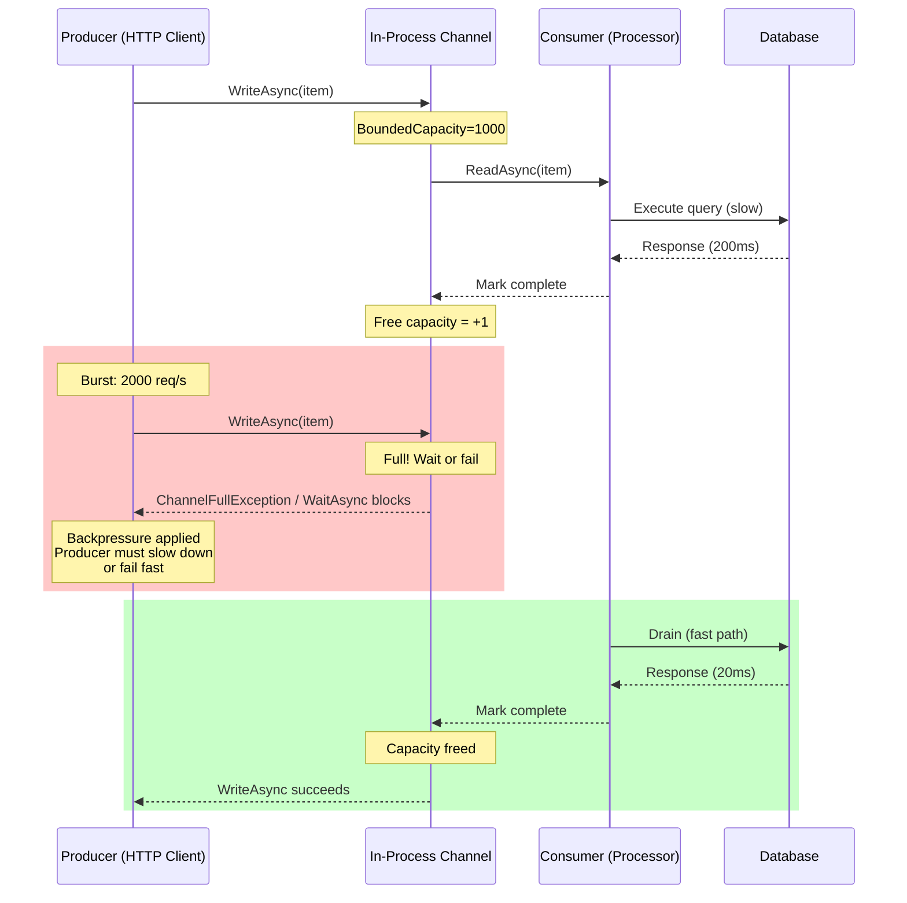
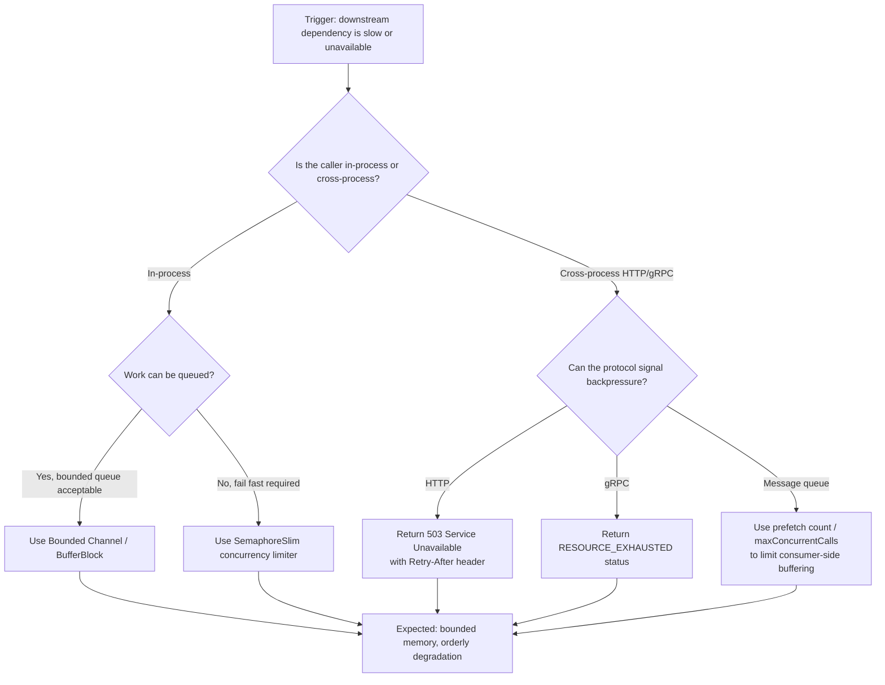

## Navigation

**Domain:** [[7 — System Design & Distributed Systems]] > **Group:** Scalability Patterns
**Previous:** [[7.237 — Connection Pooling — HTTP Connection Reuse]] | **Next:** [[7.239 — Queue-Based Load Leveling]]

### Prerequisites

- [[7.237 — Connection Pooling — HTTP Connection Reuse]] — HTTP connection pooling can mask backpressure; pooled connections holding requests that are slow to complete consume pool slots and prevent the pool from seeing the true downstream pressure
- [[7.206 — Horizontal vs Vertical Scaling — Tradeoffs]] — backpressure behavior changes with scale: at 2 instances, queueing hides it; at 20 instances, collective backpressure can cause coordinated thundering-herd retry
- [[7.427 — Retry Pattern — Exponential Backoff]] — retries without backpressure awareness amplify load; a fleet-wide retry storm is the most expensive consequence of missing backpressure

### Where This Fits

Backpressure is the flow-control mechanism that prevents a fast producer from overwhelming a slow consumer. In a .NET production system, backpressure appears in four places: TCP receive windows (kernel-level), ASP.NET Core request queueing (server-level), `Channel<T>` bounded capacity (in-process), and message broker prefetch limits (inter-service). Without backpressure, a slow downstream dependency causes unbounded in-memory queueing in the caller, eventually exhausting memory and triggering an OOM kill — not because the downstream failed, but because nothing told the upstream to slow down. Backpressure becomes architecturally significant above ~500 req/s per service instance or when any dependency's P99 latency exceeds 500ms, because at that point a single slow dependency can accumulate enough in-flight requests to consume all available memory in the caller.

---

## Core Mental Model

Backpressure is a signal propagating upstream that says "I am at capacity — stop sending until I drain." The invariant it maintains is that no component in the chain ever buffers more work than its configured capacity, preventing unbounded memory growth at every hop. What it trades is throughput under overload — instead of accepting all work and failing late (OOM), it rejects work early with a clear signal (HTTP 503, `Channel<T>` write failure, broker NACK). The recognition trigger in a .NET system is `TaskCanceledException` or `SemaphoreFullException` on a `Channel.Writer.WriteAsync` call, or HTTP 503 responses from a downstream service that has hit its `concurrentRequestLimit` — the system is telling you it cannot keep up.

### Classification

Backpressure operates at the flow-control layer of distributed systems — between the transport layer (TCP sliding window) and the application layer (load shedding, circuit breaking). It addresses the class of failure caused by producer/consumer rate mismatch. It explicitly does NOT solve: data loss during rejection (requires durable queue or retry), latency improvement (backpressure is a response to existing latency, not a cure), or capacity planning (backpressure tells you when you have a capacity problem but does not add capacity).



### Key Properties / Guarantees

|Property|Value|Condition|
|---|---|---|
|Memory bound|Fixed upper bound on pending work|When bounded capacity is configured|
|Producer fairness|All producers compete equally for capacity|Under FIFO or fair-scheduling consumer|
|Loss guarantee|Work is either processed or explicitly rejected|Consumer signals completion or failure|
|Latency impact|No impact at low load; adds queuing delay at high load|When consumer runs at >80% capacity|
|Throughput under load|Throughput = consumer capacity (not producer rate)|When backpressure is correctly propagated|

---

## Deep Mechanics

### How It Works

Backpressure in a .NET service follows a five-step chain from detection to propagation:

1. **Capacity reservation.** Each component in the processing pipeline declares a maximum concurrency or buffer size. For ASP.NET Core, this is `KestrelServerOptions.Limits.MaxConcurrentConnections` (default unlimited) or a configured `Channel<T>.BoundedCapacity`. For `SemaphoreSlim`, it is the initial count. For `HttpClient`, it is the connection pool limit (`max_connections`). The invariant: at any point, the sum of in-flight and queued work must never exceed this capacity.

2. **Admission control.** When a new request arrives, the component checks whether admitting it would exceed capacity. If capacity remains, the request enters the processing pipeline. If capacity is exhausted, the component either blocks (synchronous backpressure via `Channel<T>.WriteAsync` with `WaitToWriteAsync`) or rejects immediately (asynchronous backpressure via `TryWrite` returning `false`). The choice determines whether backpressure propagates as latency or as explicit failure.

3. **Work completion.** The consumer completes processing and releases the capacity slot. For `Channel<T>`, this means calling `Reader.Complete()` (terminal) or having the writer mark items as consumed. For `SemaphoreSlim`, this means `Release()`. For TCP, the kernel handles this when the application reads from the socket buffer, freeing space in the receive window.

4. **Capacity signal propagation.** The freed capacity allows the next waiting producer to proceed. In `Channel<T>`, the `WaitToWriteAsync` continuation resumes when capacity is available. In TCP, the kernel sends a window update to the sender, unblocking the sender's write. In a distributed system, this signal crosses process boundaries — the downstream freeing capacity causes its HTTP response to be sent, which unblocks the upstream's `HttpClient.SendAsync`.

5. **Backpressure chain.** Backpressure propagates upstream hop by hop. If Service A calls Service B, and B is slow, B's backpressure causes A's HTTP connection pool to fill with in-flight requests. A's connection pool exhaustion causes `HttpClient.SendAsync` to queue or fail, which propagates backpressure to A's request handler, which fills A's `Channel<T>`, which propagates to A's HTTP client, and so on back to the original caller. Each hop adds concurrency-limited queuing delay.

```csharp
// Bounded channel with backpressure — the core building block
public class OrderIngestionPipeline
{
    private readonly Channel<Order> _channel;
    private readonly IOrderProcessor _processor;
    private readonly ILogger<OrderIngestionPipeline> _logger;

    public OrderIngestionPipeline(
        IOrderProcessor processor,
        IConfiguration config,
        ILogger<OrderIngestionPipeline> logger)
    {
        _processor = processor;
        _logger = logger;

        var capacity = config.GetValue<int>("Ingestion:ChannelCapacity", 1000);
        _channel = Channel.CreateBounded<Order>(
            new BoundedChannelOptions(capacity)
            {
                FullMode = BoundedChannelFullMode.Wait,
                SingleReader = false,
                SingleWriter = false
            });
    }

    public async Task<bool> TryIngestAsync(
        Order order, CancellationToken ct)
    {
        // Backpressure point: wait for capacity or timeout
        try
        {
            using var timeoutCts = CancellationTokenSource
                .CreateLinkedTokenSource(ct);
            timeoutCts.CancelAfter(TimeSpan.FromSeconds(5));

            await _channel.Writer.WriteAsync(order, timeoutCts.Token);
            return true;
        }
        catch (OperationCanceledException) when (!ct.IsCancellationRequested)
        {
            _logger.LogWarning(
                "Order ingestion timed out — channel full. " +
                "Count: {Count}, Capacity: {Capacity}",
                _channel.Reader.Count,
                _channel.Reader.Capacity);
            return false;
        }
    }

    public async Task RunConsumerAsync(CancellationToken ct)
    {
        await foreach (var order in _channel.Reader.ReadAllAsync(ct))
        {
            try
            {
                await _processor.ProcessAsync(order, ct);
            }
            catch (Exception ex)
            {
                _logger.LogError(ex, "Failed to process order {OrderId}", order.Id);
                // Item is consumed from channel — already lost from buffer.
                // For reliability, use outbox + dead-letter instead.
            }
        }
    }
}
```

### Failure Modes

**Unbounded queue growth (missing backpressure).** The most common backpressure failure is the absence of backpressure entirely — an in-memory `ConcurrentQueue<T>` or `List<T>` that accepts work without any capacity limit. Under sustained load, the queue grows until the process runs out of memory and the OOM killer terminates it. Detection: `Private bytes` memory counter grows monotonically; GC heap size (especially LOH) increases with no plateau; `docker stats` shows memory usage climbing toward the container limit. Prevention: always use `Channel<T>` with `BoundedChannelOptions` instead of raw `ConcurrentQueue<T>`, or impose a `SemaphoreSlim` guard on any unbounded buffer.

**Backpressure deadlock (nested wait).** A producer waits for channel capacity, but the consumer is waiting for the producer's response to complete its work — a dependency cycle across the capacity boundary. Example: the consumer must call an external API to process each item, the external API calls back into the producer service, and the producer's channel is full. The producer blocks waiting for the consumer to free capacity; the consumer blocks waiting for the producer's API. Result: complete service hang. Detection: all threads in `WAITING` state on `Monitor.Enter` or `SemaphoreSlim.WaitAsync`; `dotnet-dump` shows a thread pool thread blocked on `Channel.Writer.WriteAsync` while n other threads are blocked on downstream HTTP calls. Prevention: never allow a consumer's processing path to synchronously call back into the producer's admission path; use `TryWrite` (fail-fast) rather than `WaitToWriteAsync` when a dependency cycle is possible.

**Cooperative backpressure failure (TCP window zero).** At the transport layer, a slow consumer causes the TCP receive window to shrink to zero, halting the sender. This is correct backpressure behavior. The failure mode occurs when the consumer application is not actually reading from the socket — the kernel buffer is full because the application thread is blocked doing CPU-bound work or GC. The TCP window stays at zero, and the sender stalls. This looks like a network problem but is actually application-level slowness. Detection: `netstat -n | findstr "CLOSE_WAIT"` showing connections in `CLOSE_WAIT` (application not closing the socket); perf counter `TCPv4\Connection Failures`. Prevention: use `ConfigureAwait(false)` to avoid blocking on async socket I/O; never do CPU-bound work on the thread that reads from the socket.

**Retry amplification (backpressure ignored).** A caller receives a 503 or timeout (backpressure signal) but immediately retries — often multiple times. Each retry re-enters the channel, consumes a slot, and adds pressure. With 20 instances all retrying simultaneously, the retry traffic can be 20x the original load, overwhelming the downstream completely. Detection: downstream reports traffic spikes of 5–20x normal during incidents; the upstream's retry count in `Polly` telemetry shows bursts of retries with zero delay. Prevention: use exponential backoff with jitter on all retries; implement a circuit breaker that stops retrying when the downstream is consistently rejecting; respect `Retry-After` headers.

```csharp
// Backpressure-aware retry using Polly v8
builder.Services.AddHttpClient("PaymentService", client =>
{
    client.BaseAddress = new Uri("https://payment.internal/api/");
})
.AddStandardResilienceHandler(options =>
{
    // Default retry: exponential backoff with jitter
    options.Retry.MaxRetryAttempts = 3;
    options.Retry.Delay = TimeSpan.FromMilliseconds(200);
    options.Retry.UseJitter = true;

    // Default circuit breaker: trip on 503 (backpressure)
    options.CircuitBreaker.SamplingDuration = TimeSpan.FromSeconds(30);
    options.CircuitBreaker.FailureRatio = 0.5;
    options.CircuitBreaker.MinimumThroughput = 10;
});

// The handler will NOT retry immediately on 503;
// it applies backoff first, and opens the circuit if the downstream stays busy.
```

### .NET and Azure Integration

- **ASP.NET Core Kestrel:** `KestrelServerOptions.Limits.MaxConcurrentConnections` (default 4294967295 — effectively unlimited) and `MaxConcurrentUpgradedConnections` for WebSocket. Kestrel also has `Http2Limits.MaxStreamsPerConnection` (default 100) which applies backpressure at the HTTP/2 stream level — when all streams are in use, new requests are queued in the ASP.NET Core server pipeline.
- **`Channel<T>`:** The idiomatic .NET bounded producer-consumer queue. `BoundedChannelFullMode` controls backpressure strategy: `Wait` (async blocking, full backpressure), `DropWrite` (silent loss), `DropNewest` (discard newest, keep oldest), `DropOldest` (discard oldest, keep newest). For reliable systems, use `Wait` with a timeout to distinguish transient slowdown from permanent failure.
- **`SemaphoreSlim`:** Lightweight concurrency limiter. Use `WaitAsync` to apply backpressure at the concurrency level — reject when all permits are taken. This is the simplest form of backpressure and often sufficient.
- **Azure Service Bus:** `ServiceBusProcessor.MaxConcurrentCalls` limits how many messages the SDK pulls into memory. Setting this too high (default 1 per partition) allows the broker to push messages faster than the consumer can process, shifting backpressure from the consumer to Azure Service Bus storage. Correct setting: match consumer throughput (msg/s × processing time = ideal max concurrent).
- **Polly v8:** `ResiliencePipeline` with `ConcurrencyLimiter` strategy uses `SemaphoreSlim` internally. Adding `RateLimiter` strategy imposes token-bucket backpressure. These prevent the caller from overwhelming the next hop.
- **Azure Container Apps (KEDA):** KEDA scalers detect queue depth (a backpressure indicator) and scale the consumer to match. While scaling adds capacity, backpressure handles the transient period before the new replica is ready (15–60 seconds). During that window, `Channel<T>` capacity absorbs the spike.
- **`System.Threading.Channels`:** .NET 5+, first-class async producer-consumer with backpressure. Always prefer over `BlockingCollection<T>` which blocks threads rather than using async coordination.

```csharp
// Program.cs — Kestrel concurrent connection limit
builder.WebHost.ConfigureKestrel(options =>
{
    options.Limits.MaxConcurrentConnections = 1000;
    options.Limits.MaxConcurrentUpgradedConnections = 100;
});

// SemaphoreSlim-based concurrency limiter for an external API client
builder.Services.AddSingleton(new SemaphoreSlim(10, 10));

// Usage in a service
public class PaymentClient
{
    private readonly SemaphoreSlim _concurrencyLimit;
    private readonly HttpClient _httpClient;

    public PaymentClient(
        IHttpClientFactory httpClientFactory,
        SemaphoreSlim concurrencyLimit)
    {
        _httpClient = httpClientFactory.CreateClient("PaymentService");
        _concurrencyLimit = concurrencyLimit;
    }

    public async Task<PaymentResponse> ChargeAsync(
        PaymentRequest request, CancellationToken ct)
    {
        // Backpressure: wait for a concurrency slot
        if (!await _concurrencyLimit.WaitAsync(TimeSpan.FromSeconds(10), ct))
        {
            throw new PaymentServiceBusyException(
                "All payment connections are in use. Retry later.");
        }

        try
        {
            return await _httpClient.PostAsJsonAsync(
                "/api/charge", request, ct);
        }
        finally
        {
            _concurrencyLimit.Release();
        }
    }
}
```

---

## Production Patterns and Implementation

### Primary Implementation

A backpressure-aware ingestion and processing pipeline for an order processing system, using `Channel<T>` for in-process flow control and `SemaphoreSlim` for downstream API concurrency limiting.

```csharp
// Port | Adapter — Order ingestion pipeline with backpressure

public sealed record OrderIngestionOptions
{
    public int ChannelCapacity { get; init; } = 1000;
    public int MaxConcurrentShipmentCalls { get; init; } = 20;
    public TimeSpan IngestionTimeout { get; init; } = TimeSpan.FromSeconds(5);
    public TimeSpan DrainTimeout { get; init; } = TimeSpan.FromSeconds(30);
}

// Port — ingestion abstraction
public interface IOrderIngestionPort
{
    ValueTask<bool> TryIngestAsync(Order order, CancellationToken ct);
    ValueTask<int> GetPendingCountAsync();
}

// Adapter — implementation with backpressure
public sealed class BoundedOrderIngestionAdapter : IOrderIngestionPort, IAsyncDisposable
{
    private readonly Channel<Order> _channel;
    private readonly OrderIngestionOptions _options;
    private readonly ILogger<BoundedOrderIngestionAdapter> _logger;
    private readonly SemaphoreSlim _shipmentThrottle;
    private int _disposed;

    public BoundedOrderIngestionAdapter(
        IOptions<OrderIngestionOptions> options,
        ILogger<BoundedOrderIngestionAdapter> logger)
    {
        _options = options.Value;
        _logger = logger;
        _shipmentThrottle = new SemaphoreSlim(
            _options.MaxConcurrentShipmentCalls);

        _channel = Channel.CreateBounded<Order>(
            new BoundedChannelOptions(_options.ChannelCapacity)
            {
                FullMode = BoundedChannelFullMode.Wait,
                SingleReader = false,
                SingleWriter = false
            });
    }

    public async ValueTask<bool> TryIngestAsync(
        Order order, CancellationToken ct)
    {
        try
        {
            using var linkedCts = CancellationTokenSource
                .CreateLinkedTokenSource(ct);
            linkedCts.CancelAfter(_options.IngestionTimeout);

            await _channel.Writer.WriteAsync(order, linkedCts.Token);

            Log.ChannelUtilization(
                _logger, _channel.Reader.Count, _channel.Reader.Capacity);

            return true;
        }
        catch (OperationCanceledException) when (!ct.IsCancellationRequested)
        {
            _logger.LogWarning(
                "Ingestion timeout after {Timeout}. " +
                "Channel at {Count}/{Capacity}. Rejecting order {OrderId}.",
                _options.IngestionTimeout,
                _channel.Reader.Count,
                _channel.Reader.Capacity,
                order.Id);

            return false;
        }
    }

    public async Task RunConsumerAsync(
        IShipmentProcessor shipmentProcessor,
        CancellationToken ct)
    {
        try
        {
            await foreach (var order in _channel.Reader.ReadAllAsync(ct))
            {
                try
                {
                    await _shipmentThrottle.WaitAsync(ct);

                    // Fire-and-forget with tracking — avoid captures
                    var captured = order;
                    _ = ProcessShipmentInternalAsync(
                        captured, shipmentProcessor, ct);
                }
                catch (OperationCanceledException)
                {
                    // Shutdown requested — re-enqueue? depends on SLA.
                    // Here: log and allow graceful drain.
                    _logger.LogWarning(
                        "Shutdown requested with {Count} pending orders.",
                        _channel.Reader.Count);
                    throw;
                }
            }
        }
        catch (OperationCanceledException) when (ct.IsCancellationRequested)
        {
            _logger.LogInformation("Consumer shutting down gracefully.");
        }
    }

    private async Task ProcessShipmentInternalAsync(
        Order order,
        IShipmentProcessor shipmentProcessor,
        CancellationToken ct)
    {
        try
        {
            await shipmentProcessor.ProcessShipmentAsync(order, ct);
        }
        catch (Exception ex)
        {
            _logger.LogError(
                ex,
                "Shipment processing failed for order {OrderId}. " +
                "Order data: {Data}",
                order.Id,
                order);
        }
        finally
        {
            _shipmentThrottle.Release();
        }
    }

    public ValueTask<int> GetPendingCountAsync() =>
        ValueTask.FromResult(_channel.Reader.Count);

    public async ValueTask DisposeAsync()
    {
        if (Interlocked.Exchange(ref _disposed, 1) != 0)
            return;

        _channel.Writer.TryComplete();
        using var drainCts = new CancellationTokenSource(_options.DrainTimeout);
        await _channel.Reader.WaitToReadAsync(drainCts.Token)
            .AsTask()
            .WaitAsync(_options.DrainTimeout);

        _shipmentThrottle.Dispose();
    }
}
```

### Configuration and Wiring

```csharp
// Program.cs — backpressure pipeline registration
builder.Services.Configure<OrderIngestionOptions>(
    builder.Configuration.GetSection("Ingestion"));

builder.Services.AddSingleton<IOrderIngestionPort,
    BoundedOrderIngestionAdapter>();

builder.Services.AddHostedService<OrderIngestionBackgroundService>();

// appsettings.json
{
    "Ingestion": {
        "ChannelCapacity": 1000,
        "MaxConcurrentShipmentCalls": 20,
        "IngestionTimeout": "00:00:05",
        "DrainTimeout": "00:00:30"
    }
}

// Background service wiring
public sealed class OrderIngestionBackgroundService : BackgroundService
{
    private readonly BoundedOrderIngestionAdapter _adapter;
    private readonly IShipmentProcessor _processor;

    public OrderIngestionBackgroundService(
        IOrderIngestionPort ingestionPort,
        IShipmentProcessor processor)
    {
        _adapter = (BoundedOrderIngestionAdapter)ingestionPort;
        _processor = processor;
    }

    protected override Task ExecuteAsync(CancellationToken ct) =>
        _adapter.RunConsumerAsync(_processor, ct);
}
```

### Common Variants

**Fail-fast variant (no queuing).** Instead of waiting for capacity, reject immediately when the channel is full. This avoids queuing delay but loses the work — appropriate when the caller can retry elsewhere or the work is not critical.

```csharp
// Fail-fast variant — immediate rejection at capacity
var channel = Channel.CreateBounded<Order>(
    new BoundedChannelOptions(100)
    {
        FullMode = BoundedChannelFullMode.DropWrite
    });

public bool TryIngest(Order order)
{
    return channel.Writer.TryWrite(order);
}
```

**Discard oldest variant (stale-work shedding).** When the channel is full, drop the oldest pending item. Appropriate for real-time data where processing stale data is worse than dropping it — stock ticks, IoT sensor readings, live dashboards.

```csharp
// Stale-work shedding — drop oldest when at capacity
var channel = Channel.CreateBounded<StockTick>(
    new BoundedChannelOptions(100)
    {
        FullMode = BoundedChannelFullMode.DropOldest
    });
```

**Throttled HTTP client variant (SemaphoreSlim per endpoint).** Apply backpressure at the HTTP client level rather than in-process queueing. Each downstream endpoint gets its own `SemaphoreSlim` that limits concurrent calls.

```csharp
// Per-endpoint concurrency limiter
public class BackpressureAwareHttpClient
{
    private readonly ConcurrentDictionary<string, SemaphoreSlim> _throttles;
    private readonly HttpClient _client;

    public BackpressureAwareHttpClient(HttpClient client)
    {
        _client = client;
        _throttles = new ConcurrentDictionary<string, SemaphoreSlim>();
    }

    public async Task<HttpResponseMessage> SendWithBackpressureAsync(
        HttpRequestMessage request,
        int maxConcurrency,
        CancellationToken ct)
    {
        var key = request.RequestUri?.Host ?? "default";
        var throttle = _throttles
            .GetOrAdd(key, _ => new SemaphoreSlim(maxConcurrency));

        if (!await throttle.WaitAsync(
            TimeSpan.FromSeconds(30), ct))
        {
            return new HttpResponseMessage(HttpStatusCode.ServiceUnavailable)
            {
                Content = new StringContent(
                    $"Concurrency limit of {maxConcurrency} reached for {key}")
            };
        }

        try
        {
            return await _client.SendAsync(request, ct);
        }
        finally
        {
            throttle.Release();
        }
    }
}
```

### Real-World .NET Ecosystem Example

**Polly v8 `ConcurrencyLimiter`** is a production backpressure strategy that wraps `SemaphoreSlim`. You add it to a `ResiliencePipeline` with other strategies:

```csharp
// Polly v8 ConcurrencyLimiter — production backpressure strategy
builder.Services.AddResiliencePipeline("OrderProcessing", builder =>
{
    builder
        .AddConcurrencyLimiter(10)
        .AddRetry(new RetryStrategyOptions
        {
            MaxRetryAttempts = 3,
            Delay = TimeSpan.FromMilliseconds(200),
            BackoffType = DelayBackoffType.Exponential,
            UseJitter = true
        })
        .AddCircuitBreaker(new CircuitBreakerStrategyOptions
        {
            SamplingDuration = TimeSpan.FromSeconds(30),
            MinimumThroughput = 10,
            FailureRatio = 0.5
        });
});

// This pipeline ensures:
// 1. No more than 10 concurrent executions
// 2. Retries with backoff on transient failure
// 3. Circuit opens if 50% of 10 requests fail in 30s
```

**Azure SDK `MaxConcurrentCalls`** on `ServiceBusProcessor`:

```csharp
// Azure Service Bus — configure backpressure at the receiver
var processor = serviceBusClient.CreateProcessor(
    "orders", "shipment-processor",
    new ServiceBusProcessorOptions
    {
        MaxConcurrentCalls = 10,    // ← backpressure: max 10 in-flight
        AutoCompleteMessages = false,
        MaxAutoLockRenewalDuration = TimeSpan.FromMinutes(5)
    });
```

---

## Gotchas and Production Pitfalls

### No Bounded Capacity

**Pitfall:** Using `ConcurrentQueue<T>`, `List<T>`, or a raw `Queue<T>` for in-process buffering without any capacity limit. The engineer thinks "it will level out eventually" and the queue grows unbounded.

```csharp
// ❌ Unbounded queue — no backpressure
private readonly ConcurrentQueue<Order> _queue = new();

public void Enqueue(Order order)
{
    _queue.Enqueue(order);  // Never blocks, never fails
}
```

**Symptom:** Memory grows linearly with load. Container OOMKilled after a traffic spike. In `docker stats`, memory usage climbs from 200 MB to 1.5 GB over minutes, then the process disappears.

**Fix:** Use `Channel<T>` with `BoundedChannelOptions` or impose a `SemaphoreSlim` guard:

```csharp
// ✅ Bounded channel — backpressure at capacity
private readonly Channel<Order> _channel = Channel.CreateBounded<Order>(
    new BoundedChannelOptions(1000));
```

**Cost of not fixing:** OOM kill during any traffic burst exceeding sustained throughput. Pod restart cycle: restart → catch up → burst → OOM → restart. No processing during restart. Data in the queue at the time of OOM is lost entirely.

### Backpressure Deadlock (Cross-Dependency Cycle)

**Pitfall:** The consumer calls back into the producer while the producer's channel is full, creating a nested dependency cycle that deadlocks the thread.

```csharp
// ❌ Deadlock: consumer calls producer while producer is at capacity
public class OrderConsumer
{
    private readonly Channel<Order> _channel;
    private readonly PaymentServiceClient _paymentClient;

    public async Task ConsumeAsync()
    {
        await foreach (var order in _channel.Reader.ReadAllAsync())
        {
            // Payment client calls back to this service's API
            // If producer channel is full, this hangs forever
            var result = await _paymentClient.ProcessPaymentAsync(order);
        }
    }
}
```

**Symptom:** `TaskCanceledException` after timeout on all requests; thread pool starvation; no requests processed after the deadlock occurs; `dotnet-dump` shows threads stuck on `Channel.Writer.WriteAsync` and `Channel.Reader.ReadAsync` simultaneously.

**Fix:** Use `TryWrite` (fail-fast) in the producer when the consumer path can call back into the producer. Or use a separate channel for the callback path.

```csharp
// ✅ Break the cycle: fail-fast on the callback channel
public async ValueTask<bool> TryIngestCallbackAsync(
    CallbackEvent evt, CancellationToken ct)
{
    return _callbackChannel.Writer.TryWrite(evt);
}
```

**Cost of not fixing:** Complete service unavailability. The entire request pipeline hangs. Health checks fail. Kubernetes restarts the pod. Data may be lost if the channel writer never completed.

### Thread Pool Starvation from Blocking Backpressure

**Pitfall:** Using `Channel.Write()` (synchronous) or `Thread.Sleep()` to slow down a producer inside an async method. This blocks a thread pool thread, causing thread pool starvation and amplifying the backpressure problem.

```csharp
// ❌ Blocking the thread pool under backpressure
public async Task<IActionResult> IngestOrder(Order order)
{
    while (!_channel.Writer.TryWrite(order))
    {
        Thread.Sleep(10);  // Blocking thread pool thread!
    }
    return Ok();
}
```

**Symptom:** Thread pool injection events in `dotnet-counters` under `System.Runtime\threadpool-injection-count` spike. Requests queue in ASP.NET Core thread pool with increasing latency. P99 goes from 50ms to 10s. CPU usage stays moderate but throughput drops to near zero.

**Fix:** Use `await Channel.Writer.WriteAsync(order)` — async waiting that does not block a thread:

```csharp
// ✅ Async backpressure — no thread pool blocking
public async Task<IActionResult> IngestOrder(
    Order order, CancellationToken ct)
{
    try
    {
        await _channel.Writer.WriteAsync(order, ct);
        return Accepted();
    }
    catch (OperationCanceledException)
    {
        return StatusCode(503, "Service busy");
    }
}
```

**Cost of not fixing:** Thread pool starvation cascades: the few remaining threads are all blocking, new requests cannot enter, health checks time out, the pod is restarted. Without a blocking fix, the service self-DOSes under moderate load.

### Ignoring TCP Backpressure Signals

**Pitfall:** The application reads from a TCP socket using a small internal buffer (e.g., 1 KB), forcing many reads per response. On the kernel side, the TCP receive window can shrink to zero without the application code being aware, causing the sender to stall.

**Symptom:** Intermittent timeouts on inter-service HTTP calls that correlate with large response payloads. `netstat` shows connections in `CLOSE_WAIT` or with `Recv-Q` growing. The sender sees retransmissions.

**Fix:** Use `HttpClient` with proper buffer sizes. Prefer streaming for large payloads. Never wrap sync I/O in async wrappers.

```csharp
// ✅ Proper streaming HTTP — respects TCP flow control
public async Task ProcessLargePayloadAsync(Stream payload, CancellationToken ct)
{
    using var httpResponse = await _httpClient.GetAsync(
        "/api/large-data",
        HttpCompletionOption.ResponseHeadersRead,  // ← streaming
        ct);

    await using var stream = await httpResponse.Content.ReadAsStreamAsync(ct);
    await stream.CopyToAsync(payload, ct);
}
```

**Cost of not fixing:** Intermittent network partitions in multi-region deployments. The sender retries, adding load. The receiver accumulates more connections in `CLOSE_WAIT`, eventually hitting file descriptor limits. Cascading failure across the region.

### No Distinction Between Transient and Persistent Backpressure

**Pitfall:** Treating all backpressure signals (503, timeout, channel full) the same. Transient backpressure (GC pause, 100ms latency spike) should be retried. Persistent backpressure (downstream at 100% CPU) should stop retrying and shed load.

```csharp
// ❌ Blind retry — treats all backpressure as transient
var pipeline = new ResiliencePipelineBuilder()
    .AddRetry(new RetryStrategyOptions
    {
        MaxRetryAttempts = 10,
        Delay = TimeSpan.FromMilliseconds(10)  // No backoff!
    })
    .Build();
```

**Fix:** Use circuit breaker to distinguish transient from persistent:

```csharp
// ✅ Circuit breaker distinguishes transient from persistent backpressure
var pipeline = new ResiliencePipelineBuilder()
    .AddRetry(new RetryStrategyOptions
    {
        MaxRetryAttempts = 2,
        Delay = TimeSpan.FromMilliseconds(100),
        BackoffType = DelayBackoffType.Exponential,
        UseJitter = true
    })
    .AddCircuitBreaker(new CircuitBreakerStrategyOptions
    {
        SamplingDuration = TimeSpan.FromSeconds(30),
        FailureRatio = 0.3,
        MinimumThroughput = 20
    })
    .Build();
```

**Cost of not fixing:** Persistent backpressure + aggressive retries = retry storm. Downstream eventually recovers but is immediately hit by 10x the original traffic from retries. Goes down again. Cycle repeats (retry storm cascade).

### Bounded Capacity Set Too Low

**Pitfall:** Setting `Channel<T>` capacity to match normal throughput without accounting for burst tolerance. A 100-capacity channel on a service that normally processes 80 req/s with 1 second processing time leaves only 20 slots for burst. A 50% traffic spike instantly fills the channel and starts rejecting valid requests.

**Symptom:** Rejections (503s) during normal traffic spikes (lunch hour, release deployment). Metrics show `channel_count` hitting capacity daily at the same time. The team blames "traffic spikes" but the system is correctly rejecting — capacity is just too tight.

**Fix:** Size channel capacity as `consumer_throughput × max_acceptable_queuing_latency + burst_buffer`. If processing takes 200ms and you can tolerate 10s of queuing delay, that's 50 slots per consumer. With 2 consumers and 50% headroom:

```csharp
// ✅ Correctly sized channel
// Processing: 200ms avg, 500ms P99
// Tolerated queuing: 10s → 20 items per consumer at P99
// Consumers: 2
// Burst buffer: 50%
var capacity = (int)(20 * 2 * 1.5); // = 60
var channel = Channel.CreateBounded<Order>(
    new BoundedChannelOptions(capacity));
```

**Cost of not fixing:** False alarms from backpressure-induced 503s degrade API SLO. Ops team increases replica count, which helps the symptom but not the root cause (capacity modeling). Cloud costs increase for unnecessary replicas.

### Dropping Data with DropWrite Without Alerting

**Pitfall:** Using `BoundedChannelFullMode.DropWrite` without monitoring the drop rate. `TryWrite` returns `false` silently — the caller must check the return value. Many callers don't.

```csharp
// ❌ Silent drop — caller ignores TryWrite return value
_channel.Writer.TryWrite(order);
// order is silently lost if channel is full
```

**Symptom:** End-users report missing data. "My order confirmation email never arrived." "The dashboard shows yesterday's data but not today's." The drop event is invisible in logs because it's not logged.

**Fix:** Always log drops. Use a wrapper that records rejection metrics:

```csharp
// ✅ Instrumented write wrapper
public bool TryWriteWithMetrics(Order order)
{
    if (_channel.Writer.TryWrite(order))
    {
        _metrics.RecordIngestionAccepted();
        return true;
    }

    _metrics.RecordIngestionRejected();
    _logger.LogWarning(
        "Order {OrderId} dropped — channel full. " +
        "Pending: {Count}/{Capacity}",
        order.Id,
        _channel.Reader.Count,
        _channel.Reader.Capacity);
    return false;
}
```

**Cost of not fixing:** Silent data loss erodes customer trust. Debugging takes hours because no log evidence exists. Every `DropWrite` silent rejection is a bug that only manifests in production under load.

---

## Tradeoffs and Decision Framework

### Tradeoff Matrix

| Dimension | Bounded Channel (Wait) | SemaphoreSlim (Reject) | TCP Backpressure (Kernel) |
|---|---|---|---|
| Consistency | All work accepted up to capacity; queued in order | Work rejected immediately at capacity | Data stays in kernel buffer; never lost but sender blocked |
| Availability | Degraded — 503s after queue saturation | Degraded — immediate 503s | Degraded — sender stalls |
| Latency | Adds queuing delay = queue_depth × processing_time | No queuing delay; fail fast | Adds kernel buffering delay |
| Operational complexity | Must size capacity; monitor utilization | Low — just set max concurrency | None — kernel handles it automatically |
| Team expertise required | Moderate — must understand producer-consumer patterns | Low — SemaphoreSlim is well-understood | Low — but debugging TCP issues requires sysadmin skills |
| .NET ecosystem fit | `Channel<T>` is idiomatic .NET | `SemaphoreSlim` is in BCL | `Socket`/`NetworkStream` — no middleware for application backpressure |

### When to Apply



### When NOT to Apply

- [ ] **Single-process, single-threaded, no concurrency.** If the code is purely sequential with no parallelism, backpressure is unnecessary — there is no producer/consumer rate mismatch.
- [ ] **Throughput below 50 req/s with sub-10ms processing.** The cost of adding a `Channel<T>` and monitoring its capacity far exceeds any benefit. The in-memory buffer of a single request is trivial.
- [ ] **Batch processing with explicit throttling.** If a batch job already controls its pace (e.g., `foreach(var item in items.Take(100))`), adding backpressure adds complexity without value.
- [ ] **Downstream dependency has its own backpressure that propagates correctly.** If the downstream already returns 503 or uses TCP flow control effectively, adding another backpressure layer in the caller duplicates effort and adds latency.
- [ ] **The data must never be dropped.** Backpressure only prevents acceptance — it does not guarantee processing. If data loss is unacceptable, use a durable queue (Azure Service Bus, RabbitMQ) instead of in-process `Channel<T>`.

### Scale Thresholds

- **"Worth considering above ~200 req/s per instance"** — below this, a single thread pool thread can handle the load and queuing is negligible
- **"Required when P99 latency of any downstream dependency exceeds 1 second"** — slow downstream causes in-flight request accumulation that can exhaust memory without backpressure
- **"Required when the service has 3+ downstream dependencies"** — the probability that at least one dependency is slow increases, and the sum of in-flight requests across all dependencies can exceed memory
- **"Justified when the caller retries on failure"** — retries without backpressure awareness create an amplification loop; the retry storm multiplies the load by (retry count × instance count)
- **"Bounded channel capacity heuristic: (processing_time_ms / 1000) × target_qps × tolerable_queue_seconds"** — e.g., if processing takes 200ms, QPS is 500, tolerable queue is 5s: 0.2 × 500 × 5 = 500 slots

---

## Interview Arsenal

### Question Bank

1. **What is backpressure and what problem does it solve?**
2. **How does `Channel<T>` implement backpressure in .NET?**
3. **What do you trade off when you add backpressure to a system?**
4. **What happens when a producer ignores backpressure signals from the consumer?**
5. **Compare backpressure with circuit breaker — when would you use each?**
6. **Design a rate-limited API that applies backpressure to a chatty client.**
7. **How does backpressure behavior change when a service scales from 2 to 20 instances?**
8. **What is the relationship between TCP receive window and application-level backpressure?**

### Spoken Answers

**Q: What is backpressure and what problem does it solve?**

> **Average answer:** Backpressure is a way for a consumer to tell a producer to slow down. It prevents the system from being overwhelmed.

> **Great answer:** Backpressure is the mechanism by which a consumer signals its capacity to a producer, maintaining the invariant that no component buffers more work than its configured limit. The problem it solves is unbounded memory growth from producer-consumer rate mismatch — without backpressure, a slow downstream causes the caller's in-flight queue to grow until the process OOMs. In .NET, backpressure shows up at four layers: the TCP receive window in the kernel, `Channel<T>.BoundedChannelFullMode.Wait` at the application layer, `SemaphoreSlim.WaitAsync` for concurrency limiting, and `ServiceBusProcessor.MaxConcurrentCalls` for message broker integration. The key tradeoff is that backpressure trades throughput under overload for predictable memory usage — instead of accepting all work and dying, it rejects work early with a clear 503 or `ChannelFullException`.

**Q: Compare backpressure with circuit breaker — when would you use each?**

> **Average answer:** A circuit breaker stops calling a failing service. Backpressure slows down the producer. They are different things.

> **Great answer:** Backpressure and circuit breaker solve related but distinct problems. Backpressure manages the rate of work admission — it prevents a fast producer from overwhelming a slow consumer. The circuit breaker detects that the consumer has failed and prevents the caller from wasting resources on calls that will fail. Backpressure operates at the concurrency/buffer level, circuit breaker operates at the error-rate level. You use them together: backpressure manages the admission queue while the circuit breaker monitors the error rate. When backpressure causes timeouts (caller waits for a slot), the circuit breaker sees those timeouts as failures and opens. When the circuit is open, backpressure becomes irrelevant because no calls are attempted. In .NET, Polly v8 composes both: `ConcurrencyLimiter` (backpressure) → `Retry` → `CircuitBreaker`. Without backpressure, the circuit breaker might never see enough failures to trip because the caller blocks indefinitely in the queue.

**Q: What is the relationship between TCP receive window and application-level backpressure?**

> **Great answer:** The TCP receive window is the kernel-level backpressure mechanism. The receiver advertises a window size — the amount of data it can accept. If the application does not read from the socket, the window shrinks. When it reaches zero, the sender stops transmitting. This is kernel backpressure. The relationship with application backpressure is that application-level backpressure (Channel capacity full) manifests as TCP backpressure at the wire level — the application stops reading from the socket because it cannot process more data, the kernel buffer fills, the TCP window shrinks to zero, and the sender stalls. The failure mode is when the application is CPU-bound or blocked on GC: the socket is not being read, TCP window goes to zero, and the sender sees a stalled connection that looks like a network problem. Detection is `netstat` showing `Recv-Q` growing and `Send-Q` stalled. In ASP.NET Core, this is why `ConfigureAwait(false)` matters — you must not block the thread that reads the socket.

### System Design Interview Trigger

If an interviewer asks you to design a real-time processing pipeline (order processing, analytics ingestion, notification delivery) and then asks "what happens when the database is slow" or "how do you handle a traffic spike that exceeds capacity," they are testing whether you know about backpressure. The specific concepts they probe are: bounded queue sizing, propagation of pressure across service boundaries, and the difference between queueing and dropping under overload. The senior candidate answers by naming the exact capacity model — "we set the channel to 500 items, which gives us 10 seconds of buffer at 50 QPS, and when it fills we return 503 with Retry-After: 30" — rather than a hand-wavy "we use a queue."

### Comparison Table

| | Backpressure | Circuit Breaker |
|---|---|---|
| Core guarantee | Bounds in-flight work to configured capacity | Detects persistent failure and prevents calls |
| Trade-off | Adds queuing delay under load | Adds cold-start delay after recovery (half-open) |
| .NET implementation | `Channel<T>`, `SemaphoreSlim`, `ConcurrencyLimiter` | `CircuitBreakerStrategyOptions` in Polly v8 |
| Failure mode | Backpressure deadlock (cyclic dependency) | Premature opening on transient spikes |
| When to choose | Consumer is slow but will eventually recover | Consumer is consistently failing |

---

## Architecture Decision Record

**Status:** Accepted

**Context:** The order ingestion service receives HTTP POST requests from storefronts at a rate of ~800 req/s during peak hours. Each request requires validation (100ms), enrichment (200ms call to catalog service), and shipment processing (300ms call to logistics API). The logistics API has unpredictable latency — P50 is 250ms, P99 is 2s — and occasionally becomes slow during carrier batch cycles. Without backpressure, a slow logistics API causes in-flight requests to accumulate in the enrichment service's memory, leading to OOM kills at ~2,000 concurrent requests (2 GB container limit, ~1 MB per in-flight request).

**Options Considered:**

1. **Bounded Channel with Wait** — Use `Channel<T>` with `BoundedChannelFullMode.Wait` to queue requests up to a configured capacity and block producers when full. The caller (storefront) waits for capacity with a 5-second timeout, then receives 503.
2. **SemaphoreSlim fail-fast** — Use `SemaphoreSlim` at the HTTP handler level to limit concurrency to a fixed number. Reject immediately (503) when all permits are taken.
3. **No backpressure (unbounded queue)** — Use `ConcurrentQueue<T>` or `BlockingCollection<T>` without capacity limit. Accept all work and rely on scaling to keep up.

**Decision:** Bounded Channel with Wait, because it provides the best balance of burst tolerance (the channel absorbs traffic spikes up to capacity), data preservation (no work is dropped during the wait — data is only lost if the caller gives up after the timeout), and predictable memory usage (the capacity × max item size gives a precise upper bound on memory consumption). The fail-fast option was rejected because the logistics API's P99 latency variability means many legitimate requests would be rejected during normal spike periods. The unbounded queue was rejected because it guarantees OOM death during logistics API slowdowns.

**Consequences:**
- ✅ Memory consumption is bounded at 500 items × ~1 MB = 500 MB peak (below the 2 GB container limit)
- ✅ Burst tolerance: at 800 req/s with 500ms processing, a 10-second logistics API slowdown fills 500 slots (625 req), giving ~0.8 seconds of buffer before rejection
- ✅ Storefront clients receive clear 503 signals and can retry with backoff
- ⚠️ Monitoring required: channel utilization, rejection rate, processing latency — must alert when utilization exceeds 80%
- ❌ During peak + slow logistics, some storefront requests are rejected and must be retried by the client, adding latency to those requests

**Review Trigger:** Revisit this decision if the logistics API P99 exceeds 5 seconds (current capacity model assumes max 2s) or if storefront clients report unacceptable rejection rates (>1% of requests receiving 503 during normal operation).

---

## Self-Check

### Conceptual Questions

1. Define backpressure in one sentence without using the phrase "slow down."
2. Derive the relationship between bounded capacity, processing latency, and memory consumption in a producer-consumer pipeline.
3. Given a service that calls two downstream APIs with different latency profiles, how would you apply backpressure independently per dependency?
4. What metric would you alert on to detect that backpressure is about to cause request rejection?
5. What is the name of the `System.Threading.Channels` enum that controls behavior when a bounded channel is full?
6. How is backpressure different from rate limiting? When would you use each?
7. Below what throughput threshold is backpressure infrastructure unnecessary?
8. Connect backpressure to the TCP sliding window protocol.
9. What happens to requests in flight when a `Channel<T>` consumer throws an unhandled exception?
10. Explain backpressure in 60 seconds to a non-technical product manager.

<details>
<summary>Answers</summary>

1. Backpressure is a feedback signal from a consumer to a producer indicating that the consumer's capacity to process work has been reached, causing the producer to either wait or fail rather than continue sending.
2. `Memory upper bound = bounded_capacity × max_item_size`. If capacity is 1,000 and each item is 50 KB, the channel can consume at most 50 MB regardless of how fast the producer sends. Processing latency determines how quickly capacity is freed: `free_rate = 1 / p99_processing_time × consumer_count`. If P99 latency is 500ms with 4 consumers, the free rate is 8 items/second — the producer must match this rate or the channel fills.
3. Use separate `Channel<T>` instances or `SemaphoreSlim` instances per dependency. Each downstream API gets its own capacity spec: high-volume/low-latency API gets a larger channel, low-volume/high-latency API gets a smaller concurrency limit. This prevents one slow API from consuming capacity that should be available to the other.
4. Alert on `channel_utilization_percent > 80` (where utilization = `reader.Count / reader.Capacity`). A sustained utilization above 80% means the next traffic spike will trigger rejections. Alert on `channel_rejection_rate > 0.01` (1% of write attempts fail) to detect ongoing rejections.
5. `BoundedChannelFullMode`. The values are: `Wait` (async blocking), `DropWrite` (silent discard), `DropNewest` (discard newest, keep oldest), `DropOldest` (discard oldest, keep newest).
6. Backpressure is reactive — it responds to the consumer being unable to keep up. Rate limiting is proactive — it prevents the producer from exceeding a configured rate regardless of consumer capacity. You use backpressure when the consumer's capacity is the bottleneck; you use rate limiting when you must enforce a contractual or resource boundary regardless of consumer health. In .NET, backpressure uses `Channel<T>` or `SemaphoreSlim`; rate limiting uses `System.Threading.RateLimiting` or `Polly.RateLimiter`.
7. Below ~50 req/s per instance with sub-10ms processing. At this level, an unbounded approach is fine — the memory consumed by the few in-flight requests is negligible (<1 MB), and the cost of adding `Channel<T>` with monitoring outweighs the benefit.
8. The TCP receive window is the original backpressure mechanism. The receiver advertises a window (the amount of data it can buffer). When the window reaches zero, the sender cannot transmit. Application-level backpressure (e.g., `Channel<T>.Wait`) sits on top of this: when the channel is full, the application stops reading from the socket, the kernel's receive buffer fills, the TCP window shrinks to zero, and the sender stalls. They are the same concept at different layers of the stack.
9. The item is consumed from the channel and lost unless there is a compensating action. `Channel<T>` moves items through the `Writer.TryWrite`/`Reader.ReadAsync` boundary — once read, the consumer owns the item. If the consumer throws, the item is gone from the channel. For reliability, wrap consumer logic in try/catch and write failed items to a dead-letter channel or durable queue.
10. "Imagine a conveyor belt moving packages into a warehouse. If the workers inside are slow, the belt keeps pushing packages. Eventually the entry area fills up and packages fall on the floor — that's an OOM crash. Backpressure is a sensor that stops the belt when the entry area is full, so packages queue at the sender instead of falling on the floor. The sender knows the warehouse can't accept more, so it waits or tells the truck to come back later."

</details>

---

### Scenario Challenges

**Scenario 1 — Diagnose the problem**

An e-commerce order ingestion service runs at 500 req/s with 4 instances. During a flash sale, traffic spikes to 2,000 req/s. All instances show memory climbing from 300 MB to 1.8 GB over 3 minutes, then the pods are OOMKilled by Kubernetes. After restart, the pattern repeats. No errors are logged before the kill — the service simply disappears.

<details>
<summary>Diagnosis</summary>

**Root cause:** The service uses `ConcurrentQueue<Order>` for its ingestion pipeline with no capacity limit. During the flash sale, each order remains in memory for the full processing duration (~2 seconds including external API calls). At 2,000 req/s across 4 instances (500 req/s each), each instance accumulates 1,000 in-flight orders at 1 MB each, consuming 1 GB of memory. Container limit is 2 GB, but GC + object overhead pushes it past the limit.

**Evidence:** Memory metrics show a linear climb with no plateau. No 503s or rejection logs — the service accepted everything until it died. `dotnet-dump` investigation would show thousands of `Order` objects in the Large Object Heap.

**Fix:** Replace `ConcurrentQueue<Order>` with `Channel<Order>` bounded at 500 capacity per instance. Configure `BoundedChannelFullMode.Wait` with a 5-second timeout. When the channel fills, return 503.

**Prevention:** Add a capacity budget to every in-process queue during design review: `max_memory = capacity × max_item_size`. Enforce with architecture fitness tests.

</details>

---

**Scenario 2 — Design decision**

You are designing a notification delivery pipeline that must handle 10,000 events/second during peak hours. Each event requires rendering an email template (50ms), checking unsubscribe status (10ms DB query), and calling SendGrid API (200ms P50, 3s P99). The pipeline runs on 10 instances with 1 GB memory each. Your team decides between in-process backpressure (Channel<T>) and a durable queue (RabbitMQ/Service Bus). Which do you choose and why?

<details>
<summary>Decision and Reasoning</summary>

**Choice:** Durable queue (Azure Service Bus) ahead of the processing instances, with `MaxConcurrentCalls` set per instance based on processing capacity.

**Tradeoffs accepted:** We accept 5ms of broker latency per message and the operational cost of running a message broker, in exchange for guaranteed delivery, cross-instance load balancing, and the ability to scale consumers independently of the producer rate.

**Reasoning:** At 10,000 events/s × 200ms average processing = 2,000 in-flight events at any time. With 10 instances × 1 GB memory, each instance can hold ~200 events at ~5 MB each. An in-process `Channel<T>` would reject events during SendGrid slowdowns (P99 = 3s would cause 30,000 in-flight events across all instances — 15x the memory budget). A durable queue buffers the excess on disk in the broker, not in memory. `MaxConcurrentCalls` per instance is set to `(memory_per_instance / event_size) / processing_time_seconds` = ~200 concurrent calls per instance.

**Implementation sketch:**

```csharp
// Service Bus processor — backpressure via MaxConcurrentCalls
var processor = serviceBusClient.CreateProcessor(
    "notifications",
    new ServiceBusProcessorOptions
    {
        MaxConcurrentCalls = 200,
        AutoCompleteMessages = false,
        MaxAutoLockRenewalDuration = TimeSpan.FromMinutes(5)
    });

processor.ProcessMessageAsync += async args =>
{
    var notification = args.Message.Body.ToObjectFromJson<Notification>();
    try
    {
        await RenderAndSendAsync(notification, args.CancellationToken);
        await args.CompleteMessageAsync(args.Message);
    }
    catch (SendGridException ex) when (ex.IsTransient)
    {
        // Abandon — message will be retried
        await args.AbandonMessageAsync(args.Message);
    }
    catch (Exception ex)
    {
        // Dead-letter after 3 attempts
        await args.DeadLetterMessageAsync(args.Message);
    }
};
```

</details>

---

**Scenario 3 — Failure mode**

A payment processing service is exhibiting increasing latency during peak hours. The on-call engineer notices that `docker stats` shows memory usage at a steady 1.5 GB (limit is 2 GB), but the request rate has not increased. The P50 latency went from 50ms to 500ms, and P99 is now 8 seconds. The incident log shows that a recent deployment added a new call to a fraud detection API.

<details>
<summary>Investigation and Fix</summary>

**Investigation steps:**
1. Check `dotnet-counters` for `System.Runtime\threadpool-injection-count` and `System.Runtime\threadpool-queue-length` — if these are elevated, the thread pool is saturating.
2. Check `dotnet-trace` for contention: `dotnet-trace collect --providers Microsoft-DotNETRuntime:4:4` and look for `Contention` events (monitor lock waits).
3. Check the fraud detection API's P99 latency via Application Insights dependency tracking. If the fraud API has high P99, it is the backpressure origin.
4. Check `Channel<T>` utilization metrics (if the pipeline uses one). If `channel_utilization > 90%` and the fraud API is slow, the channel is full.
5. Check TCP connections with `netstat -n | findstr "FRAUD_API_IP:443"` for `CLOSE_WAIT` sockets.

**Confirming evidence:** Application Insights shows fraud detection API P99 = 6s (up from 200ms). The payment service's `channel_utilization` is at 100%. `threadpool-queue-length` is 500+. The fraud API's HTTP connection pool has all 20 connections waiting for responses (the default `max_connections` per server in `SocketsHttpHandler`).

**Immediate mitigation:** Reduce `MaxConcurrentCalls` for fraud detection to 10 (from the default unlimited) to limit how many concurrent calls can stack up. This bounds the number of threads waiting for the slow API. Add a circuit breaker with a 10-second timeout and 30% failure ratio.

**Permanent fix:** The fraud API needs its own backpressure isolation. Move it to a separate `Channel<T>` with a smaller capacity (100 items, 10 concurrent calls). Add a bulkhead for the fraud API's HTTP client connection pool (max 10 connections).

**Post-mortem item:** ADR entry: "Every new downstream API dependency must include a concurrency limit and a circuit breaker before deployment."

</details>

---

**Scenario 4 — Scale it**

Your system handles 200 req/s per instance with 2 instances, using an unbounded `ConcurrentQueue<T>` for in-process buffering. You need to handle 2,000 req/s (10x) within 3 months. The downstream API has a hard limit of 50 concurrent connections per caller.

<details>
<summary>Scaling Strategy</summary>

**Bottleneck this addresses:** At 2,000 req/s with 2 instances (1,000 req/s each) and downstream API limit of 50 concurrent connections, each instance would accumulate 950 in-flight requests in the `ConcurrentQueue<T>`, consuming ~2 GB of memory — exceeding the container limit.

**How it helps:** Replace `ConcurrentQueue<T>` with `Channel<T>` bounded at 250 capacity per instance. The downstream API's 50-concurrent limit becomes the throughput bottleneck — the channel fills at `50 × processing_time` and starts rejecting with 503. But crucially, memory stays bounded at 250 × 50 KB = 12.5 MB per instance instead of growing to 2 GB.

**What it does not solve:** The throughput limit of 50 concurrent downstream connections. Even with 2 instances, max throughput is 100 concurrent calls to the downstream. The channel fills at 1,000 req/s.

**Implementation order:**
1. First: Replace `ConcurrentQueue<T>` with `Channel<T>` (capacity 250) — immediately prevents OOM
2. Second: Scale to 20 instances to match downstream limit: 20 × 50 = 1,000 concurrent calls → at 200ms processing = 5,000 req/s capacity
3. Third: Add a circuit breaker on the downstream API to stop retrying during persistent slowdowns
4. Fourth: Add backpressure propagation to the HTTP caller — return 503 with `Retry-After: 1` when channel is full

</details>

---

**Scenario 5 — Interview simulation**

The interviewer says: "Design a real-time analytics ingestion pipeline that receives 50,000 events/second. The events must be written to a database for querying. You have 5 microservice instances with 2 GB RAM each. Walk through your design, specifically how you handle the case where the database write is slower than the event arrival rate."

<details>
<summary>Model Response</summary>

"Let me start by estimating the scale. 50,000 events/second divided across 5 instances gives 10,000 events/second per instance. If each event is ~2 KB after enrichment, that's 20 MB/s of raw data per instance. Memory is the constraint — 2 GB per instance.

The database write is the bottleneck. Let's say writes at P50 take 10ms, P99 takes 100ms. At 10,000 events/s, each instance needs to sustain 100 concurrent database writes (10,000 × 0.01 = 100). That's well within a connection pool, but the risk is during a database slowdown. If P99 goes to 1 second, we need 10,000 concurrent connections per instance (!), which will exhaust both the connection pool and memory.

So the architecture is: an in-process `Channel<T>` per instance, sized to absorb transient slowdowns — maybe 1,000 capacity gives us 100ms of buffer at 10,000 events/s. When the channel fills, we have two options: reject with 503, or batch and buffer to disk. For analytics, dropping events is acceptable (we can tolerate 0.1% loss), so I'd return 503 and let the upstream retry.

But here's the key: the channel capacity must be sized to avoid OOM. 1,000 events × 2 KB = 2 MB, plus overhead — well within 2 GB. If the database goes down for 10 seconds, each instance fills its 1,000-slot channel in 100ms and starts rejecting. The upstream sees 503s and backs off.

To handle longer outages, I'd add a durable buffer — Azure Event Hubs — between the HTTP endpoint and the processing instances. Event Hubs can buffer hours of data. The instances read from Event Hubs at their own pace using `eventProcessorClient` with `MaxConcurrentCalls` set to 100 per instance. This is backpressure at two levels: Event Hubs decouples the producer from the consumer (any backpressure is absorbed by the broker's disk), and the in-process `Channel<T>` handles the sub-second buffering between the Event Hubs SDK's receive loop and the database write.

The database connection pool would use `MaxPoolSize=100` per instance — this applies backpressure before the database: if all 100 connections are in use, ADO.NET queues the next write, and the queuing propagates back through the channel to the Event Hubs consumer, which slows its `ReceiveAsync` pace. That's backpressure propagated correctly through all layers."
</details>

