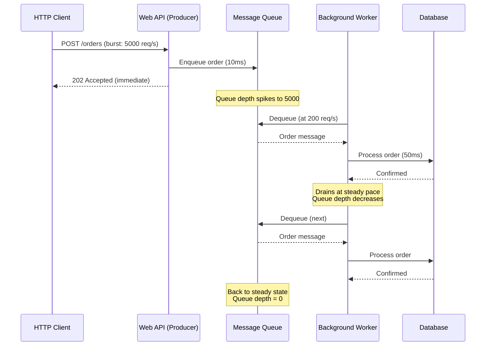
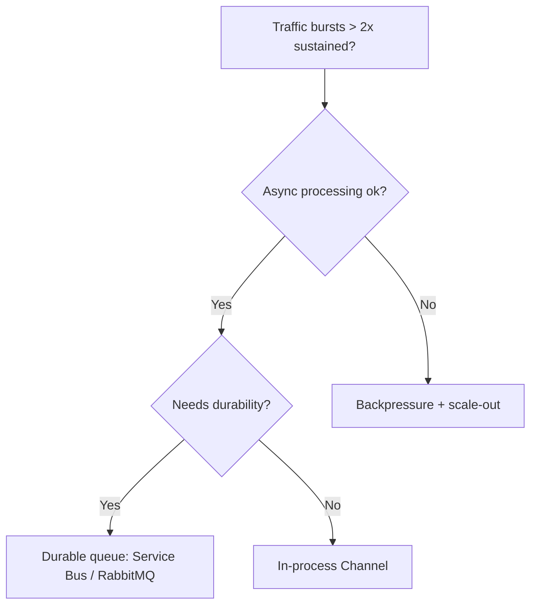

## Navigation

**Domain:** [[7 — System Design & Distributed Systems]] > **Group:** Scalability Patterns
**Previous:** [[7.238 — Backpressure — Detection and Handling]] | **Next:** [[7.240 — Competing Consumers — Scaling Workers]]

### Prerequisites

- [[7.238 — Backpressure — Detection and Handling]] — backpressure signals when a consumer is overwhelmed; queue-based load leveling is the structural solution that absorbs the bursts before backpressure is needed
- [[7.206 — Horizontal vs Vertical Scaling — Tradeoffs]] — load leveling via queues enables consumers to scale independently of producers, which is the primary scalability benefit of horizontal scaling
- [[7.240 — Competing Consumers — Scaling Workers]] — the competing consumers pattern is the receiving side of a load-leveling queue; multiple consumers read from the same queue to process work in parallel

### Where This Fits

Queue-based load leveling inserts a buffer — a message queue — between a producer and a consumer so that the producer can enqueue work at its own rate and the consumer can dequeue and process at its own rate. The queue absorbs traffic bursts, preventing the consumer from being overwhelmed during spikes and preventing the producer from being blocked during slowdowns. Without load leveling, every traffic spike either propagates directly to the consumer (causing overload), or must be rejected at the producer (causing data loss). A .NET engineer encounters load leveling when choosing between direct HTTP calls and message brokers for inter-service communication, configuring Azure Service Bus queues or RabbitMQ for background job processing, or designing an API that accepts work via HTTP 202 Accepted and processes it asynchronously. It becomes necessary above ~100 req/s when the consumer's processing time has higher variance than the producer's arrival rate, or when the consumer must be unavailable for maintenance without losing requests.

---

## Core Mental Model

Queue-based load leveling decouples the arrival rate of work from the processing rate of work by introducing a durable buffer between them. The invariant is that the producer never waits for the consumer — it writes to the queue at its own pace and immediately proceeds. The consumer reads from the queue at its own pace, constrained only by its processing capacity. What this trades is end-to-end latency: instead of synchronous processing (request → response in 200ms), the work sits in a queue for milliseconds to hours before processing, and the producer must poll or receive a callback for the result. The recognition trigger is the HTTP 202 Accepted pattern — "I've saved your request, I'll process it later" — or the need to survive a consumer deployment without losing in-flight requests.



### Key Properties / Guarantees

|Property|Value|Condition|
|---|---|---|
|Availability|Producer always succeeds (queue accepts)|When queue is not saturated (has capacity)|
|Durability|Message survives broker restart|Persistent queue, replicated storage|
|Latency|Adds queuing delay|Proportional to queue depth / consumption rate|
|Ordering|FIFO per partition/session|When configured|
|Throughput|Producer rate independent of consumer rate|Always|

---

## Deep Mechanics

### How It Works

1. **Producer enqueues work.** The producer creates a message describing the work and writes it to a queue. The write is typically a network call to a message broker (Azure Service Bus, RabbitMQ) or a local write to a persistent store (Azure Storage Queue). The producer either waits for acknowledgment (at-least-once) or fires and forgets (at-most-once).

2. **Broker stores the message.** The broker persists the message to disk and acknowledges the write. Replicated brokers replicate across nodes before acknowledging.

3. **Consumer dequeues and processes.** The consumer requests the next message. The broker locks it, delivers it, and waits for acknowledgment. On ack, the broker deletes the message. On failure, the broker redelivers or dead-letters.

4. **Leveling effect.** During bursts, queue depth increases. During lulls, consumers drain accumulated depth. The consumer never sees the burst — it processes at a steady rate.

5. **Scaling signal.** Queue depth drives auto-scaling. When depth exceeds a threshold, KEDA/HPA adds consumer instances. When depth is zero, it removes instances.

### Failure Modes

**Queue saturation.** Producer rate exceeds broker write capacity → broker throttles (429/503). This defeats load leveling by producing backpressure on the producer. Prevention: monitor write throughput vs broker SKU limits.

**Poison messages.** A message that always fails processing loops forever, consuming consumer capacity. Prevention: configure max delivery count + dead-letter queue.

**Unbounded queue growth.** Consumer down for extended period → queue grows without bound → broker storage exhausted → new messages rejected. Prevention: configure message TTL and max queue size.

**At-least-once duplicates.** Consumer crashes after processing but before ack → message redelivered. Without idempotency, this creates duplicates. Prevention: idempotent consumers with deduplication store.

### .NET and Azure Integration

- **Azure Service Bus:** `ServiceBusSender.SendMessageAsync` / `ServiceBusProcessor` with `MaxConcurrentCalls`. Sessions for FIFO. Duplicate detection.
- **Azure Storage Queue:** Simpler, cheaper, <2,000 msg/s. No ordering guarantee.
- **RabbitMQ:** `IBasicPublisher` / `IBasicConsumer`. `basicQoS` with prefetch count.
- **MassTransit:** Abstraction over all brokers. `IBus.Publish<T>` / `IConsumer<T>`. Redelivery + fault queues.
- **KEDA:** Scales consumer pods on queue depth. Azure Service Bus, RabbitMQ, Storage Queue.
- **Polly:** Wrap producer enqueue with retry. Wrap consumer with circuit breaker.

```csharp
// Producer — Service Bus
public async Task<AcceptedResult> SubmitOrderAsync(Order order, CancellationToken ct)
{
    var message = new ServiceBusMessage(BinaryData.FromObjectAsJson(order))
    {
        MessageId = order.Id.ToString(),
        PartitionKey = order.CustomerId.ToString(),
        TimeToLive = TimeSpan.FromHours(4)
    };
    await _sender.SendMessageAsync(message, ct);
    return new AcceptedResult($"/orders/{order.Id}/status", new { OrderId = order.Id });
}

// Consumer — BackgroundService
public class OrderProcessingWorker : BackgroundService
{
    protected override async Task ExecuteAsync(CancellationToken ct)
    {
        _processor.ProcessMessageAsync += async args =>
        {
            var order = args.Message.Body.ToObjectFromJson<Order>();
            await ProcessOrderAsync(order, args.CancellationToken);
            await args.CompleteMessageAsync(args.Message);
        };
        await _processor.StartProcessingAsync(ct);
        try { await Task.Delay(Timeout.Infinite, ct); } catch { }
        await _processor.StopProcessingAsync();
    }
}
```

---

## Production Patterns and Implementation

### Primary Implementation

A load-leveled order processing pipeline using Azure Service Bus with KEDA scaling.

```csharp
public sealed record QueueLoadLevelingOptions
{
    public string ConnectionString { get; init; }
    public string QueueName { get; init; } = "orders";
    public int MaxConcurrentCalls { get; init; } = 10;
    public int MaxDeliveryCount { get; init; } = 5;
    public TimeSpan MessageTimeToLive { get; init; } = TimeSpan.FromHours(4);
}

[ApiController]
[Route("api/orders")]
public sealed class OrderController : ControllerBase
{
    private readonly ServiceBusSender _sender;

    public OrderController(ServiceBusClient client)
        => _sender = client.CreateSender("orders");

    [HttpPost]
    public async Task<IActionResult> Submit(OrderRequest request, CancellationToken ct)
    {
        var orderId = Guid.NewGuid();
        var message = new ServiceBusMessage(
            BinaryData.FromObjectAsJson(new Order
            {
                Id = orderId, CustomerId = request.CustomerId,
                Items = request.Items, SubmittedAt = DateTimeOffset.UtcNow
            }))
        {
            MessageId = orderId.ToString(),
            PartitionKey = request.CustomerId.ToString(),
            TimeToLive = TimeSpan.FromHours(4)
        };
        await _sender.SendMessageAsync(message, ct);
        return Accepted($"/api/orders/{orderId}/status", new { OrderId = orderId, Status = "pending" });
    }
}

public sealed class OrderProcessingBackgroundService : BackgroundService
{
    private readonly ServiceBusProcessor _processor;
    private readonly IOrderProcessor _orderProcessor;
    private readonly ILogger<OrderProcessingBackgroundService> _logger;

    public OrderProcessingBackgroundService(
        ServiceBusClient client, IOrderProcessor orderProcessor,
        IOptions<QueueLoadLevelingOptions> options, ILogger<OrderProcessingBackgroundService> logger)
    {
        _orderProcessor = orderProcessor;
        _logger = logger;
        var opts = options.Value;
        _processor = client.CreateProcessor(opts.QueueName, new ServiceBusProcessorOptions
        {
            MaxConcurrentCalls = opts.MaxConcurrentCalls,
            AutoCompleteMessages = false,
            MaxAutoLockRenewalDuration = TimeSpan.FromMinutes(5),
            MaxDeliveryCount = opts.MaxDeliveryCount
        });
    }

    protected override async Task ExecuteAsync(CancellationToken ct)
    {
        _processor.ProcessMessageAsync += HandleMessageAsync;
        _processor.ProcessErrorAsync += args => { _logger.LogError(args.Exception, "Error"); return Task.CompletedTask; };
        await _processor.StartProcessingAsync(ct);
        try { await Task.Delay(Timeout.Infinite, ct); } catch { }
        await _processor.StopProcessingAsync();
    }

    private async Task HandleMessageAsync(ProcessMessageEventArgs args)
    {
        var order = args.Message.Body.ToObjectFromJson<Order>();
        await _orderProcessor.ProcessAsync(order, args.CancellationToken);
        await args.CompleteMessageAsync(args.Message);
    }
}
```

### Configuration and Wiring

```csharp
builder.Services.Configure<QueueLoadLevelingOptions>(builder.Configuration.GetSection("QueueLoadLeveling"));
builder.Services.AddSingleton(sp => new ServiceBusClient(
    sp.GetRequiredService<IOptions<QueueLoadLevelingOptions>>().Value.ConnectionString));
builder.Services.AddScoped<IOrderProcessor, OrderProcessor>();
builder.Services.AddHostedService<OrderProcessingBackgroundService>();
```

### Common Variants

**Azure Storage Queue (low-throughput, simple):**

```csharp
var queueClient = new QueueClient(connectionString, "orders");
await queueClient.SendMessageAsync(BinaryData.FromObjectAsJson(order));
var msg = await queueClient.ReceiveMessageAsync();
await queueClient.DeleteMessageAsync(msg.Value.MessageId, msg.Value.PopReceipt);
```

**In-memory Channel<T> (no durability):**

```csharp
var channel = Channel.CreateBounded<Order>(new BoundedChannelOptions(1000));
await channel.Writer.WriteAsync(order);
await foreach (var item in channel.Reader.ReadAllAsync(ct)) { await ProcessAsync(item); }
```

**MassTransit (transport-agnostic):**

```csharp
builder.Services.AddMassTransit(x =>
{
    x.AddConsumer<OrderSubmittedConsumer>();
    x.UsingRabbitMq((context, cfg) =>
    {
        cfg.ReceiveEndpoint("orders", e =>
        {
            e.PrefetchCount = 20;
            e.ConcurrentMessageLimit = 20;
            e.UseMessageRetry(r => r.Exponential(3, TimeSpan.FromSeconds(1), TimeSpan.FromSeconds(30), TimeSpan.FromSeconds(5)));
            e.ConfigureConsumer<OrderSubmittedConsumer>(context);
        });
    });
});
```

---

## Gotchas and Production Pitfalls

### Unbounded Queue Growth During Consumer Outage

**Pitfall:** Consumer goes down, producer keeps enqueuing. Queue grows to millions.

**Fix:** Configure message TTL (`TimeToLive = TimeSpan.FromHours(4)`). Monitor queue depth.

### Incorrect MaxConcurrentCalls vs Lock Duration

**Pitfall:** `MaxConcurrentCalls` × processing time > lock duration → lock expires → redelivery → duplicates.

**Fix:** `MaxAutoLockRenewalDuration = processing_P99 × 2`.

### At-Least-Once Without Idempotent Consumers

**Pitfall:** Consumer processes, ack fails → redelivery → duplicate.

**Fix:** Deduplicate by `MessageId` using Redis/DB.

### Poison Messages Retrying Forever

**Pitfall:** Malformed message retries infinitely, consuming capacity.

**Fix:** Max delivery count → dead-letter queue.

### Queue Depth Alert Thresholds Too High

**Pitfall:** Alert at 100k → backlog = 500s at 200 msg/s → SLA breached before alert.

**Fix:** Alert at `processing_rate × acceptable_backlog_seconds`.

### Not Configuring Per-Instance Concurrency

**Pitfall:** `MaxConcurrentCalls = 100` with 10 replicas = 1,000 in-flight. Retry storm scales with replicas.

**Fix:** Conservative per-instance concurrency, scale via replicas.

---

## Tradeoffs and Decision Framework

### Tradeoff Matrix

| Dimension | Queue-Based Load Leveling | Direct HTTP | In-Process Channel |
|---|---|---|---|
| Decoupling | Full | None | Partial |
| Durability | Survives restarts | Lost on restart | Lost on restart |
| Latency | Adds queuing delay | Lowest | Sub-ms |
| Operational complexity | High | Low | Low |
| Throughput | Broker-limited | Network-limited | CPU/memory-limited |

### When to Apply



### When NOT to Apply

- Client needs synchronous response
- <50 req/s with predictable load
- At-most-once acceptable
- Strict global ordering required
- Team lacks operational capacity for a broker

### Scale Thresholds

- Worth considering >100 req/s with burst factor >2x
- Required when consumer must survive maintenance without data loss
- Service Bus Premium: up to 10,000 msg/s per MU
- RabbitMQ: up to 50,000 msg/s node

---

## Interview Arsenal

### Question Bank

1. What is queue-based load leveling?
2. How does queue depth affect latency?
3. What happens on consumer crash mid-processing?
4. Compare with backpressure.
5. How to size MaxConcurrentCalls?
6. Design: 10k enqueue/s, 200 process/s.
7. Interaction with competing consumers?
8. How to handle poison messages?

### System Design Interview Trigger

When asked "how do you handle a traffic spike" or "what if the database is down" in a processing pipeline design, the interviewer is probing queue-based load leveling. Senior answer uses concrete numbers: "queue sized for 10 minutes of peak at 1k req/s = 600k messages, ~1.2 GB in Service Bus Premium."

---

## Architecture Decision Record

**Status:** Accepted

**Context:** Notification service at 2,000 req/s, SendGrid accepts 200 req/s. Emails must not be lost.

**Options:** 1) Azure Service Bus Queue; 2) In-memory Channel<T>; 3) Direct HTTP with retry.

**Decision:** Azure Service Bus Queue. Durability requirement eliminates Channel<T>. SendGrid 200 req/s limit makes direct HTTP impractical.

**Consequences:** ✅ Zero data loss; ✅ SendGrid at 200 req/s always; ✅ KEDA scaling; ⚠️ Operational cost; ⚠️ Monitor depth/DLQ; ❌ E2E latency increases.

**Review Trigger:** Peak throughput > 10,000 enqueue/s or E2E P99 > 5 min.

---

## Self-Check

### Conceptual Questions

1. Define queue-based load leveling.
2. Latency = f(queue_depth, consumption_rate)?
3. Backpressure vs queue-based load leveling?
4. What metric drives auto-scaling?
5. What is MaxConcurrentCalls?
6. After 10 delivery failures, what happens?
7. Service Bus Queue vs Storage Queue?
8. How to achieve FIFO ordering?
9. Prefetch count vs lock duration tradeoff?
10. Interaction with outbox pattern?

<details>
<summary>Answers</summary>

1. Durable buffer decoupling production rate from consumption rate.
2. `E2E_latency ≈ queue_depth / consumption_rate + processing_time`.
3. Backpressure rejects work (data loss possible). Queue buffers work (latency added). Complementary.
4. Queue depth. KEDA scales on depth threshold.
5. Messages processed concurrently per consumer instance.
6. Moved to dead-letter queue (DLQ).
7. Service Bus: 10k msg/s, FIFO sessions, 80 GB. Storage Queue: <2k msg/s, no ordering, 500 TB, cheaper.
8. Service Bus sessions with PartitionKey. RabbitMQ single-active-consumer.
9. Higher prefetch = higher throughput, longer lock needed. Rule: prefetch × P99_proc < lock_duration / 2.
10. Producer writes to outbox table in same transaction as business operation. Background publisher enqueues from outbox. Guarantees exactly-once production.
</details>
