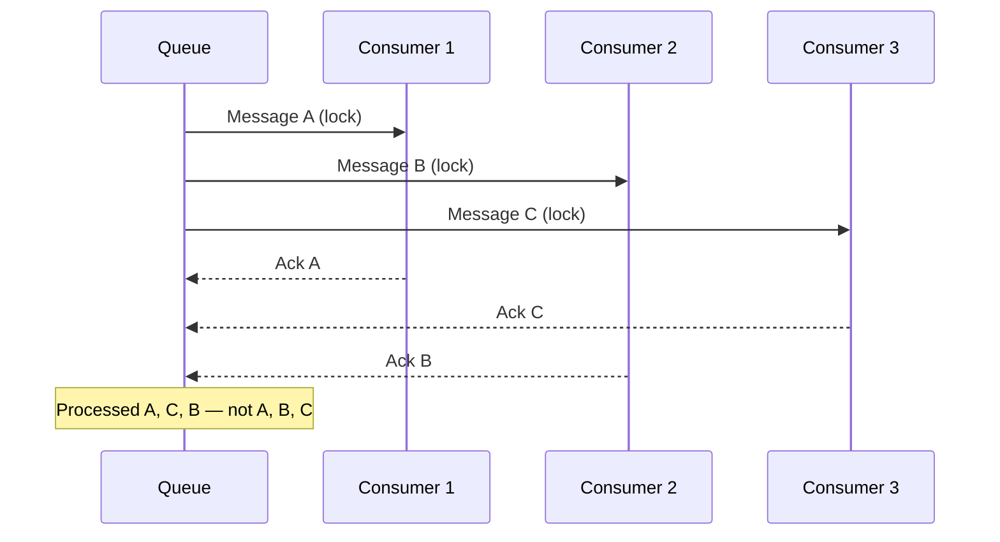

## Navigation

**Domain:** [[7 — System Design & Distributed Systems]] > **Group:** Scalability Patterns
**Previous:** [[7.239 — Queue-Based Load Leveling]] | **Next:** [[7.241 — Rate Limiting — Token Bucket Algorithm]]

Competing consumers scale message processing horizontally: multiple instances read from the same queue, each processing at its own pace. Throughput scales linearly with consumer count until the queue or downstream becomes the bottleneck. Necessary above ~10 msg/s per consumer or when processing time exceeds 100ms.

---

## Core Mental Model

The broker ensures each message goes to exactly one consumer via locking. Throughput = `consumer_count × concurrent_calls_per_consumer × (1 / processing_time)`. The tradeoff: global FIFO is lost. The recognition trigger: a queue that is always deep despite one consumer at 100% CPU.



---

## Deep Mechanics

### How It Works

1. Broker holds queue. Each message is Active, Locked, or DeadLettered.
2. Consumer calls Receive → broker selects Active message → transitions to Locked → delivers.
3. On ack → broker deletes. On lock expiry → returns to Active.
4. With N consumers, broker distributes round-robin/random. Self-balancing: fast consumers get more work.
5. Queue depth drives KEDA auto-scaling.

### Failure Modes

**Consumer crash mid-processing.** Lock expires → message redelivered. Mitigation: match lock duration to P99 processing time.

**Stampeding herd on restart.** All consumers reconnect simultaneously → throughput dip. Mitigation: rolling updates (`maxSurge: 1`).

**Thundering herd on downstream.** N consumers × concurrent_calls overwhelm downstream. Mitigation: per-instance `ConcurrencyLimiter` + circuit breaker.

**Rebalancing overhead (Kafka).** Adding/removing consumers pauses all consumption. Mitigation: cooperative rebalancing + static group membership.

```csharp
// Per-instance downstream protection
builder.Services.AddHttpClient("ShippingApi", client => { ... })
    .AddResilienceHandler("Throttle", builder =>
    {
        builder.AddConcurrencyLimiter(5);
        builder.AddCircuitBreaker(new CircuitBreakerStrategyOptions
        {
            SamplingDuration = TimeSpan.FromSeconds(30),
            FailureRatio = 0.5, MinimumThroughput = 20
        });
    });
```

### .NET and Azure Integration

- **Service Bus:** `ServiceBusProcessor` with `MaxConcurrentCalls`. Sessions for per-partition FIFO.
- **RabbitMQ:** `basicQoS(prefetchCount: N)`, multiple consumers on same queue.
- **Kafka:** Consumer groups, partition assignment. Parallelism = partition count.
- **KEDA:** Scales consumer deployments on queue depth / consumer lag.
- **MassTransit:** `ConcurrentMessageLimit` + `PrefetchCount` per receive endpoint.

---

## Production Patterns

### Primary: Service Bus competing consumer

```csharp
public sealed class CompetingOrderConsumer : BackgroundService
{
    private readonly ServiceBusProcessor _processor;
    private readonly IOrderHandler _handler;
    private readonly ConcurrentDictionary<string, Order> _inFlight;

    public CompetingOrderConsumer(ServiceBusClient client, IOrderHandler handler,
        IOptions<CompetingConsumerOptions> options, ILogger<CompetingOrderConsumer> logger)
    {
        _handler = handler;
        _inFlight = new();
        var opts = options.Value;
        _processor = client.CreateProcessor("orders", new ServiceBusProcessorOptions
        {
            MaxConcurrentCalls = opts.MaxConcurrentCalls,
            AutoCompleteMessages = false,
            MaxAutoLockRenewalDuration = opts.AutoLockRenewal,
            MaxDeliveryCount = opts.MaxDeliveryCount
        });
    }

    protected override async Task ExecuteAsync(CancellationToken ct)
    {
        _processor.ProcessMessageAsync += OnMessageAsync;
        _processor.ProcessErrorAsync += (args) =>
        {
            _logger.LogError(args.Exception, "Error: {Source}", args.ErrorSource);
            return Task.CompletedTask;
        };

        await _processor.StartProcessingAsync(ct);
        try { await Task.Delay(Timeout.Infinite, ct); } catch { }
        await _processor.StopProcessingAsync();
    }

    private async Task OnMessageAsync(ProcessMessageEventArgs args)
    {
        var order = args.Message.Body.ToObjectFromJson<Order>();
        _inFlight.TryAdd(args.Message.MessageId, order);
        try
        {
            await _handler.HandleAsync(order, args.CancellationToken);
            await args.CompleteMessageAsync(args.Message);
        }
        catch
        {
            await args.AbandonMessageAsync(args.Message);
        }
        finally { _inFlight.TryRemove(args.Message.MessageId, out _); }
    }
}
```

### KEDA ScaledObject

```yaml
apiVersion: keda.sh/v1alpha1
kind: ScaledObject
metadata:
  name: order-processor
spec:
  scaleTargetRef:
    name: order-processor
  minReplicaCount: 2
  maxReplicaCount: 20
  triggers:
    - type: azure-servicebus
      metadata:
        queueName: orders
        queueLength: "50"
```

---

## Gotchas

- **Global FIFO lost.** Use sessions for per-partition ordering. `SessionId = customerId`.
- **Downstream overwhelmed.** Add `ConcurrencyLimiter(N)` per instance. Circuit breaker.
- **Lock too short.** `MaxAutoLockRenewalDuration = P99_proc × 2`.
- **Poison blocks session.** Dead-letter after max delivery count.
- **Kafka rebalance storm.** Cooperative rebalancing + static `GroupInstanceId`.
- **Scale-down kills in-flight.** PreStop hook + KEDA `cooldownPeriod`.
- **More Kafka consumers than partitions = idle.** Pre-partition to max expected.

---

## Tradeoffs

| Dimension | Service Bus | Kafka | Single Consumer |
|---|---|---|---|
| Throughput scaling | Linear (no partitions) | Linear to partition count | Capped |
| Ordering | Per-session FIFO | Per-partition FIFO | Global FIFO |
| Rebalance impact | None | High | N/A |
| Max parallelism | Unlimited | Partition count | 1 |

---

## Architecture Decision Record

**Context:** 200 payments/s, 200ms processing each. Single consumer = 5/s (40x too slow). Payment gateway supports 100 concurrent connections.

**Decision:** Service Bus competing consumers. 5 instances × `MaxConcurrentCalls = 10` = 50 concurrent (within gateway limit). Per-instance `ConcurrencyLimiter(5)`.

**Consequences:** ✅ 200 payments/s achieved; ✅ Gateway at 100 concurrent max; ✅ Self-balancing; ⚠️ Per-customer ordering via sessions; ❌ 5+ instances to manage.

---

## Self-Check

1. Throughput = `consumers × concurrent_calls × (1/proc_time)`.
2. Broker locks message → delivers → consumer acks → broker deletes.
3. Lock expires on crash → redelivery. Delay = lock duration.
4. Protect downstream with `ConcurrencyLimiter` per instance + circuit breaker.
5. Kafka max parallelism = partition count.
6. KEDA scales on queue depth > threshold.
7. Higher `MaxConcurrentCalls` needs longer lock renewal. Scale via instances.
8. Poison in session: dead-letter after max delivery → session unblocks.
